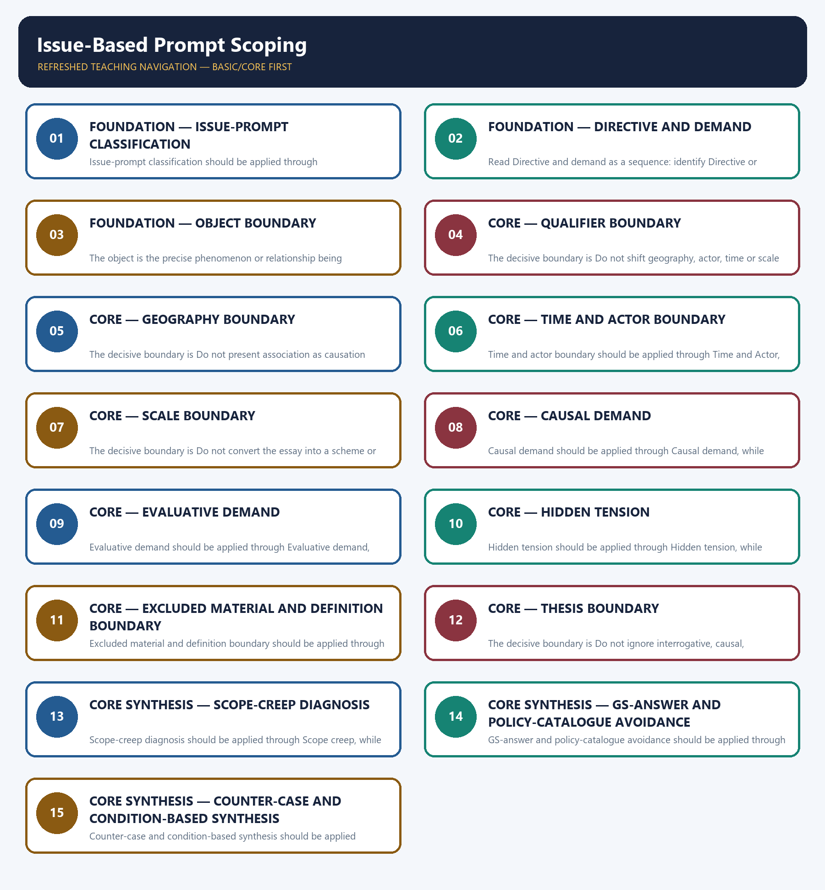

# Issue-Based Prompt Scoping — Learner-v2 Complete Learning Session

> **Authoring-only generation:** 2026-09-04. No PDF was rendered and no tracker or index was mutated.

### SOURCE, PROGRESSION AND OFFICIAL-RULE AUDIT

- **Generation date:** 2026-09-04.
- **Source order:** canonical Basic owner first; Advanced owner second; Essay master framework, README, official-syllabus map, answer-worthiness audit and revision chart next; PYQ corpus and official OCR papers after that; live official UPSC pages only as a final check.
- **Basic/Advanced boundary:** complete Basic teaching remains first and Advanced material remains optional and last.
- **OCR boundary:** Repository Markdown was primary. OCR-searchable official UPSC Essay papers were supplementary only for printed instructions and V1 prompt wording. No author, official model answer, current marks split, phase allocation, paragraph count or scoring rubric was inferred.
- **Qdrant:** not used; repository Markdown and local official papers were sufficient.
- **PYQ integrity:** The cards preserve exact V1 issue or issue-adjacent prompts from 2018, 2019 and 2024. The solutions demonstrate scope control and do not claim official model essays.
- **Live-source boundary:** The 2026-09-04 official-site attempts supplied no new content. Prompt wording and metadata remain bounded by local V1 papers and the audited Essay corpus; issue analysis is explicitly repository-authored method.
- **No-formula rule:** strategy, heuristics and practice weights are never presented as official UPSC instructions or marking criteria.

### LIVE OFFICIAL-SOURCE ATTEMPT LOG

The checks below were made on 2026-09-04. Substantive official text is used only for the proposition it supports; title-only, blocked or thin pages are recorded and supply no factual claim.

- https://upsc.gov.in/examinations/previous-question-papers — attempted 2026-09-04; the official index was access-blocked, so the module uses only locally audited V1 wording for issue-prompt cards.
- https://upsc.gov.in/examinations/active-examinations — attempted 2026-09-04; the official page was access-blocked and supplied no current issue-prompt taxonomy or model-answer claim.
- https://upsc.gov.in/sites/default/files/Notif-CSP-2024-Engl-140224.pdf — searched 2026-09-04; the official notification route was logged only for scheme provenance, not for coaching-style scoping rules.

## BASIC LEARNING SESSION



*Distinct embedded teaching-navigation image. The separate continuous Cārvāka-style flowchart package remains an independent at-a-glance artifact.*

### SESSION 1 — FOUNDATION — ISSUE-PROMPT CLASSIFICATION

#### DEFINITION / WHAT THIS IS CALLED

**Plain-language definition:** Objective practice: Apply Issue-prompt classification by distinguishing the correct Essay-method move from nearby but invalid shortcuts; no factual-trivia recall is being tested.

**Technical definition:** Issue-prompt classification should be applied through Issue-statement prompt and Classification gate, while preserving the difference between official paper instruction and strategy, prompt wording and interpretation, example and evidence, breadth and coherence.

#### ANSWER-GRABBING OPENING — WRITE/ADAPT IN THE EXAM

> Plain-language definition: Issue-prompt classification explains how Issue-statement prompt and Classification gate combine into one usable Essay-planning move.

#### MUST-WRITE KEYWORDS

- **FOUNDATION**
- **Issue-prompt classification**
- **Plain-language definition**
- **Technical definition**
- **Issue-prompt**
- **Issue-statement**

**How to use them:** Frame the answer through FOUNDATION; define Issue-prompt classification, connect Plain-language definition with Technical definition to explain the mechanism, and use Issue-prompt for the decisive comparison or qualification.

#### METHOD MOVE / WHAT THIS DOES

**Plain-language definition:** Issue-prompt classification explains how Issue-statement prompt and Classification gate combine into one usable Essay-planning move.

**Technical definition:** The learner fixes the printed prompt, its relationship or demand, the defensible scope, the argument function and the evidence boundary before drafting prose.

#### ANSWER-GRABBING OPENING — WRITE/ADAPT IN THE EXAM

> Issue-prompt classification should be applied through Issue-statement prompt and Classification gate, while preserving the difference between official paper instruction and strategy, prompt wording and interpretation, example and evidence, breadth and coherence.

#### MUST-WRITE KEYWORDS

- **Issue-prompt**
- **classification**
- **Issue-statement**
- **prompt**
- **gate**
- **issue**

**How to use them:** Define the first three terms, trace the relationship with the next two, and attach the final term to the exact claim, example and qualification. Qualification: Do not scope a metaphor-heavy hybrid as a literal issue statement before decoding it.

#### VISUAL FIRST

```text
ISSUE-PROMPT CLASSIFICATION
01. Issue-statement prompt
    |
    v
02. Classification gate
STATUS / CATEGORY FIREWALL -> Do not scope a metaphor-heavy hybrid as a literal issue statement before decoding it.
```

*The rail fixes the prompt-to-argument sequence and claim boundary before explanation.*

#### CORE EXPLANATION

An issue prompt names a real phenomenon and makes a causal, comparative, interrogative or evaluative claim that can be contested without first decoding a dominant metaphor. A prompt is scoped as an issue when it names a concrete phenomenon, asserts something about it and already yields a literal contestable proposition.

#### SIMPLE SYSTEM EXAMPLE

Read Issue-prompt classification as a sequence: identify Issue-statement prompt, follow the method through the printed proposition, and stop before adding a rule, attribution, fact or inference the audited sources do not support.

#### TECHNICAL DISTINCTION

The decisive boundary is Do not scope a metaphor-heavy hybrid as a literal issue statement before decoding it. This keeps Issue-statement prompt and Classification gate in the correct prompt, method, argument and evidence category.

#### NAMED EVIDENCE AND MECHANISM

- An issue prompt names a real phenomenon and makes a causal, comparative, interrogative or evaluative claim that can be contested without first decoding a dominant metaphor.
- A prompt is scoped as an issue when it names a concrete phenomenon, asserts something about it and already yields a literal contestable proposition.

#### EXAMINER CAUTION

- Do not scope a metaphor-heavy hybrid as a literal issue statement before decoding it.

#### EXAM LINK

- **Objective practice:** Apply Issue-prompt classification by distinguishing the correct Essay-method move from nearby but invalid shortcuts; no factual-trivia recall is being tested.
- **Essay application:** Classify before deciding whether to decode or scope first.

#### MINI RECAP

- **Mechanism chain:** Issue-statement prompt -> Classification gate
- **Qualified use:** Classify before deciding whether to decode or scope first.

#### CLOSING RECALL FLOW — FOUNDATION — ISSUE-PROMPT CLASSIFICATION

```text
START / CONCEPT: FOUNDATION — Issue-prompt classification
        |
        v
EXACT TERMS: FOUNDATION · Issue-prompt classification · Plain-language definition · Technical definition · Issue-prompt · Issue-statement
        |
        v
MECHANISM / ARGUMENT: Issue-prompt classification should be applied through Issue-statement prompt and Classification gate, while preserving the difference between official paper instruction and strategy, prompt wording and interpretation, example and evidence, breadth and coherence.
        |
        v
CONSEQUENCE / CONTRAST: Read Issue-prompt classification as a sequence: identify Issue-statement prompt, follow the method through the printed proposition, and stop before adding a rule, attribution, fact or inference the audited sources do not support.
        |
        v
UPSC TRAP / ANSWER-USE: Objective practice: Apply Issue-prompt classification by distinguishing the correct Essay-method move from nearby but invalid shortcuts; no factual-trivia recall is being tested.
        |
        v
ANSWER-GRABBING FORMULATION: Plain-language definition: Issue-prompt classification explains how Issue-statement prompt and Classification gate combine into one usable Essay-planning move.
```
### SESSION 2 — FOUNDATION — DIRECTIVE AND DEMAND

#### DEFINITION / WHAT THIS IS CALLED

**Plain-language definition:** Objective practice: Apply Directive and demand by distinguishing the correct Essay-method move from nearby but invalid shortcuts; no factual-trivia recall is being tested.

**Technical definition:** Read Directive and demand as a sequence: identify Directive or demand, follow the method through the printed proposition, and stop before adding a rule, attribution, fact or inference the audited sources do not support.

#### ANSWER-GRABBING OPENING — WRITE/ADAPT IN THE EXAM

> Plain-language definition: Directive and demand explains how Directive or demand combine into one usable Essay-planning move.

#### MUST-WRITE KEYWORDS

- **FOUNDATION**
- **Directive**
- **demand**
- **Plain-language definition**
- **Technical definition**
- **Identify**

**How to use them:** Frame the answer through FOUNDATION; define Directive, connect demand with Plain-language definition to explain the mechanism, and use Technical definition for the decisive comparison or qualification.

#### METHOD MOVE / WHAT THIS DOES

**Plain-language definition:** Directive and demand explains how Directive or demand combine into one usable Essay-planning move.

**Technical definition:** The learner fixes the printed prompt, its relationship or demand, the defensible scope, the argument function and the evidence boundary before drafting prose.

#### ANSWER-GRABBING OPENING — WRITE/ADAPT IN THE EXAM

> Directive and demand should be applied through Directive or demand, while preserving the difference between official paper instruction and strategy, prompt wording and interpretation, example and evidence, breadth and coherence.

#### MUST-WRITE KEYWORDS

- **Directive**
- **demand**
- **Identify**
- **whether**
- **wording**
- **asks**

**How to use them:** Define the first three terms, trace the relationship with the next two, and attach the final term to the exact claim, example and qualification. Qualification: Do not ignore interrogative, causal, comparative or evaluative wording.

#### VISUAL FIRST

```text
DIRECTIVE AND DEMAND
01. Directive or demand
STATUS / CATEGORY FIREWALL -> Do not ignore interrogative, causal, comparative or evaluative wording.
```

*The rail fixes the prompt-to-argument sequence and claim boundary before explanation.*

#### CORE EXPLANATION

Identify whether the wording asks a question, presents alternatives, asserts causation or makes a value judgment; that demand governs the essay's argumentative burden.

#### SIMPLE SYSTEM EXAMPLE

Read Directive and demand as a sequence: identify Directive or demand, follow the method through the printed proposition, and stop before adding a rule, attribution, fact or inference the audited sources do not support.

#### TECHNICAL DISTINCTION

The decisive boundary is Do not ignore interrogative, causal, comparative or evaluative wording. This keeps Directive or demand in the correct prompt, method, argument and evidence category.

#### NAMED EVIDENCE AND MECHANISM

- Identify whether the wording asks a question, presents alternatives, asserts causation or makes a value judgment; that demand governs the essay's argumentative burden.

#### EXAMINER CAUTION

- Do not ignore interrogative, causal, comparative or evaluative wording.

#### EXAM LINK

- **Objective practice:** Apply Directive and demand by distinguishing the correct Essay-method move from nearby but invalid shortcuts; no factual-trivia recall is being tested.
- **Essay application:** Turn the wording into the exact burden the essay must discharge.

#### MINI RECAP

- **Mechanism chain:** Directive or demand
- **Qualified use:** Turn the wording into the exact burden the essay must discharge.

#### CLOSING RECALL FLOW — FOUNDATION — DIRECTIVE AND DEMAND

```text
START / CONCEPT: FOUNDATION — Directive and demand
        |
        v
EXACT TERMS: FOUNDATION · Directive · demand · Plain-language definition · Technical definition · Identify
        |
        v
MECHANISM / ARGUMENT: Read Directive and demand as a sequence: identify Directive or demand, follow the method through the printed proposition, and stop before adding a rule, attribution, fact or inference the audited sources do not support.
        |
        v
CONSEQUENCE / CONTRAST: Directive and demand should be applied through Directive or demand, while preserving the difference between official paper instruction and strategy, prompt wording and interpretation, example and evidence, breadth and coherence.
        |
        v
UPSC TRAP / ANSWER-USE: Objective practice: Apply Directive and demand by distinguishing the correct Essay-method move from nearby but invalid shortcuts; no factual-trivia recall is being tested.
        |
        v
ANSWER-GRABBING FORMULATION: Plain-language definition: Directive and demand explains how Directive or demand combine into one usable Essay-planning move.
```
### SESSION 3 — FOUNDATION — OBJECT BOUNDARY

#### DEFINITION / WHAT THIS IS CALLED

**Plain-language definition:** Objective practice: Apply Object boundary by distinguishing the correct Essay-method move from nearby but invalid shortcuts; no factual-trivia recall is being tested.

**Technical definition:** The object is the precise phenomenon or relationship being examined, not the entire GS subject area surrounding it.

#### ANSWER-GRABBING OPENING — WRITE/ADAPT IN THE EXAM

> Plain-language definition: Object boundary explains how Object combine into one usable Essay-planning move.

#### MUST-WRITE KEYWORDS

- **FOUNDATION**
- **Object boundary**
- **Plain-language definition**
- **Technical definition**
- **Object**
- **boundary**

**How to use them:** Frame the answer through FOUNDATION; define Object boundary, connect Plain-language definition with Technical definition to explain the mechanism, and use Object for the decisive comparison or qualification.

#### METHOD MOVE / WHAT THIS DOES

**Plain-language definition:** Object boundary explains how Object combine into one usable Essay-planning move.

**Technical definition:** The learner fixes the printed prompt, its relationship or demand, the defensible scope, the argument function and the evidence boundary before drafting prose.

#### ANSWER-GRABBING OPENING — WRITE/ADAPT IN THE EXAM

> Object boundary should be applied through Object, while preserving the difference between official paper instruction and strategy, prompt wording and interpretation, example and evidence, breadth and coherence.

#### MUST-WRITE KEYWORDS

- **Object**
- **boundary**
- **precise**
- **phenomenon**
- **relationship**
- **being**

**How to use them:** Define the first three terms, trace the relationship with the next two, and attach the final term to the exact claim, example and qualification. Qualification: Do not drop qualifiers such as India, youth, majority or long run.

#### VISUAL FIRST

```text
OBJECT BOUNDARY
01. Object
STATUS / CATEGORY FIREWALL -> Do not drop qualifiers such as India, youth, majority or long run.
```

*The rail fixes the prompt-to-argument sequence and claim boundary before explanation.*

#### CORE EXPLANATION

The object is the precise phenomenon or relationship being examined, not the entire GS subject area surrounding it.

#### SIMPLE SYSTEM EXAMPLE

Read Object boundary as a sequence: identify Object, follow the method through the printed proposition, and stop before adding a rule, attribution, fact or inference the audited sources do not support.

#### TECHNICAL DISTINCTION

The decisive boundary is Do not drop qualifiers such as India, youth, majority or long run. This keeps Object in the correct prompt, method, argument and evidence category.

#### NAMED EVIDENCE AND MECHANISM

- The object is the precise phenomenon or relationship being examined, not the entire GS subject area surrounding it.

#### EXAMINER CAUTION

- Do not drop qualifiers such as India, youth, majority or long run.

#### EXAM LINK

- **Objective practice:** Apply Object boundary by distinguishing the correct Essay-method move from nearby but invalid shortcuts; no factual-trivia recall is being tested.
- **Essay application:** Carry the object and every important qualifier into the thesis.

#### MINI RECAP

- **Mechanism chain:** Object
- **Qualified use:** Carry the object and every important qualifier into the thesis.

#### CLOSING RECALL FLOW — FOUNDATION — OBJECT BOUNDARY

```text
START / CONCEPT: FOUNDATION — Object boundary
        |
        v
EXACT TERMS: FOUNDATION · Object boundary · Plain-language definition · Technical definition · Object · boundary
        |
        v
MECHANISM / ARGUMENT: Object boundary should be applied through Object, while preserving the difference between official paper instruction and strategy, prompt wording and interpretation, example and evidence, breadth and coherence.
        |
        v
CONSEQUENCE / CONTRAST: Read Object boundary as a sequence: identify Object, follow the method through the printed proposition, and stop before adding a rule, attribution, fact or inference the audited sources do not support.
        |
        v
UPSC TRAP / ANSWER-USE: Objective practice: Apply Object boundary by distinguishing the correct Essay-method move from nearby but invalid shortcuts; no factual-trivia recall is being tested.
        |
        v
ANSWER-GRABBING FORMULATION: Plain-language definition: Object boundary explains how Object combine into one usable Essay-planning move.
```
### SESSION 4 — CORE — QUALIFIER BOUNDARY

#### DEFINITION / WHAT THIS IS CALLED

**Plain-language definition:** Objective practice: Apply Qualifier boundary by distinguishing the correct Essay-method move from nearby but invalid shortcuts; no factual-trivia recall is being tested.

**Technical definition:** The decisive boundary is Do not shift geography, actor, time or scale without explaining the move.

#### ANSWER-GRABBING OPENING — WRITE/ADAPT IN THE EXAM

> Plain-language definition: Qualifier boundary explains how Qualifier combine into one usable Essay-planning move.

#### MUST-WRITE KEYWORDS

- **Qualifier boundary**
- **Plain-language definition**
- **Technical definition**
- **Qualifier**
- **boundary**
- **Words**

**How to use them:** Frame the answer through Qualifier boundary; define Plain-language definition, connect Technical definition with Qualifier to explain the mechanism, and use boundary for the decisive comparison or qualification.

#### METHOD MOVE / WHAT THIS DOES

**Plain-language definition:** Qualifier boundary explains how Qualifier combine into one usable Essay-planning move.

**Technical definition:** The learner fixes the printed prompt, its relationship or demand, the defensible scope, the argument function and the evidence boundary before drafting prose.

#### ANSWER-GRABBING OPENING — WRITE/ADAPT IN THE EXAM

> Qualifier boundary should be applied through Qualifier, while preserving the difference between official paper instruction and strategy, prompt wording and interpretation, example and evidence, breadth and coherence.

#### MUST-WRITE KEYWORDS

- **Qualifier**
- **boundary**
- **Words**
- **such**
- **majority**
- **youth**

**How to use them:** Define the first three terms, trace the relationship with the next two, and attach the final term to the exact claim, example and qualification. Qualification: Do not shift geography, actor, time or scale without explaining the move.

#### VISUAL FIRST

```text
QUALIFIER BOUNDARY
01. Qualifier
STATUS / CATEGORY FIREWALL -> Do not shift geography, actor, time or scale without explaining the move.
```

*The rail fixes the prompt-to-argument sequence and claim boundary before explanation.*

#### CORE EXPLANATION

Words such as Indian, majority, youth, real, complex, alternative or better narrow the claim and must survive in the thesis.

#### SIMPLE SYSTEM EXAMPLE

Read Qualifier boundary as a sequence: identify Qualifier, follow the method through the printed proposition, and stop before adding a rule, attribution, fact or inference the audited sources do not support.

#### TECHNICAL DISTINCTION

The decisive boundary is Do not shift geography, actor, time or scale without explaining the move. This keeps Qualifier in the correct prompt, method, argument and evidence category.

#### NAMED EVIDENCE AND MECHANISM

- Words such as Indian, majority, youth, real, complex, alternative or better narrow the claim and must survive in the thesis.

#### EXAMINER CAUTION

- Do not shift geography, actor, time or scale without explaining the move.

#### EXAM LINK

- **Objective practice:** Apply Qualifier boundary by distinguishing the correct Essay-method move from nearby but invalid shortcuts; no factual-trivia recall is being tested.
- **Essay application:** Fix where and when the claim applies.

#### MINI RECAP

- **Mechanism chain:** Qualifier
- **Qualified use:** Fix where and when the claim applies.

#### CLOSING RECALL FLOW — CORE — QUALIFIER BOUNDARY

```text
START / CONCEPT: CORE — Qualifier boundary
        |
        v
EXACT TERMS: Qualifier boundary · Plain-language definition · Technical definition · Qualifier · boundary · Words
        |
        v
MECHANISM / ARGUMENT: Qualifier boundary should be applied through Qualifier, while preserving the difference between official paper instruction and strategy, prompt wording and interpretation, example and evidence, breadth and coherence.
        |
        v
CONSEQUENCE / CONTRAST: Read Qualifier boundary as a sequence: identify Qualifier, follow the method through the printed proposition, and stop before adding a rule, attribution, fact or inference the audited sources do not support.
        |
        v
UPSC TRAP / ANSWER-USE: Objective practice: Apply Qualifier boundary by distinguishing the correct Essay-method move from nearby but invalid shortcuts; no factual-trivia recall is being tested.
        |
        v
ANSWER-GRABBING FORMULATION: Plain-language definition: Qualifier boundary explains how Qualifier combine into one usable Essay-planning move.
```
### SESSION 5 — CORE — GEOGRAPHY BOUNDARY

#### DEFINITION / WHAT THIS IS CALLED

**Plain-language definition:** Objective practice: Apply Geography boundary by distinguishing the correct Essay-method move from nearby but invalid shortcuts; no factual-trivia recall is being tested.

**Technical definition:** The decisive boundary is Do not present association as causation without a mechanism and mediator.

#### ANSWER-GRABBING OPENING — WRITE/ADAPT IN THE EXAM

> Plain-language definition: Geography boundary explains how Geography combine into one usable Essay-planning move.

#### MUST-WRITE KEYWORDS

- **Geography boundary**
- **Plain-language definition**
- **Technical definition**
- **Geography**
- **boundary**
- **whether**

**How to use them:** Frame the answer through Geography boundary; define Plain-language definition, connect Technical definition with Geography to explain the mechanism, and use boundary for the decisive comparison or qualification.

#### METHOD MOVE / WHAT THIS DOES

**Plain-language definition:** Geography boundary explains how Geography combine into one usable Essay-planning move.

**Technical definition:** The learner fixes the printed prompt, its relationship or demand, the defensible scope, the argument function and the evidence boundary before drafting prose.

#### ANSWER-GRABBING OPENING — WRITE/ADAPT IN THE EXAM

> Geography boundary should be applied through Geography, while preserving the difference between official paper instruction and strategy, prompt wording and interpretation, example and evidence, breadth and coherence.

#### MUST-WRITE KEYWORDS

- **Geography**
- **boundary**
- **State**
- **whether**
- **prompt**
- **bounded**

**How to use them:** Define the first three terms, trace the relationship with the next two, and attach the final term to the exact claim, example and qualification. Qualification: Do not present association as causation without a mechanism and mediator.

#### VISUAL FIRST

```text
GEOGRAPHY BOUNDARY
01. Geography
STATUS / CATEGORY FIREWALL -> Do not present association as causation without a mechanism and mediator.
```

*The rail fixes the prompt-to-argument sequence and claim boundary before explanation.*

#### CORE EXPLANATION

State whether the prompt is bounded to India, South Asia, another named region or a wider frame; do not globalise or nationalise it automatically.

#### SIMPLE SYSTEM EXAMPLE

Read Geography boundary as a sequence: identify Geography, follow the method through the printed proposition, and stop before adding a rule, attribution, fact or inference the audited sources do not support.

#### TECHNICAL DISTINCTION

The decisive boundary is Do not present association as causation without a mechanism and mediator. This keeps Geography in the correct prompt, method, argument and evidence category.

#### NAMED EVIDENCE AND MECHANISM

- State whether the prompt is bounded to India, South Asia, another named region or a wider frame; do not globalise or nationalise it automatically.

#### EXAMINER CAUTION

- Do not present association as causation without a mechanism and mediator.

#### EXAM LINK

- **Objective practice:** Apply Geography boundary by distinguishing the correct Essay-method move from nearby but invalid shortcuts; no factual-trivia recall is being tested.
- **Essay application:** Disaggregate actors and match evidence to scale.

#### MINI RECAP

- **Mechanism chain:** Geography
- **Qualified use:** Disaggregate actors and match evidence to scale.

#### CLOSING RECALL FLOW — CORE — GEOGRAPHY BOUNDARY

```text
START / CONCEPT: CORE — Geography boundary
        |
        v
EXACT TERMS: Geography boundary · Plain-language definition · Technical definition · Geography · boundary · whether
        |
        v
MECHANISM / ARGUMENT: Geography boundary should be applied through Geography, while preserving the difference between official paper instruction and strategy, prompt wording and interpretation, example and evidence, breadth and coherence.
        |
        v
CONSEQUENCE / CONTRAST: Read Geography boundary as a sequence: identify Geography, follow the method through the printed proposition, and stop before adding a rule, attribution, fact or inference the audited sources do not support.
        |
        v
UPSC TRAP / ANSWER-USE: Objective practice: Apply Geography boundary by distinguishing the correct Essay-method move from nearby but invalid shortcuts; no factual-trivia recall is being tested.
        |
        v
ANSWER-GRABBING FORMULATION: Plain-language definition: Geography boundary explains how Geography combine into one usable Essay-planning move.
```
### SESSION 6 — CORE — TIME AND ACTOR BOUNDARY

#### DEFINITION / WHAT THIS IS CALLED

**Plain-language definition:** Objective practice: Apply Time and actor boundary by distinguishing the correct Essay-method move from nearby but invalid shortcuts; no factual-trivia recall is being tested.

**Technical definition:** Time and actor boundary should be applied through Time and Actor, while preserving the difference between official paper instruction and strategy, prompt wording and interpretation, example and evidence, breadth and coherence.

#### ANSWER-GRABBING OPENING — WRITE/ADAPT IN THE EXAM

> Plain-language definition: Time and actor boundary explains how Time and Actor combine into one usable Essay-planning move.

#### MUST-WRITE KEYWORDS

- **Time**
- **actor boundary**
- **Plain-language definition**
- **Technical definition**
- **actor**
- **boundary**

**How to use them:** Frame the answer through Time; define actor boundary, connect Plain-language definition with Technical definition to explain the mechanism, and use actor for the decisive comparison or qualification.

#### METHOD MOVE / WHAT THIS DOES

**Plain-language definition:** Time and actor boundary explains how Time and Actor combine into one usable Essay-planning move.

**Technical definition:** The learner fixes the printed prompt, its relationship or demand, the defensible scope, the argument function and the evidence boundary before drafting prose.

#### ANSWER-GRABBING OPENING — WRITE/ADAPT IN THE EXAM

> Time and actor boundary should be applied through Time and Actor, while preserving the difference between official paper instruction and strategy, prompt wording and interpretation, example and evidence, breadth and coherence.

#### MUST-WRITE KEYWORDS

- **Time**
- **actor**
- **boundary**
- **Distinguish**
- **present**
- **condition**

**How to use them:** Define the first three terms, trace the relationship with the next two, and attach the final term to the exact claim, example and qualification. Qualification: Do not define the whole subject when only one relationship is contested.

#### VISUAL FIRST

```text
TIME AND ACTOR BOUNDARY
01. Time
    |
    v
02. Actor
STATUS / CATEGORY FIREWALL -> Do not define the whole subject when only one relationship is contested.
```

*The rail fixes the prompt-to-argument sequence and claim boundary before explanation.*

#### CORE EXPLANATION

Distinguish a present condition, historical change, future possibility or long-run consequence when the wording supports that temporal boundary. Identify who acts, experiences, decides, benefits or bears cost, and do not treat a broad group such as youth or farmers as homogeneous.

#### SIMPLE SYSTEM EXAMPLE

Read Time and actor boundary as a sequence: identify Time, follow the method through the printed proposition, and stop before adding a rule, attribution, fact or inference the audited sources do not support.

#### TECHNICAL DISTINCTION

The decisive boundary is Do not define the whole subject when only one relationship is contested. This keeps Time and Actor in the correct prompt, method, argument and evidence category.

#### NAMED EVIDENCE AND MECHANISM

- Distinguish a present condition, historical change, future possibility or long-run consequence when the wording supports that temporal boundary.
- Identify who acts, experiences, decides, benefits or bears cost, and do not treat a broad group such as youth or farmers as homogeneous.

#### EXAMINER CAUTION

- Do not define the whole subject when only one relationship is contested.

#### EXAM LINK

- **Objective practice:** Apply Time and actor boundary by distinguishing the correct Essay-method move from nearby but invalid shortcuts; no factual-trivia recall is being tested.
- **Essay application:** Test every causal link through mechanism and limit.

#### MINI RECAP

- **Mechanism chain:** Time -> Actor
- **Qualified use:** Test every causal link through mechanism and limit.

#### CLOSING RECALL FLOW — CORE — TIME AND ACTOR BOUNDARY

```text
START / CONCEPT: CORE — Time and actor boundary
        |
        v
EXACT TERMS: Time · actor boundary · Plain-language definition · Technical definition · actor · boundary
        |
        v
MECHANISM / ARGUMENT: Time and actor boundary should be applied through Time and Actor, while preserving the difference between official paper instruction and strategy, prompt wording and interpretation, example and evidence, breadth and coherence.
        |
        v
CONSEQUENCE / CONTRAST: Read Time and actor boundary as a sequence: identify Time, follow the method through the printed proposition, and stop before adding a rule, attribution, fact or inference the audited sources do not support.
        |
        v
UPSC TRAP / ANSWER-USE: Objective practice: Apply Time and actor boundary by distinguishing the correct Essay-method move from nearby but invalid shortcuts; no factual-trivia recall is being tested.
        |
        v
ANSWER-GRABBING FORMULATION: Plain-language definition: Time and actor boundary explains how Time and Actor combine into one usable Essay-planning move.
```
### SESSION 7 — CORE — SCALE BOUNDARY

#### DEFINITION / WHAT THIS IS CALLED

**Plain-language definition:** Objective practice: Apply Scale boundary by distinguishing the correct Essay-method move from nearby but invalid shortcuts; no factual-trivia recall is being tested.

**Technical definition:** The decisive boundary is Do not convert the essay into a scheme or policy catalogue.

#### ANSWER-GRABBING OPENING — WRITE/ADAPT IN THE EXAM

> Plain-language definition: Scale boundary explains how Scale combine into one usable Essay-planning move.

#### MUST-WRITE KEYWORDS

- **Scale boundary**
- **Plain-language definition**
- **Technical definition**
- **Scale**
- **boundary**
- **Locate**

**How to use them:** Frame the answer through Scale boundary; define Plain-language definition, connect Technical definition with Scale to explain the mechanism, and use boundary for the decisive comparison or qualification.

#### METHOD MOVE / WHAT THIS DOES

**Plain-language definition:** Scale boundary explains how Scale combine into one usable Essay-planning move.

**Technical definition:** The learner fixes the printed prompt, its relationship or demand, the defensible scope, the argument function and the evidence boundary before drafting prose.

#### ANSWER-GRABBING OPENING — WRITE/ADAPT IN THE EXAM

> Scale boundary should be applied through Scale, while preserving the difference between official paper instruction and strategy, prompt wording and interpretation, example and evidence, breadth and coherence.

#### MUST-WRITE KEYWORDS

- **Scale**
- **boundary**
- **Locate**
- **demand**
- **individual**
- **community**

**How to use them:** Define the first three terms, trace the relationship with the next two, and attach the final term to the exact claim, example and qualification. Qualification: Do not convert the essay into a scheme or policy catalogue.

#### VISUAL FIRST

```text
SCALE BOUNDARY
01. Scale
STATUS / CATEGORY FIREWALL -> Do not convert the essay into a scheme or policy catalogue.
```

*The rail fixes the prompt-to-argument sequence and claim boundary before explanation.*

#### CORE EXPLANATION

Locate the demand at individual, community, institutional, state, regional or global scale before importing examples from another level.

#### SIMPLE SYSTEM EXAMPLE

Read Scale boundary as a sequence: identify Scale, follow the method through the printed proposition, and stop before adding a rule, attribution, fact or inference the audited sources do not support.

#### TECHNICAL DISTINCTION

The decisive boundary is Do not convert the essay into a scheme or policy catalogue. This keeps Scale in the correct prompt, method, argument and evidence category.

#### NAMED EVIDENCE AND MECHANISM

- Locate the demand at individual, community, institutional, state, regional or global scale before importing examples from another level.

#### EXAMINER CAUTION

- Do not convert the essay into a scheme or policy catalogue.

#### EXAM LINK

- **Objective practice:** Apply Scale boundary by distinguishing the correct Essay-method move from nearby but invalid shortcuts; no factual-trivia recall is being tested.
- **Essay application:** State the criterion behind evaluative words.

#### MINI RECAP

- **Mechanism chain:** Scale
- **Qualified use:** State the criterion behind evaluative words.

#### CLOSING RECALL FLOW — CORE — SCALE BOUNDARY

```text
START / CONCEPT: CORE — Scale boundary
        |
        v
EXACT TERMS: Scale boundary · Plain-language definition · Technical definition · Scale · boundary · Locate
        |
        v
MECHANISM / ARGUMENT: Scale boundary should be applied through Scale, while preserving the difference between official paper instruction and strategy, prompt wording and interpretation, example and evidence, breadth and coherence.
        |
        v
CONSEQUENCE / CONTRAST: Read Scale boundary as a sequence: identify Scale, follow the method through the printed proposition, and stop before adding a rule, attribution, fact or inference the audited sources do not support.
        |
        v
UPSC TRAP / ANSWER-USE: Objective practice: Apply Scale boundary by distinguishing the correct Essay-method move from nearby but invalid shortcuts; no factual-trivia recall is being tested.
        |
        v
ANSWER-GRABBING FORMULATION: Plain-language definition: Scale boundary explains how Scale combine into one usable Essay-planning move.
```
### SESSION 8 — CORE — CAUSAL DEMAND

#### DEFINITION / WHAT THIS IS CALLED

**Plain-language definition:** Objective practice: Apply Causal demand by distinguishing the correct Essay-method move from nearby but invalid shortcuts; no factual-trivia recall is being tested.

**Technical definition:** Causal demand should be applied through Causal demand, while preserving the difference between official paper instruction and strategy, prompt wording and interpretation, example and evidence, breadth and coherence.

#### ANSWER-GRABBING OPENING — WRITE/ADAPT IN THE EXAM

> Plain-language definition: Causal demand explains how Causal demand combine into one usable Essay-planning move.

#### MUST-WRITE KEYWORDS

- **Causal demand**
- **Plain-language definition**
- **Technical definition**
- **Causal**
- **demand**
- **Where**

**How to use them:** Frame the answer through Causal demand; define Plain-language definition, connect Technical definition with Causal to explain the mechanism, and use demand for the decisive comparison or qualification.

#### METHOD MOVE / WHAT THIS DOES

**Plain-language definition:** Causal demand explains how Causal demand combine into one usable Essay-planning move.

**Technical definition:** The learner fixes the printed prompt, its relationship or demand, the defensible scope, the argument function and the evidence boundary before drafting prose.

#### ANSWER-GRABBING OPENING — WRITE/ADAPT IN THE EXAM

> Causal demand should be applied through Causal demand, while preserving the difference between official paper instruction and strategy, prompt wording and interpretation, example and evidence, breadth and coherence.

#### MUST-WRITE KEYWORDS

- **Causal**
- **demand**
- **Where**
- **prompt**
- **asserts**
- **causation**

**How to use them:** Define the first three terms, trace the relationship with the next two, and attach the final term to the exact claim, example and qualification. Qualification: Do not treat a broad social group as internally uniform.

#### VISUAL FIRST

```text
CAUSAL DEMAND
01. Causal demand
STATUS / CATEGORY FIREWALL -> Do not treat a broad social group as internally uniform.
```

*The rail fixes the prompt-to-argument sequence and claim boundary before explanation.*

#### CORE EXPLANATION

Where the prompt asserts causation, test each link through mechanism, evidence, mediator and limit instead of merely repeating the causal words.

#### SIMPLE SYSTEM EXAMPLE

Read Causal demand as a sequence: identify Causal demand, follow the method through the printed proposition, and stop before adding a rule, attribution, fact or inference the audited sources do not support.

#### TECHNICAL DISTINCTION

The decisive boundary is Do not treat a broad social group as internally uniform. This keeps Causal demand in the correct prompt, method, argument and evidence category.

#### NAMED EVIDENCE AND MECHANISM

- Where the prompt asserts causation, test each link through mechanism, evidence, mediator and limit instead of merely repeating the causal words.

#### EXAMINER CAUTION

- Do not treat a broad social group as internally uniform.

#### EXAM LINK

- **Objective practice:** Apply Causal demand by distinguishing the correct Essay-method move from nearby but invalid shortcuts; no factual-trivia recall is being tested.
- **Essay application:** Name the trade-off the proposition compresses.

#### MINI RECAP

- **Mechanism chain:** Causal demand
- **Qualified use:** Name the trade-off the proposition compresses.

#### CLOSING RECALL FLOW — CORE — CAUSAL DEMAND

```text
START / CONCEPT: CORE — Causal demand
        |
        v
EXACT TERMS: Causal demand · Plain-language definition · Technical definition · Causal · demand · Where
        |
        v
MECHANISM / ARGUMENT: Causal demand should be applied through Causal demand, while preserving the difference between official paper instruction and strategy, prompt wording and interpretation, example and evidence, breadth and coherence.
        |
        v
CONSEQUENCE / CONTRAST: Read Causal demand as a sequence: identify Causal demand, follow the method through the printed proposition, and stop before adding a rule, attribution, fact or inference the audited sources do not support.
        |
        v
UPSC TRAP / ANSWER-USE: Objective practice: Apply Causal demand by distinguishing the correct Essay-method move from nearby but invalid shortcuts; no factual-trivia recall is being tested.
        |
        v
ANSWER-GRABBING FORMULATION: Plain-language definition: Causal demand explains how Causal demand combine into one usable Essay-planning move.
```
### SESSION 9 — CORE — EVALUATIVE DEMAND

#### DEFINITION / WHAT THIS IS CALLED

**Plain-language definition:** Objective practice: Apply Evaluative demand by distinguishing the correct Essay-method move from nearby but invalid shortcuts; no factual-trivia recall is being tested.

**Technical definition:** Evaluative demand should be applied through Evaluative demand, while preserving the difference between official paper instruction and strategy, prompt wording and interpretation, example and evidence, breadth and coherence.

#### ANSWER-GRABBING OPENING — WRITE/ADAPT IN THE EXAM

> Plain-language definition: Evaluative demand explains how Evaluative demand combine into one usable Essay-planning move.

#### MUST-WRITE KEYWORDS

- **Evaluative demand**
- **Plain-language definition**
- **Technical definition**
- **Evaluative**
- **demand**
- **Where**

**How to use them:** Frame the answer through Evaluative demand; define Plain-language definition, connect Technical definition with Evaluative to explain the mechanism, and use demand for the decisive comparison or qualification.

#### METHOD MOVE / WHAT THIS DOES

**Plain-language definition:** Evaluative demand explains how Evaluative demand combine into one usable Essay-planning move.

**Technical definition:** The learner fixes the printed prompt, its relationship or demand, the defensible scope, the argument function and the evidence boundary before drafting prose.

#### ANSWER-GRABBING OPENING — WRITE/ADAPT IN THE EXAM

> Evaluative demand should be applied through Evaluative demand, while preserving the difference between official paper instruction and strategy, prompt wording and interpretation, example and evidence, breadth and coherence.

#### MUST-WRITE KEYWORDS

- **Evaluative**
- **demand**
- **Where**
- **prompt**
- **uses**
- **judgment**

**How to use them:** Define the first three terms, trace the relationship with the next two, and attach the final term to the exact claim, example and qualification. Qualification: Do not add a token counterpoint after a one-sided essay.

#### VISUAL FIRST

```text
EVALUATIVE DEMAND
01. Evaluative demand
STATUS / CATEGORY FIREWALL -> Do not add a token counterpoint after a one-sided essay.
```

*The rail fixes the prompt-to-argument sequence and claim boundary before explanation.*

#### CORE EXPLANATION

Where the prompt uses judgment terms such as threat, anomaly, myth, reality or complex, define the standard by which the judgment will be assessed.

#### SIMPLE SYSTEM EXAMPLE

Read Evaluative demand as a sequence: identify Evaluative demand, follow the method through the printed proposition, and stop before adding a rule, attribution, fact or inference the audited sources do not support.

#### TECHNICAL DISTINCTION

The decisive boundary is Do not add a token counterpoint after a one-sided essay. This keeps Evaluative demand in the correct prompt, method, argument and evidence category.

#### NAMED EVIDENCE AND MECHANISM

- Where the prompt uses judgment terms such as threat, anomaly, myth, reality or complex, define the standard by which the judgment will be assessed.

#### EXAMINER CAUTION

- Do not add a token counterpoint after a one-sided essay.

#### EXAM LINK

- **Objective practice:** Apply Evaluative demand by distinguishing the correct Essay-method move from nearby but invalid shortcuts; no factual-trivia recall is being tested.
- **Essay application:** Exclude adjacent GS content before it creates drift.

#### MINI RECAP

- **Mechanism chain:** Evaluative demand
- **Qualified use:** Exclude adjacent GS content before it creates drift.

#### CLOSING RECALL FLOW — CORE — EVALUATIVE DEMAND

```text
START / CONCEPT: CORE — Evaluative demand
        |
        v
EXACT TERMS: Evaluative demand · Plain-language definition · Technical definition · Evaluative · demand · Where
        |
        v
MECHANISM / ARGUMENT: Evaluative demand should be applied through Evaluative demand, while preserving the difference between official paper instruction and strategy, prompt wording and interpretation, example and evidence, breadth and coherence.
        |
        v
CONSEQUENCE / CONTRAST: Read Evaluative demand as a sequence: identify Evaluative demand, follow the method through the printed proposition, and stop before adding a rule, attribution, fact or inference the audited sources do not support.
        |
        v
UPSC TRAP / ANSWER-USE: Objective practice: Apply Evaluative demand by distinguishing the correct Essay-method move from nearby but invalid shortcuts; no factual-trivia recall is being tested.
        |
        v
ANSWER-GRABBING FORMULATION: Plain-language definition: Evaluative demand explains how Evaluative demand combine into one usable Essay-planning move.
```
### SESSION 10 — CORE — HIDDEN TENSION

#### DEFINITION / WHAT THIS IS CALLED

**Plain-language definition:** Objective practice: Apply Hidden tension by distinguishing the correct Essay-method move from nearby but invalid shortcuts; no factual-trivia recall is being tested.

**Technical definition:** Hidden tension should be applied through Hidden tension, while preserving the difference between official paper instruction and strategy, prompt wording and interpretation, example and evidence, breadth and coherence.

#### ANSWER-GRABBING OPENING — WRITE/ADAPT IN THE EXAM

> Plain-language definition: Hidden tension explains how Hidden tension combine into one usable Essay-planning move.

#### MUST-WRITE KEYWORDS

- **Hidden tension**
- **Plain-language definition**
- **Technical definition**
- **Hidden**
- **tension**
- **Issue**

**How to use them:** Frame the answer through Hidden tension; define Plain-language definition, connect Technical definition with Hidden to explain the mechanism, and use tension for the decisive comparison or qualification.

#### METHOD MOVE / WHAT THIS DOES

**Plain-language definition:** Hidden tension explains how Hidden tension combine into one usable Essay-planning move.

**Technical definition:** The learner fixes the printed prompt, its relationship or demand, the defensible scope, the argument function and the evidence boundary before drafting prose.

#### ANSWER-GRABBING OPENING — WRITE/ADAPT IN THE EXAM

> Hidden tension should be applied through Hidden tension, while preserving the difference between official paper instruction and strategy, prompt wording and interpretation, example and evidence, breadth and coherence.

#### MUST-WRITE KEYWORDS

- **Hidden**
- **tension**
- **Issue**
- **prompts**
- **normally**
- **contain**

**How to use them:** Define the first three terms, trace the relationship with the next two, and attach the final term to the exact claim, example and qualification. Qualification: Do not end with generic balance; state the conditions of synthesis.

#### VISUAL FIRST

```text
HIDDEN TENSION
01. Hidden tension
STATUS / CATEGORY FIREWALL -> Do not end with generic balance; state the conditions of synthesis.
```

*The rail fixes the prompt-to-argument sequence and claim boundary before explanation.*

#### CORE EXPLANATION

Issue prompts normally contain a trade-off or double effect that must be made explicit, such as connection versus isolation or automation versus reskilling.

#### SIMPLE SYSTEM EXAMPLE

Read Hidden tension as a sequence: identify Hidden tension, follow the method through the printed proposition, and stop before adding a rule, attribution, fact or inference the audited sources do not support.

#### TECHNICAL DISTINCTION

The decisive boundary is Do not end with generic balance; state the conditions of synthesis. This keeps Hidden tension in the correct prompt, method, argument and evidence category.

#### NAMED EVIDENCE AND MECHANISM

- Issue prompts normally contain a trade-off or double effect that must be made explicit, such as connection versus isolation or automation versus reskilling.

#### EXAMINER CAUTION

- Do not end with generic balance; state the conditions of synthesis.

#### EXAM LINK

- **Objective practice:** Apply Hidden tension by distinguishing the correct Essay-method move from nearby but invalid shortcuts; no factual-trivia recall is being tested.
- **Essay application:** Define only what the argument needs.

#### MINI RECAP

- **Mechanism chain:** Hidden tension
- **Qualified use:** Define only what the argument needs.

#### CLOSING RECALL FLOW — CORE — HIDDEN TENSION

```text
START / CONCEPT: CORE — Hidden tension
        |
        v
EXACT TERMS: Hidden tension · Plain-language definition · Technical definition · Hidden · tension · Issue
        |
        v
MECHANISM / ARGUMENT: Hidden tension should be applied through Hidden tension, while preserving the difference between official paper instruction and strategy, prompt wording and interpretation, example and evidence, breadth and coherence.
        |
        v
CONSEQUENCE / CONTRAST: Read Hidden tension as a sequence: identify Hidden tension, follow the method through the printed proposition, and stop before adding a rule, attribution, fact or inference the audited sources do not support.
        |
        v
UPSC TRAP / ANSWER-USE: Objective practice: Apply Hidden tension by distinguishing the correct Essay-method move from nearby but invalid shortcuts; no factual-trivia recall is being tested.
        |
        v
ANSWER-GRABBING FORMULATION: Plain-language definition: Hidden tension explains how Hidden tension combine into one usable Essay-planning move.
```
### SESSION 11 — CORE — EXCLUDED MATERIAL AND DEFINITION BOUNDARY

#### DEFINITION / WHAT THIS IS CALLED

**Plain-language definition:** Objective practice: Apply Excluded material and definition boundary by distinguishing the correct Essay-method move from nearby but invalid shortcuts; no factual-trivia recall is being tested.

**Technical definition:** Excluded material and definition boundary should be applied through Excluded material and Definition boundary, while preserving the difference between official paper instruction and strategy, prompt wording and interpretation, example and evidence, breadth and coherence.

#### ANSWER-GRABBING OPENING — WRITE/ADAPT IN THE EXAM

> Plain-language definition: Excluded material and definition boundary explains how Excluded material and Definition boundary combine into one usable Essay-planning move.

#### MUST-WRITE KEYWORDS

- **Excluded material**
- **definition boundary**
- **Plain-language definition**
- **Technical definition**
- **Excluded**
- **material**

**How to use them:** Frame the answer through Excluded material; define definition boundary, connect Plain-language definition with Technical definition to explain the mechanism, and use Excluded for the decisive comparison or qualification.

#### METHOD MOVE / WHAT THIS DOES

**Plain-language definition:** Excluded material and definition boundary explains how Excluded material and Definition boundary combine into one usable Essay-planning move.

**Technical definition:** The learner fixes the printed prompt, its relationship or demand, the defensible scope, the argument function and the evidence boundary before drafting prose.

#### ANSWER-GRABBING OPENING — WRITE/ADAPT IN THE EXAM

> Excluded material and definition boundary should be applied through Excluded material and Definition boundary, while preserving the difference between official paper instruction and strategy, prompt wording and interpretation, example and evidence, breadth and coherence.

#### MUST-WRITE KEYWORDS

- **Excluded**
- **material**
- **definition**
- **boundary**
- **Write**
- **negative**

**How to use them:** Define the first three terms, trace the relationship with the next two, and attach the final term to the exact claim, example and qualification. Qualification: Do not scope a metaphor-heavy hybrid as a literal issue statement before decoding it.

#### VISUAL FIRST

```text
EXCLUDED MATERIAL AND DEFINITION BOUNDARY
01. Excluded material
    |
    v
02. Definition boundary
STATUS / CATEGORY FIREWALL -> Do not scope a metaphor-heavy hybrid as a literal issue statement before decoding it.
```

*The rail fixes the prompt-to-argument sequence and claim boundary before explanation.*

#### CORE EXPLANATION

Write a negative boundary naming adjacent content that will not enter unless it directly advances the exact prompt. Define only the terms needed to fix the proposition; a long textbook background section expands the topic before the thesis is secure.

#### SIMPLE SYSTEM EXAMPLE

Read Excluded material and definition boundary as a sequence: identify Excluded material, follow the method through the printed proposition, and stop before adding a rule, attribution, fact or inference the audited sources do not support.

#### TECHNICAL DISTINCTION

The decisive boundary is Do not scope a metaphor-heavy hybrid as a literal issue statement before decoding it. This keeps Excluded material and Definition boundary in the correct prompt, method, argument and evidence category.

#### NAMED EVIDENCE AND MECHANISM

- Write a negative boundary naming adjacent content that will not enter unless it directly advances the exact prompt.
- Define only the terms needed to fix the proposition; a long textbook background section expands the topic before the thesis is secure.

#### EXAMINER CAUTION

- Do not scope a metaphor-heavy hybrid as a literal issue statement before decoding it.

#### EXAM LINK

- **Objective practice:** Apply Excluded material and definition boundary by distinguishing the correct Essay-method move from nearby but invalid shortcuts; no factual-trivia recall is being tested.
- **Essay application:** Answer the exact claim with conditions.

#### MINI RECAP

- **Mechanism chain:** Excluded material -> Definition boundary
- **Qualified use:** Answer the exact claim with conditions.

#### CLOSING RECALL FLOW — CORE — EXCLUDED MATERIAL AND DEFINITION BOUNDARY

```text
START / CONCEPT: CORE — Excluded material and definition boundary
        |
        v
EXACT TERMS: Excluded material · definition boundary · Plain-language definition · Technical definition · Excluded · material
        |
        v
MECHANISM / ARGUMENT: Excluded material and definition boundary should be applied through Excluded material and Definition boundary, while preserving the difference between official paper instruction and strategy, prompt wording and interpretation, example and evidence, breadth and coherence.
        |
        v
CONSEQUENCE / CONTRAST: Read Excluded material and definition boundary as a sequence: identify Excluded material, follow the method through the printed proposition, and stop before adding a rule, attribution, fact or inference the audited sources do not support.
        |
        v
UPSC TRAP / ANSWER-USE: Objective practice: Apply Excluded material and definition boundary by distinguishing the correct Essay-method move from nearby but invalid shortcuts; no factual-trivia recall is being tested.
        |
        v
ANSWER-GRABBING FORMULATION: Plain-language definition: Excluded material and definition boundary explains how Excluded material and Definition boundary combine into one usable Essay-planning move.
```
### SESSION 12 — CORE — THESIS BOUNDARY

#### DEFINITION / WHAT THIS IS CALLED

**Plain-language definition:** Objective practice: Apply Thesis boundary by distinguishing the correct Essay-method move from nearby but invalid shortcuts; no factual-trivia recall is being tested.

**Technical definition:** The decisive boundary is Do not ignore interrogative, causal, comparative or evaluative wording.

#### ANSWER-GRABBING OPENING — WRITE/ADAPT IN THE EXAM

> Plain-language definition: Thesis boundary explains how Thesis boundary combine into one usable Essay-planning move.

#### MUST-WRITE KEYWORDS

- **Thesis boundary**
- **Plain-language definition**
- **Technical definition**
- **Thesis**
- **boundary**
- **must**

**How to use them:** Frame the answer through Thesis boundary; define Plain-language definition, connect Technical definition with Thesis to explain the mechanism, and use boundary for the decisive comparison or qualification.

#### METHOD MOVE / WHAT THIS DOES

**Plain-language definition:** Thesis boundary explains how Thesis boundary combine into one usable Essay-planning move.

**Technical definition:** The learner fixes the printed prompt, its relationship or demand, the defensible scope, the argument function and the evidence boundary before drafting prose.

#### ANSWER-GRABBING OPENING — WRITE/ADAPT IN THE EXAM

> Thesis boundary should be applied through Thesis boundary, while preserving the difference between official paper instruction and strategy, prompt wording and interpretation, example and evidence, breadth and coherence.

#### MUST-WRITE KEYWORDS

- **Thesis**
- **boundary**
- **must**
- **prompt's**
- **causal**
- **evaluative**

**How to use them:** Define the first three terms, trace the relationship with the next two, and attach the final term to the exact claim, example and qualification. Qualification: Do not ignore interrogative, causal, comparative or evaluative wording.

#### VISUAL FIRST

```text
THESIS BOUNDARY
01. Thesis boundary
STATUS / CATEGORY FIREWALL -> Do not ignore interrogative, causal, comparative or evaluative wording.
```

*The rail fixes the prompt-to-argument sequence and claim boundary before explanation.*

#### CORE EXPLANATION

The thesis must answer the prompt's exact causal or evaluative claim with stated conditions, not announce that the issue has both advantages and disadvantages.

#### SIMPLE SYSTEM EXAMPLE

Read Thesis boundary as a sequence: identify Thesis boundary, follow the method through the printed proposition, and stop before adding a rule, attribution, fact or inference the audited sources do not support.

#### TECHNICAL DISTINCTION

The decisive boundary is Do not ignore interrogative, causal, comparative or evaluative wording. This keeps Thesis boundary in the correct prompt, method, argument and evidence category.

#### NAMED EVIDENCE AND MECHANISM

- The thesis must answer the prompt's exact causal or evaluative claim with stated conditions, not announce that the issue has both advantages and disadvantages.

#### EXAMINER CAUTION

- Do not ignore interrogative, causal, comparative or evaluative wording.

#### EXAM LINK

- **Objective practice:** Apply Thesis boundary by distinguishing the correct Essay-method move from nearby but invalid shortcuts; no factual-trivia recall is being tested.
- **Essay application:** Run a relevance sweep against the printed proposition.

#### MINI RECAP

- **Mechanism chain:** Thesis boundary
- **Qualified use:** Run a relevance sweep against the printed proposition.

#### CLOSING RECALL FLOW — CORE — THESIS BOUNDARY

```text
START / CONCEPT: CORE — Thesis boundary
        |
        v
EXACT TERMS: Thesis boundary · Plain-language definition · Technical definition · Thesis · boundary · must
        |
        v
MECHANISM / ARGUMENT: Thesis boundary should be applied through Thesis boundary, while preserving the difference between official paper instruction and strategy, prompt wording and interpretation, example and evidence, breadth and coherence.
        |
        v
CONSEQUENCE / CONTRAST: Read Thesis boundary as a sequence: identify Thesis boundary, follow the method through the printed proposition, and stop before adding a rule, attribution, fact or inference the audited sources do not support.
        |
        v
UPSC TRAP / ANSWER-USE: Objective practice: Apply Thesis boundary by distinguishing the correct Essay-method move from nearby but invalid shortcuts; no factual-trivia recall is being tested.
        |
        v
ANSWER-GRABBING FORMULATION: Plain-language definition: Thesis boundary explains how Thesis boundary combine into one usable Essay-planning move.
```
### SESSION 13 — CORE SYNTHESIS — SCOPE-CREEP DIAGNOSIS

#### DEFINITION / WHAT THIS IS CALLED

**Plain-language definition:** Objective practice: Apply Scope-creep diagnosis by distinguishing the correct Essay-method move from nearby but invalid shortcuts; no factual-trivia recall is being tested.

**Technical definition:** Scope-creep diagnosis should be applied through Scope creep, while preserving the difference between official paper instruction and strategy, prompt wording and interpretation, example and evidence, breadth and coherence.

#### ANSWER-GRABBING OPENING — WRITE/ADAPT IN THE EXAM

> Plain-language definition: Scope-creep diagnosis explains how Scope creep combine into one usable Essay-planning move.

#### MUST-WRITE KEYWORDS

- **CORE SYNTHESIS**
- **Scope-creep diagnosis**
- **Plain-language definition**
- **Technical definition**
- **Scope-creep**
- **diagnosis**

**How to use them:** Frame the answer through CORE SYNTHESIS; define Scope-creep diagnosis, connect Plain-language definition with Technical definition to explain the mechanism, and use Scope-creep for the decisive comparison or qualification.

#### METHOD MOVE / WHAT THIS DOES

**Plain-language definition:** Scope-creep diagnosis explains how Scope creep combine into one usable Essay-planning move.

**Technical definition:** The learner fixes the printed prompt, its relationship or demand, the defensible scope, the argument function and the evidence boundary before drafting prose.

#### ANSWER-GRABBING OPENING — WRITE/ADAPT IN THE EXAM

> Scope-creep diagnosis should be applied through Scope creep, while preserving the difference between official paper instruction and strategy, prompt wording and interpretation, example and evidence, breadth and coherence.

#### MUST-WRITE KEYWORDS

- **Scope-creep**
- **diagnosis**
- **Scope**
- **creep**
- **occurs**
- **when**

**How to use them:** Define the first three terms, trace the relationship with the next two, and attach the final term to the exact claim, example and qualification. Qualification: Do not drop qualifiers such as India, youth, majority or long run.

#### VISUAL FIRST

```text
SCOPE-CREEP DIAGNOSIS
01. Scope creep
STATUS / CATEGORY FIREWALL -> Do not drop qualifiers such as India, youth, majority or long run.
```

*The rail fixes the prompt-to-argument sequence and claim boundary before explanation.*

#### CORE EXPLANATION

Scope creep occurs when the response becomes a general survey of the domain instead of testing the prompt's specified relationship.

#### SIMPLE SYSTEM EXAMPLE

Read Scope-creep diagnosis as a sequence: identify Scope creep, follow the method through the printed proposition, and stop before adding a rule, attribution, fact or inference the audited sources do not support.

#### TECHNICAL DISTINCTION

The decisive boundary is Do not drop qualifiers such as India, youth, majority or long run. This keeps Scope creep in the correct prompt, method, argument and evidence category.

#### NAMED EVIDENCE AND MECHANISM

- Scope creep occurs when the response becomes a general survey of the domain instead of testing the prompt's specified relationship.

#### EXAMINER CAUTION

- Do not drop qualifiers such as India, youth, majority or long run.

#### EXAM LINK

- **Objective practice:** Apply Scope-creep diagnosis by distinguishing the correct Essay-method move from nearby but invalid shortcuts; no factual-trivia recall is being tested.
- **Essay application:** Use policies as functional evidence, never as a list.

#### MINI RECAP

- **Mechanism chain:** Scope creep
- **Qualified use:** Use policies as functional evidence, never as a list.

#### CLOSING RECALL FLOW — CORE SYNTHESIS — SCOPE-CREEP DIAGNOSIS

```text
START / CONCEPT: CORE SYNTHESIS — Scope-creep diagnosis
        |
        v
EXACT TERMS: CORE SYNTHESIS · Scope-creep diagnosis · Plain-language definition · Technical definition · Scope-creep · diagnosis
        |
        v
MECHANISM / ARGUMENT: Scope-creep diagnosis should be applied through Scope creep, while preserving the difference between official paper instruction and strategy, prompt wording and interpretation, example and evidence, breadth and coherence.
        |
        v
CONSEQUENCE / CONTRAST: Read Scope-creep diagnosis as a sequence: identify Scope creep, follow the method through the printed proposition, and stop before adding a rule, attribution, fact or inference the audited sources do not support.
        |
        v
UPSC TRAP / ANSWER-USE: Objective practice: Apply Scope-creep diagnosis by distinguishing the correct Essay-method move from nearby but invalid shortcuts; no factual-trivia recall is being tested.
        |
        v
ANSWER-GRABBING FORMULATION: Plain-language definition: Scope-creep diagnosis explains how Scope creep combine into one usable Essay-planning move.
```
### SESSION 14 — CORE SYNTHESIS — GS-ANSWER AND POLICY-CATALOGUE AVOIDANCE

#### DEFINITION / WHAT THIS IS CALLED

**Plain-language definition:** Objective practice: Apply GS-answer and policy-catalogue avoidance by distinguishing the correct Essay-method move from nearby but invalid shortcuts; no factual-trivia recall is being tested.

**Technical definition:** GS-answer and policy-catalogue avoidance should be applied through GS-answer collapse and Policy-catalogue avoidance, while preserving the difference between official paper instruction and strategy, prompt wording and interpretation, example and evidence, breadth and coherence.

#### ANSWER-GRABBING OPENING — WRITE/ADAPT IN THE EXAM

> Plain-language definition: GS-answer and policy-catalogue avoidance explains how GS-answer collapse and Policy-catalogue avoidance combine into one usable Essay-planning move.

#### MUST-WRITE KEYWORDS

- **CORE SYNTHESIS**
- **GS-answer**
- **policy-catalogue avoidance**
- **Plain-language definition**
- **Technical definition**
- **policy-catalogue**

**How to use them:** Frame the answer through CORE SYNTHESIS; define GS-answer, connect policy-catalogue avoidance with Plain-language definition to explain the mechanism, and use Technical definition for the decisive comparison or qualification.

#### METHOD MOVE / WHAT THIS DOES

**Plain-language definition:** GS-answer and policy-catalogue avoidance explains how GS-answer collapse and Policy-catalogue avoidance combine into one usable Essay-planning move.

**Technical definition:** The learner fixes the printed prompt, its relationship or demand, the defensible scope, the argument function and the evidence boundary before drafting prose.

#### ANSWER-GRABBING OPENING — WRITE/ADAPT IN THE EXAM

> GS-answer and policy-catalogue avoidance should be applied through GS-answer collapse and Policy-catalogue avoidance, while preserving the difference between official paper instruction and strategy, prompt wording and interpretation, example and evidence, breadth and coherence.

#### MUST-WRITE KEYWORDS

- **GS-answer**
- **policy-catalogue**
- **avoidance**
- **collapse**
- **causes-effects-measures**
- **scheme**

**How to use them:** Define the first three terms, trace the relationship with the next two, and attach the final term to the exact claim, example and qualification. Qualification: Do not shift geography, actor, time or scale without explaining the move.

#### VISUAL FIRST

```text
GS-ANSWER AND POLICY-CATALOGUE AVOIDANCE
01. GS-answer collapse
    |
    v
02. Policy-catalogue avoidance
STATUS / CATEGORY FIREWALL -> Do not shift geography, actor, time or scale without explaining the move.
```

*The rail fixes the prompt-to-argument sequence and claim boundary before explanation.*

#### CORE EXPLANATION

A causes-effects-measures or scheme catalogue does not by itself create a sustained Essay argument, even when every listed fact is accurate. Policies and institutions should appear as evidence for a claim, mechanism or synthesis, never as an isolated inventory of government action.

#### SIMPLE SYSTEM EXAMPLE

Read GS-answer and policy-catalogue avoidance as a sequence: identify GS-answer collapse, follow the method through the printed proposition, and stop before adding a rule, attribution, fact or inference the audited sources do not support.

#### TECHNICAL DISTINCTION

The decisive boundary is Do not shift geography, actor, time or scale without explaining the move. This keeps GS-answer collapse and Policy-catalogue avoidance in the correct prompt, method, argument and evidence category.

#### NAMED EVIDENCE AND MECHANISM

- A causes-effects-measures or scheme catalogue does not by itself create a sustained Essay argument, even when every listed fact is accurate.
- Policies and institutions should appear as evidence for a claim, mechanism or synthesis, never as an isolated inventory of government action.

#### EXAMINER CAUTION

- Do not shift geography, actor, time or scale without explaining the move.

#### EXAM LINK

- **Objective practice:** Apply GS-answer and policy-catalogue avoidance by distinguishing the correct Essay-method move from nearby but invalid shortcuts; no factual-trivia recall is being tested.
- **Essay application:** Give the strongest rival case full argumentative force.

#### MINI RECAP

- **Mechanism chain:** GS-answer collapse -> Policy-catalogue avoidance
- **Qualified use:** Give the strongest rival case full argumentative force.

#### CLOSING RECALL FLOW — CORE SYNTHESIS — GS-ANSWER AND POLICY-CATALOGUE AVOIDANCE

```text
START / CONCEPT: CORE SYNTHESIS — GS-answer and policy-catalogue avoidance
        |
        v
EXACT TERMS: CORE SYNTHESIS · GS-answer · policy-catalogue avoidance · Plain-language definition · Technical definition · policy-catalogue
        |
        v
MECHANISM / ARGUMENT: GS-answer and policy-catalogue avoidance should be applied through GS-answer collapse and Policy-catalogue avoidance, while preserving the difference between official paper instruction and strategy, prompt wording and interpretation, example and evidence, breadth and coherence.
        |
        v
CONSEQUENCE / CONTRAST: Read GS-answer and policy-catalogue avoidance as a sequence: identify GS-answer collapse, follow the method through the printed proposition, and stop before adding a rule, attribution, fact or inference the audited sources do not support.
        |
        v
UPSC TRAP / ANSWER-USE: Objective practice: Apply GS-answer and policy-catalogue avoidance by distinguishing the correct Essay-method move from nearby but invalid shortcuts; no factual-trivia recall is being tested.
        |
        v
ANSWER-GRABBING FORMULATION: Plain-language definition: GS-answer and policy-catalogue avoidance explains how GS-answer collapse and Policy-catalogue avoidance combine into one usable Essay-planning move.
```
### SESSION 15 — CORE SYNTHESIS — COUNTER-CASE AND CONDITION-BASED SYNTHESIS

#### DEFINITION / WHAT THIS IS CALLED

**Plain-language definition:** Objective practice: Apply Counter-case and condition-based synthesis by distinguishing the correct Essay-method move from nearby but invalid shortcuts; no factual-trivia recall is being tested.

**Technical definition:** Counter-case and condition-based synthesis should be applied through Counter-case and Synthesis, while preserving the difference between official paper instruction and strategy, prompt wording and interpretation, example and evidence, breadth and coherence.

#### ANSWER-GRABBING OPENING — WRITE/ADAPT IN THE EXAM

> Plain-language definition: Counter-case and condition-based synthesis explains how Counter-case and Synthesis combine into one usable Essay-planning move.

#### MUST-WRITE KEYWORDS

- **CORE SYNTHESIS**
- **Counter-case**
- **condition-based synthesis**
- **Plain-language definition**
- **Technical definition**
- **condition-based**

**How to use them:** Frame the answer through CORE SYNTHESIS; define Counter-case, connect condition-based synthesis with Plain-language definition to explain the mechanism, and use Technical definition for the decisive comparison or qualification.

#### METHOD MOVE / WHAT THIS DOES

**Plain-language definition:** Counter-case and condition-based synthesis explains how Counter-case and Synthesis combine into one usable Essay-planning move.

**Technical definition:** The learner fixes the printed prompt, its relationship or demand, the defensible scope, the argument function and the evidence boundary before drafting prose.

#### ANSWER-GRABBING OPENING — WRITE/ADAPT IN THE EXAM

> Counter-case and condition-based synthesis should be applied through Counter-case and Synthesis, while preserving the difference between official paper instruction and strategy, prompt wording and interpretation, example and evidence, breadth and coherence.

#### MUST-WRITE KEYWORDS

- **Counter-case**
- **condition-based**
- **synthesis**
- **strongest**
- **rival**
- **beneficial**

**How to use them:** Define the first three terms, trace the relationship with the next two, and attach the final term to the exact claim, example and qualification. Qualification: Do not present association as causation without a mechanism and mediator.

#### VISUAL FIRST

```text
COUNTER-CASE AND CONDITION-BASED SYNTHESIS
01. Counter-case
    |
    v
02. Synthesis
STATUS / CATEGORY FIREWALL -> Do not present association as causation without a mechanism and mediator.
```

*The rail fixes the prompt-to-argument sequence and claim boundary before explanation.*

#### CORE EXPLANATION

The strongest rival or beneficial effect should be stated fairly and used to qualify the thesis rather than appended as token balance. A good issue essay resolves the tension by distributing responsibility, specifying conditions and connecting feasible institutional action with agency and values.

#### SIMPLE SYSTEM EXAMPLE

Read Counter-case and condition-based synthesis as a sequence: identify Counter-case, follow the method through the printed proposition, and stop before adding a rule, attribution, fact or inference the audited sources do not support.

#### TECHNICAL DISTINCTION

The decisive boundary is Do not present association as causation without a mechanism and mediator. This keeps Counter-case and Synthesis in the correct prompt, method, argument and evidence category.

#### NAMED EVIDENCE AND MECHANISM

- The strongest rival or beneficial effect should be stated fairly and used to qualify the thesis rather than appended as token balance.
- A good issue essay resolves the tension by distributing responsibility, specifying conditions and connecting feasible institutional action with agency and values.

#### EXAMINER CAUTION

- Do not present association as causation without a mechanism and mediator.

#### EXAM LINK

- **Objective practice:** Apply Counter-case and condition-based synthesis by distinguishing the correct Essay-method move from nearby but invalid shortcuts; no factual-trivia recall is being tested.
- **Essay application:** Resolve through responsibilities, conditions and feasible action.

#### MINI RECAP

- **Mechanism chain:** Counter-case -> Synthesis
- **Qualified use:** Resolve through responsibilities, conditions and feasible action.
#### COMPLETE BASIC OWNER EVIDENCE BANK

> **Subject:** Essay | **Tier:** Must-Do | **GS Paper:** Essay (General
> Studies Paper — Essay, Mains).
> **Core area:** Scoping empirical/social-policy prompts (e.g. the FOMO
> prompt) as essays, not GS answers — issue framing, boundary-setting,
> and avoiding scheme-listing.
> **Grounded in:** UPSC Essay PYQ corpus — V1 directly verified locally
> for 2018–2025 and V2 carried-forward practice wording for 2013–2017
> (see `../PYQ-Corpus-2013-2025.md`); `../00_Master-Framework.md`
> Section 4.
> **Research cutoff:** 18 July 2026.
> **Tags:** ✅ verified fact | ⚠️ strategy/inference | 📰 dated anchor | ❌ trap/boundary.
> **Companion:** `../advanced/03_Issue-Based-Prompt-Scoping.md`

#### 1. Purpose and scope

A clear audited example — 2024-B5, printed as "Social media is triggering
'Fear of Missing Out' amongst the youth precipitating depression and
loneliness" — is an issue-statement rather than a philosophical aphorism:
it names a
real phenomenon, a mechanism and a consequence directly. This topic
teaches how to scope such prompts as an *essay argument*, distinct from
`02`'s aphorism-decoding and distinct from a GS-III/Society answer.

#### 2. Core terms in plain language

- **Issue-statement prompt:** a prompt that names a real-world
  phenomenon and asserts a causal or evaluative claim about it, without
  requiring metaphor-decoding.
- **Scope creep:** letting the essay drift into a general survey of the
  subject area (e.g. "social media in India") instead of the specific
  asserted claim.
- **GS-answer collapse:** structuring the essay like a GS-I/II/III
  answer — headings, "causes/effects/measures taken" lists — rather than
  a continuous argued essay.

#### 3. ✅ Exam facts / source basis

- ✅ 2024-B5 is printed exactly as: "Social media is triggering 'Fear of
  Missing Out' amongst the youth precipitating depression and
  loneliness." — no author, and **no comma before "precipitating"**
  (widely circulated versions insert one; the paper does not). No further
  qualifying data is attached in the source paper.
- ✅ It is printed as **item 1 of Section B** in the 2024 paper, which
  restarts Section B numbering at 1; `B5` is this folder's internal label
  (see `../README.md`).
- ⚠️ The missing comma slightly changes what is asserted: without it,
  "precipitating depression and loneliness" reads as attached to the FOMO
  it triggers rather than as a separate consequence of social media. ✅
  Either way the essay must engage the *causal chain the sentence asserts*
  — social media → FOMO → depression/loneliness — and ❌ not substitute a
  general discussion of social media's effects.
- ⚠️ Within the 2024–2025 paper pair, this is the only direct,
  unmetaphorical issue-statement; the remaining 15 prompts are decoded
  via `02`. This is **not** a claim about the whole V1 corpus:
  2018–2025 contains further issue and hybrid prompts requiring the same
  method.

#### 3a. Is this actually an issue prompt? — a three-question test

⚠️ `basic/02`, Section 3a, gives the full philosophical-vs-issue contrast
table. This section does not repeat it; it supplies the decision procedure
for the one call you have to make under time pressure.

```text
Q1  Does the sentence name a real, nameable phenomenon
    (social media, urbanisation, automation) rather than an abstraction?
        no  -> philosophical prompt: decode it (02)
        yes -> continue
Q2  Does it assert a causal or evaluative claim ABOUT that phenomenon
    ("is triggering", "has lost the ability to", "is a threat to")?
        no  -> a bare topic label, not an issue-statement: treat as a
               scoping-plus-decoding hybrid, decoding first
        yes -> continue
Q3  Would a literal reading of the sentence already give you something
    contestable to argue?
        yes -> issue prompt: scope it (this file)
        no  -> the sentence only looks empirical; decode first (02)
```

⚠️ Q3 is the one candidates skip. 2024-A1 ("Forests precede civilizations
and deserts follow them") passes Q1 and arguably Q2, but fails Q3 — read
literally it is a claim about vegetation sequence that nobody would spend
1000 words contesting. That failure is the signal that the sentence is
carrying a metaphor, and that `02` owns it. ❌ Scoping a prompt that
needed decoding produces a technically accurate essay about the wrong
subject — the most expensive error available at this stage, because it is
invisible until the essay is finished.

#### 4. The central idea and common misreading

⚠️ **Central idea:** an issue-based prompt still needs a *thesis*, not
just an accurate description of the phenomenon — the essay must argue
something about the claim (its mechanism, its limits, what follows),
not merely narrate it. ❌ **Common misreading:** treating 2024-B5 as an
invitation to write a GS-III/Society-style answer on social media's
"causes, effects and government measures" complete with scheme names and
headings — this under-uses the essay's actual test of argument and
synthesis.

#### 5. Basic decomposition questions

1. What exact claim is being made — connection causes FOMO causes
   depression/loneliness — and is this an absolute or a tendency claim?
2. What is the mechanism linking cause to effect (e.g. social
   comparison, curated self-presentation, algorithmic amplification)?
3. Who is most affected, and does the prompt's "youth" framing hold
   uniformly or need qualification (e.g. by access, platform design,
   family/school context)?
4. What is the strongest counter-case (e.g. social media also enabling
   support communities, information access, civic mobilisation)?
5. What synthesis resolves the tension without denying either the harm
   or the benefit?

#### 5a. Causal-evidence-limit chain

⚠️ Treat each asserted causal link as an argument to test, not as a fact
to repeat:

```text
PROMPT CLAIM
  -> plausible mechanism
  -> named, verifiable evidence or illustration
  -> what that evidence supports (not more)
  -> mediator, counter-case or limit
  -> qualified thesis
```

An association is not proof of causation. If you cannot name evidence,
state the mechanism and the limit qualitatively rather than inventing a
statistic or presenting correlation as settled proof.

#### 6. Dimension-expansion grid

| Dimension | Content for 2024-B5 |
|---|---|
| Individual/psychological | Social comparison, curated self-image, validation-seeking |
| Family/community | Parental awareness, peer culture, offline-relationship displacement |
| Institutional/platform | Algorithmic design incentives, engagement-maximising features |
| State/policy | Digital literacy programmes, platform accountability debates |
| Ethical/values | Autonomy vs. protection of minors; free expression vs. harm mitigation |

#### 7. India-first illustration starters

⚠️ Recall (not invent) a named, verifiable Indian illustration relevant
to youth mental health, digital literacy or student smartphone use. Use
it as functional evidence for one dimension above, not as a
scheme-listing exercise. Full discipline: `12`.

#### 8. Thesis options and selection

⚠️ Sample alternative theses for 2024-B5: (a) social media's design, not
connectivity itself, is the primary driver of FOMO-linked distress,
implying design/regulatory responses; (b) FOMO reflects a pre-existing
social-comparison tendency that technology has amplified rather than
created, implying that literacy and self-regulation matter alongside
platform reform. Choose the one you can sustain with real illustrations
and a genuine counter-case. Full method: `05`.

#### 9. Simple essay architecture

⚠️ A workable shape: one paragraph framing the phenomenon and its scale
without invented statistics, two to three paragraphs developing distinct
mechanisms/dimensions (Section 6), one paragraph testing the counter-case
(Section 5, Q4), and a synthesis conclusion (agency + literacy + humane
platform design) — not a "conclusion" that merely lists more government
schemes. Full architecture: `07`.

#### 10. Opening, body and closure moves

⚠️ A safe opening states the tension (connectivity promising closeness
while producing isolation) in your own words, without a fabricated
anecdote. A safe closing resolves the tension into a forward-looking,
feasible synthesis — not a list of five recommendations in bullet form.
Full method: `06`.

#### 11. ❌ Traps and repair moves

- ❌ **Writing a GS-III/Society answer** with headings and a "government
  measures" list. → Repair: keep the piece as one continuous argued
  essay; use `07`'s paragraph-flow method instead of headings.
- ❌ **Treating "youth" as a monolith** ignoring access/context
  variation. → Repair: qualify claims by access, platform design, and
  social context (Section 6).
- ❌ **One-sided moralising against social media** without the
  counter-case. → Repair: always include Section 5's Q4 counter-case
  before the synthesis.
- ❌ **Citing unverifiable statistics** on depression/loneliness rates.
  → Repair: describe mechanism and pattern in qualitative terms rather
  than inventing a number (full discipline: `09`).

#### 12. Timed micro-drill and self-check

**5-minute drill:** For 2024-B5, write one sentence each for: the
mechanism, the strongest counter-case, and your chosen thesis. Then
write one Indian illustration you can genuinely recall (not invent) that
functions as evidence for your mechanism.

**Transfer drills — unfamiliar prompts:** These are practice prompts, not
claims supplied as facts.

1. *“Remote work has improved productivity while weakening workplace
   community.”* Identify each causal link, one mediator, one counter-case
   and the qualified thesis.
2. *“When algorithms choose, responsibility does not disappear.”* Decide
   whether the prompt is issue-based, philosophical or hybrid; then map
   mechanism → named evidence → limit before planning dimensions.

**Self-check:** Does your plan contain any heading, numbered list, or
"government schemes" section that belongs in a GS answer rather than a
continuous essay? If yes, remove it and rewrite that portion as
connected prose.

<!-- BEGIN GENERATED PYQ INTEGRATION: 2024-2025 -->

#### CLOSING RECALL FLOW — CORE SYNTHESIS — COUNTER-CASE AND CONDITION-BASED SYNTHESIS

```text
START / CONCEPT: CORE SYNTHESIS — Counter-case and condition-based synthesis
        |
        v
EXACT TERMS: CORE SYNTHESIS · Counter-case · condition-based synthesis · Plain-language definition · Technical definition · condition-based
        |
        v
MECHANISM / ARGUMENT: Counter-case and condition-based synthesis should be applied through Counter-case and Synthesis, while preserving the difference between official paper instruction and strategy, prompt wording and interpretation, example and evidence, breadth and coherence.
        |
        v
CONSEQUENCE / CONTRAST: Read Counter-case and condition-based synthesis as a sequence: identify Counter-case, follow the method through the printed proposition, and stop before adding a rule, attribution, fact or inference the audited sources do not support.
        |
        v
UPSC TRAP / ANSWER-USE: Objective practice: Apply Counter-case and condition-based synthesis by distinguishing the correct Essay-method move from nearby but invalid shortcuts; no factual-trivia recall is being tested.
        |
        v
ANSWER-GRABBING FORMULATION: Plain-language definition: Counter-case and condition-based synthesis explains how Counter-case and Synthesis combine into one usable Essay-planning move.
```
## BASIC MCQS / REMEDIATION

### Q1. Which option applies Issue-statement prompt as an Essay-method distinction?

A. An issue prompt names a real phenomenon and makes a causal, comparative, interrogative or evaluative claim that can be contested without first decoding a dominant metaphor.
B. Treat Issue-statement prompt as a compulsory UPSC formula even when it distorts the prompt.
C. Replace Issue-statement prompt with a familiar adjacent GS topic and maximise factual coverage.
D. Use Issue-statement prompt to add more headings or dimensions without testing coherence.

**Answer: A.**
**Explanation:** An issue prompt names a real phenomenon and makes a causal, comparative, interrogative or evaluative claim that can be contested without first decoding a dominant metaphor. The other options convert a qualified writing method into an official formula, permit topic drift, or reward quantity without coherence and evidence safety.

### Q2. Which use of Issue-statement prompt stays closest to the printed prompt?

A. Use Issue-statement prompt while dropping the prompt's operator, qualifier or scale.
B. An issue prompt names a real phenomenon and makes a causal, comparative, interrogative or evaluative claim that can be contested without first decoding a dominant metaphor.
C. Let a striking anecdote or quotation determine Issue-statement prompt regardless of thesis fit.
D. Apply Issue-statement prompt only after drafting, when topic drift can no longer be prevented.

**Answer: B.**
**Explanation:** An issue prompt names a real phenomenon and makes a causal, comparative, interrogative or evaluative claim that can be contested without first decoding a dominant metaphor. The other options convert a qualified writing method into an official formula, permit topic drift, or reward quantity without coherence and evidence safety.

### Q3. Which statement preserves the strategy-versus-official-rule boundary for Issue-statement prompt?

A. Use Issue-statement prompt to avoid stating a serious counter-case or qualification.
B. Support Issue-statement prompt with an unverified statistic, attribution or current claim.
C. An issue prompt names a real phenomenon and makes a causal, comparative, interrogative or evaluative claim that can be contested without first decoding a dominant metaphor.
D. Present Issue-statement prompt as an official marking rule rather than a pedagogical scaffold.

**Answer: C.**
**Explanation:** An issue prompt names a real phenomenon and makes a causal, comparative, interrogative or evaluative claim that can be contested without first decoding a dominant metaphor. The other options convert a qualified writing method into an official formula, permit topic drift, or reward quantity without coherence and evidence safety.

### Q4. Which option avoids the standard Essay-method trap about Issue-statement prompt?

A. Silently tidy the printed prompt before applying Issue-statement prompt to make it easier to answer.
B. Allow an exception discovered through Issue-statement prompt to replace the central proposition.
C. Maximise the number of outputs produced by Issue-statement prompt, even if they repeat one claim.
D. An issue prompt names a real phenomenon and makes a causal, comparative, interrogative or evaluative claim that can be contested without first decoding a dominant metaphor.

**Answer: D.**
**Explanation:** An issue prompt names a real phenomenon and makes a causal, comparative, interrogative or evaluative claim that can be contested without first decoding a dominant metaphor. The other options convert a qualified writing method into an official formula, permit topic drift, or reward quantity without coherence and evidence safety.

### Q5. Which option applies Classification gate as an Essay-method distinction?

A. A prompt is scoped as an issue when it names a concrete phenomenon, asserts something about it and already yields a literal contestable proposition.
B. Use Classification gate to add more headings or dimensions without testing coherence.
C. Replace Classification gate with a familiar adjacent GS topic and maximise factual coverage.
D. Treat Classification gate as a compulsory UPSC formula even when it distorts the prompt.

**Answer: A.**
**Explanation:** A prompt is scoped as an issue when it names a concrete phenomenon, asserts something about it and already yields a literal contestable proposition. The other options convert a qualified writing method into an official formula, permit topic drift, or reward quantity without coherence and evidence safety.

### Q6. Which use of Classification gate stays closest to the printed prompt?

A. Apply Classification gate only after drafting, when topic drift can no longer be prevented.
B. A prompt is scoped as an issue when it names a concrete phenomenon, asserts something about it and already yields a literal contestable proposition.
C. Use Classification gate while dropping the prompt's operator, qualifier or scale.
D. Let a striking anecdote or quotation determine Classification gate regardless of thesis fit.

**Answer: B.**
**Explanation:** A prompt is scoped as an issue when it names a concrete phenomenon, asserts something about it and already yields a literal contestable proposition. The other options convert a qualified writing method into an official formula, permit topic drift, or reward quantity without coherence and evidence safety.

### Q7. Which statement preserves the strategy-versus-official-rule boundary for Classification gate?

A. Present Classification gate as an official marking rule rather than a pedagogical scaffold.
B. Support Classification gate with an unverified statistic, attribution or current claim.
C. A prompt is scoped as an issue when it names a concrete phenomenon, asserts something about it and already yields a literal contestable proposition.
D. Use Classification gate to avoid stating a serious counter-case or qualification.

**Answer: C.**
**Explanation:** A prompt is scoped as an issue when it names a concrete phenomenon, asserts something about it and already yields a literal contestable proposition. The other options convert a qualified writing method into an official formula, permit topic drift, or reward quantity without coherence and evidence safety.

### Q8. Which option avoids the standard Essay-method trap about Classification gate?

A. Maximise the number of outputs produced by Classification gate, even if they repeat one claim.
B. Allow an exception discovered through Classification gate to replace the central proposition.
C. Silently tidy the printed prompt before applying Classification gate to make it easier to answer.
D. A prompt is scoped as an issue when it names a concrete phenomenon, asserts something about it and already yields a literal contestable proposition.

**Answer: D.**
**Explanation:** A prompt is scoped as an issue when it names a concrete phenomenon, asserts something about it and already yields a literal contestable proposition. The other options convert a qualified writing method into an official formula, permit topic drift, or reward quantity without coherence and evidence safety.

### Q9. Which option applies Directive or demand as an Essay-method distinction?

A. Identify whether the wording asks a question, presents alternatives, asserts causation or makes a value judgment; that demand governs the essay's argumentative burden.
B. Treat Directive or demand as a compulsory UPSC formula even when it distorts the prompt.
C. Replace Directive or demand with a familiar adjacent GS topic and maximise factual coverage.
D. Use Directive or demand to add more headings or dimensions without testing coherence.

**Answer: A.**
**Explanation:** Identify whether the wording asks a question, presents alternatives, asserts causation or makes a value judgment; that demand governs the essay's argumentative burden. The other options convert a qualified writing method into an official formula, permit topic drift, or reward quantity without coherence and evidence safety.

### Q10. Which use of Directive or demand stays closest to the printed prompt?

A. Apply Directive or demand only after drafting, when topic drift can no longer be prevented.
B. Identify whether the wording asks a question, presents alternatives, asserts causation or makes a value judgment; that demand governs the essay's argumentative burden.
C. Let a striking anecdote or quotation determine Directive or demand regardless of thesis fit.
D. Use Directive or demand while dropping the prompt's operator, qualifier or scale.

**Answer: B.**
**Explanation:** Identify whether the wording asks a question, presents alternatives, asserts causation or makes a value judgment; that demand governs the essay's argumentative burden. The other options convert a qualified writing method into an official formula, permit topic drift, or reward quantity without coherence and evidence safety.

### Q11. Which statement preserves the strategy-versus-official-rule boundary for Directive or demand?

A. Present Directive or demand as an official marking rule rather than a pedagogical scaffold.
B. Use Directive or demand to avoid stating a serious counter-case or qualification.
C. Identify whether the wording asks a question, presents alternatives, asserts causation or makes a value judgment; that demand governs the essay's argumentative burden.
D. Support Directive or demand with an unverified statistic, attribution or current claim.

**Answer: C.**
**Explanation:** Identify whether the wording asks a question, presents alternatives, asserts causation or makes a value judgment; that demand governs the essay's argumentative burden. The other options convert a qualified writing method into an official formula, permit topic drift, or reward quantity without coherence and evidence safety.

### Q12. Which option avoids the standard Essay-method trap about Directive or demand?

A. Silently tidy the printed prompt before applying Directive or demand to make it easier to answer.
B. Allow an exception discovered through Directive or demand to replace the central proposition.
C. Maximise the number of outputs produced by Directive or demand, even if they repeat one claim.
D. Identify whether the wording asks a question, presents alternatives, asserts causation or makes a value judgment; that demand governs the essay's argumentative burden.

**Answer: D.**
**Explanation:** Identify whether the wording asks a question, presents alternatives, asserts causation or makes a value judgment; that demand governs the essay's argumentative burden. The other options convert a qualified writing method into an official formula, permit topic drift, or reward quantity without coherence and evidence safety.

### Q13. Which option applies Object as an Essay-method distinction?

A. The object is the precise phenomenon or relationship being examined, not the entire GS subject area surrounding it.
B. Replace Object with a familiar adjacent GS topic and maximise factual coverage.
C. Use Object to add more headings or dimensions without testing coherence.
D. Treat Object as a compulsory UPSC formula even when it distorts the prompt.

**Answer: A.**
**Explanation:** The object is the precise phenomenon or relationship being examined, not the entire GS subject area surrounding it. The other options convert a qualified writing method into an official formula, permit topic drift, or reward quantity without coherence and evidence safety.

### Q14. Which use of Object stays closest to the printed prompt?

A. Apply Object only after drafting, when topic drift can no longer be prevented.
B. The object is the precise phenomenon or relationship being examined, not the entire GS subject area surrounding it.
C. Let a striking anecdote or quotation determine Object regardless of thesis fit.
D. Use Object while dropping the prompt's operator, qualifier or scale.

**Answer: B.**
**Explanation:** The object is the precise phenomenon or relationship being examined, not the entire GS subject area surrounding it. The other options convert a qualified writing method into an official formula, permit topic drift, or reward quantity without coherence and evidence safety.

### Q15. Which statement preserves the strategy-versus-official-rule boundary for Object?

A. Use Object to avoid stating a serious counter-case or qualification.
B. Present Object as an official marking rule rather than a pedagogical scaffold.
C. The object is the precise phenomenon or relationship being examined, not the entire GS subject area surrounding it.
D. Support Object with an unverified statistic, attribution or current claim.

**Answer: C.**
**Explanation:** The object is the precise phenomenon or relationship being examined, not the entire GS subject area surrounding it. The other options convert a qualified writing method into an official formula, permit topic drift, or reward quantity without coherence and evidence safety.

### Q16. Which option avoids the standard Essay-method trap about Object?

A. Silently tidy the printed prompt before applying Object to make it easier to answer.
B. Maximise the number of outputs produced by Object, even if they repeat one claim.
C. Allow an exception discovered through Object to replace the central proposition.
D. The object is the precise phenomenon or relationship being examined, not the entire GS subject area surrounding it.

**Answer: D.**
**Explanation:** The object is the precise phenomenon or relationship being examined, not the entire GS subject area surrounding it. The other options convert a qualified writing method into an official formula, permit topic drift, or reward quantity without coherence and evidence safety.

### Q17. Which option applies Qualifier as an Essay-method distinction?

A. Words such as Indian, majority, youth, real, complex, alternative or better narrow the claim and must survive in the thesis.
B. Treat Qualifier as a compulsory UPSC formula even when it distorts the prompt.
C. Use Qualifier to add more headings or dimensions without testing coherence.
D. Replace Qualifier with a familiar adjacent GS topic and maximise factual coverage.

**Answer: A.**
**Explanation:** Words such as Indian, majority, youth, real, complex, alternative or better narrow the claim and must survive in the thesis. The other options convert a qualified writing method into an official formula, permit topic drift, or reward quantity without coherence and evidence safety.

### Q18. Which use of Qualifier stays closest to the printed prompt?

A. Apply Qualifier only after drafting, when topic drift can no longer be prevented.
B. Words such as Indian, majority, youth, real, complex, alternative or better narrow the claim and must survive in the thesis.
C. Let a striking anecdote or quotation determine Qualifier regardless of thesis fit.
D. Use Qualifier while dropping the prompt's operator, qualifier or scale.

**Answer: B.**
**Explanation:** Words such as Indian, majority, youth, real, complex, alternative or better narrow the claim and must survive in the thesis. The other options convert a qualified writing method into an official formula, permit topic drift, or reward quantity without coherence and evidence safety.

### Q19. Which statement preserves the strategy-versus-official-rule boundary for Qualifier?

A. Support Qualifier with an unverified statistic, attribution or current claim.
B. Present Qualifier as an official marking rule rather than a pedagogical scaffold.
C. Words such as Indian, majority, youth, real, complex, alternative or better narrow the claim and must survive in the thesis.
D. Use Qualifier to avoid stating a serious counter-case or qualification.

**Answer: C.**
**Explanation:** Words such as Indian, majority, youth, real, complex, alternative or better narrow the claim and must survive in the thesis. The other options convert a qualified writing method into an official formula, permit topic drift, or reward quantity without coherence and evidence safety.

### Q20. Which option avoids the standard Essay-method trap about Qualifier?

A. Allow an exception discovered through Qualifier to replace the central proposition.
B. Silently tidy the printed prompt before applying Qualifier to make it easier to answer.
C. Maximise the number of outputs produced by Qualifier, even if they repeat one claim.
D. Words such as Indian, majority, youth, real, complex, alternative or better narrow the claim and must survive in the thesis.

**Answer: D.**
**Explanation:** Words such as Indian, majority, youth, real, complex, alternative or better narrow the claim and must survive in the thesis. The other options convert a qualified writing method into an official formula, permit topic drift, or reward quantity without coherence and evidence safety.

### Q21. Which option applies Geography as an Essay-method distinction?

A. State whether the prompt is bounded to India, South Asia, another named region or a wider frame; do not globalise or nationalise it automatically.
B. Treat Geography as a compulsory UPSC formula even when it distorts the prompt.
C. Replace Geography with a familiar adjacent GS topic and maximise factual coverage.
D. Use Geography to add more headings or dimensions without testing coherence.

**Answer: A.**
**Explanation:** State whether the prompt is bounded to India, South Asia, another named region or a wider frame; do not globalise or nationalise it automatically. The other options convert a qualified writing method into an official formula, permit topic drift, or reward quantity without coherence and evidence safety.

### Q22. Which use of Geography stays closest to the printed prompt?

A. Let a striking anecdote or quotation determine Geography regardless of thesis fit.
B. State whether the prompt is bounded to India, South Asia, another named region or a wider frame; do not globalise or nationalise it automatically.
C. Apply Geography only after drafting, when topic drift can no longer be prevented.
D. Use Geography while dropping the prompt's operator, qualifier or scale.

**Answer: B.**
**Explanation:** State whether the prompt is bounded to India, South Asia, another named region or a wider frame; do not globalise or nationalise it automatically. The other options convert a qualified writing method into an official formula, permit topic drift, or reward quantity without coherence and evidence safety.

### Q23. Which statement preserves the strategy-versus-official-rule boundary for Geography?

A. Present Geography as an official marking rule rather than a pedagogical scaffold.
B. Support Geography with an unverified statistic, attribution or current claim.
C. State whether the prompt is bounded to India, South Asia, another named region or a wider frame; do not globalise or nationalise it automatically.
D. Use Geography to avoid stating a serious counter-case or qualification.

**Answer: C.**
**Explanation:** State whether the prompt is bounded to India, South Asia, another named region or a wider frame; do not globalise or nationalise it automatically. The other options convert a qualified writing method into an official formula, permit topic drift, or reward quantity without coherence and evidence safety.

### Q24. Which option avoids the standard Essay-method trap about Geography?

A. Silently tidy the printed prompt before applying Geography to make it easier to answer.
B. Maximise the number of outputs produced by Geography, even if they repeat one claim.
C. Allow an exception discovered through Geography to replace the central proposition.
D. State whether the prompt is bounded to India, South Asia, another named region or a wider frame; do not globalise or nationalise it automatically.

**Answer: D.**
**Explanation:** State whether the prompt is bounded to India, South Asia, another named region or a wider frame; do not globalise or nationalise it automatically. The other options convert a qualified writing method into an official formula, permit topic drift, or reward quantity without coherence and evidence safety.

### Q25. Which option applies Time as an Essay-method distinction?

A. Distinguish a present condition, historical change, future possibility or long-run consequence when the wording supports that temporal boundary.
B. Use Time to add more headings or dimensions without testing coherence.
C. Treat Time as a compulsory UPSC formula even when it distorts the prompt.
D. Replace Time with a familiar adjacent GS topic and maximise factual coverage.

**Answer: A.**
**Explanation:** Distinguish a present condition, historical change, future possibility or long-run consequence when the wording supports that temporal boundary. The other options convert a qualified writing method into an official formula, permit topic drift, or reward quantity without coherence and evidence safety.

### Q26. Which use of Time stays closest to the printed prompt?

A. Let a striking anecdote or quotation determine Time regardless of thesis fit.
B. Distinguish a present condition, historical change, future possibility or long-run consequence when the wording supports that temporal boundary.
C. Use Time while dropping the prompt's operator, qualifier or scale.
D. Apply Time only after drafting, when topic drift can no longer be prevented.

**Answer: B.**
**Explanation:** Distinguish a present condition, historical change, future possibility or long-run consequence when the wording supports that temporal boundary. The other options convert a qualified writing method into an official formula, permit topic drift, or reward quantity without coherence and evidence safety.

### Q27. Which statement preserves the strategy-versus-official-rule boundary for Time?

A. Present Time as an official marking rule rather than a pedagogical scaffold.
B. Support Time with an unverified statistic, attribution or current claim.
C. Distinguish a present condition, historical change, future possibility or long-run consequence when the wording supports that temporal boundary.
D. Use Time to avoid stating a serious counter-case or qualification.

**Answer: C.**
**Explanation:** Distinguish a present condition, historical change, future possibility or long-run consequence when the wording supports that temporal boundary. The other options convert a qualified writing method into an official formula, permit topic drift, or reward quantity without coherence and evidence safety.

### Q28. Which option avoids the standard Essay-method trap about Time?

A. Silently tidy the printed prompt before applying Time to make it easier to answer.
B. Maximise the number of outputs produced by Time, even if they repeat one claim.
C. Allow an exception discovered through Time to replace the central proposition.
D. Distinguish a present condition, historical change, future possibility or long-run consequence when the wording supports that temporal boundary.

**Answer: D.**
**Explanation:** Distinguish a present condition, historical change, future possibility or long-run consequence when the wording supports that temporal boundary. The other options convert a qualified writing method into an official formula, permit topic drift, or reward quantity without coherence and evidence safety.

### Q29. Which option applies Actor as an Essay-method distinction?

A. Identify who acts, experiences, decides, benefits or bears cost, and do not treat a broad group such as youth or farmers as homogeneous.
B. Treat Actor as a compulsory UPSC formula even when it distorts the prompt.
C. Replace Actor with a familiar adjacent GS topic and maximise factual coverage.
D. Use Actor to add more headings or dimensions without testing coherence.

**Answer: A.**
**Explanation:** Identify who acts, experiences, decides, benefits or bears cost, and do not treat a broad group such as youth or farmers as homogeneous. The other options convert a qualified writing method into an official formula, permit topic drift, or reward quantity without coherence and evidence safety.

### Q30. Which use of Actor stays closest to the printed prompt?

A. Use Actor while dropping the prompt's operator, qualifier or scale.
B. Identify who acts, experiences, decides, benefits or bears cost, and do not treat a broad group such as youth or farmers as homogeneous.
C. Apply Actor only after drafting, when topic drift can no longer be prevented.
D. Let a striking anecdote or quotation determine Actor regardless of thesis fit.

**Answer: B.**
**Explanation:** Identify who acts, experiences, decides, benefits or bears cost, and do not treat a broad group such as youth or farmers as homogeneous. The other options convert a qualified writing method into an official formula, permit topic drift, or reward quantity without coherence and evidence safety.

### Q31. Which statement preserves the strategy-versus-official-rule boundary for Actor?

A. Present Actor as an official marking rule rather than a pedagogical scaffold.
B. Support Actor with an unverified statistic, attribution or current claim.
C. Identify who acts, experiences, decides, benefits or bears cost, and do not treat a broad group such as youth or farmers as homogeneous.
D. Use Actor to avoid stating a serious counter-case or qualification.

**Answer: C.**
**Explanation:** Identify who acts, experiences, decides, benefits or bears cost, and do not treat a broad group such as youth or farmers as homogeneous. The other options convert a qualified writing method into an official formula, permit topic drift, or reward quantity without coherence and evidence safety.

### Q32. Which option avoids the standard Essay-method trap about Actor?

A. Silently tidy the printed prompt before applying Actor to make it easier to answer.
B. Allow an exception discovered through Actor to replace the central proposition.
C. Maximise the number of outputs produced by Actor, even if they repeat one claim.
D. Identify who acts, experiences, decides, benefits or bears cost, and do not treat a broad group such as youth or farmers as homogeneous.

**Answer: D.**
**Explanation:** Identify who acts, experiences, decides, benefits or bears cost, and do not treat a broad group such as youth or farmers as homogeneous. The other options convert a qualified writing method into an official formula, permit topic drift, or reward quantity without coherence and evidence safety.

### Q33. Which option applies Scale as an Essay-method distinction?

A. Locate the demand at individual, community, institutional, state, regional or global scale before importing examples from another level.
B. Use Scale to add more headings or dimensions without testing coherence.
C. Treat Scale as a compulsory UPSC formula even when it distorts the prompt.
D. Replace Scale with a familiar adjacent GS topic and maximise factual coverage.

**Answer: A.**
**Explanation:** Locate the demand at individual, community, institutional, state, regional or global scale before importing examples from another level. The other options convert a qualified writing method into an official formula, permit topic drift, or reward quantity without coherence and evidence safety.

### Q34. Which use of Scale stays closest to the printed prompt?

A. Use Scale while dropping the prompt's operator, qualifier or scale.
B. Locate the demand at individual, community, institutional, state, regional or global scale before importing examples from another level.
C. Apply Scale only after drafting, when topic drift can no longer be prevented.
D. Let a striking anecdote or quotation determine Scale regardless of thesis fit.

**Answer: B.**
**Explanation:** Locate the demand at individual, community, institutional, state, regional or global scale before importing examples from another level. The other options convert a qualified writing method into an official formula, permit topic drift, or reward quantity without coherence and evidence safety.

### Q35. Which statement preserves the strategy-versus-official-rule boundary for Scale?

A. Present Scale as an official marking rule rather than a pedagogical scaffold.
B. Use Scale to avoid stating a serious counter-case or qualification.
C. Locate the demand at individual, community, institutional, state, regional or global scale before importing examples from another level.
D. Support Scale with an unverified statistic, attribution or current claim.

**Answer: C.**
**Explanation:** Locate the demand at individual, community, institutional, state, regional or global scale before importing examples from another level. The other options convert a qualified writing method into an official formula, permit topic drift, or reward quantity without coherence and evidence safety.

### Q36. Which option avoids the standard Essay-method trap about Scale?

A. Silently tidy the printed prompt before applying Scale to make it easier to answer.
B. Allow an exception discovered through Scale to replace the central proposition.
C. Maximise the number of outputs produced by Scale, even if they repeat one claim.
D. Locate the demand at individual, community, institutional, state, regional or global scale before importing examples from another level.

**Answer: D.**
**Explanation:** Locate the demand at individual, community, institutional, state, regional or global scale before importing examples from another level. The other options convert a qualified writing method into an official formula, permit topic drift, or reward quantity without coherence and evidence safety.

### Q37. Which option applies Causal demand as an Essay-method distinction?

A. Where the prompt asserts causation, test each link through mechanism, evidence, mediator and limit instead of merely repeating the causal words.
B. Replace Causal demand with a familiar adjacent GS topic and maximise factual coverage.
C. Use Causal demand to add more headings or dimensions without testing coherence.
D. Treat Causal demand as a compulsory UPSC formula even when it distorts the prompt.

**Answer: A.**
**Explanation:** Where the prompt asserts causation, test each link through mechanism, evidence, mediator and limit instead of merely repeating the causal words. The other options convert a qualified writing method into an official formula, permit topic drift, or reward quantity without coherence and evidence safety.

### Q38. Which use of Causal demand stays closest to the printed prompt?

A. Apply Causal demand only after drafting, when topic drift can no longer be prevented.
B. Where the prompt asserts causation, test each link through mechanism, evidence, mediator and limit instead of merely repeating the causal words.
C. Use Causal demand while dropping the prompt's operator, qualifier or scale.
D. Let a striking anecdote or quotation determine Causal demand regardless of thesis fit.

**Answer: B.**
**Explanation:** Where the prompt asserts causation, test each link through mechanism, evidence, mediator and limit instead of merely repeating the causal words. The other options convert a qualified writing method into an official formula, permit topic drift, or reward quantity without coherence and evidence safety.

### Q39. Which statement preserves the strategy-versus-official-rule boundary for Causal demand?

A. Use Causal demand to avoid stating a serious counter-case or qualification.
B. Present Causal demand as an official marking rule rather than a pedagogical scaffold.
C. Where the prompt asserts causation, test each link through mechanism, evidence, mediator and limit instead of merely repeating the causal words.
D. Support Causal demand with an unverified statistic, attribution or current claim.

**Answer: C.**
**Explanation:** Where the prompt asserts causation, test each link through mechanism, evidence, mediator and limit instead of merely repeating the causal words. The other options convert a qualified writing method into an official formula, permit topic drift, or reward quantity without coherence and evidence safety.

### Q40. Which option avoids the standard Essay-method trap about Causal demand?

A. Allow an exception discovered through Causal demand to replace the central proposition.
B. Silently tidy the printed prompt before applying Causal demand to make it easier to answer.
C. Maximise the number of outputs produced by Causal demand, even if they repeat one claim.
D. Where the prompt asserts causation, test each link through mechanism, evidence, mediator and limit instead of merely repeating the causal words.

**Answer: D.**
**Explanation:** Where the prompt asserts causation, test each link through mechanism, evidence, mediator and limit instead of merely repeating the causal words. The other options convert a qualified writing method into an official formula, permit topic drift, or reward quantity without coherence and evidence safety.

### Q41. Which option applies Evaluative demand as an Essay-method distinction?

A. Where the prompt uses judgment terms such as threat, anomaly, myth, reality or complex, define the standard by which the judgment will be assessed.
B. Treat Evaluative demand as a compulsory UPSC formula even when it distorts the prompt.
C. Replace Evaluative demand with a familiar adjacent GS topic and maximise factual coverage.
D. Use Evaluative demand to add more headings or dimensions without testing coherence.

**Answer: A.**
**Explanation:** Where the prompt uses judgment terms such as threat, anomaly, myth, reality or complex, define the standard by which the judgment will be assessed. The other options convert a qualified writing method into an official formula, permit topic drift, or reward quantity without coherence and evidence safety.

### Q42. Which use of Evaluative demand stays closest to the printed prompt?

A. Let a striking anecdote or quotation determine Evaluative demand regardless of thesis fit.
B. Where the prompt uses judgment terms such as threat, anomaly, myth, reality or complex, define the standard by which the judgment will be assessed.
C. Use Evaluative demand while dropping the prompt's operator, qualifier or scale.
D. Apply Evaluative demand only after drafting, when topic drift can no longer be prevented.

**Answer: B.**
**Explanation:** Where the prompt uses judgment terms such as threat, anomaly, myth, reality or complex, define the standard by which the judgment will be assessed. The other options convert a qualified writing method into an official formula, permit topic drift, or reward quantity without coherence and evidence safety.

### Q43. Which statement preserves the strategy-versus-official-rule boundary for Evaluative demand?

A. Present Evaluative demand as an official marking rule rather than a pedagogical scaffold.
B. Use Evaluative demand to avoid stating a serious counter-case or qualification.
C. Where the prompt uses judgment terms such as threat, anomaly, myth, reality or complex, define the standard by which the judgment will be assessed.
D. Support Evaluative demand with an unverified statistic, attribution or current claim.

**Answer: C.**
**Explanation:** Where the prompt uses judgment terms such as threat, anomaly, myth, reality or complex, define the standard by which the judgment will be assessed. The other options convert a qualified writing method into an official formula, permit topic drift, or reward quantity without coherence and evidence safety.

### Q44. Which option avoids the standard Essay-method trap about Evaluative demand?

A. Maximise the number of outputs produced by Evaluative demand, even if they repeat one claim.
B. Silently tidy the printed prompt before applying Evaluative demand to make it easier to answer.
C. Allow an exception discovered through Evaluative demand to replace the central proposition.
D. Where the prompt uses judgment terms such as threat, anomaly, myth, reality or complex, define the standard by which the judgment will be assessed.

**Answer: D.**
**Explanation:** Where the prompt uses judgment terms such as threat, anomaly, myth, reality or complex, define the standard by which the judgment will be assessed. The other options convert a qualified writing method into an official formula, permit topic drift, or reward quantity without coherence and evidence safety.

### Q45. Which option applies Hidden tension as an Essay-method distinction?

A. Issue prompts normally contain a trade-off or double effect that must be made explicit, such as connection versus isolation or automation versus reskilling.
B. Use Hidden tension to add more headings or dimensions without testing coherence.
C. Replace Hidden tension with a familiar adjacent GS topic and maximise factual coverage.
D. Treat Hidden tension as a compulsory UPSC formula even when it distorts the prompt.

**Answer: A.**
**Explanation:** Issue prompts normally contain a trade-off or double effect that must be made explicit, such as connection versus isolation or automation versus reskilling. The other options convert a qualified writing method into an official formula, permit topic drift, or reward quantity without coherence and evidence safety.

### Q46. Which use of Hidden tension stays closest to the printed prompt?

A. Let a striking anecdote or quotation determine Hidden tension regardless of thesis fit.
B. Issue prompts normally contain a trade-off or double effect that must be made explicit, such as connection versus isolation or automation versus reskilling.
C. Use Hidden tension while dropping the prompt's operator, qualifier or scale.
D. Apply Hidden tension only after drafting, when topic drift can no longer be prevented.

**Answer: B.**
**Explanation:** Issue prompts normally contain a trade-off or double effect that must be made explicit, such as connection versus isolation or automation versus reskilling. The other options convert a qualified writing method into an official formula, permit topic drift, or reward quantity without coherence and evidence safety.

### Q47. Which statement preserves the strategy-versus-official-rule boundary for Hidden tension?

A. Use Hidden tension to avoid stating a serious counter-case or qualification.
B. Support Hidden tension with an unverified statistic, attribution or current claim.
C. Issue prompts normally contain a trade-off or double effect that must be made explicit, such as connection versus isolation or automation versus reskilling.
D. Present Hidden tension as an official marking rule rather than a pedagogical scaffold.

**Answer: C.**
**Explanation:** Issue prompts normally contain a trade-off or double effect that must be made explicit, such as connection versus isolation or automation versus reskilling. The other options convert a qualified writing method into an official formula, permit topic drift, or reward quantity without coherence and evidence safety.

### Q48. Which option avoids the standard Essay-method trap about Hidden tension?

A. Silently tidy the printed prompt before applying Hidden tension to make it easier to answer.
B. Allow an exception discovered through Hidden tension to replace the central proposition.
C. Maximise the number of outputs produced by Hidden tension, even if they repeat one claim.
D. Issue prompts normally contain a trade-off or double effect that must be made explicit, such as connection versus isolation or automation versus reskilling.

**Answer: D.**
**Explanation:** Issue prompts normally contain a trade-off or double effect that must be made explicit, such as connection versus isolation or automation versus reskilling. The other options convert a qualified writing method into an official formula, permit topic drift, or reward quantity without coherence and evidence safety.

### Q49. Which option applies Excluded material as an Essay-method distinction?

A. Write a negative boundary naming adjacent content that will not enter unless it directly advances the exact prompt.
B. Replace Excluded material with a familiar adjacent GS topic and maximise factual coverage.
C. Use Excluded material to add more headings or dimensions without testing coherence.
D. Treat Excluded material as a compulsory UPSC formula even when it distorts the prompt.

**Answer: A.**
**Explanation:** Write a negative boundary naming adjacent content that will not enter unless it directly advances the exact prompt. The other options convert a qualified writing method into an official formula, permit topic drift, or reward quantity without coherence and evidence safety.

### Q50. Which use of Excluded material stays closest to the printed prompt?

A. Let a striking anecdote or quotation determine Excluded material regardless of thesis fit.
B. Write a negative boundary naming adjacent content that will not enter unless it directly advances the exact prompt.
C. Apply Excluded material only after drafting, when topic drift can no longer be prevented.
D. Use Excluded material while dropping the prompt's operator, qualifier or scale.

**Answer: B.**
**Explanation:** Write a negative boundary naming adjacent content that will not enter unless it directly advances the exact prompt. The other options convert a qualified writing method into an official formula, permit topic drift, or reward quantity without coherence and evidence safety.

### Q51. Which statement preserves the strategy-versus-official-rule boundary for Excluded material?

A. Use Excluded material to avoid stating a serious counter-case or qualification.
B. Present Excluded material as an official marking rule rather than a pedagogical scaffold.
C. Write a negative boundary naming adjacent content that will not enter unless it directly advances the exact prompt.
D. Support Excluded material with an unverified statistic, attribution or current claim.

**Answer: C.**
**Explanation:** Write a negative boundary naming adjacent content that will not enter unless it directly advances the exact prompt. The other options convert a qualified writing method into an official formula, permit topic drift, or reward quantity without coherence and evidence safety.

### Q52. Which option avoids the standard Essay-method trap about Excluded material?

A. Silently tidy the printed prompt before applying Excluded material to make it easier to answer.
B. Maximise the number of outputs produced by Excluded material, even if they repeat one claim.
C. Allow an exception discovered through Excluded material to replace the central proposition.
D. Write a negative boundary naming adjacent content that will not enter unless it directly advances the exact prompt.

**Answer: D.**
**Explanation:** Write a negative boundary naming adjacent content that will not enter unless it directly advances the exact prompt. The other options convert a qualified writing method into an official formula, permit topic drift, or reward quantity without coherence and evidence safety.

### Q53. Which option applies Definition boundary as an Essay-method distinction?

A. Define only the terms needed to fix the proposition; a long textbook background section expands the topic before the thesis is secure.
B. Use Definition boundary to add more headings or dimensions without testing coherence.
C. Treat Definition boundary as a compulsory UPSC formula even when it distorts the prompt.
D. Replace Definition boundary with a familiar adjacent GS topic and maximise factual coverage.

**Answer: A.**
**Explanation:** Define only the terms needed to fix the proposition; a long textbook background section expands the topic before the thesis is secure. The other options convert a qualified writing method into an official formula, permit topic drift, or reward quantity without coherence and evidence safety.

### Q54. Which use of Definition boundary stays closest to the printed prompt?

A. Apply Definition boundary only after drafting, when topic drift can no longer be prevented.
B. Define only the terms needed to fix the proposition; a long textbook background section expands the topic before the thesis is secure.
C. Let a striking anecdote or quotation determine Definition boundary regardless of thesis fit.
D. Use Definition boundary while dropping the prompt's operator, qualifier or scale.

**Answer: B.**
**Explanation:** Define only the terms needed to fix the proposition; a long textbook background section expands the topic before the thesis is secure. The other options convert a qualified writing method into an official formula, permit topic drift, or reward quantity without coherence and evidence safety.

### Q55. Which statement preserves the strategy-versus-official-rule boundary for Definition boundary?

A. Present Definition boundary as an official marking rule rather than a pedagogical scaffold.
B. Use Definition boundary to avoid stating a serious counter-case or qualification.
C. Define only the terms needed to fix the proposition; a long textbook background section expands the topic before the thesis is secure.
D. Support Definition boundary with an unverified statistic, attribution or current claim.

**Answer: C.**
**Explanation:** Define only the terms needed to fix the proposition; a long textbook background section expands the topic before the thesis is secure. The other options convert a qualified writing method into an official formula, permit topic drift, or reward quantity without coherence and evidence safety.

### Q56. Which option avoids the standard Essay-method trap about Definition boundary?

A. Maximise the number of outputs produced by Definition boundary, even if they repeat one claim.
B. Allow an exception discovered through Definition boundary to replace the central proposition.
C. Silently tidy the printed prompt before applying Definition boundary to make it easier to answer.
D. Define only the terms needed to fix the proposition; a long textbook background section expands the topic before the thesis is secure.

**Answer: D.**
**Explanation:** Define only the terms needed to fix the proposition; a long textbook background section expands the topic before the thesis is secure. The other options convert a qualified writing method into an official formula, permit topic drift, or reward quantity without coherence and evidence safety.

### Q57. Which option applies Thesis boundary as an Essay-method distinction?

A. The thesis must answer the prompt's exact causal or evaluative claim with stated conditions, not announce that the issue has both advantages and disadvantages.
B. Use Thesis boundary to add more headings or dimensions without testing coherence.
C. Treat Thesis boundary as a compulsory UPSC formula even when it distorts the prompt.
D. Replace Thesis boundary with a familiar adjacent GS topic and maximise factual coverage.

**Answer: A.**
**Explanation:** The thesis must answer the prompt's exact causal or evaluative claim with stated conditions, not announce that the issue has both advantages and disadvantages. The other options convert a qualified writing method into an official formula, permit topic drift, or reward quantity without coherence and evidence safety.

### Q58. Which use of Thesis boundary stays closest to the printed prompt?

A. Let a striking anecdote or quotation determine Thesis boundary regardless of thesis fit.
B. The thesis must answer the prompt's exact causal or evaluative claim with stated conditions, not announce that the issue has both advantages and disadvantages.
C. Apply Thesis boundary only after drafting, when topic drift can no longer be prevented.
D. Use Thesis boundary while dropping the prompt's operator, qualifier or scale.

**Answer: B.**
**Explanation:** The thesis must answer the prompt's exact causal or evaluative claim with stated conditions, not announce that the issue has both advantages and disadvantages. The other options convert a qualified writing method into an official formula, permit topic drift, or reward quantity without coherence and evidence safety.

### Q59. Which statement preserves the strategy-versus-official-rule boundary for Thesis boundary?

A. Support Thesis boundary with an unverified statistic, attribution or current claim.
B. Present Thesis boundary as an official marking rule rather than a pedagogical scaffold.
C. The thesis must answer the prompt's exact causal or evaluative claim with stated conditions, not announce that the issue has both advantages and disadvantages.
D. Use Thesis boundary to avoid stating a serious counter-case or qualification.

**Answer: C.**
**Explanation:** The thesis must answer the prompt's exact causal or evaluative claim with stated conditions, not announce that the issue has both advantages and disadvantages. The other options convert a qualified writing method into an official formula, permit topic drift, or reward quantity without coherence and evidence safety.

### Q60. Which option avoids the standard Essay-method trap about Thesis boundary?

A. Maximise the number of outputs produced by Thesis boundary, even if they repeat one claim.
B. Silently tidy the printed prompt before applying Thesis boundary to make it easier to answer.
C. Allow an exception discovered through Thesis boundary to replace the central proposition.
D. The thesis must answer the prompt's exact causal or evaluative claim with stated conditions, not announce that the issue has both advantages and disadvantages.

**Answer: D.**
**Explanation:** The thesis must answer the prompt's exact causal or evaluative claim with stated conditions, not announce that the issue has both advantages and disadvantages. The other options convert a qualified writing method into an official formula, permit topic drift, or reward quantity without coherence and evidence safety.

### Q61. Which option applies Scope creep as an Essay-method distinction?

A. Scope creep occurs when the response becomes a general survey of the domain instead of testing the prompt's specified relationship.
B. Use Scope creep to add more headings or dimensions without testing coherence.
C. Treat Scope creep as a compulsory UPSC formula even when it distorts the prompt.
D. Replace Scope creep with a familiar adjacent GS topic and maximise factual coverage.

**Answer: A.**
**Explanation:** Scope creep occurs when the response becomes a general survey of the domain instead of testing the prompt's specified relationship. The other options convert a qualified writing method into an official formula, permit topic drift, or reward quantity without coherence and evidence safety.

### Q62. Which use of Scope creep stays closest to the printed prompt?

A. Let a striking anecdote or quotation determine Scope creep regardless of thesis fit.
B. Scope creep occurs when the response becomes a general survey of the domain instead of testing the prompt's specified relationship.
C. Apply Scope creep only after drafting, when topic drift can no longer be prevented.
D. Use Scope creep while dropping the prompt's operator, qualifier or scale.

**Answer: B.**
**Explanation:** Scope creep occurs when the response becomes a general survey of the domain instead of testing the prompt's specified relationship. The other options convert a qualified writing method into an official formula, permit topic drift, or reward quantity without coherence and evidence safety.

### Q63. Which statement preserves the strategy-versus-official-rule boundary for Scope creep?

A. Use Scope creep to avoid stating a serious counter-case or qualification.
B. Present Scope creep as an official marking rule rather than a pedagogical scaffold.
C. Scope creep occurs when the response becomes a general survey of the domain instead of testing the prompt's specified relationship.
D. Support Scope creep with an unverified statistic, attribution or current claim.

**Answer: C.**
**Explanation:** Scope creep occurs when the response becomes a general survey of the domain instead of testing the prompt's specified relationship. The other options convert a qualified writing method into an official formula, permit topic drift, or reward quantity without coherence and evidence safety.

### Q64. Which option avoids the standard Essay-method trap about Scope creep?

A. Silently tidy the printed prompt before applying Scope creep to make it easier to answer.
B. Maximise the number of outputs produced by Scope creep, even if they repeat one claim.
C. Allow an exception discovered through Scope creep to replace the central proposition.
D. Scope creep occurs when the response becomes a general survey of the domain instead of testing the prompt's specified relationship.

**Answer: D.**
**Explanation:** Scope creep occurs when the response becomes a general survey of the domain instead of testing the prompt's specified relationship. The other options convert a qualified writing method into an official formula, permit topic drift, or reward quantity without coherence and evidence safety.

### Q65. Which option applies GS-answer collapse as an Essay-method distinction?

A. A causes-effects-measures or scheme catalogue does not by itself create a sustained Essay argument, even when every listed fact is accurate.
B. Use GS-answer collapse to add more headings or dimensions without testing coherence.
C. Treat GS-answer collapse as a compulsory UPSC formula even when it distorts the prompt.
D. Replace GS-answer collapse with a familiar adjacent GS topic and maximise factual coverage.

**Answer: A.**
**Explanation:** A causes-effects-measures or scheme catalogue does not by itself create a sustained Essay argument, even when every listed fact is accurate. The other options convert a qualified writing method into an official formula, permit topic drift, or reward quantity without coherence and evidence safety.

### Q66. Which use of GS-answer collapse stays closest to the printed prompt?

A. Use GS-answer collapse while dropping the prompt's operator, qualifier or scale.
B. A causes-effects-measures or scheme catalogue does not by itself create a sustained Essay argument, even when every listed fact is accurate.
C. Apply GS-answer collapse only after drafting, when topic drift can no longer be prevented.
D. Let a striking anecdote or quotation determine GS-answer collapse regardless of thesis fit.

**Answer: B.**
**Explanation:** A causes-effects-measures or scheme catalogue does not by itself create a sustained Essay argument, even when every listed fact is accurate. The other options convert a qualified writing method into an official formula, permit topic drift, or reward quantity without coherence and evidence safety.

### Q67. Which statement preserves the strategy-versus-official-rule boundary for GS-answer collapse?

A. Use GS-answer collapse to avoid stating a serious counter-case or qualification.
B. Present GS-answer collapse as an official marking rule rather than a pedagogical scaffold.
C. A causes-effects-measures or scheme catalogue does not by itself create a sustained Essay argument, even when every listed fact is accurate.
D. Support GS-answer collapse with an unverified statistic, attribution or current claim.

**Answer: C.**
**Explanation:** A causes-effects-measures or scheme catalogue does not by itself create a sustained Essay argument, even when every listed fact is accurate. The other options convert a qualified writing method into an official formula, permit topic drift, or reward quantity without coherence and evidence safety.

### Q68. Which option avoids the standard Essay-method trap about GS-answer collapse?

A. Maximise the number of outputs produced by GS-answer collapse, even if they repeat one claim.
B. Silently tidy the printed prompt before applying GS-answer collapse to make it easier to answer.
C. Allow an exception discovered through GS-answer collapse to replace the central proposition.
D. A causes-effects-measures or scheme catalogue does not by itself create a sustained Essay argument, even when every listed fact is accurate.

**Answer: D.**
**Explanation:** A causes-effects-measures or scheme catalogue does not by itself create a sustained Essay argument, even when every listed fact is accurate. The other options convert a qualified writing method into an official formula, permit topic drift, or reward quantity without coherence and evidence safety.

### Q69. Which option applies Policy-catalogue avoidance as an Essay-method distinction?

A. Policies and institutions should appear as evidence for a claim, mechanism or synthesis, never as an isolated inventory of government action.
B. Treat Policy-catalogue avoidance as a compulsory UPSC formula even when it distorts the prompt.
C. Replace Policy-catalogue avoidance with a familiar adjacent GS topic and maximise factual coverage.
D. Use Policy-catalogue avoidance to add more headings or dimensions without testing coherence.

**Answer: A.**
**Explanation:** Policies and institutions should appear as evidence for a claim, mechanism or synthesis, never as an isolated inventory of government action. The other options convert a qualified writing method into an official formula, permit topic drift, or reward quantity without coherence and evidence safety.

### Q70. Which use of Policy-catalogue avoidance stays closest to the printed prompt?

A. Use Policy-catalogue avoidance while dropping the prompt's operator, qualifier or scale.
B. Policies and institutions should appear as evidence for a claim, mechanism or synthesis, never as an isolated inventory of government action.
C. Apply Policy-catalogue avoidance only after drafting, when topic drift can no longer be prevented.
D. Let a striking anecdote or quotation determine Policy-catalogue avoidance regardless of thesis fit.

**Answer: B.**
**Explanation:** Policies and institutions should appear as evidence for a claim, mechanism or synthesis, never as an isolated inventory of government action. The other options convert a qualified writing method into an official formula, permit topic drift, or reward quantity without coherence and evidence safety.

### Q71. Which statement preserves the strategy-versus-official-rule boundary for Policy-catalogue avoidance?

A. Present Policy-catalogue avoidance as an official marking rule rather than a pedagogical scaffold.
B. Support Policy-catalogue avoidance with an unverified statistic, attribution or current claim.
C. Policies and institutions should appear as evidence for a claim, mechanism or synthesis, never as an isolated inventory of government action.
D. Use Policy-catalogue avoidance to avoid stating a serious counter-case or qualification.

**Answer: C.**
**Explanation:** Policies and institutions should appear as evidence for a claim, mechanism or synthesis, never as an isolated inventory of government action. The other options convert a qualified writing method into an official formula, permit topic drift, or reward quantity without coherence and evidence safety.

### Q72. Which option avoids the standard Essay-method trap about Policy-catalogue avoidance?

A. Maximise the number of outputs produced by Policy-catalogue avoidance, even if they repeat one claim.
B. Silently tidy the printed prompt before applying Policy-catalogue avoidance to make it easier to answer.
C. Allow an exception discovered through Policy-catalogue avoidance to replace the central proposition.
D. Policies and institutions should appear as evidence for a claim, mechanism or synthesis, never as an isolated inventory of government action.

**Answer: D.**
**Explanation:** Policies and institutions should appear as evidence for a claim, mechanism or synthesis, never as an isolated inventory of government action. The other options convert a qualified writing method into an official formula, permit topic drift, or reward quantity without coherence and evidence safety.

### Q73. Which option applies Counter-case as an Essay-method distinction?

A. The strongest rival or beneficial effect should be stated fairly and used to qualify the thesis rather than appended as token balance.
B. Replace Counter-case with a familiar adjacent GS topic and maximise factual coverage.
C. Treat Counter-case as a compulsory UPSC formula even when it distorts the prompt.
D. Use Counter-case to add more headings or dimensions without testing coherence.

**Answer: A.**
**Explanation:** The strongest rival or beneficial effect should be stated fairly and used to qualify the thesis rather than appended as token balance. The other options convert a qualified writing method into an official formula, permit topic drift, or reward quantity without coherence and evidence safety.

### Q74. Which use of Counter-case stays closest to the printed prompt?

A. Let a striking anecdote or quotation determine Counter-case regardless of thesis fit.
B. The strongest rival or beneficial effect should be stated fairly and used to qualify the thesis rather than appended as token balance.
C. Use Counter-case while dropping the prompt's operator, qualifier or scale.
D. Apply Counter-case only after drafting, when topic drift can no longer be prevented.

**Answer: B.**
**Explanation:** The strongest rival or beneficial effect should be stated fairly and used to qualify the thesis rather than appended as token balance. The other options convert a qualified writing method into an official formula, permit topic drift, or reward quantity without coherence and evidence safety.

### Q75. Which statement preserves the strategy-versus-official-rule boundary for Counter-case?

A. Present Counter-case as an official marking rule rather than a pedagogical scaffold.
B. Use Counter-case to avoid stating a serious counter-case or qualification.
C. The strongest rival or beneficial effect should be stated fairly and used to qualify the thesis rather than appended as token balance.
D. Support Counter-case with an unverified statistic, attribution or current claim.

**Answer: C.**
**Explanation:** The strongest rival or beneficial effect should be stated fairly and used to qualify the thesis rather than appended as token balance. The other options convert a qualified writing method into an official formula, permit topic drift, or reward quantity without coherence and evidence safety.

### Q76. Which option avoids the standard Essay-method trap about Counter-case?

A. Allow an exception discovered through Counter-case to replace the central proposition.
B. Silently tidy the printed prompt before applying Counter-case to make it easier to answer.
C. Maximise the number of outputs produced by Counter-case, even if they repeat one claim.
D. The strongest rival or beneficial effect should be stated fairly and used to qualify the thesis rather than appended as token balance.

**Answer: D.**
**Explanation:** The strongest rival or beneficial effect should be stated fairly and used to qualify the thesis rather than appended as token balance. The other options convert a qualified writing method into an official formula, permit topic drift, or reward quantity without coherence and evidence safety.

### Q77. Which option applies Synthesis as an Essay-method distinction?

A. A good issue essay resolves the tension by distributing responsibility, specifying conditions and connecting feasible institutional action with agency and values.
B. Treat Synthesis as a compulsory UPSC formula even when it distorts the prompt.
C. Use Synthesis to add more headings or dimensions without testing coherence.
D. Replace Synthesis with a familiar adjacent GS topic and maximise factual coverage.

**Answer: A.**
**Explanation:** A good issue essay resolves the tension by distributing responsibility, specifying conditions and connecting feasible institutional action with agency and values. The other options convert a qualified writing method into an official formula, permit topic drift, or reward quantity without coherence and evidence safety.

### Q78. Which use of Synthesis stays closest to the printed prompt?

A. Apply Synthesis only after drafting, when topic drift can no longer be prevented.
B. A good issue essay resolves the tension by distributing responsibility, specifying conditions and connecting feasible institutional action with agency and values.
C. Use Synthesis while dropping the prompt's operator, qualifier or scale.
D. Let a striking anecdote or quotation determine Synthesis regardless of thesis fit.

**Answer: B.**
**Explanation:** A good issue essay resolves the tension by distributing responsibility, specifying conditions and connecting feasible institutional action with agency and values. The other options convert a qualified writing method into an official formula, permit topic drift, or reward quantity without coherence and evidence safety.

### Q79. Which statement preserves the strategy-versus-official-rule boundary for Synthesis?

A. Use Synthesis to avoid stating a serious counter-case or qualification.
B. Support Synthesis with an unverified statistic, attribution or current claim.
C. A good issue essay resolves the tension by distributing responsibility, specifying conditions and connecting feasible institutional action with agency and values.
D. Present Synthesis as an official marking rule rather than a pedagogical scaffold.

**Answer: C.**
**Explanation:** A good issue essay resolves the tension by distributing responsibility, specifying conditions and connecting feasible institutional action with agency and values. The other options convert a qualified writing method into an official formula, permit topic drift, or reward quantity without coherence and evidence safety.

### Q80. Which option avoids the standard Essay-method trap about Synthesis?

A. Maximise the number of outputs produced by Synthesis, even if they repeat one claim.
B. Silently tidy the printed prompt before applying Synthesis to make it easier to answer.
C. Allow an exception discovered through Synthesis to replace the central proposition.
D. A good issue essay resolves the tension by distributing responsibility, specifying conditions and connecting feasible institutional action with agency and values.

**Answer: D.**
**Explanation:** A good issue essay resolves the tension by distributing responsibility, specifying conditions and connecting feasible institutional action with agency and values. The other options convert a qualified writing method into an official formula, permit topic drift, or reward quantity without coherence and evidence safety.

## PYQS AND ANSWER PRACTICE

### AUDITED TOPIC-SPECIFIC PYQ OWNERSHIP

The cards preserve exact V1 issue or issue-adjacent prompts from 2018, 2019 and 2024. The solutions demonstrate scope control and do not claim official model essays.

### PYQ DEMAND CARD 1 — 2018-A1 Essay

**Demand:** Alternative technologies for a climate change resilient India.

**Status:** Exact V1 wording from the local official paper; used to scope object, qualifier and India boundary.

**Model solution:** **Directive or demand:** Identify whether the wording asks a question, presents alternatives, asserts causation or makes a value judgment; that demand governs the essay's argumentative burden. **Object:** The object is the precise phenomenon or relationship being examined, not the entire GS subject area surrounding it. **Qualifier:** Words such as Indian, majority, youth, real, complex, alternative or better narrow the claim and must survive in the thesis. **Geography:** State whether the prompt is bounded to India, South Asia, another named region or a wider frame; do not globalise or nationalise it automatically. **Scale:** Locate the demand at individual, community, institutional, state, regional or global scale before importing examples from another level. **Evaluative demand:** Where the prompt uses judgment terms such as threat, anomaly, myth, reality or complex, define the standard by which the judgment will be assessed. **Excluded material:** Write a negative boundary naming adjacent content that will not enter unless it directly advances the exact prompt. **Thesis boundary:** The thesis must answer the prompt's exact causal or evaluative claim with stated conditions, not announce that the issue has both advantages and disadvantages. This is a method-focused decoding or application card, not an official UPSC model answer and not a claim that only one interpretation is valid.

### PYQ DEMAND CARD 2 — 2019-B7 Essay

**Demand:** Biased media is a real threat to Indian democracy.

**Status:** Exact V1 wording; used to expose the evaluative standards behind real threat and Indian democracy.

**Model solution:** **Directive or demand:** Identify whether the wording asks a question, presents alternatives, asserts causation or makes a value judgment; that demand governs the essay's argumentative burden. **Object:** The object is the precise phenomenon or relationship being examined, not the entire GS subject area surrounding it. **Qualifier:** Words such as Indian, majority, youth, real, complex, alternative or better narrow the claim and must survive in the thesis. **Geography:** State whether the prompt is bounded to India, South Asia, another named region or a wider frame; do not globalise or nationalise it automatically. **Evaluative demand:** Where the prompt uses judgment terms such as threat, anomaly, myth, reality or complex, define the standard by which the judgment will be assessed. **Hidden tension:** Issue prompts normally contain a trade-off or double effect that must be made explicit, such as connection versus isolation or automation versus reskilling. **Thesis boundary:** The thesis must answer the prompt's exact causal or evaluative claim with stated conditions, not announce that the issue has both advantages and disadvantages. **Counter-case:** The strongest rival or beneficial effect should be stated fairly and used to qualify the thesis rather than appended as token balance. This is a method-focused decoding or application card, not an official UPSC model answer and not a claim that only one interpretation is valid.

### PYQ DEMAND CARD 3 — 2024-B5 Essay

**Demand:** Social media is triggering 'Fear of Missing Out' amongst the youth precipitating depression and loneliness.

**Status:** Exact V1 wording, including the missing comma before precipitating; used for a causal-chain scoping application.

**Model solution:** **Object:** The object is the precise phenomenon or relationship being examined, not the entire GS subject area surrounding it. **Qualifier:** Words such as Indian, majority, youth, real, complex, alternative or better narrow the claim and must survive in the thesis. **Actor:** Identify who acts, experiences, decides, benefits or bears cost, and do not treat a broad group such as youth or farmers as homogeneous. **Causal demand:** Where the prompt asserts causation, test each link through mechanism, evidence, mediator and limit instead of merely repeating the causal words. **Hidden tension:** Issue prompts normally contain a trade-off or double effect that must be made explicit, such as connection versus isolation or automation versus reskilling. **Thesis boundary:** The thesis must answer the prompt's exact causal or evaluative claim with stated conditions, not announce that the issue has both advantages and disadvantages. **Counter-case:** The strongest rival or beneficial effect should be stated fairly and used to qualify the thesis rather than appended as token balance. **Synthesis:** A good issue essay resolves the tension by distributing responsibility, specifying conditions and connecting feasible institutional action with agency and values. This is a method-focused decoding or application card, not an official UPSC model answer and not a claim that only one interpretation is valid.

### ORIGINAL MAINS 1 — 10 MARKS

**Question:** Distinguish issue-prompt scoping from philosophical decoding. Answer in about 150 words.

**Model thesis:** **Claim:** Issue-statement prompt. **Named evidence/example:** An issue prompt names a real phenomenon and makes a causal, comparative, interrogative or evaluative claim that can be contested without first decoding a dominant metaphor. **Analysis:** This identifies the exact Essay-method move and shows how it keeps the response tied to the printed proposition rather than an adjacent GS topic. **Qualification:** It remains a repository-audited writing scaffold, not an official UPSC rubric, compulsory formula or model answer. **Claim:** Classification gate. **Named evidence/example:** A prompt is scoped as an issue when it names a concrete phenomenon, asserts something about it and already yields a literal contestable proposition. **Analysis:** This identifies the exact Essay-method move and shows how it keeps the response tied to the printed proposition rather than an adjacent GS topic. **Qualification:** It remains a repository-audited writing scaffold, not an official UPSC rubric, compulsory formula or model answer. **Claim:** Directive or demand. **Named evidence/example:** Identify whether the wording asks a question, presents alternatives, asserts causation or makes a value judgment; that demand governs the essay's argumentative burden. **Analysis:** This identifies the exact Essay-method move and shows how it keeps the response tied to the printed proposition rather than an adjacent GS topic. **Qualification:** It remains a repository-audited writing scaffold, not an official UPSC rubric, compulsory formula or model answer.

**Claim → named evidence → analysis → qualification:**

- An issue prompt names a real phenomenon and makes a causal, comparative, interrogative or evaluative claim that can be contested without first decoding a dominant metaphor.
- A prompt is scoped as an issue when it names a concrete phenomenon, asserts something about it and already yields a literal contestable proposition.
- Identify whether the wording asks a question, presents alternatives, asserts causation or makes a value judgment; that demand governs the essay's argumentative burden.

**Qualified conclusion:** **Claim:** Issue-statement prompt. **Named evidence/example:** An issue prompt names a real phenomenon and makes a causal, comparative, interrogative or evaluative claim that can be contested without first decoding a dominant metaphor. **Analysis:** This identifies the exact Essay-method move and shows how it keeps the response tied to the printed proposition rather than an adjacent GS topic. **Qualification:** It remains a repository-audited writing scaffold, not an official UPSC rubric, compulsory formula or model answer. **Claim:** Classification gate. **Named evidence/example:** A prompt is scoped as an issue when it names a concrete phenomenon, asserts something about it and already yields a literal contestable proposition. **Analysis:** This identifies the exact Essay-method move and shows how it keeps the response tied to the printed proposition rather than an adjacent GS topic. **Qualification:** It remains a repository-audited writing scaffold, not an official UPSC rubric, compulsory formula or model answer. **Claim:** Directive or demand. **Named evidence/example:** Identify whether the wording asks a question, presents alternatives, asserts causation or makes a value judgment; that demand governs the essay's argumentative burden. **Analysis:** This identifies the exact Essay-method move and shows how it keeps the response tied to the printed proposition rather than an adjacent GS topic. **Qualification:** It remains a repository-audited writing scaffold, not an official UPSC rubric, compulsory formula or model answer.

### ORIGINAL MAINS 2 — 10 MARKS

**Question:** Build an object-qualifier-geography-time-actor-scale scope map. Answer in about 150 words.

**Model thesis:** **Claim:** Object. **Named evidence/example:** The object is the precise phenomenon or relationship being examined, not the entire GS subject area surrounding it. **Analysis:** This identifies the exact Essay-method move and shows how it keeps the response tied to the printed proposition rather than an adjacent GS topic. **Qualification:** It remains a repository-audited writing scaffold, not an official UPSC rubric, compulsory formula or model answer. **Claim:** Qualifier. **Named evidence/example:** Words such as Indian, majority, youth, real, complex, alternative or better narrow the claim and must survive in the thesis. **Analysis:** This identifies the exact Essay-method move and shows how it keeps the response tied to the printed proposition rather than an adjacent GS topic. **Qualification:** It remains a repository-audited writing scaffold, not an official UPSC rubric, compulsory formula or model answer. **Claim:** Geography. **Named evidence/example:** State whether the prompt is bounded to India, South Asia, another named region or a wider frame; do not globalise or nationalise it automatically. **Analysis:** This identifies the exact Essay-method move and shows how it keeps the response tied to the printed proposition rather than an adjacent GS topic. **Qualification:** It remains a repository-audited writing scaffold, not an official UPSC rubric, compulsory formula or model answer. **Claim:** Time. **Named evidence/example:** Distinguish a present condition, historical change, future possibility or long-run consequence when the wording supports that temporal boundary. **Analysis:** This identifies the exact Essay-method move and shows how it keeps the response tied to the printed proposition rather than an adjacent GS topic. **Qualification:** It remains a repository-audited writing scaffold, not an official UPSC rubric, compulsory formula or model answer. **Claim:** Actor. **Named evidence/example:** Identify who acts, experiences, decides, benefits or bears cost, and do not treat a broad group such as youth or farmers as homogeneous. **Analysis:** This identifies the exact Essay-method move and shows how it keeps the response tied to the printed proposition rather than an adjacent GS topic. **Qualification:** It remains a repository-audited writing scaffold, not an official UPSC rubric, compulsory formula or model answer. **Claim:** Scale. **Named evidence/example:** Locate the demand at individual, community, institutional, state, regional or global scale before importing examples from another level. **Analysis:** This identifies the exact Essay-method move and shows how it keeps the response tied to the printed proposition rather than an adjacent GS topic. **Qualification:** It remains a repository-audited writing scaffold, not an official UPSC rubric, compulsory formula or model answer.

**Claim → named evidence → analysis → qualification:**

- The object is the precise phenomenon or relationship being examined, not the entire GS subject area surrounding it.
- Words such as Indian, majority, youth, real, complex, alternative or better narrow the claim and must survive in the thesis.
- State whether the prompt is bounded to India, South Asia, another named region or a wider frame; do not globalise or nationalise it automatically.
- Distinguish a present condition, historical change, future possibility or long-run consequence when the wording supports that temporal boundary.
- Identify who acts, experiences, decides, benefits or bears cost, and do not treat a broad group such as youth or farmers as homogeneous.
- Locate the demand at individual, community, institutional, state, regional or global scale before importing examples from another level.

**Qualified conclusion:** **Claim:** Object. **Named evidence/example:** The object is the precise phenomenon or relationship being examined, not the entire GS subject area surrounding it. **Analysis:** This identifies the exact Essay-method move and shows how it keeps the response tied to the printed proposition rather than an adjacent GS topic. **Qualification:** It remains a repository-audited writing scaffold, not an official UPSC rubric, compulsory formula or model answer. **Claim:** Qualifier. **Named evidence/example:** Words such as Indian, majority, youth, real, complex, alternative or better narrow the claim and must survive in the thesis. **Analysis:** This identifies the exact Essay-method move and shows how it keeps the response tied to the printed proposition rather than an adjacent GS topic. **Qualification:** It remains a repository-audited writing scaffold, not an official UPSC rubric, compulsory formula or model answer. **Claim:** Geography. **Named evidence/example:** State whether the prompt is bounded to India, South Asia, another named region or a wider frame; do not globalise or nationalise it automatically. **Analysis:** This identifies the exact Essay-method move and shows how it keeps the response tied to the printed proposition rather than an adjacent GS topic. **Qualification:** It remains a repository-audited writing scaffold, not an official UPSC rubric, compulsory formula or model answer. **Claim:** Time. **Named evidence/example:** Distinguish a present condition, historical change, future possibility or long-run consequence when the wording supports that temporal boundary. **Analysis:** This identifies the exact Essay-method move and shows how it keeps the response tied to the printed proposition rather than an adjacent GS topic. **Qualification:** It remains a repository-audited writing scaffold, not an official UPSC rubric, compulsory formula or model answer. **Claim:** Actor. **Named evidence/example:** Identify who acts, experiences, decides, benefits or bears cost, and do not treat a broad group such as youth or farmers as homogeneous. **Analysis:** This identifies the exact Essay-method move and shows how it keeps the response tied to the printed proposition rather than an adjacent GS topic. **Qualification:** It remains a repository-audited writing scaffold, not an official UPSC rubric, compulsory formula or model answer. **Claim:** Scale. **Named evidence/example:** Locate the demand at individual, community, institutional, state, regional or global scale before importing examples from another level. **Analysis:** This identifies the exact Essay-method move and shows how it keeps the response tied to the printed proposition rather than an adjacent GS topic. **Qualification:** It remains a repository-audited writing scaffold, not an official UPSC rubric, compulsory formula or model answer.

### ORIGINAL MAINS 3 — 15 MARKS

**Question:** Explain how causal and evaluative demands require different argument tests. Answer in about 250 words.

**Model thesis:** **Claim:** Causal demand. **Named evidence/example:** Where the prompt asserts causation, test each link through mechanism, evidence, mediator and limit instead of merely repeating the causal words. **Analysis:** This identifies the exact Essay-method move and shows how it keeps the response tied to the printed proposition rather than an adjacent GS topic. **Qualification:** It remains a repository-audited writing scaffold, not an official UPSC rubric, compulsory formula or model answer. **Claim:** Evaluative demand. **Named evidence/example:** Where the prompt uses judgment terms such as threat, anomaly, myth, reality or complex, define the standard by which the judgment will be assessed. **Analysis:** This identifies the exact Essay-method move and shows how it keeps the response tied to the printed proposition rather than an adjacent GS topic. **Qualification:** It remains a repository-audited writing scaffold, not an official UPSC rubric, compulsory formula or model answer. **Claim:** Hidden tension. **Named evidence/example:** Issue prompts normally contain a trade-off or double effect that must be made explicit, such as connection versus isolation or automation versus reskilling. **Analysis:** This identifies the exact Essay-method move and shows how it keeps the response tied to the printed proposition rather than an adjacent GS topic. **Qualification:** It remains a repository-audited writing scaffold, not an official UPSC rubric, compulsory formula or model answer.

**Claim → named evidence → analysis → qualification:**

- Where the prompt asserts causation, test each link through mechanism, evidence, mediator and limit instead of merely repeating the causal words.
- Where the prompt uses judgment terms such as threat, anomaly, myth, reality or complex, define the standard by which the judgment will be assessed.
- Issue prompts normally contain a trade-off or double effect that must be made explicit, such as connection versus isolation or automation versus reskilling.

**Qualified conclusion:** **Claim:** Causal demand. **Named evidence/example:** Where the prompt asserts causation, test each link through mechanism, evidence, mediator and limit instead of merely repeating the causal words. **Analysis:** This identifies the exact Essay-method move and shows how it keeps the response tied to the printed proposition rather than an adjacent GS topic. **Qualification:** It remains a repository-audited writing scaffold, not an official UPSC rubric, compulsory formula or model answer. **Claim:** Evaluative demand. **Named evidence/example:** Where the prompt uses judgment terms such as threat, anomaly, myth, reality or complex, define the standard by which the judgment will be assessed. **Analysis:** This identifies the exact Essay-method move and shows how it keeps the response tied to the printed proposition rather than an adjacent GS topic. **Qualification:** It remains a repository-audited writing scaffold, not an official UPSC rubric, compulsory formula or model answer. **Claim:** Hidden tension. **Named evidence/example:** Issue prompts normally contain a trade-off or double effect that must be made explicit, such as connection versus isolation or automation versus reskilling. **Analysis:** This identifies the exact Essay-method move and shows how it keeps the response tied to the printed proposition rather than an adjacent GS topic. **Qualification:** It remains a repository-audited writing scaffold, not an official UPSC rubric, compulsory formula or model answer.

### ORIGINAL MAINS 4 — 15 MARKS

**Question:** Show how excluded material and thesis boundaries prevent scope creep. Answer in about 250 words.

**Model thesis:** **Claim:** Excluded material. **Named evidence/example:** Write a negative boundary naming adjacent content that will not enter unless it directly advances the exact prompt. **Analysis:** This identifies the exact Essay-method move and shows how it keeps the response tied to the printed proposition rather than an adjacent GS topic. **Qualification:** It remains a repository-audited writing scaffold, not an official UPSC rubric, compulsory formula or model answer. **Claim:** Definition boundary. **Named evidence/example:** Define only the terms needed to fix the proposition; a long textbook background section expands the topic before the thesis is secure. **Analysis:** This identifies the exact Essay-method move and shows how it keeps the response tied to the printed proposition rather than an adjacent GS topic. **Qualification:** It remains a repository-audited writing scaffold, not an official UPSC rubric, compulsory formula or model answer. **Claim:** Thesis boundary. **Named evidence/example:** The thesis must answer the prompt's exact causal or evaluative claim with stated conditions, not announce that the issue has both advantages and disadvantages. **Analysis:** This identifies the exact Essay-method move and shows how it keeps the response tied to the printed proposition rather than an adjacent GS topic. **Qualification:** It remains a repository-audited writing scaffold, not an official UPSC rubric, compulsory formula or model answer. **Claim:** Scope creep. **Named evidence/example:** Scope creep occurs when the response becomes a general survey of the domain instead of testing the prompt's specified relationship. **Analysis:** This identifies the exact Essay-method move and shows how it keeps the response tied to the printed proposition rather than an adjacent GS topic. **Qualification:** It remains a repository-audited writing scaffold, not an official UPSC rubric, compulsory formula or model answer.

**Claim → named evidence → analysis → qualification:**

- Write a negative boundary naming adjacent content that will not enter unless it directly advances the exact prompt.
- Define only the terms needed to fix the proposition; a long textbook background section expands the topic before the thesis is secure.
- The thesis must answer the prompt's exact causal or evaluative claim with stated conditions, not announce that the issue has both advantages and disadvantages.
- Scope creep occurs when the response becomes a general survey of the domain instead of testing the prompt's specified relationship.

**Qualified conclusion:** **Claim:** Excluded material. **Named evidence/example:** Write a negative boundary naming adjacent content that will not enter unless it directly advances the exact prompt. **Analysis:** This identifies the exact Essay-method move and shows how it keeps the response tied to the printed proposition rather than an adjacent GS topic. **Qualification:** It remains a repository-audited writing scaffold, not an official UPSC rubric, compulsory formula or model answer. **Claim:** Definition boundary. **Named evidence/example:** Define only the terms needed to fix the proposition; a long textbook background section expands the topic before the thesis is secure. **Analysis:** This identifies the exact Essay-method move and shows how it keeps the response tied to the printed proposition rather than an adjacent GS topic. **Qualification:** It remains a repository-audited writing scaffold, not an official UPSC rubric, compulsory formula or model answer. **Claim:** Thesis boundary. **Named evidence/example:** The thesis must answer the prompt's exact causal or evaluative claim with stated conditions, not announce that the issue has both advantages and disadvantages. **Analysis:** This identifies the exact Essay-method move and shows how it keeps the response tied to the printed proposition rather than an adjacent GS topic. **Qualification:** It remains a repository-audited writing scaffold, not an official UPSC rubric, compulsory formula or model answer. **Claim:** Scope creep. **Named evidence/example:** Scope creep occurs when the response becomes a general survey of the domain instead of testing the prompt's specified relationship. **Analysis:** This identifies the exact Essay-method move and shows how it keeps the response tied to the printed proposition rather than an adjacent GS topic. **Qualification:** It remains a repository-audited writing scaffold, not an official UPSC rubric, compulsory formula or model answer.

### ORIGINAL MAINS 5 — 20 MARKS

**Question:** Analyse why a policy catalogue or GS-answer structure cannot substitute for an issue essay. Answer in about 300 words.

**Model thesis:** **Claim:** Thesis boundary. **Named evidence/example:** The thesis must answer the prompt's exact causal or evaluative claim with stated conditions, not announce that the issue has both advantages and disadvantages. **Analysis:** This identifies the exact Essay-method move and shows how it keeps the response tied to the printed proposition rather than an adjacent GS topic. **Qualification:** It remains a repository-audited writing scaffold, not an official UPSC rubric, compulsory formula or model answer. **Claim:** Scope creep. **Named evidence/example:** Scope creep occurs when the response becomes a general survey of the domain instead of testing the prompt's specified relationship. **Analysis:** This identifies the exact Essay-method move and shows how it keeps the response tied to the printed proposition rather than an adjacent GS topic. **Qualification:** It remains a repository-audited writing scaffold, not an official UPSC rubric, compulsory formula or model answer. **Claim:** GS-answer collapse. **Named evidence/example:** A causes-effects-measures or scheme catalogue does not by itself create a sustained Essay argument, even when every listed fact is accurate. **Analysis:** This identifies the exact Essay-method move and shows how it keeps the response tied to the printed proposition rather than an adjacent GS topic. **Qualification:** It remains a repository-audited writing scaffold, not an official UPSC rubric, compulsory formula or model answer. **Claim:** Policy-catalogue avoidance. **Named evidence/example:** Policies and institutions should appear as evidence for a claim, mechanism or synthesis, never as an isolated inventory of government action. **Analysis:** This identifies the exact Essay-method move and shows how it keeps the response tied to the printed proposition rather than an adjacent GS topic. **Qualification:** It remains a repository-audited writing scaffold, not an official UPSC rubric, compulsory formula or model answer. **Claim:** Counter-case. **Named evidence/example:** The strongest rival or beneficial effect should be stated fairly and used to qualify the thesis rather than appended as token balance. **Analysis:** This identifies the exact Essay-method move and shows how it keeps the response tied to the printed proposition rather than an adjacent GS topic. **Qualification:** It remains a repository-audited writing scaffold, not an official UPSC rubric, compulsory formula or model answer. **Claim:** Synthesis. **Named evidence/example:** A good issue essay resolves the tension by distributing responsibility, specifying conditions and connecting feasible institutional action with agency and values. **Analysis:** This identifies the exact Essay-method move and shows how it keeps the response tied to the printed proposition rather than an adjacent GS topic. **Qualification:** It remains a repository-audited writing scaffold, not an official UPSC rubric, compulsory formula or model answer.

**Claim → named evidence → analysis → qualification:**

- The thesis must answer the prompt's exact causal or evaluative claim with stated conditions, not announce that the issue has both advantages and disadvantages.
- Scope creep occurs when the response becomes a general survey of the domain instead of testing the prompt's specified relationship.
- A causes-effects-measures or scheme catalogue does not by itself create a sustained Essay argument, even when every listed fact is accurate.
- Policies and institutions should appear as evidence for a claim, mechanism or synthesis, never as an isolated inventory of government action.
- The strongest rival or beneficial effect should be stated fairly and used to qualify the thesis rather than appended as token balance.
- A good issue essay resolves the tension by distributing responsibility, specifying conditions and connecting feasible institutional action with agency and values.

**Qualified conclusion:** **Claim:** Thesis boundary. **Named evidence/example:** The thesis must answer the prompt's exact causal or evaluative claim with stated conditions, not announce that the issue has both advantages and disadvantages. **Analysis:** This identifies the exact Essay-method move and shows how it keeps the response tied to the printed proposition rather than an adjacent GS topic. **Qualification:** It remains a repository-audited writing scaffold, not an official UPSC rubric, compulsory formula or model answer. **Claim:** Scope creep. **Named evidence/example:** Scope creep occurs when the response becomes a general survey of the domain instead of testing the prompt's specified relationship. **Analysis:** This identifies the exact Essay-method move and shows how it keeps the response tied to the printed proposition rather than an adjacent GS topic. **Qualification:** It remains a repository-audited writing scaffold, not an official UPSC rubric, compulsory formula or model answer. **Claim:** GS-answer collapse. **Named evidence/example:** A causes-effects-measures or scheme catalogue does not by itself create a sustained Essay argument, even when every listed fact is accurate. **Analysis:** This identifies the exact Essay-method move and shows how it keeps the response tied to the printed proposition rather than an adjacent GS topic. **Qualification:** It remains a repository-audited writing scaffold, not an official UPSC rubric, compulsory formula or model answer. **Claim:** Policy-catalogue avoidance. **Named evidence/example:** Policies and institutions should appear as evidence for a claim, mechanism or synthesis, never as an isolated inventory of government action. **Analysis:** This identifies the exact Essay-method move and shows how it keeps the response tied to the printed proposition rather than an adjacent GS topic. **Qualification:** It remains a repository-audited writing scaffold, not an official UPSC rubric, compulsory formula or model answer. **Claim:** Counter-case. **Named evidence/example:** The strongest rival or beneficial effect should be stated fairly and used to qualify the thesis rather than appended as token balance. **Analysis:** This identifies the exact Essay-method move and shows how it keeps the response tied to the printed proposition rather than an adjacent GS topic. **Qualification:** It remains a repository-audited writing scaffold, not an official UPSC rubric, compulsory formula or model answer. **Claim:** Synthesis. **Named evidence/example:** A good issue essay resolves the tension by distributing responsibility, specifying conditions and connecting feasible institutional action with agency and values. **Analysis:** This identifies the exact Essay-method move and shows how it keeps the response tied to the printed proposition rather than an adjacent GS topic. **Qualification:** It remains a repository-audited writing scaffold, not an official UPSC rubric, compulsory formula or model answer.

### ORIGINAL MAINS 6 — 20 MARKS

**Question:** Apply the complete scoping method to one verified issue prompt. Answer in about 300 words.

**Model thesis:** **Claim:** Directive or demand. **Named evidence/example:** Identify whether the wording asks a question, presents alternatives, asserts causation or makes a value judgment; that demand governs the essay's argumentative burden. **Analysis:** This identifies the exact Essay-method move and shows how it keeps the response tied to the printed proposition rather than an adjacent GS topic. **Qualification:** It remains a repository-audited writing scaffold, not an official UPSC rubric, compulsory formula or model answer. **Claim:** Object. **Named evidence/example:** The object is the precise phenomenon or relationship being examined, not the entire GS subject area surrounding it. **Analysis:** This identifies the exact Essay-method move and shows how it keeps the response tied to the printed proposition rather than an adjacent GS topic. **Qualification:** It remains a repository-audited writing scaffold, not an official UPSC rubric, compulsory formula or model answer. **Claim:** Qualifier. **Named evidence/example:** Words such as Indian, majority, youth, real, complex, alternative or better narrow the claim and must survive in the thesis. **Analysis:** This identifies the exact Essay-method move and shows how it keeps the response tied to the printed proposition rather than an adjacent GS topic. **Qualification:** It remains a repository-audited writing scaffold, not an official UPSC rubric, compulsory formula or model answer. **Claim:** Geography. **Named evidence/example:** State whether the prompt is bounded to India, South Asia, another named region or a wider frame; do not globalise or nationalise it automatically. **Analysis:** This identifies the exact Essay-method move and shows how it keeps the response tied to the printed proposition rather than an adjacent GS topic. **Qualification:** It remains a repository-audited writing scaffold, not an official UPSC rubric, compulsory formula or model answer. **Claim:** Time. **Named evidence/example:** Distinguish a present condition, historical change, future possibility or long-run consequence when the wording supports that temporal boundary. **Analysis:** This identifies the exact Essay-method move and shows how it keeps the response tied to the printed proposition rather than an adjacent GS topic. **Qualification:** It remains a repository-audited writing scaffold, not an official UPSC rubric, compulsory formula or model answer. **Claim:** Actor. **Named evidence/example:** Identify who acts, experiences, decides, benefits or bears cost, and do not treat a broad group such as youth or farmers as homogeneous. **Analysis:** This identifies the exact Essay-method move and shows how it keeps the response tied to the printed proposition rather than an adjacent GS topic. **Qualification:** It remains a repository-audited writing scaffold, not an official UPSC rubric, compulsory formula or model answer. **Claim:** Scale. **Named evidence/example:** Locate the demand at individual, community, institutional, state, regional or global scale before importing examples from another level. **Analysis:** This identifies the exact Essay-method move and shows how it keeps the response tied to the printed proposition rather than an adjacent GS topic. **Qualification:** It remains a repository-audited writing scaffold, not an official UPSC rubric, compulsory formula or model answer. **Claim:** Causal demand. **Named evidence/example:** Where the prompt asserts causation, test each link through mechanism, evidence, mediator and limit instead of merely repeating the causal words. **Analysis:** This identifies the exact Essay-method move and shows how it keeps the response tied to the printed proposition rather than an adjacent GS topic. **Qualification:** It remains a repository-audited writing scaffold, not an official UPSC rubric, compulsory formula or model answer. **Claim:** Hidden tension. **Named evidence/example:** Issue prompts normally contain a trade-off or double effect that must be made explicit, such as connection versus isolation or automation versus reskilling. **Analysis:** This identifies the exact Essay-method move and shows how it keeps the response tied to the printed proposition rather than an adjacent GS topic. **Qualification:** It remains a repository-audited writing scaffold, not an official UPSC rubric, compulsory formula or model answer. **Claim:** Thesis boundary. **Named evidence/example:** The thesis must answer the prompt's exact causal or evaluative claim with stated conditions, not announce that the issue has both advantages and disadvantages. **Analysis:** This identifies the exact Essay-method move and shows how it keeps the response tied to the printed proposition rather than an adjacent GS topic. **Qualification:** It remains a repository-audited writing scaffold, not an official UPSC rubric, compulsory formula or model answer. **Claim:** Counter-case. **Named evidence/example:** The strongest rival or beneficial effect should be stated fairly and used to qualify the thesis rather than appended as token balance. **Analysis:** This identifies the exact Essay-method move and shows how it keeps the response tied to the printed proposition rather than an adjacent GS topic. **Qualification:** It remains a repository-audited writing scaffold, not an official UPSC rubric, compulsory formula or model answer. **Claim:** Synthesis. **Named evidence/example:** A good issue essay resolves the tension by distributing responsibility, specifying conditions and connecting feasible institutional action with agency and values. **Analysis:** This identifies the exact Essay-method move and shows how it keeps the response tied to the printed proposition rather than an adjacent GS topic. **Qualification:** It remains a repository-audited writing scaffold, not an official UPSC rubric, compulsory formula or model answer.

**Claim → named evidence → analysis → qualification:**

- Identify whether the wording asks a question, presents alternatives, asserts causation or makes a value judgment; that demand governs the essay's argumentative burden.
- The object is the precise phenomenon or relationship being examined, not the entire GS subject area surrounding it.
- Words such as Indian, majority, youth, real, complex, alternative or better narrow the claim and must survive in the thesis.
- State whether the prompt is bounded to India, South Asia, another named region or a wider frame; do not globalise or nationalise it automatically.
- Distinguish a present condition, historical change, future possibility or long-run consequence when the wording supports that temporal boundary.
- Identify who acts, experiences, decides, benefits or bears cost, and do not treat a broad group such as youth or farmers as homogeneous.
- Locate the demand at individual, community, institutional, state, regional or global scale before importing examples from another level.
- Where the prompt asserts causation, test each link through mechanism, evidence, mediator and limit instead of merely repeating the causal words.
- Issue prompts normally contain a trade-off or double effect that must be made explicit, such as connection versus isolation or automation versus reskilling.
- The thesis must answer the prompt's exact causal or evaluative claim with stated conditions, not announce that the issue has both advantages and disadvantages.
- The strongest rival or beneficial effect should be stated fairly and used to qualify the thesis rather than appended as token balance.
- A good issue essay resolves the tension by distributing responsibility, specifying conditions and connecting feasible institutional action with agency and values.

**Qualified conclusion:** **Claim:** Directive or demand. **Named evidence/example:** Identify whether the wording asks a question, presents alternatives, asserts causation or makes a value judgment; that demand governs the essay's argumentative burden. **Analysis:** This identifies the exact Essay-method move and shows how it keeps the response tied to the printed proposition rather than an adjacent GS topic. **Qualification:** It remains a repository-audited writing scaffold, not an official UPSC rubric, compulsory formula or model answer. **Claim:** Object. **Named evidence/example:** The object is the precise phenomenon or relationship being examined, not the entire GS subject area surrounding it. **Analysis:** This identifies the exact Essay-method move and shows how it keeps the response tied to the printed proposition rather than an adjacent GS topic. **Qualification:** It remains a repository-audited writing scaffold, not an official UPSC rubric, compulsory formula or model answer. **Claim:** Qualifier. **Named evidence/example:** Words such as Indian, majority, youth, real, complex, alternative or better narrow the claim and must survive in the thesis. **Analysis:** This identifies the exact Essay-method move and shows how it keeps the response tied to the printed proposition rather than an adjacent GS topic. **Qualification:** It remains a repository-audited writing scaffold, not an official UPSC rubric, compulsory formula or model answer. **Claim:** Geography. **Named evidence/example:** State whether the prompt is bounded to India, South Asia, another named region or a wider frame; do not globalise or nationalise it automatically. **Analysis:** This identifies the exact Essay-method move and shows how it keeps the response tied to the printed proposition rather than an adjacent GS topic. **Qualification:** It remains a repository-audited writing scaffold, not an official UPSC rubric, compulsory formula or model answer. **Claim:** Time. **Named evidence/example:** Distinguish a present condition, historical change, future possibility or long-run consequence when the wording supports that temporal boundary. **Analysis:** This identifies the exact Essay-method move and shows how it keeps the response tied to the printed proposition rather than an adjacent GS topic. **Qualification:** It remains a repository-audited writing scaffold, not an official UPSC rubric, compulsory formula or model answer. **Claim:** Actor. **Named evidence/example:** Identify who acts, experiences, decides, benefits or bears cost, and do not treat a broad group such as youth or farmers as homogeneous. **Analysis:** This identifies the exact Essay-method move and shows how it keeps the response tied to the printed proposition rather than an adjacent GS topic. **Qualification:** It remains a repository-audited writing scaffold, not an official UPSC rubric, compulsory formula or model answer. **Claim:** Scale. **Named evidence/example:** Locate the demand at individual, community, institutional, state, regional or global scale before importing examples from another level. **Analysis:** This identifies the exact Essay-method move and shows how it keeps the response tied to the printed proposition rather than an adjacent GS topic. **Qualification:** It remains a repository-audited writing scaffold, not an official UPSC rubric, compulsory formula or model answer. **Claim:** Causal demand. **Named evidence/example:** Where the prompt asserts causation, test each link through mechanism, evidence, mediator and limit instead of merely repeating the causal words. **Analysis:** This identifies the exact Essay-method move and shows how it keeps the response tied to the printed proposition rather than an adjacent GS topic. **Qualification:** It remains a repository-audited writing scaffold, not an official UPSC rubric, compulsory formula or model answer. **Claim:** Hidden tension. **Named evidence/example:** Issue prompts normally contain a trade-off or double effect that must be made explicit, such as connection versus isolation or automation versus reskilling. **Analysis:** This identifies the exact Essay-method move and shows how it keeps the response tied to the printed proposition rather than an adjacent GS topic. **Qualification:** It remains a repository-audited writing scaffold, not an official UPSC rubric, compulsory formula or model answer. **Claim:** Thesis boundary. **Named evidence/example:** The thesis must answer the prompt's exact causal or evaluative claim with stated conditions, not announce that the issue has both advantages and disadvantages. **Analysis:** This identifies the exact Essay-method move and shows how it keeps the response tied to the printed proposition rather than an adjacent GS topic. **Qualification:** It remains a repository-audited writing scaffold, not an official UPSC rubric, compulsory formula or model answer. **Claim:** Counter-case. **Named evidence/example:** The strongest rival or beneficial effect should be stated fairly and used to qualify the thesis rather than appended as token balance. **Analysis:** This identifies the exact Essay-method move and shows how it keeps the response tied to the printed proposition rather than an adjacent GS topic. **Qualification:** It remains a repository-audited writing scaffold, not an official UPSC rubric, compulsory formula or model answer. **Claim:** Synthesis. **Named evidence/example:** A good issue essay resolves the tension by distributing responsibility, specifying conditions and connecting feasible institutional action with agency and values. **Analysis:** This identifies the exact Essay-method move and shows how it keeps the response tied to the printed proposition rather than an adjacent GS topic. **Qualification:** It remains a repository-audited writing scaffold, not an official UPSC rubric, compulsory formula or model answer.

## OPTIONAL ADVANCED DEPTH — NOT REQUIRED FOR A CORE ANSWER

> **Subject:** Essay | **Tier:** Advanced | **GS Paper:** Essay (General
> Studies Paper — Essay, Mains).
> **Core area:** The scope-discipline that separates an issue-based essay
> from a GS answer; distributional and mechanism-level analysis of the
> FOMO/social-media prompt as the corpus's clearest test case.
> **Grounded in:** UPSC Essay PYQ corpus — V1 directly verified locally
> for 2018–2025 and V2 carried-forward practice wording for 2013–2017
> (see `../PYQ-Corpus-2013-2025.md`); `../00_Master-Framework.md`
> Section 4.
> **Research cutoff:** 18 July 2026.
> **Tags:** ✅ verified fact | ⚠️ strategy/inference | 📰 dated anchor | ❌ trap/boundary.
> **Companion:** `../basic/03_Issue-Based-Prompt-Scoping.md`

#### 1. Advanced proposition and boundary

**Proposition:** ⚠️ an issue-based essay prompt differs from a GS answer
not in subject matter but in *test-of-argument* — the examiner already
expects the candidate to know the phenomenon; what is tested is whether
the candidate can build a qualified thesis and a synthesis around it.
**Boundary:** ❌ this topic does not supply the platform-design or
mental-health mechanism content itself in GS depth (owned by
`Indian-Society` and `Science-and-Technology`); it supplies the
essay-specific scoping discipline that keeps that content in service of
an argument.

#### 2. Concept definition and taxonomy

- **Issue-statement prompt:** names phenomenon + mechanism + consequence
  in one sentence (2024-B5 is the corpus's example).
- **Scope creep:** essay drifts from the *specific* asserted mechanism
  ("FOMO... precipitating depression and loneliness") into a general
  survey of "social media in society."
- **GS-answer collapse:** headings, "causes/effects/measures" structure,
  and scheme-name lists substituted for continuous argument.
- ⚠️ Note the taxonomy is not unique to 2024-B5 — any future issue-style
  prompt (on, say, urbanisation, automation, or misinformation) should be
  scoped by the same method.

#### 3. Tension pairs and hidden assumptions

- **Causal specificity vs. generality:** the prompt asserts a specific
  mechanism (FOMO precipitating depression/loneliness); the hidden
  assumption in a weak essay is that any social-media-related content
  answers the question — it does not, unless it engages that specific
  causal chain.
- **Universality vs. distribution:** "the youth" is treated as
  homogeneous by the prompt's phrasing; an advanced essay should
  interrogate this — access, platform type, family context, and
  pre-existing vulnerability all mediate the effect differently.
- **Correlation vs. mechanism:** a common hidden assumption is that
  observed association between usage and distress implies the causal
  story asserted by the prompt; an advanced essay should explicitly
  discuss plausible mechanism (social comparison, curated
  self-presentation, algorithmic amplification of engagement) rather
  than assert correlation as proof.

#### 4. Levels of analysis and temporal-spatial scale

| Level | What the essay should say at this level |
|---|---|
| Individual | Social comparison, self-esteem, validation-seeking behaviour |
| Family/community | Parental mediation, peer culture, offline-relationship displacement |
| Institutional/platform | Design incentives (engagement metrics), content-recommendation systems |
| State/policy | Digital literacy programmes, platform-accountability debate, age-appropriate design |
| Temporal | Whether the effect is a stable feature of always-on connectivity or an artefact of a particular platform-design era, subject to future design change |

#### 5. Stakeholder map and distributional effects

⚠️ Distinguish: (a) youth users directly affected; (b) platforms whose
business model may depend on engagement-maximising design; (c) families
and schools bearing mediation responsibility; (d) the state, balancing
free expression against protective regulation. An advanced essay should
show that responsibility is distributed across these actors, rather than
locating blame in only one (e.g. "youth today" moralising, or purely
"Big Tech" moralising) — both are one-sided versions of the same
scope-collapse error.

#### 6. Causality, mechanisms and feedback loops

```text
ALGORITHMIC DESIGN (engagement-optimised feeds)
        |
        v
SOCIAL COMPARISON + CURATED SELF-PRESENTATION exposure increases
        |
        v
FOMO / INADEQUACY perception rises
        |
        v
INCREASED USAGE  (seeking validation/relief) <---- FEEDBACK LOOP
        |
        v
DEPRESSION / LONELINESS risk (mediated by support, literacy, context)
```
⚠️ The feedback loop (increased distress driving increased, not
decreased, usage) is the analytically richest part of this prompt —
naming it distinguishes an advanced essay from one that treats the
relationship as simple and linear.

#### 7. Necessary/sufficient conditions and exceptions

⚠️ Social media use is not sufficient by itself to cause depression/
loneliness — the mechanism is mediated by design, context, and
pre-existing vulnerability (Section 4); nor is abstinence necessary for
protection — supportive use (e.g. maintaining distant relationships,
accessing peer support) can supply a counter-case. An advanced essay
states this precisely rather than treating the prompt's claim as an
absolute law to be defended or attacked wholesale.

#### 8. Paradox, dialectic and counterfactual test

**Paradox:** the same technology that promises connection can produce
isolation — not a contradiction, but a double effect depending on use
pattern and design. **Dialectic:** thesis (connectivity precipitates
distress) → counter-claim (connectivity also provides support,
information and civic voice) → condition (effect depends on design and
use-pattern) → synthesis (agency, literacy and humane platform design as
joint correctives). **Counterfactual test:** "If platforms were designed
without engagement-maximising feeds, would the FOMO mechanism (Section
6) still operate at the same intensity?" — a "no" strengthens the
design-focused thesis; a "largely yes" strengthens a thesis centred on
underlying social-comparison psychology.

#### 9. Ethical conflict and synthesis

⚠️ Values in tension: individual autonomy and free expression vs.
protective regulation of minors; platform commercial interest vs. user
well-being; parental oversight vs. adolescent privacy. **Synthesis:**
locate responsibility across the distributed stakeholder map (Section
5) — literacy and self-regulation at the individual/family level,
accountable design at the platform level, and proportionate,
rights-respecting safeguards at the policy level — rather than
resolving the conflict by favouring one actor's interest alone.

#### 10. Evidence/source-risk and India application

✅ The prompt itself supplies no statistic and no author; an advanced
essay should resist supplying an invented one either. ⚠️ India
application: use a named, verifiable Indian illustration where available;
otherwise state the policy debate qualitatively without asserting an
unverified national prevalence figure — full discipline in `09`/`12`.

#### 11. Advanced structure, paragraph sequencing and style

⚠️ Recommended sequencing: phenomenon and tension (1 paragraph) →
mechanism and feedback loop (Section 6, 2 paragraphs) → distributional
analysis across stakeholders (Section 5, 1–2 paragraphs) → counter-case
and dialectic (Section 8, 1 paragraph) → synthesis and forward-looking
close (1 paragraph). This keeps the essay argumentative throughout,
rather than descriptive-then-prescriptive in the GS-answer style.

#### 12. ❌ Failure modes and revision protocol

- ❌ **Full GS-III/Society answer disguised as an essay** (headings,
  scheme lists). → Protocol: remove all headings; verify every paragraph
  contains a claim, not just a fact.
- ❌ **Treating "youth" as undifferentiated.** → Protocol: qualify by
  at least one distributional variable (Section 5) in the essay body.
- ❌ **Correlation-as-causation without mechanism.** → Protocol: state
  the mechanism (Section 6) explicitly before asserting the causal
  claim.
- ❌ **One-sided technology-moralising** (either "social media is simply
  bad" or "concerns are overblown"). → Protocol: always include the
  dialectic step (Section 8) before the conclusion.

#### 13. 📰 Dated anchor / practice lab / transfer task

📰 **Dated anchor:** if a genuinely current, dated official statement on
platform regulation or youth digital-safety policy is available and
verifiable at the time of writing, it may be cited with its source and
date; otherwise, describe the policy debate in general, undated terms
rather than inventing a "latest" development.

**Practice lab:** Write the mechanism diagram (Section 6) and the
distributional stakeholder list (Section 5) for 2024-B5 from memory in
under 10 minutes, without consulting this file.

**Transfer task:** Apply the same scoping method (phenomenon → mechanism
→ distribution → dialectic → synthesis) to a hypothetical future
issue-style prompt (e.g. on automation or misinformation) to confirm the
method generalises beyond this one audited prompt.

<!-- BEGIN GENERATED PYQ INTEGRATION: 2018-2023 -->

## CONSOLIDATED REGISTER NOTES

### Issue-Based Prompt Scoping: DEMAND, OBJECT AND QUALIFIER SCOPE MAP

1. **Issue-statement prompt:** An issue prompt names a real phenomenon and makes a causal, comparative, interrogative or evaluative claim that can be contested without first decoding a dominant metaphor.
2. **Classification gate:** A prompt is scoped as an issue when it names a concrete phenomenon, asserts something about it and already yields a literal contestable proposition.
3. **Directive or demand:** Identify whether the wording asks a question, presents alternatives, asserts causation or makes a value judgment; that demand governs the essay's argumentative burden.
4. **Object:** The object is the precise phenomenon or relationship being examined, not the entire GS subject area surrounding it.
5. **Qualifier:** Words such as Indian, majority, youth, real, complex, alternative or better narrow the claim and must survive in the thesis.
6. **Geography:** State whether the prompt is bounded to India, South Asia, another named region or a wider frame; do not globalise or nationalise it automatically.
7. **Time:** Distinguish a present condition, historical change, future possibility or long-run consequence when the wording supports that temporal boundary.
8. **Actor:** Identify who acts, experiences, decides, benefits or bears cost, and do not treat a broad group such as youth or farmers as homogeneous.
9. **Scale:** Locate the demand at individual, community, institutional, state, regional or global scale before importing examples from another level.
10. **Causal demand:** Where the prompt asserts causation, test each link through mechanism, evidence, mediator and limit instead of merely repeating the causal words.
11. **Evaluative demand:** Where the prompt uses judgment terms such as threat, anomaly, myth, reality or complex, define the standard by which the judgment will be assessed.
12. **Hidden tension:** Issue prompts normally contain a trade-off or double effect that must be made explicit, such as connection versus isolation or automation versus reskilling.
13. **Excluded material:** Write a negative boundary naming adjacent content that will not enter unless it directly advances the exact prompt.
14. **Definition boundary:** Define only the terms needed to fix the proposition; a long textbook background section expands the topic before the thesis is secure.
15. **Thesis boundary:** The thesis must answer the prompt's exact causal or evaluative claim with stated conditions, not announce that the issue has both advantages and disadvantages.
16. **Scope creep:** Scope creep occurs when the response becomes a general survey of the domain instead of testing the prompt's specified relationship.
17. **GS-answer collapse:** A causes-effects-measures or scheme catalogue does not by itself create a sustained Essay argument, even when every listed fact is accurate.
18. **Policy-catalogue avoidance:** Policies and institutions should appear as evidence for a claim, mechanism or synthesis, never as an isolated inventory of government action.
19. **Counter-case:** The strongest rival or beneficial effect should be stated fairly and used to qualify the thesis rather than appended as token balance.
20. **Synthesis:** A good issue essay resolves the tension by distributing responsibility, specifying conditions and connecting feasible institutional action with agency and values.

### Issue-Based Prompt Scoping: GEOGRAPHY, TIME, ACTOR, SCALE AND EXCLUSION FIREWALLS

- Do not scope a metaphor-heavy hybrid as a literal issue statement before decoding it.
- Do not ignore interrogative, causal, comparative or evaluative wording.
- Do not drop qualifiers such as India, youth, majority or long run.
- Do not shift geography, actor, time or scale without explaining the move.
- Do not present association as causation without a mechanism and mediator.
- Do not define the whole subject when only one relationship is contested.
- Do not convert the essay into a scheme or policy catalogue.
- Do not treat a broad social group as internally uniform.
- Do not add a token counterpoint after a one-sided essay.
- Do not end with generic balance; state the conditions of synthesis.

### Issue-Based Prompt Scoping: CAUSAL OR EVALUATIVE THESIS-TO-SYNTHESIS SPINE

```text
CLASSIFY THE PROMPT
-> IDENTIFY DIRECTIVE OR ASSERTED DEMAND
-> LOCK OBJECT QUALIFIER GEOGRAPHY TIME ACTOR AND SCALE
-> TEST CAUSAL LINKS OR EVALUATIVE STANDARD
-> NAME HIDDEN TENSION AND EXCLUDED MATERIAL
-> WRITE A CONDITIONAL THESIS
-> COUNTER-CASE THEN SYNTHESIS WITHOUT POLICY CATALOGUE
```

### Issue-Based Prompt Scoping: V1 ISSUE-PROMPT WORDING AND LIVE-SOURCE BOUNDARY

The 2026-09-04 official-site attempts supplied no new content. Prompt wording and metadata remain bounded by local V1 papers and the audited Essay corpus; issue analysis is explicitly repository-authored method.

### COMPLETE TOPIC ASCII MASTER FLOW DIAGRAM

**High-yield use:** Follow the panels as one topic-specific conceptual atlas: root question, classifications, processes or arguments, comparisons, objections and a final answer-writing spine. This text-native master is separate from both graphical flowchart artifacts.

#### ASCII MASTER FLOW — PANEL 1/12: Issue classification gate

```ascii-master
CONCRETE PHENOMENON NAMED?
CAUSAL OR EVALUATIVE CLAIM PRESENT?
LITERAL READING ALREADY CONTESTABLE?
YES -> SCOPE | NO -> DECODE FIRST
```

#### ASCII MASTER FLOW — PANEL 2/12: Demand types

```ascii-master
QUESTION -> judgment required
ALTERNATIVES -> compare and qualify
CAUSAL ASSERTION -> test links
VALUE CLAIM -> define evaluative standard
```

#### ASCII MASTER FLOW — PANEL 3/12: Object-qualifier lock

```ascii-master
OBJECT -> exact phenomenon or relationship
QUALIFIER -> named population, place or judgment
THESIS -> must preserve both
DRIFT -> adjacent subject matter without argumentative function
```

#### ASCII MASTER FLOW — PANEL 4/12: Scope coordinates

```ascii-master
WHERE -> geography
WHEN -> time horizon
WHO -> actor
AT WHAT LEVEL -> scale
```

#### ASCII MASTER FLOW — PANEL 5/12: Causal chain test

```ascii-master
ASSERTED CAUSE
MECHANISM -> EVIDENCE
MEDIATOR OR FEEDBACK
LIMIT -> QUALIFIED EFFECT
```

#### ASCII MASTER FLOW — PANEL 6/12: Evaluative standard

```ascii-master
PROMPT WORD -> threat, anomaly, myth or complex
STANDARD -> what would make the judgment true
EVIDENCE -> cases supporting or weakening it
VERDICT -> graded rather than absolute
```

#### ASCII MASTER FLOW — PANEL 7/12: Hidden-tension map

```ascii-master
PROMISED BENEFIT
OBSERVED OR ASSERTED COST
CONDITIONS ALTERING THE BALANCE
SYNTHESIS -> responsibility across actors
```

#### ASCII MASTER FLOW — PANEL 8/12: Exclusion box

```ascii-master
IN -> material proving the exact relationship
OUT -> generic history of the whole domain
OUT -> unrelated schemes and statistics
RE-ENTRY -> only with a clear argumentative function
```

#### ASCII MASTER FLOW — PANEL 9/12: Definition-to-thesis bridge

```ascii-master
DEFINE NECESSARY TERMS
STATE OBJECT AND QUALIFIERS
NAME CAUSAL OR EVALUATIVE BURDEN
WRITE CONDITIONAL THESIS
```

#### ASCII MASTER FLOW — PANEL 10/12: GS-collapse warning

```ascii-master
GS LIST -> causes, effects, schemes
ESSAY MOVE -> claim, mechanism, counter-case
GS LIST -> parallel headings
ESSAY MOVE -> connected paragraph argument
```

#### ASCII MASTER FLOW — PANEL 11/12: Counter-case to synthesis

```ascii-master
THESIS -> strongest supporting mechanism
COUNTER-CASE -> rival effect or limit
CONDITION -> when each side dominates
SYNTHESIS -> distributed responsibility and feasible action
```

#### ASCII MASTER FLOW — PANEL 12/12: Scoping answer spine

```ascii-master
CLASSIFY -> DEMAND -> OBJECT -> QUALIFIER
GEOGRAPHY -> TIME -> ACTOR -> SCALE
MECHANISM -> TENSION -> EXCLUSIONS
THESIS -> COUNTER-CASE -> SYNTHESIS
```
