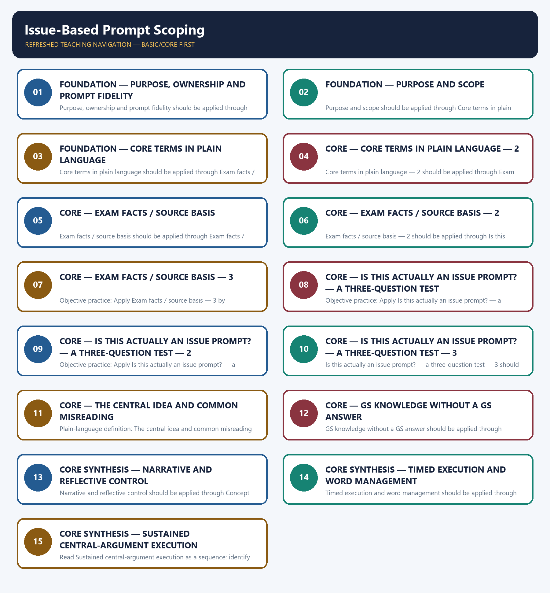

# Issue-Based Prompt Scoping — Learner-v2 Complete Learning Session

> **Authoring-only generation:** 2026-09-06. No PDF was rendered and no tracker or index was mutated.

### SOURCE, PROGRESSION AND OFFICIAL-RULE AUDIT

- **Generation date:** 2026-09-06.
- **Source order:** canonical Basic owner first; Advanced owner second; Essay master framework, README, official-syllabus map, answer-worthiness audit and revision chart next; PYQ corpus and official OCR papers after that; live official UPSC pages only as a final check.
- **Basic/Advanced boundary:** complete Basic teaching remains first and Advanced material remains optional and last.
- **OCR boundary:** Repository Markdown was primary. OCR-searchable official UPSC Essay papers were supplementary only for printed instructions and V1 prompt wording. No author, official model answer, current marks split, phase allocation, paragraph count or scoring rubric was inferred.
- **Qdrant:** not used; repository Markdown and local official papers were sufficient.
- **PYQ integrity:** Three application cards use the repository's explicit V1/V2 status. No unavailable official model answer, marking rubric or attribution is invented.
- **Live-source boundary:** Live source check dated 2026-09-06: official UPSC routes were attempted and access-blocked; blocked pages support no new claim. UN, WHO and IPCC primary pages were separately checked for cross-theme factual boundaries.
- **No-formula rule:** strategy, heuristics and practice weights are never presented as official UPSC instructions or marking criteria.

### LIVE OFFICIAL-SOURCE ATTEMPT LOG

The checks below were made on 2026-09-06. Substantive official text is used only for the proposition it supports; title-only, blocked or thin pages are recorded and supply no factual claim.

- https://upsc.gov.in/examinations/previous-question-papers — attempted 2026-09-06; official page returned HTTP 403 to the live fetch, so it supports no new wording.
- https://upsc.gov.in/examinations/active-examinations — attempted 2026-09-06; official page returned HTTP 403 to the live fetch, so it supports no current-paper inference.
- https://upsc.gov.in/sites/default/files/Notif-CSP-2024-Engl-140224.pdf — searched 2026-09-06; retained only as an official scheme cross-check route, not as an Essay rubric.

## BASIC LEARNING SESSION



*Distinct embedded teaching-navigation image. The separate continuous Cārvāka-style flowchart package remains an independent at-a-glance artifact.*

### SESSION 1 — FOUNDATION — PURPOSE, OWNERSHIP AND PROMPT FIDELITY

#### DEFINITION / WHAT THIS IS CALLED

**Plain-language definition:** Objective practice: Apply Purpose, ownership and prompt fidelity by distinguishing the correct Essay-method move from nearby but invalid shortcuts; no factual-trivia recall is being tested.

**Technical definition:** Purpose, ownership and prompt fidelity should be applied through Purpose and scope and Core terms in plain language, while preserving the difference between official paper instruction and strategy, prompt wording and interpretation, example and evidence, breadth and coherence.

#### ANSWER-GRABBING OPENING — WRITE/ADAPT IN THE EXAM

> Plain-language definition: Purpose, ownership and prompt fidelity explains how Purpose and scope and Core terms in plain language combine into one usable Essay-planning move.

#### MUST-WRITE KEYWORDS

- **FOUNDATION**
- **Purpose**
- **ownership**
- **prompt fidelity**
- **Plain-language definition**
- **Technical definition**

**How to use them:** Frame the answer through FOUNDATION; define Purpose, connect ownership with prompt fidelity to explain the mechanism, and use Plain-language definition for the decisive comparison or qualification.

#### METHOD MOVE / WHAT THIS DOES

**Plain-language definition:** Purpose, ownership and prompt fidelity explains how Purpose and scope and Core terms in plain language combine into one usable Essay-planning move.

**Technical definition:** The learner fixes the printed prompt, its relationship or demand, the defensible scope, the argument function and the evidence boundary before drafting prose.

#### ANSWER-GRABBING OPENING — WRITE/ADAPT IN THE EXAM

> Purpose, ownership and prompt fidelity should be applied through Purpose and scope and Core terms in plain language, while preserving the difference between official paper instruction and strategy, prompt wording and interpretation, example and evidence, breadth and coherence.

#### MUST-WRITE KEYWORDS

- **Purpose**
- **ownership**
- **prompt**
- **fidelity**
- **scope**
- **Core**

**How to use them:** Define the first three terms, trace the relationship with the next two, and attach the final term to the exact claim, example and qualification. Qualification: Do not replace bounded scoping of issue and hybrid prompts with a generic GS-style catalogue.

#### VISUAL FIRST

```text
PURPOSE, OWNERSHIP AND PROMPT FIDELITY
01. Purpose and scope
    |
    v
02. Core terms in plain language
STATUS / CATEGORY FIREWALL -> Do not replace bounded scoping of issue and hybrid prompts with a generic GS-style catalogue.
```

*The rail fixes the prompt-to-argument sequence and claim boundary before explanation.*

#### CORE EXPLANATION

A clear audited example — 2024-B5, printed as "Social media is triggering 'Fear of Missing Out' amongst the youth precipitating depression and loneliness" — is an issue-statement rather than a philosophical aphorism: it names a real phenomenon, a mechanism and a consequence directly. This topic teaches how to scope such prompts as an essay argument , distinct from 02's aphorism-decoding and distinct from a GS-III/Society answer. phenomenon and asserts a causal or evaluative claim about it, without requiring metaphor-decoding.

#### SIMPLE SYSTEM EXAMPLE

Read Purpose, ownership and prompt fidelity as a sequence: identify Purpose and scope, follow the method through the printed proposition, and stop before adding a rule, attribution, fact or inference the audited sources do not support.

#### TECHNICAL DISTINCTION

The decisive boundary is Do not replace bounded scoping of issue and hybrid prompts with a generic GS-style catalogue. This keeps Purpose and scope and Core terms in plain language in the correct prompt, method, argument and evidence category.

#### NAMED EVIDENCE AND MECHANISM

- A clear audited example — 2024-B5, printed as "Social media is triggering 'Fear of Missing Out' amongst the youth precipitating depression and loneliness" — is an issue-statement rather than a philosophical aphorism: it names a real phenomenon, a mechanism and a consequence directly. This topic teaches how to scope such prompts as an essay argument , distinct from 02's aphorism-decoding and distinct from a GS-III/Society answer.
- phenomenon and asserts a causal or evaluative claim about it, without requiring metaphor-decoding.

#### EXAMINER CAUTION

- Do not replace bounded scoping of issue and hybrid prompts with a generic GS-style catalogue.

#### EXAM LINK

- **Objective practice:** Apply Purpose, ownership and prompt fidelity by distinguishing the correct Essay-method move from nearby but invalid shortcuts; no factual-trivia recall is being tested.
- **Essay application:** State the exact demand and the bounded writing decision.

#### MINI RECAP

- **Mechanism chain:** Purpose and scope -> Core terms in plain language
- **Qualified use:** State the exact demand and the bounded writing decision.

#### CLOSING RECALL FLOW — FOUNDATION — PURPOSE, OWNERSHIP AND PROMPT FIDELITY

```text
START / CONCEPT: FOUNDATION — Purpose, ownership and prompt fidelity
        |
        v
EXACT TERMS: FOUNDATION · Purpose · ownership · prompt fidelity · Plain-language definition · Technical definition
        |
        v
MECHANISM / ARGUMENT: Purpose, ownership and prompt fidelity should be applied through Purpose and scope and Core terms in plain language, while preserving the difference between official paper instruction and strategy, prompt wording and interpretation, example and evidence, breadth and coherence.
        |
        v
CONSEQUENCE / CONTRAST: Read Purpose, ownership and prompt fidelity as a sequence: identify Purpose and scope, follow the method through the printed proposition, and stop before adding a rule, attribution, fact or inference the audited sources do not support.
        |
        v
UPSC TRAP / ANSWER-USE: Objective practice: Apply Purpose, ownership and prompt fidelity by distinguishing the correct Essay-method move from nearby but invalid shortcuts; no factual-trivia recall is being tested.
        |
        v
ANSWER-GRABBING FORMULATION: Plain-language definition: Purpose, ownership and prompt fidelity explains how Purpose and scope and Core terms in plain language combine into one usable Essay-planning move.
```
### SESSION 2 — FOUNDATION — PURPOSE AND SCOPE

#### DEFINITION / WHAT THIS IS CALLED

**Plain-language definition:** Objective practice: Apply Purpose and scope by distinguishing the correct Essay-method move from nearby but invalid shortcuts; no factual-trivia recall is being tested.

**Technical definition:** Purpose and scope should be applied through Core terms in plain language — 2, while preserving the difference between official paper instruction and strategy, prompt wording and interpretation, example and evidence, breadth and coherence.

#### ANSWER-GRABBING OPENING — WRITE/ADAPT IN THE EXAM

> Plain-language definition: Purpose and scope explains how Core terms in plain language — 2 combine into one usable Essay-planning move.

#### MUST-WRITE KEYWORDS

- **FOUNDATION**
- **Purpose**
- **scope**
- **Plain-language definition**
- **Technical definition**
- **terms**

**How to use them:** Frame the answer through FOUNDATION; define Purpose, connect scope with Plain-language definition to explain the mechanism, and use Technical definition for the decisive comparison or qualification.

#### METHOD MOVE / WHAT THIS DOES

**Plain-language definition:** Purpose and scope explains how Core terms in plain language — 2 combine into one usable Essay-planning move.

**Technical definition:** The learner fixes the printed prompt, its relationship or demand, the defensible scope, the argument function and the evidence boundary before drafting prose.

#### ANSWER-GRABBING OPENING — WRITE/ADAPT IN THE EXAM

> Purpose and scope should be applied through Core terms in plain language — 2, while preserving the difference between official paper instruction and strategy, prompt wording and interpretation, example and evidence, breadth and coherence.

#### MUST-WRITE KEYWORDS

- **Purpose**
- **scope**
- **Core**
- **terms**
- **plain**
- **language**

**How to use them:** Define the first three terms, trace the relationship with the next two, and attach the final term to the exact claim, example and qualification. Qualification: Do not cross the ownership boundary: abstract metaphor decoding belongs to 02.

#### VISUAL FIRST

```text
PURPOSE AND SCOPE
01. Core terms in plain language — 2
STATUS / CATEGORY FIREWALL -> Do not cross the ownership boundary: abstract metaphor decoding belongs to 02.
```

*The rail fixes the prompt-to-argument sequence and claim boundary before explanation.*

#### CORE EXPLANATION

answer — headings, "causes/effects/measures taken" lists — rather than a continuous argued essay.

#### SIMPLE SYSTEM EXAMPLE

Read Purpose and scope as a sequence: identify Core terms in plain language — 2, follow the method through the printed proposition, and stop before adding a rule, attribution, fact or inference the audited sources do not support.

#### TECHNICAL DISTINCTION

The decisive boundary is Do not cross the ownership boundary: abstract metaphor decoding belongs to 02. This keeps Core terms in plain language — 2 in the correct prompt, method, argument and evidence category.

#### NAMED EVIDENCE AND MECHANISM

- answer — headings, "causes/effects/measures taken" lists — rather than a continuous argued essay.

#### EXAMINER CAUTION

- Do not cross the ownership boundary: abstract metaphor decoding belongs to 02.

#### EXAM LINK

- **Objective practice:** Apply Purpose and scope by distinguishing the correct Essay-method move from nearby but invalid shortcuts; no factual-trivia recall is being tested.
- **Essay application:** Define operative terms before expanding dimensions.

#### MINI RECAP

- **Mechanism chain:** Core terms in plain language — 2
- **Qualified use:** Define operative terms before expanding dimensions.

#### CLOSING RECALL FLOW — FOUNDATION — PURPOSE AND SCOPE

```text
START / CONCEPT: FOUNDATION — Purpose and scope
        |
        v
EXACT TERMS: FOUNDATION · Purpose · scope · Plain-language definition · Technical definition · terms
        |
        v
MECHANISM / ARGUMENT: Purpose and scope should be applied through Core terms in plain language — 2, while preserving the difference between official paper instruction and strategy, prompt wording and interpretation, example and evidence, breadth and coherence.
        |
        v
CONSEQUENCE / CONTRAST: Read Purpose and scope as a sequence: identify Core terms in plain language — 2, follow the method through the printed proposition, and stop before adding a rule, attribution, fact or inference the audited sources do not support.
        |
        v
UPSC TRAP / ANSWER-USE: Objective practice: Apply Purpose and scope by distinguishing the correct Essay-method move from nearby but invalid shortcuts; no factual-trivia recall is being tested.
        |
        v
ANSWER-GRABBING FORMULATION: Plain-language definition: Purpose and scope explains how Core terms in plain language — 2 combine into one usable Essay-planning move.
```
### SESSION 3 — FOUNDATION — CORE TERMS IN PLAIN LANGUAGE

#### DEFINITION / WHAT THIS IS CALLED

**Plain-language definition:** Objective practice: Apply Core terms in plain language by distinguishing the correct Essay-method move from nearby but invalid shortcuts; no factual-trivia recall is being tested.

**Technical definition:** Core terms in plain language should be applied through Exam facts / source basis, while preserving the difference between official paper instruction and strategy, prompt wording and interpretation, example and evidence, breadth and coherence.

#### ANSWER-GRABBING OPENING — WRITE/ADAPT IN THE EXAM

> Plain-language definition: Core terms in plain language explains how Exam facts / source basis combine into one usable Essay-planning move.

#### MUST-WRITE KEYWORDS

- **FOUNDATION**
- **Core terms in plain language**
- **Plain-language definition**
- **Technical definition**
- **terms**
- **plain**

**How to use them:** Frame the answer through FOUNDATION; define Core terms in plain language, connect Plain-language definition with Technical definition to explain the mechanism, and use terms for the decisive comparison or qualification.

#### METHOD MOVE / WHAT THIS DOES

**Plain-language definition:** Core terms in plain language explains how Exam facts / source basis combine into one usable Essay-planning move.

**Technical definition:** The learner fixes the printed prompt, its relationship or demand, the defensible scope, the argument function and the evidence boundary before drafting prose.

#### ANSWER-GRABBING OPENING — WRITE/ADAPT IN THE EXAM

> Core terms in plain language should be applied through Exam facts / source basis, while preserving the difference between official paper instruction and strategy, prompt wording and interpretation, example and evidence, breadth and coherence.

#### MUST-WRITE KEYWORDS

- **Core**
- **terms**
- **plain**
- **language**
- **Exam**
- **facts**

**How to use them:** Define the first three terms, trace the relationship with the next two, and attach the final term to the exact claim, example and qualification. Qualification: Do not use an example without explaining its argumentative function.

#### VISUAL FIRST

```text
CORE TERMS IN PLAIN LANGUAGE
01. Exam facts / source basis
STATUS / CATEGORY FIREWALL -> Do not use an example without explaining its argumentative function.
```

*The rail fixes the prompt-to-argument sequence and claim boundary before explanation.*

#### CORE EXPLANATION

Missing Out' amongst the youth precipitating depression and loneliness." — no author, and no comma before "precipitating" (widely circulated versions insert one; the paper does not). No further qualifying data is attached in the source paper.

#### SIMPLE SYSTEM EXAMPLE

Read Core terms in plain language as a sequence: identify Exam facts / source basis, follow the method through the printed proposition, and stop before adding a rule, attribution, fact or inference the audited sources do not support.

#### TECHNICAL DISTINCTION

The decisive boundary is Do not use an example without explaining its argumentative function. This keeps Exam facts / source basis in the correct prompt, method, argument and evidence category.

#### NAMED EVIDENCE AND MECHANISM

- Missing Out' amongst the youth precipitating depression and loneliness." — no author, and no comma before "precipitating" (widely circulated versions insert one; the paper does not). No further qualifying data is attached in the source paper.

#### EXAMINER CAUTION

- Do not use an example without explaining its argumentative function.

#### EXAM LINK

- **Objective practice:** Apply Core terms in plain language by distinguishing the correct Essay-method move from nearby but invalid shortcuts; no factual-trivia recall is being tested.
- **Essay application:** Build one qualified thesis and keep it visible.

#### MINI RECAP

- **Mechanism chain:** Exam facts / source basis
- **Qualified use:** Build one qualified thesis and keep it visible.

#### CLOSING RECALL FLOW — FOUNDATION — CORE TERMS IN PLAIN LANGUAGE

```text
START / CONCEPT: FOUNDATION — Core terms in plain language
        |
        v
EXACT TERMS: FOUNDATION · Core terms in plain language · Plain-language definition · Technical definition · terms · plain
        |
        v
MECHANISM / ARGUMENT: Core terms in plain language should be applied through Exam facts / source basis, while preserving the difference between official paper instruction and strategy, prompt wording and interpretation, example and evidence, breadth and coherence.
        |
        v
CONSEQUENCE / CONTRAST: Read Core terms in plain language as a sequence: identify Exam facts / source basis, follow the method through the printed proposition, and stop before adding a rule, attribution, fact or inference the audited sources do not support.
        |
        v
UPSC TRAP / ANSWER-USE: Objective practice: Apply Core terms in plain language by distinguishing the correct Essay-method move from nearby but invalid shortcuts; no factual-trivia recall is being tested.
        |
        v
ANSWER-GRABBING FORMULATION: Plain-language definition: Core terms in plain language explains how Exam facts / source basis combine into one usable Essay-planning move.
```
### SESSION 4 — CORE — CORE TERMS IN PLAIN LANGUAGE — 2

#### DEFINITION / WHAT THIS IS CALLED

**Plain-language definition:** Objective practice: Apply Core terms in plain language — 2 by distinguishing the correct Essay-method move from nearby but invalid shortcuts; no factual-trivia recall is being tested.

**Technical definition:** Core terms in plain language — 2 should be applied through Exam facts / source basis — 2, while preserving the difference between official paper instruction and strategy, prompt wording and interpretation, example and evidence, breadth and coherence.

#### ANSWER-GRABBING OPENING — WRITE/ADAPT IN THE EXAM

> Plain-language definition: Core terms in plain language — 2 explains how Exam facts / source basis — 2 combine into one usable Essay-planning move.

#### MUST-WRITE KEYWORDS

- **Core terms in plain language**
- **Plain-language definition**
- **Technical definition**
- **terms**
- **plain**
- **language**

**How to use them:** Frame the answer through Core terms in plain language; define Plain-language definition, connect Technical definition with terms to explain the mechanism, and use plain for the decisive comparison or qualification.

#### METHOD MOVE / WHAT THIS DOES

**Plain-language definition:** Core terms in plain language — 2 explains how Exam facts / source basis — 2 combine into one usable Essay-planning move.

**Technical definition:** The learner fixes the printed prompt, its relationship or demand, the defensible scope, the argument function and the evidence boundary before drafting prose.

#### ANSWER-GRABBING OPENING — WRITE/ADAPT IN THE EXAM

> Core terms in plain language — 2 should be applied through Exam facts / source basis — 2, while preserving the difference between official paper instruction and strategy, prompt wording and interpretation, example and evidence, breadth and coherence.

#### MUST-WRITE KEYWORDS

- **Core**
- **terms**
- **plain**
- **language**
- **Exam**
- **facts**

**How to use them:** Define the first three terms, trace the relationship with the next two, and attach the final term to the exact claim, example and qualification. Qualification: Do not treat a pedagogical scaffold as an official UPSC marking rule.

#### VISUAL FIRST

```text
CORE TERMS IN PLAIN LANGUAGE — 2
01. Exam facts / source basis — 2
STATUS / CATEGORY FIREWALL -> Do not treat a pedagogical scaffold as an official UPSC marking rule.
```

*The rail fixes the prompt-to-argument sequence and claim boundary before explanation.*

#### CORE EXPLANATION

"precipitating depression and loneliness" reads as attached to the FOMO it triggers rather than as a separate consequence of social media. Either way the essay must engage the causal chain the sentence asserts — social media → FOMO → depression/loneliness — and not substitute a general discussion of social media's effects.

#### SIMPLE SYSTEM EXAMPLE

Read Core terms in plain language — 2 as a sequence: identify Exam facts / source basis — 2, follow the method through the printed proposition, and stop before adding a rule, attribution, fact or inference the audited sources do not support.

#### TECHNICAL DISTINCTION

The decisive boundary is Do not treat a pedagogical scaffold as an official UPSC marking rule. This keeps Exam facts / source basis — 2 in the correct prompt, method, argument and evidence category.

#### NAMED EVIDENCE AND MECHANISM

- "precipitating depression and loneliness" reads as attached to the FOMO it triggers rather than as a separate consequence of social media. Either way the essay must engage the causal chain the sentence asserts — social media → FOMO → depression/loneliness — and not substitute a general discussion of social media's effects.

#### EXAMINER CAUTION

- Do not treat a pedagogical scaffold as an official UPSC marking rule.

#### EXAM LINK

- **Objective practice:** Apply Core terms in plain language — 2 by distinguishing the correct Essay-method move from nearby but invalid shortcuts; no factual-trivia recall is being tested.
- **Essay application:** Give every paragraph one argumentative job.

#### MINI RECAP

- **Mechanism chain:** Exam facts / source basis — 2
- **Qualified use:** Give every paragraph one argumentative job.

#### CLOSING RECALL FLOW — CORE — CORE TERMS IN PLAIN LANGUAGE — 2

```text
START / CONCEPT: CORE — Core terms in plain language — 2
        |
        v
EXACT TERMS: Core terms in plain language · Plain-language definition · Technical definition · terms · plain · language
        |
        v
MECHANISM / ARGUMENT: Core terms in plain language — 2 should be applied through Exam facts / source basis — 2, while preserving the difference between official paper instruction and strategy, prompt wording and interpretation, example and evidence, breadth and coherence.
        |
        v
CONSEQUENCE / CONTRAST: Objective practice: Apply Core terms in plain language — 2 by distinguishing the correct Essay-method move from nearby but invalid shortcuts; no factual-trivia recall is being tested.
        |
        v
UPSC TRAP / ANSWER-USE: Read Core terms in plain language — 2 as a sequence: identify Exam facts / source basis — 2, follow the method through the printed proposition, and stop before adding a rule, attribution, fact or inference the audited sources do not support.
        |
        v
ANSWER-GRABBING FORMULATION: Plain-language definition: Core terms in plain language — 2 explains how Exam facts / source basis — 2 combine into one usable Essay-planning move.
```
### SESSION 5 — CORE — EXAM FACTS / SOURCE BASIS

#### DEFINITION / WHAT THIS IS CALLED

**Plain-language definition:** Objective practice: Apply Exam facts / source basis by distinguishing the correct Essay-method move from nearby but invalid shortcuts; no factual-trivia recall is being tested.

**Technical definition:** Exam facts / source basis should be applied through Exam facts / source basis — 3, while preserving the difference between official paper instruction and strategy, prompt wording and interpretation, example and evidence, breadth and coherence.

#### ANSWER-GRABBING OPENING — WRITE/ADAPT IN THE EXAM

> Plain-language definition: Exam facts / source basis explains how Exam facts / source basis — 3 combine into one usable Essay-planning move.

#### MUST-WRITE KEYWORDS

- **Exam facts / source basis**
- **Plain-language definition**
- **Technical definition**
- **Exam**
- **s**
- **basis**

**How to use them:** Frame the answer through Exam facts / source basis; define Plain-language definition, connect Technical definition with Exam to explain the mechanism, and use s for the decisive comparison or qualification.

#### METHOD MOVE / WHAT THIS DOES

**Plain-language definition:** Exam facts / source basis explains how Exam facts / source basis — 3 combine into one usable Essay-planning move.

**Technical definition:** The learner fixes the printed prompt, its relationship or demand, the defensible scope, the argument function and the evidence boundary before drafting prose.

#### ANSWER-GRABBING OPENING — WRITE/ADAPT IN THE EXAM

> Exam facts / source basis should be applied through Exam facts / source basis — 3, while preserving the difference between official paper instruction and strategy, prompt wording and interpretation, example and evidence, breadth and coherence.

#### MUST-WRITE KEYWORDS

- **Exam**
- **facts**
- **basis**
- **unmetaphorical**
- **issue-statement**
- **remaining**

**How to use them:** Define the first three terms, trace the relationship with the next two, and attach the final term to the exact claim, example and qualification. Qualification: Do not let a counter-view replace the thesis; use it to qualify the thesis.

#### VISUAL FIRST

```text
EXAM FACTS / SOURCE BASIS
01. Exam facts / source basis — 3
STATUS / CATEGORY FIREWALL -> Do not let a counter-view replace the thesis; use it to qualify the thesis.
```

*The rail fixes the prompt-to-argument sequence and claim boundary before explanation.*

#### CORE EXPLANATION

unmetaphorical issue-statement; the remaining 15 prompts are decoded via 02. This is not a claim about the whole V1 corpus: 2018–2025 contains further issue and hybrid prompts requiring the same method.

#### SIMPLE SYSTEM EXAMPLE

Read Exam facts / source basis as a sequence: identify Exam facts / source basis — 3, follow the method through the printed proposition, and stop before adding a rule, attribution, fact or inference the audited sources do not support.

#### TECHNICAL DISTINCTION

The decisive boundary is Do not let a counter-view replace the thesis; use it to qualify the thesis. This keeps Exam facts / source basis — 3 in the correct prompt, method, argument and evidence category.

#### NAMED EVIDENCE AND MECHANISM

- unmetaphorical issue-statement; the remaining 15 prompts are decoded via 02. This is not a claim about the whole V1 corpus: 2018–2025 contains further issue and hybrid prompts requiring the same method.

#### EXAMINER CAUTION

- Do not let a counter-view replace the thesis; use it to qualify the thesis.

#### EXAM LINK

- **Objective practice:** Apply Exam facts / source basis by distinguishing the correct Essay-method move from nearby but invalid shortcuts; no factual-trivia recall is being tested.
- **Essay application:** Join a named illustration to its mechanism.

#### MINI RECAP

- **Mechanism chain:** Exam facts / source basis — 3
- **Qualified use:** Join a named illustration to its mechanism.

#### CLOSING RECALL FLOW — CORE — EXAM FACTS / SOURCE BASIS

```text
START / CONCEPT: CORE — Exam facts / source basis
        |
        v
EXACT TERMS: Exam facts / source basis · Plain-language definition · Technical definition · Exam · s · basis
        |
        v
MECHANISM / ARGUMENT: Exam facts / source basis should be applied through Exam facts / source basis — 3, while preserving the difference between official paper instruction and strategy, prompt wording and interpretation, example and evidence, breadth and coherence.
        |
        v
CONSEQUENCE / CONTRAST: Objective practice: Apply Exam facts / source basis by distinguishing the correct Essay-method move from nearby but invalid shortcuts; no factual-trivia recall is being tested.
        |
        v
UPSC TRAP / ANSWER-USE: Read Exam facts / source basis as a sequence: identify Exam facts / source basis — 3, follow the method through the printed proposition, and stop before adding a rule, attribution, fact or inference the audited sources do not support.
        |
        v
ANSWER-GRABBING FORMULATION: Plain-language definition: Exam facts / source basis explains how Exam facts / source basis — 3 combine into one usable Essay-planning move.
```
### SESSION 6 — CORE — EXAM FACTS / SOURCE BASIS — 2

#### DEFINITION / WHAT THIS IS CALLED

**Plain-language definition:** Objective practice: Apply Exam facts / source basis — 2 by distinguishing the correct Essay-method move from nearby but invalid shortcuts; no factual-trivia recall is being tested.

**Technical definition:** Exam facts / source basis — 2 should be applied through Is this actually an issue prompt? — a three-question test and Is this actually an issue prompt? — a three-question test — 2, while preserving the difference between official paper instruction and strategy, prompt wording and interpretation, example and evidence, breadth and coherence.

#### ANSWER-GRABBING OPENING — WRITE/ADAPT IN THE EXAM

> Objective practice: Apply Exam facts / source basis — 2 by distinguishing the correct Essay-method move from nearby but invalid shortcuts; no factual-trivia recall is being tested.

#### MUST-WRITE KEYWORDS

- **Exam facts / source basis**
- **Plain-language definition**
- **Technical definition**
- **Exam**
- **s**
- **basis**

**How to use them:** Frame the answer through Exam facts / source basis; define Plain-language definition, connect Technical definition with Exam to explain the mechanism, and use s for the decisive comparison or qualification.

#### METHOD MOVE / WHAT THIS DOES

**Plain-language definition:** Exam facts / source basis — 2 explains how Is this actually an issue prompt? — a three-question test and Is this actually an issue prompt? — a three-question test — 2 combine into one usable Essay-planning move.

**Technical definition:** The learner fixes the printed prompt, its relationship or demand, the defensible scope, the argument function and the evidence boundary before drafting prose.

#### ANSWER-GRABBING OPENING — WRITE/ADAPT IN THE EXAM

> Exam facts / source basis — 2 should be applied through Is this actually an issue prompt? — a three-question test and Is this actually an issue prompt? — a three-question test — 2, while preserving the difference between official paper instruction and strategy, prompt wording and interpretation, example and evidence, breadth and coherence.

#### MUST-WRITE KEYWORDS

- **Exam**
- **facts**
- **basis**
- **this**
- **actually**
- **issue**

**How to use them:** Define the first three terms, trace the relationship with the next two, and attach the final term to the exact claim, example and qualification. Qualification: Do not use an unverified quotation, statistic, attribution or anecdote.

#### VISUAL FIRST

```text
EXAM FACTS / SOURCE BASIS — 2
01. Is this actually an issue prompt? — a three-question test
    |
    v
02. Is this actually an issue prompt? — a three-question test — 2
STATUS / CATEGORY FIREWALL -> Do not use an unverified quotation, statistic, attribution or anecdote.
```

*The rail fixes the prompt-to-argument sequence and claim boundary before explanation.*

#### CORE EXPLANATION

basic/02, Section 3a, gives the full philosophical-vs-issue contrast table. This section does not repeat it; it supplies the decision procedure for the one call you have to make under time pressure. Q1 Does the sentence name a real, nameable phenomenon (social media, urbanisation, automation) rather than an abstraction? no - philosophical prompt: decode it (02) yes - continue Q2 Does it assert a causal or evaluative claim ABOUT that phenomenon ("is triggering", "has lost the ability to", "is a threat to")? no - a bare topic label, not an issue-statement: treat as a scoping-plus-decoding hybrid, decoding first yes - continue Q3 Would a literal reading of the sentence already give you something contestable to argue? yes - issue prompt: scope it (this file) no - the sentence only looks empirical; decode first (02)

#### SIMPLE SYSTEM EXAMPLE

Read Exam facts / source basis — 2 as a sequence: identify Is this actually an issue prompt? — a three-question test, follow the method through the printed proposition, and stop before adding a rule, attribution, fact or inference the audited sources do not support.

#### TECHNICAL DISTINCTION

The decisive boundary is Do not use an unverified quotation, statistic, attribution or anecdote. This keeps Is this actually an issue prompt? — a three-question test and Is this actually an issue prompt? — a three-question test — 2 in the correct prompt, method, argument and evidence category.

#### NAMED EVIDENCE AND MECHANISM

- basic/02, Section 3a, gives the full philosophical-vs-issue contrast table. This section does not repeat it; it supplies the decision procedure for the one call you have to make under time pressure.
- Q1 Does the sentence name a real, nameable phenomenon (social media, urbanisation, automation) rather than an abstraction? no - philosophical prompt: decode it (02) yes - continue Q2 Does it assert a causal or evaluative claim ABOUT that phenomenon ("is triggering", "has lost the ability to", "is a threat to")? no - a bare topic label, not an issue-statement: treat as a scoping-plus-decoding hybrid, decoding first yes - continue Q3 Would a literal reading of the sentence already give you something contestable to argue? yes - issue prompt: scope it (this file) no - the sentence only looks empirical; decode first (02)

#### EXAMINER CAUTION

- Do not use an unverified quotation, statistic, attribution or anecdote.

#### EXAM LINK

- **Objective practice:** Apply Exam facts / source basis — 2 by distinguishing the correct Essay-method move from nearby but invalid shortcuts; no factual-trivia recall is being tested.
- **Essay application:** Use a counter-case to refine, not derail, the thesis.

#### MINI RECAP

- **Mechanism chain:** Is this actually an issue prompt? — a three-question test -> Is this actually an issue prompt? — a three-question test — 2
- **Qualified use:** Use a counter-case to refine, not derail, the thesis.

#### CLOSING RECALL FLOW — CORE — EXAM FACTS / SOURCE BASIS — 2

```text
START / CONCEPT: CORE — Exam facts / source basis — 2
        |
        v
EXACT TERMS: Exam facts / source basis · Plain-language definition · Technical definition · Exam · s · basis
        |
        v
MECHANISM / ARGUMENT: Plain-language definition: Exam facts / source basis — 2 explains how Is this actually an issue prompt? — a three-question test and Is this actually an issue prompt? — a three-question test — 2 combine into one usable Essay-planning move.
        |
        v
CONSEQUENCE / CONTRAST: Exam facts / source basis — 2 should be applied through Is this actually an issue prompt? — a three-question test and Is this actually an issue prompt? — a three-question test — 2, while preserving the difference between official paper instruction and strategy, prompt wording and interpretation, example and evidence, breadth and coherence.
        |
        v
UPSC TRAP / ANSWER-USE: Read Exam facts / source basis — 2 as a sequence: identify Is this actually an issue prompt? — a three-question test, follow the method through the printed proposition, and stop before adding a rule, attribution, fact or inference the audited sources do not support.
        |
        v
ANSWER-GRABBING FORMULATION: Objective practice: Apply Exam facts / source basis — 2 by distinguishing the correct Essay-method move from nearby but invalid shortcuts; no factual-trivia recall is being tested.
```
### SESSION 7 — CORE — EXAM FACTS / SOURCE BASIS — 3

#### DEFINITION / WHAT THIS IS CALLED

**Plain-language definition:** Plain-language definition: Exam facts / source basis — 3 explains how Is this actually an issue prompt? — a three-question test — 3 combine into one usable Essay-planning move.

**Technical definition:** Objective practice: Apply Exam facts / source basis — 3 by distinguishing the correct Essay-method move from nearby but invalid shortcuts; no factual-trivia recall is being tested.

#### ANSWER-GRABBING OPENING — WRITE/ADAPT IN THE EXAM

> Plain-language definition: Exam facts / source basis — 3 explains how Is this actually an issue prompt? — a three-question test — 3 combine into one usable Essay-planning move.

#### MUST-WRITE KEYWORDS

- **Exam facts / source basis**
- **Plain-language definition**
- **Technical definition**
- **Exam**
- **s**
- **basis**

**How to use them:** Frame the answer through Exam facts / source basis; define Plain-language definition, connect Technical definition with Exam to explain the mechanism, and use s for the decisive comparison or qualification.

#### METHOD MOVE / WHAT THIS DOES

**Plain-language definition:** Exam facts / source basis — 3 explains how Is this actually an issue prompt? — a three-question test — 3 combine into one usable Essay-planning move.

**Technical definition:** The learner fixes the printed prompt, its relationship or demand, the defensible scope, the argument function and the evidence boundary before drafting prose.

#### ANSWER-GRABBING OPENING — WRITE/ADAPT IN THE EXAM

> Exam facts / source basis — 3 should be applied through Is this actually an issue prompt? — a three-question test — 3, while preserving the difference between official paper instruction and strategy, prompt wording and interpretation, example and evidence, breadth and coherence.

#### MUST-WRITE KEYWORDS

- **Exam**
- **facts**
- **basis**
- **this**
- **actually**
- **issue**

**How to use them:** Define the first three terms, trace the relationship with the next two, and attach the final term to the exact claim, example and qualification. Qualification: Do not multiply dimensions that repeat the same claim in new vocabulary.

#### VISUAL FIRST

```text
EXAM FACTS / SOURCE BASIS — 3
01. Is this actually an issue prompt? — a three-question test — 3
STATUS / CATEGORY FIREWALL -> Do not multiply dimensions that repeat the same claim in new vocabulary.
```

*The rail fixes the prompt-to-argument sequence and claim boundary before explanation.*

#### CORE EXPLANATION

Q3 is the one candidates skip. 2024-A1 ("Forests precede civilizations and deserts follow them") passes Q1 and arguably Q2, but fails Q3 — read literally it is a claim about vegetation sequence that nobody would spend 1000 words contesting. That failure is the signal that the sentence is carrying a metaphor, and that 02 owns it. Scoping a prompt that needed decoding produces a technically accurate essay about the wrong subject — the most expensive error available at this stage, because it is invisible until the essay is finished.

#### SIMPLE SYSTEM EXAMPLE

Read Exam facts / source basis — 3 as a sequence: identify Is this actually an issue prompt? — a three-question test — 3, follow the method through the printed proposition, and stop before adding a rule, attribution, fact or inference the audited sources do not support.

#### TECHNICAL DISTINCTION

The decisive boundary is Do not multiply dimensions that repeat the same claim in new vocabulary. This keeps Is this actually an issue prompt? — a three-question test — 3 in the correct prompt, method, argument and evidence category.

#### NAMED EVIDENCE AND MECHANISM

- Q3 is the one candidates skip. 2024-A1 ("Forests precede civilizations and deserts follow them") passes Q1 and arguably Q2, but fails Q3 — read literally it is a claim about vegetation sequence that nobody would spend 1000 words contesting. That failure is the signal that the sentence is carrying a metaphor, and that 02 owns it. Scoping a prompt that needed decoding produces a technically accurate essay about the wrong subject — the most expensive error available at this stage, because it is invisible until the essay is finished.

#### EXAMINER CAUTION

- Do not multiply dimensions that repeat the same claim in new vocabulary.

#### EXAM LINK

- **Objective practice:** Apply Exam facts / source basis — 3 by distinguishing the correct Essay-method move from nearby but invalid shortcuts; no factual-trivia recall is being tested.
- **Essay application:** Sequence paragraphs through explicit logical bridges.

#### MINI RECAP

- **Mechanism chain:** Is this actually an issue prompt? — a three-question test — 3
- **Qualified use:** Sequence paragraphs through explicit logical bridges.

#### CLOSING RECALL FLOW — CORE — EXAM FACTS / SOURCE BASIS — 3

```text
START / CONCEPT: CORE — Exam facts / source basis — 3
        |
        v
EXACT TERMS: Exam facts / source basis · Plain-language definition · Technical definition · Exam · s · basis
        |
        v
MECHANISM / ARGUMENT: Objective practice: Apply Exam facts / source basis — 3 by distinguishing the correct Essay-method move from nearby but invalid shortcuts; no factual-trivia recall is being tested.
        |
        v
CONSEQUENCE / CONTRAST: Exam facts / source basis — 3 should be applied through Is this actually an issue prompt? — a three-question test — 3, while preserving the difference between official paper instruction and strategy, prompt wording and interpretation, example and evidence, breadth and coherence.
        |
        v
UPSC TRAP / ANSWER-USE: Read Exam facts / source basis — 3 as a sequence: identify Is this actually an issue prompt? — a three-question test — 3, follow the method through the printed proposition, and stop before adding a rule, attribution, fact or inference the audited sources do not support.
        |
        v
ANSWER-GRABBING FORMULATION: Plain-language definition: Exam facts / source basis — 3 explains how Is this actually an issue prompt? — a three-question test — 3 combine into one usable Essay-planning move.
```
### SESSION 8 — CORE — IS THIS ACTUALLY AN ISSUE PROMPT? — A THREE-QUESTION TEST

#### DEFINITION / WHAT THIS IS CALLED

**Plain-language definition:** Plain-language definition: Is this actually an issue prompt? — a three-question test explains how The central idea and common misreading combine into one usable Essay-planning move.

**Technical definition:** Objective practice: Apply Is this actually an issue prompt? — a three-question test by distinguishing the correct Essay-method move from nearby but invalid shortcuts; no factual-trivia recall is being tested.

#### ANSWER-GRABBING OPENING — WRITE/ADAPT IN THE EXAM

> Plain-language definition: Is this actually an issue prompt? — a three-question test explains how The central idea and common misreading combine into one usable Essay-planning move.

#### MUST-WRITE KEYWORDS

- **a three-question test**
- **Plain-language definition**
- **Technical definition**
- **this**
- **actually**
- **issue**

**How to use them:** Frame the answer through a three-question test; define Plain-language definition, connect Technical definition with this to explain the mechanism, and use actually for the decisive comparison or qualification.

#### METHOD MOVE / WHAT THIS DOES

**Plain-language definition:** Is this actually an issue prompt? — a three-question test explains how The central idea and common misreading combine into one usable Essay-planning move.

**Technical definition:** The learner fixes the printed prompt, its relationship or demand, the defensible scope, the argument function and the evidence boundary before drafting prose.

#### ANSWER-GRABBING OPENING — WRITE/ADAPT IN THE EXAM

> Is this actually an issue prompt? — a three-question test should be applied through The central idea and common misreading, while preserving the difference between official paper instruction and strategy, prompt wording and interpretation, example and evidence, breadth and coherence.

#### MUST-WRITE KEYWORDS

- **this**
- **actually**
- **issue**
- **prompt**
- **three-question**
- **test**

**How to use them:** Define the first three terms, trace the relationship with the next two, and attach the final term to the exact claim, example and qualification. Qualification: Do not end with aspiration unsupported by the preceding argument.

#### VISUAL FIRST

```text
IS THIS ACTUALLY AN ISSUE PROMPT? — A THREE-QUESTION TEST
01. The central idea and common misreading
STATUS / CATEGORY FIREWALL -> Do not end with aspiration unsupported by the preceding argument.
```

*The rail fixes the prompt-to-argument sequence and claim boundary before explanation.*

#### CORE EXPLANATION

Central idea: an issue-based prompt still needs a thesis , not just an accurate description of the phenomenon — the essay must argue something about the claim (its mechanism, its limits, what follows), not merely narrate it. Common misreading: treating 2024-B5 as an invitation to write a GS-III/Society-style answer on social media's "causes, effects and government measures" complete with scheme names and headings — this under-uses the essay's actual test of argument and synthesis.

#### SIMPLE SYSTEM EXAMPLE

Read Is this actually an issue prompt? — a three-question test as a sequence: identify The central idea and common misreading, follow the method through the printed proposition, and stop before adding a rule, attribution, fact or inference the audited sources do not support.

#### TECHNICAL DISTINCTION

The decisive boundary is Do not end with aspiration unsupported by the preceding argument. This keeps The central idea and common misreading in the correct prompt, method, argument and evidence category.

#### NAMED EVIDENCE AND MECHANISM

- Central idea: an issue-based prompt still needs a thesis , not just an accurate description of the phenomenon — the essay must argue something about the claim (its mechanism, its limits, what follows), not merely narrate it. Common misreading: treating 2024-B5 as an invitation to write a GS-III/Society-style answer on social media's "causes, effects and government measures" complete with scheme names and headings — this under-uses the essay's actual test of argument and synthesis.

#### EXAMINER CAUTION

- Do not end with aspiration unsupported by the preceding argument.

#### EXAM LINK

- **Objective practice:** Apply Is this actually an issue prompt? — a three-question test by distinguishing the correct Essay-method move from nearby but invalid shortcuts; no factual-trivia recall is being tested.
- **Essay application:** Move across actor, scale and time only when the claim changes.

#### MINI RECAP

- **Mechanism chain:** The central idea and common misreading
- **Qualified use:** Move across actor, scale and time only when the claim changes.

#### CLOSING RECALL FLOW — CORE — IS THIS ACTUALLY AN ISSUE PROMPT? — A THREE-QUESTION TEST

```text
START / CONCEPT: CORE — Is this actually an issue prompt? — a three-question test
        |
        v
EXACT TERMS: a three-question test · Plain-language definition · Technical definition · this · actually · issue
        |
        v
MECHANISM / ARGUMENT: Objective practice: Apply Is this actually an issue prompt? — a three-question test by distinguishing the correct Essay-method move from nearby but invalid shortcuts; no factual-trivia recall is being tested.
        |
        v
CONSEQUENCE / CONTRAST: Is this actually an issue prompt? — a three-question test should be applied through The central idea and common misreading, while preserving the difference between official paper instruction and strategy, prompt wording and interpretation, example and evidence, breadth and coherence.
        |
        v
UPSC TRAP / ANSWER-USE: Read Is this actually an issue prompt? — a three-question test as a sequence: identify The central idea and common misreading, follow the method through the printed proposition, and stop before adding a rule, attribution, fact or inference the audited sources do not support.
        |
        v
ANSWER-GRABBING FORMULATION: Plain-language definition: Is this actually an issue prompt? — a three-question test explains how The central idea and common misreading combine into one usable Essay-planning move.
```
### SESSION 9 — CORE — IS THIS ACTUALLY AN ISSUE PROMPT? — A THREE-QUESTION TEST — 2

#### DEFINITION / WHAT THIS IS CALLED

**Plain-language definition:** Plain-language definition: Is this actually an issue prompt? — a three-question test — 2 explains how Basic decomposition questions combine into one usable Essay-planning move.

**Technical definition:** Objective practice: Apply Is this actually an issue prompt? — a three-question test — 2 by distinguishing the correct Essay-method move from nearby but invalid shortcuts; no factual-trivia recall is being tested.

#### ANSWER-GRABBING OPENING — WRITE/ADAPT IN THE EXAM

> Plain-language definition: Is this actually an issue prompt? — a three-question test — 2 explains how Basic decomposition questions combine into one usable Essay-planning move.

#### MUST-WRITE KEYWORDS

- **a three-question test**
- **Plain-language definition**
- **Technical definition**
- **this**
- **actually**
- **issue**

**How to use them:** Frame the answer through a three-question test; define Plain-language definition, connect Technical definition with this to explain the mechanism, and use actually for the decisive comparison or qualification.

#### METHOD MOVE / WHAT THIS DOES

**Plain-language definition:** Is this actually an issue prompt? — a three-question test — 2 explains how Basic decomposition questions combine into one usable Essay-planning move.

**Technical definition:** The learner fixes the printed prompt, its relationship or demand, the defensible scope, the argument function and the evidence boundary before drafting prose.

#### ANSWER-GRABBING OPENING — WRITE/ADAPT IN THE EXAM

> Is this actually an issue prompt? — a three-question test — 2 should be applied through Basic decomposition questions, while preserving the difference between official paper instruction and strategy, prompt wording and interpretation, example and evidence, breadth and coherence.

#### MUST-WRITE KEYWORDS

- **this**
- **actually**
- **issue**
- **prompt**
- **three-question**
- **test**

**How to use them:** Define the first three terms, trace the relationship with the next two, and attach the final term to the exact claim, example and qualification. Qualification: Do not sacrifice the second essay's time budget to perfect the first.

#### VISUAL FIRST

```text
IS THIS ACTUALLY AN ISSUE PROMPT? — A THREE-QUESTION TEST — 2
01. Basic decomposition questions
STATUS / CATEGORY FIREWALL -> Do not sacrifice the second essay's time budget to perfect the first.
```

*The rail fixes the prompt-to-argument sequence and claim boundary before explanation.*

#### CORE EXPLANATION

1. What exact claim is being made — connection causes FOMO causes depression/loneliness — and is this an absolute or a tendency claim? 2. What is the mechanism linking cause to effect (e.g. social comparison, curated self-presentation, algorithmic amplification)? 3. Who is most affected, and does the prompt's "youth" framing hold uniformly or need qualification (e.g. by access, platform design, family/school context)? 4. What is the strongest counter-case (e.g. social media also enabling support communities, information access, civic mobilisation)? 5. What synthesis resolves the tension without denying either the harm or the benefit?

#### SIMPLE SYSTEM EXAMPLE

Read Is this actually an issue prompt? — a three-question test — 2 as a sequence: identify Basic decomposition questions, follow the method through the printed proposition, and stop before adding a rule, attribution, fact or inference the audited sources do not support.

#### TECHNICAL DISTINCTION

The decisive boundary is Do not sacrifice the second essay's time budget to perfect the first. This keeps Basic decomposition questions in the correct prompt, method, argument and evidence category.

#### NAMED EVIDENCE AND MECHANISM

- 1. What exact claim is being made — connection causes FOMO causes depression/loneliness — and is this an absolute or a tendency claim? 2. What is the mechanism linking cause to effect (e.g. social comparison, curated self-presentation, algorithmic amplification)? 3. Who is most affected, and does the prompt's "youth" framing hold uniformly or need qualification (e.g. by access, platform design, family/school context)? 4. What is the strongest counter-case (e.g. social media also enabling support communities, information access, civic mobilisation)? 5. What synthesis resolves the tension without denying either the harm or the benefit?

#### EXAMINER CAUTION

- Do not sacrifice the second essay's time budget to perfect the first.

#### EXAM LINK

- **Objective practice:** Apply Is this actually an issue prompt? — a three-question test — 2 by distinguishing the correct Essay-method move from nearby but invalid shortcuts; no factual-trivia recall is being tested.
- **Essay application:** Use ethical nuance without moralising.

#### MINI RECAP

- **Mechanism chain:** Basic decomposition questions
- **Qualified use:** Use ethical nuance without moralising.

#### CLOSING RECALL FLOW — CORE — IS THIS ACTUALLY AN ISSUE PROMPT? — A THREE-QUESTION TEST — 2

```text
START / CONCEPT: CORE — Is this actually an issue prompt? — a three-question test — 2
        |
        v
EXACT TERMS: a three-question test · Plain-language definition · Technical definition · this · actually · issue
        |
        v
MECHANISM / ARGUMENT: Objective practice: Apply Is this actually an issue prompt? — a three-question test — 2 by distinguishing the correct Essay-method move from nearby but invalid shortcuts; no factual-trivia recall is being tested.
        |
        v
CONSEQUENCE / CONTRAST: Is this actually an issue prompt? — a three-question test — 2 should be applied through Basic decomposition questions, while preserving the difference between official paper instruction and strategy, prompt wording and interpretation, example and evidence, breadth and coherence.
        |
        v
UPSC TRAP / ANSWER-USE: Read Is this actually an issue prompt? — a three-question test — 2 as a sequence: identify Basic decomposition questions, follow the method through the printed proposition, and stop before adding a rule, attribution, fact or inference the audited sources do not support.
        |
        v
ANSWER-GRABBING FORMULATION: Plain-language definition: Is this actually an issue prompt? — a three-question test — 2 explains how Basic decomposition questions combine into one usable Essay-planning move.
```
### SESSION 10 — CORE — IS THIS ACTUALLY AN ISSUE PROMPT? — A THREE-QUESTION TEST — 3

#### DEFINITION / WHAT THIS IS CALLED

**Plain-language definition:** Plain-language definition: Is this actually an issue prompt? — a three-question test — 3 explains how Causal-evidence-limit chain combine into one usable Essay-planning move.

**Technical definition:** Is this actually an issue prompt? — a three-question test — 3 should be applied through Causal-evidence-limit chain, while preserving the difference between official paper instruction and strategy, prompt wording and interpretation, example and evidence, breadth and coherence.

#### ANSWER-GRABBING OPENING — WRITE/ADAPT IN THE EXAM

> Plain-language definition: Is this actually an issue prompt? — a three-question test — 3 explains how Causal-evidence-limit chain combine into one usable Essay-planning move.

#### MUST-WRITE KEYWORDS

- **a three-question test**
- **Plain-language definition**
- **Technical definition**
- **this**
- **actually**
- **issue**

**How to use them:** Frame the answer through a three-question test; define Plain-language definition, connect Technical definition with this to explain the mechanism, and use actually for the decisive comparison or qualification.

#### METHOD MOVE / WHAT THIS DOES

**Plain-language definition:** Is this actually an issue prompt? — a three-question test — 3 explains how Causal-evidence-limit chain combine into one usable Essay-planning move.

**Technical definition:** The learner fixes the printed prompt, its relationship or demand, the defensible scope, the argument function and the evidence boundary before drafting prose.

#### ANSWER-GRABBING OPENING — WRITE/ADAPT IN THE EXAM

> Is this actually an issue prompt? — a three-question test — 3 should be applied through Causal-evidence-limit chain, while preserving the difference between official paper instruction and strategy, prompt wording and interpretation, example and evidence, breadth and coherence.

#### MUST-WRITE KEYWORDS

- **this**
- **actually**
- **issue**
- **prompt**
- **three-question**
- **test**

**How to use them:** Define the first three terms, trace the relationship with the next two, and attach the final term to the exact claim, example and qualification. Qualification: Do not mistake novelty of phrasing for originality of thought.

#### VISUAL FIRST

```text
IS THIS ACTUALLY AN ISSUE PROMPT? — A THREE-QUESTION TEST — 3
01. Causal-evidence-limit chain
STATUS / CATEGORY FIREWALL -> Do not mistake novelty of phrasing for originality of thought.
```

*The rail fixes the prompt-to-argument sequence and claim boundary before explanation.*

#### CORE EXPLANATION

PROMPT CLAIM - plausible mechanism - named, verifiable evidence or illustration - what that evidence supports (not more) - mediator, counter-case or limit - qualified thesis

#### SIMPLE SYSTEM EXAMPLE

Read Is this actually an issue prompt? — a three-question test — 3 as a sequence: identify Causal-evidence-limit chain, follow the method through the printed proposition, and stop before adding a rule, attribution, fact or inference the audited sources do not support.

#### TECHNICAL DISTINCTION

The decisive boundary is Do not mistake novelty of phrasing for originality of thought. This keeps Causal-evidence-limit chain in the correct prompt, method, argument and evidence category.

#### NAMED EVIDENCE AND MECHANISM

- PROMPT CLAIM - plausible mechanism - named, verifiable evidence or illustration - what that evidence supports (not more) - mediator, counter-case or limit - qualified thesis

#### EXAMINER CAUTION

- Do not mistake novelty of phrasing for originality of thought.

#### EXAM LINK

- **Objective practice:** Apply Is this actually an issue prompt? — a three-question test — 3 by distinguishing the correct Essay-method move from nearby but invalid shortcuts; no factual-trivia recall is being tested.
- **Essay application:** Preserve factual and quotation integrity.

#### MINI RECAP

- **Mechanism chain:** Causal-evidence-limit chain
- **Qualified use:** Preserve factual and quotation integrity.

#### CLOSING RECALL FLOW — CORE — IS THIS ACTUALLY AN ISSUE PROMPT? — A THREE-QUESTION TEST — 3

```text
START / CONCEPT: CORE — Is this actually an issue prompt? — a three-question test — 3
        |
        v
EXACT TERMS: a three-question test · Plain-language definition · Technical definition · this · actually · issue
        |
        v
MECHANISM / ARGUMENT: Is this actually an issue prompt? — a three-question test — 3 should be applied through Causal-evidence-limit chain, while preserving the difference between official paper instruction and strategy, prompt wording and interpretation, example and evidence, breadth and coherence.
        |
        v
CONSEQUENCE / CONTRAST: Objective practice: Apply Is this actually an issue prompt? — a three-question test — 3 by distinguishing the correct Essay-method move from nearby but invalid shortcuts; no factual-trivia recall is being tested.
        |
        v
UPSC TRAP / ANSWER-USE: Read Is this actually an issue prompt? — a three-question test — 3 as a sequence: identify Causal-evidence-limit chain, follow the method through the printed proposition, and stop before adding a rule, attribution, fact or inference the audited sources do not support.
        |
        v
ANSWER-GRABBING FORMULATION: Plain-language definition: Is this actually an issue prompt? — a three-question test — 3 explains how Causal-evidence-limit chain combine into one usable Essay-planning move.
```
### SESSION 11 — CORE — THE CENTRAL IDEA AND COMMON MISREADING

#### DEFINITION / WHAT THIS IS CALLED

**Plain-language definition:** Objective practice: Apply The central idea and common misreading by distinguishing the correct Essay-method move from nearby but invalid shortcuts; no factual-trivia recall is being tested.

**Technical definition:** Plain-language definition: The central idea and common misreading explains how Causal-evidence-limit chain — 2 and India-first illustration starters combine into one usable Essay-planning move.

#### ANSWER-GRABBING OPENING — WRITE/ADAPT IN THE EXAM

> Plain-language definition: The central idea and common misreading explains how Causal-evidence-limit chain — 2 and India-first illustration starters combine into one usable Essay-planning move.

#### MUST-WRITE KEYWORDS

- **The central idea**
- **common misreading**
- **Plain-language definition**
- **Technical definition**
- **central**
- **idea**

**How to use them:** Frame the answer through The central idea; define common misreading, connect Plain-language definition with Technical definition to explain the mechanism, and use central for the decisive comparison or qualification.

#### METHOD MOVE / WHAT THIS DOES

**Plain-language definition:** The central idea and common misreading explains how Causal-evidence-limit chain — 2 and India-first illustration starters combine into one usable Essay-planning move.

**Technical definition:** The learner fixes the printed prompt, its relationship or demand, the defensible scope, the argument function and the evidence boundary before drafting prose.

#### ANSWER-GRABBING OPENING — WRITE/ADAPT IN THE EXAM

> The central idea and common misreading should be applied through Causal-evidence-limit chain — 2 and India-first illustration starters, while preserving the difference between official paper instruction and strategy, prompt wording and interpretation, example and evidence, breadth and coherence.

#### MUST-WRITE KEYWORDS

- **central**
- **idea**
- **common**
- **misreading**
- **Causal-evidence-limit**
- **chain**

**How to use them:** Define the first three terms, trace the relationship with the next two, and attach the final term to the exact claim, example and qualification. Qualification: Do not replace bounded scoping of issue and hybrid prompts with a generic GS-style catalogue.

#### VISUAL FIRST

```text
THE CENTRAL IDEA AND COMMON MISREADING
01. Causal-evidence-limit chain — 2
    |
    v
02. India-first illustration starters
STATUS / CATEGORY FIREWALL -> Do not replace bounded scoping of issue and hybrid prompts with a generic GS-style catalogue.
```

*The rail fixes the prompt-to-argument sequence and claim boundary before explanation.*

#### CORE EXPLANATION

An association is not proof of causation. If you cannot name evidence, state the mechanism and the limit qualitatively rather than inventing a statistic or presenting correlation as settled proof. Recall (not invent) a named, verifiable Indian illustration relevant to youth mental health, digital literacy or student smartphone use. Use it as functional evidence for one dimension above, not as a scheme-listing exercise. Full discipline: 12.

#### SIMPLE SYSTEM EXAMPLE

Read The central idea and common misreading as a sequence: identify Causal-evidence-limit chain — 2, follow the method through the printed proposition, and stop before adding a rule, attribution, fact or inference the audited sources do not support.

#### TECHNICAL DISTINCTION

The decisive boundary is Do not replace bounded scoping of issue and hybrid prompts with a generic GS-style catalogue. This keeps Causal-evidence-limit chain — 2 and India-first illustration starters in the correct prompt, method, argument and evidence category.

#### NAMED EVIDENCE AND MECHANISM

- An association is not proof of causation. If you cannot name evidence, state the mechanism and the limit qualitatively rather than inventing a statistic or presenting correlation as settled proof.
- Recall (not invent) a named, verifiable Indian illustration relevant to youth mental health, digital literacy or student smartphone use. Use it as functional evidence for one dimension above, not as a scheme-listing exercise. Full discipline: 12.

#### EXAMINER CAUTION

- Do not replace bounded scoping of issue and hybrid prompts with a generic GS-style catalogue.

#### EXAM LINK

- **Objective practice:** Apply The central idea and common misreading by distinguishing the correct Essay-method move from nearby but invalid shortcuts; no factual-trivia recall is being tested.
- **Essay application:** Import GS knowledge selectively and analytically.

#### MINI RECAP

- **Mechanism chain:** Causal-evidence-limit chain — 2 -> India-first illustration starters
- **Qualified use:** Import GS knowledge selectively and analytically.

#### CLOSING RECALL FLOW — CORE — THE CENTRAL IDEA AND COMMON MISREADING

```text
START / CONCEPT: CORE — The central idea and common misreading
        |
        v
EXACT TERMS: The central idea · common misreading · Plain-language definition · Technical definition · central · idea
        |
        v
MECHANISM / ARGUMENT: The central idea and common misreading should be applied through Causal-evidence-limit chain — 2 and India-first illustration starters, while preserving the difference between official paper instruction and strategy, prompt wording and interpretation, example and evidence, breadth and coherence.
        |
        v
CONSEQUENCE / CONTRAST: Read The central idea and common misreading as a sequence: identify Causal-evidence-limit chain — 2, follow the method through the printed proposition, and stop before adding a rule, attribution, fact or inference the audited sources do not support.
        |
        v
UPSC TRAP / ANSWER-USE: Objective practice: Apply The central idea and common misreading by distinguishing the correct Essay-method move from nearby but invalid shortcuts; no factual-trivia recall is being tested.
        |
        v
ANSWER-GRABBING FORMULATION: Plain-language definition: The central idea and common misreading explains how Causal-evidence-limit chain — 2 and India-first illustration starters combine into one usable Essay-planning move.
```
### SESSION 12 — CORE — GS KNOWLEDGE WITHOUT A GS ANSWER

#### DEFINITION / WHAT THIS IS CALLED

**Plain-language definition:** Objective practice: Apply GS knowledge without a GS answer by distinguishing the correct Essay-method move from nearby but invalid shortcuts; no factual-trivia recall is being tested.

**Technical definition:** GS knowledge without a GS answer should be applied through Advanced proposition and boundary, while preserving the difference between official paper instruction and strategy, prompt wording and interpretation, example and evidence, breadth and coherence.

#### ANSWER-GRABBING OPENING — WRITE/ADAPT IN THE EXAM

> Plain-language definition: GS knowledge without a GS answer explains how Advanced proposition and boundary combine into one usable Essay-planning move.

#### MUST-WRITE KEYWORDS

- **GS knowledge without a GS answer**
- **Plain-language definition**
- **Technical definition**
- **knowledge**
- **Advanced**
- **proposition**

**How to use them:** Frame the answer through GS knowledge without a GS answer; define Plain-language definition, connect Technical definition with knowledge to explain the mechanism, and use Advanced for the decisive comparison or qualification.

#### METHOD MOVE / WHAT THIS DOES

**Plain-language definition:** GS knowledge without a GS answer explains how Advanced proposition and boundary combine into one usable Essay-planning move.

**Technical definition:** The learner fixes the printed prompt, its relationship or demand, the defensible scope, the argument function and the evidence boundary before drafting prose.

#### ANSWER-GRABBING OPENING — WRITE/ADAPT IN THE EXAM

> GS knowledge without a GS answer should be applied through Advanced proposition and boundary, while preserving the difference between official paper instruction and strategy, prompt wording and interpretation, example and evidence, breadth and coherence.

#### MUST-WRITE KEYWORDS

- **knowledge**
- **Advanced**
- **proposition**
- **boundary**
- **issue-based**
- **prompt**

**How to use them:** Define the first three terms, trace the relationship with the next two, and attach the final term to the exact claim, example and qualification. Qualification: Do not cross the ownership boundary: abstract metaphor decoding belongs to 02.

#### VISUAL FIRST

```text
GS KNOWLEDGE WITHOUT A GS ANSWER
01. Advanced proposition and boundary
STATUS / CATEGORY FIREWALL -> Do not cross the ownership boundary: abstract metaphor decoding belongs to 02.
```

*The rail fixes the prompt-to-argument sequence and claim boundary before explanation.*

#### CORE EXPLANATION

Proposition: an issue-based essay prompt differs from a GS answer not in subject matter but in test-of-argument — the examiner already expects the candidate to know the phenomenon; what is tested is whether the candidate can build a qualified thesis and a synthesis around it. Boundary: this topic does not supply the platform-design or mental-health mechanism content itself in GS depth (owned by Indian-Society and Science-and-Technology); it supplies the essay-specific scoping discipline that keeps that content in service of an argument.

#### SIMPLE SYSTEM EXAMPLE

Read GS knowledge without a GS answer as a sequence: identify Advanced proposition and boundary, follow the method through the printed proposition, and stop before adding a rule, attribution, fact or inference the audited sources do not support.

#### TECHNICAL DISTINCTION

The decisive boundary is Do not cross the ownership boundary: abstract metaphor decoding belongs to 02. This keeps Advanced proposition and boundary in the correct prompt, method, argument and evidence category.

#### NAMED EVIDENCE AND MECHANISM

- Proposition: an issue-based essay prompt differs from a GS answer not in subject matter but in test-of-argument — the examiner already expects the candidate to know the phenomenon; what is tested is whether the candidate can build a qualified thesis and a synthesis around it. Boundary: this topic does not supply the platform-design or mental-health mechanism content itself in GS depth (owned by Indian-Society and Science-and-Technology); it supplies the essay-specific scoping discipline that keeps that content in service of an argument.

#### EXAMINER CAUTION

- Do not cross the ownership boundary: abstract metaphor decoding belongs to 02.

#### EXAM LINK

- **Objective practice:** Apply GS knowledge without a GS answer by distinguishing the correct Essay-method move from nearby but invalid shortcuts; no factual-trivia recall is being tested.
- **Essay application:** Use narrative or analogy only when it advances the proposition.

#### MINI RECAP

- **Mechanism chain:** Advanced proposition and boundary
- **Qualified use:** Use narrative or analogy only when it advances the proposition.

#### CLOSING RECALL FLOW — CORE — GS KNOWLEDGE WITHOUT A GS ANSWER

```text
START / CONCEPT: CORE — GS knowledge without a GS answer
        |
        v
EXACT TERMS: GS knowledge without a GS answer · Plain-language definition · Technical definition · knowledge · Advanced · proposition
        |
        v
MECHANISM / ARGUMENT: GS knowledge without a GS answer should be applied through Advanced proposition and boundary, while preserving the difference between official paper instruction and strategy, prompt wording and interpretation, example and evidence, breadth and coherence.
        |
        v
CONSEQUENCE / CONTRAST: Read GS knowledge without a GS answer as a sequence: identify Advanced proposition and boundary, follow the method through the printed proposition, and stop before adding a rule, attribution, fact or inference the audited sources do not support.
        |
        v
UPSC TRAP / ANSWER-USE: Objective practice: Apply GS knowledge without a GS answer by distinguishing the correct Essay-method move from nearby but invalid shortcuts; no factual-trivia recall is being tested.
        |
        v
ANSWER-GRABBING FORMULATION: Plain-language definition: GS knowledge without a GS answer explains how Advanced proposition and boundary combine into one usable Essay-planning move.
```
### SESSION 13 — CORE SYNTHESIS — NARRATIVE AND REFLECTIVE CONTROL

#### DEFINITION / WHAT THIS IS CALLED

**Plain-language definition:** Objective practice: Apply Narrative and reflective control by distinguishing the correct Essay-method move from nearby but invalid shortcuts; no factual-trivia recall is being tested.

**Technical definition:** Narrative and reflective control should be applied through Concept definition and taxonomy, while preserving the difference between official paper instruction and strategy, prompt wording and interpretation, example and evidence, breadth and coherence.

#### ANSWER-GRABBING OPENING — WRITE/ADAPT IN THE EXAM

> Plain-language definition: Narrative and reflective control explains how Concept definition and taxonomy combine into one usable Essay-planning move.

#### MUST-WRITE KEYWORDS

- **CORE SYNTHESIS**
- **Narrative**
- **reflective control**
- **Plain-language definition**
- **Technical definition**
- **reflective**

**How to use them:** Frame the answer through CORE SYNTHESIS; define Narrative, connect reflective control with Plain-language definition to explain the mechanism, and use Technical definition for the decisive comparison or qualification.

#### METHOD MOVE / WHAT THIS DOES

**Plain-language definition:** Narrative and reflective control explains how Concept definition and taxonomy combine into one usable Essay-planning move.

**Technical definition:** The learner fixes the printed prompt, its relationship or demand, the defensible scope, the argument function and the evidence boundary before drafting prose.

#### ANSWER-GRABBING OPENING — WRITE/ADAPT IN THE EXAM

> Narrative and reflective control should be applied through Concept definition and taxonomy, while preserving the difference between official paper instruction and strategy, prompt wording and interpretation, example and evidence, breadth and coherence.

#### MUST-WRITE KEYWORDS

- **Narrative**
- **reflective**
- **control**
- **definition**
- **taxonomy**
- **FOMO**

**How to use them:** Define the first three terms, trace the relationship with the next two, and attach the final term to the exact claim, example and qualification. Qualification: Do not use an example without explaining its argumentative function.

#### VISUAL FIRST

```text
NARRATIVE AND REFLECTIVE CONTROL
01. Concept definition and taxonomy
STATUS / CATEGORY FIREWALL -> Do not use an example without explaining its argumentative function.
```

*The rail fixes the prompt-to-argument sequence and claim boundary before explanation.*

#### CORE EXPLANATION

("FOMO precipitating depression and loneliness") into a general survey of "social media in society."

#### SIMPLE SYSTEM EXAMPLE

Read Narrative and reflective control as a sequence: identify Concept definition and taxonomy, follow the method through the printed proposition, and stop before adding a rule, attribution, fact or inference the audited sources do not support.

#### TECHNICAL DISTINCTION

The decisive boundary is Do not use an example without explaining its argumentative function. This keeps Concept definition and taxonomy in the correct prompt, method, argument and evidence category.

#### NAMED EVIDENCE AND MECHANISM

- ("FOMO precipitating depression and loneliness") into a general survey of "social media in society."

#### EXAMINER CAUTION

- Do not use an example without explaining its argumentative function.

#### EXAM LINK

- **Objective practice:** Apply Narrative and reflective control by distinguishing the correct Essay-method move from nearby but invalid shortcuts; no factual-trivia recall is being tested.
- **Essay application:** Protect balance, originality and coherence together.

#### MINI RECAP

- **Mechanism chain:** Concept definition and taxonomy
- **Qualified use:** Protect balance, originality and coherence together.

#### CLOSING RECALL FLOW — CORE SYNTHESIS — NARRATIVE AND REFLECTIVE CONTROL

```text
START / CONCEPT: CORE SYNTHESIS — Narrative and reflective control
        |
        v
EXACT TERMS: CORE SYNTHESIS · Narrative · reflective control · Plain-language definition · Technical definition · reflective
        |
        v
MECHANISM / ARGUMENT: Narrative and reflective control should be applied through Concept definition and taxonomy, while preserving the difference between official paper instruction and strategy, prompt wording and interpretation, example and evidence, breadth and coherence.
        |
        v
CONSEQUENCE / CONTRAST: Read Narrative and reflective control as a sequence: identify Concept definition and taxonomy, follow the method through the printed proposition, and stop before adding a rule, attribution, fact or inference the audited sources do not support.
        |
        v
UPSC TRAP / ANSWER-USE: Objective practice: Apply Narrative and reflective control by distinguishing the correct Essay-method move from nearby but invalid shortcuts; no factual-trivia recall is being tested.
        |
        v
ANSWER-GRABBING FORMULATION: Plain-language definition: Narrative and reflective control explains how Concept definition and taxonomy combine into one usable Essay-planning move.
```
### SESSION 14 — CORE SYNTHESIS — TIMED EXECUTION AND WORD MANAGEMENT

#### DEFINITION / WHAT THIS IS CALLED

**Plain-language definition:** Objective practice: Apply Timed execution and word management by distinguishing the correct Essay-method move from nearby but invalid shortcuts; no factual-trivia recall is being tested.

**Technical definition:** Timed execution and word management should be applied through Concept definition and taxonomy — 2 and Tension pairs and hidden assumptions, while preserving the difference between official paper instruction and strategy, prompt wording and interpretation, example and evidence, breadth and coherence.

#### ANSWER-GRABBING OPENING — WRITE/ADAPT IN THE EXAM

> Plain-language definition: Timed execution and word management explains how Concept definition and taxonomy — 2 and Tension pairs and hidden assumptions combine into one usable Essay-planning move.

#### MUST-WRITE KEYWORDS

- **CORE SYNTHESIS**
- **Timed execution**
- **word management**
- **Plain-language definition**
- **Technical definition**
- **Timed**

**How to use them:** Frame the answer through CORE SYNTHESIS; define Timed execution, connect word management with Plain-language definition to explain the mechanism, and use Technical definition for the decisive comparison or qualification.

#### METHOD MOVE / WHAT THIS DOES

**Plain-language definition:** Timed execution and word management explains how Concept definition and taxonomy — 2 and Tension pairs and hidden assumptions combine into one usable Essay-planning move.

**Technical definition:** The learner fixes the printed prompt, its relationship or demand, the defensible scope, the argument function and the evidence boundary before drafting prose.

#### ANSWER-GRABBING OPENING — WRITE/ADAPT IN THE EXAM

> Timed execution and word management should be applied through Concept definition and taxonomy — 2 and Tension pairs and hidden assumptions, while preserving the difference between official paper instruction and strategy, prompt wording and interpretation, example and evidence, breadth and coherence.

#### MUST-WRITE KEYWORDS

- **Timed**
- **execution**
- **word**
- **management**
- **definition**
- **taxonomy**

**How to use them:** Define the first three terms, trace the relationship with the next two, and attach the final term to the exact claim, example and qualification. Qualification: Do not treat a pedagogical scaffold as an official UPSC marking rule.

#### VISUAL FIRST

```text
TIMED EXECUTION AND WORD MANAGEMENT
01. Concept definition and taxonomy — 2
    |
    v
02. Tension pairs and hidden assumptions
STATUS / CATEGORY FIREWALL -> Do not treat a pedagogical scaffold as an official UPSC marking rule.
```

*The rail fixes the prompt-to-argument sequence and claim boundary before explanation.*

#### CORE EXPLANATION

prompt (on, say, urbanisation, automation, or misinformation) should be scoped by the same method. mechanism (FOMO precipitating depression/loneliness); the hidden assumption in a weak essay is that any social-media-related content answers the question — it does not, unless it engages that specific causal chain.

#### SIMPLE SYSTEM EXAMPLE

Read Timed execution and word management as a sequence: identify Concept definition and taxonomy — 2, follow the method through the printed proposition, and stop before adding a rule, attribution, fact or inference the audited sources do not support.

#### TECHNICAL DISTINCTION

The decisive boundary is Do not treat a pedagogical scaffold as an official UPSC marking rule. This keeps Concept definition and taxonomy — 2 and Tension pairs and hidden assumptions in the correct prompt, method, argument and evidence category.

#### NAMED EVIDENCE AND MECHANISM

- prompt (on, say, urbanisation, automation, or misinformation) should be scoped by the same method.
- mechanism (FOMO precipitating depression/loneliness); the hidden assumption in a weak essay is that any social-media-related content answers the question — it does not, unless it engages that specific causal chain.

#### EXAMINER CAUTION

- Do not treat a pedagogical scaffold as an official UPSC marking rule.

#### EXAM LINK

- **Objective practice:** Apply Timed execution and word management by distinguishing the correct Essay-method move from nearby but invalid shortcuts; no factual-trivia recall is being tested.
- **Essay application:** Fit planning, drafting and revision inside the paper budget.

#### MINI RECAP

- **Mechanism chain:** Concept definition and taxonomy — 2 -> Tension pairs and hidden assumptions
- **Qualified use:** Fit planning, drafting and revision inside the paper budget.

#### CLOSING RECALL FLOW — CORE SYNTHESIS — TIMED EXECUTION AND WORD MANAGEMENT

```text
START / CONCEPT: CORE SYNTHESIS — Timed execution and word management
        |
        v
EXACT TERMS: CORE SYNTHESIS · Timed execution · word management · Plain-language definition · Technical definition · Timed
        |
        v
MECHANISM / ARGUMENT: Objective practice: Apply Timed execution and word management by distinguishing the correct Essay-method move from nearby but invalid shortcuts; no factual-trivia recall is being tested.
        |
        v
CONSEQUENCE / CONTRAST: Timed execution and word management should be applied through Concept definition and taxonomy — 2 and Tension pairs and hidden assumptions, while preserving the difference between official paper instruction and strategy, prompt wording and interpretation, example and evidence, breadth and coherence.
        |
        v
UPSC TRAP / ANSWER-USE: Read Timed execution and word management as a sequence: identify Concept definition and taxonomy — 2, follow the method through the printed proposition, and stop before adding a rule, attribution, fact or inference the audited sources do not support.
        |
        v
ANSWER-GRABBING FORMULATION: Plain-language definition: Timed execution and word management explains how Concept definition and taxonomy — 2 and Tension pairs and hidden assumptions combine into one usable Essay-planning move.
```
### SESSION 15 — CORE SYNTHESIS — SUSTAINED CENTRAL-ARGUMENT EXECUTION

#### DEFINITION / WHAT THIS IS CALLED

**Plain-language definition:** Objective practice: Apply Sustained central-argument execution by distinguishing the correct Essay-method move from nearby but invalid shortcuts; no factual-trivia recall is being tested.

**Technical definition:** Read Sustained central-argument execution as a sequence: identify Tension pairs and hidden assumptions — 2, follow the method through the printed proposition, and stop before adding a rule, attribution, fact or inference the audited sources do not support.

#### ANSWER-GRABBING OPENING — WRITE/ADAPT IN THE EXAM

> Plain-language definition: Sustained central-argument execution explains how Tension pairs and hidden assumptions — 2 and Tension pairs and hidden assumptions — 3 combine into one usable Essay-planning move.

#### MUST-WRITE KEYWORDS

- **CORE SYNTHESIS**
- **Sustained central-argument execution**
- **Plain-language definition**
- **Technical definition**
- **Sustained**
- **central-argument**

**How to use them:** Frame the answer through CORE SYNTHESIS; define Sustained central-argument execution, connect Plain-language definition with Technical definition to explain the mechanism, and use Sustained for the decisive comparison or qualification.

#### METHOD MOVE / WHAT THIS DOES

**Plain-language definition:** Sustained central-argument execution explains how Tension pairs and hidden assumptions — 2 and Tension pairs and hidden assumptions — 3 combine into one usable Essay-planning move.

**Technical definition:** The learner fixes the printed prompt, its relationship or demand, the defensible scope, the argument function and the evidence boundary before drafting prose.

#### ANSWER-GRABBING OPENING — WRITE/ADAPT IN THE EXAM

> Sustained central-argument execution should be applied through Tension pairs and hidden assumptions — 2 and Tension pairs and hidden assumptions — 3, while preserving the difference between official paper instruction and strategy, prompt wording and interpretation, example and evidence, breadth and coherence.

#### MUST-WRITE KEYWORDS

- **Sustained**
- **central-argument**
- **execution**
- **Tension**
- **pairs**
- **hidden**

**How to use them:** Define the first three terms, trace the relationship with the next two, and attach the final term to the exact claim, example and qualification. Qualification: Do not let a counter-view replace the thesis; use it to qualify the thesis.

#### VISUAL FIRST

```text
SUSTAINED CENTRAL-ARGUMENT EXECUTION
01. Tension pairs and hidden assumptions — 2
    |
    v
02. Tension pairs and hidden assumptions — 3
STATUS / CATEGORY FIREWALL -> Do not let a counter-view replace the thesis; use it to qualify the thesis.
```

*The rail fixes the prompt-to-argument sequence and claim boundary before explanation.*

#### CORE EXPLANATION

homogeneous by the prompt's phrasing; an advanced essay should interrogate this — access, platform type, family context, and pre-existing vulnerability all mediate the effect differently. observed association between usage and distress implies the causal story asserted by the prompt; an advanced essay should explicitly discuss plausible mechanism (social comparison, curated self-presentation, algorithmic amplification of engagement) rather than assert correlation as proof.

#### SIMPLE SYSTEM EXAMPLE

Read Sustained central-argument execution as a sequence: identify Tension pairs and hidden assumptions — 2, follow the method through the printed proposition, and stop before adding a rule, attribution, fact or inference the audited sources do not support.

#### TECHNICAL DISTINCTION

The decisive boundary is Do not let a counter-view replace the thesis; use it to qualify the thesis. This keeps Tension pairs and hidden assumptions — 2 and Tension pairs and hidden assumptions — 3 in the correct prompt, method, argument and evidence category.

#### NAMED EVIDENCE AND MECHANISM

- homogeneous by the prompt's phrasing; an advanced essay should interrogate this — access, platform type, family context, and pre-existing vulnerability all mediate the effect differently.
- observed association between usage and distress implies the causal story asserted by the prompt; an advanced essay should explicitly discuss plausible mechanism (social comparison, curated self-presentation, algorithmic amplification of engagement) rather than assert correlation as proof.

#### EXAMINER CAUTION

- Do not let a counter-view replace the thesis; use it to qualify the thesis.

#### EXAM LINK

- **Objective practice:** Apply Sustained central-argument execution by distinguishing the correct Essay-method move from nearby but invalid shortcuts; no factual-trivia recall is being tested.
- **Essay application:** Return to a transformed thesis in the conclusion.

#### MINI RECAP

- **Mechanism chain:** Tension pairs and hidden assumptions — 2 -> Tension pairs and hidden assumptions — 3
- **Qualified use:** Return to a transformed thesis in the conclusion.
#### COMPLETE BASIC OWNER EVIDENCE BANK

> **Subject:** Essay | **Tier:** Must-Do | **GS Paper:** Essay (General
> Studies Paper — Essay, Mains).
> **Core area:** Scoping empirical/social-policy prompts (e.g. the FOMO
> prompt) as essays, not GS answers — issue framing, boundary-setting,
> and avoiding scheme-listing.
> **Grounded in:** UPSC Essay PYQ corpus — V1 directly verified locally
> for 2018–2025 and V2 carried-forward practice wording for 2013–2017
> (see `../PYQ-Corpus-2013-2025.md`); `../00_Master-Framework.md`
> Section 4.
> **Research cutoff:** 18 July 2026.
> **Tags:** ✅ verified fact | ⚠️ strategy/inference | 📰 dated anchor | ❌ trap/boundary.
> **Companion:** `../advanced/03_Issue-Based-Prompt-Scoping.md`

#### 1. Purpose and scope

A clear audited example — 2024-B5, printed as "Social media is triggering
'Fear of Missing Out' amongst the youth precipitating depression and
loneliness" — is an issue-statement rather than a philosophical aphorism:
it names a
real phenomenon, a mechanism and a consequence directly. This topic
teaches how to scope such prompts as an *essay argument*, distinct from
`02`'s aphorism-decoding and distinct from a GS-III/Society answer.

#### 2. Core terms in plain language

- **Issue-statement prompt:** a prompt that names a real-world
  phenomenon and asserts a causal or evaluative claim about it, without
  requiring metaphor-decoding.
- **Scope creep:** letting the essay drift into a general survey of the
  subject area (e.g. "social media in India") instead of the specific
  asserted claim.
- **GS-answer collapse:** structuring the essay like a GS-I/II/III
  answer — headings, "causes/effects/measures taken" lists — rather than
  a continuous argued essay.

#### 3. ✅ Exam facts / source basis

- ✅ 2024-B5 is printed exactly as: "Social media is triggering 'Fear of
  Missing Out' amongst the youth precipitating depression and
  loneliness." — no author, and **no comma before "precipitating"**
  (widely circulated versions insert one; the paper does not). No further
  qualifying data is attached in the source paper.
- ✅ It is printed as **item 1 of Section B** in the 2024 paper, which
  restarts Section B numbering at 1; `B5` is this folder's internal label
  (see `../README.md`).
- ⚠️ The missing comma slightly changes what is asserted: without it,
  "precipitating depression and loneliness" reads as attached to the FOMO
  it triggers rather than as a separate consequence of social media. ✅
  Either way the essay must engage the *causal chain the sentence asserts*
  — social media → FOMO → depression/loneliness — and ❌ not substitute a
  general discussion of social media's effects.
- ⚠️ Within the 2024–2025 paper pair, this is the only direct,
  unmetaphorical issue-statement; the remaining 15 prompts are decoded
  via `02`. This is **not** a claim about the whole V1 corpus:
  2018–2025 contains further issue and hybrid prompts requiring the same
  method.

#### 3a. Is this actually an issue prompt? — a three-question test

⚠️ `basic/02`, Section 3a, gives the full philosophical-vs-issue contrast
table. This section does not repeat it; it supplies the decision procedure
for the one call you have to make under time pressure.

```text
Q1  Does the sentence name a real, nameable phenomenon
    (social media, urbanisation, automation) rather than an abstraction?
        no  -> philosophical prompt: decode it (02)
        yes -> continue
Q2  Does it assert a causal or evaluative claim ABOUT that phenomenon
    ("is triggering", "has lost the ability to", "is a threat to")?
        no  -> a bare topic label, not an issue-statement: treat as a
               scoping-plus-decoding hybrid, decoding first
        yes -> continue
Q3  Would a literal reading of the sentence already give you something
    contestable to argue?
        yes -> issue prompt: scope it (this file)
        no  -> the sentence only looks empirical; decode first (02)
```

⚠️ Q3 is the one candidates skip. 2024-A1 ("Forests precede civilizations
and deserts follow them") passes Q1 and arguably Q2, but fails Q3 — read
literally it is a claim about vegetation sequence that nobody would spend
1000 words contesting. That failure is the signal that the sentence is
carrying a metaphor, and that `02` owns it. ❌ Scoping a prompt that
needed decoding produces a technically accurate essay about the wrong
subject — the most expensive error available at this stage, because it is
invisible until the essay is finished.

#### 4. The central idea and common misreading

⚠️ **Central idea:** an issue-based prompt still needs a *thesis*, not
just an accurate description of the phenomenon — the essay must argue
something about the claim (its mechanism, its limits, what follows),
not merely narrate it. ❌ **Common misreading:** treating 2024-B5 as an
invitation to write a GS-III/Society-style answer on social media's
"causes, effects and government measures" complete with scheme names and
headings — this under-uses the essay's actual test of argument and
synthesis.

#### 5. Basic decomposition questions

1. What exact claim is being made — connection causes FOMO causes
   depression/loneliness — and is this an absolute or a tendency claim?
2. What is the mechanism linking cause to effect (e.g. social
   comparison, curated self-presentation, algorithmic amplification)?
3. Who is most affected, and does the prompt's "youth" framing hold
   uniformly or need qualification (e.g. by access, platform design,
   family/school context)?
4. What is the strongest counter-case (e.g. social media also enabling
   support communities, information access, civic mobilisation)?
5. What synthesis resolves the tension without denying either the harm
   or the benefit?

#### 5a. Causal-evidence-limit chain

⚠️ Treat each asserted causal link as an argument to test, not as a fact
to repeat:

```text
PROMPT CLAIM
  -> plausible mechanism
  -> named, verifiable evidence or illustration
  -> what that evidence supports (not more)
  -> mediator, counter-case or limit
  -> qualified thesis
```

An association is not proof of causation. If you cannot name evidence,
state the mechanism and the limit qualitatively rather than inventing a
statistic or presenting correlation as settled proof.

#### 6. Dimension-expansion grid

| Dimension | Content for 2024-B5 |
|---|---|
| Individual/psychological | Social comparison, curated self-image, validation-seeking |
| Family/community | Parental awareness, peer culture, offline-relationship displacement |
| Institutional/platform | Algorithmic design incentives, engagement-maximising features |
| State/policy | Digital literacy programmes, platform accountability debates |
| Ethical/values | Autonomy vs. protection of minors; free expression vs. harm mitigation |

#### 7. India-first illustration starters

⚠️ Recall (not invent) a named, verifiable Indian illustration relevant
to youth mental health, digital literacy or student smartphone use. Use
it as functional evidence for one dimension above, not as a
scheme-listing exercise. Full discipline: `12`.

#### 8. Thesis options and selection

⚠️ Sample alternative theses for 2024-B5: (a) social media's design, not
connectivity itself, is the primary driver of FOMO-linked distress,
implying design/regulatory responses; (b) FOMO reflects a pre-existing
social-comparison tendency that technology has amplified rather than
created, implying that literacy and self-regulation matter alongside
platform reform. Choose the one you can sustain with real illustrations
and a genuine counter-case. Full method: `05`.

#### 9. Simple essay architecture

⚠️ A workable shape: one paragraph framing the phenomenon and its scale
without invented statistics, two to three paragraphs developing distinct
mechanisms/dimensions (Section 6), one paragraph testing the counter-case
(Section 5, Q4), and a synthesis conclusion (agency + literacy + humane
platform design) — not a "conclusion" that merely lists more government
schemes. Full architecture: `07`.

#### 10. Opening, body and closure moves

⚠️ A safe opening states the tension (connectivity promising closeness
while producing isolation) in your own words, without a fabricated
anecdote. A safe closing resolves the tension into a forward-looking,
feasible synthesis — not a list of five recommendations in bullet form.
Full method: `06`.

#### 11. ❌ Traps and repair moves

- ❌ **Writing a GS-III/Society answer** with headings and a "government
  measures" list. → Repair: keep the piece as one continuous argued
  essay; use `07`'s paragraph-flow method instead of headings.
- ❌ **Treating "youth" as a monolith** ignoring access/context
  variation. → Repair: qualify claims by access, platform design, and
  social context (Section 6).
- ❌ **One-sided moralising against social media** without the
  counter-case. → Repair: always include Section 5's Q4 counter-case
  before the synthesis.
- ❌ **Citing unverifiable statistics** on depression/loneliness rates.
  → Repair: describe mechanism and pattern in qualitative terms rather
  than inventing a number (full discipline: `09`).

#### 12. Timed micro-drill and self-check

**5-minute drill:** For 2024-B5, write one sentence each for: the
mechanism, the strongest counter-case, and your chosen thesis. Then
write one Indian illustration you can genuinely recall (not invent) that
functions as evidence for your mechanism.

**Transfer drills — unfamiliar prompts:** These are practice prompts, not
claims supplied as facts.

1. *“Remote work has improved productivity while weakening workplace
   community.”* Identify each causal link, one mediator, one counter-case
   and the qualified thesis.
2. *“When algorithms choose, responsibility does not disappear.”* Decide
   whether the prompt is issue-based, philosophical or hybrid; then map
   mechanism → named evidence → limit before planning dimensions.

**Self-check:** Does your plan contain any heading, numbered list, or
"government schemes" section that belongs in a GS answer rather than a
continuous essay? If yes, remove it and rewrite that portion as
connected prose.

<!-- BEGIN GENERATED PYQ INTEGRATION: 2024-2025 -->

#### Semantic-completeness repair — 6 September 2026

##### Hostile coverage verdict and ownership

This owner is responsible for **bounded scoping of issue and hybrid prompts**. Its irreducible coverage is:
operator; object; scale; causal claim; stakeholder; time horizon. The canonical boundary is explicit:
abstract metaphor decoding belongs to 02. Cross-topic material may supply evidence, but it must not displace
this topic's writing skill or convert the essay into a GS answer.

##### Prompt-fidelity and central-argument gate

Before drafting, restate the exact prompt, identify its keywords, relation,
scope and hidden assumption, then write one qualified thesis. Every paragraph
must perform a distinct argumentative job for that thesis through
**claim → named evidence/example → analysis → qualification → link**.
Narrative, analogy and reflection are admissible only when they advance that
argument. A list of sectors, schemes or facts is not an essay.

##### Theme-transfer and originality gate

Transfer GS knowledge selectively across these recurring Essay domains:
philosophical/abstract; society and social justice; polity, democracy and governance; economy and development; science and technology; environment; education and health; women and youth; culture and history; international relations and peace; ethics and values. For each chosen lens, explain the mechanism and distribution of
effects, test a counter-case and return to the proposition. Originality means
a faithful but non-obvious connection, distinction or synthesis; it does not
mean eccentric interpretation, ornamental quotation or invented anecdote.

##### Model-answer and execution gate

A complete 1000–1200-word practice essay should normally establish the problem,
define operative terms, state the central thesis, develop three to five linked
argument clusters, steelman the strongest objection, synthesize rather than
split the difference, and conclude by deepening the opening claim. Planning,
drafting and revision must fit the shared three-hour, two-essay budget. Exact
time splits remain strategy, not an official UPSC rule.

##### Verification and source-status gate

Facts, constitutional or legal references, schemes, events, data, scientific
claims, thinker attributions and quotations require a traceable source and
access date. If exact wording or attribution is not verified, paraphrase it and
label it as interpretation. The locally audited 2018–2025 Essay papers remain
V1; 2013–2017 prompts remain V2 until checked against official papers. Failed
or blocked live retrievals support no claim.

#### CLOSING RECALL FLOW — CORE SYNTHESIS — SUSTAINED CENTRAL-ARGUMENT EXECUTION

```text
START / CONCEPT: CORE SYNTHESIS — Sustained central-argument execution
        |
        v
EXACT TERMS: CORE SYNTHESIS · Sustained central-argument execution · Plain-language definition · Technical definition · Sustained · central-argument
        |
        v
MECHANISM / ARGUMENT: Read Sustained central-argument execution as a sequence: identify Tension pairs and hidden assumptions — 2, follow the method through the printed proposition, and stop before adding a rule, attribution, fact or inference the audited sources do not support.
        |
        v
CONSEQUENCE / CONTRAST: Objective practice: Apply Sustained central-argument execution by distinguishing the correct Essay-method move from nearby but invalid shortcuts; no factual-trivia recall is being tested.
        |
        v
UPSC TRAP / ANSWER-USE: Sustained central-argument execution should be applied through Tension pairs and hidden assumptions — 2 and Tension pairs and hidden assumptions — 3, while preserving the difference between official paper instruction and strategy, prompt wording and interpretation, example and evidence, breadth and coherence.
        |
        v
ANSWER-GRABBING FORMULATION: Plain-language definition: Sustained central-argument execution explains how Tension pairs and hidden assumptions — 2 and Tension pairs and hidden assumptions — 3 combine into one usable Essay-planning move.
```
## BASIC MCQS / REMEDIATION

### Q1. Which option applies Purpose and scope as an Essay-method distinction?

A. A clear audited example — 2024-B5, printed as "Social media is triggering 'Fear of Missing Out' amongst the youth precipitating depression and loneliness" — is an issue-statement rather than a philosophical aphorism: it names a real phenomenon, a mechanism and a consequence directly. This topic teaches how to scope such prompts as an essay argument , distinct from 02's aphorism-decoding and distinct from a GS-III/Society answer.
B. Treat Purpose and scope as a compulsory UPSC formula even when it distorts the prompt.
C. Replace Purpose and scope with a familiar adjacent GS topic and maximise factual coverage.
D. Use Purpose and scope to add more headings or dimensions without testing coherence.

**Answer: A.**
**Explanation:** A clear audited example — 2024-B5, printed as "Social media is triggering 'Fear of Missing Out' amongst the youth precipitating depression and loneliness" — is an issue-statement rather than a philosophical aphorism: it names a real phenomenon, a mechanism and a consequence directly. This topic teaches how to scope such prompts as an essay argument , distinct from 02's aphorism-decoding and distinct from a GS-III/Society answer. The other options convert a qualified writing method into an official formula, permit topic drift, or reward quantity without coherence and evidence safety.

### Q2. Which use of Purpose and scope stays closest to the printed prompt?

A. Use Purpose and scope while dropping the prompt's operator, qualifier or scale.
B. A clear audited example — 2024-B5, printed as "Social media is triggering 'Fear of Missing Out' amongst the youth precipitating depression and loneliness" — is an issue-statement rather than a philosophical aphorism: it names a real phenomenon, a mechanism and a consequence directly. This topic teaches how to scope such prompts as an essay argument , distinct from 02's aphorism-decoding and distinct from a GS-III/Society answer.
C. Let a striking anecdote or quotation determine Purpose and scope regardless of thesis fit.
D. Apply Purpose and scope only after drafting, when topic drift can no longer be prevented.

**Answer: B.**
**Explanation:** A clear audited example — 2024-B5, printed as "Social media is triggering 'Fear of Missing Out' amongst the youth precipitating depression and loneliness" — is an issue-statement rather than a philosophical aphorism: it names a real phenomenon, a mechanism and a consequence directly. This topic teaches how to scope such prompts as an essay argument , distinct from 02's aphorism-decoding and distinct from a GS-III/Society answer. The other options convert a qualified writing method into an official formula, permit topic drift, or reward quantity without coherence and evidence safety.

### Q3. Which statement preserves the strategy-versus-official-rule boundary for Purpose and scope?

A. Use Purpose and scope to avoid stating a serious counter-case or qualification.
B. Support Purpose and scope with an unverified statistic, attribution or current claim.
C. A clear audited example — 2024-B5, printed as "Social media is triggering 'Fear of Missing Out' amongst the youth precipitating depression and loneliness" — is an issue-statement rather than a philosophical aphorism: it names a real phenomenon, a mechanism and a consequence directly. This topic teaches how to scope such prompts as an essay argument , distinct from 02's aphorism-decoding and distinct from a GS-III/Society answer.
D. Present Purpose and scope as an official marking rule rather than a pedagogical scaffold.

**Answer: C.**
**Explanation:** A clear audited example — 2024-B5, printed as "Social media is triggering 'Fear of Missing Out' amongst the youth precipitating depression and loneliness" — is an issue-statement rather than a philosophical aphorism: it names a real phenomenon, a mechanism and a consequence directly. This topic teaches how to scope such prompts as an essay argument , distinct from 02's aphorism-decoding and distinct from a GS-III/Society answer. The other options convert a qualified writing method into an official formula, permit topic drift, or reward quantity without coherence and evidence safety.

### Q4. Which option avoids the standard Essay-method trap about Purpose and scope?

A. Silently tidy the printed prompt before applying Purpose and scope to make it easier to answer.
B. Allow an exception discovered through Purpose and scope to replace the central proposition.
C. Maximise the number of outputs produced by Purpose and scope, even if they repeat one claim.
D. A clear audited example — 2024-B5, printed as "Social media is triggering 'Fear of Missing Out' amongst the youth precipitating depression and loneliness" — is an issue-statement rather than a philosophical aphorism: it names a real phenomenon, a mechanism and a consequence directly. This topic teaches how to scope such prompts as an essay argument , distinct from 02's aphorism-decoding and distinct from a GS-III/Society answer.

**Answer: D.**
**Explanation:** A clear audited example — 2024-B5, printed as "Social media is triggering 'Fear of Missing Out' amongst the youth precipitating depression and loneliness" — is an issue-statement rather than a philosophical aphorism: it names a real phenomenon, a mechanism and a consequence directly. This topic teaches how to scope such prompts as an essay argument , distinct from 02's aphorism-decoding and distinct from a GS-III/Society answer. The other options convert a qualified writing method into an official formula, permit topic drift, or reward quantity without coherence and evidence safety.

### Q5. Which option applies Core terms in plain language as an Essay-method distinction?

A. phenomenon and asserts a causal or evaluative claim about it, without requiring metaphor-decoding.
B. Use Core terms in plain language to add more headings or dimensions without testing coherence.
C. Replace Core terms in plain language with a familiar adjacent GS topic and maximise factual coverage.
D. Treat Core terms in plain language as a compulsory UPSC formula even when it distorts the prompt.

**Answer: A.**
**Explanation:** phenomenon and asserts a causal or evaluative claim about it, without requiring metaphor-decoding. The other options convert a qualified writing method into an official formula, permit topic drift, or reward quantity without coherence and evidence safety.

### Q6. Which use of Core terms in plain language stays closest to the printed prompt?

A. Apply Core terms in plain language only after drafting, when topic drift can no longer be prevented.
B. phenomenon and asserts a causal or evaluative claim about it, without requiring metaphor-decoding.
C. Use Core terms in plain language while dropping the prompt's operator, qualifier or scale.
D. Let a striking anecdote or quotation determine Core terms in plain language regardless of thesis fit.

**Answer: B.**
**Explanation:** phenomenon and asserts a causal or evaluative claim about it, without requiring metaphor-decoding. The other options convert a qualified writing method into an official formula, permit topic drift, or reward quantity without coherence and evidence safety.

### Q7. Which statement preserves the strategy-versus-official-rule boundary for Core terms in plain language?

A. Present Core terms in plain language as an official marking rule rather than a pedagogical scaffold.
B. Support Core terms in plain language with an unverified statistic, attribution or current claim.
C. phenomenon and asserts a causal or evaluative claim about it, without requiring metaphor-decoding.
D. Use Core terms in plain language to avoid stating a serious counter-case or qualification.

**Answer: C.**
**Explanation:** phenomenon and asserts a causal or evaluative claim about it, without requiring metaphor-decoding. The other options convert a qualified writing method into an official formula, permit topic drift, or reward quantity without coherence and evidence safety.

### Q8. Which option avoids the standard Essay-method trap about Core terms in plain language?

A. Maximise the number of outputs produced by Core terms in plain language, even if they repeat one claim.
B. Allow an exception discovered through Core terms in plain language to replace the central proposition.
C. Silently tidy the printed prompt before applying Core terms in plain language to make it easier to answer.
D. phenomenon and asserts a causal or evaluative claim about it, without requiring metaphor-decoding.

**Answer: D.**
**Explanation:** phenomenon and asserts a causal or evaluative claim about it, without requiring metaphor-decoding. The other options convert a qualified writing method into an official formula, permit topic drift, or reward quantity without coherence and evidence safety.

### Q9. Which option applies Core terms in plain language — 2 as an Essay-method distinction?

A. answer — headings, "causes/effects/measures taken" lists — rather than a continuous argued essay.
B. Treat Core terms in plain language — 2 as a compulsory UPSC formula even when it distorts the prompt.
C. Replace Core terms in plain language — 2 with a familiar adjacent GS topic and maximise factual coverage.
D. Use Core terms in plain language — 2 to add more headings or dimensions without testing coherence.

**Answer: A.**
**Explanation:** answer — headings, "causes/effects/measures taken" lists — rather than a continuous argued essay. The other options convert a qualified writing method into an official formula, permit topic drift, or reward quantity without coherence and evidence safety.

### Q10. Which use of Core terms in plain language — 2 stays closest to the printed prompt?

A. Apply Core terms in plain language — 2 only after drafting, when topic drift can no longer be prevented.
B. answer — headings, "causes/effects/measures taken" lists — rather than a continuous argued essay.
C. Let a striking anecdote or quotation determine Core terms in plain language — 2 regardless of thesis fit.
D. Use Core terms in plain language — 2 while dropping the prompt's operator, qualifier or scale.

**Answer: B.**
**Explanation:** answer — headings, "causes/effects/measures taken" lists — rather than a continuous argued essay. The other options convert a qualified writing method into an official formula, permit topic drift, or reward quantity without coherence and evidence safety.

### Q11. Which statement preserves the strategy-versus-official-rule boundary for Core terms in plain language — 2?

A. Present Core terms in plain language — 2 as an official marking rule rather than a pedagogical scaffold.
B. Use Core terms in plain language — 2 to avoid stating a serious counter-case or qualification.
C. answer — headings, "causes/effects/measures taken" lists — rather than a continuous argued essay.
D. Support Core terms in plain language — 2 with an unverified statistic, attribution or current claim.

**Answer: C.**
**Explanation:** answer — headings, "causes/effects/measures taken" lists — rather than a continuous argued essay. The other options convert a qualified writing method into an official formula, permit topic drift, or reward quantity without coherence and evidence safety.

### Q12. Which option avoids the standard Essay-method trap about Core terms in plain language — 2?

A. Silently tidy the printed prompt before applying Core terms in plain language — 2 to make it easier to answer.
B. Allow an exception discovered through Core terms in plain language — 2 to replace the central proposition.
C. Maximise the number of outputs produced by Core terms in plain language — 2, even if they repeat one claim.
D. answer — headings, "causes/effects/measures taken" lists — rather than a continuous argued essay.

**Answer: D.**
**Explanation:** answer — headings, "causes/effects/measures taken" lists — rather than a continuous argued essay. The other options convert a qualified writing method into an official formula, permit topic drift, or reward quantity without coherence and evidence safety.

### Q13. Which option applies Exam facts / source basis as an Essay-method distinction?

A. Missing Out' amongst the youth precipitating depression and loneliness." — no author, and no comma before "precipitating" (widely circulated versions insert one; the paper does not). No further qualifying data is attached in the source paper.
B. Replace Exam facts / source basis with a familiar adjacent GS topic and maximise factual coverage.
C. Use Exam facts / source basis to add more headings or dimensions without testing coherence.
D. Treat Exam facts / source basis as a compulsory UPSC formula even when it distorts the prompt.

**Answer: A.**
**Explanation:** Missing Out' amongst the youth precipitating depression and loneliness." — no author, and no comma before "precipitating" (widely circulated versions insert one; the paper does not). No further qualifying data is attached in the source paper. The other options convert a qualified writing method into an official formula, permit topic drift, or reward quantity without coherence and evidence safety.

### Q14. Which use of Exam facts / source basis stays closest to the printed prompt?

A. Apply Exam facts / source basis only after drafting, when topic drift can no longer be prevented.
B. Missing Out' amongst the youth precipitating depression and loneliness." — no author, and no comma before "precipitating" (widely circulated versions insert one; the paper does not). No further qualifying data is attached in the source paper.
C. Let a striking anecdote or quotation determine Exam facts / source basis regardless of thesis fit.
D. Use Exam facts / source basis while dropping the prompt's operator, qualifier or scale.

**Answer: B.**
**Explanation:** Missing Out' amongst the youth precipitating depression and loneliness." — no author, and no comma before "precipitating" (widely circulated versions insert one; the paper does not). No further qualifying data is attached in the source paper. The other options convert a qualified writing method into an official formula, permit topic drift, or reward quantity without coherence and evidence safety.

### Q15. Which statement preserves the strategy-versus-official-rule boundary for Exam facts / source basis?

A. Use Exam facts / source basis to avoid stating a serious counter-case or qualification.
B. Present Exam facts / source basis as an official marking rule rather than a pedagogical scaffold.
C. Missing Out' amongst the youth precipitating depression and loneliness." — no author, and no comma before "precipitating" (widely circulated versions insert one; the paper does not). No further qualifying data is attached in the source paper.
D. Support Exam facts / source basis with an unverified statistic, attribution or current claim.

**Answer: C.**
**Explanation:** Missing Out' amongst the youth precipitating depression and loneliness." — no author, and no comma before "precipitating" (widely circulated versions insert one; the paper does not). No further qualifying data is attached in the source paper. The other options convert a qualified writing method into an official formula, permit topic drift, or reward quantity without coherence and evidence safety.

### Q16. Which option avoids the standard Essay-method trap about Exam facts / source basis?

A. Silently tidy the printed prompt before applying Exam facts / source basis to make it easier to answer.
B. Maximise the number of outputs produced by Exam facts / source basis, even if they repeat one claim.
C. Allow an exception discovered through Exam facts / source basis to replace the central proposition.
D. Missing Out' amongst the youth precipitating depression and loneliness." — no author, and no comma before "precipitating" (widely circulated versions insert one; the paper does not). No further qualifying data is attached in the source paper.

**Answer: D.**
**Explanation:** Missing Out' amongst the youth precipitating depression and loneliness." — no author, and no comma before "precipitating" (widely circulated versions insert one; the paper does not). No further qualifying data is attached in the source paper. The other options convert a qualified writing method into an official formula, permit topic drift, or reward quantity without coherence and evidence safety.

### Q17. Which option applies Exam facts / source basis — 2 as an Essay-method distinction?

A. "precipitating depression and loneliness" reads as attached to the FOMO it triggers rather than as a separate consequence of social media. Either way the essay must engage the causal chain the sentence asserts — social media → FOMO → depression/loneliness — and not substitute a general discussion of social media's effects.
B. Treat Exam facts / source basis — 2 as a compulsory UPSC formula even when it distorts the prompt.
C. Use Exam facts / source basis — 2 to add more headings or dimensions without testing coherence.
D. Replace Exam facts / source basis — 2 with a familiar adjacent GS topic and maximise factual coverage.

**Answer: A.**
**Explanation:** "precipitating depression and loneliness" reads as attached to the FOMO it triggers rather than as a separate consequence of social media. Either way the essay must engage the causal chain the sentence asserts — social media → FOMO → depression/loneliness — and not substitute a general discussion of social media's effects. The other options convert a qualified writing method into an official formula, permit topic drift, or reward quantity without coherence and evidence safety.

### Q18. Which use of Exam facts / source basis — 2 stays closest to the printed prompt?

A. Apply Exam facts / source basis — 2 only after drafting, when topic drift can no longer be prevented.
B. "precipitating depression and loneliness" reads as attached to the FOMO it triggers rather than as a separate consequence of social media. Either way the essay must engage the causal chain the sentence asserts — social media → FOMO → depression/loneliness — and not substitute a general discussion of social media's effects.
C. Let a striking anecdote or quotation determine Exam facts / source basis — 2 regardless of thesis fit.
D. Use Exam facts / source basis — 2 while dropping the prompt's operator, qualifier or scale.

**Answer: B.**
**Explanation:** "precipitating depression and loneliness" reads as attached to the FOMO it triggers rather than as a separate consequence of social media. Either way the essay must engage the causal chain the sentence asserts — social media → FOMO → depression/loneliness — and not substitute a general discussion of social media's effects. The other options convert a qualified writing method into an official formula, permit topic drift, or reward quantity without coherence and evidence safety.

### Q19. Which statement preserves the strategy-versus-official-rule boundary for Exam facts / source basis — 2?

A. Support Exam facts / source basis — 2 with an unverified statistic, attribution or current claim.
B. Present Exam facts / source basis — 2 as an official marking rule rather than a pedagogical scaffold.
C. "precipitating depression and loneliness" reads as attached to the FOMO it triggers rather than as a separate consequence of social media. Either way the essay must engage the causal chain the sentence asserts — social media → FOMO → depression/loneliness — and not substitute a general discussion of social media's effects.
D. Use Exam facts / source basis — 2 to avoid stating a serious counter-case or qualification.

**Answer: C.**
**Explanation:** "precipitating depression and loneliness" reads as attached to the FOMO it triggers rather than as a separate consequence of social media. Either way the essay must engage the causal chain the sentence asserts — social media → FOMO → depression/loneliness — and not substitute a general discussion of social media's effects. The other options convert a qualified writing method into an official formula, permit topic drift, or reward quantity without coherence and evidence safety.

### Q20. Which option avoids the standard Essay-method trap about Exam facts / source basis — 2?

A. Allow an exception discovered through Exam facts / source basis — 2 to replace the central proposition.
B. Silently tidy the printed prompt before applying Exam facts / source basis — 2 to make it easier to answer.
C. Maximise the number of outputs produced by Exam facts / source basis — 2, even if they repeat one claim.
D. "precipitating depression and loneliness" reads as attached to the FOMO it triggers rather than as a separate consequence of social media. Either way the essay must engage the causal chain the sentence asserts — social media → FOMO → depression/loneliness — and not substitute a general discussion of social media's effects.

**Answer: D.**
**Explanation:** "precipitating depression and loneliness" reads as attached to the FOMO it triggers rather than as a separate consequence of social media. Either way the essay must engage the causal chain the sentence asserts — social media → FOMO → depression/loneliness — and not substitute a general discussion of social media's effects. The other options convert a qualified writing method into an official formula, permit topic drift, or reward quantity without coherence and evidence safety.

### Q21. Which option applies Exam facts / source basis — 3 as an Essay-method distinction?

A. unmetaphorical issue-statement; the remaining 15 prompts are decoded via 02. This is not a claim about the whole V1 corpus: 2018–2025 contains further issue and hybrid prompts requiring the same method.
B. Treat Exam facts / source basis — 3 as a compulsory UPSC formula even when it distorts the prompt.
C. Replace Exam facts / source basis — 3 with a familiar adjacent GS topic and maximise factual coverage.
D. Use Exam facts / source basis — 3 to add more headings or dimensions without testing coherence.

**Answer: A.**
**Explanation:** unmetaphorical issue-statement; the remaining 15 prompts are decoded via 02. This is not a claim about the whole V1 corpus: 2018–2025 contains further issue and hybrid prompts requiring the same method. The other options convert a qualified writing method into an official formula, permit topic drift, or reward quantity without coherence and evidence safety.

### Q22. Which use of Exam facts / source basis — 3 stays closest to the printed prompt?

A. Let a striking anecdote or quotation determine Exam facts / source basis — 3 regardless of thesis fit.
B. unmetaphorical issue-statement; the remaining 15 prompts are decoded via 02. This is not a claim about the whole V1 corpus: 2018–2025 contains further issue and hybrid prompts requiring the same method.
C. Apply Exam facts / source basis — 3 only after drafting, when topic drift can no longer be prevented.
D. Use Exam facts / source basis — 3 while dropping the prompt's operator, qualifier or scale.

**Answer: B.**
**Explanation:** unmetaphorical issue-statement; the remaining 15 prompts are decoded via 02. This is not a claim about the whole V1 corpus: 2018–2025 contains further issue and hybrid prompts requiring the same method. The other options convert a qualified writing method into an official formula, permit topic drift, or reward quantity without coherence and evidence safety.

### Q23. Which statement preserves the strategy-versus-official-rule boundary for Exam facts / source basis — 3?

A. Present Exam facts / source basis — 3 as an official marking rule rather than a pedagogical scaffold.
B. Support Exam facts / source basis — 3 with an unverified statistic, attribution or current claim.
C. unmetaphorical issue-statement; the remaining 15 prompts are decoded via 02. This is not a claim about the whole V1 corpus: 2018–2025 contains further issue and hybrid prompts requiring the same method.
D. Use Exam facts / source basis — 3 to avoid stating a serious counter-case or qualification.

**Answer: C.**
**Explanation:** unmetaphorical issue-statement; the remaining 15 prompts are decoded via 02. This is not a claim about the whole V1 corpus: 2018–2025 contains further issue and hybrid prompts requiring the same method. The other options convert a qualified writing method into an official formula, permit topic drift, or reward quantity without coherence and evidence safety.

### Q24. Which option avoids the standard Essay-method trap about Exam facts / source basis — 3?

A. Silently tidy the printed prompt before applying Exam facts / source basis — 3 to make it easier to answer.
B. Maximise the number of outputs produced by Exam facts / source basis — 3, even if they repeat one claim.
C. Allow an exception discovered through Exam facts / source basis — 3 to replace the central proposition.
D. unmetaphorical issue-statement; the remaining 15 prompts are decoded via 02. This is not a claim about the whole V1 corpus: 2018–2025 contains further issue and hybrid prompts requiring the same method.

**Answer: D.**
**Explanation:** unmetaphorical issue-statement; the remaining 15 prompts are decoded via 02. This is not a claim about the whole V1 corpus: 2018–2025 contains further issue and hybrid prompts requiring the same method. The other options convert a qualified writing method into an official formula, permit topic drift, or reward quantity without coherence and evidence safety.

### Q25. Which option applies Is this actually an issue prompt? — a three-question test as an Essay-method distinction?

A. basic/02, Section 3a, gives the full philosophical-vs-issue contrast table. This section does not repeat it; it supplies the decision procedure for the one call you have to make under time pressure.
B. Use Is this actually an issue prompt? — a three-question test to add more headings or dimensions without testing coherence.
C. Treat Is this actually an issue prompt? — a three-question test as a compulsory UPSC formula even when it distorts the prompt.
D. Replace Is this actually an issue prompt? — a three-question test with a familiar adjacent GS topic and maximise factual coverage.

**Answer: A.**
**Explanation:** basic/02, Section 3a, gives the full philosophical-vs-issue contrast table. This section does not repeat it; it supplies the decision procedure for the one call you have to make under time pressure. The other options convert a qualified writing method into an official formula, permit topic drift, or reward quantity without coherence and evidence safety.

### Q26. Which use of Is this actually an issue prompt? — a three-question test stays closest to the printed prompt?

A. Let a striking anecdote or quotation determine Is this actually an issue prompt? — a three-question test regardless of thesis fit.
B. basic/02, Section 3a, gives the full philosophical-vs-issue contrast table. This section does not repeat it; it supplies the decision procedure for the one call you have to make under time pressure.
C. Use Is this actually an issue prompt? — a three-question test while dropping the prompt's operator, qualifier or scale.
D. Apply Is this actually an issue prompt? — a three-question test only after drafting, when topic drift can no longer be prevented.

**Answer: B.**
**Explanation:** basic/02, Section 3a, gives the full philosophical-vs-issue contrast table. This section does not repeat it; it supplies the decision procedure for the one call you have to make under time pressure. The other options convert a qualified writing method into an official formula, permit topic drift, or reward quantity without coherence and evidence safety.

### Q27. Which statement preserves the strategy-versus-official-rule boundary for Is this actually an issue prompt? — a three-question test?

A. Present Is this actually an issue prompt? — a three-question test as an official marking rule rather than a pedagogical scaffold.
B. Support Is this actually an issue prompt? — a three-question test with an unverified statistic, attribution or current claim.
C. basic/02, Section 3a, gives the full philosophical-vs-issue contrast table. This section does not repeat it; it supplies the decision procedure for the one call you have to make under time pressure.
D. Use Is this actually an issue prompt? — a three-question test to avoid stating a serious counter-case or qualification.

**Answer: C.**
**Explanation:** basic/02, Section 3a, gives the full philosophical-vs-issue contrast table. This section does not repeat it; it supplies the decision procedure for the one call you have to make under time pressure. The other options convert a qualified writing method into an official formula, permit topic drift, or reward quantity without coherence and evidence safety.

### Q28. Which option avoids the standard Essay-method trap about Is this actually an issue prompt? — a three-question test?

A. Silently tidy the printed prompt before applying Is this actually an issue prompt? — a three-question test to make it easier to answer.
B. Maximise the number of outputs produced by Is this actually an issue prompt? — a three-question test, even if they repeat one claim.
C. Allow an exception discovered through Is this actually an issue prompt? — a three-question test to replace the central proposition.
D. basic/02, Section 3a, gives the full philosophical-vs-issue contrast table. This section does not repeat it; it supplies the decision procedure for the one call you have to make under time pressure.

**Answer: D.**
**Explanation:** basic/02, Section 3a, gives the full philosophical-vs-issue contrast table. This section does not repeat it; it supplies the decision procedure for the one call you have to make under time pressure. The other options convert a qualified writing method into an official formula, permit topic drift, or reward quantity without coherence and evidence safety.

### Q29. Which option applies Is this actually an issue prompt? — a three-question test — 2 as an Essay-method distinction?

A. Q1 Does the sentence name a real, nameable phenomenon (social media, urbanisation, automation) rather than an abstraction? no - philosophical prompt: decode it (02) yes - continue Q2 Does it assert a causal or evaluative claim ABOUT that phenomenon ("is triggering", "has lost the ability to", "is a threat to")? no - a bare topic label, not an issue-statement: treat as a scoping-plus-decoding hybrid, decoding first yes - continue Q3 Would a literal reading of the sentence already give you something contestable to argue? yes - issue prompt: scope it (this file) no - the sentence only looks empirical; decode first (02)
B. Treat Is this actually an issue prompt? — a three-question test — 2 as a compulsory UPSC formula even when it distorts the prompt.
C. Replace Is this actually an issue prompt? — a three-question test — 2 with a familiar adjacent GS topic and maximise factual coverage.
D. Use Is this actually an issue prompt? — a three-question test — 2 to add more headings or dimensions without testing coherence.

**Answer: A.**
**Explanation:** Q1 Does the sentence name a real, nameable phenomenon (social media, urbanisation, automation) rather than an abstraction? no - philosophical prompt: decode it (02) yes - continue Q2 Does it assert a causal or evaluative claim ABOUT that phenomenon ("is triggering", "has lost the ability to", "is a threat to")? no - a bare topic label, not an issue-statement: treat as a scoping-plus-decoding hybrid, decoding first yes - continue Q3 Would a literal reading of the sentence already give you something contestable to argue? yes - issue prompt: scope it (this file) no - the sentence only looks empirical; decode first (02) The other options convert a qualified writing method into an official formula, permit topic drift, or reward quantity without coherence and evidence safety.

### Q30. Which use of Is this actually an issue prompt? — a three-question test — 2 stays closest to the printed prompt?

A. Use Is this actually an issue prompt? — a three-question test — 2 while dropping the prompt's operator, qualifier or scale.
B. Q1 Does the sentence name a real, nameable phenomenon (social media, urbanisation, automation) rather than an abstraction? no - philosophical prompt: decode it (02) yes - continue Q2 Does it assert a causal or evaluative claim ABOUT that phenomenon ("is triggering", "has lost the ability to", "is a threat to")? no - a bare topic label, not an issue-statement: treat as a scoping-plus-decoding hybrid, decoding first yes - continue Q3 Would a literal reading of the sentence already give you something contestable to argue? yes - issue prompt: scope it (this file) no - the sentence only looks empirical; decode first (02)
C. Apply Is this actually an issue prompt? — a three-question test — 2 only after drafting, when topic drift can no longer be prevented.
D. Let a striking anecdote or quotation determine Is this actually an issue prompt? — a three-question test — 2 regardless of thesis fit.

**Answer: B.**
**Explanation:** Q1 Does the sentence name a real, nameable phenomenon (social media, urbanisation, automation) rather than an abstraction? no - philosophical prompt: decode it (02) yes - continue Q2 Does it assert a causal or evaluative claim ABOUT that phenomenon ("is triggering", "has lost the ability to", "is a threat to")? no - a bare topic label, not an issue-statement: treat as a scoping-plus-decoding hybrid, decoding first yes - continue Q3 Would a literal reading of the sentence already give you something contestable to argue? yes - issue prompt: scope it (this file) no - the sentence only looks empirical; decode first (02) The other options convert a qualified writing method into an official formula, permit topic drift, or reward quantity without coherence and evidence safety.

### Q31. Which statement preserves the strategy-versus-official-rule boundary for Is this actually an issue prompt? — a three-question test — 2?

A. Present Is this actually an issue prompt? — a three-question test — 2 as an official marking rule rather than a pedagogical scaffold.
B. Support Is this actually an issue prompt? — a three-question test — 2 with an unverified statistic, attribution or current claim.
C. Q1 Does the sentence name a real, nameable phenomenon (social media, urbanisation, automation) rather than an abstraction? no - philosophical prompt: decode it (02) yes - continue Q2 Does it assert a causal or evaluative claim ABOUT that phenomenon ("is triggering", "has lost the ability to", "is a threat to")? no - a bare topic label, not an issue-statement: treat as a scoping-plus-decoding hybrid, decoding first yes - continue Q3 Would a literal reading of the sentence already give you something contestable to argue? yes - issue prompt: scope it (this file) no - the sentence only looks empirical; decode first (02)
D. Use Is this actually an issue prompt? — a three-question test — 2 to avoid stating a serious counter-case or qualification.

**Answer: C.**
**Explanation:** Q1 Does the sentence name a real, nameable phenomenon (social media, urbanisation, automation) rather than an abstraction? no - philosophical prompt: decode it (02) yes - continue Q2 Does it assert a causal or evaluative claim ABOUT that phenomenon ("is triggering", "has lost the ability to", "is a threat to")? no - a bare topic label, not an issue-statement: treat as a scoping-plus-decoding hybrid, decoding first yes - continue Q3 Would a literal reading of the sentence already give you something contestable to argue? yes - issue prompt: scope it (this file) no - the sentence only looks empirical; decode first (02) The other options convert a qualified writing method into an official formula, permit topic drift, or reward quantity without coherence and evidence safety.

### Q32. Which option avoids the standard Essay-method trap about Is this actually an issue prompt? — a three-question test — 2?

A. Silently tidy the printed prompt before applying Is this actually an issue prompt? — a three-question test — 2 to make it easier to answer.
B. Allow an exception discovered through Is this actually an issue prompt? — a three-question test — 2 to replace the central proposition.
C. Maximise the number of outputs produced by Is this actually an issue prompt? — a three-question test — 2, even if they repeat one claim.
D. Q1 Does the sentence name a real, nameable phenomenon (social media, urbanisation, automation) rather than an abstraction? no - philosophical prompt: decode it (02) yes - continue Q2 Does it assert a causal or evaluative claim ABOUT that phenomenon ("is triggering", "has lost the ability to", "is a threat to")? no - a bare topic label, not an issue-statement: treat as a scoping-plus-decoding hybrid, decoding first yes - continue Q3 Would a literal reading of the sentence already give you something contestable to argue? yes - issue prompt: scope it (this file) no - the sentence only looks empirical; decode first (02)

**Answer: D.**
**Explanation:** Q1 Does the sentence name a real, nameable phenomenon (social media, urbanisation, automation) rather than an abstraction? no - philosophical prompt: decode it (02) yes - continue Q2 Does it assert a causal or evaluative claim ABOUT that phenomenon ("is triggering", "has lost the ability to", "is a threat to")? no - a bare topic label, not an issue-statement: treat as a scoping-plus-decoding hybrid, decoding first yes - continue Q3 Would a literal reading of the sentence already give you something contestable to argue? yes - issue prompt: scope it (this file) no - the sentence only looks empirical; decode first (02) The other options convert a qualified writing method into an official formula, permit topic drift, or reward quantity without coherence and evidence safety.

### Q33. Which option applies Is this actually an issue prompt? — a three-question test — 3 as an Essay-method distinction?

A. Q3 is the one candidates skip. 2024-A1 ("Forests precede civilizations and deserts follow them") passes Q1 and arguably Q2, but fails Q3 — read literally it is a claim about vegetation sequence that nobody would spend 1000 words contesting. That failure is the signal that the sentence is carrying a metaphor, and that 02 owns it. Scoping a prompt that needed decoding produces a technically accurate essay about the wrong subject — the most expensive error available at this stage, because it is invisible until the essay is finished.
B. Use Is this actually an issue prompt? — a three-question test — 3 to add more headings or dimensions without testing coherence.
C. Treat Is this actually an issue prompt? — a three-question test — 3 as a compulsory UPSC formula even when it distorts the prompt.
D. Replace Is this actually an issue prompt? — a three-question test — 3 with a familiar adjacent GS topic and maximise factual coverage.

**Answer: A.**
**Explanation:** Q3 is the one candidates skip. 2024-A1 ("Forests precede civilizations and deserts follow them") passes Q1 and arguably Q2, but fails Q3 — read literally it is a claim about vegetation sequence that nobody would spend 1000 words contesting. That failure is the signal that the sentence is carrying a metaphor, and that 02 owns it. Scoping a prompt that needed decoding produces a technically accurate essay about the wrong subject — the most expensive error available at this stage, because it is invisible until the essay is finished. The other options convert a qualified writing method into an official formula, permit topic drift, or reward quantity without coherence and evidence safety.

### Q34. Which use of Is this actually an issue prompt? — a three-question test — 3 stays closest to the printed prompt?

A. Use Is this actually an issue prompt? — a three-question test — 3 while dropping the prompt's operator, qualifier or scale.
B. Q3 is the one candidates skip. 2024-A1 ("Forests precede civilizations and deserts follow them") passes Q1 and arguably Q2, but fails Q3 — read literally it is a claim about vegetation sequence that nobody would spend 1000 words contesting. That failure is the signal that the sentence is carrying a metaphor, and that 02 owns it. Scoping a prompt that needed decoding produces a technically accurate essay about the wrong subject — the most expensive error available at this stage, because it is invisible until the essay is finished.
C. Apply Is this actually an issue prompt? — a three-question test — 3 only after drafting, when topic drift can no longer be prevented.
D. Let a striking anecdote or quotation determine Is this actually an issue prompt? — a three-question test — 3 regardless of thesis fit.

**Answer: B.**
**Explanation:** Q3 is the one candidates skip. 2024-A1 ("Forests precede civilizations and deserts follow them") passes Q1 and arguably Q2, but fails Q3 — read literally it is a claim about vegetation sequence that nobody would spend 1000 words contesting. That failure is the signal that the sentence is carrying a metaphor, and that 02 owns it. Scoping a prompt that needed decoding produces a technically accurate essay about the wrong subject — the most expensive error available at this stage, because it is invisible until the essay is finished. The other options convert a qualified writing method into an official formula, permit topic drift, or reward quantity without coherence and evidence safety.

### Q35. Which statement preserves the strategy-versus-official-rule boundary for Is this actually an issue prompt? — a three-question test — 3?

A. Present Is this actually an issue prompt? — a three-question test — 3 as an official marking rule rather than a pedagogical scaffold.
B. Use Is this actually an issue prompt? — a three-question test — 3 to avoid stating a serious counter-case or qualification.
C. Q3 is the one candidates skip. 2024-A1 ("Forests precede civilizations and deserts follow them") passes Q1 and arguably Q2, but fails Q3 — read literally it is a claim about vegetation sequence that nobody would spend 1000 words contesting. That failure is the signal that the sentence is carrying a metaphor, and that 02 owns it. Scoping a prompt that needed decoding produces a technically accurate essay about the wrong subject — the most expensive error available at this stage, because it is invisible until the essay is finished.
D. Support Is this actually an issue prompt? — a three-question test — 3 with an unverified statistic, attribution or current claim.

**Answer: C.**
**Explanation:** Q3 is the one candidates skip. 2024-A1 ("Forests precede civilizations and deserts follow them") passes Q1 and arguably Q2, but fails Q3 — read literally it is a claim about vegetation sequence that nobody would spend 1000 words contesting. That failure is the signal that the sentence is carrying a metaphor, and that 02 owns it. Scoping a prompt that needed decoding produces a technically accurate essay about the wrong subject — the most expensive error available at this stage, because it is invisible until the essay is finished. The other options convert a qualified writing method into an official formula, permit topic drift, or reward quantity without coherence and evidence safety.

### Q36. Which option avoids the standard Essay-method trap about Is this actually an issue prompt? — a three-question test — 3?

A. Silently tidy the printed prompt before applying Is this actually an issue prompt? — a three-question test — 3 to make it easier to answer.
B. Allow an exception discovered through Is this actually an issue prompt? — a three-question test — 3 to replace the central proposition.
C. Maximise the number of outputs produced by Is this actually an issue prompt? — a three-question test — 3, even if they repeat one claim.
D. Q3 is the one candidates skip. 2024-A1 ("Forests precede civilizations and deserts follow them") passes Q1 and arguably Q2, but fails Q3 — read literally it is a claim about vegetation sequence that nobody would spend 1000 words contesting. That failure is the signal that the sentence is carrying a metaphor, and that 02 owns it. Scoping a prompt that needed decoding produces a technically accurate essay about the wrong subject — the most expensive error available at this stage, because it is invisible until the essay is finished.

**Answer: D.**
**Explanation:** Q3 is the one candidates skip. 2024-A1 ("Forests precede civilizations and deserts follow them") passes Q1 and arguably Q2, but fails Q3 — read literally it is a claim about vegetation sequence that nobody would spend 1000 words contesting. That failure is the signal that the sentence is carrying a metaphor, and that 02 owns it. Scoping a prompt that needed decoding produces a technically accurate essay about the wrong subject — the most expensive error available at this stage, because it is invisible until the essay is finished. The other options convert a qualified writing method into an official formula, permit topic drift, or reward quantity without coherence and evidence safety.

### Q37. Which option applies The central idea and common misreading as an Essay-method distinction?

A. Central idea: an issue-based prompt still needs a thesis , not just an accurate description of the phenomenon — the essay must argue something about the claim (its mechanism, its limits, what follows), not merely narrate it. Common misreading: treating 2024-B5 as an invitation to write a GS-III/Society-style answer on social media's "causes, effects and government measures" complete with scheme names and headings — this under-uses the essay's actual test of argument and synthesis.
B. Replace The central idea and common misreading with a familiar adjacent GS topic and maximise factual coverage.
C. Use The central idea and common misreading to add more headings or dimensions without testing coherence.
D. Treat The central idea and common misreading as a compulsory UPSC formula even when it distorts the prompt.

**Answer: A.**
**Explanation:** Central idea: an issue-based prompt still needs a thesis , not just an accurate description of the phenomenon — the essay must argue something about the claim (its mechanism, its limits, what follows), not merely narrate it. Common misreading: treating 2024-B5 as an invitation to write a GS-III/Society-style answer on social media's "causes, effects and government measures" complete with scheme names and headings — this under-uses the essay's actual test of argument and synthesis. The other options convert a qualified writing method into an official formula, permit topic drift, or reward quantity without coherence and evidence safety.

### Q38. Which use of The central idea and common misreading stays closest to the printed prompt?

A. Apply The central idea and common misreading only after drafting, when topic drift can no longer be prevented.
B. Central idea: an issue-based prompt still needs a thesis , not just an accurate description of the phenomenon — the essay must argue something about the claim (its mechanism, its limits, what follows), not merely narrate it. Common misreading: treating 2024-B5 as an invitation to write a GS-III/Society-style answer on social media's "causes, effects and government measures" complete with scheme names and headings — this under-uses the essay's actual test of argument and synthesis.
C. Use The central idea and common misreading while dropping the prompt's operator, qualifier or scale.
D. Let a striking anecdote or quotation determine The central idea and common misreading regardless of thesis fit.

**Answer: B.**
**Explanation:** Central idea: an issue-based prompt still needs a thesis , not just an accurate description of the phenomenon — the essay must argue something about the claim (its mechanism, its limits, what follows), not merely narrate it. Common misreading: treating 2024-B5 as an invitation to write a GS-III/Society-style answer on social media's "causes, effects and government measures" complete with scheme names and headings — this under-uses the essay's actual test of argument and synthesis. The other options convert a qualified writing method into an official formula, permit topic drift, or reward quantity without coherence and evidence safety.

### Q39. Which statement preserves the strategy-versus-official-rule boundary for The central idea and common misreading?

A. Use The central idea and common misreading to avoid stating a serious counter-case or qualification.
B. Present The central idea and common misreading as an official marking rule rather than a pedagogical scaffold.
C. Central idea: an issue-based prompt still needs a thesis , not just an accurate description of the phenomenon — the essay must argue something about the claim (its mechanism, its limits, what follows), not merely narrate it. Common misreading: treating 2024-B5 as an invitation to write a GS-III/Society-style answer on social media's "causes, effects and government measures" complete with scheme names and headings — this under-uses the essay's actual test of argument and synthesis.
D. Support The central idea and common misreading with an unverified statistic, attribution or current claim.

**Answer: C.**
**Explanation:** Central idea: an issue-based prompt still needs a thesis , not just an accurate description of the phenomenon — the essay must argue something about the claim (its mechanism, its limits, what follows), not merely narrate it. Common misreading: treating 2024-B5 as an invitation to write a GS-III/Society-style answer on social media's "causes, effects and government measures" complete with scheme names and headings — this under-uses the essay's actual test of argument and synthesis. The other options convert a qualified writing method into an official formula, permit topic drift, or reward quantity without coherence and evidence safety.

### Q40. Which option avoids the standard Essay-method trap about The central idea and common misreading?

A. Allow an exception discovered through The central idea and common misreading to replace the central proposition.
B. Silently tidy the printed prompt before applying The central idea and common misreading to make it easier to answer.
C. Maximise the number of outputs produced by The central idea and common misreading, even if they repeat one claim.
D. Central idea: an issue-based prompt still needs a thesis , not just an accurate description of the phenomenon — the essay must argue something about the claim (its mechanism, its limits, what follows), not merely narrate it. Common misreading: treating 2024-B5 as an invitation to write a GS-III/Society-style answer on social media's "causes, effects and government measures" complete with scheme names and headings — this under-uses the essay's actual test of argument and synthesis.

**Answer: D.**
**Explanation:** Central idea: an issue-based prompt still needs a thesis , not just an accurate description of the phenomenon — the essay must argue something about the claim (its mechanism, its limits, what follows), not merely narrate it. Common misreading: treating 2024-B5 as an invitation to write a GS-III/Society-style answer on social media's "causes, effects and government measures" complete with scheme names and headings — this under-uses the essay's actual test of argument and synthesis. The other options convert a qualified writing method into an official formula, permit topic drift, or reward quantity without coherence and evidence safety.

### Q41. Which option applies Basic decomposition questions as an Essay-method distinction?

A. 1. What exact claim is being made — connection causes FOMO causes depression/loneliness — and is this an absolute or a tendency claim? 2. What is the mechanism linking cause to effect (e.g. social comparison, curated self-presentation, algorithmic amplification)? 3. Who is most affected, and does the prompt's "youth" framing hold uniformly or need qualification (e.g. by access, platform design, family/school context)? 4. What is the strongest counter-case (e.g. social media also enabling support communities, information access, civic mobilisation)? 5. What synthesis resolves the tension without denying either the harm or the benefit?
B. Treat Basic decomposition questions as a compulsory UPSC formula even when it distorts the prompt.
C. Replace Basic decomposition questions with a familiar adjacent GS topic and maximise factual coverage.
D. Use Basic decomposition questions to add more headings or dimensions without testing coherence.

**Answer: A.**
**Explanation:** 1. What exact claim is being made — connection causes FOMO causes depression/loneliness — and is this an absolute or a tendency claim? 2. What is the mechanism linking cause to effect (e.g. social comparison, curated self-presentation, algorithmic amplification)? 3. Who is most affected, and does the prompt's "youth" framing hold uniformly or need qualification (e.g. by access, platform design, family/school context)? 4. What is the strongest counter-case (e.g. social media also enabling support communities, information access, civic mobilisation)? 5. What synthesis resolves the tension without denying either the harm or the benefit? The other options convert a qualified writing method into an official formula, permit topic drift, or reward quantity without coherence and evidence safety.

### Q42. Which use of Basic decomposition questions stays closest to the printed prompt?

A. Let a striking anecdote or quotation determine Basic decomposition questions regardless of thesis fit.
B. 1. What exact claim is being made — connection causes FOMO causes depression/loneliness — and is this an absolute or a tendency claim? 2. What is the mechanism linking cause to effect (e.g. social comparison, curated self-presentation, algorithmic amplification)? 3. Who is most affected, and does the prompt's "youth" framing hold uniformly or need qualification (e.g. by access, platform design, family/school context)? 4. What is the strongest counter-case (e.g. social media also enabling support communities, information access, civic mobilisation)? 5. What synthesis resolves the tension without denying either the harm or the benefit?
C. Use Basic decomposition questions while dropping the prompt's operator, qualifier or scale.
D. Apply Basic decomposition questions only after drafting, when topic drift can no longer be prevented.

**Answer: B.**
**Explanation:** 1. What exact claim is being made — connection causes FOMO causes depression/loneliness — and is this an absolute or a tendency claim? 2. What is the mechanism linking cause to effect (e.g. social comparison, curated self-presentation, algorithmic amplification)? 3. Who is most affected, and does the prompt's "youth" framing hold uniformly or need qualification (e.g. by access, platform design, family/school context)? 4. What is the strongest counter-case (e.g. social media also enabling support communities, information access, civic mobilisation)? 5. What synthesis resolves the tension without denying either the harm or the benefit? The other options convert a qualified writing method into an official formula, permit topic drift, or reward quantity without coherence and evidence safety.

### Q43. Which statement preserves the strategy-versus-official-rule boundary for Basic decomposition questions?

A. Present Basic decomposition questions as an official marking rule rather than a pedagogical scaffold.
B. Use Basic decomposition questions to avoid stating a serious counter-case or qualification.
C. 1. What exact claim is being made — connection causes FOMO causes depression/loneliness — and is this an absolute or a tendency claim? 2. What is the mechanism linking cause to effect (e.g. social comparison, curated self-presentation, algorithmic amplification)? 3. Who is most affected, and does the prompt's "youth" framing hold uniformly or need qualification (e.g. by access, platform design, family/school context)? 4. What is the strongest counter-case (e.g. social media also enabling support communities, information access, civic mobilisation)? 5. What synthesis resolves the tension without denying either the harm or the benefit?
D. Support Basic decomposition questions with an unverified statistic, attribution or current claim.

**Answer: C.**
**Explanation:** 1. What exact claim is being made — connection causes FOMO causes depression/loneliness — and is this an absolute or a tendency claim? 2. What is the mechanism linking cause to effect (e.g. social comparison, curated self-presentation, algorithmic amplification)? 3. Who is most affected, and does the prompt's "youth" framing hold uniformly or need qualification (e.g. by access, platform design, family/school context)? 4. What is the strongest counter-case (e.g. social media also enabling support communities, information access, civic mobilisation)? 5. What synthesis resolves the tension without denying either the harm or the benefit? The other options convert a qualified writing method into an official formula, permit topic drift, or reward quantity without coherence and evidence safety.

### Q44. Which option avoids the standard Essay-method trap about Basic decomposition questions?

A. Maximise the number of outputs produced by Basic decomposition questions, even if they repeat one claim.
B. Silently tidy the printed prompt before applying Basic decomposition questions to make it easier to answer.
C. Allow an exception discovered through Basic decomposition questions to replace the central proposition.
D. 1. What exact claim is being made — connection causes FOMO causes depression/loneliness — and is this an absolute or a tendency claim? 2. What is the mechanism linking cause to effect (e.g. social comparison, curated self-presentation, algorithmic amplification)? 3. Who is most affected, and does the prompt's "youth" framing hold uniformly or need qualification (e.g. by access, platform design, family/school context)? 4. What is the strongest counter-case (e.g. social media also enabling support communities, information access, civic mobilisation)? 5. What synthesis resolves the tension without denying either the harm or the benefit?

**Answer: D.**
**Explanation:** 1. What exact claim is being made — connection causes FOMO causes depression/loneliness — and is this an absolute or a tendency claim? 2. What is the mechanism linking cause to effect (e.g. social comparison, curated self-presentation, algorithmic amplification)? 3. Who is most affected, and does the prompt's "youth" framing hold uniformly or need qualification (e.g. by access, platform design, family/school context)? 4. What is the strongest counter-case (e.g. social media also enabling support communities, information access, civic mobilisation)? 5. What synthesis resolves the tension without denying either the harm or the benefit? The other options convert a qualified writing method into an official formula, permit topic drift, or reward quantity without coherence and evidence safety.

### Q45. Which option applies Causal-evidence-limit chain as an Essay-method distinction?

A. PROMPT CLAIM - plausible mechanism - named, verifiable evidence or illustration - what that evidence supports (not more) - mediator, counter-case or limit - qualified thesis
B. Use Causal-evidence-limit chain to add more headings or dimensions without testing coherence.
C. Replace Causal-evidence-limit chain with a familiar adjacent GS topic and maximise factual coverage.
D. Treat Causal-evidence-limit chain as a compulsory UPSC formula even when it distorts the prompt.

**Answer: A.**
**Explanation:** PROMPT CLAIM - plausible mechanism - named, verifiable evidence or illustration - what that evidence supports (not more) - mediator, counter-case or limit - qualified thesis The other options convert a qualified writing method into an official formula, permit topic drift, or reward quantity without coherence and evidence safety.

### Q46. Which use of Causal-evidence-limit chain stays closest to the printed prompt?

A. Let a striking anecdote or quotation determine Causal-evidence-limit chain regardless of thesis fit.
B. PROMPT CLAIM - plausible mechanism - named, verifiable evidence or illustration - what that evidence supports (not more) - mediator, counter-case or limit - qualified thesis
C. Use Causal-evidence-limit chain while dropping the prompt's operator, qualifier or scale.
D. Apply Causal-evidence-limit chain only after drafting, when topic drift can no longer be prevented.

**Answer: B.**
**Explanation:** PROMPT CLAIM - plausible mechanism - named, verifiable evidence or illustration - what that evidence supports (not more) - mediator, counter-case or limit - qualified thesis The other options convert a qualified writing method into an official formula, permit topic drift, or reward quantity without coherence and evidence safety.

### Q47. Which statement preserves the strategy-versus-official-rule boundary for Causal-evidence-limit chain?

A. Use Causal-evidence-limit chain to avoid stating a serious counter-case or qualification.
B. Support Causal-evidence-limit chain with an unverified statistic, attribution or current claim.
C. PROMPT CLAIM - plausible mechanism - named, verifiable evidence or illustration - what that evidence supports (not more) - mediator, counter-case or limit - qualified thesis
D. Present Causal-evidence-limit chain as an official marking rule rather than a pedagogical scaffold.

**Answer: C.**
**Explanation:** PROMPT CLAIM - plausible mechanism - named, verifiable evidence or illustration - what that evidence supports (not more) - mediator, counter-case or limit - qualified thesis The other options convert a qualified writing method into an official formula, permit topic drift, or reward quantity without coherence and evidence safety.

### Q48. Which option avoids the standard Essay-method trap about Causal-evidence-limit chain?

A. Silently tidy the printed prompt before applying Causal-evidence-limit chain to make it easier to answer.
B. Allow an exception discovered through Causal-evidence-limit chain to replace the central proposition.
C. Maximise the number of outputs produced by Causal-evidence-limit chain, even if they repeat one claim.
D. PROMPT CLAIM - plausible mechanism - named, verifiable evidence or illustration - what that evidence supports (not more) - mediator, counter-case or limit - qualified thesis

**Answer: D.**
**Explanation:** PROMPT CLAIM - plausible mechanism - named, verifiable evidence or illustration - what that evidence supports (not more) - mediator, counter-case or limit - qualified thesis The other options convert a qualified writing method into an official formula, permit topic drift, or reward quantity without coherence and evidence safety.

### Q49. Which option applies Causal-evidence-limit chain — 2 as an Essay-method distinction?

A. An association is not proof of causation. If you cannot name evidence, state the mechanism and the limit qualitatively rather than inventing a statistic or presenting correlation as settled proof.
B. Replace Causal-evidence-limit chain — 2 with a familiar adjacent GS topic and maximise factual coverage.
C. Use Causal-evidence-limit chain — 2 to add more headings or dimensions without testing coherence.
D. Treat Causal-evidence-limit chain — 2 as a compulsory UPSC formula even when it distorts the prompt.

**Answer: A.**
**Explanation:** An association is not proof of causation. If you cannot name evidence, state the mechanism and the limit qualitatively rather than inventing a statistic or presenting correlation as settled proof. The other options convert a qualified writing method into an official formula, permit topic drift, or reward quantity without coherence and evidence safety.

### Q50. Which use of Causal-evidence-limit chain — 2 stays closest to the printed prompt?

A. Let a striking anecdote or quotation determine Causal-evidence-limit chain — 2 regardless of thesis fit.
B. An association is not proof of causation. If you cannot name evidence, state the mechanism and the limit qualitatively rather than inventing a statistic or presenting correlation as settled proof.
C. Apply Causal-evidence-limit chain — 2 only after drafting, when topic drift can no longer be prevented.
D. Use Causal-evidence-limit chain — 2 while dropping the prompt's operator, qualifier or scale.

**Answer: B.**
**Explanation:** An association is not proof of causation. If you cannot name evidence, state the mechanism and the limit qualitatively rather than inventing a statistic or presenting correlation as settled proof. The other options convert a qualified writing method into an official formula, permit topic drift, or reward quantity without coherence and evidence safety.

### Q51. Which statement preserves the strategy-versus-official-rule boundary for Causal-evidence-limit chain — 2?

A. Use Causal-evidence-limit chain — 2 to avoid stating a serious counter-case or qualification.
B. Present Causal-evidence-limit chain — 2 as an official marking rule rather than a pedagogical scaffold.
C. An association is not proof of causation. If you cannot name evidence, state the mechanism and the limit qualitatively rather than inventing a statistic or presenting correlation as settled proof.
D. Support Causal-evidence-limit chain — 2 with an unverified statistic, attribution or current claim.

**Answer: C.**
**Explanation:** An association is not proof of causation. If you cannot name evidence, state the mechanism and the limit qualitatively rather than inventing a statistic or presenting correlation as settled proof. The other options convert a qualified writing method into an official formula, permit topic drift, or reward quantity without coherence and evidence safety.

### Q52. Which option avoids the standard Essay-method trap about Causal-evidence-limit chain — 2?

A. Silently tidy the printed prompt before applying Causal-evidence-limit chain — 2 to make it easier to answer.
B. Maximise the number of outputs produced by Causal-evidence-limit chain — 2, even if they repeat one claim.
C. Allow an exception discovered through Causal-evidence-limit chain — 2 to replace the central proposition.
D. An association is not proof of causation. If you cannot name evidence, state the mechanism and the limit qualitatively rather than inventing a statistic or presenting correlation as settled proof.

**Answer: D.**
**Explanation:** An association is not proof of causation. If you cannot name evidence, state the mechanism and the limit qualitatively rather than inventing a statistic or presenting correlation as settled proof. The other options convert a qualified writing method into an official formula, permit topic drift, or reward quantity without coherence and evidence safety.

### Q53. Which option applies India-first illustration starters as an Essay-method distinction?

A. Recall (not invent) a named, verifiable Indian illustration relevant to youth mental health, digital literacy or student smartphone use. Use it as functional evidence for one dimension above, not as a scheme-listing exercise. Full discipline: 12.
B. Use India-first illustration starters to add more headings or dimensions without testing coherence.
C. Treat India-first illustration starters as a compulsory UPSC formula even when it distorts the prompt.
D. Replace India-first illustration starters with a familiar adjacent GS topic and maximise factual coverage.

**Answer: A.**
**Explanation:** Recall (not invent) a named, verifiable Indian illustration relevant to youth mental health, digital literacy or student smartphone use. Use it as functional evidence for one dimension above, not as a scheme-listing exercise. Full discipline: 12. The other options convert a qualified writing method into an official formula, permit topic drift, or reward quantity without coherence and evidence safety.

### Q54. Which use of India-first illustration starters stays closest to the printed prompt?

A. Apply India-first illustration starters only after drafting, when topic drift can no longer be prevented.
B. Recall (not invent) a named, verifiable Indian illustration relevant to youth mental health, digital literacy or student smartphone use. Use it as functional evidence for one dimension above, not as a scheme-listing exercise. Full discipline: 12.
C. Let a striking anecdote or quotation determine India-first illustration starters regardless of thesis fit.
D. Use India-first illustration starters while dropping the prompt's operator, qualifier or scale.

**Answer: B.**
**Explanation:** Recall (not invent) a named, verifiable Indian illustration relevant to youth mental health, digital literacy or student smartphone use. Use it as functional evidence for one dimension above, not as a scheme-listing exercise. Full discipline: 12. The other options convert a qualified writing method into an official formula, permit topic drift, or reward quantity without coherence and evidence safety.

### Q55. Which statement preserves the strategy-versus-official-rule boundary for India-first illustration starters?

A. Present India-first illustration starters as an official marking rule rather than a pedagogical scaffold.
B. Use India-first illustration starters to avoid stating a serious counter-case or qualification.
C. Recall (not invent) a named, verifiable Indian illustration relevant to youth mental health, digital literacy or student smartphone use. Use it as functional evidence for one dimension above, not as a scheme-listing exercise. Full discipline: 12.
D. Support India-first illustration starters with an unverified statistic, attribution or current claim.

**Answer: C.**
**Explanation:** Recall (not invent) a named, verifiable Indian illustration relevant to youth mental health, digital literacy or student smartphone use. Use it as functional evidence for one dimension above, not as a scheme-listing exercise. Full discipline: 12. The other options convert a qualified writing method into an official formula, permit topic drift, or reward quantity without coherence and evidence safety.

### Q56. Which option avoids the standard Essay-method trap about India-first illustration starters?

A. Maximise the number of outputs produced by India-first illustration starters, even if they repeat one claim.
B. Allow an exception discovered through India-first illustration starters to replace the central proposition.
C. Silently tidy the printed prompt before applying India-first illustration starters to make it easier to answer.
D. Recall (not invent) a named, verifiable Indian illustration relevant to youth mental health, digital literacy or student smartphone use. Use it as functional evidence for one dimension above, not as a scheme-listing exercise. Full discipline: 12.

**Answer: D.**
**Explanation:** Recall (not invent) a named, verifiable Indian illustration relevant to youth mental health, digital literacy or student smartphone use. Use it as functional evidence for one dimension above, not as a scheme-listing exercise. Full discipline: 12. The other options convert a qualified writing method into an official formula, permit topic drift, or reward quantity without coherence and evidence safety.

### Q57. Which option applies Advanced proposition and boundary as an Essay-method distinction?

A. Proposition: an issue-based essay prompt differs from a GS answer not in subject matter but in test-of-argument — the examiner already expects the candidate to know the phenomenon; what is tested is whether the candidate can build a qualified thesis and a synthesis around it. Boundary: this topic does not supply the platform-design or mental-health mechanism content itself in GS depth (owned by Indian-Society and Science-and-Technology); it supplies the essay-specific scoping discipline that keeps that content in service of an argument.
B. Use Advanced proposition and boundary to add more headings or dimensions without testing coherence.
C. Treat Advanced proposition and boundary as a compulsory UPSC formula even when it distorts the prompt.
D. Replace Advanced proposition and boundary with a familiar adjacent GS topic and maximise factual coverage.

**Answer: A.**
**Explanation:** Proposition: an issue-based essay prompt differs from a GS answer not in subject matter but in test-of-argument — the examiner already expects the candidate to know the phenomenon; what is tested is whether the candidate can build a qualified thesis and a synthesis around it. Boundary: this topic does not supply the platform-design or mental-health mechanism content itself in GS depth (owned by Indian-Society and Science-and-Technology); it supplies the essay-specific scoping discipline that keeps that content in service of an argument. The other options convert a qualified writing method into an official formula, permit topic drift, or reward quantity without coherence and evidence safety.

### Q58. Which use of Advanced proposition and boundary stays closest to the printed prompt?

A. Let a striking anecdote or quotation determine Advanced proposition and boundary regardless of thesis fit.
B. Proposition: an issue-based essay prompt differs from a GS answer not in subject matter but in test-of-argument — the examiner already expects the candidate to know the phenomenon; what is tested is whether the candidate can build a qualified thesis and a synthesis around it. Boundary: this topic does not supply the platform-design or mental-health mechanism content itself in GS depth (owned by Indian-Society and Science-and-Technology); it supplies the essay-specific scoping discipline that keeps that content in service of an argument.
C. Apply Advanced proposition and boundary only after drafting, when topic drift can no longer be prevented.
D. Use Advanced proposition and boundary while dropping the prompt's operator, qualifier or scale.

**Answer: B.**
**Explanation:** Proposition: an issue-based essay prompt differs from a GS answer not in subject matter but in test-of-argument — the examiner already expects the candidate to know the phenomenon; what is tested is whether the candidate can build a qualified thesis and a synthesis around it. Boundary: this topic does not supply the platform-design or mental-health mechanism content itself in GS depth (owned by Indian-Society and Science-and-Technology); it supplies the essay-specific scoping discipline that keeps that content in service of an argument. The other options convert a qualified writing method into an official formula, permit topic drift, or reward quantity without coherence and evidence safety.

### Q59. Which statement preserves the strategy-versus-official-rule boundary for Advanced proposition and boundary?

A. Support Advanced proposition and boundary with an unverified statistic, attribution or current claim.
B. Present Advanced proposition and boundary as an official marking rule rather than a pedagogical scaffold.
C. Proposition: an issue-based essay prompt differs from a GS answer not in subject matter but in test-of-argument — the examiner already expects the candidate to know the phenomenon; what is tested is whether the candidate can build a qualified thesis and a synthesis around it. Boundary: this topic does not supply the platform-design or mental-health mechanism content itself in GS depth (owned by Indian-Society and Science-and-Technology); it supplies the essay-specific scoping discipline that keeps that content in service of an argument.
D. Use Advanced proposition and boundary to avoid stating a serious counter-case or qualification.

**Answer: C.**
**Explanation:** Proposition: an issue-based essay prompt differs from a GS answer not in subject matter but in test-of-argument — the examiner already expects the candidate to know the phenomenon; what is tested is whether the candidate can build a qualified thesis and a synthesis around it. Boundary: this topic does not supply the platform-design or mental-health mechanism content itself in GS depth (owned by Indian-Society and Science-and-Technology); it supplies the essay-specific scoping discipline that keeps that content in service of an argument. The other options convert a qualified writing method into an official formula, permit topic drift, or reward quantity without coherence and evidence safety.

### Q60. Which option avoids the standard Essay-method trap about Advanced proposition and boundary?

A. Maximise the number of outputs produced by Advanced proposition and boundary, even if they repeat one claim.
B. Silently tidy the printed prompt before applying Advanced proposition and boundary to make it easier to answer.
C. Allow an exception discovered through Advanced proposition and boundary to replace the central proposition.
D. Proposition: an issue-based essay prompt differs from a GS answer not in subject matter but in test-of-argument — the examiner already expects the candidate to know the phenomenon; what is tested is whether the candidate can build a qualified thesis and a synthesis around it. Boundary: this topic does not supply the platform-design or mental-health mechanism content itself in GS depth (owned by Indian-Society and Science-and-Technology); it supplies the essay-specific scoping discipline that keeps that content in service of an argument.

**Answer: D.**
**Explanation:** Proposition: an issue-based essay prompt differs from a GS answer not in subject matter but in test-of-argument — the examiner already expects the candidate to know the phenomenon; what is tested is whether the candidate can build a qualified thesis and a synthesis around it. Boundary: this topic does not supply the platform-design or mental-health mechanism content itself in GS depth (owned by Indian-Society and Science-and-Technology); it supplies the essay-specific scoping discipline that keeps that content in service of an argument. The other options convert a qualified writing method into an official formula, permit topic drift, or reward quantity without coherence and evidence safety.

### Q61. Which option applies Concept definition and taxonomy as an Essay-method distinction?

A. ("FOMO precipitating depression and loneliness") into a general survey of "social media in society."
B. Use Concept definition and taxonomy to add more headings or dimensions without testing coherence.
C. Treat Concept definition and taxonomy as a compulsory UPSC formula even when it distorts the prompt.
D. Replace Concept definition and taxonomy with a familiar adjacent GS topic and maximise factual coverage.

**Answer: A.**
**Explanation:** ("FOMO precipitating depression and loneliness") into a general survey of "social media in society." The other options convert a qualified writing method into an official formula, permit topic drift, or reward quantity without coherence and evidence safety.

### Q62. Which use of Concept definition and taxonomy stays closest to the printed prompt?

A. Let a striking anecdote or quotation determine Concept definition and taxonomy regardless of thesis fit.
B. ("FOMO precipitating depression and loneliness") into a general survey of "social media in society."
C. Apply Concept definition and taxonomy only after drafting, when topic drift can no longer be prevented.
D. Use Concept definition and taxonomy while dropping the prompt's operator, qualifier or scale.

**Answer: B.**
**Explanation:** ("FOMO precipitating depression and loneliness") into a general survey of "social media in society." The other options convert a qualified writing method into an official formula, permit topic drift, or reward quantity without coherence and evidence safety.

### Q63. Which statement preserves the strategy-versus-official-rule boundary for Concept definition and taxonomy?

A. Use Concept definition and taxonomy to avoid stating a serious counter-case or qualification.
B. Present Concept definition and taxonomy as an official marking rule rather than a pedagogical scaffold.
C. ("FOMO precipitating depression and loneliness") into a general survey of "social media in society."
D. Support Concept definition and taxonomy with an unverified statistic, attribution or current claim.

**Answer: C.**
**Explanation:** ("FOMO precipitating depression and loneliness") into a general survey of "social media in society." The other options convert a qualified writing method into an official formula, permit topic drift, or reward quantity without coherence and evidence safety.

### Q64. Which option avoids the standard Essay-method trap about Concept definition and taxonomy?

A. Silently tidy the printed prompt before applying Concept definition and taxonomy to make it easier to answer.
B. Maximise the number of outputs produced by Concept definition and taxonomy, even if they repeat one claim.
C. Allow an exception discovered through Concept definition and taxonomy to replace the central proposition.
D. ("FOMO precipitating depression and loneliness") into a general survey of "social media in society."

**Answer: D.**
**Explanation:** ("FOMO precipitating depression and loneliness") into a general survey of "social media in society." The other options convert a qualified writing method into an official formula, permit topic drift, or reward quantity without coherence and evidence safety.

### Q65. Which option applies Concept definition and taxonomy — 2 as an Essay-method distinction?

A. prompt (on, say, urbanisation, automation, or misinformation) should be scoped by the same method.
B. Use Concept definition and taxonomy — 2 to add more headings or dimensions without testing coherence.
C. Treat Concept definition and taxonomy — 2 as a compulsory UPSC formula even when it distorts the prompt.
D. Replace Concept definition and taxonomy — 2 with a familiar adjacent GS topic and maximise factual coverage.

**Answer: A.**
**Explanation:** prompt (on, say, urbanisation, automation, or misinformation) should be scoped by the same method. The other options convert a qualified writing method into an official formula, permit topic drift, or reward quantity without coherence and evidence safety.

### Q66. Which use of Concept definition and taxonomy — 2 stays closest to the printed prompt?

A. Use Concept definition and taxonomy — 2 while dropping the prompt's operator, qualifier or scale.
B. prompt (on, say, urbanisation, automation, or misinformation) should be scoped by the same method.
C. Apply Concept definition and taxonomy — 2 only after drafting, when topic drift can no longer be prevented.
D. Let a striking anecdote or quotation determine Concept definition and taxonomy — 2 regardless of thesis fit.

**Answer: B.**
**Explanation:** prompt (on, say, urbanisation, automation, or misinformation) should be scoped by the same method. The other options convert a qualified writing method into an official formula, permit topic drift, or reward quantity without coherence and evidence safety.

### Q67. Which statement preserves the strategy-versus-official-rule boundary for Concept definition and taxonomy — 2?

A. Use Concept definition and taxonomy — 2 to avoid stating a serious counter-case or qualification.
B. Present Concept definition and taxonomy — 2 as an official marking rule rather than a pedagogical scaffold.
C. prompt (on, say, urbanisation, automation, or misinformation) should be scoped by the same method.
D. Support Concept definition and taxonomy — 2 with an unverified statistic, attribution or current claim.

**Answer: C.**
**Explanation:** prompt (on, say, urbanisation, automation, or misinformation) should be scoped by the same method. The other options convert a qualified writing method into an official formula, permit topic drift, or reward quantity without coherence and evidence safety.

### Q68. Which option avoids the standard Essay-method trap about Concept definition and taxonomy — 2?

A. Maximise the number of outputs produced by Concept definition and taxonomy — 2, even if they repeat one claim.
B. Silently tidy the printed prompt before applying Concept definition and taxonomy — 2 to make it easier to answer.
C. Allow an exception discovered through Concept definition and taxonomy — 2 to replace the central proposition.
D. prompt (on, say, urbanisation, automation, or misinformation) should be scoped by the same method.

**Answer: D.**
**Explanation:** prompt (on, say, urbanisation, automation, or misinformation) should be scoped by the same method. The other options convert a qualified writing method into an official formula, permit topic drift, or reward quantity without coherence and evidence safety.

### Q69. Which option applies Tension pairs and hidden assumptions as an Essay-method distinction?

A. mechanism (FOMO precipitating depression/loneliness); the hidden assumption in a weak essay is that any social-media-related content answers the question — it does not, unless it engages that specific causal chain.
B. Treat Tension pairs and hidden assumptions as a compulsory UPSC formula even when it distorts the prompt.
C. Replace Tension pairs and hidden assumptions with a familiar adjacent GS topic and maximise factual coverage.
D. Use Tension pairs and hidden assumptions to add more headings or dimensions without testing coherence.

**Answer: A.**
**Explanation:** mechanism (FOMO precipitating depression/loneliness); the hidden assumption in a weak essay is that any social-media-related content answers the question — it does not, unless it engages that specific causal chain. The other options convert a qualified writing method into an official formula, permit topic drift, or reward quantity without coherence and evidence safety.

### Q70. Which use of Tension pairs and hidden assumptions stays closest to the printed prompt?

A. Use Tension pairs and hidden assumptions while dropping the prompt's operator, qualifier or scale.
B. mechanism (FOMO precipitating depression/loneliness); the hidden assumption in a weak essay is that any social-media-related content answers the question — it does not, unless it engages that specific causal chain.
C. Apply Tension pairs and hidden assumptions only after drafting, when topic drift can no longer be prevented.
D. Let a striking anecdote or quotation determine Tension pairs and hidden assumptions regardless of thesis fit.

**Answer: B.**
**Explanation:** mechanism (FOMO precipitating depression/loneliness); the hidden assumption in a weak essay is that any social-media-related content answers the question — it does not, unless it engages that specific causal chain. The other options convert a qualified writing method into an official formula, permit topic drift, or reward quantity without coherence and evidence safety.

### Q71. Which statement preserves the strategy-versus-official-rule boundary for Tension pairs and hidden assumptions?

A. Present Tension pairs and hidden assumptions as an official marking rule rather than a pedagogical scaffold.
B. Support Tension pairs and hidden assumptions with an unverified statistic, attribution or current claim.
C. mechanism (FOMO precipitating depression/loneliness); the hidden assumption in a weak essay is that any social-media-related content answers the question — it does not, unless it engages that specific causal chain.
D. Use Tension pairs and hidden assumptions to avoid stating a serious counter-case or qualification.

**Answer: C.**
**Explanation:** mechanism (FOMO precipitating depression/loneliness); the hidden assumption in a weak essay is that any social-media-related content answers the question — it does not, unless it engages that specific causal chain. The other options convert a qualified writing method into an official formula, permit topic drift, or reward quantity without coherence and evidence safety.

### Q72. Which option avoids the standard Essay-method trap about Tension pairs and hidden assumptions?

A. Maximise the number of outputs produced by Tension pairs and hidden assumptions, even if they repeat one claim.
B. Silently tidy the printed prompt before applying Tension pairs and hidden assumptions to make it easier to answer.
C. Allow an exception discovered through Tension pairs and hidden assumptions to replace the central proposition.
D. mechanism (FOMO precipitating depression/loneliness); the hidden assumption in a weak essay is that any social-media-related content answers the question — it does not, unless it engages that specific causal chain.

**Answer: D.**
**Explanation:** mechanism (FOMO precipitating depression/loneliness); the hidden assumption in a weak essay is that any social-media-related content answers the question — it does not, unless it engages that specific causal chain. The other options convert a qualified writing method into an official formula, permit topic drift, or reward quantity without coherence and evidence safety.

### Q73. Which option applies Tension pairs and hidden assumptions — 2 as an Essay-method distinction?

A. homogeneous by the prompt's phrasing; an advanced essay should interrogate this — access, platform type, family context, and pre-existing vulnerability all mediate the effect differently.
B. Replace Tension pairs and hidden assumptions — 2 with a familiar adjacent GS topic and maximise factual coverage.
C. Treat Tension pairs and hidden assumptions — 2 as a compulsory UPSC formula even when it distorts the prompt.
D. Use Tension pairs and hidden assumptions — 2 to add more headings or dimensions without testing coherence.

**Answer: A.**
**Explanation:** homogeneous by the prompt's phrasing; an advanced essay should interrogate this — access, platform type, family context, and pre-existing vulnerability all mediate the effect differently. The other options convert a qualified writing method into an official formula, permit topic drift, or reward quantity without coherence and evidence safety.

### Q74. Which use of Tension pairs and hidden assumptions — 2 stays closest to the printed prompt?

A. Let a striking anecdote or quotation determine Tension pairs and hidden assumptions — 2 regardless of thesis fit.
B. homogeneous by the prompt's phrasing; an advanced essay should interrogate this — access, platform type, family context, and pre-existing vulnerability all mediate the effect differently.
C. Use Tension pairs and hidden assumptions — 2 while dropping the prompt's operator, qualifier or scale.
D. Apply Tension pairs and hidden assumptions — 2 only after drafting, when topic drift can no longer be prevented.

**Answer: B.**
**Explanation:** homogeneous by the prompt's phrasing; an advanced essay should interrogate this — access, platform type, family context, and pre-existing vulnerability all mediate the effect differently. The other options convert a qualified writing method into an official formula, permit topic drift, or reward quantity without coherence and evidence safety.

### Q75. Which statement preserves the strategy-versus-official-rule boundary for Tension pairs and hidden assumptions — 2?

A. Present Tension pairs and hidden assumptions — 2 as an official marking rule rather than a pedagogical scaffold.
B. Use Tension pairs and hidden assumptions — 2 to avoid stating a serious counter-case or qualification.
C. homogeneous by the prompt's phrasing; an advanced essay should interrogate this — access, platform type, family context, and pre-existing vulnerability all mediate the effect differently.
D. Support Tension pairs and hidden assumptions — 2 with an unverified statistic, attribution or current claim.

**Answer: C.**
**Explanation:** homogeneous by the prompt's phrasing; an advanced essay should interrogate this — access, platform type, family context, and pre-existing vulnerability all mediate the effect differently. The other options convert a qualified writing method into an official formula, permit topic drift, or reward quantity without coherence and evidence safety.

### Q76. Which option avoids the standard Essay-method trap about Tension pairs and hidden assumptions — 2?

A. Allow an exception discovered through Tension pairs and hidden assumptions — 2 to replace the central proposition.
B. Silently tidy the printed prompt before applying Tension pairs and hidden assumptions — 2 to make it easier to answer.
C. Maximise the number of outputs produced by Tension pairs and hidden assumptions — 2, even if they repeat one claim.
D. homogeneous by the prompt's phrasing; an advanced essay should interrogate this — access, platform type, family context, and pre-existing vulnerability all mediate the effect differently.

**Answer: D.**
**Explanation:** homogeneous by the prompt's phrasing; an advanced essay should interrogate this — access, platform type, family context, and pre-existing vulnerability all mediate the effect differently. The other options convert a qualified writing method into an official formula, permit topic drift, or reward quantity without coherence and evidence safety.

### Q77. Which option applies Tension pairs and hidden assumptions — 3 as an Essay-method distinction?

A. observed association between usage and distress implies the causal story asserted by the prompt; an advanced essay should explicitly discuss plausible mechanism (social comparison, curated self-presentation, algorithmic amplification of engagement) rather than assert correlation as proof.
B. Treat Tension pairs and hidden assumptions — 3 as a compulsory UPSC formula even when it distorts the prompt.
C. Use Tension pairs and hidden assumptions — 3 to add more headings or dimensions without testing coherence.
D. Replace Tension pairs and hidden assumptions — 3 with a familiar adjacent GS topic and maximise factual coverage.

**Answer: A.**
**Explanation:** observed association between usage and distress implies the causal story asserted by the prompt; an advanced essay should explicitly discuss plausible mechanism (social comparison, curated self-presentation, algorithmic amplification of engagement) rather than assert correlation as proof. The other options convert a qualified writing method into an official formula, permit topic drift, or reward quantity without coherence and evidence safety.

### Q78. Which use of Tension pairs and hidden assumptions — 3 stays closest to the printed prompt?

A. Apply Tension pairs and hidden assumptions — 3 only after drafting, when topic drift can no longer be prevented.
B. observed association between usage and distress implies the causal story asserted by the prompt; an advanced essay should explicitly discuss plausible mechanism (social comparison, curated self-presentation, algorithmic amplification of engagement) rather than assert correlation as proof.
C. Use Tension pairs and hidden assumptions — 3 while dropping the prompt's operator, qualifier or scale.
D. Let a striking anecdote or quotation determine Tension pairs and hidden assumptions — 3 regardless of thesis fit.

**Answer: B.**
**Explanation:** observed association between usage and distress implies the causal story asserted by the prompt; an advanced essay should explicitly discuss plausible mechanism (social comparison, curated self-presentation, algorithmic amplification of engagement) rather than assert correlation as proof. The other options convert a qualified writing method into an official formula, permit topic drift, or reward quantity without coherence and evidence safety.

### Q79. Which statement preserves the strategy-versus-official-rule boundary for Tension pairs and hidden assumptions — 3?

A. Use Tension pairs and hidden assumptions — 3 to avoid stating a serious counter-case or qualification.
B. Support Tension pairs and hidden assumptions — 3 with an unverified statistic, attribution or current claim.
C. observed association between usage and distress implies the causal story asserted by the prompt; an advanced essay should explicitly discuss plausible mechanism (social comparison, curated self-presentation, algorithmic amplification of engagement) rather than assert correlation as proof.
D. Present Tension pairs and hidden assumptions — 3 as an official marking rule rather than a pedagogical scaffold.

**Answer: C.**
**Explanation:** observed association between usage and distress implies the causal story asserted by the prompt; an advanced essay should explicitly discuss plausible mechanism (social comparison, curated self-presentation, algorithmic amplification of engagement) rather than assert correlation as proof. The other options convert a qualified writing method into an official formula, permit topic drift, or reward quantity without coherence and evidence safety.

### Q80. Which option avoids the standard Essay-method trap about Tension pairs and hidden assumptions — 3?

A. Maximise the number of outputs produced by Tension pairs and hidden assumptions — 3, even if they repeat one claim.
B. Silently tidy the printed prompt before applying Tension pairs and hidden assumptions — 3 to make it easier to answer.
C. Allow an exception discovered through Tension pairs and hidden assumptions — 3 to replace the central proposition.
D. observed association between usage and distress implies the causal story asserted by the prompt; an advanced essay should explicitly discuss plausible mechanism (social comparison, curated self-presentation, algorithmic amplification of engagement) rather than assert correlation as proof.

**Answer: D.**
**Explanation:** observed association between usage and distress implies the causal story asserted by the prompt; an advanced essay should explicitly discuss plausible mechanism (social comparison, curated self-presentation, algorithmic amplification of engagement) rather than assert correlation as proof. The other options convert a qualified writing method into an official formula, permit topic drift, or reward quantity without coherence and evidence safety.

## PYQS AND ANSWER PRACTICE

### AUDITED TOPIC-SPECIFIC PYQ OWNERSHIP

Three application cards use the repository's explicit V1/V2 status. No unavailable official model answer, marking rubric or attribution is invented.

### PYQ DEMAND CARD 1 — 2024-B5 Essay

**Demand:** Social media is triggering 'Fear of Missing Out' amongst the youth precipitating depression and loneliness.

**Status:** Exact V1 wording from a local official paper.

**Model solution:** **Working thesis:** Social media can intensify FOMO by turning social comparison into a continuous, quantified and commercially amplified experience, yet youth distress arises from the interaction of platform design, social conditions and individual vulnerability rather than technology alone. **Comparison architecture:** Curated highlights make ordinary life appear deficient and convert belonging into a visible competition for attention. **Attention economy:** Notifications, streaks and algorithmic recommendation reward repeated checking and make absence feel like social loss. **Loneliness paradox:** High connectivity can coexist with weak intimacy when interaction is performative, fragmented or measured through public approval. **Unequal vulnerability:** Adolescents facing exclusion, academic pressure or weak support systems may experience the same platforms more harmfully. **Counter-view:** Blaming social media alone ignores family stress, unemployment, educational pressure and pre-existing mental-health conditions. This is a repository-authored answer route, not an official model answer.

### PYQ DEMAND CARD 2 — 2023-B5 Essay

**Demand:** Girls are weighed down by restrictions, boys with demands — two equally harmful disciplines.

**Status:** Exact V1 wording from a local official paper.

**Model solution:** **Working thesis:** Patriarchal gender norms harm girls through restricted autonomy and boys through coercive expectations of strength, success and emotional silence; the burdens differ in form and power, so equality requires removing both without falsely equating their consequences. **Restrictions on girls:** Control over mobility, education, work, clothing and marriage narrows agency and exposes women to structural dependence. **Demands on boys:** Pressure to earn, dominate, suppress vulnerability and take risks damages mental health and relationships. **Unequal power:** The two disciplines are mutually reinforcing, but restrictions on girls often carry deeper legal, economic and bodily consequences. **Family and education:** Homes and schools reproduce norms through different freedoms, chores, subjects, punishments and career expectations. **Counter-view:** Calling the disciplines equally harmful must not obscure violence, exclusion and material disadvantage disproportionately borne by girls and women. This is a repository-authored answer route, not an official model answer.

### PYQ DEMAND CARD 3 — 2019-B7 Essay

**Demand:** Biased media is a real threat to Indian democracy.

**Status:** Exact V1 wording from a local official paper.

**Model solution:** **Working thesis:** Biased media threatens Indian democracy when systematic distortion deprives citizens of reliable information, weakens scrutiny and polarises public reason, although viewpoint diversity must be protected and bias distinguished from mere disagreement. **Informed citizenship:** Elections are meaningful only when citizens can evaluate competing claims through sufficiently reliable information. **Accountability:** Selective silence or partisan framing can shield power and make public institutions less answerable. **Polarisation:** Sensational and identity-driven coverage can replace deliberation with permanent mobilisation against imagined enemies. **Ownership and incentives:** Concentrated ownership, advertising dependence and attention metrics can shape editorial priorities without explicit censorship. **Counter-view:** Government control in the name of neutrality can itself become a greater democratic threat, and complete value-neutrality is neither possible nor desirable. This is a repository-authored answer route, not an official model answer.

### COMPLETE MODEL ESSAYS


#### COMPLETE MODEL ESSAY 1 — 2024-B5

**Prompt:** Social media is triggering 'Fear of Missing Out' amongst the youth precipitating depression and loneliness.

**Verification:** V1 — directly verified from a local official UPSC paper.

**Model essay (1013 words):**

“Social media is triggering 'Fear of Missing Out' amongst the youth precipitating depression and loneliness.” is not a decorative slogan but a proposition about how human choices, institutions and consequences relate. Social media can intensify FOMO by turning social comparison into a continuous, quantified and commercially amplified experience, yet youth distress arises from the interaction of platform design, social conditions and individual vulnerability rather than technology alone. This reading keeps the discussion centred on the prompt while using operator, object, scale, causal claim, stakeholder, time horizon as a method rather than as visible scaffolding.

At the level of the person, **comparison architecture** clarifies the proposition. Curated highlights make ordinary life appear deficient and convert belonging into a visible competition for attention. A useful illustration is India's constitutional commitment to justice, liberty, equality and fraternity; its value lies not in name-dropping but in showing how an idea becomes capability, incentive, restraint or exclusion. Yet the illustration must remain proportionate: it supports this part of the argument and cannot by itself prove a universal claim. The paragraph therefore returns to the central thesis and prepares the next change of scale.

The personal insight becomes social, **attention economy** clarifies the proposition. Notifications, streaks and algorithmic recommendation reward repeated checking and make absence feel like social loss. A useful illustration is India's self-help-group and cooperative experience, which converts association into practical capability; its value lies not in name-dropping but in showing how an idea becomes capability, incentive, restraint or exclusion. Yet the illustration must remain proportionate: it supports this part of the argument and cannot by itself prove a universal claim. The paragraph therefore returns to the central thesis and prepares the next change of scale.

Institutions then determine, **loneliness paradox** clarifies the proposition. High connectivity can coexist with weak intimacy when interaction is performative, fragmented or measured through public approval. A useful illustration is India's educational, scientific and public-health institutions; its value lies not in name-dropping but in showing how an idea becomes capability, incentive, restraint or exclusion. Yet the illustration must remain proportionate: it supports this part of the argument and cannot by itself prove a universal claim. The paragraph therefore returns to the central thesis and prepares the next change of scale.

The argument also changes across time, **unequal vulnerability** clarifies the proposition. Adolescents facing exclusion, academic pressure or weak support systems may experience the same platforms more harmfully. A useful illustration is India's constitutional commitment to justice, liberty, equality and fraternity; its value lies not in name-dropping but in showing how an idea becomes capability, incentive, restraint or exclusion. Yet the illustration must remain proportionate: it supports this part of the argument and cannot by itself prove a universal claim. The paragraph therefore returns to the central thesis and prepares the next change of scale.

An Indian and democratic perspective adds, **positive capability** clarifies the proposition. Online communities can also provide expression, learning and support, especially where offline opportunities are limited. A useful illustration is local-government and cooperative experience; its value lies not in name-dropping but in showing how an idea becomes capability, incentive, restraint or exclusion. Yet the illustration must remain proportionate: it supports this part of the argument and cannot by itself prove a universal claim. The paragraph therefore returns to the central thesis and prepares the next change of scale.

The widest test is ethical and intergenerational, **shared responsibility** clarifies the proposition. Digital literacy, humane platform design, family communication, counselling and accessible mental-health services must work together. A useful illustration is India's scientific institutions and public digital systems, whose benefits depend on access and accountability; its value lies not in name-dropping but in showing how an idea becomes capability, incentive, restraint or exclusion. Yet the illustration must remain proportionate: it supports this part of the argument and cannot by itself prove a universal claim. The paragraph therefore returns to the central thesis and prepares the next change of scale.

A serious essay must now confront the strongest objection. Blaming social media alone ignores family stress, unemployment, educational pressure and pre-existing mental-health conditions. This objection deserves to be stated in its strongest form because a weak caricature produces only a ceremonial rebuttal. It changes the argument by identifying the condition under which the prompt fails, becomes incomplete or generates unequal costs. The response is therefore not to abandon the thesis, but to qualify its reach, specify safeguards and distinguish a defensible principle from its simplistic imitation.

The synthesis follows from that qualification. Individual agency matters, but institutions shape the options within which agency operates. Material capacity matters, but dignity and justice determine whether capacity is worthwhile. National action matters, but ecological and international interdependence prevent self-contained solutions. This is why GS knowledge must enter the essay as analysed evidence rather than as a catalogue of constitutional articles, schemes, reports or sectors.

India makes this synthesis concrete because diversity, unequal capability and democratic aspiration coexist at every scale. The Constitution's language of justice, liberty, equality and fraternity supplies a normative direction, but constitutional vocabulary earns its place only when the essay explains a mechanism: how rights restrain power, how public capability widens agency, how local participation corrects distant administration, or how scientific temper enables revision. Likewise, an example from social reform, cooperative action, public health, education, technology or ecology should illuminate one claim rather than stand as a miniature GS note. This discipline allows an India-centric essay to remain reflective and universal without becoming abstract, celebratory or scheme-heavy. It also preserves balance by connecting aspiration to capacity, rights to remedies, and public purpose to accountable implementation.

The answer is neither digital abstinence nor technological fatalism, but an online environment in which connection serves human relationships instead of converting them into an endless status contest. The prompt is thus neither accepted as an absolute nor dissolved into a balanced list. Its insight survives in a more precise form: one that connects character with institutions, freedom with responsibility, innovation with justice, and present action with the future. That sustained central argument gives the essay coherence, while careful evidence, transitions and qualification give it credibility.

### ORIGINAL MAINS 1 — 10 MARKS

**Question:** Define the core writing problem in Issue-Based Prompt Scoping. Answer in about 150 words.

**Model thesis:** **Claim:** Purpose and scope. **Named evidence/example:** A clear audited example — 2024-B5, printed as "Social media is triggering 'Fear of Missing Out' amongst the youth precipitating depression and loneliness" — is an issue-statement rather than a philosophical aphorism: it names a real phenomenon, a mechanism and a consequence directly. This topic teaches how to scope such prompts as an essay argument , distinct from 02's aphorism-decoding and distinct from a GS-III/Society answer. **Analysis:** This identifies the exact Essay-method move and shows how it keeps the response tied to the printed proposition rather than an adjacent GS topic. **Qualification:** It remains a repository-audited writing scaffold, not an official UPSC rubric, compulsory formula or model answer. **Claim:** Core terms in plain language. **Named evidence/example:** phenomenon and asserts a causal or evaluative claim about it, without requiring metaphor-decoding. **Analysis:** This identifies the exact Essay-method move and shows how it keeps the response tied to the printed proposition rather than an adjacent GS topic. **Qualification:** It remains a repository-audited writing scaffold, not an official UPSC rubric, compulsory formula or model answer.

**Claim → named evidence → analysis → qualification:**

- A clear audited example — 2024-B5, printed as "Social media is triggering 'Fear of Missing Out' amongst the youth precipitating depression and loneliness" — is an issue-statement rather than a philosophical aphorism: it names a real phenomenon, a mechanism and a consequence directly. This topic teaches how to scope such prompts as an essay argument , distinct from 02's aphorism-decoding and distinct from a GS-III/Society answer.
- phenomenon and asserts a causal or evaluative claim about it, without requiring metaphor-decoding.

**Qualified conclusion:** **Claim:** Purpose and scope. **Named evidence/example:** A clear audited example — 2024-B5, printed as "Social media is triggering 'Fear of Missing Out' amongst the youth precipitating depression and loneliness" — is an issue-statement rather than a philosophical aphorism: it names a real phenomenon, a mechanism and a consequence directly. This topic teaches how to scope such prompts as an essay argument , distinct from 02's aphorism-decoding and distinct from a GS-III/Society answer. **Analysis:** This identifies the exact Essay-method move and shows how it keeps the response tied to the printed proposition rather than an adjacent GS topic. **Qualification:** It remains a repository-audited writing scaffold, not an official UPSC rubric, compulsory formula or model answer. **Claim:** Core terms in plain language. **Named evidence/example:** phenomenon and asserts a causal or evaluative claim about it, without requiring metaphor-decoding. **Analysis:** This identifies the exact Essay-method move and shows how it keeps the response tied to the printed proposition rather than an adjacent GS topic. **Qualification:** It remains a repository-audited writing scaffold, not an official UPSC rubric, compulsory formula or model answer.

### ORIGINAL MAINS 2 — 10 MARKS

**Question:** Distinguish the valid method from its closest misuse in Issue-Based Prompt Scoping. Answer in about 150 words.

**Model thesis:** **Claim:** Core terms in plain language — 2. **Named evidence/example:** answer — headings, "causes/effects/measures taken" lists — rather than a continuous argued essay. **Analysis:** This identifies the exact Essay-method move and shows how it keeps the response tied to the printed proposition rather than an adjacent GS topic. **Qualification:** It remains a repository-audited writing scaffold, not an official UPSC rubric, compulsory formula or model answer. **Claim:** Exam facts / source basis. **Named evidence/example:** Missing Out' amongst the youth precipitating depression and loneliness." — no author, and no comma before "precipitating" (widely circulated versions insert one; the paper does not). No further qualifying data is attached in the source paper. **Analysis:** This identifies the exact Essay-method move and shows how it keeps the response tied to the printed proposition rather than an adjacent GS topic. **Qualification:** It remains a repository-audited writing scaffold, not an official UPSC rubric, compulsory formula or model answer.

**Claim → named evidence → analysis → qualification:**

- answer — headings, "causes/effects/measures taken" lists — rather than a continuous argued essay.
- Missing Out' amongst the youth precipitating depression and loneliness." — no author, and no comma before "precipitating" (widely circulated versions insert one; the paper does not). No further qualifying data is attached in the source paper.

**Qualified conclusion:** **Claim:** Core terms in plain language — 2. **Named evidence/example:** answer — headings, "causes/effects/measures taken" lists — rather than a continuous argued essay. **Analysis:** This identifies the exact Essay-method move and shows how it keeps the response tied to the printed proposition rather than an adjacent GS topic. **Qualification:** It remains a repository-audited writing scaffold, not an official UPSC rubric, compulsory formula or model answer. **Claim:** Exam facts / source basis. **Named evidence/example:** Missing Out' amongst the youth precipitating depression and loneliness." — no author, and no comma before "precipitating" (widely circulated versions insert one; the paper does not). No further qualifying data is attached in the source paper. **Analysis:** This identifies the exact Essay-method move and shows how it keeps the response tied to the printed proposition rather than an adjacent GS topic. **Qualification:** It remains a repository-audited writing scaffold, not an official UPSC rubric, compulsory formula or model answer.

### ORIGINAL MAINS 3 — 15 MARKS

**Question:** Apply Issue-Based Prompt Scoping to one philosophical UPSC Essay prompt. Answer in about 250 words.

**Model thesis:** **Claim:** Exam facts / source basis — 2. **Named evidence/example:** "precipitating depression and loneliness" reads as attached to the FOMO it triggers rather than as a separate consequence of social media. Either way the essay must engage the causal chain the sentence asserts — social media → FOMO → depression/loneliness — and not substitute a general discussion of social media's effects. **Analysis:** This identifies the exact Essay-method move and shows how it keeps the response tied to the printed proposition rather than an adjacent GS topic. **Qualification:** It remains a repository-audited writing scaffold, not an official UPSC rubric, compulsory formula or model answer. **Claim:** Exam facts / source basis — 3. **Named evidence/example:** unmetaphorical issue-statement; the remaining 15 prompts are decoded via 02. This is not a claim about the whole V1 corpus: 2018–2025 contains further issue and hybrid prompts requiring the same method. **Analysis:** This identifies the exact Essay-method move and shows how it keeps the response tied to the printed proposition rather than an adjacent GS topic. **Qualification:** It remains a repository-audited writing scaffold, not an official UPSC rubric, compulsory formula or model answer. **Claim:** Is this actually an issue prompt? — a three-question test. **Named evidence/example:** basic/02, Section 3a, gives the full philosophical-vs-issue contrast table. This section does not repeat it; it supplies the decision procedure for the one call you have to make under time pressure. **Analysis:** This identifies the exact Essay-method move and shows how it keeps the response tied to the printed proposition rather than an adjacent GS topic. **Qualification:** It remains a repository-audited writing scaffold, not an official UPSC rubric, compulsory formula or model answer. **Claim:** Is this actually an issue prompt? — a three-question test — 2. **Named evidence/example:** Q1 Does the sentence name a real, nameable phenomenon (social media, urbanisation, automation) rather than an abstraction? no - philosophical prompt: decode it (02) yes - continue Q2 Does it assert a causal or evaluative claim ABOUT that phenomenon ("is triggering", "has lost the ability to", "is a threat to")? no - a bare topic label, not an issue-statement: treat as a scoping-plus-decoding hybrid, decoding first yes - continue Q3 Would a literal reading of the sentence already give you something contestable to argue? yes - issue prompt: scope it (this file) no - the sentence only looks empirical; decode first (02) **Analysis:** This identifies the exact Essay-method move and shows how it keeps the response tied to the printed proposition rather than an adjacent GS topic. **Qualification:** It remains a repository-audited writing scaffold, not an official UPSC rubric, compulsory formula or model answer.

**Claim → named evidence → analysis → qualification:**

- "precipitating depression and loneliness" reads as attached to the FOMO it triggers rather than as a separate consequence of social media. Either way the essay must engage the causal chain the sentence asserts — social media → FOMO → depression/loneliness — and not substitute a general discussion of social media's effects.
- unmetaphorical issue-statement; the remaining 15 prompts are decoded via 02. This is not a claim about the whole V1 corpus: 2018–2025 contains further issue and hybrid prompts requiring the same method.
- basic/02, Section 3a, gives the full philosophical-vs-issue contrast table. This section does not repeat it; it supplies the decision procedure for the one call you have to make under time pressure.
- Q1 Does the sentence name a real, nameable phenomenon (social media, urbanisation, automation) rather than an abstraction? no - philosophical prompt: decode it (02) yes - continue Q2 Does it assert a causal or evaluative claim ABOUT that phenomenon ("is triggering", "has lost the ability to", "is a threat to")? no - a bare topic label, not an issue-statement: treat as a scoping-plus-decoding hybrid, decoding first yes - continue Q3 Would a literal reading of the sentence already give you something contestable to argue? yes - issue prompt: scope it (this file) no - the sentence only looks empirical; decode first (02)

**Qualified conclusion:** **Claim:** Exam facts / source basis — 2. **Named evidence/example:** "precipitating depression and loneliness" reads as attached to the FOMO it triggers rather than as a separate consequence of social media. Either way the essay must engage the causal chain the sentence asserts — social media → FOMO → depression/loneliness — and not substitute a general discussion of social media's effects. **Analysis:** This identifies the exact Essay-method move and shows how it keeps the response tied to the printed proposition rather than an adjacent GS topic. **Qualification:** It remains a repository-audited writing scaffold, not an official UPSC rubric, compulsory formula or model answer. **Claim:** Exam facts / source basis — 3. **Named evidence/example:** unmetaphorical issue-statement; the remaining 15 prompts are decoded via 02. This is not a claim about the whole V1 corpus: 2018–2025 contains further issue and hybrid prompts requiring the same method. **Analysis:** This identifies the exact Essay-method move and shows how it keeps the response tied to the printed proposition rather than an adjacent GS topic. **Qualification:** It remains a repository-audited writing scaffold, not an official UPSC rubric, compulsory formula or model answer. **Claim:** Is this actually an issue prompt? — a three-question test. **Named evidence/example:** basic/02, Section 3a, gives the full philosophical-vs-issue contrast table. This section does not repeat it; it supplies the decision procedure for the one call you have to make under time pressure. **Analysis:** This identifies the exact Essay-method move and shows how it keeps the response tied to the printed proposition rather than an adjacent GS topic. **Qualification:** It remains a repository-audited writing scaffold, not an official UPSC rubric, compulsory formula or model answer. **Claim:** Is this actually an issue prompt? — a three-question test — 2. **Named evidence/example:** Q1 Does the sentence name a real, nameable phenomenon (social media, urbanisation, automation) rather than an abstraction? no - philosophical prompt: decode it (02) yes - continue Q2 Does it assert a causal or evaluative claim ABOUT that phenomenon ("is triggering", "has lost the ability to", "is a threat to")? no - a bare topic label, not an issue-statement: treat as a scoping-plus-decoding hybrid, decoding first yes - continue Q3 Would a literal reading of the sentence already give you something contestable to argue? yes - issue prompt: scope it (this file) no - the sentence only looks empirical; decode first (02) **Analysis:** This identifies the exact Essay-method move and shows how it keeps the response tied to the printed proposition rather than an adjacent GS topic. **Qualification:** It remains a repository-audited writing scaffold, not an official UPSC rubric, compulsory formula or model answer.

### ORIGINAL MAINS 4 — 15 MARKS

**Question:** Apply Issue-Based Prompt Scoping to one issue-based or hybrid UPSC Essay prompt. Answer in about 250 words.

**Model thesis:** **Claim:** Is this actually an issue prompt? — a three-question test — 3. **Named evidence/example:** Q3 is the one candidates skip. 2024-A1 ("Forests precede civilizations and deserts follow them") passes Q1 and arguably Q2, but fails Q3 — read literally it is a claim about vegetation sequence that nobody would spend 1000 words contesting. That failure is the signal that the sentence is carrying a metaphor, and that 02 owns it. Scoping a prompt that needed decoding produces a technically accurate essay about the wrong subject — the most expensive error available at this stage, because it is invisible until the essay is finished. **Analysis:** This identifies the exact Essay-method move and shows how it keeps the response tied to the printed proposition rather than an adjacent GS topic. **Qualification:** It remains a repository-audited writing scaffold, not an official UPSC rubric, compulsory formula or model answer. **Claim:** The central idea and common misreading. **Named evidence/example:** Central idea: an issue-based prompt still needs a thesis , not just an accurate description of the phenomenon — the essay must argue something about the claim (its mechanism, its limits, what follows), not merely narrate it. Common misreading: treating 2024-B5 as an invitation to write a GS-III/Society-style answer on social media's "causes, effects and government measures" complete with scheme names and headings — this under-uses the essay's actual test of argument and synthesis. **Analysis:** This identifies the exact Essay-method move and shows how it keeps the response tied to the printed proposition rather than an adjacent GS topic. **Qualification:** It remains a repository-audited writing scaffold, not an official UPSC rubric, compulsory formula or model answer. **Claim:** Basic decomposition questions. **Named evidence/example:** 1. What exact claim is being made — connection causes FOMO causes depression/loneliness — and is this an absolute or a tendency claim? 2. What is the mechanism linking cause to effect (e.g. social comparison, curated self-presentation, algorithmic amplification)? 3. Who is most affected, and does the prompt's "youth" framing hold uniformly or need qualification (e.g. by access, platform design, family/school context)? 4. What is the strongest counter-case (e.g. social media also enabling support communities, information access, civic mobilisation)? 5. What synthesis resolves the tension without denying either the harm or the benefit? **Analysis:** This identifies the exact Essay-method move and shows how it keeps the response tied to the printed proposition rather than an adjacent GS topic. **Qualification:** It remains a repository-audited writing scaffold, not an official UPSC rubric, compulsory formula or model answer. **Claim:** Causal-evidence-limit chain. **Named evidence/example:** PROMPT CLAIM - plausible mechanism - named, verifiable evidence or illustration - what that evidence supports (not more) - mediator, counter-case or limit - qualified thesis **Analysis:** This identifies the exact Essay-method move and shows how it keeps the response tied to the printed proposition rather than an adjacent GS topic. **Qualification:** It remains a repository-audited writing scaffold, not an official UPSC rubric, compulsory formula or model answer.

**Claim → named evidence → analysis → qualification:**

- Q3 is the one candidates skip. 2024-A1 ("Forests precede civilizations and deserts follow them") passes Q1 and arguably Q2, but fails Q3 — read literally it is a claim about vegetation sequence that nobody would spend 1000 words contesting. That failure is the signal that the sentence is carrying a metaphor, and that 02 owns it. Scoping a prompt that needed decoding produces a technically accurate essay about the wrong subject — the most expensive error available at this stage, because it is invisible until the essay is finished.
- Central idea: an issue-based prompt still needs a thesis , not just an accurate description of the phenomenon — the essay must argue something about the claim (its mechanism, its limits, what follows), not merely narrate it. Common misreading: treating 2024-B5 as an invitation to write a GS-III/Society-style answer on social media's "causes, effects and government measures" complete with scheme names and headings — this under-uses the essay's actual test of argument and synthesis.
- 1. What exact claim is being made — connection causes FOMO causes depression/loneliness — and is this an absolute or a tendency claim? 2. What is the mechanism linking cause to effect (e.g. social comparison, curated self-presentation, algorithmic amplification)? 3. Who is most affected, and does the prompt's "youth" framing hold uniformly or need qualification (e.g. by access, platform design, family/school context)? 4. What is the strongest counter-case (e.g. social media also enabling support communities, information access, civic mobilisation)? 5. What synthesis resolves the tension without denying either the harm or the benefit?
- PROMPT CLAIM - plausible mechanism - named, verifiable evidence or illustration - what that evidence supports (not more) - mediator, counter-case or limit - qualified thesis

**Qualified conclusion:** **Claim:** Is this actually an issue prompt? — a three-question test — 3. **Named evidence/example:** Q3 is the one candidates skip. 2024-A1 ("Forests precede civilizations and deserts follow them") passes Q1 and arguably Q2, but fails Q3 — read literally it is a claim about vegetation sequence that nobody would spend 1000 words contesting. That failure is the signal that the sentence is carrying a metaphor, and that 02 owns it. Scoping a prompt that needed decoding produces a technically accurate essay about the wrong subject — the most expensive error available at this stage, because it is invisible until the essay is finished. **Analysis:** This identifies the exact Essay-method move and shows how it keeps the response tied to the printed proposition rather than an adjacent GS topic. **Qualification:** It remains a repository-audited writing scaffold, not an official UPSC rubric, compulsory formula or model answer. **Claim:** The central idea and common misreading. **Named evidence/example:** Central idea: an issue-based prompt still needs a thesis , not just an accurate description of the phenomenon — the essay must argue something about the claim (its mechanism, its limits, what follows), not merely narrate it. Common misreading: treating 2024-B5 as an invitation to write a GS-III/Society-style answer on social media's "causes, effects and government measures" complete with scheme names and headings — this under-uses the essay's actual test of argument and synthesis. **Analysis:** This identifies the exact Essay-method move and shows how it keeps the response tied to the printed proposition rather than an adjacent GS topic. **Qualification:** It remains a repository-audited writing scaffold, not an official UPSC rubric, compulsory formula or model answer. **Claim:** Basic decomposition questions. **Named evidence/example:** 1. What exact claim is being made — connection causes FOMO causes depression/loneliness — and is this an absolute or a tendency claim? 2. What is the mechanism linking cause to effect (e.g. social comparison, curated self-presentation, algorithmic amplification)? 3. Who is most affected, and does the prompt's "youth" framing hold uniformly or need qualification (e.g. by access, platform design, family/school context)? 4. What is the strongest counter-case (e.g. social media also enabling support communities, information access, civic mobilisation)? 5. What synthesis resolves the tension without denying either the harm or the benefit? **Analysis:** This identifies the exact Essay-method move and shows how it keeps the response tied to the printed proposition rather than an adjacent GS topic. **Qualification:** It remains a repository-audited writing scaffold, not an official UPSC rubric, compulsory formula or model answer. **Claim:** Causal-evidence-limit chain. **Named evidence/example:** PROMPT CLAIM - plausible mechanism - named, verifiable evidence or illustration - what that evidence supports (not more) - mediator, counter-case or limit - qualified thesis **Analysis:** This identifies the exact Essay-method move and shows how it keeps the response tied to the printed proposition rather than an adjacent GS topic. **Qualification:** It remains a repository-audited writing scaffold, not an official UPSC rubric, compulsory formula or model answer.

### ORIGINAL MAINS 5 — 20 MARKS

**Question:** Evaluate the limits, counter-cases and repair protocol for Issue-Based Prompt Scoping. Answer in about 300 words.

**Model thesis:** **Claim:** Causal-evidence-limit chain — 2. **Named evidence/example:** An association is not proof of causation. If you cannot name evidence, state the mechanism and the limit qualitatively rather than inventing a statistic or presenting correlation as settled proof. **Analysis:** This identifies the exact Essay-method move and shows how it keeps the response tied to the printed proposition rather than an adjacent GS topic. **Qualification:** It remains a repository-audited writing scaffold, not an official UPSC rubric, compulsory formula or model answer. **Claim:** India-first illustration starters. **Named evidence/example:** Recall (not invent) a named, verifiable Indian illustration relevant to youth mental health, digital literacy or student smartphone use. Use it as functional evidence for one dimension above, not as a scheme-listing exercise. Full discipline: 12. **Analysis:** This identifies the exact Essay-method move and shows how it keeps the response tied to the printed proposition rather than an adjacent GS topic. **Qualification:** It remains a repository-audited writing scaffold, not an official UPSC rubric, compulsory formula or model answer. **Claim:** Advanced proposition and boundary. **Named evidence/example:** Proposition: an issue-based essay prompt differs from a GS answer not in subject matter but in test-of-argument — the examiner already expects the candidate to know the phenomenon; what is tested is whether the candidate can build a qualified thesis and a synthesis around it. Boundary: this topic does not supply the platform-design or mental-health mechanism content itself in GS depth (owned by Indian-Society and Science-and-Technology); it supplies the essay-specific scoping discipline that keeps that content in service of an argument. **Analysis:** This identifies the exact Essay-method move and shows how it keeps the response tied to the printed proposition rather than an adjacent GS topic. **Qualification:** It remains a repository-audited writing scaffold, not an official UPSC rubric, compulsory formula or model answer. **Claim:** Concept definition and taxonomy. **Named evidence/example:** ("FOMO precipitating depression and loneliness") into a general survey of "social media in society." **Analysis:** This identifies the exact Essay-method move and shows how it keeps the response tied to the printed proposition rather than an adjacent GS topic. **Qualification:** It remains a repository-audited writing scaffold, not an official UPSC rubric, compulsory formula or model answer. **Claim:** Concept definition and taxonomy — 2. **Named evidence/example:** prompt (on, say, urbanisation, automation, or misinformation) should be scoped by the same method. **Analysis:** This identifies the exact Essay-method move and shows how it keeps the response tied to the printed proposition rather than an adjacent GS topic. **Qualification:** It remains a repository-audited writing scaffold, not an official UPSC rubric, compulsory formula or model answer.

**Claim → named evidence → analysis → qualification:**

- An association is not proof of causation. If you cannot name evidence, state the mechanism and the limit qualitatively rather than inventing a statistic or presenting correlation as settled proof.
- Recall (not invent) a named, verifiable Indian illustration relevant to youth mental health, digital literacy or student smartphone use. Use it as functional evidence for one dimension above, not as a scheme-listing exercise. Full discipline: 12.
- Proposition: an issue-based essay prompt differs from a GS answer not in subject matter but in test-of-argument — the examiner already expects the candidate to know the phenomenon; what is tested is whether the candidate can build a qualified thesis and a synthesis around it. Boundary: this topic does not supply the platform-design or mental-health mechanism content itself in GS depth (owned by Indian-Society and Science-and-Technology); it supplies the essay-specific scoping discipline that keeps that content in service of an argument.
- ("FOMO precipitating depression and loneliness") into a general survey of "social media in society."
- prompt (on, say, urbanisation, automation, or misinformation) should be scoped by the same method.

**Qualified conclusion:** **Claim:** Causal-evidence-limit chain — 2. **Named evidence/example:** An association is not proof of causation. If you cannot name evidence, state the mechanism and the limit qualitatively rather than inventing a statistic or presenting correlation as settled proof. **Analysis:** This identifies the exact Essay-method move and shows how it keeps the response tied to the printed proposition rather than an adjacent GS topic. **Qualification:** It remains a repository-audited writing scaffold, not an official UPSC rubric, compulsory formula or model answer. **Claim:** India-first illustration starters. **Named evidence/example:** Recall (not invent) a named, verifiable Indian illustration relevant to youth mental health, digital literacy or student smartphone use. Use it as functional evidence for one dimension above, not as a scheme-listing exercise. Full discipline: 12. **Analysis:** This identifies the exact Essay-method move and shows how it keeps the response tied to the printed proposition rather than an adjacent GS topic. **Qualification:** It remains a repository-audited writing scaffold, not an official UPSC rubric, compulsory formula or model answer. **Claim:** Advanced proposition and boundary. **Named evidence/example:** Proposition: an issue-based essay prompt differs from a GS answer not in subject matter but in test-of-argument — the examiner already expects the candidate to know the phenomenon; what is tested is whether the candidate can build a qualified thesis and a synthesis around it. Boundary: this topic does not supply the platform-design or mental-health mechanism content itself in GS depth (owned by Indian-Society and Science-and-Technology); it supplies the essay-specific scoping discipline that keeps that content in service of an argument. **Analysis:** This identifies the exact Essay-method move and shows how it keeps the response tied to the printed proposition rather than an adjacent GS topic. **Qualification:** It remains a repository-audited writing scaffold, not an official UPSC rubric, compulsory formula or model answer. **Claim:** Concept definition and taxonomy. **Named evidence/example:** ("FOMO precipitating depression and loneliness") into a general survey of "social media in society." **Analysis:** This identifies the exact Essay-method move and shows how it keeps the response tied to the printed proposition rather than an adjacent GS topic. **Qualification:** It remains a repository-audited writing scaffold, not an official UPSC rubric, compulsory formula or model answer. **Claim:** Concept definition and taxonomy — 2. **Named evidence/example:** prompt (on, say, urbanisation, automation, or misinformation) should be scoped by the same method. **Analysis:** This identifies the exact Essay-method move and shows how it keeps the response tied to the printed proposition rather than an adjacent GS topic. **Qualification:** It remains a repository-audited writing scaffold, not an official UPSC rubric, compulsory formula or model answer.

### ORIGINAL MAINS 6 — 20 MARKS

**Question:** Construct an examiner-ready answer architecture using Issue-Based Prompt Scoping. Answer in about 300 words.

**Model thesis:** **Claim:** Purpose and scope. **Named evidence/example:** A clear audited example — 2024-B5, printed as "Social media is triggering 'Fear of Missing Out' amongst the youth precipitating depression and loneliness" — is an issue-statement rather than a philosophical aphorism: it names a real phenomenon, a mechanism and a consequence directly. This topic teaches how to scope such prompts as an essay argument , distinct from 02's aphorism-decoding and distinct from a GS-III/Society answer. **Analysis:** This identifies the exact Essay-method move and shows how it keeps the response tied to the printed proposition rather than an adjacent GS topic. **Qualification:** It remains a repository-audited writing scaffold, not an official UPSC rubric, compulsory formula or model answer. **Claim:** Exam facts / source basis — 2. **Named evidence/example:** "precipitating depression and loneliness" reads as attached to the FOMO it triggers rather than as a separate consequence of social media. Either way the essay must engage the causal chain the sentence asserts — social media → FOMO → depression/loneliness — and not substitute a general discussion of social media's effects. **Analysis:** This identifies the exact Essay-method move and shows how it keeps the response tied to the printed proposition rather than an adjacent GS topic. **Qualification:** It remains a repository-audited writing scaffold, not an official UPSC rubric, compulsory formula or model answer. **Claim:** Is this actually an issue prompt? — a three-question test — 3. **Named evidence/example:** Q3 is the one candidates skip. 2024-A1 ("Forests precede civilizations and deserts follow them") passes Q1 and arguably Q2, but fails Q3 — read literally it is a claim about vegetation sequence that nobody would spend 1000 words contesting. That failure is the signal that the sentence is carrying a metaphor, and that 02 owns it. Scoping a prompt that needed decoding produces a technically accurate essay about the wrong subject — the most expensive error available at this stage, because it is invisible until the essay is finished. **Analysis:** This identifies the exact Essay-method move and shows how it keeps the response tied to the printed proposition rather than an adjacent GS topic. **Qualification:** It remains a repository-audited writing scaffold, not an official UPSC rubric, compulsory formula or model answer. **Claim:** Causal-evidence-limit chain — 2. **Named evidence/example:** An association is not proof of causation. If you cannot name evidence, state the mechanism and the limit qualitatively rather than inventing a statistic or presenting correlation as settled proof. **Analysis:** This identifies the exact Essay-method move and shows how it keeps the response tied to the printed proposition rather than an adjacent GS topic. **Qualification:** It remains a repository-audited writing scaffold, not an official UPSC rubric, compulsory formula or model answer. **Claim:** Concept definition and taxonomy — 2. **Named evidence/example:** prompt (on, say, urbanisation, automation, or misinformation) should be scoped by the same method. **Analysis:** This identifies the exact Essay-method move and shows how it keeps the response tied to the printed proposition rather than an adjacent GS topic. **Qualification:** It remains a repository-audited writing scaffold, not an official UPSC rubric, compulsory formula or model answer. **Claim:** Tension pairs and hidden assumptions. **Named evidence/example:** mechanism (FOMO precipitating depression/loneliness); the hidden assumption in a weak essay is that any social-media-related content answers the question — it does not, unless it engages that specific causal chain. **Analysis:** This identifies the exact Essay-method move and shows how it keeps the response tied to the printed proposition rather than an adjacent GS topic. **Qualification:** It remains a repository-audited writing scaffold, not an official UPSC rubric, compulsory formula or model answer. **Claim:** Tension pairs and hidden assumptions — 2. **Named evidence/example:** homogeneous by the prompt's phrasing; an advanced essay should interrogate this — access, platform type, family context, and pre-existing vulnerability all mediate the effect differently. **Analysis:** This identifies the exact Essay-method move and shows how it keeps the response tied to the printed proposition rather than an adjacent GS topic. **Qualification:** It remains a repository-audited writing scaffold, not an official UPSC rubric, compulsory formula or model answer. **Claim:** Tension pairs and hidden assumptions — 3. **Named evidence/example:** observed association between usage and distress implies the causal story asserted by the prompt; an advanced essay should explicitly discuss plausible mechanism (social comparison, curated self-presentation, algorithmic amplification of engagement) rather than assert correlation as proof. **Analysis:** This identifies the exact Essay-method move and shows how it keeps the response tied to the printed proposition rather than an adjacent GS topic. **Qualification:** It remains a repository-audited writing scaffold, not an official UPSC rubric, compulsory formula or model answer.

**Claim → named evidence → analysis → qualification:**

- A clear audited example — 2024-B5, printed as "Social media is triggering 'Fear of Missing Out' amongst the youth precipitating depression and loneliness" — is an issue-statement rather than a philosophical aphorism: it names a real phenomenon, a mechanism and a consequence directly. This topic teaches how to scope such prompts as an essay argument , distinct from 02's aphorism-decoding and distinct from a GS-III/Society answer.
- "precipitating depression and loneliness" reads as attached to the FOMO it triggers rather than as a separate consequence of social media. Either way the essay must engage the causal chain the sentence asserts — social media → FOMO → depression/loneliness — and not substitute a general discussion of social media's effects.
- Q3 is the one candidates skip. 2024-A1 ("Forests precede civilizations and deserts follow them") passes Q1 and arguably Q2, but fails Q3 — read literally it is a claim about vegetation sequence that nobody would spend 1000 words contesting. That failure is the signal that the sentence is carrying a metaphor, and that 02 owns it. Scoping a prompt that needed decoding produces a technically accurate essay about the wrong subject — the most expensive error available at this stage, because it is invisible until the essay is finished.
- An association is not proof of causation. If you cannot name evidence, state the mechanism and the limit qualitatively rather than inventing a statistic or presenting correlation as settled proof.
- prompt (on, say, urbanisation, automation, or misinformation) should be scoped by the same method.
- mechanism (FOMO precipitating depression/loneliness); the hidden assumption in a weak essay is that any social-media-related content answers the question — it does not, unless it engages that specific causal chain.
- homogeneous by the prompt's phrasing; an advanced essay should interrogate this — access, platform type, family context, and pre-existing vulnerability all mediate the effect differently.
- observed association between usage and distress implies the causal story asserted by the prompt; an advanced essay should explicitly discuss plausible mechanism (social comparison, curated self-presentation, algorithmic amplification of engagement) rather than assert correlation as proof.

**Qualified conclusion:** **Claim:** Purpose and scope. **Named evidence/example:** A clear audited example — 2024-B5, printed as "Social media is triggering 'Fear of Missing Out' amongst the youth precipitating depression and loneliness" — is an issue-statement rather than a philosophical aphorism: it names a real phenomenon, a mechanism and a consequence directly. This topic teaches how to scope such prompts as an essay argument , distinct from 02's aphorism-decoding and distinct from a GS-III/Society answer. **Analysis:** This identifies the exact Essay-method move and shows how it keeps the response tied to the printed proposition rather than an adjacent GS topic. **Qualification:** It remains a repository-audited writing scaffold, not an official UPSC rubric, compulsory formula or model answer. **Claim:** Exam facts / source basis — 2. **Named evidence/example:** "precipitating depression and loneliness" reads as attached to the FOMO it triggers rather than as a separate consequence of social media. Either way the essay must engage the causal chain the sentence asserts — social media → FOMO → depression/loneliness — and not substitute a general discussion of social media's effects. **Analysis:** This identifies the exact Essay-method move and shows how it keeps the response tied to the printed proposition rather than an adjacent GS topic. **Qualification:** It remains a repository-audited writing scaffold, not an official UPSC rubric, compulsory formula or model answer. **Claim:** Is this actually an issue prompt? — a three-question test — 3. **Named evidence/example:** Q3 is the one candidates skip. 2024-A1 ("Forests precede civilizations and deserts follow them") passes Q1 and arguably Q2, but fails Q3 — read literally it is a claim about vegetation sequence that nobody would spend 1000 words contesting. That failure is the signal that the sentence is carrying a metaphor, and that 02 owns it. Scoping a prompt that needed decoding produces a technically accurate essay about the wrong subject — the most expensive error available at this stage, because it is invisible until the essay is finished. **Analysis:** This identifies the exact Essay-method move and shows how it keeps the response tied to the printed proposition rather than an adjacent GS topic. **Qualification:** It remains a repository-audited writing scaffold, not an official UPSC rubric, compulsory formula or model answer. **Claim:** Causal-evidence-limit chain — 2. **Named evidence/example:** An association is not proof of causation. If you cannot name evidence, state the mechanism and the limit qualitatively rather than inventing a statistic or presenting correlation as settled proof. **Analysis:** This identifies the exact Essay-method move and shows how it keeps the response tied to the printed proposition rather than an adjacent GS topic. **Qualification:** It remains a repository-audited writing scaffold, not an official UPSC rubric, compulsory formula or model answer. **Claim:** Concept definition and taxonomy — 2. **Named evidence/example:** prompt (on, say, urbanisation, automation, or misinformation) should be scoped by the same method. **Analysis:** This identifies the exact Essay-method move and shows how it keeps the response tied to the printed proposition rather than an adjacent GS topic. **Qualification:** It remains a repository-audited writing scaffold, not an official UPSC rubric, compulsory formula or model answer. **Claim:** Tension pairs and hidden assumptions. **Named evidence/example:** mechanism (FOMO precipitating depression/loneliness); the hidden assumption in a weak essay is that any social-media-related content answers the question — it does not, unless it engages that specific causal chain. **Analysis:** This identifies the exact Essay-method move and shows how it keeps the response tied to the printed proposition rather than an adjacent GS topic. **Qualification:** It remains a repository-audited writing scaffold, not an official UPSC rubric, compulsory formula or model answer. **Claim:** Tension pairs and hidden assumptions — 2. **Named evidence/example:** homogeneous by the prompt's phrasing; an advanced essay should interrogate this — access, platform type, family context, and pre-existing vulnerability all mediate the effect differently. **Analysis:** This identifies the exact Essay-method move and shows how it keeps the response tied to the printed proposition rather than an adjacent GS topic. **Qualification:** It remains a repository-audited writing scaffold, not an official UPSC rubric, compulsory formula or model answer. **Claim:** Tension pairs and hidden assumptions — 3. **Named evidence/example:** observed association between usage and distress implies the causal story asserted by the prompt; an advanced essay should explicitly discuss plausible mechanism (social comparison, curated self-presentation, algorithmic amplification of engagement) rather than assert correlation as proof. **Analysis:** This identifies the exact Essay-method move and shows how it keeps the response tied to the printed proposition rather than an adjacent GS topic. **Qualification:** It remains a repository-audited writing scaffold, not an official UPSC rubric, compulsory formula or model answer.

## OPTIONAL ADVANCED DEPTH — NOT REQUIRED FOR A CORE ANSWER

> **Subject:** Essay | **Tier:** Advanced | **GS Paper:** Essay (General
> Studies Paper — Essay, Mains).
> **Core area:** The scope-discipline that separates an issue-based essay
> from a GS answer; distributional and mechanism-level analysis of the
> FOMO/social-media prompt as the corpus's clearest test case.
> **Grounded in:** UPSC Essay PYQ corpus — V1 directly verified locally
> for 2018–2025 and V2 carried-forward practice wording for 2013–2017
> (see `../PYQ-Corpus-2013-2025.md`); `../00_Master-Framework.md`
> Section 4.
> **Research cutoff:** 18 July 2026.
> **Tags:** ✅ verified fact | ⚠️ strategy/inference | 📰 dated anchor | ❌ trap/boundary.
> **Companion:** `../basic/03_Issue-Based-Prompt-Scoping.md`

#### 1. Advanced proposition and boundary

**Proposition:** ⚠️ an issue-based essay prompt differs from a GS answer
not in subject matter but in *test-of-argument* — the examiner already
expects the candidate to know the phenomenon; what is tested is whether
the candidate can build a qualified thesis and a synthesis around it.
**Boundary:** ❌ this topic does not supply the platform-design or
mental-health mechanism content itself in GS depth (owned by
`Indian-Society` and `Science-and-Technology`); it supplies the
essay-specific scoping discipline that keeps that content in service of
an argument.

#### 2. Concept definition and taxonomy

- **Issue-statement prompt:** names phenomenon + mechanism + consequence
  in one sentence (2024-B5 is the corpus's example).
- **Scope creep:** essay drifts from the *specific* asserted mechanism
  ("FOMO... precipitating depression and loneliness") into a general
  survey of "social media in society."
- **GS-answer collapse:** headings, "causes/effects/measures" structure,
  and scheme-name lists substituted for continuous argument.
- ⚠️ Note the taxonomy is not unique to 2024-B5 — any future issue-style
  prompt (on, say, urbanisation, automation, or misinformation) should be
  scoped by the same method.

#### 3. Tension pairs and hidden assumptions

- **Causal specificity vs. generality:** the prompt asserts a specific
  mechanism (FOMO precipitating depression/loneliness); the hidden
  assumption in a weak essay is that any social-media-related content
  answers the question — it does not, unless it engages that specific
  causal chain.
- **Universality vs. distribution:** "the youth" is treated as
  homogeneous by the prompt's phrasing; an advanced essay should
  interrogate this — access, platform type, family context, and
  pre-existing vulnerability all mediate the effect differently.
- **Correlation vs. mechanism:** a common hidden assumption is that
  observed association between usage and distress implies the causal
  story asserted by the prompt; an advanced essay should explicitly
  discuss plausible mechanism (social comparison, curated
  self-presentation, algorithmic amplification of engagement) rather
  than assert correlation as proof.

#### 4. Levels of analysis and temporal-spatial scale

| Level | What the essay should say at this level |
|---|---|
| Individual | Social comparison, self-esteem, validation-seeking behaviour |
| Family/community | Parental mediation, peer culture, offline-relationship displacement |
| Institutional/platform | Design incentives (engagement metrics), content-recommendation systems |
| State/policy | Digital literacy programmes, platform-accountability debate, age-appropriate design |
| Temporal | Whether the effect is a stable feature of always-on connectivity or an artefact of a particular platform-design era, subject to future design change |

#### 5. Stakeholder map and distributional effects

⚠️ Distinguish: (a) youth users directly affected; (b) platforms whose
business model may depend on engagement-maximising design; (c) families
and schools bearing mediation responsibility; (d) the state, balancing
free expression against protective regulation. An advanced essay should
show that responsibility is distributed across these actors, rather than
locating blame in only one (e.g. "youth today" moralising, or purely
"Big Tech" moralising) — both are one-sided versions of the same
scope-collapse error.

#### 6. Causality, mechanisms and feedback loops

```text
ALGORITHMIC DESIGN (engagement-optimised feeds)
        |
        v
SOCIAL COMPARISON + CURATED SELF-PRESENTATION exposure increases
        |
        v
FOMO / INADEQUACY perception rises
        |
        v
INCREASED USAGE  (seeking validation/relief) <---- FEEDBACK LOOP
        |
        v
DEPRESSION / LONELINESS risk (mediated by support, literacy, context)
```
⚠️ The feedback loop (increased distress driving increased, not
decreased, usage) is the analytically richest part of this prompt —
naming it distinguishes an advanced essay from one that treats the
relationship as simple and linear.

#### 7. Necessary/sufficient conditions and exceptions

⚠️ Social media use is not sufficient by itself to cause depression/
loneliness — the mechanism is mediated by design, context, and
pre-existing vulnerability (Section 4); nor is abstinence necessary for
protection — supportive use (e.g. maintaining distant relationships,
accessing peer support) can supply a counter-case. An advanced essay
states this precisely rather than treating the prompt's claim as an
absolute law to be defended or attacked wholesale.

#### 8. Paradox, dialectic and counterfactual test

**Paradox:** the same technology that promises connection can produce
isolation — not a contradiction, but a double effect depending on use
pattern and design. **Dialectic:** thesis (connectivity precipitates
distress) → counter-claim (connectivity also provides support,
information and civic voice) → condition (effect depends on design and
use-pattern) → synthesis (agency, literacy and humane platform design as
joint correctives). **Counterfactual test:** "If platforms were designed
without engagement-maximising feeds, would the FOMO mechanism (Section
6) still operate at the same intensity?" — a "no" strengthens the
design-focused thesis; a "largely yes" strengthens a thesis centred on
underlying social-comparison psychology.

#### 9. Ethical conflict and synthesis

⚠️ Values in tension: individual autonomy and free expression vs.
protective regulation of minors; platform commercial interest vs. user
well-being; parental oversight vs. adolescent privacy. **Synthesis:**
locate responsibility across the distributed stakeholder map (Section
5) — literacy and self-regulation at the individual/family level,
accountable design at the platform level, and proportionate,
rights-respecting safeguards at the policy level — rather than
resolving the conflict by favouring one actor's interest alone.

#### 10. Evidence/source-risk and India application

✅ The prompt itself supplies no statistic and no author; an advanced
essay should resist supplying an invented one either. ⚠️ India
application: use a named, verifiable Indian illustration where available;
otherwise state the policy debate qualitatively without asserting an
unverified national prevalence figure — full discipline in `09`/`12`.

#### 11. Advanced structure, paragraph sequencing and style

⚠️ Recommended sequencing: phenomenon and tension (1 paragraph) →
mechanism and feedback loop (Section 6, 2 paragraphs) → distributional
analysis across stakeholders (Section 5, 1–2 paragraphs) → counter-case
and dialectic (Section 8, 1 paragraph) → synthesis and forward-looking
close (1 paragraph). This keeps the essay argumentative throughout,
rather than descriptive-then-prescriptive in the GS-answer style.

#### 12. ❌ Failure modes and revision protocol

- ❌ **Full GS-III/Society answer disguised as an essay** (headings,
  scheme lists). → Protocol: remove all headings; verify every paragraph
  contains a claim, not just a fact.
- ❌ **Treating "youth" as undifferentiated.** → Protocol: qualify by
  at least one distributional variable (Section 5) in the essay body.
- ❌ **Correlation-as-causation without mechanism.** → Protocol: state
  the mechanism (Section 6) explicitly before asserting the causal
  claim.
- ❌ **One-sided technology-moralising** (either "social media is simply
  bad" or "concerns are overblown"). → Protocol: always include the
  dialectic step (Section 8) before the conclusion.

#### 13. 📰 Dated anchor / practice lab / transfer task

📰 **Dated anchor:** if a genuinely current, dated official statement on
platform regulation or youth digital-safety policy is available and
verifiable at the time of writing, it may be cited with its source and
date; otherwise, describe the policy debate in general, undated terms
rather than inventing a "latest" development.

**Practice lab:** Write the mechanism diagram (Section 6) and the
distributional stakeholder list (Section 5) for 2024-B5 from memory in
under 10 minutes, without consulting this file.

**Transfer task:** Apply the same scoping method (phenomenon → mechanism
→ distribution → dialectic → synthesis) to a hypothetical future
issue-style prompt (e.g. on automation or misinformation) to confirm the
method generalises beyond this one audited prompt.

<!-- BEGIN GENERATED PYQ INTEGRATION: 2018-2023 -->

## CONSOLIDATED REGISTER NOTES

### Issue-Based Prompt Scoping: OWNED SKILL AND PROMPT-FIDELITY CONTROLS

1. **Purpose and scope:** A clear audited example — 2024-B5, printed as "Social media is triggering 'Fear of Missing Out' amongst the youth precipitating depression and loneliness" — is an issue-statement rather than a philosophical aphorism: it names a real phenomenon, a mechanism and a consequence directly. This topic teaches how to scope such prompts as an essay argument , distinct from 02's aphorism-decoding and distinct from a GS-III/Society answer.
2. **Core terms in plain language:** phenomenon and asserts a causal or evaluative claim about it, without requiring metaphor-decoding.
3. **Core terms in plain language — 2:** answer — headings, "causes/effects/measures taken" lists — rather than a continuous argued essay.
4. **Exam facts / source basis:** Missing Out' amongst the youth precipitating depression and loneliness." — no author, and no comma before "precipitating" (widely circulated versions insert one; the paper does not). No further qualifying data is attached in the source paper.
5. **Exam facts / source basis — 2:** "precipitating depression and loneliness" reads as attached to the FOMO it triggers rather than as a separate consequence of social media. Either way the essay must engage the causal chain the sentence asserts — social media → FOMO → depression/loneliness — and not substitute a general discussion of social media's effects.
6. **Exam facts / source basis — 3:** unmetaphorical issue-statement; the remaining 15 prompts are decoded via 02. This is not a claim about the whole V1 corpus: 2018–2025 contains further issue and hybrid prompts requiring the same method.
7. **Is this actually an issue prompt? — a three-question test:** basic/02, Section 3a, gives the full philosophical-vs-issue contrast table. This section does not repeat it; it supplies the decision procedure for the one call you have to make under time pressure.
8. **Is this actually an issue prompt? — a three-question test — 2:** Q1 Does the sentence name a real, nameable phenomenon (social media, urbanisation, automation) rather than an abstraction? no - philosophical prompt: decode it (02) yes - continue Q2 Does it assert a causal or evaluative claim ABOUT that phenomenon ("is triggering", "has lost the ability to", "is a threat to")? no - a bare topic label, not an issue-statement: treat as a scoping-plus-decoding hybrid, decoding first yes - continue Q3 Would a literal reading of the sentence already give you something contestable to argue? yes - issue prompt: scope it (this file) no - the sentence only looks empirical; decode first (02)
9. **Is this actually an issue prompt? — a three-question test — 3:** Q3 is the one candidates skip. 2024-A1 ("Forests precede civilizations and deserts follow them") passes Q1 and arguably Q2, but fails Q3 — read literally it is a claim about vegetation sequence that nobody would spend 1000 words contesting. That failure is the signal that the sentence is carrying a metaphor, and that 02 owns it. Scoping a prompt that needed decoding produces a technically accurate essay about the wrong subject — the most expensive error available at this stage, because it is invisible until the essay is finished.
10. **The central idea and common misreading:** Central idea: an issue-based prompt still needs a thesis , not just an accurate description of the phenomenon — the essay must argue something about the claim (its mechanism, its limits, what follows), not merely narrate it. Common misreading: treating 2024-B5 as an invitation to write a GS-III/Society-style answer on social media's "causes, effects and government measures" complete with scheme names and headings — this under-uses the essay's actual test of argument and synthesis.
11. **Basic decomposition questions:** 1. What exact claim is being made — connection causes FOMO causes depression/loneliness — and is this an absolute or a tendency claim? 2. What is the mechanism linking cause to effect (e.g. social comparison, curated self-presentation, algorithmic amplification)? 3. Who is most affected, and does the prompt's "youth" framing hold uniformly or need qualification (e.g. by access, platform design, family/school context)? 4. What is the strongest counter-case (e.g. social media also enabling support communities, information access, civic mobilisation)? 5. What synthesis resolves the tension without denying either the harm or the benefit?
12. **Causal-evidence-limit chain:** PROMPT CLAIM - plausible mechanism - named, verifiable evidence or illustration - what that evidence supports (not more) - mediator, counter-case or limit - qualified thesis
13. **Causal-evidence-limit chain — 2:** An association is not proof of causation. If you cannot name evidence, state the mechanism and the limit qualitatively rather than inventing a statistic or presenting correlation as settled proof.
14. **India-first illustration starters:** Recall (not invent) a named, verifiable Indian illustration relevant to youth mental health, digital literacy or student smartphone use. Use it as functional evidence for one dimension above, not as a scheme-listing exercise. Full discipline: 12.
15. **Advanced proposition and boundary:** Proposition: an issue-based essay prompt differs from a GS answer not in subject matter but in test-of-argument — the examiner already expects the candidate to know the phenomenon; what is tested is whether the candidate can build a qualified thesis and a synthesis around it. Boundary: this topic does not supply the platform-design or mental-health mechanism content itself in GS depth (owned by Indian-Society and Science-and-Technology); it supplies the essay-specific scoping discipline that keeps that content in service of an argument.
16. **Concept definition and taxonomy:** ("FOMO precipitating depression and loneliness") into a general survey of "social media in society."
17. **Concept definition and taxonomy — 2:** prompt (on, say, urbanisation, automation, or misinformation) should be scoped by the same method.
18. **Tension pairs and hidden assumptions:** mechanism (FOMO precipitating depression/loneliness); the hidden assumption in a weak essay is that any social-media-related content answers the question — it does not, unless it engages that specific causal chain.
19. **Tension pairs and hidden assumptions — 2:** homogeneous by the prompt's phrasing; an advanced essay should interrogate this — access, platform type, family context, and pre-existing vulnerability all mediate the effect differently.
20. **Tension pairs and hidden assumptions — 3:** observed association between usage and distress implies the causal story asserted by the prompt; an advanced essay should explicitly discuss plausible mechanism (social comparison, curated self-presentation, algorithmic amplification of engagement) rather than assert correlation as proof.

### Issue-Based Prompt Scoping: ARGUMENT, EVIDENCE AND COHERENCE FIREWALLS

- Do not replace bounded scoping of issue and hybrid prompts with a generic GS-style catalogue.
- Do not cross the ownership boundary: abstract metaphor decoding belongs to 02.
- Do not use an example without explaining its argumentative function.
- Do not treat a pedagogical scaffold as an official UPSC marking rule.
- Do not let a counter-view replace the thesis; use it to qualify the thesis.
- Do not use an unverified quotation, statistic, attribution or anecdote.
- Do not multiply dimensions that repeat the same claim in new vocabulary.
- Do not end with aspiration unsupported by the preceding argument.
- Do not sacrifice the second essay's time budget to perfect the first.
- Do not mistake novelty of phrasing for originality of thought.

### Issue-Based Prompt Scoping: EXAM-EXECUTION AND ANSWER-WRITING SPINE

```text
READ THE EXACT PROMPT
-> DEFINE KEYWORDS RELATION SCOPE AND ASSUMPTION
-> FORM ONE QUALIFIED THESIS
-> BRAINSTORM THEN CUT TO DISTINCT ARGUMENT JOBS
-> MAP CLAIM EVIDENCE ANALYSIS QUALIFICATION AND LINK
-> STEELMAN COUNTER-VIEW
-> SYNTHESIZE AND RETURN TO THE CENTRAL ARGUMENT
-> REVISE FOR FIDELITY FACTS COHERENCE AND TIME
```

### Issue-Based Prompt Scoping: SOURCE STATUS, CROSS-LINKS AND REVISION TRIGGERS

Live source check dated 2026-09-06: official UPSC routes were attempted and access-blocked; blocked pages support no new claim. UN, WHO and IPCC primary pages were separately checked for cross-theme factual boundaries.

### COMPLETE TOPIC ASCII MASTER FLOW DIAGRAM

**High-yield use:** Follow the panels as one topic-specific conceptual atlas: root question, classifications, processes or arguments, comparisons, objections and a final answer-writing spine. This text-native master is separate from both graphical flowchart artifacts.

#### ASCII MASTER FLOW — PANEL 1/12: Issue-Based Prompt Scoping: Prompt and scope

```ascii-master
PURPOSE AND SCOPE -> A clear audited example — 2024-B5, printed as "Socia
CORE TERMS IN PLAIN LANGUAGE -> phenomenon and asserts a causal or evaluative claim 
CORE TERMS IN PLAIN LANGUAGE — 2 -> answer — headings, "causes/effects/measures taken" l
EXAM FACTS / SOURCE BASIS -> Missing Out' amongst the youth precipitating depress
VERDICT 1 -> Prompt and scope must preserve prompt, thesis, evidence and qualification.
```

#### ASCII MASTER FLOW — PANEL 2/12: Issue-Based Prompt Scoping: Concept hierarchy

```ascii-master
CORE TERMS IN PLAIN LANGUAGE — 2 -> answer — headings, "causes/effects/measures taken" l
EXAM FACTS / SOURCE BASIS -> Missing Out' amongst the youth precipitating depress
EXAM FACTS / SOURCE BASIS — 2 -> "precipitating depression and loneliness" reads as a
EXAM FACTS / SOURCE BASIS — 3 -> unmetaphorical issue-statement; the remaining 15 pro
VERDICT 2 -> Concept hierarchy must preserve prompt, thesis, evidence and qualification.
```

#### ASCII MASTER FLOW — PANEL 3/12: Issue-Based Prompt Scoping: Dimension matrix

```ascii-master
EXAM FACTS / SOURCE BASIS — 2 -> "precipitating depression and loneliness" reads as a
EXAM FACTS / SOURCE BASIS — 3 -> unmetaphorical issue-statement; the remaining 15 pro
IS THIS ACTUALLY AN ISSUE PROMPT?  -> basic/02, Section 3a, gives the full philosophical-v
IS THIS ACTUALLY AN ISSUE PROMPT?  -> Q1 Does the sentence name a real, nameable phenomeno
VERDICT 3 -> Dimension matrix must preserve prompt, thesis, evidence and qualification.
```

#### ASCII MASTER FLOW — PANEL 4/12: Issue-Based Prompt Scoping: Decision gate

```ascii-master
IS THIS ACTUALLY AN ISSUE PROMPT?  -> basic/02, Section 3a, gives the full philosophical-v
IS THIS ACTUALLY AN ISSUE PROMPT?  -> Q1 Does the sentence name a real, nameable phenomeno
IS THIS ACTUALLY AN ISSUE PROMPT?  -> Q3 is the one candidates skip. 2024-A1 ("Forests pre
THE CENTRAL IDEA AND COMMON MISREA -> Central idea: an issue-based prompt still needs a th
VERDICT 4 -> Decision gate must preserve prompt, thesis, evidence and qualification.
```

#### ASCII MASTER FLOW — PANEL 5/12: Issue-Based Prompt Scoping: Mechanism chain

```ascii-master
IS THIS ACTUALLY AN ISSUE PROMPT?  -> Q3 is the one candidates skip. 2024-A1 ("Forests pre
THE CENTRAL IDEA AND COMMON MISREA -> Central idea: an issue-based prompt still needs a th
BASIC DECOMPOSITION QUESTIONS -> 1. What exact claim is being made — connection cause
CAUSAL-EVIDENCE-LIMIT CHAIN -> PROMPT CLAIM - plausible mechanism - named, verifiab
VERDICT 5 -> Mechanism chain must preserve prompt, thesis, evidence and qualification.
```

#### ASCII MASTER FLOW — PANEL 6/12: Issue-Based Prompt Scoping: Counter-view and synthesis

```ascii-master
BASIC DECOMPOSITION QUESTIONS -> 1. What exact claim is being made — connection cause
CAUSAL-EVIDENCE-LIMIT CHAIN -> PROMPT CLAIM - plausible mechanism - named, verifiab
CAUSAL-EVIDENCE-LIMIT CHAIN — 2 -> An association is not proof of causation. If you can
INDIA-FIRST ILLUSTRATION STARTERS -> Recall (not invent) a named, verifiable Indian illus
VERDICT 6 -> Counter-view and synthesis must preserve prompt, thesis, evidence and qualification.
```

#### ASCII MASTER FLOW — PANEL 7/12: Issue-Based Prompt Scoping: Close-option distinctions

```ascii-master
CAUSAL-EVIDENCE-LIMIT CHAIN — 2 -> An association is not proof of causation. If you can
INDIA-FIRST ILLUSTRATION STARTERS -> Recall (not invent) a named, verifiable Indian illus
ADVANCED PROPOSITION AND BOUNDARY -> Proposition: an issue-based essay prompt differs fro
CONCEPT DEFINITION AND TAXONOMY -> ("FOMO precipitating depression and loneliness") int
VERDICT 7 -> Close-option distinctions must preserve prompt, thesis, evidence and qualification.
```

#### ASCII MASTER FLOW — PANEL 8/12: Issue-Based Prompt Scoping: Evidence-status ladder

```ascii-master
ADVANCED PROPOSITION AND BOUNDARY -> Proposition: an issue-based essay prompt differs fro
CONCEPT DEFINITION AND TAXONOMY -> ("FOMO precipitating depression and loneliness") int
CONCEPT DEFINITION AND TAXONOMY —  -> prompt (on, say, urbanisation, automation, or misinf
TENSION PAIRS AND HIDDEN ASSUMPTIO -> mechanism (FOMO precipitating depression/loneliness)
VERDICT 8 -> Evidence-status ladder must preserve prompt, thesis, evidence and qualification.
```

#### ASCII MASTER FLOW — PANEL 9/12: Issue-Based Prompt Scoping: Cross-scale system

```ascii-master
CONCEPT DEFINITION AND TAXONOMY —  -> prompt (on, say, urbanisation, automation, or misinf
TENSION PAIRS AND HIDDEN ASSUMPTIO -> mechanism (FOMO precipitating depression/loneliness)
TENSION PAIRS AND HIDDEN ASSUMPTIO -> homogeneous by the prompt's phrasing; an advanced es
TENSION PAIRS AND HIDDEN ASSUMPTIO -> observed association between usage and distress impl
VERDICT 9 -> Cross-scale system must preserve prompt, thesis, evidence and qualification.
```

#### ASCII MASTER FLOW — PANEL 10/12: Issue-Based Prompt Scoping: Argument architecture

```ascii-master
TENSION PAIRS AND HIDDEN ASSUMPTIO -> homogeneous by the prompt's phrasing; an advanced es
TENSION PAIRS AND HIDDEN ASSUMPTIO -> observed association between usage and distress impl
PURPOSE AND SCOPE -> A clear audited example — 2024-B5, printed as "Socia
CORE TERMS IN PLAIN LANGUAGE -> phenomenon and asserts a causal or evaluative claim 
VERDICT 10 -> Argument architecture must preserve prompt, thesis, evidence and qualification.
```

#### ASCII MASTER FLOW — PANEL 11/12: Issue-Based Prompt Scoping: Failure and repair gate

```ascii-master
PURPOSE AND SCOPE -> A clear audited example — 2024-B5, printed as "Socia
CORE TERMS IN PLAIN LANGUAGE -> phenomenon and asserts a causal or evaluative claim 
CORE TERMS IN PLAIN LANGUAGE — 2 -> answer — headings, "causes/effects/measures taken" l
EXAM FACTS / SOURCE BASIS -> Missing Out' amongst the youth precipitating depress
VERDICT 11 -> Failure and repair gate must preserve prompt, thesis, evidence and qualification.
```

#### ASCII MASTER FLOW — PANEL 12/12: Issue-Based Prompt Scoping: Complete answer spine

```ascii-master
CORE TERMS IN PLAIN LANGUAGE — 2 -> answer — headings, "causes/effects/measures taken" l
EXAM FACTS / SOURCE BASIS -> Missing Out' amongst the youth precipitating depress
EXAM FACTS / SOURCE BASIS — 2 -> "precipitating depression and loneliness" reads as a
EXAM FACTS / SOURCE BASIS — 3 -> unmetaphorical issue-statement; the remaining 15 pro
VERDICT 12 -> Complete answer spine must preserve prompt, thesis, evidence and qualification.
```
