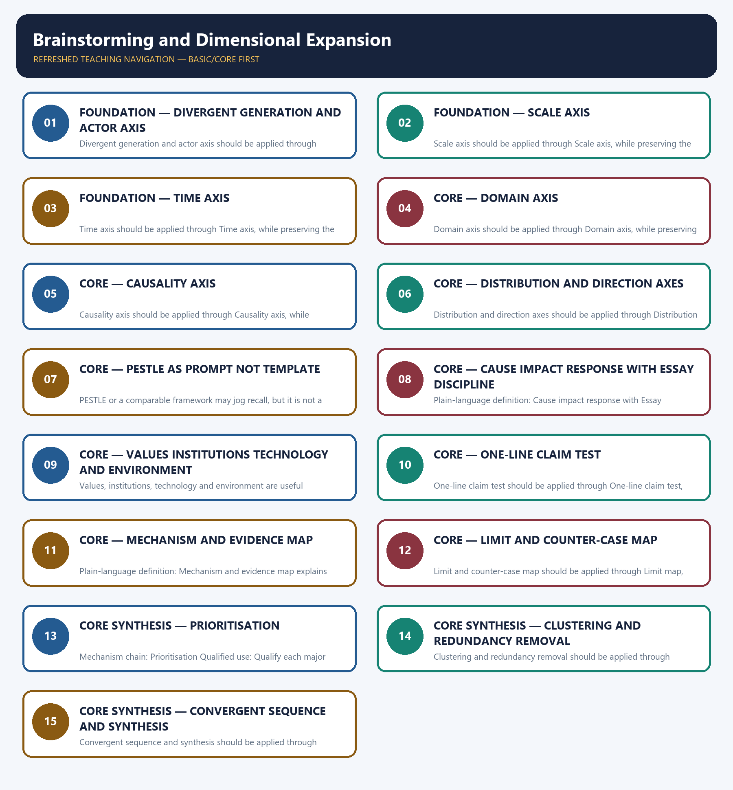

# Brainstorming and Dimensional Expansion — Learner-v2 Complete Learning Session

> **Authoring-only generation:** 2026-09-04. No PDF was rendered and no tracker or index was mutated.

### SOURCE, PROGRESSION AND OFFICIAL-RULE AUDIT

- **Generation date:** 2026-09-04.
- **Source order:** canonical Basic owner first; Advanced owner second; Essay master framework, README, official-syllabus map, answer-worthiness audit and revision chart next; PYQ corpus and official OCR papers after that; live official UPSC pages only as a final check.
- **Basic/Advanced boundary:** complete Basic teaching remains first and Advanced material remains optional and last.
- **OCR boundary:** Repository Markdown was primary. OCR-searchable official UPSC Essay papers were supplementary only for printed instructions and V1 prompt wording. No author, official model answer, current marks split, phase allocation, paragraph count or scoring rubric was inferred.
- **Qdrant:** not used; repository Markdown and local official papers were sufficient.
- **PYQ integrity:** The three cards preserve exact V1 prompt wording from 2023–2025. Their models demonstrate brainstorming, filtering and sequencing rather than an official or complete model essay.
- **Live-source boundary:** The official-site attempts on 2026-09-04 found no official brainstorming framework or dimension count. All axes, PESTLE use, filters and sequencing rules remain explicitly pedagogical and prompt-dependent.
- **No-formula rule:** strategy, heuristics and practice weights are never presented as official UPSC instructions or marking criteria.

### LIVE OFFICIAL-SOURCE ATTEMPT LOG

The checks below were made on 2026-09-04. Substantive official text is used only for the proposition it supports; title-only, blocked or thin pages are recorded and supply no factual claim.

- https://upsc.gov.in/examinations/previous-question-papers — attempted 2026-09-04; the official index was access-blocked, so only locally audited V1 prompts are used in the application cards.
- https://upsc.gov.in/examinations/active-examinations — attempted 2026-09-04; the official page was access-blocked and supplied no official dimension count, brainstorming template or paragraph rule.
- https://upsc.gov.in/sites/default/files/Notif-CSP-2024-Engl-140224.pdf — searched 2026-09-04; the official notification route was recorded only to preserve the scheme boundary, not to validate any framework.

## BASIC LEARNING SESSION



*Distinct embedded teaching-navigation image. The separate continuous Cārvāka-style flowchart package remains an independent at-a-glance artifact.*

### SESSION 1 — FOUNDATION — DIVERGENT GENERATION AND ACTOR AXIS

#### DEFINITION / WHAT THIS IS CALLED

**Plain-language definition:** Objective practice: Apply Divergent generation and actor axis by distinguishing the correct Essay-method move from nearby but invalid shortcuts; no factual-trivia recall is being tested.

**Technical definition:** Divergent generation and actor axis should be applied through Divergent pass and Actor axis, while preserving the difference between official paper instruction and strategy, prompt wording and interpretation, example and evidence, breadth and coherence.

#### ANSWER-GRABBING OPENING — WRITE/ADAPT IN THE EXAM

> Plain-language definition: Divergent generation and actor axis explains how Divergent pass and Actor axis combine into one usable Essay-planning move.

#### MUST-WRITE KEYWORDS

- **FOUNDATION**
- **Divergent generation**
- **actor axis**
- **Plain-language definition**
- **Technical definition**
- **Divergent**

**How to use them:** Frame the answer through FOUNDATION; define Divergent generation, connect actor axis with Plain-language definition to explain the mechanism, and use Technical definition for the decisive comparison or qualification.

#### METHOD MOVE / WHAT THIS DOES

**Plain-language definition:** Divergent generation and actor axis explains how Divergent pass and Actor axis combine into one usable Essay-planning move.

**Technical definition:** The learner fixes the printed prompt, its relationship or demand, the defensible scope, the argument function and the evidence boundary before drafting prose.

#### ANSWER-GRABBING OPENING — WRITE/ADAPT IN THE EXAM

> Divergent generation and actor axis should be applied through Divergent pass and Actor axis, while preserving the difference between official paper instruction and strategy, prompt wording and interpretation, example and evidence, breadth and coherence.

#### MUST-WRITE KEYWORDS

- **Divergent**
- **generation**
- **actor**
- **axis**
- **pass**
- **Begin**

**How to use them:** Define the first three terms, trace the relationship with the next two, and attach the final term to the exact claim, example and qualification. Qualification: Do not treat PESTLE, actor lists or domain lists as mandatory headings.

#### VISUAL FIRST

```text
DIVERGENT GENERATION AND ACTOR AXIS
01. Divergent pass
    |
    v
02. Actor axis
STATUS / CATEGORY FIREWALL -> Do not treat PESTLE, actor lists or domain lists as mandatory headings.
```

*The rail fixes the prompt-to-argument sequence and claim boundary before explanation.*

#### CORE EXPLANATION

Begin by generating a broad pool of possible claims without yet deciding paragraph order, so early preference does not suppress a useful dimension. Search across individual, family, community, institution, state and world actors, but keep only levels that change the claim or mechanism.

#### SIMPLE SYSTEM EXAMPLE

Read Divergent generation and actor axis as a sequence: identify Divergent pass, follow the method through the printed proposition, and stop before adding a rule, attribution, fact or inference the audited sources do not support.

#### TECHNICAL DISTINCTION

The decisive boundary is Do not treat PESTLE, actor lists or domain lists as mandatory headings. This keeps Divergent pass and Actor axis in the correct prompt, method, argument and evidence category.

#### NAMED EVIDENCE AND MECHANISM

- Begin by generating a broad pool of possible claims without yet deciding paragraph order, so early preference does not suppress a useful dimension.
- Search across individual, family, community, institution, state and world actors, but keep only levels that change the claim or mechanism.

#### EXAMINER CAUTION

- Do not treat PESTLE, actor lists or domain lists as mandatory headings.

#### EXAM LINK

- **Objective practice:** Apply Divergent generation and actor axis by distinguishing the correct Essay-method move from nearby but invalid shortcuts; no factual-trivia recall is being tested.
- **Essay application:** Generate broadly before ranking.

#### MINI RECAP

- **Mechanism chain:** Divergent pass -> Actor axis
- **Qualified use:** Generate broadly before ranking.

#### CLOSING RECALL FLOW — FOUNDATION — DIVERGENT GENERATION AND ACTOR AXIS

```text
START / CONCEPT: FOUNDATION — Divergent generation and actor axis
        |
        v
EXACT TERMS: FOUNDATION · Divergent generation · actor axis · Plain-language definition · Technical definition · Divergent
        |
        v
MECHANISM / ARGUMENT: Divergent generation and actor axis should be applied through Divergent pass and Actor axis, while preserving the difference between official paper instruction and strategy, prompt wording and interpretation, example and evidence, breadth and coherence.
        |
        v
CONSEQUENCE / CONTRAST: Read Divergent generation and actor axis as a sequence: identify Divergent pass, follow the method through the printed proposition, and stop before adding a rule, attribution, fact or inference the audited sources do not support.
        |
        v
UPSC TRAP / ANSWER-USE: Objective practice: Apply Divergent generation and actor axis by distinguishing the correct Essay-method move from nearby but invalid shortcuts; no factual-trivia recall is being tested.
        |
        v
ANSWER-GRABBING FORMULATION: Plain-language definition: Divergent generation and actor axis explains how Divergent pass and Actor axis combine into one usable Essay-planning move.
```
### SESSION 2 — FOUNDATION — SCALE AXIS

#### DEFINITION / WHAT THIS IS CALLED

**Plain-language definition:** Objective practice: Apply Scale axis by distinguishing the correct Essay-method move from nearby but invalid shortcuts; no factual-trivia recall is being tested.

**Technical definition:** Scale axis should be applied through Scale axis, while preserving the difference between official paper instruction and strategy, prompt wording and interpretation, example and evidence, breadth and coherence.

#### ANSWER-GRABBING OPENING — WRITE/ADAPT IN THE EXAM

> Plain-language definition: Scale axis explains how Scale axis combine into one usable Essay-planning move.

#### MUST-WRITE KEYWORDS

- **FOUNDATION**
- **Scale axis**
- **Plain-language definition**
- **Technical definition**
- **Scale**
- **axis**

**How to use them:** Frame the answer through FOUNDATION; define Scale axis, connect Plain-language definition with Technical definition to explain the mechanism, and use Scale for the decisive comparison or qualification.

#### METHOD MOVE / WHAT THIS DOES

**Plain-language definition:** Scale axis explains how Scale axis combine into one usable Essay-planning move.

**Technical definition:** The learner fixes the printed prompt, its relationship or demand, the defensible scope, the argument function and the evidence boundary before drafting prose.

#### ANSWER-GRABBING OPENING — WRITE/ADAPT IN THE EXAM

> Scale axis should be applied through Scale axis, while preserving the difference between official paper instruction and strategy, prompt wording and interpretation, example and evidence, breadth and coherence.

#### MUST-WRITE KEYWORDS

- **Scale**
- **axis**
- **Test**
- **local**
- **regional**
- **national**

**How to use them:** Define the first three terms, trace the relationship with the next two, and attach the final term to the exact claim, example and qualification. Qualification: Do not confuse a new label with a genuinely new claim.

#### VISUAL FIRST

```text
SCALE AXIS
01. Scale axis
STATUS / CATEGORY FIREWALL -> Do not confuse a new label with a genuinely new claim.
```

*The rail fixes the prompt-to-argument sequence and claim boundary before explanation.*

#### CORE EXPLANATION

Test local, regional, national, global and civilisational scales without assuming that the same proposition operates identically at each level.

#### SIMPLE SYSTEM EXAMPLE

Read Scale axis as a sequence: identify Scale axis, follow the method through the printed proposition, and stop before adding a rule, attribution, fact or inference the audited sources do not support.

#### TECHNICAL DISTINCTION

The decisive boundary is Do not confuse a new label with a genuinely new claim. This keeps Scale axis in the correct prompt, method, argument and evidence category.

#### NAMED EVIDENCE AND MECHANISM

- Test local, regional, national, global and civilisational scales without assuming that the same proposition operates identically at each level.

#### EXAMINER CAUTION

- Do not confuse a new label with a genuinely new claim.

#### EXAM LINK

- **Objective practice:** Apply Scale axis by distinguishing the correct Essay-method move from nearby but invalid shortcuts; no factual-trivia recall is being tested.
- **Essay application:** Use actors only when the mechanism changes across them.

#### MINI RECAP

- **Mechanism chain:** Scale axis
- **Qualified use:** Use actors only when the mechanism changes across them.

#### CLOSING RECALL FLOW — FOUNDATION — SCALE AXIS

```text
START / CONCEPT: FOUNDATION — Scale axis
        |
        v
EXACT TERMS: FOUNDATION · Scale axis · Plain-language definition · Technical definition · Scale · axis
        |
        v
MECHANISM / ARGUMENT: Scale axis should be applied through Scale axis, while preserving the difference between official paper instruction and strategy, prompt wording and interpretation, example and evidence, breadth and coherence.
        |
        v
CONSEQUENCE / CONTRAST: Read Scale axis as a sequence: identify Scale axis, follow the method through the printed proposition, and stop before adding a rule, attribution, fact or inference the audited sources do not support.
        |
        v
UPSC TRAP / ANSWER-USE: Objective practice: Apply Scale axis by distinguishing the correct Essay-method move from nearby but invalid shortcuts; no factual-trivia recall is being tested.
        |
        v
ANSWER-GRABBING FORMULATION: Plain-language definition: Scale axis explains how Scale axis combine into one usable Essay-planning move.
```
### SESSION 3 — FOUNDATION — TIME AXIS

#### DEFINITION / WHAT THIS IS CALLED

**Plain-language definition:** Objective practice: Apply Time axis by distinguishing the correct Essay-method move from nearby but invalid shortcuts; no factual-trivia recall is being tested.

**Technical definition:** Time axis should be applied through Time axis, while preserving the difference between official paper instruction and strategy, prompt wording and interpretation, example and evidence, breadth and coherence.

#### ANSWER-GRABBING OPENING — WRITE/ADAPT IN THE EXAM

> Plain-language definition: Time axis explains how Time axis combine into one usable Essay-planning move.

#### MUST-WRITE KEYWORDS

- **FOUNDATION**
- **Time axis**
- **Plain-language definition**
- **Technical definition**
- **Time**
- **axis**

**How to use them:** Frame the answer through FOUNDATION; define Time axis, connect Plain-language definition with Technical definition to explain the mechanism, and use Time for the decisive comparison or qualification.

#### METHOD MOVE / WHAT THIS DOES

**Plain-language definition:** Time axis explains how Time axis combine into one usable Essay-planning move.

**Technical definition:** The learner fixes the printed prompt, its relationship or demand, the defensible scope, the argument function and the evidence boundary before drafting prose.

#### ANSWER-GRABBING OPENING — WRITE/ADAPT IN THE EXAM

> Time axis should be applied through Time axis, while preserving the difference between official paper instruction and strategy, prompt wording and interpretation, example and evidence, breadth and coherence.

#### MUST-WRITE KEYWORDS

- **Time**
- **axis**
- **Historical**
- **origin**
- **present**
- **manifestation**

**How to use them:** Define the first three terms, trace the relationship with the next two, and attach the final term to the exact claim, example and qualification. Qualification: Do not force a historical, future or global angle where the prompt does not support it.

#### VISUAL FIRST

```text
TIME AXIS
01. Time axis
STATUS / CATEGORY FIREWALL -> Do not force a historical, future or global angle where the prompt does not support it.
```

*The rail fixes the prompt-to-argument sequence and claim boundary before explanation.*

#### CORE EXPLANATION

Historical origin, present manifestation and plausible future trajectory are prompts for inquiry, not mandatory sections.

#### SIMPLE SYSTEM EXAMPLE

Read Time axis as a sequence: identify Time axis, follow the method through the printed proposition, and stop before adding a rule, attribution, fact or inference the audited sources do not support.

#### TECHNICAL DISTINCTION

The decisive boundary is Do not force a historical, future or global angle where the prompt does not support it. This keeps Time axis in the correct prompt, method, argument and evidence category.

#### NAMED EVIDENCE AND MECHANISM

- Historical origin, present manifestation and plausible future trajectory are prompts for inquiry, not mandatory sections.

#### EXAMINER CAUTION

- Do not force a historical, future or global angle where the prompt does not support it.

#### EXAM LINK

- **Objective practice:** Apply Time axis by distinguishing the correct Essay-method move from nearby but invalid shortcuts; no factual-trivia recall is being tested.
- **Essay application:** Move scale only where the proposition remains textually defensible.

#### MINI RECAP

- **Mechanism chain:** Time axis
- **Qualified use:** Move scale only where the proposition remains textually defensible.

#### CLOSING RECALL FLOW — FOUNDATION — TIME AXIS

```text
START / CONCEPT: FOUNDATION — Time axis
        |
        v
EXACT TERMS: FOUNDATION · Time axis · Plain-language definition · Technical definition · Time · axis
        |
        v
MECHANISM / ARGUMENT: Time axis should be applied through Time axis, while preserving the difference between official paper instruction and strategy, prompt wording and interpretation, example and evidence, breadth and coherence.
        |
        v
CONSEQUENCE / CONTRAST: Read Time axis as a sequence: identify Time axis, follow the method through the printed proposition, and stop before adding a rule, attribution, fact or inference the audited sources do not support.
        |
        v
UPSC TRAP / ANSWER-USE: Objective practice: Apply Time axis by distinguishing the correct Essay-method move from nearby but invalid shortcuts; no factual-trivia recall is being tested.
        |
        v
ANSWER-GRABBING FORMULATION: Plain-language definition: Time axis explains how Time axis combine into one usable Essay-planning move.
```
### SESSION 4 — CORE — DOMAIN AXIS

#### DEFINITION / WHAT THIS IS CALLED

**Plain-language definition:** Objective practice: Apply Domain axis by distinguishing the correct Essay-method move from nearby but invalid shortcuts; no factual-trivia recall is being tested.

**Technical definition:** Domain axis should be applied through Domain axis, while preserving the difference between official paper instruction and strategy, prompt wording and interpretation, example and evidence, breadth and coherence.

#### ANSWER-GRABBING OPENING — WRITE/ADAPT IN THE EXAM

> Plain-language definition: Domain axis explains how Domain axis combine into one usable Essay-planning move.

#### MUST-WRITE KEYWORDS

- **Domain axis**
- **Plain-language definition**
- **Technical definition**
- **Domain**
- **axis**
- **Material**

**How to use them:** Frame the answer through Domain axis; define Plain-language definition, connect Technical definition with Domain to explain the mechanism, and use axis for the decisive comparison or qualification.

#### METHOD MOVE / WHAT THIS DOES

**Plain-language definition:** Domain axis explains how Domain axis combine into one usable Essay-planning move.

**Technical definition:** The learner fixes the printed prompt, its relationship or demand, the defensible scope, the argument function and the evidence boundary before drafting prose.

#### ANSWER-GRABBING OPENING — WRITE/ADAPT IN THE EXAM

> Domain axis should be applied through Domain axis, while preserving the difference between official paper instruction and strategy, prompt wording and interpretation, example and evidence, breadth and coherence.

#### MUST-WRITE KEYWORDS

- **Domain**
- **axis**
- **Material**
- **political**
- **economic**
- **social**

**How to use them:** Define the first three terms, trace the relationship with the next two, and attach the final term to the exact claim, example and qualification. Qualification: Do not keep a dimension that lacks a mechanism.

#### VISUAL FIRST

```text
DOMAIN AXIS
01. Domain axis
STATUS / CATEGORY FIREWALL -> Do not keep a dimension that lacks a mechanism.
```

*The rail fixes the prompt-to-argument sequence and claim boundary before explanation.*

#### CORE EXPLANATION

Material, political, economic, social, ethical, technological, ecological and cultural lenses are a search field, not a checklist.

#### SIMPLE SYSTEM EXAMPLE

Read Domain axis as a sequence: identify Domain axis, follow the method through the printed proposition, and stop before adding a rule, attribution, fact or inference the audited sources do not support.

#### TECHNICAL DISTINCTION

The decisive boundary is Do not keep a dimension that lacks a mechanism. This keeps Domain axis in the correct prompt, method, argument and evidence category.

#### NAMED EVIDENCE AND MECHANISM

- Material, political, economic, social, ethical, technological, ecological and cultural lenses are a search field, not a checklist.

#### EXAMINER CAUTION

- Do not keep a dimension that lacks a mechanism.

#### EXAM LINK

- **Objective practice:** Apply Domain axis by distinguishing the correct Essay-method move from nearby but invalid shortcuts; no factual-trivia recall is being tested.
- **Essay application:** Use time to reveal change, not to fill sections.

#### MINI RECAP

- **Mechanism chain:** Domain axis
- **Qualified use:** Use time to reveal change, not to fill sections.

#### CLOSING RECALL FLOW — CORE — DOMAIN AXIS

```text
START / CONCEPT: CORE — Domain axis
        |
        v
EXACT TERMS: Domain axis · Plain-language definition · Technical definition · Domain · axis · Material
        |
        v
MECHANISM / ARGUMENT: Domain axis should be applied through Domain axis, while preserving the difference between official paper instruction and strategy, prompt wording and interpretation, example and evidence, breadth and coherence.
        |
        v
CONSEQUENCE / CONTRAST: Read Domain axis as a sequence: identify Domain axis, follow the method through the printed proposition, and stop before adding a rule, attribution, fact or inference the audited sources do not support.
        |
        v
UPSC TRAP / ANSWER-USE: Objective practice: Apply Domain axis by distinguishing the correct Essay-method move from nearby but invalid shortcuts; no factual-trivia recall is being tested.
        |
        v
ANSWER-GRABBING FORMULATION: Plain-language definition: Domain axis explains how Domain axis combine into one usable Essay-planning move.
```
### SESSION 5 — CORE — CAUSALITY AXIS

#### DEFINITION / WHAT THIS IS CALLED

**Plain-language definition:** Objective practice: Apply Causality axis by distinguishing the correct Essay-method move from nearby but invalid shortcuts; no factual-trivia recall is being tested.

**Technical definition:** Causality axis should be applied through Causality axis, while preserving the difference between official paper instruction and strategy, prompt wording and interpretation, example and evidence, breadth and coherence.

#### ANSWER-GRABBING OPENING — WRITE/ADAPT IN THE EXAM

> Plain-language definition: Causality axis explains how Causality axis combine into one usable Essay-planning move.

#### MUST-WRITE KEYWORDS

- **Causality axis**
- **Plain-language definition**
- **Technical definition**
- **Causality**
- **axis**
- **Generate**

**How to use them:** Frame the answer through Causality axis; define Plain-language definition, connect Technical definition with Causality to explain the mechanism, and use axis for the decisive comparison or qualification.

#### METHOD MOVE / WHAT THIS DOES

**Plain-language definition:** Causality axis explains how Causality axis combine into one usable Essay-planning move.

**Technical definition:** The learner fixes the printed prompt, its relationship or demand, the defensible scope, the argument function and the evidence boundary before drafting prose.

#### ANSWER-GRABBING OPENING — WRITE/ADAPT IN THE EXAM

> Causality axis should be applied through Causality axis, while preserving the difference between official paper instruction and strategy, prompt wording and interpretation, example and evidence, breadth and coherence.

#### MUST-WRITE KEYWORDS

- **Causality**
- **axis**
- **Generate**
- **immediate**
- **causes**
- **structural**

**How to use them:** Define the first three terms, trace the relationship with the next two, and attach the final term to the exact claim, example and qualification. Qualification: Do not keep a dimension whose only evidence is unsafe recall.

#### VISUAL FIRST

```text
CAUSALITY AXIS
01. Causality axis
STATUS / CATEGORY FIREWALL -> Do not keep a dimension whose only evidence is unsafe recall.
```

*The rail fixes the prompt-to-argument sequence and claim boundary before explanation.*

#### CORE EXPLANATION

Generate immediate causes, structural causes, consequences, feedback loops and response choices where the decoded proposition supports them.

#### SIMPLE SYSTEM EXAMPLE

Read Causality axis as a sequence: identify Causality axis, follow the method through the printed proposition, and stop before adding a rule, attribution, fact or inference the audited sources do not support.

#### TECHNICAL DISTINCTION

The decisive boundary is Do not keep a dimension whose only evidence is unsafe recall. This keeps Causality axis in the correct prompt, method, argument and evidence category.

#### NAMED EVIDENCE AND MECHANISM

- Generate immediate causes, structural causes, consequences, feedback loops and response choices where the decoded proposition supports them.

#### EXAMINER CAUTION

- Do not keep a dimension whose only evidence is unsafe recall.

#### EXAM LINK

- **Objective practice:** Apply Causality axis by distinguishing the correct Essay-method move from nearby but invalid shortcuts; no factual-trivia recall is being tested.
- **Essay application:** Select domains that contribute distinct analytical work.

#### MINI RECAP

- **Mechanism chain:** Causality axis
- **Qualified use:** Select domains that contribute distinct analytical work.

#### CLOSING RECALL FLOW — CORE — CAUSALITY AXIS

```text
START / CONCEPT: CORE — Causality axis
        |
        v
EXACT TERMS: Causality axis · Plain-language definition · Technical definition · Causality · axis · Generate
        |
        v
MECHANISM / ARGUMENT: Causality axis should be applied through Causality axis, while preserving the difference between official paper instruction and strategy, prompt wording and interpretation, example and evidence, breadth and coherence.
        |
        v
CONSEQUENCE / CONTRAST: Read Causality axis as a sequence: identify Causality axis, follow the method through the printed proposition, and stop before adding a rule, attribution, fact or inference the audited sources do not support.
        |
        v
UPSC TRAP / ANSWER-USE: Objective practice: Apply Causality axis by distinguishing the correct Essay-method move from nearby but invalid shortcuts; no factual-trivia recall is being tested.
        |
        v
ANSWER-GRABBING FORMULATION: Plain-language definition: Causality axis explains how Causality axis combine into one usable Essay-planning move.
```
### SESSION 6 — CORE — DISTRIBUTION AND DIRECTION AXES

#### DEFINITION / WHAT THIS IS CALLED

**Plain-language definition:** Objective practice: Apply Distribution and direction axes by distinguishing the correct Essay-method move from nearby but invalid shortcuts; no factual-trivia recall is being tested.

**Technical definition:** Distribution and direction axes should be applied through Distribution axis and Direction axis, while preserving the difference between official paper instruction and strategy, prompt wording and interpretation, example and evidence, breadth and coherence.

#### ANSWER-GRABBING OPENING — WRITE/ADAPT IN THE EXAM

> Plain-language definition: Distribution and direction axes explains how Distribution axis and Direction axis combine into one usable Essay-planning move.

#### MUST-WRITE KEYWORDS

- **Distribution**
- **direction axes**
- **Plain-language definition**
- **Technical definition**
- **direction**
- **axes**

**How to use them:** Frame the answer through Distribution; define direction axes, connect Plain-language definition with Technical definition to explain the mechanism, and use direction for the decisive comparison or qualification.

#### METHOD MOVE / WHAT THIS DOES

**Plain-language definition:** Distribution and direction axes explains how Distribution axis and Direction axis combine into one usable Essay-planning move.

**Technical definition:** The learner fixes the printed prompt, its relationship or demand, the defensible scope, the argument function and the evidence boundary before drafting prose.

#### ANSWER-GRABBING OPENING — WRITE/ADAPT IN THE EXAM

> Distribution and direction axes should be applied through Distribution axis and Direction axis, while preserving the difference between official paper instruction and strategy, prompt wording and interpretation, example and evidence, breadth and coherence.

#### MUST-WRITE KEYWORDS

- **Distribution**
- **direction**
- **axes**
- **axis**
- **gains**
- **loses**

**How to use them:** Define the first three terms, trace the relationship with the next two, and attach the final term to the exact claim, example and qualification. Qualification: Do not use cause-impact-response as a disguised GS answer.

#### VISUAL FIRST

```text
DISTRIBUTION AND DIRECTION AXES
01. Distribution axis
    |
    v
02. Direction axis
STATUS / CATEGORY FIREWALL -> Do not use cause-impact-response as a disguised GS answer.
```

*The rail fixes the prompt-to-argument sequence and claim boundary before explanation.*

#### CORE EXPLANATION

Ask who gains, loses, decides, bears cost or remains invisible; a distributional claim must still connect to the central proposition. Test intended benefits, unintended consequences and double effects rather than assuming every dimension moves in one direction.

#### SIMPLE SYSTEM EXAMPLE

Read Distribution and direction axes as a sequence: identify Distribution axis, follow the method through the printed proposition, and stop before adding a rule, attribution, fact or inference the audited sources do not support.

#### TECHNICAL DISTINCTION

The decisive boundary is Do not use cause-impact-response as a disguised GS answer. This keeps Distribution axis and Direction axis in the correct prompt, method, argument and evidence category.

#### NAMED EVIDENCE AND MECHANISM

- Ask who gains, loses, decides, bears cost or remains invisible; a distributional claim must still connect to the central proposition.
- Test intended benefits, unintended consequences and double effects rather than assuming every dimension moves in one direction.

#### EXAMINER CAUTION

- Do not use cause-impact-response as a disguised GS answer.

#### EXAM LINK

- **Objective practice:** Apply Distribution and direction axes by distinguishing the correct Essay-method move from nearby but invalid shortcuts; no factual-trivia recall is being tested.
- **Essay application:** Trace causes, effects and feedback without creating a list.

#### MINI RECAP

- **Mechanism chain:** Distribution axis -> Direction axis
- **Qualified use:** Trace causes, effects and feedback without creating a list.

#### CLOSING RECALL FLOW — CORE — DISTRIBUTION AND DIRECTION AXES

```text
START / CONCEPT: CORE — Distribution and direction axes
        |
        v
EXACT TERMS: Distribution · direction axes · Plain-language definition · Technical definition · direction · axes
        |
        v
MECHANISM / ARGUMENT: Distribution and direction axes should be applied through Distribution axis and Direction axis, while preserving the difference between official paper instruction and strategy, prompt wording and interpretation, example and evidence, breadth and coherence.
        |
        v
CONSEQUENCE / CONTRAST: Read Distribution and direction axes as a sequence: identify Distribution axis, follow the method through the printed proposition, and stop before adding a rule, attribution, fact or inference the audited sources do not support.
        |
        v
UPSC TRAP / ANSWER-USE: Objective practice: Apply Distribution and direction axes by distinguishing the correct Essay-method move from nearby but invalid shortcuts; no factual-trivia recall is being tested.
        |
        v
ANSWER-GRABBING FORMULATION: Plain-language definition: Distribution and direction axes explains how Distribution axis and Direction axis combine into one usable Essay-planning move.
```
### SESSION 7 — CORE — PESTLE AS PROMPT NOT TEMPLATE

#### DEFINITION / WHAT THIS IS CALLED

**Plain-language definition:** Objective practice: Apply PESTLE as prompt not template by distinguishing the correct Essay-method move from nearby but invalid shortcuts; no factual-trivia recall is being tested.

**Technical definition:** PESTLE or a comparable framework may jog recall, but it is not a compulsory Essay template and should disappear once prompt-specific claims emerge.

#### ANSWER-GRABBING OPENING — WRITE/ADAPT IN THE EXAM

> Plain-language definition: PESTLE as prompt not template explains how PESTLE boundary combine into one usable Essay-planning move.

#### MUST-WRITE KEYWORDS

- **PESTLE as prompt not template**
- **Plain-language definition**
- **Technical definition**
- **PESTLE**
- **prompt**
- **template**

**How to use them:** Frame the answer through PESTLE as prompt not template; define Plain-language definition, connect Technical definition with PESTLE to explain the mechanism, and use prompt for the decisive comparison or qualification.

#### METHOD MOVE / WHAT THIS DOES

**Plain-language definition:** PESTLE as prompt not template explains how PESTLE boundary combine into one usable Essay-planning move.

**Technical definition:** The learner fixes the printed prompt, its relationship or demand, the defensible scope, the argument function and the evidence boundary before drafting prose.

#### ANSWER-GRABBING OPENING — WRITE/ADAPT IN THE EXAM

> PESTLE as prompt not template should be applied through PESTLE boundary, while preserving the difference between official paper instruction and strategy, prompt wording and interpretation, example and evidence, breadth and coherence.

#### MUST-WRITE KEYWORDS

- **PESTLE**
- **prompt**
- **template**
- **boundary**
- **comparable**
- **framework**

**How to use them:** Define the first three terms, trace the relationship with the next two, and attach the final term to the exact claim, example and qualification. Qualification: Do not mistake breadth for coherence.

#### VISUAL FIRST

```text
PESTLE AS PROMPT NOT TEMPLATE
01. PESTLE boundary
STATUS / CATEGORY FIREWALL -> Do not mistake breadth for coherence.
```

*The rail fixes the prompt-to-argument sequence and claim boundary before explanation.*

#### CORE EXPLANATION

PESTLE or a comparable framework may jog recall, but it is not a compulsory Essay template and should disappear once prompt-specific claims emerge.

#### SIMPLE SYSTEM EXAMPLE

Read PESTLE as prompt not template as a sequence: identify PESTLE boundary, follow the method through the printed proposition, and stop before adding a rule, attribution, fact or inference the audited sources do not support.

#### TECHNICAL DISTINCTION

The decisive boundary is Do not mistake breadth for coherence. This keeps PESTLE boundary in the correct prompt, method, argument and evidence category.

#### NAMED EVIDENCE AND MECHANISM

- PESTLE or a comparable framework may jog recall, but it is not a compulsory Essay template and should disappear once prompt-specific claims emerge.

#### EXAMINER CAUTION

- Do not mistake breadth for coherence.

#### EXAM LINK

- **Objective practice:** Apply PESTLE as prompt not template by distinguishing the correct Essay-method move from nearby but invalid shortcuts; no factual-trivia recall is being tested.
- **Essay application:** Add distribution and double-effect analysis where relevant.

#### MINI RECAP

- **Mechanism chain:** PESTLE boundary
- **Qualified use:** Add distribution and double-effect analysis where relevant.

#### CLOSING RECALL FLOW — CORE — PESTLE AS PROMPT NOT TEMPLATE

```text
START / CONCEPT: CORE — PESTLE as prompt not template
        |
        v
EXACT TERMS: PESTLE as prompt not template · Plain-language definition · Technical definition · PESTLE · prompt · template
        |
        v
MECHANISM / ARGUMENT: PESTLE as prompt not template should be applied through PESTLE boundary, while preserving the difference between official paper instruction and strategy, prompt wording and interpretation, example and evidence, breadth and coherence.
        |
        v
CONSEQUENCE / CONTRAST: Read PESTLE as prompt not template as a sequence: identify PESTLE boundary, follow the method through the printed proposition, and stop before adding a rule, attribution, fact or inference the audited sources do not support.
        |
        v
UPSC TRAP / ANSWER-USE: Objective practice: Apply PESTLE as prompt not template by distinguishing the correct Essay-method move from nearby but invalid shortcuts; no factual-trivia recall is being tested.
        |
        v
ANSWER-GRABBING FORMULATION: Plain-language definition: PESTLE as prompt not template explains how PESTLE boundary combine into one usable Essay-planning move.
```
### SESSION 8 — CORE — CAUSE IMPACT RESPONSE WITH ESSAY DISCIPLINE

#### DEFINITION / WHAT THIS IS CALLED

**Plain-language definition:** Objective practice: Apply Cause impact response with Essay discipline by distinguishing the correct Essay-method move from nearby but invalid shortcuts; no factual-trivia recall is being tested.

**Technical definition:** Plain-language definition: Cause impact response with Essay discipline explains how Cause-impact-response boundary combine into one usable Essay-planning move.

#### ANSWER-GRABBING OPENING — WRITE/ADAPT IN THE EXAM

> Plain-language definition: Cause impact response with Essay discipline explains how Cause-impact-response boundary combine into one usable Essay-planning move.

#### MUST-WRITE KEYWORDS

- **Cause impact response with Essay discipline**
- **Plain-language definition**
- **Technical definition**
- **Cause**
- **response**
- **discipline**

**How to use them:** Frame the answer through Cause impact response with Essay discipline; define Plain-language definition, connect Technical definition with Cause to explain the mechanism, and use response for the decisive comparison or qualification.

#### METHOD MOVE / WHAT THIS DOES

**Plain-language definition:** Cause impact response with Essay discipline explains how Cause-impact-response boundary combine into one usable Essay-planning move.

**Technical definition:** The learner fixes the printed prompt, its relationship or demand, the defensible scope, the argument function and the evidence boundary before drafting prose.

#### ANSWER-GRABBING OPENING — WRITE/ADAPT IN THE EXAM

> Cause impact response with Essay discipline should be applied through Cause-impact-response boundary, while preserving the difference between official paper instruction and strategy, prompt wording and interpretation, example and evidence, breadth and coherence.

#### MUST-WRITE KEYWORDS

- **Cause**
- **impact**
- **response**
- **discipline**
- **Cause-impact-response**
- **boundary**

**How to use them:** Define the first three terms, trace the relationship with the next two, and attach the final term to the exact claim, example and qualification. Qualification: Do not preserve redundant material because time was spent generating it.

#### VISUAL FIRST

```text
CAUSE IMPACT RESPONSE WITH ESSAY DISCIPLINE
01. Cause-impact-response boundary
STATUS / CATEGORY FIREWALL -> Do not preserve redundant material because time was spent generating it.
```

*The rail fixes the prompt-to-argument sequence and claim boundary before explanation.*

#### CORE EXPLANATION

Cause-impact-response can organise an issue prompt, but each part must serve one thesis and must not collapse into a generic GS answer.

#### SIMPLE SYSTEM EXAMPLE

Read Cause impact response with Essay discipline as a sequence: identify Cause-impact-response boundary, follow the method through the printed proposition, and stop before adding a rule, attribution, fact or inference the audited sources do not support.

#### TECHNICAL DISTINCTION

The decisive boundary is Do not preserve redundant material because time was spent generating it. This keeps Cause-impact-response boundary in the correct prompt, method, argument and evidence category.

#### NAMED EVIDENCE AND MECHANISM

- Cause-impact-response can organise an issue prompt, but each part must serve one thesis and must not collapse into a generic GS answer.

#### EXAMINER CAUTION

- Do not preserve redundant material because time was spent generating it.

#### EXAM LINK

- **Objective practice:** Apply Cause impact response with Essay discipline by distinguishing the correct Essay-method move from nearby but invalid shortcuts; no factual-trivia recall is being tested.
- **Essay application:** Discard framework labels after they have generated prompt-specific claims.

#### MINI RECAP

- **Mechanism chain:** Cause-impact-response boundary
- **Qualified use:** Discard framework labels after they have generated prompt-specific claims.

#### CLOSING RECALL FLOW — CORE — CAUSE IMPACT RESPONSE WITH ESSAY DISCIPLINE

```text
START / CONCEPT: CORE — Cause impact response with Essay discipline
        |
        v
EXACT TERMS: Cause impact response with Essay discipline · Plain-language definition · Technical definition · Cause · response · discipline
        |
        v
MECHANISM / ARGUMENT: Cause impact response with Essay discipline should be applied through Cause-impact-response boundary, while preserving the difference between official paper instruction and strategy, prompt wording and interpretation, example and evidence, breadth and coherence.
        |
        v
CONSEQUENCE / CONTRAST: Read Cause impact response with Essay discipline as a sequence: identify Cause-impact-response boundary, follow the method through the printed proposition, and stop before adding a rule, attribution, fact or inference the audited sources do not support.
        |
        v
UPSC TRAP / ANSWER-USE: Objective practice: Apply Cause impact response with Essay discipline by distinguishing the correct Essay-method move from nearby but invalid shortcuts; no factual-trivia recall is being tested.
        |
        v
ANSWER-GRABBING FORMULATION: Plain-language definition: Cause impact response with Essay discipline explains how Cause-impact-response boundary combine into one usable Essay-planning move.
```
### SESSION 9 — CORE — VALUES INSTITUTIONS TECHNOLOGY AND ENVIRONMENT

#### DEFINITION / WHAT THIS IS CALLED

**Plain-language definition:** Objective practice: Apply Values institutions technology and environment by distinguishing the correct Essay-method move from nearby but invalid shortcuts; no factual-trivia recall is being tested.

**Technical definition:** Values, institutions, technology and environment are useful cross-checks when they expose different mechanisms, actors or trade-offs.

#### ANSWER-GRABBING OPENING — WRITE/ADAPT IN THE EXAM

> Plain-language definition: Values institutions technology and environment explains how Value-institution-technology-environment pass combine into one usable Essay-planning move.

#### MUST-WRITE KEYWORDS

- **Values institutions technology**
- **environment**
- **Plain-language definition**
- **Technical definition**
- **Values**
- **institutions**

**How to use them:** Frame the answer through Values institutions technology; define environment, connect Plain-language definition with Technical definition to explain the mechanism, and use Values for the decisive comparison or qualification.

#### METHOD MOVE / WHAT THIS DOES

**Plain-language definition:** Values institutions technology and environment explains how Value-institution-technology-environment pass combine into one usable Essay-planning move.

**Technical definition:** The learner fixes the printed prompt, its relationship or demand, the defensible scope, the argument function and the evidence boundary before drafting prose.

#### ANSWER-GRABBING OPENING — WRITE/ADAPT IN THE EXAM

> Values institutions technology and environment should be applied through Value-institution-technology-environment pass, while preserving the difference between official paper instruction and strategy, prompt wording and interpretation, example and evidence, breadth and coherence.

#### MUST-WRITE KEYWORDS

- **Values**
- **institutions**
- **technology**
- **environment**
- **Value-institution-technology-environment**
- **pass**

**How to use them:** Define the first three terms, trace the relationship with the next two, and attach the final term to the exact claim, example and qualification. Qualification: Do not write one thin paragraph for every brainstormed dimension.

#### VISUAL FIRST

```text
VALUES INSTITUTIONS TECHNOLOGY AND ENVIRONMENT
01. Value-institution-technology-environment pass
STATUS / CATEGORY FIREWALL -> Do not write one thin paragraph for every brainstormed dimension.
```

*The rail fixes the prompt-to-argument sequence and claim boundary before explanation.*

#### CORE EXPLANATION

Values, institutions, technology and environment are useful cross-checks when they expose different mechanisms, actors or trade-offs.

#### SIMPLE SYSTEM EXAMPLE

Read Values institutions technology and environment as a sequence: identify Value-institution-technology-environment pass, follow the method through the printed proposition, and stop before adding a rule, attribution, fact or inference the audited sources do not support.

#### TECHNICAL DISTINCTION

The decisive boundary is Do not write one thin paragraph for every brainstormed dimension. This keeps Value-institution-technology-environment pass in the correct prompt, method, argument and evidence category.

#### NAMED EVIDENCE AND MECHANISM

- Values, institutions, technology and environment are useful cross-checks when they expose different mechanisms, actors or trade-offs.

#### EXAMINER CAUTION

- Do not write one thin paragraph for every brainstormed dimension.

#### EXAM LINK

- **Objective practice:** Apply Values institutions technology and environment by distinguishing the correct Essay-method move from nearby but invalid shortcuts; no factual-trivia recall is being tested.
- **Essay application:** Keep every cause, impact and response tied to one thesis.

#### MINI RECAP

- **Mechanism chain:** Value-institution-technology-environment pass
- **Qualified use:** Keep every cause, impact and response tied to one thesis.

#### CLOSING RECALL FLOW — CORE — VALUES INSTITUTIONS TECHNOLOGY AND ENVIRONMENT

```text
START / CONCEPT: CORE — Values institutions technology and environment
        |
        v
EXACT TERMS: Values institutions technology · environment · Plain-language definition · Technical definition · Values · institutions
        |
        v
MECHANISM / ARGUMENT: Values institutions technology and environment should be applied through Value-institution-technology-environment pass, while preserving the difference between official paper instruction and strategy, prompt wording and interpretation, example and evidence, breadth and coherence.
        |
        v
CONSEQUENCE / CONTRAST: Read Values institutions technology and environment as a sequence: identify Value-institution-technology-environment pass, follow the method through the printed proposition, and stop before adding a rule, attribution, fact or inference the audited sources do not support.
        |
        v
UPSC TRAP / ANSWER-USE: Objective practice: Apply Values institutions technology and environment by distinguishing the correct Essay-method move from nearby but invalid shortcuts; no factual-trivia recall is being tested.
        |
        v
ANSWER-GRABBING FORMULATION: Plain-language definition: Values institutions technology and environment explains how Value-institution-technology-environment pass combine into one usable Essay-planning move.
```
### SESSION 10 — CORE — ONE-LINE CLAIM TEST

#### DEFINITION / WHAT THIS IS CALLED

**Plain-language definition:** Objective practice: Apply One-line claim test by distinguishing the correct Essay-method move from nearby but invalid shortcuts; no factual-trivia recall is being tested.

**Technical definition:** One-line claim test should be applied through One-line claim test, while preserving the difference between official paper instruction and strategy, prompt wording and interpretation, example and evidence, breadth and coherence.

#### ANSWER-GRABBING OPENING — WRITE/ADAPT IN THE EXAM

> Plain-language definition: One-line claim test explains how One-line claim test combine into one usable Essay-planning move.

#### MUST-WRITE KEYWORDS

- **One-line claim test**
- **Plain-language definition**
- **Technical definition**
- **One-line**
- **test**
- **each**

**How to use them:** Frame the answer through One-line claim test; define Plain-language definition, connect Technical definition with One-line to explain the mechanism, and use test for the decisive comparison or qualification.

#### METHOD MOVE / WHAT THIS DOES

**Plain-language definition:** One-line claim test explains how One-line claim test combine into one usable Essay-planning move.

**Technical definition:** The learner fixes the printed prompt, its relationship or demand, the defensible scope, the argument function and the evidence boundary before drafting prose.

#### ANSWER-GRABBING OPENING — WRITE/ADAPT IN THE EXAM

> One-line claim test should be applied through One-line claim test, while preserving the difference between official paper instruction and strategy, prompt wording and interpretation, example and evidence, breadth and coherence.

#### MUST-WRITE KEYWORDS

- **One-line**
- **test**
- **State**
- **each**
- **candidate**
- **dimension**

**How to use them:** Define the first three terms, trace the relationship with the next two, and attach the final term to the exact claim, example and qualification. Qualification: Do not sequence clusters as an unconnected catalogue.

#### VISUAL FIRST

```text
ONE-LINE CLAIM TEST
01. One-line claim test
STATUS / CATEGORY FIREWALL -> Do not sequence clusters as an unconnected catalogue.
```

*The rail fixes the prompt-to-argument sequence and claim boundary before explanation.*

#### CORE EXPLANATION

State each candidate dimension as one sentence; if two sentences make the same claim, one is redundant despite different labels.

#### SIMPLE SYSTEM EXAMPLE

Read One-line claim test as a sequence: identify One-line claim test, follow the method through the printed proposition, and stop before adding a rule, attribution, fact or inference the audited sources do not support.

#### TECHNICAL DISTINCTION

The decisive boundary is Do not sequence clusters as an unconnected catalogue. This keeps One-line claim test in the correct prompt, method, argument and evidence category.

#### NAMED EVIDENCE AND MECHANISM

- State each candidate dimension as one sentence; if two sentences make the same claim, one is redundant despite different labels.

#### EXAMINER CAUTION

- Do not sequence clusters as an unconnected catalogue.

#### EXAM LINK

- **Objective practice:** Apply One-line claim test by distinguishing the correct Essay-method move from nearby but invalid shortcuts; no factual-trivia recall is being tested.
- **Essay application:** Use cross-check lenses to expose omitted mechanisms or trade-offs.

#### MINI RECAP

- **Mechanism chain:** One-line claim test
- **Qualified use:** Use cross-check lenses to expose omitted mechanisms or trade-offs.

#### CLOSING RECALL FLOW — CORE — ONE-LINE CLAIM TEST

```text
START / CONCEPT: CORE — One-line claim test
        |
        v
EXACT TERMS: One-line claim test · Plain-language definition · Technical definition · One-line · test · each
        |
        v
MECHANISM / ARGUMENT: One-line claim test should be applied through One-line claim test, while preserving the difference between official paper instruction and strategy, prompt wording and interpretation, example and evidence, breadth and coherence.
        |
        v
CONSEQUENCE / CONTRAST: Read One-line claim test as a sequence: identify One-line claim test, follow the method through the printed proposition, and stop before adding a rule, attribution, fact or inference the audited sources do not support.
        |
        v
UPSC TRAP / ANSWER-USE: Objective practice: Apply One-line claim test by distinguishing the correct Essay-method move from nearby but invalid shortcuts; no factual-trivia recall is being tested.
        |
        v
ANSWER-GRABBING FORMULATION: Plain-language definition: One-line claim test explains how One-line claim test combine into one usable Essay-planning move.
```
### SESSION 11 — CORE — MECHANISM AND EVIDENCE MAP

#### DEFINITION / WHAT THIS IS CALLED

**Plain-language definition:** Objective practice: Apply Mechanism and evidence map by distinguishing the correct Essay-method move from nearby but invalid shortcuts; no factual-trivia recall is being tested.

**Technical definition:** Plain-language definition: Mechanism and evidence map explains how Mechanism test and Evidence map combine into one usable Essay-planning move.

#### ANSWER-GRABBING OPENING — WRITE/ADAPT IN THE EXAM

> Plain-language definition: Mechanism and evidence map explains how Mechanism test and Evidence map combine into one usable Essay-planning move.

#### MUST-WRITE KEYWORDS

- **evidence map**
- **Plain-language definition**
- **Technical definition**
- **test**
- **dimension**
- **survives**

**How to use them:** Frame the answer through evidence map; define Plain-language definition, connect Technical definition with test to explain the mechanism, and use dimension for the decisive comparison or qualification.

#### METHOD MOVE / WHAT THIS DOES

**Plain-language definition:** Mechanism and evidence map explains how Mechanism test and Evidence map combine into one usable Essay-planning move.

**Technical definition:** The learner fixes the printed prompt, its relationship or demand, the defensible scope, the argument function and the evidence boundary before drafting prose.

#### ANSWER-GRABBING OPENING — WRITE/ADAPT IN THE EXAM

> Mechanism and evidence map should be applied through Mechanism test and Evidence map, while preserving the difference between official paper instruction and strategy, prompt wording and interpretation, example and evidence, breadth and coherence.

#### MUST-WRITE KEYWORDS

- **Mechanism**
- **test**
- **dimension**
- **survives**
- **only**
- **explains**

**How to use them:** Define the first three terms, trace the relationship with the next two, and attach the final term to the exact claim, example and qualification. Qualification: Do not treat PESTLE, actor lists or domain lists as mandatory headings.

#### VISUAL FIRST

```text
MECHANISM AND EVIDENCE MAP
01. Mechanism test
    |
    v
02. Evidence map
STATUS / CATEGORY FIREWALL -> Do not treat PESTLE, actor lists or domain lists as mandatory headings.
```

*The rail fixes the prompt-to-argument sequence and claim boundary before explanation.*

#### CORE EXPLANATION

A dimension survives only if it explains how or why the prompt's relationship operates, not merely where the topic can be mentioned. Attach a named, verifiable illustration to every kept dimension and park any angle dependent on unsafe recall.

#### SIMPLE SYSTEM EXAMPLE

Read Mechanism and evidence map as a sequence: identify Mechanism test, follow the method through the printed proposition, and stop before adding a rule, attribution, fact or inference the audited sources do not support.

#### TECHNICAL DISTINCTION

The decisive boundary is Do not treat PESTLE, actor lists or domain lists as mandatory headings. This keeps Mechanism test and Evidence map in the correct prompt, method, argument and evidence category.

#### NAMED EVIDENCE AND MECHANISM

- A dimension survives only if it explains how or why the prompt's relationship operates, not merely where the topic can be mentioned.
- Attach a named, verifiable illustration to every kept dimension and park any angle dependent on unsafe recall.

#### EXAMINER CAUTION

- Do not treat PESTLE, actor lists or domain lists as mandatory headings.

#### EXAM LINK

- **Objective practice:** Apply Mechanism and evidence map by distinguishing the correct Essay-method move from nearby but invalid shortcuts; no factual-trivia recall is being tested.
- **Essay application:** Compare claim sentences to detect false expansion.

#### MINI RECAP

- **Mechanism chain:** Mechanism test -> Evidence map
- **Qualified use:** Compare claim sentences to detect false expansion.

#### CLOSING RECALL FLOW — CORE — MECHANISM AND EVIDENCE MAP

```text
START / CONCEPT: CORE — Mechanism and evidence map
        |
        v
EXACT TERMS: evidence map · Plain-language definition · Technical definition · test · dimension · survives
        |
        v
MECHANISM / ARGUMENT: Mechanism and evidence map should be applied through Mechanism test and Evidence map, while preserving the difference between official paper instruction and strategy, prompt wording and interpretation, example and evidence, breadth and coherence.
        |
        v
CONSEQUENCE / CONTRAST: A dimension survives only if it explains how or why the prompt's relationship operates, not merely where the topic can be mentioned.
        |
        v
UPSC TRAP / ANSWER-USE: Read Mechanism and evidence map as a sequence: identify Mechanism test, follow the method through the printed proposition, and stop before adding a rule, attribution, fact or inference the audited sources do not support.
        |
        v
ANSWER-GRABBING FORMULATION: Plain-language definition: Mechanism and evidence map explains how Mechanism test and Evidence map combine into one usable Essay-planning move.
```
### SESSION 12 — CORE — LIMIT AND COUNTER-CASE MAP

#### DEFINITION / WHAT THIS IS CALLED

**Plain-language definition:** Objective practice: Apply Limit and counter-case map by distinguishing the correct Essay-method move from nearby but invalid shortcuts; no factual-trivia recall is being tested.

**Technical definition:** Limit and counter-case map should be applied through Limit map, while preserving the difference between official paper instruction and strategy, prompt wording and interpretation, example and evidence, breadth and coherence.

#### ANSWER-GRABBING OPENING — WRITE/ADAPT IN THE EXAM

> Plain-language definition: Limit and counter-case map explains how Limit map combine into one usable Essay-planning move.

#### MUST-WRITE KEYWORDS

- **counter-case map**
- **Plain-language definition**
- **Technical definition**
- **counter-case**
- **Attach**
- **exception**

**How to use them:** Frame the answer through counter-case map; define Plain-language definition, connect Technical definition with counter-case to explain the mechanism, and use Attach for the decisive comparison or qualification.

#### METHOD MOVE / WHAT THIS DOES

**Plain-language definition:** Limit and counter-case map explains how Limit map combine into one usable Essay-planning move.

**Technical definition:** The learner fixes the printed prompt, its relationship or demand, the defensible scope, the argument function and the evidence boundary before drafting prose.

#### ANSWER-GRABBING OPENING — WRITE/ADAPT IN THE EXAM

> Limit and counter-case map should be applied through Limit map, while preserving the difference between official paper instruction and strategy, prompt wording and interpretation, example and evidence, breadth and coherence.

#### MUST-WRITE KEYWORDS

- **counter-case**
- **Attach**
- **exception**
- **condition**
- **each**
- **major**

**How to use them:** Define the first three terms, trace the relationship with the next two, and attach the final term to the exact claim, example and qualification. Qualification: Do not confuse a new label with a genuinely new claim.

#### VISUAL FIRST

```text
LIMIT AND COUNTER-CASE MAP
01. Limit map
STATUS / CATEGORY FIREWALL -> Do not confuse a new label with a genuinely new claim.
```

*The rail fixes the prompt-to-argument sequence and claim boundary before explanation.*

#### CORE EXPLANATION

Attach a counter-case, exception or condition to each major dimension so breadth does not become a series of absolutes.

#### SIMPLE SYSTEM EXAMPLE

Read Limit and counter-case map as a sequence: identify Limit map, follow the method through the printed proposition, and stop before adding a rule, attribution, fact or inference the audited sources do not support.

#### TECHNICAL DISTINCTION

The decisive boundary is Do not confuse a new label with a genuinely new claim. This keeps Limit map in the correct prompt, method, argument and evidence category.

#### NAMED EVIDENCE AND MECHANISM

- Attach a counter-case, exception or condition to each major dimension so breadth does not become a series of absolutes.

#### EXAMINER CAUTION

- Do not confuse a new label with a genuinely new claim.

#### EXAM LINK

- **Objective practice:** Apply Limit and counter-case map by distinguishing the correct Essay-method move from nearby but invalid shortcuts; no factual-trivia recall is being tested.
- **Essay application:** Require both explanation and safe illustration.

#### MINI RECAP

- **Mechanism chain:** Limit map
- **Qualified use:** Require both explanation and safe illustration.

#### CLOSING RECALL FLOW — CORE — LIMIT AND COUNTER-CASE MAP

```text
START / CONCEPT: CORE — Limit and counter-case map
        |
        v
EXACT TERMS: counter-case map · Plain-language definition · Technical definition · counter-case · Attach · exception
        |
        v
MECHANISM / ARGUMENT: Limit and counter-case map should be applied through Limit map, while preserving the difference between official paper instruction and strategy, prompt wording and interpretation, example and evidence, breadth and coherence.
        |
        v
CONSEQUENCE / CONTRAST: Read Limit and counter-case map as a sequence: identify Limit map, follow the method through the printed proposition, and stop before adding a rule, attribution, fact or inference the audited sources do not support.
        |
        v
UPSC TRAP / ANSWER-USE: Objective practice: Apply Limit and counter-case map by distinguishing the correct Essay-method move from nearby but invalid shortcuts; no factual-trivia recall is being tested.
        |
        v
ANSWER-GRABBING FORMULATION: Plain-language definition: Limit and counter-case map explains how Limit map combine into one usable Essay-planning move.
```
### SESSION 13 — CORE SYNTHESIS — PRIORITISATION

#### DEFINITION / WHAT THIS IS CALLED

**Plain-language definition:** Objective practice: Apply Prioritisation by distinguishing the correct Essay-method move from nearby but invalid shortcuts; no factual-trivia recall is being tested.

**Technical definition:** Mechanism chain: Prioritisation Qualified use: Qualify each major dimension before synthesis.

#### ANSWER-GRABBING OPENING — WRITE/ADAPT IN THE EXAM

> Plain-language definition: Prioritisation explains how Prioritisation combine into one usable Essay-planning move.

#### MUST-WRITE KEYWORDS

- **CORE SYNTHESIS**
- **Prioritisation**
- **Plain-language definition**
- **Technical definition**
- **Rank**
- **candidate**

**How to use them:** Frame the answer through CORE SYNTHESIS; define Prioritisation, connect Plain-language definition with Technical definition to explain the mechanism, and use Rank for the decisive comparison or qualification.

#### METHOD MOVE / WHAT THIS DOES

**Plain-language definition:** Prioritisation explains how Prioritisation combine into one usable Essay-planning move.

**Technical definition:** The learner fixes the printed prompt, its relationship or demand, the defensible scope, the argument function and the evidence boundary before drafting prose.

#### ANSWER-GRABBING OPENING — WRITE/ADAPT IN THE EXAM

> Prioritisation should be applied through Prioritisation, while preserving the difference between official paper instruction and strategy, prompt wording and interpretation, example and evidence, breadth and coherence.

#### MUST-WRITE KEYWORDS

- **Prioritisation**
- **Rank**
- **candidate**
- **dimensions**
- **thesis**
- **relevance**

**How to use them:** Define the first three terms, trace the relationship with the next two, and attach the final term to the exact claim, example and qualification. Qualification: Do not force a historical, future or global angle where the prompt does not support it.

#### VISUAL FIRST

```text
PRIORITISATION
01. Prioritisation
STATUS / CATEGORY FIREWALL -> Do not force a historical, future or global angle where the prompt does not support it.
```

*The rail fixes the prompt-to-argument sequence and claim boundary before explanation.*

#### CORE EXPLANATION

Rank candidate dimensions by thesis relevance, mechanism strength, evidence safety and capacity to add a new argumentative job.

#### SIMPLE SYSTEM EXAMPLE

Read Prioritisation as a sequence: identify Prioritisation, follow the method through the printed proposition, and stop before adding a rule, attribution, fact or inference the audited sources do not support.

#### TECHNICAL DISTINCTION

The decisive boundary is Do not force a historical, future or global angle where the prompt does not support it. This keeps Prioritisation in the correct prompt, method, argument and evidence category.

#### NAMED EVIDENCE AND MECHANISM

- Rank candidate dimensions by thesis relevance, mechanism strength, evidence safety and capacity to add a new argumentative job.

#### EXAMINER CAUTION

- Do not force a historical, future or global angle where the prompt does not support it.

#### EXAM LINK

- **Objective practice:** Apply Prioritisation by distinguishing the correct Essay-method move from nearby but invalid shortcuts; no factual-trivia recall is being tested.
- **Essay application:** Qualify each major dimension before synthesis.

#### MINI RECAP

- **Mechanism chain:** Prioritisation
- **Qualified use:** Qualify each major dimension before synthesis.

#### CLOSING RECALL FLOW — CORE SYNTHESIS — PRIORITISATION

```text
START / CONCEPT: CORE SYNTHESIS — Prioritisation
        |
        v
EXACT TERMS: CORE SYNTHESIS · Prioritisation · Plain-language definition · Technical definition · Rank · candidate
        |
        v
MECHANISM / ARGUMENT: Mechanism chain: Prioritisation Qualified use: Qualify each major dimension before synthesis.
        |
        v
CONSEQUENCE / CONTRAST: Prioritisation should be applied through Prioritisation, while preserving the difference between official paper instruction and strategy, prompt wording and interpretation, example and evidence, breadth and coherence.
        |
        v
UPSC TRAP / ANSWER-USE: Read Prioritisation as a sequence: identify Prioritisation, follow the method through the printed proposition, and stop before adding a rule, attribution, fact or inference the audited sources do not support.
        |
        v
ANSWER-GRABBING FORMULATION: Plain-language definition: Prioritisation explains how Prioritisation combine into one usable Essay-planning move.
```
### SESSION 14 — CORE SYNTHESIS — CLUSTERING AND REDUNDANCY REMOVAL

#### DEFINITION / WHAT THIS IS CALLED

**Plain-language definition:** Objective practice: Apply Clustering and redundancy removal by distinguishing the correct Essay-method move from nearby but invalid shortcuts; no factual-trivia recall is being tested.

**Technical definition:** Clustering and redundancy removal should be applied through Clustering and Redundancy removal, while preserving the difference between official paper instruction and strategy, prompt wording and interpretation, example and evidence, breadth and coherence.

#### ANSWER-GRABBING OPENING — WRITE/ADAPT IN THE EXAM

> Plain-language definition: Clustering and redundancy removal explains how Clustering and Redundancy removal combine into one usable Essay-planning move.

#### MUST-WRITE KEYWORDS

- **CORE SYNTHESIS**
- **Clustering**
- **redundancy removal**
- **Plain-language definition**
- **Technical definition**
- **redundancy**

**How to use them:** Frame the answer through CORE SYNTHESIS; define Clustering, connect redundancy removal with Plain-language definition to explain the mechanism, and use Technical definition for the decisive comparison or qualification.

#### METHOD MOVE / WHAT THIS DOES

**Plain-language definition:** Clustering and redundancy removal explains how Clustering and Redundancy removal combine into one usable Essay-planning move.

**Technical definition:** The learner fixes the printed prompt, its relationship or demand, the defensible scope, the argument function and the evidence boundary before drafting prose.

#### ANSWER-GRABBING OPENING — WRITE/ADAPT IN THE EXAM

> Clustering and redundancy removal should be applied through Clustering and Redundancy removal, while preserving the difference between official paper instruction and strategy, prompt wording and interpretation, example and evidence, breadth and coherence.

#### MUST-WRITE KEYWORDS

- **Clustering**
- **redundancy**
- **removal**
- **Group**
- **related**
- **claims**

**How to use them:** Define the first three terms, trace the relationship with the next two, and attach the final term to the exact claim, example and qualification. Qualification: Do not keep a dimension that lacks a mechanism.

#### VISUAL FIRST

```text
CLUSTERING AND REDUNDANCY REMOVAL
01. Clustering
    |
    v
02. Redundancy removal
STATUS / CATEGORY FIREWALL -> Do not keep a dimension that lacks a mechanism.
```

*The rail fixes the prompt-to-argument sequence and claim boundary before explanation.*

#### CORE EXPLANATION

Group related claims into paragraph clusters around one mechanism or scale movement instead of assigning one paragraph to every brainstormed word. Delete a dimension when removing it costs only vocabulary rather than a distinct claim, mechanism or evidentiary function.

#### SIMPLE SYSTEM EXAMPLE

Read Clustering and redundancy removal as a sequence: identify Clustering, follow the method through the printed proposition, and stop before adding a rule, attribution, fact or inference the audited sources do not support.

#### TECHNICAL DISTINCTION

The decisive boundary is Do not keep a dimension that lacks a mechanism. This keeps Clustering and Redundancy removal in the correct prompt, method, argument and evidence category.

#### NAMED EVIDENCE AND MECHANISM

- Group related claims into paragraph clusters around one mechanism or scale movement instead of assigning one paragraph to every brainstormed word.
- Delete a dimension when removing it costs only vocabulary rather than a distinct claim, mechanism or evidentiary function.

#### EXAMINER CAUTION

- Do not keep a dimension that lacks a mechanism.

#### EXAM LINK

- **Objective practice:** Apply Clustering and redundancy removal by distinguishing the correct Essay-method move from nearby but invalid shortcuts; no factual-trivia recall is being tested.
- **Essay application:** Rank, cluster and cut before planning paragraphs.

#### MINI RECAP

- **Mechanism chain:** Clustering -> Redundancy removal
- **Qualified use:** Rank, cluster and cut before planning paragraphs.

#### CLOSING RECALL FLOW — CORE SYNTHESIS — CLUSTERING AND REDUNDANCY REMOVAL

```text
START / CONCEPT: CORE SYNTHESIS — Clustering and redundancy removal
        |
        v
EXACT TERMS: CORE SYNTHESIS · Clustering · redundancy removal · Plain-language definition · Technical definition · redundancy
        |
        v
MECHANISM / ARGUMENT: Clustering and redundancy removal should be applied through Clustering and Redundancy removal, while preserving the difference between official paper instruction and strategy, prompt wording and interpretation, example and evidence, breadth and coherence.
        |
        v
CONSEQUENCE / CONTRAST: Read Clustering and redundancy removal as a sequence: identify Clustering, follow the method through the printed proposition, and stop before adding a rule, attribution, fact or inference the audited sources do not support.
        |
        v
UPSC TRAP / ANSWER-USE: Objective practice: Apply Clustering and redundancy removal by distinguishing the correct Essay-method move from nearby but invalid shortcuts; no factual-trivia recall is being tested.
        |
        v
ANSWER-GRABBING FORMULATION: Plain-language definition: Clustering and redundancy removal explains how Clustering and Redundancy removal combine into one usable Essay-planning move.
```
### SESSION 15 — CORE SYNTHESIS — CONVERGENT SEQUENCE AND SYNTHESIS

#### DEFINITION / WHAT THIS IS CALLED

**Plain-language definition:** Objective practice: Apply Convergent sequence and synthesis by distinguishing the correct Essay-method move from nearby but invalid shortcuts; no factual-trivia recall is being tested.

**Technical definition:** Convergent sequence and synthesis should be applied through Convergent pass and Argument sequence, while preserving the difference between official paper instruction and strategy, prompt wording and interpretation, example and evidence, breadth and coherence.

#### ANSWER-GRABBING OPENING — WRITE/ADAPT IN THE EXAM

> Plain-language definition: Convergent sequence and synthesis explains how Convergent pass and Argument sequence combine into one usable Essay-planning move.

#### MUST-WRITE KEYWORDS

- **CORE SYNTHESIS**
- **Convergent sequence**
- **synthesis**
- **Plain-language definition**
- **Technical definition**
- **Convergent**

**How to use them:** Frame the answer through CORE SYNTHESIS; define Convergent sequence, connect synthesis with Plain-language definition to explain the mechanism, and use Technical definition for the decisive comparison or qualification.

#### METHOD MOVE / WHAT THIS DOES

**Plain-language definition:** Convergent sequence and synthesis explains how Convergent pass and Argument sequence combine into one usable Essay-planning move.

**Technical definition:** The learner fixes the printed prompt, its relationship or demand, the defensible scope, the argument function and the evidence boundary before drafting prose.

#### ANSWER-GRABBING OPENING — WRITE/ADAPT IN THE EXAM

> Convergent sequence and synthesis should be applied through Convergent pass and Argument sequence, while preserving the difference between official paper instruction and strategy, prompt wording and interpretation, example and evidence, breadth and coherence.

#### MUST-WRITE KEYWORDS

- **Convergent**
- **sequence**
- **synthesis**
- **pass**
- **Argument**
- **divergence**

**How to use them:** Define the first three terms, trace the relationship with the next two, and attach the final term to the exact claim, example and qualification. Qualification: Do not keep a dimension whose only evidence is unsafe recall.

#### VISUAL FIRST

```text
CONVERGENT SEQUENCE AND SYNTHESIS
01. Convergent pass
    |
    v
02. Argument sequence
STATUS / CATEGORY FIREWALL -> Do not keep a dimension whose only evidence is unsafe recall.
```

*The rail fixes the prompt-to-argument sequence and claim boundary before explanation.*

#### CORE EXPLANATION

After divergence, cut to the strongest coherent set and reject angles that form parallel mini-essays under the same title. Order the final clusters so each raises, complicates or qualifies the stakes of the previous one and collectively earns the synthesis.

#### SIMPLE SYSTEM EXAMPLE

Read Convergent sequence and synthesis as a sequence: identify Convergent pass, follow the method through the printed proposition, and stop before adding a rule, attribution, fact or inference the audited sources do not support.

#### TECHNICAL DISTINCTION

The decisive boundary is Do not keep a dimension whose only evidence is unsafe recall. This keeps Convergent pass and Argument sequence in the correct prompt, method, argument and evidence category.

#### NAMED EVIDENCE AND MECHANISM

- After divergence, cut to the strongest coherent set and reject angles that form parallel mini-essays under the same title.
- Order the final clusters so each raises, complicates or qualifies the stakes of the previous one and collectively earns the synthesis.

#### EXAMINER CAUTION

- Do not keep a dimension whose only evidence is unsafe recall.

#### EXAM LINK

- **Objective practice:** Apply Convergent sequence and synthesis by distinguishing the correct Essay-method move from nearby but invalid shortcuts; no factual-trivia recall is being tested.
- **Essay application:** Sequence a coherent build rather than parallel coverage.

#### MINI RECAP

- **Mechanism chain:** Convergent pass -> Argument sequence
- **Qualified use:** Sequence a coherent build rather than parallel coverage.
#### COMPLETE BASIC OWNER EVIDENCE BANK

> **Subject:** Essay | **Tier:** Must-Do | **GS Paper:** Essay (General
> Studies Paper — Essay, Mains).
> **Core area:** Generating genuinely distinct dimensions from a decoded
> prompt — scale, time, domain and effect-direction — without padding
> with repetitive restatements.
> **Grounded in:** UPSC Essay PYQ corpus — V1 directly verified locally
> for 2018–2025 and V2 carried-forward practice wording for 2013–2017
> (see `../PYQ-Corpus-2013-2025.md`); `../00_Master-Framework.md`
> Section 5.
> **Research cutoff:** 18 July 2026.
> **Tags:** ✅ verified fact | ⚠️ strategy/inference | 📰 dated anchor | ❌ trap/boundary.
> **Companion:** `../advanced/04_Brainstorming-and-Dimensional-Expansion.md`

#### 1. Purpose and scope

Once a prompt is decoded (`02`/`03`), this topic teaches how to generate
enough genuinely distinct material to sustain 1000–1200 words without
repetition. It does not build the thesis itself (`05`) — it supplies the
raw dimensional material the thesis will select from and organise.

#### 2. Core terms in plain language

- **Dimension:** a genuinely distinct angle on the prompt's tension —
  not a rephrasing of an angle already used.
- **Scale axis:** person → family/community → institution → state →
  global order → civilisation.
- **Time axis:** historical origin → present manifestation → plausible
  future trajectory.
- **Domain axis:** material/economic, institutional/governance,
  ethical/values, ecological, digital/technological, cultural.

#### 3. ✅ Exam facts / source basis

- ✅ Both audited years supply eight prompts each (four per Section);
  see `../README.md` for verbatim wording. Word range is 1000–1200
  per essay in both years.
- ⚠️ Neither paper specifies how many dimensions or paragraphs an essay
  should contain — this folder's guidance on dimension count is a
  pedagogical heuristic, not an official requirement.

#### 4. The central idea and common misreading

⚠️ **Central idea:** expand only until the thesis is well-supported by
two to four genuinely distinct dimensions — quality and distinctness
matter more than quantity. ❌ **Common misreading:** listing every
possible angle mechanically ("past-present-future," "social-economic-
political-environmental") as a template, producing four paragraphs that
say the same thing in different vocabulary.

#### 5. Basic decomposition questions

1. Which scale does the prompt's tension operate at most naturally
   (Section 2)?
2. Does the tension look different at an earlier historical moment than
   it does today?
3. Which domain (material, institutional, ethical, ecological, digital,
   cultural) does the prompt's tension most concretely touch?
4. For each candidate dimension, can you state one distinct claim (not
   a restatement of another dimension's claim)?
5. Which two or three dimensions, taken together, best support the
   thesis you are leaning toward (see `05`)?

#### 5a. Keep filter: coherence, evidence and limitation

⚠️ Keep a dimension only when it passes every link in this chain:

```text
distinct claim
  -> explains a mechanism
  -> has a named, verifiable illustration
  -> carries a relevant limit or counter-case
  -> moves the same central thesis forward
```

Compare the final link across all kept dimensions. If one dimension does
not help prove the same thesis, it is a parallel mini-essay, not useful
breadth. If the illustration is not recallable safely, park the
dimension rather than padding the essay.

#### 6. Dimension-expansion grid

| Prompt (example) | Scale dimension | Time dimension | Domain dimension |
|---|---|---|---|
| 2024-A2 "Empires of the mind" | Individual (education) → institution (research) → state (strategic autonomy) | Industrial-era physical empires → knowledge-era power | Digital/technological (platform power, misinformation) |
| 2025-B8 "Contentment… luxury" | Individual (consumption choices) → society (status competition) | — | Ecological (footprint of consumption); ethical (sufficiency vs. aspiration) |
| 2024-A1 "Forests…deserts" | Civilisation-level | Historical (past extractive civilisations) → present (development choices) → future (regeneration) | Ecological; institutional (policy) |

#### 7. India-first illustration starters

⚠️ For each selected dimension, recall one Indian illustration that
makes it concrete rather than abstract — e.g. education/research policy
for the "empires of the mind" institutional dimension, or a documented
consumption/sustainability pattern for the contentment/luxury domain
dimension. Full discipline: `12`.

#### 8. Thesis options and selection

⚠️ Use the two to three strongest dimensions (not all available ones) to
build alternative thesis sentences, then pick the one with the most
coherent support. Over-broad brainstorming without a filter is the most
common cause of a diffuse, unfocused essay. Full method: `05`.

#### 9. Simple essay architecture

⚠️ Map each selected dimension onto one or two paragraphs in sequence —
typically ordered from the most immediate/individual to the broadest/
civilisational, or vice versa, whichever creates a clearer build toward
the conclusion. Full architecture: `07`.

#### 10. Opening, body and closure moves

⚠️ The opening should signal which dimensions the essay will develop
(without a mechanical "in this essay I will discuss..." announcement);
the closure should show how the developed dimensions combine into the
final synthesis. Full method: `06`.

#### 11. ❌ Traps and repair moves

- ❌ **Template-driven padding** (mechanically listing
  "social-economic-political-environmental" regardless of fit). →
  Repair: only use a dimension that yields a genuinely distinct claim
  (Section 5, Q4).
- ❌ **Repetition dressed as expansion** (four paragraphs restating the
  same point in different vocabulary). → Repair: before drafting, write
  one claim-sentence per intended paragraph and check none duplicate.
- ❌ **Over-expansion** (eight dimensions, each underdeveloped in one
  or two sentences). → Repair: cut to two-to-four dimensions and develop
  each with mechanism and illustration.

#### 12. Timed micro-drill and self-check

**5-minute drill:** For any prompt from `../README.md`, list four
candidate dimensions across scale, time, domain and effect-direction.
Cross out any that would restate another; keep only the genuinely
distinct ones.

**Self-check:** Could you swap the content of two of your "distinct"
dimensions and the essay would read almost the same? If so, one of them
is not actually distinct — replace it.

#### CLOSING RECALL FLOW — CORE SYNTHESIS — CONVERGENT SEQUENCE AND SYNTHESIS

```text
START / CONCEPT: CORE SYNTHESIS — Convergent sequence and synthesis
        |
        v
EXACT TERMS: CORE SYNTHESIS · Convergent sequence · synthesis · Plain-language definition · Technical definition · Convergent
        |
        v
MECHANISM / ARGUMENT: Convergent sequence and synthesis should be applied through Convergent pass and Argument sequence, while preserving the difference between official paper instruction and strategy, prompt wording and interpretation, example and evidence, breadth and coherence.
        |
        v
CONSEQUENCE / CONTRAST: Read Convergent sequence and synthesis as a sequence: identify Convergent pass, follow the method through the printed proposition, and stop before adding a rule, attribution, fact or inference the audited sources do not support.
        |
        v
UPSC TRAP / ANSWER-USE: Objective practice: Apply Convergent sequence and synthesis by distinguishing the correct Essay-method move from nearby but invalid shortcuts; no factual-trivia recall is being tested.
        |
        v
ANSWER-GRABBING FORMULATION: Plain-language definition: Convergent sequence and synthesis explains how Convergent pass and Argument sequence combine into one usable Essay-planning move.
```
## BASIC MCQS / REMEDIATION

### Q1. Which option applies Divergent pass as an Essay-method distinction?

A. Begin by generating a broad pool of possible claims without yet deciding paragraph order, so early preference does not suppress a useful dimension.
B. Replace Divergent pass with a familiar adjacent GS topic and maximise factual coverage.
C. Treat Divergent pass as a compulsory UPSC formula even when it distorts the prompt.
D. Use Divergent pass to add more headings or dimensions without testing coherence.

**Answer: A.**
**Explanation:** Begin by generating a broad pool of possible claims without yet deciding paragraph order, so early preference does not suppress a useful dimension. The other options convert a qualified writing method into an official formula, permit topic drift, or reward quantity without coherence and evidence safety.

### Q2. Which use of Divergent pass stays closest to the printed prompt?

A. Use Divergent pass while dropping the prompt's operator, qualifier or scale.
B. Begin by generating a broad pool of possible claims without yet deciding paragraph order, so early preference does not suppress a useful dimension.
C. Apply Divergent pass only after drafting, when topic drift can no longer be prevented.
D. Let a striking anecdote or quotation determine Divergent pass regardless of thesis fit.

**Answer: B.**
**Explanation:** Begin by generating a broad pool of possible claims without yet deciding paragraph order, so early preference does not suppress a useful dimension. The other options convert a qualified writing method into an official formula, permit topic drift, or reward quantity without coherence and evidence safety.

### Q3. Which statement preserves the strategy-versus-official-rule boundary for Divergent pass?

A. Support Divergent pass with an unverified statistic, attribution or current claim.
B. Use Divergent pass to avoid stating a serious counter-case or qualification.
C. Begin by generating a broad pool of possible claims without yet deciding paragraph order, so early preference does not suppress a useful dimension.
D. Present Divergent pass as an official marking rule rather than a pedagogical scaffold.

**Answer: C.**
**Explanation:** Begin by generating a broad pool of possible claims without yet deciding paragraph order, so early preference does not suppress a useful dimension. The other options convert a qualified writing method into an official formula, permit topic drift, or reward quantity without coherence and evidence safety.

### Q4. Which option avoids the standard Essay-method trap about Divergent pass?

A. Allow an exception discovered through Divergent pass to replace the central proposition.
B. Maximise the number of outputs produced by Divergent pass, even if they repeat one claim.
C. Silently tidy the printed prompt before applying Divergent pass to make it easier to answer.
D. Begin by generating a broad pool of possible claims without yet deciding paragraph order, so early preference does not suppress a useful dimension.

**Answer: D.**
**Explanation:** Begin by generating a broad pool of possible claims without yet deciding paragraph order, so early preference does not suppress a useful dimension. The other options convert a qualified writing method into an official formula, permit topic drift, or reward quantity without coherence and evidence safety.

### Q5. Which option applies Actor axis as an Essay-method distinction?

A. Search across individual, family, community, institution, state and world actors, but keep only levels that change the claim or mechanism.
B. Use Actor axis to add more headings or dimensions without testing coherence.
C. Replace Actor axis with a familiar adjacent GS topic and maximise factual coverage.
D. Treat Actor axis as a compulsory UPSC formula even when it distorts the prompt.

**Answer: A.**
**Explanation:** Search across individual, family, community, institution, state and world actors, but keep only levels that change the claim or mechanism. The other options convert a qualified writing method into an official formula, permit topic drift, or reward quantity without coherence and evidence safety.

### Q6. Which use of Actor axis stays closest to the printed prompt?

A. Let a striking anecdote or quotation determine Actor axis regardless of thesis fit.
B. Search across individual, family, community, institution, state and world actors, but keep only levels that change the claim or mechanism.
C. Apply Actor axis only after drafting, when topic drift can no longer be prevented.
D. Use Actor axis while dropping the prompt's operator, qualifier or scale.

**Answer: B.**
**Explanation:** Search across individual, family, community, institution, state and world actors, but keep only levels that change the claim or mechanism. The other options convert a qualified writing method into an official formula, permit topic drift, or reward quantity without coherence and evidence safety.

### Q7. Which statement preserves the strategy-versus-official-rule boundary for Actor axis?

A. Present Actor axis as an official marking rule rather than a pedagogical scaffold.
B. Use Actor axis to avoid stating a serious counter-case or qualification.
C. Search across individual, family, community, institution, state and world actors, but keep only levels that change the claim or mechanism.
D. Support Actor axis with an unverified statistic, attribution or current claim.

**Answer: C.**
**Explanation:** Search across individual, family, community, institution, state and world actors, but keep only levels that change the claim or mechanism. The other options convert a qualified writing method into an official formula, permit topic drift, or reward quantity without coherence and evidence safety.

### Q8. Which option avoids the standard Essay-method trap about Actor axis?

A. Maximise the number of outputs produced by Actor axis, even if they repeat one claim.
B. Silently tidy the printed prompt before applying Actor axis to make it easier to answer.
C. Allow an exception discovered through Actor axis to replace the central proposition.
D. Search across individual, family, community, institution, state and world actors, but keep only levels that change the claim or mechanism.

**Answer: D.**
**Explanation:** Search across individual, family, community, institution, state and world actors, but keep only levels that change the claim or mechanism. The other options convert a qualified writing method into an official formula, permit topic drift, or reward quantity without coherence and evidence safety.

### Q9. Which option applies Scale axis as an Essay-method distinction?

A. Test local, regional, national, global and civilisational scales without assuming that the same proposition operates identically at each level.
B. Treat Scale axis as a compulsory UPSC formula even when it distorts the prompt.
C. Use Scale axis to add more headings or dimensions without testing coherence.
D. Replace Scale axis with a familiar adjacent GS topic and maximise factual coverage.

**Answer: A.**
**Explanation:** Test local, regional, national, global and civilisational scales without assuming that the same proposition operates identically at each level. The other options convert a qualified writing method into an official formula, permit topic drift, or reward quantity without coherence and evidence safety.

### Q10. Which use of Scale axis stays closest to the printed prompt?

A. Let a striking anecdote or quotation determine Scale axis regardless of thesis fit.
B. Test local, regional, national, global and civilisational scales without assuming that the same proposition operates identically at each level.
C. Use Scale axis while dropping the prompt's operator, qualifier or scale.
D. Apply Scale axis only after drafting, when topic drift can no longer be prevented.

**Answer: B.**
**Explanation:** Test local, regional, national, global and civilisational scales without assuming that the same proposition operates identically at each level. The other options convert a qualified writing method into an official formula, permit topic drift, or reward quantity without coherence and evidence safety.

### Q11. Which statement preserves the strategy-versus-official-rule boundary for Scale axis?

A. Present Scale axis as an official marking rule rather than a pedagogical scaffold.
B. Use Scale axis to avoid stating a serious counter-case or qualification.
C. Test local, regional, national, global and civilisational scales without assuming that the same proposition operates identically at each level.
D. Support Scale axis with an unverified statistic, attribution or current claim.

**Answer: C.**
**Explanation:** Test local, regional, national, global and civilisational scales without assuming that the same proposition operates identically at each level. The other options convert a qualified writing method into an official formula, permit topic drift, or reward quantity without coherence and evidence safety.

### Q12. Which option avoids the standard Essay-method trap about Scale axis?

A. Silently tidy the printed prompt before applying Scale axis to make it easier to answer.
B. Maximise the number of outputs produced by Scale axis, even if they repeat one claim.
C. Allow an exception discovered through Scale axis to replace the central proposition.
D. Test local, regional, national, global and civilisational scales without assuming that the same proposition operates identically at each level.

**Answer: D.**
**Explanation:** Test local, regional, national, global and civilisational scales without assuming that the same proposition operates identically at each level. The other options convert a qualified writing method into an official formula, permit topic drift, or reward quantity without coherence and evidence safety.

### Q13. Which option applies Time axis as an Essay-method distinction?

A. Historical origin, present manifestation and plausible future trajectory are prompts for inquiry, not mandatory sections.
B. Replace Time axis with a familiar adjacent GS topic and maximise factual coverage.
C. Use Time axis to add more headings or dimensions without testing coherence.
D. Treat Time axis as a compulsory UPSC formula even when it distorts the prompt.

**Answer: A.**
**Explanation:** Historical origin, present manifestation and plausible future trajectory are prompts for inquiry, not mandatory sections. The other options convert a qualified writing method into an official formula, permit topic drift, or reward quantity without coherence and evidence safety.

### Q14. Which use of Time axis stays closest to the printed prompt?

A. Use Time axis while dropping the prompt's operator, qualifier or scale.
B. Historical origin, present manifestation and plausible future trajectory are prompts for inquiry, not mandatory sections.
C. Apply Time axis only after drafting, when topic drift can no longer be prevented.
D. Let a striking anecdote or quotation determine Time axis regardless of thesis fit.

**Answer: B.**
**Explanation:** Historical origin, present manifestation and plausible future trajectory are prompts for inquiry, not mandatory sections. The other options convert a qualified writing method into an official formula, permit topic drift, or reward quantity without coherence and evidence safety.

### Q15. Which statement preserves the strategy-versus-official-rule boundary for Time axis?

A. Present Time axis as an official marking rule rather than a pedagogical scaffold.
B. Support Time axis with an unverified statistic, attribution or current claim.
C. Historical origin, present manifestation and plausible future trajectory are prompts for inquiry, not mandatory sections.
D. Use Time axis to avoid stating a serious counter-case or qualification.

**Answer: C.**
**Explanation:** Historical origin, present manifestation and plausible future trajectory are prompts for inquiry, not mandatory sections. The other options convert a qualified writing method into an official formula, permit topic drift, or reward quantity without coherence and evidence safety.

### Q16. Which option avoids the standard Essay-method trap about Time axis?

A. Maximise the number of outputs produced by Time axis, even if they repeat one claim.
B. Silently tidy the printed prompt before applying Time axis to make it easier to answer.
C. Allow an exception discovered through Time axis to replace the central proposition.
D. Historical origin, present manifestation and plausible future trajectory are prompts for inquiry, not mandatory sections.

**Answer: D.**
**Explanation:** Historical origin, present manifestation and plausible future trajectory are prompts for inquiry, not mandatory sections. The other options convert a qualified writing method into an official formula, permit topic drift, or reward quantity without coherence and evidence safety.

### Q17. Which option applies Domain axis as an Essay-method distinction?

A. Material, political, economic, social, ethical, technological, ecological and cultural lenses are a search field, not a checklist.
B. Treat Domain axis as a compulsory UPSC formula even when it distorts the prompt.
C. Replace Domain axis with a familiar adjacent GS topic and maximise factual coverage.
D. Use Domain axis to add more headings or dimensions without testing coherence.

**Answer: A.**
**Explanation:** Material, political, economic, social, ethical, technological, ecological and cultural lenses are a search field, not a checklist. The other options convert a qualified writing method into an official formula, permit topic drift, or reward quantity without coherence and evidence safety.

### Q18. Which use of Domain axis stays closest to the printed prompt?

A. Apply Domain axis only after drafting, when topic drift can no longer be prevented.
B. Material, political, economic, social, ethical, technological, ecological and cultural lenses are a search field, not a checklist.
C. Let a striking anecdote or quotation determine Domain axis regardless of thesis fit.
D. Use Domain axis while dropping the prompt's operator, qualifier or scale.

**Answer: B.**
**Explanation:** Material, political, economic, social, ethical, technological, ecological and cultural lenses are a search field, not a checklist. The other options convert a qualified writing method into an official formula, permit topic drift, or reward quantity without coherence and evidence safety.

### Q19. Which statement preserves the strategy-versus-official-rule boundary for Domain axis?

A. Use Domain axis to avoid stating a serious counter-case or qualification.
B. Present Domain axis as an official marking rule rather than a pedagogical scaffold.
C. Material, political, economic, social, ethical, technological, ecological and cultural lenses are a search field, not a checklist.
D. Support Domain axis with an unverified statistic, attribution or current claim.

**Answer: C.**
**Explanation:** Material, political, economic, social, ethical, technological, ecological and cultural lenses are a search field, not a checklist. The other options convert a qualified writing method into an official formula, permit topic drift, or reward quantity without coherence and evidence safety.

### Q20. Which option avoids the standard Essay-method trap about Domain axis?

A. Maximise the number of outputs produced by Domain axis, even if they repeat one claim.
B. Silently tidy the printed prompt before applying Domain axis to make it easier to answer.
C. Allow an exception discovered through Domain axis to replace the central proposition.
D. Material, political, economic, social, ethical, technological, ecological and cultural lenses are a search field, not a checklist.

**Answer: D.**
**Explanation:** Material, political, economic, social, ethical, technological, ecological and cultural lenses are a search field, not a checklist. The other options convert a qualified writing method into an official formula, permit topic drift, or reward quantity without coherence and evidence safety.

### Q21. Which option applies Causality axis as an Essay-method distinction?

A. Generate immediate causes, structural causes, consequences, feedback loops and response choices where the decoded proposition supports them.
B. Use Causality axis to add more headings or dimensions without testing coherence.
C. Replace Causality axis with a familiar adjacent GS topic and maximise factual coverage.
D. Treat Causality axis as a compulsory UPSC formula even when it distorts the prompt.

**Answer: A.**
**Explanation:** Generate immediate causes, structural causes, consequences, feedback loops and response choices where the decoded proposition supports them. The other options convert a qualified writing method into an official formula, permit topic drift, or reward quantity without coherence and evidence safety.

### Q22. Which use of Causality axis stays closest to the printed prompt?

A. Let a striking anecdote or quotation determine Causality axis regardless of thesis fit.
B. Generate immediate causes, structural causes, consequences, feedback loops and response choices where the decoded proposition supports them.
C. Apply Causality axis only after drafting, when topic drift can no longer be prevented.
D. Use Causality axis while dropping the prompt's operator, qualifier or scale.

**Answer: B.**
**Explanation:** Generate immediate causes, structural causes, consequences, feedback loops and response choices where the decoded proposition supports them. The other options convert a qualified writing method into an official formula, permit topic drift, or reward quantity without coherence and evidence safety.

### Q23. Which statement preserves the strategy-versus-official-rule boundary for Causality axis?

A. Support Causality axis with an unverified statistic, attribution or current claim.
B. Use Causality axis to avoid stating a serious counter-case or qualification.
C. Generate immediate causes, structural causes, consequences, feedback loops and response choices where the decoded proposition supports them.
D. Present Causality axis as an official marking rule rather than a pedagogical scaffold.

**Answer: C.**
**Explanation:** Generate immediate causes, structural causes, consequences, feedback loops and response choices where the decoded proposition supports them. The other options convert a qualified writing method into an official formula, permit topic drift, or reward quantity without coherence and evidence safety.

### Q24. Which option avoids the standard Essay-method trap about Causality axis?

A. Silently tidy the printed prompt before applying Causality axis to make it easier to answer.
B. Allow an exception discovered through Causality axis to replace the central proposition.
C. Maximise the number of outputs produced by Causality axis, even if they repeat one claim.
D. Generate immediate causes, structural causes, consequences, feedback loops and response choices where the decoded proposition supports them.

**Answer: D.**
**Explanation:** Generate immediate causes, structural causes, consequences, feedback loops and response choices where the decoded proposition supports them. The other options convert a qualified writing method into an official formula, permit topic drift, or reward quantity without coherence and evidence safety.

### Q25. Which option applies Distribution axis as an Essay-method distinction?

A. Ask who gains, loses, decides, bears cost or remains invisible; a distributional claim must still connect to the central proposition.
B. Use Distribution axis to add more headings or dimensions without testing coherence.
C. Treat Distribution axis as a compulsory UPSC formula even when it distorts the prompt.
D. Replace Distribution axis with a familiar adjacent GS topic and maximise factual coverage.

**Answer: A.**
**Explanation:** Ask who gains, loses, decides, bears cost or remains invisible; a distributional claim must still connect to the central proposition. The other options convert a qualified writing method into an official formula, permit topic drift, or reward quantity without coherence and evidence safety.

### Q26. Which use of Distribution axis stays closest to the printed prompt?

A. Let a striking anecdote or quotation determine Distribution axis regardless of thesis fit.
B. Ask who gains, loses, decides, bears cost or remains invisible; a distributional claim must still connect to the central proposition.
C. Apply Distribution axis only after drafting, when topic drift can no longer be prevented.
D. Use Distribution axis while dropping the prompt's operator, qualifier or scale.

**Answer: B.**
**Explanation:** Ask who gains, loses, decides, bears cost or remains invisible; a distributional claim must still connect to the central proposition. The other options convert a qualified writing method into an official formula, permit topic drift, or reward quantity without coherence and evidence safety.

### Q27. Which statement preserves the strategy-versus-official-rule boundary for Distribution axis?

A. Use Distribution axis to avoid stating a serious counter-case or qualification.
B. Present Distribution axis as an official marking rule rather than a pedagogical scaffold.
C. Ask who gains, loses, decides, bears cost or remains invisible; a distributional claim must still connect to the central proposition.
D. Support Distribution axis with an unverified statistic, attribution or current claim.

**Answer: C.**
**Explanation:** Ask who gains, loses, decides, bears cost or remains invisible; a distributional claim must still connect to the central proposition. The other options convert a qualified writing method into an official formula, permit topic drift, or reward quantity without coherence and evidence safety.

### Q28. Which option avoids the standard Essay-method trap about Distribution axis?

A. Maximise the number of outputs produced by Distribution axis, even if they repeat one claim.
B. Allow an exception discovered through Distribution axis to replace the central proposition.
C. Silently tidy the printed prompt before applying Distribution axis to make it easier to answer.
D. Ask who gains, loses, decides, bears cost or remains invisible; a distributional claim must still connect to the central proposition.

**Answer: D.**
**Explanation:** Ask who gains, loses, decides, bears cost or remains invisible; a distributional claim must still connect to the central proposition. The other options convert a qualified writing method into an official formula, permit topic drift, or reward quantity without coherence and evidence safety.

### Q29. Which option applies Direction axis as an Essay-method distinction?

A. Test intended benefits, unintended consequences and double effects rather than assuming every dimension moves in one direction.
B. Treat Direction axis as a compulsory UPSC formula even when it distorts the prompt.
C. Replace Direction axis with a familiar adjacent GS topic and maximise factual coverage.
D. Use Direction axis to add more headings or dimensions without testing coherence.

**Answer: A.**
**Explanation:** Test intended benefits, unintended consequences and double effects rather than assuming every dimension moves in one direction. The other options convert a qualified writing method into an official formula, permit topic drift, or reward quantity without coherence and evidence safety.

### Q30. Which use of Direction axis stays closest to the printed prompt?

A. Apply Direction axis only after drafting, when topic drift can no longer be prevented.
B. Test intended benefits, unintended consequences and double effects rather than assuming every dimension moves in one direction.
C. Let a striking anecdote or quotation determine Direction axis regardless of thesis fit.
D. Use Direction axis while dropping the prompt's operator, qualifier or scale.

**Answer: B.**
**Explanation:** Test intended benefits, unintended consequences and double effects rather than assuming every dimension moves in one direction. The other options convert a qualified writing method into an official formula, permit topic drift, or reward quantity without coherence and evidence safety.

### Q31. Which statement preserves the strategy-versus-official-rule boundary for Direction axis?

A. Support Direction axis with an unverified statistic, attribution or current claim.
B. Use Direction axis to avoid stating a serious counter-case or qualification.
C. Test intended benefits, unintended consequences and double effects rather than assuming every dimension moves in one direction.
D. Present Direction axis as an official marking rule rather than a pedagogical scaffold.

**Answer: C.**
**Explanation:** Test intended benefits, unintended consequences and double effects rather than assuming every dimension moves in one direction. The other options convert a qualified writing method into an official formula, permit topic drift, or reward quantity without coherence and evidence safety.

### Q32. Which option avoids the standard Essay-method trap about Direction axis?

A. Maximise the number of outputs produced by Direction axis, even if they repeat one claim.
B. Silently tidy the printed prompt before applying Direction axis to make it easier to answer.
C. Allow an exception discovered through Direction axis to replace the central proposition.
D. Test intended benefits, unintended consequences and double effects rather than assuming every dimension moves in one direction.

**Answer: D.**
**Explanation:** Test intended benefits, unintended consequences and double effects rather than assuming every dimension moves in one direction. The other options convert a qualified writing method into an official formula, permit topic drift, or reward quantity without coherence and evidence safety.

### Q33. Which option applies PESTLE boundary as an Essay-method distinction?

A. PESTLE or a comparable framework may jog recall, but it is not a compulsory Essay template and should disappear once prompt-specific claims emerge.
B. Treat PESTLE boundary as a compulsory UPSC formula even when it distorts the prompt.
C. Use PESTLE boundary to add more headings or dimensions without testing coherence.
D. Replace PESTLE boundary with a familiar adjacent GS topic and maximise factual coverage.

**Answer: A.**
**Explanation:** PESTLE or a comparable framework may jog recall, but it is not a compulsory Essay template and should disappear once prompt-specific claims emerge. The other options convert a qualified writing method into an official formula, permit topic drift, or reward quantity without coherence and evidence safety.

### Q34. Which use of PESTLE boundary stays closest to the printed prompt?

A. Let a striking anecdote or quotation determine PESTLE boundary regardless of thesis fit.
B. PESTLE or a comparable framework may jog recall, but it is not a compulsory Essay template and should disappear once prompt-specific claims emerge.
C. Use PESTLE boundary while dropping the prompt's operator, qualifier or scale.
D. Apply PESTLE boundary only after drafting, when topic drift can no longer be prevented.

**Answer: B.**
**Explanation:** PESTLE or a comparable framework may jog recall, but it is not a compulsory Essay template and should disappear once prompt-specific claims emerge. The other options convert a qualified writing method into an official formula, permit topic drift, or reward quantity without coherence and evidence safety.

### Q35. Which statement preserves the strategy-versus-official-rule boundary for PESTLE boundary?

A. Use PESTLE boundary to avoid stating a serious counter-case or qualification.
B. Support PESTLE boundary with an unverified statistic, attribution or current claim.
C. PESTLE or a comparable framework may jog recall, but it is not a compulsory Essay template and should disappear once prompt-specific claims emerge.
D. Present PESTLE boundary as an official marking rule rather than a pedagogical scaffold.

**Answer: C.**
**Explanation:** PESTLE or a comparable framework may jog recall, but it is not a compulsory Essay template and should disappear once prompt-specific claims emerge. The other options convert a qualified writing method into an official formula, permit topic drift, or reward quantity without coherence and evidence safety.

### Q36. Which option avoids the standard Essay-method trap about PESTLE boundary?

A. Silently tidy the printed prompt before applying PESTLE boundary to make it easier to answer.
B. Maximise the number of outputs produced by PESTLE boundary, even if they repeat one claim.
C. Allow an exception discovered through PESTLE boundary to replace the central proposition.
D. PESTLE or a comparable framework may jog recall, but it is not a compulsory Essay template and should disappear once prompt-specific claims emerge.

**Answer: D.**
**Explanation:** PESTLE or a comparable framework may jog recall, but it is not a compulsory Essay template and should disappear once prompt-specific claims emerge. The other options convert a qualified writing method into an official formula, permit topic drift, or reward quantity without coherence and evidence safety.

### Q37. Which option applies Cause-impact-response boundary as an Essay-method distinction?

A. Cause-impact-response can organise an issue prompt, but each part must serve one thesis and must not collapse into a generic GS answer.
B. Treat Cause-impact-response boundary as a compulsory UPSC formula even when it distorts the prompt.
C. Use Cause-impact-response boundary to add more headings or dimensions without testing coherence.
D. Replace Cause-impact-response boundary with a familiar adjacent GS topic and maximise factual coverage.

**Answer: A.**
**Explanation:** Cause-impact-response can organise an issue prompt, but each part must serve one thesis and must not collapse into a generic GS answer. The other options convert a qualified writing method into an official formula, permit topic drift, or reward quantity without coherence and evidence safety.

### Q38. Which use of Cause-impact-response boundary stays closest to the printed prompt?

A. Apply Cause-impact-response boundary only after drafting, when topic drift can no longer be prevented.
B. Cause-impact-response can organise an issue prompt, but each part must serve one thesis and must not collapse into a generic GS answer.
C. Let a striking anecdote or quotation determine Cause-impact-response boundary regardless of thesis fit.
D. Use Cause-impact-response boundary while dropping the prompt's operator, qualifier or scale.

**Answer: B.**
**Explanation:** Cause-impact-response can organise an issue prompt, but each part must serve one thesis and must not collapse into a generic GS answer. The other options convert a qualified writing method into an official formula, permit topic drift, or reward quantity without coherence and evidence safety.

### Q39. Which statement preserves the strategy-versus-official-rule boundary for Cause-impact-response boundary?

A. Support Cause-impact-response boundary with an unverified statistic, attribution or current claim.
B. Use Cause-impact-response boundary to avoid stating a serious counter-case or qualification.
C. Cause-impact-response can organise an issue prompt, but each part must serve one thesis and must not collapse into a generic GS answer.
D. Present Cause-impact-response boundary as an official marking rule rather than a pedagogical scaffold.

**Answer: C.**
**Explanation:** Cause-impact-response can organise an issue prompt, but each part must serve one thesis and must not collapse into a generic GS answer. The other options convert a qualified writing method into an official formula, permit topic drift, or reward quantity without coherence and evidence safety.

### Q40. Which option avoids the standard Essay-method trap about Cause-impact-response boundary?

A. Allow an exception discovered through Cause-impact-response boundary to replace the central proposition.
B. Silently tidy the printed prompt before applying Cause-impact-response boundary to make it easier to answer.
C. Maximise the number of outputs produced by Cause-impact-response boundary, even if they repeat one claim.
D. Cause-impact-response can organise an issue prompt, but each part must serve one thesis and must not collapse into a generic GS answer.

**Answer: D.**
**Explanation:** Cause-impact-response can organise an issue prompt, but each part must serve one thesis and must not collapse into a generic GS answer. The other options convert a qualified writing method into an official formula, permit topic drift, or reward quantity without coherence and evidence safety.

### Q41. Which option applies Value-institution-technology-environment pass as an Essay-method distinction?

A. Values, institutions, technology and environment are useful cross-checks when they expose different mechanisms, actors or trade-offs.
B. Use Value-institution-technology-environment pass to add more headings or dimensions without testing coherence.
C. Replace Value-institution-technology-environment pass with a familiar adjacent GS topic and maximise factual coverage.
D. Treat Value-institution-technology-environment pass as a compulsory UPSC formula even when it distorts the prompt.

**Answer: A.**
**Explanation:** Values, institutions, technology and environment are useful cross-checks when they expose different mechanisms, actors or trade-offs. The other options convert a qualified writing method into an official formula, permit topic drift, or reward quantity without coherence and evidence safety.

### Q42. Which use of Value-institution-technology-environment pass stays closest to the printed prompt?

A. Apply Value-institution-technology-environment pass only after drafting, when topic drift can no longer be prevented.
B. Values, institutions, technology and environment are useful cross-checks when they expose different mechanisms, actors or trade-offs.
C. Use Value-institution-technology-environment pass while dropping the prompt's operator, qualifier or scale.
D. Let a striking anecdote or quotation determine Value-institution-technology-environment pass regardless of thesis fit.

**Answer: B.**
**Explanation:** Values, institutions, technology and environment are useful cross-checks when they expose different mechanisms, actors or trade-offs. The other options convert a qualified writing method into an official formula, permit topic drift, or reward quantity without coherence and evidence safety.

### Q43. Which statement preserves the strategy-versus-official-rule boundary for Value-institution-technology-environment pass?

A. Present Value-institution-technology-environment pass as an official marking rule rather than a pedagogical scaffold.
B. Use Value-institution-technology-environment pass to avoid stating a serious counter-case or qualification.
C. Values, institutions, technology and environment are useful cross-checks when they expose different mechanisms, actors or trade-offs.
D. Support Value-institution-technology-environment pass with an unverified statistic, attribution or current claim.

**Answer: C.**
**Explanation:** Values, institutions, technology and environment are useful cross-checks when they expose different mechanisms, actors or trade-offs. The other options convert a qualified writing method into an official formula, permit topic drift, or reward quantity without coherence and evidence safety.

### Q44. Which option avoids the standard Essay-method trap about Value-institution-technology-environment pass?

A. Maximise the number of outputs produced by Value-institution-technology-environment pass, even if they repeat one claim.
B. Allow an exception discovered through Value-institution-technology-environment pass to replace the central proposition.
C. Silently tidy the printed prompt before applying Value-institution-technology-environment pass to make it easier to answer.
D. Values, institutions, technology and environment are useful cross-checks when they expose different mechanisms, actors or trade-offs.

**Answer: D.**
**Explanation:** Values, institutions, technology and environment are useful cross-checks when they expose different mechanisms, actors or trade-offs. The other options convert a qualified writing method into an official formula, permit topic drift, or reward quantity without coherence and evidence safety.

### Q45. Which option applies One-line claim test as an Essay-method distinction?

A. State each candidate dimension as one sentence; if two sentences make the same claim, one is redundant despite different labels.
B. Replace One-line claim test with a familiar adjacent GS topic and maximise factual coverage.
C. Treat One-line claim test as a compulsory UPSC formula even when it distorts the prompt.
D. Use One-line claim test to add more headings or dimensions without testing coherence.

**Answer: A.**
**Explanation:** State each candidate dimension as one sentence; if two sentences make the same claim, one is redundant despite different labels. The other options convert a qualified writing method into an official formula, permit topic drift, or reward quantity without coherence and evidence safety.

### Q46. Which use of One-line claim test stays closest to the printed prompt?

A. Let a striking anecdote or quotation determine One-line claim test regardless of thesis fit.
B. State each candidate dimension as one sentence; if two sentences make the same claim, one is redundant despite different labels.
C. Use One-line claim test while dropping the prompt's operator, qualifier or scale.
D. Apply One-line claim test only after drafting, when topic drift can no longer be prevented.

**Answer: B.**
**Explanation:** State each candidate dimension as one sentence; if two sentences make the same claim, one is redundant despite different labels. The other options convert a qualified writing method into an official formula, permit topic drift, or reward quantity without coherence and evidence safety.

### Q47. Which statement preserves the strategy-versus-official-rule boundary for One-line claim test?

A. Present One-line claim test as an official marking rule rather than a pedagogical scaffold.
B. Use One-line claim test to avoid stating a serious counter-case or qualification.
C. State each candidate dimension as one sentence; if two sentences make the same claim, one is redundant despite different labels.
D. Support One-line claim test with an unverified statistic, attribution or current claim.

**Answer: C.**
**Explanation:** State each candidate dimension as one sentence; if two sentences make the same claim, one is redundant despite different labels. The other options convert a qualified writing method into an official formula, permit topic drift, or reward quantity without coherence and evidence safety.

### Q48. Which option avoids the standard Essay-method trap about One-line claim test?

A. Allow an exception discovered through One-line claim test to replace the central proposition.
B. Maximise the number of outputs produced by One-line claim test, even if they repeat one claim.
C. Silently tidy the printed prompt before applying One-line claim test to make it easier to answer.
D. State each candidate dimension as one sentence; if two sentences make the same claim, one is redundant despite different labels.

**Answer: D.**
**Explanation:** State each candidate dimension as one sentence; if two sentences make the same claim, one is redundant despite different labels. The other options convert a qualified writing method into an official formula, permit topic drift, or reward quantity without coherence and evidence safety.

### Q49. Which option applies Mechanism test as an Essay-method distinction?

A. A dimension survives only if it explains how or why the prompt's relationship operates, not merely where the topic can be mentioned.
B. Treat Mechanism test as a compulsory UPSC formula even when it distorts the prompt.
C. Replace Mechanism test with a familiar adjacent GS topic and maximise factual coverage.
D. Use Mechanism test to add more headings or dimensions without testing coherence.

**Answer: A.**
**Explanation:** A dimension survives only if it explains how or why the prompt's relationship operates, not merely where the topic can be mentioned. The other options convert a qualified writing method into an official formula, permit topic drift, or reward quantity without coherence and evidence safety.

### Q50. Which use of Mechanism test stays closest to the printed prompt?

A. Let a striking anecdote or quotation determine Mechanism test regardless of thesis fit.
B. A dimension survives only if it explains how or why the prompt's relationship operates, not merely where the topic can be mentioned.
C. Use Mechanism test while dropping the prompt's operator, qualifier or scale.
D. Apply Mechanism test only after drafting, when topic drift can no longer be prevented.

**Answer: B.**
**Explanation:** A dimension survives only if it explains how or why the prompt's relationship operates, not merely where the topic can be mentioned. The other options convert a qualified writing method into an official formula, permit topic drift, or reward quantity without coherence and evidence safety.

### Q51. Which statement preserves the strategy-versus-official-rule boundary for Mechanism test?

A. Present Mechanism test as an official marking rule rather than a pedagogical scaffold.
B. Support Mechanism test with an unverified statistic, attribution or current claim.
C. A dimension survives only if it explains how or why the prompt's relationship operates, not merely where the topic can be mentioned.
D. Use Mechanism test to avoid stating a serious counter-case or qualification.

**Answer: C.**
**Explanation:** A dimension survives only if it explains how or why the prompt's relationship operates, not merely where the topic can be mentioned. The other options convert a qualified writing method into an official formula, permit topic drift, or reward quantity without coherence and evidence safety.

### Q52. Which option avoids the standard Essay-method trap about Mechanism test?

A. Allow an exception discovered through Mechanism test to replace the central proposition.
B. Maximise the number of outputs produced by Mechanism test, even if they repeat one claim.
C. Silently tidy the printed prompt before applying Mechanism test to make it easier to answer.
D. A dimension survives only if it explains how or why the prompt's relationship operates, not merely where the topic can be mentioned.

**Answer: D.**
**Explanation:** A dimension survives only if it explains how or why the prompt's relationship operates, not merely where the topic can be mentioned. The other options convert a qualified writing method into an official formula, permit topic drift, or reward quantity without coherence and evidence safety.

### Q53. Which option applies Evidence map as an Essay-method distinction?

A. Attach a named, verifiable illustration to every kept dimension and park any angle dependent on unsafe recall.
B. Treat Evidence map as a compulsory UPSC formula even when it distorts the prompt.
C. Replace Evidence map with a familiar adjacent GS topic and maximise factual coverage.
D. Use Evidence map to add more headings or dimensions without testing coherence.

**Answer: A.**
**Explanation:** Attach a named, verifiable illustration to every kept dimension and park any angle dependent on unsafe recall. The other options convert a qualified writing method into an official formula, permit topic drift, or reward quantity without coherence and evidence safety.

### Q54. Which use of Evidence map stays closest to the printed prompt?

A. Let a striking anecdote or quotation determine Evidence map regardless of thesis fit.
B. Attach a named, verifiable illustration to every kept dimension and park any angle dependent on unsafe recall.
C. Use Evidence map while dropping the prompt's operator, qualifier or scale.
D. Apply Evidence map only after drafting, when topic drift can no longer be prevented.

**Answer: B.**
**Explanation:** Attach a named, verifiable illustration to every kept dimension and park any angle dependent on unsafe recall. The other options convert a qualified writing method into an official formula, permit topic drift, or reward quantity without coherence and evidence safety.

### Q55. Which statement preserves the strategy-versus-official-rule boundary for Evidence map?

A. Present Evidence map as an official marking rule rather than a pedagogical scaffold.
B. Use Evidence map to avoid stating a serious counter-case or qualification.
C. Attach a named, verifiable illustration to every kept dimension and park any angle dependent on unsafe recall.
D. Support Evidence map with an unverified statistic, attribution or current claim.

**Answer: C.**
**Explanation:** Attach a named, verifiable illustration to every kept dimension and park any angle dependent on unsafe recall. The other options convert a qualified writing method into an official formula, permit topic drift, or reward quantity without coherence and evidence safety.

### Q56. Which option avoids the standard Essay-method trap about Evidence map?

A. Allow an exception discovered through Evidence map to replace the central proposition.
B. Maximise the number of outputs produced by Evidence map, even if they repeat one claim.
C. Silently tidy the printed prompt before applying Evidence map to make it easier to answer.
D. Attach a named, verifiable illustration to every kept dimension and park any angle dependent on unsafe recall.

**Answer: D.**
**Explanation:** Attach a named, verifiable illustration to every kept dimension and park any angle dependent on unsafe recall. The other options convert a qualified writing method into an official formula, permit topic drift, or reward quantity without coherence and evidence safety.

### Q57. Which option applies Limit map as an Essay-method distinction?

A. Attach a counter-case, exception or condition to each major dimension so breadth does not become a series of absolutes.
B. Treat Limit map as a compulsory UPSC formula even when it distorts the prompt.
C. Replace Limit map with a familiar adjacent GS topic and maximise factual coverage.
D. Use Limit map to add more headings or dimensions without testing coherence.

**Answer: A.**
**Explanation:** Attach a counter-case, exception or condition to each major dimension so breadth does not become a series of absolutes. The other options convert a qualified writing method into an official formula, permit topic drift, or reward quantity without coherence and evidence safety.

### Q58. Which use of Limit map stays closest to the printed prompt?

A. Apply Limit map only after drafting, when topic drift can no longer be prevented.
B. Attach a counter-case, exception or condition to each major dimension so breadth does not become a series of absolutes.
C. Let a striking anecdote or quotation determine Limit map regardless of thesis fit.
D. Use Limit map while dropping the prompt's operator, qualifier or scale.

**Answer: B.**
**Explanation:** Attach a counter-case, exception or condition to each major dimension so breadth does not become a series of absolutes. The other options convert a qualified writing method into an official formula, permit topic drift, or reward quantity without coherence and evidence safety.

### Q59. Which statement preserves the strategy-versus-official-rule boundary for Limit map?

A. Use Limit map to avoid stating a serious counter-case or qualification.
B. Present Limit map as an official marking rule rather than a pedagogical scaffold.
C. Attach a counter-case, exception or condition to each major dimension so breadth does not become a series of absolutes.
D. Support Limit map with an unverified statistic, attribution or current claim.

**Answer: C.**
**Explanation:** Attach a counter-case, exception or condition to each major dimension so breadth does not become a series of absolutes. The other options convert a qualified writing method into an official formula, permit topic drift, or reward quantity without coherence and evidence safety.

### Q60. Which option avoids the standard Essay-method trap about Limit map?

A. Allow an exception discovered through Limit map to replace the central proposition.
B. Silently tidy the printed prompt before applying Limit map to make it easier to answer.
C. Maximise the number of outputs produced by Limit map, even if they repeat one claim.
D. Attach a counter-case, exception or condition to each major dimension so breadth does not become a series of absolutes.

**Answer: D.**
**Explanation:** Attach a counter-case, exception or condition to each major dimension so breadth does not become a series of absolutes. The other options convert a qualified writing method into an official formula, permit topic drift, or reward quantity without coherence and evidence safety.

### Q61. Which option applies Prioritisation as an Essay-method distinction?

A. Rank candidate dimensions by thesis relevance, mechanism strength, evidence safety and capacity to add a new argumentative job.
B. Replace Prioritisation with a familiar adjacent GS topic and maximise factual coverage.
C. Treat Prioritisation as a compulsory UPSC formula even when it distorts the prompt.
D. Use Prioritisation to add more headings or dimensions without testing coherence.

**Answer: A.**
**Explanation:** Rank candidate dimensions by thesis relevance, mechanism strength, evidence safety and capacity to add a new argumentative job. The other options convert a qualified writing method into an official formula, permit topic drift, or reward quantity without coherence and evidence safety.

### Q62. Which use of Prioritisation stays closest to the printed prompt?

A. Let a striking anecdote or quotation determine Prioritisation regardless of thesis fit.
B. Rank candidate dimensions by thesis relevance, mechanism strength, evidence safety and capacity to add a new argumentative job.
C. Apply Prioritisation only after drafting, when topic drift can no longer be prevented.
D. Use Prioritisation while dropping the prompt's operator, qualifier or scale.

**Answer: B.**
**Explanation:** Rank candidate dimensions by thesis relevance, mechanism strength, evidence safety and capacity to add a new argumentative job. The other options convert a qualified writing method into an official formula, permit topic drift, or reward quantity without coherence and evidence safety.

### Q63. Which statement preserves the strategy-versus-official-rule boundary for Prioritisation?

A. Use Prioritisation to avoid stating a serious counter-case or qualification.
B. Support Prioritisation with an unverified statistic, attribution or current claim.
C. Rank candidate dimensions by thesis relevance, mechanism strength, evidence safety and capacity to add a new argumentative job.
D. Present Prioritisation as an official marking rule rather than a pedagogical scaffold.

**Answer: C.**
**Explanation:** Rank candidate dimensions by thesis relevance, mechanism strength, evidence safety and capacity to add a new argumentative job. The other options convert a qualified writing method into an official formula, permit topic drift, or reward quantity without coherence and evidence safety.

### Q64. Which option avoids the standard Essay-method trap about Prioritisation?

A. Silently tidy the printed prompt before applying Prioritisation to make it easier to answer.
B. Allow an exception discovered through Prioritisation to replace the central proposition.
C. Maximise the number of outputs produced by Prioritisation, even if they repeat one claim.
D. Rank candidate dimensions by thesis relevance, mechanism strength, evidence safety and capacity to add a new argumentative job.

**Answer: D.**
**Explanation:** Rank candidate dimensions by thesis relevance, mechanism strength, evidence safety and capacity to add a new argumentative job. The other options convert a qualified writing method into an official formula, permit topic drift, or reward quantity without coherence and evidence safety.

### Q65. Which option applies Clustering as an Essay-method distinction?

A. Group related claims into paragraph clusters around one mechanism or scale movement instead of assigning one paragraph to every brainstormed word.
B. Treat Clustering as a compulsory UPSC formula even when it distorts the prompt.
C. Use Clustering to add more headings or dimensions without testing coherence.
D. Replace Clustering with a familiar adjacent GS topic and maximise factual coverage.

**Answer: A.**
**Explanation:** Group related claims into paragraph clusters around one mechanism or scale movement instead of assigning one paragraph to every brainstormed word. The other options convert a qualified writing method into an official formula, permit topic drift, or reward quantity without coherence and evidence safety.

### Q66. Which use of Clustering stays closest to the printed prompt?

A. Apply Clustering only after drafting, when topic drift can no longer be prevented.
B. Group related claims into paragraph clusters around one mechanism or scale movement instead of assigning one paragraph to every brainstormed word.
C. Let a striking anecdote or quotation determine Clustering regardless of thesis fit.
D. Use Clustering while dropping the prompt's operator, qualifier or scale.

**Answer: B.**
**Explanation:** Group related claims into paragraph clusters around one mechanism or scale movement instead of assigning one paragraph to every brainstormed word. The other options convert a qualified writing method into an official formula, permit topic drift, or reward quantity without coherence and evidence safety.

### Q67. Which statement preserves the strategy-versus-official-rule boundary for Clustering?

A. Present Clustering as an official marking rule rather than a pedagogical scaffold.
B. Support Clustering with an unverified statistic, attribution or current claim.
C. Group related claims into paragraph clusters around one mechanism or scale movement instead of assigning one paragraph to every brainstormed word.
D. Use Clustering to avoid stating a serious counter-case or qualification.

**Answer: C.**
**Explanation:** Group related claims into paragraph clusters around one mechanism or scale movement instead of assigning one paragraph to every brainstormed word. The other options convert a qualified writing method into an official formula, permit topic drift, or reward quantity without coherence and evidence safety.

### Q68. Which option avoids the standard Essay-method trap about Clustering?

A. Maximise the number of outputs produced by Clustering, even if they repeat one claim.
B. Allow an exception discovered through Clustering to replace the central proposition.
C. Silently tidy the printed prompt before applying Clustering to make it easier to answer.
D. Group related claims into paragraph clusters around one mechanism or scale movement instead of assigning one paragraph to every brainstormed word.

**Answer: D.**
**Explanation:** Group related claims into paragraph clusters around one mechanism or scale movement instead of assigning one paragraph to every brainstormed word. The other options convert a qualified writing method into an official formula, permit topic drift, or reward quantity without coherence and evidence safety.

### Q69. Which option applies Redundancy removal as an Essay-method distinction?

A. Delete a dimension when removing it costs only vocabulary rather than a distinct claim, mechanism or evidentiary function.
B. Use Redundancy removal to add more headings or dimensions without testing coherence.
C. Treat Redundancy removal as a compulsory UPSC formula even when it distorts the prompt.
D. Replace Redundancy removal with a familiar adjacent GS topic and maximise factual coverage.

**Answer: A.**
**Explanation:** Delete a dimension when removing it costs only vocabulary rather than a distinct claim, mechanism or evidentiary function. The other options convert a qualified writing method into an official formula, permit topic drift, or reward quantity without coherence and evidence safety.

### Q70. Which use of Redundancy removal stays closest to the printed prompt?

A. Apply Redundancy removal only after drafting, when topic drift can no longer be prevented.
B. Delete a dimension when removing it costs only vocabulary rather than a distinct claim, mechanism or evidentiary function.
C. Use Redundancy removal while dropping the prompt's operator, qualifier or scale.
D. Let a striking anecdote or quotation determine Redundancy removal regardless of thesis fit.

**Answer: B.**
**Explanation:** Delete a dimension when removing it costs only vocabulary rather than a distinct claim, mechanism or evidentiary function. The other options convert a qualified writing method into an official formula, permit topic drift, or reward quantity without coherence and evidence safety.

### Q71. Which statement preserves the strategy-versus-official-rule boundary for Redundancy removal?

A. Support Redundancy removal with an unverified statistic, attribution or current claim.
B. Use Redundancy removal to avoid stating a serious counter-case or qualification.
C. Delete a dimension when removing it costs only vocabulary rather than a distinct claim, mechanism or evidentiary function.
D. Present Redundancy removal as an official marking rule rather than a pedagogical scaffold.

**Answer: C.**
**Explanation:** Delete a dimension when removing it costs only vocabulary rather than a distinct claim, mechanism or evidentiary function. The other options convert a qualified writing method into an official formula, permit topic drift, or reward quantity without coherence and evidence safety.

### Q72. Which option avoids the standard Essay-method trap about Redundancy removal?

A. Maximise the number of outputs produced by Redundancy removal, even if they repeat one claim.
B. Silently tidy the printed prompt before applying Redundancy removal to make it easier to answer.
C. Allow an exception discovered through Redundancy removal to replace the central proposition.
D. Delete a dimension when removing it costs only vocabulary rather than a distinct claim, mechanism or evidentiary function.

**Answer: D.**
**Explanation:** Delete a dimension when removing it costs only vocabulary rather than a distinct claim, mechanism or evidentiary function. The other options convert a qualified writing method into an official formula, permit topic drift, or reward quantity without coherence and evidence safety.

### Q73. Which option applies Convergent pass as an Essay-method distinction?

A. After divergence, cut to the strongest coherent set and reject angles that form parallel mini-essays under the same title.
B. Replace Convergent pass with a familiar adjacent GS topic and maximise factual coverage.
C. Use Convergent pass to add more headings or dimensions without testing coherence.
D. Treat Convergent pass as a compulsory UPSC formula even when it distorts the prompt.

**Answer: A.**
**Explanation:** After divergence, cut to the strongest coherent set and reject angles that form parallel mini-essays under the same title. The other options convert a qualified writing method into an official formula, permit topic drift, or reward quantity without coherence and evidence safety.

### Q74. Which use of Convergent pass stays closest to the printed prompt?

A. Let a striking anecdote or quotation determine Convergent pass regardless of thesis fit.
B. After divergence, cut to the strongest coherent set and reject angles that form parallel mini-essays under the same title.
C. Use Convergent pass while dropping the prompt's operator, qualifier or scale.
D. Apply Convergent pass only after drafting, when topic drift can no longer be prevented.

**Answer: B.**
**Explanation:** After divergence, cut to the strongest coherent set and reject angles that form parallel mini-essays under the same title. The other options convert a qualified writing method into an official formula, permit topic drift, or reward quantity without coherence and evidence safety.

### Q75. Which statement preserves the strategy-versus-official-rule boundary for Convergent pass?

A. Support Convergent pass with an unverified statistic, attribution or current claim.
B. Use Convergent pass to avoid stating a serious counter-case or qualification.
C. After divergence, cut to the strongest coherent set and reject angles that form parallel mini-essays under the same title.
D. Present Convergent pass as an official marking rule rather than a pedagogical scaffold.

**Answer: C.**
**Explanation:** After divergence, cut to the strongest coherent set and reject angles that form parallel mini-essays under the same title. The other options convert a qualified writing method into an official formula, permit topic drift, or reward quantity without coherence and evidence safety.

### Q76. Which option avoids the standard Essay-method trap about Convergent pass?

A. Maximise the number of outputs produced by Convergent pass, even if they repeat one claim.
B. Allow an exception discovered through Convergent pass to replace the central proposition.
C. Silently tidy the printed prompt before applying Convergent pass to make it easier to answer.
D. After divergence, cut to the strongest coherent set and reject angles that form parallel mini-essays under the same title.

**Answer: D.**
**Explanation:** After divergence, cut to the strongest coherent set and reject angles that form parallel mini-essays under the same title. The other options convert a qualified writing method into an official formula, permit topic drift, or reward quantity without coherence and evidence safety.

### Q77. Which option applies Argument sequence as an Essay-method distinction?

A. Order the final clusters so each raises, complicates or qualifies the stakes of the previous one and collectively earns the synthesis.
B. Treat Argument sequence as a compulsory UPSC formula even when it distorts the prompt.
C. Replace Argument sequence with a familiar adjacent GS topic and maximise factual coverage.
D. Use Argument sequence to add more headings or dimensions without testing coherence.

**Answer: A.**
**Explanation:** Order the final clusters so each raises, complicates or qualifies the stakes of the previous one and collectively earns the synthesis. The other options convert a qualified writing method into an official formula, permit topic drift, or reward quantity without coherence and evidence safety.

### Q78. Which use of Argument sequence stays closest to the printed prompt?

A. Let a striking anecdote or quotation determine Argument sequence regardless of thesis fit.
B. Order the final clusters so each raises, complicates or qualifies the stakes of the previous one and collectively earns the synthesis.
C. Apply Argument sequence only after drafting, when topic drift can no longer be prevented.
D. Use Argument sequence while dropping the prompt's operator, qualifier or scale.

**Answer: B.**
**Explanation:** Order the final clusters so each raises, complicates or qualifies the stakes of the previous one and collectively earns the synthesis. The other options convert a qualified writing method into an official formula, permit topic drift, or reward quantity without coherence and evidence safety.

### Q79. Which statement preserves the strategy-versus-official-rule boundary for Argument sequence?

A. Present Argument sequence as an official marking rule rather than a pedagogical scaffold.
B. Support Argument sequence with an unverified statistic, attribution or current claim.
C. Order the final clusters so each raises, complicates or qualifies the stakes of the previous one and collectively earns the synthesis.
D. Use Argument sequence to avoid stating a serious counter-case or qualification.

**Answer: C.**
**Explanation:** Order the final clusters so each raises, complicates or qualifies the stakes of the previous one and collectively earns the synthesis. The other options convert a qualified writing method into an official formula, permit topic drift, or reward quantity without coherence and evidence safety.

### Q80. Which option avoids the standard Essay-method trap about Argument sequence?

A. Maximise the number of outputs produced by Argument sequence, even if they repeat one claim.
B. Allow an exception discovered through Argument sequence to replace the central proposition.
C. Silently tidy the printed prompt before applying Argument sequence to make it easier to answer.
D. Order the final clusters so each raises, complicates or qualifies the stakes of the previous one and collectively earns the synthesis.

**Answer: D.**
**Explanation:** Order the final clusters so each raises, complicates or qualifies the stakes of the previous one and collectively earns the synthesis. The other options convert a qualified writing method into an official formula, permit topic drift, or reward quantity without coherence and evidence safety.

## PYQS AND ANSWER PRACTICE

### AUDITED TOPIC-SPECIFIC PYQ OWNERSHIP

The three cards preserve exact V1 prompt wording from 2023–2025. Their models demonstrate brainstorming, filtering and sequencing rather than an official or complete model essay.

### PYQ DEMAND CARD 1 — 2024-A2 Essay

**Demand:** The empires of the futures will be the empires of the mind.

**Status:** Exact V1 wording; used to generate and filter actor, scale, domain and evidence dimensions.

**Model solution:** **Divergent pass:** Begin by generating a broad pool of possible claims without yet deciding paragraph order, so early preference does not suppress a useful dimension. **Actor axis:** Search across individual, family, community, institution, state and world actors, but keep only levels that change the claim or mechanism. **Scale axis:** Test local, regional, national, global and civilisational scales without assuming that the same proposition operates identically at each level. **Domain axis:** Material, political, economic, social, ethical, technological, ecological and cultural lenses are a search field, not a checklist. **Value-institution-technology-environment pass:** Values, institutions, technology and environment are useful cross-checks when they expose different mechanisms, actors or trade-offs. **One-line claim test:** State each candidate dimension as one sentence; if two sentences make the same claim, one is redundant despite different labels. **Mechanism test:** A dimension survives only if it explains how or why the prompt's relationship operates, not merely where the topic can be mentioned. **Evidence map:** Attach a named, verifiable illustration to every kept dimension and park any angle dependent on unsafe recall. **Prioritisation:** Rank candidate dimensions by thesis relevance, mechanism strength, evidence safety and capacity to add a new argumentative job. **Convergent pass:** After divergence, cut to the strongest coherent set and reject angles that form parallel mini-essays under the same title. **Argument sequence:** Order the final clusters so each raises, complicates or qualifies the stakes of the previous one and collectively earns the synthesis. This is a method-focused decoding or application card, not an official UPSC model answer and not a claim that only one interpretation is valid.

### PYQ DEMAND CARD 2 — 2025-A3 Essay

**Demand:** Thought finds a world and creates one also.

**Status:** Exact V1 wording; used to test double effects, time, scale and convergent clustering.

**Model solution:** **Scale axis:** Test local, regional, national, global and civilisational scales without assuming that the same proposition operates identically at each level. **Time axis:** Historical origin, present manifestation and plausible future trajectory are prompts for inquiry, not mandatory sections. **Direction axis:** Test intended benefits, unintended consequences and double effects rather than assuming every dimension moves in one direction. **One-line claim test:** State each candidate dimension as one sentence; if two sentences make the same claim, one is redundant despite different labels. **Mechanism test:** A dimension survives only if it explains how or why the prompt's relationship operates, not merely where the topic can be mentioned. **Limit map:** Attach a counter-case, exception or condition to each major dimension so breadth does not become a series of absolutes. **Clustering:** Group related claims into paragraph clusters around one mechanism or scale movement instead of assigning one paragraph to every brainstormed word. **Convergent pass:** After divergence, cut to the strongest coherent set and reject angles that form parallel mini-essays under the same title. **Argument sequence:** Order the final clusters so each raises, complicates or qualifies the stakes of the previous one and collectively earns the synthesis. This is a method-focused decoding or application card, not an official UPSC model answer and not a claim that only one interpretation is valid.

### PYQ DEMAND CARD 3 — 2023-B5 Essay

**Demand:** Girls are weighed down by restrictions, boys with demands — two equally harmful disciplines.

**Status:** Exact V1 wording; used for actor, distribution, direction and redundancy tests.

**Model solution:** **Actor axis:** Search across individual, family, community, institution, state and world actors, but keep only levels that change the claim or mechanism. **Distribution axis:** Ask who gains, loses, decides, bears cost or remains invisible; a distributional claim must still connect to the central proposition. **Direction axis:** Test intended benefits, unintended consequences and double effects rather than assuming every dimension moves in one direction. **One-line claim test:** State each candidate dimension as one sentence; if two sentences make the same claim, one is redundant despite different labels. **Mechanism test:** A dimension survives only if it explains how or why the prompt's relationship operates, not merely where the topic can be mentioned. **Evidence map:** Attach a named, verifiable illustration to every kept dimension and park any angle dependent on unsafe recall. **Limit map:** Attach a counter-case, exception or condition to each major dimension so breadth does not become a series of absolutes. **Prioritisation:** Rank candidate dimensions by thesis relevance, mechanism strength, evidence safety and capacity to add a new argumentative job. **Clustering:** Group related claims into paragraph clusters around one mechanism or scale movement instead of assigning one paragraph to every brainstormed word. **Argument sequence:** Order the final clusters so each raises, complicates or qualifies the stakes of the previous one and collectively earns the synthesis. This is a method-focused decoding or application card, not an official UPSC model answer and not a claim that only one interpretation is valid.

### ORIGINAL MAINS 1 — 10 MARKS

**Question:** Distinguish divergent generation from convergent selection. Answer in about 150 words.

**Model thesis:** **Claim:** Divergent pass. **Named evidence/example:** Begin by generating a broad pool of possible claims without yet deciding paragraph order, so early preference does not suppress a useful dimension. **Analysis:** This identifies the exact Essay-method move and shows how it keeps the response tied to the printed proposition rather than an adjacent GS topic. **Qualification:** It remains a repository-audited writing scaffold, not an official UPSC rubric, compulsory formula or model answer. **Claim:** Convergent pass. **Named evidence/example:** After divergence, cut to the strongest coherent set and reject angles that form parallel mini-essays under the same title. **Analysis:** This identifies the exact Essay-method move and shows how it keeps the response tied to the printed proposition rather than an adjacent GS topic. **Qualification:** It remains a repository-audited writing scaffold, not an official UPSC rubric, compulsory formula or model answer.

**Claim → named evidence → analysis → qualification:**

- Begin by generating a broad pool of possible claims without yet deciding paragraph order, so early preference does not suppress a useful dimension.
- After divergence, cut to the strongest coherent set and reject angles that form parallel mini-essays under the same title.

**Qualified conclusion:** **Claim:** Divergent pass. **Named evidence/example:** Begin by generating a broad pool of possible claims without yet deciding paragraph order, so early preference does not suppress a useful dimension. **Analysis:** This identifies the exact Essay-method move and shows how it keeps the response tied to the printed proposition rather than an adjacent GS topic. **Qualification:** It remains a repository-audited writing scaffold, not an official UPSC rubric, compulsory formula or model answer. **Claim:** Convergent pass. **Named evidence/example:** After divergence, cut to the strongest coherent set and reject angles that form parallel mini-essays under the same title. **Analysis:** This identifies the exact Essay-method move and shows how it keeps the response tied to the printed proposition rather than an adjacent GS topic. **Qualification:** It remains a repository-audited writing scaffold, not an official UPSC rubric, compulsory formula or model answer.

### ORIGINAL MAINS 2 — 10 MARKS

**Question:** Explain how actor, scale, time and domain axes generate candidate dimensions. Answer in about 150 words.

**Model thesis:** **Claim:** Actor axis. **Named evidence/example:** Search across individual, family, community, institution, state and world actors, but keep only levels that change the claim or mechanism. **Analysis:** This identifies the exact Essay-method move and shows how it keeps the response tied to the printed proposition rather than an adjacent GS topic. **Qualification:** It remains a repository-audited writing scaffold, not an official UPSC rubric, compulsory formula or model answer. **Claim:** Scale axis. **Named evidence/example:** Test local, regional, national, global and civilisational scales without assuming that the same proposition operates identically at each level. **Analysis:** This identifies the exact Essay-method move and shows how it keeps the response tied to the printed proposition rather than an adjacent GS topic. **Qualification:** It remains a repository-audited writing scaffold, not an official UPSC rubric, compulsory formula or model answer. **Claim:** Time axis. **Named evidence/example:** Historical origin, present manifestation and plausible future trajectory are prompts for inquiry, not mandatory sections. **Analysis:** This identifies the exact Essay-method move and shows how it keeps the response tied to the printed proposition rather than an adjacent GS topic. **Qualification:** It remains a repository-audited writing scaffold, not an official UPSC rubric, compulsory formula or model answer. **Claim:** Domain axis. **Named evidence/example:** Material, political, economic, social, ethical, technological, ecological and cultural lenses are a search field, not a checklist. **Analysis:** This identifies the exact Essay-method move and shows how it keeps the response tied to the printed proposition rather than an adjacent GS topic. **Qualification:** It remains a repository-audited writing scaffold, not an official UPSC rubric, compulsory formula or model answer.

**Claim → named evidence → analysis → qualification:**

- Search across individual, family, community, institution, state and world actors, but keep only levels that change the claim or mechanism.
- Test local, regional, national, global and civilisational scales without assuming that the same proposition operates identically at each level.
- Historical origin, present manifestation and plausible future trajectory are prompts for inquiry, not mandatory sections.
- Material, political, economic, social, ethical, technological, ecological and cultural lenses are a search field, not a checklist.

**Qualified conclusion:** **Claim:** Actor axis. **Named evidence/example:** Search across individual, family, community, institution, state and world actors, but keep only levels that change the claim or mechanism. **Analysis:** This identifies the exact Essay-method move and shows how it keeps the response tied to the printed proposition rather than an adjacent GS topic. **Qualification:** It remains a repository-audited writing scaffold, not an official UPSC rubric, compulsory formula or model answer. **Claim:** Scale axis. **Named evidence/example:** Test local, regional, national, global and civilisational scales without assuming that the same proposition operates identically at each level. **Analysis:** This identifies the exact Essay-method move and shows how it keeps the response tied to the printed proposition rather than an adjacent GS topic. **Qualification:** It remains a repository-audited writing scaffold, not an official UPSC rubric, compulsory formula or model answer. **Claim:** Time axis. **Named evidence/example:** Historical origin, present manifestation and plausible future trajectory are prompts for inquiry, not mandatory sections. **Analysis:** This identifies the exact Essay-method move and shows how it keeps the response tied to the printed proposition rather than an adjacent GS topic. **Qualification:** It remains a repository-audited writing scaffold, not an official UPSC rubric, compulsory formula or model answer. **Claim:** Domain axis. **Named evidence/example:** Material, political, economic, social, ethical, technological, ecological and cultural lenses are a search field, not a checklist. **Analysis:** This identifies the exact Essay-method move and shows how it keeps the response tied to the printed proposition rather than an adjacent GS topic. **Qualification:** It remains a repository-audited writing scaffold, not an official UPSC rubric, compulsory formula or model answer.

### ORIGINAL MAINS 3 — 15 MARKS

**Question:** Assess PESTLE and cause-impact-response as prompts rather than Essay templates. Answer in about 250 words.

**Model thesis:** **Claim:** Causality axis. **Named evidence/example:** Generate immediate causes, structural causes, consequences, feedback loops and response choices where the decoded proposition supports them. **Analysis:** This identifies the exact Essay-method move and shows how it keeps the response tied to the printed proposition rather than an adjacent GS topic. **Qualification:** It remains a repository-audited writing scaffold, not an official UPSC rubric, compulsory formula or model answer. **Claim:** PESTLE boundary. **Named evidence/example:** PESTLE or a comparable framework may jog recall, but it is not a compulsory Essay template and should disappear once prompt-specific claims emerge. **Analysis:** This identifies the exact Essay-method move and shows how it keeps the response tied to the printed proposition rather than an adjacent GS topic. **Qualification:** It remains a repository-audited writing scaffold, not an official UPSC rubric, compulsory formula or model answer. **Claim:** Cause-impact-response boundary. **Named evidence/example:** Cause-impact-response can organise an issue prompt, but each part must serve one thesis and must not collapse into a generic GS answer. **Analysis:** This identifies the exact Essay-method move and shows how it keeps the response tied to the printed proposition rather than an adjacent GS topic. **Qualification:** It remains a repository-audited writing scaffold, not an official UPSC rubric, compulsory formula or model answer. **Claim:** Value-institution-technology-environment pass. **Named evidence/example:** Values, institutions, technology and environment are useful cross-checks when they expose different mechanisms, actors or trade-offs. **Analysis:** This identifies the exact Essay-method move and shows how it keeps the response tied to the printed proposition rather than an adjacent GS topic. **Qualification:** It remains a repository-audited writing scaffold, not an official UPSC rubric, compulsory formula or model answer.

**Claim → named evidence → analysis → qualification:**

- Generate immediate causes, structural causes, consequences, feedback loops and response choices where the decoded proposition supports them.
- PESTLE or a comparable framework may jog recall, but it is not a compulsory Essay template and should disappear once prompt-specific claims emerge.
- Cause-impact-response can organise an issue prompt, but each part must serve one thesis and must not collapse into a generic GS answer.
- Values, institutions, technology and environment are useful cross-checks when they expose different mechanisms, actors or trade-offs.

**Qualified conclusion:** **Claim:** Causality axis. **Named evidence/example:** Generate immediate causes, structural causes, consequences, feedback loops and response choices where the decoded proposition supports them. **Analysis:** This identifies the exact Essay-method move and shows how it keeps the response tied to the printed proposition rather than an adjacent GS topic. **Qualification:** It remains a repository-audited writing scaffold, not an official UPSC rubric, compulsory formula or model answer. **Claim:** PESTLE boundary. **Named evidence/example:** PESTLE or a comparable framework may jog recall, but it is not a compulsory Essay template and should disappear once prompt-specific claims emerge. **Analysis:** This identifies the exact Essay-method move and shows how it keeps the response tied to the printed proposition rather than an adjacent GS topic. **Qualification:** It remains a repository-audited writing scaffold, not an official UPSC rubric, compulsory formula or model answer. **Claim:** Cause-impact-response boundary. **Named evidence/example:** Cause-impact-response can organise an issue prompt, but each part must serve one thesis and must not collapse into a generic GS answer. **Analysis:** This identifies the exact Essay-method move and shows how it keeps the response tied to the printed proposition rather than an adjacent GS topic. **Qualification:** It remains a repository-audited writing scaffold, not an official UPSC rubric, compulsory formula or model answer. **Claim:** Value-institution-technology-environment pass. **Named evidence/example:** Values, institutions, technology and environment are useful cross-checks when they expose different mechanisms, actors or trade-offs. **Analysis:** This identifies the exact Essay-method move and shows how it keeps the response tied to the printed proposition rather than an adjacent GS topic. **Qualification:** It remains a repository-audited writing scaffold, not an official UPSC rubric, compulsory formula or model answer.

### ORIGINAL MAINS 4 — 15 MARKS

**Question:** Design a claim-mechanism-evidence-limit filter for candidate dimensions. Answer in about 250 words.

**Model thesis:** **Claim:** One-line claim test. **Named evidence/example:** State each candidate dimension as one sentence; if two sentences make the same claim, one is redundant despite different labels. **Analysis:** This identifies the exact Essay-method move and shows how it keeps the response tied to the printed proposition rather than an adjacent GS topic. **Qualification:** It remains a repository-audited writing scaffold, not an official UPSC rubric, compulsory formula or model answer. **Claim:** Mechanism test. **Named evidence/example:** A dimension survives only if it explains how or why the prompt's relationship operates, not merely where the topic can be mentioned. **Analysis:** This identifies the exact Essay-method move and shows how it keeps the response tied to the printed proposition rather than an adjacent GS topic. **Qualification:** It remains a repository-audited writing scaffold, not an official UPSC rubric, compulsory formula or model answer. **Claim:** Evidence map. **Named evidence/example:** Attach a named, verifiable illustration to every kept dimension and park any angle dependent on unsafe recall. **Analysis:** This identifies the exact Essay-method move and shows how it keeps the response tied to the printed proposition rather than an adjacent GS topic. **Qualification:** It remains a repository-audited writing scaffold, not an official UPSC rubric, compulsory formula or model answer. **Claim:** Limit map. **Named evidence/example:** Attach a counter-case, exception or condition to each major dimension so breadth does not become a series of absolutes. **Analysis:** This identifies the exact Essay-method move and shows how it keeps the response tied to the printed proposition rather than an adjacent GS topic. **Qualification:** It remains a repository-audited writing scaffold, not an official UPSC rubric, compulsory formula or model answer.

**Claim → named evidence → analysis → qualification:**

- State each candidate dimension as one sentence; if two sentences make the same claim, one is redundant despite different labels.
- A dimension survives only if it explains how or why the prompt's relationship operates, not merely where the topic can be mentioned.
- Attach a named, verifiable illustration to every kept dimension and park any angle dependent on unsafe recall.
- Attach a counter-case, exception or condition to each major dimension so breadth does not become a series of absolutes.

**Qualified conclusion:** **Claim:** One-line claim test. **Named evidence/example:** State each candidate dimension as one sentence; if two sentences make the same claim, one is redundant despite different labels. **Analysis:** This identifies the exact Essay-method move and shows how it keeps the response tied to the printed proposition rather than an adjacent GS topic. **Qualification:** It remains a repository-audited writing scaffold, not an official UPSC rubric, compulsory formula or model answer. **Claim:** Mechanism test. **Named evidence/example:** A dimension survives only if it explains how or why the prompt's relationship operates, not merely where the topic can be mentioned. **Analysis:** This identifies the exact Essay-method move and shows how it keeps the response tied to the printed proposition rather than an adjacent GS topic. **Qualification:** It remains a repository-audited writing scaffold, not an official UPSC rubric, compulsory formula or model answer. **Claim:** Evidence map. **Named evidence/example:** Attach a named, verifiable illustration to every kept dimension and park any angle dependent on unsafe recall. **Analysis:** This identifies the exact Essay-method move and shows how it keeps the response tied to the printed proposition rather than an adjacent GS topic. **Qualification:** It remains a repository-audited writing scaffold, not an official UPSC rubric, compulsory formula or model answer. **Claim:** Limit map. **Named evidence/example:** Attach a counter-case, exception or condition to each major dimension so breadth does not become a series of absolutes. **Analysis:** This identifies the exact Essay-method move and shows how it keeps the response tied to the printed proposition rather than an adjacent GS topic. **Qualification:** It remains a repository-audited writing scaffold, not an official UPSC rubric, compulsory formula or model answer.

### ORIGINAL MAINS 5 — 20 MARKS

**Question:** Analyse prioritisation, clustering and redundancy removal in building a coherent brainstorm. Answer in about 300 words.

**Model thesis:** **Claim:** Prioritisation. **Named evidence/example:** Rank candidate dimensions by thesis relevance, mechanism strength, evidence safety and capacity to add a new argumentative job. **Analysis:** This identifies the exact Essay-method move and shows how it keeps the response tied to the printed proposition rather than an adjacent GS topic. **Qualification:** It remains a repository-audited writing scaffold, not an official UPSC rubric, compulsory formula or model answer. **Claim:** Clustering. **Named evidence/example:** Group related claims into paragraph clusters around one mechanism or scale movement instead of assigning one paragraph to every brainstormed word. **Analysis:** This identifies the exact Essay-method move and shows how it keeps the response tied to the printed proposition rather than an adjacent GS topic. **Qualification:** It remains a repository-audited writing scaffold, not an official UPSC rubric, compulsory formula or model answer. **Claim:** Redundancy removal. **Named evidence/example:** Delete a dimension when removing it costs only vocabulary rather than a distinct claim, mechanism or evidentiary function. **Analysis:** This identifies the exact Essay-method move and shows how it keeps the response tied to the printed proposition rather than an adjacent GS topic. **Qualification:** It remains a repository-audited writing scaffold, not an official UPSC rubric, compulsory formula or model answer. **Claim:** Convergent pass. **Named evidence/example:** After divergence, cut to the strongest coherent set and reject angles that form parallel mini-essays under the same title. **Analysis:** This identifies the exact Essay-method move and shows how it keeps the response tied to the printed proposition rather than an adjacent GS topic. **Qualification:** It remains a repository-audited writing scaffold, not an official UPSC rubric, compulsory formula or model answer. **Claim:** Argument sequence. **Named evidence/example:** Order the final clusters so each raises, complicates or qualifies the stakes of the previous one and collectively earns the synthesis. **Analysis:** This identifies the exact Essay-method move and shows how it keeps the response tied to the printed proposition rather than an adjacent GS topic. **Qualification:** It remains a repository-audited writing scaffold, not an official UPSC rubric, compulsory formula or model answer.

**Claim → named evidence → analysis → qualification:**

- Rank candidate dimensions by thesis relevance, mechanism strength, evidence safety and capacity to add a new argumentative job.
- Group related claims into paragraph clusters around one mechanism or scale movement instead of assigning one paragraph to every brainstormed word.
- Delete a dimension when removing it costs only vocabulary rather than a distinct claim, mechanism or evidentiary function.
- After divergence, cut to the strongest coherent set and reject angles that form parallel mini-essays under the same title.
- Order the final clusters so each raises, complicates or qualifies the stakes of the previous one and collectively earns the synthesis.

**Qualified conclusion:** **Claim:** Prioritisation. **Named evidence/example:** Rank candidate dimensions by thesis relevance, mechanism strength, evidence safety and capacity to add a new argumentative job. **Analysis:** This identifies the exact Essay-method move and shows how it keeps the response tied to the printed proposition rather than an adjacent GS topic. **Qualification:** It remains a repository-audited writing scaffold, not an official UPSC rubric, compulsory formula or model answer. **Claim:** Clustering. **Named evidence/example:** Group related claims into paragraph clusters around one mechanism or scale movement instead of assigning one paragraph to every brainstormed word. **Analysis:** This identifies the exact Essay-method move and shows how it keeps the response tied to the printed proposition rather than an adjacent GS topic. **Qualification:** It remains a repository-audited writing scaffold, not an official UPSC rubric, compulsory formula or model answer. **Claim:** Redundancy removal. **Named evidence/example:** Delete a dimension when removing it costs only vocabulary rather than a distinct claim, mechanism or evidentiary function. **Analysis:** This identifies the exact Essay-method move and shows how it keeps the response tied to the printed proposition rather than an adjacent GS topic. **Qualification:** It remains a repository-audited writing scaffold, not an official UPSC rubric, compulsory formula or model answer. **Claim:** Convergent pass. **Named evidence/example:** After divergence, cut to the strongest coherent set and reject angles that form parallel mini-essays under the same title. **Analysis:** This identifies the exact Essay-method move and shows how it keeps the response tied to the printed proposition rather than an adjacent GS topic. **Qualification:** It remains a repository-audited writing scaffold, not an official UPSC rubric, compulsory formula or model answer. **Claim:** Argument sequence. **Named evidence/example:** Order the final clusters so each raises, complicates or qualifies the stakes of the previous one and collectively earns the synthesis. **Analysis:** This identifies the exact Essay-method move and shows how it keeps the response tied to the printed proposition rather than an adjacent GS topic. **Qualification:** It remains a repository-audited writing scaffold, not an official UPSC rubric, compulsory formula or model answer.

### ORIGINAL MAINS 6 — 20 MARKS

**Question:** Apply the divergent-to-convergent method to a verified philosophical or hybrid prompt. Answer in about 300 words.

**Model thesis:** **Claim:** Divergent pass. **Named evidence/example:** Begin by generating a broad pool of possible claims without yet deciding paragraph order, so early preference does not suppress a useful dimension. **Analysis:** This identifies the exact Essay-method move and shows how it keeps the response tied to the printed proposition rather than an adjacent GS topic. **Qualification:** It remains a repository-audited writing scaffold, not an official UPSC rubric, compulsory formula or model answer. **Claim:** Actor axis. **Named evidence/example:** Search across individual, family, community, institution, state and world actors, but keep only levels that change the claim or mechanism. **Analysis:** This identifies the exact Essay-method move and shows how it keeps the response tied to the printed proposition rather than an adjacent GS topic. **Qualification:** It remains a repository-audited writing scaffold, not an official UPSC rubric, compulsory formula or model answer. **Claim:** Scale axis. **Named evidence/example:** Test local, regional, national, global and civilisational scales without assuming that the same proposition operates identically at each level. **Analysis:** This identifies the exact Essay-method move and shows how it keeps the response tied to the printed proposition rather than an adjacent GS topic. **Qualification:** It remains a repository-audited writing scaffold, not an official UPSC rubric, compulsory formula or model answer. **Claim:** Time axis. **Named evidence/example:** Historical origin, present manifestation and plausible future trajectory are prompts for inquiry, not mandatory sections. **Analysis:** This identifies the exact Essay-method move and shows how it keeps the response tied to the printed proposition rather than an adjacent GS topic. **Qualification:** It remains a repository-audited writing scaffold, not an official UPSC rubric, compulsory formula or model answer. **Claim:** Domain axis. **Named evidence/example:** Material, political, economic, social, ethical, technological, ecological and cultural lenses are a search field, not a checklist. **Analysis:** This identifies the exact Essay-method move and shows how it keeps the response tied to the printed proposition rather than an adjacent GS topic. **Qualification:** It remains a repository-audited writing scaffold, not an official UPSC rubric, compulsory formula or model answer. **Claim:** Distribution axis. **Named evidence/example:** Ask who gains, loses, decides, bears cost or remains invisible; a distributional claim must still connect to the central proposition. **Analysis:** This identifies the exact Essay-method move and shows how it keeps the response tied to the printed proposition rather than an adjacent GS topic. **Qualification:** It remains a repository-audited writing scaffold, not an official UPSC rubric, compulsory formula or model answer. **Claim:** Direction axis. **Named evidence/example:** Test intended benefits, unintended consequences and double effects rather than assuming every dimension moves in one direction. **Analysis:** This identifies the exact Essay-method move and shows how it keeps the response tied to the printed proposition rather than an adjacent GS topic. **Qualification:** It remains a repository-audited writing scaffold, not an official UPSC rubric, compulsory formula or model answer. **Claim:** One-line claim test. **Named evidence/example:** State each candidate dimension as one sentence; if two sentences make the same claim, one is redundant despite different labels. **Analysis:** This identifies the exact Essay-method move and shows how it keeps the response tied to the printed proposition rather than an adjacent GS topic. **Qualification:** It remains a repository-audited writing scaffold, not an official UPSC rubric, compulsory formula or model answer. **Claim:** Mechanism test. **Named evidence/example:** A dimension survives only if it explains how or why the prompt's relationship operates, not merely where the topic can be mentioned. **Analysis:** This identifies the exact Essay-method move and shows how it keeps the response tied to the printed proposition rather than an adjacent GS topic. **Qualification:** It remains a repository-audited writing scaffold, not an official UPSC rubric, compulsory formula or model answer. **Claim:** Evidence map. **Named evidence/example:** Attach a named, verifiable illustration to every kept dimension and park any angle dependent on unsafe recall. **Analysis:** This identifies the exact Essay-method move and shows how it keeps the response tied to the printed proposition rather than an adjacent GS topic. **Qualification:** It remains a repository-audited writing scaffold, not an official UPSC rubric, compulsory formula or model answer. **Claim:** Prioritisation. **Named evidence/example:** Rank candidate dimensions by thesis relevance, mechanism strength, evidence safety and capacity to add a new argumentative job. **Analysis:** This identifies the exact Essay-method move and shows how it keeps the response tied to the printed proposition rather than an adjacent GS topic. **Qualification:** It remains a repository-audited writing scaffold, not an official UPSC rubric, compulsory formula or model answer. **Claim:** Convergent pass. **Named evidence/example:** After divergence, cut to the strongest coherent set and reject angles that form parallel mini-essays under the same title. **Analysis:** This identifies the exact Essay-method move and shows how it keeps the response tied to the printed proposition rather than an adjacent GS topic. **Qualification:** It remains a repository-audited writing scaffold, not an official UPSC rubric, compulsory formula or model answer. **Claim:** Argument sequence. **Named evidence/example:** Order the final clusters so each raises, complicates or qualifies the stakes of the previous one and collectively earns the synthesis. **Analysis:** This identifies the exact Essay-method move and shows how it keeps the response tied to the printed proposition rather than an adjacent GS topic. **Qualification:** It remains a repository-audited writing scaffold, not an official UPSC rubric, compulsory formula or model answer.

**Claim → named evidence → analysis → qualification:**

- Begin by generating a broad pool of possible claims without yet deciding paragraph order, so early preference does not suppress a useful dimension.
- Search across individual, family, community, institution, state and world actors, but keep only levels that change the claim or mechanism.
- Test local, regional, national, global and civilisational scales without assuming that the same proposition operates identically at each level.
- Historical origin, present manifestation and plausible future trajectory are prompts for inquiry, not mandatory sections.
- Material, political, economic, social, ethical, technological, ecological and cultural lenses are a search field, not a checklist.
- Ask who gains, loses, decides, bears cost or remains invisible; a distributional claim must still connect to the central proposition.
- Test intended benefits, unintended consequences and double effects rather than assuming every dimension moves in one direction.
- State each candidate dimension as one sentence; if two sentences make the same claim, one is redundant despite different labels.
- A dimension survives only if it explains how or why the prompt's relationship operates, not merely where the topic can be mentioned.
- Attach a named, verifiable illustration to every kept dimension and park any angle dependent on unsafe recall.
- Rank candidate dimensions by thesis relevance, mechanism strength, evidence safety and capacity to add a new argumentative job.
- After divergence, cut to the strongest coherent set and reject angles that form parallel mini-essays under the same title.
- Order the final clusters so each raises, complicates or qualifies the stakes of the previous one and collectively earns the synthesis.

**Qualified conclusion:** **Claim:** Divergent pass. **Named evidence/example:** Begin by generating a broad pool of possible claims without yet deciding paragraph order, so early preference does not suppress a useful dimension. **Analysis:** This identifies the exact Essay-method move and shows how it keeps the response tied to the printed proposition rather than an adjacent GS topic. **Qualification:** It remains a repository-audited writing scaffold, not an official UPSC rubric, compulsory formula or model answer. **Claim:** Actor axis. **Named evidence/example:** Search across individual, family, community, institution, state and world actors, but keep only levels that change the claim or mechanism. **Analysis:** This identifies the exact Essay-method move and shows how it keeps the response tied to the printed proposition rather than an adjacent GS topic. **Qualification:** It remains a repository-audited writing scaffold, not an official UPSC rubric, compulsory formula or model answer. **Claim:** Scale axis. **Named evidence/example:** Test local, regional, national, global and civilisational scales without assuming that the same proposition operates identically at each level. **Analysis:** This identifies the exact Essay-method move and shows how it keeps the response tied to the printed proposition rather than an adjacent GS topic. **Qualification:** It remains a repository-audited writing scaffold, not an official UPSC rubric, compulsory formula or model answer. **Claim:** Time axis. **Named evidence/example:** Historical origin, present manifestation and plausible future trajectory are prompts for inquiry, not mandatory sections. **Analysis:** This identifies the exact Essay-method move and shows how it keeps the response tied to the printed proposition rather than an adjacent GS topic. **Qualification:** It remains a repository-audited writing scaffold, not an official UPSC rubric, compulsory formula or model answer. **Claim:** Domain axis. **Named evidence/example:** Material, political, economic, social, ethical, technological, ecological and cultural lenses are a search field, not a checklist. **Analysis:** This identifies the exact Essay-method move and shows how it keeps the response tied to the printed proposition rather than an adjacent GS topic. **Qualification:** It remains a repository-audited writing scaffold, not an official UPSC rubric, compulsory formula or model answer. **Claim:** Distribution axis. **Named evidence/example:** Ask who gains, loses, decides, bears cost or remains invisible; a distributional claim must still connect to the central proposition. **Analysis:** This identifies the exact Essay-method move and shows how it keeps the response tied to the printed proposition rather than an adjacent GS topic. **Qualification:** It remains a repository-audited writing scaffold, not an official UPSC rubric, compulsory formula or model answer. **Claim:** Direction axis. **Named evidence/example:** Test intended benefits, unintended consequences and double effects rather than assuming every dimension moves in one direction. **Analysis:** This identifies the exact Essay-method move and shows how it keeps the response tied to the printed proposition rather than an adjacent GS topic. **Qualification:** It remains a repository-audited writing scaffold, not an official UPSC rubric, compulsory formula or model answer. **Claim:** One-line claim test. **Named evidence/example:** State each candidate dimension as one sentence; if two sentences make the same claim, one is redundant despite different labels. **Analysis:** This identifies the exact Essay-method move and shows how it keeps the response tied to the printed proposition rather than an adjacent GS topic. **Qualification:** It remains a repository-audited writing scaffold, not an official UPSC rubric, compulsory formula or model answer. **Claim:** Mechanism test. **Named evidence/example:** A dimension survives only if it explains how or why the prompt's relationship operates, not merely where the topic can be mentioned. **Analysis:** This identifies the exact Essay-method move and shows how it keeps the response tied to the printed proposition rather than an adjacent GS topic. **Qualification:** It remains a repository-audited writing scaffold, not an official UPSC rubric, compulsory formula or model answer. **Claim:** Evidence map. **Named evidence/example:** Attach a named, verifiable illustration to every kept dimension and park any angle dependent on unsafe recall. **Analysis:** This identifies the exact Essay-method move and shows how it keeps the response tied to the printed proposition rather than an adjacent GS topic. **Qualification:** It remains a repository-audited writing scaffold, not an official UPSC rubric, compulsory formula or model answer. **Claim:** Prioritisation. **Named evidence/example:** Rank candidate dimensions by thesis relevance, mechanism strength, evidence safety and capacity to add a new argumentative job. **Analysis:** This identifies the exact Essay-method move and shows how it keeps the response tied to the printed proposition rather than an adjacent GS topic. **Qualification:** It remains a repository-audited writing scaffold, not an official UPSC rubric, compulsory formula or model answer. **Claim:** Convergent pass. **Named evidence/example:** After divergence, cut to the strongest coherent set and reject angles that form parallel mini-essays under the same title. **Analysis:** This identifies the exact Essay-method move and shows how it keeps the response tied to the printed proposition rather than an adjacent GS topic. **Qualification:** It remains a repository-audited writing scaffold, not an official UPSC rubric, compulsory formula or model answer. **Claim:** Argument sequence. **Named evidence/example:** Order the final clusters so each raises, complicates or qualifies the stakes of the previous one and collectively earns the synthesis. **Analysis:** This identifies the exact Essay-method move and shows how it keeps the response tied to the printed proposition rather than an adjacent GS topic. **Qualification:** It remains a repository-audited writing scaffold, not an official UPSC rubric, compulsory formula or model answer.

## OPTIONAL ADVANCED DEPTH — NOT REQUIRED FOR A CORE ANSWER

> **Subject:** Essay | **Tier:** Advanced | **GS Paper:** Essay (General
> Studies Paper — Essay, Mains).
> **Core area:** Disciplined dimension-generation using scale,
> time, domain and distributional axes together; detecting and pruning
> false expansion.
> **Grounded in:** UPSC Essay PYQ corpus — V1 directly verified locally
> for 2018–2025 and V2 carried-forward practice wording for 2013–2017
> (see `../PYQ-Corpus-2013-2025.md`); `../00_Master-Framework.md`
> Section 5.
> **Research cutoff:** 18 July 2026.
> **Tags:** ✅ verified fact | ⚠️ strategy/inference | 📰 dated anchor | ❌ trap/boundary.
> **Companion:** `../basic/04_Brainstorming-and-Dimensional-Expansion.md`

#### 1. Advanced proposition and boundary

**Proposition:** ⚠️ dimensional expansion is a search-and-prune process,
not a listing exercise — the value is in discarding dimensions that
restate an existing claim, not in maximising the count generated.
**Boundary:** ❌ this topic does not itself decide which dimensions to
keep for the final thesis (`05`) or how to sequence them into paragraphs
(`07`) — it supplies a disciplined generation-and-filtering method.

#### 2. Concept definition and taxonomy

- **Genuine dimension:** yields a distinct claim, testable independently
  of the other dimensions chosen.
- **False dimension:** a relabelling of an existing dimension in
  different vocabulary (e.g. "social" and "community" angles that
  actually make the same point).
- **Axis:** a generative category (scale, time, domain, distributional
  effect) used to search for dimensions — not itself a dimension.

#### 3. Tension pairs and hidden assumptions

- **Breadth vs. depth:** the hidden assumption that more dimensions
  signals more depth is false; four shallow dimensions read as thinner
  than two deeply developed ones.
- **Breadth vs. coherence:** a distinct and more dangerous trade-off than
  breadth vs. depth. Breadth asks *how many* distinct angles the essay
  covers; coherence asks whether those angles **build one argument**. An
  essay can be broad *and* deep and still be incoherent — three
  well-developed dimensions that never speak to each other are three
  essays sharing a title. ⚠️ The diagnostic: state each kept dimension's
  claim in one line, then ask whether the second claim would change if the
  first were false. If not, you have breadth without coherence, and
  `07`'s sequencing will not rescue it — the fix belongs here, at
  selection.
- **Template completeness vs. relevance:** the assumption that every
  axis (scale/time/domain/distribution) must be represented is false —
  some prompts (e.g. 2025-B5, "muddy water") are richer on the
  individual-to-institutional scale axis than on the time axis, and
  forcing a historical dimension can feel manufactured.

#### 4. Levels of analysis and temporal-spatial scale

⚠️ Use the scale axis (person → family/community → institution → state
→ global order → civilisation) as the primary generative tool, and treat
time (historical → present → future) and domain (material/
institutional/ethical/ecological/digital/cultural) as secondary filters
applied *within* a chosen scale, not as independent axes to expand
separately — this avoids a combinatorial explosion of thin dimensions.

#### 5. Stakeholder map and distributional effects

⚠️ For prompts with a clear social dimension (2024-B5 FOMO, 2025-A1 truth/
color, 2025-B8 contentment/luxury), an advanced expansion should include
at least one **distributional** dimension: who benefits and who bears
the cost of the phenomenon described, disaggregated by at least one
relevant axis (income, access, institutional power) — this is often the
dimension most likely to be missing from a template-driven basic
expansion.

#### 6. Causality, mechanisms and feedback loops

```text
CANDIDATE DIMENSION
        |
        v
STATE ITS CLAIM IN ONE SENTENCE
        |
        v
COMPARE against every other kept dimension's claim-sentence
        |
   duplicate? --------------------> DISCARD
        |
        v (distinct)
DOES IT HAVE A MECHANISM AND A RECALLABLE ILLUSTRATION? --no--> WEAKEN/PARK
        |
       yes
        v
KEEP for thesis stage (05)
```
⚠️ This filter should be run explicitly, even briefly, rather than
trusted to intuition — most padding is produced by skipping the
duplicate-claim check under time pressure.

#### 7. Necessary/sufficient conditions and exceptions

⚠️ Two to four genuine dimensions are typically *sufficient* to sustain
1000–1200 words when each is developed with mechanism and illustration;
more dimensions are not necessary and often reduce quality by forcing
shallower treatment of each. **Exception:** a prompt with an unusually
rich distributional structure (e.g. 2024-B5) may sustain more dimensions
if each remains genuinely distinct and well-developed.

#### 8. Paradox, dialectic and counterfactual test

**Paradox:** the instinct to "cover more ground" for safety often
produces a *less* safe essay, because thin, generic paragraphs are
easier to penalise for vagueness than two or three well-argued ones.
**Counterfactual test:** "If I deleted this dimension entirely, would
the essay lose a genuinely distinct claim, or only lose a restatement?"
If the latter, the dimension was false expansion (Section 2) and should
be cut regardless of how much was already drafted around it.

#### 9. Ethical conflict and synthesis

⚠️ There is a minor integrity dimension here: presenting four
paragraphs as covering "multiple dimensions" when they in fact restate
one point risks overstating the essay's actual analytical range — the
discipline of Section 6's filter is also a form of honest
self-presentation, not merely a stylistic preference.

#### 10. Evidence/source-risk and India application

⚠️ Each kept dimension should be paired with a recallable, verifiable
Indian illustration before being finalised — a dimension that cannot be
illustrated concretely (Section 6's "weaken/park" branch) is often not
yet ready for the final essay and should either be strengthened with a
real example or set aside. Full discipline: `12`.

#### 11. Advanced structure, paragraph sequencing and style

⚠️ Order kept dimensions to build rather than merely list: e.g. for
2024-A2 ("empires of the mind"), sequence individual (education) →
institutional (research capacity) → state (strategic autonomy) → global/
digital (platform power, misinformation) so each paragraph raises the
stakes of the previous one, rather than presenting four parallel,
equally-weighted observations. Full sequencing method: `07`.

#### 12. ❌ Failure modes and revision protocol

- ❌ **Mechanical axis-listing** (forcing scale, time, domain, and
  distribution dimensions regardless of fit). → Protocol: only use an
  axis that yields a genuine, illustrable dimension for this specific
  prompt.
- ❌ **Duplicate-claim padding.** → Protocol: run the Section 6 filter
  explicitly before drafting.
- ❌ **Ignoring the distributional axis** on prompts that clearly need
  it (Section 5). → Protocol: check for a missing distributional
  dimension whenever the prompt touches a social phenomenon.

#### 13. 📰 Dated anchor / practice lab / transfer task

📰 **Dated anchor:** not applicable — dimensional-expansion method is
stable across prompts and does not require a current-affairs anchor.

**Practice lab:** For 2025-A3 ("Thought finds a world and creates one
also"), generate six candidate dimensions across scale/time/domain/
distribution, then apply Section 6's filter to cut to the three
strongest, stating in one line why each cut dimension was discarded.

**Transfer task:** Repeat the same six-then-cut-to-three process for a
prompt from the other audited year, and compare whether your filtering
criteria (duplicate-claim, mechanism, illustration) were applied
consistently; log any drift in `16`'s error log.

## CONSOLIDATED REGISTER NOTES

### Brainstorming and Dimensional Expansion: DIVERGENT AXES AND PROMPT-SPECIFIC SEARCH FIELD

1. **Divergent pass:** Begin by generating a broad pool of possible claims without yet deciding paragraph order, so early preference does not suppress a useful dimension.
2. **Actor axis:** Search across individual, family, community, institution, state and world actors, but keep only levels that change the claim or mechanism.
3. **Scale axis:** Test local, regional, national, global and civilisational scales without assuming that the same proposition operates identically at each level.
4. **Time axis:** Historical origin, present manifestation and plausible future trajectory are prompts for inquiry, not mandatory sections.
5. **Domain axis:** Material, political, economic, social, ethical, technological, ecological and cultural lenses are a search field, not a checklist.
6. **Causality axis:** Generate immediate causes, structural causes, consequences, feedback loops and response choices where the decoded proposition supports them.
7. **Distribution axis:** Ask who gains, loses, decides, bears cost or remains invisible; a distributional claim must still connect to the central proposition.
8. **Direction axis:** Test intended benefits, unintended consequences and double effects rather than assuming every dimension moves in one direction.
9. **PESTLE boundary:** PESTLE or a comparable framework may jog recall, but it is not a compulsory Essay template and should disappear once prompt-specific claims emerge.
10. **Cause-impact-response boundary:** Cause-impact-response can organise an issue prompt, but each part must serve one thesis and must not collapse into a generic GS answer.
11. **Value-institution-technology-environment pass:** Values, institutions, technology and environment are useful cross-checks when they expose different mechanisms, actors or trade-offs.
12. **One-line claim test:** State each candidate dimension as one sentence; if two sentences make the same claim, one is redundant despite different labels.
13. **Mechanism test:** A dimension survives only if it explains how or why the prompt's relationship operates, not merely where the topic can be mentioned.
14. **Evidence map:** Attach a named, verifiable illustration to every kept dimension and park any angle dependent on unsafe recall.
15. **Limit map:** Attach a counter-case, exception or condition to each major dimension so breadth does not become a series of absolutes.
16. **Prioritisation:** Rank candidate dimensions by thesis relevance, mechanism strength, evidence safety and capacity to add a new argumentative job.
17. **Clustering:** Group related claims into paragraph clusters around one mechanism or scale movement instead of assigning one paragraph to every brainstormed word.
18. **Redundancy removal:** Delete a dimension when removing it costs only vocabulary rather than a distinct claim, mechanism or evidentiary function.
19. **Convergent pass:** After divergence, cut to the strongest coherent set and reject angles that form parallel mini-essays under the same title.
20. **Argument sequence:** Order the final clusters so each raises, complicates or qualifies the stakes of the previous one and collectively earns the synthesis.

### Brainstorming and Dimensional Expansion: MECHANISM, EVIDENCE, LIMIT AND REDUNDANCY FIREWALLS

- Do not treat PESTLE, actor lists or domain lists as mandatory headings.
- Do not confuse a new label with a genuinely new claim.
- Do not force a historical, future or global angle where the prompt does not support it.
- Do not keep a dimension that lacks a mechanism.
- Do not keep a dimension whose only evidence is unsafe recall.
- Do not use cause-impact-response as a disguised GS answer.
- Do not mistake breadth for coherence.
- Do not preserve redundant material because time was spent generating it.
- Do not write one thin paragraph for every brainstormed dimension.
- Do not sequence clusters as an unconnected catalogue.

### Brainstorming and Dimensional Expansion: PRIORITISE, CLUSTER, CUT AND SEQUENCE SPINE

```text
START FROM THE DECODED OR SCOPED PROMPT
-> DIVERGE ACROSS ACTOR SCALE TIME DOMAIN AND DIRECTION
-> USE PESTLE ONLY AS A RECALL PROMPT
-> WRITE ONE-LINE CLAIMS
-> MAP MECHANISM EVIDENCE AND LIMIT
-> PRIORITISE CLUSTER AND REMOVE REDUNDANCY
-> SEQUENCE ONE COHERENT ARGUMENT
```

### Brainstorming and Dimensional Expansion: NON-OFFICIAL FRAMEWORK AND LIVE-SOURCE BOUNDARY

The official-site attempts on 2026-09-04 found no official brainstorming framework or dimension count. All axes, PESTLE use, filters and sequencing rules remain explicitly pedagogical and prompt-dependent.

### COMPLETE TOPIC ASCII MASTER FLOW DIAGRAM

**High-yield use:** Follow the panels as one topic-specific conceptual atlas: root question, classifications, processes or arguments, comparisons, objections and a final answer-writing spine. This text-native master is separate from both graphical flowchart artifacts.

#### ASCII MASTER FLOW — PANEL 1/12: Divergent-to-convergent funnel

```ascii-master
DECODED PROMPT
DIVERGE -> generate candidate claims
FILTER -> mechanism + evidence + limit
CONVERGE -> coherent argument clusters
```

#### ASCII MASTER FLOW — PANEL 2/12: Actor ladder

```ascii-master
INDIVIDUAL -> FAMILY OR COMMUNITY
INSTITUTION -> STATE
GLOBAL ORDER -> CIVILISATION
KEEP ONLY -> levels that change claim or mechanism
```

#### ASCII MASTER FLOW — PANEL 3/12: Scale-time matrix

```ascii-master
LOCAL TO NATIONAL -> proximity and institutions
GLOBAL TO CIVILISATIONAL -> systems and long-run pattern
PAST TO PRESENT -> continuity and change
FUTURE -> plausible trajectory, not prediction
```

#### ASCII MASTER FLOW — PANEL 4/12: Domain search field

```ascii-master
SOCIAL + ECONOMIC + POLITICAL
ETHICAL + CULTURAL
TECHNOLOGICAL + ECOLOGICAL
RULE -> lens earns entry only through a distinct claim
```

#### ASCII MASTER FLOW — PANEL 5/12: Causal architecture

```ascii-master
IMMEDIATE CAUSE -> STRUCTURAL CAUSE
IMPACT -> DISTRIBUTIONAL EFFECT
RESPONSE -> FEEDBACK
LIMIT -> not every prompt requires the whole chain
```

#### ASCII MASTER FLOW — PANEL 6/12: Direction test

```ascii-master
INTENDED BENEFIT
UNINTENDED CONSEQUENCE
WHO GAINS OR LOSES
SYNTHESIS -> conditions changing the balance
```

#### ASCII MASTER FLOW — PANEL 7/12: Framework firewall

```ascii-master
PESTLE -> recall prompt
ACTOR OR DOMAIN GRID -> search aid
COMPULSORY HEADINGS -> reject
OUTPUT -> prompt-specific claims without visible template
```

#### ASCII MASTER FLOW — PANEL 8/12: Claim distinction test

```ascii-master
WRITE ONE SENTENCE PER DIMENSION
SAME CLAIM IN NEW WORDS? -> DELETE
NEW MECHANISM OR SCALE? -> CONTINUE
NO THESIS LINK? -> PARK
```

#### ASCII MASTER FLOW — PANEL 9/12: Evidence-limit card

```ascii-master
CLAIM -> MECHANISM
MECHANISM -> NAMED EVIDENCE
EVIDENCE -> LIMIT OR COUNTER-CASE
COMPLETE CARD -> eligible for prioritisation
```

#### ASCII MASTER FLOW — PANEL 10/12: Prioritisation grid

```ascii-master
THESIS RELEVANCE -> high or low
MECHANISM STRENGTH -> clear or vague
EVIDENCE SAFETY -> secure or risky
NEW ARGUMENT JOB -> distinct or redundant
```

#### ASCII MASTER FLOW — PANEL 11/12: Cluster builder

```ascii-master
RELATED CLAIMS -> one mechanism cluster
CLUSTER ONE -> foundation
CLUSTER TWO -> expansion or complication
CLUSTER THREE -> counter-view and synthesis
```

#### ASCII MASTER FLOW — PANEL 12/12: Brainstorming answer spine

```ascii-master
DIVERGE ACROSS ACTOR SCALE TIME DOMAIN
TEST CAUSALITY DISTRIBUTION AND DIRECTION
WRITE CLAIMS -> MAP EVIDENCE -> MAP LIMITS
PRIORITISE -> CLUSTER -> CUT -> SEQUENCE
```
