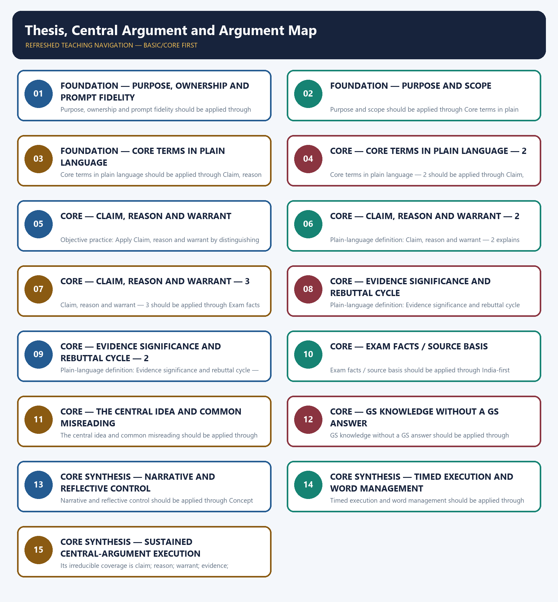

# Thesis, Central Argument and Argument Map — Learner-v2 Complete Learning Session

> **Authoring-only generation:** 2026-09-06. No PDF was rendered and no tracker or index was mutated.

### SOURCE, PROGRESSION AND OFFICIAL-RULE AUDIT

- **Generation date:** 2026-09-06.
- **Source order:** canonical Basic owner first; Advanced owner second; Essay master framework, README, official-syllabus map, answer-worthiness audit and revision chart next; PYQ corpus and official OCR papers after that; live official UPSC pages only as a final check.
- **Basic/Advanced boundary:** complete Basic teaching remains first and Advanced material remains optional and last.
- **OCR boundary:** Repository Markdown was primary. OCR-searchable official UPSC Essay papers were supplementary only for printed instructions and V1 prompt wording. No author, official model answer, current marks split, phase allocation, paragraph count or scoring rubric was inferred.
- **Qdrant:** not used; repository Markdown and local official papers were sufficient.
- **PYQ integrity:** Three application cards use the repository's explicit V1/V2 status. No unavailable official model answer, marking rubric or attribution is invented.
- **Live-source boundary:** Live source check dated 2026-09-06: official UPSC routes were attempted and access-blocked; blocked pages support no new claim. UN, WHO and IPCC primary pages were separately checked for cross-theme factual boundaries.
- **No-formula rule:** strategy, heuristics and practice weights are never presented as official UPSC instructions or marking criteria.

### LIVE OFFICIAL-SOURCE ATTEMPT LOG

The checks below were made on 2026-09-06. Substantive official text is used only for the proposition it supports; title-only, blocked or thin pages are recorded and supply no factual claim.

- https://upsc.gov.in/examinations/previous-question-papers — attempted 2026-09-06; official page returned HTTP 403 to the live fetch, so it supports no new wording.
- https://upsc.gov.in/examinations/active-examinations — attempted 2026-09-06; official page returned HTTP 403 to the live fetch, so it supports no current-paper inference.
- https://upsc.gov.in/sites/default/files/Notif-CSP-2024-Engl-140224.pdf — searched 2026-09-06; retained only as an official scheme cross-check route, not as an Essay rubric.

## BASIC LEARNING SESSION



*Distinct embedded teaching-navigation image. The separate continuous Cārvāka-style flowchart package remains an independent at-a-glance artifact.*

### SESSION 1 — FOUNDATION — PURPOSE, OWNERSHIP AND PROMPT FIDELITY

#### DEFINITION / WHAT THIS IS CALLED

**Plain-language definition:** Objective practice: Apply Purpose, ownership and prompt fidelity by distinguishing the correct Essay-method move from nearby but invalid shortcuts; no factual-trivia recall is being tested.

**Technical definition:** Purpose, ownership and prompt fidelity should be applied through Purpose and scope and Core terms in plain language, while preserving the difference between official paper instruction and strategy, prompt wording and interpretation, example and evidence, breadth and coherence.

#### ANSWER-GRABBING OPENING — WRITE/ADAPT IN THE EXAM

> Plain-language definition: Purpose, ownership and prompt fidelity explains how Purpose and scope and Core terms in plain language combine into one usable Essay-planning move.

#### MUST-WRITE KEYWORDS

- **FOUNDATION**
- **Purpose**
- **ownership**
- **prompt fidelity**
- **Plain-language definition**
- **Technical definition**

**How to use them:** Frame the answer through FOUNDATION; define Purpose, connect ownership with prompt fidelity to explain the mechanism, and use Plain-language definition for the decisive comparison or qualification.

#### METHOD MOVE / WHAT THIS DOES

**Plain-language definition:** Purpose, ownership and prompt fidelity explains how Purpose and scope and Core terms in plain language combine into one usable Essay-planning move.

**Technical definition:** The learner fixes the printed prompt, its relationship or demand, the defensible scope, the argument function and the evidence boundary before drafting prose.

#### ANSWER-GRABBING OPENING — WRITE/ADAPT IN THE EXAM

> Purpose, ownership and prompt fidelity should be applied through Purpose and scope and Core terms in plain language, while preserving the difference between official paper instruction and strategy, prompt wording and interpretation, example and evidence, breadth and coherence.

#### MUST-WRITE KEYWORDS

- **Purpose**
- **ownership**
- **prompt**
- **fidelity**
- **scope**
- **Core**

**How to use them:** Define the first three terms, trace the relationship with the next two, and attach the final term to the exact claim, example and qualification. Qualification: Do not replace one sustained thesis and an executable argument map with a generic GS-style catalogue.

#### VISUAL FIRST

```text
PURPOSE, OWNERSHIP AND PROMPT FIDELITY
01. Purpose and scope
    |
    v
02. Core terms in plain language
STATUS / CATEGORY FIREWALL -> Do not replace one sustained thesis and an executable argument map with a generic GS-style catalogue.
```

*The rail fixes the prompt-to-argument sequence and claim boundary before explanation.*

#### CORE EXPLANATION

This topic is the hinge between decoding/expansion (02–04) and structure/writing (06–08): it teaches how to commit to one thesis and lay it out as a chain that can be developed paragraph by paragraph. It does not decode the prompt itself or generate dimensions — it selects and organises what 02–04 produced. "power", "technology"). A theme is a container, not a position — an essay organised around themes lists; an essay organised around a thesis argues.

#### SIMPLE SYSTEM EXAMPLE

Read Purpose, ownership and prompt fidelity as a sequence: identify Purpose and scope, follow the method through the printed proposition, and stop before adding a rule, attribution, fact or inference the audited sources do not support.

#### TECHNICAL DISTINCTION

The decisive boundary is Do not replace one sustained thesis and an executable argument map with a generic GS-style catalogue. This keeps Purpose and scope and Core terms in plain language in the correct prompt, method, argument and evidence category.

#### NAMED EVIDENCE AND MECHANISM

- This topic is the hinge between decoding/expansion (02–04) and structure/writing (06–08): it teaches how to commit to one thesis and lay it out as a chain that can be developed paragraph by paragraph. It does not decode the prompt itself or generate dimensions — it selects and organises what 02–04 produced.
- "power", "technology"). A theme is a container, not a position — an essay organised around themes lists; an essay organised around a thesis argues.

#### EXAMINER CAUTION

- Do not replace one sustained thesis and an executable argument map with a generic GS-style catalogue.

#### EXAM LINK

- **Objective practice:** Apply Purpose, ownership and prompt fidelity by distinguishing the correct Essay-method move from nearby but invalid shortcuts; no factual-trivia recall is being tested.
- **Essay application:** State the exact demand and the bounded writing decision.

#### MINI RECAP

- **Mechanism chain:** Purpose and scope -> Core terms in plain language
- **Qualified use:** State the exact demand and the bounded writing decision.

#### CLOSING RECALL FLOW — FOUNDATION — PURPOSE, OWNERSHIP AND PROMPT FIDELITY

```text
START / CONCEPT: FOUNDATION — Purpose, ownership and prompt fidelity
        |
        v
EXACT TERMS: FOUNDATION · Purpose · ownership · prompt fidelity · Plain-language definition · Technical definition
        |
        v
MECHANISM / ARGUMENT: Purpose, ownership and prompt fidelity should be applied through Purpose and scope and Core terms in plain language, while preserving the difference between official paper instruction and strategy, prompt wording and interpretation, example and evidence, breadth and coherence.
        |
        v
CONSEQUENCE / CONTRAST: Read Purpose, ownership and prompt fidelity as a sequence: identify Purpose and scope, follow the method through the printed proposition, and stop before adding a rule, attribution, fact or inference the audited sources do not support.
        |
        v
UPSC TRAP / ANSWER-USE: Objective practice: Apply Purpose, ownership and prompt fidelity by distinguishing the correct Essay-method move from nearby but invalid shortcuts; no factual-trivia recall is being tested.
        |
        v
ANSWER-GRABBING FORMULATION: Plain-language definition: Purpose, ownership and prompt fidelity explains how Purpose and scope and Core terms in plain language combine into one usable Essay-planning move.
```
### SESSION 2 — FOUNDATION — PURPOSE AND SCOPE

#### DEFINITION / WHAT THIS IS CALLED

**Plain-language definition:** Objective practice: Apply Purpose and scope by distinguishing the correct Essay-method move from nearby but invalid shortcuts; no factual-trivia recall is being tested.

**Technical definition:** Purpose and scope should be applied through Core terms in plain language — 2, while preserving the difference between official paper instruction and strategy, prompt wording and interpretation, example and evidence, breadth and coherence.

#### ANSWER-GRABBING OPENING — WRITE/ADAPT IN THE EXAM

> Plain-language definition: Purpose and scope explains how Core terms in plain language — 2 combine into one usable Essay-planning move.

#### MUST-WRITE KEYWORDS

- **FOUNDATION**
- **Purpose**
- **scope**
- **Plain-language definition**
- **Technical definition**
- **terms**

**How to use them:** Frame the answer through FOUNDATION; define Purpose, connect scope with Plain-language definition to explain the mechanism, and use Technical definition for the decisive comparison or qualification.

#### METHOD MOVE / WHAT THIS DOES

**Plain-language definition:** Purpose and scope explains how Core terms in plain language — 2 combine into one usable Essay-planning move.

**Technical definition:** The learner fixes the printed prompt, its relationship or demand, the defensible scope, the argument function and the evidence boundary before drafting prose.

#### ANSWER-GRABBING OPENING — WRITE/ADAPT IN THE EXAM

> Purpose and scope should be applied through Core terms in plain language — 2, while preserving the difference between official paper instruction and strategy, prompt wording and interpretation, example and evidence, breadth and coherence.

#### MUST-WRITE KEYWORDS

- **Purpose**
- **scope**
- **Core**
- **terms**
- **plain**
- **language**

**How to use them:** Define the first three terms, trace the relationship with the next two, and attach the final term to the exact claim, example and qualification. Qualification: Do not cross the ownership boundary: paragraph prose and transitions belong to 07.

#### VISUAL FIRST

```text
PURPOSE AND SCOPE
01. Core terms in plain language — 2
STATUS / CATEGORY FIREWALL -> Do not cross the ownership boundary: paragraph prose and transitions belong to 07.
```

*The rail fixes the prompt-to-argument sequence and claim boundary before explanation.*

#### CORE EXPLANATION

Worked separation, 2024-A3. Topic: "There is no path to happiness, Happiness is the path." Theme: well-being. Thesis: happiness is a by-product of how one lives rather than an outcome to be pursued, which is why public policy that treats well-being as a future target under-serves citizens in the present. Only the third is arguable — the theme could head a thousand different essays.

#### SIMPLE SYSTEM EXAMPLE

Read Purpose and scope as a sequence: identify Core terms in plain language — 2, follow the method through the printed proposition, and stop before adding a rule, attribution, fact or inference the audited sources do not support.

#### TECHNICAL DISTINCTION

The decisive boundary is Do not cross the ownership boundary: paragraph prose and transitions belong to 07. This keeps Core terms in plain language — 2 in the correct prompt, method, argument and evidence category.

#### NAMED EVIDENCE AND MECHANISM

- Worked separation, 2024-A3. Topic: "There is no path to happiness, Happiness is the path." Theme: well-being. Thesis: happiness is a by-product of how one lives rather than an outcome to be pursued, which is why public policy that treats well-being as a future target under-serves citizens in the present. Only the third is arguable — the theme could head a thousand different essays.

#### EXAMINER CAUTION

- Do not cross the ownership boundary: paragraph prose and transitions belong to 07.

#### EXAM LINK

- **Objective practice:** Apply Purpose and scope by distinguishing the correct Essay-method move from nearby but invalid shortcuts; no factual-trivia recall is being tested.
- **Essay application:** Define operative terms before expanding dimensions.

#### MINI RECAP

- **Mechanism chain:** Core terms in plain language — 2
- **Qualified use:** Define operative terms before expanding dimensions.

#### CLOSING RECALL FLOW — FOUNDATION — PURPOSE AND SCOPE

```text
START / CONCEPT: FOUNDATION — Purpose and scope
        |
        v
EXACT TERMS: FOUNDATION · Purpose · scope · Plain-language definition · Technical definition · terms
        |
        v
MECHANISM / ARGUMENT: Purpose and scope should be applied through Core terms in plain language — 2, while preserving the difference between official paper instruction and strategy, prompt wording and interpretation, example and evidence, breadth and coherence.
        |
        v
CONSEQUENCE / CONTRAST: Read Purpose and scope as a sequence: identify Core terms in plain language — 2, follow the method through the printed proposition, and stop before adding a rule, attribution, fact or inference the audited sources do not support.
        |
        v
UPSC TRAP / ANSWER-USE: Objective practice: Apply Purpose and scope by distinguishing the correct Essay-method move from nearby but invalid shortcuts; no factual-trivia recall is being tested.
        |
        v
ANSWER-GRABBING FORMULATION: Plain-language definition: Purpose and scope explains how Core terms in plain language — 2 combine into one usable Essay-planning move.
```
### SESSION 3 — FOUNDATION — CORE TERMS IN PLAIN LANGUAGE

#### DEFINITION / WHAT THIS IS CALLED

**Plain-language definition:** Objective practice: Apply Core terms in plain language by distinguishing the correct Essay-method move from nearby but invalid shortcuts; no factual-trivia recall is being tested.

**Technical definition:** Core terms in plain language should be applied through Claim, reason and warrant, while preserving the difference between official paper instruction and strategy, prompt wording and interpretation, example and evidence, breadth and coherence.

#### ANSWER-GRABBING OPENING — WRITE/ADAPT IN THE EXAM

> Plain-language definition: Core terms in plain language explains how Claim, reason and warrant combine into one usable Essay-planning move.

#### MUST-WRITE KEYWORDS

- **FOUNDATION**
- **Core terms in plain language**
- **Plain-language definition**
- **Technical definition**
- **terms**
- **plain**

**How to use them:** Frame the answer through FOUNDATION; define Core terms in plain language, connect Plain-language definition with Technical definition to explain the mechanism, and use terms for the decisive comparison or qualification.

#### METHOD MOVE / WHAT THIS DOES

**Plain-language definition:** Core terms in plain language explains how Claim, reason and warrant combine into one usable Essay-planning move.

**Technical definition:** The learner fixes the printed prompt, its relationship or demand, the defensible scope, the argument function and the evidence boundary before drafting prose.

#### ANSWER-GRABBING OPENING — WRITE/ADAPT IN THE EXAM

> Core terms in plain language should be applied through Claim, reason and warrant, while preserving the difference between official paper instruction and strategy, prompt wording and interpretation, example and evidence, breadth and coherence.

#### MUST-WRITE KEYWORDS

- **Core**
- **terms**
- **plain**
- **language**
- **reason**
- **warrant**

**How to use them:** Define the first three terms, trace the relationship with the next two, and attach the final term to the exact claim, example and qualification. Qualification: Do not use an example without explaining its argumentative function.

#### VISUAL FIRST

```text
CORE TERMS IN PLAIN LANGUAGE
01. Claim, reason and warrant
STATUS / CATEGORY FIREWALL -> Do not use an example without explaining its argumentative function.
```

*The rail fixes the prompt-to-argument sequence and claim boundary before explanation.*

#### CORE EXPLANATION

Most weak body paragraphs fail at the warrant, not the claim. Naming the three parts separately makes the gap visible.

#### SIMPLE SYSTEM EXAMPLE

Read Core terms in plain language as a sequence: identify Claim, reason and warrant, follow the method through the printed proposition, and stop before adding a rule, attribution, fact or inference the audited sources do not support.

#### TECHNICAL DISTINCTION

The decisive boundary is Do not use an example without explaining its argumentative function. This keeps Claim, reason and warrant in the correct prompt, method, argument and evidence category.

#### NAMED EVIDENCE AND MECHANISM

- Most weak body paragraphs fail at the warrant, not the claim. Naming the three parts separately makes the gap visible.

#### EXAMINER CAUTION

- Do not use an example without explaining its argumentative function.

#### EXAM LINK

- **Objective practice:** Apply Core terms in plain language by distinguishing the correct Essay-method move from nearby but invalid shortcuts; no factual-trivia recall is being tested.
- **Essay application:** Build one qualified thesis and keep it visible.

#### MINI RECAP

- **Mechanism chain:** Claim, reason and warrant
- **Qualified use:** Build one qualified thesis and keep it visible.

#### CLOSING RECALL FLOW — FOUNDATION — CORE TERMS IN PLAIN LANGUAGE

```text
START / CONCEPT: FOUNDATION — Core terms in plain language
        |
        v
EXACT TERMS: FOUNDATION · Core terms in plain language · Plain-language definition · Technical definition · terms · plain
        |
        v
MECHANISM / ARGUMENT: Core terms in plain language should be applied through Claim, reason and warrant, while preserving the difference between official paper instruction and strategy, prompt wording and interpretation, example and evidence, breadth and coherence.
        |
        v
CONSEQUENCE / CONTRAST: Read Core terms in plain language as a sequence: identify Claim, reason and warrant, follow the method through the printed proposition, and stop before adding a rule, attribution, fact or inference the audited sources do not support.
        |
        v
UPSC TRAP / ANSWER-USE: Objective practice: Apply Core terms in plain language by distinguishing the correct Essay-method move from nearby but invalid shortcuts; no factual-trivia recall is being tested.
        |
        v
ANSWER-GRABBING FORMULATION: Plain-language definition: Core terms in plain language explains how Claim, reason and warrant combine into one usable Essay-planning move.
```
### SESSION 4 — CORE — CORE TERMS IN PLAIN LANGUAGE — 2

#### DEFINITION / WHAT THIS IS CALLED

**Plain-language definition:** Objective practice: Apply Core terms in plain language — 2 by distinguishing the correct Essay-method move from nearby but invalid shortcuts; no factual-trivia recall is being tested.

**Technical definition:** Core terms in plain language — 2 should be applied through Claim, reason and warrant — 2, while preserving the difference between official paper instruction and strategy, prompt wording and interpretation, example and evidence, breadth and coherence.

#### ANSWER-GRABBING OPENING — WRITE/ADAPT IN THE EXAM

> Plain-language definition: Core terms in plain language — 2 explains how Claim, reason and warrant — 2 combine into one usable Essay-planning move.

#### MUST-WRITE KEYWORDS

- **Core terms in plain language**
- **Plain-language definition**
- **Technical definition**
- **terms**
- **plain**
- **language**

**How to use them:** Frame the answer through Core terms in plain language; define Plain-language definition, connect Technical definition with terms to explain the mechanism, and use plain for the decisive comparison or qualification.

#### METHOD MOVE / WHAT THIS DOES

**Plain-language definition:** Core terms in plain language — 2 explains how Claim, reason and warrant — 2 combine into one usable Essay-planning move.

**Technical definition:** The learner fixes the printed prompt, its relationship or demand, the defensible scope, the argument function and the evidence boundary before drafting prose.

#### ANSWER-GRABBING OPENING — WRITE/ADAPT IN THE EXAM

> Core terms in plain language — 2 should be applied through Claim, reason and warrant — 2, while preserving the difference between official paper instruction and strategy, prompt wording and interpretation, example and evidence, breadth and coherence.

#### MUST-WRITE KEYWORDS

- **Core**
- **terms**
- **plain**
- **language**
- **reason**
- **warrant**

**How to use them:** Define the first three terms, trace the relationship with the next two, and attach the final term to the exact claim, example and qualification. Qualification: Do not treat a pedagogical scaffold as an official UPSC marking rule.

#### VISUAL FIRST

```text
CORE TERMS IN PLAIN LANGUAGE — 2
01. Claim, reason and warrant — 2
STATUS / CATEGORY FIREWALL -> Do not treat a pedagogical scaffold as an official UPSC marking rule.
```

*The rail fixes the prompt-to-argument sequence and claim boundary before explanation.*

#### CORE EXPLANATION

CLAIM A regulator should pilot a contested reform rather than defer it. REASON Because a pilot's errors are observable and reversible. WARRANT Because reversible error is a lower expected cost than the compounding cost of an unaddressed problem.

#### SIMPLE SYSTEM EXAMPLE

Read Core terms in plain language — 2 as a sequence: identify Claim, reason and warrant — 2, follow the method through the printed proposition, and stop before adding a rule, attribution, fact or inference the audited sources do not support.

#### TECHNICAL DISTINCTION

The decisive boundary is Do not treat a pedagogical scaffold as an official UPSC marking rule. This keeps Claim, reason and warrant — 2 in the correct prompt, method, argument and evidence category.

#### NAMED EVIDENCE AND MECHANISM

- CLAIM A regulator should pilot a contested reform rather than defer it. REASON Because a pilot's errors are observable and reversible. WARRANT Because reversible error is a lower expected cost than the compounding cost of an unaddressed problem.

#### EXAMINER CAUTION

- Do not treat a pedagogical scaffold as an official UPSC marking rule.

#### EXAM LINK

- **Objective practice:** Apply Core terms in plain language — 2 by distinguishing the correct Essay-method move from nearby but invalid shortcuts; no factual-trivia recall is being tested.
- **Essay application:** Give every paragraph one argumentative job.

#### MINI RECAP

- **Mechanism chain:** Claim, reason and warrant — 2
- **Qualified use:** Give every paragraph one argumentative job.

#### CLOSING RECALL FLOW — CORE — CORE TERMS IN PLAIN LANGUAGE — 2

```text
START / CONCEPT: CORE — Core terms in plain language — 2
        |
        v
EXACT TERMS: Core terms in plain language · Plain-language definition · Technical definition · terms · plain · language
        |
        v
MECHANISM / ARGUMENT: Core terms in plain language — 2 should be applied through Claim, reason and warrant — 2, while preserving the difference between official paper instruction and strategy, prompt wording and interpretation, example and evidence, breadth and coherence.
        |
        v
CONSEQUENCE / CONTRAST: Objective practice: Apply Core terms in plain language — 2 by distinguishing the correct Essay-method move from nearby but invalid shortcuts; no factual-trivia recall is being tested.
        |
        v
UPSC TRAP / ANSWER-USE: Read Core terms in plain language — 2 as a sequence: identify Claim, reason and warrant — 2, follow the method through the printed proposition, and stop before adding a rule, attribution, fact or inference the audited sources do not support.
        |
        v
ANSWER-GRABBING FORMULATION: Plain-language definition: Core terms in plain language — 2 explains how Claim, reason and warrant — 2 combine into one usable Essay-planning move.
```
### SESSION 5 — CORE — CLAIM, REASON AND WARRANT

#### DEFINITION / WHAT THIS IS CALLED

**Plain-language definition:** A paragraph that states claim and reason but never surfaces its warrant reads as assertion even when the reason is true, because the reader is being asked to supply the connecting principle themselves.

**Technical definition:** Objective practice: Apply Claim, reason and warrant by distinguishing the correct Essay-method move from nearby but invalid shortcuts; no factual-trivia recall is being tested.

#### ANSWER-GRABBING OPENING — WRITE/ADAPT IN THE EXAM

> Plain-language definition: Claim, reason and warrant explains how Claim, reason and warrant — 3 combine into one usable Essay-planning move.

#### MUST-WRITE KEYWORDS

- **Claim**
- **reason**
- **warrant**
- **Plain-language definition**
- **Technical definition**
- **where**

**How to use them:** Frame the answer through Claim; define reason, connect warrant with Plain-language definition to explain the mechanism, and use Technical definition for the decisive comparison or qualification.

#### METHOD MOVE / WHAT THIS DOES

**Plain-language definition:** Claim, reason and warrant explains how Claim, reason and warrant — 3 combine into one usable Essay-planning move.

**Technical definition:** The learner fixes the printed prompt, its relationship or demand, the defensible scope, the argument function and the evidence boundary before drafting prose.

#### ANSWER-GRABBING OPENING — WRITE/ADAPT IN THE EXAM

> Claim, reason and warrant should be applied through Claim, reason and warrant — 3, while preserving the difference between official paper instruction and strategy, prompt wording and interpretation, example and evidence, breadth and coherence.

#### MUST-WRITE KEYWORDS

- **reason**
- **warrant**
- **where**
- **counter-view**
- **attaches**
- **objector**

**How to use them:** Define the first three terms, trace the relationship with the next two, and attach the final term to the exact claim, example and qualification. Qualification: Do not let a counter-view replace the thesis; use it to qualify the thesis.

#### VISUAL FIRST

```text
CLAIM, REASON AND WARRANT
01. Claim, reason and warrant — 3
STATUS / CATEGORY FIREWALL -> Do not let a counter-view replace the thesis; use it to qualify the thesis.
```

*The rail fixes the prompt-to-argument sequence and claim boundary before explanation.*

#### CORE EXPLANATION

The warrant is where the counter-view attaches (08): an objector need not deny that pilots are reversible — they deny that reversibility is the governing consideration when the harm is severe. A paragraph that states claim and reason but never surfaces its warrant reads as assertion even when the reason is true, because the reader is being asked to supply the connecting principle themselves.

#### SIMPLE SYSTEM EXAMPLE

Read Claim, reason and warrant as a sequence: identify Claim, reason and warrant — 3, follow the method through the printed proposition, and stop before adding a rule, attribution, fact or inference the audited sources do not support.

#### TECHNICAL DISTINCTION

The decisive boundary is Do not let a counter-view replace the thesis; use it to qualify the thesis. This keeps Claim, reason and warrant — 3 in the correct prompt, method, argument and evidence category.

#### NAMED EVIDENCE AND MECHANISM

- The warrant is where the counter-view attaches (08): an objector need not deny that pilots are reversible — they deny that reversibility is the governing consideration when the harm is severe. A paragraph that states claim and reason but never surfaces its warrant reads as assertion even when the reason is true, because the reader is being asked to supply the connecting principle themselves.

#### EXAMINER CAUTION

- Do not let a counter-view replace the thesis; use it to qualify the thesis.

#### EXAM LINK

- **Objective practice:** Apply Claim, reason and warrant by distinguishing the correct Essay-method move from nearby but invalid shortcuts; no factual-trivia recall is being tested.
- **Essay application:** Join a named illustration to its mechanism.

#### MINI RECAP

- **Mechanism chain:** Claim, reason and warrant — 3
- **Qualified use:** Join a named illustration to its mechanism.

#### CLOSING RECALL FLOW — CORE — CLAIM, REASON AND WARRANT

```text
START / CONCEPT: CORE — Claim, reason and warrant
        |
        v
EXACT TERMS: Claim · reason · warrant · Plain-language definition · Technical definition · where
        |
        v
MECHANISM / ARGUMENT: Claim, reason and warrant should be applied through Claim, reason and warrant — 3, while preserving the difference between official paper instruction and strategy, prompt wording and interpretation, example and evidence, breadth and coherence.
        |
        v
CONSEQUENCE / CONTRAST: A paragraph that states claim and reason but never surfaces its warrant reads as assertion even when the reason is true, because the reader is being asked to supply the connecting principle themselves.
        |
        v
UPSC TRAP / ANSWER-USE: Read Claim, reason and warrant as a sequence: identify Claim, reason and warrant — 3, follow the method through the printed proposition, and stop before adding a rule, attribution, fact or inference the audited sources do not support.
        |
        v
ANSWER-GRABBING FORMULATION: Plain-language definition: Claim, reason and warrant explains how Claim, reason and warrant — 3 combine into one usable Essay-planning move.
```
### SESSION 6 — CORE — CLAIM, REASON AND WARRANT — 2

#### DEFINITION / WHAT THIS IS CALLED

**Plain-language definition:** Objective practice: Apply Claim, reason and warrant — 2 by distinguishing the correct Essay-method move from nearby but invalid shortcuts; no factual-trivia recall is being tested.

**Technical definition:** Plain-language definition: Claim, reason and warrant — 2 explains how Evidence significance and rebuttal cycle and Evidence significance and rebuttal cycle — 2 combine into one usable Essay-planning move.

#### ANSWER-GRABBING OPENING — WRITE/ADAPT IN THE EXAM

> Plain-language definition: Claim, reason and warrant — 2 explains how Evidence significance and rebuttal cycle and Evidence significance and rebuttal cycle — 2 combine into one usable Essay-planning move.

#### MUST-WRITE KEYWORDS

- **Claim**
- **reason**
- **warrant**
- **Plain-language definition**
- **Technical definition**
- **significance**

**How to use them:** Frame the answer through Claim; define reason, connect warrant with Plain-language definition to explain the mechanism, and use Technical definition for the decisive comparison or qualification.

#### METHOD MOVE / WHAT THIS DOES

**Plain-language definition:** Claim, reason and warrant — 2 explains how Evidence significance and rebuttal cycle and Evidence significance and rebuttal cycle — 2 combine into one usable Essay-planning move.

**Technical definition:** The learner fixes the printed prompt, its relationship or demand, the defensible scope, the argument function and the evidence boundary before drafting prose.

#### ANSWER-GRABBING OPENING — WRITE/ADAPT IN THE EXAM

> Claim, reason and warrant — 2 should be applied through Evidence significance and rebuttal cycle and Evidence significance and rebuttal cycle — 2, while preserving the difference between official paper instruction and strategy, prompt wording and interpretation, example and evidence, breadth and coherence.

#### MUST-WRITE KEYWORDS

- **reason**
- **warrant**
- **significance**
- **rebuttal**
- **cycle**
- **mechanism**

**How to use them:** Define the first three terms, trace the relationship with the next two, and attach the final term to the exact claim, example and qualification. Qualification: Do not use an unverified quotation, statistic, attribution or anecdote.

#### VISUAL FIRST

```text
CLAIM, REASON AND WARRANT — 2
01. Evidence significance and rebuttal cycle
    |
    v
02. Evidence significance and rebuttal cycle — 2
STATUS / CATEGORY FIREWALL -> Do not use an unverified quotation, statistic, attribution or anecdote.
```

*The rail fixes the prompt-to-argument sequence and claim boundary before explanation.*

#### CORE EXPLANATION

claim - reason / mechanism - named, verifiable illustration - what the illustration proves for this claim - strongest objection - concession, boundary and response - link back to the thesis The concession accepts what the objection gets right; the boundary states where the claim stops; the response explains why the qualified claim still holds. An illustration is not evidence merely because it is named: state its significance, then its limit, before moving on.

#### SIMPLE SYSTEM EXAMPLE

Read Claim, reason and warrant — 2 as a sequence: identify Evidence significance and rebuttal cycle, follow the method through the printed proposition, and stop before adding a rule, attribution, fact or inference the audited sources do not support.

#### TECHNICAL DISTINCTION

The decisive boundary is Do not use an unverified quotation, statistic, attribution or anecdote. This keeps Evidence significance and rebuttal cycle and Evidence significance and rebuttal cycle — 2 in the correct prompt, method, argument and evidence category.

#### NAMED EVIDENCE AND MECHANISM

- claim - reason / mechanism - named, verifiable illustration - what the illustration proves for this claim - strongest objection - concession, boundary and response - link back to the thesis
- The concession accepts what the objection gets right; the boundary states where the claim stops; the response explains why the qualified claim still holds. An illustration is not evidence merely because it is named: state its significance, then its limit, before moving on.

#### EXAMINER CAUTION

- Do not use an unverified quotation, statistic, attribution or anecdote.

#### EXAM LINK

- **Objective practice:** Apply Claim, reason and warrant — 2 by distinguishing the correct Essay-method move from nearby but invalid shortcuts; no factual-trivia recall is being tested.
- **Essay application:** Use a counter-case to refine, not derail, the thesis.

#### MINI RECAP

- **Mechanism chain:** Evidence significance and rebuttal cycle -> Evidence significance and rebuttal cycle — 2
- **Qualified use:** Use a counter-case to refine, not derail, the thesis.

#### CLOSING RECALL FLOW — CORE — CLAIM, REASON AND WARRANT — 2

```text
START / CONCEPT: CORE — Claim, reason and warrant — 2
        |
        v
EXACT TERMS: Claim · reason · warrant · Plain-language definition · Technical definition · significance
        |
        v
MECHANISM / ARGUMENT: Objective practice: Apply Claim, reason and warrant — 2 by distinguishing the correct Essay-method move from nearby but invalid shortcuts; no factual-trivia recall is being tested.
        |
        v
CONSEQUENCE / CONTRAST: Claim, reason and warrant — 2 should be applied through Evidence significance and rebuttal cycle and Evidence significance and rebuttal cycle — 2, while preserving the difference between official paper instruction and strategy, prompt wording and interpretation, example and evidence, breadth and coherence.
        |
        v
UPSC TRAP / ANSWER-USE: Read Claim, reason and warrant — 2 as a sequence: identify Evidence significance and rebuttal cycle, follow the method through the printed proposition, and stop before adding a rule, attribution, fact or inference the audited sources do not support.
        |
        v
ANSWER-GRABBING FORMULATION: Plain-language definition: Claim, reason and warrant — 2 explains how Evidence significance and rebuttal cycle and Evidence significance and rebuttal cycle — 2 combine into one usable Essay-planning move.
```
### SESSION 7 — CORE — CLAIM, REASON AND WARRANT — 3

#### DEFINITION / WHAT THIS IS CALLED

**Plain-language definition:** Objective practice: Apply Claim, reason and warrant — 3 by distinguishing the correct Essay-method move from nearby but invalid shortcuts; no factual-trivia recall is being tested.

**Technical definition:** Claim, reason and warrant — 3 should be applied through Exam facts / source basis, while preserving the difference between official paper instruction and strategy, prompt wording and interpretation, example and evidence, breadth and coherence.

#### ANSWER-GRABBING OPENING — WRITE/ADAPT IN THE EXAM

> Plain-language definition: Claim, reason and warrant — 3 explains how Exam facts / source basis combine into one usable Essay-planning move.

#### MUST-WRITE KEYWORDS

- **Claim**
- **reason**
- **warrant**
- **Plain-language definition**
- **Technical definition**
- **Exam**

**How to use them:** Frame the answer through Claim; define reason, connect warrant with Plain-language definition to explain the mechanism, and use Technical definition for the decisive comparison or qualification.

#### METHOD MOVE / WHAT THIS DOES

**Plain-language definition:** Claim, reason and warrant — 3 explains how Exam facts / source basis combine into one usable Essay-planning move.

**Technical definition:** The learner fixes the printed prompt, its relationship or demand, the defensible scope, the argument function and the evidence boundary before drafting prose.

#### ANSWER-GRABBING OPENING — WRITE/ADAPT IN THE EXAM

> Claim, reason and warrant — 3 should be applied through Exam facts / source basis, while preserving the difference between official paper instruction and strategy, prompt wording and interpretation, example and evidence, breadth and coherence.

#### MUST-WRITE KEYWORDS

- **reason**
- **warrant**
- **Exam**
- **facts**
- **basis**
- **proposition-mechanism-illustration-qualification-synthesis**

**How to use them:** Define the first three terms, trace the relationship with the next two, and attach the final term to the exact claim, example and qualification. Qualification: Do not multiply dimensions that repeat the same claim in new vocabulary.

#### VISUAL FIRST

```text
CLAIM, REASON AND WARRANT — 3
01. Exam facts / source basis
STATUS / CATEGORY FIREWALL -> Do not multiply dimensions that repeat the same claim in new vocabulary.
```

*The rail fixes the prompt-to-argument sequence and claim boundary before explanation.*

#### CORE EXPLANATION

proposition-mechanism-illustration-qualification-synthesis chain used in this folder is a pedagogical structuring tool, not an official requirement.

#### SIMPLE SYSTEM EXAMPLE

Read Claim, reason and warrant — 3 as a sequence: identify Exam facts / source basis, follow the method through the printed proposition, and stop before adding a rule, attribution, fact or inference the audited sources do not support.

#### TECHNICAL DISTINCTION

The decisive boundary is Do not multiply dimensions that repeat the same claim in new vocabulary. This keeps Exam facts / source basis in the correct prompt, method, argument and evidence category.

#### NAMED EVIDENCE AND MECHANISM

- proposition-mechanism-illustration-qualification-synthesis chain used in this folder is a pedagogical structuring tool, not an official requirement.

#### EXAMINER CAUTION

- Do not multiply dimensions that repeat the same claim in new vocabulary.

#### EXAM LINK

- **Objective practice:** Apply Claim, reason and warrant — 3 by distinguishing the correct Essay-method move from nearby but invalid shortcuts; no factual-trivia recall is being tested.
- **Essay application:** Sequence paragraphs through explicit logical bridges.

#### MINI RECAP

- **Mechanism chain:** Exam facts / source basis
- **Qualified use:** Sequence paragraphs through explicit logical bridges.

#### CLOSING RECALL FLOW — CORE — CLAIM, REASON AND WARRANT — 3

```text
START / CONCEPT: CORE — Claim, reason and warrant — 3
        |
        v
EXACT TERMS: Claim · reason · warrant · Plain-language definition · Technical definition · Exam
        |
        v
MECHANISM / ARGUMENT: Claim, reason and warrant — 3 should be applied through Exam facts / source basis, while preserving the difference between official paper instruction and strategy, prompt wording and interpretation, example and evidence, breadth and coherence.
        |
        v
CONSEQUENCE / CONTRAST: Objective practice: Apply Claim, reason and warrant — 3 by distinguishing the correct Essay-method move from nearby but invalid shortcuts; no factual-trivia recall is being tested.
        |
        v
UPSC TRAP / ANSWER-USE: Read Claim, reason and warrant — 3 as a sequence: identify Exam facts / source basis, follow the method through the printed proposition, and stop before adding a rule, attribution, fact or inference the audited sources do not support.
        |
        v
ANSWER-GRABBING FORMULATION: Plain-language definition: Claim, reason and warrant — 3 explains how Exam facts / source basis combine into one usable Essay-planning move.
```
### SESSION 8 — CORE — EVIDENCE SIGNIFICANCE AND REBUTTAL CYCLE

#### DEFINITION / WHAT THIS IS CALLED

**Plain-language definition:** Objective practice: Apply Evidence significance and rebuttal cycle by distinguishing the correct Essay-method move from nearby but invalid shortcuts; no factual-trivia recall is being tested.

**Technical definition:** Plain-language definition: Evidence significance and rebuttal cycle explains how The central idea and common misreading combine into one usable Essay-planning move.

#### ANSWER-GRABBING OPENING — WRITE/ADAPT IN THE EXAM

> Plain-language definition: Evidence significance and rebuttal cycle explains how The central idea and common misreading combine into one usable Essay-planning move.

#### MUST-WRITE KEYWORDS

- **Evidence significance**
- **rebuttal cycle**
- **Plain-language definition**
- **Technical definition**
- **significance**
- **rebuttal**

**How to use them:** Frame the answer through Evidence significance; define rebuttal cycle, connect Plain-language definition with Technical definition to explain the mechanism, and use significance for the decisive comparison or qualification.

#### METHOD MOVE / WHAT THIS DOES

**Plain-language definition:** Evidence significance and rebuttal cycle explains how The central idea and common misreading combine into one usable Essay-planning move.

**Technical definition:** The learner fixes the printed prompt, its relationship or demand, the defensible scope, the argument function and the evidence boundary before drafting prose.

#### ANSWER-GRABBING OPENING — WRITE/ADAPT IN THE EXAM

> Evidence significance and rebuttal cycle should be applied through The central idea and common misreading, while preserving the difference between official paper instruction and strategy, prompt wording and interpretation, example and evidence, breadth and coherence.

#### MUST-WRITE KEYWORDS

- **significance**
- **rebuttal**
- **cycle**
- **central**
- **idea**
- **common**

**How to use them:** Define the first three terms, trace the relationship with the next two, and attach the final term to the exact claim, example and qualification. Qualification: Do not end with aspiration unsupported by the preceding argument.

#### VISUAL FIRST

```text
EVIDENCE SIGNIFICANCE AND REBUTTAL CYCLE
01. The central idea and common misreading
STATUS / CATEGORY FIREWALL -> Do not end with aspiration unsupported by the preceding argument.
```

*The rail fixes the prompt-to-argument sequence and claim boundary before explanation.*

#### CORE EXPLANATION

Central idea: a thesis is a claim that could, in principle, be disagreed with — if no reasonable reader could disagree, it is too vague to argue. Common misreading: treating the thesis as a one-line summary of the prompt ("Happiness is found in the journey, not the destination, as this essay will show") rather than a distinct, qualified claim that goes beyond the prompt's own words.

#### SIMPLE SYSTEM EXAMPLE

Read Evidence significance and rebuttal cycle as a sequence: identify The central idea and common misreading, follow the method through the printed proposition, and stop before adding a rule, attribution, fact or inference the audited sources do not support.

#### TECHNICAL DISTINCTION

The decisive boundary is Do not end with aspiration unsupported by the preceding argument. This keeps The central idea and common misreading in the correct prompt, method, argument and evidence category.

#### NAMED EVIDENCE AND MECHANISM

- Central idea: a thesis is a claim that could, in principle, be disagreed with — if no reasonable reader could disagree, it is too vague to argue. Common misreading: treating the thesis as a one-line summary of the prompt ("Happiness is found in the journey, not the destination, as this essay will show") rather than a distinct, qualified claim that goes beyond the prompt's own words.

#### EXAMINER CAUTION

- Do not end with aspiration unsupported by the preceding argument.

#### EXAM LINK

- **Objective practice:** Apply Evidence significance and rebuttal cycle by distinguishing the correct Essay-method move from nearby but invalid shortcuts; no factual-trivia recall is being tested.
- **Essay application:** Move across actor, scale and time only when the claim changes.

#### MINI RECAP

- **Mechanism chain:** The central idea and common misreading
- **Qualified use:** Move across actor, scale and time only when the claim changes.

#### CLOSING RECALL FLOW — CORE — EVIDENCE SIGNIFICANCE AND REBUTTAL CYCLE

```text
START / CONCEPT: CORE — Evidence significance and rebuttal cycle
        |
        v
EXACT TERMS: Evidence significance · rebuttal cycle · Plain-language definition · Technical definition · significance · rebuttal
        |
        v
MECHANISM / ARGUMENT: Evidence significance and rebuttal cycle should be applied through The central idea and common misreading, while preserving the difference between official paper instruction and strategy, prompt wording and interpretation, example and evidence, breadth and coherence.
        |
        v
CONSEQUENCE / CONTRAST: Objective practice: Apply Evidence significance and rebuttal cycle by distinguishing the correct Essay-method move from nearby but invalid shortcuts; no factual-trivia recall is being tested.
        |
        v
UPSC TRAP / ANSWER-USE: Read Evidence significance and rebuttal cycle as a sequence: identify The central idea and common misreading, follow the method through the printed proposition, and stop before adding a rule, attribution, fact or inference the audited sources do not support.
        |
        v
ANSWER-GRABBING FORMULATION: Plain-language definition: Evidence significance and rebuttal cycle explains how The central idea and common misreading combine into one usable Essay-planning move.
```
### SESSION 9 — CORE — EVIDENCE SIGNIFICANCE AND REBUTTAL CYCLE — 2

#### DEFINITION / WHAT THIS IS CALLED

**Plain-language definition:** Objective practice: Apply Evidence significance and rebuttal cycle — 2 by distinguishing the correct Essay-method move from nearby but invalid shortcuts; no factual-trivia recall is being tested.

**Technical definition:** Plain-language definition: Evidence significance and rebuttal cycle — 2 explains how Basic decomposition questions combine into one usable Essay-planning move.

#### ANSWER-GRABBING OPENING — WRITE/ADAPT IN THE EXAM

> Plain-language definition: Evidence significance and rebuttal cycle — 2 explains how Basic decomposition questions combine into one usable Essay-planning move.

#### MUST-WRITE KEYWORDS

- **Evidence significance**
- **rebuttal cycle**
- **Plain-language definition**
- **Technical definition**
- **significance**
- **rebuttal**

**How to use them:** Frame the answer through Evidence significance; define rebuttal cycle, connect Plain-language definition with Technical definition to explain the mechanism, and use significance for the decisive comparison or qualification.

#### METHOD MOVE / WHAT THIS DOES

**Plain-language definition:** Evidence significance and rebuttal cycle — 2 explains how Basic decomposition questions combine into one usable Essay-planning move.

**Technical definition:** The learner fixes the printed prompt, its relationship or demand, the defensible scope, the argument function and the evidence boundary before drafting prose.

#### ANSWER-GRABBING OPENING — WRITE/ADAPT IN THE EXAM

> Evidence significance and rebuttal cycle — 2 should be applied through Basic decomposition questions, while preserving the difference between official paper instruction and strategy, prompt wording and interpretation, example and evidence, breadth and coherence.

#### MUST-WRITE KEYWORDS

- **significance**
- **rebuttal**
- **cycle**
- **Basic**
- **decomposition**
- **questions**

**How to use them:** Define the first three terms, trace the relationship with the next two, and attach the final term to the exact claim, example and qualification. Qualification: Do not sacrifice the second essay's time budget to perfect the first.

#### VISUAL FIRST

```text
EVIDENCE SIGNIFICANCE AND REBUTTAL CYCLE — 2
01. Basic decomposition questions
STATUS / CATEGORY FIREWALL -> Do not sacrifice the second essay's time budget to perfect the first.
```

*The rail fixes the prompt-to-argument sequence and claim boundary before explanation.*

#### CORE EXPLANATION

1. What is my one-sentence claim, in my own words, going beyond a restatement of the prompt? 2. What limit or condition makes this claim defensible rather than absolute? 3. What is the main mechanism that explains why my claim holds? 4. What illustration best demonstrates that mechanism? 5. What is the strongest objection to my claim, and how does my qualification already address it?

#### SIMPLE SYSTEM EXAMPLE

Read Evidence significance and rebuttal cycle — 2 as a sequence: identify Basic decomposition questions, follow the method through the printed proposition, and stop before adding a rule, attribution, fact or inference the audited sources do not support.

#### TECHNICAL DISTINCTION

The decisive boundary is Do not sacrifice the second essay's time budget to perfect the first. This keeps Basic decomposition questions in the correct prompt, method, argument and evidence category.

#### NAMED EVIDENCE AND MECHANISM

- 1. What is my one-sentence claim, in my own words, going beyond a restatement of the prompt? 2. What limit or condition makes this claim defensible rather than absolute? 3. What is the main mechanism that explains why my claim holds? 4. What illustration best demonstrates that mechanism? 5. What is the strongest objection to my claim, and how does my qualification already address it?

#### EXAMINER CAUTION

- Do not sacrifice the second essay's time budget to perfect the first.

#### EXAM LINK

- **Objective practice:** Apply Evidence significance and rebuttal cycle — 2 by distinguishing the correct Essay-method move from nearby but invalid shortcuts; no factual-trivia recall is being tested.
- **Essay application:** Use ethical nuance without moralising.

#### MINI RECAP

- **Mechanism chain:** Basic decomposition questions
- **Qualified use:** Use ethical nuance without moralising.

#### CLOSING RECALL FLOW — CORE — EVIDENCE SIGNIFICANCE AND REBUTTAL CYCLE — 2

```text
START / CONCEPT: CORE — Evidence significance and rebuttal cycle — 2
        |
        v
EXACT TERMS: Evidence significance · rebuttal cycle · Plain-language definition · Technical definition · significance · rebuttal
        |
        v
MECHANISM / ARGUMENT: Evidence significance and rebuttal cycle — 2 should be applied through Basic decomposition questions, while preserving the difference between official paper instruction and strategy, prompt wording and interpretation, example and evidence, breadth and coherence.
        |
        v
CONSEQUENCE / CONTRAST: Read Evidence significance and rebuttal cycle — 2 as a sequence: identify Basic decomposition questions, follow the method through the printed proposition, and stop before adding a rule, attribution, fact or inference the audited sources do not support.
        |
        v
UPSC TRAP / ANSWER-USE: Objective practice: Apply Evidence significance and rebuttal cycle — 2 by distinguishing the correct Essay-method move from nearby but invalid shortcuts; no factual-trivia recall is being tested.
        |
        v
ANSWER-GRABBING FORMULATION: Plain-language definition: Evidence significance and rebuttal cycle — 2 explains how Basic decomposition questions combine into one usable Essay-planning move.
```
### SESSION 10 — CORE — EXAM FACTS / SOURCE BASIS

#### DEFINITION / WHAT THIS IS CALLED

**Plain-language definition:** Objective practice: Apply Exam facts / source basis by distinguishing the correct Essay-method move from nearby but invalid shortcuts; no factual-trivia recall is being tested.

**Technical definition:** Exam facts / source basis should be applied through India-first illustration starters, while preserving the difference between official paper instruction and strategy, prompt wording and interpretation, example and evidence, breadth and coherence.

#### ANSWER-GRABBING OPENING — WRITE/ADAPT IN THE EXAM

> Plain-language definition: Exam facts / source basis explains how India-first illustration starters combine into one usable Essay-planning move.

#### MUST-WRITE KEYWORDS

- **Exam facts / source basis**
- **Plain-language definition**
- **Technical definition**
- **Exam**
- **s**
- **basis**

**How to use them:** Frame the answer through Exam facts / source basis; define Plain-language definition, connect Technical definition with Exam to explain the mechanism, and use s for the decisive comparison or qualification.

#### METHOD MOVE / WHAT THIS DOES

**Plain-language definition:** Exam facts / source basis explains how India-first illustration starters combine into one usable Essay-planning move.

**Technical definition:** The learner fixes the printed prompt, its relationship or demand, the defensible scope, the argument function and the evidence boundary before drafting prose.

#### ANSWER-GRABBING OPENING — WRITE/ADAPT IN THE EXAM

> Exam facts / source basis should be applied through India-first illustration starters, while preserving the difference between official paper instruction and strategy, prompt wording and interpretation, example and evidence, breadth and coherence.

#### MUST-WRITE KEYWORDS

- **Exam**
- **facts**
- **basis**
- **India-first**
- **illustration**
- **starters**

**How to use them:** Define the first three terms, trace the relationship with the next two, and attach the final term to the exact claim, example and qualification. Qualification: Do not mistake novelty of phrasing for originality of thought.

#### VISUAL FIRST

```text
EXAM FACTS / SOURCE BASIS
01. India-first illustration starters
STATUS / CATEGORY FIREWALL -> Do not mistake novelty of phrasing for originality of thought.
```

*The rail fixes the prompt-to-argument sequence and claim boundary before explanation.*

#### CORE EXPLANATION

For your chosen thesis, recall one Indian illustration that demonstrates the mechanism concretely — e.g. a documented reform episode for the "cost of being wrong" thesis, or a scientific-institution example for the "doubter" thesis. Full discipline: 12.

#### SIMPLE SYSTEM EXAMPLE

Read Exam facts / source basis as a sequence: identify India-first illustration starters, follow the method through the printed proposition, and stop before adding a rule, attribution, fact or inference the audited sources do not support.

#### TECHNICAL DISTINCTION

The decisive boundary is Do not mistake novelty of phrasing for originality of thought. This keeps India-first illustration starters in the correct prompt, method, argument and evidence category.

#### NAMED EVIDENCE AND MECHANISM

- For your chosen thesis, recall one Indian illustration that demonstrates the mechanism concretely — e.g. a documented reform episode for the "cost of being wrong" thesis, or a scientific-institution example for the "doubter" thesis. Full discipline: 12.

#### EXAMINER CAUTION

- Do not mistake novelty of phrasing for originality of thought.

#### EXAM LINK

- **Objective practice:** Apply Exam facts / source basis by distinguishing the correct Essay-method move from nearby but invalid shortcuts; no factual-trivia recall is being tested.
- **Essay application:** Preserve factual and quotation integrity.

#### MINI RECAP

- **Mechanism chain:** India-first illustration starters
- **Qualified use:** Preserve factual and quotation integrity.

#### CLOSING RECALL FLOW — CORE — EXAM FACTS / SOURCE BASIS

```text
START / CONCEPT: CORE — Exam facts / source basis
        |
        v
EXACT TERMS: Exam facts / source basis · Plain-language definition · Technical definition · Exam · s · basis
        |
        v
MECHANISM / ARGUMENT: Exam facts / source basis should be applied through India-first illustration starters, while preserving the difference between official paper instruction and strategy, prompt wording and interpretation, example and evidence, breadth and coherence.
        |
        v
CONSEQUENCE / CONTRAST: Read Exam facts / source basis as a sequence: identify India-first illustration starters, follow the method through the printed proposition, and stop before adding a rule, attribution, fact or inference the audited sources do not support.
        |
        v
UPSC TRAP / ANSWER-USE: Objective practice: Apply Exam facts / source basis by distinguishing the correct Essay-method move from nearby but invalid shortcuts; no factual-trivia recall is being tested.
        |
        v
ANSWER-GRABBING FORMULATION: Plain-language definition: Exam facts / source basis explains how India-first illustration starters combine into one usable Essay-planning move.
```
### SESSION 11 — CORE — THE CENTRAL IDEA AND COMMON MISREADING

#### DEFINITION / WHAT THIS IS CALLED

**Plain-language definition:** Objective practice: Apply The central idea and common misreading by distinguishing the correct Essay-method move from nearby but invalid shortcuts; no factual-trivia recall is being tested.

**Technical definition:** The central idea and common misreading should be applied through Thesis options and selection and Simple essay architecture, while preserving the difference between official paper instruction and strategy, prompt wording and interpretation, example and evidence, breadth and coherence.

#### ANSWER-GRABBING OPENING — WRITE/ADAPT IN THE EXAM

> Plain-language definition: The central idea and common misreading explains how Thesis options and selection and Simple essay architecture combine into one usable Essay-planning move.

#### MUST-WRITE KEYWORDS

- **The central idea**
- **common misreading**
- **Plain-language definition**
- **Technical definition**
- **central**
- **idea**

**How to use them:** Frame the answer through The central idea; define common misreading, connect Plain-language definition with Technical definition to explain the mechanism, and use central for the decisive comparison or qualification.

#### METHOD MOVE / WHAT THIS DOES

**Plain-language definition:** The central idea and common misreading explains how Thesis options and selection and Simple essay architecture combine into one usable Essay-planning move.

**Technical definition:** The learner fixes the printed prompt, its relationship or demand, the defensible scope, the argument function and the evidence boundary before drafting prose.

#### ANSWER-GRABBING OPENING — WRITE/ADAPT IN THE EXAM

> The central idea and common misreading should be applied through Thesis options and selection and Simple essay architecture, while preserving the difference between official paper instruction and strategy, prompt wording and interpretation, example and evidence, breadth and coherence.

#### MUST-WRITE KEYWORDS

- **central**
- **idea**
- **common**
- **misreading**
- **Thesis**
- **options**

**How to use them:** Define the first three terms, trace the relationship with the next two, and attach the final term to the exact claim, example and qualification. Qualification: Do not replace one sustained thesis and an executable argument map with a generic GS-style catalogue.

#### VISUAL FIRST

```text
THE CENTRAL IDEA AND COMMON MISREADING
01. Thesis options and selection
    |
    v
02. Simple essay architecture
STATUS / CATEGORY FIREWALL -> Do not replace one sustained thesis and an executable argument map with a generic GS-style catalogue.
```

*The rail fixes the prompt-to-argument sequence and claim boundary before explanation.*

#### CORE EXPLANATION

Generate two or three thesis alternatives (Section 6) before committing. Select the one that is (a) genuinely arguable, (b) already qualified, and (c) supportable by at least one recalled illustration — not simply the first idea that occurred to you. Once the thesis is chosen, sketch the argument map (Section 2) as a short list: proposition, 2–3 mechanisms/illustrations (one per paragraph-cluster), the strongest qualification, and the synthesis. This list becomes the paragraph plan for 07.

#### SIMPLE SYSTEM EXAMPLE

Read The central idea and common misreading as a sequence: identify Thesis options and selection, follow the method through the printed proposition, and stop before adding a rule, attribution, fact or inference the audited sources do not support.

#### TECHNICAL DISTINCTION

The decisive boundary is Do not replace one sustained thesis and an executable argument map with a generic GS-style catalogue. This keeps Thesis options and selection and Simple essay architecture in the correct prompt, method, argument and evidence category.

#### NAMED EVIDENCE AND MECHANISM

- Generate two or three thesis alternatives (Section 6) before committing. Select the one that is (a) genuinely arguable, (b) already qualified, and (c) supportable by at least one recalled illustration — not simply the first idea that occurred to you.
- Once the thesis is chosen, sketch the argument map (Section 2) as a short list: proposition, 2–3 mechanisms/illustrations (one per paragraph-cluster), the strongest qualification, and the synthesis. This list becomes the paragraph plan for 07.

#### EXAMINER CAUTION

- Do not replace one sustained thesis and an executable argument map with a generic GS-style catalogue.

#### EXAM LINK

- **Objective practice:** Apply The central idea and common misreading by distinguishing the correct Essay-method move from nearby but invalid shortcuts; no factual-trivia recall is being tested.
- **Essay application:** Import GS knowledge selectively and analytically.

#### MINI RECAP

- **Mechanism chain:** Thesis options and selection -> Simple essay architecture
- **Qualified use:** Import GS knowledge selectively and analytically.

#### CLOSING RECALL FLOW — CORE — THE CENTRAL IDEA AND COMMON MISREADING

```text
START / CONCEPT: CORE — The central idea and common misreading
        |
        v
EXACT TERMS: The central idea · common misreading · Plain-language definition · Technical definition · central · idea
        |
        v
MECHANISM / ARGUMENT: The central idea and common misreading should be applied through Thesis options and selection and Simple essay architecture, while preserving the difference between official paper instruction and strategy, prompt wording and interpretation, example and evidence, breadth and coherence.
        |
        v
CONSEQUENCE / CONTRAST: Read The central idea and common misreading as a sequence: identify Thesis options and selection, follow the method through the printed proposition, and stop before adding a rule, attribution, fact or inference the audited sources do not support.
        |
        v
UPSC TRAP / ANSWER-USE: Objective practice: Apply The central idea and common misreading by distinguishing the correct Essay-method move from nearby but invalid shortcuts; no factual-trivia recall is being tested.
        |
        v
ANSWER-GRABBING FORMULATION: Plain-language definition: The central idea and common misreading explains how Thesis options and selection and Simple essay architecture combine into one usable Essay-planning move.
```
### SESSION 12 — CORE — GS KNOWLEDGE WITHOUT A GS ANSWER

#### DEFINITION / WHAT THIS IS CALLED

**Plain-language definition:** Objective practice: Apply GS knowledge without a GS answer by distinguishing the correct Essay-method move from nearby but invalid shortcuts; no factual-trivia recall is being tested.

**Technical definition:** GS knowledge without a GS answer should be applied through Advanced proposition and boundary, while preserving the difference between official paper instruction and strategy, prompt wording and interpretation, example and evidence, breadth and coherence.

#### ANSWER-GRABBING OPENING — WRITE/ADAPT IN THE EXAM

> Plain-language definition: GS knowledge without a GS answer explains how Advanced proposition and boundary combine into one usable Essay-planning move.

#### MUST-WRITE KEYWORDS

- **GS knowledge without a GS answer**
- **Plain-language definition**
- **Technical definition**
- **knowledge**
- **Advanced**
- **proposition**

**How to use them:** Frame the answer through GS knowledge without a GS answer; define Plain-language definition, connect Technical definition with knowledge to explain the mechanism, and use Advanced for the decisive comparison or qualification.

#### METHOD MOVE / WHAT THIS DOES

**Plain-language definition:** GS knowledge without a GS answer explains how Advanced proposition and boundary combine into one usable Essay-planning move.

**Technical definition:** The learner fixes the printed prompt, its relationship or demand, the defensible scope, the argument function and the evidence boundary before drafting prose.

#### ANSWER-GRABBING OPENING — WRITE/ADAPT IN THE EXAM

> GS knowledge without a GS answer should be applied through Advanced proposition and boundary, while preserving the difference between official paper instruction and strategy, prompt wording and interpretation, example and evidence, breadth and coherence.

#### MUST-WRITE KEYWORDS

- **knowledge**
- **Advanced**
- **proposition**
- **boundary**
- **strong**
- **thesis**

**How to use them:** Define the first three terms, trace the relationship with the next two, and attach the final term to the exact claim, example and qualification. Qualification: Do not cross the ownership boundary: paragraph prose and transitions belong to 07.

#### VISUAL FIRST

```text
GS KNOWLEDGE WITHOUT A GS ANSWER
01. Advanced proposition and boundary
STATUS / CATEGORY FIREWALL -> Do not cross the ownership boundary: paragraph prose and transitions belong to 07.
```

*The rail fixes the prompt-to-argument sequence and claim boundary before explanation.*

#### CORE EXPLANATION

Proposition: a strong thesis is one that has already survived its own best objection before the essay is drafted — the qualification should be load-bearing, not decorative. Boundary: this topic does not itself supply counterargument technique (08) or paragraph-level execution (07) — it supplies the thesis-and-map design those depend on.

#### SIMPLE SYSTEM EXAMPLE

Read GS knowledge without a GS answer as a sequence: identify Advanced proposition and boundary, follow the method through the printed proposition, and stop before adding a rule, attribution, fact or inference the audited sources do not support.

#### TECHNICAL DISTINCTION

The decisive boundary is Do not cross the ownership boundary: paragraph prose and transitions belong to 07. This keeps Advanced proposition and boundary in the correct prompt, method, argument and evidence category.

#### NAMED EVIDENCE AND MECHANISM

- Proposition: a strong thesis is one that has already survived its own best objection before the essay is drafted — the qualification should be load-bearing, not decorative. Boundary: this topic does not itself supply counterargument technique (08) or paragraph-level execution (07) — it supplies the thesis-and-map design those depend on.

#### EXAMINER CAUTION

- Do not cross the ownership boundary: paragraph prose and transitions belong to 07.

#### EXAM LINK

- **Objective practice:** Apply GS knowledge without a GS answer by distinguishing the correct Essay-method move from nearby but invalid shortcuts; no factual-trivia recall is being tested.
- **Essay application:** Use narrative or analogy only when it advances the proposition.

#### MINI RECAP

- **Mechanism chain:** Advanced proposition and boundary
- **Qualified use:** Use narrative or analogy only when it advances the proposition.

#### CLOSING RECALL FLOW — CORE — GS KNOWLEDGE WITHOUT A GS ANSWER

```text
START / CONCEPT: CORE — GS knowledge without a GS answer
        |
        v
EXACT TERMS: GS knowledge without a GS answer · Plain-language definition · Technical definition · knowledge · Advanced · proposition
        |
        v
MECHANISM / ARGUMENT: GS knowledge without a GS answer should be applied through Advanced proposition and boundary, while preserving the difference between official paper instruction and strategy, prompt wording and interpretation, example and evidence, breadth and coherence.
        |
        v
CONSEQUENCE / CONTRAST: Read GS knowledge without a GS answer as a sequence: identify Advanced proposition and boundary, follow the method through the printed proposition, and stop before adding a rule, attribution, fact or inference the audited sources do not support.
        |
        v
UPSC TRAP / ANSWER-USE: Objective practice: Apply GS knowledge without a GS answer by distinguishing the correct Essay-method move from nearby but invalid shortcuts; no factual-trivia recall is being tested.
        |
        v
ANSWER-GRABBING FORMULATION: Plain-language definition: GS knowledge without a GS answer explains how Advanced proposition and boundary combine into one usable Essay-planning move.
```
### SESSION 13 — CORE SYNTHESIS — NARRATIVE AND REFLECTIVE CONTROL

#### DEFINITION / WHAT THIS IS CALLED

**Plain-language definition:** Objective practice: Apply Narrative and reflective control by distinguishing the correct Essay-method move from nearby but invalid shortcuts; no factual-trivia recall is being tested.

**Technical definition:** Narrative and reflective control should be applied through Concept definition and taxonomy, while preserving the difference between official paper instruction and strategy, prompt wording and interpretation, example and evidence, breadth and coherence.

#### ANSWER-GRABBING OPENING — WRITE/ADAPT IN THE EXAM

> Plain-language definition: Narrative and reflective control explains how Concept definition and taxonomy combine into one usable Essay-planning move.

#### MUST-WRITE KEYWORDS

- **CORE SYNTHESIS**
- **Narrative**
- **reflective control**
- **Plain-language definition**
- **Technical definition**
- **reflective**

**How to use them:** Frame the answer through CORE SYNTHESIS; define Narrative, connect reflective control with Plain-language definition to explain the mechanism, and use Technical definition for the decisive comparison or qualification.

#### METHOD MOVE / WHAT THIS DOES

**Plain-language definition:** Narrative and reflective control explains how Concept definition and taxonomy combine into one usable Essay-planning move.

**Technical definition:** The learner fixes the printed prompt, its relationship or demand, the defensible scope, the argument function and the evidence boundary before drafting prose.

#### ANSWER-GRABBING OPENING — WRITE/ADAPT IN THE EXAM

> Narrative and reflective control should be applied through Concept definition and taxonomy, while preserving the difference between official paper instruction and strategy, prompt wording and interpretation, example and evidence, breadth and coherence.

#### MUST-WRITE KEYWORDS

- **Narrative**
- **reflective**
- **control**
- **definition**
- **taxonomy**
- **thesis**

**How to use them:** Define the first three terms, trace the relationship with the next two, and attach the final term to the exact claim, example and qualification. Qualification: Do not use an example without explaining its argumentative function.

#### VISUAL FIRST

```text
NARRATIVE AND REFLECTIVE CONTROL
01. Concept definition and taxonomy
STATUS / CATEGORY FIREWALL -> Do not use an example without explaining its argumentative function.
```

*The rail fixes the prompt-to-argument sequence and claim boundary before explanation.*

#### CORE EXPLANATION

the thesis indefensible (e.g. "reversible, safeguarded experimentation" in the 2024-B8 thesis — removing "reversible, safeguarded" makes the claim reckless).

#### SIMPLE SYSTEM EXAMPLE

Read Narrative and reflective control as a sequence: identify Concept definition and taxonomy, follow the method through the printed proposition, and stop before adding a rule, attribution, fact or inference the audited sources do not support.

#### TECHNICAL DISTINCTION

The decisive boundary is Do not use an example without explaining its argumentative function. This keeps Concept definition and taxonomy in the correct prompt, method, argument and evidence category.

#### NAMED EVIDENCE AND MECHANISM

- the thesis indefensible (e.g. "reversible, safeguarded experimentation" in the 2024-B8 thesis — removing "reversible, safeguarded" makes the claim reckless).

#### EXAMINER CAUTION

- Do not use an example without explaining its argumentative function.

#### EXAM LINK

- **Objective practice:** Apply Narrative and reflective control by distinguishing the correct Essay-method move from nearby but invalid shortcuts; no factual-trivia recall is being tested.
- **Essay application:** Protect balance, originality and coherence together.

#### MINI RECAP

- **Mechanism chain:** Concept definition and taxonomy
- **Qualified use:** Protect balance, originality and coherence together.

#### CLOSING RECALL FLOW — CORE SYNTHESIS — NARRATIVE AND REFLECTIVE CONTROL

```text
START / CONCEPT: CORE SYNTHESIS — Narrative and reflective control
        |
        v
EXACT TERMS: CORE SYNTHESIS · Narrative · reflective control · Plain-language definition · Technical definition · reflective
        |
        v
MECHANISM / ARGUMENT: Narrative and reflective control should be applied through Concept definition and taxonomy, while preserving the difference between official paper instruction and strategy, prompt wording and interpretation, example and evidence, breadth and coherence.
        |
        v
CONSEQUENCE / CONTRAST: Read Narrative and reflective control as a sequence: identify Concept definition and taxonomy, follow the method through the printed proposition, and stop before adding a rule, attribution, fact or inference the audited sources do not support.
        |
        v
UPSC TRAP / ANSWER-USE: Objective practice: Apply Narrative and reflective control by distinguishing the correct Essay-method move from nearby but invalid shortcuts; no factual-trivia recall is being tested.
        |
        v
ANSWER-GRABBING FORMULATION: Plain-language definition: Narrative and reflective control explains how Concept definition and taxonomy combine into one usable Essay-planning move.
```
### SESSION 14 — CORE SYNTHESIS — TIMED EXECUTION AND WORD MANAGEMENT

#### DEFINITION / WHAT THIS IS CALLED

**Plain-language definition:** Objective practice: Apply Timed execution and word management by distinguishing the correct Essay-method move from nearby but invalid shortcuts; no factual-trivia recall is being tested.

**Technical definition:** Timed execution and word management should be applied through Concept definition and taxonomy — 2 and Concept definition and taxonomy — 3, while preserving the difference between official paper instruction and strategy, prompt wording and interpretation, example and evidence, breadth and coherence.

#### ANSWER-GRABBING OPENING — WRITE/ADAPT IN THE EXAM

> Plain-language definition: Timed execution and word management explains how Concept definition and taxonomy — 2 and Concept definition and taxonomy — 3 combine into one usable Essay-planning move.

#### MUST-WRITE KEYWORDS

- **CORE SYNTHESIS**
- **Timed execution**
- **word management**
- **Plain-language definition**
- **Technical definition**
- **Timed**

**How to use them:** Frame the answer through CORE SYNTHESIS; define Timed execution, connect word management with Plain-language definition to explain the mechanism, and use Technical definition for the decisive comparison or qualification.

#### METHOD MOVE / WHAT THIS DOES

**Plain-language definition:** Timed execution and word management explains how Concept definition and taxonomy — 2 and Concept definition and taxonomy — 3 combine into one usable Essay-planning move.

**Technical definition:** The learner fixes the printed prompt, its relationship or demand, the defensible scope, the argument function and the evidence boundary before drafting prose.

#### ANSWER-GRABBING OPENING — WRITE/ADAPT IN THE EXAM

> Timed execution and word management should be applied through Concept definition and taxonomy — 2 and Concept definition and taxonomy — 3, while preserving the difference between official paper instruction and strategy, prompt wording and interpretation, example and evidence, breadth and coherence.

#### MUST-WRITE KEYWORDS

- **Timed**
- **execution**
- **word**
- **management**
- **definition**
- **taxonomy**

**How to use them:** Define the first three terms, trace the relationship with the next two, and attach the final term to the exact claim, example and qualification. Qualification: Do not treat a pedagogical scaffold as an official UPSC marking rule.

#### VISUAL FIRST

```text
TIMED EXECUTION AND WORD MANAGEMENT
01. Concept definition and taxonomy — 2
    |
    v
02. Concept definition and taxonomy — 3
STATUS / CATEGORY FIREWALL -> Do not treat a pedagogical scaffold as an official UPSC marking rule.
```

*The rail fixes the prompt-to-argument sequence and claim boundary before explanation.*

#### CORE EXPLANATION

balance, doing no real argumentative work (e.g. "of course there are exceptions" with no exception specified). illustration→qualification→synthesis two to four times across an essay, each cycle addressing a distinct dimension from 04.

#### SIMPLE SYSTEM EXAMPLE

Read Timed execution and word management as a sequence: identify Concept definition and taxonomy — 2, follow the method through the printed proposition, and stop before adding a rule, attribution, fact or inference the audited sources do not support.

#### TECHNICAL DISTINCTION

The decisive boundary is Do not treat a pedagogical scaffold as an official UPSC marking rule. This keeps Concept definition and taxonomy — 2 and Concept definition and taxonomy — 3 in the correct prompt, method, argument and evidence category.

#### NAMED EVIDENCE AND MECHANISM

- balance, doing no real argumentative work (e.g. "of course there are exceptions" with no exception specified).
- illustration→qualification→synthesis two to four times across an essay, each cycle addressing a distinct dimension from 04.

#### EXAMINER CAUTION

- Do not treat a pedagogical scaffold as an official UPSC marking rule.

#### EXAM LINK

- **Objective practice:** Apply Timed execution and word management by distinguishing the correct Essay-method move from nearby but invalid shortcuts; no factual-trivia recall is being tested.
- **Essay application:** Fit planning, drafting and revision inside the paper budget.

#### MINI RECAP

- **Mechanism chain:** Concept definition and taxonomy — 2 -> Concept definition and taxonomy — 3
- **Qualified use:** Fit planning, drafting and revision inside the paper budget.

#### CLOSING RECALL FLOW — CORE SYNTHESIS — TIMED EXECUTION AND WORD MANAGEMENT

```text
START / CONCEPT: CORE SYNTHESIS — Timed execution and word management
        |
        v
EXACT TERMS: CORE SYNTHESIS · Timed execution · word management · Plain-language definition · Technical definition · Timed
        |
        v
MECHANISM / ARGUMENT: Objective practice: Apply Timed execution and word management by distinguishing the correct Essay-method move from nearby but invalid shortcuts; no factual-trivia recall is being tested.
        |
        v
CONSEQUENCE / CONTRAST: Timed execution and word management should be applied through Concept definition and taxonomy — 2 and Concept definition and taxonomy — 3, while preserving the difference between official paper instruction and strategy, prompt wording and interpretation, example and evidence, breadth and coherence.
        |
        v
UPSC TRAP / ANSWER-USE: Read Timed execution and word management as a sequence: identify Concept definition and taxonomy — 2, follow the method through the printed proposition, and stop before adding a rule, attribution, fact or inference the audited sources do not support.
        |
        v
ANSWER-GRABBING FORMULATION: Plain-language definition: Timed execution and word management explains how Concept definition and taxonomy — 2 and Concept definition and taxonomy — 3 combine into one usable Essay-planning move.
```
### SESSION 15 — CORE SYNTHESIS — SUSTAINED CENTRAL-ARGUMENT EXECUTION

#### DEFINITION / WHAT THIS IS CALLED

**Plain-language definition:** Objective practice: Apply Sustained central-argument execution by distinguishing the correct Essay-method move from nearby but invalid shortcuts; no factual-trivia recall is being tested.

**Technical definition:** Its irreducible coverage is claim; reason; warrant; evidence; significance; rebuttal; synthesis.

#### ANSWER-GRABBING OPENING — WRITE/ADAPT IN THE EXAM

> Plain-language definition: Sustained central-argument execution explains how Concept definition and taxonomy — 4 and Warrant analysis — where advanced theses actually break combine into one usable Essay-planning move.

#### MUST-WRITE KEYWORDS

- **CORE SYNTHESIS**
- **Sustained central-argument execution**
- **Plain-language definition**
- **Technical definition**
- **Sustained**
- **central-argument**

**How to use them:** Frame the answer through CORE SYNTHESIS; define Sustained central-argument execution, connect Plain-language definition with Technical definition to explain the mechanism, and use Sustained for the decisive comparison or qualification.

#### METHOD MOVE / WHAT THIS DOES

**Plain-language definition:** Sustained central-argument execution explains how Concept definition and taxonomy — 4 and Warrant analysis — where advanced theses actually break combine into one usable Essay-planning move.

**Technical definition:** The learner fixes the printed prompt, its relationship or demand, the defensible scope, the argument function and the evidence boundary before drafting prose.

#### ANSWER-GRABBING OPENING — WRITE/ADAPT IN THE EXAM

> Sustained central-argument execution should be applied through Concept definition and taxonomy — 4 and Warrant analysis — where advanced theses actually break, while preserving the difference between official paper instruction and strategy, prompt wording and interpretation, example and evidence, breadth and coherence.

#### MUST-WRITE KEYWORDS

- **Sustained**
- **central-argument**
- **execution**
- **definition**
- **taxonomy**
- **Warrant**

**How to use them:** Define the first three terms, trace the relationship with the next two, and attach the final term to the exact claim, example and qualification. Qualification: Do not let a counter-view replace the thesis; use it to qualify the thesis.

#### VISUAL FIRST

```text
SUSTAINED CENTRAL-ARGUMENT EXECUTION
01. Concept definition and taxonomy — 4
    |
    v
02. Warrant analysis — where advanced theses actually break
STATUS / CATEGORY FIREWALL -> Do not let a counter-view replace the thesis; use it to qualify the thesis.
```

*The rail fixes the prompt-to-argument sequence and claim boundary before explanation.*

#### CORE EXPLANATION

defended, rather than assumed — the difference between "reversible error costs less than inaction" asserted and the same principle argued from observability, correction speed and distribution of harm. At basic level the discipline is to surface the warrant. At advanced level it is to notice that the warrant, not the claim, is what a strong objector attacks — and to design the thesis so its warrant is defensible in its own right.

#### SIMPLE SYSTEM EXAMPLE

Read Sustained central-argument execution as a sequence: identify Concept definition and taxonomy — 4, follow the method through the printed proposition, and stop before adding a rule, attribution, fact or inference the audited sources do not support.

#### TECHNICAL DISTINCTION

The decisive boundary is Do not let a counter-view replace the thesis; use it to qualify the thesis. This keeps Concept definition and taxonomy — 4 and Warrant analysis — where advanced theses actually break in the correct prompt, method, argument and evidence category.

#### NAMED EVIDENCE AND MECHANISM

- defended, rather than assumed — the difference between "reversible error costs less than inaction" asserted and the same principle argued from observability, correction speed and distribution of harm.
- At basic level the discipline is to surface the warrant. At advanced level it is to notice that the warrant, not the claim, is what a strong objector attacks — and to design the thesis so its warrant is defensible in its own right.

#### EXAMINER CAUTION

- Do not let a counter-view replace the thesis; use it to qualify the thesis.

#### EXAM LINK

- **Objective practice:** Apply Sustained central-argument execution by distinguishing the correct Essay-method move from nearby but invalid shortcuts; no factual-trivia recall is being tested.
- **Essay application:** Return to a transformed thesis in the conclusion.

#### MINI RECAP

- **Mechanism chain:** Concept definition and taxonomy — 4 -> Warrant analysis — where advanced theses actually break
- **Qualified use:** Return to a transformed thesis in the conclusion.
#### COMPLETE BASIC OWNER EVIDENCE BANK

> **Subject:** Essay | **Tier:** Must-Do | **GS Paper:** Essay (General
> Studies Paper — Essay, Mains).
> **Core area:** Converting a decoded prompt and its dimensions into one
> qualified, defensible central argument, and mapping it into a
> proposition → mechanism → illustration → qualification → synthesis
> chain.
> **Grounded in:** UPSC Essay PYQ corpus — V1 directly verified locally
> for 2018–2025 and V2 carried-forward practice wording for 2013–2017
> (see `../PYQ-Corpus-2013-2025.md`); `../00_Master-Framework.md`
> Section 6.
> **Research cutoff:** 18 July 2026.
> **Tags:** ✅ verified fact | ⚠️ strategy/inference | 📰 dated anchor | ❌ trap/boundary.
> **Companion:** `../advanced/05_Thesis-Central-Argument-and-Argument-Map.md`

#### 1. Purpose and scope

This topic is the hinge between decoding/expansion (`02`–`04`) and
structure/writing (`06`–`08`): it teaches how to commit to one thesis
and lay it out as a chain that can be developed paragraph by paragraph.
It does not decode the prompt itself or generate dimensions — it selects
and organises what `02`–`04` produced.

#### 2. Core terms in plain language

- **Topic:** the printed prompt itself — the exact sentence UPSC set. You
  do not choose it, restate it, or improve it; you argue about it.
- **Theme:** a recurring subject area the topic touches (e.g. "well-being",
  "power", "technology"). A theme is a container, not a position — an
  essay organised around themes lists; an essay organised around a thesis
  argues.
- **Thesis:** one sentence stating the essay's central, qualified claim
  — not a restatement of the prompt, not a list of themes.
- **Qualification:** an explicit limit, condition, or exception attached
  to the thesis so it is defensible, not absolute.
- **Argument map:** the sequence proposition → mechanism → illustration →
  qualification → synthesis, repeated once per major paragraph-cluster.

⚠️ **Worked separation, 2024-A3.** Topic: "There is no path to happiness,
Happiness is the path." Theme: well-being. Thesis: *happiness is a
by-product of how one lives rather than an outcome to be pursued, which is
why public policy that treats well-being as a future target under-serves
citizens in the present.* Only the third is arguable — the theme could
head a thousand different essays.

#### 2a. Claim, reason and warrant

⚠️ Most weak body paragraphs fail at the warrant, not the claim. Naming
the three parts separately makes the gap visible.

| Part | What it is | Test |
|---|---|---|
| **Claim** | What you are asserting in this paragraph | Could a reasonable reader disagree? |
| **Reason** | The "because" — the mechanism or evidence supporting it | Is it stated, or only implied? |
| **Warrant** | The unstated principle that licenses moving from that reason to that claim | Would someone who accepts the reason but rejects the warrant still resist the claim? |

Worked example (2024-B8, cost of being wrong vs. doing nothing):

```text
CLAIM    A regulator should pilot a contested reform rather than defer it.
REASON   Because a pilot's errors are observable and reversible.
WARRANT  Because reversible error is a lower expected cost than the
         compounding cost of an unaddressed problem.
```

⚠️ The warrant is where the counter-view attaches (`08`): an objector need
not deny that pilots are reversible — they deny that reversibility is the
governing consideration when the harm is severe. ❌ A paragraph that
states claim and reason but never surfaces its warrant reads as assertion
even when the reason is true, because the reader is being asked to supply
the connecting principle themselves.

#### 2b. Evidence significance and rebuttal cycle

⚠️ Build each major paragraph-cluster as a continuous argument:

```text
claim
  -> reason / mechanism
  -> named, verifiable illustration
  -> what the illustration proves for this claim
  -> strongest objection
  -> concession, boundary and response
  -> link back to the thesis
```

The concession accepts what the objection gets right; the boundary states
where the claim stops; the response explains why the qualified claim
still holds. An illustration is not evidence merely because it is named:
state its significance, then its limit, before moving on.

#### 3. ✅ Exam facts / source basis

- ✅ Both audited papers require one essay per Section, about 1000–1200
  words, with no author attribution and no printed marking rubric (see
  `../README.md`).
- ⚠️ Neither paper prescribes a required thesis format; the
  proposition-mechanism-illustration-qualification-synthesis chain used
  in this folder is a pedagogical structuring tool, not an official
  requirement.

#### 4. The central idea and common misreading

⚠️ **Central idea:** a thesis is a claim that could, in principle, be
disagreed with — if no reasonable reader could disagree, it is too
vague to argue. ❌ **Common misreading:** treating the thesis as a
one-line summary of the prompt ("Happiness is found in the journey, not
the destination, as this essay will show") rather than a distinct,
qualified claim that goes beyond the prompt's own words.

#### 5. Basic decomposition questions

1. What is my one-sentence claim, in my own words, going beyond a
   restatement of the prompt?
2. What limit or condition makes this claim defensible rather than
   absolute?
3. What is the main mechanism that explains *why* my claim holds?
4. What illustration best demonstrates that mechanism?
5. What is the strongest objection to my claim, and how does my
   qualification already address it?

#### 6. Dimension-expansion grid

| Prompt (example) | Candidate thesis | Qualification |
|---|---|---|
| 2024-B8 "Cost of being wrong… less than… doing nothing." | Reversible, evidence-based experimentation should be preferred to paralysis | Only where errors are reversible and safeguarded — irreversible/high-harm risks need precaution |
| 2025-B7 "Life as journey, not destination." | Process, learning and ethical means should be valued alongside achievement | Destinations/targets still matter for accountability and cannot be dismissed entirely |
| 2024-A4 "The doubter is a true man of science." | Disciplined, evidence-seeking doubt is essential to scientific and civic progress | Only disciplined doubt (falsifiable, methodical) qualifies — indiscriminate denialism does not |

#### 7. India-first illustration starters

⚠️ For your chosen thesis, recall one Indian illustration that
demonstrates the mechanism concretely — e.g. a documented reform episode
for the "cost of being wrong" thesis, or a scientific-institution example
for the "doubter" thesis. Full discipline: `12`.

#### 8. Thesis options and selection

⚠️ Generate two or three thesis alternatives (Section 6) before
committing. Select the one that is (a) genuinely arguable, (b) already
qualified, and (c) supportable by at least one recalled illustration —
not simply the first idea that occurred to you.

#### 9. Simple essay architecture

⚠️ Once the thesis is chosen, sketch the argument map (Section 2) as a
short list: proposition, 2–3 mechanisms/illustrations (one per
paragraph-cluster), the strongest qualification, and the synthesis. This
list becomes the paragraph plan for `07`.

#### 10. Opening, body and closure moves

⚠️ The introduction should state (or clearly imply) the thesis early,
without a generic preamble; the body develops the argument map in order;
the conclusion restates the thesis in its qualified, tested form — not
verbatim from the introduction. Full method: `06`.

#### 11. ❌ Traps and repair moves

- ❌ **Thesis-as-restatement** ("this essay will show that happiness is
  the path, not a destination" — merely repeating the prompt). → Repair:
  add a claim beyond the prompt's own words (Section 4).
- ❌ **Unqualified absolute thesis** ("doing nothing is always worse than
  being wrong"). → Repair: attach the qualification identified in
  Section 6 before drafting.
- ❌ **Thesis-as-theme** (announcing a subject area — "this essay examines
  happiness and public policy" — rather than a position). → Repair: ask
  what a reader could disagree with in your sentence; if nothing, you have
  named a theme, not a thesis (Section 2).
- ❌ **Unstated warrant** (claim and reason present, connecting principle
  left for the reader to supply). → Repair: write the "because…is what
  governs here" sentence explicitly at least once per argument cycle
  (Section 2a).
- ❌ **Thesis without a mechanism** (asserting the claim but never
  explaining why it holds). → Repair: always answer Section 5's Q3
  before writing body paragraphs.
- ❌ **Switching thesis mid-essay** without signalling or resolving the
  shift. → Repair: if the argument genuinely evolves, make the evolution
  explicit as part of the synthesis, not as an unexplained inconsistency.

#### 12. Timed micro-drill and self-check

**5-minute drill:** For any decoded prompt, write: thesis (one
sentence), qualification (one sentence), mechanism (one sentence),
illustration (one recalled example), and the strongest objection with a
one-line rebuttal.

**Self-check:** Could someone reasonably disagree with your thesis
sentence as written? If not, sharpen it until it makes a genuine,
contestable claim.

#### Semantic-completeness repair — 6 September 2026

##### Hostile coverage verdict and ownership

This owner is responsible for **one sustained thesis and an executable argument map**. Its irreducible coverage is:
claim; reason; warrant; evidence; significance; rebuttal; synthesis. The canonical boundary is explicit:
paragraph prose and transitions belong to 07. Cross-topic material may supply evidence, but it must not displace
this topic's writing skill or convert the essay into a GS answer.

##### Prompt-fidelity and central-argument gate

Before drafting, restate the exact prompt, identify its keywords, relation,
scope and hidden assumption, then write one qualified thesis. Every paragraph
must perform a distinct argumentative job for that thesis through
**claim → named evidence/example → analysis → qualification → link**.
Narrative, analogy and reflection are admissible only when they advance that
argument. A list of sectors, schemes or facts is not an essay.

##### Theme-transfer and originality gate

Transfer GS knowledge selectively across these recurring Essay domains:
philosophical/abstract; society and social justice; polity, democracy and governance; economy and development; science and technology; environment; education and health; women and youth; culture and history; international relations and peace; ethics and values. For each chosen lens, explain the mechanism and distribution of
effects, test a counter-case and return to the proposition. Originality means
a faithful but non-obvious connection, distinction or synthesis; it does not
mean eccentric interpretation, ornamental quotation or invented anecdote.

##### Model-answer and execution gate

A complete 1000–1200-word practice essay should normally establish the problem,
define operative terms, state the central thesis, develop three to five linked
argument clusters, steelman the strongest objection, synthesize rather than
split the difference, and conclude by deepening the opening claim. Planning,
drafting and revision must fit the shared three-hour, two-essay budget. Exact
time splits remain strategy, not an official UPSC rule.

##### Verification and source-status gate

Facts, constitutional or legal references, schemes, events, data, scientific
claims, thinker attributions and quotations require a traceable source and
access date. If exact wording or attribution is not verified, paraphrase it and
label it as interpretation. The locally audited 2018–2025 Essay papers remain
V1; 2013–2017 prompts remain V2 until checked against official papers. Failed
or blocked live retrievals support no claim.

#### CLOSING RECALL FLOW — CORE SYNTHESIS — SUSTAINED CENTRAL-ARGUMENT EXECUTION

```text
START / CONCEPT: CORE SYNTHESIS — Sustained central-argument execution
        |
        v
EXACT TERMS: CORE SYNTHESIS · Sustained central-argument execution · Plain-language definition · Technical definition · Sustained · central-argument
        |
        v
MECHANISM / ARGUMENT: Read Sustained central-argument execution as a sequence: identify Concept definition and taxonomy — 4, follow the method through the printed proposition, and stop before adding a rule, attribution, fact or inference the audited sources do not support.
        |
        v
CONSEQUENCE / CONTRAST: Objective practice: Apply Sustained central-argument execution by distinguishing the correct Essay-method move from nearby but invalid shortcuts; no factual-trivia recall is being tested.
        |
        v
UPSC TRAP / ANSWER-USE: Sustained central-argument execution should be applied through Concept definition and taxonomy — 4 and Warrant analysis — where advanced theses actually break, while preserving the difference between official paper instruction and strategy, prompt wording and interpretation, example and evidence, breadth and coherence.
        |
        v
ANSWER-GRABBING FORMULATION: Plain-language definition: Sustained central-argument execution explains how Concept definition and taxonomy — 4 and Warrant analysis — where advanced theses actually break combine into one usable Essay-planning move.
```
## BASIC MCQS / REMEDIATION

### Q1. Which option applies Purpose and scope as an Essay-method distinction?

A. This topic is the hinge between decoding/expansion (02–04) and structure/writing (06–08): it teaches how to commit to one thesis and lay it out as a chain that can be developed paragraph by paragraph. It does not decode the prompt itself or generate dimensions — it selects and organises what 02–04 produced.
B. Treat Purpose and scope as a compulsory UPSC formula even when it distorts the prompt.
C. Use Purpose and scope to add more headings or dimensions without testing coherence.
D. Replace Purpose and scope with a familiar adjacent GS topic and maximise factual coverage.

**Answer: A.**
**Explanation:** This topic is the hinge between decoding/expansion (02–04) and structure/writing (06–08): it teaches how to commit to one thesis and lay it out as a chain that can be developed paragraph by paragraph. It does not decode the prompt itself or generate dimensions — it selects and organises what 02–04 produced. The other options convert a qualified writing method into an official formula, permit topic drift, or reward quantity without coherence and evidence safety.

### Q2. Which use of Purpose and scope stays closest to the printed prompt?

A. Use Purpose and scope while dropping the prompt's operator, qualifier or scale.
B. This topic is the hinge between decoding/expansion (02–04) and structure/writing (06–08): it teaches how to commit to one thesis and lay it out as a chain that can be developed paragraph by paragraph. It does not decode the prompt itself or generate dimensions — it selects and organises what 02–04 produced.
C. Let a striking anecdote or quotation determine Purpose and scope regardless of thesis fit.
D. Apply Purpose and scope only after drafting, when topic drift can no longer be prevented.

**Answer: B.**
**Explanation:** This topic is the hinge between decoding/expansion (02–04) and structure/writing (06–08): it teaches how to commit to one thesis and lay it out as a chain that can be developed paragraph by paragraph. It does not decode the prompt itself or generate dimensions — it selects and organises what 02–04 produced. The other options convert a qualified writing method into an official formula, permit topic drift, or reward quantity without coherence and evidence safety.

### Q3. Which statement preserves the strategy-versus-official-rule boundary for Purpose and scope?

A. Present Purpose and scope as an official marking rule rather than a pedagogical scaffold.
B. Support Purpose and scope with an unverified statistic, attribution or current claim.
C. This topic is the hinge between decoding/expansion (02–04) and structure/writing (06–08): it teaches how to commit to one thesis and lay it out as a chain that can be developed paragraph by paragraph. It does not decode the prompt itself or generate dimensions — it selects and organises what 02–04 produced.
D. Use Purpose and scope to avoid stating a serious counter-case or qualification.

**Answer: C.**
**Explanation:** This topic is the hinge between decoding/expansion (02–04) and structure/writing (06–08): it teaches how to commit to one thesis and lay it out as a chain that can be developed paragraph by paragraph. It does not decode the prompt itself or generate dimensions — it selects and organises what 02–04 produced. The other options convert a qualified writing method into an official formula, permit topic drift, or reward quantity without coherence and evidence safety.

### Q4. Which option avoids the standard Essay-method trap about Purpose and scope?

A. Silently tidy the printed prompt before applying Purpose and scope to make it easier to answer.
B. Allow an exception discovered through Purpose and scope to replace the central proposition.
C. Maximise the number of outputs produced by Purpose and scope, even if they repeat one claim.
D. This topic is the hinge between decoding/expansion (02–04) and structure/writing (06–08): it teaches how to commit to one thesis and lay it out as a chain that can be developed paragraph by paragraph. It does not decode the prompt itself or generate dimensions — it selects and organises what 02–04 produced.

**Answer: D.**
**Explanation:** This topic is the hinge between decoding/expansion (02–04) and structure/writing (06–08): it teaches how to commit to one thesis and lay it out as a chain that can be developed paragraph by paragraph. It does not decode the prompt itself or generate dimensions — it selects and organises what 02–04 produced. The other options convert a qualified writing method into an official formula, permit topic drift, or reward quantity without coherence and evidence safety.

### Q5. Which option applies Core terms in plain language as an Essay-method distinction?

A. "power", "technology"). A theme is a container, not a position — an essay organised around themes lists; an essay organised around a thesis argues.
B. Replace Core terms in plain language with a familiar adjacent GS topic and maximise factual coverage.
C. Treat Core terms in plain language as a compulsory UPSC formula even when it distorts the prompt.
D. Use Core terms in plain language to add more headings or dimensions without testing coherence.

**Answer: A.**
**Explanation:** "power", "technology"). A theme is a container, not a position — an essay organised around themes lists; an essay organised around a thesis argues. The other options convert a qualified writing method into an official formula, permit topic drift, or reward quantity without coherence and evidence safety.

### Q6. Which use of Core terms in plain language stays closest to the printed prompt?

A. Use Core terms in plain language while dropping the prompt's operator, qualifier or scale.
B. "power", "technology"). A theme is a container, not a position — an essay organised around themes lists; an essay organised around a thesis argues.
C. Apply Core terms in plain language only after drafting, when topic drift can no longer be prevented.
D. Let a striking anecdote or quotation determine Core terms in plain language regardless of thesis fit.

**Answer: B.**
**Explanation:** "power", "technology"). A theme is a container, not a position — an essay organised around themes lists; an essay organised around a thesis argues. The other options convert a qualified writing method into an official formula, permit topic drift, or reward quantity without coherence and evidence safety.

### Q7. Which statement preserves the strategy-versus-official-rule boundary for Core terms in plain language?

A. Present Core terms in plain language as an official marking rule rather than a pedagogical scaffold.
B. Support Core terms in plain language with an unverified statistic, attribution or current claim.
C. "power", "technology"). A theme is a container, not a position — an essay organised around themes lists; an essay organised around a thesis argues.
D. Use Core terms in plain language to avoid stating a serious counter-case or qualification.

**Answer: C.**
**Explanation:** "power", "technology"). A theme is a container, not a position — an essay organised around themes lists; an essay organised around a thesis argues. The other options convert a qualified writing method into an official formula, permit topic drift, or reward quantity without coherence and evidence safety.

### Q8. Which option avoids the standard Essay-method trap about Core terms in plain language?

A. Silently tidy the printed prompt before applying Core terms in plain language to make it easier to answer.
B. Allow an exception discovered through Core terms in plain language to replace the central proposition.
C. Maximise the number of outputs produced by Core terms in plain language, even if they repeat one claim.
D. "power", "technology"). A theme is a container, not a position — an essay organised around themes lists; an essay organised around a thesis argues.

**Answer: D.**
**Explanation:** "power", "technology"). A theme is a container, not a position — an essay organised around themes lists; an essay organised around a thesis argues. The other options convert a qualified writing method into an official formula, permit topic drift, or reward quantity without coherence and evidence safety.

### Q9. Which option applies Core terms in plain language — 2 as an Essay-method distinction?

A. Worked separation, 2024-A3. Topic: "There is no path to happiness, Happiness is the path." Theme: well-being. Thesis: happiness is a by-product of how one lives rather than an outcome to be pursued, which is why public policy that treats well-being as a future target under-serves citizens in the present. Only the third is arguable — the theme could head a thousand different essays.
B. Use Core terms in plain language — 2 to add more headings or dimensions without testing coherence.
C. Treat Core terms in plain language — 2 as a compulsory UPSC formula even when it distorts the prompt.
D. Replace Core terms in plain language — 2 with a familiar adjacent GS topic and maximise factual coverage.

**Answer: A.**
**Explanation:** Worked separation, 2024-A3. Topic: "There is no path to happiness, Happiness is the path." Theme: well-being. Thesis: happiness is a by-product of how one lives rather than an outcome to be pursued, which is why public policy that treats well-being as a future target under-serves citizens in the present. Only the third is arguable — the theme could head a thousand different essays. The other options convert a qualified writing method into an official formula, permit topic drift, or reward quantity without coherence and evidence safety.

### Q10. Which use of Core terms in plain language — 2 stays closest to the printed prompt?

A. Apply Core terms in plain language — 2 only after drafting, when topic drift can no longer be prevented.
B. Worked separation, 2024-A3. Topic: "There is no path to happiness, Happiness is the path." Theme: well-being. Thesis: happiness is a by-product of how one lives rather than an outcome to be pursued, which is why public policy that treats well-being as a future target under-serves citizens in the present. Only the third is arguable — the theme could head a thousand different essays.
C. Use Core terms in plain language — 2 while dropping the prompt's operator, qualifier or scale.
D. Let a striking anecdote or quotation determine Core terms in plain language — 2 regardless of thesis fit.

**Answer: B.**
**Explanation:** Worked separation, 2024-A3. Topic: "There is no path to happiness, Happiness is the path." Theme: well-being. Thesis: happiness is a by-product of how one lives rather than an outcome to be pursued, which is why public policy that treats well-being as a future target under-serves citizens in the present. Only the third is arguable — the theme could head a thousand different essays. The other options convert a qualified writing method into an official formula, permit topic drift, or reward quantity without coherence and evidence safety.

### Q11. Which statement preserves the strategy-versus-official-rule boundary for Core terms in plain language — 2?

A. Support Core terms in plain language — 2 with an unverified statistic, attribution or current claim.
B. Present Core terms in plain language — 2 as an official marking rule rather than a pedagogical scaffold.
C. Worked separation, 2024-A3. Topic: "There is no path to happiness, Happiness is the path." Theme: well-being. Thesis: happiness is a by-product of how one lives rather than an outcome to be pursued, which is why public policy that treats well-being as a future target under-serves citizens in the present. Only the third is arguable — the theme could head a thousand different essays.
D. Use Core terms in plain language — 2 to avoid stating a serious counter-case or qualification.

**Answer: C.**
**Explanation:** Worked separation, 2024-A3. Topic: "There is no path to happiness, Happiness is the path." Theme: well-being. Thesis: happiness is a by-product of how one lives rather than an outcome to be pursued, which is why public policy that treats well-being as a future target under-serves citizens in the present. Only the third is arguable — the theme could head a thousand different essays. The other options convert a qualified writing method into an official formula, permit topic drift, or reward quantity without coherence and evidence safety.

### Q12. Which option avoids the standard Essay-method trap about Core terms in plain language — 2?

A. Allow an exception discovered through Core terms in plain language — 2 to replace the central proposition.
B. Maximise the number of outputs produced by Core terms in plain language — 2, even if they repeat one claim.
C. Silently tidy the printed prompt before applying Core terms in plain language — 2 to make it easier to answer.
D. Worked separation, 2024-A3. Topic: "There is no path to happiness, Happiness is the path." Theme: well-being. Thesis: happiness is a by-product of how one lives rather than an outcome to be pursued, which is why public policy that treats well-being as a future target under-serves citizens in the present. Only the third is arguable — the theme could head a thousand different essays.

**Answer: D.**
**Explanation:** Worked separation, 2024-A3. Topic: "There is no path to happiness, Happiness is the path." Theme: well-being. Thesis: happiness is a by-product of how one lives rather than an outcome to be pursued, which is why public policy that treats well-being as a future target under-serves citizens in the present. Only the third is arguable — the theme could head a thousand different essays. The other options convert a qualified writing method into an official formula, permit topic drift, or reward quantity without coherence and evidence safety.

### Q13. Which option applies Claim, reason and warrant as an Essay-method distinction?

A. Most weak body paragraphs fail at the warrant, not the claim. Naming the three parts separately makes the gap visible.
B. Treat Claim, reason and warrant as a compulsory UPSC formula even when it distorts the prompt.
C. Use Claim, reason and warrant to add more headings or dimensions without testing coherence.
D. Replace Claim, reason and warrant with a familiar adjacent GS topic and maximise factual coverage.

**Answer: A.**
**Explanation:** Most weak body paragraphs fail at the warrant, not the claim. Naming the three parts separately makes the gap visible. The other options convert a qualified writing method into an official formula, permit topic drift, or reward quantity without coherence and evidence safety.

### Q14. Which use of Claim, reason and warrant stays closest to the printed prompt?

A. Use Claim, reason and warrant while dropping the prompt's operator, qualifier or scale.
B. Most weak body paragraphs fail at the warrant, not the claim. Naming the three parts separately makes the gap visible.
C. Let a striking anecdote or quotation determine Claim, reason and warrant regardless of thesis fit.
D. Apply Claim, reason and warrant only after drafting, when topic drift can no longer be prevented.

**Answer: B.**
**Explanation:** Most weak body paragraphs fail at the warrant, not the claim. Naming the three parts separately makes the gap visible. The other options convert a qualified writing method into an official formula, permit topic drift, or reward quantity without coherence and evidence safety.

### Q15. Which statement preserves the strategy-versus-official-rule boundary for Claim, reason and warrant?

A. Use Claim, reason and warrant to avoid stating a serious counter-case or qualification.
B. Present Claim, reason and warrant as an official marking rule rather than a pedagogical scaffold.
C. Most weak body paragraphs fail at the warrant, not the claim. Naming the three parts separately makes the gap visible.
D. Support Claim, reason and warrant with an unverified statistic, attribution or current claim.

**Answer: C.**
**Explanation:** Most weak body paragraphs fail at the warrant, not the claim. Naming the three parts separately makes the gap visible. The other options convert a qualified writing method into an official formula, permit topic drift, or reward quantity without coherence and evidence safety.

### Q16. Which option avoids the standard Essay-method trap about Claim, reason and warrant?

A. Silently tidy the printed prompt before applying Claim, reason and warrant to make it easier to answer.
B. Allow an exception discovered through Claim, reason and warrant to replace the central proposition.
C. Maximise the number of outputs produced by Claim, reason and warrant, even if they repeat one claim.
D. Most weak body paragraphs fail at the warrant, not the claim. Naming the three parts separately makes the gap visible.

**Answer: D.**
**Explanation:** Most weak body paragraphs fail at the warrant, not the claim. Naming the three parts separately makes the gap visible. The other options convert a qualified writing method into an official formula, permit topic drift, or reward quantity without coherence and evidence safety.

### Q17. Which option applies Claim, reason and warrant — 2 as an Essay-method distinction?

A. CLAIM A regulator should pilot a contested reform rather than defer it. REASON Because a pilot's errors are observable and reversible. WARRANT Because reversible error is a lower expected cost than the compounding cost of an unaddressed problem.
B. Treat Claim, reason and warrant — 2 as a compulsory UPSC formula even when it distorts the prompt.
C. Replace Claim, reason and warrant — 2 with a familiar adjacent GS topic and maximise factual coverage.
D. Use Claim, reason and warrant — 2 to add more headings or dimensions without testing coherence.

**Answer: A.**
**Explanation:** CLAIM A regulator should pilot a contested reform rather than defer it. REASON Because a pilot's errors are observable and reversible. WARRANT Because reversible error is a lower expected cost than the compounding cost of an unaddressed problem. The other options convert a qualified writing method into an official formula, permit topic drift, or reward quantity without coherence and evidence safety.

### Q18. Which use of Claim, reason and warrant — 2 stays closest to the printed prompt?

A. Use Claim, reason and warrant — 2 while dropping the prompt's operator, qualifier or scale.
B. CLAIM A regulator should pilot a contested reform rather than defer it. REASON Because a pilot's errors are observable and reversible. WARRANT Because reversible error is a lower expected cost than the compounding cost of an unaddressed problem.
C. Let a striking anecdote or quotation determine Claim, reason and warrant — 2 regardless of thesis fit.
D. Apply Claim, reason and warrant — 2 only after drafting, when topic drift can no longer be prevented.

**Answer: B.**
**Explanation:** CLAIM A regulator should pilot a contested reform rather than defer it. REASON Because a pilot's errors are observable and reversible. WARRANT Because reversible error is a lower expected cost than the compounding cost of an unaddressed problem. The other options convert a qualified writing method into an official formula, permit topic drift, or reward quantity without coherence and evidence safety.

### Q19. Which statement preserves the strategy-versus-official-rule boundary for Claim, reason and warrant — 2?

A. Use Claim, reason and warrant — 2 to avoid stating a serious counter-case or qualification.
B. Present Claim, reason and warrant — 2 as an official marking rule rather than a pedagogical scaffold.
C. CLAIM A regulator should pilot a contested reform rather than defer it. REASON Because a pilot's errors are observable and reversible. WARRANT Because reversible error is a lower expected cost than the compounding cost of an unaddressed problem.
D. Support Claim, reason and warrant — 2 with an unverified statistic, attribution or current claim.

**Answer: C.**
**Explanation:** CLAIM A regulator should pilot a contested reform rather than defer it. REASON Because a pilot's errors are observable and reversible. WARRANT Because reversible error is a lower expected cost than the compounding cost of an unaddressed problem. The other options convert a qualified writing method into an official formula, permit topic drift, or reward quantity without coherence and evidence safety.

### Q20. Which option avoids the standard Essay-method trap about Claim, reason and warrant — 2?

A. Allow an exception discovered through Claim, reason and warrant — 2 to replace the central proposition.
B. Silently tidy the printed prompt before applying Claim, reason and warrant — 2 to make it easier to answer.
C. Maximise the number of outputs produced by Claim, reason and warrant — 2, even if they repeat one claim.
D. CLAIM A regulator should pilot a contested reform rather than defer it. REASON Because a pilot's errors are observable and reversible. WARRANT Because reversible error is a lower expected cost than the compounding cost of an unaddressed problem.

**Answer: D.**
**Explanation:** CLAIM A regulator should pilot a contested reform rather than defer it. REASON Because a pilot's errors are observable and reversible. WARRANT Because reversible error is a lower expected cost than the compounding cost of an unaddressed problem. The other options convert a qualified writing method into an official formula, permit topic drift, or reward quantity without coherence and evidence safety.

### Q21. Which option applies Claim, reason and warrant — 3 as an Essay-method distinction?

A. The warrant is where the counter-view attaches (08): an objector need not deny that pilots are reversible — they deny that reversibility is the governing consideration when the harm is severe. A paragraph that states claim and reason but never surfaces its warrant reads as assertion even when the reason is true, because the reader is being asked to supply the connecting principle themselves.
B. Treat Claim, reason and warrant — 3 as a compulsory UPSC formula even when it distorts the prompt.
C. Replace Claim, reason and warrant — 3 with a familiar adjacent GS topic and maximise factual coverage.
D. Use Claim, reason and warrant — 3 to add more headings or dimensions without testing coherence.

**Answer: A.**
**Explanation:** The warrant is where the counter-view attaches (08): an objector need not deny that pilots are reversible — they deny that reversibility is the governing consideration when the harm is severe. A paragraph that states claim and reason but never surfaces its warrant reads as assertion even when the reason is true, because the reader is being asked to supply the connecting principle themselves. The other options convert a qualified writing method into an official formula, permit topic drift, or reward quantity without coherence and evidence safety.

### Q22. Which use of Claim, reason and warrant — 3 stays closest to the printed prompt?

A. Apply Claim, reason and warrant — 3 only after drafting, when topic drift can no longer be prevented.
B. The warrant is where the counter-view attaches (08): an objector need not deny that pilots are reversible — they deny that reversibility is the governing consideration when the harm is severe. A paragraph that states claim and reason but never surfaces its warrant reads as assertion even when the reason is true, because the reader is being asked to supply the connecting principle themselves.
C. Let a striking anecdote or quotation determine Claim, reason and warrant — 3 regardless of thesis fit.
D. Use Claim, reason and warrant — 3 while dropping the prompt's operator, qualifier or scale.

**Answer: B.**
**Explanation:** The warrant is where the counter-view attaches (08): an objector need not deny that pilots are reversible — they deny that reversibility is the governing consideration when the harm is severe. A paragraph that states claim and reason but never surfaces its warrant reads as assertion even when the reason is true, because the reader is being asked to supply the connecting principle themselves. The other options convert a qualified writing method into an official formula, permit topic drift, or reward quantity without coherence and evidence safety.

### Q23. Which statement preserves the strategy-versus-official-rule boundary for Claim, reason and warrant — 3?

A. Present Claim, reason and warrant — 3 as an official marking rule rather than a pedagogical scaffold.
B. Support Claim, reason and warrant — 3 with an unverified statistic, attribution or current claim.
C. The warrant is where the counter-view attaches (08): an objector need not deny that pilots are reversible — they deny that reversibility is the governing consideration when the harm is severe. A paragraph that states claim and reason but never surfaces its warrant reads as assertion even when the reason is true, because the reader is being asked to supply the connecting principle themselves.
D. Use Claim, reason and warrant — 3 to avoid stating a serious counter-case or qualification.

**Answer: C.**
**Explanation:** The warrant is where the counter-view attaches (08): an objector need not deny that pilots are reversible — they deny that reversibility is the governing consideration when the harm is severe. A paragraph that states claim and reason but never surfaces its warrant reads as assertion even when the reason is true, because the reader is being asked to supply the connecting principle themselves. The other options convert a qualified writing method into an official formula, permit topic drift, or reward quantity without coherence and evidence safety.

### Q24. Which option avoids the standard Essay-method trap about Claim, reason and warrant — 3?

A. Maximise the number of outputs produced by Claim, reason and warrant — 3, even if they repeat one claim.
B. Allow an exception discovered through Claim, reason and warrant — 3 to replace the central proposition.
C. Silently tidy the printed prompt before applying Claim, reason and warrant — 3 to make it easier to answer.
D. The warrant is where the counter-view attaches (08): an objector need not deny that pilots are reversible — they deny that reversibility is the governing consideration when the harm is severe. A paragraph that states claim and reason but never surfaces its warrant reads as assertion even when the reason is true, because the reader is being asked to supply the connecting principle themselves.

**Answer: D.**
**Explanation:** The warrant is where the counter-view attaches (08): an objector need not deny that pilots are reversible — they deny that reversibility is the governing consideration when the harm is severe. A paragraph that states claim and reason but never surfaces its warrant reads as assertion even when the reason is true, because the reader is being asked to supply the connecting principle themselves. The other options convert a qualified writing method into an official formula, permit topic drift, or reward quantity without coherence and evidence safety.

### Q25. Which option applies Evidence significance and rebuttal cycle as an Essay-method distinction?

A. claim - reason / mechanism - named, verifiable illustration - what the illustration proves for this claim - strongest objection - concession, boundary and response - link back to the thesis
B. Treat Evidence significance and rebuttal cycle as a compulsory UPSC formula even when it distorts the prompt.
C. Use Evidence significance and rebuttal cycle to add more headings or dimensions without testing coherence.
D. Replace Evidence significance and rebuttal cycle with a familiar adjacent GS topic and maximise factual coverage.

**Answer: A.**
**Explanation:** claim - reason / mechanism - named, verifiable illustration - what the illustration proves for this claim - strongest objection - concession, boundary and response - link back to the thesis The other options convert a qualified writing method into an official formula, permit topic drift, or reward quantity without coherence and evidence safety.

### Q26. Which use of Evidence significance and rebuttal cycle stays closest to the printed prompt?

A. Apply Evidence significance and rebuttal cycle only after drafting, when topic drift can no longer be prevented.
B. claim - reason / mechanism - named, verifiable illustration - what the illustration proves for this claim - strongest objection - concession, boundary and response - link back to the thesis
C. Use Evidence significance and rebuttal cycle while dropping the prompt's operator, qualifier or scale.
D. Let a striking anecdote or quotation determine Evidence significance and rebuttal cycle regardless of thesis fit.

**Answer: B.**
**Explanation:** claim - reason / mechanism - named, verifiable illustration - what the illustration proves for this claim - strongest objection - concession, boundary and response - link back to the thesis The other options convert a qualified writing method into an official formula, permit topic drift, or reward quantity without coherence and evidence safety.

### Q27. Which statement preserves the strategy-versus-official-rule boundary for Evidence significance and rebuttal cycle?

A. Support Evidence significance and rebuttal cycle with an unverified statistic, attribution or current claim.
B. Present Evidence significance and rebuttal cycle as an official marking rule rather than a pedagogical scaffold.
C. claim - reason / mechanism - named, verifiable illustration - what the illustration proves for this claim - strongest objection - concession, boundary and response - link back to the thesis
D. Use Evidence significance and rebuttal cycle to avoid stating a serious counter-case or qualification.

**Answer: C.**
**Explanation:** claim - reason / mechanism - named, verifiable illustration - what the illustration proves for this claim - strongest objection - concession, boundary and response - link back to the thesis The other options convert a qualified writing method into an official formula, permit topic drift, or reward quantity without coherence and evidence safety.

### Q28. Which option avoids the standard Essay-method trap about Evidence significance and rebuttal cycle?

A. Maximise the number of outputs produced by Evidence significance and rebuttal cycle, even if they repeat one claim.
B. Allow an exception discovered through Evidence significance and rebuttal cycle to replace the central proposition.
C. Silently tidy the printed prompt before applying Evidence significance and rebuttal cycle to make it easier to answer.
D. claim - reason / mechanism - named, verifiable illustration - what the illustration proves for this claim - strongest objection - concession, boundary and response - link back to the thesis

**Answer: D.**
**Explanation:** claim - reason / mechanism - named, verifiable illustration - what the illustration proves for this claim - strongest objection - concession, boundary and response - link back to the thesis The other options convert a qualified writing method into an official formula, permit topic drift, or reward quantity without coherence and evidence safety.

### Q29. Which option applies Evidence significance and rebuttal cycle — 2 as an Essay-method distinction?

A. The concession accepts what the objection gets right; the boundary states where the claim stops; the response explains why the qualified claim still holds. An illustration is not evidence merely because it is named: state its significance, then its limit, before moving on.
B. Replace Evidence significance and rebuttal cycle — 2 with a familiar adjacent GS topic and maximise factual coverage.
C. Treat Evidence significance and rebuttal cycle — 2 as a compulsory UPSC formula even when it distorts the prompt.
D. Use Evidence significance and rebuttal cycle — 2 to add more headings or dimensions without testing coherence.

**Answer: A.**
**Explanation:** The concession accepts what the objection gets right; the boundary states where the claim stops; the response explains why the qualified claim still holds. An illustration is not evidence merely because it is named: state its significance, then its limit, before moving on. The other options convert a qualified writing method into an official formula, permit topic drift, or reward quantity without coherence and evidence safety.

### Q30. Which use of Evidence significance and rebuttal cycle — 2 stays closest to the printed prompt?

A. Let a striking anecdote or quotation determine Evidence significance and rebuttal cycle — 2 regardless of thesis fit.
B. The concession accepts what the objection gets right; the boundary states where the claim stops; the response explains why the qualified claim still holds. An illustration is not evidence merely because it is named: state its significance, then its limit, before moving on.
C. Use Evidence significance and rebuttal cycle — 2 while dropping the prompt's operator, qualifier or scale.
D. Apply Evidence significance and rebuttal cycle — 2 only after drafting, when topic drift can no longer be prevented.

**Answer: B.**
**Explanation:** The concession accepts what the objection gets right; the boundary states where the claim stops; the response explains why the qualified claim still holds. An illustration is not evidence merely because it is named: state its significance, then its limit, before moving on. The other options convert a qualified writing method into an official formula, permit topic drift, or reward quantity without coherence and evidence safety.

### Q31. Which statement preserves the strategy-versus-official-rule boundary for Evidence significance and rebuttal cycle — 2?

A. Present Evidence significance and rebuttal cycle — 2 as an official marking rule rather than a pedagogical scaffold.
B. Support Evidence significance and rebuttal cycle — 2 with an unverified statistic, attribution or current claim.
C. The concession accepts what the objection gets right; the boundary states where the claim stops; the response explains why the qualified claim still holds. An illustration is not evidence merely because it is named: state its significance, then its limit, before moving on.
D. Use Evidence significance and rebuttal cycle — 2 to avoid stating a serious counter-case or qualification.

**Answer: C.**
**Explanation:** The concession accepts what the objection gets right; the boundary states where the claim stops; the response explains why the qualified claim still holds. An illustration is not evidence merely because it is named: state its significance, then its limit, before moving on. The other options convert a qualified writing method into an official formula, permit topic drift, or reward quantity without coherence and evidence safety.

### Q32. Which option avoids the standard Essay-method trap about Evidence significance and rebuttal cycle — 2?

A. Maximise the number of outputs produced by Evidence significance and rebuttal cycle — 2, even if they repeat one claim.
B. Allow an exception discovered through Evidence significance and rebuttal cycle — 2 to replace the central proposition.
C. Silently tidy the printed prompt before applying Evidence significance and rebuttal cycle — 2 to make it easier to answer.
D. The concession accepts what the objection gets right; the boundary states where the claim stops; the response explains why the qualified claim still holds. An illustration is not evidence merely because it is named: state its significance, then its limit, before moving on.

**Answer: D.**
**Explanation:** The concession accepts what the objection gets right; the boundary states where the claim stops; the response explains why the qualified claim still holds. An illustration is not evidence merely because it is named: state its significance, then its limit, before moving on. The other options convert a qualified writing method into an official formula, permit topic drift, or reward quantity without coherence and evidence safety.

### Q33. Which option applies Exam facts / source basis as an Essay-method distinction?

A. proposition-mechanism-illustration-qualification-synthesis chain used in this folder is a pedagogical structuring tool, not an official requirement.
B. Replace Exam facts / source basis with a familiar adjacent GS topic and maximise factual coverage.
C. Use Exam facts / source basis to add more headings or dimensions without testing coherence.
D. Treat Exam facts / source basis as a compulsory UPSC formula even when it distorts the prompt.

**Answer: A.**
**Explanation:** proposition-mechanism-illustration-qualification-synthesis chain used in this folder is a pedagogical structuring tool, not an official requirement. The other options convert a qualified writing method into an official formula, permit topic drift, or reward quantity without coherence and evidence safety.

### Q34. Which use of Exam facts / source basis stays closest to the printed prompt?

A. Apply Exam facts / source basis only after drafting, when topic drift can no longer be prevented.
B. proposition-mechanism-illustration-qualification-synthesis chain used in this folder is a pedagogical structuring tool, not an official requirement.
C. Use Exam facts / source basis while dropping the prompt's operator, qualifier or scale.
D. Let a striking anecdote or quotation determine Exam facts / source basis regardless of thesis fit.

**Answer: B.**
**Explanation:** proposition-mechanism-illustration-qualification-synthesis chain used in this folder is a pedagogical structuring tool, not an official requirement. The other options convert a qualified writing method into an official formula, permit topic drift, or reward quantity without coherence and evidence safety.

### Q35. Which statement preserves the strategy-versus-official-rule boundary for Exam facts / source basis?

A. Present Exam facts / source basis as an official marking rule rather than a pedagogical scaffold.
B. Use Exam facts / source basis to avoid stating a serious counter-case or qualification.
C. proposition-mechanism-illustration-qualification-synthesis chain used in this folder is a pedagogical structuring tool, not an official requirement.
D. Support Exam facts / source basis with an unverified statistic, attribution or current claim.

**Answer: C.**
**Explanation:** proposition-mechanism-illustration-qualification-synthesis chain used in this folder is a pedagogical structuring tool, not an official requirement. The other options convert a qualified writing method into an official formula, permit topic drift, or reward quantity without coherence and evidence safety.

### Q36. Which option avoids the standard Essay-method trap about Exam facts / source basis?

A. Silently tidy the printed prompt before applying Exam facts / source basis to make it easier to answer.
B. Allow an exception discovered through Exam facts / source basis to replace the central proposition.
C. Maximise the number of outputs produced by Exam facts / source basis, even if they repeat one claim.
D. proposition-mechanism-illustration-qualification-synthesis chain used in this folder is a pedagogical structuring tool, not an official requirement.

**Answer: D.**
**Explanation:** proposition-mechanism-illustration-qualification-synthesis chain used in this folder is a pedagogical structuring tool, not an official requirement. The other options convert a qualified writing method into an official formula, permit topic drift, or reward quantity without coherence and evidence safety.

### Q37. Which option applies The central idea and common misreading as an Essay-method distinction?

A. Central idea: a thesis is a claim that could, in principle, be disagreed with — if no reasonable reader could disagree, it is too vague to argue. Common misreading: treating the thesis as a one-line summary of the prompt ("Happiness is found in the journey, not the destination, as this essay will show") rather than a distinct, qualified claim that goes beyond the prompt's own words.
B. Use The central idea and common misreading to add more headings or dimensions without testing coherence.
C. Treat The central idea and common misreading as a compulsory UPSC formula even when it distorts the prompt.
D. Replace The central idea and common misreading with a familiar adjacent GS topic and maximise factual coverage.

**Answer: A.**
**Explanation:** Central idea: a thesis is a claim that could, in principle, be disagreed with — if no reasonable reader could disagree, it is too vague to argue. Common misreading: treating the thesis as a one-line summary of the prompt ("Happiness is found in the journey, not the destination, as this essay will show") rather than a distinct, qualified claim that goes beyond the prompt's own words. The other options convert a qualified writing method into an official formula, permit topic drift, or reward quantity without coherence and evidence safety.

### Q38. Which use of The central idea and common misreading stays closest to the printed prompt?

A. Apply The central idea and common misreading only after drafting, when topic drift can no longer be prevented.
B. Central idea: a thesis is a claim that could, in principle, be disagreed with — if no reasonable reader could disagree, it is too vague to argue. Common misreading: treating the thesis as a one-line summary of the prompt ("Happiness is found in the journey, not the destination, as this essay will show") rather than a distinct, qualified claim that goes beyond the prompt's own words.
C. Use The central idea and common misreading while dropping the prompt's operator, qualifier or scale.
D. Let a striking anecdote or quotation determine The central idea and common misreading regardless of thesis fit.

**Answer: B.**
**Explanation:** Central idea: a thesis is a claim that could, in principle, be disagreed with — if no reasonable reader could disagree, it is too vague to argue. Common misreading: treating the thesis as a one-line summary of the prompt ("Happiness is found in the journey, not the destination, as this essay will show") rather than a distinct, qualified claim that goes beyond the prompt's own words. The other options convert a qualified writing method into an official formula, permit topic drift, or reward quantity without coherence and evidence safety.

### Q39. Which statement preserves the strategy-versus-official-rule boundary for The central idea and common misreading?

A. Present The central idea and common misreading as an official marking rule rather than a pedagogical scaffold.
B. Use The central idea and common misreading to avoid stating a serious counter-case or qualification.
C. Central idea: a thesis is a claim that could, in principle, be disagreed with — if no reasonable reader could disagree, it is too vague to argue. Common misreading: treating the thesis as a one-line summary of the prompt ("Happiness is found in the journey, not the destination, as this essay will show") rather than a distinct, qualified claim that goes beyond the prompt's own words.
D. Support The central idea and common misreading with an unverified statistic, attribution or current claim.

**Answer: C.**
**Explanation:** Central idea: a thesis is a claim that could, in principle, be disagreed with — if no reasonable reader could disagree, it is too vague to argue. Common misreading: treating the thesis as a one-line summary of the prompt ("Happiness is found in the journey, not the destination, as this essay will show") rather than a distinct, qualified claim that goes beyond the prompt's own words. The other options convert a qualified writing method into an official formula, permit topic drift, or reward quantity without coherence and evidence safety.

### Q40. Which option avoids the standard Essay-method trap about The central idea and common misreading?

A. Silently tidy the printed prompt before applying The central idea and common misreading to make it easier to answer.
B. Allow an exception discovered through The central idea and common misreading to replace the central proposition.
C. Maximise the number of outputs produced by The central idea and common misreading, even if they repeat one claim.
D. Central idea: a thesis is a claim that could, in principle, be disagreed with — if no reasonable reader could disagree, it is too vague to argue. Common misreading: treating the thesis as a one-line summary of the prompt ("Happiness is found in the journey, not the destination, as this essay will show") rather than a distinct, qualified claim that goes beyond the prompt's own words.

**Answer: D.**
**Explanation:** Central idea: a thesis is a claim that could, in principle, be disagreed with — if no reasonable reader could disagree, it is too vague to argue. Common misreading: treating the thesis as a one-line summary of the prompt ("Happiness is found in the journey, not the destination, as this essay will show") rather than a distinct, qualified claim that goes beyond the prompt's own words. The other options convert a qualified writing method into an official formula, permit topic drift, or reward quantity without coherence and evidence safety.

### Q41. Which option applies Basic decomposition questions as an Essay-method distinction?

A. 1. What is my one-sentence claim, in my own words, going beyond a restatement of the prompt? 2. What limit or condition makes this claim defensible rather than absolute? 3. What is the main mechanism that explains why my claim holds? 4. What illustration best demonstrates that mechanism? 5. What is the strongest objection to my claim, and how does my qualification already address it?
B. Treat Basic decomposition questions as a compulsory UPSC formula even when it distorts the prompt.
C. Replace Basic decomposition questions with a familiar adjacent GS topic and maximise factual coverage.
D. Use Basic decomposition questions to add more headings or dimensions without testing coherence.

**Answer: A.**
**Explanation:** 1. What is my one-sentence claim, in my own words, going beyond a restatement of the prompt? 2. What limit or condition makes this claim defensible rather than absolute? 3. What is the main mechanism that explains why my claim holds? 4. What illustration best demonstrates that mechanism? 5. What is the strongest objection to my claim, and how does my qualification already address it? The other options convert a qualified writing method into an official formula, permit topic drift, or reward quantity without coherence and evidence safety.

### Q42. Which use of Basic decomposition questions stays closest to the printed prompt?

A. Apply Basic decomposition questions only after drafting, when topic drift can no longer be prevented.
B. 1. What is my one-sentence claim, in my own words, going beyond a restatement of the prompt? 2. What limit or condition makes this claim defensible rather than absolute? 3. What is the main mechanism that explains why my claim holds? 4. What illustration best demonstrates that mechanism? 5. What is the strongest objection to my claim, and how does my qualification already address it?
C. Let a striking anecdote or quotation determine Basic decomposition questions regardless of thesis fit.
D. Use Basic decomposition questions while dropping the prompt's operator, qualifier or scale.

**Answer: B.**
**Explanation:** 1. What is my one-sentence claim, in my own words, going beyond a restatement of the prompt? 2. What limit or condition makes this claim defensible rather than absolute? 3. What is the main mechanism that explains why my claim holds? 4. What illustration best demonstrates that mechanism? 5. What is the strongest objection to my claim, and how does my qualification already address it? The other options convert a qualified writing method into an official formula, permit topic drift, or reward quantity without coherence and evidence safety.

### Q43. Which statement preserves the strategy-versus-official-rule boundary for Basic decomposition questions?

A. Present Basic decomposition questions as an official marking rule rather than a pedagogical scaffold.
B. Support Basic decomposition questions with an unverified statistic, attribution or current claim.
C. 1. What is my one-sentence claim, in my own words, going beyond a restatement of the prompt? 2. What limit or condition makes this claim defensible rather than absolute? 3. What is the main mechanism that explains why my claim holds? 4. What illustration best demonstrates that mechanism? 5. What is the strongest objection to my claim, and how does my qualification already address it?
D. Use Basic decomposition questions to avoid stating a serious counter-case or qualification.

**Answer: C.**
**Explanation:** 1. What is my one-sentence claim, in my own words, going beyond a restatement of the prompt? 2. What limit or condition makes this claim defensible rather than absolute? 3. What is the main mechanism that explains why my claim holds? 4. What illustration best demonstrates that mechanism? 5. What is the strongest objection to my claim, and how does my qualification already address it? The other options convert a qualified writing method into an official formula, permit topic drift, or reward quantity without coherence and evidence safety.

### Q44. Which option avoids the standard Essay-method trap about Basic decomposition questions?

A. Silently tidy the printed prompt before applying Basic decomposition questions to make it easier to answer.
B. Allow an exception discovered through Basic decomposition questions to replace the central proposition.
C. Maximise the number of outputs produced by Basic decomposition questions, even if they repeat one claim.
D. 1. What is my one-sentence claim, in my own words, going beyond a restatement of the prompt? 2. What limit or condition makes this claim defensible rather than absolute? 3. What is the main mechanism that explains why my claim holds? 4. What illustration best demonstrates that mechanism? 5. What is the strongest objection to my claim, and how does my qualification already address it?

**Answer: D.**
**Explanation:** 1. What is my one-sentence claim, in my own words, going beyond a restatement of the prompt? 2. What limit or condition makes this claim defensible rather than absolute? 3. What is the main mechanism that explains why my claim holds? 4. What illustration best demonstrates that mechanism? 5. What is the strongest objection to my claim, and how does my qualification already address it? The other options convert a qualified writing method into an official formula, permit topic drift, or reward quantity without coherence and evidence safety.

### Q45. Which option applies India-first illustration starters as an Essay-method distinction?

A. For your chosen thesis, recall one Indian illustration that demonstrates the mechanism concretely — e.g. a documented reform episode for the "cost of being wrong" thesis, or a scientific-institution example for the "doubter" thesis. Full discipline: 12.
B. Replace India-first illustration starters with a familiar adjacent GS topic and maximise factual coverage.
C. Treat India-first illustration starters as a compulsory UPSC formula even when it distorts the prompt.
D. Use India-first illustration starters to add more headings or dimensions without testing coherence.

**Answer: A.**
**Explanation:** For your chosen thesis, recall one Indian illustration that demonstrates the mechanism concretely — e.g. a documented reform episode for the "cost of being wrong" thesis, or a scientific-institution example for the "doubter" thesis. Full discipline: 12. The other options convert a qualified writing method into an official formula, permit topic drift, or reward quantity without coherence and evidence safety.

### Q46. Which use of India-first illustration starters stays closest to the printed prompt?

A. Let a striking anecdote or quotation determine India-first illustration starters regardless of thesis fit.
B. For your chosen thesis, recall one Indian illustration that demonstrates the mechanism concretely — e.g. a documented reform episode for the "cost of being wrong" thesis, or a scientific-institution example for the "doubter" thesis. Full discipline: 12.
C. Apply India-first illustration starters only after drafting, when topic drift can no longer be prevented.
D. Use India-first illustration starters while dropping the prompt's operator, qualifier or scale.

**Answer: B.**
**Explanation:** For your chosen thesis, recall one Indian illustration that demonstrates the mechanism concretely — e.g. a documented reform episode for the "cost of being wrong" thesis, or a scientific-institution example for the "doubter" thesis. Full discipline: 12. The other options convert a qualified writing method into an official formula, permit topic drift, or reward quantity without coherence and evidence safety.

### Q47. Which statement preserves the strategy-versus-official-rule boundary for India-first illustration starters?

A. Use India-first illustration starters to avoid stating a serious counter-case or qualification.
B. Present India-first illustration starters as an official marking rule rather than a pedagogical scaffold.
C. For your chosen thesis, recall one Indian illustration that demonstrates the mechanism concretely — e.g. a documented reform episode for the "cost of being wrong" thesis, or a scientific-institution example for the "doubter" thesis. Full discipline: 12.
D. Support India-first illustration starters with an unverified statistic, attribution or current claim.

**Answer: C.**
**Explanation:** For your chosen thesis, recall one Indian illustration that demonstrates the mechanism concretely — e.g. a documented reform episode for the "cost of being wrong" thesis, or a scientific-institution example for the "doubter" thesis. Full discipline: 12. The other options convert a qualified writing method into an official formula, permit topic drift, or reward quantity without coherence and evidence safety.

### Q48. Which option avoids the standard Essay-method trap about India-first illustration starters?

A. Silently tidy the printed prompt before applying India-first illustration starters to make it easier to answer.
B. Allow an exception discovered through India-first illustration starters to replace the central proposition.
C. Maximise the number of outputs produced by India-first illustration starters, even if they repeat one claim.
D. For your chosen thesis, recall one Indian illustration that demonstrates the mechanism concretely — e.g. a documented reform episode for the "cost of being wrong" thesis, or a scientific-institution example for the "doubter" thesis. Full discipline: 12.

**Answer: D.**
**Explanation:** For your chosen thesis, recall one Indian illustration that demonstrates the mechanism concretely — e.g. a documented reform episode for the "cost of being wrong" thesis, or a scientific-institution example for the "doubter" thesis. Full discipline: 12. The other options convert a qualified writing method into an official formula, permit topic drift, or reward quantity without coherence and evidence safety.

### Q49. Which option applies Thesis options and selection as an Essay-method distinction?

A. Generate two or three thesis alternatives (Section 6) before committing. Select the one that is (a) genuinely arguable, (b) already qualified, and (c) supportable by at least one recalled illustration — not simply the first idea that occurred to you.
B. Treat Thesis options and selection as a compulsory UPSC formula even when it distorts the prompt.
C. Use Thesis options and selection to add more headings or dimensions without testing coherence.
D. Replace Thesis options and selection with a familiar adjacent GS topic and maximise factual coverage.

**Answer: A.**
**Explanation:** Generate two or three thesis alternatives (Section 6) before committing. Select the one that is (a) genuinely arguable, (b) already qualified, and (d) supportable by at least one recalled illustration — not simply the first idea that occurred to you. The other options convert a qualified writing method into an official formula, permit topic drift, or reward quantity without coherence and evidence safety.

### Q50. Which use of Thesis options and selection stays closest to the printed prompt?

A. Use Thesis options and selection while dropping the prompt's operator, qualifier or scale.
B. Generate two or three thesis alternatives (Section 6) before committing. Select the one that is (a) genuinely arguable, (b) already qualified, and (c) supportable by at least one recalled illustration — not simply the first idea that occurred to you.
C. Apply Thesis options and selection only after drafting, when topic drift can no longer be prevented.
D. Let a striking anecdote or quotation determine Thesis options and selection regardless of thesis fit.

**Answer: B.**
**Explanation:** Generate two or three thesis alternatives (Section 6) before committing. Select the one that is (c) genuinely arguable, (b) already qualified, and (a) supportable by at least one recalled illustration — not simply the first idea that occurred to you. The other options convert a qualified writing method into an official formula, permit topic drift, or reward quantity without coherence and evidence safety.

### Q51. Which statement preserves the strategy-versus-official-rule boundary for Thesis options and selection?

A. Present Thesis options and selection as an official marking rule rather than a pedagogical scaffold.
B. Support Thesis options and selection with an unverified statistic, attribution or current claim.
C. Generate two or three thesis alternatives (Section 6) before committing. Select the one that is (a) genuinely arguable, (b) already qualified, and (c) supportable by at least one recalled illustration — not simply the first idea that occurred to you.
D. Use Thesis options and selection to avoid stating a serious counter-case or qualification.

**Answer: C.**
**Explanation:** Generate two or three thesis alternatives (Section 6) before committing. Select the one that is (a) genuinely arguable, (d) already qualified, and (c) supportable by at least one recalled illustration — not simply the first idea that occurred to you. The other options convert a qualified writing method into an official formula, permit topic drift, or reward quantity without coherence and evidence safety.

### Q52. Which option avoids the standard Essay-method trap about Thesis options and selection?

A. Maximise the number of outputs produced by Thesis options and selection, even if they repeat one claim.
B. Allow an exception discovered through Thesis options and selection to replace the central proposition.
C. Silently tidy the printed prompt before applying Thesis options and selection to make it easier to answer.
D. Generate two or three thesis alternatives (Section 6) before committing. Select the one that is (a) genuinely arguable, (b) already qualified, and (c) supportable by at least one recalled illustration — not simply the first idea that occurred to you.

**Answer: D.**
**Explanation:** Generate two or three thesis alternatives (Section 6) before committing. Select the one that is (a) genuinely arguable, (b) already qualified, and (c) supportable by at least one recalled illustration — not simply the first idea that occurred to you. The other options convert a qualified writing method into an official formula, permit topic drift, or reward quantity without coherence and evidence safety.

### Q53. Which option applies Simple essay architecture as an Essay-method distinction?

A. Once the thesis is chosen, sketch the argument map (Section 2) as a short list: proposition, 2–3 mechanisms/illustrations (one per paragraph-cluster), the strongest qualification, and the synthesis. This list becomes the paragraph plan for 07.
B. Use Simple essay architecture to add more headings or dimensions without testing coherence.
C. Replace Simple essay architecture with a familiar adjacent GS topic and maximise factual coverage.
D. Treat Simple essay architecture as a compulsory UPSC formula even when it distorts the prompt.

**Answer: A.**
**Explanation:** Once the thesis is chosen, sketch the argument map (Section 2) as a short list: proposition, 2–3 mechanisms/illustrations (one per paragraph-cluster), the strongest qualification, and the synthesis. This list becomes the paragraph plan for 07. The other options convert a qualified writing method into an official formula, permit topic drift, or reward quantity without coherence and evidence safety.

### Q54. Which use of Simple essay architecture stays closest to the printed prompt?

A. Use Simple essay architecture while dropping the prompt's operator, qualifier or scale.
B. Once the thesis is chosen, sketch the argument map (Section 2) as a short list: proposition, 2–3 mechanisms/illustrations (one per paragraph-cluster), the strongest qualification, and the synthesis. This list becomes the paragraph plan for 07.
C. Let a striking anecdote or quotation determine Simple essay architecture regardless of thesis fit.
D. Apply Simple essay architecture only after drafting, when topic drift can no longer be prevented.

**Answer: B.**
**Explanation:** Once the thesis is chosen, sketch the argument map (Section 2) as a short list: proposition, 2–3 mechanisms/illustrations (one per paragraph-cluster), the strongest qualification, and the synthesis. This list becomes the paragraph plan for 07. The other options convert a qualified writing method into an official formula, permit topic drift, or reward quantity without coherence and evidence safety.

### Q55. Which statement preserves the strategy-versus-official-rule boundary for Simple essay architecture?

A. Use Simple essay architecture to avoid stating a serious counter-case or qualification.
B. Support Simple essay architecture with an unverified statistic, attribution or current claim.
C. Once the thesis is chosen, sketch the argument map (Section 2) as a short list: proposition, 2–3 mechanisms/illustrations (one per paragraph-cluster), the strongest qualification, and the synthesis. This list becomes the paragraph plan for 07.
D. Present Simple essay architecture as an official marking rule rather than a pedagogical scaffold.

**Answer: C.**
**Explanation:** Once the thesis is chosen, sketch the argument map (Section 2) as a short list: proposition, 2–3 mechanisms/illustrations (one per paragraph-cluster), the strongest qualification, and the synthesis. This list becomes the paragraph plan for 07. The other options convert a qualified writing method into an official formula, permit topic drift, or reward quantity without coherence and evidence safety.

### Q56. Which option avoids the standard Essay-method trap about Simple essay architecture?

A. Maximise the number of outputs produced by Simple essay architecture, even if they repeat one claim.
B. Silently tidy the printed prompt before applying Simple essay architecture to make it easier to answer.
C. Allow an exception discovered through Simple essay architecture to replace the central proposition.
D. Once the thesis is chosen, sketch the argument map (Section 2) as a short list: proposition, 2–3 mechanisms/illustrations (one per paragraph-cluster), the strongest qualification, and the synthesis. This list becomes the paragraph plan for 07.

**Answer: D.**
**Explanation:** Once the thesis is chosen, sketch the argument map (Section 2) as a short list: proposition, 2–3 mechanisms/illustrations (one per paragraph-cluster), the strongest qualification, and the synthesis. This list becomes the paragraph plan for 07. The other options convert a qualified writing method into an official formula, permit topic drift, or reward quantity without coherence and evidence safety.

### Q57. Which option applies Advanced proposition and boundary as an Essay-method distinction?

A. Proposition: a strong thesis is one that has already survived its own best objection before the essay is drafted — the qualification should be load-bearing, not decorative. Boundary: this topic does not itself supply counterargument technique (08) or paragraph-level execution (07) — it supplies the thesis-and-map design those depend on.
B. Use Advanced proposition and boundary to add more headings or dimensions without testing coherence.
C. Treat Advanced proposition and boundary as a compulsory UPSC formula even when it distorts the prompt.
D. Replace Advanced proposition and boundary with a familiar adjacent GS topic and maximise factual coverage.

**Answer: A.**
**Explanation:** Proposition: a strong thesis is one that has already survived its own best objection before the essay is drafted — the qualification should be load-bearing, not decorative. Boundary: this topic does not itself supply counterargument technique (08) or paragraph-level execution (07) — it supplies the thesis-and-map design those depend on. The other options convert a qualified writing method into an official formula, permit topic drift, or reward quantity without coherence and evidence safety.

### Q58. Which use of Advanced proposition and boundary stays closest to the printed prompt?

A. Apply Advanced proposition and boundary only after drafting, when topic drift can no longer be prevented.
B. Proposition: a strong thesis is one that has already survived its own best objection before the essay is drafted — the qualification should be load-bearing, not decorative. Boundary: this topic does not itself supply counterargument technique (08) or paragraph-level execution (07) — it supplies the thesis-and-map design those depend on.
C. Use Advanced proposition and boundary while dropping the prompt's operator, qualifier or scale.
D. Let a striking anecdote or quotation determine Advanced proposition and boundary regardless of thesis fit.

**Answer: B.**
**Explanation:** Proposition: a strong thesis is one that has already survived its own best objection before the essay is drafted — the qualification should be load-bearing, not decorative. Boundary: this topic does not itself supply counterargument technique (08) or paragraph-level execution (07) — it supplies the thesis-and-map design those depend on. The other options convert a qualified writing method into an official formula, permit topic drift, or reward quantity without coherence and evidence safety.

### Q59. Which statement preserves the strategy-versus-official-rule boundary for Advanced proposition and boundary?

A. Use Advanced proposition and boundary to avoid stating a serious counter-case or qualification.
B. Support Advanced proposition and boundary with an unverified statistic, attribution or current claim.
C. Proposition: a strong thesis is one that has already survived its own best objection before the essay is drafted — the qualification should be load-bearing, not decorative. Boundary: this topic does not itself supply counterargument technique (08) or paragraph-level execution (07) — it supplies the thesis-and-map design those depend on.
D. Present Advanced proposition and boundary as an official marking rule rather than a pedagogical scaffold.

**Answer: C.**
**Explanation:** Proposition: a strong thesis is one that has already survived its own best objection before the essay is drafted — the qualification should be load-bearing, not decorative. Boundary: this topic does not itself supply counterargument technique (08) or paragraph-level execution (07) — it supplies the thesis-and-map design those depend on. The other options convert a qualified writing method into an official formula, permit topic drift, or reward quantity without coherence and evidence safety.

### Q60. Which option avoids the standard Essay-method trap about Advanced proposition and boundary?

A. Silently tidy the printed prompt before applying Advanced proposition and boundary to make it easier to answer.
B. Allow an exception discovered through Advanced proposition and boundary to replace the central proposition.
C. Maximise the number of outputs produced by Advanced proposition and boundary, even if they repeat one claim.
D. Proposition: a strong thesis is one that has already survived its own best objection before the essay is drafted — the qualification should be load-bearing, not decorative. Boundary: this topic does not itself supply counterargument technique (08) or paragraph-level execution (07) — it supplies the thesis-and-map design those depend on.

**Answer: D.**
**Explanation:** Proposition: a strong thesis is one that has already survived its own best objection before the essay is drafted — the qualification should be load-bearing, not decorative. Boundary: this topic does not itself supply counterargument technique (08) or paragraph-level execution (07) — it supplies the thesis-and-map design those depend on. The other options convert a qualified writing method into an official formula, permit topic drift, or reward quantity without coherence and evidence safety.

### Q61. Which option applies Concept definition and taxonomy as an Essay-method distinction?

A. the thesis indefensible (e.g. "reversible, safeguarded experimentation" in the 2024-B8 thesis — removing "reversible, safeguarded" makes the claim reckless).
B. Treat Concept definition and taxonomy as a compulsory UPSC formula even when it distorts the prompt.
C. Replace Concept definition and taxonomy with a familiar adjacent GS topic and maximise factual coverage.
D. Use Concept definition and taxonomy to add more headings or dimensions without testing coherence.

**Answer: A.**
**Explanation:** the thesis indefensible (e.g. "reversible, safeguarded experimentation" in the 2024-B8 thesis — removing "reversible, safeguarded" makes the claim reckless). The other options convert a qualified writing method into an official formula, permit topic drift, or reward quantity without coherence and evidence safety.

### Q62. Which use of Concept definition and taxonomy stays closest to the printed prompt?

A. Let a striking anecdote or quotation determine Concept definition and taxonomy regardless of thesis fit.
B. the thesis indefensible (e.g. "reversible, safeguarded experimentation" in the 2024-B8 thesis — removing "reversible, safeguarded" makes the claim reckless).
C. Use Concept definition and taxonomy while dropping the prompt's operator, qualifier or scale.
D. Apply Concept definition and taxonomy only after drafting, when topic drift can no longer be prevented.

**Answer: B.**
**Explanation:** the thesis indefensible (e.g. "reversible, safeguarded experimentation" in the 2024-B8 thesis — removing "reversible, safeguarded" makes the claim reckless). The other options convert a qualified writing method into an official formula, permit topic drift, or reward quantity without coherence and evidence safety.

### Q63. Which statement preserves the strategy-versus-official-rule boundary for Concept definition and taxonomy?

A. Support Concept definition and taxonomy with an unverified statistic, attribution or current claim.
B. Present Concept definition and taxonomy as an official marking rule rather than a pedagogical scaffold.
C. the thesis indefensible (e.g. "reversible, safeguarded experimentation" in the 2024-B8 thesis — removing "reversible, safeguarded" makes the claim reckless).
D. Use Concept definition and taxonomy to avoid stating a serious counter-case or qualification.

**Answer: C.**
**Explanation:** the thesis indefensible (e.g. "reversible, safeguarded experimentation" in the 2024-B8 thesis — removing "reversible, safeguarded" makes the claim reckless). The other options convert a qualified writing method into an official formula, permit topic drift, or reward quantity without coherence and evidence safety.

### Q64. Which option avoids the standard Essay-method trap about Concept definition and taxonomy?

A. Maximise the number of outputs produced by Concept definition and taxonomy, even if they repeat one claim.
B. Allow an exception discovered through Concept definition and taxonomy to replace the central proposition.
C. Silently tidy the printed prompt before applying Concept definition and taxonomy to make it easier to answer.
D. the thesis indefensible (e.g. "reversible, safeguarded experimentation" in the 2024-B8 thesis — removing "reversible, safeguarded" makes the claim reckless).

**Answer: D.**
**Explanation:** the thesis indefensible (e.g. "reversible, safeguarded experimentation" in the 2024-B8 thesis — removing "reversible, safeguarded" makes the claim reckless). The other options convert a qualified writing method into an official formula, permit topic drift, or reward quantity without coherence and evidence safety.

### Q65. Which option applies Concept definition and taxonomy — 2 as an Essay-method distinction?

A. balance, doing no real argumentative work (e.g. "of course there are exceptions" with no exception specified).
B. Replace Concept definition and taxonomy — 2 with a familiar adjacent GS topic and maximise factual coverage.
C. Use Concept definition and taxonomy — 2 to add more headings or dimensions without testing coherence.
D. Treat Concept definition and taxonomy — 2 as a compulsory UPSC formula even when it distorts the prompt.

**Answer: A.**
**Explanation:** balance, doing no real argumentative work (e.g. "of course there are exceptions" with no exception specified). The other options convert a qualified writing method into an official formula, permit topic drift, or reward quantity without coherence and evidence safety.

### Q66. Which use of Concept definition and taxonomy — 2 stays closest to the printed prompt?

A. Apply Concept definition and taxonomy — 2 only after drafting, when topic drift can no longer be prevented.
B. balance, doing no real argumentative work (e.g. "of course there are exceptions" with no exception specified).
C. Use Concept definition and taxonomy — 2 while dropping the prompt's operator, qualifier or scale.
D. Let a striking anecdote or quotation determine Concept definition and taxonomy — 2 regardless of thesis fit.

**Answer: B.**
**Explanation:** balance, doing no real argumentative work (e.g. "of course there are exceptions" with no exception specified). The other options convert a qualified writing method into an official formula, permit topic drift, or reward quantity without coherence and evidence safety.

### Q67. Which statement preserves the strategy-versus-official-rule boundary for Concept definition and taxonomy — 2?

A. Support Concept definition and taxonomy — 2 with an unverified statistic, attribution or current claim.
B. Present Concept definition and taxonomy — 2 as an official marking rule rather than a pedagogical scaffold.
C. balance, doing no real argumentative work (e.g. "of course there are exceptions" with no exception specified).
D. Use Concept definition and taxonomy — 2 to avoid stating a serious counter-case or qualification.

**Answer: C.**
**Explanation:** balance, doing no real argumentative work (e.g. "of course there are exceptions" with no exception specified). The other options convert a qualified writing method into an official formula, permit topic drift, or reward quantity without coherence and evidence safety.

### Q68. Which option avoids the standard Essay-method trap about Concept definition and taxonomy — 2?

A. Allow an exception discovered through Concept definition and taxonomy — 2 to replace the central proposition.
B. Maximise the number of outputs produced by Concept definition and taxonomy — 2, even if they repeat one claim.
C. Silently tidy the printed prompt before applying Concept definition and taxonomy — 2 to make it easier to answer.
D. balance, doing no real argumentative work (e.g. "of course there are exceptions" with no exception specified).

**Answer: D.**
**Explanation:** balance, doing no real argumentative work (e.g. "of course there are exceptions" with no exception specified). The other options convert a qualified writing method into an official formula, permit topic drift, or reward quantity without coherence and evidence safety.

### Q69. Which option applies Concept definition and taxonomy — 3 as an Essay-method distinction?

A. illustration→qualification→synthesis two to four times across an essay, each cycle addressing a distinct dimension from 04.
B. Treat Concept definition and taxonomy — 3 as a compulsory UPSC formula even when it distorts the prompt.
C. Replace Concept definition and taxonomy — 3 with a familiar adjacent GS topic and maximise factual coverage.
D. Use Concept definition and taxonomy — 3 to add more headings or dimensions without testing coherence.

**Answer: A.**
**Explanation:** illustration→qualification→synthesis two to four times across an essay, each cycle addressing a distinct dimension from 04. The other options convert a qualified writing method into an official formula, permit topic drift, or reward quantity without coherence and evidence safety.

### Q70. Which use of Concept definition and taxonomy — 3 stays closest to the printed prompt?

A. Use Concept definition and taxonomy — 3 while dropping the prompt's operator, qualifier or scale.
B. illustration→qualification→synthesis two to four times across an essay, each cycle addressing a distinct dimension from 04.
C. Apply Concept definition and taxonomy — 3 only after drafting, when topic drift can no longer be prevented.
D. Let a striking anecdote or quotation determine Concept definition and taxonomy — 3 regardless of thesis fit.

**Answer: B.**
**Explanation:** illustration→qualification→synthesis two to four times across an essay, each cycle addressing a distinct dimension from 04. The other options convert a qualified writing method into an official formula, permit topic drift, or reward quantity without coherence and evidence safety.

### Q71. Which statement preserves the strategy-versus-official-rule boundary for Concept definition and taxonomy — 3?

A. Use Concept definition and taxonomy — 3 to avoid stating a serious counter-case or qualification.
B. Present Concept definition and taxonomy — 3 as an official marking rule rather than a pedagogical scaffold.
C. illustration→qualification→synthesis two to four times across an essay, each cycle addressing a distinct dimension from 04.
D. Support Concept definition and taxonomy — 3 with an unverified statistic, attribution or current claim.

**Answer: C.**
**Explanation:** illustration→qualification→synthesis two to four times across an essay, each cycle addressing a distinct dimension from 04. The other options convert a qualified writing method into an official formula, permit topic drift, or reward quantity without coherence and evidence safety.

### Q72. Which option avoids the standard Essay-method trap about Concept definition and taxonomy — 3?

A. Maximise the number of outputs produced by Concept definition and taxonomy — 3, even if they repeat one claim.
B. Silently tidy the printed prompt before applying Concept definition and taxonomy — 3 to make it easier to answer.
C. Allow an exception discovered through Concept definition and taxonomy — 3 to replace the central proposition.
D. illustration→qualification→synthesis two to four times across an essay, each cycle addressing a distinct dimension from 04.

**Answer: D.**
**Explanation:** illustration→qualification→synthesis two to four times across an essay, each cycle addressing a distinct dimension from 04. The other options convert a qualified writing method into an official formula, permit topic drift, or reward quantity without coherence and evidence safety.

### Q73. Which option applies Concept definition and taxonomy — 4 as an Essay-method distinction?

A. defended, rather than assumed — the difference between "reversible error costs less than inaction" asserted and the same principle argued from observability, correction speed and distribution of harm.
B. Use Concept definition and taxonomy — 4 to add more headings or dimensions without testing coherence.
C. Replace Concept definition and taxonomy — 4 with a familiar adjacent GS topic and maximise factual coverage.
D. Treat Concept definition and taxonomy — 4 as a compulsory UPSC formula even when it distorts the prompt.

**Answer: A.**
**Explanation:** defended, rather than assumed — the difference between "reversible error costs less than inaction" asserted and the same principle argued from observability, correction speed and distribution of harm. The other options convert a qualified writing method into an official formula, permit topic drift, or reward quantity without coherence and evidence safety.

### Q74. Which use of Concept definition and taxonomy — 4 stays closest to the printed prompt?

A. Use Concept definition and taxonomy — 4 while dropping the prompt's operator, qualifier or scale.
B. defended, rather than assumed — the difference between "reversible error costs less than inaction" asserted and the same principle argued from observability, correction speed and distribution of harm.
C. Let a striking anecdote or quotation determine Concept definition and taxonomy — 4 regardless of thesis fit.
D. Apply Concept definition and taxonomy — 4 only after drafting, when topic drift can no longer be prevented.

**Answer: B.**
**Explanation:** defended, rather than assumed — the difference between "reversible error costs less than inaction" asserted and the same principle argued from observability, correction speed and distribution of harm. The other options convert a qualified writing method into an official formula, permit topic drift, or reward quantity without coherence and evidence safety.

### Q75. Which statement preserves the strategy-versus-official-rule boundary for Concept definition and taxonomy — 4?

A. Present Concept definition and taxonomy — 4 as an official marking rule rather than a pedagogical scaffold.
B. Use Concept definition and taxonomy — 4 to avoid stating a serious counter-case or qualification.
C. defended, rather than assumed — the difference between "reversible error costs less than inaction" asserted and the same principle argued from observability, correction speed and distribution of harm.
D. Support Concept definition and taxonomy — 4 with an unverified statistic, attribution or current claim.

**Answer: C.**
**Explanation:** defended, rather than assumed — the difference between "reversible error costs less than inaction" asserted and the same principle argued from observability, correction speed and distribution of harm. The other options convert a qualified writing method into an official formula, permit topic drift, or reward quantity without coherence and evidence safety.

### Q76. Which option avoids the standard Essay-method trap about Concept definition and taxonomy — 4?

A. Silently tidy the printed prompt before applying Concept definition and taxonomy — 4 to make it easier to answer.
B. Maximise the number of outputs produced by Concept definition and taxonomy — 4, even if they repeat one claim.
C. Allow an exception discovered through Concept definition and taxonomy — 4 to replace the central proposition.
D. defended, rather than assumed — the difference between "reversible error costs less than inaction" asserted and the same principle argued from observability, correction speed and distribution of harm.

**Answer: D.**
**Explanation:** defended, rather than assumed — the difference between "reversible error costs less than inaction" asserted and the same principle argued from observability, correction speed and distribution of harm. The other options convert a qualified writing method into an official formula, permit topic drift, or reward quantity without coherence and evidence safety.

### Q77. Which option applies Warrant analysis — where advanced theses actually break as an Essay-method distinction?

A. At basic level the discipline is to surface the warrant. At advanced level it is to notice that the warrant, not the claim, is what a strong objector attacks — and to design the thesis so its warrant is defensible in its own right.
B. Use Warrant analysis — where advanced theses actually break to add more headings or dimensions without testing coherence.
C. Replace Warrant analysis — where advanced theses actually break with a familiar adjacent GS topic and maximise factual coverage.
D. Treat Warrant analysis — where advanced theses actually break as a compulsory UPSC formula even when it distorts the prompt.

**Answer: A.**
**Explanation:** At basic level the discipline is to surface the warrant. At advanced level it is to notice that the warrant, not the claim, is what a strong objector attacks — and to design the thesis so its warrant is defensible in its own right. The other options convert a qualified writing method into an official formula, permit topic drift, or reward quantity without coherence and evidence safety.

### Q78. Which use of Warrant analysis — where advanced theses actually break stays closest to the printed prompt?

A. Use Warrant analysis — where advanced theses actually break while dropping the prompt's operator, qualifier or scale.
B. At basic level the discipline is to surface the warrant. At advanced level it is to notice that the warrant, not the claim, is what a strong objector attacks — and to design the thesis so its warrant is defensible in its own right.
C. Let a striking anecdote or quotation determine Warrant analysis — where advanced theses actually break regardless of thesis fit.
D. Apply Warrant analysis — where advanced theses actually break only after drafting, when topic drift can no longer be prevented.

**Answer: B.**
**Explanation:** At basic level the discipline is to surface the warrant. At advanced level it is to notice that the warrant, not the claim, is what a strong objector attacks — and to design the thesis so its warrant is defensible in its own right. The other options convert a qualified writing method into an official formula, permit topic drift, or reward quantity without coherence and evidence safety.

### Q79. Which statement preserves the strategy-versus-official-rule boundary for Warrant analysis — where advanced theses actually break?

A. Support Warrant analysis — where advanced theses actually break with an unverified statistic, attribution or current claim.
B. Use Warrant analysis — where advanced theses actually break to avoid stating a serious counter-case or qualification.
C. At basic level the discipline is to surface the warrant. At advanced level it is to notice that the warrant, not the claim, is what a strong objector attacks — and to design the thesis so its warrant is defensible in its own right.
D. Present Warrant analysis — where advanced theses actually break as an official marking rule rather than a pedagogical scaffold.

**Answer: C.**
**Explanation:** At basic level the discipline is to surface the warrant. At advanced level it is to notice that the warrant, not the claim, is what a strong objector attacks — and to design the thesis so its warrant is defensible in its own right. The other options convert a qualified writing method into an official formula, permit topic drift, or reward quantity without coherence and evidence safety.

### Q80. Which option avoids the standard Essay-method trap about Warrant analysis — where advanced theses actually break?

A. Allow an exception discovered through Warrant analysis — where advanced theses actually break to replace the central proposition.
B. Maximise the number of outputs produced by Warrant analysis — where advanced theses actually break, even if they repeat one claim.
C. Silently tidy the printed prompt before applying Warrant analysis — where advanced theses actually break to make it easier to answer.
D. At basic level the discipline is to surface the warrant. At advanced level it is to notice that the warrant, not the claim, is what a strong objector attacks — and to design the thesis so its warrant is defensible in its own right.

**Answer: D.**
**Explanation:** At basic level the discipline is to surface the warrant. At advanced level it is to notice that the warrant, not the claim, is what a strong objector attacks — and to design the thesis so its warrant is defensible in its own right. The other options convert a qualified writing method into an official formula, permit topic drift, or reward quantity without coherence and evidence safety.

## PYQS AND ANSWER PRACTICE

### AUDITED TOPIC-SPECIFIC PYQ OWNERSHIP

Three application cards use the repository's explicit V1/V2 status. No unavailable official model answer, marking rubric or attribution is invented.

### PYQ DEMAND CARD 1 — 2024-B6 Essay

**Demand:** Nearly all men can stand adversity, but to test the character, give him power.

**Status:** Exact V1 wording from a local official paper.

**Model solution:** **Working thesis:** Adversity reveals endurance, but power more searchingly reveals character because it reduces external restraint and exposes whether authority is treated as public trust, personal entitlement or licence. **Freedom of choice:** Power expands the consequences of preference and therefore reveals values that hardship may keep hidden. **Institutional temptation:** Control over appointments, information or resources creates opportunities for favouritism and self-dealing. **Public trust:** Constitutional office is legitimate when authority remains bounded by law, transparency and accountability. **Everyday power:** Character is also tested in families, workplaces and social hierarchies where unequal dependence can be exploited. **Counter-view:** Adversity can also reveal cruelty, solidarity or courage, while even decent individuals may be distorted by institutions that reward abuse. This is a repository-authored answer route, not an official model answer.

### PYQ DEMAND CARD 2 — 2020-A1 Essay

**Demand:** Life is a long journey between human being and being humane.

**Status:** Exact V1 wording from a local official paper.

**Model solution:** **Working thesis:** Life acquires moral direction when biological existence is transformed into humane agency through empathy, dignity and responsibility, but humane conduct also needs institutions that make decency practicable rather than heroic. **Self-mastery:** Reflection converts impulse into judgment and enables a person to recognise another's dignity. **Care:** Family and community teach reciprocity, but care must not become paternalism or exclusion. **Justice:** Compassion becomes durable when law and public institutions protect equal citizenship. **Work:** Professional competence becomes humane when efficiency is joined to fairness and service. **Counter-view:** Good intentions alone cannot repair structural injustice, while rules without humane judgment can become indifferent. This is a repository-authored answer route, not an official model answer.

### PYQ DEMAND CARD 3 — 2013-4 Essay

**Demand:** Science and Technology is the panacea for the growth and security of the nation.

**Status:** V2 carried-forward practice wording; re-check before verbatim use.

**Model solution:** **Working thesis:** Science and technology are powerful multipliers of growth and security, but never a panacea: outcomes depend on institutions, skills, equity, ecological limits and democratic accountability. **Productivity:** Research and innovation can improve agriculture, industry, logistics and public services. **Human capability:** Education and public health determine whether technology becomes broadly usable. **National security:** Space, cyber, communications and surveillance capacities require legal and strategic restraint. **Employment:** Automation can displace tasks even as new sectors emerge, making reskilling and social protection essential. **Counter-view:** Technological solutionism can shift risk, centralise power and distract from political or distributive causes. This is a repository-authored answer route, not an official model answer.

### COMPLETE MODEL ESSAYS


#### COMPLETE MODEL ESSAY 1 — 2024-B6

**Prompt:** Nearly all men can stand adversity, but to test the character, give him power.

**Verification:** V1 — directly verified from a local official UPSC paper.

**Model essay (1011 words):**

“Nearly all men can stand adversity, but to test the character, give him power.” is not a decorative slogan but a proposition about how human choices, institutions and consequences relate. Adversity reveals endurance, but power more searchingly reveals character because it reduces external restraint and exposes whether authority is treated as public trust, personal entitlement or licence. This reading keeps the discussion centred on the prompt while using claim, reason, warrant, evidence, significance, rebuttal, synthesis as a method rather than as visible scaffolding.

At the level of the person, **freedom of choice** clarifies the proposition. Power expands the consequences of preference and therefore reveals values that hardship may keep hidden. A useful illustration is India's constitutional system of limited office, judicial review and public accountability; its value lies not in name-dropping but in showing how an idea becomes capability, incentive, restraint or exclusion. Yet the illustration must remain proportionate: it supports this part of the argument and cannot by itself prove a universal claim. The paragraph therefore returns to the central thesis and prepares the next change of scale.

The personal insight becomes social, **institutional temptation** clarifies the proposition. Control over appointments, information or resources creates opportunities for favouritism and self-dealing. A useful illustration is India's constitutional system of limited office, judicial review and public accountability; its value lies not in name-dropping but in showing how an idea becomes capability, incentive, restraint or exclusion. Yet the illustration must remain proportionate: it supports this part of the argument and cannot by itself prove a universal claim. The paragraph therefore returns to the central thesis and prepares the next change of scale.

Institutions then determine, **public trust** clarifies the proposition. Constitutional office is legitimate when authority remains bounded by law, transparency and accountability. A useful illustration is the Right to Information framework and constitutional protection of reasoned public debate; its value lies not in name-dropping but in showing how an idea becomes capability, incentive, restraint or exclusion. Yet the illustration must remain proportionate: it supports this part of the argument and cannot by itself prove a universal claim. The paragraph therefore returns to the central thesis and prepares the next change of scale.

The argument also changes across time, **everyday power** clarifies the proposition. Character is also tested in families, workplaces and social hierarchies where unequal dependence can be exploited. A useful illustration is India's self-help-group and cooperative experience, which converts association into practical capability; its value lies not in name-dropping but in showing how an idea becomes capability, incentive, restraint or exclusion. Yet the illustration must remain proportionate: it supports this part of the argument and cannot by itself prove a universal claim. The paragraph therefore returns to the central thesis and prepares the next change of scale.

An Indian and democratic perspective adds, **transformative use** clarifies the proposition. Power can enlarge justice when leaders share credit, protect dissent and strengthen institutions beyond themselves. A useful illustration is India's constitutional system of limited office, judicial review and public accountability; its value lies not in name-dropping but in showing how an idea becomes capability, incentive, restraint or exclusion. Yet the illustration must remain proportionate: it supports this part of the argument and cannot by itself prove a universal claim. The paragraph therefore returns to the central thesis and prepares the next change of scale.

The widest test is ethical and intergenerational, **checks and balances** clarifies the proposition. Good systems do not rely on virtue alone; they limit discretion and make abuse visible and correctable. A useful illustration is India's educational, scientific and public-health institutions; its value lies not in name-dropping but in showing how an idea becomes capability, incentive, restraint or exclusion. Yet the illustration must remain proportionate: it supports this part of the argument and cannot by itself prove a universal claim. The paragraph therefore returns to the central thesis and prepares the next change of scale.

A serious essay must now confront the strongest objection. Adversity can also reveal cruelty, solidarity or courage, while even decent individuals may be distorted by institutions that reward abuse. This objection deserves to be stated in its strongest form because a weak caricature produces only a ceremonial rebuttal. It changes the argument by identifying the condition under which the prompt fails, becomes incomplete or generates unequal costs. The response is therefore not to abandon the thesis, but to qualify its reach, specify safeguards and distinguish a defensible principle from its simplistic imitation.

The synthesis follows from that qualification. Individual agency matters, but institutions shape the options within which agency operates. Material capacity matters, but dignity and justice determine whether capacity is worthwhile. National action matters, but ecological and international interdependence prevent self-contained solutions. This is why GS knowledge must enter the essay as analysed evidence rather than as a catalogue of constitutional articles, schemes, reports or sectors.

India makes this synthesis concrete because diversity, unequal capability and democratic aspiration coexist at every scale. The Constitution's language of justice, liberty, equality and fraternity supplies a normative direction, but constitutional vocabulary earns its place only when the essay explains a mechanism: how rights restrain power, how public capability widens agency, how local participation corrects distant administration, or how scientific temper enables revision. Likewise, an example from social reform, cooperative action, public health, education, technology or ecology should illuminate one claim rather than stand as a miniature GS note. This discipline allows an India-centric essay to remain reflective and universal without becoming abstract, celebratory or scheme-heavy. It also preserves balance by connecting aspiration to capacity, rights to remedies, and public purpose to accountable implementation.

Character under power is proved not by possessing authority modestly in appearance, but by converting authority into accountable service and leaving others more capable of freedom. The prompt is thus neither accepted as an absolute nor dissolved into a balanced list. Its insight survives in a more precise form: one that connects character with institutions, freedom with responsibility, innovation with justice, and present action with the future. That sustained central argument gives the essay coherence, while careful evidence, transitions and qualification give it credibility.

### ORIGINAL MAINS 1 — 10 MARKS

**Question:** Define the core writing problem in Thesis, Central Argument and Argument Map. Answer in about 150 words.

**Model thesis:** **Claim:** Purpose and scope. **Named evidence/example:** This topic is the hinge between decoding/expansion (02–04) and structure/writing (06–08): it teaches how to commit to one thesis and lay it out as a chain that can be developed paragraph by paragraph. It does not decode the prompt itself or generate dimensions — it selects and organises what 02–04 produced. **Analysis:** This identifies the exact Essay-method move and shows how it keeps the response tied to the printed proposition rather than an adjacent GS topic. **Qualification:** It remains a repository-audited writing scaffold, not an official UPSC rubric, compulsory formula or model answer. **Claim:** Core terms in plain language. **Named evidence/example:** "power", "technology"). A theme is a container, not a position — an essay organised around themes lists; an essay organised around a thesis argues. **Analysis:** This identifies the exact Essay-method move and shows how it keeps the response tied to the printed proposition rather than an adjacent GS topic. **Qualification:** It remains a repository-audited writing scaffold, not an official UPSC rubric, compulsory formula or model answer.

**Claim → named evidence → analysis → qualification:**

- This topic is the hinge between decoding/expansion (02–04) and structure/writing (06–08): it teaches how to commit to one thesis and lay it out as a chain that can be developed paragraph by paragraph. It does not decode the prompt itself or generate dimensions — it selects and organises what 02–04 produced.
- "power", "technology"). A theme is a container, not a position — an essay organised around themes lists; an essay organised around a thesis argues.

**Qualified conclusion:** **Claim:** Purpose and scope. **Named evidence/example:** This topic is the hinge between decoding/expansion (02–04) and structure/writing (06–08): it teaches how to commit to one thesis and lay it out as a chain that can be developed paragraph by paragraph. It does not decode the prompt itself or generate dimensions — it selects and organises what 02–04 produced. **Analysis:** This identifies the exact Essay-method move and shows how it keeps the response tied to the printed proposition rather than an adjacent GS topic. **Qualification:** It remains a repository-audited writing scaffold, not an official UPSC rubric, compulsory formula or model answer. **Claim:** Core terms in plain language. **Named evidence/example:** "power", "technology"). A theme is a container, not a position — an essay organised around themes lists; an essay organised around a thesis argues. **Analysis:** This identifies the exact Essay-method move and shows how it keeps the response tied to the printed proposition rather than an adjacent GS topic. **Qualification:** It remains a repository-audited writing scaffold, not an official UPSC rubric, compulsory formula or model answer.

### ORIGINAL MAINS 2 — 10 MARKS

**Question:** Distinguish the valid method from its closest misuse in Thesis, Central Argument and Argument Map. Answer in about 150 words.

**Model thesis:** **Claim:** Core terms in plain language — 2. **Named evidence/example:** Worked separation, 2024-A3. Topic: "There is no path to happiness, Happiness is the path." Theme: well-being. Thesis: happiness is a by-product of how one lives rather than an outcome to be pursued, which is why public policy that treats well-being as a future target under-serves citizens in the present. Only the third is arguable — the theme could head a thousand different essays. **Analysis:** This identifies the exact Essay-method move and shows how it keeps the response tied to the printed proposition rather than an adjacent GS topic. **Qualification:** It remains a repository-audited writing scaffold, not an official UPSC rubric, compulsory formula or model answer. **Claim:** Claim, reason and warrant. **Named evidence/example:** Most weak body paragraphs fail at the warrant, not the claim. Naming the three parts separately makes the gap visible. **Analysis:** This identifies the exact Essay-method move and shows how it keeps the response tied to the printed proposition rather than an adjacent GS topic. **Qualification:** It remains a repository-audited writing scaffold, not an official UPSC rubric, compulsory formula or model answer.

**Claim → named evidence → analysis → qualification:**

- Worked separation, 2024-A3. Topic: "There is no path to happiness, Happiness is the path." Theme: well-being. Thesis: happiness is a by-product of how one lives rather than an outcome to be pursued, which is why public policy that treats well-being as a future target under-serves citizens in the present. Only the third is arguable — the theme could head a thousand different essays.
- Most weak body paragraphs fail at the warrant, not the claim. Naming the three parts separately makes the gap visible.

**Qualified conclusion:** **Claim:** Core terms in plain language — 2. **Named evidence/example:** Worked separation, 2024-A3. Topic: "There is no path to happiness, Happiness is the path." Theme: well-being. Thesis: happiness is a by-product of how one lives rather than an outcome to be pursued, which is why public policy that treats well-being as a future target under-serves citizens in the present. Only the third is arguable — the theme could head a thousand different essays. **Analysis:** This identifies the exact Essay-method move and shows how it keeps the response tied to the printed proposition rather than an adjacent GS topic. **Qualification:** It remains a repository-audited writing scaffold, not an official UPSC rubric, compulsory formula or model answer. **Claim:** Claim, reason and warrant. **Named evidence/example:** Most weak body paragraphs fail at the warrant, not the claim. Naming the three parts separately makes the gap visible. **Analysis:** This identifies the exact Essay-method move and shows how it keeps the response tied to the printed proposition rather than an adjacent GS topic. **Qualification:** It remains a repository-audited writing scaffold, not an official UPSC rubric, compulsory formula or model answer.

### ORIGINAL MAINS 3 — 15 MARKS

**Question:** Apply Thesis, Central Argument and Argument Map to one philosophical UPSC Essay prompt. Answer in about 250 words.

**Model thesis:** **Claim:** Claim, reason and warrant — 2. **Named evidence/example:** CLAIM A regulator should pilot a contested reform rather than defer it. REASON Because a pilot's errors are observable and reversible. WARRANT Because reversible error is a lower expected cost than the compounding cost of an unaddressed problem. **Analysis:** This identifies the exact Essay-method move and shows how it keeps the response tied to the printed proposition rather than an adjacent GS topic. **Qualification:** It remains a repository-audited writing scaffold, not an official UPSC rubric, compulsory formula or model answer. **Claim:** Claim, reason and warrant — 3. **Named evidence/example:** The warrant is where the counter-view attaches (08): an objector need not deny that pilots are reversible — they deny that reversibility is the governing consideration when the harm is severe. A paragraph that states claim and reason but never surfaces its warrant reads as assertion even when the reason is true, because the reader is being asked to supply the connecting principle themselves. **Analysis:** This identifies the exact Essay-method move and shows how it keeps the response tied to the printed proposition rather than an adjacent GS topic. **Qualification:** It remains a repository-audited writing scaffold, not an official UPSC rubric, compulsory formula or model answer. **Claim:** Evidence significance and rebuttal cycle. **Named evidence/example:** claim - reason / mechanism - named, verifiable illustration - what the illustration proves for this claim - strongest objection - concession, boundary and response - link back to the thesis **Analysis:** This identifies the exact Essay-method move and shows how it keeps the response tied to the printed proposition rather than an adjacent GS topic. **Qualification:** It remains a repository-audited writing scaffold, not an official UPSC rubric, compulsory formula or model answer. **Claim:** Evidence significance and rebuttal cycle — 2. **Named evidence/example:** The concession accepts what the objection gets right; the boundary states where the claim stops; the response explains why the qualified claim still holds. An illustration is not evidence merely because it is named: state its significance, then its limit, before moving on. **Analysis:** This identifies the exact Essay-method move and shows how it keeps the response tied to the printed proposition rather than an adjacent GS topic. **Qualification:** It remains a repository-audited writing scaffold, not an official UPSC rubric, compulsory formula or model answer.

**Claim → named evidence → analysis → qualification:**

- CLAIM A regulator should pilot a contested reform rather than defer it. REASON Because a pilot's errors are observable and reversible. WARRANT Because reversible error is a lower expected cost than the compounding cost of an unaddressed problem.
- The warrant is where the counter-view attaches (08): an objector need not deny that pilots are reversible — they deny that reversibility is the governing consideration when the harm is severe. A paragraph that states claim and reason but never surfaces its warrant reads as assertion even when the reason is true, because the reader is being asked to supply the connecting principle themselves.
- claim - reason / mechanism - named, verifiable illustration - what the illustration proves for this claim - strongest objection - concession, boundary and response - link back to the thesis
- The concession accepts what the objection gets right; the boundary states where the claim stops; the response explains why the qualified claim still holds. An illustration is not evidence merely because it is named: state its significance, then its limit, before moving on.

**Qualified conclusion:** **Claim:** Claim, reason and warrant — 2. **Named evidence/example:** CLAIM A regulator should pilot a contested reform rather than defer it. REASON Because a pilot's errors are observable and reversible. WARRANT Because reversible error is a lower expected cost than the compounding cost of an unaddressed problem. **Analysis:** This identifies the exact Essay-method move and shows how it keeps the response tied to the printed proposition rather than an adjacent GS topic. **Qualification:** It remains a repository-audited writing scaffold, not an official UPSC rubric, compulsory formula or model answer. **Claim:** Claim, reason and warrant — 3. **Named evidence/example:** The warrant is where the counter-view attaches (08): an objector need not deny that pilots are reversible — they deny that reversibility is the governing consideration when the harm is severe. A paragraph that states claim and reason but never surfaces its warrant reads as assertion even when the reason is true, because the reader is being asked to supply the connecting principle themselves. **Analysis:** This identifies the exact Essay-method move and shows how it keeps the response tied to the printed proposition rather than an adjacent GS topic. **Qualification:** It remains a repository-audited writing scaffold, not an official UPSC rubric, compulsory formula or model answer. **Claim:** Evidence significance and rebuttal cycle. **Named evidence/example:** claim - reason / mechanism - named, verifiable illustration - what the illustration proves for this claim - strongest objection - concession, boundary and response - link back to the thesis **Analysis:** This identifies the exact Essay-method move and shows how it keeps the response tied to the printed proposition rather than an adjacent GS topic. **Qualification:** It remains a repository-audited writing scaffold, not an official UPSC rubric, compulsory formula or model answer. **Claim:** Evidence significance and rebuttal cycle — 2. **Named evidence/example:** The concession accepts what the objection gets right; the boundary states where the claim stops; the response explains why the qualified claim still holds. An illustration is not evidence merely because it is named: state its significance, then its limit, before moving on. **Analysis:** This identifies the exact Essay-method move and shows how it keeps the response tied to the printed proposition rather than an adjacent GS topic. **Qualification:** It remains a repository-audited writing scaffold, not an official UPSC rubric, compulsory formula or model answer.

### ORIGINAL MAINS 4 — 15 MARKS

**Question:** Apply Thesis, Central Argument and Argument Map to one issue-based or hybrid UPSC Essay prompt. Answer in about 250 words.

**Model thesis:** **Claim:** Exam facts / source basis. **Named evidence/example:** proposition-mechanism-illustration-qualification-synthesis chain used in this folder is a pedagogical structuring tool, not an official requirement. **Analysis:** This identifies the exact Essay-method move and shows how it keeps the response tied to the printed proposition rather than an adjacent GS topic. **Qualification:** It remains a repository-audited writing scaffold, not an official UPSC rubric, compulsory formula or model answer. **Claim:** The central idea and common misreading. **Named evidence/example:** Central idea: a thesis is a claim that could, in principle, be disagreed with — if no reasonable reader could disagree, it is too vague to argue. Common misreading: treating the thesis as a one-line summary of the prompt ("Happiness is found in the journey, not the destination, as this essay will show") rather than a distinct, qualified claim that goes beyond the prompt's own words. **Analysis:** This identifies the exact Essay-method move and shows how it keeps the response tied to the printed proposition rather than an adjacent GS topic. **Qualification:** It remains a repository-audited writing scaffold, not an official UPSC rubric, compulsory formula or model answer. **Claim:** Basic decomposition questions. **Named evidence/example:** 1. What is my one-sentence claim, in my own words, going beyond a restatement of the prompt? 2. What limit or condition makes this claim defensible rather than absolute? 3. What is the main mechanism that explains why my claim holds? 4. What illustration best demonstrates that mechanism? 5. What is the strongest objection to my claim, and how does my qualification already address it? **Analysis:** This identifies the exact Essay-method move and shows how it keeps the response tied to the printed proposition rather than an adjacent GS topic. **Qualification:** It remains a repository-audited writing scaffold, not an official UPSC rubric, compulsory formula or model answer. **Claim:** India-first illustration starters. **Named evidence/example:** For your chosen thesis, recall one Indian illustration that demonstrates the mechanism concretely — e.g. a documented reform episode for the "cost of being wrong" thesis, or a scientific-institution example for the "doubter" thesis. Full discipline: 12. **Analysis:** This identifies the exact Essay-method move and shows how it keeps the response tied to the printed proposition rather than an adjacent GS topic. **Qualification:** It remains a repository-audited writing scaffold, not an official UPSC rubric, compulsory formula or model answer.

**Claim → named evidence → analysis → qualification:**

- proposition-mechanism-illustration-qualification-synthesis chain used in this folder is a pedagogical structuring tool, not an official requirement.
- Central idea: a thesis is a claim that could, in principle, be disagreed with — if no reasonable reader could disagree, it is too vague to argue. Common misreading: treating the thesis as a one-line summary of the prompt ("Happiness is found in the journey, not the destination, as this essay will show") rather than a distinct, qualified claim that goes beyond the prompt's own words.
- 1. What is my one-sentence claim, in my own words, going beyond a restatement of the prompt? 2. What limit or condition makes this claim defensible rather than absolute? 3. What is the main mechanism that explains why my claim holds? 4. What illustration best demonstrates that mechanism? 5. What is the strongest objection to my claim, and how does my qualification already address it?
- For your chosen thesis, recall one Indian illustration that demonstrates the mechanism concretely — e.g. a documented reform episode for the "cost of being wrong" thesis, or a scientific-institution example for the "doubter" thesis. Full discipline: 12.

**Qualified conclusion:** **Claim:** Exam facts / source basis. **Named evidence/example:** proposition-mechanism-illustration-qualification-synthesis chain used in this folder is a pedagogical structuring tool, not an official requirement. **Analysis:** This identifies the exact Essay-method move and shows how it keeps the response tied to the printed proposition rather than an adjacent GS topic. **Qualification:** It remains a repository-audited writing scaffold, not an official UPSC rubric, compulsory formula or model answer. **Claim:** The central idea and common misreading. **Named evidence/example:** Central idea: a thesis is a claim that could, in principle, be disagreed with — if no reasonable reader could disagree, it is too vague to argue. Common misreading: treating the thesis as a one-line summary of the prompt ("Happiness is found in the journey, not the destination, as this essay will show") rather than a distinct, qualified claim that goes beyond the prompt's own words. **Analysis:** This identifies the exact Essay-method move and shows how it keeps the response tied to the printed proposition rather than an adjacent GS topic. **Qualification:** It remains a repository-audited writing scaffold, not an official UPSC rubric, compulsory formula or model answer. **Claim:** Basic decomposition questions. **Named evidence/example:** 1. What is my one-sentence claim, in my own words, going beyond a restatement of the prompt? 2. What limit or condition makes this claim defensible rather than absolute? 3. What is the main mechanism that explains why my claim holds? 4. What illustration best demonstrates that mechanism? 5. What is the strongest objection to my claim, and how does my qualification already address it? **Analysis:** This identifies the exact Essay-method move and shows how it keeps the response tied to the printed proposition rather than an adjacent GS topic. **Qualification:** It remains a repository-audited writing scaffold, not an official UPSC rubric, compulsory formula or model answer. **Claim:** India-first illustration starters. **Named evidence/example:** For your chosen thesis, recall one Indian illustration that demonstrates the mechanism concretely — e.g. a documented reform episode for the "cost of being wrong" thesis, or a scientific-institution example for the "doubter" thesis. Full discipline: 12. **Analysis:** This identifies the exact Essay-method move and shows how it keeps the response tied to the printed proposition rather than an adjacent GS topic. **Qualification:** It remains a repository-audited writing scaffold, not an official UPSC rubric, compulsory formula or model answer.

### ORIGINAL MAINS 5 — 20 MARKS

**Question:** Evaluate the limits, counter-cases and repair protocol for Thesis, Central Argument and Argument Map. Answer in about 300 words.

**Model thesis:** **Claim:** Thesis options and selection. **Named evidence/example:** Generate two or three thesis alternatives (Section 6) before committing. Select the one that is (a) genuinely arguable, (b) already qualified, and (c) supportable by at least one recalled illustration — not simply the first idea that occurred to you. **Analysis:** This identifies the exact Essay-method move and shows how it keeps the response tied to the printed proposition rather than an adjacent GS topic. **Qualification:** It remains a repository-audited writing scaffold, not an official UPSC rubric, compulsory formula or model answer. **Claim:** Simple essay architecture. **Named evidence/example:** Once the thesis is chosen, sketch the argument map (Section 2) as a short list: proposition, 2–3 mechanisms/illustrations (one per paragraph-cluster), the strongest qualification, and the synthesis. This list becomes the paragraph plan for 07. **Analysis:** This identifies the exact Essay-method move and shows how it keeps the response tied to the printed proposition rather than an adjacent GS topic. **Qualification:** It remains a repository-audited writing scaffold, not an official UPSC rubric, compulsory formula or model answer. **Claim:** Advanced proposition and boundary. **Named evidence/example:** Proposition: a strong thesis is one that has already survived its own best objection before the essay is drafted — the qualification should be load-bearing, not decorative. Boundary: this topic does not itself supply counterargument technique (08) or paragraph-level execution (07) — it supplies the thesis-and-map design those depend on. **Analysis:** This identifies the exact Essay-method move and shows how it keeps the response tied to the printed proposition rather than an adjacent GS topic. **Qualification:** It remains a repository-audited writing scaffold, not an official UPSC rubric, compulsory formula or model answer. **Claim:** Concept definition and taxonomy. **Named evidence/example:** the thesis indefensible (e.g. "reversible, safeguarded experimentation" in the 2024-B8 thesis — removing "reversible, safeguarded" makes the claim reckless). **Analysis:** This identifies the exact Essay-method move and shows how it keeps the response tied to the printed proposition rather than an adjacent GS topic. **Qualification:** It remains a repository-audited writing scaffold, not an official UPSC rubric, compulsory formula or model answer. **Claim:** Concept definition and taxonomy — 2. **Named evidence/example:** balance, doing no real argumentative work (e.g. "of course there are exceptions" with no exception specified). **Analysis:** This identifies the exact Essay-method move and shows how it keeps the response tied to the printed proposition rather than an adjacent GS topic. **Qualification:** It remains a repository-audited writing scaffold, not an official UPSC rubric, compulsory formula or model answer.

**Claim → named evidence → analysis → qualification:**

- Generate two or three thesis alternatives (Section 6) before committing. Select the one that is (a) genuinely arguable, (b) already qualified, and (c) supportable by at least one recalled illustration — not simply the first idea that occurred to you.
- Once the thesis is chosen, sketch the argument map (Section 2) as a short list: proposition, 2–3 mechanisms/illustrations (one per paragraph-cluster), the strongest qualification, and the synthesis. This list becomes the paragraph plan for 07.
- Proposition: a strong thesis is one that has already survived its own best objection before the essay is drafted — the qualification should be load-bearing, not decorative. Boundary: this topic does not itself supply counterargument technique (08) or paragraph-level execution (07) — it supplies the thesis-and-map design those depend on.
- the thesis indefensible (e.g. "reversible, safeguarded experimentation" in the 2024-B8 thesis — removing "reversible, safeguarded" makes the claim reckless).
- balance, doing no real argumentative work (e.g. "of course there are exceptions" with no exception specified).

**Qualified conclusion:** **Claim:** Thesis options and selection. **Named evidence/example:** Generate two or three thesis alternatives (Section 6) before committing. Select the one that is (a) genuinely arguable, (b) already qualified, and (c) supportable by at least one recalled illustration — not simply the first idea that occurred to you. **Analysis:** This identifies the exact Essay-method move and shows how it keeps the response tied to the printed proposition rather than an adjacent GS topic. **Qualification:** It remains a repository-audited writing scaffold, not an official UPSC rubric, compulsory formula or model answer. **Claim:** Simple essay architecture. **Named evidence/example:** Once the thesis is chosen, sketch the argument map (Section 2) as a short list: proposition, 2–3 mechanisms/illustrations (one per paragraph-cluster), the strongest qualification, and the synthesis. This list becomes the paragraph plan for 07. **Analysis:** This identifies the exact Essay-method move and shows how it keeps the response tied to the printed proposition rather than an adjacent GS topic. **Qualification:** It remains a repository-audited writing scaffold, not an official UPSC rubric, compulsory formula or model answer. **Claim:** Advanced proposition and boundary. **Named evidence/example:** Proposition: a strong thesis is one that has already survived its own best objection before the essay is drafted — the qualification should be load-bearing, not decorative. Boundary: this topic does not itself supply counterargument technique (08) or paragraph-level execution (07) — it supplies the thesis-and-map design those depend on. **Analysis:** This identifies the exact Essay-method move and shows how it keeps the response tied to the printed proposition rather than an adjacent GS topic. **Qualification:** It remains a repository-audited writing scaffold, not an official UPSC rubric, compulsory formula or model answer. **Claim:** Concept definition and taxonomy. **Named evidence/example:** the thesis indefensible (e.g. "reversible, safeguarded experimentation" in the 2024-B8 thesis — removing "reversible, safeguarded" makes the claim reckless). **Analysis:** This identifies the exact Essay-method move and shows how it keeps the response tied to the printed proposition rather than an adjacent GS topic. **Qualification:** It remains a repository-audited writing scaffold, not an official UPSC rubric, compulsory formula or model answer. **Claim:** Concept definition and taxonomy — 2. **Named evidence/example:** balance, doing no real argumentative work (e.g. "of course there are exceptions" with no exception specified). **Analysis:** This identifies the exact Essay-method move and shows how it keeps the response tied to the printed proposition rather than an adjacent GS topic. **Qualification:** It remains a repository-audited writing scaffold, not an official UPSC rubric, compulsory formula or model answer.

### ORIGINAL MAINS 6 — 20 MARKS

**Question:** Construct an examiner-ready answer architecture using Thesis, Central Argument and Argument Map. Answer in about 300 words.

**Model thesis:** **Claim:** Purpose and scope. **Named evidence/example:** This topic is the hinge between decoding/expansion (02–04) and structure/writing (06–08): it teaches how to commit to one thesis and lay it out as a chain that can be developed paragraph by paragraph. It does not decode the prompt itself or generate dimensions — it selects and organises what 02–04 produced. **Analysis:** This identifies the exact Essay-method move and shows how it keeps the response tied to the printed proposition rather than an adjacent GS topic. **Qualification:** It remains a repository-audited writing scaffold, not an official UPSC rubric, compulsory formula or model answer. **Claim:** Claim, reason and warrant — 2. **Named evidence/example:** CLAIM A regulator should pilot a contested reform rather than defer it. REASON Because a pilot's errors are observable and reversible. WARRANT Because reversible error is a lower expected cost than the compounding cost of an unaddressed problem. **Analysis:** This identifies the exact Essay-method move and shows how it keeps the response tied to the printed proposition rather than an adjacent GS topic. **Qualification:** It remains a repository-audited writing scaffold, not an official UPSC rubric, compulsory formula or model answer. **Claim:** Exam facts / source basis. **Named evidence/example:** proposition-mechanism-illustration-qualification-synthesis chain used in this folder is a pedagogical structuring tool, not an official requirement. **Analysis:** This identifies the exact Essay-method move and shows how it keeps the response tied to the printed proposition rather than an adjacent GS topic. **Qualification:** It remains a repository-audited writing scaffold, not an official UPSC rubric, compulsory formula or model answer. **Claim:** Thesis options and selection. **Named evidence/example:** Generate two or three thesis alternatives (Section 6) before committing. Select the one that is (a) genuinely arguable, (b) already qualified, and (c) supportable by at least one recalled illustration — not simply the first idea that occurred to you. **Analysis:** This identifies the exact Essay-method move and shows how it keeps the response tied to the printed proposition rather than an adjacent GS topic. **Qualification:** It remains a repository-audited writing scaffold, not an official UPSC rubric, compulsory formula or model answer. **Claim:** Concept definition and taxonomy — 2. **Named evidence/example:** balance, doing no real argumentative work (e.g. "of course there are exceptions" with no exception specified). **Analysis:** This identifies the exact Essay-method move and shows how it keeps the response tied to the printed proposition rather than an adjacent GS topic. **Qualification:** It remains a repository-audited writing scaffold, not an official UPSC rubric, compulsory formula or model answer. **Claim:** Concept definition and taxonomy — 3. **Named evidence/example:** illustration→qualification→synthesis two to four times across an essay, each cycle addressing a distinct dimension from 04. **Analysis:** This identifies the exact Essay-method move and shows how it keeps the response tied to the printed proposition rather than an adjacent GS topic. **Qualification:** It remains a repository-audited writing scaffold, not an official UPSC rubric, compulsory formula or model answer. **Claim:** Concept definition and taxonomy — 4. **Named evidence/example:** defended, rather than assumed — the difference between "reversible error costs less than inaction" asserted and the same principle argued from observability, correction speed and distribution of harm. **Analysis:** This identifies the exact Essay-method move and shows how it keeps the response tied to the printed proposition rather than an adjacent GS topic. **Qualification:** It remains a repository-audited writing scaffold, not an official UPSC rubric, compulsory formula or model answer. **Claim:** Warrant analysis — where advanced theses actually break. **Named evidence/example:** At basic level the discipline is to surface the warrant. At advanced level it is to notice that the warrant, not the claim, is what a strong objector attacks — and to design the thesis so its warrant is defensible in its own right. **Analysis:** This identifies the exact Essay-method move and shows how it keeps the response tied to the printed proposition rather than an adjacent GS topic. **Qualification:** It remains a repository-audited writing scaffold, not an official UPSC rubric, compulsory formula or model answer.

**Claim → named evidence → analysis → qualification:**

- This topic is the hinge between decoding/expansion (02–04) and structure/writing (06–08): it teaches how to commit to one thesis and lay it out as a chain that can be developed paragraph by paragraph. It does not decode the prompt itself or generate dimensions — it selects and organises what 02–04 produced.
- CLAIM A regulator should pilot a contested reform rather than defer it. REASON Because a pilot's errors are observable and reversible. WARRANT Because reversible error is a lower expected cost than the compounding cost of an unaddressed problem.
- proposition-mechanism-illustration-qualification-synthesis chain used in this folder is a pedagogical structuring tool, not an official requirement.
- Generate two or three thesis alternatives (Section 6) before committing. Select the one that is (a) genuinely arguable, (b) already qualified, and (c) supportable by at least one recalled illustration — not simply the first idea that occurred to you.
- balance, doing no real argumentative work (e.g. "of course there are exceptions" with no exception specified).
- illustration→qualification→synthesis two to four times across an essay, each cycle addressing a distinct dimension from 04.
- defended, rather than assumed — the difference between "reversible error costs less than inaction" asserted and the same principle argued from observability, correction speed and distribution of harm.
- At basic level the discipline is to surface the warrant. At advanced level it is to notice that the warrant, not the claim, is what a strong objector attacks — and to design the thesis so its warrant is defensible in its own right.

**Qualified conclusion:** **Claim:** Purpose and scope. **Named evidence/example:** This topic is the hinge between decoding/expansion (02–04) and structure/writing (06–08): it teaches how to commit to one thesis and lay it out as a chain that can be developed paragraph by paragraph. It does not decode the prompt itself or generate dimensions — it selects and organises what 02–04 produced. **Analysis:** This identifies the exact Essay-method move and shows how it keeps the response tied to the printed proposition rather than an adjacent GS topic. **Qualification:** It remains a repository-audited writing scaffold, not an official UPSC rubric, compulsory formula or model answer. **Claim:** Claim, reason and warrant — 2. **Named evidence/example:** CLAIM A regulator should pilot a contested reform rather than defer it. REASON Because a pilot's errors are observable and reversible. WARRANT Because reversible error is a lower expected cost than the compounding cost of an unaddressed problem. **Analysis:** This identifies the exact Essay-method move and shows how it keeps the response tied to the printed proposition rather than an adjacent GS topic. **Qualification:** It remains a repository-audited writing scaffold, not an official UPSC rubric, compulsory formula or model answer. **Claim:** Exam facts / source basis. **Named evidence/example:** proposition-mechanism-illustration-qualification-synthesis chain used in this folder is a pedagogical structuring tool, not an official requirement. **Analysis:** This identifies the exact Essay-method move and shows how it keeps the response tied to the printed proposition rather than an adjacent GS topic. **Qualification:** It remains a repository-audited writing scaffold, not an official UPSC rubric, compulsory formula or model answer. **Claim:** Thesis options and selection. **Named evidence/example:** Generate two or three thesis alternatives (Section 6) before committing. Select the one that is (a) genuinely arguable, (b) already qualified, and (c) supportable by at least one recalled illustration — not simply the first idea that occurred to you. **Analysis:** This identifies the exact Essay-method move and shows how it keeps the response tied to the printed proposition rather than an adjacent GS topic. **Qualification:** It remains a repository-audited writing scaffold, not an official UPSC rubric, compulsory formula or model answer. **Claim:** Concept definition and taxonomy — 2. **Named evidence/example:** balance, doing no real argumentative work (e.g. "of course there are exceptions" with no exception specified). **Analysis:** This identifies the exact Essay-method move and shows how it keeps the response tied to the printed proposition rather than an adjacent GS topic. **Qualification:** It remains a repository-audited writing scaffold, not an official UPSC rubric, compulsory formula or model answer. **Claim:** Concept definition and taxonomy — 3. **Named evidence/example:** illustration→qualification→synthesis two to four times across an essay, each cycle addressing a distinct dimension from 04. **Analysis:** This identifies the exact Essay-method move and shows how it keeps the response tied to the printed proposition rather than an adjacent GS topic. **Qualification:** It remains a repository-audited writing scaffold, not an official UPSC rubric, compulsory formula or model answer. **Claim:** Concept definition and taxonomy — 4. **Named evidence/example:** defended, rather than assumed — the difference between "reversible error costs less than inaction" asserted and the same principle argued from observability, correction speed and distribution of harm. **Analysis:** This identifies the exact Essay-method move and shows how it keeps the response tied to the printed proposition rather than an adjacent GS topic. **Qualification:** It remains a repository-audited writing scaffold, not an official UPSC rubric, compulsory formula or model answer. **Claim:** Warrant analysis — where advanced theses actually break. **Named evidence/example:** At basic level the discipline is to surface the warrant. At advanced level it is to notice that the warrant, not the claim, is what a strong objector attacks — and to design the thesis so its warrant is defensible in its own right. **Analysis:** This identifies the exact Essay-method move and shows how it keeps the response tied to the printed proposition rather than an adjacent GS topic. **Qualification:** It remains a repository-audited writing scaffold, not an official UPSC rubric, compulsory formula or model answer.

## OPTIONAL ADVANCED DEPTH — NOT REQUIRED FOR A CORE ANSWER

> **Subject:** Essay | **Tier:** Advanced | **GS Paper:** Essay (General
> Studies Paper — Essay, Mains).
> **Core area:** Building a thesis that survives its own strongest
> objection; sequencing multiple argument-map cycles without
> contradiction or repetition.
> **Grounded in:** UPSC Essay PYQ corpus — V1 directly verified locally
> for 2018–2025 and V2 carried-forward practice wording for 2013–2017
> (see `../PYQ-Corpus-2013-2025.md`); `../00_Master-Framework.md`
> Section 6.
> **Research cutoff:** 18 July 2026.
> **Tags:** ✅ verified fact | ⚠️ strategy/inference | 📰 dated anchor | ❌ trap/boundary.
> **Companion:** `../basic/05_Thesis-Central-Argument-and-Argument-Map.md`

#### 1. Advanced proposition and boundary

**Proposition:** ⚠️ a strong thesis is one that has already survived its
own best objection *before* the essay is drafted — the qualification
should be load-bearing, not decorative. **Boundary:** ❌ this topic does
not itself supply counterargument technique (`08`) or paragraph-level
execution (`07`) — it supplies the thesis-and-map design those depend on.

#### 2. Concept definition and taxonomy

- **Load-bearing qualification:** a limit that, if removed, would make
  the thesis indefensible (e.g. "reversible, safeguarded experimentation"
  in the 2024-B8 thesis — removing "reversible, safeguarded" makes the
  claim reckless).
- **Decorative qualification:** a limit added only for the appearance of
  balance, doing no real argumentative work (e.g. "of course there are
  exceptions" with no exception specified).
- **Multi-cycle argument map:** repeating proposition→mechanism→
  illustration→qualification→synthesis two to four times across an
  essay, each cycle addressing a distinct dimension from `04`.
- **Backed warrant:** a warrant (`basic/05`, Section 2a) that is itself
  defended, rather than assumed — the difference between "reversible error
  costs less than inaction" asserted and the same principle argued from
  observability, correction speed and distribution of harm.

#### 2a. Warrant analysis — where advanced theses actually break

⚠️ At basic level the discipline is to *surface* the warrant. At advanced
level it is to notice that **the warrant, not the claim, is what a strong
objector attacks** — and to design the thesis so its warrant is
defensible in its own right.

| Prompt | Claim | Warrant it depends on | How the warrant is attacked |
|---|---|---|---|
| 2025-B5 muddy water | Restraint often resolves a disturbed situation | That the situation is self-correcting if left undisturbed | Show a domain where delay compounds rather than settles (public health, active injustice) — the warrant fails, so the claim fails with it |
| 2024-A4 the doubter | Doubt is constitutive of science | That the doubt in question is disciplined and evidence-seeking | Point to denialism, which satisfies "doubt" but not the warrant — forcing the thesis to specify *which* doubt |
| 2025-B8 contentment | Contentment is the truer wealth | That the person addressed is already above a sufficiency threshold | Point to those below it, for whom aspiration is need, not luxury — the warrant is bounded, not universal |

⚠️ Note the pattern: in each case the repair is not to abandon the claim
but to **write the warrant's boundary into the thesis** — this is exactly
what makes a qualification load-bearing (Section 2) rather than
decorative. ❌ A thesis whose warrant cannot be bounded without becoming
trivial is a thesis worth replacing at the planning stage, not defending
under time pressure.

#### 3. Tension pairs and hidden assumptions

- **Arguability vs. safety:** a hidden assumption that a "safe," vague
  thesis is lower-risk; in fact a vague thesis produces vague paragraphs
  throughout, which is its own risk (cross-link `14`).
- **Single-cycle vs. multi-cycle:** the assumption that one strong
  argument-map cycle suffices for 1000–1200 words is usually false —
  most audited prompts need two to four cycles (one per kept dimension
  from `04`) to sustain length without repetition.
- **Consistency vs. false uniformity:** the assumption that every
  argument-map cycle must reach the *same* qualification is false — each
  dimension may carry its own distinct qualification, unified only at
  the final synthesis.

#### 4. Levels of analysis and temporal-spatial scale

⚠️ Test the thesis at more than one scale before finalising: does the
2025-B7 thesis ("process/means matter alongside destination") hold at
the individual (career/education), institutional (organisational goal-
setting) and state (development-target) scales equally, or does it need
a scale-specific qualification at one of them (e.g. states legitimately
need measurable targets for accountability, more than an individual
needs a fixed life-goal)?

#### 5. Stakeholder map and distributional effects

⚠️ For theses with a clear social-policy dimension (e.g. 2024-B8's
"reversible experimentation" thesis), identify who bears the risk if the
thesis's qualification is violated — e.g. who is harmed if an
"experimental" reform turns out not to be reversible. A thesis that
ignores whose risk is being traded off is analytically incomplete.

#### 6. Causality, mechanisms and feedback loops

```text
CYCLE 1: proposition -> mechanism -> illustration -> qualification -> partial synthesis
                                                            |
                                                            v
CYCLE 2 (new dimension): proposition -> mechanism -> illustration -> qualification -> partial synthesis
                                                            |
                                                            v
CYCLE 3 (new dimension, optional): ... -> partial synthesis
                                                            |
                                                            v
FINAL SYNTHESIS: integrates all partial syntheses into one closing claim
```
⚠️ Each cycle should feed into the next — e.g. cycle 1's qualification
can become cycle 2's opening tension — rather than three unconnected
mini-essays stapled together.

#### 7. Necessary/sufficient conditions and exceptions

⚠️ A load-bearing qualification (Section 2) is *necessary* for a
defensible thesis but not *sufficient* on its own — the qualification
must also be demonstrated, not merely asserted, through the mechanism
and illustration stages. **Exception:** for prompts with an unusually
narrow, well-supported claim (e.g. 2025-A1, "truth knows no color," read
as an epistemic-standards claim), a single well-developed cycle with a
strong qualification may outperform a forced multi-cycle structure.

#### 8. Paradox, dialectic and counterfactual test

**Paradox:** the strongest theses often concede the most to their
opposing view — e.g. a thesis on 2024-B6 (power tests character) that
fully grants adversity also builds character, while still arguing power
is the more revealing and consequential test, is stronger than one that
denies adversity teaches anything. **Counterfactual test:** "If I
removed my thesis's qualification, would a reasonable counter-example
immediately break the claim?" If yes, the qualification is load-bearing
and correctly placed (Section 2); if the thesis survives even without
it, the qualification may be unnecessary hedging.

#### 9. Ethical conflict and synthesis

⚠️ Constructing a thesis around a value conflict (e.g. 2024-B6's
accountability vs. autonomy, or 2025-B8's sufficiency vs. aspiration)
requires naming the values explicitly rather than resolving the tension
by simply asserting one side is correct — the synthesis should show how
both values are honoured under stated conditions (full framework: `10`).

#### 10. Evidence/source-risk and India application

⚠️ An argument-map cycle normally benefits from one well-matched
illustration when it materially advances the claim; unsupported assertion
and evidence-dumping are both risks (`09`).
India-application at the thesis stage means checking, before finalising,
that at least one cycle's illustration is a genuinely Indian case — not
a generic or entirely foreign one — to keep the essay grounded (`12`).

#### 11. Advanced structure, paragraph sequencing and style

⚠️ Sequence argument-map cycles from the scale/dimension the reader will
find most immediately graspable to the broadest/most consequential,
ending the body with the cycle that most directly sets up the final
synthesis — avoid ordering cycles by the order dimensions happened to be
brainstormed in (`04`), which is often not the most persuasive sequence.
Full method: `07`.

#### 12. ❌ Failure modes and revision protocol

- ❌ **Decorative qualification** (Section 2) that does no real work. →
  Protocol: for every qualification, state the specific counter-example
  it rules out; if none can be stated, cut or strengthen the
  qualification.
- ❌ **Disconnected cycles** (three mini-essays, not one essay). →
  Protocol: ensure each cycle's opening links explicitly to the previous
  cycle's qualification or synthesis.
- ❌ **Thesis drift across cycles** (later cycles quietly argue something
  different from the opening thesis). → Protocol: re-read the opening
  thesis before drafting each new cycle and confirm continuity.

#### 13. 📰 Dated anchor / practice lab / transfer task

📰 **Dated anchor:** not applicable — thesis-construction method is
stable and does not require a current-affairs anchor.

**Practice lab:** For 2024-A2 ("empires of the mind"), build a two-cycle
argument map (education/institutional cycle; digital-power cycle) with a
distinct, load-bearing qualification in each, then write the final
synthesis sentence integrating both.

**Transfer task:** Apply the same two-cycle method to 2025-A3 ("thought
finds a world and creates one also") on a separate occasion, and compare
whether your qualifications in both attempts were genuinely load-bearing
(Section 8's counterfactual test) or decorative; log any drift in `16`'s
error log.

<!-- BEGIN GENERATED PYQ INTEGRATION: 2018-2023 -->

## CONSOLIDATED REGISTER NOTES

### Thesis, Central Argument and Argument Map: OWNED SKILL AND PROMPT-FIDELITY CONTROLS

1. **Purpose and scope:** This topic is the hinge between decoding/expansion (02–04) and structure/writing (06–08): it teaches how to commit to one thesis and lay it out as a chain that can be developed paragraph by paragraph. It does not decode the prompt itself or generate dimensions — it selects and organises what 02–04 produced.
2. **Core terms in plain language:** "power", "technology"). A theme is a container, not a position — an essay organised around themes lists; an essay organised around a thesis argues.
3. **Core terms in plain language — 2:** Worked separation, 2024-A3. Topic: "There is no path to happiness, Happiness is the path." Theme: well-being. Thesis: happiness is a by-product of how one lives rather than an outcome to be pursued, which is why public policy that treats well-being as a future target under-serves citizens in the present. Only the third is arguable — the theme could head a thousand different essays.
4. **Claim, reason and warrant:** Most weak body paragraphs fail at the warrant, not the claim. Naming the three parts separately makes the gap visible.
5. **Claim, reason and warrant — 2:** CLAIM A regulator should pilot a contested reform rather than defer it. REASON Because a pilot's errors are observable and reversible. WARRANT Because reversible error is a lower expected cost than the compounding cost of an unaddressed problem.
6. **Claim, reason and warrant — 3:** The warrant is where the counter-view attaches (08): an objector need not deny that pilots are reversible — they deny that reversibility is the governing consideration when the harm is severe. A paragraph that states claim and reason but never surfaces its warrant reads as assertion even when the reason is true, because the reader is being asked to supply the connecting principle themselves.
7. **Evidence significance and rebuttal cycle:** claim - reason / mechanism - named, verifiable illustration - what the illustration proves for this claim - strongest objection - concession, boundary and response - link back to the thesis
8. **Evidence significance and rebuttal cycle — 2:** The concession accepts what the objection gets right; the boundary states where the claim stops; the response explains why the qualified claim still holds. An illustration is not evidence merely because it is named: state its significance, then its limit, before moving on.
9. **Exam facts / source basis:** proposition-mechanism-illustration-qualification-synthesis chain used in this folder is a pedagogical structuring tool, not an official requirement.
10. **The central idea and common misreading:** Central idea: a thesis is a claim that could, in principle, be disagreed with — if no reasonable reader could disagree, it is too vague to argue. Common misreading: treating the thesis as a one-line summary of the prompt ("Happiness is found in the journey, not the destination, as this essay will show") rather than a distinct, qualified claim that goes beyond the prompt's own words.
11. **Basic decomposition questions:** 1. What is my one-sentence claim, in my own words, going beyond a restatement of the prompt? 2. What limit or condition makes this claim defensible rather than absolute? 3. What is the main mechanism that explains why my claim holds? 4. What illustration best demonstrates that mechanism? 5. What is the strongest objection to my claim, and how does my qualification already address it?
12. **India-first illustration starters:** For your chosen thesis, recall one Indian illustration that demonstrates the mechanism concretely — e.g. a documented reform episode for the "cost of being wrong" thesis, or a scientific-institution example for the "doubter" thesis. Full discipline: 12.
13. **Thesis options and selection:** Generate two or three thesis alternatives (Section 6) before committing. Select the one that is (a) genuinely arguable, (b) already qualified, and (c) supportable by at least one recalled illustration — not simply the first idea that occurred to you.
14. **Simple essay architecture:** Once the thesis is chosen, sketch the argument map (Section 2) as a short list: proposition, 2–3 mechanisms/illustrations (one per paragraph-cluster), the strongest qualification, and the synthesis. This list becomes the paragraph plan for 07.
15. **Advanced proposition and boundary:** Proposition: a strong thesis is one that has already survived its own best objection before the essay is drafted — the qualification should be load-bearing, not decorative. Boundary: this topic does not itself supply counterargument technique (08) or paragraph-level execution (07) — it supplies the thesis-and-map design those depend on.
16. **Concept definition and taxonomy:** the thesis indefensible (e.g. "reversible, safeguarded experimentation" in the 2024-B8 thesis — removing "reversible, safeguarded" makes the claim reckless).
17. **Concept definition and taxonomy — 2:** balance, doing no real argumentative work (e.g. "of course there are exceptions" with no exception specified).
18. **Concept definition and taxonomy — 3:** illustration→qualification→synthesis two to four times across an essay, each cycle addressing a distinct dimension from 04.
19. **Concept definition and taxonomy — 4:** defended, rather than assumed — the difference between "reversible error costs less than inaction" asserted and the same principle argued from observability, correction speed and distribution of harm.
20. **Warrant analysis — where advanced theses actually break:** At basic level the discipline is to surface the warrant. At advanced level it is to notice that the warrant, not the claim, is what a strong objector attacks — and to design the thesis so its warrant is defensible in its own right.

### Thesis, Central Argument and Argument Map: ARGUMENT, EVIDENCE AND COHERENCE FIREWALLS

- Do not replace one sustained thesis and an executable argument map with a generic GS-style catalogue.
- Do not cross the ownership boundary: paragraph prose and transitions belong to 07.
- Do not use an example without explaining its argumentative function.
- Do not treat a pedagogical scaffold as an official UPSC marking rule.
- Do not let a counter-view replace the thesis; use it to qualify the thesis.
- Do not use an unverified quotation, statistic, attribution or anecdote.
- Do not multiply dimensions that repeat the same claim in new vocabulary.
- Do not end with aspiration unsupported by the preceding argument.
- Do not sacrifice the second essay's time budget to perfect the first.
- Do not mistake novelty of phrasing for originality of thought.

### Thesis, Central Argument and Argument Map: EXAM-EXECUTION AND ANSWER-WRITING SPINE

```text
READ THE EXACT PROMPT
-> DEFINE KEYWORDS RELATION SCOPE AND ASSUMPTION
-> FORM ONE QUALIFIED THESIS
-> BRAINSTORM THEN CUT TO DISTINCT ARGUMENT JOBS
-> MAP CLAIM EVIDENCE ANALYSIS QUALIFICATION AND LINK
-> STEELMAN COUNTER-VIEW
-> SYNTHESIZE AND RETURN TO THE CENTRAL ARGUMENT
-> REVISE FOR FIDELITY FACTS COHERENCE AND TIME
```

### Thesis, Central Argument and Argument Map: SOURCE STATUS, CROSS-LINKS AND REVISION TRIGGERS

Live source check dated 2026-09-06: official UPSC routes were attempted and access-blocked; blocked pages support no new claim. UN, WHO and IPCC primary pages were separately checked for cross-theme factual boundaries.

### COMPLETE TOPIC ASCII MASTER FLOW DIAGRAM

**High-yield use:** Follow the panels as one topic-specific conceptual atlas: root question, classifications, processes or arguments, comparisons, objections and a final answer-writing spine. This text-native master is separate from both graphical flowchart artifacts.

#### ASCII MASTER FLOW — PANEL 1/12: Thesis, Central Argument and Argument Map: Prompt and scope

```ascii-master
PURPOSE AND SCOPE -> This topic is the hinge between decoding/expansion (
CORE TERMS IN PLAIN LANGUAGE -> "power", "technology"). A theme is a container, not 
CORE TERMS IN PLAIN LANGUAGE — 2 -> Worked separation, 2024-A3. Topic: "There is no path
CLAIM, REASON AND WARRANT -> Most weak body paragraphs fail at the warrant, not t
VERDICT 1 -> Prompt and scope must preserve prompt, thesis, evidence and qualification.
```

#### ASCII MASTER FLOW — PANEL 2/12: Thesis, Central Argument and Argument Map: Concept hierarchy

```ascii-master
CORE TERMS IN PLAIN LANGUAGE — 2 -> Worked separation, 2024-A3. Topic: "There is no path
CLAIM, REASON AND WARRANT -> Most weak body paragraphs fail at the warrant, not t
CLAIM, REASON AND WARRANT — 2 -> CLAIM A regulator should pilot a contested reform ra
CLAIM, REASON AND WARRANT — 3 -> The warrant is where the counter-view attaches (08):
VERDICT 2 -> Concept hierarchy must preserve prompt, thesis, evidence and qualification.
```

#### ASCII MASTER FLOW — PANEL 3/12: Thesis, Central Argument and Argument Map: Dimension matrix

```ascii-master
CLAIM, REASON AND WARRANT — 2 -> CLAIM A regulator should pilot a contested reform ra
CLAIM, REASON AND WARRANT — 3 -> The warrant is where the counter-view attaches (08):
EVIDENCE SIGNIFICANCE AND REBUTTAL -> claim - reason / mechanism - named, verifiable illus
EVIDENCE SIGNIFICANCE AND REBUTTAL -> The concession accepts what the objection gets right
VERDICT 3 -> Dimension matrix must preserve prompt, thesis, evidence and qualification.
```

#### ASCII MASTER FLOW — PANEL 4/12: Thesis, Central Argument and Argument Map: Decision gate

```ascii-master
EVIDENCE SIGNIFICANCE AND REBUTTAL -> claim - reason / mechanism - named, verifiable illus
EVIDENCE SIGNIFICANCE AND REBUTTAL -> The concession accepts what the objection gets right
EXAM FACTS / SOURCE BASIS -> proposition-mechanism-illustration-qualification-syn
THE CENTRAL IDEA AND COMMON MISREA -> Central idea: a thesis is a claim that could, in pri
VERDICT 4 -> Decision gate must preserve prompt, thesis, evidence and qualification.
```

#### ASCII MASTER FLOW — PANEL 5/12: Thesis, Central Argument and Argument Map: Mechanism chain

```ascii-master
EXAM FACTS / SOURCE BASIS -> proposition-mechanism-illustration-qualification-syn
THE CENTRAL IDEA AND COMMON MISREA -> Central idea: a thesis is a claim that could, in pri
BASIC DECOMPOSITION QUESTIONS -> 1. What is my one-sentence claim, in my own words, g
INDIA-FIRST ILLUSTRATION STARTERS -> For your chosen thesis, recall one Indian illustrati
VERDICT 5 -> Mechanism chain must preserve prompt, thesis, evidence and qualification.
```

#### ASCII MASTER FLOW — PANEL 6/12: Thesis, Central Argument and Argument Map: Counter-view and synthesis

```ascii-master
BASIC DECOMPOSITION QUESTIONS -> 1. What is my one-sentence claim, in my own words, g
INDIA-FIRST ILLUSTRATION STARTERS -> For your chosen thesis, recall one Indian illustrati
THESIS OPTIONS AND SELECTION -> Generate two or three thesis alternatives (Section 6
SIMPLE ESSAY ARCHITECTURE -> Once the thesis is chosen, sketch the argument map (
VERDICT 6 -> Counter-view and synthesis must preserve prompt, thesis, evidence and qualification.
```

#### ASCII MASTER FLOW — PANEL 7/12: Thesis, Central Argument and Argument Map: Close-option distinctions

```ascii-master
THESIS OPTIONS AND SELECTION -> Generate two or three thesis alternatives (Section 6
SIMPLE ESSAY ARCHITECTURE -> Once the thesis is chosen, sketch the argument map (
ADVANCED PROPOSITION AND BOUNDARY -> Proposition: a strong thesis is one that has already
CONCEPT DEFINITION AND TAXONOMY -> the thesis indefensible (e.g. "reversible, safeguard
VERDICT 7 -> Close-option distinctions must preserve prompt, thesis, evidence and qualification.
```

#### ASCII MASTER FLOW — PANEL 8/12: Thesis, Central Argument and Argument Map: Evidence-status ladder

```ascii-master
ADVANCED PROPOSITION AND BOUNDARY -> Proposition: a strong thesis is one that has already
CONCEPT DEFINITION AND TAXONOMY -> the thesis indefensible (e.g. "reversible, safeguard
CONCEPT DEFINITION AND TAXONOMY —  -> balance, doing no real argumentative work (e.g. "of 
CONCEPT DEFINITION AND TAXONOMY —  -> illustration→qualification→synthesis two to four tim
VERDICT 8 -> Evidence-status ladder must preserve prompt, thesis, evidence and qualification.
```

#### ASCII MASTER FLOW — PANEL 9/12: Thesis, Central Argument and Argument Map: Cross-scale system

```ascii-master
CONCEPT DEFINITION AND TAXONOMY —  -> balance, doing no real argumentative work (e.g. "of 
CONCEPT DEFINITION AND TAXONOMY —  -> illustration→qualification→synthesis two to four tim
CONCEPT DEFINITION AND TAXONOMY —  -> defended, rather than assumed — the difference betwe
WARRANT ANALYSIS — WHERE ADVANCED  -> At basic level the discipline is to surface the warr
VERDICT 9 -> Cross-scale system must preserve prompt, thesis, evidence and qualification.
```

#### ASCII MASTER FLOW — PANEL 10/12: Thesis, Central Argument and Argument Map: Argument architecture

```ascii-master
CONCEPT DEFINITION AND TAXONOMY —  -> defended, rather than assumed — the difference betwe
WARRANT ANALYSIS — WHERE ADVANCED  -> At basic level the discipline is to surface the warr
PURPOSE AND SCOPE -> This topic is the hinge between decoding/expansion (
CORE TERMS IN PLAIN LANGUAGE -> "power", "technology"). A theme is a container, not 
VERDICT 10 -> Argument architecture must preserve prompt, thesis, evidence and qualification.
```

#### ASCII MASTER FLOW — PANEL 11/12: Thesis, Central Argument and Argument Map: Failure and repair gate

```ascii-master
PURPOSE AND SCOPE -> This topic is the hinge between decoding/expansion (
CORE TERMS IN PLAIN LANGUAGE -> "power", "technology"). A theme is a container, not 
CORE TERMS IN PLAIN LANGUAGE — 2 -> Worked separation, 2024-A3. Topic: "There is no path
CLAIM, REASON AND WARRANT -> Most weak body paragraphs fail at the warrant, not t
VERDICT 11 -> Failure and repair gate must preserve prompt, thesis, evidence and qualification.
```

#### ASCII MASTER FLOW — PANEL 12/12: Thesis, Central Argument and Argument Map: Complete answer spine

```ascii-master
CORE TERMS IN PLAIN LANGUAGE — 2 -> Worked separation, 2024-A3. Topic: "There is no path
CLAIM, REASON AND WARRANT -> Most weak body paragraphs fail at the warrant, not t
CLAIM, REASON AND WARRANT — 2 -> CLAIM A regulator should pilot a contested reform ra
CLAIM, REASON AND WARRANT — 3 -> The warrant is where the counter-view attaches (08):
VERDICT 12 -> Complete answer spine must preserve prompt, thesis, evidence and qualification.
```
