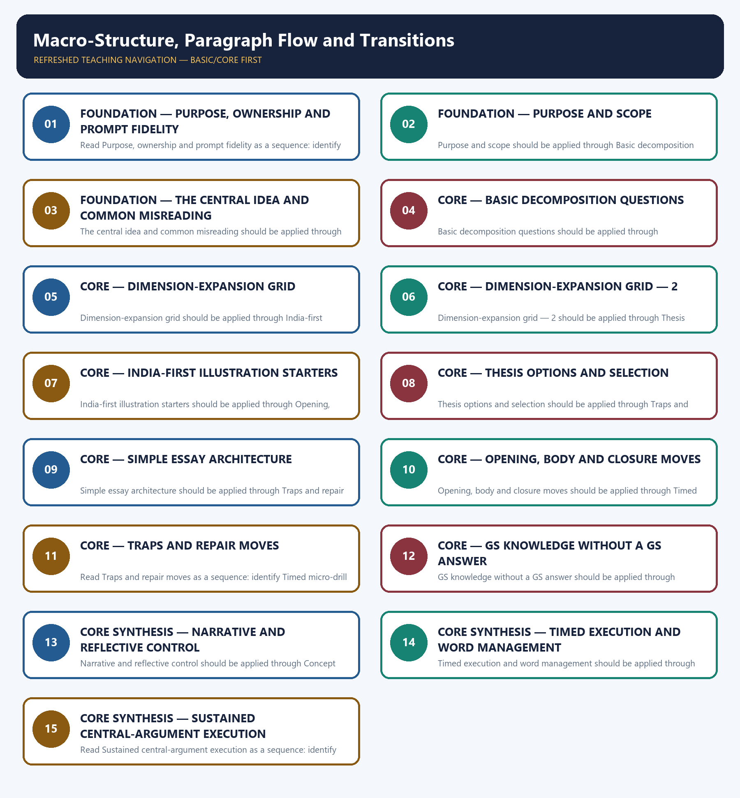

# Macro-Structure, Paragraph Flow and Transitions — Learner-v2 Complete Learning Session

> **Authoring-only generation:** 2026-09-06. No PDF was rendered and no tracker or index was mutated.

### SOURCE, PROGRESSION AND OFFICIAL-RULE AUDIT

- **Generation date:** 2026-09-06.
- **Source order:** canonical Basic owner first; Advanced owner second; Essay master framework, README, official-syllabus map, answer-worthiness audit and revision chart next; PYQ corpus and official OCR papers after that; live official UPSC pages only as a final check.
- **Basic/Advanced boundary:** complete Basic teaching remains first and Advanced material remains optional and last.
- **OCR boundary:** Repository Markdown was primary. OCR-searchable official UPSC Essay papers were supplementary only for printed instructions and V1 prompt wording. No author, official model answer, current marks split, phase allocation, paragraph count or scoring rubric was inferred.
- **Qdrant:** not used; repository Markdown and local official papers were sufficient.
- **PYQ integrity:** Three application cards use the repository's explicit V1/V2 status. No unavailable official model answer, marking rubric or attribution is invented.
- **Live-source boundary:** Live source check dated 2026-09-06: official UPSC routes were attempted and access-blocked; blocked pages support no new claim. UN, WHO and IPCC primary pages were separately checked for cross-theme factual boundaries.
- **No-formula rule:** strategy, heuristics and practice weights are never presented as official UPSC instructions or marking criteria.

### LIVE OFFICIAL-SOURCE ATTEMPT LOG

The checks below were made on 2026-09-06. Substantive official text is used only for the proposition it supports; title-only, blocked or thin pages are recorded and supply no factual claim.

- https://upsc.gov.in/examinations/previous-question-papers — attempted 2026-09-06; official page returned HTTP 403 to the live fetch, so it supports no new wording.
- https://upsc.gov.in/examinations/active-examinations — attempted 2026-09-06; official page returned HTTP 403 to the live fetch, so it supports no current-paper inference.
- https://upsc.gov.in/sites/default/files/Notif-CSP-2024-Engl-140224.pdf — searched 2026-09-06; retained only as an official scheme cross-check route, not as an Essay rubric.

## BASIC LEARNING SESSION



*Distinct embedded teaching-navigation image. The separate continuous Cārvāka-style flowchart package remains an independent at-a-glance artifact.*

### SESSION 1 — FOUNDATION — PURPOSE, OWNERSHIP AND PROMPT FIDELITY

#### DEFINITION / WHAT THIS IS CALLED

**Plain-language definition:** Objective practice: Apply Purpose, ownership and prompt fidelity by distinguishing the correct Essay-method move from nearby but invalid shortcuts; no factual-trivia recall is being tested.

**Technical definition:** Read Purpose, ownership and prompt fidelity as a sequence: identify Purpose and scope, follow the method through the printed proposition, and stop before adding a rule, attribution, fact or inference the audited sources do not support.

#### ANSWER-GRABBING OPENING — WRITE/ADAPT IN THE EXAM

> Plain-language definition: Purpose, ownership and prompt fidelity explains how Purpose and scope and The central idea and common misreading combine into one usable Essay-planning move.

#### MUST-WRITE KEYWORDS

- **FOUNDATION**
- **Purpose**
- **ownership**
- **prompt fidelity**
- **Plain-language definition**
- **Technical definition**

**How to use them:** Frame the answer through FOUNDATION; define Purpose, connect ownership with prompt fidelity to explain the mechanism, and use Plain-language definition for the decisive comparison or qualification.

#### METHOD MOVE / WHAT THIS DOES

**Plain-language definition:** Purpose, ownership and prompt fidelity explains how Purpose and scope and The central idea and common misreading combine into one usable Essay-planning move.

**Technical definition:** The learner fixes the printed prompt, its relationship or demand, the defensible scope, the argument function and the evidence boundary before drafting prose.

#### ANSWER-GRABBING OPENING — WRITE/ADAPT IN THE EXAM

> Purpose, ownership and prompt fidelity should be applied through Purpose and scope and The central idea and common misreading, while preserving the difference between official paper instruction and strategy, prompt wording and interpretation, example and evidence, breadth and coherence.

#### MUST-WRITE KEYWORDS

- **Purpose**
- **ownership**
- **prompt**
- **fidelity**
- **scope**
- **central**

**How to use them:** Define the first three terms, trace the relationship with the next two, and attach the final term to the exact claim, example and qualification. Qualification: Do not replace macro-sequence, paragraph jobs and explicit logical movement with a generic GS-style catalogue.

#### VISUAL FIRST

```text
PURPOSE, OWNERSHIP AND PROMPT FIDELITY
01. Purpose and scope
    |
    v
02. The central idea and common misreading
STATUS / CATEGORY FIREWALL -> Do not replace macro-sequence, paragraph jobs and explicit logical movement with a generic GS-style catalogue.
```

*The rail fixes the prompt-to-argument sequence and claim boundary before explanation.*

#### CORE EXPLANATION

This topic covers the essay's overall shape and how paragraphs connect to each other — it assumes the thesis and argument map are already built (05) and hands off the opening/closing paragraphs to 06. Central idea: a 1000–1200-word essay typically works well as roughly 9–12 purposeful paragraphs — introduction, three argument-map clusters (usually two paragraphs each), a counter-view/ synthesis paragraph, and a conclusion. Add a paragraph only when a distinct mechanism or objection needs development, not to meet a count. Each paragraph should open with a transition to the previous idea. Common misreading: using GS-style headings, numbered sections, or bullet lists to organise the essay — this reads as an administrative response, not a continuous argued essay, and undercuts flow.

#### SIMPLE SYSTEM EXAMPLE

Read Purpose, ownership and prompt fidelity as a sequence: identify Purpose and scope, follow the method through the printed proposition, and stop before adding a rule, attribution, fact or inference the audited sources do not support.

#### TECHNICAL DISTINCTION

The decisive boundary is Do not replace macro-sequence, paragraph jobs and explicit logical movement with a generic GS-style catalogue. This keeps Purpose and scope and The central idea and common misreading in the correct prompt, method, argument and evidence category.

#### NAMED EVIDENCE AND MECHANISM

- This topic covers the essay's overall shape and how paragraphs connect to each other — it assumes the thesis and argument map are already built (05) and hands off the opening/closing paragraphs to 06.
- Central idea: a 1000–1200-word essay typically works well as roughly 9–12 purposeful paragraphs — introduction, three argument-map clusters (usually two paragraphs each), a counter-view/ synthesis paragraph, and a conclusion. Add a paragraph only when a distinct mechanism or objection needs development, not to meet a count. Each paragraph should open with a transition to the previous idea. Common misreading: using GS-style headings, numbered sections, or bullet lists to organise the essay — this reads as an administrative response, not a continuous argued essay, and undercuts flow.

#### EXAMINER CAUTION

- Do not replace macro-sequence, paragraph jobs and explicit logical movement with a generic GS-style catalogue.

#### EXAM LINK

- **Objective practice:** Apply Purpose, ownership and prompt fidelity by distinguishing the correct Essay-method move from nearby but invalid shortcuts; no factual-trivia recall is being tested.
- **Essay application:** State the exact demand and the bounded writing decision.

#### MINI RECAP

- **Mechanism chain:** Purpose and scope -> The central idea and common misreading
- **Qualified use:** State the exact demand and the bounded writing decision.

#### CLOSING RECALL FLOW — FOUNDATION — PURPOSE, OWNERSHIP AND PROMPT FIDELITY

```text
START / CONCEPT: FOUNDATION — Purpose, ownership and prompt fidelity
        |
        v
EXACT TERMS: FOUNDATION · Purpose · ownership · prompt fidelity · Plain-language definition · Technical definition
        |
        v
MECHANISM / ARGUMENT: Read Purpose, ownership and prompt fidelity as a sequence: identify Purpose and scope, follow the method through the printed proposition, and stop before adding a rule, attribution, fact or inference the audited sources do not support.
        |
        v
CONSEQUENCE / CONTRAST: Objective practice: Apply Purpose, ownership and prompt fidelity by distinguishing the correct Essay-method move from nearby but invalid shortcuts; no factual-trivia recall is being tested.
        |
        v
UPSC TRAP / ANSWER-USE: Purpose, ownership and prompt fidelity should be applied through Purpose and scope and The central idea and common misreading, while preserving the difference between official paper instruction and strategy, prompt wording and interpretation, example and evidence, breadth and coherence.
        |
        v
ANSWER-GRABBING FORMULATION: Plain-language definition: Purpose, ownership and prompt fidelity explains how Purpose and scope and The central idea and common misreading combine into one usable Essay-planning move.
```
### SESSION 2 — FOUNDATION — PURPOSE AND SCOPE

#### DEFINITION / WHAT THIS IS CALLED

**Plain-language definition:** Objective practice: Apply Purpose and scope by distinguishing the correct Essay-method move from nearby but invalid shortcuts; no factual-trivia recall is being tested.

**Technical definition:** Purpose and scope should be applied through Basic decomposition questions, while preserving the difference between official paper instruction and strategy, prompt wording and interpretation, example and evidence, breadth and coherence.

#### ANSWER-GRABBING OPENING — WRITE/ADAPT IN THE EXAM

> Plain-language definition: Purpose and scope explains how Basic decomposition questions combine into one usable Essay-planning move.

#### MUST-WRITE KEYWORDS

- **FOUNDATION**
- **Purpose**
- **scope**
- **Plain-language definition**
- **Technical definition**
- **Basic**

**How to use them:** Frame the answer through FOUNDATION; define Purpose, connect scope with Plain-language definition to explain the mechanism, and use Technical definition for the decisive comparison or qualification.

#### METHOD MOVE / WHAT THIS DOES

**Plain-language definition:** Purpose and scope explains how Basic decomposition questions combine into one usable Essay-planning move.

**Technical definition:** The learner fixes the printed prompt, its relationship or demand, the defensible scope, the argument function and the evidence boundary before drafting prose.

#### ANSWER-GRABBING OPENING — WRITE/ADAPT IN THE EXAM

> Purpose and scope should be applied through Basic decomposition questions, while preserving the difference between official paper instruction and strategy, prompt wording and interpretation, example and evidence, breadth and coherence.

#### MUST-WRITE KEYWORDS

- **Purpose**
- **scope**
- **Basic**
- **decomposition**
- **questions**
- **many**

**How to use them:** Define the first three terms, trace the relationship with the next two, and attach the final term to the exact claim, example and qualification. Qualification: Do not cross the ownership boundary: counterargument design belongs to 08.

#### VISUAL FIRST

```text
PURPOSE AND SCOPE
01. Basic decomposition questions
STATUS / CATEGORY FIREWALL -> Do not cross the ownership boundary: counterargument design belongs to 08.
```

*The rail fixes the prompt-to-argument sequence and claim boundary before explanation.*

#### CORE EXPLANATION

1. How many argument-map cycles (from 05) do I have, and how many paragraphs does each need? 2. What order best builds toward the conclusion — narrowest to broadest, or cause to consequence? 3. Does each paragraph's opening sentence refer back to the previous paragraph's idea? 4. Is there a distinct paragraph testing the counter-view/synthesis (see 08) before the conclusion? 5. Does every paragraph contain exactly one main claim, not several unrelated ones crammed together?

#### SIMPLE SYSTEM EXAMPLE

Read Purpose and scope as a sequence: identify Basic decomposition questions, follow the method through the printed proposition, and stop before adding a rule, attribution, fact or inference the audited sources do not support.

#### TECHNICAL DISTINCTION

The decisive boundary is Do not cross the ownership boundary: counterargument design belongs to 08. This keeps Basic decomposition questions in the correct prompt, method, argument and evidence category.

#### NAMED EVIDENCE AND MECHANISM

- 1. How many argument-map cycles (from 05) do I have, and how many paragraphs does each need? 2. What order best builds toward the conclusion — narrowest to broadest, or cause to consequence? 3. Does each paragraph's opening sentence refer back to the previous paragraph's idea? 4. Is there a distinct paragraph testing the counter-view/synthesis (see 08) before the conclusion? 5. Does every paragraph contain exactly one main claim, not several unrelated ones crammed together?

#### EXAMINER CAUTION

- Do not cross the ownership boundary: counterargument design belongs to 08.

#### EXAM LINK

- **Objective practice:** Apply Purpose and scope by distinguishing the correct Essay-method move from nearby but invalid shortcuts; no factual-trivia recall is being tested.
- **Essay application:** Define operative terms before expanding dimensions.

#### MINI RECAP

- **Mechanism chain:** Basic decomposition questions
- **Qualified use:** Define operative terms before expanding dimensions.

#### CLOSING RECALL FLOW — FOUNDATION — PURPOSE AND SCOPE

```text
START / CONCEPT: FOUNDATION — Purpose and scope
        |
        v
EXACT TERMS: FOUNDATION · Purpose · scope · Plain-language definition · Technical definition · Basic
        |
        v
MECHANISM / ARGUMENT: Purpose and scope should be applied through Basic decomposition questions, while preserving the difference between official paper instruction and strategy, prompt wording and interpretation, example and evidence, breadth and coherence.
        |
        v
CONSEQUENCE / CONTRAST: Read Purpose and scope as a sequence: identify Basic decomposition questions, follow the method through the printed proposition, and stop before adding a rule, attribution, fact or inference the audited sources do not support.
        |
        v
UPSC TRAP / ANSWER-USE: Objective practice: Apply Purpose and scope by distinguishing the correct Essay-method move from nearby but invalid shortcuts; no factual-trivia recall is being tested.
        |
        v
ANSWER-GRABBING FORMULATION: Plain-language definition: Purpose and scope explains how Basic decomposition questions combine into one usable Essay-planning move.
```
### SESSION 3 — FOUNDATION — THE CENTRAL IDEA AND COMMON MISREADING

#### DEFINITION / WHAT THIS IS CALLED

**Plain-language definition:** Objective practice: Apply The central idea and common misreading by distinguishing the correct Essay-method move from nearby but invalid shortcuts; no factual-trivia recall is being tested.

**Technical definition:** The central idea and common misreading should be applied through Dimension-expansion grid, while preserving the difference between official paper instruction and strategy, prompt wording and interpretation, example and evidence, breadth and coherence.

#### ANSWER-GRABBING OPENING — WRITE/ADAPT IN THE EXAM

> Plain-language definition: The central idea and common misreading explains how Dimension-expansion grid combine into one usable Essay-planning move.

#### MUST-WRITE KEYWORDS

- **FOUNDATION**
- **The central idea**
- **common misreading**
- **Plain-language definition**
- **Technical definition**
- **central**

**How to use them:** Frame the answer through FOUNDATION; define The central idea, connect common misreading with Plain-language definition to explain the mechanism, and use Technical definition for the decisive comparison or qualification.

#### METHOD MOVE / WHAT THIS DOES

**Plain-language definition:** The central idea and common misreading explains how Dimension-expansion grid combine into one usable Essay-planning move.

**Technical definition:** The learner fixes the printed prompt, its relationship or demand, the defensible scope, the argument function and the evidence boundary before drafting prose.

#### ANSWER-GRABBING OPENING — WRITE/ADAPT IN THE EXAM

> The central idea and common misreading should be applied through Dimension-expansion grid, while preserving the difference between official paper instruction and strategy, prompt wording and interpretation, example and evidence, breadth and coherence.

#### MUST-WRITE KEYWORDS

- **central**
- **idea**
- **common**
- **misreading**
- **Dimension-expansion**
- **grid**

**How to use them:** Define the first three terms, trace the relationship with the next two, and attach the final term to the exact claim, example and qualification. Qualification: Do not use an example without explaining its argumentative function.

#### VISUAL FIRST

```text
THE CENTRAL IDEA AND COMMON MISREADING
01. Dimension-expansion grid
STATUS / CATEGORY FIREWALL -> Do not use an example without explaining its argumentative function.
```

*The rail fixes the prompt-to-argument sequence and claim boundary before explanation.*

#### CORE EXPLANATION

This base plan has 9 paragraphs ; one or two earned expansions make it 10–11. It is a planning heuristic, not a paper rule.

#### SIMPLE SYSTEM EXAMPLE

Read The central idea and common misreading as a sequence: identify Dimension-expansion grid, follow the method through the printed proposition, and stop before adding a rule, attribution, fact or inference the audited sources do not support.

#### TECHNICAL DISTINCTION

The decisive boundary is Do not use an example without explaining its argumentative function. This keeps Dimension-expansion grid in the correct prompt, method, argument and evidence category.

#### NAMED EVIDENCE AND MECHANISM

- This base plan has 9 paragraphs ; one or two earned expansions make it 10–11. It is a planning heuristic, not a paper rule.

#### EXAMINER CAUTION

- Do not use an example without explaining its argumentative function.

#### EXAM LINK

- **Objective practice:** Apply The central idea and common misreading by distinguishing the correct Essay-method move from nearby but invalid shortcuts; no factual-trivia recall is being tested.
- **Essay application:** Build one qualified thesis and keep it visible.

#### MINI RECAP

- **Mechanism chain:** Dimension-expansion grid
- **Qualified use:** Build one qualified thesis and keep it visible.

#### CLOSING RECALL FLOW — FOUNDATION — THE CENTRAL IDEA AND COMMON MISREADING

```text
START / CONCEPT: FOUNDATION — The central idea and common misreading
        |
        v
EXACT TERMS: FOUNDATION · The central idea · common misreading · Plain-language definition · Technical definition · central
        |
        v
MECHANISM / ARGUMENT: The central idea and common misreading should be applied through Dimension-expansion grid, while preserving the difference between official paper instruction and strategy, prompt wording and interpretation, example and evidence, breadth and coherence.
        |
        v
CONSEQUENCE / CONTRAST: Read The central idea and common misreading as a sequence: identify Dimension-expansion grid, follow the method through the printed proposition, and stop before adding a rule, attribution, fact or inference the audited sources do not support.
        |
        v
UPSC TRAP / ANSWER-USE: Objective practice: Apply The central idea and common misreading by distinguishing the correct Essay-method move from nearby but invalid shortcuts; no factual-trivia recall is being tested.
        |
        v
ANSWER-GRABBING FORMULATION: Plain-language definition: The central idea and common misreading explains how Dimension-expansion grid combine into one usable Essay-planning move.
```
### SESSION 4 — CORE — BASIC DECOMPOSITION QUESTIONS

#### DEFINITION / WHAT THIS IS CALLED

**Plain-language definition:** Objective practice: Apply Basic decomposition questions by distinguishing the correct Essay-method move from nearby but invalid shortcuts; no factual-trivia recall is being tested.

**Technical definition:** Basic decomposition questions should be applied through Dimension-expansion grid — 2, while preserving the difference between official paper instruction and strategy, prompt wording and interpretation, example and evidence, breadth and coherence.

#### ANSWER-GRABBING OPENING — WRITE/ADAPT IN THE EXAM

> Plain-language definition: Basic decomposition questions explains how Dimension-expansion grid — 2 combine into one usable Essay-planning move.

#### MUST-WRITE KEYWORDS

- **Basic decomposition questions**
- **Plain-language definition**
- **Technical definition**
- **Basic**
- **decomposition**
- **questions**

**How to use them:** Frame the answer through Basic decomposition questions; define Plain-language definition, connect Technical definition with Basic to explain the mechanism, and use decomposition for the decisive comparison or qualification.

#### METHOD MOVE / WHAT THIS DOES

**Plain-language definition:** Basic decomposition questions explains how Dimension-expansion grid — 2 combine into one usable Essay-planning move.

**Technical definition:** The learner fixes the printed prompt, its relationship or demand, the defensible scope, the argument function and the evidence boundary before drafting prose.

#### ANSWER-GRABBING OPENING — WRITE/ADAPT IN THE EXAM

> Basic decomposition questions should be applied through Dimension-expansion grid — 2, while preserving the difference between official paper instruction and strategy, prompt wording and interpretation, example and evidence, breadth and coherence.

#### MUST-WRITE KEYWORDS

- **Basic**
- **decomposition**
- **questions**
- **Dimension-expansion**
- **grid**
- **PERSONAL**

**How to use them:** Define the first three terms, trace the relationship with the next two, and attach the final term to the exact claim, example and qualification. Qualification: Do not treat a pedagogical scaffold as an official UPSC marking rule.

#### VISUAL FIRST

```text
BASIC DECOMPOSITION QUESTIONS
01. Dimension-expansion grid — 2
STATUS / CATEGORY FIREWALL -> Do not treat a pedagogical scaffold as an official UPSC marking rule.
```

*The rail fixes the prompt-to-argument sequence and claim boundary before explanation.*

#### CORE EXPLANATION

PERSONAL RESTRAINT limits abuse when nobody is watching. v "Yet private virtue is too fragile where a decision changes another person's rights; public power needs public reasons." v INSTITUTIONAL ACCOUNTABILITY tests those reasons through scrutiny. v "But scrutiny alone does not tell an institution which competing right should govern; that requires a reasoned ethical priority." v ETHICAL SYNTHESIS resolves the remaining conflict without hiding its cost.

#### SIMPLE SYSTEM EXAMPLE

Read Basic decomposition questions as a sequence: identify Dimension-expansion grid — 2, follow the method through the printed proposition, and stop before adding a rule, attribution, fact or inference the audited sources do not support.

#### TECHNICAL DISTINCTION

The decisive boundary is Do not treat a pedagogical scaffold as an official UPSC marking rule. This keeps Dimension-expansion grid — 2 in the correct prompt, method, argument and evidence category.

#### NAMED EVIDENCE AND MECHANISM

- PERSONAL RESTRAINT limits abuse when nobody is watching. v "Yet private virtue is too fragile where a decision changes another person's rights; public power needs public reasons." v INSTITUTIONAL ACCOUNTABILITY tests those reasons through scrutiny. v "But scrutiny alone does not tell an institution which competing right should govern; that requires a reasoned ethical priority." v ETHICAL SYNTHESIS resolves the remaining conflict without hiding its cost.

#### EXAMINER CAUTION

- Do not treat a pedagogical scaffold as an official UPSC marking rule.

#### EXAM LINK

- **Objective practice:** Apply Basic decomposition questions by distinguishing the correct Essay-method move from nearby but invalid shortcuts; no factual-trivia recall is being tested.
- **Essay application:** Give every paragraph one argumentative job.

#### MINI RECAP

- **Mechanism chain:** Dimension-expansion grid — 2
- **Qualified use:** Give every paragraph one argumentative job.

#### CLOSING RECALL FLOW — CORE — BASIC DECOMPOSITION QUESTIONS

```text
START / CONCEPT: CORE — Basic decomposition questions
        |
        v
EXACT TERMS: Basic decomposition questions · Plain-language definition · Technical definition · Basic · decomposition · questions
        |
        v
MECHANISM / ARGUMENT: Basic decomposition questions should be applied through Dimension-expansion grid — 2, while preserving the difference between official paper instruction and strategy, prompt wording and interpretation, example and evidence, breadth and coherence.
        |
        v
CONSEQUENCE / CONTRAST: Read Basic decomposition questions as a sequence: identify Dimension-expansion grid — 2, follow the method through the printed proposition, and stop before adding a rule, attribution, fact or inference the audited sources do not support.
        |
        v
UPSC TRAP / ANSWER-USE: Objective practice: Apply Basic decomposition questions by distinguishing the correct Essay-method move from nearby but invalid shortcuts; no factual-trivia recall is being tested.
        |
        v
ANSWER-GRABBING FORMULATION: Plain-language definition: Basic decomposition questions explains how Dimension-expansion grid — 2 combine into one usable Essay-planning move.
```
### SESSION 5 — CORE — DIMENSION-EXPANSION GRID

#### DEFINITION / WHAT THIS IS CALLED

**Plain-language definition:** Objective practice: Apply Dimension-expansion grid by distinguishing the correct Essay-method move from nearby but invalid shortcuts; no factual-trivia recall is being tested.

**Technical definition:** Dimension-expansion grid should be applied through India-first illustration starters, while preserving the difference between official paper instruction and strategy, prompt wording and interpretation, example and evidence, breadth and coherence.

#### ANSWER-GRABBING OPENING — WRITE/ADAPT IN THE EXAM

> Plain-language definition: Dimension-expansion grid explains how India-first illustration starters combine into one usable Essay-planning move.

#### MUST-WRITE KEYWORDS

- **Dimension-expansion grid**
- **Plain-language definition**
- **Technical definition**
- **Dimension-expansion**
- **grid**
- **India-first**

**How to use them:** Frame the answer through Dimension-expansion grid; define Plain-language definition, connect Technical definition with Dimension-expansion to explain the mechanism, and use grid for the decisive comparison or qualification.

#### METHOD MOVE / WHAT THIS DOES

**Plain-language definition:** Dimension-expansion grid explains how India-first illustration starters combine into one usable Essay-planning move.

**Technical definition:** The learner fixes the printed prompt, its relationship or demand, the defensible scope, the argument function and the evidence boundary before drafting prose.

#### ANSWER-GRABBING OPENING — WRITE/ADAPT IN THE EXAM

> Dimension-expansion grid should be applied through India-first illustration starters, while preserving the difference between official paper instruction and strategy, prompt wording and interpretation, example and evidence, breadth and coherence.

#### MUST-WRITE KEYWORDS

- **Dimension-expansion**
- **grid**
- **India-first**
- **illustration**
- **starters**
- **Assign**

**How to use them:** Define the first three terms, trace the relationship with the next two, and attach the final term to the exact claim, example and qualification. Qualification: Do not let a counter-view replace the thesis; use it to qualify the thesis.

#### VISUAL FIRST

```text
DIMENSION-EXPANSION GRID
01. India-first illustration starters
STATUS / CATEGORY FIREWALL -> Do not let a counter-view replace the thesis; use it to qualify the thesis.
```

*The rail fixes the prompt-to-argument sequence and claim boundary before explanation.*

#### CORE EXPLANATION

Assign one recalled Indian illustration per paragraph cluster where relevant, and check no single illustration is stretched across multiple clusters without adding new material each time. Full discipline: 12.

#### SIMPLE SYSTEM EXAMPLE

Read Dimension-expansion grid as a sequence: identify India-first illustration starters, follow the method through the printed proposition, and stop before adding a rule, attribution, fact or inference the audited sources do not support.

#### TECHNICAL DISTINCTION

The decisive boundary is Do not let a counter-view replace the thesis; use it to qualify the thesis. This keeps India-first illustration starters in the correct prompt, method, argument and evidence category.

#### NAMED EVIDENCE AND MECHANISM

- Assign one recalled Indian illustration per paragraph cluster where relevant, and check no single illustration is stretched across multiple clusters without adding new material each time. Full discipline: 12.

#### EXAMINER CAUTION

- Do not let a counter-view replace the thesis; use it to qualify the thesis.

#### EXAM LINK

- **Objective practice:** Apply Dimension-expansion grid by distinguishing the correct Essay-method move from nearby but invalid shortcuts; no factual-trivia recall is being tested.
- **Essay application:** Join a named illustration to its mechanism.

#### MINI RECAP

- **Mechanism chain:** India-first illustration starters
- **Qualified use:** Join a named illustration to its mechanism.

#### CLOSING RECALL FLOW — CORE — DIMENSION-EXPANSION GRID

```text
START / CONCEPT: CORE — Dimension-expansion grid
        |
        v
EXACT TERMS: Dimension-expansion grid · Plain-language definition · Technical definition · Dimension-expansion · grid · India-first
        |
        v
MECHANISM / ARGUMENT: Dimension-expansion grid should be applied through India-first illustration starters, while preserving the difference between official paper instruction and strategy, prompt wording and interpretation, example and evidence, breadth and coherence.
        |
        v
CONSEQUENCE / CONTRAST: Read Dimension-expansion grid as a sequence: identify India-first illustration starters, follow the method through the printed proposition, and stop before adding a rule, attribution, fact or inference the audited sources do not support.
        |
        v
UPSC TRAP / ANSWER-USE: Objective practice: Apply Dimension-expansion grid by distinguishing the correct Essay-method move from nearby but invalid shortcuts; no factual-trivia recall is being tested.
        |
        v
ANSWER-GRABBING FORMULATION: Plain-language definition: Dimension-expansion grid explains how India-first illustration starters combine into one usable Essay-planning move.
```
### SESSION 6 — CORE — DIMENSION-EXPANSION GRID — 2

#### DEFINITION / WHAT THIS IS CALLED

**Plain-language definition:** Objective practice: Apply Dimension-expansion grid — 2 by distinguishing the correct Essay-method move from nearby but invalid shortcuts; no factual-trivia recall is being tested.

**Technical definition:** Dimension-expansion grid — 2 should be applied through Thesis options and selection and Simple essay architecture, while preserving the difference between official paper instruction and strategy, prompt wording and interpretation, example and evidence, breadth and coherence.

#### ANSWER-GRABBING OPENING — WRITE/ADAPT IN THE EXAM

> Plain-language definition: Dimension-expansion grid — 2 explains how Thesis options and selection and Simple essay architecture combine into one usable Essay-planning move.

#### MUST-WRITE KEYWORDS

- **Dimension-expansion grid**
- **Plain-language definition**
- **Technical definition**
- **Dimension-expansion**
- **grid**
- **Thesis**

**How to use them:** Frame the answer through Dimension-expansion grid; define Plain-language definition, connect Technical definition with Dimension-expansion to explain the mechanism, and use grid for the decisive comparison or qualification.

#### METHOD MOVE / WHAT THIS DOES

**Plain-language definition:** Dimension-expansion grid — 2 explains how Thesis options and selection and Simple essay architecture combine into one usable Essay-planning move.

**Technical definition:** The learner fixes the printed prompt, its relationship or demand, the defensible scope, the argument function and the evidence boundary before drafting prose.

#### ANSWER-GRABBING OPENING — WRITE/ADAPT IN THE EXAM

> Dimension-expansion grid — 2 should be applied through Thesis options and selection and Simple essay architecture, while preserving the difference between official paper instruction and strategy, prompt wording and interpretation, example and evidence, breadth and coherence.

#### MUST-WRITE KEYWORDS

- **Dimension-expansion**
- **grid**
- **Thesis**
- **options**
- **selection**
- **Simple**

**How to use them:** Define the first three terms, trace the relationship with the next two, and attach the final term to the exact claim, example and qualification. Qualification: Do not use an unverified quotation, statistic, attribution or anecdote.

#### VISUAL FIRST

```text
DIMENSION-EXPANSION GRID — 2
01. Thesis options and selection
    |
    v
02. Simple essay architecture
STATUS / CATEGORY FIREWALL -> Do not use an unverified quotation, statistic, attribution or anecdote.
```

*The rail fixes the prompt-to-argument sequence and claim boundary before explanation.*

#### CORE EXPLANATION

The chosen thesis (05) should be traceable through every paragraph cluster's opening claim — if a paragraph's claim cannot be connected back to the thesis in one sentence, either cut it or revise the thesis to account for it. Use Section 6's grid as a literal paragraph-by-paragraph plan before drafting — write one claim-sentence per planned paragraph first, check for flow and non-repetition, then expand each into full prose.

#### SIMPLE SYSTEM EXAMPLE

Read Dimension-expansion grid — 2 as a sequence: identify Thesis options and selection, follow the method through the printed proposition, and stop before adding a rule, attribution, fact or inference the audited sources do not support.

#### TECHNICAL DISTINCTION

The decisive boundary is Do not use an unverified quotation, statistic, attribution or anecdote. This keeps Thesis options and selection and Simple essay architecture in the correct prompt, method, argument and evidence category.

#### NAMED EVIDENCE AND MECHANISM

- The chosen thesis (05) should be traceable through every paragraph cluster's opening claim — if a paragraph's claim cannot be connected back to the thesis in one sentence, either cut it or revise the thesis to account for it.
- Use Section 6's grid as a literal paragraph-by-paragraph plan before drafting — write one claim-sentence per planned paragraph first, check for flow and non-repetition, then expand each into full prose.

#### EXAMINER CAUTION

- Do not use an unverified quotation, statistic, attribution or anecdote.

#### EXAM LINK

- **Objective practice:** Apply Dimension-expansion grid — 2 by distinguishing the correct Essay-method move from nearby but invalid shortcuts; no factual-trivia recall is being tested.
- **Essay application:** Use a counter-case to refine, not derail, the thesis.

#### MINI RECAP

- **Mechanism chain:** Thesis options and selection -> Simple essay architecture
- **Qualified use:** Use a counter-case to refine, not derail, the thesis.

#### CLOSING RECALL FLOW — CORE — DIMENSION-EXPANSION GRID — 2

```text
START / CONCEPT: CORE — Dimension-expansion grid — 2
        |
        v
EXACT TERMS: Dimension-expansion grid · Plain-language definition · Technical definition · Dimension-expansion · grid · Thesis
        |
        v
MECHANISM / ARGUMENT: Dimension-expansion grid — 2 should be applied through Thesis options and selection and Simple essay architecture, while preserving the difference between official paper instruction and strategy, prompt wording and interpretation, example and evidence, breadth and coherence.
        |
        v
CONSEQUENCE / CONTRAST: Read Dimension-expansion grid — 2 as a sequence: identify Thesis options and selection, follow the method through the printed proposition, and stop before adding a rule, attribution, fact or inference the audited sources do not support.
        |
        v
UPSC TRAP / ANSWER-USE: Objective practice: Apply Dimension-expansion grid — 2 by distinguishing the correct Essay-method move from nearby but invalid shortcuts; no factual-trivia recall is being tested.
        |
        v
ANSWER-GRABBING FORMULATION: Plain-language definition: Dimension-expansion grid — 2 explains how Thesis options and selection and Simple essay architecture combine into one usable Essay-planning move.
```
### SESSION 7 — CORE — INDIA-FIRST ILLUSTRATION STARTERS

#### DEFINITION / WHAT THIS IS CALLED

**Plain-language definition:** Objective practice: Apply India-first illustration starters by distinguishing the correct Essay-method move from nearby but invalid shortcuts; no factual-trivia recall is being tested.

**Technical definition:** India-first illustration starters should be applied through Opening, body and closure moves, while preserving the difference between official paper instruction and strategy, prompt wording and interpretation, example and evidence, breadth and coherence.

#### ANSWER-GRABBING OPENING — WRITE/ADAPT IN THE EXAM

> Plain-language definition: India-first illustration starters explains how Opening, body and closure moves combine into one usable Essay-planning move.

#### MUST-WRITE KEYWORDS

- **India-first illustration starters**
- **Plain-language definition**
- **Technical definition**
- **India-first**
- **illustration**
- **starters**

**How to use them:** Frame the answer through India-first illustration starters; define Plain-language definition, connect Technical definition with India-first to explain the mechanism, and use illustration for the decisive comparison or qualification.

#### METHOD MOVE / WHAT THIS DOES

**Plain-language definition:** India-first illustration starters explains how Opening, body and closure moves combine into one usable Essay-planning move.

**Technical definition:** The learner fixes the printed prompt, its relationship or demand, the defensible scope, the argument function and the evidence boundary before drafting prose.

#### ANSWER-GRABBING OPENING — WRITE/ADAPT IN THE EXAM

> India-first illustration starters should be applied through Opening, body and closure moves, while preserving the difference between official paper instruction and strategy, prompt wording and interpretation, example and evidence, breadth and coherence.

#### MUST-WRITE KEYWORDS

- **India-first**
- **illustration**
- **starters**
- **Opening**
- **body**
- **closure**

**How to use them:** Define the first three terms, trace the relationship with the next two, and attach the final term to the exact claim, example and qualification. Qualification: Do not multiply dimensions that repeat the same claim in new vocabulary.

#### VISUAL FIRST

```text
INDIA-FIRST ILLUSTRATION STARTERS
01. Opening, body and closure moves
STATUS / CATEGORY FIREWALL -> Do not multiply dimensions that repeat the same claim in new vocabulary.
```

*The rail fixes the prompt-to-argument sequence and claim boundary before explanation.*

#### CORE EXPLANATION

Each body paragraph should: (a) open with a transition to the previous paragraph, (b) state its claim, (c) develop mechanism and illustration, (d) close with a qualification or a link forward to the next paragraph. See 06 for the essay-level opening/closing paragraphs specifically.

#### SIMPLE SYSTEM EXAMPLE

Read India-first illustration starters as a sequence: identify Opening, body and closure moves, follow the method through the printed proposition, and stop before adding a rule, attribution, fact or inference the audited sources do not support.

#### TECHNICAL DISTINCTION

The decisive boundary is Do not multiply dimensions that repeat the same claim in new vocabulary. This keeps Opening, body and closure moves in the correct prompt, method, argument and evidence category.

#### NAMED EVIDENCE AND MECHANISM

- Each body paragraph should: (a) open with a transition to the previous paragraph, (b) state its claim, (c) develop mechanism and illustration, (d) close with a qualification or a link forward to the next paragraph. See 06 for the essay-level opening/closing paragraphs specifically.

#### EXAMINER CAUTION

- Do not multiply dimensions that repeat the same claim in new vocabulary.

#### EXAM LINK

- **Objective practice:** Apply India-first illustration starters by distinguishing the correct Essay-method move from nearby but invalid shortcuts; no factual-trivia recall is being tested.
- **Essay application:** Sequence paragraphs through explicit logical bridges.

#### MINI RECAP

- **Mechanism chain:** Opening, body and closure moves
- **Qualified use:** Sequence paragraphs through explicit logical bridges.

#### CLOSING RECALL FLOW — CORE — INDIA-FIRST ILLUSTRATION STARTERS

```text
START / CONCEPT: CORE — India-first illustration starters
        |
        v
EXACT TERMS: India-first illustration starters · Plain-language definition · Technical definition · India-first · illustration · starters
        |
        v
MECHANISM / ARGUMENT: India-first illustration starters should be applied through Opening, body and closure moves, while preserving the difference between official paper instruction and strategy, prompt wording and interpretation, example and evidence, breadth and coherence.
        |
        v
CONSEQUENCE / CONTRAST: Read India-first illustration starters as a sequence: identify Opening, body and closure moves, follow the method through the printed proposition, and stop before adding a rule, attribution, fact or inference the audited sources do not support.
        |
        v
UPSC TRAP / ANSWER-USE: Objective practice: Apply India-first illustration starters by distinguishing the correct Essay-method move from nearby but invalid shortcuts; no factual-trivia recall is being tested.
        |
        v
ANSWER-GRABBING FORMULATION: Plain-language definition: India-first illustration starters explains how Opening, body and closure moves combine into one usable Essay-planning move.
```
### SESSION 8 — CORE — THESIS OPTIONS AND SELECTION

#### DEFINITION / WHAT THIS IS CALLED

**Plain-language definition:** Objective practice: Apply Thesis options and selection by distinguishing the correct Essay-method move from nearby but invalid shortcuts; no factual-trivia recall is being tested.

**Technical definition:** Thesis options and selection should be applied through Traps and repair moves, while preserving the difference between official paper instruction and strategy, prompt wording and interpretation, example and evidence, breadth and coherence.

#### ANSWER-GRABBING OPENING — WRITE/ADAPT IN THE EXAM

> Plain-language definition: Thesis options and selection explains how Traps and repair moves combine into one usable Essay-planning move.

#### MUST-WRITE KEYWORDS

- **Thesis options**
- **selection**
- **Plain-language definition**
- **Technical definition**
- **Thesis**
- **options**

**How to use them:** Frame the answer through Thesis options; define selection, connect Plain-language definition with Technical definition to explain the mechanism, and use Thesis for the decisive comparison or qualification.

#### METHOD MOVE / WHAT THIS DOES

**Plain-language definition:** Thesis options and selection explains how Traps and repair moves combine into one usable Essay-planning move.

**Technical definition:** The learner fixes the printed prompt, its relationship or demand, the defensible scope, the argument function and the evidence boundary before drafting prose.

#### ANSWER-GRABBING OPENING — WRITE/ADAPT IN THE EXAM

> Thesis options and selection should be applied through Traps and repair moves, while preserving the difference between official paper instruction and strategy, prompt wording and interpretation, example and evidence, breadth and coherence.

#### MUST-WRITE KEYWORDS

- **Thesis**
- **options**
- **selection**
- **Traps**
- **repair**
- **moves**

**How to use them:** Define the first three terms, trace the relationship with the next two, and attach the final term to the exact claim, example and qualification. Qualification: Do not end with aspiration unsupported by the preceding argument.

#### VISUAL FIRST

```text
THESIS OPTIONS AND SELECTION
01. Traps and repair moves
STATUS / CATEGORY FIREWALL -> Do not end with aspiration unsupported by the preceding argument.
```

*The rail fixes the prompt-to-argument sequence and claim boundary before explanation.*

#### CORE EXPLANATION

Repair: add explicit transitions referencing the previous paragraph's specific claim, not a generic "furthermore."

#### SIMPLE SYSTEM EXAMPLE

Read Thesis options and selection as a sequence: identify Traps and repair moves, follow the method through the printed proposition, and stop before adding a rule, attribution, fact or inference the audited sources do not support.

#### TECHNICAL DISTINCTION

The decisive boundary is Do not end with aspiration unsupported by the preceding argument. This keeps Traps and repair moves in the correct prompt, method, argument and evidence category.

#### NAMED EVIDENCE AND MECHANISM

- Repair: add explicit transitions referencing the previous paragraph's specific claim, not a generic "furthermore."

#### EXAMINER CAUTION

- Do not end with aspiration unsupported by the preceding argument.

#### EXAM LINK

- **Objective practice:** Apply Thesis options and selection by distinguishing the correct Essay-method move from nearby but invalid shortcuts; no factual-trivia recall is being tested.
- **Essay application:** Move across actor, scale and time only when the claim changes.

#### MINI RECAP

- **Mechanism chain:** Traps and repair moves
- **Qualified use:** Move across actor, scale and time only when the claim changes.

#### CLOSING RECALL FLOW — CORE — THESIS OPTIONS AND SELECTION

```text
START / CONCEPT: CORE — Thesis options and selection
        |
        v
EXACT TERMS: Thesis options · selection · Plain-language definition · Technical definition · Thesis · options
        |
        v
MECHANISM / ARGUMENT: Thesis options and selection should be applied through Traps and repair moves, while preserving the difference between official paper instruction and strategy, prompt wording and interpretation, example and evidence, breadth and coherence.
        |
        v
CONSEQUENCE / CONTRAST: Read Thesis options and selection as a sequence: identify Traps and repair moves, follow the method through the printed proposition, and stop before adding a rule, attribution, fact or inference the audited sources do not support.
        |
        v
UPSC TRAP / ANSWER-USE: Objective practice: Apply Thesis options and selection by distinguishing the correct Essay-method move from nearby but invalid shortcuts; no factual-trivia recall is being tested.
        |
        v
ANSWER-GRABBING FORMULATION: Plain-language definition: Thesis options and selection explains how Traps and repair moves combine into one usable Essay-planning move.
```
### SESSION 9 — CORE — SIMPLE ESSAY ARCHITECTURE

#### DEFINITION / WHAT THIS IS CALLED

**Plain-language definition:** Objective practice: Apply Simple essay architecture by distinguishing the correct Essay-method move from nearby but invalid shortcuts; no factual-trivia recall is being tested.

**Technical definition:** Simple essay architecture should be applied through Traps and repair moves — 2, while preserving the difference between official paper instruction and strategy, prompt wording and interpretation, example and evidence, breadth and coherence.

#### ANSWER-GRABBING OPENING — WRITE/ADAPT IN THE EXAM

> Plain-language definition: Simple essay architecture explains how Traps and repair moves — 2 combine into one usable Essay-planning move.

#### MUST-WRITE KEYWORDS

- **Simple essay architecture**
- **Plain-language definition**
- **Technical definition**
- **Simple**
- **architecture**
- **Traps**

**How to use them:** Frame the answer through Simple essay architecture; define Plain-language definition, connect Technical definition with Simple to explain the mechanism, and use architecture for the decisive comparison or qualification.

#### METHOD MOVE / WHAT THIS DOES

**Plain-language definition:** Simple essay architecture explains how Traps and repair moves — 2 combine into one usable Essay-planning move.

**Technical definition:** The learner fixes the printed prompt, its relationship or demand, the defensible scope, the argument function and the evidence boundary before drafting prose.

#### ANSWER-GRABBING OPENING — WRITE/ADAPT IN THE EXAM

> Simple essay architecture should be applied through Traps and repair moves — 2, while preserving the difference between official paper instruction and strategy, prompt wording and interpretation, example and evidence, breadth and coherence.

#### MUST-WRITE KEYWORDS

- **Simple**
- **architecture**
- **Traps**
- **repair**
- **moves**
- **include**

**How to use them:** Define the first three terms, trace the relationship with the next two, and attach the final term to the exact claim, example and qualification. Qualification: Do not sacrifice the second essay's time budget to perfect the first.

#### VISUAL FIRST

```text
SIMPLE ESSAY ARCHITECTURE
01. Traps and repair moves — 2
STATUS / CATEGORY FIREWALL -> Do not sacrifice the second essay's time budget to perfect the first.
```

*The rail fixes the prompt-to-argument sequence and claim boundary before explanation.*

#### CORE EXPLANATION

→ Repair: include a substantive counter-view where it genuinely tests the thesis; otherwise integrate the necessary qualification into the relevant argument cycle (see 08).

#### SIMPLE SYSTEM EXAMPLE

Read Simple essay architecture as a sequence: identify Traps and repair moves — 2, follow the method through the printed proposition, and stop before adding a rule, attribution, fact or inference the audited sources do not support.

#### TECHNICAL DISTINCTION

The decisive boundary is Do not sacrifice the second essay's time budget to perfect the first. This keeps Traps and repair moves — 2 in the correct prompt, method, argument and evidence category.

#### NAMED EVIDENCE AND MECHANISM

- → Repair: include a substantive counter-view where it genuinely tests the thesis; otherwise integrate the necessary qualification into the relevant argument cycle (see 08).

#### EXAMINER CAUTION

- Do not sacrifice the second essay's time budget to perfect the first.

#### EXAM LINK

- **Objective practice:** Apply Simple essay architecture by distinguishing the correct Essay-method move from nearby but invalid shortcuts; no factual-trivia recall is being tested.
- **Essay application:** Use ethical nuance without moralising.

#### MINI RECAP

- **Mechanism chain:** Traps and repair moves — 2
- **Qualified use:** Use ethical nuance without moralising.

#### CLOSING RECALL FLOW — CORE — SIMPLE ESSAY ARCHITECTURE

```text
START / CONCEPT: CORE — Simple essay architecture
        |
        v
EXACT TERMS: Simple essay architecture · Plain-language definition · Technical definition · Simple · architecture · Traps
        |
        v
MECHANISM / ARGUMENT: Simple essay architecture should be applied through Traps and repair moves — 2, while preserving the difference between official paper instruction and strategy, prompt wording and interpretation, example and evidence, breadth and coherence.
        |
        v
CONSEQUENCE / CONTRAST: Read Simple essay architecture as a sequence: identify Traps and repair moves — 2, follow the method through the printed proposition, and stop before adding a rule, attribution, fact or inference the audited sources do not support.
        |
        v
UPSC TRAP / ANSWER-USE: Objective practice: Apply Simple essay architecture by distinguishing the correct Essay-method move from nearby but invalid shortcuts; no factual-trivia recall is being tested.
        |
        v
ANSWER-GRABBING FORMULATION: Plain-language definition: Simple essay architecture explains how Traps and repair moves — 2 combine into one usable Essay-planning move.
```
### SESSION 10 — CORE — OPENING, BODY AND CLOSURE MOVES

#### DEFINITION / WHAT THIS IS CALLED

**Plain-language definition:** Objective practice: Apply Opening, body and closure moves by distinguishing the correct Essay-method move from nearby but invalid shortcuts; no factual-trivia recall is being tested.

**Technical definition:** Opening, body and closure moves should be applied through Timed micro-drill and self-check, while preserving the difference between official paper instruction and strategy, prompt wording and interpretation, example and evidence, breadth and coherence.

#### ANSWER-GRABBING OPENING — WRITE/ADAPT IN THE EXAM

> Plain-language definition: Opening, body and closure moves explains how Timed micro-drill and self-check combine into one usable Essay-planning move.

#### MUST-WRITE KEYWORDS

- **Opening**
- **body**
- **closure moves**
- **Plain-language definition**
- **Technical definition**
- **closure**

**How to use them:** Frame the answer through Opening; define body, connect closure moves with Plain-language definition to explain the mechanism, and use Technical definition for the decisive comparison or qualification.

#### METHOD MOVE / WHAT THIS DOES

**Plain-language definition:** Opening, body and closure moves explains how Timed micro-drill and self-check combine into one usable Essay-planning move.

**Technical definition:** The learner fixes the printed prompt, its relationship or demand, the defensible scope, the argument function and the evidence boundary before drafting prose.

#### ANSWER-GRABBING OPENING — WRITE/ADAPT IN THE EXAM

> Opening, body and closure moves should be applied through Timed micro-drill and self-check, while preserving the difference between official paper instruction and strategy, prompt wording and interpretation, example and evidence, breadth and coherence.

#### MUST-WRITE KEYWORDS

- **Opening**
- **body**
- **closure**
- **moves**
- **Timed**
- **micro-drill**

**How to use them:** Define the first three terms, trace the relationship with the next two, and attach the final term to the exact claim, example and qualification. Qualification: Do not mistake novelty of phrasing for originality of thought.

#### VISUAL FIRST

```text
OPENING, BODY AND CLOSURE MOVES
01. Timed micro-drill and self-check
STATUS / CATEGORY FIREWALL -> Do not mistake novelty of phrasing for originality of thought.
```

*The rail fixes the prompt-to-argument sequence and claim boundary before explanation.*

#### CORE EXPLANATION

5-minute drill: For any argument map from 05, write only the opening sentence of each planned paragraph (introduction through conclusion). Check that each opening sentence references the previous paragraph's idea before introducing its own.

#### SIMPLE SYSTEM EXAMPLE

Read Opening, body and closure moves as a sequence: identify Timed micro-drill and self-check, follow the method through the printed proposition, and stop before adding a rule, attribution, fact or inference the audited sources do not support.

#### TECHNICAL DISTINCTION

The decisive boundary is Do not mistake novelty of phrasing for originality of thought. This keeps Timed micro-drill and self-check in the correct prompt, method, argument and evidence category.

#### NAMED EVIDENCE AND MECHANISM

- 5-minute drill: For any argument map from 05, write only the opening sentence of each planned paragraph (introduction through conclusion). Check that each opening sentence references the previous paragraph's idea before introducing its own.

#### EXAMINER CAUTION

- Do not mistake novelty of phrasing for originality of thought.

#### EXAM LINK

- **Objective practice:** Apply Opening, body and closure moves by distinguishing the correct Essay-method move from nearby but invalid shortcuts; no factual-trivia recall is being tested.
- **Essay application:** Preserve factual and quotation integrity.

#### MINI RECAP

- **Mechanism chain:** Timed micro-drill and self-check
- **Qualified use:** Preserve factual and quotation integrity.

#### CLOSING RECALL FLOW — CORE — OPENING, BODY AND CLOSURE MOVES

```text
START / CONCEPT: CORE — Opening, body and closure moves
        |
        v
EXACT TERMS: Opening · body · closure moves · Plain-language definition · Technical definition · closure
        |
        v
MECHANISM / ARGUMENT: Opening, body and closure moves should be applied through Timed micro-drill and self-check, while preserving the difference between official paper instruction and strategy, prompt wording and interpretation, example and evidence, breadth and coherence.
        |
        v
CONSEQUENCE / CONTRAST: Read Opening, body and closure moves as a sequence: identify Timed micro-drill and self-check, follow the method through the printed proposition, and stop before adding a rule, attribution, fact or inference the audited sources do not support.
        |
        v
UPSC TRAP / ANSWER-USE: Objective practice: Apply Opening, body and closure moves by distinguishing the correct Essay-method move from nearby but invalid shortcuts; no factual-trivia recall is being tested.
        |
        v
ANSWER-GRABBING FORMULATION: Plain-language definition: Opening, body and closure moves explains how Timed micro-drill and self-check combine into one usable Essay-planning move.
```
### SESSION 11 — CORE — TRAPS AND REPAIR MOVES

#### DEFINITION / WHAT THIS IS CALLED

**Plain-language definition:** Objective practice: Apply Traps and repair moves by distinguishing the correct Essay-method move from nearby but invalid shortcuts; no factual-trivia recall is being tested.

**Technical definition:** Read Traps and repair moves as a sequence: identify Timed micro-drill and self-check — 2, follow the method through the printed proposition, and stop before adding a rule, attribution, fact or inference the audited sources do not support.

#### ANSWER-GRABBING OPENING — WRITE/ADAPT IN THE EXAM

> Plain-language definition: Traps and repair moves explains how Timed micro-drill and self-check — 2 and Semantic-completeness repair — 6 September 2026 combine into one usable Essay-planning move.

#### MUST-WRITE KEYWORDS

- **Traps**
- **repair moves**
- **Plain-language definition**
- **Technical definition**
- **repair**
- **moves**

**How to use them:** Frame the answer through Traps; define repair moves, connect Plain-language definition with Technical definition to explain the mechanism, and use repair for the decisive comparison or qualification.

#### METHOD MOVE / WHAT THIS DOES

**Plain-language definition:** Traps and repair moves explains how Timed micro-drill and self-check — 2 and Semantic-completeness repair — 6 September 2026 combine into one usable Essay-planning move.

**Technical definition:** The learner fixes the printed prompt, its relationship or demand, the defensible scope, the argument function and the evidence boundary before drafting prose.

#### ANSWER-GRABBING OPENING — WRITE/ADAPT IN THE EXAM

> Traps and repair moves should be applied through Timed micro-drill and self-check — 2 and Semantic-completeness repair — 6 September 2026, while preserving the difference between official paper instruction and strategy, prompt wording and interpretation, example and evidence, breadth and coherence.

#### MUST-WRITE KEYWORDS

- **Traps**
- **repair**
- **moves**
- **Timed**
- **micro-drill**
- **self-check**

**How to use them:** Define the first three terms, trace the relationship with the next two, and attach the final term to the exact claim, example and qualification. Qualification: Do not replace macro-sequence, paragraph jobs and explicit logical movement with a generic GS-style catalogue.

#### VISUAL FIRST

```text
TRAPS AND REPAIR MOVES
01. Timed micro-drill and self-check — 2
    |
    v
02. Semantic-completeness repair — 6 September 2026
STATUS / CATEGORY FIREWALL -> Do not replace macro-sequence, paragraph jobs and explicit logical movement with a generic GS-style catalogue.
```

*The rail fixes the prompt-to-argument sequence and claim boundary before explanation.*

#### CORE EXPLANATION

Self-check: Could two of your body paragraphs be swapped without the essay reading noticeably worse? If so, add a transition anchored specifically to what precedes it, or reorder for a genuine build. This owner is responsible for macro-sequence, paragraph jobs and explicit logical movement . Its irreducible coverage is: architecture; paragraph unity; topic sentence; bridge; transition; coherence. The canonical boundary is explicit: counterargument design belongs to 08. Cross-topic material may supply evidence, but it must not displace this topic's writing skill or convert the essay into a GS response.

#### SIMPLE SYSTEM EXAMPLE

Read Traps and repair moves as a sequence: identify Timed micro-drill and self-check — 2, follow the method through the printed proposition, and stop before adding a rule, attribution, fact or inference the audited sources do not support.

#### TECHNICAL DISTINCTION

The decisive boundary is Do not replace macro-sequence, paragraph jobs and explicit logical movement with a generic GS-style catalogue. This keeps Timed micro-drill and self-check — 2 and Semantic-completeness repair — 6 September 2026 in the correct prompt, method, argument and evidence category.

#### NAMED EVIDENCE AND MECHANISM

- Self-check: Could two of your body paragraphs be swapped without the essay reading noticeably worse? If so, add a transition anchored specifically to what precedes it, or reorder for a genuine build.
- This owner is responsible for macro-sequence, paragraph jobs and explicit logical movement . Its irreducible coverage is: architecture; paragraph unity; topic sentence; bridge; transition; coherence. The canonical boundary is explicit: counterargument design belongs to 08. Cross-topic material may supply evidence, but it must not displace this topic's writing skill or convert the essay into a GS response.

#### EXAMINER CAUTION

- Do not replace macro-sequence, paragraph jobs and explicit logical movement with a generic GS-style catalogue.

#### EXAM LINK

- **Objective practice:** Apply Traps and repair moves by distinguishing the correct Essay-method move from nearby but invalid shortcuts; no factual-trivia recall is being tested.
- **Essay application:** Import GS knowledge selectively and analytically.

#### MINI RECAP

- **Mechanism chain:** Timed micro-drill and self-check — 2 -> Semantic-completeness repair — 6 September 2026
- **Qualified use:** Import GS knowledge selectively and analytically.

#### CLOSING RECALL FLOW — CORE — TRAPS AND REPAIR MOVES

```text
START / CONCEPT: CORE — Traps and repair moves
        |
        v
EXACT TERMS: Traps · repair moves · Plain-language definition · Technical definition · repair · moves
        |
        v
MECHANISM / ARGUMENT: Read Traps and repair moves as a sequence: identify Timed micro-drill and self-check — 2, follow the method through the printed proposition, and stop before adding a rule, attribution, fact or inference the audited sources do not support.
        |
        v
CONSEQUENCE / CONTRAST: Objective practice: Apply Traps and repair moves by distinguishing the correct Essay-method move from nearby but invalid shortcuts; no factual-trivia recall is being tested.
        |
        v
UPSC TRAP / ANSWER-USE: s and repair moves should be applied through Timed micro-drill and self-check — 2 and Semantic-completeness repair — 6 September 2026, while preserving the difference between official paper instruction and strategy, prompt wording and interpretation, example and evidence, breadth and coherence.
        |
        v
ANSWER-GRABBING FORMULATION: Plain-language definition: Traps and repair moves explains how Timed micro-drill and self-check — 2 and Semantic-completeness repair — 6 September 2026 combine into one usable Essay-planning move.
```
### SESSION 12 — CORE — GS KNOWLEDGE WITHOUT A GS ANSWER

#### DEFINITION / WHAT THIS IS CALLED

**Plain-language definition:** Objective practice: Apply GS knowledge without a GS answer by distinguishing the correct Essay-method move from nearby but invalid shortcuts; no factual-trivia recall is being tested.

**Technical definition:** GS knowledge without a GS answer should be applied through Advanced proposition and boundary, while preserving the difference between official paper instruction and strategy, prompt wording and interpretation, example and evidence, breadth and coherence.

#### ANSWER-GRABBING OPENING — WRITE/ADAPT IN THE EXAM

> Plain-language definition: GS knowledge without a GS answer explains how Advanced proposition and boundary combine into one usable Essay-planning move.

#### MUST-WRITE KEYWORDS

- **GS knowledge without a GS answer**
- **Plain-language definition**
- **Technical definition**
- **knowledge**
- **Advanced**
- **proposition**

**How to use them:** Frame the answer through GS knowledge without a GS answer; define Plain-language definition, connect Technical definition with knowledge to explain the mechanism, and use Advanced for the decisive comparison or qualification.

#### METHOD MOVE / WHAT THIS DOES

**Plain-language definition:** GS knowledge without a GS answer explains how Advanced proposition and boundary combine into one usable Essay-planning move.

**Technical definition:** The learner fixes the printed prompt, its relationship or demand, the defensible scope, the argument function and the evidence boundary before drafting prose.

#### ANSWER-GRABBING OPENING — WRITE/ADAPT IN THE EXAM

> GS knowledge without a GS answer should be applied through Advanced proposition and boundary, while preserving the difference between official paper instruction and strategy, prompt wording and interpretation, example and evidence, breadth and coherence.

#### MUST-WRITE KEYWORDS

- **knowledge**
- **Advanced**
- **proposition**
- **boundary**
- **transition**
- **strong**

**How to use them:** Define the first three terms, trace the relationship with the next two, and attach the final term to the exact claim, example and qualification. Qualification: Do not cross the ownership boundary: counterargument design belongs to 08.

#### VISUAL FIRST

```text
GS KNOWLEDGE WITHOUT A GS ANSWER
01. Advanced proposition and boundary
STATUS / CATEGORY FIREWALL -> Do not cross the ownership boundary: counterargument design belongs to 08.
```

*The rail fixes the prompt-to-argument sequence and claim boundary before explanation.*

#### CORE EXPLANATION

Proposition: a transition is strong when removing it would create a visible logical gap, not merely a stylistic one — a good test of structural quality is whether the essay survives having its connective phrases deleted while the underlying logic still holds. Boundary: this topic does not build the argument map itself (05) or the counter-view content (08) — it sequences and connects what those supply.

#### SIMPLE SYSTEM EXAMPLE

Read GS knowledge without a GS answer as a sequence: identify Advanced proposition and boundary, follow the method through the printed proposition, and stop before adding a rule, attribution, fact or inference the audited sources do not support.

#### TECHNICAL DISTINCTION

The decisive boundary is Do not cross the ownership boundary: counterargument design belongs to 08. This keeps Advanced proposition and boundary in the correct prompt, method, argument and evidence category.

#### NAMED EVIDENCE AND MECHANISM

- Proposition: a transition is strong when removing it would create a visible logical gap, not merely a stylistic one — a good test of structural quality is whether the essay survives having its connective phrases deleted while the underlying logic still holds. Boundary: this topic does not build the argument map itself (05) or the counter-view content (08) — it sequences and connects what those supply.

#### EXAMINER CAUTION

- Do not cross the ownership boundary: counterargument design belongs to 08.

#### EXAM LINK

- **Objective practice:** Apply GS knowledge without a GS answer by distinguishing the correct Essay-method move from nearby but invalid shortcuts; no factual-trivia recall is being tested.
- **Essay application:** Use narrative or analogy only when it advances the proposition.

#### MINI RECAP

- **Mechanism chain:** Advanced proposition and boundary
- **Qualified use:** Use narrative or analogy only when it advances the proposition.

#### CLOSING RECALL FLOW — CORE — GS KNOWLEDGE WITHOUT A GS ANSWER

```text
START / CONCEPT: CORE — GS knowledge without a GS answer
        |
        v
EXACT TERMS: GS knowledge without a GS answer · Plain-language definition · Technical definition · knowledge · Advanced · proposition
        |
        v
MECHANISM / ARGUMENT: GS knowledge without a GS answer should be applied through Advanced proposition and boundary, while preserving the difference between official paper instruction and strategy, prompt wording and interpretation, example and evidence, breadth and coherence.
        |
        v
CONSEQUENCE / CONTRAST: Read GS knowledge without a GS answer as a sequence: identify Advanced proposition and boundary, follow the method through the printed proposition, and stop before adding a rule, attribution, fact or inference the audited sources do not support.
        |
        v
UPSC TRAP / ANSWER-USE: Objective practice: Apply GS knowledge without a GS answer by distinguishing the correct Essay-method move from nearby but invalid shortcuts; no factual-trivia recall is being tested.
        |
        v
ANSWER-GRABBING FORMULATION: Plain-language definition: GS knowledge without a GS answer explains how Advanced proposition and boundary combine into one usable Essay-planning move.
```
### SESSION 13 — CORE SYNTHESIS — NARRATIVE AND REFLECTIVE CONTROL

#### DEFINITION / WHAT THIS IS CALLED

**Plain-language definition:** Objective practice: Apply Narrative and reflective control by distinguishing the correct Essay-method move from nearby but invalid shortcuts; no factual-trivia recall is being tested.

**Technical definition:** Narrative and reflective control should be applied through Concept definition and taxonomy, while preserving the difference between official paper instruction and strategy, prompt wording and interpretation, example and evidence, breadth and coherence.

#### ANSWER-GRABBING OPENING — WRITE/ADAPT IN THE EXAM

> Plain-language definition: Narrative and reflective control explains how Concept definition and taxonomy combine into one usable Essay-planning move.

#### MUST-WRITE KEYWORDS

- **CORE SYNTHESIS**
- **Narrative**
- **reflective control**
- **Plain-language definition**
- **Technical definition**
- **reflective**

**How to use them:** Frame the answer through CORE SYNTHESIS; define Narrative, connect reflective control with Plain-language definition to explain the mechanism, and use Technical definition for the decisive comparison or qualification.

#### METHOD MOVE / WHAT THIS DOES

**Plain-language definition:** Narrative and reflective control explains how Concept definition and taxonomy combine into one usable Essay-planning move.

**Technical definition:** The learner fixes the printed prompt, its relationship or demand, the defensible scope, the argument function and the evidence boundary before drafting prose.

#### ANSWER-GRABBING OPENING — WRITE/ADAPT IN THE EXAM

> Narrative and reflective control should be applied through Concept definition and taxonomy, while preserving the difference between official paper instruction and strategy, prompt wording and interpretation, example and evidence, breadth and coherence.

#### MUST-WRITE KEYWORDS

- **Narrative**
- **reflective**
- **control**
- **definition**
- **taxonomy**
- **specific**

**How to use them:** Define the first three terms, trace the relationship with the next two, and attach the final term to the exact claim, example and qualification. Qualification: Do not use an example without explaining its argumentative function.

#### VISUAL FIRST

```text
NARRATIVE AND REFLECTIVE CONTROL
01. Concept definition and taxonomy
STATUS / CATEGORY FIREWALL -> Do not use an example without explaining its argumentative function.
```

*The rail fixes the prompt-to-argument sequence and claim boundary before explanation.*

#### CORE EXPLANATION

specific qualification or claim and shows why it leads to the next paragraph's claim (e.g. "This same feedback loop, however, operates just as visibly at the institutional level").

#### SIMPLE SYSTEM EXAMPLE

Read Narrative and reflective control as a sequence: identify Concept definition and taxonomy, follow the method through the printed proposition, and stop before adding a rule, attribution, fact or inference the audited sources do not support.

#### TECHNICAL DISTINCTION

The decisive boundary is Do not use an example without explaining its argumentative function. This keeps Concept definition and taxonomy in the correct prompt, method, argument and evidence category.

#### NAMED EVIDENCE AND MECHANISM

- specific qualification or claim and shows why it leads to the next paragraph's claim (e.g. "This same feedback loop, however, operates just as visibly at the institutional level").

#### EXAMINER CAUTION

- Do not use an example without explaining its argumentative function.

#### EXAM LINK

- **Objective practice:** Apply Narrative and reflective control by distinguishing the correct Essay-method move from nearby but invalid shortcuts; no factual-trivia recall is being tested.
- **Essay application:** Protect balance, originality and coherence together.

#### MINI RECAP

- **Mechanism chain:** Concept definition and taxonomy
- **Qualified use:** Protect balance, originality and coherence together.

#### CLOSING RECALL FLOW — CORE SYNTHESIS — NARRATIVE AND REFLECTIVE CONTROL

```text
START / CONCEPT: CORE SYNTHESIS — Narrative and reflective control
        |
        v
EXACT TERMS: CORE SYNTHESIS · Narrative · reflective control · Plain-language definition · Technical definition · reflective
        |
        v
MECHANISM / ARGUMENT: Narrative and reflective control should be applied through Concept definition and taxonomy, while preserving the difference between official paper instruction and strategy, prompt wording and interpretation, example and evidence, breadth and coherence.
        |
        v
CONSEQUENCE / CONTRAST: Read Narrative and reflective control as a sequence: identify Concept definition and taxonomy, follow the method through the printed proposition, and stop before adding a rule, attribution, fact or inference the audited sources do not support.
        |
        v
UPSC TRAP / ANSWER-USE: Objective practice: Apply Narrative and reflective control by distinguishing the correct Essay-method move from nearby but invalid shortcuts; no factual-trivia recall is being tested.
        |
        v
ANSWER-GRABBING FORMULATION: Plain-language definition: Narrative and reflective control explains how Concept definition and taxonomy combine into one usable Essay-planning move.
```
### SESSION 14 — CORE SYNTHESIS — TIMED EXECUTION AND WORD MANAGEMENT

#### DEFINITION / WHAT THIS IS CALLED

**Plain-language definition:** Objective practice: Apply Timed execution and word management by distinguishing the correct Essay-method move from nearby but invalid shortcuts; no factual-trivia recall is being tested.

**Technical definition:** Timed execution and word management should be applied through Concept definition and taxonomy — 2 and Tension pairs and hidden assumptions, while preserving the difference between official paper instruction and strategy, prompt wording and interpretation, example and evidence, breadth and coherence.

#### ANSWER-GRABBING OPENING — WRITE/ADAPT IN THE EXAM

> Plain-language definition: Timed execution and word management explains how Concept definition and taxonomy — 2 and Tension pairs and hidden assumptions combine into one usable Essay-planning move.

#### MUST-WRITE KEYWORDS

- **CORE SYNTHESIS**
- **Timed execution**
- **word management**
- **Plain-language definition**
- **Technical definition**
- **Timed**

**How to use them:** Frame the answer through CORE SYNTHESIS; define Timed execution, connect word management with Plain-language definition to explain the mechanism, and use Technical definition for the decisive comparison or qualification.

#### METHOD MOVE / WHAT THIS DOES

**Plain-language definition:** Timed execution and word management explains how Concept definition and taxonomy — 2 and Tension pairs and hidden assumptions combine into one usable Essay-planning move.

**Technical definition:** The learner fixes the printed prompt, its relationship or demand, the defensible scope, the argument function and the evidence boundary before drafting prose.

#### ANSWER-GRABBING OPENING — WRITE/ADAPT IN THE EXAM

> Timed execution and word management should be applied through Concept definition and taxonomy — 2 and Tension pairs and hidden assumptions, while preserving the difference between official paper instruction and strategy, prompt wording and interpretation, example and evidence, breadth and coherence.

#### MUST-WRITE KEYWORDS

- **Timed**
- **execution**
- **word**
- **management**
- **definition**
- **taxonomy**

**How to use them:** Define the first three terms, trace the relationship with the next two, and attach the final term to the exact claim, example and qualification. Qualification: Do not treat a pedagogical scaffold as an official UPSC marking rule.

#### VISUAL FIRST

```text
TIMED EXECUTION AND WORD MANAGEMENT
01. Concept definition and taxonomy — 2
    |
    v
02. Tension pairs and hidden assumptions
STATUS / CATEGORY FIREWALL -> Do not treat a pedagogical scaffold as an official UPSC marking rule.
```

*The rail fixes the prompt-to-argument sequence and claim boundary before explanation.*

#### CORE EXPLANATION

paragraph's three components (claim, development, link) is missing or weak, and rewriting only that component. 1000–1200 words is itself sufficient; in fact each paragraph must earn its place by advancing the argument map, not merely adding length.

#### SIMPLE SYSTEM EXAMPLE

Read Timed execution and word management as a sequence: identify Concept definition and taxonomy — 2, follow the method through the printed proposition, and stop before adding a rule, attribution, fact or inference the audited sources do not support.

#### TECHNICAL DISTINCTION

The decisive boundary is Do not treat a pedagogical scaffold as an official UPSC marking rule. This keeps Concept definition and taxonomy — 2 and Tension pairs and hidden assumptions in the correct prompt, method, argument and evidence category.

#### NAMED EVIDENCE AND MECHANISM

- paragraph's three components (claim, development, link) is missing or weak, and rewriting only that component.
- 1000–1200 words is itself sufficient; in fact each paragraph must earn its place by advancing the argument map, not merely adding length.

#### EXAMINER CAUTION

- Do not treat a pedagogical scaffold as an official UPSC marking rule.

#### EXAM LINK

- **Objective practice:** Apply Timed execution and word management by distinguishing the correct Essay-method move from nearby but invalid shortcuts; no factual-trivia recall is being tested.
- **Essay application:** Fit planning, drafting and revision inside the paper budget.

#### MINI RECAP

- **Mechanism chain:** Concept definition and taxonomy — 2 -> Tension pairs and hidden assumptions
- **Qualified use:** Fit planning, drafting and revision inside the paper budget.

#### CLOSING RECALL FLOW — CORE SYNTHESIS — TIMED EXECUTION AND WORD MANAGEMENT

```text
START / CONCEPT: CORE SYNTHESIS — Timed execution and word management
        |
        v
EXACT TERMS: CORE SYNTHESIS · Timed execution · word management · Plain-language definition · Technical definition · Timed
        |
        v
MECHANISM / ARGUMENT: Objective practice: Apply Timed execution and word management by distinguishing the correct Essay-method move from nearby but invalid shortcuts; no factual-trivia recall is being tested.
        |
        v
CONSEQUENCE / CONTRAST: Timed execution and word management should be applied through Concept definition and taxonomy — 2 and Tension pairs and hidden assumptions, while preserving the difference between official paper instruction and strategy, prompt wording and interpretation, example and evidence, breadth and coherence.
        |
        v
UPSC TRAP / ANSWER-USE: Read Timed execution and word management as a sequence: identify Concept definition and taxonomy — 2, follow the method through the printed proposition, and stop before adding a rule, attribution, fact or inference the audited sources do not support.
        |
        v
ANSWER-GRABBING FORMULATION: Plain-language definition: Timed execution and word management explains how Concept definition and taxonomy — 2 and Tension pairs and hidden assumptions combine into one usable Essay-planning move.
```
### SESSION 15 — CORE SYNTHESIS — SUSTAINED CENTRAL-ARGUMENT EXECUTION

#### DEFINITION / WHAT THIS IS CALLED

**Plain-language definition:** Objective practice: Apply Sustained central-argument execution by distinguishing the correct Essay-method move from nearby but invalid shortcuts; no factual-trivia recall is being tested.

**Technical definition:** Read Sustained central-argument execution as a sequence: identify Tension pairs and hidden assumptions — 2, follow the method through the printed proposition, and stop before adding a rule, attribution, fact or inference the audited sources do not support.

#### ANSWER-GRABBING OPENING — WRITE/ADAPT IN THE EXAM

> Plain-language definition: Sustained central-argument execution explains how Tension pairs and hidden assumptions — 2 and Tension pairs and hidden assumptions — 3 combine into one usable Essay-planning move.

#### MUST-WRITE KEYWORDS

- **CORE SYNTHESIS**
- **Sustained central-argument execution**
- **Plain-language definition**
- **Technical definition**
- **Sustained**
- **central-argument**

**How to use them:** Frame the answer through CORE SYNTHESIS; define Sustained central-argument execution, connect Plain-language definition with Technical definition to explain the mechanism, and use Sustained for the decisive comparison or qualification.

#### METHOD MOVE / WHAT THIS DOES

**Plain-language definition:** Sustained central-argument execution explains how Tension pairs and hidden assumptions — 2 and Tension pairs and hidden assumptions — 3 combine into one usable Essay-planning move.

**Technical definition:** The learner fixes the printed prompt, its relationship or demand, the defensible scope, the argument function and the evidence boundary before drafting prose.

#### ANSWER-GRABBING OPENING — WRITE/ADAPT IN THE EXAM

> Sustained central-argument execution should be applied through Tension pairs and hidden assumptions — 2 and Tension pairs and hidden assumptions — 3, while preserving the difference between official paper instruction and strategy, prompt wording and interpretation, example and evidence, breadth and coherence.

#### MUST-WRITE KEYWORDS

- **Sustained**
- **central-argument**
- **execution**
- **Tension**
- **pairs**
- **hidden**

**How to use them:** Define the first three terms, trace the relationship with the next two, and attach the final term to the exact claim, example and qualification. Qualification: Do not let a counter-view replace the thesis; use it to qualify the thesis.

#### VISUAL FIRST

```text
SUSTAINED CENTRAL-ARGUMENT EXECUTION
01. Tension pairs and hidden assumptions — 2
    |
    v
02. Tension pairs and hidden assumptions — 3
STATUS / CATEGORY FIREWALL -> Do not let a counter-view replace the thesis; use it to qualify the thesis.
```

*The rail fixes the prompt-to-argument sequence and claim boundary before explanation.*

#### CORE EXPLANATION

unconnected topics can look "comprehensive" while actually reducing coherence — an advanced essay favours fewer, connected cycles over many disconnected ones (cross-link 04, Section 7). selection; it reappears here as a sequencing problem. Breadth is additive — each paragraph contributes a new angle. Coherence is cumulative — each paragraph is harder to remove than the last, because later ones depend on earlier ones. Test: number your body paragraphs and ask which could be moved to the front without rewriting its opening sentence. Every paragraph that could is a breadth paragraph; if all of them could, the essay is a well-stocked list. Adding transitions to a breadth-only essay produces connective language over an unchanged structure — the reader notices the seam.

#### SIMPLE SYSTEM EXAMPLE

Read Sustained central-argument execution as a sequence: identify Tension pairs and hidden assumptions — 2, follow the method through the printed proposition, and stop before adding a rule, attribution, fact or inference the audited sources do not support.

#### TECHNICAL DISTINCTION

The decisive boundary is Do not let a counter-view replace the thesis; use it to qualify the thesis. This keeps Tension pairs and hidden assumptions — 2 and Tension pairs and hidden assumptions — 3 in the correct prompt, method, argument and evidence category.

#### NAMED EVIDENCE AND MECHANISM

- unconnected topics can look "comprehensive" while actually reducing coherence — an advanced essay favours fewer, connected cycles over many disconnected ones (cross-link 04, Section 7).
- selection; it reappears here as a sequencing problem. Breadth is additive — each paragraph contributes a new angle. Coherence is cumulative — each paragraph is harder to remove than the last, because later ones depend on earlier ones. Test: number your body paragraphs and ask which could be moved to the front without rewriting its opening sentence. Every paragraph that could is a breadth paragraph; if all of them could, the essay is a well-stocked list. Adding transitions to a breadth-only essay produces connective language over an unchanged structure — the reader notices the seam.

#### EXAMINER CAUTION

- Do not let a counter-view replace the thesis; use it to qualify the thesis.

#### EXAM LINK

- **Objective practice:** Apply Sustained central-argument execution by distinguishing the correct Essay-method move from nearby but invalid shortcuts; no factual-trivia recall is being tested.
- **Essay application:** Return to a transformed thesis in the conclusion.

#### MINI RECAP

- **Mechanism chain:** Tension pairs and hidden assumptions — 2 -> Tension pairs and hidden assumptions — 3
- **Qualified use:** Return to a transformed thesis in the conclusion.
#### COMPLETE BASIC OWNER EVIDENCE BANK

> **Subject:** Essay | **Tier:** Must-Do | **GS Paper:** Essay (General
> Studies Paper — Essay, Mains).
> **Core area:** Building a coherent 1000–1200-word architecture from a
> thesis and argument map, and linking paragraphs with genuine
> transitions rather than headings.
> **Grounded in:** V1 (2018–2025) UPSC Essay paper corpus (see
> `../README.md`); `../00_Master-Framework.md` Section 9.
> **Research cutoff:** 18 July 2026.
> **Tags:** ✅ verified fact | ⚠️ strategy/inference | 📰 dated anchor | ❌ trap/boundary.
> **Companion:** `../advanced/07_Macro-Structure-Paragraph-Flow-and-Transitions.md`

#### 1. Purpose and scope

This topic covers the essay's overall shape and how paragraphs connect
to each other — it assumes the thesis and argument map are already built
(`05`) and hands off the opening/closing paragraphs to `06`.

#### 2. Core terms in plain language

- **Paragraph cluster:** one or two paragraphs developing a single
  argument-map cycle (one dimension, its mechanism, illustration and
  qualification).
- **Transition:** a sentence or phrase at a paragraph's start that links
  back to the previous paragraph's idea before introducing the new one.
- **Flow:** the sense that each paragraph follows necessarily from the
  last, rather than being an independent, swappable block.

#### 3. ✅ Exam facts / source basis

- ✅ Both audited papers require about 1000–1200 words per essay, with no
  printed instruction on paragraph count, headings, or subheadings (see
  `../README.md`).
- ⚠️ The 9–11 paragraph guidance and heading-free convention used here
  are pedagogical norms for continuous essay writing, not an official
  UPSC requirement.

#### 4. The central idea and common misreading

⚠️ **Central idea:** a 1000–1200-word essay typically works well as
roughly **9–12 purposeful paragraphs** — introduction, three
argument-map clusters (usually two paragraphs each), a counter-view/
synthesis paragraph, and a conclusion. Add a paragraph only when a
distinct mechanism or objection needs development, not to meet a count.
Each paragraph should open with a transition to the previous idea. ❌
**Common misreading:** using GS-style headings, numbered sections, or
bullet lists to organise the essay — this reads as an administrative
answer, not a continuous argued essay, and undercuts flow.

#### 5. Basic decomposition questions

1. How many argument-map cycles (from `05`) do I have, and how many
   paragraphs does each need?
2. What order best builds toward the conclusion — narrowest to broadest,
   or cause to consequence?
3. Does each paragraph's opening sentence refer back to the previous
   paragraph's idea?
4. Is there a distinct paragraph testing the counter-view/synthesis
   (see `08`) before the conclusion?
5. Does every paragraph contain exactly one main claim, not several
   unrelated ones crammed together?

#### 6. Dimension-expansion grid

| Essay section | Approx. paragraph count | Content |
|---|---|---|
| Introduction | 1 | Tension + implied thesis (`06`) |
| Body cycle 1 | 2 | Mechanism + illustration + qualification for dimension 1 |
| Body cycle 2 | 2 | Mechanism + illustration + qualification for dimension 2 |
| Body cycle 3 | 2 | Mechanism + illustration + qualification for dimension 3 |
| Counter-view/synthesis | 1 | Strongest non-duplicative objection tested and resolved (`08`) |
| Conclusion | 1 | Transformed thesis + forward-looking synthesis (`06`) |
| Optional expansion | 0–2 | Use only for a fourth distinct mechanism or a counter-view requiring separate development |

This base plan has **9 paragraphs**; one or two earned expansions make it
10–11. It is a planning heuristic, not a paper rule.

##### Two prose-ready paragraph skeletons

**Skeleton 1 — accountable power (2024-B6):**

> **Claim:** Personal restraint matters, but discretionary power that
> affects others' rights also needs an external test. **Mechanism:** when
> decisions can be examined by citizens and institutions, concealment is
> harder and reasons must be made public. **Verified illustration:** the
> Right to Information Act, 2005 enables citizen scrutiny of public
> authority; its year and the Central and State Information Commissions
> are locally verified in the illustration bank (`12`). **Qualification:**
> transparency alone cannot guarantee enforcement or ethical conduct.
> **Link:** Yet scrutiny cannot replace judgement; the next question is
> how institutions preserve necessary discretion without making it
> unanswerable.

**Skeleton 2 — ecological restraint (2024-A1):**

> **Claim:** Development becomes self-defeating when it treats ecological
> restraint as an obstacle rather than a condition of durable prosperity.
> **Mechanism:** communities that bear environmental costs can make hidden
> losses visible and check extraction before damage compounds. **Verified
> illustration:** the Chipko movement was a 1970s Himalayan
> forest-protection movement; that placement is locally verified in
> `12`. **Qualification:** one movement cannot prove that community action
> alone reverses every extractive pressure. **Link:** Its lesson therefore
> leads beyond local resistance to the institutional rules that decide
> whether ecological costs are counted at all.

##### Load-bearing transition chain

```text
PERSONAL RESTRAINT limits abuse when nobody is watching.
        |
        v
"Yet private virtue is too fragile where a decision changes another
person's rights; public power needs public reasons."
        |
        v
INSTITUTIONAL ACCOUNTABILITY tests those reasons through scrutiny.
        |
        v
"But scrutiny alone does not tell an institution which competing right
should govern; that requires a reasoned ethical priority."
        |
        v
ETHICAL SYNTHESIS resolves the remaining conflict without hiding its cost.
```

#### 7. India-first illustration starters

⚠️ Assign one recalled Indian illustration per paragraph cluster where
relevant, and check no single illustration is stretched across multiple
clusters without adding new material each time. Full discipline: `12`.

#### 8. Thesis options and selection

⚠️ The chosen thesis (`05`) should be traceable through every paragraph
cluster's opening claim — if a paragraph's claim cannot be connected back
to the thesis in one sentence, either cut it or revise the thesis to
account for it.

#### 9. Simple essay architecture

⚠️ Use Section 6's grid as a literal paragraph-by-paragraph plan before
drafting — write one claim-sentence per planned paragraph first, check
for flow and non-repetition, then expand each into full prose.

#### 10. Opening, body and closure moves

⚠️ Each body paragraph should: (a) open with a transition to the
previous paragraph, (b) state its claim, (c) develop mechanism and
illustration, (d) close with a qualification or a link forward to the
next paragraph. See `06` for the essay-level opening/closing paragraphs
specifically.

#### 11. ❌ Traps and repair moves

- ❌ **Headings/numbered lists/bullet points** in the essay body. →
  Repair: convert each into a connected sentence within continuous prose.
- ❌ **Paragraphs that could be reordered with no loss of sense.** →
  Repair: add explicit transitions referencing the previous paragraph's
  specific claim, not a generic "furthermore."
- ❌ **One paragraph containing two unrelated claims.** → Repair: split
  into two paragraphs, each with one claim.
- ❌ **A thesis left untested where a serious objection is available.**
  → Repair: include a substantive counter-view where it genuinely tests
  the thesis; otherwise integrate the necessary qualification into the
  relevant argument cycle (see `08`).

#### 12. Timed micro-drill and self-check

**5-minute drill:** For any argument map from `05`, write only the
opening sentence of each planned paragraph (introduction through
conclusion). Check that each opening sentence references the previous
paragraph's idea before introducing its own.

**Self-check:** Could two of your body paragraphs be swapped without
the essay reading noticeably worse? If so, add a transition anchored
specifically to what precedes it, or reorder for a genuine build.

#### Semantic-completeness repair — 6 September 2026

##### Hostile coverage verdict and ownership

This owner is responsible for **macro-sequence, paragraph jobs and explicit logical movement**. Its irreducible coverage is:
architecture; paragraph unity; topic sentence; bridge; transition; coherence. The canonical boundary is explicit:
counterargument design belongs to 08. Cross-topic material may supply evidence, but it must not displace
this topic's writing skill or convert the essay into a GS answer.

##### Prompt-fidelity and central-argument gate

Before drafting, restate the exact prompt, identify its keywords, relation,
scope and hidden assumption, then write one qualified thesis. Every paragraph
must perform a distinct argumentative job for that thesis through
**claim → named evidence/example → analysis → qualification → link**.
Narrative, analogy and reflection are admissible only when they advance that
argument. A list of sectors, schemes or facts is not an essay.

##### Theme-transfer and originality gate

Transfer GS knowledge selectively across these recurring Essay domains:
philosophical/abstract; society and social justice; polity, democracy and governance; economy and development; science and technology; environment; education and health; women and youth; culture and history; international relations and peace; ethics and values. For each chosen lens, explain the mechanism and distribution of
effects, test a counter-case and return to the proposition. Originality means
a faithful but non-obvious connection, distinction or synthesis; it does not
mean eccentric interpretation, ornamental quotation or invented anecdote.

##### Model-answer and execution gate

A complete 1000–1200-word practice essay should normally establish the problem,
define operative terms, state the central thesis, develop three to five linked
argument clusters, steelman the strongest objection, synthesize rather than
split the difference, and conclude by deepening the opening claim. Planning,
drafting and revision must fit the shared three-hour, two-essay budget. Exact
time splits remain strategy, not an official UPSC rule.

##### Verification and source-status gate

Facts, constitutional or legal references, schemes, events, data, scientific
claims, thinker attributions and quotations require a traceable source and
access date. If exact wording or attribution is not verified, paraphrase it and
label it as interpretation. The locally audited 2018–2025 Essay papers remain
V1; 2013–2017 prompts remain V2 until checked against official papers. Failed
or blocked live retrievals support no claim.

#### CLOSING RECALL FLOW — CORE SYNTHESIS — SUSTAINED CENTRAL-ARGUMENT EXECUTION

```text
START / CONCEPT: CORE SYNTHESIS — Sustained central-argument execution
        |
        v
EXACT TERMS: CORE SYNTHESIS · Sustained central-argument execution · Plain-language definition · Technical definition · Sustained · central-argument
        |
        v
MECHANISM / ARGUMENT: Read Sustained central-argument execution as a sequence: identify Tension pairs and hidden assumptions — 2, follow the method through the printed proposition, and stop before adding a rule, attribution, fact or inference the audited sources do not support.
        |
        v
CONSEQUENCE / CONTRAST: Objective practice: Apply Sustained central-argument execution by distinguishing the correct Essay-method move from nearby but invalid shortcuts; no factual-trivia recall is being tested.
        |
        v
UPSC TRAP / ANSWER-USE: Sustained central-argument execution should be applied through Tension pairs and hidden assumptions — 2 and Tension pairs and hidden assumptions — 3, while preserving the difference between official paper instruction and strategy, prompt wording and interpretation, example and evidence, breadth and coherence.
        |
        v
ANSWER-GRABBING FORMULATION: Plain-language definition: Sustained central-argument execution explains how Tension pairs and hidden assumptions — 2 and Tension pairs and hidden assumptions — 3 combine into one usable Essay-planning move.
```
## BASIC MCQS / REMEDIATION

### Q1. Which option applies Purpose and scope as an Essay-method distinction?

A. This topic covers the essay's overall shape and how paragraphs connect to each other — it assumes the thesis and argument map are already built (05) and hands off the opening/closing paragraphs to 06.
B. Replace Purpose and scope with a familiar adjacent GS topic and maximise factual coverage.
C. Treat Purpose and scope as a compulsory UPSC formula even when it distorts the prompt.
D. Use Purpose and scope to add more headings or dimensions without testing coherence.

**Answer: A.**
**Explanation:** This topic covers the essay's overall shape and how paragraphs connect to each other — it assumes the thesis and argument map are already built (05) and hands off the opening/closing paragraphs to 06. The other options convert a qualified writing method into an official formula, permit topic drift, or reward quantity without coherence and evidence safety.

### Q2. Which use of Purpose and scope stays closest to the printed prompt?

A. Use Purpose and scope while dropping the prompt's operator, qualifier or scale.
B. This topic covers the essay's overall shape and how paragraphs connect to each other — it assumes the thesis and argument map are already built (05) and hands off the opening/closing paragraphs to 06.
C. Let a striking anecdote or quotation determine Purpose and scope regardless of thesis fit.
D. Apply Purpose and scope only after drafting, when topic drift can no longer be prevented.

**Answer: B.**
**Explanation:** This topic covers the essay's overall shape and how paragraphs connect to each other — it assumes the thesis and argument map are already built (05) and hands off the opening/closing paragraphs to 06. The other options convert a qualified writing method into an official formula, permit topic drift, or reward quantity without coherence and evidence safety.

### Q3. Which statement preserves the strategy-versus-official-rule boundary for Purpose and scope?

A. Use Purpose and scope to avoid stating a serious counter-case or qualification.
B. Support Purpose and scope with an unverified statistic, attribution or current claim.
C. This topic covers the essay's overall shape and how paragraphs connect to each other — it assumes the thesis and argument map are already built (05) and hands off the opening/closing paragraphs to 06.
D. Present Purpose and scope as an official marking rule rather than a pedagogical scaffold.

**Answer: C.**
**Explanation:** This topic covers the essay's overall shape and how paragraphs connect to each other — it assumes the thesis and argument map are already built (05) and hands off the opening/closing paragraphs to 06. The other options convert a qualified writing method into an official formula, permit topic drift, or reward quantity without coherence and evidence safety.

### Q4. Which option avoids the standard Essay-method trap about Purpose and scope?

A. Allow an exception discovered through Purpose and scope to replace the central proposition.
B. Silently tidy the printed prompt before applying Purpose and scope to make it easier to answer.
C. Maximise the number of outputs produced by Purpose and scope, even if they repeat one claim.
D. This topic covers the essay's overall shape and how paragraphs connect to each other — it assumes the thesis and argument map are already built (05) and hands off the opening/closing paragraphs to 06.

**Answer: D.**
**Explanation:** This topic covers the essay's overall shape and how paragraphs connect to each other — it assumes the thesis and argument map are already built (05) and hands off the opening/closing paragraphs to 06. The other options convert a qualified writing method into an official formula, permit topic drift, or reward quantity without coherence and evidence safety.

### Q5. Which option applies The central idea and common misreading as an Essay-method distinction?

A. Central idea: a 1000–1200-word essay typically works well as roughly 9–12 purposeful paragraphs — introduction, three argument-map clusters (usually two paragraphs each), a counter-view/ synthesis paragraph, and a conclusion. Add a paragraph only when a distinct mechanism or objection needs development, not to meet a count. Each paragraph should open with a transition to the previous idea. Common misreading: using GS-style headings, numbered sections, or bullet lists to organise the essay — this reads as an administrative response, not a continuous argued essay, and undercuts flow.
B. Replace The central idea and common misreading with a familiar adjacent GS topic and maximise factual coverage.
C. Use The central idea and common misreading to add more headings or dimensions without testing coherence.
D. Treat The central idea and common misreading as a compulsory UPSC formula even when it distorts the prompt.

**Answer: A.**
**Explanation:** Central idea: a 1000–1200-word essay typically works well as roughly 9–12 purposeful paragraphs — introduction, three argument-map clusters (usually two paragraphs each), a counter-view/ synthesis paragraph, and a conclusion. Add a paragraph only when a distinct mechanism or objection needs development, not to meet a count. Each paragraph should open with a transition to the previous idea. Common misreading: using GS-style headings, numbered sections, or bullet lists to organise the essay — this reads as an administrative response, not a continuous argued essay, and undercuts flow. The other options convert a qualified writing method into an official formula, permit topic drift, or reward quantity without coherence and evidence safety.

### Q6. Which use of The central idea and common misreading stays closest to the printed prompt?

A. Use The central idea and common misreading while dropping the prompt's operator, qualifier or scale.
B. Central idea: a 1000–1200-word essay typically works well as roughly 9–12 purposeful paragraphs — introduction, three argument-map clusters (usually two paragraphs each), a counter-view/ synthesis paragraph, and a conclusion. Add a paragraph only when a distinct mechanism or objection needs development, not to meet a count. Each paragraph should open with a transition to the previous idea. Common misreading: using GS-style headings, numbered sections, or bullet lists to organise the essay — this reads as an administrative response, not a continuous argued essay, and undercuts flow.
C. Apply The central idea and common misreading only after drafting, when topic drift can no longer be prevented.
D. Let a striking anecdote or quotation determine The central idea and common misreading regardless of thesis fit.

**Answer: B.**
**Explanation:** Central idea: a 1000–1200-word essay typically works well as roughly 9–12 purposeful paragraphs — introduction, three argument-map clusters (usually two paragraphs each), a counter-view/ synthesis paragraph, and a conclusion. Add a paragraph only when a distinct mechanism or objection needs development, not to meet a count. Each paragraph should open with a transition to the previous idea. Common misreading: using GS-style headings, numbered sections, or bullet lists to organise the essay — this reads as an administrative response, not a continuous argued essay, and undercuts flow. The other options convert a qualified writing method into an official formula, permit topic drift, or reward quantity without coherence and evidence safety.

### Q7. Which statement preserves the strategy-versus-official-rule boundary for The central idea and common misreading?

A. Use The central idea and common misreading to avoid stating a serious counter-case or qualification.
B. Present The central idea and common misreading as an official marking rule rather than a pedagogical scaffold.
C. Central idea: a 1000–1200-word essay typically works well as roughly 9–12 purposeful paragraphs — introduction, three argument-map clusters (usually two paragraphs each), a counter-view/ synthesis paragraph, and a conclusion. Add a paragraph only when a distinct mechanism or objection needs development, not to meet a count. Each paragraph should open with a transition to the previous idea. Common misreading: using GS-style headings, numbered sections, or bullet lists to organise the essay — this reads as an administrative response, not a continuous argued essay, and undercuts flow.
D. Support The central idea and common misreading with an unverified statistic, attribution or current claim.

**Answer: C.**
**Explanation:** Central idea: a 1000–1200-word essay typically works well as roughly 9–12 purposeful paragraphs — introduction, three argument-map clusters (usually two paragraphs each), a counter-view/ synthesis paragraph, and a conclusion. Add a paragraph only when a distinct mechanism or objection needs development, not to meet a count. Each paragraph should open with a transition to the previous idea. Common misreading: using GS-style headings, numbered sections, or bullet lists to organise the essay — this reads as an administrative response, not a continuous argued essay, and undercuts flow. The other options convert a qualified writing method into an official formula, permit topic drift, or reward quantity without coherence and evidence safety.

### Q8. Which option avoids the standard Essay-method trap about The central idea and common misreading?

A. Maximise the number of outputs produced by The central idea and common misreading, even if they repeat one claim.
B. Allow an exception discovered through The central idea and common misreading to replace the central proposition.
C. Silently tidy the printed prompt before applying The central idea and common misreading to make it easier to answer.
D. Central idea: a 1000–1200-word essay typically works well as roughly 9–12 purposeful paragraphs — introduction, three argument-map clusters (usually two paragraphs each), a counter-view/ synthesis paragraph, and a conclusion. Add a paragraph only when a distinct mechanism or objection needs development, not to meet a count. Each paragraph should open with a transition to the previous idea. Common misreading: using GS-style headings, numbered sections, or bullet lists to organise the essay — this reads as an administrative response, not a continuous argued essay, and undercuts flow.

**Answer: D.**
**Explanation:** Central idea: a 1000–1200-word essay typically works well as roughly 9–12 purposeful paragraphs — introduction, three argument-map clusters (usually two paragraphs each), a counter-view/ synthesis paragraph, and a conclusion. Add a paragraph only when a distinct mechanism or objection needs development, not to meet a count. Each paragraph should open with a transition to the previous idea. Common misreading: using GS-style headings, numbered sections, or bullet lists to organise the essay — this reads as an administrative response, not a continuous argued essay, and undercuts flow. The other options convert a qualified writing method into an official formula, permit topic drift, or reward quantity without coherence and evidence safety.

### Q9. Which option applies Basic decomposition questions as an Essay-method distinction?

A. 1. How many argument-map cycles (from 05) do I have, and how many paragraphs does each need? 2. What order best builds toward the conclusion — narrowest to broadest, or cause to consequence? 3. Does each paragraph's opening sentence refer back to the previous paragraph's idea? 4. Is there a distinct paragraph testing the counter-view/synthesis (see 08) before the conclusion? 5. Does every paragraph contain exactly one main claim, not several unrelated ones crammed together?
B. Replace Basic decomposition questions with a familiar adjacent GS topic and maximise factual coverage.
C. Use Basic decomposition questions to add more headings or dimensions without testing coherence.
D. Treat Basic decomposition questions as a compulsory UPSC formula even when it distorts the prompt.

**Answer: A.**
**Explanation:** 1. How many argument-map cycles (from 05) do I have, and how many paragraphs does each need? 2. What order best builds toward the conclusion — narrowest to broadest, or cause to consequence? 3. Does each paragraph's opening sentence refer back to the previous paragraph's idea? 4. Is there a distinct paragraph testing the counter-view/synthesis (see 08) before the conclusion? 5. Does every paragraph contain exactly one main claim, not several unrelated ones crammed together? The other options convert a qualified writing method into an official formula, permit topic drift, or reward quantity without coherence and evidence safety.

### Q10. Which use of Basic decomposition questions stays closest to the printed prompt?

A. Apply Basic decomposition questions only after drafting, when topic drift can no longer be prevented.
B. 1. How many argument-map cycles (from 05) do I have, and how many paragraphs does each need? 2. What order best builds toward the conclusion — narrowest to broadest, or cause to consequence? 3. Does each paragraph's opening sentence refer back to the previous paragraph's idea? 4. Is there a distinct paragraph testing the counter-view/synthesis (see 08) before the conclusion? 5. Does every paragraph contain exactly one main claim, not several unrelated ones crammed together?
C. Use Basic decomposition questions while dropping the prompt's operator, qualifier or scale.
D. Let a striking anecdote or quotation determine Basic decomposition questions regardless of thesis fit.

**Answer: B.**
**Explanation:** 1. How many argument-map cycles (from 05) do I have, and how many paragraphs does each need? 2. What order best builds toward the conclusion — narrowest to broadest, or cause to consequence? 3. Does each paragraph's opening sentence refer back to the previous paragraph's idea? 4. Is there a distinct paragraph testing the counter-view/synthesis (see 08) before the conclusion? 5. Does every paragraph contain exactly one main claim, not several unrelated ones crammed together? The other options convert a qualified writing method into an official formula, permit topic drift, or reward quantity without coherence and evidence safety.

### Q11. Which statement preserves the strategy-versus-official-rule boundary for Basic decomposition questions?

A. Support Basic decomposition questions with an unverified statistic, attribution or current claim.
B. Present Basic decomposition questions as an official marking rule rather than a pedagogical scaffold.
C. 1. How many argument-map cycles (from 05) do I have, and how many paragraphs does each need? 2. What order best builds toward the conclusion — narrowest to broadest, or cause to consequence? 3. Does each paragraph's opening sentence refer back to the previous paragraph's idea? 4. Is there a distinct paragraph testing the counter-view/synthesis (see 08) before the conclusion? 5. Does every paragraph contain exactly one main claim, not several unrelated ones crammed together?
D. Use Basic decomposition questions to avoid stating a serious counter-case or qualification.

**Answer: C.**
**Explanation:** 1. How many argument-map cycles (from 05) do I have, and how many paragraphs does each need? 2. What order best builds toward the conclusion — narrowest to broadest, or cause to consequence? 3. Does each paragraph's opening sentence refer back to the previous paragraph's idea? 4. Is there a distinct paragraph testing the counter-view/synthesis (see 08) before the conclusion? 5. Does every paragraph contain exactly one main claim, not several unrelated ones crammed together? The other options convert a qualified writing method into an official formula, permit topic drift, or reward quantity without coherence and evidence safety.

### Q12. Which option avoids the standard Essay-method trap about Basic decomposition questions?

A. Allow an exception discovered through Basic decomposition questions to replace the central proposition.
B. Silently tidy the printed prompt before applying Basic decomposition questions to make it easier to answer.
C. Maximise the number of outputs produced by Basic decomposition questions, even if they repeat one claim.
D. 1. How many argument-map cycles (from 05) do I have, and how many paragraphs does each need? 2. What order best builds toward the conclusion — narrowest to broadest, or cause to consequence? 3. Does each paragraph's opening sentence refer back to the previous paragraph's idea? 4. Is there a distinct paragraph testing the counter-view/synthesis (see 08) before the conclusion? 5. Does every paragraph contain exactly one main claim, not several unrelated ones crammed together?

**Answer: D.**
**Explanation:** 1. How many argument-map cycles (from 05) do I have, and how many paragraphs does each need? 2. What order best builds toward the conclusion — narrowest to broadest, or cause to consequence? 3. Does each paragraph's opening sentence refer back to the previous paragraph's idea? 4. Is there a distinct paragraph testing the counter-view/synthesis (see 08) before the conclusion? 5. Does every paragraph contain exactly one main claim, not several unrelated ones crammed together? The other options convert a qualified writing method into an official formula, permit topic drift, or reward quantity without coherence and evidence safety.

### Q13. Which option applies Dimension-expansion grid as an Essay-method distinction?

A. This base plan has 9 paragraphs ; one or two earned expansions make it 10–11. It is a planning heuristic, not a paper rule.
B. Replace Dimension-expansion grid with a familiar adjacent GS topic and maximise factual coverage.
C. Use Dimension-expansion grid to add more headings or dimensions without testing coherence.
D. Treat Dimension-expansion grid as a compulsory UPSC formula even when it distorts the prompt.

**Answer: A.**
**Explanation:** This base plan has 9 paragraphs ; one or two earned expansions make it 10–11. It is a planning heuristic, not a paper rule. The other options convert a qualified writing method into an official formula, permit topic drift, or reward quantity without coherence and evidence safety.

### Q14. Which use of Dimension-expansion grid stays closest to the printed prompt?

A. Apply Dimension-expansion grid only after drafting, when topic drift can no longer be prevented.
B. This base plan has 9 paragraphs ; one or two earned expansions make it 10–11. It is a planning heuristic, not a paper rule.
C. Use Dimension-expansion grid while dropping the prompt's operator, qualifier or scale.
D. Let a striking anecdote or quotation determine Dimension-expansion grid regardless of thesis fit.

**Answer: B.**
**Explanation:** This base plan has 9 paragraphs ; one or two earned expansions make it 10–11. It is a planning heuristic, not a paper rule. The other options convert a qualified writing method into an official formula, permit topic drift, or reward quantity without coherence and evidence safety.

### Q15. Which statement preserves the strategy-versus-official-rule boundary for Dimension-expansion grid?

A. Support Dimension-expansion grid with an unverified statistic, attribution or current claim.
B. Present Dimension-expansion grid as an official marking rule rather than a pedagogical scaffold.
C. This base plan has 9 paragraphs ; one or two earned expansions make it 10–11. It is a planning heuristic, not a paper rule.
D. Use Dimension-expansion grid to avoid stating a serious counter-case or qualification.

**Answer: C.**
**Explanation:** This base plan has 9 paragraphs ; one or two earned expansions make it 10–11. It is a planning heuristic, not a paper rule. The other options convert a qualified writing method into an official formula, permit topic drift, or reward quantity without coherence and evidence safety.

### Q16. Which option avoids the standard Essay-method trap about Dimension-expansion grid?

A. Silently tidy the printed prompt before applying Dimension-expansion grid to make it easier to answer.
B. Maximise the number of outputs produced by Dimension-expansion grid, even if they repeat one claim.
C. Allow an exception discovered through Dimension-expansion grid to replace the central proposition.
D. This base plan has 9 paragraphs ; one or two earned expansions make it 10–11. It is a planning heuristic, not a paper rule.

**Answer: D.**
**Explanation:** This base plan has 9 paragraphs ; one or two earned expansions make it 10–11. It is a planning heuristic, not a paper rule. The other options convert a qualified writing method into an official formula, permit topic drift, or reward quantity without coherence and evidence safety.

### Q17. Which option applies Dimension-expansion grid — 2 as an Essay-method distinction?

A. PERSONAL RESTRAINT limits abuse when nobody is watching. v "Yet private virtue is too fragile where a decision changes another person's rights; public power needs public reasons." v INSTITUTIONAL ACCOUNTABILITY tests those reasons through scrutiny. v "But scrutiny alone does not tell an institution which competing right should govern; that requires a reasoned ethical priority." v ETHICAL SYNTHESIS resolves the remaining conflict without hiding its cost.
B. Use Dimension-expansion grid — 2 to add more headings or dimensions without testing coherence.
C. Treat Dimension-expansion grid — 2 as a compulsory UPSC formula even when it distorts the prompt.
D. Replace Dimension-expansion grid — 2 with a familiar adjacent GS topic and maximise factual coverage.

**Answer: A.**
**Explanation:** PERSONAL RESTRAINT limits abuse when nobody is watching. v "Yet private virtue is too fragile where a decision changes another person's rights; public power needs public reasons." v INSTITUTIONAL ACCOUNTABILITY tests those reasons through scrutiny. v "But scrutiny alone does not tell an institution which competing right should govern; that requires a reasoned ethical priority." v ETHICAL SYNTHESIS resolves the remaining conflict without hiding its cost. The other options convert a qualified writing method into an official formula, permit topic drift, or reward quantity without coherence and evidence safety.

### Q18. Which use of Dimension-expansion grid — 2 stays closest to the printed prompt?

A. Let a striking anecdote or quotation determine Dimension-expansion grid — 2 regardless of thesis fit.
B. PERSONAL RESTRAINT limits abuse when nobody is watching. v "Yet private virtue is too fragile where a decision changes another person's rights; public power needs public reasons." v INSTITUTIONAL ACCOUNTABILITY tests those reasons through scrutiny. v "But scrutiny alone does not tell an institution which competing right should govern; that requires a reasoned ethical priority." v ETHICAL SYNTHESIS resolves the remaining conflict without hiding its cost.
C. Use Dimension-expansion grid — 2 while dropping the prompt's operator, qualifier or scale.
D. Apply Dimension-expansion grid — 2 only after drafting, when topic drift can no longer be prevented.

**Answer: B.**
**Explanation:** PERSONAL RESTRAINT limits abuse when nobody is watching. v "Yet private virtue is too fragile where a decision changes another person's rights; public power needs public reasons." v INSTITUTIONAL ACCOUNTABILITY tests those reasons through scrutiny. v "But scrutiny alone does not tell an institution which competing right should govern; that requires a reasoned ethical priority." v ETHICAL SYNTHESIS resolves the remaining conflict without hiding its cost. The other options convert a qualified writing method into an official formula, permit topic drift, or reward quantity without coherence and evidence safety.

### Q19. Which statement preserves the strategy-versus-official-rule boundary for Dimension-expansion grid — 2?

A. Support Dimension-expansion grid — 2 with an unverified statistic, attribution or current claim.
B. Use Dimension-expansion grid — 2 to avoid stating a serious counter-case or qualification.
C. PERSONAL RESTRAINT limits abuse when nobody is watching. v "Yet private virtue is too fragile where a decision changes another person's rights; public power needs public reasons." v INSTITUTIONAL ACCOUNTABILITY tests those reasons through scrutiny. v "But scrutiny alone does not tell an institution which competing right should govern; that requires a reasoned ethical priority." v ETHICAL SYNTHESIS resolves the remaining conflict without hiding its cost.
D. Present Dimension-expansion grid — 2 as an official marking rule rather than a pedagogical scaffold.

**Answer: C.**
**Explanation:** PERSONAL RESTRAINT limits abuse when nobody is watching. v "Yet private virtue is too fragile where a decision changes another person's rights; public power needs public reasons." v INSTITUTIONAL ACCOUNTABILITY tests those reasons through scrutiny. v "But scrutiny alone does not tell an institution which competing right should govern; that requires a reasoned ethical priority." v ETHICAL SYNTHESIS resolves the remaining conflict without hiding its cost. The other options convert a qualified writing method into an official formula, permit topic drift, or reward quantity without coherence and evidence safety.

### Q20. Which option avoids the standard Essay-method trap about Dimension-expansion grid — 2?

A. Silently tidy the printed prompt before applying Dimension-expansion grid — 2 to make it easier to answer.
B. Maximise the number of outputs produced by Dimension-expansion grid — 2, even if they repeat one claim.
C. Allow an exception discovered through Dimension-expansion grid — 2 to replace the central proposition.
D. PERSONAL RESTRAINT limits abuse when nobody is watching. v "Yet private virtue is too fragile where a decision changes another person's rights; public power needs public reasons." v INSTITUTIONAL ACCOUNTABILITY tests those reasons through scrutiny. v "But scrutiny alone does not tell an institution which competing right should govern; that requires a reasoned ethical priority." v ETHICAL SYNTHESIS resolves the remaining conflict without hiding its cost.

**Answer: D.**
**Explanation:** PERSONAL RESTRAINT limits abuse when nobody is watching. v "Yet private virtue is too fragile where a decision changes another person's rights; public power needs public reasons." v INSTITUTIONAL ACCOUNTABILITY tests those reasons through scrutiny. v "But scrutiny alone does not tell an institution which competing right should govern; that requires a reasoned ethical priority." v ETHICAL SYNTHESIS resolves the remaining conflict without hiding its cost. The other options convert a qualified writing method into an official formula, permit topic drift, or reward quantity without coherence and evidence safety.

### Q21. Which option applies India-first illustration starters as an Essay-method distinction?

A. Assign one recalled Indian illustration per paragraph cluster where relevant, and check no single illustration is stretched across multiple clusters without adding new material each time. Full discipline: 12.
B. Replace India-first illustration starters with a familiar adjacent GS topic and maximise factual coverage.
C. Treat India-first illustration starters as a compulsory UPSC formula even when it distorts the prompt.
D. Use India-first illustration starters to add more headings or dimensions without testing coherence.

**Answer: A.**
**Explanation:** Assign one recalled Indian illustration per paragraph cluster where relevant, and check no single illustration is stretched across multiple clusters without adding new material each time. Full discipline: 12. The other options convert a qualified writing method into an official formula, permit topic drift, or reward quantity without coherence and evidence safety.

### Q22. Which use of India-first illustration starters stays closest to the printed prompt?

A. Let a striking anecdote or quotation determine India-first illustration starters regardless of thesis fit.
B. Assign one recalled Indian illustration per paragraph cluster where relevant, and check no single illustration is stretched across multiple clusters without adding new material each time. Full discipline: 12.
C. Use India-first illustration starters while dropping the prompt's operator, qualifier or scale.
D. Apply India-first illustration starters only after drafting, when topic drift can no longer be prevented.

**Answer: B.**
**Explanation:** Assign one recalled Indian illustration per paragraph cluster where relevant, and check no single illustration is stretched across multiple clusters without adding new material each time. Full discipline: 12. The other options convert a qualified writing method into an official formula, permit topic drift, or reward quantity without coherence and evidence safety.

### Q23. Which statement preserves the strategy-versus-official-rule boundary for India-first illustration starters?

A. Use India-first illustration starters to avoid stating a serious counter-case or qualification.
B. Support India-first illustration starters with an unverified statistic, attribution or current claim.
C. Assign one recalled Indian illustration per paragraph cluster where relevant, and check no single illustration is stretched across multiple clusters without adding new material each time. Full discipline: 12.
D. Present India-first illustration starters as an official marking rule rather than a pedagogical scaffold.

**Answer: C.**
**Explanation:** Assign one recalled Indian illustration per paragraph cluster where relevant, and check no single illustration is stretched across multiple clusters without adding new material each time. Full discipline: 12. The other options convert a qualified writing method into an official formula, permit topic drift, or reward quantity without coherence and evidence safety.

### Q24. Which option avoids the standard Essay-method trap about India-first illustration starters?

A. Silently tidy the printed prompt before applying India-first illustration starters to make it easier to answer.
B. Allow an exception discovered through India-first illustration starters to replace the central proposition.
C. Maximise the number of outputs produced by India-first illustration starters, even if they repeat one claim.
D. Assign one recalled Indian illustration per paragraph cluster where relevant, and check no single illustration is stretched across multiple clusters without adding new material each time. Full discipline: 12.

**Answer: D.**
**Explanation:** Assign one recalled Indian illustration per paragraph cluster where relevant, and check no single illustration is stretched across multiple clusters without adding new material each time. Full discipline: 12. The other options convert a qualified writing method into an official formula, permit topic drift, or reward quantity without coherence and evidence safety.

### Q25. Which option applies Thesis options and selection as an Essay-method distinction?

A. The chosen thesis (05) should be traceable through every paragraph cluster's opening claim — if a paragraph's claim cannot be connected back to the thesis in one sentence, either cut it or revise the thesis to account for it.
B. Use Thesis options and selection to add more headings or dimensions without testing coherence.
C. Treat Thesis options and selection as a compulsory UPSC formula even when it distorts the prompt.
D. Replace Thesis options and selection with a familiar adjacent GS topic and maximise factual coverage.

**Answer: A.**
**Explanation:** The chosen thesis (05) should be traceable through every paragraph cluster's opening claim — if a paragraph's claim cannot be connected back to the thesis in one sentence, either cut it or revise the thesis to account for it. The other options convert a qualified writing method into an official formula, permit topic drift, or reward quantity without coherence and evidence safety.

### Q26. Which use of Thesis options and selection stays closest to the printed prompt?

A. Use Thesis options and selection while dropping the prompt's operator, qualifier or scale.
B. The chosen thesis (05) should be traceable through every paragraph cluster's opening claim — if a paragraph's claim cannot be connected back to the thesis in one sentence, either cut it or revise the thesis to account for it.
C. Apply Thesis options and selection only after drafting, when topic drift can no longer be prevented.
D. Let a striking anecdote or quotation determine Thesis options and selection regardless of thesis fit.

**Answer: B.**
**Explanation:** The chosen thesis (05) should be traceable through every paragraph cluster's opening claim — if a paragraph's claim cannot be connected back to the thesis in one sentence, either cut it or revise the thesis to account for it. The other options convert a qualified writing method into an official formula, permit topic drift, or reward quantity without coherence and evidence safety.

### Q27. Which statement preserves the strategy-versus-official-rule boundary for Thesis options and selection?

A. Use Thesis options and selection to avoid stating a serious counter-case or qualification.
B. Present Thesis options and selection as an official marking rule rather than a pedagogical scaffold.
C. The chosen thesis (05) should be traceable through every paragraph cluster's opening claim — if a paragraph's claim cannot be connected back to the thesis in one sentence, either cut it or revise the thesis to account for it.
D. Support Thesis options and selection with an unverified statistic, attribution or current claim.

**Answer: C.**
**Explanation:** The chosen thesis (05) should be traceable through every paragraph cluster's opening claim — if a paragraph's claim cannot be connected back to the thesis in one sentence, either cut it or revise the thesis to account for it. The other options convert a qualified writing method into an official formula, permit topic drift, or reward quantity without coherence and evidence safety.

### Q28. Which option avoids the standard Essay-method trap about Thesis options and selection?

A. Maximise the number of outputs produced by Thesis options and selection, even if they repeat one claim.
B. Silently tidy the printed prompt before applying Thesis options and selection to make it easier to answer.
C. Allow an exception discovered through Thesis options and selection to replace the central proposition.
D. The chosen thesis (05) should be traceable through every paragraph cluster's opening claim — if a paragraph's claim cannot be connected back to the thesis in one sentence, either cut it or revise the thesis to account for it.

**Answer: D.**
**Explanation:** The chosen thesis (05) should be traceable through every paragraph cluster's opening claim — if a paragraph's claim cannot be connected back to the thesis in one sentence, either cut it or revise the thesis to account for it. The other options convert a qualified writing method into an official formula, permit topic drift, or reward quantity without coherence and evidence safety.

### Q29. Which option applies Simple essay architecture as an Essay-method distinction?

A. Use Section 6's grid as a literal paragraph-by-paragraph plan before drafting — write one claim-sentence per planned paragraph first, check for flow and non-repetition, then expand each into full prose.
B. Use Simple essay architecture to add more headings or dimensions without testing coherence.
C. Replace Simple essay architecture with a familiar adjacent GS topic and maximise factual coverage.
D. Treat Simple essay architecture as a compulsory UPSC formula even when it distorts the prompt.

**Answer: A.**
**Explanation:** Use Section 6's grid as a literal paragraph-by-paragraph plan before drafting — write one claim-sentence per planned paragraph first, check for flow and non-repetition, then expand each into full prose. The other options convert a qualified writing method into an official formula, permit topic drift, or reward quantity without coherence and evidence safety.

### Q30. Which use of Simple essay architecture stays closest to the printed prompt?

A. Apply Simple essay architecture only after drafting, when topic drift can no longer be prevented.
B. Use Section 6's grid as a literal paragraph-by-paragraph plan before drafting — write one claim-sentence per planned paragraph first, check for flow and non-repetition, then expand each into full prose.
C. Use Simple essay architecture while dropping the prompt's operator, qualifier or scale.
D. Let a striking anecdote or quotation determine Simple essay architecture regardless of thesis fit.

**Answer: B.**
**Explanation:** Use Section 6's grid as a literal paragraph-by-paragraph plan before drafting — write one claim-sentence per planned paragraph first, check for flow and non-repetition, then expand each into full prose. The other options convert a qualified writing method into an official formula, permit topic drift, or reward quantity without coherence and evidence safety.

### Q31. Which statement preserves the strategy-versus-official-rule boundary for Simple essay architecture?

A. Present Simple essay architecture as an official marking rule rather than a pedagogical scaffold.
B. Use Simple essay architecture to avoid stating a serious counter-case or qualification.
C. Use Section 6's grid as a literal paragraph-by-paragraph plan before drafting — write one claim-sentence per planned paragraph first, check for flow and non-repetition, then expand each into full prose.
D. Support Simple essay architecture with an unverified statistic, attribution or current claim.

**Answer: C.**
**Explanation:** Use Section 6's grid as a literal paragraph-by-paragraph plan before drafting — write one claim-sentence per planned paragraph first, check for flow and non-repetition, then expand each into full prose. The other options convert a qualified writing method into an official formula, permit topic drift, or reward quantity without coherence and evidence safety.

### Q32. Which option avoids the standard Essay-method trap about Simple essay architecture?

A. Silently tidy the printed prompt before applying Simple essay architecture to make it easier to answer.
B. Allow an exception discovered through Simple essay architecture to replace the central proposition.
C. Maximise the number of outputs produced by Simple essay architecture, even if they repeat one claim.
D. Use Section 6's grid as a literal paragraph-by-paragraph plan before drafting — write one claim-sentence per planned paragraph first, check for flow and non-repetition, then expand each into full prose.

**Answer: D.**
**Explanation:** Use Section 6's grid as a literal paragraph-by-paragraph plan before drafting — write one claim-sentence per planned paragraph first, check for flow and non-repetition, then expand each into full prose. The other options convert a qualified writing method into an official formula, permit topic drift, or reward quantity without coherence and evidence safety.

### Q33. Which option applies Opening, body and closure moves as an Essay-method distinction?

A. Each body paragraph should: (a) open with a transition to the previous paragraph, (b) state its claim, (c) develop mechanism and illustration, (d) close with a qualification or a link forward to the next paragraph. See 06 for the essay-level opening/closing paragraphs specifically.
B. Replace Opening, body and closure moves with a familiar adjacent GS topic and maximise factual coverage.
C. Use Opening, body and closure moves to add more headings or dimensions without testing coherence.
D. Treat Opening, body and closure moves as a compulsory UPSC formula even when it distorts the prompt.

**Answer: A.**
**Explanation:** Each body paragraph should: (a) open with a transition to the previous paragraph, (d) state its claim, (b) develop mechanism and illustration, (c) close with a qualification or a link forward to the next paragraph. See 06 for the essay-level opening/closing paragraphs specifically. The other options convert a qualified writing method into an official formula, permit topic drift, or reward quantity without coherence and evidence safety.

### Q34. Which use of Opening, body and closure moves stays closest to the printed prompt?

A. Let a striking anecdote or quotation determine Opening, body and closure moves regardless of thesis fit.
B. Each body paragraph should: (a) open with a transition to the previous paragraph, (b) state its claim, (c) develop mechanism and illustration, (d) close with a qualification or a link forward to the next paragraph. See 06 for the essay-level opening/closing paragraphs specifically.
C. Use Opening, body and closure moves while dropping the prompt's operator, qualifier or scale.
D. Apply Opening, body and closure moves only after drafting, when topic drift can no longer be prevented.

**Answer: B.**
**Explanation:** Each body paragraph should: (d) open with a transition to the previous paragraph, (b) state its claim, (c) develop mechanism and illustration, (a) close with a qualification or a link forward to the next paragraph. See 06 for the essay-level opening/closing paragraphs specifically. The other options convert a qualified writing method into an official formula, permit topic drift, or reward quantity without coherence and evidence safety.

### Q35. Which statement preserves the strategy-versus-official-rule boundary for Opening, body and closure moves?

A. Present Opening, body and closure moves as an official marking rule rather than a pedagogical scaffold.
B. Support Opening, body and closure moves with an unverified statistic, attribution or current claim.
C. Each body paragraph should: (a) open with a transition to the previous paragraph, (b) state its claim, (c) develop mechanism and illustration, (d) close with a qualification or a link forward to the next paragraph. See 06 for the essay-level opening/closing paragraphs specifically.
D. Use Opening, body and closure moves to avoid stating a serious counter-case or qualification.

**Answer: C.**
**Explanation:** Each body paragraph should: (a) open with a transition to the previous paragraph, (d) state its claim, (c) develop mechanism and illustration, (b) close with a qualification or a link forward to the next paragraph. See 06 for the essay-level opening/closing paragraphs specifically. The other options convert a qualified writing method into an official formula, permit topic drift, or reward quantity without coherence and evidence safety.

### Q36. Which option avoids the standard Essay-method trap about Opening, body and closure moves?

A. Allow an exception discovered through Opening, body and closure moves to replace the central proposition.
B. Maximise the number of outputs produced by Opening, body and closure moves, even if they repeat one claim.
C. Silently tidy the printed prompt before applying Opening, body and closure moves to make it easier to answer.
D. Each body paragraph should: (a) open with a transition to the previous paragraph, (b) state its claim, (c) develop mechanism and illustration, (d) close with a qualification or a link forward to the next paragraph. See 06 for the essay-level opening/closing paragraphs specifically.

**Answer: D.**
**Explanation:** Each body paragraph should: (b) open with a transition to the previous paragraph, (a) state its claim, (c) develop mechanism and illustration, (d) close with a qualification or a link forward to the next paragraph. See 06 for the essay-level opening/closing paragraphs specifically. The other options convert a qualified writing method into an official formula, permit topic drift, or reward quantity without coherence and evidence safety.

### Q37. Which option applies Traps and repair moves as an Essay-method distinction?

A. Repair: add explicit transitions referencing the previous paragraph's specific claim, not a generic "furthermore."
B. Treat Traps and repair moves as a compulsory UPSC formula even when it distorts the prompt.
C. Replace Traps and repair moves with a familiar adjacent GS topic and maximise factual coverage.
D. Use Traps and repair moves to add more headings or dimensions without testing coherence.

**Answer: A.**
**Explanation:** Repair: add explicit transitions referencing the previous paragraph's specific claim, not a generic "furthermore." The other options convert a qualified writing method into an official formula, permit topic drift, or reward quantity without coherence and evidence safety.

### Q38. Which use of Traps and repair moves stays closest to the printed prompt?

A. Use Traps and repair moves while dropping the prompt's operator, qualifier or scale.
B. Repair: add explicit transitions referencing the previous paragraph's specific claim, not a generic "furthermore."
C. Let a striking anecdote or quotation determine Traps and repair moves regardless of thesis fit.
D. Apply Traps and repair moves only after drafting, when topic drift can no longer be prevented.

**Answer: B.**
**Explanation:** Repair: add explicit transitions referencing the previous paragraph's specific claim, not a generic "furthermore." The other options convert a qualified writing method into an official formula, permit topic drift, or reward quantity without coherence and evidence safety.

### Q39. Which statement preserves the strategy-versus-official-rule boundary for Traps and repair moves?

A. Support Traps and repair moves with an unverified statistic, attribution or current claim.
B. Present Traps and repair moves as an official marking rule rather than a pedagogical scaffold.
C. Repair: add explicit transitions referencing the previous paragraph's specific claim, not a generic "furthermore."
D. Use Traps and repair moves to avoid stating a serious counter-case or qualification.

**Answer: C.**
**Explanation:** Repair: add explicit transitions referencing the previous paragraph's specific claim, not a generic "furthermore." The other options convert a qualified writing method into an official formula, permit topic drift, or reward quantity without coherence and evidence safety.

### Q40. Which option avoids the standard Essay-method trap about Traps and repair moves?

A. Silently tidy the printed prompt before applying Traps and repair moves to make it easier to answer.
B. Allow an exception discovered through Traps and repair moves to replace the central proposition.
C. Maximise the number of outputs produced by Traps and repair moves, even if they repeat one claim.
D. Repair: add explicit transitions referencing the previous paragraph's specific claim, not a generic "furthermore."

**Answer: D.**
**Explanation:** Repair: add explicit transitions referencing the previous paragraph's specific claim, not a generic "furthermore." The other options convert a qualified writing method into an official formula, permit topic drift, or reward quantity without coherence and evidence safety.

### Q41. Which option applies Traps and repair moves — 2 as an Essay-method distinction?

A. → Repair: include a substantive counter-view where it genuinely tests the thesis; otherwise integrate the necessary qualification into the relevant argument cycle (see 08).
B. Treat Traps and repair moves — 2 as a compulsory UPSC formula even when it distorts the prompt.
C. Replace Traps and repair moves — 2 with a familiar adjacent GS topic and maximise factual coverage.
D. Use Traps and repair moves — 2 to add more headings or dimensions without testing coherence.

**Answer: A.**
**Explanation:** → Repair: include a substantive counter-view where it genuinely tests the thesis; otherwise integrate the necessary qualification into the relevant argument cycle (see 08). The other options convert a qualified writing method into an official formula, permit topic drift, or reward quantity without coherence and evidence safety.

### Q42. Which use of Traps and repair moves — 2 stays closest to the printed prompt?

A. Apply Traps and repair moves — 2 only after drafting, when topic drift can no longer be prevented.
B. → Repair: include a substantive counter-view where it genuinely tests the thesis; otherwise integrate the necessary qualification into the relevant argument cycle (see 08).
C. Let a striking anecdote or quotation determine Traps and repair moves — 2 regardless of thesis fit.
D. Use Traps and repair moves — 2 while dropping the prompt's operator, qualifier or scale.

**Answer: B.**
**Explanation:** → Repair: include a substantive counter-view where it genuinely tests the thesis; otherwise integrate the necessary qualification into the relevant argument cycle (see 08). The other options convert a qualified writing method into an official formula, permit topic drift, or reward quantity without coherence and evidence safety.

### Q43. Which statement preserves the strategy-versus-official-rule boundary for Traps and repair moves — 2?

A. Support Traps and repair moves — 2 with an unverified statistic, attribution or current claim.
B. Use Traps and repair moves — 2 to avoid stating a serious counter-case or qualification.
C. → Repair: include a substantive counter-view where it genuinely tests the thesis; otherwise integrate the necessary qualification into the relevant argument cycle (see 08).
D. Present Traps and repair moves — 2 as an official marking rule rather than a pedagogical scaffold.

**Answer: C.**
**Explanation:** → Repair: include a substantive counter-view where it genuinely tests the thesis; otherwise integrate the necessary qualification into the relevant argument cycle (see 08). The other options convert a qualified writing method into an official formula, permit topic drift, or reward quantity without coherence and evidence safety.

### Q44. Which option avoids the standard Essay-method trap about Traps and repair moves — 2?

A. Silently tidy the printed prompt before applying Traps and repair moves — 2 to make it easier to answer.
B. Maximise the number of outputs produced by Traps and repair moves — 2, even if they repeat one claim.
C. Allow an exception discovered through Traps and repair moves — 2 to replace the central proposition.
D. → Repair: include a substantive counter-view where it genuinely tests the thesis; otherwise integrate the necessary qualification into the relevant argument cycle (see 08).

**Answer: D.**
**Explanation:** → Repair: include a substantive counter-view where it genuinely tests the thesis; otherwise integrate the necessary qualification into the relevant argument cycle (see 08). The other options convert a qualified writing method into an official formula, permit topic drift, or reward quantity without coherence and evidence safety.

### Q45. Which option applies Timed micro-drill and self-check as an Essay-method distinction?

A. 5-minute drill: For any argument map from 05, write only the opening sentence of each planned paragraph (introduction through conclusion). Check that each opening sentence references the previous paragraph's idea before introducing its own.
B. Replace Timed micro-drill and self-check with a familiar adjacent GS topic and maximise factual coverage.
C. Treat Timed micro-drill and self-check as a compulsory UPSC formula even when it distorts the prompt.
D. Use Timed micro-drill and self-check to add more headings or dimensions without testing coherence.

**Answer: A.**
**Explanation:** 5-minute drill: For any argument map from 05, write only the opening sentence of each planned paragraph (introduction through conclusion). Check that each opening sentence references the previous paragraph's idea before introducing its own. The other options convert a qualified writing method into an official formula, permit topic drift, or reward quantity without coherence and evidence safety.

### Q46. Which use of Timed micro-drill and self-check stays closest to the printed prompt?

A. Apply Timed micro-drill and self-check only after drafting, when topic drift can no longer be prevented.
B. 5-minute drill: For any argument map from 05, write only the opening sentence of each planned paragraph (introduction through conclusion). Check that each opening sentence references the previous paragraph's idea before introducing its own.
C. Let a striking anecdote or quotation determine Timed micro-drill and self-check regardless of thesis fit.
D. Use Timed micro-drill and self-check while dropping the prompt's operator, qualifier or scale.

**Answer: B.**
**Explanation:** 5-minute drill: For any argument map from 05, write only the opening sentence of each planned paragraph (introduction through conclusion). Check that each opening sentence references the previous paragraph's idea before introducing its own. The other options convert a qualified writing method into an official formula, permit topic drift, or reward quantity without coherence and evidence safety.

### Q47. Which statement preserves the strategy-versus-official-rule boundary for Timed micro-drill and self-check?

A. Present Timed micro-drill and self-check as an official marking rule rather than a pedagogical scaffold.
B. Use Timed micro-drill and self-check to avoid stating a serious counter-case or qualification.
C. 5-minute drill: For any argument map from 05, write only the opening sentence of each planned paragraph (introduction through conclusion). Check that each opening sentence references the previous paragraph's idea before introducing its own.
D. Support Timed micro-drill and self-check with an unverified statistic, attribution or current claim.

**Answer: C.**
**Explanation:** 5-minute drill: For any argument map from 05, write only the opening sentence of each planned paragraph (introduction through conclusion). Check that each opening sentence references the previous paragraph's idea before introducing its own. The other options convert a qualified writing method into an official formula, permit topic drift, or reward quantity without coherence and evidence safety.

### Q48. Which option avoids the standard Essay-method trap about Timed micro-drill and self-check?

A. Allow an exception discovered through Timed micro-drill and self-check to replace the central proposition.
B. Maximise the number of outputs produced by Timed micro-drill and self-check, even if they repeat one claim.
C. Silently tidy the printed prompt before applying Timed micro-drill and self-check to make it easier to answer.
D. 5-minute drill: For any argument map from 05, write only the opening sentence of each planned paragraph (introduction through conclusion). Check that each opening sentence references the previous paragraph's idea before introducing its own.

**Answer: D.**
**Explanation:** 5-minute drill: For any argument map from 05, write only the opening sentence of each planned paragraph (introduction through conclusion). Check that each opening sentence references the previous paragraph's idea before introducing its own. The other options convert a qualified writing method into an official formula, permit topic drift, or reward quantity without coherence and evidence safety.

### Q49. Which option applies Timed micro-drill and self-check — 2 as an Essay-method distinction?

A. Self-check: Could two of your body paragraphs be swapped without the essay reading noticeably worse? If so, add a transition anchored specifically to what precedes it, or reorder for a genuine build.
B. Replace Timed micro-drill and self-check — 2 with a familiar adjacent GS topic and maximise factual coverage.
C. Treat Timed micro-drill and self-check — 2 as a compulsory UPSC formula even when it distorts the prompt.
D. Use Timed micro-drill and self-check — 2 to add more headings or dimensions without testing coherence.

**Answer: A.**
**Explanation:** Self-check: Could two of your body paragraphs be swapped without the essay reading noticeably worse? If so, add a transition anchored specifically to what precedes it, or reorder for a genuine build. The other options convert a qualified writing method into an official formula, permit topic drift, or reward quantity without coherence and evidence safety.

### Q50. Which use of Timed micro-drill and self-check — 2 stays closest to the printed prompt?

A. Let a striking anecdote or quotation determine Timed micro-drill and self-check — 2 regardless of thesis fit.
B. Self-check: Could two of your body paragraphs be swapped without the essay reading noticeably worse? If so, add a transition anchored specifically to what precedes it, or reorder for a genuine build.
C. Apply Timed micro-drill and self-check — 2 only after drafting, when topic drift can no longer be prevented.
D. Use Timed micro-drill and self-check — 2 while dropping the prompt's operator, qualifier or scale.

**Answer: B.**
**Explanation:** Self-check: Could two of your body paragraphs be swapped without the essay reading noticeably worse? If so, add a transition anchored specifically to what precedes it, or reorder for a genuine build. The other options convert a qualified writing method into an official formula, permit topic drift, or reward quantity without coherence and evidence safety.

### Q51. Which statement preserves the strategy-versus-official-rule boundary for Timed micro-drill and self-check — 2?

A. Support Timed micro-drill and self-check — 2 with an unverified statistic, attribution or current claim.
B. Present Timed micro-drill and self-check — 2 as an official marking rule rather than a pedagogical scaffold.
C. Self-check: Could two of your body paragraphs be swapped without the essay reading noticeably worse? If so, add a transition anchored specifically to what precedes it, or reorder for a genuine build.
D. Use Timed micro-drill and self-check — 2 to avoid stating a serious counter-case or qualification.

**Answer: C.**
**Explanation:** Self-check: Could two of your body paragraphs be swapped without the essay reading noticeably worse? If so, add a transition anchored specifically to what precedes it, or reorder for a genuine build. The other options convert a qualified writing method into an official formula, permit topic drift, or reward quantity without coherence and evidence safety.

### Q52. Which option avoids the standard Essay-method trap about Timed micro-drill and self-check — 2?

A. Silently tidy the printed prompt before applying Timed micro-drill and self-check — 2 to make it easier to answer.
B. Allow an exception discovered through Timed micro-drill and self-check — 2 to replace the central proposition.
C. Maximise the number of outputs produced by Timed micro-drill and self-check — 2, even if they repeat one claim.
D. Self-check: Could two of your body paragraphs be swapped without the essay reading noticeably worse? If so, add a transition anchored specifically to what precedes it, or reorder for a genuine build.

**Answer: D.**
**Explanation:** Self-check: Could two of your body paragraphs be swapped without the essay reading noticeably worse? If so, add a transition anchored specifically to what precedes it, or reorder for a genuine build. The other options convert a qualified writing method into an official formula, permit topic drift, or reward quantity without coherence and evidence safety.

### Q53. Which option applies Semantic-completeness repair — 6 September 2026 as an Essay-method distinction?

A. This owner is responsible for macro-sequence, paragraph jobs and explicit logical movement . Its irreducible coverage is: architecture; paragraph unity; topic sentence; bridge; transition; coherence. The canonical boundary is explicit: counterargument design belongs to 08. Cross-topic material may supply evidence, but it must not displace this topic's writing skill or convert the essay into a GS response.
B. Replace Semantic-completeness repair — 6 September 2026 with a familiar adjacent GS topic and maximise factual coverage.
C. Use Semantic-completeness repair — 6 September 2026 to add more headings or dimensions without testing coherence.
D. Treat Semantic-completeness repair — 6 September 2026 as a compulsory UPSC formula even when it distorts the prompt.

**Answer: A.**
**Explanation:** This owner is responsible for macro-sequence, paragraph jobs and explicit logical movement . Its irreducible coverage is: architecture; paragraph unity; topic sentence; bridge; transition; coherence. The canonical boundary is explicit: counterargument design belongs to 08. Cross-topic material may supply evidence, but it must not displace this topic's writing skill or convert the essay into a GS response. The other options convert a qualified writing method into an official formula, permit topic drift, or reward quantity without coherence and evidence safety.

### Q54. Which use of Semantic-completeness repair — 6 September 2026 stays closest to the printed prompt?

A. Let a striking anecdote or quotation determine Semantic-completeness repair — 6 September 2026 regardless of thesis fit.
B. This owner is responsible for macro-sequence, paragraph jobs and explicit logical movement . Its irreducible coverage is: architecture; paragraph unity; topic sentence; bridge; transition; coherence. The canonical boundary is explicit: counterargument design belongs to 08. Cross-topic material may supply evidence, but it must not displace this topic's writing skill or convert the essay into a GS response.
C. Use Semantic-completeness repair — 6 September 2026 while dropping the prompt's operator, qualifier or scale.
D. Apply Semantic-completeness repair — 6 September 2026 only after drafting, when topic drift can no longer be prevented.

**Answer: B.**
**Explanation:** This owner is responsible for macro-sequence, paragraph jobs and explicit logical movement . Its irreducible coverage is: architecture; paragraph unity; topic sentence; bridge; transition; coherence. The canonical boundary is explicit: counterargument design belongs to 08. Cross-topic material may supply evidence, but it must not displace this topic's writing skill or convert the essay into a GS response. The other options convert a qualified writing method into an official formula, permit topic drift, or reward quantity without coherence and evidence safety.

### Q55. Which statement preserves the strategy-versus-official-rule boundary for Semantic-completeness repair — 6 September 2026?

A. Use Semantic-completeness repair — 6 September 2026 to avoid stating a serious counter-case or qualification.
B. Present Semantic-completeness repair — 6 September 2026 as an official marking rule rather than a pedagogical scaffold.
C. This owner is responsible for macro-sequence, paragraph jobs and explicit logical movement . Its irreducible coverage is: architecture; paragraph unity; topic sentence; bridge; transition; coherence. The canonical boundary is explicit: counterargument design belongs to 08. Cross-topic material may supply evidence, but it must not displace this topic's writing skill or convert the essay into a GS response.
D. Support Semantic-completeness repair — 6 September 2026 with an unverified statistic, attribution or current claim.

**Answer: C.**
**Explanation:** This owner is responsible for macro-sequence, paragraph jobs and explicit logical movement . Its irreducible coverage is: architecture; paragraph unity; topic sentence; bridge; transition; coherence. The canonical boundary is explicit: counterargument design belongs to 08. Cross-topic material may supply evidence, but it must not displace this topic's writing skill or convert the essay into a GS response. The other options convert a qualified writing method into an official formula, permit topic drift, or reward quantity without coherence and evidence safety.

### Q56. Which option avoids the standard Essay-method trap about Semantic-completeness repair — 6 September 2026?

A. Maximise the number of outputs produced by Semantic-completeness repair — 6 September 2026, even if they repeat one claim.
B. Silently tidy the printed prompt before applying Semantic-completeness repair — 6 September 2026 to make it easier to answer.
C. Allow an exception discovered through Semantic-completeness repair — 6 September 2026 to replace the central proposition.
D. This owner is responsible for macro-sequence, paragraph jobs and explicit logical movement . Its irreducible coverage is: architecture; paragraph unity; topic sentence; bridge; transition; coherence. The canonical boundary is explicit: counterargument design belongs to 08. Cross-topic material may supply evidence, but it must not displace this topic's writing skill or convert the essay into a GS response.

**Answer: D.**
**Explanation:** This owner is responsible for macro-sequence, paragraph jobs and explicit logical movement . Its irreducible coverage is: architecture; paragraph unity; topic sentence; bridge; transition; coherence. The canonical boundary is explicit: counterargument design belongs to 08. Cross-topic material may supply evidence, but it must not displace this topic's writing skill or convert the essay into a GS response. The other options convert a qualified writing method into an official formula, permit topic drift, or reward quantity without coherence and evidence safety.

### Q57. Which option applies Advanced proposition and boundary as an Essay-method distinction?

A. Proposition: a transition is strong when removing it would create a visible logical gap, not merely a stylistic one — a good test of structural quality is whether the essay survives having its connective phrases deleted while the underlying logic still holds. Boundary: this topic does not build the argument map itself (05) or the counter-view content (08) — it sequences and connects what those supply.
B. Replace Advanced proposition and boundary with a familiar adjacent GS topic and maximise factual coverage.
C. Treat Advanced proposition and boundary as a compulsory UPSC formula even when it distorts the prompt.
D. Use Advanced proposition and boundary to add more headings or dimensions without testing coherence.

**Answer: A.**
**Explanation:** Proposition: a transition is strong when removing it would create a visible logical gap, not merely a stylistic one — a good test of structural quality is whether the essay survives having its connective phrases deleted while the underlying logic still holds. Boundary: this topic does not build the argument map itself (05) or the counter-view content (08) — it sequences and connects what those supply. The other options convert a qualified writing method into an official formula, permit topic drift, or reward quantity without coherence and evidence safety.

### Q58. Which use of Advanced proposition and boundary stays closest to the printed prompt?

A. Use Advanced proposition and boundary while dropping the prompt's operator, qualifier or scale.
B. Proposition: a transition is strong when removing it would create a visible logical gap, not merely a stylistic one — a good test of structural quality is whether the essay survives having its connective phrases deleted while the underlying logic still holds. Boundary: this topic does not build the argument map itself (05) or the counter-view content (08) — it sequences and connects what those supply.
C. Apply Advanced proposition and boundary only after drafting, when topic drift can no longer be prevented.
D. Let a striking anecdote or quotation determine Advanced proposition and boundary regardless of thesis fit.

**Answer: B.**
**Explanation:** Proposition: a transition is strong when removing it would create a visible logical gap, not merely a stylistic one — a good test of structural quality is whether the essay survives having its connective phrases deleted while the underlying logic still holds. Boundary: this topic does not build the argument map itself (05) or the counter-view content (08) — it sequences and connects what those supply. The other options convert a qualified writing method into an official formula, permit topic drift, or reward quantity without coherence and evidence safety.

### Q59. Which statement preserves the strategy-versus-official-rule boundary for Advanced proposition and boundary?

A. Present Advanced proposition and boundary as an official marking rule rather than a pedagogical scaffold.
B. Support Advanced proposition and boundary with an unverified statistic, attribution or current claim.
C. Proposition: a transition is strong when removing it would create a visible logical gap, not merely a stylistic one — a good test of structural quality is whether the essay survives having its connective phrases deleted while the underlying logic still holds. Boundary: this topic does not build the argument map itself (05) or the counter-view content (08) — it sequences and connects what those supply.
D. Use Advanced proposition and boundary to avoid stating a serious counter-case or qualification.

**Answer: C.**
**Explanation:** Proposition: a transition is strong when removing it would create a visible logical gap, not merely a stylistic one — a good test of structural quality is whether the essay survives having its connective phrases deleted while the underlying logic still holds. Boundary: this topic does not build the argument map itself (05) or the counter-view content (08) — it sequences and connects what those supply. The other options convert a qualified writing method into an official formula, permit topic drift, or reward quantity without coherence and evidence safety.

### Q60. Which option avoids the standard Essay-method trap about Advanced proposition and boundary?

A. Allow an exception discovered through Advanced proposition and boundary to replace the central proposition.
B. Silently tidy the printed prompt before applying Advanced proposition and boundary to make it easier to answer.
C. Maximise the number of outputs produced by Advanced proposition and boundary, even if they repeat one claim.
D. Proposition: a transition is strong when removing it would create a visible logical gap, not merely a stylistic one — a good test of structural quality is whether the essay survives having its connective phrases deleted while the underlying logic still holds. Boundary: this topic does not build the argument map itself (05) or the counter-view content (08) — it sequences and connects what those supply.

**Answer: D.**
**Explanation:** Proposition: a transition is strong when removing it would create a visible logical gap, not merely a stylistic one — a good test of structural quality is whether the essay survives having its connective phrases deleted while the underlying logic still holds. Boundary: this topic does not build the argument map itself (05) or the counter-view content (08) — it sequences and connects what those supply. The other options convert a qualified writing method into an official formula, permit topic drift, or reward quantity without coherence and evidence safety.

### Q61. Which option applies Concept definition and taxonomy as an Essay-method distinction?

A. specific qualification or claim and shows why it leads to the next paragraph's claim (e.g. "This same feedback loop, however, operates just as visibly at the institutional level").
B. Replace Concept definition and taxonomy with a familiar adjacent GS topic and maximise factual coverage.
C. Use Concept definition and taxonomy to add more headings or dimensions without testing coherence.
D. Treat Concept definition and taxonomy as a compulsory UPSC formula even when it distorts the prompt.

**Answer: A.**
**Explanation:** specific qualification or claim and shows why it leads to the next paragraph's claim (e.g. "This same feedback loop, however, operates just as visibly at the institutional level"). The other options convert a qualified writing method into an official formula, permit topic drift, or reward quantity without coherence and evidence safety.

### Q62. Which use of Concept definition and taxonomy stays closest to the printed prompt?

A. Let a striking anecdote or quotation determine Concept definition and taxonomy regardless of thesis fit.
B. specific qualification or claim and shows why it leads to the next paragraph's claim (e.g. "This same feedback loop, however, operates just as visibly at the institutional level").
C. Use Concept definition and taxonomy while dropping the prompt's operator, qualifier or scale.
D. Apply Concept definition and taxonomy only after drafting, when topic drift can no longer be prevented.

**Answer: B.**
**Explanation:** specific qualification or claim and shows why it leads to the next paragraph's claim (e.g. "This same feedback loop, however, operates just as visibly at the institutional level"). The other options convert a qualified writing method into an official formula, permit topic drift, or reward quantity without coherence and evidence safety.

### Q63. Which statement preserves the strategy-versus-official-rule boundary for Concept definition and taxonomy?

A. Support Concept definition and taxonomy with an unverified statistic, attribution or current claim.
B. Use Concept definition and taxonomy to avoid stating a serious counter-case or qualification.
C. specific qualification or claim and shows why it leads to the next paragraph's claim (e.g. "This same feedback loop, however, operates just as visibly at the institutional level").
D. Present Concept definition and taxonomy as an official marking rule rather than a pedagogical scaffold.

**Answer: C.**
**Explanation:** specific qualification or claim and shows why it leads to the next paragraph's claim (e.g. "This same feedback loop, however, operates just as visibly at the institutional level"). The other options convert a qualified writing method into an official formula, permit topic drift, or reward quantity without coherence and evidence safety.

### Q64. Which option avoids the standard Essay-method trap about Concept definition and taxonomy?

A. Maximise the number of outputs produced by Concept definition and taxonomy, even if they repeat one claim.
B. Silently tidy the printed prompt before applying Concept definition and taxonomy to make it easier to answer.
C. Allow an exception discovered through Concept definition and taxonomy to replace the central proposition.
D. specific qualification or claim and shows why it leads to the next paragraph's claim (e.g. "This same feedback loop, however, operates just as visibly at the institutional level").

**Answer: D.**
**Explanation:** specific qualification or claim and shows why it leads to the next paragraph's claim (e.g. "This same feedback loop, however, operates just as visibly at the institutional level"). The other options convert a qualified writing method into an official formula, permit topic drift, or reward quantity without coherence and evidence safety.

### Q65. Which option applies Concept definition and taxonomy — 2 as an Essay-method distinction?

A. paragraph's three components (claim, development, link) is missing or weak, and rewriting only that component.
B. Treat Concept definition and taxonomy — 2 as a compulsory UPSC formula even when it distorts the prompt.
C. Use Concept definition and taxonomy — 2 to add more headings or dimensions without testing coherence.
D. Replace Concept definition and taxonomy — 2 with a familiar adjacent GS topic and maximise factual coverage.

**Answer: A.**
**Explanation:** paragraph's three components (claim, development, link) is missing or weak, and rewriting only that component. The other options convert a qualified writing method into an official formula, permit topic drift, or reward quantity without coherence and evidence safety.

### Q66. Which use of Concept definition and taxonomy — 2 stays closest to the printed prompt?

A. Use Concept definition and taxonomy — 2 while dropping the prompt's operator, qualifier or scale.
B. paragraph's three components (claim, development, link) is missing or weak, and rewriting only that component.
C. Let a striking anecdote or quotation determine Concept definition and taxonomy — 2 regardless of thesis fit.
D. Apply Concept definition and taxonomy — 2 only after drafting, when topic drift can no longer be prevented.

**Answer: B.**
**Explanation:** paragraph's three components (claim, development, link) is missing or weak, and rewriting only that component. The other options convert a qualified writing method into an official formula, permit topic drift, or reward quantity without coherence and evidence safety.

### Q67. Which statement preserves the strategy-versus-official-rule boundary for Concept definition and taxonomy — 2?

A. Present Concept definition and taxonomy — 2 as an official marking rule rather than a pedagogical scaffold.
B. Support Concept definition and taxonomy — 2 with an unverified statistic, attribution or current claim.
C. paragraph's three components (claim, development, link) is missing or weak, and rewriting only that component.
D. Use Concept definition and taxonomy — 2 to avoid stating a serious counter-case or qualification.

**Answer: C.**
**Explanation:** paragraph's three components (claim, development, link) is missing or weak, and rewriting only that component. The other options convert a qualified writing method into an official formula, permit topic drift, or reward quantity without coherence and evidence safety.

### Q68. Which option avoids the standard Essay-method trap about Concept definition and taxonomy — 2?

A. Silently tidy the printed prompt before applying Concept definition and taxonomy — 2 to make it easier to answer.
B. Maximise the number of outputs produced by Concept definition and taxonomy — 2, even if they repeat one claim.
C. Allow an exception discovered through Concept definition and taxonomy — 2 to replace the central proposition.
D. paragraph's three components (claim, development, link) is missing or weak, and rewriting only that component.

**Answer: D.**
**Explanation:** paragraph's three components (claim, development, link) is missing or weak, and rewriting only that component. The other options convert a qualified writing method into an official formula, permit topic drift, or reward quantity without coherence and evidence safety.

### Q69. Which option applies Tension pairs and hidden assumptions as an Essay-method distinction?

A. 1000–1200 words is itself sufficient; in fact each paragraph must earn its place by advancing the argument map, not merely adding length.
B. Replace Tension pairs and hidden assumptions with a familiar adjacent GS topic and maximise factual coverage.
C. Treat Tension pairs and hidden assumptions as a compulsory UPSC formula even when it distorts the prompt.
D. Use Tension pairs and hidden assumptions to add more headings or dimensions without testing coherence.

**Answer: A.**
**Explanation:** 1000–1200 words is itself sufficient; in fact each paragraph must earn its place by advancing the argument map, not merely adding length. The other options convert a qualified writing method into an official formula, permit topic drift, or reward quantity without coherence and evidence safety.

### Q70. Which use of Tension pairs and hidden assumptions stays closest to the printed prompt?

A. Use Tension pairs and hidden assumptions while dropping the prompt's operator, qualifier or scale.
B. 1000–1200 words is itself sufficient; in fact each paragraph must earn its place by advancing the argument map, not merely adding length.
C. Apply Tension pairs and hidden assumptions only after drafting, when topic drift can no longer be prevented.
D. Let a striking anecdote or quotation determine Tension pairs and hidden assumptions regardless of thesis fit.

**Answer: B.**
**Explanation:** 1000–1200 words is itself sufficient; in fact each paragraph must earn its place by advancing the argument map, not merely adding length. The other options convert a qualified writing method into an official formula, permit topic drift, or reward quantity without coherence and evidence safety.

### Q71. Which statement preserves the strategy-versus-official-rule boundary for Tension pairs and hidden assumptions?

A. Present Tension pairs and hidden assumptions as an official marking rule rather than a pedagogical scaffold.
B. Use Tension pairs and hidden assumptions to avoid stating a serious counter-case or qualification.
C. 1000–1200 words is itself sufficient; in fact each paragraph must earn its place by advancing the argument map, not merely adding length.
D. Support Tension pairs and hidden assumptions with an unverified statistic, attribution or current claim.

**Answer: C.**
**Explanation:** 1000–1200 words is itself sufficient; in fact each paragraph must earn its place by advancing the argument map, not merely adding length. The other options convert a qualified writing method into an official formula, permit topic drift, or reward quantity without coherence and evidence safety.

### Q72. Which option avoids the standard Essay-method trap about Tension pairs and hidden assumptions?

A. Allow an exception discovered through Tension pairs and hidden assumptions to replace the central proposition.
B. Silently tidy the printed prompt before applying Tension pairs and hidden assumptions to make it easier to answer.
C. Maximise the number of outputs produced by Tension pairs and hidden assumptions, even if they repeat one claim.
D. 1000–1200 words is itself sufficient; in fact each paragraph must earn its place by advancing the argument map, not merely adding length.

**Answer: D.**
**Explanation:** 1000–1200 words is itself sufficient; in fact each paragraph must earn its place by advancing the argument map, not merely adding length. The other options convert a qualified writing method into an official formula, permit topic drift, or reward quantity without coherence and evidence safety.

### Q73. Which option applies Tension pairs and hidden assumptions — 2 as an Essay-method distinction?

A. unconnected topics can look "comprehensive" while actually reducing coherence — an advanced essay favours fewer, connected cycles over many disconnected ones (cross-link 04, Section 7).
B. Use Tension pairs and hidden assumptions — 2 to add more headings or dimensions without testing coherence.
C. Treat Tension pairs and hidden assumptions — 2 as a compulsory UPSC formula even when it distorts the prompt.
D. Replace Tension pairs and hidden assumptions — 2 with a familiar adjacent GS topic and maximise factual coverage.

**Answer: A.**
**Explanation:** unconnected topics can look "comprehensive" while actually reducing coherence — an advanced essay favours fewer, connected cycles over many disconnected ones (cross-link 04, Section 7). The other options convert a qualified writing method into an official formula, permit topic drift, or reward quantity without coherence and evidence safety.

### Q74. Which use of Tension pairs and hidden assumptions — 2 stays closest to the printed prompt?

A. Apply Tension pairs and hidden assumptions — 2 only after drafting, when topic drift can no longer be prevented.
B. unconnected topics can look "comprehensive" while actually reducing coherence — an advanced essay favours fewer, connected cycles over many disconnected ones (cross-link 04, Section 7).
C. Use Tension pairs and hidden assumptions — 2 while dropping the prompt's operator, qualifier or scale.
D. Let a striking anecdote or quotation determine Tension pairs and hidden assumptions — 2 regardless of thesis fit.

**Answer: B.**
**Explanation:** unconnected topics can look "comprehensive" while actually reducing coherence — an advanced essay favours fewer, connected cycles over many disconnected ones (cross-link 04, Section 7). The other options convert a qualified writing method into an official formula, permit topic drift, or reward quantity without coherence and evidence safety.

### Q75. Which statement preserves the strategy-versus-official-rule boundary for Tension pairs and hidden assumptions — 2?

A. Support Tension pairs and hidden assumptions — 2 with an unverified statistic, attribution or current claim.
B. Present Tension pairs and hidden assumptions — 2 as an official marking rule rather than a pedagogical scaffold.
C. unconnected topics can look "comprehensive" while actually reducing coherence — an advanced essay favours fewer, connected cycles over many disconnected ones (cross-link 04, Section 7).
D. Use Tension pairs and hidden assumptions — 2 to avoid stating a serious counter-case or qualification.

**Answer: C.**
**Explanation:** unconnected topics can look "comprehensive" while actually reducing coherence — an advanced essay favours fewer, connected cycles over many disconnected ones (cross-link 04, Section 7). The other options convert a qualified writing method into an official formula, permit topic drift, or reward quantity without coherence and evidence safety.

### Q76. Which option avoids the standard Essay-method trap about Tension pairs and hidden assumptions — 2?

A. Silently tidy the printed prompt before applying Tension pairs and hidden assumptions — 2 to make it easier to answer.
B. Allow an exception discovered through Tension pairs and hidden assumptions — 2 to replace the central proposition.
C. Maximise the number of outputs produced by Tension pairs and hidden assumptions — 2, even if they repeat one claim.
D. unconnected topics can look "comprehensive" while actually reducing coherence — an advanced essay favours fewer, connected cycles over many disconnected ones (cross-link 04, Section 7).

**Answer: D.**
**Explanation:** unconnected topics can look "comprehensive" while actually reducing coherence — an advanced essay favours fewer, connected cycles over many disconnected ones (cross-link 04, Section 7). The other options convert a qualified writing method into an official formula, permit topic drift, or reward quantity without coherence and evidence safety.

### Q77. Which option applies Tension pairs and hidden assumptions — 3 as an Essay-method distinction?

A. selection; it reappears here as a sequencing problem. Breadth is additive — each paragraph contributes a new angle. Coherence is cumulative — each paragraph is harder to remove than the last, because later ones depend on earlier ones. Test: number your body paragraphs and ask which could be moved to the front without rewriting its opening sentence. Every paragraph that could is a breadth paragraph; if all of them could, the essay is a well-stocked list. Adding transitions to a breadth-only essay produces connective language over an unchanged structure — the reader notices the seam.
B. Replace Tension pairs and hidden assumptions — 3 with a familiar adjacent GS topic and maximise factual coverage.
C. Treat Tension pairs and hidden assumptions — 3 as a compulsory UPSC formula even when it distorts the prompt.
D. Use Tension pairs and hidden assumptions — 3 to add more headings or dimensions without testing coherence.

**Answer: A.**
**Explanation:** selection; it reappears here as a sequencing problem. Breadth is additive — each paragraph contributes a new angle. Coherence is cumulative — each paragraph is harder to remove than the last, because later ones depend on earlier ones. Test: number your body paragraphs and ask which could be moved to the front without rewriting its opening sentence. Every paragraph that could is a breadth paragraph; if all of them could, the essay is a well-stocked list. Adding transitions to a breadth-only essay produces connective language over an unchanged structure — the reader notices the seam. The other options convert a qualified writing method into an official formula, permit topic drift, or reward quantity without coherence and evidence safety.

### Q78. Which use of Tension pairs and hidden assumptions — 3 stays closest to the printed prompt?

A. Let a striking anecdote or quotation determine Tension pairs and hidden assumptions — 3 regardless of thesis fit.
B. selection; it reappears here as a sequencing problem. Breadth is additive — each paragraph contributes a new angle. Coherence is cumulative — each paragraph is harder to remove than the last, because later ones depend on earlier ones. Test: number your body paragraphs and ask which could be moved to the front without rewriting its opening sentence. Every paragraph that could is a breadth paragraph; if all of them could, the essay is a well-stocked list. Adding transitions to a breadth-only essay produces connective language over an unchanged structure — the reader notices the seam.
C. Use Tension pairs and hidden assumptions — 3 while dropping the prompt's operator, qualifier or scale.
D. Apply Tension pairs and hidden assumptions — 3 only after drafting, when topic drift can no longer be prevented.

**Answer: B.**
**Explanation:** selection; it reappears here as a sequencing problem. Breadth is additive — each paragraph contributes a new angle. Coherence is cumulative — each paragraph is harder to remove than the last, because later ones depend on earlier ones. Test: number your body paragraphs and ask which could be moved to the front without rewriting its opening sentence. Every paragraph that could is a breadth paragraph; if all of them could, the essay is a well-stocked list. Adding transitions to a breadth-only essay produces connective language over an unchanged structure — the reader notices the seam. The other options convert a qualified writing method into an official formula, permit topic drift, or reward quantity without coherence and evidence safety.

### Q79. Which statement preserves the strategy-versus-official-rule boundary for Tension pairs and hidden assumptions — 3?

A. Support Tension pairs and hidden assumptions — 3 with an unverified statistic, attribution or current claim.
B. Present Tension pairs and hidden assumptions — 3 as an official marking rule rather than a pedagogical scaffold.
C. selection; it reappears here as a sequencing problem. Breadth is additive — each paragraph contributes a new angle. Coherence is cumulative — each paragraph is harder to remove than the last, because later ones depend on earlier ones. Test: number your body paragraphs and ask which could be moved to the front without rewriting its opening sentence. Every paragraph that could is a breadth paragraph; if all of them could, the essay is a well-stocked list. Adding transitions to a breadth-only essay produces connective language over an unchanged structure — the reader notices the seam.
D. Use Tension pairs and hidden assumptions — 3 to avoid stating a serious counter-case or qualification.

**Answer: C.**
**Explanation:** selection; it reappears here as a sequencing problem. Breadth is additive — each paragraph contributes a new angle. Coherence is cumulative — each paragraph is harder to remove than the last, because later ones depend on earlier ones. Test: number your body paragraphs and ask which could be moved to the front without rewriting its opening sentence. Every paragraph that could is a breadth paragraph; if all of them could, the essay is a well-stocked list. Adding transitions to a breadth-only essay produces connective language over an unchanged structure — the reader notices the seam. The other options convert a qualified writing method into an official formula, permit topic drift, or reward quantity without coherence and evidence safety.

### Q80. Which option avoids the standard Essay-method trap about Tension pairs and hidden assumptions — 3?

A. Silently tidy the printed prompt before applying Tension pairs and hidden assumptions — 3 to make it easier to answer.
B. Allow an exception discovered through Tension pairs and hidden assumptions — 3 to replace the central proposition.
C. Maximise the number of outputs produced by Tension pairs and hidden assumptions — 3, even if they repeat one claim.
D. selection; it reappears here as a sequencing problem. Breadth is additive — each paragraph contributes a new angle. Coherence is cumulative — each paragraph is harder to remove than the last, because later ones depend on earlier ones. Test: number your body paragraphs and ask which could be moved to the front without rewriting its opening sentence. Every paragraph that could is a breadth paragraph; if all of them could, the essay is a well-stocked list. Adding transitions to a breadth-only essay produces connective language over an unchanged structure — the reader notices the seam.

**Answer: D.**
**Explanation:** selection; it reappears here as a sequencing problem. Breadth is additive — each paragraph contributes a new angle. Coherence is cumulative — each paragraph is harder to remove than the last, because later ones depend on earlier ones. Test: number your body paragraphs and ask which could be moved to the front without rewriting its opening sentence. Every paragraph that could is a breadth paragraph; if all of them could, the essay is a well-stocked list. Adding transitions to a breadth-only essay produces connective language over an unchanged structure — the reader notices the seam. The other options convert a qualified writing method into an official formula, permit topic drift, or reward quantity without coherence and evidence safety.

## PYQS AND ANSWER PRACTICE

### AUDITED TOPIC-SPECIFIC PYQ OWNERSHIP

Three application cards use the repository's explicit V1/V2 status. No unavailable official model answer, marking rubric or attribution is invented.

### PYQ DEMAND CARD 1 — 2024-B7 Essay

**Demand:** All ideas having large consequences are always simple.

**Status:** Exact V1 wording from a local official paper.

**Model solution:** **Working thesis:** Ideas with large consequences often possess a simple moral or conceptual core, yet their effects depend on complex institutions, incentives and interpretation; simplicity can guide action, but simplification can also conceal harm. **Moral clarity:** Liberty, equality and dignity are simple orienting ideas that expose elaborate forms of domination. **Scientific elegance:** A compact principle can organise diverse observations without making implementation effortless. **Political mobilisation:** Simple language can make collective purposes intelligible and actionable. **Institutional complexity:** Constitutional values require procedures, checks and administrative capacity to survive conflict. **Counter-view:** Some transformative changes emerge from accumulated practice rather than one identifiable simple idea, and apparently simple doctrines may hide contested assumptions. This is a repository-authored answer route, not an official model answer.

### PYQ DEMAND CARD 2 — 2025-A1 Essay

**Demand:** Truth knows no color.

**Status:** Exact V1 wording from a local official paper.

**Model solution:** **Working thesis:** Truth should not vary with identity or power, yet access to evidence and credibility is socially unequal; a just search for truth therefore combines common standards with attention to excluded experience. **Evidence:** Public claims need reasons and verification that remain open to challenge. **Equality:** The identity of a speaker should neither disqualify testimony nor exempt it from scrutiny. **History:** Dominant institutions have sometimes silenced evidence carried by marginal groups. **Science:** Reproducibility and correction protect inquiry from authority and prejudice. **Counter-view:** Claims of colour-blind neutrality can preserve unequal power when the conditions of testimony and investigation are ignored. This is a repository-authored answer route, not an official model answer.

### PYQ DEMAND CARD 3 — 2024-B8 Essay

**Demand:** The cost of being wrong is less than the cost of doing nothing.

**Status:** Exact V1 wording from a local official paper.

**Model solution:** **Working thesis:** In uncertain but urgent conditions, reversible and accountable experimentation can be safer than paralysis, although action is justified only after comparing harms, reversibility and the rights of those who bear risk. **Learning:** Small trials reveal information that abstract debate cannot supply. **Urgency:** Delay can compound climate, health, infrastructure and institutional risks. **Reversibility:** Pilot design and sunset clauses reduce the cost of error. **Accountability:** Transparency and review prevent experimentation from becoming arbitrary power. **Counter-view:** Doing something merely to appear decisive can be costlier than waiting when evidence is poor or damage cannot be reversed. This is a repository-authored answer route, not an official model answer.

### COMPLETE MODEL ESSAYS


#### COMPLETE MODEL ESSAY 1 — 2024-B7

**Prompt:** All ideas having large consequences are always simple.

**Verification:** V1 — directly verified from a local official UPSC paper.

**Model essay (985 words):**

“All ideas having large consequences are always simple.” is not a decorative slogan but a proposition about how human choices, institutions and consequences relate. Ideas with large consequences often possess a simple moral or conceptual core, yet their effects depend on complex institutions, incentives and interpretation; simplicity can guide action, but simplification can also conceal harm. This reading keeps the discussion centred on the prompt while using architecture, paragraph unity, topic sentence, bridge, transition, coherence as a method rather than as visible scaffolding.

At the level of the person, **moral clarity** clarifies the proposition. Liberty, equality and dignity are simple orienting ideas that expose elaborate forms of domination. A useful illustration is the constitutional commitment to dignity together with WHO's recognition of health as a fundamental right; its value lies not in name-dropping but in showing how an idea becomes capability, incentive, restraint or exclusion. Yet the illustration must remain proportionate: it supports this part of the argument and cannot by itself prove a universal claim. The paragraph therefore returns to the central thesis and prepares the next change of scale.

The personal insight becomes social, **scientific elegance** clarifies the proposition. A compact principle can organise diverse observations without making implementation effortless. A useful illustration is local-government and cooperative experience; its value lies not in name-dropping but in showing how an idea becomes capability, incentive, restraint or exclusion. Yet the illustration must remain proportionate: it supports this part of the argument and cannot by itself prove a universal claim. The paragraph therefore returns to the central thesis and prepares the next change of scale.

Institutions then determine, **political mobilisation** clarifies the proposition. Simple language can make collective purposes intelligible and actionable. A useful illustration is India's educational, scientific and public-health institutions; its value lies not in name-dropping but in showing how an idea becomes capability, incentive, restraint or exclusion. Yet the illustration must remain proportionate: it supports this part of the argument and cannot by itself prove a universal claim. The paragraph therefore returns to the central thesis and prepares the next change of scale.

The argument also changes across time, **institutional complexity** clarifies the proposition. Constitutional values require procedures, checks and administrative capacity to survive conflict. A useful illustration is India's constitutional system of limited office, judicial review and public accountability; its value lies not in name-dropping but in showing how an idea becomes capability, incentive, restraint or exclusion. Yet the illustration must remain proportionate: it supports this part of the argument and cannot by itself prove a universal claim. The paragraph therefore returns to the central thesis and prepares the next change of scale.

An Indian and democratic perspective adds, **digital danger** clarifies the proposition. Simple slogans are amplified rapidly and may crowd out evidence or minority experience. A useful illustration is India's scientific institutions and public digital systems, whose benefits depend on access and accountability; its value lies not in name-dropping but in showing how an idea becomes capability, incentive, restraint or exclusion. Yet the illustration must remain proportionate: it supports this part of the argument and cannot by itself prove a universal claim. The paragraph therefore returns to the central thesis and prepares the next change of scale.

The widest test is ethical and intergenerational, **ethical test** clarifies the proposition. A useful simple idea remains revisable and accountable for consequences. A useful illustration is the Right to Information framework and constitutional protection of reasoned public debate; its value lies not in name-dropping but in showing how an idea becomes capability, incentive, restraint or exclusion. Yet the illustration must remain proportionate: it supports this part of the argument and cannot by itself prove a universal claim. The paragraph therefore returns to the central thesis and prepares the next change of scale.

A serious essay must now confront the strongest objection. Some transformative changes emerge from accumulated practice rather than one identifiable simple idea, and apparently simple doctrines may hide contested assumptions. This objection deserves to be stated in its strongest form because a weak caricature produces only a ceremonial rebuttal. It changes the argument by identifying the condition under which the prompt fails, becomes incomplete or generates unequal costs. The response is therefore not to abandon the thesis, but to qualify its reach, specify safeguards and distinguish a defensible principle from its simplistic imitation.

The synthesis follows from that qualification. Individual agency matters, but institutions shape the options within which agency operates. Material capacity matters, but dignity and justice determine whether capacity is worthwhile. National action matters, but ecological and international interdependence prevent self-contained solutions. This is why GS knowledge must enter the essay as analysed evidence rather than as a catalogue of constitutional articles, schemes, reports or sectors.

India makes this synthesis concrete because diversity, unequal capability and democratic aspiration coexist at every scale. The Constitution's language of justice, liberty, equality and fraternity supplies a normative direction, but constitutional vocabulary earns its place only when the essay explains a mechanism: how rights restrain power, how public capability widens agency, how local participation corrects distant administration, or how scientific temper enables revision. Likewise, an example from social reform, cooperative action, public health, education, technology or ecology should illuminate one claim rather than stand as a miniature GS note. This discipline allows an India-centric essay to remain reflective and universal without becoming abstract, celebratory or scheme-heavy. It also preserves balance by connecting aspiration to capacity, rights to remedies, and public purpose to accountable implementation.

Great ideas need a simple compass and a sophisticated vehicle: clarity should orient institutions without flattening the complexity of human lives. The prompt is thus neither accepted as an absolute nor dissolved into a balanced list. Its insight survives in a more precise form: one that connects character with institutions, freedom with responsibility, innovation with justice, and present action with the future. That sustained central argument gives the essay coherence, while careful evidence, transitions and qualification give it credibility.

### ORIGINAL MAINS 1 — 10 MARKS

**Question:** Define the core writing problem in Macro-Structure, Paragraph Flow and Transitions. Answer in about 150 words.

**Model thesis:** **Claim:** Purpose and scope. **Named evidence/example:** This topic covers the essay's overall shape and how paragraphs connect to each other — it assumes the thesis and argument map are already built (05) and hands off the opening/closing paragraphs to 06. **Analysis:** This identifies the exact Essay-method move and shows how it keeps the response tied to the printed proposition rather than an adjacent GS topic. **Qualification:** It remains a repository-audited writing scaffold, not an official UPSC rubric, compulsory formula or model answer. **Claim:** The central idea and common misreading. **Named evidence/example:** Central idea: a 1000–1200-word essay typically works well as roughly 9–12 purposeful paragraphs — introduction, three argument-map clusters (usually two paragraphs each), a counter-view/ synthesis paragraph, and a conclusion. Add a paragraph only when a distinct mechanism or objection needs development, not to meet a count. Each paragraph should open with a transition to the previous idea. Common misreading: using GS-style headings, numbered sections, or bullet lists to organise the essay — this reads as an administrative response, not a continuous argued essay, and undercuts flow. **Analysis:** This identifies the exact Essay-method move and shows how it keeps the response tied to the printed proposition rather than an adjacent GS topic. **Qualification:** It remains a repository-audited writing scaffold, not an official UPSC rubric, compulsory formula or model answer.

**Claim → named evidence → analysis → qualification:**

- This topic covers the essay's overall shape and how paragraphs connect to each other — it assumes the thesis and argument map are already built (05) and hands off the opening/closing paragraphs to 06.
- Central idea: a 1000–1200-word essay typically works well as roughly 9–12 purposeful paragraphs — introduction, three argument-map clusters (usually two paragraphs each), a counter-view/ synthesis paragraph, and a conclusion. Add a paragraph only when a distinct mechanism or objection needs development, not to meet a count. Each paragraph should open with a transition to the previous idea. Common misreading: using GS-style headings, numbered sections, or bullet lists to organise the essay — this reads as an administrative response, not a continuous argued essay, and undercuts flow.

**Qualified conclusion:** **Claim:** Purpose and scope. **Named evidence/example:** This topic covers the essay's overall shape and how paragraphs connect to each other — it assumes the thesis and argument map are already built (05) and hands off the opening/closing paragraphs to 06. **Analysis:** This identifies the exact Essay-method move and shows how it keeps the response tied to the printed proposition rather than an adjacent GS topic. **Qualification:** It remains a repository-audited writing scaffold, not an official UPSC rubric, compulsory formula or model answer. **Claim:** The central idea and common misreading. **Named evidence/example:** Central idea: a 1000–1200-word essay typically works well as roughly 9–12 purposeful paragraphs — introduction, three argument-map clusters (usually two paragraphs each), a counter-view/ synthesis paragraph, and a conclusion. Add a paragraph only when a distinct mechanism or objection needs development, not to meet a count. Each paragraph should open with a transition to the previous idea. Common misreading: using GS-style headings, numbered sections, or bullet lists to organise the essay — this reads as an administrative response, not a continuous argued essay, and undercuts flow. **Analysis:** This identifies the exact Essay-method move and shows how it keeps the response tied to the printed proposition rather than an adjacent GS topic. **Qualification:** It remains a repository-audited writing scaffold, not an official UPSC rubric, compulsory formula or model answer.

### ORIGINAL MAINS 2 — 10 MARKS

**Question:** Distinguish the valid method from its closest misuse in Macro-Structure, Paragraph Flow and Transitions. Answer in about 150 words.

**Model thesis:** **Claim:** Basic decomposition questions. **Named evidence/example:** 1. How many argument-map cycles (from 05) do I have, and how many paragraphs does each need? 2. What order best builds toward the conclusion — narrowest to broadest, or cause to consequence? 3. Does each paragraph's opening sentence refer back to the previous paragraph's idea? 4. Is there a distinct paragraph testing the counter-view/synthesis (see 08) before the conclusion? 5. Does every paragraph contain exactly one main claim, not several unrelated ones crammed together? **Analysis:** This identifies the exact Essay-method move and shows how it keeps the response tied to the printed proposition rather than an adjacent GS topic. **Qualification:** It remains a repository-audited writing scaffold, not an official UPSC rubric, compulsory formula or model answer. **Claim:** Dimension-expansion grid. **Named evidence/example:** This base plan has 9 paragraphs ; one or two earned expansions make it 10–11. It is a planning heuristic, not a paper rule. **Analysis:** This identifies the exact Essay-method move and shows how it keeps the response tied to the printed proposition rather than an adjacent GS topic. **Qualification:** It remains a repository-audited writing scaffold, not an official UPSC rubric, compulsory formula or model answer.

**Claim → named evidence → analysis → qualification:**

- 1. How many argument-map cycles (from 05) do I have, and how many paragraphs does each need? 2. What order best builds toward the conclusion — narrowest to broadest, or cause to consequence? 3. Does each paragraph's opening sentence refer back to the previous paragraph's idea? 4. Is there a distinct paragraph testing the counter-view/synthesis (see 08) before the conclusion? 5. Does every paragraph contain exactly one main claim, not several unrelated ones crammed together?
- This base plan has 9 paragraphs ; one or two earned expansions make it 10–11. It is a planning heuristic, not a paper rule.

**Qualified conclusion:** **Claim:** Basic decomposition questions. **Named evidence/example:** 1. How many argument-map cycles (from 05) do I have, and how many paragraphs does each need? 2. What order best builds toward the conclusion — narrowest to broadest, or cause to consequence? 3. Does each paragraph's opening sentence refer back to the previous paragraph's idea? 4. Is there a distinct paragraph testing the counter-view/synthesis (see 08) before the conclusion? 5. Does every paragraph contain exactly one main claim, not several unrelated ones crammed together? **Analysis:** This identifies the exact Essay-method move and shows how it keeps the response tied to the printed proposition rather than an adjacent GS topic. **Qualification:** It remains a repository-audited writing scaffold, not an official UPSC rubric, compulsory formula or model answer. **Claim:** Dimension-expansion grid. **Named evidence/example:** This base plan has 9 paragraphs ; one or two earned expansions make it 10–11. It is a planning heuristic, not a paper rule. **Analysis:** This identifies the exact Essay-method move and shows how it keeps the response tied to the printed proposition rather than an adjacent GS topic. **Qualification:** It remains a repository-audited writing scaffold, not an official UPSC rubric, compulsory formula or model answer.

### ORIGINAL MAINS 3 — 15 MARKS

**Question:** Apply Macro-Structure, Paragraph Flow and Transitions to one philosophical UPSC Essay prompt. Answer in about 250 words.

**Model thesis:** **Claim:** Dimension-expansion grid — 2. **Named evidence/example:** PERSONAL RESTRAINT limits abuse when nobody is watching. v "Yet private virtue is too fragile where a decision changes another person's rights; public power needs public reasons." v INSTITUTIONAL ACCOUNTABILITY tests those reasons through scrutiny. v "But scrutiny alone does not tell an institution which competing right should govern; that requires a reasoned ethical priority." v ETHICAL SYNTHESIS resolves the remaining conflict without hiding its cost. **Analysis:** This identifies the exact Essay-method move and shows how it keeps the response tied to the printed proposition rather than an adjacent GS topic. **Qualification:** It remains a repository-audited writing scaffold, not an official UPSC rubric, compulsory formula or model answer. **Claim:** India-first illustration starters. **Named evidence/example:** Assign one recalled Indian illustration per paragraph cluster where relevant, and check no single illustration is stretched across multiple clusters without adding new material each time. Full discipline: 12. **Analysis:** This identifies the exact Essay-method move and shows how it keeps the response tied to the printed proposition rather than an adjacent GS topic. **Qualification:** It remains a repository-audited writing scaffold, not an official UPSC rubric, compulsory formula or model answer. **Claim:** Thesis options and selection. **Named evidence/example:** The chosen thesis (05) should be traceable through every paragraph cluster's opening claim — if a paragraph's claim cannot be connected back to the thesis in one sentence, either cut it or revise the thesis to account for it. **Analysis:** This identifies the exact Essay-method move and shows how it keeps the response tied to the printed proposition rather than an adjacent GS topic. **Qualification:** It remains a repository-audited writing scaffold, not an official UPSC rubric, compulsory formula or model answer. **Claim:** Simple essay architecture. **Named evidence/example:** Use Section 6's grid as a literal paragraph-by-paragraph plan before drafting — write one claim-sentence per planned paragraph first, check for flow and non-repetition, then expand each into full prose. **Analysis:** This identifies the exact Essay-method move and shows how it keeps the response tied to the printed proposition rather than an adjacent GS topic. **Qualification:** It remains a repository-audited writing scaffold, not an official UPSC rubric, compulsory formula or model answer.

**Claim → named evidence → analysis → qualification:**

- PERSONAL RESTRAINT limits abuse when nobody is watching. v "Yet private virtue is too fragile where a decision changes another person's rights; public power needs public reasons." v INSTITUTIONAL ACCOUNTABILITY tests those reasons through scrutiny. v "But scrutiny alone does not tell an institution which competing right should govern; that requires a reasoned ethical priority." v ETHICAL SYNTHESIS resolves the remaining conflict without hiding its cost.
- Assign one recalled Indian illustration per paragraph cluster where relevant, and check no single illustration is stretched across multiple clusters without adding new material each time. Full discipline: 12.
- The chosen thesis (05) should be traceable through every paragraph cluster's opening claim — if a paragraph's claim cannot be connected back to the thesis in one sentence, either cut it or revise the thesis to account for it.
- Use Section 6's grid as a literal paragraph-by-paragraph plan before drafting — write one claim-sentence per planned paragraph first, check for flow and non-repetition, then expand each into full prose.

**Qualified conclusion:** **Claim:** Dimension-expansion grid — 2. **Named evidence/example:** PERSONAL RESTRAINT limits abuse when nobody is watching. v "Yet private virtue is too fragile where a decision changes another person's rights; public power needs public reasons." v INSTITUTIONAL ACCOUNTABILITY tests those reasons through scrutiny. v "But scrutiny alone does not tell an institution which competing right should govern; that requires a reasoned ethical priority." v ETHICAL SYNTHESIS resolves the remaining conflict without hiding its cost. **Analysis:** This identifies the exact Essay-method move and shows how it keeps the response tied to the printed proposition rather than an adjacent GS topic. **Qualification:** It remains a repository-audited writing scaffold, not an official UPSC rubric, compulsory formula or model answer. **Claim:** India-first illustration starters. **Named evidence/example:** Assign one recalled Indian illustration per paragraph cluster where relevant, and check no single illustration is stretched across multiple clusters without adding new material each time. Full discipline: 12. **Analysis:** This identifies the exact Essay-method move and shows how it keeps the response tied to the printed proposition rather than an adjacent GS topic. **Qualification:** It remains a repository-audited writing scaffold, not an official UPSC rubric, compulsory formula or model answer. **Claim:** Thesis options and selection. **Named evidence/example:** The chosen thesis (05) should be traceable through every paragraph cluster's opening claim — if a paragraph's claim cannot be connected back to the thesis in one sentence, either cut it or revise the thesis to account for it. **Analysis:** This identifies the exact Essay-method move and shows how it keeps the response tied to the printed proposition rather than an adjacent GS topic. **Qualification:** It remains a repository-audited writing scaffold, not an official UPSC rubric, compulsory formula or model answer. **Claim:** Simple essay architecture. **Named evidence/example:** Use Section 6's grid as a literal paragraph-by-paragraph plan before drafting — write one claim-sentence per planned paragraph first, check for flow and non-repetition, then expand each into full prose. **Analysis:** This identifies the exact Essay-method move and shows how it keeps the response tied to the printed proposition rather than an adjacent GS topic. **Qualification:** It remains a repository-audited writing scaffold, not an official UPSC rubric, compulsory formula or model answer.

### ORIGINAL MAINS 4 — 15 MARKS

**Question:** Apply Macro-Structure, Paragraph Flow and Transitions to one issue-based or hybrid UPSC Essay prompt. Answer in about 250 words.

**Model thesis:** **Claim:** Opening, body and closure moves. **Named evidence/example:** Each body paragraph should: (a) open with a transition to the previous paragraph, (b) state its claim, (c) develop mechanism and illustration, (d) close with a qualification or a link forward to the next paragraph. See 06 for the essay-level opening/closing paragraphs specifically. **Analysis:** This identifies the exact Essay-method move and shows how it keeps the response tied to the printed proposition rather than an adjacent GS topic. **Qualification:** It remains a repository-audited writing scaffold, not an official UPSC rubric, compulsory formula or model answer. **Claim:** Traps and repair moves. **Named evidence/example:** Repair: add explicit transitions referencing the previous paragraph's specific claim, not a generic "furthermore." **Analysis:** This identifies the exact Essay-method move and shows how it keeps the response tied to the printed proposition rather than an adjacent GS topic. **Qualification:** It remains a repository-audited writing scaffold, not an official UPSC rubric, compulsory formula or model answer. **Claim:** Traps and repair moves — 2. **Named evidence/example:** → Repair: include a substantive counter-view where it genuinely tests the thesis; otherwise integrate the necessary qualification into the relevant argument cycle (see 08). **Analysis:** This identifies the exact Essay-method move and shows how it keeps the response tied to the printed proposition rather than an adjacent GS topic. **Qualification:** It remains a repository-audited writing scaffold, not an official UPSC rubric, compulsory formula or model answer. **Claim:** Timed micro-drill and self-check. **Named evidence/example:** 5-minute drill: For any argument map from 05, write only the opening sentence of each planned paragraph (introduction through conclusion). Check that each opening sentence references the previous paragraph's idea before introducing its own. **Analysis:** This identifies the exact Essay-method move and shows how it keeps the response tied to the printed proposition rather than an adjacent GS topic. **Qualification:** It remains a repository-audited writing scaffold, not an official UPSC rubric, compulsory formula or model answer.

**Claim → named evidence → analysis → qualification:**

- Each body paragraph should: (a) open with a transition to the previous paragraph, (b) state its claim, (c) develop mechanism and illustration, (d) close with a qualification or a link forward to the next paragraph. See 06 for the essay-level opening/closing paragraphs specifically.
- Repair: add explicit transitions referencing the previous paragraph's specific claim, not a generic "furthermore."
- → Repair: include a substantive counter-view where it genuinely tests the thesis; otherwise integrate the necessary qualification into the relevant argument cycle (see 08).
- 5-minute drill: For any argument map from 05, write only the opening sentence of each planned paragraph (introduction through conclusion). Check that each opening sentence references the previous paragraph's idea before introducing its own.

**Qualified conclusion:** **Claim:** Opening, body and closure moves. **Named evidence/example:** Each body paragraph should: (a) open with a transition to the previous paragraph, (b) state its claim, (c) develop mechanism and illustration, (d) close with a qualification or a link forward to the next paragraph. See 06 for the essay-level opening/closing paragraphs specifically. **Analysis:** This identifies the exact Essay-method move and shows how it keeps the response tied to the printed proposition rather than an adjacent GS topic. **Qualification:** It remains a repository-audited writing scaffold, not an official UPSC rubric, compulsory formula or model answer. **Claim:** Traps and repair moves. **Named evidence/example:** Repair: add explicit transitions referencing the previous paragraph's specific claim, not a generic "furthermore." **Analysis:** This identifies the exact Essay-method move and shows how it keeps the response tied to the printed proposition rather than an adjacent GS topic. **Qualification:** It remains a repository-audited writing scaffold, not an official UPSC rubric, compulsory formula or model answer. **Claim:** Traps and repair moves — 2. **Named evidence/example:** → Repair: include a substantive counter-view where it genuinely tests the thesis; otherwise integrate the necessary qualification into the relevant argument cycle (see 08). **Analysis:** This identifies the exact Essay-method move and shows how it keeps the response tied to the printed proposition rather than an adjacent GS topic. **Qualification:** It remains a repository-audited writing scaffold, not an official UPSC rubric, compulsory formula or model answer. **Claim:** Timed micro-drill and self-check. **Named evidence/example:** 5-minute drill: For any argument map from 05, write only the opening sentence of each planned paragraph (introduction through conclusion). Check that each opening sentence references the previous paragraph's idea before introducing its own. **Analysis:** This identifies the exact Essay-method move and shows how it keeps the response tied to the printed proposition rather than an adjacent GS topic. **Qualification:** It remains a repository-audited writing scaffold, not an official UPSC rubric, compulsory formula or model answer.

### ORIGINAL MAINS 5 — 20 MARKS

**Question:** Evaluate the limits, counter-cases and repair protocol for Macro-Structure, Paragraph Flow and Transitions. Answer in about 300 words.

**Model thesis:** **Claim:** Timed micro-drill and self-check — 2. **Named evidence/example:** Self-check: Could two of your body paragraphs be swapped without the essay reading noticeably worse? If so, add a transition anchored specifically to what precedes it, or reorder for a genuine build. **Analysis:** This identifies the exact Essay-method move and shows how it keeps the response tied to the printed proposition rather than an adjacent GS topic. **Qualification:** It remains a repository-audited writing scaffold, not an official UPSC rubric, compulsory formula or model answer. **Claim:** Semantic-completeness repair — 6 September 2026. **Named evidence/example:** This owner is responsible for macro-sequence, paragraph jobs and explicit logical movement . Its irreducible coverage is: architecture; paragraph unity; topic sentence; bridge; transition; coherence. The canonical boundary is explicit: counterargument design belongs to 08. Cross-topic material may supply evidence, but it must not displace this topic's writing skill or convert the essay into a GS response. **Analysis:** This identifies the exact Essay-method move and shows how it keeps the response tied to the printed proposition rather than an adjacent GS topic. **Qualification:** It remains a repository-audited writing scaffold, not an official UPSC rubric, compulsory formula or model answer. **Claim:** Advanced proposition and boundary. **Named evidence/example:** Proposition: a transition is strong when removing it would create a visible logical gap, not merely a stylistic one — a good test of structural quality is whether the essay survives having its connective phrases deleted while the underlying logic still holds. Boundary: this topic does not build the argument map itself (05) or the counter-view content (08) — it sequences and connects what those supply. **Analysis:** This identifies the exact Essay-method move and shows how it keeps the response tied to the printed proposition rather than an adjacent GS topic. **Qualification:** It remains a repository-audited writing scaffold, not an official UPSC rubric, compulsory formula or model answer. **Claim:** Concept definition and taxonomy. **Named evidence/example:** specific qualification or claim and shows why it leads to the next paragraph's claim (e.g. "This same feedback loop, however, operates just as visibly at the institutional level"). **Analysis:** This identifies the exact Essay-method move and shows how it keeps the response tied to the printed proposition rather than an adjacent GS topic. **Qualification:** It remains a repository-audited writing scaffold, not an official UPSC rubric, compulsory formula or model answer. **Claim:** Concept definition and taxonomy — 2. **Named evidence/example:** paragraph's three components (claim, development, link) is missing or weak, and rewriting only that component. **Analysis:** This identifies the exact Essay-method move and shows how it keeps the response tied to the printed proposition rather than an adjacent GS topic. **Qualification:** It remains a repository-audited writing scaffold, not an official UPSC rubric, compulsory formula or model answer.

**Claim → named evidence → analysis → qualification:**

- Self-check: Could two of your body paragraphs be swapped without the essay reading noticeably worse? If so, add a transition anchored specifically to what precedes it, or reorder for a genuine build.
- This owner is responsible for macro-sequence, paragraph jobs and explicit logical movement . Its irreducible coverage is: architecture; paragraph unity; topic sentence; bridge; transition; coherence. The canonical boundary is explicit: counterargument design belongs to 08. Cross-topic material may supply evidence, but it must not displace this topic's writing skill or convert the essay into a GS response.
- Proposition: a transition is strong when removing it would create a visible logical gap, not merely a stylistic one — a good test of structural quality is whether the essay survives having its connective phrases deleted while the underlying logic still holds. Boundary: this topic does not build the argument map itself (05) or the counter-view content (08) — it sequences and connects what those supply.
- specific qualification or claim and shows why it leads to the next paragraph's claim (e.g. "This same feedback loop, however, operates just as visibly at the institutional level").
- paragraph's three components (claim, development, link) is missing or weak, and rewriting only that component.

**Qualified conclusion:** **Claim:** Timed micro-drill and self-check — 2. **Named evidence/example:** Self-check: Could two of your body paragraphs be swapped without the essay reading noticeably worse? If so, add a transition anchored specifically to what precedes it, or reorder for a genuine build. **Analysis:** This identifies the exact Essay-method move and shows how it keeps the response tied to the printed proposition rather than an adjacent GS topic. **Qualification:** It remains a repository-audited writing scaffold, not an official UPSC rubric, compulsory formula or model answer. **Claim:** Semantic-completeness repair — 6 September 2026. **Named evidence/example:** This owner is responsible for macro-sequence, paragraph jobs and explicit logical movement . Its irreducible coverage is: architecture; paragraph unity; topic sentence; bridge; transition; coherence. The canonical boundary is explicit: counterargument design belongs to 08. Cross-topic material may supply evidence, but it must not displace this topic's writing skill or convert the essay into a GS response. **Analysis:** This identifies the exact Essay-method move and shows how it keeps the response tied to the printed proposition rather than an adjacent GS topic. **Qualification:** It remains a repository-audited writing scaffold, not an official UPSC rubric, compulsory formula or model answer. **Claim:** Advanced proposition and boundary. **Named evidence/example:** Proposition: a transition is strong when removing it would create a visible logical gap, not merely a stylistic one — a good test of structural quality is whether the essay survives having its connective phrases deleted while the underlying logic still holds. Boundary: this topic does not build the argument map itself (05) or the counter-view content (08) — it sequences and connects what those supply. **Analysis:** This identifies the exact Essay-method move and shows how it keeps the response tied to the printed proposition rather than an adjacent GS topic. **Qualification:** It remains a repository-audited writing scaffold, not an official UPSC rubric, compulsory formula or model answer. **Claim:** Concept definition and taxonomy. **Named evidence/example:** specific qualification or claim and shows why it leads to the next paragraph's claim (e.g. "This same feedback loop, however, operates just as visibly at the institutional level"). **Analysis:** This identifies the exact Essay-method move and shows how it keeps the response tied to the printed proposition rather than an adjacent GS topic. **Qualification:** It remains a repository-audited writing scaffold, not an official UPSC rubric, compulsory formula or model answer. **Claim:** Concept definition and taxonomy — 2. **Named evidence/example:** paragraph's three components (claim, development, link) is missing or weak, and rewriting only that component. **Analysis:** This identifies the exact Essay-method move and shows how it keeps the response tied to the printed proposition rather than an adjacent GS topic. **Qualification:** It remains a repository-audited writing scaffold, not an official UPSC rubric, compulsory formula or model answer.

### ORIGINAL MAINS 6 — 20 MARKS

**Question:** Construct an examiner-ready answer architecture using Macro-Structure, Paragraph Flow and Transitions. Answer in about 300 words.

**Model thesis:** **Claim:** Purpose and scope. **Named evidence/example:** This topic covers the essay's overall shape and how paragraphs connect to each other — it assumes the thesis and argument map are already built (05) and hands off the opening/closing paragraphs to 06. **Analysis:** This identifies the exact Essay-method move and shows how it keeps the response tied to the printed proposition rather than an adjacent GS topic. **Qualification:** It remains a repository-audited writing scaffold, not an official UPSC rubric, compulsory formula or model answer. **Claim:** Dimension-expansion grid — 2. **Named evidence/example:** PERSONAL RESTRAINT limits abuse when nobody is watching. v "Yet private virtue is too fragile where a decision changes another person's rights; public power needs public reasons." v INSTITUTIONAL ACCOUNTABILITY tests those reasons through scrutiny. v "But scrutiny alone does not tell an institution which competing right should govern; that requires a reasoned ethical priority." v ETHICAL SYNTHESIS resolves the remaining conflict without hiding its cost. **Analysis:** This identifies the exact Essay-method move and shows how it keeps the response tied to the printed proposition rather than an adjacent GS topic. **Qualification:** It remains a repository-audited writing scaffold, not an official UPSC rubric, compulsory formula or model answer. **Claim:** Opening, body and closure moves. **Named evidence/example:** Each body paragraph should: (a) open with a transition to the previous paragraph, (b) state its claim, (c) develop mechanism and illustration, (d) close with a qualification or a link forward to the next paragraph. See 06 for the essay-level opening/closing paragraphs specifically. **Analysis:** This identifies the exact Essay-method move and shows how it keeps the response tied to the printed proposition rather than an adjacent GS topic. **Qualification:** It remains a repository-audited writing scaffold, not an official UPSC rubric, compulsory formula or model answer. **Claim:** Timed micro-drill and self-check — 2. **Named evidence/example:** Self-check: Could two of your body paragraphs be swapped without the essay reading noticeably worse? If so, add a transition anchored specifically to what precedes it, or reorder for a genuine build. **Analysis:** This identifies the exact Essay-method move and shows how it keeps the response tied to the printed proposition rather than an adjacent GS topic. **Qualification:** It remains a repository-audited writing scaffold, not an official UPSC rubric, compulsory formula or model answer. **Claim:** Concept definition and taxonomy — 2. **Named evidence/example:** paragraph's three components (claim, development, link) is missing or weak, and rewriting only that component. **Analysis:** This identifies the exact Essay-method move and shows how it keeps the response tied to the printed proposition rather than an adjacent GS topic. **Qualification:** It remains a repository-audited writing scaffold, not an official UPSC rubric, compulsory formula or model answer. **Claim:** Tension pairs and hidden assumptions. **Named evidence/example:** 1000–1200 words is itself sufficient; in fact each paragraph must earn its place by advancing the argument map, not merely adding length. **Analysis:** This identifies the exact Essay-method move and shows how it keeps the response tied to the printed proposition rather than an adjacent GS topic. **Qualification:** It remains a repository-audited writing scaffold, not an official UPSC rubric, compulsory formula or model answer. **Claim:** Tension pairs and hidden assumptions — 2. **Named evidence/example:** unconnected topics can look "comprehensive" while actually reducing coherence — an advanced essay favours fewer, connected cycles over many disconnected ones (cross-link 04, Section 7). **Analysis:** This identifies the exact Essay-method move and shows how it keeps the response tied to the printed proposition rather than an adjacent GS topic. **Qualification:** It remains a repository-audited writing scaffold, not an official UPSC rubric, compulsory formula or model answer. **Claim:** Tension pairs and hidden assumptions — 3. **Named evidence/example:** selection; it reappears here as a sequencing problem. Breadth is additive — each paragraph contributes a new angle. Coherence is cumulative — each paragraph is harder to remove than the last, because later ones depend on earlier ones. Test: number your body paragraphs and ask which could be moved to the front without rewriting its opening sentence. Every paragraph that could is a breadth paragraph; if all of them could, the essay is a well-stocked list. Adding transitions to a breadth-only essay produces connective language over an unchanged structure — the reader notices the seam. **Analysis:** This identifies the exact Essay-method move and shows how it keeps the response tied to the printed proposition rather than an adjacent GS topic. **Qualification:** It remains a repository-audited writing scaffold, not an official UPSC rubric, compulsory formula or model answer.

**Claim → named evidence → analysis → qualification:**

- This topic covers the essay's overall shape and how paragraphs connect to each other — it assumes the thesis and argument map are already built (05) and hands off the opening/closing paragraphs to 06.
- PERSONAL RESTRAINT limits abuse when nobody is watching. v "Yet private virtue is too fragile where a decision changes another person's rights; public power needs public reasons." v INSTITUTIONAL ACCOUNTABILITY tests those reasons through scrutiny. v "But scrutiny alone does not tell an institution which competing right should govern; that requires a reasoned ethical priority." v ETHICAL SYNTHESIS resolves the remaining conflict without hiding its cost.
- Each body paragraph should: (a) open with a transition to the previous paragraph, (b) state its claim, (c) develop mechanism and illustration, (d) close with a qualification or a link forward to the next paragraph. See 06 for the essay-level opening/closing paragraphs specifically.
- Self-check: Could two of your body paragraphs be swapped without the essay reading noticeably worse? If so, add a transition anchored specifically to what precedes it, or reorder for a genuine build.
- paragraph's three components (claim, development, link) is missing or weak, and rewriting only that component.
- 1000–1200 words is itself sufficient; in fact each paragraph must earn its place by advancing the argument map, not merely adding length.
- unconnected topics can look "comprehensive" while actually reducing coherence — an advanced essay favours fewer, connected cycles over many disconnected ones (cross-link 04, Section 7).
- selection; it reappears here as a sequencing problem. Breadth is additive — each paragraph contributes a new angle. Coherence is cumulative — each paragraph is harder to remove than the last, because later ones depend on earlier ones. Test: number your body paragraphs and ask which could be moved to the front without rewriting its opening sentence. Every paragraph that could is a breadth paragraph; if all of them could, the essay is a well-stocked list. Adding transitions to a breadth-only essay produces connective language over an unchanged structure — the reader notices the seam.

**Qualified conclusion:** **Claim:** Purpose and scope. **Named evidence/example:** This topic covers the essay's overall shape and how paragraphs connect to each other — it assumes the thesis and argument map are already built (05) and hands off the opening/closing paragraphs to 06. **Analysis:** This identifies the exact Essay-method move and shows how it keeps the response tied to the printed proposition rather than an adjacent GS topic. **Qualification:** It remains a repository-audited writing scaffold, not an official UPSC rubric, compulsory formula or model answer. **Claim:** Dimension-expansion grid — 2. **Named evidence/example:** PERSONAL RESTRAINT limits abuse when nobody is watching. v "Yet private virtue is too fragile where a decision changes another person's rights; public power needs public reasons." v INSTITUTIONAL ACCOUNTABILITY tests those reasons through scrutiny. v "But scrutiny alone does not tell an institution which competing right should govern; that requires a reasoned ethical priority." v ETHICAL SYNTHESIS resolves the remaining conflict without hiding its cost. **Analysis:** This identifies the exact Essay-method move and shows how it keeps the response tied to the printed proposition rather than an adjacent GS topic. **Qualification:** It remains a repository-audited writing scaffold, not an official UPSC rubric, compulsory formula or model answer. **Claim:** Opening, body and closure moves. **Named evidence/example:** Each body paragraph should: (a) open with a transition to the previous paragraph, (b) state its claim, (c) develop mechanism and illustration, (d) close with a qualification or a link forward to the next paragraph. See 06 for the essay-level opening/closing paragraphs specifically. **Analysis:** This identifies the exact Essay-method move and shows how it keeps the response tied to the printed proposition rather than an adjacent GS topic. **Qualification:** It remains a repository-audited writing scaffold, not an official UPSC rubric, compulsory formula or model answer. **Claim:** Timed micro-drill and self-check — 2. **Named evidence/example:** Self-check: Could two of your body paragraphs be swapped without the essay reading noticeably worse? If so, add a transition anchored specifically to what precedes it, or reorder for a genuine build. **Analysis:** This identifies the exact Essay-method move and shows how it keeps the response tied to the printed proposition rather than an adjacent GS topic. **Qualification:** It remains a repository-audited writing scaffold, not an official UPSC rubric, compulsory formula or model answer. **Claim:** Concept definition and taxonomy — 2. **Named evidence/example:** paragraph's three components (claim, development, link) is missing or weak, and rewriting only that component. **Analysis:** This identifies the exact Essay-method move and shows how it keeps the response tied to the printed proposition rather than an adjacent GS topic. **Qualification:** It remains a repository-audited writing scaffold, not an official UPSC rubric, compulsory formula or model answer. **Claim:** Tension pairs and hidden assumptions. **Named evidence/example:** 1000–1200 words is itself sufficient; in fact each paragraph must earn its place by advancing the argument map, not merely adding length. **Analysis:** This identifies the exact Essay-method move and shows how it keeps the response tied to the printed proposition rather than an adjacent GS topic. **Qualification:** It remains a repository-audited writing scaffold, not an official UPSC rubric, compulsory formula or model answer. **Claim:** Tension pairs and hidden assumptions — 2. **Named evidence/example:** unconnected topics can look "comprehensive" while actually reducing coherence — an advanced essay favours fewer, connected cycles over many disconnected ones (cross-link 04, Section 7). **Analysis:** This identifies the exact Essay-method move and shows how it keeps the response tied to the printed proposition rather than an adjacent GS topic. **Qualification:** It remains a repository-audited writing scaffold, not an official UPSC rubric, compulsory formula or model answer. **Claim:** Tension pairs and hidden assumptions — 3. **Named evidence/example:** selection; it reappears here as a sequencing problem. Breadth is additive — each paragraph contributes a new angle. Coherence is cumulative — each paragraph is harder to remove than the last, because later ones depend on earlier ones. Test: number your body paragraphs and ask which could be moved to the front without rewriting its opening sentence. Every paragraph that could is a breadth paragraph; if all of them could, the essay is a well-stocked list. Adding transitions to a breadth-only essay produces connective language over an unchanged structure — the reader notices the seam. **Analysis:** This identifies the exact Essay-method move and shows how it keeps the response tied to the printed proposition rather than an adjacent GS topic. **Qualification:** It remains a repository-audited writing scaffold, not an official UPSC rubric, compulsory formula or model answer.

## OPTIONAL ADVANCED DEPTH — NOT REQUIRED FOR A CORE ANSWER

> **Subject:** Essay | **Tier:** Advanced | **GS Paper:** Essay (General
> Studies Paper — Essay, Mains).
> **Core area:** Diagnosing and repairing weak paragraph flow;
> engineering transitions that carry argumentative weight rather than
> decorative connectives.
> **Grounded in:** V1 (2018–2025) UPSC Essay paper corpus (see
> `../README.md`); `../00_Master-Framework.md` Section 9.
> **Research cutoff:** 18 July 2026.
> **Tags:** ✅ verified fact | ⚠️ strategy/inference | 📰 dated anchor | ❌ trap/boundary.
> **Companion:** `../basic/07_Macro-Structure-Paragraph-Flow-and-Transitions.md`

#### 1. Advanced proposition and boundary

**Proposition:** ⚠️ a transition is strong when removing it would create
a visible logical gap, not merely a stylistic one — a good test of
structural quality is whether the essay survives having its connective
phrases deleted while the underlying logic still holds. **Boundary:** ❌
this topic does not build the argument map itself (`05`) or the
counter-view content (`08`) — it sequences and connects what those
supply.

#### 2. Concept definition and taxonomy

- **Decorative connective:** "furthermore," "moreover," "in addition" —
  signals continuation without stating *why* the next paragraph follows.
- **Load-bearing transition:** references the previous paragraph's
  specific qualification or claim and shows why it leads to the next
  paragraph's claim (e.g. "This same feedback loop, however, operates
  just as visibly at the institutional level...").
- **Paragraph repair:** the process of diagnosing which of a
  paragraph's three components (claim, development, link) is missing or
  weak, and rewriting only that component.

#### 3. Tension pairs and hidden assumptions

- **Length vs. purposefulness:** the hidden assumption that reaching
  1000–1200 words is itself sufficient; in fact each paragraph must earn
  its place by advancing the argument map, not merely adding length.
- **Variety vs. coherence:** varying paragraph content across many
  unconnected topics can look "comprehensive" while actually reducing
  coherence — an advanced essay favours fewer, connected cycles over
  many disconnected ones (cross-link `04`, Section 7).
- **Breadth vs. coherence, structurally:** `advanced/04` catches this at
  selection; it reappears here as a *sequencing* problem. Breadth is
  additive — each paragraph contributes a new angle. Coherence is
  cumulative — each paragraph is harder to remove than the last, because
  later ones depend on earlier ones. ⚠️ Test: number your body paragraphs
  and ask which could be moved to the front without rewriting its opening
  sentence. Every paragraph that could is a breadth paragraph; if all of
  them could, the essay is a well-stocked list. ❌ Adding transitions to a
  breadth-only essay produces connective language over an unchanged
  structure — the reader notices the seam.

#### 4. Levels of analysis and temporal-spatial scale

⚠️ Sequencing should generally track a scale or intensity gradient: for
2024-A2 ("empires of the mind"), individual → institutional → state →
global/digital is a natural escalating sequence; for 2025-B6 ("years
teach... days never know"), reversing to institutional/civilisational
memory before individual reflection can work equally well if the
transition explicitly justifies the jump in scale.

#### 5. Stakeholder map and distributional effects

⚠️ Where paragraph clusters address different stakeholders (e.g.
2024-B5's individual, family, platform, state dimensions), transitions
should make the stakeholder shift explicit ("Where the individual's own
habits shape exposure, platform design shapes the opportunity for that
exposure in the first place...") rather than silently switching subject.

#### 6. Causality, mechanisms and feedback loops — paragraph repair method

```text
DIAGNOSE the weak paragraph:
   missing CLAIM?        -> add one clear, arguable sentence at the top
   missing DEVELOPMENT?  -> add mechanism + one verified illustration
   missing LINK?         -> add a transition referencing the prior
                            paragraph's specific qualification/claim
        |
        v
REWRITE only the diagnosed weak component
        |
        v
RE-CHECK: does the paragraph now survive the "delete the connective"
test (Section 1) without losing logical continuity?
```
⚠️ This diagnose-then-repair method is faster under time pressure than
rewriting a weak paragraph wholesale, and is the core drill for `13`'s
timed practice.

#### 7. Necessary/sufficient conditions and exceptions

⚠️ A claim-development-link structure in every paragraph is necessary
for flow but not sufficient for a strong essay — the *content* of the
claim and development still depends on `05`'s argument map quality.
**Exception:** the counter-view/synthesis paragraph (`08`) may
legitimately depart from the claim-development-link template by opening
with the objection itself rather than a fresh claim, since its function
is dialectical rather than additive.

#### 8. Paradox, dialectic and counterfactual test

**Paradox:** the essays that read as most "natural" and unstructured are
usually the most tightly engineered — visible structure (headings,
numbered points) signals *weaker* control of flow, not stronger.
**Counterfactual test:** "If I deleted this paragraph entirely, would
the essay's argument have an unexplained gap, or would it read almost
the same?" If the latter, the paragraph was not load-bearing and should
either be cut or given a genuine claim (Section 6).

#### 9. Ethical conflict and synthesis

⚠️ Structural discipline itself has no ethical content, but the
counter-view/synthesis paragraph's placement does: burying the strongest
objection deep in the middle (where it can be forgotten) rather than
addressing it prominently before the conclusion risks appearing to avoid
the hardest part of the argument — placement should reflect genuine
engagement, not concealment.

#### 10. Evidence/source-risk and India application

⚠️ When sequencing illustrations across paragraphs, avoid reusing the
same Indian example in two different clusters without adding new
functional content each time (repetition dressed as evidence) — full
illustration-bank discipline in `12`.

#### 11. Advanced structure, paragraph sequencing and style

```text
INTRO (tension + implied thesis)
   |  [transition: names the first dimension the tension implies]
CLUSTER 1 (claim -> mechanism -> illustration -> qualification)
   |  [transition: extends qualification to a broader/narrower scale]
CLUSTER 2 (claim -> mechanism -> illustration -> qualification)
   |  [transition: raises the strongest objection to clusters 1-2]
COUNTER-VIEW / SYNTHESIS (08)
   |  [transition: shows how synthesis integrates both clusters]
CONCLUSION (transformed thesis + forward-looking close)
```
⚠️ This is a process map for organising an argument, not a decorative
diagram — each arrow names the actual logical link required, and should
be checked against the essay's real content, not filled in generically.

#### 12. ❌ Failure modes and revision protocol

- ❌ **Reachable word count via padding** rather than purposeful
  paragraphs. → Protocol: run the "delete the paragraph" test (Section
  8) on any paragraph added mainly to reach the word count.
- ❌ **Generic connectives standing in for real transitions.** →
  Protocol: replace "furthermore/moreover" with a phrase naming the
  specific prior claim being extended.
- ❌ **A serious counter-view paragraph missing or too brief.** →
  Protocol: where a non-duplicative objection genuinely tests the thesis,
  include a substantive paragraph before the conclusion (`08`). Where its
  qualification is already fully handled inside a body cycle, do not add a
  token “on the other hand” paragraph merely to satisfy a formula.

#### 13. 📰 Dated anchor / practice lab / transfer task

📰 **Dated anchor:** not applicable — structural method does not depend
on current-affairs content.

**Practice lab:** Take a rough draft (yours or a practice attempt) for
any prompt in `../README.md` and apply the Section 6 diagnose-repair
method to its two weakest paragraphs within 10 minutes.

**Transfer task:** Repeat the same repair exercise on a different
prompt's draft on another occasion, timing yourself, and log whether
your diagnosis speed and accuracy improve in `16`'s error log.

## CONSOLIDATED REGISTER NOTES

### Macro-Structure, Paragraph Flow and Transitions: OWNED SKILL AND PROMPT-FIDELITY CONTROLS

1. **Purpose and scope:** This topic covers the essay's overall shape and how paragraphs connect to each other — it assumes the thesis and argument map are already built (05) and hands off the opening/closing paragraphs to 06.
2. **The central idea and common misreading:** Central idea: a 1000–1200-word essay typically works well as roughly 9–12 purposeful paragraphs — introduction, three argument-map clusters (usually two paragraphs each), a counter-view/ synthesis paragraph, and a conclusion. Add a paragraph only when a distinct mechanism or objection needs development, not to meet a count. Each paragraph should open with a transition to the previous idea. Common misreading: using GS-style headings, numbered sections, or bullet lists to organise the essay — this reads as an administrative response, not a continuous argued essay, and undercuts flow.
3. **Basic decomposition questions:** 1. How many argument-map cycles (from 05) do I have, and how many paragraphs does each need? 2. What order best builds toward the conclusion — narrowest to broadest, or cause to consequence? 3. Does each paragraph's opening sentence refer back to the previous paragraph's idea? 4. Is there a distinct paragraph testing the counter-view/synthesis (see 08) before the conclusion? 5. Does every paragraph contain exactly one main claim, not several unrelated ones crammed together?
4. **Dimension-expansion grid:** This base plan has 9 paragraphs ; one or two earned expansions make it 10–11. It is a planning heuristic, not a paper rule.
5. **Dimension-expansion grid — 2:** PERSONAL RESTRAINT limits abuse when nobody is watching. v "Yet private virtue is too fragile where a decision changes another person's rights; public power needs public reasons." v INSTITUTIONAL ACCOUNTABILITY tests those reasons through scrutiny. v "But scrutiny alone does not tell an institution which competing right should govern; that requires a reasoned ethical priority." v ETHICAL SYNTHESIS resolves the remaining conflict without hiding its cost.
6. **India-first illustration starters:** Assign one recalled Indian illustration per paragraph cluster where relevant, and check no single illustration is stretched across multiple clusters without adding new material each time. Full discipline: 12.
7. **Thesis options and selection:** The chosen thesis (05) should be traceable through every paragraph cluster's opening claim — if a paragraph's claim cannot be connected back to the thesis in one sentence, either cut it or revise the thesis to account for it.
8. **Simple essay architecture:** Use Section 6's grid as a literal paragraph-by-paragraph plan before drafting — write one claim-sentence per planned paragraph first, check for flow and non-repetition, then expand each into full prose.
9. **Opening, body and closure moves:** Each body paragraph should: (a) open with a transition to the previous paragraph, (b) state its claim, (c) develop mechanism and illustration, (d) close with a qualification or a link forward to the next paragraph. See 06 for the essay-level opening/closing paragraphs specifically.
10. **Traps and repair moves:** Repair: add explicit transitions referencing the previous paragraph's specific claim, not a generic "furthermore."
11. **Traps and repair moves — 2:** → Repair: include a substantive counter-view where it genuinely tests the thesis; otherwise integrate the necessary qualification into the relevant argument cycle (see 08).
12. **Timed micro-drill and self-check:** 5-minute drill: For any argument map from 05, write only the opening sentence of each planned paragraph (introduction through conclusion). Check that each opening sentence references the previous paragraph's idea before introducing its own.
13. **Timed micro-drill and self-check — 2:** Self-check: Could two of your body paragraphs be swapped without the essay reading noticeably worse? If so, add a transition anchored specifically to what precedes it, or reorder for a genuine build.
14. **Semantic-completeness repair — 6 September 2026:** This owner is responsible for macro-sequence, paragraph jobs and explicit logical movement . Its irreducible coverage is: architecture; paragraph unity; topic sentence; bridge; transition; coherence. The canonical boundary is explicit: counterargument design belongs to 08. Cross-topic material may supply evidence, but it must not displace this topic's writing skill or convert the essay into a GS response.
15. **Advanced proposition and boundary:** Proposition: a transition is strong when removing it would create a visible logical gap, not merely a stylistic one — a good test of structural quality is whether the essay survives having its connective phrases deleted while the underlying logic still holds. Boundary: this topic does not build the argument map itself (05) or the counter-view content (08) — it sequences and connects what those supply.
16. **Concept definition and taxonomy:** specific qualification or claim and shows why it leads to the next paragraph's claim (e.g. "This same feedback loop, however, operates just as visibly at the institutional level").
17. **Concept definition and taxonomy — 2:** paragraph's three components (claim, development, link) is missing or weak, and rewriting only that component.
18. **Tension pairs and hidden assumptions:** 1000–1200 words is itself sufficient; in fact each paragraph must earn its place by advancing the argument map, not merely adding length.
19. **Tension pairs and hidden assumptions — 2:** unconnected topics can look "comprehensive" while actually reducing coherence — an advanced essay favours fewer, connected cycles over many disconnected ones (cross-link 04, Section 7).
20. **Tension pairs and hidden assumptions — 3:** selection; it reappears here as a sequencing problem. Breadth is additive — each paragraph contributes a new angle. Coherence is cumulative — each paragraph is harder to remove than the last, because later ones depend on earlier ones. Test: number your body paragraphs and ask which could be moved to the front without rewriting its opening sentence. Every paragraph that could is a breadth paragraph; if all of them could, the essay is a well-stocked list. Adding transitions to a breadth-only essay produces connective language over an unchanged structure — the reader notices the seam.

### Macro-Structure, Paragraph Flow and Transitions: ARGUMENT, EVIDENCE AND COHERENCE FIREWALLS

- Do not replace macro-sequence, paragraph jobs and explicit logical movement with a generic GS-style catalogue.
- Do not cross the ownership boundary: counterargument design belongs to 08.
- Do not use an example without explaining its argumentative function.
- Do not treat a pedagogical scaffold as an official UPSC marking rule.
- Do not let a counter-view replace the thesis; use it to qualify the thesis.
- Do not use an unverified quotation, statistic, attribution or anecdote.
- Do not multiply dimensions that repeat the same claim in new vocabulary.
- Do not end with aspiration unsupported by the preceding argument.
- Do not sacrifice the second essay's time budget to perfect the first.
- Do not mistake novelty of phrasing for originality of thought.

### Macro-Structure, Paragraph Flow and Transitions: EXAM-EXECUTION AND ANSWER-WRITING SPINE

```text
READ THE EXACT PROMPT
-> DEFINE KEYWORDS RELATION SCOPE AND ASSUMPTION
-> FORM ONE QUALIFIED THESIS
-> BRAINSTORM THEN CUT TO DISTINCT ARGUMENT JOBS
-> MAP CLAIM EVIDENCE ANALYSIS QUALIFICATION AND LINK
-> STEELMAN COUNTER-VIEW
-> SYNTHESIZE AND RETURN TO THE CENTRAL ARGUMENT
-> REVISE FOR FIDELITY FACTS COHERENCE AND TIME
```

### Macro-Structure, Paragraph Flow and Transitions: SOURCE STATUS, CROSS-LINKS AND REVISION TRIGGERS

Live source check dated 2026-09-06: official UPSC routes were attempted and access-blocked; blocked pages support no new claim. UN, WHO and IPCC primary pages were separately checked for cross-theme factual boundaries.

### COMPLETE TOPIC ASCII MASTER FLOW DIAGRAM

**High-yield use:** Follow the panels as one topic-specific conceptual atlas: root question, classifications, processes or arguments, comparisons, objections and a final answer-writing spine. This text-native master is separate from both graphical flowchart artifacts.

#### ASCII MASTER FLOW — PANEL 1/12: Macro-Structure, Paragraph Flow and Transitions: Prompt and scope

```ascii-master
PURPOSE AND SCOPE -> This topic covers the essay's overall shape and how 
THE CENTRAL IDEA AND COMMON MISREA -> Central idea: a 1000–1200-word essay typically works
BASIC DECOMPOSITION QUESTIONS -> 1. How many argument-map cycles (from 05) do I have,
DIMENSION-EXPANSION GRID -> This base plan has 9 paragraphs ; one or two earned 
VERDICT 1 -> Prompt and scope must preserve prompt, thesis, evidence and qualification.
```

#### ASCII MASTER FLOW — PANEL 2/12: Macro-Structure, Paragraph Flow and Transitions: Concept hierarchy

```ascii-master
BASIC DECOMPOSITION QUESTIONS -> 1. How many argument-map cycles (from 05) do I have,
DIMENSION-EXPANSION GRID -> This base plan has 9 paragraphs ; one or two earned 
DIMENSION-EXPANSION GRID — 2 -> PERSONAL RESTRAINT limits abuse when nobody is watch
INDIA-FIRST ILLUSTRATION STARTERS -> Assign one recalled Indian illustration per paragrap
VERDICT 2 -> Concept hierarchy must preserve prompt, thesis, evidence and qualification.
```

#### ASCII MASTER FLOW — PANEL 3/12: Macro-Structure, Paragraph Flow and Transitions: Dimension matrix

```ascii-master
DIMENSION-EXPANSION GRID — 2 -> PERSONAL RESTRAINT limits abuse when nobody is watch
INDIA-FIRST ILLUSTRATION STARTERS -> Assign one recalled Indian illustration per paragrap
THESIS OPTIONS AND SELECTION -> The chosen thesis (05) should be traceable through e
SIMPLE ESSAY ARCHITECTURE -> Use Section 6's grid as a literal paragraph-by-parag
VERDICT 3 -> Dimension matrix must preserve prompt, thesis, evidence and qualification.
```

#### ASCII MASTER FLOW — PANEL 4/12: Macro-Structure, Paragraph Flow and Transitions: Decision gate

```ascii-master
THESIS OPTIONS AND SELECTION -> The chosen thesis (05) should be traceable through e
SIMPLE ESSAY ARCHITECTURE -> Use Section 6's grid as a literal paragraph-by-parag
OPENING, BODY AND CLOSURE MOVES -> Each body paragraph should: (a) open with a transiti
TRAPS AND REPAIR MOVES -> Repair: add explicit transitions referencing the pre
VERDICT 4 -> Decision gate must preserve prompt, thesis, evidence and qualification.
```

#### ASCII MASTER FLOW — PANEL 5/12: Macro-Structure, Paragraph Flow and Transitions: Mechanism chain

```ascii-master
OPENING, BODY AND CLOSURE MOVES -> Each body paragraph should: (a) open with a transiti
TRAPS AND REPAIR MOVES -> Repair: add explicit transitions referencing the pre
TRAPS AND REPAIR MOVES — 2 -> → Repair: include a substantive counter-view where i
TIMED MICRO-DRILL AND SELF-CHECK -> 5-minute drill: For any argument map from 05, write 
VERDICT 5 -> Mechanism chain must preserve prompt, thesis, evidence and qualification.
```

#### ASCII MASTER FLOW — PANEL 6/12: Macro-Structure, Paragraph Flow and Transitions: Counter-view and synthesis

```ascii-master
TRAPS AND REPAIR MOVES — 2 -> → Repair: include a substantive counter-view where i
TIMED MICRO-DRILL AND SELF-CHECK -> 5-minute drill: For any argument map from 05, write 
TIMED MICRO-DRILL AND SELF-CHECK — -> Self-check: Could two of your body paragraphs be swa
SEMANTIC-COMPLETENESS REPAIR — 6 S -> This owner is responsible for macro-sequence, paragr
VERDICT 6 -> Counter-view and synthesis must preserve prompt, thesis, evidence and qualification.
```

#### ASCII MASTER FLOW — PANEL 7/12: Macro-Structure, Paragraph Flow and Transitions: Close-option distinctions

```ascii-master
TIMED MICRO-DRILL AND SELF-CHECK — -> Self-check: Could two of your body paragraphs be swa
SEMANTIC-COMPLETENESS REPAIR — 6 S -> This owner is responsible for macro-sequence, paragr
ADVANCED PROPOSITION AND BOUNDARY -> Proposition: a transition is strong when removing it
CONCEPT DEFINITION AND TAXONOMY -> specific qualification or claim and shows why it lea
VERDICT 7 -> Close-option distinctions must preserve prompt, thesis, evidence and qualification.
```

#### ASCII MASTER FLOW — PANEL 8/12: Macro-Structure, Paragraph Flow and Transitions: Evidence-status ladder

```ascii-master
ADVANCED PROPOSITION AND BOUNDARY -> Proposition: a transition is strong when removing it
CONCEPT DEFINITION AND TAXONOMY -> specific qualification or claim and shows why it lea
CONCEPT DEFINITION AND TAXONOMY —  -> paragraph's three components (claim, development, li
TENSION PAIRS AND HIDDEN ASSUMPTIO -> 1000–1200 words is itself sufficient; in fact each p
VERDICT 8 -> Evidence-status ladder must preserve prompt, thesis, evidence and qualification.
```

#### ASCII MASTER FLOW — PANEL 9/12: Macro-Structure, Paragraph Flow and Transitions: Cross-scale system

```ascii-master
CONCEPT DEFINITION AND TAXONOMY —  -> paragraph's three components (claim, development, li
TENSION PAIRS AND HIDDEN ASSUMPTIO -> 1000–1200 words is itself sufficient; in fact each p
TENSION PAIRS AND HIDDEN ASSUMPTIO -> unconnected topics can look "comprehensive" while ac
TENSION PAIRS AND HIDDEN ASSUMPTIO -> selection; it reappears here as a sequencing problem
VERDICT 9 -> Cross-scale system must preserve prompt, thesis, evidence and qualification.
```

#### ASCII MASTER FLOW — PANEL 10/12: Macro-Structure, Paragraph Flow and Transitions: Argument architecture

```ascii-master
TENSION PAIRS AND HIDDEN ASSUMPTIO -> unconnected topics can look "comprehensive" while ac
TENSION PAIRS AND HIDDEN ASSUMPTIO -> selection; it reappears here as a sequencing problem
PURPOSE AND SCOPE -> This topic covers the essay's overall shape and how 
THE CENTRAL IDEA AND COMMON MISREA -> Central idea: a 1000–1200-word essay typically works
VERDICT 10 -> Argument architecture must preserve prompt, thesis, evidence and qualification.
```

#### ASCII MASTER FLOW — PANEL 11/12: Macro-Structure, Paragraph Flow and Transitions: Failure and repair gate

```ascii-master
PURPOSE AND SCOPE -> This topic covers the essay's overall shape and how 
THE CENTRAL IDEA AND COMMON MISREA -> Central idea: a 1000–1200-word essay typically works
BASIC DECOMPOSITION QUESTIONS -> 1. How many argument-map cycles (from 05) do I have,
DIMENSION-EXPANSION GRID -> This base plan has 9 paragraphs ; one or two earned 
VERDICT 11 -> Failure and repair gate must preserve prompt, thesis, evidence and qualification.
```

#### ASCII MASTER FLOW — PANEL 12/12: Macro-Structure, Paragraph Flow and Transitions: Complete answer spine

```ascii-master
BASIC DECOMPOSITION QUESTIONS -> 1. How many argument-map cycles (from 05) do I have,
DIMENSION-EXPANSION GRID -> This base plan has 9 paragraphs ; one or two earned 
DIMENSION-EXPANSION GRID — 2 -> PERSONAL RESTRAINT limits abuse when nobody is watch
INDIA-FIRST ILLUSTRATION STARTERS -> Assign one recalled Indian illustration per paragrap
VERDICT 12 -> Complete answer spine must preserve prompt, thesis, evidence and qualification.
```
