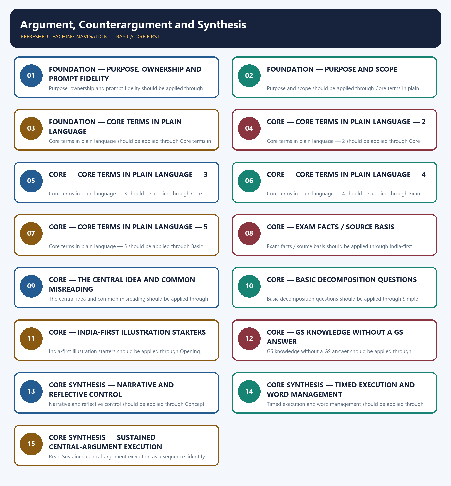

# Argument, Counterargument and Synthesis — Learner-v2 Complete Learning Session

> **Authoring-only generation:** 2026-09-06. No PDF was rendered and no tracker or index was mutated.

### SOURCE, PROGRESSION AND OFFICIAL-RULE AUDIT

- **Generation date:** 2026-09-06.
- **Source order:** canonical Basic owner first; Advanced owner second; Essay master framework, README, official-syllabus map, answer-worthiness audit and revision chart next; PYQ corpus and official OCR papers after that; live official UPSC pages only as a final check.
- **Basic/Advanced boundary:** complete Basic teaching remains first and Advanced material remains optional and last.
- **OCR boundary:** Repository Markdown was primary. OCR-searchable official UPSC Essay papers were supplementary only for printed instructions and V1 prompt wording. No author, official model answer, current marks split, phase allocation, paragraph count or scoring rubric was inferred.
- **Qdrant:** not used; repository Markdown and local official papers were sufficient.
- **PYQ integrity:** Three application cards use the repository's explicit V1/V2 status. No unavailable official model answer, marking rubric or attribution is invented.
- **Live-source boundary:** Live source check dated 2026-09-06: official UPSC routes were attempted and access-blocked; blocked pages support no new claim. UN, WHO and IPCC primary pages were separately checked for cross-theme factual boundaries.
- **No-formula rule:** strategy, heuristics and practice weights are never presented as official UPSC instructions or marking criteria.

### LIVE OFFICIAL-SOURCE ATTEMPT LOG

The checks below were made on 2026-09-06. Substantive official text is used only for the proposition it supports; title-only, blocked or thin pages are recorded and supply no factual claim.

- https://upsc.gov.in/examinations/previous-question-papers — attempted 2026-09-06; official page returned HTTP 403 to the live fetch, so it supports no new wording.
- https://upsc.gov.in/examinations/active-examinations — attempted 2026-09-06; official page returned HTTP 403 to the live fetch, so it supports no current-paper inference.
- https://upsc.gov.in/sites/default/files/Notif-CSP-2024-Engl-140224.pdf — searched 2026-09-06; retained only as an official scheme cross-check route, not as an Essay rubric.

## BASIC LEARNING SESSION



*Distinct embedded teaching-navigation image. The separate continuous Cārvāka-style flowchart package remains an independent at-a-glance artifact.*

### SESSION 1 — FOUNDATION — PURPOSE, OWNERSHIP AND PROMPT FIDELITY

#### DEFINITION / WHAT THIS IS CALLED

**Plain-language definition:** Objective practice: Apply Purpose, ownership and prompt fidelity by distinguishing the correct Essay-method move from nearby but invalid shortcuts; no factual-trivia recall is being tested.

**Technical definition:** Purpose, ownership and prompt fidelity should be applied through Purpose and scope and Core terms in plain language, while preserving the difference between official paper instruction and strategy, prompt wording and interpretation, example and evidence, breadth and coherence.

#### ANSWER-GRABBING OPENING — WRITE/ADAPT IN THE EXAM

> Plain-language definition: Purpose, ownership and prompt fidelity explains how Purpose and scope and Core terms in plain language combine into one usable Essay-planning move.

#### MUST-WRITE KEYWORDS

- **FOUNDATION**
- **Purpose**
- **ownership**
- **prompt fidelity**
- **Plain-language definition**
- **Technical definition**

**How to use them:** Frame the answer through FOUNDATION; define Purpose, connect ownership with prompt fidelity to explain the mechanism, and use Plain-language definition for the decisive comparison or qualification.

#### METHOD MOVE / WHAT THIS DOES

**Plain-language definition:** Purpose, ownership and prompt fidelity explains how Purpose and scope and Core terms in plain language combine into one usable Essay-planning move.

**Technical definition:** The learner fixes the printed prompt, its relationship or demand, the defensible scope, the argument function and the evidence boundary before drafting prose.

#### ANSWER-GRABBING OPENING — WRITE/ADAPT IN THE EXAM

> Purpose, ownership and prompt fidelity should be applied through Purpose and scope and Core terms in plain language, while preserving the difference between official paper instruction and strategy, prompt wording and interpretation, example and evidence, breadth and coherence.

#### MUST-WRITE KEYWORDS

- **Purpose**
- **ownership**
- **prompt**
- **fidelity**
- **scope**
- **Core**

**How to use them:** Define the first three terms, trace the relationship with the next two, and attach the final term to the exact claim, example and qualification. Qualification: Do not replace serious opposition, qualification and resolution with a generic GS-style catalogue.

#### VISUAL FIRST

```text
PURPOSE, OWNERSHIP AND PROMPT FIDELITY
01. Purpose and scope
    |
    v
02. Core terms in plain language
STATUS / CATEGORY FIREWALL -> Do not replace serious opposition, qualification and resolution with a generic GS-style catalogue.
```

*The rail fixes the prompt-to-argument sequence and claim boundary before explanation.*

#### CORE EXPLANATION

This topic teaches the counter-view/synthesis step of the argument map (05) in depth — how to state a real objection, engage it fairly, and resolve it, rather than dismissing it or leaving it hanging. to your thesis, stated fairly and at full strength, not a weak "straw man" version easy to knock down. It is a position , and in a good essay it is stated as its own advocate would state it.

#### SIMPLE SYSTEM EXAMPLE

Read Purpose, ownership and prompt fidelity as a sequence: identify Purpose and scope, follow the method through the printed proposition, and stop before adding a rule, attribution, fact or inference the audited sources do not support.

#### TECHNICAL DISTINCTION

The decisive boundary is Do not replace serious opposition, qualification and resolution with a generic GS-style catalogue. This keeps Purpose and scope and Core terms in plain language in the correct prompt, method, argument and evidence category.

#### NAMED EVIDENCE AND MECHANISM

- This topic teaches the counter-view/synthesis step of the argument map (05) in depth — how to state a real objection, engage it fairly, and resolve it, rather than dismissing it or leaving it hanging.
- to your thesis, stated fairly and at full strength, not a weak "straw man" version easy to knock down. It is a position , and in a good essay it is stated as its own advocate would state it.

#### EXAMINER CAUTION

- Do not replace serious opposition, qualification and resolution with a generic GS-style catalogue.

#### EXAM LINK

- **Objective practice:** Apply Purpose, ownership and prompt fidelity by distinguishing the correct Essay-method move from nearby but invalid shortcuts; no factual-trivia recall is being tested.
- **Essay application:** State the exact demand and the bounded writing decision.

#### MINI RECAP

- **Mechanism chain:** Purpose and scope -> Core terms in plain language
- **Qualified use:** State the exact demand and the bounded writing decision.

#### CLOSING RECALL FLOW — FOUNDATION — PURPOSE, OWNERSHIP AND PROMPT FIDELITY

```text
START / CONCEPT: FOUNDATION — Purpose, ownership and prompt fidelity
        |
        v
EXACT TERMS: FOUNDATION · Purpose · ownership · prompt fidelity · Plain-language definition · Technical definition
        |
        v
MECHANISM / ARGUMENT: Purpose, ownership and prompt fidelity should be applied through Purpose and scope and Core terms in plain language, while preserving the difference between official paper instruction and strategy, prompt wording and interpretation, example and evidence, breadth and coherence.
        |
        v
CONSEQUENCE / CONTRAST: Read Purpose, ownership and prompt fidelity as a sequence: identify Purpose and scope, follow the method through the printed proposition, and stop before adding a rule, attribution, fact or inference the audited sources do not support.
        |
        v
UPSC TRAP / ANSWER-USE: Objective practice: Apply Purpose, ownership and prompt fidelity by distinguishing the correct Essay-method move from nearby but invalid shortcuts; no factual-trivia recall is being tested.
        |
        v
ANSWER-GRABBING FORMULATION: Plain-language definition: Purpose, ownership and prompt fidelity explains how Purpose and scope and Core terms in plain language combine into one usable Essay-planning move.
```
### SESSION 2 — FOUNDATION — PURPOSE AND SCOPE

#### DEFINITION / WHAT THIS IS CALLED

**Plain-language definition:** Objective practice: Apply Purpose and scope by distinguishing the correct Essay-method move from nearby but invalid shortcuts; no factual-trivia recall is being tested.

**Technical definition:** Purpose and scope should be applied through Core terms in plain language — 2, while preserving the difference between official paper instruction and strategy, prompt wording and interpretation, example and evidence, breadth and coherence.

#### ANSWER-GRABBING OPENING — WRITE/ADAPT IN THE EXAM

> Plain-language definition: Purpose and scope explains how Core terms in plain language — 2 combine into one usable Essay-planning move.

#### MUST-WRITE KEYWORDS

- **FOUNDATION**
- **Purpose**
- **scope**
- **Plain-language definition**
- **Technical definition**
- **terms**

**How to use them:** Frame the answer through FOUNDATION; define Purpose, connect scope with Plain-language definition to explain the mechanism, and use Technical definition for the decisive comparison or qualification.

#### METHOD MOVE / WHAT THIS DOES

**Plain-language definition:** Purpose and scope explains how Core terms in plain language — 2 combine into one usable Essay-planning move.

**Technical definition:** The learner fixes the printed prompt, its relationship or demand, the defensible scope, the argument function and the evidence boundary before drafting prose.

#### ANSWER-GRABBING OPENING — WRITE/ADAPT IN THE EXAM

> Purpose and scope should be applied through Core terms in plain language — 2, while preserving the difference between official paper instruction and strategy, prompt wording and interpretation, example and evidence, breadth and coherence.

#### MUST-WRITE KEYWORDS

- **Purpose**
- **scope**
- **Core**
- **terms**
- **plain**
- **language**

**How to use them:** Define the first three terms, trace the relationship with the next two, and attach the final term to the exact claim, example and qualification. Qualification: Do not cross the ownership boundary: basic thesis construction belongs to 05.

#### VISUAL FIRST

```text
PURPOSE AND SCOPE
01. Core terms in plain language — 2
STATUS / CATEGORY FIREWALL -> Do not cross the ownership boundary: basic thesis construction belongs to 05.
```

*The rail fixes the prompt-to-argument sequence and claim boundary before explanation.*

#### CORE EXPLANATION

on a false premise, applies only under conditions that do not hold here, or has been over-generalised. A rebuttal is a move , and it can succeed without the objection disappearing.

#### SIMPLE SYSTEM EXAMPLE

Read Purpose and scope as a sequence: identify Core terms in plain language — 2, follow the method through the printed proposition, and stop before adding a rule, attribution, fact or inference the audited sources do not support.

#### TECHNICAL DISTINCTION

The decisive boundary is Do not cross the ownership boundary: basic thesis construction belongs to 05. This keeps Core terms in plain language — 2 in the correct prompt, method, argument and evidence category.

#### NAMED EVIDENCE AND MECHANISM

- on a false premise, applies only under conditions that do not hold here, or has been over-generalised. A rebuttal is a move , and it can succeed without the objection disappearing.

#### EXAMINER CAUTION

- Do not cross the ownership boundary: basic thesis construction belongs to 05.

#### EXAM LINK

- **Objective practice:** Apply Purpose and scope by distinguishing the correct Essay-method move from nearby but invalid shortcuts; no factual-trivia recall is being tested.
- **Essay application:** Define operative terms before expanding dimensions.

#### MINI RECAP

- **Mechanism chain:** Core terms in plain language — 2
- **Qualified use:** Define operative terms before expanding dimensions.

#### CLOSING RECALL FLOW — FOUNDATION — PURPOSE AND SCOPE

```text
START / CONCEPT: FOUNDATION — Purpose and scope
        |
        v
EXACT TERMS: FOUNDATION · Purpose · scope · Plain-language definition · Technical definition · terms
        |
        v
MECHANISM / ARGUMENT: Purpose and scope should be applied through Core terms in plain language — 2, while preserving the difference between official paper instruction and strategy, prompt wording and interpretation, example and evidence, breadth and coherence.
        |
        v
CONSEQUENCE / CONTRAST: Read Purpose and scope as a sequence: identify Core terms in plain language — 2, follow the method through the printed proposition, and stop before adding a rule, attribution, fact or inference the audited sources do not support.
        |
        v
UPSC TRAP / ANSWER-USE: Objective practice: Apply Purpose and scope by distinguishing the correct Essay-method move from nearby but invalid shortcuts; no factual-trivia recall is being tested.
        |
        v
ANSWER-GRABBING FORMULATION: Plain-language definition: Purpose and scope explains how Core terms in plain language — 2 combine into one usable Essay-planning move.
```
### SESSION 3 — FOUNDATION — CORE TERMS IN PLAIN LANGUAGE

#### DEFINITION / WHAT THIS IS CALLED

**Plain-language definition:** Objective practice: Apply Core terms in plain language by distinguishing the correct Essay-method move from nearby but invalid shortcuts; no factual-trivia recall is being tested.

**Technical definition:** Core terms in plain language should be applied through Core terms in plain language — 3, while preserving the difference between official paper instruction and strategy, prompt wording and interpretation, example and evidence, breadth and coherence.

#### ANSWER-GRABBING OPENING — WRITE/ADAPT IN THE EXAM

> Plain-language definition: Core terms in plain language explains how Core terms in plain language — 3 combine into one usable Essay-planning move.

#### MUST-WRITE KEYWORDS

- **FOUNDATION**
- **Core terms in plain language**
- **Plain-language definition**
- **Technical definition**
- **terms**
- **plain**

**How to use them:** Frame the answer through FOUNDATION; define Core terms in plain language, connect Plain-language definition with Technical definition to explain the mechanism, and use terms for the decisive comparison or qualification.

#### METHOD MOVE / WHAT THIS DOES

**Plain-language definition:** Core terms in plain language explains how Core terms in plain language — 3 combine into one usable Essay-planning move.

**Technical definition:** The learner fixes the printed prompt, its relationship or demand, the defensible scope, the argument function and the evidence boundary before drafting prose.

#### ANSWER-GRABBING OPENING — WRITE/ADAPT IN THE EXAM

> Core terms in plain language should be applied through Core terms in plain language — 3, while preserving the difference between official paper instruction and strategy, prompt wording and interpretation, example and evidence, breadth and coherence.

#### MUST-WRITE KEYWORDS

- **Core**
- **terms**
- **plain**
- **language**
- **each**
- **side**

**How to use them:** Define the first three terms, trace the relationship with the next two, and attach the final term to the exact claim, example and qualification. Qualification: Do not use an example without explaining its argumentative function.

#### VISUAL FIRST

```text
CORE TERMS IN PLAIN LANGUAGE
01. Core terms in plain language — 3
STATUS / CATEGORY FIREWALL -> Do not use an example without explaining its argumentative function.
```

*The rail fixes the prompt-to-argument sequence and claim boundary before explanation.*

#### CORE EXPLANATION

each side governs, incorporating what is valid in the counter-view while still defending a version of the original thesis. A synthesis is an outcome , and it is not the same as splitting the difference.

#### SIMPLE SYSTEM EXAMPLE

Read Core terms in plain language as a sequence: identify Core terms in plain language — 3, follow the method through the printed proposition, and stop before adding a rule, attribution, fact or inference the audited sources do not support.

#### TECHNICAL DISTINCTION

The decisive boundary is Do not use an example without explaining its argumentative function. This keeps Core terms in plain language — 3 in the correct prompt, method, argument and evidence category.

#### NAMED EVIDENCE AND MECHANISM

- each side governs, incorporating what is valid in the counter-view while still defending a version of the original thesis. A synthesis is an outcome , and it is not the same as splitting the difference.

#### EXAMINER CAUTION

- Do not use an example without explaining its argumentative function.

#### EXAM LINK

- **Objective practice:** Apply Core terms in plain language by distinguishing the correct Essay-method move from nearby but invalid shortcuts; no factual-trivia recall is being tested.
- **Essay application:** Build one qualified thesis and keep it visible.

#### MINI RECAP

- **Mechanism chain:** Core terms in plain language — 3
- **Qualified use:** Build one qualified thesis and keep it visible.

#### CLOSING RECALL FLOW — FOUNDATION — CORE TERMS IN PLAIN LANGUAGE

```text
START / CONCEPT: FOUNDATION — Core terms in plain language
        |
        v
EXACT TERMS: FOUNDATION · Core terms in plain language · Plain-language definition · Technical definition · terms · plain
        |
        v
MECHANISM / ARGUMENT: Core terms in plain language should be applied through Core terms in plain language — 3, while preserving the difference between official paper instruction and strategy, prompt wording and interpretation, example and evidence, breadth and coherence.
        |
        v
CONSEQUENCE / CONTRAST: Objective practice: Apply Core terms in plain language by distinguishing the correct Essay-method move from nearby but invalid shortcuts; no factual-trivia recall is being tested.
        |
        v
UPSC TRAP / ANSWER-USE: Read Core terms in plain language as a sequence: identify Core terms in plain language — 3, follow the method through the printed proposition, and stop before adding a rule, attribution, fact or inference the audited sources do not support.
        |
        v
ANSWER-GRABBING FORMULATION: Plain-language definition: Core terms in plain language explains how Core terms in plain language — 3 combine into one usable Essay-planning move.
```
### SESSION 4 — CORE — CORE TERMS IN PLAIN LANGUAGE — 2

#### DEFINITION / WHAT THIS IS CALLED

**Plain-language definition:** Objective practice: Apply Core terms in plain language — 2 by distinguishing the correct Essay-method move from nearby but invalid shortcuts; no factual-trivia recall is being tested.

**Technical definition:** Core terms in plain language — 2 should be applied through Core terms in plain language — 4, while preserving the difference between official paper instruction and strategy, prompt wording and interpretation, example and evidence, breadth and coherence.

#### ANSWER-GRABBING OPENING — WRITE/ADAPT IN THE EXAM

> Plain-language definition: Core terms in plain language — 2 explains how Core terms in plain language — 4 combine into one usable Essay-planning move.

#### MUST-WRITE KEYWORDS

- **Core terms in plain language**
- **Plain-language definition**
- **Technical definition**
- **terms**
- **plain**
- **language**

**How to use them:** Frame the answer through Core terms in plain language; define Plain-language definition, connect Technical definition with terms to explain the mechanism, and use plain for the decisive comparison or qualification.

#### METHOD MOVE / WHAT THIS DOES

**Plain-language definition:** Core terms in plain language — 2 explains how Core terms in plain language — 4 combine into one usable Essay-planning move.

**Technical definition:** The learner fixes the printed prompt, its relationship or demand, the defensible scope, the argument function and the evidence boundary before drafting prose.

#### ANSWER-GRABBING OPENING — WRITE/ADAPT IN THE EXAM

> Core terms in plain language — 2 should be applied through Core terms in plain language — 4, while preserving the difference between official paper instruction and strategy, prompt wording and interpretation, example and evidence, breadth and coherence.

#### MUST-WRITE KEYWORDS

- **Core**
- **terms**
- **plain**
- **language**
- **COUNTERARGUMENT**
- **Some**

**How to use them:** Define the first three terms, trace the relationship with the next two, and attach the final term to the exact claim, example and qualification. Qualification: Do not treat a pedagogical scaffold as an official UPSC marking rule.

#### VISUAL FIRST

```text
CORE TERMS IN PLAIN LANGUAGE — 2
01. Core terms in plain language — 4
STATUS / CATEGORY FIREWALL -> Do not treat a pedagogical scaffold as an official UPSC marking rule.
```

*The rail fixes the prompt-to-argument sequence and claim boundary before explanation.*

#### CORE EXPLANATION

COUNTERARGUMENT "Some errors are irreversible and catastrophic." (stated at full strength; not yet answered) v REBUTTAL "That is true of a narrow class of decisions - irreversibility, not error itself, is the danger." v SYNTHESIS "So: prefer experimentation where error is reversible and safeguarded; apply precaution where it is not."

#### SIMPLE SYSTEM EXAMPLE

Read Core terms in plain language — 2 as a sequence: identify Core terms in plain language — 4, follow the method through the printed proposition, and stop before adding a rule, attribution, fact or inference the audited sources do not support.

#### TECHNICAL DISTINCTION

The decisive boundary is Do not treat a pedagogical scaffold as an official UPSC marking rule. This keeps Core terms in plain language — 4 in the correct prompt, method, argument and evidence category.

#### NAMED EVIDENCE AND MECHANISM

- COUNTERARGUMENT "Some errors are irreversible and catastrophic." (stated at full strength; not yet answered) v REBUTTAL "That is true of a narrow class of decisions - irreversibility, not error itself, is the danger." v SYNTHESIS "So: prefer experimentation where error is reversible and safeguarded; apply precaution where it is not."

#### EXAMINER CAUTION

- Do not treat a pedagogical scaffold as an official UPSC marking rule.

#### EXAM LINK

- **Objective practice:** Apply Core terms in plain language — 2 by distinguishing the correct Essay-method move from nearby but invalid shortcuts; no factual-trivia recall is being tested.
- **Essay application:** Give every paragraph one argumentative job.

#### MINI RECAP

- **Mechanism chain:** Core terms in plain language — 4
- **Qualified use:** Give every paragraph one argumentative job.

#### CLOSING RECALL FLOW — CORE — CORE TERMS IN PLAIN LANGUAGE — 2

```text
START / CONCEPT: CORE — Core terms in plain language — 2
        |
        v
EXACT TERMS: Core terms in plain language · Plain-language definition · Technical definition · terms · plain · language
        |
        v
MECHANISM / ARGUMENT: Core terms in plain language — 2 should be applied through Core terms in plain language — 4, while preserving the difference between official paper instruction and strategy, prompt wording and interpretation, example and evidence, breadth and coherence.
        |
        v
CONSEQUENCE / CONTRAST: Objective practice: Apply Core terms in plain language — 2 by distinguishing the correct Essay-method move from nearby but invalid shortcuts; no factual-trivia recall is being tested.
        |
        v
UPSC TRAP / ANSWER-USE: Read Core terms in plain language — 2 as a sequence: identify Core terms in plain language — 4, follow the method through the printed proposition, and stop before adding a rule, attribution, fact or inference the audited sources do not support.
        |
        v
ANSWER-GRABBING FORMULATION: Plain-language definition: Core terms in plain language — 2 explains how Core terms in plain language — 4 combine into one usable Essay-planning move.
```
### SESSION 5 — CORE — CORE TERMS IN PLAIN LANGUAGE — 3

#### DEFINITION / WHAT THIS IS CALLED

**Plain-language definition:** Objective practice: Apply Core terms in plain language — 3 by distinguishing the correct Essay-method move from nearby but invalid shortcuts; no factual-trivia recall is being tested.

**Technical definition:** Core terms in plain language — 3 should be applied through Core terms in plain language — 5, while preserving the difference between official paper instruction and strategy, prompt wording and interpretation, example and evidence, breadth and coherence.

#### ANSWER-GRABBING OPENING — WRITE/ADAPT IN THE EXAM

> Plain-language definition: Core terms in plain language — 3 explains how Core terms in plain language — 5 combine into one usable Essay-planning move.

#### MUST-WRITE KEYWORDS

- **Core terms in plain language**
- **Plain-language definition**
- **Technical definition**
- **terms**
- **plain**
- **language**

**How to use them:** Frame the answer through Core terms in plain language; define Plain-language definition, connect Technical definition with terms to explain the mechanism, and use plain for the decisive comparison or qualification.

#### METHOD MOVE / WHAT THIS DOES

**Plain-language definition:** Core terms in plain language — 3 explains how Core terms in plain language — 5 combine into one usable Essay-planning move.

**Technical definition:** The learner fixes the printed prompt, its relationship or demand, the defensible scope, the argument function and the evidence boundary before drafting prose.

#### ANSWER-GRABBING OPENING — WRITE/ADAPT IN THE EXAM

> Core terms in plain language — 3 should be applied through Core terms in plain language — 5, while preserving the difference between official paper instruction and strategy, prompt wording and interpretation, example and evidence, breadth and coherence.

#### MUST-WRITE KEYWORDS

- **Core**
- **terms**
- **plain**
- **language**
- **Three**
- **common**

**How to use them:** Define the first three terms, trace the relationship with the next two, and attach the final term to the exact claim, example and qualification. Qualification: Do not let a counter-view replace the thesis; use it to qualify the thesis.

#### VISUAL FIRST

```text
CORE TERMS IN PLAIN LANGUAGE — 3
01. Core terms in plain language — 5
STATUS / CATEGORY FIREWALL -> Do not let a counter-view replace the thesis; use it to qualify the thesis.
```

*The rail fixes the prompt-to-argument sequence and claim boundary before explanation.*

#### CORE EXPLANATION

Three common collapses: stating a counterargument and calling it balance (no rebuttal); rebutting without synthesising (the objection is defeated but nothing is learned); and presenting a synthesis with no counterargument behind it (a resolution to a conflict never actually staged). A rebuttal that fully destroys the objection usually signals the objection was too weak — the best counterarguments survive rebuttal in some bounded form, which is precisely what gives the synthesis something to resolve.

#### SIMPLE SYSTEM EXAMPLE

Read Core terms in plain language — 3 as a sequence: identify Core terms in plain language — 5, follow the method through the printed proposition, and stop before adding a rule, attribution, fact or inference the audited sources do not support.

#### TECHNICAL DISTINCTION

The decisive boundary is Do not let a counter-view replace the thesis; use it to qualify the thesis. This keeps Core terms in plain language — 5 in the correct prompt, method, argument and evidence category.

#### NAMED EVIDENCE AND MECHANISM

- Three common collapses: stating a counterargument and calling it balance (no rebuttal); rebutting without synthesising (the objection is defeated but nothing is learned); and presenting a synthesis with no counterargument behind it (a resolution to a conflict never actually staged). A rebuttal that fully destroys the objection usually signals the objection was too weak — the best counterarguments survive rebuttal in some bounded form, which is precisely what gives the synthesis something to resolve.

#### EXAMINER CAUTION

- Do not let a counter-view replace the thesis; use it to qualify the thesis.

#### EXAM LINK

- **Objective practice:** Apply Core terms in plain language — 3 by distinguishing the correct Essay-method move from nearby but invalid shortcuts; no factual-trivia recall is being tested.
- **Essay application:** Join a named illustration to its mechanism.

#### MINI RECAP

- **Mechanism chain:** Core terms in plain language — 5
- **Qualified use:** Join a named illustration to its mechanism.

#### CLOSING RECALL FLOW — CORE — CORE TERMS IN PLAIN LANGUAGE — 3

```text
START / CONCEPT: CORE — Core terms in plain language — 3
        |
        v
EXACT TERMS: Core terms in plain language · Plain-language definition · Technical definition · terms · plain · language
        |
        v
MECHANISM / ARGUMENT: Core terms in plain language — 3 should be applied through Core terms in plain language — 5, while preserving the difference between official paper instruction and strategy, prompt wording and interpretation, example and evidence, breadth and coherence.
        |
        v
CONSEQUENCE / CONTRAST: Objective practice: Apply Core terms in plain language — 3 by distinguishing the correct Essay-method move from nearby but invalid shortcuts; no factual-trivia recall is being tested.
        |
        v
UPSC TRAP / ANSWER-USE: Read Core terms in plain language — 3 as a sequence: identify Core terms in plain language — 5, follow the method through the printed proposition, and stop before adding a rule, attribution, fact or inference the audited sources do not support.
        |
        v
ANSWER-GRABBING FORMULATION: Plain-language definition: Core terms in plain language — 3 explains how Core terms in plain language — 5 combine into one usable Essay-planning move.
```
### SESSION 6 — CORE — CORE TERMS IN PLAIN LANGUAGE — 4

#### DEFINITION / WHAT THIS IS CALLED

**Plain-language definition:** Objective practice: Apply Core terms in plain language — 4 by distinguishing the correct Essay-method move from nearby but invalid shortcuts; no factual-trivia recall is being tested.

**Technical definition:** Core terms in plain language — 4 should be applied through Exam facts / source basis and The central idea and common misreading, while preserving the difference between official paper instruction and strategy, prompt wording and interpretation, example and evidence, breadth and coherence.

#### ANSWER-GRABBING OPENING — WRITE/ADAPT IN THE EXAM

> Plain-language definition: Core terms in plain language — 4 explains how Exam facts / source basis and The central idea and common misreading combine into one usable Essay-planning move.

#### MUST-WRITE KEYWORDS

- **Core terms in plain language**
- **Plain-language definition**
- **Technical definition**
- **terms**
- **plain**
- **language**

**How to use them:** Frame the answer through Core terms in plain language; define Plain-language definition, connect Technical definition with terms to explain the mechanism, and use plain for the decisive comparison or qualification.

#### METHOD MOVE / WHAT THIS DOES

**Plain-language definition:** Core terms in plain language — 4 explains how Exam facts / source basis and The central idea and common misreading combine into one usable Essay-planning move.

**Technical definition:** The learner fixes the printed prompt, its relationship or demand, the defensible scope, the argument function and the evidence boundary before drafting prose.

#### ANSWER-GRABBING OPENING — WRITE/ADAPT IN THE EXAM

> Core terms in plain language — 4 should be applied through Exam facts / source basis and The central idea and common misreading, while preserving the difference between official paper instruction and strategy, prompt wording and interpretation, example and evidence, breadth and coherence.

#### MUST-WRITE KEYWORDS

- **Core**
- **terms**
- **plain**
- **language**
- **Exam**
- **facts**

**How to use them:** Define the first three terms, trace the relationship with the next two, and attach the final term to the exact claim, example and qualification. Qualification: Do not use an unverified quotation, statistic, attribution or anecdote.

#### VISUAL FIRST

```text
CORE TERMS IN PLAIN LANGUAGE — 4
01. Exam facts / source basis
    |
    v
02. The central idea and common misreading
STATUS / CATEGORY FIREWALL -> Do not use an unverified quotation, statistic, attribution or anecdote.
```

*The rail fixes the prompt-to-argument sequence and claim boundary before explanation.*

#### CORE EXPLANATION

handled; no official rubric rewards or penalises a specific counterargument format (see ../README.md). Central idea: a thesis is strengthened, not weakened, by confronting its best objection directly and showing how the argument still holds (with a qualification) once that objection is considered. Common misreading: either ignoring counter-views entirely (one-sided moralising) or presenting a counter-view merely to reject it dismissively without genuine engagement — both under-use the paper's test of balanced judgement.

#### SIMPLE SYSTEM EXAMPLE

Read Core terms in plain language — 4 as a sequence: identify Exam facts / source basis, follow the method through the printed proposition, and stop before adding a rule, attribution, fact or inference the audited sources do not support.

#### TECHNICAL DISTINCTION

The decisive boundary is Do not use an unverified quotation, statistic, attribution or anecdote. This keeps Exam facts / source basis and The central idea and common misreading in the correct prompt, method, argument and evidence category.

#### NAMED EVIDENCE AND MECHANISM

- handled; no official rubric rewards or penalises a specific counterargument format (see ../README.md).
- Central idea: a thesis is strengthened, not weakened, by confronting its best objection directly and showing how the argument still holds (with a qualification) once that objection is considered. Common misreading: either ignoring counter-views entirely (one-sided moralising) or presenting a counter-view merely to reject it dismissively without genuine engagement — both under-use the paper's test of balanced judgement.

#### EXAMINER CAUTION

- Do not use an unverified quotation, statistic, attribution or anecdote.

#### EXAM LINK

- **Objective practice:** Apply Core terms in plain language — 4 by distinguishing the correct Essay-method move from nearby but invalid shortcuts; no factual-trivia recall is being tested.
- **Essay application:** Use a counter-case to refine, not derail, the thesis.

#### MINI RECAP

- **Mechanism chain:** Exam facts / source basis -> The central idea and common misreading
- **Qualified use:** Use a counter-case to refine, not derail, the thesis.

#### CLOSING RECALL FLOW — CORE — CORE TERMS IN PLAIN LANGUAGE — 4

```text
START / CONCEPT: CORE — Core terms in plain language — 4
        |
        v
EXACT TERMS: Core terms in plain language · Plain-language definition · Technical definition · terms · plain · language
        |
        v
MECHANISM / ARGUMENT: Objective practice: Apply Core terms in plain language — 4 by distinguishing the correct Essay-method move from nearby but invalid shortcuts; no factual-trivia recall is being tested.
        |
        v
CONSEQUENCE / CONTRAST: Core terms in plain language — 4 should be applied through Exam facts / source basis and The central idea and common misreading, while preserving the difference between official paper instruction and strategy, prompt wording and interpretation, example and evidence, breadth and coherence.
        |
        v
UPSC TRAP / ANSWER-USE: Read Core terms in plain language — 4 as a sequence: identify Exam facts / source basis, follow the method through the printed proposition, and stop before adding a rule, attribution, fact or inference the audited sources do not support.
        |
        v
ANSWER-GRABBING FORMULATION: Plain-language definition: Core terms in plain language — 4 explains how Exam facts / source basis and The central idea and common misreading combine into one usable Essay-planning move.
```
### SESSION 7 — CORE — CORE TERMS IN PLAIN LANGUAGE — 5

#### DEFINITION / WHAT THIS IS CALLED

**Plain-language definition:** Objective practice: Apply Core terms in plain language — 5 by distinguishing the correct Essay-method move from nearby but invalid shortcuts; no factual-trivia recall is being tested.

**Technical definition:** Core terms in plain language — 5 should be applied through Basic decomposition questions, while preserving the difference between official paper instruction and strategy, prompt wording and interpretation, example and evidence, breadth and coherence.

#### ANSWER-GRABBING OPENING — WRITE/ADAPT IN THE EXAM

> Plain-language definition: Core terms in plain language — 5 explains how Basic decomposition questions combine into one usable Essay-planning move.

#### MUST-WRITE KEYWORDS

- **Core terms in plain language**
- **Plain-language definition**
- **Technical definition**
- **terms**
- **plain**
- **language**

**How to use them:** Frame the answer through Core terms in plain language; define Plain-language definition, connect Technical definition with terms to explain the mechanism, and use plain for the decisive comparison or qualification.

#### METHOD MOVE / WHAT THIS DOES

**Plain-language definition:** Core terms in plain language — 5 explains how Basic decomposition questions combine into one usable Essay-planning move.

**Technical definition:** The learner fixes the printed prompt, its relationship or demand, the defensible scope, the argument function and the evidence boundary before drafting prose.

#### ANSWER-GRABBING OPENING — WRITE/ADAPT IN THE EXAM

> Core terms in plain language — 5 should be applied through Basic decomposition questions, while preserving the difference between official paper instruction and strategy, prompt wording and interpretation, example and evidence, breadth and coherence.

#### MUST-WRITE KEYWORDS

- **Core**
- **terms**
- **plain**
- **language**
- **Basic**
- **decomposition**

**How to use them:** Define the first three terms, trace the relationship with the next two, and attach the final term to the exact claim, example and qualification. Qualification: Do not multiply dimensions that repeat the same claim in new vocabulary.

#### VISUAL FIRST

```text
CORE TERMS IN PLAIN LANGUAGE — 5
01. Basic decomposition questions
STATUS / CATEGORY FIREWALL -> Do not multiply dimensions that repeat the same claim in new vocabulary.
```

*The rail fixes the prompt-to-argument sequence and claim boundary before explanation.*

#### CORE EXPLANATION

1. What is the single strongest objection a fair-minded reader could raise against my thesis? 2. Is there a genuine trade-off my thesis requires accepting (not just a minor caveat)? 3. What does the objection get right, even partially? 4. How does my synthesis incorporate that partial truth while still defending my central claim? 5. Does my synthesis avoid simply restating my original thesis unchanged?

#### SIMPLE SYSTEM EXAMPLE

Read Core terms in plain language — 5 as a sequence: identify Basic decomposition questions, follow the method through the printed proposition, and stop before adding a rule, attribution, fact or inference the audited sources do not support.

#### TECHNICAL DISTINCTION

The decisive boundary is Do not multiply dimensions that repeat the same claim in new vocabulary. This keeps Basic decomposition questions in the correct prompt, method, argument and evidence category.

#### NAMED EVIDENCE AND MECHANISM

- 1. What is the single strongest objection a fair-minded reader could raise against my thesis? 2. Is there a genuine trade-off my thesis requires accepting (not just a minor caveat)? 3. What does the objection get right, even partially? 4. How does my synthesis incorporate that partial truth while still defending my central claim? 5. Does my synthesis avoid simply restating my original thesis unchanged?

#### EXAMINER CAUTION

- Do not multiply dimensions that repeat the same claim in new vocabulary.

#### EXAM LINK

- **Objective practice:** Apply Core terms in plain language — 5 by distinguishing the correct Essay-method move from nearby but invalid shortcuts; no factual-trivia recall is being tested.
- **Essay application:** Sequence paragraphs through explicit logical bridges.

#### MINI RECAP

- **Mechanism chain:** Basic decomposition questions
- **Qualified use:** Sequence paragraphs through explicit logical bridges.

#### CLOSING RECALL FLOW — CORE — CORE TERMS IN PLAIN LANGUAGE — 5

```text
START / CONCEPT: CORE — Core terms in plain language — 5
        |
        v
EXACT TERMS: Core terms in plain language · Plain-language definition · Technical definition · terms · plain · language
        |
        v
MECHANISM / ARGUMENT: Core terms in plain language — 5 should be applied through Basic decomposition questions, while preserving the difference between official paper instruction and strategy, prompt wording and interpretation, example and evidence, breadth and coherence.
        |
        v
CONSEQUENCE / CONTRAST: Read Core terms in plain language — 5 as a sequence: identify Basic decomposition questions, follow the method through the printed proposition, and stop before adding a rule, attribution, fact or inference the audited sources do not support.
        |
        v
UPSC TRAP / ANSWER-USE: Objective practice: Apply Core terms in plain language — 5 by distinguishing the correct Essay-method move from nearby but invalid shortcuts; no factual-trivia recall is being tested.
        |
        v
ANSWER-GRABBING FORMULATION: Plain-language definition: Core terms in plain language — 5 explains how Basic decomposition questions combine into one usable Essay-planning move.
```
### SESSION 8 — CORE — EXAM FACTS / SOURCE BASIS

#### DEFINITION / WHAT THIS IS CALLED

**Plain-language definition:** Objective practice: Apply Exam facts / source basis by distinguishing the correct Essay-method move from nearby but invalid shortcuts; no factual-trivia recall is being tested.

**Technical definition:** Exam facts / source basis should be applied through India-first illustration starters, while preserving the difference between official paper instruction and strategy, prompt wording and interpretation, example and evidence, breadth and coherence.

#### ANSWER-GRABBING OPENING — WRITE/ADAPT IN THE EXAM

> Plain-language definition: Exam facts / source basis explains how India-first illustration starters combine into one usable Essay-planning move.

#### MUST-WRITE KEYWORDS

- **Exam facts / source basis**
- **Plain-language definition**
- **Technical definition**
- **Exam**
- **s**
- **basis**

**How to use them:** Frame the answer through Exam facts / source basis; define Plain-language definition, connect Technical definition with Exam to explain the mechanism, and use s for the decisive comparison or qualification.

#### METHOD MOVE / WHAT THIS DOES

**Plain-language definition:** Exam facts / source basis explains how India-first illustration starters combine into one usable Essay-planning move.

**Technical definition:** The learner fixes the printed prompt, its relationship or demand, the defensible scope, the argument function and the evidence boundary before drafting prose.

#### ANSWER-GRABBING OPENING — WRITE/ADAPT IN THE EXAM

> Exam facts / source basis should be applied through India-first illustration starters, while preserving the difference between official paper instruction and strategy, prompt wording and interpretation, example and evidence, breadth and coherence.

#### MUST-WRITE KEYWORDS

- **Exam**
- **facts**
- **basis**
- **India-first**
- **illustration**
- **starters**

**How to use them:** Define the first three terms, trace the relationship with the next two, and attach the final term to the exact claim, example and qualification. Qualification: Do not end with aspiration unsupported by the preceding argument.

#### VISUAL FIRST

```text
EXAM FACTS / SOURCE BASIS
01. India-first illustration starters
STATUS / CATEGORY FIREWALL -> Do not end with aspiration unsupported by the preceding argument.
```

*The rail fixes the prompt-to-argument sequence and claim boundary before explanation.*

#### CORE EXPLANATION

Recall one Indian illustration for the counter-view itself, not only for the original thesis — e.g. a documented instance where excessive caution (not boldness) caused harm, to genuinely test the "doing nothing" thesis. Full discipline: 12.

#### SIMPLE SYSTEM EXAMPLE

Read Exam facts / source basis as a sequence: identify India-first illustration starters, follow the method through the printed proposition, and stop before adding a rule, attribution, fact or inference the audited sources do not support.

#### TECHNICAL DISTINCTION

The decisive boundary is Do not end with aspiration unsupported by the preceding argument. This keeps India-first illustration starters in the correct prompt, method, argument and evidence category.

#### NAMED EVIDENCE AND MECHANISM

- Recall one Indian illustration for the counter-view itself, not only for the original thesis — e.g. a documented instance where excessive caution (not boldness) caused harm, to genuinely test the "doing nothing" thesis. Full discipline: 12.

#### EXAMINER CAUTION

- Do not end with aspiration unsupported by the preceding argument.

#### EXAM LINK

- **Objective practice:** Apply Exam facts / source basis by distinguishing the correct Essay-method move from nearby but invalid shortcuts; no factual-trivia recall is being tested.
- **Essay application:** Move across actor, scale and time only when the claim changes.

#### MINI RECAP

- **Mechanism chain:** India-first illustration starters
- **Qualified use:** Move across actor, scale and time only when the claim changes.

#### CLOSING RECALL FLOW — CORE — EXAM FACTS / SOURCE BASIS

```text
START / CONCEPT: CORE — Exam facts / source basis
        |
        v
EXACT TERMS: Exam facts / source basis · Plain-language definition · Technical definition · Exam · s · basis
        |
        v
MECHANISM / ARGUMENT: Exam facts / source basis should be applied through India-first illustration starters, while preserving the difference between official paper instruction and strategy, prompt wording and interpretation, example and evidence, breadth and coherence.
        |
        v
CONSEQUENCE / CONTRAST: Read Exam facts / source basis as a sequence: identify India-first illustration starters, follow the method through the printed proposition, and stop before adding a rule, attribution, fact or inference the audited sources do not support.
        |
        v
UPSC TRAP / ANSWER-USE: Objective practice: Apply Exam facts / source basis by distinguishing the correct Essay-method move from nearby but invalid shortcuts; no factual-trivia recall is being tested.
        |
        v
ANSWER-GRABBING FORMULATION: Plain-language definition: Exam facts / source basis explains how India-first illustration starters combine into one usable Essay-planning move.
```
### SESSION 9 — CORE — THE CENTRAL IDEA AND COMMON MISREADING

#### DEFINITION / WHAT THIS IS CALLED

**Plain-language definition:** Objective practice: Apply The central idea and common misreading by distinguishing the correct Essay-method move from nearby but invalid shortcuts; no factual-trivia recall is being tested.

**Technical definition:** The central idea and common misreading should be applied through Thesis options and selection, while preserving the difference between official paper instruction and strategy, prompt wording and interpretation, example and evidence, breadth and coherence.

#### ANSWER-GRABBING OPENING — WRITE/ADAPT IN THE EXAM

> Plain-language definition: The central idea and common misreading explains how Thesis options and selection combine into one usable Essay-planning move.

#### MUST-WRITE KEYWORDS

- **The central idea**
- **common misreading**
- **Plain-language definition**
- **Technical definition**
- **central**
- **idea**

**How to use them:** Frame the answer through The central idea; define common misreading, connect Plain-language definition with Technical definition to explain the mechanism, and use central for the decisive comparison or qualification.

#### METHOD MOVE / WHAT THIS DOES

**Plain-language definition:** The central idea and common misreading explains how Thesis options and selection combine into one usable Essay-planning move.

**Technical definition:** The learner fixes the printed prompt, its relationship or demand, the defensible scope, the argument function and the evidence boundary before drafting prose.

#### ANSWER-GRABBING OPENING — WRITE/ADAPT IN THE EXAM

> The central idea and common misreading should be applied through Thesis options and selection, while preserving the difference between official paper instruction and strategy, prompt wording and interpretation, example and evidence, breadth and coherence.

#### MUST-WRITE KEYWORDS

- **central**
- **idea**
- **common**
- **misreading**
- **Thesis**
- **options**

**How to use them:** Define the first three terms, trace the relationship with the next two, and attach the final term to the exact claim, example and qualification. Qualification: Do not sacrifice the second essay's time budget to perfect the first.

#### VISUAL FIRST

```text
THE CENTRAL IDEA AND COMMON MISREADING
01. Thesis options and selection
STATUS / CATEGORY FIREWALL -> Do not sacrifice the second essay's time budget to perfect the first.
```

*The rail fixes the prompt-to-argument sequence and claim boundary before explanation.*

#### CORE EXPLANATION

If the counter-view turns out to be stronger than your original thesis can withstand, revise the thesis's qualification (see 05) rather than ignoring the objection — a thesis that survives its strongest objection, suitably qualified, is more defensible than one that never faced it.

#### SIMPLE SYSTEM EXAMPLE

Read The central idea and common misreading as a sequence: identify Thesis options and selection, follow the method through the printed proposition, and stop before adding a rule, attribution, fact or inference the audited sources do not support.

#### TECHNICAL DISTINCTION

The decisive boundary is Do not sacrifice the second essay's time budget to perfect the first. This keeps Thesis options and selection in the correct prompt, method, argument and evidence category.

#### NAMED EVIDENCE AND MECHANISM

- If the counter-view turns out to be stronger than your original thesis can withstand, revise the thesis's qualification (see 05) rather than ignoring the objection — a thesis that survives its strongest objection, suitably qualified, is more defensible than one that never faced it.

#### EXAMINER CAUTION

- Do not sacrifice the second essay's time budget to perfect the first.

#### EXAM LINK

- **Objective practice:** Apply The central idea and common misreading by distinguishing the correct Essay-method move from nearby but invalid shortcuts; no factual-trivia recall is being tested.
- **Essay application:** Use ethical nuance without moralising.

#### MINI RECAP

- **Mechanism chain:** Thesis options and selection
- **Qualified use:** Use ethical nuance without moralising.

#### CLOSING RECALL FLOW — CORE — THE CENTRAL IDEA AND COMMON MISREADING

```text
START / CONCEPT: CORE — The central idea and common misreading
        |
        v
EXACT TERMS: The central idea · common misreading · Plain-language definition · Technical definition · central · idea
        |
        v
MECHANISM / ARGUMENT: The central idea and common misreading should be applied through Thesis options and selection, while preserving the difference between official paper instruction and strategy, prompt wording and interpretation, example and evidence, breadth and coherence.
        |
        v
CONSEQUENCE / CONTRAST: Read The central idea and common misreading as a sequence: identify Thesis options and selection, follow the method through the printed proposition, and stop before adding a rule, attribution, fact or inference the audited sources do not support.
        |
        v
UPSC TRAP / ANSWER-USE: Objective practice: Apply The central idea and common misreading by distinguishing the correct Essay-method move from nearby but invalid shortcuts; no factual-trivia recall is being tested.
        |
        v
ANSWER-GRABBING FORMULATION: Plain-language definition: The central idea and common misreading explains how Thesis options and selection combine into one usable Essay-planning move.
```
### SESSION 10 — CORE — BASIC DECOMPOSITION QUESTIONS

#### DEFINITION / WHAT THIS IS CALLED

**Plain-language definition:** Objective practice: Apply Basic decomposition questions by distinguishing the correct Essay-method move from nearby but invalid shortcuts; no factual-trivia recall is being tested.

**Technical definition:** Basic decomposition questions should be applied through Simple essay architecture, while preserving the difference between official paper instruction and strategy, prompt wording and interpretation, example and evidence, breadth and coherence.

#### ANSWER-GRABBING OPENING — WRITE/ADAPT IN THE EXAM

> Plain-language definition: Basic decomposition questions explains how Simple essay architecture combine into one usable Essay-planning move.

#### MUST-WRITE KEYWORDS

- **Basic decomposition questions**
- **Plain-language definition**
- **Technical definition**
- **Basic**
- **decomposition**
- **questions**

**How to use them:** Frame the answer through Basic decomposition questions; define Plain-language definition, connect Technical definition with Basic to explain the mechanism, and use decomposition for the decisive comparison or qualification.

#### METHOD MOVE / WHAT THIS DOES

**Plain-language definition:** Basic decomposition questions explains how Simple essay architecture combine into one usable Essay-planning move.

**Technical definition:** The learner fixes the printed prompt, its relationship or demand, the defensible scope, the argument function and the evidence boundary before drafting prose.

#### ANSWER-GRABBING OPENING — WRITE/ADAPT IN THE EXAM

> Basic decomposition questions should be applied through Simple essay architecture, while preserving the difference between official paper instruction and strategy, prompt wording and interpretation, example and evidence, breadth and coherence.

#### MUST-WRITE KEYWORDS

- **Basic**
- **decomposition**
- **questions**
- **Simple**
- **architecture**
- **Place**

**How to use them:** Define the first three terms, trace the relationship with the next two, and attach the final term to the exact claim, example and qualification. Qualification: Do not mistake novelty of phrasing for originality of thought.

#### VISUAL FIRST

```text
BASIC DECOMPOSITION QUESTIONS
01. Simple essay architecture
STATUS / CATEGORY FIREWALL -> Do not mistake novelty of phrasing for originality of thought.
```

*The rail fixes the prompt-to-argument sequence and claim boundary before explanation.*

#### CORE EXPLANATION

Place the counter-view/synthesis as one distinct paragraph (or two) after the main argument-map cycles and before the conclusion — see 07 for exact sequencing.

#### SIMPLE SYSTEM EXAMPLE

Read Basic decomposition questions as a sequence: identify Simple essay architecture, follow the method through the printed proposition, and stop before adding a rule, attribution, fact or inference the audited sources do not support.

#### TECHNICAL DISTINCTION

The decisive boundary is Do not mistake novelty of phrasing for originality of thought. This keeps Simple essay architecture in the correct prompt, method, argument and evidence category.

#### NAMED EVIDENCE AND MECHANISM

- Place the counter-view/synthesis as one distinct paragraph (or two) after the main argument-map cycles and before the conclusion — see 07 for exact sequencing.

#### EXAMINER CAUTION

- Do not mistake novelty of phrasing for originality of thought.

#### EXAM LINK

- **Objective practice:** Apply Basic decomposition questions by distinguishing the correct Essay-method move from nearby but invalid shortcuts; no factual-trivia recall is being tested.
- **Essay application:** Preserve factual and quotation integrity.

#### MINI RECAP

- **Mechanism chain:** Simple essay architecture
- **Qualified use:** Preserve factual and quotation integrity.

#### CLOSING RECALL FLOW — CORE — BASIC DECOMPOSITION QUESTIONS

```text
START / CONCEPT: CORE — Basic decomposition questions
        |
        v
EXACT TERMS: Basic decomposition questions · Plain-language definition · Technical definition · Basic · decomposition · questions
        |
        v
MECHANISM / ARGUMENT: Basic decomposition questions should be applied through Simple essay architecture, while preserving the difference between official paper instruction and strategy, prompt wording and interpretation, example and evidence, breadth and coherence.
        |
        v
CONSEQUENCE / CONTRAST: Read Basic decomposition questions as a sequence: identify Simple essay architecture, follow the method through the printed proposition, and stop before adding a rule, attribution, fact or inference the audited sources do not support.
        |
        v
UPSC TRAP / ANSWER-USE: Objective practice: Apply Basic decomposition questions by distinguishing the correct Essay-method move from nearby but invalid shortcuts; no factual-trivia recall is being tested.
        |
        v
ANSWER-GRABBING FORMULATION: Plain-language definition: Basic decomposition questions explains how Simple essay architecture combine into one usable Essay-planning move.
```
### SESSION 11 — CORE — INDIA-FIRST ILLUSTRATION STARTERS

#### DEFINITION / WHAT THIS IS CALLED

**Plain-language definition:** Objective practice: Apply India-first illustration starters by distinguishing the correct Essay-method move from nearby but invalid shortcuts; no factual-trivia recall is being tested.

**Technical definition:** India-first illustration starters should be applied through Opening, body and closure moves and Traps and repair moves, while preserving the difference between official paper instruction and strategy, prompt wording and interpretation, example and evidence, breadth and coherence.

#### ANSWER-GRABBING OPENING — WRITE/ADAPT IN THE EXAM

> Plain-language definition: India-first illustration starters explains how Opening, body and closure moves and Traps and repair moves combine into one usable Essay-planning move.

#### MUST-WRITE KEYWORDS

- **India-first illustration starters**
- **Plain-language definition**
- **Technical definition**
- **India-first**
- **illustration**
- **starters**

**How to use them:** Frame the answer through India-first illustration starters; define Plain-language definition, connect Technical definition with India-first to explain the mechanism, and use illustration for the decisive comparison or qualification.

#### METHOD MOVE / WHAT THIS DOES

**Plain-language definition:** India-first illustration starters explains how Opening, body and closure moves and Traps and repair moves combine into one usable Essay-planning move.

**Technical definition:** The learner fixes the printed prompt, its relationship or demand, the defensible scope, the argument function and the evidence boundary before drafting prose.

#### ANSWER-GRABBING OPENING — WRITE/ADAPT IN THE EXAM

> India-first illustration starters should be applied through Opening, body and closure moves and Traps and repair moves, while preserving the difference between official paper instruction and strategy, prompt wording and interpretation, example and evidence, breadth and coherence.

#### MUST-WRITE KEYWORDS

- **India-first**
- **illustration**
- **starters**
- **Opening**
- **body**
- **closure**

**How to use them:** Define the first three terms, trace the relationship with the next two, and attach the final term to the exact claim, example and qualification. Qualification: Do not replace serious opposition, qualification and resolution with a generic GS-style catalogue.

#### VISUAL FIRST

```text
INDIA-FIRST ILLUSTRATION STARTERS
01. Opening, body and closure moves
    |
    v
02. Traps and repair moves
STATUS / CATEGORY FIREWALL -> Do not replace serious opposition, qualification and resolution with a generic GS-style catalogue.
```

*The rail fixes the prompt-to-argument sequence and claim boundary before explanation.*

#### CORE EXPLANATION

Introduce the counter-view with a fair, non-dismissive phrase ("A reasonable objection holds that"), develop it briefly with its own mechanism/illustration, then pivot to synthesis ("Yet this need not defeat the broader claim, because"). Avoid closing the counter-view paragraph without a clear pivot back to your thesis. where a serious objection exists). → Repair: use Section 5's Q1–Q2 to test the thesis; where no separate counter-view paragraph is needed, integrate the qualification into the relevant argument cycle.

#### SIMPLE SYSTEM EXAMPLE

Read India-first illustration starters as a sequence: identify Opening, body and closure moves, follow the method through the printed proposition, and stop before adding a rule, attribution, fact or inference the audited sources do not support.

#### TECHNICAL DISTINCTION

The decisive boundary is Do not replace serious opposition, qualification and resolution with a generic GS-style catalogue. This keeps Opening, body and closure moves and Traps and repair moves in the correct prompt, method, argument and evidence category.

#### NAMED EVIDENCE AND MECHANISM

- Introduce the counter-view with a fair, non-dismissive phrase ("A reasonable objection holds that"), develop it briefly with its own mechanism/illustration, then pivot to synthesis ("Yet this need not defeat the broader claim, because"). Avoid closing the counter-view paragraph without a clear pivot back to your thesis.
- where a serious objection exists). → Repair: use Section 5's Q1–Q2 to test the thesis; where no separate counter-view paragraph is needed, integrate the qualification into the relevant argument cycle.

#### EXAMINER CAUTION

- Do not replace serious opposition, qualification and resolution with a generic GS-style catalogue.

#### EXAM LINK

- **Objective practice:** Apply India-first illustration starters by distinguishing the correct Essay-method move from nearby but invalid shortcuts; no factual-trivia recall is being tested.
- **Essay application:** Import GS knowledge selectively and analytically.

#### MINI RECAP

- **Mechanism chain:** Opening, body and closure moves -> Traps and repair moves
- **Qualified use:** Import GS knowledge selectively and analytically.

#### CLOSING RECALL FLOW — CORE — INDIA-FIRST ILLUSTRATION STARTERS

```text
START / CONCEPT: CORE — India-first illustration starters
        |
        v
EXACT TERMS: India-first illustration starters · Plain-language definition · Technical definition · India-first · illustration · starters
        |
        v
MECHANISM / ARGUMENT: India-first illustration starters should be applied through Opening, body and closure moves and Traps and repair moves, while preserving the difference between official paper instruction and strategy, prompt wording and interpretation, example and evidence, breadth and coherence.
        |
        v
CONSEQUENCE / CONTRAST: Read India-first illustration starters as a sequence: identify Opening, body and closure moves, follow the method through the printed proposition, and stop before adding a rule, attribution, fact or inference the audited sources do not support.
        |
        v
UPSC TRAP / ANSWER-USE: Objective practice: Apply India-first illustration starters by distinguishing the correct Essay-method move from nearby but invalid shortcuts; no factual-trivia recall is being tested.
        |
        v
ANSWER-GRABBING FORMULATION: Plain-language definition: India-first illustration starters explains how Opening, body and closure moves and Traps and repair moves combine into one usable Essay-planning move.
```
### SESSION 12 — CORE — GS KNOWLEDGE WITHOUT A GS ANSWER

#### DEFINITION / WHAT THIS IS CALLED

**Plain-language definition:** Objective practice: Apply GS knowledge without a GS answer by distinguishing the correct Essay-method move from nearby but invalid shortcuts; no factual-trivia recall is being tested.

**Technical definition:** GS knowledge without a GS answer should be applied through Advanced proposition and boundary, while preserving the difference between official paper instruction and strategy, prompt wording and interpretation, example and evidence, breadth and coherence.

#### ANSWER-GRABBING OPENING — WRITE/ADAPT IN THE EXAM

> Plain-language definition: GS knowledge without a GS answer explains how Advanced proposition and boundary combine into one usable Essay-planning move.

#### MUST-WRITE KEYWORDS

- **GS knowledge without a GS answer**
- **Plain-language definition**
- **Technical definition**
- **knowledge**
- **Advanced**
- **proposition**

**How to use them:** Frame the answer through GS knowledge without a GS answer; define Plain-language definition, connect Technical definition with knowledge to explain the mechanism, and use Advanced for the decisive comparison or qualification.

#### METHOD MOVE / WHAT THIS DOES

**Plain-language definition:** GS knowledge without a GS answer explains how Advanced proposition and boundary combine into one usable Essay-planning move.

**Technical definition:** The learner fixes the printed prompt, its relationship or demand, the defensible scope, the argument function and the evidence boundary before drafting prose.

#### ANSWER-GRABBING OPENING — WRITE/ADAPT IN THE EXAM

> GS knowledge without a GS answer should be applied through Advanced proposition and boundary, while preserving the difference between official paper instruction and strategy, prompt wording and interpretation, example and evidence, breadth and coherence.

#### MUST-WRITE KEYWORDS

- **knowledge**
- **Advanced**
- **proposition**
- **boundary**
- **Core**
- **supplies**

**How to use them:** Define the first three terms, trace the relationship with the next two, and attach the final term to the exact claim, example and qualification. Qualification: Do not cross the ownership boundary: basic thesis construction belongs to 05.

#### VISUAL FIRST

```text
GS KNOWLEDGE WITHOUT A GS ANSWER
01. Advanced proposition and boundary
STATUS / CATEGORY FIREWALL -> Do not cross the ownership boundary: basic thesis construction belongs to 05.
```

*The rail fixes the prompt-to-argument sequence and claim boundary before explanation.*

#### CORE EXPLANATION

Proposition: Core 08 supplies two simple, evidence-disciplined mini-cycles. This companion keeps the optional harder task: dialectical synthesis is strongest when the counter-claim is drawn from a genuinely different value or mechanism than the thesis, not merely a softened restatement of it — real tension produces real synthesis. Boundary: this topic does not construct the original thesis (05) or decide paragraph placement (07) — it supplies the counter-argument-and-synthesis content itself.

#### SIMPLE SYSTEM EXAMPLE

Read GS knowledge without a GS answer as a sequence: identify Advanced proposition and boundary, follow the method through the printed proposition, and stop before adding a rule, attribution, fact or inference the audited sources do not support.

#### TECHNICAL DISTINCTION

The decisive boundary is Do not cross the ownership boundary: basic thesis construction belongs to 05. This keeps Advanced proposition and boundary in the correct prompt, method, argument and evidence category.

#### NAMED EVIDENCE AND MECHANISM

- Proposition: Core 08 supplies two simple, evidence-disciplined mini-cycles. This companion keeps the optional harder task: dialectical synthesis is strongest when the counter-claim is drawn from a genuinely different value or mechanism than the thesis, not merely a softened restatement of it — real tension produces real synthesis. Boundary: this topic does not construct the original thesis (05) or decide paragraph placement (07) — it supplies the counter-argument-and-synthesis content itself.

#### EXAMINER CAUTION

- Do not cross the ownership boundary: basic thesis construction belongs to 05.

#### EXAM LINK

- **Objective practice:** Apply GS knowledge without a GS answer by distinguishing the correct Essay-method move from nearby but invalid shortcuts; no factual-trivia recall is being tested.
- **Essay application:** Use narrative or analogy only when it advances the proposition.

#### MINI RECAP

- **Mechanism chain:** Advanced proposition and boundary
- **Qualified use:** Use narrative or analogy only when it advances the proposition.

#### CLOSING RECALL FLOW — CORE — GS KNOWLEDGE WITHOUT A GS ANSWER

```text
START / CONCEPT: CORE — GS knowledge without a GS answer
        |
        v
EXACT TERMS: GS knowledge without a GS answer · Plain-language definition · Technical definition · knowledge · Advanced · proposition
        |
        v
MECHANISM / ARGUMENT: GS knowledge without a GS answer should be applied through Advanced proposition and boundary, while preserving the difference between official paper instruction and strategy, prompt wording and interpretation, example and evidence, breadth and coherence.
        |
        v
CONSEQUENCE / CONTRAST: Read GS knowledge without a GS answer as a sequence: identify Advanced proposition and boundary, follow the method through the printed proposition, and stop before adding a rule, attribution, fact or inference the audited sources do not support.
        |
        v
UPSC TRAP / ANSWER-USE: Objective practice: Apply GS knowledge without a GS answer by distinguishing the correct Essay-method move from nearby but invalid shortcuts; no factual-trivia recall is being tested.
        |
        v
ANSWER-GRABBING FORMULATION: Plain-language definition: GS knowledge without a GS answer explains how Advanced proposition and boundary combine into one usable Essay-planning move.
```
### SESSION 13 — CORE SYNTHESIS — NARRATIVE AND REFLECTIVE CONTROL

#### DEFINITION / WHAT THIS IS CALLED

**Plain-language definition:** Objective practice: Apply Narrative and reflective control by distinguishing the correct Essay-method move from nearby but invalid shortcuts; no factual-trivia recall is being tested.

**Technical definition:** Narrative and reflective control should be applied through Concept definition and taxonomy, while preserving the difference between official paper instruction and strategy, prompt wording and interpretation, example and evidence, breadth and coherence.

#### ANSWER-GRABBING OPENING — WRITE/ADAPT IN THE EXAM

> Plain-language definition: Narrative and reflective control explains how Concept definition and taxonomy combine into one usable Essay-planning move.

#### MUST-WRITE KEYWORDS

- **CORE SYNTHESIS**
- **Narrative**
- **reflective control**
- **Plain-language definition**
- **Technical definition**
- **reflective**

**How to use them:** Frame the answer through CORE SYNTHESIS; define Narrative, connect reflective control with Plain-language definition to explain the mechanism, and use Technical definition for the decisive comparison or qualification.

#### METHOD MOVE / WHAT THIS DOES

**Plain-language definition:** Narrative and reflective control explains how Concept definition and taxonomy combine into one usable Essay-planning move.

**Technical definition:** The learner fixes the printed prompt, its relationship or demand, the defensible scope, the argument function and the evidence boundary before drafting prose.

#### ANSWER-GRABBING OPENING — WRITE/ADAPT IN THE EXAM

> Narrative and reflective control should be applied through Concept definition and taxonomy, while preserving the difference between official paper instruction and strategy, prompt wording and interpretation, example and evidence, breadth and coherence.

#### MUST-WRITE KEYWORDS

- **Narrative**
- **reflective**
- **control**
- **definition**
- **taxonomy**
- **thesis**

**How to use them:** Define the first three terms, trace the relationship with the next two, and attach the final term to the exact claim, example and qualification. Qualification: Do not use an example without explaining its argumentative function.

#### VISUAL FIRST

```text
NARRATIVE AND REFLECTIVE CONTROL
01. Concept definition and taxonomy
STATUS / CATEGORY FIREWALL -> Do not use an example without explaining its argumentative function.
```

*The rail fixes the prompt-to-argument sequence and claim boundary before explanation.*

#### CORE EXPLANATION

thesis and counter-claim, but a reframing that shows both are correct under different, now-specified conditions.

#### SIMPLE SYSTEM EXAMPLE

Read Narrative and reflective control as a sequence: identify Concept definition and taxonomy, follow the method through the printed proposition, and stop before adding a rule, attribution, fact or inference the audited sources do not support.

#### TECHNICAL DISTINCTION

The decisive boundary is Do not use an example without explaining its argumentative function. This keeps Concept definition and taxonomy in the correct prompt, method, argument and evidence category.

#### NAMED EVIDENCE AND MECHANISM

- thesis and counter-claim, but a reframing that shows both are correct under different, now-specified conditions.

#### EXAMINER CAUTION

- Do not use an example without explaining its argumentative function.

#### EXAM LINK

- **Objective practice:** Apply Narrative and reflective control by distinguishing the correct Essay-method move from nearby but invalid shortcuts; no factual-trivia recall is being tested.
- **Essay application:** Protect balance, originality and coherence together.

#### MINI RECAP

- **Mechanism chain:** Concept definition and taxonomy
- **Qualified use:** Protect balance, originality and coherence together.

#### CLOSING RECALL FLOW — CORE SYNTHESIS — NARRATIVE AND REFLECTIVE CONTROL

```text
START / CONCEPT: CORE SYNTHESIS — Narrative and reflective control
        |
        v
EXACT TERMS: CORE SYNTHESIS · Narrative · reflective control · Plain-language definition · Technical definition · reflective
        |
        v
MECHANISM / ARGUMENT: Narrative and reflective control should be applied through Concept definition and taxonomy, while preserving the difference between official paper instruction and strategy, prompt wording and interpretation, example and evidence, breadth and coherence.
        |
        v
CONSEQUENCE / CONTRAST: Read Narrative and reflective control as a sequence: identify Concept definition and taxonomy, follow the method through the printed proposition, and stop before adding a rule, attribution, fact or inference the audited sources do not support.
        |
        v
UPSC TRAP / ANSWER-USE: Objective practice: Apply Narrative and reflective control by distinguishing the correct Essay-method move from nearby but invalid shortcuts; no factual-trivia recall is being tested.
        |
        v
ANSWER-GRABBING FORMULATION: Plain-language definition: Narrative and reflective control explains how Concept definition and taxonomy combine into one usable Essay-planning move.
```
### SESSION 14 — CORE SYNTHESIS — TIMED EXECUTION AND WORD MANAGEMENT

#### DEFINITION / WHAT THIS IS CALLED

**Plain-language definition:** Objective practice: Apply Timed execution and word management by distinguishing the correct Essay-method move from nearby but invalid shortcuts; no factual-trivia recall is being tested.

**Technical definition:** Timed execution and word management should be applied through Levels of analysis and temporal-spatial scale and Stakeholder map and distributional effects, while preserving the difference between official paper instruction and strategy, prompt wording and interpretation, example and evidence, breadth and coherence.

#### ANSWER-GRABBING OPENING — WRITE/ADAPT IN THE EXAM

> Plain-language definition: Timed execution and word management explains how Levels of analysis and temporal-spatial scale and Stakeholder map and distributional effects combine into one usable Essay-planning move.

#### MUST-WRITE KEYWORDS

- **CORE SYNTHESIS**
- **Timed execution**
- **word management**
- **Plain-language definition**
- **Technical definition**
- **Timed**

**How to use them:** Frame the answer through CORE SYNTHESIS; define Timed execution, connect word management with Plain-language definition to explain the mechanism, and use Technical definition for the decisive comparison or qualification.

#### METHOD MOVE / WHAT THIS DOES

**Plain-language definition:** Timed execution and word management explains how Levels of analysis and temporal-spatial scale and Stakeholder map and distributional effects combine into one usable Essay-planning move.

**Technical definition:** The learner fixes the printed prompt, its relationship or demand, the defensible scope, the argument function and the evidence boundary before drafting prose.

#### ANSWER-GRABBING OPENING — WRITE/ADAPT IN THE EXAM

> Timed execution and word management should be applied through Levels of analysis and temporal-spatial scale and Stakeholder map and distributional effects, while preserving the difference between official paper instruction and strategy, prompt wording and interpretation, example and evidence, breadth and coherence.

#### MUST-WRITE KEYWORDS

- **Timed**
- **execution**
- **word**
- **management**
- **Levels**
- **temporal-spatial**

**How to use them:** Define the first three terms, trace the relationship with the next two, and attach the final term to the exact claim, example and qualification. Qualification: Do not treat a pedagogical scaffold as an official UPSC marking rule.

#### VISUAL FIRST

```text
TIMED EXECUTION AND WORD MANAGEMENT
01. Levels of analysis and temporal-spatial scale
    |
    v
02. Stakeholder map and distributional effects
STATUS / CATEGORY FIREWALL -> Do not treat a pedagogical scaffold as an official UPSC marking rule.
```

*The rail fixes the prompt-to-argument sequence and claim boundary before explanation.*

#### CORE EXPLANATION

Test whether the counter-claim operates at the same scale as the thesis or a different one — e.g. for 2024-B7, the thesis may hold at the scale of moral/political principle (simple) while the counter-claim holds at the scale of implementation mechanics (complex); recognising this scale-shift is itself the synthesis ("simple compass, sophisticated implementation"), rather than a contradiction to be argued away. For value-conflict theses (2025-B8 contentment/luxury; 2024-B6 power/ character), identify which stakeholder's interest the counter-claim represents — e.g. the counter-claim to "contentment is natural wealth" might represent the interests of those still below a basic sufficiency threshold, for whom aspiration is not luxury but legitimate need. A synthesis should explicitly preserve this stakeholder's claim (e.g. sufficiency-with-equity) rather than universalising a comfortable position.

#### SIMPLE SYSTEM EXAMPLE

Read Timed execution and word management as a sequence: identify Levels of analysis and temporal-spatial scale, follow the method through the printed proposition, and stop before adding a rule, attribution, fact or inference the audited sources do not support.

#### TECHNICAL DISTINCTION

The decisive boundary is Do not treat a pedagogical scaffold as an official UPSC marking rule. This keeps Levels of analysis and temporal-spatial scale and Stakeholder map and distributional effects in the correct prompt, method, argument and evidence category.

#### NAMED EVIDENCE AND MECHANISM

- Test whether the counter-claim operates at the same scale as the thesis or a different one — e.g. for 2024-B7, the thesis may hold at the scale of moral/political principle (simple) while the counter-claim holds at the scale of implementation mechanics (complex); recognising this scale-shift is itself the synthesis ("simple compass, sophisticated implementation"), rather than a contradiction to be argued away.
- For value-conflict theses (2025-B8 contentment/luxury; 2024-B6 power/ character), identify which stakeholder's interest the counter-claim represents — e.g. the counter-claim to "contentment is natural wealth" might represent the interests of those still below a basic sufficiency threshold, for whom aspiration is not luxury but legitimate need. A synthesis should explicitly preserve this stakeholder's claim (e.g. sufficiency-with-equity) rather than universalising a comfortable position.

#### EXAMINER CAUTION

- Do not treat a pedagogical scaffold as an official UPSC marking rule.

#### EXAM LINK

- **Objective practice:** Apply Timed execution and word management by distinguishing the correct Essay-method move from nearby but invalid shortcuts; no factual-trivia recall is being tested.
- **Essay application:** Fit planning, drafting and revision inside the paper budget.

#### MINI RECAP

- **Mechanism chain:** Levels of analysis and temporal-spatial scale -> Stakeholder map and distributional effects
- **Qualified use:** Fit planning, drafting and revision inside the paper budget.

#### CLOSING RECALL FLOW — CORE SYNTHESIS — TIMED EXECUTION AND WORD MANAGEMENT

```text
START / CONCEPT: CORE SYNTHESIS — Timed execution and word management
        |
        v
EXACT TERMS: CORE SYNTHESIS · Timed execution · word management · Plain-language definition · Technical definition · Timed
        |
        v
MECHANISM / ARGUMENT: Objective practice: Apply Timed execution and word management by distinguishing the correct Essay-method move from nearby but invalid shortcuts; no factual-trivia recall is being tested.
        |
        v
CONSEQUENCE / CONTRAST: Timed execution and word management should be applied through Levels of analysis and temporal-spatial scale and Stakeholder map and distributional effects, while preserving the difference between official paper instruction and strategy, prompt wording and interpretation, example and evidence, breadth and coherence.
        |
        v
UPSC TRAP / ANSWER-USE: Read Timed execution and word management as a sequence: identify Levels of analysis and temporal-spatial scale, follow the method through the printed proposition, and stop before adding a rule, attribution, fact or inference the audited sources do not support.
        |
        v
ANSWER-GRABBING FORMULATION: Plain-language definition: Timed execution and word management explains how Levels of analysis and temporal-spatial scale and Stakeholder map and distributional effects combine into one usable Essay-planning move.
```
### SESSION 15 — CORE SYNTHESIS — SUSTAINED CENTRAL-ARGUMENT EXECUTION

#### DEFINITION / WHAT THIS IS CALLED

**Plain-language definition:** Objective practice: Apply Sustained central-argument execution by distinguishing the correct Essay-method move from nearby but invalid shortcuts; no factual-trivia recall is being tested.

**Technical definition:** Read Sustained central-argument execution as a sequence: identify Causality, mechanisms and feedback loops, follow the method through the printed proposition, and stop before adding a rule, attribution, fact or inference the audited sources do not support.

#### ANSWER-GRABBING OPENING — WRITE/ADAPT IN THE EXAM

> Plain-language definition: Sustained central-argument execution explains how Causality, mechanisms and feedback loops and Causality, mechanisms and feedback loops — 2 combine into one usable Essay-planning move.

#### MUST-WRITE KEYWORDS

- **CORE SYNTHESIS**
- **Sustained central-argument execution**
- **Plain-language definition**
- **Technical definition**
- **Sustained**
- **central-argument**

**How to use them:** Frame the answer through CORE SYNTHESIS; define Sustained central-argument execution, connect Plain-language definition with Technical definition to explain the mechanism, and use Sustained for the decisive comparison or qualification.

#### METHOD MOVE / WHAT THIS DOES

**Plain-language definition:** Sustained central-argument execution explains how Causality, mechanisms and feedback loops and Causality, mechanisms and feedback loops — 2 combine into one usable Essay-planning move.

**Technical definition:** The learner fixes the printed prompt, its relationship or demand, the defensible scope, the argument function and the evidence boundary before drafting prose.

#### ANSWER-GRABBING OPENING — WRITE/ADAPT IN THE EXAM

> Sustained central-argument execution should be applied through Causality, mechanisms and feedback loops and Causality, mechanisms and feedback loops — 2, while preserving the difference between official paper instruction and strategy, prompt wording and interpretation, example and evidence, breadth and coherence.

#### MUST-WRITE KEYWORDS

- **Sustained**
- **central-argument**
- **execution**
- **Causality**
- **mechanisms**
- **feedback**

**How to use them:** Define the first three terms, trace the relationship with the next two, and attach the final term to the exact claim, example and qualification. Qualification: Do not let a counter-view replace the thesis; use it to qualify the thesis.

#### VISUAL FIRST

```text
SUSTAINED CENTRAL-ARGUMENT EXECUTION
01. Causality, mechanisms and feedback loops
    |
    v
02. Causality, mechanisms and feedback loops — 2
STATUS / CATEGORY FIREWALL -> Do not let a counter-view replace the thesis; use it to qualify the thesis.
```

*The rail fixes the prompt-to-argument sequence and claim boundary before explanation.*

#### CORE EXPLANATION

THESIS (mechanism A supports claim X) v STRONG COUNTER-CLAIM (mechanism B supports NOT-X, or a different X') v IDENTIFY THE CONDITION under which each mechanism dominates (e.g. reversibility, urgency, existing sufficiency level, disciplined vs undisciplined form) v HIGHER SYNTHESIS: state which mechanism governs under which condition (not "both are somewhat true" - name the actual switching condition) The switching condition (the "identify the condition" step) is the single most valuable output of this process — an essay that skips it and simply asserts "there is truth on both sides" has not actually synthesised anything.

#### SIMPLE SYSTEM EXAMPLE

Read Sustained central-argument execution as a sequence: identify Causality, mechanisms and feedback loops, follow the method through the printed proposition, and stop before adding a rule, attribution, fact or inference the audited sources do not support.

#### TECHNICAL DISTINCTION

The decisive boundary is Do not let a counter-view replace the thesis; use it to qualify the thesis. This keeps Causality, mechanisms and feedback loops and Causality, mechanisms and feedback loops — 2 in the correct prompt, method, argument and evidence category.

#### NAMED EVIDENCE AND MECHANISM

- THESIS (mechanism A supports claim X) v STRONG COUNTER-CLAIM (mechanism B supports NOT-X, or a different X') v IDENTIFY THE CONDITION under which each mechanism dominates (e.g. reversibility, urgency, existing sufficiency level, disciplined vs undisciplined form) v HIGHER SYNTHESIS: state which mechanism governs under which condition (not "both are somewhat true" - name the actual switching condition)
- The switching condition (the "identify the condition" step) is the single most valuable output of this process — an essay that skips it and simply asserts "there is truth on both sides" has not actually synthesised anything.

#### EXAMINER CAUTION

- Do not let a counter-view replace the thesis; use it to qualify the thesis.

#### EXAM LINK

- **Objective practice:** Apply Sustained central-argument execution by distinguishing the correct Essay-method move from nearby but invalid shortcuts; no factual-trivia recall is being tested.
- **Essay application:** Return to a transformed thesis in the conclusion.

#### MINI RECAP

- **Mechanism chain:** Causality, mechanisms and feedback loops -> Causality, mechanisms and feedback loops — 2
- **Qualified use:** Return to a transformed thesis in the conclusion.
#### COMPLETE BASIC OWNER EVIDENCE BANK

> **Subject:** Essay | **Tier:** Must-Do | **GS Paper:** Essay (General
> Studies Paper — Essay, Mains).
> **Core area:** Testing a thesis against its strongest objection and
> resolving the tension into a genuine synthesis, rather than an
> unresolved "on the other hand."
> **Grounded in:** V1 (2018–2025) UPSC Essay paper corpus (see
> `../README.md`); `../00_Master-Framework.md` Section 6.
> **Research cutoff:** 18 July 2026.
> **Tags:** ✅ verified fact | ⚠️ strategy/inference | 📰 dated anchor | ❌ trap/boundary.
> **Companion:** `../advanced/08_Argument-Counterargument-and-Synthesis.md`

#### 1. Purpose and scope

This topic teaches the counter-view/synthesis step of the argument map
(`05`) in depth — how to state a real objection, engage it fairly, and
resolve it, rather than dismissing it or leaving it hanging.

#### 2. Core terms in plain language

- **Counter-view (counterargument):** the strongest reasonable objection
  to your thesis, stated fairly and at full strength, not a weak
  "straw man" version easy to knock down. It is a *position*, and in a
  good essay it is stated as its own advocate would state it.
- **Rebuttal:** your specific answer to that objection — showing it rests
  on a false premise, applies only under conditions that do not hold here,
  or has been over-generalised. A rebuttal is a *move*, and it can succeed
  without the objection disappearing.
- **Synthesis:** a resolution that specifies the condition under which
  each side governs, incorporating what is valid in the counter-view while
  still defending a version of the original thesis. A synthesis is an
  *outcome*, and it is not the same as splitting the difference.
- **Trade-off:** a genuine cost or limitation your thesis must
  acknowledge, not explain away.

⚠️ **The three are not interchangeable, and the order matters.**

```text
COUNTERARGUMENT   "Some errors are irreversible and catastrophic."
        |          (stated at full strength; not yet answered)
        v
REBUTTAL          "That is true of a narrow class of decisions -
        |          irreversibility, not error itself, is the danger."
        v
SYNTHESIS         "So: prefer experimentation where error is reversible
                   and safeguarded; apply precaution where it is not."
```

❌ Three common collapses: stating a counterargument and calling it
balance (no rebuttal); rebutting without synthesising (the objection is
defeated but nothing is learned); and presenting a synthesis with no
counterargument behind it (a resolution to a conflict never actually
staged). ⚠️ A rebuttal that fully destroys the objection usually signals
the objection was too weak — the best counterarguments survive rebuttal in
some bounded form, which is precisely what gives the synthesis something
to resolve.

#### 3. ✅ Exam facts / source basis

- ✅ Neither audited paper specifies how counterarguments should be
  handled; no official rubric rewards or penalises a specific
  counterargument format (see `../README.md`).
- ⚠️ The "state fairly, then synthesise" method here is a pedagogical
  discipline for producing a balanced, defensible essay — not an
  official UPSC instruction.

#### 4. The central idea and common misreading

⚠️ **Central idea:** a thesis is strengthened, not weakened, by
confronting its best objection directly and showing how the argument
still holds (with a qualification) once that objection is considered. ❌
**Common misreading:** either ignoring counter-views entirely
(one-sided moralising) or presenting a counter-view merely to reject it
dismissively without genuine engagement — both under-use the paper's
test of balanced judgement.

#### 5. Basic decomposition questions

1. What is the single strongest objection a fair-minded reader could
   raise against my thesis?
2. Is there a genuine trade-off my thesis requires accepting (not just a
   minor caveat)?
3. What does the objection get right, even partially?
4. How does my synthesis incorporate that partial truth while still
   defending my central claim?
5. Does my synthesis avoid simply restating my original thesis
   unchanged?

#### 6. Dimension-expansion grid

| Prompt (example) | Strongest counter-view | Synthesis |
|---|---|---|
| 2024-B8 "Cost of being wrong… less than doing nothing." | Some errors are irreversible and catastrophic (e.g. safety, ecological harm) | Prefer reversible, safeguarded experimentation; apply precaution where harm is irreversible |
| 2025-A2 "Supreme art of war… without fighting." | Deterrence sometimes requires credible capability, not persuasion alone | Peace built on both preparedness and diplomacy, not diplomacy alone |
| 2024-A4 "The doubter is a true man of science." | Excessive doubt can become denialism or paralysis | Doubt must be disciplined — falsifiable, evidence-seeking, time-bound |

##### Two complete mini-cycles

**Cycle 1 — “The cost of being wrong is less than the cost of doing
nothing.”**

| Move | Prose-ready content |
|---|---|
| Claim | A public problem should ordinarily invite safeguarded action rather than indefinite delay when the action can generate feedback and be corrected. |
| Evidence | The nationwide sanitation-behaviour campaigns associated with Swachh Bharat Mission are a candidate-recalled illustration of large-scale civic mobilisation; verify its exact facts before live use (`12`). |
| Counterclaim | Scale can magnify a mistaken intervention: participation or an announced goal does not establish uniform outcomes everywhere. |
| Switching condition | Prefer a pilot, phased roll-out, independent review and correction where harms are observable and reversible; apply precaution where foreseeable harm is irreversible or concentrated on people unable to bear it. |
| Synthesis | The relevant contrast is not action versus inaction, but accountable learning versus reckless or paralysed administration. |

**Cycle 2 — “Forests precede civilizations and deserts follow them.”**

| Move | Prose-ready content |
|---|---|
| Claim | Ecological restraint is a productive condition of long-run civilisation, not a sentimental refusal of development. |
| Evidence | The Chipko movement, a locally verified 1970s Himalayan forest-protection movement, shows that communities can contest extraction whose costs they bear (`12`). |
| Counterclaim | A single local movement cannot prove that communities alone can reverse every extractive pressure or meet every development need. |
| Switching condition | Community restraint should govern where local ecological loss is immediate and cumulative; wider public capacity is required where livelihoods, infrastructure and interregional costs must be reconciled. |
| Synthesis | Durable development combines locally visible ecological limits with institutions capable of sharing the costs of respecting them. |

#### 7. India-first illustration starters

⚠️ Recall one Indian illustration for the counter-view itself, not only
for the original thesis — e.g. a documented instance where excessive
caution (not boldness) caused harm, to genuinely test the "doing
nothing" thesis. Full discipline: `12`.

#### 8. Thesis options and selection

⚠️ If the counter-view turns out to be stronger than your original
thesis can withstand, revise the thesis's qualification (see `05`)
rather than ignoring the objection — a thesis that survives its
strongest objection, suitably qualified, is more defensible than one
that never faced it.

#### 9. Simple essay architecture

⚠️ Place the counter-view/synthesis as one distinct paragraph (or two)
after the main argument-map cycles and before the conclusion — see `07`
for exact sequencing.

#### 10. Opening, body and closure moves

⚠️ Introduce the counter-view with a fair, non-dismissive phrase ("A
reasonable objection holds that…"), develop it briefly with its own
mechanism/illustration, then pivot to synthesis ("Yet this need not
defeat the broader claim, because…"). Avoid closing the counter-view
paragraph without a clear pivot back to your thesis.

#### 11. ❌ Traps and repair moves

- ❌ **One-sided moralising** (asserting the thesis with no counter-view
  where a serious objection exists). → Repair: use Section 5's Q1–Q2 to
  test the thesis; where no separate counter-view paragraph is needed,
  integrate the qualification into the relevant argument cycle.
- ❌ **Straw-manning the counter-view** (stating a weak version easy to
  dismiss). → Repair: state the objection as its strongest advocate
  would.
- ❌ **Unresolved "on the other hand"** (stating the counter-view and
  moving on without synthesis). → Repair: always follow with an explicit
  synthesis sentence (Section 5, Q4).
- ❌ **Synthesis that just restates the original thesis unchanged.** →
  Repair: show what the thesis's qualification became *because of* the
  counter-view.

#### 12. Timed micro-drill and self-check

**5-minute drill:** For any thesis from `05`, write: the strongest
counter-view (2 sentences), what it gets right (1 sentence), and the
synthesis (1–2 sentences).

**Self-check:** Would a fair-minded person who holds the counter-view
agree that you have represented their position accurately, even if they
still disagree with your synthesis? If not, restate the counter-view more
fairly.

#### Semantic-completeness repair — 6 September 2026

##### Hostile coverage verdict and ownership

This owner is responsible for **serious opposition, qualification and resolution**. Its irreducible coverage is:
steelman; counter-case; concession; rebuttal; condition; synthesis. The canonical boundary is explicit:
basic thesis construction belongs to 05. Cross-topic material may supply evidence, but it must not displace
this topic's writing skill or convert the essay into a GS answer.

##### Prompt-fidelity and central-argument gate

Before drafting, restate the exact prompt, identify its keywords, relation,
scope and hidden assumption, then write one qualified thesis. Every paragraph
must perform a distinct argumentative job for that thesis through
**claim → named evidence/example → analysis → qualification → link**.
Narrative, analogy and reflection are admissible only when they advance that
argument. A list of sectors, schemes or facts is not an essay.

##### Theme-transfer and originality gate

Transfer GS knowledge selectively across these recurring Essay domains:
philosophical/abstract; society and social justice; polity, democracy and governance; economy and development; science and technology; environment; education and health; women and youth; culture and history; international relations and peace; ethics and values. For each chosen lens, explain the mechanism and distribution of
effects, test a counter-case and return to the proposition. Originality means
a faithful but non-obvious connection, distinction or synthesis; it does not
mean eccentric interpretation, ornamental quotation or invented anecdote.

##### Model-answer and execution gate

A complete 1000–1200-word practice essay should normally establish the problem,
define operative terms, state the central thesis, develop three to five linked
argument clusters, steelman the strongest objection, synthesize rather than
split the difference, and conclude by deepening the opening claim. Planning,
drafting and revision must fit the shared three-hour, two-essay budget. Exact
time splits remain strategy, not an official UPSC rule.

##### Verification and source-status gate

Facts, constitutional or legal references, schemes, events, data, scientific
claims, thinker attributions and quotations require a traceable source and
access date. If exact wording or attribution is not verified, paraphrase it and
label it as interpretation. The locally audited 2018–2025 Essay papers remain
V1; 2013–2017 prompts remain V2 until checked against official papers. Failed
or blocked live retrievals support no claim.

#### CLOSING RECALL FLOW — CORE SYNTHESIS — SUSTAINED CENTRAL-ARGUMENT EXECUTION

```text
START / CONCEPT: CORE SYNTHESIS — Sustained central-argument execution
        |
        v
EXACT TERMS: CORE SYNTHESIS · Sustained central-argument execution · Plain-language definition · Technical definition · Sustained · central-argument
        |
        v
MECHANISM / ARGUMENT: Read Sustained central-argument execution as a sequence: identify Causality, mechanisms and feedback loops, follow the method through the printed proposition, and stop before adding a rule, attribution, fact or inference the audited sources do not support.
        |
        v
CONSEQUENCE / CONTRAST: Objective practice: Apply Sustained central-argument execution by distinguishing the correct Essay-method move from nearby but invalid shortcuts; no factual-trivia recall is being tested.
        |
        v
UPSC TRAP / ANSWER-USE: Sustained central-argument execution should be applied through Causality, mechanisms and feedback loops and Causality, mechanisms and feedback loops — 2, while preserving the difference between official paper instruction and strategy, prompt wording and interpretation, example and evidence, breadth and coherence.
        |
        v
ANSWER-GRABBING FORMULATION: Plain-language definition: Sustained central-argument execution explains how Causality, mechanisms and feedback loops and Causality, mechanisms and feedback loops — 2 combine into one usable Essay-planning move.
```
## BASIC MCQS / REMEDIATION

### Q1. Which option applies Purpose and scope as an Essay-method distinction?

A. This topic teaches the counter-view/synthesis step of the argument map (05) in depth — how to state a real objection, engage it fairly, and resolve it, rather than dismissing it or leaving it hanging.
B. Use Purpose and scope to add more headings or dimensions without testing coherence.
C. Treat Purpose and scope as a compulsory UPSC formula even when it distorts the prompt.
D. Replace Purpose and scope with a familiar adjacent GS topic and maximise factual coverage.

**Answer: A.**
**Explanation:** This topic teaches the counter-view/synthesis step of the argument map (05) in depth — how to state a real objection, engage it fairly, and resolve it, rather than dismissing it or leaving it hanging. The other options convert a qualified writing method into an official formula, permit topic drift, or reward quantity without coherence and evidence safety.

### Q2. Which use of Purpose and scope stays closest to the printed prompt?

A. Apply Purpose and scope only after drafting, when topic drift can no longer be prevented.
B. This topic teaches the counter-view/synthesis step of the argument map (05) in depth — how to state a real objection, engage it fairly, and resolve it, rather than dismissing it or leaving it hanging.
C. Use Purpose and scope while dropping the prompt's operator, qualifier or scale.
D. Let a striking anecdote or quotation determine Purpose and scope regardless of thesis fit.

**Answer: B.**
**Explanation:** This topic teaches the counter-view/synthesis step of the argument map (05) in depth — how to state a real objection, engage it fairly, and resolve it, rather than dismissing it or leaving it hanging. The other options convert a qualified writing method into an official formula, permit topic drift, or reward quantity without coherence and evidence safety.

### Q3. Which statement preserves the strategy-versus-official-rule boundary for Purpose and scope?

A. Support Purpose and scope with an unverified statistic, attribution or current claim.
B. Present Purpose and scope as an official marking rule rather than a pedagogical scaffold.
C. This topic teaches the counter-view/synthesis step of the argument map (05) in depth — how to state a real objection, engage it fairly, and resolve it, rather than dismissing it or leaving it hanging.
D. Use Purpose and scope to avoid stating a serious counter-case or qualification.

**Answer: C.**
**Explanation:** This topic teaches the counter-view/synthesis step of the argument map (05) in depth — how to state a real objection, engage it fairly, and resolve it, rather than dismissing it or leaving it hanging. The other options convert a qualified writing method into an official formula, permit topic drift, or reward quantity without coherence and evidence safety.

### Q4. Which option avoids the standard Essay-method trap about Purpose and scope?

A. Silently tidy the printed prompt before applying Purpose and scope to make it easier to answer.
B. Allow an exception discovered through Purpose and scope to replace the central proposition.
C. Maximise the number of outputs produced by Purpose and scope, even if they repeat one claim.
D. This topic teaches the counter-view/synthesis step of the argument map (05) in depth — how to state a real objection, engage it fairly, and resolve it, rather than dismissing it or leaving it hanging.

**Answer: D.**
**Explanation:** This topic teaches the counter-view/synthesis step of the argument map (05) in depth — how to state a real objection, engage it fairly, and resolve it, rather than dismissing it or leaving it hanging. The other options convert a qualified writing method into an official formula, permit topic drift, or reward quantity without coherence and evidence safety.

### Q5. Which option applies Core terms in plain language as an Essay-method distinction?

A. to your thesis, stated fairly and at full strength, not a weak "straw man" version easy to knock down. It is a position , and in a good essay it is stated as its own advocate would state it.
B. Use Core terms in plain language to add more headings or dimensions without testing coherence.
C. Replace Core terms in plain language with a familiar adjacent GS topic and maximise factual coverage.
D. Treat Core terms in plain language as a compulsory UPSC formula even when it distorts the prompt.

**Answer: A.**
**Explanation:** to your thesis, stated fairly and at full strength, not a weak "straw man" version easy to knock down. It is a position , and in a good essay it is stated as its own advocate would state it. The other options convert a qualified writing method into an official formula, permit topic drift, or reward quantity without coherence and evidence safety.

### Q6. Which use of Core terms in plain language stays closest to the printed prompt?

A. Apply Core terms in plain language only after drafting, when topic drift can no longer be prevented.
B. to your thesis, stated fairly and at full strength, not a weak "straw man" version easy to knock down. It is a position , and in a good essay it is stated as its own advocate would state it.
C. Let a striking anecdote or quotation determine Core terms in plain language regardless of thesis fit.
D. Use Core terms in plain language while dropping the prompt's operator, qualifier or scale.

**Answer: B.**
**Explanation:** to your thesis, stated fairly and at full strength, not a weak "straw man" version easy to knock down. It is a position , and in a good essay it is stated as its own advocate would state it. The other options convert a qualified writing method into an official formula, permit topic drift, or reward quantity without coherence and evidence safety.

### Q7. Which statement preserves the strategy-versus-official-rule boundary for Core terms in plain language?

A. Present Core terms in plain language as an official marking rule rather than a pedagogical scaffold.
B. Support Core terms in plain language with an unverified statistic, attribution or current claim.
C. to your thesis, stated fairly and at full strength, not a weak "straw man" version easy to knock down. It is a position , and in a good essay it is stated as its own advocate would state it.
D. Use Core terms in plain language to avoid stating a serious counter-case or qualification.

**Answer: C.**
**Explanation:** to your thesis, stated fairly and at full strength, not a weak "straw man" version easy to knock down. It is a position , and in a good essay it is stated as its own advocate would state it. The other options convert a qualified writing method into an official formula, permit topic drift, or reward quantity without coherence and evidence safety.

### Q8. Which option avoids the standard Essay-method trap about Core terms in plain language?

A. Maximise the number of outputs produced by Core terms in plain language, even if they repeat one claim.
B. Allow an exception discovered through Core terms in plain language to replace the central proposition.
C. Silently tidy the printed prompt before applying Core terms in plain language to make it easier to answer.
D. to your thesis, stated fairly and at full strength, not a weak "straw man" version easy to knock down. It is a position , and in a good essay it is stated as its own advocate would state it.

**Answer: D.**
**Explanation:** to your thesis, stated fairly and at full strength, not a weak "straw man" version easy to knock down. It is a position , and in a good essay it is stated as its own advocate would state it. The other options convert a qualified writing method into an official formula, permit topic drift, or reward quantity without coherence and evidence safety.

### Q9. Which option applies Core terms in plain language — 2 as an Essay-method distinction?

A. on a false premise, applies only under conditions that do not hold here, or has been over-generalised. A rebuttal is a move , and it can succeed without the objection disappearing.
B. Treat Core terms in plain language — 2 as a compulsory UPSC formula even when it distorts the prompt.
C. Replace Core terms in plain language — 2 with a familiar adjacent GS topic and maximise factual coverage.
D. Use Core terms in plain language — 2 to add more headings or dimensions without testing coherence.

**Answer: A.**
**Explanation:** on a false premise, applies only under conditions that do not hold here, or has been over-generalised. A rebuttal is a move , and it can succeed without the objection disappearing. The other options convert a qualified writing method into an official formula, permit topic drift, or reward quantity without coherence and evidence safety.

### Q10. Which use of Core terms in plain language — 2 stays closest to the printed prompt?

A. Use Core terms in plain language — 2 while dropping the prompt's operator, qualifier or scale.
B. on a false premise, applies only under conditions that do not hold here, or has been over-generalised. A rebuttal is a move , and it can succeed without the objection disappearing.
C. Apply Core terms in plain language — 2 only after drafting, when topic drift can no longer be prevented.
D. Let a striking anecdote or quotation determine Core terms in plain language — 2 regardless of thesis fit.

**Answer: B.**
**Explanation:** on a false premise, applies only under conditions that do not hold here, or has been over-generalised. A rebuttal is a move , and it can succeed without the objection disappearing. The other options convert a qualified writing method into an official formula, permit topic drift, or reward quantity without coherence and evidence safety.

### Q11. Which statement preserves the strategy-versus-official-rule boundary for Core terms in plain language — 2?

A. Support Core terms in plain language — 2 with an unverified statistic, attribution or current claim.
B. Use Core terms in plain language — 2 to avoid stating a serious counter-case or qualification.
C. on a false premise, applies only under conditions that do not hold here, or has been over-generalised. A rebuttal is a move , and it can succeed without the objection disappearing.
D. Present Core terms in plain language — 2 as an official marking rule rather than a pedagogical scaffold.

**Answer: C.**
**Explanation:** on a false premise, applies only under conditions that do not hold here, or has been over-generalised. A rebuttal is a move , and it can succeed without the objection disappearing. The other options convert a qualified writing method into an official formula, permit topic drift, or reward quantity without coherence and evidence safety.

### Q12. Which option avoids the standard Essay-method trap about Core terms in plain language — 2?

A. Silently tidy the printed prompt before applying Core terms in plain language — 2 to make it easier to answer.
B. Maximise the number of outputs produced by Core terms in plain language — 2, even if they repeat one claim.
C. Allow an exception discovered through Core terms in plain language — 2 to replace the central proposition.
D. on a false premise, applies only under conditions that do not hold here, or has been over-generalised. A rebuttal is a move , and it can succeed without the objection disappearing.

**Answer: D.**
**Explanation:** on a false premise, applies only under conditions that do not hold here, or has been over-generalised. A rebuttal is a move , and it can succeed without the objection disappearing. The other options convert a qualified writing method into an official formula, permit topic drift, or reward quantity without coherence and evidence safety.

### Q13. Which option applies Core terms in plain language — 3 as an Essay-method distinction?

A. each side governs, incorporating what is valid in the counter-view while still defending a version of the original thesis. A synthesis is an outcome , and it is not the same as splitting the difference.
B. Replace Core terms in plain language — 3 with a familiar adjacent GS topic and maximise factual coverage.
C. Use Core terms in plain language — 3 to add more headings or dimensions without testing coherence.
D. Treat Core terms in plain language — 3 as a compulsory UPSC formula even when it distorts the prompt.

**Answer: A.**
**Explanation:** each side governs, incorporating what is valid in the counter-view while still defending a version of the original thesis. A synthesis is an outcome , and it is not the same as splitting the difference. The other options convert a qualified writing method into an official formula, permit topic drift, or reward quantity without coherence and evidence safety.

### Q14. Which use of Core terms in plain language — 3 stays closest to the printed prompt?

A. Use Core terms in plain language — 3 while dropping the prompt's operator, qualifier or scale.
B. each side governs, incorporating what is valid in the counter-view while still defending a version of the original thesis. A synthesis is an outcome , and it is not the same as splitting the difference.
C. Let a striking anecdote or quotation determine Core terms in plain language — 3 regardless of thesis fit.
D. Apply Core terms in plain language — 3 only after drafting, when topic drift can no longer be prevented.

**Answer: B.**
**Explanation:** each side governs, incorporating what is valid in the counter-view while still defending a version of the original thesis. A synthesis is an outcome , and it is not the same as splitting the difference. The other options convert a qualified writing method into an official formula, permit topic drift, or reward quantity without coherence and evidence safety.

### Q15. Which statement preserves the strategy-versus-official-rule boundary for Core terms in plain language — 3?

A. Support Core terms in plain language — 3 with an unverified statistic, attribution or current claim.
B. Use Core terms in plain language — 3 to avoid stating a serious counter-case or qualification.
C. each side governs, incorporating what is valid in the counter-view while still defending a version of the original thesis. A synthesis is an outcome , and it is not the same as splitting the difference.
D. Present Core terms in plain language — 3 as an official marking rule rather than a pedagogical scaffold.

**Answer: C.**
**Explanation:** each side governs, incorporating what is valid in the counter-view while still defending a version of the original thesis. A synthesis is an outcome , and it is not the same as splitting the difference. The other options convert a qualified writing method into an official formula, permit topic drift, or reward quantity without coherence and evidence safety.

### Q16. Which option avoids the standard Essay-method trap about Core terms in plain language — 3?

A. Maximise the number of outputs produced by Core terms in plain language — 3, even if they repeat one claim.
B. Silently tidy the printed prompt before applying Core terms in plain language — 3 to make it easier to answer.
C. Allow an exception discovered through Core terms in plain language — 3 to replace the central proposition.
D. each side governs, incorporating what is valid in the counter-view while still defending a version of the original thesis. A synthesis is an outcome , and it is not the same as splitting the difference.

**Answer: D.**
**Explanation:** each side governs, incorporating what is valid in the counter-view while still defending a version of the original thesis. A synthesis is an outcome , and it is not the same as splitting the difference. The other options convert a qualified writing method into an official formula, permit topic drift, or reward quantity without coherence and evidence safety.

### Q17. Which option applies Core terms in plain language — 4 as an Essay-method distinction?

A. COUNTERARGUMENT "Some errors are irreversible and catastrophic." (stated at full strength; not yet answered) v REBUTTAL "That is true of a narrow class of decisions - irreversibility, not error itself, is the danger." v SYNTHESIS "So: prefer experimentation where error is reversible and safeguarded; apply precaution where it is not."
B. Treat Core terms in plain language — 4 as a compulsory UPSC formula even when it distorts the prompt.
C. Use Core terms in plain language — 4 to add more headings or dimensions without testing coherence.
D. Replace Core terms in plain language — 4 with a familiar adjacent GS topic and maximise factual coverage.

**Answer: A.**
**Explanation:** COUNTERARGUMENT "Some errors are irreversible and catastrophic." (stated at full strength; not yet answered) v REBUTTAL "That is true of a narrow class of decisions - irreversibility, not error itself, is the danger." v SYNTHESIS "So: prefer experimentation where error is reversible and safeguarded; apply precaution where it is not." The other options convert a qualified writing method into an official formula, permit topic drift, or reward quantity without coherence and evidence safety.

### Q18. Which use of Core terms in plain language — 4 stays closest to the printed prompt?

A. Apply Core terms in plain language — 4 only after drafting, when topic drift can no longer be prevented.
B. COUNTERARGUMENT "Some errors are irreversible and catastrophic." (stated at full strength; not yet answered) v REBUTTAL "That is true of a narrow class of decisions - irreversibility, not error itself, is the danger." v SYNTHESIS "So: prefer experimentation where error is reversible and safeguarded; apply precaution where it is not."
C. Let a striking anecdote or quotation determine Core terms in plain language — 4 regardless of thesis fit.
D. Use Core terms in plain language — 4 while dropping the prompt's operator, qualifier or scale.

**Answer: B.**
**Explanation:** COUNTERARGUMENT "Some errors are irreversible and catastrophic." (stated at full strength; not yet answered) v REBUTTAL "That is true of a narrow class of decisions - irreversibility, not error itself, is the danger." v SYNTHESIS "So: prefer experimentation where error is reversible and safeguarded; apply precaution where it is not." The other options convert a qualified writing method into an official formula, permit topic drift, or reward quantity without coherence and evidence safety.

### Q19. Which statement preserves the strategy-versus-official-rule boundary for Core terms in plain language — 4?

A. Support Core terms in plain language — 4 with an unverified statistic, attribution or current claim.
B. Use Core terms in plain language — 4 to avoid stating a serious counter-case or qualification.
C. COUNTERARGUMENT "Some errors are irreversible and catastrophic." (stated at full strength; not yet answered) v REBUTTAL "That is true of a narrow class of decisions - irreversibility, not error itself, is the danger." v SYNTHESIS "So: prefer experimentation where error is reversible and safeguarded; apply precaution where it is not."
D. Present Core terms in plain language — 4 as an official marking rule rather than a pedagogical scaffold.

**Answer: C.**
**Explanation:** COUNTERARGUMENT "Some errors are irreversible and catastrophic." (stated at full strength; not yet answered) v REBUTTAL "That is true of a narrow class of decisions - irreversibility, not error itself, is the danger." v SYNTHESIS "So: prefer experimentation where error is reversible and safeguarded; apply precaution where it is not." The other options convert a qualified writing method into an official formula, permit topic drift, or reward quantity without coherence and evidence safety.

### Q20. Which option avoids the standard Essay-method trap about Core terms in plain language — 4?

A. Maximise the number of outputs produced by Core terms in plain language — 4, even if they repeat one claim.
B. Silently tidy the printed prompt before applying Core terms in plain language — 4 to make it easier to answer.
C. Allow an exception discovered through Core terms in plain language — 4 to replace the central proposition.
D. COUNTERARGUMENT "Some errors are irreversible and catastrophic." (stated at full strength; not yet answered) v REBUTTAL "That is true of a narrow class of decisions - irreversibility, not error itself, is the danger." v SYNTHESIS "So: prefer experimentation where error is reversible and safeguarded; apply precaution where it is not."

**Answer: D.**
**Explanation:** COUNTERARGUMENT "Some errors are irreversible and catastrophic." (stated at full strength; not yet answered) v REBUTTAL "That is true of a narrow class of decisions - irreversibility, not error itself, is the danger." v SYNTHESIS "So: prefer experimentation where error is reversible and safeguarded; apply precaution where it is not." The other options convert a qualified writing method into an official formula, permit topic drift, or reward quantity without coherence and evidence safety.

### Q21. Which option applies Core terms in plain language — 5 as an Essay-method distinction?

A. Three common collapses: stating a counterargument and calling it balance (no rebuttal); rebutting without synthesising (the objection is defeated but nothing is learned); and presenting a synthesis with no counterargument behind it (a resolution to a conflict never actually staged). A rebuttal that fully destroys the objection usually signals the objection was too weak — the best counterarguments survive rebuttal in some bounded form, which is precisely what gives the synthesis something to resolve.
B. Replace Core terms in plain language — 5 with a familiar adjacent GS topic and maximise factual coverage.
C. Use Core terms in plain language — 5 to add more headings or dimensions without testing coherence.
D. Treat Core terms in plain language — 5 as a compulsory UPSC formula even when it distorts the prompt.

**Answer: A.**
**Explanation:** Three common collapses: stating a counterargument and calling it balance (no rebuttal); rebutting without synthesising (the objection is defeated but nothing is learned); and presenting a synthesis with no counterargument behind it (a resolution to a conflict never actually staged). A rebuttal that fully destroys the objection usually signals the objection was too weak — the best counterarguments survive rebuttal in some bounded form, which is precisely what gives the synthesis something to resolve. The other options convert a qualified writing method into an official formula, permit topic drift, or reward quantity without coherence and evidence safety.

### Q22. Which use of Core terms in plain language — 5 stays closest to the printed prompt?

A. Apply Core terms in plain language — 5 only after drafting, when topic drift can no longer be prevented.
B. Three common collapses: stating a counterargument and calling it balance (no rebuttal); rebutting without synthesising (the objection is defeated but nothing is learned); and presenting a synthesis with no counterargument behind it (a resolution to a conflict never actually staged). A rebuttal that fully destroys the objection usually signals the objection was too weak — the best counterarguments survive rebuttal in some bounded form, which is precisely what gives the synthesis something to resolve.
C. Use Core terms in plain language — 5 while dropping the prompt's operator, qualifier or scale.
D. Let a striking anecdote or quotation determine Core terms in plain language — 5 regardless of thesis fit.

**Answer: B.**
**Explanation:** Three common collapses: stating a counterargument and calling it balance (no rebuttal); rebutting without synthesising (the objection is defeated but nothing is learned); and presenting a synthesis with no counterargument behind it (a resolution to a conflict never actually staged). A rebuttal that fully destroys the objection usually signals the objection was too weak — the best counterarguments survive rebuttal in some bounded form, which is precisely what gives the synthesis something to resolve. The other options convert a qualified writing method into an official formula, permit topic drift, or reward quantity without coherence and evidence safety.

### Q23. Which statement preserves the strategy-versus-official-rule boundary for Core terms in plain language — 5?

A. Support Core terms in plain language — 5 with an unverified statistic, attribution or current claim.
B. Present Core terms in plain language — 5 as an official marking rule rather than a pedagogical scaffold.
C. Three common collapses: stating a counterargument and calling it balance (no rebuttal); rebutting without synthesising (the objection is defeated but nothing is learned); and presenting a synthesis with no counterargument behind it (a resolution to a conflict never actually staged). A rebuttal that fully destroys the objection usually signals the objection was too weak — the best counterarguments survive rebuttal in some bounded form, which is precisely what gives the synthesis something to resolve.
D. Use Core terms in plain language — 5 to avoid stating a serious counter-case or qualification.

**Answer: C.**
**Explanation:** Three common collapses: stating a counterargument and calling it balance (no rebuttal); rebutting without synthesising (the objection is defeated but nothing is learned); and presenting a synthesis with no counterargument behind it (a resolution to a conflict never actually staged). A rebuttal that fully destroys the objection usually signals the objection was too weak — the best counterarguments survive rebuttal in some bounded form, which is precisely what gives the synthesis something to resolve. The other options convert a qualified writing method into an official formula, permit topic drift, or reward quantity without coherence and evidence safety.

### Q24. Which option avoids the standard Essay-method trap about Core terms in plain language — 5?

A. Maximise the number of outputs produced by Core terms in plain language — 5, even if they repeat one claim.
B. Allow an exception discovered through Core terms in plain language — 5 to replace the central proposition.
C. Silently tidy the printed prompt before applying Core terms in plain language — 5 to make it easier to answer.
D. Three common collapses: stating a counterargument and calling it balance (no rebuttal); rebutting without synthesising (the objection is defeated but nothing is learned); and presenting a synthesis with no counterargument behind it (a resolution to a conflict never actually staged). A rebuttal that fully destroys the objection usually signals the objection was too weak — the best counterarguments survive rebuttal in some bounded form, which is precisely what gives the synthesis something to resolve.

**Answer: D.**
**Explanation:** Three common collapses: stating a counterargument and calling it balance (no rebuttal); rebutting without synthesising (the objection is defeated but nothing is learned); and presenting a synthesis with no counterargument behind it (a resolution to a conflict never actually staged). A rebuttal that fully destroys the objection usually signals the objection was too weak — the best counterarguments survive rebuttal in some bounded form, which is precisely what gives the synthesis something to resolve. The other options convert a qualified writing method into an official formula, permit topic drift, or reward quantity without coherence and evidence safety.

### Q25. Which option applies Exam facts / source basis as an Essay-method distinction?

A. handled; no official rubric rewards or penalises a specific counterargument format (see ../README.md).
B. Use Exam facts / source basis to add more headings or dimensions without testing coherence.
C. Treat Exam facts / source basis as a compulsory UPSC formula even when it distorts the prompt.
D. Replace Exam facts / source basis with a familiar adjacent GS topic and maximise factual coverage.

**Answer: A.**
**Explanation:** handled; no official rubric rewards or penalises a specific counterargument format (see ../README.md). The other options convert a qualified writing method into an official formula, permit topic drift, or reward quantity without coherence and evidence safety.

### Q26. Which use of Exam facts / source basis stays closest to the printed prompt?

A. Let a striking anecdote or quotation determine Exam facts / source basis regardless of thesis fit.
B. handled; no official rubric rewards or penalises a specific counterargument format (see ../README.md).
C. Use Exam facts / source basis while dropping the prompt's operator, qualifier or scale.
D. Apply Exam facts / source basis only after drafting, when topic drift can no longer be prevented.

**Answer: B.**
**Explanation:** handled; no official rubric rewards or penalises a specific counterargument format (see ../README.md). The other options convert a qualified writing method into an official formula, permit topic drift, or reward quantity without coherence and evidence safety.

### Q27. Which statement preserves the strategy-versus-official-rule boundary for Exam facts / source basis?

A. Use Exam facts / source basis to avoid stating a serious counter-case or qualification.
B. Support Exam facts / source basis with an unverified statistic, attribution or current claim.
C. handled; no official rubric rewards or penalises a specific counterargument format (see ../README.md).
D. Present Exam facts / source basis as an official marking rule rather than a pedagogical scaffold.

**Answer: C.**
**Explanation:** handled; no official rubric rewards or penalises a specific counterargument format (see ../README.md). The other options convert a qualified writing method into an official formula, permit topic drift, or reward quantity without coherence and evidence safety.

### Q28. Which option avoids the standard Essay-method trap about Exam facts / source basis?

A. Silently tidy the printed prompt before applying Exam facts / source basis to make it easier to answer.
B. Maximise the number of outputs produced by Exam facts / source basis, even if they repeat one claim.
C. Allow an exception discovered through Exam facts / source basis to replace the central proposition.
D. handled; no official rubric rewards or penalises a specific counterargument format (see ../README.md).

**Answer: D.**
**Explanation:** handled; no official rubric rewards or penalises a specific counterargument format (see ../README.md). The other options convert a qualified writing method into an official formula, permit topic drift, or reward quantity without coherence and evidence safety.

### Q29. Which option applies The central idea and common misreading as an Essay-method distinction?

A. Central idea: a thesis is strengthened, not weakened, by confronting its best objection directly and showing how the argument still holds (with a qualification) once that objection is considered. Common misreading: either ignoring counter-views entirely (one-sided moralising) or presenting a counter-view merely to reject it dismissively without genuine engagement — both under-use the paper's test of balanced judgement.
B. Use The central idea and common misreading to add more headings or dimensions without testing coherence.
C. Replace The central idea and common misreading with a familiar adjacent GS topic and maximise factual coverage.
D. Treat The central idea and common misreading as a compulsory UPSC formula even when it distorts the prompt.

**Answer: A.**
**Explanation:** Central idea: a thesis is strengthened, not weakened, by confronting its best objection directly and showing how the argument still holds (with a qualification) once that objection is considered. Common misreading: either ignoring counter-views entirely (one-sided moralising) or presenting a counter-view merely to reject it dismissively without genuine engagement — both under-use the paper's test of balanced judgement. The other options convert a qualified writing method into an official formula, permit topic drift, or reward quantity without coherence and evidence safety.

### Q30. Which use of The central idea and common misreading stays closest to the printed prompt?

A. Use The central idea and common misreading while dropping the prompt's operator, qualifier or scale.
B. Central idea: a thesis is strengthened, not weakened, by confronting its best objection directly and showing how the argument still holds (with a qualification) once that objection is considered. Common misreading: either ignoring counter-views entirely (one-sided moralising) or presenting a counter-view merely to reject it dismissively without genuine engagement — both under-use the paper's test of balanced judgement.
C. Let a striking anecdote or quotation determine The central idea and common misreading regardless of thesis fit.
D. Apply The central idea and common misreading only after drafting, when topic drift can no longer be prevented.

**Answer: B.**
**Explanation:** Central idea: a thesis is strengthened, not weakened, by confronting its best objection directly and showing how the argument still holds (with a qualification) once that objection is considered. Common misreading: either ignoring counter-views entirely (one-sided moralising) or presenting a counter-view merely to reject it dismissively without genuine engagement — both under-use the paper's test of balanced judgement. The other options convert a qualified writing method into an official formula, permit topic drift, or reward quantity without coherence and evidence safety.

### Q31. Which statement preserves the strategy-versus-official-rule boundary for The central idea and common misreading?

A. Use The central idea and common misreading to avoid stating a serious counter-case or qualification.
B. Support The central idea and common misreading with an unverified statistic, attribution or current claim.
C. Central idea: a thesis is strengthened, not weakened, by confronting its best objection directly and showing how the argument still holds (with a qualification) once that objection is considered. Common misreading: either ignoring counter-views entirely (one-sided moralising) or presenting a counter-view merely to reject it dismissively without genuine engagement — both under-use the paper's test of balanced judgement.
D. Present The central idea and common misreading as an official marking rule rather than a pedagogical scaffold.

**Answer: C.**
**Explanation:** Central idea: a thesis is strengthened, not weakened, by confronting its best objection directly and showing how the argument still holds (with a qualification) once that objection is considered. Common misreading: either ignoring counter-views entirely (one-sided moralising) or presenting a counter-view merely to reject it dismissively without genuine engagement — both under-use the paper's test of balanced judgement. The other options convert a qualified writing method into an official formula, permit topic drift, or reward quantity without coherence and evidence safety.

### Q32. Which option avoids the standard Essay-method trap about The central idea and common misreading?

A. Allow an exception discovered through The central idea and common misreading to replace the central proposition.
B. Maximise the number of outputs produced by The central idea and common misreading, even if they repeat one claim.
C. Silently tidy the printed prompt before applying The central idea and common misreading to make it easier to answer.
D. Central idea: a thesis is strengthened, not weakened, by confronting its best objection directly and showing how the argument still holds (with a qualification) once that objection is considered. Common misreading: either ignoring counter-views entirely (one-sided moralising) or presenting a counter-view merely to reject it dismissively without genuine engagement — both under-use the paper's test of balanced judgement.

**Answer: D.**
**Explanation:** Central idea: a thesis is strengthened, not weakened, by confronting its best objection directly and showing how the argument still holds (with a qualification) once that objection is considered. Common misreading: either ignoring counter-views entirely (one-sided moralising) or presenting a counter-view merely to reject it dismissively without genuine engagement — both under-use the paper's test of balanced judgement. The other options convert a qualified writing method into an official formula, permit topic drift, or reward quantity without coherence and evidence safety.

### Q33. Which option applies Basic decomposition questions as an Essay-method distinction?

A. 1. What is the single strongest objection a fair-minded reader could raise against my thesis? 2. Is there a genuine trade-off my thesis requires accepting (not just a minor caveat)? 3. What does the objection get right, even partially? 4. How does my synthesis incorporate that partial truth while still defending my central claim? 5. Does my synthesis avoid simply restating my original thesis unchanged?
B. Replace Basic decomposition questions with a familiar adjacent GS topic and maximise factual coverage.
C. Use Basic decomposition questions to add more headings or dimensions without testing coherence.
D. Treat Basic decomposition questions as a compulsory UPSC formula even when it distorts the prompt.

**Answer: A.**
**Explanation:** 1. What is the single strongest objection a fair-minded reader could raise against my thesis? 2. Is there a genuine trade-off my thesis requires accepting (not just a minor caveat)? 3. What does the objection get right, even partially? 4. How does my synthesis incorporate that partial truth while still defending my central claim? 5. Does my synthesis avoid simply restating my original thesis unchanged? The other options convert a qualified writing method into an official formula, permit topic drift, or reward quantity without coherence and evidence safety.

### Q34. Which use of Basic decomposition questions stays closest to the printed prompt?

A. Let a striking anecdote or quotation determine Basic decomposition questions regardless of thesis fit.
B. 1. What is the single strongest objection a fair-minded reader could raise against my thesis? 2. Is there a genuine trade-off my thesis requires accepting (not just a minor caveat)? 3. What does the objection get right, even partially? 4. How does my synthesis incorporate that partial truth while still defending my central claim? 5. Does my synthesis avoid simply restating my original thesis unchanged?
C. Apply Basic decomposition questions only after drafting, when topic drift can no longer be prevented.
D. Use Basic decomposition questions while dropping the prompt's operator, qualifier or scale.

**Answer: B.**
**Explanation:** 1. What is the single strongest objection a fair-minded reader could raise against my thesis? 2. Is there a genuine trade-off my thesis requires accepting (not just a minor caveat)? 3. What does the objection get right, even partially? 4. How does my synthesis incorporate that partial truth while still defending my central claim? 5. Does my synthesis avoid simply restating my original thesis unchanged? The other options convert a qualified writing method into an official formula, permit topic drift, or reward quantity without coherence and evidence safety.

### Q35. Which statement preserves the strategy-versus-official-rule boundary for Basic decomposition questions?

A. Present Basic decomposition questions as an official marking rule rather than a pedagogical scaffold.
B. Support Basic decomposition questions with an unverified statistic, attribution or current claim.
C. 1. What is the single strongest objection a fair-minded reader could raise against my thesis? 2. Is there a genuine trade-off my thesis requires accepting (not just a minor caveat)? 3. What does the objection get right, even partially? 4. How does my synthesis incorporate that partial truth while still defending my central claim? 5. Does my synthesis avoid simply restating my original thesis unchanged?
D. Use Basic decomposition questions to avoid stating a serious counter-case or qualification.

**Answer: C.**
**Explanation:** 1. What is the single strongest objection a fair-minded reader could raise against my thesis? 2. Is there a genuine trade-off my thesis requires accepting (not just a minor caveat)? 3. What does the objection get right, even partially? 4. How does my synthesis incorporate that partial truth while still defending my central claim? 5. Does my synthesis avoid simply restating my original thesis unchanged? The other options convert a qualified writing method into an official formula, permit topic drift, or reward quantity without coherence and evidence safety.

### Q36. Which option avoids the standard Essay-method trap about Basic decomposition questions?

A. Maximise the number of outputs produced by Basic decomposition questions, even if they repeat one claim.
B. Silently tidy the printed prompt before applying Basic decomposition questions to make it easier to answer.
C. Allow an exception discovered through Basic decomposition questions to replace the central proposition.
D. 1. What is the single strongest objection a fair-minded reader could raise against my thesis? 2. Is there a genuine trade-off my thesis requires accepting (not just a minor caveat)? 3. What does the objection get right, even partially? 4. How does my synthesis incorporate that partial truth while still defending my central claim? 5. Does my synthesis avoid simply restating my original thesis unchanged?

**Answer: D.**
**Explanation:** 1. What is the single strongest objection a fair-minded reader could raise against my thesis? 2. Is there a genuine trade-off my thesis requires accepting (not just a minor caveat)? 3. What does the objection get right, even partially? 4. How does my synthesis incorporate that partial truth while still defending my central claim? 5. Does my synthesis avoid simply restating my original thesis unchanged? The other options convert a qualified writing method into an official formula, permit topic drift, or reward quantity without coherence and evidence safety.

### Q37. Which option applies India-first illustration starters as an Essay-method distinction?

A. Recall one Indian illustration for the counter-view itself, not only for the original thesis — e.g. a documented instance where excessive caution (not boldness) caused harm, to genuinely test the "doing nothing" thesis. Full discipline: 12.
B. Replace India-first illustration starters with a familiar adjacent GS topic and maximise factual coverage.
C. Use India-first illustration starters to add more headings or dimensions without testing coherence.
D. Treat India-first illustration starters as a compulsory UPSC formula even when it distorts the prompt.

**Answer: A.**
**Explanation:** Recall one Indian illustration for the counter-view itself, not only for the original thesis — e.g. a documented instance where excessive caution (not boldness) caused harm, to genuinely test the "doing nothing" thesis. Full discipline: 12. The other options convert a qualified writing method into an official formula, permit topic drift, or reward quantity without coherence and evidence safety.

### Q38. Which use of India-first illustration starters stays closest to the printed prompt?

A. Let a striking anecdote or quotation determine India-first illustration starters regardless of thesis fit.
B. Recall one Indian illustration for the counter-view itself, not only for the original thesis — e.g. a documented instance where excessive caution (not boldness) caused harm, to genuinely test the "doing nothing" thesis. Full discipline: 12.
C. Apply India-first illustration starters only after drafting, when topic drift can no longer be prevented.
D. Use India-first illustration starters while dropping the prompt's operator, qualifier or scale.

**Answer: B.**
**Explanation:** Recall one Indian illustration for the counter-view itself, not only for the original thesis — e.g. a documented instance where excessive caution (not boldness) caused harm, to genuinely test the "doing nothing" thesis. Full discipline: 12. The other options convert a qualified writing method into an official formula, permit topic drift, or reward quantity without coherence and evidence safety.

### Q39. Which statement preserves the strategy-versus-official-rule boundary for India-first illustration starters?

A. Support India-first illustration starters with an unverified statistic, attribution or current claim.
B. Present India-first illustration starters as an official marking rule rather than a pedagogical scaffold.
C. Recall one Indian illustration for the counter-view itself, not only for the original thesis — e.g. a documented instance where excessive caution (not boldness) caused harm, to genuinely test the "doing nothing" thesis. Full discipline: 12.
D. Use India-first illustration starters to avoid stating a serious counter-case or qualification.

**Answer: C.**
**Explanation:** Recall one Indian illustration for the counter-view itself, not only for the original thesis — e.g. a documented instance where excessive caution (not boldness) caused harm, to genuinely test the "doing nothing" thesis. Full discipline: 12. The other options convert a qualified writing method into an official formula, permit topic drift, or reward quantity without coherence and evidence safety.

### Q40. Which option avoids the standard Essay-method trap about India-first illustration starters?

A. Maximise the number of outputs produced by India-first illustration starters, even if they repeat one claim.
B. Silently tidy the printed prompt before applying India-first illustration starters to make it easier to answer.
C. Allow an exception discovered through India-first illustration starters to replace the central proposition.
D. Recall one Indian illustration for the counter-view itself, not only for the original thesis — e.g. a documented instance where excessive caution (not boldness) caused harm, to genuinely test the "doing nothing" thesis. Full discipline: 12.

**Answer: D.**
**Explanation:** Recall one Indian illustration for the counter-view itself, not only for the original thesis — e.g. a documented instance where excessive caution (not boldness) caused harm, to genuinely test the "doing nothing" thesis. Full discipline: 12. The other options convert a qualified writing method into an official formula, permit topic drift, or reward quantity without coherence and evidence safety.

### Q41. Which option applies Thesis options and selection as an Essay-method distinction?

A. If the counter-view turns out to be stronger than your original thesis can withstand, revise the thesis's qualification (see 05) rather than ignoring the objection — a thesis that survives its strongest objection, suitably qualified, is more defensible than one that never faced it.
B. Treat Thesis options and selection as a compulsory UPSC formula even when it distorts the prompt.
C. Replace Thesis options and selection with a familiar adjacent GS topic and maximise factual coverage.
D. Use Thesis options and selection to add more headings or dimensions without testing coherence.

**Answer: A.**
**Explanation:** If the counter-view turns out to be stronger than your original thesis can withstand, revise the thesis's qualification (see 05) rather than ignoring the objection — a thesis that survives its strongest objection, suitably qualified, is more defensible than one that never faced it. The other options convert a qualified writing method into an official formula, permit topic drift, or reward quantity without coherence and evidence safety.

### Q42. Which use of Thesis options and selection stays closest to the printed prompt?

A. Use Thesis options and selection while dropping the prompt's operator, qualifier or scale.
B. If the counter-view turns out to be stronger than your original thesis can withstand, revise the thesis's qualification (see 05) rather than ignoring the objection — a thesis that survives its strongest objection, suitably qualified, is more defensible than one that never faced it.
C. Apply Thesis options and selection only after drafting, when topic drift can no longer be prevented.
D. Let a striking anecdote or quotation determine Thesis options and selection regardless of thesis fit.

**Answer: B.**
**Explanation:** If the counter-view turns out to be stronger than your original thesis can withstand, revise the thesis's qualification (see 05) rather than ignoring the objection — a thesis that survives its strongest objection, suitably qualified, is more defensible than one that never faced it. The other options convert a qualified writing method into an official formula, permit topic drift, or reward quantity without coherence and evidence safety.

### Q43. Which statement preserves the strategy-versus-official-rule boundary for Thesis options and selection?

A. Use Thesis options and selection to avoid stating a serious counter-case or qualification.
B. Support Thesis options and selection with an unverified statistic, attribution or current claim.
C. If the counter-view turns out to be stronger than your original thesis can withstand, revise the thesis's qualification (see 05) rather than ignoring the objection — a thesis that survives its strongest objection, suitably qualified, is more defensible than one that never faced it.
D. Present Thesis options and selection as an official marking rule rather than a pedagogical scaffold.

**Answer: C.**
**Explanation:** If the counter-view turns out to be stronger than your original thesis can withstand, revise the thesis's qualification (see 05) rather than ignoring the objection — a thesis that survives its strongest objection, suitably qualified, is more defensible than one that never faced it. The other options convert a qualified writing method into an official formula, permit topic drift, or reward quantity without coherence and evidence safety.

### Q44. Which option avoids the standard Essay-method trap about Thesis options and selection?

A. Allow an exception discovered through Thesis options and selection to replace the central proposition.
B. Silently tidy the printed prompt before applying Thesis options and selection to make it easier to answer.
C. Maximise the number of outputs produced by Thesis options and selection, even if they repeat one claim.
D. If the counter-view turns out to be stronger than your original thesis can withstand, revise the thesis's qualification (see 05) rather than ignoring the objection — a thesis that survives its strongest objection, suitably qualified, is more defensible than one that never faced it.

**Answer: D.**
**Explanation:** If the counter-view turns out to be stronger than your original thesis can withstand, revise the thesis's qualification (see 05) rather than ignoring the objection — a thesis that survives its strongest objection, suitably qualified, is more defensible than one that never faced it. The other options convert a qualified writing method into an official formula, permit topic drift, or reward quantity without coherence and evidence safety.

### Q45. Which option applies Simple essay architecture as an Essay-method distinction?

A. Place the counter-view/synthesis as one distinct paragraph (or two) after the main argument-map cycles and before the conclusion — see 07 for exact sequencing.
B. Replace Simple essay architecture with a familiar adjacent GS topic and maximise factual coverage.
C. Use Simple essay architecture to add more headings or dimensions without testing coherence.
D. Treat Simple essay architecture as a compulsory UPSC formula even when it distorts the prompt.

**Answer: A.**
**Explanation:** Place the counter-view/synthesis as one distinct paragraph (or two) after the main argument-map cycles and before the conclusion — see 07 for exact sequencing. The other options convert a qualified writing method into an official formula, permit topic drift, or reward quantity without coherence and evidence safety.

### Q46. Which use of Simple essay architecture stays closest to the printed prompt?

A. Let a striking anecdote or quotation determine Simple essay architecture regardless of thesis fit.
B. Place the counter-view/synthesis as one distinct paragraph (or two) after the main argument-map cycles and before the conclusion — see 07 for exact sequencing.
C. Use Simple essay architecture while dropping the prompt's operator, qualifier or scale.
D. Apply Simple essay architecture only after drafting, when topic drift can no longer be prevented.

**Answer: B.**
**Explanation:** Place the counter-view/synthesis as one distinct paragraph (or two) after the main argument-map cycles and before the conclusion — see 07 for exact sequencing. The other options convert a qualified writing method into an official formula, permit topic drift, or reward quantity without coherence and evidence safety.

### Q47. Which statement preserves the strategy-versus-official-rule boundary for Simple essay architecture?

A. Use Simple essay architecture to avoid stating a serious counter-case or qualification.
B. Present Simple essay architecture as an official marking rule rather than a pedagogical scaffold.
C. Place the counter-view/synthesis as one distinct paragraph (or two) after the main argument-map cycles and before the conclusion — see 07 for exact sequencing.
D. Support Simple essay architecture with an unverified statistic, attribution or current claim.

**Answer: C.**
**Explanation:** Place the counter-view/synthesis as one distinct paragraph (or two) after the main argument-map cycles and before the conclusion — see 07 for exact sequencing. The other options convert a qualified writing method into an official formula, permit topic drift, or reward quantity without coherence and evidence safety.

### Q48. Which option avoids the standard Essay-method trap about Simple essay architecture?

A. Allow an exception discovered through Simple essay architecture to replace the central proposition.
B. Maximise the number of outputs produced by Simple essay architecture, even if they repeat one claim.
C. Silently tidy the printed prompt before applying Simple essay architecture to make it easier to answer.
D. Place the counter-view/synthesis as one distinct paragraph (or two) after the main argument-map cycles and before the conclusion — see 07 for exact sequencing.

**Answer: D.**
**Explanation:** Place the counter-view/synthesis as one distinct paragraph (or two) after the main argument-map cycles and before the conclusion — see 07 for exact sequencing. The other options convert a qualified writing method into an official formula, permit topic drift, or reward quantity without coherence and evidence safety.

### Q49. Which option applies Opening, body and closure moves as an Essay-method distinction?

A. Introduce the counter-view with a fair, non-dismissive phrase ("A reasonable objection holds that"), develop it briefly with its own mechanism/illustration, then pivot to synthesis ("Yet this need not defeat the broader claim, because"). Avoid closing the counter-view paragraph without a clear pivot back to your thesis.
B. Replace Opening, body and closure moves with a familiar adjacent GS topic and maximise factual coverage.
C. Treat Opening, body and closure moves as a compulsory UPSC formula even when it distorts the prompt.
D. Use Opening, body and closure moves to add more headings or dimensions without testing coherence.

**Answer: A.**
**Explanation:** Introduce the counter-view with a fair, non-dismissive phrase ("A reasonable objection holds that"), develop it briefly with its own mechanism/illustration, then pivot to synthesis ("Yet this need not defeat the broader claim, because"). Avoid closing the counter-view paragraph without a clear pivot back to your thesis. The other options convert a qualified writing method into an official formula, permit topic drift, or reward quantity without coherence and evidence safety.

### Q50. Which use of Opening, body and closure moves stays closest to the printed prompt?

A. Let a striking anecdote or quotation determine Opening, body and closure moves regardless of thesis fit.
B. Introduce the counter-view with a fair, non-dismissive phrase ("A reasonable objection holds that"), develop it briefly with its own mechanism/illustration, then pivot to synthesis ("Yet this need not defeat the broader claim, because"). Avoid closing the counter-view paragraph without a clear pivot back to your thesis.
C. Apply Opening, body and closure moves only after drafting, when topic drift can no longer be prevented.
D. Use Opening, body and closure moves while dropping the prompt's operator, qualifier or scale.

**Answer: B.**
**Explanation:** Introduce the counter-view with a fair, non-dismissive phrase ("A reasonable objection holds that"), develop it briefly with its own mechanism/illustration, then pivot to synthesis ("Yet this need not defeat the broader claim, because"). Avoid closing the counter-view paragraph without a clear pivot back to your thesis. The other options convert a qualified writing method into an official formula, permit topic drift, or reward quantity without coherence and evidence safety.

### Q51. Which statement preserves the strategy-versus-official-rule boundary for Opening, body and closure moves?

A. Support Opening, body and closure moves with an unverified statistic, attribution or current claim.
B. Present Opening, body and closure moves as an official marking rule rather than a pedagogical scaffold.
C. Introduce the counter-view with a fair, non-dismissive phrase ("A reasonable objection holds that"), develop it briefly with its own mechanism/illustration, then pivot to synthesis ("Yet this need not defeat the broader claim, because"). Avoid closing the counter-view paragraph without a clear pivot back to your thesis.
D. Use Opening, body and closure moves to avoid stating a serious counter-case or qualification.

**Answer: C.**
**Explanation:** Introduce the counter-view with a fair, non-dismissive phrase ("A reasonable objection holds that"), develop it briefly with its own mechanism/illustration, then pivot to synthesis ("Yet this need not defeat the broader claim, because"). Avoid closing the counter-view paragraph without a clear pivot back to your thesis. The other options convert a qualified writing method into an official formula, permit topic drift, or reward quantity without coherence and evidence safety.

### Q52. Which option avoids the standard Essay-method trap about Opening, body and closure moves?

A. Allow an exception discovered through Opening, body and closure moves to replace the central proposition.
B. Maximise the number of outputs produced by Opening, body and closure moves, even if they repeat one claim.
C. Silently tidy the printed prompt before applying Opening, body and closure moves to make it easier to answer.
D. Introduce the counter-view with a fair, non-dismissive phrase ("A reasonable objection holds that"), develop it briefly with its own mechanism/illustration, then pivot to synthesis ("Yet this need not defeat the broader claim, because"). Avoid closing the counter-view paragraph without a clear pivot back to your thesis.

**Answer: D.**
**Explanation:** Introduce the counter-view with a fair, non-dismissive phrase ("A reasonable objection holds that"), develop it briefly with its own mechanism/illustration, then pivot to synthesis ("Yet this need not defeat the broader claim, because"). Avoid closing the counter-view paragraph without a clear pivot back to your thesis. The other options convert a qualified writing method into an official formula, permit topic drift, or reward quantity without coherence and evidence safety.

### Q53. Which option applies Traps and repair moves as an Essay-method distinction?

A. where a serious objection exists). → Repair: use Section 5's Q1–Q2 to test the thesis; where no separate counter-view paragraph is needed, integrate the qualification into the relevant argument cycle.
B. Use Traps and repair moves to add more headings or dimensions without testing coherence.
C. Replace Traps and repair moves with a familiar adjacent GS topic and maximise factual coverage.
D. Treat Traps and repair moves as a compulsory UPSC formula even when it distorts the prompt.

**Answer: A.**
**Explanation:** where a serious objection exists). → Repair: use Section 5's Q1–Q2 to test the thesis; where no separate counter-view paragraph is needed, integrate the qualification into the relevant argument cycle. The other options convert a qualified writing method into an official formula, permit topic drift, or reward quantity without coherence and evidence safety.

### Q54. Which use of Traps and repair moves stays closest to the printed prompt?

A. Use Traps and repair moves while dropping the prompt's operator, qualifier or scale.
B. where a serious objection exists). → Repair: use Section 5's Q1–Q2 to test the thesis; where no separate counter-view paragraph is needed, integrate the qualification into the relevant argument cycle.
C. Let a striking anecdote or quotation determine Traps and repair moves regardless of thesis fit.
D. Apply Traps and repair moves only after drafting, when topic drift can no longer be prevented.

**Answer: B.**
**Explanation:** where a serious objection exists). → Repair: use Section 5's Q1–Q2 to test the thesis; where no separate counter-view paragraph is needed, integrate the qualification into the relevant argument cycle. The other options convert a qualified writing method into an official formula, permit topic drift, or reward quantity without coherence and evidence safety.

### Q55. Which statement preserves the strategy-versus-official-rule boundary for Traps and repair moves?

A. Use Traps and repair moves to avoid stating a serious counter-case or qualification.
B. Present Traps and repair moves as an official marking rule rather than a pedagogical scaffold.
C. where a serious objection exists). → Repair: use Section 5's Q1–Q2 to test the thesis; where no separate counter-view paragraph is needed, integrate the qualification into the relevant argument cycle.
D. Support Traps and repair moves with an unverified statistic, attribution or current claim.

**Answer: C.**
**Explanation:** where a serious objection exists). → Repair: use Section 5's Q1–Q2 to test the thesis; where no separate counter-view paragraph is needed, integrate the qualification into the relevant argument cycle. The other options convert a qualified writing method into an official formula, permit topic drift, or reward quantity without coherence and evidence safety.

### Q56. Which option avoids the standard Essay-method trap about Traps and repair moves?

A. Allow an exception discovered through Traps and repair moves to replace the central proposition.
B. Silently tidy the printed prompt before applying Traps and repair moves to make it easier to answer.
C. Maximise the number of outputs produced by Traps and repair moves, even if they repeat one claim.
D. where a serious objection exists). → Repair: use Section 5's Q1–Q2 to test the thesis; where no separate counter-view paragraph is needed, integrate the qualification into the relevant argument cycle.

**Answer: D.**
**Explanation:** where a serious objection exists). → Repair: use Section 5's Q1–Q2 to test the thesis; where no separate counter-view paragraph is needed, integrate the qualification into the relevant argument cycle. The other options convert a qualified writing method into an official formula, permit topic drift, or reward quantity without coherence and evidence safety.

### Q57. Which option applies Advanced proposition and boundary as an Essay-method distinction?

A. Proposition: Core 08 supplies two simple, evidence-disciplined mini-cycles. This companion keeps the optional harder task: dialectical synthesis is strongest when the counter-claim is drawn from a genuinely different value or mechanism than the thesis, not merely a softened restatement of it — real tension produces real synthesis. Boundary: this topic does not construct the original thesis (05) or decide paragraph placement (07) — it supplies the counter-argument-and-synthesis content itself.
B. Treat Advanced proposition and boundary as a compulsory UPSC formula even when it distorts the prompt.
C. Use Advanced proposition and boundary to add more headings or dimensions without testing coherence.
D. Replace Advanced proposition and boundary with a familiar adjacent GS topic and maximise factual coverage.

**Answer: A.**
**Explanation:** Proposition: Core 08 supplies two simple, evidence-disciplined mini-cycles. This companion keeps the optional harder task: dialectical synthesis is strongest when the counter-claim is drawn from a genuinely different value or mechanism than the thesis, not merely a softened restatement of it — real tension produces real synthesis. Boundary: this topic does not construct the original thesis (05) or decide paragraph placement (07) — it supplies the counter-argument-and-synthesis content itself. The other options convert a qualified writing method into an official formula, permit topic drift, or reward quantity without coherence and evidence safety.

### Q58. Which use of Advanced proposition and boundary stays closest to the printed prompt?

A. Use Advanced proposition and boundary while dropping the prompt's operator, qualifier or scale.
B. Proposition: Core 08 supplies two simple, evidence-disciplined mini-cycles. This companion keeps the optional harder task: dialectical synthesis is strongest when the counter-claim is drawn from a genuinely different value or mechanism than the thesis, not merely a softened restatement of it — real tension produces real synthesis. Boundary: this topic does not construct the original thesis (05) or decide paragraph placement (07) — it supplies the counter-argument-and-synthesis content itself.
C. Apply Advanced proposition and boundary only after drafting, when topic drift can no longer be prevented.
D. Let a striking anecdote or quotation determine Advanced proposition and boundary regardless of thesis fit.

**Answer: B.**
**Explanation:** Proposition: Core 08 supplies two simple, evidence-disciplined mini-cycles. This companion keeps the optional harder task: dialectical synthesis is strongest when the counter-claim is drawn from a genuinely different value or mechanism than the thesis, not merely a softened restatement of it — real tension produces real synthesis. Boundary: this topic does not construct the original thesis (05) or decide paragraph placement (07) — it supplies the counter-argument-and-synthesis content itself. The other options convert a qualified writing method into an official formula, permit topic drift, or reward quantity without coherence and evidence safety.

### Q59. Which statement preserves the strategy-versus-official-rule boundary for Advanced proposition and boundary?

A. Use Advanced proposition and boundary to avoid stating a serious counter-case or qualification.
B. Present Advanced proposition and boundary as an official marking rule rather than a pedagogical scaffold.
C. Proposition: Core 08 supplies two simple, evidence-disciplined mini-cycles. This companion keeps the optional harder task: dialectical synthesis is strongest when the counter-claim is drawn from a genuinely different value or mechanism than the thesis, not merely a softened restatement of it — real tension produces real synthesis. Boundary: this topic does not construct the original thesis (05) or decide paragraph placement (07) — it supplies the counter-argument-and-synthesis content itself.
D. Support Advanced proposition and boundary with an unverified statistic, attribution or current claim.

**Answer: C.**
**Explanation:** Proposition: Core 08 supplies two simple, evidence-disciplined mini-cycles. This companion keeps the optional harder task: dialectical synthesis is strongest when the counter-claim is drawn from a genuinely different value or mechanism than the thesis, not merely a softened restatement of it — real tension produces real synthesis. Boundary: this topic does not construct the original thesis (05) or decide paragraph placement (07) — it supplies the counter-argument-and-synthesis content itself. The other options convert a qualified writing method into an official formula, permit topic drift, or reward quantity without coherence and evidence safety.

### Q60. Which option avoids the standard Essay-method trap about Advanced proposition and boundary?

A. Maximise the number of outputs produced by Advanced proposition and boundary, even if they repeat one claim.
B. Allow an exception discovered through Advanced proposition and boundary to replace the central proposition.
C. Silently tidy the printed prompt before applying Advanced proposition and boundary to make it easier to answer.
D. Proposition: Core 08 supplies two simple, evidence-disciplined mini-cycles. This companion keeps the optional harder task: dialectical synthesis is strongest when the counter-claim is drawn from a genuinely different value or mechanism than the thesis, not merely a softened restatement of it — real tension produces real synthesis. Boundary: this topic does not construct the original thesis (05) or decide paragraph placement (07) — it supplies the counter-argument-and-synthesis content itself.

**Answer: D.**
**Explanation:** Proposition: Core 08 supplies two simple, evidence-disciplined mini-cycles. This companion keeps the optional harder task: dialectical synthesis is strongest when the counter-claim is drawn from a genuinely different value or mechanism than the thesis, not merely a softened restatement of it — real tension produces real synthesis. Boundary: this topic does not construct the original thesis (05) or decide paragraph placement (07) — it supplies the counter-argument-and-synthesis content itself. The other options convert a qualified writing method into an official formula, permit topic drift, or reward quantity without coherence and evidence safety.

### Q61. Which option applies Concept definition and taxonomy as an Essay-method distinction?

A. thesis and counter-claim, but a reframing that shows both are correct under different, now-specified conditions.
B. Use Concept definition and taxonomy to add more headings or dimensions without testing coherence.
C. Replace Concept definition and taxonomy with a familiar adjacent GS topic and maximise factual coverage.
D. Treat Concept definition and taxonomy as a compulsory UPSC formula even when it distorts the prompt.

**Answer: A.**
**Explanation:** thesis and counter-claim, but a reframing that shows both are correct under different, now-specified conditions. The other options convert a qualified writing method into an official formula, permit topic drift, or reward quantity without coherence and evidence safety.

### Q62. Which use of Concept definition and taxonomy stays closest to the printed prompt?

A. Let a striking anecdote or quotation determine Concept definition and taxonomy regardless of thesis fit.
B. thesis and counter-claim, but a reframing that shows both are correct under different, now-specified conditions.
C. Use Concept definition and taxonomy while dropping the prompt's operator, qualifier or scale.
D. Apply Concept definition and taxonomy only after drafting, when topic drift can no longer be prevented.

**Answer: B.**
**Explanation:** thesis and counter-claim, but a reframing that shows both are correct under different, now-specified conditions. The other options convert a qualified writing method into an official formula, permit topic drift, or reward quantity without coherence and evidence safety.

### Q63. Which statement preserves the strategy-versus-official-rule boundary for Concept definition and taxonomy?

A. Support Concept definition and taxonomy with an unverified statistic, attribution or current claim.
B. Present Concept definition and taxonomy as an official marking rule rather than a pedagogical scaffold.
C. thesis and counter-claim, but a reframing that shows both are correct under different, now-specified conditions.
D. Use Concept definition and taxonomy to avoid stating a serious counter-case or qualification.

**Answer: C.**
**Explanation:** thesis and counter-claim, but a reframing that shows both are correct under different, now-specified conditions. The other options convert a qualified writing method into an official formula, permit topic drift, or reward quantity without coherence and evidence safety.

### Q64. Which option avoids the standard Essay-method trap about Concept definition and taxonomy?

A. Silently tidy the printed prompt before applying Concept definition and taxonomy to make it easier to answer.
B. Maximise the number of outputs produced by Concept definition and taxonomy, even if they repeat one claim.
C. Allow an exception discovered through Concept definition and taxonomy to replace the central proposition.
D. thesis and counter-claim, but a reframing that shows both are correct under different, now-specified conditions.

**Answer: D.**
**Explanation:** thesis and counter-claim, but a reframing that shows both are correct under different, now-specified conditions. The other options convert a qualified writing method into an official formula, permit topic drift, or reward quantity without coherence and evidence safety.

### Q65. Which option applies Levels of analysis and temporal-spatial scale as an Essay-method distinction?

A. Test whether the counter-claim operates at the same scale as the thesis or a different one — e.g. for 2024-B7, the thesis may hold at the scale of moral/political principle (simple) while the counter-claim holds at the scale of implementation mechanics (complex); recognising this scale-shift is itself the synthesis ("simple compass, sophisticated implementation"), rather than a contradiction to be argued away.
B. Use Levels of analysis and temporal-spatial scale to add more headings or dimensions without testing coherence.
C. Treat Levels of analysis and temporal-spatial scale as a compulsory UPSC formula even when it distorts the prompt.
D. Replace Levels of analysis and temporal-spatial scale with a familiar adjacent GS topic and maximise factual coverage.

**Answer: A.**
**Explanation:** Test whether the counter-claim operates at the same scale as the thesis or a different one — e.g. for 2024-B7, the thesis may hold at the scale of moral/political principle (simple) while the counter-claim holds at the scale of implementation mechanics (complex); recognising this scale-shift is itself the synthesis ("simple compass, sophisticated implementation"), rather than a contradiction to be argued away. The other options convert a qualified writing method into an official formula, permit topic drift, or reward quantity without coherence and evidence safety.

### Q66. Which use of Levels of analysis and temporal-spatial scale stays closest to the printed prompt?

A. Let a striking anecdote or quotation determine Levels of analysis and temporal-spatial scale regardless of thesis fit.
B. Test whether the counter-claim operates at the same scale as the thesis or a different one — e.g. for 2024-B7, the thesis may hold at the scale of moral/political principle (simple) while the counter-claim holds at the scale of implementation mechanics (complex); recognising this scale-shift is itself the synthesis ("simple compass, sophisticated implementation"), rather than a contradiction to be argued away.
C. Apply Levels of analysis and temporal-spatial scale only after drafting, when topic drift can no longer be prevented.
D. Use Levels of analysis and temporal-spatial scale while dropping the prompt's operator, qualifier or scale.

**Answer: B.**
**Explanation:** Test whether the counter-claim operates at the same scale as the thesis or a different one — e.g. for 2024-B7, the thesis may hold at the scale of moral/political principle (simple) while the counter-claim holds at the scale of implementation mechanics (complex); recognising this scale-shift is itself the synthesis ("simple compass, sophisticated implementation"), rather than a contradiction to be argued away. The other options convert a qualified writing method into an official formula, permit topic drift, or reward quantity without coherence and evidence safety.

### Q67. Which statement preserves the strategy-versus-official-rule boundary for Levels of analysis and temporal-spatial scale?

A. Use Levels of analysis and temporal-spatial scale to avoid stating a serious counter-case or qualification.
B. Present Levels of analysis and temporal-spatial scale as an official marking rule rather than a pedagogical scaffold.
C. Test whether the counter-claim operates at the same scale as the thesis or a different one — e.g. for 2024-B7, the thesis may hold at the scale of moral/political principle (simple) while the counter-claim holds at the scale of implementation mechanics (complex); recognising this scale-shift is itself the synthesis ("simple compass, sophisticated implementation"), rather than a contradiction to be argued away.
D. Support Levels of analysis and temporal-spatial scale with an unverified statistic, attribution or current claim.

**Answer: C.**
**Explanation:** Test whether the counter-claim operates at the same scale as the thesis or a different one — e.g. for 2024-B7, the thesis may hold at the scale of moral/political principle (simple) while the counter-claim holds at the scale of implementation mechanics (complex); recognising this scale-shift is itself the synthesis ("simple compass, sophisticated implementation"), rather than a contradiction to be argued away. The other options convert a qualified writing method into an official formula, permit topic drift, or reward quantity without coherence and evidence safety.

### Q68. Which option avoids the standard Essay-method trap about Levels of analysis and temporal-spatial scale?

A. Maximise the number of outputs produced by Levels of analysis and temporal-spatial scale, even if they repeat one claim.
B. Allow an exception discovered through Levels of analysis and temporal-spatial scale to replace the central proposition.
C. Silently tidy the printed prompt before applying Levels of analysis and temporal-spatial scale to make it easier to answer.
D. Test whether the counter-claim operates at the same scale as the thesis or a different one — e.g. for 2024-B7, the thesis may hold at the scale of moral/political principle (simple) while the counter-claim holds at the scale of implementation mechanics (complex); recognising this scale-shift is itself the synthesis ("simple compass, sophisticated implementation"), rather than a contradiction to be argued away.

**Answer: D.**
**Explanation:** Test whether the counter-claim operates at the same scale as the thesis or a different one — e.g. for 2024-B7, the thesis may hold at the scale of moral/political principle (simple) while the counter-claim holds at the scale of implementation mechanics (complex); recognising this scale-shift is itself the synthesis ("simple compass, sophisticated implementation"), rather than a contradiction to be argued away. The other options convert a qualified writing method into an official formula, permit topic drift, or reward quantity without coherence and evidence safety.

### Q69. Which option applies Stakeholder map and distributional effects as an Essay-method distinction?

A. For value-conflict theses (2025-B8 contentment/luxury; 2024-B6 power/ character), identify which stakeholder's interest the counter-claim represents — e.g. the counter-claim to "contentment is natural wealth" might represent the interests of those still below a basic sufficiency threshold, for whom aspiration is not luxury but legitimate need. A synthesis should explicitly preserve this stakeholder's claim (e.g. sufficiency-with-equity) rather than universalising a comfortable position.
B. Use Stakeholder map and distributional effects to add more headings or dimensions without testing coherence.
C. Replace Stakeholder map and distributional effects with a familiar adjacent GS topic and maximise factual coverage.
D. Treat Stakeholder map and distributional effects as a compulsory UPSC formula even when it distorts the prompt.

**Answer: A.**
**Explanation:** For value-conflict theses (2025-B8 contentment/luxury; 2024-B6 power/ character), identify which stakeholder's interest the counter-claim represents — e.g. the counter-claim to "contentment is natural wealth" might represent the interests of those still below a basic sufficiency threshold, for whom aspiration is not luxury but legitimate need. A synthesis should explicitly preserve this stakeholder's claim (e.g. sufficiency-with-equity) rather than universalising a comfortable position. The other options convert a qualified writing method into an official formula, permit topic drift, or reward quantity without coherence and evidence safety.

### Q70. Which use of Stakeholder map and distributional effects stays closest to the printed prompt?

A. Use Stakeholder map and distributional effects while dropping the prompt's operator, qualifier or scale.
B. For value-conflict theses (2025-B8 contentment/luxury; 2024-B6 power/ character), identify which stakeholder's interest the counter-claim represents — e.g. the counter-claim to "contentment is natural wealth" might represent the interests of those still below a basic sufficiency threshold, for whom aspiration is not luxury but legitimate need. A synthesis should explicitly preserve this stakeholder's claim (e.g. sufficiency-with-equity) rather than universalising a comfortable position.
C. Apply Stakeholder map and distributional effects only after drafting, when topic drift can no longer be prevented.
D. Let a striking anecdote or quotation determine Stakeholder map and distributional effects regardless of thesis fit.

**Answer: B.**
**Explanation:** For value-conflict theses (2025-B8 contentment/luxury; 2024-B6 power/ character), identify which stakeholder's interest the counter-claim represents — e.g. the counter-claim to "contentment is natural wealth" might represent the interests of those still below a basic sufficiency threshold, for whom aspiration is not luxury but legitimate need. A synthesis should explicitly preserve this stakeholder's claim (e.g. sufficiency-with-equity) rather than universalising a comfortable position. The other options convert a qualified writing method into an official formula, permit topic drift, or reward quantity without coherence and evidence safety.

### Q71. Which statement preserves the strategy-versus-official-rule boundary for Stakeholder map and distributional effects?

A. Use Stakeholder map and distributional effects to avoid stating a serious counter-case or qualification.
B. Support Stakeholder map and distributional effects with an unverified statistic, attribution or current claim.
C. For value-conflict theses (2025-B8 contentment/luxury; 2024-B6 power/ character), identify which stakeholder's interest the counter-claim represents — e.g. the counter-claim to "contentment is natural wealth" might represent the interests of those still below a basic sufficiency threshold, for whom aspiration is not luxury but legitimate need. A synthesis should explicitly preserve this stakeholder's claim (e.g. sufficiency-with-equity) rather than universalising a comfortable position.
D. Present Stakeholder map and distributional effects as an official marking rule rather than a pedagogical scaffold.

**Answer: C.**
**Explanation:** For value-conflict theses (2025-B8 contentment/luxury; 2024-B6 power/ character), identify which stakeholder's interest the counter-claim represents — e.g. the counter-claim to "contentment is natural wealth" might represent the interests of those still below a basic sufficiency threshold, for whom aspiration is not luxury but legitimate need. A synthesis should explicitly preserve this stakeholder's claim (e.g. sufficiency-with-equity) rather than universalising a comfortable position. The other options convert a qualified writing method into an official formula, permit topic drift, or reward quantity without coherence and evidence safety.

### Q72. Which option avoids the standard Essay-method trap about Stakeholder map and distributional effects?

A. Allow an exception discovered through Stakeholder map and distributional effects to replace the central proposition.
B. Silently tidy the printed prompt before applying Stakeholder map and distributional effects to make it easier to answer.
C. Maximise the number of outputs produced by Stakeholder map and distributional effects, even if they repeat one claim.
D. For value-conflict theses (2025-B8 contentment/luxury; 2024-B6 power/ character), identify which stakeholder's interest the counter-claim represents — e.g. the counter-claim to "contentment is natural wealth" might represent the interests of those still below a basic sufficiency threshold, for whom aspiration is not luxury but legitimate need. A synthesis should explicitly preserve this stakeholder's claim (e.g. sufficiency-with-equity) rather than universalising a comfortable position.

**Answer: D.**
**Explanation:** For value-conflict theses (2025-B8 contentment/luxury; 2024-B6 power/ character), identify which stakeholder's interest the counter-claim represents — e.g. the counter-claim to "contentment is natural wealth" might represent the interests of those still below a basic sufficiency threshold, for whom aspiration is not luxury but legitimate need. A synthesis should explicitly preserve this stakeholder's claim (e.g. sufficiency-with-equity) rather than universalising a comfortable position. The other options convert a qualified writing method into an official formula, permit topic drift, or reward quantity without coherence and evidence safety.

### Q73. Which option applies Causality, mechanisms and feedback loops as an Essay-method distinction?

A. THESIS (mechanism A supports claim X) v STRONG COUNTER-CLAIM (mechanism B supports NOT-X, or a different X') v IDENTIFY THE CONDITION under which each mechanism dominates (e.g. reversibility, urgency, existing sufficiency level, disciplined vs undisciplined form) v HIGHER SYNTHESIS: state which mechanism governs under which condition (not "both are somewhat true" - name the actual switching condition)
B. Use Causality, mechanisms and feedback loops to add more headings or dimensions without testing coherence.
C. Replace Causality, mechanisms and feedback loops with a familiar adjacent GS topic and maximise factual coverage.
D. Treat Causality, mechanisms and feedback loops as a compulsory UPSC formula even when it distorts the prompt.

**Answer: A.**
**Explanation:** THESIS (mechanism A supports claim X) v STRONG COUNTER-CLAIM (mechanism B supports NOT-X, or a different X') v IDENTIFY THE CONDITION under which each mechanism dominates (e.g. reversibility, urgency, existing sufficiency level, disciplined vs undisciplined form) v HIGHER SYNTHESIS: state which mechanism governs under which condition (not "both are somewhat true" - name the actual switching condition) The other options convert a qualified writing method into an official formula, permit topic drift, or reward quantity without coherence and evidence safety.

### Q74. Which use of Causality, mechanisms and feedback loops stays closest to the printed prompt?

A. Apply Causality, mechanisms and feedback loops only after drafting, when topic drift can no longer be prevented.
B. THESIS (mechanism A supports claim X) v STRONG COUNTER-CLAIM (mechanism B supports NOT-X, or a different X') v IDENTIFY THE CONDITION under which each mechanism dominates (e.g. reversibility, urgency, existing sufficiency level, disciplined vs undisciplined form) v HIGHER SYNTHESIS: state which mechanism governs under which condition (not "both are somewhat true" - name the actual switching condition)
C. Let a striking anecdote or quotation determine Causality, mechanisms and feedback loops regardless of thesis fit.
D. Use Causality, mechanisms and feedback loops while dropping the prompt's operator, qualifier or scale.

**Answer: B.**
**Explanation:** THESIS (mechanism A supports claim X) v STRONG COUNTER-CLAIM (mechanism B supports NOT-X, or a different X') v IDENTIFY THE CONDITION under which each mechanism dominates (e.g. reversibility, urgency, existing sufficiency level, disciplined vs undisciplined form) v HIGHER SYNTHESIS: state which mechanism governs under which condition (not "both are somewhat true" - name the actual switching condition) The other options convert a qualified writing method into an official formula, permit topic drift, or reward quantity without coherence and evidence safety.

### Q75. Which statement preserves the strategy-versus-official-rule boundary for Causality, mechanisms and feedback loops?

A. Present Causality, mechanisms and feedback loops as an official marking rule rather than a pedagogical scaffold.
B. Use Causality, mechanisms and feedback loops to avoid stating a serious counter-case or qualification.
C. THESIS (mechanism A supports claim X) v STRONG COUNTER-CLAIM (mechanism B supports NOT-X, or a different X') v IDENTIFY THE CONDITION under which each mechanism dominates (e.g. reversibility, urgency, existing sufficiency level, disciplined vs undisciplined form) v HIGHER SYNTHESIS: state which mechanism governs under which condition (not "both are somewhat true" - name the actual switching condition)
D. Support Causality, mechanisms and feedback loops with an unverified statistic, attribution or current claim.

**Answer: C.**
**Explanation:** THESIS (mechanism A supports claim X) v STRONG COUNTER-CLAIM (mechanism B supports NOT-X, or a different X') v IDENTIFY THE CONDITION under which each mechanism dominates (e.g. reversibility, urgency, existing sufficiency level, disciplined vs undisciplined form) v HIGHER SYNTHESIS: state which mechanism governs under which condition (not "both are somewhat true" - name the actual switching condition) The other options convert a qualified writing method into an official formula, permit topic drift, or reward quantity without coherence and evidence safety.

### Q76. Which option avoids the standard Essay-method trap about Causality, mechanisms and feedback loops?

A. Allow an exception discovered through Causality, mechanisms and feedback loops to replace the central proposition.
B. Silently tidy the printed prompt before applying Causality, mechanisms and feedback loops to make it easier to answer.
C. Maximise the number of outputs produced by Causality, mechanisms and feedback loops, even if they repeat one claim.
D. THESIS (mechanism A supports claim X) v STRONG COUNTER-CLAIM (mechanism B supports NOT-X, or a different X') v IDENTIFY THE CONDITION under which each mechanism dominates (e.g. reversibility, urgency, existing sufficiency level, disciplined vs undisciplined form) v HIGHER SYNTHESIS: state which mechanism governs under which condition (not "both are somewhat true" - name the actual switching condition)

**Answer: D.**
**Explanation:** THESIS (mechanism A supports claim X) v STRONG COUNTER-CLAIM (mechanism B supports NOT-X, or a different X') v IDENTIFY THE CONDITION under which each mechanism dominates (e.g. reversibility, urgency, existing sufficiency level, disciplined vs undisciplined form) v HIGHER SYNTHESIS: state which mechanism governs under which condition (not "both are somewhat true" - name the actual switching condition) The other options convert a qualified writing method into an official formula, permit topic drift, or reward quantity without coherence and evidence safety.

### Q77. Which option applies Causality, mechanisms and feedback loops — 2 as an Essay-method distinction?

A. The switching condition (the "identify the condition" step) is the single most valuable output of this process — an essay that skips it and simply asserts "there is truth on both sides" has not actually synthesised anything.
B. Use Causality, mechanisms and feedback loops — 2 to add more headings or dimensions without testing coherence.
C. Treat Causality, mechanisms and feedback loops — 2 as a compulsory UPSC formula even when it distorts the prompt.
D. Replace Causality, mechanisms and feedback loops — 2 with a familiar adjacent GS topic and maximise factual coverage.

**Answer: A.**
**Explanation:** The switching condition (the "identify the condition" step) is the single most valuable output of this process — an essay that skips it and simply asserts "there is truth on both sides" has not actually synthesised anything. The other options convert a qualified writing method into an official formula, permit topic drift, or reward quantity without coherence and evidence safety.

### Q78. Which use of Causality, mechanisms and feedback loops — 2 stays closest to the printed prompt?

A. Apply Causality, mechanisms and feedback loops — 2 only after drafting, when topic drift can no longer be prevented.
B. The switching condition (the "identify the condition" step) is the single most valuable output of this process — an essay that skips it and simply asserts "there is truth on both sides" has not actually synthesised anything.
C. Let a striking anecdote or quotation determine Causality, mechanisms and feedback loops — 2 regardless of thesis fit.
D. Use Causality, mechanisms and feedback loops — 2 while dropping the prompt's operator, qualifier or scale.

**Answer: B.**
**Explanation:** The switching condition (the "identify the condition" step) is the single most valuable output of this process — an essay that skips it and simply asserts "there is truth on both sides" has not actually synthesised anything. The other options convert a qualified writing method into an official formula, permit topic drift, or reward quantity without coherence and evidence safety.

### Q79. Which statement preserves the strategy-versus-official-rule boundary for Causality, mechanisms and feedback loops — 2?

A. Use Causality, mechanisms and feedback loops — 2 to avoid stating a serious counter-case or qualification.
B. Present Causality, mechanisms and feedback loops — 2 as an official marking rule rather than a pedagogical scaffold.
C. The switching condition (the "identify the condition" step) is the single most valuable output of this process — an essay that skips it and simply asserts "there is truth on both sides" has not actually synthesised anything.
D. Support Causality, mechanisms and feedback loops — 2 with an unverified statistic, attribution or current claim.

**Answer: C.**
**Explanation:** The switching condition (the "identify the condition" step) is the single most valuable output of this process — an essay that skips it and simply asserts "there is truth on both sides" has not actually synthesised anything. The other options convert a qualified writing method into an official formula, permit topic drift, or reward quantity without coherence and evidence safety.

### Q80. Which option avoids the standard Essay-method trap about Causality, mechanisms and feedback loops — 2?

A. Silently tidy the printed prompt before applying Causality, mechanisms and feedback loops — 2 to make it easier to answer.
B. Maximise the number of outputs produced by Causality, mechanisms and feedback loops — 2, even if they repeat one claim.
C. Allow an exception discovered through Causality, mechanisms and feedback loops — 2 to replace the central proposition.
D. The switching condition (the "identify the condition" step) is the single most valuable output of this process — an essay that skips it and simply asserts "there is truth on both sides" has not actually synthesised anything.

**Answer: D.**
**Explanation:** The switching condition (the "identify the condition" step) is the single most valuable output of this process — an essay that skips it and simply asserts "there is truth on both sides" has not actually synthesised anything. The other options convert a qualified writing method into an official formula, permit topic drift, or reward quantity without coherence and evidence safety.

## PYQS AND ANSWER PRACTICE

### AUDITED TOPIC-SPECIFIC PYQ OWNERSHIP

Three application cards use the repository's explicit V1/V2 status. No unavailable official model answer, marking rubric or attribution is invented.

### PYQ DEMAND CARD 1 — 2025-A1 Essay

**Demand:** Truth knows no color.

**Status:** Exact V1 wording from a local official paper.

**Model solution:** **Working thesis:** Truth should not vary with identity or power, yet access to evidence and credibility is socially unequal; a just search for truth therefore combines common standards with attention to excluded experience. **Evidence:** Public claims need reasons and verification that remain open to challenge. **Equality:** The identity of a speaker should neither disqualify testimony nor exempt it from scrutiny. **History:** Dominant institutions have sometimes silenced evidence carried by marginal groups. **Science:** Reproducibility and correction protect inquiry from authority and prejudice. **Counter-view:** Claims of colour-blind neutrality can preserve unequal power when the conditions of testimony and investigation are ignored. This is a repository-authored answer route, not an official model answer.

### PYQ DEMAND CARD 2 — 2019-B7 Essay

**Demand:** Biased media is a real threat to Indian democracy.

**Status:** Exact V1 wording from a local official paper.

**Model solution:** **Working thesis:** Biased media threatens Indian democracy when systematic distortion deprives citizens of reliable information, weakens scrutiny and polarises public reason, although viewpoint diversity must be protected and bias distinguished from mere disagreement. **Informed citizenship:** Elections are meaningful only when citizens can evaluate competing claims through sufficiently reliable information. **Accountability:** Selective silence or partisan framing can shield power and make public institutions less answerable. **Polarisation:** Sensational and identity-driven coverage can replace deliberation with permanent mobilisation against imagined enemies. **Ownership and incentives:** Concentrated ownership, advertising dependence and attention metrics can shape editorial priorities without explicit censorship. **Counter-view:** Government control in the name of neutrality can itself become a greater democratic threat, and complete value-neutrality is neither possible nor desirable. This is a repository-authored answer route, not an official model answer.

### PYQ DEMAND CARD 3 — 2014-A4 Essay

**Demand:** Words are sharper than the two-edged sword.

**Status:** V2 carried-forward practice wording; re-check before verbatim use.

**Model solution:** **Working thesis:** Words can wound more deeply than physical force because they shape identity, legitimacy and collective memory, yet the same power also enables truth, reconciliation and democratic action. **Identity:** Language can dignify persons or reduce them to stereotypes. **Politics:** Public speech frames who belongs, who threatens and what action appears legitimate. **Law:** Reasoned judgments and constitutional language can restrain coercive authority. **Media:** Repeated falsehood or dehumanising rhetoric can normalise exclusion. **Counter-view:** Physical violence has immediate bodily consequences that metaphor should not trivialise, and restrictions on speech can themselves become weapons. This is a repository-authored answer route, not an official model answer.

### COMPLETE MODEL ESSAYS


#### COMPLETE MODEL ESSAY 1 — 2025-A1

**Prompt:** Truth knows no color.

**Verification:** V1 — directly verified from a local official UPSC paper.

**Model essay (978 words):**

“Truth knows no color.” is not a decorative slogan but a proposition about how human choices, institutions and consequences relate. Truth should not vary with identity or power, yet access to evidence and credibility is socially unequal; a just search for truth therefore combines common standards with attention to excluded experience. This reading keeps the discussion centred on the prompt while using steelman, counter-case, concession, rebuttal, condition, synthesis as a method rather than as visible scaffolding.

At the level of the person, **evidence** clarifies the proposition. Public claims need reasons and verification that remain open to challenge. A useful illustration is India's constitutional commitment to justice, liberty, equality and fraternity; its value lies not in name-dropping but in showing how an idea becomes capability, incentive, restraint or exclusion. Yet the illustration must remain proportionate: it supports this part of the argument and cannot by itself prove a universal claim. The paragraph therefore returns to the central thesis and prepares the next change of scale.

The personal insight becomes social, **equality** clarifies the proposition. The identity of a speaker should neither disqualify testimony nor exempt it from scrutiny. A useful illustration is the Universal Declaration of Human Rights and its common standard of equal dignity; its value lies not in name-dropping but in showing how an idea becomes capability, incentive, restraint or exclusion. Yet the illustration must remain proportionate: it supports this part of the argument and cannot by itself prove a universal claim. The paragraph therefore returns to the central thesis and prepares the next change of scale.

Institutions then determine, **history** clarifies the proposition. Dominant institutions have sometimes silenced evidence carried by marginal groups. A useful illustration is India's constitutional system of limited office, judicial review and public accountability; its value lies not in name-dropping but in showing how an idea becomes capability, incentive, restraint or exclusion. Yet the illustration must remain proportionate: it supports this part of the argument and cannot by itself prove a universal claim. The paragraph therefore returns to the central thesis and prepares the next change of scale.

The argument also changes across time, **science** clarifies the proposition. Reproducibility and correction protect inquiry from authority and prejudice. A useful illustration is India's scientific institutions and public digital systems, whose benefits depend on access and accountability; its value lies not in name-dropping but in showing how an idea becomes capability, incentive, restraint or exclusion. Yet the illustration must remain proportionate: it supports this part of the argument and cannot by itself prove a universal claim. The paragraph therefore returns to the central thesis and prepares the next change of scale.

An Indian and democratic perspective adds, **democracy** clarifies the proposition. Shared facts make disagreement governable without demanding uniform opinion. A useful illustration is the Right to Information framework and constitutional protection of reasoned public debate; its value lies not in name-dropping but in showing how an idea becomes capability, incentive, restraint or exclusion. Yet the illustration must remain proportionate: it supports this part of the argument and cannot by itself prove a universal claim. The paragraph therefore returns to the central thesis and prepares the next change of scale.

The widest test is ethical and intergenerational, **ethics** clarifies the proposition. Humility recognises that perspective can reveal blind spots without making every claim equally true. A useful illustration is India's educational, scientific and public-health institutions; its value lies not in name-dropping but in showing how an idea becomes capability, incentive, restraint or exclusion. Yet the illustration must remain proportionate: it supports this part of the argument and cannot by itself prove a universal claim. The paragraph therefore returns to the central thesis and prepares the next change of scale.

A serious essay must now confront the strongest objection. Claims of colour-blind neutrality can preserve unequal power when the conditions of testimony and investigation are ignored. This objection deserves to be stated in its strongest form because a weak caricature produces only a ceremonial rebuttal. It changes the argument by identifying the condition under which the prompt fails, becomes incomplete or generates unequal costs. The response is therefore not to abandon the thesis, but to qualify its reach, specify safeguards and distinguish a defensible principle from its simplistic imitation.

The synthesis follows from that qualification. Individual agency matters, but institutions shape the options within which agency operates. Material capacity matters, but dignity and justice determine whether capacity is worthwhile. National action matters, but ecological and international interdependence prevent self-contained solutions. This is why GS knowledge must enter the essay as analysed evidence rather than as a catalogue of constitutional articles, schemes, reports or sectors.

India makes this synthesis concrete because diversity, unequal capability and democratic aspiration coexist at every scale. The Constitution's language of justice, liberty, equality and fraternity supplies a normative direction, but constitutional vocabulary earns its place only when the essay explains a mechanism: how rights restrain power, how public capability widens agency, how local participation corrects distant administration, or how scientific temper enables revision. Likewise, an example from social reform, cooperative action, public health, education, technology or ecology should illuminate one claim rather than stand as a miniature GS note. This discipline allows an India-centric essay to remain reflective and universal without becoming abstract, celebratory or scheme-heavy. It also preserves balance by connecting aspiration to capacity, rights to remedies, and public purpose to accountable implementation.

Truth has no colour, but the path to it has social conditions; impartial standards become credible when every person can contribute evidence and every claim remains answerable to reason. The prompt is thus neither accepted as an absolute nor dissolved into a balanced list. Its insight survives in a more precise form: one that connects character with institutions, freedom with responsibility, innovation with justice, and present action with the future. That sustained central argument gives the essay coherence, while careful evidence, transitions and qualification give it credibility.

### ORIGINAL MAINS 1 — 10 MARKS

**Question:** Define the core writing problem in Argument, Counterargument and Synthesis. Answer in about 150 words.

**Model thesis:** **Claim:** Purpose and scope. **Named evidence/example:** This topic teaches the counter-view/synthesis step of the argument map (05) in depth — how to state a real objection, engage it fairly, and resolve it, rather than dismissing it or leaving it hanging. **Analysis:** This identifies the exact Essay-method move and shows how it keeps the response tied to the printed proposition rather than an adjacent GS topic. **Qualification:** It remains a repository-audited writing scaffold, not an official UPSC rubric, compulsory formula or model answer. **Claim:** Core terms in plain language. **Named evidence/example:** to your thesis, stated fairly and at full strength, not a weak "straw man" version easy to knock down. It is a position , and in a good essay it is stated as its own advocate would state it. **Analysis:** This identifies the exact Essay-method move and shows how it keeps the response tied to the printed proposition rather than an adjacent GS topic. **Qualification:** It remains a repository-audited writing scaffold, not an official UPSC rubric, compulsory formula or model answer.

**Claim → named evidence → analysis → qualification:**

- This topic teaches the counter-view/synthesis step of the argument map (05) in depth — how to state a real objection, engage it fairly, and resolve it, rather than dismissing it or leaving it hanging.
- to your thesis, stated fairly and at full strength, not a weak "straw man" version easy to knock down. It is a position , and in a good essay it is stated as its own advocate would state it.

**Qualified conclusion:** **Claim:** Purpose and scope. **Named evidence/example:** This topic teaches the counter-view/synthesis step of the argument map (05) in depth — how to state a real objection, engage it fairly, and resolve it, rather than dismissing it or leaving it hanging. **Analysis:** This identifies the exact Essay-method move and shows how it keeps the response tied to the printed proposition rather than an adjacent GS topic. **Qualification:** It remains a repository-audited writing scaffold, not an official UPSC rubric, compulsory formula or model answer. **Claim:** Core terms in plain language. **Named evidence/example:** to your thesis, stated fairly and at full strength, not a weak "straw man" version easy to knock down. It is a position , and in a good essay it is stated as its own advocate would state it. **Analysis:** This identifies the exact Essay-method move and shows how it keeps the response tied to the printed proposition rather than an adjacent GS topic. **Qualification:** It remains a repository-audited writing scaffold, not an official UPSC rubric, compulsory formula or model answer.

### ORIGINAL MAINS 2 — 10 MARKS

**Question:** Distinguish the valid method from its closest misuse in Argument, Counterargument and Synthesis. Answer in about 150 words.

**Model thesis:** **Claim:** Core terms in plain language — 2. **Named evidence/example:** on a false premise, applies only under conditions that do not hold here, or has been over-generalised. A rebuttal is a move , and it can succeed without the objection disappearing. **Analysis:** This identifies the exact Essay-method move and shows how it keeps the response tied to the printed proposition rather than an adjacent GS topic. **Qualification:** It remains a repository-audited writing scaffold, not an official UPSC rubric, compulsory formula or model answer. **Claim:** Core terms in plain language — 3. **Named evidence/example:** each side governs, incorporating what is valid in the counter-view while still defending a version of the original thesis. A synthesis is an outcome , and it is not the same as splitting the difference. **Analysis:** This identifies the exact Essay-method move and shows how it keeps the response tied to the printed proposition rather than an adjacent GS topic. **Qualification:** It remains a repository-audited writing scaffold, not an official UPSC rubric, compulsory formula or model answer.

**Claim → named evidence → analysis → qualification:**

- on a false premise, applies only under conditions that do not hold here, or has been over-generalised. A rebuttal is a move , and it can succeed without the objection disappearing.
- each side governs, incorporating what is valid in the counter-view while still defending a version of the original thesis. A synthesis is an outcome , and it is not the same as splitting the difference.

**Qualified conclusion:** **Claim:** Core terms in plain language — 2. **Named evidence/example:** on a false premise, applies only under conditions that do not hold here, or has been over-generalised. A rebuttal is a move , and it can succeed without the objection disappearing. **Analysis:** This identifies the exact Essay-method move and shows how it keeps the response tied to the printed proposition rather than an adjacent GS topic. **Qualification:** It remains a repository-audited writing scaffold, not an official UPSC rubric, compulsory formula or model answer. **Claim:** Core terms in plain language — 3. **Named evidence/example:** each side governs, incorporating what is valid in the counter-view while still defending a version of the original thesis. A synthesis is an outcome , and it is not the same as splitting the difference. **Analysis:** This identifies the exact Essay-method move and shows how it keeps the response tied to the printed proposition rather than an adjacent GS topic. **Qualification:** It remains a repository-audited writing scaffold, not an official UPSC rubric, compulsory formula or model answer.

### ORIGINAL MAINS 3 — 15 MARKS

**Question:** Apply Argument, Counterargument and Synthesis to one philosophical UPSC Essay prompt. Answer in about 250 words.

**Model thesis:** **Claim:** Core terms in plain language — 4. **Named evidence/example:** COUNTERARGUMENT "Some errors are irreversible and catastrophic." (stated at full strength; not yet answered) v REBUTTAL "That is true of a narrow class of decisions - irreversibility, not error itself, is the danger." v SYNTHESIS "So: prefer experimentation where error is reversible and safeguarded; apply precaution where it is not." **Analysis:** This identifies the exact Essay-method move and shows how it keeps the response tied to the printed proposition rather than an adjacent GS topic. **Qualification:** It remains a repository-audited writing scaffold, not an official UPSC rubric, compulsory formula or model answer. **Claim:** Core terms in plain language — 5. **Named evidence/example:** Three common collapses: stating a counterargument and calling it balance (no rebuttal); rebutting without synthesising (the objection is defeated but nothing is learned); and presenting a synthesis with no counterargument behind it (a resolution to a conflict never actually staged). A rebuttal that fully destroys the objection usually signals the objection was too weak — the best counterarguments survive rebuttal in some bounded form, which is precisely what gives the synthesis something to resolve. **Analysis:** This identifies the exact Essay-method move and shows how it keeps the response tied to the printed proposition rather than an adjacent GS topic. **Qualification:** It remains a repository-audited writing scaffold, not an official UPSC rubric, compulsory formula or model answer. **Claim:** Exam facts / source basis. **Named evidence/example:** handled; no official rubric rewards or penalises a specific counterargument format (see ../README.md). **Analysis:** This identifies the exact Essay-method move and shows how it keeps the response tied to the printed proposition rather than an adjacent GS topic. **Qualification:** It remains a repository-audited writing scaffold, not an official UPSC rubric, compulsory formula or model answer. **Claim:** The central idea and common misreading. **Named evidence/example:** Central idea: a thesis is strengthened, not weakened, by confronting its best objection directly and showing how the argument still holds (with a qualification) once that objection is considered. Common misreading: either ignoring counter-views entirely (one-sided moralising) or presenting a counter-view merely to reject it dismissively without genuine engagement — both under-use the paper's test of balanced judgement. **Analysis:** This identifies the exact Essay-method move and shows how it keeps the response tied to the printed proposition rather than an adjacent GS topic. **Qualification:** It remains a repository-audited writing scaffold, not an official UPSC rubric, compulsory formula or model answer.

**Claim → named evidence → analysis → qualification:**

- COUNTERARGUMENT "Some errors are irreversible and catastrophic." (stated at full strength; not yet answered) v REBUTTAL "That is true of a narrow class of decisions - irreversibility, not error itself, is the danger." v SYNTHESIS "So: prefer experimentation where error is reversible and safeguarded; apply precaution where it is not."
- Three common collapses: stating a counterargument and calling it balance (no rebuttal); rebutting without synthesising (the objection is defeated but nothing is learned); and presenting a synthesis with no counterargument behind it (a resolution to a conflict never actually staged). A rebuttal that fully destroys the objection usually signals the objection was too weak — the best counterarguments survive rebuttal in some bounded form, which is precisely what gives the synthesis something to resolve.
- handled; no official rubric rewards or penalises a specific counterargument format (see ../README.md).
- Central idea: a thesis is strengthened, not weakened, by confronting its best objection directly and showing how the argument still holds (with a qualification) once that objection is considered. Common misreading: either ignoring counter-views entirely (one-sided moralising) or presenting a counter-view merely to reject it dismissively without genuine engagement — both under-use the paper's test of balanced judgement.

**Qualified conclusion:** **Claim:** Core terms in plain language — 4. **Named evidence/example:** COUNTERARGUMENT "Some errors are irreversible and catastrophic." (stated at full strength; not yet answered) v REBUTTAL "That is true of a narrow class of decisions - irreversibility, not error itself, is the danger." v SYNTHESIS "So: prefer experimentation where error is reversible and safeguarded; apply precaution where it is not." **Analysis:** This identifies the exact Essay-method move and shows how it keeps the response tied to the printed proposition rather than an adjacent GS topic. **Qualification:** It remains a repository-audited writing scaffold, not an official UPSC rubric, compulsory formula or model answer. **Claim:** Core terms in plain language — 5. **Named evidence/example:** Three common collapses: stating a counterargument and calling it balance (no rebuttal); rebutting without synthesising (the objection is defeated but nothing is learned); and presenting a synthesis with no counterargument behind it (a resolution to a conflict never actually staged). A rebuttal that fully destroys the objection usually signals the objection was too weak — the best counterarguments survive rebuttal in some bounded form, which is precisely what gives the synthesis something to resolve. **Analysis:** This identifies the exact Essay-method move and shows how it keeps the response tied to the printed proposition rather than an adjacent GS topic. **Qualification:** It remains a repository-audited writing scaffold, not an official UPSC rubric, compulsory formula or model answer. **Claim:** Exam facts / source basis. **Named evidence/example:** handled; no official rubric rewards or penalises a specific counterargument format (see ../README.md). **Analysis:** This identifies the exact Essay-method move and shows how it keeps the response tied to the printed proposition rather than an adjacent GS topic. **Qualification:** It remains a repository-audited writing scaffold, not an official UPSC rubric, compulsory formula or model answer. **Claim:** The central idea and common misreading. **Named evidence/example:** Central idea: a thesis is strengthened, not weakened, by confronting its best objection directly and showing how the argument still holds (with a qualification) once that objection is considered. Common misreading: either ignoring counter-views entirely (one-sided moralising) or presenting a counter-view merely to reject it dismissively without genuine engagement — both under-use the paper's test of balanced judgement. **Analysis:** This identifies the exact Essay-method move and shows how it keeps the response tied to the printed proposition rather than an adjacent GS topic. **Qualification:** It remains a repository-audited writing scaffold, not an official UPSC rubric, compulsory formula or model answer.

### ORIGINAL MAINS 4 — 15 MARKS

**Question:** Apply Argument, Counterargument and Synthesis to one issue-based or hybrid UPSC Essay prompt. Answer in about 250 words.

**Model thesis:** **Claim:** Basic decomposition questions. **Named evidence/example:** 1. What is the single strongest objection a fair-minded reader could raise against my thesis? 2. Is there a genuine trade-off my thesis requires accepting (not just a minor caveat)? 3. What does the objection get right, even partially? 4. How does my synthesis incorporate that partial truth while still defending my central claim? 5. Does my synthesis avoid simply restating my original thesis unchanged? **Analysis:** This identifies the exact Essay-method move and shows how it keeps the response tied to the printed proposition rather than an adjacent GS topic. **Qualification:** It remains a repository-audited writing scaffold, not an official UPSC rubric, compulsory formula or model answer. **Claim:** India-first illustration starters. **Named evidence/example:** Recall one Indian illustration for the counter-view itself, not only for the original thesis — e.g. a documented instance where excessive caution (not boldness) caused harm, to genuinely test the "doing nothing" thesis. Full discipline: 12. **Analysis:** This identifies the exact Essay-method move and shows how it keeps the response tied to the printed proposition rather than an adjacent GS topic. **Qualification:** It remains a repository-audited writing scaffold, not an official UPSC rubric, compulsory formula or model answer. **Claim:** Thesis options and selection. **Named evidence/example:** If the counter-view turns out to be stronger than your original thesis can withstand, revise the thesis's qualification (see 05) rather than ignoring the objection — a thesis that survives its strongest objection, suitably qualified, is more defensible than one that never faced it. **Analysis:** This identifies the exact Essay-method move and shows how it keeps the response tied to the printed proposition rather than an adjacent GS topic. **Qualification:** It remains a repository-audited writing scaffold, not an official UPSC rubric, compulsory formula or model answer. **Claim:** Simple essay architecture. **Named evidence/example:** Place the counter-view/synthesis as one distinct paragraph (or two) after the main argument-map cycles and before the conclusion — see 07 for exact sequencing. **Analysis:** This identifies the exact Essay-method move and shows how it keeps the response tied to the printed proposition rather than an adjacent GS topic. **Qualification:** It remains a repository-audited writing scaffold, not an official UPSC rubric, compulsory formula or model answer.

**Claim → named evidence → analysis → qualification:**

- 1. What is the single strongest objection a fair-minded reader could raise against my thesis? 2. Is there a genuine trade-off my thesis requires accepting (not just a minor caveat)? 3. What does the objection get right, even partially? 4. How does my synthesis incorporate that partial truth while still defending my central claim? 5. Does my synthesis avoid simply restating my original thesis unchanged?
- Recall one Indian illustration for the counter-view itself, not only for the original thesis — e.g. a documented instance where excessive caution (not boldness) caused harm, to genuinely test the "doing nothing" thesis. Full discipline: 12.
- If the counter-view turns out to be stronger than your original thesis can withstand, revise the thesis's qualification (see 05) rather than ignoring the objection — a thesis that survives its strongest objection, suitably qualified, is more defensible than one that never faced it.
- Place the counter-view/synthesis as one distinct paragraph (or two) after the main argument-map cycles and before the conclusion — see 07 for exact sequencing.

**Qualified conclusion:** **Claim:** Basic decomposition questions. **Named evidence/example:** 1. What is the single strongest objection a fair-minded reader could raise against my thesis? 2. Is there a genuine trade-off my thesis requires accepting (not just a minor caveat)? 3. What does the objection get right, even partially? 4. How does my synthesis incorporate that partial truth while still defending my central claim? 5. Does my synthesis avoid simply restating my original thesis unchanged? **Analysis:** This identifies the exact Essay-method move and shows how it keeps the response tied to the printed proposition rather than an adjacent GS topic. **Qualification:** It remains a repository-audited writing scaffold, not an official UPSC rubric, compulsory formula or model answer. **Claim:** India-first illustration starters. **Named evidence/example:** Recall one Indian illustration for the counter-view itself, not only for the original thesis — e.g. a documented instance where excessive caution (not boldness) caused harm, to genuinely test the "doing nothing" thesis. Full discipline: 12. **Analysis:** This identifies the exact Essay-method move and shows how it keeps the response tied to the printed proposition rather than an adjacent GS topic. **Qualification:** It remains a repository-audited writing scaffold, not an official UPSC rubric, compulsory formula or model answer. **Claim:** Thesis options and selection. **Named evidence/example:** If the counter-view turns out to be stronger than your original thesis can withstand, revise the thesis's qualification (see 05) rather than ignoring the objection — a thesis that survives its strongest objection, suitably qualified, is more defensible than one that never faced it. **Analysis:** This identifies the exact Essay-method move and shows how it keeps the response tied to the printed proposition rather than an adjacent GS topic. **Qualification:** It remains a repository-audited writing scaffold, not an official UPSC rubric, compulsory formula or model answer. **Claim:** Simple essay architecture. **Named evidence/example:** Place the counter-view/synthesis as one distinct paragraph (or two) after the main argument-map cycles and before the conclusion — see 07 for exact sequencing. **Analysis:** This identifies the exact Essay-method move and shows how it keeps the response tied to the printed proposition rather than an adjacent GS topic. **Qualification:** It remains a repository-audited writing scaffold, not an official UPSC rubric, compulsory formula or model answer.

### ORIGINAL MAINS 5 — 20 MARKS

**Question:** Evaluate the limits, counter-cases and repair protocol for Argument, Counterargument and Synthesis. Answer in about 300 words.

**Model thesis:** **Claim:** Opening, body and closure moves. **Named evidence/example:** Introduce the counter-view with a fair, non-dismissive phrase ("A reasonable objection holds that"), develop it briefly with its own mechanism/illustration, then pivot to synthesis ("Yet this need not defeat the broader claim, because"). Avoid closing the counter-view paragraph without a clear pivot back to your thesis. **Analysis:** This identifies the exact Essay-method move and shows how it keeps the response tied to the printed proposition rather than an adjacent GS topic. **Qualification:** It remains a repository-audited writing scaffold, not an official UPSC rubric, compulsory formula or model answer. **Claim:** Traps and repair moves. **Named evidence/example:** where a serious objection exists). → Repair: use Section 5's Q1–Q2 to test the thesis; where no separate counter-view paragraph is needed, integrate the qualification into the relevant argument cycle. **Analysis:** This identifies the exact Essay-method move and shows how it keeps the response tied to the printed proposition rather than an adjacent GS topic. **Qualification:** It remains a repository-audited writing scaffold, not an official UPSC rubric, compulsory formula or model answer. **Claim:** Advanced proposition and boundary. **Named evidence/example:** Proposition: Core 08 supplies two simple, evidence-disciplined mini-cycles. This companion keeps the optional harder task: dialectical synthesis is strongest when the counter-claim is drawn from a genuinely different value or mechanism than the thesis, not merely a softened restatement of it — real tension produces real synthesis. Boundary: this topic does not construct the original thesis (05) or decide paragraph placement (07) — it supplies the counter-argument-and-synthesis content itself. **Analysis:** This identifies the exact Essay-method move and shows how it keeps the response tied to the printed proposition rather than an adjacent GS topic. **Qualification:** It remains a repository-audited writing scaffold, not an official UPSC rubric, compulsory formula or model answer. **Claim:** Concept definition and taxonomy. **Named evidence/example:** thesis and counter-claim, but a reframing that shows both are correct under different, now-specified conditions. **Analysis:** This identifies the exact Essay-method move and shows how it keeps the response tied to the printed proposition rather than an adjacent GS topic. **Qualification:** It remains a repository-audited writing scaffold, not an official UPSC rubric, compulsory formula or model answer. **Claim:** Levels of analysis and temporal-spatial scale. **Named evidence/example:** Test whether the counter-claim operates at the same scale as the thesis or a different one — e.g. for 2024-B7, the thesis may hold at the scale of moral/political principle (simple) while the counter-claim holds at the scale of implementation mechanics (complex); recognising this scale-shift is itself the synthesis ("simple compass, sophisticated implementation"), rather than a contradiction to be argued away. **Analysis:** This identifies the exact Essay-method move and shows how it keeps the response tied to the printed proposition rather than an adjacent GS topic. **Qualification:** It remains a repository-audited writing scaffold, not an official UPSC rubric, compulsory formula or model answer.

**Claim → named evidence → analysis → qualification:**

- Introduce the counter-view with a fair, non-dismissive phrase ("A reasonable objection holds that"), develop it briefly with its own mechanism/illustration, then pivot to synthesis ("Yet this need not defeat the broader claim, because"). Avoid closing the counter-view paragraph without a clear pivot back to your thesis.
- where a serious objection exists). → Repair: use Section 5's Q1–Q2 to test the thesis; where no separate counter-view paragraph is needed, integrate the qualification into the relevant argument cycle.
- Proposition: Core 08 supplies two simple, evidence-disciplined mini-cycles. This companion keeps the optional harder task: dialectical synthesis is strongest when the counter-claim is drawn from a genuinely different value or mechanism than the thesis, not merely a softened restatement of it — real tension produces real synthesis. Boundary: this topic does not construct the original thesis (05) or decide paragraph placement (07) — it supplies the counter-argument-and-synthesis content itself.
- thesis and counter-claim, but a reframing that shows both are correct under different, now-specified conditions.
- Test whether the counter-claim operates at the same scale as the thesis or a different one — e.g. for 2024-B7, the thesis may hold at the scale of moral/political principle (simple) while the counter-claim holds at the scale of implementation mechanics (complex); recognising this scale-shift is itself the synthesis ("simple compass, sophisticated implementation"), rather than a contradiction to be argued away.

**Qualified conclusion:** **Claim:** Opening, body and closure moves. **Named evidence/example:** Introduce the counter-view with a fair, non-dismissive phrase ("A reasonable objection holds that"), develop it briefly with its own mechanism/illustration, then pivot to synthesis ("Yet this need not defeat the broader claim, because"). Avoid closing the counter-view paragraph without a clear pivot back to your thesis. **Analysis:** This identifies the exact Essay-method move and shows how it keeps the response tied to the printed proposition rather than an adjacent GS topic. **Qualification:** It remains a repository-audited writing scaffold, not an official UPSC rubric, compulsory formula or model answer. **Claim:** Traps and repair moves. **Named evidence/example:** where a serious objection exists). → Repair: use Section 5's Q1–Q2 to test the thesis; where no separate counter-view paragraph is needed, integrate the qualification into the relevant argument cycle. **Analysis:** This identifies the exact Essay-method move and shows how it keeps the response tied to the printed proposition rather than an adjacent GS topic. **Qualification:** It remains a repository-audited writing scaffold, not an official UPSC rubric, compulsory formula or model answer. **Claim:** Advanced proposition and boundary. **Named evidence/example:** Proposition: Core 08 supplies two simple, evidence-disciplined mini-cycles. This companion keeps the optional harder task: dialectical synthesis is strongest when the counter-claim is drawn from a genuinely different value or mechanism than the thesis, not merely a softened restatement of it — real tension produces real synthesis. Boundary: this topic does not construct the original thesis (05) or decide paragraph placement (07) — it supplies the counter-argument-and-synthesis content itself. **Analysis:** This identifies the exact Essay-method move and shows how it keeps the response tied to the printed proposition rather than an adjacent GS topic. **Qualification:** It remains a repository-audited writing scaffold, not an official UPSC rubric, compulsory formula or model answer. **Claim:** Concept definition and taxonomy. **Named evidence/example:** thesis and counter-claim, but a reframing that shows both are correct under different, now-specified conditions. **Analysis:** This identifies the exact Essay-method move and shows how it keeps the response tied to the printed proposition rather than an adjacent GS topic. **Qualification:** It remains a repository-audited writing scaffold, not an official UPSC rubric, compulsory formula or model answer. **Claim:** Levels of analysis and temporal-spatial scale. **Named evidence/example:** Test whether the counter-claim operates at the same scale as the thesis or a different one — e.g. for 2024-B7, the thesis may hold at the scale of moral/political principle (simple) while the counter-claim holds at the scale of implementation mechanics (complex); recognising this scale-shift is itself the synthesis ("simple compass, sophisticated implementation"), rather than a contradiction to be argued away. **Analysis:** This identifies the exact Essay-method move and shows how it keeps the response tied to the printed proposition rather than an adjacent GS topic. **Qualification:** It remains a repository-audited writing scaffold, not an official UPSC rubric, compulsory formula or model answer.

### ORIGINAL MAINS 6 — 20 MARKS

**Question:** Construct an examiner-ready answer architecture using Argument, Counterargument and Synthesis. Answer in about 300 words.

**Model thesis:** **Claim:** Purpose and scope. **Named evidence/example:** This topic teaches the counter-view/synthesis step of the argument map (05) in depth — how to state a real objection, engage it fairly, and resolve it, rather than dismissing it or leaving it hanging. **Analysis:** This identifies the exact Essay-method move and shows how it keeps the response tied to the printed proposition rather than an adjacent GS topic. **Qualification:** It remains a repository-audited writing scaffold, not an official UPSC rubric, compulsory formula or model answer. **Claim:** Core terms in plain language — 4. **Named evidence/example:** COUNTERARGUMENT "Some errors are irreversible and catastrophic." (stated at full strength; not yet answered) v REBUTTAL "That is true of a narrow class of decisions - irreversibility, not error itself, is the danger." v SYNTHESIS "So: prefer experimentation where error is reversible and safeguarded; apply precaution where it is not." **Analysis:** This identifies the exact Essay-method move and shows how it keeps the response tied to the printed proposition rather than an adjacent GS topic. **Qualification:** It remains a repository-audited writing scaffold, not an official UPSC rubric, compulsory formula or model answer. **Claim:** Basic decomposition questions. **Named evidence/example:** 1. What is the single strongest objection a fair-minded reader could raise against my thesis? 2. Is there a genuine trade-off my thesis requires accepting (not just a minor caveat)? 3. What does the objection get right, even partially? 4. How does my synthesis incorporate that partial truth while still defending my central claim? 5. Does my synthesis avoid simply restating my original thesis unchanged? **Analysis:** This identifies the exact Essay-method move and shows how it keeps the response tied to the printed proposition rather than an adjacent GS topic. **Qualification:** It remains a repository-audited writing scaffold, not an official UPSC rubric, compulsory formula or model answer. **Claim:** Opening, body and closure moves. **Named evidence/example:** Introduce the counter-view with a fair, non-dismissive phrase ("A reasonable objection holds that"), develop it briefly with its own mechanism/illustration, then pivot to synthesis ("Yet this need not defeat the broader claim, because"). Avoid closing the counter-view paragraph without a clear pivot back to your thesis. **Analysis:** This identifies the exact Essay-method move and shows how it keeps the response tied to the printed proposition rather than an adjacent GS topic. **Qualification:** It remains a repository-audited writing scaffold, not an official UPSC rubric, compulsory formula or model answer. **Claim:** Levels of analysis and temporal-spatial scale. **Named evidence/example:** Test whether the counter-claim operates at the same scale as the thesis or a different one — e.g. for 2024-B7, the thesis may hold at the scale of moral/political principle (simple) while the counter-claim holds at the scale of implementation mechanics (complex); recognising this scale-shift is itself the synthesis ("simple compass, sophisticated implementation"), rather than a contradiction to be argued away. **Analysis:** This identifies the exact Essay-method move and shows how it keeps the response tied to the printed proposition rather than an adjacent GS topic. **Qualification:** It remains a repository-audited writing scaffold, not an official UPSC rubric, compulsory formula or model answer. **Claim:** Stakeholder map and distributional effects. **Named evidence/example:** For value-conflict theses (2025-B8 contentment/luxury; 2024-B6 power/ character), identify which stakeholder's interest the counter-claim represents — e.g. the counter-claim to "contentment is natural wealth" might represent the interests of those still below a basic sufficiency threshold, for whom aspiration is not luxury but legitimate need. A synthesis should explicitly preserve this stakeholder's claim (e.g. sufficiency-with-equity) rather than universalising a comfortable position. **Analysis:** This identifies the exact Essay-method move and shows how it keeps the response tied to the printed proposition rather than an adjacent GS topic. **Qualification:** It remains a repository-audited writing scaffold, not an official UPSC rubric, compulsory formula or model answer. **Claim:** Causality, mechanisms and feedback loops. **Named evidence/example:** THESIS (mechanism A supports claim X) v STRONG COUNTER-CLAIM (mechanism B supports NOT-X, or a different X') v IDENTIFY THE CONDITION under which each mechanism dominates (e.g. reversibility, urgency, existing sufficiency level, disciplined vs undisciplined form) v HIGHER SYNTHESIS: state which mechanism governs under which condition (not "both are somewhat true" - name the actual switching condition) **Analysis:** This identifies the exact Essay-method move and shows how it keeps the response tied to the printed proposition rather than an adjacent GS topic. **Qualification:** It remains a repository-audited writing scaffold, not an official UPSC rubric, compulsory formula or model answer. **Claim:** Causality, mechanisms and feedback loops — 2. **Named evidence/example:** The switching condition (the "identify the condition" step) is the single most valuable output of this process — an essay that skips it and simply asserts "there is truth on both sides" has not actually synthesised anything. **Analysis:** This identifies the exact Essay-method move and shows how it keeps the response tied to the printed proposition rather than an adjacent GS topic. **Qualification:** It remains a repository-audited writing scaffold, not an official UPSC rubric, compulsory formula or model answer.

**Claim → named evidence → analysis → qualification:**

- This topic teaches the counter-view/synthesis step of the argument map (05) in depth — how to state a real objection, engage it fairly, and resolve it, rather than dismissing it or leaving it hanging.
- COUNTERARGUMENT "Some errors are irreversible and catastrophic." (stated at full strength; not yet answered) v REBUTTAL "That is true of a narrow class of decisions - irreversibility, not error itself, is the danger." v SYNTHESIS "So: prefer experimentation where error is reversible and safeguarded; apply precaution where it is not."
- 1. What is the single strongest objection a fair-minded reader could raise against my thesis? 2. Is there a genuine trade-off my thesis requires accepting (not just a minor caveat)? 3. What does the objection get right, even partially? 4. How does my synthesis incorporate that partial truth while still defending my central claim? 5. Does my synthesis avoid simply restating my original thesis unchanged?
- Introduce the counter-view with a fair, non-dismissive phrase ("A reasonable objection holds that"), develop it briefly with its own mechanism/illustration, then pivot to synthesis ("Yet this need not defeat the broader claim, because"). Avoid closing the counter-view paragraph without a clear pivot back to your thesis.
- Test whether the counter-claim operates at the same scale as the thesis or a different one — e.g. for 2024-B7, the thesis may hold at the scale of moral/political principle (simple) while the counter-claim holds at the scale of implementation mechanics (complex); recognising this scale-shift is itself the synthesis ("simple compass, sophisticated implementation"), rather than a contradiction to be argued away.
- For value-conflict theses (2025-B8 contentment/luxury; 2024-B6 power/ character), identify which stakeholder's interest the counter-claim represents — e.g. the counter-claim to "contentment is natural wealth" might represent the interests of those still below a basic sufficiency threshold, for whom aspiration is not luxury but legitimate need. A synthesis should explicitly preserve this stakeholder's claim (e.g. sufficiency-with-equity) rather than universalising a comfortable position.
- THESIS (mechanism A supports claim X) v STRONG COUNTER-CLAIM (mechanism B supports NOT-X, or a different X') v IDENTIFY THE CONDITION under which each mechanism dominates (e.g. reversibility, urgency, existing sufficiency level, disciplined vs undisciplined form) v HIGHER SYNTHESIS: state which mechanism governs under which condition (not "both are somewhat true" - name the actual switching condition)
- The switching condition (the "identify the condition" step) is the single most valuable output of this process — an essay that skips it and simply asserts "there is truth on both sides" has not actually synthesised anything.

**Qualified conclusion:** **Claim:** Purpose and scope. **Named evidence/example:** This topic teaches the counter-view/synthesis step of the argument map (05) in depth — how to state a real objection, engage it fairly, and resolve it, rather than dismissing it or leaving it hanging. **Analysis:** This identifies the exact Essay-method move and shows how it keeps the response tied to the printed proposition rather than an adjacent GS topic. **Qualification:** It remains a repository-audited writing scaffold, not an official UPSC rubric, compulsory formula or model answer. **Claim:** Core terms in plain language — 4. **Named evidence/example:** COUNTERARGUMENT "Some errors are irreversible and catastrophic." (stated at full strength; not yet answered) v REBUTTAL "That is true of a narrow class of decisions - irreversibility, not error itself, is the danger." v SYNTHESIS "So: prefer experimentation where error is reversible and safeguarded; apply precaution where it is not." **Analysis:** This identifies the exact Essay-method move and shows how it keeps the response tied to the printed proposition rather than an adjacent GS topic. **Qualification:** It remains a repository-audited writing scaffold, not an official UPSC rubric, compulsory formula or model answer. **Claim:** Basic decomposition questions. **Named evidence/example:** 1. What is the single strongest objection a fair-minded reader could raise against my thesis? 2. Is there a genuine trade-off my thesis requires accepting (not just a minor caveat)? 3. What does the objection get right, even partially? 4. How does my synthesis incorporate that partial truth while still defending my central claim? 5. Does my synthesis avoid simply restating my original thesis unchanged? **Analysis:** This identifies the exact Essay-method move and shows how it keeps the response tied to the printed proposition rather than an adjacent GS topic. **Qualification:** It remains a repository-audited writing scaffold, not an official UPSC rubric, compulsory formula or model answer. **Claim:** Opening, body and closure moves. **Named evidence/example:** Introduce the counter-view with a fair, non-dismissive phrase ("A reasonable objection holds that"), develop it briefly with its own mechanism/illustration, then pivot to synthesis ("Yet this need not defeat the broader claim, because"). Avoid closing the counter-view paragraph without a clear pivot back to your thesis. **Analysis:** This identifies the exact Essay-method move and shows how it keeps the response tied to the printed proposition rather than an adjacent GS topic. **Qualification:** It remains a repository-audited writing scaffold, not an official UPSC rubric, compulsory formula or model answer. **Claim:** Levels of analysis and temporal-spatial scale. **Named evidence/example:** Test whether the counter-claim operates at the same scale as the thesis or a different one — e.g. for 2024-B7, the thesis may hold at the scale of moral/political principle (simple) while the counter-claim holds at the scale of implementation mechanics (complex); recognising this scale-shift is itself the synthesis ("simple compass, sophisticated implementation"), rather than a contradiction to be argued away. **Analysis:** This identifies the exact Essay-method move and shows how it keeps the response tied to the printed proposition rather than an adjacent GS topic. **Qualification:** It remains a repository-audited writing scaffold, not an official UPSC rubric, compulsory formula or model answer. **Claim:** Stakeholder map and distributional effects. **Named evidence/example:** For value-conflict theses (2025-B8 contentment/luxury; 2024-B6 power/ character), identify which stakeholder's interest the counter-claim represents — e.g. the counter-claim to "contentment is natural wealth" might represent the interests of those still below a basic sufficiency threshold, for whom aspiration is not luxury but legitimate need. A synthesis should explicitly preserve this stakeholder's claim (e.g. sufficiency-with-equity) rather than universalising a comfortable position. **Analysis:** This identifies the exact Essay-method move and shows how it keeps the response tied to the printed proposition rather than an adjacent GS topic. **Qualification:** It remains a repository-audited writing scaffold, not an official UPSC rubric, compulsory formula or model answer. **Claim:** Causality, mechanisms and feedback loops. **Named evidence/example:** THESIS (mechanism A supports claim X) v STRONG COUNTER-CLAIM (mechanism B supports NOT-X, or a different X') v IDENTIFY THE CONDITION under which each mechanism dominates (e.g. reversibility, urgency, existing sufficiency level, disciplined vs undisciplined form) v HIGHER SYNTHESIS: state which mechanism governs under which condition (not "both are somewhat true" - name the actual switching condition) **Analysis:** This identifies the exact Essay-method move and shows how it keeps the response tied to the printed proposition rather than an adjacent GS topic. **Qualification:** It remains a repository-audited writing scaffold, not an official UPSC rubric, compulsory formula or model answer. **Claim:** Causality, mechanisms and feedback loops — 2. **Named evidence/example:** The switching condition (the "identify the condition" step) is the single most valuable output of this process — an essay that skips it and simply asserts "there is truth on both sides" has not actually synthesised anything. **Analysis:** This identifies the exact Essay-method move and shows how it keeps the response tied to the printed proposition rather than an adjacent GS topic. **Qualification:** It remains a repository-audited writing scaffold, not an official UPSC rubric, compulsory formula or model answer.

## OPTIONAL ADVANCED DEPTH — NOT REQUIRED FOR A CORE ANSWER

> **Subject:** Essay | **Tier:** Advanced | **GS Paper:** Essay (General
> Studies Paper — Essay, Mains).
> **Core area:** Dialectical method — thesis, counter-claim, condition/
> limit, higher synthesis — applied rigorously across multiple argument
> cycles rather than as a single token paragraph.
> **Grounded in:** V1 (2018–2025) UPSC Essay paper corpus (see
> `../README.md`); `../00_Master-Framework.md` Section 6.
> **Research cutoff:** 18 July 2026.
> **Tags:** ✅ verified fact | ⚠️ strategy/inference | 📰 dated anchor | ❌ trap/boundary.
> **Companion:** `../basic/08_Argument-Counterargument-and-Synthesis.md`

#### 1. Advanced proposition and boundary

**Proposition:** ⚠️ Core `08` supplies two simple, evidence-disciplined
mini-cycles. This companion keeps the optional harder task:
dialectical synthesis is strongest when the
counter-claim is drawn from a genuinely different value or mechanism
than the thesis, not merely a softened restatement of it — real tension
produces real synthesis. **Boundary:** ❌ this topic does not construct
the original thesis (`05`) or decide paragraph placement (`07`) — it
supplies the counter-argument-and-synthesis content itself.

#### 2. Concept definition and taxonomy

- **Weak counter-claim:** a minor exception dressed up as an objection
  (e.g. "of course there are some exceptions" with nothing specified).
- **Strong counter-claim:** a genuinely opposing mechanism or value that,
  taken alone, would support a different conclusion (Section 3 gives
  worked examples).
- **Conditional limit:** the specific circumstance under which the
  counter-claim, rather than the thesis, should prevail.
- **Higher synthesis:** a position that is not a simple average of
  thesis and counter-claim, but a reframing that shows both are correct
  under different, now-specified conditions.

#### 3. Tension pairs and hidden assumptions

| Thesis | Strong counter-claim (genuine, not weak) | Hidden assumption exposed |
|---|---|---|
| 2025-B5 "Muddy water… leaving it alone" — restraint resolves conflict | Some emergencies (public-health, safety) worsen without timely intervention | Assumes all disturbance is unhelpful; ignores urgency-dependent cases |
| 2024-B7 "Large-consequence ideas… always simple" | Complex problems sometimes require complex, multi-part solutions with no single simple core | Assumes every large-consequence idea has an irreducibly simple core; some may not |
| 2025-A4 "Bitter experiences" teach best lessons | Some suffering is purely destructive and teaches nothing without support/reflection | Assumes adversity automatically produces learning; ignores the role of support and reflection |

#### 4. Levels of analysis and temporal-spatial scale

⚠️ Test whether the counter-claim operates at the same scale as the
thesis or a different one — e.g. for 2024-B7, the thesis may hold at the
scale of *moral/political principle* (simple) while the counter-claim
holds at the scale of *implementation mechanics* (complex); recognising
this scale-shift is itself the synthesis ("simple compass, sophisticated
implementation"), rather than a contradiction to be argued away.

#### 5. Stakeholder map and distributional effects

⚠️ For value-conflict theses (2025-B8 contentment/luxury; 2024-B6 power/
character), identify which stakeholder's interest the counter-claim
represents — e.g. the counter-claim to "contentment is natural wealth"
might represent the interests of those still below a basic sufficiency
threshold, for whom aspiration is not luxury but legitimate need. A
synthesis should explicitly preserve this stakeholder's claim (e.g.
sufficiency-with-equity) rather than universalising a comfortable
position.

#### 6. Causality, mechanisms and feedback loops

```text
THESIS (mechanism A supports claim X)
        |
        v
STRONG COUNTER-CLAIM (mechanism B supports NOT-X, or a different X')
        |
        v
IDENTIFY THE CONDITION under which each mechanism dominates
 (e.g. reversibility, urgency, existing sufficiency level, disciplined vs undisciplined form)
        |
        v
HIGHER SYNTHESIS: state which mechanism governs under which condition
 (not "both are somewhat true" - name the actual switching condition)
```
⚠️ The switching condition (the "identify the condition" step) is the
single most valuable output of this process — an essay that skips it and
simply asserts "there is truth on both sides" has not actually
synthesised anything.

#### 7. Necessary/sufficient conditions and exceptions

⚠️ A genuine synthesis requires (a) a strong, fairly-stated counter-claim
and (b) an explicit switching condition — both are necessary; a
counter-claim without a switching condition yields an unresolved "on the
other hand" (a common basic-level trap), and a switching condition
without a genuinely strong counter-claim yields a synthesis that
resolves nothing because there was no real tension to begin with.

#### 8. Paradox, dialectic and counterfactual test

**Paradox:** the essays that appear most "decisive" are often those that
have most carefully specified *when* they are not the right answer — a
thesis with a precisely bounded exception reads as more authoritative
than an unqualified absolute claim. **Counterfactual test:** "Under what
specific, describable circumstance would the counter-claim clearly
outweigh my thesis?" If you cannot describe such a circumstance
concretely, either the counter-claim is weak (Section 2) or your thesis
is already too narrow to be interesting.

#### 9. Ethical conflict and synthesis

⚠️ Where the tension is explicitly a value conflict (autonomy vs.
accountability, sufficiency vs. aspiration, restraint vs. intervention),
name the values by their ethical content, not only their practical
consequence — full ethical-framework method in `10`. The higher synthesis
should state which value takes priority under the specified condition,
and why, rather than avoiding a stated priority altogether.

#### 10. Evidence/source-risk and India application

⚠️ The counter-claim's illustration should be as carefully verified as
the thesis's illustration — a common advanced-writer shortcut is to
support the thesis with a real example but state the counter-claim only
abstractly; both sides of the dialectic deserve equal evidentiary
discipline (`09`, `12`).

#### 11. Advanced structure, paragraph sequencing and style

⚠️ For a multi-cycle essay (`05`, Section 6), the dialectical
counter-claim/synthesis can either appear once, globally, near the end
(simpler, safer under time pressure), or once per cycle (richer, higher
risk of repetition if not carefully varied) — choose the global version
unless each cycle's counter-claim is genuinely distinct enough to avoid
repeating the same switching-condition logic.

#### 12. ❌ Failure modes and revision protocol

- ❌ **Weak counter-claim dressed as strong** (Section 2). → Protocol:
  test whether the counter-claim, taken alone, would genuinely support a
  different conclusion; if not, find a stronger one or drop the
  exercise.
- ❌ **Missing switching condition** ("both sides have a point," full
  stop). → Protocol: always name the specific condition under which each
  side dominates (Section 6).
- ❌ **Asymmetric evidence** (thesis illustrated, counter-claim left
  abstract). → Protocol: verify one recallable illustration for the
  counter-claim too.

#### 13. 📰 Dated anchor / practice lab / transfer task

📰 **Dated anchor:** not applicable — dialectical method is stable and
does not depend on current-affairs content.

**Practice lab:** For 2024-B6 ("power tests character"), write the
strongest counter-claim (adversity, not power, is the truer test),
identify the switching condition, and state the higher synthesis in
three sentences total.

**Transfer task:** Repeat the same three-sentence exercise for 2025-B7
("life as journey, not destination") on a separate occasion, and check
whether your switching condition is concrete and specific in both cases;
log any vagueness in `16`'s error log.

<!-- BEGIN GENERATED PYQ INTEGRATION: 2018-2023 -->

## CONSOLIDATED REGISTER NOTES

### Argument, Counterargument and Synthesis: OWNED SKILL AND PROMPT-FIDELITY CONTROLS

1. **Purpose and scope:** This topic teaches the counter-view/synthesis step of the argument map (05) in depth — how to state a real objection, engage it fairly, and resolve it, rather than dismissing it or leaving it hanging.
2. **Core terms in plain language:** to your thesis, stated fairly and at full strength, not a weak "straw man" version easy to knock down. It is a position , and in a good essay it is stated as its own advocate would state it.
3. **Core terms in plain language — 2:** on a false premise, applies only under conditions that do not hold here, or has been over-generalised. A rebuttal is a move , and it can succeed without the objection disappearing.
4. **Core terms in plain language — 3:** each side governs, incorporating what is valid in the counter-view while still defending a version of the original thesis. A synthesis is an outcome , and it is not the same as splitting the difference.
5. **Core terms in plain language — 4:** COUNTERARGUMENT "Some errors are irreversible and catastrophic." (stated at full strength; not yet answered) v REBUTTAL "That is true of a narrow class of decisions - irreversibility, not error itself, is the danger." v SYNTHESIS "So: prefer experimentation where error is reversible and safeguarded; apply precaution where it is not."
6. **Core terms in plain language — 5:** Three common collapses: stating a counterargument and calling it balance (no rebuttal); rebutting without synthesising (the objection is defeated but nothing is learned); and presenting a synthesis with no counterargument behind it (a resolution to a conflict never actually staged). A rebuttal that fully destroys the objection usually signals the objection was too weak — the best counterarguments survive rebuttal in some bounded form, which is precisely what gives the synthesis something to resolve.
7. **Exam facts / source basis:** handled; no official rubric rewards or penalises a specific counterargument format (see ../README.md).
8. **The central idea and common misreading:** Central idea: a thesis is strengthened, not weakened, by confronting its best objection directly and showing how the argument still holds (with a qualification) once that objection is considered. Common misreading: either ignoring counter-views entirely (one-sided moralising) or presenting a counter-view merely to reject it dismissively without genuine engagement — both under-use the paper's test of balanced judgement.
9. **Basic decomposition questions:** 1. What is the single strongest objection a fair-minded reader could raise against my thesis? 2. Is there a genuine trade-off my thesis requires accepting (not just a minor caveat)? 3. What does the objection get right, even partially? 4. How does my synthesis incorporate that partial truth while still defending my central claim? 5. Does my synthesis avoid simply restating my original thesis unchanged?
10. **India-first illustration starters:** Recall one Indian illustration for the counter-view itself, not only for the original thesis — e.g. a documented instance where excessive caution (not boldness) caused harm, to genuinely test the "doing nothing" thesis. Full discipline: 12.
11. **Thesis options and selection:** If the counter-view turns out to be stronger than your original thesis can withstand, revise the thesis's qualification (see 05) rather than ignoring the objection — a thesis that survives its strongest objection, suitably qualified, is more defensible than one that never faced it.
12. **Simple essay architecture:** Place the counter-view/synthesis as one distinct paragraph (or two) after the main argument-map cycles and before the conclusion — see 07 for exact sequencing.
13. **Opening, body and closure moves:** Introduce the counter-view with a fair, non-dismissive phrase ("A reasonable objection holds that"), develop it briefly with its own mechanism/illustration, then pivot to synthesis ("Yet this need not defeat the broader claim, because"). Avoid closing the counter-view paragraph without a clear pivot back to your thesis.
14. **Traps and repair moves:** where a serious objection exists). → Repair: use Section 5's Q1–Q2 to test the thesis; where no separate counter-view paragraph is needed, integrate the qualification into the relevant argument cycle.
15. **Advanced proposition and boundary:** Proposition: Core 08 supplies two simple, evidence-disciplined mini-cycles. This companion keeps the optional harder task: dialectical synthesis is strongest when the counter-claim is drawn from a genuinely different value or mechanism than the thesis, not merely a softened restatement of it — real tension produces real synthesis. Boundary: this topic does not construct the original thesis (05) or decide paragraph placement (07) — it supplies the counter-argument-and-synthesis content itself.
16. **Concept definition and taxonomy:** thesis and counter-claim, but a reframing that shows both are correct under different, now-specified conditions.
17. **Levels of analysis and temporal-spatial scale:** Test whether the counter-claim operates at the same scale as the thesis or a different one — e.g. for 2024-B7, the thesis may hold at the scale of moral/political principle (simple) while the counter-claim holds at the scale of implementation mechanics (complex); recognising this scale-shift is itself the synthesis ("simple compass, sophisticated implementation"), rather than a contradiction to be argued away.
18. **Stakeholder map and distributional effects:** For value-conflict theses (2025-B8 contentment/luxury; 2024-B6 power/ character), identify which stakeholder's interest the counter-claim represents — e.g. the counter-claim to "contentment is natural wealth" might represent the interests of those still below a basic sufficiency threshold, for whom aspiration is not luxury but legitimate need. A synthesis should explicitly preserve this stakeholder's claim (e.g. sufficiency-with-equity) rather than universalising a comfortable position.
19. **Causality, mechanisms and feedback loops:** THESIS (mechanism A supports claim X) v STRONG COUNTER-CLAIM (mechanism B supports NOT-X, or a different X') v IDENTIFY THE CONDITION under which each mechanism dominates (e.g. reversibility, urgency, existing sufficiency level, disciplined vs undisciplined form) v HIGHER SYNTHESIS: state which mechanism governs under which condition (not "both are somewhat true" - name the actual switching condition)
20. **Causality, mechanisms and feedback loops — 2:** The switching condition (the "identify the condition" step) is the single most valuable output of this process — an essay that skips it and simply asserts "there is truth on both sides" has not actually synthesised anything.

### Argument, Counterargument and Synthesis: ARGUMENT, EVIDENCE AND COHERENCE FIREWALLS

- Do not replace serious opposition, qualification and resolution with a generic GS-style catalogue.
- Do not cross the ownership boundary: basic thesis construction belongs to 05.
- Do not use an example without explaining its argumentative function.
- Do not treat a pedagogical scaffold as an official UPSC marking rule.
- Do not let a counter-view replace the thesis; use it to qualify the thesis.
- Do not use an unverified quotation, statistic, attribution or anecdote.
- Do not multiply dimensions that repeat the same claim in new vocabulary.
- Do not end with aspiration unsupported by the preceding argument.
- Do not sacrifice the second essay's time budget to perfect the first.
- Do not mistake novelty of phrasing for originality of thought.

### Argument, Counterargument and Synthesis: EXAM-EXECUTION AND ANSWER-WRITING SPINE

```text
READ THE EXACT PROMPT
-> DEFINE KEYWORDS RELATION SCOPE AND ASSUMPTION
-> FORM ONE QUALIFIED THESIS
-> BRAINSTORM THEN CUT TO DISTINCT ARGUMENT JOBS
-> MAP CLAIM EVIDENCE ANALYSIS QUALIFICATION AND LINK
-> STEELMAN COUNTER-VIEW
-> SYNTHESIZE AND RETURN TO THE CENTRAL ARGUMENT
-> REVISE FOR FIDELITY FACTS COHERENCE AND TIME
```

### Argument, Counterargument and Synthesis: SOURCE STATUS, CROSS-LINKS AND REVISION TRIGGERS

Live source check dated 2026-09-06: official UPSC routes were attempted and access-blocked; blocked pages support no new claim. UN, WHO and IPCC primary pages were separately checked for cross-theme factual boundaries.

### COMPLETE TOPIC ASCII MASTER FLOW DIAGRAM

**High-yield use:** Follow the panels as one topic-specific conceptual atlas: root question, classifications, processes or arguments, comparisons, objections and a final answer-writing spine. This text-native master is separate from both graphical flowchart artifacts.

#### ASCII MASTER FLOW — PANEL 1/12: Argument, Counterargument and Synthesis: Prompt and scope

```ascii-master
PURPOSE AND SCOPE -> This topic teaches the counter-view/synthesis step o
CORE TERMS IN PLAIN LANGUAGE -> to your thesis, stated fairly and at full strength, 
CORE TERMS IN PLAIN LANGUAGE — 2 -> on a false premise, applies only under conditions th
CORE TERMS IN PLAIN LANGUAGE — 3 -> each side governs, incorporating what is valid in th
VERDICT 1 -> Prompt and scope must preserve prompt, thesis, evidence and qualification.
```

#### ASCII MASTER FLOW — PANEL 2/12: Argument, Counterargument and Synthesis: Concept hierarchy

```ascii-master
CORE TERMS IN PLAIN LANGUAGE — 2 -> on a false premise, applies only under conditions th
CORE TERMS IN PLAIN LANGUAGE — 3 -> each side governs, incorporating what is valid in th
CORE TERMS IN PLAIN LANGUAGE — 4 -> COUNTERARGUMENT "Some errors are irreversible and ca
CORE TERMS IN PLAIN LANGUAGE — 5 -> Three common collapses: stating a counterargument an
VERDICT 2 -> Concept hierarchy must preserve prompt, thesis, evidence and qualification.
```

#### ASCII MASTER FLOW — PANEL 3/12: Argument, Counterargument and Synthesis: Dimension matrix

```ascii-master
CORE TERMS IN PLAIN LANGUAGE — 4 -> COUNTERARGUMENT "Some errors are irreversible and ca
CORE TERMS IN PLAIN LANGUAGE — 5 -> Three common collapses: stating a counterargument an
EXAM FACTS / SOURCE BASIS -> handled; no official rubric rewards or penalises a s
THE CENTRAL IDEA AND COMMON MISREA -> Central idea: a thesis is strengthened, not weakened
VERDICT 3 -> Dimension matrix must preserve prompt, thesis, evidence and qualification.
```

#### ASCII MASTER FLOW — PANEL 4/12: Argument, Counterargument and Synthesis: Decision gate

```ascii-master
EXAM FACTS / SOURCE BASIS -> handled; no official rubric rewards or penalises a s
THE CENTRAL IDEA AND COMMON MISREA -> Central idea: a thesis is strengthened, not weakened
BASIC DECOMPOSITION QUESTIONS -> 1. What is the single strongest objection a fair-min
INDIA-FIRST ILLUSTRATION STARTERS -> Recall one Indian illustration for the counter-view 
VERDICT 4 -> Decision gate must preserve prompt, thesis, evidence and qualification.
```

#### ASCII MASTER FLOW — PANEL 5/12: Argument, Counterargument and Synthesis: Mechanism chain

```ascii-master
BASIC DECOMPOSITION QUESTIONS -> 1. What is the single strongest objection a fair-min
INDIA-FIRST ILLUSTRATION STARTERS -> Recall one Indian illustration for the counter-view 
THESIS OPTIONS AND SELECTION -> If the counter-view turns out to be stronger than yo
SIMPLE ESSAY ARCHITECTURE -> Place the counter-view/synthesis as one distinct par
VERDICT 5 -> Mechanism chain must preserve prompt, thesis, evidence and qualification.
```

#### ASCII MASTER FLOW — PANEL 6/12: Argument, Counterargument and Synthesis: Counter-view and synthesis

```ascii-master
THESIS OPTIONS AND SELECTION -> If the counter-view turns out to be stronger than yo
SIMPLE ESSAY ARCHITECTURE -> Place the counter-view/synthesis as one distinct par
OPENING, BODY AND CLOSURE MOVES -> Introduce the counter-view with a fair, non-dismissi
TRAPS AND REPAIR MOVES -> where a serious objection exists). → Repair: use Sec
VERDICT 6 -> Counter-view and synthesis must preserve prompt, thesis, evidence and qualification.
```

#### ASCII MASTER FLOW — PANEL 7/12: Argument, Counterargument and Synthesis: Close-option distinctions

```ascii-master
OPENING, BODY AND CLOSURE MOVES -> Introduce the counter-view with a fair, non-dismissi
TRAPS AND REPAIR MOVES -> where a serious objection exists). → Repair: use Sec
ADVANCED PROPOSITION AND BOUNDARY -> Proposition: Core 08 supplies two simple, evidence-d
CONCEPT DEFINITION AND TAXONOMY -> thesis and counter-claim, but a reframing that shows
VERDICT 7 -> Close-option distinctions must preserve prompt, thesis, evidence and qualification.
```

#### ASCII MASTER FLOW — PANEL 8/12: Argument, Counterargument and Synthesis: Evidence-status ladder

```ascii-master
ADVANCED PROPOSITION AND BOUNDARY -> Proposition: Core 08 supplies two simple, evidence-d
CONCEPT DEFINITION AND TAXONOMY -> thesis and counter-claim, but a reframing that shows
LEVELS OF ANALYSIS AND TEMPORAL-SP -> Test whether the counter-claim operates at the same 
STAKEHOLDER MAP AND DISTRIBUTIONAL -> For value-conflict theses (2025-B8 contentment/luxur
VERDICT 8 -> Evidence-status ladder must preserve prompt, thesis, evidence and qualification.
```

#### ASCII MASTER FLOW — PANEL 9/12: Argument, Counterargument and Synthesis: Cross-scale system

```ascii-master
LEVELS OF ANALYSIS AND TEMPORAL-SP -> Test whether the counter-claim operates at the same 
STAKEHOLDER MAP AND DISTRIBUTIONAL -> For value-conflict theses (2025-B8 contentment/luxur
CAUSALITY, MECHANISMS AND FEEDBACK -> THESIS (mechanism A supports claim X) v STRONG COUNT
CAUSALITY, MECHANISMS AND FEEDBACK -> The switching condition (the "identify the condition
VERDICT 9 -> Cross-scale system must preserve prompt, thesis, evidence and qualification.
```

#### ASCII MASTER FLOW — PANEL 10/12: Argument, Counterargument and Synthesis: Argument architecture

```ascii-master
CAUSALITY, MECHANISMS AND FEEDBACK -> THESIS (mechanism A supports claim X) v STRONG COUNT
CAUSALITY, MECHANISMS AND FEEDBACK -> The switching condition (the "identify the condition
PURPOSE AND SCOPE -> This topic teaches the counter-view/synthesis step o
CORE TERMS IN PLAIN LANGUAGE -> to your thesis, stated fairly and at full strength, 
VERDICT 10 -> Argument architecture must preserve prompt, thesis, evidence and qualification.
```

#### ASCII MASTER FLOW — PANEL 11/12: Argument, Counterargument and Synthesis: Failure and repair gate

```ascii-master
PURPOSE AND SCOPE -> This topic teaches the counter-view/synthesis step o
CORE TERMS IN PLAIN LANGUAGE -> to your thesis, stated fairly and at full strength, 
CORE TERMS IN PLAIN LANGUAGE — 2 -> on a false premise, applies only under conditions th
CORE TERMS IN PLAIN LANGUAGE — 3 -> each side governs, incorporating what is valid in th
VERDICT 11 -> Failure and repair gate must preserve prompt, thesis, evidence and qualification.
```

#### ASCII MASTER FLOW — PANEL 12/12: Argument, Counterargument and Synthesis: Complete answer spine

```ascii-master
CORE TERMS IN PLAIN LANGUAGE — 2 -> on a false premise, applies only under conditions th
CORE TERMS IN PLAIN LANGUAGE — 3 -> each side governs, incorporating what is valid in th
CORE TERMS IN PLAIN LANGUAGE — 4 -> COUNTERARGUMENT "Some errors are irreversible and ca
CORE TERMS IN PLAIN LANGUAGE — 5 -> Three common collapses: stating a counterargument an
VERDICT 12 -> Complete answer spine must preserve prompt, thesis, evidence and qualification.
```
