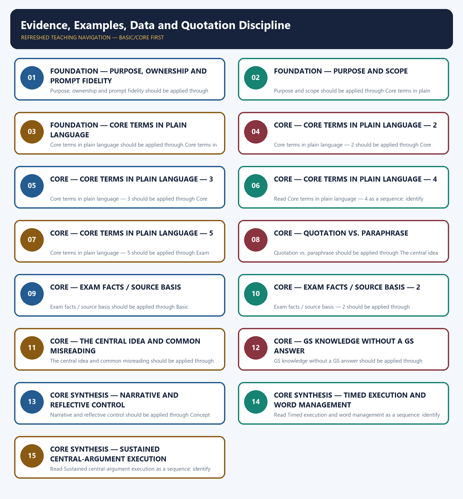

# Evidence, Examples, Data and Quotation Discipline — Learner-v2 Complete Learning Session

> **Authoring-only generation:** 2026-09-06. No PDF was rendered and no tracker or index was mutated.

### SOURCE, PROGRESSION AND OFFICIAL-RULE AUDIT

- **Generation date:** 2026-09-06.
- **Source order:** canonical Basic owner first; Advanced owner second; Essay master framework, README, official-syllabus map, answer-worthiness audit and revision chart next; PYQ corpus and official OCR papers after that; live official UPSC pages only as a final check.
- **Basic/Advanced boundary:** complete Basic teaching remains first and Advanced material remains optional and last.
- **OCR boundary:** Repository Markdown was primary. OCR-searchable official UPSC Essay papers were supplementary only for printed instructions and V1 prompt wording. No author, official model answer, current marks split, phase allocation, paragraph count or scoring rubric was inferred.
- **Qdrant:** not used; repository Markdown and local official papers were sufficient.
- **PYQ integrity:** Three application cards use the repository's explicit V1/V2 status. No unavailable official model answer, marking rubric or attribution is invented.
- **Live-source boundary:** Live source check dated 2026-09-06: official UPSC routes were attempted and access-blocked; blocked pages support no new claim. UN, WHO and IPCC primary pages were separately checked for cross-theme factual boundaries.
- **No-formula rule:** strategy, heuristics and practice weights are never presented as official UPSC instructions or marking criteria.

### LIVE OFFICIAL-SOURCE ATTEMPT LOG

The checks below were made on 2026-09-06. Substantive official text is used only for the proposition it supports; title-only, blocked or thin pages are recorded and supply no factual claim.

- https://upsc.gov.in/examinations/previous-question-papers — attempted 2026-09-06; official page returned HTTP 403 to the live fetch, so it supports no new wording.
- https://upsc.gov.in/examinations/active-examinations — attempted 2026-09-06; official page returned HTTP 403 to the live fetch, so it supports no current-paper inference.
- https://upsc.gov.in/sites/default/files/Notif-CSP-2024-Engl-140224.pdf — searched 2026-09-06; retained only as an official scheme cross-check route, not as an Essay rubric.

## BASIC LEARNING SESSION



*Distinct embedded teaching-navigation image. The separate continuous Cārvāka-style flowchart package remains an independent at-a-glance artifact.*

### SESSION 1 — FOUNDATION — PURPOSE, OWNERSHIP AND PROMPT FIDELITY

#### DEFINITION / WHAT THIS IS CALLED

**Plain-language definition:** Objective practice: Apply Purpose, ownership and prompt fidelity by distinguishing the correct Essay-method move from nearby but invalid shortcuts; no factual-trivia recall is being tested.

**Technical definition:** Purpose, ownership and prompt fidelity should be applied through Purpose and scope and Core terms in plain language, while preserving the difference between official paper instruction and strategy, prompt wording and interpretation, example and evidence, breadth and coherence.

#### ANSWER-GRABBING OPENING — WRITE/ADAPT IN THE EXAM

> Plain-language definition: Purpose, ownership and prompt fidelity explains how Purpose and scope and Core terms in plain language combine into one usable Essay-planning move.

#### MUST-WRITE KEYWORDS

- **FOUNDATION**
- **Purpose**
- **ownership**
- **prompt fidelity**
- **Plain-language definition**
- **Technical definition**

**How to use them:** Frame the answer through FOUNDATION; define Purpose, connect ownership with prompt fidelity to explain the mechanism, and use Plain-language definition for the decisive comparison or qualification.

#### METHOD MOVE / WHAT THIS DOES

**Plain-language definition:** Purpose, ownership and prompt fidelity explains how Purpose and scope and Core terms in plain language combine into one usable Essay-planning move.

**Technical definition:** The learner fixes the printed prompt, its relationship or demand, the defensible scope, the argument function and the evidence boundary before drafting prose.

#### ANSWER-GRABBING OPENING — WRITE/ADAPT IN THE EXAM

> Purpose, ownership and prompt fidelity should be applied through Purpose and scope and Core terms in plain language, while preserving the difference between official paper instruction and strategy, prompt wording and interpretation, example and evidence, breadth and coherence.

#### MUST-WRITE KEYWORDS

- **Purpose**
- **ownership**
- **prompt**
- **fidelity**
- **scope**
- **Core**

**How to use them:** Define the first three terms, trace the relationship with the next two, and attach the final term to the exact claim, example and qualification. Qualification: Do not replace functional evidence with quotation and factual integrity with a generic GS-style catalogue.

#### VISUAL FIRST

```text
PURPOSE, OWNERSHIP AND PROMPT FIDELITY
01. Purpose and scope
    |
    v
02. Core terms in plain language
STATUS / CATEGORY FIREWALL -> Do not replace functional evidence with quotation and factual integrity with a generic GS-style catalogue.
```

*The rail fixes the prompt-to-argument sequence and claim boundary before explanation.*

#### CORE EXPLANATION

This topic covers how to use evidence inside an essay — examples, data and quotations — and, critically, the rule for using the prompt itself and any other quotation safely. It works alongside 12 (the illustration bank) but focuses on the discipline , not the content catalogue. abstraction concrete; on its own it establishes that something can happen, not that it generally does.

#### SIMPLE SYSTEM EXAMPLE

Read Purpose, ownership and prompt fidelity as a sequence: identify Purpose and scope, follow the method through the printed proposition, and stop before adding a rule, attribution, fact or inference the audited sources do not support.

#### TECHNICAL DISTINCTION

The decisive boundary is Do not replace functional evidence with quotation and factual integrity with a generic GS-style catalogue. This keeps Purpose and scope and Core terms in plain language in the correct prompt, method, argument and evidence category.

#### NAMED EVIDENCE AND MECHANISM

- This topic covers how to use evidence inside an essay — examples, data and quotations — and, critically, the rule for using the prompt itself and any other quotation safely. It works alongside 12 (the illustration bank) but focuses on the discipline , not the content catalogue.
- abstraction concrete; on its own it establishes that something can happen, not that it generally does.

#### EXAMINER CAUTION

- Do not replace functional evidence with quotation and factual integrity with a generic GS-style catalogue.

#### EXAM LINK

- **Objective practice:** Apply Purpose, ownership and prompt fidelity by distinguishing the correct Essay-method move from nearby but invalid shortcuts; no factual-trivia recall is being tested.
- **Essay application:** State the exact demand and the bounded writing decision.

#### MINI RECAP

- **Mechanism chain:** Purpose and scope -> Core terms in plain language
- **Qualified use:** State the exact demand and the bounded writing decision.

#### CLOSING RECALL FLOW — FOUNDATION — PURPOSE, OWNERSHIP AND PROMPT FIDELITY

```text
START / CONCEPT: FOUNDATION — Purpose, ownership and prompt fidelity
        |
        v
EXACT TERMS: FOUNDATION · Purpose · ownership · prompt fidelity · Plain-language definition · Technical definition
        |
        v
MECHANISM / ARGUMENT: Purpose, ownership and prompt fidelity should be applied through Purpose and scope and Core terms in plain language, while preserving the difference between official paper instruction and strategy, prompt wording and interpretation, example and evidence, breadth and coherence.
        |
        v
CONSEQUENCE / CONTRAST: Read Purpose, ownership and prompt fidelity as a sequence: identify Purpose and scope, follow the method through the printed proposition, and stop before adding a rule, attribution, fact or inference the audited sources do not support.
        |
        v
UPSC TRAP / ANSWER-USE: Objective practice: Apply Purpose, ownership and prompt fidelity by distinguishing the correct Essay-method move from nearby but invalid shortcuts; no factual-trivia recall is being tested.
        |
        v
ANSWER-GRABBING FORMULATION: Plain-language definition: Purpose, ownership and prompt fidelity explains how Purpose and scope and Core terms in plain language combine into one usable Essay-planning move.
```
### SESSION 2 — FOUNDATION — PURPOSE AND SCOPE

#### DEFINITION / WHAT THIS IS CALLED

**Plain-language definition:** Objective practice: Apply Purpose and scope by distinguishing the correct Essay-method move from nearby but invalid shortcuts; no factual-trivia recall is being tested.

**Technical definition:** Purpose and scope should be applied through Core terms in plain language — 2, while preserving the difference between official paper instruction and strategy, prompt wording and interpretation, example and evidence, breadth and coherence.

#### ANSWER-GRABBING OPENING — WRITE/ADAPT IN THE EXAM

> Plain-language definition: Purpose and scope explains how Core terms in plain language — 2 combine into one usable Essay-planning move.

#### MUST-WRITE KEYWORDS

- **FOUNDATION**
- **Purpose**
- **scope**
- **Plain-language definition**
- **Technical definition**
- **terms**

**How to use them:** Frame the answer through FOUNDATION; define Purpose, connect scope with Plain-language definition to explain the mechanism, and use Technical definition for the decisive comparison or qualification.

#### METHOD MOVE / WHAT THIS DOES

**Plain-language definition:** Purpose and scope explains how Core terms in plain language — 2 combine into one usable Essay-planning move.

**Technical definition:** The learner fixes the printed prompt, its relationship or demand, the defensible scope, the argument function and the evidence boundary before drafting prose.

#### ANSWER-GRABBING OPENING — WRITE/ADAPT IN THE EXAM

> Purpose and scope should be applied through Core terms in plain language — 2, while preserving the difference between official paper instruction and strategy, prompt wording and interpretation, example and evidence, breadth and coherence.

#### MUST-WRITE KEYWORDS

- **Purpose**
- **scope**
- **Core**
- **terms**
- **plain**
- **language**

**How to use them:** Define the first three terms, trace the relationship with the next two, and attach the final term to the exact claim, example and qualification. Qualification: Do not cross the ownership boundary: the India illustration inventory belongs to 12.

#### VISUAL FIRST

```text
PURPOSE AND SCOPE
01. Core terms in plain language — 2
STATUS / CATEGORY FIREWALL -> Do not cross the ownership boundary: the India illustration inventory belongs to 12.
```

*The rail fixes the prompt-to-argument sequence and claim boundary before explanation.*

#### CORE EXPLANATION

a documented pattern, an institutional fact, a sourced figure. Evidence bears a burden an example does not: it must be accurate and actually bear on the claim.

#### SIMPLE SYSTEM EXAMPLE

Read Purpose and scope as a sequence: identify Core terms in plain language — 2, follow the method through the printed proposition, and stop before adding a rule, attribution, fact or inference the audited sources do not support.

#### TECHNICAL DISTINCTION

The decisive boundary is Do not cross the ownership boundary: the India illustration inventory belongs to 12. This keeps Core terms in plain language — 2 in the correct prompt, method, argument and evidence category.

#### NAMED EVIDENCE AND MECHANISM

- a documented pattern, an institutional fact, a sourced figure. Evidence bears a burden an example does not: it must be accurate and actually bear on the claim.

#### EXAMINER CAUTION

- Do not cross the ownership boundary: the India illustration inventory belongs to 12.

#### EXAM LINK

- **Objective practice:** Apply Purpose and scope by distinguishing the correct Essay-method move from nearby but invalid shortcuts; no factual-trivia recall is being tested.
- **Essay application:** Define operative terms before expanding dimensions.

#### MINI RECAP

- **Mechanism chain:** Core terms in plain language — 2
- **Qualified use:** Define operative terms before expanding dimensions.

#### CLOSING RECALL FLOW — FOUNDATION — PURPOSE AND SCOPE

```text
START / CONCEPT: FOUNDATION — Purpose and scope
        |
        v
EXACT TERMS: FOUNDATION · Purpose · scope · Plain-language definition · Technical definition · terms
        |
        v
MECHANISM / ARGUMENT: Purpose and scope should be applied through Core terms in plain language — 2, while preserving the difference between official paper instruction and strategy, prompt wording and interpretation, example and evidence, breadth and coherence.
        |
        v
CONSEQUENCE / CONTRAST: Read Purpose and scope as a sequence: identify Core terms in plain language — 2, follow the method through the printed proposition, and stop before adding a rule, attribution, fact or inference the audited sources do not support.
        |
        v
UPSC TRAP / ANSWER-USE: Objective practice: Apply Purpose and scope by distinguishing the correct Essay-method move from nearby but invalid shortcuts; no factual-trivia recall is being tested.
        |
        v
ANSWER-GRABBING FORMULATION: Plain-language definition: Purpose and scope explains how Core terms in plain language — 2 combine into one usable Essay-planning move.
```
### SESSION 3 — FOUNDATION — CORE TERMS IN PLAIN LANGUAGE

#### DEFINITION / WHAT THIS IS CALLED

**Plain-language definition:** Objective practice: Apply Core terms in plain language by distinguishing the correct Essay-method move from nearby but invalid shortcuts; no factual-trivia recall is being tested.

**Technical definition:** Core terms in plain language should be applied through Core terms in plain language — 3, while preserving the difference between official paper instruction and strategy, prompt wording and interpretation, example and evidence, breadth and coherence.

#### ANSWER-GRABBING OPENING — WRITE/ADAPT IN THE EXAM

> Plain-language definition: Core terms in plain language explains how Core terms in plain language — 3 combine into one usable Essay-planning move.

#### MUST-WRITE KEYWORDS

- **FOUNDATION**
- **Core terms in plain language**
- **Plain-language definition**
- **Technical definition**
- **terms**
- **plain**

**How to use them:** Frame the answer through FOUNDATION; define Core terms in plain language, connect Plain-language definition with Technical definition to explain the mechanism, and use terms for the decisive comparison or qualification.

#### METHOD MOVE / WHAT THIS DOES

**Plain-language definition:** Core terms in plain language explains how Core terms in plain language — 3 combine into one usable Essay-planning move.

**Technical definition:** The learner fixes the printed prompt, its relationship or demand, the defensible scope, the argument function and the evidence boundary before drafting prose.

#### ANSWER-GRABBING OPENING — WRITE/ADAPT IN THE EXAM

> Core terms in plain language should be applied through Core terms in plain language — 3, while preserving the difference between official paper instruction and strategy, prompt wording and interpretation, example and evidence, breadth and coherence.

#### MUST-WRITE KEYWORDS

- **Core**
- **terms**
- **plain**
- **language**
- **reform**
- **like**

**How to use them:** Define the first three terms, trace the relationship with the next two, and attach the final term to the exact claim, example and qualification. Qualification: Do not use an example without explaining its argumentative function.

#### VISUAL FIRST

```text
CORE TERMS IN PLAIN LANGUAGE
01. Core terms in plain language — 3
STATUS / CATEGORY FIREWALL -> Do not use an example without explaining its argumentative function.
```

*The rail fixes the prompt-to-argument sequence and claim boundary before explanation.*

#### CORE EXPLANATION

reform is like repairing a roof"). An analogy illustrates and can clarify a mechanism, but it proves nothing — the two domains are similar by the writer's choice, not by demonstration.

#### SIMPLE SYSTEM EXAMPLE

Read Core terms in plain language as a sequence: identify Core terms in plain language — 3, follow the method through the printed proposition, and stop before adding a rule, attribution, fact or inference the audited sources do not support.

#### TECHNICAL DISTINCTION

The decisive boundary is Do not use an example without explaining its argumentative function. This keeps Core terms in plain language — 3 in the correct prompt, method, argument and evidence category.

#### NAMED EVIDENCE AND MECHANISM

- reform is like repairing a roof"). An analogy illustrates and can clarify a mechanism, but it proves nothing — the two domains are similar by the writer's choice, not by demonstration.

#### EXAMINER CAUTION

- Do not use an example without explaining its argumentative function.

#### EXAM LINK

- **Objective practice:** Apply Core terms in plain language by distinguishing the correct Essay-method move from nearby but invalid shortcuts; no factual-trivia recall is being tested.
- **Essay application:** Build one qualified thesis and keep it visible.

#### MINI RECAP

- **Mechanism chain:** Core terms in plain language — 3
- **Qualified use:** Build one qualified thesis and keep it visible.

#### CLOSING RECALL FLOW — FOUNDATION — CORE TERMS IN PLAIN LANGUAGE

```text
START / CONCEPT: FOUNDATION — Core terms in plain language
        |
        v
EXACT TERMS: FOUNDATION · Core terms in plain language · Plain-language definition · Technical definition · terms · plain
        |
        v
MECHANISM / ARGUMENT: Core terms in plain language should be applied through Core terms in plain language — 3, while preserving the difference between official paper instruction and strategy, prompt wording and interpretation, example and evidence, breadth and coherence.
        |
        v
CONSEQUENCE / CONTRAST: Objective practice: Apply Core terms in plain language by distinguishing the correct Essay-method move from nearby but invalid shortcuts; no factual-trivia recall is being tested.
        |
        v
UPSC TRAP / ANSWER-USE: Read Core terms in plain language as a sequence: identify Core terms in plain language — 3, follow the method through the printed proposition, and stop before adding a rule, attribution, fact or inference the audited sources do not support.
        |
        v
ANSWER-GRABBING FORMULATION: Plain-language definition: Core terms in plain language explains how Core terms in plain language — 3 combine into one usable Essay-planning move.
```
### SESSION 4 — CORE — CORE TERMS IN PLAIN LANGUAGE — 2

#### DEFINITION / WHAT THIS IS CALLED

**Plain-language definition:** Objective practice: Apply Core terms in plain language — 2 by distinguishing the correct Essay-method move from nearby but invalid shortcuts; no factual-trivia recall is being tested.

**Technical definition:** Core terms in plain language — 2 should be applied through Core terms in plain language — 4, while preserving the difference between official paper instruction and strategy, prompt wording and interpretation, example and evidence, breadth and coherence.

#### ANSWER-GRABBING OPENING — WRITE/ADAPT IN THE EXAM

> Plain-language definition: Core terms in plain language — 2 explains how Core terms in plain language — 4 combine into one usable Essay-planning move.

#### MUST-WRITE KEYWORDS

- **Core terms in plain language**
- **Plain-language definition**
- **Technical definition**
- **terms**
- **plain**
- **language**

**How to use them:** Frame the answer through Core terms in plain language; define Plain-language definition, connect Technical definition with terms to explain the mechanism, and use plain for the decisive comparison or qualification.

#### METHOD MOVE / WHAT THIS DOES

**Plain-language definition:** Core terms in plain language — 2 explains how Core terms in plain language — 4 combine into one usable Essay-planning move.

**Technical definition:** The learner fixes the printed prompt, its relationship or demand, the defensible scope, the argument function and the evidence boundary before drafting prose.

#### ANSWER-GRABBING OPENING — WRITE/ADAPT IN THE EXAM

> Core terms in plain language — 2 should be applied through Core terms in plain language — 4, while preserving the difference between official paper instruction and strategy, prompt wording and interpretation, example and evidence, breadth and coherence.

#### MUST-WRITE KEYWORDS

- **Core**
- **terms**
- **plain**
- **language**
- **used**
- **naming**

**How to use them:** Define the first three terms, trace the relationship with the next two, and attach the final term to the exact claim, example and qualification. Qualification: Do not treat a pedagogical scaffold as an official UPSC marking rule.

#### VISUAL FIRST

```text
CORE TERMS IN PLAIN LANGUAGE — 2
01. Core terms in plain language — 4
STATUS / CATEGORY FIREWALL -> Do not treat a pedagogical scaffold as an official UPSC marking rule.
```

*The rail fixes the prompt-to-argument sequence and claim boundary before explanation.*

#### CORE EXPLANATION

used without naming an author unless a primary/authoritative source independently verifies exact wording, authorship and context.

#### SIMPLE SYSTEM EXAMPLE

Read Core terms in plain language — 2 as a sequence: identify Core terms in plain language — 4, follow the method through the printed proposition, and stop before adding a rule, attribution, fact or inference the audited sources do not support.

#### TECHNICAL DISTINCTION

The decisive boundary is Do not treat a pedagogical scaffold as an official UPSC marking rule. This keeps Core terms in plain language — 4 in the correct prompt, method, argument and evidence category.

#### NAMED EVIDENCE AND MECHANISM

- used without naming an author unless a primary/authoritative source independently verifies exact wording, authorship and context.

#### EXAMINER CAUTION

- Do not treat a pedagogical scaffold as an official UPSC marking rule.

#### EXAM LINK

- **Objective practice:** Apply Core terms in plain language — 2 by distinguishing the correct Essay-method move from nearby but invalid shortcuts; no factual-trivia recall is being tested.
- **Essay application:** Give every paragraph one argumentative job.

#### MINI RECAP

- **Mechanism chain:** Core terms in plain language — 4
- **Qualified use:** Give every paragraph one argumentative job.

#### CLOSING RECALL FLOW — CORE — CORE TERMS IN PLAIN LANGUAGE — 2

```text
START / CONCEPT: CORE — Core terms in plain language — 2
        |
        v
EXACT TERMS: Core terms in plain language · Plain-language definition · Technical definition · terms · plain · language
        |
        v
MECHANISM / ARGUMENT: Core terms in plain language — 2 should be applied through Core terms in plain language — 4, while preserving the difference between official paper instruction and strategy, prompt wording and interpretation, example and evidence, breadth and coherence.
        |
        v
CONSEQUENCE / CONTRAST: Objective practice: Apply Core terms in plain language — 2 by distinguishing the correct Essay-method move from nearby but invalid shortcuts; no factual-trivia recall is being tested.
        |
        v
UPSC TRAP / ANSWER-USE: Read Core terms in plain language — 2 as a sequence: identify Core terms in plain language — 4, follow the method through the printed proposition, and stop before adding a rule, attribution, fact or inference the audited sources do not support.
        |
        v
ANSWER-GRABBING FORMULATION: Plain-language definition: Core terms in plain language — 2 explains how Core terms in plain language — 4 combine into one usable Essay-planning move.
```
### SESSION 5 — CORE — CORE TERMS IN PLAIN LANGUAGE — 3

#### DEFINITION / WHAT THIS IS CALLED

**Plain-language definition:** Objective practice: Apply Core terms in plain language — 3 by distinguishing the correct Essay-method move from nearby but invalid shortcuts; no factual-trivia recall is being tested.

**Technical definition:** Core terms in plain language — 3 should be applied through Core terms in plain language — 5, while preserving the difference between official paper instruction and strategy, prompt wording and interpretation, example and evidence, breadth and coherence.

#### ANSWER-GRABBING OPENING — WRITE/ADAPT IN THE EXAM

> Plain-language definition: Core terms in plain language — 3 explains how Core terms in plain language — 5 combine into one usable Essay-planning move.

#### MUST-WRITE KEYWORDS

- **Core terms in plain language**
- **Plain-language definition**
- **Technical definition**
- **terms**
- **plain**
- **language**

**How to use them:** Frame the answer through Core terms in plain language; define Plain-language definition, connect Technical definition with terms to explain the mechanism, and use plain for the decisive comparison or qualification.

#### METHOD MOVE / WHAT THIS DOES

**Plain-language definition:** Core terms in plain language — 3 explains how Core terms in plain language — 5 combine into one usable Essay-planning move.

**Technical definition:** The learner fixes the printed prompt, its relationship or demand, the defensible scope, the argument function and the evidence boundary before drafting prose.

#### ANSWER-GRABBING OPENING — WRITE/ADAPT IN THE EXAM

> Core terms in plain language — 3 should be applied through Core terms in plain language — 5, while preserving the difference between official paper instruction and strategy, prompt wording and interpretation, example and evidence, breadth and coherence.

#### MUST-WRITE KEYWORDS

- **Core**
- **terms**
- **plain**
- **language**
- **example**
- **analogy**

**How to use them:** Define the first three terms, trace the relationship with the next two, and attach the final term to the exact claim, example and qualification. Qualification: Do not let a counter-view replace the thesis; use it to qualify the thesis.

#### VISUAL FIRST

```text
CORE TERMS IN PLAIN LANGUAGE — 3
01. Core terms in plain language — 5
STATUS / CATEGORY FIREWALL -> Do not let a counter-view replace the thesis; use it to qualify the thesis.
```

*The rail fixes the prompt-to-argument sequence and claim boundary before explanation.*

#### CORE EXPLANATION

Why the example/evidence/analogy distinction earns marks. The sentence "Chipko shows that communities can restrain extraction" uses an example as evidence for a modal claim ( can ) — legitimate. "Chipko shows that community action is sufficient to protect forests" uses the same example as evidence for a general claim it cannot carry. "Forests are the lungs of the nation" is an analogy: useful for vividness, worthless as support. The commonest failure is an analogy quietly doing the work of evidence — check whether your paragraph's support could be denied by someone who simply rejects the comparison.

#### SIMPLE SYSTEM EXAMPLE

Read Core terms in plain language — 3 as a sequence: identify Core terms in plain language — 5, follow the method through the printed proposition, and stop before adding a rule, attribution, fact or inference the audited sources do not support.

#### TECHNICAL DISTINCTION

The decisive boundary is Do not let a counter-view replace the thesis; use it to qualify the thesis. This keeps Core terms in plain language — 5 in the correct prompt, method, argument and evidence category.

#### NAMED EVIDENCE AND MECHANISM

- Why the example/evidence/analogy distinction earns marks. The sentence "Chipko shows that communities can restrain extraction" uses an example as evidence for a modal claim ( can ) — legitimate. "Chipko shows that community action is sufficient to protect forests" uses the same example as evidence for a general claim it cannot carry. "Forests are the lungs of the nation" is an analogy: useful for vividness, worthless as support. The commonest failure is an analogy quietly doing the work of evidence — check whether your paragraph's support could be denied by someone who simply rejects the comparison.

#### EXAMINER CAUTION

- Do not let a counter-view replace the thesis; use it to qualify the thesis.

#### EXAM LINK

- **Objective practice:** Apply Core terms in plain language — 3 by distinguishing the correct Essay-method move from nearby but invalid shortcuts; no factual-trivia recall is being tested.
- **Essay application:** Join a named illustration to its mechanism.

#### MINI RECAP

- **Mechanism chain:** Core terms in plain language — 5
- **Qualified use:** Join a named illustration to its mechanism.

#### CLOSING RECALL FLOW — CORE — CORE TERMS IN PLAIN LANGUAGE — 3

```text
START / CONCEPT: CORE — Core terms in plain language — 3
        |
        v
EXACT TERMS: Core terms in plain language · Plain-language definition · Technical definition · terms · plain · language
        |
        v
MECHANISM / ARGUMENT: Core terms in plain language — 3 should be applied through Core terms in plain language — 5, while preserving the difference between official paper instruction and strategy, prompt wording and interpretation, example and evidence, breadth and coherence.
        |
        v
CONSEQUENCE / CONTRAST: Objective practice: Apply Core terms in plain language — 3 by distinguishing the correct Essay-method move from nearby but invalid shortcuts; no factual-trivia recall is being tested.
        |
        v
UPSC TRAP / ANSWER-USE: Read Core terms in plain language — 3 as a sequence: identify Core terms in plain language — 5, follow the method through the printed proposition, and stop before adding a rule, attribution, fact or inference the audited sources do not support.
        |
        v
ANSWER-GRABBING FORMULATION: Plain-language definition: Core terms in plain language — 3 explains how Core terms in plain language — 5 combine into one usable Essay-planning move.
```
### SESSION 6 — CORE — CORE TERMS IN PLAIN LANGUAGE — 4

#### DEFINITION / WHAT THIS IS CALLED

**Plain-language definition:** Objective practice: Apply Core terms in plain language — 4 by distinguishing the correct Essay-method move from nearby but invalid shortcuts; no factual-trivia recall is being tested.

**Technical definition:** Read Core terms in plain language — 4 as a sequence: identify Quotation vs. paraphrase, follow the method through the printed proposition, and stop before adding a rule, attribution, fact or inference the audited sources do not support.

#### ANSWER-GRABBING OPENING — WRITE/ADAPT IN THE EXAM

> Plain-language definition: Core terms in plain language — 4 explains how Quotation vs. paraphrase and Exam facts / source basis combine into one usable Essay-planning move.

#### MUST-WRITE KEYWORDS

- **Core terms in plain language**
- **Plain-language definition**
- **Technical definition**
- **terms**
- **plain**
- **language**

**How to use them:** Frame the answer through Core terms in plain language; define Plain-language definition, connect Technical definition with terms to explain the mechanism, and use plain for the decisive comparison or qualification.

#### METHOD MOVE / WHAT THIS DOES

**Plain-language definition:** Core terms in plain language — 4 explains how Quotation vs. paraphrase and Exam facts / source basis combine into one usable Essay-planning move.

**Technical definition:** The learner fixes the printed prompt, its relationship or demand, the defensible scope, the argument function and the evidence boundary before drafting prose.

#### ANSWER-GRABBING OPENING — WRITE/ADAPT IN THE EXAM

> Core terms in plain language — 4 should be applied through Quotation vs. paraphrase and Exam facts / source basis, while preserving the difference between official paper instruction and strategy, prompt wording and interpretation, example and evidence, breadth and coherence.

#### MUST-WRITE KEYWORDS

- **Core**
- **terms**
- **plain**
- **language**
- **Quotation**
- **paraphrase**

**How to use them:** Define the first three terms, trace the relationship with the next two, and attach the final term to the exact claim, example and qualification. Qualification: Do not use an unverified quotation, statistic, attribution or anecdote.

#### VISUAL FIRST

```text
CORE TERMS IN PLAIN LANGUAGE — 4
01. Quotation vs. paraphrase
    |
    v
02. Exam facts / source basis
STATUS / CATEGORY FIREWALL -> Do not use an unverified quotation, statistic, attribution or anecdote.
```

*The rail fixes the prompt-to-argument sequence and claim boundary before explanation.*

#### CORE EXPLANATION

Quotation marks are a promise about wording , not merely a signal of borrowing. If you cannot keep that promise — because you are recalling an aphorism, or working from a corpus row that has not been verified against the official paper — paraphrase instead. Half-remembered quotation inside quote marks is a fabrication even when the idea is right, and it buys nothing a clean paraphrase would not. papers and reproduced with their printed defects intact. The 36 rows from 2013–2017 are V2 — not checked against an official paper locally, and therefore to be paraphrased rather than quoted verbatim (Section 2a).

#### SIMPLE SYSTEM EXAMPLE

Read Core terms in plain language — 4 as a sequence: identify Quotation vs. paraphrase, follow the method through the printed proposition, and stop before adding a rule, attribution, fact or inference the audited sources do not support.

#### TECHNICAL DISTINCTION

The decisive boundary is Do not use an unverified quotation, statistic, attribution or anecdote. This keeps Quotation vs. paraphrase and Exam facts / source basis in the correct prompt, method, argument and evidence category.

#### NAMED EVIDENCE AND MECHANISM

- Quotation marks are a promise about wording , not merely a signal of borrowing. If you cannot keep that promise — because you are recalling an aphorism, or working from a corpus row that has not been verified against the official paper — paraphrase instead. Half-remembered quotation inside quote marks is a fabrication even when the idea is right, and it buys nothing a clean paraphrase would not.
- papers and reproduced with their printed defects intact. The 36 rows from 2013–2017 are V2 — not checked against an official paper locally, and therefore to be paraphrased rather than quoted verbatim (Section 2a).

#### EXAMINER CAUTION

- Do not use an unverified quotation, statistic, attribution or anecdote.

#### EXAM LINK

- **Objective practice:** Apply Core terms in plain language — 4 by distinguishing the correct Essay-method move from nearby but invalid shortcuts; no factual-trivia recall is being tested.
- **Essay application:** Use a counter-case to refine, not derail, the thesis.

#### MINI RECAP

- **Mechanism chain:** Quotation vs. paraphrase -> Exam facts / source basis
- **Qualified use:** Use a counter-case to refine, not derail, the thesis.

#### CLOSING RECALL FLOW — CORE — CORE TERMS IN PLAIN LANGUAGE — 4

```text
START / CONCEPT: CORE — Core terms in plain language — 4
        |
        v
EXACT TERMS: Core terms in plain language · Plain-language definition · Technical definition · terms · plain · language
        |
        v
MECHANISM / ARGUMENT: Read Core terms in plain language — 4 as a sequence: identify Quotation vs. paraphrase, follow the method through the printed proposition, and stop before adding a rule, attribution, fact or inference the audited sources do not support.
        |
        v
CONSEQUENCE / CONTRAST: Objective practice: Apply Core terms in plain language — 4 by distinguishing the correct Essay-method move from nearby but invalid shortcuts; no factual-trivia recall is being tested.
        |
        v
UPSC TRAP / ANSWER-USE: Core terms in plain language — 4 should be applied through Quotation vs. paraphrase and Exam facts / source basis, while preserving the difference between official paper instruction and strategy, prompt wording and interpretation, example and evidence, breadth and coherence.
        |
        v
ANSWER-GRABBING FORMULATION: Plain-language definition: Core terms in plain language — 4 explains how Quotation vs. paraphrase and Exam facts / source basis combine into one usable Essay-planning move.
```
### SESSION 7 — CORE — CORE TERMS IN PLAIN LANGUAGE — 5

#### DEFINITION / WHAT THIS IS CALLED

**Plain-language definition:** Objective practice: Apply Core terms in plain language — 5 by distinguishing the correct Essay-method move from nearby but invalid shortcuts; no factual-trivia recall is being tested.

**Technical definition:** Core terms in plain language — 5 should be applied through Exam facts / source basis — 2, while preserving the difference between official paper instruction and strategy, prompt wording and interpretation, example and evidence, breadth and coherence.

#### ANSWER-GRABBING OPENING — WRITE/ADAPT IN THE EXAM

> Plain-language definition: Core terms in plain language — 5 explains how Exam facts / source basis — 2 combine into one usable Essay-planning move.

#### MUST-WRITE KEYWORDS

- **Core terms in plain language**
- **Plain-language definition**
- **Technical definition**
- **terms**
- **plain**
- **language**

**How to use them:** Frame the answer through Core terms in plain language; define Plain-language definition, connect Technical definition with terms to explain the mechanism, and use plain for the decisive comparison or qualification.

#### METHOD MOVE / WHAT THIS DOES

**Plain-language definition:** Core terms in plain language — 5 explains how Exam facts / source basis — 2 combine into one usable Essay-planning move.

**Technical definition:** The learner fixes the printed prompt, its relationship or demand, the defensible scope, the argument function and the evidence boundary before drafting prose.

#### ANSWER-GRABBING OPENING — WRITE/ADAPT IN THE EXAM

> Core terms in plain language — 5 should be applied through Exam facts / source basis — 2, while preserving the difference between official paper instruction and strategy, prompt wording and interpretation, example and evidence, breadth and coherence.

#### MUST-WRITE KEYWORDS

- **Core**
- **terms**
- **plain**
- **language**
- **Exam**
- **facts**

**How to use them:** Define the first three terms, trace the relationship with the next two, and attach the final term to the exact claim, example and qualification. Qualification: Do not multiply dimensions that repeat the same claim in new vocabulary.

#### VISUAL FIRST

```text
CORE TERMS IN PLAIN LANGUAGE — 5
01. Exam facts / source basis — 2
STATUS / CATEGORY FIREWALL -> Do not multiply dimensions that repeat the same claim in new vocabulary.
```

*The rail fixes the prompt-to-argument sequence and claim boundary before explanation.*

#### CORE EXPLANATION

is: quote the prompt exactly, or paraphrase it faithfully; never attach an author's name to it.

#### SIMPLE SYSTEM EXAMPLE

Read Core terms in plain language — 5 as a sequence: identify Exam facts / source basis — 2, follow the method through the printed proposition, and stop before adding a rule, attribution, fact or inference the audited sources do not support.

#### TECHNICAL DISTINCTION

The decisive boundary is Do not multiply dimensions that repeat the same claim in new vocabulary. This keeps Exam facts / source basis — 2 in the correct prompt, method, argument and evidence category.

#### NAMED EVIDENCE AND MECHANISM

- is: quote the prompt exactly, or paraphrase it faithfully; never attach an author's name to it.

#### EXAMINER CAUTION

- Do not multiply dimensions that repeat the same claim in new vocabulary.

#### EXAM LINK

- **Objective practice:** Apply Core terms in plain language — 5 by distinguishing the correct Essay-method move from nearby but invalid shortcuts; no factual-trivia recall is being tested.
- **Essay application:** Sequence paragraphs through explicit logical bridges.

#### MINI RECAP

- **Mechanism chain:** Exam facts / source basis — 2
- **Qualified use:** Sequence paragraphs through explicit logical bridges.

#### CLOSING RECALL FLOW — CORE — CORE TERMS IN PLAIN LANGUAGE — 5

```text
START / CONCEPT: CORE — Core terms in plain language — 5
        |
        v
EXACT TERMS: Core terms in plain language · Plain-language definition · Technical definition · terms · plain · language
        |
        v
MECHANISM / ARGUMENT: Core terms in plain language — 5 should be applied through Exam facts / source basis — 2, while preserving the difference between official paper instruction and strategy, prompt wording and interpretation, example and evidence, breadth and coherence.
        |
        v
CONSEQUENCE / CONTRAST: Objective practice: Apply Core terms in plain language — 5 by distinguishing the correct Essay-method move from nearby but invalid shortcuts; no factual-trivia recall is being tested.
        |
        v
UPSC TRAP / ANSWER-USE: Read Core terms in plain language — 5 as a sequence: identify Exam facts / source basis — 2, follow the method through the printed proposition, and stop before adding a rule, attribution, fact or inference the audited sources do not support.
        |
        v
ANSWER-GRABBING FORMULATION: Plain-language definition: Core terms in plain language — 5 explains how Exam facts / source basis — 2 combine into one usable Essay-planning move.
```
### SESSION 8 — CORE — QUOTATION VS. PARAPHRASE

#### DEFINITION / WHAT THIS IS CALLED

**Plain-language definition:** Objective practice: Apply Quotation vs. paraphrase by distinguishing the correct Essay-method move from nearby but invalid shortcuts; no factual-trivia recall is being tested.

**Technical definition:** Quotation vs. paraphrase should be applied through The central idea and common misreading, while preserving the difference between official paper instruction and strategy, prompt wording and interpretation, example and evidence, breadth and coherence.

#### ANSWER-GRABBING OPENING — WRITE/ADAPT IN THE EXAM

> Plain-language definition: Quotation vs. paraphrase explains how The central idea and common misreading combine into one usable Essay-planning move.

#### MUST-WRITE KEYWORDS

- **Quotation vs. paraphrase**
- **Plain-language definition**
- **Technical definition**
- **Quotation**
- **paraphrase**
- **central**

**How to use them:** Frame the answer through Quotation vs. paraphrase; define Plain-language definition, connect Technical definition with Quotation to explain the mechanism, and use paraphrase for the decisive comparison or qualification.

#### METHOD MOVE / WHAT THIS DOES

**Plain-language definition:** Quotation vs. paraphrase explains how The central idea and common misreading combine into one usable Essay-planning move.

**Technical definition:** The learner fixes the printed prompt, its relationship or demand, the defensible scope, the argument function and the evidence boundary before drafting prose.

#### ANSWER-GRABBING OPENING — WRITE/ADAPT IN THE EXAM

> Quotation vs. paraphrase should be applied through The central idea and common misreading, while preserving the difference between official paper instruction and strategy, prompt wording and interpretation, example and evidence, breadth and coherence.

#### MUST-WRITE KEYWORDS

- **Quotation**
- **paraphrase**
- **central**
- **idea**
- **common**
- **misreading**

**How to use them:** Define the first three terms, trace the relationship with the next two, and attach the final term to the exact claim, example and qualification. Qualification: Do not end with aspiration unsupported by the preceding argument.

#### VISUAL FIRST

```text
QUOTATION VS. PARAPHRASE
01. The central idea and common misreading
STATUS / CATEGORY FIREWALL -> Do not end with aspiration unsupported by the preceding argument.
```

*The rail fixes the prompt-to-argument sequence and claim boundary before explanation.*

#### CORE EXPLANATION

Central idea: evidence should follow the rule one claim → one function → one verified source — every example or quotation must be doing identifiable work for a specific claim. Common misreading: treating evidence density as a proxy for quality — stacking multiple half-remembered facts, statistics or "famous quotes" to look erudite, which in fact increases factual risk without adding argumentative strength.

#### SIMPLE SYSTEM EXAMPLE

Read Quotation vs. paraphrase as a sequence: identify The central idea and common misreading, follow the method through the printed proposition, and stop before adding a rule, attribution, fact or inference the audited sources do not support.

#### TECHNICAL DISTINCTION

The decisive boundary is Do not end with aspiration unsupported by the preceding argument. This keeps The central idea and common misreading in the correct prompt, method, argument and evidence category.

#### NAMED EVIDENCE AND MECHANISM

- Central idea: evidence should follow the rule one claim → one function → one verified source — every example or quotation must be doing identifiable work for a specific claim. Common misreading: treating evidence density as a proxy for quality — stacking multiple half-remembered facts, statistics or "famous quotes" to look erudite, which in fact increases factual risk without adding argumentative strength.

#### EXAMINER CAUTION

- Do not end with aspiration unsupported by the preceding argument.

#### EXAM LINK

- **Objective practice:** Apply Quotation vs. paraphrase by distinguishing the correct Essay-method move from nearby but invalid shortcuts; no factual-trivia recall is being tested.
- **Essay application:** Move across actor, scale and time only when the claim changes.

#### MINI RECAP

- **Mechanism chain:** The central idea and common misreading
- **Qualified use:** Move across actor, scale and time only when the claim changes.

#### CLOSING RECALL FLOW — CORE — QUOTATION VS. PARAPHRASE

```text
START / CONCEPT: CORE — Quotation vs. paraphrase
        |
        v
EXACT TERMS: Quotation vs. paraphrase · Plain-language definition · Technical definition · Quotation · paraphrase · central
        |
        v
MECHANISM / ARGUMENT: Quotation vs. paraphrase should be applied through The central idea and common misreading, while preserving the difference between official paper instruction and strategy, prompt wording and interpretation, example and evidence, breadth and coherence.
        |
        v
CONSEQUENCE / CONTRAST: Read Quotation vs. paraphrase as a sequence: identify The central idea and common misreading, follow the method through the printed proposition, and stop before adding a rule, attribution, fact or inference the audited sources do not support.
        |
        v
UPSC TRAP / ANSWER-USE: Objective practice: Apply Quotation vs. paraphrase by distinguishing the correct Essay-method move from nearby but invalid shortcuts; no factual-trivia recall is being tested.
        |
        v
ANSWER-GRABBING FORMULATION: Plain-language definition: Quotation vs. paraphrase explains how The central idea and common misreading combine into one usable Essay-planning move.
```
### SESSION 9 — CORE — EXAM FACTS / SOURCE BASIS

#### DEFINITION / WHAT THIS IS CALLED

**Plain-language definition:** Objective practice: Apply Exam facts / source basis by distinguishing the correct Essay-method move from nearby but invalid shortcuts; no factual-trivia recall is being tested.

**Technical definition:** Exam facts / source basis should be applied through Basic decomposition questions, while preserving the difference between official paper instruction and strategy, prompt wording and interpretation, example and evidence, breadth and coherence.

#### ANSWER-GRABBING OPENING — WRITE/ADAPT IN THE EXAM

> Plain-language definition: Exam facts / source basis explains how Basic decomposition questions combine into one usable Essay-planning move.

#### MUST-WRITE KEYWORDS

- **Exam facts / source basis**
- **Plain-language definition**
- **Technical definition**
- **Exam**
- **s**
- **basis**

**How to use them:** Frame the answer through Exam facts / source basis; define Plain-language definition, connect Technical definition with Exam to explain the mechanism, and use s for the decisive comparison or qualification.

#### METHOD MOVE / WHAT THIS DOES

**Plain-language definition:** Exam facts / source basis explains how Basic decomposition questions combine into one usable Essay-planning move.

**Technical definition:** The learner fixes the printed prompt, its relationship or demand, the defensible scope, the argument function and the evidence boundary before drafting prose.

#### ANSWER-GRABBING OPENING — WRITE/ADAPT IN THE EXAM

> Exam facts / source basis should be applied through Basic decomposition questions, while preserving the difference between official paper instruction and strategy, prompt wording and interpretation, example and evidence, breadth and coherence.

#### MUST-WRITE KEYWORDS

- **Exam**
- **facts**
- **basis**
- **Basic**
- **decomposition**
- **questions**

**How to use them:** Define the first three terms, trace the relationship with the next two, and attach the final term to the exact claim, example and qualification. Qualification: Do not sacrifice the second essay's time budget to perfect the first.

#### VISUAL FIRST

```text
EXAM FACTS / SOURCE BASIS
01. Basic decomposition questions
STATUS / CATEGORY FIREWALL -> Do not sacrifice the second essay's time budget to perfect the first.
```

*The rail fixes the prompt-to-argument sequence and claim boundary before explanation.*

#### CORE EXPLANATION

1. What specific claim does this example or quotation support? 2. Can I state the example accurately without inventing a number, date, or detail I am unsure of? 3. If I am tempted to quote a name alongside the prompt or a supporting aphorism, do I have a primary/authoritative source verifying it — or should I omit the name? 4. Is this the only example needed for this claim, or am I stacking redundant ones? 5. Would removing this piece of evidence leave the claim unsupported, or was it decorative?

#### SIMPLE SYSTEM EXAMPLE

Read Exam facts / source basis as a sequence: identify Basic decomposition questions, follow the method through the printed proposition, and stop before adding a rule, attribution, fact or inference the audited sources do not support.

#### TECHNICAL DISTINCTION

The decisive boundary is Do not sacrifice the second essay's time budget to perfect the first. This keeps Basic decomposition questions in the correct prompt, method, argument and evidence category.

#### NAMED EVIDENCE AND MECHANISM

- 1. What specific claim does this example or quotation support? 2. Can I state the example accurately without inventing a number, date, or detail I am unsure of? 3. If I am tempted to quote a name alongside the prompt or a supporting aphorism, do I have a primary/authoritative source verifying it — or should I omit the name? 4. Is this the only example needed for this claim, or am I stacking redundant ones? 5. Would removing this piece of evidence leave the claim unsupported, or was it decorative?

#### EXAMINER CAUTION

- Do not sacrifice the second essay's time budget to perfect the first.

#### EXAM LINK

- **Objective practice:** Apply Exam facts / source basis by distinguishing the correct Essay-method move from nearby but invalid shortcuts; no factual-trivia recall is being tested.
- **Essay application:** Use ethical nuance without moralising.

#### MINI RECAP

- **Mechanism chain:** Basic decomposition questions
- **Qualified use:** Use ethical nuance without moralising.

#### CLOSING RECALL FLOW — CORE — EXAM FACTS / SOURCE BASIS

```text
START / CONCEPT: CORE — Exam facts / source basis
        |
        v
EXACT TERMS: Exam facts / source basis · Plain-language definition · Technical definition · Exam · s · basis
        |
        v
MECHANISM / ARGUMENT: Exam facts / source basis should be applied through Basic decomposition questions, while preserving the difference between official paper instruction and strategy, prompt wording and interpretation, example and evidence, breadth and coherence.
        |
        v
CONSEQUENCE / CONTRAST: Read Exam facts / source basis as a sequence: identify Basic decomposition questions, follow the method through the printed proposition, and stop before adding a rule, attribution, fact or inference the audited sources do not support.
        |
        v
UPSC TRAP / ANSWER-USE: Objective practice: Apply Exam facts / source basis by distinguishing the correct Essay-method move from nearby but invalid shortcuts; no factual-trivia recall is being tested.
        |
        v
ANSWER-GRABBING FORMULATION: Plain-language definition: Exam facts / source basis explains how Basic decomposition questions combine into one usable Essay-planning move.
```
### SESSION 10 — CORE — EXAM FACTS / SOURCE BASIS — 2

#### DEFINITION / WHAT THIS IS CALLED

**Plain-language definition:** Objective practice: Apply Exam facts / source basis — 2 by distinguishing the correct Essay-method move from nearby but invalid shortcuts; no factual-trivia recall is being tested.

**Technical definition:** Exam facts / source basis — 2 should be applied through Dimension-expansion grid, while preserving the difference between official paper instruction and strategy, prompt wording and interpretation, example and evidence, breadth and coherence.

#### ANSWER-GRABBING OPENING — WRITE/ADAPT IN THE EXAM

> Plain-language definition: Exam facts / source basis — 2 explains how Dimension-expansion grid combine into one usable Essay-planning move.

#### MUST-WRITE KEYWORDS

- **Exam facts / source basis**
- **Plain-language definition**
- **Technical definition**
- **Exam**
- **s**
- **basis**

**How to use them:** Frame the answer through Exam facts / source basis; define Plain-language definition, connect Technical definition with Exam to explain the mechanism, and use s for the decisive comparison or qualification.

#### METHOD MOVE / WHAT THIS DOES

**Plain-language definition:** Exam facts / source basis — 2 explains how Dimension-expansion grid combine into one usable Essay-planning move.

**Technical definition:** The learner fixes the printed prompt, its relationship or demand, the defensible scope, the argument function and the evidence boundary before drafting prose.

#### ANSWER-GRABBING OPENING — WRITE/ADAPT IN THE EXAM

> Exam facts / source basis — 2 should be applied through Dimension-expansion grid, while preserving the difference between official paper instruction and strategy, prompt wording and interpretation, example and evidence, breadth and coherence.

#### MUST-WRITE KEYWORDS

- **Exam**
- **facts**
- **basis**
- **Dimension-expansion**
- **grid**
- **These**

**How to use them:** Define the first three terms, trace the relationship with the next two, and attach the final term to the exact claim, example and qualification. Qualification: Do not mistake novelty of phrasing for originality of thought.

#### VISUAL FIRST

```text
EXAM FACTS / SOURCE BASIS — 2
01. Dimension-expansion grid
STATUS / CATEGORY FIREWALL -> Do not mistake novelty of phrasing for originality of thought.
```

*The rail fixes the prompt-to-argument sequence and claim boundary before explanation.*

#### CORE EXPLANATION

These units model the required chain. “Locally verified” means the underlying historical/institutional fact is verified in 12; it does not turn the analytical inference into an official finding.

#### SIMPLE SYSTEM EXAMPLE

Read Exam facts / source basis — 2 as a sequence: identify Dimension-expansion grid, follow the method through the printed proposition, and stop before adding a rule, attribution, fact or inference the audited sources do not support.

#### TECHNICAL DISTINCTION

The decisive boundary is Do not mistake novelty of phrasing for originality of thought. This keeps Dimension-expansion grid in the correct prompt, method, argument and evidence category.

#### NAMED EVIDENCE AND MECHANISM

- These units model the required chain. “Locally verified” means the underlying historical/institutional fact is verified in 12; it does not turn the analytical inference into an official finding.

#### EXAMINER CAUTION

- Do not mistake novelty of phrasing for originality of thought.

#### EXAM LINK

- **Objective practice:** Apply Exam facts / source basis — 2 by distinguishing the correct Essay-method move from nearby but invalid shortcuts; no factual-trivia recall is being tested.
- **Essay application:** Preserve factual and quotation integrity.

#### MINI RECAP

- **Mechanism chain:** Dimension-expansion grid
- **Qualified use:** Preserve factual and quotation integrity.

#### CLOSING RECALL FLOW — CORE — EXAM FACTS / SOURCE BASIS — 2

```text
START / CONCEPT: CORE — Exam facts / source basis — 2
        |
        v
EXACT TERMS: Exam facts / source basis · Plain-language definition · Technical definition · Exam · s · basis
        |
        v
MECHANISM / ARGUMENT: Exam facts / source basis — 2 should be applied through Dimension-expansion grid, while preserving the difference between official paper instruction and strategy, prompt wording and interpretation, example and evidence, breadth and coherence.
        |
        v
CONSEQUENCE / CONTRAST: Read Exam facts / source basis — 2 as a sequence: identify Dimension-expansion grid, follow the method through the printed proposition, and stop before adding a rule, attribution, fact or inference the audited sources do not support.
        |
        v
UPSC TRAP / ANSWER-USE: Objective practice: Apply Exam facts / source basis — 2 by distinguishing the correct Essay-method move from nearby but invalid shortcuts; no factual-trivia recall is being tested.
        |
        v
ANSWER-GRABBING FORMULATION: Plain-language definition: Exam facts / source basis — 2 explains how Dimension-expansion grid combine into one usable Essay-planning move.
```
### SESSION 11 — CORE — THE CENTRAL IDEA AND COMMON MISREADING

#### DEFINITION / WHAT THIS IS CALLED

**Plain-language definition:** Objective practice: Apply The central idea and common misreading by distinguishing the correct Essay-method move from nearby but invalid shortcuts; no factual-trivia recall is being tested.

**Technical definition:** The central idea and common misreading should be applied through India-first illustration starters and Thesis options and selection, while preserving the difference between official paper instruction and strategy, prompt wording and interpretation, example and evidence, breadth and coherence.

#### ANSWER-GRABBING OPENING — WRITE/ADAPT IN THE EXAM

> Plain-language definition: The central idea and common misreading explains how India-first illustration starters and Thesis options and selection combine into one usable Essay-planning move.

#### MUST-WRITE KEYWORDS

- **The central idea**
- **common misreading**
- **Plain-language definition**
- **Technical definition**
- **central**
- **idea**

**How to use them:** Frame the answer through The central idea; define common misreading, connect Plain-language definition with Technical definition to explain the mechanism, and use central for the decisive comparison or qualification.

#### METHOD MOVE / WHAT THIS DOES

**Plain-language definition:** The central idea and common misreading explains how India-first illustration starters and Thesis options and selection combine into one usable Essay-planning move.

**Technical definition:** The learner fixes the printed prompt, its relationship or demand, the defensible scope, the argument function and the evidence boundary before drafting prose.

#### ANSWER-GRABBING OPENING — WRITE/ADAPT IN THE EXAM

> The central idea and common misreading should be applied through India-first illustration starters and Thesis options and selection, while preserving the difference between official paper instruction and strategy, prompt wording and interpretation, example and evidence, breadth and coherence.

#### MUST-WRITE KEYWORDS

- **central**
- **idea**
- **common**
- **misreading**
- **India-first**
- **illustration**

**How to use them:** Define the first three terms, trace the relationship with the next two, and attach the final term to the exact claim, example and qualification. Qualification: Do not replace functional evidence with quotation and factual integrity with a generic GS-style catalogue.

#### VISUAL FIRST

```text
THE CENTRAL IDEA AND COMMON MISREADING
01. India-first illustration starters
    |
    v
02. Thesis options and selection
STATUS / CATEGORY FIREWALL -> Do not replace functional evidence with quotation and factual integrity with a generic GS-style catalogue.
```

*The rail fixes the prompt-to-argument sequence and claim boundary before explanation.*

#### CORE EXPLANATION

Prefer institutions, well-documented policy episodes, or widely known social patterns you can describe accurately without a specific invented number — e.g. "a national digital-literacy initiative" rather than a guessed enrolment figure. Full discipline: 12. Choose illustrations that support the specific mechanism in your thesis (05), not a generic example that could support many different theses — a generic example signals the thesis has not been sharpened enough yet.

#### SIMPLE SYSTEM EXAMPLE

Read The central idea and common misreading as a sequence: identify India-first illustration starters, follow the method through the printed proposition, and stop before adding a rule, attribution, fact or inference the audited sources do not support.

#### TECHNICAL DISTINCTION

The decisive boundary is Do not replace functional evidence with quotation and factual integrity with a generic GS-style catalogue. This keeps India-first illustration starters and Thesis options and selection in the correct prompt, method, argument and evidence category.

#### NAMED EVIDENCE AND MECHANISM

- Prefer institutions, well-documented policy episodes, or widely known social patterns you can describe accurately without a specific invented number — e.g. "a national digital-literacy initiative" rather than a guessed enrolment figure. Full discipline: 12.
- Choose illustrations that support the specific mechanism in your thesis (05), not a generic example that could support many different theses — a generic example signals the thesis has not been sharpened enough yet.

#### EXAMINER CAUTION

- Do not replace functional evidence with quotation and factual integrity with a generic GS-style catalogue.

#### EXAM LINK

- **Objective practice:** Apply The central idea and common misreading by distinguishing the correct Essay-method move from nearby but invalid shortcuts; no factual-trivia recall is being tested.
- **Essay application:** Import GS knowledge selectively and analytically.

#### MINI RECAP

- **Mechanism chain:** India-first illustration starters -> Thesis options and selection
- **Qualified use:** Import GS knowledge selectively and analytically.

#### CLOSING RECALL FLOW — CORE — THE CENTRAL IDEA AND COMMON MISREADING

```text
START / CONCEPT: CORE — The central idea and common misreading
        |
        v
EXACT TERMS: The central idea · common misreading · Plain-language definition · Technical definition · central · idea
        |
        v
MECHANISM / ARGUMENT: The central idea and common misreading should be applied through India-first illustration starters and Thesis options and selection, while preserving the difference between official paper instruction and strategy, prompt wording and interpretation, example and evidence, breadth and coherence.
        |
        v
CONSEQUENCE / CONTRAST: Read The central idea and common misreading as a sequence: identify India-first illustration starters, follow the method through the printed proposition, and stop before adding a rule, attribution, fact or inference the audited sources do not support.
        |
        v
UPSC TRAP / ANSWER-USE: Objective practice: Apply The central idea and common misreading by distinguishing the correct Essay-method move from nearby but invalid shortcuts; no factual-trivia recall is being tested.
        |
        v
ANSWER-GRABBING FORMULATION: Plain-language definition: The central idea and common misreading explains how India-first illustration starters and Thesis options and selection combine into one usable Essay-planning move.
```
### SESSION 12 — CORE — GS KNOWLEDGE WITHOUT A GS ANSWER

#### DEFINITION / WHAT THIS IS CALLED

**Plain-language definition:** Objective practice: Apply GS knowledge without a GS answer by distinguishing the correct Essay-method move from nearby but invalid shortcuts; no factual-trivia recall is being tested.

**Technical definition:** GS knowledge without a GS answer should be applied through Advanced proposition and boundary, while preserving the difference between official paper instruction and strategy, prompt wording and interpretation, example and evidence, breadth and coherence.

#### ANSWER-GRABBING OPENING — WRITE/ADAPT IN THE EXAM

> Plain-language definition: GS knowledge without a GS answer explains how Advanced proposition and boundary combine into one usable Essay-planning move.

#### MUST-WRITE KEYWORDS

- **GS knowledge without a GS answer**
- **Plain-language definition**
- **Technical definition**
- **knowledge**
- **Advanced**
- **proposition**

**How to use them:** Frame the answer through GS knowledge without a GS answer; define Plain-language definition, connect Technical definition with knowledge to explain the mechanism, and use Advanced for the decisive comparison or qualification.

#### METHOD MOVE / WHAT THIS DOES

**Plain-language definition:** GS knowledge without a GS answer explains how Advanced proposition and boundary combine into one usable Essay-planning move.

**Technical definition:** The learner fixes the printed prompt, its relationship or demand, the defensible scope, the argument function and the evidence boundary before drafting prose.

#### ANSWER-GRABBING OPENING — WRITE/ADAPT IN THE EXAM

> GS knowledge without a GS answer should be applied through Advanced proposition and boundary, while preserving the difference between official paper instruction and strategy, prompt wording and interpretation, example and evidence, breadth and coherence.

#### MUST-WRITE KEYWORDS

- **knowledge**
- **Advanced**
- **proposition**
- **boundary**
- **Core**
- **supplies**

**How to use them:** Define the first three terms, trace the relationship with the next two, and attach the final term to the exact claim, example and qualification. Qualification: Do not cross the ownership boundary: the India illustration inventory belongs to 12.

#### VISUAL FIRST

```text
GS KNOWLEDGE WITHOUT A GS ANSWER
01. Advanced proposition and boundary
STATUS / CATEGORY FIREWALL -> Do not cross the ownership boundary: the India illustration inventory belongs to 12.
```

*The rail fixes the prompt-to-argument sequence and claim boundary before explanation.*

#### CORE EXPLANATION

Proposition: Core 09 supplies usable evidence units and the non-negotiable verification rule. This companion treats evidentiary discipline as a risk-calibration exercise — every example, statistic, or quotation carries a confidence level, and the essay should only use claims at a confidence level the candidate can genuinely stand behind under examiner scrutiny. Boundary: this topic does not build the illustration catalogue itself (12 owns the India-centric bank) — it supplies the discipline governing how any evidence, from any source, is used.

#### SIMPLE SYSTEM EXAMPLE

Read GS knowledge without a GS answer as a sequence: identify Advanced proposition and boundary, follow the method through the printed proposition, and stop before adding a rule, attribution, fact or inference the audited sources do not support.

#### TECHNICAL DISTINCTION

The decisive boundary is Do not cross the ownership boundary: the India illustration inventory belongs to 12. This keeps Advanced proposition and boundary in the correct prompt, method, argument and evidence category.

#### NAMED EVIDENCE AND MECHANISM

- Proposition: Core 09 supplies usable evidence units and the non-negotiable verification rule. This companion treats evidentiary discipline as a risk-calibration exercise — every example, statistic, or quotation carries a confidence level, and the essay should only use claims at a confidence level the candidate can genuinely stand behind under examiner scrutiny. Boundary: this topic does not build the illustration catalogue itself (12 owns the India-centric bank) — it supplies the discipline governing how any evidence, from any source, is used.

#### EXAMINER CAUTION

- Do not cross the ownership boundary: the India illustration inventory belongs to 12.

#### EXAM LINK

- **Objective practice:** Apply GS knowledge without a GS answer by distinguishing the correct Essay-method move from nearby but invalid shortcuts; no factual-trivia recall is being tested.
- **Essay application:** Use narrative or analogy only when it advances the proposition.

#### MINI RECAP

- **Mechanism chain:** Advanced proposition and boundary
- **Qualified use:** Use narrative or analogy only when it advances the proposition.

#### CLOSING RECALL FLOW — CORE — GS KNOWLEDGE WITHOUT A GS ANSWER

```text
START / CONCEPT: CORE — GS knowledge without a GS answer
        |
        v
EXACT TERMS: GS knowledge without a GS answer · Plain-language definition · Technical definition · knowledge · Advanced · proposition
        |
        v
MECHANISM / ARGUMENT: GS knowledge without a GS answer should be applied through Advanced proposition and boundary, while preserving the difference between official paper instruction and strategy, prompt wording and interpretation, example and evidence, breadth and coherence.
        |
        v
CONSEQUENCE / CONTRAST: Read GS knowledge without a GS answer as a sequence: identify Advanced proposition and boundary, follow the method through the printed proposition, and stop before adding a rule, attribution, fact or inference the audited sources do not support.
        |
        v
UPSC TRAP / ANSWER-USE: Objective practice: Apply GS knowledge without a GS answer by distinguishing the correct Essay-method move from nearby but invalid shortcuts; no factual-trivia recall is being tested.
        |
        v
ANSWER-GRABBING FORMULATION: Plain-language definition: GS knowledge without a GS answer explains how Advanced proposition and boundary combine into one usable Essay-planning move.
```
### SESSION 13 — CORE SYNTHESIS — NARRATIVE AND REFLECTIVE CONTROL

#### DEFINITION / WHAT THIS IS CALLED

**Plain-language definition:** Objective practice: Apply Narrative and reflective control by distinguishing the correct Essay-method move from nearby but invalid shortcuts; no factual-trivia recall is being tested.

**Technical definition:** Narrative and reflective control should be applied through Concept definition and taxonomy, while preserving the difference between official paper instruction and strategy, prompt wording and interpretation, example and evidence, breadth and coherence.

#### ANSWER-GRABBING OPENING — WRITE/ADAPT IN THE EXAM

> Plain-language definition: Narrative and reflective control explains how Concept definition and taxonomy combine into one usable Essay-planning move.

#### MUST-WRITE KEYWORDS

- **CORE SYNTHESIS**
- **Narrative**
- **reflective control**
- **Plain-language definition**
- **Technical definition**
- **reflective**

**How to use them:** Frame the answer through CORE SYNTHESIS; define Narrative, connect reflective control with Plain-language definition to explain the mechanism, and use Technical definition for the decisive comparison or qualification.

#### METHOD MOVE / WHAT THIS DOES

**Plain-language definition:** Narrative and reflective control explains how Concept definition and taxonomy combine into one usable Essay-planning move.

**Technical definition:** The learner fixes the printed prompt, its relationship or demand, the defensible scope, the argument function and the evidence boundary before drafting prose.

#### ANSWER-GRABBING OPENING — WRITE/ADAPT IN THE EXAM

> Narrative and reflective control should be applied through Concept definition and taxonomy, while preserving the difference between official paper instruction and strategy, prompt wording and interpretation, example and evidence, breadth and coherence.

#### MUST-WRITE KEYWORDS

- **Narrative**
- **reflective**
- **control**
- **definition**
- **taxonomy**
- **confident**

**How to use them:** Define the first three terms, trace the relationship with the next two, and attach the final term to the exact claim, example and qualification. Qualification: Do not use an example without explaining its argumentative function.

#### VISUAL FIRST

```text
NARRATIVE AND REFLECTIVE CONTROL
01. Concept definition and taxonomy
STATUS / CATEGORY FIREWALL -> Do not use an example without explaining its argumentative function.
```

*The rail fixes the prompt-to-argument sequence and claim boundary before explanation.*

#### CORE EXPLANATION

confident about from general awareness (an institution's existence, a well-known policy debate) but without a precise statistic attached.

#### SIMPLE SYSTEM EXAMPLE

Read Narrative and reflective control as a sequence: identify Concept definition and taxonomy, follow the method through the printed proposition, and stop before adding a rule, attribution, fact or inference the audited sources do not support.

#### TECHNICAL DISTINCTION

The decisive boundary is Do not use an example without explaining its argumentative function. This keeps Concept definition and taxonomy in the correct prompt, method, argument and evidence category.

#### NAMED EVIDENCE AND MECHANISM

- confident about from general awareness (an institution's existence, a well-known policy debate) but without a precise statistic attached.

#### EXAMINER CAUTION

- Do not use an example without explaining its argumentative function.

#### EXAM LINK

- **Objective practice:** Apply Narrative and reflective control by distinguishing the correct Essay-method move from nearby but invalid shortcuts; no factual-trivia recall is being tested.
- **Essay application:** Protect balance, originality and coherence together.

#### MINI RECAP

- **Mechanism chain:** Concept definition and taxonomy
- **Qualified use:** Protect balance, originality and coherence together.

#### CLOSING RECALL FLOW — CORE SYNTHESIS — NARRATIVE AND REFLECTIVE CONTROL

```text
START / CONCEPT: CORE SYNTHESIS — Narrative and reflective control
        |
        v
EXACT TERMS: CORE SYNTHESIS · Narrative · reflective control · Plain-language definition · Technical definition · reflective
        |
        v
MECHANISM / ARGUMENT: Narrative and reflective control should be applied through Concept definition and taxonomy, while preserving the difference between official paper instruction and strategy, prompt wording and interpretation, example and evidence, breadth and coherence.
        |
        v
CONSEQUENCE / CONTRAST: Read Narrative and reflective control as a sequence: identify Concept definition and taxonomy, follow the method through the printed proposition, and stop before adding a rule, attribution, fact or inference the audited sources do not support.
        |
        v
UPSC TRAP / ANSWER-USE: Objective practice: Apply Narrative and reflective control by distinguishing the correct Essay-method move from nearby but invalid shortcuts; no factual-trivia recall is being tested.
        |
        v
ANSWER-GRABBING FORMULATION: Plain-language definition: Narrative and reflective control explains how Concept definition and taxonomy combine into one usable Essay-planning move.
```
### SESSION 14 — CORE SYNTHESIS — TIMED EXECUTION AND WORD MANAGEMENT

#### DEFINITION / WHAT THIS IS CALLED

**Plain-language definition:** Objective practice: Apply Timed execution and word management by distinguishing the correct Essay-method move from nearby but invalid shortcuts; no factual-trivia recall is being tested.

**Technical definition:** Read Timed execution and word management as a sequence: identify Tension pairs and hidden assumptions, follow the method through the printed proposition, and stop before adding a rule, attribution, fact or inference the audited sources do not support.

#### ANSWER-GRABBING OPENING — WRITE/ADAPT IN THE EXAM

> Plain-language definition: Timed execution and word management explains how Tension pairs and hidden assumptions and Tension pairs and hidden assumptions — 2 combine into one usable Essay-planning move.

#### MUST-WRITE KEYWORDS

- **CORE SYNTHESIS**
- **Timed execution**
- **word management**
- **Plain-language definition**
- **Technical definition**
- **Timed**

**How to use them:** Frame the answer through CORE SYNTHESIS; define Timed execution, connect word management with Plain-language definition to explain the mechanism, and use Technical definition for the decisive comparison or qualification.

#### METHOD MOVE / WHAT THIS DOES

**Plain-language definition:** Timed execution and word management explains how Tension pairs and hidden assumptions and Tension pairs and hidden assumptions — 2 combine into one usable Essay-planning move.

**Technical definition:** The learner fixes the printed prompt, its relationship or demand, the defensible scope, the argument function and the evidence boundary before drafting prose.

#### ANSWER-GRABBING OPENING — WRITE/ADAPT IN THE EXAM

> Timed execution and word management should be applied through Tension pairs and hidden assumptions and Tension pairs and hidden assumptions — 2, while preserving the difference between official paper instruction and strategy, prompt wording and interpretation, example and evidence, breadth and coherence.

#### MUST-WRITE KEYWORDS

- **Timed**
- **execution**
- **word**
- **management**
- **Tension**
- **pairs**

**How to use them:** Define the first three terms, trace the relationship with the next two, and attach the final term to the exact claim, example and qualification. Qualification: Do not treat a pedagogical scaffold as an official UPSC marking rule.

#### VISUAL FIRST

```text
TIMED EXECUTION AND WORD MANAGEMENT
01. Tension pairs and hidden assumptions
    |
    v
02. Tension pairs and hidden assumptions — 2
STATUS / CATEGORY FIREWALL -> Do not treat a pedagogical scaffold as an official UPSC marking rule.
```

*The rail fixes the prompt-to-argument sequence and claim boundary before explanation.*

#### CORE EXPLANATION

statistics signals depth; in fact, unverifiable attribution or false precision is a credibility risk with no compensating benefit, since neither audited paper rewards name-dropping. named source is false for general, well-known patterns (e.g. "public discourse on digital well-being exists in India") — over-citation for common-knowledge claims can read as padding.

#### SIMPLE SYSTEM EXAMPLE

Read Timed execution and word management as a sequence: identify Tension pairs and hidden assumptions, follow the method through the printed proposition, and stop before adding a rule, attribution, fact or inference the audited sources do not support.

#### TECHNICAL DISTINCTION

The decisive boundary is Do not treat a pedagogical scaffold as an official UPSC marking rule. This keeps Tension pairs and hidden assumptions and Tension pairs and hidden assumptions — 2 in the correct prompt, method, argument and evidence category.

#### NAMED EVIDENCE AND MECHANISM

- statistics signals depth; in fact, unverifiable attribution or false precision is a credibility risk with no compensating benefit, since neither audited paper rewards name-dropping.
- named source is false for general, well-known patterns (e.g. "public discourse on digital well-being exists in India") — over-citation for common-knowledge claims can read as padding.

#### EXAMINER CAUTION

- Do not treat a pedagogical scaffold as an official UPSC marking rule.

#### EXAM LINK

- **Objective practice:** Apply Timed execution and word management by distinguishing the correct Essay-method move from nearby but invalid shortcuts; no factual-trivia recall is being tested.
- **Essay application:** Fit planning, drafting and revision inside the paper budget.

#### MINI RECAP

- **Mechanism chain:** Tension pairs and hidden assumptions -> Tension pairs and hidden assumptions — 2
- **Qualified use:** Fit planning, drafting and revision inside the paper budget.

#### CLOSING RECALL FLOW — CORE SYNTHESIS — TIMED EXECUTION AND WORD MANAGEMENT

```text
START / CONCEPT: CORE SYNTHESIS — Timed execution and word management
        |
        v
EXACT TERMS: CORE SYNTHESIS · Timed execution · word management · Plain-language definition · Technical definition · Timed
        |
        v
MECHANISM / ARGUMENT: Read Timed execution and word management as a sequence: identify Tension pairs and hidden assumptions, follow the method through the printed proposition, and stop before adding a rule, attribution, fact or inference the audited sources do not support.
        |
        v
CONSEQUENCE / CONTRAST: Objective practice: Apply Timed execution and word management by distinguishing the correct Essay-method move from nearby but invalid shortcuts; no factual-trivia recall is being tested.
        |
        v
UPSC TRAP / ANSWER-USE: Timed execution and word management should be applied through Tension pairs and hidden assumptions and Tension pairs and hidden assumptions — 2, while preserving the difference between official paper instruction and strategy, prompt wording and interpretation, example and evidence, breadth and coherence.
        |
        v
ANSWER-GRABBING FORMULATION: Plain-language definition: Timed execution and word management explains how Tension pairs and hidden assumptions and Tension pairs and hidden assumptions — 2 combine into one usable Essay-planning move.
```
### SESSION 15 — CORE SYNTHESIS — SUSTAINED CENTRAL-ARGUMENT EXECUTION

#### DEFINITION / WHAT THIS IS CALLED

**Plain-language definition:** Objective practice: Apply Sustained central-argument execution by distinguishing the correct Essay-method move from nearby but invalid shortcuts; no factual-trivia recall is being tested.

**Technical definition:** Read Sustained central-argument execution as a sequence: identify Levels of analysis and temporal-spatial scale, follow the method through the printed proposition, and stop before adding a rule, attribution, fact or inference the audited sources do not support.

#### ANSWER-GRABBING OPENING — WRITE/ADAPT IN THE EXAM

> Plain-language definition: Sustained central-argument execution explains how Levels of analysis and temporal-spatial scale and Stakeholder map and distributional effects combine into one usable Essay-planning move.

#### MUST-WRITE KEYWORDS

- **CORE SYNTHESIS**
- **Sustained central-argument execution**
- **Plain-language definition**
- **Technical definition**
- **Sustained**
- **central-argument**

**How to use them:** Frame the answer through CORE SYNTHESIS; define Sustained central-argument execution, connect Plain-language definition with Technical definition to explain the mechanism, and use Sustained for the decisive comparison or qualification.

#### METHOD MOVE / WHAT THIS DOES

**Plain-language definition:** Sustained central-argument execution explains how Levels of analysis and temporal-spatial scale and Stakeholder map and distributional effects combine into one usable Essay-planning move.

**Technical definition:** The learner fixes the printed prompt, its relationship or demand, the defensible scope, the argument function and the evidence boundary before drafting prose.

#### ANSWER-GRABBING OPENING — WRITE/ADAPT IN THE EXAM

> Sustained central-argument execution should be applied through Levels of analysis and temporal-spatial scale and Stakeholder map and distributional effects, while preserving the difference between official paper instruction and strategy, prompt wording and interpretation, example and evidence, breadth and coherence.

#### MUST-WRITE KEYWORDS

- **Sustained**
- **central-argument**
- **execution**
- **Levels**
- **temporal-spatial**
- **scale**

**How to use them:** Define the first three terms, trace the relationship with the next two, and attach the final term to the exact claim, example and qualification. Qualification: Do not let a counter-view replace the thesis; use it to qualify the thesis.

#### VISUAL FIRST

```text
SUSTAINED CENTRAL-ARGUMENT EXECUTION
01. Levels of analysis and temporal-spatial scale
    |
    v
02. Stakeholder map and distributional effects
STATUS / CATEGORY FIREWALL -> Do not let a counter-view replace the thesis; use it to qualify the thesis.
```

*The rail fixes the prompt-to-argument sequence and claim boundary before explanation.*

#### CORE EXPLANATION

Calibrate evidentiary confidence differently by claim type: prompt wording (verified, use freely per Section 2); institutional existence or well-known policy debate (recalled-general, safe to state without a specific statistic); precise current statistic (requires genuine verification — if unavailable, describe qualitatively per basic/09 Section 6). Misattributed quotations or invented statistics do not just risk the candidate's own score — in a public-facing essay genre, they also risk misinforming a reader who trusts the claim. This is a minor but genuine reason (beyond exam risk) to maintain the discipline described here.

#### SIMPLE SYSTEM EXAMPLE

Read Sustained central-argument execution as a sequence: identify Levels of analysis and temporal-spatial scale, follow the method through the printed proposition, and stop before adding a rule, attribution, fact or inference the audited sources do not support.

#### TECHNICAL DISTINCTION

The decisive boundary is Do not let a counter-view replace the thesis; use it to qualify the thesis. This keeps Levels of analysis and temporal-spatial scale and Stakeholder map and distributional effects in the correct prompt, method, argument and evidence category.

#### NAMED EVIDENCE AND MECHANISM

- Calibrate evidentiary confidence differently by claim type: prompt wording (verified, use freely per Section 2); institutional existence or well-known policy debate (recalled-general, safe to state without a specific statistic); precise current statistic (requires genuine verification — if unavailable, describe qualitatively per basic/09 Section 6).
- Misattributed quotations or invented statistics do not just risk the candidate's own score — in a public-facing essay genre, they also risk misinforming a reader who trusts the claim. This is a minor but genuine reason (beyond exam risk) to maintain the discipline described here.

#### EXAMINER CAUTION

- Do not let a counter-view replace the thesis; use it to qualify the thesis.

#### EXAM LINK

- **Objective practice:** Apply Sustained central-argument execution by distinguishing the correct Essay-method move from nearby but invalid shortcuts; no factual-trivia recall is being tested.
- **Essay application:** Return to a transformed thesis in the conclusion.

#### MINI RECAP

- **Mechanism chain:** Levels of analysis and temporal-spatial scale -> Stakeholder map and distributional effects
- **Qualified use:** Return to a transformed thesis in the conclusion.
#### COMPLETE BASIC OWNER EVIDENCE BANK

> **Subject:** Essay | **Tier:** Must-Do | **GS Paper:** Essay (General
> Studies Paper — Essay, Mains).
> **Core area:** Using examples, data and quotations safely and
> proportionately; the mandatory quotation-attribution safety rule for
> the 16 recent prompts and the wider 100-prompt ledger.
> **Grounded in:** V1 (2018–2025) UPSC Essay paper corpus (see
> `../README.md`); `../00_Master-Framework.md` Sections 8, 13.
> **Research cutoff:** 18 July 2026.
> **Tags:** ✅ verified fact | ⚠️ strategy/inference | 📰 dated anchor | ❌ trap/boundary.
> **Companion:** `../advanced/09_Evidence-Examples-Data-and-Quotation-Discipline.md`

#### 1. Purpose and scope

This topic covers how to use evidence inside an essay — examples, data
and quotations — and, critically, the rule for using the prompt itself
and any other quotation safely. It works alongside `12` (the
illustration bank) but focuses on the *discipline*, not the content
catalogue.

#### 2. Core terms in plain language

- **Example:** a single instance of the thing being discussed. It makes an
  abstraction concrete; on its own it establishes that something *can*
  happen, not that it generally does.
- **Evidence:** material offered to support the truth of a claim —
  a documented pattern, an institutional fact, a sourced figure. Evidence
  bears a burden an example does not: it must be accurate *and* actually
  bear on the claim.
- **Analogy:** a transfer of structure from another domain ("policy
  reform is like repairing a roof"). ❌ An analogy illustrates and can
  clarify a mechanism, but it **proves nothing** — the two domains are
  similar by the writer's choice, not by demonstration.
- **Functional example:** an illustration used to demonstrate a specific
  claim, not decoration or a fact dropped without purpose.
- **Evidence-dumping:** citing many examples or statistics without
  connecting each to the argument.
- **False precision:** stating a specific number or "latest" fact that
  cannot actually be verified.
- **Quotation-attribution safety:** the rule that a prompt or aphorism is
  used without naming an author unless a primary/authoritative source
  independently verifies exact wording, authorship and context.

⚠️ **Why the example/evidence/analogy distinction earns marks.** The
sentence "Chipko shows that communities can restrain extraction" uses an
example as evidence for a modal claim (*can*) — legitimate. "Chipko shows
that community action is sufficient to protect forests" uses the same
example as evidence for a general claim it cannot carry. "Forests are the
lungs of the nation" is an analogy: useful for vividness, worthless as
support. ❌ The commonest failure is an analogy quietly doing the work of
evidence — check whether your paragraph's support could be denied by
someone who simply rejects the comparison.

#### 2a. Quotation vs. paraphrase

| | Quotation | Paraphrase |
|---|---|---|
| What it reproduces | Exact printed words, inside quote marks | The idea, in your own words |
| Risk carried | Wording, punctuation, authorship, translation, context | Only fidelity of meaning |
| When required | When the exact phrasing is itself the object of analysis | Almost everywhere else |
| Applies to the prompt | ✅ Safe for V1 (2018–2025; 64 rows), defects included | ⚠️ Preferred for V2 (2013–2017; 36 rows) until checked |

⚠️ Quotation marks are a promise about *wording*, not merely a signal of
borrowing. If you cannot keep that promise — because you are recalling an
aphorism, or working from a corpus row that has not been verified against
the official paper — paraphrase instead. ❌ Half-remembered quotation
inside quote marks is a fabrication even when the idea is right, and it
buys nothing a clean paraphrase would not.

#### 3. ✅ Exam facts / source basis

- ✅ All **64 V1 prompts (2018–2025)** are printed **without any author
  attribution** in the source papers (see
  `../PYQ-Corpus-2013-2025.md`).
- ✅ The 2018–2025 rows are **V1** — read directly from local official
  papers and reproduced with their printed defects intact. ⚠️ The 36
  rows from 2013–2017 are **V2** — not checked against an official paper
  locally, and therefore to be paraphrased rather than quoted verbatim
  (Section 2a).
- ⚠️ Because no V1 prompt prints an author, this folder's default rule
  is: **quote the prompt exactly, or paraphrase it faithfully; never
  attach an author's name to it.**

#### 4. The central idea and common misreading

⚠️ **Central idea:** evidence should follow the rule *one claim → one
function → one verified source* — every example or quotation must be
doing identifiable work for a specific claim. ❌ **Common misreading:**
treating evidence density as a proxy for quality — stacking multiple
half-remembered facts, statistics or "famous quotes" to look erudite,
which in fact increases factual risk without adding argumentative
strength.

#### 5. Basic decomposition questions

1. What specific claim does this example or quotation support?
2. Can I state the example accurately without inventing a number, date,
   or detail I am unsure of?
3. If I am tempted to quote a name alongside the prompt or a supporting
   aphorism, do I have a primary/authoritative source verifying it — or
   should I omit the name?
4. Is this the only example needed for this claim, or am I stacking
   redundant ones?
5. Would removing this piece of evidence leave the claim unsupported, or
   was it decorative?

#### 6. Dimension-expansion grid

| Use case | Safe practice |
|---|---|
| The UPSC prompt itself, 2018–2025 (V1; 64 rows) | Quote exactly as printed (see `../PYQ-Corpus-2013-2025.md`), defects included; or paraphrase faithfully. No author needed or invented. |
| The UPSC prompt itself, 2013–2017 (V2; 36 rows) | ⚠️ Paraphrase, unless you have checked the official paper for that year — the ledger wording is carried forward, not locally verified. |
| A familiar aphorism recalled from general reading, with uncertain attribution | ❌ Do not attribute an author. Either omit it, or use it as an unattributed proposition only if not presented as a direct quotation. |
| A named quotation from a known thinker | Use only after verifying exact wording, author, translation and context against a primary or authoritative source. Otherwise paraphrase the idea without quotation marks or attribution. |
| An analogy | Use to clarify a mechanism, never as support for a claim — state the mechanism it is standing in for, so the argument survives if a reader rejects the comparison. |
| A statistic or "current" fact | State only when an authoritative source and date are known and can be recorded. Otherwise describe a verified qualitative pattern or omit the claim. |

##### Three complete evidence units

These units model the required chain. “Locally verified” means the
underlying historical/institutional fact is verified in `12`; it does not
turn the analytical inference into an official finding.

| Claim | Named evidence / status | Why it supports the claim | Limit / safe use |
|---|---|---|---|
| Communities can make environmental costs politically visible before ecological damage becomes normalised. | **Chipko movement** — 1970s Himalayan forest-protection movement; locally verified in `12`. | It supplies a concrete instance of collective resistance to extraction by people bearing its costs. | It does not prove that all extraction is reversible through community action alone. Use for a *can constrain* claim, not a universal claim. |
| Public accountability needs institutional channels, not only personal virtue. | **Right to Information Act, 2005** — its year and the Central and State Information Commissions are locally verified in `12`. | Citizen scrutiny makes reasons and decisions more contestable, supporting an argument about accountable discretionary power. | It does not itself establish enforcement, ethical conduct, or complete transparency in every case. |
| Long-run knowledge institutions can create strategic capacity. | **India's space programme (ISRO)** — candidate-recalled institutional illustration in `12`; verify its precise facts against the linked Science-and-Technology source before live use. | It can make concrete the mechanism by which sustained research capacity becomes technological and strategic capability. | One institution cannot prove broad innovation access or resolve the digital divide; do not attach unverified launch, budget, or ranking data. |

#### 7. India-first illustration starters

⚠️ Prefer institutions, well-documented policy episodes, or widely known
social patterns you can describe accurately without a specific invented
number — e.g. "a national digital-literacy initiative" rather than a
guessed enrolment figure. Full discipline: `12`.

#### 8. Thesis options and selection

⚠️ Choose illustrations that support the *specific* mechanism in your
thesis (`05`), not a generic example that could support many different
theses — a generic example signals the thesis has not been sharpened
enough yet.

#### 9. Simple essay architecture

⚠️ Budget roughly one functional illustration per argument-map cycle
(`05`, `07`) — 2 to 4 across the whole essay is typically sufficient;
more than this risks evidence-dumping (Section 2).

#### 10. Opening, body and closure moves

⚠️ Avoid opening or closing with a "famous quote" you cannot verify —
opening with the prompt's own tension (see `06`) is safer and more
directly responsive to the actual question asked.

#### 11. ❌ Traps and repair moves

- ❌ **Attaching a guessed author's name to the prompt or an aphorism.**
  → Repair: state it unattributed; the prompt's own wording is
  sufficient warrant (Section 6).
- ❌ **Inventing a statistic to sound authoritative.** → Repair:
  describe the pattern qualitatively, or omit the claim entirely.
- ❌ **Analogy used as proof.** → Repair: state the mechanism the analogy
  is standing in for, and support *that* — an analogy the reader rejects
  should not take a claim down with it (Section 2).
- ❌ **Quotation marks around half-remembered wording.** → Repair:
  paraphrase. Quote marks promise exact wording; a paraphrase carries the
  idea at no risk (Section 2a).
- ❌ **Evidence-dumping** (stacking three examples for one claim). →
  Repair: keep the single strongest, most accurate example.
- ❌ **Treating a V2 corpus row as certified printed wording.** → Repair:
  paraphrase it, or check the official paper for that year before quoting
  (`../PYQ-Corpus-2013-2025.md`).

#### 12. Timed micro-drill and self-check

**5-minute drill:** For any thesis from `05`, list the illustrations you
plan to use and, for each, write one sentence stating the specific claim
it supports. Cross out any illustration whose supporting claim is vague
or shared with another illustration.

**Self-check:** For every quotation and current statistic, do you have
the authoritative source and (for a current claim) date needed to stand
behind it? If not, paraphrase qualitatively or remove it.

#### Semantic-completeness repair — 6 September 2026

##### Hostile coverage verdict and ownership

This owner is responsible for **functional evidence with quotation and factual integrity**. Its irreducible coverage is:
claim-function fit; source status; quotation; paraphrase; data restraint; verification. The canonical boundary is explicit:
the India illustration inventory belongs to 12. Cross-topic material may supply evidence, but it must not displace
this topic's writing skill or convert the essay into a GS answer.

##### Prompt-fidelity and central-argument gate

Before drafting, restate the exact prompt, identify its keywords, relation,
scope and hidden assumption, then write one qualified thesis. Every paragraph
must perform a distinct argumentative job for that thesis through
**claim → named evidence/example → analysis → qualification → link**.
Narrative, analogy and reflection are admissible only when they advance that
argument. A list of sectors, schemes or facts is not an essay.

##### Theme-transfer and originality gate

Transfer GS knowledge selectively across these recurring Essay domains:
philosophical/abstract; society and social justice; polity, democracy and governance; economy and development; science and technology; environment; education and health; women and youth; culture and history; international relations and peace; ethics and values. For each chosen lens, explain the mechanism and distribution of
effects, test a counter-case and return to the proposition. Originality means
a faithful but non-obvious connection, distinction or synthesis; it does not
mean eccentric interpretation, ornamental quotation or invented anecdote.

##### Model-answer and execution gate

A complete 1000–1200-word practice essay should normally establish the problem,
define operative terms, state the central thesis, develop three to five linked
argument clusters, steelman the strongest objection, synthesize rather than
split the difference, and conclude by deepening the opening claim. Planning,
drafting and revision must fit the shared three-hour, two-essay budget. Exact
time splits remain strategy, not an official UPSC rule.

##### Verification and source-status gate

Facts, constitutional or legal references, schemes, events, data, scientific
claims, thinker attributions and quotations require a traceable source and
access date. If exact wording or attribution is not verified, paraphrase it and
label it as interpretation. The locally audited 2018–2025 Essay papers remain
V1; 2013–2017 prompts remain V2 until checked against official papers. Failed
or blocked live retrievals support no claim.

#### CLOSING RECALL FLOW — CORE SYNTHESIS — SUSTAINED CENTRAL-ARGUMENT EXECUTION

```text
START / CONCEPT: CORE SYNTHESIS — Sustained central-argument execution
        |
        v
EXACT TERMS: CORE SYNTHESIS · Sustained central-argument execution · Plain-language definition · Technical definition · Sustained · central-argument
        |
        v
MECHANISM / ARGUMENT: Read Sustained central-argument execution as a sequence: identify Levels of analysis and temporal-spatial scale, follow the method through the printed proposition, and stop before adding a rule, attribution, fact or inference the audited sources do not support.
        |
        v
CONSEQUENCE / CONTRAST: Objective practice: Apply Sustained central-argument execution by distinguishing the correct Essay-method move from nearby but invalid shortcuts; no factual-trivia recall is being tested.
        |
        v
UPSC TRAP / ANSWER-USE: Sustained central-argument execution should be applied through Levels of analysis and temporal-spatial scale and Stakeholder map and distributional effects, while preserving the difference between official paper instruction and strategy, prompt wording and interpretation, example and evidence, breadth and coherence.
        |
        v
ANSWER-GRABBING FORMULATION: Plain-language definition: Sustained central-argument execution explains how Levels of analysis and temporal-spatial scale and Stakeholder map and distributional effects combine into one usable Essay-planning move.
```
## BASIC MCQS / REMEDIATION

### Q1. Which option applies Purpose and scope as an Essay-method distinction?

A. This topic covers how to use evidence inside an essay — examples, data and quotations — and, critically, the rule for using the prompt itself and any other quotation safely. It works alongside 12 (the illustration bank) but focuses on the discipline , not the content catalogue.
B. Use Purpose and scope to add more headings or dimensions without testing coherence.
C. Replace Purpose and scope with a familiar adjacent GS topic and maximise factual coverage.
D. Treat Purpose and scope as a compulsory UPSC formula even when it distorts the prompt.

**Answer: A.**
**Explanation:** This topic covers how to use evidence inside an essay — examples, data and quotations — and, critically, the rule for using the prompt itself and any other quotation safely. It works alongside 12 (the illustration bank) but focuses on the discipline , not the content catalogue. The other options convert a qualified writing method into an official formula, permit topic drift, or reward quantity without coherence and evidence safety.

### Q2. Which use of Purpose and scope stays closest to the printed prompt?

A. Apply Purpose and scope only after drafting, when topic drift can no longer be prevented.
B. This topic covers how to use evidence inside an essay — examples, data and quotations — and, critically, the rule for using the prompt itself and any other quotation safely. It works alongside 12 (the illustration bank) but focuses on the discipline , not the content catalogue.
C. Use Purpose and scope while dropping the prompt's operator, qualifier or scale.
D. Let a striking anecdote or quotation determine Purpose and scope regardless of thesis fit.

**Answer: B.**
**Explanation:** This topic covers how to use evidence inside an essay — examples, data and quotations — and, critically, the rule for using the prompt itself and any other quotation safely. It works alongside 12 (the illustration bank) but focuses on the discipline , not the content catalogue. The other options convert a qualified writing method into an official formula, permit topic drift, or reward quantity without coherence and evidence safety.

### Q3. Which statement preserves the strategy-versus-official-rule boundary for Purpose and scope?

A. Present Purpose and scope as an official marking rule rather than a pedagogical scaffold.
B. Use Purpose and scope to avoid stating a serious counter-case or qualification.
C. This topic covers how to use evidence inside an essay — examples, data and quotations — and, critically, the rule for using the prompt itself and any other quotation safely. It works alongside 12 (the illustration bank) but focuses on the discipline , not the content catalogue.
D. Support Purpose and scope with an unverified statistic, attribution or current claim.

**Answer: C.**
**Explanation:** This topic covers how to use evidence inside an essay — examples, data and quotations — and, critically, the rule for using the prompt itself and any other quotation safely. It works alongside 12 (the illustration bank) but focuses on the discipline , not the content catalogue. The other options convert a qualified writing method into an official formula, permit topic drift, or reward quantity without coherence and evidence safety.

### Q4. Which option avoids the standard Essay-method trap about Purpose and scope?

A. Silently tidy the printed prompt before applying Purpose and scope to make it easier to answer.
B. Allow an exception discovered through Purpose and scope to replace the central proposition.
C. Maximise the number of outputs produced by Purpose and scope, even if they repeat one claim.
D. This topic covers how to use evidence inside an essay — examples, data and quotations — and, critically, the rule for using the prompt itself and any other quotation safely. It works alongside 12 (the illustration bank) but focuses on the discipline , not the content catalogue.

**Answer: D.**
**Explanation:** This topic covers how to use evidence inside an essay — examples, data and quotations — and, critically, the rule for using the prompt itself and any other quotation safely. It works alongside 12 (the illustration bank) but focuses on the discipline , not the content catalogue. The other options convert a qualified writing method into an official formula, permit topic drift, or reward quantity without coherence and evidence safety.

### Q5. Which option applies Core terms in plain language as an Essay-method distinction?

A. abstraction concrete; on its own it establishes that something can happen, not that it generally does.
B. Treat Core terms in plain language as a compulsory UPSC formula even when it distorts the prompt.
C. Use Core terms in plain language to add more headings or dimensions without testing coherence.
D. Replace Core terms in plain language with a familiar adjacent GS topic and maximise factual coverage.

**Answer: A.**
**Explanation:** abstraction concrete; on its own it establishes that something can happen, not that it generally does. The other options convert a qualified writing method into an official formula, permit topic drift, or reward quantity without coherence and evidence safety.

### Q6. Which use of Core terms in plain language stays closest to the printed prompt?

A. Let a striking anecdote or quotation determine Core terms in plain language regardless of thesis fit.
B. abstraction concrete; on its own it establishes that something can happen, not that it generally does.
C. Use Core terms in plain language while dropping the prompt's operator, qualifier or scale.
D. Apply Core terms in plain language only after drafting, when topic drift can no longer be prevented.

**Answer: B.**
**Explanation:** abstraction concrete; on its own it establishes that something can happen, not that it generally does. The other options convert a qualified writing method into an official formula, permit topic drift, or reward quantity without coherence and evidence safety.

### Q7. Which statement preserves the strategy-versus-official-rule boundary for Core terms in plain language?

A. Use Core terms in plain language to avoid stating a serious counter-case or qualification.
B. Support Core terms in plain language with an unverified statistic, attribution or current claim.
C. abstraction concrete; on its own it establishes that something can happen, not that it generally does.
D. Present Core terms in plain language as an official marking rule rather than a pedagogical scaffold.

**Answer: C.**
**Explanation:** abstraction concrete; on its own it establishes that something can happen, not that it generally does. The other options convert a qualified writing method into an official formula, permit topic drift, or reward quantity without coherence and evidence safety.

### Q8. Which option avoids the standard Essay-method trap about Core terms in plain language?

A. Maximise the number of outputs produced by Core terms in plain language, even if they repeat one claim.
B. Silently tidy the printed prompt before applying Core terms in plain language to make it easier to answer.
C. Allow an exception discovered through Core terms in plain language to replace the central proposition.
D. abstraction concrete; on its own it establishes that something can happen, not that it generally does.

**Answer: D.**
**Explanation:** abstraction concrete; on its own it establishes that something can happen, not that it generally does. The other options convert a qualified writing method into an official formula, permit topic drift, or reward quantity without coherence and evidence safety.

### Q9. Which option applies Core terms in plain language — 2 as an Essay-method distinction?

A. a documented pattern, an institutional fact, a sourced figure. Evidence bears a burden an example does not: it must be accurate and actually bear on the claim.
B. Treat Core terms in plain language — 2 as a compulsory UPSC formula even when it distorts the prompt.
C. Replace Core terms in plain language — 2 with a familiar adjacent GS topic and maximise factual coverage.
D. Use Core terms in plain language — 2 to add more headings or dimensions without testing coherence.

**Answer: A.**
**Explanation:** a documented pattern, an institutional fact, a sourced figure. Evidence bears a burden an example does not: it must be accurate and actually bear on the claim. The other options convert a qualified writing method into an official formula, permit topic drift, or reward quantity without coherence and evidence safety.

### Q10. Which use of Core terms in plain language — 2 stays closest to the printed prompt?

A. Use Core terms in plain language — 2 while dropping the prompt's operator, qualifier or scale.
B. a documented pattern, an institutional fact, a sourced figure. Evidence bears a burden an example does not: it must be accurate and actually bear on the claim.
C. Apply Core terms in plain language — 2 only after drafting, when topic drift can no longer be prevented.
D. Let a striking anecdote or quotation determine Core terms in plain language — 2 regardless of thesis fit.

**Answer: B.**
**Explanation:** a documented pattern, an institutional fact, a sourced figure. Evidence bears a burden an example does not: it must be accurate and actually bear on the claim. The other options convert a qualified writing method into an official formula, permit topic drift, or reward quantity without coherence and evidence safety.

### Q11. Which statement preserves the strategy-versus-official-rule boundary for Core terms in plain language — 2?

A. Use Core terms in plain language — 2 to avoid stating a serious counter-case or qualification.
B. Present Core terms in plain language — 2 as an official marking rule rather than a pedagogical scaffold.
C. a documented pattern, an institutional fact, a sourced figure. Evidence bears a burden an example does not: it must be accurate and actually bear on the claim.
D. Support Core terms in plain language — 2 with an unverified statistic, attribution or current claim.

**Answer: C.**
**Explanation:** a documented pattern, an institutional fact, a sourced figure. Evidence bears a burden an example does not: it must be accurate and actually bear on the claim. The other options convert a qualified writing method into an official formula, permit topic drift, or reward quantity without coherence and evidence safety.

### Q12. Which option avoids the standard Essay-method trap about Core terms in plain language — 2?

A. Silently tidy the printed prompt before applying Core terms in plain language — 2 to make it easier to answer.
B. Allow an exception discovered through Core terms in plain language — 2 to replace the central proposition.
C. Maximise the number of outputs produced by Core terms in plain language — 2, even if they repeat one claim.
D. a documented pattern, an institutional fact, a sourced figure. Evidence bears a burden an example does not: it must be accurate and actually bear on the claim.

**Answer: D.**
**Explanation:** a documented pattern, an institutional fact, a sourced figure. Evidence bears a burden an example does not: it must be accurate and actually bear on the claim. The other options convert a qualified writing method into an official formula, permit topic drift, or reward quantity without coherence and evidence safety.

### Q13. Which option applies Core terms in plain language — 3 as an Essay-method distinction?

A. reform is like repairing a roof"). An analogy illustrates and can clarify a mechanism, but it proves nothing — the two domains are similar by the writer's choice, not by demonstration.
B. Treat Core terms in plain language — 3 as a compulsory UPSC formula even when it distorts the prompt.
C. Use Core terms in plain language — 3 to add more headings or dimensions without testing coherence.
D. Replace Core terms in plain language — 3 with a familiar adjacent GS topic and maximise factual coverage.

**Answer: A.**
**Explanation:** reform is like repairing a roof"). An analogy illustrates and can clarify a mechanism, but it proves nothing — the two domains are similar by the writer's choice, not by demonstration. The other options convert a qualified writing method into an official formula, permit topic drift, or reward quantity without coherence and evidence safety.

### Q14. Which use of Core terms in plain language — 3 stays closest to the printed prompt?

A. Let a striking anecdote or quotation determine Core terms in plain language — 3 regardless of thesis fit.
B. reform is like repairing a roof"). An analogy illustrates and can clarify a mechanism, but it proves nothing — the two domains are similar by the writer's choice, not by demonstration.
C. Apply Core terms in plain language — 3 only after drafting, when topic drift can no longer be prevented.
D. Use Core terms in plain language — 3 while dropping the prompt's operator, qualifier or scale.

**Answer: B.**
**Explanation:** reform is like repairing a roof"). An analogy illustrates and can clarify a mechanism, but it proves nothing — the two domains are similar by the writer's choice, not by demonstration. The other options convert a qualified writing method into an official formula, permit topic drift, or reward quantity without coherence and evidence safety.

### Q15. Which statement preserves the strategy-versus-official-rule boundary for Core terms in plain language — 3?

A. Support Core terms in plain language — 3 with an unverified statistic, attribution or current claim.
B. Present Core terms in plain language — 3 as an official marking rule rather than a pedagogical scaffold.
C. reform is like repairing a roof"). An analogy illustrates and can clarify a mechanism, but it proves nothing — the two domains are similar by the writer's choice, not by demonstration.
D. Use Core terms in plain language — 3 to avoid stating a serious counter-case or qualification.

**Answer: C.**
**Explanation:** reform is like repairing a roof"). An analogy illustrates and can clarify a mechanism, but it proves nothing — the two domains are similar by the writer's choice, not by demonstration. The other options convert a qualified writing method into an official formula, permit topic drift, or reward quantity without coherence and evidence safety.

### Q16. Which option avoids the standard Essay-method trap about Core terms in plain language — 3?

A. Allow an exception discovered through Core terms in plain language — 3 to replace the central proposition.
B. Maximise the number of outputs produced by Core terms in plain language — 3, even if they repeat one claim.
C. Silently tidy the printed prompt before applying Core terms in plain language — 3 to make it easier to answer.
D. reform is like repairing a roof"). An analogy illustrates and can clarify a mechanism, but it proves nothing — the two domains are similar by the writer's choice, not by demonstration.

**Answer: D.**
**Explanation:** reform is like repairing a roof"). An analogy illustrates and can clarify a mechanism, but it proves nothing — the two domains are similar by the writer's choice, not by demonstration. The other options convert a qualified writing method into an official formula, permit topic drift, or reward quantity without coherence and evidence safety.

### Q17. Which option applies Core terms in plain language — 4 as an Essay-method distinction?

A. used without naming an author unless a primary/authoritative source independently verifies exact wording, authorship and context.
B. Treat Core terms in plain language — 4 as a compulsory UPSC formula even when it distorts the prompt.
C. Use Core terms in plain language — 4 to add more headings or dimensions without testing coherence.
D. Replace Core terms in plain language — 4 with a familiar adjacent GS topic and maximise factual coverage.

**Answer: A.**
**Explanation:** used without naming an author unless a primary/authoritative source independently verifies exact wording, authorship and context. The other options convert a qualified writing method into an official formula, permit topic drift, or reward quantity without coherence and evidence safety.

### Q18. Which use of Core terms in plain language — 4 stays closest to the printed prompt?

A. Use Core terms in plain language — 4 while dropping the prompt's operator, qualifier or scale.
B. used without naming an author unless a primary/authoritative source independently verifies exact wording, authorship and context.
C. Apply Core terms in plain language — 4 only after drafting, when topic drift can no longer be prevented.
D. Let a striking anecdote or quotation determine Core terms in plain language — 4 regardless of thesis fit.

**Answer: B.**
**Explanation:** used without naming an author unless a primary/authoritative source independently verifies exact wording, authorship and context. The other options convert a qualified writing method into an official formula, permit topic drift, or reward quantity without coherence and evidence safety.

### Q19. Which statement preserves the strategy-versus-official-rule boundary for Core terms in plain language — 4?

A. Use Core terms in plain language — 4 to avoid stating a serious counter-case or qualification.
B. Support Core terms in plain language — 4 with an unverified statistic, attribution or current claim.
C. used without naming an author unless a primary/authoritative source independently verifies exact wording, authorship and context.
D. Present Core terms in plain language — 4 as an official marking rule rather than a pedagogical scaffold.

**Answer: C.**
**Explanation:** used without naming an author unless a primary/authoritative source independently verifies exact wording, authorship and context. The other options convert a qualified writing method into an official formula, permit topic drift, or reward quantity without coherence and evidence safety.

### Q20. Which option avoids the standard Essay-method trap about Core terms in plain language — 4?

A. Allow an exception discovered through Core terms in plain language — 4 to replace the central proposition.
B. Silently tidy the printed prompt before applying Core terms in plain language — 4 to make it easier to answer.
C. Maximise the number of outputs produced by Core terms in plain language — 4, even if they repeat one claim.
D. used without naming an author unless a primary/authoritative source independently verifies exact wording, authorship and context.

**Answer: D.**
**Explanation:** used without naming an author unless a primary/authoritative source independently verifies exact wording, authorship and context. The other options convert a qualified writing method into an official formula, permit topic drift, or reward quantity without coherence and evidence safety.

### Q21. Which option applies Core terms in plain language — 5 as an Essay-method distinction?

A. Why the example/evidence/analogy distinction earns marks. The sentence "Chipko shows that communities can restrain extraction" uses an example as evidence for a modal claim ( can ) — legitimate. "Chipko shows that community action is sufficient to protect forests" uses the same example as evidence for a general claim it cannot carry. "Forests are the lungs of the nation" is an analogy: useful for vividness, worthless as support. The commonest failure is an analogy quietly doing the work of evidence — check whether your paragraph's support could be denied by someone who simply rejects the comparison.
B. Replace Core terms in plain language — 5 with a familiar adjacent GS topic and maximise factual coverage.
C. Treat Core terms in plain language — 5 as a compulsory UPSC formula even when it distorts the prompt.
D. Use Core terms in plain language — 5 to add more headings or dimensions without testing coherence.

**Answer: A.**
**Explanation:** Why the example/evidence/analogy distinction earns marks. The sentence "Chipko shows that communities can restrain extraction" uses an example as evidence for a modal claim ( can ) — legitimate. "Chipko shows that community action is sufficient to protect forests" uses the same example as evidence for a general claim it cannot carry. "Forests are the lungs of the nation" is an analogy: useful for vividness, worthless as support. The commonest failure is an analogy quietly doing the work of evidence — check whether your paragraph's support could be denied by someone who simply rejects the comparison. The other options convert a qualified writing method into an official formula, permit topic drift, or reward quantity without coherence and evidence safety.

### Q22. Which use of Core terms in plain language — 5 stays closest to the printed prompt?

A. Use Core terms in plain language — 5 while dropping the prompt's operator, qualifier or scale.
B. Why the example/evidence/analogy distinction earns marks. The sentence "Chipko shows that communities can restrain extraction" uses an example as evidence for a modal claim ( can ) — legitimate. "Chipko shows that community action is sufficient to protect forests" uses the same example as evidence for a general claim it cannot carry. "Forests are the lungs of the nation" is an analogy: useful for vividness, worthless as support. The commonest failure is an analogy quietly doing the work of evidence — check whether your paragraph's support could be denied by someone who simply rejects the comparison.
C. Let a striking anecdote or quotation determine Core terms in plain language — 5 regardless of thesis fit.
D. Apply Core terms in plain language — 5 only after drafting, when topic drift can no longer be prevented.

**Answer: B.**
**Explanation:** Why the example/evidence/analogy distinction earns marks. The sentence "Chipko shows that communities can restrain extraction" uses an example as evidence for a modal claim ( can ) — legitimate. "Chipko shows that community action is sufficient to protect forests" uses the same example as evidence for a general claim it cannot carry. "Forests are the lungs of the nation" is an analogy: useful for vividness, worthless as support. The commonest failure is an analogy quietly doing the work of evidence — check whether your paragraph's support could be denied by someone who simply rejects the comparison. The other options convert a qualified writing method into an official formula, permit topic drift, or reward quantity without coherence and evidence safety.

### Q23. Which statement preserves the strategy-versus-official-rule boundary for Core terms in plain language — 5?

A. Support Core terms in plain language — 5 with an unverified statistic, attribution or current claim.
B. Use Core terms in plain language — 5 to avoid stating a serious counter-case or qualification.
C. Why the example/evidence/analogy distinction earns marks. The sentence "Chipko shows that communities can restrain extraction" uses an example as evidence for a modal claim ( can ) — legitimate. "Chipko shows that community action is sufficient to protect forests" uses the same example as evidence for a general claim it cannot carry. "Forests are the lungs of the nation" is an analogy: useful for vividness, worthless as support. The commonest failure is an analogy quietly doing the work of evidence — check whether your paragraph's support could be denied by someone who simply rejects the comparison.
D. Present Core terms in plain language — 5 as an official marking rule rather than a pedagogical scaffold.

**Answer: C.**
**Explanation:** Why the example/evidence/analogy distinction earns marks. The sentence "Chipko shows that communities can restrain extraction" uses an example as evidence for a modal claim ( can ) — legitimate. "Chipko shows that community action is sufficient to protect forests" uses the same example as evidence for a general claim it cannot carry. "Forests are the lungs of the nation" is an analogy: useful for vividness, worthless as support. The commonest failure is an analogy quietly doing the work of evidence — check whether your paragraph's support could be denied by someone who simply rejects the comparison. The other options convert a qualified writing method into an official formula, permit topic drift, or reward quantity without coherence and evidence safety.

### Q24. Which option avoids the standard Essay-method trap about Core terms in plain language — 5?

A. Allow an exception discovered through Core terms in plain language — 5 to replace the central proposition.
B. Silently tidy the printed prompt before applying Core terms in plain language — 5 to make it easier to answer.
C. Maximise the number of outputs produced by Core terms in plain language — 5, even if they repeat one claim.
D. Why the example/evidence/analogy distinction earns marks. The sentence "Chipko shows that communities can restrain extraction" uses an example as evidence for a modal claim ( can ) — legitimate. "Chipko shows that community action is sufficient to protect forests" uses the same example as evidence for a general claim it cannot carry. "Forests are the lungs of the nation" is an analogy: useful for vividness, worthless as support. The commonest failure is an analogy quietly doing the work of evidence — check whether your paragraph's support could be denied by someone who simply rejects the comparison.

**Answer: D.**
**Explanation:** Why the example/evidence/analogy distinction earns marks. The sentence "Chipko shows that communities can restrain extraction" uses an example as evidence for a modal claim ( can ) — legitimate. "Chipko shows that community action is sufficient to protect forests" uses the same example as evidence for a general claim it cannot carry. "Forests are the lungs of the nation" is an analogy: useful for vividness, worthless as support. The commonest failure is an analogy quietly doing the work of evidence — check whether your paragraph's support could be denied by someone who simply rejects the comparison. The other options convert a qualified writing method into an official formula, permit topic drift, or reward quantity without coherence and evidence safety.

### Q25. Which option applies Quotation vs. paraphrase as an Essay-method distinction?

A. Quotation marks are a promise about wording , not merely a signal of borrowing. If you cannot keep that promise — because you are recalling an aphorism, or working from a corpus row that has not been verified against the official paper — paraphrase instead. Half-remembered quotation inside quote marks is a fabrication even when the idea is right, and it buys nothing a clean paraphrase would not.
B. Treat Quotation vs. paraphrase as a compulsory UPSC formula even when it distorts the prompt.
C. Replace Quotation vs. paraphrase with a familiar adjacent GS topic and maximise factual coverage.
D. Use Quotation vs. paraphrase to add more headings or dimensions without testing coherence.

**Answer: A.**
**Explanation:** Quotation marks are a promise about wording , not merely a signal of borrowing. If you cannot keep that promise — because you are recalling an aphorism, or working from a corpus row that has not been verified against the official paper — paraphrase instead. Half-remembered quotation inside quote marks is a fabrication even when the idea is right, and it buys nothing a clean paraphrase would not. The other options convert a qualified writing method into an official formula, permit topic drift, or reward quantity without coherence and evidence safety.

### Q26. Which use of Quotation vs. paraphrase stays closest to the printed prompt?

A. Apply Quotation vs. paraphrase only after drafting, when topic drift can no longer be prevented.
B. Quotation marks are a promise about wording , not merely a signal of borrowing. If you cannot keep that promise — because you are recalling an aphorism, or working from a corpus row that has not been verified against the official paper — paraphrase instead. Half-remembered quotation inside quote marks is a fabrication even when the idea is right, and it buys nothing a clean paraphrase would not.
C. Use Quotation vs. paraphrase while dropping the prompt's operator, qualifier or scale.
D. Let a striking anecdote or quotation determine Quotation vs. paraphrase regardless of thesis fit.

**Answer: B.**
**Explanation:** Quotation marks are a promise about wording , not merely a signal of borrowing. If you cannot keep that promise — because you are recalling an aphorism, or working from a corpus row that has not been verified against the official paper — paraphrase instead. Half-remembered quotation inside quote marks is a fabrication even when the idea is right, and it buys nothing a clean paraphrase would not. The other options convert a qualified writing method into an official formula, permit topic drift, or reward quantity without coherence and evidence safety.

### Q27. Which statement preserves the strategy-versus-official-rule boundary for Quotation vs. paraphrase?

A. Support Quotation vs. paraphrase with an unverified statistic, attribution or current claim.
B. Present Quotation vs. paraphrase as an official marking rule rather than a pedagogical scaffold.
C. Quotation marks are a promise about wording , not merely a signal of borrowing. If you cannot keep that promise — because you are recalling an aphorism, or working from a corpus row that has not been verified against the official paper — paraphrase instead. Half-remembered quotation inside quote marks is a fabrication even when the idea is right, and it buys nothing a clean paraphrase would not.
D. Use Quotation vs. paraphrase to avoid stating a serious counter-case or qualification.

**Answer: C.**
**Explanation:** Quotation marks are a promise about wording , not merely a signal of borrowing. If you cannot keep that promise — because you are recalling an aphorism, or working from a corpus row that has not been verified against the official paper — paraphrase instead. Half-remembered quotation inside quote marks is a fabrication even when the idea is right, and it buys nothing a clean paraphrase would not. The other options convert a qualified writing method into an official formula, permit topic drift, or reward quantity without coherence and evidence safety.

### Q28. Which option avoids the standard Essay-method trap about Quotation vs. paraphrase?

A. Maximise the number of outputs produced by Quotation vs. paraphrase, even if they repeat one claim.
B. Silently tidy the printed prompt before applying Quotation vs. paraphrase to make it easier to answer.
C. Allow an exception discovered through Quotation vs. paraphrase to replace the central proposition.
D. Quotation marks are a promise about wording , not merely a signal of borrowing. If you cannot keep that promise — because you are recalling an aphorism, or working from a corpus row that has not been verified against the official paper — paraphrase instead. Half-remembered quotation inside quote marks is a fabrication even when the idea is right, and it buys nothing a clean paraphrase would not.

**Answer: D.**
**Explanation:** Quotation marks are a promise about wording , not merely a signal of borrowing. If you cannot keep that promise — because you are recalling an aphorism, or working from a corpus row that has not been verified against the official paper — paraphrase instead. Half-remembered quotation inside quote marks is a fabrication even when the idea is right, and it buys nothing a clean paraphrase would not. The other options convert a qualified writing method into an official formula, permit topic drift, or reward quantity without coherence and evidence safety.

### Q29. Which option applies Exam facts / source basis as an Essay-method distinction?

A. papers and reproduced with their printed defects intact. The 36 rows from 2013–2017 are V2 — not checked against an official paper locally, and therefore to be paraphrased rather than quoted verbatim (Section 2a).
B. Use Exam facts / source basis to add more headings or dimensions without testing coherence.
C. Replace Exam facts / source basis with a familiar adjacent GS topic and maximise factual coverage.
D. Treat Exam facts / source basis as a compulsory UPSC formula even when it distorts the prompt.

**Answer: A.**
**Explanation:** papers and reproduced with their printed defects intact. The 36 rows from 2013–2017 are V2 — not checked against an official paper locally, and therefore to be paraphrased rather than quoted verbatim (Section 2a). The other options convert a qualified writing method into an official formula, permit topic drift, or reward quantity without coherence and evidence safety.

### Q30. Which use of Exam facts / source basis stays closest to the printed prompt?

A. Use Exam facts / source basis while dropping the prompt's operator, qualifier or scale.
B. papers and reproduced with their printed defects intact. The 36 rows from 2013–2017 are V2 — not checked against an official paper locally, and therefore to be paraphrased rather than quoted verbatim (Section 2a).
C. Apply Exam facts / source basis only after drafting, when topic drift can no longer be prevented.
D. Let a striking anecdote or quotation determine Exam facts / source basis regardless of thesis fit.

**Answer: B.**
**Explanation:** papers and reproduced with their printed defects intact. The 36 rows from 2013–2017 are V2 — not checked against an official paper locally, and therefore to be paraphrased rather than quoted verbatim (Section 2a). The other options convert a qualified writing method into an official formula, permit topic drift, or reward quantity without coherence and evidence safety.

### Q31. Which statement preserves the strategy-versus-official-rule boundary for Exam facts / source basis?

A. Use Exam facts / source basis to avoid stating a serious counter-case or qualification.
B. Support Exam facts / source basis with an unverified statistic, attribution or current claim.
C. papers and reproduced with their printed defects intact. The 36 rows from 2013–2017 are V2 — not checked against an official paper locally, and therefore to be paraphrased rather than quoted verbatim (Section 2a).
D. Present Exam facts / source basis as an official marking rule rather than a pedagogical scaffold.

**Answer: C.**
**Explanation:** papers and reproduced with their printed defects intact. The 36 rows from 2013–2017 are V2 — not checked against an official paper locally, and therefore to be paraphrased rather than quoted verbatim (Section 2a). The other options convert a qualified writing method into an official formula, permit topic drift, or reward quantity without coherence and evidence safety.

### Q32. Which option avoids the standard Essay-method trap about Exam facts / source basis?

A. Silently tidy the printed prompt before applying Exam facts / source basis to make it easier to answer.
B. Allow an exception discovered through Exam facts / source basis to replace the central proposition.
C. Maximise the number of outputs produced by Exam facts / source basis, even if they repeat one claim.
D. papers and reproduced with their printed defects intact. The 36 rows from 2013–2017 are V2 — not checked against an official paper locally, and therefore to be paraphrased rather than quoted verbatim (Section 2a).

**Answer: D.**
**Explanation:** papers and reproduced with their printed defects intact. The 36 rows from 2013–2017 are V2 — not checked against an official paper locally, and therefore to be paraphrased rather than quoted verbatim (Section 2a). The other options convert a qualified writing method into an official formula, permit topic drift, or reward quantity without coherence and evidence safety.

### Q33. Which option applies Exam facts / source basis — 2 as an Essay-method distinction?

A. is: quote the prompt exactly, or paraphrase it faithfully; never attach an author's name to it.
B. Replace Exam facts / source basis — 2 with a familiar adjacent GS topic and maximise factual coverage.
C. Use Exam facts / source basis — 2 to add more headings or dimensions without testing coherence.
D. Treat Exam facts / source basis — 2 as a compulsory UPSC formula even when it distorts the prompt.

**Answer: A.**
**Explanation:** is: quote the prompt exactly, or paraphrase it faithfully; never attach an author's name to it. The other options convert a qualified writing method into an official formula, permit topic drift, or reward quantity without coherence and evidence safety.

### Q34. Which use of Exam facts / source basis — 2 stays closest to the printed prompt?

A. Apply Exam facts / source basis — 2 only after drafting, when topic drift can no longer be prevented.
B. is: quote the prompt exactly, or paraphrase it faithfully; never attach an author's name to it.
C. Use Exam facts / source basis — 2 while dropping the prompt's operator, qualifier or scale.
D. Let a striking anecdote or quotation determine Exam facts / source basis — 2 regardless of thesis fit.

**Answer: B.**
**Explanation:** is: quote the prompt exactly, or paraphrase it faithfully; never attach an author's name to it. The other options convert a qualified writing method into an official formula, permit topic drift, or reward quantity without coherence and evidence safety.

### Q35. Which statement preserves the strategy-versus-official-rule boundary for Exam facts / source basis — 2?

A. Use Exam facts / source basis — 2 to avoid stating a serious counter-case or qualification.
B. Support Exam facts / source basis — 2 with an unverified statistic, attribution or current claim.
C. is: quote the prompt exactly, or paraphrase it faithfully; never attach an author's name to it.
D. Present Exam facts / source basis — 2 as an official marking rule rather than a pedagogical scaffold.

**Answer: C.**
**Explanation:** is: quote the prompt exactly, or paraphrase it faithfully; never attach an author's name to it. The other options convert a qualified writing method into an official formula, permit topic drift, or reward quantity without coherence and evidence safety.

### Q36. Which option avoids the standard Essay-method trap about Exam facts / source basis — 2?

A. Silently tidy the printed prompt before applying Exam facts / source basis — 2 to make it easier to answer.
B. Maximise the number of outputs produced by Exam facts / source basis — 2, even if they repeat one claim.
C. Allow an exception discovered through Exam facts / source basis — 2 to replace the central proposition.
D. is: quote the prompt exactly, or paraphrase it faithfully; never attach an author's name to it.

**Answer: D.**
**Explanation:** is: quote the prompt exactly, or paraphrase it faithfully; never attach an author's name to it. The other options convert a qualified writing method into an official formula, permit topic drift, or reward quantity without coherence and evidence safety.

### Q37. Which option applies The central idea and common misreading as an Essay-method distinction?

A. Central idea: evidence should follow the rule one claim → one function → one verified source — every example or quotation must be doing identifiable work for a specific claim. Common misreading: treating evidence density as a proxy for quality — stacking multiple half-remembered facts, statistics or "famous quotes" to look erudite, which in fact increases factual risk without adding argumentative strength.
B. Treat The central idea and common misreading as a compulsory UPSC formula even when it distorts the prompt.
C. Use The central idea and common misreading to add more headings or dimensions without testing coherence.
D. Replace The central idea and common misreading with a familiar adjacent GS topic and maximise factual coverage.

**Answer: A.**
**Explanation:** Central idea: evidence should follow the rule one claim → one function → one verified source — every example or quotation must be doing identifiable work for a specific claim. Common misreading: treating evidence density as a proxy for quality — stacking multiple half-remembered facts, statistics or "famous quotes" to look erudite, which in fact increases factual risk without adding argumentative strength. The other options convert a qualified writing method into an official formula, permit topic drift, or reward quantity without coherence and evidence safety.

### Q38. Which use of The central idea and common misreading stays closest to the printed prompt?

A. Use The central idea and common misreading while dropping the prompt's operator, qualifier or scale.
B. Central idea: evidence should follow the rule one claim → one function → one verified source — every example or quotation must be doing identifiable work for a specific claim. Common misreading: treating evidence density as a proxy for quality — stacking multiple half-remembered facts, statistics or "famous quotes" to look erudite, which in fact increases factual risk without adding argumentative strength.
C. Let a striking anecdote or quotation determine The central idea and common misreading regardless of thesis fit.
D. Apply The central idea and common misreading only after drafting, when topic drift can no longer be prevented.

**Answer: B.**
**Explanation:** Central idea: evidence should follow the rule one claim → one function → one verified source — every example or quotation must be doing identifiable work for a specific claim. Common misreading: treating evidence density as a proxy for quality — stacking multiple half-remembered facts, statistics or "famous quotes" to look erudite, which in fact increases factual risk without adding argumentative strength. The other options convert a qualified writing method into an official formula, permit topic drift, or reward quantity without coherence and evidence safety.

### Q39. Which statement preserves the strategy-versus-official-rule boundary for The central idea and common misreading?

A. Support The central idea and common misreading with an unverified statistic, attribution or current claim.
B. Use The central idea and common misreading to avoid stating a serious counter-case or qualification.
C. Central idea: evidence should follow the rule one claim → one function → one verified source — every example or quotation must be doing identifiable work for a specific claim. Common misreading: treating evidence density as a proxy for quality — stacking multiple half-remembered facts, statistics or "famous quotes" to look erudite, which in fact increases factual risk without adding argumentative strength.
D. Present The central idea and common misreading as an official marking rule rather than a pedagogical scaffold.

**Answer: C.**
**Explanation:** Central idea: evidence should follow the rule one claim → one function → one verified source — every example or quotation must be doing identifiable work for a specific claim. Common misreading: treating evidence density as a proxy for quality — stacking multiple half-remembered facts, statistics or "famous quotes" to look erudite, which in fact increases factual risk without adding argumentative strength. The other options convert a qualified writing method into an official formula, permit topic drift, or reward quantity without coherence and evidence safety.

### Q40. Which option avoids the standard Essay-method trap about The central idea and common misreading?

A. Maximise the number of outputs produced by The central idea and common misreading, even if they repeat one claim.
B. Silently tidy the printed prompt before applying The central idea and common misreading to make it easier to answer.
C. Allow an exception discovered through The central idea and common misreading to replace the central proposition.
D. Central idea: evidence should follow the rule one claim → one function → one verified source — every example or quotation must be doing identifiable work for a specific claim. Common misreading: treating evidence density as a proxy for quality — stacking multiple half-remembered facts, statistics or "famous quotes" to look erudite, which in fact increases factual risk without adding argumentative strength.

**Answer: D.**
**Explanation:** Central idea: evidence should follow the rule one claim → one function → one verified source — every example or quotation must be doing identifiable work for a specific claim. Common misreading: treating evidence density as a proxy for quality — stacking multiple half-remembered facts, statistics or "famous quotes" to look erudite, which in fact increases factual risk without adding argumentative strength. The other options convert a qualified writing method into an official formula, permit topic drift, or reward quantity without coherence and evidence safety.

### Q41. Which option applies Basic decomposition questions as an Essay-method distinction?

A. 1. What specific claim does this example or quotation support? 2. Can I state the example accurately without inventing a number, date, or detail I am unsure of? 3. If I am tempted to quote a name alongside the prompt or a supporting aphorism, do I have a primary/authoritative source verifying it — or should I omit the name? 4. Is this the only example needed for this claim, or am I stacking redundant ones? 5. Would removing this piece of evidence leave the claim unsupported, or was it decorative?
B. Use Basic decomposition questions to add more headings or dimensions without testing coherence.
C. Treat Basic decomposition questions as a compulsory UPSC formula even when it distorts the prompt.
D. Replace Basic decomposition questions with a familiar adjacent GS topic and maximise factual coverage.

**Answer: A.**
**Explanation:** 1. What specific claim does this example or quotation support? 2. Can I state the example accurately without inventing a number, date, or detail I am unsure of? 3. If I am tempted to quote a name alongside the prompt or a supporting aphorism, do I have a primary/authoritative source verifying it — or should I omit the name? 4. Is this the only example needed for this claim, or am I stacking redundant ones? 5. Would removing this piece of evidence leave the claim unsupported, or was it decorative? The other options convert a qualified writing method into an official formula, permit topic drift, or reward quantity without coherence and evidence safety.

### Q42. Which use of Basic decomposition questions stays closest to the printed prompt?

A. Use Basic decomposition questions while dropping the prompt's operator, qualifier or scale.
B. 1. What specific claim does this example or quotation support? 2. Can I state the example accurately without inventing a number, date, or detail I am unsure of? 3. If I am tempted to quote a name alongside the prompt or a supporting aphorism, do I have a primary/authoritative source verifying it — or should I omit the name? 4. Is this the only example needed for this claim, or am I stacking redundant ones? 5. Would removing this piece of evidence leave the claim unsupported, or was it decorative?
C. Let a striking anecdote or quotation determine Basic decomposition questions regardless of thesis fit.
D. Apply Basic decomposition questions only after drafting, when topic drift can no longer be prevented.

**Answer: B.**
**Explanation:** 1. What specific claim does this example or quotation support? 2. Can I state the example accurately without inventing a number, date, or detail I am unsure of? 3. If I am tempted to quote a name alongside the prompt or a supporting aphorism, do I have a primary/authoritative source verifying it — or should I omit the name? 4. Is this the only example needed for this claim, or am I stacking redundant ones? 5. Would removing this piece of evidence leave the claim unsupported, or was it decorative? The other options convert a qualified writing method into an official formula, permit topic drift, or reward quantity without coherence and evidence safety.

### Q43. Which statement preserves the strategy-versus-official-rule boundary for Basic decomposition questions?

A. Support Basic decomposition questions with an unverified statistic, attribution or current claim.
B. Use Basic decomposition questions to avoid stating a serious counter-case or qualification.
C. 1. What specific claim does this example or quotation support? 2. Can I state the example accurately without inventing a number, date, or detail I am unsure of? 3. If I am tempted to quote a name alongside the prompt or a supporting aphorism, do I have a primary/authoritative source verifying it — or should I omit the name? 4. Is this the only example needed for this claim, or am I stacking redundant ones? 5. Would removing this piece of evidence leave the claim unsupported, or was it decorative?
D. Present Basic decomposition questions as an official marking rule rather than a pedagogical scaffold.

**Answer: C.**
**Explanation:** 1. What specific claim does this example or quotation support? 2. Can I state the example accurately without inventing a number, date, or detail I am unsure of? 3. If I am tempted to quote a name alongside the prompt or a supporting aphorism, do I have a primary/authoritative source verifying it — or should I omit the name? 4. Is this the only example needed for this claim, or am I stacking redundant ones? 5. Would removing this piece of evidence leave the claim unsupported, or was it decorative? The other options convert a qualified writing method into an official formula, permit topic drift, or reward quantity without coherence and evidence safety.

### Q44. Which option avoids the standard Essay-method trap about Basic decomposition questions?

A. Maximise the number of outputs produced by Basic decomposition questions, even if they repeat one claim.
B. Silently tidy the printed prompt before applying Basic decomposition questions to make it easier to answer.
C. Allow an exception discovered through Basic decomposition questions to replace the central proposition.
D. 1. What specific claim does this example or quotation support? 2. Can I state the example accurately without inventing a number, date, or detail I am unsure of? 3. If I am tempted to quote a name alongside the prompt or a supporting aphorism, do I have a primary/authoritative source verifying it — or should I omit the name? 4. Is this the only example needed for this claim, or am I stacking redundant ones? 5. Would removing this piece of evidence leave the claim unsupported, or was it decorative?

**Answer: D.**
**Explanation:** 1. What specific claim does this example or quotation support? 2. Can I state the example accurately without inventing a number, date, or detail I am unsure of? 3. If I am tempted to quote a name alongside the prompt or a supporting aphorism, do I have a primary/authoritative source verifying it — or should I omit the name? 4. Is this the only example needed for this claim, or am I stacking redundant ones? 5. Would removing this piece of evidence leave the claim unsupported, or was it decorative? The other options convert a qualified writing method into an official formula, permit topic drift, or reward quantity without coherence and evidence safety.

### Q45. Which option applies Dimension-expansion grid as an Essay-method distinction?

A. These units model the required chain. “Locally verified” means the underlying historical/institutional fact is verified in 12; it does not turn the analytical inference into an official finding.
B. Use Dimension-expansion grid to add more headings or dimensions without testing coherence.
C. Replace Dimension-expansion grid with a familiar adjacent GS topic and maximise factual coverage.
D. Treat Dimension-expansion grid as a compulsory UPSC formula even when it distorts the prompt.

**Answer: A.**
**Explanation:** These units model the required chain. “Locally verified” means the underlying historical/institutional fact is verified in 12; it does not turn the analytical inference into an official finding. The other options convert a qualified writing method into an official formula, permit topic drift, or reward quantity without coherence and evidence safety.

### Q46. Which use of Dimension-expansion grid stays closest to the printed prompt?

A. Use Dimension-expansion grid while dropping the prompt's operator, qualifier or scale.
B. These units model the required chain. “Locally verified” means the underlying historical/institutional fact is verified in 12; it does not turn the analytical inference into an official finding.
C. Let a striking anecdote or quotation determine Dimension-expansion grid regardless of thesis fit.
D. Apply Dimension-expansion grid only after drafting, when topic drift can no longer be prevented.

**Answer: B.**
**Explanation:** These units model the required chain. “Locally verified” means the underlying historical/institutional fact is verified in 12; it does not turn the analytical inference into an official finding. The other options convert a qualified writing method into an official formula, permit topic drift, or reward quantity without coherence and evidence safety.

### Q47. Which statement preserves the strategy-versus-official-rule boundary for Dimension-expansion grid?

A. Present Dimension-expansion grid as an official marking rule rather than a pedagogical scaffold.
B. Support Dimension-expansion grid with an unverified statistic, attribution or current claim.
C. These units model the required chain. “Locally verified” means the underlying historical/institutional fact is verified in 12; it does not turn the analytical inference into an official finding.
D. Use Dimension-expansion grid to avoid stating a serious counter-case or qualification.

**Answer: C.**
**Explanation:** These units model the required chain. “Locally verified” means the underlying historical/institutional fact is verified in 12; it does not turn the analytical inference into an official finding. The other options convert a qualified writing method into an official formula, permit topic drift, or reward quantity without coherence and evidence safety.

### Q48. Which option avoids the standard Essay-method trap about Dimension-expansion grid?

A. Silently tidy the printed prompt before applying Dimension-expansion grid to make it easier to answer.
B. Maximise the number of outputs produced by Dimension-expansion grid, even if they repeat one claim.
C. Allow an exception discovered through Dimension-expansion grid to replace the central proposition.
D. These units model the required chain. “Locally verified” means the underlying historical/institutional fact is verified in 12; it does not turn the analytical inference into an official finding.

**Answer: D.**
**Explanation:** These units model the required chain. “Locally verified” means the underlying historical/institutional fact is verified in 12; it does not turn the analytical inference into an official finding. The other options convert a qualified writing method into an official formula, permit topic drift, or reward quantity without coherence and evidence safety.

### Q49. Which option applies India-first illustration starters as an Essay-method distinction?

A. Prefer institutions, well-documented policy episodes, or widely known social patterns you can describe accurately without a specific invented number — e.g. "a national digital-literacy initiative" rather than a guessed enrolment figure. Full discipline: 12.
B. Replace India-first illustration starters with a familiar adjacent GS topic and maximise factual coverage.
C. Treat India-first illustration starters as a compulsory UPSC formula even when it distorts the prompt.
D. Use India-first illustration starters to add more headings or dimensions without testing coherence.

**Answer: A.**
**Explanation:** Prefer institutions, well-documented policy episodes, or widely known social patterns you can describe accurately without a specific invented number — e.g. "a national digital-literacy initiative" rather than a guessed enrolment figure. Full discipline: 12. The other options convert a qualified writing method into an official formula, permit topic drift, or reward quantity without coherence and evidence safety.

### Q50. Which use of India-first illustration starters stays closest to the printed prompt?

A. Apply India-first illustration starters only after drafting, when topic drift can no longer be prevented.
B. Prefer institutions, well-documented policy episodes, or widely known social patterns you can describe accurately without a specific invented number — e.g. "a national digital-literacy initiative" rather than a guessed enrolment figure. Full discipline: 12.
C. Let a striking anecdote or quotation determine India-first illustration starters regardless of thesis fit.
D. Use India-first illustration starters while dropping the prompt's operator, qualifier or scale.

**Answer: B.**
**Explanation:** Prefer institutions, well-documented policy episodes, or widely known social patterns you can describe accurately without a specific invented number — e.g. "a national digital-literacy initiative" rather than a guessed enrolment figure. Full discipline: 12. The other options convert a qualified writing method into an official formula, permit topic drift, or reward quantity without coherence and evidence safety.

### Q51. Which statement preserves the strategy-versus-official-rule boundary for India-first illustration starters?

A. Support India-first illustration starters with an unverified statistic, attribution or current claim.
B. Present India-first illustration starters as an official marking rule rather than a pedagogical scaffold.
C. Prefer institutions, well-documented policy episodes, or widely known social patterns you can describe accurately without a specific invented number — e.g. "a national digital-literacy initiative" rather than a guessed enrolment figure. Full discipline: 12.
D. Use India-first illustration starters to avoid stating a serious counter-case or qualification.

**Answer: C.**
**Explanation:** Prefer institutions, well-documented policy episodes, or widely known social patterns you can describe accurately without a specific invented number — e.g. "a national digital-literacy initiative" rather than a guessed enrolment figure. Full discipline: 12. The other options convert a qualified writing method into an official formula, permit topic drift, or reward quantity without coherence and evidence safety.

### Q52. Which option avoids the standard Essay-method trap about India-first illustration starters?

A. Maximise the number of outputs produced by India-first illustration starters, even if they repeat one claim.
B. Silently tidy the printed prompt before applying India-first illustration starters to make it easier to answer.
C. Allow an exception discovered through India-first illustration starters to replace the central proposition.
D. Prefer institutions, well-documented policy episodes, or widely known social patterns you can describe accurately without a specific invented number — e.g. "a national digital-literacy initiative" rather than a guessed enrolment figure. Full discipline: 12.

**Answer: D.**
**Explanation:** Prefer institutions, well-documented policy episodes, or widely known social patterns you can describe accurately without a specific invented number — e.g. "a national digital-literacy initiative" rather than a guessed enrolment figure. Full discipline: 12. The other options convert a qualified writing method into an official formula, permit topic drift, or reward quantity without coherence and evidence safety.

### Q53. Which option applies Thesis options and selection as an Essay-method distinction?

A. Choose illustrations that support the specific mechanism in your thesis (05), not a generic example that could support many different theses — a generic example signals the thesis has not been sharpened enough yet.
B. Treat Thesis options and selection as a compulsory UPSC formula even when it distorts the prompt.
C. Use Thesis options and selection to add more headings or dimensions without testing coherence.
D. Replace Thesis options and selection with a familiar adjacent GS topic and maximise factual coverage.

**Answer: A.**
**Explanation:** Choose illustrations that support the specific mechanism in your thesis (05), not a generic example that could support many different theses — a generic example signals the thesis has not been sharpened enough yet. The other options convert a qualified writing method into an official formula, permit topic drift, or reward quantity without coherence and evidence safety.

### Q54. Which use of Thesis options and selection stays closest to the printed prompt?

A. Apply Thesis options and selection only after drafting, when topic drift can no longer be prevented.
B. Choose illustrations that support the specific mechanism in your thesis (05), not a generic example that could support many different theses — a generic example signals the thesis has not been sharpened enough yet.
C. Let a striking anecdote or quotation determine Thesis options and selection regardless of thesis fit.
D. Use Thesis options and selection while dropping the prompt's operator, qualifier or scale.

**Answer: B.**
**Explanation:** Choose illustrations that support the specific mechanism in your thesis (05), not a generic example that could support many different theses — a generic example signals the thesis has not been sharpened enough yet. The other options convert a qualified writing method into an official formula, permit topic drift, or reward quantity without coherence and evidence safety.

### Q55. Which statement preserves the strategy-versus-official-rule boundary for Thesis options and selection?

A. Support Thesis options and selection with an unverified statistic, attribution or current claim.
B. Use Thesis options and selection to avoid stating a serious counter-case or qualification.
C. Choose illustrations that support the specific mechanism in your thesis (05), not a generic example that could support many different theses — a generic example signals the thesis has not been sharpened enough yet.
D. Present Thesis options and selection as an official marking rule rather than a pedagogical scaffold.

**Answer: C.**
**Explanation:** Choose illustrations that support the specific mechanism in your thesis (05), not a generic example that could support many different theses — a generic example signals the thesis has not been sharpened enough yet. The other options convert a qualified writing method into an official formula, permit topic drift, or reward quantity without coherence and evidence safety.

### Q56. Which option avoids the standard Essay-method trap about Thesis options and selection?

A. Allow an exception discovered through Thesis options and selection to replace the central proposition.
B. Maximise the number of outputs produced by Thesis options and selection, even if they repeat one claim.
C. Silently tidy the printed prompt before applying Thesis options and selection to make it easier to answer.
D. Choose illustrations that support the specific mechanism in your thesis (05), not a generic example that could support many different theses — a generic example signals the thesis has not been sharpened enough yet.

**Answer: D.**
**Explanation:** Choose illustrations that support the specific mechanism in your thesis (05), not a generic example that could support many different theses — a generic example signals the thesis has not been sharpened enough yet. The other options convert a qualified writing method into an official formula, permit topic drift, or reward quantity without coherence and evidence safety.

### Q57. Which option applies Advanced proposition and boundary as an Essay-method distinction?

A. Proposition: Core 09 supplies usable evidence units and the non-negotiable verification rule. This companion treats evidentiary discipline as a risk-calibration exercise — every example, statistic, or quotation carries a confidence level, and the essay should only use claims at a confidence level the candidate can genuinely stand behind under examiner scrutiny. Boundary: this topic does not build the illustration catalogue itself (12 owns the India-centric bank) — it supplies the discipline governing how any evidence, from any source, is used.
B. Treat Advanced proposition and boundary as a compulsory UPSC formula even when it distorts the prompt.
C. Use Advanced proposition and boundary to add more headings or dimensions without testing coherence.
D. Replace Advanced proposition and boundary with a familiar adjacent GS topic and maximise factual coverage.

**Answer: A.**
**Explanation:** Proposition: Core 09 supplies usable evidence units and the non-negotiable verification rule. This companion treats evidentiary discipline as a risk-calibration exercise — every example, statistic, or quotation carries a confidence level, and the essay should only use claims at a confidence level the candidate can genuinely stand behind under examiner scrutiny. Boundary: this topic does not build the illustration catalogue itself (12 owns the India-centric bank) — it supplies the discipline governing how any evidence, from any source, is used. The other options convert a qualified writing method into an official formula, permit topic drift, or reward quantity without coherence and evidence safety.

### Q58. Which use of Advanced proposition and boundary stays closest to the printed prompt?

A. Use Advanced proposition and boundary while dropping the prompt's operator, qualifier or scale.
B. Proposition: Core 09 supplies usable evidence units and the non-negotiable verification rule. This companion treats evidentiary discipline as a risk-calibration exercise — every example, statistic, or quotation carries a confidence level, and the essay should only use claims at a confidence level the candidate can genuinely stand behind under examiner scrutiny. Boundary: this topic does not build the illustration catalogue itself (12 owns the India-centric bank) — it supplies the discipline governing how any evidence, from any source, is used.
C. Apply Advanced proposition and boundary only after drafting, when topic drift can no longer be prevented.
D. Let a striking anecdote or quotation determine Advanced proposition and boundary regardless of thesis fit.

**Answer: B.**
**Explanation:** Proposition: Core 09 supplies usable evidence units and the non-negotiable verification rule. This companion treats evidentiary discipline as a risk-calibration exercise — every example, statistic, or quotation carries a confidence level, and the essay should only use claims at a confidence level the candidate can genuinely stand behind under examiner scrutiny. Boundary: this topic does not build the illustration catalogue itself (12 owns the India-centric bank) — it supplies the discipline governing how any evidence, from any source, is used. The other options convert a qualified writing method into an official formula, permit topic drift, or reward quantity without coherence and evidence safety.

### Q59. Which statement preserves the strategy-versus-official-rule boundary for Advanced proposition and boundary?

A. Present Advanced proposition and boundary as an official marking rule rather than a pedagogical scaffold.
B. Support Advanced proposition and boundary with an unverified statistic, attribution or current claim.
C. Proposition: Core 09 supplies usable evidence units and the non-negotiable verification rule. This companion treats evidentiary discipline as a risk-calibration exercise — every example, statistic, or quotation carries a confidence level, and the essay should only use claims at a confidence level the candidate can genuinely stand behind under examiner scrutiny. Boundary: this topic does not build the illustration catalogue itself (12 owns the India-centric bank) — it supplies the discipline governing how any evidence, from any source, is used.
D. Use Advanced proposition and boundary to avoid stating a serious counter-case or qualification.

**Answer: C.**
**Explanation:** Proposition: Core 09 supplies usable evidence units and the non-negotiable verification rule. This companion treats evidentiary discipline as a risk-calibration exercise — every example, statistic, or quotation carries a confidence level, and the essay should only use claims at a confidence level the candidate can genuinely stand behind under examiner scrutiny. Boundary: this topic does not build the illustration catalogue itself (12 owns the India-centric bank) — it supplies the discipline governing how any evidence, from any source, is used. The other options convert a qualified writing method into an official formula, permit topic drift, or reward quantity without coherence and evidence safety.

### Q60. Which option avoids the standard Essay-method trap about Advanced proposition and boundary?

A. Allow an exception discovered through Advanced proposition and boundary to replace the central proposition.
B. Silently tidy the printed prompt before applying Advanced proposition and boundary to make it easier to answer.
C. Maximise the number of outputs produced by Advanced proposition and boundary, even if they repeat one claim.
D. Proposition: Core 09 supplies usable evidence units and the non-negotiable verification rule. This companion treats evidentiary discipline as a risk-calibration exercise — every example, statistic, or quotation carries a confidence level, and the essay should only use claims at a confidence level the candidate can genuinely stand behind under examiner scrutiny. Boundary: this topic does not build the illustration catalogue itself (12 owns the India-centric bank) — it supplies the discipline governing how any evidence, from any source, is used.

**Answer: D.**
**Explanation:** Proposition: Core 09 supplies usable evidence units and the non-negotiable verification rule. This companion treats evidentiary discipline as a risk-calibration exercise — every example, statistic, or quotation carries a confidence level, and the essay should only use claims at a confidence level the candidate can genuinely stand behind under examiner scrutiny. Boundary: this topic does not build the illustration catalogue itself (12 owns the India-centric bank) — it supplies the discipline governing how any evidence, from any source, is used. The other options convert a qualified writing method into an official formula, permit topic drift, or reward quantity without coherence and evidence safety.

### Q61. Which option applies Concept definition and taxonomy as an Essay-method distinction?

A. confident about from general awareness (an institution's existence, a well-known policy debate) but without a precise statistic attached.
B. Treat Concept definition and taxonomy as a compulsory UPSC formula even when it distorts the prompt.
C. Use Concept definition and taxonomy to add more headings or dimensions without testing coherence.
D. Replace Concept definition and taxonomy with a familiar adjacent GS topic and maximise factual coverage.

**Answer: A.**
**Explanation:** confident about from general awareness (an institution's existence, a well-known policy debate) but without a precise statistic attached. The other options convert a qualified writing method into an official formula, permit topic drift, or reward quantity without coherence and evidence safety.

### Q62. Which use of Concept definition and taxonomy stays closest to the printed prompt?

A. Let a striking anecdote or quotation determine Concept definition and taxonomy regardless of thesis fit.
B. confident about from general awareness (an institution's existence, a well-known policy debate) but without a precise statistic attached.
C. Use Concept definition and taxonomy while dropping the prompt's operator, qualifier or scale.
D. Apply Concept definition and taxonomy only after drafting, when topic drift can no longer be prevented.

**Answer: B.**
**Explanation:** confident about from general awareness (an institution's existence, a well-known policy debate) but without a precise statistic attached. The other options convert a qualified writing method into an official formula, permit topic drift, or reward quantity without coherence and evidence safety.

### Q63. Which statement preserves the strategy-versus-official-rule boundary for Concept definition and taxonomy?

A. Use Concept definition and taxonomy to avoid stating a serious counter-case or qualification.
B. Present Concept definition and taxonomy as an official marking rule rather than a pedagogical scaffold.
C. confident about from general awareness (an institution's existence, a well-known policy debate) but without a precise statistic attached.
D. Support Concept definition and taxonomy with an unverified statistic, attribution or current claim.

**Answer: C.**
**Explanation:** confident about from general awareness (an institution's existence, a well-known policy debate) but without a precise statistic attached. The other options convert a qualified writing method into an official formula, permit topic drift, or reward quantity without coherence and evidence safety.

### Q64. Which option avoids the standard Essay-method trap about Concept definition and taxonomy?

A. Allow an exception discovered through Concept definition and taxonomy to replace the central proposition.
B. Maximise the number of outputs produced by Concept definition and taxonomy, even if they repeat one claim.
C. Silently tidy the printed prompt before applying Concept definition and taxonomy to make it easier to answer.
D. confident about from general awareness (an institution's existence, a well-known policy debate) but without a precise statistic attached.

**Answer: D.**
**Explanation:** confident about from general awareness (an institution's existence, a well-known policy debate) but without a precise statistic attached. The other options convert a qualified writing method into an official formula, permit topic drift, or reward quantity without coherence and evidence safety.

### Q65. Which option applies Tension pairs and hidden assumptions as an Essay-method distinction?

A. statistics signals depth; in fact, unverifiable attribution or false precision is a credibility risk with no compensating benefit, since neither audited paper rewards name-dropping.
B. Replace Tension pairs and hidden assumptions with a familiar adjacent GS topic and maximise factual coverage.
C. Use Tension pairs and hidden assumptions to add more headings or dimensions without testing coherence.
D. Treat Tension pairs and hidden assumptions as a compulsory UPSC formula even when it distorts the prompt.

**Answer: A.**
**Explanation:** statistics signals depth; in fact, unverifiable attribution or false precision is a credibility risk with no compensating benefit, since neither audited paper rewards name-dropping. The other options convert a qualified writing method into an official formula, permit topic drift, or reward quantity without coherence and evidence safety.

### Q66. Which use of Tension pairs and hidden assumptions stays closest to the printed prompt?

A. Apply Tension pairs and hidden assumptions only after drafting, when topic drift can no longer be prevented.
B. statistics signals depth; in fact, unverifiable attribution or false precision is a credibility risk with no compensating benefit, since neither audited paper rewards name-dropping.
C. Use Tension pairs and hidden assumptions while dropping the prompt's operator, qualifier or scale.
D. Let a striking anecdote or quotation determine Tension pairs and hidden assumptions regardless of thesis fit.

**Answer: B.**
**Explanation:** statistics signals depth; in fact, unverifiable attribution or false precision is a credibility risk with no compensating benefit, since neither audited paper rewards name-dropping. The other options convert a qualified writing method into an official formula, permit topic drift, or reward quantity without coherence and evidence safety.

### Q67. Which statement preserves the strategy-versus-official-rule boundary for Tension pairs and hidden assumptions?

A. Support Tension pairs and hidden assumptions with an unverified statistic, attribution or current claim.
B. Use Tension pairs and hidden assumptions to avoid stating a serious counter-case or qualification.
C. statistics signals depth; in fact, unverifiable attribution or false precision is a credibility risk with no compensating benefit, since neither audited paper rewards name-dropping.
D. Present Tension pairs and hidden assumptions as an official marking rule rather than a pedagogical scaffold.

**Answer: C.**
**Explanation:** statistics signals depth; in fact, unverifiable attribution or false precision is a credibility risk with no compensating benefit, since neither audited paper rewards name-dropping. The other options convert a qualified writing method into an official formula, permit topic drift, or reward quantity without coherence and evidence safety.

### Q68. Which option avoids the standard Essay-method trap about Tension pairs and hidden assumptions?

A. Silently tidy the printed prompt before applying Tension pairs and hidden assumptions to make it easier to answer.
B. Maximise the number of outputs produced by Tension pairs and hidden assumptions, even if they repeat one claim.
C. Allow an exception discovered through Tension pairs and hidden assumptions to replace the central proposition.
D. statistics signals depth; in fact, unverifiable attribution or false precision is a credibility risk with no compensating benefit, since neither audited paper rewards name-dropping.

**Answer: D.**
**Explanation:** statistics signals depth; in fact, unverifiable attribution or false precision is a credibility risk with no compensating benefit, since neither audited paper rewards name-dropping. The other options convert a qualified writing method into an official formula, permit topic drift, or reward quantity without coherence and evidence safety.

### Q69. Which option applies Tension pairs and hidden assumptions — 2 as an Essay-method distinction?

A. named source is false for general, well-known patterns (e.g. "public discourse on digital well-being exists in India") — over-citation for common-knowledge claims can read as padding.
B. Treat Tension pairs and hidden assumptions — 2 as a compulsory UPSC formula even when it distorts the prompt.
C. Replace Tension pairs and hidden assumptions — 2 with a familiar adjacent GS topic and maximise factual coverage.
D. Use Tension pairs and hidden assumptions — 2 to add more headings or dimensions without testing coherence.

**Answer: A.**
**Explanation:** named source is false for general, well-known patterns (e.g. "public discourse on digital well-being exists in India") — over-citation for common-knowledge claims can read as padding. The other options convert a qualified writing method into an official formula, permit topic drift, or reward quantity without coherence and evidence safety.

### Q70. Which use of Tension pairs and hidden assumptions — 2 stays closest to the printed prompt?

A. Let a striking anecdote or quotation determine Tension pairs and hidden assumptions — 2 regardless of thesis fit.
B. named source is false for general, well-known patterns (e.g. "public discourse on digital well-being exists in India") — over-citation for common-knowledge claims can read as padding.
C. Use Tension pairs and hidden assumptions — 2 while dropping the prompt's operator, qualifier or scale.
D. Apply Tension pairs and hidden assumptions — 2 only after drafting, when topic drift can no longer be prevented.

**Answer: B.**
**Explanation:** named source is false for general, well-known patterns (e.g. "public discourse on digital well-being exists in India") — over-citation for common-knowledge claims can read as padding. The other options convert a qualified writing method into an official formula, permit topic drift, or reward quantity without coherence and evidence safety.

### Q71. Which statement preserves the strategy-versus-official-rule boundary for Tension pairs and hidden assumptions — 2?

A. Use Tension pairs and hidden assumptions — 2 to avoid stating a serious counter-case or qualification.
B. Support Tension pairs and hidden assumptions — 2 with an unverified statistic, attribution or current claim.
C. named source is false for general, well-known patterns (e.g. "public discourse on digital well-being exists in India") — over-citation for common-knowledge claims can read as padding.
D. Present Tension pairs and hidden assumptions — 2 as an official marking rule rather than a pedagogical scaffold.

**Answer: C.**
**Explanation:** named source is false for general, well-known patterns (e.g. "public discourse on digital well-being exists in India") — over-citation for common-knowledge claims can read as padding. The other options convert a qualified writing method into an official formula, permit topic drift, or reward quantity without coherence and evidence safety.

### Q72. Which option avoids the standard Essay-method trap about Tension pairs and hidden assumptions — 2?

A. Allow an exception discovered through Tension pairs and hidden assumptions — 2 to replace the central proposition.
B. Silently tidy the printed prompt before applying Tension pairs and hidden assumptions — 2 to make it easier to answer.
C. Maximise the number of outputs produced by Tension pairs and hidden assumptions — 2, even if they repeat one claim.
D. named source is false for general, well-known patterns (e.g. "public discourse on digital well-being exists in India") — over-citation for common-knowledge claims can read as padding.

**Answer: D.**
**Explanation:** named source is false for general, well-known patterns (e.g. "public discourse on digital well-being exists in India") — over-citation for common-knowledge claims can read as padding. The other options convert a qualified writing method into an official formula, permit topic drift, or reward quantity without coherence and evidence safety.

### Q73. Which option applies Levels of analysis and temporal-spatial scale as an Essay-method distinction?

A. Calibrate evidentiary confidence differently by claim type: prompt wording (verified, use freely per Section 2); institutional existence or well-known policy debate (recalled-general, safe to state without a specific statistic); precise current statistic (requires genuine verification — if unavailable, describe qualitatively per basic/09 Section 6).
B. Replace Levels of analysis and temporal-spatial scale with a familiar adjacent GS topic and maximise factual coverage.
C. Treat Levels of analysis and temporal-spatial scale as a compulsory UPSC formula even when it distorts the prompt.
D. Use Levels of analysis and temporal-spatial scale to add more headings or dimensions without testing coherence.

**Answer: A.**
**Explanation:** Calibrate evidentiary confidence differently by claim type: prompt wording (verified, use freely per Section 2); institutional existence or well-known policy debate (recalled-general, safe to state without a specific statistic); precise current statistic (requires genuine verification — if unavailable, describe qualitatively per basic/09 Section 6). The other options convert a qualified writing method into an official formula, permit topic drift, or reward quantity without coherence and evidence safety.

### Q74. Which use of Levels of analysis and temporal-spatial scale stays closest to the printed prompt?

A. Let a striking anecdote or quotation determine Levels of analysis and temporal-spatial scale regardless of thesis fit.
B. Calibrate evidentiary confidence differently by claim type: prompt wording (verified, use freely per Section 2); institutional existence or well-known policy debate (recalled-general, safe to state without a specific statistic); precise current statistic (requires genuine verification — if unavailable, describe qualitatively per basic/09 Section 6).
C. Apply Levels of analysis and temporal-spatial scale only after drafting, when topic drift can no longer be prevented.
D. Use Levels of analysis and temporal-spatial scale while dropping the prompt's operator, qualifier or scale.

**Answer: B.**
**Explanation:** Calibrate evidentiary confidence differently by claim type: prompt wording (verified, use freely per Section 2); institutional existence or well-known policy debate (recalled-general, safe to state without a specific statistic); precise current statistic (requires genuine verification — if unavailable, describe qualitatively per basic/09 Section 6). The other options convert a qualified writing method into an official formula, permit topic drift, or reward quantity without coherence and evidence safety.

### Q75. Which statement preserves the strategy-versus-official-rule boundary for Levels of analysis and temporal-spatial scale?

A. Use Levels of analysis and temporal-spatial scale to avoid stating a serious counter-case or qualification.
B. Present Levels of analysis and temporal-spatial scale as an official marking rule rather than a pedagogical scaffold.
C. Calibrate evidentiary confidence differently by claim type: prompt wording (verified, use freely per Section 2); institutional existence or well-known policy debate (recalled-general, safe to state without a specific statistic); precise current statistic (requires genuine verification — if unavailable, describe qualitatively per basic/09 Section 6).
D. Support Levels of analysis and temporal-spatial scale with an unverified statistic, attribution or current claim.

**Answer: C.**
**Explanation:** Calibrate evidentiary confidence differently by claim type: prompt wording (verified, use freely per Section 2); institutional existence or well-known policy debate (recalled-general, safe to state without a specific statistic); precise current statistic (requires genuine verification — if unavailable, describe qualitatively per basic/09 Section 6). The other options convert a qualified writing method into an official formula, permit topic drift, or reward quantity without coherence and evidence safety.

### Q76. Which option avoids the standard Essay-method trap about Levels of analysis and temporal-spatial scale?

A. Allow an exception discovered through Levels of analysis and temporal-spatial scale to replace the central proposition.
B. Silently tidy the printed prompt before applying Levels of analysis and temporal-spatial scale to make it easier to answer.
C. Maximise the number of outputs produced by Levels of analysis and temporal-spatial scale, even if they repeat one claim.
D. Calibrate evidentiary confidence differently by claim type: prompt wording (verified, use freely per Section 2); institutional existence or well-known policy debate (recalled-general, safe to state without a specific statistic); precise current statistic (requires genuine verification — if unavailable, describe qualitatively per basic/09 Section 6).

**Answer: D.**
**Explanation:** Calibrate evidentiary confidence differently by claim type: prompt wording (verified, use freely per Section 2); institutional existence or well-known policy debate (recalled-general, safe to state without a specific statistic); precise current statistic (requires genuine verification — if unavailable, describe qualitatively per basic/09 Section 6). The other options convert a qualified writing method into an official formula, permit topic drift, or reward quantity without coherence and evidence safety.

### Q77. Which option applies Stakeholder map and distributional effects as an Essay-method distinction?

A. Misattributed quotations or invented statistics do not just risk the candidate's own score — in a public-facing essay genre, they also risk misinforming a reader who trusts the claim. This is a minor but genuine reason (beyond exam risk) to maintain the discipline described here.
B. Use Stakeholder map and distributional effects to add more headings or dimensions without testing coherence.
C. Replace Stakeholder map and distributional effects with a familiar adjacent GS topic and maximise factual coverage.
D. Treat Stakeholder map and distributional effects as a compulsory UPSC formula even when it distorts the prompt.

**Answer: A.**
**Explanation:** Misattributed quotations or invented statistics do not just risk the candidate's own score — in a public-facing essay genre, they also risk misinforming a reader who trusts the claim. This is a minor but genuine reason (beyond exam risk) to maintain the discipline described here. The other options convert a qualified writing method into an official formula, permit topic drift, or reward quantity without coherence and evidence safety.

### Q78. Which use of Stakeholder map and distributional effects stays closest to the printed prompt?

A. Apply Stakeholder map and distributional effects only after drafting, when topic drift can no longer be prevented.
B. Misattributed quotations or invented statistics do not just risk the candidate's own score — in a public-facing essay genre, they also risk misinforming a reader who trusts the claim. This is a minor but genuine reason (beyond exam risk) to maintain the discipline described here.
C. Let a striking anecdote or quotation determine Stakeholder map and distributional effects regardless of thesis fit.
D. Use Stakeholder map and distributional effects while dropping the prompt's operator, qualifier or scale.

**Answer: B.**
**Explanation:** Misattributed quotations or invented statistics do not just risk the candidate's own score — in a public-facing essay genre, they also risk misinforming a reader who trusts the claim. This is a minor but genuine reason (beyond exam risk) to maintain the discipline described here. The other options convert a qualified writing method into an official formula, permit topic drift, or reward quantity without coherence and evidence safety.

### Q79. Which statement preserves the strategy-versus-official-rule boundary for Stakeholder map and distributional effects?

A. Use Stakeholder map and distributional effects to avoid stating a serious counter-case or qualification.
B. Present Stakeholder map and distributional effects as an official marking rule rather than a pedagogical scaffold.
C. Misattributed quotations or invented statistics do not just risk the candidate's own score — in a public-facing essay genre, they also risk misinforming a reader who trusts the claim. This is a minor but genuine reason (beyond exam risk) to maintain the discipline described here.
D. Support Stakeholder map and distributional effects with an unverified statistic, attribution or current claim.

**Answer: C.**
**Explanation:** Misattributed quotations or invented statistics do not just risk the candidate's own score — in a public-facing essay genre, they also risk misinforming a reader who trusts the claim. This is a minor but genuine reason (beyond exam risk) to maintain the discipline described here. The other options convert a qualified writing method into an official formula, permit topic drift, or reward quantity without coherence and evidence safety.

### Q80. Which option avoids the standard Essay-method trap about Stakeholder map and distributional effects?

A. Silently tidy the printed prompt before applying Stakeholder map and distributional effects to make it easier to answer.
B. Maximise the number of outputs produced by Stakeholder map and distributional effects, even if they repeat one claim.
C. Allow an exception discovered through Stakeholder map and distributional effects to replace the central proposition.
D. Misattributed quotations or invented statistics do not just risk the candidate's own score — in a public-facing essay genre, they also risk misinforming a reader who trusts the claim. This is a minor but genuine reason (beyond exam risk) to maintain the discipline described here.

**Answer: D.**
**Explanation:** Misattributed quotations or invented statistics do not just risk the candidate's own score — in a public-facing essay genre, they also risk misinforming a reader who trusts the claim. This is a minor but genuine reason (beyond exam risk) to maintain the discipline described here. The other options convert a qualified writing method into an official formula, permit topic drift, or reward quantity without coherence and evidence safety.

## PYQS AND ANSWER PRACTICE

### AUDITED TOPIC-SPECIFIC PYQ OWNERSHIP

Three application cards use the repository's explicit V1/V2 status. No unavailable official model answer, marking rubric or attribution is invented.

### PYQ DEMAND CARD 1 — 2019-B7 Essay

**Demand:** Biased media is a real threat to Indian democracy.

**Status:** Exact V1 wording from a local official paper.

**Model solution:** **Working thesis:** Biased media threatens Indian democracy when systematic distortion deprives citizens of reliable information, weakens scrutiny and polarises public reason, although viewpoint diversity must be protected and bias distinguished from mere disagreement. **Informed citizenship:** Elections are meaningful only when citizens can evaluate competing claims through sufficiently reliable information. **Accountability:** Selective silence or partisan framing can shield power and make public institutions less answerable. **Polarisation:** Sensational and identity-driven coverage can replace deliberation with permanent mobilisation against imagined enemies. **Ownership and incentives:** Concentrated ownership, advertising dependence and attention metrics can shape editorial priorities without explicit censorship. **Counter-view:** Government control in the name of neutrality can itself become a greater democratic threat, and complete value-neutrality is neither possible nor desirable. This is a repository-authored answer route, not an official model answer.

### PYQ DEMAND CARD 2 — 2025-B8 Essay

**Demand:** Contentment is natural wealth; luxury is artificial poverty.

**Status:** Exact V1 wording from a local official paper.

**Model solution:** **Working thesis:** Contentment frees desire from endless comparison and can support ethical sufficiency, while luxury becomes poverty when possession enlarges dependence and ecological cost; nevertheless, contentment must not romanticise deprivation. **Inner freedom:** Contentment distinguishes enough from endless accumulation and reduces status anxiety. **Dignity floor:** Food, health, shelter, education and security are conditions of agency, not dispensable luxuries. **Consumption:** Competitive display converts wants into obligations and erodes autonomy. **Inequality:** Conspicuous luxury can coexist with unmet basic capability and weaken social trust. **Counter-view:** Innovation, comfort and aspiration are not inherently corrupt; the problem is excess detached from social and ecological responsibility. This is a repository-authored answer route, not an official model answer.

### PYQ DEMAND CARD 3 — 2025-B5 Essay

**Demand:** Muddy water is best cleared by leaving it alone.

**Status:** Exact V1 wording from a local official paper.

**Model solution:** **Working thesis:** Restraint can allow disturbed systems to recover when intervention would amplify confusion, but wise non-action is an active judgment about timing and self-restraint, not indifference to injustice or danger. **Psychological clarity:** Pausing before reacting allows anger and anxiety to settle, improving judgment and communication. **Conflict resolution:** Cooling-off periods can reduce escalation when each intervention is interpreted as provocation. **Institutions:** Stable rules sometimes work better than constant discretionary interference, which creates uncertainty and rent-seeking. **Ecological recovery:** Natural regeneration can outperform intrusive engineering where ecosystems retain resilience. **Counter-view:** Silence can protect the powerful and convert patience into complicity when harm is ongoing or those affected cannot defend themselves. This is a repository-authored answer route, not an official model answer.

### COMPLETE MODEL ESSAYS


#### COMPLETE MODEL ESSAY 1 — 2019-B7

**Prompt:** Biased media is a real threat to Indian democracy.

**Verification:** V1 — directly verified from a local official UPSC paper.

**Model essay (1008 words):**

“Biased media is a real threat to Indian democracy.” is not a decorative slogan but a proposition about how human choices, institutions and consequences relate. Biased media threatens Indian democracy when systematic distortion deprives citizens of reliable information, weakens scrutiny and polarises public reason, although viewpoint diversity must be protected and bias distinguished from mere disagreement. This reading keeps the discussion centred on the prompt while using claim-function fit, source status, quotation, paraphrase, data restraint, verification as a method rather than as visible scaffolding.

At the level of the person, **informed citizenship** clarifies the proposition. Elections are meaningful only when citizens can evaluate competing claims through sufficiently reliable information. A useful illustration is India's constitutional commitment to justice, liberty, equality and fraternity; its value lies not in name-dropping but in showing how an idea becomes capability, incentive, restraint or exclusion. Yet the illustration must remain proportionate: it supports this part of the argument and cannot by itself prove a universal claim. The paragraph therefore returns to the central thesis and prepares the next change of scale.

The personal insight becomes social, **accountability** clarifies the proposition. Selective silence or partisan framing can shield power and make public institutions less answerable. A useful illustration is the Right to Information framework and constitutional protection of reasoned public debate; its value lies not in name-dropping but in showing how an idea becomes capability, incentive, restraint or exclusion. Yet the illustration must remain proportionate: it supports this part of the argument and cannot by itself prove a universal claim. The paragraph therefore returns to the central thesis and prepares the next change of scale.

Institutions then determine, **polarisation** clarifies the proposition. Sensational and identity-driven coverage can replace deliberation with permanent mobilisation against imagined enemies. A useful illustration is India's educational, scientific and public-health institutions; its value lies not in name-dropping but in showing how an idea becomes capability, incentive, restraint or exclusion. Yet the illustration must remain proportionate: it supports this part of the argument and cannot by itself prove a universal claim. The paragraph therefore returns to the central thesis and prepares the next change of scale.

The argument also changes across time, **ownership and incentives** clarifies the proposition. Concentrated ownership, advertising dependence and attention metrics can shape editorial priorities without explicit censorship. A useful illustration is India's constitutional commitment to justice, liberty, equality and fraternity; its value lies not in name-dropping but in showing how an idea becomes capability, incentive, restraint or exclusion. Yet the illustration must remain proportionate: it supports this part of the argument and cannot by itself prove a universal claim. The paragraph therefore returns to the central thesis and prepares the next change of scale.

An Indian and democratic perspective adds, **digital amplification** clarifies the proposition. Algorithmic distribution and misinformation accelerate biased narratives and blur the boundary between journalism and propaganda. A useful illustration is India's scientific institutions and public digital systems, whose benefits depend on access and accountability; its value lies not in name-dropping but in showing how an idea becomes capability, incentive, restraint or exclusion. Yet the illustration must remain proportionate: it supports this part of the argument and cannot by itself prove a universal claim. The paragraph therefore returns to the central thesis and prepares the next change of scale.

The widest test is ethical and intergenerational, **democratic safeguards** clarifies the proposition. Independent regulation, transparency, media literacy, plural ownership and strong public-interest journalism must coexist with free expression. A useful illustration is the Right to Information framework and constitutional protection of reasoned public debate; its value lies not in name-dropping but in showing how an idea becomes capability, incentive, restraint or exclusion. Yet the illustration must remain proportionate: it supports this part of the argument and cannot by itself prove a universal claim. The paragraph therefore returns to the central thesis and prepares the next change of scale.

A serious essay must now confront the strongest objection. Government control in the name of neutrality can itself become a greater democratic threat, and complete value-neutrality is neither possible nor desirable. This objection deserves to be stated in its strongest form because a weak caricature produces only a ceremonial rebuttal. It changes the argument by identifying the condition under which the prompt fails, becomes incomplete or generates unequal costs. The response is therefore not to abandon the thesis, but to qualify its reach, specify safeguards and distinguish a defensible principle from its simplistic imitation.

The synthesis follows from that qualification. Individual agency matters, but institutions shape the options within which agency operates. Material capacity matters, but dignity and justice determine whether capacity is worthwhile. National action matters, but ecological and international interdependence prevent self-contained solutions. This is why GS knowledge must enter the essay as analysed evidence rather than as a catalogue of constitutional articles, schemes, reports or sectors.

India makes this synthesis concrete because diversity, unequal capability and democratic aspiration coexist at every scale. The Constitution's language of justice, liberty, equality and fraternity supplies a normative direction, but constitutional vocabulary earns its place only when the essay explains a mechanism: how rights restrain power, how public capability widens agency, how local participation corrects distant administration, or how scientific temper enables revision. Likewise, an example from social reform, cooperative action, public health, education, technology or ecology should illuminate one claim rather than stand as a miniature GS note. This discipline allows an India-centric essay to remain reflective and universal without becoming abstract, celebratory or scheme-heavy. It also preserves balance by connecting aspiration to capacity, rights to remedies, and public purpose to accountable implementation.

The democratic objective is not a voicelessly neutral press but a plural, transparent and accountable media order in which facts remain contestable without becoming disposable. The prompt is thus neither accepted as an absolute nor dissolved into a balanced list. Its insight survives in a more precise form: one that connects character with institutions, freedom with responsibility, innovation with justice, and present action with the future. That sustained central argument gives the essay coherence, while careful evidence, transitions and qualification give it credibility.

### ORIGINAL MAINS 1 — 10 MARKS

**Question:** Define the core writing problem in Evidence, Examples, Data and Quotation Discipline. Answer in about 150 words.

**Model thesis:** **Claim:** Purpose and scope. **Named evidence/example:** This topic covers how to use evidence inside an essay — examples, data and quotations — and, critically, the rule for using the prompt itself and any other quotation safely. It works alongside 12 (the illustration bank) but focuses on the discipline , not the content catalogue. **Analysis:** This identifies the exact Essay-method move and shows how it keeps the response tied to the printed proposition rather than an adjacent GS topic. **Qualification:** It remains a repository-audited writing scaffold, not an official UPSC rubric, compulsory formula or model answer. **Claim:** Core terms in plain language. **Named evidence/example:** abstraction concrete; on its own it establishes that something can happen, not that it generally does. **Analysis:** This identifies the exact Essay-method move and shows how it keeps the response tied to the printed proposition rather than an adjacent GS topic. **Qualification:** It remains a repository-audited writing scaffold, not an official UPSC rubric, compulsory formula or model answer.

**Claim → named evidence → analysis → qualification:**

- This topic covers how to use evidence inside an essay — examples, data and quotations — and, critically, the rule for using the prompt itself and any other quotation safely. It works alongside 12 (the illustration bank) but focuses on the discipline , not the content catalogue.
- abstraction concrete; on its own it establishes that something can happen, not that it generally does.

**Qualified conclusion:** **Claim:** Purpose and scope. **Named evidence/example:** This topic covers how to use evidence inside an essay — examples, data and quotations — and, critically, the rule for using the prompt itself and any other quotation safely. It works alongside 12 (the illustration bank) but focuses on the discipline , not the content catalogue. **Analysis:** This identifies the exact Essay-method move and shows how it keeps the response tied to the printed proposition rather than an adjacent GS topic. **Qualification:** It remains a repository-audited writing scaffold, not an official UPSC rubric, compulsory formula or model answer. **Claim:** Core terms in plain language. **Named evidence/example:** abstraction concrete; on its own it establishes that something can happen, not that it generally does. **Analysis:** This identifies the exact Essay-method move and shows how it keeps the response tied to the printed proposition rather than an adjacent GS topic. **Qualification:** It remains a repository-audited writing scaffold, not an official UPSC rubric, compulsory formula or model answer.

### ORIGINAL MAINS 2 — 10 MARKS

**Question:** Distinguish the valid method from its closest misuse in Evidence, Examples, Data and Quotation Discipline. Answer in about 150 words.

**Model thesis:** **Claim:** Core terms in plain language — 2. **Named evidence/example:** a documented pattern, an institutional fact, a sourced figure. Evidence bears a burden an example does not: it must be accurate and actually bear on the claim. **Analysis:** This identifies the exact Essay-method move and shows how it keeps the response tied to the printed proposition rather than an adjacent GS topic. **Qualification:** It remains a repository-audited writing scaffold, not an official UPSC rubric, compulsory formula or model answer. **Claim:** Core terms in plain language — 3. **Named evidence/example:** reform is like repairing a roof"). An analogy illustrates and can clarify a mechanism, but it proves nothing — the two domains are similar by the writer's choice, not by demonstration. **Analysis:** This identifies the exact Essay-method move and shows how it keeps the response tied to the printed proposition rather than an adjacent GS topic. **Qualification:** It remains a repository-audited writing scaffold, not an official UPSC rubric, compulsory formula or model answer.

**Claim → named evidence → analysis → qualification:**

- a documented pattern, an institutional fact, a sourced figure. Evidence bears a burden an example does not: it must be accurate and actually bear on the claim.
- reform is like repairing a roof"). An analogy illustrates and can clarify a mechanism, but it proves nothing — the two domains are similar by the writer's choice, not by demonstration.

**Qualified conclusion:** **Claim:** Core terms in plain language — 2. **Named evidence/example:** a documented pattern, an institutional fact, a sourced figure. Evidence bears a burden an example does not: it must be accurate and actually bear on the claim. **Analysis:** This identifies the exact Essay-method move and shows how it keeps the response tied to the printed proposition rather than an adjacent GS topic. **Qualification:** It remains a repository-audited writing scaffold, not an official UPSC rubric, compulsory formula or model answer. **Claim:** Core terms in plain language — 3. **Named evidence/example:** reform is like repairing a roof"). An analogy illustrates and can clarify a mechanism, but it proves nothing — the two domains are similar by the writer's choice, not by demonstration. **Analysis:** This identifies the exact Essay-method move and shows how it keeps the response tied to the printed proposition rather than an adjacent GS topic. **Qualification:** It remains a repository-audited writing scaffold, not an official UPSC rubric, compulsory formula or model answer.

### ORIGINAL MAINS 3 — 15 MARKS

**Question:** Apply Evidence, Examples, Data and Quotation Discipline to one philosophical UPSC Essay prompt. Answer in about 250 words.

**Model thesis:** **Claim:** Core terms in plain language — 4. **Named evidence/example:** used without naming an author unless a primary/authoritative source independently verifies exact wording, authorship and context. **Analysis:** This identifies the exact Essay-method move and shows how it keeps the response tied to the printed proposition rather than an adjacent GS topic. **Qualification:** It remains a repository-audited writing scaffold, not an official UPSC rubric, compulsory formula or model answer. **Claim:** Core terms in plain language — 5. **Named evidence/example:** Why the example/evidence/analogy distinction earns marks. The sentence "Chipko shows that communities can restrain extraction" uses an example as evidence for a modal claim ( can ) — legitimate. "Chipko shows that community action is sufficient to protect forests" uses the same example as evidence for a general claim it cannot carry. "Forests are the lungs of the nation" is an analogy: useful for vividness, worthless as support. The commonest failure is an analogy quietly doing the work of evidence — check whether your paragraph's support could be denied by someone who simply rejects the comparison. **Analysis:** This identifies the exact Essay-method move and shows how it keeps the response tied to the printed proposition rather than an adjacent GS topic. **Qualification:** It remains a repository-audited writing scaffold, not an official UPSC rubric, compulsory formula or model answer. **Claim:** Quotation vs. paraphrase. **Named evidence/example:** Quotation marks are a promise about wording , not merely a signal of borrowing. If you cannot keep that promise — because you are recalling an aphorism, or working from a corpus row that has not been verified against the official paper — paraphrase instead. Half-remembered quotation inside quote marks is a fabrication even when the idea is right, and it buys nothing a clean paraphrase would not. **Analysis:** This identifies the exact Essay-method move and shows how it keeps the response tied to the printed proposition rather than an adjacent GS topic. **Qualification:** It remains a repository-audited writing scaffold, not an official UPSC rubric, compulsory formula or model answer. **Claim:** Exam facts / source basis. **Named evidence/example:** papers and reproduced with their printed defects intact. The 36 rows from 2013–2017 are V2 — not checked against an official paper locally, and therefore to be paraphrased rather than quoted verbatim (Section 2a). **Analysis:** This identifies the exact Essay-method move and shows how it keeps the response tied to the printed proposition rather than an adjacent GS topic. **Qualification:** It remains a repository-audited writing scaffold, not an official UPSC rubric, compulsory formula or model answer.

**Claim → named evidence → analysis → qualification:**

- used without naming an author unless a primary/authoritative source independently verifies exact wording, authorship and context.
- Why the example/evidence/analogy distinction earns marks. The sentence "Chipko shows that communities can restrain extraction" uses an example as evidence for a modal claim ( can ) — legitimate. "Chipko shows that community action is sufficient to protect forests" uses the same example as evidence for a general claim it cannot carry. "Forests are the lungs of the nation" is an analogy: useful for vividness, worthless as support. The commonest failure is an analogy quietly doing the work of evidence — check whether your paragraph's support could be denied by someone who simply rejects the comparison.
- Quotation marks are a promise about wording , not merely a signal of borrowing. If you cannot keep that promise — because you are recalling an aphorism, or working from a corpus row that has not been verified against the official paper — paraphrase instead. Half-remembered quotation inside quote marks is a fabrication even when the idea is right, and it buys nothing a clean paraphrase would not.
- papers and reproduced with their printed defects intact. The 36 rows from 2013–2017 are V2 — not checked against an official paper locally, and therefore to be paraphrased rather than quoted verbatim (Section 2a).

**Qualified conclusion:** **Claim:** Core terms in plain language — 4. **Named evidence/example:** used without naming an author unless a primary/authoritative source independently verifies exact wording, authorship and context. **Analysis:** This identifies the exact Essay-method move and shows how it keeps the response tied to the printed proposition rather than an adjacent GS topic. **Qualification:** It remains a repository-audited writing scaffold, not an official UPSC rubric, compulsory formula or model answer. **Claim:** Core terms in plain language — 5. **Named evidence/example:** Why the example/evidence/analogy distinction earns marks. The sentence "Chipko shows that communities can restrain extraction" uses an example as evidence for a modal claim ( can ) — legitimate. "Chipko shows that community action is sufficient to protect forests" uses the same example as evidence for a general claim it cannot carry. "Forests are the lungs of the nation" is an analogy: useful for vividness, worthless as support. The commonest failure is an analogy quietly doing the work of evidence — check whether your paragraph's support could be denied by someone who simply rejects the comparison. **Analysis:** This identifies the exact Essay-method move and shows how it keeps the response tied to the printed proposition rather than an adjacent GS topic. **Qualification:** It remains a repository-audited writing scaffold, not an official UPSC rubric, compulsory formula or model answer. **Claim:** Quotation vs. paraphrase. **Named evidence/example:** Quotation marks are a promise about wording , not merely a signal of borrowing. If you cannot keep that promise — because you are recalling an aphorism, or working from a corpus row that has not been verified against the official paper — paraphrase instead. Half-remembered quotation inside quote marks is a fabrication even when the idea is right, and it buys nothing a clean paraphrase would not. **Analysis:** This identifies the exact Essay-method move and shows how it keeps the response tied to the printed proposition rather than an adjacent GS topic. **Qualification:** It remains a repository-audited writing scaffold, not an official UPSC rubric, compulsory formula or model answer. **Claim:** Exam facts / source basis. **Named evidence/example:** papers and reproduced with their printed defects intact. The 36 rows from 2013–2017 are V2 — not checked against an official paper locally, and therefore to be paraphrased rather than quoted verbatim (Section 2a). **Analysis:** This identifies the exact Essay-method move and shows how it keeps the response tied to the printed proposition rather than an adjacent GS topic. **Qualification:** It remains a repository-audited writing scaffold, not an official UPSC rubric, compulsory formula or model answer.

### ORIGINAL MAINS 4 — 15 MARKS

**Question:** Apply Evidence, Examples, Data and Quotation Discipline to one issue-based or hybrid UPSC Essay prompt. Answer in about 250 words.

**Model thesis:** **Claim:** Exam facts / source basis — 2. **Named evidence/example:** is: quote the prompt exactly, or paraphrase it faithfully; never attach an author's name to it. **Analysis:** This identifies the exact Essay-method move and shows how it keeps the response tied to the printed proposition rather than an adjacent GS topic. **Qualification:** It remains a repository-audited writing scaffold, not an official UPSC rubric, compulsory formula or model answer. **Claim:** The central idea and common misreading. **Named evidence/example:** Central idea: evidence should follow the rule one claim → one function → one verified source — every example or quotation must be doing identifiable work for a specific claim. Common misreading: treating evidence density as a proxy for quality — stacking multiple half-remembered facts, statistics or "famous quotes" to look erudite, which in fact increases factual risk without adding argumentative strength. **Analysis:** This identifies the exact Essay-method move and shows how it keeps the response tied to the printed proposition rather than an adjacent GS topic. **Qualification:** It remains a repository-audited writing scaffold, not an official UPSC rubric, compulsory formula or model answer. **Claim:** Basic decomposition questions. **Named evidence/example:** 1. What specific claim does this example or quotation support? 2. Can I state the example accurately without inventing a number, date, or detail I am unsure of? 3. If I am tempted to quote a name alongside the prompt or a supporting aphorism, do I have a primary/authoritative source verifying it — or should I omit the name? 4. Is this the only example needed for this claim, or am I stacking redundant ones? 5. Would removing this piece of evidence leave the claim unsupported, or was it decorative? **Analysis:** This identifies the exact Essay-method move and shows how it keeps the response tied to the printed proposition rather than an adjacent GS topic. **Qualification:** It remains a repository-audited writing scaffold, not an official UPSC rubric, compulsory formula or model answer. **Claim:** Dimension-expansion grid. **Named evidence/example:** These units model the required chain. “Locally verified” means the underlying historical/institutional fact is verified in 12; it does not turn the analytical inference into an official finding. **Analysis:** This identifies the exact Essay-method move and shows how it keeps the response tied to the printed proposition rather than an adjacent GS topic. **Qualification:** It remains a repository-audited writing scaffold, not an official UPSC rubric, compulsory formula or model answer.

**Claim → named evidence → analysis → qualification:**

- is: quote the prompt exactly, or paraphrase it faithfully; never attach an author's name to it.
- Central idea: evidence should follow the rule one claim → one function → one verified source — every example or quotation must be doing identifiable work for a specific claim. Common misreading: treating evidence density as a proxy for quality — stacking multiple half-remembered facts, statistics or "famous quotes" to look erudite, which in fact increases factual risk without adding argumentative strength.
- 1. What specific claim does this example or quotation support? 2. Can I state the example accurately without inventing a number, date, or detail I am unsure of? 3. If I am tempted to quote a name alongside the prompt or a supporting aphorism, do I have a primary/authoritative source verifying it — or should I omit the name? 4. Is this the only example needed for this claim, or am I stacking redundant ones? 5. Would removing this piece of evidence leave the claim unsupported, or was it decorative?
- These units model the required chain. “Locally verified” means the underlying historical/institutional fact is verified in 12; it does not turn the analytical inference into an official finding.

**Qualified conclusion:** **Claim:** Exam facts / source basis — 2. **Named evidence/example:** is: quote the prompt exactly, or paraphrase it faithfully; never attach an author's name to it. **Analysis:** This identifies the exact Essay-method move and shows how it keeps the response tied to the printed proposition rather than an adjacent GS topic. **Qualification:** It remains a repository-audited writing scaffold, not an official UPSC rubric, compulsory formula or model answer. **Claim:** The central idea and common misreading. **Named evidence/example:** Central idea: evidence should follow the rule one claim → one function → one verified source — every example or quotation must be doing identifiable work for a specific claim. Common misreading: treating evidence density as a proxy for quality — stacking multiple half-remembered facts, statistics or "famous quotes" to look erudite, which in fact increases factual risk without adding argumentative strength. **Analysis:** This identifies the exact Essay-method move and shows how it keeps the response tied to the printed proposition rather than an adjacent GS topic. **Qualification:** It remains a repository-audited writing scaffold, not an official UPSC rubric, compulsory formula or model answer. **Claim:** Basic decomposition questions. **Named evidence/example:** 1. What specific claim does this example or quotation support? 2. Can I state the example accurately without inventing a number, date, or detail I am unsure of? 3. If I am tempted to quote a name alongside the prompt or a supporting aphorism, do I have a primary/authoritative source verifying it — or should I omit the name? 4. Is this the only example needed for this claim, or am I stacking redundant ones? 5. Would removing this piece of evidence leave the claim unsupported, or was it decorative? **Analysis:** This identifies the exact Essay-method move and shows how it keeps the response tied to the printed proposition rather than an adjacent GS topic. **Qualification:** It remains a repository-audited writing scaffold, not an official UPSC rubric, compulsory formula or model answer. **Claim:** Dimension-expansion grid. **Named evidence/example:** These units model the required chain. “Locally verified” means the underlying historical/institutional fact is verified in 12; it does not turn the analytical inference into an official finding. **Analysis:** This identifies the exact Essay-method move and shows how it keeps the response tied to the printed proposition rather than an adjacent GS topic. **Qualification:** It remains a repository-audited writing scaffold, not an official UPSC rubric, compulsory formula or model answer.

### ORIGINAL MAINS 5 — 20 MARKS

**Question:** Evaluate the limits, counter-cases and repair protocol for Evidence, Examples, Data and Quotation Discipline. Answer in about 300 words.

**Model thesis:** **Claim:** India-first illustration starters. **Named evidence/example:** Prefer institutions, well-documented policy episodes, or widely known social patterns you can describe accurately without a specific invented number — e.g. "a national digital-literacy initiative" rather than a guessed enrolment figure. Full discipline: 12. **Analysis:** This identifies the exact Essay-method move and shows how it keeps the response tied to the printed proposition rather than an adjacent GS topic. **Qualification:** It remains a repository-audited writing scaffold, not an official UPSC rubric, compulsory formula or model answer. **Claim:** Thesis options and selection. **Named evidence/example:** Choose illustrations that support the specific mechanism in your thesis (05), not a generic example that could support many different theses — a generic example signals the thesis has not been sharpened enough yet. **Analysis:** This identifies the exact Essay-method move and shows how it keeps the response tied to the printed proposition rather than an adjacent GS topic. **Qualification:** It remains a repository-audited writing scaffold, not an official UPSC rubric, compulsory formula or model answer. **Claim:** Advanced proposition and boundary. **Named evidence/example:** Proposition: Core 09 supplies usable evidence units and the non-negotiable verification rule. This companion treats evidentiary discipline as a risk-calibration exercise — every example, statistic, or quotation carries a confidence level, and the essay should only use claims at a confidence level the candidate can genuinely stand behind under examiner scrutiny. Boundary: this topic does not build the illustration catalogue itself (12 owns the India-centric bank) — it supplies the discipline governing how any evidence, from any source, is used. **Analysis:** This identifies the exact Essay-method move and shows how it keeps the response tied to the printed proposition rather than an adjacent GS topic. **Qualification:** It remains a repository-audited writing scaffold, not an official UPSC rubric, compulsory formula or model answer. **Claim:** Concept definition and taxonomy. **Named evidence/example:** confident about from general awareness (an institution's existence, a well-known policy debate) but without a precise statistic attached. **Analysis:** This identifies the exact Essay-method move and shows how it keeps the response tied to the printed proposition rather than an adjacent GS topic. **Qualification:** It remains a repository-audited writing scaffold, not an official UPSC rubric, compulsory formula or model answer. **Claim:** Tension pairs and hidden assumptions. **Named evidence/example:** statistics signals depth; in fact, unverifiable attribution or false precision is a credibility risk with no compensating benefit, since neither audited paper rewards name-dropping. **Analysis:** This identifies the exact Essay-method move and shows how it keeps the response tied to the printed proposition rather than an adjacent GS topic. **Qualification:** It remains a repository-audited writing scaffold, not an official UPSC rubric, compulsory formula or model answer.

**Claim → named evidence → analysis → qualification:**

- Prefer institutions, well-documented policy episodes, or widely known social patterns you can describe accurately without a specific invented number — e.g. "a national digital-literacy initiative" rather than a guessed enrolment figure. Full discipline: 12.
- Choose illustrations that support the specific mechanism in your thesis (05), not a generic example that could support many different theses — a generic example signals the thesis has not been sharpened enough yet.
- Proposition: Core 09 supplies usable evidence units and the non-negotiable verification rule. This companion treats evidentiary discipline as a risk-calibration exercise — every example, statistic, or quotation carries a confidence level, and the essay should only use claims at a confidence level the candidate can genuinely stand behind under examiner scrutiny. Boundary: this topic does not build the illustration catalogue itself (12 owns the India-centric bank) — it supplies the discipline governing how any evidence, from any source, is used.
- confident about from general awareness (an institution's existence, a well-known policy debate) but without a precise statistic attached.
- statistics signals depth; in fact, unverifiable attribution or false precision is a credibility risk with no compensating benefit, since neither audited paper rewards name-dropping.

**Qualified conclusion:** **Claim:** India-first illustration starters. **Named evidence/example:** Prefer institutions, well-documented policy episodes, or widely known social patterns you can describe accurately without a specific invented number — e.g. "a national digital-literacy initiative" rather than a guessed enrolment figure. Full discipline: 12. **Analysis:** This identifies the exact Essay-method move and shows how it keeps the response tied to the printed proposition rather than an adjacent GS topic. **Qualification:** It remains a repository-audited writing scaffold, not an official UPSC rubric, compulsory formula or model answer. **Claim:** Thesis options and selection. **Named evidence/example:** Choose illustrations that support the specific mechanism in your thesis (05), not a generic example that could support many different theses — a generic example signals the thesis has not been sharpened enough yet. **Analysis:** This identifies the exact Essay-method move and shows how it keeps the response tied to the printed proposition rather than an adjacent GS topic. **Qualification:** It remains a repository-audited writing scaffold, not an official UPSC rubric, compulsory formula or model answer. **Claim:** Advanced proposition and boundary. **Named evidence/example:** Proposition: Core 09 supplies usable evidence units and the non-negotiable verification rule. This companion treats evidentiary discipline as a risk-calibration exercise — every example, statistic, or quotation carries a confidence level, and the essay should only use claims at a confidence level the candidate can genuinely stand behind under examiner scrutiny. Boundary: this topic does not build the illustration catalogue itself (12 owns the India-centric bank) — it supplies the discipline governing how any evidence, from any source, is used. **Analysis:** This identifies the exact Essay-method move and shows how it keeps the response tied to the printed proposition rather than an adjacent GS topic. **Qualification:** It remains a repository-audited writing scaffold, not an official UPSC rubric, compulsory formula or model answer. **Claim:** Concept definition and taxonomy. **Named evidence/example:** confident about from general awareness (an institution's existence, a well-known policy debate) but without a precise statistic attached. **Analysis:** This identifies the exact Essay-method move and shows how it keeps the response tied to the printed proposition rather than an adjacent GS topic. **Qualification:** It remains a repository-audited writing scaffold, not an official UPSC rubric, compulsory formula or model answer. **Claim:** Tension pairs and hidden assumptions. **Named evidence/example:** statistics signals depth; in fact, unverifiable attribution or false precision is a credibility risk with no compensating benefit, since neither audited paper rewards name-dropping. **Analysis:** This identifies the exact Essay-method move and shows how it keeps the response tied to the printed proposition rather than an adjacent GS topic. **Qualification:** It remains a repository-audited writing scaffold, not an official UPSC rubric, compulsory formula or model answer.

### ORIGINAL MAINS 6 — 20 MARKS

**Question:** Construct an examiner-ready answer architecture using Evidence, Examples, Data and Quotation Discipline. Answer in about 300 words.

**Model thesis:** **Claim:** Purpose and scope. **Named evidence/example:** This topic covers how to use evidence inside an essay — examples, data and quotations — and, critically, the rule for using the prompt itself and any other quotation safely. It works alongside 12 (the illustration bank) but focuses on the discipline , not the content catalogue. **Analysis:** This identifies the exact Essay-method move and shows how it keeps the response tied to the printed proposition rather than an adjacent GS topic. **Qualification:** It remains a repository-audited writing scaffold, not an official UPSC rubric, compulsory formula or model answer. **Claim:** Core terms in plain language — 4. **Named evidence/example:** used without naming an author unless a primary/authoritative source independently verifies exact wording, authorship and context. **Analysis:** This identifies the exact Essay-method move and shows how it keeps the response tied to the printed proposition rather than an adjacent GS topic. **Qualification:** It remains a repository-audited writing scaffold, not an official UPSC rubric, compulsory formula or model answer. **Claim:** Exam facts / source basis — 2. **Named evidence/example:** is: quote the prompt exactly, or paraphrase it faithfully; never attach an author's name to it. **Analysis:** This identifies the exact Essay-method move and shows how it keeps the response tied to the printed proposition rather than an adjacent GS topic. **Qualification:** It remains a repository-audited writing scaffold, not an official UPSC rubric, compulsory formula or model answer. **Claim:** India-first illustration starters. **Named evidence/example:** Prefer institutions, well-documented policy episodes, or widely known social patterns you can describe accurately without a specific invented number — e.g. "a national digital-literacy initiative" rather than a guessed enrolment figure. Full discipline: 12. **Analysis:** This identifies the exact Essay-method move and shows how it keeps the response tied to the printed proposition rather than an adjacent GS topic. **Qualification:** It remains a repository-audited writing scaffold, not an official UPSC rubric, compulsory formula or model answer. **Claim:** Tension pairs and hidden assumptions. **Named evidence/example:** statistics signals depth; in fact, unverifiable attribution or false precision is a credibility risk with no compensating benefit, since neither audited paper rewards name-dropping. **Analysis:** This identifies the exact Essay-method move and shows how it keeps the response tied to the printed proposition rather than an adjacent GS topic. **Qualification:** It remains a repository-audited writing scaffold, not an official UPSC rubric, compulsory formula or model answer. **Claim:** Tension pairs and hidden assumptions — 2. **Named evidence/example:** named source is false for general, well-known patterns (e.g. "public discourse on digital well-being exists in India") — over-citation for common-knowledge claims can read as padding. **Analysis:** This identifies the exact Essay-method move and shows how it keeps the response tied to the printed proposition rather than an adjacent GS topic. **Qualification:** It remains a repository-audited writing scaffold, not an official UPSC rubric, compulsory formula or model answer. **Claim:** Levels of analysis and temporal-spatial scale. **Named evidence/example:** Calibrate evidentiary confidence differently by claim type: prompt wording (verified, use freely per Section 2); institutional existence or well-known policy debate (recalled-general, safe to state without a specific statistic); precise current statistic (requires genuine verification — if unavailable, describe qualitatively per basic/09 Section 6). **Analysis:** This identifies the exact Essay-method move and shows how it keeps the response tied to the printed proposition rather than an adjacent GS topic. **Qualification:** It remains a repository-audited writing scaffold, not an official UPSC rubric, compulsory formula or model answer. **Claim:** Stakeholder map and distributional effects. **Named evidence/example:** Misattributed quotations or invented statistics do not just risk the candidate's own score — in a public-facing essay genre, they also risk misinforming a reader who trusts the claim. This is a minor but genuine reason (beyond exam risk) to maintain the discipline described here. **Analysis:** This identifies the exact Essay-method move and shows how it keeps the response tied to the printed proposition rather than an adjacent GS topic. **Qualification:** It remains a repository-audited writing scaffold, not an official UPSC rubric, compulsory formula or model answer.

**Claim → named evidence → analysis → qualification:**

- This topic covers how to use evidence inside an essay — examples, data and quotations — and, critically, the rule for using the prompt itself and any other quotation safely. It works alongside 12 (the illustration bank) but focuses on the discipline , not the content catalogue.
- used without naming an author unless a primary/authoritative source independently verifies exact wording, authorship and context.
- is: quote the prompt exactly, or paraphrase it faithfully; never attach an author's name to it.
- Prefer institutions, well-documented policy episodes, or widely known social patterns you can describe accurately without a specific invented number — e.g. "a national digital-literacy initiative" rather than a guessed enrolment figure. Full discipline: 12.
- statistics signals depth; in fact, unverifiable attribution or false precision is a credibility risk with no compensating benefit, since neither audited paper rewards name-dropping.
- named source is false for general, well-known patterns (e.g. "public discourse on digital well-being exists in India") — over-citation for common-knowledge claims can read as padding.
- Calibrate evidentiary confidence differently by claim type: prompt wording (verified, use freely per Section 2); institutional existence or well-known policy debate (recalled-general, safe to state without a specific statistic); precise current statistic (requires genuine verification — if unavailable, describe qualitatively per basic/09 Section 6).
- Misattributed quotations or invented statistics do not just risk the candidate's own score — in a public-facing essay genre, they also risk misinforming a reader who trusts the claim. This is a minor but genuine reason (beyond exam risk) to maintain the discipline described here.

**Qualified conclusion:** **Claim:** Purpose and scope. **Named evidence/example:** This topic covers how to use evidence inside an essay — examples, data and quotations — and, critically, the rule for using the prompt itself and any other quotation safely. It works alongside 12 (the illustration bank) but focuses on the discipline , not the content catalogue. **Analysis:** This identifies the exact Essay-method move and shows how it keeps the response tied to the printed proposition rather than an adjacent GS topic. **Qualification:** It remains a repository-audited writing scaffold, not an official UPSC rubric, compulsory formula or model answer. **Claim:** Core terms in plain language — 4. **Named evidence/example:** used without naming an author unless a primary/authoritative source independently verifies exact wording, authorship and context. **Analysis:** This identifies the exact Essay-method move and shows how it keeps the response tied to the printed proposition rather than an adjacent GS topic. **Qualification:** It remains a repository-audited writing scaffold, not an official UPSC rubric, compulsory formula or model answer. **Claim:** Exam facts / source basis — 2. **Named evidence/example:** is: quote the prompt exactly, or paraphrase it faithfully; never attach an author's name to it. **Analysis:** This identifies the exact Essay-method move and shows how it keeps the response tied to the printed proposition rather than an adjacent GS topic. **Qualification:** It remains a repository-audited writing scaffold, not an official UPSC rubric, compulsory formula or model answer. **Claim:** India-first illustration starters. **Named evidence/example:** Prefer institutions, well-documented policy episodes, or widely known social patterns you can describe accurately without a specific invented number — e.g. "a national digital-literacy initiative" rather than a guessed enrolment figure. Full discipline: 12. **Analysis:** This identifies the exact Essay-method move and shows how it keeps the response tied to the printed proposition rather than an adjacent GS topic. **Qualification:** It remains a repository-audited writing scaffold, not an official UPSC rubric, compulsory formula or model answer. **Claim:** Tension pairs and hidden assumptions. **Named evidence/example:** statistics signals depth; in fact, unverifiable attribution or false precision is a credibility risk with no compensating benefit, since neither audited paper rewards name-dropping. **Analysis:** This identifies the exact Essay-method move and shows how it keeps the response tied to the printed proposition rather than an adjacent GS topic. **Qualification:** It remains a repository-audited writing scaffold, not an official UPSC rubric, compulsory formula or model answer. **Claim:** Tension pairs and hidden assumptions — 2. **Named evidence/example:** named source is false for general, well-known patterns (e.g. "public discourse on digital well-being exists in India") — over-citation for common-knowledge claims can read as padding. **Analysis:** This identifies the exact Essay-method move and shows how it keeps the response tied to the printed proposition rather than an adjacent GS topic. **Qualification:** It remains a repository-audited writing scaffold, not an official UPSC rubric, compulsory formula or model answer. **Claim:** Levels of analysis and temporal-spatial scale. **Named evidence/example:** Calibrate evidentiary confidence differently by claim type: prompt wording (verified, use freely per Section 2); institutional existence or well-known policy debate (recalled-general, safe to state without a specific statistic); precise current statistic (requires genuine verification — if unavailable, describe qualitatively per basic/09 Section 6). **Analysis:** This identifies the exact Essay-method move and shows how it keeps the response tied to the printed proposition rather than an adjacent GS topic. **Qualification:** It remains a repository-audited writing scaffold, not an official UPSC rubric, compulsory formula or model answer. **Claim:** Stakeholder map and distributional effects. **Named evidence/example:** Misattributed quotations or invented statistics do not just risk the candidate's own score — in a public-facing essay genre, they also risk misinforming a reader who trusts the claim. This is a minor but genuine reason (beyond exam risk) to maintain the discipline described here. **Analysis:** This identifies the exact Essay-method move and shows how it keeps the response tied to the printed proposition rather than an adjacent GS topic. **Qualification:** It remains a repository-audited writing scaffold, not an official UPSC rubric, compulsory formula or model answer.

## OPTIONAL ADVANCED DEPTH — NOT REQUIRED FOR A CORE ANSWER

> **Subject:** Essay | **Tier:** Advanced | **GS Paper:** Essay (General
> Studies Paper — Essay, Mains).
> **Core area:** A full source/risk ledger discipline for prompts,
> aphorisms, named quotations and statistics; calibrating evidentiary
> confidence rather than treating "cite or omit" as binary.
> **Grounded in:** V1 (2018–2025) UPSC Essay paper corpus (see
> `../README.md`); `../00_Master-Framework.md` Sections 8, 13.
> **Research cutoff:** 18 July 2026.
> **Tags:** ✅ verified fact | ⚠️ strategy/inference | 📰 dated anchor | ❌ trap/boundary.
> **Companion:** `../basic/09_Evidence-Examples-Data-and-Quotation-Discipline.md`

#### 1. Advanced proposition and boundary

**Proposition:** ⚠️ Core `09` supplies usable evidence units and the
non-negotiable verification rule. This companion treats evidentiary
discipline as a risk-calibration
exercise — every example, statistic, or quotation carries a confidence
level, and the essay should only use claims at a confidence level the
candidate can genuinely stand behind under examiner scrutiny.
**Boundary:** ❌ this topic does not build the illustration catalogue
itself (`12` owns the India-centric bank) — it supplies the discipline
governing how any evidence, from any source, is used.

#### 2. Concept definition and taxonomy

- **Verified claim:** confirmed by a primary or authoritative source, or
  a printed exam-paper fact (e.g. the prompt wording itself).
- **Recalled-general claim:** a pattern the candidate is reasonably
  confident about from general awareness (an institution's existence, a
  well-known policy debate) but without a precise statistic attached.
- **Unverifiable claim:** a specific number, date, or "latest"
  development the candidate cannot confirm — should not appear in the
  essay at all.
- **Attribution risk:** the specific risk of naming a wrong author, a
  wrong translation, or a fabricated context for a quotation.

#### 3. Tension pairs and hidden assumptions

- **Erudition vs. accuracy:** the assumption that naming authors and
  statistics signals depth; in fact, unverifiable attribution or false
  precision is a credibility risk with no compensating benefit, since
  neither audited paper rewards name-dropping.
- **Completeness vs. safety:** the assumption that every claim needs a
  named source is false for general, well-known patterns (e.g. "public
  discourse on digital well-being exists in India") — over-citation
  for common-knowledge claims can read as padding.

#### 4. Levels of analysis and temporal-spatial scale

⚠️ Calibrate evidentiary confidence differently by claim type: prompt
wording (verified, use freely per Section 2); institutional existence or
well-known policy debate (recalled-general, safe to state without a
specific statistic); precise current statistic (requires genuine
verification — if unavailable, describe qualitatively per `basic/09`
Section 6).

#### 5. Stakeholder map and distributional effects

⚠️ Misattributed quotations or invented statistics do not just risk the
candidate's own score — in a public-facing essay genre, they also risk
misinforming a reader who trusts the claim. This is a minor but genuine
reason (beyond exam risk) to maintain the discipline described here.

#### 6. Causality, mechanisms and feedback loops — the source/risk ledger

| Use case | Printed author? | Permissible use | Attribution status | Verification source needed | Risk if misused |
|---|---|---|---|---|---|
| 2018–2025 prompts (V1, 64 rows) | No (see `../PYQ-Corpus-2013-2025.md`) | Quote exactly as printed, defects included, or paraphrase | Unattributed by design | None — the local official paper is the source | Low, if quoted/paraphrased accurately |
| 2013–2017 prompts (V2, 36 rows) | Only 2013-1, itself unverified | Paraphrase; quote only after checking the official paper for that year | Do not attribute | The official paper for that year | Medium — carried-forward wording may differ from print |
| Familiar aphorism, uncertain web attribution | Not applicable | Use only as an unattributed proposition, or omit | Do not attribute | Would need a primary/authoritative source, typically unavailable | High — misattribution undermines credibility |
| Named quotation from a known thinker | N/A (not from this corpus) | Use only after verification | Attribute only if verified | Primary text or authoritative anthology/translation | High — wrong wording/author/context |
| Analogy | N/A | Clarify a mechanism; never offer as support | Not a source claim at all | None — but the underlying mechanism must be supported separately | Medium — an argument that collapses if the comparison is rejected |
| Indian/translated text | N/A | Identify translator/edition if quoted; else paraphrase | Attribute translator if known and verified | Cited edition | Medium — translation variance |
| Current statistic | N/A | State only if source and date are genuinely known | Cite source and date | Dated official/primary source | High — false precision, staleness |

#### 7. Necessary/sufficient conditions and exceptions

⚠️ Verification is necessary before naming any author or citing any
specific statistic; it is not sufficient by itself to justify inclusion
— the claim must also be functionally relevant to the specific paragraph
claim (Section 1 of the basic file). **Exception:** the UPSC prompt
itself needs no external verification beyond the source paper already
audited in `../README.md` — it is the one class of "quotation" this
folder treats as inherently safe to use.

#### 8. Paradox, dialectic and counterfactual test

**Paradox:** the essays that appear most well-read are often those that
use the *fewest* named quotations, because they rely instead on precise,
functional illustration of mechanism — heavy quotation density can
signal insecurity about the argument's own strength rather than mastery.
**Counterfactual test:** "If I removed every named-author quotation from
this essay, would the argument still stand on its illustrations and
mechanisms alone?" If not, the essay was leaning on borrowed authority
rather than its own reasoning — restructure to rely on illustration and
mechanism instead.

#### 9. Ethical conflict and synthesis

⚠️ There is a genuine intellectual-honesty dimension here: presenting an
unverified quotation as verified, or a guessed statistic as known,
misrepresents the candidate's actual knowledge state to the examiner.
**Synthesis:** state confidence honestly — a well-argued essay using
only recalled-general claims (Section 2) is more defensible than one
using impressive-sounding but unverifiable specifics.

#### 10. Evidence/source-risk and India application

✅ Apply the ledger (Section 6) to every one of the 64 V1 prompts before
using them in a drafted essay — since all are unattributed by design, the
correct practice across the V1 set is uniform: quote or paraphrase
without an author. ⚠️ The 36 V2 prompts (2013–2017) are not locally
verified and should be paraphrased unless checked against the official
paper for that year. ⚠️ For India-application illustrations,
prefer institutions and documented episodes (recalled-general
confidence) over precise current statistics unless a specific source and
date are genuinely known (`12`).

#### 11. Advanced structure, paragraph sequencing and style

⚠️ Place the most confidently verified evidence (the prompt's own
wording, well-known institutional facts) at the structurally most
prominent points (opening, thesis statement, conclusion), and reserve any
lower-confidence, qualitative claims for interior body paragraphs where
they support rather than anchor the argument.

#### 12. ❌ Failure modes and revision protocol

- ❌ **Guessed authorship attached to any of the 64 V1 prompts.** →
  Protocol: remove the name; the prompts are unattributed by design
  (Section 6).
- ❌ **False precision** (a specific invented percentage or date). →
  Protocol: replace with a qualitative description or omit.
- ❌ **Evidence-dumping** (multiple illustrations per claim). →
  Protocol: keep the single most accurate, functionally relevant
  illustration.
- ❌ **Over-citation of common-knowledge claims.** → Protocol: state
  well-known patterns plainly without an unnecessary source apparatus.

#### 13. 📰 Dated anchor / practice lab / transfer task

📰 **Dated anchor:** any genuinely current statistic used in an essay
must carry its own source and date at the point of use (Section 6); this
topic itself has no standing dated fact requiring a refresh.

**Practice lab:** Take three illustrations you would use for 2025-A2
("supreme art of war… without fighting") and run each through the
Section 6 ledger, marking confidence level and required verification.

**Transfer task:** Repeat the same ledger exercise for illustrations
intended for 2024-A4 ("the doubter is a true man of science") on a
separate occasion, checking whether your confidence-calibration is
consistent; log any inflated-confidence claims caught late in `16`'s
error log.

## CONSOLIDATED REGISTER NOTES

### Evidence, Examples, Data and Quotation Discipline: OWNED SKILL AND PROMPT-FIDELITY CONTROLS

1. **Purpose and scope:** This topic covers how to use evidence inside an essay — examples, data and quotations — and, critically, the rule for using the prompt itself and any other quotation safely. It works alongside 12 (the illustration bank) but focuses on the discipline , not the content catalogue.
2. **Core terms in plain language:** abstraction concrete; on its own it establishes that something can happen, not that it generally does.
3. **Core terms in plain language — 2:** a documented pattern, an institutional fact, a sourced figure. Evidence bears a burden an example does not: it must be accurate and actually bear on the claim.
4. **Core terms in plain language — 3:** reform is like repairing a roof"). An analogy illustrates and can clarify a mechanism, but it proves nothing — the two domains are similar by the writer's choice, not by demonstration.
5. **Core terms in plain language — 4:** used without naming an author unless a primary/authoritative source independently verifies exact wording, authorship and context.
6. **Core terms in plain language — 5:** Why the example/evidence/analogy distinction earns marks. The sentence "Chipko shows that communities can restrain extraction" uses an example as evidence for a modal claim ( can ) — legitimate. "Chipko shows that community action is sufficient to protect forests" uses the same example as evidence for a general claim it cannot carry. "Forests are the lungs of the nation" is an analogy: useful for vividness, worthless as support. The commonest failure is an analogy quietly doing the work of evidence — check whether your paragraph's support could be denied by someone who simply rejects the comparison.
7. **Quotation vs. paraphrase:** Quotation marks are a promise about wording , not merely a signal of borrowing. If you cannot keep that promise — because you are recalling an aphorism, or working from a corpus row that has not been verified against the official paper — paraphrase instead. Half-remembered quotation inside quote marks is a fabrication even when the idea is right, and it buys nothing a clean paraphrase would not.
8. **Exam facts / source basis:** papers and reproduced with their printed defects intact. The 36 rows from 2013–2017 are V2 — not checked against an official paper locally, and therefore to be paraphrased rather than quoted verbatim (Section 2a).
9. **Exam facts / source basis — 2:** is: quote the prompt exactly, or paraphrase it faithfully; never attach an author's name to it.
10. **The central idea and common misreading:** Central idea: evidence should follow the rule one claim → one function → one verified source — every example or quotation must be doing identifiable work for a specific claim. Common misreading: treating evidence density as a proxy for quality — stacking multiple half-remembered facts, statistics or "famous quotes" to look erudite, which in fact increases factual risk without adding argumentative strength.
11. **Basic decomposition questions:** 1. What specific claim does this example or quotation support? 2. Can I state the example accurately without inventing a number, date, or detail I am unsure of? 3. If I am tempted to quote a name alongside the prompt or a supporting aphorism, do I have a primary/authoritative source verifying it — or should I omit the name? 4. Is this the only example needed for this claim, or am I stacking redundant ones? 5. Would removing this piece of evidence leave the claim unsupported, or was it decorative?
12. **Dimension-expansion grid:** These units model the required chain. “Locally verified” means the underlying historical/institutional fact is verified in 12; it does not turn the analytical inference into an official finding.
13. **India-first illustration starters:** Prefer institutions, well-documented policy episodes, or widely known social patterns you can describe accurately without a specific invented number — e.g. "a national digital-literacy initiative" rather than a guessed enrolment figure. Full discipline: 12.
14. **Thesis options and selection:** Choose illustrations that support the specific mechanism in your thesis (05), not a generic example that could support many different theses — a generic example signals the thesis has not been sharpened enough yet.
15. **Advanced proposition and boundary:** Proposition: Core 09 supplies usable evidence units and the non-negotiable verification rule. This companion treats evidentiary discipline as a risk-calibration exercise — every example, statistic, or quotation carries a confidence level, and the essay should only use claims at a confidence level the candidate can genuinely stand behind under examiner scrutiny. Boundary: this topic does not build the illustration catalogue itself (12 owns the India-centric bank) — it supplies the discipline governing how any evidence, from any source, is used.
16. **Concept definition and taxonomy:** confident about from general awareness (an institution's existence, a well-known policy debate) but without a precise statistic attached.
17. **Tension pairs and hidden assumptions:** statistics signals depth; in fact, unverifiable attribution or false precision is a credibility risk with no compensating benefit, since neither audited paper rewards name-dropping.
18. **Tension pairs and hidden assumptions — 2:** named source is false for general, well-known patterns (e.g. "public discourse on digital well-being exists in India") — over-citation for common-knowledge claims can read as padding.
19. **Levels of analysis and temporal-spatial scale:** Calibrate evidentiary confidence differently by claim type: prompt wording (verified, use freely per Section 2); institutional existence or well-known policy debate (recalled-general, safe to state without a specific statistic); precise current statistic (requires genuine verification — if unavailable, describe qualitatively per basic/09 Section 6).
20. **Stakeholder map and distributional effects:** Misattributed quotations or invented statistics do not just risk the candidate's own score — in a public-facing essay genre, they also risk misinforming a reader who trusts the claim. This is a minor but genuine reason (beyond exam risk) to maintain the discipline described here.

### Evidence, Examples, Data and Quotation Discipline: ARGUMENT, EVIDENCE AND COHERENCE FIREWALLS

- Do not replace functional evidence with quotation and factual integrity with a generic GS-style catalogue.
- Do not cross the ownership boundary: the India illustration inventory belongs to 12.
- Do not use an example without explaining its argumentative function.
- Do not treat a pedagogical scaffold as an official UPSC marking rule.
- Do not let a counter-view replace the thesis; use it to qualify the thesis.
- Do not use an unverified quotation, statistic, attribution or anecdote.
- Do not multiply dimensions that repeat the same claim in new vocabulary.
- Do not end with aspiration unsupported by the preceding argument.
- Do not sacrifice the second essay's time budget to perfect the first.
- Do not mistake novelty of phrasing for originality of thought.

### Evidence, Examples, Data and Quotation Discipline: EXAM-EXECUTION AND ANSWER-WRITING SPINE

```text
READ THE EXACT PROMPT
-> DEFINE KEYWORDS RELATION SCOPE AND ASSUMPTION
-> FORM ONE QUALIFIED THESIS
-> BRAINSTORM THEN CUT TO DISTINCT ARGUMENT JOBS
-> MAP CLAIM EVIDENCE ANALYSIS QUALIFICATION AND LINK
-> STEELMAN COUNTER-VIEW
-> SYNTHESIZE AND RETURN TO THE CENTRAL ARGUMENT
-> REVISE FOR FIDELITY FACTS COHERENCE AND TIME
```

### Evidence, Examples, Data and Quotation Discipline: SOURCE STATUS, CROSS-LINKS AND REVISION TRIGGERS

Live source check dated 2026-09-06: official UPSC routes were attempted and access-blocked; blocked pages support no new claim. UN, WHO and IPCC primary pages were separately checked for cross-theme factual boundaries.

### COMPLETE TOPIC ASCII MASTER FLOW DIAGRAM

**High-yield use:** Follow the panels as one topic-specific conceptual atlas: root question, classifications, processes or arguments, comparisons, objections and a final answer-writing spine. This text-native master is separate from both graphical flowchart artifacts.

#### ASCII MASTER FLOW — PANEL 1/12: Evidence, Examples, Data and Quotation Discipline: Prompt and scope

```ascii-master
PURPOSE AND SCOPE -> This topic covers how to use evidence inside an essa
CORE TERMS IN PLAIN LANGUAGE -> abstraction concrete; on its own it establishes that
CORE TERMS IN PLAIN LANGUAGE — 2 -> a documented pattern, an institutional fact, a sourc
CORE TERMS IN PLAIN LANGUAGE — 3 -> reform is like repairing a roof"). An analogy illust
VERDICT 1 -> Prompt and scope must preserve prompt, thesis, evidence and qualification.
```

#### ASCII MASTER FLOW — PANEL 2/12: Evidence, Examples, Data and Quotation Discipline: Concept hierarchy

```ascii-master
CORE TERMS IN PLAIN LANGUAGE — 2 -> a documented pattern, an institutional fact, a sourc
CORE TERMS IN PLAIN LANGUAGE — 3 -> reform is like repairing a roof"). An analogy illust
CORE TERMS IN PLAIN LANGUAGE — 4 -> used without naming an author unless a primary/autho
CORE TERMS IN PLAIN LANGUAGE — 5 -> Why the example/evidence/analogy distinction earns m
VERDICT 2 -> Concept hierarchy must preserve prompt, thesis, evidence and qualification.
```

#### ASCII MASTER FLOW — PANEL 3/12: Evidence, Examples, Data and Quotation Discipline: Dimension matrix

```ascii-master
CORE TERMS IN PLAIN LANGUAGE — 4 -> used without naming an author unless a primary/autho
CORE TERMS IN PLAIN LANGUAGE — 5 -> Why the example/evidence/analogy distinction earns m
QUOTATION VS. PARAPHRASE -> Quotation marks are a promise about wording , not me
EXAM FACTS / SOURCE BASIS -> papers and reproduced with their printed defects int
VERDICT 3 -> Dimension matrix must preserve prompt, thesis, evidence and qualification.
```

#### ASCII MASTER FLOW — PANEL 4/12: Evidence, Examples, Data and Quotation Discipline: Decision gate

```ascii-master
QUOTATION VS. PARAPHRASE -> Quotation marks are a promise about wording , not me
EXAM FACTS / SOURCE BASIS -> papers and reproduced with their printed defects int
EXAM FACTS / SOURCE BASIS — 2 -> is: quote the prompt exactly, or paraphrase it faith
THE CENTRAL IDEA AND COMMON MISREA -> Central idea: evidence should follow the rule one cl
VERDICT 4 -> Decision gate must preserve prompt, thesis, evidence and qualification.
```

#### ASCII MASTER FLOW — PANEL 5/12: Evidence, Examples, Data and Quotation Discipline: Mechanism chain

```ascii-master
EXAM FACTS / SOURCE BASIS — 2 -> is: quote the prompt exactly, or paraphrase it faith
THE CENTRAL IDEA AND COMMON MISREA -> Central idea: evidence should follow the rule one cl
BASIC DECOMPOSITION QUESTIONS -> 1. What specific claim does this example or quotatio
DIMENSION-EXPANSION GRID -> These units model the required chain. “Locally verif
VERDICT 5 -> Mechanism chain must preserve prompt, thesis, evidence and qualification.
```

#### ASCII MASTER FLOW — PANEL 6/12: Evidence, Examples, Data and Quotation Discipline: Counter-view and synthesis

```ascii-master
BASIC DECOMPOSITION QUESTIONS -> 1. What specific claim does this example or quotatio
DIMENSION-EXPANSION GRID -> These units model the required chain. “Locally verif
INDIA-FIRST ILLUSTRATION STARTERS -> Prefer institutions, well-documented policy episodes
THESIS OPTIONS AND SELECTION -> Choose illustrations that support the specific mecha
VERDICT 6 -> Counter-view and synthesis must preserve prompt, thesis, evidence and qualification.
```

#### ASCII MASTER FLOW — PANEL 7/12: Evidence, Examples, Data and Quotation Discipline: Close-option distinctions

```ascii-master
INDIA-FIRST ILLUSTRATION STARTERS -> Prefer institutions, well-documented policy episodes
THESIS OPTIONS AND SELECTION -> Choose illustrations that support the specific mecha
ADVANCED PROPOSITION AND BOUNDARY -> Proposition: Core 09 supplies usable evidence units 
CONCEPT DEFINITION AND TAXONOMY -> confident about from general awareness (an instituti
VERDICT 7 -> Close-option distinctions must preserve prompt, thesis, evidence and qualification.
```

#### ASCII MASTER FLOW — PANEL 8/12: Evidence, Examples, Data and Quotation Discipline: Evidence-status ladder

```ascii-master
ADVANCED PROPOSITION AND BOUNDARY -> Proposition: Core 09 supplies usable evidence units 
CONCEPT DEFINITION AND TAXONOMY -> confident about from general awareness (an instituti
TENSION PAIRS AND HIDDEN ASSUMPTIO -> statistics signals depth; in fact, unverifiable attr
TENSION PAIRS AND HIDDEN ASSUMPTIO -> named source is false for general, well-known patter
VERDICT 8 -> Evidence-status ladder must preserve prompt, thesis, evidence and qualification.
```

#### ASCII MASTER FLOW — PANEL 9/12: Evidence, Examples, Data and Quotation Discipline: Cross-scale system

```ascii-master
TENSION PAIRS AND HIDDEN ASSUMPTIO -> statistics signals depth; in fact, unverifiable attr
TENSION PAIRS AND HIDDEN ASSUMPTIO -> named source is false for general, well-known patter
LEVELS OF ANALYSIS AND TEMPORAL-SP -> Calibrate evidentiary confidence differently by clai
STAKEHOLDER MAP AND DISTRIBUTIONAL -> Misattributed quotations or invented statistics do n
VERDICT 9 -> Cross-scale system must preserve prompt, thesis, evidence and qualification.
```

#### ASCII MASTER FLOW — PANEL 10/12: Evidence, Examples, Data and Quotation Discipline: Argument architecture

```ascii-master
LEVELS OF ANALYSIS AND TEMPORAL-SP -> Calibrate evidentiary confidence differently by clai
STAKEHOLDER MAP AND DISTRIBUTIONAL -> Misattributed quotations or invented statistics do n
PURPOSE AND SCOPE -> This topic covers how to use evidence inside an essa
CORE TERMS IN PLAIN LANGUAGE -> abstraction concrete; on its own it establishes that
VERDICT 10 -> Argument architecture must preserve prompt, thesis, evidence and qualification.
```

#### ASCII MASTER FLOW — PANEL 11/12: Evidence, Examples, Data and Quotation Discipline: Failure and repair gate

```ascii-master
PURPOSE AND SCOPE -> This topic covers how to use evidence inside an essa
CORE TERMS IN PLAIN LANGUAGE -> abstraction concrete; on its own it establishes that
CORE TERMS IN PLAIN LANGUAGE — 2 -> a documented pattern, an institutional fact, a sourc
CORE TERMS IN PLAIN LANGUAGE — 3 -> reform is like repairing a roof"). An analogy illust
VERDICT 11 -> Failure and repair gate must preserve prompt, thesis, evidence and qualification.
```

#### ASCII MASTER FLOW — PANEL 12/12: Evidence, Examples, Data and Quotation Discipline: Complete answer spine

```ascii-master
CORE TERMS IN PLAIN LANGUAGE — 2 -> a documented pattern, an institutional fact, a sourc
CORE TERMS IN PLAIN LANGUAGE — 3 -> reform is like repairing a roof"). An analogy illust
CORE TERMS IN PLAIN LANGUAGE — 4 -> used without naming an author unless a primary/autho
CORE TERMS IN PLAIN LANGUAGE — 5 -> Why the example/evidence/analogy distinction earns m
VERDICT 12 -> Complete answer spine must preserve prompt, thesis, evidence and qualification.
```
