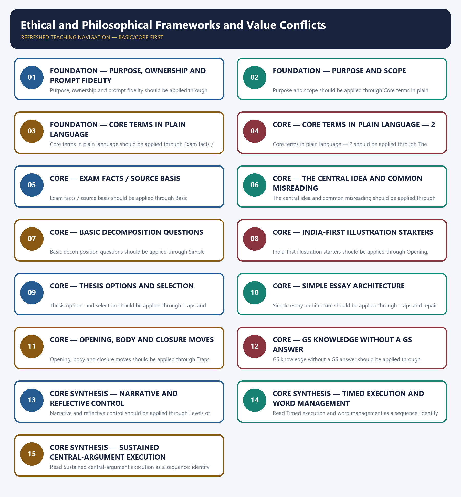

# Ethical and Philosophical Frameworks and Value Conflicts — Learner-v2 Complete Learning Session

> **Authoring-only generation:** 2026-09-06. No PDF was rendered and no tracker or index was mutated.

### SOURCE, PROGRESSION AND OFFICIAL-RULE AUDIT

- **Generation date:** 2026-09-06.
- **Source order:** canonical Basic owner first; Advanced owner second; Essay master framework, README, official-syllabus map, answer-worthiness audit and revision chart next; PYQ corpus and official OCR papers after that; live official UPSC pages only as a final check.
- **Basic/Advanced boundary:** complete Basic teaching remains first and Advanced material remains optional and last.
- **OCR boundary:** Repository Markdown was primary. OCR-searchable official UPSC Essay papers were supplementary only for printed instructions and V1 prompt wording. No author, official model answer, current marks split, phase allocation, paragraph count or scoring rubric was inferred.
- **Qdrant:** not used; repository Markdown and local official papers were sufficient.
- **PYQ integrity:** Three application cards use the repository's explicit V1/V2 status. No unavailable official model answer, marking rubric or attribution is invented.
- **Live-source boundary:** Live source check dated 2026-09-06: official UPSC routes were attempted and access-blocked; blocked pages support no new claim. UN, WHO and IPCC primary pages were separately checked for cross-theme factual boundaries.
- **No-formula rule:** strategy, heuristics and practice weights are never presented as official UPSC instructions or marking criteria.

### LIVE OFFICIAL-SOURCE ATTEMPT LOG

The checks below were made on 2026-09-06. Substantive official text is used only for the proposition it supports; title-only, blocked or thin pages are recorded and supply no factual claim.

- https://upsc.gov.in/examinations/previous-question-papers — attempted 2026-09-06; official page returned HTTP 403 to the live fetch, so it supports no new wording.
- https://upsc.gov.in/examinations/active-examinations — attempted 2026-09-06; official page returned HTTP 403 to the live fetch, so it supports no current-paper inference.
- https://upsc.gov.in/sites/default/files/Notif-CSP-2024-Engl-140224.pdf — searched 2026-09-06; retained only as an official scheme cross-check route, not as an Essay rubric.

## BASIC LEARNING SESSION



*Distinct embedded teaching-navigation image. The separate continuous Cārvāka-style flowchart package remains an independent at-a-glance artifact.*

### SESSION 1 — FOUNDATION — PURPOSE, OWNERSHIP AND PROMPT FIDELITY

#### DEFINITION / WHAT THIS IS CALLED

**Plain-language definition:** Objective practice: Apply Purpose, ownership and prompt fidelity by distinguishing the correct Essay-method move from nearby but invalid shortcuts; no factual-trivia recall is being tested.

**Technical definition:** Purpose, ownership and prompt fidelity should be applied through Purpose and scope and Core terms in plain language, while preserving the difference between official paper instruction and strategy, prompt wording and interpretation, example and evidence, breadth and coherence.

#### ANSWER-GRABBING OPENING — WRITE/ADAPT IN THE EXAM

> Plain-language definition: Purpose, ownership and prompt fidelity explains how Purpose and scope and Core terms in plain language combine into one usable Essay-planning move.

#### MUST-WRITE KEYWORDS

- **FOUNDATION**
- **Purpose**
- **ownership**
- **prompt fidelity**
- **Plain-language definition**
- **Technical definition**

**How to use them:** Frame the answer through FOUNDATION; define Purpose, connect ownership with prompt fidelity to explain the mechanism, and use Plain-language definition for the decisive comparison or qualification.

#### METHOD MOVE / WHAT THIS DOES

**Plain-language definition:** Purpose, ownership and prompt fidelity explains how Purpose and scope and Core terms in plain language combine into one usable Essay-planning move.

**Technical definition:** The learner fixes the printed prompt, its relationship or demand, the defensible scope, the argument function and the evidence boundary before drafting prose.

#### ANSWER-GRABBING OPENING — WRITE/ADAPT IN THE EXAM

> Purpose, ownership and prompt fidelity should be applied through Purpose and scope and Core terms in plain language, while preserving the difference between official paper instruction and strategy, prompt wording and interpretation, example and evidence, breadth and coherence.

#### MUST-WRITE KEYWORDS

- **Purpose**
- **ownership**
- **prompt**
- **fidelity**
- **scope**
- **Core**

**How to use them:** Define the first three terms, trace the relationship with the next two, and attach the final term to the exact claim, example and qualification. Qualification: Do not replace ethical reasoning without sloganised moral theory with a generic GS-style catalogue.

#### VISUAL FIRST

```text
PURPOSE, OWNERSHIP AND PROMPT FIDELITY
01. Purpose and scope
    |
    v
02. Core terms in plain language
STATUS / CATEGORY FIREWALL -> Do not replace ethical reasoning without sloganised moral theory with a generic GS-style catalogue.
```

*The rail fixes the prompt-to-argument sequence and claim boundary before explanation.*

#### CORE EXPLANATION

Several audited prompts compress a value conflict (accountability vs. autonomy, sufficiency vs. aspiration, restraint vs. intervention). This topic teaches how to name and resolve such conflicts as part of an essay argument — it does not reproduce the Ethics module's full theoretical apparatus (thinkers, schools, case studies), which remains that module's domain. precedence under a specified condition, with a stated reason — not an unqualified ranking.

#### SIMPLE SYSTEM EXAMPLE

Read Purpose, ownership and prompt fidelity as a sequence: identify Purpose and scope, follow the method through the printed proposition, and stop before adding a rule, attribution, fact or inference the audited sources do not support.

#### TECHNICAL DISTINCTION

The decisive boundary is Do not replace ethical reasoning without sloganised moral theory with a generic GS-style catalogue. This keeps Purpose and scope and Core terms in plain language in the correct prompt, method, argument and evidence category.

#### NAMED EVIDENCE AND MECHANISM

- Several audited prompts compress a value conflict (accountability vs. autonomy, sufficiency vs. aspiration, restraint vs. intervention). This topic teaches how to name and resolve such conflicts as part of an essay argument — it does not reproduce the Ethics module's full theoretical apparatus (thinkers, schools, case studies), which remains that module's domain.
- precedence under a specified condition, with a stated reason — not an unqualified ranking.

#### EXAMINER CAUTION

- Do not replace ethical reasoning without sloganised moral theory with a generic GS-style catalogue.

#### EXAM LINK

- **Objective practice:** Apply Purpose, ownership and prompt fidelity by distinguishing the correct Essay-method move from nearby but invalid shortcuts; no factual-trivia recall is being tested.
- **Essay application:** State the exact demand and the bounded writing decision.

#### MINI RECAP

- **Mechanism chain:** Purpose and scope -> Core terms in plain language
- **Qualified use:** State the exact demand and the bounded writing decision.

#### CLOSING RECALL FLOW — FOUNDATION — PURPOSE, OWNERSHIP AND PROMPT FIDELITY

```text
START / CONCEPT: FOUNDATION — Purpose, ownership and prompt fidelity
        |
        v
EXACT TERMS: FOUNDATION · Purpose · ownership · prompt fidelity · Plain-language definition · Technical definition
        |
        v
MECHANISM / ARGUMENT: Purpose, ownership and prompt fidelity should be applied through Purpose and scope and Core terms in plain language, while preserving the difference between official paper instruction and strategy, prompt wording and interpretation, example and evidence, breadth and coherence.
        |
        v
CONSEQUENCE / CONTRAST: Read Purpose, ownership and prompt fidelity as a sequence: identify Purpose and scope, follow the method through the printed proposition, and stop before adding a rule, attribution, fact or inference the audited sources do not support.
        |
        v
UPSC TRAP / ANSWER-USE: Objective practice: Apply Purpose, ownership and prompt fidelity by distinguishing the correct Essay-method move from nearby but invalid shortcuts; no factual-trivia recall is being tested.
        |
        v
ANSWER-GRABBING FORMULATION: Plain-language definition: Purpose, ownership and prompt fidelity explains how Purpose and scope and Core terms in plain language combine into one usable Essay-planning move.
```
### SESSION 2 — FOUNDATION — PURPOSE AND SCOPE

#### DEFINITION / WHAT THIS IS CALLED

**Plain-language definition:** Objective practice: Apply Purpose and scope by distinguishing the correct Essay-method move from nearby but invalid shortcuts; no factual-trivia recall is being tested.

**Technical definition:** Purpose and scope should be applied through Core terms in plain language — 2, while preserving the difference between official paper instruction and strategy, prompt wording and interpretation, example and evidence, breadth and coherence.

#### ANSWER-GRABBING OPENING — WRITE/ADAPT IN THE EXAM

> Plain-language definition: Purpose and scope explains how Core terms in plain language — 2 combine into one usable Essay-planning move.

#### MUST-WRITE KEYWORDS

- **FOUNDATION**
- **Purpose**
- **scope**
- **Plain-language definition**
- **Technical definition**
- **terms**

**How to use them:** Frame the answer through FOUNDATION; define Purpose, connect scope with Plain-language definition to explain the mechanism, and use Technical definition for the decisive comparison or qualification.

#### METHOD MOVE / WHAT THIS DOES

**Plain-language definition:** Purpose and scope explains how Core terms in plain language — 2 combine into one usable Essay-planning move.

**Technical definition:** The learner fixes the printed prompt, its relationship or demand, the defensible scope, the argument function and the evidence boundary before drafting prose.

#### ANSWER-GRABBING OPENING — WRITE/ADAPT IN THE EXAM

> Purpose and scope should be applied through Core terms in plain language — 2, while preserving the difference between official paper instruction and strategy, prompt wording and interpretation, example and evidence, breadth and coherence.

#### MUST-WRITE KEYWORDS

- **Purpose**
- **scope**
- **Core**
- **terms**
- **plain**
- **language**

**How to use them:** Define the first three terms, trace the relationship with the next two, and attach the final term to the exact claim, example and qualification. Qualification: Do not cross the ownership boundary: sector breadth and scale calibration belong to 11.

#### VISUAL FIRST

```text
PURPOSE AND SCOPE
01. Core terms in plain language — 2
STATUS / CATEGORY FIREWALL -> Do not cross the ownership boundary: sector breadth and scale calibration belong to 11.
```

*The rail fixes the prompt-to-argument sequence and claim boundary before explanation.*

#### CORE EXPLANATION

Use a category only when it clarifies the prompt's actual tension; this is an essay lens, not a licence to list theories.

#### SIMPLE SYSTEM EXAMPLE

Read Purpose and scope as a sequence: identify Core terms in plain language — 2, follow the method through the printed proposition, and stop before adding a rule, attribution, fact or inference the audited sources do not support.

#### TECHNICAL DISTINCTION

The decisive boundary is Do not cross the ownership boundary: sector breadth and scale calibration belong to 11. This keeps Core terms in plain language — 2 in the correct prompt, method, argument and evidence category.

#### NAMED EVIDENCE AND MECHANISM

- Use a category only when it clarifies the prompt's actual tension; this is an essay lens, not a licence to list theories.

#### EXAMINER CAUTION

- Do not cross the ownership boundary: sector breadth and scale calibration belong to 11.

#### EXAM LINK

- **Objective practice:** Apply Purpose and scope by distinguishing the correct Essay-method move from nearby but invalid shortcuts; no factual-trivia recall is being tested.
- **Essay application:** Define operative terms before expanding dimensions.

#### MINI RECAP

- **Mechanism chain:** Core terms in plain language — 2
- **Qualified use:** Define operative terms before expanding dimensions.

#### CLOSING RECALL FLOW — FOUNDATION — PURPOSE AND SCOPE

```text
START / CONCEPT: FOUNDATION — Purpose and scope
        |
        v
EXACT TERMS: FOUNDATION · Purpose · scope · Plain-language definition · Technical definition · terms
        |
        v
MECHANISM / ARGUMENT: Purpose and scope should be applied through Core terms in plain language — 2, while preserving the difference between official paper instruction and strategy, prompt wording and interpretation, example and evidence, breadth and coherence.
        |
        v
CONSEQUENCE / CONTRAST: Read Purpose and scope as a sequence: identify Core terms in plain language — 2, follow the method through the printed proposition, and stop before adding a rule, attribution, fact or inference the audited sources do not support.
        |
        v
UPSC TRAP / ANSWER-USE: Objective practice: Apply Purpose and scope by distinguishing the correct Essay-method move from nearby but invalid shortcuts; no factual-trivia recall is being tested.
        |
        v
ANSWER-GRABBING FORMULATION: Plain-language definition: Purpose and scope explains how Core terms in plain language — 2 combine into one usable Essay-planning move.
```
### SESSION 3 — FOUNDATION — CORE TERMS IN PLAIN LANGUAGE

#### DEFINITION / WHAT THIS IS CALLED

**Plain-language definition:** Objective practice: Apply Core terms in plain language by distinguishing the correct Essay-method move from nearby but invalid shortcuts; no factual-trivia recall is being tested.

**Technical definition:** Core terms in plain language should be applied through Exam facts / source basis, while preserving the difference between official paper instruction and strategy, prompt wording and interpretation, example and evidence, breadth and coherence.

#### ANSWER-GRABBING OPENING — WRITE/ADAPT IN THE EXAM

> Plain-language definition: Core terms in plain language explains how Exam facts / source basis combine into one usable Essay-planning move.

#### MUST-WRITE KEYWORDS

- **FOUNDATION**
- **Core terms in plain language**
- **Plain-language definition**
- **Technical definition**
- **terms**
- **plain**

**How to use them:** Frame the answer through FOUNDATION; define Core terms in plain language, connect Plain-language definition with Technical definition to explain the mechanism, and use terms for the decisive comparison or qualification.

#### METHOD MOVE / WHAT THIS DOES

**Plain-language definition:** Core terms in plain language explains how Exam facts / source basis combine into one usable Essay-planning move.

**Technical definition:** The learner fixes the printed prompt, its relationship or demand, the defensible scope, the argument function and the evidence boundary before drafting prose.

#### ANSWER-GRABBING OPENING — WRITE/ADAPT IN THE EXAM

> Core terms in plain language should be applied through Exam facts / source basis, while preserving the difference between official paper instruction and strategy, prompt wording and interpretation, example and evidence, breadth and coherence.

#### MUST-WRITE KEYWORDS

- **Core**
- **terms**
- **plain**
- **language**
- **Exam**
- **facts**

**How to use them:** Define the first three terms, trace the relationship with the next two, and attach the final term to the exact claim, example and qualification. Qualification: Do not use an example without explaining its argumentative function.

#### VISUAL FIRST

```text
CORE TERMS IN PLAIN LANGUAGE
01. Exam facts / source basis
STATUS / CATEGORY FIREWALL -> Do not use an example without explaining its argumentative function.
```

*The rail fixes the prompt-to-argument sequence and claim boundary before explanation.*

#### CORE EXPLANATION

(power vs. character/accountability), 2025-B8 (contentment vs. luxury/aspiration), 2025-B5 (restraint vs. intervention) — see ../README.md for exact wording.

#### SIMPLE SYSTEM EXAMPLE

Read Core terms in plain language as a sequence: identify Exam facts / source basis, follow the method through the printed proposition, and stop before adding a rule, attribution, fact or inference the audited sources do not support.

#### TECHNICAL DISTINCTION

The decisive boundary is Do not use an example without explaining its argumentative function. This keeps Exam facts / source basis in the correct prompt, method, argument and evidence category.

#### NAMED EVIDENCE AND MECHANISM

- (power vs. character/accountability), 2025-B8 (contentment vs. luxury/aspiration), 2025-B5 (restraint vs. intervention) — see ../README.md for exact wording.

#### EXAMINER CAUTION

- Do not use an example without explaining its argumentative function.

#### EXAM LINK

- **Objective practice:** Apply Core terms in plain language by distinguishing the correct Essay-method move from nearby but invalid shortcuts; no factual-trivia recall is being tested.
- **Essay application:** Build one qualified thesis and keep it visible.

#### MINI RECAP

- **Mechanism chain:** Exam facts / source basis
- **Qualified use:** Build one qualified thesis and keep it visible.

#### CLOSING RECALL FLOW — FOUNDATION — CORE TERMS IN PLAIN LANGUAGE

```text
START / CONCEPT: FOUNDATION — Core terms in plain language
        |
        v
EXACT TERMS: FOUNDATION · Core terms in plain language · Plain-language definition · Technical definition · terms · plain
        |
        v
MECHANISM / ARGUMENT: Core terms in plain language should be applied through Exam facts / source basis, while preserving the difference between official paper instruction and strategy, prompt wording and interpretation, example and evidence, breadth and coherence.
        |
        v
CONSEQUENCE / CONTRAST: Read Core terms in plain language as a sequence: identify Exam facts / source basis, follow the method through the printed proposition, and stop before adding a rule, attribution, fact or inference the audited sources do not support.
        |
        v
UPSC TRAP / ANSWER-USE: Objective practice: Apply Core terms in plain language by distinguishing the correct Essay-method move from nearby but invalid shortcuts; no factual-trivia recall is being tested.
        |
        v
ANSWER-GRABBING FORMULATION: Plain-language definition: Core terms in plain language explains how Exam facts / source basis combine into one usable Essay-planning move.
```
### SESSION 4 — CORE — CORE TERMS IN PLAIN LANGUAGE — 2

#### DEFINITION / WHAT THIS IS CALLED

**Plain-language definition:** Objective practice: Apply Core terms in plain language — 2 by distinguishing the correct Essay-method move from nearby but invalid shortcuts; no factual-trivia recall is being tested.

**Technical definition:** Core terms in plain language — 2 should be applied through The central idea and common misreading, while preserving the difference between official paper instruction and strategy, prompt wording and interpretation, example and evidence, breadth and coherence.

#### ANSWER-GRABBING OPENING — WRITE/ADAPT IN THE EXAM

> Plain-language definition: Core terms in plain language — 2 explains how The central idea and common misreading combine into one usable Essay-planning move.

#### MUST-WRITE KEYWORDS

- **Core terms in plain language**
- **Plain-language definition**
- **Technical definition**
- **terms**
- **plain**
- **language**

**How to use them:** Frame the answer through Core terms in plain language; define Plain-language definition, connect Technical definition with terms to explain the mechanism, and use plain for the decisive comparison or qualification.

#### METHOD MOVE / WHAT THIS DOES

**Plain-language definition:** Core terms in plain language — 2 explains how The central idea and common misreading combine into one usable Essay-planning move.

**Technical definition:** The learner fixes the printed prompt, its relationship or demand, the defensible scope, the argument function and the evidence boundary before drafting prose.

#### ANSWER-GRABBING OPENING — WRITE/ADAPT IN THE EXAM

> Core terms in plain language — 2 should be applied through The central idea and common misreading, while preserving the difference between official paper instruction and strategy, prompt wording and interpretation, example and evidence, breadth and coherence.

#### MUST-WRITE KEYWORDS

- **Core**
- **terms**
- **plain**
- **language**
- **central**
- **idea**

**How to use them:** Define the first three terms, trace the relationship with the next two, and attach the final term to the exact claim, example and qualification. Qualification: Do not treat a pedagogical scaffold as an official UPSC marking rule.

#### VISUAL FIRST

```text
CORE TERMS IN PLAIN LANGUAGE — 2
01. The central idea and common misreading
STATUS / CATEGORY FIREWALL -> Do not treat a pedagogical scaffold as an official UPSC marking rule.
```

*The rail fixes the prompt-to-argument sequence and claim boundary before explanation.*

#### CORE EXPLANATION

Central idea: name the values in genuine tension explicitly, then state a reasoned, conditional priority — this is more persuasive than either ignoring the conflict or asserting one value is simply "right." Common misreading: dropping a philosopher's name (e.g. "as [thinker] said") as decoration without actually using their reasoning to do analytical work — this reads as ornamental rather than substantive.

#### SIMPLE SYSTEM EXAMPLE

Read Core terms in plain language — 2 as a sequence: identify The central idea and common misreading, follow the method through the printed proposition, and stop before adding a rule, attribution, fact or inference the audited sources do not support.

#### TECHNICAL DISTINCTION

The decisive boundary is Do not treat a pedagogical scaffold as an official UPSC marking rule. This keeps The central idea and common misreading in the correct prompt, method, argument and evidence category.

#### NAMED EVIDENCE AND MECHANISM

- Central idea: name the values in genuine tension explicitly, then state a reasoned, conditional priority — this is more persuasive than either ignoring the conflict or asserting one value is simply "right." Common misreading: dropping a philosopher's name (e.g. "as [thinker] said") as decoration without actually using their reasoning to do analytical work — this reads as ornamental rather than substantive.

#### EXAMINER CAUTION

- Do not treat a pedagogical scaffold as an official UPSC marking rule.

#### EXAM LINK

- **Objective practice:** Apply Core terms in plain language — 2 by distinguishing the correct Essay-method move from nearby but invalid shortcuts; no factual-trivia recall is being tested.
- **Essay application:** Give every paragraph one argumentative job.

#### MINI RECAP

- **Mechanism chain:** The central idea and common misreading
- **Qualified use:** Give every paragraph one argumentative job.

#### CLOSING RECALL FLOW — CORE — CORE TERMS IN PLAIN LANGUAGE — 2

```text
START / CONCEPT: CORE — Core terms in plain language — 2
        |
        v
EXACT TERMS: Core terms in plain language · Plain-language definition · Technical definition · terms · plain · language
        |
        v
MECHANISM / ARGUMENT: Core terms in plain language — 2 should be applied through The central idea and common misreading, while preserving the difference between official paper instruction and strategy, prompt wording and interpretation, example and evidence, breadth and coherence.
        |
        v
CONSEQUENCE / CONTRAST: Objective practice: Apply Core terms in plain language — 2 by distinguishing the correct Essay-method move from nearby but invalid shortcuts; no factual-trivia recall is being tested.
        |
        v
UPSC TRAP / ANSWER-USE: Read Core terms in plain language — 2 as a sequence: identify The central idea and common misreading, follow the method through the printed proposition, and stop before adding a rule, attribution, fact or inference the audited sources do not support.
        |
        v
ANSWER-GRABBING FORMULATION: Plain-language definition: Core terms in plain language — 2 explains how The central idea and common misreading combine into one usable Essay-planning move.
```
### SESSION 5 — CORE — EXAM FACTS / SOURCE BASIS

#### DEFINITION / WHAT THIS IS CALLED

**Plain-language definition:** Objective practice: Apply Exam facts / source basis by distinguishing the correct Essay-method move from nearby but invalid shortcuts; no factual-trivia recall is being tested.

**Technical definition:** Exam facts / source basis should be applied through Basic decomposition questions, while preserving the difference between official paper instruction and strategy, prompt wording and interpretation, example and evidence, breadth and coherence.

#### ANSWER-GRABBING OPENING — WRITE/ADAPT IN THE EXAM

> Plain-language definition: Exam facts / source basis explains how Basic decomposition questions combine into one usable Essay-planning move.

#### MUST-WRITE KEYWORDS

- **Exam facts / source basis**
- **Plain-language definition**
- **Technical definition**
- **Exam**
- **s**
- **basis**

**How to use them:** Frame the answer through Exam facts / source basis; define Plain-language definition, connect Technical definition with Exam to explain the mechanism, and use s for the decisive comparison or qualification.

#### METHOD MOVE / WHAT THIS DOES

**Plain-language definition:** Exam facts / source basis explains how Basic decomposition questions combine into one usable Essay-planning move.

**Technical definition:** The learner fixes the printed prompt, its relationship or demand, the defensible scope, the argument function and the evidence boundary before drafting prose.

#### ANSWER-GRABBING OPENING — WRITE/ADAPT IN THE EXAM

> Exam facts / source basis should be applied through Basic decomposition questions, while preserving the difference between official paper instruction and strategy, prompt wording and interpretation, example and evidence, breadth and coherence.

#### MUST-WRITE KEYWORDS

- **Exam**
- **facts**
- **basis**
- **Basic**
- **decomposition**
- **questions**

**How to use them:** Define the first three terms, trace the relationship with the next two, and attach the final term to the exact claim, example and qualification. Qualification: Do not let a counter-view replace the thesis; use it to qualify the thesis.

#### VISUAL FIRST

```text
EXAM FACTS / SOURCE BASIS
01. Basic decomposition questions
STATUS / CATEGORY FIREWALL -> Do not let a counter-view replace the thesis; use it to qualify the thesis.
```

*The rail fixes the prompt-to-argument sequence and claim boundary before explanation.*

#### CORE EXPLANATION

1. What two values does this prompt place in tension? 2. Is there a scale or context where one value should generally take priority, and why? 3. Is there a scale or context where the other value should prevail instead? 4. Can I state my reasoned priority in one sentence, with its condition attached? 5. Does my resolution avoid treating either value as simply wrong? 6. Voiceless-stakeholder test: whose interests are not represented in the immediate choice — future generations, an excluded group, or a non-human system — and would the priority change if its cost were counted?

#### SIMPLE SYSTEM EXAMPLE

Read Exam facts / source basis as a sequence: identify Basic decomposition questions, follow the method through the printed proposition, and stop before adding a rule, attribution, fact or inference the audited sources do not support.

#### TECHNICAL DISTINCTION

The decisive boundary is Do not let a counter-view replace the thesis; use it to qualify the thesis. This keeps Basic decomposition questions in the correct prompt, method, argument and evidence category.

#### NAMED EVIDENCE AND MECHANISM

- 1. What two values does this prompt place in tension? 2. Is there a scale or context where one value should generally take priority, and why? 3. Is there a scale or context where the other value should prevail instead? 4. Can I state my reasoned priority in one sentence, with its condition attached? 5. Does my resolution avoid treating either value as simply wrong? 6. Voiceless-stakeholder test: whose interests are not represented in the immediate choice — future generations, an excluded group, or a non-human system — and would the priority change if its cost were counted?

#### EXAMINER CAUTION

- Do not let a counter-view replace the thesis; use it to qualify the thesis.

#### EXAM LINK

- **Objective practice:** Apply Exam facts / source basis by distinguishing the correct Essay-method move from nearby but invalid shortcuts; no factual-trivia recall is being tested.
- **Essay application:** Join a named illustration to its mechanism.

#### MINI RECAP

- **Mechanism chain:** Basic decomposition questions
- **Qualified use:** Join a named illustration to its mechanism.

#### CLOSING RECALL FLOW — CORE — EXAM FACTS / SOURCE BASIS

```text
START / CONCEPT: CORE — Exam facts / source basis
        |
        v
EXACT TERMS: Exam facts / source basis · Plain-language definition · Technical definition · Exam · s · basis
        |
        v
MECHANISM / ARGUMENT: Exam facts / source basis should be applied through Basic decomposition questions, while preserving the difference between official paper instruction and strategy, prompt wording and interpretation, example and evidence, breadth and coherence.
        |
        v
CONSEQUENCE / CONTRAST: Read Exam facts / source basis as a sequence: identify Basic decomposition questions, follow the method through the printed proposition, and stop before adding a rule, attribution, fact or inference the audited sources do not support.
        |
        v
UPSC TRAP / ANSWER-USE: Objective practice: Apply Exam facts / source basis by distinguishing the correct Essay-method move from nearby but invalid shortcuts; no factual-trivia recall is being tested.
        |
        v
ANSWER-GRABBING FORMULATION: Plain-language definition: Exam facts / source basis explains how Basic decomposition questions combine into one usable Essay-planning move.
```
### SESSION 6 — CORE — THE CENTRAL IDEA AND COMMON MISREADING

#### DEFINITION / WHAT THIS IS CALLED

**Plain-language definition:** Objective practice: Apply The central idea and common misreading by distinguishing the correct Essay-method move from nearby but invalid shortcuts; no factual-trivia recall is being tested.

**Technical definition:** The central idea and common misreading should be applied through India-first illustration starters and Thesis options and selection, while preserving the difference between official paper instruction and strategy, prompt wording and interpretation, example and evidence, breadth and coherence.

#### ANSWER-GRABBING OPENING — WRITE/ADAPT IN THE EXAM

> Plain-language definition: The central idea and common misreading explains how India-first illustration starters and Thesis options and selection combine into one usable Essay-planning move.

#### MUST-WRITE KEYWORDS

- **The central idea**
- **common misreading**
- **Plain-language definition**
- **Technical definition**
- **central**
- **idea**

**How to use them:** Frame the answer through The central idea; define common misreading, connect Plain-language definition with Technical definition to explain the mechanism, and use central for the decisive comparison or qualification.

#### METHOD MOVE / WHAT THIS DOES

**Plain-language definition:** The central idea and common misreading explains how India-first illustration starters and Thesis options and selection combine into one usable Essay-planning move.

**Technical definition:** The learner fixes the printed prompt, its relationship or demand, the defensible scope, the argument function and the evidence boundary before drafting prose.

#### ANSWER-GRABBING OPENING — WRITE/ADAPT IN THE EXAM

> The central idea and common misreading should be applied through India-first illustration starters and Thesis options and selection, while preserving the difference between official paper instruction and strategy, prompt wording and interpretation, example and evidence, breadth and coherence.

#### MUST-WRITE KEYWORDS

- **central**
- **idea**
- **common**
- **misreading**
- **India-first**
- **illustration**

**How to use them:** Define the first three terms, trace the relationship with the next two, and attach the final term to the exact claim, example and qualification. Qualification: Do not use an unverified quotation, statistic, attribution or anecdote.

#### VISUAL FIRST

```text
THE CENTRAL IDEA AND COMMON MISREADING
01. India-first illustration starters
    |
    v
02. Thesis options and selection
STATUS / CATEGORY FIREWALL -> Do not use an unverified quotation, statistic, attribution or anecdote.
```

*The rail fixes the prompt-to-argument sequence and claim boundary before explanation.*

#### CORE EXPLANATION

Recall one Indian illustration per value-conflict resolution — e.g. a documented instance of institutional accountability constraining discretionary power, or a documented public debate on consumption and sufficiency. Full discipline: 12. A thesis built on a reasoned, conditional priority (Section 6) is usually stronger than one that treats the conflict as fully resolved in one direction — see 05 for converting this into a full thesis sentence.

#### SIMPLE SYSTEM EXAMPLE

Read The central idea and common misreading as a sequence: identify India-first illustration starters, follow the method through the printed proposition, and stop before adding a rule, attribution, fact or inference the audited sources do not support.

#### TECHNICAL DISTINCTION

The decisive boundary is Do not use an unverified quotation, statistic, attribution or anecdote. This keeps India-first illustration starters and Thesis options and selection in the correct prompt, method, argument and evidence category.

#### NAMED EVIDENCE AND MECHANISM

- Recall one Indian illustration per value-conflict resolution — e.g. a documented instance of institutional accountability constraining discretionary power, or a documented public debate on consumption and sufficiency. Full discipline: 12.
- A thesis built on a reasoned, conditional priority (Section 6) is usually stronger than one that treats the conflict as fully resolved in one direction — see 05 for converting this into a full thesis sentence.

#### EXAMINER CAUTION

- Do not use an unverified quotation, statistic, attribution or anecdote.

#### EXAM LINK

- **Objective practice:** Apply The central idea and common misreading by distinguishing the correct Essay-method move from nearby but invalid shortcuts; no factual-trivia recall is being tested.
- **Essay application:** Use a counter-case to refine, not derail, the thesis.

#### MINI RECAP

- **Mechanism chain:** India-first illustration starters -> Thesis options and selection
- **Qualified use:** Use a counter-case to refine, not derail, the thesis.

#### CLOSING RECALL FLOW — CORE — THE CENTRAL IDEA AND COMMON MISREADING

```text
START / CONCEPT: CORE — The central idea and common misreading
        |
        v
EXACT TERMS: The central idea · common misreading · Plain-language definition · Technical definition · central · idea
        |
        v
MECHANISM / ARGUMENT: The central idea and common misreading should be applied through India-first illustration starters and Thesis options and selection, while preserving the difference between official paper instruction and strategy, prompt wording and interpretation, example and evidence, breadth and coherence.
        |
        v
CONSEQUENCE / CONTRAST: Read The central idea and common misreading as a sequence: identify India-first illustration starters, follow the method through the printed proposition, and stop before adding a rule, attribution, fact or inference the audited sources do not support.
        |
        v
UPSC TRAP / ANSWER-USE: Objective practice: Apply The central idea and common misreading by distinguishing the correct Essay-method move from nearby but invalid shortcuts; no factual-trivia recall is being tested.
        |
        v
ANSWER-GRABBING FORMULATION: Plain-language definition: The central idea and common misreading explains how India-first illustration starters and Thesis options and selection combine into one usable Essay-planning move.
```
### SESSION 7 — CORE — BASIC DECOMPOSITION QUESTIONS

#### DEFINITION / WHAT THIS IS CALLED

**Plain-language definition:** Objective practice: Apply Basic decomposition questions by distinguishing the correct Essay-method move from nearby but invalid shortcuts; no factual-trivia recall is being tested.

**Technical definition:** Basic decomposition questions should be applied through Simple essay architecture, while preserving the difference between official paper instruction and strategy, prompt wording and interpretation, example and evidence, breadth and coherence.

#### ANSWER-GRABBING OPENING — WRITE/ADAPT IN THE EXAM

> Plain-language definition: Basic decomposition questions explains how Simple essay architecture combine into one usable Essay-planning move.

#### MUST-WRITE KEYWORDS

- **Basic decomposition questions**
- **Plain-language definition**
- **Technical definition**
- **Basic**
- **decomposition**
- **questions**

**How to use them:** Frame the answer through Basic decomposition questions; define Plain-language definition, connect Technical definition with Basic to explain the mechanism, and use decomposition for the decisive comparison or qualification.

#### METHOD MOVE / WHAT THIS DOES

**Plain-language definition:** Basic decomposition questions explains how Simple essay architecture combine into one usable Essay-planning move.

**Technical definition:** The learner fixes the printed prompt, its relationship or demand, the defensible scope, the argument function and the evidence boundary before drafting prose.

#### ANSWER-GRABBING OPENING — WRITE/ADAPT IN THE EXAM

> Basic decomposition questions should be applied through Simple essay architecture, while preserving the difference between official paper instruction and strategy, prompt wording and interpretation, example and evidence, breadth and coherence.

#### MUST-WRITE KEYWORDS

- **Basic**
- **decomposition**
- **questions**
- **Simple**
- **architecture**
- **Dedicate**

**How to use them:** Define the first three terms, trace the relationship with the next two, and attach the final term to the exact claim, example and qualification. Qualification: Do not multiply dimensions that repeat the same claim in new vocabulary.

#### VISUAL FIRST

```text
BASIC DECOMPOSITION QUESTIONS
01. Simple essay architecture
STATUS / CATEGORY FIREWALL -> Do not multiply dimensions that repeat the same claim in new vocabulary.
```

*The rail fixes the prompt-to-argument sequence and claim boundary before explanation.*

#### CORE EXPLANATION

Dedicate one paragraph to naming the conflict, one or two to developing each value's legitimate claim, and one to the reasoned priority/synthesis — see 07 for exact sequencing within the wider essay.

#### SIMPLE SYSTEM EXAMPLE

Read Basic decomposition questions as a sequence: identify Simple essay architecture, follow the method through the printed proposition, and stop before adding a rule, attribution, fact or inference the audited sources do not support.

#### TECHNICAL DISTINCTION

The decisive boundary is Do not multiply dimensions that repeat the same claim in new vocabulary. This keeps Simple essay architecture in the correct prompt, method, argument and evidence category.

#### NAMED EVIDENCE AND MECHANISM

- Dedicate one paragraph to naming the conflict, one or two to developing each value's legitimate claim, and one to the reasoned priority/synthesis — see 07 for exact sequencing within the wider essay.

#### EXAMINER CAUTION

- Do not multiply dimensions that repeat the same claim in new vocabulary.

#### EXAM LINK

- **Objective practice:** Apply Basic decomposition questions by distinguishing the correct Essay-method move from nearby but invalid shortcuts; no factual-trivia recall is being tested.
- **Essay application:** Sequence paragraphs through explicit logical bridges.

#### MINI RECAP

- **Mechanism chain:** Simple essay architecture
- **Qualified use:** Sequence paragraphs through explicit logical bridges.

#### CLOSING RECALL FLOW — CORE — BASIC DECOMPOSITION QUESTIONS

```text
START / CONCEPT: CORE — Basic decomposition questions
        |
        v
EXACT TERMS: Basic decomposition questions · Plain-language definition · Technical definition · Basic · decomposition · questions
        |
        v
MECHANISM / ARGUMENT: Basic decomposition questions should be applied through Simple essay architecture, while preserving the difference between official paper instruction and strategy, prompt wording and interpretation, example and evidence, breadth and coherence.
        |
        v
CONSEQUENCE / CONTRAST: Read Basic decomposition questions as a sequence: identify Simple essay architecture, follow the method through the printed proposition, and stop before adding a rule, attribution, fact or inference the audited sources do not support.
        |
        v
UPSC TRAP / ANSWER-USE: Objective practice: Apply Basic decomposition questions by distinguishing the correct Essay-method move from nearby but invalid shortcuts; no factual-trivia recall is being tested.
        |
        v
ANSWER-GRABBING FORMULATION: Plain-language definition: Basic decomposition questions explains how Simple essay architecture combine into one usable Essay-planning move.
```
### SESSION 8 — CORE — INDIA-FIRST ILLUSTRATION STARTERS

#### DEFINITION / WHAT THIS IS CALLED

**Plain-language definition:** Objective practice: Apply India-first illustration starters by distinguishing the correct Essay-method move from nearby but invalid shortcuts; no factual-trivia recall is being tested.

**Technical definition:** India-first illustration starters should be applied through Opening, body and closure moves, while preserving the difference between official paper instruction and strategy, prompt wording and interpretation, example and evidence, breadth and coherence.

#### ANSWER-GRABBING OPENING — WRITE/ADAPT IN THE EXAM

> Plain-language definition: India-first illustration starters explains how Opening, body and closure moves combine into one usable Essay-planning move.

#### MUST-WRITE KEYWORDS

- **India-first illustration starters**
- **Plain-language definition**
- **Technical definition**
- **India-first**
- **illustration**
- **starters**

**How to use them:** Frame the answer through India-first illustration starters; define Plain-language definition, connect Technical definition with India-first to explain the mechanism, and use illustration for the decisive comparison or qualification.

#### METHOD MOVE / WHAT THIS DOES

**Plain-language definition:** India-first illustration starters explains how Opening, body and closure moves combine into one usable Essay-planning move.

**Technical definition:** The learner fixes the printed prompt, its relationship or demand, the defensible scope, the argument function and the evidence boundary before drafting prose.

#### ANSWER-GRABBING OPENING — WRITE/ADAPT IN THE EXAM

> India-first illustration starters should be applied through Opening, body and closure moves, while preserving the difference between official paper instruction and strategy, prompt wording and interpretation, example and evidence, breadth and coherence.

#### MUST-WRITE KEYWORDS

- **India-first**
- **illustration**
- **starters**
- **Opening**
- **body**
- **closure**

**How to use them:** Define the first three terms, trace the relationship with the next two, and attach the final term to the exact claim, example and qualification. Qualification: Do not end with aspiration unsupported by the preceding argument.

#### VISUAL FIRST

```text
INDIA-FIRST ILLUSTRATION STARTERS
01. Opening, body and closure moves
STATUS / CATEGORY FIREWALL -> Do not end with aspiration unsupported by the preceding argument.
```

*The rail fixes the prompt-to-argument sequence and claim boundary before explanation.*

#### CORE EXPLANATION

Avoid opening or closing with a bare philosopher's name; instead state the value conflict in plain language, and let any thinker's reasoning (used sparingly, only where genuinely apt) support a specific paragraph's claim rather than serve as decoration.

#### SIMPLE SYSTEM EXAMPLE

Read India-first illustration starters as a sequence: identify Opening, body and closure moves, follow the method through the printed proposition, and stop before adding a rule, attribution, fact or inference the audited sources do not support.

#### TECHNICAL DISTINCTION

The decisive boundary is Do not end with aspiration unsupported by the preceding argument. This keeps Opening, body and closure moves in the correct prompt, method, argument and evidence category.

#### NAMED EVIDENCE AND MECHANISM

- Avoid opening or closing with a bare philosopher's name; instead state the value conflict in plain language, and let any thinker's reasoning (used sparingly, only where genuinely apt) support a specific paragraph's claim rather than serve as decoration.

#### EXAMINER CAUTION

- Do not end with aspiration unsupported by the preceding argument.

#### EXAM LINK

- **Objective practice:** Apply India-first illustration starters by distinguishing the correct Essay-method move from nearby but invalid shortcuts; no factual-trivia recall is being tested.
- **Essay application:** Move across actor, scale and time only when the claim changes.

#### MINI RECAP

- **Mechanism chain:** Opening, body and closure moves
- **Qualified use:** Move across actor, scale and time only when the claim changes.

#### CLOSING RECALL FLOW — CORE — INDIA-FIRST ILLUSTRATION STARTERS

```text
START / CONCEPT: CORE — India-first illustration starters
        |
        v
EXACT TERMS: India-first illustration starters · Plain-language definition · Technical definition · India-first · illustration · starters
        |
        v
MECHANISM / ARGUMENT: India-first illustration starters should be applied through Opening, body and closure moves, while preserving the difference between official paper instruction and strategy, prompt wording and interpretation, example and evidence, breadth and coherence.
        |
        v
CONSEQUENCE / CONTRAST: Read India-first illustration starters as a sequence: identify Opening, body and closure moves, follow the method through the printed proposition, and stop before adding a rule, attribution, fact or inference the audited sources do not support.
        |
        v
UPSC TRAP / ANSWER-USE: Objective practice: Apply India-first illustration starters by distinguishing the correct Essay-method move from nearby but invalid shortcuts; no factual-trivia recall is being tested.
        |
        v
ANSWER-GRABBING FORMULATION: Plain-language definition: India-first illustration starters explains how Opening, body and closure moves combine into one usable Essay-planning move.
```
### SESSION 9 — CORE — THESIS OPTIONS AND SELECTION

#### DEFINITION / WHAT THIS IS CALLED

**Plain-language definition:** Objective practice: Apply Thesis options and selection by distinguishing the correct Essay-method move from nearby but invalid shortcuts; no factual-trivia recall is being tested.

**Technical definition:** Thesis options and selection should be applied through Traps and repair moves, while preserving the difference between official paper instruction and strategy, prompt wording and interpretation, example and evidence, breadth and coherence.

#### ANSWER-GRABBING OPENING — WRITE/ADAPT IN THE EXAM

> Plain-language definition: Thesis options and selection explains how Traps and repair moves combine into one usable Essay-planning move.

#### MUST-WRITE KEYWORDS

- **Thesis options**
- **selection**
- **Plain-language definition**
- **Technical definition**
- **Thesis**
- **options**

**How to use them:** Frame the answer through Thesis options; define selection, connect Plain-language definition with Technical definition to explain the mechanism, and use Thesis for the decisive comparison or qualification.

#### METHOD MOVE / WHAT THIS DOES

**Plain-language definition:** Thesis options and selection explains how Traps and repair moves combine into one usable Essay-planning move.

**Technical definition:** The learner fixes the printed prompt, its relationship or demand, the defensible scope, the argument function and the evidence boundary before drafting prose.

#### ANSWER-GRABBING OPENING — WRITE/ADAPT IN THE EXAM

> Thesis options and selection should be applied through Traps and repair moves, while preserving the difference between official paper instruction and strategy, prompt wording and interpretation, example and evidence, breadth and coherence.

#### MUST-WRITE KEYWORDS

- **Thesis**
- **options**
- **selection**
- **Traps**
- **repair**
- **moves**

**How to use them:** Define the first three terms, trace the relationship with the next two, and attach the final term to the exact claim, example and qualification. Qualification: Do not sacrifice the second essay's time budget to perfect the first.

#### VISUAL FIRST

```text
THESIS OPTIONS AND SELECTION
01. Traps and repair moves
STATUS / CATEGORY FIREWALL -> Do not sacrifice the second essay's time budget to perfect the first.
```

*The rail fixes the prompt-to-argument sequence and claim boundary before explanation.*

#### CORE EXPLANATION

Repair: either explain the specific mechanism/reasoning briefly, or drop the name and state the point in plain language.

#### SIMPLE SYSTEM EXAMPLE

Read Thesis options and selection as a sequence: identify Traps and repair moves, follow the method through the printed proposition, and stop before adding a rule, attribution, fact or inference the audited sources do not support.

#### TECHNICAL DISTINCTION

The decisive boundary is Do not sacrifice the second essay's time budget to perfect the first. This keeps Traps and repair moves in the correct prompt, method, argument and evidence category.

#### NAMED EVIDENCE AND MECHANISM

- Repair: either explain the specific mechanism/reasoning briefly, or drop the name and state the point in plain language.

#### EXAMINER CAUTION

- Do not sacrifice the second essay's time budget to perfect the first.

#### EXAM LINK

- **Objective practice:** Apply Thesis options and selection by distinguishing the correct Essay-method move from nearby but invalid shortcuts; no factual-trivia recall is being tested.
- **Essay application:** Use ethical nuance without moralising.

#### MINI RECAP

- **Mechanism chain:** Traps and repair moves
- **Qualified use:** Use ethical nuance without moralising.

#### CLOSING RECALL FLOW — CORE — THESIS OPTIONS AND SELECTION

```text
START / CONCEPT: CORE — Thesis options and selection
        |
        v
EXACT TERMS: Thesis options · selection · Plain-language definition · Technical definition · Thesis · options
        |
        v
MECHANISM / ARGUMENT: Thesis options and selection should be applied through Traps and repair moves, while preserving the difference between official paper instruction and strategy, prompt wording and interpretation, example and evidence, breadth and coherence.
        |
        v
CONSEQUENCE / CONTRAST: Read Thesis options and selection as a sequence: identify Traps and repair moves, follow the method through the printed proposition, and stop before adding a rule, attribution, fact or inference the audited sources do not support.
        |
        v
UPSC TRAP / ANSWER-USE: Objective practice: Apply Thesis options and selection by distinguishing the correct Essay-method move from nearby but invalid shortcuts; no factual-trivia recall is being tested.
        |
        v
ANSWER-GRABBING FORMULATION: Plain-language definition: Thesis options and selection explains how Traps and repair moves combine into one usable Essay-planning move.
```
### SESSION 10 — CORE — SIMPLE ESSAY ARCHITECTURE

#### DEFINITION / WHAT THIS IS CALLED

**Plain-language definition:** Objective practice: Apply Simple essay architecture by distinguishing the correct Essay-method move from nearby but invalid shortcuts; no factual-trivia recall is being tested.

**Technical definition:** Simple essay architecture should be applied through Traps and repair moves — 2, while preserving the difference between official paper instruction and strategy, prompt wording and interpretation, example and evidence, breadth and coherence.

#### ANSWER-GRABBING OPENING — WRITE/ADAPT IN THE EXAM

> Plain-language definition: Simple essay architecture explains how Traps and repair moves — 2 combine into one usable Essay-planning move.

#### MUST-WRITE KEYWORDS

- **Simple essay architecture**
- **Plain-language definition**
- **Technical definition**
- **Simple**
- **architecture**
- **Traps**

**How to use them:** Frame the answer through Simple essay architecture; define Plain-language definition, connect Technical definition with Simple to explain the mechanism, and use architecture for the decisive comparison or qualification.

#### METHOD MOVE / WHAT THIS DOES

**Plain-language definition:** Simple essay architecture explains how Traps and repair moves — 2 combine into one usable Essay-planning move.

**Technical definition:** The learner fixes the printed prompt, its relationship or demand, the defensible scope, the argument function and the evidence boundary before drafting prose.

#### ANSWER-GRABBING OPENING — WRITE/ADAPT IN THE EXAM

> Simple essay architecture should be applied through Traps and repair moves — 2, while preserving the difference between official paper instruction and strategy, prompt wording and interpretation, example and evidence, breadth and coherence.

#### MUST-WRITE KEYWORDS

- **Simple**
- **architecture**
- **Traps**
- **repair**
- **moves**
- **required**

**How to use them:** Define the first three terms, trace the relationship with the next two, and attach the final term to the exact claim, example and qualification. Qualification: Do not mistake novelty of phrasing for originality of thought.

#### VISUAL FIRST

```text
SIMPLE ESSAY ARCHITECTURE
01. Traps and repair moves — 2
STATUS / CATEGORY FIREWALL -> Do not mistake novelty of phrasing for originality of thought.
```

*The rail fixes the prompt-to-argument sequence and claim boundary before explanation.*

#### CORE EXPLANATION

required content. → Repair: use only what the argument needs; for deeper theory, point to the Ethics module rather than reproducing it.

#### SIMPLE SYSTEM EXAMPLE

Read Simple essay architecture as a sequence: identify Traps and repair moves — 2, follow the method through the printed proposition, and stop before adding a rule, attribution, fact or inference the audited sources do not support.

#### TECHNICAL DISTINCTION

The decisive boundary is Do not mistake novelty of phrasing for originality of thought. This keeps Traps and repair moves — 2 in the correct prompt, method, argument and evidence category.

#### NAMED EVIDENCE AND MECHANISM

- required content. → Repair: use only what the argument needs; for deeper theory, point to the Ethics module rather than reproducing it.

#### EXAMINER CAUTION

- Do not mistake novelty of phrasing for originality of thought.

#### EXAM LINK

- **Objective practice:** Apply Simple essay architecture by distinguishing the correct Essay-method move from nearby but invalid shortcuts; no factual-trivia recall is being tested.
- **Essay application:** Preserve factual and quotation integrity.

#### MINI RECAP

- **Mechanism chain:** Traps and repair moves — 2
- **Qualified use:** Preserve factual and quotation integrity.

#### CLOSING RECALL FLOW — CORE — SIMPLE ESSAY ARCHITECTURE

```text
START / CONCEPT: CORE — Simple essay architecture
        |
        v
EXACT TERMS: Simple essay architecture · Plain-language definition · Technical definition · Simple · architecture · Traps
        |
        v
MECHANISM / ARGUMENT: Simple essay architecture should be applied through Traps and repair moves — 2, while preserving the difference between official paper instruction and strategy, prompt wording and interpretation, example and evidence, breadth and coherence.
        |
        v
CONSEQUENCE / CONTRAST: Read Simple essay architecture as a sequence: identify Traps and repair moves — 2, follow the method through the printed proposition, and stop before adding a rule, attribution, fact or inference the audited sources do not support.
        |
        v
UPSC TRAP / ANSWER-USE: Objective practice: Apply Simple essay architecture by distinguishing the correct Essay-method move from nearby but invalid shortcuts; no factual-trivia recall is being tested.
        |
        v
ANSWER-GRABBING FORMULATION: Plain-language definition: Simple essay architecture explains how Traps and repair moves — 2 combine into one usable Essay-planning move.
```
### SESSION 11 — CORE — OPENING, BODY AND CLOSURE MOVES

#### DEFINITION / WHAT THIS IS CALLED

**Plain-language definition:** Objective practice: Apply Opening, body and closure moves by distinguishing the correct Essay-method move from nearby but invalid shortcuts; no factual-trivia recall is being tested.

**Technical definition:** Opening, body and closure moves should be applied through Traps and repair moves — 3 and Timed micro-drill and self-check, while preserving the difference between official paper instruction and strategy, prompt wording and interpretation, example and evidence, breadth and coherence.

#### ANSWER-GRABBING OPENING — WRITE/ADAPT IN THE EXAM

> Plain-language definition: Opening, body and closure moves explains how Traps and repair moves — 3 and Timed micro-drill and self-check combine into one usable Essay-planning move.

#### MUST-WRITE KEYWORDS

- **Opening**
- **body**
- **closure moves**
- **Plain-language definition**
- **Technical definition**
- **closure**

**How to use them:** Frame the answer through Opening; define body, connect closure moves with Plain-language definition to explain the mechanism, and use Technical definition for the decisive comparison or qualification.

#### METHOD MOVE / WHAT THIS DOES

**Plain-language definition:** Opening, body and closure moves explains how Traps and repair moves — 3 and Timed micro-drill and self-check combine into one usable Essay-planning move.

**Technical definition:** The learner fixes the printed prompt, its relationship or demand, the defensible scope, the argument function and the evidence boundary before drafting prose.

#### ANSWER-GRABBING OPENING — WRITE/ADAPT IN THE EXAM

> Opening, body and closure moves should be applied through Traps and repair moves — 3 and Timed micro-drill and self-check, while preserving the difference between official paper instruction and strategy, prompt wording and interpretation, example and evidence, breadth and coherence.

#### MUST-WRITE KEYWORDS

- **Opening**
- **body**
- **closure**
- **moves**
- **Traps**
- **repair**

**How to use them:** Define the first three terms, trace the relationship with the next two, and attach the final term to the exact claim, example and qualification. Qualification: Do not replace ethical reasoning without sloganised moral theory with a generic GS-style catalogue.

#### VISUAL FIRST

```text
OPENING, BODY AND CLOSURE MOVES
01. Traps and repair moves — 3
    |
    v
02. Timed micro-drill and self-check
STATUS / CATEGORY FIREWALL -> Do not replace ethical reasoning without sloganised moral theory with a generic GS-style catalogue.
```

*The rail fixes the prompt-to-argument sequence and claim boundary before explanation.*

#### CORE EXPLANATION

the specific values or the condition. → Repair: always name both values and the specific condition governing priority. 5-minute drill: For any prompt with a value conflict (Section 6), write: the two values, one condition favouring each, and a one-sentence reasoned priority.

#### SIMPLE SYSTEM EXAMPLE

Read Opening, body and closure moves as a sequence: identify Traps and repair moves — 3, follow the method through the printed proposition, and stop before adding a rule, attribution, fact or inference the audited sources do not support.

#### TECHNICAL DISTINCTION

The decisive boundary is Do not replace ethical reasoning without sloganised moral theory with a generic GS-style catalogue. This keeps Traps and repair moves — 3 and Timed micro-drill and self-check in the correct prompt, method, argument and evidence category.

#### NAMED EVIDENCE AND MECHANISM

- the specific values or the condition. → Repair: always name both values and the specific condition governing priority.
- 5-minute drill: For any prompt with a value conflict (Section 6), write: the two values, one condition favouring each, and a one-sentence reasoned priority.

#### EXAMINER CAUTION

- Do not replace ethical reasoning without sloganised moral theory with a generic GS-style catalogue.

#### EXAM LINK

- **Objective practice:** Apply Opening, body and closure moves by distinguishing the correct Essay-method move from nearby but invalid shortcuts; no factual-trivia recall is being tested.
- **Essay application:** Import GS knowledge selectively and analytically.

#### MINI RECAP

- **Mechanism chain:** Traps and repair moves — 3 -> Timed micro-drill and self-check
- **Qualified use:** Import GS knowledge selectively and analytically.

#### CLOSING RECALL FLOW — CORE — OPENING, BODY AND CLOSURE MOVES

```text
START / CONCEPT: CORE — Opening, body and closure moves
        |
        v
EXACT TERMS: Opening · body · closure moves · Plain-language definition · Technical definition · closure
        |
        v
MECHANISM / ARGUMENT: Objective practice: Apply Opening, body and closure moves by distinguishing the correct Essay-method move from nearby but invalid shortcuts; no factual-trivia recall is being tested.
        |
        v
CONSEQUENCE / CONTRAST: Opening, body and closure moves should be applied through Traps and repair moves — 3 and Timed micro-drill and self-check, while preserving the difference between official paper instruction and strategy, prompt wording and interpretation, example and evidence, breadth and coherence.
        |
        v
UPSC TRAP / ANSWER-USE: Read Opening, body and closure moves as a sequence: identify Traps and repair moves — 3, follow the method through the printed proposition, and stop before adding a rule, attribution, fact or inference the audited sources do not support.
        |
        v
ANSWER-GRABBING FORMULATION: Plain-language definition: Opening, body and closure moves explains how Traps and repair moves — 3 and Timed micro-drill and self-check combine into one usable Essay-planning move.
```
### SESSION 12 — CORE — GS KNOWLEDGE WITHOUT A GS ANSWER

#### DEFINITION / WHAT THIS IS CALLED

**Plain-language definition:** Objective practice: Apply GS knowledge without a GS answer by distinguishing the correct Essay-method move from nearby but invalid shortcuts; no factual-trivia recall is being tested.

**Technical definition:** GS knowledge without a GS answer should be applied through Advanced proposition and boundary, while preserving the difference between official paper instruction and strategy, prompt wording and interpretation, example and evidence, breadth and coherence.

#### ANSWER-GRABBING OPENING — WRITE/ADAPT IN THE EXAM

> Plain-language definition: GS knowledge without a GS answer explains how Advanced proposition and boundary combine into one usable Essay-planning move.

#### MUST-WRITE KEYWORDS

- **GS knowledge without a GS answer**
- **Plain-language definition**
- **Technical definition**
- **knowledge**
- **Advanced**
- **proposition**

**How to use them:** Frame the answer through GS knowledge without a GS answer; define Plain-language definition, connect Technical definition with knowledge to explain the mechanism, and use Advanced for the decisive comparison or qualification.

#### METHOD MOVE / WHAT THIS DOES

**Plain-language definition:** GS knowledge without a GS answer explains how Advanced proposition and boundary combine into one usable Essay-planning move.

**Technical definition:** The learner fixes the printed prompt, its relationship or demand, the defensible scope, the argument function and the evidence boundary before drafting prose.

#### ANSWER-GRABBING OPENING — WRITE/ADAPT IN THE EXAM

> GS knowledge without a GS answer should be applied through Advanced proposition and boundary, while preserving the difference between official paper instruction and strategy, prompt wording and interpretation, example and evidence, breadth and coherence.

#### MUST-WRITE KEYWORDS

- **knowledge**
- **Advanced**
- **proposition**
- **boundary**
- **Core**
- **supplies**

**How to use them:** Define the first three terms, trace the relationship with the next two, and attach the final term to the exact claim, example and qualification. Qualification: Do not cross the ownership boundary: sector breadth and scale calibration belong to 11.

#### VISUAL FIRST

```text
GS KNOWLEDGE WITHOUT A GS ANSWER
01. Advanced proposition and boundary
STATUS / CATEGORY FIREWALL -> Do not cross the ownership boundary: sector breadth and scale calibration belong to 11.
```

*The rail fixes the prompt-to-argument sequence and claim boundary before explanation.*

#### CORE EXPLANATION

Proposition: Core 10 supplies the compact category card, voiceless-stakeholder test and one worked paragraph. This companion keeps the harder task: a value conflict is resolved analytically, not rhetorically — by naming the specific ethical categories in tension (rights, welfare, dignity, fairness, care, ecological responsibility) and stating the condition under which each should govern, rather than by asserting a general "balance." Boundary: this topic does not teach the Ethics module's full case-study or thinker-biography machinery — it supplies the essay-specific value-conflict method that draws lightly on that module as a lens.

#### SIMPLE SYSTEM EXAMPLE

Read GS knowledge without a GS answer as a sequence: identify Advanced proposition and boundary, follow the method through the printed proposition, and stop before adding a rule, attribution, fact or inference the audited sources do not support.

#### TECHNICAL DISTINCTION

The decisive boundary is Do not cross the ownership boundary: sector breadth and scale calibration belong to 11. This keeps Advanced proposition and boundary in the correct prompt, method, argument and evidence category.

#### NAMED EVIDENCE AND MECHANISM

- Proposition: Core 10 supplies the compact category card, voiceless-stakeholder test and one worked paragraph. This companion keeps the harder task: a value conflict is resolved analytically, not rhetorically — by naming the specific ethical categories in tension (rights, welfare, dignity, fairness, care, ecological responsibility) and stating the condition under which each should govern, rather than by asserting a general "balance." Boundary: this topic does not teach the Ethics module's full case-study or thinker-biography machinery — it supplies the essay-specific value-conflict method that draws lightly on that module as a lens.

#### EXAMINER CAUTION

- Do not cross the ownership boundary: sector breadth and scale calibration belong to 11.

#### EXAM LINK

- **Objective practice:** Apply GS knowledge without a GS answer by distinguishing the correct Essay-method move from nearby but invalid shortcuts; no factual-trivia recall is being tested.
- **Essay application:** Use narrative or analogy only when it advances the proposition.

#### MINI RECAP

- **Mechanism chain:** Advanced proposition and boundary
- **Qualified use:** Use narrative or analogy only when it advances the proposition.

#### CLOSING RECALL FLOW — CORE — GS KNOWLEDGE WITHOUT A GS ANSWER

```text
START / CONCEPT: CORE — GS knowledge without a GS answer
        |
        v
EXACT TERMS: GS knowledge without a GS answer · Plain-language definition · Technical definition · knowledge · Advanced · proposition
        |
        v
MECHANISM / ARGUMENT: GS knowledge without a GS answer should be applied through Advanced proposition and boundary, while preserving the difference between official paper instruction and strategy, prompt wording and interpretation, example and evidence, breadth and coherence.
        |
        v
CONSEQUENCE / CONTRAST: Read GS knowledge without a GS answer as a sequence: identify Advanced proposition and boundary, follow the method through the printed proposition, and stop before adding a rule, attribution, fact or inference the audited sources do not support.
        |
        v
UPSC TRAP / ANSWER-USE: Objective practice: Apply GS knowledge without a GS answer by distinguishing the correct Essay-method move from nearby but invalid shortcuts; no factual-trivia recall is being tested.
        |
        v
ANSWER-GRABBING FORMULATION: Plain-language definition: GS knowledge without a GS answer explains how Advanced proposition and boundary combine into one usable Essay-planning move.
```
### SESSION 13 — CORE SYNTHESIS — NARRATIVE AND REFLECTIVE CONTROL

#### DEFINITION / WHAT THIS IS CALLED

**Plain-language definition:** Objective practice: Apply Narrative and reflective control by distinguishing the correct Essay-method move from nearby but invalid shortcuts; no factual-trivia recall is being tested.

**Technical definition:** Narrative and reflective control should be applied through Levels of analysis and temporal-spatial scale, while preserving the difference between official paper instruction and strategy, prompt wording and interpretation, example and evidence, breadth and coherence.

#### ANSWER-GRABBING OPENING — WRITE/ADAPT IN THE EXAM

> Plain-language definition: Narrative and reflective control explains how Levels of analysis and temporal-spatial scale combine into one usable Essay-planning move.

#### MUST-WRITE KEYWORDS

- **CORE SYNTHESIS**
- **Narrative**
- **reflective control**
- **Plain-language definition**
- **Technical definition**
- **reflective**

**How to use them:** Frame the answer through CORE SYNTHESIS; define Narrative, connect reflective control with Plain-language definition to explain the mechanism, and use Technical definition for the decisive comparison or qualification.

#### METHOD MOVE / WHAT THIS DOES

**Plain-language definition:** Narrative and reflective control explains how Levels of analysis and temporal-spatial scale combine into one usable Essay-planning move.

**Technical definition:** The learner fixes the printed prompt, its relationship or demand, the defensible scope, the argument function and the evidence boundary before drafting prose.

#### ANSWER-GRABBING OPENING — WRITE/ADAPT IN THE EXAM

> Narrative and reflective control should be applied through Levels of analysis and temporal-spatial scale, while preserving the difference between official paper instruction and strategy, prompt wording and interpretation, example and evidence, breadth and coherence.

#### MUST-WRITE KEYWORDS

- **Narrative**
- **reflective**
- **control**
- **Levels**
- **temporal-spatial**
- **scale**

**How to use them:** Define the first three terms, trace the relationship with the next two, and attach the final term to the exact claim, example and qualification. Qualification: Do not use an example without explaining its argumentative function.

#### VISUAL FIRST

```text
NARRATIVE AND REFLECTIVE CONTROL
01. Levels of analysis and temporal-spatial scale
STATUS / CATEGORY FIREWALL -> Do not use an example without explaining its argumentative function.
```

*The rail fixes the prompt-to-argument sequence and claim boundary before explanation.*

#### CORE EXPLANATION

Ethical categories operate differently by scale: dignity and rights are most directly assessed at the individual level; fairness and welfare scale naturally to institutional and state policy; ecological responsibility is inherently intergenerational and often global. An advanced essay should state explicitly which scale it is reasoning at when invoking a given category, rather than shifting scale silently mid-argument.

#### SIMPLE SYSTEM EXAMPLE

Read Narrative and reflective control as a sequence: identify Levels of analysis and temporal-spatial scale, follow the method through the printed proposition, and stop before adding a rule, attribution, fact or inference the audited sources do not support.

#### TECHNICAL DISTINCTION

The decisive boundary is Do not use an example without explaining its argumentative function. This keeps Levels of analysis and temporal-spatial scale in the correct prompt, method, argument and evidence category.

#### NAMED EVIDENCE AND MECHANISM

- Ethical categories operate differently by scale: dignity and rights are most directly assessed at the individual level; fairness and welfare scale naturally to institutional and state policy; ecological responsibility is inherently intergenerational and often global. An advanced essay should state explicitly which scale it is reasoning at when invoking a given category, rather than shifting scale silently mid-argument.

#### EXAMINER CAUTION

- Do not use an example without explaining its argumentative function.

#### EXAM LINK

- **Objective practice:** Apply Narrative and reflective control by distinguishing the correct Essay-method move from nearby but invalid shortcuts; no factual-trivia recall is being tested.
- **Essay application:** Protect balance, originality and coherence together.

#### MINI RECAP

- **Mechanism chain:** Levels of analysis and temporal-spatial scale
- **Qualified use:** Protect balance, originality and coherence together.

#### CLOSING RECALL FLOW — CORE SYNTHESIS — NARRATIVE AND REFLECTIVE CONTROL

```text
START / CONCEPT: CORE SYNTHESIS — Narrative and reflective control
        |
        v
EXACT TERMS: CORE SYNTHESIS · Narrative · reflective control · Plain-language definition · Technical definition · reflective
        |
        v
MECHANISM / ARGUMENT: Narrative and reflective control should be applied through Levels of analysis and temporal-spatial scale, while preserving the difference between official paper instruction and strategy, prompt wording and interpretation, example and evidence, breadth and coherence.
        |
        v
CONSEQUENCE / CONTRAST: Read Narrative and reflective control as a sequence: identify Levels of analysis and temporal-spatial scale, follow the method through the printed proposition, and stop before adding a rule, attribution, fact or inference the audited sources do not support.
        |
        v
UPSC TRAP / ANSWER-USE: Objective practice: Apply Narrative and reflective control by distinguishing the correct Essay-method move from nearby but invalid shortcuts; no factual-trivia recall is being tested.
        |
        v
ANSWER-GRABBING FORMULATION: Plain-language definition: Narrative and reflective control explains how Levels of analysis and temporal-spatial scale combine into one usable Essay-planning move.
```
### SESSION 14 — CORE SYNTHESIS — TIMED EXECUTION AND WORD MANAGEMENT

#### DEFINITION / WHAT THIS IS CALLED

**Plain-language definition:** Objective practice: Apply Timed execution and word management by distinguishing the correct Essay-method move from nearby but invalid shortcuts; no factual-trivia recall is being tested.

**Technical definition:** Read Timed execution and word management as a sequence: identify Stakeholder map and distributional effects, follow the method through the printed proposition, and stop before adding a rule, attribution, fact or inference the audited sources do not support.

#### ANSWER-GRABBING OPENING — WRITE/ADAPT IN THE EXAM

> Plain-language definition: Timed execution and word management explains how Stakeholder map and distributional effects and Causality, mechanisms and feedback loops combine into one usable Essay-planning move.

#### MUST-WRITE KEYWORDS

- **CORE SYNTHESIS**
- **Timed execution**
- **word management**
- **Plain-language definition**
- **Technical definition**
- **Timed**

**How to use them:** Frame the answer through CORE SYNTHESIS; define Timed execution, connect word management with Plain-language definition to explain the mechanism, and use Technical definition for the decisive comparison or qualification.

#### METHOD MOVE / WHAT THIS DOES

**Plain-language definition:** Timed execution and word management explains how Stakeholder map and distributional effects and Causality, mechanisms and feedback loops combine into one usable Essay-planning move.

**Technical definition:** The learner fixes the printed prompt, its relationship or demand, the defensible scope, the argument function and the evidence boundary before drafting prose.

#### ANSWER-GRABBING OPENING — WRITE/ADAPT IN THE EXAM

> Timed execution and word management should be applied through Stakeholder map and distributional effects and Causality, mechanisms and feedback loops, while preserving the difference between official paper instruction and strategy, prompt wording and interpretation, example and evidence, breadth and coherence.

#### MUST-WRITE KEYWORDS

- **Timed**
- **execution**
- **word**
- **management**
- **Stakeholder**
- **distributional**

**How to use them:** Define the first three terms, trace the relationship with the next two, and attach the final term to the exact claim, example and qualification. Qualification: Do not treat a pedagogical scaffold as an official UPSC marking rule.

#### VISUAL FIRST

```text
TIMED EXECUTION AND WORD MANAGEMENT
01. Stakeholder map and distributional effects
    |
    v
02. Causality, mechanisms and feedback loops
STATUS / CATEGORY FIREWALL -> Do not treat a pedagogical scaffold as an official UPSC marking rule.
```

*The rail fixes the prompt-to-argument sequence and claim boundary before explanation.*

#### CORE EXPLANATION

For each value conflict, map which stakeholder group is advantaged by prioritising each category — e.g. for 2024-A1, prioritising immediate welfare (development) advantages the present generation, while prioritising ecological responsibility advantages future generations and ecosystems with no current voice. Naming this asymmetry (who is represented, who is not) strengthens the synthesis. NAME THE TWO ETHICAL CATEGORIES IN TENSION v STATE EACH CATEGORY'S STRONGEST CLAIM (not a straw version) v IDENTIFY THE CONDITION under which one should generally govern (threshold, scale, reversibility, whose voice is represented) v STATE THE REASONED, CONDITIONAL PRIORITY v CHECK: does the priority still hold if the stakeholder without present voice (future generations, excluded groups) is given weight?

#### SIMPLE SYSTEM EXAMPLE

Read Timed execution and word management as a sequence: identify Stakeholder map and distributional effects, follow the method through the printed proposition, and stop before adding a rule, attribution, fact or inference the audited sources do not support.

#### TECHNICAL DISTINCTION

The decisive boundary is Do not treat a pedagogical scaffold as an official UPSC marking rule. This keeps Stakeholder map and distributional effects and Causality, mechanisms and feedback loops in the correct prompt, method, argument and evidence category.

#### NAMED EVIDENCE AND MECHANISM

- For each value conflict, map which stakeholder group is advantaged by prioritising each category — e.g. for 2024-A1, prioritising immediate welfare (development) advantages the present generation, while prioritising ecological responsibility advantages future generations and ecosystems with no current voice. Naming this asymmetry (who is represented, who is not) strengthens the synthesis.
- NAME THE TWO ETHICAL CATEGORIES IN TENSION v STATE EACH CATEGORY'S STRONGEST CLAIM (not a straw version) v IDENTIFY THE CONDITION under which one should generally govern (threshold, scale, reversibility, whose voice is represented) v STATE THE REASONED, CONDITIONAL PRIORITY v CHECK: does the priority still hold if the stakeholder without present voice (future generations, excluded groups) is given weight?

#### EXAMINER CAUTION

- Do not treat a pedagogical scaffold as an official UPSC marking rule.

#### EXAM LINK

- **Objective practice:** Apply Timed execution and word management by distinguishing the correct Essay-method move from nearby but invalid shortcuts; no factual-trivia recall is being tested.
- **Essay application:** Fit planning, drafting and revision inside the paper budget.

#### MINI RECAP

- **Mechanism chain:** Stakeholder map and distributional effects -> Causality, mechanisms and feedback loops
- **Qualified use:** Fit planning, drafting and revision inside the paper budget.

#### CLOSING RECALL FLOW — CORE SYNTHESIS — TIMED EXECUTION AND WORD MANAGEMENT

```text
START / CONCEPT: CORE SYNTHESIS — Timed execution and word management
        |
        v
EXACT TERMS: CORE SYNTHESIS · Timed execution · word management · Plain-language definition · Technical definition · Timed
        |
        v
MECHANISM / ARGUMENT: Read Timed execution and word management as a sequence: identify Stakeholder map and distributional effects, follow the method through the printed proposition, and stop before adding a rule, attribution, fact or inference the audited sources do not support.
        |
        v
CONSEQUENCE / CONTRAST: Objective practice: Apply Timed execution and word management by distinguishing the correct Essay-method move from nearby but invalid shortcuts; no factual-trivia recall is being tested.
        |
        v
UPSC TRAP / ANSWER-USE: Timed execution and word management should be applied through Stakeholder map and distributional effects and Causality, mechanisms and feedback loops, while preserving the difference between official paper instruction and strategy, prompt wording and interpretation, example and evidence, breadth and coherence.
        |
        v
ANSWER-GRABBING FORMULATION: Plain-language definition: Timed execution and word management explains how Stakeholder map and distributional effects and Causality, mechanisms and feedback loops combine into one usable Essay-planning move.
```
### SESSION 15 — CORE SYNTHESIS — SUSTAINED CENTRAL-ARGUMENT EXECUTION

#### DEFINITION / WHAT THIS IS CALLED

**Plain-language definition:** Objective practice: Apply Sustained central-argument execution by distinguishing the correct Essay-method move from nearby but invalid shortcuts; no factual-trivia recall is being tested.

**Technical definition:** Read Sustained central-argument execution as a sequence: identify Causality, mechanisms and feedback loops — 2, follow the method through the printed proposition, and stop before adding a rule, attribution, fact or inference the audited sources do not support.

#### ANSWER-GRABBING OPENING — WRITE/ADAPT IN THE EXAM

> Plain-language definition: Sustained central-argument execution explains how Causality, mechanisms and feedback loops — 2 and Necessary/sufficient conditions and exceptions combine into one usable Essay-planning move.

#### MUST-WRITE KEYWORDS

- **CORE SYNTHESIS**
- **Sustained central-argument execution**
- **Plain-language definition**
- **Technical definition**
- **Sustained**
- **central-argument**

**How to use them:** Frame the answer through CORE SYNTHESIS; define Sustained central-argument execution, connect Plain-language definition with Technical definition to explain the mechanism, and use Sustained for the decisive comparison or qualification.

#### METHOD MOVE / WHAT THIS DOES

**Plain-language definition:** Sustained central-argument execution explains how Causality, mechanisms and feedback loops — 2 and Necessary/sufficient conditions and exceptions combine into one usable Essay-planning move.

**Technical definition:** The learner fixes the printed prompt, its relationship or demand, the defensible scope, the argument function and the evidence boundary before drafting prose.

#### ANSWER-GRABBING OPENING — WRITE/ADAPT IN THE EXAM

> Sustained central-argument execution should be applied through Causality, mechanisms and feedback loops — 2 and Necessary/sufficient conditions and exceptions, while preserving the difference between official paper instruction and strategy, prompt wording and interpretation, example and evidence, breadth and coherence.

#### MUST-WRITE KEYWORDS

- **Sustained**
- **central-argument**
- **execution**
- **Causality**
- **mechanisms**
- **feedback**

**How to use them:** Define the first three terms, trace the relationship with the next two, and attach the final term to the exact claim, example and qualification. Qualification: Do not let a counter-view replace the thesis; use it to qualify the thesis.

#### VISUAL FIRST

```text
SUSTAINED CENTRAL-ARGUMENT EXECUTION
01. Causality, mechanisms and feedback loops — 2
    |
    v
02. Necessary/sufficient conditions and exceptions
STATUS / CATEGORY FIREWALL -> Do not let a counter-view replace the thesis; use it to qualify the thesis.
```

*The rail fixes the prompt-to-argument sequence and claim boundary before explanation.*

#### CORE EXPLANATION

The final feedback check (representing otherwise-silent stakeholders) is what distinguishes an advanced ethical resolution from a merely plausible-sounding one. Naming the ethical categories precisely is necessary for a rigorous resolution but not sufficient — the resolution must also survive the stakeholder check (Section 6's final step). Exception: for prompts where the value conflict is minor or resolved quickly by the prompt's own logic (e.g. 2024-A4's doubt/denialism distinction), an extended multi-category ethical analysis may be disproportionate — use only the depth the argument genuinely needs.

#### SIMPLE SYSTEM EXAMPLE

Read Sustained central-argument execution as a sequence: identify Causality, mechanisms and feedback loops — 2, follow the method through the printed proposition, and stop before adding a rule, attribution, fact or inference the audited sources do not support.

#### TECHNICAL DISTINCTION

The decisive boundary is Do not let a counter-view replace the thesis; use it to qualify the thesis. This keeps Causality, mechanisms and feedback loops — 2 and Necessary/sufficient conditions and exceptions in the correct prompt, method, argument and evidence category.

#### NAMED EVIDENCE AND MECHANISM

- The final feedback check (representing otherwise-silent stakeholders) is what distinguishes an advanced ethical resolution from a merely plausible-sounding one.
- Naming the ethical categories precisely is necessary for a rigorous resolution but not sufficient — the resolution must also survive the stakeholder check (Section 6's final step). Exception: for prompts where the value conflict is minor or resolved quickly by the prompt's own logic (e.g. 2024-A4's doubt/denialism distinction), an extended multi-category ethical analysis may be disproportionate — use only the depth the argument genuinely needs.

#### EXAMINER CAUTION

- Do not let a counter-view replace the thesis; use it to qualify the thesis.

#### EXAM LINK

- **Objective practice:** Apply Sustained central-argument execution by distinguishing the correct Essay-method move from nearby but invalid shortcuts; no factual-trivia recall is being tested.
- **Essay application:** Return to a transformed thesis in the conclusion.

#### MINI RECAP

- **Mechanism chain:** Causality, mechanisms and feedback loops — 2 -> Necessary/sufficient conditions and exceptions
- **Qualified use:** Return to a transformed thesis in the conclusion.
#### COMPLETE BASIC OWNER EVIDENCE BANK

> **Subject:** Essay | **Tier:** Must-Do | **GS Paper:** Essay (General
> Studies Paper — Essay, Mains).
> **Core area:** Applying ethics, constitutional values and Indian
> thought as analytical lenses on value conflicts, without name-dropping
> thinkers or duplicating Ethics-module theory.
> **Grounded in:** V1 (2018–2025) UPSC Essay paper corpus (see
> `../README.md`); `../00_Master-Framework.md` Section 7; `Ethics`
> module (for full thinker/theory depth).
> **Research cutoff:** 18 July 2026.
> **Tags:** ✅ verified fact | ⚠️ strategy/inference | 📰 dated anchor | ❌ trap/boundary.
> **Companion:** `../advanced/10_Ethical-Philosophical-Frameworks-and-Value-Conflicts.md`

#### 1. Purpose and scope

Several audited prompts compress a value conflict (accountability vs.
autonomy, sufficiency vs. aspiration, restraint vs. intervention). This
topic teaches how to name and resolve such conflicts as part of an essay
argument — it does not reproduce the `Ethics` module's full theoretical
apparatus (thinkers, schools, case studies), which remains that module's
domain.

#### 2. Core terms in plain language

- **Value conflict:** a situation where two legitimate values point to
  different conclusions (e.g. individual liberty vs. collective welfare).
- **Reasoned priority:** stating which value should generally take
  precedence under a specified condition, with a stated reason — not an
  unqualified ranking.
- **Name-dropping:** citing a thinker or school by name as a substitute
  for actually explaining the reasoning, rather than as a genuine
  analytical lens.

##### Compact ethical framework

Use a category only when it clarifies the prompt's actual tension; this
is an essay lens, not a licence to list theories.

| Category | Plain-language question | Typical scale | Boundary |
|---|---|---|---|
| **Rights / dignity** | Whose basic claim must not be treated merely as a cost? | Individual | A right still needs fair institutions and feasible remedies. |
| **Welfare** | What course prevents the greatest avoidable harm or expands shared well-being? | Institution / state | Aggregate benefit must not erase a concentrated burden. |
| **Fairness** | Who receives the benefit, who bears the cost, and is that distribution defensible? | Community / state | Equal treatment may not repair unequal starting positions. |
| **Care** | What duty follows from dependency, vulnerability or relationship? | Family / community / institution | Care must not become paternalistic control. |
| **Ecological responsibility** | What cost is shifted to future generations or non-human systems? | Intergenerational / global | Present livelihoods cannot be dismissed as morally irrelevant. |

#### 3. ✅ Exam facts / source basis

- ✅ Several audited prompts directly compress a value conflict: 2024-B6
  (power vs. character/accountability), 2025-B8 (contentment vs.
  luxury/aspiration), 2025-B5 (restraint vs. intervention) — see
  `../README.md` for exact wording.
- ⚠️ Neither paper specifies which ethical framework (if any) to apply;
  the frameworks below are general-purpose analytical tools, not an
  official requirement.

#### 4. The central idea and common misreading

⚠️ **Central idea:** name the values in genuine tension explicitly, then
state a reasoned, conditional priority — this is more persuasive than
either ignoring the conflict or asserting one value is simply "right." ❌
**Common misreading:** dropping a philosopher's name (e.g. "as
[thinker] said...") as decoration without actually using their reasoning
to do analytical work — this reads as ornamental rather than
substantive.

#### 5. Basic decomposition questions

1. What two values does this prompt place in tension?
2. Is there a scale or context where one value should generally take
   priority, and why?
3. Is there a scale or context where the other value should prevail
   instead?
4. Can I state my reasoned priority in one sentence, with its condition
   attached?
5. Does my resolution avoid treating either value as simply wrong?
6. **Voiceless-stakeholder test:** whose interests are not represented in
   the immediate choice — future generations, an excluded group, or a
   non-human system — and would the priority change if its cost were
   counted?

#### 6. Dimension-expansion grid

| Prompt (example) | Values in tension | Reasoned priority (conditional) |
|---|---|---|
| 2024-B6 "Power tests character." | Accountability/restraint vs. autonomy/discretion | Discretion should be bounded by institutional accountability where power affects others' rights; personal restraint matters most where oversight is weak |
| 2025-B8 "Contentment… luxury." | Sufficiency vs. legitimate aspiration | Contentment should not be demanded of those below a basic sufficiency threshold; beyond that threshold, restraint on status-driven consumption is reasonable |
| 2025-B5 "Muddy water… leaving it alone." | Restraint vs. timely intervention | Restraint where disturbance would worsen an already-settling situation; intervention where inaction causes ongoing, escalating harm |

##### Worked conflict paragraph — power and accountability

> **Claim and conflict:** Power needs enough discretion to act, but where
> its exercise changes another person's rights, fairness requires
> accountability. **Evidence:** the Right to Information Act, 2005,
> locally verified in `12`, enables citizen scrutiny of public authority;
> it makes the case that character is tested not only inside an office
> holder but in the reasons an institution can defend. **Counterclaim:**
> complete exposure can impair candid deliberation and neglect legitimate
> privacy. **Voiceless-stakeholder test:** the affected citizen has less
> access to the decision-maker's information and must not disappear from
> the balance. **Synthesis:** prefer transparent, reviewable reasons where
> public rights are affected, while protecting narrowly justified private
> or sensitive interests; transparency alone, however, cannot guarantee
> enforcement or virtue.

#### 7. India-first illustration starters

⚠️ Recall one Indian illustration per value-conflict resolution — e.g. a
documented instance of institutional accountability constraining
discretionary power, or a documented public debate on consumption and
sufficiency. Full discipline: `12`.

#### 8. Thesis options and selection

⚠️ A thesis built on a reasoned, conditional priority (Section 6) is
usually stronger than one that treats the conflict as fully resolved in
one direction — see `05` for converting this into a full thesis
sentence.

#### 9. Simple essay architecture

⚠️ Dedicate one paragraph to naming the conflict, one or two to
developing each value's legitimate claim, and one to the reasoned
priority/synthesis — see `07` for exact sequencing within the wider
essay.

#### 10. Opening, body and closure moves

⚠️ Avoid opening or closing with a bare philosopher's name; instead
state the value conflict in plain language, and let any thinker's
reasoning (used sparingly, only where genuinely apt) support a specific
paragraph's claim rather than serve as decoration.

#### 11. ❌ Traps and repair moves

- ❌ **Name-dropping a thinker without using their reasoning.** →
  Repair: either explain the specific mechanism/reasoning briefly, or
  drop the name and state the point in plain language.
- ❌ **Declaring one value simply "right" and the other "wrong."** →
  Repair: state a reasoned, conditional priority (Section 6) instead.
- ❌ **Treating the Ethics module's full theoretical machinery as
  required content.** → Repair: use only what the argument needs; for
  deeper theory, point to the `Ethics` module rather than reproducing it.
- ❌ **Vague values language** ("balance is important") without naming
  the specific values or the condition. → Repair: always name both
  values and the specific condition governing priority.

#### 12. Timed micro-drill and self-check

**5-minute drill:** For any prompt with a value conflict (Section 6),
write: the two values, one condition favouring each, and a one-sentence
reasoned priority.

**Self-check:** Did you name a philosopher or school only to support a
specific claim you also explain in your own words, or did the name stand
in for the explanation? If the latter, add the explanation or remove the
name.

<!-- BEGIN GENERATED PYQ INTEGRATION: 2024-2025 -->

#### Semantic-completeness repair — 6 September 2026

##### Hostile coverage verdict and ownership

This owner is responsible for **ethical reasoning without sloganised moral theory**. Its irreducible coverage is:
duty; consequence; virtue; justice; care; liberty; dignity; conflict. The canonical boundary is explicit:
sector breadth and scale calibration belong to 11. Cross-topic material may supply evidence, but it must not displace
this topic's writing skill or convert the essay into a GS answer.

##### Prompt-fidelity and central-argument gate

Before drafting, restate the exact prompt, identify its keywords, relation,
scope and hidden assumption, then write one qualified thesis. Every paragraph
must perform a distinct argumentative job for that thesis through
**claim → named evidence/example → analysis → qualification → link**.
Narrative, analogy and reflection are admissible only when they advance that
argument. A list of sectors, schemes or facts is not an essay.

##### Theme-transfer and originality gate

Transfer GS knowledge selectively across these recurring Essay domains:
philosophical/abstract; society and social justice; polity, democracy and governance; economy and development; science and technology; environment; education and health; women and youth; culture and history; international relations and peace; ethics and values. For each chosen lens, explain the mechanism and distribution of
effects, test a counter-case and return to the proposition. Originality means
a faithful but non-obvious connection, distinction or synthesis; it does not
mean eccentric interpretation, ornamental quotation or invented anecdote.

##### Model-answer and execution gate

A complete 1000–1200-word practice essay should normally establish the problem,
define operative terms, state the central thesis, develop three to five linked
argument clusters, steelman the strongest objection, synthesize rather than
split the difference, and conclude by deepening the opening claim. Planning,
drafting and revision must fit the shared three-hour, two-essay budget. Exact
time splits remain strategy, not an official UPSC rule.

##### Verification and source-status gate

Facts, constitutional or legal references, schemes, events, data, scientific
claims, thinker attributions and quotations require a traceable source and
access date. If exact wording or attribution is not verified, paraphrase it and
label it as interpretation. The locally audited 2018–2025 Essay papers remain
V1; 2013–2017 prompts remain V2 until checked against official papers. Failed
or blocked live retrievals support no claim.

#### CLOSING RECALL FLOW — CORE SYNTHESIS — SUSTAINED CENTRAL-ARGUMENT EXECUTION

```text
START / CONCEPT: CORE SYNTHESIS — Sustained central-argument execution
        |
        v
EXACT TERMS: CORE SYNTHESIS · Sustained central-argument execution · Plain-language definition · Technical definition · Sustained · central-argument
        |
        v
MECHANISM / ARGUMENT: Read Sustained central-argument execution as a sequence: identify Causality, mechanisms and feedback loops — 2, follow the method through the printed proposition, and stop before adding a rule, attribution, fact or inference the audited sources do not support.
        |
        v
CONSEQUENCE / CONTRAST: Objective practice: Apply Sustained central-argument execution by distinguishing the correct Essay-method move from nearby but invalid shortcuts; no factual-trivia recall is being tested.
        |
        v
UPSC TRAP / ANSWER-USE: Sustained central-argument execution should be applied through Causality, mechanisms and feedback loops — 2 and Necessary/sufficient conditions and exceptions, while preserving the difference between official paper instruction and strategy, prompt wording and interpretation, example and evidence, breadth and coherence.
        |
        v
ANSWER-GRABBING FORMULATION: Plain-language definition: Sustained central-argument execution explains how Causality, mechanisms and feedback loops — 2 and Necessary/sufficient conditions and exceptions combine into one usable Essay-planning move.
```
## BASIC MCQS / REMEDIATION

### Q1. Which option applies Purpose and scope as an Essay-method distinction?

A. Several audited prompts compress a value conflict (accountability vs. autonomy, sufficiency vs. aspiration, restraint vs. intervention). This topic teaches how to name and resolve such conflicts as part of an essay argument — it does not reproduce the Ethics module's full theoretical apparatus (thinkers, schools, case studies), which remains that module's domain.
B. Use Purpose and scope to add more headings or dimensions without testing coherence.
C. Replace Purpose and scope with a familiar adjacent GS topic and maximise factual coverage.
D. Treat Purpose and scope as a compulsory UPSC formula even when it distorts the prompt.

**Answer: A.**
**Explanation:** Several audited prompts compress a value conflict (accountability vs. autonomy, sufficiency vs. aspiration, restraint vs. intervention). This topic teaches how to name and resolve such conflicts as part of an essay argument — it does not reproduce the Ethics module's full theoretical apparatus (thinkers, schools, case studies), which remains that module's domain. The other options convert a qualified writing method into an official formula, permit topic drift, or reward quantity without coherence and evidence safety.

### Q2. Which use of Purpose and scope stays closest to the printed prompt?

A. Apply Purpose and scope only after drafting, when topic drift can no longer be prevented.
B. Several audited prompts compress a value conflict (accountability vs. autonomy, sufficiency vs. aspiration, restraint vs. intervention). This topic teaches how to name and resolve such conflicts as part of an essay argument — it does not reproduce the Ethics module's full theoretical apparatus (thinkers, schools, case studies), which remains that module's domain.
C. Let a striking anecdote or quotation determine Purpose and scope regardless of thesis fit.
D. Use Purpose and scope while dropping the prompt's operator, qualifier or scale.

**Answer: B.**
**Explanation:** Several audited prompts compress a value conflict (accountability vs. autonomy, sufficiency vs. aspiration, restraint vs. intervention). This topic teaches how to name and resolve such conflicts as part of an essay argument — it does not reproduce the Ethics module's full theoretical apparatus (thinkers, schools, case studies), which remains that module's domain. The other options convert a qualified writing method into an official formula, permit topic drift, or reward quantity without coherence and evidence safety.

### Q3. Which statement preserves the strategy-versus-official-rule boundary for Purpose and scope?

A. Present Purpose and scope as an official marking rule rather than a pedagogical scaffold.
B. Use Purpose and scope to avoid stating a serious counter-case or qualification.
C. Several audited prompts compress a value conflict (accountability vs. autonomy, sufficiency vs. aspiration, restraint vs. intervention). This topic teaches how to name and resolve such conflicts as part of an essay argument — it does not reproduce the Ethics module's full theoretical apparatus (thinkers, schools, case studies), which remains that module's domain.
D. Support Purpose and scope with an unverified statistic, attribution or current claim.

**Answer: C.**
**Explanation:** Several audited prompts compress a value conflict (accountability vs. autonomy, sufficiency vs. aspiration, restraint vs. intervention). This topic teaches how to name and resolve such conflicts as part of an essay argument — it does not reproduce the Ethics module's full theoretical apparatus (thinkers, schools, case studies), which remains that module's domain. The other options convert a qualified writing method into an official formula, permit topic drift, or reward quantity without coherence and evidence safety.

### Q4. Which option avoids the standard Essay-method trap about Purpose and scope?

A. Allow an exception discovered through Purpose and scope to replace the central proposition.
B. Silently tidy the printed prompt before applying Purpose and scope to make it easier to answer.
C. Maximise the number of outputs produced by Purpose and scope, even if they repeat one claim.
D. Several audited prompts compress a value conflict (accountability vs. autonomy, sufficiency vs. aspiration, restraint vs. intervention). This topic teaches how to name and resolve such conflicts as part of an essay argument — it does not reproduce the Ethics module's full theoretical apparatus (thinkers, schools, case studies), which remains that module's domain.

**Answer: D.**
**Explanation:** Several audited prompts compress a value conflict (accountability vs. autonomy, sufficiency vs. aspiration, restraint vs. intervention). This topic teaches how to name and resolve such conflicts as part of an essay argument — it does not reproduce the Ethics module's full theoretical apparatus (thinkers, schools, case studies), which remains that module's domain. The other options convert a qualified writing method into an official formula, permit topic drift, or reward quantity without coherence and evidence safety.

### Q5. Which option applies Core terms in plain language as an Essay-method distinction?

A. precedence under a specified condition, with a stated reason — not an unqualified ranking.
B. Treat Core terms in plain language as a compulsory UPSC formula even when it distorts the prompt.
C. Use Core terms in plain language to add more headings or dimensions without testing coherence.
D. Replace Core terms in plain language with a familiar adjacent GS topic and maximise factual coverage.

**Answer: A.**
**Explanation:** precedence under a specified condition, with a stated reason — not an unqualified ranking. The other options convert a qualified writing method into an official formula, permit topic drift, or reward quantity without coherence and evidence safety.

### Q6. Which use of Core terms in plain language stays closest to the printed prompt?

A. Apply Core terms in plain language only after drafting, when topic drift can no longer be prevented.
B. precedence under a specified condition, with a stated reason — not an unqualified ranking.
C. Use Core terms in plain language while dropping the prompt's operator, qualifier or scale.
D. Let a striking anecdote or quotation determine Core terms in plain language regardless of thesis fit.

**Answer: B.**
**Explanation:** precedence under a specified condition, with a stated reason — not an unqualified ranking. The other options convert a qualified writing method into an official formula, permit topic drift, or reward quantity without coherence and evidence safety.

### Q7. Which statement preserves the strategy-versus-official-rule boundary for Core terms in plain language?

A. Present Core terms in plain language as an official marking rule rather than a pedagogical scaffold.
B. Support Core terms in plain language with an unverified statistic, attribution or current claim.
C. precedence under a specified condition, with a stated reason — not an unqualified ranking.
D. Use Core terms in plain language to avoid stating a serious counter-case or qualification.

**Answer: C.**
**Explanation:** precedence under a specified condition, with a stated reason — not an unqualified ranking. The other options convert a qualified writing method into an official formula, permit topic drift, or reward quantity without coherence and evidence safety.

### Q8. Which option avoids the standard Essay-method trap about Core terms in plain language?

A. Allow an exception discovered through Core terms in plain language to replace the central proposition.
B. Silently tidy the printed prompt before applying Core terms in plain language to make it easier to answer.
C. Maximise the number of outputs produced by Core terms in plain language, even if they repeat one claim.
D. precedence under a specified condition, with a stated reason — not an unqualified ranking.

**Answer: D.**
**Explanation:** precedence under a specified condition, with a stated reason — not an unqualified ranking. The other options convert a qualified writing method into an official formula, permit topic drift, or reward quantity without coherence and evidence safety.

### Q9. Which option applies Core terms in plain language — 2 as an Essay-method distinction?

A. Use a category only when it clarifies the prompt's actual tension; this is an essay lens, not a licence to list theories.
B. Treat Core terms in plain language — 2 as a compulsory UPSC formula even when it distorts the prompt.
C. Use Core terms in plain language — 2 to add more headings or dimensions without testing coherence.
D. Replace Core terms in plain language — 2 with a familiar adjacent GS topic and maximise factual coverage.

**Answer: A.**
**Explanation:** Use a category only when it clarifies the prompt's actual tension; this is an essay lens, not a licence to list theories. The other options convert a qualified writing method into an official formula, permit topic drift, or reward quantity without coherence and evidence safety.

### Q10. Which use of Core terms in plain language — 2 stays closest to the printed prompt?

A. Let a striking anecdote or quotation determine Core terms in plain language — 2 regardless of thesis fit.
B. Use a category only when it clarifies the prompt's actual tension; this is an essay lens, not a licence to list theories.
C. Apply Core terms in plain language — 2 only after drafting, when topic drift can no longer be prevented.
D. Use Core terms in plain language — 2 while dropping the prompt's operator, qualifier or scale.

**Answer: B.**
**Explanation:** Use a category only when it clarifies the prompt's actual tension; this is an essay lens, not a licence to list theories. The other options convert a qualified writing method into an official formula, permit topic drift, or reward quantity without coherence and evidence safety.

### Q11. Which statement preserves the strategy-versus-official-rule boundary for Core terms in plain language — 2?

A. Support Core terms in plain language — 2 with an unverified statistic, attribution or current claim.
B. Present Core terms in plain language — 2 as an official marking rule rather than a pedagogical scaffold.
C. Use a category only when it clarifies the prompt's actual tension; this is an essay lens, not a licence to list theories.
D. Use Core terms in plain language — 2 to avoid stating a serious counter-case or qualification.

**Answer: C.**
**Explanation:** Use a category only when it clarifies the prompt's actual tension; this is an essay lens, not a licence to list theories. The other options convert a qualified writing method into an official formula, permit topic drift, or reward quantity without coherence and evidence safety.

### Q12. Which option avoids the standard Essay-method trap about Core terms in plain language — 2?

A. Silently tidy the printed prompt before applying Core terms in plain language — 2 to make it easier to answer.
B. Allow an exception discovered through Core terms in plain language — 2 to replace the central proposition.
C. Maximise the number of outputs produced by Core terms in plain language — 2, even if they repeat one claim.
D. Use a category only when it clarifies the prompt's actual tension; this is an essay lens, not a licence to list theories.

**Answer: D.**
**Explanation:** Use a category only when it clarifies the prompt's actual tension; this is an essay lens, not a licence to list theories. The other options convert a qualified writing method into an official formula, permit topic drift, or reward quantity without coherence and evidence safety.

### Q13. Which option applies Exam facts / source basis as an Essay-method distinction?

A. (power vs. character/accountability), 2025-B8 (contentment vs. luxury/aspiration), 2025-B5 (restraint vs. intervention) — see ../README.md for exact wording.
B. Treat Exam facts / source basis as a compulsory UPSC formula even when it distorts the prompt.
C. Use Exam facts / source basis to add more headings or dimensions without testing coherence.
D. Replace Exam facts / source basis with a familiar adjacent GS topic and maximise factual coverage.

**Answer: A.**
**Explanation:** (power vs. character/accountability), 2025-B8 (contentment vs. luxury/aspiration), 2025-B5 (restraint vs. intervention) — see ../README.md for exact wording. The other options convert a qualified writing method into an official formula, permit topic drift, or reward quantity without coherence and evidence safety.

### Q14. Which use of Exam facts / source basis stays closest to the printed prompt?

A. Apply Exam facts / source basis only after drafting, when topic drift can no longer be prevented.
B. (power vs. character/accountability), 2025-B8 (contentment vs. luxury/aspiration), 2025-B5 (restraint vs. intervention) — see ../README.md for exact wording.
C. Let a striking anecdote or quotation determine Exam facts / source basis regardless of thesis fit.
D. Use Exam facts / source basis while dropping the prompt's operator, qualifier or scale.

**Answer: B.**
**Explanation:** (power vs. character/accountability), 2025-B8 (contentment vs. luxury/aspiration), 2025-B5 (restraint vs. intervention) — see ../README.md for exact wording. The other options convert a qualified writing method into an official formula, permit topic drift, or reward quantity without coherence and evidence safety.

### Q15. Which statement preserves the strategy-versus-official-rule boundary for Exam facts / source basis?

A. Use Exam facts / source basis to avoid stating a serious counter-case or qualification.
B. Support Exam facts / source basis with an unverified statistic, attribution or current claim.
C. (power vs. character/accountability), 2025-B8 (contentment vs. luxury/aspiration), 2025-B5 (restraint vs. intervention) — see ../README.md for exact wording.
D. Present Exam facts / source basis as an official marking rule rather than a pedagogical scaffold.

**Answer: C.**
**Explanation:** (power vs. character/accountability), 2025-B8 (contentment vs. luxury/aspiration), 2025-B5 (restraint vs. intervention) — see ../README.md for exact wording. The other options convert a qualified writing method into an official formula, permit topic drift, or reward quantity without coherence and evidence safety.

### Q16. Which option avoids the standard Essay-method trap about Exam facts / source basis?

A. Maximise the number of outputs produced by Exam facts / source basis, even if they repeat one claim.
B. Silently tidy the printed prompt before applying Exam facts / source basis to make it easier to answer.
C. Allow an exception discovered through Exam facts / source basis to replace the central proposition.
D. (power vs. character/accountability), 2025-B8 (contentment vs. luxury/aspiration), 2025-B5 (restraint vs. intervention) — see ../README.md for exact wording.

**Answer: D.**
**Explanation:** (power vs. character/accountability), 2025-B8 (contentment vs. luxury/aspiration), 2025-B5 (restraint vs. intervention) — see ../README.md for exact wording. The other options convert a qualified writing method into an official formula, permit topic drift, or reward quantity without coherence and evidence safety.

### Q17. Which option applies The central idea and common misreading as an Essay-method distinction?

A. Central idea: name the values in genuine tension explicitly, then state a reasoned, conditional priority — this is more persuasive than either ignoring the conflict or asserting one value is simply "right." Common misreading: dropping a philosopher's name (e.g. "as [thinker] said") as decoration without actually using their reasoning to do analytical work — this reads as ornamental rather than substantive.
B. Treat The central idea and common misreading as a compulsory UPSC formula even when it distorts the prompt.
C. Replace The central idea and common misreading with a familiar adjacent GS topic and maximise factual coverage.
D. Use The central idea and common misreading to add more headings or dimensions without testing coherence.

**Answer: A.**
**Explanation:** Central idea: name the values in genuine tension explicitly, then state a reasoned, conditional priority — this is more persuasive than either ignoring the conflict or asserting one value is simply "right." Common misreading: dropping a philosopher's name (e.g. "as [thinker] said") as decoration without actually using their reasoning to do analytical work — this reads as ornamental rather than substantive. The other options convert a qualified writing method into an official formula, permit topic drift, or reward quantity without coherence and evidence safety.

### Q18. Which use of The central idea and common misreading stays closest to the printed prompt?

A. Apply The central idea and common misreading only after drafting, when topic drift can no longer be prevented.
B. Central idea: name the values in genuine tension explicitly, then state a reasoned, conditional priority — this is more persuasive than either ignoring the conflict or asserting one value is simply "right." Common misreading: dropping a philosopher's name (e.g. "as [thinker] said") as decoration without actually using their reasoning to do analytical work — this reads as ornamental rather than substantive.
C. Use The central idea and common misreading while dropping the prompt's operator, qualifier or scale.
D. Let a striking anecdote or quotation determine The central idea and common misreading regardless of thesis fit.

**Answer: B.**
**Explanation:** Central idea: name the values in genuine tension explicitly, then state a reasoned, conditional priority — this is more persuasive than either ignoring the conflict or asserting one value is simply "right." Common misreading: dropping a philosopher's name (e.g. "as [thinker] said") as decoration without actually using their reasoning to do analytical work — this reads as ornamental rather than substantive. The other options convert a qualified writing method into an official formula, permit topic drift, or reward quantity without coherence and evidence safety.

### Q19. Which statement preserves the strategy-versus-official-rule boundary for The central idea and common misreading?

A. Support The central idea and common misreading with an unverified statistic, attribution or current claim.
B. Present The central idea and common misreading as an official marking rule rather than a pedagogical scaffold.
C. Central idea: name the values in genuine tension explicitly, then state a reasoned, conditional priority — this is more persuasive than either ignoring the conflict or asserting one value is simply "right." Common misreading: dropping a philosopher's name (e.g. "as [thinker] said") as decoration without actually using their reasoning to do analytical work — this reads as ornamental rather than substantive.
D. Use The central idea and common misreading to avoid stating a serious counter-case or qualification.

**Answer: C.**
**Explanation:** Central idea: name the values in genuine tension explicitly, then state a reasoned, conditional priority — this is more persuasive than either ignoring the conflict or asserting one value is simply "right." Common misreading: dropping a philosopher's name (e.g. "as [thinker] said") as decoration without actually using their reasoning to do analytical work — this reads as ornamental rather than substantive. The other options convert a qualified writing method into an official formula, permit topic drift, or reward quantity without coherence and evidence safety.

### Q20. Which option avoids the standard Essay-method trap about The central idea and common misreading?

A. Allow an exception discovered through The central idea and common misreading to replace the central proposition.
B. Maximise the number of outputs produced by The central idea and common misreading, even if they repeat one claim.
C. Silently tidy the printed prompt before applying The central idea and common misreading to make it easier to answer.
D. Central idea: name the values in genuine tension explicitly, then state a reasoned, conditional priority — this is more persuasive than either ignoring the conflict or asserting one value is simply "right." Common misreading: dropping a philosopher's name (e.g. "as [thinker] said") as decoration without actually using their reasoning to do analytical work — this reads as ornamental rather than substantive.

**Answer: D.**
**Explanation:** Central idea: name the values in genuine tension explicitly, then state a reasoned, conditional priority — this is more persuasive than either ignoring the conflict or asserting one value is simply "right." Common misreading: dropping a philosopher's name (e.g. "as [thinker] said") as decoration without actually using their reasoning to do analytical work — this reads as ornamental rather than substantive. The other options convert a qualified writing method into an official formula, permit topic drift, or reward quantity without coherence and evidence safety.

### Q21. Which option applies Basic decomposition questions as an Essay-method distinction?

A. 1. What two values does this prompt place in tension? 2. Is there a scale or context where one value should generally take priority, and why? 3. Is there a scale or context where the other value should prevail instead? 4. Can I state my reasoned priority in one sentence, with its condition attached? 5. Does my resolution avoid treating either value as simply wrong? 6. Voiceless-stakeholder test: whose interests are not represented in the immediate choice — future generations, an excluded group, or a non-human system — and would the priority change if its cost were counted?
B. Treat Basic decomposition questions as a compulsory UPSC formula even when it distorts the prompt.
C. Use Basic decomposition questions to add more headings or dimensions without testing coherence.
D. Replace Basic decomposition questions with a familiar adjacent GS topic and maximise factual coverage.

**Answer: A.**
**Explanation:** 1. What two values does this prompt place in tension? 2. Is there a scale or context where one value should generally take priority, and why? 3. Is there a scale or context where the other value should prevail instead? 4. Can I state my reasoned priority in one sentence, with its condition attached? 5. Does my resolution avoid treating either value as simply wrong? 6. Voiceless-stakeholder test: whose interests are not represented in the immediate choice — future generations, an excluded group, or a non-human system — and would the priority change if its cost were counted? The other options convert a qualified writing method into an official formula, permit topic drift, or reward quantity without coherence and evidence safety.

### Q22. Which use of Basic decomposition questions stays closest to the printed prompt?

A. Use Basic decomposition questions while dropping the prompt's operator, qualifier or scale.
B. 1. What two values does this prompt place in tension? 2. Is there a scale or context where one value should generally take priority, and why? 3. Is there a scale or context where the other value should prevail instead? 4. Can I state my reasoned priority in one sentence, with its condition attached? 5. Does my resolution avoid treating either value as simply wrong? 6. Voiceless-stakeholder test: whose interests are not represented in the immediate choice — future generations, an excluded group, or a non-human system — and would the priority change if its cost were counted?
C. Let a striking anecdote or quotation determine Basic decomposition questions regardless of thesis fit.
D. Apply Basic decomposition questions only after drafting, when topic drift can no longer be prevented.

**Answer: B.**
**Explanation:** 1. What two values does this prompt place in tension? 2. Is there a scale or context where one value should generally take priority, and why? 3. Is there a scale or context where the other value should prevail instead? 4. Can I state my reasoned priority in one sentence, with its condition attached? 5. Does my resolution avoid treating either value as simply wrong? 6. Voiceless-stakeholder test: whose interests are not represented in the immediate choice — future generations, an excluded group, or a non-human system — and would the priority change if its cost were counted? The other options convert a qualified writing method into an official formula, permit topic drift, or reward quantity without coherence and evidence safety.

### Q23. Which statement preserves the strategy-versus-official-rule boundary for Basic decomposition questions?

A. Use Basic decomposition questions to avoid stating a serious counter-case or qualification.
B. Support Basic decomposition questions with an unverified statistic, attribution or current claim.
C. 1. What two values does this prompt place in tension? 2. Is there a scale or context where one value should generally take priority, and why? 3. Is there a scale or context where the other value should prevail instead? 4. Can I state my reasoned priority in one sentence, with its condition attached? 5. Does my resolution avoid treating either value as simply wrong? 6. Voiceless-stakeholder test: whose interests are not represented in the immediate choice — future generations, an excluded group, or a non-human system — and would the priority change if its cost were counted?
D. Present Basic decomposition questions as an official marking rule rather than a pedagogical scaffold.

**Answer: C.**
**Explanation:** 1. What two values does this prompt place in tension? 2. Is there a scale or context where one value should generally take priority, and why? 3. Is there a scale or context where the other value should prevail instead? 4. Can I state my reasoned priority in one sentence, with its condition attached? 5. Does my resolution avoid treating either value as simply wrong? 6. Voiceless-stakeholder test: whose interests are not represented in the immediate choice — future generations, an excluded group, or a non-human system — and would the priority change if its cost were counted? The other options convert a qualified writing method into an official formula, permit topic drift, or reward quantity without coherence and evidence safety.

### Q24. Which option avoids the standard Essay-method trap about Basic decomposition questions?

A. Silently tidy the printed prompt before applying Basic decomposition questions to make it easier to answer.
B. Maximise the number of outputs produced by Basic decomposition questions, even if they repeat one claim.
C. Allow an exception discovered through Basic decomposition questions to replace the central proposition.
D. 1. What two values does this prompt place in tension? 2. Is there a scale or context where one value should generally take priority, and why? 3. Is there a scale or context where the other value should prevail instead? 4. Can I state my reasoned priority in one sentence, with its condition attached? 5. Does my resolution avoid treating either value as simply wrong? 6. Voiceless-stakeholder test: whose interests are not represented in the immediate choice — future generations, an excluded group, or a non-human system — and would the priority change if its cost were counted?

**Answer: D.**
**Explanation:** 1. What two values does this prompt place in tension? 2. Is there a scale or context where one value should generally take priority, and why? 3. Is there a scale or context where the other value should prevail instead? 4. Can I state my reasoned priority in one sentence, with its condition attached? 5. Does my resolution avoid treating either value as simply wrong? 6. Voiceless-stakeholder test: whose interests are not represented in the immediate choice — future generations, an excluded group, or a non-human system — and would the priority change if its cost were counted? The other options convert a qualified writing method into an official formula, permit topic drift, or reward quantity without coherence and evidence safety.

### Q25. Which option applies India-first illustration starters as an Essay-method distinction?

A. Recall one Indian illustration per value-conflict resolution — e.g. a documented instance of institutional accountability constraining discretionary power, or a documented public debate on consumption and sufficiency. Full discipline: 12.
B. Use India-first illustration starters to add more headings or dimensions without testing coherence.
C. Treat India-first illustration starters as a compulsory UPSC formula even when it distorts the prompt.
D. Replace India-first illustration starters with a familiar adjacent GS topic and maximise factual coverage.

**Answer: A.**
**Explanation:** Recall one Indian illustration per value-conflict resolution — e.g. a documented instance of institutional accountability constraining discretionary power, or a documented public debate on consumption and sufficiency. Full discipline: 12. The other options convert a qualified writing method into an official formula, permit topic drift, or reward quantity without coherence and evidence safety.

### Q26. Which use of India-first illustration starters stays closest to the printed prompt?

A. Apply India-first illustration starters only after drafting, when topic drift can no longer be prevented.
B. Recall one Indian illustration per value-conflict resolution — e.g. a documented instance of institutional accountability constraining discretionary power, or a documented public debate on consumption and sufficiency. Full discipline: 12.
C. Let a striking anecdote or quotation determine India-first illustration starters regardless of thesis fit.
D. Use India-first illustration starters while dropping the prompt's operator, qualifier or scale.

**Answer: B.**
**Explanation:** Recall one Indian illustration per value-conflict resolution — e.g. a documented instance of institutional accountability constraining discretionary power, or a documented public debate on consumption and sufficiency. Full discipline: 12. The other options convert a qualified writing method into an official formula, permit topic drift, or reward quantity without coherence and evidence safety.

### Q27. Which statement preserves the strategy-versus-official-rule boundary for India-first illustration starters?

A. Support India-first illustration starters with an unverified statistic, attribution or current claim.
B. Present India-first illustration starters as an official marking rule rather than a pedagogical scaffold.
C. Recall one Indian illustration per value-conflict resolution — e.g. a documented instance of institutional accountability constraining discretionary power, or a documented public debate on consumption and sufficiency. Full discipline: 12.
D. Use India-first illustration starters to avoid stating a serious counter-case or qualification.

**Answer: C.**
**Explanation:** Recall one Indian illustration per value-conflict resolution — e.g. a documented instance of institutional accountability constraining discretionary power, or a documented public debate on consumption and sufficiency. Full discipline: 12. The other options convert a qualified writing method into an official formula, permit topic drift, or reward quantity without coherence and evidence safety.

### Q28. Which option avoids the standard Essay-method trap about India-first illustration starters?

A. Allow an exception discovered through India-first illustration starters to replace the central proposition.
B. Silently tidy the printed prompt before applying India-first illustration starters to make it easier to answer.
C. Maximise the number of outputs produced by India-first illustration starters, even if they repeat one claim.
D. Recall one Indian illustration per value-conflict resolution — e.g. a documented instance of institutional accountability constraining discretionary power, or a documented public debate on consumption and sufficiency. Full discipline: 12.

**Answer: D.**
**Explanation:** Recall one Indian illustration per value-conflict resolution — e.g. a documented instance of institutional accountability constraining discretionary power, or a documented public debate on consumption and sufficiency. Full discipline: 12. The other options convert a qualified writing method into an official formula, permit topic drift, or reward quantity without coherence and evidence safety.

### Q29. Which option applies Thesis options and selection as an Essay-method distinction?

A. A thesis built on a reasoned, conditional priority (Section 6) is usually stronger than one that treats the conflict as fully resolved in one direction — see 05 for converting this into a full thesis sentence.
B. Use Thesis options and selection to add more headings or dimensions without testing coherence.
C. Treat Thesis options and selection as a compulsory UPSC formula even when it distorts the prompt.
D. Replace Thesis options and selection with a familiar adjacent GS topic and maximise factual coverage.

**Answer: A.**
**Explanation:** A thesis built on a reasoned, conditional priority (Section 6) is usually stronger than one that treats the conflict as fully resolved in one direction — see 05 for converting this into a full thesis sentence. The other options convert a qualified writing method into an official formula, permit topic drift, or reward quantity without coherence and evidence safety.

### Q30. Which use of Thesis options and selection stays closest to the printed prompt?

A. Apply Thesis options and selection only after drafting, when topic drift can no longer be prevented.
B. A thesis built on a reasoned, conditional priority (Section 6) is usually stronger than one that treats the conflict as fully resolved in one direction — see 05 for converting this into a full thesis sentence.
C. Let a striking anecdote or quotation determine Thesis options and selection regardless of thesis fit.
D. Use Thesis options and selection while dropping the prompt's operator, qualifier or scale.

**Answer: B.**
**Explanation:** A thesis built on a reasoned, conditional priority (Section 6) is usually stronger than one that treats the conflict as fully resolved in one direction — see 05 for converting this into a full thesis sentence. The other options convert a qualified writing method into an official formula, permit topic drift, or reward quantity without coherence and evidence safety.

### Q31. Which statement preserves the strategy-versus-official-rule boundary for Thesis options and selection?

A. Support Thesis options and selection with an unverified statistic, attribution or current claim.
B. Use Thesis options and selection to avoid stating a serious counter-case or qualification.
C. A thesis built on a reasoned, conditional priority (Section 6) is usually stronger than one that treats the conflict as fully resolved in one direction — see 05 for converting this into a full thesis sentence.
D. Present Thesis options and selection as an official marking rule rather than a pedagogical scaffold.

**Answer: C.**
**Explanation:** A thesis built on a reasoned, conditional priority (Section 6) is usually stronger than one that treats the conflict as fully resolved in one direction — see 05 for converting this into a full thesis sentence. The other options convert a qualified writing method into an official formula, permit topic drift, or reward quantity without coherence and evidence safety.

### Q32. Which option avoids the standard Essay-method trap about Thesis options and selection?

A. Allow an exception discovered through Thesis options and selection to replace the central proposition.
B. Maximise the number of outputs produced by Thesis options and selection, even if they repeat one claim.
C. Silently tidy the printed prompt before applying Thesis options and selection to make it easier to answer.
D. A thesis built on a reasoned, conditional priority (Section 6) is usually stronger than one that treats the conflict as fully resolved in one direction — see 05 for converting this into a full thesis sentence.

**Answer: D.**
**Explanation:** A thesis built on a reasoned, conditional priority (Section 6) is usually stronger than one that treats the conflict as fully resolved in one direction — see 05 for converting this into a full thesis sentence. The other options convert a qualified writing method into an official formula, permit topic drift, or reward quantity without coherence and evidence safety.

### Q33. Which option applies Simple essay architecture as an Essay-method distinction?

A. Dedicate one paragraph to naming the conflict, one or two to developing each value's legitimate claim, and one to the reasoned priority/synthesis — see 07 for exact sequencing within the wider essay.
B. Treat Simple essay architecture as a compulsory UPSC formula even when it distorts the prompt.
C. Use Simple essay architecture to add more headings or dimensions without testing coherence.
D. Replace Simple essay architecture with a familiar adjacent GS topic and maximise factual coverage.

**Answer: A.**
**Explanation:** Dedicate one paragraph to naming the conflict, one or two to developing each value's legitimate claim, and one to the reasoned priority/synthesis — see 07 for exact sequencing within the wider essay. The other options convert a qualified writing method into an official formula, permit topic drift, or reward quantity without coherence and evidence safety.

### Q34. Which use of Simple essay architecture stays closest to the printed prompt?

A. Apply Simple essay architecture only after drafting, when topic drift can no longer be prevented.
B. Dedicate one paragraph to naming the conflict, one or two to developing each value's legitimate claim, and one to the reasoned priority/synthesis — see 07 for exact sequencing within the wider essay.
C. Use Simple essay architecture while dropping the prompt's operator, qualifier or scale.
D. Let a striking anecdote or quotation determine Simple essay architecture regardless of thesis fit.

**Answer: B.**
**Explanation:** Dedicate one paragraph to naming the conflict, one or two to developing each value's legitimate claim, and one to the reasoned priority/synthesis — see 07 for exact sequencing within the wider essay. The other options convert a qualified writing method into an official formula, permit topic drift, or reward quantity without coherence and evidence safety.

### Q35. Which statement preserves the strategy-versus-official-rule boundary for Simple essay architecture?

A. Support Simple essay architecture with an unverified statistic, attribution or current claim.
B. Present Simple essay architecture as an official marking rule rather than a pedagogical scaffold.
C. Dedicate one paragraph to naming the conflict, one or two to developing each value's legitimate claim, and one to the reasoned priority/synthesis — see 07 for exact sequencing within the wider essay.
D. Use Simple essay architecture to avoid stating a serious counter-case or qualification.

**Answer: C.**
**Explanation:** Dedicate one paragraph to naming the conflict, one or two to developing each value's legitimate claim, and one to the reasoned priority/synthesis — see 07 for exact sequencing within the wider essay. The other options convert a qualified writing method into an official formula, permit topic drift, or reward quantity without coherence and evidence safety.

### Q36. Which option avoids the standard Essay-method trap about Simple essay architecture?

A. Maximise the number of outputs produced by Simple essay architecture, even if they repeat one claim.
B. Silently tidy the printed prompt before applying Simple essay architecture to make it easier to answer.
C. Allow an exception discovered through Simple essay architecture to replace the central proposition.
D. Dedicate one paragraph to naming the conflict, one or two to developing each value's legitimate claim, and one to the reasoned priority/synthesis — see 07 for exact sequencing within the wider essay.

**Answer: D.**
**Explanation:** Dedicate one paragraph to naming the conflict, one or two to developing each value's legitimate claim, and one to the reasoned priority/synthesis — see 07 for exact sequencing within the wider essay. The other options convert a qualified writing method into an official formula, permit topic drift, or reward quantity without coherence and evidence safety.

### Q37. Which option applies Opening, body and closure moves as an Essay-method distinction?

A. Avoid opening or closing with a bare philosopher's name; instead state the value conflict in plain language, and let any thinker's reasoning (used sparingly, only where genuinely apt) support a specific paragraph's claim rather than serve as decoration.
B. Replace Opening, body and closure moves with a familiar adjacent GS topic and maximise factual coverage.
C. Treat Opening, body and closure moves as a compulsory UPSC formula even when it distorts the prompt.
D. Use Opening, body and closure moves to add more headings or dimensions without testing coherence.

**Answer: A.**
**Explanation:** Avoid opening or closing with a bare philosopher's name; instead state the value conflict in plain language, and let any thinker's reasoning (used sparingly, only where genuinely apt) support a specific paragraph's claim rather than serve as decoration. The other options convert a qualified writing method into an official formula, permit topic drift, or reward quantity without coherence and evidence safety.

### Q38. Which use of Opening, body and closure moves stays closest to the printed prompt?

A. Use Opening, body and closure moves while dropping the prompt's operator, qualifier or scale.
B. Avoid opening or closing with a bare philosopher's name; instead state the value conflict in plain language, and let any thinker's reasoning (used sparingly, only where genuinely apt) support a specific paragraph's claim rather than serve as decoration.
C. Apply Opening, body and closure moves only after drafting, when topic drift can no longer be prevented.
D. Let a striking anecdote or quotation determine Opening, body and closure moves regardless of thesis fit.

**Answer: B.**
**Explanation:** Avoid opening or closing with a bare philosopher's name; instead state the value conflict in plain language, and let any thinker's reasoning (used sparingly, only where genuinely apt) support a specific paragraph's claim rather than serve as decoration. The other options convert a qualified writing method into an official formula, permit topic drift, or reward quantity without coherence and evidence safety.

### Q39. Which statement preserves the strategy-versus-official-rule boundary for Opening, body and closure moves?

A. Use Opening, body and closure moves to avoid stating a serious counter-case or qualification.
B. Support Opening, body and closure moves with an unverified statistic, attribution or current claim.
C. Avoid opening or closing with a bare philosopher's name; instead state the value conflict in plain language, and let any thinker's reasoning (used sparingly, only where genuinely apt) support a specific paragraph's claim rather than serve as decoration.
D. Present Opening, body and closure moves as an official marking rule rather than a pedagogical scaffold.

**Answer: C.**
**Explanation:** Avoid opening or closing with a bare philosopher's name; instead state the value conflict in plain language, and let any thinker's reasoning (used sparingly, only where genuinely apt) support a specific paragraph's claim rather than serve as decoration. The other options convert a qualified writing method into an official formula, permit topic drift, or reward quantity without coherence and evidence safety.

### Q40. Which option avoids the standard Essay-method trap about Opening, body and closure moves?

A. Silently tidy the printed prompt before applying Opening, body and closure moves to make it easier to answer.
B. Maximise the number of outputs produced by Opening, body and closure moves, even if they repeat one claim.
C. Allow an exception discovered through Opening, body and closure moves to replace the central proposition.
D. Avoid opening or closing with a bare philosopher's name; instead state the value conflict in plain language, and let any thinker's reasoning (used sparingly, only where genuinely apt) support a specific paragraph's claim rather than serve as decoration.

**Answer: D.**
**Explanation:** Avoid opening or closing with a bare philosopher's name; instead state the value conflict in plain language, and let any thinker's reasoning (used sparingly, only where genuinely apt) support a specific paragraph's claim rather than serve as decoration. The other options convert a qualified writing method into an official formula, permit topic drift, or reward quantity without coherence and evidence safety.

### Q41. Which option applies Traps and repair moves as an Essay-method distinction?

A. Repair: either explain the specific mechanism/reasoning briefly, or drop the name and state the point in plain language.
B. Treat Traps and repair moves as a compulsory UPSC formula even when it distorts the prompt.
C. Use Traps and repair moves to add more headings or dimensions without testing coherence.
D. Replace Traps and repair moves with a familiar adjacent GS topic and maximise factual coverage.

**Answer: A.**
**Explanation:** Repair: either explain the specific mechanism/reasoning briefly, or drop the name and state the point in plain language. The other options convert a qualified writing method into an official formula, permit topic drift, or reward quantity without coherence and evidence safety.

### Q42. Which use of Traps and repair moves stays closest to the printed prompt?

A. Apply Traps and repair moves only after drafting, when topic drift can no longer be prevented.
B. Repair: either explain the specific mechanism/reasoning briefly, or drop the name and state the point in plain language.
C. Let a striking anecdote or quotation determine Traps and repair moves regardless of thesis fit.
D. Use Traps and repair moves while dropping the prompt's operator, qualifier or scale.

**Answer: B.**
**Explanation:** Repair: either explain the specific mechanism/reasoning briefly, or drop the name and state the point in plain language. The other options convert a qualified writing method into an official formula, permit topic drift, or reward quantity without coherence and evidence safety.

### Q43. Which statement preserves the strategy-versus-official-rule boundary for Traps and repair moves?

A. Support Traps and repair moves with an unverified statistic, attribution or current claim.
B. Use Traps and repair moves to avoid stating a serious counter-case or qualification.
C. Repair: either explain the specific mechanism/reasoning briefly, or drop the name and state the point in plain language.
D. Present Traps and repair moves as an official marking rule rather than a pedagogical scaffold.

**Answer: C.**
**Explanation:** Repair: either explain the specific mechanism/reasoning briefly, or drop the name and state the point in plain language. The other options convert a qualified writing method into an official formula, permit topic drift, or reward quantity without coherence and evidence safety.

### Q44. Which option avoids the standard Essay-method trap about Traps and repair moves?

A. Silently tidy the printed prompt before applying Traps and repair moves to make it easier to answer.
B. Allow an exception discovered through Traps and repair moves to replace the central proposition.
C. Maximise the number of outputs produced by Traps and repair moves, even if they repeat one claim.
D. Repair: either explain the specific mechanism/reasoning briefly, or drop the name and state the point in plain language.

**Answer: D.**
**Explanation:** Repair: either explain the specific mechanism/reasoning briefly, or drop the name and state the point in plain language. The other options convert a qualified writing method into an official formula, permit topic drift, or reward quantity without coherence and evidence safety.

### Q45. Which option applies Traps and repair moves — 2 as an Essay-method distinction?

A. required content. → Repair: use only what the argument needs; for deeper theory, point to the Ethics module rather than reproducing it.
B. Treat Traps and repair moves — 2 as a compulsory UPSC formula even when it distorts the prompt.
C. Replace Traps and repair moves — 2 with a familiar adjacent GS topic and maximise factual coverage.
D. Use Traps and repair moves — 2 to add more headings or dimensions without testing coherence.

**Answer: A.**
**Explanation:** required content. → Repair: use only what the argument needs; for deeper theory, point to the Ethics module rather than reproducing it. The other options convert a qualified writing method into an official formula, permit topic drift, or reward quantity without coherence and evidence safety.

### Q46. Which use of Traps and repair moves — 2 stays closest to the printed prompt?

A. Use Traps and repair moves — 2 while dropping the prompt's operator, qualifier or scale.
B. required content. → Repair: use only what the argument needs; for deeper theory, point to the Ethics module rather than reproducing it.
C. Let a striking anecdote or quotation determine Traps and repair moves — 2 regardless of thesis fit.
D. Apply Traps and repair moves — 2 only after drafting, when topic drift can no longer be prevented.

**Answer: B.**
**Explanation:** required content. → Repair: use only what the argument needs; for deeper theory, point to the Ethics module rather than reproducing it. The other options convert a qualified writing method into an official formula, permit topic drift, or reward quantity without coherence and evidence safety.

### Q47. Which statement preserves the strategy-versus-official-rule boundary for Traps and repair moves — 2?

A. Use Traps and repair moves — 2 to avoid stating a serious counter-case or qualification.
B. Support Traps and repair moves — 2 with an unverified statistic, attribution or current claim.
C. required content. → Repair: use only what the argument needs; for deeper theory, point to the Ethics module rather than reproducing it.
D. Present Traps and repair moves — 2 as an official marking rule rather than a pedagogical scaffold.

**Answer: C.**
**Explanation:** required content. → Repair: use only what the argument needs; for deeper theory, point to the Ethics module rather than reproducing it. The other options convert a qualified writing method into an official formula, permit topic drift, or reward quantity without coherence and evidence safety.

### Q48. Which option avoids the standard Essay-method trap about Traps and repair moves — 2?

A. Maximise the number of outputs produced by Traps and repair moves — 2, even if they repeat one claim.
B. Allow an exception discovered through Traps and repair moves — 2 to replace the central proposition.
C. Silently tidy the printed prompt before applying Traps and repair moves — 2 to make it easier to answer.
D. required content. → Repair: use only what the argument needs; for deeper theory, point to the Ethics module rather than reproducing it.

**Answer: D.**
**Explanation:** required content. → Repair: use only what the argument needs; for deeper theory, point to the Ethics module rather than reproducing it. The other options convert a qualified writing method into an official formula, permit topic drift, or reward quantity without coherence and evidence safety.

### Q49. Which option applies Traps and repair moves — 3 as an Essay-method distinction?

A. the specific values or the condition. → Repair: always name both values and the specific condition governing priority.
B. Use Traps and repair moves — 3 to add more headings or dimensions without testing coherence.
C. Replace Traps and repair moves — 3 with a familiar adjacent GS topic and maximise factual coverage.
D. Treat Traps and repair moves — 3 as a compulsory UPSC formula even when it distorts the prompt.

**Answer: A.**
**Explanation:** the specific values or the condition. → Repair: always name both values and the specific condition governing priority. The other options convert a qualified writing method into an official formula, permit topic drift, or reward quantity without coherence and evidence safety.

### Q50. Which use of Traps and repair moves — 3 stays closest to the printed prompt?

A. Apply Traps and repair moves — 3 only after drafting, when topic drift can no longer be prevented.
B. the specific values or the condition. → Repair: always name both values and the specific condition governing priority.
C. Let a striking anecdote or quotation determine Traps and repair moves — 3 regardless of thesis fit.
D. Use Traps and repair moves — 3 while dropping the prompt's operator, qualifier or scale.

**Answer: B.**
**Explanation:** the specific values or the condition. → Repair: always name both values and the specific condition governing priority. The other options convert a qualified writing method into an official formula, permit topic drift, or reward quantity without coherence and evidence safety.

### Q51. Which statement preserves the strategy-versus-official-rule boundary for Traps and repair moves — 3?

A. Use Traps and repair moves — 3 to avoid stating a serious counter-case or qualification.
B. Present Traps and repair moves — 3 as an official marking rule rather than a pedagogical scaffold.
C. the specific values or the condition. → Repair: always name both values and the specific condition governing priority.
D. Support Traps and repair moves — 3 with an unverified statistic, attribution or current claim.

**Answer: C.**
**Explanation:** the specific values or the condition. → Repair: always name both values and the specific condition governing priority. The other options convert a qualified writing method into an official formula, permit topic drift, or reward quantity without coherence and evidence safety.

### Q52. Which option avoids the standard Essay-method trap about Traps and repair moves — 3?

A. Silently tidy the printed prompt before applying Traps and repair moves — 3 to make it easier to answer.
B. Allow an exception discovered through Traps and repair moves — 3 to replace the central proposition.
C. Maximise the number of outputs produced by Traps and repair moves — 3, even if they repeat one claim.
D. the specific values or the condition. → Repair: always name both values and the specific condition governing priority.

**Answer: D.**
**Explanation:** the specific values or the condition. → Repair: always name both values and the specific condition governing priority. The other options convert a qualified writing method into an official formula, permit topic drift, or reward quantity without coherence and evidence safety.

### Q53. Which option applies Timed micro-drill and self-check as an Essay-method distinction?

A. 5-minute drill: For any prompt with a value conflict (Section 6), write: the two values, one condition favouring each, and a one-sentence reasoned priority.
B. Use Timed micro-drill and self-check to add more headings or dimensions without testing coherence.
C. Treat Timed micro-drill and self-check as a compulsory UPSC formula even when it distorts the prompt.
D. Replace Timed micro-drill and self-check with a familiar adjacent GS topic and maximise factual coverage.

**Answer: A.**
**Explanation:** 5-minute drill: For any prompt with a value conflict (Section 6), write: the two values, one condition favouring each, and a one-sentence reasoned priority. The other options convert a qualified writing method into an official formula, permit topic drift, or reward quantity without coherence and evidence safety.

### Q54. Which use of Timed micro-drill and self-check stays closest to the printed prompt?

A. Let a striking anecdote or quotation determine Timed micro-drill and self-check regardless of thesis fit.
B. 5-minute drill: For any prompt with a value conflict (Section 6), write: the two values, one condition favouring each, and a one-sentence reasoned priority.
C. Use Timed micro-drill and self-check while dropping the prompt's operator, qualifier or scale.
D. Apply Timed micro-drill and self-check only after drafting, when topic drift can no longer be prevented.

**Answer: B.**
**Explanation:** 5-minute drill: For any prompt with a value conflict (Section 6), write: the two values, one condition favouring each, and a one-sentence reasoned priority. The other options convert a qualified writing method into an official formula, permit topic drift, or reward quantity without coherence and evidence safety.

### Q55. Which statement preserves the strategy-versus-official-rule boundary for Timed micro-drill and self-check?

A. Use Timed micro-drill and self-check to avoid stating a serious counter-case or qualification.
B. Support Timed micro-drill and self-check with an unverified statistic, attribution or current claim.
C. 5-minute drill: For any prompt with a value conflict (Section 6), write: the two values, one condition favouring each, and a one-sentence reasoned priority.
D. Present Timed micro-drill and self-check as an official marking rule rather than a pedagogical scaffold.

**Answer: C.**
**Explanation:** 5-minute drill: For any prompt with a value conflict (Section 6), write: the two values, one condition favouring each, and a one-sentence reasoned priority. The other options convert a qualified writing method into an official formula, permit topic drift, or reward quantity without coherence and evidence safety.

### Q56. Which option avoids the standard Essay-method trap about Timed micro-drill and self-check?

A. Allow an exception discovered through Timed micro-drill and self-check to replace the central proposition.
B. Maximise the number of outputs produced by Timed micro-drill and self-check, even if they repeat one claim.
C. Silently tidy the printed prompt before applying Timed micro-drill and self-check to make it easier to answer.
D. 5-minute drill: For any prompt with a value conflict (Section 6), write: the two values, one condition favouring each, and a one-sentence reasoned priority.

**Answer: D.**
**Explanation:** 5-minute drill: For any prompt with a value conflict (Section 6), write: the two values, one condition favouring each, and a one-sentence reasoned priority. The other options convert a qualified writing method into an official formula, permit topic drift, or reward quantity without coherence and evidence safety.

### Q57. Which option applies Advanced proposition and boundary as an Essay-method distinction?

A. Proposition: Core 10 supplies the compact category card, voiceless-stakeholder test and one worked paragraph. This companion keeps the harder task: a value conflict is resolved analytically, not rhetorically — by naming the specific ethical categories in tension (rights, welfare, dignity, fairness, care, ecological responsibility) and stating the condition under which each should govern, rather than by asserting a general "balance." Boundary: this topic does not teach the Ethics module's full case-study or thinker-biography machinery — it supplies the essay-specific value-conflict method that draws lightly on that module as a lens.
B. Replace Advanced proposition and boundary with a familiar adjacent GS topic and maximise factual coverage.
C. Treat Advanced proposition and boundary as a compulsory UPSC formula even when it distorts the prompt.
D. Use Advanced proposition and boundary to add more headings or dimensions without testing coherence.

**Answer: A.**
**Explanation:** Proposition: Core 10 supplies the compact category card, voiceless-stakeholder test and one worked paragraph. This companion keeps the harder task: a value conflict is resolved analytically, not rhetorically — by naming the specific ethical categories in tension (rights, welfare, dignity, fairness, care, ecological responsibility) and stating the condition under which each should govern, rather than by asserting a general "balance." Boundary: this topic does not teach the Ethics module's full case-study or thinker-biography machinery — it supplies the essay-specific value-conflict method that draws lightly on that module as a lens. The other options convert a qualified writing method into an official formula, permit topic drift, or reward quantity without coherence and evidence safety.

### Q58. Which use of Advanced proposition and boundary stays closest to the printed prompt?

A. Let a striking anecdote or quotation determine Advanced proposition and boundary regardless of thesis fit.
B. Proposition: Core 10 supplies the compact category card, voiceless-stakeholder test and one worked paragraph. This companion keeps the harder task: a value conflict is resolved analytically, not rhetorically — by naming the specific ethical categories in tension (rights, welfare, dignity, fairness, care, ecological responsibility) and stating the condition under which each should govern, rather than by asserting a general "balance." Boundary: this topic does not teach the Ethics module's full case-study or thinker-biography machinery — it supplies the essay-specific value-conflict method that draws lightly on that module as a lens.
C. Apply Advanced proposition and boundary only after drafting, when topic drift can no longer be prevented.
D. Use Advanced proposition and boundary while dropping the prompt's operator, qualifier or scale.

**Answer: B.**
**Explanation:** Proposition: Core 10 supplies the compact category card, voiceless-stakeholder test and one worked paragraph. This companion keeps the harder task: a value conflict is resolved analytically, not rhetorically — by naming the specific ethical categories in tension (rights, welfare, dignity, fairness, care, ecological responsibility) and stating the condition under which each should govern, rather than by asserting a general "balance." Boundary: this topic does not teach the Ethics module's full case-study or thinker-biography machinery — it supplies the essay-specific value-conflict method that draws lightly on that module as a lens. The other options convert a qualified writing method into an official formula, permit topic drift, or reward quantity without coherence and evidence safety.

### Q59. Which statement preserves the strategy-versus-official-rule boundary for Advanced proposition and boundary?

A. Support Advanced proposition and boundary with an unverified statistic, attribution or current claim.
B. Use Advanced proposition and boundary to avoid stating a serious counter-case or qualification.
C. Proposition: Core 10 supplies the compact category card, voiceless-stakeholder test and one worked paragraph. This companion keeps the harder task: a value conflict is resolved analytically, not rhetorically — by naming the specific ethical categories in tension (rights, welfare, dignity, fairness, care, ecological responsibility) and stating the condition under which each should govern, rather than by asserting a general "balance." Boundary: this topic does not teach the Ethics module's full case-study or thinker-biography machinery — it supplies the essay-specific value-conflict method that draws lightly on that module as a lens.
D. Present Advanced proposition and boundary as an official marking rule rather than a pedagogical scaffold.

**Answer: C.**
**Explanation:** Proposition: Core 10 supplies the compact category card, voiceless-stakeholder test and one worked paragraph. This companion keeps the harder task: a value conflict is resolved analytically, not rhetorically — by naming the specific ethical categories in tension (rights, welfare, dignity, fairness, care, ecological responsibility) and stating the condition under which each should govern, rather than by asserting a general "balance." Boundary: this topic does not teach the Ethics module's full case-study or thinker-biography machinery — it supplies the essay-specific value-conflict method that draws lightly on that module as a lens. The other options convert a qualified writing method into an official formula, permit topic drift, or reward quantity without coherence and evidence safety.

### Q60. Which option avoids the standard Essay-method trap about Advanced proposition and boundary?

A. Maximise the number of outputs produced by Advanced proposition and boundary, even if they repeat one claim.
B. Silently tidy the printed prompt before applying Advanced proposition and boundary to make it easier to answer.
C. Allow an exception discovered through Advanced proposition and boundary to replace the central proposition.
D. Proposition: Core 10 supplies the compact category card, voiceless-stakeholder test and one worked paragraph. This companion keeps the harder task: a value conflict is resolved analytically, not rhetorically — by naming the specific ethical categories in tension (rights, welfare, dignity, fairness, care, ecological responsibility) and stating the condition under which each should govern, rather than by asserting a general "balance." Boundary: this topic does not teach the Ethics module's full case-study or thinker-biography machinery — it supplies the essay-specific value-conflict method that draws lightly on that module as a lens.

**Answer: D.**
**Explanation:** Proposition: Core 10 supplies the compact category card, voiceless-stakeholder test and one worked paragraph. This companion keeps the harder task: a value conflict is resolved analytically, not rhetorically — by naming the specific ethical categories in tension (rights, welfare, dignity, fairness, care, ecological responsibility) and stating the condition under which each should govern, rather than by asserting a general "balance." Boundary: this topic does not teach the Ethics module's full case-study or thinker-biography machinery — it supplies the essay-specific value-conflict method that draws lightly on that module as a lens. The other options convert a qualified writing method into an official formula, permit topic drift, or reward quantity without coherence and evidence safety.

### Q61. Which option applies Levels of analysis and temporal-spatial scale as an Essay-method distinction?

A. Ethical categories operate differently by scale: dignity and rights are most directly assessed at the individual level; fairness and welfare scale naturally to institutional and state policy; ecological responsibility is inherently intergenerational and often global. An advanced essay should state explicitly which scale it is reasoning at when invoking a given category, rather than shifting scale silently mid-argument.
B. Replace Levels of analysis and temporal-spatial scale with a familiar adjacent GS topic and maximise factual coverage.
C. Treat Levels of analysis and temporal-spatial scale as a compulsory UPSC formula even when it distorts the prompt.
D. Use Levels of analysis and temporal-spatial scale to add more headings or dimensions without testing coherence.

**Answer: A.**
**Explanation:** Ethical categories operate differently by scale: dignity and rights are most directly assessed at the individual level; fairness and welfare scale naturally to institutional and state policy; ecological responsibility is inherently intergenerational and often global. An advanced essay should state explicitly which scale it is reasoning at when invoking a given category, rather than shifting scale silently mid-argument. The other options convert a qualified writing method into an official formula, permit topic drift, or reward quantity without coherence and evidence safety.

### Q62. Which use of Levels of analysis and temporal-spatial scale stays closest to the printed prompt?

A. Apply Levels of analysis and temporal-spatial scale only after drafting, when topic drift can no longer be prevented.
B. Ethical categories operate differently by scale: dignity and rights are most directly assessed at the individual level; fairness and welfare scale naturally to institutional and state policy; ecological responsibility is inherently intergenerational and often global. An advanced essay should state explicitly which scale it is reasoning at when invoking a given category, rather than shifting scale silently mid-argument.
C. Let a striking anecdote or quotation determine Levels of analysis and temporal-spatial scale regardless of thesis fit.
D. Use Levels of analysis and temporal-spatial scale while dropping the prompt's operator, qualifier or scale.

**Answer: B.**
**Explanation:** Ethical categories operate differently by scale: dignity and rights are most directly assessed at the individual level; fairness and welfare scale naturally to institutional and state policy; ecological responsibility is inherently intergenerational and often global. An advanced essay should state explicitly which scale it is reasoning at when invoking a given category, rather than shifting scale silently mid-argument. The other options convert a qualified writing method into an official formula, permit topic drift, or reward quantity without coherence and evidence safety.

### Q63. Which statement preserves the strategy-versus-official-rule boundary for Levels of analysis and temporal-spatial scale?

A. Use Levels of analysis and temporal-spatial scale to avoid stating a serious counter-case or qualification.
B. Present Levels of analysis and temporal-spatial scale as an official marking rule rather than a pedagogical scaffold.
C. Ethical categories operate differently by scale: dignity and rights are most directly assessed at the individual level; fairness and welfare scale naturally to institutional and state policy; ecological responsibility is inherently intergenerational and often global. An advanced essay should state explicitly which scale it is reasoning at when invoking a given category, rather than shifting scale silently mid-argument.
D. Support Levels of analysis and temporal-spatial scale with an unverified statistic, attribution or current claim.

**Answer: C.**
**Explanation:** Ethical categories operate differently by scale: dignity and rights are most directly assessed at the individual level; fairness and welfare scale naturally to institutional and state policy; ecological responsibility is inherently intergenerational and often global. An advanced essay should state explicitly which scale it is reasoning at when invoking a given category, rather than shifting scale silently mid-argument. The other options convert a qualified writing method into an official formula, permit topic drift, or reward quantity without coherence and evidence safety.

### Q64. Which option avoids the standard Essay-method trap about Levels of analysis and temporal-spatial scale?

A. Silently tidy the printed prompt before applying Levels of analysis and temporal-spatial scale to make it easier to answer.
B. Allow an exception discovered through Levels of analysis and temporal-spatial scale to replace the central proposition.
C. Maximise the number of outputs produced by Levels of analysis and temporal-spatial scale, even if they repeat one claim.
D. Ethical categories operate differently by scale: dignity and rights are most directly assessed at the individual level; fairness and welfare scale naturally to institutional and state policy; ecological responsibility is inherently intergenerational and often global. An advanced essay should state explicitly which scale it is reasoning at when invoking a given category, rather than shifting scale silently mid-argument.

**Answer: D.**
**Explanation:** Ethical categories operate differently by scale: dignity and rights are most directly assessed at the individual level; fairness and welfare scale naturally to institutional and state policy; ecological responsibility is inherently intergenerational and often global. An advanced essay should state explicitly which scale it is reasoning at when invoking a given category, rather than shifting scale silently mid-argument. The other options convert a qualified writing method into an official formula, permit topic drift, or reward quantity without coherence and evidence safety.

### Q65. Which option applies Stakeholder map and distributional effects as an Essay-method distinction?

A. For each value conflict, map which stakeholder group is advantaged by prioritising each category — e.g. for 2024-A1, prioritising immediate welfare (development) advantages the present generation, while prioritising ecological responsibility advantages future generations and ecosystems with no current voice. Naming this asymmetry (who is represented, who is not) strengthens the synthesis.
B. Treat Stakeholder map and distributional effects as a compulsory UPSC formula even when it distorts the prompt.
C. Use Stakeholder map and distributional effects to add more headings or dimensions without testing coherence.
D. Replace Stakeholder map and distributional effects with a familiar adjacent GS topic and maximise factual coverage.

**Answer: A.**
**Explanation:** For each value conflict, map which stakeholder group is advantaged by prioritising each category — e.g. for 2024-A1, prioritising immediate welfare (development) advantages the present generation, while prioritising ecological responsibility advantages future generations and ecosystems with no current voice. Naming this asymmetry (who is represented, who is not) strengthens the synthesis. The other options convert a qualified writing method into an official formula, permit topic drift, or reward quantity without coherence and evidence safety.

### Q66. Which use of Stakeholder map and distributional effects stays closest to the printed prompt?

A. Use Stakeholder map and distributional effects while dropping the prompt's operator, qualifier or scale.
B. For each value conflict, map which stakeholder group is advantaged by prioritising each category — e.g. for 2024-A1, prioritising immediate welfare (development) advantages the present generation, while prioritising ecological responsibility advantages future generations and ecosystems with no current voice. Naming this asymmetry (who is represented, who is not) strengthens the synthesis.
C. Apply Stakeholder map and distributional effects only after drafting, when topic drift can no longer be prevented.
D. Let a striking anecdote or quotation determine Stakeholder map and distributional effects regardless of thesis fit.

**Answer: B.**
**Explanation:** For each value conflict, map which stakeholder group is advantaged by prioritising each category — e.g. for 2024-A1, prioritising immediate welfare (development) advantages the present generation, while prioritising ecological responsibility advantages future generations and ecosystems with no current voice. Naming this asymmetry (who is represented, who is not) strengthens the synthesis. The other options convert a qualified writing method into an official formula, permit topic drift, or reward quantity without coherence and evidence safety.

### Q67. Which statement preserves the strategy-versus-official-rule boundary for Stakeholder map and distributional effects?

A. Use Stakeholder map and distributional effects to avoid stating a serious counter-case or qualification.
B. Present Stakeholder map and distributional effects as an official marking rule rather than a pedagogical scaffold.
C. For each value conflict, map which stakeholder group is advantaged by prioritising each category — e.g. for 2024-A1, prioritising immediate welfare (development) advantages the present generation, while prioritising ecological responsibility advantages future generations and ecosystems with no current voice. Naming this asymmetry (who is represented, who is not) strengthens the synthesis.
D. Support Stakeholder map and distributional effects with an unverified statistic, attribution or current claim.

**Answer: C.**
**Explanation:** For each value conflict, map which stakeholder group is advantaged by prioritising each category — e.g. for 2024-A1, prioritising immediate welfare (development) advantages the present generation, while prioritising ecological responsibility advantages future generations and ecosystems with no current voice. Naming this asymmetry (who is represented, who is not) strengthens the synthesis. The other options convert a qualified writing method into an official formula, permit topic drift, or reward quantity without coherence and evidence safety.

### Q68. Which option avoids the standard Essay-method trap about Stakeholder map and distributional effects?

A. Silently tidy the printed prompt before applying Stakeholder map and distributional effects to make it easier to answer.
B. Maximise the number of outputs produced by Stakeholder map and distributional effects, even if they repeat one claim.
C. Allow an exception discovered through Stakeholder map and distributional effects to replace the central proposition.
D. For each value conflict, map which stakeholder group is advantaged by prioritising each category — e.g. for 2024-A1, prioritising immediate welfare (development) advantages the present generation, while prioritising ecological responsibility advantages future generations and ecosystems with no current voice. Naming this asymmetry (who is represented, who is not) strengthens the synthesis.

**Answer: D.**
**Explanation:** For each value conflict, map which stakeholder group is advantaged by prioritising each category — e.g. for 2024-A1, prioritising immediate welfare (development) advantages the present generation, while prioritising ecological responsibility advantages future generations and ecosystems with no current voice. Naming this asymmetry (who is represented, who is not) strengthens the synthesis. The other options convert a qualified writing method into an official formula, permit topic drift, or reward quantity without coherence and evidence safety.

### Q69. Which option applies Causality, mechanisms and feedback loops as an Essay-method distinction?

A. NAME THE TWO ETHICAL CATEGORIES IN TENSION v STATE EACH CATEGORY'S STRONGEST CLAIM (not a straw version) v IDENTIFY THE CONDITION under which one should generally govern (threshold, scale, reversibility, whose voice is represented) v STATE THE REASONED, CONDITIONAL PRIORITY v CHECK: does the priority still hold if the stakeholder without present voice (future generations, excluded groups) is given weight?
B. Replace Causality, mechanisms and feedback loops with a familiar adjacent GS topic and maximise factual coverage.
C. Treat Causality, mechanisms and feedback loops as a compulsory UPSC formula even when it distorts the prompt.
D. Use Causality, mechanisms and feedback loops to add more headings or dimensions without testing coherence.

**Answer: A.**
**Explanation:** NAME THE TWO ETHICAL CATEGORIES IN TENSION v STATE EACH CATEGORY'S STRONGEST CLAIM (not a straw version) v IDENTIFY THE CONDITION under which one should generally govern (threshold, scale, reversibility, whose voice is represented) v STATE THE REASONED, CONDITIONAL PRIORITY v CHECK: does the priority still hold if the stakeholder without present voice (future generations, excluded groups) is given weight? The other options convert a qualified writing method into an official formula, permit topic drift, or reward quantity without coherence and evidence safety.

### Q70. Which use of Causality, mechanisms and feedback loops stays closest to the printed prompt?

A. Apply Causality, mechanisms and feedback loops only after drafting, when topic drift can no longer be prevented.
B. NAME THE TWO ETHICAL CATEGORIES IN TENSION v STATE EACH CATEGORY'S STRONGEST CLAIM (not a straw version) v IDENTIFY THE CONDITION under which one should generally govern (threshold, scale, reversibility, whose voice is represented) v STATE THE REASONED, CONDITIONAL PRIORITY v CHECK: does the priority still hold if the stakeholder without present voice (future generations, excluded groups) is given weight?
C. Let a striking anecdote or quotation determine Causality, mechanisms and feedback loops regardless of thesis fit.
D. Use Causality, mechanisms and feedback loops while dropping the prompt's operator, qualifier or scale.

**Answer: B.**
**Explanation:** NAME THE TWO ETHICAL CATEGORIES IN TENSION v STATE EACH CATEGORY'S STRONGEST CLAIM (not a straw version) v IDENTIFY THE CONDITION under which one should generally govern (threshold, scale, reversibility, whose voice is represented) v STATE THE REASONED, CONDITIONAL PRIORITY v CHECK: does the priority still hold if the stakeholder without present voice (future generations, excluded groups) is given weight? The other options convert a qualified writing method into an official formula, permit topic drift, or reward quantity without coherence and evidence safety.

### Q71. Which statement preserves the strategy-versus-official-rule boundary for Causality, mechanisms and feedback loops?

A. Present Causality, mechanisms and feedback loops as an official marking rule rather than a pedagogical scaffold.
B. Use Causality, mechanisms and feedback loops to avoid stating a serious counter-case or qualification.
C. NAME THE TWO ETHICAL CATEGORIES IN TENSION v STATE EACH CATEGORY'S STRONGEST CLAIM (not a straw version) v IDENTIFY THE CONDITION under which one should generally govern (threshold, scale, reversibility, whose voice is represented) v STATE THE REASONED, CONDITIONAL PRIORITY v CHECK: does the priority still hold if the stakeholder without present voice (future generations, excluded groups) is given weight?
D. Support Causality, mechanisms and feedback loops with an unverified statistic, attribution or current claim.

**Answer: C.**
**Explanation:** NAME THE TWO ETHICAL CATEGORIES IN TENSION v STATE EACH CATEGORY'S STRONGEST CLAIM (not a straw version) v IDENTIFY THE CONDITION under which one should generally govern (threshold, scale, reversibility, whose voice is represented) v STATE THE REASONED, CONDITIONAL PRIORITY v CHECK: does the priority still hold if the stakeholder without present voice (future generations, excluded groups) is given weight? The other options convert a qualified writing method into an official formula, permit topic drift, or reward quantity without coherence and evidence safety.

### Q72. Which option avoids the standard Essay-method trap about Causality, mechanisms and feedback loops?

A. Maximise the number of outputs produced by Causality, mechanisms and feedback loops, even if they repeat one claim.
B. Silently tidy the printed prompt before applying Causality, mechanisms and feedback loops to make it easier to answer.
C. Allow an exception discovered through Causality, mechanisms and feedback loops to replace the central proposition.
D. NAME THE TWO ETHICAL CATEGORIES IN TENSION v STATE EACH CATEGORY'S STRONGEST CLAIM (not a straw version) v IDENTIFY THE CONDITION under which one should generally govern (threshold, scale, reversibility, whose voice is represented) v STATE THE REASONED, CONDITIONAL PRIORITY v CHECK: does the priority still hold if the stakeholder without present voice (future generations, excluded groups) is given weight?

**Answer: D.**
**Explanation:** NAME THE TWO ETHICAL CATEGORIES IN TENSION v STATE EACH CATEGORY'S STRONGEST CLAIM (not a straw version) v IDENTIFY THE CONDITION under which one should generally govern (threshold, scale, reversibility, whose voice is represented) v STATE THE REASONED, CONDITIONAL PRIORITY v CHECK: does the priority still hold if the stakeholder without present voice (future generations, excluded groups) is given weight? The other options convert a qualified writing method into an official formula, permit topic drift, or reward quantity without coherence and evidence safety.

### Q73. Which option applies Causality, mechanisms and feedback loops — 2 as an Essay-method distinction?

A. The final feedback check (representing otherwise-silent stakeholders) is what distinguishes an advanced ethical resolution from a merely plausible-sounding one.
B. Replace Causality, mechanisms and feedback loops — 2 with a familiar adjacent GS topic and maximise factual coverage.
C. Treat Causality, mechanisms and feedback loops — 2 as a compulsory UPSC formula even when it distorts the prompt.
D. Use Causality, mechanisms and feedback loops — 2 to add more headings or dimensions without testing coherence.

**Answer: A.**
**Explanation:** The final feedback check (representing otherwise-silent stakeholders) is what distinguishes an advanced ethical resolution from a merely plausible-sounding one. The other options convert a qualified writing method into an official formula, permit topic drift, or reward quantity without coherence and evidence safety.

### Q74. Which use of Causality, mechanisms and feedback loops — 2 stays closest to the printed prompt?

A. Use Causality, mechanisms and feedback loops — 2 while dropping the prompt's operator, qualifier or scale.
B. The final feedback check (representing otherwise-silent stakeholders) is what distinguishes an advanced ethical resolution from a merely plausible-sounding one.
C. Apply Causality, mechanisms and feedback loops — 2 only after drafting, when topic drift can no longer be prevented.
D. Let a striking anecdote or quotation determine Causality, mechanisms and feedback loops — 2 regardless of thesis fit.

**Answer: B.**
**Explanation:** The final feedback check (representing otherwise-silent stakeholders) is what distinguishes an advanced ethical resolution from a merely plausible-sounding one. The other options convert a qualified writing method into an official formula, permit topic drift, or reward quantity without coherence and evidence safety.

### Q75. Which statement preserves the strategy-versus-official-rule boundary for Causality, mechanisms and feedback loops — 2?

A. Support Causality, mechanisms and feedback loops — 2 with an unverified statistic, attribution or current claim.
B. Use Causality, mechanisms and feedback loops — 2 to avoid stating a serious counter-case or qualification.
C. The final feedback check (representing otherwise-silent stakeholders) is what distinguishes an advanced ethical resolution from a merely plausible-sounding one.
D. Present Causality, mechanisms and feedback loops — 2 as an official marking rule rather than a pedagogical scaffold.

**Answer: C.**
**Explanation:** The final feedback check (representing otherwise-silent stakeholders) is what distinguishes an advanced ethical resolution from a merely plausible-sounding one. The other options convert a qualified writing method into an official formula, permit topic drift, or reward quantity without coherence and evidence safety.

### Q76. Which option avoids the standard Essay-method trap about Causality, mechanisms and feedback loops — 2?

A. Silently tidy the printed prompt before applying Causality, mechanisms and feedback loops — 2 to make it easier to answer.
B. Allow an exception discovered through Causality, mechanisms and feedback loops — 2 to replace the central proposition.
C. Maximise the number of outputs produced by Causality, mechanisms and feedback loops — 2, even if they repeat one claim.
D. The final feedback check (representing otherwise-silent stakeholders) is what distinguishes an advanced ethical resolution from a merely plausible-sounding one.

**Answer: D.**
**Explanation:** The final feedback check (representing otherwise-silent stakeholders) is what distinguishes an advanced ethical resolution from a merely plausible-sounding one. The other options convert a qualified writing method into an official formula, permit topic drift, or reward quantity without coherence and evidence safety.

### Q77. Which option applies Necessary/sufficient conditions and exceptions as an Essay-method distinction?

A. Naming the ethical categories precisely is necessary for a rigorous resolution but not sufficient — the resolution must also survive the stakeholder check (Section 6's final step). Exception: for prompts where the value conflict is minor or resolved quickly by the prompt's own logic (e.g. 2024-A4's doubt/denialism distinction), an extended multi-category ethical analysis may be disproportionate — use only the depth the argument genuinely needs.
B. Treat Necessary/sufficient conditions and exceptions as a compulsory UPSC formula even when it distorts the prompt.
C. Use Necessary/sufficient conditions and exceptions to add more headings or dimensions without testing coherence.
D. Replace Necessary/sufficient conditions and exceptions with a familiar adjacent GS topic and maximise factual coverage.

**Answer: A.**
**Explanation:** Naming the ethical categories precisely is necessary for a rigorous resolution but not sufficient — the resolution must also survive the stakeholder check (Section 6's final step). Exception: for prompts where the value conflict is minor or resolved quickly by the prompt's own logic (e.g. 2024-A4's doubt/denialism distinction), an extended multi-category ethical analysis may be disproportionate — use only the depth the argument genuinely needs. The other options convert a qualified writing method into an official formula, permit topic drift, or reward quantity without coherence and evidence safety.

### Q78. Which use of Necessary/sufficient conditions and exceptions stays closest to the printed prompt?

A. Let a striking anecdote or quotation determine Necessary/sufficient conditions and exceptions regardless of thesis fit.
B. Naming the ethical categories precisely is necessary for a rigorous resolution but not sufficient — the resolution must also survive the stakeholder check (Section 6's final step). Exception: for prompts where the value conflict is minor or resolved quickly by the prompt's own logic (e.g. 2024-A4's doubt/denialism distinction), an extended multi-category ethical analysis may be disproportionate — use only the depth the argument genuinely needs.
C. Apply Necessary/sufficient conditions and exceptions only after drafting, when topic drift can no longer be prevented.
D. Use Necessary/sufficient conditions and exceptions while dropping the prompt's operator, qualifier or scale.

**Answer: B.**
**Explanation:** Naming the ethical categories precisely is necessary for a rigorous resolution but not sufficient — the resolution must also survive the stakeholder check (Section 6's final step). Exception: for prompts where the value conflict is minor or resolved quickly by the prompt's own logic (e.g. 2024-A4's doubt/denialism distinction), an extended multi-category ethical analysis may be disproportionate — use only the depth the argument genuinely needs. The other options convert a qualified writing method into an official formula, permit topic drift, or reward quantity without coherence and evidence safety.

### Q79. Which statement preserves the strategy-versus-official-rule boundary for Necessary/sufficient conditions and exceptions?

A. Support Necessary/sufficient conditions and exceptions with an unverified statistic, attribution or current claim.
B. Present Necessary/sufficient conditions and exceptions as an official marking rule rather than a pedagogical scaffold.
C. Naming the ethical categories precisely is necessary for a rigorous resolution but not sufficient — the resolution must also survive the stakeholder check (Section 6's final step). Exception: for prompts where the value conflict is minor or resolved quickly by the prompt's own logic (e.g. 2024-A4's doubt/denialism distinction), an extended multi-category ethical analysis may be disproportionate — use only the depth the argument genuinely needs.
D. Use Necessary/sufficient conditions and exceptions to avoid stating a serious counter-case or qualification.

**Answer: C.**
**Explanation:** Naming the ethical categories precisely is necessary for a rigorous resolution but not sufficient — the resolution must also survive the stakeholder check (Section 6's final step). Exception: for prompts where the value conflict is minor or resolved quickly by the prompt's own logic (e.g. 2024-A4's doubt/denialism distinction), an extended multi-category ethical analysis may be disproportionate — use only the depth the argument genuinely needs. The other options convert a qualified writing method into an official formula, permit topic drift, or reward quantity without coherence and evidence safety.

### Q80. Which option avoids the standard Essay-method trap about Necessary/sufficient conditions and exceptions?

A. Maximise the number of outputs produced by Necessary/sufficient conditions and exceptions, even if they repeat one claim.
B. Allow an exception discovered through Necessary/sufficient conditions and exceptions to replace the central proposition.
C. Silently tidy the printed prompt before applying Necessary/sufficient conditions and exceptions to make it easier to answer.
D. Naming the ethical categories precisely is necessary for a rigorous resolution but not sufficient — the resolution must also survive the stakeholder check (Section 6's final step). Exception: for prompts where the value conflict is minor or resolved quickly by the prompt's own logic (e.g. 2024-A4's doubt/denialism distinction), an extended multi-category ethical analysis may be disproportionate — use only the depth the argument genuinely needs.

**Answer: D.**
**Explanation:** Naming the ethical categories precisely is necessary for a rigorous resolution but not sufficient — the resolution must also survive the stakeholder check (Section 6's final step). Exception: for prompts where the value conflict is minor or resolved quickly by the prompt's own logic (e.g. 2024-A4's doubt/denialism distinction), an extended multi-category ethical analysis may be disproportionate — use only the depth the argument genuinely needs. The other options convert a qualified writing method into an official formula, permit topic drift, or reward quantity without coherence and evidence safety.

## PYQS AND ANSWER PRACTICE

### AUDITED TOPIC-SPECIFIC PYQ OWNERSHIP

Three application cards use the repository's explicit V1/V2 status. No unavailable official model answer, marking rubric or attribution is invented.

### PYQ DEMAND CARD 1 — 2025-B8 Essay

**Demand:** Contentment is natural wealth; luxury is artificial poverty.

**Status:** Exact V1 wording from a local official paper.

**Model solution:** **Working thesis:** Contentment frees desire from endless comparison and can support ethical sufficiency, while luxury becomes poverty when possession enlarges dependence and ecological cost; nevertheless, contentment must not romanticise deprivation. **Inner freedom:** Contentment distinguishes enough from endless accumulation and reduces status anxiety. **Dignity floor:** Food, health, shelter, education and security are conditions of agency, not dispensable luxuries. **Consumption:** Competitive display converts wants into obligations and erodes autonomy. **Inequality:** Conspicuous luxury can coexist with unmet basic capability and weaken social trust. **Counter-view:** Innovation, comfort and aspiration are not inherently corrupt; the problem is excess detached from social and ecological responsibility. This is a repository-authored answer route, not an official model answer.

### PYQ DEMAND CARD 2 — 2013-4 Essay

**Demand:** Science and Technology is the panacea for the growth and security of the nation.

**Status:** V2 carried-forward practice wording; re-check before verbatim use.

**Model solution:** **Working thesis:** Science and technology are powerful multipliers of growth and security, but never a panacea: outcomes depend on institutions, skills, equity, ecological limits and democratic accountability. **Productivity:** Research and innovation can improve agriculture, industry, logistics and public services. **Human capability:** Education and public health determine whether technology becomes broadly usable. **National security:** Space, cyber, communications and surveillance capacities require legal and strategic restraint. **Employment:** Automation can displace tasks even as new sectors emerge, making reskilling and social protection essential. **Counter-view:** Technological solutionism can shift risk, centralise power and distract from political or distributive causes. This is a repository-authored answer route, not an official model answer.

### PYQ DEMAND CARD 3 — 2025-B6 Essay

**Demand:** The years teach much which the days never know.

**Status:** Exact V1 wording from a local official paper.

**Model solution:** **Working thesis:** Time can convert events into understanding by revealing patterns, consequences and perspective, but age alone does not teach; experience becomes wisdom only through memory, reflection and willingness to revise. **Perspective:** Distance separates durable significance from the urgency of a single day. **Institutions:** Conventions and constitutional practices reveal their value across repeated stress. **History:** Long sequences expose unintended consequences hidden from contemporary actors. **Character:** Repeated choices form habits that isolated intention cannot display. **Counter-view:** Years can also harden prejudice, and young insight may perceive injustice that established experience has normalised. This is a repository-authored answer route, not an official model answer.

### COMPLETE MODEL ESSAYS


#### COMPLETE MODEL ESSAY 1 — 2025-B8

**Prompt:** Contentment is natural wealth; luxury is artificial poverty.

**Verification:** V1 — directly verified from a local official UPSC paper.

**Model essay (972 words):**

“Contentment is natural wealth; luxury is artificial poverty.” is not a decorative slogan but a proposition about how human choices, institutions and consequences relate. Contentment frees desire from endless comparison and can support ethical sufficiency, while luxury becomes poverty when possession enlarges dependence and ecological cost; nevertheless, contentment must not romanticise deprivation. This reading keeps the discussion centred on the prompt while using duty, consequence, virtue, justice, care, liberty, dignity, conflict as a method rather than as visible scaffolding.

At the level of the person, **inner freedom** clarifies the proposition. Contentment distinguishes enough from endless accumulation and reduces status anxiety. A useful illustration is India's constitutional commitment to justice, liberty, equality and fraternity; its value lies not in name-dropping but in showing how an idea becomes capability, incentive, restraint or exclusion. Yet the illustration must remain proportionate: it supports this part of the argument and cannot by itself prove a universal claim. The paragraph therefore returns to the central thesis and prepares the next change of scale.

The personal insight becomes social, **dignity floor** clarifies the proposition. Food, health, shelter, education and security are conditions of agency, not dispensable luxuries. A useful illustration is the constitutional commitment to dignity together with WHO's recognition of health as a fundamental right; its value lies not in name-dropping but in showing how an idea becomes capability, incentive, restraint or exclusion. Yet the illustration must remain proportionate: it supports this part of the argument and cannot by itself prove a universal claim. The paragraph therefore returns to the central thesis and prepares the next change of scale.

Institutions then determine, **consumption** clarifies the proposition. Competitive display converts wants into obligations and erodes autonomy. A useful illustration is India's educational, scientific and public-health institutions; its value lies not in name-dropping but in showing how an idea becomes capability, incentive, restraint or exclusion. Yet the illustration must remain proportionate: it supports this part of the argument and cannot by itself prove a universal claim. The paragraph therefore returns to the central thesis and prepares the next change of scale.

The argument also changes across time, **inequality** clarifies the proposition. Conspicuous luxury can coexist with unmet basic capability and weaken social trust. A useful illustration is India's self-help-group and cooperative experience, which converts association into practical capability; its value lies not in name-dropping but in showing how an idea becomes capability, incentive, restraint or exclusion. Yet the illustration must remain proportionate: it supports this part of the argument and cannot by itself prove a universal claim. The paragraph therefore returns to the central thesis and prepares the next change of scale.

An Indian and democratic perspective adds, **ecology** clarifies the proposition. Sufficiency reduces pressure on finite resources and future generations. A useful illustration is the Chipko tradition of community stewardship and the IPCC's evidence-led climate-risk framework; its value lies not in name-dropping but in showing how an idea becomes capability, incentive, restraint or exclusion. Yet the illustration must remain proportionate: it supports this part of the argument and cannot by itself prove a universal claim. The paragraph therefore returns to the central thesis and prepares the next change of scale.

The widest test is ethical and intergenerational, **development** clarifies the proposition. Public policy should expand capabilities rather than prescribe asceticism to the poor. A useful illustration is India's educational, scientific and public-health institutions; its value lies not in name-dropping but in showing how an idea becomes capability, incentive, restraint or exclusion. Yet the illustration must remain proportionate: it supports this part of the argument and cannot by itself prove a universal claim. The paragraph therefore returns to the central thesis and prepares the next change of scale.

A serious essay must now confront the strongest objection. Innovation, comfort and aspiration are not inherently corrupt; the problem is excess detached from social and ecological responsibility. This objection deserves to be stated in its strongest form because a weak caricature produces only a ceremonial rebuttal. It changes the argument by identifying the condition under which the prompt fails, becomes incomplete or generates unequal costs. The response is therefore not to abandon the thesis, but to qualify its reach, specify safeguards and distinguish a defensible principle from its simplistic imitation.

The synthesis follows from that qualification. Individual agency matters, but institutions shape the options within which agency operates. Material capacity matters, but dignity and justice determine whether capacity is worthwhile. National action matters, but ecological and international interdependence prevent self-contained solutions. This is why GS knowledge must enter the essay as analysed evidence rather than as a catalogue of constitutional articles, schemes, reports or sectors.

India makes this synthesis concrete because diversity, unequal capability and democratic aspiration coexist at every scale. The Constitution's language of justice, liberty, equality and fraternity supplies a normative direction, but constitutional vocabulary earns its place only when the essay explains a mechanism: how rights restrain power, how public capability widens agency, how local participation corrects distant administration, or how scientific temper enables revision. Likewise, an example from social reform, cooperative action, public health, education, technology or ecology should illuminate one claim rather than stand as a miniature GS note. This discipline allows an India-centric essay to remain reflective and universal without becoming abstract, celebratory or scheme-heavy. It also preserves balance by connecting aspiration to capacity, rights to remedies, and public purpose to accountable implementation.

Natural wealth lies in capable, connected and sufficient lives; luxury becomes poverty only when abundance owns the person, excludes the neighbour and mortgages the future. The prompt is thus neither accepted as an absolute nor dissolved into a balanced list. Its insight survives in a more precise form: one that connects character with institutions, freedom with responsibility, innovation with justice, and present action with the future. That sustained central argument gives the essay coherence, while careful evidence, transitions and qualification give it credibility.

### ORIGINAL MAINS 1 — 10 MARKS

**Question:** Define the core writing problem in Ethical and Philosophical Frameworks and Value Conflicts. Answer in about 150 words.

**Model thesis:** **Claim:** Purpose and scope. **Named evidence/example:** Several audited prompts compress a value conflict (accountability vs. autonomy, sufficiency vs. aspiration, restraint vs. intervention). This topic teaches how to name and resolve such conflicts as part of an essay argument — it does not reproduce the Ethics module's full theoretical apparatus (thinkers, schools, case studies), which remains that module's domain. **Analysis:** This identifies the exact Essay-method move and shows how it keeps the response tied to the printed proposition rather than an adjacent GS topic. **Qualification:** It remains a repository-audited writing scaffold, not an official UPSC rubric, compulsory formula or model answer. **Claim:** Core terms in plain language. **Named evidence/example:** precedence under a specified condition, with a stated reason — not an unqualified ranking. **Analysis:** This identifies the exact Essay-method move and shows how it keeps the response tied to the printed proposition rather than an adjacent GS topic. **Qualification:** It remains a repository-audited writing scaffold, not an official UPSC rubric, compulsory formula or model answer.

**Claim → named evidence → analysis → qualification:**

- Several audited prompts compress a value conflict (accountability vs. autonomy, sufficiency vs. aspiration, restraint vs. intervention). This topic teaches how to name and resolve such conflicts as part of an essay argument — it does not reproduce the Ethics module's full theoretical apparatus (thinkers, schools, case studies), which remains that module's domain.
- precedence under a specified condition, with a stated reason — not an unqualified ranking.

**Qualified conclusion:** **Claim:** Purpose and scope. **Named evidence/example:** Several audited prompts compress a value conflict (accountability vs. autonomy, sufficiency vs. aspiration, restraint vs. intervention). This topic teaches how to name and resolve such conflicts as part of an essay argument — it does not reproduce the Ethics module's full theoretical apparatus (thinkers, schools, case studies), which remains that module's domain. **Analysis:** This identifies the exact Essay-method move and shows how it keeps the response tied to the printed proposition rather than an adjacent GS topic. **Qualification:** It remains a repository-audited writing scaffold, not an official UPSC rubric, compulsory formula or model answer. **Claim:** Core terms in plain language. **Named evidence/example:** precedence under a specified condition, with a stated reason — not an unqualified ranking. **Analysis:** This identifies the exact Essay-method move and shows how it keeps the response tied to the printed proposition rather than an adjacent GS topic. **Qualification:** It remains a repository-audited writing scaffold, not an official UPSC rubric, compulsory formula or model answer.

### ORIGINAL MAINS 2 — 10 MARKS

**Question:** Distinguish the valid method from its closest misuse in Ethical and Philosophical Frameworks and Value Conflicts. Answer in about 150 words.

**Model thesis:** **Claim:** Core terms in plain language — 2. **Named evidence/example:** Use a category only when it clarifies the prompt's actual tension; this is an essay lens, not a licence to list theories. **Analysis:** This identifies the exact Essay-method move and shows how it keeps the response tied to the printed proposition rather than an adjacent GS topic. **Qualification:** It remains a repository-audited writing scaffold, not an official UPSC rubric, compulsory formula or model answer. **Claim:** Exam facts / source basis. **Named evidence/example:** (power vs. character/accountability), 2025-B8 (contentment vs. luxury/aspiration), 2025-B5 (restraint vs. intervention) — see ../README.md for exact wording. **Analysis:** This identifies the exact Essay-method move and shows how it keeps the response tied to the printed proposition rather than an adjacent GS topic. **Qualification:** It remains a repository-audited writing scaffold, not an official UPSC rubric, compulsory formula or model answer.

**Claim → named evidence → analysis → qualification:**

- Use a category only when it clarifies the prompt's actual tension; this is an essay lens, not a licence to list theories.
- (power vs. character/accountability), 2025-B8 (contentment vs. luxury/aspiration), 2025-B5 (restraint vs. intervention) — see ../README.md for exact wording.

**Qualified conclusion:** **Claim:** Core terms in plain language — 2. **Named evidence/example:** Use a category only when it clarifies the prompt's actual tension; this is an essay lens, not a licence to list theories. **Analysis:** This identifies the exact Essay-method move and shows how it keeps the response tied to the printed proposition rather than an adjacent GS topic. **Qualification:** It remains a repository-audited writing scaffold, not an official UPSC rubric, compulsory formula or model answer. **Claim:** Exam facts / source basis. **Named evidence/example:** (power vs. character/accountability), 2025-B8 (contentment vs. luxury/aspiration), 2025-B5 (restraint vs. intervention) — see ../README.md for exact wording. **Analysis:** This identifies the exact Essay-method move and shows how it keeps the response tied to the printed proposition rather than an adjacent GS topic. **Qualification:** It remains a repository-audited writing scaffold, not an official UPSC rubric, compulsory formula or model answer.

### ORIGINAL MAINS 3 — 15 MARKS

**Question:** Apply Ethical and Philosophical Frameworks and Value Conflicts to one philosophical UPSC Essay prompt. Answer in about 250 words.

**Model thesis:** **Claim:** The central idea and common misreading. **Named evidence/example:** Central idea: name the values in genuine tension explicitly, then state a reasoned, conditional priority — this is more persuasive than either ignoring the conflict or asserting one value is simply "right." Common misreading: dropping a philosopher's name (e.g. "as [thinker] said") as decoration without actually using their reasoning to do analytical work — this reads as ornamental rather than substantive. **Analysis:** This identifies the exact Essay-method move and shows how it keeps the response tied to the printed proposition rather than an adjacent GS topic. **Qualification:** It remains a repository-audited writing scaffold, not an official UPSC rubric, compulsory formula or model answer. **Claim:** Basic decomposition questions. **Named evidence/example:** 1. What two values does this prompt place in tension? 2. Is there a scale or context where one value should generally take priority, and why? 3. Is there a scale or context where the other value should prevail instead? 4. Can I state my reasoned priority in one sentence, with its condition attached? 5. Does my resolution avoid treating either value as simply wrong? 6. Voiceless-stakeholder test: whose interests are not represented in the immediate choice — future generations, an excluded group, or a non-human system — and would the priority change if its cost were counted? **Analysis:** This identifies the exact Essay-method move and shows how it keeps the response tied to the printed proposition rather than an adjacent GS topic. **Qualification:** It remains a repository-audited writing scaffold, not an official UPSC rubric, compulsory formula or model answer. **Claim:** India-first illustration starters. **Named evidence/example:** Recall one Indian illustration per value-conflict resolution — e.g. a documented instance of institutional accountability constraining discretionary power, or a documented public debate on consumption and sufficiency. Full discipline: 12. **Analysis:** This identifies the exact Essay-method move and shows how it keeps the response tied to the printed proposition rather than an adjacent GS topic. **Qualification:** It remains a repository-audited writing scaffold, not an official UPSC rubric, compulsory formula or model answer. **Claim:** Thesis options and selection. **Named evidence/example:** A thesis built on a reasoned, conditional priority (Section 6) is usually stronger than one that treats the conflict as fully resolved in one direction — see 05 for converting this into a full thesis sentence. **Analysis:** This identifies the exact Essay-method move and shows how it keeps the response tied to the printed proposition rather than an adjacent GS topic. **Qualification:** It remains a repository-audited writing scaffold, not an official UPSC rubric, compulsory formula or model answer.

**Claim → named evidence → analysis → qualification:**

- Central idea: name the values in genuine tension explicitly, then state a reasoned, conditional priority — this is more persuasive than either ignoring the conflict or asserting one value is simply "right." Common misreading: dropping a philosopher's name (e.g. "as [thinker] said") as decoration without actually using their reasoning to do analytical work — this reads as ornamental rather than substantive.
- 1. What two values does this prompt place in tension? 2. Is there a scale or context where one value should generally take priority, and why? 3. Is there a scale or context where the other value should prevail instead? 4. Can I state my reasoned priority in one sentence, with its condition attached? 5. Does my resolution avoid treating either value as simply wrong? 6. Voiceless-stakeholder test: whose interests are not represented in the immediate choice — future generations, an excluded group, or a non-human system — and would the priority change if its cost were counted?
- Recall one Indian illustration per value-conflict resolution — e.g. a documented instance of institutional accountability constraining discretionary power, or a documented public debate on consumption and sufficiency. Full discipline: 12.
- A thesis built on a reasoned, conditional priority (Section 6) is usually stronger than one that treats the conflict as fully resolved in one direction — see 05 for converting this into a full thesis sentence.

**Qualified conclusion:** **Claim:** The central idea and common misreading. **Named evidence/example:** Central idea: name the values in genuine tension explicitly, then state a reasoned, conditional priority — this is more persuasive than either ignoring the conflict or asserting one value is simply "right." Common misreading: dropping a philosopher's name (e.g. "as [thinker] said") as decoration without actually using their reasoning to do analytical work — this reads as ornamental rather than substantive. **Analysis:** This identifies the exact Essay-method move and shows how it keeps the response tied to the printed proposition rather than an adjacent GS topic. **Qualification:** It remains a repository-audited writing scaffold, not an official UPSC rubric, compulsory formula or model answer. **Claim:** Basic decomposition questions. **Named evidence/example:** 1. What two values does this prompt place in tension? 2. Is there a scale or context where one value should generally take priority, and why? 3. Is there a scale or context where the other value should prevail instead? 4. Can I state my reasoned priority in one sentence, with its condition attached? 5. Does my resolution avoid treating either value as simply wrong? 6. Voiceless-stakeholder test: whose interests are not represented in the immediate choice — future generations, an excluded group, or a non-human system — and would the priority change if its cost were counted? **Analysis:** This identifies the exact Essay-method move and shows how it keeps the response tied to the printed proposition rather than an adjacent GS topic. **Qualification:** It remains a repository-audited writing scaffold, not an official UPSC rubric, compulsory formula or model answer. **Claim:** India-first illustration starters. **Named evidence/example:** Recall one Indian illustration per value-conflict resolution — e.g. a documented instance of institutional accountability constraining discretionary power, or a documented public debate on consumption and sufficiency. Full discipline: 12. **Analysis:** This identifies the exact Essay-method move and shows how it keeps the response tied to the printed proposition rather than an adjacent GS topic. **Qualification:** It remains a repository-audited writing scaffold, not an official UPSC rubric, compulsory formula or model answer. **Claim:** Thesis options and selection. **Named evidence/example:** A thesis built on a reasoned, conditional priority (Section 6) is usually stronger than one that treats the conflict as fully resolved in one direction — see 05 for converting this into a full thesis sentence. **Analysis:** This identifies the exact Essay-method move and shows how it keeps the response tied to the printed proposition rather than an adjacent GS topic. **Qualification:** It remains a repository-audited writing scaffold, not an official UPSC rubric, compulsory formula or model answer.

### ORIGINAL MAINS 4 — 15 MARKS

**Question:** Apply Ethical and Philosophical Frameworks and Value Conflicts to one issue-based or hybrid UPSC Essay prompt. Answer in about 250 words.

**Model thesis:** **Claim:** Simple essay architecture. **Named evidence/example:** Dedicate one paragraph to naming the conflict, one or two to developing each value's legitimate claim, and one to the reasoned priority/synthesis — see 07 for exact sequencing within the wider essay. **Analysis:** This identifies the exact Essay-method move and shows how it keeps the response tied to the printed proposition rather than an adjacent GS topic. **Qualification:** It remains a repository-audited writing scaffold, not an official UPSC rubric, compulsory formula or model answer. **Claim:** Opening, body and closure moves. **Named evidence/example:** Avoid opening or closing with a bare philosopher's name; instead state the value conflict in plain language, and let any thinker's reasoning (used sparingly, only where genuinely apt) support a specific paragraph's claim rather than serve as decoration. **Analysis:** This identifies the exact Essay-method move and shows how it keeps the response tied to the printed proposition rather than an adjacent GS topic. **Qualification:** It remains a repository-audited writing scaffold, not an official UPSC rubric, compulsory formula or model answer. **Claim:** Traps and repair moves. **Named evidence/example:** Repair: either explain the specific mechanism/reasoning briefly, or drop the name and state the point in plain language. **Analysis:** This identifies the exact Essay-method move and shows how it keeps the response tied to the printed proposition rather than an adjacent GS topic. **Qualification:** It remains a repository-audited writing scaffold, not an official UPSC rubric, compulsory formula or model answer. **Claim:** Traps and repair moves — 2. **Named evidence/example:** required content. → Repair: use only what the argument needs; for deeper theory, point to the Ethics module rather than reproducing it. **Analysis:** This identifies the exact Essay-method move and shows how it keeps the response tied to the printed proposition rather than an adjacent GS topic. **Qualification:** It remains a repository-audited writing scaffold, not an official UPSC rubric, compulsory formula or model answer.

**Claim → named evidence → analysis → qualification:**

- Dedicate one paragraph to naming the conflict, one or two to developing each value's legitimate claim, and one to the reasoned priority/synthesis — see 07 for exact sequencing within the wider essay.
- Avoid opening or closing with a bare philosopher's name; instead state the value conflict in plain language, and let any thinker's reasoning (used sparingly, only where genuinely apt) support a specific paragraph's claim rather than serve as decoration.
- Repair: either explain the specific mechanism/reasoning briefly, or drop the name and state the point in plain language.
- required content. → Repair: use only what the argument needs; for deeper theory, point to the Ethics module rather than reproducing it.

**Qualified conclusion:** **Claim:** Simple essay architecture. **Named evidence/example:** Dedicate one paragraph to naming the conflict, one or two to developing each value's legitimate claim, and one to the reasoned priority/synthesis — see 07 for exact sequencing within the wider essay. **Analysis:** This identifies the exact Essay-method move and shows how it keeps the response tied to the printed proposition rather than an adjacent GS topic. **Qualification:** It remains a repository-audited writing scaffold, not an official UPSC rubric, compulsory formula or model answer. **Claim:** Opening, body and closure moves. **Named evidence/example:** Avoid opening or closing with a bare philosopher's name; instead state the value conflict in plain language, and let any thinker's reasoning (used sparingly, only where genuinely apt) support a specific paragraph's claim rather than serve as decoration. **Analysis:** This identifies the exact Essay-method move and shows how it keeps the response tied to the printed proposition rather than an adjacent GS topic. **Qualification:** It remains a repository-audited writing scaffold, not an official UPSC rubric, compulsory formula or model answer. **Claim:** Traps and repair moves. **Named evidence/example:** Repair: either explain the specific mechanism/reasoning briefly, or drop the name and state the point in plain language. **Analysis:** This identifies the exact Essay-method move and shows how it keeps the response tied to the printed proposition rather than an adjacent GS topic. **Qualification:** It remains a repository-audited writing scaffold, not an official UPSC rubric, compulsory formula or model answer. **Claim:** Traps and repair moves — 2. **Named evidence/example:** required content. → Repair: use only what the argument needs; for deeper theory, point to the Ethics module rather than reproducing it. **Analysis:** This identifies the exact Essay-method move and shows how it keeps the response tied to the printed proposition rather than an adjacent GS topic. **Qualification:** It remains a repository-audited writing scaffold, not an official UPSC rubric, compulsory formula or model answer.

### ORIGINAL MAINS 5 — 20 MARKS

**Question:** Evaluate the limits, counter-cases and repair protocol for Ethical and Philosophical Frameworks and Value Conflicts. Answer in about 300 words.

**Model thesis:** **Claim:** Traps and repair moves — 3. **Named evidence/example:** the specific values or the condition. → Repair: always name both values and the specific condition governing priority. **Analysis:** This identifies the exact Essay-method move and shows how it keeps the response tied to the printed proposition rather than an adjacent GS topic. **Qualification:** It remains a repository-audited writing scaffold, not an official UPSC rubric, compulsory formula or model answer. **Claim:** Timed micro-drill and self-check. **Named evidence/example:** 5-minute drill: For any prompt with a value conflict (Section 6), write: the two values, one condition favouring each, and a one-sentence reasoned priority. **Analysis:** This identifies the exact Essay-method move and shows how it keeps the response tied to the printed proposition rather than an adjacent GS topic. **Qualification:** It remains a repository-audited writing scaffold, not an official UPSC rubric, compulsory formula or model answer. **Claim:** Advanced proposition and boundary. **Named evidence/example:** Proposition: Core 10 supplies the compact category card, voiceless-stakeholder test and one worked paragraph. This companion keeps the harder task: a value conflict is resolved analytically, not rhetorically — by naming the specific ethical categories in tension (rights, welfare, dignity, fairness, care, ecological responsibility) and stating the condition under which each should govern, rather than by asserting a general "balance." Boundary: this topic does not teach the Ethics module's full case-study or thinker-biography machinery — it supplies the essay-specific value-conflict method that draws lightly on that module as a lens. **Analysis:** This identifies the exact Essay-method move and shows how it keeps the response tied to the printed proposition rather than an adjacent GS topic. **Qualification:** It remains a repository-audited writing scaffold, not an official UPSC rubric, compulsory formula or model answer. **Claim:** Levels of analysis and temporal-spatial scale. **Named evidence/example:** Ethical categories operate differently by scale: dignity and rights are most directly assessed at the individual level; fairness and welfare scale naturally to institutional and state policy; ecological responsibility is inherently intergenerational and often global. An advanced essay should state explicitly which scale it is reasoning at when invoking a given category, rather than shifting scale silently mid-argument. **Analysis:** This identifies the exact Essay-method move and shows how it keeps the response tied to the printed proposition rather than an adjacent GS topic. **Qualification:** It remains a repository-audited writing scaffold, not an official UPSC rubric, compulsory formula or model answer. **Claim:** Stakeholder map and distributional effects. **Named evidence/example:** For each value conflict, map which stakeholder group is advantaged by prioritising each category — e.g. for 2024-A1, prioritising immediate welfare (development) advantages the present generation, while prioritising ecological responsibility advantages future generations and ecosystems with no current voice. Naming this asymmetry (who is represented, who is not) strengthens the synthesis. **Analysis:** This identifies the exact Essay-method move and shows how it keeps the response tied to the printed proposition rather than an adjacent GS topic. **Qualification:** It remains a repository-audited writing scaffold, not an official UPSC rubric, compulsory formula or model answer.

**Claim → named evidence → analysis → qualification:**

- the specific values or the condition. → Repair: always name both values and the specific condition governing priority.
- 5-minute drill: For any prompt with a value conflict (Section 6), write: the two values, one condition favouring each, and a one-sentence reasoned priority.
- Proposition: Core 10 supplies the compact category card, voiceless-stakeholder test and one worked paragraph. This companion keeps the harder task: a value conflict is resolved analytically, not rhetorically — by naming the specific ethical categories in tension (rights, welfare, dignity, fairness, care, ecological responsibility) and stating the condition under which each should govern, rather than by asserting a general "balance." Boundary: this topic does not teach the Ethics module's full case-study or thinker-biography machinery — it supplies the essay-specific value-conflict method that draws lightly on that module as a lens.
- Ethical categories operate differently by scale: dignity and rights are most directly assessed at the individual level; fairness and welfare scale naturally to institutional and state policy; ecological responsibility is inherently intergenerational and often global. An advanced essay should state explicitly which scale it is reasoning at when invoking a given category, rather than shifting scale silently mid-argument.
- For each value conflict, map which stakeholder group is advantaged by prioritising each category — e.g. for 2024-A1, prioritising immediate welfare (development) advantages the present generation, while prioritising ecological responsibility advantages future generations and ecosystems with no current voice. Naming this asymmetry (who is represented, who is not) strengthens the synthesis.

**Qualified conclusion:** **Claim:** Traps and repair moves — 3. **Named evidence/example:** the specific values or the condition. → Repair: always name both values and the specific condition governing priority. **Analysis:** This identifies the exact Essay-method move and shows how it keeps the response tied to the printed proposition rather than an adjacent GS topic. **Qualification:** It remains a repository-audited writing scaffold, not an official UPSC rubric, compulsory formula or model answer. **Claim:** Timed micro-drill and self-check. **Named evidence/example:** 5-minute drill: For any prompt with a value conflict (Section 6), write: the two values, one condition favouring each, and a one-sentence reasoned priority. **Analysis:** This identifies the exact Essay-method move and shows how it keeps the response tied to the printed proposition rather than an adjacent GS topic. **Qualification:** It remains a repository-audited writing scaffold, not an official UPSC rubric, compulsory formula or model answer. **Claim:** Advanced proposition and boundary. **Named evidence/example:** Proposition: Core 10 supplies the compact category card, voiceless-stakeholder test and one worked paragraph. This companion keeps the harder task: a value conflict is resolved analytically, not rhetorically — by naming the specific ethical categories in tension (rights, welfare, dignity, fairness, care, ecological responsibility) and stating the condition under which each should govern, rather than by asserting a general "balance." Boundary: this topic does not teach the Ethics module's full case-study or thinker-biography machinery — it supplies the essay-specific value-conflict method that draws lightly on that module as a lens. **Analysis:** This identifies the exact Essay-method move and shows how it keeps the response tied to the printed proposition rather than an adjacent GS topic. **Qualification:** It remains a repository-audited writing scaffold, not an official UPSC rubric, compulsory formula or model answer. **Claim:** Levels of analysis and temporal-spatial scale. **Named evidence/example:** Ethical categories operate differently by scale: dignity and rights are most directly assessed at the individual level; fairness and welfare scale naturally to institutional and state policy; ecological responsibility is inherently intergenerational and often global. An advanced essay should state explicitly which scale it is reasoning at when invoking a given category, rather than shifting scale silently mid-argument. **Analysis:** This identifies the exact Essay-method move and shows how it keeps the response tied to the printed proposition rather than an adjacent GS topic. **Qualification:** It remains a repository-audited writing scaffold, not an official UPSC rubric, compulsory formula or model answer. **Claim:** Stakeholder map and distributional effects. **Named evidence/example:** For each value conflict, map which stakeholder group is advantaged by prioritising each category — e.g. for 2024-A1, prioritising immediate welfare (development) advantages the present generation, while prioritising ecological responsibility advantages future generations and ecosystems with no current voice. Naming this asymmetry (who is represented, who is not) strengthens the synthesis. **Analysis:** This identifies the exact Essay-method move and shows how it keeps the response tied to the printed proposition rather than an adjacent GS topic. **Qualification:** It remains a repository-audited writing scaffold, not an official UPSC rubric, compulsory formula or model answer.

### ORIGINAL MAINS 6 — 20 MARKS

**Question:** Construct an examiner-ready answer architecture using Ethical and Philosophical Frameworks and Value Conflicts. Answer in about 300 words.

**Model thesis:** **Claim:** Purpose and scope. **Named evidence/example:** Several audited prompts compress a value conflict (accountability vs. autonomy, sufficiency vs. aspiration, restraint vs. intervention). This topic teaches how to name and resolve such conflicts as part of an essay argument — it does not reproduce the Ethics module's full theoretical apparatus (thinkers, schools, case studies), which remains that module's domain. **Analysis:** This identifies the exact Essay-method move and shows how it keeps the response tied to the printed proposition rather than an adjacent GS topic. **Qualification:** It remains a repository-audited writing scaffold, not an official UPSC rubric, compulsory formula or model answer. **Claim:** The central idea and common misreading. **Named evidence/example:** Central idea: name the values in genuine tension explicitly, then state a reasoned, conditional priority — this is more persuasive than either ignoring the conflict or asserting one value is simply "right." Common misreading: dropping a philosopher's name (e.g. "as [thinker] said") as decoration without actually using their reasoning to do analytical work — this reads as ornamental rather than substantive. **Analysis:** This identifies the exact Essay-method move and shows how it keeps the response tied to the printed proposition rather than an adjacent GS topic. **Qualification:** It remains a repository-audited writing scaffold, not an official UPSC rubric, compulsory formula or model answer. **Claim:** Simple essay architecture. **Named evidence/example:** Dedicate one paragraph to naming the conflict, one or two to developing each value's legitimate claim, and one to the reasoned priority/synthesis — see 07 for exact sequencing within the wider essay. **Analysis:** This identifies the exact Essay-method move and shows how it keeps the response tied to the printed proposition rather than an adjacent GS topic. **Qualification:** It remains a repository-audited writing scaffold, not an official UPSC rubric, compulsory formula or model answer. **Claim:** Traps and repair moves — 3. **Named evidence/example:** the specific values or the condition. → Repair: always name both values and the specific condition governing priority. **Analysis:** This identifies the exact Essay-method move and shows how it keeps the response tied to the printed proposition rather than an adjacent GS topic. **Qualification:** It remains a repository-audited writing scaffold, not an official UPSC rubric, compulsory formula or model answer. **Claim:** Stakeholder map and distributional effects. **Named evidence/example:** For each value conflict, map which stakeholder group is advantaged by prioritising each category — e.g. for 2024-A1, prioritising immediate welfare (development) advantages the present generation, while prioritising ecological responsibility advantages future generations and ecosystems with no current voice. Naming this asymmetry (who is represented, who is not) strengthens the synthesis. **Analysis:** This identifies the exact Essay-method move and shows how it keeps the response tied to the printed proposition rather than an adjacent GS topic. **Qualification:** It remains a repository-audited writing scaffold, not an official UPSC rubric, compulsory formula or model answer. **Claim:** Causality, mechanisms and feedback loops. **Named evidence/example:** NAME THE TWO ETHICAL CATEGORIES IN TENSION v STATE EACH CATEGORY'S STRONGEST CLAIM (not a straw version) v IDENTIFY THE CONDITION under which one should generally govern (threshold, scale, reversibility, whose voice is represented) v STATE THE REASONED, CONDITIONAL PRIORITY v CHECK: does the priority still hold if the stakeholder without present voice (future generations, excluded groups) is given weight? **Analysis:** This identifies the exact Essay-method move and shows how it keeps the response tied to the printed proposition rather than an adjacent GS topic. **Qualification:** It remains a repository-audited writing scaffold, not an official UPSC rubric, compulsory formula or model answer. **Claim:** Causality, mechanisms and feedback loops — 2. **Named evidence/example:** The final feedback check (representing otherwise-silent stakeholders) is what distinguishes an advanced ethical resolution from a merely plausible-sounding one. **Analysis:** This identifies the exact Essay-method move and shows how it keeps the response tied to the printed proposition rather than an adjacent GS topic. **Qualification:** It remains a repository-audited writing scaffold, not an official UPSC rubric, compulsory formula or model answer. **Claim:** Necessary/sufficient conditions and exceptions. **Named evidence/example:** Naming the ethical categories precisely is necessary for a rigorous resolution but not sufficient — the resolution must also survive the stakeholder check (Section 6's final step). Exception: for prompts where the value conflict is minor or resolved quickly by the prompt's own logic (e.g. 2024-A4's doubt/denialism distinction), an extended multi-category ethical analysis may be disproportionate — use only the depth the argument genuinely needs. **Analysis:** This identifies the exact Essay-method move and shows how it keeps the response tied to the printed proposition rather than an adjacent GS topic. **Qualification:** It remains a repository-audited writing scaffold, not an official UPSC rubric, compulsory formula or model answer.

**Claim → named evidence → analysis → qualification:**

- Several audited prompts compress a value conflict (accountability vs. autonomy, sufficiency vs. aspiration, restraint vs. intervention). This topic teaches how to name and resolve such conflicts as part of an essay argument — it does not reproduce the Ethics module's full theoretical apparatus (thinkers, schools, case studies), which remains that module's domain.
- Central idea: name the values in genuine tension explicitly, then state a reasoned, conditional priority — this is more persuasive than either ignoring the conflict or asserting one value is simply "right." Common misreading: dropping a philosopher's name (e.g. "as [thinker] said") as decoration without actually using their reasoning to do analytical work — this reads as ornamental rather than substantive.
- Dedicate one paragraph to naming the conflict, one or two to developing each value's legitimate claim, and one to the reasoned priority/synthesis — see 07 for exact sequencing within the wider essay.
- the specific values or the condition. → Repair: always name both values and the specific condition governing priority.
- For each value conflict, map which stakeholder group is advantaged by prioritising each category — e.g. for 2024-A1, prioritising immediate welfare (development) advantages the present generation, while prioritising ecological responsibility advantages future generations and ecosystems with no current voice. Naming this asymmetry (who is represented, who is not) strengthens the synthesis.
- NAME THE TWO ETHICAL CATEGORIES IN TENSION v STATE EACH CATEGORY'S STRONGEST CLAIM (not a straw version) v IDENTIFY THE CONDITION under which one should generally govern (threshold, scale, reversibility, whose voice is represented) v STATE THE REASONED, CONDITIONAL PRIORITY v CHECK: does the priority still hold if the stakeholder without present voice (future generations, excluded groups) is given weight?
- The final feedback check (representing otherwise-silent stakeholders) is what distinguishes an advanced ethical resolution from a merely plausible-sounding one.
- Naming the ethical categories precisely is necessary for a rigorous resolution but not sufficient — the resolution must also survive the stakeholder check (Section 6's final step). Exception: for prompts where the value conflict is minor or resolved quickly by the prompt's own logic (e.g. 2024-A4's doubt/denialism distinction), an extended multi-category ethical analysis may be disproportionate — use only the depth the argument genuinely needs.

**Qualified conclusion:** **Claim:** Purpose and scope. **Named evidence/example:** Several audited prompts compress a value conflict (accountability vs. autonomy, sufficiency vs. aspiration, restraint vs. intervention). This topic teaches how to name and resolve such conflicts as part of an essay argument — it does not reproduce the Ethics module's full theoretical apparatus (thinkers, schools, case studies), which remains that module's domain. **Analysis:** This identifies the exact Essay-method move and shows how it keeps the response tied to the printed proposition rather than an adjacent GS topic. **Qualification:** It remains a repository-audited writing scaffold, not an official UPSC rubric, compulsory formula or model answer. **Claim:** The central idea and common misreading. **Named evidence/example:** Central idea: name the values in genuine tension explicitly, then state a reasoned, conditional priority — this is more persuasive than either ignoring the conflict or asserting one value is simply "right." Common misreading: dropping a philosopher's name (e.g. "as [thinker] said") as decoration without actually using their reasoning to do analytical work — this reads as ornamental rather than substantive. **Analysis:** This identifies the exact Essay-method move and shows how it keeps the response tied to the printed proposition rather than an adjacent GS topic. **Qualification:** It remains a repository-audited writing scaffold, not an official UPSC rubric, compulsory formula or model answer. **Claim:** Simple essay architecture. **Named evidence/example:** Dedicate one paragraph to naming the conflict, one or two to developing each value's legitimate claim, and one to the reasoned priority/synthesis — see 07 for exact sequencing within the wider essay. **Analysis:** This identifies the exact Essay-method move and shows how it keeps the response tied to the printed proposition rather than an adjacent GS topic. **Qualification:** It remains a repository-audited writing scaffold, not an official UPSC rubric, compulsory formula or model answer. **Claim:** Traps and repair moves — 3. **Named evidence/example:** the specific values or the condition. → Repair: always name both values and the specific condition governing priority. **Analysis:** This identifies the exact Essay-method move and shows how it keeps the response tied to the printed proposition rather than an adjacent GS topic. **Qualification:** It remains a repository-audited writing scaffold, not an official UPSC rubric, compulsory formula or model answer. **Claim:** Stakeholder map and distributional effects. **Named evidence/example:** For each value conflict, map which stakeholder group is advantaged by prioritising each category — e.g. for 2024-A1, prioritising immediate welfare (development) advantages the present generation, while prioritising ecological responsibility advantages future generations and ecosystems with no current voice. Naming this asymmetry (who is represented, who is not) strengthens the synthesis. **Analysis:** This identifies the exact Essay-method move and shows how it keeps the response tied to the printed proposition rather than an adjacent GS topic. **Qualification:** It remains a repository-audited writing scaffold, not an official UPSC rubric, compulsory formula or model answer. **Claim:** Causality, mechanisms and feedback loops. **Named evidence/example:** NAME THE TWO ETHICAL CATEGORIES IN TENSION v STATE EACH CATEGORY'S STRONGEST CLAIM (not a straw version) v IDENTIFY THE CONDITION under which one should generally govern (threshold, scale, reversibility, whose voice is represented) v STATE THE REASONED, CONDITIONAL PRIORITY v CHECK: does the priority still hold if the stakeholder without present voice (future generations, excluded groups) is given weight? **Analysis:** This identifies the exact Essay-method move and shows how it keeps the response tied to the printed proposition rather than an adjacent GS topic. **Qualification:** It remains a repository-audited writing scaffold, not an official UPSC rubric, compulsory formula or model answer. **Claim:** Causality, mechanisms and feedback loops — 2. **Named evidence/example:** The final feedback check (representing otherwise-silent stakeholders) is what distinguishes an advanced ethical resolution from a merely plausible-sounding one. **Analysis:** This identifies the exact Essay-method move and shows how it keeps the response tied to the printed proposition rather than an adjacent GS topic. **Qualification:** It remains a repository-audited writing scaffold, not an official UPSC rubric, compulsory formula or model answer. **Claim:** Necessary/sufficient conditions and exceptions. **Named evidence/example:** Naming the ethical categories precisely is necessary for a rigorous resolution but not sufficient — the resolution must also survive the stakeholder check (Section 6's final step). Exception: for prompts where the value conflict is minor or resolved quickly by the prompt's own logic (e.g. 2024-A4's doubt/denialism distinction), an extended multi-category ethical analysis may be disproportionate — use only the depth the argument genuinely needs. **Analysis:** This identifies the exact Essay-method move and shows how it keeps the response tied to the printed proposition rather than an adjacent GS topic. **Qualification:** It remains a repository-audited writing scaffold, not an official UPSC rubric, compulsory formula or model answer.

## OPTIONAL ADVANCED DEPTH — NOT REQUIRED FOR A CORE ANSWER

> **Subject:** Essay | **Tier:** Advanced | **GS Paper:** Essay (General
> Studies Paper — Essay, Mains).
> **Core area:** Rigorous value-conflict resolution using rights,
> welfare, dignity, fairness, care and ecological responsibility as
> analytical categories; avoiding both relativism and unqualified
> absolutism.
> **Grounded in:** V1 (2018–2025) UPSC Essay paper corpus (see
> `../README.md`); `../00_Master-Framework.md` Section 7; `Ethics`
> module (for full thinker/theory depth).
> **Research cutoff:** 18 July 2026.
> **Tags:** ✅ verified fact | ⚠️ strategy/inference | 📰 dated anchor | ❌ trap/boundary.
> **Companion:** `../basic/10_Ethical-Philosophical-Frameworks-and-Value-Conflicts.md`

#### 1. Advanced proposition and boundary

**Proposition:** ⚠️ Core `10` supplies the compact category card,
voiceless-stakeholder test and one worked paragraph. This companion
keeps the harder task: a value conflict is resolved analytically, not
rhetorically — by naming the specific ethical categories in tension
(rights, welfare, dignity, fairness, care, ecological responsibility)
and stating the condition under which each should govern, rather than by
asserting a general "balance." **Boundary:** ❌ this topic does not
teach the `Ethics` module's full case-study or thinker-biography
machinery — it supplies the essay-specific value-conflict method that
draws lightly on that module as a lens.

#### 2. Concept definition and taxonomy

- **Rights-based claim:** an entitlement that should not be overridden
  merely by aggregate welfare gains (e.g. individual dignity).
- **Welfare-based claim:** an outcome justified by net benefit to the
  greatest number, even if it burdens some individuals.
- **Care-based claim:** an obligation arising from relationship or
  dependency (e.g. duty toward the vulnerable), not from abstract
  universal rules.
- **Ecological-responsibility claim:** an obligation extending beyond
  present human stakeholders to future generations or non-human systems.

#### 3. Tension pairs and hidden assumptions

| Prompt (example) | Category 1 | Category 2 | Hidden assumption if unexamined |
|---|---|---|---|
| 2024-A1 "Forests… deserts" | Welfare (present development benefits) | Ecological responsibility (future/intergenerational cost) | Assumes present welfare gains are costless; ignores compounding ecological debt |
| 2024-B6 "Power tests character" | Rights/fairness (accountability constrains power) | Care (trust extended to competent, well-intentioned authority) | Assumes power is inherently corrupting; ignores that some discretion is functionally necessary |
| 2025-B8 "Contentment… luxury" | Welfare/fairness (sufficiency for all) | Rights (freedom to aspire and consume within one's means) | Assumes aspiration is inherently excessive; ignores the sufficiency-vs-below-sufficiency distinction |

#### 4. Levels of analysis and temporal-spatial scale

⚠️ Ethical categories operate differently by scale: dignity and rights
are most directly assessed at the individual level; fairness and welfare
scale naturally to institutional and state policy; ecological
responsibility is inherently intergenerational and often global. An
advanced essay should state explicitly which scale it is reasoning at
when invoking a given category, rather than shifting scale silently
mid-argument.

#### 5. Stakeholder map and distributional effects

⚠️ For each value conflict, map which stakeholder group is advantaged by
prioritising each category — e.g. for 2024-A1, prioritising immediate
welfare (development) advantages the present generation, while
prioritising ecological responsibility advantages future generations and
ecosystems with no current voice. Naming this asymmetry (who is
represented, who is not) strengthens the synthesis.

#### 6. Causality, mechanisms and feedback loops

```text
NAME THE TWO ETHICAL CATEGORIES IN TENSION
        |
        v
STATE EACH CATEGORY'S STRONGEST CLAIM (not a straw version)
        |
        v
IDENTIFY THE CONDITION under which one should generally govern
 (threshold, scale, reversibility, whose voice is represented)
        |
        v
STATE THE REASONED, CONDITIONAL PRIORITY
        |
        v
CHECK: does the priority still hold if the stakeholder without
 present voice (future generations, excluded groups) is given weight?
```
⚠️ The final feedback check (representing otherwise-silent stakeholders)
is what distinguishes an advanced ethical resolution from a merely
plausible-sounding one.

#### 7. Necessary/sufficient conditions and exceptions

⚠️ Naming the ethical categories precisely is necessary for a rigorous
resolution but not sufficient — the resolution must also survive the
stakeholder check (Section 6's final step). **Exception:** for prompts
where the value conflict is minor or resolved quickly by the prompt's own
logic (e.g. 2024-A4's doubt/denialism distinction), an extended
multi-category ethical analysis may be disproportionate — use only the
depth the argument genuinely needs.

#### 8. Paradox, dialectic and counterfactual test

**Paradox:** the most ethically serious essays often refuse a clean
"winner" between categories, instead showing that the categories are
each valid at a different scale or threshold (Section 4) — this reads as
more mature than either strict rights-absolutism or pure welfare-
maximisation. **Counterfactual test:** "If the stakeholder currently
without voice in this conflict (future generations, an excluded group)
could speak, would my stated priority survive unchanged?" If not, revise
the priority to account for that voice explicitly.

#### 9. Ethical conflict and synthesis

⚠️ The synthesis should state, in one sentence, which category governs
under which condition, and acknowledge explicitly what is given up under
that priority (e.g. "prioritising ecological responsibility in
development policy accepts some foregone near-term welfare, justified by
the scale and irreversibility of ecological debt") — an honest synthesis
names its own cost, rather than presenting the resolution as costless.

#### 10. Evidence/source-risk and India application

⚠️ Illustrate each ethical category with one genuinely recalled Indian
example — e.g. a documented instance of accountability mechanisms
constraining discretionary institutional power, or public discourse
around intergenerational environmental responsibility — rather than an
abstract philosophical example disconnected from Indian context. Full
discipline: `09`, `12`.

#### 11. Advanced structure, paragraph sequencing and style

⚠️ Sequence: name conflict → develop category 1's strongest claim with
illustration → develop category 2's strongest claim with illustration →
stakeholder/voice check (Section 6) → reasoned conditional priority as
synthesis. This keeps the ethical analysis argumentative rather than a
static "on one hand, on the other hand" listing.

#### 12. ❌ Failure modes and revision protocol

- ❌ **Straw-manning one ethical category** to make the other easily
  win. → Protocol: state each category's strongest form (Section 3)
  before resolving.
- ❌ **Unqualified absolutism** ("rights always trump welfare," or vice
  versa). → Protocol: attach the specific condition/threshold/scale
  (Section 6) to any stated priority.
- ❌ **Ignoring the currently-voiceless stakeholder** (future
  generations, excluded groups). → Protocol: always run the Section 8
  counterfactual check before finalising the synthesis.

#### 13. 📰 Dated anchor / practice lab / transfer task

📰 **Dated anchor:** not applicable — ethical-framework method is
stable; use the `Ethics` module for any current, dated ethical-policy
anchor genuinely needed.

**Practice lab:** For 2024-A1 ("forests… deserts"), name the two ethical
categories in tension, run the stakeholder/voice check, and state the
reasoned conditional priority in two sentences.

**Transfer task:** Repeat the same two-sentence exercise for 2025-B8
("contentment… luxury") on a separate occasion, and check whether your
stated priority in both cases names an explicit condition rather than an
unqualified ranking; log any unqualified priorities caught late in `16`'s
error log.

<!-- BEGIN GENERATED PYQ INTEGRATION: 2018-2023 -->

## CONSOLIDATED REGISTER NOTES

### Ethical and Philosophical Frameworks and Value Conflicts: OWNED SKILL AND PROMPT-FIDELITY CONTROLS

1. **Purpose and scope:** Several audited prompts compress a value conflict (accountability vs. autonomy, sufficiency vs. aspiration, restraint vs. intervention). This topic teaches how to name and resolve such conflicts as part of an essay argument — it does not reproduce the Ethics module's full theoretical apparatus (thinkers, schools, case studies), which remains that module's domain.
2. **Core terms in plain language:** precedence under a specified condition, with a stated reason — not an unqualified ranking.
3. **Core terms in plain language — 2:** Use a category only when it clarifies the prompt's actual tension; this is an essay lens, not a licence to list theories.
4. **Exam facts / source basis:** (power vs. character/accountability), 2025-B8 (contentment vs. luxury/aspiration), 2025-B5 (restraint vs. intervention) — see ../README.md for exact wording.
5. **The central idea and common misreading:** Central idea: name the values in genuine tension explicitly, then state a reasoned, conditional priority — this is more persuasive than either ignoring the conflict or asserting one value is simply "right." Common misreading: dropping a philosopher's name (e.g. "as [thinker] said") as decoration without actually using their reasoning to do analytical work — this reads as ornamental rather than substantive.
6. **Basic decomposition questions:** 1. What two values does this prompt place in tension? 2. Is there a scale or context where one value should generally take priority, and why? 3. Is there a scale or context where the other value should prevail instead? 4. Can I state my reasoned priority in one sentence, with its condition attached? 5. Does my resolution avoid treating either value as simply wrong? 6. Voiceless-stakeholder test: whose interests are not represented in the immediate choice — future generations, an excluded group, or a non-human system — and would the priority change if its cost were counted?
7. **India-first illustration starters:** Recall one Indian illustration per value-conflict resolution — e.g. a documented instance of institutional accountability constraining discretionary power, or a documented public debate on consumption and sufficiency. Full discipline: 12.
8. **Thesis options and selection:** A thesis built on a reasoned, conditional priority (Section 6) is usually stronger than one that treats the conflict as fully resolved in one direction — see 05 for converting this into a full thesis sentence.
9. **Simple essay architecture:** Dedicate one paragraph to naming the conflict, one or two to developing each value's legitimate claim, and one to the reasoned priority/synthesis — see 07 for exact sequencing within the wider essay.
10. **Opening, body and closure moves:** Avoid opening or closing with a bare philosopher's name; instead state the value conflict in plain language, and let any thinker's reasoning (used sparingly, only where genuinely apt) support a specific paragraph's claim rather than serve as decoration.
11. **Traps and repair moves:** Repair: either explain the specific mechanism/reasoning briefly, or drop the name and state the point in plain language.
12. **Traps and repair moves — 2:** required content. → Repair: use only what the argument needs; for deeper theory, point to the Ethics module rather than reproducing it.
13. **Traps and repair moves — 3:** the specific values or the condition. → Repair: always name both values and the specific condition governing priority.
14. **Timed micro-drill and self-check:** 5-minute drill: For any prompt with a value conflict (Section 6), write: the two values, one condition favouring each, and a one-sentence reasoned priority.
15. **Advanced proposition and boundary:** Proposition: Core 10 supplies the compact category card, voiceless-stakeholder test and one worked paragraph. This companion keeps the harder task: a value conflict is resolved analytically, not rhetorically — by naming the specific ethical categories in tension (rights, welfare, dignity, fairness, care, ecological responsibility) and stating the condition under which each should govern, rather than by asserting a general "balance." Boundary: this topic does not teach the Ethics module's full case-study or thinker-biography machinery — it supplies the essay-specific value-conflict method that draws lightly on that module as a lens.
16. **Levels of analysis and temporal-spatial scale:** Ethical categories operate differently by scale: dignity and rights are most directly assessed at the individual level; fairness and welfare scale naturally to institutional and state policy; ecological responsibility is inherently intergenerational and often global. An advanced essay should state explicitly which scale it is reasoning at when invoking a given category, rather than shifting scale silently mid-argument.
17. **Stakeholder map and distributional effects:** For each value conflict, map which stakeholder group is advantaged by prioritising each category — e.g. for 2024-A1, prioritising immediate welfare (development) advantages the present generation, while prioritising ecological responsibility advantages future generations and ecosystems with no current voice. Naming this asymmetry (who is represented, who is not) strengthens the synthesis.
18. **Causality, mechanisms and feedback loops:** NAME THE TWO ETHICAL CATEGORIES IN TENSION v STATE EACH CATEGORY'S STRONGEST CLAIM (not a straw version) v IDENTIFY THE CONDITION under which one should generally govern (threshold, scale, reversibility, whose voice is represented) v STATE THE REASONED, CONDITIONAL PRIORITY v CHECK: does the priority still hold if the stakeholder without present voice (future generations, excluded groups) is given weight?
19. **Causality, mechanisms and feedback loops — 2:** The final feedback check (representing otherwise-silent stakeholders) is what distinguishes an advanced ethical resolution from a merely plausible-sounding one.
20. **Necessary/sufficient conditions and exceptions:** Naming the ethical categories precisely is necessary for a rigorous resolution but not sufficient — the resolution must also survive the stakeholder check (Section 6's final step). Exception: for prompts where the value conflict is minor or resolved quickly by the prompt's own logic (e.g. 2024-A4's doubt/denialism distinction), an extended multi-category ethical analysis may be disproportionate — use only the depth the argument genuinely needs.

### Ethical and Philosophical Frameworks and Value Conflicts: ARGUMENT, EVIDENCE AND COHERENCE FIREWALLS

- Do not replace ethical reasoning without sloganised moral theory with a generic GS-style catalogue.
- Do not cross the ownership boundary: sector breadth and scale calibration belong to 11.
- Do not use an example without explaining its argumentative function.
- Do not treat a pedagogical scaffold as an official UPSC marking rule.
- Do not let a counter-view replace the thesis; use it to qualify the thesis.
- Do not use an unverified quotation, statistic, attribution or anecdote.
- Do not multiply dimensions that repeat the same claim in new vocabulary.
- Do not end with aspiration unsupported by the preceding argument.
- Do not sacrifice the second essay's time budget to perfect the first.
- Do not mistake novelty of phrasing for originality of thought.

### Ethical and Philosophical Frameworks and Value Conflicts: EXAM-EXECUTION AND ANSWER-WRITING SPINE

```text
READ THE EXACT PROMPT
-> DEFINE KEYWORDS RELATION SCOPE AND ASSUMPTION
-> FORM ONE QUALIFIED THESIS
-> BRAINSTORM THEN CUT TO DISTINCT ARGUMENT JOBS
-> MAP CLAIM EVIDENCE ANALYSIS QUALIFICATION AND LINK
-> STEELMAN COUNTER-VIEW
-> SYNTHESIZE AND RETURN TO THE CENTRAL ARGUMENT
-> REVISE FOR FIDELITY FACTS COHERENCE AND TIME
```

### Ethical and Philosophical Frameworks and Value Conflicts: SOURCE STATUS, CROSS-LINKS AND REVISION TRIGGERS

Live source check dated 2026-09-06: official UPSC routes were attempted and access-blocked; blocked pages support no new claim. UN, WHO and IPCC primary pages were separately checked for cross-theme factual boundaries.

### COMPLETE TOPIC ASCII MASTER FLOW DIAGRAM

**High-yield use:** Follow the panels as one topic-specific conceptual atlas: root question, classifications, processes or arguments, comparisons, objections and a final answer-writing spine. This text-native master is separate from both graphical flowchart artifacts.

#### ASCII MASTER FLOW — PANEL 1/12: Ethical and Philosophical Frameworks and Value Conflicts: Prompt and scope

```ascii-master
PURPOSE AND SCOPE -> Several audited prompts compress a value conflict (a
CORE TERMS IN PLAIN LANGUAGE -> precedence under a specified condition, with a state
CORE TERMS IN PLAIN LANGUAGE — 2 -> Use a category only when it clarifies the prompt's a
EXAM FACTS / SOURCE BASIS -> (power vs. character/accountability), 2025-B8 (conte
VERDICT 1 -> Prompt and scope must preserve prompt, thesis, evidence and qualification.
```

#### ASCII MASTER FLOW — PANEL 2/12: Ethical and Philosophical Frameworks and Value Conflicts: Concept hierarchy

```ascii-master
CORE TERMS IN PLAIN LANGUAGE — 2 -> Use a category only when it clarifies the prompt's a
EXAM FACTS / SOURCE BASIS -> (power vs. character/accountability), 2025-B8 (conte
THE CENTRAL IDEA AND COMMON MISREA -> Central idea: name the values in genuine tension exp
BASIC DECOMPOSITION QUESTIONS -> 1. What two values does this prompt place in tension
VERDICT 2 -> Concept hierarchy must preserve prompt, thesis, evidence and qualification.
```

#### ASCII MASTER FLOW — PANEL 3/12: Ethical and Philosophical Frameworks and Value Conflicts: Dimension matrix

```ascii-master
THE CENTRAL IDEA AND COMMON MISREA -> Central idea: name the values in genuine tension exp
BASIC DECOMPOSITION QUESTIONS -> 1. What two values does this prompt place in tension
INDIA-FIRST ILLUSTRATION STARTERS -> Recall one Indian illustration per value-conflict re
THESIS OPTIONS AND SELECTION -> A thesis built on a reasoned, conditional priority (
VERDICT 3 -> Dimension matrix must preserve prompt, thesis, evidence and qualification.
```

#### ASCII MASTER FLOW — PANEL 4/12: Ethical and Philosophical Frameworks and Value Conflicts: Decision gate

```ascii-master
INDIA-FIRST ILLUSTRATION STARTERS -> Recall one Indian illustration per value-conflict re
THESIS OPTIONS AND SELECTION -> A thesis built on a reasoned, conditional priority (
SIMPLE ESSAY ARCHITECTURE -> Dedicate one paragraph to naming the conflict, one o
OPENING, BODY AND CLOSURE MOVES -> Avoid opening or closing with a bare philosopher's n
VERDICT 4 -> Decision gate must preserve prompt, thesis, evidence and qualification.
```

#### ASCII MASTER FLOW — PANEL 5/12: Ethical and Philosophical Frameworks and Value Conflicts: Mechanism chain

```ascii-master
SIMPLE ESSAY ARCHITECTURE -> Dedicate one paragraph to naming the conflict, one o
OPENING, BODY AND CLOSURE MOVES -> Avoid opening or closing with a bare philosopher's n
TRAPS AND REPAIR MOVES -> Repair: either explain the specific mechanism/reason
TRAPS AND REPAIR MOVES — 2 -> required content. → Repair: use only what the argume
VERDICT 5 -> Mechanism chain must preserve prompt, thesis, evidence and qualification.
```

#### ASCII MASTER FLOW — PANEL 6/12: Ethical and Philosophical Frameworks and Value Conflicts: Counter-view and synthesis

```ascii-master
TRAPS AND REPAIR MOVES -> Repair: either explain the specific mechanism/reason
TRAPS AND REPAIR MOVES — 2 -> required content. → Repair: use only what the argume
TRAPS AND REPAIR MOVES — 3 -> the specific values or the condition. → Repair: alwa
TIMED MICRO-DRILL AND SELF-CHECK -> 5-minute drill: For any prompt with a value conflict
VERDICT 6 -> Counter-view and synthesis must preserve prompt, thesis, evidence and qualification.
```

#### ASCII MASTER FLOW — PANEL 7/12: Ethical and Philosophical Frameworks and Value Conflicts: Close-option distinctions

```ascii-master
TRAPS AND REPAIR MOVES — 3 -> the specific values or the condition. → Repair: alwa
TIMED MICRO-DRILL AND SELF-CHECK -> 5-minute drill: For any prompt with a value conflict
ADVANCED PROPOSITION AND BOUNDARY -> Proposition: Core 10 supplies the compact category c
LEVELS OF ANALYSIS AND TEMPORAL-SP -> Ethical categories operate differently by scale: dig
VERDICT 7 -> Close-option distinctions must preserve prompt, thesis, evidence and qualification.
```

#### ASCII MASTER FLOW — PANEL 8/12: Ethical and Philosophical Frameworks and Value Conflicts: Evidence-status ladder

```ascii-master
ADVANCED PROPOSITION AND BOUNDARY -> Proposition: Core 10 supplies the compact category c
LEVELS OF ANALYSIS AND TEMPORAL-SP -> Ethical categories operate differently by scale: dig
STAKEHOLDER MAP AND DISTRIBUTIONAL -> For each value conflict, map which stakeholder group
CAUSALITY, MECHANISMS AND FEEDBACK -> NAME THE TWO ETHICAL CATEGORIES IN TENSION v STATE E
VERDICT 8 -> Evidence-status ladder must preserve prompt, thesis, evidence and qualification.
```

#### ASCII MASTER FLOW — PANEL 9/12: Ethical and Philosophical Frameworks and Value Conflicts: Cross-scale system

```ascii-master
STAKEHOLDER MAP AND DISTRIBUTIONAL -> For each value conflict, map which stakeholder group
CAUSALITY, MECHANISMS AND FEEDBACK -> NAME THE TWO ETHICAL CATEGORIES IN TENSION v STATE E
CAUSALITY, MECHANISMS AND FEEDBACK -> The final feedback check (representing otherwise-sil
NECESSARY/SUFFICIENT CONDITIONS AN -> Naming the ethical categories precisely is necessary
VERDICT 9 -> Cross-scale system must preserve prompt, thesis, evidence and qualification.
```

#### ASCII MASTER FLOW — PANEL 10/12: Ethical and Philosophical Frameworks and Value Conflicts: Argument architecture

```ascii-master
CAUSALITY, MECHANISMS AND FEEDBACK -> The final feedback check (representing otherwise-sil
NECESSARY/SUFFICIENT CONDITIONS AN -> Naming the ethical categories precisely is necessary
PURPOSE AND SCOPE -> Several audited prompts compress a value conflict (a
CORE TERMS IN PLAIN LANGUAGE -> precedence under a specified condition, with a state
VERDICT 10 -> Argument architecture must preserve prompt, thesis, evidence and qualification.
```

#### ASCII MASTER FLOW — PANEL 11/12: Ethical and Philosophical Frameworks and Value Conflicts: Failure and repair gate

```ascii-master
PURPOSE AND SCOPE -> Several audited prompts compress a value conflict (a
CORE TERMS IN PLAIN LANGUAGE -> precedence under a specified condition, with a state
CORE TERMS IN PLAIN LANGUAGE — 2 -> Use a category only when it clarifies the prompt's a
EXAM FACTS / SOURCE BASIS -> (power vs. character/accountability), 2025-B8 (conte
VERDICT 11 -> Failure and repair gate must preserve prompt, thesis, evidence and qualification.
```

#### ASCII MASTER FLOW — PANEL 12/12: Ethical and Philosophical Frameworks and Value Conflicts: Complete answer spine

```ascii-master
CORE TERMS IN PLAIN LANGUAGE — 2 -> Use a category only when it clarifies the prompt's a
EXAM FACTS / SOURCE BASIS -> (power vs. character/accountability), 2025-B8 (conte
THE CENTRAL IDEA AND COMMON MISREA -> Central idea: name the values in genuine tension exp
BASIC DECOMPOSITION QUESTIONS -> 1. What two values does this prompt place in tension
VERDICT 12 -> Complete answer spine must preserve prompt, thesis, evidence and qualification.
```
