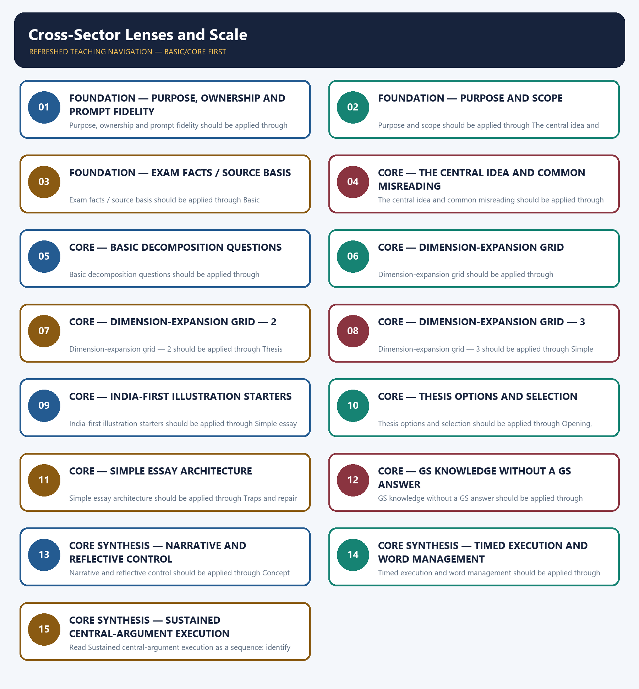

# Cross-Sector Lenses and Scale — Learner-v2 Complete Learning Session

> **Authoring-only generation:** 2026-09-06. No PDF was rendered and no tracker or index was mutated.

### SOURCE, PROGRESSION AND OFFICIAL-RULE AUDIT

- **Generation date:** 2026-09-06.
- **Source order:** canonical Basic owner first; Advanced owner second; Essay master framework, README, official-syllabus map, answer-worthiness audit and revision chart next; PYQ corpus and official OCR papers after that; live official UPSC pages only as a final check.
- **Basic/Advanced boundary:** complete Basic teaching remains first and Advanced material remains optional and last.
- **OCR boundary:** Repository Markdown was primary. OCR-searchable official UPSC Essay papers were supplementary only for printed instructions and V1 prompt wording. No author, official model answer, current marks split, phase allocation, paragraph count or scoring rubric was inferred.
- **Qdrant:** not used; repository Markdown and local official papers were sufficient.
- **PYQ integrity:** Three application cards use the repository's explicit V1/V2 status. No unavailable official model answer, marking rubric or attribution is invented.
- **Live-source boundary:** Live source check dated 2026-09-06: official UPSC routes were attempted and access-blocked; blocked pages support no new claim. UN, WHO and IPCC primary pages were separately checked for cross-theme factual boundaries.
- **No-formula rule:** strategy, heuristics and practice weights are never presented as official UPSC instructions or marking criteria.

### LIVE OFFICIAL-SOURCE ATTEMPT LOG

The checks below were made on 2026-09-06. Substantive official text is used only for the proposition it supports; title-only, blocked or thin pages are recorded and supply no factual claim.

- https://upsc.gov.in/examinations/previous-question-papers — attempted 2026-09-06; official page returned HTTP 403 to the live fetch, so it supports no new wording.
- https://upsc.gov.in/examinations/active-examinations — attempted 2026-09-06; official page returned HTTP 403 to the live fetch, so it supports no current-paper inference.
- https://upsc.gov.in/sites/default/files/Notif-CSP-2024-Engl-140224.pdf — searched 2026-09-06; retained only as an official scheme cross-check route, not as an Essay rubric.

## BASIC LEARNING SESSION



*Distinct embedded teaching-navigation image. The separate continuous Cārvāka-style flowchart package remains an independent at-a-glance artifact.*

### SESSION 1 — FOUNDATION — PURPOSE, OWNERSHIP AND PROMPT FIDELITY

#### DEFINITION / WHAT THIS IS CALLED

**Plain-language definition:** Objective practice: Apply Purpose, ownership and prompt fidelity by distinguishing the correct Essay-method move from nearby but invalid shortcuts; no factual-trivia recall is being tested.

**Technical definition:** Purpose, ownership and prompt fidelity should be applied through Purpose and scope and Exam facts / source basis, while preserving the difference between official paper instruction and strategy, prompt wording and interpretation, example and evidence, breadth and coherence.

#### ANSWER-GRABBING OPENING — WRITE/ADAPT IN THE EXAM

> Plain-language definition: Purpose, ownership and prompt fidelity explains how Purpose and scope and Exam facts / source basis combine into one usable Essay-planning move.

#### MUST-WRITE KEYWORDS

- **FOUNDATION**
- **Purpose**
- **ownership**
- **prompt fidelity**
- **Plain-language definition**
- **Technical definition**

**How to use them:** Frame the answer through FOUNDATION; define Purpose, connect ownership with prompt fidelity to explain the mechanism, and use Plain-language definition for the decisive comparison or qualification.

#### METHOD MOVE / WHAT THIS DOES

**Plain-language definition:** Purpose, ownership and prompt fidelity explains how Purpose and scope and Exam facts / source basis combine into one usable Essay-planning move.

**Technical definition:** The learner fixes the printed prompt, its relationship or demand, the defensible scope, the argument function and the evidence boundary before drafting prose.

#### ANSWER-GRABBING OPENING — WRITE/ADAPT IN THE EXAM

> Purpose, ownership and prompt fidelity should be applied through Purpose and scope and Exam facts / source basis, while preserving the difference between official paper instruction and strategy, prompt wording and interpretation, example and evidence, breadth and coherence.

#### MUST-WRITE KEYWORDS

- **Purpose**
- **ownership**
- **prompt**
- **fidelity**
- **scope**
- **Exam**

**How to use them:** Define the first three terms, trace the relationship with the next two, and attach the final term to the exact claim, example and qualification. Qualification: Do not replace selective cross-sector and multi-scale analysis with a generic GS-style catalogue.

#### VISUAL FIRST

```text
PURPOSE, OWNERSHIP AND PROMPT FIDELITY
01. Purpose and scope
    |
    v
02. Exam facts / source basis
STATUS / CATEGORY FIREWALL -> Do not replace selective cross-sector and multi-scale analysis with a generic GS-style catalogue.
```

*The rail fixes the prompt-to-argument sequence and claim boundary before explanation.*

#### CORE EXPLANATION

This topic teaches which cross-sector lens to apply to a given prompt and at what scale, so that argument-map cycles (05) draw on the right mechanism rather than a generic one. It does not supply the GS content itself — each lens points to the owning subject module for depth. tools built from this folder's own reading of the 16 recent prompts, not an official requirement.

#### SIMPLE SYSTEM EXAMPLE

Read Purpose, ownership and prompt fidelity as a sequence: identify Purpose and scope, follow the method through the printed proposition, and stop before adding a rule, attribution, fact or inference the audited sources do not support.

#### TECHNICAL DISTINCTION

The decisive boundary is Do not replace selective cross-sector and multi-scale analysis with a generic GS-style catalogue. This keeps Purpose and scope and Exam facts / source basis in the correct prompt, method, argument and evidence category.

#### NAMED EVIDENCE AND MECHANISM

- This topic teaches which cross-sector lens to apply to a given prompt and at what scale, so that argument-map cycles (05) draw on the right mechanism rather than a generic one. It does not supply the GS content itself — each lens points to the owning subject module for depth.
- tools built from this folder's own reading of the 16 recent prompts, not an official requirement.

#### EXAMINER CAUTION

- Do not replace selective cross-sector and multi-scale analysis with a generic GS-style catalogue.

#### EXAM LINK

- **Objective practice:** Apply Purpose, ownership and prompt fidelity by distinguishing the correct Essay-method move from nearby but invalid shortcuts; no factual-trivia recall is being tested.
- **Essay application:** State the exact demand and the bounded writing decision.

#### MINI RECAP

- **Mechanism chain:** Purpose and scope -> Exam facts / source basis
- **Qualified use:** State the exact demand and the bounded writing decision.

#### CLOSING RECALL FLOW — FOUNDATION — PURPOSE, OWNERSHIP AND PROMPT FIDELITY

```text
START / CONCEPT: FOUNDATION — Purpose, ownership and prompt fidelity
        |
        v
EXACT TERMS: FOUNDATION · Purpose · ownership · prompt fidelity · Plain-language definition · Technical definition
        |
        v
MECHANISM / ARGUMENT: Purpose, ownership and prompt fidelity should be applied through Purpose and scope and Exam facts / source basis, while preserving the difference between official paper instruction and strategy, prompt wording and interpretation, example and evidence, breadth and coherence.
        |
        v
CONSEQUENCE / CONTRAST: Read Purpose, ownership and prompt fidelity as a sequence: identify Purpose and scope, follow the method through the printed proposition, and stop before adding a rule, attribution, fact or inference the audited sources do not support.
        |
        v
UPSC TRAP / ANSWER-USE: Objective practice: Apply Purpose, ownership and prompt fidelity by distinguishing the correct Essay-method move from nearby but invalid shortcuts; no factual-trivia recall is being tested.
        |
        v
ANSWER-GRABBING FORMULATION: Plain-language definition: Purpose, ownership and prompt fidelity explains how Purpose and scope and Exam facts / source basis combine into one usable Essay-planning move.
```
### SESSION 2 — FOUNDATION — PURPOSE AND SCOPE

#### DEFINITION / WHAT THIS IS CALLED

**Plain-language definition:** Objective practice: Apply Purpose and scope by distinguishing the correct Essay-method move from nearby but invalid shortcuts; no factual-trivia recall is being tested.

**Technical definition:** Purpose and scope should be applied through The central idea and common misreading, while preserving the difference between official paper instruction and strategy, prompt wording and interpretation, example and evidence, breadth and coherence.

#### ANSWER-GRABBING OPENING — WRITE/ADAPT IN THE EXAM

> Plain-language definition: Purpose and scope explains how The central idea and common misreading combine into one usable Essay-planning move.

#### MUST-WRITE KEYWORDS

- **FOUNDATION**
- **Purpose**
- **scope**
- **Plain-language definition**
- **Technical definition**
- **central**

**How to use them:** Frame the answer through FOUNDATION; define Purpose, connect scope with Plain-language definition to explain the mechanism, and use Technical definition for the decisive comparison or qualification.

#### METHOD MOVE / WHAT THIS DOES

**Plain-language definition:** Purpose and scope explains how The central idea and common misreading combine into one usable Essay-planning move.

**Technical definition:** The learner fixes the printed prompt, its relationship or demand, the defensible scope, the argument function and the evidence boundary before drafting prose.

#### ANSWER-GRABBING OPENING — WRITE/ADAPT IN THE EXAM

> Purpose and scope should be applied through The central idea and common misreading, while preserving the difference between official paper instruction and strategy, prompt wording and interpretation, example and evidence, breadth and coherence.

#### MUST-WRITE KEYWORDS

- **Purpose**
- **scope**
- **central**
- **idea**
- **common**
- **misreading**

**How to use them:** Define the first three terms, trace the relationship with the next two, and attach the final term to the exact claim, example and qualification. Qualification: Do not cross the ownership boundary: named evidence ownership belongs to 12.

#### VISUAL FIRST

```text
PURPOSE AND SCOPE
01. The central idea and common misreading
STATUS / CATEGORY FIREWALL -> Do not cross the ownership boundary: named evidence ownership belongs to 12.
```

*The rail fixes the prompt-to-argument sequence and claim boundary before explanation.*

#### CORE EXPLANATION

Central idea: choose two to four lenses that genuinely fit the prompt's tension and develop each with a real mechanism and illustration — depth in fewer lenses outperforms a token pass through all seven or eight. Use a fourth lens only when it adds a distinct causal step or value conflict. Common misreading: mechanically working through every lens ("politically economically socially") regardless of fit, producing a checklist-style essay rather than an argued one.

#### SIMPLE SYSTEM EXAMPLE

Read Purpose and scope as a sequence: identify The central idea and common misreading, follow the method through the printed proposition, and stop before adding a rule, attribution, fact or inference the audited sources do not support.

#### TECHNICAL DISTINCTION

The decisive boundary is Do not cross the ownership boundary: named evidence ownership belongs to 12. This keeps The central idea and common misreading in the correct prompt, method, argument and evidence category.

#### NAMED EVIDENCE AND MECHANISM

- Central idea: choose two to four lenses that genuinely fit the prompt's tension and develop each with a real mechanism and illustration — depth in fewer lenses outperforms a token pass through all seven or eight. Use a fourth lens only when it adds a distinct causal step or value conflict. Common misreading: mechanically working through every lens ("politically economically socially") regardless of fit, producing a checklist-style essay rather than an argued one.

#### EXAMINER CAUTION

- Do not cross the ownership boundary: named evidence ownership belongs to 12.

#### EXAM LINK

- **Objective practice:** Apply Purpose and scope by distinguishing the correct Essay-method move from nearby but invalid shortcuts; no factual-trivia recall is being tested.
- **Essay application:** Define operative terms before expanding dimensions.

#### MINI RECAP

- **Mechanism chain:** The central idea and common misreading
- **Qualified use:** Define operative terms before expanding dimensions.

#### CLOSING RECALL FLOW — FOUNDATION — PURPOSE AND SCOPE

```text
START / CONCEPT: FOUNDATION — Purpose and scope
        |
        v
EXACT TERMS: FOUNDATION · Purpose · scope · Plain-language definition · Technical definition · central
        |
        v
MECHANISM / ARGUMENT: Purpose and scope should be applied through The central idea and common misreading, while preserving the difference between official paper instruction and strategy, prompt wording and interpretation, example and evidence, breadth and coherence.
        |
        v
CONSEQUENCE / CONTRAST: Read Purpose and scope as a sequence: identify The central idea and common misreading, follow the method through the printed proposition, and stop before adding a rule, attribution, fact or inference the audited sources do not support.
        |
        v
UPSC TRAP / ANSWER-USE: Objective practice: Apply Purpose and scope by distinguishing the correct Essay-method move from nearby but invalid shortcuts; no factual-trivia recall is being tested.
        |
        v
ANSWER-GRABBING FORMULATION: Plain-language definition: Purpose and scope explains how The central idea and common misreading combine into one usable Essay-planning move.
```
### SESSION 3 — FOUNDATION — EXAM FACTS / SOURCE BASIS

#### DEFINITION / WHAT THIS IS CALLED

**Plain-language definition:** Objective practice: Apply Exam facts / source basis by distinguishing the correct Essay-method move from nearby but invalid shortcuts; no factual-trivia recall is being tested.

**Technical definition:** Exam facts / source basis should be applied through Basic decomposition questions, while preserving the difference between official paper instruction and strategy, prompt wording and interpretation, example and evidence, breadth and coherence.

#### ANSWER-GRABBING OPENING — WRITE/ADAPT IN THE EXAM

> Plain-language definition: Exam facts / source basis explains how Basic decomposition questions combine into one usable Essay-planning move.

#### MUST-WRITE KEYWORDS

- **FOUNDATION**
- **Exam facts / source basis**
- **Plain-language definition**
- **Technical definition**
- **Exam**
- **s**

**How to use them:** Frame the answer through FOUNDATION; define Exam facts / source basis, connect Plain-language definition with Technical definition to explain the mechanism, and use Exam for the decisive comparison or qualification.

#### METHOD MOVE / WHAT THIS DOES

**Plain-language definition:** Exam facts / source basis explains how Basic decomposition questions combine into one usable Essay-planning move.

**Technical definition:** The learner fixes the printed prompt, its relationship or demand, the defensible scope, the argument function and the evidence boundary before drafting prose.

#### ANSWER-GRABBING OPENING — WRITE/ADAPT IN THE EXAM

> Exam facts / source basis should be applied through Basic decomposition questions, while preserving the difference between official paper instruction and strategy, prompt wording and interpretation, example and evidence, breadth and coherence.

#### MUST-WRITE KEYWORDS

- **Exam**
- **facts**
- **basis**
- **Basic**
- **decomposition**
- **questions**

**How to use them:** Define the first three terms, trace the relationship with the next two, and attach the final term to the exact claim, example and qualification. Qualification: Do not use an example without explaining its argumentative function.

#### VISUAL FIRST

```text
EXAM FACTS / SOURCE BASIS
01. Basic decomposition questions
STATUS / CATEGORY FIREWALL -> Do not use an example without explaining its argumentative function.
```

*The rail fixes the prompt-to-argument sequence and claim boundary before explanation.*

#### CORE EXPLANATION

1. Which two or three lenses does this prompt's tension most naturally touch? 2. At what scale does each chosen lens's mechanism operate best (individual, institutional, state, global)? 3. Can I state one specific mechanism per chosen lens, not just a label? 4. Do I have one recallable illustration per chosen lens? 5. Would a lens I am tempted to include add a genuinely new dimension, or merely repeat a point already made under another lens?

#### SIMPLE SYSTEM EXAMPLE

Read Exam facts / source basis as a sequence: identify Basic decomposition questions, follow the method through the printed proposition, and stop before adding a rule, attribution, fact or inference the audited sources do not support.

#### TECHNICAL DISTINCTION

The decisive boundary is Do not use an example without explaining its argumentative function. This keeps Basic decomposition questions in the correct prompt, method, argument and evidence category.

#### NAMED EVIDENCE AND MECHANISM

- 1. Which two or three lenses does this prompt's tension most naturally touch? 2. At what scale does each chosen lens's mechanism operate best (individual, institutional, state, global)? 3. Can I state one specific mechanism per chosen lens, not just a label? 4. Do I have one recallable illustration per chosen lens? 5. Would a lens I am tempted to include add a genuinely new dimension, or merely repeat a point already made under another lens?

#### EXAMINER CAUTION

- Do not use an example without explaining its argumentative function.

#### EXAM LINK

- **Objective practice:** Apply Exam facts / source basis by distinguishing the correct Essay-method move from nearby but invalid shortcuts; no factual-trivia recall is being tested.
- **Essay application:** Build one qualified thesis and keep it visible.

#### MINI RECAP

- **Mechanism chain:** Basic decomposition questions
- **Qualified use:** Build one qualified thesis and keep it visible.

#### CLOSING RECALL FLOW — FOUNDATION — EXAM FACTS / SOURCE BASIS

```text
START / CONCEPT: FOUNDATION — Exam facts / source basis
        |
        v
EXACT TERMS: FOUNDATION · Exam facts / source basis · Plain-language definition · Technical definition · Exam · s
        |
        v
MECHANISM / ARGUMENT: Exam facts / source basis should be applied through Basic decomposition questions, while preserving the difference between official paper instruction and strategy, prompt wording and interpretation, example and evidence, breadth and coherence.
        |
        v
CONSEQUENCE / CONTRAST: Read Exam facts / source basis as a sequence: identify Basic decomposition questions, follow the method through the printed proposition, and stop before adding a rule, attribution, fact or inference the audited sources do not support.
        |
        v
UPSC TRAP / ANSWER-USE: Objective practice: Apply Exam facts / source basis by distinguishing the correct Essay-method move from nearby but invalid shortcuts; no factual-trivia recall is being tested.
        |
        v
ANSWER-GRABBING FORMULATION: Plain-language definition: Exam facts / source basis explains how Basic decomposition questions combine into one usable Essay-planning move.
```
### SESSION 4 — CORE — THE CENTRAL IDEA AND COMMON MISREADING

#### DEFINITION / WHAT THIS IS CALLED

**Plain-language definition:** Objective practice: Apply The central idea and common misreading by distinguishing the correct Essay-method move from nearby but invalid shortcuts; no factual-trivia recall is being tested.

**Technical definition:** The central idea and common misreading should be applied through Dimension-expansion grid, while preserving the difference between official paper instruction and strategy, prompt wording and interpretation, example and evidence, breadth and coherence.

#### ANSWER-GRABBING OPENING — WRITE/ADAPT IN THE EXAM

> Plain-language definition: The central idea and common misreading explains how Dimension-expansion grid combine into one usable Essay-planning move.

#### MUST-WRITE KEYWORDS

- **The central idea**
- **common misreading**
- **Plain-language definition**
- **Technical definition**
- **central**
- **idea**

**How to use them:** Frame the answer through The central idea; define common misreading, connect Plain-language definition with Technical definition to explain the mechanism, and use central for the decisive comparison or qualification.

#### METHOD MOVE / WHAT THIS DOES

**Plain-language definition:** The central idea and common misreading explains how Dimension-expansion grid combine into one usable Essay-planning move.

**Technical definition:** The learner fixes the printed prompt, its relationship or demand, the defensible scope, the argument function and the evidence boundary before drafting prose.

#### ANSWER-GRABBING OPENING — WRITE/ADAPT IN THE EXAM

> The central idea and common misreading should be applied through Dimension-expansion grid, while preserving the difference between official paper instruction and strategy, prompt wording and interpretation, example and evidence, breadth and coherence.

#### MUST-WRITE KEYWORDS

- **central**
- **idea**
- **common**
- **misreading**
- **Dimension-expansion**
- **grid**

**How to use them:** Define the first three terms, trace the relationship with the next two, and attach the final term to the exact claim, example and qualification. Qualification: Do not treat a pedagogical scaffold as an official UPSC marking rule.

#### VISUAL FIRST

```text
THE CENTRAL IDEA AND COMMON MISREADING
01. Dimension-expansion grid
STATUS / CATEGORY FIREWALL -> Do not treat a pedagogical scaffold as an official UPSC marking rule.
```

*The rail fixes the prompt-to-argument sequence and claim boundary before explanation.*

#### CORE EXPLANATION

For an unfamiliar prompt such as “A society that automates choice may weaken judgment” , use a real causal hand-off, not three parallel labels

#### SIMPLE SYSTEM EXAMPLE

Read The central idea and common misreading as a sequence: identify Dimension-expansion grid, follow the method through the printed proposition, and stop before adding a rule, attribution, fact or inference the audited sources do not support.

#### TECHNICAL DISTINCTION

The decisive boundary is Do not treat a pedagogical scaffold as an official UPSC marking rule. This keeps Dimension-expansion grid in the correct prompt, method, argument and evidence category.

#### NAMED EVIDENCE AND MECHANISM

- For an unfamiliar prompt such as “A society that automates choice may weaken judgment” , use a real causal hand-off, not three parallel labels

#### EXAMINER CAUTION

- Do not treat a pedagogical scaffold as an official UPSC marking rule.

#### EXAM LINK

- **Objective practice:** Apply The central idea and common misreading by distinguishing the correct Essay-method move from nearby but invalid shortcuts; no factual-trivia recall is being tested.
- **Essay application:** Give every paragraph one argumentative job.

#### MINI RECAP

- **Mechanism chain:** Dimension-expansion grid
- **Qualified use:** Give every paragraph one argumentative job.

#### CLOSING RECALL FLOW — CORE — THE CENTRAL IDEA AND COMMON MISREADING

```text
START / CONCEPT: CORE — The central idea and common misreading
        |
        v
EXACT TERMS: The central idea · common misreading · Plain-language definition · Technical definition · central · idea
        |
        v
MECHANISM / ARGUMENT: The central idea and common misreading should be applied through Dimension-expansion grid, while preserving the difference between official paper instruction and strategy, prompt wording and interpretation, example and evidence, breadth and coherence.
        |
        v
CONSEQUENCE / CONTRAST: Read The central idea and common misreading as a sequence: identify Dimension-expansion grid, follow the method through the printed proposition, and stop before adding a rule, attribution, fact or inference the audited sources do not support.
        |
        v
UPSC TRAP / ANSWER-USE: Objective practice: Apply The central idea and common misreading by distinguishing the correct Essay-method move from nearby but invalid shortcuts; no factual-trivia recall is being tested.
        |
        v
ANSWER-GRABBING FORMULATION: Plain-language definition: The central idea and common misreading explains how Dimension-expansion grid combine into one usable Essay-planning move.
```
### SESSION 5 — CORE — BASIC DECOMPOSITION QUESTIONS

#### DEFINITION / WHAT THIS IS CALLED

**Plain-language definition:** Objective practice: Apply Basic decomposition questions by distinguishing the correct Essay-method move from nearby but invalid shortcuts; no factual-trivia recall is being tested.

**Technical definition:** Basic decomposition questions should be applied through Dimension-expansion grid — 2, while preserving the difference between official paper instruction and strategy, prompt wording and interpretation, example and evidence, breadth and coherence.

#### ANSWER-GRABBING OPENING — WRITE/ADAPT IN THE EXAM

> Plain-language definition: Basic decomposition questions explains how Dimension-expansion grid — 2 combine into one usable Essay-planning move.

#### MUST-WRITE KEYWORDS

- **Basic decomposition questions**
- **Plain-language definition**
- **Technical definition**
- **Basic**
- **decomposition**
- **questions**

**How to use them:** Frame the answer through Basic decomposition questions; define Plain-language definition, connect Technical definition with Basic to explain the mechanism, and use decomposition for the decisive comparison or qualification.

#### METHOD MOVE / WHAT THIS DOES

**Plain-language definition:** Basic decomposition questions explains how Dimension-expansion grid — 2 combine into one usable Essay-planning move.

**Technical definition:** The learner fixes the printed prompt, its relationship or demand, the defensible scope, the argument function and the evidence boundary before drafting prose.

#### ANSWER-GRABBING OPENING — WRITE/ADAPT IN THE EXAM

> Basic decomposition questions should be applied through Dimension-expansion grid — 2, while preserving the difference between official paper instruction and strategy, prompt wording and interpretation, example and evidence, breadth and coherence.

#### MUST-WRITE KEYWORDS

- **Basic**
- **decomposition**
- **questions**
- **Dimension-expansion**
- **grid**
- **Technology**

**How to use them:** Define the first three terms, trace the relationship with the next two, and attach the final term to the exact claim, example and qualification. Qualification: Do not let a counter-view replace the thesis; use it to qualify the thesis.

#### VISUAL FIRST

```text
BASIC DECOMPOSITION QUESTIONS
01. Dimension-expansion grid — 2
STATUS / CATEGORY FIREWALL -> Do not let a counter-view replace the thesis; use it to qualify the thesis.
```

*The rail fixes the prompt-to-argument sequence and claim boundary before explanation.*

#### CORE EXPLANATION

Technology: engagement-optimised or delegated design changes what choices are visible - Society: repeated delegation can weaken reflective habits and redistribute autonomy - Governance: the resulting accountability gap requires transparent design, redress and public oversight

#### SIMPLE SYSTEM EXAMPLE

Read Basic decomposition questions as a sequence: identify Dimension-expansion grid — 2, follow the method through the printed proposition, and stop before adding a rule, attribution, fact or inference the audited sources do not support.

#### TECHNICAL DISTINCTION

The decisive boundary is Do not let a counter-view replace the thesis; use it to qualify the thesis. This keeps Dimension-expansion grid — 2 in the correct prompt, method, argument and evidence category.

#### NAMED EVIDENCE AND MECHANISM

- Technology: engagement-optimised or delegated design changes what choices are visible - Society: repeated delegation can weaken reflective habits and redistribute autonomy - Governance: the resulting accountability gap requires transparent design, redress and public oversight

#### EXAMINER CAUTION

- Do not let a counter-view replace the thesis; use it to qualify the thesis.

#### EXAM LINK

- **Objective practice:** Apply Basic decomposition questions by distinguishing the correct Essay-method move from nearby but invalid shortcuts; no factual-trivia recall is being tested.
- **Essay application:** Join a named illustration to its mechanism.

#### MINI RECAP

- **Mechanism chain:** Dimension-expansion grid — 2
- **Qualified use:** Join a named illustration to its mechanism.

#### CLOSING RECALL FLOW — CORE — BASIC DECOMPOSITION QUESTIONS

```text
START / CONCEPT: CORE — Basic decomposition questions
        |
        v
EXACT TERMS: Basic decomposition questions · Plain-language definition · Technical definition · Basic · decomposition · questions
        |
        v
MECHANISM / ARGUMENT: Basic decomposition questions should be applied through Dimension-expansion grid — 2, while preserving the difference between official paper instruction and strategy, prompt wording and interpretation, example and evidence, breadth and coherence.
        |
        v
CONSEQUENCE / CONTRAST: Read Basic decomposition questions as a sequence: identify Dimension-expansion grid — 2, follow the method through the printed proposition, and stop before adding a rule, attribution, fact or inference the audited sources do not support.
        |
        v
UPSC TRAP / ANSWER-USE: Objective practice: Apply Basic decomposition questions by distinguishing the correct Essay-method move from nearby but invalid shortcuts; no factual-trivia recall is being tested.
        |
        v
ANSWER-GRABBING FORMULATION: Plain-language definition: Basic decomposition questions explains how Dimension-expansion grid — 2 combine into one usable Essay-planning move.
```
### SESSION 6 — CORE — DIMENSION-EXPANSION GRID

#### DEFINITION / WHAT THIS IS CALLED

**Plain-language definition:** Objective practice: Apply Dimension-expansion grid by distinguishing the correct Essay-method move from nearby but invalid shortcuts; no factual-trivia recall is being tested.

**Technical definition:** Dimension-expansion grid should be applied through Dimension-expansion grid — 3 and India-first illustration starters, while preserving the difference between official paper instruction and strategy, prompt wording and interpretation, example and evidence, breadth and coherence.

#### ANSWER-GRABBING OPENING — WRITE/ADAPT IN THE EXAM

> Plain-language definition: Dimension-expansion grid explains how Dimension-expansion grid — 3 and India-first illustration starters combine into one usable Essay-planning move.

#### MUST-WRITE KEYWORDS

- **Dimension-expansion grid**
- **Plain-language definition**
- **Technical definition**
- **Dimension-expansion**
- **grid**
- **India-first**

**How to use them:** Frame the answer through Dimension-expansion grid; define Plain-language definition, connect Technical definition with Dimension-expansion to explain the mechanism, and use grid for the decisive comparison or qualification.

#### METHOD MOVE / WHAT THIS DOES

**Plain-language definition:** Dimension-expansion grid explains how Dimension-expansion grid — 3 and India-first illustration starters combine into one usable Essay-planning move.

**Technical definition:** The learner fixes the printed prompt, its relationship or demand, the defensible scope, the argument function and the evidence boundary before drafting prose.

#### ANSWER-GRABBING OPENING — WRITE/ADAPT IN THE EXAM

> Dimension-expansion grid should be applied through Dimension-expansion grid — 3 and India-first illustration starters, while preserving the difference between official paper instruction and strategy, prompt wording and interpretation, example and evidence, breadth and coherence.

#### MUST-WRITE KEYWORDS

- **Dimension-expansion**
- **grid**
- **India-first**
- **illustration**
- **starters**
- **Scale-match**

**How to use them:** Define the first three terms, trace the relationship with the next two, and attach the final term to the exact claim, example and qualification. Qualification: Do not use an unverified quotation, statistic, attribution or anecdote.

#### VISUAL FIRST

```text
DIMENSION-EXPANSION GRID
01. Dimension-expansion grid — 3
    |
    v
02. India-first illustration starters
STATUS / CATEGORY FIREWALL -> Do not use an unverified quotation, statistic, attribution or anecdote.
```

*The rail fixes the prompt-to-argument sequence and claim boundary before explanation.*

#### CORE EXPLANATION

Scale-match test: does the illustration operate at the scale of the claim? A household example cannot by itself prove a state-wide governance effect. Counterfactual test: remove the middle social link. If the governance claim still follows unchanged, the chain is decorative; either state a real hand-off or use two independent lenses. For each chosen lens, recall one Indian illustration functionally tied to that lens's mechanism — e.g. a documented research/innovation policy episode for the Science & Technology lens on "empires of the mind." Full discipline: 12.

#### SIMPLE SYSTEM EXAMPLE

Read Dimension-expansion grid as a sequence: identify Dimension-expansion grid — 3, follow the method through the printed proposition, and stop before adding a rule, attribution, fact or inference the audited sources do not support.

#### TECHNICAL DISTINCTION

The decisive boundary is Do not use an unverified quotation, statistic, attribution or anecdote. This keeps Dimension-expansion grid — 3 and India-first illustration starters in the correct prompt, method, argument and evidence category.

#### NAMED EVIDENCE AND MECHANISM

- Scale-match test: does the illustration operate at the scale of the claim? A household example cannot by itself prove a state-wide governance effect. Counterfactual test: remove the middle social link. If the governance claim still follows unchanged, the chain is decorative; either state a real hand-off or use two independent lenses.
- For each chosen lens, recall one Indian illustration functionally tied to that lens's mechanism — e.g. a documented research/innovation policy episode for the Science & Technology lens on "empires of the mind." Full discipline: 12.

#### EXAMINER CAUTION

- Do not use an unverified quotation, statistic, attribution or anecdote.

#### EXAM LINK

- **Objective practice:** Apply Dimension-expansion grid by distinguishing the correct Essay-method move from nearby but invalid shortcuts; no factual-trivia recall is being tested.
- **Essay application:** Use a counter-case to refine, not derail, the thesis.

#### MINI RECAP

- **Mechanism chain:** Dimension-expansion grid — 3 -> India-first illustration starters
- **Qualified use:** Use a counter-case to refine, not derail, the thesis.

#### CLOSING RECALL FLOW — CORE — DIMENSION-EXPANSION GRID

```text
START / CONCEPT: CORE — Dimension-expansion grid
        |
        v
EXACT TERMS: Dimension-expansion grid · Plain-language definition · Technical definition · Dimension-expansion · grid · India-first
        |
        v
MECHANISM / ARGUMENT: Dimension-expansion grid should be applied through Dimension-expansion grid — 3 and India-first illustration starters, while preserving the difference between official paper instruction and strategy, prompt wording and interpretation, example and evidence, breadth and coherence.
        |
        v
CONSEQUENCE / CONTRAST: Mechanism chain: Dimension-expansion grid — 3 - India-first illustration starters Qualified use: Use a counter-case to refine, not derail, the thesis.
        |
        v
UPSC TRAP / ANSWER-USE: Read Dimension-expansion grid as a sequence: identify Dimension-expansion grid — 3, follow the method through the printed proposition, and stop before adding a rule, attribution, fact or inference the audited sources do not support.
        |
        v
ANSWER-GRABBING FORMULATION: Plain-language definition: Dimension-expansion grid explains how Dimension-expansion grid — 3 and India-first illustration starters combine into one usable Essay-planning move.
```
### SESSION 7 — CORE — DIMENSION-EXPANSION GRID — 2

#### DEFINITION / WHAT THIS IS CALLED

**Plain-language definition:** Objective practice: Apply Dimension-expansion grid — 2 by distinguishing the correct Essay-method move from nearby but invalid shortcuts; no factual-trivia recall is being tested.

**Technical definition:** Dimension-expansion grid — 2 should be applied through Thesis options and selection, while preserving the difference between official paper instruction and strategy, prompt wording and interpretation, example and evidence, breadth and coherence.

#### ANSWER-GRABBING OPENING — WRITE/ADAPT IN THE EXAM

> Plain-language definition: Dimension-expansion grid — 2 explains how Thesis options and selection combine into one usable Essay-planning move.

#### MUST-WRITE KEYWORDS

- **Dimension-expansion grid**
- **Plain-language definition**
- **Technical definition**
- **Dimension-expansion**
- **grid**
- **Thesis**

**How to use them:** Frame the answer through Dimension-expansion grid; define Plain-language definition, connect Technical definition with Dimension-expansion to explain the mechanism, and use grid for the decisive comparison or qualification.

#### METHOD MOVE / WHAT THIS DOES

**Plain-language definition:** Dimension-expansion grid — 2 explains how Thesis options and selection combine into one usable Essay-planning move.

**Technical definition:** The learner fixes the printed prompt, its relationship or demand, the defensible scope, the argument function and the evidence boundary before drafting prose.

#### ANSWER-GRABBING OPENING — WRITE/ADAPT IN THE EXAM

> Dimension-expansion grid — 2 should be applied through Thesis options and selection, while preserving the difference between official paper instruction and strategy, prompt wording and interpretation, example and evidence, breadth and coherence.

#### MUST-WRITE KEYWORDS

- **Dimension-expansion**
- **grid**
- **Thesis**
- **options**
- **selection**
- **determine**

**How to use them:** Define the first three terms, trace the relationship with the next two, and attach the final term to the exact claim, example and qualification. Qualification: Do not multiply dimensions that repeat the same claim in new vocabulary.

#### VISUAL FIRST

```text
DIMENSION-EXPANSION GRID — 2
01. Thesis options and selection
STATUS / CATEGORY FIREWALL -> Do not multiply dimensions that repeat the same claim in new vocabulary.
```

*The rail fixes the prompt-to-argument sequence and claim boundary before explanation.*

#### CORE EXPLANATION

Let the thesis (05) determine which lenses are needed, not the reverse — do not force a lens onto a thesis that does not require it merely to appear comprehensive.

#### SIMPLE SYSTEM EXAMPLE

Read Dimension-expansion grid — 2 as a sequence: identify Thesis options and selection, follow the method through the printed proposition, and stop before adding a rule, attribution, fact or inference the audited sources do not support.

#### TECHNICAL DISTINCTION

The decisive boundary is Do not multiply dimensions that repeat the same claim in new vocabulary. This keeps Thesis options and selection in the correct prompt, method, argument and evidence category.

#### NAMED EVIDENCE AND MECHANISM

- Let the thesis (05) determine which lenses are needed, not the reverse — do not force a lens onto a thesis that does not require it merely to appear comprehensive.

#### EXAMINER CAUTION

- Do not multiply dimensions that repeat the same claim in new vocabulary.

#### EXAM LINK

- **Objective practice:** Apply Dimension-expansion grid — 2 by distinguishing the correct Essay-method move from nearby but invalid shortcuts; no factual-trivia recall is being tested.
- **Essay application:** Sequence paragraphs through explicit logical bridges.

#### MINI RECAP

- **Mechanism chain:** Thesis options and selection
- **Qualified use:** Sequence paragraphs through explicit logical bridges.

#### CLOSING RECALL FLOW — CORE — DIMENSION-EXPANSION GRID — 2

```text
START / CONCEPT: CORE — Dimension-expansion grid — 2
        |
        v
EXACT TERMS: Dimension-expansion grid · Plain-language definition · Technical definition · Dimension-expansion · grid · Thesis
        |
        v
MECHANISM / ARGUMENT: Dimension-expansion grid — 2 should be applied through Thesis options and selection, while preserving the difference between official paper instruction and strategy, prompt wording and interpretation, example and evidence, breadth and coherence.
        |
        v
CONSEQUENCE / CONTRAST: Read Dimension-expansion grid — 2 as a sequence: identify Thesis options and selection, follow the method through the printed proposition, and stop before adding a rule, attribution, fact or inference the audited sources do not support.
        |
        v
UPSC TRAP / ANSWER-USE: Objective practice: Apply Dimension-expansion grid — 2 by distinguishing the correct Essay-method move from nearby but invalid shortcuts; no factual-trivia recall is being tested.
        |
        v
ANSWER-GRABBING FORMULATION: Plain-language definition: Dimension-expansion grid — 2 explains how Thesis options and selection combine into one usable Essay-planning move.
```
### SESSION 8 — CORE — DIMENSION-EXPANSION GRID — 3

#### DEFINITION / WHAT THIS IS CALLED

**Plain-language definition:** Objective practice: Apply Dimension-expansion grid — 3 by distinguishing the correct Essay-method move from nearby but invalid shortcuts; no factual-trivia recall is being tested.

**Technical definition:** Dimension-expansion grid — 3 should be applied through Simple essay architecture, while preserving the difference between official paper instruction and strategy, prompt wording and interpretation, example and evidence, breadth and coherence.

#### ANSWER-GRABBING OPENING — WRITE/ADAPT IN THE EXAM

> Plain-language definition: Dimension-expansion grid — 3 explains how Simple essay architecture combine into one usable Essay-planning move.

#### MUST-WRITE KEYWORDS

- **Dimension-expansion grid**
- **Plain-language definition**
- **Technical definition**
- **Dimension-expansion**
- **grid**
- **Simple**

**How to use them:** Frame the answer through Dimension-expansion grid; define Plain-language definition, connect Technical definition with Dimension-expansion to explain the mechanism, and use grid for the decisive comparison or qualification.

#### METHOD MOVE / WHAT THIS DOES

**Plain-language definition:** Dimension-expansion grid — 3 explains how Simple essay architecture combine into one usable Essay-planning move.

**Technical definition:** The learner fixes the printed prompt, its relationship or demand, the defensible scope, the argument function and the evidence boundary before drafting prose.

#### ANSWER-GRABBING OPENING — WRITE/ADAPT IN THE EXAM

> Dimension-expansion grid — 3 should be applied through Simple essay architecture, while preserving the difference between official paper instruction and strategy, prompt wording and interpretation, example and evidence, breadth and coherence.

#### MUST-WRITE KEYWORDS

- **Dimension-expansion**
- **grid**
- **Simple**
- **architecture**
- **Typically**
- **lens**

**How to use them:** Define the first three terms, trace the relationship with the next two, and attach the final term to the exact claim, example and qualification. Qualification: Do not end with aspiration unsupported by the preceding argument.

#### VISUAL FIRST

```text
DIMENSION-EXPANSION GRID — 3
01. Simple essay architecture
STATUS / CATEGORY FIREWALL -> Do not end with aspiration unsupported by the preceding argument.
```

*The rail fixes the prompt-to-argument sequence and claim boundary before explanation.*

#### CORE EXPLANATION

Typically, one lens develops per argument-map cycle/paragraph cluster (07) — matching the two-to-four lens limit to two-to-four distinct cycles keeps the essay focused rather than diffuse.

#### SIMPLE SYSTEM EXAMPLE

Read Dimension-expansion grid — 3 as a sequence: identify Simple essay architecture, follow the method through the printed proposition, and stop before adding a rule, attribution, fact or inference the audited sources do not support.

#### TECHNICAL DISTINCTION

The decisive boundary is Do not end with aspiration unsupported by the preceding argument. This keeps Simple essay architecture in the correct prompt, method, argument and evidence category.

#### NAMED EVIDENCE AND MECHANISM

- Typically, one lens develops per argument-map cycle/paragraph cluster (07) — matching the two-to-four lens limit to two-to-four distinct cycles keeps the essay focused rather than diffuse.

#### EXAMINER CAUTION

- Do not end with aspiration unsupported by the preceding argument.

#### EXAM LINK

- **Objective practice:** Apply Dimension-expansion grid — 3 by distinguishing the correct Essay-method move from nearby but invalid shortcuts; no factual-trivia recall is being tested.
- **Essay application:** Move across actor, scale and time only when the claim changes.

#### MINI RECAP

- **Mechanism chain:** Simple essay architecture
- **Qualified use:** Move across actor, scale and time only when the claim changes.

#### CLOSING RECALL FLOW — CORE — DIMENSION-EXPANSION GRID — 3

```text
START / CONCEPT: CORE — Dimension-expansion grid — 3
        |
        v
EXACT TERMS: Dimension-expansion grid · Plain-language definition · Technical definition · Dimension-expansion · grid · Simple
        |
        v
MECHANISM / ARGUMENT: Dimension-expansion grid — 3 should be applied through Simple essay architecture, while preserving the difference between official paper instruction and strategy, prompt wording and interpretation, example and evidence, breadth and coherence.
        |
        v
CONSEQUENCE / CONTRAST: Read Dimension-expansion grid — 3 as a sequence: identify Simple essay architecture, follow the method through the printed proposition, and stop before adding a rule, attribution, fact or inference the audited sources do not support.
        |
        v
UPSC TRAP / ANSWER-USE: Objective practice: Apply Dimension-expansion grid — 3 by distinguishing the correct Essay-method move from nearby but invalid shortcuts; no factual-trivia recall is being tested.
        |
        v
ANSWER-GRABBING FORMULATION: Plain-language definition: Dimension-expansion grid — 3 explains how Simple essay architecture combine into one usable Essay-planning move.
```
### SESSION 9 — CORE — INDIA-FIRST ILLUSTRATION STARTERS

#### DEFINITION / WHAT THIS IS CALLED

**Plain-language definition:** Objective practice: Apply India-first illustration starters by distinguishing the correct Essay-method move from nearby but invalid shortcuts; no factual-trivia recall is being tested.

**Technical definition:** India-first illustration starters should be applied through Simple essay architecture — 2, while preserving the difference between official paper instruction and strategy, prompt wording and interpretation, example and evidence, breadth and coherence.

#### ANSWER-GRABBING OPENING — WRITE/ADAPT IN THE EXAM

> Plain-language definition: India-first illustration starters explains how Simple essay architecture — 2 combine into one usable Essay-planning move.

#### MUST-WRITE KEYWORDS

- **India-first illustration starters**
- **Plain-language definition**
- **Technical definition**
- **India-first**
- **illustration**
- **starters**

**How to use them:** Frame the answer through India-first illustration starters; define Plain-language definition, connect Technical definition with India-first to explain the mechanism, and use illustration for the decisive comparison or qualification.

#### METHOD MOVE / WHAT THIS DOES

**Plain-language definition:** India-first illustration starters explains how Simple essay architecture — 2 combine into one usable Essay-planning move.

**Technical definition:** The learner fixes the printed prompt, its relationship or demand, the defensible scope, the argument function and the evidence boundary before drafting prose.

#### ANSWER-GRABBING OPENING — WRITE/ADAPT IN THE EXAM

> India-first illustration starters should be applied through Simple essay architecture — 2, while preserving the difference between official paper instruction and strategy, prompt wording and interpretation, example and evidence, breadth and coherence.

#### MUST-WRITE KEYWORDS

- **India-first**
- **illustration**
- **starters**
- **Simple**
- **architecture**
- **Thesis**

**How to use them:** Define the first three terms, trace the relationship with the next two, and attach the final term to the exact claim, example and qualification. Qualification: Do not sacrifice the second essay's time budget to perfect the first.

#### VISUAL FIRST

```text
INDIA-FIRST ILLUSTRATION STARTERS
01. Simple essay architecture — 2
STATUS / CATEGORY FIREWALL -> Do not sacrifice the second essay's time budget to perfect the first.
```

*The rail fixes the prompt-to-argument sequence and claim boundary before explanation.*

#### CORE EXPLANATION

1. Thesis: automation is valuable when it expands informed capacity, but it weakens judgement when opaque design replaces reflection and removes routes for correction. 2. Technology / platform-scale paragraph: explain how design decides which options become visible; use a verified policy or institutional illustration only after checking the linked owner. 3. Society / individual-to-community paragraph: show how repeated delegation affects agency unevenly, especially where digital literacy and bargaining power differ; state that an observed pattern is not universal. 4. Governance / institution-scale paragraph: argue for transparency, contestability and redress because the earlier technology-to-society hand-off creates an accountability gap. 5. Synthesis: do not oppose automation to human judgement; require automation that leaves people informed, able to contest and able to correct consequential choices.

#### SIMPLE SYSTEM EXAMPLE

Read India-first illustration starters as a sequence: identify Simple essay architecture — 2, follow the method through the printed proposition, and stop before adding a rule, attribution, fact or inference the audited sources do not support.

#### TECHNICAL DISTINCTION

The decisive boundary is Do not sacrifice the second essay's time budget to perfect the first. This keeps Simple essay architecture — 2 in the correct prompt, method, argument and evidence category.

#### NAMED EVIDENCE AND MECHANISM

- 1. Thesis: automation is valuable when it expands informed capacity, but it weakens judgement when opaque design replaces reflection and removes routes for correction. 2. Technology / platform-scale paragraph: explain how design decides which options become visible; use a verified policy or institutional illustration only after checking the linked owner. 3. Society / individual-to-community paragraph: show how repeated delegation affects agency unevenly, especially where digital literacy and bargaining power differ; state that an observed pattern is not universal. 4. Governance / institution-scale paragraph: argue for transparency, contestability and redress because the earlier technology-to-society hand-off creates an accountability gap. 5. Synthesis: do not oppose automation to human judgement; require automation that leaves people informed, able to contest and able to correct consequential choices.

#### EXAMINER CAUTION

- Do not sacrifice the second essay's time budget to perfect the first.

#### EXAM LINK

- **Objective practice:** Apply India-first illustration starters by distinguishing the correct Essay-method move from nearby but invalid shortcuts; no factual-trivia recall is being tested.
- **Essay application:** Use ethical nuance without moralising.

#### MINI RECAP

- **Mechanism chain:** Simple essay architecture — 2
- **Qualified use:** Use ethical nuance without moralising.

#### CLOSING RECALL FLOW — CORE — INDIA-FIRST ILLUSTRATION STARTERS

```text
START / CONCEPT: CORE — India-first illustration starters
        |
        v
EXACT TERMS: India-first illustration starters · Plain-language definition · Technical definition · India-first · illustration · starters
        |
        v
MECHANISM / ARGUMENT: India-first illustration starters should be applied through Simple essay architecture — 2, while preserving the difference between official paper instruction and strategy, prompt wording and interpretation, example and evidence, breadth and coherence.
        |
        v
CONSEQUENCE / CONTRAST: Read India-first illustration starters as a sequence: identify Simple essay architecture — 2, follow the method through the printed proposition, and stop before adding a rule, attribution, fact or inference the audited sources do not support.
        |
        v
UPSC TRAP / ANSWER-USE: Objective practice: Apply India-first illustration starters by distinguishing the correct Essay-method move from nearby but invalid shortcuts; no factual-trivia recall is being tested.
        |
        v
ANSWER-GRABBING FORMULATION: Plain-language definition: India-first illustration starters explains how Simple essay architecture — 2 combine into one usable Essay-planning move.
```
### SESSION 10 — CORE — THESIS OPTIONS AND SELECTION

#### DEFINITION / WHAT THIS IS CALLED

**Plain-language definition:** Objective practice: Apply Thesis options and selection by distinguishing the correct Essay-method move from nearby but invalid shortcuts; no factual-trivia recall is being tested.

**Technical definition:** Thesis options and selection should be applied through Opening, body and closure moves, while preserving the difference between official paper instruction and strategy, prompt wording and interpretation, example and evidence, breadth and coherence.

#### ANSWER-GRABBING OPENING — WRITE/ADAPT IN THE EXAM

> Plain-language definition: Thesis options and selection explains how Opening, body and closure moves combine into one usable Essay-planning move.

#### MUST-WRITE KEYWORDS

- **Thesis options**
- **selection**
- **Plain-language definition**
- **Technical definition**
- **Thesis**
- **options**

**How to use them:** Frame the answer through Thesis options; define selection, connect Plain-language definition with Technical definition to explain the mechanism, and use Thesis for the decisive comparison or qualification.

#### METHOD MOVE / WHAT THIS DOES

**Plain-language definition:** Thesis options and selection explains how Opening, body and closure moves combine into one usable Essay-planning move.

**Technical definition:** The learner fixes the printed prompt, its relationship or demand, the defensible scope, the argument function and the evidence boundary before drafting prose.

#### ANSWER-GRABBING OPENING — WRITE/ADAPT IN THE EXAM

> Thesis options and selection should be applied through Opening, body and closure moves, while preserving the difference between official paper instruction and strategy, prompt wording and interpretation, example and evidence, breadth and coherence.

#### MUST-WRITE KEYWORDS

- **Thesis**
- **options**
- **selection**
- **Opening**
- **body**
- **closure**

**How to use them:** Define the first three terms, trace the relationship with the next two, and attach the final term to the exact claim, example and qualification. Qualification: Do not mistake novelty of phrasing for originality of thought.

#### VISUAL FIRST

```text
THESIS OPTIONS AND SELECTION
01. Opening, body and closure moves
STATUS / CATEGORY FIREWALL -> Do not mistake novelty of phrasing for originality of thought.
```

*The rail fixes the prompt-to-argument sequence and claim boundary before explanation.*

#### CORE EXPLANATION

Signal the chosen lenses implicitly through the content of body paragraphs, not by naming them explicitly ("From an economic perspective") in a checklist style — let the mechanism and illustration make the lens apparent.

#### SIMPLE SYSTEM EXAMPLE

Read Thesis options and selection as a sequence: identify Opening, body and closure moves, follow the method through the printed proposition, and stop before adding a rule, attribution, fact or inference the audited sources do not support.

#### TECHNICAL DISTINCTION

The decisive boundary is Do not mistake novelty of phrasing for originality of thought. This keeps Opening, body and closure moves in the correct prompt, method, argument and evidence category.

#### NAMED EVIDENCE AND MECHANISM

- Signal the chosen lenses implicitly through the content of body paragraphs, not by naming them explicitly ("From an economic perspective") in a checklist style — let the mechanism and illustration make the lens apparent.

#### EXAMINER CAUTION

- Do not mistake novelty of phrasing for originality of thought.

#### EXAM LINK

- **Objective practice:** Apply Thesis options and selection by distinguishing the correct Essay-method move from nearby but invalid shortcuts; no factual-trivia recall is being tested.
- **Essay application:** Preserve factual and quotation integrity.

#### MINI RECAP

- **Mechanism chain:** Opening, body and closure moves
- **Qualified use:** Preserve factual and quotation integrity.

#### CLOSING RECALL FLOW — CORE — THESIS OPTIONS AND SELECTION

```text
START / CONCEPT: CORE — Thesis options and selection
        |
        v
EXACT TERMS: Thesis options · selection · Plain-language definition · Technical definition · Thesis · options
        |
        v
MECHANISM / ARGUMENT: Thesis options and selection should be applied through Opening, body and closure moves, while preserving the difference between official paper instruction and strategy, prompt wording and interpretation, example and evidence, breadth and coherence.
        |
        v
CONSEQUENCE / CONTRAST: Read Thesis options and selection as a sequence: identify Opening, body and closure moves, follow the method through the printed proposition, and stop before adding a rule, attribution, fact or inference the audited sources do not support.
        |
        v
UPSC TRAP / ANSWER-USE: Objective practice: Apply Thesis options and selection by distinguishing the correct Essay-method move from nearby but invalid shortcuts; no factual-trivia recall is being tested.
        |
        v
ANSWER-GRABBING FORMULATION: Plain-language definition: Thesis options and selection explains how Opening, body and closure moves combine into one usable Essay-planning move.
```
### SESSION 11 — CORE — SIMPLE ESSAY ARCHITECTURE

#### DEFINITION / WHAT THIS IS CALLED

**Plain-language definition:** Objective practice: Apply Simple essay architecture by distinguishing the correct Essay-method move from nearby but invalid shortcuts; no factual-trivia recall is being tested.

**Technical definition:** Simple essay architecture should be applied through Traps and repair moves and Traps and repair moves — 2, while preserving the difference between official paper instruction and strategy, prompt wording and interpretation, example and evidence, breadth and coherence.

#### ANSWER-GRABBING OPENING — WRITE/ADAPT IN THE EXAM

> Plain-language definition: Simple essay architecture explains how Traps and repair moves and Traps and repair moves — 2 combine into one usable Essay-planning move.

#### MUST-WRITE KEYWORDS

- **Simple essay architecture**
- **Plain-language definition**
- **Technical definition**
- **Simple**
- **architecture**
- **Traps**

**How to use them:** Frame the answer through Simple essay architecture; define Plain-language definition, connect Technical definition with Simple to explain the mechanism, and use architecture for the decisive comparison or qualification.

#### METHOD MOVE / WHAT THIS DOES

**Plain-language definition:** Simple essay architecture explains how Traps and repair moves and Traps and repair moves — 2 combine into one usable Essay-planning move.

**Technical definition:** The learner fixes the printed prompt, its relationship or demand, the defensible scope, the argument function and the evidence boundary before drafting prose.

#### ANSWER-GRABBING OPENING — WRITE/ADAPT IN THE EXAM

> Simple essay architecture should be applied through Traps and repair moves and Traps and repair moves — 2, while preserving the difference between official paper instruction and strategy, prompt wording and interpretation, example and evidence, breadth and coherence.

#### MUST-WRITE KEYWORDS

- **Simple**
- **architecture**
- **Traps**
- **repair**
- **moves**
- **Economically**

**How to use them:** Define the first three terms, trace the relationship with the next two, and attach the final term to the exact claim, example and qualification. Qualification: Do not replace selective cross-sector and multi-scale analysis with a generic GS-style catalogue.

#### VISUAL FIRST

```text
SIMPLE ESSAY ARCHITECTURE
01. Traps and repair moves
    |
    v
02. Traps and repair moves — 2
STATUS / CATEGORY FIREWALL -> Do not replace selective cross-sector and multi-scale analysis with a generic GS-style catalogue.
```

*The rail fixes the prompt-to-argument sequence and claim boundary before explanation.*

#### CORE EXPLANATION

"Economically speaking"). → Repair: let mechanism and illustration imply the lens; avoid mechanical signposting. at the individual level, missing the institutional/global stakes). → Repair: check Section 6's scale-matching before drafting.

#### SIMPLE SYSTEM EXAMPLE

Read Simple essay architecture as a sequence: identify Traps and repair moves, follow the method through the printed proposition, and stop before adding a rule, attribution, fact or inference the audited sources do not support.

#### TECHNICAL DISTINCTION

The decisive boundary is Do not replace selective cross-sector and multi-scale analysis with a generic GS-style catalogue. This keeps Traps and repair moves and Traps and repair moves — 2 in the correct prompt, method, argument and evidence category.

#### NAMED EVIDENCE AND MECHANISM

- "Economically speaking"). → Repair: let mechanism and illustration imply the lens; avoid mechanical signposting.
- at the individual level, missing the institutional/global stakes). → Repair: check Section 6's scale-matching before drafting.

#### EXAMINER CAUTION

- Do not replace selective cross-sector and multi-scale analysis with a generic GS-style catalogue.

#### EXAM LINK

- **Objective practice:** Apply Simple essay architecture by distinguishing the correct Essay-method move from nearby but invalid shortcuts; no factual-trivia recall is being tested.
- **Essay application:** Import GS knowledge selectively and analytically.

#### MINI RECAP

- **Mechanism chain:** Traps and repair moves -> Traps and repair moves — 2
- **Qualified use:** Import GS knowledge selectively and analytically.

#### CLOSING RECALL FLOW — CORE — SIMPLE ESSAY ARCHITECTURE

```text
START / CONCEPT: CORE — Simple essay architecture
        |
        v
EXACT TERMS: Simple essay architecture · Plain-language definition · Technical definition · Simple · architecture · Traps
        |
        v
MECHANISM / ARGUMENT: Simple essay architecture should be applied through Traps and repair moves and Traps and repair moves — 2, while preserving the difference between official paper instruction and strategy, prompt wording and interpretation, example and evidence, breadth and coherence.
        |
        v
CONSEQUENCE / CONTRAST: Read Simple essay architecture as a sequence: identify Traps and repair moves, follow the method through the printed proposition, and stop before adding a rule, attribution, fact or inference the audited sources do not support.
        |
        v
UPSC TRAP / ANSWER-USE: Objective practice: Apply Simple essay architecture by distinguishing the correct Essay-method move from nearby but invalid shortcuts; no factual-trivia recall is being tested.
        |
        v
ANSWER-GRABBING FORMULATION: Plain-language definition: Simple essay architecture explains how Traps and repair moves and Traps and repair moves — 2 combine into one usable Essay-planning move.
```
### SESSION 12 — CORE — GS KNOWLEDGE WITHOUT A GS ANSWER

#### DEFINITION / WHAT THIS IS CALLED

**Plain-language definition:** Objective practice: Apply GS knowledge without a GS answer by distinguishing the correct Essay-method move from nearby but invalid shortcuts; no factual-trivia recall is being tested.

**Technical definition:** GS knowledge without a GS answer should be applied through Advanced proposition and boundary, while preserving the difference between official paper instruction and strategy, prompt wording and interpretation, example and evidence, breadth and coherence.

#### ANSWER-GRABBING OPENING — WRITE/ADAPT IN THE EXAM

> Plain-language definition: GS knowledge without a GS answer explains how Advanced proposition and boundary combine into one usable Essay-planning move.

#### MUST-WRITE KEYWORDS

- **GS knowledge without a GS answer**
- **Plain-language definition**
- **Technical definition**
- **knowledge**
- **Advanced**
- **proposition**

**How to use them:** Frame the answer through GS knowledge without a GS answer; define Plain-language definition, connect Technical definition with knowledge to explain the mechanism, and use Advanced for the decisive comparison or qualification.

#### METHOD MOVE / WHAT THIS DOES

**Plain-language definition:** GS knowledge without a GS answer explains how Advanced proposition and boundary combine into one usable Essay-planning move.

**Technical definition:** The learner fixes the printed prompt, its relationship or demand, the defensible scope, the argument function and the evidence boundary before drafting prose.

#### ANSWER-GRABBING OPENING — WRITE/ADAPT IN THE EXAM

> GS knowledge without a GS answer should be applied through Advanced proposition and boundary, while preserving the difference between official paper instruction and strategy, prompt wording and interpretation, example and evidence, breadth and coherence.

#### MUST-WRITE KEYWORDS

- **knowledge**
- **Advanced**
- **proposition**
- **boundary**
- **Core**
- **supplies**

**How to use them:** Define the first three terms, trace the relationship with the next two, and attach the final term to the exact claim, example and qualification. Qualification: Do not cross the ownership boundary: named evidence ownership belongs to 12.

#### VISUAL FIRST

```text
GS KNOWLEDGE WITHOUT A GS ANSWER
01. Advanced proposition and boundary
STATUS / CATEGORY FIREWALL -> Do not cross the ownership boundary: named evidence ownership belongs to 12.
```

*The rail fixes the prompt-to-argument sequence and claim boundary before explanation.*

#### CORE EXPLANATION

Proposition: Core 11 supplies mechanism–scale–limit cards, one interaction chain and basic tests. This companion keeps the harder task: the strongest essays use lenses that interact — one lens's mechanism creates the condition the next lens's mechanism responds to — rather than lenses that sit side by side making independent points. Boundary: this topic does not supply the substantive GS content for any lens (owned by the respective subject module, see ../README.md's boundary table) — it supplies the selection and interaction discipline.

#### SIMPLE SYSTEM EXAMPLE

Read GS knowledge without a GS answer as a sequence: identify Advanced proposition and boundary, follow the method through the printed proposition, and stop before adding a rule, attribution, fact or inference the audited sources do not support.

#### TECHNICAL DISTINCTION

The decisive boundary is Do not cross the ownership boundary: named evidence ownership belongs to 12. This keeps Advanced proposition and boundary in the correct prompt, method, argument and evidence category.

#### NAMED EVIDENCE AND MECHANISM

- Proposition: Core 11 supplies mechanism–scale–limit cards, one interaction chain and basic tests. This companion keeps the harder task: the strongest essays use lenses that interact — one lens's mechanism creates the condition the next lens's mechanism responds to — rather than lenses that sit side by side making independent points. Boundary: this topic does not supply the substantive GS content for any lens (owned by the respective subject module, see ../README.md's boundary table) — it supplies the selection and interaction discipline.

#### EXAMINER CAUTION

- Do not cross the ownership boundary: named evidence ownership belongs to 12.

#### EXAM LINK

- **Objective practice:** Apply GS knowledge without a GS answer by distinguishing the correct Essay-method move from nearby but invalid shortcuts; no factual-trivia recall is being tested.
- **Essay application:** Use narrative or analogy only when it advances the proposition.

#### MINI RECAP

- **Mechanism chain:** Advanced proposition and boundary
- **Qualified use:** Use narrative or analogy only when it advances the proposition.

#### CLOSING RECALL FLOW — CORE — GS KNOWLEDGE WITHOUT A GS ANSWER

```text
START / CONCEPT: CORE — GS knowledge without a GS answer
        |
        v
EXACT TERMS: GS knowledge without a GS answer · Plain-language definition · Technical definition · knowledge · Advanced · proposition
        |
        v
MECHANISM / ARGUMENT: GS knowledge without a GS answer should be applied through Advanced proposition and boundary, while preserving the difference between official paper instruction and strategy, prompt wording and interpretation, example and evidence, breadth and coherence.
        |
        v
CONSEQUENCE / CONTRAST: Read GS knowledge without a GS answer as a sequence: identify Advanced proposition and boundary, follow the method through the printed proposition, and stop before adding a rule, attribution, fact or inference the audited sources do not support.
        |
        v
UPSC TRAP / ANSWER-USE: Objective practice: Apply GS knowledge without a GS answer by distinguishing the correct Essay-method move from nearby but invalid shortcuts; no factual-trivia recall is being tested.
        |
        v
ANSWER-GRABBING FORMULATION: Plain-language definition: GS knowledge without a GS answer explains how Advanced proposition and boundary combine into one usable Essay-planning move.
```
### SESSION 13 — CORE SYNTHESIS — NARRATIVE AND REFLECTIVE CONTROL

#### DEFINITION / WHAT THIS IS CALLED

**Plain-language definition:** Objective practice: Apply Narrative and reflective control by distinguishing the correct Essay-method move from nearby but invalid shortcuts; no factual-trivia recall is being tested.

**Technical definition:** Narrative and reflective control should be applied through Concept definition and taxonomy, while preserving the difference between official paper instruction and strategy, prompt wording and interpretation, example and evidence, breadth and coherence.

#### ANSWER-GRABBING OPENING — WRITE/ADAPT IN THE EXAM

> Plain-language definition: Narrative and reflective control explains how Concept definition and taxonomy combine into one usable Essay-planning move.

#### MUST-WRITE KEYWORDS

- **CORE SYNTHESIS**
- **Narrative**
- **reflective control**
- **Plain-language definition**
- **Technical definition**
- **reflective**

**How to use them:** Frame the answer through CORE SYNTHESIS; define Narrative, connect reflective control with Plain-language definition to explain the mechanism, and use Technical definition for the decisive comparison or qualification.

#### METHOD MOVE / WHAT THIS DOES

**Plain-language definition:** Narrative and reflective control explains how Concept definition and taxonomy combine into one usable Essay-planning move.

**Technical definition:** The learner fixes the printed prompt, its relationship or demand, the defensible scope, the argument function and the evidence boundary before drafting prose.

#### ANSWER-GRABBING OPENING — WRITE/ADAPT IN THE EXAM

> Narrative and reflective control should be applied through Concept definition and taxonomy, while preserving the difference between official paper instruction and strategy, prompt wording and interpretation, example and evidence, breadth and coherence.

#### MUST-WRITE KEYWORDS

- **Narrative**
- **reflective**
- **control**
- **definition**
- **taxonomy**
- **next**

**How to use them:** Define the first three terms, trace the relationship with the next two, and attach the final term to the exact claim, example and qualification. Qualification: Do not use an example without explaining its argumentative function.

#### VISUAL FIRST

```text
NARRATIVE AND REFLECTIVE CONTROL
01. Concept definition and taxonomy
STATUS / CATEGORY FIREWALL -> Do not use an example without explaining its argumentative function.
```

*The rail fixes the prompt-to-argument sequence and claim boundary before explanation.*

#### CORE EXPLANATION

next lens's input — e.g. a technology lens's mechanism (algorithmic design) creates the social lens's condition (comparison-driven distress), which then creates the governance lens's problem (platform accountability).

#### SIMPLE SYSTEM EXAMPLE

Read Narrative and reflective control as a sequence: identify Concept definition and taxonomy, follow the method through the printed proposition, and stop before adding a rule, attribution, fact or inference the audited sources do not support.

#### TECHNICAL DISTINCTION

The decisive boundary is Do not use an example without explaining its argumentative function. This keeps Concept definition and taxonomy in the correct prompt, method, argument and evidence category.

#### NAMED EVIDENCE AND MECHANISM

- next lens's input — e.g. a technology lens's mechanism (algorithmic design) creates the social lens's condition (comparison-driven distress), which then creates the governance lens's problem (platform accountability).

#### EXAMINER CAUTION

- Do not use an example without explaining its argumentative function.

#### EXAM LINK

- **Objective practice:** Apply Narrative and reflective control by distinguishing the correct Essay-method move from nearby but invalid shortcuts; no factual-trivia recall is being tested.
- **Essay application:** Protect balance, originality and coherence together.

#### MINI RECAP

- **Mechanism chain:** Concept definition and taxonomy
- **Qualified use:** Protect balance, originality and coherence together.

#### CLOSING RECALL FLOW — CORE SYNTHESIS — NARRATIVE AND REFLECTIVE CONTROL

```text
START / CONCEPT: CORE SYNTHESIS — Narrative and reflective control
        |
        v
EXACT TERMS: CORE SYNTHESIS · Narrative · reflective control · Plain-language definition · Technical definition · reflective
        |
        v
MECHANISM / ARGUMENT: Narrative and reflective control should be applied through Concept definition and taxonomy, while preserving the difference between official paper instruction and strategy, prompt wording and interpretation, example and evidence, breadth and coherence.
        |
        v
CONSEQUENCE / CONTRAST: Read Narrative and reflective control as a sequence: identify Concept definition and taxonomy, follow the method through the printed proposition, and stop before adding a rule, attribution, fact or inference the audited sources do not support.
        |
        v
UPSC TRAP / ANSWER-USE: Objective practice: Apply Narrative and reflective control by distinguishing the correct Essay-method move from nearby but invalid shortcuts; no factual-trivia recall is being tested.
        |
        v
ANSWER-GRABBING FORMULATION: Plain-language definition: Narrative and reflective control explains how Concept definition and taxonomy combine into one usable Essay-planning move.
```
### SESSION 14 — CORE SYNTHESIS — TIMED EXECUTION AND WORD MANAGEMENT

#### DEFINITION / WHAT THIS IS CALLED

**Plain-language definition:** Objective practice: Apply Timed execution and word management by distinguishing the correct Essay-method move from nearby but invalid shortcuts; no factual-trivia recall is being tested.

**Technical definition:** Timed execution and word management should be applied through Concept definition and taxonomy — 2 and Tension pairs and hidden assumptions, while preserving the difference between official paper instruction and strategy, prompt wording and interpretation, example and evidence, breadth and coherence.

#### ANSWER-GRABBING OPENING — WRITE/ADAPT IN THE EXAM

> Plain-language definition: Timed execution and word management explains how Concept definition and taxonomy — 2 and Tension pairs and hidden assumptions combine into one usable Essay-planning move.

#### MUST-WRITE KEYWORDS

- **CORE SYNTHESIS**
- **Timed execution**
- **word management**
- **Plain-language definition**
- **Technical definition**
- **Timed**

**How to use them:** Frame the answer through CORE SYNTHESIS; define Timed execution, connect word management with Plain-language definition to explain the mechanism, and use Technical definition for the decisive comparison or qualification.

#### METHOD MOVE / WHAT THIS DOES

**Plain-language definition:** Timed execution and word management explains how Concept definition and taxonomy — 2 and Tension pairs and hidden assumptions combine into one usable Essay-planning move.

**Technical definition:** The learner fixes the printed prompt, its relationship or demand, the defensible scope, the argument function and the evidence boundary before drafting prose.

#### ANSWER-GRABBING OPENING — WRITE/ADAPT IN THE EXAM

> Timed execution and word management should be applied through Concept definition and taxonomy — 2 and Tension pairs and hidden assumptions, while preserving the difference between official paper instruction and strategy, prompt wording and interpretation, example and evidence, breadth and coherence.

#### MUST-WRITE KEYWORDS

- **Timed**
- **execution**
- **word**
- **management**
- **definition**
- **taxonomy**

**How to use them:** Define the first three terms, trace the relationship with the next two, and attach the final term to the exact claim, example and qualification. Qualification: Do not treat a pedagogical scaffold as an official UPSC marking rule.

#### VISUAL FIRST

```text
TIMED EXECUTION AND WORD MANAGEMENT
01. Concept definition and taxonomy — 2
    |
    v
02. Tension pairs and hidden assumptions
STATUS / CATEGORY FIREWALL -> Do not treat a pedagogical scaffold as an official UPSC marking rule.
```

*The rail fixes the prompt-to-argument sequence and claim boundary before explanation.*

#### CORE EXPLANATION

not actually defensible (e.g. discussing "empires of the mind" only at the level of individual motivation, missing the institutional/global stakes that make the aphorism interesting). signals more sophistication is false — an essay using three interacting lenses is stronger than one using six parallel ones.

#### SIMPLE SYSTEM EXAMPLE

Read Timed execution and word management as a sequence: identify Concept definition and taxonomy — 2, follow the method through the printed proposition, and stop before adding a rule, attribution, fact or inference the audited sources do not support.

#### TECHNICAL DISTINCTION

The decisive boundary is Do not treat a pedagogical scaffold as an official UPSC marking rule. This keeps Concept definition and taxonomy — 2 and Tension pairs and hidden assumptions in the correct prompt, method, argument and evidence category.

#### NAMED EVIDENCE AND MECHANISM

- not actually defensible (e.g. discussing "empires of the mind" only at the level of individual motivation, missing the institutional/global stakes that make the aphorism interesting).
- signals more sophistication is false — an essay using three interacting lenses is stronger than one using six parallel ones.

#### EXAMINER CAUTION

- Do not treat a pedagogical scaffold as an official UPSC marking rule.

#### EXAM LINK

- **Objective practice:** Apply Timed execution and word management by distinguishing the correct Essay-method move from nearby but invalid shortcuts; no factual-trivia recall is being tested.
- **Essay application:** Fit planning, drafting and revision inside the paper budget.

#### MINI RECAP

- **Mechanism chain:** Concept definition and taxonomy — 2 -> Tension pairs and hidden assumptions
- **Qualified use:** Fit planning, drafting and revision inside the paper budget.

#### CLOSING RECALL FLOW — CORE SYNTHESIS — TIMED EXECUTION AND WORD MANAGEMENT

```text
START / CONCEPT: CORE SYNTHESIS — Timed execution and word management
        |
        v
EXACT TERMS: CORE SYNTHESIS · Timed execution · word management · Plain-language definition · Technical definition · Timed
        |
        v
MECHANISM / ARGUMENT: Objective practice: Apply Timed execution and word management by distinguishing the correct Essay-method move from nearby but invalid shortcuts; no factual-trivia recall is being tested.
        |
        v
CONSEQUENCE / CONTRAST: Timed execution and word management should be applied through Concept definition and taxonomy — 2 and Tension pairs and hidden assumptions, while preserving the difference between official paper instruction and strategy, prompt wording and interpretation, example and evidence, breadth and coherence.
        |
        v
UPSC TRAP / ANSWER-USE: Read Timed execution and word management as a sequence: identify Concept definition and taxonomy — 2, follow the method through the printed proposition, and stop before adding a rule, attribution, fact or inference the audited sources do not support.
        |
        v
ANSWER-GRABBING FORMULATION: Plain-language definition: Timed execution and word management explains how Concept definition and taxonomy — 2 and Tension pairs and hidden assumptions combine into one usable Essay-planning move.
```
### SESSION 15 — CORE SYNTHESIS — SUSTAINED CENTRAL-ARGUMENT EXECUTION

#### DEFINITION / WHAT THIS IS CALLED

**Plain-language definition:** Objective practice: Apply Sustained central-argument execution by distinguishing the correct Essay-method move from nearby but invalid shortcuts; no factual-trivia recall is being tested.

**Technical definition:** Read Sustained central-argument execution as a sequence: identify Tension pairs and hidden assumptions — 2, follow the method through the printed proposition, and stop before adding a rule, attribution, fact or inference the audited sources do not support.

#### ANSWER-GRABBING OPENING — WRITE/ADAPT IN THE EXAM

> Plain-language definition: Sustained central-argument execution explains how Tension pairs and hidden assumptions — 2 and Levels of analysis and temporal-spatial scale combine into one usable Essay-planning move.

#### MUST-WRITE KEYWORDS

- **CORE SYNTHESIS**
- **Sustained central-argument execution**
- **Plain-language definition**
- **Technical definition**
- **Sustained**
- **central-argument**

**How to use them:** Frame the answer through CORE SYNTHESIS; define Sustained central-argument execution, connect Plain-language definition with Technical definition to explain the mechanism, and use Sustained for the decisive comparison or qualification.

#### METHOD MOVE / WHAT THIS DOES

**Plain-language definition:** Sustained central-argument execution explains how Tension pairs and hidden assumptions — 2 and Levels of analysis and temporal-spatial scale combine into one usable Essay-planning move.

**Technical definition:** The learner fixes the printed prompt, its relationship or demand, the defensible scope, the argument function and the evidence boundary before drafting prose.

#### ANSWER-GRABBING OPENING — WRITE/ADAPT IN THE EXAM

> Sustained central-argument execution should be applied through Tension pairs and hidden assumptions — 2 and Levels of analysis and temporal-spatial scale, while preserving the difference between official paper instruction and strategy, prompt wording and interpretation, example and evidence, breadth and coherence.

#### MUST-WRITE KEYWORDS

- **Sustained**
- **central-argument**
- **execution**
- **Tension**
- **pairs**
- **hidden**

**How to use them:** Define the first three terms, trace the relationship with the next two, and attach the final term to the exact claim, example and qualification. Qualification: Do not let a counter-view replace the thesis; use it to qualify the thesis.

#### VISUAL FIRST

```text
SUSTAINED CENTRAL-ARGUMENT EXECUTION
01. Tension pairs and hidden assumptions — 2
    |
    v
02. Levels of analysis and temporal-spatial scale
STATUS / CATEGORY FIREWALL -> Do not let a counter-view replace the thesis; use it to qualify the thesis.
```

*The rail fixes the prompt-to-argument sequence and claim boundary before explanation.*

#### CORE EXPLANATION

every lens (especially Ethics and IR) can be forced onto every prompt; in fact some prompts (e.g. 2024-A3 "happiness is the path") are poorly served by an IR lens and well served by society/governance/ethics. For each lens, state explicitly which scale its mechanism is being argued at, and check whether the illustration matches that scale — e.g. an Economy lens on 2025-B8 ("contentment luxury") argued at the individual-consumption scale needs an individual/household illustration, not a national GDP statistic, which would belong to a state-scale argument instead.

#### SIMPLE SYSTEM EXAMPLE

Read Sustained central-argument execution as a sequence: identify Tension pairs and hidden assumptions — 2, follow the method through the printed proposition, and stop before adding a rule, attribution, fact or inference the audited sources do not support.

#### TECHNICAL DISTINCTION

The decisive boundary is Do not let a counter-view replace the thesis; use it to qualify the thesis. This keeps Tension pairs and hidden assumptions — 2 and Levels of analysis and temporal-spatial scale in the correct prompt, method, argument and evidence category.

#### NAMED EVIDENCE AND MECHANISM

- every lens (especially Ethics and IR) can be forced onto every prompt; in fact some prompts (e.g. 2024-A3 "happiness is the path") are poorly served by an IR lens and well served by society/governance/ethics.
- For each lens, state explicitly which scale its mechanism is being argued at, and check whether the illustration matches that scale — e.g. an Economy lens on 2025-B8 ("contentment luxury") argued at the individual-consumption scale needs an individual/household illustration, not a national GDP statistic, which would belong to a state-scale argument instead.

#### EXAMINER CAUTION

- Do not let a counter-view replace the thesis; use it to qualify the thesis.

#### EXAM LINK

- **Objective practice:** Apply Sustained central-argument execution by distinguishing the correct Essay-method move from nearby but invalid shortcuts; no factual-trivia recall is being tested.
- **Essay application:** Return to a transformed thesis in the conclusion.

#### MINI RECAP

- **Mechanism chain:** Tension pairs and hidden assumptions — 2 -> Levels of analysis and temporal-spatial scale
- **Qualified use:** Return to a transformed thesis in the conclusion.
#### COMPLETE BASIC OWNER EVIDENCE BANK

> **Subject:** Essay | **Tier:** Must-Do | **GS Paper:** Essay (General
> Studies Paper — Essay, Mains).
> **Core area:** Applying governance, economy, society, science and
> technology, environment, culture/history and international-relations
> lenses at the scale a thesis actually needs — not a token pass through
> every lens.
> **Grounded in:** V1 (2018–2025) UPSC Essay paper corpus (see
> `../README.md`); `../00_Master-Framework.md` Section 7.
> **Research cutoff:** 18 July 2026.
> **Tags:** ✅ verified fact | ⚠️ strategy/inference | 📰 dated anchor | ❌ trap/boundary.
> **Companion:** `../advanced/11_Cross-Sector-Lenses-and-Scale.md`

#### 1. Purpose and scope

This topic teaches which cross-sector lens to apply to a given prompt
and at what scale, so that argument-map cycles (`05`) draw on the right
mechanism rather than a generic one. It does not supply the GS content
itself — each lens points to the owning subject module for depth.

#### 2. Core terms in plain language

- **Lens:** a disciplinary angle (governance, economy, society, science/
  tech, environment, culture/history, ethics, IR) used to develop one
  argument-map cycle.
- **Scale:** the level (individual, institution, state, global,
  civilisational) at which a lens's mechanism operates most naturally
  for a given prompt.
- **Token lens use:** naming a lens in passing without developing its
  mechanism or an illustration — a common shallow-essay habit.

#### 3. ✅ Exam facts / source basis

- ✅ Neither audited paper specifies which lenses to use for any prompt;
  lens selection is entirely the candidate's own analytical choice (see
  `../README.md`).
- ⚠️ The lens list and scale-matching guidance below are pedagogical
  tools built from this folder's own reading of the 16 recent prompts, not an
  official requirement.

#### 4. The central idea and common misreading

⚠️ **Central idea:** choose **two to four** lenses that genuinely fit the
prompt's tension and develop each with a real mechanism and
illustration — depth in fewer lenses outperforms a token pass through
all seven or eight. Use a fourth lens only when it adds a distinct causal
step or value conflict. ❌ **Common misreading:** mechanically working
through every lens ("politically... economically... socially...")
regardless of fit, producing a checklist-style essay rather than an
argued one.

#### 5. Basic decomposition questions

1. Which two or three lenses does this prompt's tension most naturally
   touch?
2. At what scale does each chosen lens's mechanism operate best
   (individual, institutional, state, global)?
3. Can I state one specific mechanism per chosen lens, not just a label?
4. Do I have one recallable illustration per chosen lens?
5. Would a lens I am tempted to include add a genuinely new dimension, or
   merely repeat a point already made under another lens?

#### 6. Dimension-expansion grid

| Prompt (example) | Fitting lenses | Scale for each |
|---|---|---|
| 2024-A2 "Empires of the mind" | Science & Technology; Economy; Governance | Institutional (research capacity) → state (strategic autonomy) → global (platform power) |
| 2025-A2 "Supreme art of war… without fighting" | International Relations; Ethics | State (deterrence/diplomacy) → global order (conflict prevention) |
| 2025-B8 "Contentment… luxury" | Economy; Society; Environment | Individual (consumption) → society (status competition) → ecological (footprint) |

##### Mechanism–scale–limit cards

| Lens | Prose-ready mechanism | Natural scale | Evidence function | Limit to state |
|---|---|---|---|---|
| Governance | Rules, incentives and accountability change what institutions can justify and correct. | Institution / state | A law, regulator or public institution can show how a decision is made reviewable. | A rule on paper does not prove implementation. |
| Economy | Prices, livelihoods and unequal access distribute opportunities and burdens. | Household / market / state | A policy or livelihood episode can make a distributional claim concrete. | GDP or aggregate gain alone cannot establish fairness. |
| Society | Norms, status and relationships shape behaviour before formal policy intervenes. | Individual / community | A social pattern can explain why identical rules affect groups differently. | One group experience cannot stand for all society. |
| Science and technology | Design choices expand capabilities while also creating new dependencies or risks. | Institution / platform / state | A research institution or technology-policy episode can connect capability to power. | Innovation alone does not establish equitable access. |
| Environment | Ecological costs accumulate and can shift burdens across place and generations. | Local ecosystem / intergenerational | A conservation or extraction episode can expose an externalised cost. | A local episode cannot prove a universal ecological outcome. |
| Culture / history | Memory and inherited practices shape what a society can imagine, value or repeat. | Community / civilisation | A historical comparison can show continuity or learning over time. | Tradition is not self-validating. |
| Ethics | Rights, welfare, fairness and care disclose who is protected or overlooked by a choice. | Individual to global | A value conflict can make the normative cost explicit. | “Balance” is empty without a stated priority and condition. |
| International relations | Security, interdependence and unequal power alter the room a state has to act. | State / global order | A diplomatic or strategic case can show external constraints. | State interest alone cannot settle the ethical question. |

##### Interaction chain and tests

For an unfamiliar prompt such as **“A society that automates choice may
weaken judgment”**, use a real causal hand-off, not three parallel labels:

```text
Technology: engagement-optimised or delegated design changes what choices
are visible
        -> Society: repeated delegation can weaken reflective habits and
           redistribute autonomy
        -> Governance: the resulting accountability gap requires
           transparent design, redress and public oversight
```

**Scale-match test:** does the illustration operate at the scale of the
claim? A household example cannot by itself prove a state-wide governance
effect. **Counterfactual test:** remove the middle social link. If the
governance claim still follows unchanged, the chain is decorative; either
state a real hand-off or use two independent lenses.

#### 7. India-first illustration starters

⚠️ For each chosen lens, recall one Indian illustration functionally
tied to that lens's mechanism — e.g. a documented research/innovation
policy episode for the Science & Technology lens on "empires of the
mind." Full discipline: `12`.

#### 8. Thesis options and selection

⚠️ Let the thesis (`05`) determine which lenses are needed, not the
reverse — do not force a lens onto a thesis that does not require it
merely to appear comprehensive.

#### 9. Simple essay architecture

⚠️ Typically, one lens develops per argument-map cycle/paragraph cluster
(`07`) — matching the **two-to-four** lens limit to two-to-four distinct
cycles keeps the essay focused rather than diffuse.

##### Multi-lens outline — unfamiliar prompt

**Prompt:** “A society that automates choice may weaken judgment.”

1. **Thesis:** automation is valuable when it expands informed capacity,
   but it weakens judgement when opaque design replaces reflection and
   removes routes for correction.
2. **Technology / platform-scale paragraph:** explain how design decides
   which options become visible; use a verified policy or institutional
   illustration only after checking the linked owner.
3. **Society / individual-to-community paragraph:** show how repeated
   delegation affects agency unevenly, especially where digital literacy
   and bargaining power differ; state that an observed pattern is not
   universal.
4. **Governance / institution-scale paragraph:** argue for
   transparency, contestability and redress because the earlier
   technology-to-society hand-off creates an accountability gap.
5. **Synthesis:** do not oppose automation to human judgement; require
   automation that leaves people informed, able to contest and able to
   correct consequential choices.

#### 10. Opening, body and closure moves

⚠️ Signal the chosen lenses implicitly through the content of body
paragraphs, not by naming them explicitly ("From an economic
perspective...") in a checklist style — let the mechanism and
illustration make the lens apparent.

#### 11. ❌ Traps and repair moves

- ❌ **Checklist lens-listing** (touching every lens briefly). → Repair:
  cut to the two to four lenses the thesis actually needs, developed in
  depth.
- ❌ **Explicit lens-labelling** ("Politically speaking...",
  "Economically speaking..."). → Repair: let mechanism and illustration
  imply the lens; avoid mechanical signposting.
- ❌ **Wrong-scale mechanism** (e.g. discussing "empires of the mind" only
  at the individual level, missing the institutional/global stakes). →
  Repair: check Section 6's scale-matching before drafting.
- ❌ **Lens repetition** (two lenses making the same point in different
  vocabulary). → Repair: verify each lens's claim is genuinely distinct
  (cross-link `04`).

#### 12. Timed micro-drill and self-check

**5-minute drill:** For any prompt, list all lenses that could plausibly
apply, then cross out any that would only restate a point already made
by another lens. Keep the two to four strongest.

**Self-check:** For each kept lens, can you state its mechanism and scale
in one sentence without using the lens's own name (e.g. without saying
"economically")? If not, the lens has not yet been developed enough to
use.

#### Semantic-completeness repair — 6 September 2026

##### Hostile coverage verdict and ownership

This owner is responsible for **selective cross-sector and multi-scale analysis**. Its irreducible coverage is:
society; polity; economy; technology; environment; education; health; culture; IR. The canonical boundary is explicit:
named evidence ownership belongs to 12. Cross-topic material may supply evidence, but it must not displace
this topic's writing skill or convert the essay into a GS answer.

##### Prompt-fidelity and central-argument gate

Before drafting, restate the exact prompt, identify its keywords, relation,
scope and hidden assumption, then write one qualified thesis. Every paragraph
must perform a distinct argumentative job for that thesis through
**claim → named evidence/example → analysis → qualification → link**.
Narrative, analogy and reflection are admissible only when they advance that
argument. A list of sectors, schemes or facts is not an essay.

##### Theme-transfer and originality gate

Transfer GS knowledge selectively across these recurring Essay domains:
philosophical/abstract; society and social justice; polity, democracy and governance; economy and development; science and technology; environment; education and health; women and youth; culture and history; international relations and peace; ethics and values. For each chosen lens, explain the mechanism and distribution of
effects, test a counter-case and return to the proposition. Originality means
a faithful but non-obvious connection, distinction or synthesis; it does not
mean eccentric interpretation, ornamental quotation or invented anecdote.

##### Model-answer and execution gate

A complete 1000–1200-word practice essay should normally establish the problem,
define operative terms, state the central thesis, develop three to five linked
argument clusters, steelman the strongest objection, synthesize rather than
split the difference, and conclude by deepening the opening claim. Planning,
drafting and revision must fit the shared three-hour, two-essay budget. Exact
time splits remain strategy, not an official UPSC rule.

##### Verification and source-status gate

Facts, constitutional or legal references, schemes, events, data, scientific
claims, thinker attributions and quotations require a traceable source and
access date. If exact wording or attribution is not verified, paraphrase it and
label it as interpretation. The locally audited 2018–2025 Essay papers remain
V1; 2013–2017 prompts remain V2 until checked against official papers. Failed
or blocked live retrievals support no claim.

#### CLOSING RECALL FLOW — CORE SYNTHESIS — SUSTAINED CENTRAL-ARGUMENT EXECUTION

```text
START / CONCEPT: CORE SYNTHESIS — Sustained central-argument execution
        |
        v
EXACT TERMS: CORE SYNTHESIS · Sustained central-argument execution · Plain-language definition · Technical definition · Sustained · central-argument
        |
        v
MECHANISM / ARGUMENT: Read Sustained central-argument execution as a sequence: identify Tension pairs and hidden assumptions — 2, follow the method through the printed proposition, and stop before adding a rule, attribution, fact or inference the audited sources do not support.
        |
        v
CONSEQUENCE / CONTRAST: Objective practice: Apply Sustained central-argument execution by distinguishing the correct Essay-method move from nearby but invalid shortcuts; no factual-trivia recall is being tested.
        |
        v
UPSC TRAP / ANSWER-USE: Sustained central-argument execution should be applied through Tension pairs and hidden assumptions — 2 and Levels of analysis and temporal-spatial scale, while preserving the difference between official paper instruction and strategy, prompt wording and interpretation, example and evidence, breadth and coherence.
        |
        v
ANSWER-GRABBING FORMULATION: Plain-language definition: Sustained central-argument execution explains how Tension pairs and hidden assumptions — 2 and Levels of analysis and temporal-spatial scale combine into one usable Essay-planning move.
```
## BASIC MCQS / REMEDIATION

### Q1. Which option applies Purpose and scope as an Essay-method distinction?

A. This topic teaches which cross-sector lens to apply to a given prompt and at what scale, so that argument-map cycles (05) draw on the right mechanism rather than a generic one. It does not supply the GS content itself — each lens points to the owning subject module for depth.
B. Use Purpose and scope to add more headings or dimensions without testing coherence.
C. Treat Purpose and scope as a compulsory UPSC formula even when it distorts the prompt.
D. Replace Purpose and scope with a familiar adjacent GS topic and maximise factual coverage.

**Answer: A.**
**Explanation:** This topic teaches which cross-sector lens to apply to a given prompt and at what scale, so that argument-map cycles (05) draw on the right mechanism rather than a generic one. It does not supply the GS content itself — each lens points to the owning subject module for depth. The other options convert a qualified writing method into an official formula, permit topic drift, or reward quantity without coherence and evidence safety.

### Q2. Which use of Purpose and scope stays closest to the printed prompt?

A. Use Purpose and scope while dropping the prompt's operator, qualifier or scale.
B. This topic teaches which cross-sector lens to apply to a given prompt and at what scale, so that argument-map cycles (05) draw on the right mechanism rather than a generic one. It does not supply the GS content itself — each lens points to the owning subject module for depth.
C. Let a striking anecdote or quotation determine Purpose and scope regardless of thesis fit.
D. Apply Purpose and scope only after drafting, when topic drift can no longer be prevented.

**Answer: B.**
**Explanation:** This topic teaches which cross-sector lens to apply to a given prompt and at what scale, so that argument-map cycles (05) draw on the right mechanism rather than a generic one. It does not supply the GS content itself — each lens points to the owning subject module for depth. The other options convert a qualified writing method into an official formula, permit topic drift, or reward quantity without coherence and evidence safety.

### Q3. Which statement preserves the strategy-versus-official-rule boundary for Purpose and scope?

A. Use Purpose and scope to avoid stating a serious counter-case or qualification.
B. Present Purpose and scope as an official marking rule rather than a pedagogical scaffold.
C. This topic teaches which cross-sector lens to apply to a given prompt and at what scale, so that argument-map cycles (05) draw on the right mechanism rather than a generic one. It does not supply the GS content itself — each lens points to the owning subject module for depth.
D. Support Purpose and scope with an unverified statistic, attribution or current claim.

**Answer: C.**
**Explanation:** This topic teaches which cross-sector lens to apply to a given prompt and at what scale, so that argument-map cycles (05) draw on the right mechanism rather than a generic one. It does not supply the GS content itself — each lens points to the owning subject module for depth. The other options convert a qualified writing method into an official formula, permit topic drift, or reward quantity without coherence and evidence safety.

### Q4. Which option avoids the standard Essay-method trap about Purpose and scope?

A. Allow an exception discovered through Purpose and scope to replace the central proposition.
B. Silently tidy the printed prompt before applying Purpose and scope to make it easier to answer.
C. Maximise the number of outputs produced by Purpose and scope, even if they repeat one claim.
D. This topic teaches which cross-sector lens to apply to a given prompt and at what scale, so that argument-map cycles (05) draw on the right mechanism rather than a generic one. It does not supply the GS content itself — each lens points to the owning subject module for depth.

**Answer: D.**
**Explanation:** This topic teaches which cross-sector lens to apply to a given prompt and at what scale, so that argument-map cycles (05) draw on the right mechanism rather than a generic one. It does not supply the GS content itself — each lens points to the owning subject module for depth. The other options convert a qualified writing method into an official formula, permit topic drift, or reward quantity without coherence and evidence safety.

### Q5. Which option applies Exam facts / source basis as an Essay-method distinction?

A. tools built from this folder's own reading of the 16 recent prompts, not an official requirement.
B. Replace Exam facts / source basis with a familiar adjacent GS topic and maximise factual coverage.
C. Use Exam facts / source basis to add more headings or dimensions without testing coherence.
D. Treat Exam facts / source basis as a compulsory UPSC formula even when it distorts the prompt.

**Answer: A.**
**Explanation:** tools built from this folder's own reading of the 16 recent prompts, not an official requirement. The other options convert a qualified writing method into an official formula, permit topic drift, or reward quantity without coherence and evidence safety.

### Q6. Which use of Exam facts / source basis stays closest to the printed prompt?

A. Use Exam facts / source basis while dropping the prompt's operator, qualifier or scale.
B. tools built from this folder's own reading of the 16 recent prompts, not an official requirement.
C. Apply Exam facts / source basis only after drafting, when topic drift can no longer be prevented.
D. Let a striking anecdote or quotation determine Exam facts / source basis regardless of thesis fit.

**Answer: B.**
**Explanation:** tools built from this folder's own reading of the 16 recent prompts, not an official requirement. The other options convert a qualified writing method into an official formula, permit topic drift, or reward quantity without coherence and evidence safety.

### Q7. Which statement preserves the strategy-versus-official-rule boundary for Exam facts / source basis?

A. Present Exam facts / source basis as an official marking rule rather than a pedagogical scaffold.
B. Use Exam facts / source basis to avoid stating a serious counter-case or qualification.
C. tools built from this folder's own reading of the 16 recent prompts, not an official requirement.
D. Support Exam facts / source basis with an unverified statistic, attribution or current claim.

**Answer: C.**
**Explanation:** tools built from this folder's own reading of the 16 recent prompts, not an official requirement. The other options convert a qualified writing method into an official formula, permit topic drift, or reward quantity without coherence and evidence safety.

### Q8. Which option avoids the standard Essay-method trap about Exam facts / source basis?

A. Silently tidy the printed prompt before applying Exam facts / source basis to make it easier to answer.
B. Maximise the number of outputs produced by Exam facts / source basis, even if they repeat one claim.
C. Allow an exception discovered through Exam facts / source basis to replace the central proposition.
D. tools built from this folder's own reading of the 16 recent prompts, not an official requirement.

**Answer: D.**
**Explanation:** tools built from this folder's own reading of the 16 recent prompts, not an official requirement. The other options convert a qualified writing method into an official formula, permit topic drift, or reward quantity without coherence and evidence safety.

### Q9. Which option applies The central idea and common misreading as an Essay-method distinction?

A. Central idea: choose two to four lenses that genuinely fit the prompt's tension and develop each with a real mechanism and illustration — depth in fewer lenses outperforms a token pass through all seven or eight. Use a fourth lens only when it adds a distinct causal step or value conflict. Common misreading: mechanically working through every lens ("politically economically socially") regardless of fit, producing a checklist-style essay rather than an argued one.
B. Replace The central idea and common misreading with a familiar adjacent GS topic and maximise factual coverage.
C. Use The central idea and common misreading to add more headings or dimensions without testing coherence.
D. Treat The central idea and common misreading as a compulsory UPSC formula even when it distorts the prompt.

**Answer: A.**
**Explanation:** Central idea: choose two to four lenses that genuinely fit the prompt's tension and develop each with a real mechanism and illustration — depth in fewer lenses outperforms a token pass through all seven or eight. Use a fourth lens only when it adds a distinct causal step or value conflict. Common misreading: mechanically working through every lens ("politically economically socially") regardless of fit, producing a checklist-style essay rather than an argued one. The other options convert a qualified writing method into an official formula, permit topic drift, or reward quantity without coherence and evidence safety.

### Q10. Which use of The central idea and common misreading stays closest to the printed prompt?

A. Use The central idea and common misreading while dropping the prompt's operator, qualifier or scale.
B. Central idea: choose two to four lenses that genuinely fit the prompt's tension and develop each with a real mechanism and illustration — depth in fewer lenses outperforms a token pass through all seven or eight. Use a fourth lens only when it adds a distinct causal step or value conflict. Common misreading: mechanically working through every lens ("politically economically socially") regardless of fit, producing a checklist-style essay rather than an argued one.
C. Apply The central idea and common misreading only after drafting, when topic drift can no longer be prevented.
D. Let a striking anecdote or quotation determine The central idea and common misreading regardless of thesis fit.

**Answer: B.**
**Explanation:** Central idea: choose two to four lenses that genuinely fit the prompt's tension and develop each with a real mechanism and illustration — depth in fewer lenses outperforms a token pass through all seven or eight. Use a fourth lens only when it adds a distinct causal step or value conflict. Common misreading: mechanically working through every lens ("politically economically socially") regardless of fit, producing a checklist-style essay rather than an argued one. The other options convert a qualified writing method into an official formula, permit topic drift, or reward quantity without coherence and evidence safety.

### Q11. Which statement preserves the strategy-versus-official-rule boundary for The central idea and common misreading?

A. Use The central idea and common misreading to avoid stating a serious counter-case or qualification.
B. Support The central idea and common misreading with an unverified statistic, attribution or current claim.
C. Central idea: choose two to four lenses that genuinely fit the prompt's tension and develop each with a real mechanism and illustration — depth in fewer lenses outperforms a token pass through all seven or eight. Use a fourth lens only when it adds a distinct causal step or value conflict. Common misreading: mechanically working through every lens ("politically economically socially") regardless of fit, producing a checklist-style essay rather than an argued one.
D. Present The central idea and common misreading as an official marking rule rather than a pedagogical scaffold.

**Answer: C.**
**Explanation:** Central idea: choose two to four lenses that genuinely fit the prompt's tension and develop each with a real mechanism and illustration — depth in fewer lenses outperforms a token pass through all seven or eight. Use a fourth lens only when it adds a distinct causal step or value conflict. Common misreading: mechanically working through every lens ("politically economically socially") regardless of fit, producing a checklist-style essay rather than an argued one. The other options convert a qualified writing method into an official formula, permit topic drift, or reward quantity without coherence and evidence safety.

### Q12. Which option avoids the standard Essay-method trap about The central idea and common misreading?

A. Silently tidy the printed prompt before applying The central idea and common misreading to make it easier to answer.
B. Maximise the number of outputs produced by The central idea and common misreading, even if they repeat one claim.
C. Allow an exception discovered through The central idea and common misreading to replace the central proposition.
D. Central idea: choose two to four lenses that genuinely fit the prompt's tension and develop each with a real mechanism and illustration — depth in fewer lenses outperforms a token pass through all seven or eight. Use a fourth lens only when it adds a distinct causal step or value conflict. Common misreading: mechanically working through every lens ("politically economically socially") regardless of fit, producing a checklist-style essay rather than an argued one.

**Answer: D.**
**Explanation:** Central idea: choose two to four lenses that genuinely fit the prompt's tension and develop each with a real mechanism and illustration — depth in fewer lenses outperforms a token pass through all seven or eight. Use a fourth lens only when it adds a distinct causal step or value conflict. Common misreading: mechanically working through every lens ("politically economically socially") regardless of fit, producing a checklist-style essay rather than an argued one. The other options convert a qualified writing method into an official formula, permit topic drift, or reward quantity without coherence and evidence safety.

### Q13. Which option applies Basic decomposition questions as an Essay-method distinction?

A. 1. Which two or three lenses does this prompt's tension most naturally touch? 2. At what scale does each chosen lens's mechanism operate best (individual, institutional, state, global)? 3. Can I state one specific mechanism per chosen lens, not just a label? 4. Do I have one recallable illustration per chosen lens? 5. Would a lens I am tempted to include add a genuinely new dimension, or merely repeat a point already made under another lens?
B. Use Basic decomposition questions to add more headings or dimensions without testing coherence.
C. Treat Basic decomposition questions as a compulsory UPSC formula even when it distorts the prompt.
D. Replace Basic decomposition questions with a familiar adjacent GS topic and maximise factual coverage.

**Answer: A.**
**Explanation:** 1. Which two or three lenses does this prompt's tension most naturally touch? 2. At what scale does each chosen lens's mechanism operate best (individual, institutional, state, global)? 3. Can I state one specific mechanism per chosen lens, not just a label? 4. Do I have one recallable illustration per chosen lens? 5. Would a lens I am tempted to include add a genuinely new dimension, or merely repeat a point already made under another lens? The other options convert a qualified writing method into an official formula, permit topic drift, or reward quantity without coherence and evidence safety.

### Q14. Which use of Basic decomposition questions stays closest to the printed prompt?

A. Use Basic decomposition questions while dropping the prompt's operator, qualifier or scale.
B. 1. Which two or three lenses does this prompt's tension most naturally touch? 2. At what scale does each chosen lens's mechanism operate best (individual, institutional, state, global)? 3. Can I state one specific mechanism per chosen lens, not just a label? 4. Do I have one recallable illustration per chosen lens? 5. Would a lens I am tempted to include add a genuinely new dimension, or merely repeat a point already made under another lens?
C. Apply Basic decomposition questions only after drafting, when topic drift can no longer be prevented.
D. Let a striking anecdote or quotation determine Basic decomposition questions regardless of thesis fit.

**Answer: B.**
**Explanation:** 1. Which two or three lenses does this prompt's tension most naturally touch? 2. At what scale does each chosen lens's mechanism operate best (individual, institutional, state, global)? 3. Can I state one specific mechanism per chosen lens, not just a label? 4. Do I have one recallable illustration per chosen lens? 5. Would a lens I am tempted to include add a genuinely new dimension, or merely repeat a point already made under another lens? The other options convert a qualified writing method into an official formula, permit topic drift, or reward quantity without coherence and evidence safety.

### Q15. Which statement preserves the strategy-versus-official-rule boundary for Basic decomposition questions?

A. Present Basic decomposition questions as an official marking rule rather than a pedagogical scaffold.
B. Use Basic decomposition questions to avoid stating a serious counter-case or qualification.
C. 1. Which two or three lenses does this prompt's tension most naturally touch? 2. At what scale does each chosen lens's mechanism operate best (individual, institutional, state, global)? 3. Can I state one specific mechanism per chosen lens, not just a label? 4. Do I have one recallable illustration per chosen lens? 5. Would a lens I am tempted to include add a genuinely new dimension, or merely repeat a point already made under another lens?
D. Support Basic decomposition questions with an unverified statistic, attribution or current claim.

**Answer: C.**
**Explanation:** 1. Which two or three lenses does this prompt's tension most naturally touch? 2. At what scale does each chosen lens's mechanism operate best (individual, institutional, state, global)? 3. Can I state one specific mechanism per chosen lens, not just a label? 4. Do I have one recallable illustration per chosen lens? 5. Would a lens I am tempted to include add a genuinely new dimension, or merely repeat a point already made under another lens? The other options convert a qualified writing method into an official formula, permit topic drift, or reward quantity without coherence and evidence safety.

### Q16. Which option avoids the standard Essay-method trap about Basic decomposition questions?

A. Allow an exception discovered through Basic decomposition questions to replace the central proposition.
B. Maximise the number of outputs produced by Basic decomposition questions, even if they repeat one claim.
C. Silently tidy the printed prompt before applying Basic decomposition questions to make it easier to answer.
D. 1. Which two or three lenses does this prompt's tension most naturally touch? 2. At what scale does each chosen lens's mechanism operate best (individual, institutional, state, global)? 3. Can I state one specific mechanism per chosen lens, not just a label? 4. Do I have one recallable illustration per chosen lens? 5. Would a lens I am tempted to include add a genuinely new dimension, or merely repeat a point already made under another lens?

**Answer: D.**
**Explanation:** 1. Which two or three lenses does this prompt's tension most naturally touch? 2. At what scale does each chosen lens's mechanism operate best (individual, institutional, state, global)? 3. Can I state one specific mechanism per chosen lens, not just a label? 4. Do I have one recallable illustration per chosen lens? 5. Would a lens I am tempted to include add a genuinely new dimension, or merely repeat a point already made under another lens? The other options convert a qualified writing method into an official formula, permit topic drift, or reward quantity without coherence and evidence safety.

### Q17. Which option applies Dimension-expansion grid as an Essay-method distinction?

A. For an unfamiliar prompt such as “A society that automates choice may weaken judgment” , use a real causal hand-off, not three parallel labels
B. Replace Dimension-expansion grid with a familiar adjacent GS topic and maximise factual coverage.
C. Treat Dimension-expansion grid as a compulsory UPSC formula even when it distorts the prompt.
D. Use Dimension-expansion grid to add more headings or dimensions without testing coherence.

**Answer: A.**
**Explanation:** For an unfamiliar prompt such as “A society that automates choice may weaken judgment” , use a real causal hand-off, not three parallel labels The other options convert a qualified writing method into an official formula, permit topic drift, or reward quantity without coherence and evidence safety.

### Q18. Which use of Dimension-expansion grid stays closest to the printed prompt?

A. Use Dimension-expansion grid while dropping the prompt's operator, qualifier or scale.
B. For an unfamiliar prompt such as “A society that automates choice may weaken judgment” , use a real causal hand-off, not three parallel labels
C. Apply Dimension-expansion grid only after drafting, when topic drift can no longer be prevented.
D. Let a striking anecdote or quotation determine Dimension-expansion grid regardless of thesis fit.

**Answer: B.**
**Explanation:** For an unfamiliar prompt such as “A society that automates choice may weaken judgment” , use a real causal hand-off, not three parallel labels The other options convert a qualified writing method into an official formula, permit topic drift, or reward quantity without coherence and evidence safety.

### Q19. Which statement preserves the strategy-versus-official-rule boundary for Dimension-expansion grid?

A. Present Dimension-expansion grid as an official marking rule rather than a pedagogical scaffold.
B. Support Dimension-expansion grid with an unverified statistic, attribution or current claim.
C. For an unfamiliar prompt such as “A society that automates choice may weaken judgment” , use a real causal hand-off, not three parallel labels
D. Use Dimension-expansion grid to avoid stating a serious counter-case or qualification.

**Answer: C.**
**Explanation:** For an unfamiliar prompt such as “A society that automates choice may weaken judgment” , use a real causal hand-off, not three parallel labels The other options convert a qualified writing method into an official formula, permit topic drift, or reward quantity without coherence and evidence safety.

### Q20. Which option avoids the standard Essay-method trap about Dimension-expansion grid?

A. Maximise the number of outputs produced by Dimension-expansion grid, even if they repeat one claim.
B. Allow an exception discovered through Dimension-expansion grid to replace the central proposition.
C. Silently tidy the printed prompt before applying Dimension-expansion grid to make it easier to answer.
D. For an unfamiliar prompt such as “A society that automates choice may weaken judgment” , use a real causal hand-off, not three parallel labels

**Answer: D.**
**Explanation:** For an unfamiliar prompt such as “A society that automates choice may weaken judgment” , use a real causal hand-off, not three parallel labels The other options convert a qualified writing method into an official formula, permit topic drift, or reward quantity without coherence and evidence safety.

### Q21. Which option applies Dimension-expansion grid — 2 as an Essay-method distinction?

A. Technology: engagement-optimised or delegated design changes what choices are visible - Society: repeated delegation can weaken reflective habits and redistribute autonomy - Governance: the resulting accountability gap requires transparent design, redress and public oversight
B. Replace Dimension-expansion grid — 2 with a familiar adjacent GS topic and maximise factual coverage.
C. Use Dimension-expansion grid — 2 to add more headings or dimensions without testing coherence.
D. Treat Dimension-expansion grid — 2 as a compulsory UPSC formula even when it distorts the prompt.

**Answer: A.**
**Explanation:** Technology: engagement-optimised or delegated design changes what choices are visible - Society: repeated delegation can weaken reflective habits and redistribute autonomy - Governance: the resulting accountability gap requires transparent design, redress and public oversight The other options convert a qualified writing method into an official formula, permit topic drift, or reward quantity without coherence and evidence safety.

### Q22. Which use of Dimension-expansion grid — 2 stays closest to the printed prompt?

A. Apply Dimension-expansion grid — 2 only after drafting, when topic drift can no longer be prevented.
B. Technology: engagement-optimised or delegated design changes what choices are visible - Society: repeated delegation can weaken reflective habits and redistribute autonomy - Governance: the resulting accountability gap requires transparent design, redress and public oversight
C. Let a striking anecdote or quotation determine Dimension-expansion grid — 2 regardless of thesis fit.
D. Use Dimension-expansion grid — 2 while dropping the prompt's operator, qualifier or scale.

**Answer: B.**
**Explanation:** Technology: engagement-optimised or delegated design changes what choices are visible - Society: repeated delegation can weaken reflective habits and redistribute autonomy - Governance: the resulting accountability gap requires transparent design, redress and public oversight The other options convert a qualified writing method into an official formula, permit topic drift, or reward quantity without coherence and evidence safety.

### Q23. Which statement preserves the strategy-versus-official-rule boundary for Dimension-expansion grid — 2?

A. Present Dimension-expansion grid — 2 as an official marking rule rather than a pedagogical scaffold.
B. Support Dimension-expansion grid — 2 with an unverified statistic, attribution or current claim.
C. Technology: engagement-optimised or delegated design changes what choices are visible - Society: repeated delegation can weaken reflective habits and redistribute autonomy - Governance: the resulting accountability gap requires transparent design, redress and public oversight
D. Use Dimension-expansion grid — 2 to avoid stating a serious counter-case or qualification.

**Answer: C.**
**Explanation:** Technology: engagement-optimised or delegated design changes what choices are visible - Society: repeated delegation can weaken reflective habits and redistribute autonomy - Governance: the resulting accountability gap requires transparent design, redress and public oversight The other options convert a qualified writing method into an official formula, permit topic drift, or reward quantity without coherence and evidence safety.

### Q24. Which option avoids the standard Essay-method trap about Dimension-expansion grid — 2?

A. Silently tidy the printed prompt before applying Dimension-expansion grid — 2 to make it easier to answer.
B. Allow an exception discovered through Dimension-expansion grid — 2 to replace the central proposition.
C. Maximise the number of outputs produced by Dimension-expansion grid — 2, even if they repeat one claim.
D. Technology: engagement-optimised or delegated design changes what choices are visible - Society: repeated delegation can weaken reflective habits and redistribute autonomy - Governance: the resulting accountability gap requires transparent design, redress and public oversight

**Answer: D.**
**Explanation:** Technology: engagement-optimised or delegated design changes what choices are visible - Society: repeated delegation can weaken reflective habits and redistribute autonomy - Governance: the resulting accountability gap requires transparent design, redress and public oversight The other options convert a qualified writing method into an official formula, permit topic drift, or reward quantity without coherence and evidence safety.

### Q25. Which option applies Dimension-expansion grid — 3 as an Essay-method distinction?

A. Scale-match test: does the illustration operate at the scale of the claim? A household example cannot by itself prove a state-wide governance effect. Counterfactual test: remove the middle social link. If the governance claim still follows unchanged, the chain is decorative; either state a real hand-off or use two independent lenses.
B. Replace Dimension-expansion grid — 3 with a familiar adjacent GS topic and maximise factual coverage.
C. Treat Dimension-expansion grid — 3 as a compulsory UPSC formula even when it distorts the prompt.
D. Use Dimension-expansion grid — 3 to add more headings or dimensions without testing coherence.

**Answer: A.**
**Explanation:** Scale-match test: does the illustration operate at the scale of the claim? A household example cannot by itself prove a state-wide governance effect. Counterfactual test: remove the middle social link. If the governance claim still follows unchanged, the chain is decorative; either state a real hand-off or use two independent lenses. The other options convert a qualified writing method into an official formula, permit topic drift, or reward quantity without coherence and evidence safety.

### Q26. Which use of Dimension-expansion grid — 3 stays closest to the printed prompt?

A. Use Dimension-expansion grid — 3 while dropping the prompt's operator, qualifier or scale.
B. Scale-match test: does the illustration operate at the scale of the claim? A household example cannot by itself prove a state-wide governance effect. Counterfactual test: remove the middle social link. If the governance claim still follows unchanged, the chain is decorative; either state a real hand-off or use two independent lenses.
C. Let a striking anecdote or quotation determine Dimension-expansion grid — 3 regardless of thesis fit.
D. Apply Dimension-expansion grid — 3 only after drafting, when topic drift can no longer be prevented.

**Answer: B.**
**Explanation:** Scale-match test: does the illustration operate at the scale of the claim? A household example cannot by itself prove a state-wide governance effect. Counterfactual test: remove the middle social link. If the governance claim still follows unchanged, the chain is decorative; either state a real hand-off or use two independent lenses. The other options convert a qualified writing method into an official formula, permit topic drift, or reward quantity without coherence and evidence safety.

### Q27. Which statement preserves the strategy-versus-official-rule boundary for Dimension-expansion grid — 3?

A. Present Dimension-expansion grid — 3 as an official marking rule rather than a pedagogical scaffold.
B. Use Dimension-expansion grid — 3 to avoid stating a serious counter-case or qualification.
C. Scale-match test: does the illustration operate at the scale of the claim? A household example cannot by itself prove a state-wide governance effect. Counterfactual test: remove the middle social link. If the governance claim still follows unchanged, the chain is decorative; either state a real hand-off or use two independent lenses.
D. Support Dimension-expansion grid — 3 with an unverified statistic, attribution or current claim.

**Answer: C.**
**Explanation:** Scale-match test: does the illustration operate at the scale of the claim? A household example cannot by itself prove a state-wide governance effect. Counterfactual test: remove the middle social link. If the governance claim still follows unchanged, the chain is decorative; either state a real hand-off or use two independent lenses. The other options convert a qualified writing method into an official formula, permit topic drift, or reward quantity without coherence and evidence safety.

### Q28. Which option avoids the standard Essay-method trap about Dimension-expansion grid — 3?

A. Maximise the number of outputs produced by Dimension-expansion grid — 3, even if they repeat one claim.
B. Allow an exception discovered through Dimension-expansion grid — 3 to replace the central proposition.
C. Silently tidy the printed prompt before applying Dimension-expansion grid — 3 to make it easier to answer.
D. Scale-match test: does the illustration operate at the scale of the claim? A household example cannot by itself prove a state-wide governance effect. Counterfactual test: remove the middle social link. If the governance claim still follows unchanged, the chain is decorative; either state a real hand-off or use two independent lenses.

**Answer: D.**
**Explanation:** Scale-match test: does the illustration operate at the scale of the claim? A household example cannot by itself prove a state-wide governance effect. Counterfactual test: remove the middle social link. If the governance claim still follows unchanged, the chain is decorative; either state a real hand-off or use two independent lenses. The other options convert a qualified writing method into an official formula, permit topic drift, or reward quantity without coherence and evidence safety.

### Q29. Which option applies India-first illustration starters as an Essay-method distinction?

A. For each chosen lens, recall one Indian illustration functionally tied to that lens's mechanism — e.g. a documented research/innovation policy episode for the Science & Technology lens on "empires of the mind." Full discipline: 12.
B. Replace India-first illustration starters with a familiar adjacent GS topic and maximise factual coverage.
C. Use India-first illustration starters to add more headings or dimensions without testing coherence.
D. Treat India-first illustration starters as a compulsory UPSC formula even when it distorts the prompt.

**Answer: A.**
**Explanation:** For each chosen lens, recall one Indian illustration functionally tied to that lens's mechanism — e.g. a documented research/innovation policy episode for the Science & Technology lens on "empires of the mind." Full discipline: 12. The other options convert a qualified writing method into an official formula, permit topic drift, or reward quantity without coherence and evidence safety.

### Q30. Which use of India-first illustration starters stays closest to the printed prompt?

A. Apply India-first illustration starters only after drafting, when topic drift can no longer be prevented.
B. For each chosen lens, recall one Indian illustration functionally tied to that lens's mechanism — e.g. a documented research/innovation policy episode for the Science & Technology lens on "empires of the mind." Full discipline: 12.
C. Use India-first illustration starters while dropping the prompt's operator, qualifier or scale.
D. Let a striking anecdote or quotation determine India-first illustration starters regardless of thesis fit.

**Answer: B.**
**Explanation:** For each chosen lens, recall one Indian illustration functionally tied to that lens's mechanism — e.g. a documented research/innovation policy episode for the Science & Technology lens on "empires of the mind." Full discipline: 12. The other options convert a qualified writing method into an official formula, permit topic drift, or reward quantity without coherence and evidence safety.

### Q31. Which statement preserves the strategy-versus-official-rule boundary for India-first illustration starters?

A. Present India-first illustration starters as an official marking rule rather than a pedagogical scaffold.
B. Support India-first illustration starters with an unverified statistic, attribution or current claim.
C. For each chosen lens, recall one Indian illustration functionally tied to that lens's mechanism — e.g. a documented research/innovation policy episode for the Science & Technology lens on "empires of the mind." Full discipline: 12.
D. Use India-first illustration starters to avoid stating a serious counter-case or qualification.

**Answer: C.**
**Explanation:** For each chosen lens, recall one Indian illustration functionally tied to that lens's mechanism — e.g. a documented research/innovation policy episode for the Science & Technology lens on "empires of the mind." Full discipline: 12. The other options convert a qualified writing method into an official formula, permit topic drift, or reward quantity without coherence and evidence safety.

### Q32. Which option avoids the standard Essay-method trap about India-first illustration starters?

A. Silently tidy the printed prompt before applying India-first illustration starters to make it easier to answer.
B. Maximise the number of outputs produced by India-first illustration starters, even if they repeat one claim.
C. Allow an exception discovered through India-first illustration starters to replace the central proposition.
D. For each chosen lens, recall one Indian illustration functionally tied to that lens's mechanism — e.g. a documented research/innovation policy episode for the Science & Technology lens on "empires of the mind." Full discipline: 12.

**Answer: D.**
**Explanation:** For each chosen lens, recall one Indian illustration functionally tied to that lens's mechanism — e.g. a documented research/innovation policy episode for the Science & Technology lens on "empires of the mind." Full discipline: 12. The other options convert a qualified writing method into an official formula, permit topic drift, or reward quantity without coherence and evidence safety.

### Q33. Which option applies Thesis options and selection as an Essay-method distinction?

A. Let the thesis (05) determine which lenses are needed, not the reverse — do not force a lens onto a thesis that does not require it merely to appear comprehensive.
B. Replace Thesis options and selection with a familiar adjacent GS topic and maximise factual coverage.
C. Treat Thesis options and selection as a compulsory UPSC formula even when it distorts the prompt.
D. Use Thesis options and selection to add more headings or dimensions without testing coherence.

**Answer: A.**
**Explanation:** Let the thesis (05) determine which lenses are needed, not the reverse — do not force a lens onto a thesis that does not require it merely to appear comprehensive. The other options convert a qualified writing method into an official formula, permit topic drift, or reward quantity without coherence and evidence safety.

### Q34. Which use of Thesis options and selection stays closest to the printed prompt?

A. Use Thesis options and selection while dropping the prompt's operator, qualifier or scale.
B. Let the thesis (05) determine which lenses are needed, not the reverse — do not force a lens onto a thesis that does not require it merely to appear comprehensive.
C. Let a striking anecdote or quotation determine Thesis options and selection regardless of thesis fit.
D. Apply Thesis options and selection only after drafting, when topic drift can no longer be prevented.

**Answer: B.**
**Explanation:** Let the thesis (05) determine which lenses are needed, not the reverse — do not force a lens onto a thesis that does not require it merely to appear comprehensive. The other options convert a qualified writing method into an official formula, permit topic drift, or reward quantity without coherence and evidence safety.

### Q35. Which statement preserves the strategy-versus-official-rule boundary for Thesis options and selection?

A. Support Thesis options and selection with an unverified statistic, attribution or current claim.
B. Present Thesis options and selection as an official marking rule rather than a pedagogical scaffold.
C. Let the thesis (05) determine which lenses are needed, not the reverse — do not force a lens onto a thesis that does not require it merely to appear comprehensive.
D. Use Thesis options and selection to avoid stating a serious counter-case or qualification.

**Answer: C.**
**Explanation:** Let the thesis (05) determine which lenses are needed, not the reverse — do not force a lens onto a thesis that does not require it merely to appear comprehensive. The other options convert a qualified writing method into an official formula, permit topic drift, or reward quantity without coherence and evidence safety.

### Q36. Which option avoids the standard Essay-method trap about Thesis options and selection?

A. Maximise the number of outputs produced by Thesis options and selection, even if they repeat one claim.
B. Silently tidy the printed prompt before applying Thesis options and selection to make it easier to answer.
C. Allow an exception discovered through Thesis options and selection to replace the central proposition.
D. Let the thesis (05) determine which lenses are needed, not the reverse — do not force a lens onto a thesis that does not require it merely to appear comprehensive.

**Answer: D.**
**Explanation:** Let the thesis (05) determine which lenses are needed, not the reverse — do not force a lens onto a thesis that does not require it merely to appear comprehensive. The other options convert a qualified writing method into an official formula, permit topic drift, or reward quantity without coherence and evidence safety.

### Q37. Which option applies Simple essay architecture as an Essay-method distinction?

A. Typically, one lens develops per argument-map cycle/paragraph cluster (07) — matching the two-to-four lens limit to two-to-four distinct cycles keeps the essay focused rather than diffuse.
B. Treat Simple essay architecture as a compulsory UPSC formula even when it distorts the prompt.
C. Replace Simple essay architecture with a familiar adjacent GS topic and maximise factual coverage.
D. Use Simple essay architecture to add more headings or dimensions without testing coherence.

**Answer: A.**
**Explanation:** Typically, one lens develops per argument-map cycle/paragraph cluster (07) — matching the two-to-four lens limit to two-to-four distinct cycles keeps the essay focused rather than diffuse. The other options convert a qualified writing method into an official formula, permit topic drift, or reward quantity without coherence and evidence safety.

### Q38. Which use of Simple essay architecture stays closest to the printed prompt?

A. Let a striking anecdote or quotation determine Simple essay architecture regardless of thesis fit.
B. Typically, one lens develops per argument-map cycle/paragraph cluster (07) — matching the two-to-four lens limit to two-to-four distinct cycles keeps the essay focused rather than diffuse.
C. Apply Simple essay architecture only after drafting, when topic drift can no longer be prevented.
D. Use Simple essay architecture while dropping the prompt's operator, qualifier or scale.

**Answer: B.**
**Explanation:** Typically, one lens develops per argument-map cycle/paragraph cluster (07) — matching the two-to-four lens limit to two-to-four distinct cycles keeps the essay focused rather than diffuse. The other options convert a qualified writing method into an official formula, permit topic drift, or reward quantity without coherence and evidence safety.

### Q39. Which statement preserves the strategy-versus-official-rule boundary for Simple essay architecture?

A. Use Simple essay architecture to avoid stating a serious counter-case or qualification.
B. Support Simple essay architecture with an unverified statistic, attribution or current claim.
C. Typically, one lens develops per argument-map cycle/paragraph cluster (07) — matching the two-to-four lens limit to two-to-four distinct cycles keeps the essay focused rather than diffuse.
D. Present Simple essay architecture as an official marking rule rather than a pedagogical scaffold.

**Answer: C.**
**Explanation:** Typically, one lens develops per argument-map cycle/paragraph cluster (07) — matching the two-to-four lens limit to two-to-four distinct cycles keeps the essay focused rather than diffuse. The other options convert a qualified writing method into an official formula, permit topic drift, or reward quantity without coherence and evidence safety.

### Q40. Which option avoids the standard Essay-method trap about Simple essay architecture?

A. Maximise the number of outputs produced by Simple essay architecture, even if they repeat one claim.
B. Silently tidy the printed prompt before applying Simple essay architecture to make it easier to answer.
C. Allow an exception discovered through Simple essay architecture to replace the central proposition.
D. Typically, one lens develops per argument-map cycle/paragraph cluster (07) — matching the two-to-four lens limit to two-to-four distinct cycles keeps the essay focused rather than diffuse.

**Answer: D.**
**Explanation:** Typically, one lens develops per argument-map cycle/paragraph cluster (07) — matching the two-to-four lens limit to two-to-four distinct cycles keeps the essay focused rather than diffuse. The other options convert a qualified writing method into an official formula, permit topic drift, or reward quantity without coherence and evidence safety.

### Q41. Which option applies Simple essay architecture — 2 as an Essay-method distinction?

A. 1. Thesis: automation is valuable when it expands informed capacity, but it weakens judgement when opaque design replaces reflection and removes routes for correction. 2. Technology / platform-scale paragraph: explain how design decides which options become visible; use a verified policy or institutional illustration only after checking the linked owner. 3. Society / individual-to-community paragraph: show how repeated delegation affects agency unevenly, especially where digital literacy and bargaining power differ; state that an observed pattern is not universal. 4. Governance / institution-scale paragraph: argue for transparency, contestability and redress because the earlier technology-to-society hand-off creates an accountability gap. 5. Synthesis: do not oppose automation to human judgement; require automation that leaves people informed, able to contest and able to correct consequential choices.
B. Replace Simple essay architecture — 2 with a familiar adjacent GS topic and maximise factual coverage.
C. Use Simple essay architecture — 2 to add more headings or dimensions without testing coherence.
D. Treat Simple essay architecture — 2 as a compulsory UPSC formula even when it distorts the prompt.

**Answer: A.**
**Explanation:** 1. Thesis: automation is valuable when it expands informed capacity, but it weakens judgement when opaque design replaces reflection and removes routes for correction. 2. Technology / platform-scale paragraph: explain how design decides which options become visible; use a verified policy or institutional illustration only after checking the linked owner. 3. Society / individual-to-community paragraph: show how repeated delegation affects agency unevenly, especially where digital literacy and bargaining power differ; state that an observed pattern is not universal. 4. Governance / institution-scale paragraph: argue for transparency, contestability and redress because the earlier technology-to-society hand-off creates an accountability gap. 5. Synthesis: do not oppose automation to human judgement; require automation that leaves people informed, able to contest and able to correct consequential choices. The other options convert a qualified writing method into an official formula, permit topic drift, or reward quantity without coherence and evidence safety.

### Q42. Which use of Simple essay architecture — 2 stays closest to the printed prompt?

A. Use Simple essay architecture — 2 while dropping the prompt's operator, qualifier or scale.
B. 1. Thesis: automation is valuable when it expands informed capacity, but it weakens judgement when opaque design replaces reflection and removes routes for correction. 2. Technology / platform-scale paragraph: explain how design decides which options become visible; use a verified policy or institutional illustration only after checking the linked owner. 3. Society / individual-to-community paragraph: show how repeated delegation affects agency unevenly, especially where digital literacy and bargaining power differ; state that an observed pattern is not universal. 4. Governance / institution-scale paragraph: argue for transparency, contestability and redress because the earlier technology-to-society hand-off creates an accountability gap. 5. Synthesis: do not oppose automation to human judgement; require automation that leaves people informed, able to contest and able to correct consequential choices.
C. Let a striking anecdote or quotation determine Simple essay architecture — 2 regardless of thesis fit.
D. Apply Simple essay architecture — 2 only after drafting, when topic drift can no longer be prevented.

**Answer: B.**
**Explanation:** 1. Thesis: automation is valuable when it expands informed capacity, but it weakens judgement when opaque design replaces reflection and removes routes for correction. 2. Technology / platform-scale paragraph: explain how design decides which options become visible; use a verified policy or institutional illustration only after checking the linked owner. 3. Society / individual-to-community paragraph: show how repeated delegation affects agency unevenly, especially where digital literacy and bargaining power differ; state that an observed pattern is not universal. 4. Governance / institution-scale paragraph: argue for transparency, contestability and redress because the earlier technology-to-society hand-off creates an accountability gap. 5. Synthesis: do not oppose automation to human judgement; require automation that leaves people informed, able to contest and able to correct consequential choices. The other options convert a qualified writing method into an official formula, permit topic drift, or reward quantity without coherence and evidence safety.

### Q43. Which statement preserves the strategy-versus-official-rule boundary for Simple essay architecture — 2?

A. Use Simple essay architecture — 2 to avoid stating a serious counter-case or qualification.
B. Present Simple essay architecture — 2 as an official marking rule rather than a pedagogical scaffold.
C. 1. Thesis: automation is valuable when it expands informed capacity, but it weakens judgement when opaque design replaces reflection and removes routes for correction. 2. Technology / platform-scale paragraph: explain how design decides which options become visible; use a verified policy or institutional illustration only after checking the linked owner. 3. Society / individual-to-community paragraph: show how repeated delegation affects agency unevenly, especially where digital literacy and bargaining power differ; state that an observed pattern is not universal. 4. Governance / institution-scale paragraph: argue for transparency, contestability and redress because the earlier technology-to-society hand-off creates an accountability gap. 5. Synthesis: do not oppose automation to human judgement; require automation that leaves people informed, able to contest and able to correct consequential choices.
D. Support Simple essay architecture — 2 with an unverified statistic, attribution or current claim.

**Answer: C.**
**Explanation:** 1. Thesis: automation is valuable when it expands informed capacity, but it weakens judgement when opaque design replaces reflection and removes routes for correction. 2. Technology / platform-scale paragraph: explain how design decides which options become visible; use a verified policy or institutional illustration only after checking the linked owner. 3. Society / individual-to-community paragraph: show how repeated delegation affects agency unevenly, especially where digital literacy and bargaining power differ; state that an observed pattern is not universal. 4. Governance / institution-scale paragraph: argue for transparency, contestability and redress because the earlier technology-to-society hand-off creates an accountability gap. 5. Synthesis: do not oppose automation to human judgement; require automation that leaves people informed, able to contest and able to correct consequential choices. The other options convert a qualified writing method into an official formula, permit topic drift, or reward quantity without coherence and evidence safety.

### Q44. Which option avoids the standard Essay-method trap about Simple essay architecture — 2?

A. Silently tidy the printed prompt before applying Simple essay architecture — 2 to make it easier to answer.
B. Allow an exception discovered through Simple essay architecture — 2 to replace the central proposition.
C. Maximise the number of outputs produced by Simple essay architecture — 2, even if they repeat one claim.
D. 1. Thesis: automation is valuable when it expands informed capacity, but it weakens judgement when opaque design replaces reflection and removes routes for correction. 2. Technology / platform-scale paragraph: explain how design decides which options become visible; use a verified policy or institutional illustration only after checking the linked owner. 3. Society / individual-to-community paragraph: show how repeated delegation affects agency unevenly, especially where digital literacy and bargaining power differ; state that an observed pattern is not universal. 4. Governance / institution-scale paragraph: argue for transparency, contestability and redress because the earlier technology-to-society hand-off creates an accountability gap. 5. Synthesis: do not oppose automation to human judgement; require automation that leaves people informed, able to contest and able to correct consequential choices.

**Answer: D.**
**Explanation:** 1. Thesis: automation is valuable when it expands informed capacity, but it weakens judgement when opaque design replaces reflection and removes routes for correction. 2. Technology / platform-scale paragraph: explain how design decides which options become visible; use a verified policy or institutional illustration only after checking the linked owner. 3. Society / individual-to-community paragraph: show how repeated delegation affects agency unevenly, especially where digital literacy and bargaining power differ; state that an observed pattern is not universal. 4. Governance / institution-scale paragraph: argue for transparency, contestability and redress because the earlier technology-to-society hand-off creates an accountability gap. 5. Synthesis: do not oppose automation to human judgement; require automation that leaves people informed, able to contest and able to correct consequential choices. The other options convert a qualified writing method into an official formula, permit topic drift, or reward quantity without coherence and evidence safety.

### Q45. Which option applies Opening, body and closure moves as an Essay-method distinction?

A. Signal the chosen lenses implicitly through the content of body paragraphs, not by naming them explicitly ("From an economic perspective") in a checklist style — let the mechanism and illustration make the lens apparent.
B. Use Opening, body and closure moves to add more headings or dimensions without testing coherence.
C. Treat Opening, body and closure moves as a compulsory UPSC formula even when it distorts the prompt.
D. Replace Opening, body and closure moves with a familiar adjacent GS topic and maximise factual coverage.

**Answer: A.**
**Explanation:** Signal the chosen lenses implicitly through the content of body paragraphs, not by naming them explicitly ("From an economic perspective") in a checklist style — let the mechanism and illustration make the lens apparent. The other options convert a qualified writing method into an official formula, permit topic drift, or reward quantity without coherence and evidence safety.

### Q46. Which use of Opening, body and closure moves stays closest to the printed prompt?

A. Use Opening, body and closure moves while dropping the prompt's operator, qualifier or scale.
B. Signal the chosen lenses implicitly through the content of body paragraphs, not by naming them explicitly ("From an economic perspective") in a checklist style — let the mechanism and illustration make the lens apparent.
C. Let a striking anecdote or quotation determine Opening, body and closure moves regardless of thesis fit.
D. Apply Opening, body and closure moves only after drafting, when topic drift can no longer be prevented.

**Answer: B.**
**Explanation:** Signal the chosen lenses implicitly through the content of body paragraphs, not by naming them explicitly ("From an economic perspective") in a checklist style — let the mechanism and illustration make the lens apparent. The other options convert a qualified writing method into an official formula, permit topic drift, or reward quantity without coherence and evidence safety.

### Q47. Which statement preserves the strategy-versus-official-rule boundary for Opening, body and closure moves?

A. Support Opening, body and closure moves with an unverified statistic, attribution or current claim.
B. Use Opening, body and closure moves to avoid stating a serious counter-case or qualification.
C. Signal the chosen lenses implicitly through the content of body paragraphs, not by naming them explicitly ("From an economic perspective") in a checklist style — let the mechanism and illustration make the lens apparent.
D. Present Opening, body and closure moves as an official marking rule rather than a pedagogical scaffold.

**Answer: C.**
**Explanation:** Signal the chosen lenses implicitly through the content of body paragraphs, not by naming them explicitly ("From an economic perspective") in a checklist style — let the mechanism and illustration make the lens apparent. The other options convert a qualified writing method into an official formula, permit topic drift, or reward quantity without coherence and evidence safety.

### Q48. Which option avoids the standard Essay-method trap about Opening, body and closure moves?

A. Silently tidy the printed prompt before applying Opening, body and closure moves to make it easier to answer.
B. Maximise the number of outputs produced by Opening, body and closure moves, even if they repeat one claim.
C. Allow an exception discovered through Opening, body and closure moves to replace the central proposition.
D. Signal the chosen lenses implicitly through the content of body paragraphs, not by naming them explicitly ("From an economic perspective") in a checklist style — let the mechanism and illustration make the lens apparent.

**Answer: D.**
**Explanation:** Signal the chosen lenses implicitly through the content of body paragraphs, not by naming them explicitly ("From an economic perspective") in a checklist style — let the mechanism and illustration make the lens apparent. The other options convert a qualified writing method into an official formula, permit topic drift, or reward quantity without coherence and evidence safety.

### Q49. Which option applies Traps and repair moves as an Essay-method distinction?

A. "Economically speaking"). → Repair: let mechanism and illustration imply the lens; avoid mechanical signposting.
B. Use Traps and repair moves to add more headings or dimensions without testing coherence.
C. Replace Traps and repair moves with a familiar adjacent GS topic and maximise factual coverage.
D. Treat Traps and repair moves as a compulsory UPSC formula even when it distorts the prompt.

**Answer: A.**
**Explanation:** "Economically speaking"). → Repair: let mechanism and illustration imply the lens; avoid mechanical signposting. The other options convert a qualified writing method into an official formula, permit topic drift, or reward quantity without coherence and evidence safety.

### Q50. Which use of Traps and repair moves stays closest to the printed prompt?

A. Apply Traps and repair moves only after drafting, when topic drift can no longer be prevented.
B. "Economically speaking"). → Repair: let mechanism and illustration imply the lens; avoid mechanical signposting.
C. Use Traps and repair moves while dropping the prompt's operator, qualifier or scale.
D. Let a striking anecdote or quotation determine Traps and repair moves regardless of thesis fit.

**Answer: B.**
**Explanation:** "Economically speaking"). → Repair: let mechanism and illustration imply the lens; avoid mechanical signposting. The other options convert a qualified writing method into an official formula, permit topic drift, or reward quantity without coherence and evidence safety.

### Q51. Which statement preserves the strategy-versus-official-rule boundary for Traps and repair moves?

A. Present Traps and repair moves as an official marking rule rather than a pedagogical scaffold.
B. Support Traps and repair moves with an unverified statistic, attribution or current claim.
C. "Economically speaking"). → Repair: let mechanism and illustration imply the lens; avoid mechanical signposting.
D. Use Traps and repair moves to avoid stating a serious counter-case or qualification.

**Answer: C.**
**Explanation:** "Economically speaking"). → Repair: let mechanism and illustration imply the lens; avoid mechanical signposting. The other options convert a qualified writing method into an official formula, permit topic drift, or reward quantity without coherence and evidence safety.

### Q52. Which option avoids the standard Essay-method trap about Traps and repair moves?

A. Allow an exception discovered through Traps and repair moves to replace the central proposition.
B. Silently tidy the printed prompt before applying Traps and repair moves to make it easier to answer.
C. Maximise the number of outputs produced by Traps and repair moves, even if they repeat one claim.
D. "Economically speaking"). → Repair: let mechanism and illustration imply the lens; avoid mechanical signposting.

**Answer: D.**
**Explanation:** "Economically speaking"). → Repair: let mechanism and illustration imply the lens; avoid mechanical signposting. The other options convert a qualified writing method into an official formula, permit topic drift, or reward quantity without coherence and evidence safety.

### Q53. Which option applies Traps and repair moves — 2 as an Essay-method distinction?

A. at the individual level, missing the institutional/global stakes). → Repair: check Section 6's scale-matching before drafting.
B. Use Traps and repair moves — 2 to add more headings or dimensions without testing coherence.
C. Replace Traps and repair moves — 2 with a familiar adjacent GS topic and maximise factual coverage.
D. Treat Traps and repair moves — 2 as a compulsory UPSC formula even when it distorts the prompt.

**Answer: A.**
**Explanation:** at the individual level, missing the institutional/global stakes). → Repair: check Section 6's scale-matching before drafting. The other options convert a qualified writing method into an official formula, permit topic drift, or reward quantity without coherence and evidence safety.

### Q54. Which use of Traps and repair moves — 2 stays closest to the printed prompt?

A. Use Traps and repair moves — 2 while dropping the prompt's operator, qualifier or scale.
B. at the individual level, missing the institutional/global stakes). → Repair: check Section 6's scale-matching before drafting.
C. Apply Traps and repair moves — 2 only after drafting, when topic drift can no longer be prevented.
D. Let a striking anecdote or quotation determine Traps and repair moves — 2 regardless of thesis fit.

**Answer: B.**
**Explanation:** at the individual level, missing the institutional/global stakes). → Repair: check Section 6's scale-matching before drafting. The other options convert a qualified writing method into an official formula, permit topic drift, or reward quantity without coherence and evidence safety.

### Q55. Which statement preserves the strategy-versus-official-rule boundary for Traps and repair moves — 2?

A. Present Traps and repair moves — 2 as an official marking rule rather than a pedagogical scaffold.
B. Support Traps and repair moves — 2 with an unverified statistic, attribution or current claim.
C. at the individual level, missing the institutional/global stakes). → Repair: check Section 6's scale-matching before drafting.
D. Use Traps and repair moves — 2 to avoid stating a serious counter-case or qualification.

**Answer: C.**
**Explanation:** at the individual level, missing the institutional/global stakes). → Repair: check Section 6's scale-matching before drafting. The other options convert a qualified writing method into an official formula, permit topic drift, or reward quantity without coherence and evidence safety.

### Q56. Which option avoids the standard Essay-method trap about Traps and repair moves — 2?

A. Maximise the number of outputs produced by Traps and repair moves — 2, even if they repeat one claim.
B. Silently tidy the printed prompt before applying Traps and repair moves — 2 to make it easier to answer.
C. Allow an exception discovered through Traps and repair moves — 2 to replace the central proposition.
D. at the individual level, missing the institutional/global stakes). → Repair: check Section 6's scale-matching before drafting.

**Answer: D.**
**Explanation:** at the individual level, missing the institutional/global stakes). → Repair: check Section 6's scale-matching before drafting. The other options convert a qualified writing method into an official formula, permit topic drift, or reward quantity without coherence and evidence safety.

### Q57. Which option applies Advanced proposition and boundary as an Essay-method distinction?

A. Proposition: Core 11 supplies mechanism–scale–limit cards, one interaction chain and basic tests. This companion keeps the harder task: the strongest essays use lenses that interact — one lens's mechanism creates the condition the next lens's mechanism responds to — rather than lenses that sit side by side making independent points. Boundary: this topic does not supply the substantive GS content for any lens (owned by the respective subject module, see ../README.md's boundary table) — it supplies the selection and interaction discipline.
B. Treat Advanced proposition and boundary as a compulsory UPSC formula even when it distorts the prompt.
C. Replace Advanced proposition and boundary with a familiar adjacent GS topic and maximise factual coverage.
D. Use Advanced proposition and boundary to add more headings or dimensions without testing coherence.

**Answer: A.**
**Explanation:** Proposition: Core 11 supplies mechanism–scale–limit cards, one interaction chain and basic tests. This companion keeps the harder task: the strongest essays use lenses that interact — one lens's mechanism creates the condition the next lens's mechanism responds to — rather than lenses that sit side by side making independent points. Boundary: this topic does not supply the substantive GS content for any lens (owned by the respective subject module, see ../README.md's boundary table) — it supplies the selection and interaction discipline. The other options convert a qualified writing method into an official formula, permit topic drift, or reward quantity without coherence and evidence safety.

### Q58. Which use of Advanced proposition and boundary stays closest to the printed prompt?

A. Let a striking anecdote or quotation determine Advanced proposition and boundary regardless of thesis fit.
B. Proposition: Core 11 supplies mechanism–scale–limit cards, one interaction chain and basic tests. This companion keeps the harder task: the strongest essays use lenses that interact — one lens's mechanism creates the condition the next lens's mechanism responds to — rather than lenses that sit side by side making independent points. Boundary: this topic does not supply the substantive GS content for any lens (owned by the respective subject module, see ../README.md's boundary table) — it supplies the selection and interaction discipline.
C. Apply Advanced proposition and boundary only after drafting, when topic drift can no longer be prevented.
D. Use Advanced proposition and boundary while dropping the prompt's operator, qualifier or scale.

**Answer: B.**
**Explanation:** Proposition: Core 11 supplies mechanism–scale–limit cards, one interaction chain and basic tests. This companion keeps the harder task: the strongest essays use lenses that interact — one lens's mechanism creates the condition the next lens's mechanism responds to — rather than lenses that sit side by side making independent points. Boundary: this topic does not supply the substantive GS content for any lens (owned by the respective subject module, see ../README.md's boundary table) — it supplies the selection and interaction discipline. The other options convert a qualified writing method into an official formula, permit topic drift, or reward quantity without coherence and evidence safety.

### Q59. Which statement preserves the strategy-versus-official-rule boundary for Advanced proposition and boundary?

A. Use Advanced proposition and boundary to avoid stating a serious counter-case or qualification.
B. Support Advanced proposition and boundary with an unverified statistic, attribution or current claim.
C. Proposition: Core 11 supplies mechanism–scale–limit cards, one interaction chain and basic tests. This companion keeps the harder task: the strongest essays use lenses that interact — one lens's mechanism creates the condition the next lens's mechanism responds to — rather than lenses that sit side by side making independent points. Boundary: this topic does not supply the substantive GS content for any lens (owned by the respective subject module, see ../README.md's boundary table) — it supplies the selection and interaction discipline.
D. Present Advanced proposition and boundary as an official marking rule rather than a pedagogical scaffold.

**Answer: C.**
**Explanation:** Proposition: Core 11 supplies mechanism–scale–limit cards, one interaction chain and basic tests. This companion keeps the harder task: the strongest essays use lenses that interact — one lens's mechanism creates the condition the next lens's mechanism responds to — rather than lenses that sit side by side making independent points. Boundary: this topic does not supply the substantive GS content for any lens (owned by the respective subject module, see ../README.md's boundary table) — it supplies the selection and interaction discipline. The other options convert a qualified writing method into an official formula, permit topic drift, or reward quantity without coherence and evidence safety.

### Q60. Which option avoids the standard Essay-method trap about Advanced proposition and boundary?

A. Allow an exception discovered through Advanced proposition and boundary to replace the central proposition.
B. Maximise the number of outputs produced by Advanced proposition and boundary, even if they repeat one claim.
C. Silently tidy the printed prompt before applying Advanced proposition and boundary to make it easier to answer.
D. Proposition: Core 11 supplies mechanism–scale–limit cards, one interaction chain and basic tests. This companion keeps the harder task: the strongest essays use lenses that interact — one lens's mechanism creates the condition the next lens's mechanism responds to — rather than lenses that sit side by side making independent points. Boundary: this topic does not supply the substantive GS content for any lens (owned by the respective subject module, see ../README.md's boundary table) — it supplies the selection and interaction discipline.

**Answer: D.**
**Explanation:** Proposition: Core 11 supplies mechanism–scale–limit cards, one interaction chain and basic tests. This companion keeps the harder task: the strongest essays use lenses that interact — one lens's mechanism creates the condition the next lens's mechanism responds to — rather than lenses that sit side by side making independent points. Boundary: this topic does not supply the substantive GS content for any lens (owned by the respective subject module, see ../README.md's boundary table) — it supplies the selection and interaction discipline. The other options convert a qualified writing method into an official formula, permit topic drift, or reward quantity without coherence and evidence safety.

### Q61. Which option applies Concept definition and taxonomy as an Essay-method distinction?

A. next lens's input — e.g. a technology lens's mechanism (algorithmic design) creates the social lens's condition (comparison-driven distress), which then creates the governance lens's problem (platform accountability).
B. Treat Concept definition and taxonomy as a compulsory UPSC formula even when it distorts the prompt.
C. Replace Concept definition and taxonomy with a familiar adjacent GS topic and maximise factual coverage.
D. Use Concept definition and taxonomy to add more headings or dimensions without testing coherence.

**Answer: A.**
**Explanation:** next lens's input — e.g. a technology lens's mechanism (algorithmic design) creates the social lens's condition (comparison-driven distress), which then creates the governance lens's problem (platform accountability). The other options convert a qualified writing method into an official formula, permit topic drift, or reward quantity without coherence and evidence safety.

### Q62. Which use of Concept definition and taxonomy stays closest to the printed prompt?

A. Apply Concept definition and taxonomy only after drafting, when topic drift can no longer be prevented.
B. next lens's input — e.g. a technology lens's mechanism (algorithmic design) creates the social lens's condition (comparison-driven distress), which then creates the governance lens's problem (platform accountability).
C. Let a striking anecdote or quotation determine Concept definition and taxonomy regardless of thesis fit.
D. Use Concept definition and taxonomy while dropping the prompt's operator, qualifier or scale.

**Answer: B.**
**Explanation:** next lens's input — e.g. a technology lens's mechanism (algorithmic design) creates the social lens's condition (comparison-driven distress), which then creates the governance lens's problem (platform accountability). The other options convert a qualified writing method into an official formula, permit topic drift, or reward quantity without coherence and evidence safety.

### Q63. Which statement preserves the strategy-versus-official-rule boundary for Concept definition and taxonomy?

A. Support Concept definition and taxonomy with an unverified statistic, attribution or current claim.
B. Use Concept definition and taxonomy to avoid stating a serious counter-case or qualification.
C. next lens's input — e.g. a technology lens's mechanism (algorithmic design) creates the social lens's condition (comparison-driven distress), which then creates the governance lens's problem (platform accountability).
D. Present Concept definition and taxonomy as an official marking rule rather than a pedagogical scaffold.

**Answer: C.**
**Explanation:** next lens's input — e.g. a technology lens's mechanism (algorithmic design) creates the social lens's condition (comparison-driven distress), which then creates the governance lens's problem (platform accountability). The other options convert a qualified writing method into an official formula, permit topic drift, or reward quantity without coherence and evidence safety.

### Q64. Which option avoids the standard Essay-method trap about Concept definition and taxonomy?

A. Allow an exception discovered through Concept definition and taxonomy to replace the central proposition.
B. Silently tidy the printed prompt before applying Concept definition and taxonomy to make it easier to answer.
C. Maximise the number of outputs produced by Concept definition and taxonomy, even if they repeat one claim.
D. next lens's input — e.g. a technology lens's mechanism (algorithmic design) creates the social lens's condition (comparison-driven distress), which then creates the governance lens's problem (platform accountability).

**Answer: D.**
**Explanation:** next lens's input — e.g. a technology lens's mechanism (algorithmic design) creates the social lens's condition (comparison-driven distress), which then creates the governance lens's problem (platform accountability). The other options convert a qualified writing method into an official formula, permit topic drift, or reward quantity without coherence and evidence safety.

### Q65. Which option applies Concept definition and taxonomy — 2 as an Essay-method distinction?

A. not actually defensible (e.g. discussing "empires of the mind" only at the level of individual motivation, missing the institutional/global stakes that make the aphorism interesting).
B. Replace Concept definition and taxonomy — 2 with a familiar adjacent GS topic and maximise factual coverage.
C. Treat Concept definition and taxonomy — 2 as a compulsory UPSC formula even when it distorts the prompt.
D. Use Concept definition and taxonomy — 2 to add more headings or dimensions without testing coherence.

**Answer: A.**
**Explanation:** not actually defensible (e.g. discussing "empires of the mind" only at the level of individual motivation, missing the institutional/global stakes that make the aphorism interesting). The other options convert a qualified writing method into an official formula, permit topic drift, or reward quantity without coherence and evidence safety.

### Q66. Which use of Concept definition and taxonomy — 2 stays closest to the printed prompt?

A. Let a striking anecdote or quotation determine Concept definition and taxonomy — 2 regardless of thesis fit.
B. not actually defensible (e.g. discussing "empires of the mind" only at the level of individual motivation, missing the institutional/global stakes that make the aphorism interesting).
C. Apply Concept definition and taxonomy — 2 only after drafting, when topic drift can no longer be prevented.
D. Use Concept definition and taxonomy — 2 while dropping the prompt's operator, qualifier or scale.

**Answer: B.**
**Explanation:** not actually defensible (e.g. discussing "empires of the mind" only at the level of individual motivation, missing the institutional/global stakes that make the aphorism interesting). The other options convert a qualified writing method into an official formula, permit topic drift, or reward quantity without coherence and evidence safety.

### Q67. Which statement preserves the strategy-versus-official-rule boundary for Concept definition and taxonomy — 2?

A. Use Concept definition and taxonomy — 2 to avoid stating a serious counter-case or qualification.
B. Support Concept definition and taxonomy — 2 with an unverified statistic, attribution or current claim.
C. not actually defensible (e.g. discussing "empires of the mind" only at the level of individual motivation, missing the institutional/global stakes that make the aphorism interesting).
D. Present Concept definition and taxonomy — 2 as an official marking rule rather than a pedagogical scaffold.

**Answer: C.**
**Explanation:** not actually defensible (e.g. discussing "empires of the mind" only at the level of individual motivation, missing the institutional/global stakes that make the aphorism interesting). The other options convert a qualified writing method into an official formula, permit topic drift, or reward quantity without coherence and evidence safety.

### Q68. Which option avoids the standard Essay-method trap about Concept definition and taxonomy — 2?

A. Allow an exception discovered through Concept definition and taxonomy — 2 to replace the central proposition.
B. Maximise the number of outputs produced by Concept definition and taxonomy — 2, even if they repeat one claim.
C. Silently tidy the printed prompt before applying Concept definition and taxonomy — 2 to make it easier to answer.
D. not actually defensible (e.g. discussing "empires of the mind" only at the level of individual motivation, missing the institutional/global stakes that make the aphorism interesting).

**Answer: D.**
**Explanation:** not actually defensible (e.g. discussing "empires of the mind" only at the level of individual motivation, missing the institutional/global stakes that make the aphorism interesting). The other options convert a qualified writing method into an official formula, permit topic drift, or reward quantity without coherence and evidence safety.

### Q69. Which option applies Tension pairs and hidden assumptions as an Essay-method distinction?

A. signals more sophistication is false — an essay using three interacting lenses is stronger than one using six parallel ones.
B. Treat Tension pairs and hidden assumptions as a compulsory UPSC formula even when it distorts the prompt.
C. Use Tension pairs and hidden assumptions to add more headings or dimensions without testing coherence.
D. Replace Tension pairs and hidden assumptions with a familiar adjacent GS topic and maximise factual coverage.

**Answer: A.**
**Explanation:** signals more sophistication is false — an essay using three interacting lenses is stronger than one using six parallel ones. The other options convert a qualified writing method into an official formula, permit topic drift, or reward quantity without coherence and evidence safety.

### Q70. Which use of Tension pairs and hidden assumptions stays closest to the printed prompt?

A. Apply Tension pairs and hidden assumptions only after drafting, when topic drift can no longer be prevented.
B. signals more sophistication is false — an essay using three interacting lenses is stronger than one using six parallel ones.
C. Use Tension pairs and hidden assumptions while dropping the prompt's operator, qualifier or scale.
D. Let a striking anecdote or quotation determine Tension pairs and hidden assumptions regardless of thesis fit.

**Answer: B.**
**Explanation:** signals more sophistication is false — an essay using three interacting lenses is stronger than one using six parallel ones. The other options convert a qualified writing method into an official formula, permit topic drift, or reward quantity without coherence and evidence safety.

### Q71. Which statement preserves the strategy-versus-official-rule boundary for Tension pairs and hidden assumptions?

A. Present Tension pairs and hidden assumptions as an official marking rule rather than a pedagogical scaffold.
B. Support Tension pairs and hidden assumptions with an unverified statistic, attribution or current claim.
C. signals more sophistication is false — an essay using three interacting lenses is stronger than one using six parallel ones.
D. Use Tension pairs and hidden assumptions to avoid stating a serious counter-case or qualification.

**Answer: C.**
**Explanation:** signals more sophistication is false — an essay using three interacting lenses is stronger than one using six parallel ones. The other options convert a qualified writing method into an official formula, permit topic drift, or reward quantity without coherence and evidence safety.

### Q72. Which option avoids the standard Essay-method trap about Tension pairs and hidden assumptions?

A. Allow an exception discovered through Tension pairs and hidden assumptions to replace the central proposition.
B. Maximise the number of outputs produced by Tension pairs and hidden assumptions, even if they repeat one claim.
C. Silently tidy the printed prompt before applying Tension pairs and hidden assumptions to make it easier to answer.
D. signals more sophistication is false — an essay using three interacting lenses is stronger than one using six parallel ones.

**Answer: D.**
**Explanation:** signals more sophistication is false — an essay using three interacting lenses is stronger than one using six parallel ones. The other options convert a qualified writing method into an official formula, permit topic drift, or reward quantity without coherence and evidence safety.

### Q73. Which option applies Tension pairs and hidden assumptions — 2 as an Essay-method distinction?

A. every lens (especially Ethics and IR) can be forced onto every prompt; in fact some prompts (e.g. 2024-A3 "happiness is the path") are poorly served by an IR lens and well served by society/governance/ethics.
B. Replace Tension pairs and hidden assumptions — 2 with a familiar adjacent GS topic and maximise factual coverage.
C. Use Tension pairs and hidden assumptions — 2 to add more headings or dimensions without testing coherence.
D. Treat Tension pairs and hidden assumptions — 2 as a compulsory UPSC formula even when it distorts the prompt.

**Answer: A.**
**Explanation:** every lens (especially Ethics and IR) can be forced onto every prompt; in fact some prompts (e.g. 2024-A3 "happiness is the path") are poorly served by an IR lens and well served by society/governance/ethics. The other options convert a qualified writing method into an official formula, permit topic drift, or reward quantity without coherence and evidence safety.

### Q74. Which use of Tension pairs and hidden assumptions — 2 stays closest to the printed prompt?

A. Let a striking anecdote or quotation determine Tension pairs and hidden assumptions — 2 regardless of thesis fit.
B. every lens (especially Ethics and IR) can be forced onto every prompt; in fact some prompts (e.g. 2024-A3 "happiness is the path") are poorly served by an IR lens and well served by society/governance/ethics.
C. Apply Tension pairs and hidden assumptions — 2 only after drafting, when topic drift can no longer be prevented.
D. Use Tension pairs and hidden assumptions — 2 while dropping the prompt's operator, qualifier or scale.

**Answer: B.**
**Explanation:** every lens (especially Ethics and IR) can be forced onto every prompt; in fact some prompts (e.g. 2024-A3 "happiness is the path") are poorly served by an IR lens and well served by society/governance/ethics. The other options convert a qualified writing method into an official formula, permit topic drift, or reward quantity without coherence and evidence safety.

### Q75. Which statement preserves the strategy-versus-official-rule boundary for Tension pairs and hidden assumptions — 2?

A. Present Tension pairs and hidden assumptions — 2 as an official marking rule rather than a pedagogical scaffold.
B. Use Tension pairs and hidden assumptions — 2 to avoid stating a serious counter-case or qualification.
C. every lens (especially Ethics and IR) can be forced onto every prompt; in fact some prompts (e.g. 2024-A3 "happiness is the path") are poorly served by an IR lens and well served by society/governance/ethics.
D. Support Tension pairs and hidden assumptions — 2 with an unverified statistic, attribution or current claim.

**Answer: C.**
**Explanation:** every lens (especially Ethics and IR) can be forced onto every prompt; in fact some prompts (e.g. 2024-A3 "happiness is the path") are poorly served by an IR lens and well served by society/governance/ethics. The other options convert a qualified writing method into an official formula, permit topic drift, or reward quantity without coherence and evidence safety.

### Q76. Which option avoids the standard Essay-method trap about Tension pairs and hidden assumptions — 2?

A. Silently tidy the printed prompt before applying Tension pairs and hidden assumptions — 2 to make it easier to answer.
B. Allow an exception discovered through Tension pairs and hidden assumptions — 2 to replace the central proposition.
C. Maximise the number of outputs produced by Tension pairs and hidden assumptions — 2, even if they repeat one claim.
D. every lens (especially Ethics and IR) can be forced onto every prompt; in fact some prompts (e.g. 2024-A3 "happiness is the path") are poorly served by an IR lens and well served by society/governance/ethics.

**Answer: D.**
**Explanation:** every lens (especially Ethics and IR) can be forced onto every prompt; in fact some prompts (e.g. 2024-A3 "happiness is the path") are poorly served by an IR lens and well served by society/governance/ethics. The other options convert a qualified writing method into an official formula, permit topic drift, or reward quantity without coherence and evidence safety.

### Q77. Which option applies Levels of analysis and temporal-spatial scale as an Essay-method distinction?

A. For each lens, state explicitly which scale its mechanism is being argued at, and check whether the illustration matches that scale — e.g. an Economy lens on 2025-B8 ("contentment luxury") argued at the individual-consumption scale needs an individual/household illustration, not a national GDP statistic, which would belong to a state-scale argument instead.
B. Treat Levels of analysis and temporal-spatial scale as a compulsory UPSC formula even when it distorts the prompt.
C. Replace Levels of analysis and temporal-spatial scale with a familiar adjacent GS topic and maximise factual coverage.
D. Use Levels of analysis and temporal-spatial scale to add more headings or dimensions without testing coherence.

**Answer: A.**
**Explanation:** For each lens, state explicitly which scale its mechanism is being argued at, and check whether the illustration matches that scale — e.g. an Economy lens on 2025-B8 ("contentment luxury") argued at the individual-consumption scale needs an individual/household illustration, not a national GDP statistic, which would belong to a state-scale argument instead. The other options convert a qualified writing method into an official formula, permit topic drift, or reward quantity without coherence and evidence safety.

### Q78. Which use of Levels of analysis and temporal-spatial scale stays closest to the printed prompt?

A. Let a striking anecdote or quotation determine Levels of analysis and temporal-spatial scale regardless of thesis fit.
B. For each lens, state explicitly which scale its mechanism is being argued at, and check whether the illustration matches that scale — e.g. an Economy lens on 2025-B8 ("contentment luxury") argued at the individual-consumption scale needs an individual/household illustration, not a national GDP statistic, which would belong to a state-scale argument instead.
C. Use Levels of analysis and temporal-spatial scale while dropping the prompt's operator, qualifier or scale.
D. Apply Levels of analysis and temporal-spatial scale only after drafting, when topic drift can no longer be prevented.

**Answer: B.**
**Explanation:** For each lens, state explicitly which scale its mechanism is being argued at, and check whether the illustration matches that scale — e.g. an Economy lens on 2025-B8 ("contentment luxury") argued at the individual-consumption scale needs an individual/household illustration, not a national GDP statistic, which would belong to a state-scale argument instead. The other options convert a qualified writing method into an official formula, permit topic drift, or reward quantity without coherence and evidence safety.

### Q79. Which statement preserves the strategy-versus-official-rule boundary for Levels of analysis and temporal-spatial scale?

A. Present Levels of analysis and temporal-spatial scale as an official marking rule rather than a pedagogical scaffold.
B. Use Levels of analysis and temporal-spatial scale to avoid stating a serious counter-case or qualification.
C. For each lens, state explicitly which scale its mechanism is being argued at, and check whether the illustration matches that scale — e.g. an Economy lens on 2025-B8 ("contentment luxury") argued at the individual-consumption scale needs an individual/household illustration, not a national GDP statistic, which would belong to a state-scale argument instead.
D. Support Levels of analysis and temporal-spatial scale with an unverified statistic, attribution or current claim.

**Answer: C.**
**Explanation:** For each lens, state explicitly which scale its mechanism is being argued at, and check whether the illustration matches that scale — e.g. an Economy lens on 2025-B8 ("contentment luxury") argued at the individual-consumption scale needs an individual/household illustration, not a national GDP statistic, which would belong to a state-scale argument instead. The other options convert a qualified writing method into an official formula, permit topic drift, or reward quantity without coherence and evidence safety.

### Q80. Which option avoids the standard Essay-method trap about Levels of analysis and temporal-spatial scale?

A. Maximise the number of outputs produced by Levels of analysis and temporal-spatial scale, even if they repeat one claim.
B. Allow an exception discovered through Levels of analysis and temporal-spatial scale to replace the central proposition.
C. Silently tidy the printed prompt before applying Levels of analysis and temporal-spatial scale to make it easier to answer.
D. For each lens, state explicitly which scale its mechanism is being argued at, and check whether the illustration matches that scale — e.g. an Economy lens on 2025-B8 ("contentment luxury") argued at the individual-consumption scale needs an individual/household illustration, not a national GDP statistic, which would belong to a state-scale argument instead.

**Answer: D.**
**Explanation:** For each lens, state explicitly which scale its mechanism is being argued at, and check whether the illustration matches that scale — e.g. an Economy lens on 2025-B8 ("contentment luxury") argued at the individual-consumption scale needs an individual/household illustration, not a national GDP statistic, which would belong to a state-scale argument instead. The other options convert a qualified writing method into an official formula, permit topic drift, or reward quantity without coherence and evidence safety.

## PYQS AND ANSWER PRACTICE

### AUDITED TOPIC-SPECIFIC PYQ OWNERSHIP

Three application cards use the repository's explicit V1/V2 status. No unavailable official model answer, marking rubric or attribution is invented.

### PYQ DEMAND CARD 1 — 2013-4 Essay

**Demand:** Science and Technology is the panacea for the growth and security of the nation.

**Status:** V2 carried-forward practice wording; re-check before verbatim use.

**Model solution:** **Working thesis:** Science and technology are powerful multipliers of growth and security, but never a panacea: outcomes depend on institutions, skills, equity, ecological limits and democratic accountability. **Productivity:** Research and innovation can improve agriculture, industry, logistics and public services. **Human capability:** Education and public health determine whether technology becomes broadly usable. **National security:** Space, cyber, communications and surveillance capacities require legal and strategic restraint. **Employment:** Automation can displace tasks even as new sectors emerge, making reskilling and social protection essential. **Counter-view:** Technological solutionism can shift risk, centralise power and distract from political or distributive causes. This is a repository-authored answer route, not an official model answer.

### PYQ DEMAND CARD 2 — 2018-A1 Essay

**Demand:** Alternative technologies for a climate change resilient India.

**Status:** Exact V1 wording from a local official paper.

**Model solution:** **Working thesis:** Alternative technologies can strengthen India's climate resilience when they are locally appropriate, affordable and integrated with institutions and community knowledge; technology is an enabler of adaptation, not a substitute for ecological planning or social justice. **Resilient agriculture:** Drought-tolerant crops, micro-irrigation, soil monitoring and weather advisories can reduce climate-sensitive farm losses. **Distributed energy:** Decentralised renewable systems and storage can support essential services when central networks fail. **Water security:** Wastewater reuse, aquifer monitoring, rainwater harvesting and efficient treatment expand local buffers. **Risk information:** Remote sensing, forecasting and last-mile warning systems improve preparedness only when alerts are trusted and actionable. **Counter-view:** Expensive imported systems, energy-intensive solutions and poorly governed infrastructure can create new dependencies or shift risk elsewhere. This is a repository-authored answer route, not an official model answer.

### PYQ DEMAND CARD 3 — 2024-A3 Essay

**Demand:** There is no path to happiness, Happiness is the path.

**Status:** Exact V1 wording from a local official paper.

**Model solution:** **Working thesis:** Happiness is not merely a reward postponed until success is achieved; it is a quality of meaningful, ethical and attentive participation in life, though this insight must not romanticise deprivation or deny the material conditions required for dignity. **Process over destination:** Goals organise effort, but a life spent treating every present moment as a sacrifice can make achievement emotionally empty. **Meaningful action:** Work, learning and service generate deeper well-being when their daily practice itself expresses purpose. **Relationships:** Trust, friendship and care are lived processes; they cannot be accumulated later like material assets. **Ethical conduct:** Means shape character, so happiness pursued through exploitation or dishonesty undermines itself. **Counter-view:** Some hardship is unavoidable and long-term projects require delayed gratification, so happiness cannot mean constant comfort or pleasure. This is a repository-authored answer route, not an official model answer.

### COMPLETE MODEL ESSAYS


#### COMPLETE MODEL ESSAY 1 — 2013-4

**Prompt:** Science and Technology is the panacea for the growth and security of the nation.

**Verification:** V2 — carried-forward practice wording; not quoted as independently verified.

**Model essay (991 words):**

“Science and Technology is the panacea for the growth and security of the nation.” is not a decorative slogan but a proposition about how human choices, institutions and consequences relate. Science and technology are powerful multipliers of growth and security, but never a panacea: outcomes depend on institutions, skills, equity, ecological limits and democratic accountability. This reading keeps the discussion centred on the prompt while using society, polity, economy, technology, environment, education, health, culture, IR as a method rather than as visible scaffolding.

At the level of the person, **productivity** clarifies the proposition. Research and innovation can improve agriculture, industry, logistics and public services. A useful illustration is India's scientific institutions and public digital systems, whose benefits depend on access and accountability; its value lies not in name-dropping but in showing how an idea becomes capability, incentive, restraint or exclusion. Yet the illustration must remain proportionate: it supports this part of the argument and cannot by itself prove a universal claim. The paragraph therefore returns to the central thesis and prepares the next change of scale.

The personal insight becomes social, **human capability** clarifies the proposition. Education and public health determine whether technology becomes broadly usable. A useful illustration is India's scientific institutions and public digital systems, whose benefits depend on access and accountability; its value lies not in name-dropping but in showing how an idea becomes capability, incentive, restraint or exclusion. Yet the illustration must remain proportionate: it supports this part of the argument and cannot by itself prove a universal claim. The paragraph therefore returns to the central thesis and prepares the next change of scale.

Institutions then determine, **national security** clarifies the proposition. Space, cyber, communications and surveillance capacities require legal and strategic restraint. A useful illustration is India's educational, scientific and public-health institutions; its value lies not in name-dropping but in showing how an idea becomes capability, incentive, restraint or exclusion. Yet the illustration must remain proportionate: it supports this part of the argument and cannot by itself prove a universal claim. The paragraph therefore returns to the central thesis and prepares the next change of scale.

The argument also changes across time, **employment** clarifies the proposition. Automation can displace tasks even as new sectors emerge, making reskilling and social protection essential. A useful illustration is India's self-help-group and cooperative experience, which converts association into practical capability; its value lies not in name-dropping but in showing how an idea becomes capability, incentive, restraint or exclusion. Yet the illustration must remain proportionate: it supports this part of the argument and cannot by itself prove a universal claim. The paragraph therefore returns to the central thesis and prepares the next change of scale.

An Indian and democratic perspective adds, **inclusion** clarifies the proposition. Digital systems widen opportunity only where access, language, affordability and grievance redress exist. A useful illustration is India's scientific institutions and public digital systems, whose benefits depend on access and accountability; its value lies not in name-dropping but in showing how an idea becomes capability, incentive, restraint or exclusion. Yet the illustration must remain proportionate: it supports this part of the argument and cannot by itself prove a universal claim. The paragraph therefore returns to the central thesis and prepares the next change of scale.

The widest test is ethical and intergenerational, **resilience** clarifies the proposition. Climate and disaster technologies work best with local knowledge and capable institutions. A useful illustration is the Chipko tradition of community stewardship and the IPCC's evidence-led climate-risk framework; its value lies not in name-dropping but in showing how an idea becomes capability, incentive, restraint or exclusion. Yet the illustration must remain proportionate: it supports this part of the argument and cannot by itself prove a universal claim. The paragraph therefore returns to the central thesis and prepares the next change of scale.

A serious essay must now confront the strongest objection. Technological solutionism can shift risk, centralise power and distract from political or distributive causes. This objection deserves to be stated in its strongest form because a weak caricature produces only a ceremonial rebuttal. It changes the argument by identifying the condition under which the prompt fails, becomes incomplete or generates unequal costs. The response is therefore not to abandon the thesis, but to qualify its reach, specify safeguards and distinguish a defensible principle from its simplistic imitation.

The synthesis follows from that qualification. Individual agency matters, but institutions shape the options within which agency operates. Material capacity matters, but dignity and justice determine whether capacity is worthwhile. National action matters, but ecological and international interdependence prevent self-contained solutions. This is why GS knowledge must enter the essay as analysed evidence rather than as a catalogue of constitutional articles, schemes, reports or sectors.

India makes this synthesis concrete because diversity, unequal capability and democratic aspiration coexist at every scale. The Constitution's language of justice, liberty, equality and fraternity supplies a normative direction, but constitutional vocabulary earns its place only when the essay explains a mechanism: how rights restrain power, how public capability widens agency, how local participation corrects distant administration, or how scientific temper enables revision. Likewise, an example from social reform, cooperative action, public health, education, technology or ecology should illuminate one claim rather than stand as a miniature GS note. This discipline allows an India-centric essay to remain reflective and universal without becoming abstract, celebratory or scheme-heavy. It also preserves balance by connecting aspiration to capacity, rights to remedies, and public purpose to accountable implementation.

Technology is not the medicine for every national problem; it is an instrument whose public value depends on scientific temper, human capability and constitutional governance. The prompt is thus neither accepted as an absolute nor dissolved into a balanced list. Its insight survives in a more precise form: one that connects character with institutions, freedom with responsibility, innovation with justice, and present action with the future. That sustained central argument gives the essay coherence, while careful evidence, transitions and qualification give it credibility.

### ORIGINAL MAINS 1 — 10 MARKS

**Question:** Define the core writing problem in Cross-Sector Lenses and Scale. Answer in about 150 words.

**Model thesis:** **Claim:** Purpose and scope. **Named evidence/example:** This topic teaches which cross-sector lens to apply to a given prompt and at what scale, so that argument-map cycles (05) draw on the right mechanism rather than a generic one. It does not supply the GS content itself — each lens points to the owning subject module for depth. **Analysis:** This identifies the exact Essay-method move and shows how it keeps the response tied to the printed proposition rather than an adjacent GS topic. **Qualification:** It remains a repository-audited writing scaffold, not an official UPSC rubric, compulsory formula or model answer. **Claim:** Exam facts / source basis. **Named evidence/example:** tools built from this folder's own reading of the 16 recent prompts, not an official requirement. **Analysis:** This identifies the exact Essay-method move and shows how it keeps the response tied to the printed proposition rather than an adjacent GS topic. **Qualification:** It remains a repository-audited writing scaffold, not an official UPSC rubric, compulsory formula or model answer.

**Claim → named evidence → analysis → qualification:**

- This topic teaches which cross-sector lens to apply to a given prompt and at what scale, so that argument-map cycles (05) draw on the right mechanism rather than a generic one. It does not supply the GS content itself — each lens points to the owning subject module for depth.
- tools built from this folder's own reading of the 16 recent prompts, not an official requirement.

**Qualified conclusion:** **Claim:** Purpose and scope. **Named evidence/example:** This topic teaches which cross-sector lens to apply to a given prompt and at what scale, so that argument-map cycles (05) draw on the right mechanism rather than a generic one. It does not supply the GS content itself — each lens points to the owning subject module for depth. **Analysis:** This identifies the exact Essay-method move and shows how it keeps the response tied to the printed proposition rather than an adjacent GS topic. **Qualification:** It remains a repository-audited writing scaffold, not an official UPSC rubric, compulsory formula or model answer. **Claim:** Exam facts / source basis. **Named evidence/example:** tools built from this folder's own reading of the 16 recent prompts, not an official requirement. **Analysis:** This identifies the exact Essay-method move and shows how it keeps the response tied to the printed proposition rather than an adjacent GS topic. **Qualification:** It remains a repository-audited writing scaffold, not an official UPSC rubric, compulsory formula or model answer.

### ORIGINAL MAINS 2 — 10 MARKS

**Question:** Distinguish the valid method from its closest misuse in Cross-Sector Lenses and Scale. Answer in about 150 words.

**Model thesis:** **Claim:** The central idea and common misreading. **Named evidence/example:** Central idea: choose two to four lenses that genuinely fit the prompt's tension and develop each with a real mechanism and illustration — depth in fewer lenses outperforms a token pass through all seven or eight. Use a fourth lens only when it adds a distinct causal step or value conflict. Common misreading: mechanically working through every lens ("politically economically socially") regardless of fit, producing a checklist-style essay rather than an argued one. **Analysis:** This identifies the exact Essay-method move and shows how it keeps the response tied to the printed proposition rather than an adjacent GS topic. **Qualification:** It remains a repository-audited writing scaffold, not an official UPSC rubric, compulsory formula or model answer. **Claim:** Basic decomposition questions. **Named evidence/example:** 1. Which two or three lenses does this prompt's tension most naturally touch? 2. At what scale does each chosen lens's mechanism operate best (individual, institutional, state, global)? 3. Can I state one specific mechanism per chosen lens, not just a label? 4. Do I have one recallable illustration per chosen lens? 5. Would a lens I am tempted to include add a genuinely new dimension, or merely repeat a point already made under another lens? **Analysis:** This identifies the exact Essay-method move and shows how it keeps the response tied to the printed proposition rather than an adjacent GS topic. **Qualification:** It remains a repository-audited writing scaffold, not an official UPSC rubric, compulsory formula or model answer.

**Claim → named evidence → analysis → qualification:**

- Central idea: choose two to four lenses that genuinely fit the prompt's tension and develop each with a real mechanism and illustration — depth in fewer lenses outperforms a token pass through all seven or eight. Use a fourth lens only when it adds a distinct causal step or value conflict. Common misreading: mechanically working through every lens ("politically economically socially") regardless of fit, producing a checklist-style essay rather than an argued one.
- 1. Which two or three lenses does this prompt's tension most naturally touch? 2. At what scale does each chosen lens's mechanism operate best (individual, institutional, state, global)? 3. Can I state one specific mechanism per chosen lens, not just a label? 4. Do I have one recallable illustration per chosen lens? 5. Would a lens I am tempted to include add a genuinely new dimension, or merely repeat a point already made under another lens?

**Qualified conclusion:** **Claim:** The central idea and common misreading. **Named evidence/example:** Central idea: choose two to four lenses that genuinely fit the prompt's tension and develop each with a real mechanism and illustration — depth in fewer lenses outperforms a token pass through all seven or eight. Use a fourth lens only when it adds a distinct causal step or value conflict. Common misreading: mechanically working through every lens ("politically economically socially") regardless of fit, producing a checklist-style essay rather than an argued one. **Analysis:** This identifies the exact Essay-method move and shows how it keeps the response tied to the printed proposition rather than an adjacent GS topic. **Qualification:** It remains a repository-audited writing scaffold, not an official UPSC rubric, compulsory formula or model answer. **Claim:** Basic decomposition questions. **Named evidence/example:** 1. Which two or three lenses does this prompt's tension most naturally touch? 2. At what scale does each chosen lens's mechanism operate best (individual, institutional, state, global)? 3. Can I state one specific mechanism per chosen lens, not just a label? 4. Do I have one recallable illustration per chosen lens? 5. Would a lens I am tempted to include add a genuinely new dimension, or merely repeat a point already made under another lens? **Analysis:** This identifies the exact Essay-method move and shows how it keeps the response tied to the printed proposition rather than an adjacent GS topic. **Qualification:** It remains a repository-audited writing scaffold, not an official UPSC rubric, compulsory formula or model answer.

### ORIGINAL MAINS 3 — 15 MARKS

**Question:** Apply Cross-Sector Lenses and Scale to one philosophical UPSC Essay prompt. Answer in about 250 words.

**Model thesis:** **Claim:** Dimension-expansion grid. **Named evidence/example:** For an unfamiliar prompt such as “A society that automates choice may weaken judgment” , use a real causal hand-off, not three parallel labels **Analysis:** This identifies the exact Essay-method move and shows how it keeps the response tied to the printed proposition rather than an adjacent GS topic. **Qualification:** It remains a repository-audited writing scaffold, not an official UPSC rubric, compulsory formula or model answer. **Claim:** Dimension-expansion grid — 2. **Named evidence/example:** Technology: engagement-optimised or delegated design changes what choices are visible - Society: repeated delegation can weaken reflective habits and redistribute autonomy - Governance: the resulting accountability gap requires transparent design, redress and public oversight **Analysis:** This identifies the exact Essay-method move and shows how it keeps the response tied to the printed proposition rather than an adjacent GS topic. **Qualification:** It remains a repository-audited writing scaffold, not an official UPSC rubric, compulsory formula or model answer. **Claim:** Dimension-expansion grid — 3. **Named evidence/example:** Scale-match test: does the illustration operate at the scale of the claim? A household example cannot by itself prove a state-wide governance effect. Counterfactual test: remove the middle social link. If the governance claim still follows unchanged, the chain is decorative; either state a real hand-off or use two independent lenses. **Analysis:** This identifies the exact Essay-method move and shows how it keeps the response tied to the printed proposition rather than an adjacent GS topic. **Qualification:** It remains a repository-audited writing scaffold, not an official UPSC rubric, compulsory formula or model answer. **Claim:** India-first illustration starters. **Named evidence/example:** For each chosen lens, recall one Indian illustration functionally tied to that lens's mechanism — e.g. a documented research/innovation policy episode for the Science & Technology lens on "empires of the mind." Full discipline: 12. **Analysis:** This identifies the exact Essay-method move and shows how it keeps the response tied to the printed proposition rather than an adjacent GS topic. **Qualification:** It remains a repository-audited writing scaffold, not an official UPSC rubric, compulsory formula or model answer.

**Claim → named evidence → analysis → qualification:**

- For an unfamiliar prompt such as “A society that automates choice may weaken judgment” , use a real causal hand-off, not three parallel labels
- Technology: engagement-optimised or delegated design changes what choices are visible - Society: repeated delegation can weaken reflective habits and redistribute autonomy - Governance: the resulting accountability gap requires transparent design, redress and public oversight
- Scale-match test: does the illustration operate at the scale of the claim? A household example cannot by itself prove a state-wide governance effect. Counterfactual test: remove the middle social link. If the governance claim still follows unchanged, the chain is decorative; either state a real hand-off or use two independent lenses.
- For each chosen lens, recall one Indian illustration functionally tied to that lens's mechanism — e.g. a documented research/innovation policy episode for the Science & Technology lens on "empires of the mind." Full discipline: 12.

**Qualified conclusion:** **Claim:** Dimension-expansion grid. **Named evidence/example:** For an unfamiliar prompt such as “A society that automates choice may weaken judgment” , use a real causal hand-off, not three parallel labels **Analysis:** This identifies the exact Essay-method move and shows how it keeps the response tied to the printed proposition rather than an adjacent GS topic. **Qualification:** It remains a repository-audited writing scaffold, not an official UPSC rubric, compulsory formula or model answer. **Claim:** Dimension-expansion grid — 2. **Named evidence/example:** Technology: engagement-optimised or delegated design changes what choices are visible - Society: repeated delegation can weaken reflective habits and redistribute autonomy - Governance: the resulting accountability gap requires transparent design, redress and public oversight **Analysis:** This identifies the exact Essay-method move and shows how it keeps the response tied to the printed proposition rather than an adjacent GS topic. **Qualification:** It remains a repository-audited writing scaffold, not an official UPSC rubric, compulsory formula or model answer. **Claim:** Dimension-expansion grid — 3. **Named evidence/example:** Scale-match test: does the illustration operate at the scale of the claim? A household example cannot by itself prove a state-wide governance effect. Counterfactual test: remove the middle social link. If the governance claim still follows unchanged, the chain is decorative; either state a real hand-off or use two independent lenses. **Analysis:** This identifies the exact Essay-method move and shows how it keeps the response tied to the printed proposition rather than an adjacent GS topic. **Qualification:** It remains a repository-audited writing scaffold, not an official UPSC rubric, compulsory formula or model answer. **Claim:** India-first illustration starters. **Named evidence/example:** For each chosen lens, recall one Indian illustration functionally tied to that lens's mechanism — e.g. a documented research/innovation policy episode for the Science & Technology lens on "empires of the mind." Full discipline: 12. **Analysis:** This identifies the exact Essay-method move and shows how it keeps the response tied to the printed proposition rather than an adjacent GS topic. **Qualification:** It remains a repository-audited writing scaffold, not an official UPSC rubric, compulsory formula or model answer.

### ORIGINAL MAINS 4 — 15 MARKS

**Question:** Apply Cross-Sector Lenses and Scale to one issue-based or hybrid UPSC Essay prompt. Answer in about 250 words.

**Model thesis:** **Claim:** Thesis options and selection. **Named evidence/example:** Let the thesis (05) determine which lenses are needed, not the reverse — do not force a lens onto a thesis that does not require it merely to appear comprehensive. **Analysis:** This identifies the exact Essay-method move and shows how it keeps the response tied to the printed proposition rather than an adjacent GS topic. **Qualification:** It remains a repository-audited writing scaffold, not an official UPSC rubric, compulsory formula or model answer. **Claim:** Simple essay architecture. **Named evidence/example:** Typically, one lens develops per argument-map cycle/paragraph cluster (07) — matching the two-to-four lens limit to two-to-four distinct cycles keeps the essay focused rather than diffuse. **Analysis:** This identifies the exact Essay-method move and shows how it keeps the response tied to the printed proposition rather than an adjacent GS topic. **Qualification:** It remains a repository-audited writing scaffold, not an official UPSC rubric, compulsory formula or model answer. **Claim:** Simple essay architecture — 2. **Named evidence/example:** 1. Thesis: automation is valuable when it expands informed capacity, but it weakens judgement when opaque design replaces reflection and removes routes for correction. 2. Technology / platform-scale paragraph: explain how design decides which options become visible; use a verified policy or institutional illustration only after checking the linked owner. 3. Society / individual-to-community paragraph: show how repeated delegation affects agency unevenly, especially where digital literacy and bargaining power differ; state that an observed pattern is not universal. 4. Governance / institution-scale paragraph: argue for transparency, contestability and redress because the earlier technology-to-society hand-off creates an accountability gap. 5. Synthesis: do not oppose automation to human judgement; require automation that leaves people informed, able to contest and able to correct consequential choices. **Analysis:** This identifies the exact Essay-method move and shows how it keeps the response tied to the printed proposition rather than an adjacent GS topic. **Qualification:** It remains a repository-audited writing scaffold, not an official UPSC rubric, compulsory formula or model answer. **Claim:** Opening, body and closure moves. **Named evidence/example:** Signal the chosen lenses implicitly through the content of body paragraphs, not by naming them explicitly ("From an economic perspective") in a checklist style — let the mechanism and illustration make the lens apparent. **Analysis:** This identifies the exact Essay-method move and shows how it keeps the response tied to the printed proposition rather than an adjacent GS topic. **Qualification:** It remains a repository-audited writing scaffold, not an official UPSC rubric, compulsory formula or model answer.

**Claim → named evidence → analysis → qualification:**

- Let the thesis (05) determine which lenses are needed, not the reverse — do not force a lens onto a thesis that does not require it merely to appear comprehensive.
- Typically, one lens develops per argument-map cycle/paragraph cluster (07) — matching the two-to-four lens limit to two-to-four distinct cycles keeps the essay focused rather than diffuse.
- 1. Thesis: automation is valuable when it expands informed capacity, but it weakens judgement when opaque design replaces reflection and removes routes for correction. 2. Technology / platform-scale paragraph: explain how design decides which options become visible; use a verified policy or institutional illustration only after checking the linked owner. 3. Society / individual-to-community paragraph: show how repeated delegation affects agency unevenly, especially where digital literacy and bargaining power differ; state that an observed pattern is not universal. 4. Governance / institution-scale paragraph: argue for transparency, contestability and redress because the earlier technology-to-society hand-off creates an accountability gap. 5. Synthesis: do not oppose automation to human judgement; require automation that leaves people informed, able to contest and able to correct consequential choices.
- Signal the chosen lenses implicitly through the content of body paragraphs, not by naming them explicitly ("From an economic perspective") in a checklist style — let the mechanism and illustration make the lens apparent.

**Qualified conclusion:** **Claim:** Thesis options and selection. **Named evidence/example:** Let the thesis (05) determine which lenses are needed, not the reverse — do not force a lens onto a thesis that does not require it merely to appear comprehensive. **Analysis:** This identifies the exact Essay-method move and shows how it keeps the response tied to the printed proposition rather than an adjacent GS topic. **Qualification:** It remains a repository-audited writing scaffold, not an official UPSC rubric, compulsory formula or model answer. **Claim:** Simple essay architecture. **Named evidence/example:** Typically, one lens develops per argument-map cycle/paragraph cluster (07) — matching the two-to-four lens limit to two-to-four distinct cycles keeps the essay focused rather than diffuse. **Analysis:** This identifies the exact Essay-method move and shows how it keeps the response tied to the printed proposition rather than an adjacent GS topic. **Qualification:** It remains a repository-audited writing scaffold, not an official UPSC rubric, compulsory formula or model answer. **Claim:** Simple essay architecture — 2. **Named evidence/example:** 1. Thesis: automation is valuable when it expands informed capacity, but it weakens judgement when opaque design replaces reflection and removes routes for correction. 2. Technology / platform-scale paragraph: explain how design decides which options become visible; use a verified policy or institutional illustration only after checking the linked owner. 3. Society / individual-to-community paragraph: show how repeated delegation affects agency unevenly, especially where digital literacy and bargaining power differ; state that an observed pattern is not universal. 4. Governance / institution-scale paragraph: argue for transparency, contestability and redress because the earlier technology-to-society hand-off creates an accountability gap. 5. Synthesis: do not oppose automation to human judgement; require automation that leaves people informed, able to contest and able to correct consequential choices. **Analysis:** This identifies the exact Essay-method move and shows how it keeps the response tied to the printed proposition rather than an adjacent GS topic. **Qualification:** It remains a repository-audited writing scaffold, not an official UPSC rubric, compulsory formula or model answer. **Claim:** Opening, body and closure moves. **Named evidence/example:** Signal the chosen lenses implicitly through the content of body paragraphs, not by naming them explicitly ("From an economic perspective") in a checklist style — let the mechanism and illustration make the lens apparent. **Analysis:** This identifies the exact Essay-method move and shows how it keeps the response tied to the printed proposition rather than an adjacent GS topic. **Qualification:** It remains a repository-audited writing scaffold, not an official UPSC rubric, compulsory formula or model answer.

### ORIGINAL MAINS 5 — 20 MARKS

**Question:** Evaluate the limits, counter-cases and repair protocol for Cross-Sector Lenses and Scale. Answer in about 300 words.

**Model thesis:** **Claim:** Traps and repair moves. **Named evidence/example:** "Economically speaking"). → Repair: let mechanism and illustration imply the lens; avoid mechanical signposting. **Analysis:** This identifies the exact Essay-method move and shows how it keeps the response tied to the printed proposition rather than an adjacent GS topic. **Qualification:** It remains a repository-audited writing scaffold, not an official UPSC rubric, compulsory formula or model answer. **Claim:** Traps and repair moves — 2. **Named evidence/example:** at the individual level, missing the institutional/global stakes). → Repair: check Section 6's scale-matching before drafting. **Analysis:** This identifies the exact Essay-method move and shows how it keeps the response tied to the printed proposition rather than an adjacent GS topic. **Qualification:** It remains a repository-audited writing scaffold, not an official UPSC rubric, compulsory formula or model answer. **Claim:** Advanced proposition and boundary. **Named evidence/example:** Proposition: Core 11 supplies mechanism–scale–limit cards, one interaction chain and basic tests. This companion keeps the harder task: the strongest essays use lenses that interact — one lens's mechanism creates the condition the next lens's mechanism responds to — rather than lenses that sit side by side making independent points. Boundary: this topic does not supply the substantive GS content for any lens (owned by the respective subject module, see ../README.md's boundary table) — it supplies the selection and interaction discipline. **Analysis:** This identifies the exact Essay-method move and shows how it keeps the response tied to the printed proposition rather than an adjacent GS topic. **Qualification:** It remains a repository-audited writing scaffold, not an official UPSC rubric, compulsory formula or model answer. **Claim:** Concept definition and taxonomy. **Named evidence/example:** next lens's input — e.g. a technology lens's mechanism (algorithmic design) creates the social lens's condition (comparison-driven distress), which then creates the governance lens's problem (platform accountability). **Analysis:** This identifies the exact Essay-method move and shows how it keeps the response tied to the printed proposition rather than an adjacent GS topic. **Qualification:** It remains a repository-audited writing scaffold, not an official UPSC rubric, compulsory formula or model answer. **Claim:** Concept definition and taxonomy — 2. **Named evidence/example:** not actually defensible (e.g. discussing "empires of the mind" only at the level of individual motivation, missing the institutional/global stakes that make the aphorism interesting). **Analysis:** This identifies the exact Essay-method move and shows how it keeps the response tied to the printed proposition rather than an adjacent GS topic. **Qualification:** It remains a repository-audited writing scaffold, not an official UPSC rubric, compulsory formula or model answer.

**Claim → named evidence → analysis → qualification:**

- "Economically speaking"). → Repair: let mechanism and illustration imply the lens; avoid mechanical signposting.
- at the individual level, missing the institutional/global stakes). → Repair: check Section 6's scale-matching before drafting.
- Proposition: Core 11 supplies mechanism–scale–limit cards, one interaction chain and basic tests. This companion keeps the harder task: the strongest essays use lenses that interact — one lens's mechanism creates the condition the next lens's mechanism responds to — rather than lenses that sit side by side making independent points. Boundary: this topic does not supply the substantive GS content for any lens (owned by the respective subject module, see ../README.md's boundary table) — it supplies the selection and interaction discipline.
- next lens's input — e.g. a technology lens's mechanism (algorithmic design) creates the social lens's condition (comparison-driven distress), which then creates the governance lens's problem (platform accountability).
- not actually defensible (e.g. discussing "empires of the mind" only at the level of individual motivation, missing the institutional/global stakes that make the aphorism interesting).

**Qualified conclusion:** **Claim:** Traps and repair moves. **Named evidence/example:** "Economically speaking"). → Repair: let mechanism and illustration imply the lens; avoid mechanical signposting. **Analysis:** This identifies the exact Essay-method move and shows how it keeps the response tied to the printed proposition rather than an adjacent GS topic. **Qualification:** It remains a repository-audited writing scaffold, not an official UPSC rubric, compulsory formula or model answer. **Claim:** Traps and repair moves — 2. **Named evidence/example:** at the individual level, missing the institutional/global stakes). → Repair: check Section 6's scale-matching before drafting. **Analysis:** This identifies the exact Essay-method move and shows how it keeps the response tied to the printed proposition rather than an adjacent GS topic. **Qualification:** It remains a repository-audited writing scaffold, not an official UPSC rubric, compulsory formula or model answer. **Claim:** Advanced proposition and boundary. **Named evidence/example:** Proposition: Core 11 supplies mechanism–scale–limit cards, one interaction chain and basic tests. This companion keeps the harder task: the strongest essays use lenses that interact — one lens's mechanism creates the condition the next lens's mechanism responds to — rather than lenses that sit side by side making independent points. Boundary: this topic does not supply the substantive GS content for any lens (owned by the respective subject module, see ../README.md's boundary table) — it supplies the selection and interaction discipline. **Analysis:** This identifies the exact Essay-method move and shows how it keeps the response tied to the printed proposition rather than an adjacent GS topic. **Qualification:** It remains a repository-audited writing scaffold, not an official UPSC rubric, compulsory formula or model answer. **Claim:** Concept definition and taxonomy. **Named evidence/example:** next lens's input — e.g. a technology lens's mechanism (algorithmic design) creates the social lens's condition (comparison-driven distress), which then creates the governance lens's problem (platform accountability). **Analysis:** This identifies the exact Essay-method move and shows how it keeps the response tied to the printed proposition rather than an adjacent GS topic. **Qualification:** It remains a repository-audited writing scaffold, not an official UPSC rubric, compulsory formula or model answer. **Claim:** Concept definition and taxonomy — 2. **Named evidence/example:** not actually defensible (e.g. discussing "empires of the mind" only at the level of individual motivation, missing the institutional/global stakes that make the aphorism interesting). **Analysis:** This identifies the exact Essay-method move and shows how it keeps the response tied to the printed proposition rather than an adjacent GS topic. **Qualification:** It remains a repository-audited writing scaffold, not an official UPSC rubric, compulsory formula or model answer.

### ORIGINAL MAINS 6 — 20 MARKS

**Question:** Construct an examiner-ready answer architecture using Cross-Sector Lenses and Scale. Answer in about 300 words.

**Model thesis:** **Claim:** Purpose and scope. **Named evidence/example:** This topic teaches which cross-sector lens to apply to a given prompt and at what scale, so that argument-map cycles (05) draw on the right mechanism rather than a generic one. It does not supply the GS content itself — each lens points to the owning subject module for depth. **Analysis:** This identifies the exact Essay-method move and shows how it keeps the response tied to the printed proposition rather than an adjacent GS topic. **Qualification:** It remains a repository-audited writing scaffold, not an official UPSC rubric, compulsory formula or model answer. **Claim:** Dimension-expansion grid. **Named evidence/example:** For an unfamiliar prompt such as “A society that automates choice may weaken judgment” , use a real causal hand-off, not three parallel labels **Analysis:** This identifies the exact Essay-method move and shows how it keeps the response tied to the printed proposition rather than an adjacent GS topic. **Qualification:** It remains a repository-audited writing scaffold, not an official UPSC rubric, compulsory formula or model answer. **Claim:** Thesis options and selection. **Named evidence/example:** Let the thesis (05) determine which lenses are needed, not the reverse — do not force a lens onto a thesis that does not require it merely to appear comprehensive. **Analysis:** This identifies the exact Essay-method move and shows how it keeps the response tied to the printed proposition rather than an adjacent GS topic. **Qualification:** It remains a repository-audited writing scaffold, not an official UPSC rubric, compulsory formula or model answer. **Claim:** Traps and repair moves. **Named evidence/example:** "Economically speaking"). → Repair: let mechanism and illustration imply the lens; avoid mechanical signposting. **Analysis:** This identifies the exact Essay-method move and shows how it keeps the response tied to the printed proposition rather than an adjacent GS topic. **Qualification:** It remains a repository-audited writing scaffold, not an official UPSC rubric, compulsory formula or model answer. **Claim:** Concept definition and taxonomy — 2. **Named evidence/example:** not actually defensible (e.g. discussing "empires of the mind" only at the level of individual motivation, missing the institutional/global stakes that make the aphorism interesting). **Analysis:** This identifies the exact Essay-method move and shows how it keeps the response tied to the printed proposition rather than an adjacent GS topic. **Qualification:** It remains a repository-audited writing scaffold, not an official UPSC rubric, compulsory formula or model answer. **Claim:** Tension pairs and hidden assumptions. **Named evidence/example:** signals more sophistication is false — an essay using three interacting lenses is stronger than one using six parallel ones. **Analysis:** This identifies the exact Essay-method move and shows how it keeps the response tied to the printed proposition rather than an adjacent GS topic. **Qualification:** It remains a repository-audited writing scaffold, not an official UPSC rubric, compulsory formula or model answer. **Claim:** Tension pairs and hidden assumptions — 2. **Named evidence/example:** every lens (especially Ethics and IR) can be forced onto every prompt; in fact some prompts (e.g. 2024-A3 "happiness is the path") are poorly served by an IR lens and well served by society/governance/ethics. **Analysis:** This identifies the exact Essay-method move and shows how it keeps the response tied to the printed proposition rather than an adjacent GS topic. **Qualification:** It remains a repository-audited writing scaffold, not an official UPSC rubric, compulsory formula or model answer. **Claim:** Levels of analysis and temporal-spatial scale. **Named evidence/example:** For each lens, state explicitly which scale its mechanism is being argued at, and check whether the illustration matches that scale — e.g. an Economy lens on 2025-B8 ("contentment luxury") argued at the individual-consumption scale needs an individual/household illustration, not a national GDP statistic, which would belong to a state-scale argument instead. **Analysis:** This identifies the exact Essay-method move and shows how it keeps the response tied to the printed proposition rather than an adjacent GS topic. **Qualification:** It remains a repository-audited writing scaffold, not an official UPSC rubric, compulsory formula or model answer.

**Claim → named evidence → analysis → qualification:**

- This topic teaches which cross-sector lens to apply to a given prompt and at what scale, so that argument-map cycles (05) draw on the right mechanism rather than a generic one. It does not supply the GS content itself — each lens points to the owning subject module for depth.
- For an unfamiliar prompt such as “A society that automates choice may weaken judgment” , use a real causal hand-off, not three parallel labels
- Let the thesis (05) determine which lenses are needed, not the reverse — do not force a lens onto a thesis that does not require it merely to appear comprehensive.
- "Economically speaking"). → Repair: let mechanism and illustration imply the lens; avoid mechanical signposting.
- not actually defensible (e.g. discussing "empires of the mind" only at the level of individual motivation, missing the institutional/global stakes that make the aphorism interesting).
- signals more sophistication is false — an essay using three interacting lenses is stronger than one using six parallel ones.
- every lens (especially Ethics and IR) can be forced onto every prompt; in fact some prompts (e.g. 2024-A3 "happiness is the path") are poorly served by an IR lens and well served by society/governance/ethics.
- For each lens, state explicitly which scale its mechanism is being argued at, and check whether the illustration matches that scale — e.g. an Economy lens on 2025-B8 ("contentment luxury") argued at the individual-consumption scale needs an individual/household illustration, not a national GDP statistic, which would belong to a state-scale argument instead.

**Qualified conclusion:** **Claim:** Purpose and scope. **Named evidence/example:** This topic teaches which cross-sector lens to apply to a given prompt and at what scale, so that argument-map cycles (05) draw on the right mechanism rather than a generic one. It does not supply the GS content itself — each lens points to the owning subject module for depth. **Analysis:** This identifies the exact Essay-method move and shows how it keeps the response tied to the printed proposition rather than an adjacent GS topic. **Qualification:** It remains a repository-audited writing scaffold, not an official UPSC rubric, compulsory formula or model answer. **Claim:** Dimension-expansion grid. **Named evidence/example:** For an unfamiliar prompt such as “A society that automates choice may weaken judgment” , use a real causal hand-off, not three parallel labels **Analysis:** This identifies the exact Essay-method move and shows how it keeps the response tied to the printed proposition rather than an adjacent GS topic. **Qualification:** It remains a repository-audited writing scaffold, not an official UPSC rubric, compulsory formula or model answer. **Claim:** Thesis options and selection. **Named evidence/example:** Let the thesis (05) determine which lenses are needed, not the reverse — do not force a lens onto a thesis that does not require it merely to appear comprehensive. **Analysis:** This identifies the exact Essay-method move and shows how it keeps the response tied to the printed proposition rather than an adjacent GS topic. **Qualification:** It remains a repository-audited writing scaffold, not an official UPSC rubric, compulsory formula or model answer. **Claim:** Traps and repair moves. **Named evidence/example:** "Economically speaking"). → Repair: let mechanism and illustration imply the lens; avoid mechanical signposting. **Analysis:** This identifies the exact Essay-method move and shows how it keeps the response tied to the printed proposition rather than an adjacent GS topic. **Qualification:** It remains a repository-audited writing scaffold, not an official UPSC rubric, compulsory formula or model answer. **Claim:** Concept definition and taxonomy — 2. **Named evidence/example:** not actually defensible (e.g. discussing "empires of the mind" only at the level of individual motivation, missing the institutional/global stakes that make the aphorism interesting). **Analysis:** This identifies the exact Essay-method move and shows how it keeps the response tied to the printed proposition rather than an adjacent GS topic. **Qualification:** It remains a repository-audited writing scaffold, not an official UPSC rubric, compulsory formula or model answer. **Claim:** Tension pairs and hidden assumptions. **Named evidence/example:** signals more sophistication is false — an essay using three interacting lenses is stronger than one using six parallel ones. **Analysis:** This identifies the exact Essay-method move and shows how it keeps the response tied to the printed proposition rather than an adjacent GS topic. **Qualification:** It remains a repository-audited writing scaffold, not an official UPSC rubric, compulsory formula or model answer. **Claim:** Tension pairs and hidden assumptions — 2. **Named evidence/example:** every lens (especially Ethics and IR) can be forced onto every prompt; in fact some prompts (e.g. 2024-A3 "happiness is the path") are poorly served by an IR lens and well served by society/governance/ethics. **Analysis:** This identifies the exact Essay-method move and shows how it keeps the response tied to the printed proposition rather than an adjacent GS topic. **Qualification:** It remains a repository-audited writing scaffold, not an official UPSC rubric, compulsory formula or model answer. **Claim:** Levels of analysis and temporal-spatial scale. **Named evidence/example:** For each lens, state explicitly which scale its mechanism is being argued at, and check whether the illustration matches that scale — e.g. an Economy lens on 2025-B8 ("contentment luxury") argued at the individual-consumption scale needs an individual/household illustration, not a national GDP statistic, which would belong to a state-scale argument instead. **Analysis:** This identifies the exact Essay-method move and shows how it keeps the response tied to the printed proposition rather than an adjacent GS topic. **Qualification:** It remains a repository-audited writing scaffold, not an official UPSC rubric, compulsory formula or model answer.

## OPTIONAL ADVANCED DEPTH — NOT REQUIRED FOR A CORE ANSWER

> **Subject:** Essay | **Tier:** Advanced | **GS Paper:** Essay (General
> Studies Paper — Essay, Mains).
> **Core area:** Selecting lens combinations that interact (rather than
> merely coexist), and matching mechanism to the precise scale where it
> is most defensible.
> **Grounded in:** V1 (2018–2025) UPSC Essay paper corpus (see
> `../README.md`); `../00_Master-Framework.md` Section 7.
> **Research cutoff:** 18 July 2026.
> **Tags:** ✅ verified fact | ⚠️ strategy/inference | 📰 dated anchor | ❌ trap/boundary.
> **Companion:** `../basic/11_Cross-Sector-Lenses-and-Scale.md`

#### 1. Advanced proposition and boundary

**Proposition:** ⚠️ Core `11` supplies mechanism–scale–limit cards, one
interaction chain and basic tests. This companion keeps the harder task:
the strongest essays use lenses that interact — one
lens's mechanism creates the condition the next lens's mechanism responds
to — rather than lenses that sit side by side making independent points.
**Boundary:** ❌ this topic does not supply the substantive GS content
for any lens (owned by the respective subject module, see
`../README.md`'s boundary table) — it supplies the selection and
interaction discipline.

#### 2. Concept definition and taxonomy

- **Parallel lens use (weaker):** governance, economy and society lenses
  each make an independent point about the same prompt, with no
  connection between them.
- **Interacting lens use (stronger):** one lens's outcome becomes the
  next lens's input — e.g. a technology lens's mechanism (algorithmic
  design) creates the social lens's condition (comparison-driven
  distress), which then creates the governance lens's problem (platform
  accountability).
- **Scale mismatch:** applying a lens's mechanism at a scale where it is
  not actually defensible (e.g. discussing "empires of the mind" only at
  the level of individual motivation, missing the institutional/global
  stakes that make the aphorism interesting).

#### 3. Tension pairs and hidden assumptions

- **Breadth vs. interaction:** the assumption that using more lenses
  signals more sophistication is false — an essay using three
  interacting lenses is stronger than one using six parallel ones.
- **Universal applicability vs. genuine fit:** the assumption that
  every lens (especially Ethics and IR) can be forced onto every prompt;
  in fact some prompts (e.g. 2024-A3 "happiness is the path") are poorly
  served by an IR lens and well served by society/governance/ethics.

#### 4. Levels of analysis and temporal-spatial scale

⚠️ For each lens, state explicitly which scale its mechanism is being
argued at, and check whether the illustration matches that scale — e.g.
an Economy lens on 2025-B8 ("contentment... luxury") argued at the
individual-consumption scale needs an individual/household illustration,
not a national GDP statistic, which would belong to a state-scale
argument instead.

#### 5. Stakeholder map and distributional effects

⚠️ When lenses interact (Section 2), track which stakeholder is
affected at each stage of the interaction chain — e.g. for the FOMO
prompt (`03`), the technology lens's mechanism (engagement-optimised
design) affects platforms' commercial stakeholders, the social lens's
consequence affects youth users, and the governance lens's response
affects the state/regulator — showing the full chain demonstrates
genuine cross-sector reasoning rather than parallel restatement.

#### 6. Causality, mechanisms and feedback loops

```text
LENS A mechanism produces OUTCOME A
        |
        v
OUTCOME A becomes the CONDITION for LENS B's mechanism
        |
        v
LENS B mechanism produces OUTCOME B
        |
        v
OUTCOME B becomes the CONDITION for LENS C's mechanism (governance/policy response)
```
Example for 2024-A2 ("empires of the mind"): Science & Technology lens
(innovation capacity) produces knowledge-based competitive advantage →
this becomes the condition for the Economy lens (which nations/firms
capture the value) → this becomes the condition for the Governance lens
(policy on education, R&D investment, digital-divide mitigation).

#### 7. Necessary/sufficient conditions and exceptions

⚠️ Lens interaction (Section 2) is necessary for the strongest essays but
not always achievable for every prompt — some prompts (2025-B6, "years
teach... days") are more naturally served by two lenses in parallel
(individual/psychological and institutional/historical-memory) than by a
forced interaction chain. **Exception:** do not manufacture an
interaction that is not genuinely there; a well-developed parallel use
of two lenses beats a strained, artificial interaction chain.

#### 8. Paradox, dialectic and counterfactual test

**Paradox:** using fewer lenses, chosen for genuine fit and interaction,
often reads as *more* comprehensive than using many lenses in parallel,
because the interaction chain demonstrates systemic understanding rather
than a checklist. **Counterfactual test:** "If I removed lens B from my
interaction chain, would lens C's argument still make sense?" If not,
the interaction is genuine (B is a necessary link); if C's argument is
unaffected, the chain may be artificial and should be simplified.

#### 9. Ethical conflict and synthesis

⚠️ Where an interaction chain crosses into a value conflict (e.g.
Economy lens revealing a distributional cost that a Governance lens must
then adjudicate), name the values explicitly per `10`'s method rather
than letting the lens-interaction narrative silently resolve the ethical
question by omission.

#### 10. Evidence/source-risk and India application

⚠️ Each link in an interaction chain needs its own recallable Indian
illustration or, at minimum, a defensible general mechanism — a chain
where only the first lens is illustrated and the rest are asserted
abstractly is evidentially weaker than one where each link is grounded.
Full discipline: `09`, `12`.

#### 11. Advanced structure, paragraph sequencing and style

⚠️ An interaction chain (Section 6) maps naturally onto sequential
paragraphs, each explicitly picking up the previous lens's outcome as its
own starting condition — this produces the transition quality `07`
describes as load-bearing, since the lens-interaction structure itself
supplies genuine linking content.

#### 12. ❌ Failure modes and revision protocol

- ❌ **Checklist lens use with no interaction.** → Protocol: for at
  least one pair of lenses, state explicitly how one's outcome becomes
  the other's condition (Section 6).
- ❌ **Scale mismatch between lens and illustration.** → Protocol: check
  Section 4 before finalising each illustration.
- ❌ **Forced interaction chain that does not survive the counterfactual
  test.** → Protocol: simplify to parallel lens use if the interaction
  is not genuine (Section 8).

#### 13. 📰 Dated anchor / practice lab / transfer task

📰 **Dated anchor:** not applicable — lens-selection method is stable;
any current, dated fact used within a specific lens should be sourced
per `09`.

**Practice lab:** For 2025-A2 ("supreme art of war… without fighting"),
build a two-lens interaction chain (IR mechanism → Ethics/Governance
response) and state explicitly how the first lens's outcome becomes the
second's condition.

**Transfer task:** Repeat the same two-lens interaction exercise for
2024-B5 (FOMO) using Section 6's worked technology→society→governance
chain as a model, and check whether your own chain passes the
counterfactual test in Section 8; log any artificial links in `16`'s
error log.

<!-- BEGIN GENERATED PYQ INTEGRATION: 2018-2023 -->

## CONSOLIDATED REGISTER NOTES

### Cross-Sector Lenses and Scale: OWNED SKILL AND PROMPT-FIDELITY CONTROLS

1. **Purpose and scope:** This topic teaches which cross-sector lens to apply to a given prompt and at what scale, so that argument-map cycles (05) draw on the right mechanism rather than a generic one. It does not supply the GS content itself — each lens points to the owning subject module for depth.
2. **Exam facts / source basis:** tools built from this folder's own reading of the 16 recent prompts, not an official requirement.
3. **The central idea and common misreading:** Central idea: choose two to four lenses that genuinely fit the prompt's tension and develop each with a real mechanism and illustration — depth in fewer lenses outperforms a token pass through all seven or eight. Use a fourth lens only when it adds a distinct causal step or value conflict. Common misreading: mechanically working through every lens ("politically economically socially") regardless of fit, producing a checklist-style essay rather than an argued one.
4. **Basic decomposition questions:** 1. Which two or three lenses does this prompt's tension most naturally touch? 2. At what scale does each chosen lens's mechanism operate best (individual, institutional, state, global)? 3. Can I state one specific mechanism per chosen lens, not just a label? 4. Do I have one recallable illustration per chosen lens? 5. Would a lens I am tempted to include add a genuinely new dimension, or merely repeat a point already made under another lens?
5. **Dimension-expansion grid:** For an unfamiliar prompt such as “A society that automates choice may weaken judgment” , use a real causal hand-off, not three parallel labels
6. **Dimension-expansion grid — 2:** Technology: engagement-optimised or delegated design changes what choices are visible - Society: repeated delegation can weaken reflective habits and redistribute autonomy - Governance: the resulting accountability gap requires transparent design, redress and public oversight
7. **Dimension-expansion grid — 3:** Scale-match test: does the illustration operate at the scale of the claim? A household example cannot by itself prove a state-wide governance effect. Counterfactual test: remove the middle social link. If the governance claim still follows unchanged, the chain is decorative; either state a real hand-off or use two independent lenses.
8. **India-first illustration starters:** For each chosen lens, recall one Indian illustration functionally tied to that lens's mechanism — e.g. a documented research/innovation policy episode for the Science & Technology lens on "empires of the mind." Full discipline: 12.
9. **Thesis options and selection:** Let the thesis (05) determine which lenses are needed, not the reverse — do not force a lens onto a thesis that does not require it merely to appear comprehensive.
10. **Simple essay architecture:** Typically, one lens develops per argument-map cycle/paragraph cluster (07) — matching the two-to-four lens limit to two-to-four distinct cycles keeps the essay focused rather than diffuse.
11. **Simple essay architecture — 2:** 1. Thesis: automation is valuable when it expands informed capacity, but it weakens judgement when opaque design replaces reflection and removes routes for correction. 2. Technology / platform-scale paragraph: explain how design decides which options become visible; use a verified policy or institutional illustration only after checking the linked owner. 3. Society / individual-to-community paragraph: show how repeated delegation affects agency unevenly, especially where digital literacy and bargaining power differ; state that an observed pattern is not universal. 4. Governance / institution-scale paragraph: argue for transparency, contestability and redress because the earlier technology-to-society hand-off creates an accountability gap. 5. Synthesis: do not oppose automation to human judgement; require automation that leaves people informed, able to contest and able to correct consequential choices.
12. **Opening, body and closure moves:** Signal the chosen lenses implicitly through the content of body paragraphs, not by naming them explicitly ("From an economic perspective") in a checklist style — let the mechanism and illustration make the lens apparent.
13. **Traps and repair moves:** "Economically speaking"). → Repair: let mechanism and illustration imply the lens; avoid mechanical signposting.
14. **Traps and repair moves — 2:** at the individual level, missing the institutional/global stakes). → Repair: check Section 6's scale-matching before drafting.
15. **Advanced proposition and boundary:** Proposition: Core 11 supplies mechanism–scale–limit cards, one interaction chain and basic tests. This companion keeps the harder task: the strongest essays use lenses that interact — one lens's mechanism creates the condition the next lens's mechanism responds to — rather than lenses that sit side by side making independent points. Boundary: this topic does not supply the substantive GS content for any lens (owned by the respective subject module, see ../README.md's boundary table) — it supplies the selection and interaction discipline.
16. **Concept definition and taxonomy:** next lens's input — e.g. a technology lens's mechanism (algorithmic design) creates the social lens's condition (comparison-driven distress), which then creates the governance lens's problem (platform accountability).
17. **Concept definition and taxonomy — 2:** not actually defensible (e.g. discussing "empires of the mind" only at the level of individual motivation, missing the institutional/global stakes that make the aphorism interesting).
18. **Tension pairs and hidden assumptions:** signals more sophistication is false — an essay using three interacting lenses is stronger than one using six parallel ones.
19. **Tension pairs and hidden assumptions — 2:** every lens (especially Ethics and IR) can be forced onto every prompt; in fact some prompts (e.g. 2024-A3 "happiness is the path") are poorly served by an IR lens and well served by society/governance/ethics.
20. **Levels of analysis and temporal-spatial scale:** For each lens, state explicitly which scale its mechanism is being argued at, and check whether the illustration matches that scale — e.g. an Economy lens on 2025-B8 ("contentment luxury") argued at the individual-consumption scale needs an individual/household illustration, not a national GDP statistic, which would belong to a state-scale argument instead.

### Cross-Sector Lenses and Scale: ARGUMENT, EVIDENCE AND COHERENCE FIREWALLS

- Do not replace selective cross-sector and multi-scale analysis with a generic GS-style catalogue.
- Do not cross the ownership boundary: named evidence ownership belongs to 12.
- Do not use an example without explaining its argumentative function.
- Do not treat a pedagogical scaffold as an official UPSC marking rule.
- Do not let a counter-view replace the thesis; use it to qualify the thesis.
- Do not use an unverified quotation, statistic, attribution or anecdote.
- Do not multiply dimensions that repeat the same claim in new vocabulary.
- Do not end with aspiration unsupported by the preceding argument.
- Do not sacrifice the second essay's time budget to perfect the first.
- Do not mistake novelty of phrasing for originality of thought.

### Cross-Sector Lenses and Scale: EXAM-EXECUTION AND ANSWER-WRITING SPINE

```text
READ THE EXACT PROMPT
-> DEFINE KEYWORDS RELATION SCOPE AND ASSUMPTION
-> FORM ONE QUALIFIED THESIS
-> BRAINSTORM THEN CUT TO DISTINCT ARGUMENT JOBS
-> MAP CLAIM EVIDENCE ANALYSIS QUALIFICATION AND LINK
-> STEELMAN COUNTER-VIEW
-> SYNTHESIZE AND RETURN TO THE CENTRAL ARGUMENT
-> REVISE FOR FIDELITY FACTS COHERENCE AND TIME
```

### Cross-Sector Lenses and Scale: SOURCE STATUS, CROSS-LINKS AND REVISION TRIGGERS

Live source check dated 2026-09-06: official UPSC routes were attempted and access-blocked; blocked pages support no new claim. UN, WHO and IPCC primary pages were separately checked for cross-theme factual boundaries.

### COMPLETE TOPIC ASCII MASTER FLOW DIAGRAM

**High-yield use:** Follow the panels as one topic-specific conceptual atlas: root question, classifications, processes or arguments, comparisons, objections and a final answer-writing spine. This text-native master is separate from both graphical flowchart artifacts.

#### ASCII MASTER FLOW — PANEL 1/12: Cross-Sector Lenses and Scale: Prompt and scope

```ascii-master
PURPOSE AND SCOPE -> This topic teaches which cross-sector lens to apply 
EXAM FACTS / SOURCE BASIS -> tools built from this folder's own reading of the 16
THE CENTRAL IDEA AND COMMON MISREA -> Central idea: choose two to four lenses that genuine
BASIC DECOMPOSITION QUESTIONS -> 1. Which two or three lenses does this prompt's tens
VERDICT 1 -> Prompt and scope must preserve prompt, thesis, evidence and qualification.
```

#### ASCII MASTER FLOW — PANEL 2/12: Cross-Sector Lenses and Scale: Concept hierarchy

```ascii-master
THE CENTRAL IDEA AND COMMON MISREA -> Central idea: choose two to four lenses that genuine
BASIC DECOMPOSITION QUESTIONS -> 1. Which two or three lenses does this prompt's tens
DIMENSION-EXPANSION GRID -> For an unfamiliar prompt such as “A society that aut
DIMENSION-EXPANSION GRID — 2 -> Technology: engagement-optimised or delegated design
VERDICT 2 -> Concept hierarchy must preserve prompt, thesis, evidence and qualification.
```

#### ASCII MASTER FLOW — PANEL 3/12: Cross-Sector Lenses and Scale: Dimension matrix

```ascii-master
DIMENSION-EXPANSION GRID -> For an unfamiliar prompt such as “A society that aut
DIMENSION-EXPANSION GRID — 2 -> Technology: engagement-optimised or delegated design
DIMENSION-EXPANSION GRID — 3 -> Scale-match test: does the illustration operate at t
INDIA-FIRST ILLUSTRATION STARTERS -> For each chosen lens, recall one Indian illustration
VERDICT 3 -> Dimension matrix must preserve prompt, thesis, evidence and qualification.
```

#### ASCII MASTER FLOW — PANEL 4/12: Cross-Sector Lenses and Scale: Decision gate

```ascii-master
DIMENSION-EXPANSION GRID — 3 -> Scale-match test: does the illustration operate at t
INDIA-FIRST ILLUSTRATION STARTERS -> For each chosen lens, recall one Indian illustration
THESIS OPTIONS AND SELECTION -> Let the thesis (05) determine which lenses are neede
SIMPLE ESSAY ARCHITECTURE -> Typically, one lens develops per argument-map cycle/
VERDICT 4 -> Decision gate must preserve prompt, thesis, evidence and qualification.
```

#### ASCII MASTER FLOW — PANEL 5/12: Cross-Sector Lenses and Scale: Mechanism chain

```ascii-master
THESIS OPTIONS AND SELECTION -> Let the thesis (05) determine which lenses are neede
SIMPLE ESSAY ARCHITECTURE -> Typically, one lens develops per argument-map cycle/
SIMPLE ESSAY ARCHITECTURE — 2 -> 1. Thesis: automation is valuable when it expands in
OPENING, BODY AND CLOSURE MOVES -> Signal the chosen lenses implicitly through the cont
VERDICT 5 -> Mechanism chain must preserve prompt, thesis, evidence and qualification.
```

#### ASCII MASTER FLOW — PANEL 6/12: Cross-Sector Lenses and Scale: Counter-view and synthesis

```ascii-master
SIMPLE ESSAY ARCHITECTURE — 2 -> 1. Thesis: automation is valuable when it expands in
OPENING, BODY AND CLOSURE MOVES -> Signal the chosen lenses implicitly through the cont
TRAPS AND REPAIR MOVES -> "Economically speaking"). → Repair: let mechanism an
TRAPS AND REPAIR MOVES — 2 -> at the individual level, missing the institutional/g
VERDICT 6 -> Counter-view and synthesis must preserve prompt, thesis, evidence and qualification.
```

#### ASCII MASTER FLOW — PANEL 7/12: Cross-Sector Lenses and Scale: Close-option distinctions

```ascii-master
TRAPS AND REPAIR MOVES -> "Economically speaking"). → Repair: let mechanism an
TRAPS AND REPAIR MOVES — 2 -> at the individual level, missing the institutional/g
ADVANCED PROPOSITION AND BOUNDARY -> Proposition: Core 11 supplies mechanism–scale–limit 
CONCEPT DEFINITION AND TAXONOMY -> next lens's input — e.g. a technology lens's mechani
VERDICT 7 -> Close-option distinctions must preserve prompt, thesis, evidence and qualification.
```

#### ASCII MASTER FLOW — PANEL 8/12: Cross-Sector Lenses and Scale: Evidence-status ladder

```ascii-master
ADVANCED PROPOSITION AND BOUNDARY -> Proposition: Core 11 supplies mechanism–scale–limit 
CONCEPT DEFINITION AND TAXONOMY -> next lens's input — e.g. a technology lens's mechani
CONCEPT DEFINITION AND TAXONOMY —  -> not actually defensible (e.g. discussing "empires of
TENSION PAIRS AND HIDDEN ASSUMPTIO -> signals more sophistication is false — an essay usin
VERDICT 8 -> Evidence-status ladder must preserve prompt, thesis, evidence and qualification.
```

#### ASCII MASTER FLOW — PANEL 9/12: Cross-Sector Lenses and Scale: Cross-scale system

```ascii-master
CONCEPT DEFINITION AND TAXONOMY —  -> not actually defensible (e.g. discussing "empires of
TENSION PAIRS AND HIDDEN ASSUMPTIO -> signals more sophistication is false — an essay usin
TENSION PAIRS AND HIDDEN ASSUMPTIO -> every lens (especially Ethics and IR) can be forced 
LEVELS OF ANALYSIS AND TEMPORAL-SP -> For each lens, state explicitly which scale its mech
VERDICT 9 -> Cross-scale system must preserve prompt, thesis, evidence and qualification.
```

#### ASCII MASTER FLOW — PANEL 10/12: Cross-Sector Lenses and Scale: Argument architecture

```ascii-master
TENSION PAIRS AND HIDDEN ASSUMPTIO -> every lens (especially Ethics and IR) can be forced 
LEVELS OF ANALYSIS AND TEMPORAL-SP -> For each lens, state explicitly which scale its mech
PURPOSE AND SCOPE -> This topic teaches which cross-sector lens to apply 
EXAM FACTS / SOURCE BASIS -> tools built from this folder's own reading of the 16
VERDICT 10 -> Argument architecture must preserve prompt, thesis, evidence and qualification.
```

#### ASCII MASTER FLOW — PANEL 11/12: Cross-Sector Lenses and Scale: Failure and repair gate

```ascii-master
PURPOSE AND SCOPE -> This topic teaches which cross-sector lens to apply 
EXAM FACTS / SOURCE BASIS -> tools built from this folder's own reading of the 16
THE CENTRAL IDEA AND COMMON MISREA -> Central idea: choose two to four lenses that genuine
BASIC DECOMPOSITION QUESTIONS -> 1. Which two or three lenses does this prompt's tens
VERDICT 11 -> Failure and repair gate must preserve prompt, thesis, evidence and qualification.
```

#### ASCII MASTER FLOW — PANEL 12/12: Cross-Sector Lenses and Scale: Complete answer spine

```ascii-master
THE CENTRAL IDEA AND COMMON MISREA -> Central idea: choose two to four lenses that genuine
BASIC DECOMPOSITION QUESTIONS -> 1. Which two or three lenses does this prompt's tens
DIMENSION-EXPANSION GRID -> For an unfamiliar prompt such as “A society that aut
DIMENSION-EXPANSION GRID — 2 -> Technology: engagement-optimised or delegated design
VERDICT 12 -> Complete answer spine must preserve prompt, thesis, evidence and qualification.
```
