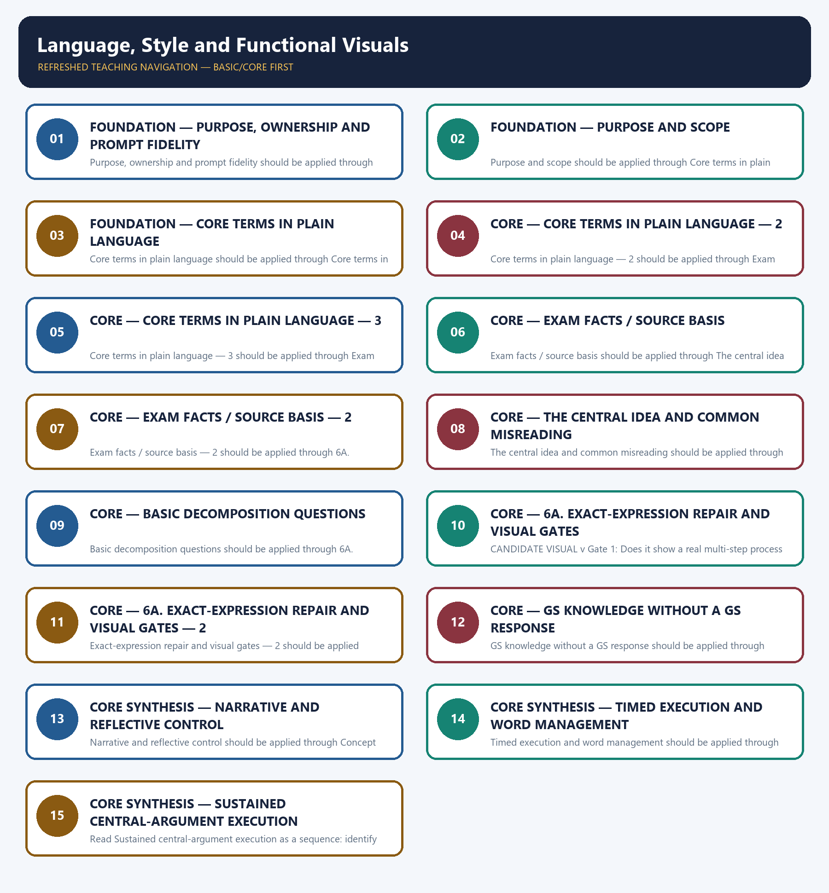

# Language, Style and Functional Visuals — Learner-v2 Complete Learning Session

> **Authoring-only generation:** 2026-09-06. No PDF was rendered and no tracker or index was mutated.

### SOURCE, PROGRESSION AND OFFICIAL-RULE AUDIT

- **Generation date:** 2026-09-06.
- **Source order:** canonical Basic owner first; Advanced owner second; Essay master framework, README, official-syllabus map, answer-worthiness audit and revision chart next; PYQ corpus and official OCR papers after that; live official UPSC pages only as a final check.
- **Basic/Advanced boundary:** complete Basic teaching remains first and Advanced material remains optional and last.
- **OCR boundary:** Repository Markdown was primary. OCR-searchable official UPSC Essay papers were supplementary only for printed instructions and V1 prompt wording. No author, official model answer, current marks split, phase allocation, paragraph count or scoring rubric was inferred.
- **Qdrant:** not used; repository Markdown and local official papers were sufficient.
- **PYQ integrity:** Three application cards use the repository's explicit V1/V2 status. No unavailable official model answer, marking rubric or attribution is invented.
- **Live-source boundary:** Live source check dated 2026-09-06: official UPSC routes were attempted and access-blocked; blocked pages support no new claim. UN, WHO and IPCC primary pages were separately checked for cross-theme factual boundaries.
- **No-formula rule:** strategy, heuristics and practice weights are never presented as official UPSC instructions or marking criteria.

### LIVE OFFICIAL-SOURCE ATTEMPT LOG

The checks below were made on 2026-09-06. Substantive official text is used only for the proposition it supports; title-only, blocked or thin pages are recorded and supply no factual claim.

- https://upsc.gov.in/examinations/previous-question-papers — attempted 2026-09-06; official page returned HTTP 403 to the live fetch, so it supports no new wording.
- https://upsc.gov.in/examinations/active-examinations — attempted 2026-09-06; official page returned HTTP 403 to the live fetch, so it supports no current-paper inference.
- https://upsc.gov.in/sites/default/files/Notif-CSP-2024-Engl-140224.pdf — searched 2026-09-06; retained only as an official scheme cross-check route, not as an Essay rubric.

## BASIC LEARNING SESSION



*Distinct embedded teaching-navigation image. The separate continuous Cārvāka-style flowchart package remains an independent at-a-glance artifact.*

### SESSION 1 — FOUNDATION — PURPOSE, OWNERSHIP AND PROMPT FIDELITY

#### DEFINITION / WHAT THIS IS CALLED

**Plain-language definition:** Objective practice: Apply Purpose, ownership and prompt fidelity by distinguishing the correct Essay-method move from nearby but invalid shortcuts; no factual-trivia recall is being tested.

**Technical definition:** Purpose, ownership and prompt fidelity should be applied through Purpose and scope and Core terms in plain language, while preserving the difference between official paper instruction and strategy, prompt wording and interpretation, example and evidence, breadth and coherence.

#### ANSWER-GRABBING OPENING — WRITE/ADAPT IN THE EXAM

> Plain-language definition: Purpose, ownership and prompt fidelity explains how Purpose and scope and Core terms in plain language combine into one usable Essay-planning move.

#### MUST-WRITE KEYWORDS

- **FOUNDATION**
- **Purpose**
- **ownership**
- **prompt fidelity**
- **Plain-language definition**
- **Technical definition**

**How to use them:** Frame the answer through FOUNDATION; define Purpose, connect ownership with prompt fidelity to explain the mechanism, and use Plain-language definition for the decisive comparison or qualification.

#### METHOD MOVE / WHAT THIS DOES

**Plain-language definition:** Purpose, ownership and prompt fidelity explains how Purpose and scope and Core terms in plain language combine into one usable Essay-planning move.

**Technical definition:** The learner fixes the printed prompt, its relationship or demand, the defensible scope, the argument function and the evidence boundary before drafting prose.

#### ANSWER-GRABBING OPENING — WRITE/ADAPT IN THE EXAM

> Purpose, ownership and prompt fidelity should be applied through Purpose and scope and Core terms in plain language, while preserving the difference between official paper instruction and strategy, prompt wording and interpretation, example and evidence, breadth and coherence.

#### MUST-WRITE KEYWORDS

- **Purpose**
- **ownership**
- **prompt**
- **fidelity**
- **scope**
- **Core**

**How to use them:** Define the first three terms, trace the relationship with the next two, and attach the final term to the exact claim, example and qualification. Qualification: Do not replace clear prose, reflective voice and functional visuals with a generic GS-style catalogue.

#### VISUAL FIRST

```text
PURPOSE, OWNERSHIP AND PROMPT FIDELITY
01. Purpose and scope
    |
    v
02. Core terms in plain language
STATUS / CATEGORY FIREWALL -> Do not replace clear prose, reflective voice and functional visuals with a generic GS-style catalogue.
```

*The rail fixes the prompt-to-argument sequence and claim boundary before explanation.*

#### CORE EXPLANATION

This topic covers sentence- and paragraph-level language quality, and the narrow, disciplined case for using a visual inside a continuous prose essay. It assumes structure (07) and content (05, 08–12) are already in place. prose would state less clearly — a genuine sequence, a genuine multi-item comparison. Removing it would cost the reader something.

#### SIMPLE SYSTEM EXAMPLE

Read Purpose, ownership and prompt fidelity as a sequence: identify Purpose and scope, follow the method through the printed proposition, and stop before adding a rule, attribution, fact or inference the audited sources do not support.

#### TECHNICAL DISTINCTION

The decisive boundary is Do not replace clear prose, reflective voice and functional visuals with a generic GS-style catalogue. This keeps Purpose and scope and Core terms in plain language in the correct prompt, method, argument and evidence category.

#### NAMED EVIDENCE AND MECHANISM

- This topic covers sentence- and paragraph-level language quality, and the narrow, disciplined case for using a visual inside a continuous prose essay. It assumes structure (07) and content (05, 08–12) are already in place.
- prose would state less clearly — a genuine sequence, a genuine multi-item comparison. Removing it would cost the reader something.

#### EXAMINER CAUTION

- Do not replace clear prose, reflective voice and functional visuals with a generic GS-style catalogue.

#### EXAM LINK

- **Objective practice:** Apply Purpose, ownership and prompt fidelity by distinguishing the correct Essay-method move from nearby but invalid shortcuts; no factual-trivia recall is being tested.
- **Essay application:** State the exact demand and the bounded writing decision.

#### MINI RECAP

- **Mechanism chain:** Purpose and scope -> Core terms in plain language
- **Qualified use:** State the exact demand and the bounded writing decision.

#### CLOSING RECALL FLOW — FOUNDATION — PURPOSE, OWNERSHIP AND PROMPT FIDELITY

```text
START / CONCEPT: FOUNDATION — Purpose, ownership and prompt fidelity
        |
        v
EXACT TERMS: FOUNDATION · Purpose · ownership · prompt fidelity · Plain-language definition · Technical definition
        |
        v
MECHANISM / ARGUMENT: Purpose, ownership and prompt fidelity should be applied through Purpose and scope and Core terms in plain language, while preserving the difference between official paper instruction and strategy, prompt wording and interpretation, example and evidence, breadth and coherence.
        |
        v
CONSEQUENCE / CONTRAST: Read Purpose, ownership and prompt fidelity as a sequence: identify Purpose and scope, follow the method through the printed proposition, and stop before adding a rule, attribution, fact or inference the audited sources do not support.
        |
        v
UPSC TRAP / ANSWER-USE: Objective practice: Apply Purpose, ownership and prompt fidelity by distinguishing the correct Essay-method move from nearby but invalid shortcuts; no factual-trivia recall is being tested.
        |
        v
ANSWER-GRABBING FORMULATION: Plain-language definition: Purpose, ownership and prompt fidelity explains how Purpose and scope and Core terms in plain language combine into one usable Essay-planning move.
```
### SESSION 2 — FOUNDATION — PURPOSE AND SCOPE

#### DEFINITION / WHAT THIS IS CALLED

**Plain-language definition:** Objective practice: Apply Purpose and scope by distinguishing the correct Essay-method move from nearby but invalid shortcuts; no factual-trivia recall is being tested.

**Technical definition:** Purpose and scope should be applied through Core terms in plain language — 2, while preserving the difference between official paper instruction and strategy, prompt wording and interpretation, example and evidence, breadth and coherence.

#### ANSWER-GRABBING OPENING — WRITE/ADAPT IN THE EXAM

> Plain-language definition: Purpose and scope explains how Core terms in plain language — 2 combine into one usable Essay-planning move.

#### MUST-WRITE KEYWORDS

- **FOUNDATION**
- **Purpose**
- **scope**
- **Plain-language definition**
- **Technical definition**
- **terms**

**How to use them:** Frame the answer through FOUNDATION; define Purpose, connect scope with Plain-language definition to explain the mechanism, and use Technical definition for the decisive comparison or qualification.

#### METHOD MOVE / WHAT THIS DOES

**Plain-language definition:** Purpose and scope explains how Core terms in plain language — 2 combine into one usable Essay-planning move.

**Technical definition:** The learner fixes the printed prompt, its relationship or demand, the defensible scope, the argument function and the evidence boundary before drafting prose.

#### ANSWER-GRABBING OPENING — WRITE/ADAPT IN THE EXAM

> Purpose and scope should be applied through Core terms in plain language — 2, while preserving the difference between official paper instruction and strategy, prompt wording and interpretation, example and evidence, breadth and coherence.

#### MUST-WRITE KEYWORDS

- **Purpose**
- **scope**
- **Core**
- **terms**
- **plain**
- **language**

**How to use them:** Define the first three terms, trace the relationship with the next two, and attach the final term to the exact claim, example and qualification. Qualification: Do not cross the ownership boundary: macro-structure belongs to 07.

#### VISUAL FIRST

```text
PURPOSE AND SCOPE
01. Core terms in plain language — 2
STATUS / CATEGORY FIREWALL -> Do not cross the ownership boundary: macro-structure belongs to 07.
```

*The rail fixes the prompt-to-argument sequence and claim boundary before explanation.*

#### CORE EXPLANATION

one sentence already said. Removing it would cost the reader nothing; it signals effort rather than supplying clarity.

#### SIMPLE SYSTEM EXAMPLE

Read Purpose and scope as a sequence: identify Core terms in plain language — 2, follow the method through the printed proposition, and stop before adding a rule, attribution, fact or inference the audited sources do not support.

#### TECHNICAL DISTINCTION

The decisive boundary is Do not cross the ownership boundary: macro-structure belongs to 07. This keeps Core terms in plain language — 2 in the correct prompt, method, argument and evidence category.

#### NAMED EVIDENCE AND MECHANISM

- one sentence already said. Removing it would cost the reader nothing; it signals effort rather than supplying clarity.

#### EXAMINER CAUTION

- Do not cross the ownership boundary: macro-structure belongs to 07.

#### EXAM LINK

- **Objective practice:** Apply Purpose and scope by distinguishing the correct Essay-method move from nearby but invalid shortcuts; no factual-trivia recall is being tested.
- **Essay application:** Define operative terms before expanding dimensions.

#### MINI RECAP

- **Mechanism chain:** Core terms in plain language — 2
- **Qualified use:** Define operative terms before expanding dimensions.

#### CLOSING RECALL FLOW — FOUNDATION — PURPOSE AND SCOPE

```text
START / CONCEPT: FOUNDATION — Purpose and scope
        |
        v
EXACT TERMS: FOUNDATION · Purpose · scope · Plain-language definition · Technical definition · terms
        |
        v
MECHANISM / ARGUMENT: Purpose and scope should be applied through Core terms in plain language — 2, while preserving the difference between official paper instruction and strategy, prompt wording and interpretation, example and evidence, breadth and coherence.
        |
        v
CONSEQUENCE / CONTRAST: Read Purpose and scope as a sequence: identify Core terms in plain language — 2, follow the method through the printed proposition, and stop before adding a rule, attribution, fact or inference the audited sources do not support.
        |
        v
UPSC TRAP / ANSWER-USE: Objective practice: Apply Purpose and scope by distinguishing the correct Essay-method move from nearby but invalid shortcuts; no factual-trivia recall is being tested.
        |
        v
ANSWER-GRABBING FORMULATION: Plain-language definition: Purpose and scope explains how Core terms in plain language — 2 combine into one usable Essay-planning move.
```
### SESSION 3 — FOUNDATION — CORE TERMS IN PLAIN LANGUAGE

#### DEFINITION / WHAT THIS IS CALLED

**Plain-language definition:** Objective practice: Apply Core terms in plain language by distinguishing the correct Essay-method move from nearby but invalid shortcuts; no factual-trivia recall is being tested.

**Technical definition:** Core terms in plain language should be applied through Core terms in plain language — 3, while preserving the difference between official paper instruction and strategy, prompt wording and interpretation, example and evidence, breadth and coherence.

#### ANSWER-GRABBING OPENING — WRITE/ADAPT IN THE EXAM

> Plain-language definition: Core terms in plain language explains how Core terms in plain language — 3 combine into one usable Essay-planning move.

#### MUST-WRITE KEYWORDS

- **FOUNDATION**
- **Core terms in plain language**
- **Plain-language definition**
- **Technical definition**
- **terms**
- **plain**

**How to use them:** Frame the answer through FOUNDATION; define Core terms in plain language, connect Plain-language definition with Technical definition to explain the mechanism, and use terms for the decisive comparison or qualification.

#### METHOD MOVE / WHAT THIS DOES

**Plain-language definition:** Core terms in plain language explains how Core terms in plain language — 3 combine into one usable Essay-planning move.

**Technical definition:** The learner fixes the printed prompt, its relationship or demand, the defensible scope, the argument function and the evidence boundary before drafting prose.

#### ANSWER-GRABBING OPENING — WRITE/ADAPT IN THE EXAM

> Core terms in plain language should be applied through Core terms in plain language — 3, while preserving the difference between official paper instruction and strategy, prompt wording and interpretation, example and evidence, breadth and coherence.

#### MUST-WRITE KEYWORDS

- **Core**
- **terms**
- **plain**
- **language**
- **test**
- **subtractive**

**How to use them:** Define the first three terms, trace the relationship with the next two, and attach the final term to the exact claim, example and qualification. Qualification: Do not use an example without explaining its argumentative function.

#### VISUAL FIRST

```text
CORE TERMS IN PLAIN LANGUAGE
01. Core terms in plain language — 3
STATUS / CATEGORY FIREWALL -> Do not use an example without explaining its argumentative function.
```

*The rail fixes the prompt-to-argument sequence and claim boundary before explanation.*

#### CORE EXPLANATION

The test is subtractive, not aesthetic. Do not ask "does this look good?" — ask "if I delete this and say it in a sentence, what is lost?" An arrow chain showing social-media design → comparison → distress → increased use → distress again may earn its place because the loop is hard to hold in a sentence. A box labelled "Causes" above three bullet points does not. In a continuous-prose essay the default is no visual at all; apply the two-gate test in Section 6A before using one.

#### SIMPLE SYSTEM EXAMPLE

Read Core terms in plain language as a sequence: identify Core terms in plain language — 3, follow the method through the printed proposition, and stop before adding a rule, attribution, fact or inference the audited sources do not support.

#### TECHNICAL DISTINCTION

The decisive boundary is Do not use an example without explaining its argumentative function. This keeps Core terms in plain language — 3 in the correct prompt, method, argument and evidence category.

#### NAMED EVIDENCE AND MECHANISM

- The test is subtractive, not aesthetic. Do not ask "does this look good?" — ask "if I delete this and say it in a sentence, what is lost?" An arrow chain showing social-media design → comparison → distress → increased use → distress again may earn its place because the loop is hard to hold in a sentence. A box labelled "Causes" above three bullet points does not. In a continuous-prose essay the default is no visual at all; apply the two-gate test in Section 6A before using one.

#### EXAMINER CAUTION

- Do not use an example without explaining its argumentative function.

#### EXAM LINK

- **Objective practice:** Apply Core terms in plain language by distinguishing the correct Essay-method move from nearby but invalid shortcuts; no factual-trivia recall is being tested.
- **Essay application:** Build one qualified thesis and keep it visible.

#### MINI RECAP

- **Mechanism chain:** Core terms in plain language — 3
- **Qualified use:** Build one qualified thesis and keep it visible.

#### CLOSING RECALL FLOW — FOUNDATION — CORE TERMS IN PLAIN LANGUAGE

```text
START / CONCEPT: FOUNDATION — Core terms in plain language
        |
        v
EXACT TERMS: FOUNDATION · Core terms in plain language · Plain-language definition · Technical definition · terms · plain
        |
        v
MECHANISM / ARGUMENT: Core terms in plain language should be applied through Core terms in plain language — 3, while preserving the difference between official paper instruction and strategy, prompt wording and interpretation, example and evidence, breadth and coherence.
        |
        v
CONSEQUENCE / CONTRAST: Objective practice: Apply Core terms in plain language by distinguishing the correct Essay-method move from nearby but invalid shortcuts; no factual-trivia recall is being tested.
        |
        v
UPSC TRAP / ANSWER-USE: Read Core terms in plain language as a sequence: identify Core terms in plain language — 3, follow the method through the printed proposition, and stop before adding a rule, attribution, fact or inference the audited sources do not support.
        |
        v
ANSWER-GRABBING FORMULATION: Plain-language definition: Core terms in plain language explains how Core terms in plain language — 3 combine into one usable Essay-planning move.
```
### SESSION 4 — CORE — CORE TERMS IN PLAIN LANGUAGE — 2

#### DEFINITION / WHAT THIS IS CALLED

**Plain-language definition:** Objective practice: Apply Core terms in plain language — 2 by distinguishing the correct Essay-method move from nearby but invalid shortcuts; no factual-trivia recall is being tested.

**Technical definition:** Core terms in plain language — 2 should be applied through Exam facts / source basis, while preserving the difference between official paper instruction and strategy, prompt wording and interpretation, example and evidence, breadth and coherence.

#### ANSWER-GRABBING OPENING — WRITE/ADAPT IN THE EXAM

> Plain-language definition: Core terms in plain language — 2 explains how Exam facts / source basis combine into one usable Essay-planning move.

#### MUST-WRITE KEYWORDS

- **Core terms in plain language**
- **Plain-language definition**
- **Technical definition**
- **terms**
- **plain**
- **language**

**How to use them:** Frame the answer through Core terms in plain language; define Plain-language definition, connect Technical definition with terms to explain the mechanism, and use plain for the decisive comparison or qualification.

#### METHOD MOVE / WHAT THIS DOES

**Plain-language definition:** Core terms in plain language — 2 explains how Exam facts / source basis combine into one usable Essay-planning move.

**Technical definition:** The learner fixes the printed prompt, its relationship or demand, the defensible scope, the argument function and the evidence boundary before drafting prose.

#### ANSWER-GRABBING OPENING — WRITE/ADAPT IN THE EXAM

> Core terms in plain language — 2 should be applied through Exam facts / source basis, while preserving the difference between official paper instruction and strategy, prompt wording and interpretation, example and evidence, breadth and coherence.

#### MUST-WRITE KEYWORDS

- **Core**
- **terms**
- **plain**
- **language**
- **Exam**
- **facts**

**How to use them:** Define the first three terms, trace the relationship with the next two, and attach the final term to the exact claim, example and qualification. Qualification: Do not treat a pedagogical scaffold as an official UPSC marking rule.

#### VISUAL FIRST

```text
CORE TERMS IN PLAIN LANGUAGE — 2
01. Exam facts / source basis
STATUS / CATEGORY FIREWALL -> Do not treat a pedagogical scaffold as an official UPSC marking rule.
```

*The rail fixes the prompt-to-argument sequence and claim boundary before explanation.*

#### CORE EXPLANATION

visuals/diagrams are permitted or expected within a written essay response (see ../README.md).

#### SIMPLE SYSTEM EXAMPLE

Read Core terms in plain language — 2 as a sequence: identify Exam facts / source basis, follow the method through the printed proposition, and stop before adding a rule, attribution, fact or inference the audited sources do not support.

#### TECHNICAL DISTINCTION

The decisive boundary is Do not treat a pedagogical scaffold as an official UPSC marking rule. This keeps Exam facts / source basis in the correct prompt, method, argument and evidence category.

#### NAMED EVIDENCE AND MECHANISM

- visuals/diagrams are permitted or expected within a written essay response (see ../README.md).

#### EXAMINER CAUTION

- Do not treat a pedagogical scaffold as an official UPSC marking rule.

#### EXAM LINK

- **Objective practice:** Apply Core terms in plain language — 2 by distinguishing the correct Essay-method move from nearby but invalid shortcuts; no factual-trivia recall is being tested.
- **Essay application:** Give every paragraph one argumentative job.

#### MINI RECAP

- **Mechanism chain:** Exam facts / source basis
- **Qualified use:** Give every paragraph one argumentative job.

#### CLOSING RECALL FLOW — CORE — CORE TERMS IN PLAIN LANGUAGE — 2

```text
START / CONCEPT: CORE — Core terms in plain language — 2
        |
        v
EXACT TERMS: Core terms in plain language · Plain-language definition · Technical definition · terms · plain · language
        |
        v
MECHANISM / ARGUMENT: Core terms in plain language — 2 should be applied through Exam facts / source basis, while preserving the difference between official paper instruction and strategy, prompt wording and interpretation, example and evidence, breadth and coherence.
        |
        v
CONSEQUENCE / CONTRAST: Objective practice: Apply Core terms in plain language — 2 by distinguishing the correct Essay-method move from nearby but invalid shortcuts; no factual-trivia recall is being tested.
        |
        v
UPSC TRAP / ANSWER-USE: Read Core terms in plain language — 2 as a sequence: identify Exam facts / source basis, follow the method through the printed proposition, and stop before adding a rule, attribution, fact or inference the audited sources do not support.
        |
        v
ANSWER-GRABBING FORMULATION: Plain-language definition: Core terms in plain language — 2 explains how Exam facts / source basis combine into one usable Essay-planning move.
```
### SESSION 5 — CORE — CORE TERMS IN PLAIN LANGUAGE — 3

#### DEFINITION / WHAT THIS IS CALLED

**Plain-language definition:** Objective practice: Apply Core terms in plain language — 3 by distinguishing the correct Essay-method move from nearby but invalid shortcuts; no factual-trivia recall is being tested.

**Technical definition:** Core terms in plain language — 3 should be applied through Exam facts / source basis — 2, while preserving the difference between official paper instruction and strategy, prompt wording and interpretation, example and evidence, breadth and coherence.

#### ANSWER-GRABBING OPENING — WRITE/ADAPT IN THE EXAM

> Plain-language definition: Core terms in plain language — 3 explains how Exam facts / source basis — 2 combine into one usable Essay-planning move.

#### MUST-WRITE KEYWORDS

- **Core terms in plain language**
- **Plain-language definition**
- **Technical definition**
- **terms**
- **plain**
- **language**

**How to use them:** Frame the answer through Core terms in plain language; define Plain-language definition, connect Technical definition with terms to explain the mechanism, and use plain for the decisive comparison or qualification.

#### METHOD MOVE / WHAT THIS DOES

**Plain-language definition:** Core terms in plain language — 3 explains how Exam facts / source basis — 2 combine into one usable Essay-planning move.

**Technical definition:** The learner fixes the printed prompt, its relationship or demand, the defensible scope, the argument function and the evidence boundary before drafting prose.

#### ANSWER-GRABBING OPENING — WRITE/ADAPT IN THE EXAM

> Core terms in plain language — 3 should be applied through Exam facts / source basis — 2, while preserving the difference between official paper instruction and strategy, prompt wording and interpretation, example and evidence, breadth and coherence.

#### MUST-WRITE KEYWORDS

- **Core**
- **terms**
- **plain**
- **language**
- **Exam**
- **facts**

**How to use them:** Define the first three terms, trace the relationship with the next two, and attach the final term to the exact claim, example and qualification. Qualification: Do not let a counter-view replace the thesis; use it to qualify the thesis.

#### VISUAL FIRST

```text
CORE TERMS IN PLAIN LANGUAGE — 3
01. Exam facts / source basis — 2
STATUS / CATEGORY FIREWALL -> Do not let a counter-view replace the thesis; use it to qualify the thesis.
```

*The rail fixes the prompt-to-argument sequence and claim boundary before explanation.*

#### CORE EXPLANATION

is that visuals should be rare and only used where they demonstrably clarify a process/comparison — this is a pedagogical caution, not an official prohibition or requirement.

#### SIMPLE SYSTEM EXAMPLE

Read Core terms in plain language — 3 as a sequence: identify Exam facts / source basis — 2, follow the method through the printed proposition, and stop before adding a rule, attribution, fact or inference the audited sources do not support.

#### TECHNICAL DISTINCTION

The decisive boundary is Do not let a counter-view replace the thesis; use it to qualify the thesis. This keeps Exam facts / source basis — 2 in the correct prompt, method, argument and evidence category.

#### NAMED EVIDENCE AND MECHANISM

- is that visuals should be rare and only used where they demonstrably clarify a process/comparison — this is a pedagogical caution, not an official prohibition or requirement.

#### EXAMINER CAUTION

- Do not let a counter-view replace the thesis; use it to qualify the thesis.

#### EXAM LINK

- **Objective practice:** Apply Core terms in plain language — 3 by distinguishing the correct Essay-method move from nearby but invalid shortcuts; no factual-trivia recall is being tested.
- **Essay application:** Join a named illustration to its mechanism.

#### MINI RECAP

- **Mechanism chain:** Exam facts / source basis — 2
- **Qualified use:** Join a named illustration to its mechanism.

#### CLOSING RECALL FLOW — CORE — CORE TERMS IN PLAIN LANGUAGE — 3

```text
START / CONCEPT: CORE — Core terms in plain language — 3
        |
        v
EXACT TERMS: Core terms in plain language · Plain-language definition · Technical definition · terms · plain · language
        |
        v
MECHANISM / ARGUMENT: Core terms in plain language — 3 should be applied through Exam facts / source basis — 2, while preserving the difference between official paper instruction and strategy, prompt wording and interpretation, example and evidence, breadth and coherence.
        |
        v
CONSEQUENCE / CONTRAST: Objective practice: Apply Core terms in plain language — 3 by distinguishing the correct Essay-method move from nearby but invalid shortcuts; no factual-trivia recall is being tested.
        |
        v
UPSC TRAP / ANSWER-USE: Read Core terms in plain language — 3 as a sequence: identify Exam facts / source basis — 2, follow the method through the printed proposition, and stop before adding a rule, attribution, fact or inference the audited sources do not support.
        |
        v
ANSWER-GRABBING FORMULATION: Plain-language definition: Core terms in plain language — 3 explains how Exam facts / source basis — 2 combine into one usable Essay-planning move.
```
### SESSION 6 — CORE — EXAM FACTS / SOURCE BASIS

#### DEFINITION / WHAT THIS IS CALLED

**Plain-language definition:** Objective practice: Apply Exam facts / source basis by distinguishing the correct Essay-method move from nearby but invalid shortcuts; no factual-trivia recall is being tested.

**Technical definition:** Exam facts / source basis should be applied through The central idea and common misreading and Basic decomposition questions, while preserving the difference between official paper instruction and strategy, prompt wording and interpretation, example and evidence, breadth and coherence.

#### ANSWER-GRABBING OPENING — WRITE/ADAPT IN THE EXAM

> Plain-language definition: Exam facts / source basis explains how The central idea and common misreading and Basic decomposition questions combine into one usable Essay-planning move.

#### MUST-WRITE KEYWORDS

- **Exam facts / source basis**
- **Plain-language definition**
- **Technical definition**
- **Exam**
- **s**
- **basis**

**How to use them:** Frame the answer through Exam facts / source basis; define Plain-language definition, connect Technical definition with Exam to explain the mechanism, and use s for the decisive comparison or qualification.

#### METHOD MOVE / WHAT THIS DOES

**Plain-language definition:** Exam facts / source basis explains how The central idea and common misreading and Basic decomposition questions combine into one usable Essay-planning move.

**Technical definition:** The learner fixes the printed prompt, its relationship or demand, the defensible scope, the argument function and the evidence boundary before drafting prose.

#### ANSWER-GRABBING OPENING — WRITE/ADAPT IN THE EXAM

> Exam facts / source basis should be applied through The central idea and common misreading and Basic decomposition questions, while preserving the difference between official paper instruction and strategy, prompt wording and interpretation, example and evidence, breadth and coherence.

#### MUST-WRITE KEYWORDS

- **Exam**
- **facts**
- **basis**
- **central**
- **idea**
- **common**

**How to use them:** Define the first three terms, trace the relationship with the next two, and attach the final term to the exact claim, example and qualification. Qualification: Do not use an unverified quotation, statistic, attribution or anecdote.

#### VISUAL FIRST

```text
EXAM FACTS / SOURCE BASIS
01. The central idea and common misreading
    |
    v
02. Basic decomposition questions
STATUS / CATEGORY FIREWALL -> Do not use an unverified quotation, statistic, attribution or anecdote.
```

*The rail fixes the prompt-to-argument sequence and claim boundary before explanation.*

#### CORE EXPLANATION

Central idea: clear, precise, moderately plain prose communicates an argument better than dense, elaborate vocabulary — precision beats decoration. Common misreading: believing that longer words, alliteration, or abstract phrasing make an essay sound more sophisticated — in fact these often obscure the actual claim being made. 1. Does this sentence state a specific claim, or does it gesture vaguely at a theme? 2. Could I replace any ornamental word here with a plainer, more precise one without losing meaning? 3. Is this paragraph's central claim clear on a single read? 4. If I were tempted to add a diagram here, does it clarify an actual process/comparison, or would prose alone communicate it just as well? 5. Have I varied sentence length and structure, or does every sentence follow the same pattern?

#### SIMPLE SYSTEM EXAMPLE

Read Exam facts / source basis as a sequence: identify The central idea and common misreading, follow the method through the printed proposition, and stop before adding a rule, attribution, fact or inference the audited sources do not support.

#### TECHNICAL DISTINCTION

The decisive boundary is Do not use an unverified quotation, statistic, attribution or anecdote. This keeps The central idea and common misreading and Basic decomposition questions in the correct prompt, method, argument and evidence category.

#### NAMED EVIDENCE AND MECHANISM

- Central idea: clear, precise, moderately plain prose communicates an argument better than dense, elaborate vocabulary — precision beats decoration. Common misreading: believing that longer words, alliteration, or abstract phrasing make an essay sound more sophisticated — in fact these often obscure the actual claim being made.
- 1. Does this sentence state a specific claim, or does it gesture vaguely at a theme? 2. Could I replace any ornamental word here with a plainer, more precise one without losing meaning? 3. Is this paragraph's central claim clear on a single read? 4. If I were tempted to add a diagram here, does it clarify an actual process/comparison, or would prose alone communicate it just as well? 5. Have I varied sentence length and structure, or does every sentence follow the same pattern?

#### EXAMINER CAUTION

- Do not use an unverified quotation, statistic, attribution or anecdote.

#### EXAM LINK

- **Objective practice:** Apply Exam facts / source basis by distinguishing the correct Essay-method move from nearby but invalid shortcuts; no factual-trivia recall is being tested.
- **Essay application:** Use a counter-case to refine, not derail, the thesis.

#### MINI RECAP

- **Mechanism chain:** The central idea and common misreading -> Basic decomposition questions
- **Qualified use:** Use a counter-case to refine, not derail, the thesis.

#### CLOSING RECALL FLOW — CORE — EXAM FACTS / SOURCE BASIS

```text
START / CONCEPT: CORE — Exam facts / source basis
        |
        v
EXACT TERMS: Exam facts / source basis · Plain-language definition · Technical definition · Exam · s · basis
        |
        v
MECHANISM / ARGUMENT: Objective practice: Apply Exam facts / source basis by distinguishing the correct Essay-method move from nearby but invalid shortcuts; no factual-trivia recall is being tested.
        |
        v
CONSEQUENCE / CONTRAST: Exam facts / source basis should be applied through The central idea and common misreading and Basic decomposition questions, while preserving the difference between official paper instruction and strategy, prompt wording and interpretation, example and evidence, breadth and coherence.
        |
        v
UPSC TRAP / ANSWER-USE: Read Exam facts / source basis as a sequence: identify The central idea and common misreading, follow the method through the printed proposition, and stop before adding a rule, attribution, fact or inference the audited sources do not support.
        |
        v
ANSWER-GRABBING FORMULATION: Plain-language definition: Exam facts / source basis explains how The central idea and common misreading and Basic decomposition questions combine into one usable Essay-planning move.
```
### SESSION 7 — CORE — EXAM FACTS / SOURCE BASIS — 2

#### DEFINITION / WHAT THIS IS CALLED

**Plain-language definition:** Objective practice: Apply Exam facts / source basis — 2 by distinguishing the correct Essay-method move from nearby but invalid shortcuts; no factual-trivia recall is being tested.

**Technical definition:** Exam facts / source basis — 2 should be applied through 6A.

#### ANSWER-GRABBING OPENING — WRITE/ADAPT IN THE EXAM

> Plain-language definition: Exam facts / source basis — 2 explains how 6A.

#### MUST-WRITE KEYWORDS

- **Exam facts / source basis**
- **Plain-language definition**
- **Technical definition**
- **Exam**
- **s**
- **basis**

**How to use them:** Frame the answer through Exam facts / source basis; define Plain-language definition, connect Technical definition with Exam to explain the mechanism, and use s for the decisive comparison or qualification.

#### METHOD MOVE / WHAT THIS DOES

**Plain-language definition:** Exam facts / source basis — 2 explains how 6A. Exact-expression repair and visual gates combine into one usable Essay-planning move.

**Technical definition:** The learner fixes the printed prompt, its relationship or demand, the defensible scope, the argument function and the evidence boundary before drafting prose.

#### ANSWER-GRABBING OPENING — WRITE/ADAPT IN THE EXAM

> Exam facts / source basis — 2 should be applied through 6A. Exact-expression repair and visual gates, while preserving the difference between official paper instruction and strategy, prompt wording and interpretation, example and evidence, breadth and coherence.

#### MUST-WRITE KEYWORDS

- **Exam**
- **facts**
- **basis**
- **Exact-expression**
- **repair**
- **visual**

**How to use them:** Define the first three terms, trace the relationship with the next two, and attach the final term to the exact claim, example and qualification. Qualification: Do not multiply dimensions that repeat the same claim in new vocabulary.

#### VISUAL FIRST

```text
EXAM FACTS / SOURCE BASIS — 2
01. 6A. Exact-expression repair and visual gates
STATUS / CATEGORY FIREWALL -> Do not multiply dimensions that repeat the same claim in new vocabulary.
```

*The rail fixes the prompt-to-argument sequence and claim boundary before explanation.*

#### CORE EXPLANATION

Before: “The multifarious tapestry of digital society has a deleterious impact on youth in the contemporary milieu.”

#### SIMPLE SYSTEM EXAMPLE

Read Exam facts / source basis — 2 as a sequence: identify 6A. Exact-expression repair and visual gates, follow the method through the printed proposition, and stop before adding a rule, attribution, fact or inference the audited sources do not support.

#### TECHNICAL DISTINCTION

The decisive boundary is Do not multiply dimensions that repeat the same claim in new vocabulary. This keeps 6A. Exact-expression repair and visual gates in the correct prompt, method, argument and evidence category.

#### NAMED EVIDENCE AND MECHANISM

- Before: “The multifarious tapestry of digital society has a deleterious impact on youth in the contemporary milieu.”

#### EXAMINER CAUTION

- Do not multiply dimensions that repeat the same claim in new vocabulary.

#### EXAM LINK

- **Objective practice:** Apply Exam facts / source basis — 2 by distinguishing the correct Essay-method move from nearby but invalid shortcuts; no factual-trivia recall is being tested.
- **Essay application:** Sequence paragraphs through explicit logical bridges.

#### MINI RECAP

- **Mechanism chain:** 6A. Exact-expression repair and visual gates
- **Qualified use:** Sequence paragraphs through explicit logical bridges.

#### CLOSING RECALL FLOW — CORE — EXAM FACTS / SOURCE BASIS — 2

```text
START / CONCEPT: CORE — Exam facts / source basis — 2
        |
        v
EXACT TERMS: Exam facts / source basis · Plain-language definition · Technical definition · Exam · s · basis
        |
        v
MECHANISM / ARGUMENT: Exam facts / source basis — 2 should be applied through 6A.
        |
        v
CONSEQUENCE / CONTRAST: Objective practice: Apply Exam facts / source basis — 2 by distinguishing the correct Essay-method move from nearby but invalid shortcuts; no factual-trivia recall is being tested.
        |
        v
UPSC TRAP / ANSWER-USE: Exact-expression repair and visual gates, follow the method through the printed proposition, and stop before adding a rule, attribution, fact or inference the audited sources do not support.
        |
        v
ANSWER-GRABBING FORMULATION: Plain-language definition: Exam facts / source basis — 2 explains how 6A.
```
### SESSION 8 — CORE — THE CENTRAL IDEA AND COMMON MISREADING

#### DEFINITION / WHAT THIS IS CALLED

**Plain-language definition:** Objective practice: Apply The central idea and common misreading by distinguishing the correct Essay-method move from nearby but invalid shortcuts; no factual-trivia recall is being tested.

**Technical definition:** The central idea and common misreading should be applied through 6A.

#### ANSWER-GRABBING OPENING — WRITE/ADAPT IN THE EXAM

> Plain-language definition: The central idea and common misreading explains how 6A.

#### MUST-WRITE KEYWORDS

- **The central idea**
- **common misreading**
- **Plain-language definition**
- **Technical definition**
- **central**
- **idea**

**How to use them:** Frame the answer through The central idea; define common misreading, connect Plain-language definition with Technical definition to explain the mechanism, and use central for the decisive comparison or qualification.

#### METHOD MOVE / WHAT THIS DOES

**Plain-language definition:** The central idea and common misreading explains how 6A. Exact-expression repair and visual gates — 2 combine into one usable Essay-planning move.

**Technical definition:** The learner fixes the printed prompt, its relationship or demand, the defensible scope, the argument function and the evidence boundary before drafting prose.

#### ANSWER-GRABBING OPENING — WRITE/ADAPT IN THE EXAM

> The central idea and common misreading should be applied through 6A. Exact-expression repair and visual gates — 2, while preserving the difference between official paper instruction and strategy, prompt wording and interpretation, example and evidence, breadth and coherence.

#### MUST-WRITE KEYWORDS

- **central**
- **idea**
- **common**
- **misreading**
- **Exact-expression**
- **repair**

**How to use them:** Define the first three terms, trace the relationship with the next two, and attach the final term to the exact claim, example and qualification. Qualification: Do not end with aspiration unsupported by the preceding argument.

#### VISUAL FIRST

```text
THE CENTRAL IDEA AND COMMON MISREADING
01. 6A. Exact-expression repair and visual gates — 2
STATUS / CATEGORY FIREWALL -> Do not end with aspiration unsupported by the preceding argument.
```

*The rail fixes the prompt-to-argument sequence and claim boundary before explanation.*

#### CORE EXPLANATION

After: “Platforms that reward comparison can make some young users measure self-worth against curated lives, increasing anxiety and loneliness.” The repair names actor, mechanism and consequence; it does not merely sound formal.

#### SIMPLE SYSTEM EXAMPLE

Read The central idea and common misreading as a sequence: identify 6A. Exact-expression repair and visual gates — 2, follow the method through the printed proposition, and stop before adding a rule, attribution, fact or inference the audited sources do not support.

#### TECHNICAL DISTINCTION

The decisive boundary is Do not end with aspiration unsupported by the preceding argument. This keeps 6A. Exact-expression repair and visual gates — 2 in the correct prompt, method, argument and evidence category.

#### NAMED EVIDENCE AND MECHANISM

- After: “Platforms that reward comparison can make some young users measure self-worth against curated lives, increasing anxiety and loneliness.” The repair names actor, mechanism and consequence; it does not merely sound formal.

#### EXAMINER CAUTION

- Do not end with aspiration unsupported by the preceding argument.

#### EXAM LINK

- **Objective practice:** Apply The central idea and common misreading by distinguishing the correct Essay-method move from nearby but invalid shortcuts; no factual-trivia recall is being tested.
- **Essay application:** Move across actor, scale and time only when the claim changes.

#### MINI RECAP

- **Mechanism chain:** 6A. Exact-expression repair and visual gates — 2
- **Qualified use:** Move across actor, scale and time only when the claim changes.

#### CLOSING RECALL FLOW — CORE — THE CENTRAL IDEA AND COMMON MISREADING

```text
START / CONCEPT: CORE — The central idea and common misreading
        |
        v
EXACT TERMS: The central idea · common misreading · Plain-language definition · Technical definition · central · idea
        |
        v
MECHANISM / ARGUMENT: The central idea and common misreading should be applied through 6A.
        |
        v
CONSEQUENCE / CONTRAST: Objective practice: Apply The central idea and common misreading by distinguishing the correct Essay-method move from nearby but invalid shortcuts; no factual-trivia recall is being tested.
        |
        v
UPSC TRAP / ANSWER-USE: Qualification: Do not end with aspiration unsupported by the preceding argument.
        |
        v
ANSWER-GRABBING FORMULATION: Plain-language definition: The central idea and common misreading explains how 6A.
```
### SESSION 9 — CORE — BASIC DECOMPOSITION QUESTIONS

#### DEFINITION / WHAT THIS IS CALLED

**Plain-language definition:** Objective practice: Apply Basic decomposition questions by distinguishing the correct Essay-method move from nearby but invalid shortcuts; no factual-trivia recall is being tested.

**Technical definition:** Basic decomposition questions should be applied through 6A.

#### ANSWER-GRABBING OPENING — WRITE/ADAPT IN THE EXAM

> Objective practice: Apply Basic decomposition questions by distinguishing the correct Essay-method move from nearby but invalid shortcuts; no factual-trivia recall is being tested.

#### MUST-WRITE KEYWORDS

- **Basic decomposition questions**
- **Plain-language definition**
- **Technical definition**
- **Basic**
- **decomposition**
- **questions**

**How to use them:** Frame the answer through Basic decomposition questions; define Plain-language definition, connect Technical definition with Basic to explain the mechanism, and use decomposition for the decisive comparison or qualification.

#### METHOD MOVE / WHAT THIS DOES

**Plain-language definition:** Basic decomposition questions explains how 6A. Exact-expression repair and visual gates — 3 combine into one usable Essay-planning move.

**Technical definition:** The learner fixes the printed prompt, its relationship or demand, the defensible scope, the argument function and the evidence boundary before drafting prose.

#### ANSWER-GRABBING OPENING — WRITE/ADAPT IN THE EXAM

> Basic decomposition questions should be applied through 6A. Exact-expression repair and visual gates — 3, while preserving the difference between official paper instruction and strategy, prompt wording and interpretation, example and evidence, breadth and coherence.

#### MUST-WRITE KEYWORDS

- **Basic**
- **decomposition**
- **questions**
- **Exact-expression**
- **repair**
- **visual**

**How to use them:** Define the first three terms, trace the relationship with the next two, and attach the final term to the exact claim, example and qualification. Qualification: Do not sacrifice the second essay's time budget to perfect the first.

#### VISUAL FIRST

```text
BASIC DECOMPOSITION QUESTIONS
01. 6A. Exact-expression repair and visual gates — 3
STATUS / CATEGORY FIREWALL -> Do not sacrifice the second essay's time budget to perfect the first.
```

*The rail fixes the prompt-to-argument sequence and claim boundary before explanation.*

#### CORE EXPLANATION

1. Its first sentence makes one response-relevant claim. 2. A precise actor, institution or process replaces an abstract noun pile. 3. “Because/how” is answered by a mechanism, not an assertion. 4. Any example is named, proportionate and followed by its significance. 5. A qualification prevents overclaiming. 6. Its last sentence links to the next claim. 7. No unexplained acronym, slogan, quotation or decorative adjective remains.

#### SIMPLE SYSTEM EXAMPLE

Read Basic decomposition questions as a sequence: identify 6A. Exact-expression repair and visual gates — 3, follow the method through the printed proposition, and stop before adding a rule, attribution, fact or inference the audited sources do not support.

#### TECHNICAL DISTINCTION

The decisive boundary is Do not sacrifice the second essay's time budget to perfect the first. This keeps 6A. Exact-expression repair and visual gates — 3 in the correct prompt, method, argument and evidence category.

#### NAMED EVIDENCE AND MECHANISM

- 1. Its first sentence makes one response-relevant claim. 2. A precise actor, institution or process replaces an abstract noun pile. 3. “Because/how” is answered by a mechanism, not an assertion. 4. Any example is named, proportionate and followed by its significance. 5. A qualification prevents overclaiming. 6. Its last sentence links to the next claim. 7. No unexplained acronym, slogan, quotation or decorative adjective remains.

#### EXAMINER CAUTION

- Do not sacrifice the second essay's time budget to perfect the first.

#### EXAM LINK

- **Objective practice:** Apply Basic decomposition questions by distinguishing the correct Essay-method move from nearby but invalid shortcuts; no factual-trivia recall is being tested.
- **Essay application:** Use ethical nuance without moralising.

#### MINI RECAP

- **Mechanism chain:** 6A. Exact-expression repair and visual gates — 3
- **Qualified use:** Use ethical nuance without moralising.

#### CLOSING RECALL FLOW — CORE — BASIC DECOMPOSITION QUESTIONS

```text
START / CONCEPT: CORE — Basic decomposition questions
        |
        v
EXACT TERMS: Basic decomposition questions · Plain-language definition · Technical definition · Basic · decomposition · questions
        |
        v
MECHANISM / ARGUMENT: Basic decomposition questions should be applied through 6A.
        |
        v
CONSEQUENCE / CONTRAST: Plain-language definition: Basic decomposition questions explains how 6A.
        |
        v
UPSC TRAP / ANSWER-USE: Qualification: Do not sacrifice the second essay's time budget to perfect the first.
        |
        v
ANSWER-GRABBING FORMULATION: Objective practice: Apply Basic decomposition questions by distinguishing the correct Essay-method move from nearby but invalid shortcuts; no factual-trivia recall is being tested.
```
### SESSION 10 — CORE — 6A. EXACT-EXPRESSION REPAIR AND VISUAL GATES

#### DEFINITION / WHAT THIS IS CALLED

**Plain-language definition:** Exact-expression repair and visual gates by distinguishing the correct Essay-method move from nearby but invalid shortcuts; no factual-trivia recall is being tested.

**Technical definition:** CANDIDATE VISUAL v Gate 1: Does it show a real multi-step process or genuine comparison? no - do not use; write prose yes v Gate 2: Would one or two sentences explain it equally clearly? yes - do not use; prose is sufficient no - use a minimal, labelled visual, then interpret it in prose.

#### ANSWER-GRABBING OPENING — WRITE/ADAPT IN THE EXAM

> Exact-expression repair and visual gates — 4, follow the method through the printed proposition, and stop before adding a rule, attribution, fact or inference the audited sources do not support.

#### MUST-WRITE KEYWORDS

- **visual gates**
- **Plain-language definition**
- **Technical definition**
- **Exact-expression**
- **repair**
- **6A. Exact-expression repair**

**How to use them:** Frame the answer through visual gates; define Plain-language definition, connect Technical definition with Exact-expression to explain the mechanism, and use repair for the decisive comparison or qualification.

#### METHOD MOVE / WHAT THIS DOES

**Plain-language definition:** 6A. Exact-expression repair and visual gates explains how 6A. Exact-expression repair and visual gates — 4 combine into one usable Essay-planning move.

**Technical definition:** The learner fixes the printed prompt, its relationship or demand, the defensible scope, the argument function and the evidence boundary before drafting prose.

#### ANSWER-GRABBING OPENING — WRITE/ADAPT IN THE EXAM

> 6A. Exact-expression repair and visual gates should be applied through 6A. Exact-expression repair and visual gates — 4, while preserving the difference between official paper instruction and strategy, prompt wording and interpretation, example and evidence, breadth and coherence.

#### MUST-WRITE KEYWORDS

- **Exact-expression**
- **repair**
- **visual**
- **gates**
- **CANDIDATE**
- **Gate**

**How to use them:** Define the first three terms, trace the relationship with the next two, and attach the final term to the exact claim, example and qualification. Qualification: Do not mistake novelty of phrasing for originality of thought.

#### VISUAL FIRST

```text
6A. EXACT-EXPRESSION REPAIR AND VISUAL GATES
01. 6A. Exact-expression repair and visual gates — 4
STATUS / CATEGORY FIREWALL -> Do not mistake novelty of phrasing for originality of thought.
```

*The rail fixes the prompt-to-argument sequence and claim boundary before explanation.*

#### CORE EXPLANATION

CANDIDATE VISUAL v Gate 1: Does it show a real multi-step process or genuine comparison? no - do not use; write prose yes v Gate 2: Would one or two sentences explain it equally clearly? yes - do not use; prose is sufficient no - use a minimal, labelled visual, then interpret it in prose

#### SIMPLE SYSTEM EXAMPLE

Read 6A. Exact-expression repair and visual gates as a sequence: identify 6A. Exact-expression repair and visual gates — 4, follow the method through the printed proposition, and stop before adding a rule, attribution, fact or inference the audited sources do not support.

#### TECHNICAL DISTINCTION

The decisive boundary is Do not mistake novelty of phrasing for originality of thought. This keeps 6A. Exact-expression repair and visual gates — 4 in the correct prompt, method, argument and evidence category.

#### NAMED EVIDENCE AND MECHANISM

- CANDIDATE VISUAL v Gate 1: Does it show a real multi-step process or genuine comparison? no - do not use; write prose yes v Gate 2: Would one or two sentences explain it equally clearly? yes - do not use; prose is sufficient no - use a minimal, labelled visual, then interpret it in prose

#### EXAMINER CAUTION

- Do not mistake novelty of phrasing for originality of thought.

#### EXAM LINK

- **Objective practice:** Apply 6A. Exact-expression repair and visual gates by distinguishing the correct Essay-method move from nearby but invalid shortcuts; no factual-trivia recall is being tested.
- **Essay application:** Preserve factual and quotation integrity.

#### MINI RECAP

- **Mechanism chain:** 6A. Exact-expression repair and visual gates — 4
- **Qualified use:** Preserve factual and quotation integrity.

#### CLOSING RECALL FLOW — CORE — 6A. EXACT-EXPRESSION REPAIR AND VISUAL GATES

```text
START / CONCEPT: CORE — 6A. Exact-expression repair and visual gates
        |
        v
EXACT TERMS: visual gates · Plain-language definition · Technical definition · Exact-expression · repair · 6A. Exact-expression repair
        |
        v
MECHANISM / ARGUMENT: Exact-expression repair and visual gates should be applied through 6A.
        |
        v
CONSEQUENCE / CONTRAST: Exact-expression repair and visual gates by distinguishing the correct Essay-method move from nearby but invalid shortcuts; no factual-trivia recall is being tested.
        |
        v
UPSC TRAP / ANSWER-USE: Do not miss this limiting distinction: exact-expression repair and visual gates — 4 Qualified use.
        |
        v
ANSWER-GRABBING FORMULATION: Exact-expression repair and visual gates — 4, follow the method through the printed proposition, and stop before adding a rule, attribution, fact or inference the audited sources do not support.
```
### SESSION 11 — CORE — 6A. EXACT-EXPRESSION REPAIR AND VISUAL GATES — 2

#### DEFINITION / WHAT THIS IS CALLED

**Plain-language definition:** Exact-expression repair and visual gates — 2 by distinguishing the correct Essay-method move from nearby but invalid shortcuts; no factual-trivia recall is being tested.

**Technical definition:** Exact-expression repair and visual gates — 2 should be applied through 6A.

#### ANSWER-GRABBING OPENING — WRITE/ADAPT IN THE EXAM

> Exact-expression repair and visual gates — 2 explains how 6A.

#### MUST-WRITE KEYWORDS

- **visual gates**
- **Plain-language definition**
- **Technical definition**
- **Exact-expression**
- **repair**
- **6A. Exact-expression repair**

**How to use them:** Frame the answer through visual gates; define Plain-language definition, connect Technical definition with Exact-expression to explain the mechanism, and use repair for the decisive comparison or qualification.

#### METHOD MOVE / WHAT THIS DOES

**Plain-language definition:** 6A. Exact-expression repair and visual gates — 2 explains how 6A. Exact-expression repair and visual gates — 5 and India-first illustration starters combine into one usable Essay-planning move.

**Technical definition:** The learner fixes the printed prompt, its relationship or demand, the defensible scope, the argument function and the evidence boundary before drafting prose.

#### ANSWER-GRABBING OPENING — WRITE/ADAPT IN THE EXAM

> 6A. Exact-expression repair and visual gates — 2 should be applied through 6A. Exact-expression repair and visual gates — 5 and India-first illustration starters, while preserving the difference between official paper instruction and strategy, prompt wording and interpretation, example and evidence, breadth and coherence.

#### MUST-WRITE KEYWORDS

- **Exact-expression**
- **repair**
- **visual**
- **gates**
- **India-first**
- **illustration**

**How to use them:** Define the first three terms, trace the relationship with the next two, and attach the final term to the exact claim, example and qualification. Qualification: Do not replace clear prose, reflective voice and functional visuals with a generic GS-style catalogue.

#### VISUAL FIRST

```text
6A. EXACT-EXPRESSION REPAIR AND VISUAL GATES — 2
01. 6A. Exact-expression repair and visual gates — 5
    |
    v
02. India-first illustration starters
STATUS / CATEGORY FIREWALL -> Do not replace clear prose, reflective voice and functional visuals with a generic GS-style catalogue.
```

*The rail fixes the prompt-to-argument sequence and claim boundary before explanation.*

#### CORE EXPLANATION

Passing both gates is necessary, not sufficient: the visual must be small, readable and integrated into an argued paragraph. It never substitutes for one. Not directly applicable — see 12 for illustration content; this topic concerns only how illustrations are phrased once chosen.

#### SIMPLE SYSTEM EXAMPLE

Read 6A. Exact-expression repair and visual gates — 2 as a sequence: identify 6A. Exact-expression repair and visual gates — 5, follow the method through the printed proposition, and stop before adding a rule, attribution, fact or inference the audited sources do not support.

#### TECHNICAL DISTINCTION

The decisive boundary is Do not replace clear prose, reflective voice and functional visuals with a generic GS-style catalogue. This keeps 6A. Exact-expression repair and visual gates — 5 and India-first illustration starters in the correct prompt, method, argument and evidence category.

#### NAMED EVIDENCE AND MECHANISM

- Passing both gates is necessary, not sufficient: the visual must be small, readable and integrated into an argued paragraph. It never substitutes for one.
- Not directly applicable — see 12 for illustration content; this topic concerns only how illustrations are phrased once chosen.

#### EXAMINER CAUTION

- Do not replace clear prose, reflective voice and functional visuals with a generic GS-style catalogue.

#### EXAM LINK

- **Objective practice:** Apply 6A. Exact-expression repair and visual gates — 2 by distinguishing the correct Essay-method move from nearby but invalid shortcuts; no factual-trivia recall is being tested.
- **Essay application:** Import GS knowledge selectively and analytically.

#### MINI RECAP

- **Mechanism chain:** 6A. Exact-expression repair and visual gates — 5 -> India-first illustration starters
- **Qualified use:** Import GS knowledge selectively and analytically.

#### CLOSING RECALL FLOW — CORE — 6A. EXACT-EXPRESSION REPAIR AND VISUAL GATES — 2

```text
START / CONCEPT: CORE — 6A. Exact-expression repair and visual gates — 2
        |
        v
EXACT TERMS: visual gates · Plain-language definition · Technical definition · Exact-expression · repair · 6A. Exact-expression repair
        |
        v
MECHANISM / ARGUMENT: Exact-expression repair and visual gates — 2 should be applied through 6A.
        |
        v
CONSEQUENCE / CONTRAST: Exact-expression repair and visual gates — 5, follow the method through the printed proposition, and stop before adding a rule, attribution, fact or inference the audited sources do not support.
        |
        v
UPSC TRAP / ANSWER-USE: Exact-expression repair and visual gates — 2 by distinguishing the correct Essay-method move from nearby but invalid shortcuts; no factual-trivia recall is being tested.
        |
        v
ANSWER-GRABBING FORMULATION: Exact-expression repair and visual gates — 2 explains how 6A.
```
### SESSION 12 — CORE — GS KNOWLEDGE WITHOUT A GS RESPONSE

#### DEFINITION / WHAT THIS IS CALLED

**Plain-language definition:** Objective practice: Apply GS knowledge without a GS response by distinguishing the correct Essay-method move from nearby but invalid shortcuts; no factual-trivia recall is being tested.

**Technical definition:** GS knowledge without a GS response should be applied through Advanced proposition and boundary, while preserving the difference between official paper instruction and strategy, prompt wording and interpretation, example and evidence, breadth and coherence.

#### ANSWER-GRABBING OPENING — WRITE/ADAPT IN THE EXAM

> Plain-language definition: GS knowledge without a GS response explains how Advanced proposition and boundary combine into one usable Essay-planning move.

#### MUST-WRITE KEYWORDS

- **GS knowledge without a GS response**
- **Plain-language definition**
- **Technical definition**
- **knowledge**
- **response**
- **Advanced**

**How to use them:** Frame the answer through GS knowledge without a GS response; define Plain-language definition, connect Technical definition with knowledge to explain the mechanism, and use response for the decisive comparison or qualification.

#### METHOD MOVE / WHAT THIS DOES

**Plain-language definition:** GS knowledge without a GS response explains how Advanced proposition and boundary combine into one usable Essay-planning move.

**Technical definition:** The learner fixes the printed prompt, its relationship or demand, the defensible scope, the argument function and the evidence boundary before drafting prose.

#### ANSWER-GRABBING OPENING — WRITE/ADAPT IN THE EXAM

> GS knowledge without a GS response should be applied through Advanced proposition and boundary, while preserving the difference between official paper instruction and strategy, prompt wording and interpretation, example and evidence, breadth and coherence.

#### MUST-WRITE KEYWORDS

- **knowledge**
- **response**
- **Advanced**
- **proposition**
- **boundary**
- **style**

**How to use them:** Define the first three terms, trace the relationship with the next two, and attach the final term to the exact claim, example and qualification. Qualification: Do not cross the ownership boundary: macro-structure belongs to 07.

#### VISUAL FIRST

```text
GS KNOWLEDGE WITHOUT A GS RESPONSE
01. Advanced proposition and boundary
STATUS / CATEGORY FIREWALL -> Do not cross the ownership boundary: macro-structure belongs to 07.
```

*The rail fixes the prompt-to-argument sequence and claim boundary before explanation.*

#### CORE EXPLANATION

Proposition: style quality in this genre is measured by how quickly and accurately a reader can extract the claim from a sentence — not by vocabulary sophistication, sentence length, or rhetorical flourish. Boundary: this topic does not decide what to argue (05, 08) — it governs how the argument is phrased, including the narrow, disciplined case for a visual.

#### SIMPLE SYSTEM EXAMPLE

Read GS knowledge without a GS response as a sequence: identify Advanced proposition and boundary, follow the method through the printed proposition, and stop before adding a rule, attribution, fact or inference the audited sources do not support.

#### TECHNICAL DISTINCTION

The decisive boundary is Do not cross the ownership boundary: macro-structure belongs to 07. This keeps Advanced proposition and boundary in the correct prompt, method, argument and evidence category.

#### NAMED EVIDENCE AND MECHANISM

- Proposition: style quality in this genre is measured by how quickly and accurately a reader can extract the claim from a sentence — not by vocabulary sophistication, sentence length, or rhetorical flourish. Boundary: this topic does not decide what to argue (05, 08) — it governs how the argument is phrased, including the narrow, disciplined case for a visual.

#### EXAMINER CAUTION

- Do not cross the ownership boundary: macro-structure belongs to 07.

#### EXAM LINK

- **Objective practice:** Apply GS knowledge without a GS response by distinguishing the correct Essay-method move from nearby but invalid shortcuts; no factual-trivia recall is being tested.
- **Essay application:** Use narrative or analogy only when it advances the proposition.

#### MINI RECAP

- **Mechanism chain:** Advanced proposition and boundary
- **Qualified use:** Use narrative or analogy only when it advances the proposition.

#### CLOSING RECALL FLOW — CORE — GS KNOWLEDGE WITHOUT A GS RESPONSE

```text
START / CONCEPT: CORE — GS knowledge without a GS response
        |
        v
EXACT TERMS: GS knowledge without a GS response · Plain-language definition · Technical definition · knowledge · response · Advanced
        |
        v
MECHANISM / ARGUMENT: GS knowledge without a GS response should be applied through Advanced proposition and boundary, while preserving the difference between official paper instruction and strategy, prompt wording and interpretation, example and evidence, breadth and coherence.
        |
        v
CONSEQUENCE / CONTRAST: Read GS knowledge without a GS response as a sequence: identify Advanced proposition and boundary, follow the method through the printed proposition, and stop before adding a rule, attribution, fact or inference the audited sources do not support.
        |
        v
UPSC TRAP / ANSWER-USE: Objective practice: Apply GS knowledge without a GS response by distinguishing the correct Essay-method move from nearby but invalid shortcuts; no factual-trivia recall is being tested.
        |
        v
ANSWER-GRABBING FORMULATION: Plain-language definition: GS knowledge without a GS response explains how Advanced proposition and boundary combine into one usable Essay-planning move.
```
### SESSION 13 — CORE SYNTHESIS — NARRATIVE AND REFLECTIVE CONTROL

#### DEFINITION / WHAT THIS IS CALLED

**Plain-language definition:** Objective practice: Apply Narrative and reflective control by distinguishing the correct Essay-method move from nearby but invalid shortcuts; no factual-trivia recall is being tested.

**Technical definition:** Narrative and reflective control should be applied through Concept definition and taxonomy, while preserving the difference between official paper instruction and strategy, prompt wording and interpretation, example and evidence, breadth and coherence.

#### ANSWER-GRABBING OPENING — WRITE/ADAPT IN THE EXAM

> Plain-language definition: Narrative and reflective control explains how Concept definition and taxonomy combine into one usable Essay-planning move.

#### MUST-WRITE KEYWORDS

- **CORE SYNTHESIS**
- **Narrative**
- **reflective control**
- **Plain-language definition**
- **Technical definition**
- **reflective**

**How to use them:** Frame the answer through CORE SYNTHESIS; define Narrative, connect reflective control with Plain-language definition to explain the mechanism, and use Technical definition for the decisive comparison or qualification.

#### METHOD MOVE / WHAT THIS DOES

**Plain-language definition:** Narrative and reflective control explains how Concept definition and taxonomy combine into one usable Essay-planning move.

**Technical definition:** The learner fixes the printed prompt, its relationship or demand, the defensible scope, the argument function and the evidence boundary before drafting prose.

#### ANSWER-GRABBING OPENING — WRITE/ADAPT IN THE EXAM

> Narrative and reflective control should be applied through Concept definition and taxonomy, while preserving the difference between official paper instruction and strategy, prompt wording and interpretation, example and evidence, breadth and coherence.

#### MUST-WRITE KEYWORDS

- **Narrative**
- **reflective**
- **control**
- **definition**
- **taxonomy**
- **scheme**

**How to use them:** Define the first three terms, trace the relationship with the next two, and attach the final term to the exact claim, example and qualification. Qualification: Do not use an example without explaining its argumentative function.

#### VISUAL FIRST

```text
NARRATIVE AND REFLECTIVE CONTROL
01. Concept definition and taxonomy
STATUS / CATEGORY FIREWALL -> Do not use an example without explaining its argumentative function.
```

*The rail fixes the prompt-to-argument sequence and claim boundary before explanation.*

#### CORE EXPLANATION

scheme acronyms, bullet lists) into continuous essay prose, producing an administrative rather than argued tone.

#### SIMPLE SYSTEM EXAMPLE

Read Narrative and reflective control as a sequence: identify Concept definition and taxonomy, follow the method through the printed proposition, and stop before adding a rule, attribution, fact or inference the audited sources do not support.

#### TECHNICAL DISTINCTION

The decisive boundary is Do not use an example without explaining its argumentative function. This keeps Concept definition and taxonomy in the correct prompt, method, argument and evidence category.

#### NAMED EVIDENCE AND MECHANISM

- scheme acronyms, bullet lists) into continuous essay prose, producing an administrative rather than argued tone.

#### EXAMINER CAUTION

- Do not use an example without explaining its argumentative function.

#### EXAM LINK

- **Objective practice:** Apply Narrative and reflective control by distinguishing the correct Essay-method move from nearby but invalid shortcuts; no factual-trivia recall is being tested.
- **Essay application:** Protect balance, originality and coherence together.

#### MINI RECAP

- **Mechanism chain:** Concept definition and taxonomy
- **Qualified use:** Protect balance, originality and coherence together.

#### CLOSING RECALL FLOW — CORE SYNTHESIS — NARRATIVE AND REFLECTIVE CONTROL

```text
START / CONCEPT: CORE SYNTHESIS — Narrative and reflective control
        |
        v
EXACT TERMS: CORE SYNTHESIS · Narrative · reflective control · Plain-language definition · Technical definition · reflective
        |
        v
MECHANISM / ARGUMENT: Narrative and reflective control should be applied through Concept definition and taxonomy, while preserving the difference between official paper instruction and strategy, prompt wording and interpretation, example and evidence, breadth and coherence.
        |
        v
CONSEQUENCE / CONTRAST: Read Narrative and reflective control as a sequence: identify Concept definition and taxonomy, follow the method through the printed proposition, and stop before adding a rule, attribution, fact or inference the audited sources do not support.
        |
        v
UPSC TRAP / ANSWER-USE: Objective practice: Apply Narrative and reflective control by distinguishing the correct Essay-method move from nearby but invalid shortcuts; no factual-trivia recall is being tested.
        |
        v
ANSWER-GRABBING FORMULATION: Plain-language definition: Narrative and reflective control explains how Concept definition and taxonomy combine into one usable Essay-planning move.
```
### SESSION 14 — CORE SYNTHESIS — TIMED EXECUTION AND WORD MANAGEMENT

#### DEFINITION / WHAT THIS IS CALLED

**Plain-language definition:** Objective practice: Apply Timed execution and word management by distinguishing the correct Essay-method move from nearby but invalid shortcuts; no factual-trivia recall is being tested.

**Technical definition:** Timed execution and word management should be applied through Concept definition and taxonomy — 2 and Tension pairs and hidden assumptions, while preserving the difference between official paper instruction and strategy, prompt wording and interpretation, example and evidence, breadth and coherence.

#### ANSWER-GRABBING OPENING — WRITE/ADAPT IN THE EXAM

> Plain-language definition: Timed execution and word management explains how Concept definition and taxonomy — 2 and Tension pairs and hidden assumptions combine into one usable Essay-planning move.

#### MUST-WRITE KEYWORDS

- **CORE SYNTHESIS**
- **Timed execution**
- **word management**
- **Plain-language definition**
- **Technical definition**
- **Timed**

**How to use them:** Frame the answer through CORE SYNTHESIS; define Timed execution, connect word management with Plain-language definition to explain the mechanism, and use Technical definition for the decisive comparison or qualification.

#### METHOD MOVE / WHAT THIS DOES

**Plain-language definition:** Timed execution and word management explains how Concept definition and taxonomy — 2 and Tension pairs and hidden assumptions combine into one usable Essay-planning move.

**Technical definition:** The learner fixes the printed prompt, its relationship or demand, the defensible scope, the argument function and the evidence boundary before drafting prose.

#### ANSWER-GRABBING OPENING — WRITE/ADAPT IN THE EXAM

> Timed execution and word management should be applied through Concept definition and taxonomy — 2 and Tension pairs and hidden assumptions, while preserving the difference between official paper instruction and strategy, prompt wording and interpretation, example and evidence, breadth and coherence.

#### MUST-WRITE KEYWORDS

- **Timed**
- **execution**
- **word**
- **management**
- **definition**
- **taxonomy**

**How to use them:** Define the first three terms, trace the relationship with the next two, and attach the final term to the exact claim, example and qualification. Qualification: Do not treat a pedagogical scaffold as an official UPSC marking rule.

#### VISUAL FIRST

```text
TIMED EXECUTION AND WORD MANAGEMENT
01. Concept definition and taxonomy — 2
    |
    v
02. Tension pairs and hidden assumptions
STATUS / CATEGORY FIREWALL -> Do not treat a pedagogical scaffold as an official UPSC marking rule.
```

*The rail fixes the prompt-to-argument sequence and claim boundary before explanation.*

#### CORE EXPLANATION

process or comparison is genuinely clearer in that form than in prose — passes the two-gate test now introduced in basic/14 Section 6A. vocabulary signals intellectual depth; in the essay genre, clarity of argument is what is actually being tested, and unnecessarily complex phrasing can obscure a thin argument rather than reveal a rich one.

#### SIMPLE SYSTEM EXAMPLE

Read Timed execution and word management as a sequence: identify Concept definition and taxonomy — 2, follow the method through the printed proposition, and stop before adding a rule, attribution, fact or inference the audited sources do not support.

#### TECHNICAL DISTINCTION

The decisive boundary is Do not treat a pedagogical scaffold as an official UPSC marking rule. This keeps Concept definition and taxonomy — 2 and Tension pairs and hidden assumptions in the correct prompt, method, argument and evidence category.

#### NAMED EVIDENCE AND MECHANISM

- process or comparison is genuinely clearer in that form than in prose — passes the two-gate test now introduced in basic/14 Section 6A.
- vocabulary signals intellectual depth; in the essay genre, clarity of argument is what is actually being tested, and unnecessarily complex phrasing can obscure a thin argument rather than reveal a rich one.

#### EXAMINER CAUTION

- Do not treat a pedagogical scaffold as an official UPSC marking rule.

#### EXAM LINK

- **Objective practice:** Apply Timed execution and word management by distinguishing the correct Essay-method move from nearby but invalid shortcuts; no factual-trivia recall is being tested.
- **Essay application:** Fit planning, drafting and revision inside the paper budget.

#### MINI RECAP

- **Mechanism chain:** Concept definition and taxonomy — 2 -> Tension pairs and hidden assumptions
- **Qualified use:** Fit planning, drafting and revision inside the paper budget.

#### CLOSING RECALL FLOW — CORE SYNTHESIS — TIMED EXECUTION AND WORD MANAGEMENT

```text
START / CONCEPT: CORE SYNTHESIS — Timed execution and word management
        |
        v
EXACT TERMS: CORE SYNTHESIS · Timed execution · word management · Plain-language definition · Technical definition · Timed
        |
        v
MECHANISM / ARGUMENT: Objective practice: Apply Timed execution and word management by distinguishing the correct Essay-method move from nearby but invalid shortcuts; no factual-trivia recall is being tested.
        |
        v
CONSEQUENCE / CONTRAST: Timed execution and word management should be applied through Concept definition and taxonomy — 2 and Tension pairs and hidden assumptions, while preserving the difference between official paper instruction and strategy, prompt wording and interpretation, example and evidence, breadth and coherence.
        |
        v
UPSC TRAP / ANSWER-USE: Read Timed execution and word management as a sequence: identify Concept definition and taxonomy — 2, follow the method through the printed proposition, and stop before adding a rule, attribution, fact or inference the audited sources do not support.
        |
        v
ANSWER-GRABBING FORMULATION: Plain-language definition: Timed execution and word management explains how Concept definition and taxonomy — 2 and Tension pairs and hidden assumptions combine into one usable Essay-planning move.
```
### SESSION 15 — CORE SYNTHESIS — SUSTAINED CENTRAL-ARGUMENT EXECUTION

#### DEFINITION / WHAT THIS IS CALLED

**Plain-language definition:** Objective practice: Apply Sustained central-argument execution by distinguishing the correct Essay-method move from nearby but invalid shortcuts; no factual-trivia recall is being tested.

**Technical definition:** Read Sustained central-argument execution as a sequence: identify Tension pairs and hidden assumptions — 2, follow the method through the printed proposition, and stop before adding a rule, attribution, fact or inference the audited sources do not support.

#### ANSWER-GRABBING OPENING — WRITE/ADAPT IN THE EXAM

> Plain-language definition: Sustained central-argument execution explains how Tension pairs and hidden assumptions — 2 and Levels of analysis and temporal-spatial scale combine into one usable Essay-planning move.

#### MUST-WRITE KEYWORDS

- **CORE SYNTHESIS**
- **Sustained central-argument execution**
- **Plain-language definition**
- **Technical definition**
- **Sustained**
- **central-argument**

**How to use them:** Frame the answer through CORE SYNTHESIS; define Sustained central-argument execution, connect Plain-language definition with Technical definition to explain the mechanism, and use Sustained for the decisive comparison or qualification.

#### METHOD MOVE / WHAT THIS DOES

**Plain-language definition:** Sustained central-argument execution explains how Tension pairs and hidden assumptions — 2 and Levels of analysis and temporal-spatial scale combine into one usable Essay-planning move.

**Technical definition:** The learner fixes the printed prompt, its relationship or demand, the defensible scope, the argument function and the evidence boundary before drafting prose.

#### ANSWER-GRABBING OPENING — WRITE/ADAPT IN THE EXAM

> Sustained central-argument execution should be applied through Tension pairs and hidden assumptions — 2 and Levels of analysis and temporal-spatial scale, while preserving the difference between official paper instruction and strategy, prompt wording and interpretation, example and evidence, breadth and coherence.

#### MUST-WRITE KEYWORDS

- **Sustained**
- **central-argument**
- **execution**
- **Tension**
- **pairs**
- **hidden**

**How to use them:** Define the first three terms, trace the relationship with the next two, and attach the final term to the exact claim, example and qualification. Qualification: Do not let a counter-view replace the thesis; use it to qualify the thesis.

#### VISUAL FIRST

```text
SUSTAINED CENTRAL-ARGUMENT EXECUTION
01. Tension pairs and hidden assumptions — 2
    |
    v
02. Levels of analysis and temporal-spatial scale
STATUS / CATEGORY FIREWALL -> Do not let a counter-view replace the thesis; use it to qualify the thesis.
```

*The rail fixes the prompt-to-argument sequence and claim boundary before explanation.*

#### CORE EXPLANATION

diagram "adds value"; in fact a diagram that merely restates a one-sentence idea in boxes and arrows adds visual clutter without informational gain. Apply register discipline at three levels: the word level (plain vs. ornamental vocabulary), the sentence level (direct claims vs. hedged vagueness), and the paragraph level (argued prose vs. list-like enumeration) — a register mismatch can occur at any of these levels even when the others are handled well.

#### SIMPLE SYSTEM EXAMPLE

Read Sustained central-argument execution as a sequence: identify Tension pairs and hidden assumptions — 2, follow the method through the printed proposition, and stop before adding a rule, attribution, fact or inference the audited sources do not support.

#### TECHNICAL DISTINCTION

The decisive boundary is Do not let a counter-view replace the thesis; use it to qualify the thesis. This keeps Tension pairs and hidden assumptions — 2 and Levels of analysis and temporal-spatial scale in the correct prompt, method, argument and evidence category.

#### NAMED EVIDENCE AND MECHANISM

- diagram "adds value"; in fact a diagram that merely restates a one-sentence idea in boxes and arrows adds visual clutter without informational gain.
- Apply register discipline at three levels: the word level (plain vs. ornamental vocabulary), the sentence level (direct claims vs. hedged vagueness), and the paragraph level (argued prose vs. list-like enumeration) — a register mismatch can occur at any of these levels even when the others are handled well.

#### EXAMINER CAUTION

- Do not let a counter-view replace the thesis; use it to qualify the thesis.

#### EXAM LINK

- **Objective practice:** Apply Sustained central-argument execution by distinguishing the correct Essay-method move from nearby but invalid shortcuts; no factual-trivia recall is being tested.
- **Essay application:** Return to a transformed thesis in the conclusion.

#### MINI RECAP

- **Mechanism chain:** Tension pairs and hidden assumptions — 2 -> Levels of analysis and temporal-spatial scale
- **Qualified use:** Return to a transformed thesis in the conclusion.
#### COMPLETE BASIC OWNER EVIDENCE BANK

> **Subject:** Essay | **Tier:** Must-Do | **GS Paper:** Essay (General
> Studies Paper — Essay, Mains).
> **Core area:** Precise, concise prose; avoiding ornamental vocabulary;
> using a visual only where it clarifies an actual process or comparison.
> **Grounded in:** audited 2024–2025 UPSC Essay paper corpus (see
> `../README.md`); `../00_Master-Framework.md` Section 10.
> **Research cutoff:** 18 July 2026.
> **Tags:** ✅ verified fact | ⚠️ strategy/inference | 📰 dated anchor | ❌ trap/boundary.
> **Companion:** `../advanced/14_Language-Style-and-Functional-Visuals.md`

#### 1. Purpose and scope

This topic covers sentence- and paragraph-level language quality, and
the narrow, disciplined case for using a visual inside a continuous
prose essay. It assumes structure (`07`) and content (`05`, `08`–`12`)
are already in place.

#### 2. Core terms in plain language

- **Precision:** using the word that states the claim exactly, not a
  vaguer synonym chosen for effect.
- **Ornamental vocabulary:** words or phrases chosen to sound impressive
  rather than to communicate a specific meaning.
- **Illustrative visual:** a diagram or table that carries information the
  prose would state less clearly — a genuine sequence, a genuine
  multi-item comparison. Removing it would cost the reader something.
- **Decorative diagram:** a visual that restates in boxes and arrows what
  one sentence already said. Removing it would cost the reader nothing;
  it signals effort rather than supplying clarity.

⚠️ **The test is subtractive, not aesthetic.** Do not ask "does this look
good?" — ask "if I delete this and say it in a sentence, what is lost?"
An arrow chain showing social-media design → comparison → distress →
increased use → distress again may earn its place because the *loop* is
hard to hold in a sentence. A box labelled "Causes" above three bullet
points does not. ❌ In a continuous-prose essay the default is no visual
at all; apply the two-gate test in Section 6A before using one.

#### 3. ✅ Exam facts / source basis

- ✅ Neither audited paper specifies a required prose style or whether
  visuals/diagrams are permitted or expected within a written essay
  answer (see `../README.md`).
- ⚠️ Given the paper's continuous-essay format, this folder's guidance
  is that visuals should be rare and only used where they demonstrably
  clarify a process/comparison — this is a pedagogical caution, not an
  official prohibition or requirement.

#### 4. The central idea and common misreading

⚠️ **Central idea:** clear, precise, moderately plain prose communicates
an argument better than dense, elaborate vocabulary — precision beats
decoration. ❌ **Common misreading:** believing that longer words,
alliteration, or abstract phrasing make an essay sound more
sophisticated — in fact these often obscure the actual claim being made.

#### 5. Basic decomposition questions

1. Does this sentence state a specific claim, or does it gesture vaguely
   at a theme?
2. Could I replace any ornamental word here with a plainer, more precise
   one without losing meaning?
3. Is this paragraph's central claim clear on a single read?
4. If I were tempted to add a diagram here, does it clarify an actual
   process/comparison, or would prose alone communicate it just as well?
5. Have I varied sentence length and structure, or does every sentence
   follow the same pattern?

#### 6. Dimension-expansion grid

| Style issue | Example of the problem | Precise alternative |
|---|---|---|
| Ornamental abstraction | "The multifarious tapestry of human endeavour interweaves..." | "Human effort across different fields interacts in specific, describable ways..." |
| Vague hedging | "It could perhaps be argued in some sense that..." | State the claim directly, then qualify it precisely if needed. |
| Alliteration for effect | "Power, prestige and pride propel political practice." | Name the actual mechanism instead of the sound pattern. |

#### 6A. Exact-expression repair and visual gates

**Before:** “The multifarious tapestry of digital society has a
deleterious impact on youth in the contemporary milieu.”

**After:** “Platforms that reward comparison can make some young users
measure self-worth against curated lives, increasing anxiety and
loneliness.”
*The repair names actor, mechanism and consequence; it does not merely
sound formal.*

**Paragraph checklist — tick every item before retaining a paragraph:**

1. Its first sentence makes one answer-relevant claim.
2. A precise actor, institution or process replaces an abstract noun pile.
3. “Because/how” is answered by a mechanism, not an assertion.
4. Any example is named, proportionate and followed by its significance.
5. A qualification prevents overclaiming.
6. Its last sentence links to the next claim.
7. No unexplained acronym, slogan, quotation or decorative adjective remains.

```text
CANDIDATE VISUAL
      |
      v
Gate 1: Does it show a real multi-step process or genuine comparison?
  no -> do not use; write prose
 yes
      v
Gate 2: Would one or two sentences explain it equally clearly?
 yes -> do not use; prose is sufficient
  no -> use a minimal, labelled visual, then interpret it in prose
```

Passing both gates is necessary, not sufficient: the visual must be
small, readable and integrated into an argued paragraph. It never
substitutes for one.

#### 7. India-first illustration starters

⚠️ Not directly applicable — see `12` for illustration content; this
topic concerns only how illustrations are phrased once chosen.

#### 8. Thesis options and selection

⚠️ Re-read your thesis sentence (`05`) and check it uses precise,
specific words, not vague abstractions — a vague thesis sentence is
often the first sign of an underlying vague argument.

#### 9. Simple essay architecture

⚠️ If, and only if, a process or comparison is genuinely hard to state
clearly in prose (e.g. a short causal chain), a minimal text-based
diagram (arrows showing sequence) may be used sparingly — never as a
substitute for the paragraph's own argued sentences.

#### 10. Opening, body and closure moves

⚠️ Keep the opening and closing paragraphs especially precise and free
of ornamental language — these are the paragraphs an examiner reads most
attentively, and vague or decorative language here is most costly.

#### 11. ❌ Traps and repair moves

- ❌ **Decorative diagrams** in a philosophical/aphorism essay purely for
  visual effect. → Repair: remove unless it clarifies an actual process
  or comparison the prose alone would state less clearly.
- ❌ **Ornamental vocabulary** obscuring the actual claim. → Repair:
  rewrite the sentence in plainer words and check the claim is still
  there.
- ❌ **Uniform sentence rhythm** (every sentence the same length/
  structure) reading as monotonous. → Repair: vary sentence length
  deliberately across a paragraph.
- ❌ **Jargon imported from GS preparation** (scheme acronyms, technical
  shorthand) used without explanation. → Repair: state the underlying
  idea in plain language; the essay is not a GS answer (`03`).

#### 12. Timed micro-drill and self-check

**10-minute unseen rewrite lab:** Choose an unused V1 prompt from
2018–2023 in `../PYQ-Corpus-2013-2025.md`. Draft a 120–150-word body
paragraph under the clock, then spend two minutes applying every
Section 6A check and rewriting one sentence in the Before→After manner.

**Self-check:** Read the opening and closing sentences aloud. Can you
name their claim, mechanism and qualification without paraphrasing
vaguely? If not, revise before attempting visual polish.

#### Semantic-completeness repair — 6 September 2026

##### Hostile coverage verdict and ownership

This owner is responsible for **clear prose, reflective voice and functional visuals**. Its irreducible coverage is:
precision; rhythm; paragraphing; narrative; analogy; diagram; restraint. The canonical boundary is explicit:
macro-structure belongs to 07. Cross-topic material may supply evidence, but it must not displace
this topic's writing skill or convert the essay into a GS answer.

##### Prompt-fidelity and central-argument gate

Before drafting, restate the exact prompt, identify its keywords, relation,
scope and hidden assumption, then write one qualified thesis. Every paragraph
must perform a distinct argumentative job for that thesis through
**claim → named evidence/example → analysis → qualification → link**.
Narrative, analogy and reflection are admissible only when they advance that
argument. A list of sectors, schemes or facts is not an essay.

##### Theme-transfer and originality gate

Transfer GS knowledge selectively across these recurring Essay domains:
philosophical/abstract; society and social justice; polity, democracy and governance; economy and development; science and technology; environment; education and health; women and youth; culture and history; international relations and peace; ethics and values. For each chosen lens, explain the mechanism and distribution of
effects, test a counter-case and return to the proposition. Originality means
a faithful but non-obvious connection, distinction or synthesis; it does not
mean eccentric interpretation, ornamental quotation or invented anecdote.

##### Model-answer and execution gate

A complete 1000–1200-word practice essay should normally establish the problem,
define operative terms, state the central thesis, develop three to five linked
argument clusters, steelman the strongest objection, synthesize rather than
split the difference, and conclude by deepening the opening claim. Planning,
drafting and revision must fit the shared three-hour, two-essay budget. Exact
time splits remain strategy, not an official UPSC rule.

##### Verification and source-status gate

Facts, constitutional or legal references, schemes, events, data, scientific
claims, thinker attributions and quotations require a traceable source and
access date. If exact wording or attribution is not verified, paraphrase it and
label it as interpretation. The locally audited 2018–2025 Essay papers remain
V1; 2013–2017 prompts remain V2 until checked against official papers. Failed
or blocked live retrievals support no claim.

#### CLOSING RECALL FLOW — CORE SYNTHESIS — SUSTAINED CENTRAL-ARGUMENT EXECUTION

```text
START / CONCEPT: CORE SYNTHESIS — Sustained central-argument execution
        |
        v
EXACT TERMS: CORE SYNTHESIS · Sustained central-argument execution · Plain-language definition · Technical definition · Sustained · central-argument
        |
        v
MECHANISM / ARGUMENT: Read Sustained central-argument execution as a sequence: identify Tension pairs and hidden assumptions — 2, follow the method through the printed proposition, and stop before adding a rule, attribution, fact or inference the audited sources do not support.
        |
        v
CONSEQUENCE / CONTRAST: Objective practice: Apply Sustained central-argument execution by distinguishing the correct Essay-method move from nearby but invalid shortcuts; no factual-trivia recall is being tested.
        |
        v
UPSC TRAP / ANSWER-USE: Sustained central-argument execution should be applied through Tension pairs and hidden assumptions — 2 and Levels of analysis and temporal-spatial scale, while preserving the difference between official paper instruction and strategy, prompt wording and interpretation, example and evidence, breadth and coherence.
        |
        v
ANSWER-GRABBING FORMULATION: Plain-language definition: Sustained central-argument execution explains how Tension pairs and hidden assumptions — 2 and Levels of analysis and temporal-spatial scale combine into one usable Essay-planning move.
```
## BASIC MCQS / REMEDIATION

### Q1. Which option applies Purpose and scope as an Essay-method distinction?

A. This topic covers sentence- and paragraph-level language quality, and the narrow, disciplined case for using a visual inside a continuous prose essay. It assumes structure (07) and content (05, 08–12) are already in place.
B. Use Purpose and scope to add more headings or dimensions without testing coherence.
C. Treat Purpose and scope as a compulsory UPSC formula even when it distorts the prompt.
D. Replace Purpose and scope with a familiar adjacent GS topic and maximise factual coverage.

**Answer: A.**
**Explanation:** This topic covers sentence- and paragraph-level language quality, and the narrow, disciplined case for using a visual inside a continuous prose essay. It assumes structure (07) and content (05, 08–12) are already in place. The other options convert a qualified writing method into an official formula, permit topic drift, or reward quantity without coherence and evidence safety.

### Q2. Which use of Purpose and scope stays closest to the printed prompt?

A. Let a striking anecdote or quotation determine Purpose and scope regardless of thesis fit.
B. This topic covers sentence- and paragraph-level language quality, and the narrow, disciplined case for using a visual inside a continuous prose essay. It assumes structure (07) and content (05, 08–12) are already in place.
C. Use Purpose and scope while dropping the prompt's operator, qualifier or scale.
D. Apply Purpose and scope only after drafting, when topic drift can no longer be prevented.

**Answer: B.**
**Explanation:** This topic covers sentence- and paragraph-level language quality, and the narrow, disciplined case for using a visual inside a continuous prose essay. It assumes structure (07) and content (05, 08–12) are already in place. The other options convert a qualified writing method into an official formula, permit topic drift, or reward quantity without coherence and evidence safety.

### Q3. Which statement preserves the strategy-versus-official-rule boundary for Purpose and scope?

A. Support Purpose and scope with an unverified statistic, attribution or current claim.
B. Use Purpose and scope to avoid stating a serious counter-case or qualification.
C. This topic covers sentence- and paragraph-level language quality, and the narrow, disciplined case for using a visual inside a continuous prose essay. It assumes structure (07) and content (05, 08–12) are already in place.
D. Present Purpose and scope as an official marking rule rather than a pedagogical scaffold.

**Answer: C.**
**Explanation:** This topic covers sentence- and paragraph-level language quality, and the narrow, disciplined case for using a visual inside a continuous prose essay. It assumes structure (07) and content (05, 08–12) are already in place. The other options convert a qualified writing method into an official formula, permit topic drift, or reward quantity without coherence and evidence safety.

### Q4. Which option avoids the standard Essay-method trap about Purpose and scope?

A. Allow an exception discovered through Purpose and scope to replace the central proposition.
B. Silently tidy the printed prompt before applying Purpose and scope to make it easier to answer.
C. Maximise the number of outputs produced by Purpose and scope, even if they repeat one claim.
D. This topic covers sentence- and paragraph-level language quality, and the narrow, disciplined case for using a visual inside a continuous prose essay. It assumes structure (07) and content (05, 08–12) are already in place.

**Answer: D.**
**Explanation:** This topic covers sentence- and paragraph-level language quality, and the narrow, disciplined case for using a visual inside a continuous prose essay. It assumes structure (07) and content (05, 08–12) are already in place. The other options convert a qualified writing method into an official formula, permit topic drift, or reward quantity without coherence and evidence safety.

### Q5. Which option applies Core terms in plain language as an Essay-method distinction?

A. prose would state less clearly — a genuine sequence, a genuine multi-item comparison. Removing it would cost the reader something.
B. Replace Core terms in plain language with a familiar adjacent GS topic and maximise factual coverage.
C. Treat Core terms in plain language as a compulsory UPSC formula even when it distorts the prompt.
D. Use Core terms in plain language to add more headings or dimensions without testing coherence.

**Answer: A.**
**Explanation:** prose would state less clearly — a genuine sequence, a genuine multi-item comparison. Removing it would cost the reader something. The other options convert a qualified writing method into an official formula, permit topic drift, or reward quantity without coherence and evidence safety.

### Q6. Which use of Core terms in plain language stays closest to the printed prompt?

A. Let a striking anecdote or quotation determine Core terms in plain language regardless of thesis fit.
B. prose would state less clearly — a genuine sequence, a genuine multi-item comparison. Removing it would cost the reader something.
C. Use Core terms in plain language while dropping the prompt's operator, qualifier or scale.
D. Apply Core terms in plain language only after drafting, when topic drift can no longer be prevented.

**Answer: B.**
**Explanation:** prose would state less clearly — a genuine sequence, a genuine multi-item comparison. Removing it would cost the reader something. The other options convert a qualified writing method into an official formula, permit topic drift, or reward quantity without coherence and evidence safety.

### Q7. Which statement preserves the strategy-versus-official-rule boundary for Core terms in plain language?

A. Support Core terms in plain language with an unverified statistic, attribution or current claim.
B. Present Core terms in plain language as an official marking rule rather than a pedagogical scaffold.
C. prose would state less clearly — a genuine sequence, a genuine multi-item comparison. Removing it would cost the reader something.
D. Use Core terms in plain language to avoid stating a serious counter-case or qualification.

**Answer: C.**
**Explanation:** prose would state less clearly — a genuine sequence, a genuine multi-item comparison. Removing it would cost the reader something. The other options convert a qualified writing method into an official formula, permit topic drift, or reward quantity without coherence and evidence safety.

### Q8. Which option avoids the standard Essay-method trap about Core terms in plain language?

A. Maximise the number of outputs produced by Core terms in plain language, even if they repeat one claim.
B. Allow an exception discovered through Core terms in plain language to replace the central proposition.
C. Silently tidy the printed prompt before applying Core terms in plain language to make it easier to answer.
D. prose would state less clearly — a genuine sequence, a genuine multi-item comparison. Removing it would cost the reader something.

**Answer: D.**
**Explanation:** prose would state less clearly — a genuine sequence, a genuine multi-item comparison. Removing it would cost the reader something. The other options convert a qualified writing method into an official formula, permit topic drift, or reward quantity without coherence and evidence safety.

### Q9. Which option applies Core terms in plain language — 2 as an Essay-method distinction?

A. one sentence already said. Removing it would cost the reader nothing; it signals effort rather than supplying clarity.
B. Use Core terms in plain language — 2 to add more headings or dimensions without testing coherence.
C. Treat Core terms in plain language — 2 as a compulsory UPSC formula even when it distorts the prompt.
D. Replace Core terms in plain language — 2 with a familiar adjacent GS topic and maximise factual coverage.

**Answer: A.**
**Explanation:** one sentence already said. Removing it would cost the reader nothing; it signals effort rather than supplying clarity. The other options convert a qualified writing method into an official formula, permit topic drift, or reward quantity without coherence and evidence safety.

### Q10. Which use of Core terms in plain language — 2 stays closest to the printed prompt?

A. Apply Core terms in plain language — 2 only after drafting, when topic drift can no longer be prevented.
B. one sentence already said. Removing it would cost the reader nothing; it signals effort rather than supplying clarity.
C. Let a striking anecdote or quotation determine Core terms in plain language — 2 regardless of thesis fit.
D. Use Core terms in plain language — 2 while dropping the prompt's operator, qualifier or scale.

**Answer: B.**
**Explanation:** one sentence already said. Removing it would cost the reader nothing; it signals effort rather than supplying clarity. The other options convert a qualified writing method into an official formula, permit topic drift, or reward quantity without coherence and evidence safety.

### Q11. Which statement preserves the strategy-versus-official-rule boundary for Core terms in plain language — 2?

A. Use Core terms in plain language — 2 to avoid stating a serious counter-case or qualification.
B. Support Core terms in plain language — 2 with an unverified statistic, attribution or current claim.
C. one sentence already said. Removing it would cost the reader nothing; it signals effort rather than supplying clarity.
D. Present Core terms in plain language — 2 as an official marking rule rather than a pedagogical scaffold.

**Answer: C.**
**Explanation:** one sentence already said. Removing it would cost the reader nothing; it signals effort rather than supplying clarity. The other options convert a qualified writing method into an official formula, permit topic drift, or reward quantity without coherence and evidence safety.

### Q12. Which option avoids the standard Essay-method trap about Core terms in plain language — 2?

A. Maximise the number of outputs produced by Core terms in plain language — 2, even if they repeat one claim.
B. Silently tidy the printed prompt before applying Core terms in plain language — 2 to make it easier to answer.
C. Allow an exception discovered through Core terms in plain language — 2 to replace the central proposition.
D. one sentence already said. Removing it would cost the reader nothing; it signals effort rather than supplying clarity.

**Answer: D.**
**Explanation:** one sentence already said. Removing it would cost the reader nothing; it signals effort rather than supplying clarity. The other options convert a qualified writing method into an official formula, permit topic drift, or reward quantity without coherence and evidence safety.

### Q13. Which option applies Core terms in plain language — 3 as an Essay-method distinction?

A. The test is subtractive, not aesthetic. Do not ask "does this look good?" — ask "if I delete this and say it in a sentence, what is lost?" An arrow chain showing social-media design → comparison → distress → increased use → distress again may earn its place because the loop is hard to hold in a sentence. A box labelled "Causes" above three bullet points does not. In a continuous-prose essay the default is no visual at all; apply the two-gate test in Section 6A before using one.
B. Treat Core terms in plain language — 3 as a compulsory UPSC formula even when it distorts the prompt.
C. Replace Core terms in plain language — 3 with a familiar adjacent GS topic and maximise factual coverage.
D. Use Core terms in plain language — 3 to add more headings or dimensions without testing coherence.

**Answer: A.**
**Explanation:** The test is subtractive, not aesthetic. Do not ask "does this look good?" — ask "if I delete this and say it in a sentence, what is lost?" An arrow chain showing social-media design → comparison → distress → increased use → distress again may earn its place because the loop is hard to hold in a sentence. A box labelled "Causes" above three bullet points does not. In a continuous-prose essay the default is no visual at all; apply the two-gate test in Section 6A before using one. The other options convert a qualified writing method into an official formula, permit topic drift, or reward quantity without coherence and evidence safety.

### Q14. Which use of Core terms in plain language — 3 stays closest to the printed prompt?

A. Use Core terms in plain language — 3 while dropping the prompt's operator, qualifier or scale.
B. The test is subtractive, not aesthetic. Do not ask "does this look good?" — ask "if I delete this and say it in a sentence, what is lost?" An arrow chain showing social-media design → comparison → distress → increased use → distress again may earn its place because the loop is hard to hold in a sentence. A box labelled "Causes" above three bullet points does not. In a continuous-prose essay the default is no visual at all; apply the two-gate test in Section 6A before using one.
C. Apply Core terms in plain language — 3 only after drafting, when topic drift can no longer be prevented.
D. Let a striking anecdote or quotation determine Core terms in plain language — 3 regardless of thesis fit.

**Answer: B.**
**Explanation:** The test is subtractive, not aesthetic. Do not ask "does this look good?" — ask "if I delete this and say it in a sentence, what is lost?" An arrow chain showing social-media design → comparison → distress → increased use → distress again may earn its place because the loop is hard to hold in a sentence. A box labelled "Causes" above three bullet points does not. In a continuous-prose essay the default is no visual at all; apply the two-gate test in Section 6A before using one. The other options convert a qualified writing method into an official formula, permit topic drift, or reward quantity without coherence and evidence safety.

### Q15. Which statement preserves the strategy-versus-official-rule boundary for Core terms in plain language — 3?

A. Present Core terms in plain language — 3 as an official marking rule rather than a pedagogical scaffold.
B. Use Core terms in plain language — 3 to avoid stating a serious counter-case or qualification.
C. The test is subtractive, not aesthetic. Do not ask "does this look good?" — ask "if I delete this and say it in a sentence, what is lost?" An arrow chain showing social-media design → comparison → distress → increased use → distress again may earn its place because the loop is hard to hold in a sentence. A box labelled "Causes" above three bullet points does not. In a continuous-prose essay the default is no visual at all; apply the two-gate test in Section 6A before using one.
D. Support Core terms in plain language — 3 with an unverified statistic, attribution or current claim.

**Answer: C.**
**Explanation:** The test is subtractive, not aesthetic. Do not ask "does this look good?" — ask "if I delete this and say it in a sentence, what is lost?" An arrow chain showing social-media design → comparison → distress → increased use → distress again may earn its place because the loop is hard to hold in a sentence. A box labelled "Causes" above three bullet points does not. In a continuous-prose essay the default is no visual at all; apply the two-gate test in Section 6A before using one. The other options convert a qualified writing method into an official formula, permit topic drift, or reward quantity without coherence and evidence safety.

### Q16. Which option avoids the standard Essay-method trap about Core terms in plain language — 3?

A. Maximise the number of outputs produced by Core terms in plain language — 3, even if they repeat one claim.
B. Allow an exception discovered through Core terms in plain language — 3 to replace the central proposition.
C. Silently tidy the printed prompt before applying Core terms in plain language — 3 to make it easier to answer.
D. The test is subtractive, not aesthetic. Do not ask "does this look good?" — ask "if I delete this and say it in a sentence, what is lost?" An arrow chain showing social-media design → comparison → distress → increased use → distress again may earn its place because the loop is hard to hold in a sentence. A box labelled "Causes" above three bullet points does not. In a continuous-prose essay the default is no visual at all; apply the two-gate test in Section 6A before using one.

**Answer: D.**
**Explanation:** The test is subtractive, not aesthetic. Do not ask "does this look good?" — ask "if I delete this and say it in a sentence, what is lost?" An arrow chain showing social-media design → comparison → distress → increased use → distress again may earn its place because the loop is hard to hold in a sentence. A box labelled "Causes" above three bullet points does not. In a continuous-prose essay the default is no visual at all; apply the two-gate test in Section 6A before using one. The other options convert a qualified writing method into an official formula, permit topic drift, or reward quantity without coherence and evidence safety.

### Q17. Which option applies Exam facts / source basis as an Essay-method distinction?

A. visuals/diagrams are permitted or expected within a written essay response (see ../README.md).
B. Use Exam facts / source basis to add more headings or dimensions without testing coherence.
C. Treat Exam facts / source basis as a compulsory UPSC formula even when it distorts the prompt.
D. Replace Exam facts / source basis with a familiar adjacent GS topic and maximise factual coverage.

**Answer: A.**
**Explanation:** visuals/diagrams are permitted or expected within a written essay response (see ../README.md). The other options convert a qualified writing method into an official formula, permit topic drift, or reward quantity without coherence and evidence safety.

### Q18. Which use of Exam facts / source basis stays closest to the printed prompt?

A. Apply Exam facts / source basis only after drafting, when topic drift can no longer be prevented.
B. visuals/diagrams are permitted or expected within a written essay response (see ../README.md).
C. Let a striking anecdote or quotation determine Exam facts / source basis regardless of thesis fit.
D. Use Exam facts / source basis while dropping the prompt's operator, qualifier or scale.

**Answer: B.**
**Explanation:** visuals/diagrams are permitted or expected within a written essay response (see ../README.md). The other options convert a qualified writing method into an official formula, permit topic drift, or reward quantity without coherence and evidence safety.

### Q19. Which statement preserves the strategy-versus-official-rule boundary for Exam facts / source basis?

A. Present Exam facts / source basis as an official marking rule rather than a pedagogical scaffold.
B. Support Exam facts / source basis with an unverified statistic, attribution or current claim.
C. visuals/diagrams are permitted or expected within a written essay response (see ../README.md).
D. Use Exam facts / source basis to avoid stating a serious counter-case or qualification.

**Answer: C.**
**Explanation:** visuals/diagrams are permitted or expected within a written essay response (see ../README.md). The other options convert a qualified writing method into an official formula, permit topic drift, or reward quantity without coherence and evidence safety.

### Q20. Which option avoids the standard Essay-method trap about Exam facts / source basis?

A. Maximise the number of outputs produced by Exam facts / source basis, even if they repeat one claim.
B. Allow an exception discovered through Exam facts / source basis to replace the central proposition.
C. Silently tidy the printed prompt before applying Exam facts / source basis to make it easier to answer.
D. visuals/diagrams are permitted or expected within a written essay response (see ../README.md).

**Answer: D.**
**Explanation:** visuals/diagrams are permitted or expected within a written essay response (see ../README.md). The other options convert a qualified writing method into an official formula, permit topic drift, or reward quantity without coherence and evidence safety.

### Q21. Which option applies Exam facts / source basis — 2 as an Essay-method distinction?

A. is that visuals should be rare and only used where they demonstrably clarify a process/comparison — this is a pedagogical caution, not an official prohibition or requirement.
B. Use Exam facts / source basis — 2 to add more headings or dimensions without testing coherence.
C. Replace Exam facts / source basis — 2 with a familiar adjacent GS topic and maximise factual coverage.
D. Treat Exam facts / source basis — 2 as a compulsory UPSC formula even when it distorts the prompt.

**Answer: A.**
**Explanation:** is that visuals should be rare and only used where they demonstrably clarify a process/comparison — this is a pedagogical caution, not an official prohibition or requirement. The other options convert a qualified writing method into an official formula, permit topic drift, or reward quantity without coherence and evidence safety.

### Q22. Which use of Exam facts / source basis — 2 stays closest to the printed prompt?

A. Let a striking anecdote or quotation determine Exam facts / source basis — 2 regardless of thesis fit.
B. is that visuals should be rare and only used where they demonstrably clarify a process/comparison — this is a pedagogical caution, not an official prohibition or requirement.
C. Apply Exam facts / source basis — 2 only after drafting, when topic drift can no longer be prevented.
D. Use Exam facts / source basis — 2 while dropping the prompt's operator, qualifier or scale.

**Answer: B.**
**Explanation:** is that visuals should be rare and only used where they demonstrably clarify a process/comparison — this is a pedagogical caution, not an official prohibition or requirement. The other options convert a qualified writing method into an official formula, permit topic drift, or reward quantity without coherence and evidence safety.

### Q23. Which statement preserves the strategy-versus-official-rule boundary for Exam facts / source basis — 2?

A. Present Exam facts / source basis — 2 as an official marking rule rather than a pedagogical scaffold.
B. Support Exam facts / source basis — 2 with an unverified statistic, attribution or current claim.
C. is that visuals should be rare and only used where they demonstrably clarify a process/comparison — this is a pedagogical caution, not an official prohibition or requirement.
D. Use Exam facts / source basis — 2 to avoid stating a serious counter-case or qualification.

**Answer: C.**
**Explanation:** is that visuals should be rare and only used where they demonstrably clarify a process/comparison — this is a pedagogical caution, not an official prohibition or requirement. The other options convert a qualified writing method into an official formula, permit topic drift, or reward quantity without coherence and evidence safety.

### Q24. Which option avoids the standard Essay-method trap about Exam facts / source basis — 2?

A. Allow an exception discovered through Exam facts / source basis — 2 to replace the central proposition.
B. Silently tidy the printed prompt before applying Exam facts / source basis — 2 to make it easier to answer.
C. Maximise the number of outputs produced by Exam facts / source basis — 2, even if they repeat one claim.
D. is that visuals should be rare and only used where they demonstrably clarify a process/comparison — this is a pedagogical caution, not an official prohibition or requirement.

**Answer: D.**
**Explanation:** is that visuals should be rare and only used where they demonstrably clarify a process/comparison — this is a pedagogical caution, not an official prohibition or requirement. The other options convert a qualified writing method into an official formula, permit topic drift, or reward quantity without coherence and evidence safety.

### Q25. Which option applies The central idea and common misreading as an Essay-method distinction?

A. Central idea: clear, precise, moderately plain prose communicates an argument better than dense, elaborate vocabulary — precision beats decoration. Common misreading: believing that longer words, alliteration, or abstract phrasing make an essay sound more sophisticated — in fact these often obscure the actual claim being made.
B. Use The central idea and common misreading to add more headings or dimensions without testing coherence.
C. Treat The central idea and common misreading as a compulsory UPSC formula even when it distorts the prompt.
D. Replace The central idea and common misreading with a familiar adjacent GS topic and maximise factual coverage.

**Answer: A.**
**Explanation:** Central idea: clear, precise, moderately plain prose communicates an argument better than dense, elaborate vocabulary — precision beats decoration. Common misreading: believing that longer words, alliteration, or abstract phrasing make an essay sound more sophisticated — in fact these often obscure the actual claim being made. The other options convert a qualified writing method into an official formula, permit topic drift, or reward quantity without coherence and evidence safety.

### Q26. Which use of The central idea and common misreading stays closest to the printed prompt?

A. Use The central idea and common misreading while dropping the prompt's operator, qualifier or scale.
B. Central idea: clear, precise, moderately plain prose communicates an argument better than dense, elaborate vocabulary — precision beats decoration. Common misreading: believing that longer words, alliteration, or abstract phrasing make an essay sound more sophisticated — in fact these often obscure the actual claim being made.
C. Apply The central idea and common misreading only after drafting, when topic drift can no longer be prevented.
D. Let a striking anecdote or quotation determine The central idea and common misreading regardless of thesis fit.

**Answer: B.**
**Explanation:** Central idea: clear, precise, moderately plain prose communicates an argument better than dense, elaborate vocabulary — precision beats decoration. Common misreading: believing that longer words, alliteration, or abstract phrasing make an essay sound more sophisticated — in fact these often obscure the actual claim being made. The other options convert a qualified writing method into an official formula, permit topic drift, or reward quantity without coherence and evidence safety.

### Q27. Which statement preserves the strategy-versus-official-rule boundary for The central idea and common misreading?

A. Support The central idea and common misreading with an unverified statistic, attribution or current claim.
B. Use The central idea and common misreading to avoid stating a serious counter-case or qualification.
C. Central idea: clear, precise, moderately plain prose communicates an argument better than dense, elaborate vocabulary — precision beats decoration. Common misreading: believing that longer words, alliteration, or abstract phrasing make an essay sound more sophisticated — in fact these often obscure the actual claim being made.
D. Present The central idea and common misreading as an official marking rule rather than a pedagogical scaffold.

**Answer: C.**
**Explanation:** Central idea: clear, precise, moderately plain prose communicates an argument better than dense, elaborate vocabulary — precision beats decoration. Common misreading: believing that longer words, alliteration, or abstract phrasing make an essay sound more sophisticated — in fact these often obscure the actual claim being made. The other options convert a qualified writing method into an official formula, permit topic drift, or reward quantity without coherence and evidence safety.

### Q28. Which option avoids the standard Essay-method trap about The central idea and common misreading?

A. Silently tidy the printed prompt before applying The central idea and common misreading to make it easier to answer.
B. Maximise the number of outputs produced by The central idea and common misreading, even if they repeat one claim.
C. Allow an exception discovered through The central idea and common misreading to replace the central proposition.
D. Central idea: clear, precise, moderately plain prose communicates an argument better than dense, elaborate vocabulary — precision beats decoration. Common misreading: believing that longer words, alliteration, or abstract phrasing make an essay sound more sophisticated — in fact these often obscure the actual claim being made.

**Answer: D.**
**Explanation:** Central idea: clear, precise, moderately plain prose communicates an argument better than dense, elaborate vocabulary — precision beats decoration. Common misreading: believing that longer words, alliteration, or abstract phrasing make an essay sound more sophisticated — in fact these often obscure the actual claim being made. The other options convert a qualified writing method into an official formula, permit topic drift, or reward quantity without coherence and evidence safety.

### Q29. Which option applies Basic decomposition questions as an Essay-method distinction?

A. 1. Does this sentence state a specific claim, or does it gesture vaguely at a theme? 2. Could I replace any ornamental word here with a plainer, more precise one without losing meaning? 3. Is this paragraph's central claim clear on a single read? 4. If I were tempted to add a diagram here, does it clarify an actual process/comparison, or would prose alone communicate it just as well? 5. Have I varied sentence length and structure, or does every sentence follow the same pattern?
B. Replace Basic decomposition questions with a familiar adjacent GS topic and maximise factual coverage.
C. Treat Basic decomposition questions as a compulsory UPSC formula even when it distorts the prompt.
D. Use Basic decomposition questions to add more headings or dimensions without testing coherence.

**Answer: A.**
**Explanation:** 1. Does this sentence state a specific claim, or does it gesture vaguely at a theme? 2. Could I replace any ornamental word here with a plainer, more precise one without losing meaning? 3. Is this paragraph's central claim clear on a single read? 4. If I were tempted to add a diagram here, does it clarify an actual process/comparison, or would prose alone communicate it just as well? 5. Have I varied sentence length and structure, or does every sentence follow the same pattern? The other options convert a qualified writing method into an official formula, permit topic drift, or reward quantity without coherence and evidence safety.

### Q30. Which use of Basic decomposition questions stays closest to the printed prompt?

A. Use Basic decomposition questions while dropping the prompt's operator, qualifier or scale.
B. 1. Does this sentence state a specific claim, or does it gesture vaguely at a theme? 2. Could I replace any ornamental word here with a plainer, more precise one without losing meaning? 3. Is this paragraph's central claim clear on a single read? 4. If I were tempted to add a diagram here, does it clarify an actual process/comparison, or would prose alone communicate it just as well? 5. Have I varied sentence length and structure, or does every sentence follow the same pattern?
C. Apply Basic decomposition questions only after drafting, when topic drift can no longer be prevented.
D. Let a striking anecdote or quotation determine Basic decomposition questions regardless of thesis fit.

**Answer: B.**
**Explanation:** 1. Does this sentence state a specific claim, or does it gesture vaguely at a theme? 2. Could I replace any ornamental word here with a plainer, more precise one without losing meaning? 3. Is this paragraph's central claim clear on a single read? 4. If I were tempted to add a diagram here, does it clarify an actual process/comparison, or would prose alone communicate it just as well? 5. Have I varied sentence length and structure, or does every sentence follow the same pattern? The other options convert a qualified writing method into an official formula, permit topic drift, or reward quantity without coherence and evidence safety.

### Q31. Which statement preserves the strategy-versus-official-rule boundary for Basic decomposition questions?

A. Support Basic decomposition questions with an unverified statistic, attribution or current claim.
B. Use Basic decomposition questions to avoid stating a serious counter-case or qualification.
C. 1. Does this sentence state a specific claim, or does it gesture vaguely at a theme? 2. Could I replace any ornamental word here with a plainer, more precise one without losing meaning? 3. Is this paragraph's central claim clear on a single read? 4. If I were tempted to add a diagram here, does it clarify an actual process/comparison, or would prose alone communicate it just as well? 5. Have I varied sentence length and structure, or does every sentence follow the same pattern?
D. Present Basic decomposition questions as an official marking rule rather than a pedagogical scaffold.

**Answer: C.**
**Explanation:** 1. Does this sentence state a specific claim, or does it gesture vaguely at a theme? 2. Could I replace any ornamental word here with a plainer, more precise one without losing meaning? 3. Is this paragraph's central claim clear on a single read? 4. If I were tempted to add a diagram here, does it clarify an actual process/comparison, or would prose alone communicate it just as well? 5. Have I varied sentence length and structure, or does every sentence follow the same pattern? The other options convert a qualified writing method into an official formula, permit topic drift, or reward quantity without coherence and evidence safety.

### Q32. Which option avoids the standard Essay-method trap about Basic decomposition questions?

A. Maximise the number of outputs produced by Basic decomposition questions, even if they repeat one claim.
B. Allow an exception discovered through Basic decomposition questions to replace the central proposition.
C. Silently tidy the printed prompt before applying Basic decomposition questions to make it easier to answer.
D. 1. Does this sentence state a specific claim, or does it gesture vaguely at a theme? 2. Could I replace any ornamental word here with a plainer, more precise one without losing meaning? 3. Is this paragraph's central claim clear on a single read? 4. If I were tempted to add a diagram here, does it clarify an actual process/comparison, or would prose alone communicate it just as well? 5. Have I varied sentence length and structure, or does every sentence follow the same pattern?

**Answer: D.**
**Explanation:** 1. Does this sentence state a specific claim, or does it gesture vaguely at a theme? 2. Could I replace any ornamental word here with a plainer, more precise one without losing meaning? 3. Is this paragraph's central claim clear on a single read? 4. If I were tempted to add a diagram here, does it clarify an actual process/comparison, or would prose alone communicate it just as well? 5. Have I varied sentence length and structure, or does every sentence follow the same pattern? The other options convert a qualified writing method into an official formula, permit topic drift, or reward quantity without coherence and evidence safety.

### Q33. Which option applies 6A. Exact-expression repair and visual gates as an Essay-method distinction?

A. Before: “The multifarious tapestry of digital society has a deleterious impact on youth in the contemporary milieu.”
B. Use 6A. Exact-expression repair and visual gates to add more headings or dimensions without testing coherence.
C. Treat 6A. Exact-expression repair and visual gates as a compulsory UPSC formula even when it distorts the prompt.
D. Replace 6A. Exact-expression repair and visual gates with a familiar adjacent GS topic and maximise factual coverage.

**Answer: A.**
**Explanation:** Before: “The multifarious tapestry of digital society has a deleterious impact on youth in the contemporary milieu.” The other options convert a qualified writing method into an official formula, permit topic drift, or reward quantity without coherence and evidence safety.

### Q34. Which use of 6A. Exact-expression repair and visual gates stays closest to the printed prompt?

A. Use 6A. Exact-expression repair and visual gates while dropping the prompt's operator, qualifier or scale.
B. Before: “The multifarious tapestry of digital society has a deleterious impact on youth in the contemporary milieu.”
C. Apply 6A. Exact-expression repair and visual gates only after drafting, when topic drift can no longer be prevented.
D. Let a striking anecdote or quotation determine 6A. Exact-expression repair and visual gates regardless of thesis fit.

**Answer: B.**
**Explanation:** Before: “The multifarious tapestry of digital society has a deleterious impact on youth in the contemporary milieu.” The other options convert a qualified writing method into an official formula, permit topic drift, or reward quantity without coherence and evidence safety.

### Q35. Which statement preserves the strategy-versus-official-rule boundary for 6A. Exact-expression repair and visual gates?

A. Present 6A. Exact-expression repair and visual gates as an official marking rule rather than a pedagogical scaffold.
B. Use 6A. Exact-expression repair and visual gates to avoid stating a serious counter-case or qualification.
C. Before: “The multifarious tapestry of digital society has a deleterious impact on youth in the contemporary milieu.”
D. Support 6A. Exact-expression repair and visual gates with an unverified statistic, attribution or current claim.

**Answer: C.**
**Explanation:** Before: “The multifarious tapestry of digital society has a deleterious impact on youth in the contemporary milieu.” The other options convert a qualified writing method into an official formula, permit topic drift, or reward quantity without coherence and evidence safety.

### Q36. Which option avoids the standard Essay-method trap about 6A. Exact-expression repair and visual gates?

A. Allow an exception discovered through 6A. Exact-expression repair and visual gates to replace the central proposition.
B. Maximise the number of outputs produced by 6A. Exact-expression repair and visual gates, even if they repeat one claim.
C. Silently tidy the printed prompt before applying 6A. Exact-expression repair and visual gates to make it easier to answer.
D. Before: “The multifarious tapestry of digital society has a deleterious impact on youth in the contemporary milieu.”

**Answer: D.**
**Explanation:** Before: “The multifarious tapestry of digital society has a deleterious impact on youth in the contemporary milieu.” The other options convert a qualified writing method into an official formula, permit topic drift, or reward quantity without coherence and evidence safety.

### Q37. Which option applies 6A. Exact-expression repair and visual gates — 2 as an Essay-method distinction?

A. After: “Platforms that reward comparison can make some young users measure self-worth against curated lives, increasing anxiety and loneliness.” The repair names actor, mechanism and consequence; it does not merely sound formal.
B. Replace 6A. Exact-expression repair and visual gates — 2 with a familiar adjacent GS topic and maximise factual coverage.
C. Use 6A. Exact-expression repair and visual gates — 2 to add more headings or dimensions without testing coherence.
D. Treat 6A. Exact-expression repair and visual gates — 2 as a compulsory UPSC formula even when it distorts the prompt.

**Answer: A.**
**Explanation:** After: “Platforms that reward comparison can make some young users measure self-worth against curated lives, increasing anxiety and loneliness.” The repair names actor, mechanism and consequence; it does not merely sound formal. The other options convert a qualified writing method into an official formula, permit topic drift, or reward quantity without coherence and evidence safety.

### Q38. Which use of 6A. Exact-expression repair and visual gates — 2 stays closest to the printed prompt?

A. Use 6A. Exact-expression repair and visual gates — 2 while dropping the prompt's operator, qualifier or scale.
B. After: “Platforms that reward comparison can make some young users measure self-worth against curated lives, increasing anxiety and loneliness.” The repair names actor, mechanism and consequence; it does not merely sound formal.
C. Apply 6A. Exact-expression repair and visual gates — 2 only after drafting, when topic drift can no longer be prevented.
D. Let a striking anecdote or quotation determine 6A. Exact-expression repair and visual gates — 2 regardless of thesis fit.

**Answer: B.**
**Explanation:** After: “Platforms that reward comparison can make some young users measure self-worth against curated lives, increasing anxiety and loneliness.” The repair names actor, mechanism and consequence; it does not merely sound formal. The other options convert a qualified writing method into an official formula, permit topic drift, or reward quantity without coherence and evidence safety.

### Q39. Which statement preserves the strategy-versus-official-rule boundary for 6A. Exact-expression repair and visual gates — 2?

A. Support 6A. Exact-expression repair and visual gates — 2 with an unverified statistic, attribution or current claim.
B. Present 6A. Exact-expression repair and visual gates — 2 as an official marking rule rather than a pedagogical scaffold.
C. After: “Platforms that reward comparison can make some young users measure self-worth against curated lives, increasing anxiety and loneliness.” The repair names actor, mechanism and consequence; it does not merely sound formal.
D. Use 6A. Exact-expression repair and visual gates — 2 to avoid stating a serious counter-case or qualification.

**Answer: C.**
**Explanation:** After: “Platforms that reward comparison can make some young users measure self-worth against curated lives, increasing anxiety and loneliness.” The repair names actor, mechanism and consequence; it does not merely sound formal. The other options convert a qualified writing method into an official formula, permit topic drift, or reward quantity without coherence and evidence safety.

### Q40. Which option avoids the standard Essay-method trap about 6A. Exact-expression repair and visual gates — 2?

A. Maximise the number of outputs produced by 6A. Exact-expression repair and visual gates — 2, even if they repeat one claim.
B. Allow an exception discovered through 6A. Exact-expression repair and visual gates — 2 to replace the central proposition.
C. Silently tidy the printed prompt before applying 6A. Exact-expression repair and visual gates — 2 to make it easier to answer.
D. After: “Platforms that reward comparison can make some young users measure self-worth against curated lives, increasing anxiety and loneliness.” The repair names actor, mechanism and consequence; it does not merely sound formal.

**Answer: D.**
**Explanation:** After: “Platforms that reward comparison can make some young users measure self-worth against curated lives, increasing anxiety and loneliness.” The repair names actor, mechanism and consequence; it does not merely sound formal. The other options convert a qualified writing method into an official formula, permit topic drift, or reward quantity without coherence and evidence safety.

### Q41. Which option applies 6A. Exact-expression repair and visual gates — 3 as an Essay-method distinction?

A. 1. Its first sentence makes one response-relevant claim. 2. A precise actor, institution or process replaces an abstract noun pile. 3. “Because/how” is answered by a mechanism, not an assertion. 4. Any example is named, proportionate and followed by its significance. 5. A qualification prevents overclaiming. 6. Its last sentence links to the next claim. 7. No unexplained acronym, slogan, quotation or decorative adjective remains.
B. Treat 6A. Exact-expression repair and visual gates — 3 as a compulsory UPSC formula even when it distorts the prompt.
C. Replace 6A. Exact-expression repair and visual gates — 3 with a familiar adjacent GS topic and maximise factual coverage.
D. Use 6A. Exact-expression repair and visual gates — 3 to add more headings or dimensions without testing coherence.

**Answer: A.**
**Explanation:** 1. Its first sentence makes one response-relevant claim. 2. A precise actor, institution or process replaces an abstract noun pile. 3. “Because/how” is answered by a mechanism, not an assertion. 4. Any example is named, proportionate and followed by its significance. 5. A qualification prevents overclaiming. 6. Its last sentence links to the next claim. 7. No unexplained acronym, slogan, quotation or decorative adjective remains. The other options convert a qualified writing method into an official formula, permit topic drift, or reward quantity without coherence and evidence safety.

### Q42. Which use of 6A. Exact-expression repair and visual gates — 3 stays closest to the printed prompt?

A. Use 6A. Exact-expression repair and visual gates — 3 while dropping the prompt's operator, qualifier or scale.
B. 1. Its first sentence makes one response-relevant claim. 2. A precise actor, institution or process replaces an abstract noun pile. 3. “Because/how” is answered by a mechanism, not an assertion. 4. Any example is named, proportionate and followed by its significance. 5. A qualification prevents overclaiming. 6. Its last sentence links to the next claim. 7. No unexplained acronym, slogan, quotation or decorative adjective remains.
C. Let a striking anecdote or quotation determine 6A. Exact-expression repair and visual gates — 3 regardless of thesis fit.
D. Apply 6A. Exact-expression repair and visual gates — 3 only after drafting, when topic drift can no longer be prevented.

**Answer: B.**
**Explanation:** 1. Its first sentence makes one response-relevant claim. 2. A precise actor, institution or process replaces an abstract noun pile. 3. “Because/how” is answered by a mechanism, not an assertion. 4. Any example is named, proportionate and followed by its significance. 5. A qualification prevents overclaiming. 6. Its last sentence links to the next claim. 7. No unexplained acronym, slogan, quotation or decorative adjective remains. The other options convert a qualified writing method into an official formula, permit topic drift, or reward quantity without coherence and evidence safety.

### Q43. Which statement preserves the strategy-versus-official-rule boundary for 6A. Exact-expression repair and visual gates — 3?

A. Support 6A. Exact-expression repair and visual gates — 3 with an unverified statistic, attribution or current claim.
B. Use 6A. Exact-expression repair and visual gates — 3 to avoid stating a serious counter-case or qualification.
C. 1. Its first sentence makes one response-relevant claim. 2. A precise actor, institution or process replaces an abstract noun pile. 3. “Because/how” is answered by a mechanism, not an assertion. 4. Any example is named, proportionate and followed by its significance. 5. A qualification prevents overclaiming. 6. Its last sentence links to the next claim. 7. No unexplained acronym, slogan, quotation or decorative adjective remains.
D. Present 6A. Exact-expression repair and visual gates — 3 as an official marking rule rather than a pedagogical scaffold.

**Answer: C.**
**Explanation:** 1. Its first sentence makes one response-relevant claim. 2. A precise actor, institution or process replaces an abstract noun pile. 3. “Because/how” is answered by a mechanism, not an assertion. 4. Any example is named, proportionate and followed by its significance. 5. A qualification prevents overclaiming. 6. Its last sentence links to the next claim. 7. No unexplained acronym, slogan, quotation or decorative adjective remains. The other options convert a qualified writing method into an official formula, permit topic drift, or reward quantity without coherence and evidence safety.

### Q44. Which option avoids the standard Essay-method trap about 6A. Exact-expression repair and visual gates — 3?

A. Silently tidy the printed prompt before applying 6A. Exact-expression repair and visual gates — 3 to make it easier to answer.
B. Maximise the number of outputs produced by 6A. Exact-expression repair and visual gates — 3, even if they repeat one claim.
C. Allow an exception discovered through 6A. Exact-expression repair and visual gates — 3 to replace the central proposition.
D. 1. Its first sentence makes one response-relevant claim. 2. A precise actor, institution or process replaces an abstract noun pile. 3. “Because/how” is answered by a mechanism, not an assertion. 4. Any example is named, proportionate and followed by its significance. 5. A qualification prevents overclaiming. 6. Its last sentence links to the next claim. 7. No unexplained acronym, slogan, quotation or decorative adjective remains.

**Answer: D.**
**Explanation:** 1. Its first sentence makes one response-relevant claim. 2. A precise actor, institution or process replaces an abstract noun pile. 3. “Because/how” is answered by a mechanism, not an assertion. 4. Any example is named, proportionate and followed by its significance. 5. A qualification prevents overclaiming. 6. Its last sentence links to the next claim. 7. No unexplained acronym, slogan, quotation or decorative adjective remains. The other options convert a qualified writing method into an official formula, permit topic drift, or reward quantity without coherence and evidence safety.

### Q45. Which option applies 6A. Exact-expression repair and visual gates — 4 as an Essay-method distinction?

A. CANDIDATE VISUAL v Gate 1: Does it show a real multi-step process or genuine comparison? no - do not use; write prose yes v Gate 2: Would one or two sentences explain it equally clearly? yes - do not use; prose is sufficient no - use a minimal, labelled visual, then interpret it in prose
B. Replace 6A. Exact-expression repair and visual gates — 4 with a familiar adjacent GS topic and maximise factual coverage.
C. Treat 6A. Exact-expression repair and visual gates — 4 as a compulsory UPSC formula even when it distorts the prompt.
D. Use 6A. Exact-expression repair and visual gates — 4 to add more headings or dimensions without testing coherence.

**Answer: A.**
**Explanation:** CANDIDATE VISUAL v Gate 1: Does it show a real multi-step process or genuine comparison? no - do not use; write prose yes v Gate 2: Would one or two sentences explain it equally clearly? yes - do not use; prose is sufficient no - use a minimal, labelled visual, then interpret it in prose The other options convert a qualified writing method into an official formula, permit topic drift, or reward quantity without coherence and evidence safety.

### Q46. Which use of 6A. Exact-expression repair and visual gates — 4 stays closest to the printed prompt?

A. Let a striking anecdote or quotation determine 6A. Exact-expression repair and visual gates — 4 regardless of thesis fit.
B. CANDIDATE VISUAL v Gate 1: Does it show a real multi-step process or genuine comparison? no - do not use; write prose yes v Gate 2: Would one or two sentences explain it equally clearly? yes - do not use; prose is sufficient no - use a minimal, labelled visual, then interpret it in prose
C. Apply 6A. Exact-expression repair and visual gates — 4 only after drafting, when topic drift can no longer be prevented.
D. Use 6A. Exact-expression repair and visual gates — 4 while dropping the prompt's operator, qualifier or scale.

**Answer: B.**
**Explanation:** CANDIDATE VISUAL v Gate 1: Does it show a real multi-step process or genuine comparison? no - do not use; write prose yes v Gate 2: Would one or two sentences explain it equally clearly? yes - do not use; prose is sufficient no - use a minimal, labelled visual, then interpret it in prose The other options convert a qualified writing method into an official formula, permit topic drift, or reward quantity without coherence and evidence safety.

### Q47. Which statement preserves the strategy-versus-official-rule boundary for 6A. Exact-expression repair and visual gates — 4?

A. Support 6A. Exact-expression repair and visual gates — 4 with an unverified statistic, attribution or current claim.
B. Present 6A. Exact-expression repair and visual gates — 4 as an official marking rule rather than a pedagogical scaffold.
C. CANDIDATE VISUAL v Gate 1: Does it show a real multi-step process or genuine comparison? no - do not use; write prose yes v Gate 2: Would one or two sentences explain it equally clearly? yes - do not use; prose is sufficient no - use a minimal, labelled visual, then interpret it in prose
D. Use 6A. Exact-expression repair and visual gates — 4 to avoid stating a serious counter-case or qualification.

**Answer: C.**
**Explanation:** CANDIDATE VISUAL v Gate 1: Does it show a real multi-step process or genuine comparison? no - do not use; write prose yes v Gate 2: Would one or two sentences explain it equally clearly? yes - do not use; prose is sufficient no - use a minimal, labelled visual, then interpret it in prose The other options convert a qualified writing method into an official formula, permit topic drift, or reward quantity without coherence and evidence safety.

### Q48. Which option avoids the standard Essay-method trap about 6A. Exact-expression repair and visual gates — 4?

A. Maximise the number of outputs produced by 6A. Exact-expression repair and visual gates — 4, even if they repeat one claim.
B. Silently tidy the printed prompt before applying 6A. Exact-expression repair and visual gates — 4 to make it easier to answer.
C. Allow an exception discovered through 6A. Exact-expression repair and visual gates — 4 to replace the central proposition.
D. CANDIDATE VISUAL v Gate 1: Does it show a real multi-step process or genuine comparison? no - do not use; write prose yes v Gate 2: Would one or two sentences explain it equally clearly? yes - do not use; prose is sufficient no - use a minimal, labelled visual, then interpret it in prose

**Answer: D.**
**Explanation:** CANDIDATE VISUAL v Gate 1: Does it show a real multi-step process or genuine comparison? no - do not use; write prose yes v Gate 2: Would one or two sentences explain it equally clearly? yes - do not use; prose is sufficient no - use a minimal, labelled visual, then interpret it in prose The other options convert a qualified writing method into an official formula, permit topic drift, or reward quantity without coherence and evidence safety.

### Q49. Which option applies 6A. Exact-expression repair and visual gates — 5 as an Essay-method distinction?

A. Passing both gates is necessary, not sufficient: the visual must be small, readable and integrated into an argued paragraph. It never substitutes for one.
B. Replace 6A. Exact-expression repair and visual gates — 5 with a familiar adjacent GS topic and maximise factual coverage.
C. Treat 6A. Exact-expression repair and visual gates — 5 as a compulsory UPSC formula even when it distorts the prompt.
D. Use 6A. Exact-expression repair and visual gates — 5 to add more headings or dimensions without testing coherence.

**Answer: A.**
**Explanation:** Passing both gates is necessary, not sufficient: the visual must be small, readable and integrated into an argued paragraph. It never substitutes for one. The other options convert a qualified writing method into an official formula, permit topic drift, or reward quantity without coherence and evidence safety.

### Q50. Which use of 6A. Exact-expression repair and visual gates — 5 stays closest to the printed prompt?

A. Let a striking anecdote or quotation determine 6A. Exact-expression repair and visual gates — 5 regardless of thesis fit.
B. Passing both gates is necessary, not sufficient: the visual must be small, readable and integrated into an argued paragraph. It never substitutes for one.
C. Use 6A. Exact-expression repair and visual gates — 5 while dropping the prompt's operator, qualifier or scale.
D. Apply 6A. Exact-expression repair and visual gates — 5 only after drafting, when topic drift can no longer be prevented.

**Answer: B.**
**Explanation:** Passing both gates is necessary, not sufficient: the visual must be small, readable and integrated into an argued paragraph. It never substitutes for one. The other options convert a qualified writing method into an official formula, permit topic drift, or reward quantity without coherence and evidence safety.

### Q51. Which statement preserves the strategy-versus-official-rule boundary for 6A. Exact-expression repair and visual gates — 5?

A. Present 6A. Exact-expression repair and visual gates — 5 as an official marking rule rather than a pedagogical scaffold.
B. Support 6A. Exact-expression repair and visual gates — 5 with an unverified statistic, attribution or current claim.
C. Passing both gates is necessary, not sufficient: the visual must be small, readable and integrated into an argued paragraph. It never substitutes for one.
D. Use 6A. Exact-expression repair and visual gates — 5 to avoid stating a serious counter-case or qualification.

**Answer: C.**
**Explanation:** Passing both gates is necessary, not sufficient: the visual must be small, readable and integrated into an argued paragraph. It never substitutes for one. The other options convert a qualified writing method into an official formula, permit topic drift, or reward quantity without coherence and evidence safety.

### Q52. Which option avoids the standard Essay-method trap about 6A. Exact-expression repair and visual gates — 5?

A. Allow an exception discovered through 6A. Exact-expression repair and visual gates — 5 to replace the central proposition.
B. Maximise the number of outputs produced by 6A. Exact-expression repair and visual gates — 5, even if they repeat one claim.
C. Silently tidy the printed prompt before applying 6A. Exact-expression repair and visual gates — 5 to make it easier to answer.
D. Passing both gates is necessary, not sufficient: the visual must be small, readable and integrated into an argued paragraph. It never substitutes for one.

**Answer: D.**
**Explanation:** Passing both gates is necessary, not sufficient: the visual must be small, readable and integrated into an argued paragraph. It never substitutes for one. The other options convert a qualified writing method into an official formula, permit topic drift, or reward quantity without coherence and evidence safety.

### Q53. Which option applies India-first illustration starters as an Essay-method distinction?

A. Not directly applicable — see 12 for illustration content; this topic concerns only how illustrations are phrased once chosen.
B. Use India-first illustration starters to add more headings or dimensions without testing coherence.
C. Replace India-first illustration starters with a familiar adjacent GS topic and maximise factual coverage.
D. Treat India-first illustration starters as a compulsory UPSC formula even when it distorts the prompt.

**Answer: A.**
**Explanation:** Not directly applicable — see 12 for illustration content; this topic concerns only how illustrations are phrased once chosen. The other options convert a qualified writing method into an official formula, permit topic drift, or reward quantity without coherence and evidence safety.

### Q54. Which use of India-first illustration starters stays closest to the printed prompt?

A. Let a striking anecdote or quotation determine India-first illustration starters regardless of thesis fit.
B. Not directly applicable — see 12 for illustration content; this topic concerns only how illustrations are phrased once chosen.
C. Use India-first illustration starters while dropping the prompt's operator, qualifier or scale.
D. Apply India-first illustration starters only after drafting, when topic drift can no longer be prevented.

**Answer: B.**
**Explanation:** Not directly applicable — see 12 for illustration content; this topic concerns only how illustrations are phrased once chosen. The other options convert a qualified writing method into an official formula, permit topic drift, or reward quantity without coherence and evidence safety.

### Q55. Which statement preserves the strategy-versus-official-rule boundary for India-first illustration starters?

A. Use India-first illustration starters to avoid stating a serious counter-case or qualification.
B. Present India-first illustration starters as an official marking rule rather than a pedagogical scaffold.
C. Not directly applicable — see 12 for illustration content; this topic concerns only how illustrations are phrased once chosen.
D. Support India-first illustration starters with an unverified statistic, attribution or current claim.

**Answer: C.**
**Explanation:** Not directly applicable — see 12 for illustration content; this topic concerns only how illustrations are phrased once chosen. The other options convert a qualified writing method into an official formula, permit topic drift, or reward quantity without coherence and evidence safety.

### Q56. Which option avoids the standard Essay-method trap about India-first illustration starters?

A. Allow an exception discovered through India-first illustration starters to replace the central proposition.
B. Silently tidy the printed prompt before applying India-first illustration starters to make it easier to answer.
C. Maximise the number of outputs produced by India-first illustration starters, even if they repeat one claim.
D. Not directly applicable — see 12 for illustration content; this topic concerns only how illustrations are phrased once chosen.

**Answer: D.**
**Explanation:** Not directly applicable — see 12 for illustration content; this topic concerns only how illustrations are phrased once chosen. The other options convert a qualified writing method into an official formula, permit topic drift, or reward quantity without coherence and evidence safety.

### Q57. Which option applies Advanced proposition and boundary as an Essay-method distinction?

A. Proposition: style quality in this genre is measured by how quickly and accurately a reader can extract the claim from a sentence — not by vocabulary sophistication, sentence length, or rhetorical flourish. Boundary: this topic does not decide what to argue (05, 08) — it governs how the argument is phrased, including the narrow, disciplined case for a visual.
B. Use Advanced proposition and boundary to add more headings or dimensions without testing coherence.
C. Treat Advanced proposition and boundary as a compulsory UPSC formula even when it distorts the prompt.
D. Replace Advanced proposition and boundary with a familiar adjacent GS topic and maximise factual coverage.

**Answer: A.**
**Explanation:** Proposition: style quality in this genre is measured by how quickly and accurately a reader can extract the claim from a sentence — not by vocabulary sophistication, sentence length, or rhetorical flourish. Boundary: this topic does not decide what to argue (05, 08) — it governs how the argument is phrased, including the narrow, disciplined case for a visual. The other options convert a qualified writing method into an official formula, permit topic drift, or reward quantity without coherence and evidence safety.

### Q58. Which use of Advanced proposition and boundary stays closest to the printed prompt?

A. Apply Advanced proposition and boundary only after drafting, when topic drift can no longer be prevented.
B. Proposition: style quality in this genre is measured by how quickly and accurately a reader can extract the claim from a sentence — not by vocabulary sophistication, sentence length, or rhetorical flourish. Boundary: this topic does not decide what to argue (05, 08) — it governs how the argument is phrased, including the narrow, disciplined case for a visual.
C. Use Advanced proposition and boundary while dropping the prompt's operator, qualifier or scale.
D. Let a striking anecdote or quotation determine Advanced proposition and boundary regardless of thesis fit.

**Answer: B.**
**Explanation:** Proposition: style quality in this genre is measured by how quickly and accurately a reader can extract the claim from a sentence — not by vocabulary sophistication, sentence length, or rhetorical flourish. Boundary: this topic does not decide what to argue (05, 08) — it governs how the argument is phrased, including the narrow, disciplined case for a visual. The other options convert a qualified writing method into an official formula, permit topic drift, or reward quantity without coherence and evidence safety.

### Q59. Which statement preserves the strategy-versus-official-rule boundary for Advanced proposition and boundary?

A. Present Advanced proposition and boundary as an official marking rule rather than a pedagogical scaffold.
B. Use Advanced proposition and boundary to avoid stating a serious counter-case or qualification.
C. Proposition: style quality in this genre is measured by how quickly and accurately a reader can extract the claim from a sentence — not by vocabulary sophistication, sentence length, or rhetorical flourish. Boundary: this topic does not decide what to argue (05, 08) — it governs how the argument is phrased, including the narrow, disciplined case for a visual.
D. Support Advanced proposition and boundary with an unverified statistic, attribution or current claim.

**Answer: C.**
**Explanation:** Proposition: style quality in this genre is measured by how quickly and accurately a reader can extract the claim from a sentence — not by vocabulary sophistication, sentence length, or rhetorical flourish. Boundary: this topic does not decide what to argue (05, 08) — it governs how the argument is phrased, including the narrow, disciplined case for a visual. The other options convert a qualified writing method into an official formula, permit topic drift, or reward quantity without coherence and evidence safety.

### Q60. Which option avoids the standard Essay-method trap about Advanced proposition and boundary?

A. Maximise the number of outputs produced by Advanced proposition and boundary, even if they repeat one claim.
B. Silently tidy the printed prompt before applying Advanced proposition and boundary to make it easier to answer.
C. Allow an exception discovered through Advanced proposition and boundary to replace the central proposition.
D. Proposition: style quality in this genre is measured by how quickly and accurately a reader can extract the claim from a sentence — not by vocabulary sophistication, sentence length, or rhetorical flourish. Boundary: this topic does not decide what to argue (05, 08) — it governs how the argument is phrased, including the narrow, disciplined case for a visual.

**Answer: D.**
**Explanation:** Proposition: style quality in this genre is measured by how quickly and accurately a reader can extract the claim from a sentence — not by vocabulary sophistication, sentence length, or rhetorical flourish. Boundary: this topic does not decide what to argue (05, 08) — it governs how the argument is phrased, including the narrow, disciplined case for a visual. The other options convert a qualified writing method into an official formula, permit topic drift, or reward quantity without coherence and evidence safety.

### Q61. Which option applies Concept definition and taxonomy as an Essay-method distinction?

A. scheme acronyms, bullet lists) into continuous essay prose, producing an administrative rather than argued tone.
B. Use Concept definition and taxonomy to add more headings or dimensions without testing coherence.
C. Replace Concept definition and taxonomy with a familiar adjacent GS topic and maximise factual coverage.
D. Treat Concept definition and taxonomy as a compulsory UPSC formula even when it distorts the prompt.

**Answer: A.**
**Explanation:** scheme acronyms, bullet lists) into continuous essay prose, producing an administrative rather than argued tone. The other options convert a qualified writing method into an official formula, permit topic drift, or reward quantity without coherence and evidence safety.

### Q62. Which use of Concept definition and taxonomy stays closest to the printed prompt?

A. Use Concept definition and taxonomy while dropping the prompt's operator, qualifier or scale.
B. scheme acronyms, bullet lists) into continuous essay prose, producing an administrative rather than argued tone.
C. Apply Concept definition and taxonomy only after drafting, when topic drift can no longer be prevented.
D. Let a striking anecdote or quotation determine Concept definition and taxonomy regardless of thesis fit.

**Answer: B.**
**Explanation:** scheme acronyms, bullet lists) into continuous essay prose, producing an administrative rather than argued tone. The other options convert a qualified writing method into an official formula, permit topic drift, or reward quantity without coherence and evidence safety.

### Q63. Which statement preserves the strategy-versus-official-rule boundary for Concept definition and taxonomy?

A. Support Concept definition and taxonomy with an unverified statistic, attribution or current claim.
B. Present Concept definition and taxonomy as an official marking rule rather than a pedagogical scaffold.
C. scheme acronyms, bullet lists) into continuous essay prose, producing an administrative rather than argued tone.
D. Use Concept definition and taxonomy to avoid stating a serious counter-case or qualification.

**Answer: C.**
**Explanation:** scheme acronyms, bullet lists) into continuous essay prose, producing an administrative rather than argued tone. The other options convert a qualified writing method into an official formula, permit topic drift, or reward quantity without coherence and evidence safety.

### Q64. Which option avoids the standard Essay-method trap about Concept definition and taxonomy?

A. Allow an exception discovered through Concept definition and taxonomy to replace the central proposition.
B. Silently tidy the printed prompt before applying Concept definition and taxonomy to make it easier to answer.
C. Maximise the number of outputs produced by Concept definition and taxonomy, even if they repeat one claim.
D. scheme acronyms, bullet lists) into continuous essay prose, producing an administrative rather than argued tone.

**Answer: D.**
**Explanation:** scheme acronyms, bullet lists) into continuous essay prose, producing an administrative rather than argued tone. The other options convert a qualified writing method into an official formula, permit topic drift, or reward quantity without coherence and evidence safety.

### Q65. Which option applies Concept definition and taxonomy — 2 as an Essay-method distinction?

A. process or comparison is genuinely clearer in that form than in prose — passes the two-gate test now introduced in basic/14 Section 6A.
B. Replace Concept definition and taxonomy — 2 with a familiar adjacent GS topic and maximise factual coverage.
C. Treat Concept definition and taxonomy — 2 as a compulsory UPSC formula even when it distorts the prompt.
D. Use Concept definition and taxonomy — 2 to add more headings or dimensions without testing coherence.

**Answer: A.**
**Explanation:** process or comparison is genuinely clearer in that form than in prose — passes the two-gate test now introduced in basic/14 Section 6A. The other options convert a qualified writing method into an official formula, permit topic drift, or reward quantity without coherence and evidence safety.

### Q66. Which use of Concept definition and taxonomy — 2 stays closest to the printed prompt?

A. Use Concept definition and taxonomy — 2 while dropping the prompt's operator, qualifier or scale.
B. process or comparison is genuinely clearer in that form than in prose — passes the two-gate test now introduced in basic/14 Section 6A.
C. Apply Concept definition and taxonomy — 2 only after drafting, when topic drift can no longer be prevented.
D. Let a striking anecdote or quotation determine Concept definition and taxonomy — 2 regardless of thesis fit.

**Answer: B.**
**Explanation:** process or comparison is genuinely clearer in that form than in prose — passes the two-gate test now introduced in basic/14 Section 6A. The other options convert a qualified writing method into an official formula, permit topic drift, or reward quantity without coherence and evidence safety.

### Q67. Which statement preserves the strategy-versus-official-rule boundary for Concept definition and taxonomy — 2?

A. Present Concept definition and taxonomy — 2 as an official marking rule rather than a pedagogical scaffold.
B. Use Concept definition and taxonomy — 2 to avoid stating a serious counter-case or qualification.
C. process or comparison is genuinely clearer in that form than in prose — passes the two-gate test now introduced in basic/14 Section 6A.
D. Support Concept definition and taxonomy — 2 with an unverified statistic, attribution or current claim.

**Answer: C.**
**Explanation:** process or comparison is genuinely clearer in that form than in prose — passes the two-gate test now introduced in basic/14 Section 6A. The other options convert a qualified writing method into an official formula, permit topic drift, or reward quantity without coherence and evidence safety.

### Q68. Which option avoids the standard Essay-method trap about Concept definition and taxonomy — 2?

A. Silently tidy the printed prompt before applying Concept definition and taxonomy — 2 to make it easier to answer.
B. Maximise the number of outputs produced by Concept definition and taxonomy — 2, even if they repeat one claim.
C. Allow an exception discovered through Concept definition and taxonomy — 2 to replace the central proposition.
D. process or comparison is genuinely clearer in that form than in prose — passes the two-gate test now introduced in basic/14 Section 6A.

**Answer: D.**
**Explanation:** process or comparison is genuinely clearer in that form than in prose — passes the two-gate test now introduced in basic/14 Section 6A. The other options convert a qualified writing method into an official formula, permit topic drift, or reward quantity without coherence and evidence safety.

### Q69. Which option applies Tension pairs and hidden assumptions as an Essay-method distinction?

A. vocabulary signals intellectual depth; in the essay genre, clarity of argument is what is actually being tested, and unnecessarily complex phrasing can obscure a thin argument rather than reveal a rich one.
B. Use Tension pairs and hidden assumptions to add more headings or dimensions without testing coherence.
C. Treat Tension pairs and hidden assumptions as a compulsory UPSC formula even when it distorts the prompt.
D. Replace Tension pairs and hidden assumptions with a familiar adjacent GS topic and maximise factual coverage.

**Answer: A.**
**Explanation:** vocabulary signals intellectual depth; in the essay genre, clarity of argument is what is actually being tested, and unnecessarily complex phrasing can obscure a thin argument rather than reveal a rich one. The other options convert a qualified writing method into an official formula, permit topic drift, or reward quantity without coherence and evidence safety.

### Q70. Which use of Tension pairs and hidden assumptions stays closest to the printed prompt?

A. Apply Tension pairs and hidden assumptions only after drafting, when topic drift can no longer be prevented.
B. vocabulary signals intellectual depth; in the essay genre, clarity of argument is what is actually being tested, and unnecessarily complex phrasing can obscure a thin argument rather than reveal a rich one.
C. Use Tension pairs and hidden assumptions while dropping the prompt's operator, qualifier or scale.
D. Let a striking anecdote or quotation determine Tension pairs and hidden assumptions regardless of thesis fit.

**Answer: B.**
**Explanation:** vocabulary signals intellectual depth; in the essay genre, clarity of argument is what is actually being tested, and unnecessarily complex phrasing can obscure a thin argument rather than reveal a rich one. The other options convert a qualified writing method into an official formula, permit topic drift, or reward quantity without coherence and evidence safety.

### Q71. Which statement preserves the strategy-versus-official-rule boundary for Tension pairs and hidden assumptions?

A. Present Tension pairs and hidden assumptions as an official marking rule rather than a pedagogical scaffold.
B. Use Tension pairs and hidden assumptions to avoid stating a serious counter-case or qualification.
C. vocabulary signals intellectual depth; in the essay genre, clarity of argument is what is actually being tested, and unnecessarily complex phrasing can obscure a thin argument rather than reveal a rich one.
D. Support Tension pairs and hidden assumptions with an unverified statistic, attribution or current claim.

**Answer: C.**
**Explanation:** vocabulary signals intellectual depth; in the essay genre, clarity of argument is what is actually being tested, and unnecessarily complex phrasing can obscure a thin argument rather than reveal a rich one. The other options convert a qualified writing method into an official formula, permit topic drift, or reward quantity without coherence and evidence safety.

### Q72. Which option avoids the standard Essay-method trap about Tension pairs and hidden assumptions?

A. Allow an exception discovered through Tension pairs and hidden assumptions to replace the central proposition.
B. Maximise the number of outputs produced by Tension pairs and hidden assumptions, even if they repeat one claim.
C. Silently tidy the printed prompt before applying Tension pairs and hidden assumptions to make it easier to answer.
D. vocabulary signals intellectual depth; in the essay genre, clarity of argument is what is actually being tested, and unnecessarily complex phrasing can obscure a thin argument rather than reveal a rich one.

**Answer: D.**
**Explanation:** vocabulary signals intellectual depth; in the essay genre, clarity of argument is what is actually being tested, and unnecessarily complex phrasing can obscure a thin argument rather than reveal a rich one. The other options convert a qualified writing method into an official formula, permit topic drift, or reward quantity without coherence and evidence safety.

### Q73. Which option applies Tension pairs and hidden assumptions — 2 as an Essay-method distinction?

A. diagram "adds value"; in fact a diagram that merely restates a one-sentence idea in boxes and arrows adds visual clutter without informational gain.
B. Treat Tension pairs and hidden assumptions — 2 as a compulsory UPSC formula even when it distorts the prompt.
C. Replace Tension pairs and hidden assumptions — 2 with a familiar adjacent GS topic and maximise factual coverage.
D. Use Tension pairs and hidden assumptions — 2 to add more headings or dimensions without testing coherence.

**Answer: A.**
**Explanation:** diagram "adds value"; in fact a diagram that merely restates a one-sentence idea in boxes and arrows adds visual clutter without informational gain. The other options convert a qualified writing method into an official formula, permit topic drift, or reward quantity without coherence and evidence safety.

### Q74. Which use of Tension pairs and hidden assumptions — 2 stays closest to the printed prompt?

A. Use Tension pairs and hidden assumptions — 2 while dropping the prompt's operator, qualifier or scale.
B. diagram "adds value"; in fact a diagram that merely restates a one-sentence idea in boxes and arrows adds visual clutter without informational gain.
C. Apply Tension pairs and hidden assumptions — 2 only after drafting, when topic drift can no longer be prevented.
D. Let a striking anecdote or quotation determine Tension pairs and hidden assumptions — 2 regardless of thesis fit.

**Answer: B.**
**Explanation:** diagram "adds value"; in fact a diagram that merely restates a one-sentence idea in boxes and arrows adds visual clutter without informational gain. The other options convert a qualified writing method into an official formula, permit topic drift, or reward quantity without coherence and evidence safety.

### Q75. Which statement preserves the strategy-versus-official-rule boundary for Tension pairs and hidden assumptions — 2?

A. Present Tension pairs and hidden assumptions — 2 as an official marking rule rather than a pedagogical scaffold.
B. Support Tension pairs and hidden assumptions — 2 with an unverified statistic, attribution or current claim.
C. diagram "adds value"; in fact a diagram that merely restates a one-sentence idea in boxes and arrows adds visual clutter without informational gain.
D. Use Tension pairs and hidden assumptions — 2 to avoid stating a serious counter-case or qualification.

**Answer: C.**
**Explanation:** diagram "adds value"; in fact a diagram that merely restates a one-sentence idea in boxes and arrows adds visual clutter without informational gain. The other options convert a qualified writing method into an official formula, permit topic drift, or reward quantity without coherence and evidence safety.

### Q76. Which option avoids the standard Essay-method trap about Tension pairs and hidden assumptions — 2?

A. Silently tidy the printed prompt before applying Tension pairs and hidden assumptions — 2 to make it easier to answer.
B. Maximise the number of outputs produced by Tension pairs and hidden assumptions — 2, even if they repeat one claim.
C. Allow an exception discovered through Tension pairs and hidden assumptions — 2 to replace the central proposition.
D. diagram "adds value"; in fact a diagram that merely restates a one-sentence idea in boxes and arrows adds visual clutter without informational gain.

**Answer: D.**
**Explanation:** diagram "adds value"; in fact a diagram that merely restates a one-sentence idea in boxes and arrows adds visual clutter without informational gain. The other options convert a qualified writing method into an official formula, permit topic drift, or reward quantity without coherence and evidence safety.

### Q77. Which option applies Levels of analysis and temporal-spatial scale as an Essay-method distinction?

A. Apply register discipline at three levels: the word level (plain vs. ornamental vocabulary), the sentence level (direct claims vs. hedged vagueness), and the paragraph level (argued prose vs. list-like enumeration) — a register mismatch can occur at any of these levels even when the others are handled well.
B. Use Levels of analysis and temporal-spatial scale to add more headings or dimensions without testing coherence.
C. Replace Levels of analysis and temporal-spatial scale with a familiar adjacent GS topic and maximise factual coverage.
D. Treat Levels of analysis and temporal-spatial scale as a compulsory UPSC formula even when it distorts the prompt.

**Answer: A.**
**Explanation:** Apply register discipline at three levels: the word level (plain vs. ornamental vocabulary), the sentence level (direct claims vs. hedged vagueness), and the paragraph level (argued prose vs. list-like enumeration) — a register mismatch can occur at any of these levels even when the others are handled well. The other options convert a qualified writing method into an official formula, permit topic drift, or reward quantity without coherence and evidence safety.

### Q78. Which use of Levels of analysis and temporal-spatial scale stays closest to the printed prompt?

A. Use Levels of analysis and temporal-spatial scale while dropping the prompt's operator, qualifier or scale.
B. Apply register discipline at three levels: the word level (plain vs. ornamental vocabulary), the sentence level (direct claims vs. hedged vagueness), and the paragraph level (argued prose vs. list-like enumeration) — a register mismatch can occur at any of these levels even when the others are handled well.
C. Let a striking anecdote or quotation determine Levels of analysis and temporal-spatial scale regardless of thesis fit.
D. Apply Levels of analysis and temporal-spatial scale only after drafting, when topic drift can no longer be prevented.

**Answer: B.**
**Explanation:** Apply register discipline at three levels: the word level (plain vs. ornamental vocabulary), the sentence level (direct claims vs. hedged vagueness), and the paragraph level (argued prose vs. list-like enumeration) — a register mismatch can occur at any of these levels even when the others are handled well. The other options convert a qualified writing method into an official formula, permit topic drift, or reward quantity without coherence and evidence safety.

### Q79. Which statement preserves the strategy-versus-official-rule boundary for Levels of analysis and temporal-spatial scale?

A. Support Levels of analysis and temporal-spatial scale with an unverified statistic, attribution or current claim.
B. Use Levels of analysis and temporal-spatial scale to avoid stating a serious counter-case or qualification.
C. Apply register discipline at three levels: the word level (plain vs. ornamental vocabulary), the sentence level (direct claims vs. hedged vagueness), and the paragraph level (argued prose vs. list-like enumeration) — a register mismatch can occur at any of these levels even when the others are handled well.
D. Present Levels of analysis and temporal-spatial scale as an official marking rule rather than a pedagogical scaffold.

**Answer: C.**
**Explanation:** Apply register discipline at three levels: the word level (plain vs. ornamental vocabulary), the sentence level (direct claims vs. hedged vagueness), and the paragraph level (argued prose vs. list-like enumeration) — a register mismatch can occur at any of these levels even when the others are handled well. The other options convert a qualified writing method into an official formula, permit topic drift, or reward quantity without coherence and evidence safety.

### Q80. Which option avoids the standard Essay-method trap about Levels of analysis and temporal-spatial scale?

A. Allow an exception discovered through Levels of analysis and temporal-spatial scale to replace the central proposition.
B. Silently tidy the printed prompt before applying Levels of analysis and temporal-spatial scale to make it easier to answer.
C. Maximise the number of outputs produced by Levels of analysis and temporal-spatial scale, even if they repeat one claim.
D. Apply register discipline at three levels: the word level (plain vs. ornamental vocabulary), the sentence level (direct claims vs. hedged vagueness), and the paragraph level (argued prose vs. list-like enumeration) — a register mismatch can occur at any of these levels even when the others are handled well.

**Answer: D.**
**Explanation:** Apply register discipline at three levels: the word level (plain vs. ornamental vocabulary), the sentence level (direct claims vs. hedged vagueness), and the paragraph level (argued prose vs. list-like enumeration) — a register mismatch can occur at any of these levels even when the others are handled well. The other options convert a qualified writing method into an official formula, permit topic drift, or reward quantity without coherence and evidence safety.

## PYQS AND ANSWER PRACTICE

### AUDITED TOPIC-SPECIFIC PYQ OWNERSHIP

Three application cards use the repository's explicit V1/V2 status. No unavailable official model answer, marking rubric or attribution is invented.

### PYQ DEMAND CARD 1 — 2014-A4 Essay

**Demand:** Words are sharper than the two-edged sword.

**Status:** V2 carried-forward practice wording; re-check before verbatim use.

**Model solution:** **Working thesis:** Words can wound more deeply than physical force because they shape identity, legitimacy and collective memory, yet the same power also enables truth, reconciliation and democratic action. **Identity:** Language can dignify persons or reduce them to stereotypes. **Politics:** Public speech frames who belongs, who threatens and what action appears legitimate. **Law:** Reasoned judgments and constitutional language can restrain coercive authority. **Media:** Repeated falsehood or dehumanising rhetoric can normalise exclusion. **Counter-view:** Physical violence has immediate bodily consequences that metaphor should not trivialise, and restrictions on speech can themselves become weapons. This is a repository-authored answer route, not an official model answer.

### PYQ DEMAND CARD 2 — 2025-B5 Essay

**Demand:** Muddy water is best cleared by leaving it alone.

**Status:** Exact V1 wording from a local official paper.

**Model solution:** **Working thesis:** Restraint can allow disturbed systems to recover when intervention would amplify confusion, but wise non-action is an active judgment about timing and self-restraint, not indifference to injustice or danger. **Psychological clarity:** Pausing before reacting allows anger and anxiety to settle, improving judgment and communication. **Conflict resolution:** Cooling-off periods can reduce escalation when each intervention is interpreted as provocation. **Institutions:** Stable rules sometimes work better than constant discretionary interference, which creates uncertainty and rent-seeking. **Ecological recovery:** Natural regeneration can outperform intrusive engineering where ecosystems retain resilience. **Counter-view:** Silence can protect the powerful and convert patience into complicity when harm is ongoing or those affected cannot defend themselves. This is a repository-authored answer route, not an official model answer.

### PYQ DEMAND CARD 3 — 2023-B5 Essay

**Demand:** Girls are weighed down by restrictions, boys with demands — two equally harmful disciplines.

**Status:** Exact V1 wording from a local official paper.

**Model solution:** **Working thesis:** Patriarchal gender norms harm girls through restricted autonomy and boys through coercive expectations of strength, success and emotional silence; the burdens differ in form and power, so equality requires removing both without falsely equating their consequences. **Restrictions on girls:** Control over mobility, education, work, clothing and marriage narrows agency and exposes women to structural dependence. **Demands on boys:** Pressure to earn, dominate, suppress vulnerability and take risks damages mental health and relationships. **Unequal power:** The two disciplines are mutually reinforcing, but restrictions on girls often carry deeper legal, economic and bodily consequences. **Family and education:** Homes and schools reproduce norms through different freedoms, chores, subjects, punishments and career expectations. **Counter-view:** Calling the disciplines equally harmful must not obscure violence, exclusion and material disadvantage disproportionately borne by girls and women. This is a repository-authored answer route, not an official model answer.

### COMPLETE MODEL ESSAYS


#### COMPLETE MODEL ESSAY 1 — 2014-A4

**Prompt:** Words are sharper than the two-edged sword.

**Verification:** V2 — carried-forward practice wording; not quoted as independently verified.

**Model essay (961 words):**

“Words are sharper than the two-edged sword.” is not a decorative slogan but a proposition about how human choices, institutions and consequences relate. Words can wound more deeply than physical force because they shape identity, legitimacy and collective memory, yet the same power also enables truth, reconciliation and democratic action. This reading keeps the discussion centred on the prompt while using precision, rhythm, paragraphing, narrative, analogy, diagram, restraint as a method rather than as visible scaffolding.

At the level of the person, **identity** clarifies the proposition. Language can dignify persons or reduce them to stereotypes. A useful illustration is India's constitutional commitment to justice, liberty, equality and fraternity; its value lies not in name-dropping but in showing how an idea becomes capability, incentive, restraint or exclusion. Yet the illustration must remain proportionate: it supports this part of the argument and cannot by itself prove a universal claim. The paragraph therefore returns to the central thesis and prepares the next change of scale.

The personal insight becomes social, **politics** clarifies the proposition. Public speech frames who belongs, who threatens and what action appears legitimate. A useful illustration is local-government and cooperative experience; its value lies not in name-dropping but in showing how an idea becomes capability, incentive, restraint or exclusion. Yet the illustration must remain proportionate: it supports this part of the argument and cannot by itself prove a universal claim. The paragraph therefore returns to the central thesis and prepares the next change of scale.

Institutions then determine, **law** clarifies the proposition. Reasoned judgments and constitutional language can restrain coercive authority. A useful illustration is India's constitutional system of limited office, judicial review and public accountability; its value lies not in name-dropping but in showing how an idea becomes capability, incentive, restraint or exclusion. Yet the illustration must remain proportionate: it supports this part of the argument and cannot by itself prove a universal claim. The paragraph therefore returns to the central thesis and prepares the next change of scale.

The argument also changes across time, **media** clarifies the proposition. Repeated falsehood or dehumanising rhetoric can normalise exclusion. A useful illustration is the Right to Information framework and constitutional protection of reasoned public debate; its value lies not in name-dropping but in showing how an idea becomes capability, incentive, restraint or exclusion. Yet the illustration must remain proportionate: it supports this part of the argument and cannot by itself prove a universal claim. The paragraph therefore returns to the central thesis and prepares the next change of scale.

An Indian and democratic perspective adds, **repair** clarifies the proposition. Apology, testimony and dialogue can acknowledge injury and rebuild trust. A useful illustration is local-government and cooperative experience; its value lies not in name-dropping but in showing how an idea becomes capability, incentive, restraint or exclusion. Yet the illustration must remain proportionate: it supports this part of the argument and cannot by itself prove a universal claim. The paragraph therefore returns to the central thesis and prepares the next change of scale.

The widest test is ethical and intergenerational, **responsibility** clarifies the proposition. Free expression requires tolerance of disagreement while preserving accountability for direct harm. A useful illustration is the Right to Information framework and constitutional protection of reasoned public debate; its value lies not in name-dropping but in showing how an idea becomes capability, incentive, restraint or exclusion. Yet the illustration must remain proportionate: it supports this part of the argument and cannot by itself prove a universal claim. The paragraph therefore returns to the central thesis and prepares the next change of scale.

A serious essay must now confront the strongest objection. Physical violence has immediate bodily consequences that metaphor should not trivialise, and restrictions on speech can themselves become weapons. This objection deserves to be stated in its strongest form because a weak caricature produces only a ceremonial rebuttal. It changes the argument by identifying the condition under which the prompt fails, becomes incomplete or generates unequal costs. The response is therefore not to abandon the thesis, but to qualify its reach, specify safeguards and distinguish a defensible principle from its simplistic imitation.

The synthesis follows from that qualification. Individual agency matters, but institutions shape the options within which agency operates. Material capacity matters, but dignity and justice determine whether capacity is worthwhile. National action matters, but ecological and international interdependence prevent self-contained solutions. This is why GS knowledge must enter the essay as analysed evidence rather than as a catalogue of constitutional articles, schemes, reports or sectors.

India makes this synthesis concrete because diversity, unequal capability and democratic aspiration coexist at every scale. The Constitution's language of justice, liberty, equality and fraternity supplies a normative direction, but constitutional vocabulary earns its place only when the essay explains a mechanism: how rights restrain power, how public capability widens agency, how local participation corrects distant administration, or how scientific temper enables revision. Likewise, an example from social reform, cooperative action, public health, education, technology or ecology should illuminate one claim rather than stand as a miniature GS note. This discipline allows an India-centric essay to remain reflective and universal without becoming abstract, celebratory or scheme-heavy. It also preserves balance by connecting aspiration to capacity, rights to remedies, and public purpose to accountable implementation.

Words are sharp because they enter minds and institutions; democratic wisdom lies in protecting their freedom while cultivating truthfulness, restraint and the courage to answer harmful speech with better speech. The prompt is thus neither accepted as an absolute nor dissolved into a balanced list. Its insight survives in a more precise form: one that connects character with institutions, freedom with responsibility, innovation with justice, and present action with the future. That sustained central argument gives the essay coherence, while careful evidence, transitions and qualification give it credibility.

### ORIGINAL MAINS 1 — 10 MARKS

**Question:** Define the core writing problem in Language, Style and Functional Visuals. Answer in about 150 words.

**Model thesis:** **Claim:** Purpose and scope. **Named evidence/example:** This topic covers sentence- and paragraph-level language quality, and the narrow, disciplined case for using a visual inside a continuous prose essay. It assumes structure (07) and content (05, 08–12) are already in place. **Analysis:** This identifies the exact Essay-method move and shows how it keeps the response tied to the printed proposition rather than an adjacent GS topic. **Qualification:** It remains a repository-audited writing scaffold, not an official UPSC rubric, compulsory formula or model answer. **Claim:** Core terms in plain language. **Named evidence/example:** prose would state less clearly — a genuine sequence, a genuine multi-item comparison. Removing it would cost the reader something. **Analysis:** This identifies the exact Essay-method move and shows how it keeps the response tied to the printed proposition rather than an adjacent GS topic. **Qualification:** It remains a repository-audited writing scaffold, not an official UPSC rubric, compulsory formula or model answer.

**Claim → named evidence → analysis → qualification:**

- This topic covers sentence- and paragraph-level language quality, and the narrow, disciplined case for using a visual inside a continuous prose essay. It assumes structure (07) and content (05, 08–12) are already in place.
- prose would state less clearly — a genuine sequence, a genuine multi-item comparison. Removing it would cost the reader something.

**Qualified conclusion:** **Claim:** Purpose and scope. **Named evidence/example:** This topic covers sentence- and paragraph-level language quality, and the narrow, disciplined case for using a visual inside a continuous prose essay. It assumes structure (07) and content (05, 08–12) are already in place. **Analysis:** This identifies the exact Essay-method move and shows how it keeps the response tied to the printed proposition rather than an adjacent GS topic. **Qualification:** It remains a repository-audited writing scaffold, not an official UPSC rubric, compulsory formula or model answer. **Claim:** Core terms in plain language. **Named evidence/example:** prose would state less clearly — a genuine sequence, a genuine multi-item comparison. Removing it would cost the reader something. **Analysis:** This identifies the exact Essay-method move and shows how it keeps the response tied to the printed proposition rather than an adjacent GS topic. **Qualification:** It remains a repository-audited writing scaffold, not an official UPSC rubric, compulsory formula or model answer.

### ORIGINAL MAINS 2 — 10 MARKS

**Question:** Distinguish the valid method from its closest misuse in Language, Style and Functional Visuals. Answer in about 150 words.

**Model thesis:** **Claim:** Core terms in plain language — 2. **Named evidence/example:** one sentence already said. Removing it would cost the reader nothing; it signals effort rather than supplying clarity. **Analysis:** This identifies the exact Essay-method move and shows how it keeps the response tied to the printed proposition rather than an adjacent GS topic. **Qualification:** It remains a repository-audited writing scaffold, not an official UPSC rubric, compulsory formula or model answer. **Claim:** Core terms in plain language — 3. **Named evidence/example:** The test is subtractive, not aesthetic. Do not ask "does this look good?" — ask "if I delete this and say it in a sentence, what is lost?" An arrow chain showing social-media design → comparison → distress → increased use → distress again may earn its place because the loop is hard to hold in a sentence. A box labelled "Causes" above three bullet points does not. In a continuous-prose essay the default is no visual at all; apply the two-gate test in Section 6A before using one. **Analysis:** This identifies the exact Essay-method move and shows how it keeps the response tied to the printed proposition rather than an adjacent GS topic. **Qualification:** It remains a repository-audited writing scaffold, not an official UPSC rubric, compulsory formula or model answer.

**Claim → named evidence → analysis → qualification:**

- one sentence already said. Removing it would cost the reader nothing; it signals effort rather than supplying clarity.
- The test is subtractive, not aesthetic. Do not ask "does this look good?" — ask "if I delete this and say it in a sentence, what is lost?" An arrow chain showing social-media design → comparison → distress → increased use → distress again may earn its place because the loop is hard to hold in a sentence. A box labelled "Causes" above three bullet points does not. In a continuous-prose essay the default is no visual at all; apply the two-gate test in Section 6A before using one.

**Qualified conclusion:** **Claim:** Core terms in plain language — 2. **Named evidence/example:** one sentence already said. Removing it would cost the reader nothing; it signals effort rather than supplying clarity. **Analysis:** This identifies the exact Essay-method move and shows how it keeps the response tied to the printed proposition rather than an adjacent GS topic. **Qualification:** It remains a repository-audited writing scaffold, not an official UPSC rubric, compulsory formula or model answer. **Claim:** Core terms in plain language — 3. **Named evidence/example:** The test is subtractive, not aesthetic. Do not ask "does this look good?" — ask "if I delete this and say it in a sentence, what is lost?" An arrow chain showing social-media design → comparison → distress → increased use → distress again may earn its place because the loop is hard to hold in a sentence. A box labelled "Causes" above three bullet points does not. In a continuous-prose essay the default is no visual at all; apply the two-gate test in Section 6A before using one. **Analysis:** This identifies the exact Essay-method move and shows how it keeps the response tied to the printed proposition rather than an adjacent GS topic. **Qualification:** It remains a repository-audited writing scaffold, not an official UPSC rubric, compulsory formula or model answer.

### ORIGINAL MAINS 3 — 15 MARKS

**Question:** Apply Language, Style and Functional Visuals to one philosophical UPSC Essay prompt. Answer in about 250 words.

**Model thesis:** **Claim:** Exam facts / source basis. **Named evidence/example:** visuals/diagrams are permitted or expected within a written essay response (see ../README.md). **Analysis:** This identifies the exact Essay-method move and shows how it keeps the response tied to the printed proposition rather than an adjacent GS topic. **Qualification:** It remains a repository-audited writing scaffold, not an official UPSC rubric, compulsory formula or model answer. **Claim:** Exam facts / source basis — 2. **Named evidence/example:** is that visuals should be rare and only used where they demonstrably clarify a process/comparison — this is a pedagogical caution, not an official prohibition or requirement. **Analysis:** This identifies the exact Essay-method move and shows how it keeps the response tied to the printed proposition rather than an adjacent GS topic. **Qualification:** It remains a repository-audited writing scaffold, not an official UPSC rubric, compulsory formula or model answer. **Claim:** The central idea and common misreading. **Named evidence/example:** Central idea: clear, precise, moderately plain prose communicates an argument better than dense, elaborate vocabulary — precision beats decoration. Common misreading: believing that longer words, alliteration, or abstract phrasing make an essay sound more sophisticated — in fact these often obscure the actual claim being made. **Analysis:** This identifies the exact Essay-method move and shows how it keeps the response tied to the printed proposition rather than an adjacent GS topic. **Qualification:** It remains a repository-audited writing scaffold, not an official UPSC rubric, compulsory formula or model answer. **Claim:** Basic decomposition questions. **Named evidence/example:** 1. Does this sentence state a specific claim, or does it gesture vaguely at a theme? 2. Could I replace any ornamental word here with a plainer, more precise one without losing meaning? 3. Is this paragraph's central claim clear on a single read? 4. If I were tempted to add a diagram here, does it clarify an actual process/comparison, or would prose alone communicate it just as well? 5. Have I varied sentence length and structure, or does every sentence follow the same pattern? **Analysis:** This identifies the exact Essay-method move and shows how it keeps the response tied to the printed proposition rather than an adjacent GS topic. **Qualification:** It remains a repository-audited writing scaffold, not an official UPSC rubric, compulsory formula or model answer.

**Claim → named evidence → analysis → qualification:**

- visuals/diagrams are permitted or expected within a written essay response (see ../README.md).
- is that visuals should be rare and only used where they demonstrably clarify a process/comparison — this is a pedagogical caution, not an official prohibition or requirement.
- Central idea: clear, precise, moderately plain prose communicates an argument better than dense, elaborate vocabulary — precision beats decoration. Common misreading: believing that longer words, alliteration, or abstract phrasing make an essay sound more sophisticated — in fact these often obscure the actual claim being made.
- 1. Does this sentence state a specific claim, or does it gesture vaguely at a theme? 2. Could I replace any ornamental word here with a plainer, more precise one without losing meaning? 3. Is this paragraph's central claim clear on a single read? 4. If I were tempted to add a diagram here, does it clarify an actual process/comparison, or would prose alone communicate it just as well? 5. Have I varied sentence length and structure, or does every sentence follow the same pattern?

**Qualified conclusion:** **Claim:** Exam facts / source basis. **Named evidence/example:** visuals/diagrams are permitted or expected within a written essay response (see ../README.md). **Analysis:** This identifies the exact Essay-method move and shows how it keeps the response tied to the printed proposition rather than an adjacent GS topic. **Qualification:** It remains a repository-audited writing scaffold, not an official UPSC rubric, compulsory formula or model answer. **Claim:** Exam facts / source basis — 2. **Named evidence/example:** is that visuals should be rare and only used where they demonstrably clarify a process/comparison — this is a pedagogical caution, not an official prohibition or requirement. **Analysis:** This identifies the exact Essay-method move and shows how it keeps the response tied to the printed proposition rather than an adjacent GS topic. **Qualification:** It remains a repository-audited writing scaffold, not an official UPSC rubric, compulsory formula or model answer. **Claim:** The central idea and common misreading. **Named evidence/example:** Central idea: clear, precise, moderately plain prose communicates an argument better than dense, elaborate vocabulary — precision beats decoration. Common misreading: believing that longer words, alliteration, or abstract phrasing make an essay sound more sophisticated — in fact these often obscure the actual claim being made. **Analysis:** This identifies the exact Essay-method move and shows how it keeps the response tied to the printed proposition rather than an adjacent GS topic. **Qualification:** It remains a repository-audited writing scaffold, not an official UPSC rubric, compulsory formula or model answer. **Claim:** Basic decomposition questions. **Named evidence/example:** 1. Does this sentence state a specific claim, or does it gesture vaguely at a theme? 2. Could I replace any ornamental word here with a plainer, more precise one without losing meaning? 3. Is this paragraph's central claim clear on a single read? 4. If I were tempted to add a diagram here, does it clarify an actual process/comparison, or would prose alone communicate it just as well? 5. Have I varied sentence length and structure, or does every sentence follow the same pattern? **Analysis:** This identifies the exact Essay-method move and shows how it keeps the response tied to the printed proposition rather than an adjacent GS topic. **Qualification:** It remains a repository-audited writing scaffold, not an official UPSC rubric, compulsory formula or model answer.

### ORIGINAL MAINS 4 — 15 MARKS

**Question:** Apply Language, Style and Functional Visuals to one issue-based or hybrid UPSC Essay prompt. Answer in about 250 words.

**Model thesis:** **Claim:** 6A. Exact-expression repair and visual gates. **Named evidence/example:** Before: “The multifarious tapestry of digital society has a deleterious impact on youth in the contemporary milieu.” **Analysis:** This identifies the exact Essay-method move and shows how it keeps the response tied to the printed proposition rather than an adjacent GS topic. **Qualification:** It remains a repository-audited writing scaffold, not an official UPSC rubric, compulsory formula or model answer. **Claim:** 6A. Exact-expression repair and visual gates — 2. **Named evidence/example:** After: “Platforms that reward comparison can make some young users measure self-worth against curated lives, increasing anxiety and loneliness.” The repair names actor, mechanism and consequence; it does not merely sound formal. **Analysis:** This identifies the exact Essay-method move and shows how it keeps the response tied to the printed proposition rather than an adjacent GS topic. **Qualification:** It remains a repository-audited writing scaffold, not an official UPSC rubric, compulsory formula or model answer. **Claim:** 6A. Exact-expression repair and visual gates — 3. **Named evidence/example:** 1. Its first sentence makes one response-relevant claim. 2. A precise actor, institution or process replaces an abstract noun pile. 3. “Because/how” is answered by a mechanism, not an assertion. 4. Any example is named, proportionate and followed by its significance. 5. A qualification prevents overclaiming. 6. Its last sentence links to the next claim. 7. No unexplained acronym, slogan, quotation or decorative adjective remains. **Analysis:** This identifies the exact Essay-method move and shows how it keeps the response tied to the printed proposition rather than an adjacent GS topic. **Qualification:** It remains a repository-audited writing scaffold, not an official UPSC rubric, compulsory formula or model answer. **Claim:** 6A. Exact-expression repair and visual gates — 4. **Named evidence/example:** CANDIDATE VISUAL v Gate 1: Does it show a real multi-step process or genuine comparison? no - do not use; write prose yes v Gate 2: Would one or two sentences explain it equally clearly? yes - do not use; prose is sufficient no - use a minimal, labelled visual, then interpret it in prose **Analysis:** This identifies the exact Essay-method move and shows how it keeps the response tied to the printed proposition rather than an adjacent GS topic. **Qualification:** It remains a repository-audited writing scaffold, not an official UPSC rubric, compulsory formula or model answer.

**Claim → named evidence → analysis → qualification:**

- Before: “The multifarious tapestry of digital society has a deleterious impact on youth in the contemporary milieu.”
- After: “Platforms that reward comparison can make some young users measure self-worth against curated lives, increasing anxiety and loneliness.” The repair names actor, mechanism and consequence; it does not merely sound formal.
- 1. Its first sentence makes one response-relevant claim. 2. A precise actor, institution or process replaces an abstract noun pile. 3. “Because/how” is answered by a mechanism, not an assertion. 4. Any example is named, proportionate and followed by its significance. 5. A qualification prevents overclaiming. 6. Its last sentence links to the next claim. 7. No unexplained acronym, slogan, quotation or decorative adjective remains.
- CANDIDATE VISUAL v Gate 1: Does it show a real multi-step process or genuine comparison? no - do not use; write prose yes v Gate 2: Would one or two sentences explain it equally clearly? yes - do not use; prose is sufficient no - use a minimal, labelled visual, then interpret it in prose

**Qualified conclusion:** **Claim:** 6A. Exact-expression repair and visual gates. **Named evidence/example:** Before: “The multifarious tapestry of digital society has a deleterious impact on youth in the contemporary milieu.” **Analysis:** This identifies the exact Essay-method move and shows how it keeps the response tied to the printed proposition rather than an adjacent GS topic. **Qualification:** It remains a repository-audited writing scaffold, not an official UPSC rubric, compulsory formula or model answer. **Claim:** 6A. Exact-expression repair and visual gates — 2. **Named evidence/example:** After: “Platforms that reward comparison can make some young users measure self-worth against curated lives, increasing anxiety and loneliness.” The repair names actor, mechanism and consequence; it does not merely sound formal. **Analysis:** This identifies the exact Essay-method move and shows how it keeps the response tied to the printed proposition rather than an adjacent GS topic. **Qualification:** It remains a repository-audited writing scaffold, not an official UPSC rubric, compulsory formula or model answer. **Claim:** 6A. Exact-expression repair and visual gates — 3. **Named evidence/example:** 1. Its first sentence makes one response-relevant claim. 2. A precise actor, institution or process replaces an abstract noun pile. 3. “Because/how” is answered by a mechanism, not an assertion. 4. Any example is named, proportionate and followed by its significance. 5. A qualification prevents overclaiming. 6. Its last sentence links to the next claim. 7. No unexplained acronym, slogan, quotation or decorative adjective remains. **Analysis:** This identifies the exact Essay-method move and shows how it keeps the response tied to the printed proposition rather than an adjacent GS topic. **Qualification:** It remains a repository-audited writing scaffold, not an official UPSC rubric, compulsory formula or model answer. **Claim:** 6A. Exact-expression repair and visual gates — 4. **Named evidence/example:** CANDIDATE VISUAL v Gate 1: Does it show a real multi-step process or genuine comparison? no - do not use; write prose yes v Gate 2: Would one or two sentences explain it equally clearly? yes - do not use; prose is sufficient no - use a minimal, labelled visual, then interpret it in prose **Analysis:** This identifies the exact Essay-method move and shows how it keeps the response tied to the printed proposition rather than an adjacent GS topic. **Qualification:** It remains a repository-audited writing scaffold, not an official UPSC rubric, compulsory formula or model answer.

### ORIGINAL MAINS 5 — 20 MARKS

**Question:** Evaluate the limits, counter-cases and repair protocol for Language, Style and Functional Visuals. Answer in about 300 words.

**Model thesis:** **Claim:** 6A. Exact-expression repair and visual gates — 5. **Named evidence/example:** Passing both gates is necessary, not sufficient: the visual must be small, readable and integrated into an argued paragraph. It never substitutes for one. **Analysis:** This identifies the exact Essay-method move and shows how it keeps the response tied to the printed proposition rather than an adjacent GS topic. **Qualification:** It remains a repository-audited writing scaffold, not an official UPSC rubric, compulsory formula or model answer. **Claim:** India-first illustration starters. **Named evidence/example:** Not directly applicable — see 12 for illustration content; this topic concerns only how illustrations are phrased once chosen. **Analysis:** This identifies the exact Essay-method move and shows how it keeps the response tied to the printed proposition rather than an adjacent GS topic. **Qualification:** It remains a repository-audited writing scaffold, not an official UPSC rubric, compulsory formula or model answer. **Claim:** Advanced proposition and boundary. **Named evidence/example:** Proposition: style quality in this genre is measured by how quickly and accurately a reader can extract the claim from a sentence — not by vocabulary sophistication, sentence length, or rhetorical flourish. Boundary: this topic does not decide what to argue (05, 08) — it governs how the argument is phrased, including the narrow, disciplined case for a visual. **Analysis:** This identifies the exact Essay-method move and shows how it keeps the response tied to the printed proposition rather than an adjacent GS topic. **Qualification:** It remains a repository-audited writing scaffold, not an official UPSC rubric, compulsory formula or model answer. **Claim:** Concept definition and taxonomy. **Named evidence/example:** scheme acronyms, bullet lists) into continuous essay prose, producing an administrative rather than argued tone. **Analysis:** This identifies the exact Essay-method move and shows how it keeps the response tied to the printed proposition rather than an adjacent GS topic. **Qualification:** It remains a repository-audited writing scaffold, not an official UPSC rubric, compulsory formula or model answer. **Claim:** Concept definition and taxonomy — 2. **Named evidence/example:** process or comparison is genuinely clearer in that form than in prose — passes the two-gate test now introduced in basic/14 Section 6A. **Analysis:** This identifies the exact Essay-method move and shows how it keeps the response tied to the printed proposition rather than an adjacent GS topic. **Qualification:** It remains a repository-audited writing scaffold, not an official UPSC rubric, compulsory formula or model answer.

**Claim → named evidence → analysis → qualification:**

- Passing both gates is necessary, not sufficient: the visual must be small, readable and integrated into an argued paragraph. It never substitutes for one.
- Not directly applicable — see 12 for illustration content; this topic concerns only how illustrations are phrased once chosen.
- Proposition: style quality in this genre is measured by how quickly and accurately a reader can extract the claim from a sentence — not by vocabulary sophistication, sentence length, or rhetorical flourish. Boundary: this topic does not decide what to argue (05, 08) — it governs how the argument is phrased, including the narrow, disciplined case for a visual.
- scheme acronyms, bullet lists) into continuous essay prose, producing an administrative rather than argued tone.
- process or comparison is genuinely clearer in that form than in prose — passes the two-gate test now introduced in basic/14 Section 6A.

**Qualified conclusion:** **Claim:** 6A. Exact-expression repair and visual gates — 5. **Named evidence/example:** Passing both gates is necessary, not sufficient: the visual must be small, readable and integrated into an argued paragraph. It never substitutes for one. **Analysis:** This identifies the exact Essay-method move and shows how it keeps the response tied to the printed proposition rather than an adjacent GS topic. **Qualification:** It remains a repository-audited writing scaffold, not an official UPSC rubric, compulsory formula or model answer. **Claim:** India-first illustration starters. **Named evidence/example:** Not directly applicable — see 12 for illustration content; this topic concerns only how illustrations are phrased once chosen. **Analysis:** This identifies the exact Essay-method move and shows how it keeps the response tied to the printed proposition rather than an adjacent GS topic. **Qualification:** It remains a repository-audited writing scaffold, not an official UPSC rubric, compulsory formula or model answer. **Claim:** Advanced proposition and boundary. **Named evidence/example:** Proposition: style quality in this genre is measured by how quickly and accurately a reader can extract the claim from a sentence — not by vocabulary sophistication, sentence length, or rhetorical flourish. Boundary: this topic does not decide what to argue (05, 08) — it governs how the argument is phrased, including the narrow, disciplined case for a visual. **Analysis:** This identifies the exact Essay-method move and shows how it keeps the response tied to the printed proposition rather than an adjacent GS topic. **Qualification:** It remains a repository-audited writing scaffold, not an official UPSC rubric, compulsory formula or model answer. **Claim:** Concept definition and taxonomy. **Named evidence/example:** scheme acronyms, bullet lists) into continuous essay prose, producing an administrative rather than argued tone. **Analysis:** This identifies the exact Essay-method move and shows how it keeps the response tied to the printed proposition rather than an adjacent GS topic. **Qualification:** It remains a repository-audited writing scaffold, not an official UPSC rubric, compulsory formula or model answer. **Claim:** Concept definition and taxonomy — 2. **Named evidence/example:** process or comparison is genuinely clearer in that form than in prose — passes the two-gate test now introduced in basic/14 Section 6A. **Analysis:** This identifies the exact Essay-method move and shows how it keeps the response tied to the printed proposition rather than an adjacent GS topic. **Qualification:** It remains a repository-audited writing scaffold, not an official UPSC rubric, compulsory formula or model answer.

### ORIGINAL MAINS 6 — 20 MARKS

**Question:** Construct an examiner-ready answer architecture using Language, Style and Functional Visuals. Answer in about 300 words.

**Model thesis:** **Claim:** Purpose and scope. **Named evidence/example:** This topic covers sentence- and paragraph-level language quality, and the narrow, disciplined case for using a visual inside a continuous prose essay. It assumes structure (07) and content (05, 08–12) are already in place. **Analysis:** This identifies the exact Essay-method move and shows how it keeps the response tied to the printed proposition rather than an adjacent GS topic. **Qualification:** It remains a repository-audited writing scaffold, not an official UPSC rubric, compulsory formula or model answer. **Claim:** Exam facts / source basis. **Named evidence/example:** visuals/diagrams are permitted or expected within a written essay response (see ../README.md). **Analysis:** This identifies the exact Essay-method move and shows how it keeps the response tied to the printed proposition rather than an adjacent GS topic. **Qualification:** It remains a repository-audited writing scaffold, not an official UPSC rubric, compulsory formula or model answer. **Claim:** 6A. Exact-expression repair and visual gates. **Named evidence/example:** Before: “The multifarious tapestry of digital society has a deleterious impact on youth in the contemporary milieu.” **Analysis:** This identifies the exact Essay-method move and shows how it keeps the response tied to the printed proposition rather than an adjacent GS topic. **Qualification:** It remains a repository-audited writing scaffold, not an official UPSC rubric, compulsory formula or model answer. **Claim:** 6A. Exact-expression repair and visual gates — 5. **Named evidence/example:** Passing both gates is necessary, not sufficient: the visual must be small, readable and integrated into an argued paragraph. It never substitutes for one. **Analysis:** This identifies the exact Essay-method move and shows how it keeps the response tied to the printed proposition rather than an adjacent GS topic. **Qualification:** It remains a repository-audited writing scaffold, not an official UPSC rubric, compulsory formula or model answer. **Claim:** Concept definition and taxonomy — 2. **Named evidence/example:** process or comparison is genuinely clearer in that form than in prose — passes the two-gate test now introduced in basic/14 Section 6A. **Analysis:** This identifies the exact Essay-method move and shows how it keeps the response tied to the printed proposition rather than an adjacent GS topic. **Qualification:** It remains a repository-audited writing scaffold, not an official UPSC rubric, compulsory formula or model answer. **Claim:** Tension pairs and hidden assumptions. **Named evidence/example:** vocabulary signals intellectual depth; in the essay genre, clarity of argument is what is actually being tested, and unnecessarily complex phrasing can obscure a thin argument rather than reveal a rich one. **Analysis:** This identifies the exact Essay-method move and shows how it keeps the response tied to the printed proposition rather than an adjacent GS topic. **Qualification:** It remains a repository-audited writing scaffold, not an official UPSC rubric, compulsory formula or model answer. **Claim:** Tension pairs and hidden assumptions — 2. **Named evidence/example:** diagram "adds value"; in fact a diagram that merely restates a one-sentence idea in boxes and arrows adds visual clutter without informational gain. **Analysis:** This identifies the exact Essay-method move and shows how it keeps the response tied to the printed proposition rather than an adjacent GS topic. **Qualification:** It remains a repository-audited writing scaffold, not an official UPSC rubric, compulsory formula or model answer. **Claim:** Levels of analysis and temporal-spatial scale. **Named evidence/example:** Apply register discipline at three levels: the word level (plain vs. ornamental vocabulary), the sentence level (direct claims vs. hedged vagueness), and the paragraph level (argued prose vs. list-like enumeration) — a register mismatch can occur at any of these levels even when the others are handled well. **Analysis:** This identifies the exact Essay-method move and shows how it keeps the response tied to the printed proposition rather than an adjacent GS topic. **Qualification:** It remains a repository-audited writing scaffold, not an official UPSC rubric, compulsory formula or model answer.

**Claim → named evidence → analysis → qualification:**

- This topic covers sentence- and paragraph-level language quality, and the narrow, disciplined case for using a visual inside a continuous prose essay. It assumes structure (07) and content (05, 08–12) are already in place.
- visuals/diagrams are permitted or expected within a written essay response (see ../README.md).
- Before: “The multifarious tapestry of digital society has a deleterious impact on youth in the contemporary milieu.”
- Passing both gates is necessary, not sufficient: the visual must be small, readable and integrated into an argued paragraph. It never substitutes for one.
- process or comparison is genuinely clearer in that form than in prose — passes the two-gate test now introduced in basic/14 Section 6A.
- vocabulary signals intellectual depth; in the essay genre, clarity of argument is what is actually being tested, and unnecessarily complex phrasing can obscure a thin argument rather than reveal a rich one.
- diagram "adds value"; in fact a diagram that merely restates a one-sentence idea in boxes and arrows adds visual clutter without informational gain.
- Apply register discipline at three levels: the word level (plain vs. ornamental vocabulary), the sentence level (direct claims vs. hedged vagueness), and the paragraph level (argued prose vs. list-like enumeration) — a register mismatch can occur at any of these levels even when the others are handled well.

**Qualified conclusion:** **Claim:** Purpose and scope. **Named evidence/example:** This topic covers sentence- and paragraph-level language quality, and the narrow, disciplined case for using a visual inside a continuous prose essay. It assumes structure (07) and content (05, 08–12) are already in place. **Analysis:** This identifies the exact Essay-method move and shows how it keeps the response tied to the printed proposition rather than an adjacent GS topic. **Qualification:** It remains a repository-audited writing scaffold, not an official UPSC rubric, compulsory formula or model answer. **Claim:** Exam facts / source basis. **Named evidence/example:** visuals/diagrams are permitted or expected within a written essay response (see ../README.md). **Analysis:** This identifies the exact Essay-method move and shows how it keeps the response tied to the printed proposition rather than an adjacent GS topic. **Qualification:** It remains a repository-audited writing scaffold, not an official UPSC rubric, compulsory formula or model answer. **Claim:** 6A. Exact-expression repair and visual gates. **Named evidence/example:** Before: “The multifarious tapestry of digital society has a deleterious impact on youth in the contemporary milieu.” **Analysis:** This identifies the exact Essay-method move and shows how it keeps the response tied to the printed proposition rather than an adjacent GS topic. **Qualification:** It remains a repository-audited writing scaffold, not an official UPSC rubric, compulsory formula or model answer. **Claim:** 6A. Exact-expression repair and visual gates — 5. **Named evidence/example:** Passing both gates is necessary, not sufficient: the visual must be small, readable and integrated into an argued paragraph. It never substitutes for one. **Analysis:** This identifies the exact Essay-method move and shows how it keeps the response tied to the printed proposition rather than an adjacent GS topic. **Qualification:** It remains a repository-audited writing scaffold, not an official UPSC rubric, compulsory formula or model answer. **Claim:** Concept definition and taxonomy — 2. **Named evidence/example:** process or comparison is genuinely clearer in that form than in prose — passes the two-gate test now introduced in basic/14 Section 6A. **Analysis:** This identifies the exact Essay-method move and shows how it keeps the response tied to the printed proposition rather than an adjacent GS topic. **Qualification:** It remains a repository-audited writing scaffold, not an official UPSC rubric, compulsory formula or model answer. **Claim:** Tension pairs and hidden assumptions. **Named evidence/example:** vocabulary signals intellectual depth; in the essay genre, clarity of argument is what is actually being tested, and unnecessarily complex phrasing can obscure a thin argument rather than reveal a rich one. **Analysis:** This identifies the exact Essay-method move and shows how it keeps the response tied to the printed proposition rather than an adjacent GS topic. **Qualification:** It remains a repository-audited writing scaffold, not an official UPSC rubric, compulsory formula or model answer. **Claim:** Tension pairs and hidden assumptions — 2. **Named evidence/example:** diagram "adds value"; in fact a diagram that merely restates a one-sentence idea in boxes and arrows adds visual clutter without informational gain. **Analysis:** This identifies the exact Essay-method move and shows how it keeps the response tied to the printed proposition rather than an adjacent GS topic. **Qualification:** It remains a repository-audited writing scaffold, not an official UPSC rubric, compulsory formula or model answer. **Claim:** Levels of analysis and temporal-spatial scale. **Named evidence/example:** Apply register discipline at three levels: the word level (plain vs. ornamental vocabulary), the sentence level (direct claims vs. hedged vagueness), and the paragraph level (argued prose vs. list-like enumeration) — a register mismatch can occur at any of these levels even when the others are handled well. **Analysis:** This identifies the exact Essay-method move and shows how it keeps the response tied to the printed proposition rather than an adjacent GS topic. **Qualification:** It remains a repository-audited writing scaffold, not an official UPSC rubric, compulsory formula or model answer.

## OPTIONAL ADVANCED DEPTH — NOT REQUIRED FOR A CORE ANSWER

> **Subject:** Essay | **Tier:** Advanced | **GS Paper:** Essay (General
> Studies Paper — Essay, Mains).
> **Core area:** Diagnosing register mismatches (GS-answer jargon vs.
> essay prose), and a strict test for when a visual earns its place in a
> continuous-prose essay.
> **Grounded in:** audited 2024–2025 UPSC Essay paper corpus (see
> `../README.md`); `../00_Master-Framework.md` Section 10.
> **Research cutoff:** 18 July 2026.
> **Tags:** ✅ verified fact | ⚠️ strategy/inference | 📰 dated anchor | ❌ trap/boundary.
> **Companion:** `../basic/14_Language-Style-and-Functional-Visuals.md`

#### 1. Advanced proposition and boundary

**Proposition:** ⚠️ style quality in this genre is measured by how
quickly and accurately a reader can extract the claim from a sentence —
not by vocabulary sophistication, sentence length, or rhetorical
flourish. **Boundary:** ❌ this topic does not decide *what* to argue
(`05`, `08`) — it governs *how* the argument is phrased, including the
narrow, disciplined case for a visual.

#### 2. Concept definition and taxonomy

- **Register mismatch:** importing GS-answer conventions (headings,
  scheme acronyms, bullet lists) into continuous essay prose, producing
  an administrative rather than argued tone.
- **Earned visual:** a diagram/table used because the underlying
  process or comparison is genuinely clearer in that form than in prose
  — passes the two-gate test now introduced in `basic/14` Section 6A.
- **Decorative visual:** a diagram used to signal effort or visual
  appeal without adding clarity beyond what a sentence would achieve.

#### 3. Tension pairs and hidden assumptions

- **Sophistication vs. clarity:** the hidden assumption that complex
  vocabulary signals intellectual depth; in the essay genre, clarity of
  argument is what is actually being tested, and unnecessarily complex
  phrasing can obscure a thin argument rather than reveal a rich one.
- **Visual appeal vs. genuine clarification:** the assumption that any
  diagram "adds value"; in fact a diagram that merely restates a
  one-sentence idea in boxes and arrows adds visual clutter without
  informational gain.

#### 4. Levels of analysis and temporal-spatial scale

⚠️ Apply register discipline at three levels: the word level (plain vs.
ornamental vocabulary), the sentence level (direct claims vs. hedged
vagueness), and the paragraph level (argued prose vs. list-like
enumeration) — a register mismatch can occur at any of these levels
even when the others are handled well.

#### 5. Stakeholder map and distributional effects

⚠️ Not directly applicable in the usual sense; the relevant
"stakeholder" consideration is the reader (examiner), whose ability to
follow the argument quickly and confidently is the real audience-effect
of style choices — ornamental or list-like style burdens this reader
without benefit.

#### 6. Causality, mechanisms and feedback loops — the visual-earning test

```text
CANDIDATE VISUAL
        |
        v
DOES IT DEPICT AN ACTUAL PROCESS OR COMPARISON
 (a causal sequence, a before/after, a genuine multi-item comparison)?
        |
   no  --------------------------------------> DO NOT USE; state in prose
        |
       yes
        v
WOULD A ONE-OR-TWO SENTENCE PROSE STATEMENT communicate the
same process/comparison EQUALLY CLEARLY?
        |
   yes -------------------------------------> DO NOT USE; prose is sufficient
        |
        no (the visual genuinely adds clarity a sentence could not)
        v
USE THE VISUAL, MINIMAL AND LABELLED, INTEGRATED WITH SURROUNDING PROSE
```
⚠️ This is a genuine test, not a rule of thumb to be waved through —
most candidate-drafted diagrams fail at the second gate (a sentence
would have communicated the same thing) and should be removed.

#### 7. Necessary/sufficient conditions and exceptions

⚠️ Passing the Section 6 test is necessary before using any visual in an
essay answer; it is not, by itself, sufficient to guarantee the visual
helps — it must also be minimal (not overloaded with boxes) and clearly
labelled. **Exception:** given the essay's continuous-prose genre and
the audited papers' silence on visuals (Section 3 of the basic file),
the safest default is to use **no visual at all** unless a process is
genuinely multi-step and would be materially harder to follow in prose.

#### 8. Paradox, dialectic and counterfactual test

**Paradox:** the essays that most successfully use a visual are usually
the ones that could have "gotten away" without one, but chose to for
genuine added clarity — essays that *need* a visual to compensate for
an otherwise confused prose argument are using the visual to paper over
a structural problem, not solve it. **Counterfactual test:** "If I
deleted this visual and described the same process in two sentences,
would a reader understand it just as well?" If yes, delete the visual.

#### 9. Ethical conflict and synthesis

⚠️ Not a substantive ethical topic; the closest relevant point is
intellectual honesty in self-presentation — ornamental language or
decorative visuals used to disguise a thin argument misrepresent the
essay's actual analytical content to the reader.

#### 10. Evidence/source-risk and India application

⚠️ Not directly applicable — evidentiary discipline is owned by `09`;
this topic only governs how any already-verified illustration is phrased
and whether it is accompanied by a genuinely earned visual.

#### 11. Advanced structure, paragraph sequencing and style

⚠️ Where a visual does pass Section 6's test (e.g. a short causal chain
for 2024-B5's feedback loop, per `03`'s advanced file), integrate it
within, not instead of, the surrounding argued prose — precede it with a
sentence stating what it shows, and follow it with a sentence
interpreting its significance for the thesis.

#### 12. ❌ Failure modes and revision protocol

- ❌ **Ornamental vocabulary throughout a draft.** → Protocol: run the
  claim → actor/process → mechanism → qualification → link checklist
  (`basic/14` Section 6A) sentence by sentence before finalising.
- ❌ **Decorative visual that fails the Section 6 test.** → Protocol:
  delete it and state the content in prose.
- ❌ **GS-register bleed** (headings, bullet points, acronyms) inside the
  essay. → Protocol: convert every instance into connected prose
  (cross-link `03`, `07`).

#### 13. 📰 Dated anchor / practice lab / transfer task

📰 **Dated anchor:** not applicable — style and visual-discipline method
is stable and does not depend on current-affairs content.

**Practice lab:** Take an unused 2018–2023 V1 prompt, draft a
120–150-word paragraph in ten minutes, and run every sentence through
the `basic/14` Section 6A precision check. Record the before/after
repair, not merely a general impression that the prose improved.

**Transfer task:** For 2024-B5 (FOMO) or another process-heavy prompt,
attempt one candidate visual and run it through Section 6's earning
test; record whether it passed or was deleted, and log the reasoning in
`16`'s error log.

## CONSOLIDATED REGISTER NOTES

### Language, Style and Functional Visuals: OWNED SKILL AND PROMPT-FIDELITY CONTROLS

1. **Purpose and scope:** This topic covers sentence- and paragraph-level language quality, and the narrow, disciplined case for using a visual inside a continuous prose essay. It assumes structure (07) and content (05, 08–12) are already in place.
2. **Core terms in plain language:** prose would state less clearly — a genuine sequence, a genuine multi-item comparison. Removing it would cost the reader something.
3. **Core terms in plain language — 2:** one sentence already said. Removing it would cost the reader nothing; it signals effort rather than supplying clarity.
4. **Core terms in plain language — 3:** The test is subtractive, not aesthetic. Do not ask "does this look good?" — ask "if I delete this and say it in a sentence, what is lost?" An arrow chain showing social-media design → comparison → distress → increased use → distress again may earn its place because the loop is hard to hold in a sentence. A box labelled "Causes" above three bullet points does not. In a continuous-prose essay the default is no visual at all; apply the two-gate test in Section 6A before using one.
5. **Exam facts / source basis:** visuals/diagrams are permitted or expected within a written essay response (see ../README.md).
6. **Exam facts / source basis — 2:** is that visuals should be rare and only used where they demonstrably clarify a process/comparison — this is a pedagogical caution, not an official prohibition or requirement.
7. **The central idea and common misreading:** Central idea: clear, precise, moderately plain prose communicates an argument better than dense, elaborate vocabulary — precision beats decoration. Common misreading: believing that longer words, alliteration, or abstract phrasing make an essay sound more sophisticated — in fact these often obscure the actual claim being made.
8. **Basic decomposition questions:** 1. Does this sentence state a specific claim, or does it gesture vaguely at a theme? 2. Could I replace any ornamental word here with a plainer, more precise one without losing meaning? 3. Is this paragraph's central claim clear on a single read? 4. If I were tempted to add a diagram here, does it clarify an actual process/comparison, or would prose alone communicate it just as well? 5. Have I varied sentence length and structure, or does every sentence follow the same pattern?
9. **6A. Exact-expression repair and visual gates:** Before: “The multifarious tapestry of digital society has a deleterious impact on youth in the contemporary milieu.”
10. **6A. Exact-expression repair and visual gates — 2:** After: “Platforms that reward comparison can make some young users measure self-worth against curated lives, increasing anxiety and loneliness.” The repair names actor, mechanism and consequence; it does not merely sound formal.
11. **6A. Exact-expression repair and visual gates — 3:** 1. Its first sentence makes one response-relevant claim. 2. A precise actor, institution or process replaces an abstract noun pile. 3. “Because/how” is answered by a mechanism, not an assertion. 4. Any example is named, proportionate and followed by its significance. 5. A qualification prevents overclaiming. 6. Its last sentence links to the next claim. 7. No unexplained acronym, slogan, quotation or decorative adjective remains.
12. **6A. Exact-expression repair and visual gates — 4:** CANDIDATE VISUAL v Gate 1: Does it show a real multi-step process or genuine comparison? no - do not use; write prose yes v Gate 2: Would one or two sentences explain it equally clearly? yes - do not use; prose is sufficient no - use a minimal, labelled visual, then interpret it in prose
13. **6A. Exact-expression repair and visual gates — 5:** Passing both gates is necessary, not sufficient: the visual must be small, readable and integrated into an argued paragraph. It never substitutes for one.
14. **India-first illustration starters:** Not directly applicable — see 12 for illustration content; this topic concerns only how illustrations are phrased once chosen.
15. **Advanced proposition and boundary:** Proposition: style quality in this genre is measured by how quickly and accurately a reader can extract the claim from a sentence — not by vocabulary sophistication, sentence length, or rhetorical flourish. Boundary: this topic does not decide what to argue (05, 08) — it governs how the argument is phrased, including the narrow, disciplined case for a visual.
16. **Concept definition and taxonomy:** scheme acronyms, bullet lists) into continuous essay prose, producing an administrative rather than argued tone.
17. **Concept definition and taxonomy — 2:** process or comparison is genuinely clearer in that form than in prose — passes the two-gate test now introduced in basic/14 Section 6A.
18. **Tension pairs and hidden assumptions:** vocabulary signals intellectual depth; in the essay genre, clarity of argument is what is actually being tested, and unnecessarily complex phrasing can obscure a thin argument rather than reveal a rich one.
19. **Tension pairs and hidden assumptions — 2:** diagram "adds value"; in fact a diagram that merely restates a one-sentence idea in boxes and arrows adds visual clutter without informational gain.
20. **Levels of analysis and temporal-spatial scale:** Apply register discipline at three levels: the word level (plain vs. ornamental vocabulary), the sentence level (direct claims vs. hedged vagueness), and the paragraph level (argued prose vs. list-like enumeration) — a register mismatch can occur at any of these levels even when the others are handled well.

### Language, Style and Functional Visuals: ARGUMENT, EVIDENCE AND COHERENCE FIREWALLS

- Do not replace clear prose, reflective voice and functional visuals with a generic GS-style catalogue.
- Do not cross the ownership boundary: macro-structure belongs to 07.
- Do not use an example without explaining its argumentative function.
- Do not treat a pedagogical scaffold as an official UPSC marking rule.
- Do not let a counter-view replace the thesis; use it to qualify the thesis.
- Do not use an unverified quotation, statistic, attribution or anecdote.
- Do not multiply dimensions that repeat the same claim in new vocabulary.
- Do not end with aspiration unsupported by the preceding argument.
- Do not sacrifice the second essay's time budget to perfect the first.
- Do not mistake novelty of phrasing for originality of thought.

### Language, Style and Functional Visuals: EXAM-EXECUTION AND ANSWER-WRITING SPINE

```text
READ THE EXACT PROMPT
-> DEFINE KEYWORDS RELATION SCOPE AND ASSUMPTION
-> FORM ONE QUALIFIED THESIS
-> BRAINSTORM THEN CUT TO DISTINCT ARGUMENT JOBS
-> MAP CLAIM EVIDENCE ANALYSIS QUALIFICATION AND LINK
-> STEELMAN COUNTER-VIEW
-> SYNTHESIZE AND RETURN TO THE CENTRAL ARGUMENT
-> REVISE FOR FIDELITY FACTS COHERENCE AND TIME
```

### Language, Style and Functional Visuals: SOURCE STATUS, CROSS-LINKS AND REVISION TRIGGERS

Live source check dated 2026-09-06: official UPSC routes were attempted and access-blocked; blocked pages support no new claim. UN, WHO and IPCC primary pages were separately checked for cross-theme factual boundaries.

### COMPLETE TOPIC ASCII MASTER FLOW DIAGRAM

**High-yield use:** Follow the panels as one topic-specific conceptual atlas: root question, classifications, processes or arguments, comparisons, objections and a final answer-writing spine. This text-native master is separate from both graphical flowchart artifacts.

#### ASCII MASTER FLOW — PANEL 1/12: Language, Style and Functional Visuals: Prompt and scope

```ascii-master
PURPOSE AND SCOPE -> This topic covers sentence- and paragraph-level lang
CORE TERMS IN PLAIN LANGUAGE -> prose would state less clearly — a genuine sequence,
CORE TERMS IN PLAIN LANGUAGE — 2 -> one sentence already said. Removing it would cost th
CORE TERMS IN PLAIN LANGUAGE — 3 -> The test is subtractive, not aesthetic. Do not ask "
VERDICT 1 -> Prompt and scope must preserve prompt, thesis, evidence and qualification.
```

#### ASCII MASTER FLOW — PANEL 2/12: Language, Style and Functional Visuals: Concept hierarchy

```ascii-master
CORE TERMS IN PLAIN LANGUAGE — 2 -> one sentence already said. Removing it would cost th
CORE TERMS IN PLAIN LANGUAGE — 3 -> The test is subtractive, not aesthetic. Do not ask "
EXAM FACTS / SOURCE BASIS -> visuals/diagrams are permitted or expected within a 
EXAM FACTS / SOURCE BASIS — 2 -> is that visuals should be rare and only used where t
VERDICT 2 -> Concept hierarchy must preserve prompt, thesis, evidence and qualification.
```

#### ASCII MASTER FLOW — PANEL 3/12: Language, Style and Functional Visuals: Dimension matrix

```ascii-master
EXAM FACTS / SOURCE BASIS -> visuals/diagrams are permitted or expected within a 
EXAM FACTS / SOURCE BASIS — 2 -> is that visuals should be rare and only used where t
THE CENTRAL IDEA AND COMMON MISREA -> Central idea: clear, precise, moderately plain prose
BASIC DECOMPOSITION QUESTIONS -> 1. Does this sentence state a specific claim, or doe
VERDICT 3 -> Dimension matrix must preserve prompt, thesis, evidence and qualification.
```

#### ASCII MASTER FLOW — PANEL 4/12: Language, Style and Functional Visuals: Decision gate

```ascii-master
THE CENTRAL IDEA AND COMMON MISREA -> Central idea: clear, precise, moderately plain prose
BASIC DECOMPOSITION QUESTIONS -> 1. Does this sentence state a specific claim, or doe
6A. EXACT-EXPRESSION REPAIR AND VI -> Before: “The multifarious tapestry of digital societ
6A. EXACT-EXPRESSION REPAIR AND VI -> After: “Platforms that reward comparison can make so
VERDICT 4 -> Decision gate must preserve prompt, thesis, evidence and qualification.
```

#### ASCII MASTER FLOW — PANEL 5/12: Language, Style and Functional Visuals: Mechanism chain

```ascii-master
6A. EXACT-EXPRESSION REPAIR AND VI -> Before: “The multifarious tapestry of digital societ
6A. EXACT-EXPRESSION REPAIR AND VI -> After: “Platforms that reward comparison can make so
6A. EXACT-EXPRESSION REPAIR AND VI -> 1. Its first sentence makes one response-relevant cl
6A. EXACT-EXPRESSION REPAIR AND VI -> CANDIDATE VISUAL v Gate 1: Does it show a real multi
VERDICT 5 -> Mechanism chain must preserve prompt, thesis, evidence and qualification.
```

#### ASCII MASTER FLOW — PANEL 6/12: Language, Style and Functional Visuals: Counter-view and synthesis

```ascii-master
6A. EXACT-EXPRESSION REPAIR AND VI -> 1. Its first sentence makes one response-relevant cl
6A. EXACT-EXPRESSION REPAIR AND VI -> CANDIDATE VISUAL v Gate 1: Does it show a real multi
6A. EXACT-EXPRESSION REPAIR AND VI -> Passing both gates is necessary, not sufficient: the
INDIA-FIRST ILLUSTRATION STARTERS -> Not directly applicable — see 12 for illustration co
VERDICT 6 -> Counter-view and synthesis must preserve prompt, thesis, evidence and qualification.
```

#### ASCII MASTER FLOW — PANEL 7/12: Language, Style and Functional Visuals: Close-option distinctions

```ascii-master
6A. EXACT-EXPRESSION REPAIR AND VI -> Passing both gates is necessary, not sufficient: the
INDIA-FIRST ILLUSTRATION STARTERS -> Not directly applicable — see 12 for illustration co
ADVANCED PROPOSITION AND BOUNDARY -> Proposition: style quality in this genre is measured
CONCEPT DEFINITION AND TAXONOMY -> scheme acronyms, bullet lists) into continuous essay
VERDICT 7 -> Close-option distinctions must preserve prompt, thesis, evidence and qualification.
```

#### ASCII MASTER FLOW — PANEL 8/12: Language, Style and Functional Visuals: Evidence-status ladder

```ascii-master
ADVANCED PROPOSITION AND BOUNDARY -> Proposition: style quality in this genre is measured
CONCEPT DEFINITION AND TAXONOMY -> scheme acronyms, bullet lists) into continuous essay
CONCEPT DEFINITION AND TAXONOMY —  -> process or comparison is genuinely clearer in that f
TENSION PAIRS AND HIDDEN ASSUMPTIO -> vocabulary signals intellectual depth; in the essay 
VERDICT 8 -> Evidence-status ladder must preserve prompt, thesis, evidence and qualification.
```

#### ASCII MASTER FLOW — PANEL 9/12: Language, Style and Functional Visuals: Cross-scale system

```ascii-master
CONCEPT DEFINITION AND TAXONOMY —  -> process or comparison is genuinely clearer in that f
TENSION PAIRS AND HIDDEN ASSUMPTIO -> vocabulary signals intellectual depth; in the essay 
TENSION PAIRS AND HIDDEN ASSUMPTIO -> diagram "adds value"; in fact a diagram that merely 
LEVELS OF ANALYSIS AND TEMPORAL-SP -> Apply register discipline at three levels: the word 
VERDICT 9 -> Cross-scale system must preserve prompt, thesis, evidence and qualification.
```

#### ASCII MASTER FLOW — PANEL 10/12: Language, Style and Functional Visuals: Argument architecture

```ascii-master
TENSION PAIRS AND HIDDEN ASSUMPTIO -> diagram "adds value"; in fact a diagram that merely 
LEVELS OF ANALYSIS AND TEMPORAL-SP -> Apply register discipline at three levels: the word 
PURPOSE AND SCOPE -> This topic covers sentence- and paragraph-level lang
CORE TERMS IN PLAIN LANGUAGE -> prose would state less clearly — a genuine sequence,
VERDICT 10 -> Argument architecture must preserve prompt, thesis, evidence and qualification.
```

#### ASCII MASTER FLOW — PANEL 11/12: Language, Style and Functional Visuals: Failure and repair gate

```ascii-master
PURPOSE AND SCOPE -> This topic covers sentence- and paragraph-level lang
CORE TERMS IN PLAIN LANGUAGE -> prose would state less clearly — a genuine sequence,
CORE TERMS IN PLAIN LANGUAGE — 2 -> one sentence already said. Removing it would cost th
CORE TERMS IN PLAIN LANGUAGE — 3 -> The test is subtractive, not aesthetic. Do not ask "
VERDICT 11 -> Failure and repair gate must preserve prompt, thesis, evidence and qualification.
```

#### ASCII MASTER FLOW — PANEL 12/12: Language, Style and Functional Visuals: Complete answer spine

```ascii-master
CORE TERMS IN PLAIN LANGUAGE — 2 -> one sentence already said. Removing it would cost th
CORE TERMS IN PLAIN LANGUAGE — 3 -> The test is subtractive, not aesthetic. Do not ask "
EXAM FACTS / SOURCE BASIS -> visuals/diagrams are permitted or expected within a 
EXAM FACTS / SOURCE BASIS — 2 -> is that visuals should be rare and only used where t
VERDICT 12 -> Complete answer spine must preserve prompt, thesis, evidence and qualification.
```
