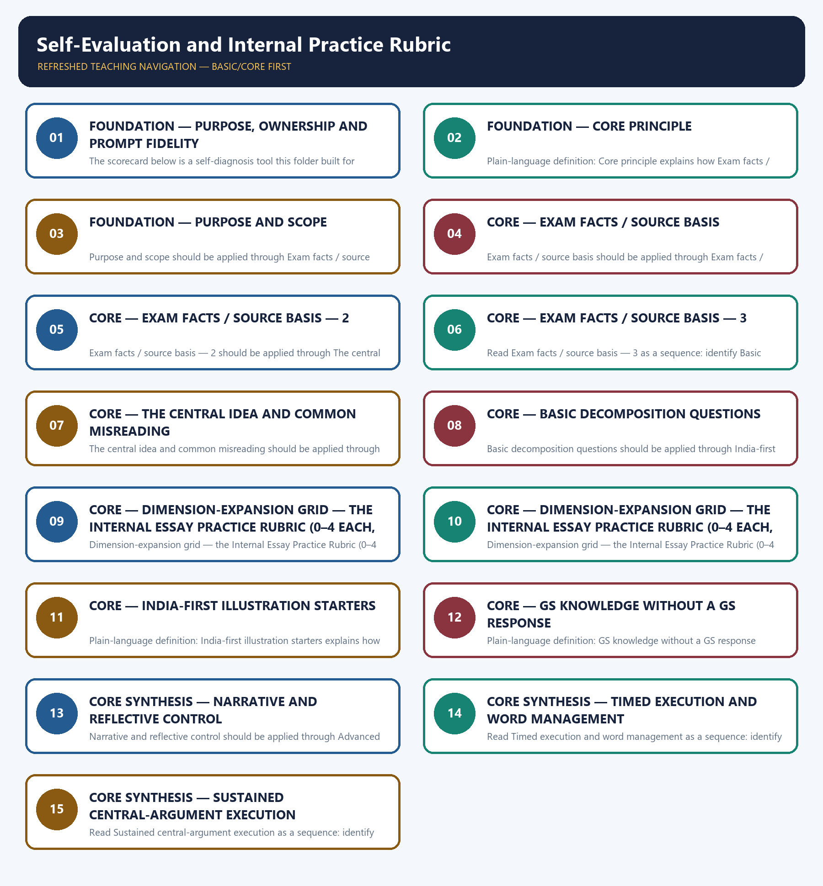

# Self-Evaluation and Internal Practice Rubric — Learner-v2 Complete Learning Session

> **Authoring-only generation:** 2026-09-06. No PDF was rendered and no tracker or index was mutated.

### SOURCE, PROGRESSION AND OFFICIAL-RULE AUDIT

- **Generation date:** 2026-09-06.
- **Source order:** canonical Basic owner first; Advanced owner second; Essay master framework, README, official-syllabus map, answer-worthiness audit and revision chart next; PYQ corpus and official OCR papers after that; live official UPSC pages only as a final check.
- **Basic/Advanced boundary:** complete Basic teaching remains first and Advanced material remains optional and last.
- **OCR boundary:** Repository Markdown was primary. OCR-searchable official UPSC Essay papers were supplementary only for printed instructions and V1 prompt wording. No author, official model answer, current marks split, phase allocation, paragraph count or scoring rubric was inferred.
- **Qdrant:** not used; repository Markdown and local official papers were sufficient.
- **PYQ integrity:** Three application cards use the repository's explicit V1/V2 status. No unavailable official model answer, marking rubric or attribution is invented.
- **Live-source boundary:** Live source check dated 2026-09-06: official UPSC routes were attempted and access-blocked; blocked pages support no new claim. UN, WHO and IPCC primary pages were separately checked for cross-theme factual boundaries.
- **No-formula rule:** strategy, heuristics and practice weights are never presented as official UPSC instructions or marking criteria.

### LIVE OFFICIAL-SOURCE ATTEMPT LOG

The checks below were made on 2026-09-06. Substantive official text is used only for the proposition it supports; title-only, blocked or thin pages are recorded and supply no factual claim.

- https://upsc.gov.in/examinations/previous-question-papers — attempted 2026-09-06; official page returned HTTP 403 to the live fetch, so it supports no new wording.
- https://upsc.gov.in/examinations/active-examinations — attempted 2026-09-06; official page returned HTTP 403 to the live fetch, so it supports no current-paper inference.
- https://upsc.gov.in/sites/default/files/Notif-CSP-2024-Engl-140224.pdf — searched 2026-09-06; retained only as an official scheme cross-check route, not as an Essay rubric.

## BASIC LEARNING SESSION



*Distinct embedded teaching-navigation image. The separate continuous Cārvāka-style flowchart package remains an independent at-a-glance artifact.*

### SESSION 1 — FOUNDATION — PURPOSE, OWNERSHIP AND PROMPT FIDELITY

#### DEFINITION / WHAT THIS IS CALLED

**Plain-language definition:** Objective practice: Apply Purpose, ownership and prompt fidelity by distinguishing the correct Essay-method move from nearby but invalid shortcuts; no factual-trivia recall is being tested.

**Technical definition:** The scorecard below is a self-diagnosis tool this folder built for practice purposes; it must never be represented, quoted, or relied upon as UPSC's actual grading method.

#### ANSWER-GRABBING OPENING — WRITE/ADAPT IN THE EXAM

> Plain-language definition: Purpose, ownership and prompt fidelity explains how Core principle and Purpose and scope combine into one usable Essay-planning move.

#### MUST-WRITE KEYWORDS

- **FOUNDATION**
- **Purpose**
- **ownership**
- **prompt fidelity**
- **Plain-language definition**
- **Technical definition**

**How to use them:** Frame the answer through FOUNDATION; define Purpose, connect ownership with prompt fidelity to explain the mechanism, and use Plain-language definition for the decisive comparison or qualification.

#### METHOD MOVE / WHAT THIS DOES

**Plain-language definition:** Purpose, ownership and prompt fidelity explains how Core principle and Purpose and scope combine into one usable Essay-planning move.

**Technical definition:** The learner fixes the printed prompt, its relationship or demand, the defensible scope, the argument function and the evidence boundary before drafting prose.

#### ANSWER-GRABBING OPENING — WRITE/ADAPT IN THE EXAM

> Purpose, ownership and prompt fidelity should be applied through Core principle and Purpose and scope, while preserving the difference between official paper instruction and strategy, prompt wording and interpretation, example and evidence, breadth and coherence.

#### MUST-WRITE KEYWORDS

- **Purpose**
- **ownership**
- **prompt**
- **fidelity**
- **Core**
- **principle**

**How to use them:** Define the first three terms, trace the relationship with the next two, and attach the final term to the exact claim, example and qualification. Qualification: Do not replace diagnosis-led self-evaluation and remediation with a generic GS-style catalogue.

#### VISUAL FIRST

```text
PURPOSE, OWNERSHIP AND PROMPT FIDELITY
01. Core principle
    |
    v
02. Purpose and scope
STATUS / CATEGORY FIREWALL -> Do not replace diagnosis-led self-evaluation and remediation with a generic GS-style catalogue.
```

*The rail fixes the prompt-to-argument sequence and claim boundary before explanation.*

#### CORE EXPLANATION

This entire topic is an Internal Essay Practice Rubric — not UPSC's official rubric. Neither audited paper publishes a marking scheme, examiner weightage, or scoring formula of any kind (see ../README.md). The scorecard below is a self-diagnosis tool this folder built for practice purposes; it must never be represented, quoted, or relied upon as UPSC's actual grading method. This topic gives a structured way to review your own drafted or timed-practice essay against the skills taught in 01–14. It does not teach any of those skills itself — it only diagnoses where a specific attempt was weak, so you know which topic file to revisit.

#### SIMPLE SYSTEM EXAMPLE

Read Purpose, ownership and prompt fidelity as a sequence: identify Core principle, follow the method through the printed proposition, and stop before adding a rule, attribution, fact or inference the audited sources do not support.

#### TECHNICAL DISTINCTION

The decisive boundary is Do not replace diagnosis-led self-evaluation and remediation with a generic GS-style catalogue. This keeps Core principle and Purpose and scope in the correct prompt, method, argument and evidence category.

#### NAMED EVIDENCE AND MECHANISM

- This entire topic is an Internal Essay Practice Rubric — not UPSC's official rubric. Neither audited paper publishes a marking scheme, examiner weightage, or scoring formula of any kind (see ../README.md). The scorecard below is a self-diagnosis tool this folder built for practice purposes; it must never be represented, quoted, or relied upon as UPSC's actual grading method.
- This topic gives a structured way to review your own drafted or timed-practice essay against the skills taught in 01–14. It does not teach any of those skills itself — it only diagnoses where a specific attempt was weak, so you know which topic file to revisit.

#### EXAMINER CAUTION

- Do not replace diagnosis-led self-evaluation and remediation with a generic GS-style catalogue.

#### EXAM LINK

- **Objective practice:** Apply Purpose, ownership and prompt fidelity by distinguishing the correct Essay-method move from nearby but invalid shortcuts; no factual-trivia recall is being tested.
- **Essay application:** State the exact demand and the bounded writing decision.

#### MINI RECAP

- **Mechanism chain:** Core principle -> Purpose and scope
- **Qualified use:** State the exact demand and the bounded writing decision.

#### CLOSING RECALL FLOW — FOUNDATION — PURPOSE, OWNERSHIP AND PROMPT FIDELITY

```text
START / CONCEPT: FOUNDATION — Purpose, ownership and prompt fidelity
        |
        v
EXACT TERMS: FOUNDATION · Purpose · ownership · prompt fidelity · Plain-language definition · Technical definition
        |
        v
MECHANISM / ARGUMENT: Purpose, ownership and prompt fidelity should be applied through Core principle and Purpose and scope, while preserving the difference between official paper instruction and strategy, prompt wording and interpretation, example and evidence, breadth and coherence.
        |
        v
CONSEQUENCE / CONTRAST: Read Purpose, ownership and prompt fidelity as a sequence: identify Core principle, follow the method through the printed proposition, and stop before adding a rule, attribution, fact or inference the audited sources do not support.
        |
        v
UPSC TRAP / ANSWER-USE: Objective practice: Apply Purpose, ownership and prompt fidelity by distinguishing the correct Essay-method move from nearby but invalid shortcuts; no factual-trivia recall is being tested.
        |
        v
ANSWER-GRABBING FORMULATION: Plain-language definition: Purpose, ownership and prompt fidelity explains how Core principle and Purpose and scope combine into one usable Essay-planning move.
```
### SESSION 2 — FOUNDATION — CORE PRINCIPLE

#### DEFINITION / WHAT THIS IS CALLED

**Plain-language definition:** Objective practice: Apply Core principle by distinguishing the correct Essay-method move from nearby but invalid shortcuts; no factual-trivia recall is being tested.

**Technical definition:** Plain-language definition: Core principle explains how Exam facts / source basis combine into one usable Essay-planning move.

#### ANSWER-GRABBING OPENING — WRITE/ADAPT IN THE EXAM

> Plain-language definition: Core principle explains how Exam facts / source basis combine into one usable Essay-planning move.

#### MUST-WRITE KEYWORDS

- **FOUNDATION**
- **Core principle**
- **Plain-language definition**
- **Technical definition**
- **principle**
- **Exam**

**How to use them:** Frame the answer through FOUNDATION; define Core principle, connect Plain-language definition with Technical definition to explain the mechanism, and use principle for the decisive comparison or qualification.

#### METHOD MOVE / WHAT THIS DOES

**Plain-language definition:** Core principle explains how Exam facts / source basis combine into one usable Essay-planning move.

**Technical definition:** The learner fixes the printed prompt, its relationship or demand, the defensible scope, the argument function and the evidence boundary before drafting prose.

#### ANSWER-GRABBING OPENING — WRITE/ADAPT IN THE EXAM

> Core principle should be applied through Exam facts / source basis, while preserving the difference between official paper instruction and strategy, prompt wording and interpretation, example and evidence, breadth and coherence.

#### MUST-WRITE KEYWORDS

- **Core**
- **principle**
- **Exam**
- **facts**
- **basis**
- **weightage**

**How to use them:** Define the first three terms, trace the relationship with the next two, and attach the final term to the exact claim, example and qualification. Qualification: Do not cross the ownership boundary: spaced practice scheduling belongs to 16.

#### VISUAL FIRST

```text
CORE PRINCIPLE
01. Exam facts / source basis
STATUS / CATEGORY FIREWALL -> Do not cross the ownership boundary: spaced practice scheduling belongs to 16.
```

*The rail fixes the prompt-to-argument sequence and claim boundary before explanation.*

#### CORE EXPLANATION

weightage table, or scoring guidance. The only marks information printed anywhere in either locally held copy is 2024's "(125 × 2 = 250)" — a marks split between the two essays, not a rubric, and with no 2025 counterpart in the local copy (see ../README.md).

#### SIMPLE SYSTEM EXAMPLE

Read Core principle as a sequence: identify Exam facts / source basis, follow the method through the printed proposition, and stop before adding a rule, attribution, fact or inference the audited sources do not support.

#### TECHNICAL DISTINCTION

The decisive boundary is Do not cross the ownership boundary: spaced practice scheduling belongs to 16. This keeps Exam facts / source basis in the correct prompt, method, argument and evidence category.

#### NAMED EVIDENCE AND MECHANISM

- weightage table, or scoring guidance. The only marks information printed anywhere in either locally held copy is 2024's "(125 × 2 = 250)" — a marks split between the two essays, not a rubric, and with no 2025 counterpart in the local copy (see ../README.md).

#### EXAMINER CAUTION

- Do not cross the ownership boundary: spaced practice scheduling belongs to 16.

#### EXAM LINK

- **Objective practice:** Apply Core principle by distinguishing the correct Essay-method move from nearby but invalid shortcuts; no factual-trivia recall is being tested.
- **Essay application:** Define operative terms before expanding dimensions.

#### MINI RECAP

- **Mechanism chain:** Exam facts / source basis
- **Qualified use:** Define operative terms before expanding dimensions.

#### CLOSING RECALL FLOW — FOUNDATION — CORE PRINCIPLE

```text
START / CONCEPT: FOUNDATION — Core principle
        |
        v
EXACT TERMS: FOUNDATION · Core principle · Plain-language definition · Technical definition · principle · Exam
        |
        v
MECHANISM / ARGUMENT: Core principle should be applied through Exam facts / source basis, while preserving the difference between official paper instruction and strategy, prompt wording and interpretation, example and evidence, breadth and coherence.
        |
        v
CONSEQUENCE / CONTRAST: Read Core principle as a sequence: identify Exam facts / source basis, follow the method through the printed proposition, and stop before adding a rule, attribution, fact or inference the audited sources do not support.
        |
        v
UPSC TRAP / ANSWER-USE: Objective practice: Apply Core principle by distinguishing the correct Essay-method move from nearby but invalid shortcuts; no factual-trivia recall is being tested.
        |
        v
ANSWER-GRABBING FORMULATION: Plain-language definition: Core principle explains how Exam facts / source basis combine into one usable Essay-planning move.
```
### SESSION 3 — FOUNDATION — PURPOSE AND SCOPE

#### DEFINITION / WHAT THIS IS CALLED

**Plain-language definition:** Objective practice: Apply Purpose and scope by distinguishing the correct Essay-method move from nearby but invalid shortcuts; no factual-trivia recall is being tested.

**Technical definition:** Purpose and scope should be applied through Exam facts / source basis — 2, while preserving the difference between official paper instruction and strategy, prompt wording and interpretation, example and evidence, breadth and coherence.

#### ANSWER-GRABBING OPENING — WRITE/ADAPT IN THE EXAM

> Plain-language definition: Purpose and scope explains how Exam facts / source basis — 2 combine into one usable Essay-planning move.

#### MUST-WRITE KEYWORDS

- **FOUNDATION**
- **Purpose**
- **scope**
- **Plain-language definition**
- **Technical definition**
- **Exam**

**How to use them:** Frame the answer through FOUNDATION; define Purpose, connect scope with Plain-language definition to explain the mechanism, and use Technical definition for the decisive comparison or qualification.

#### METHOD MOVE / WHAT THIS DOES

**Plain-language definition:** Purpose and scope explains how Exam facts / source basis — 2 combine into one usable Essay-planning move.

**Technical definition:** The learner fixes the printed prompt, its relationship or demand, the defensible scope, the argument function and the evidence boundary before drafting prose.

#### ANSWER-GRABBING OPENING — WRITE/ADAPT IN THE EXAM

> Purpose and scope should be applied through Exam facts / source basis — 2, while preserving the difference between official paper instruction and strategy, prompt wording and interpretation, example and evidence, breadth and coherence.

#### MUST-WRITE KEYWORDS

- **Purpose**
- **scope**
- **Exam**
- **facts**
- **basis**
- **official**

**How to use them:** Define the first three terms, trace the relationship with the next two, and attach the final term to the exact claim, example and qualification. Qualification: Do not use an example without explaining its argumentative function.

#### VISUAL FIRST

```text
PURPOSE AND SCOPE
01. Exam facts / source basis — 2
STATUS / CATEGORY FIREWALL -> Do not use an example without explaining its argumentative function.
```

*The rail fixes the prompt-to-argument sequence and claim boundary before explanation.*

#### CORE EXPLANATION

official UPSC mark, an examiner's likely score, or a "topper formula" — none of these exist in the audited corpus, and inventing one would misrepresent the source material.

#### SIMPLE SYSTEM EXAMPLE

Read Purpose and scope as a sequence: identify Exam facts / source basis — 2, follow the method through the printed proposition, and stop before adding a rule, attribution, fact or inference the audited sources do not support.

#### TECHNICAL DISTINCTION

The decisive boundary is Do not use an example without explaining its argumentative function. This keeps Exam facts / source basis — 2 in the correct prompt, method, argument and evidence category.

#### NAMED EVIDENCE AND MECHANISM

- official UPSC mark, an examiner's likely score, or a "topper formula" — none of these exist in the audited corpus, and inventing one would misrepresent the source material.

#### EXAMINER CAUTION

- Do not use an example without explaining its argumentative function.

#### EXAM LINK

- **Objective practice:** Apply Purpose and scope by distinguishing the correct Essay-method move from nearby but invalid shortcuts; no factual-trivia recall is being tested.
- **Essay application:** Build one qualified thesis and keep it visible.

#### MINI RECAP

- **Mechanism chain:** Exam facts / source basis — 2
- **Qualified use:** Build one qualified thesis and keep it visible.

#### CLOSING RECALL FLOW — FOUNDATION — PURPOSE AND SCOPE

```text
START / CONCEPT: FOUNDATION — Purpose and scope
        |
        v
EXACT TERMS: FOUNDATION · Purpose · scope · Plain-language definition · Technical definition · Exam
        |
        v
MECHANISM / ARGUMENT: Purpose and scope should be applied through Exam facts / source basis — 2, while preserving the difference between official paper instruction and strategy, prompt wording and interpretation, example and evidence, breadth and coherence.
        |
        v
CONSEQUENCE / CONTRAST: Read Purpose and scope as a sequence: identify Exam facts / source basis — 2, follow the method through the printed proposition, and stop before adding a rule, attribution, fact or inference the audited sources do not support.
        |
        v
UPSC TRAP / ANSWER-USE: Objective practice: Apply Purpose and scope by distinguishing the correct Essay-method move from nearby but invalid shortcuts; no factual-trivia recall is being tested.
        |
        v
ANSWER-GRABBING FORMULATION: Plain-language definition: Purpose and scope explains how Exam facts / source basis — 2 combine into one usable Essay-planning move.
```
### SESSION 4 — CORE — EXAM FACTS / SOURCE BASIS

#### DEFINITION / WHAT THIS IS CALLED

**Plain-language definition:** Objective practice: Apply Exam facts / source basis by distinguishing the correct Essay-method move from nearby but invalid shortcuts; no factual-trivia recall is being tested.

**Technical definition:** Exam facts / source basis should be applied through Exam facts / source basis — 3, while preserving the difference between official paper instruction and strategy, prompt wording and interpretation, example and evidence, breadth and coherence.

#### ANSWER-GRABBING OPENING — WRITE/ADAPT IN THE EXAM

> Plain-language definition: Exam facts / source basis explains how Exam facts / source basis — 3 combine into one usable Essay-planning move.

#### MUST-WRITE KEYWORDS

- **Exam facts / source basis**
- **Plain-language definition**
- **Technical definition**
- **Exam**
- **s**
- **basis**

**How to use them:** Frame the answer through Exam facts / source basis; define Plain-language definition, connect Technical definition with Exam to explain the mechanism, and use s for the decisive comparison or qualification.

#### METHOD MOVE / WHAT THIS DOES

**Plain-language definition:** Exam facts / source basis explains how Exam facts / source basis — 3 combine into one usable Essay-planning move.

**Technical definition:** The learner fixes the printed prompt, its relationship or demand, the defensible scope, the argument function and the evidence boundary before drafting prose.

#### ANSWER-GRABBING OPENING — WRITE/ADAPT IN THE EXAM

> Exam facts / source basis should be applied through Exam facts / source basis — 3, while preserving the difference between official paper instruction and strategy, prompt wording and interpretation, example and evidence, breadth and coherence.

#### MUST-WRITE KEYWORDS

- **Exam**
- **facts**
- **basis**
- **those**
- **marks**
- **distributed**

**How to use them:** Define the first three terms, trace the relationship with the next two, and attach the final term to the exact claim, example and qualification. Qualification: Do not treat a pedagogical scaffold as an official UPSC marking rule.

#### VISUAL FIRST

```text
EXAM FACTS / SOURCE BASIS
01. Exam facts / source basis — 3
STATUS / CATEGORY FIREWALL -> Do not treat a pedagogical scaffold as an official UPSC marking rule.
```

*The rail fixes the prompt-to-argument sequence and claim boundary before explanation.*

#### CORE EXPLANATION

how those 125 marks are distributed within an essay. The paper is silent on that, and any internal weighting — including this file's seven dimensions — is a coaching/self-evaluation construct.

#### SIMPLE SYSTEM EXAMPLE

Read Exam facts / source basis as a sequence: identify Exam facts / source basis — 3, follow the method through the printed proposition, and stop before adding a rule, attribution, fact or inference the audited sources do not support.

#### TECHNICAL DISTINCTION

The decisive boundary is Do not treat a pedagogical scaffold as an official UPSC marking rule. This keeps Exam facts / source basis — 3 in the correct prompt, method, argument and evidence category.

#### NAMED EVIDENCE AND MECHANISM

- how those 125 marks are distributed within an essay. The paper is silent on that, and any internal weighting — including this file's seven dimensions — is a coaching/self-evaluation construct.

#### EXAMINER CAUTION

- Do not treat a pedagogical scaffold as an official UPSC marking rule.

#### EXAM LINK

- **Objective practice:** Apply Exam facts / source basis by distinguishing the correct Essay-method move from nearby but invalid shortcuts; no factual-trivia recall is being tested.
- **Essay application:** Give every paragraph one argumentative job.

#### MINI RECAP

- **Mechanism chain:** Exam facts / source basis — 3
- **Qualified use:** Give every paragraph one argumentative job.

#### CLOSING RECALL FLOW — CORE — EXAM FACTS / SOURCE BASIS

```text
START / CONCEPT: CORE — Exam facts / source basis
        |
        v
EXACT TERMS: Exam facts / source basis · Plain-language definition · Technical definition · Exam · s · basis
        |
        v
MECHANISM / ARGUMENT: Exam facts / source basis should be applied through Exam facts / source basis — 3, while preserving the difference between official paper instruction and strategy, prompt wording and interpretation, example and evidence, breadth and coherence.
        |
        v
CONSEQUENCE / CONTRAST: Objective practice: Apply Exam facts / source basis by distinguishing the correct Essay-method move from nearby but invalid shortcuts; no factual-trivia recall is being tested.
        |
        v
UPSC TRAP / ANSWER-USE: Read Exam facts / source basis as a sequence: identify Exam facts / source basis — 3, follow the method through the printed proposition, and stop before adding a rule, attribution, fact or inference the audited sources do not support.
        |
        v
ANSWER-GRABBING FORMULATION: Plain-language definition: Exam facts / source basis explains how Exam facts / source basis — 3 combine into one usable Essay-planning move.
```
### SESSION 5 — CORE — EXAM FACTS / SOURCE BASIS — 2

#### DEFINITION / WHAT THIS IS CALLED

**Plain-language definition:** Objective practice: Apply Exam facts / source basis — 2 by distinguishing the correct Essay-method move from nearby but invalid shortcuts; no factual-trivia recall is being tested.

**Technical definition:** Exam facts / source basis — 2 should be applied through The central idea and common misreading, while preserving the difference between official paper instruction and strategy, prompt wording and interpretation, example and evidence, breadth and coherence.

#### ANSWER-GRABBING OPENING — WRITE/ADAPT IN THE EXAM

> Plain-language definition: Exam facts / source basis — 2 explains how The central idea and common misreading combine into one usable Essay-planning move.

#### MUST-WRITE KEYWORDS

- **Exam facts / source basis**
- **Plain-language definition**
- **Technical definition**
- **Exam**
- **s**
- **basis**

**How to use them:** Frame the answer through Exam facts / source basis; define Plain-language definition, connect Technical definition with Exam to explain the mechanism, and use s for the decisive comparison or qualification.

#### METHOD MOVE / WHAT THIS DOES

**Plain-language definition:** Exam facts / source basis — 2 explains how The central idea and common misreading combine into one usable Essay-planning move.

**Technical definition:** The learner fixes the printed prompt, its relationship or demand, the defensible scope, the argument function and the evidence boundary before drafting prose.

#### ANSWER-GRABBING OPENING — WRITE/ADAPT IN THE EXAM

> Exam facts / source basis — 2 should be applied through The central idea and common misreading, while preserving the difference between official paper instruction and strategy, prompt wording and interpretation, example and evidence, breadth and coherence.

#### MUST-WRITE KEYWORDS

- **Exam**
- **facts**
- **basis**
- **central**
- **idea**
- **common**

**How to use them:** Define the first three terms, trace the relationship with the next two, and attach the final term to the exact claim, example and qualification. Qualification: Do not let a counter-view replace the thesis; use it to qualify the thesis.

#### VISUAL FIRST

```text
EXAM FACTS / SOURCE BASIS — 2
01. The central idea and common misreading
STATUS / CATEGORY FIREWALL -> Do not let a counter-view replace the thesis; use it to qualify the thesis.
```

*The rail fixes the prompt-to-argument sequence and claim boundary before explanation.*

#### CORE EXPLANATION

Central idea: self-evaluation is most useful when it identifies one or two specific, fixable weaknesses per attempt, tied to a specific topic file to revisit. Common misreading: treating a total score from this internal tool as equivalent to an actual UPSC mark, or assuming a specific number of headings/examples/paragraphs is officially required — no such official figure exists.

#### SIMPLE SYSTEM EXAMPLE

Read Exam facts / source basis — 2 as a sequence: identify The central idea and common misreading, follow the method through the printed proposition, and stop before adding a rule, attribution, fact or inference the audited sources do not support.

#### TECHNICAL DISTINCTION

The decisive boundary is Do not let a counter-view replace the thesis; use it to qualify the thesis. This keeps The central idea and common misreading in the correct prompt, method, argument and evidence category.

#### NAMED EVIDENCE AND MECHANISM

- Central idea: self-evaluation is most useful when it identifies one or two specific, fixable weaknesses per attempt, tied to a specific topic file to revisit. Common misreading: treating a total score from this internal tool as equivalent to an actual UPSC mark, or assuming a specific number of headings/examples/paragraphs is officially required — no such official figure exists.

#### EXAMINER CAUTION

- Do not let a counter-view replace the thesis; use it to qualify the thesis.

#### EXAM LINK

- **Objective practice:** Apply Exam facts / source basis — 2 by distinguishing the correct Essay-method move from nearby but invalid shortcuts; no factual-trivia recall is being tested.
- **Essay application:** Join a named illustration to its mechanism.

#### MINI RECAP

- **Mechanism chain:** The central idea and common misreading
- **Qualified use:** Join a named illustration to its mechanism.

#### CLOSING RECALL FLOW — CORE — EXAM FACTS / SOURCE BASIS — 2

```text
START / CONCEPT: CORE — Exam facts / source basis — 2
        |
        v
EXACT TERMS: Exam facts / source basis · Plain-language definition · Technical definition · Exam · s · basis
        |
        v
MECHANISM / ARGUMENT: Exam facts / source basis — 2 should be applied through The central idea and common misreading, while preserving the difference between official paper instruction and strategy, prompt wording and interpretation, example and evidence, breadth and coherence.
        |
        v
CONSEQUENCE / CONTRAST: Objective practice: Apply Exam facts / source basis — 2 by distinguishing the correct Essay-method move from nearby but invalid shortcuts; no factual-trivia recall is being tested.
        |
        v
UPSC TRAP / ANSWER-USE: Read Exam facts / source basis — 2 as a sequence: identify The central idea and common misreading, follow the method through the printed proposition, and stop before adding a rule, attribution, fact or inference the audited sources do not support.
        |
        v
ANSWER-GRABBING FORMULATION: Plain-language definition: Exam facts / source basis — 2 explains how The central idea and common misreading combine into one usable Essay-planning move.
```
### SESSION 6 — CORE — EXAM FACTS / SOURCE BASIS — 3

#### DEFINITION / WHAT THIS IS CALLED

**Plain-language definition:** Objective practice: Apply Exam facts / source basis — 3 by distinguishing the correct Essay-method move from nearby but invalid shortcuts; no factual-trivia recall is being tested.

**Technical definition:** Read Exam facts / source basis — 3 as a sequence: identify Basic decomposition questions, follow the method through the printed proposition, and stop before adding a rule, attribution, fact or inference the audited sources do not support.

#### ANSWER-GRABBING OPENING — WRITE/ADAPT IN THE EXAM

> Plain-language definition: Exam facts / source basis — 3 explains how Basic decomposition questions and Dimension-expansion grid — the Internal Essay Practice Rubric (0–4 each, combine into one usable Essay-planning move.

#### MUST-WRITE KEYWORDS

- **Exam facts / source basis**
- **Plain-language definition**
- **Technical definition**
- **Exam**
- **s**
- **basis**

**How to use them:** Frame the answer through Exam facts / source basis; define Plain-language definition, connect Technical definition with Exam to explain the mechanism, and use s for the decisive comparison or qualification.

#### METHOD MOVE / WHAT THIS DOES

**Plain-language definition:** Exam facts / source basis — 3 explains how Basic decomposition questions and Dimension-expansion grid — the Internal Essay Practice Rubric (0–4 each, combine into one usable Essay-planning move.

**Technical definition:** The learner fixes the printed prompt, its relationship or demand, the defensible scope, the argument function and the evidence boundary before drafting prose.

#### ANSWER-GRABBING OPENING — WRITE/ADAPT IN THE EXAM

> Exam facts / source basis — 3 should be applied through Basic decomposition questions and Dimension-expansion grid — the Internal Essay Practice Rubric (0–4 each,, while preserving the difference between official paper instruction and strategy, prompt wording and interpretation, example and evidence, breadth and coherence.

#### MUST-WRITE KEYWORDS

- **Exam**
- **facts**
- **basis**
- **Basic**
- **decomposition**
- **questions**

**How to use them:** Define the first three terms, trace the relationship with the next two, and attach the final term to the exact claim, example and qualification. Qualification: Do not use an unverified quotation, statistic, attribution or anecdote.

#### VISUAL FIRST

```text
EXAM FACTS / SOURCE BASIS — 3
01. Basic decomposition questions
    |
    v
02. Dimension-expansion grid — the Internal Essay Practice Rubric (0–4 each,
STATUS / CATEGORY FIREWALL -> Do not use an unverified quotation, statistic, attribution or anecdote.
```

*The rail fixes the prompt-to-argument sequence and claim boundary before explanation.*

#### CORE EXPLANATION

1. Did my essay response the exact prompt, or did it drift toward a related but different topic (03, 04)? 2. Did my thesis go beyond restating the prompt, and was it qualified (05)? 3. Did my structure flow with real transitions, or did it read as a list of disconnected points (07)? 4. Did I use verified, functional illustrations without inventing statistics or authors (09, 12)? 5. Did I test a genuine counter-view and reach a real synthesis, not an unresolved "on the other hand" (08)? Score only after writing the paragraph numbers that justify the score. The anchors make the number repeatable; they do not predict UPSC marks.

#### SIMPLE SYSTEM EXAMPLE

Read Exam facts / source basis — 3 as a sequence: identify Basic decomposition questions, follow the method through the printed proposition, and stop before adding a rule, attribution, fact or inference the audited sources do not support.

#### TECHNICAL DISTINCTION

The decisive boundary is Do not use an unverified quotation, statistic, attribution or anecdote. This keeps Basic decomposition questions and Dimension-expansion grid — the Internal Essay Practice Rubric (0–4 each, in the correct prompt, method, argument and evidence category.

#### NAMED EVIDENCE AND MECHANISM

- 1. Did my essay response the exact prompt, or did it drift toward a related but different topic (03, 04)? 2. Did my thesis go beyond restating the prompt, and was it qualified (05)? 3. Did my structure flow with real transitions, or did it read as a list of disconnected points (07)? 4. Did I use verified, functional illustrations without inventing statistics or authors (09, 12)? 5. Did I test a genuine counter-view and reach a real synthesis, not an unresolved "on the other hand" (08)?
- Score only after writing the paragraph numbers that justify the score. The anchors make the number repeatable; they do not predict UPSC marks.

#### EXAMINER CAUTION

- Do not use an unverified quotation, statistic, attribution or anecdote.

#### EXAM LINK

- **Objective practice:** Apply Exam facts / source basis — 3 by distinguishing the correct Essay-method move from nearby but invalid shortcuts; no factual-trivia recall is being tested.
- **Essay application:** Use a counter-case to refine, not derail, the thesis.

#### MINI RECAP

- **Mechanism chain:** Basic decomposition questions -> Dimension-expansion grid — the Internal Essay Practice Rubric (0–4 each,
- **Qualified use:** Use a counter-case to refine, not derail, the thesis.

#### CLOSING RECALL FLOW — CORE — EXAM FACTS / SOURCE BASIS — 3

```text
START / CONCEPT: CORE — Exam facts / source basis — 3
        |
        v
EXACT TERMS: Exam facts / source basis · Plain-language definition · Technical definition · Exam · s · basis
        |
        v
MECHANISM / ARGUMENT: Read Exam facts / source basis — 3 as a sequence: identify Basic decomposition questions, follow the method through the printed proposition, and stop before adding a rule, attribution, fact or inference the audited sources do not support.
        |
        v
CONSEQUENCE / CONTRAST: Objective practice: Apply Exam facts / source basis — 3 by distinguishing the correct Essay-method move from nearby but invalid shortcuts; no factual-trivia recall is being tested.
        |
        v
UPSC TRAP / ANSWER-USE: Exam facts / source basis — 3 should be applied through Basic decomposition questions and Dimension-expansion grid — the Internal Essay Practice Rubric (0–4 each,, while preserving the difference between official paper instruction and strategy, prompt wording and interpretation, example and evidence, breadth and coherence.
        |
        v
ANSWER-GRABBING FORMULATION: Plain-language definition: Exam facts / source basis — 3 explains how Basic decomposition questions and Dimension-expansion grid — the Internal Essay Practice Rubric (0–4 each, combine into one usable Essay-planning move.
```
### SESSION 7 — CORE — THE CENTRAL IDEA AND COMMON MISREADING

#### DEFINITION / WHAT THIS IS CALLED

**Plain-language definition:** Objective practice: Apply The central idea and common misreading by distinguishing the correct Essay-method move from nearby but invalid shortcuts; no factual-trivia recall is being tested.

**Technical definition:** The central idea and common misreading should be applied through Dimension-expansion grid — the Internal Essay Practice Rubric (0–4 each, — 2, while preserving the difference between official paper instruction and strategy, prompt wording and interpretation, example and evidence, breadth and coherence.

#### ANSWER-GRABBING OPENING — WRITE/ADAPT IN THE EXAM

> Plain-language definition: The central idea and common misreading explains how Dimension-expansion grid — the Internal Essay Practice Rubric (0–4 each, — 2 combine into one usable Essay-planning move.

#### MUST-WRITE KEYWORDS

- **The central idea**
- **common misreading**
- **Plain-language definition**
- **Technical definition**
- **central**
- **idea**

**How to use them:** Frame the answer through The central idea; define common misreading, connect Plain-language definition with Technical definition to explain the mechanism, and use central for the decisive comparison or qualification.

#### METHOD MOVE / WHAT THIS DOES

**Plain-language definition:** The central idea and common misreading explains how Dimension-expansion grid — the Internal Essay Practice Rubric (0–4 each, — 2 combine into one usable Essay-planning move.

**Technical definition:** The learner fixes the printed prompt, its relationship or demand, the defensible scope, the argument function and the evidence boundary before drafting prose.

#### ANSWER-GRABBING OPENING — WRITE/ADAPT IN THE EXAM

> The central idea and common misreading should be applied through Dimension-expansion grid — the Internal Essay Practice Rubric (0–4 each, — 2, while preserving the difference between official paper instruction and strategy, prompt wording and interpretation, example and evidence, breadth and coherence.

#### MUST-WRITE KEYWORDS

- **central**
- **idea**
- **common**
- **misreading**
- **Dimension-expansion**
- **grid**

**How to use them:** Define the first three terms, trace the relationship with the next two, and attach the final term to the exact claim, example and qualification. Qualification: Do not multiply dimensions that repeat the same claim in new vocabulary.

#### VISUAL FIRST

```text
THE CENTRAL IDEA AND COMMON MISREADING
01. Dimension-expansion grid — the Internal Essay Practice Rubric (0–4 each, — 2
STATUS / CATEGORY FIREWALL -> Do not multiply dimensions that repeat the same claim in new vocabulary.
```

*The rail fixes the prompt-to-argument sequence and claim boundary before explanation.*

#### CORE EXPLANATION

Restated for clarity: this /28 table is the Internal Essay Practice Rubric — not UPSC's official rubric, and it invents no official examiner weighting.

#### SIMPLE SYSTEM EXAMPLE

Read The central idea and common misreading as a sequence: identify Dimension-expansion grid — the Internal Essay Practice Rubric (0–4 each, — 2, follow the method through the printed proposition, and stop before adding a rule, attribution, fact or inference the audited sources do not support.

#### TECHNICAL DISTINCTION

The decisive boundary is Do not multiply dimensions that repeat the same claim in new vocabulary. This keeps Dimension-expansion grid — the Internal Essay Practice Rubric (0–4 each, — 2 in the correct prompt, method, argument and evidence category.

#### NAMED EVIDENCE AND MECHANISM

- Restated for clarity: this /28 table is the Internal Essay Practice Rubric — not UPSC's official rubric, and it invents no official examiner weighting.

#### EXAMINER CAUTION

- Do not multiply dimensions that repeat the same claim in new vocabulary.

#### EXAM LINK

- **Objective practice:** Apply The central idea and common misreading by distinguishing the correct Essay-method move from nearby but invalid shortcuts; no factual-trivia recall is being tested.
- **Essay application:** Sequence paragraphs through explicit logical bridges.

#### MINI RECAP

- **Mechanism chain:** Dimension-expansion grid — the Internal Essay Practice Rubric (0–4 each, — 2
- **Qualified use:** Sequence paragraphs through explicit logical bridges.

#### CLOSING RECALL FLOW — CORE — THE CENTRAL IDEA AND COMMON MISREADING

```text
START / CONCEPT: CORE — The central idea and common misreading
        |
        v
EXACT TERMS: The central idea · common misreading · Plain-language definition · Technical definition · central · idea
        |
        v
MECHANISM / ARGUMENT: Objective practice: Apply The central idea and common misreading by distinguishing the correct Essay-method move from nearby but invalid shortcuts; no factual-trivia recall is being tested.
        |
        v
CONSEQUENCE / CONTRAST: The central idea and common misreading should be applied through Dimension-expansion grid — the Internal Essay Practice Rubric (0–4 each, — 2, while preserving the difference between official paper instruction and strategy, prompt wording and interpretation, example and evidence, breadth and coherence.
        |
        v
UPSC TRAP / ANSWER-USE: Read The central idea and common misreading as a sequence: identify Dimension-expansion grid — the Internal Essay Practice Rubric (0–4 each, — 2, follow the method through the printed proposition, and stop before adding a rule, attribution, fact or inference the audited sources do not support.
        |
        v
ANSWER-GRABBING FORMULATION: Plain-language definition: The central idea and common misreading explains how Dimension-expansion grid — the Internal Essay Practice Rubric (0–4 each, — 2 combine into one usable Essay-planning move.
```
### SESSION 8 — CORE — BASIC DECOMPOSITION QUESTIONS

#### DEFINITION / WHAT THIS IS CALLED

**Plain-language definition:** Objective practice: Apply Basic decomposition questions by distinguishing the correct Essay-method move from nearby but invalid shortcuts; no factual-trivia recall is being tested.

**Technical definition:** Basic decomposition questions should be applied through India-first illustration starters, while preserving the difference between official paper instruction and strategy, prompt wording and interpretation, example and evidence, breadth and coherence.

#### ANSWER-GRABBING OPENING — WRITE/ADAPT IN THE EXAM

> Plain-language definition: Basic decomposition questions explains how India-first illustration starters combine into one usable Essay-planning move.

#### MUST-WRITE KEYWORDS

- **Basic decomposition questions**
- **Plain-language definition**
- **Technical definition**
- **Basic**
- **decomposition**
- **questions**

**How to use them:** Frame the answer through Basic decomposition questions; define Plain-language definition, connect Technical definition with Basic to explain the mechanism, and use decomposition for the decisive comparison or qualification.

#### METHOD MOVE / WHAT THIS DOES

**Plain-language definition:** Basic decomposition questions explains how India-first illustration starters combine into one usable Essay-planning move.

**Technical definition:** The learner fixes the printed prompt, its relationship or demand, the defensible scope, the argument function and the evidence boundary before drafting prose.

#### ANSWER-GRABBING OPENING — WRITE/ADAPT IN THE EXAM

> Basic decomposition questions should be applied through India-first illustration starters, while preserving the difference between official paper instruction and strategy, prompt wording and interpretation, example and evidence, breadth and coherence.

#### MUST-WRITE KEYWORDS

- **Basic**
- **decomposition**
- **questions**
- **India-first**
- **illustration**
- **starters**

**How to use them:** Define the first three terms, trace the relationship with the next two, and attach the final term to the exact claim, example and qualification. Qualification: Do not end with aspiration unsupported by the preceding argument.

#### VISUAL FIRST

```text
BASIC DECOMPOSITION QUESTIONS
01. India-first illustration starters
STATUS / CATEGORY FIREWALL -> Do not end with aspiration unsupported by the preceding argument.
```

*The rail fixes the prompt-to-argument sequence and claim boundary before explanation.*

#### CORE EXPLANATION

Not directly applicable — see 12 for illustration content; this topic only diagnoses whether illustrations already used met that topic's discipline (dimension 4 above).

#### SIMPLE SYSTEM EXAMPLE

Read Basic decomposition questions as a sequence: identify India-first illustration starters, follow the method through the printed proposition, and stop before adding a rule, attribution, fact or inference the audited sources do not support.

#### TECHNICAL DISTINCTION

The decisive boundary is Do not end with aspiration unsupported by the preceding argument. This keeps India-first illustration starters in the correct prompt, method, argument and evidence category.

#### NAMED EVIDENCE AND MECHANISM

- Not directly applicable — see 12 for illustration content; this topic only diagnoses whether illustrations already used met that topic's discipline (dimension 4 above).

#### EXAMINER CAUTION

- Do not end with aspiration unsupported by the preceding argument.

#### EXAM LINK

- **Objective practice:** Apply Basic decomposition questions by distinguishing the correct Essay-method move from nearby but invalid shortcuts; no factual-trivia recall is being tested.
- **Essay application:** Move across actor, scale and time only when the claim changes.

#### MINI RECAP

- **Mechanism chain:** India-first illustration starters
- **Qualified use:** Move across actor, scale and time only when the claim changes.

#### CLOSING RECALL FLOW — CORE — BASIC DECOMPOSITION QUESTIONS

```text
START / CONCEPT: CORE — Basic decomposition questions
        |
        v
EXACT TERMS: Basic decomposition questions · Plain-language definition · Technical definition · Basic · decomposition · questions
        |
        v
MECHANISM / ARGUMENT: Basic decomposition questions should be applied through India-first illustration starters, while preserving the difference between official paper instruction and strategy, prompt wording and interpretation, example and evidence, breadth and coherence.
        |
        v
CONSEQUENCE / CONTRAST: Read Basic decomposition questions as a sequence: identify India-first illustration starters, follow the method through the printed proposition, and stop before adding a rule, attribution, fact or inference the audited sources do not support.
        |
        v
UPSC TRAP / ANSWER-USE: Objective practice: Apply Basic decomposition questions by distinguishing the correct Essay-method move from nearby but invalid shortcuts; no factual-trivia recall is being tested.
        |
        v
ANSWER-GRABBING FORMULATION: Plain-language definition: Basic decomposition questions explains how India-first illustration starters combine into one usable Essay-planning move.
```
### SESSION 9 — CORE — DIMENSION-EXPANSION GRID — THE INTERNAL ESSAY PRACTICE RUBRIC (0–4 EACH,

#### DEFINITION / WHAT THIS IS CALLED

**Plain-language definition:** Objective practice: Apply Dimension-expansion grid — the Internal Essay Practice Rubric (0–4 each, by distinguishing the correct Essay-method move from nearby but invalid shortcuts; no factual-trivia recall is being tested.

**Technical definition:** Dimension-expansion grid — the Internal Essay Practice Rubric (0–4 each, should be applied through Thesis options and selection, while preserving the difference between official paper instruction and strategy, prompt wording and interpretation, example and evidence, breadth and coherence.

#### ANSWER-GRABBING OPENING — WRITE/ADAPT IN THE EXAM

> Plain-language definition: Dimension-expansion grid — the Internal Essay Practice Rubric (0–4 each, explains how Thesis options and selection combine into one usable Essay-planning move.

#### MUST-WRITE KEYWORDS

- **Dimension-expansion grid**
- **the Internal Essay Practice Rubric (0**
- **Plain-language definition**
- **Technical definition**
- **Dimension-expansion**
- **4 each**

**How to use them:** Frame the answer through Dimension-expansion grid; define the Internal Essay Practice Rubric (0, connect Plain-language definition with Technical definition to explain the mechanism, and use Dimension-expansion for the decisive comparison or qualification.

#### METHOD MOVE / WHAT THIS DOES

**Plain-language definition:** Dimension-expansion grid — the Internal Essay Practice Rubric (0–4 each, explains how Thesis options and selection combine into one usable Essay-planning move.

**Technical definition:** The learner fixes the printed prompt, its relationship or demand, the defensible scope, the argument function and the evidence boundary before drafting prose.

#### ANSWER-GRABBING OPENING — WRITE/ADAPT IN THE EXAM

> Dimension-expansion grid — the Internal Essay Practice Rubric (0–4 each, should be applied through Thesis options and selection, while preserving the difference between official paper instruction and strategy, prompt wording and interpretation, example and evidence, breadth and coherence.

#### MUST-WRITE KEYWORDS

- **Dimension-expansion**
- **grid**
- **Internal**
- **Practice**
- **Rubric**
- **each**

**How to use them:** Define the first three terms, trace the relationship with the next two, and attach the final term to the exact claim, example and qualification. Qualification: Do not sacrifice the second essay's time budget to perfect the first.

#### VISUAL FIRST

```text
DIMENSION-EXPANSION GRID — THE INTERNAL ESSAY PRACTICE RUBRIC (0–4 EACH,
01. Thesis options and selection
STATUS / CATEGORY FIREWALL -> Do not sacrifice the second essay's time budget to perfect the first.
```

*The rail fixes the prompt-to-argument sequence and claim boundary before explanation.*

#### CORE EXPLANATION

If dimension 1 (Relevance) or 2 (Depth) scores low, the underlying issue is usually with 05 (thesis construction), not with later drafting — revisit thesis choice before revising prose.

#### SIMPLE SYSTEM EXAMPLE

Read Dimension-expansion grid — the Internal Essay Practice Rubric (0–4 each, as a sequence: identify Thesis options and selection, follow the method through the printed proposition, and stop before adding a rule, attribution, fact or inference the audited sources do not support.

#### TECHNICAL DISTINCTION

The decisive boundary is Do not sacrifice the second essay's time budget to perfect the first. This keeps Thesis options and selection in the correct prompt, method, argument and evidence category.

#### NAMED EVIDENCE AND MECHANISM

- If dimension 1 (Relevance) or 2 (Depth) scores low, the underlying issue is usually with 05 (thesis construction), not with later drafting — revisit thesis choice before revising prose.

#### EXAMINER CAUTION

- Do not sacrifice the second essay's time budget to perfect the first.

#### EXAM LINK

- **Objective practice:** Apply Dimension-expansion grid — the Internal Essay Practice Rubric (0–4 each, by distinguishing the correct Essay-method move from nearby but invalid shortcuts; no factual-trivia recall is being tested.
- **Essay application:** Use ethical nuance without moralising.

#### MINI RECAP

- **Mechanism chain:** Thesis options and selection
- **Qualified use:** Use ethical nuance without moralising.

#### CLOSING RECALL FLOW — CORE — DIMENSION-EXPANSION GRID — THE INTERNAL ESSAY PRACTICE RUBRIC (0–4 EACH,

```text
START / CONCEPT: CORE — Dimension-expansion grid — the Internal Essay Practice Rubric (0–4 each,
        |
        v
EXACT TERMS: Dimension-expansion grid · the Internal Essay Practice Rubric (0 · Plain-language definition · Technical definition · Dimension-expansion · 4 each
        |
        v
MECHANISM / ARGUMENT: Dimension-expansion grid — the Internal Essay Practice Rubric (0–4 each, should be applied through Thesis options and selection, while preserving the difference between official paper instruction and strategy, prompt wording and interpretation, example and evidence, breadth and coherence.
        |
        v
CONSEQUENCE / CONTRAST: Objective practice: Apply Dimension-expansion grid — the Internal Essay Practice Rubric (0–4 each, by distinguishing the correct Essay-method move from nearby but invalid shortcuts; no factual-trivia recall is being tested.
        |
        v
UPSC TRAP / ANSWER-USE: Read Dimension-expansion grid — the Internal Essay Practice Rubric (0–4 each, as a sequence: identify Thesis options and selection, follow the method through the printed proposition, and stop before adding a rule, attribution, fact or inference the audited sources do not support.
        |
        v
ANSWER-GRABBING FORMULATION: Plain-language definition: Dimension-expansion grid — the Internal Essay Practice Rubric (0–4 each, explains how Thesis options and selection combine into one usable Essay-planning move.
```
### SESSION 10 — CORE — DIMENSION-EXPANSION GRID — THE INTERNAL ESSAY PRACTICE RUBRIC (0–4 EACH,

#### DEFINITION / WHAT THIS IS CALLED

**Plain-language definition:** Objective practice: Apply Dimension-expansion grid — the Internal Essay Practice Rubric (0–4 each, by distinguishing the correct Essay-method move from nearby but invalid shortcuts; no factual-trivia recall is being tested.

**Technical definition:** Dimension-expansion grid — the Internal Essay Practice Rubric (0–4 each, should be applied through Simple essay architecture, while preserving the difference between official paper instruction and strategy, prompt wording and interpretation, example and evidence, breadth and coherence.

#### ANSWER-GRABBING OPENING — WRITE/ADAPT IN THE EXAM

> Plain-language definition: Dimension-expansion grid — the Internal Essay Practice Rubric (0–4 each, explains how Simple essay architecture combine into one usable Essay-planning move.

#### MUST-WRITE KEYWORDS

- **Dimension-expansion grid**
- **the Internal Essay Practice Rubric (0**
- **Plain-language definition**
- **Technical definition**
- **Dimension-expansion**
- **4 each**

**How to use them:** Frame the answer through Dimension-expansion grid; define the Internal Essay Practice Rubric (0, connect Plain-language definition with Technical definition to explain the mechanism, and use Dimension-expansion for the decisive comparison or qualification.

#### METHOD MOVE / WHAT THIS DOES

**Plain-language definition:** Dimension-expansion grid — the Internal Essay Practice Rubric (0–4 each, explains how Simple essay architecture combine into one usable Essay-planning move.

**Technical definition:** The learner fixes the printed prompt, its relationship or demand, the defensible scope, the argument function and the evidence boundary before drafting prose.

#### ANSWER-GRABBING OPENING — WRITE/ADAPT IN THE EXAM

> Dimension-expansion grid — the Internal Essay Practice Rubric (0–4 each, should be applied through Simple essay architecture, while preserving the difference between official paper instruction and strategy, prompt wording and interpretation, example and evidence, breadth and coherence.

#### MUST-WRITE KEYWORDS

- **Dimension-expansion**
- **grid**
- **Internal**
- **Practice**
- **Rubric**
- **each**

**How to use them:** Define the first three terms, trace the relationship with the next two, and attach the final term to the exact claim, example and qualification. Qualification: Do not mistake novelty of phrasing for originality of thought.

#### VISUAL FIRST

```text
DIMENSION-EXPANSION GRID — THE INTERNAL ESSAY PRACTICE RUBRIC (0–4 EACH,
01. Simple essay architecture
STATUS / CATEGORY FIREWALL -> Do not mistake novelty of phrasing for originality of thought.
```

*The rail fixes the prompt-to-argument sequence and claim boundary before explanation.*

#### CORE EXPLANATION

If dimension 3 (Coherence) scores low, revisit 07's paragraph-plan method before rewriting individual sentences.

#### SIMPLE SYSTEM EXAMPLE

Read Dimension-expansion grid — the Internal Essay Practice Rubric (0–4 each, as a sequence: identify Simple essay architecture, follow the method through the printed proposition, and stop before adding a rule, attribution, fact or inference the audited sources do not support.

#### TECHNICAL DISTINCTION

The decisive boundary is Do not mistake novelty of phrasing for originality of thought. This keeps Simple essay architecture in the correct prompt, method, argument and evidence category.

#### NAMED EVIDENCE AND MECHANISM

- If dimension 3 (Coherence) scores low, revisit 07's paragraph-plan method before rewriting individual sentences.

#### EXAMINER CAUTION

- Do not mistake novelty of phrasing for originality of thought.

#### EXAM LINK

- **Objective practice:** Apply Dimension-expansion grid — the Internal Essay Practice Rubric (0–4 each, by distinguishing the correct Essay-method move from nearby but invalid shortcuts; no factual-trivia recall is being tested.
- **Essay application:** Preserve factual and quotation integrity.

#### MINI RECAP

- **Mechanism chain:** Simple essay architecture
- **Qualified use:** Preserve factual and quotation integrity.

#### CLOSING RECALL FLOW — CORE — DIMENSION-EXPANSION GRID — THE INTERNAL ESSAY PRACTICE RUBRIC (0–4 EACH,

```text
START / CONCEPT: CORE — Dimension-expansion grid — the Internal Essay Practice Rubric (0–4 each,
        |
        v
EXACT TERMS: Dimension-expansion grid · the Internal Essay Practice Rubric (0 · Plain-language definition · Technical definition · Dimension-expansion · 4 each
        |
        v
MECHANISM / ARGUMENT: Dimension-expansion grid — the Internal Essay Practice Rubric (0–4 each, should be applied through Simple essay architecture, while preserving the difference between official paper instruction and strategy, prompt wording and interpretation, example and evidence, breadth and coherence.
        |
        v
CONSEQUENCE / CONTRAST: Objective practice: Apply Dimension-expansion grid — the Internal Essay Practice Rubric (0–4 each, by distinguishing the correct Essay-method move from nearby but invalid shortcuts; no factual-trivia recall is being tested.
        |
        v
UPSC TRAP / ANSWER-USE: Read Dimension-expansion grid — the Internal Essay Practice Rubric (0–4 each, as a sequence: identify Simple essay architecture, follow the method through the printed proposition, and stop before adding a rule, attribution, fact or inference the audited sources do not support.
        |
        v
ANSWER-GRABBING FORMULATION: Plain-language definition: Dimension-expansion grid — the Internal Essay Practice Rubric (0–4 each, explains how Simple essay architecture combine into one usable Essay-planning move.
```
### SESSION 11 — CORE — INDIA-FIRST ILLUSTRATION STARTERS

#### DEFINITION / WHAT THIS IS CALLED

**Plain-language definition:** Objective practice: Apply India-first illustration starters by distinguishing the correct Essay-method move from nearby but invalid shortcuts; no factual-trivia recall is being tested.

**Technical definition:** Plain-language definition: India-first illustration starters explains how Opening, body and closure moves and Evidence, quotation and time audit combine into one usable Essay-planning move.

#### ANSWER-GRABBING OPENING — WRITE/ADAPT IN THE EXAM

> Plain-language definition: India-first illustration starters explains how Opening, body and closure moves and Evidence, quotation and time audit combine into one usable Essay-planning move.

#### MUST-WRITE KEYWORDS

- **India-first illustration starters**
- **Plain-language definition**
- **Technical definition**
- **India-first**
- **illustration**
- **starters**

**How to use them:** Frame the answer through India-first illustration starters; define Plain-language definition, connect Technical definition with India-first to explain the mechanism, and use illustration for the decisive comparison or qualification.

#### METHOD MOVE / WHAT THIS DOES

**Plain-language definition:** India-first illustration starters explains how Opening, body and closure moves and Evidence, quotation and time audit combine into one usable Essay-planning move.

**Technical definition:** The learner fixes the printed prompt, its relationship or demand, the defensible scope, the argument function and the evidence boundary before drafting prose.

#### ANSWER-GRABBING OPENING — WRITE/ADAPT IN THE EXAM

> India-first illustration starters should be applied through Opening, body and closure moves and Evidence, quotation and time audit, while preserving the difference between official paper instruction and strategy, prompt wording and interpretation, example and evidence, breadth and coherence.

#### MUST-WRITE KEYWORDS

- **India-first**
- **illustration**
- **starters**
- **Opening**
- **body**
- **closure**

**How to use them:** Define the first three terms, trace the relationship with the next two, and attach the final term to the exact claim, example and qualification. Qualification: Do not replace diagnosis-led self-evaluation and remediation with a generic GS-style catalogue.

#### VISUAL FIRST

```text
INDIA-FIRST ILLUSTRATION STARTERS
01. Opening, body and closure moves
    |
    v
02. Evidence, quotation and time audit
STATUS / CATEGORY FIREWALL -> Do not replace diagnosis-led self-evaluation and remediation with a generic GS-style catalogue.
```

*The rail fixes the prompt-to-argument sequence and claim boundary before explanation.*

#### CORE EXPLANATION

Score the introduction and conclusion specifically against dimension 3 (Coherence) — does the conclusion return to a transformed thesis, or merely restate the introduction (06)? An invented fact, unsupported quotation or missed Essay 2 cap is never cancelled out by fluent language; log it as a separate repair priority.

#### SIMPLE SYSTEM EXAMPLE

Read India-first illustration starters as a sequence: identify Opening, body and closure moves, follow the method through the printed proposition, and stop before adding a rule, attribution, fact or inference the audited sources do not support.

#### TECHNICAL DISTINCTION

The decisive boundary is Do not replace diagnosis-led self-evaluation and remediation with a generic GS-style catalogue. This keeps Opening, body and closure moves and Evidence, quotation and time audit in the correct prompt, method, argument and evidence category.

#### NAMED EVIDENCE AND MECHANISM

- Score the introduction and conclusion specifically against dimension 3 (Coherence) — does the conclusion return to a transformed thesis, or merely restate the introduction (06)?
- An invented fact, unsupported quotation or missed Essay 2 cap is never cancelled out by fluent language; log it as a separate repair priority.

#### EXAMINER CAUTION

- Do not replace diagnosis-led self-evaluation and remediation with a generic GS-style catalogue.

#### EXAM LINK

- **Objective practice:** Apply India-first illustration starters by distinguishing the correct Essay-method move from nearby but invalid shortcuts; no factual-trivia recall is being tested.
- **Essay application:** Import GS knowledge selectively and analytically.

#### MINI RECAP

- **Mechanism chain:** Opening, body and closure moves -> Evidence, quotation and time audit
- **Qualified use:** Import GS knowledge selectively and analytically.

#### CLOSING RECALL FLOW — CORE — INDIA-FIRST ILLUSTRATION STARTERS

```text
START / CONCEPT: CORE — India-first illustration starters
        |
        v
EXACT TERMS: India-first illustration starters · Plain-language definition · Technical definition · India-first · illustration · starters
        |
        v
MECHANISM / ARGUMENT: India-first illustration starters should be applied through Opening, body and closure moves and Evidence, quotation and time audit, while preserving the difference between official paper instruction and strategy, prompt wording and interpretation, example and evidence, breadth and coherence.
        |
        v
CONSEQUENCE / CONTRAST: Read India-first illustration starters as a sequence: identify Opening, body and closure moves, follow the method through the printed proposition, and stop before adding a rule, attribution, fact or inference the audited sources do not support.
        |
        v
UPSC TRAP / ANSWER-USE: Objective practice: Apply India-first illustration starters by distinguishing the correct Essay-method move from nearby but invalid shortcuts; no factual-trivia recall is being tested.
        |
        v
ANSWER-GRABBING FORMULATION: Plain-language definition: India-first illustration starters explains how Opening, body and closure moves and Evidence, quotation and time audit combine into one usable Essay-planning move.
```
### SESSION 12 — CORE — GS KNOWLEDGE WITHOUT A GS RESPONSE

#### DEFINITION / WHAT THIS IS CALLED

**Plain-language definition:** Objective practice: Apply GS knowledge without a GS response by distinguishing the correct Essay-method move from nearby but invalid shortcuts; no factual-trivia recall is being tested.

**Technical definition:** Plain-language definition: GS knowledge without a GS response explains how Core principle — 2 combine into one usable Essay-planning move.

#### ANSWER-GRABBING OPENING — WRITE/ADAPT IN THE EXAM

> Plain-language definition: GS knowledge without a GS response explains how Core principle — 2 combine into one usable Essay-planning move.

#### MUST-WRITE KEYWORDS

- **GS knowledge without a GS response**
- **Plain-language definition**
- **Technical definition**
- **knowledge**
- **response**
- **principle**

**How to use them:** Frame the answer through GS knowledge without a GS response; define Plain-language definition, connect Technical definition with knowledge to explain the mechanism, and use response for the decisive comparison or qualification.

#### METHOD MOVE / WHAT THIS DOES

**Plain-language definition:** GS knowledge without a GS response explains how Core principle — 2 combine into one usable Essay-planning move.

**Technical definition:** The learner fixes the printed prompt, its relationship or demand, the defensible scope, the argument function and the evidence boundary before drafting prose.

#### ANSWER-GRABBING OPENING — WRITE/ADAPT IN THE EXAM

> GS knowledge without a GS response should be applied through Core principle — 2, while preserving the difference between official paper instruction and strategy, prompt wording and interpretation, example and evidence, breadth and coherence.

#### MUST-WRITE KEYWORDS

- **knowledge**
- **response**
- **Core**
- **principle**
- **This**
- **entire**

**How to use them:** Define the first three terms, trace the relationship with the next two, and attach the final term to the exact claim, example and qualification. Qualification: Do not cross the ownership boundary: spaced practice scheduling belongs to 16.

#### VISUAL FIRST

```text
GS KNOWLEDGE WITHOUT A GS RESPONSE
01. Core principle — 2
STATUS / CATEGORY FIREWALL -> Do not cross the ownership boundary: spaced practice scheduling belongs to 16.
```

*The rail fixes the prompt-to-argument sequence and claim boundary before explanation.*

#### CORE EXPLANATION

This entire topic, and every scorecard in it, is part of the Internal Essay Practice Rubric — not UPSC's official rubric. Neither audited paper publishes a marking scheme, examiner weightage, or "topper formula" of any kind. Nothing in this file should be cited, quoted, or represented as UPSC's actual grading method.

#### SIMPLE SYSTEM EXAMPLE

Read GS knowledge without a GS response as a sequence: identify Core principle — 2, follow the method through the printed proposition, and stop before adding a rule, attribution, fact or inference the audited sources do not support.

#### TECHNICAL DISTINCTION

The decisive boundary is Do not cross the ownership boundary: spaced practice scheduling belongs to 16. This keeps Core principle — 2 in the correct prompt, method, argument and evidence category.

#### NAMED EVIDENCE AND MECHANISM

- This entire topic, and every scorecard in it, is part of the Internal Essay Practice Rubric — not UPSC's official rubric. Neither audited paper publishes a marking scheme, examiner weightage, or "topper formula" of any kind. Nothing in this file should be cited, quoted, or represented as UPSC's actual grading method.

#### EXAMINER CAUTION

- Do not cross the ownership boundary: spaced practice scheduling belongs to 16.

#### EXAM LINK

- **Objective practice:** Apply GS knowledge without a GS response by distinguishing the correct Essay-method move from nearby but invalid shortcuts; no factual-trivia recall is being tested.
- **Essay application:** Use narrative or analogy only when it advances the proposition.

#### MINI RECAP

- **Mechanism chain:** Core principle — 2
- **Qualified use:** Use narrative or analogy only when it advances the proposition.

#### CLOSING RECALL FLOW — CORE — GS KNOWLEDGE WITHOUT A GS RESPONSE

```text
START / CONCEPT: CORE — GS knowledge without a GS response
        |
        v
EXACT TERMS: GS knowledge without a GS response · Plain-language definition · Technical definition · knowledge · response · principle
        |
        v
MECHANISM / ARGUMENT: GS knowledge without a GS response should be applied through Core principle — 2, while preserving the difference between official paper instruction and strategy, prompt wording and interpretation, example and evidence, breadth and coherence.
        |
        v
CONSEQUENCE / CONTRAST: Read GS knowledge without a GS response as a sequence: identify Core principle — 2, follow the method through the printed proposition, and stop before adding a rule, attribution, fact or inference the audited sources do not support.
        |
        v
UPSC TRAP / ANSWER-USE: Objective practice: Apply GS knowledge without a GS response by distinguishing the correct Essay-method move from nearby but invalid shortcuts; no factual-trivia recall is being tested.
        |
        v
ANSWER-GRABBING FORMULATION: Plain-language definition: GS knowledge without a GS response explains how Core principle — 2 combine into one usable Essay-planning move.
```
### SESSION 13 — CORE SYNTHESIS — NARRATIVE AND REFLECTIVE CONTROL

#### DEFINITION / WHAT THIS IS CALLED

**Plain-language definition:** Objective practice: Apply Narrative and reflective control by distinguishing the correct Essay-method move from nearby but invalid shortcuts; no factual-trivia recall is being tested.

**Technical definition:** Narrative and reflective control should be applied through Advanced proposition and boundary, while preserving the difference between official paper instruction and strategy, prompt wording and interpretation, example and evidence, breadth and coherence.

#### ANSWER-GRABBING OPENING — WRITE/ADAPT IN THE EXAM

> Plain-language definition: Narrative and reflective control explains how Advanced proposition and boundary combine into one usable Essay-planning move.

#### MUST-WRITE KEYWORDS

- **CORE SYNTHESIS**
- **Narrative**
- **reflective control**
- **Plain-language definition**
- **Technical definition**
- **reflective**

**How to use them:** Frame the answer through CORE SYNTHESIS; define Narrative, connect reflective control with Plain-language definition to explain the mechanism, and use Technical definition for the decisive comparison or qualification.

#### METHOD MOVE / WHAT THIS DOES

**Plain-language definition:** Narrative and reflective control explains how Advanced proposition and boundary combine into one usable Essay-planning move.

**Technical definition:** The learner fixes the printed prompt, its relationship or demand, the defensible scope, the argument function and the evidence boundary before drafting prose.

#### ANSWER-GRABBING OPENING — WRITE/ADAPT IN THE EXAM

> Narrative and reflective control should be applied through Advanced proposition and boundary, while preserving the difference between official paper instruction and strategy, prompt wording and interpretation, example and evidence, breadth and coherence.

#### MUST-WRITE KEYWORDS

- **Narrative**
- **reflective**
- **control**
- **Advanced**
- **proposition**
- **boundary**

**How to use them:** Define the first three terms, trace the relationship with the next two, and attach the final term to the exact claim, example and qualification. Qualification: Do not use an example without explaining its argumentative function.

#### VISUAL FIRST

```text
NARRATIVE AND REFLECTIVE CONTROL
01. Advanced proposition and boundary
STATUS / CATEGORY FIREWALL -> Do not use an example without explaining its argumentative function.
```

*The rail fixes the prompt-to-argument sequence and claim boundary before explanation.*

#### CORE EXPLANATION

Proposition: self-evaluation becomes genuinely useful only when tracked longitudinally — a single essay's score tells you little; the pattern across several attempts tells you which skill genuinely needs work. Boundary: this topic does not create the seven-dimension table itself (basic/15 does) — it extends it with supplementary metrics and a tracking method, still entirely as the Internal Essay Practice Rubric, not UPSC's official rubric .

#### SIMPLE SYSTEM EXAMPLE

Read Narrative and reflective control as a sequence: identify Advanced proposition and boundary, follow the method through the printed proposition, and stop before adding a rule, attribution, fact or inference the audited sources do not support.

#### TECHNICAL DISTINCTION

The decisive boundary is Do not use an example without explaining its argumentative function. This keeps Advanced proposition and boundary in the correct prompt, method, argument and evidence category.

#### NAMED EVIDENCE AND MECHANISM

- Proposition: self-evaluation becomes genuinely useful only when tracked longitudinally — a single essay's score tells you little; the pattern across several attempts tells you which skill genuinely needs work. Boundary: this topic does not create the seven-dimension table itself (basic/15 does) — it extends it with supplementary metrics and a tracking method, still entirely as the Internal Essay Practice Rubric, not UPSC's official rubric .

#### EXAMINER CAUTION

- Do not use an example without explaining its argumentative function.

#### EXAM LINK

- **Objective practice:** Apply Narrative and reflective control by distinguishing the correct Essay-method move from nearby but invalid shortcuts; no factual-trivia recall is being tested.
- **Essay application:** Protect balance, originality and coherence together.

#### MINI RECAP

- **Mechanism chain:** Advanced proposition and boundary
- **Qualified use:** Protect balance, originality and coherence together.

#### CLOSING RECALL FLOW — CORE SYNTHESIS — NARRATIVE AND REFLECTIVE CONTROL

```text
START / CONCEPT: CORE SYNTHESIS — Narrative and reflective control
        |
        v
EXACT TERMS: CORE SYNTHESIS · Narrative · reflective control · Plain-language definition · Technical definition · reflective
        |
        v
MECHANISM / ARGUMENT: Narrative and reflective control should be applied through Advanced proposition and boundary, while preserving the difference between official paper instruction and strategy, prompt wording and interpretation, example and evidence, breadth and coherence.
        |
        v
CONSEQUENCE / CONTRAST: Read Narrative and reflective control as a sequence: identify Advanced proposition and boundary, follow the method through the printed proposition, and stop before adding a rule, attribution, fact or inference the audited sources do not support.
        |
        v
UPSC TRAP / ANSWER-USE: Objective practice: Apply Narrative and reflective control by distinguishing the correct Essay-method move from nearby but invalid shortcuts; no factual-trivia recall is being tested.
        |
        v
ANSWER-GRABBING FORMULATION: Plain-language definition: Narrative and reflective control explains how Advanced proposition and boundary combine into one usable Essay-planning move.
```
### SESSION 14 — CORE SYNTHESIS — TIMED EXECUTION AND WORD MANAGEMENT

#### DEFINITION / WHAT THIS IS CALLED

**Plain-language definition:** Objective practice: Apply Timed execution and word management by distinguishing the correct Essay-method move from nearby but invalid shortcuts; no factual-trivia recall is being tested.

**Technical definition:** Read Timed execution and word management as a sequence: identify Concept definition and taxonomy, follow the method through the printed proposition, and stop before adding a rule, attribution, fact or inference the audited sources do not support.

#### ANSWER-GRABBING OPENING — WRITE/ADAPT IN THE EXAM

> Plain-language definition: Timed execution and word management explains how Concept definition and taxonomy and Concept definition and taxonomy — 2 combine into one usable Essay-planning move.

#### MUST-WRITE KEYWORDS

- **CORE SYNTHESIS**
- **Timed execution**
- **word management**
- **Plain-language definition**
- **Technical definition**
- **Timed**

**How to use them:** Frame the answer through CORE SYNTHESIS; define Timed execution, connect word management with Plain-language definition to explain the mechanism, and use Technical definition for the decisive comparison or qualification.

#### METHOD MOVE / WHAT THIS DOES

**Plain-language definition:** Timed execution and word management explains how Concept definition and taxonomy and Concept definition and taxonomy — 2 combine into one usable Essay-planning move.

**Technical definition:** The learner fixes the printed prompt, its relationship or demand, the defensible scope, the argument function and the evidence boundary before drafting prose.

#### ANSWER-GRABBING OPENING — WRITE/ADAPT IN THE EXAM

> Timed execution and word management should be applied through Concept definition and taxonomy and Concept definition and taxonomy — 2, while preserving the difference between official paper instruction and strategy, prompt wording and interpretation, example and evidence, breadth and coherence.

#### MUST-WRITE KEYWORDS

- **Timed**
- **execution**
- **word**
- **management**
- **definition**
- **taxonomy**

**How to use them:** Define the first three terms, trace the relationship with the next two, and attach the final term to the exact claim, example and qualification. Qualification: Do not treat a pedagogical scaffold as an official UPSC marking rule.

#### VISUAL FIRST

```text
TIMED EXECUTION AND WORD MANAGEMENT
01. Concept definition and taxonomy
    |
    v
02. Concept definition and taxonomy — 2
STATUS / CATEGORY FIREWALL -> Do not treat a pedagogical scaffold as an official UPSC marking rule.
```

*The rail fixes the prompt-to-argument sequence and claim boundary before explanation.*

#### CORE EXPLANATION

evidence, originality, balance, language — using basic/15's paragraph-evidenced 0–4 anchors, never as an official mark. estimate, choice quality, topic-drift instances, factual-risk count, quotation-risk count, time used per phase.

#### SIMPLE SYSTEM EXAMPLE

Read Timed execution and word management as a sequence: identify Concept definition and taxonomy, follow the method through the printed proposition, and stop before adding a rule, attribution, fact or inference the audited sources do not support.

#### TECHNICAL DISTINCTION

The decisive boundary is Do not treat a pedagogical scaffold as an official UPSC marking rule. This keeps Concept definition and taxonomy and Concept definition and taxonomy — 2 in the correct prompt, method, argument and evidence category.

#### NAMED EVIDENCE AND MECHANISM

- evidence, originality, balance, language — using basic/15's paragraph-evidenced 0–4 anchors, never as an official mark.
- estimate, choice quality, topic-drift instances, factual-risk count, quotation-risk count, time used per phase.

#### EXAMINER CAUTION

- Do not treat a pedagogical scaffold as an official UPSC marking rule.

#### EXAM LINK

- **Objective practice:** Apply Timed execution and word management by distinguishing the correct Essay-method move from nearby but invalid shortcuts; no factual-trivia recall is being tested.
- **Essay application:** Fit planning, drafting and revision inside the paper budget.

#### MINI RECAP

- **Mechanism chain:** Concept definition and taxonomy -> Concept definition and taxonomy — 2
- **Qualified use:** Fit planning, drafting and revision inside the paper budget.

#### CLOSING RECALL FLOW — CORE SYNTHESIS — TIMED EXECUTION AND WORD MANAGEMENT

```text
START / CONCEPT: CORE SYNTHESIS — Timed execution and word management
        |
        v
EXACT TERMS: CORE SYNTHESIS · Timed execution · word management · Plain-language definition · Technical definition · Timed
        |
        v
MECHANISM / ARGUMENT: Read Timed execution and word management as a sequence: identify Concept definition and taxonomy, follow the method through the printed proposition, and stop before adding a rule, attribution, fact or inference the audited sources do not support.
        |
        v
CONSEQUENCE / CONTRAST: Objective practice: Apply Timed execution and word management by distinguishing the correct Essay-method move from nearby but invalid shortcuts; no factual-trivia recall is being tested.
        |
        v
UPSC TRAP / ANSWER-USE: Timed execution and word management should be applied through Concept definition and taxonomy and Concept definition and taxonomy — 2, while preserving the difference between official paper instruction and strategy, prompt wording and interpretation, example and evidence, breadth and coherence.
        |
        v
ANSWER-GRABBING FORMULATION: Plain-language definition: Timed execution and word management explains how Concept definition and taxonomy and Concept definition and taxonomy — 2 combine into one usable Essay-planning move.
```
### SESSION 15 — CORE SYNTHESIS — SUSTAINED CENTRAL-ARGUMENT EXECUTION

#### DEFINITION / WHAT THIS IS CALLED

**Plain-language definition:** Objective practice: Apply Sustained central-argument execution by distinguishing the correct Essay-method move from nearby but invalid shortcuts; no factual-trivia recall is being tested.

**Technical definition:** Read Sustained central-argument execution as a sequence: identify Tension pairs and hidden assumptions, follow the method through the printed proposition, and stop before adding a rule, attribution, fact or inference the audited sources do not support.

#### ANSWER-GRABBING OPENING — WRITE/ADAPT IN THE EXAM

> Plain-language definition: Sustained central-argument execution explains how Tension pairs and hidden assumptions and Tension pairs and hidden assumptions — 2 combine into one usable Essay-planning move.

#### MUST-WRITE KEYWORDS

- **CORE SYNTHESIS**
- **Sustained central-argument execution**
- **Plain-language definition**
- **Technical definition**
- **Sustained**
- **central-argument**

**How to use them:** Frame the answer through CORE SYNTHESIS; define Sustained central-argument execution, connect Plain-language definition with Technical definition to explain the mechanism, and use Sustained for the decisive comparison or qualification.

#### METHOD MOVE / WHAT THIS DOES

**Plain-language definition:** Sustained central-argument execution explains how Tension pairs and hidden assumptions and Tension pairs and hidden assumptions — 2 combine into one usable Essay-planning move.

**Technical definition:** The learner fixes the printed prompt, its relationship or demand, the defensible scope, the argument function and the evidence boundary before drafting prose.

#### ANSWER-GRABBING OPENING — WRITE/ADAPT IN THE EXAM

> Sustained central-argument execution should be applied through Tension pairs and hidden assumptions and Tension pairs and hidden assumptions — 2, while preserving the difference between official paper instruction and strategy, prompt wording and interpretation, example and evidence, breadth and coherence.

#### MUST-WRITE KEYWORDS

- **Sustained**
- **central-argument**
- **execution**
- **Tension**
- **pairs**
- **hidden**

**How to use them:** Define the first three terms, trace the relationship with the next two, and attach the final term to the exact claim, example and qualification. Qualification: Do not let a counter-view replace the thesis; use it to qualify the thesis.

#### VISUAL FIRST

```text
SUSTAINED CENTRAL-ARGUMENT EXECUTION
01. Tension pairs and hidden assumptions
    |
    v
02. Tension pairs and hidden assumptions — 2
STATUS / CATEGORY FIREWALL -> Do not let a counter-view replace the thesis; use it to qualify the thesis.
```

*The rail fixes the prompt-to-argument sequence and claim boundary before explanation.*

#### CORE EXPLANATION

low score on one dimension is diagnostic; in fact a single low score could be attempt-specific (a hard prompt, a rushed day), while a repeated low score across attempts is the genuine signal. score carries the same weight as an official mark; it does not — it is explicitly the Internal Essay Practice Rubric, not UPSC's official rubric , useful only for relative, private tracking.

#### SIMPLE SYSTEM EXAMPLE

Read Sustained central-argument execution as a sequence: identify Tension pairs and hidden assumptions, follow the method through the printed proposition, and stop before adding a rule, attribution, fact or inference the audited sources do not support.

#### TECHNICAL DISTINCTION

The decisive boundary is Do not let a counter-view replace the thesis; use it to qualify the thesis. This keeps Tension pairs and hidden assumptions and Tension pairs and hidden assumptions — 2 in the correct prompt, method, argument and evidence category.

#### NAMED EVIDENCE AND MECHANISM

- low score on one dimension is diagnostic; in fact a single low score could be attempt-specific (a hard prompt, a rushed day), while a repeated low score across attempts is the genuine signal.
- score carries the same weight as an official mark; it does not — it is explicitly the Internal Essay Practice Rubric, not UPSC's official rubric , useful only for relative, private tracking.

#### EXAMINER CAUTION

- Do not let a counter-view replace the thesis; use it to qualify the thesis.

#### EXAM LINK

- **Objective practice:** Apply Sustained central-argument execution by distinguishing the correct Essay-method move from nearby but invalid shortcuts; no factual-trivia recall is being tested.
- **Essay application:** Return to a transformed thesis in the conclusion.

#### MINI RECAP

- **Mechanism chain:** Tension pairs and hidden assumptions -> Tension pairs and hidden assumptions — 2
- **Qualified use:** Return to a transformed thesis in the conclusion.
#### COMPLETE BASIC OWNER EVIDENCE BANK

> **Subject:** Essay | **Tier:** Must-Do | **GS Paper:** Essay (General
> Studies Paper — Essay, Mains).
> **Core area:** A clearly non-official internal diagnostic scorecard for
> self-evaluating a drafted or timed-practice essay.
> **Grounded in:** audited 2024–2025 UPSC Essay paper corpus (see
> `../README.md`, which confirms neither paper prints a marking
> rubric); `../00_Master-Framework.md` Section 10.
> **Research cutoff:** 18 July 2026.
> **Tags:** ✅ verified fact | ⚠️ strategy/inference | 📰 dated anchor | ❌ trap/boundary.
> **Companion:** `../advanced/15_Self-Evaluation-and-Internal-Practice-Rubric.md`


**This entire topic is an Internal Essay Practice Rubric — not UPSC's
official rubric.** Neither audited paper publishes a marking scheme,
examiner weightage, or scoring formula of any kind (see
`../README.md`). The scorecard below is a self-diagnosis tool this folder
built for practice purposes; it must never be represented, quoted, or
relied upon as UPSC's actual grading method.

#### 1. Purpose and scope

This topic gives a structured way to review your own drafted or
timed-practice essay against the skills taught in `01`–`14`. It does not
teach any of those skills itself — it only diagnoses where a specific
attempt was weak, so you know which topic file to revisit.

#### 2. Core terms in plain language

- **Internal Essay Practice Rubric:** this folder's own diagnostic tool,
  explicitly not an official UPSC document.
- **Self-diagnosis:** identifying, honestly, which specific skill (from
  `01`–`14`) an attempt under-performed on.
- **Score, in this context:** a private, relative signal for your own
  revision priorities — not a prediction of an actual UPSC mark.

#### 3. ✅ Exam facts / source basis

- ✅ Neither the 2024 nor the 2025 paper prints any marking rubric,
  weightage table, or scoring guidance. ✅ The only marks information
  printed anywhere in either locally held copy is 2024's
  "(125 × 2 = 250)" — a marks split between the two essays, **not** a
  rubric, and with no 2025 counterpart in the local copy (see
  `../README.md`).
- ❌ Do not present any score derived from this topic's tool as an
  official UPSC mark, an examiner's likely score, or a "topper formula"
  — none of these exist in the audited corpus, and inventing one would
  misrepresent the source material.
- ❌ Equally, do not treat "(125 × 2 = 250)" as implying anything about
  *how* those 125 marks are distributed within an essay. The paper is
  silent on that, and any internal weighting — including this file's
  seven dimensions — is a coaching/self-evaluation construct.

#### 4. The central idea and common misreading

⚠️ **Central idea:** self-evaluation is most useful when it identifies
one or two specific, fixable weaknesses per attempt, tied to a specific
topic file to revisit. ❌ **Common misreading:** treating a total score
from this internal tool as equivalent to an actual UPSC mark, or
assuming a specific number of headings/examples/paragraphs is officially
required — no such official figure exists.

#### 5. Basic decomposition questions

1. Did my essay answer the exact prompt, or did it drift toward a
   related but different topic (`03`, `04`)?
2. Did my thesis go beyond restating the prompt, and was it qualified
   (`05`)?
3. Did my structure flow with real transitions, or did it read as a list
   of disconnected points (`07`)?
4. Did I use verified, functional illustrations without inventing
   statistics or authors (`09`, `12`)?
5. Did I test a genuine counter-view and reach a real synthesis, not an
   unresolved "on the other hand" (`08`)?

#### 6. Dimension-expansion grid — the Internal Essay Practice Rubric (0–4 each, /28 total; not UPSC's official rubric)

Score only after writing the paragraph numbers that justify the score.
The anchors make the number repeatable; they do **not** predict UPSC marks.

| Dimension | 0 | 1 | 2 | 3 | 4 |
|---|---|---|---|---|---|
| Relevance | Does not answer prompt | Mostly generic/drifts | Answers part of prompt | Answers all terms with one weak drift | Every paragraph advances the exact proposition |
| Depth | Assertion only | One undeveloped reason | Some mechanism, little qualification | Mechanism and qualification in most clusters | Sustained causal/conceptual reasoning, including limits |
| Coherence | No thesis/sequence | List-like | Thesis exists but links fail | Clear sequence with minor discontinuity | Thesis, transitions and transformed conclusion form one argument |
| Evidence | Fabricated/irrelevant | Dumped or unsupported | One usable but weakly linked example | Accurate, functional examples with one weak limitation | Each example has claim, source status, function and limitation |
| Originality | Copied/template prose | Stock framing dominates | Some independent choice | Distinct thesis or synthesis | Independent, defensible framing throughout without novelty-for-its-own-sake |
| Balance | No counter-view | Token “however” | Counter-view stated but not answered | Fair counter-view and plausible answer | Strongest counter-view genuinely tests and improves the thesis |
| Language | Often unclear | Ornament/jargon blocks meaning | Generally readable, repetitive | Precise with occasional imprecision | Exact, concise, varied prose; every sentence carries a claim or link |

**Restated for clarity: this /28 table is the Internal Essay Practice
Rubric — not UPSC's official rubric, and it invents no official
examiner weighting.**

#### 7. India-first illustration starters

⚠️ Not directly applicable — see `12` for illustration content; this
topic only diagnoses whether illustrations already used met that
topic's discipline (dimension 4 above).

#### 8. Thesis options and selection

⚠️ If dimension 1 (Relevance) or 2 (Depth) scores low, the underlying
issue is usually with `05` (thesis construction), not with later
drafting — revisit thesis choice before revising prose.

#### 9. Simple essay architecture

⚠️ If dimension 3 (Coherence) scores low, revisit `07`'s paragraph-plan
method before rewriting individual sentences.

#### 10. Opening, body and closure moves

⚠️ Score the introduction and conclusion specifically against dimension
3 (Coherence) — does the conclusion return to a transformed thesis, or
merely restate the introduction (`06`)?

#### 11. Evidence, quotation and time audit

Before adding the `/28`, record:

| Audit | Required record |
|---|---|
| Paragraph evidence | Paragraph number(s) supporting each of the seven scores |
| Factual risk | Every number, date, policy-status claim and outcome claim; source status or “remove” |
| Quotation risk | Exact wording, author and primary source; otherwise paraphrase or delete |
| Timing | Selection, plan, draft and revision minutes; whether 25/95/180 checkpoints were met |
| Choice quality | Why this prompt was safer than the rejected option, stated before drafting |

An invented fact, unsupported quotation or missed Essay 2 cap is never
cancelled out by fluent language; log it as a separate repair priority.

#### 11A. Three-attempt tracker and calibration

| Attempt/date | Prompt/V1 status | /28 | Lowest two dimensions + paragraph evidence | Fact/quote/time flags | One repair | Reattempt/transfer date |
|---|---|---:|---|---|---|---|
| 1 |  |  |  |  |  |  |
| 2 |  |  |  |  |  |  |
| 3 |  |  |  |  |  |  |

Do not label a weakness “consistent” before three timed attempts, unless
there is an objective failure such as an invented statistic or no
counter-view. On attempt three, ask a peer/mentor to score one dimension
from the anchored table without seeing your own score; discuss only the
paragraph evidence, not a predicted UPSC mark.

#### 12. ❌ Traps and repair moves

- ❌ **Treating this scorecard as UPSC's own marking key.** → Repair:
  always describe it, out loud or in writing, as the "Internal Essay
  Practice Rubric — not UPSC's official rubric."
- ❌ **Inventing an ideal paragraph or example count** as if officially
  required. → Repair: no such official figure exists in the audited
  corpus; use `07`'s pedagogical guidance (10–12 paragraphs) as a
  starting heuristic only.
- ❌ **Scoring generously to feel reassured.** → Repair: score each
  dimension against a specific question (Section 5), not a general
  impression.
- ❌ **Ignoring low scores instead of routing them to a specific topic
  file.** → Repair: for every dimension scoring 2 or below, name the
  topic file (`01`–`14`) you will revisit.

#### 13. Timed micro-drill and self-check

**Drill:** After a complete two-essay timed attempt, score each essay
separately against Section 6. For every dimension write the supporting
paragraph number, then complete the evidence/quotation/time audit in
Section 11.

**Self-check:** For the two lowest dimensions, name the exact topic file,
one observable repair, and a transfer date in the Section 11A tracker.
Never average the two essays into a reassuring total that conceals a weak
second essay.

#### Semantic-completeness repair — 6 September 2026

##### Hostile coverage verdict and ownership

This owner is responsible for **diagnosis-led self-evaluation and remediation**. Its irreducible coverage is:
prompt fidelity; thesis; coherence; evidence; balance; style; originality; revision. The canonical boundary is explicit:
spaced practice scheduling belongs to 16. Cross-topic material may supply evidence, but it must not displace
this topic's writing skill or convert the essay into a GS answer.

##### Prompt-fidelity and central-argument gate

Before drafting, restate the exact prompt, identify its keywords, relation,
scope and hidden assumption, then write one qualified thesis. Every paragraph
must perform a distinct argumentative job for that thesis through
**claim → named evidence/example → analysis → qualification → link**.
Narrative, analogy and reflection are admissible only when they advance that
argument. A list of sectors, schemes or facts is not an essay.

##### Theme-transfer and originality gate

Transfer GS knowledge selectively across these recurring Essay domains:
philosophical/abstract; society and social justice; polity, democracy and governance; economy and development; science and technology; environment; education and health; women and youth; culture and history; international relations and peace; ethics and values. For each chosen lens, explain the mechanism and distribution of
effects, test a counter-case and return to the proposition. Originality means
a faithful but non-obvious connection, distinction or synthesis; it does not
mean eccentric interpretation, ornamental quotation or invented anecdote.

##### Model-answer and execution gate

A complete 1000–1200-word practice essay should normally establish the problem,
define operative terms, state the central thesis, develop three to five linked
argument clusters, steelman the strongest objection, synthesize rather than
split the difference, and conclude by deepening the opening claim. Planning,
drafting and revision must fit the shared three-hour, two-essay budget. Exact
time splits remain strategy, not an official UPSC rule.

##### Verification and source-status gate

Facts, constitutional or legal references, schemes, events, data, scientific
claims, thinker attributions and quotations require a traceable source and
access date. If exact wording or attribution is not verified, paraphrase it and
label it as interpretation. The locally audited 2018–2025 Essay papers remain
V1; 2013–2017 prompts remain V2 until checked against official papers. Failed
or blocked live retrievals support no claim.

#### CLOSING RECALL FLOW — CORE SYNTHESIS — SUSTAINED CENTRAL-ARGUMENT EXECUTION

```text
START / CONCEPT: CORE SYNTHESIS — Sustained central-argument execution
        |
        v
EXACT TERMS: CORE SYNTHESIS · Sustained central-argument execution · Plain-language definition · Technical definition · Sustained · central-argument
        |
        v
MECHANISM / ARGUMENT: Read Sustained central-argument execution as a sequence: identify Tension pairs and hidden assumptions, follow the method through the printed proposition, and stop before adding a rule, attribution, fact or inference the audited sources do not support.
        |
        v
CONSEQUENCE / CONTRAST: Objective practice: Apply Sustained central-argument execution by distinguishing the correct Essay-method move from nearby but invalid shortcuts; no factual-trivia recall is being tested.
        |
        v
UPSC TRAP / ANSWER-USE: Sustained central-argument execution should be applied through Tension pairs and hidden assumptions and Tension pairs and hidden assumptions — 2, while preserving the difference between official paper instruction and strategy, prompt wording and interpretation, example and evidence, breadth and coherence.
        |
        v
ANSWER-GRABBING FORMULATION: Plain-language definition: Sustained central-argument execution explains how Tension pairs and hidden assumptions and Tension pairs and hidden assumptions — 2 combine into one usable Essay-planning move.
```
## BASIC MCQS / REMEDIATION

### Q1. Which option applies Core principle as an Essay-method distinction?

A. This entire topic is an Internal Essay Practice Rubric — not UPSC's official rubric. Neither audited paper publishes a marking scheme, examiner weightage, or scoring formula of any kind (see ../README.md). The scorecard below is a self-diagnosis tool this folder built for practice purposes; it must never be represented, quoted, or relied upon as UPSC's actual grading method.
B. Treat Core principle as a compulsory UPSC formula even when it distorts the prompt.
C. Replace Core principle with a familiar adjacent GS topic and maximise factual coverage.
D. Use Core principle to add more headings or dimensions without testing coherence.

**Answer: A.**
**Explanation:** This entire topic is an Internal Essay Practice Rubric — not UPSC's official rubric. Neither audited paper publishes a marking scheme, examiner weightage, or scoring formula of any kind (see ../README.md). The scorecard below is a self-diagnosis tool this folder built for practice purposes; it must never be represented, quoted, or relied upon as UPSC's actual grading method. The other options convert a qualified writing method into an official formula, permit topic drift, or reward quantity without coherence and evidence safety.

### Q2. Which use of Core principle stays closest to the printed prompt?

A. Apply Core principle only after drafting, when topic drift can no longer be prevented.
B. This entire topic is an Internal Essay Practice Rubric — not UPSC's official rubric. Neither audited paper publishes a marking scheme, examiner weightage, or scoring formula of any kind (see ../README.md). The scorecard below is a self-diagnosis tool this folder built for practice purposes; it must never be represented, quoted, or relied upon as UPSC's actual grading method.
C. Let a striking anecdote or quotation determine Core principle regardless of thesis fit.
D. Use Core principle while dropping the prompt's operator, qualifier or scale.

**Answer: B.**
**Explanation:** This entire topic is an Internal Essay Practice Rubric — not UPSC's official rubric. Neither audited paper publishes a marking scheme, examiner weightage, or scoring formula of any kind (see ../README.md). The scorecard below is a self-diagnosis tool this folder built for practice purposes; it must never be represented, quoted, or relied upon as UPSC's actual grading method. The other options convert a qualified writing method into an official formula, permit topic drift, or reward quantity without coherence and evidence safety.

### Q3. Which statement preserves the strategy-versus-official-rule boundary for Core principle?

A. Use Core principle to avoid stating a serious counter-case or qualification.
B. Present Core principle as an official marking rule rather than a pedagogical scaffold.
C. This entire topic is an Internal Essay Practice Rubric — not UPSC's official rubric. Neither audited paper publishes a marking scheme, examiner weightage, or scoring formula of any kind (see ../README.md). The scorecard below is a self-diagnosis tool this folder built for practice purposes; it must never be represented, quoted, or relied upon as UPSC's actual grading method.
D. Support Core principle with an unverified statistic, attribution or current claim.

**Answer: C.**
**Explanation:** This entire topic is an Internal Essay Practice Rubric — not UPSC's official rubric. Neither audited paper publishes a marking scheme, examiner weightage, or scoring formula of any kind (see ../README.md). The scorecard below is a self-diagnosis tool this folder built for practice purposes; it must never be represented, quoted, or relied upon as UPSC's actual grading method. The other options convert a qualified writing method into an official formula, permit topic drift, or reward quantity without coherence and evidence safety.

### Q4. Which option avoids the standard Essay-method trap about Core principle?

A. Silently tidy the printed prompt before applying Core principle to make it easier to answer.
B. Maximise the number of outputs produced by Core principle, even if they repeat one claim.
C. Allow an exception discovered through Core principle to replace the central proposition.
D. This entire topic is an Internal Essay Practice Rubric — not UPSC's official rubric. Neither audited paper publishes a marking scheme, examiner weightage, or scoring formula of any kind (see ../README.md). The scorecard below is a self-diagnosis tool this folder built for practice purposes; it must never be represented, quoted, or relied upon as UPSC's actual grading method.

**Answer: D.**
**Explanation:** This entire topic is an Internal Essay Practice Rubric — not UPSC's official rubric. Neither audited paper publishes a marking scheme, examiner weightage, or scoring formula of any kind (see ../README.md). The scorecard below is a self-diagnosis tool this folder built for practice purposes; it must never be represented, quoted, or relied upon as UPSC's actual grading method. The other options convert a qualified writing method into an official formula, permit topic drift, or reward quantity without coherence and evidence safety.

### Q5. Which option applies Purpose and scope as an Essay-method distinction?

A. This topic gives a structured way to review your own drafted or timed-practice essay against the skills taught in 01–14. It does not teach any of those skills itself — it only diagnoses where a specific attempt was weak, so you know which topic file to revisit.
B. Treat Purpose and scope as a compulsory UPSC formula even when it distorts the prompt.
C. Use Purpose and scope to add more headings or dimensions without testing coherence.
D. Replace Purpose and scope with a familiar adjacent GS topic and maximise factual coverage.

**Answer: A.**
**Explanation:** This topic gives a structured way to review your own drafted or timed-practice essay against the skills taught in 01–14. It does not teach any of those skills itself — it only diagnoses where a specific attempt was weak, so you know which topic file to revisit. The other options convert a qualified writing method into an official formula, permit topic drift, or reward quantity without coherence and evidence safety.

### Q6. Which use of Purpose and scope stays closest to the printed prompt?

A. Use Purpose and scope while dropping the prompt's operator, qualifier or scale.
B. This topic gives a structured way to review your own drafted or timed-practice essay against the skills taught in 01–14. It does not teach any of those skills itself — it only diagnoses where a specific attempt was weak, so you know which topic file to revisit.
C. Let a striking anecdote or quotation determine Purpose and scope regardless of thesis fit.
D. Apply Purpose and scope only after drafting, when topic drift can no longer be prevented.

**Answer: B.**
**Explanation:** This topic gives a structured way to review your own drafted or timed-practice essay against the skills taught in 01–14. It does not teach any of those skills itself — it only diagnoses where a specific attempt was weak, so you know which topic file to revisit. The other options convert a qualified writing method into an official formula, permit topic drift, or reward quantity without coherence and evidence safety.

### Q7. Which statement preserves the strategy-versus-official-rule boundary for Purpose and scope?

A. Use Purpose and scope to avoid stating a serious counter-case or qualification.
B. Support Purpose and scope with an unverified statistic, attribution or current claim.
C. This topic gives a structured way to review your own drafted or timed-practice essay against the skills taught in 01–14. It does not teach any of those skills itself — it only diagnoses where a specific attempt was weak, so you know which topic file to revisit.
D. Present Purpose and scope as an official marking rule rather than a pedagogical scaffold.

**Answer: C.**
**Explanation:** This topic gives a structured way to review your own drafted or timed-practice essay against the skills taught in 01–14. It does not teach any of those skills itself — it only diagnoses where a specific attempt was weak, so you know which topic file to revisit. The other options convert a qualified writing method into an official formula, permit topic drift, or reward quantity without coherence and evidence safety.

### Q8. Which option avoids the standard Essay-method trap about Purpose and scope?

A. Silently tidy the printed prompt before applying Purpose and scope to make it easier to answer.
B. Maximise the number of outputs produced by Purpose and scope, even if they repeat one claim.
C. Allow an exception discovered through Purpose and scope to replace the central proposition.
D. This topic gives a structured way to review your own drafted or timed-practice essay against the skills taught in 01–14. It does not teach any of those skills itself — it only diagnoses where a specific attempt was weak, so you know which topic file to revisit.

**Answer: D.**
**Explanation:** This topic gives a structured way to review your own drafted or timed-practice essay against the skills taught in 01–14. It does not teach any of those skills itself — it only diagnoses where a specific attempt was weak, so you know which topic file to revisit. The other options convert a qualified writing method into an official formula, permit topic drift, or reward quantity without coherence and evidence safety.

### Q9. Which option applies Exam facts / source basis as an Essay-method distinction?

A. weightage table, or scoring guidance. The only marks information printed anywhere in either locally held copy is 2024's "(125 × 2 = 250)" — a marks split between the two essays, not a rubric, and with no 2025 counterpart in the local copy (see ../README.md).
B. Replace Exam facts / source basis with a familiar adjacent GS topic and maximise factual coverage.
C. Treat Exam facts / source basis as a compulsory UPSC formula even when it distorts the prompt.
D. Use Exam facts / source basis to add more headings or dimensions without testing coherence.

**Answer: A.**
**Explanation:** weightage table, or scoring guidance. The only marks information printed anywhere in either locally held copy is 2024's "(125 × 2 = 250)" — a marks split between the two essays, not a rubric, and with no 2025 counterpart in the local copy (see ../README.md). The other options convert a qualified writing method into an official formula, permit topic drift, or reward quantity without coherence and evidence safety.

### Q10. Which use of Exam facts / source basis stays closest to the printed prompt?

A. Apply Exam facts / source basis only after drafting, when topic drift can no longer be prevented.
B. weightage table, or scoring guidance. The only marks information printed anywhere in either locally held copy is 2024's "(125 × 2 = 250)" — a marks split between the two essays, not a rubric, and with no 2025 counterpart in the local copy (see ../README.md).
C. Let a striking anecdote or quotation determine Exam facts / source basis regardless of thesis fit.
D. Use Exam facts / source basis while dropping the prompt's operator, qualifier or scale.

**Answer: B.**
**Explanation:** weightage table, or scoring guidance. The only marks information printed anywhere in either locally held copy is 2024's "(125 × 2 = 250)" — a marks split between the two essays, not a rubric, and with no 2025 counterpart in the local copy (see ../README.md). The other options convert a qualified writing method into an official formula, permit topic drift, or reward quantity without coherence and evidence safety.

### Q11. Which statement preserves the strategy-versus-official-rule boundary for Exam facts / source basis?

A. Present Exam facts / source basis as an official marking rule rather than a pedagogical scaffold.
B. Use Exam facts / source basis to avoid stating a serious counter-case or qualification.
C. weightage table, or scoring guidance. The only marks information printed anywhere in either locally held copy is 2024's "(125 × 2 = 250)" — a marks split between the two essays, not a rubric, and with no 2025 counterpart in the local copy (see ../README.md).
D. Support Exam facts / source basis with an unverified statistic, attribution or current claim.

**Answer: C.**
**Explanation:** weightage table, or scoring guidance. The only marks information printed anywhere in either locally held copy is 2024's "(125 × 2 = 250)" — a marks split between the two essays, not a rubric, and with no 2025 counterpart in the local copy (see ../README.md). The other options convert a qualified writing method into an official formula, permit topic drift, or reward quantity without coherence and evidence safety.

### Q12. Which option avoids the standard Essay-method trap about Exam facts / source basis?

A. Maximise the number of outputs produced by Exam facts / source basis, even if they repeat one claim.
B. Silently tidy the printed prompt before applying Exam facts / source basis to make it easier to answer.
C. Allow an exception discovered through Exam facts / source basis to replace the central proposition.
D. weightage table, or scoring guidance. The only marks information printed anywhere in either locally held copy is 2024's "(125 × 2 = 250)" — a marks split between the two essays, not a rubric, and with no 2025 counterpart in the local copy (see ../README.md).

**Answer: D.**
**Explanation:** weightage table, or scoring guidance. The only marks information printed anywhere in either locally held copy is 2024's "(125 × 2 = 250)" — a marks split between the two essays, not a rubric, and with no 2025 counterpart in the local copy (see ../README.md). The other options convert a qualified writing method into an official formula, permit topic drift, or reward quantity without coherence and evidence safety.

### Q13. Which option applies Exam facts / source basis — 2 as an Essay-method distinction?

A. official UPSC mark, an examiner's likely score, or a "topper formula" — none of these exist in the audited corpus, and inventing one would misrepresent the source material.
B. Treat Exam facts / source basis — 2 as a compulsory UPSC formula even when it distorts the prompt.
C. Replace Exam facts / source basis — 2 with a familiar adjacent GS topic and maximise factual coverage.
D. Use Exam facts / source basis — 2 to add more headings or dimensions without testing coherence.

**Answer: A.**
**Explanation:** official UPSC mark, an examiner's likely score, or a "topper formula" — none of these exist in the audited corpus, and inventing one would misrepresent the source material. The other options convert a qualified writing method into an official formula, permit topic drift, or reward quantity without coherence and evidence safety.

### Q14. Which use of Exam facts / source basis — 2 stays closest to the printed prompt?

A. Let a striking anecdote or quotation determine Exam facts / source basis — 2 regardless of thesis fit.
B. official UPSC mark, an examiner's likely score, or a "topper formula" — none of these exist in the audited corpus, and inventing one would misrepresent the source material.
C. Apply Exam facts / source basis — 2 only after drafting, when topic drift can no longer be prevented.
D. Use Exam facts / source basis — 2 while dropping the prompt's operator, qualifier or scale.

**Answer: B.**
**Explanation:** official UPSC mark, an examiner's likely score, or a "topper formula" — none of these exist in the audited corpus, and inventing one would misrepresent the source material. The other options convert a qualified writing method into an official formula, permit topic drift, or reward quantity without coherence and evidence safety.

### Q15. Which statement preserves the strategy-versus-official-rule boundary for Exam facts / source basis — 2?

A. Present Exam facts / source basis — 2 as an official marking rule rather than a pedagogical scaffold.
B. Support Exam facts / source basis — 2 with an unverified statistic, attribution or current claim.
C. official UPSC mark, an examiner's likely score, or a "topper formula" — none of these exist in the audited corpus, and inventing one would misrepresent the source material.
D. Use Exam facts / source basis — 2 to avoid stating a serious counter-case or qualification.

**Answer: C.**
**Explanation:** official UPSC mark, an examiner's likely score, or a "topper formula" — none of these exist in the audited corpus, and inventing one would misrepresent the source material. The other options convert a qualified writing method into an official formula, permit topic drift, or reward quantity without coherence and evidence safety.

### Q16. Which option avoids the standard Essay-method trap about Exam facts / source basis — 2?

A. Allow an exception discovered through Exam facts / source basis — 2 to replace the central proposition.
B. Silently tidy the printed prompt before applying Exam facts / source basis — 2 to make it easier to answer.
C. Maximise the number of outputs produced by Exam facts / source basis — 2, even if they repeat one claim.
D. official UPSC mark, an examiner's likely score, or a "topper formula" — none of these exist in the audited corpus, and inventing one would misrepresent the source material.

**Answer: D.**
**Explanation:** official UPSC mark, an examiner's likely score, or a "topper formula" — none of these exist in the audited corpus, and inventing one would misrepresent the source material. The other options convert a qualified writing method into an official formula, permit topic drift, or reward quantity without coherence and evidence safety.

### Q17. Which option applies Exam facts / source basis — 3 as an Essay-method distinction?

A. how those 125 marks are distributed within an essay. The paper is silent on that, and any internal weighting — including this file's seven dimensions — is a coaching/self-evaluation construct.
B. Replace Exam facts / source basis — 3 with a familiar adjacent GS topic and maximise factual coverage.
C. Use Exam facts / source basis — 3 to add more headings or dimensions without testing coherence.
D. Treat Exam facts / source basis — 3 as a compulsory UPSC formula even when it distorts the prompt.

**Answer: A.**
**Explanation:** how those 125 marks are distributed within an essay. The paper is silent on that, and any internal weighting — including this file's seven dimensions — is a coaching/self-evaluation construct. The other options convert a qualified writing method into an official formula, permit topic drift, or reward quantity without coherence and evidence safety.

### Q18. Which use of Exam facts / source basis — 3 stays closest to the printed prompt?

A. Use Exam facts / source basis — 3 while dropping the prompt's operator, qualifier or scale.
B. how those 125 marks are distributed within an essay. The paper is silent on that, and any internal weighting — including this file's seven dimensions — is a coaching/self-evaluation construct.
C. Apply Exam facts / source basis — 3 only after drafting, when topic drift can no longer be prevented.
D. Let a striking anecdote or quotation determine Exam facts / source basis — 3 regardless of thesis fit.

**Answer: B.**
**Explanation:** how those 125 marks are distributed within an essay. The paper is silent on that, and any internal weighting — including this file's seven dimensions — is a coaching/self-evaluation construct. The other options convert a qualified writing method into an official formula, permit topic drift, or reward quantity without coherence and evidence safety.

### Q19. Which statement preserves the strategy-versus-official-rule boundary for Exam facts / source basis — 3?

A. Support Exam facts / source basis — 3 with an unverified statistic, attribution or current claim.
B. Use Exam facts / source basis — 3 to avoid stating a serious counter-case or qualification.
C. how those 125 marks are distributed within an essay. The paper is silent on that, and any internal weighting — including this file's seven dimensions — is a coaching/self-evaluation construct.
D. Present Exam facts / source basis — 3 as an official marking rule rather than a pedagogical scaffold.

**Answer: C.**
**Explanation:** how those 125 marks are distributed within an essay. The paper is silent on that, and any internal weighting — including this file's seven dimensions — is a coaching/self-evaluation construct. The other options convert a qualified writing method into an official formula, permit topic drift, or reward quantity without coherence and evidence safety.

### Q20. Which option avoids the standard Essay-method trap about Exam facts / source basis — 3?

A. Allow an exception discovered through Exam facts / source basis — 3 to replace the central proposition.
B. Silently tidy the printed prompt before applying Exam facts / source basis — 3 to make it easier to answer.
C. Maximise the number of outputs produced by Exam facts / source basis — 3, even if they repeat one claim.
D. how those 125 marks are distributed within an essay. The paper is silent on that, and any internal weighting — including this file's seven dimensions — is a coaching/self-evaluation construct.

**Answer: D.**
**Explanation:** how those 125 marks are distributed within an essay. The paper is silent on that, and any internal weighting — including this file's seven dimensions — is a coaching/self-evaluation construct. The other options convert a qualified writing method into an official formula, permit topic drift, or reward quantity without coherence and evidence safety.

### Q21. Which option applies The central idea and common misreading as an Essay-method distinction?

A. Central idea: self-evaluation is most useful when it identifies one or two specific, fixable weaknesses per attempt, tied to a specific topic file to revisit. Common misreading: treating a total score from this internal tool as equivalent to an actual UPSC mark, or assuming a specific number of headings/examples/paragraphs is officially required — no such official figure exists.
B. Replace The central idea and common misreading with a familiar adjacent GS topic and maximise factual coverage.
C. Treat The central idea and common misreading as a compulsory UPSC formula even when it distorts the prompt.
D. Use The central idea and common misreading to add more headings or dimensions without testing coherence.

**Answer: A.**
**Explanation:** Central idea: self-evaluation is most useful when it identifies one or two specific, fixable weaknesses per attempt, tied to a specific topic file to revisit. Common misreading: treating a total score from this internal tool as equivalent to an actual UPSC mark, or assuming a specific number of headings/examples/paragraphs is officially required — no such official figure exists. The other options convert a qualified writing method into an official formula, permit topic drift, or reward quantity without coherence and evidence safety.

### Q22. Which use of The central idea and common misreading stays closest to the printed prompt?

A. Apply The central idea and common misreading only after drafting, when topic drift can no longer be prevented.
B. Central idea: self-evaluation is most useful when it identifies one or two specific, fixable weaknesses per attempt, tied to a specific topic file to revisit. Common misreading: treating a total score from this internal tool as equivalent to an actual UPSC mark, or assuming a specific number of headings/examples/paragraphs is officially required — no such official figure exists.
C. Let a striking anecdote or quotation determine The central idea and common misreading regardless of thesis fit.
D. Use The central idea and common misreading while dropping the prompt's operator, qualifier or scale.

**Answer: B.**
**Explanation:** Central idea: self-evaluation is most useful when it identifies one or two specific, fixable weaknesses per attempt, tied to a specific topic file to revisit. Common misreading: treating a total score from this internal tool as equivalent to an actual UPSC mark, or assuming a specific number of headings/examples/paragraphs is officially required — no such official figure exists. The other options convert a qualified writing method into an official formula, permit topic drift, or reward quantity without coherence and evidence safety.

### Q23. Which statement preserves the strategy-versus-official-rule boundary for The central idea and common misreading?

A. Support The central idea and common misreading with an unverified statistic, attribution or current claim.
B. Present The central idea and common misreading as an official marking rule rather than a pedagogical scaffold.
C. Central idea: self-evaluation is most useful when it identifies one or two specific, fixable weaknesses per attempt, tied to a specific topic file to revisit. Common misreading: treating a total score from this internal tool as equivalent to an actual UPSC mark, or assuming a specific number of headings/examples/paragraphs is officially required — no such official figure exists.
D. Use The central idea and common misreading to avoid stating a serious counter-case or qualification.

**Answer: C.**
**Explanation:** Central idea: self-evaluation is most useful when it identifies one or two specific, fixable weaknesses per attempt, tied to a specific topic file to revisit. Common misreading: treating a total score from this internal tool as equivalent to an actual UPSC mark, or assuming a specific number of headings/examples/paragraphs is officially required — no such official figure exists. The other options convert a qualified writing method into an official formula, permit topic drift, or reward quantity without coherence and evidence safety.

### Q24. Which option avoids the standard Essay-method trap about The central idea and common misreading?

A. Allow an exception discovered through The central idea and common misreading to replace the central proposition.
B. Maximise the number of outputs produced by The central idea and common misreading, even if they repeat one claim.
C. Silently tidy the printed prompt before applying The central idea and common misreading to make it easier to answer.
D. Central idea: self-evaluation is most useful when it identifies one or two specific, fixable weaknesses per attempt, tied to a specific topic file to revisit. Common misreading: treating a total score from this internal tool as equivalent to an actual UPSC mark, or assuming a specific number of headings/examples/paragraphs is officially required — no such official figure exists.

**Answer: D.**
**Explanation:** Central idea: self-evaluation is most useful when it identifies one or two specific, fixable weaknesses per attempt, tied to a specific topic file to revisit. Common misreading: treating a total score from this internal tool as equivalent to an actual UPSC mark, or assuming a specific number of headings/examples/paragraphs is officially required — no such official figure exists. The other options convert a qualified writing method into an official formula, permit topic drift, or reward quantity without coherence and evidence safety.

### Q25. Which option applies Basic decomposition questions as an Essay-method distinction?

A. 1. Did my essay response the exact prompt, or did it drift toward a related but different topic (03, 04)? 2. Did my thesis go beyond restating the prompt, and was it qualified (05)? 3. Did my structure flow with real transitions, or did it read as a list of disconnected points (07)? 4. Did I use verified, functional illustrations without inventing statistics or authors (09, 12)? 5. Did I test a genuine counter-view and reach a real synthesis, not an unresolved "on the other hand" (08)?
B. Use Basic decomposition questions to add more headings or dimensions without testing coherence.
C. Replace Basic decomposition questions with a familiar adjacent GS topic and maximise factual coverage.
D. Treat Basic decomposition questions as a compulsory UPSC formula even when it distorts the prompt.

**Answer: A.**
**Explanation:** 1. Did my essay response the exact prompt, or did it drift toward a related but different topic (03, 04)? 2. Did my thesis go beyond restating the prompt, and was it qualified (05)? 3. Did my structure flow with real transitions, or did it read as a list of disconnected points (07)? 4. Did I use verified, functional illustrations without inventing statistics or authors (09, 12)? 5. Did I test a genuine counter-view and reach a real synthesis, not an unresolved "on the other hand" (08)? The other options convert a qualified writing method into an official formula, permit topic drift, or reward quantity without coherence and evidence safety.

### Q26. Which use of Basic decomposition questions stays closest to the printed prompt?

A. Use Basic decomposition questions while dropping the prompt's operator, qualifier or scale.
B. 1. Did my essay response the exact prompt, or did it drift toward a related but different topic (03, 04)? 2. Did my thesis go beyond restating the prompt, and was it qualified (05)? 3. Did my structure flow with real transitions, or did it read as a list of disconnected points (07)? 4. Did I use verified, functional illustrations without inventing statistics or authors (09, 12)? 5. Did I test a genuine counter-view and reach a real synthesis, not an unresolved "on the other hand" (08)?
C. Apply Basic decomposition questions only after drafting, when topic drift can no longer be prevented.
D. Let a striking anecdote or quotation determine Basic decomposition questions regardless of thesis fit.

**Answer: B.**
**Explanation:** 1. Did my essay response the exact prompt, or did it drift toward a related but different topic (03, 04)? 2. Did my thesis go beyond restating the prompt, and was it qualified (05)? 3. Did my structure flow with real transitions, or did it read as a list of disconnected points (07)? 4. Did I use verified, functional illustrations without inventing statistics or authors (09, 12)? 5. Did I test a genuine counter-view and reach a real synthesis, not an unresolved "on the other hand" (08)? The other options convert a qualified writing method into an official formula, permit topic drift, or reward quantity without coherence and evidence safety.

### Q27. Which statement preserves the strategy-versus-official-rule boundary for Basic decomposition questions?

A. Present Basic decomposition questions as an official marking rule rather than a pedagogical scaffold.
B. Use Basic decomposition questions to avoid stating a serious counter-case or qualification.
C. 1. Did my essay response the exact prompt, or did it drift toward a related but different topic (03, 04)? 2. Did my thesis go beyond restating the prompt, and was it qualified (05)? 3. Did my structure flow with real transitions, or did it read as a list of disconnected points (07)? 4. Did I use verified, functional illustrations without inventing statistics or authors (09, 12)? 5. Did I test a genuine counter-view and reach a real synthesis, not an unresolved "on the other hand" (08)?
D. Support Basic decomposition questions with an unverified statistic, attribution or current claim.

**Answer: C.**
**Explanation:** 1. Did my essay response the exact prompt, or did it drift toward a related but different topic (03, 04)? 2. Did my thesis go beyond restating the prompt, and was it qualified (05)? 3. Did my structure flow with real transitions, or did it read as a list of disconnected points (07)? 4. Did I use verified, functional illustrations without inventing statistics or authors (09, 12)? 5. Did I test a genuine counter-view and reach a real synthesis, not an unresolved "on the other hand" (08)? The other options convert a qualified writing method into an official formula, permit topic drift, or reward quantity without coherence and evidence safety.

### Q28. Which option avoids the standard Essay-method trap about Basic decomposition questions?

A. Silently tidy the printed prompt before applying Basic decomposition questions to make it easier to answer.
B. Maximise the number of outputs produced by Basic decomposition questions, even if they repeat one claim.
C. Allow an exception discovered through Basic decomposition questions to replace the central proposition.
D. 1. Did my essay response the exact prompt, or did it drift toward a related but different topic (03, 04)? 2. Did my thesis go beyond restating the prompt, and was it qualified (05)? 3. Did my structure flow with real transitions, or did it read as a list of disconnected points (07)? 4. Did I use verified, functional illustrations without inventing statistics or authors (09, 12)? 5. Did I test a genuine counter-view and reach a real synthesis, not an unresolved "on the other hand" (08)?

**Answer: D.**
**Explanation:** 1. Did my essay response the exact prompt, or did it drift toward a related but different topic (03, 04)? 2. Did my thesis go beyond restating the prompt, and was it qualified (05)? 3. Did my structure flow with real transitions, or did it read as a list of disconnected points (07)? 4. Did I use verified, functional illustrations without inventing statistics or authors (09, 12)? 5. Did I test a genuine counter-view and reach a real synthesis, not an unresolved "on the other hand" (08)? The other options convert a qualified writing method into an official formula, permit topic drift, or reward quantity without coherence and evidence safety.

### Q29. Which option applies Dimension-expansion grid — the Internal Essay Practice Rubric (0–4 each, as an Essay-method distinction?

A. Score only after writing the paragraph numbers that justify the score. The anchors make the number repeatable; they do not predict UPSC marks.
B. Use Dimension-expansion grid — the Internal Essay Practice Rubric (0–4 each, to add more headings or dimensions without testing coherence.
C. Treat Dimension-expansion grid — the Internal Essay Practice Rubric (0–4 each, as a compulsory UPSC formula even when it distorts the prompt.
D. Replace Dimension-expansion grid — the Internal Essay Practice Rubric (0–4 each, with a familiar adjacent GS topic and maximise factual coverage.

**Answer: A.**
**Explanation:** Score only after writing the paragraph numbers that justify the score. The anchors make the number repeatable; they do not predict UPSC marks. The other options convert a qualified writing method into an official formula, permit topic drift, or reward quantity without coherence and evidence safety.

### Q30. Which use of Dimension-expansion grid — the Internal Essay Practice Rubric (0–4 each, stays closest to the printed prompt?

A. Let a striking anecdote or quotation determine Dimension-expansion grid — the Internal Essay Practice Rubric (0–4 each, regardless of thesis fit.
B. Score only after writing the paragraph numbers that justify the score. The anchors make the number repeatable; they do not predict UPSC marks.
C. Use Dimension-expansion grid — the Internal Essay Practice Rubric (0–4 each, while dropping the prompt's operator, qualifier or scale.
D. Apply Dimension-expansion grid — the Internal Essay Practice Rubric (0–4 each, only after drafting, when topic drift can no longer be prevented.

**Answer: B.**
**Explanation:** Score only after writing the paragraph numbers that justify the score. The anchors make the number repeatable; they do not predict UPSC marks. The other options convert a qualified writing method into an official formula, permit topic drift, or reward quantity without coherence and evidence safety.

### Q31. Which statement preserves the strategy-versus-official-rule boundary for Dimension-expansion grid — the Internal Essay Practice Rubric (0–4 each,?

A. Use Dimension-expansion grid — the Internal Essay Practice Rubric (0–4 each, to avoid stating a serious counter-case or qualification.
B. Support Dimension-expansion grid — the Internal Essay Practice Rubric (0–4 each, with an unverified statistic, attribution or current claim.
C. Score only after writing the paragraph numbers that justify the score. The anchors make the number repeatable; they do not predict UPSC marks.
D. Present Dimension-expansion grid — the Internal Essay Practice Rubric (0–4 each, as an official marking rule rather than a pedagogical scaffold.

**Answer: C.**
**Explanation:** Score only after writing the paragraph numbers that justify the score. The anchors make the number repeatable; they do not predict UPSC marks. The other options convert a qualified writing method into an official formula, permit topic drift, or reward quantity without coherence and evidence safety.

### Q32. Which option avoids the standard Essay-method trap about Dimension-expansion grid — the Internal Essay Practice Rubric (0–4 each,?

A. Maximise the number of outputs produced by Dimension-expansion grid — the Internal Essay Practice Rubric (0–4 each,, even if they repeat one claim.
B. Allow an exception discovered through Dimension-expansion grid — the Internal Essay Practice Rubric (0–4 each, to replace the central proposition.
C. Silently tidy the printed prompt before applying Dimension-expansion grid — the Internal Essay Practice Rubric (0–4 each, to make it easier to answer.
D. Score only after writing the paragraph numbers that justify the score. The anchors make the number repeatable; they do not predict UPSC marks.

**Answer: D.**
**Explanation:** Score only after writing the paragraph numbers that justify the score. The anchors make the number repeatable; they do not predict UPSC marks. The other options convert a qualified writing method into an official formula, permit topic drift, or reward quantity without coherence and evidence safety.

### Q33. Which option applies Dimension-expansion grid — the Internal Essay Practice Rubric (0–4 each, — 2 as an Essay-method distinction?

A. Restated for clarity: this /28 table is the Internal Essay Practice Rubric — not UPSC's official rubric, and it invents no official examiner weighting.
B. Use Dimension-expansion grid — the Internal Essay Practice Rubric (0–4 each, — 2 to add more headings or dimensions without testing coherence.
C. Treat Dimension-expansion grid — the Internal Essay Practice Rubric (0–4 each, — 2 as a compulsory UPSC formula even when it distorts the prompt.
D. Replace Dimension-expansion grid — the Internal Essay Practice Rubric (0–4 each, — 2 with a familiar adjacent GS topic and maximise factual coverage.

**Answer: A.**
**Explanation:** Restated for clarity: this /28 table is the Internal Essay Practice Rubric — not UPSC's official rubric, and it invents no official examiner weighting. The other options convert a qualified writing method into an official formula, permit topic drift, or reward quantity without coherence and evidence safety.

### Q34. Which use of Dimension-expansion grid — the Internal Essay Practice Rubric (0–4 each, — 2 stays closest to the printed prompt?

A. Let a striking anecdote or quotation determine Dimension-expansion grid — the Internal Essay Practice Rubric (0–4 each, — 2 regardless of thesis fit.
B. Restated for clarity: this /28 table is the Internal Essay Practice Rubric — not UPSC's official rubric, and it invents no official examiner weighting.
C. Use Dimension-expansion grid — the Internal Essay Practice Rubric (0–4 each, — 2 while dropping the prompt's operator, qualifier or scale.
D. Apply Dimension-expansion grid — the Internal Essay Practice Rubric (0–4 each, — 2 only after drafting, when topic drift can no longer be prevented.

**Answer: B.**
**Explanation:** Restated for clarity: this /28 table is the Internal Essay Practice Rubric — not UPSC's official rubric, and it invents no official examiner weighting. The other options convert a qualified writing method into an official formula, permit topic drift, or reward quantity without coherence and evidence safety.

### Q35. Which statement preserves the strategy-versus-official-rule boundary for Dimension-expansion grid — the Internal Essay Practice Rubric (0–4 each, — 2?

A. Support Dimension-expansion grid — the Internal Essay Practice Rubric (0–4 each, — 2 with an unverified statistic, attribution or current claim.
B. Use Dimension-expansion grid — the Internal Essay Practice Rubric (0–4 each, — 2 to avoid stating a serious counter-case or qualification.
C. Restated for clarity: this /28 table is the Internal Essay Practice Rubric — not UPSC's official rubric, and it invents no official examiner weighting.
D. Present Dimension-expansion grid — the Internal Essay Practice Rubric (0–4 each, — 2 as an official marking rule rather than a pedagogical scaffold.

**Answer: C.**
**Explanation:** Restated for clarity: this /28 table is the Internal Essay Practice Rubric — not UPSC's official rubric, and it invents no official examiner weighting. The other options convert a qualified writing method into an official formula, permit topic drift, or reward quantity without coherence and evidence safety.

### Q36. Which option avoids the standard Essay-method trap about Dimension-expansion grid — the Internal Essay Practice Rubric (0–4 each, — 2?

A. Maximise the number of outputs produced by Dimension-expansion grid — the Internal Essay Practice Rubric (0–4 each, — 2, even if they repeat one claim.
B. Silently tidy the printed prompt before applying Dimension-expansion grid — the Internal Essay Practice Rubric (0–4 each, — 2 to make it easier to answer.
C. Allow an exception discovered through Dimension-expansion grid — the Internal Essay Practice Rubric (0–4 each, — 2 to replace the central proposition.
D. Restated for clarity: this /28 table is the Internal Essay Practice Rubric — not UPSC's official rubric, and it invents no official examiner weighting.

**Answer: D.**
**Explanation:** Restated for clarity: this /28 table is the Internal Essay Practice Rubric — not UPSC's official rubric, and it invents no official examiner weighting. The other options convert a qualified writing method into an official formula, permit topic drift, or reward quantity without coherence and evidence safety.

### Q37. Which option applies India-first illustration starters as an Essay-method distinction?

A. Not directly applicable — see 12 for illustration content; this topic only diagnoses whether illustrations already used met that topic's discipline (dimension 4 above).
B. Use India-first illustration starters to add more headings or dimensions without testing coherence.
C. Treat India-first illustration starters as a compulsory UPSC formula even when it distorts the prompt.
D. Replace India-first illustration starters with a familiar adjacent GS topic and maximise factual coverage.

**Answer: A.**
**Explanation:** Not directly applicable — see 12 for illustration content; this topic only diagnoses whether illustrations already used met that topic's discipline (dimension 4 above). The other options convert a qualified writing method into an official formula, permit topic drift, or reward quantity without coherence and evidence safety.

### Q38. Which use of India-first illustration starters stays closest to the printed prompt?

A. Use India-first illustration starters while dropping the prompt's operator, qualifier or scale.
B. Not directly applicable — see 12 for illustration content; this topic only diagnoses whether illustrations already used met that topic's discipline (dimension 4 above).
C. Apply India-first illustration starters only after drafting, when topic drift can no longer be prevented.
D. Let a striking anecdote or quotation determine India-first illustration starters regardless of thesis fit.

**Answer: B.**
**Explanation:** Not directly applicable — see 12 for illustration content; this topic only diagnoses whether illustrations already used met that topic's discipline (dimension 4 above). The other options convert a qualified writing method into an official formula, permit topic drift, or reward quantity without coherence and evidence safety.

### Q39. Which statement preserves the strategy-versus-official-rule boundary for India-first illustration starters?

A. Present India-first illustration starters as an official marking rule rather than a pedagogical scaffold.
B. Support India-first illustration starters with an unverified statistic, attribution or current claim.
C. Not directly applicable — see 12 for illustration content; this topic only diagnoses whether illustrations already used met that topic's discipline (dimension 4 above).
D. Use India-first illustration starters to avoid stating a serious counter-case or qualification.

**Answer: C.**
**Explanation:** Not directly applicable — see 12 for illustration content; this topic only diagnoses whether illustrations already used met that topic's discipline (dimension 4 above). The other options convert a qualified writing method into an official formula, permit topic drift, or reward quantity without coherence and evidence safety.

### Q40. Which option avoids the standard Essay-method trap about India-first illustration starters?

A. Silently tidy the printed prompt before applying India-first illustration starters to make it easier to answer.
B. Maximise the number of outputs produced by India-first illustration starters, even if they repeat one claim.
C. Allow an exception discovered through India-first illustration starters to replace the central proposition.
D. Not directly applicable — see 12 for illustration content; this topic only diagnoses whether illustrations already used met that topic's discipline (dimension 4 above).

**Answer: D.**
**Explanation:** Not directly applicable — see 12 for illustration content; this topic only diagnoses whether illustrations already used met that topic's discipline (dimension 4 above). The other options convert a qualified writing method into an official formula, permit topic drift, or reward quantity without coherence and evidence safety.

### Q41. Which option applies Thesis options and selection as an Essay-method distinction?

A. If dimension 1 (Relevance) or 2 (Depth) scores low, the underlying issue is usually with 05 (thesis construction), not with later drafting — revisit thesis choice before revising prose.
B. Use Thesis options and selection to add more headings or dimensions without testing coherence.
C. Replace Thesis options and selection with a familiar adjacent GS topic and maximise factual coverage.
D. Treat Thesis options and selection as a compulsory UPSC formula even when it distorts the prompt.

**Answer: A.**
**Explanation:** If dimension 1 (Relevance) or 2 (Depth) scores low, the underlying issue is usually with 05 (thesis construction), not with later drafting — revisit thesis choice before revising prose. The other options convert a qualified writing method into an official formula, permit topic drift, or reward quantity without coherence and evidence safety.

### Q42. Which use of Thesis options and selection stays closest to the printed prompt?

A. Use Thesis options and selection while dropping the prompt's operator, qualifier or scale.
B. If dimension 1 (Relevance) or 2 (Depth) scores low, the underlying issue is usually with 05 (thesis construction), not with later drafting — revisit thesis choice before revising prose.
C. Apply Thesis options and selection only after drafting, when topic drift can no longer be prevented.
D. Let a striking anecdote or quotation determine Thesis options and selection regardless of thesis fit.

**Answer: B.**
**Explanation:** If dimension 1 (Relevance) or 2 (Depth) scores low, the underlying issue is usually with 05 (thesis construction), not with later drafting — revisit thesis choice before revising prose. The other options convert a qualified writing method into an official formula, permit topic drift, or reward quantity without coherence and evidence safety.

### Q43. Which statement preserves the strategy-versus-official-rule boundary for Thesis options and selection?

A. Present Thesis options and selection as an official marking rule rather than a pedagogical scaffold.
B. Support Thesis options and selection with an unverified statistic, attribution or current claim.
C. If dimension 1 (Relevance) or 2 (Depth) scores low, the underlying issue is usually with 05 (thesis construction), not with later drafting — revisit thesis choice before revising prose.
D. Use Thesis options and selection to avoid stating a serious counter-case or qualification.

**Answer: C.**
**Explanation:** If dimension 1 (Relevance) or 2 (Depth) scores low, the underlying issue is usually with 05 (thesis construction), not with later drafting — revisit thesis choice before revising prose. The other options convert a qualified writing method into an official formula, permit topic drift, or reward quantity without coherence and evidence safety.

### Q44. Which option avoids the standard Essay-method trap about Thesis options and selection?

A. Maximise the number of outputs produced by Thesis options and selection, even if they repeat one claim.
B. Allow an exception discovered through Thesis options and selection to replace the central proposition.
C. Silently tidy the printed prompt before applying Thesis options and selection to make it easier to answer.
D. If dimension 1 (Relevance) or 2 (Depth) scores low, the underlying issue is usually with 05 (thesis construction), not with later drafting — revisit thesis choice before revising prose.

**Answer: D.**
**Explanation:** If dimension 1 (Relevance) or 2 (Depth) scores low, the underlying issue is usually with 05 (thesis construction), not with later drafting — revisit thesis choice before revising prose. The other options convert a qualified writing method into an official formula, permit topic drift, or reward quantity without coherence and evidence safety.

### Q45. Which option applies Simple essay architecture as an Essay-method distinction?

A. If dimension 3 (Coherence) scores low, revisit 07's paragraph-plan method before rewriting individual sentences.
B. Treat Simple essay architecture as a compulsory UPSC formula even when it distorts the prompt.
C. Replace Simple essay architecture with a familiar adjacent GS topic and maximise factual coverage.
D. Use Simple essay architecture to add more headings or dimensions without testing coherence.

**Answer: A.**
**Explanation:** If dimension 3 (Coherence) scores low, revisit 07's paragraph-plan method before rewriting individual sentences. The other options convert a qualified writing method into an official formula, permit topic drift, or reward quantity without coherence and evidence safety.

### Q46. Which use of Simple essay architecture stays closest to the printed prompt?

A. Use Simple essay architecture while dropping the prompt's operator, qualifier or scale.
B. If dimension 3 (Coherence) scores low, revisit 07's paragraph-plan method before rewriting individual sentences.
C. Let a striking anecdote or quotation determine Simple essay architecture regardless of thesis fit.
D. Apply Simple essay architecture only after drafting, when topic drift can no longer be prevented.

**Answer: B.**
**Explanation:** If dimension 3 (Coherence) scores low, revisit 07's paragraph-plan method before rewriting individual sentences. The other options convert a qualified writing method into an official formula, permit topic drift, or reward quantity without coherence and evidence safety.

### Q47. Which statement preserves the strategy-versus-official-rule boundary for Simple essay architecture?

A. Support Simple essay architecture with an unverified statistic, attribution or current claim.
B. Use Simple essay architecture to avoid stating a serious counter-case or qualification.
C. If dimension 3 (Coherence) scores low, revisit 07's paragraph-plan method before rewriting individual sentences.
D. Present Simple essay architecture as an official marking rule rather than a pedagogical scaffold.

**Answer: C.**
**Explanation:** If dimension 3 (Coherence) scores low, revisit 07's paragraph-plan method before rewriting individual sentences. The other options convert a qualified writing method into an official formula, permit topic drift, or reward quantity without coherence and evidence safety.

### Q48. Which option avoids the standard Essay-method trap about Simple essay architecture?

A. Silently tidy the printed prompt before applying Simple essay architecture to make it easier to answer.
B. Allow an exception discovered through Simple essay architecture to replace the central proposition.
C. Maximise the number of outputs produced by Simple essay architecture, even if they repeat one claim.
D. If dimension 3 (Coherence) scores low, revisit 07's paragraph-plan method before rewriting individual sentences.

**Answer: D.**
**Explanation:** If dimension 3 (Coherence) scores low, revisit 07's paragraph-plan method before rewriting individual sentences. The other options convert a qualified writing method into an official formula, permit topic drift, or reward quantity without coherence and evidence safety.

### Q49. Which option applies Opening, body and closure moves as an Essay-method distinction?

A. Score the introduction and conclusion specifically against dimension 3 (Coherence) — does the conclusion return to a transformed thesis, or merely restate the introduction (06)?
B. Treat Opening, body and closure moves as a compulsory UPSC formula even when it distorts the prompt.
C. Replace Opening, body and closure moves with a familiar adjacent GS topic and maximise factual coverage.
D. Use Opening, body and closure moves to add more headings or dimensions without testing coherence.

**Answer: A.**
**Explanation:** Score the introduction and conclusion specifically against dimension 3 (Coherence) — does the conclusion return to a transformed thesis, or merely restate the introduction (06)? The other options convert a qualified writing method into an official formula, permit topic drift, or reward quantity without coherence and evidence safety.

### Q50. Which use of Opening, body and closure moves stays closest to the printed prompt?

A. Let a striking anecdote or quotation determine Opening, body and closure moves regardless of thesis fit.
B. Score the introduction and conclusion specifically against dimension 3 (Coherence) — does the conclusion return to a transformed thesis, or merely restate the introduction (06)?
C. Use Opening, body and closure moves while dropping the prompt's operator, qualifier or scale.
D. Apply Opening, body and closure moves only after drafting, when topic drift can no longer be prevented.

**Answer: B.**
**Explanation:** Score the introduction and conclusion specifically against dimension 3 (Coherence) — does the conclusion return to a transformed thesis, or merely restate the introduction (06)? The other options convert a qualified writing method into an official formula, permit topic drift, or reward quantity without coherence and evidence safety.

### Q51. Which statement preserves the strategy-versus-official-rule boundary for Opening, body and closure moves?

A. Present Opening, body and closure moves as an official marking rule rather than a pedagogical scaffold.
B. Support Opening, body and closure moves with an unverified statistic, attribution or current claim.
C. Score the introduction and conclusion specifically against dimension 3 (Coherence) — does the conclusion return to a transformed thesis, or merely restate the introduction (06)?
D. Use Opening, body and closure moves to avoid stating a serious counter-case or qualification.

**Answer: C.**
**Explanation:** Score the introduction and conclusion specifically against dimension 3 (Coherence) — does the conclusion return to a transformed thesis, or merely restate the introduction (06)? The other options convert a qualified writing method into an official formula, permit topic drift, or reward quantity without coherence and evidence safety.

### Q52. Which option avoids the standard Essay-method trap about Opening, body and closure moves?

A. Allow an exception discovered through Opening, body and closure moves to replace the central proposition.
B. Silently tidy the printed prompt before applying Opening, body and closure moves to make it easier to answer.
C. Maximise the number of outputs produced by Opening, body and closure moves, even if they repeat one claim.
D. Score the introduction and conclusion specifically against dimension 3 (Coherence) — does the conclusion return to a transformed thesis, or merely restate the introduction (06)?

**Answer: D.**
**Explanation:** Score the introduction and conclusion specifically against dimension 3 (Coherence) — does the conclusion return to a transformed thesis, or merely restate the introduction (06)? The other options convert a qualified writing method into an official formula, permit topic drift, or reward quantity without coherence and evidence safety.

### Q53. Which option applies Evidence, quotation and time audit as an Essay-method distinction?

A. An invented fact, unsupported quotation or missed Essay 2 cap is never cancelled out by fluent language; log it as a separate repair priority.
B. Treat Evidence, quotation and time audit as a compulsory UPSC formula even when it distorts the prompt.
C. Replace Evidence, quotation and time audit with a familiar adjacent GS topic and maximise factual coverage.
D. Use Evidence, quotation and time audit to add more headings or dimensions without testing coherence.

**Answer: A.**
**Explanation:** An invented fact, unsupported quotation or missed Essay 2 cap is never cancelled out by fluent language; log it as a separate repair priority. The other options convert a qualified writing method into an official formula, permit topic drift, or reward quantity without coherence and evidence safety.

### Q54. Which use of Evidence, quotation and time audit stays closest to the printed prompt?

A. Use Evidence, quotation and time audit while dropping the prompt's operator, qualifier or scale.
B. An invented fact, unsupported quotation or missed Essay 2 cap is never cancelled out by fluent language; log it as a separate repair priority.
C. Let a striking anecdote or quotation determine Evidence, quotation and time audit regardless of thesis fit.
D. Apply Evidence, quotation and time audit only after drafting, when topic drift can no longer be prevented.

**Answer: B.**
**Explanation:** An invented fact, unsupported quotation or missed Essay 2 cap is never cancelled out by fluent language; log it as a separate repair priority. The other options convert a qualified writing method into an official formula, permit topic drift, or reward quantity without coherence and evidence safety.

### Q55. Which statement preserves the strategy-versus-official-rule boundary for Evidence, quotation and time audit?

A. Present Evidence, quotation and time audit as an official marking rule rather than a pedagogical scaffold.
B. Use Evidence, quotation and time audit to avoid stating a serious counter-case or qualification.
C. An invented fact, unsupported quotation or missed Essay 2 cap is never cancelled out by fluent language; log it as a separate repair priority.
D. Support Evidence, quotation and time audit with an unverified statistic, attribution or current claim.

**Answer: C.**
**Explanation:** An invented fact, unsupported quotation or missed Essay 2 cap is never cancelled out by fluent language; log it as a separate repair priority. The other options convert a qualified writing method into an official formula, permit topic drift, or reward quantity without coherence and evidence safety.

### Q56. Which option avoids the standard Essay-method trap about Evidence, quotation and time audit?

A. Silently tidy the printed prompt before applying Evidence, quotation and time audit to make it easier to answer.
B. Allow an exception discovered through Evidence, quotation and time audit to replace the central proposition.
C. Maximise the number of outputs produced by Evidence, quotation and time audit, even if they repeat one claim.
D. An invented fact, unsupported quotation or missed Essay 2 cap is never cancelled out by fluent language; log it as a separate repair priority.

**Answer: D.**
**Explanation:** An invented fact, unsupported quotation or missed Essay 2 cap is never cancelled out by fluent language; log it as a separate repair priority. The other options convert a qualified writing method into an official formula, permit topic drift, or reward quantity without coherence and evidence safety.

### Q57. Which option applies Core principle — 2 as an Essay-method distinction?

A. This entire topic, and every scorecard in it, is part of the Internal Essay Practice Rubric — not UPSC's official rubric. Neither audited paper publishes a marking scheme, examiner weightage, or "topper formula" of any kind. Nothing in this file should be cited, quoted, or represented as UPSC's actual grading method.
B. Use Core principle — 2 to add more headings or dimensions without testing coherence.
C. Treat Core principle — 2 as a compulsory UPSC formula even when it distorts the prompt.
D. Replace Core principle — 2 with a familiar adjacent GS topic and maximise factual coverage.

**Answer: A.**
**Explanation:** This entire topic, and every scorecard in it, is part of the Internal Essay Practice Rubric — not UPSC's official rubric. Neither audited paper publishes a marking scheme, examiner weightage, or "topper formula" of any kind. Nothing in this file should be cited, quoted, or represented as UPSC's actual grading method. The other options convert a qualified writing method into an official formula, permit topic drift, or reward quantity without coherence and evidence safety.

### Q58. Which use of Core principle — 2 stays closest to the printed prompt?

A. Use Core principle — 2 while dropping the prompt's operator, qualifier or scale.
B. This entire topic, and every scorecard in it, is part of the Internal Essay Practice Rubric — not UPSC's official rubric. Neither audited paper publishes a marking scheme, examiner weightage, or "topper formula" of any kind. Nothing in this file should be cited, quoted, or represented as UPSC's actual grading method.
C. Apply Core principle — 2 only after drafting, when topic drift can no longer be prevented.
D. Let a striking anecdote or quotation determine Core principle — 2 regardless of thesis fit.

**Answer: B.**
**Explanation:** This entire topic, and every scorecard in it, is part of the Internal Essay Practice Rubric — not UPSC's official rubric. Neither audited paper publishes a marking scheme, examiner weightage, or "topper formula" of any kind. Nothing in this file should be cited, quoted, or represented as UPSC's actual grading method. The other options convert a qualified writing method into an official formula, permit topic drift, or reward quantity without coherence and evidence safety.

### Q59. Which statement preserves the strategy-versus-official-rule boundary for Core principle — 2?

A. Present Core principle — 2 as an official marking rule rather than a pedagogical scaffold.
B. Support Core principle — 2 with an unverified statistic, attribution or current claim.
C. This entire topic, and every scorecard in it, is part of the Internal Essay Practice Rubric — not UPSC's official rubric. Neither audited paper publishes a marking scheme, examiner weightage, or "topper formula" of any kind. Nothing in this file should be cited, quoted, or represented as UPSC's actual grading method.
D. Use Core principle — 2 to avoid stating a serious counter-case or qualification.

**Answer: C.**
**Explanation:** This entire topic, and every scorecard in it, is part of the Internal Essay Practice Rubric — not UPSC's official rubric. Neither audited paper publishes a marking scheme, examiner weightage, or "topper formula" of any kind. Nothing in this file should be cited, quoted, or represented as UPSC's actual grading method. The other options convert a qualified writing method into an official formula, permit topic drift, or reward quantity without coherence and evidence safety.

### Q60. Which option avoids the standard Essay-method trap about Core principle — 2?

A. Silently tidy the printed prompt before applying Core principle — 2 to make it easier to answer.
B. Allow an exception discovered through Core principle — 2 to replace the central proposition.
C. Maximise the number of outputs produced by Core principle — 2, even if they repeat one claim.
D. This entire topic, and every scorecard in it, is part of the Internal Essay Practice Rubric — not UPSC's official rubric. Neither audited paper publishes a marking scheme, examiner weightage, or "topper formula" of any kind. Nothing in this file should be cited, quoted, or represented as UPSC's actual grading method.

**Answer: D.**
**Explanation:** This entire topic, and every scorecard in it, is part of the Internal Essay Practice Rubric — not UPSC's official rubric. Neither audited paper publishes a marking scheme, examiner weightage, or "topper formula" of any kind. Nothing in this file should be cited, quoted, or represented as UPSC's actual grading method. The other options convert a qualified writing method into an official formula, permit topic drift, or reward quantity without coherence and evidence safety.

### Q61. Which option applies Advanced proposition and boundary as an Essay-method distinction?

A. Proposition: self-evaluation becomes genuinely useful only when tracked longitudinally — a single essay's score tells you little; the pattern across several attempts tells you which skill genuinely needs work. Boundary: this topic does not create the seven-dimension table itself (basic/15 does) — it extends it with supplementary metrics and a tracking method, still entirely as the Internal Essay Practice Rubric, not UPSC's official rubric .
B. Use Advanced proposition and boundary to add more headings or dimensions without testing coherence.
C. Treat Advanced proposition and boundary as a compulsory UPSC formula even when it distorts the prompt.
D. Replace Advanced proposition and boundary with a familiar adjacent GS topic and maximise factual coverage.

**Answer: A.**
**Explanation:** Proposition: self-evaluation becomes genuinely useful only when tracked longitudinally — a single essay's score tells you little; the pattern across several attempts tells you which skill genuinely needs work. Boundary: this topic does not create the seven-dimension table itself (basic/15 does) — it extends it with supplementary metrics and a tracking method, still entirely as the Internal Essay Practice Rubric, not UPSC's official rubric . The other options convert a qualified writing method into an official formula, permit topic drift, or reward quantity without coherence and evidence safety.

### Q62. Which use of Advanced proposition and boundary stays closest to the printed prompt?

A. Use Advanced proposition and boundary while dropping the prompt's operator, qualifier or scale.
B. Proposition: self-evaluation becomes genuinely useful only when tracked longitudinally — a single essay's score tells you little; the pattern across several attempts tells you which skill genuinely needs work. Boundary: this topic does not create the seven-dimension table itself (basic/15 does) — it extends it with supplementary metrics and a tracking method, still entirely as the Internal Essay Practice Rubric, not UPSC's official rubric .
C. Let a striking anecdote or quotation determine Advanced proposition and boundary regardless of thesis fit.
D. Apply Advanced proposition and boundary only after drafting, when topic drift can no longer be prevented.

**Answer: B.**
**Explanation:** Proposition: self-evaluation becomes genuinely useful only when tracked longitudinally — a single essay's score tells you little; the pattern across several attempts tells you which skill genuinely needs work. Boundary: this topic does not create the seven-dimension table itself (basic/15 does) — it extends it with supplementary metrics and a tracking method, still entirely as the Internal Essay Practice Rubric, not UPSC's official rubric . The other options convert a qualified writing method into an official formula, permit topic drift, or reward quantity without coherence and evidence safety.

### Q63. Which statement preserves the strategy-versus-official-rule boundary for Advanced proposition and boundary?

A. Present Advanced proposition and boundary as an official marking rule rather than a pedagogical scaffold.
B. Use Advanced proposition and boundary to avoid stating a serious counter-case or qualification.
C. Proposition: self-evaluation becomes genuinely useful only when tracked longitudinally — a single essay's score tells you little; the pattern across several attempts tells you which skill genuinely needs work. Boundary: this topic does not create the seven-dimension table itself (basic/15 does) — it extends it with supplementary metrics and a tracking method, still entirely as the Internal Essay Practice Rubric, not UPSC's official rubric .
D. Support Advanced proposition and boundary with an unverified statistic, attribution or current claim.

**Answer: C.**
**Explanation:** Proposition: self-evaluation becomes genuinely useful only when tracked longitudinally — a single essay's score tells you little; the pattern across several attempts tells you which skill genuinely needs work. Boundary: this topic does not create the seven-dimension table itself (basic/15 does) — it extends it with supplementary metrics and a tracking method, still entirely as the Internal Essay Practice Rubric, not UPSC's official rubric . The other options convert a qualified writing method into an official formula, permit topic drift, or reward quantity without coherence and evidence safety.

### Q64. Which option avoids the standard Essay-method trap about Advanced proposition and boundary?

A. Allow an exception discovered through Advanced proposition and boundary to replace the central proposition.
B. Silently tidy the printed prompt before applying Advanced proposition and boundary to make it easier to answer.
C. Maximise the number of outputs produced by Advanced proposition and boundary, even if they repeat one claim.
D. Proposition: self-evaluation becomes genuinely useful only when tracked longitudinally — a single essay's score tells you little; the pattern across several attempts tells you which skill genuinely needs work. Boundary: this topic does not create the seven-dimension table itself (basic/15 does) — it extends it with supplementary metrics and a tracking method, still entirely as the Internal Essay Practice Rubric, not UPSC's official rubric .

**Answer: D.**
**Explanation:** Proposition: self-evaluation becomes genuinely useful only when tracked longitudinally — a single essay's score tells you little; the pattern across several attempts tells you which skill genuinely needs work. Boundary: this topic does not create the seven-dimension table itself (basic/15 does) — it extends it with supplementary metrics and a tracking method, still entirely as the Internal Essay Practice Rubric, not UPSC's official rubric . The other options convert a qualified writing method into an official formula, permit topic drift, or reward quantity without coherence and evidence safety.

### Q65. Which option applies Concept definition and taxonomy as an Essay-method distinction?

A. evidence, originality, balance, language — using basic/15's paragraph-evidenced 0–4 anchors, never as an official mark.
B. Replace Concept definition and taxonomy with a familiar adjacent GS topic and maximise factual coverage.
C. Treat Concept definition and taxonomy as a compulsory UPSC formula even when it distorts the prompt.
D. Use Concept definition and taxonomy to add more headings or dimensions without testing coherence.

**Answer: A.**
**Explanation:** evidence, originality, balance, language — using basic/15's paragraph-evidenced 0–4 anchors, never as an official mark. The other options convert a qualified writing method into an official formula, permit topic drift, or reward quantity without coherence and evidence safety.

### Q66. Which use of Concept definition and taxonomy stays closest to the printed prompt?

A. Use Concept definition and taxonomy while dropping the prompt's operator, qualifier or scale.
B. evidence, originality, balance, language — using basic/15's paragraph-evidenced 0–4 anchors, never as an official mark.
C. Apply Concept definition and taxonomy only after drafting, when topic drift can no longer be prevented.
D. Let a striking anecdote or quotation determine Concept definition and taxonomy regardless of thesis fit.

**Answer: B.**
**Explanation:** evidence, originality, balance, language — using basic/15's paragraph-evidenced 0–4 anchors, never as an official mark. The other options convert a qualified writing method into an official formula, permit topic drift, or reward quantity without coherence and evidence safety.

### Q67. Which statement preserves the strategy-versus-official-rule boundary for Concept definition and taxonomy?

A. Present Concept definition and taxonomy as an official marking rule rather than a pedagogical scaffold.
B. Use Concept definition and taxonomy to avoid stating a serious counter-case or qualification.
C. evidence, originality, balance, language — using basic/15's paragraph-evidenced 0–4 anchors, never as an official mark.
D. Support Concept definition and taxonomy with an unverified statistic, attribution or current claim.

**Answer: C.**
**Explanation:** evidence, originality, balance, language — using basic/15's paragraph-evidenced 0–4 anchors, never as an official mark. The other options convert a qualified writing method into an official formula, permit topic drift, or reward quantity without coherence and evidence safety.

### Q68. Which option avoids the standard Essay-method trap about Concept definition and taxonomy?

A. Maximise the number of outputs produced by Concept definition and taxonomy, even if they repeat one claim.
B. Allow an exception discovered through Concept definition and taxonomy to replace the central proposition.
C. Silently tidy the printed prompt before applying Concept definition and taxonomy to make it easier to answer.
D. evidence, originality, balance, language — using basic/15's paragraph-evidenced 0–4 anchors, never as an official mark.

**Answer: D.**
**Explanation:** evidence, originality, balance, language — using basic/15's paragraph-evidenced 0–4 anchors, never as an official mark. The other options convert a qualified writing method into an official formula, permit topic drift, or reward quantity without coherence and evidence safety.

### Q69. Which option applies Concept definition and taxonomy — 2 as an Essay-method distinction?

A. estimate, choice quality, topic-drift instances, factual-risk count, quotation-risk count, time used per phase.
B. Replace Concept definition and taxonomy — 2 with a familiar adjacent GS topic and maximise factual coverage.
C. Use Concept definition and taxonomy — 2 to add more headings or dimensions without testing coherence.
D. Treat Concept definition and taxonomy — 2 as a compulsory UPSC formula even when it distorts the prompt.

**Answer: A.**
**Explanation:** estimate, choice quality, topic-drift instances, factual-risk count, quotation-risk count, time used per phase. The other options convert a qualified writing method into an official formula, permit topic drift, or reward quantity without coherence and evidence safety.

### Q70. Which use of Concept definition and taxonomy — 2 stays closest to the printed prompt?

A. Let a striking anecdote or quotation determine Concept definition and taxonomy — 2 regardless of thesis fit.
B. estimate, choice quality, topic-drift instances, factual-risk count, quotation-risk count, time used per phase.
C. Apply Concept definition and taxonomy — 2 only after drafting, when topic drift can no longer be prevented.
D. Use Concept definition and taxonomy — 2 while dropping the prompt's operator, qualifier or scale.

**Answer: B.**
**Explanation:** estimate, choice quality, topic-drift instances, factual-risk count, quotation-risk count, time used per phase. The other options convert a qualified writing method into an official formula, permit topic drift, or reward quantity without coherence and evidence safety.

### Q71. Which statement preserves the strategy-versus-official-rule boundary for Concept definition and taxonomy — 2?

A. Use Concept definition and taxonomy — 2 to avoid stating a serious counter-case or qualification.
B. Present Concept definition and taxonomy — 2 as an official marking rule rather than a pedagogical scaffold.
C. estimate, choice quality, topic-drift instances, factual-risk count, quotation-risk count, time used per phase.
D. Support Concept definition and taxonomy — 2 with an unverified statistic, attribution or current claim.

**Answer: C.**
**Explanation:** estimate, choice quality, topic-drift instances, factual-risk count, quotation-risk count, time used per phase. The other options convert a qualified writing method into an official formula, permit topic drift, or reward quantity without coherence and evidence safety.

### Q72. Which option avoids the standard Essay-method trap about Concept definition and taxonomy — 2?

A. Allow an exception discovered through Concept definition and taxonomy — 2 to replace the central proposition.
B. Maximise the number of outputs produced by Concept definition and taxonomy — 2, even if they repeat one claim.
C. Silently tidy the printed prompt before applying Concept definition and taxonomy — 2 to make it easier to answer.
D. estimate, choice quality, topic-drift instances, factual-risk count, quotation-risk count, time used per phase.

**Answer: D.**
**Explanation:** estimate, choice quality, topic-drift instances, factual-risk count, quotation-risk count, time used per phase. The other options convert a qualified writing method into an official formula, permit topic drift, or reward quantity without coherence and evidence safety.

### Q73. Which option applies Tension pairs and hidden assumptions as an Essay-method distinction?

A. low score on one dimension is diagnostic; in fact a single low score could be attempt-specific (a hard prompt, a rushed day), while a repeated low score across attempts is the genuine signal.
B. Treat Tension pairs and hidden assumptions as a compulsory UPSC formula even when it distorts the prompt.
C. Replace Tension pairs and hidden assumptions with a familiar adjacent GS topic and maximise factual coverage.
D. Use Tension pairs and hidden assumptions to add more headings or dimensions without testing coherence.

**Answer: A.**
**Explanation:** low score on one dimension is diagnostic; in fact a single low score could be attempt-specific (a hard prompt, a rushed day), while a repeated low score across attempts is the genuine signal. The other options convert a qualified writing method into an official formula, permit topic drift, or reward quantity without coherence and evidence safety.

### Q74. Which use of Tension pairs and hidden assumptions stays closest to the printed prompt?

A. Let a striking anecdote or quotation determine Tension pairs and hidden assumptions regardless of thesis fit.
B. low score on one dimension is diagnostic; in fact a single low score could be attempt-specific (a hard prompt, a rushed day), while a repeated low score across attempts is the genuine signal.
C. Use Tension pairs and hidden assumptions while dropping the prompt's operator, qualifier or scale.
D. Apply Tension pairs and hidden assumptions only after drafting, when topic drift can no longer be prevented.

**Answer: B.**
**Explanation:** low score on one dimension is diagnostic; in fact a single low score could be attempt-specific (a hard prompt, a rushed day), while a repeated low score across attempts is the genuine signal. The other options convert a qualified writing method into an official formula, permit topic drift, or reward quantity without coherence and evidence safety.

### Q75. Which statement preserves the strategy-versus-official-rule boundary for Tension pairs and hidden assumptions?

A. Present Tension pairs and hidden assumptions as an official marking rule rather than a pedagogical scaffold.
B. Use Tension pairs and hidden assumptions to avoid stating a serious counter-case or qualification.
C. low score on one dimension is diagnostic; in fact a single low score could be attempt-specific (a hard prompt, a rushed day), while a repeated low score across attempts is the genuine signal.
D. Support Tension pairs and hidden assumptions with an unverified statistic, attribution or current claim.

**Answer: C.**
**Explanation:** low score on one dimension is diagnostic; in fact a single low score could be attempt-specific (a hard prompt, a rushed day), while a repeated low score across attempts is the genuine signal. The other options convert a qualified writing method into an official formula, permit topic drift, or reward quantity without coherence and evidence safety.

### Q76. Which option avoids the standard Essay-method trap about Tension pairs and hidden assumptions?

A. Maximise the number of outputs produced by Tension pairs and hidden assumptions, even if they repeat one claim.
B. Allow an exception discovered through Tension pairs and hidden assumptions to replace the central proposition.
C. Silently tidy the printed prompt before applying Tension pairs and hidden assumptions to make it easier to answer.
D. low score on one dimension is diagnostic; in fact a single low score could be attempt-specific (a hard prompt, a rushed day), while a repeated low score across attempts is the genuine signal.

**Answer: D.**
**Explanation:** low score on one dimension is diagnostic; in fact a single low score could be attempt-specific (a hard prompt, a rushed day), while a repeated low score across attempts is the genuine signal. The other options convert a qualified writing method into an official formula, permit topic drift, or reward quantity without coherence and evidence safety.

### Q77. Which option applies Tension pairs and hidden assumptions — 2 as an Essay-method distinction?

A. score carries the same weight as an official mark; it does not — it is explicitly the Internal Essay Practice Rubric, not UPSC's official rubric , useful only for relative, private tracking.
B. Replace Tension pairs and hidden assumptions — 2 with a familiar adjacent GS topic and maximise factual coverage.
C. Use Tension pairs and hidden assumptions — 2 to add more headings or dimensions without testing coherence.
D. Treat Tension pairs and hidden assumptions — 2 as a compulsory UPSC formula even when it distorts the prompt.

**Answer: A.**
**Explanation:** score carries the same weight as an official mark; it does not — it is explicitly the Internal Essay Practice Rubric, not UPSC's official rubric , useful only for relative, private tracking. The other options convert a qualified writing method into an official formula, permit topic drift, or reward quantity without coherence and evidence safety.

### Q78. Which use of Tension pairs and hidden assumptions — 2 stays closest to the printed prompt?

A. Apply Tension pairs and hidden assumptions — 2 only after drafting, when topic drift can no longer be prevented.
B. score carries the same weight as an official mark; it does not — it is explicitly the Internal Essay Practice Rubric, not UPSC's official rubric , useful only for relative, private tracking.
C. Use Tension pairs and hidden assumptions — 2 while dropping the prompt's operator, qualifier or scale.
D. Let a striking anecdote or quotation determine Tension pairs and hidden assumptions — 2 regardless of thesis fit.

**Answer: B.**
**Explanation:** score carries the same weight as an official mark; it does not — it is explicitly the Internal Essay Practice Rubric, not UPSC's official rubric , useful only for relative, private tracking. The other options convert a qualified writing method into an official formula, permit topic drift, or reward quantity without coherence and evidence safety.

### Q79. Which statement preserves the strategy-versus-official-rule boundary for Tension pairs and hidden assumptions — 2?

A. Present Tension pairs and hidden assumptions — 2 as an official marking rule rather than a pedagogical scaffold.
B. Use Tension pairs and hidden assumptions — 2 to avoid stating a serious counter-case or qualification.
C. score carries the same weight as an official mark; it does not — it is explicitly the Internal Essay Practice Rubric, not UPSC's official rubric , useful only for relative, private tracking.
D. Support Tension pairs and hidden assumptions — 2 with an unverified statistic, attribution or current claim.

**Answer: C.**
**Explanation:** score carries the same weight as an official mark; it does not — it is explicitly the Internal Essay Practice Rubric, not UPSC's official rubric , useful only for relative, private tracking. The other options convert a qualified writing method into an official formula, permit topic drift, or reward quantity without coherence and evidence safety.

### Q80. Which option avoids the standard Essay-method trap about Tension pairs and hidden assumptions — 2?

A. Allow an exception discovered through Tension pairs and hidden assumptions — 2 to replace the central proposition.
B. Silently tidy the printed prompt before applying Tension pairs and hidden assumptions — 2 to make it easier to answer.
C. Maximise the number of outputs produced by Tension pairs and hidden assumptions — 2, even if they repeat one claim.
D. score carries the same weight as an official mark; it does not — it is explicitly the Internal Essay Practice Rubric, not UPSC's official rubric , useful only for relative, private tracking.

**Answer: D.**
**Explanation:** score carries the same weight as an official mark; it does not — it is explicitly the Internal Essay Practice Rubric, not UPSC's official rubric , useful only for relative, private tracking. The other options convert a qualified writing method into an official formula, permit topic drift, or reward quantity without coherence and evidence safety.

## PYQS AND ANSWER PRACTICE

### AUDITED TOPIC-SPECIFIC PYQ OWNERSHIP

Three application cards use the repository's explicit V1/V2 status. No unavailable official model answer, marking rubric or attribution is invented.

### PYQ DEMAND CARD 1 — 2025-B5 Essay

**Demand:** Muddy water is best cleared by leaving it alone.

**Status:** Exact V1 wording from a local official paper.

**Model solution:** **Working thesis:** Restraint can allow disturbed systems to recover when intervention would amplify confusion, but wise non-action is an active judgment about timing and self-restraint, not indifference to injustice or danger. **Psychological clarity:** Pausing before reacting allows anger and anxiety to settle, improving judgment and communication. **Conflict resolution:** Cooling-off periods can reduce escalation when each intervention is interpreted as provocation. **Institutions:** Stable rules sometimes work better than constant discretionary interference, which creates uncertainty and rent-seeking. **Ecological recovery:** Natural regeneration can outperform intrusive engineering where ecosystems retain resilience. **Counter-view:** Silence can protect the powerful and convert patience into complicity when harm is ongoing or those affected cannot defend themselves. This is a repository-authored answer route, not an official model answer.

### PYQ DEMAND CARD 2 — 2025-B6 Essay

**Demand:** The years teach much which the days never know.

**Status:** Exact V1 wording from a local official paper.

**Model solution:** **Working thesis:** Time can convert events into understanding by revealing patterns, consequences and perspective, but age alone does not teach; experience becomes wisdom only through memory, reflection and willingness to revise. **Perspective:** Distance separates durable significance from the urgency of a single day. **Institutions:** Conventions and constitutional practices reveal their value across repeated stress. **History:** Long sequences expose unintended consequences hidden from contemporary actors. **Character:** Repeated choices form habits that isolated intention cannot display. **Counter-view:** Years can also harden prejudice, and young insight may perceive injustice that established experience has normalised. This is a repository-authored answer route, not an official model answer.

### PYQ DEMAND CARD 3 — 2024-B6 Essay

**Demand:** Nearly all men can stand adversity, but to test the character, give him power.

**Status:** Exact V1 wording from a local official paper.

**Model solution:** **Working thesis:** Adversity reveals endurance, but power more searchingly reveals character because it reduces external restraint and exposes whether authority is treated as public trust, personal entitlement or licence. **Freedom of choice:** Power expands the consequences of preference and therefore reveals values that hardship may keep hidden. **Institutional temptation:** Control over appointments, information or resources creates opportunities for favouritism and self-dealing. **Public trust:** Constitutional office is legitimate when authority remains bounded by law, transparency and accountability. **Everyday power:** Character is also tested in families, workplaces and social hierarchies where unequal dependence can be exploited. **Counter-view:** Adversity can also reveal cruelty, solidarity or courage, while even decent individuals may be distorted by institutions that reward abuse. This is a repository-authored answer route, not an official model answer.

### COMPLETE MODEL ESSAYS


#### COMPLETE MODEL ESSAY 1 — 2025-B5

**Prompt:** Muddy water is best cleared by leaving it alone.

**Verification:** V1 — directly verified from a local official UPSC paper.

**Model essay (987 words):**

“Muddy water is best cleared by leaving it alone.” is not a decorative slogan but a proposition about how human choices, institutions and consequences relate. Restraint can allow disturbed systems to recover when intervention would amplify confusion, but wise non-action is an active judgment about timing and self-restraint, not indifference to injustice or danger. This reading keeps the discussion centred on the prompt while using prompt fidelity, thesis, coherence, evidence, balance, style, originality, revision as a method rather than as visible scaffolding.

At the level of the person, **psychological clarity** clarifies the proposition. Pausing before reacting allows anger and anxiety to settle, improving judgment and communication. A useful illustration is India's constitutional commitment to justice, liberty, equality and fraternity; its value lies not in name-dropping but in showing how an idea becomes capability, incentive, restraint or exclusion. Yet the illustration must remain proportionate: it supports this part of the argument and cannot by itself prove a universal claim. The paragraph therefore returns to the central thesis and prepares the next change of scale.

The personal insight becomes social, **conflict resolution** clarifies the proposition. Cooling-off periods can reduce escalation when each intervention is interpreted as provocation. A useful illustration is local-government and cooperative experience; its value lies not in name-dropping but in showing how an idea becomes capability, incentive, restraint or exclusion. Yet the illustration must remain proportionate: it supports this part of the argument and cannot by itself prove a universal claim. The paragraph therefore returns to the central thesis and prepares the next change of scale.

Institutions then determine, **institutions** clarifies the proposition. Stable rules sometimes work better than constant discretionary interference, which creates uncertainty and rent-seeking. A useful illustration is India's constitutional system of limited office, judicial review and public accountability; its value lies not in name-dropping but in showing how an idea becomes capability, incentive, restraint or exclusion. Yet the illustration must remain proportionate: it supports this part of the argument and cannot by itself prove a universal claim. The paragraph therefore returns to the central thesis and prepares the next change of scale.

The argument also changes across time, **ecological recovery** clarifies the proposition. Natural regeneration can outperform intrusive engineering where ecosystems retain resilience. A useful illustration is the Chipko tradition of community stewardship and the IPCC's evidence-led climate-risk framework; its value lies not in name-dropping but in showing how an idea becomes capability, incentive, restraint or exclusion. Yet the illustration must remain proportionate: it supports this part of the argument and cannot by itself prove a universal claim. The paragraph therefore returns to the central thesis and prepares the next change of scale.

An Indian and democratic perspective adds, **limits of non-action** clarifies the proposition. Violence, discrimination, epidemics and irreversible ecological damage demand timely intervention. A useful illustration is the Chipko tradition of community stewardship and the IPCC's evidence-led climate-risk framework; its value lies not in name-dropping but in showing how an idea becomes capability, incentive, restraint or exclusion. Yet the illustration must remain proportionate: it supports this part of the argument and cannot by itself prove a universal claim. The paragraph therefore returns to the central thesis and prepares the next change of scale.

The widest test is ethical and intergenerational, **criterion for choice** clarifies the proposition. The decision must compare the harm of intervention with the harm, reversibility and urgency of waiting. A useful illustration is India's educational, scientific and public-health institutions; its value lies not in name-dropping but in showing how an idea becomes capability, incentive, restraint or exclusion. Yet the illustration must remain proportionate: it supports this part of the argument and cannot by itself prove a universal claim. The paragraph therefore returns to the central thesis and prepares the next change of scale.

A serious essay must now confront the strongest objection. Silence can protect the powerful and convert patience into complicity when harm is ongoing or those affected cannot defend themselves. This objection deserves to be stated in its strongest form because a weak caricature produces only a ceremonial rebuttal. It changes the argument by identifying the condition under which the prompt fails, becomes incomplete or generates unequal costs. The response is therefore not to abandon the thesis, but to qualify its reach, specify safeguards and distinguish a defensible principle from its simplistic imitation.

The synthesis follows from that qualification. Individual agency matters, but institutions shape the options within which agency operates. Material capacity matters, but dignity and justice determine whether capacity is worthwhile. National action matters, but ecological and international interdependence prevent self-contained solutions. This is why GS knowledge must enter the essay as analysed evidence rather than as a catalogue of constitutional articles, schemes, reports or sectors.

India makes this synthesis concrete because diversity, unequal capability and democratic aspiration coexist at every scale. The Constitution's language of justice, liberty, equality and fraternity supplies a normative direction, but constitutional vocabulary earns its place only when the essay explains a mechanism: how rights restrain power, how public capability widens agency, how local participation corrects distant administration, or how scientific temper enables revision. Likewise, an example from social reform, cooperative action, public health, education, technology or ecology should illuminate one claim rather than stand as a miniature GS note. This discipline allows an India-centric essay to remain reflective and universal without becoming abstract, celebratory or scheme-heavy. It also preserves balance by connecting aspiration to capacity, rights to remedies, and public purpose to accountable implementation.

The wisdom of leaving muddy water alone lies not in worshipping passivity but in learning when restraint restores order and when justice requires decisive action. The prompt is thus neither accepted as an absolute nor dissolved into a balanced list. Its insight survives in a more precise form: one that connects character with institutions, freedom with responsibility, innovation with justice, and present action with the future. That sustained central argument gives the essay coherence, while careful evidence, transitions and qualification give it credibility.

### ORIGINAL MAINS 1 — 10 MARKS

**Question:** Define the core writing problem in Self-Evaluation and Internal Practice Rubric. Answer in about 150 words.

**Model thesis:** **Claim:** Core principle. **Named evidence/example:** This entire topic is an Internal Essay Practice Rubric — not UPSC's official rubric. Neither audited paper publishes a marking scheme, examiner weightage, or scoring formula of any kind (see ../README.md). The scorecard below is a self-diagnosis tool this folder built for practice purposes; it must never be represented, quoted, or relied upon as UPSC's actual grading method. **Analysis:** This identifies the exact Essay-method move and shows how it keeps the response tied to the printed proposition rather than an adjacent GS topic. **Qualification:** It remains a repository-audited writing scaffold, not an official UPSC rubric, compulsory formula or model answer. **Claim:** Purpose and scope. **Named evidence/example:** This topic gives a structured way to review your own drafted or timed-practice essay against the skills taught in 01–14. It does not teach any of those skills itself — it only diagnoses where a specific attempt was weak, so you know which topic file to revisit. **Analysis:** This identifies the exact Essay-method move and shows how it keeps the response tied to the printed proposition rather than an adjacent GS topic. **Qualification:** It remains a repository-audited writing scaffold, not an official UPSC rubric, compulsory formula or model answer.

**Claim → named evidence → analysis → qualification:**

- This entire topic is an Internal Essay Practice Rubric — not UPSC's official rubric. Neither audited paper publishes a marking scheme, examiner weightage, or scoring formula of any kind (see ../README.md). The scorecard below is a self-diagnosis tool this folder built for practice purposes; it must never be represented, quoted, or relied upon as UPSC's actual grading method.
- This topic gives a structured way to review your own drafted or timed-practice essay against the skills taught in 01–14. It does not teach any of those skills itself — it only diagnoses where a specific attempt was weak, so you know which topic file to revisit.

**Qualified conclusion:** **Claim:** Core principle. **Named evidence/example:** This entire topic is an Internal Essay Practice Rubric — not UPSC's official rubric. Neither audited paper publishes a marking scheme, examiner weightage, or scoring formula of any kind (see ../README.md). The scorecard below is a self-diagnosis tool this folder built for practice purposes; it must never be represented, quoted, or relied upon as UPSC's actual grading method. **Analysis:** This identifies the exact Essay-method move and shows how it keeps the response tied to the printed proposition rather than an adjacent GS topic. **Qualification:** It remains a repository-audited writing scaffold, not an official UPSC rubric, compulsory formula or model answer. **Claim:** Purpose and scope. **Named evidence/example:** This topic gives a structured way to review your own drafted or timed-practice essay against the skills taught in 01–14. It does not teach any of those skills itself — it only diagnoses where a specific attempt was weak, so you know which topic file to revisit. **Analysis:** This identifies the exact Essay-method move and shows how it keeps the response tied to the printed proposition rather than an adjacent GS topic. **Qualification:** It remains a repository-audited writing scaffold, not an official UPSC rubric, compulsory formula or model answer.

### ORIGINAL MAINS 2 — 10 MARKS

**Question:** Distinguish the valid method from its closest misuse in Self-Evaluation and Internal Practice Rubric. Answer in about 150 words.

**Model thesis:** **Claim:** Exam facts / source basis. **Named evidence/example:** weightage table, or scoring guidance. The only marks information printed anywhere in either locally held copy is 2024's "(125 × 2 = 250)" — a marks split between the two essays, not a rubric, and with no 2025 counterpart in the local copy (see ../README.md). **Analysis:** This identifies the exact Essay-method move and shows how it keeps the response tied to the printed proposition rather than an adjacent GS topic. **Qualification:** It remains a repository-audited writing scaffold, not an official UPSC rubric, compulsory formula or model answer. **Claim:** Exam facts / source basis — 2. **Named evidence/example:** official UPSC mark, an examiner's likely score, or a "topper formula" — none of these exist in the audited corpus, and inventing one would misrepresent the source material. **Analysis:** This identifies the exact Essay-method move and shows how it keeps the response tied to the printed proposition rather than an adjacent GS topic. **Qualification:** It remains a repository-audited writing scaffold, not an official UPSC rubric, compulsory formula or model answer.

**Claim → named evidence → analysis → qualification:**

- weightage table, or scoring guidance. The only marks information printed anywhere in either locally held copy is 2024's "(125 × 2 = 250)" — a marks split between the two essays, not a rubric, and with no 2025 counterpart in the local copy (see ../README.md).
- official UPSC mark, an examiner's likely score, or a "topper formula" — none of these exist in the audited corpus, and inventing one would misrepresent the source material.

**Qualified conclusion:** **Claim:** Exam facts / source basis. **Named evidence/example:** weightage table, or scoring guidance. The only marks information printed anywhere in either locally held copy is 2024's "(125 × 2 = 250)" — a marks split between the two essays, not a rubric, and with no 2025 counterpart in the local copy (see ../README.md). **Analysis:** This identifies the exact Essay-method move and shows how it keeps the response tied to the printed proposition rather than an adjacent GS topic. **Qualification:** It remains a repository-audited writing scaffold, not an official UPSC rubric, compulsory formula or model answer. **Claim:** Exam facts / source basis — 2. **Named evidence/example:** official UPSC mark, an examiner's likely score, or a "topper formula" — none of these exist in the audited corpus, and inventing one would misrepresent the source material. **Analysis:** This identifies the exact Essay-method move and shows how it keeps the response tied to the printed proposition rather than an adjacent GS topic. **Qualification:** It remains a repository-audited writing scaffold, not an official UPSC rubric, compulsory formula or model answer.

### ORIGINAL MAINS 3 — 15 MARKS

**Question:** Apply Self-Evaluation and Internal Practice Rubric to one philosophical UPSC Essay prompt. Answer in about 250 words.

**Model thesis:** **Claim:** Exam facts / source basis — 3. **Named evidence/example:** how those 125 marks are distributed within an essay. The paper is silent on that, and any internal weighting — including this file's seven dimensions — is a coaching/self-evaluation construct. **Analysis:** This identifies the exact Essay-method move and shows how it keeps the response tied to the printed proposition rather than an adjacent GS topic. **Qualification:** It remains a repository-audited writing scaffold, not an official UPSC rubric, compulsory formula or model answer. **Claim:** The central idea and common misreading. **Named evidence/example:** Central idea: self-evaluation is most useful when it identifies one or two specific, fixable weaknesses per attempt, tied to a specific topic file to revisit. Common misreading: treating a total score from this internal tool as equivalent to an actual UPSC mark, or assuming a specific number of headings/examples/paragraphs is officially required — no such official figure exists. **Analysis:** This identifies the exact Essay-method move and shows how it keeps the response tied to the printed proposition rather than an adjacent GS topic. **Qualification:** It remains a repository-audited writing scaffold, not an official UPSC rubric, compulsory formula or model answer. **Claim:** Basic decomposition questions. **Named evidence/example:** 1. Did my essay response the exact prompt, or did it drift toward a related but different topic (03, 04)? 2. Did my thesis go beyond restating the prompt, and was it qualified (05)? 3. Did my structure flow with real transitions, or did it read as a list of disconnected points (07)? 4. Did I use verified, functional illustrations without inventing statistics or authors (09, 12)? 5. Did I test a genuine counter-view and reach a real synthesis, not an unresolved "on the other hand" (08)? **Analysis:** This identifies the exact Essay-method move and shows how it keeps the response tied to the printed proposition rather than an adjacent GS topic. **Qualification:** It remains a repository-audited writing scaffold, not an official UPSC rubric, compulsory formula or model answer. **Claim:** Dimension-expansion grid — the Internal Essay Practice Rubric (0–4 each,. **Named evidence/example:** Score only after writing the paragraph numbers that justify the score. The anchors make the number repeatable; they do not predict UPSC marks. **Analysis:** This identifies the exact Essay-method move and shows how it keeps the response tied to the printed proposition rather than an adjacent GS topic. **Qualification:** It remains a repository-audited writing scaffold, not an official UPSC rubric, compulsory formula or model answer.

**Claim → named evidence → analysis → qualification:**

- how those 125 marks are distributed within an essay. The paper is silent on that, and any internal weighting — including this file's seven dimensions — is a coaching/self-evaluation construct.
- Central idea: self-evaluation is most useful when it identifies one or two specific, fixable weaknesses per attempt, tied to a specific topic file to revisit. Common misreading: treating a total score from this internal tool as equivalent to an actual UPSC mark, or assuming a specific number of headings/examples/paragraphs is officially required — no such official figure exists.
- 1. Did my essay response the exact prompt, or did it drift toward a related but different topic (03, 04)? 2. Did my thesis go beyond restating the prompt, and was it qualified (05)? 3. Did my structure flow with real transitions, or did it read as a list of disconnected points (07)? 4. Did I use verified, functional illustrations without inventing statistics or authors (09, 12)? 5. Did I test a genuine counter-view and reach a real synthesis, not an unresolved "on the other hand" (08)?
- Score only after writing the paragraph numbers that justify the score. The anchors make the number repeatable; they do not predict UPSC marks.

**Qualified conclusion:** **Claim:** Exam facts / source basis — 3. **Named evidence/example:** how those 125 marks are distributed within an essay. The paper is silent on that, and any internal weighting — including this file's seven dimensions — is a coaching/self-evaluation construct. **Analysis:** This identifies the exact Essay-method move and shows how it keeps the response tied to the printed proposition rather than an adjacent GS topic. **Qualification:** It remains a repository-audited writing scaffold, not an official UPSC rubric, compulsory formula or model answer. **Claim:** The central idea and common misreading. **Named evidence/example:** Central idea: self-evaluation is most useful when it identifies one or two specific, fixable weaknesses per attempt, tied to a specific topic file to revisit. Common misreading: treating a total score from this internal tool as equivalent to an actual UPSC mark, or assuming a specific number of headings/examples/paragraphs is officially required — no such official figure exists. **Analysis:** This identifies the exact Essay-method move and shows how it keeps the response tied to the printed proposition rather than an adjacent GS topic. **Qualification:** It remains a repository-audited writing scaffold, not an official UPSC rubric, compulsory formula or model answer. **Claim:** Basic decomposition questions. **Named evidence/example:** 1. Did my essay response the exact prompt, or did it drift toward a related but different topic (03, 04)? 2. Did my thesis go beyond restating the prompt, and was it qualified (05)? 3. Did my structure flow with real transitions, or did it read as a list of disconnected points (07)? 4. Did I use verified, functional illustrations without inventing statistics or authors (09, 12)? 5. Did I test a genuine counter-view and reach a real synthesis, not an unresolved "on the other hand" (08)? **Analysis:** This identifies the exact Essay-method move and shows how it keeps the response tied to the printed proposition rather than an adjacent GS topic. **Qualification:** It remains a repository-audited writing scaffold, not an official UPSC rubric, compulsory formula or model answer. **Claim:** Dimension-expansion grid — the Internal Essay Practice Rubric (0–4 each,. **Named evidence/example:** Score only after writing the paragraph numbers that justify the score. The anchors make the number repeatable; they do not predict UPSC marks. **Analysis:** This identifies the exact Essay-method move and shows how it keeps the response tied to the printed proposition rather than an adjacent GS topic. **Qualification:** It remains a repository-audited writing scaffold, not an official UPSC rubric, compulsory formula or model answer.

### ORIGINAL MAINS 4 — 15 MARKS

**Question:** Apply Self-Evaluation and Internal Practice Rubric to one issue-based or hybrid UPSC Essay prompt. Answer in about 250 words.

**Model thesis:** **Claim:** Dimension-expansion grid — the Internal Essay Practice Rubric (0–4 each, — 2. **Named evidence/example:** Restated for clarity: this /28 table is the Internal Essay Practice Rubric — not UPSC's official rubric, and it invents no official examiner weighting. **Analysis:** This identifies the exact Essay-method move and shows how it keeps the response tied to the printed proposition rather than an adjacent GS topic. **Qualification:** It remains a repository-audited writing scaffold, not an official UPSC rubric, compulsory formula or model answer. **Claim:** India-first illustration starters. **Named evidence/example:** Not directly applicable — see 12 for illustration content; this topic only diagnoses whether illustrations already used met that topic's discipline (dimension 4 above). **Analysis:** This identifies the exact Essay-method move and shows how it keeps the response tied to the printed proposition rather than an adjacent GS topic. **Qualification:** It remains a repository-audited writing scaffold, not an official UPSC rubric, compulsory formula or model answer. **Claim:** Thesis options and selection. **Named evidence/example:** If dimension 1 (Relevance) or 2 (Depth) scores low, the underlying issue is usually with 05 (thesis construction), not with later drafting — revisit thesis choice before revising prose. **Analysis:** This identifies the exact Essay-method move and shows how it keeps the response tied to the printed proposition rather than an adjacent GS topic. **Qualification:** It remains a repository-audited writing scaffold, not an official UPSC rubric, compulsory formula or model answer. **Claim:** Simple essay architecture. **Named evidence/example:** If dimension 3 (Coherence) scores low, revisit 07's paragraph-plan method before rewriting individual sentences. **Analysis:** This identifies the exact Essay-method move and shows how it keeps the response tied to the printed proposition rather than an adjacent GS topic. **Qualification:** It remains a repository-audited writing scaffold, not an official UPSC rubric, compulsory formula or model answer.

**Claim → named evidence → analysis → qualification:**

- Restated for clarity: this /28 table is the Internal Essay Practice Rubric — not UPSC's official rubric, and it invents no official examiner weighting.
- Not directly applicable — see 12 for illustration content; this topic only diagnoses whether illustrations already used met that topic's discipline (dimension 4 above).
- If dimension 1 (Relevance) or 2 (Depth) scores low, the underlying issue is usually with 05 (thesis construction), not with later drafting — revisit thesis choice before revising prose.
- If dimension 3 (Coherence) scores low, revisit 07's paragraph-plan method before rewriting individual sentences.

**Qualified conclusion:** **Claim:** Dimension-expansion grid — the Internal Essay Practice Rubric (0–4 each, — 2. **Named evidence/example:** Restated for clarity: this /28 table is the Internal Essay Practice Rubric — not UPSC's official rubric, and it invents no official examiner weighting. **Analysis:** This identifies the exact Essay-method move and shows how it keeps the response tied to the printed proposition rather than an adjacent GS topic. **Qualification:** It remains a repository-audited writing scaffold, not an official UPSC rubric, compulsory formula or model answer. **Claim:** India-first illustration starters. **Named evidence/example:** Not directly applicable — see 12 for illustration content; this topic only diagnoses whether illustrations already used met that topic's discipline (dimension 4 above). **Analysis:** This identifies the exact Essay-method move and shows how it keeps the response tied to the printed proposition rather than an adjacent GS topic. **Qualification:** It remains a repository-audited writing scaffold, not an official UPSC rubric, compulsory formula or model answer. **Claim:** Thesis options and selection. **Named evidence/example:** If dimension 1 (Relevance) or 2 (Depth) scores low, the underlying issue is usually with 05 (thesis construction), not with later drafting — revisit thesis choice before revising prose. **Analysis:** This identifies the exact Essay-method move and shows how it keeps the response tied to the printed proposition rather than an adjacent GS topic. **Qualification:** It remains a repository-audited writing scaffold, not an official UPSC rubric, compulsory formula or model answer. **Claim:** Simple essay architecture. **Named evidence/example:** If dimension 3 (Coherence) scores low, revisit 07's paragraph-plan method before rewriting individual sentences. **Analysis:** This identifies the exact Essay-method move and shows how it keeps the response tied to the printed proposition rather than an adjacent GS topic. **Qualification:** It remains a repository-audited writing scaffold, not an official UPSC rubric, compulsory formula or model answer.

### ORIGINAL MAINS 5 — 20 MARKS

**Question:** Evaluate the limits, counter-cases and repair protocol for Self-Evaluation and Internal Practice Rubric. Answer in about 300 words.

**Model thesis:** **Claim:** Opening, body and closure moves. **Named evidence/example:** Score the introduction and conclusion specifically against dimension 3 (Coherence) — does the conclusion return to a transformed thesis, or merely restate the introduction (06)? **Analysis:** This identifies the exact Essay-method move and shows how it keeps the response tied to the printed proposition rather than an adjacent GS topic. **Qualification:** It remains a repository-audited writing scaffold, not an official UPSC rubric, compulsory formula or model answer. **Claim:** Evidence, quotation and time audit. **Named evidence/example:** An invented fact, unsupported quotation or missed Essay 2 cap is never cancelled out by fluent language; log it as a separate repair priority. **Analysis:** This identifies the exact Essay-method move and shows how it keeps the response tied to the printed proposition rather than an adjacent GS topic. **Qualification:** It remains a repository-audited writing scaffold, not an official UPSC rubric, compulsory formula or model answer. **Claim:** Core principle — 2. **Named evidence/example:** This entire topic, and every scorecard in it, is part of the Internal Essay Practice Rubric — not UPSC's official rubric. Neither audited paper publishes a marking scheme, examiner weightage, or "topper formula" of any kind. Nothing in this file should be cited, quoted, or represented as UPSC's actual grading method. **Analysis:** This identifies the exact Essay-method move and shows how it keeps the response tied to the printed proposition rather than an adjacent GS topic. **Qualification:** It remains a repository-audited writing scaffold, not an official UPSC rubric, compulsory formula or model answer. **Claim:** Advanced proposition and boundary. **Named evidence/example:** Proposition: self-evaluation becomes genuinely useful only when tracked longitudinally — a single essay's score tells you little; the pattern across several attempts tells you which skill genuinely needs work. Boundary: this topic does not create the seven-dimension table itself (basic/15 does) — it extends it with supplementary metrics and a tracking method, still entirely as the Internal Essay Practice Rubric, not UPSC's official rubric . **Analysis:** This identifies the exact Essay-method move and shows how it keeps the response tied to the printed proposition rather than an adjacent GS topic. **Qualification:** It remains a repository-audited writing scaffold, not an official UPSC rubric, compulsory formula or model answer. **Claim:** Concept definition and taxonomy. **Named evidence/example:** evidence, originality, balance, language — using basic/15's paragraph-evidenced 0–4 anchors, never as an official mark. **Analysis:** This identifies the exact Essay-method move and shows how it keeps the response tied to the printed proposition rather than an adjacent GS topic. **Qualification:** It remains a repository-audited writing scaffold, not an official UPSC rubric, compulsory formula or model answer.

**Claim → named evidence → analysis → qualification:**

- Score the introduction and conclusion specifically against dimension 3 (Coherence) — does the conclusion return to a transformed thesis, or merely restate the introduction (06)?
- An invented fact, unsupported quotation or missed Essay 2 cap is never cancelled out by fluent language; log it as a separate repair priority.
- This entire topic, and every scorecard in it, is part of the Internal Essay Practice Rubric — not UPSC's official rubric. Neither audited paper publishes a marking scheme, examiner weightage, or "topper formula" of any kind. Nothing in this file should be cited, quoted, or represented as UPSC's actual grading method.
- Proposition: self-evaluation becomes genuinely useful only when tracked longitudinally — a single essay's score tells you little; the pattern across several attempts tells you which skill genuinely needs work. Boundary: this topic does not create the seven-dimension table itself (basic/15 does) — it extends it with supplementary metrics and a tracking method, still entirely as the Internal Essay Practice Rubric, not UPSC's official rubric .
- evidence, originality, balance, language — using basic/15's paragraph-evidenced 0–4 anchors, never as an official mark.

**Qualified conclusion:** **Claim:** Opening, body and closure moves. **Named evidence/example:** Score the introduction and conclusion specifically against dimension 3 (Coherence) — does the conclusion return to a transformed thesis, or merely restate the introduction (06)? **Analysis:** This identifies the exact Essay-method move and shows how it keeps the response tied to the printed proposition rather than an adjacent GS topic. **Qualification:** It remains a repository-audited writing scaffold, not an official UPSC rubric, compulsory formula or model answer. **Claim:** Evidence, quotation and time audit. **Named evidence/example:** An invented fact, unsupported quotation or missed Essay 2 cap is never cancelled out by fluent language; log it as a separate repair priority. **Analysis:** This identifies the exact Essay-method move and shows how it keeps the response tied to the printed proposition rather than an adjacent GS topic. **Qualification:** It remains a repository-audited writing scaffold, not an official UPSC rubric, compulsory formula or model answer. **Claim:** Core principle — 2. **Named evidence/example:** This entire topic, and every scorecard in it, is part of the Internal Essay Practice Rubric — not UPSC's official rubric. Neither audited paper publishes a marking scheme, examiner weightage, or "topper formula" of any kind. Nothing in this file should be cited, quoted, or represented as UPSC's actual grading method. **Analysis:** This identifies the exact Essay-method move and shows how it keeps the response tied to the printed proposition rather than an adjacent GS topic. **Qualification:** It remains a repository-audited writing scaffold, not an official UPSC rubric, compulsory formula or model answer. **Claim:** Advanced proposition and boundary. **Named evidence/example:** Proposition: self-evaluation becomes genuinely useful only when tracked longitudinally — a single essay's score tells you little; the pattern across several attempts tells you which skill genuinely needs work. Boundary: this topic does not create the seven-dimension table itself (basic/15 does) — it extends it with supplementary metrics and a tracking method, still entirely as the Internal Essay Practice Rubric, not UPSC's official rubric . **Analysis:** This identifies the exact Essay-method move and shows how it keeps the response tied to the printed proposition rather than an adjacent GS topic. **Qualification:** It remains a repository-audited writing scaffold, not an official UPSC rubric, compulsory formula or model answer. **Claim:** Concept definition and taxonomy. **Named evidence/example:** evidence, originality, balance, language — using basic/15's paragraph-evidenced 0–4 anchors, never as an official mark. **Analysis:** This identifies the exact Essay-method move and shows how it keeps the response tied to the printed proposition rather than an adjacent GS topic. **Qualification:** It remains a repository-audited writing scaffold, not an official UPSC rubric, compulsory formula or model answer.

### ORIGINAL MAINS 6 — 20 MARKS

**Question:** Construct an examiner-ready answer architecture using Self-Evaluation and Internal Practice Rubric. Answer in about 300 words.

**Model thesis:** **Claim:** Core principle. **Named evidence/example:** This entire topic is an Internal Essay Practice Rubric — not UPSC's official rubric. Neither audited paper publishes a marking scheme, examiner weightage, or scoring formula of any kind (see ../README.md). The scorecard below is a self-diagnosis tool this folder built for practice purposes; it must never be represented, quoted, or relied upon as UPSC's actual grading method. **Analysis:** This identifies the exact Essay-method move and shows how it keeps the response tied to the printed proposition rather than an adjacent GS topic. **Qualification:** It remains a repository-audited writing scaffold, not an official UPSC rubric, compulsory formula or model answer. **Claim:** Exam facts / source basis — 3. **Named evidence/example:** how those 125 marks are distributed within an essay. The paper is silent on that, and any internal weighting — including this file's seven dimensions — is a coaching/self-evaluation construct. **Analysis:** This identifies the exact Essay-method move and shows how it keeps the response tied to the printed proposition rather than an adjacent GS topic. **Qualification:** It remains a repository-audited writing scaffold, not an official UPSC rubric, compulsory formula or model answer. **Claim:** Dimension-expansion grid — the Internal Essay Practice Rubric (0–4 each, — 2. **Named evidence/example:** Restated for clarity: this /28 table is the Internal Essay Practice Rubric — not UPSC's official rubric, and it invents no official examiner weighting. **Analysis:** This identifies the exact Essay-method move and shows how it keeps the response tied to the printed proposition rather than an adjacent GS topic. **Qualification:** It remains a repository-audited writing scaffold, not an official UPSC rubric, compulsory formula or model answer. **Claim:** Opening, body and closure moves. **Named evidence/example:** Score the introduction and conclusion specifically against dimension 3 (Coherence) — does the conclusion return to a transformed thesis, or merely restate the introduction (06)? **Analysis:** This identifies the exact Essay-method move and shows how it keeps the response tied to the printed proposition rather than an adjacent GS topic. **Qualification:** It remains a repository-audited writing scaffold, not an official UPSC rubric, compulsory formula or model answer. **Claim:** Concept definition and taxonomy. **Named evidence/example:** evidence, originality, balance, language — using basic/15's paragraph-evidenced 0–4 anchors, never as an official mark. **Analysis:** This identifies the exact Essay-method move and shows how it keeps the response tied to the printed proposition rather than an adjacent GS topic. **Qualification:** It remains a repository-audited writing scaffold, not an official UPSC rubric, compulsory formula or model answer. **Claim:** Concept definition and taxonomy — 2. **Named evidence/example:** estimate, choice quality, topic-drift instances, factual-risk count, quotation-risk count, time used per phase. **Analysis:** This identifies the exact Essay-method move and shows how it keeps the response tied to the printed proposition rather than an adjacent GS topic. **Qualification:** It remains a repository-audited writing scaffold, not an official UPSC rubric, compulsory formula or model answer. **Claim:** Tension pairs and hidden assumptions. **Named evidence/example:** low score on one dimension is diagnostic; in fact a single low score could be attempt-specific (a hard prompt, a rushed day), while a repeated low score across attempts is the genuine signal. **Analysis:** This identifies the exact Essay-method move and shows how it keeps the response tied to the printed proposition rather than an adjacent GS topic. **Qualification:** It remains a repository-audited writing scaffold, not an official UPSC rubric, compulsory formula or model answer. **Claim:** Tension pairs and hidden assumptions — 2. **Named evidence/example:** score carries the same weight as an official mark; it does not — it is explicitly the Internal Essay Practice Rubric, not UPSC's official rubric , useful only for relative, private tracking. **Analysis:** This identifies the exact Essay-method move and shows how it keeps the response tied to the printed proposition rather than an adjacent GS topic. **Qualification:** It remains a repository-audited writing scaffold, not an official UPSC rubric, compulsory formula or model answer.

**Claim → named evidence → analysis → qualification:**

- This entire topic is an Internal Essay Practice Rubric — not UPSC's official rubric. Neither audited paper publishes a marking scheme, examiner weightage, or scoring formula of any kind (see ../README.md). The scorecard below is a self-diagnosis tool this folder built for practice purposes; it must never be represented, quoted, or relied upon as UPSC's actual grading method.
- how those 125 marks are distributed within an essay. The paper is silent on that, and any internal weighting — including this file's seven dimensions — is a coaching/self-evaluation construct.
- Restated for clarity: this /28 table is the Internal Essay Practice Rubric — not UPSC's official rubric, and it invents no official examiner weighting.
- Score the introduction and conclusion specifically against dimension 3 (Coherence) — does the conclusion return to a transformed thesis, or merely restate the introduction (06)?
- evidence, originality, balance, language — using basic/15's paragraph-evidenced 0–4 anchors, never as an official mark.
- estimate, choice quality, topic-drift instances, factual-risk count, quotation-risk count, time used per phase.
- low score on one dimension is diagnostic; in fact a single low score could be attempt-specific (a hard prompt, a rushed day), while a repeated low score across attempts is the genuine signal.
- score carries the same weight as an official mark; it does not — it is explicitly the Internal Essay Practice Rubric, not UPSC's official rubric , useful only for relative, private tracking.

**Qualified conclusion:** **Claim:** Core principle. **Named evidence/example:** This entire topic is an Internal Essay Practice Rubric — not UPSC's official rubric. Neither audited paper publishes a marking scheme, examiner weightage, or scoring formula of any kind (see ../README.md). The scorecard below is a self-diagnosis tool this folder built for practice purposes; it must never be represented, quoted, or relied upon as UPSC's actual grading method. **Analysis:** This identifies the exact Essay-method move and shows how it keeps the response tied to the printed proposition rather than an adjacent GS topic. **Qualification:** It remains a repository-audited writing scaffold, not an official UPSC rubric, compulsory formula or model answer. **Claim:** Exam facts / source basis — 3. **Named evidence/example:** how those 125 marks are distributed within an essay. The paper is silent on that, and any internal weighting — including this file's seven dimensions — is a coaching/self-evaluation construct. **Analysis:** This identifies the exact Essay-method move and shows how it keeps the response tied to the printed proposition rather than an adjacent GS topic. **Qualification:** It remains a repository-audited writing scaffold, not an official UPSC rubric, compulsory formula or model answer. **Claim:** Dimension-expansion grid — the Internal Essay Practice Rubric (0–4 each, — 2. **Named evidence/example:** Restated for clarity: this /28 table is the Internal Essay Practice Rubric — not UPSC's official rubric, and it invents no official examiner weighting. **Analysis:** This identifies the exact Essay-method move and shows how it keeps the response tied to the printed proposition rather than an adjacent GS topic. **Qualification:** It remains a repository-audited writing scaffold, not an official UPSC rubric, compulsory formula or model answer. **Claim:** Opening, body and closure moves. **Named evidence/example:** Score the introduction and conclusion specifically against dimension 3 (Coherence) — does the conclusion return to a transformed thesis, or merely restate the introduction (06)? **Analysis:** This identifies the exact Essay-method move and shows how it keeps the response tied to the printed proposition rather than an adjacent GS topic. **Qualification:** It remains a repository-audited writing scaffold, not an official UPSC rubric, compulsory formula or model answer. **Claim:** Concept definition and taxonomy. **Named evidence/example:** evidence, originality, balance, language — using basic/15's paragraph-evidenced 0–4 anchors, never as an official mark. **Analysis:** This identifies the exact Essay-method move and shows how it keeps the response tied to the printed proposition rather than an adjacent GS topic. **Qualification:** It remains a repository-audited writing scaffold, not an official UPSC rubric, compulsory formula or model answer. **Claim:** Concept definition and taxonomy — 2. **Named evidence/example:** estimate, choice quality, topic-drift instances, factual-risk count, quotation-risk count, time used per phase. **Analysis:** This identifies the exact Essay-method move and shows how it keeps the response tied to the printed proposition rather than an adjacent GS topic. **Qualification:** It remains a repository-audited writing scaffold, not an official UPSC rubric, compulsory formula or model answer. **Claim:** Tension pairs and hidden assumptions. **Named evidence/example:** low score on one dimension is diagnostic; in fact a single low score could be attempt-specific (a hard prompt, a rushed day), while a repeated low score across attempts is the genuine signal. **Analysis:** This identifies the exact Essay-method move and shows how it keeps the response tied to the printed proposition rather than an adjacent GS topic. **Qualification:** It remains a repository-audited writing scaffold, not an official UPSC rubric, compulsory formula or model answer. **Claim:** Tension pairs and hidden assumptions — 2. **Named evidence/example:** score carries the same weight as an official mark; it does not — it is explicitly the Internal Essay Practice Rubric, not UPSC's official rubric , useful only for relative, private tracking. **Analysis:** This identifies the exact Essay-method move and shows how it keeps the response tied to the printed proposition rather than an adjacent GS topic. **Qualification:** It remains a repository-audited writing scaffold, not an official UPSC rubric, compulsory formula or model answer.

## OPTIONAL ADVANCED DEPTH — NOT REQUIRED FOR A CORE ANSWER

> **Subject:** Essay | **Tier:** Advanced | **GS Paper:** Essay (General
> Studies Paper — Essay, Mains).
> **Core area:** Extending self-diagnosis with drift/risk/time metrics
> alongside the seven-dimension scorecard, and building a longitudinal
> self-evaluation practice across multiple attempts.
> **Grounded in:** audited 2024–2025 UPSC Essay paper corpus (see
> `../README.md`, which confirms neither paper prints a marking
> rubric); `../00_Master-Framework.md` Section 10.
> **Research cutoff:** 18 July 2026.
> **Tags:** ✅ verified fact | ⚠️ strategy/inference | 📰 dated anchor | ❌ trap/boundary.
> **Companion:** `../basic/15_Self-Evaluation-and-Internal-Practice-Rubric.md`


**This entire topic, and every scorecard in it, is part of the Internal
Essay Practice Rubric — not UPSC's official rubric.** Neither audited
paper publishes a marking scheme, examiner weightage, or "topper
formula" of any kind. Nothing in this file should be cited, quoted, or
represented as UPSC's actual grading method.

#### 1. Advanced proposition and boundary

**Proposition:** ⚠️ self-evaluation becomes genuinely useful only when
tracked longitudinally — a single essay's score tells you little; the
*pattern* across several attempts tells you which skill genuinely needs
work. **Boundary:** ❌ this topic does not create the seven-dimension
table itself (`basic/15` does) — it extends it with supplementary
metrics and a tracking method, still entirely as the **Internal Essay
Practice Rubric, not UPSC's official rubric**.

#### 2. Concept definition and taxonomy

- **Core scorecard (0–4 × 7 = /28):** relevance, depth, coherence,
  evidence, originality, balance, language — using `basic/15`'s
  paragraph-evidenced 0–4 anchors, never as an official mark.
- **Supplementary flags (not scored, tracked separately):** word-range
  estimate, choice quality, topic-drift instances, factual-risk count,
  quotation-risk count, time used per phase.
- **Longitudinal log:** a record across multiple attempts used to spot a
  repeated weak dimension, distinct from any single attempt's score.

#### 3. Tension pairs and hidden assumptions

- **Single-attempt score vs. trend:** the hidden assumption that one
  low score on one dimension is diagnostic; in fact a single low score
  could be attempt-specific (a hard prompt, a rushed day), while a
  *repeated* low score across attempts is the genuine signal.
- **Precision vs. false authority:** the assumption that a numeric /28
  score carries the same weight as an official mark; it does not — it
  is explicitly **the Internal Essay Practice Rubric, not UPSC's
  official rubric**, useful only for relative, private tracking.

#### 4. Levels of analysis and temporal-spatial scale

⚠️ Evaluate at three levels: the paragraph level (does this specific
paragraph do its job — claim, development, link, per `07`), the essay
level (the seven-dimension scorecard, `basic/15`), and the
multi-attempt level (the longitudinal log, Section 6 below) — a
weakness invisible at one level often shows clearly at another.

#### 5. Stakeholder map and distributional effects

⚠️ Not directly applicable in the usual sense — the sole "stakeholder"
is the candidate's own future performance; the relevant distributional
question is whether self-evaluation time is spent proportionately across
both required essay types (Section A and B prompts) rather than only on
a favoured style of prompt.

#### 6. Causality, mechanisms and feedback loops — longitudinal tracking

```text
ATTEMPT 1 -> score against 7-dimension scorecard (basic/15) + supplementary flags
        |
ATTEMPT 2 -> same scoring
        |
ATTEMPT 3 -> same scoring
        |
        v
COMPARE across attempts: which dimension is CONSISTENTLY low?
        |
        v
ROUTE that dimension to its specific topic file (01-14) for targeted revision
        |
        v
RE-ATTEMPT and re-score to confirm improvement
```
⚠️ This loop, not any single score, is the actual value of self-
evaluation — reiterate this whenever the /28 figure is used, so it is
never mistaken for an official prediction. All figures produced by this
loop remain part of the **Internal Essay Practice Rubric — not UPSC's
official rubric.**

#### 7. Necessary/sufficient conditions and exceptions

⚠️ `basic/15`'s three-attempt tracker is the minimum before a
"consistently low" dimension can be identified with confidence; a single
attempt is not sufficient evidence of a stable weakness.
**Exception:** a glaring, self-evident failure (e.g. a completely
one-sided essay with no counter-view at all, `08`) can be flagged and
addressed immediately, without waiting for a longitudinal pattern.

#### 8. Paradox, dialectic and counterfactual test

**Paradox:** candidates who score themselves most harshly on
"Originality" and "Depth" (the two hardest-to-fake dimensions) often
improve fastest, because these dimensions cannot be patched by surface
polishing alone — they force a return to `04`/`05`. **Counterfactual
test:** "If an independent, fair-minded reader scored this same essay,
would they likely agree with my self-score, or am I being unusually
generous/harsh on a specific dimension?" Where you suspect bias, ask a
peer or mentor to cross-check.

#### 9. Ethical conflict and synthesis

⚠️ The main integrity concern here is self-honesty: scoring generously
to feel reassured defeats the tool's purpose. **Synthesis:** treat every
low score as useful information routed to a specific topic file, not as
a verdict to be avoided or inflated — and continue describing the whole
exercise, in any notes or conversation, as the **Internal Essay Practice
Rubric — not UPSC's official rubric.**

#### 10. Evidence/source-risk and India application

⚠️ The factual-risk, quotation-risk and phase-timing flags in
`basic/15` Section 11 should be cross-checked directly against `09`,
`12` and `13`. Any invented statistic, unverified attribution or missed
Essay 2 cap is logged as a risk instance, not silently corrected without
noting the pattern.

#### 11. Advanced structure, paragraph sequencing and style

⚠️ When self-evaluating structure specifically, re-run `07`'s
"delete-the-paragraph" test on your own completed draft — if a
paragraph could be removed without creating a logical gap, mark
"Coherence" down and note the specific paragraph in your longitudinal
log.

#### 12. ❌ Failure modes and revision protocol

- ❌ **Presenting this rubric's score as an official UPSC mark or
  examiner prediction.** → Protocol: always restate the disclaimer — the
  **Internal Essay Practice Rubric, not UPSC's official rubric** — when
  discussing any score from this tool.
- ❌ **Single-attempt overreaction** (treating one low score as a fixed
  trait). → Protocol: wait for a three-attempt pattern before concluding
  a dimension is a stable weakness (Section 7).
- ❌ **Self-scoring bias** (consistently generous or harsh). → Protocol:
  periodically cross-check with a peer/mentor (Section 8).

#### 13. 📰 Dated anchor / practice lab / transfer task

📰 **Dated anchor:** not applicable — self-evaluation method is stable
and does not depend on current-affairs content.

**Practice lab:** Score both essays from your most recent complete mock
with `basic/15`'s anchored table, paragraph evidence and Section 11
audit. Label the output **Internal Essay Practice Rubric — not UPSC's
official rubric**.

**Transfer task:** After two further timed attempts (`16`), compile a
three-attempt longitudinal comparison (Section 6) and identify one
dimension to prioritise in your next study cycle; log the pattern and
your chosen next topic file in `16`'s error log.

## CONSOLIDATED REGISTER NOTES

### Self-Evaluation and Internal Practice Rubric: OWNED SKILL AND PROMPT-FIDELITY CONTROLS

1. **Core principle:** This entire topic is an Internal Essay Practice Rubric — not UPSC's official rubric. Neither audited paper publishes a marking scheme, examiner weightage, or scoring formula of any kind (see ../README.md). The scorecard below is a self-diagnosis tool this folder built for practice purposes; it must never be represented, quoted, or relied upon as UPSC's actual grading method.
2. **Purpose and scope:** This topic gives a structured way to review your own drafted or timed-practice essay against the skills taught in 01–14. It does not teach any of those skills itself — it only diagnoses where a specific attempt was weak, so you know which topic file to revisit.
3. **Exam facts / source basis:** weightage table, or scoring guidance. The only marks information printed anywhere in either locally held copy is 2024's "(125 × 2 = 250)" — a marks split between the two essays, not a rubric, and with no 2025 counterpart in the local copy (see ../README.md).
4. **Exam facts / source basis — 2:** official UPSC mark, an examiner's likely score, or a "topper formula" — none of these exist in the audited corpus, and inventing one would misrepresent the source material.
5. **Exam facts / source basis — 3:** how those 125 marks are distributed within an essay. The paper is silent on that, and any internal weighting — including this file's seven dimensions — is a coaching/self-evaluation construct.
6. **The central idea and common misreading:** Central idea: self-evaluation is most useful when it identifies one or two specific, fixable weaknesses per attempt, tied to a specific topic file to revisit. Common misreading: treating a total score from this internal tool as equivalent to an actual UPSC mark, or assuming a specific number of headings/examples/paragraphs is officially required — no such official figure exists.
7. **Basic decomposition questions:** 1. Did my essay response the exact prompt, or did it drift toward a related but different topic (03, 04)? 2. Did my thesis go beyond restating the prompt, and was it qualified (05)? 3. Did my structure flow with real transitions, or did it read as a list of disconnected points (07)? 4. Did I use verified, functional illustrations without inventing statistics or authors (09, 12)? 5. Did I test a genuine counter-view and reach a real synthesis, not an unresolved "on the other hand" (08)?
8. **Dimension-expansion grid — the Internal Essay Practice Rubric (0–4 each,:** Score only after writing the paragraph numbers that justify the score. The anchors make the number repeatable; they do not predict UPSC marks.
9. **Dimension-expansion grid — the Internal Essay Practice Rubric (0–4 each, — 2:** Restated for clarity: this /28 table is the Internal Essay Practice Rubric — not UPSC's official rubric, and it invents no official examiner weighting.
10. **India-first illustration starters:** Not directly applicable — see 12 for illustration content; this topic only diagnoses whether illustrations already used met that topic's discipline (dimension 4 above).
11. **Thesis options and selection:** If dimension 1 (Relevance) or 2 (Depth) scores low, the underlying issue is usually with 05 (thesis construction), not with later drafting — revisit thesis choice before revising prose.
12. **Simple essay architecture:** If dimension 3 (Coherence) scores low, revisit 07's paragraph-plan method before rewriting individual sentences.
13. **Opening, body and closure moves:** Score the introduction and conclusion specifically against dimension 3 (Coherence) — does the conclusion return to a transformed thesis, or merely restate the introduction (06)?
14. **Evidence, quotation and time audit:** An invented fact, unsupported quotation or missed Essay 2 cap is never cancelled out by fluent language; log it as a separate repair priority.
15. **Core principle — 2:** This entire topic, and every scorecard in it, is part of the Internal Essay Practice Rubric — not UPSC's official rubric. Neither audited paper publishes a marking scheme, examiner weightage, or "topper formula" of any kind. Nothing in this file should be cited, quoted, or represented as UPSC's actual grading method.
16. **Advanced proposition and boundary:** Proposition: self-evaluation becomes genuinely useful only when tracked longitudinally — a single essay's score tells you little; the pattern across several attempts tells you which skill genuinely needs work. Boundary: this topic does not create the seven-dimension table itself (basic/15 does) — it extends it with supplementary metrics and a tracking method, still entirely as the Internal Essay Practice Rubric, not UPSC's official rubric .
17. **Concept definition and taxonomy:** evidence, originality, balance, language — using basic/15's paragraph-evidenced 0–4 anchors, never as an official mark.
18. **Concept definition and taxonomy — 2:** estimate, choice quality, topic-drift instances, factual-risk count, quotation-risk count, time used per phase.
19. **Tension pairs and hidden assumptions:** low score on one dimension is diagnostic; in fact a single low score could be attempt-specific (a hard prompt, a rushed day), while a repeated low score across attempts is the genuine signal.
20. **Tension pairs and hidden assumptions — 2:** score carries the same weight as an official mark; it does not — it is explicitly the Internal Essay Practice Rubric, not UPSC's official rubric , useful only for relative, private tracking.

### Self-Evaluation and Internal Practice Rubric: ARGUMENT, EVIDENCE AND COHERENCE FIREWALLS

- Do not replace diagnosis-led self-evaluation and remediation with a generic GS-style catalogue.
- Do not cross the ownership boundary: spaced practice scheduling belongs to 16.
- Do not use an example without explaining its argumentative function.
- Do not treat a pedagogical scaffold as an official UPSC marking rule.
- Do not let a counter-view replace the thesis; use it to qualify the thesis.
- Do not use an unverified quotation, statistic, attribution or anecdote.
- Do not multiply dimensions that repeat the same claim in new vocabulary.
- Do not end with aspiration unsupported by the preceding argument.
- Do not sacrifice the second essay's time budget to perfect the first.
- Do not mistake novelty of phrasing for originality of thought.

### Self-Evaluation and Internal Practice Rubric: EXAM-EXECUTION AND ANSWER-WRITING SPINE

```text
READ THE EXACT PROMPT
-> DEFINE KEYWORDS RELATION SCOPE AND ASSUMPTION
-> FORM ONE QUALIFIED THESIS
-> BRAINSTORM THEN CUT TO DISTINCT ARGUMENT JOBS
-> MAP CLAIM EVIDENCE ANALYSIS QUALIFICATION AND LINK
-> STEELMAN COUNTER-VIEW
-> SYNTHESIZE AND RETURN TO THE CENTRAL ARGUMENT
-> REVISE FOR FIDELITY FACTS COHERENCE AND TIME
```

### Self-Evaluation and Internal Practice Rubric: SOURCE STATUS, CROSS-LINKS AND REVISION TRIGGERS

Live source check dated 2026-09-06: official UPSC routes were attempted and access-blocked; blocked pages support no new claim. UN, WHO and IPCC primary pages were separately checked for cross-theme factual boundaries.

### COMPLETE TOPIC ASCII MASTER FLOW DIAGRAM

**High-yield use:** Follow the panels as one topic-specific conceptual atlas: root question, classifications, processes or arguments, comparisons, objections and a final answer-writing spine. This text-native master is separate from both graphical flowchart artifacts.

#### ASCII MASTER FLOW — PANEL 1/12: Self-Evaluation and Internal Practice Rubric: Prompt and scope

```ascii-master
CORE PRINCIPLE -> This entire topic is an Internal Essay Practice Rubr
PURPOSE AND SCOPE -> This topic gives a structured way to review your own
EXAM FACTS / SOURCE BASIS -> weightage table, or scoring guidance. The only marks
EXAM FACTS / SOURCE BASIS — 2 -> official UPSC mark, an examiner's likely score, or a
VERDICT 1 -> Prompt and scope must preserve prompt, thesis, evidence and qualification.
```

#### ASCII MASTER FLOW — PANEL 2/12: Self-Evaluation and Internal Practice Rubric: Concept hierarchy

```ascii-master
EXAM FACTS / SOURCE BASIS -> weightage table, or scoring guidance. The only marks
EXAM FACTS / SOURCE BASIS — 2 -> official UPSC mark, an examiner's likely score, or a
EXAM FACTS / SOURCE BASIS — 3 -> how those 125 marks are distributed within an essay.
THE CENTRAL IDEA AND COMMON MISREA -> Central idea: self-evaluation is most useful when it
VERDICT 2 -> Concept hierarchy must preserve prompt, thesis, evidence and qualification.
```

#### ASCII MASTER FLOW — PANEL 3/12: Self-Evaluation and Internal Practice Rubric: Dimension matrix

```ascii-master
EXAM FACTS / SOURCE BASIS — 3 -> how those 125 marks are distributed within an essay.
THE CENTRAL IDEA AND COMMON MISREA -> Central idea: self-evaluation is most useful when it
BASIC DECOMPOSITION QUESTIONS -> 1. Did my essay response the exact prompt, or did it
DIMENSION-EXPANSION GRID — THE INT -> Score only after writing the paragraph numbers that 
VERDICT 3 -> Dimension matrix must preserve prompt, thesis, evidence and qualification.
```

#### ASCII MASTER FLOW — PANEL 4/12: Self-Evaluation and Internal Practice Rubric: Decision gate

```ascii-master
BASIC DECOMPOSITION QUESTIONS -> 1. Did my essay response the exact prompt, or did it
DIMENSION-EXPANSION GRID — THE INT -> Score only after writing the paragraph numbers that 
DIMENSION-EXPANSION GRID — THE INT -> Restated for clarity: this /28 table is the Internal
INDIA-FIRST ILLUSTRATION STARTERS -> Not directly applicable — see 12 for illustration co
VERDICT 4 -> Decision gate must preserve prompt, thesis, evidence and qualification.
```

#### ASCII MASTER FLOW — PANEL 5/12: Self-Evaluation and Internal Practice Rubric: Mechanism chain

```ascii-master
DIMENSION-EXPANSION GRID — THE INT -> Restated for clarity: this /28 table is the Internal
INDIA-FIRST ILLUSTRATION STARTERS -> Not directly applicable — see 12 for illustration co
THESIS OPTIONS AND SELECTION -> If dimension 1 (Relevance) or 2 (Depth) scores low, 
SIMPLE ESSAY ARCHITECTURE -> If dimension 3 (Coherence) scores low, revisit 07's 
VERDICT 5 -> Mechanism chain must preserve prompt, thesis, evidence and qualification.
```

#### ASCII MASTER FLOW — PANEL 6/12: Self-Evaluation and Internal Practice Rubric: Counter-view and synthesis

```ascii-master
THESIS OPTIONS AND SELECTION -> If dimension 1 (Relevance) or 2 (Depth) scores low, 
SIMPLE ESSAY ARCHITECTURE -> If dimension 3 (Coherence) scores low, revisit 07's 
OPENING, BODY AND CLOSURE MOVES -> Score the introduction and conclusion specifically a
EVIDENCE, QUOTATION AND TIME AUDIT -> An invented fact, unsupported quotation or missed Es
VERDICT 6 -> Counter-view and synthesis must preserve prompt, thesis, evidence and qualification.
```

#### ASCII MASTER FLOW — PANEL 7/12: Self-Evaluation and Internal Practice Rubric: Close-option distinctions

```ascii-master
OPENING, BODY AND CLOSURE MOVES -> Score the introduction and conclusion specifically a
EVIDENCE, QUOTATION AND TIME AUDIT -> An invented fact, unsupported quotation or missed Es
CORE PRINCIPLE — 2 -> This entire topic, and every scorecard in it, is par
ADVANCED PROPOSITION AND BOUNDARY -> Proposition: self-evaluation becomes genuinely usefu
VERDICT 7 -> Close-option distinctions must preserve prompt, thesis, evidence and qualification.
```

#### ASCII MASTER FLOW — PANEL 8/12: Self-Evaluation and Internal Practice Rubric: Evidence-status ladder

```ascii-master
CORE PRINCIPLE — 2 -> This entire topic, and every scorecard in it, is par
ADVANCED PROPOSITION AND BOUNDARY -> Proposition: self-evaluation becomes genuinely usefu
CONCEPT DEFINITION AND TAXONOMY -> evidence, originality, balance, language — using bas
CONCEPT DEFINITION AND TAXONOMY —  -> estimate, choice quality, topic-drift instances, fac
VERDICT 8 -> Evidence-status ladder must preserve prompt, thesis, evidence and qualification.
```

#### ASCII MASTER FLOW — PANEL 9/12: Self-Evaluation and Internal Practice Rubric: Cross-scale system

```ascii-master
CONCEPT DEFINITION AND TAXONOMY -> evidence, originality, balance, language — using bas
CONCEPT DEFINITION AND TAXONOMY —  -> estimate, choice quality, topic-drift instances, fac
TENSION PAIRS AND HIDDEN ASSUMPTIO -> low score on one dimension is diagnostic; in fact a 
TENSION PAIRS AND HIDDEN ASSUMPTIO -> score carries the same weight as an official mark; i
VERDICT 9 -> Cross-scale system must preserve prompt, thesis, evidence and qualification.
```

#### ASCII MASTER FLOW — PANEL 10/12: Self-Evaluation and Internal Practice Rubric: Argument architecture

```ascii-master
TENSION PAIRS AND HIDDEN ASSUMPTIO -> low score on one dimension is diagnostic; in fact a 
TENSION PAIRS AND HIDDEN ASSUMPTIO -> score carries the same weight as an official mark; i
CORE PRINCIPLE -> This entire topic is an Internal Essay Practice Rubr
PURPOSE AND SCOPE -> This topic gives a structured way to review your own
VERDICT 10 -> Argument architecture must preserve prompt, thesis, evidence and qualification.
```

#### ASCII MASTER FLOW — PANEL 11/12: Self-Evaluation and Internal Practice Rubric: Failure and repair gate

```ascii-master
CORE PRINCIPLE -> This entire topic is an Internal Essay Practice Rubr
PURPOSE AND SCOPE -> This topic gives a structured way to review your own
EXAM FACTS / SOURCE BASIS -> weightage table, or scoring guidance. The only marks
EXAM FACTS / SOURCE BASIS — 2 -> official UPSC mark, an examiner's likely score, or a
VERDICT 11 -> Failure and repair gate must preserve prompt, thesis, evidence and qualification.
```

#### ASCII MASTER FLOW — PANEL 12/12: Self-Evaluation and Internal Practice Rubric: Complete answer spine

```ascii-master
EXAM FACTS / SOURCE BASIS -> weightage table, or scoring guidance. The only marks
EXAM FACTS / SOURCE BASIS — 2 -> official UPSC mark, an examiner's likely score, or a
EXAM FACTS / SOURCE BASIS — 3 -> how those 125 marks are distributed within an essay.
THE CENTRAL IDEA AND COMMON MISREA -> Central idea: self-evaluation is most useful when it
VERDICT 12 -> Complete answer spine must preserve prompt, thesis, evidence and qualification.
```
