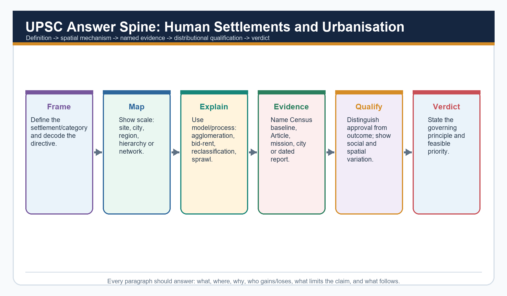

# Geography 28 — Human Settlements and Urbanisation

## BASIC MCQS / REMEDIATION

### How to use this section

The authored Basic sequence below follows the mandatory correct-answer rotation
**A → B → C → D**, repeated without interruption. The two verified Prelims PYQs in the next
section retain their immutable official keys and are not altered to manufacture a pattern.

### Basic MCQs 1-8

#### Q1. Which statement best distinguishes site from situation?

A. Site is a market threshold; situation is a service range
B. Site is the exact ground; situation is the settlement's relative location
C. Site is economic function; situation is street geometry
D. Site is legal status; situation is population rank

**Answer: B.** Site is local ground, while situation is relational position.

**Common-error remediation:** If you chose C, D or A, return to the four-question settlement
reading: ground, relative location, function and hierarchy are different variables.

#### Q2. A compact rural settlement is best described as:

A. A settlement with only non-farm work
B. A merged group of metropolitan regions
C. A close cluster of dwellings
D. A legally notified municipality

**Answer: C.** Compact or nucleated refers to dwelling concentration.

**Common-error remediation:** Compactness is morphology, not legal urban status.

#### Q3. Which pairing is correct?

A. Radial — houses following one canal
B. Linear — houses around a central open space
C. Irregular — a mandatory planned grid
D. Rectangular — streets meeting roughly at right angles

**Answer: D.** Rectangular or grid layouts contain roughly right-angled streets.

**Common-error remediation:** Match the visible geometry before thinking about economic function.

#### Q4. Urbanisation is most completely understood as:

A. Migration to one metropolitan city only
B. Rising urban share together with occupational, service and network change
C. Increase in the number of buildings only
D. Expansion of a municipal boundary only

**Answer: B.** Urbanisation is demographic and functional-economic.

**Common-error remediation:** Add work, services and transport integration whenever the stem uses
“process.”

#### Q5. Which term describes physical coalescence of previously distinct towns or cities?

A. Conurbation
B. Site
C. Threshold
D. Primate city

**Answer: A.** Conurbation is continuous built-up merger.

**Common-error remediation:** A metropolis may be one large city; conurbation specifically stresses
merger.

#### Q6. In central-place theory, threshold means:

A. The legal boundary of a service centre
B. The maximum distance a consumer will travel
C. The minimum demand needed to sustain a good or service
D. The population of the largest city

**Answer: C.** Threshold is minimum viable demand.

**Common-error remediation:** Threshold is the floor; range is the outer reach.

#### Q7. Which K value is associated with Christaller's marketing principle?

A. K = 1
B. K = 4
C. K = 3
D. K = 7

**Answer: C.** Marketing is K = 3.

**Common-error remediation:** Remember the ascending set: marketing 3, transport 4,
administration 7.

#### Q8. Why do hexagons appear in central-place theory?

A. They cover an ideal plain without the gaps or overlaps created by circles
B. They prove consumers always choose the nearest centre
C. They reproduce real district borders exactly
D. They represent circular municipal boundaries

**Answer: A.** Hexagons are a geometric coverage device.

**Common-error remediation:** Do not confuse model geometry with an observed political map.

### Basic MCQs 9-16

#### Q9. A periodic market most clearly illustrates:

A. A mobile solution where local demand is below the threshold for a permanent service
B. A primate-city effect
C. A statutory conversion of a village
D. A concentric transition zone

**Answer: A.** Market circulation pools demand across settlements and time.

**Common-error remediation:** Ask what happens when demand is too small to sustain a permanent
facility.

#### Q10. Rank-size analysis is safest when:

A. The largest city is assumed to be primate
B. Every settlement is treated as one national system
C. Population rank is replaced by legal status
D. The urban system and comparable boundaries are first defined

**Answer: D.** Scale and boundary definitions shape the result.

**Common-error remediation:** National and state systems can show different degrees of primacy.

#### Q11. Which statement best captures India's urban-system pattern in the Basic owner?

A. Primacy cannot be discussed below the world scale
B. India has one unchallenged national primate city
C. Every state follows rank-size perfectly
D. India is multi-metropolitan nationally, while state-level primacy may occur

**Answer: D.** Several national metropolitan cores coexist, but one city may dominate a state.

**Common-error remediation:** Always specify the spatial scale.

#### Q12. Burgess's model is organised mainly through:

A. Several specialised nuclei
B. Concentric rings and invasion-succession
C. Transport wedges
D. Hexagonal market areas

**Answer: B.** Burgess uses outward rings around a CBD.

**Common-error remediation:** Rings = Burgess; wedges = Hoyt; nodes = Harris-Ullman.

#### Q13. Which feature is central to Hoyt's sector model?

A. Only isolated farmsteads
B. A fixed administrative K = 7 hierarchy
C. Directional growth along transport corridors
D. One uniform census criterion

**Answer: C.** Hoyt emphasises directional wedges.

**Common-error remediation:** Look for corridor or wedge language.

#### Q14. Multiple-nuclei theory is useful because it recognises:

A. Informal settlements occur only in one transition zone
B. City growth must form perfect rings
C. Specialised nodes, clustering benefits and incompatible land uses
D. Every activity prefers the CBD

**Answer: C.** Several functional nodes arise for different reasons.

**Common-error remediation:** The model's strength is polycentric specialisation; its weakness is
limited prediction of when nuclei emerge.

#### Q15. Which is the strongest Indian correction to the three classical internal-city models?

A. Indian cities have no historical cores
B. Indian cities contain only one planned extension
C. Informal settlement is absent outside the CBD
D. Pre-colonial, colonial and later planned/unplanned layers coexist

**Answer: D.** Indian urban form is historically layered.

**Common-error remediation:** Models should be combined selectively rather than chosen as mutually
exclusive maps.

#### Q16. A census town is distinctive because it:

A. Can meet demographic-economic urban criteria without an urban local body
B. Must contain several statutory towns
C. Is created only through municipal law
D. Must be a million-plus city

**Answer: A.** Statistical urban status can exist without statutory municipal status.

**Common-error remediation:** Statistical urbanisation and administrative urbanisation can move at
different speeds.

### Basic MCQs 17-24

#### Q17. An urban agglomeration is primarily a concept of:

A. State-level city primacy
B. Rural landholding size
C. Continuous built-up spread involving a town and outgrowths or contiguous towns
D. Minimum consumer demand

**Answer: C.** A UA captures physical continuity beyond a single core.

**Common-error remediation:** Do not use UA, conurbation and metropolitan area as automatic
synonyms.

#### Q18. Urban sprawl raises infrastructure cost mainly because:

A. dispersed peripheral development extends networks and travel distances
B. it shortens every commute
C. It always increases density
D. it automatically creates statutory towns

**Answer: A.** Discontinuity and distance raise network cost.

**Common-error remediation:** Diagnose sprawl through form, travel and service extension—not
population alone.

#### Q19. Informal settlement is best analysed as:

A. A direct synonym for homelessness
B. A result of urbanisation stopping
C. A cultural preference for unsafe land
D. A housing-market, tenure and service-governance failure

**Answer: D.** Affordability, supply, tenure and location shape informality.

**Common-error remediation:** Migration may increase demand, but it does not explain the full
housing mechanism.

#### Q20. Which chain most directly links sprawl to air pollution?

A. Land-use separation → longer trips → vehicle dependence → emissions
B. Greater clustering → shorter networks → no vehicles
C. Municipal notification → lower rent → less traffic
D. Higher threshold → lower range → less travel

**Answer: A.** Separated land uses generate travel demand and private-vehicle dependence.

**Common-error remediation:** Connect urban form to mobility before discussing emissions.

#### Q21. The strongest explanation of urban flooding is:

A. Rainfall interacting with sealed surfaces, lost storage, weak drainage and exposure
B. Rainfall amount alone
C. Municipal status alone
D. City population rank alone

**Answer: A.** Flood risk is hazard plus land-use and drainage conditions plus exposure.

**Common-error remediation:** A climatic trigger becomes a disaster through urban decisions.

#### Q22. Urban heat islands intensify when:

A. service range declines
B. dark surfaces store heat and built form reduces cooling
C. all buildings become rural
D. vegetation and water increase evaporative cooling

**Answer: B.** Stored heat, reduced vegetation, trapped radiation and waste heat reinforce warming.

**Common-error remediation:** Include vulnerability; equal temperature does not create equal harm.

#### Q23. Which statement best assesses an urban water service?

A. Pipe length alone is enough
B. Source, continuity, quality, affordability, collection and treatment all matter
C. Groundwater extraction has no regional effect
D. A sanctioned project is enough

**Answer: B.** Service quality is a complete chain.

**Common-error remediation:** Connections and capacity are outputs; reliable safe service is the
outcome.

#### Q24. Governance fragmentation is most likely when:

A. one functional city is governed through perfectly aligned boundaries and powers
B. all service networks remain within one ward
C. every peri-urban area already has adequate municipal capacity
D. commuting, water, waste and flood systems cross multiple weakly coordinated authorities

**Answer: D.** Functional networks exceed administrative boundaries.

**Common-error remediation:** Ask whether the spatial scale of the problem matches the scale of the
institution.

### Remedial MCQs 25-32

These questions target the most common confusions while continuing the same A → B → C → D
rotation.

#### Q25. Which correction is necessary?

A. Form and function are identical
B. A compact settlement can still be rural
C. Dispersed settlement has no environmental logic
D. Every compact settlement is a metropolis

**Answer: B.** Compactness describes clustering, not urban status.

**Remediation:** Rebuild the three-column distinction: form, pattern, function.

#### Q26. Which pair is correctly matched?

A. Conurbation — one isolated farmstead
B. Range — maximum acceptable travel distance or cost
C. Primacy — perfect rank-size balance
D. Threshold — maximum travel distance

**Answer: B.** Range is the outer reach of demand.

**Remediation:** Threshold = minimum demand; range = maximum reach.

#### Q27. Which statement about models is safest?

A. Assumptions need not be stated
B. Informality always occupies one predicted zone
C. A model explains a selected mechanism and requires Indian qualification
D. One ideal model should fully map every Indian city

**Answer: C.** Models are selective heuristics.

**Remediation:** Use assumption → mechanism → application → limit.

#### Q28. Which statement about census towns is incorrect?

A. They may function as urban settlements
B. They satisfy demographic-economic criteria
C. They exist only after receiving an urban local body
D. They may remain under rural governance

**Answer: C.** Municipal status is not required for census-town classification.

**Remediation:** Statistical status and legal status are separate.

#### Q29. Which is the best answer opening for an urban-flood question?

A. Cities flood only because rainfall is high
B. Urban flooding reflects the interaction of rainfall with land-use change, drainage loss and exposed development
C. A list of missions without a causal thesis
D. Smart technology has eliminated flood risk

**Answer: B.** It defines the multi-causal mechanism.

**Remediation:** Begin with the process, then use examples and remedies.

#### Q30. Which response best protects both housing and livelihoods?

A. Safe in-situ upgrading where feasible, supported by services and tenure security
B. Automatic distant relocation
C. Housing supply without transport access
D. Demolition without alternatives

**Answer: A.** Location and social networks are part of housing value.

**Remediation:** A dwelling far from work can create a livelihood loss.

#### Q31. Which answer best balances urbanisation?

A. Population concentration automatically guarantees inclusion
B. Cities produce only diseconomies
C. Urban growth should stop
D. Cities can raise productivity and non-farm opportunity, but outcomes depend on planning and capacity

**Answer: D.** Urbanisation has gains and costs mediated by institutions.

**Remediation:** Do not turn diagnosis of urban problems into an argument against cities.

#### Q32. Which conclusion is strongest?

A. Build more roads everywhere
B. Copy one Western model
C. Use more schemes
D. Align functional regions, land use, service networks, finance and ecological limits

**Answer: D.** The integrated verdict follows the Basic learning chain.

**Remediation:** A conclusion should resolve the diagnosed mechanism, not repeat a slogan.

## PYQS AND ANSWER PRACTICE

### Practice protocol and provenance

This section retains the topic-relevant verified PYQs and examiner-grade answer quality established
in the v1 package:

- Mains: 2019 mass transport; 2020 million-city flooding; two 2021 questions on water-body
  reclamation and IT-city implications; 2022 Tier 2 consumption; 2023 segregation; 2024 large-city
  migration; 2025 smart-city justice.
- Prelims: 2019 Solid Waste Management Rules Q59 and 2024 constitutional Parts Q74.
- The v1 package records both objective keys as officially verified.
- Question wording follows locally available paper scans with minor OCR normalisation.
- Every Mains model follows **claim → named evidence/example → analysis → qualification → verdict**
  and ends with **Why this earns marks**.

### 2. Workbook solved Mains PYQ - 2025

Locally available official GS-I question paper verified.

- **Question:** How does smart city in India address the issues of urban poverty and distributive justice? (150 words)
- **Demand decoding:** 10 marks. Directive: Explain how, while evaluating distribution. Define the key term, answer the causal/evaluative demand, use named spatial evidence, qualify scale and end with a direct verdict.
- **Claim 1:** Smart-city infrastructure can lower capability deprivation when it improves basic services and public space. **Named evidence/example:** MoHUA Annual Report 2025-26 reported 7,755 of 8,064 Smart Cities projects completed (96%) as on 31 December 2025. **Analysis:** Digital and physical upgrades can improve reliability, safety and access, but completion is an administrative output.
- **Claim 2:** Distributive justice depends on who receives accessible housing, mobility and services. **Named evidence/example:** PIB reported 16.20 lakh PMAY-U 2.0 houses sanctioned by 13 July 2026; Census 2011 recorded a large historical slum-household baseline. **Analysis:** Housing location, tenure, occupancy and transport cost determine whether sanctions expand real opportunity.
- **Claim 3:** Participation and citywide scaling matter. **Named evidence/example:** 74th Amendment institutions and ward-level governance. **Analysis:** Without voice, area-based upgrading can create enclave improvement, displacement or digital exclusion.
- **Qualification:** Smartness is an instrument, not a distributive outcome; city averages can conceal informal and peripheral settlements.
- **Verdict:** A smart city advances justice only when investment is citywide, affordable, participatory and measured through ward-wise service and accessibility outcomes.
- **Why this earns marks:** It answers the directive directly, links each claim to named evidence, explains the spatial mechanism, includes a limitation and gives a reasoned verdict rather than a scheme list.
- **Outstanding-answer checklist:** direct thesis; compact spatial diagram; mark-proportionate evidence; example-to-claim linkage; explicit counterpoint; decisive conclusion.
- **Examiner warning:** do not substitute a mission inventory for the causal or evaluative demand.

**Must-know facts**
- Use 2-3 named examples for 10 marks and 4-6 for 15 marks.
- Maintain directive fidelity.

**UPSC traps**
- **Wrong:** A list of city names is evidence. **Correct:** Explain what each named example demonstrates.

**Mains / practice route:** How does smart city in India address the issues of urban poverty and distributive justice? (150 words)

**Study link:** Official local GS-I scan, 2025

### 3. Workbook solved Mains PYQ - 2024

Locally available official GS-I question paper verified.

- **Question:** Why do large cities tend to attract more migrants than smaller towns? Discuss in the light of conditions in developing countries. (150 words)
- **Demand decoding:** 10 marks. Directive: Explain comparative attraction. Define the key term, answer the causal/evaluative demand, use named spatial evidence, qualify scale and end with a direct verdict.
- **Claim 1:** Large cities offer thicker labour markets and a wider probability of job matching. **Named evidence/example:** Delhi NCR, Mumbai, Bengaluru and other metropolitan regions combine formal and informal opportunities. **Analysis:** Even when unemployment risk exists, expected income and job diversity can exceed small-town options.
- **Claim 2:** Agglomeration concentrates institutions, transport gateways and migrant networks. **Named evidence/example:** Universities, hospitals, airports, wholesale markets and established origin-destination networks. **Analysis:** Network information lowers migration cost and risk, reinforcing cumulative attraction.
- **Claim 3:** Policy and capital expenditure often privilege metropolitan nodes. **Named evidence/example:** Smart Cities legacy, metro systems and major business districts. **Analysis:** Infrastructure concentration raises accessibility but also rent, congestion and informality.
- **Qualification:** Smaller towns can intercept migration when they provide reliable services, processing jobs, education, connectivity and affordable housing.
- **Verdict:** Metropolitan attraction reflects cumulative agglomeration and network effects, not simply population size; balanced regional and small-town development can reduce forced concentration.
- **Why this earns marks:** It answers the directive directly, links each claim to named evidence, explains the spatial mechanism, includes a limitation and gives a reasoned verdict rather than a scheme list.
- **Outstanding-answer checklist:** direct thesis; compact spatial diagram; mark-proportionate evidence; example-to-claim linkage; explicit counterpoint; decisive conclusion.
- **Examiner warning:** do not substitute a mission inventory for the causal or evaluative demand.

**Must-know facts**
- Use 2-3 named examples for 10 marks and 4-6 for 15 marks.
- Maintain directive fidelity.

**UPSC traps**
- **Wrong:** A list of city names is evidence. **Correct:** Explain what each named example demonstrates.

**Mains / practice route:** Why do large cities tend to attract more migrants than smaller towns? Discuss in the light of conditions in developing countries. (150 words)

**Study link:** Official local GS-I scan, 2024

### 4. Workbook solved Mains PYQ - 2023

Locally available official GS-I question paper verified.

- **Question:** Does urbanization lead to more segregation and/or marginalization of the poor in Indian metropolises? (250 words)
- **Demand decoding:** 15 marks. Directive: Critically assess. Define the key term, answer the causal/evaluative demand, use named spatial evidence, qualify scale and end with a direct verdict.
- **Claim 1:** Land and housing markets sort low-income households into peripheral or hazardous locations. **Named evidence/example:** Informal settlements near drains, floodplains, industrial edges and distant resettlement colonies. **Analysis:** The poor may gain proximity to work only by accepting insecure tenure and environmental risk.
- **Claim 2:** Infrastructure networks can reproduce spatial exclusion. **Named evidence/example:** Unequal water continuity, sewerage, footpaths and public transport across wards. **Analysis:** A nominal citywide coverage rate can hide time burdens, high informal prices and unreliable quality.
- **Claim 3:** Redevelopment can improve services but also displace livelihoods. **Named evidence/example:** In-situ upgrading versus relocation approaches under urban housing programmes. **Analysis:** Distance from work and social networks can convert a housing asset into livelihood loss.
- **Claim 4:** Urbanisation can also reduce inherited constraints. **Named evidence/example:** Mixed labour markets, education, women's employment and public institutions in large cities. **Analysis:** Cities can enable mobility if anti-discrimination, rental housing and universal services are present.
- **Qualification:** Segregation is not an automatic demographic effect of urban growth; it is mediated by planning, tenure, transport, finance and political voice.
- **Verdict:** Indian metropolitan urbanisation often intensifies marginalisation, but inclusive zoning, in-situ improvement, affordable rental housing, universal services and participatory planning can convert density into shared opportunity.
- **Why this earns marks:** It answers the directive directly, links each claim to named evidence, explains the spatial mechanism, includes a limitation and gives a reasoned verdict rather than a scheme list.
- **Outstanding-answer checklist:** direct thesis; compact spatial diagram; mark-proportionate evidence; example-to-claim linkage; explicit counterpoint; decisive conclusion.
- **Examiner warning:** do not substitute a mission inventory for the causal or evaluative demand.

**Must-know facts**
- Use 2-3 named examples for 10 marks and 4-6 for 15 marks.
- Maintain directive fidelity.

**UPSC traps**
- **Wrong:** A list of city names is evidence. **Correct:** Explain what each named example demonstrates.

**Mains / practice route:** Does urbanization lead to more segregation and/or marginalization of the poor in Indian metropolises? (250 words)

**Study link:** Official local GS-I scan, 2023

### 5. Workbook solved Mains PYQ - 2022

Locally available official GS-I question paper verified.

- **Question:** How is the growth of Tier 2 cities related to the rise of a new middle class with an emphasis on the culture of consumption? (150 words)
- **Demand decoding:** 10 marks. Directive: Explain relationship. Define the key term, answer the causal/evaluative demand, use named spatial evidence, qualify scale and end with a direct verdict.
- **Claim 1:** Service-sector and administrative expansion raises salaried employment and disposable income. **Named evidence/example:** Regional IT, education, health, logistics and state-capital functions in cities such as Indore, Coimbatore and Bhubaneswar. **Analysis:** A broader professional class supports durable-goods, housing and leisure demand.
- **Claim 2:** Connectivity and digital retail diffuse metropolitan consumption norms. **Named evidence/example:** Airports, highways, e-commerce, digital payments and social media. **Analysis:** Market range expands beyond the historic commercial core and reshapes peri-urban land use.
- **Claim 3:** Real-estate and retail landscapes materialise class identity. **Named evidence/example:** Gated housing, malls, branded food, coaching and private health/education. **Analysis:** Consumption becomes a marker of aspiration while increasing land, waste, traffic and household-debt pressures.
- **Qualification:** Tier 2 is not a uniform official urban category, and new middle classes coexist with informal work, old inequalities and service deficits.
- **Verdict:** Tier 2 growth and consumer middle-class formation are mutually reinforcing, but sustainable urban policy must align consumption-led expansion with public services, productive jobs and ecological limits.
- **Why this earns marks:** It answers the directive directly, links each claim to named evidence, explains the spatial mechanism, includes a limitation and gives a reasoned verdict rather than a scheme list.
- **Outstanding-answer checklist:** direct thesis; compact spatial diagram; mark-proportionate evidence; example-to-claim linkage; explicit counterpoint; decisive conclusion.
- **Examiner warning:** do not substitute a mission inventory for the causal or evaluative demand.

**Must-know facts**
- Use 2-3 named examples for 10 marks and 4-6 for 15 marks.
- Maintain directive fidelity.

**UPSC traps**
- **Wrong:** A list of city names is evidence. **Correct:** Explain what each named example demonstrates.

**Mains / practice route:** How is the growth of Tier 2 cities related to the rise of a new middle class with an emphasis on the culture of consumption? (150 words)

**Study link:** Official local GS-I scan, 2022

### 6. Workbook solved Mains PYQ - 2021

Locally available official GS-I question paper verified.

- **Question:** What are the environmental implications of the reclamation of water bodies into urban land use? Explain with examples. (150 words)
- **Demand decoding:** 10 marks. Directive: Explain impacts with examples. Define the key term, answer the causal/evaluative demand, use named spatial evidence, qualify scale and end with a direct verdict.
- **Claim 1:** Reclamation removes stormwater storage and drainage connectivity. **Named evidence/example:** Chennai's wetland and floodplain pressures; Bengaluru's disrupted lake-drain network. **Analysis:** The same rainfall produces faster runoff, deeper waterlogging and higher downstream peaks.
- **Claim 2:** It erodes groundwater recharge, water quality and habitat. **Named evidence/example:** Urban lakes and wetlands function as recharge, sediment, nutrient and biodiversity systems. **Analysis:** Converting them to built land transfers treatment and flood-control costs to public infrastructure.
- **Claim 3:** It intensifies heat and locks in exposure. **Named evidence/example:** Loss of blue-green space and construction in low-lying land. **Analysis:** Heat stress and flood damage become concentrated among residents with weaker housing and insurance.
- **Qualification:** Not every modified water body has identical ecological value; restoration must be catchment-based and avoid cosmetic beautification that disconnects hydrology.
- **Verdict:** Urban water bodies are functional infrastructure; zoning, buffer protection, sewage interception and connected blue-green restoration should precede engineering expansion.
- **Why this earns marks:** It answers the directive directly, links each claim to named evidence, explains the spatial mechanism, includes a limitation and gives a reasoned verdict rather than a scheme list.
- **Outstanding-answer checklist:** direct thesis; compact spatial diagram; mark-proportionate evidence; example-to-claim linkage; explicit counterpoint; decisive conclusion.
- **Examiner warning:** do not substitute a mission inventory for the causal or evaluative demand.

**Must-know facts**
- Use 2-3 named examples for 10 marks and 4-6 for 15 marks.
- Maintain directive fidelity.

**UPSC traps**
- **Wrong:** A list of city names is evidence. **Correct:** Explain what each named example demonstrates.

**Mains / practice route:** What are the environmental implications of the reclamation of water bodies into urban land use? Explain with examples. (150 words)

**Study link:** Official local GS-I scan, 2021

### 7. Workbook solved Mains PYQ - 2021

Locally available official GS-I question paper verified.

- **Question:** What are the main socio-economic implications arising out of the development of IT industries in major cities of India? (250 words)
- **Demand decoding:** 15 marks. Directive: Analyse implications. Define the key term, answer the causal/evaluative demand, use named spatial evidence, qualify scale and end with a direct verdict.
- **Claim 1:** IT clusters create high-productivity employment and global service linkages. **Named evidence/example:** Bengaluru, Hyderabad, Pune, Chennai and NCR technology corridors. **Analysis:** Specialised labour, suppliers and knowledge spillovers strengthen urban agglomeration.
- **Claim 2:** They restructure land use and metropolitan form. **Named evidence/example:** Electronic City and Outer Ring Road-type corridors, airport-oriented growth and gated housing. **Analysis:** Office corridors pull housing and services outward, producing polycentric but travel-intensive regions.
- **Claim 3:** They widen occupational and spatial dualism. **Named evidence/example:** High-wage professionals depend on lower-paid security, domestic, delivery and construction workers. **Analysis:** Rent escalation and long commutes can exclude the workforce that sustains the cluster.
- **Claim 4:** They transform gender, consumption and culture. **Named evidence/example:** Young skilled migrants, night-shift work and transnational work cultures. **Analysis:** New autonomy coexists with safety, care and housing constraints.
- **Qualification:** Technology is not the sole cause; state policy, engineering education, global demand and infrastructure shape each city's trajectory.
- **Verdict:** IT urbanisation raises productivity but must be paired with affordable housing, mass transit, mixed land use, worker protection and metropolitan governance.
- **Why this earns marks:** It answers the directive directly, links each claim to named evidence, explains the spatial mechanism, includes a limitation and gives a reasoned verdict rather than a scheme list.
- **Outstanding-answer checklist:** direct thesis; compact spatial diagram; mark-proportionate evidence; example-to-claim linkage; explicit counterpoint; decisive conclusion.
- **Examiner warning:** do not substitute a mission inventory for the causal or evaluative demand.

**Must-know facts**
- Use 2-3 named examples for 10 marks and 4-6 for 15 marks.
- Maintain directive fidelity.

**UPSC traps**
- **Wrong:** A list of city names is evidence. **Correct:** Explain what each named example demonstrates.

**Mains / practice route:** What are the main socio-economic implications arising out of the development of IT industries in major cities of India? (250 words)

**Study link:** Official local GS-I scan, 2021

### 8. Workbook solved Mains PYQ - 2020

Locally available official GS-I question paper verified.

- **Question:** Account for the huge flooding of million cities in India including the smart ones like Hyderabad and Pune. Suggest lasting remedial measures. (250 words)
- **Demand decoding:** 15 marks. Directive: Account for causes and prescribe lasting measures. Define the key term, answer the causal/evaluative demand, use named spatial evidence, qualify scale and end with a direct verdict.
- **Claim 1:** Extreme rainfall interacts with expanded impervious cover. **Named evidence/example:** Hyderabad and Pune experienced rapid built-up growth across catchments and drainage paths. **Analysis:** Runoff volume and speed rise when infiltration and temporary storage decline.
- **Claim 2:** Land-use violations remove natural buffers. **Named evidence/example:** Encroached floodplains, filled lakes/wetlands and construction in low-lying areas. **Analysis:** Hazard becomes disaster through planning decisions rather than rainfall alone.
- **Claim 3:** Drainage and solid-waste systems fail as connected networks. **Named evidence/example:** Blocked drains, weak maintenance, sewage mixing and fragmented agency responsibility. **Analysis:** Project-based upgrades cannot substitute for catchment-scale operation.
- **Claim 4:** Lasting remedies combine spatial regulation and service management. **Named evidence/example:** Blue-green networks, floodplain zoning, drain inventory, forecasts, permeable surfaces and ward preparedness. **Analysis:** Risk reduction must protect low-income settlements and critical infrastructure rather than merely accelerate drainage downstream.
- **Qualification:** Design standards must use updated rainfall and land-use evidence, but no engineering capacity can eliminate residual risk.
- **Verdict:** The durable strategy is catchment governance: protect storage and flow paths, manage waste and drainage continuously, regulate exposure and prepare for exceedance events.
- **Why this earns marks:** It answers the directive directly, links each claim to named evidence, explains the spatial mechanism, includes a limitation and gives a reasoned verdict rather than a scheme list.
- **Outstanding-answer checklist:** direct thesis; compact spatial diagram; mark-proportionate evidence; example-to-claim linkage; explicit counterpoint; decisive conclusion.
- **Examiner warning:** do not substitute a mission inventory for the causal or evaluative demand.

**Must-know facts**
- Use 2-3 named examples for 10 marks and 4-6 for 15 marks.
- Maintain directive fidelity.

**UPSC traps**
- **Wrong:** A list of city names is evidence. **Correct:** Explain what each named example demonstrates.

**Mains / practice route:** Account for the huge flooding of million cities in India including the smart ones like Hyderabad and Pune. Suggest lasting remedial measures. (250 words)

**Study link:** Official local GS-I scan, 2020

### 9. Workbook solved Mains PYQ - 2019

Locally available official GS-I question paper verified.

- **Question:** How is efficient and affordable urban mass transport key to the rapid economic development of India? (250 words)
- **Demand decoding:** 15 marks. Directive: Explain causal importance. Define the key term, answer the causal/evaluative demand, use named spatial evidence, qualify scale and end with a direct verdict.
- **Claim 1:** Mass transport enlarges effective labour markets. **Named evidence/example:** Metro, suburban rail and high-capacity bus systems connect workers to multiple employment nodes. **Analysis:** Lower travel time and uncertainty improve job matching and firm productivity.
- **Claim 2:** Affordability converts physical connectivity into social access. **Named evidence/example:** Low-income workers often spend a high share of time and income on commuting. **Analysis:** A costly network can induce exclusion, informal paratransit dependence or residential crowding near jobs.
- **Claim 3:** Mode shift reduces congestion, energy use and local pollution per passenger. **Named evidence/example:** Integrated bus-metro-rail systems and walking/cycling access. **Analysis:** Benefits depend on occupancy, clean energy, network design and restraint on car-oriented sprawl.
- **Claim 4:** Transport shapes land values and urban form. **Named evidence/example:** Transit-oriented development around stations. **Analysis:** Value capture can fund infrastructure, but displacement must be prevented through affordable housing and inclusive zoning.
- **Qualification:** A metro project alone is not a mobility system; feeder access, universal design, ticket integration, safety and land-use coordination are essential.
- **Verdict:** Efficient affordable mass transit is productive infrastructure because it improves access, agglomeration and environmental performance, provided it is designed as an inclusive door-to-door network.
- **Why this earns marks:** It answers the directive directly, links each claim to named evidence, explains the spatial mechanism, includes a limitation and gives a reasoned verdict rather than a scheme list.
- **Outstanding-answer checklist:** direct thesis; compact spatial diagram; mark-proportionate evidence; example-to-claim linkage; explicit counterpoint; decisive conclusion.
- **Examiner warning:** do not substitute a mission inventory for the causal or evaluative demand.

**Must-know facts**
- Use 2-3 named examples for 10 marks and 4-6 for 15 marks.
- Maintain directive fidelity.

**UPSC traps**
- **Wrong:** A list of city names is evidence. **Correct:** Explain what each named example demonstrates.

**Mains / practice route:** How is efficient and affordable urban mass transport key to the rapid economic development of India? (250 words)

**Study link:** Official local GS-I scan, 2019

### 10. Workbook solved Prelims PYQ

UPSC Prelims 2019 GS-I Q59 - Solid Waste Management Rules, 2016

- **Question:** As per the Solid Waste Management Rules, 2016 in India, which one of the following statements is correct?
- A. Waste generator has to segregate waste into five categories. | B. The Rules are applicable to notified urban local bodies, notified towns and all industrial townships only. | C. The Rules provide for exact and elaborate criteria for identification of sites for landfills and waste-processing facilities. | D. Waste generated in one district cannot be moved to another district.
- **Officially verified answer: C.** Officially verified answer: C. Five-category segregation is incorrect; applicability is wider than only notified urban bodies/towns/industrial townships; no blanket inter-district movement ban exists.
- **Elimination logic:** test the precise legal/statistical scope of each option; reject category compression and absolute wording.

**Must-know facts**
- Official key verified.
- No inferred-answer label required.

**UPSC traps**
- **Wrong:** A broadly plausible statement is enough. **Correct:** Prelims turns on exact scope and wording.

**Mains / practice route:** Objective PYQ - verify each statement independently.

**Study link:** Local paper and key

### 11. Workbook solved Prelims PYQ

UPSC Prelims 2024 GS-I Set A Q74 - Constitutional Parts

- **Question:** Which statements are correct? 1. Powers of Municipalities are given in Part IX-A. 2. Emergency provisions are in Part XVIII. 3. Constitutional amendment provisions are in Part XX.
- A. 1 and 2 only | B. 2 and 3 only | C. 1 only | D. 1, 2 and 3
- **Officially verified answer: D.** Official key: D. Part IX-A concerns Municipalities; Part XVIII emergencies; Part XX amendment.
- **Elimination logic:** test the precise legal/statistical scope of each option; reject category compression and absolute wording.

**Must-know facts**
- Official key verified.
- No inferred-answer label required.

**UPSC traps**
- **Wrong:** A broadly plausible statement is enough. **Correct:** Prelims turns on exact scope and wording.

**Mains / practice route:** Objective PYQ - verify each statement independently.

**Study link:** Local paper and key

### 17. Workbook Original solved Mains practice - 10 marks

Original examiner-oriented practice question.

- **Question:** Examine why India's urban challenge is better understood as a mismatch among functional regions, governing boundaries and service systems than as population growth alone. (10 marks)
- **Demand decoding:** 10 marks. Directive: Examine. Define the key term, answer the causal/evaluative demand, use named spatial evidence, qualify scale and end with a direct verdict.
- **Claim 1:** Functional urban regions cross statutory borders. **Named evidence/example:** Delhi NCR-type commuting and airshed/watershed systems. **Analysis:** Municipal decisions cannot alone govern regional flows.
- **Claim 2:** Census and legal categories change at different speeds. **Named evidence/example:** 3,894 census towns in Census 2011. **Analysis:** Dense non-farm settlements can remain under rural governance and service norms.
- **Claim 3:** Infrastructure is networked across jurisdictions. **Named evidence/example:** Water source, landfill, transit corridor and flood catchment. **Analysis:** Fragmentation creates cost shifting and accountability gaps.
- **Qualification:** Population growth remains a pressure multiplier, but the same growth produces different outcomes under different institutional capacity.
- **Verdict:** India needs boundary-aware municipal devolution plus metropolitan/catchment coordination and outcome-based service monitoring.
- **Why this earns marks:** It answers the directive directly, links each claim to named evidence, explains the spatial mechanism, includes a limitation and gives a reasoned verdict rather than a scheme list.
- **Outstanding-answer checklist:** include a labelled diagram, sufficient named evidence, explicit qualification and a verdict proportional to the directive.

### 18. Workbook Original solved Mains practice - 15 marks

Original examiner-oriented practice question.

- **Question:** Analyse how land-use planning, housing and mobility can jointly reduce urban inequality and climate risk in Indian cities. (15 marks)
- **Demand decoding:** 15 marks. Directive: Analyse. Define the key term, answer the causal/evaluative demand, use named spatial evidence, qualify scale and end with a direct verdict.
- **Claim 1:** Risk-sensitive land use reduces exposure. **Named evidence/example:** Protection of wetlands/floodplains and heat-sensitive open-space networks. **Analysis:** Avoidance is cheaper and more equitable than repeated post-disaster recovery.
- **Claim 2:** Well-located affordable housing lowers livelihood and transport vulnerability. **Named evidence/example:** In-situ upgrading, rental housing and mixed-income TOD. **Analysis:** Location turns a dwelling into access to jobs, care and education.
- **Claim 3:** Mass transit and active mobility expand opportunity while limiting emissions. **Named evidence/example:** Integrated bus-metro-suburban rail with safe last mile. **Analysis:** Affordable door-to-door access supports agglomeration without car dependence.
- **Claim 4:** Municipal finance and participation sustain the package. **Named evidence/example:** Property-tax reform, O&M budgets, ward committees and public dashboards. **Analysis:** Capital projects endure only with revenue and local accountability.
- **Qualification:** Higher density can worsen heat or displacement if infrastructure, ventilation and affordability safeguards are absent.
- **Verdict:** An integrated land-housing-mobility strategy should be evaluated through ward-wise access, affordability and risk outcomes rather than project counts.
- **Why this earns marks:** It answers the directive directly, links each claim to named evidence, explains the spatial mechanism, includes a limitation and gives a reasoned verdict rather than a scheme list.
- **Outstanding-answer checklist:** include a labelled diagram, sufficient named evidence, explicit qualification and a verdict proportional to the directive.

### 19. Workbook Original solved Mains practice - 20 marks

Original examiner-oriented practice question.

- **Question:** India's next urban transition must be municipal, metropolitan and ecological at the same time. Discuss with reference to the 74th Amendment and current urban missions. (20 marks)
- **Demand decoding:** 20 marks. Directive: Discuss. Define the key term, answer the causal/evaluative demand, use named spatial evidence, qualify scale and end with a direct verdict.
- **Claim 1:** Municipal capacity is the democratic service foundation. **Named evidence/example:** Part IX-A, Article 243W and the Twelfth Schedule. **Analysis:** Functions without funds, staff and answerability create constitutional form without operational capacity.
- **Claim 2:** Metropolitan coordination is required for networked regions. **Named evidence/example:** Article 243ZE MPC; commuting, housing, watershed, airshed and waste flows. **Analysis:** Local autonomy and regional integration must be designed together.
- **Claim 3:** Ecological systems are urban infrastructure. **Named evidence/example:** Blue-green flood networks, heat mitigation, source-water security and circular waste systems. **Analysis:** Ignoring ecological capacity converts growth into recurrent fiscal and social loss.
- **Claim 4:** Missions supply instruments but not automatic outcomes. **Named evidence/example:** PMAY-U 2.0 sanctions, AMRUT approvals, SBM processing status and Smart Cities project completion. **Analysis:** Each statistic needs an outcome test: occupancy, continuity, residuals, inclusion and O&M.
- **Claim 5:** Finance determines scale and durability. **Named evidence/example:** Urban Challenge Fund, own revenue, grants, bonds and lifecycle costing. **Analysis:** Market-linked capital can expand investment but may exclude weak ULBs or create fiscal risk without equalisation and capacity.
- **Qualification:** One uniform model cannot fit statutory towns, census towns, Tier 2 centres and mega city-regions; state and city variation must remain visible.
- **Verdict:** The transition should combine empowered ULBs, accountable metropolitan institutions and ecological limits, monitored through disaggregated service and resilience outcomes.
- **Why this earns marks:** It answers the directive directly, links each claim to named evidence, explains the spatial mechanism, includes a limitation and gives a reasoned verdict rather than a scheme list.
- **Outstanding-answer checklist:** include a labelled diagram, sufficient named evidence, explicit qualification and a verdict proportional to the directive.
