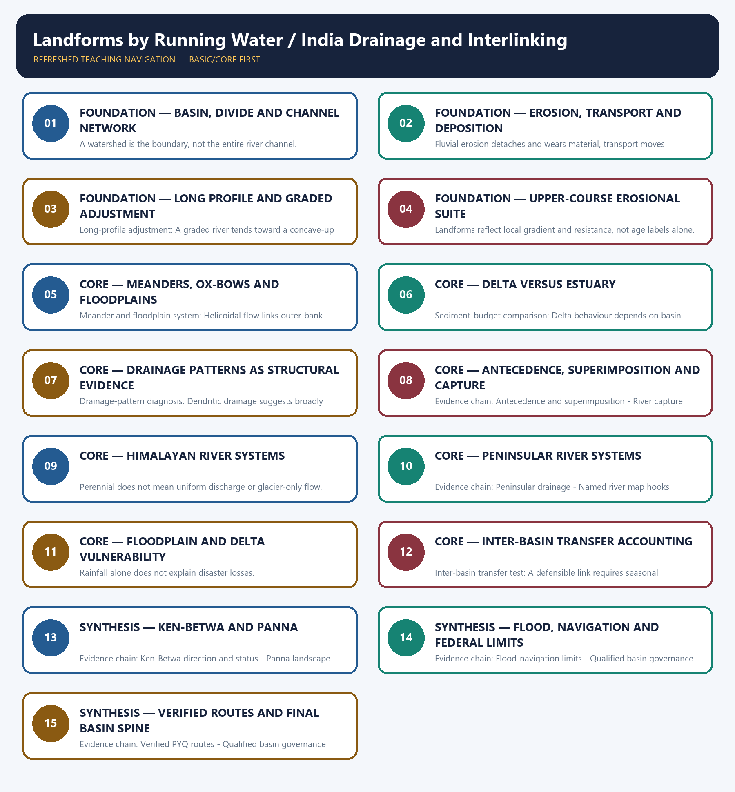

# Landforms by Running Water / India Drainage and Interlinking — Learner-v2 Complete Learning Session

> **Authoring-only generation:** 2026-09-01. No PDF was rendered and no tracker or index was mutated.

### SOURCE, PROGRESSION AND CURRENT-LINKAGE AUDIT

- **Generation date:** 2026-09-01.
- **Repository-first evidence:** the Basic owner is taught first and preserved in full; the Advanced owner is retained only in the optional final teaching block.
- **OCR evidence:** Repository Markdown was primary. The three required local Geography books were inspected as supplementary OCR/searchable evidence. No unsupported page precision, volatile figure or quotation was imported.
- **Qdrant:** not used; repository Markdown and available OCR context were sufficient.
- **PYQ integrity:** Verified routing retains the 2020 GS-I interlinking demand and two 2021 Prelims river-map demands. The local routing ledgers do not supply official keys for those objective items; no answer letter is invented.
- **Live-link boundary:** NWDA's April 2026 publication and project material are used only to verify Ken-to-Betwa direction and an under-implementation status. No cost, command-area, completion, benefit-delivery or ecological-outcome figure is restated.
- **Fact/inference discipline:** no current-affairs item, PYQ wording, figure or quotation is invented.

## BASIC LEARNING SESSION

### DEEP-REVIEW LEARNING CONTRACT

| Control | Binding rule for this package |
|---|---|
| Syllabus boundary | Complete physical process, spatial pattern and India anchor are taught before optional Advanced depth. |
| Causal method | Initial condition → energy/force or driver → mechanism → landform/climate/ocean pattern → consequence → feedback/limit. |
| Spatial method | Latitude, altitude, continentality, relief, plate setting, basin/coast orientation and map scale are explicit. |
| Terminology | Close terms are defined on common axes; process, form, region, hazard, regulation and current status are never collapsed. |
| Evidence method | Claim → named place/map/process/official record → analysis → qualification. |
| Practice contract | Every solved item has demand decoding, a detailed examiner-grade model, executable timed/compression plan, marks rationale and answer-specific improvement. |
| Approval | This immutable successor remains `approved: false` pending explicit approval. |

**Canonical Basic/Core owner:** `upsc-ai-kit\knowledge\Geography\basic\05_Landforms-by-Running-Water.md`  
**Canonical topic owner:** `upsc-ai-kit\knowledge\Geography\basic\05_Landforms-by-Running-Water.md`  
**Optional Advanced owner:** `upsc-ai-kit\knowledge\Geography\advanced\05_India-Drainage-and-Interlinking.md`  
**Official syllabus mapping:** `upsc-ai-kit\knowledge\Geography\OFFICIAL-UPSC-SYLLABUS-MAPPING.md`

### EVIDENCE, PYQ AND CURRENT-STATUS CONTROL

- **Process discipline:** no feature is listed without formation sequence, controlling variables and a limiting condition.
- **Map discipline:** distribution is reconstructed through latitude, plate/relief setting, wind/current direction, drainage/coast orientation and named anchors.
- **Quantitative discipline:** coordinates, thresholds, magnitudes, dates, counts and project dimensions retain units, source/date and uncertainty.
- **Causal discipline:** association is not treated as sufficiency; interacting controls, scale, lag, feedback and exceptions are stated.
- **PYQ discipline:** repository routing ledgers and held papers control wording and metadata; reconstructed wording and unavailable official keys remain labelled.
- **Current-status note, rechecked 2026-09-01:** NWDA's April 2026 publication and project material are used only to verify Ken-to-Betwa direction and an under-implementation status. No cost, command-area, completion, benefit-delivery or ecological-outcome figure is restated.

**Live/official context sources recorded by the predecessor generation:**

- `https://nwda.gov.in/upload/jal%20VikasApril%202026.pdf`
- `https://nwda.gov.in/upload/Ken-Betwa%20Link%20Project%20.pdf`




*Distinct embedded teaching-navigation image. The separate continuous Cārvāka-style flowchart package remains an independent at-a-glance artifact.*

### SESSION 1 — FOUNDATION — BASIN, DIVIDE AND CHANNEL NETWORK

#### DEFINITION / WHAT THIS IS CALLED

**Plain-language definition:** Drainage basin anatomy: A drainage basin is the area contributing runoff to a river system; a watershed or divide separates neighbouring basins, while tributaries join a trunk stream before its outlet.

**Technical definition:** A watershed is the boundary, not the entire river channel.

#### ANSWER-GRABBING OPENING — WRITE/ADAPT IN THE EXAM

> Drainage basin anatomy: A drainage basin is the area contributing runoff to a river system; a watershed or divide separates neighbouring basins, while tributaries join a trunk stream before its outlet.

#### MUST-WRITE KEYWORDS

- **FOUNDATION**
- **Basin**
- **divide**
- **channel network**
- **Drainage basin anatomy**
- **Evidence chain**

**How to use them:** Frame the answer through FOUNDATION; define Basin, connect divide with channel network to explain the mechanism, and use Drainage basin anatomy for the decisive comparison or qualification.

#### VISUAL FIRST

```text
BASIN, DIVIDE AND CHANNEL NETWORK
01. Drainage basin anatomy
BOUNDARY -> A watershed is the boundary, not the entire river channel.
```

*This topic-specific rail fixes the evidence sequence and its exam boundary before analysis.*

#### CORE EXPLANATION

A drainage basin is the area contributing runoff to a river system; a watershed or divide separates neighbouring basins, while tributaries join a trunk stream before its outlet.

#### NAMED EVIDENCE AND MECHANISM

- **Drainage basin anatomy:** A drainage basin is the area contributing runoff to a river system; a watershed or divide separates neighbouring basins, while tributaries join a trunk stream before its outlet.

#### EXAMINER CAUTION

- A watershed is the boundary, not the entire river channel.

#### EXAM LINK

- **Prelims:** Separate the agent, landform, location, status and scale attached to Basin, divide and channel network.
- **Mains:** Begin map answers with basin anatomy.

#### MINI RECAP

- **Evidence chain:** Drainage basin anatomy
- **Qualified use:** Begin map answers with basin anatomy.

#### CLOSING RECALL FLOW — FOUNDATION — BASIN, DIVIDE AND CHANNEL NETWORK

```text
START / CONCEPT: FOUNDATION — Basin, divide and channel network
        |
        v
EXACT TERMS: FOUNDATION · Basin · divide · channel network · Drainage basin anatomy · Evidence chain
        |
        v
MECHANISM / ARGUMENT: Evidence chain: Drainage basin anatomy Qualified use: Begin map answers with basin anatomy.
        |
        v
CONSEQUENCE / CONTRAST: A watershed is the boundary, not the entire river channel.
        |
        v
UPSC TRAP / ANSWER-USE: Do not miss this limiting distinction: a drainage basin is the area contributing runoff to a river system.
        |
        v
ANSWER-GRABBING FORMULATION: Drainage basin anatomy: A drainage basin is the area contributing runoff to a river system; a watershed or divide separates neighbouring basins, while tributaries join a trunk stream before its outlet.
```
### SESSION 2 — FOUNDATION — EROSION, TRANSPORT AND DEPOSITION

#### DEFINITION / WHAT THIS IS CALLED

**Plain-language definition:** River work is the linked erosion, movement and deposition of material as flow energy changes.

**Technical definition:** Fluvial erosion detaches and wears material, transport moves dissolved and particulate load, and deposition stores it when competence or capacity falls.

#### ANSWER-GRABBING OPENING — WRITE/ADAPT IN THE EXAM

> A river is an energy-and-load system in which erosion, transport and deposition may coexist while their relative dominance changes.

#### MUST-WRITE KEYWORDS

- **hydraulic action**
- **corrasion**
- **attrition**
- **traction**
- **saltation**
- **suspension**

**How to use them:** Define hydraulic action, corrasion and attrition as erosion; map traction, saltation and suspension to particle movement; then relate discharge, velocity and load to falling competence and deposition.

#### VISUAL FIRST

```text
EROSION, TRANSPORT AND DEPOSITION
01. River work and load
BOUNDARY -> The same reach may perform all three functions during different flows.
```

*This topic-specific rail fixes the evidence sequence and its exam boundary before analysis.*

#### CORE EXPLANATION

Running water erodes by hydraulic action, corrasion or abrasion, attrition and solution; it transports load by traction, saltation, suspension and solution before deposition when competence falls.

#### NAMED EVIDENCE AND MECHANISM

- **River work and load:** Running water erodes by hydraulic action, corrasion or abrasion, attrition and solution; it transports load by traction, saltation, suspension and solution before deposition when competence falls.

#### EXAMINER CAUTION

- The same reach may perform all three functions during different flows.

#### EXAM LINK

- **Prelims:** Separate the agent, landform, location, status and scale attached to Erosion, transport and deposition.
- **Mains:** Use agent-process-load vocabulary precisely.

#### MINI RECAP

- **Evidence chain:** River work and load
- **Qualified use:** Use agent-process-load vocabulary precisely.

#### CLOSING RECALL FLOW — FOUNDATION — EROSION, TRANSPORT AND DEPOSITION

```text
START / CONCEPT: FOUNDATION — Erosion, transport and deposition
        |
        v
EXACT TERMS: hydraulic action · corrasion · attrition · traction · saltation · suspension
        |
        v
MECHANISM / ARGUMENT: Evidence chain: River work and load Qualified use: Use agent-process-load vocabulary precisely.
        |
        v
CONSEQUENCE / CONTRAST: The resulting consequence is that river work and load Qualified use.
        |
        v
UPSC TRAP / ANSWER-USE: Do not miss this limiting distinction: river work and load Qualified use.
        |
        v
ANSWER-GRABBING FORMULATION: A river is an energy-and-load system in which erosion, transport and deposition may coexist while their relative dominance changes.
```
### SESSION 3 — FOUNDATION — LONG PROFILE AND GRADED ADJUSTMENT

#### DEFINITION / WHAT THIS IS CALLED

**Plain-language definition:** A graded profile is a dynamic tendency, not a final fixed form.

**Technical definition:** Long-profile adjustment: A graded river tends toward a concave-up long profile in dynamic balance with discharge, sediment load, rock resistance and base level; uplift, floods and dams can interrupt the tendency.

#### ANSWER-GRABBING OPENING — WRITE/ADAPT IN THE EXAM

> Long-profile adjustment: A graded river tends toward a concave-up long profile in dynamic balance with discharge, sediment load, rock resistance and base level; uplift, floods and dams can interrupt the tendency.

#### MUST-WRITE KEYWORDS

- **FOUNDATION**
- **Long profile**
- **graded adjustment**
- **Long-profile adjustment**
- **Evidence chain**
- **Qualified use**

**How to use them:** Frame the answer through FOUNDATION; define Long profile, connect graded adjustment with Long-profile adjustment to explain the mechanism, and use Evidence chain for the decisive comparison or qualification.

#### VISUAL FIRST

```text
LONG PROFILE AND GRADED ADJUSTMENT
01. Long-profile adjustment
BOUNDARY -> A graded profile is a dynamic tendency, not a final fixed form.
```

*This topic-specific rail fixes the evidence sequence and its exam boundary before analysis.*

#### CORE EXPLANATION

A graded river tends toward a concave-up long profile in dynamic balance with discharge, sediment load, rock resistance and base level; uplift, floods and dams can interrupt the tendency.

#### NAMED EVIDENCE AND MECHANISM

- **Long-profile adjustment:** A graded river tends toward a concave-up long profile in dynamic balance with discharge, sediment load, rock resistance and base level; uplift, floods and dams can interrupt the tendency.

#### EXAMINER CAUTION

- A graded profile is a dynamic tendency, not a final fixed form.

#### EXAM LINK

- **Prelims:** Separate the agent, landform, location, status and scale attached to Long profile and graded adjustment.
- **Mains:** Explain adjustment rather than merely drawing a curve.

#### MINI RECAP

- **Evidence chain:** Long-profile adjustment
- **Qualified use:** Explain adjustment rather than merely drawing a curve.

#### CLOSING RECALL FLOW — FOUNDATION — LONG PROFILE AND GRADED ADJUSTMENT

```text
START / CONCEPT: FOUNDATION — Long profile and graded adjustment
        |
        v
EXACT TERMS: FOUNDATION · Long profile · graded adjustment · Long-profile adjustment · Evidence chain · Qualified use
        |
        v
MECHANISM / ARGUMENT: Evidence chain: Long-profile adjustment Qualified use: Explain adjustment rather than merely drawing a curve.
        |
        v
CONSEQUENCE / CONTRAST: A graded profile is a dynamic tendency, not a final fixed form.
        |
        v
UPSC TRAP / ANSWER-USE: Mains: Explain adjustment rather than merely drawing a curve.
        |
        v
ANSWER-GRABBING FORMULATION: Long-profile adjustment: A graded river tends toward a concave-up long profile in dynamic balance with discharge, sediment load, rock resistance and base level; uplift, floods and dams can interrupt the tendency.
```
### SESSION 4 — FOUNDATION — UPPER-COURSE EROSIONAL SUITE

#### DEFINITION / WHAT THIS IS CALLED

**Plain-language definition:** Evidence chain: Upper-course suite Qualified use: Derive gorge, waterfall and V-valley from process.

**Technical definition:** Landforms reflect local gradient and resistance, not age labels alone.

#### ANSWER-GRABBING OPENING — WRITE/ADAPT IN THE EXAM

> Evidence chain: Upper-course suite Qualified use: Derive gorge, waterfall and V-valley from process.

#### MUST-WRITE KEYWORDS

- **FOUNDATION**
- **Upper-course erosional suite**
- **Upper-course suite**
- **Evidence chain**
- **Qualified use**
- **Landforms**

**How to use them:** Frame the answer through FOUNDATION; define Upper-course erosional suite, connect Upper-course suite with Evidence chain to explain the mechanism, and use Qualified use for the decisive comparison or qualification.

#### VISUAL FIRST

```text
UPPER-COURSE EROSIONAL SUITE
01. Upper-course suite
BOUNDARY -> Landforms reflect local gradient and resistance, not age labels alone.
```

*This topic-specific rail fixes the evidence sequence and its exam boundary before analysis.*

#### CORE EXPLANATION

Steep gradients favour vertical incision, V-shaped valleys, gorges, rapids, waterfalls and interlocking spurs, but local rock and discharge matter more than a rigid stage label.

#### NAMED EVIDENCE AND MECHANISM

- **Upper-course suite:** Steep gradients favour vertical incision, V-shaped valleys, gorges, rapids, waterfalls and interlocking spurs, but local rock and discharge matter more than a rigid stage label.

#### EXAMINER CAUTION

- Landforms reflect local gradient and resistance, not age labels alone.

#### EXAM LINK

- **Prelims:** Separate the agent, landform, location, status and scale attached to Upper-course erosional suite.
- **Mains:** Derive gorge, waterfall and V-valley from process.

#### MINI RECAP

- **Evidence chain:** Upper-course suite
- **Qualified use:** Derive gorge, waterfall and V-valley from process.

#### CLOSING RECALL FLOW — FOUNDATION — UPPER-COURSE EROSIONAL SUITE

```text
START / CONCEPT: FOUNDATION — Upper-course erosional suite
        |
        v
EXACT TERMS: FOUNDATION · Upper-course erosional suite · Upper-course suite · Evidence chain · Qualified use · Landforms
        |
        v
MECHANISM / ARGUMENT: Landforms reflect local gradient and resistance, not age labels alone.
        |
        v
CONSEQUENCE / CONTRAST: The resulting consequence is that derive gorge, waterfall and V-valley from process.
        |
        v
UPSC TRAP / ANSWER-USE: Do not miss this limiting distinction: derive gorge, waterfall and V-valley from process.
        |
        v
ANSWER-GRABBING FORMULATION: Evidence chain: Upper-course suite Qualified use: Derive gorge, waterfall and V-valley from process.
```
### SESSION 5 — CORE — MEANDERS, OX-BOWS AND FLOODPLAINS

#### DEFINITION / WHAT THIS IS CALLED

**Plain-language definition:** A floodplain is a working river space, not vacant land.

**Technical definition:** Meander and floodplain system: Helicoidal flow links outer-bank erosion to inner-bank deposition; neck cutoff can form an ox-bow lake, while repeated overbank deposition builds floodplains and natural levees.

#### ANSWER-GRABBING OPENING — WRITE/ADAPT IN THE EXAM

> Meander and floodplain system: Helicoidal flow links outer-bank erosion to inner-bank deposition; neck cutoff can form an ox-bow lake, while repeated overbank deposition builds floodplains and natural levees.

#### MUST-WRITE KEYWORDS

- **Meanders**
- **ox-bows**
- **floodplains**
- **Meander and floodplain system**
- **Evidence chain**
- **Qualified use**

**How to use them:** Frame the answer through Meanders; define ox-bows, connect floodplains with Meander and floodplain system to explain the mechanism, and use Evidence chain for the decisive comparison or qualification.

#### VISUAL FIRST

```text
MEANDERS, OX-BOWS AND FLOODPLAINS
01. Meander and floodplain system
BOUNDARY -> A floodplain is a working river space, not vacant land.
```

*This topic-specific rail fixes the evidence sequence and its exam boundary before analysis.*

#### CORE EXPLANATION

Helicoidal flow links outer-bank erosion to inner-bank deposition; neck cutoff can form an ox-bow lake, while repeated overbank deposition builds floodplains and natural levees.

#### NAMED EVIDENCE AND MECHANISM

- **Meander and floodplain system:** Helicoidal flow links outer-bank erosion to inner-bank deposition; neck cutoff can form an ox-bow lake, while repeated overbank deposition builds floodplains and natural levees.

#### EXAMINER CAUTION

- A floodplain is a working river space, not vacant land.

#### EXAM LINK

- **Prelims:** Separate the agent, landform, location, status and scale attached to Meanders, ox-bows and floodplains.
- **Mains:** Link channel migration to risk.

#### MINI RECAP

- **Evidence chain:** Meander and floodplain system
- **Qualified use:** Link channel migration to risk.

#### CLOSING RECALL FLOW — CORE — MEANDERS, OX-BOWS AND FLOODPLAINS

```text
START / CONCEPT: CORE — Meanders, ox-bows and floodplains
        |
        v
EXACT TERMS: Meanders · ox-bows · floodplains · Meander and floodplain system · Evidence chain · Qualified use
        |
        v
MECHANISM / ARGUMENT: Evidence chain: Meander and floodplain system Qualified use: Link channel migration to risk.
        |
        v
CONSEQUENCE / CONTRAST: A floodplain is a working river space, not vacant land.
        |
        v
UPSC TRAP / ANSWER-USE: Do not miss this limiting distinction: helicoidal flow links outer-bank erosion to inner-bank deposition.
        |
        v
ANSWER-GRABBING FORMULATION: Meander and floodplain system: Helicoidal flow links outer-bank erosion to inner-bank deposition; neck cutoff can form an ox-bow lake, while repeated overbank deposition builds floodplains and natural levees.
```
### SESSION 6 — CORE — DELTA VERSUS ESTUARY

#### DEFINITION / WHAT THIS IS CALLED

**Plain-language definition:** Delta-estuary discriminator: A delta develops where sediment accumulation exceeds marine removal and subsidence, whereas an estuary is a drowned or tidally scoured river mouth; estuarine is not a delta shape.

**Technical definition:** Sediment-budget comparison: Delta behaviour depends on basin sediment supply, wave-tidal energy, subsidence, relative sea level and distributary behaviour; equal sea-level forcing can produce different trajectories.

#### ANSWER-GRABBING OPENING — WRITE/ADAPT IN THE EXAM

> Delta-estuary discriminator: A delta develops where sediment accumulation exceeds marine removal and subsidence, whereas an estuary is a drowned or tidally scoured river mouth; estuarine is not a delta shape.

#### MUST-WRITE KEYWORDS

- **Delta versus estuary**
- **Delta-estuary discriminator**
- **Sediment-budget comparison**
- **Evidence chain**
- **Qualified use**
- **Delta**

**How to use them:** Frame the answer through Delta versus estuary; define Delta-estuary discriminator, connect Sediment-budget comparison with Evidence chain to explain the mechanism, and use Qualified use for the decisive comparison or qualification.

#### VISUAL FIRST

```text
DELTA VERSUS ESTUARY
01. Delta-estuary discriminator
    |
    v
02. Sediment-budget comparison
BOUNDARY -> Mouth form and net shoreline trajectory are separate questions.
```

*This topic-specific rail fixes the evidence sequence and its exam boundary before analysis.*

#### CORE EXPLANATION

A delta develops where sediment accumulation exceeds marine removal and subsidence, whereas an estuary is a drowned or tidally scoured river mouth; estuarine is not a delta shape. Delta behaviour depends on basin sediment supply, wave-tidal energy, subsidence, relative sea level and distributary behaviour; equal sea-level forcing can produce different trajectories.

#### NAMED EVIDENCE AND MECHANISM

- **Delta-estuary discriminator:** A delta develops where sediment accumulation exceeds marine removal and subsidence, whereas an estuary is a drowned or tidally scoured river mouth; estuarine is not a delta shape.
- **Sediment-budget comparison:** Delta behaviour depends on basin sediment supply, wave-tidal energy, subsidence, relative sea level and distributary behaviour; equal sea-level forcing can produce different trajectories.

#### EXAMINER CAUTION

- Mouth form and net shoreline trajectory are separate questions.

#### EXAM LINK

- **Prelims:** Separate the agent, landform, location, status and scale attached to Delta versus estuary.
- **Mains:** Use the five-part sediment-budget test.

#### MINI RECAP

- **Evidence chain:** Delta-estuary discriminator -> Sediment-budget comparison
- **Qualified use:** Use the five-part sediment-budget test.

#### CLOSING RECALL FLOW — CORE — DELTA VERSUS ESTUARY

```text
START / CONCEPT: CORE — Delta versus estuary
        |
        v
EXACT TERMS: Delta versus estuary · Delta-estuary discriminator · Sediment-budget comparison · Evidence chain · Qualified use · Delta
        |
        v
MECHANISM / ARGUMENT: Sediment-budget comparison: Delta behaviour depends on basin sediment supply, wave-tidal energy, subsidence, relative sea level and distributary behaviour; equal sea-level forcing can produce different trajectories.
        |
        v
CONSEQUENCE / CONTRAST: Evidence chain: Delta-estuary discriminator - Sediment-budget comparison Qualified use: Use the five-part sediment-budget test.
        |
        v
UPSC TRAP / ANSWER-USE: Do not miss this limiting distinction: mouth form and net shoreline trajectory are separate questions.
        |
        v
ANSWER-GRABBING FORMULATION: Delta-estuary discriminator: A delta develops where sediment accumulation exceeds marine removal and subsidence, whereas an estuary is a drowned or tidally scoured river mouth; estuarine is not a delta shape.
```
### SESSION 7 — CORE — DRAINAGE PATTERNS AS STRUCTURAL EVIDENCE

#### DEFINITION / WHAT THIS IS CALLED

**Plain-language definition:** Pattern is evidence of controls, not a decorative map label.

**Technical definition:** Drainage-pattern diagnosis: Dendritic drainage suggests broadly uniform resistance; trellis alternating hard-soft bands; rectangular joints or faults; radial a central high; centripetal an enclosed basin.

#### ANSWER-GRABBING OPENING — WRITE/ADAPT IN THE EXAM

> Pattern is evidence of controls, not a decorative map label.

#### MUST-WRITE KEYWORDS

- **Drainage patterns as structural evidence**
- **Drainage-pattern diagnosis**
- **Evidence chain**
- **Qualified use**
- **Dendritic**
- **Drainage-pattern**

**How to use them:** Frame the answer through Drainage patterns as structural evidence; define Drainage-pattern diagnosis, connect Evidence chain with Qualified use to explain the mechanism, and use Dendritic for the decisive comparison or qualification.

#### VISUAL FIRST

```text
DRAINAGE PATTERNS AS STRUCTURAL EVIDENCE
01. Drainage-pattern diagnosis
BOUNDARY -> Pattern is evidence of controls, not a decorative map label.
```

*This topic-specific rail fixes the evidence sequence and its exam boundary before analysis.*

#### CORE EXPLANATION

Dendritic drainage suggests broadly uniform resistance; trellis alternating hard-soft bands; rectangular joints or faults; radial a central high; centripetal an enclosed basin.

#### NAMED EVIDENCE AND MECHANISM

- **Drainage-pattern diagnosis:** Dendritic drainage suggests broadly uniform resistance; trellis alternating hard-soft bands; rectangular joints or faults; radial a central high; centripetal an enclosed basin.

#### EXAMINER CAUTION

- Pattern is evidence of controls, not a decorative map label.

#### EXAM LINK

- **Prelims:** Separate the agent, landform, location, status and scale attached to Drainage patterns as structural evidence.
- **Mains:** Match form to geology and relief.

#### MINI RECAP

- **Evidence chain:** Drainage-pattern diagnosis
- **Qualified use:** Match form to geology and relief.

#### CLOSING RECALL FLOW — CORE — DRAINAGE PATTERNS AS STRUCTURAL EVIDENCE

```text
START / CONCEPT: CORE — Drainage patterns as structural evidence
        |
        v
EXACT TERMS: Drainage patterns as structural evidence · Drainage-pattern diagnosis · Evidence chain · Qualified use · Dendritic · Drainage-pattern
        |
        v
MECHANISM / ARGUMENT: Drainage-pattern diagnosis: Dendritic drainage suggests broadly uniform resistance; trellis alternating hard-soft bands; rectangular joints or faults; radial a central high; centripetal an enclosed basin.
        |
        v
CONSEQUENCE / CONTRAST: Evidence chain: Drainage-pattern diagnosis Qualified use: Match form to geology and relief.
        |
        v
UPSC TRAP / ANSWER-USE: Do not miss this limiting distinction: pattern is evidence of controls, not a decorative map label.
        |
        v
ANSWER-GRABBING FORMULATION: Pattern is evidence of controls, not a decorative map label.
```
### SESSION 8 — CORE — ANTECEDENCE, SUPERIMPOSITION AND CAPTURE

#### DEFINITION / WHAT THIS IS CALLED

**Plain-language definition:** River capture: Headward erosion can divert a neighbouring stream, producing an elbow of capture, wind gap and misfit reach; capture is a drainage-evolution process, not ordinary tributary joining.

**Technical definition:** Evidence chain: Antecedence and superimposition - River capture Qualified use: Use gorges, elbows and wind gaps diagnostically.

#### ANSWER-GRABBING OPENING — WRITE/ADAPT IN THE EXAM

> Evidence chain: Antecedence and superimposition - River capture Qualified use: Use gorges, elbows and wind gaps diagnostically.

#### MUST-WRITE KEYWORDS

- **Antecedence**
- **superimposition**
- **capture**
- **Antecedence and superimposition**
- **River capture**
- **Evidence chain**

**How to use them:** Frame the answer through Antecedence; define superimposition, connect capture with Antecedence and superimposition to explain the mechanism, and use River capture for the decisive comparison or qualification.

#### VISUAL FIRST

```text
ANTECEDENCE, SUPERIMPOSITION AND CAPTURE
01. Antecedence and superimposition
    |
    v
02. River capture
BOUNDARY -> Timing and mechanism must remain separate.
```

*This topic-specific rail fixes the evidence sequence and its exam boundary before analysis.*

#### CORE EXPLANATION

An antecedent river maintains a course across rising relief by incision, while a superimposed river inherits a pattern from a removed cover and cuts into unrelated underlying structure. Headward erosion can divert a neighbouring stream, producing an elbow of capture, wind gap and misfit reach; capture is a drainage-evolution process, not ordinary tributary joining.

#### NAMED EVIDENCE AND MECHANISM

- **Antecedence and superimposition:** An antecedent river maintains a course across rising relief by incision, while a superimposed river inherits a pattern from a removed cover and cuts into unrelated underlying structure.
- **River capture:** Headward erosion can divert a neighbouring stream, producing an elbow of capture, wind gap and misfit reach; capture is a drainage-evolution process, not ordinary tributary joining.

#### EXAMINER CAUTION

- Timing and mechanism must remain separate.

#### EXAM LINK

- **Prelims:** Separate the agent, landform, location, status and scale attached to Antecedence, superimposition and capture.
- **Mains:** Use gorges, elbows and wind gaps diagnostically.

#### MINI RECAP

- **Evidence chain:** Antecedence and superimposition -> River capture
- **Qualified use:** Use gorges, elbows and wind gaps diagnostically.

#### CLOSING RECALL FLOW — CORE — ANTECEDENCE, SUPERIMPOSITION AND CAPTURE

```text
START / CONCEPT: CORE — Antecedence, superimposition and capture
        |
        v
EXACT TERMS: Antecedence · superimposition · capture · Antecedence and superimposition · River capture · Evidence chain
        |
        v
MECHANISM / ARGUMENT: Prelims: Separate the agent, landform, location, status and scale attached to Antecedence, superimposition and capture.
        |
        v
CONSEQUENCE / CONTRAST: River capture: Headward erosion can divert a neighbouring stream, producing an elbow of capture, wind gap and misfit reach; capture is a drainage-evolution process, not ordinary tributary joining.
        |
        v
UPSC TRAP / ANSWER-USE: Do not miss this limiting distinction: timing and mechanism must remain separate.
        |
        v
ANSWER-GRABBING FORMULATION: Evidence chain: Antecedence and superimposition - River capture Qualified use: Use gorges, elbows and wind gaps diagnostically.
```
### SESSION 9 — CORE — HIMALAYAN RIVER SYSTEMS

#### DEFINITION / WHAT THIS IS CALLED

**Plain-language definition:** Evidence chain: Himalayan drainage Qualified use: Build a rain-snow-groundwater regime answer.

**Technical definition:** Perennial does not mean uniform discharge or glacier-only flow.

#### ANSWER-GRABBING OPENING — WRITE/ADAPT IN THE EXAM

> Evidence chain: Himalayan drainage Qualified use: Build a rain-snow-groundwater regime answer.

#### MUST-WRITE KEYWORDS

- **Himalayan river systems**
- **Himalayan drainage**
- **Evidence chain**
- **Qualified use**
- **Perennial**
- **Build**

**How to use them:** Frame the answer through Himalayan river systems; define Himalayan drainage, connect Evidence chain with Qualified use to explain the mechanism, and use Perennial for the decisive comparison or qualification.

#### VISUAL FIRST

```text
HIMALAYAN RIVER SYSTEMS
01. Himalayan drainage
BOUNDARY -> Perennial does not mean uniform discharge or glacier-only flow.
```

*This topic-specific rail fixes the evidence sequence and its exam boundary before analysis.*

#### CORE EXPLANATION

The Indus, Ganga and Brahmaputra systems cross high relief and international boundaries; their regimes combine rain, snow or glacier melt and groundwater in varying proportions.

#### NAMED EVIDENCE AND MECHANISM

- **Himalayan drainage:** The Indus, Ganga and Brahmaputra systems cross high relief and international boundaries; their regimes combine rain, snow or glacier melt and groundwater in varying proportions.

#### EXAMINER CAUTION

- Perennial does not mean uniform discharge or glacier-only flow.

#### EXAM LINK

- **Prelims:** Separate the agent, landform, location, status and scale attached to Himalayan river systems.
- **Mains:** Build a rain-snow-groundwater regime answer.

#### MINI RECAP

- **Evidence chain:** Himalayan drainage
- **Qualified use:** Build a rain-snow-groundwater regime answer.

#### CLOSING RECALL FLOW — CORE — HIMALAYAN RIVER SYSTEMS

```text
START / CONCEPT: CORE — Himalayan river systems
        |
        v
EXACT TERMS: Himalayan river systems · Himalayan drainage · Evidence chain · Qualified use · Perennial · Build
        |
        v
MECHANISM / ARGUMENT: Perennial does not mean uniform discharge or glacier-only flow.
        |
        v
CONSEQUENCE / CONTRAST: Mains: Build a rain-snow-groundwater regime answer.
        |
        v
UPSC TRAP / ANSWER-USE: Do not miss this limiting distinction: evidence chain: Himalayan drainage Qualified use: Build a rain-snow-groundwater regime answer.
        |
        v
ANSWER-GRABBING FORMULATION: Evidence chain: Himalayan drainage Qualified use: Build a rain-snow-groundwater regime answer.
```
### SESSION 10 — CORE — PENINSULAR RIVER SYSTEMS

#### DEFINITION / WHAT THIS IS CALLED

**Plain-language definition:** Peninsular drainage: Most large Peninsular rivers follow the eastward plateau slope toward Bay of Bengal deltas, while Narmada and Tapi use west-flowing structural troughs and many Ghats streams are short and steep.

**Technical definition:** Evidence chain: Peninsular drainage - Named river map hooks Qualified use: Draw the off-centre Western Ghats divide.

#### ANSWER-GRABBING OPENING — WRITE/ADAPT IN THE EXAM

> Peninsular drainage: Most large Peninsular rivers follow the eastward plateau slope toward Bay of Bengal deltas, while Narmada and Tapi use west-flowing structural troughs and many Ghats streams are short and steep.

#### MUST-WRITE KEYWORDS

- **Peninsular river systems**
- **Peninsular drainage**
- **Named river map hooks**
- **Evidence chain**
- **Qualified use**
- **Most**

**How to use them:** Frame the answer through Peninsular river systems; define Peninsular drainage, connect Named river map hooks with Evidence chain to explain the mechanism, and use Qualified use for the decisive comparison or qualification.

#### VISUAL FIRST

```text
PENINSULAR RIVER SYSTEMS
01. Peninsular drainage
    |
    v
02. Named river map hooks
BOUNDARY -> Eastward flow is the broad rule with structural and short-stream exceptions.
```

*This topic-specific rail fixes the evidence sequence and its exam boundary before analysis.*

#### CORE EXPLANATION

Most large Peninsular rivers follow the eastward plateau slope toward Bay of Bengal deltas, while Narmada and Tapi use west-flowing structural troughs and many Ghats streams are short and steep. The named Ganga begins at Devprayag after the Bhagirathi-Alaknanda confluence; Godavari rises near Trimbakeshwar, Krishna near Mahabaleshwar, Kaveri at Talakaveri and Narmada at Amarkantak.

#### NAMED EVIDENCE AND MECHANISM

- **Peninsular drainage:** Most large Peninsular rivers follow the eastward plateau slope toward Bay of Bengal deltas, while Narmada and Tapi use west-flowing structural troughs and many Ghats streams are short and steep.
- **Named river map hooks:** The named Ganga begins at Devprayag after the Bhagirathi-Alaknanda confluence; Godavari rises near Trimbakeshwar, Krishna near Mahabaleshwar, Kaveri at Talakaveri and Narmada at Amarkantak.

#### EXAMINER CAUTION

- Eastward flow is the broad rule with structural and short-stream exceptions.

#### EXAM LINK

- **Prelims:** Separate the agent, landform, location, status and scale attached to Peninsular river systems.
- **Mains:** Draw the off-centre Western Ghats divide.

#### MINI RECAP

- **Evidence chain:** Peninsular drainage -> Named river map hooks
- **Qualified use:** Draw the off-centre Western Ghats divide.

#### CLOSING RECALL FLOW — CORE — PENINSULAR RIVER SYSTEMS

```text
START / CONCEPT: CORE — Peninsular river systems
        |
        v
EXACT TERMS: Peninsular river systems · Peninsular drainage · Named river map hooks · Evidence chain · Qualified use · Most
        |
        v
MECHANISM / ARGUMENT: Evidence chain: Peninsular drainage - Named river map hooks Qualified use: Draw the off-centre Western Ghats divide.
        |
        v
CONSEQUENCE / CONTRAST: Eastward flow is the broad rule with structural and short-stream exceptions.
        |
        v
UPSC TRAP / ANSWER-USE: Do not miss this limiting distinction: most large Peninsular rivers follow the eastward plateau slope toward Bay of Bengal deltas.
        |
        v
ANSWER-GRABBING FORMULATION: Peninsular drainage: Most large Peninsular rivers follow the eastward plateau slope toward Bay of Bengal deltas, while Narmada and Tapi use west-flowing structural troughs and many Ghats streams are short and steep.
```
### SESSION 11 — CORE — FLOODPLAIN AND DELTA VULNERABILITY

#### DEFINITION / WHAT THIS IS CALLED

**Plain-language definition:** Evidence chain: Floodplain risk chain Qualified use: Connect channel process, exposure and governance.

**Technical definition:** Rainfall alone does not explain disaster losses.

#### ANSWER-GRABBING OPENING — WRITE/ADAPT IN THE EXAM

> Evidence chain: Floodplain risk chain Qualified use: Connect channel process, exposure and governance.

#### MUST-WRITE KEYWORDS

- **Floodplain**
- **delta vulnerability**
- **Floodplain risk chain**
- **Evidence chain**
- **Qualified use**
- **Rainfall**

**How to use them:** Frame the answer through Floodplain; define delta vulnerability, connect Floodplain risk chain with Evidence chain to explain the mechanism, and use Qualified use for the decisive comparison or qualification.

#### VISUAL FIRST

```text
FLOODPLAIN AND DELTA VULNERABILITY
01. Floodplain risk chain
BOUNDARY -> Rainfall alone does not explain disaster losses.
```

*This topic-specific rail fixes the evidence sequence and its exam boundary before analysis.*

#### CORE EXPLANATION

Channel aggradation, migration, floodplain occupation, embankment confinement and drainage obstruction convert a natural inundation process into differentiated exposure and disaster risk.

#### NAMED EVIDENCE AND MECHANISM

- **Floodplain risk chain:** Channel aggradation, migration, floodplain occupation, embankment confinement and drainage obstruction convert a natural inundation process into differentiated exposure and disaster risk.

#### EXAMINER CAUTION

- Rainfall alone does not explain disaster losses.

#### EXAM LINK

- **Prelims:** Separate the agent, landform, location, status and scale attached to Floodplain and delta vulnerability.
- **Mains:** Connect channel process, exposure and governance.

#### MINI RECAP

- **Evidence chain:** Floodplain risk chain
- **Qualified use:** Connect channel process, exposure and governance.

#### CLOSING RECALL FLOW — CORE — FLOODPLAIN AND DELTA VULNERABILITY

```text
START / CONCEPT: CORE — Floodplain and delta vulnerability
        |
        v
EXACT TERMS: Floodplain · delta vulnerability · Floodplain risk chain · Evidence chain · Qualified use · Rainfall
        |
        v
MECHANISM / ARGUMENT: Rainfall alone does not explain disaster losses.
        |
        v
CONSEQUENCE / CONTRAST: The resulting consequence is that connect channel process, exposure and governance.
        |
        v
UPSC TRAP / ANSWER-USE: Do not miss this limiting distinction: connect channel process, exposure and governance.
        |
        v
ANSWER-GRABBING FORMULATION: Evidence chain: Floodplain risk chain Qualified use: Connect channel process, exposure and governance.
```
### SESSION 12 — CORE — INTER-BASIN TRANSFER ACCOUNTING

#### DEFINITION / WHAT THIS IS CALLED

**Plain-language definition:** Evidence chain: Inter-basin transfer test Qualified use: Test donor, recipient and alternatives.

**Technical definition:** Inter-basin transfer test: A defensible link requires seasonal donor-basin accounting, recipient demand and hydrogeological fit, downstream and environmental-flow needs, conveyance losses and viable local alternatives.

#### ANSWER-GRABBING OPENING — WRITE/ADAPT IN THE EXAM

> Evidence chain: Inter-basin transfer test Qualified use: Test donor, recipient and alternatives.

#### MUST-WRITE KEYWORDS

- **Inter-basin transfer accounting**
- **Inter-basin transfer test**
- **Evidence chain**
- **Qualified use**
- **Inter-basin**
- **Qualified**

**How to use them:** Frame the answer through Inter-basin transfer accounting; define Inter-basin transfer test, connect Evidence chain with Qualified use to explain the mechanism, and use Inter-basin for the decisive comparison or qualification.

#### VISUAL FIRST

```text
INTER-BASIN TRANSFER ACCOUNTING
01. Inter-basin transfer test
BOUNDARY -> Annual basin totals conceal seasonal and ecological claims.
```

*This topic-specific rail fixes the evidence sequence and its exam boundary before analysis.*

#### CORE EXPLANATION

A defensible link requires seasonal donor-basin accounting, recipient demand and hydrogeological fit, downstream and environmental-flow needs, conveyance losses and viable local alternatives.

#### NAMED EVIDENCE AND MECHANISM

- **Inter-basin transfer test:** A defensible link requires seasonal donor-basin accounting, recipient demand and hydrogeological fit, downstream and environmental-flow needs, conveyance losses and viable local alternatives.

#### EXAMINER CAUTION

- Annual basin totals conceal seasonal and ecological claims.

#### EXAM LINK

- **Prelims:** Separate the agent, landform, location, status and scale attached to Inter-basin transfer accounting.
- **Mains:** Test donor, recipient and alternatives.

#### MINI RECAP

- **Evidence chain:** Inter-basin transfer test
- **Qualified use:** Test donor, recipient and alternatives.

#### CLOSING RECALL FLOW — CORE — INTER-BASIN TRANSFER ACCOUNTING

```text
START / CONCEPT: CORE — Inter-basin transfer accounting
        |
        v
EXACT TERMS: Inter-basin transfer accounting · Inter-basin transfer test · Evidence chain · Qualified use · Inter-basin · Qualified
        |
        v
MECHANISM / ARGUMENT: Inter-basin transfer test: A defensible link requires seasonal donor-basin accounting, recipient demand and hydrogeological fit, downstream and environmental-flow needs, conveyance losses and viable local alternatives.
        |
        v
CONSEQUENCE / CONTRAST: The resulting consequence is that evidence chain: Inter-basin transfer test Qualified use: Test donor, recipient and alternatives.
        |
        v
UPSC TRAP / ANSWER-USE: Do not miss this limiting distinction: evidence chain: Inter-basin transfer test Qualified use: Test donor, recipient and alternatives.
        |
        v
ANSWER-GRABBING FORMULATION: Evidence chain: Inter-basin transfer test Qualified use: Test donor, recipient and alternatives.
```
### SESSION 13 — SYNTHESIS — KEN-BETWA AND PANNA

#### DEFINITION / WHAT THIS IS CALLED

**Plain-language definition:** Ken-Betwa direction and status: Official NWDA material identifies Ken-to-Betwa transfer and the project as the first National Perspective Plan link under implementation; implementation is not proof of delivered outcomes.

**Technical definition:** Evidence chain: Ken-Betwa direction and status - Panna landscape boundary Qualified use: Use a dated, conditional case study.

#### ANSWER-GRABBING OPENING — WRITE/ADAPT IN THE EXAM

> Ken-Betwa direction and status: Official NWDA material identifies Ken-to-Betwa transfer and the project as the first National Perspective Plan link under implementation; implementation is not proof of delivered outcomes.

#### MUST-WRITE KEYWORDS

- **SYNTHESIS**
- **Ken-Betwa**
- **Panna**
- **Ken-Betwa direction and status**
- **Panna landscape boundary**
- **Evidence chain**

**How to use them:** Frame the answer through SYNTHESIS; define Ken-Betwa, connect Panna with Ken-Betwa direction and status to explain the mechanism, and use Panna landscape boundary for the decisive comparison or qualification.

#### VISUAL FIRST

```text
KEN-BETWA AND PANNA
01. Ken-Betwa direction and status
    |
    v
02. Panna landscape boundary
BOUNDARY -> Project status proves neither benefit delivery nor ecological failure.
```

*This topic-specific rail fixes the evidence sequence and its exam boundary before analysis.*

#### CORE EXPLANATION

Official NWDA material identifies Ken-to-Betwa transfer and the project as the first National Perspective Plan link under implementation; implementation is not proof of delivered outcomes. Ken-Betwa appraisal must include habitat connectivity, downstream flow and sediment, forest and biodiversity effects, displacement, participation, mitigation compliance and long-term monitoring.

#### NAMED EVIDENCE AND MECHANISM

- **Ken-Betwa direction and status:** Official NWDA material identifies Ken-to-Betwa transfer and the project as the first National Perspective Plan link under implementation; implementation is not proof of delivered outcomes.
- **Panna landscape boundary:** Ken-Betwa appraisal must include habitat connectivity, downstream flow and sediment, forest and biodiversity effects, displacement, participation, mitigation compliance and long-term monitoring.

#### EXAMINER CAUTION

- Project status proves neither benefit delivery nor ecological failure.

#### EXAM LINK

- **Prelims:** Separate the agent, landform, location, status and scale attached to Ken-Betwa and Panna.
- **Mains:** Use a dated, conditional case study.

#### MINI RECAP

- **Evidence chain:** Ken-Betwa direction and status -> Panna landscape boundary
- **Qualified use:** Use a dated, conditional case study.

#### CLOSING RECALL FLOW — SYNTHESIS — KEN-BETWA AND PANNA

```text
START / CONCEPT: SYNTHESIS — Ken-Betwa and Panna
        |
        v
EXACT TERMS: SYNTHESIS · Ken-Betwa · Panna · Ken-Betwa direction and status · Panna landscape boundary · Evidence chain
        |
        v
MECHANISM / ARGUMENT: Evidence chain: Ken-Betwa direction and status - Panna landscape boundary Qualified use: Use a dated, conditional case study.
        |
        v
CONSEQUENCE / CONTRAST: Panna landscape boundary: Ken-Betwa appraisal must include habitat connectivity, downstream flow and sediment, forest and biodiversity effects, displacement, participation, mitigation compliance and long-term monitoring.
        |
        v
UPSC TRAP / ANSWER-USE: Do not miss this limiting distinction: project status proves neither benefit delivery nor ecological failure.
        |
        v
ANSWER-GRABBING FORMULATION: Ken-Betwa direction and status: Official NWDA material identifies Ken-to-Betwa transfer and the project as the first National Perspective Plan link under implementation; implementation is not proof of delivered outcomes.
```
### SESSION 14 — SYNTHESIS — FLOOD, NAVIGATION AND FEDERAL LIMITS

#### DEFINITION / WHAT THIS IS CALLED

**Plain-language definition:** Qualified basin governance: River planning is a basin-scale, federal and ecological exercise combining demand management, recharge, reuse, reservoir operations, floodplain restoration and selective infrastructure.

**Technical definition:** Evidence chain: Flood-navigation limits - Qualified basin governance Qualified use: Separate mechanisms before giving a verdict.

#### ANSWER-GRABBING OPENING — WRITE/ADAPT IN THE EXAM

> Flood-navigation limits: A link moderates floods only with storage space, timing and operating rules; navigation separately requires dependable depth, locks, terminals and sediment management.

#### MUST-WRITE KEYWORDS

- **SYNTHESIS**
- **Flood**
- **navigation**
- **federal limits**
- **Flood-navigation limits**
- **Qualified basin governance**

**How to use them:** Frame the answer through SYNTHESIS; define Flood, connect navigation with federal limits to explain the mechanism, and use Flood-navigation limits for the decisive comparison or qualification.

#### VISUAL FIRST

```text
FLOOD, NAVIGATION AND FEDERAL LIMITS
01. Flood-navigation limits
    |
    v
02. Qualified basin governance
BOUNDARY -> One canal cannot satisfy different objectives automatically.
```

*This topic-specific rail fixes the evidence sequence and its exam boundary before analysis.*

#### CORE EXPLANATION

A link moderates floods only with storage space, timing and operating rules; navigation separately requires dependable depth, locks, terminals and sediment management. River planning is a basin-scale, federal and ecological exercise combining demand management, recharge, reuse, reservoir operations, floodplain restoration and selective infrastructure.

#### NAMED EVIDENCE AND MECHANISM

- **Flood-navigation limits:** A link moderates floods only with storage space, timing and operating rules; navigation separately requires dependable depth, locks, terminals and sediment management.
- **Qualified basin governance:** River planning is a basin-scale, federal and ecological exercise combining demand management, recharge, reuse, reservoir operations, floodplain restoration and selective infrastructure.

#### EXAMINER CAUTION

- One canal cannot satisfy different objectives automatically.

#### EXAM LINK

- **Prelims:** Separate the agent, landform, location, status and scale attached to Flood, navigation and federal limits.
- **Mains:** Separate mechanisms before giving a verdict.

#### MINI RECAP

- **Evidence chain:** Flood-navigation limits -> Qualified basin governance
- **Qualified use:** Separate mechanisms before giving a verdict.

#### CLOSING RECALL FLOW — SYNTHESIS — FLOOD, NAVIGATION AND FEDERAL LIMITS

```text
START / CONCEPT: SYNTHESIS — Flood, navigation and federal limits
        |
        v
EXACT TERMS: SYNTHESIS · Flood · navigation · federal limits · Flood-navigation limits · Qualified basin governance
        |
        v
MECHANISM / ARGUMENT: Evidence chain: Flood-navigation limits - Qualified basin governance Qualified use: Separate mechanisms before giving a verdict.
        |
        v
CONSEQUENCE / CONTRAST: Qualified basin governance: River planning is a basin-scale, federal and ecological exercise combining demand management, recharge, reuse, reservoir operations, floodplain restoration and selective infrastructure.
        |
        v
UPSC TRAP / ANSWER-USE: Do not miss this limiting distinction: a link moderates floods only with storage space, timing and operating rules.
        |
        v
ANSWER-GRABBING FORMULATION: Flood-navigation limits: A link moderates floods only with storage space, timing and operating rules; navigation separately requires dependable depth, locks, terminals and sediment management.
```
### SESSION 15 — SYNTHESIS — VERIFIED ROUTES AND FINAL BASIN SPINE

#### DEFINITION / WHAT THIS IS CALLED

**Plain-language definition:** Verified PYQ routes: The routed direct Mains demand is 2020 GS-I on interlinking for droughts, floods and navigation; 2021 Prelims routes test Indus tributaries and rivers rising in the Eastern Ghats.

**Technical definition:** Evidence chain: Verified PYQ routes - Qualified basin governance Qualified use: Close with a basin-scale qualified conclusion.

#### ANSWER-GRABBING OPENING — WRITE/ADAPT IN THE EXAM

> Verified PYQ routes: The routed direct Mains demand is 2020 GS-I on interlinking for droughts, floods and navigation; 2021 Prelims routes test Indus tributaries and rivers rising in the Eastern Ghats.

#### MUST-WRITE KEYWORDS

- **SYNTHESIS**
- **Verified routes**
- **final basin spine**
- **Verified PYQ routes**
- **Qualified basin governance**
- **Evidence chain**

**How to use them:** Frame the answer through SYNTHESIS; define Verified routes, connect final basin spine with Verified PYQ routes to explain the mechanism, and use Qualified basin governance for the decisive comparison or qualification.

#### VISUAL FIRST

```text
VERIFIED ROUTES AND FINAL BASIN SPINE
01. Verified PYQ routes
    |
    v
02. Qualified basin governance
BOUNDARY -> Preserve official routing and do not invent objective keys.
```

*This topic-specific rail fixes the evidence sequence and its exam boundary before analysis.*

#### CORE EXPLANATION

The routed direct Mains demand is 2020 GS-I on interlinking for droughts, floods and navigation; 2021 Prelims routes test Indus tributaries and rivers rising in the Eastern Ghats. River planning is a basin-scale, federal and ecological exercise combining demand management, recharge, reuse, reservoir operations, floodplain restoration and selective infrastructure.

#### NAMED EVIDENCE AND MECHANISM

- **Verified PYQ routes:** The routed direct Mains demand is 2020 GS-I on interlinking for droughts, floods and navigation; 2021 Prelims routes test Indus tributaries and rivers rising in the Eastern Ghats.
- **Qualified basin governance:** River planning is a basin-scale, federal and ecological exercise combining demand management, recharge, reuse, reservoir operations, floodplain restoration and selective infrastructure.

#### EXAMINER CAUTION

- Preserve official routing and do not invent objective keys.

#### EXAM LINK

- **Prelims:** Separate the agent, landform, location, status and scale attached to Verified routes and final basin spine.
- **Mains:** Close with a basin-scale qualified conclusion.

#### MINI RECAP

- **Evidence chain:** Verified PYQ routes -> Qualified basin governance
- **Qualified use:** Close with a basin-scale qualified conclusion.
#### COMPLETE BASIC OWNER EVIDENCE BANK

> **Subject:** Geography · **Tier:** Must-Do (foundation + standard) · **GS Paper:** GS-I
> **Grounded in:** G.C. Leong, *Certificate Physical & Human Geography* + Majid Husain, *Indian & World Geography*.
> ✅ = from source book · ⚠️ = inference / standard knowledge · 📰 = current affairs.
> *Companion: `advanced/05_India-Drainage-and-Interlinking.md`.*

#### 1. Snapshot & core idea


**Foundation — The Work of a River: Upper, Middle & Lower Course (GC Leong).**

✅ A river erodes, transports and deposits. Its work changes down the long profile: vertical corrasion dominates the upper course, lateral corrasion the middle course, and deposition the lower course. Erosion mechanisms (GC Leong): corrasion (mechanical wear — vertical deepens, lateral widens), corrosion/solution (chemical, e.g. limestone dissolving), hydraulic action (water force in cracks) and attrition (load fragments wearing each other).
- ✅ Upper course: swift descent, rapid down-cutting → deep, narrow V-shaped valley; hard-rock bands give rapids and waterfalls; spurs interlock.
- ✅ Middle course: gradient eases; vertical corrasion nearly ceases, lateral corrasion widens the valley; the river swings in meanders and cuts river cliffs.
- ✅ Lower course: heavy with debris, work is mainly deposition — building flood plains; cut-off meanders become ox-bow lakes; sediment builds natural levees.
- ✅ At the mouth, sediment may build a delta (for example arcuate, cuspate or bird's-foot), while a
  drowned or strongly tidal river mouth may form an estuary. **“Estuarine” is not a delta shape.**
- ✅ The graded long profile is the smooth, concave-up curve a river tends toward from source to mouth.

**Ca Anchor — Ganga-Brahmaputra Delta Erosion & Sediment Starvation.**

✅ A delta survives only if the sediment deposited at the mouth outpaces erosion and subsidence. 'Sediment starvation' from upstream trapping tips the balance toward net land loss.
- ✅ Deltas are the classic depositional landform of the lower course — sediment starvation reverses the delta-building process.
- ✅ Causes vary by sector: subsidence, sea-level rise, cyclones and waves, channel migration,
  embankments and altered sediment delivery all matter. Upstream trapping can reduce sediment supply,
  but the Ganga-Brahmaputra-Meghna delta cannot be explained by one driver alone.
- ✅ Impacts: loss of fertile land, saltwater intrusion, threats to mangrove biodiversity and migratory-bird habitat.

#### 2. Key classification / data

| River course / process | Dominant work | Characteristic landforms / notes |
|---|---|---|
| ✅ Upper course / mountain stage | Vertical corrasion and hydraulic action | V-shaped valley, gorge, rapids, waterfalls, interlocking spurs |
| ✅ Middle course / plain-edge stage | Lateral corrasion + transport | Meanders, river cliffs, valley widening, river capture |
| ✅ Lower course / floodplain stage | Deposition dominates | Flood plains, ox-bow lakes, natural levees, braided channels, deltas |
| ✅ Corrasion | Mechanical wear by river load | Vertical corrasion deepens; lateral corrasion widens |
| ✅ Corrosion / solution | Chemical action on soluble rocks | Limestone/calcium carbonate dissolved and removed in solution |
| ✅ Hydraulic action | Force of water entering cracks and crevices | Disintegrates and undermines banks/bed |
| ✅ Attrition | Load fragments strike and wear each other | Load becomes smaller and rounder downstream |
| ✅ Delta vs estuary | Mouth deposition vs tidal scour | Delta where sediment accumulates; estuary where tides remove sediment |

#### 3. Study links

> **Study link:** ✅ Geography → Physical → Fluvial Landforms (GC Leong: Ch on Running Water; Majid: River Landforms)
> **Study link:** ✅ Geography → Fluvial Deposition → Deltas (applied CA)

#### 4. Must-Know Facts (Prelims)


**Foundation — The Work of a River: Upper, Middle & Lower Course (GC Leong).**
- ✅ Corrasion = mechanical erosion: vertical (deepens) vs lateral (widens).
- ✅ Corrosion/solution = chemical erosion (limestone dissolves).
- ✅ Upper course landform: V-shaped valley, gorge, waterfall, interlocking spurs.
- ✅ Middle course: meanders + river cliffs (lateral corrasion).
- ✅ Lower course: flood plain, ox-bow lake, levee, delta / braided channel.
- ✅ Estuary forms where tides remove sediment instead of building a delta.

**Ca Anchor — Ganga-Brahmaputra Delta Erosion & Sediment Starvation.**
- ✅ Delta = depositional landform; needs sediment supply > erosion.
- ✅ Key term: 'sediment starvation' from upstream dams/barrages.
- ✅ The Sundarbans occupies the seaward, tidally active part of the Ganga-Brahmaputra-Meghna delta.

#### 5. UPSC Traps

> 🔑 Trap: Do not confuse similar-looking landforms, processes, scales or Indian locations; UPSC often tests the exact mechanism and setting.


**Foundation — The Work of a River: Upper, Middle & Lower Course (GC Leong).**
- ❌ V-shaped valleys and U-shaped valleys are both made by rivers. → Rivers cut V-shaped valleys; U-shaped valleys are glacial.
- ❌ Deposition dominates the upper course. → Vertical corrasion (erosion) dominates the upper course; deposition dominates the LOWER course.
- ❌ Every river ends in a delta. → Where strong tides scour sediment, an ESTUARY forms instead (e.g. Narmada/Tapi).

**Ca Anchor — Ganga-Brahmaputra Delta Erosion & Sediment Starvation.**
- ❌ Dams always protect downstream deltas. → Dams TRAP sediment upstream, starving and shrinking the delta.

#### 6. 📰 Current link


**Foundation — The Work of a River: Upper, Middle & Lower Course (GC Leong).**
📰 River geomorphology underpins India's water security and disaster profile — from Himalayan gorges to the deltas now eroding due to upstream dams cutting sediment supply.

**Ca Anchor — Ganga-Brahmaputra Delta Erosion & Sediment Starvation.**
📰 The Sundarbans' inhabited islands show simultaneous erosion and accretion. Relative sea-level rise,
subsidence, cyclones, embankments and channel/sediment redistribution interact; avoid attributing all
land loss solely to dams.

#### 7. Mains angles


**Foundation — The Work of a River: Upper, Middle & Lower Course (GC Leong).**
- ⚠️ Trace how a river's dominant process shifts from erosion to deposition along its course, and relate this to India's Himalayan gorges, Gangetic flood plains and coastal deltas.

**Ca Anchor — Ganga-Brahmaputra Delta Erosion & Sediment Starvation.**
- ⚠️ Link fluvial deposition theory to delta erosion, arguing for integrated basin/sediment management.

#### 8. India's drainage: two river systems and why they differ

> **Why this section exists:** a hostile Core-only stress test found that questions on Peninsular
> drainage, the eastward flow of its rivers, or a comparison of Indian deltas could not be answered
> from Core, because Indian drainage was deferred entirely to
> `advanced/05_India-Drainage-and-Interlinking.md`. The **river-basin inventory, interlinking
> proposals and project detail remain there**; the systematic contrast and its causes are Core and
> are supplied here.

##### 8.1 The Himalayan and Peninsular systems compared

| Axis | **Himalayan rivers** | **Peninsular rivers** |
|---|---|---|
| ⚠️ Age and origin | Young; rising with the mountains they cross | Ancient; adjusted to a long-stable shield |
| ⚠️ Regime | **Perennial** — fed by monsoon rain **and** snow and glacier melt, so flow continues through the dry season | **Seasonal** — almost wholly rain-fed, so flow shrinks drastically after the monsoon |
| ⚠️ Valley form | Deep gorges in the mountains, opening into very wide, shallow, shifting channels on the plain | Broad, shallow, well-adjusted valleys graded close to base level |
| ⚠️ Erosive activity | Vigorous down-cutting upstream; heavy sediment load; active meandering, braiding and channel migration downstream | Largely graded; limited vertical erosion; low sediment yield from hard rock |
| ⚠️ Catchment | Very large, with numerous tributaries | Smaller, with fewer tributaries |
| ⚠️ Mouth | Large deltas, plus estuaries where tidal scour dominates | Deltas on the east coast; **estuaries** on the west |
| ⚠️ Navigability and irrigation | Assured dry-season flow supports canal irrigation and inland navigation | Storage reservoirs are essential because natural dry-season flow is unreliable |

##### 8.2 Why most Peninsular rivers flow east

```text
WESTERN GHATS = a faulted ESCARPMENT close to the WEST coast
   -> it is the WATER DIVIDE of the Peninsula, and it lies far from the centre
   -> the plateau surface therefore SLOPES GENTLY EASTWARD
        |
        +--> long, east-flowing rivers cross the whole Peninsula, breach the
        |    discontinuous Eastern Ghats and build DELTAS on the wide east coast
        |
        +--> short, steep, west-flowing streams drop off the escarpment over a
             narrow coastal plain, giving waterfalls and ESTUARIES rather than deltas
```

- ⚠️ **The instructive exceptions:** a small number of major Peninsular rivers flow **west** into
  the Arabian Sea through **rift valleys** — structural troughs between block-faulted uplands. They
  do not build deltas, because a rift-confined channel delivers its load into a strongly tidal gulf
  where scour removes it. This is the cleanest Indian illustration of the
  **delta-versus-estuary** rule taught in Section 1 of this file.
- ⚠️ **The consequence for water resources:** the east-flowing rivers carry the great bulk of
  Peninsular runoff and support the delta agriculture of the east coast, while the west-flowing
  streams discharge large volumes over a short distance — high hydropower potential, little
  irrigable command, and rapid loss to the sea.

##### 8.3 Drainage patterns and what each reveals

| Pattern | Form | What it indicates |
|---|---|---|
| ⚠️ Dendritic | Tree-like, irregular branching | Uniform rock resistance and no strong structural control — the commonest pattern |
| ⚠️ Trellis | Tributaries meeting the main stream at near right angles | Alternating hard and soft bands in folded or tilted rock |
| ⚠️ Rectangular | Right-angled bends of both trunk and tributaries | Strong joint and fault control in resistant rock |
| ⚠️ Radial | Streams flowing outward from a central high | A dome, volcanic cone or isolated massif |
| ⚠️ Centripetal | Streams converging inward | An interior basin with no external outlet |
| ⚠️ Deranged | Disordered, with lakes and swamps | Recently glaciated or very young depositional surfaces |

- ⚠️ **Antecedent drainage** is a river **older than the uplift it crosses**: it maintained its
  course by cutting down as fast as the land rose, which is why some Himalayan rivers rise
  **north** of the highest ranges and cut transverse gorges through them. **Superimposed
  drainage** is a pattern acquired on a cover of rock now removed, imposed on the structurally
  unrelated rocks beneath. **River capture** occurs when a more vigorously eroding stream extends
  headward and diverts a neighbour, leaving a wind gap and an elbow of capture.
- ⚠️ **Why antecedence matters for an answer:** it is direct evidence that the river system
  **predates the mountains**, which in turn supports the collision-and-uplift chronology described
  in `02_The-Earths-Crust-Rocks.md`. Landforms are being used as evidence, not merely described.

##### 8.4 Comparing deltas: a reusable method

⚠️ Any delta comparison — Indian or world — reduces to the same **sediment budget** taught in the
answer-architecture section below. Apply these five tests to each delta in turn:

| Test | What to establish |
|---|---|
| ⚠️ Sediment supply | Basin size, relief, rainfall and rock erodibility; and how much of the load is now trapped behind upstream dams and barrages |
| ⚠️ Marine energy | Wave and tidal energy at the mouth — high energy redistributes or removes sediment, giving a smoothed or estuarine mouth rather than a protruding delta |
| ⚠️ Subsidence | Compaction of the delta's own sediment, loading, and withdrawal of groundwater or hydrocarbons |
| ⚠️ Relative sea level | Global rise plus or minus local land movement |
| ⚠️ Channel behaviour | Whether deposition is spread across many distributaries or confined by embankments to a few |

- ⚠️ **The comparative conclusion this yields:** a delta with a large, still-delivering sediment
  supply and low marine energy **progrades**; a delta whose supply has been intercepted upstream,
  which is subsiding, and whose distributaries are embanked, **retreats** even if the river is
  otherwise unchanged. Two deltas can therefore behave in opposite directions under the same global
  sea-level forcing — which is exactly what a comparative question is testing.

> ⚠️ **Factual caution:** do **not** quote river lengths, basin areas, discharge or sediment-load
> figures, dam and barrage construction dates, or land-loss rates for any delta from memory. Names
> of major rivers, their broad direction of flow and their mouth type are safe; numbers are not.

##### 8.5 A worked delta comparison: two deltas, opposite trajectories

> ⚠️ Added 13 Aug 2026 after a final hostile test found the comparison **method** present but only
> one side of any actual comparison supported. A comparative question needs two worked cases.

Apply the five tests of §8.4 to two deltas that receive the **same** global sea-level forcing and
behave in opposite ways. That contrast is the whole answer.

| Test | **Ganga–Brahmaputra–Meghna delta** | **Nile delta** |
|---|---|---|
| ⚠️ Sediment supply | Very large and still delivering: two great rivers draining a **young, rapidly rising, easily eroded** orogen under heavy monsoon rainfall. Upstream barrages and dams intercept part of the load, but the supply remains among the world's largest | Historically supplied by a single river carrying volcanic-highland sediment on an annual flood. That supply is now **almost entirely intercepted by the Aswan High Dam and the upstream storage system**, and the annual flood that spread it over the delta plain no longer occurs |
| ⚠️ Marine energy | Very high — a strong tidal regime at the head of a funnel-shaped bay, plus frequent, intense cyclones that scour and redistribute sediment | Comparatively low — a microtidal, low-energy sea. **Yet the delta still erodes**, because the sediment arriving is negligible |
| ⚠️ Subsidence | Substantial: compaction of a very thick sediment pile, loading, and groundwater and gas withdrawal | Substantial, and no longer offset by annual flood deposition |
| ⚠️ Relative sea level | Global rise plus strong local subsidence | Global rise plus subsidence, with **no** sediment accretion to compensate |
| ⚠️ Channel behaviour | An active, shifting, multi-distributary system; embankments confine deposition to fewer channels, starving parts of the plain while others build | Flow is regulated and confined; the promontories at the former distributary mouths, once the growth points, are now the **fastest-eroding** points |
| ⚠️ **Net trajectory** | **Mixed and dynamic** — simultaneous erosion and accretion; islands are lost in one place and built in another; the delta as a whole still receives a very large load | **Net retreat** — coastal erosion, shoreline retreat at the former mouths, saline intrusion into soils and the aquifer, and lagoon and wetland change |

- ⚠️ **The comparative conclusion that answers the question:** these two deltas share the same
  global sea-level forcing, and the **decisive variable is the sediment budget, not the sea**. The
  Nile's supply was cut at a single point upstream while its subsidence continued, so it retreats
  even in a low-energy sea. The Ganga–Brahmaputra–Meghna retains an enormous supply, so despite far
  higher wave, tidal and cyclone energy it continues to build in places — which is why any claim
  that it is uniformly "sinking" is wrong.
- ⚠️ **The transferable rule:** *a delta in a calm sea with no sediment retreats; a delta in a violent
  sea with abundant sediment can advance.* Marine energy determines the **form** of the delta;
  sediment supply determines whether there is a delta at all.
- ⚠️ **The policy corollary:** because the controlling variable sits upstream, delta protection is a
  **basin-scale sediment-management** decision — reservoir sediment routing, sluicing and
  controlled release — far more than a coastal-engineering one.

> ⚠️ **Factual caution:** do **not** quote sediment loads in tonnes, dam completion dates, land-loss
> rates or shoreline-retreat figures for either delta from memory. The names, the direction of
> change and the mechanism are safe; the numbers are not.

#### 9. Answer architecture (10/15/20-mark support)

##### 9.1 Directive decoding for this topic

| If the question says | It is really asking for | Do **not** |
|---|---|---|
| "Explain the changing work of a river along its course" | The energy-and-gradient logic that shifts erosion to deposition, with the landform suite of each stage | Simply list landforms |
| "Why are deltas retreating?" | The sediment budget — supply versus removal and subsidence — and the multi-driver qualification | Blame dams alone |
| "Distinguish a delta from an estuary" | The depositional-versus-scoured mouth condition, with Indian examples of each | Treat "estuarine" as a delta shape |
| "Discuss river capture / antecedent drainage" | Divide migration and headward erosion; a river older than the uplift it crosses | Confuse antecedence with superimposition |
| "Assess flood risk in the Gangetic plain" | Channel aggradation, embankment effects, land use and exposure | Attribute floods only to rainfall |

##### 9.2 Reusable 10-mark spine — "the long profile as a process argument"

1. **Thesis:** a river is one continuous energy system; the apparent variety of fluvial landforms is
   the product of a single variable — the ratio of available energy to sediment load — changing
   downstream.
2. **Upper course:** steep gradient, surplus energy relative to load, vertical corrasion dominant ->
   gorge, V-shaped valley, rapids, waterfall, interlocking spurs.
3. **Middle course:** gradient eases, energy is redirected sideways -> meanders, river cliffs,
   valley widening.
4. **Lower course:** load exceeds transporting capacity -> flood plain, levee, ox-bow lake,
   braiding, delta.
5. **Named application:** the Himalayan gorge -> the Gangetic flood plain -> the
   Ganga-Brahmaputra-Meghna delta, all on one river system.
6. **Qualification:** the sequence is a tendency, not a rule — tectonic uplift, base-level change,
   rock resistance and human works such as dams and embankments repeatedly interrupt it.
7. **Conclusion:** the graded profile is a moving target, which is why fluvial landscapes remain
   dynamic and why engineering one reach transmits consequences to another.

##### 9.3 Reusable 15-mark spine — delta vulnerability

1. **Thesis:** a delta exists only while sediment delivery exceeds the combined loss from erosion,
   compaction-driven subsidence and relative sea-level rise; delta retreat is a **budget failure**,
   not a single-cause event.
2. **Inputs:** upstream sediment yield, and the trapping of that yield by dams and barrages.
3. **Losses:** wave and tidal erosion, cyclone-driven scour, natural compaction and loading-induced
   subsidence, groundwater and hydrocarbon withdrawal, and eustatic sea-level rise.
4. **Redistribution:** channel migration and embankments concentrate deposition into fewer
   distributaries, starving the rest of the delta plain even when total sediment is unchanged.
5. **Consequences:** loss of cultivable land, saline intrusion into soils and aquifers, mangrove and
   habitat change, and displacement of a very dense population.
6. **Balance:** parts of a delta accrete while others erode simultaneously — the Sundarbans island
   record shows both — so a uniform "sinking delta" narrative is inaccurate.
7. **Conclusion:** management must be **basin-scale and sediment-centred**, since a delta is the
   terminal accounting point of everything done upstream.

##### 9.4 Evidence units available in this file

> **Claim:** river mouths are not all deltas, and the difference is a process difference.
> **Evidence:** the Narmada and Tapi discharge into a strongly tidal gulf and form estuaries, while
> the Ganga-Brahmaputra system builds one of the world's great deltas. **Significance:** it shows
> mouth form is set by the balance between sediment supply and tidal or wave removal, not by river
> size. **Limitation:** the same river can show both behaviours in different distributaries and at
> different sea-level stands.

> **Claim:** upstream engineering has downstream geomorphic costs that appear decades later.
> **Evidence:** reservoirs trap the coarse and fine load that would otherwise reach the coast,
> reducing the sediment available for delta building. **Significance:** it converts a water-storage
> decision into a coastal land-loss question. **Limitation:** subsidence, embankment-driven channel
> confinement, cyclones and sea-level rise act simultaneously, so no single-driver attribution for
> the Ganga-Brahmaputra-Meghna delta is defensible.

<!-- BEGIN GENERATED PYQ INTEGRATION: 2026 -->

#### 2026 PYQ Integration

> **Status:** 2026 question-level PYQ demand is integrated into this owner.
> **Provenance:** Audited local official-paper routing ledgers: `_PYQ-ROUTING-PRELIMS-2026.md`.
> **Answer-key rule:** The 2026 Prelims and CSAT Set-A keys held locally are **provisional**; no option or answer is recorded or inferred in this integration.

- **Year represented:** 2026
- **Paper(s):** Prelims GS-I
- **Routed question demands:** 2

| Year | Paper | Q | PYQ demand (neutral rendering) | Directive / format | Source status | Owner requirement |
|---:|---|---|---|---|---|---|
| 2026 | Prelims GS-I | 11 | Pleistocene shifts in Yamuna, Sutlej, Ganga, and Indus drainage | Objective question; provisional 2026 Set-A key present locally, answer not inferred | Provisional 2026 Set-A key present locally (`Ans-2026-GS1-Provisional`); key is provisional - no answer letter recorded or inferred here | Cover the named fact/concept and its likely statement-level distinctions. |
| 2026 | Prelims GS-I | 25 | Indian subcontinent river identified through antecedence, course, origin, and distributaries | Objective question; provisional 2026 Set-A key present locally, answer not inferred | Provisional 2026 Set-A key present locally (`Ans-2026-GS1-Provisional`); key is provisional - no answer letter recorded or inferred here | Cover the named fact/concept and its likely statement-level distinctions. |

##### What this owner must now support

- Pleistocene shifts in Yamuna, Sutlej, Ganga, and Indus drainage
- Indian subcontinent river identified through antecedence, course, origin, and distributaries

> This block integrates the 2026 examinable demand and paper metadata. It is kept separate from the 2018-2023 and 2024-2025 blocks and does not convert a provisionally-keyed, answer-free objective question into a solved answer.
<!-- END GENERATED PYQ INTEGRATION: 2026 -->

<!-- BEGIN GENERATED PYQ INTEGRATION: 2024-2025 -->

#### Recent PYQ Integration (2024-2025)

> **Status:** 2024-2025 question-level PYQ demand is integrated into this owner.
> **Provenance:** Audited local official-paper routing ledgers: `_PYQ-ROUTING-PRELIMS-2024-2025.md`.
> **Answer-key rule:** The official 2024-2025 Prelims Set-A keys are present in the repository and CSAT Set-A keys are supplied; even so, no option or answer is recorded or inferred in this integration.

- **Years represented:** 2024
- **Paper(s):** Prelims GS-I
- **Routed question demands:** 1

| Year | Paper | Q | PYQ demand (neutral rendering) | Directive / format | Source status | Owner requirement |
|---:|---|---|---|---|---|---|
| 2024 | Prelims GS-I | 9 | Waterfall-region-river matching (Dhuandhar, Hundru, Gersoppa) | Objective question; official Set-A key available locally, answer not inferred | Key available locally (official Set-A answer key present); answer not recorded here | Cover the named fact/concept and its likely statement-level distinctions. |

##### What this owner must now support

- Waterfall-region-river matching (Dhuandhar, Hundru, Gersoppa)

> This block integrates the 2024-2025 examinable demand and paper metadata. It is kept separate from the 2018-2023 block and does not convert an unkeyed/answer-free objective question into a solved answer.
<!-- END GENERATED PYQ INTEGRATION: 2024-2025 -->

<!-- BEGIN GENERATED PYQ INTEGRATION: 2018-2023 -->

#### Historical PYQ Integration (2018-2023)

> **Status:** Question-level PYQ demand is integrated into this owner.
> **Provenance:** Audited local official-paper routing ledgers: `_PYQ-ROUTING-PRELIMS-2018-2023.md`.
> **Answer-key rule:** The official 2018-2023 Prelims/CSAT keys are not held locally; no option or answer has been inferred.

- **Years represented:** 2021, 2022
- **Paper(s):** Prelims GS-I
- **Routed question demands:** 3

| Year | Paper | Q | PYQ demand (neutral rendering) | Directive / format | Source status | Owner requirement |
|---:|---|---:|---|---|---|---|
| 2021 | Prelims GS-I | 53 | Indus river system tributaries direct junction | Objective question; official key unavailable locally | Routed; key unavailable locally | Cover the named fact/concept and its likely statement-level distinctions. |
| 2021 | Prelims GS-I | 55 | Rivers rising from Eastern Ghats identification | Objective question; official key unavailable locally | Routed; key unavailable locally | Cover the named fact/concept and its likely statement-level distinctions. |
| 2022 | Prelims GS-I | 24 | Gandikota canyon formation by South Indian river | Objective question; official key unavailable locally | Routed; key unavailable locally | Cover the named fact/concept and its likely statement-level distinctions. |

##### What this owner must now support

- Indus river system tributaries direct junction
- Rivers rising from Eastern Ghats identification
- Gandikota canyon formation by South Indian river

> The table integrates the examinable demand and paper metadata. It does not turn an unkeyed objective question into a solved answer, and it does not claim that lexical presence alone proves full conceptual sufficiency.
<!-- END GENERATED PYQ INTEGRATION: 2018-2023 -->

#### CLOSING RECALL FLOW — SYNTHESIS — VERIFIED ROUTES AND FINAL BASIN SPINE

```text
START / CONCEPT: SYNTHESIS — Verified routes and final basin spine
        |
        v
EXACT TERMS: SYNTHESIS · Verified routes · final basin spine · Verified PYQ routes · Qualified basin governance · Evidence chain
        |
        v
MECHANISM / ARGUMENT: Evidence chain: Verified PYQ routes - Qualified basin governance Qualified use: Close with a basin-scale qualified conclusion.
        |
        v
CONSEQUENCE / CONTRAST: ⚠️ Factual caution: do not quote river lengths, basin areas, discharge or sediment-load figures, dam and barrage construction dates, or land-loss rates for any delta from memory.
        |
        v
UPSC TRAP / ANSWER-USE: ⚠️ Added 13 Aug 2026 after a final hostile test found the comparison method present but only one side of any actual comparison supported.
        |
        v
ANSWER-GRABBING FORMULATION: Verified PYQ routes: The routed direct Mains demand is 2020 GS-I on interlinking for droughts, floods and navigation; 2021 Prelims routes test Indus tributaries and rivers rising in the Eastern Ghats.
```
### GEOGRAPHY DEEP-REVIEW CORE CONTROL

- **Must remember:** Fluvial systems connect rainfall-runoff, drainage-network organisation, erosion, transport, deposition, graded-profile adjustment and floodplain evolution to Himalayan antecedent rivers, Peninsular drainage and basin-scale interlink proposals.
- **Close distinction:** V-shaped valley, gorge, waterfall, meander, oxbow, levee, delta and alluvial fan occupy different energy and valley settings; drainage pattern differs from drainage basin, and river capture differs from planned diversion.
- **Evidence / causal limit:** Interlinking effects are basin- and design-specific: transfer volume, seasonality, environmental flows, sediment, displacement, federal consent and climate uncertainty must qualify both drought-proofing and ecological-damage claims.

## BASIC MCQS / REMEDIATION

### Q1. Which statement correctly explains Drainage basin anatomy?

A. A drainage basin is the area contributing runoff to a river system; a watershed or divide separates neighbouring basins, while tributaries join a trunk stream before its outlet.
B. Running water erodes by hydraulic action, corrasion or abrasion, attrition and solution; it transports load by traction, saltation, suspension and solution before deposition when competence falls.
C. A graded river tends toward a concave-up long profile in dynamic balance with discharge, sediment load, rock resistance and base level; uplift, floods and dams can interrupt the tendency.
D. Steep gradients favour vertical incision, V-shaped valleys, gorges, rapids, waterfalls and interlocking spurs, but local rock and discharge matter more than a rigid stage label.

**Answer: A.**
**Explanation:** A drainage basin is the area contributing runoff to a river system; a watershed or divide separates neighbouring basins, while tributaries join a trunk stream before its outlet. The other options describe different processes, locations, scales or governance categories.

### Q2. Which option is the safest spatial interpretation of Drainage basin anatomy?

A. Steep gradients favour vertical incision, V-shaped valleys, gorges, rapids, waterfalls and interlocking spurs, but local rock and discharge matter more than a rigid stage label.
B. A drainage basin is the area contributing runoff to a river system; a watershed or divide separates neighbouring basins, while tributaries join a trunk stream before its outlet.
C. A graded river tends toward a concave-up long profile in dynamic balance with discharge, sediment load, rock resistance and base level; uplift, floods and dams can interrupt the tendency.
D. Helicoidal flow links outer-bank erosion to inner-bank deposition; neck cutoff can form an ox-bow lake, while repeated overbank deposition builds floodplains and natural levees.

**Answer: B.**
**Explanation:** A drainage basin is the area contributing runoff to a river system; a watershed or divide separates neighbouring basins, while tributaries join a trunk stream before its outlet. The other options describe different processes, locations, scales or governance categories.

### Q3. Which statement preserves the process boundary for Drainage basin anatomy?

A. Steep gradients favour vertical incision, V-shaped valleys, gorges, rapids, waterfalls and interlocking spurs, but local rock and discharge matter more than a rigid stage label.
B. A delta develops where sediment accumulation exceeds marine removal and subsidence, whereas an estuary is a drowned or tidally scoured river mouth; estuarine is not a delta shape.
C. A drainage basin is the area contributing runoff to a river system; a watershed or divide separates neighbouring basins, while tributaries join a trunk stream before its outlet.
D. Helicoidal flow links outer-bank erosion to inner-bank deposition; neck cutoff can form an ox-bow lake, while repeated overbank deposition builds floodplains and natural levees.

**Answer: C.**
**Explanation:** A drainage basin is the area contributing runoff to a river system; a watershed or divide separates neighbouring basins, while tributaries join a trunk stream before its outlet. The other options describe different processes, locations, scales or governance categories.

### Q4. Which option avoids the main UPSC trap concerning Drainage basin anatomy?

A. A delta develops where sediment accumulation exceeds marine removal and subsidence, whereas an estuary is a drowned or tidally scoured river mouth; estuarine is not a delta shape.
B. Dendritic drainage suggests broadly uniform resistance; trellis alternating hard-soft bands; rectangular joints or faults; radial a central high; centripetal an enclosed basin.
C. Helicoidal flow links outer-bank erosion to inner-bank deposition; neck cutoff can form an ox-bow lake, while repeated overbank deposition builds floodplains and natural levees.
D. A drainage basin is the area contributing runoff to a river system; a watershed or divide separates neighbouring basins, while tributaries join a trunk stream before its outlet.

**Answer: D.**
**Explanation:** A drainage basin is the area contributing runoff to a river system; a watershed or divide separates neighbouring basins, while tributaries join a trunk stream before its outlet. The other options describe different processes, locations, scales or governance categories.

### Q5. Which statement correctly explains River work and load?

A. Running water erodes by hydraulic action, corrasion or abrasion, attrition and solution; it transports load by traction, saltation, suspension and solution before deposition when competence falls.
B. Helicoidal flow links outer-bank erosion to inner-bank deposition; neck cutoff can form an ox-bow lake, while repeated overbank deposition builds floodplains and natural levees.
C. A graded river tends toward a concave-up long profile in dynamic balance with discharge, sediment load, rock resistance and base level; uplift, floods and dams can interrupt the tendency.
D. Steep gradients favour vertical incision, V-shaped valleys, gorges, rapids, waterfalls and interlocking spurs, but local rock and discharge matter more than a rigid stage label.

**Answer: A.**
**Explanation:** Running water erodes by hydraulic action, corrasion or abrasion, attrition and solution; it transports load by traction, saltation, suspension and solution before deposition when competence falls. The other options describe different processes, locations, scales or governance categories.

### Q6. Which option is the safest spatial interpretation of River work and load?

A. A delta develops where sediment accumulation exceeds marine removal and subsidence, whereas an estuary is a drowned or tidally scoured river mouth; estuarine is not a delta shape.
B. Running water erodes by hydraulic action, corrasion or abrasion, attrition and solution; it transports load by traction, saltation, suspension and solution before deposition when competence falls.
C. Helicoidal flow links outer-bank erosion to inner-bank deposition; neck cutoff can form an ox-bow lake, while repeated overbank deposition builds floodplains and natural levees.
D. Steep gradients favour vertical incision, V-shaped valleys, gorges, rapids, waterfalls and interlocking spurs, but local rock and discharge matter more than a rigid stage label.

**Answer: B.**
**Explanation:** Running water erodes by hydraulic action, corrasion or abrasion, attrition and solution; it transports load by traction, saltation, suspension and solution before deposition when competence falls. The other options describe different processes, locations, scales or governance categories.

### Q7. Which statement preserves the process boundary for River work and load?

A. A delta develops where sediment accumulation exceeds marine removal and subsidence, whereas an estuary is a drowned or tidally scoured river mouth; estuarine is not a delta shape.
B. Helicoidal flow links outer-bank erosion to inner-bank deposition; neck cutoff can form an ox-bow lake, while repeated overbank deposition builds floodplains and natural levees.
C. Running water erodes by hydraulic action, corrasion or abrasion, attrition and solution; it transports load by traction, saltation, suspension and solution before deposition when competence falls.
D. Dendritic drainage suggests broadly uniform resistance; trellis alternating hard-soft bands; rectangular joints or faults; radial a central high; centripetal an enclosed basin.

**Answer: C.**
**Explanation:** Running water erodes by hydraulic action, corrasion or abrasion, attrition and solution; it transports load by traction, saltation, suspension and solution before deposition when competence falls. The other options describe different processes, locations, scales or governance categories.

### Q8. Which option avoids the main UPSC trap concerning River work and load?

A. Dendritic drainage suggests broadly uniform resistance; trellis alternating hard-soft bands; rectangular joints or faults; radial a central high; centripetal an enclosed basin.
B. An antecedent river maintains a course across rising relief by incision, while a superimposed river inherits a pattern from a removed cover and cuts into unrelated underlying structure.
C. A delta develops where sediment accumulation exceeds marine removal and subsidence, whereas an estuary is a drowned or tidally scoured river mouth; estuarine is not a delta shape.
D. Running water erodes by hydraulic action, corrasion or abrasion, attrition and solution; it transports load by traction, saltation, suspension and solution before deposition when competence falls.

**Answer: D.**
**Explanation:** Running water erodes by hydraulic action, corrasion or abrasion, attrition and solution; it transports load by traction, saltation, suspension and solution before deposition when competence falls. The other options describe different processes, locations, scales or governance categories.

### Q9. Which statement correctly explains Long-profile adjustment?

A. A graded river tends toward a concave-up long profile in dynamic balance with discharge, sediment load, rock resistance and base level; uplift, floods and dams can interrupt the tendency.
B. A delta develops where sediment accumulation exceeds marine removal and subsidence, whereas an estuary is a drowned or tidally scoured river mouth; estuarine is not a delta shape.
C. Helicoidal flow links outer-bank erosion to inner-bank deposition; neck cutoff can form an ox-bow lake, while repeated overbank deposition builds floodplains and natural levees.
D. Steep gradients favour vertical incision, V-shaped valleys, gorges, rapids, waterfalls and interlocking spurs, but local rock and discharge matter more than a rigid stage label.

**Answer: A.**
**Explanation:** A graded river tends toward a concave-up long profile in dynamic balance with discharge, sediment load, rock resistance and base level; uplift, floods and dams can interrupt the tendency. The other options describe different processes, locations, scales or governance categories.

### Q10. Which option is the safest spatial interpretation of Long-profile adjustment?

A. Dendritic drainage suggests broadly uniform resistance; trellis alternating hard-soft bands; rectangular joints or faults; radial a central high; centripetal an enclosed basin.
B. A graded river tends toward a concave-up long profile in dynamic balance with discharge, sediment load, rock resistance and base level; uplift, floods and dams can interrupt the tendency.
C. Helicoidal flow links outer-bank erosion to inner-bank deposition; neck cutoff can form an ox-bow lake, while repeated overbank deposition builds floodplains and natural levees.
D. A delta develops where sediment accumulation exceeds marine removal and subsidence, whereas an estuary is a drowned or tidally scoured river mouth; estuarine is not a delta shape.

**Answer: B.**
**Explanation:** A graded river tends toward a concave-up long profile in dynamic balance with discharge, sediment load, rock resistance and base level; uplift, floods and dams can interrupt the tendency. The other options describe different processes, locations, scales or governance categories.

### Q11. Which statement preserves the process boundary for Long-profile adjustment?

A. An antecedent river maintains a course across rising relief by incision, while a superimposed river inherits a pattern from a removed cover and cuts into unrelated underlying structure.
B. Dendritic drainage suggests broadly uniform resistance; trellis alternating hard-soft bands; rectangular joints or faults; radial a central high; centripetal an enclosed basin.
C. A graded river tends toward a concave-up long profile in dynamic balance with discharge, sediment load, rock resistance and base level; uplift, floods and dams can interrupt the tendency.
D. A delta develops where sediment accumulation exceeds marine removal and subsidence, whereas an estuary is a drowned or tidally scoured river mouth; estuarine is not a delta shape.

**Answer: C.**
**Explanation:** A graded river tends toward a concave-up long profile in dynamic balance with discharge, sediment load, rock resistance and base level; uplift, floods and dams can interrupt the tendency. The other options describe different processes, locations, scales or governance categories.

### Q12. Which option avoids the main UPSC trap concerning Long-profile adjustment?

A. Dendritic drainage suggests broadly uniform resistance; trellis alternating hard-soft bands; rectangular joints or faults; radial a central high; centripetal an enclosed basin.
B. An antecedent river maintains a course across rising relief by incision, while a superimposed river inherits a pattern from a removed cover and cuts into unrelated underlying structure.
C. Headward erosion can divert a neighbouring stream, producing an elbow of capture, wind gap and misfit reach; capture is a drainage-evolution process, not ordinary tributary joining.
D. A graded river tends toward a concave-up long profile in dynamic balance with discharge, sediment load, rock resistance and base level; uplift, floods and dams can interrupt the tendency.

**Answer: D.**
**Explanation:** A graded river tends toward a concave-up long profile in dynamic balance with discharge, sediment load, rock resistance and base level; uplift, floods and dams can interrupt the tendency. The other options describe different processes, locations, scales or governance categories.

### Q13. Which statement correctly explains Upper-course suite?

A. Steep gradients favour vertical incision, V-shaped valleys, gorges, rapids, waterfalls and interlocking spurs, but local rock and discharge matter more than a rigid stage label.
B. Dendritic drainage suggests broadly uniform resistance; trellis alternating hard-soft bands; rectangular joints or faults; radial a central high; centripetal an enclosed basin.
C. Helicoidal flow links outer-bank erosion to inner-bank deposition; neck cutoff can form an ox-bow lake, while repeated overbank deposition builds floodplains and natural levees.
D. A delta develops where sediment accumulation exceeds marine removal and subsidence, whereas an estuary is a drowned or tidally scoured river mouth; estuarine is not a delta shape.

**Answer: A.**
**Explanation:** Steep gradients favour vertical incision, V-shaped valleys, gorges, rapids, waterfalls and interlocking spurs, but local rock and discharge matter more than a rigid stage label. The other options describe different processes, locations, scales or governance categories.

### Q14. Which option is the safest spatial interpretation of Upper-course suite?

A. Dendritic drainage suggests broadly uniform resistance; trellis alternating hard-soft bands; rectangular joints or faults; radial a central high; centripetal an enclosed basin.
B. Steep gradients favour vertical incision, V-shaped valleys, gorges, rapids, waterfalls and interlocking spurs, but local rock and discharge matter more than a rigid stage label.
C. A delta develops where sediment accumulation exceeds marine removal and subsidence, whereas an estuary is a drowned or tidally scoured river mouth; estuarine is not a delta shape.
D. An antecedent river maintains a course across rising relief by incision, while a superimposed river inherits a pattern from a removed cover and cuts into unrelated underlying structure.

**Answer: B.**
**Explanation:** Steep gradients favour vertical incision, V-shaped valleys, gorges, rapids, waterfalls and interlocking spurs, but local rock and discharge matter more than a rigid stage label. The other options describe different processes, locations, scales or governance categories.

### Q15. Which statement preserves the process boundary for Upper-course suite?

A. An antecedent river maintains a course across rising relief by incision, while a superimposed river inherits a pattern from a removed cover and cuts into unrelated underlying structure.
B. Headward erosion can divert a neighbouring stream, producing an elbow of capture, wind gap and misfit reach; capture is a drainage-evolution process, not ordinary tributary joining.
C. Steep gradients favour vertical incision, V-shaped valleys, gorges, rapids, waterfalls and interlocking spurs, but local rock and discharge matter more than a rigid stage label.
D. Dendritic drainage suggests broadly uniform resistance; trellis alternating hard-soft bands; rectangular joints or faults; radial a central high; centripetal an enclosed basin.

**Answer: C.**
**Explanation:** Steep gradients favour vertical incision, V-shaped valleys, gorges, rapids, waterfalls and interlocking spurs, but local rock and discharge matter more than a rigid stage label. The other options describe different processes, locations, scales or governance categories.

### Q16. Which option avoids the main UPSC trap concerning Upper-course suite?

A. Headward erosion can divert a neighbouring stream, producing an elbow of capture, wind gap and misfit reach; capture is a drainage-evolution process, not ordinary tributary joining.
B. The Indus, Ganga and Brahmaputra systems cross high relief and international boundaries; their regimes combine rain, snow or glacier melt and groundwater in varying proportions.
C. An antecedent river maintains a course across rising relief by incision, while a superimposed river inherits a pattern from a removed cover and cuts into unrelated underlying structure.
D. Steep gradients favour vertical incision, V-shaped valleys, gorges, rapids, waterfalls and interlocking spurs, but local rock and discharge matter more than a rigid stage label.

**Answer: D.**
**Explanation:** Steep gradients favour vertical incision, V-shaped valleys, gorges, rapids, waterfalls and interlocking spurs, but local rock and discharge matter more than a rigid stage label. The other options describe different processes, locations, scales or governance categories.

### Q17. Which statement correctly explains Meander and floodplain system?

A. Helicoidal flow links outer-bank erosion to inner-bank deposition; neck cutoff can form an ox-bow lake, while repeated overbank deposition builds floodplains and natural levees.
B. A delta develops where sediment accumulation exceeds marine removal and subsidence, whereas an estuary is a drowned or tidally scoured river mouth; estuarine is not a delta shape.
C. Dendritic drainage suggests broadly uniform resistance; trellis alternating hard-soft bands; rectangular joints or faults; radial a central high; centripetal an enclosed basin.
D. An antecedent river maintains a course across rising relief by incision, while a superimposed river inherits a pattern from a removed cover and cuts into unrelated underlying structure.

**Answer: A.**
**Explanation:** Helicoidal flow links outer-bank erosion to inner-bank deposition; neck cutoff can form an ox-bow lake, while repeated overbank deposition builds floodplains and natural levees. The other options describe different processes, locations, scales or governance categories.

### Q18. Which option is the safest spatial interpretation of Meander and floodplain system?

A. Dendritic drainage suggests broadly uniform resistance; trellis alternating hard-soft bands; rectangular joints or faults; radial a central high; centripetal an enclosed basin.
B. Helicoidal flow links outer-bank erosion to inner-bank deposition; neck cutoff can form an ox-bow lake, while repeated overbank deposition builds floodplains and natural levees.
C. An antecedent river maintains a course across rising relief by incision, while a superimposed river inherits a pattern from a removed cover and cuts into unrelated underlying structure.
D. Headward erosion can divert a neighbouring stream, producing an elbow of capture, wind gap and misfit reach; capture is a drainage-evolution process, not ordinary tributary joining.

**Answer: B.**
**Explanation:** Helicoidal flow links outer-bank erosion to inner-bank deposition; neck cutoff can form an ox-bow lake, while repeated overbank deposition builds floodplains and natural levees. The other options describe different processes, locations, scales or governance categories.

### Q19. Which statement preserves the process boundary for Meander and floodplain system?

A. Headward erosion can divert a neighbouring stream, producing an elbow of capture, wind gap and misfit reach; capture is a drainage-evolution process, not ordinary tributary joining.
B. The Indus, Ganga and Brahmaputra systems cross high relief and international boundaries; their regimes combine rain, snow or glacier melt and groundwater in varying proportions.
C. Helicoidal flow links outer-bank erosion to inner-bank deposition; neck cutoff can form an ox-bow lake, while repeated overbank deposition builds floodplains and natural levees.
D. An antecedent river maintains a course across rising relief by incision, while a superimposed river inherits a pattern from a removed cover and cuts into unrelated underlying structure.

**Answer: C.**
**Explanation:** Helicoidal flow links outer-bank erosion to inner-bank deposition; neck cutoff can form an ox-bow lake, while repeated overbank deposition builds floodplains and natural levees. The other options describe different processes, locations, scales or governance categories.

### Q20. Which option avoids the main UPSC trap concerning Meander and floodplain system?

A. Headward erosion can divert a neighbouring stream, producing an elbow of capture, wind gap and misfit reach; capture is a drainage-evolution process, not ordinary tributary joining.
B. Most large Peninsular rivers follow the eastward plateau slope toward Bay of Bengal deltas, while Narmada and Tapi use west-flowing structural troughs and many Ghats streams are short and steep.
C. The Indus, Ganga and Brahmaputra systems cross high relief and international boundaries; their regimes combine rain, snow or glacier melt and groundwater in varying proportions.
D. Helicoidal flow links outer-bank erosion to inner-bank deposition; neck cutoff can form an ox-bow lake, while repeated overbank deposition builds floodplains and natural levees.

**Answer: D.**
**Explanation:** Helicoidal flow links outer-bank erosion to inner-bank deposition; neck cutoff can form an ox-bow lake, while repeated overbank deposition builds floodplains and natural levees. The other options describe different processes, locations, scales or governance categories.

### Q21. Which statement correctly explains Delta-estuary discriminator?

A. A delta develops where sediment accumulation exceeds marine removal and subsidence, whereas an estuary is a drowned or tidally scoured river mouth; estuarine is not a delta shape.
B. An antecedent river maintains a course across rising relief by incision, while a superimposed river inherits a pattern from a removed cover and cuts into unrelated underlying structure.
C. Dendritic drainage suggests broadly uniform resistance; trellis alternating hard-soft bands; rectangular joints or faults; radial a central high; centripetal an enclosed basin.
D. Headward erosion can divert a neighbouring stream, producing an elbow of capture, wind gap and misfit reach; capture is a drainage-evolution process, not ordinary tributary joining.

**Answer: A.**
**Explanation:** A delta develops where sediment accumulation exceeds marine removal and subsidence, whereas an estuary is a drowned or tidally scoured river mouth; estuarine is not a delta shape. The other options describe different processes, locations, scales or governance categories.

### Q22. Which option is the safest spatial interpretation of Delta-estuary discriminator?

A. An antecedent river maintains a course across rising relief by incision, while a superimposed river inherits a pattern from a removed cover and cuts into unrelated underlying structure.
B. A delta develops where sediment accumulation exceeds marine removal and subsidence, whereas an estuary is a drowned or tidally scoured river mouth; estuarine is not a delta shape.
C. The Indus, Ganga and Brahmaputra systems cross high relief and international boundaries; their regimes combine rain, snow or glacier melt and groundwater in varying proportions.
D. Headward erosion can divert a neighbouring stream, producing an elbow of capture, wind gap and misfit reach; capture is a drainage-evolution process, not ordinary tributary joining.

**Answer: B.**
**Explanation:** A delta develops where sediment accumulation exceeds marine removal and subsidence, whereas an estuary is a drowned or tidally scoured river mouth; estuarine is not a delta shape. The other options describe different processes, locations, scales or governance categories.

### Q23. Which statement preserves the process boundary for Delta-estuary discriminator?

A. Headward erosion can divert a neighbouring stream, producing an elbow of capture, wind gap and misfit reach; capture is a drainage-evolution process, not ordinary tributary joining.
B. Most large Peninsular rivers follow the eastward plateau slope toward Bay of Bengal deltas, while Narmada and Tapi use west-flowing structural troughs and many Ghats streams are short and steep.
C. A delta develops where sediment accumulation exceeds marine removal and subsidence, whereas an estuary is a drowned or tidally scoured river mouth; estuarine is not a delta shape.
D. The Indus, Ganga and Brahmaputra systems cross high relief and international boundaries; their regimes combine rain, snow or glacier melt and groundwater in varying proportions.

**Answer: C.**
**Explanation:** A delta develops where sediment accumulation exceeds marine removal and subsidence, whereas an estuary is a drowned or tidally scoured river mouth; estuarine is not a delta shape. The other options describe different processes, locations, scales or governance categories.

### Q24. Which option avoids the main UPSC trap concerning Delta-estuary discriminator?

A. Most large Peninsular rivers follow the eastward plateau slope toward Bay of Bengal deltas, while Narmada and Tapi use west-flowing structural troughs and many Ghats streams are short and steep.
B. The Indus, Ganga and Brahmaputra systems cross high relief and international boundaries; their regimes combine rain, snow or glacier melt and groundwater in varying proportions.
C. The named Ganga begins at Devprayag after the Bhagirathi-Alaknanda confluence; Godavari rises near Trimbakeshwar, Krishna near Mahabaleshwar, Kaveri at Talakaveri and Narmada at Amarkantak.
D. A delta develops where sediment accumulation exceeds marine removal and subsidence, whereas an estuary is a drowned or tidally scoured river mouth; estuarine is not a delta shape.

**Answer: D.**
**Explanation:** A delta develops where sediment accumulation exceeds marine removal and subsidence, whereas an estuary is a drowned or tidally scoured river mouth; estuarine is not a delta shape. The other options describe different processes, locations, scales or governance categories.

### Q25. Which statement correctly explains Drainage-pattern diagnosis?

A. Dendritic drainage suggests broadly uniform resistance; trellis alternating hard-soft bands; rectangular joints or faults; radial a central high; centripetal an enclosed basin.
B. The Indus, Ganga and Brahmaputra systems cross high relief and international boundaries; their regimes combine rain, snow or glacier melt and groundwater in varying proportions.
C. An antecedent river maintains a course across rising relief by incision, while a superimposed river inherits a pattern from a removed cover and cuts into unrelated underlying structure.
D. Headward erosion can divert a neighbouring stream, producing an elbow of capture, wind gap and misfit reach; capture is a drainage-evolution process, not ordinary tributary joining.

**Answer: A.**
**Explanation:** Dendritic drainage suggests broadly uniform resistance; trellis alternating hard-soft bands; rectangular joints or faults; radial a central high; centripetal an enclosed basin. The other options describe different processes, locations, scales or governance categories.

### Q26. Which option is the safest spatial interpretation of Drainage-pattern diagnosis?

A. Headward erosion can divert a neighbouring stream, producing an elbow of capture, wind gap and misfit reach; capture is a drainage-evolution process, not ordinary tributary joining.
B. Dendritic drainage suggests broadly uniform resistance; trellis alternating hard-soft bands; rectangular joints or faults; radial a central high; centripetal an enclosed basin.
C. Most large Peninsular rivers follow the eastward plateau slope toward Bay of Bengal deltas, while Narmada and Tapi use west-flowing structural troughs and many Ghats streams are short and steep.
D. The Indus, Ganga and Brahmaputra systems cross high relief and international boundaries; their regimes combine rain, snow or glacier melt and groundwater in varying proportions.

**Answer: B.**
**Explanation:** Dendritic drainage suggests broadly uniform resistance; trellis alternating hard-soft bands; rectangular joints or faults; radial a central high; centripetal an enclosed basin. The other options describe different processes, locations, scales or governance categories.

### Q27. Which statement preserves the process boundary for Drainage-pattern diagnosis?

A. The named Ganga begins at Devprayag after the Bhagirathi-Alaknanda confluence; Godavari rises near Trimbakeshwar, Krishna near Mahabaleshwar, Kaveri at Talakaveri and Narmada at Amarkantak.
B. The Indus, Ganga and Brahmaputra systems cross high relief and international boundaries; their regimes combine rain, snow or glacier melt and groundwater in varying proportions.
C. Dendritic drainage suggests broadly uniform resistance; trellis alternating hard-soft bands; rectangular joints or faults; radial a central high; centripetal an enclosed basin.
D. Most large Peninsular rivers follow the eastward plateau slope toward Bay of Bengal deltas, while Narmada and Tapi use west-flowing structural troughs and many Ghats streams are short and steep.

**Answer: C.**
**Explanation:** Dendritic drainage suggests broadly uniform resistance; trellis alternating hard-soft bands; rectangular joints or faults; radial a central high; centripetal an enclosed basin. The other options describe different processes, locations, scales or governance categories.

### Q28. Which option avoids the main UPSC trap concerning Drainage-pattern diagnosis?

A. Most large Peninsular rivers follow the eastward plateau slope toward Bay of Bengal deltas, while Narmada and Tapi use west-flowing structural troughs and many Ghats streams are short and steep.
B. Delta behaviour depends on basin sediment supply, wave-tidal energy, subsidence, relative sea level and distributary behaviour; equal sea-level forcing can produce different trajectories.
C. The named Ganga begins at Devprayag after the Bhagirathi-Alaknanda confluence; Godavari rises near Trimbakeshwar, Krishna near Mahabaleshwar, Kaveri at Talakaveri and Narmada at Amarkantak.
D. Dendritic drainage suggests broadly uniform resistance; trellis alternating hard-soft bands; rectangular joints or faults; radial a central high; centripetal an enclosed basin.

**Answer: D.**
**Explanation:** Dendritic drainage suggests broadly uniform resistance; trellis alternating hard-soft bands; rectangular joints or faults; radial a central high; centripetal an enclosed basin. The other options describe different processes, locations, scales or governance categories.

### Q29. Which statement correctly explains Antecedence and superimposition?

A. An antecedent river maintains a course across rising relief by incision, while a superimposed river inherits a pattern from a removed cover and cuts into unrelated underlying structure.
B. The Indus, Ganga and Brahmaputra systems cross high relief and international boundaries; their regimes combine rain, snow or glacier melt and groundwater in varying proportions.
C. Most large Peninsular rivers follow the eastward plateau slope toward Bay of Bengal deltas, while Narmada and Tapi use west-flowing structural troughs and many Ghats streams are short and steep.
D. Headward erosion can divert a neighbouring stream, producing an elbow of capture, wind gap and misfit reach; capture is a drainage-evolution process, not ordinary tributary joining.

**Answer: A.**
**Explanation:** An antecedent river maintains a course across rising relief by incision, while a superimposed river inherits a pattern from a removed cover and cuts into unrelated underlying structure. The other options describe different processes, locations, scales or governance categories.

### Q30. Which option is the safest spatial interpretation of Antecedence and superimposition?

A. The Indus, Ganga and Brahmaputra systems cross high relief and international boundaries; their regimes combine rain, snow or glacier melt and groundwater in varying proportions.
B. An antecedent river maintains a course across rising relief by incision, while a superimposed river inherits a pattern from a removed cover and cuts into unrelated underlying structure.
C. The named Ganga begins at Devprayag after the Bhagirathi-Alaknanda confluence; Godavari rises near Trimbakeshwar, Krishna near Mahabaleshwar, Kaveri at Talakaveri and Narmada at Amarkantak.
D. Most large Peninsular rivers follow the eastward plateau slope toward Bay of Bengal deltas, while Narmada and Tapi use west-flowing structural troughs and many Ghats streams are short and steep.

**Answer: B.**
**Explanation:** An antecedent river maintains a course across rising relief by incision, while a superimposed river inherits a pattern from a removed cover and cuts into unrelated underlying structure. The other options describe different processes, locations, scales or governance categories.

### Q31. Which statement preserves the process boundary for Antecedence and superimposition?

A. Delta behaviour depends on basin sediment supply, wave-tidal energy, subsidence, relative sea level and distributary behaviour; equal sea-level forcing can produce different trajectories.
B. Most large Peninsular rivers follow the eastward plateau slope toward Bay of Bengal deltas, while Narmada and Tapi use west-flowing structural troughs and many Ghats streams are short and steep.
C. An antecedent river maintains a course across rising relief by incision, while a superimposed river inherits a pattern from a removed cover and cuts into unrelated underlying structure.
D. The named Ganga begins at Devprayag after the Bhagirathi-Alaknanda confluence; Godavari rises near Trimbakeshwar, Krishna near Mahabaleshwar, Kaveri at Talakaveri and Narmada at Amarkantak.

**Answer: C.**
**Explanation:** An antecedent river maintains a course across rising relief by incision, while a superimposed river inherits a pattern from a removed cover and cuts into unrelated underlying structure. The other options describe different processes, locations, scales or governance categories.

### Q32. Which option avoids the main UPSC trap concerning Antecedence and superimposition?

A. The named Ganga begins at Devprayag after the Bhagirathi-Alaknanda confluence; Godavari rises near Trimbakeshwar, Krishna near Mahabaleshwar, Kaveri at Talakaveri and Narmada at Amarkantak.
B. Channel aggradation, migration, floodplain occupation, embankment confinement and drainage obstruction convert a natural inundation process into differentiated exposure and disaster risk.
C. Delta behaviour depends on basin sediment supply, wave-tidal energy, subsidence, relative sea level and distributary behaviour; equal sea-level forcing can produce different trajectories.
D. An antecedent river maintains a course across rising relief by incision, while a superimposed river inherits a pattern from a removed cover and cuts into unrelated underlying structure.

**Answer: D.**
**Explanation:** An antecedent river maintains a course across rising relief by incision, while a superimposed river inherits a pattern from a removed cover and cuts into unrelated underlying structure. The other options describe different processes, locations, scales or governance categories.

### Q33. Which statement correctly explains River capture?

A. Headward erosion can divert a neighbouring stream, producing an elbow of capture, wind gap and misfit reach; capture is a drainage-evolution process, not ordinary tributary joining.
B. The named Ganga begins at Devprayag after the Bhagirathi-Alaknanda confluence; Godavari rises near Trimbakeshwar, Krishna near Mahabaleshwar, Kaveri at Talakaveri and Narmada at Amarkantak.
C. The Indus, Ganga and Brahmaputra systems cross high relief and international boundaries; their regimes combine rain, snow or glacier melt and groundwater in varying proportions.
D. Most large Peninsular rivers follow the eastward plateau slope toward Bay of Bengal deltas, while Narmada and Tapi use west-flowing structural troughs and many Ghats streams are short and steep.

**Answer: A.**
**Explanation:** Headward erosion can divert a neighbouring stream, producing an elbow of capture, wind gap and misfit reach; capture is a drainage-evolution process, not ordinary tributary joining. The other options describe different processes, locations, scales or governance categories.

### Q34. Which option is the safest spatial interpretation of River capture?

A. Most large Peninsular rivers follow the eastward plateau slope toward Bay of Bengal deltas, while Narmada and Tapi use west-flowing structural troughs and many Ghats streams are short and steep.
B. Headward erosion can divert a neighbouring stream, producing an elbow of capture, wind gap and misfit reach; capture is a drainage-evolution process, not ordinary tributary joining.
C. The named Ganga begins at Devprayag after the Bhagirathi-Alaknanda confluence; Godavari rises near Trimbakeshwar, Krishna near Mahabaleshwar, Kaveri at Talakaveri and Narmada at Amarkantak.
D. Delta behaviour depends on basin sediment supply, wave-tidal energy, subsidence, relative sea level and distributary behaviour; equal sea-level forcing can produce different trajectories.

**Answer: B.**
**Explanation:** Headward erosion can divert a neighbouring stream, producing an elbow of capture, wind gap and misfit reach; capture is a drainage-evolution process, not ordinary tributary joining. The other options describe different processes, locations, scales or governance categories.

### Q35. Which statement preserves the process boundary for River capture?

A. Delta behaviour depends on basin sediment supply, wave-tidal energy, subsidence, relative sea level and distributary behaviour; equal sea-level forcing can produce different trajectories.
B. Channel aggradation, migration, floodplain occupation, embankment confinement and drainage obstruction convert a natural inundation process into differentiated exposure and disaster risk.
C. Headward erosion can divert a neighbouring stream, producing an elbow of capture, wind gap and misfit reach; capture is a drainage-evolution process, not ordinary tributary joining.
D. The named Ganga begins at Devprayag after the Bhagirathi-Alaknanda confluence; Godavari rises near Trimbakeshwar, Krishna near Mahabaleshwar, Kaveri at Talakaveri and Narmada at Amarkantak.

**Answer: C.**
**Explanation:** Headward erosion can divert a neighbouring stream, producing an elbow of capture, wind gap and misfit reach; capture is a drainage-evolution process, not ordinary tributary joining. The other options describe different processes, locations, scales or governance categories.

### Q36. Which option avoids the main UPSC trap concerning River capture?

A. Channel aggradation, migration, floodplain occupation, embankment confinement and drainage obstruction convert a natural inundation process into differentiated exposure and disaster risk.
B. A defensible link requires seasonal donor-basin accounting, recipient demand and hydrogeological fit, downstream and environmental-flow needs, conveyance losses and viable local alternatives.
C. Delta behaviour depends on basin sediment supply, wave-tidal energy, subsidence, relative sea level and distributary behaviour; equal sea-level forcing can produce different trajectories.
D. Headward erosion can divert a neighbouring stream, producing an elbow of capture, wind gap and misfit reach; capture is a drainage-evolution process, not ordinary tributary joining.

**Answer: D.**
**Explanation:** Headward erosion can divert a neighbouring stream, producing an elbow of capture, wind gap and misfit reach; capture is a drainage-evolution process, not ordinary tributary joining. The other options describe different processes, locations, scales or governance categories.

### Q37. Which statement correctly explains Himalayan drainage?

A. The Indus, Ganga and Brahmaputra systems cross high relief and international boundaries; their regimes combine rain, snow or glacier melt and groundwater in varying proportions.
B. Most large Peninsular rivers follow the eastward plateau slope toward Bay of Bengal deltas, while Narmada and Tapi use west-flowing structural troughs and many Ghats streams are short and steep.
C. Delta behaviour depends on basin sediment supply, wave-tidal energy, subsidence, relative sea level and distributary behaviour; equal sea-level forcing can produce different trajectories.
D. The named Ganga begins at Devprayag after the Bhagirathi-Alaknanda confluence; Godavari rises near Trimbakeshwar, Krishna near Mahabaleshwar, Kaveri at Talakaveri and Narmada at Amarkantak.

**Answer: A.**
**Explanation:** The Indus, Ganga and Brahmaputra systems cross high relief and international boundaries; their regimes combine rain, snow or glacier melt and groundwater in varying proportions. The other options describe different processes, locations, scales or governance categories.

### Q38. Which option is the safest spatial interpretation of Himalayan drainage?

A. The named Ganga begins at Devprayag after the Bhagirathi-Alaknanda confluence; Godavari rises near Trimbakeshwar, Krishna near Mahabaleshwar, Kaveri at Talakaveri and Narmada at Amarkantak.
B. The Indus, Ganga and Brahmaputra systems cross high relief and international boundaries; their regimes combine rain, snow or glacier melt and groundwater in varying proportions.
C. Delta behaviour depends on basin sediment supply, wave-tidal energy, subsidence, relative sea level and distributary behaviour; equal sea-level forcing can produce different trajectories.
D. Channel aggradation, migration, floodplain occupation, embankment confinement and drainage obstruction convert a natural inundation process into differentiated exposure and disaster risk.

**Answer: B.**
**Explanation:** The Indus, Ganga and Brahmaputra systems cross high relief and international boundaries; their regimes combine rain, snow or glacier melt and groundwater in varying proportions. The other options describe different processes, locations, scales or governance categories.

### Q39. Which statement preserves the process boundary for Himalayan drainage?

A. A defensible link requires seasonal donor-basin accounting, recipient demand and hydrogeological fit, downstream and environmental-flow needs, conveyance losses and viable local alternatives.
B. Channel aggradation, migration, floodplain occupation, embankment confinement and drainage obstruction convert a natural inundation process into differentiated exposure and disaster risk.
C. The Indus, Ganga and Brahmaputra systems cross high relief and international boundaries; their regimes combine rain, snow or glacier melt and groundwater in varying proportions.
D. Delta behaviour depends on basin sediment supply, wave-tidal energy, subsidence, relative sea level and distributary behaviour; equal sea-level forcing can produce different trajectories.

**Answer: C.**
**Explanation:** The Indus, Ganga and Brahmaputra systems cross high relief and international boundaries; their regimes combine rain, snow or glacier melt and groundwater in varying proportions. The other options describe different processes, locations, scales or governance categories.

### Q40. Which option avoids the main UPSC trap concerning Himalayan drainage?

A. A defensible link requires seasonal donor-basin accounting, recipient demand and hydrogeological fit, downstream and environmental-flow needs, conveyance losses and viable local alternatives.
B. Official NWDA material identifies Ken-to-Betwa transfer and the project as the first National Perspective Plan link under implementation; implementation is not proof of delivered outcomes.
C. Channel aggradation, migration, floodplain occupation, embankment confinement and drainage obstruction convert a natural inundation process into differentiated exposure and disaster risk.
D. The Indus, Ganga and Brahmaputra systems cross high relief and international boundaries; their regimes combine rain, snow or glacier melt and groundwater in varying proportions.

**Answer: D.**
**Explanation:** The Indus, Ganga and Brahmaputra systems cross high relief and international boundaries; their regimes combine rain, snow or glacier melt and groundwater in varying proportions. The other options describe different processes, locations, scales or governance categories.

### Q41. Which statement correctly explains Peninsular drainage?

A. Most large Peninsular rivers follow the eastward plateau slope toward Bay of Bengal deltas, while Narmada and Tapi use west-flowing structural troughs and many Ghats streams are short and steep.
B. The named Ganga begins at Devprayag after the Bhagirathi-Alaknanda confluence; Godavari rises near Trimbakeshwar, Krishna near Mahabaleshwar, Kaveri at Talakaveri and Narmada at Amarkantak.
C. Channel aggradation, migration, floodplain occupation, embankment confinement and drainage obstruction convert a natural inundation process into differentiated exposure and disaster risk.
D. Delta behaviour depends on basin sediment supply, wave-tidal energy, subsidence, relative sea level and distributary behaviour; equal sea-level forcing can produce different trajectories.

**Answer: A.**
**Explanation:** Most large Peninsular rivers follow the eastward plateau slope toward Bay of Bengal deltas, while Narmada and Tapi use west-flowing structural troughs and many Ghats streams are short and steep. The other options describe different processes, locations, scales or governance categories.

### Q42. Which option is the safest spatial interpretation of Peninsular drainage?

A. Channel aggradation, migration, floodplain occupation, embankment confinement and drainage obstruction convert a natural inundation process into differentiated exposure and disaster risk.
B. Most large Peninsular rivers follow the eastward plateau slope toward Bay of Bengal deltas, while Narmada and Tapi use west-flowing structural troughs and many Ghats streams are short and steep.
C. A defensible link requires seasonal donor-basin accounting, recipient demand and hydrogeological fit, downstream and environmental-flow needs, conveyance losses and viable local alternatives.
D. Delta behaviour depends on basin sediment supply, wave-tidal energy, subsidence, relative sea level and distributary behaviour; equal sea-level forcing can produce different trajectories.

**Answer: B.**
**Explanation:** Most large Peninsular rivers follow the eastward plateau slope toward Bay of Bengal deltas, while Narmada and Tapi use west-flowing structural troughs and many Ghats streams are short and steep. The other options describe different processes, locations, scales or governance categories.

### Q43. Which statement preserves the process boundary for Peninsular drainage?

A. A defensible link requires seasonal donor-basin accounting, recipient demand and hydrogeological fit, downstream and environmental-flow needs, conveyance losses and viable local alternatives.
B. Channel aggradation, migration, floodplain occupation, embankment confinement and drainage obstruction convert a natural inundation process into differentiated exposure and disaster risk.
C. Most large Peninsular rivers follow the eastward plateau slope toward Bay of Bengal deltas, while Narmada and Tapi use west-flowing structural troughs and many Ghats streams are short and steep.
D. Official NWDA material identifies Ken-to-Betwa transfer and the project as the first National Perspective Plan link under implementation; implementation is not proof of delivered outcomes.

**Answer: C.**
**Explanation:** Most large Peninsular rivers follow the eastward plateau slope toward Bay of Bengal deltas, while Narmada and Tapi use west-flowing structural troughs and many Ghats streams are short and steep. The other options describe different processes, locations, scales or governance categories.

### Q44. Which option avoids the main UPSC trap concerning Peninsular drainage?

A. Official NWDA material identifies Ken-to-Betwa transfer and the project as the first National Perspective Plan link under implementation; implementation is not proof of delivered outcomes.
B. A defensible link requires seasonal donor-basin accounting, recipient demand and hydrogeological fit, downstream and environmental-flow needs, conveyance losses and viable local alternatives.
C. Ken-Betwa appraisal must include habitat connectivity, downstream flow and sediment, forest and biodiversity effects, displacement, participation, mitigation compliance and long-term monitoring.
D. Most large Peninsular rivers follow the eastward plateau slope toward Bay of Bengal deltas, while Narmada and Tapi use west-flowing structural troughs and many Ghats streams are short and steep.

**Answer: D.**
**Explanation:** Most large Peninsular rivers follow the eastward plateau slope toward Bay of Bengal deltas, while Narmada and Tapi use west-flowing structural troughs and many Ghats streams are short and steep. The other options describe different processes, locations, scales or governance categories.

### Q45. Which statement correctly explains Named river map hooks?

A. The named Ganga begins at Devprayag after the Bhagirathi-Alaknanda confluence; Godavari rises near Trimbakeshwar, Krishna near Mahabaleshwar, Kaveri at Talakaveri and Narmada at Amarkantak.
B. Channel aggradation, migration, floodplain occupation, embankment confinement and drainage obstruction convert a natural inundation process into differentiated exposure and disaster risk.
C. A defensible link requires seasonal donor-basin accounting, recipient demand and hydrogeological fit, downstream and environmental-flow needs, conveyance losses and viable local alternatives.
D. Delta behaviour depends on basin sediment supply, wave-tidal energy, subsidence, relative sea level and distributary behaviour; equal sea-level forcing can produce different trajectories.

**Answer: A.**
**Explanation:** The named Ganga begins at Devprayag after the Bhagirathi-Alaknanda confluence; Godavari rises near Trimbakeshwar, Krishna near Mahabaleshwar, Kaveri at Talakaveri and Narmada at Amarkantak. The other options describe different processes, locations, scales or governance categories.

### Q46. Which option is the safest spatial interpretation of Named river map hooks?

A. A defensible link requires seasonal donor-basin accounting, recipient demand and hydrogeological fit, downstream and environmental-flow needs, conveyance losses and viable local alternatives.
B. The named Ganga begins at Devprayag after the Bhagirathi-Alaknanda confluence; Godavari rises near Trimbakeshwar, Krishna near Mahabaleshwar, Kaveri at Talakaveri and Narmada at Amarkantak.
C. Official NWDA material identifies Ken-to-Betwa transfer and the project as the first National Perspective Plan link under implementation; implementation is not proof of delivered outcomes.
D. Channel aggradation, migration, floodplain occupation, embankment confinement and drainage obstruction convert a natural inundation process into differentiated exposure and disaster risk.

**Answer: B.**
**Explanation:** The named Ganga begins at Devprayag after the Bhagirathi-Alaknanda confluence; Godavari rises near Trimbakeshwar, Krishna near Mahabaleshwar, Kaveri at Talakaveri and Narmada at Amarkantak. The other options describe different processes, locations, scales or governance categories.

### Q47. Which statement preserves the process boundary for Named river map hooks?

A. Official NWDA material identifies Ken-to-Betwa transfer and the project as the first National Perspective Plan link under implementation; implementation is not proof of delivered outcomes.
B. Ken-Betwa appraisal must include habitat connectivity, downstream flow and sediment, forest and biodiversity effects, displacement, participation, mitigation compliance and long-term monitoring.
C. The named Ganga begins at Devprayag after the Bhagirathi-Alaknanda confluence; Godavari rises near Trimbakeshwar, Krishna near Mahabaleshwar, Kaveri at Talakaveri and Narmada at Amarkantak.
D. A defensible link requires seasonal donor-basin accounting, recipient demand and hydrogeological fit, downstream and environmental-flow needs, conveyance losses and viable local alternatives.

**Answer: C.**
**Explanation:** The named Ganga begins at Devprayag after the Bhagirathi-Alaknanda confluence; Godavari rises near Trimbakeshwar, Krishna near Mahabaleshwar, Kaveri at Talakaveri and Narmada at Amarkantak. The other options describe different processes, locations, scales or governance categories.

### Q48. Which option avoids the main UPSC trap concerning Named river map hooks?

A. A link moderates floods only with storage space, timing and operating rules; navigation separately requires dependable depth, locks, terminals and sediment management.
B. Ken-Betwa appraisal must include habitat connectivity, downstream flow and sediment, forest and biodiversity effects, displacement, participation, mitigation compliance and long-term monitoring.
C. Official NWDA material identifies Ken-to-Betwa transfer and the project as the first National Perspective Plan link under implementation; implementation is not proof of delivered outcomes.
D. The named Ganga begins at Devprayag after the Bhagirathi-Alaknanda confluence; Godavari rises near Trimbakeshwar, Krishna near Mahabaleshwar, Kaveri at Talakaveri and Narmada at Amarkantak.

**Answer: D.**
**Explanation:** The named Ganga begins at Devprayag after the Bhagirathi-Alaknanda confluence; Godavari rises near Trimbakeshwar, Krishna near Mahabaleshwar, Kaveri at Talakaveri and Narmada at Amarkantak. The other options describe different processes, locations, scales or governance categories.

### Q49. Which statement correctly explains Sediment-budget comparison?

A. Delta behaviour depends on basin sediment supply, wave-tidal energy, subsidence, relative sea level and distributary behaviour; equal sea-level forcing can produce different trajectories.
B. Channel aggradation, migration, floodplain occupation, embankment confinement and drainage obstruction convert a natural inundation process into differentiated exposure and disaster risk.
C. A defensible link requires seasonal donor-basin accounting, recipient demand and hydrogeological fit, downstream and environmental-flow needs, conveyance losses and viable local alternatives.
D. Official NWDA material identifies Ken-to-Betwa transfer and the project as the first National Perspective Plan link under implementation; implementation is not proof of delivered outcomes.

**Answer: A.**
**Explanation:** Delta behaviour depends on basin sediment supply, wave-tidal energy, subsidence, relative sea level and distributary behaviour; equal sea-level forcing can produce different trajectories. The other options describe different processes, locations, scales or governance categories.

### Q50. Which option is the safest spatial interpretation of Sediment-budget comparison?

A. Ken-Betwa appraisal must include habitat connectivity, downstream flow and sediment, forest and biodiversity effects, displacement, participation, mitigation compliance and long-term monitoring.
B. Delta behaviour depends on basin sediment supply, wave-tidal energy, subsidence, relative sea level and distributary behaviour; equal sea-level forcing can produce different trajectories.
C. A defensible link requires seasonal donor-basin accounting, recipient demand and hydrogeological fit, downstream and environmental-flow needs, conveyance losses and viable local alternatives.
D. Official NWDA material identifies Ken-to-Betwa transfer and the project as the first National Perspective Plan link under implementation; implementation is not proof of delivered outcomes.

**Answer: B.**
**Explanation:** Delta behaviour depends on basin sediment supply, wave-tidal energy, subsidence, relative sea level and distributary behaviour; equal sea-level forcing can produce different trajectories. The other options describe different processes, locations, scales or governance categories.

### Q51. Which statement preserves the process boundary for Sediment-budget comparison?

A. Official NWDA material identifies Ken-to-Betwa transfer and the project as the first National Perspective Plan link under implementation; implementation is not proof of delivered outcomes.
B. Ken-Betwa appraisal must include habitat connectivity, downstream flow and sediment, forest and biodiversity effects, displacement, participation, mitigation compliance and long-term monitoring.
C. Delta behaviour depends on basin sediment supply, wave-tidal energy, subsidence, relative sea level and distributary behaviour; equal sea-level forcing can produce different trajectories.
D. A link moderates floods only with storage space, timing and operating rules; navigation separately requires dependable depth, locks, terminals and sediment management.

**Answer: C.**
**Explanation:** Delta behaviour depends on basin sediment supply, wave-tidal energy, subsidence, relative sea level and distributary behaviour; equal sea-level forcing can produce different trajectories. The other options describe different processes, locations, scales or governance categories.

### Q52. Which option avoids the main UPSC trap concerning Sediment-budget comparison?

A. A link moderates floods only with storage space, timing and operating rules; navigation separately requires dependable depth, locks, terminals and sediment management.
B. The routed direct Mains demand is 2020 GS-I on interlinking for droughts, floods and navigation; 2021 Prelims routes test Indus tributaries and rivers rising in the Eastern Ghats.
C. Ken-Betwa appraisal must include habitat connectivity, downstream flow and sediment, forest and biodiversity effects, displacement, participation, mitigation compliance and long-term monitoring.
D. Delta behaviour depends on basin sediment supply, wave-tidal energy, subsidence, relative sea level and distributary behaviour; equal sea-level forcing can produce different trajectories.

**Answer: D.**
**Explanation:** Delta behaviour depends on basin sediment supply, wave-tidal energy, subsidence, relative sea level and distributary behaviour; equal sea-level forcing can produce different trajectories. The other options describe different processes, locations, scales or governance categories.

### Q53. Which statement correctly explains Floodplain risk chain?

A. Channel aggradation, migration, floodplain occupation, embankment confinement and drainage obstruction convert a natural inundation process into differentiated exposure and disaster risk.
B. Ken-Betwa appraisal must include habitat connectivity, downstream flow and sediment, forest and biodiversity effects, displacement, participation, mitigation compliance and long-term monitoring.
C. Official NWDA material identifies Ken-to-Betwa transfer and the project as the first National Perspective Plan link under implementation; implementation is not proof of delivered outcomes.
D. A defensible link requires seasonal donor-basin accounting, recipient demand and hydrogeological fit, downstream and environmental-flow needs, conveyance losses and viable local alternatives.

**Answer: A.**
**Explanation:** Channel aggradation, migration, floodplain occupation, embankment confinement and drainage obstruction convert a natural inundation process into differentiated exposure and disaster risk. The other options describe different processes, locations, scales or governance categories.

### Q54. Which option is the safest spatial interpretation of Floodplain risk chain?

A. Official NWDA material identifies Ken-to-Betwa transfer and the project as the first National Perspective Plan link under implementation; implementation is not proof of delivered outcomes.
B. Channel aggradation, migration, floodplain occupation, embankment confinement and drainage obstruction convert a natural inundation process into differentiated exposure and disaster risk.
C. A link moderates floods only with storage space, timing and operating rules; navigation separately requires dependable depth, locks, terminals and sediment management.
D. Ken-Betwa appraisal must include habitat connectivity, downstream flow and sediment, forest and biodiversity effects, displacement, participation, mitigation compliance and long-term monitoring.

**Answer: B.**
**Explanation:** Channel aggradation, migration, floodplain occupation, embankment confinement and drainage obstruction convert a natural inundation process into differentiated exposure and disaster risk. The other options describe different processes, locations, scales or governance categories.

### Q55. Which statement preserves the process boundary for Floodplain risk chain?

A. A link moderates floods only with storage space, timing and operating rules; navigation separately requires dependable depth, locks, terminals and sediment management.
B. The routed direct Mains demand is 2020 GS-I on interlinking for droughts, floods and navigation; 2021 Prelims routes test Indus tributaries and rivers rising in the Eastern Ghats.
C. Channel aggradation, migration, floodplain occupation, embankment confinement and drainage obstruction convert a natural inundation process into differentiated exposure and disaster risk.
D. Ken-Betwa appraisal must include habitat connectivity, downstream flow and sediment, forest and biodiversity effects, displacement, participation, mitigation compliance and long-term monitoring.

**Answer: C.**
**Explanation:** Channel aggradation, migration, floodplain occupation, embankment confinement and drainage obstruction convert a natural inundation process into differentiated exposure and disaster risk. The other options describe different processes, locations, scales or governance categories.

### Q56. Which option avoids the main UPSC trap concerning Floodplain risk chain?

A. River planning is a basin-scale, federal and ecological exercise combining demand management, recharge, reuse, reservoir operations, floodplain restoration and selective infrastructure.
B. A link moderates floods only with storage space, timing and operating rules; navigation separately requires dependable depth, locks, terminals and sediment management.
C. The routed direct Mains demand is 2020 GS-I on interlinking for droughts, floods and navigation; 2021 Prelims routes test Indus tributaries and rivers rising in the Eastern Ghats.
D. Channel aggradation, migration, floodplain occupation, embankment confinement and drainage obstruction convert a natural inundation process into differentiated exposure and disaster risk.

**Answer: D.**
**Explanation:** Channel aggradation, migration, floodplain occupation, embankment confinement and drainage obstruction convert a natural inundation process into differentiated exposure and disaster risk. The other options describe different processes, locations, scales or governance categories.

### Q57. Which statement correctly explains Inter-basin transfer test?

A. A defensible link requires seasonal donor-basin accounting, recipient demand and hydrogeological fit, downstream and environmental-flow needs, conveyance losses and viable local alternatives.
B. Official NWDA material identifies Ken-to-Betwa transfer and the project as the first National Perspective Plan link under implementation; implementation is not proof of delivered outcomes.
C. Ken-Betwa appraisal must include habitat connectivity, downstream flow and sediment, forest and biodiversity effects, displacement, participation, mitigation compliance and long-term monitoring.
D. A link moderates floods only with storage space, timing and operating rules; navigation separately requires dependable depth, locks, terminals and sediment management.

**Answer: A.**
**Explanation:** A defensible link requires seasonal donor-basin accounting, recipient demand and hydrogeological fit, downstream and environmental-flow needs, conveyance losses and viable local alternatives. The other options describe different processes, locations, scales or governance categories.

### Q58. Which option is the safest spatial interpretation of Inter-basin transfer test?

A. The routed direct Mains demand is 2020 GS-I on interlinking for droughts, floods and navigation; 2021 Prelims routes test Indus tributaries and rivers rising in the Eastern Ghats.
B. A defensible link requires seasonal donor-basin accounting, recipient demand and hydrogeological fit, downstream and environmental-flow needs, conveyance losses and viable local alternatives.
C. A link moderates floods only with storage space, timing and operating rules; navigation separately requires dependable depth, locks, terminals and sediment management.
D. Ken-Betwa appraisal must include habitat connectivity, downstream flow and sediment, forest and biodiversity effects, displacement, participation, mitigation compliance and long-term monitoring.

**Answer: B.**
**Explanation:** A defensible link requires seasonal donor-basin accounting, recipient demand and hydrogeological fit, downstream and environmental-flow needs, conveyance losses and viable local alternatives. The other options describe different processes, locations, scales or governance categories.

### Q59. Which statement preserves the process boundary for Inter-basin transfer test?

A. The routed direct Mains demand is 2020 GS-I on interlinking for droughts, floods and navigation; 2021 Prelims routes test Indus tributaries and rivers rising in the Eastern Ghats.
B. A link moderates floods only with storage space, timing and operating rules; navigation separately requires dependable depth, locks, terminals and sediment management.
C. A defensible link requires seasonal donor-basin accounting, recipient demand and hydrogeological fit, downstream and environmental-flow needs, conveyance losses and viable local alternatives.
D. River planning is a basin-scale, federal and ecological exercise combining demand management, recharge, reuse, reservoir operations, floodplain restoration and selective infrastructure.

**Answer: C.**
**Explanation:** A defensible link requires seasonal donor-basin accounting, recipient demand and hydrogeological fit, downstream and environmental-flow needs, conveyance losses and viable local alternatives. The other options describe different processes, locations, scales or governance categories.

### Q60. Which option avoids the main UPSC trap concerning Inter-basin transfer test?

A. A drainage basin is the area contributing runoff to a river system; a watershed or divide separates neighbouring basins, while tributaries join a trunk stream before its outlet.
B. River planning is a basin-scale, federal and ecological exercise combining demand management, recharge, reuse, reservoir operations, floodplain restoration and selective infrastructure.
C. The routed direct Mains demand is 2020 GS-I on interlinking for droughts, floods and navigation; 2021 Prelims routes test Indus tributaries and rivers rising in the Eastern Ghats.
D. A defensible link requires seasonal donor-basin accounting, recipient demand and hydrogeological fit, downstream and environmental-flow needs, conveyance losses and viable local alternatives.

**Answer: D.**
**Explanation:** A defensible link requires seasonal donor-basin accounting, recipient demand and hydrogeological fit, downstream and environmental-flow needs, conveyance losses and viable local alternatives. The other options describe different processes, locations, scales or governance categories.

### Q61. Which statement correctly explains Ken-Betwa direction and status?

A. Official NWDA material identifies Ken-to-Betwa transfer and the project as the first National Perspective Plan link under implementation; implementation is not proof of delivered outcomes.
B. Ken-Betwa appraisal must include habitat connectivity, downstream flow and sediment, forest and biodiversity effects, displacement, participation, mitigation compliance and long-term monitoring.
C. A link moderates floods only with storage space, timing and operating rules; navigation separately requires dependable depth, locks, terminals and sediment management.
D. The routed direct Mains demand is 2020 GS-I on interlinking for droughts, floods and navigation; 2021 Prelims routes test Indus tributaries and rivers rising in the Eastern Ghats.

**Answer: A.**
**Explanation:** Official NWDA material identifies Ken-to-Betwa transfer and the project as the first National Perspective Plan link under implementation; implementation is not proof of delivered outcomes. The other options describe different processes, locations, scales or governance categories.

### Q62. Which option is the safest spatial interpretation of Ken-Betwa direction and status?

A. The routed direct Mains demand is 2020 GS-I on interlinking for droughts, floods and navigation; 2021 Prelims routes test Indus tributaries and rivers rising in the Eastern Ghats.
B. Official NWDA material identifies Ken-to-Betwa transfer and the project as the first National Perspective Plan link under implementation; implementation is not proof of delivered outcomes.
C. River planning is a basin-scale, federal and ecological exercise combining demand management, recharge, reuse, reservoir operations, floodplain restoration and selective infrastructure.
D. A link moderates floods only with storage space, timing and operating rules; navigation separately requires dependable depth, locks, terminals and sediment management.

**Answer: B.**
**Explanation:** Official NWDA material identifies Ken-to-Betwa transfer and the project as the first National Perspective Plan link under implementation; implementation is not proof of delivered outcomes. The other options describe different processes, locations, scales or governance categories.

### Q63. Which statement preserves the process boundary for Ken-Betwa direction and status?

A. River planning is a basin-scale, federal and ecological exercise combining demand management, recharge, reuse, reservoir operations, floodplain restoration and selective infrastructure.
B. A drainage basin is the area contributing runoff to a river system; a watershed or divide separates neighbouring basins, while tributaries join a trunk stream before its outlet.
C. Official NWDA material identifies Ken-to-Betwa transfer and the project as the first National Perspective Plan link under implementation; implementation is not proof of delivered outcomes.
D. The routed direct Mains demand is 2020 GS-I on interlinking for droughts, floods and navigation; 2021 Prelims routes test Indus tributaries and rivers rising in the Eastern Ghats.

**Answer: C.**
**Explanation:** Official NWDA material identifies Ken-to-Betwa transfer and the project as the first National Perspective Plan link under implementation; implementation is not proof of delivered outcomes. The other options describe different processes, locations, scales or governance categories.

### Q64. Which option avoids the main UPSC trap concerning Ken-Betwa direction and status?

A. Running water erodes by hydraulic action, corrasion or abrasion, attrition and solution; it transports load by traction, saltation, suspension and solution before deposition when competence falls.
B. A drainage basin is the area contributing runoff to a river system; a watershed or divide separates neighbouring basins, while tributaries join a trunk stream before its outlet.
C. River planning is a basin-scale, federal and ecological exercise combining demand management, recharge, reuse, reservoir operations, floodplain restoration and selective infrastructure.
D. Official NWDA material identifies Ken-to-Betwa transfer and the project as the first National Perspective Plan link under implementation; implementation is not proof of delivered outcomes.

**Answer: D.**
**Explanation:** Official NWDA material identifies Ken-to-Betwa transfer and the project as the first National Perspective Plan link under implementation; implementation is not proof of delivered outcomes. The other options describe different processes, locations, scales or governance categories.

### Q65. Which statement correctly explains Panna landscape boundary?

A. Ken-Betwa appraisal must include habitat connectivity, downstream flow and sediment, forest and biodiversity effects, displacement, participation, mitigation compliance and long-term monitoring.
B. A link moderates floods only with storage space, timing and operating rules; navigation separately requires dependable depth, locks, terminals and sediment management.
C. The routed direct Mains demand is 2020 GS-I on interlinking for droughts, floods and navigation; 2021 Prelims routes test Indus tributaries and rivers rising in the Eastern Ghats.
D. River planning is a basin-scale, federal and ecological exercise combining demand management, recharge, reuse, reservoir operations, floodplain restoration and selective infrastructure.

**Answer: A.**
**Explanation:** Ken-Betwa appraisal must include habitat connectivity, downstream flow and sediment, forest and biodiversity effects, displacement, participation, mitigation compliance and long-term monitoring. The other options describe different processes, locations, scales or governance categories.

### Q66. Which option is the safest spatial interpretation of Panna landscape boundary?

A. The routed direct Mains demand is 2020 GS-I on interlinking for droughts, floods and navigation; 2021 Prelims routes test Indus tributaries and rivers rising in the Eastern Ghats.
B. Ken-Betwa appraisal must include habitat connectivity, downstream flow and sediment, forest and biodiversity effects, displacement, participation, mitigation compliance and long-term monitoring.
C. A drainage basin is the area contributing runoff to a river system; a watershed or divide separates neighbouring basins, while tributaries join a trunk stream before its outlet.
D. River planning is a basin-scale, federal and ecological exercise combining demand management, recharge, reuse, reservoir operations, floodplain restoration and selective infrastructure.

**Answer: B.**
**Explanation:** Ken-Betwa appraisal must include habitat connectivity, downstream flow and sediment, forest and biodiversity effects, displacement, participation, mitigation compliance and long-term monitoring. The other options describe different processes, locations, scales or governance categories.

### Q67. Which statement preserves the process boundary for Panna landscape boundary?

A. A drainage basin is the area contributing runoff to a river system; a watershed or divide separates neighbouring basins, while tributaries join a trunk stream before its outlet.
B. Running water erodes by hydraulic action, corrasion or abrasion, attrition and solution; it transports load by traction, saltation, suspension and solution before deposition when competence falls.
C. Ken-Betwa appraisal must include habitat connectivity, downstream flow and sediment, forest and biodiversity effects, displacement, participation, mitigation compliance and long-term monitoring.
D. River planning is a basin-scale, federal and ecological exercise combining demand management, recharge, reuse, reservoir operations, floodplain restoration and selective infrastructure.

**Answer: C.**
**Explanation:** Ken-Betwa appraisal must include habitat connectivity, downstream flow and sediment, forest and biodiversity effects, displacement, participation, mitigation compliance and long-term monitoring. The other options describe different processes, locations, scales or governance categories.

### Q68. Which option avoids the main UPSC trap concerning Panna landscape boundary?

A. A graded river tends toward a concave-up long profile in dynamic balance with discharge, sediment load, rock resistance and base level; uplift, floods and dams can interrupt the tendency.
B. Running water erodes by hydraulic action, corrasion or abrasion, attrition and solution; it transports load by traction, saltation, suspension and solution before deposition when competence falls.
C. A drainage basin is the area contributing runoff to a river system; a watershed or divide separates neighbouring basins, while tributaries join a trunk stream before its outlet.
D. Ken-Betwa appraisal must include habitat connectivity, downstream flow and sediment, forest and biodiversity effects, displacement, participation, mitigation compliance and long-term monitoring.

**Answer: D.**
**Explanation:** Ken-Betwa appraisal must include habitat connectivity, downstream flow and sediment, forest and biodiversity effects, displacement, participation, mitigation compliance and long-term monitoring. The other options describe different processes, locations, scales or governance categories.

### Q69. Which statement correctly explains Flood-navigation limits?

A. A link moderates floods only with storage space, timing and operating rules; navigation separately requires dependable depth, locks, terminals and sediment management.
B. River planning is a basin-scale, federal and ecological exercise combining demand management, recharge, reuse, reservoir operations, floodplain restoration and selective infrastructure.
C. A drainage basin is the area contributing runoff to a river system; a watershed or divide separates neighbouring basins, while tributaries join a trunk stream before its outlet.
D. The routed direct Mains demand is 2020 GS-I on interlinking for droughts, floods and navigation; 2021 Prelims routes test Indus tributaries and rivers rising in the Eastern Ghats.

**Answer: A.**
**Explanation:** A link moderates floods only with storage space, timing and operating rules; navigation separately requires dependable depth, locks, terminals and sediment management. The other options describe different processes, locations, scales or governance categories.

### Q70. Which option is the safest spatial interpretation of Flood-navigation limits?

A. Running water erodes by hydraulic action, corrasion or abrasion, attrition and solution; it transports load by traction, saltation, suspension and solution before deposition when competence falls.
B. A link moderates floods only with storage space, timing and operating rules; navigation separately requires dependable depth, locks, terminals and sediment management.
C. River planning is a basin-scale, federal and ecological exercise combining demand management, recharge, reuse, reservoir operations, floodplain restoration and selective infrastructure.
D. A drainage basin is the area contributing runoff to a river system; a watershed or divide separates neighbouring basins, while tributaries join a trunk stream before its outlet.

**Answer: B.**
**Explanation:** A link moderates floods only with storage space, timing and operating rules; navigation separately requires dependable depth, locks, terminals and sediment management. The other options describe different processes, locations, scales or governance categories.

### Q71. Which statement preserves the process boundary for Flood-navigation limits?

A. A graded river tends toward a concave-up long profile in dynamic balance with discharge, sediment load, rock resistance and base level; uplift, floods and dams can interrupt the tendency.
B. Running water erodes by hydraulic action, corrasion or abrasion, attrition and solution; it transports load by traction, saltation, suspension and solution before deposition when competence falls.
C. A link moderates floods only with storage space, timing and operating rules; navigation separately requires dependable depth, locks, terminals and sediment management.
D. A drainage basin is the area contributing runoff to a river system; a watershed or divide separates neighbouring basins, while tributaries join a trunk stream before its outlet.

**Answer: C.**
**Explanation:** A link moderates floods only with storage space, timing and operating rules; navigation separately requires dependable depth, locks, terminals and sediment management. The other options describe different processes, locations, scales or governance categories.

### Q72. Which option avoids the main UPSC trap concerning Flood-navigation limits?

A. Steep gradients favour vertical incision, V-shaped valleys, gorges, rapids, waterfalls and interlocking spurs, but local rock and discharge matter more than a rigid stage label.
B. Running water erodes by hydraulic action, corrasion or abrasion, attrition and solution; it transports load by traction, saltation, suspension and solution before deposition when competence falls.
C. A graded river tends toward a concave-up long profile in dynamic balance with discharge, sediment load, rock resistance and base level; uplift, floods and dams can interrupt the tendency.
D. A link moderates floods only with storage space, timing and operating rules; navigation separately requires dependable depth, locks, terminals and sediment management.

**Answer: D.**
**Explanation:** A link moderates floods only with storage space, timing and operating rules; navigation separately requires dependable depth, locks, terminals and sediment management. The other options describe different processes, locations, scales or governance categories.

### Q73. Which statement correctly explains Verified PYQ routes?

A. The routed direct Mains demand is 2020 GS-I on interlinking for droughts, floods and navigation; 2021 Prelims routes test Indus tributaries and rivers rising in the Eastern Ghats.
B. River planning is a basin-scale, federal and ecological exercise combining demand management, recharge, reuse, reservoir operations, floodplain restoration and selective infrastructure.
C. Running water erodes by hydraulic action, corrasion or abrasion, attrition and solution; it transports load by traction, saltation, suspension and solution before deposition when competence falls.
D. A drainage basin is the area contributing runoff to a river system; a watershed or divide separates neighbouring basins, while tributaries join a trunk stream before its outlet.

**Answer: A.**
**Explanation:** The routed direct Mains demand is 2020 GS-I on interlinking for droughts, floods and navigation; 2021 Prelims routes test Indus tributaries and rivers rising in the Eastern Ghats. The other options describe different processes, locations, scales or governance categories.

**Demand decoding:** The directive **answer** requires a direct position on “Q73. Which statement correctly explains Verified PYQ routes?”, all clauses and scales, a process chain, spatial reconstruction, named India/world evidence, a counter-condition and a qualified conclusion.

**Detailed examiner-grade model answer:**

**Introduction and thesis:** The answer must resolve the physical-geography demand in “Q73. Which statement correctly explains Verified PYQ routes?”.

**Analytical body:**

1. **Claim and named evidence:** Q73. Which statement correctly explains Verified PYQ routes? **Analysis:** Trace the driver → mechanism → spatial expression → consequence chain and connect the named place, map or observation to the directive. **Qualification:** State the scale, threshold, interacting control, exception or source/date boundary.
2. **Claim and named evidence:** A. The routed direct Mains demand is 2020 GS-I on interlinking for droughts, floods and navigation; 2021 Prelims routes test Indus tributaries and rivers rising in the Eastern Ghats. **Analysis:** Trace the driver → mechanism → spatial expression → consequence chain and connect the named place, map or observation to the directive. **Qualification:** State the scale, threshold, interacting control, exception or source/date boundary.
3. **Claim and named evidence:** B. River planning is a basin-scale, federal and ecological exercise combining demand management, recharge, reuse, reservoir operations, floodplain restoration and selective infrastructure. **Analysis:** Trace the driver → mechanism → spatial expression → consequence chain and connect the named place, map or observation to the directive. **Qualification:** State the scale, threshold, interacting control, exception or source/date boundary.
4. **Claim and named evidence:** C. Running water erodes by hydraulic action, corrasion or abrasion, attrition and solution; it transports load by traction, saltation, suspension and solution before deposition when competence falls. **Analysis:** Trace the driver → mechanism → spatial expression → consequence chain and connect the named place, map or observation to the directive. **Qualification:** State the scale, threshold, interacting control, exception or source/date boundary.
5. **Claim and named evidence:** D. A drainage basin is the area contributing runoff to a river system; a watershed or divide separates neighbouring basins, while tributaries join a trunk stream before its outlet. **Analysis:** Trace the driver → mechanism → spatial expression → consequence chain and connect the named place, map or observation to the directive. **Qualification:** State the scale, threshold, interacting control, exception or source/date boundary.

**Counter-position / limit:** A spatial association, one event, one model or one map layer does not establish a sufficient or timeless cause; test energy, material, structure, circulation, scale and human mediation.

**Qualified conclusion:** The answer must resolve the physical-geography demand in “Q73. Which statement correctly explains Verified PYQ routes?”.

**Executable exam-length answer / compression plan:** For a 15-mark answer, spend about one-sixth of the time decoding and drawing the map/flow; open with definition and thesis; organise five process-spatial points as claim → named evidence → analysis → qualification; compress examples before mechanisms and reserve the final minute for the causal limit.

**Why this earns marks:** The answer obeys the directive, explains rather than catalogues, makes the spatial logic visible and avoids deterministic or timeless claims.

**How to improve this answer:** For “Q73. Which statement correctly explains Verified PYQ routes?”, replace the weakest generalisation with one labelled process arrow or map anchor and state the scale, exception or evidence needed before extending the conclusion.

### Q74. Which option is the safest spatial interpretation of Verified PYQ routes?

A. Running water erodes by hydraulic action, corrasion or abrasion, attrition and solution; it transports load by traction, saltation, suspension and solution before deposition when competence falls.
B. The routed direct Mains demand is 2020 GS-I on interlinking for droughts, floods and navigation; 2021 Prelims routes test Indus tributaries and rivers rising in the Eastern Ghats.
C. A graded river tends toward a concave-up long profile in dynamic balance with discharge, sediment load, rock resistance and base level; uplift, floods and dams can interrupt the tendency.
D. A drainage basin is the area contributing runoff to a river system; a watershed or divide separates neighbouring basins, while tributaries join a trunk stream before its outlet.

**Answer: B.**
**Explanation:** The routed direct Mains demand is 2020 GS-I on interlinking for droughts, floods and navigation; 2021 Prelims routes test Indus tributaries and rivers rising in the Eastern Ghats. The other options describe different processes, locations, scales or governance categories.

**Demand decoding:** Treat “Q74. Which option is the safest spatial interpretation of Verified PYQ routes?” as a process, location, scale, terminology and status problem. Verify every statement independently.

**Detailed examiner-grade model answer:**

**Introduction and thesis:** The answer must resolve the physical-geography demand in “Q74. Which option is the safest spatial interpretation of Verified PYQ routes?”.

**Analytical body:**

1. **Claim and named evidence:** Q74. Which option is the safest spatial interpretation of Verified PYQ routes? **Analysis:** Trace the driver → mechanism → spatial expression → consequence chain and connect the named place, map or observation to the directive. **Qualification:** State the scale, threshold, interacting control, exception or source/date boundary.
2. **Claim and named evidence:** A. Running water erodes by hydraulic action, corrasion or abrasion, attrition and solution; it transports load by traction, saltation, suspension and solution before deposition when competence falls. **Analysis:** Trace the driver → mechanism → spatial expression → consequence chain and connect the named place, map or observation to the directive. **Qualification:** State the scale, threshold, interacting control, exception or source/date boundary.
3. **Claim and named evidence:** B. The routed direct Mains demand is 2020 GS-I on interlinking for droughts, floods and navigation; 2021 Prelims routes test Indus tributaries and rivers rising in the Eastern Ghats. **Analysis:** Trace the driver → mechanism → spatial expression → consequence chain and connect the named place, map or observation to the directive. **Qualification:** State the scale, threshold, interacting control, exception or source/date boundary.
4. **Claim and named evidence:** C. A graded river tends toward a concave-up long profile in dynamic balance with discharge, sediment load, rock resistance and base level; uplift, floods and dams can interrupt the tendency. **Analysis:** Trace the driver → mechanism → spatial expression → consequence chain and connect the named place, map or observation to the directive. **Qualification:** State the scale, threshold, interacting control, exception or source/date boundary.
5. **Claim and named evidence:** D. A drainage basin is the area contributing runoff to a river system; a watershed or divide separates neighbouring basins, while tributaries join a trunk stream before its outlet. **Analysis:** Trace the driver → mechanism → spatial expression → consequence chain and connect the named place, map or observation to the directive. **Qualification:** State the scale, threshold, interacting control, exception or source/date boundary.

**Counter-position / limit:** A spatial association, one event, one model or one map layer does not establish a sufficient or timeless cause; test energy, material, structure, circulation, scale and human mediation.

**Qualified conclusion:** The answer must resolve the physical-geography demand in “Q74. Which option is the safest spatial interpretation of Verified PYQ routes?”.

**Executable exam-length answer / compression plan:** Fix the phenomenon and spatial setting; trace the controlling mechanism; test direction, sequence, threshold and India/world anchor; eliminate the closest term, map or causation distractor.

**Why this earns marks:** It preserves exact process-to-pattern reasoning and prevents a familiar place-name or correlation from substituting for causation.

**How to improve this answer:** For “Q74. Which option is the safest spatial interpretation of Verified PYQ routes?”, state why the nearest distractor fails on process, direction, scale, location, terminology, date or official status.

### Q75. Which statement preserves the process boundary for Verified PYQ routes?

A. Running water erodes by hydraulic action, corrasion or abrasion, attrition and solution; it transports load by traction, saltation, suspension and solution before deposition when competence falls.
B. A graded river tends toward a concave-up long profile in dynamic balance with discharge, sediment load, rock resistance and base level; uplift, floods and dams can interrupt the tendency.
C. The routed direct Mains demand is 2020 GS-I on interlinking for droughts, floods and navigation; 2021 Prelims routes test Indus tributaries and rivers rising in the Eastern Ghats.
D. Steep gradients favour vertical incision, V-shaped valleys, gorges, rapids, waterfalls and interlocking spurs, but local rock and discharge matter more than a rigid stage label.

**Answer: C.**
**Explanation:** The routed direct Mains demand is 2020 GS-I on interlinking for droughts, floods and navigation; 2021 Prelims routes test Indus tributaries and rivers rising in the Eastern Ghats. The other options describe different processes, locations, scales or governance categories.

**Demand decoding:** The directive **answer** requires a direct position on “Q75. Which statement preserves the process boundary for Verified PYQ routes?”, all clauses and scales, a process chain, spatial reconstruction, named India/world evidence, a counter-condition and a qualified conclusion.

**Detailed examiner-grade model answer:**

**Introduction and thesis:** The answer must resolve the physical-geography demand in “Q75. Which statement preserves the process boundary for Verified PYQ routes?”.

**Analytical body:**

1. **Claim and named evidence:** Q75. Which statement preserves the process boundary for Verified PYQ routes? **Analysis:** Trace the driver → mechanism → spatial expression → consequence chain and connect the named place, map or observation to the directive. **Qualification:** State the scale, threshold, interacting control, exception or source/date boundary.
2. **Claim and named evidence:** A. Running water erodes by hydraulic action, corrasion or abrasion, attrition and solution; it transports load by traction, saltation, suspension and solution before deposition when competence falls. **Analysis:** Trace the driver → mechanism → spatial expression → consequence chain and connect the named place, map or observation to the directive. **Qualification:** State the scale, threshold, interacting control, exception or source/date boundary.
3. **Claim and named evidence:** B. A graded river tends toward a concave-up long profile in dynamic balance with discharge, sediment load, rock resistance and base level; uplift, floods and dams can interrupt the tendency. **Analysis:** Trace the driver → mechanism → spatial expression → consequence chain and connect the named place, map or observation to the directive. **Qualification:** State the scale, threshold, interacting control, exception or source/date boundary.
4. **Claim and named evidence:** C. The routed direct Mains demand is 2020 GS-I on interlinking for droughts, floods and navigation; 2021 Prelims routes test Indus tributaries and rivers rising in the Eastern Ghats. **Analysis:** Trace the driver → mechanism → spatial expression → consequence chain and connect the named place, map or observation to the directive. **Qualification:** State the scale, threshold, interacting control, exception or source/date boundary.
5. **Claim and named evidence:** D. Steep gradients favour vertical incision, V-shaped valleys, gorges, rapids, waterfalls and interlocking spurs, but local rock and discharge matter more than a rigid stage label. **Analysis:** Trace the driver → mechanism → spatial expression → consequence chain and connect the named place, map or observation to the directive. **Qualification:** State the scale, threshold, interacting control, exception or source/date boundary.

**Counter-position / limit:** A spatial association, one event, one model or one map layer does not establish a sufficient or timeless cause; test energy, material, structure, circulation, scale and human mediation.

**Qualified conclusion:** The answer must resolve the physical-geography demand in “Q75. Which statement preserves the process boundary for Verified PYQ routes?”.

**Executable exam-length answer / compression plan:** For a 15-mark answer, spend about one-sixth of the time decoding and drawing the map/flow; open with definition and thesis; organise five process-spatial points as claim → named evidence → analysis → qualification; compress examples before mechanisms and reserve the final minute for the causal limit.

**Why this earns marks:** The answer obeys the directive, explains rather than catalogues, makes the spatial logic visible and avoids deterministic or timeless claims.

**How to improve this answer:** For “Q75. Which statement preserves the process boundary for Verified PYQ routes?”, replace the weakest generalisation with one labelled process arrow or map anchor and state the scale, exception or evidence needed before extending the conclusion.

### Q76. Which option avoids the main UPSC trap concerning Verified PYQ routes?

A. Steep gradients favour vertical incision, V-shaped valleys, gorges, rapids, waterfalls and interlocking spurs, but local rock and discharge matter more than a rigid stage label.
B. A graded river tends toward a concave-up long profile in dynamic balance with discharge, sediment load, rock resistance and base level; uplift, floods and dams can interrupt the tendency.
C. Helicoidal flow links outer-bank erosion to inner-bank deposition; neck cutoff can form an ox-bow lake, while repeated overbank deposition builds floodplains and natural levees.
D. The routed direct Mains demand is 2020 GS-I on interlinking for droughts, floods and navigation; 2021 Prelims routes test Indus tributaries and rivers rising in the Eastern Ghats.

**Answer: D.**
**Explanation:** The routed direct Mains demand is 2020 GS-I on interlinking for droughts, floods and navigation; 2021 Prelims routes test Indus tributaries and rivers rising in the Eastern Ghats. The other options describe different processes, locations, scales or governance categories.

### Q77. Which statement correctly explains Qualified basin governance?

A. River planning is a basin-scale, federal and ecological exercise combining demand management, recharge, reuse, reservoir operations, floodplain restoration and selective infrastructure.
B. A graded river tends toward a concave-up long profile in dynamic balance with discharge, sediment load, rock resistance and base level; uplift, floods and dams can interrupt the tendency.
C. Running water erodes by hydraulic action, corrasion or abrasion, attrition and solution; it transports load by traction, saltation, suspension and solution before deposition when competence falls.
D. A drainage basin is the area contributing runoff to a river system; a watershed or divide separates neighbouring basins, while tributaries join a trunk stream before its outlet.

**Answer: A.**
**Explanation:** River planning is a basin-scale, federal and ecological exercise combining demand management, recharge, reuse, reservoir operations, floodplain restoration and selective infrastructure. The other options describe different processes, locations, scales or governance categories.

### Q78. Which option is the safest spatial interpretation of Qualified basin governance?

A. Running water erodes by hydraulic action, corrasion or abrasion, attrition and solution; it transports load by traction, saltation, suspension and solution before deposition when competence falls.
B. River planning is a basin-scale, federal and ecological exercise combining demand management, recharge, reuse, reservoir operations, floodplain restoration and selective infrastructure.
C. A graded river tends toward a concave-up long profile in dynamic balance with discharge, sediment load, rock resistance and base level; uplift, floods and dams can interrupt the tendency.
D. Steep gradients favour vertical incision, V-shaped valleys, gorges, rapids, waterfalls and interlocking spurs, but local rock and discharge matter more than a rigid stage label.

**Answer: B.**
**Explanation:** River planning is a basin-scale, federal and ecological exercise combining demand management, recharge, reuse, reservoir operations, floodplain restoration and selective infrastructure. The other options describe different processes, locations, scales or governance categories.

### Q79. Which statement preserves the process boundary for Qualified basin governance?

A. Steep gradients favour vertical incision, V-shaped valleys, gorges, rapids, waterfalls and interlocking spurs, but local rock and discharge matter more than a rigid stage label.
B. A graded river tends toward a concave-up long profile in dynamic balance with discharge, sediment load, rock resistance and base level; uplift, floods and dams can interrupt the tendency.
C. River planning is a basin-scale, federal and ecological exercise combining demand management, recharge, reuse, reservoir operations, floodplain restoration and selective infrastructure.
D. Helicoidal flow links outer-bank erosion to inner-bank deposition; neck cutoff can form an ox-bow lake, while repeated overbank deposition builds floodplains and natural levees.

**Answer: C.**
**Explanation:** River planning is a basin-scale, federal and ecological exercise combining demand management, recharge, reuse, reservoir operations, floodplain restoration and selective infrastructure. The other options describe different processes, locations, scales or governance categories.

### Q80. Which option avoids the main UPSC trap concerning Qualified basin governance?

A. Helicoidal flow links outer-bank erosion to inner-bank deposition; neck cutoff can form an ox-bow lake, while repeated overbank deposition builds floodplains and natural levees.
B. A delta develops where sediment accumulation exceeds marine removal and subsidence, whereas an estuary is a drowned or tidally scoured river mouth; estuarine is not a delta shape.
C. Steep gradients favour vertical incision, V-shaped valleys, gorges, rapids, waterfalls and interlocking spurs, but local rock and discharge matter more than a rigid stage label.
D. River planning is a basin-scale, federal and ecological exercise combining demand management, recharge, reuse, reservoir operations, floodplain restoration and selective infrastructure.

**Answer: D.**
**Explanation:** River planning is a basin-scale, federal and ecological exercise combining demand management, recharge, reuse, reservoir operations, floodplain restoration and selective infrastructure. The other options describe different processes, locations, scales or governance categories.

## PYQS AND ANSWER PRACTICE

**Demand decoding:** Treat “Q76. Which option avoids the main UPSC trap concerning Verified PYQ routes?” as a process, location, scale, terminology and status problem. Verify every statement independently.

**Detailed examiner-grade model answer:**

**Introduction and thesis:** The answer must resolve the physical-geography demand in “Q76. Which option avoids the main UPSC trap concerning Verified PYQ routes?”.

**Analytical body:**

1. **Claim and named evidence:** Q76. Which option avoids the main UPSC trap concerning Verified PYQ routes? **Analysis:** Trace the driver → mechanism → spatial expression → consequence chain and connect the named place, map or observation to the directive. **Qualification:** State the scale, threshold, interacting control, exception or source/date boundary.
2. **Claim and named evidence:** A. Steep gradients favour vertical incision, V-shaped valleys, gorges, rapids, waterfalls and interlocking spurs, but local rock and discharge matter more than a rigid stage label. **Analysis:** Trace the driver → mechanism → spatial expression → consequence chain and connect the named place, map or observation to the directive. **Qualification:** State the scale, threshold, interacting control, exception or source/date boundary.
3. **Claim and named evidence:** B. A graded river tends toward a concave-up long profile in dynamic balance with discharge, sediment load, rock resistance and base level; uplift, floods and dams can interrupt the tendency. **Analysis:** Trace the driver → mechanism → spatial expression → consequence chain and connect the named place, map or observation to the directive. **Qualification:** State the scale, threshold, interacting control, exception or source/date boundary.
4. **Claim and named evidence:** C. Helicoidal flow links outer-bank erosion to inner-bank deposition; neck cutoff can form an ox-bow lake, while repeated overbank deposition builds floodplains and natural levees. **Analysis:** Trace the driver → mechanism → spatial expression → consequence chain and connect the named place, map or observation to the directive. **Qualification:** State the scale, threshold, interacting control, exception or source/date boundary.
5. **Claim and named evidence:** D. The routed direct Mains demand is 2020 GS-I on interlinking for droughts, floods and navigation; 2021 Prelims routes test Indus tributaries and rivers rising in the Eastern Ghats. **Analysis:** Trace the driver → mechanism → spatial expression → consequence chain and connect the named place, map or observation to the directive. **Qualification:** State the scale, threshold, interacting control, exception or source/date boundary.

**Counter-position / limit:** A spatial association, one event, one model or one map layer does not establish a sufficient or timeless cause; test energy, material, structure, circulation, scale and human mediation.

**Qualified conclusion:** The answer must resolve the physical-geography demand in “Q76. Which option avoids the main UPSC trap concerning Verified PYQ routes?”.

**Executable exam-length answer / compression plan:** Fix the phenomenon and spatial setting; trace the controlling mechanism; test direction, sequence, threshold and India/world anchor; eliminate the closest term, map or causation distractor.

**Why this earns marks:** It preserves exact process-to-pattern reasoning and prevents a familiar place-name or correlation from substituting for causation.

**How to improve this answer:** For “Q76. Which option avoids the main UPSC trap concerning Verified PYQ routes?”, state why the nearest distractor fails on process, direction, scale, location, terminology, date or official status.

### VERIFIED PYQ OWNERSHIP AUDIT

Verified routing retains the 2020 GS-I interlinking demand and two 2021 Prelims river-map demands. The local routing ledgers do not supply official keys for those objective items; no answer letter is invented.

### OWNER PYQ LEDGER EXTRACTS

#### 2026 PYQ Integration

> **Status:** 2026 question-level PYQ demand is integrated into this owner.
> **Provenance:** Audited local official-paper routing ledgers: `_PYQ-ROUTING-PRELIMS-2026.md`.
> **Answer-key rule:** The 2026 Prelims and CSAT Set-A keys held locally are **provisional**; no option or answer is recorded or inferred in this integration.

- **Year represented:** 2026
- **Paper(s):** Prelims GS-I
- **Routed question demands:** 2

| Year | Paper | Q | PYQ demand (neutral rendering) | Directive / format | Source status | Owner requirement |
|---:|---|---|---|---|---|---|
| 2026 | Prelims GS-I | 11 | Pleistocene shifts in Yamuna, Sutlej, Ganga, and Indus drainage | Objective question; provisional 2026 Set-A key present locally, answer not inferred | Provisional 2026 Set-A key present locally (`Ans-2026-GS1-Provisional`); key is provisional - no answer letter recorded or inferred here | Cover the named fact/concept and its likely statement-level distinctions. |
| 2026 | Prelims GS-I | 25 | Indian subcontinent river identified through antecedence, course, origin, and distributaries | Objective question; provisional 2026 Set-A key present locally, answer not inferred | Provisional 2026 Set-A key present locally (`Ans-2026-GS1-Provisional`); key is provisional - no answer letter recorded or inferred here | Cover the named fact/concept and its likely statement-level distinctions. |

##### What this owner must now support

- Pleistocene shifts in Yamuna, Sutlej, Ganga, and Indus drainage
- Indian subcontinent river identified through antecedence, course, origin, and distributaries

> This block integrates the 2026 examinable demand and paper metadata. It is kept separate from the 2018-2023 and 2024-2025 blocks and does not convert a provisionally-keyed, answer-free objective question into a solved answer.
<!-- END GENERATED PYQ INTEGRATION: 2026 -->

<!-- BEGIN GENERATED PYQ INTEGRATION: 2024-2025 -->

#### Recent PYQ Integration (2024-2025)

> **Status:** 2024-2025 question-level PYQ demand is integrated into this owner.
> **Provenance:** Audited local official-paper routing ledgers: `_PYQ-ROUTING-PRELIMS-2024-2025.md`.
> **Answer-key rule:** The official 2024-2025 Prelims Set-A keys are present in the repository and CSAT Set-A keys are supplied; even so, no option or answer is recorded or inferred in this integration.

- **Years represented:** 2024
- **Paper(s):** Prelims GS-I
- **Routed question demands:** 1

| Year | Paper | Q | PYQ demand (neutral rendering) | Directive / format | Source status | Owner requirement |
|---:|---|---|---|---|---|---|
| 2024 | Prelims GS-I | 9 | Waterfall-region-river matching (Dhuandhar, Hundru, Gersoppa) | Objective question; official Set-A key available locally, answer not inferred | Key available locally (official Set-A answer key present); answer not recorded here | Cover the named fact/concept and its likely statement-level distinctions. |

##### What this owner must now support

- Waterfall-region-river matching (Dhuandhar, Hundru, Gersoppa)

> This block integrates the 2024-2025 examinable demand and paper metadata. It is kept separate from the 2018-2023 block and does not convert an unkeyed/answer-free objective question into a solved answer.
<!-- END GENERATED PYQ INTEGRATION: 2024-2025 -->

<!-- BEGIN GENERATED PYQ INTEGRATION: 2018-2023 -->

#### Historical PYQ Integration (2018-2023)

> **Status:** Question-level PYQ demand is integrated into this owner.
> **Provenance:** Audited local official-paper routing ledgers: `_PYQ-ROUTING-PRELIMS-2018-2023.md`.
> **Answer-key rule:** The official 2018-2023 Prelims/CSAT keys are not held locally; no option or answer has been inferred.

- **Years represented:** 2021, 2022
- **Paper(s):** Prelims GS-I
- **Routed question demands:** 3

| Year | Paper | Q | PYQ demand (neutral rendering) | Directive / format | Source status | Owner requirement |
|---:|---|---:|---|---|---|---|
| 2021 | Prelims GS-I | 53 | Indus river system tributaries direct junction | Objective question; official key unavailable locally | Routed; key unavailable locally | Cover the named fact/concept and its likely statement-level distinctions. |
| 2021 | Prelims GS-I | 55 | Rivers rising from Eastern Ghats identification | Objective question; official key unavailable locally | Routed; key unavailable locally | Cover the named fact/concept and its likely statement-level distinctions. |
| 2022 | Prelims GS-I | 24 | Gandikota canyon formation by South Indian river | Objective question; official key unavailable locally | Routed; key unavailable locally | Cover the named fact/concept and its likely statement-level distinctions. |

##### What this owner must now support

- Indus river system tributaries direct junction
- Rivers rising from Eastern Ghats identification
- Gandikota canyon formation by South Indian river

> The table integrates the examinable demand and paper metadata. It does not turn an unkeyed objective question into a solved answer, and it does not claim that lexical presence alone proves full conceptual sufficiency.
<!-- END GENERATED PYQ INTEGRATION: 2018-2023 -->

#### Historical PYQ Integration (2018-2023)

> **Status:** Question-level PYQ demand is integrated into this owner.
> **Provenance:** Audited local official-paper routing ledgers: `_PYQ-ROUTING-MAINS-GS1-GS2-ESSAY-2018-2023.md`.

- **Years represented:** 2020
- **Paper(s):** GS-I
- **Routed question demands:** 1

| Year | Paper | Q | PYQ demand (neutral rendering) | Directive / format | Source status | Owner requirement |
|---:|---|---:|---|---|---|---|
| 2020 | GS-I | 14 | Interlinking of rivers for droughts floods and navigation | Critically examine · 15 marks · 250 words | Routed to owning topic | Prepare context, core dimensions, evidence/examples, counterpoint and a concise conclusion. |

##### What this owner must now support

- Interlinking of rivers for droughts floods and navigation

> The table integrates the examinable demand and paper metadata. It does not turn an unkeyed objective question into a solved answer, and it does not claim that lexical presence alone proves full conceptual sufficiency.
<!-- END GENERATED PYQ INTEGRATION: 2018-2023 -->

### PYQ DEMAND CARD 1 — 2020 GS-I

**Demand:** The interlinking of rivers can provide viable solutions to droughts, floods and interrupted navigation. Critically examine. (250 words)

**Status:** Verified routed direct Mains demand.

**Model solution:** Separate the three claims. Transfer may relocate seasonal water; flood moderation needs storage and operating rules; navigation needs depth and infrastructure. Use Ken-to-Betwa implementation as dated evidence, then test donor balance, downstream and environmental flows, Panna landscape effects, social costs, federal coordination and cheaper local alternatives before a conditional verdict.

**Demand decoding:** The directive **answer** requires a direct position on “PYQ DEMAND CARD 1 — 2020 GS-I”, all clauses and scales, a process chain, spatial reconstruction, named India/world evidence, a counter-condition and a qualified conclusion.

**Detailed examiner-grade model answer:**

**Introduction and thesis:** The answer must resolve the physical-geography demand in “PYQ DEMAND CARD 1 — 2020 GS-I”.

**Analytical body:**

1. **Claim and named evidence:** Demand: The interlinking of rivers can provide viable solutions to droughts, floods and interrupted navigation. Critically examine. (250 words) **Analysis:** Trace the driver → mechanism → spatial expression → consequence chain and connect the named place, map or observation to the directive. **Qualification:** State the scale, threshold, interacting control, exception or source/date boundary.

**Counter-position / limit:** A spatial association, one event, one model or one map layer does not establish a sufficient or timeless cause; test energy, material, structure, circulation, scale and human mediation.

**Qualified conclusion:** The answer must resolve the physical-geography demand in “PYQ DEMAND CARD 1 — 2020 GS-I”.

**Executable exam-length answer / compression plan:** For a 15-mark answer, spend about one-sixth of the time decoding and drawing the map/flow; open with definition and thesis; organise five process-spatial points as claim → named evidence → analysis → qualification; compress examples before mechanisms and reserve the final minute for the causal limit.

**Why this earns marks:** The answer obeys the directive, explains rather than catalogues, makes the spatial logic visible and avoids deterministic or timeless claims.

**How to improve this answer:** For “PYQ DEMAND CARD 1 — 2020 GS-I”, replace the weakest generalisation with one labelled process arrow or map anchor and state the scale, exception or evidence needed before extending the conclusion.

### PYQ DEMAND CARD 2 — 2021 Prelims GS-I

**Demand:** Indus river-system tributaries and their direct junctions.

**Status:** Verified routed objective demand; official key unavailable in the ledger.

**Model solution:** Solve by tracing direct confluences on a basin sketch rather than by proximity. Preserve the official option order when using the paper; do not infer an answer letter from this neutral routing summary.

**Demand decoding:** Treat “PYQ DEMAND CARD 2 — 2021 Prelims GS-I” as a process, location, scale, terminology and status problem. Verify every statement independently.

**Detailed examiner-grade model answer:**

**Introduction and thesis:** The answer must resolve the physical-geography demand in “PYQ DEMAND CARD 2 — 2021 Prelims GS-I”.

**Analytical body:**

1. **Claim and named evidence:** Demand: Indus river-system tributaries and their direct junctions. **Analysis:** Trace the driver → mechanism → spatial expression → consequence chain and connect the named place, map or observation to the directive. **Qualification:** State the scale, threshold, interacting control, exception or source/date boundary.
2. **Claim and named evidence:** Status: Verified routed objective demand; official key unavailable in the ledger. **Analysis:** Trace the driver → mechanism → spatial expression → consequence chain and connect the named place, map or observation to the directive. **Qualification:** State the scale, threshold, interacting control, exception or source/date boundary.
3. **Claim and named evidence:** Model solution: Solve by tracing direct confluences on a basin sketch rather than by proximity. Preserve the official option order when using the paper; do not infer an answer letter from this neutral routing summary. **Analysis:** Trace the driver → mechanism → spatial expression → consequence chain and connect the named place, map or observation to the directive. **Qualification:** State the scale, threshold, interacting control, exception or source/date boundary.

**Counter-position / limit:** A spatial association, one event, one model or one map layer does not establish a sufficient or timeless cause; test energy, material, structure, circulation, scale and human mediation.

**Qualified conclusion:** The answer must resolve the physical-geography demand in “PYQ DEMAND CARD 2 — 2021 Prelims GS-I”.

**Executable exam-length answer / compression plan:** Fix the phenomenon and spatial setting; trace the controlling mechanism; test direction, sequence, threshold and India/world anchor; eliminate the closest term, map or causation distractor.

**Why this earns marks:** It preserves exact process-to-pattern reasoning and prevents a familiar place-name or correlation from substituting for causation.

**How to improve this answer:** For “PYQ DEMAND CARD 2 — 2021 Prelims GS-I”, state why the nearest distractor fails on process, direction, scale, location, terminology, date or official status.

### PYQ DEMAND CARD 3 — 2021 Prelims GS-I

**Demand:** Identification of rivers rising in the Eastern Ghats.

**Status:** Verified routed objective demand; official key unavailable in the ledger.

**Model solution:** Separate origin from course: several rivers cross or drain the Eastern Ghats without rising there. Use source-location mapping and do not manufacture an official key.

**Demand decoding:** Treat “PYQ DEMAND CARD 3 — 2021 Prelims GS-I” as a process, location, scale, terminology and status problem. Verify every statement independently.

**Detailed examiner-grade model answer:**

**Introduction and thesis:** The answer must resolve the physical-geography demand in “PYQ DEMAND CARD 3 — 2021 Prelims GS-I”.

**Analytical body:**

1. **Claim and named evidence:** Demand: Identification of rivers rising in the Eastern Ghats. **Analysis:** Trace the driver → mechanism → spatial expression → consequence chain and connect the named place, map or observation to the directive. **Qualification:** State the scale, threshold, interacting control, exception or source/date boundary.
2. **Claim and named evidence:** Status: Verified routed objective demand; official key unavailable in the ledger. **Analysis:** Trace the driver → mechanism → spatial expression → consequence chain and connect the named place, map or observation to the directive. **Qualification:** State the scale, threshold, interacting control, exception or source/date boundary.
3. **Claim and named evidence:** Model solution: Separate origin from course: several rivers cross or drain the Eastern Ghats without rising there. Use source-location mapping and do not manufacture an official key. **Analysis:** Trace the driver → mechanism → spatial expression → consequence chain and connect the named place, map or observation to the directive. **Qualification:** State the scale, threshold, interacting control, exception or source/date boundary.

**Counter-position / limit:** A spatial association, one event, one model or one map layer does not establish a sufficient or timeless cause; test energy, material, structure, circulation, scale and human mediation.

**Qualified conclusion:** The answer must resolve the physical-geography demand in “PYQ DEMAND CARD 3 — 2021 Prelims GS-I”.

**Executable exam-length answer / compression plan:** Fix the phenomenon and spatial setting; trace the controlling mechanism; test direction, sequence, threshold and India/world anchor; eliminate the closest term, map or causation distractor.

**Why this earns marks:** It preserves exact process-to-pattern reasoning and prevents a familiar place-name or correlation from substituting for causation.

**How to improve this answer:** For “PYQ DEMAND CARD 3 — 2021 Prelims GS-I”, state why the nearest distractor fails on process, direction, scale, location, terminology, date or official status.

### ORIGINAL MAINS 1 — 10 MARKS

**Question:** Explain how a river's energy-load relation creates a sequence of erosional and depositional landforms. Answer in about 150 words.

**Model thesis:** Fluvial form follows changing energy relative to load, modified by rock, discharge, base level and tectonic or human interruption.

**Claim → named evidence → analysis → qualification:**

- Running water erodes by hydraulic action, corrasion or abrasion, attrition and solution; it transports load by traction, saltation, suspension and solution before deposition when competence falls.
- A graded river tends toward a concave-up long profile in dynamic balance with discharge, sediment load, rock resistance and base level; uplift, floods and dams can interrupt the tendency.
- Steep gradients favour vertical incision, V-shaped valleys, gorges, rapids, waterfalls and interlocking spurs, but local rock and discharge matter more than a rigid stage label.
- Helicoidal flow links outer-bank erosion to inner-bank deposition; neck cutoff can form an ox-bow lake, while repeated overbank deposition builds floodplains and natural levees.

**Qualified conclusion:** Fluvial form follows changing energy relative to load, modified by rock, discharge, base level and tectonic or human interruption.

**Demand decoding:** The directive **explain** requires a direct position on “Explain how a river's energy-load relation creates a sequence of erosional and depositional…”, all clauses and scales, a process chain, spatial reconstruction, named India/world evidence, a counter-condition and a qualified conclusion.

**Detailed examiner-grade model answer:**

**Introduction and thesis:** Fluvial form follows changing energy relative to load, modified by rock, discharge, base level and tectonic or human interruption.

**Analytical body:**

1. **Claim and named evidence:** Running water erodes by hydraulic action, corrasion or abrasion, attrition and solution; it transports load by traction, saltation, suspension and solution before deposition when competence falls. **Analysis:** Trace the driver → mechanism → spatial expression → consequence chain and connect the named place, map or observation to the directive. **Qualification:** State the scale, threshold, interacting control, exception or source/date boundary.
2. **Claim and named evidence:** A graded river tends toward a concave-up long profile in dynamic balance with discharge, sediment load, rock resistance and base level; uplift, floods and dams can interrupt the tendency. **Analysis:** Trace the driver → mechanism → spatial expression → consequence chain and connect the named place, map or observation to the directive. **Qualification:** State the scale, threshold, interacting control, exception or source/date boundary.
3. **Claim and named evidence:** Steep gradients favour vertical incision, V-shaped valleys, gorges, rapids, waterfalls and interlocking spurs, but local rock and discharge matter more than a rigid stage label. **Analysis:** Trace the driver → mechanism → spatial expression → consequence chain and connect the named place, map or observation to the directive. **Qualification:** State the scale, threshold, interacting control, exception or source/date boundary.
4. **Claim and named evidence:** Helicoidal flow links outer-bank erosion to inner-bank deposition; neck cutoff can form an ox-bow lake, while repeated overbank deposition builds floodplains and natural levees. **Analysis:** Trace the driver → mechanism → spatial expression → consequence chain and connect the named place, map or observation to the directive. **Qualification:** State the scale, threshold, interacting control, exception or source/date boundary.

**Counter-position / limit:** A spatial association, one event, one model or one map layer does not establish a sufficient or timeless cause; test energy, material, structure, circulation, scale and human mediation.

**Qualified conclusion:** Fluvial form follows changing energy relative to load, modified by rock, discharge, base level and tectonic or human interruption.

**Executable exam-length answer / compression plan:** For a 10-mark answer, spend about one-sixth of the time decoding and drawing the map/flow; open with definition and thesis; organise three process-spatial points as claim → named evidence → analysis → qualification; compress examples before mechanisms and reserve the final minute for the causal limit.

**Why this earns marks:** The answer obeys the directive, explains rather than catalogues, makes the spatial logic visible and avoids deterministic or timeless claims.

**How to improve this answer:** For “Explain how a river's energy-load relation creates a sequence of erosional and depositional…”, replace the weakest generalisation with one labelled process arrow or map anchor and state the scale, exception or evidence needed before extending the conclusion.

### ORIGINAL MAINS 2 — 10 MARKS

**Question:** Differentiate antecedent drainage, superimposed drainage and river capture with diagnostic evidence. Answer in about 150 words.

**Model thesis:** The three concepts differ by timing and mechanism: persistence through uplift, inheritance from cover, and diversion by headward erosion.

**Claim → named evidence → analysis → qualification:**

- An antecedent river maintains a course across rising relief by incision, while a superimposed river inherits a pattern from a removed cover and cuts into unrelated underlying structure.
- Headward erosion can divert a neighbouring stream, producing an elbow of capture, wind gap and misfit reach; capture is a drainage-evolution process, not ordinary tributary joining.

**Qualified conclusion:** The three concepts differ by timing and mechanism: persistence through uplift, inheritance from cover, and diversion by headward erosion.

**Demand decoding:** The directive **answer** requires a direct position on “Differentiate antecedent drainage, superimposed drainage and river capture with diagnostic…”, all clauses and scales, a process chain, spatial reconstruction, named India/world evidence, a counter-condition and a qualified conclusion.

**Detailed examiner-grade model answer:**

**Introduction and thesis:** The three concepts differ by timing and mechanism: persistence through uplift, inheritance from cover, and diversion by headward erosion.

**Analytical body:**

1. **Claim and named evidence:** An antecedent river maintains a course across rising relief by incision, while a superimposed river inherits a pattern from a removed cover and cuts into unrelated underlying structure. **Analysis:** Trace the driver → mechanism → spatial expression → consequence chain and connect the named place, map or observation to the directive. **Qualification:** State the scale, threshold, interacting control, exception or source/date boundary.
2. **Claim and named evidence:** Headward erosion can divert a neighbouring stream, producing an elbow of capture, wind gap and misfit reach; capture is a drainage-evolution process, not ordinary tributary joining. **Analysis:** Trace the driver → mechanism → spatial expression → consequence chain and connect the named place, map or observation to the directive. **Qualification:** State the scale, threshold, interacting control, exception or source/date boundary.

**Counter-position / limit:** A spatial association, one event, one model or one map layer does not establish a sufficient or timeless cause; test energy, material, structure, circulation, scale and human mediation.

**Qualified conclusion:** The three concepts differ by timing and mechanism: persistence through uplift, inheritance from cover, and diversion by headward erosion.

**Executable exam-length answer / compression plan:** For a 10-mark answer, spend about one-sixth of the time decoding and drawing the map/flow; open with definition and thesis; organise three process-spatial points as claim → named evidence → analysis → qualification; compress examples before mechanisms and reserve the final minute for the causal limit.

**Why this earns marks:** The answer obeys the directive, explains rather than catalogues, makes the spatial logic visible and avoids deterministic or timeless claims.

**How to improve this answer:** For “Differentiate antecedent drainage, superimposed drainage and river capture with diagnostic…”, replace the weakest generalisation with one labelled process arrow or map anchor and state the scale, exception or evidence needed before extending the conclusion.

### ORIGINAL MAINS 3 — 15 MARKS

**Question:** Compare Himalayan and Peninsular drainage on regime, structure, valley form and mouth type. Answer in about 250 words.

**Model thesis:** Relief, geological age, water sources and structural controls explain the contrast, while west-flowing trough rivers and regulated reaches qualify stereotypes.

**Claim → named evidence → analysis → qualification:**

- The Indus, Ganga and Brahmaputra systems cross high relief and international boundaries; their regimes combine rain, snow or glacier melt and groundwater in varying proportions.
- Most large Peninsular rivers follow the eastward plateau slope toward Bay of Bengal deltas, while Narmada and Tapi use west-flowing structural troughs and many Ghats streams are short and steep.
- The named Ganga begins at Devprayag after the Bhagirathi-Alaknanda confluence; Godavari rises near Trimbakeshwar, Krishna near Mahabaleshwar, Kaveri at Talakaveri and Narmada at Amarkantak.

**Qualified conclusion:** Relief, geological age, water sources and structural controls explain the contrast, while west-flowing trough rivers and regulated reaches qualify stereotypes.

**Demand decoding:** The directive **compare** requires a direct position on “Compare Himalayan and Peninsular drainage on regime, structure, valley form and mouth type.…”, all clauses and scales, a process chain, spatial reconstruction, named India/world evidence, a counter-condition and a qualified conclusion.

**Detailed examiner-grade model answer:**

**Introduction and thesis:** Relief, geological age, water sources and structural controls explain the contrast, while west-flowing trough rivers and regulated reaches qualify stereotypes.

**Analytical body:**

1. **Claim and named evidence:** The Indus, Ganga and Brahmaputra systems cross high relief and international boundaries; their regimes combine rain, snow or glacier melt and groundwater in varying proportions. **Analysis:** Trace the driver → mechanism → spatial expression → consequence chain and connect the named place, map or observation to the directive. **Qualification:** State the scale, threshold, interacting control, exception or source/date boundary.
2. **Claim and named evidence:** Most large Peninsular rivers follow the eastward plateau slope toward Bay of Bengal deltas, while Narmada and Tapi use west-flowing structural troughs and many Ghats streams are short and steep. **Analysis:** Trace the driver → mechanism → spatial expression → consequence chain and connect the named place, map or observation to the directive. **Qualification:** State the scale, threshold, interacting control, exception or source/date boundary.
3. **Claim and named evidence:** The named Ganga begins at Devprayag after the Bhagirathi-Alaknanda confluence; Godavari rises near Trimbakeshwar, Krishna near Mahabaleshwar, Kaveri at Talakaveri and Narmada at Amarkantak. **Analysis:** Trace the driver → mechanism → spatial expression → consequence chain and connect the named place, map or observation to the directive. **Qualification:** State the scale, threshold, interacting control, exception or source/date boundary.

**Counter-position / limit:** A spatial association, one event, one model or one map layer does not establish a sufficient or timeless cause; test energy, material, structure, circulation, scale and human mediation.

**Qualified conclusion:** Relief, geological age, water sources and structural controls explain the contrast, while west-flowing trough rivers and regulated reaches qualify stereotypes.

**Executable exam-length answer / compression plan:** For a 15-mark answer, spend about one-sixth of the time decoding and drawing the map/flow; open with definition and thesis; organise five process-spatial points as claim → named evidence → analysis → qualification; compress examples before mechanisms and reserve the final minute for the causal limit.

**Why this earns marks:** The answer obeys the directive, explains rather than catalogues, makes the spatial logic visible and avoids deterministic or timeless claims.

**How to improve this answer:** For “Compare Himalayan and Peninsular drainage on regime, structure, valley form and mouth type.…”, replace the weakest generalisation with one labelled process arrow or map anchor and state the scale, exception or evidence needed before extending the conclusion.

### ORIGINAL MAINS 4 — 15 MARKS

**Question:** Assess why deltas facing the same sea-level trend can show different patterns of advance and retreat. Answer in about 250 words.

**Model thesis:** Sediment budget, marine energy, subsidence and distributary management mediate common sea-level forcing.

**Claim → named evidence → analysis → qualification:**

- A delta develops where sediment accumulation exceeds marine removal and subsidence, whereas an estuary is a drowned or tidally scoured river mouth; estuarine is not a delta shape.
- Delta behaviour depends on basin sediment supply, wave-tidal energy, subsidence, relative sea level and distributary behaviour; equal sea-level forcing can produce different trajectories.
- Channel aggradation, migration, floodplain occupation, embankment confinement and drainage obstruction convert a natural inundation process into differentiated exposure and disaster risk.

**Qualified conclusion:** Sediment budget, marine energy, subsidence and distributary management mediate common sea-level forcing.

**Demand decoding:** The directive **assess** requires a direct position on “Assess why deltas facing the same sea-level trend can show different patterns of advance and…”, all clauses and scales, a process chain, spatial reconstruction, named India/world evidence, a counter-condition and a qualified conclusion.

**Detailed examiner-grade model answer:**

**Introduction and thesis:** Sediment budget, marine energy, subsidence and distributary management mediate common sea-level forcing.

**Analytical body:**

1. **Claim and named evidence:** A delta develops where sediment accumulation exceeds marine removal and subsidence, whereas an estuary is a drowned or tidally scoured river mouth; estuarine is not a delta shape. **Analysis:** Trace the driver → mechanism → spatial expression → consequence chain and connect the named place, map or observation to the directive. **Qualification:** State the scale, threshold, interacting control, exception or source/date boundary.
2. **Claim and named evidence:** Delta behaviour depends on basin sediment supply, wave-tidal energy, subsidence, relative sea level and distributary behaviour; equal sea-level forcing can produce different trajectories. **Analysis:** Trace the driver → mechanism → spatial expression → consequence chain and connect the named place, map or observation to the directive. **Qualification:** State the scale, threshold, interacting control, exception or source/date boundary.
3. **Claim and named evidence:** Channel aggradation, migration, floodplain occupation, embankment confinement and drainage obstruction convert a natural inundation process into differentiated exposure and disaster risk. **Analysis:** Trace the driver → mechanism → spatial expression → consequence chain and connect the named place, map or observation to the directive. **Qualification:** State the scale, threshold, interacting control, exception or source/date boundary.

**Counter-position / limit:** A spatial association, one event, one model or one map layer does not establish a sufficient or timeless cause; test energy, material, structure, circulation, scale and human mediation.

**Qualified conclusion:** Sediment budget, marine energy, subsidence and distributary management mediate common sea-level forcing.

**Executable exam-length answer / compression plan:** For a 15-mark answer, spend about one-sixth of the time decoding and drawing the map/flow; open with definition and thesis; organise five process-spatial points as claim → named evidence → analysis → qualification; compress examples before mechanisms and reserve the final minute for the causal limit.

**Why this earns marks:** The answer obeys the directive, explains rather than catalogues, makes the spatial logic visible and avoids deterministic or timeless claims.

**How to improve this answer:** For “Assess why deltas facing the same sea-level trend can show different patterns of advance and…”, replace the weakest generalisation with one labelled process arrow or map anchor and state the scale, exception or evidence needed before extending the conclusion.

### ORIGINAL MAINS 5 — 20 MARKS

**Question:** Critically examine river interlinking as a response to droughts, floods and interrupted navigation. Answer in about 300 words.

**Model thesis:** Each claimed benefit requires a separate mechanism and test; selective transfer can help, but basin accounting, ecology, federalism and alternatives control viability.

**Claim → named evidence → analysis → qualification:**

- A defensible link requires seasonal donor-basin accounting, recipient demand and hydrogeological fit, downstream and environmental-flow needs, conveyance losses and viable local alternatives.
- Official NWDA material identifies Ken-to-Betwa transfer and the project as the first National Perspective Plan link under implementation; implementation is not proof of delivered outcomes.
- Ken-Betwa appraisal must include habitat connectivity, downstream flow and sediment, forest and biodiversity effects, displacement, participation, mitigation compliance and long-term monitoring.
- A link moderates floods only with storage space, timing and operating rules; navigation separately requires dependable depth, locks, terminals and sediment management.
- River planning is a basin-scale, federal and ecological exercise combining demand management, recharge, reuse, reservoir operations, floodplain restoration and selective infrastructure.

**Qualified conclusion:** Each claimed benefit requires a separate mechanism and test; selective transfer can help, but basin accounting, ecology, federalism and alternatives control viability.

**Demand decoding:** The directive **critically examine** requires a direct position on “Critically examine river interlinking as a response to droughts, floods and interrupted…”, all clauses and scales, a process chain, spatial reconstruction, named India/world evidence, a counter-condition and a qualified conclusion.

**Detailed examiner-grade model answer:**

**Introduction and thesis:** Each claimed benefit requires a separate mechanism and test; selective transfer can help, but basin accounting, ecology, federalism and alternatives control viability.

**Analytical body:**

1. **Claim and named evidence:** A defensible link requires seasonal donor-basin accounting, recipient demand and hydrogeological fit, downstream and environmental-flow needs, conveyance losses and viable local alternatives. **Analysis:** Trace the driver → mechanism → spatial expression → consequence chain and connect the named place, map or observation to the directive. **Qualification:** State the scale, threshold, interacting control, exception or source/date boundary.
2. **Claim and named evidence:** Official NWDA material identifies Ken-to-Betwa transfer and the project as the first National Perspective Plan link under implementation; implementation is not proof of delivered outcomes. **Analysis:** Trace the driver → mechanism → spatial expression → consequence chain and connect the named place, map or observation to the directive. **Qualification:** State the scale, threshold, interacting control, exception or source/date boundary.
3. **Claim and named evidence:** Ken-Betwa appraisal must include habitat connectivity, downstream flow and sediment, forest and biodiversity effects, displacement, participation, mitigation compliance and long-term monitoring. **Analysis:** Trace the driver → mechanism → spatial expression → consequence chain and connect the named place, map or observation to the directive. **Qualification:** State the scale, threshold, interacting control, exception or source/date boundary.
4. **Claim and named evidence:** A link moderates floods only with storage space, timing and operating rules; navigation separately requires dependable depth, locks, terminals and sediment management. **Analysis:** Trace the driver → mechanism → spatial expression → consequence chain and connect the named place, map or observation to the directive. **Qualification:** State the scale, threshold, interacting control, exception or source/date boundary.
5. **Claim and named evidence:** River planning is a basin-scale, federal and ecological exercise combining demand management, recharge, reuse, reservoir operations, floodplain restoration and selective infrastructure. **Analysis:** Trace the driver → mechanism → spatial expression → consequence chain and connect the named place, map or observation to the directive. **Qualification:** State the scale, threshold, interacting control, exception or source/date boundary.

**Counter-position / limit:** A spatial association, one event, one model or one map layer does not establish a sufficient or timeless cause; test energy, material, structure, circulation, scale and human mediation.

**Qualified conclusion:** Each claimed benefit requires a separate mechanism and test; selective transfer can help, but basin accounting, ecology, federalism and alternatives control viability.

**Executable exam-length answer / compression plan:** For a 20-mark answer, spend about one-sixth of the time decoding and drawing the map/flow; open with definition and thesis; organise six to eight process-spatial points as claim → named evidence → analysis → qualification; compress examples before mechanisms and reserve the final minute for the causal limit.

**Why this earns marks:** The answer obeys the directive, explains rather than catalogues, makes the spatial logic visible and avoids deterministic or timeless claims.

**How to improve this answer:** For “Critically examine river interlinking as a response to droughts, floods and interrupted…”, replace the weakest generalisation with one labelled process arrow or map anchor and state the scale, exception or evidence needed before extending the conclusion.

### ORIGINAL MAINS 6 — 20 MARKS

**Question:** Design an integrated basin-governance framework for Indian rivers under climatic and sediment uncertainty. Answer in about 300 words.

**Model thesis:** Combine hydrological accounting, sediment and floodplain management, demand-side reform, federal coordination, ecological safeguards and adaptive monitoring.

**Claim → named evidence → analysis → qualification:**

- Delta behaviour depends on basin sediment supply, wave-tidal energy, subsidence, relative sea level and distributary behaviour; equal sea-level forcing can produce different trajectories.
- Channel aggradation, migration, floodplain occupation, embankment confinement and drainage obstruction convert a natural inundation process into differentiated exposure and disaster risk.
- A defensible link requires seasonal donor-basin accounting, recipient demand and hydrogeological fit, downstream and environmental-flow needs, conveyance losses and viable local alternatives.
- Ken-Betwa appraisal must include habitat connectivity, downstream flow and sediment, forest and biodiversity effects, displacement, participation, mitigation compliance and long-term monitoring.
- River planning is a basin-scale, federal and ecological exercise combining demand management, recharge, reuse, reservoir operations, floodplain restoration and selective infrastructure.

**Qualified conclusion:** Combine hydrological accounting, sediment and floodplain management, demand-side reform, federal coordination, ecological safeguards and adaptive monitoring.

**Demand decoding:** The directive **answer** requires a direct position on “Design an integrated basin-governance framework for Indian rivers under climatic and sediment…”, all clauses and scales, a process chain, spatial reconstruction, named India/world evidence, a counter-condition and a qualified conclusion.

**Detailed examiner-grade model answer:**

**Introduction and thesis:** Combine hydrological accounting, sediment and floodplain management, demand-side reform, federal coordination, ecological safeguards and adaptive monitoring.

**Analytical body:**

1. **Claim and named evidence:** Delta behaviour depends on basin sediment supply, wave-tidal energy, subsidence, relative sea level and distributary behaviour; equal sea-level forcing can produce different trajectories. **Analysis:** Trace the driver → mechanism → spatial expression → consequence chain and connect the named place, map or observation to the directive. **Qualification:** State the scale, threshold, interacting control, exception or source/date boundary.
2. **Claim and named evidence:** Channel aggradation, migration, floodplain occupation, embankment confinement and drainage obstruction convert a natural inundation process into differentiated exposure and disaster risk. **Analysis:** Trace the driver → mechanism → spatial expression → consequence chain and connect the named place, map or observation to the directive. **Qualification:** State the scale, threshold, interacting control, exception or source/date boundary.
3. **Claim and named evidence:** A defensible link requires seasonal donor-basin accounting, recipient demand and hydrogeological fit, downstream and environmental-flow needs, conveyance losses and viable local alternatives. **Analysis:** Trace the driver → mechanism → spatial expression → consequence chain and connect the named place, map or observation to the directive. **Qualification:** State the scale, threshold, interacting control, exception or source/date boundary.
4. **Claim and named evidence:** Ken-Betwa appraisal must include habitat connectivity, downstream flow and sediment, forest and biodiversity effects, displacement, participation, mitigation compliance and long-term monitoring. **Analysis:** Trace the driver → mechanism → spatial expression → consequence chain and connect the named place, map or observation to the directive. **Qualification:** State the scale, threshold, interacting control, exception or source/date boundary.
5. **Claim and named evidence:** River planning is a basin-scale, federal and ecological exercise combining demand management, recharge, reuse, reservoir operations, floodplain restoration and selective infrastructure. **Analysis:** Trace the driver → mechanism → spatial expression → consequence chain and connect the named place, map or observation to the directive. **Qualification:** State the scale, threshold, interacting control, exception or source/date boundary.

**Counter-position / limit:** A spatial association, one event, one model or one map layer does not establish a sufficient or timeless cause; test energy, material, structure, circulation, scale and human mediation.

**Qualified conclusion:** Combine hydrological accounting, sediment and floodplain management, demand-side reform, federal coordination, ecological safeguards and adaptive monitoring.

**Executable exam-length answer / compression plan:** For a 20-mark answer, spend about one-sixth of the time decoding and drawing the map/flow; open with definition and thesis; organise six to eight process-spatial points as claim → named evidence → analysis → qualification; compress examples before mechanisms and reserve the final minute for the causal limit.

**Why this earns marks:** The answer obeys the directive, explains rather than catalogues, makes the spatial logic visible and avoids deterministic or timeless claims.

**How to improve this answer:** For “Design an integrated basin-governance framework for Indian rivers under climatic and sediment…”, replace the weakest generalisation with one labelled process arrow or map anchor and state the scale, exception or evidence needed before extending the conclusion.

## OPTIONAL ADVANCED DEPTH — NOT REQUIRED FOR A CORE ANSWER

> **Subject:** Geography · **Tier:** Advanced (India-applied) · **GS Paper:** GS-I
> **Grounded in:** D.R. Khullar, *India: A Comprehensive Geography* + Majid Husain, *India geography* + verified CA.
> ✅ = from source book · ⚠️ = inference / standard knowledge · 📰 = current affairs.
> *Companion: `basic/05_Landforms-by-Running-Water.md`.*

#### 1. Snapshot & core idea


**Advanced — Himalayan vs Peninsular Drainage & Antecedent Rivers (Khullar / Majid).**

✅ The Himalayan systems are largely perennial because rain, snowmelt, glacier melt and groundwater
contribute in different proportions. Peninsular rivers occupy an older landscape and show stronger
seasonality, though major rivers and regulated reaches are not simply “seasonal streams.” **Some**
Himalayan trunk rivers are antecedent and cut transverse gorges; the whole Himalayan network should
not be labelled antecedent.
- ✅ The Indus, Ganga and Brahmaputra systems cross international boundaries and are mostly perennial.
- ✅ Antecedent drainage: rivers predating the Himalaya that maintained their course by down-cutting as the range uplifted (deep transverse gorges).
- ✅ River capture (piracy): a more vigorous river, through headward erosion, beheads a neighbouring river — a key process in Himalayan drainage evolution.
- ✅ Indo-Brahm hypothesis (Khullar): a mighty former river along the Himalayan foredeep was dismembered by successive captures into today's Indus, Ganga and Brahmaputra systems.
- ✅ Most large Peninsular basins drain east; Narmada and Tapi flow west through structurally controlled
  troughs. Several smaller west-flowing rivers also descend from the Western Ghats.

**Ca Anchor — Ken-Betwa River Interlinking Project.**

✅ River interlinking applies drainage-basin logic to move 'surplus' water to deficit basins — but crosses ecological and social thresholds, making it a live GS-I geography + GS-III environment debate.
- ✅ Objective: transfer water within Bundelkhand for irrigation, drinking water and power; quote
  command-area or cost figures only with the latest project document and date.
- ✅ Concerns: submergence and fragmentation around Panna Tiger Reserve, downstream-flow effects,
  forest/biodiversity loss and displacement.
- ✅ Institutions: Central Water Commission, Ken-Betwa Link Project Authority; other links for comparison — Par-Tapi-Narmada, Damanganga-Pinjal.

#### 2. Key classification / data

| Feature | Himalayan drainage | Peninsular drainage |
|---|---|---|
| ✅ Main systems | Indus, Ganga, Brahmaputra | Godavari, Krishna, Mahanadi, Kaveri; Narmada and Tapi exceptions |
| ✅ Flow | Mostly perennial; rain, snow/ice melt and groundwater contributions vary | Monsoon-dominant discharge; many major rivers are perennial or regulated |
| ✅ Age / valley | Young, deep gorges, meandering | Older, shallow, graded and fixed valleys |
| ✅ Drainage type | Antecedent + consequent; river capture important | Mostly consequent and super-imposed |
| ✅ Direction | Several international rivers crossing high relief | Most large basins east-flowing; Narmada/Tapi and many short Ghats rivers flow west |
| ✅ Evolution | Indo-Brahm/Siwalik river hypothesis and successive captures | Older Peninsular stability and fixed courses |
| ✅ River interlinking | Himalayan component: storage/transfer concepts in Ganga-Brahmaputra basins | Peninsular component: links such as Ken-Betwa; project counts change with official planning status |

#### 3. Study links

> **Study link:** ✅ Geography → India → Drainage System (Khullar: Evolution of Himalayan Rivers; Majid: River Systems)
> **Study link:** ✅ Geography → India Drainage → Inter-basin Transfer (applied CA)

##### Map hooks — source/course/mouth pairs

| River | Source / formation | Mouth / terminal basin |
|---|---|---|
| ✅ Indus | Tibetan Plateau near Lake Manasarovar region; crosses Ladakh | Arabian Sea through Pakistan |
| ✅ Ganga | Named at Devprayag after Bhagirathi–Alaknanda confluence | Bay of Bengal through the Ganga-Brahmaputra-Meghna delta |
| ✅ Brahmaputra | Tibetan Plateau (Yarlung Tsangpo); Siang/Dihang in Arunachal | Joins the Ganga/Jamuna-Meghna system before Bay of Bengal |
| ✅ Mahanadi | Sihawa highlands, Chhattisgarh | Bay of Bengal, Odisha delta |
| ✅ Godavari | Trimbakeshwar near Nashik | Bay of Bengal, Andhra Pradesh delta |
| ✅ Krishna | Near Mahabaleshwar, Western Ghats | Bay of Bengal, Andhra Pradesh |
| ✅ Kaveri | Talakaveri, Brahmagiri hills | Bay of Bengal near the Tamil Nadu delta |
| ✅ Narmada | Amarkantak Plateau | Gulf of Khambhat |
| ✅ Tapi | Near Multai, Satpura region | Gulf of Khambhat |
| ✅ Luni | Aravalli region near Ajmer/Pushkar valley | Dissipates toward the Rann of Kachchh; does not reach the open sea as a normal perennial river |

> 🔑 Map trap: “Ganga source” may mean the Bhagirathi headstream at Gomukh or the named Ganga at
> Devprayag. State which convention you are using.

#### 4. Must-Know Facts (Prelims)


**Advanced — Himalayan vs Peninsular Drainage & Antecedent Rivers (Khullar / Majid).**
- ✅ Himalayan systems are mostly perennial; Peninsular regimes are more monsoon-seasonal and occupy an older landscape.
- ✅ Antecedent river = older than the mountain it cuts across (deep gorge).
- ✅ River capture driven by headward erosion (Khullar: Indo-Brahm captures).
- ✅ Peninsular rivers mostly flow EAST; Narmada & Tapi flow WEST (rift valleys).
- ✅ Indus, Ganga, Brahmaputra = India's three international/Himalayan systems.

**Ca Anchor — Ken-Betwa River Interlinking Project.**
- ✅ Ken-Betwa = 1st river-interlinking project (National Perspective Plan).
- ✅ Transfer is from the Ken basin to the Betwa basin; both basins span Madhya Pradesh-Uttar Pradesh.
- ✅ Key concern: Panna Tiger Reserve submergence + biodiversity loss.

#### 5. UPSC Traps

> 🔑 Trap: Do not confuse similar-looking landforms, processes, scales or Indian locations; UPSC often tests the exact mechanism and setting.


**Advanced — Himalayan vs Peninsular Drainage & Antecedent Rivers (Khullar / Majid).**
- ❌ All Peninsular rivers flow east to the Bay of Bengal. → Narmada and Tapi are exceptions — they flow WEST through rift valleys to the Arabian Sea.
- ❌ Antecedent and consequent rivers are the same. → Antecedent predates the uplift (cuts across it); consequent follows the initial slope after uplift.
- ❌ Himalayan rivers are seasonal like Peninsular ones. → Himalayan rivers are largely PERENNIAL (glacier + rain fed); Peninsular are seasonal (rain fed).

**Ca Anchor — Ken-Betwa River Interlinking Project.**
- ❌ Ken-Betwa transfers Betwa water into the Ken. → It transfers surplus KEN water TO the Betwa basin.

#### 6. 📰 Current link


**Advanced — Himalayan vs Peninsular Drainage & Antecedent Rivers (Khullar / Majid).**
📰 India's drainage splits into the Himalayan (extra-Peninsular) and Peninsular systems — a distinction that governs perennial vs seasonal flow, hydropower, floods and inter-basin transfer debates.

**Ca Anchor — Ken-Betwa River Interlinking Project.**
📰 Ken-Betwa is the FIRST project under India's National Perspective Plan for river interlinking — transferring surplus Ken (Bundelkhand, MP) water to the Betwa basin (UP) for irrigation, drinking water and power.

#### 7. Mains angles


**Advanced — Himalayan vs Peninsular Drainage & Antecedent Rivers (Khullar / Majid).**
- ⚠️ Contrast the origin and character of Himalayan and Peninsular drainage, and explain how antecedent drainage and river capture shaped today's river systems.

**Ca Anchor — Ken-Betwa River Interlinking Project.**
- ⚠️ Use drainage-basin geography to weigh inter-basin transfer benefits vs ecological costs (Panna).

<!-- BEGIN GENERATED PYQ INTEGRATION: 2018-2023 -->

#### Historical PYQ Integration (2018-2023)

> **Status:** Question-level PYQ demand is integrated into this owner.
> **Provenance:** Audited local official-paper routing ledgers: `_PYQ-ROUTING-MAINS-GS1-GS2-ESSAY-2018-2023.md`.

- **Years represented:** 2020
- **Paper(s):** GS-I
- **Routed question demands:** 1

| Year | Paper | Q | PYQ demand (neutral rendering) | Directive / format | Source status | Owner requirement |
|---:|---|---:|---|---|---|---|
| 2020 | GS-I | 14 | Interlinking of rivers for droughts floods and navigation | Critically examine · 15 marks · 250 words | Routed to owning topic | Prepare context, core dimensions, evidence/examples, counterpoint and a concise conclusion. |

##### What this owner must now support

- Interlinking of rivers for droughts floods and navigation

> The table integrates the examinable demand and paper metadata. It does not turn an unkeyed objective question into a solved answer, and it does not claim that lexical presence alone proves full conceptual sufficiency.
<!-- END GENERATED PYQ INTEGRATION: 2018-2023 -->

## CONSOLIDATED REGISTER NOTES

### COMPLETE TOPIC ASCII MASTER FLOW DIAGRAM

#### ASCII MASTER FLOW — PANEL 1/12: Basin anatomy

```ascii-master
RIDGELINE -> watershed / drainage divide
SLOPES -> runoff enters tributaries
TRIBUTARIES -> trunk stream -> outlet
BASIN RULE -> upstream change travels downstream
MUST REMEMBER: Fluvial systems connect rainfall-runoff, drainage-network organisation,
  erosion, transport, deposition, graded-profile adjustment and floodplain evolution to
  Himalayan antecedent rivers, Peninsular drainage and basin-scale interlink proposals.
```

#### ASCII MASTER FLOW — PANEL 2/12: River-work engine

```ascii-master
ENERGY + DISCHARGE -> erosion capacity
LOAD SIZE + VOLUME -> transport demand
COMPETENCE FALLS -> deposition begins
FEEDBACK -> bed form alters velocity and load
```

#### ASCII MASTER FLOW — PANEL 3/12: Long-profile controls

```ascii-master
UPLIFT / BASE LEVEL -> potential-energy change
ROCK + DISCHARGE -> local incision
SEDIMENT -> abrasion, transport and storage
GRADED CURVE -> moving dynamic balance
```

#### ASCII MASTER FLOW — PANEL 4/12: Meander-floodplain loop

```ascii-master
OUTER BANK -> faster flow -> erosion
INNER BANK -> slower flow -> point bar
NECK CUTOFF -> ox-bow lake
OVERBANK SILT -> floodplain + natural levee
```

#### ASCII MASTER FLOW — PANEL 5/12: Drainage-pattern matrix

```ascii-master
DENDRITIC -> uniform resistance
TRELLIS -> alternating resistant bands
RECTANGULAR -> joints and faults
RADIAL / CENTRIPETAL -> outward high / inward basin
```

#### ASCII MASTER FLOW — PANEL 6/12: Drainage-evolution firewall

```ascii-master
ANTECEDENT -> river older than uplift
SUPERIMPOSED -> cover pattern inherited below
CAPTURE -> headward erosion diverts neighbour
FIELD CUES -> gorge / discordance / elbow-wind gap
```

#### ASCII MASTER FLOW — PANEL 7/12: India river-system contrast

```ascii-master
HIMALAYAN -> high relief, mixed perennial inputs
PENINSULAR -> old shield, monsoon-dominant regime
EAST -> long rivers and major deltas
WEST -> Narmada-Tapi troughs + short Ghats streams
```

#### ASCII MASTER FLOW — PANEL 8/12: Source-course-mouth rail

```ascii-master
INDUS -> Tibetan headwaters -> Arabian Sea
GANGA -> Devprayag name -> Bengal delta
BRAHMAPUTRA -> Tsangpo-Siang -> joined delta
PENINSULA -> Godavari-Krishna-Kaveri / Narmada-Tapi
```

#### ASCII MASTER FLOW — PANEL 9/12: Delta budget

```ascii-master
INPUT -> basin sediment delivery
REMOVAL -> waves, tides and cyclone scour
VERTICAL -> compaction + relative sea level
CHANNELS -> distributary mobility or confinement
```

#### ASCII MASTER FLOW — PANEL 10/12: Transfer viability test

```ascii-master
DONOR -> seasonal water after existing claims
RECIPIENT -> demand, soil, aquifer and delivery fit
CORRIDOR -> loss, energy, ecology and people
ALTERNATIVES -> recharge, efficiency, reuse, operations
CLOSE DISTINCTION: V-shaped valley, gorge, waterfall, meander, oxbow, levee, delta and
  alluvial fan occupy different energy and valley settings; drainage pattern differs from
  drainage basin, and river capture differs from planned diversion.
```

#### ASCII MASTER FLOW — PANEL 11/12: Ken-Betwa boundary

```ascii-master
DIRECTION -> Ken basin to Betwa basin
STATUS -> official material says under implementation
LANDSCAPE -> Panna connectivity + downstream flow
RULE -> status is not measured outcome
EVIDENCE LIMIT: Interlinking effects are basin- and design-specific: transfer volume,
  seasonality, environmental flows, sediment, displacement, federal consent and climate
  uncertainty must qualify both drought-proofing and ecological-damage claims.
```

#### ASCII MASTER FLOW — PANEL 12/12: Basin answer spine

```ascii-master
DEFINE + MAP -> basin and direction
EXPLAIN -> process, timing and sediment
ASSESS -> benefit mechanism against limits
VERDICT -> selective, adaptive and basin-wide
```
