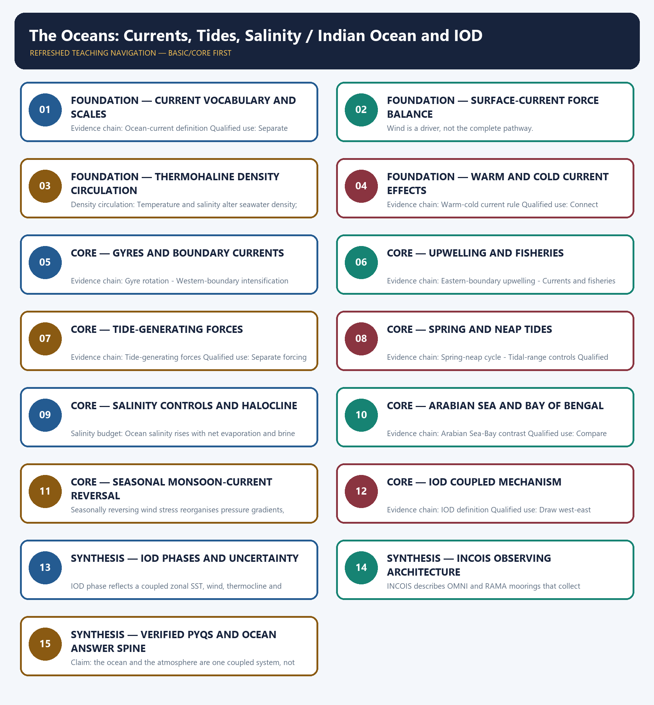

# The Oceans: Currents, Tides, Salinity / Indian Ocean and IOD — Learner-v2 Complete Learning Session

> **Authoring-only generation:** 2026-09-01. No PDF was rendered and no tracker or index was mutated.

### SOURCE, PROGRESSION AND CURRENT-LINKAGE AUDIT

- **Generation date:** 2026-09-01.
- **Repository-first evidence:** the Basic owner is taught first and preserved in full; the Advanced owner is retained only in the optional final teaching block.
- **OCR evidence:** Repository Markdown was primary. The three required local Geography books were inspected as supplementary OCR/searchable evidence. No unsupported page precision, volatile figure or quotation was imported.
- **Qdrant:** not used; repository Markdown and available OCR context were sufficient.
- **PYQ integrity:** Verified direct routes retain the 2019 GS-I ocean-current and water-mass demand and the 2022 GS-I current-forces and fishing demand. No current IOD phase, forecast value or official objective answer letter is inferred.
- **Live-link boundary:** INCOIS's official OMNI/RAMA page is used for observing variables and purpose, and its ocean-state service page for service architecture. The IMD ENSO-IOD bulletin is retained only as the official place for dated monitoring; no September 2026 phase, forecast probability or monsoon outcome is copied.
- **Fact/inference discipline:** no current-affairs item, PYQ wording, figure or quotation is invented.

## BASIC LEARNING SESSION

### DEEP-REVIEW LEARNING CONTRACT

| Control | Binding rule for this package |
|---|---|
| Syllabus boundary | Complete physical process, spatial pattern and India anchor are taught before optional Advanced depth. |
| Causal method | Initial condition → energy/force or driver → mechanism → landform/climate/ocean pattern → consequence → feedback/limit. |
| Spatial method | Latitude, altitude, continentality, relief, plate setting, basin/coast orientation and map scale are explicit. |
| Terminology | Close terms are defined on common axes; process, form, region, hazard, regulation and current status are never collapsed. |
| Evidence method | Claim → named place/map/process/official record → analysis → qualification. |
| Practice contract | Every solved item has demand decoding, a detailed examiner-grade model, executable timed/compression plan, marks rationale and answer-specific improvement. |
| Approval | This immutable successor remains `approved: false` pending explicit approval. |

**Canonical Basic/Core owner:** `upsc-ai-kit\knowledge\Geography\basic\12_The-Oceans-Currents-Tides-Salinity.md`  
**Canonical topic owner:** `upsc-ai-kit\knowledge\Geography\basic\12_The-Oceans-Currents-Tides-Salinity.md`  
**Optional Advanced owner:** `upsc-ai-kit\knowledge\Geography\advanced\12_Indian-Ocean-and-IOD.md`  
**Official syllabus mapping:** `upsc-ai-kit\knowledge\Geography\OFFICIAL-UPSC-SYLLABUS-MAPPING.md`

### EVIDENCE, PYQ AND CURRENT-STATUS CONTROL

- **Process discipline:** no feature is listed without formation sequence, controlling variables and a limiting condition.
- **Map discipline:** distribution is reconstructed through latitude, plate/relief setting, wind/current direction, drainage/coast orientation and named anchors.
- **Quantitative discipline:** coordinates, thresholds, magnitudes, dates, counts and project dimensions retain units, source/date and uncertainty.
- **Causal discipline:** association is not treated as sufficiency; interacting controls, scale, lag, feedback and exceptions are stated.
- **PYQ discipline:** repository routing ledgers and held papers control wording and metadata; reconstructed wording and unavailable official keys remain labelled.
- **Current-status note, rechecked 2026-09-01:** INCOIS's official OMNI/RAMA page is used for observing variables and purpose, and its ocean-state service page for service architecture. The IMD ENSO-IOD bulletin is retained only as the official place for dated monitoring; no September 2026 phase, forecast probability or monsoon outcome is copied.

**Live/official context sources recorded by the predecessor generation:**

- `https://incois.gov.in/site/datainfo/jointportal.jsp`
- `https://iioe-2.incois.gov.in/site/services/osf.jsp`
- `https://mausam.imd.gov.in/ClimateInformation/imdweb/CLIMATE_FCST/Bulletin/ENSO_IOD_Update_Bulletin.pdf`




*Distinct embedded teaching-navigation image. The separate continuous Cārvāka-style flowchart package remains an independent at-a-glance artifact.*

### SESSION 1 — FOUNDATION — CURRENT VOCABULARY AND SCALES

#### DEFINITION / WHAT THIS IS CALLED

**Plain-language definition:** Ocean-current definition: An ocean current is a persistent, directed movement of seawater at a stated depth and time scale; a surface current, tidal stream, eddy and deep overturning branch are not interchangeable.

**Technical definition:** Evidence chain: Ocean-current definition Qualified use: Separate current, eddy, tide and water mass.

#### ANSWER-GRABBING OPENING — WRITE/ADAPT IN THE EXAM

> Ocean-current definition: An ocean current is a persistent, directed movement of seawater at a stated depth and time scale; a surface current, tidal stream, eddy and deep overturning branch are not interchangeable.

#### MUST-WRITE KEYWORDS

- **FOUNDATION**
- **Current vocabulary**
- **scales**
- **Ocean-current definition**
- **Evidence chain**
- **Qualified use**

**How to use them:** Frame the answer through FOUNDATION; define Current vocabulary, connect scales with Ocean-current definition to explain the mechanism, and use Evidence chain for the decisive comparison or qualification.

#### VISUAL FIRST

```text
CURRENT VOCABULARY AND SCALES
01. Ocean-current definition
BOUNDARY -> Name depth, persistence and time scale.
```

*This topic-specific rail fixes the evidence sequence and its exam boundary before analysis.*

#### CORE EXPLANATION

An ocean current is a persistent, directed movement of seawater at a stated depth and time scale; a surface current, tidal stream, eddy and deep overturning branch are not interchangeable.

#### NAMED EVIDENCE AND MECHANISM

- **Ocean-current definition:** An ocean current is a persistent, directed movement of seawater at a stated depth and time scale; a surface current, tidal stream, eddy and deep overturning branch are not interchangeable.

#### EXAMINER CAUTION

- Name depth, persistence and time scale.

#### EXAM LINK

- **Prelims:** Separate the agent, landform, location, status and scale attached to Current vocabulary and scales.
- **Mains:** Separate current, eddy, tide and water mass.

#### MINI RECAP

- **Evidence chain:** Ocean-current definition
- **Qualified use:** Separate current, eddy, tide and water mass.

#### CLOSING RECALL FLOW — FOUNDATION — CURRENT VOCABULARY AND SCALES

```text
START / CONCEPT: FOUNDATION — Current vocabulary and scales
        |
        v
EXACT TERMS: FOUNDATION · Current vocabulary · scales · Ocean-current definition · Evidence chain · Qualified use
        |
        v
MECHANISM / ARGUMENT: Evidence chain: Ocean-current definition Qualified use: Separate current, eddy, tide and water mass.
        |
        v
CONSEQUENCE / CONTRAST: The resulting consequence is that an ocean current is a persistent, directed movement of seawater at a stated depth...
        |
        v
UPSC TRAP / ANSWER-USE: Do not miss this limiting distinction: an ocean current is a persistent, directed movement of seawater at a stated depth...
        |
        v
ANSWER-GRABBING FORMULATION: Ocean-current definition: An ocean current is a persistent, directed movement of seawater at a stated depth and time scale; a surface current, tidal stream, eddy and deep overturning branch are not interchangeable.
```
### SESSION 2 — FOUNDATION — SURFACE-CURRENT FORCE BALANCE

#### DEFINITION / WHAT THIS IS CALLED

**Plain-language definition:** Evidence chain: Surface-current drivers Qualified use: Use wind-Coriolis-pressure-friction logic.

**Technical definition:** Wind is a driver, not the complete pathway.

#### ANSWER-GRABBING OPENING — WRITE/ADAPT IN THE EXAM

> Evidence chain: Surface-current drivers Qualified use: Use wind-Coriolis-pressure-friction logic.

#### MUST-WRITE KEYWORDS

- **FOUNDATION**
- **Surface-current force balance**
- **Surface-current drivers**
- **Evidence chain**
- **Qualified use**
- **Wind**

**How to use them:** Frame the answer through FOUNDATION; define Surface-current force balance, connect Surface-current drivers with Evidence chain to explain the mechanism, and use Qualified use for the decisive comparison or qualification.

#### VISUAL FIRST

```text
SURFACE-CURRENT FORCE BALANCE
01. Surface-current drivers
BOUNDARY -> Wind is a driver, not the complete pathway.
```

*This topic-specific rail fixes the evidence sequence and its exam boundary before analysis.*

#### CORE EXPLANATION

Planetary winds provide major surface stress, while Coriolis, pressure gradients, basin shape, friction and sea-level slope organise the resulting circulation.

#### NAMED EVIDENCE AND MECHANISM

- **Surface-current drivers:** Planetary winds provide major surface stress, while Coriolis, pressure gradients, basin shape, friction and sea-level slope organise the resulting circulation.

#### EXAMINER CAUTION

- Wind is a driver, not the complete pathway.

#### EXAM LINK

- **Prelims:** Separate the agent, landform, location, status and scale attached to Surface-current force balance.
- **Mains:** Use wind-Coriolis-pressure-friction logic.

#### MINI RECAP

- **Evidence chain:** Surface-current drivers
- **Qualified use:** Use wind-Coriolis-pressure-friction logic.

#### CLOSING RECALL FLOW — FOUNDATION — SURFACE-CURRENT FORCE BALANCE

```text
START / CONCEPT: FOUNDATION — Surface-current force balance
        |
        v
EXACT TERMS: FOUNDATION · Surface-current force balance · Surface-current drivers · Evidence chain · Qualified use · Wind
        |
        v
MECHANISM / ARGUMENT: Wind is a driver, not the complete pathway.
        |
        v
CONSEQUENCE / CONTRAST: The resulting consequence is that wind is a driver, not the complete pathway.
        |
        v
UPSC TRAP / ANSWER-USE: Do not miss this limiting distinction: wind is a driver, not the complete pathway.
        |
        v
ANSWER-GRABBING FORMULATION: Evidence chain: Surface-current drivers Qualified use: Use wind-Coriolis-pressure-friction logic.
```
### SESSION 3 — FOUNDATION — THERMOHALINE DENSITY CIRCULATION

#### DEFINITION / WHAT THIS IS CALLED

**Plain-language definition:** Evidence chain: Density circulation Qualified use: Build a cooling-salinity-sinking chain.

**Technical definition:** Density circulation: Temperature and salinity alter seawater density; cooling, evaporation, sea-ice processes, mixing and freshwater input help create sinking, spreading and overturning at depth.

#### ANSWER-GRABBING OPENING — WRITE/ADAPT IN THE EXAM

> Evidence chain: Density circulation Qualified use: Build a cooling-salinity-sinking chain.

#### MUST-WRITE KEYWORDS

- **FOUNDATION**
- **Thermohaline density circulation**
- **Density circulation**
- **Evidence chain**
- **Qualified use**
- **Temperature**

**How to use them:** Frame the answer through FOUNDATION; define Thermohaline density circulation, connect Density circulation with Evidence chain to explain the mechanism, and use Qualified use for the decisive comparison or qualification.

#### VISUAL FIRST

```text
THERMOHALINE DENSITY CIRCULATION
01. Density circulation
BOUNDARY -> Density depends on both temperature and salinity.
```

*This topic-specific rail fixes the evidence sequence and its exam boundary before analysis.*

#### CORE EXPLANATION

Temperature and salinity alter seawater density; cooling, evaporation, sea-ice processes, mixing and freshwater input help create sinking, spreading and overturning at depth.

#### NAMED EVIDENCE AND MECHANISM

- **Density circulation:** Temperature and salinity alter seawater density; cooling, evaporation, sea-ice processes, mixing and freshwater input help create sinking, spreading and overturning at depth.

#### EXAMINER CAUTION

- Density depends on both temperature and salinity.

#### EXAM LINK

- **Prelims:** Separate the agent, landform, location, status and scale attached to Thermohaline density circulation.
- **Mains:** Build a cooling-salinity-sinking chain.

#### MINI RECAP

- **Evidence chain:** Density circulation
- **Qualified use:** Build a cooling-salinity-sinking chain.

#### CLOSING RECALL FLOW — FOUNDATION — THERMOHALINE DENSITY CIRCULATION

```text
START / CONCEPT: FOUNDATION — Thermohaline density circulation
        |
        v
EXACT TERMS: FOUNDATION · Thermohaline density circulation · Density circulation · Evidence chain · Qualified use · Temperature
        |
        v
MECHANISM / ARGUMENT: Density depends on both temperature and salinity.
        |
        v
CONSEQUENCE / CONTRAST: Density circulation: Temperature and salinity alter seawater density; cooling, evaporation, sea-ice processes, mixing and freshwater input help create sinking, spreading and overturning at depth.
        |
        v
UPSC TRAP / ANSWER-USE: Do not miss this limiting distinction: evidence chain: Density circulation Qualified use: Build a cooling-salinity-sinking chain.
        |
        v
ANSWER-GRABBING FORMULATION: Evidence chain: Density circulation Qualified use: Build a cooling-salinity-sinking chain.
```
### SESSION 4 — FOUNDATION — WARM AND COLD CURRENT EFFECTS

#### DEFINITION / WHAT THIS IS CALLED

**Plain-language definition:** Warm and cold are relative labels.

**Technical definition:** Evidence chain: Warm-cold current rule Qualified use: Connect advection to coastal climate.

#### ANSWER-GRABBING OPENING — WRITE/ADAPT IN THE EXAM

> Warm and cold are relative labels.

#### MUST-WRITE KEYWORDS

- **FOUNDATION**
- **Warm**
- **cold current effects**
- **Warm-cold current rule**
- **Evidence chain**
- **Qualified use**

**How to use them:** Frame the answer through FOUNDATION; define Warm, connect cold current effects with Warm-cold current rule to explain the mechanism, and use Evidence chain for the decisive comparison or qualification.

#### VISUAL FIRST

```text
WARM AND COLD CURRENT EFFECTS
01. Warm-cold current rule
BOUNDARY -> Warm and cold are relative labels.
```

*This topic-specific rail fixes the evidence sequence and its exam boundary before analysis.*

#### CORE EXPLANATION

Warm and cold describe a current relative to surrounding water and source region, not an absolute temperature; each current also changes air-sea heat and moisture exchange.

#### NAMED EVIDENCE AND MECHANISM

- **Warm-cold current rule:** Warm and cold describe a current relative to surrounding water and source region, not an absolute temperature; each current also changes air-sea heat and moisture exchange.

#### EXAMINER CAUTION

- Warm and cold are relative labels.

#### EXAM LINK

- **Prelims:** Separate the agent, landform, location, status and scale attached to Warm and cold current effects.
- **Mains:** Connect advection to coastal climate.

#### MINI RECAP

- **Evidence chain:** Warm-cold current rule
- **Qualified use:** Connect advection to coastal climate.

#### CLOSING RECALL FLOW — FOUNDATION — WARM AND COLD CURRENT EFFECTS

```text
START / CONCEPT: FOUNDATION — Warm and cold current effects
        |
        v
EXACT TERMS: FOUNDATION · Warm · cold current effects · Warm-cold current rule · Evidence chain · Qualified use
        |
        v
MECHANISM / ARGUMENT: Evidence chain: Warm-cold current rule Qualified use: Connect advection to coastal climate.
        |
        v
CONSEQUENCE / CONTRAST: The resulting consequence is that warm and cold are relative labels.
        |
        v
UPSC TRAP / ANSWER-USE: Do not miss this limiting distinction: warm and cold are relative labels.
        |
        v
ANSWER-GRABBING FORMULATION: Warm and cold are relative labels.
```
### SESSION 5 — CORE — GYRES AND BOUNDARY CURRENTS

#### DEFINITION / WHAT THIS IS CALLED

**Plain-language definition:** Western-boundary intensification: Western boundary currents such as the Gulf Stream and Kuroshio are generally narrow, swift and deep because basin-scale vorticity balance concentrates return flow on the west.

**Technical definition:** Evidence chain: Gyre rotation - Western-boundary intensification Qualified use: Contrast western and eastern limbs.

#### ANSWER-GRABBING OPENING — WRITE/ADAPT IN THE EXAM

> Western-boundary intensification: Western boundary currents such as the Gulf Stream and Kuroshio are generally narrow, swift and deep because basin-scale vorticity balance concentrates return flow on the west.

#### MUST-WRITE KEYWORDS

- **Gyres**
- **boundary currents**
- **Gyre rotation**
- **Western-boundary intensification**
- **Evidence chain**
- **Qualified use**

**How to use them:** Frame the answer through Gyres; define boundary currents, connect Gyre rotation with Western-boundary intensification to explain the mechanism, and use Evidence chain for the decisive comparison or qualification.

#### VISUAL FIRST

```text
GYRES AND BOUNDARY CURRENTS
01. Gyre rotation
    |
    v
02. Western-boundary intensification
BOUNDARY -> State hemisphere and basin before direction.
```

*This topic-specific rail fixes the evidence sequence and its exam boundary before analysis.*

#### CORE EXPLANATION

Wind stress and Coriolis organise subtropical gyres clockwise in the Northern Hemisphere and anticlockwise in the Southern Hemisphere, with equatorial and seasonal complications. Western boundary currents such as the Gulf Stream and Kuroshio are generally narrow, swift and deep because basin-scale vorticity balance concentrates return flow on the west.

#### NAMED EVIDENCE AND MECHANISM

- **Gyre rotation:** Wind stress and Coriolis organise subtropical gyres clockwise in the Northern Hemisphere and anticlockwise in the Southern Hemisphere, with equatorial and seasonal complications.
- **Western-boundary intensification:** Western boundary currents such as the Gulf Stream and Kuroshio are generally narrow, swift and deep because basin-scale vorticity balance concentrates return flow on the west.

#### EXAMINER CAUTION

- State hemisphere and basin before direction.

#### EXAM LINK

- **Prelims:** Separate the agent, landform, location, status and scale attached to Gyres and boundary currents.
- **Mains:** Contrast western and eastern limbs.

#### MINI RECAP

- **Evidence chain:** Gyre rotation -> Western-boundary intensification
- **Qualified use:** Contrast western and eastern limbs.

#### CLOSING RECALL FLOW — CORE — GYRES AND BOUNDARY CURRENTS

```text
START / CONCEPT: CORE — Gyres and boundary currents
        |
        v
EXACT TERMS: Gyres · boundary currents · Gyre rotation · Western-boundary intensification · Evidence chain · Qualified use
        |
        v
MECHANISM / ARGUMENT: Evidence chain: Gyre rotation - Western-boundary intensification Qualified use: Contrast western and eastern limbs.
        |
        v
CONSEQUENCE / CONTRAST: The resulting consequence is that gyre rotation - Western-boundary intensification Qualified use.
        |
        v
UPSC TRAP / ANSWER-USE: Do not miss this limiting distinction: gyre rotation - Western-boundary intensification Qualified use.
        |
        v
ANSWER-GRABBING FORMULATION: Western-boundary intensification: Western boundary currents such as the Gulf Stream and Kuroshio are generally narrow, swift and deep because basin-scale vorticity balance concentrates return flow on the west.
```
### SESSION 6 — CORE — UPWELLING AND FISHERIES

#### DEFINITION / WHAT THIS IS CALLED

**Plain-language definition:** Eastern-boundary upwelling: Eastern boundary currents are generally broad and cool, and alongshore winds can drive Ekman transport away from the coast so nutrient-rich deeper water rises.

**Technical definition:** Evidence chain: Eastern-boundary upwelling - Currents and fisheries Qualified use: Trace wind to Ekman transport to food web.

#### ANSWER-GRABBING OPENING — WRITE/ADAPT IN THE EXAM

> Currents and fisheries: Productive fisheries often occur in upwelling zones or mixing fronts because nutrients support food webs; current convergence alone does not guarantee a rich fishery.

#### MUST-WRITE KEYWORDS

- **Upwelling**
- **fisheries**
- **Eastern-boundary upwelling**
- **Currents and fisheries**
- **Evidence chain**
- **Qualified use**

**How to use them:** Frame the answer through Upwelling; define fisheries, connect Eastern-boundary upwelling with Currents and fisheries to explain the mechanism, and use Evidence chain for the decisive comparison or qualification.

#### VISUAL FIRST

```text
UPWELLING AND FISHERIES
01. Eastern-boundary upwelling
    |
    v
02. Currents and fisheries
BOUNDARY -> Nutrients are necessary but not sufficient.
```

*This topic-specific rail fixes the evidence sequence and its exam boundary before analysis.*

#### CORE EXPLANATION

Eastern boundary currents are generally broad and cool, and alongshore winds can drive Ekman transport away from the coast so nutrient-rich deeper water rises. Productive fisheries often occur in upwelling zones or mixing fronts because nutrients support food webs; current convergence alone does not guarantee a rich fishery.

#### NAMED EVIDENCE AND MECHANISM

- **Eastern-boundary upwelling:** Eastern boundary currents are generally broad and cool, and alongshore winds can drive Ekman transport away from the coast so nutrient-rich deeper water rises.
- **Currents and fisheries:** Productive fisheries often occur in upwelling zones or mixing fronts because nutrients support food webs; current convergence alone does not guarantee a rich fishery.

#### EXAMINER CAUTION

- Nutrients are necessary but not sufficient.

#### EXAM LINK

- **Prelims:** Separate the agent, landform, location, status and scale attached to Upwelling and fisheries.
- **Mains:** Trace wind to Ekman transport to food web.

#### MINI RECAP

- **Evidence chain:** Eastern-boundary upwelling -> Currents and fisheries
- **Qualified use:** Trace wind to Ekman transport to food web.

#### CLOSING RECALL FLOW — CORE — UPWELLING AND FISHERIES

```text
START / CONCEPT: CORE — Upwelling and fisheries
        |
        v
EXACT TERMS: Upwelling · fisheries · Eastern-boundary upwelling · Currents and fisheries · Evidence chain · Qualified use
        |
        v
MECHANISM / ARGUMENT: Evidence chain: Eastern-boundary upwelling - Currents and fisheries Qualified use: Trace wind to Ekman transport to food web.
        |
        v
CONSEQUENCE / CONTRAST: Eastern-boundary upwelling: Eastern boundary currents are generally broad and cool, and alongshore winds can drive Ekman transport away from the coast so nutrient-rich deeper water rises.
        |
        v
UPSC TRAP / ANSWER-USE: Nutrients are necessary but not sufficient.
        |
        v
ANSWER-GRABBING FORMULATION: Currents and fisheries: Productive fisheries often occur in upwelling zones or mixing fronts because nutrients support food webs; current convergence alone does not guarantee a rich fishery.
```
### SESSION 7 — CORE — TIDE-GENERATING FORCES

#### DEFINITION / WHAT THIS IS CALLED

**Plain-language definition:** Tide-generating forces: Tides arise chiefly from the differential gravitational effects of the Moon and Sun together with Earth-Moon system dynamics, then are reshaped by basin geometry and friction.

**Technical definition:** Evidence chain: Tide-generating forces Qualified use: Separate forcing from local amplification.

#### ANSWER-GRABBING OPENING — WRITE/ADAPT IN THE EXAM

> Tide-generating forces: Tides arise chiefly from the differential gravitational effects of the Moon and Sun together with Earth-Moon system dynamics, then are reshaped by basin geometry and friction.

#### MUST-WRITE KEYWORDS

- **Tide-generating forces**
- **Evidence chain**
- **Qualified use**
- **Tides**
- **Moon**
- **Sun**

**How to use them:** Frame the answer through Tide-generating forces; define Evidence chain, connect Qualified use with Tides to explain the mechanism, and use Moon for the decisive comparison or qualification.

#### VISUAL FIRST

```text
TIDE-GENERATING FORCES
01. Tide-generating forces
BOUNDARY -> Tides are differential gravitational responses.
```

*This topic-specific rail fixes the evidence sequence and its exam boundary before analysis.*

#### CORE EXPLANATION

Tides arise chiefly from the differential gravitational effects of the Moon and Sun together with Earth-Moon system dynamics, then are reshaped by basin geometry and friction.

#### NAMED EVIDENCE AND MECHANISM

- **Tide-generating forces:** Tides arise chiefly from the differential gravitational effects of the Moon and Sun together with Earth-Moon system dynamics, then are reshaped by basin geometry and friction.

#### EXAMINER CAUTION

- Tides are differential gravitational responses.

#### EXAM LINK

- **Prelims:** Separate the agent, landform, location, status and scale attached to Tide-generating forces.
- **Mains:** Separate forcing from local amplification.

#### MINI RECAP

- **Evidence chain:** Tide-generating forces
- **Qualified use:** Separate forcing from local amplification.

#### CLOSING RECALL FLOW — CORE — TIDE-GENERATING FORCES

```text
START / CONCEPT: CORE — Tide-generating forces
        |
        v
EXACT TERMS: Tide-generating forces · Evidence chain · Qualified use · Tides · Moon · Sun
        |
        v
MECHANISM / ARGUMENT: Evidence chain: Tide-generating forces Qualified use: Separate forcing from local amplification.
        |
        v
CONSEQUENCE / CONTRAST: The resulting consequence is that tides arise chiefly from the differential gravitational effects of the Moon and Sun together...
        |
        v
UPSC TRAP / ANSWER-USE: Do not miss this limiting distinction: tides arise chiefly from the differential gravitational effects of the Moon and Sun together...
        |
        v
ANSWER-GRABBING FORMULATION: Tide-generating forces: Tides arise chiefly from the differential gravitational effects of the Moon and Sun together with Earth-Moon system dynamics, then are reshaped by basin geometry and friction.
```
### SESSION 8 — CORE — SPRING AND NEAP TIDES

#### DEFINITION / WHAT THIS IS CALLED

**Plain-language definition:** Spring is an alignment term, not a season.

**Technical definition:** Evidence chain: Spring-neap cycle - Tidal-range controls Qualified use: Draw Sun-Earth-Moon geometry.

#### ANSWER-GRABBING OPENING — WRITE/ADAPT IN THE EXAM

> Spring is an alignment term, not a season.

#### MUST-WRITE KEYWORDS

- **Spring**
- **neap tides**
- **Spring-neap cycle**
- **Tidal-range controls**
- **Evidence chain**
- **Qualified use**

**How to use them:** Frame the answer through Spring; define neap tides, connect Spring-neap cycle with Tidal-range controls to explain the mechanism, and use Evidence chain for the decisive comparison or qualification.

#### VISUAL FIRST

```text
SPRING AND NEAP TIDES
01. Spring-neap cycle
    |
    v
02. Tidal-range controls
BOUNDARY -> Spring is an alignment term, not a season.
```

*This topic-specific rail fixes the evidence sequence and its exam boundary before analysis.*

#### CORE EXPLANATION

Spring tides occur near new and full moon when solar and lunar tidal effects reinforce; neap tides occur near quarter moons when the effects partly offset. Tidal range depends on astronomical forcing, coastline and basin resonance, shelf depth, friction and local timing; funnel-shaped bays can amplify range.

#### NAMED EVIDENCE AND MECHANISM

- **Spring-neap cycle:** Spring tides occur near new and full moon when solar and lunar tidal effects reinforce; neap tides occur near quarter moons when the effects partly offset.
- **Tidal-range controls:** Tidal range depends on astronomical forcing, coastline and basin resonance, shelf depth, friction and local timing; funnel-shaped bays can amplify range.

#### EXAMINER CAUTION

- Spring is an alignment term, not a season.

#### EXAM LINK

- **Prelims:** Separate the agent, landform, location, status and scale attached to Spring and neap tides.
- **Mains:** Draw Sun-Earth-Moon geometry.

#### MINI RECAP

- **Evidence chain:** Spring-neap cycle -> Tidal-range controls
- **Qualified use:** Draw Sun-Earth-Moon geometry.

#### CLOSING RECALL FLOW — CORE — SPRING AND NEAP TIDES

```text
START / CONCEPT: CORE — Spring and neap tides
        |
        v
EXACT TERMS: Spring · neap tides · Spring-neap cycle · Tidal-range controls · Evidence chain · Qualified use
        |
        v
MECHANISM / ARGUMENT: Tidal-range controls: Tidal range depends on astronomical forcing, coastline and basin resonance, shelf depth, friction and local timing; funnel-shaped bays can amplify range.
        |
        v
CONSEQUENCE / CONTRAST: Evidence chain: Spring-neap cycle - Tidal-range controls Qualified use: Draw Sun-Earth-Moon geometry.
        |
        v
UPSC TRAP / ANSWER-USE: Do not miss this limiting distinction: spring is an alignment term, not a season.
        |
        v
ANSWER-GRABBING FORMULATION: Spring is an alignment term, not a season.
```
### SESSION 9 — CORE — SALINITY CONTROLS AND HALOCLINE

#### DEFINITION / WHAT THIS IS CALLED

**Plain-language definition:** Halocline-density link: A halocline is a strong vertical salinity gradient; together with temperature it contributes to stratification, mixing resistance and the depth of the mixed layer.

**Technical definition:** Salinity budget: Ocean salinity rises with net evaporation and brine formation and falls with precipitation, river runoff, ice melt and mixing; it is a conservative tracer only within stated processes.

#### ANSWER-GRABBING OPENING — WRITE/ADAPT IN THE EXAM

> Halocline-density link: A halocline is a strong vertical salinity gradient; together with temperature it contributes to stratification, mixing resistance and the depth of the mixed layer.

#### MUST-WRITE KEYWORDS

- **Salinity controls**
- **halocline**
- **Salinity budget**
- **Halocline-density link**
- **Evidence chain**
- **Qualified use**

**How to use them:** Frame the answer through Salinity controls; define halocline, connect Salinity budget with Halocline-density link to explain the mechanism, and use Evidence chain for the decisive comparison or qualification.

#### VISUAL FIRST

```text
SALINITY CONTROLS AND HALOCLINE
01. Salinity budget
    |
    v
02. Halocline-density link
BOUNDARY -> State the freshwater and heat budgets.
```

*This topic-specific rail fixes the evidence sequence and its exam boundary before analysis.*

#### CORE EXPLANATION

Ocean salinity rises with net evaporation and brine formation and falls with precipitation, river runoff, ice melt and mixing; it is a conservative tracer only within stated processes. A halocline is a strong vertical salinity gradient; together with temperature it contributes to stratification, mixing resistance and the depth of the mixed layer.

#### NAMED EVIDENCE AND MECHANISM

- **Salinity budget:** Ocean salinity rises with net evaporation and brine formation and falls with precipitation, river runoff, ice melt and mixing; it is a conservative tracer only within stated processes.
- **Halocline-density link:** A halocline is a strong vertical salinity gradient; together with temperature it contributes to stratification, mixing resistance and the depth of the mixed layer.

#### EXAMINER CAUTION

- State the freshwater and heat budgets.

#### EXAM LINK

- **Prelims:** Separate the agent, landform, location, status and scale attached to Salinity controls and halocline.
- **Mains:** Link salinity to stratification.

#### MINI RECAP

- **Evidence chain:** Salinity budget -> Halocline-density link
- **Qualified use:** Link salinity to stratification.

#### CLOSING RECALL FLOW — CORE — SALINITY CONTROLS AND HALOCLINE

```text
START / CONCEPT: CORE — Salinity controls and halocline
        |
        v
EXACT TERMS: Salinity controls · halocline · Salinity budget · Halocline-density link · Evidence chain · Qualified use
        |
        v
MECHANISM / ARGUMENT: Evidence chain: Salinity budget - Halocline-density link Qualified use: Link salinity to stratification.
        |
        v
CONSEQUENCE / CONTRAST: Salinity budget: Ocean salinity rises with net evaporation and brine formation and falls with precipitation, river runoff, ice melt and mixing; it is a conservative tracer only within stated processes.
        |
        v
UPSC TRAP / ANSWER-USE: Do not miss this limiting distinction: salinity budget - Halocline-density link Qualified use.
        |
        v
ANSWER-GRABBING FORMULATION: Halocline-density link: A halocline is a strong vertical salinity gradient; together with temperature it contributes to stratification, mixing resistance and the depth of the mixed layer.
```
### SESSION 10 — CORE — ARABIAN SEA AND BAY OF BENGAL

#### DEFINITION / WHAT THIS IS CALLED

**Plain-language definition:** Arabian Sea-Bay contrast: The Arabian Sea is generally more saline than the Bay of Bengal because evaporation is stronger and freshwater input lower, while the Bay receives heavy rain and large river discharge.

**Technical definition:** Evidence chain: Arabian Sea-Bay contrast Qualified use: Compare evaporation and river input.

#### ANSWER-GRABBING OPENING — WRITE/ADAPT IN THE EXAM

> Arabian Sea-Bay contrast: The Arabian Sea is generally more saline than the Bay of Bengal because evaporation is stronger and freshwater input lower, while the Bay receives heavy rain and large river discharge.

#### MUST-WRITE KEYWORDS

- **Arabian Sea**
- **Bay of Bengal**
- **Arabian Sea-Bay contrast**
- **Evidence chain**
- **Qualified use**
- **The Arabian Sea**

**How to use them:** Frame the answer through Arabian Sea; define Bay of Bengal, connect Arabian Sea-Bay contrast with Evidence chain to explain the mechanism, and use Qualified use for the decisive comparison or qualification.

#### VISUAL FIRST

```text
ARABIAN SEA AND BAY OF BENGAL
01. Arabian Sea-Bay contrast
BOUNDARY -> Use generally, not universally.
```

*This topic-specific rail fixes the evidence sequence and its exam boundary before analysis.*

#### CORE EXPLANATION

The Arabian Sea is generally more saline than the Bay of Bengal because evaporation is stronger and freshwater input lower, while the Bay receives heavy rain and large river discharge.

#### NAMED EVIDENCE AND MECHANISM

- **Arabian Sea-Bay contrast:** The Arabian Sea is generally more saline than the Bay of Bengal because evaporation is stronger and freshwater input lower, while the Bay receives heavy rain and large river discharge.

#### EXAMINER CAUTION

- Use generally, not universally.

#### EXAM LINK

- **Prelims:** Separate the agent, landform, location, status and scale attached to Arabian Sea and Bay of Bengal.
- **Mains:** Compare evaporation and river input.

#### MINI RECAP

- **Evidence chain:** Arabian Sea-Bay contrast
- **Qualified use:** Compare evaporation and river input.

#### CLOSING RECALL FLOW — CORE — ARABIAN SEA AND BAY OF BENGAL

```text
START / CONCEPT: CORE — Arabian Sea and Bay of Bengal
        |
        v
EXACT TERMS: Arabian Sea · Bay of Bengal · Arabian Sea-Bay contrast · Evidence chain · Qualified use · The Arabian Sea
        |
        v
MECHANISM / ARGUMENT: Evidence chain: Arabian Sea-Bay contrast Qualified use: Compare evaporation and river input.
        |
        v
CONSEQUENCE / CONTRAST: The resulting consequence is that the Arabian Sea is generally more saline than the Bay of Bengal because evaporation...
        |
        v
UPSC TRAP / ANSWER-USE: Do not miss this limiting distinction: the Arabian Sea is generally more saline than the Bay of Bengal because evaporation...
        |
        v
ANSWER-GRABBING FORMULATION: Arabian Sea-Bay contrast: The Arabian Sea is generally more saline than the Bay of Bengal because evaporation is stronger and freshwater input lower, while the Bay receives heavy rain and large river discharge.
```
### SESSION 11 — CORE — SEASONAL MONSOON-CURRENT REVERSAL

#### DEFINITION / WHAT THIS IS CALLED

**Plain-language definition:** North Indian Ocean surface currents change direction and strength as the monsoon winds reverse between summer and winter.

**Technical definition:** Seasonally reversing wind stress reorganises pressure gradients, Ekman transport and boundary-current flow, producing the summer Somali Current and western Arabian Sea upwelling within a basin whose circulation cannot be mapped with timeless arrows.

#### ANSWER-GRABBING OPENING — WRITE/ADAPT IN THE EXAM

> The North Indian Ocean is exceptional because monsoon reversal reorganises its surface circulation twice a year.

#### MUST-WRITE KEYWORDS

- **monsoon wind stress**
- **seasonal reversal**
- **Somali Current**
- **Ekman transport**
- **coastal upwelling**
- **Arabian Sea**

**How to use them:** Draw separate southwest- and northeast-monsoon maps; connect summer alongshore wind to offshore Ekman transport and upwelling; then distinguish seasonal surface reversal from deep overturning.

#### VISUAL FIRST

```text
SEASONAL MONSOON-CURRENT REVERSAL
01. North Indian Ocean reversal
    |
    v
02. Somali-current upwelling
BOUNDARY -> Every arrow needs a season label.
```

*This topic-specific rail fixes the evidence sequence and its exam boundary before analysis.*

#### CORE EXPLANATION

North Indian Ocean surface circulation reverses or reorganises seasonally with monsoon winds, unlike a single fixed subtropical-gyre arrow map. During the southwest monsoon, strong winds and the Somali Current support coastal upwelling in the western Arabian Sea, linking circulation to nutrients and air-sea exchange.

#### NAMED EVIDENCE AND MECHANISM

- **North Indian Ocean reversal:** North Indian Ocean surface circulation reverses or reorganises seasonally with monsoon winds, unlike a single fixed subtropical-gyre arrow map.
- **Somali-current upwelling:** During the southwest monsoon, strong winds and the Somali Current support coastal upwelling in the western Arabian Sea, linking circulation to nutrients and air-sea exchange.

#### EXAMINER CAUTION

- Every arrow needs a season label.

#### EXAM LINK

- **Prelims:** Separate the agent, landform, location, status and scale attached to Seasonal monsoon-current reversal.
- **Mains:** Map summer and winter separately.

#### MINI RECAP

- **Evidence chain:** North Indian Ocean reversal -> Somali-current upwelling
- **Qualified use:** Map summer and winter separately.

#### CLOSING RECALL FLOW — CORE — SEASONAL MONSOON-CURRENT REVERSAL

```text
START / CONCEPT: CORE — Seasonal monsoon-current reversal
        |
        v
EXACT TERMS: monsoon wind stress · seasonal reversal · Somali Current · Ekman transport · coastal upwelling · Arabian Sea
        |
        v
MECHANISM / ARGUMENT: Evidence chain: North Indian Ocean reversal - Somali-current upwelling Qualified use: Map summer and winter separately.
        |
        v
CONSEQUENCE / CONTRAST: The resulting consequence is that north Indian Ocean reversal - Somali-current upwelling Qualified use.
        |
        v
UPSC TRAP / ANSWER-USE: Do not miss this limiting distinction: north Indian Ocean reversal - Somali-current upwelling Qualified use.
        |
        v
ANSWER-GRABBING FORMULATION: The North Indian Ocean is exceptional because monsoon reversal reorganises its surface circulation twice a year.
```
### SESSION 12 — CORE — IOD COUPLED MECHANISM

#### DEFINITION / WHAT THIS IS CALLED

**Plain-language definition:** IOD definition: The Indian Ocean Dipole is a coupled zonal contrast in sea-surface temperature and associated atmosphere-ocean conditions between western and eastern equatorial Indian Ocean sectors.

**Technical definition:** Evidence chain: IOD definition Qualified use: Draw west-east thermocline and convection.

#### ANSWER-GRABBING OPENING — WRITE/ADAPT IN THE EXAM

> IOD definition: The Indian Ocean Dipole is a coupled zonal contrast in sea-surface temperature and associated atmosphere-ocean conditions between western and eastern equatorial Indian Ocean sectors.

#### MUST-WRITE KEYWORDS

- **IOD coupled mechanism**
- **IOD definition**
- **Evidence chain**
- **Qualified use**
- **The Indian Ocean Dipole**
- **Indian Ocean**

**How to use them:** Frame the answer through IOD coupled mechanism; define IOD definition, connect Evidence chain with Qualified use to explain the mechanism, and use The Indian Ocean Dipole for the decisive comparison or qualification.

#### VISUAL FIRST

```text
IOD COUPLED MECHANISM
01. IOD definition
BOUNDARY -> IOD includes atmospheric coupling, not SST alone.
```

*This topic-specific rail fixes the evidence sequence and its exam boundary before analysis.*

#### CORE EXPLANATION

The Indian Ocean Dipole is a coupled zonal contrast in sea-surface temperature and associated atmosphere-ocean conditions between western and eastern equatorial Indian Ocean sectors.

#### NAMED EVIDENCE AND MECHANISM

- **IOD definition:** The Indian Ocean Dipole is a coupled zonal contrast in sea-surface temperature and associated atmosphere-ocean conditions between western and eastern equatorial Indian Ocean sectors.

#### EXAMINER CAUTION

- IOD includes atmospheric coupling, not SST alone.

#### EXAM LINK

- **Prelims:** Separate the agent, landform, location, status and scale attached to IOD coupled mechanism.
- **Mains:** Draw west-east thermocline and convection.

#### MINI RECAP

- **Evidence chain:** IOD definition
- **Qualified use:** Draw west-east thermocline and convection.

#### CLOSING RECALL FLOW — CORE — IOD COUPLED MECHANISM

```text
START / CONCEPT: CORE — IOD coupled mechanism
        |
        v
EXACT TERMS: IOD coupled mechanism · IOD definition · Evidence chain · Qualified use · The Indian Ocean Dipole · Indian Ocean
        |
        v
MECHANISM / ARGUMENT: Evidence chain: IOD definition Qualified use: Draw west-east thermocline and convection.
        |
        v
CONSEQUENCE / CONTRAST: IOD includes atmospheric coupling, not SST alone.
        |
        v
UPSC TRAP / ANSWER-USE: Do not miss this limiting distinction: the Indian Ocean Dipole is a coupled zonal contrast in sea-surface temperature and associated...
        |
        v
ANSWER-GRABBING FORMULATION: IOD definition: The Indian Ocean Dipole is a coupled zonal contrast in sea-surface temperature and associated atmosphere-ocean conditions between western and eastern equatorial Indian Ocean sectors.
```
### SESSION 13 — SYNTHESIS — IOD PHASES AND UNCERTAINTY

#### DEFINITION / WHAT THIS IS CALLED

**Plain-language definition:** Positive and negative IOD events shift warm water and rain-producing convection between the western and eastern equatorial Indian Ocean.

**Technical definition:** IOD phase reflects a coupled zonal SST, wind, thermocline and convection anomaly whose Indian rainfall influence depends on onset, amplitude, season, ENSO-MJO interaction and internal variability.

#### ANSWER-GRABBING OPENING — WRITE/ADAPT IN THE EXAM

> The IOD changes the odds and spatial organisation of rainfall; it does not operate as a guaranteed monsoon switch.

#### MUST-WRITE KEYWORDS

- **positive IOD**
- **negative IOD**
- **zonal SST gradient**
- **thermocline**
- **convection**
- **ENSO interaction**

**How to use them:** Compare west-east SST, thermocline and convection anomalies for both phases; then add timing, ENSO and regional rainfall qualifiers before making any India claim.

#### VISUAL FIRST

```text
IOD PHASES AND UNCERTAINTY
01. IOD phase boundary
BOUNDARY -> No phase guarantees all-India rainfall.
```

*This topic-specific rail fixes the evidence sequence and its exam boundary before analysis.*

#### CORE EXPLANATION

Positive and negative IOD phases shift thermocline, winds and convection differently, but neither phase guarantees a uniform Indian monsoon outcome because timing, ENSO and internal variability matter.

#### NAMED EVIDENCE AND MECHANISM

- **IOD phase boundary:** Positive and negative IOD phases shift thermocline, winds and convection differently, but neither phase guarantees a uniform Indian monsoon outcome because timing, ENSO and internal variability matter.

#### EXAMINER CAUTION

- No phase guarantees all-India rainfall.

#### EXAM LINK

- **Prelims:** Separate the agent, landform, location, status and scale attached to IOD phases and uncertainty.
- **Mains:** Add timing, ENSO and regional qualification.

#### MINI RECAP

- **Evidence chain:** IOD phase boundary
- **Qualified use:** Add timing, ENSO and regional qualification.

#### CLOSING RECALL FLOW — SYNTHESIS — IOD PHASES AND UNCERTAINTY

```text
START / CONCEPT: SYNTHESIS — IOD phases and uncertainty
        |
        v
EXACT TERMS: positive IOD · negative IOD · zonal SST gradient · thermocline · convection · ENSO interaction
        |
        v
MECHANISM / ARGUMENT: Evidence chain: IOD phase boundary Qualified use: Add timing, ENSO and regional qualification.
        |
        v
CONSEQUENCE / CONTRAST: The resulting consequence is that add timing, ENSO and regional qualification.
        |
        v
UPSC TRAP / ANSWER-USE: Do not miss this limiting distinction: add timing, ENSO and regional qualification.
        |
        v
ANSWER-GRABBING FORMULATION: The IOD changes the odds and spatial organisation of rainfall; it does not operate as a guaranteed monsoon switch.
```
### SESSION 14 — SYNTHESIS — INCOIS OBSERVING ARCHITECTURE

#### DEFINITION / WHAT THIS IS CALLED

**Plain-language definition:** Official observing network: INCOIS describes OMNI and RAMA moorings that collect upper-ocean temperature, salinity, currents and meteorological variables for Indian Ocean monitoring and model validation.

**Technical definition:** INCOIS describes OMNI and RAMA moorings that collect upper-ocean temperature, salinity, currents and meteorological variables for Indian Ocean monitoring and model validation.

#### ANSWER-GRABBING OPENING — WRITE/ADAPT IN THE EXAM

> Official observing network: INCOIS describes OMNI and RAMA moorings that collect upper-ocean temperature, salinity, currents and meteorological variables for Indian Ocean monitoring and model validation.

#### MUST-WRITE KEYWORDS

- **SYNTHESIS**
- **INCOIS observing architecture**
- **Official observing network**
- **Evidence chain**
- **Qualified use**
- **INCOIS**

**How to use them:** Frame the answer through SYNTHESIS; define INCOIS observing architecture, connect Official observing network with Evidence chain to explain the mechanism, and use Qualified use for the decisive comparison or qualification.

#### VISUAL FIRST

```text
INCOIS OBSERVING ARCHITECTURE
01. Official observing network
BOUNDARY -> Observation is not a forecast or outcome.
```

*This topic-specific rail fixes the evidence sequence and its exam boundary before analysis.*

#### CORE EXPLANATION

INCOIS describes OMNI and RAMA moorings that collect upper-ocean temperature, salinity, currents and meteorological variables for Indian Ocean monitoring and model validation.

#### NAMED EVIDENCE AND MECHANISM

- **Official observing network:** INCOIS describes OMNI and RAMA moorings that collect upper-ocean temperature, salinity, currents and meteorological variables for Indian Ocean monitoring and model validation.

#### EXAMINER CAUTION

- Observation is not a forecast or outcome.

#### EXAM LINK

- **Prelims:** Separate the agent, landform, location, status and scale attached to INCOIS observing architecture.
- **Mains:** Link moorings to data and model validation.

#### MINI RECAP

- **Evidence chain:** Official observing network
- **Qualified use:** Link moorings to data and model validation.

#### CLOSING RECALL FLOW — SYNTHESIS — INCOIS OBSERVING ARCHITECTURE

```text
START / CONCEPT: SYNTHESIS — INCOIS observing architecture
        |
        v
EXACT TERMS: SYNTHESIS · INCOIS observing architecture · Official observing network · Evidence chain · Qualified use · INCOIS
        |
        v
MECHANISM / ARGUMENT: Evidence chain: Official observing network Qualified use: Link moorings to data and model validation.
        |
        v
CONSEQUENCE / CONTRAST: Observation is not a forecast or outcome.
        |
        v
UPSC TRAP / ANSWER-USE: Do not miss this limiting distinction: iNCOIS describes OMNI and RAMA moorings that collect upper-ocean temperature, salinity, currents and meteorological...
        |
        v
ANSWER-GRABBING FORMULATION: Official observing network: INCOIS describes OMNI and RAMA moorings that collect upper-ocean temperature, salinity, currents and meteorological variables for Indian Ocean monitoring and model validation.
```
### SESSION 15 — SYNTHESIS — VERIFIED PYQS AND OCEAN ANSWER SPINE

#### DEFINITION / WHAT THIS IS CALLED

**Plain-language definition:** Verified current PYQ routes: Direct routed Mains demands are 2019 on ocean currents versus water masses and marine life, and 2022 on forces influencing currents and their fishing role.

**Technical definition:** Claim: the ocean and the atmosphere are one coupled system, not two adjacent ones.

#### ANSWER-GRABBING OPENING — WRITE/ADAPT IN THE EXAM

> Verified current PYQ routes: Direct routed Mains demands are 2019 on ocean currents versus water masses and marine life, and 2022 on forces influencing currents and their fishing role.

#### MUST-WRITE KEYWORDS

- **SYNTHESIS**
- **Verified PYQs**
- **ocean answer spine**
- **Verified current PYQ routes**
- **Evidence chain**
- **Qualified use**

**How to use them:** Frame the answer through SYNTHESIS; define Verified PYQs, connect ocean answer spine with Verified current PYQ routes to explain the mechanism, and use Evidence chain for the decisive comparison or qualification.

#### VISUAL FIRST

```text
VERIFIED PYQS AND OCEAN ANSWER SPINE
01. Verified current PYQ routes
BOUNDARY -> Preserve direct routing and key status.
```

*This topic-specific rail fixes the evidence sequence and its exam boundary before analysis.*

#### CORE EXPLANATION

Direct routed Mains demands are 2019 on ocean currents versus water masses and marine life, and 2022 on forces influencing currents and their fishing role.

#### NAMED EVIDENCE AND MECHANISM

- **Verified current PYQ routes:** Direct routed Mains demands are 2019 on ocean currents versus water masses and marine life, and 2022 on forces influencing currents and their fishing role.

#### EXAMINER CAUTION

- Preserve direct routing and key status.

#### EXAM LINK

- **Prelims:** Separate the agent, landform, location, status and scale attached to Verified PYQs and ocean answer spine.
- **Mains:** Conclude with a process-to-ecology chain.

#### MINI RECAP

- **Evidence chain:** Verified current PYQ routes
- **Qualified use:** Conclude with a process-to-ecology chain.
#### COMPLETE BASIC OWNER EVIDENCE BANK

> **Subject:** Geography · **Tier:** Must-Do (foundation + standard) · **GS Paper:** GS-I
> **Grounded in:** G.C. Leong, *Certificate Physical & Human Geography* + Majid Husain, *Indian & World Geography*.
> ✅ = from source book · ⚠️ = inference / standard knowledge · 📰 = current affairs.
> *Companion: `advanced/12_Indian-Ocean-and-IOD.md`.*

#### 1. Ocean circulation: what drives it?

✅ Ocean currents are affected by **trade and anti-trade winds**, the **Coriolis effect**, variations in **salinity and temperature**, and the configuration of the **coastline and ocean floor**. ✅ In general, warm currents carry warm water from equatorial regions towards polar regions, while cold currents carry cold water from polar regions towards equatorial regions.

> 🔑 Trap: Surface currents are mainly wind-driven, but deep circulation is density-driven by temperature and salinity.

#### 2. Ocean currents: warm, cold and gyres

| Feature | Rule | Example / implication |
|---|---|---|
| ✅ Warm current | Moves warm water poleward | Gulf Stream, Kuroshio; warms adjacent coasts |
| ✅ Cold current | Moves cold water equatorward | Labrador, Peru, Benguela; cools coasts, can produce fog/aridity |
| ✅ Northern gyres | Clockwise rotation | Coriolis deflection in Northern Hemisphere |
| ✅ Southern gyres | Anticlockwise rotation | Coriolis deflection in Southern Hemisphere |
| ✅ Fisheries | Rich where warm/cold currents meet or upwelling occurs | Grand Banks; Oyashio-Kuroshio fog/fisheries logic |

#### 3. Tides and salinity

| Theme | Key fact | UPSC significance |
|---|---|---|
| ✅ Spring tide | New Moon / Full Moon; Sun and Moon aligned | Maximum tidal range; not linked to spring season |
| ✅ Neap tide | Quarter Moon; Sun and Moon at right angles | Minimum tidal range |
| ✅ Average ocean salinity | About **35 ppt** | Baseline for comparison |
| ✅ High salinity | Tropics/enclosed seas with high evaporation | Mediterranean, Dead Sea example from notes |
| ✅ Low salinity | River/ice dilution | Baltic ~7 ppt in notes |

#### ➕ Dead Zones & Marine Hypoxia (PYQ gap — beyond core books)

> ⚠️ **Source note:** *Dead zones / hypoxia / oxygen-minimum zones are **NOT** in Leong, Husain or Khullar.* The books cover only the **precursor, eutrophication** (Husain: "a process in which lakes receive nutrients and become enriched"; Khullar: nitrate/phosphate runoff → "eutrophication"). The dead-zone mechanism below is standard oceanography (⚠️) + current data (📰), added to close a UPSC GS-1 gap.

- ⚠️ **Dead zone** = a stretch of ocean/lake with **very low dissolved oxygen (hypoxia, DO < ~2 mg/L)** where most marine animals cannot survive; severe cases are **anoxic** (no O₂).
- ✅→⚠️ **Mechanism chain:** nutrient runoff (**nitrogen + phosphorus** from fertilizer/sewage) → **eutrophication** (✅ book concept) → **algal bloom** → algae die → **bacterial decomposition consumes oxygen** → **hypoxia → dead zone**. Made worse by **stratification** (warm light surface water caps colder O₂-poor deep water) and **ocean warming** (warm water holds less O₂).

| Type | Cause | Depth | Example |
|---|---|---|---|
| ⚠️ **Coastal / anthropogenic** dead zone | Eutrophication from land runoff | Shallow, seasonal | 📰 **Gulf of Mexico** (Mississippi fertilizer runoff), Baltic Sea |
| ⚠️ **Oxygen Minimum Zone (OMZ)** | High productivity, respiration and weak ventilation; human forcing can intensify it | Mid-depth ocean | 📰 **Arabian Sea** (one of the strongest tropical OMZs — see advanced file) |

> 🔑 Trap: Hypoxia means too little oxygen. Do not force a binary rule that every OMZ is “natural” and
> every coastal dead zone “human-made”; circulation, productivity, warming and nutrient loading can interact.

#### ➕ Ocean-floor Relief: Seamount & Guyot (PYQ gap)

> ✅ Grounded in GC Leong + Majid Husain + ⚠️ standard geography. Added to close a UPSC gap.

- ✅ GC Leong states ocean basins have submarine ridges, plateaux, canyons, plains and trenches, broadly comparable to land relief.
- ✅ Majid Husain lists major ocean-floor features: continental shelf, slope, rise, abyssal floor, trenches, ridges and **seamounts**.
- ⚠️ **Seamount** = isolated submarine volcanic mountain rising from the ocean floor but not reaching sea level.
- ⚠️ **Guyot** = flat-topped seamount, usually an eroded former volcanic island later subsided below sea level.

| Feature | Shape | Formation clue | Exam trap |
|---|---|---|---|
| ✅/⚠️ Seamount | Conical submarine high | Volcanic build-up | Not an island unless it emerges |
| ⚠️ Guyot | Flat-topped submarine high | Wave erosion + subsidence | Not a trench or ridge |
| ✅ Trench | Long narrow deep | Subduction zone | Deepest ocean-floor feature |

> 🔑 Trap: A guyot's flat top suggests it was once near/above sea level; it is not flat because sediment simply filled a basin.

#### 4. Core static theory

- ✅ Current controls listed in the retrieved book text: winds, Coriolis effect, salinity/temperature variations, and coastline/ocean-floor configuration.
- ✅ Warm currents generally move from equatorial to polar regions; cold currents move from polar to equatorial regions.
- ✅ Warm currents warm coasts; cold currents cool coasts and often enrich coastal waters by upwelling.
- ✅ Productive fishing grounds form where warm and cold currents meet and where upwelling brings nutrients.
- ✅ Spring tides occur at New and Full Moon when Sun and Moon act together.
- ✅ Neap tides occur at quarter phases when Sun and Moon pull at right angles.
- ✅ Salinity rises with evaporation and falls with river discharge, rainfall and ice melt.

#### 5. Must-Know Facts (Prelims) and UPSC traps

- ✅ Wind is the dominant driver of **surface** currents; density drives deep currents.
- ✅ Warm current = poleward; cold current = equatorward.
- ✅ Northern Hemisphere gyres rotate clockwise; Southern Hemisphere gyres anticlockwise.
- ✅ Spring tide = New/Full Moon; Neap tide = quarter Moon.
- ✅ Average salinity ~35 ppt; Baltic ~7 ppt; enclosed evaporative seas are high salinity.
- ✅ Best fisheries = warm-cold confluence + upwelling.

> 🔑 Trap: "Spring tide" does **not** mean tide of the spring season; it means the tide "springs up" at New/Full Moon.

- ❌ Cold currents warm coasts → Cold currents **cool** coasts.
- ❌ Gyres rotate the same way in both hemispheres → Coriolis makes rotation **clockwise in N**, **anticlockwise in S**.
- ❌ Salinity depends only on temperature → It also depends on evaporation, rainfall, rivers, ice and circulation.

#### 6. 📰 Current link

##### CA Anchor — AMOC Slowdown (Thermohaline Circulation)

📰 **Current anchor:** Observations and model studies continue to assess AMOC change and tipping risk.
There is evidence of twentieth-century weakening, but the timing and magnitude of future collapse remain uncertain.

✅ AMOC is part of the density-driven thermohaline circulation: warm salty water flows north, cools, sinks and returns south at depth — melting freshwater is now slowing it.

- ✅ Thermohaline circulation is driven by temperature + salinity differences in density.
- ✅ AMOC carries warm water poleward in the Atlantic.
- ⚠️ Freshwater input can reduce North Atlantic density and deep-water formation, alongside wind and
  heat-flux changes.
- ⚠️ A major weakening could shift tropical rain belts and affect monsoons, but the Indian-monsoon
  response is model-dependent rather than a settled one-direction forecast.

##### Current-link Must-Know Facts

- ✅ AMOC = Atlantic limb of the thermohaline (density) circulation.
- ✅ Weakening driven by freshwater from ice melt (lower salinity).
- ✅ Risk: southward ITCZ shift → weaker/delayed Indian monsoon.

##### Current-link Traps

- ❌ AMOC is a wind-driven surface current → AMOC is largely a **density (thermohaline) circulation**, driven by temperature & salinity.

#### 7. Mains angles

- Explain the drivers of ocean currents and tides and their control on climate and fisheries, applying them to the monsoon-reversing North Indian Ocean.
- Link thermohaline circulation to climate tipping points and Indian-monsoon security.

#### 8. Study link

Geography → Physical → Oceanography (GC Leong: Currents/Tides; Majid: Ocean Currents)  
Geography → Oceans → Thermohaline Circulation (applied CA)

#### 9. Ocean-atmosphere coupling: ENSO, the Walker circulation and the IOD

> **Why this section exists:** ENSO, La Nina, the Walker circulation and the Indian Ocean Dipole
> appeared **nowhere in the Core tier**, although they are the most heavily tested mechanisms in
> modern physical geography and although Core files elsewhere refer to them as though they were
> already taught. Making Core dependent on the Advanced tier for these mechanisms was a leakage
> that had to be closed here, in the ocean-circulation owner.

##### 9.1 The normal state and the Walker circulation

```text
NORMAL (neutral) PACIFIC
  Strong easterly TRADE WINDS push surface water westward
        |
        +-> WARM POOL piles up in the WESTERN Pacific (Indonesia/Australia side)
        |      -> deep warm layer, low pressure, rising air, heavy convective rain
        |
        +-> Water removed from the EAST is replaced by UPWELLING off South America
               -> cool surface, shallow THERMOCLINE, high pressure, subsidence, dry coast
               -> nutrient-rich upwelled water sustains one of the world's great fisheries

  The rising limb in the west and the sinking limb in the east, joined by surface easterlies
  and a return flow aloft, is the WALKER CIRCULATION - an east-west cell along the equator.
```

##### 9.2 El Nino, La Nina and the feedback that drives them

| | **El Nino (warm phase)** | **La Nina (cold phase)** |
|---|---|---|
| ⚠️ Trade winds | Weaken, or even reverse in the west | Strengthen beyond normal |
| ⚠️ Warm pool | Spreads eastward across the Pacific | Piles further west; the east cools more |
| ⚠️ Thermocline in the east | Deepens, cutting off nutrient supply | Shoals, intensifying upwelling |
| ⚠️ Walker circulation | Weakens; the rising limb shifts east | Intensifies |
| ⚠️ Rainfall | Moves eastward — flooding on the South American side, drought in Indonesia and Australia | Reinforces the normal pattern — wetter west, drier east |
| ⚠️ Fishery off South America | Collapses as upwelling fails | Strengthens |

- ⚠️ **Why it is self-reinforcing (the Bjerknes idea):** weaker trades let the warm pool spread
  east; the warmer eastern ocean weakens the east-west temperature contrast; the weaker contrast
  weakens the trades further. The coupling is the reason a small initial anomaly can grow into a
  basin-scale event — and equally why it eventually reverses.
- ⚠️ **ENSO is a coupled ocean-**and**-atmosphere phenomenon.** The oceanic temperature anomaly and
  the atmospheric pressure see-saw between the eastern and western Pacific are two faces of one
  system, which is why the combined term "El Nino-Southern Oscillation" is used.
- ⚠️ **Teleconnection to India:** El Nino years are, on average, associated with a weaker Indian
  summer monsoon, and La Nina years with a stronger one. This is a **statistical tendency, not a
  law**: strong monsoons have occurred in El Nino years and weak ones in neutral years, because the
  Indian Ocean state, the location of the Pacific warming and intra-seasonal variability all
  intervene.

> 🔑 **Trap:** El Nino does **not** "cause drought in India". It shifts the probability
> distribution. Writing a deterministic causal claim is the commonest error on this topic; writing
> the probabilistic version, and naming the offsetting factors, is what distinguishes a strong
> answer.

##### 9.3 The Indian Ocean Dipole

- ⚠️ The **IOD** is the Indian Ocean's own coupled see-saw, measured as the sea-surface temperature
  contrast between the **western** equatorial Indian Ocean (off East Africa) and the **eastern**
  equatorial Indian Ocean (off Sumatra).
- ⚠️ **Positive IOD:** the west is relatively warmer and the east relatively cooler; convection
  shifts westward, toward the Indian Ocean side. This tends to favour Indian summer-monsoon
  rainfall and to bring dry conditions to Indonesia and Australia.
- ⚠️ **Negative IOD:** the reverse; convection shifts toward the eastern Indian Ocean and the
  maritime continent.
- ⚠️ **Interaction with ENSO:** a positive IOD can partly **offset** an El Nino's drying tendency
  over India, and a negative IOD can compound it. This is exactly why monsoon forecasting requires
  both indices, and why single-index reasoning fails.

> 🔑 **Trap:** the IOD is an **Indian Ocean** phenomenon and is not "El Nino in the Indian Ocean".
> The two are separate coupled modes that can reinforce or oppose each other.

##### 9.4 Upwelling: where cold water surfaces and why it matters

```text
WIND parallel to a coast
   -> EKMAN TRANSPORT moves the surface layer at an angle to the wind
   -> where that transport is OFFSHORE, surface water is removed
   -> deeper, colder, NUTRIENT-RICH water rises to replace it
   -> nutrients + sunlight in the surface layer -> PHYTOPLANKTON BLOOM
   -> the base of an exceptionally productive FOOD CHAIN
```

| Setting | Character |
|---|---|
| ⚠️ Eastern-boundary coastal upwelling | The classic case — cool, foggy, arid coasts with very large fisheries; also the cause of coastal desert aridity (see `07_Arid-Desert-Landforms.md`) |
| ⚠️ Equatorial upwelling | Divergence at the equator brings deeper water up |
| ⚠️ Monsoonal upwelling | Seasonal, wind-reversal driven — which is why productivity off parts of the Indian coast is strongly seasonal rather than year-round |
| ⚠️ Upwelling failure | During El Nino, a deepened thermocline means the upwelled water is warm and nutrient-poor, so the fishery collapses even though the wind may still blow |

- ⚠️ **The other productive setting** is where a **warm and a cold current meet**: mixing and the
  associated nutrient supply support major fishing grounds, historically over broad continental
  shelves in the higher middle latitudes.

##### 9.5 Other changes in the ocean as a critical feature

| Change | Mechanism | Consequence |
|---|---|---|
| ⚠️ Ocean warming and marine heatwaves | Accumulated heat uptake; prolonged regional temperature extremes | Coral bleaching, species range shifts, altered fishery distribution, more energy available to cyclones |
| ⚠️ Ocean acidification | Carbon dioxide uptake lowers pH and reduces carbonate availability | Harder calcification for corals, molluscs and plankton — see `11_Islands-and-Coral-Reefs.md` |
| ⚠️ Deoxygenation and dead zones | Warming reduces gas solubility; nutrient loading drives decay that consumes oxygen | Expanding hypoxic zones; habitat compression |
| ⚠️ Stratification | A warmer, fresher surface layer resists mixing | Reduced nutrient supply from below, weakening productivity |
| ⚠️ Overturning-circulation change | Freshening and warming at high latitudes reduce deep-water formation | Potential redistribution of heat, with regional climatic consequences |

> ⚠️ **Factual caution:** do **not** quote an ENSO index value, a Nino-region temperature anomaly, a
> named year's event strength, a pH figure, a fish-catch tonnage or a projected circulation
> weakening from memory. State the mechanism and the direction; attach numbers only from a cited,
> dated source.

#### 10. The wider family of ocean-atmosphere modes

> **Promoted into Core (13 Aug 2026):** these are **general** climate modes, not India applications,
> and each is a separately named and separately examinable concept. Their specific effects on the
> Indian monsoon and the forecasting practice built on them remain in
> `advanced/16_India-Monsoon-Mechanism.md` and `advanced/12_Indian-Ocean-and-IOD.md`.

| Mode | What it is | Timescale | Why it is distinct |
|---|---|---|---|
| ⚠️ **ENSO** (canonical) | The coupled Pacific warm/cold phase taught above, with maximum warming toward the **eastern** equatorial Pacific | Inter-annual | The reference case |
| ⚠️ **El Niño Modoki** | A variant in which maximum warming sits in the **central** equatorial Pacific rather than the far east, with cooler water on both sides | Inter-annual | The convective heat source is relocated to a **different longitude**, so the remote circulation response — and hence the rainfall teleconnection — differs from a canonical event. It is **not** a weak El Niño or the absence of one; it is a different spatial pattern |
| ⚠️ **Indian Ocean Dipole** | The west-minus-east SST contrast of the equatorial Indian Ocean, taught above | Seasonal to inter-annual | An Indian Ocean mode that can reinforce or offset ENSO |
| ⚠️ **Madden–Julian Oscillation** | An eastward-travelling pulse of enhanced convection and rainfall, followed by a suppressed phase, moving from the Indian Ocean toward the Pacific | **Intra-seasonal** — weeks | It organises the **active and break spells within a single season**, which ENSO cannot explain. Any question about wet and dry spells *within* a monsoon season is an MJO-scale question |
| ⚠️ **Pacific Decadal Oscillation** | A long-lived pattern of North Pacific sea-surface-temperature anomalies alternating between phases | **Decadal** | It sets the **background state** against which ENSO events occur, modulating how strongly a given event's teleconnection is expressed. It is not a slow El Niño; its centre of action is the North Pacific, not the equator |

- ⚠️ **The organising insight worth stating in any answer:** these modes operate at **different
  timescales — weeks, seasons, years and decades — and are superimposed on one another**. That is
  precisely why a single index never predicts an outcome, and why the honest formulation is always
  probabilistic. An answer that arranges the modes by timescale demonstrates command; one that
  lists them does not.

##### 10.1 Marine heatwaves, defined

- ⚠️ A **marine heatwave** is a prolonged period during which sea-surface temperature in a region is
  unusually high **relative to its own normal seasonal range** — so a marine heatwave is defined
  against a local baseline, not against an absolute temperature.
- ⚠️ **Mechanism:** a warming background ocean, plus weak winds and reduced mixing that prevent
  cooler subsurface water from reaching the surface, plus persistent high pressure suppressing cloud
  and increasing solar input. A warm ENSO phase or an ocean-current anomaly can supply the initial
  heat.
- ⚠️ **Consequences:** coral bleaching (`11_Islands-and-Coral-Reefs.md`), fish and plankton
  distribution shifts and fishery disruption, mortality of habitat-forming species such as kelp and
  seagrass, and additional energy available to tropical cyclones crossing the affected water.

> ⚠️ **Factual caution:** do not quote temperature anomalies, index values, event durations or named
> event dates for any of these modes from memory.

#### 11. Answer architecture (10/15/20-mark support)

##### 11.1 Directive decoding for this topic

| If the question says | It is really asking for | Do **not** |
|---|---|---|
| "Explain the mechanism of ocean currents" | The wind-drive plus Coriolis plus continental-deflection logic that produces gyres, with the thermohaline component separated | List current names |
| "Discuss ENSO and its impact on the Indian monsoon" | Walker circulation, the warm-phase/cold-phase contrast, the coupled feedback, and the probabilistic teleconnection with IOD as a modifier | Write "El Nino causes drought" |
| "What is the Indian Ocean Dipole?" | The west-minus-east SST contrast, its two phases, and its interaction with ENSO | Describe it as a Pacific phenomenon |
| "Why are certain areas the world's great fishing grounds?" | Upwelling and current-mixing nutrient supply, shelf width, and the temperature regime | Assert that cold water simply has more fish |
| "Discuss changes in ocean characteristics and their effects" | Warming, acidification, deoxygenation, stratification and circulation change, each with its consequence | Reduce it to "sea temperature is rising" |

##### 11.2 Reusable 15-mark spine — "How does ENSO influence the Indian monsoon?"

1. **Thesis:** ENSO influences the monsoon by relocating the tropical Pacific's convective heat
   source, which distorts the large-scale east-west circulation the monsoon shares — but it
   modulates monsoon probability rather than determining monsoon outcome.
2. **Baseline:** the neutral Pacific and the Walker circulation, established before any anomaly is
   introduced. *An answer that starts with El Nino instead of the normal state cannot explain what
   is anomalous about it.*
3. **The warm phase:** weakened trades, eastward warm-pool migration, deepened eastern thermocline,
   collapsed upwelling, relocated rising limb.
4. **The coupled feedback:** why the anomaly amplifies itself and why the system is oscillatory.
5. **Transmission to India:** the altered circulation suppresses the ascending motion the monsoon
   depends on, tending toward reduced rainfall; the cold phase does the reverse.
6. **The essential qualification:** the IOD can offset or reinforce it; intra-seasonal variability
   governs the distribution of rain within the season; and monsoon failure has occurred without
   El Nino and been averted despite it.
7. **Consequences:** agricultural output and rural incomes, reservoir and hydropower levels,
   drinking-water stress, food-price transmission, and fishery variability along the coasts.
8. **Conclusion:** graded — ENSO is the single most useful seasonal predictor available, which is
   why it belongs in planning, but its skill is probabilistic and must be used as a risk signal
   rather than as a forecast of a particular outcome.

##### 11.3 Evidence units available in this file

> **Claim:** the ocean and the atmosphere are one coupled system, not two adjacent ones.
> **Evidence:** in the Pacific, weakened trade winds allow the warm pool to spread east, and the
> warmer eastern ocean in turn weakens the wind further. **Significance:** it explains how a modest
> anomaly grows into a basin-scale event with global rainfall consequences. **Limitation:** the
> coupling is not deterministic in its remote effects — the Indian monsoon response is a tendency
> that other modes can override.

> **Claim:** current systems determine the geography of food production at sea. **Evidence:**
> upwelling coasts and warm-cold current confluences carry the world's most productive fishing
> grounds, because both supply nutrients to the sunlit layer. **Significance:** it converts ocean
> physics directly into a resource- and livelihood-geography argument, and links this file to
> non-farm primary activities in `30_Primary-Economic-Activities-Agriculture.md`.
> **Limitation:** the supply is not guaranteed — a deepened thermocline in a warm ENSO phase makes
> upwelled water warm and nutrient-poor, so the same wind produces no bloom.

> **Claim:** ocean currents redistribute heat and thereby set climates far from the tropics.
> **Evidence:** warm poleward flow on western margins of the higher middle latitudes keeps those
> coasts ice-free and mild in winter, while cold equatorward flow on the opposite side produces
> cool, foggy, arid coasts. **Significance:** it explains why places at identical latitude can have
> wholly different climates — the central comparative fact in regional climatology.
> **Limitation:** currents are one of several controls; continentality, relief and prevailing wind
> direction operate simultaneously.

<!-- BEGIN GENERATED PYQ INTEGRATION: 2024-2025 -->

#### Recent PYQ Integration (2024-2025)

> **Status:** 2024-2025 question-level PYQ demand is integrated into this owner.
> **Provenance:** Audited local official-paper routing ledgers: `_PYQ-ROUTING-PRELIMS-2024-2025.md`.
> **Answer-key rule:** The official 2024-2025 Prelims Set-A keys are present in the repository and CSAT Set-A keys are supplied; even so, no option or answer is recorded or inferred in this integration.

- **Years represented:** 2024
- **Paper(s):** Prelims GS-I
- **Routed question demands:** 1

| Year | Paper | Q | PYQ demand (neutral rendering) | Directive / format | Source status | Owner requirement |
|---:|---|---|---|---|---|---|
| 2024 | Prelims GS-I | 89 | Red Sea - low precipitation and absence of major river inflow | Objective question; official Set-A key available locally, answer not inferred | Key available locally (official Set-A answer key present); answer not recorded here | Cover the named fact/concept and its likely statement-level distinctions. |

##### What this owner must now support

- Red Sea - low precipitation and absence of major river inflow

> This block integrates the 2024-2025 examinable demand and paper metadata. It is kept separate from the 2018-2023 block and does not convert an unkeyed/answer-free objective question into a solved answer.
<!-- END GENERATED PYQ INTEGRATION: 2024-2025 -->

<!-- BEGIN GENERATED PYQ INTEGRATION: 2018-2023 -->

#### Historical PYQ Integration (2018-2023)

> **Status:** Question-level PYQ demand is integrated into this owner.
> **Provenance:** Audited local official-paper routing ledgers: `_PYQ-ROUTING-MAINS-GS1-GS2-ESSAY-2018-2023.md`, `_PYQ-ROUTING-PRELIMS-2018-2023.md`.
> **Answer-key rule:** The official 2018-2023 Prelims/CSAT keys are not held locally; no option or answer has been inferred.

- **Years represented:** 2019, 2020, 2021, 2022
- **Paper(s):** GS-I, Prelims GS-I
- **Routed question demands:** 6

| Year | Paper | Q | PYQ demand (neutral rendering) | Directive / format | Source status | Owner requirement |
|---:|---|---:|---|---|---|---|
| 2019 | GS-I | 17 | Ocean currents and water masses and their impact on marine life | How do they differ with examples · 15 marks · 250 words | Routed to owning topic | Prepare context, core dimensions, evidence/examples, counterpoint and a concise conclusion. |
| 2020 | Prelims GS-I | 93 | Ocean Mean Temperature Indian Ocean monsoon prediction tool | Objective question; official key unavailable locally | Routed; key unavailable locally | Cover the named fact/concept and its likely statement-level distinctions. |
| 2021 | Prelims GS-I | 56 | Ocean seabed mineral exploration licensing international waters | Objective question; official key unavailable locally | Routed; key unavailable locally | Cover the named fact/concept and its likely statement-level distinctions. |
| 2021 | Prelims GS-I | 58 | Ocean surface temperature patterns trade winds westerlies | Objective question; official key unavailable locally | Routed; key unavailable locally | Cover the named fact/concept and its likely statement-level distinctions. |
| 2021 | Prelims GS-I | 62 | Global water distribution rivers groundwater polar ice | Objective question; official key unavailable locally | Routed; key unavailable locally | Cover the named fact/concept and its likely statement-level distinctions. |
| 2022 | GS-I | 14 | Forces influencing ocean currents and their role in fishing | What are and Describe · 15 marks · 250 words | Routed to owning topic | Prepare context, core dimensions, evidence/examples, counterpoint and a concise conclusion. |

##### What this owner must now support

- Ocean currents and water masses and their impact on marine life
- Ocean Mean Temperature Indian Ocean monsoon prediction tool
- Ocean seabed mineral exploration licensing international waters
- Ocean surface temperature patterns trade winds westerlies
- Global water distribution rivers groundwater polar ice
- Forces influencing ocean currents and their role in fishing

> The table integrates the examinable demand and paper metadata. It does not turn an unkeyed objective question into a solved answer, and it does not claim that lexical presence alone proves full conceptual sufficiency.
<!-- END GENERATED PYQ INTEGRATION: 2018-2023 -->

#### CLOSING RECALL FLOW — SYNTHESIS — VERIFIED PYQS AND OCEAN ANSWER SPINE

```text
START / CONCEPT: SYNTHESIS — Verified PYQs and ocean answer spine
        |
        v
EXACT TERMS: SYNTHESIS · Verified PYQs · ocean answer spine · Verified current PYQ routes · Evidence chain · Qualified use
        |
        v
MECHANISM / ARGUMENT: Made worse by stratification (warm light surface water caps colder O₂-poor deep water) and ocean warming (warm water holds less O₂).
        |
        v
CONSEQUENCE / CONTRAST: ⚠️ Why it is self-reinforcing (the Bjerknes idea): weaker trades let the warm pool spread east; the warmer eastern ocean weakens the east-west temperature contrast; the weaker contrast weakens the trades further.
        |
        v
UPSC TRAP / ANSWER-USE: This is a statistical tendency, not a law: strong monsoons have occurred in El Nino years and weak ones in neutral years, because the Indian Ocean state, the location of the Pacific warming and intra-seasonal variability all intervene.
        |
        v
ANSWER-GRABBING FORMULATION: Verified current PYQ routes: Direct routed Mains demands are 2019 on ocean currents versus water masses and marine life, and 2022 on forces influencing currents and their fishing role.
```
### GEOGRAPHY DEEP-REVIEW CORE CONTROL

- **Must remember:** Ocean structure links temperature, salinity and density to stratification and circulation; wind stress, Coriolis, Ekman transport, gyres, upwelling, thermohaline overturning, tides and Indian Ocean monsoon reversal culminate in IOD–ENSO interactions.
- **Close distinction:** Wave transmits energy, current transports water and tide is astronomical sea-level oscillation; spring/neap are alignment effects, not seasons, and positive IOD is a west-minus-east Indian Ocean SST gradient rather than simply a warm western ocean.
- **Evidence / causal limit:** IOD and ENSO modulate probabilities rather than determine Indian rainfall; event phase, season, interaction, basin background and model/source date must qualify fisheries, cyclone or monsoon conclusions.

## BASIC MCQS / REMEDIATION

### Q1. Which statement correctly explains Ocean-current definition?

A. An ocean current is a persistent, directed movement of seawater at a stated depth and time scale; a surface current, tidal stream, eddy and deep overturning branch are not interchangeable.
B. Warm and cold describe a current relative to surrounding water and source region, not an absolute temperature; each current also changes air-sea heat and moisture exchange.
C. Temperature and salinity alter seawater density; cooling, evaporation, sea-ice processes, mixing and freshwater input help create sinking, spreading and overturning at depth.
D. Planetary winds provide major surface stress, while Coriolis, pressure gradients, basin shape, friction and sea-level slope organise the resulting circulation.

**Answer: A.**
**Explanation:** An ocean current is a persistent, directed movement of seawater at a stated depth and time scale; a surface current, tidal stream, eddy and deep overturning branch are not interchangeable. The other options describe different processes, locations, scales or governance categories.

### Q2. Which option is the safest spatial interpretation of Ocean-current definition?

A. Wind stress and Coriolis organise subtropical gyres clockwise in the Northern Hemisphere and anticlockwise in the Southern Hemisphere, with equatorial and seasonal complications.
B. An ocean current is a persistent, directed movement of seawater at a stated depth and time scale; a surface current, tidal stream, eddy and deep overturning branch are not interchangeable.
C. Warm and cold describe a current relative to surrounding water and source region, not an absolute temperature; each current also changes air-sea heat and moisture exchange.
D. Temperature and salinity alter seawater density; cooling, evaporation, sea-ice processes, mixing and freshwater input help create sinking, spreading and overturning at depth.

**Answer: B.**
**Explanation:** An ocean current is a persistent, directed movement of seawater at a stated depth and time scale; a surface current, tidal stream, eddy and deep overturning branch are not interchangeable. The other options describe different processes, locations, scales or governance categories.

### Q3. Which statement preserves the process boundary for Ocean-current definition?

A. Warm and cold describe a current relative to surrounding water and source region, not an absolute temperature; each current also changes air-sea heat and moisture exchange.
B. Wind stress and Coriolis organise subtropical gyres clockwise in the Northern Hemisphere and anticlockwise in the Southern Hemisphere, with equatorial and seasonal complications.
C. An ocean current is a persistent, directed movement of seawater at a stated depth and time scale; a surface current, tidal stream, eddy and deep overturning branch are not interchangeable.
D. Western boundary currents such as the Gulf Stream and Kuroshio are generally narrow, swift and deep because basin-scale vorticity balance concentrates return flow on the west.

**Answer: C.**
**Explanation:** An ocean current is a persistent, directed movement of seawater at a stated depth and time scale; a surface current, tidal stream, eddy and deep overturning branch are not interchangeable. The other options describe different processes, locations, scales or governance categories.

### Q4. Which option avoids the main UPSC trap concerning Ocean-current definition?

A. Eastern boundary currents are generally broad and cool, and alongshore winds can drive Ekman transport away from the coast so nutrient-rich deeper water rises.
B. Western boundary currents such as the Gulf Stream and Kuroshio are generally narrow, swift and deep because basin-scale vorticity balance concentrates return flow on the west.
C. Wind stress and Coriolis organise subtropical gyres clockwise in the Northern Hemisphere and anticlockwise in the Southern Hemisphere, with equatorial and seasonal complications.
D. An ocean current is a persistent, directed movement of seawater at a stated depth and time scale; a surface current, tidal stream, eddy and deep overturning branch are not interchangeable.

**Answer: D.**
**Explanation:** An ocean current is a persistent, directed movement of seawater at a stated depth and time scale; a surface current, tidal stream, eddy and deep overturning branch are not interchangeable. The other options describe different processes, locations, scales or governance categories.

### Q5. Which statement correctly explains Surface-current drivers?

A. Planetary winds provide major surface stress, while Coriolis, pressure gradients, basin shape, friction and sea-level slope organise the resulting circulation.
B. Temperature and salinity alter seawater density; cooling, evaporation, sea-ice processes, mixing and freshwater input help create sinking, spreading and overturning at depth.
C. Wind stress and Coriolis organise subtropical gyres clockwise in the Northern Hemisphere and anticlockwise in the Southern Hemisphere, with equatorial and seasonal complications.
D. Warm and cold describe a current relative to surrounding water and source region, not an absolute temperature; each current also changes air-sea heat and moisture exchange.

**Answer: A.**
**Explanation:** Planetary winds provide major surface stress, while Coriolis, pressure gradients, basin shape, friction and sea-level slope organise the resulting circulation. The other options describe different processes, locations, scales or governance categories.

### Q6. Which option is the safest spatial interpretation of Surface-current drivers?

A. Warm and cold describe a current relative to surrounding water and source region, not an absolute temperature; each current also changes air-sea heat and moisture exchange.
B. Planetary winds provide major surface stress, while Coriolis, pressure gradients, basin shape, friction and sea-level slope organise the resulting circulation.
C. Western boundary currents such as the Gulf Stream and Kuroshio are generally narrow, swift and deep because basin-scale vorticity balance concentrates return flow on the west.
D. Wind stress and Coriolis organise subtropical gyres clockwise in the Northern Hemisphere and anticlockwise in the Southern Hemisphere, with equatorial and seasonal complications.

**Answer: B.**
**Explanation:** Planetary winds provide major surface stress, while Coriolis, pressure gradients, basin shape, friction and sea-level slope organise the resulting circulation. The other options describe different processes, locations, scales or governance categories.

### Q7. Which statement preserves the process boundary for Surface-current drivers?

A. Wind stress and Coriolis organise subtropical gyres clockwise in the Northern Hemisphere and anticlockwise in the Southern Hemisphere, with equatorial and seasonal complications.
B. Western boundary currents such as the Gulf Stream and Kuroshio are generally narrow, swift and deep because basin-scale vorticity balance concentrates return flow on the west.
C. Planetary winds provide major surface stress, while Coriolis, pressure gradients, basin shape, friction and sea-level slope organise the resulting circulation.
D. Eastern boundary currents are generally broad and cool, and alongshore winds can drive Ekman transport away from the coast so nutrient-rich deeper water rises.

**Answer: C.**
**Explanation:** Planetary winds provide major surface stress, while Coriolis, pressure gradients, basin shape, friction and sea-level slope organise the resulting circulation. The other options describe different processes, locations, scales or governance categories.

### Q8. Which option avoids the main UPSC trap concerning Surface-current drivers?

A. Western boundary currents such as the Gulf Stream and Kuroshio are generally narrow, swift and deep because basin-scale vorticity balance concentrates return flow on the west.
B. Productive fisheries often occur in upwelling zones or mixing fronts because nutrients support food webs; current convergence alone does not guarantee a rich fishery.
C. Eastern boundary currents are generally broad and cool, and alongshore winds can drive Ekman transport away from the coast so nutrient-rich deeper water rises.
D. Planetary winds provide major surface stress, while Coriolis, pressure gradients, basin shape, friction and sea-level slope organise the resulting circulation.

**Answer: D.**
**Explanation:** Planetary winds provide major surface stress, while Coriolis, pressure gradients, basin shape, friction and sea-level slope organise the resulting circulation. The other options describe different processes, locations, scales or governance categories.

### Q9. Which statement correctly explains Density circulation?

A. Temperature and salinity alter seawater density; cooling, evaporation, sea-ice processes, mixing and freshwater input help create sinking, spreading and overturning at depth.
B. Western boundary currents such as the Gulf Stream and Kuroshio are generally narrow, swift and deep because basin-scale vorticity balance concentrates return flow on the west.
C. Wind stress and Coriolis organise subtropical gyres clockwise in the Northern Hemisphere and anticlockwise in the Southern Hemisphere, with equatorial and seasonal complications.
D. Warm and cold describe a current relative to surrounding water and source region, not an absolute temperature; each current also changes air-sea heat and moisture exchange.

**Answer: A.**
**Explanation:** Temperature and salinity alter seawater density; cooling, evaporation, sea-ice processes, mixing and freshwater input help create sinking, spreading and overturning at depth. The other options describe different processes, locations, scales or governance categories.

### Q10. Which option is the safest spatial interpretation of Density circulation?

A. Eastern boundary currents are generally broad and cool, and alongshore winds can drive Ekman transport away from the coast so nutrient-rich deeper water rises.
B. Temperature and salinity alter seawater density; cooling, evaporation, sea-ice processes, mixing and freshwater input help create sinking, spreading and overturning at depth.
C. Western boundary currents such as the Gulf Stream and Kuroshio are generally narrow, swift and deep because basin-scale vorticity balance concentrates return flow on the west.
D. Wind stress and Coriolis organise subtropical gyres clockwise in the Northern Hemisphere and anticlockwise in the Southern Hemisphere, with equatorial and seasonal complications.

**Answer: B.**
**Explanation:** Temperature and salinity alter seawater density; cooling, evaporation, sea-ice processes, mixing and freshwater input help create sinking, spreading and overturning at depth. The other options describe different processes, locations, scales or governance categories.

### Q11. Which statement preserves the process boundary for Density circulation?

A. Productive fisheries often occur in upwelling zones or mixing fronts because nutrients support food webs; current convergence alone does not guarantee a rich fishery.
B. Western boundary currents such as the Gulf Stream and Kuroshio are generally narrow, swift and deep because basin-scale vorticity balance concentrates return flow on the west.
C. Temperature and salinity alter seawater density; cooling, evaporation, sea-ice processes, mixing and freshwater input help create sinking, spreading and overturning at depth.
D. Eastern boundary currents are generally broad and cool, and alongshore winds can drive Ekman transport away from the coast so nutrient-rich deeper water rises.

**Answer: C.**
**Explanation:** Temperature and salinity alter seawater density; cooling, evaporation, sea-ice processes, mixing and freshwater input help create sinking, spreading and overturning at depth. The other options describe different processes, locations, scales or governance categories.

### Q12. Which option avoids the main UPSC trap concerning Density circulation?

A. Tides arise chiefly from the differential gravitational effects of the Moon and Sun together with Earth-Moon system dynamics, then are reshaped by basin geometry and friction.
B. Productive fisheries often occur in upwelling zones or mixing fronts because nutrients support food webs; current convergence alone does not guarantee a rich fishery.
C. Eastern boundary currents are generally broad and cool, and alongshore winds can drive Ekman transport away from the coast so nutrient-rich deeper water rises.
D. Temperature and salinity alter seawater density; cooling, evaporation, sea-ice processes, mixing and freshwater input help create sinking, spreading and overturning at depth.

**Answer: D.**
**Explanation:** Temperature and salinity alter seawater density; cooling, evaporation, sea-ice processes, mixing and freshwater input help create sinking, spreading and overturning at depth. The other options describe different processes, locations, scales or governance categories.

### Q13. Which statement correctly explains Warm-cold current rule?

A. Warm and cold describe a current relative to surrounding water and source region, not an absolute temperature; each current also changes air-sea heat and moisture exchange.
B. Western boundary currents such as the Gulf Stream and Kuroshio are generally narrow, swift and deep because basin-scale vorticity balance concentrates return flow on the west.
C. Wind stress and Coriolis organise subtropical gyres clockwise in the Northern Hemisphere and anticlockwise in the Southern Hemisphere, with equatorial and seasonal complications.
D. Eastern boundary currents are generally broad and cool, and alongshore winds can drive Ekman transport away from the coast so nutrient-rich deeper water rises.

**Answer: A.**
**Explanation:** Warm and cold describe a current relative to surrounding water and source region, not an absolute temperature; each current also changes air-sea heat and moisture exchange. The other options describe different processes, locations, scales or governance categories.

### Q14. Which option is the safest spatial interpretation of Warm-cold current rule?

A. Western boundary currents such as the Gulf Stream and Kuroshio are generally narrow, swift and deep because basin-scale vorticity balance concentrates return flow on the west.
B. Warm and cold describe a current relative to surrounding water and source region, not an absolute temperature; each current also changes air-sea heat and moisture exchange.
C. Productive fisheries often occur in upwelling zones or mixing fronts because nutrients support food webs; current convergence alone does not guarantee a rich fishery.
D. Eastern boundary currents are generally broad and cool, and alongshore winds can drive Ekman transport away from the coast so nutrient-rich deeper water rises.

**Answer: B.**
**Explanation:** Warm and cold describe a current relative to surrounding water and source region, not an absolute temperature; each current also changes air-sea heat and moisture exchange. The other options describe different processes, locations, scales or governance categories.

### Q15. Which statement preserves the process boundary for Warm-cold current rule?

A. Productive fisheries often occur in upwelling zones or mixing fronts because nutrients support food webs; current convergence alone does not guarantee a rich fishery.
B. Tides arise chiefly from the differential gravitational effects of the Moon and Sun together with Earth-Moon system dynamics, then are reshaped by basin geometry and friction.
C. Warm and cold describe a current relative to surrounding water and source region, not an absolute temperature; each current also changes air-sea heat and moisture exchange.
D. Eastern boundary currents are generally broad and cool, and alongshore winds can drive Ekman transport away from the coast so nutrient-rich deeper water rises.

**Answer: C.**
**Explanation:** Warm and cold describe a current relative to surrounding water and source region, not an absolute temperature; each current also changes air-sea heat and moisture exchange. The other options describe different processes, locations, scales or governance categories.

### Q16. Which option avoids the main UPSC trap concerning Warm-cold current rule?

A. Tides arise chiefly from the differential gravitational effects of the Moon and Sun together with Earth-Moon system dynamics, then are reshaped by basin geometry and friction.
B. Productive fisheries often occur in upwelling zones or mixing fronts because nutrients support food webs; current convergence alone does not guarantee a rich fishery.
C. Spring tides occur near new and full moon when solar and lunar tidal effects reinforce; neap tides occur near quarter moons when the effects partly offset.
D. Warm and cold describe a current relative to surrounding water and source region, not an absolute temperature; each current also changes air-sea heat and moisture exchange.

**Answer: D.**
**Explanation:** Warm and cold describe a current relative to surrounding water and source region, not an absolute temperature; each current also changes air-sea heat and moisture exchange. The other options describe different processes, locations, scales or governance categories.

### Q17. Which statement correctly explains Gyre rotation?

A. Wind stress and Coriolis organise subtropical gyres clockwise in the Northern Hemisphere and anticlockwise in the Southern Hemisphere, with equatorial and seasonal complications.
B. Productive fisheries often occur in upwelling zones or mixing fronts because nutrients support food webs; current convergence alone does not guarantee a rich fishery.
C. Western boundary currents such as the Gulf Stream and Kuroshio are generally narrow, swift and deep because basin-scale vorticity balance concentrates return flow on the west.
D. Eastern boundary currents are generally broad and cool, and alongshore winds can drive Ekman transport away from the coast so nutrient-rich deeper water rises.

**Answer: A.**
**Explanation:** Wind stress and Coriolis organise subtropical gyres clockwise in the Northern Hemisphere and anticlockwise in the Southern Hemisphere, with equatorial and seasonal complications. The other options describe different processes, locations, scales or governance categories.

### Q18. Which option is the safest spatial interpretation of Gyre rotation?

A. Tides arise chiefly from the differential gravitational effects of the Moon and Sun together with Earth-Moon system dynamics, then are reshaped by basin geometry and friction.
B. Wind stress and Coriolis organise subtropical gyres clockwise in the Northern Hemisphere and anticlockwise in the Southern Hemisphere, with equatorial and seasonal complications.
C. Eastern boundary currents are generally broad and cool, and alongshore winds can drive Ekman transport away from the coast so nutrient-rich deeper water rises.
D. Productive fisheries often occur in upwelling zones or mixing fronts because nutrients support food webs; current convergence alone does not guarantee a rich fishery.

**Answer: B.**
**Explanation:** Wind stress and Coriolis organise subtropical gyres clockwise in the Northern Hemisphere and anticlockwise in the Southern Hemisphere, with equatorial and seasonal complications. The other options describe different processes, locations, scales or governance categories.

### Q19. Which statement preserves the process boundary for Gyre rotation?

A. Productive fisheries often occur in upwelling zones or mixing fronts because nutrients support food webs; current convergence alone does not guarantee a rich fishery.
B. Spring tides occur near new and full moon when solar and lunar tidal effects reinforce; neap tides occur near quarter moons when the effects partly offset.
C. Wind stress and Coriolis organise subtropical gyres clockwise in the Northern Hemisphere and anticlockwise in the Southern Hemisphere, with equatorial and seasonal complications.
D. Tides arise chiefly from the differential gravitational effects of the Moon and Sun together with Earth-Moon system dynamics, then are reshaped by basin geometry and friction.

**Answer: C.**
**Explanation:** Wind stress and Coriolis organise subtropical gyres clockwise in the Northern Hemisphere and anticlockwise in the Southern Hemisphere, with equatorial and seasonal complications. The other options describe different processes, locations, scales or governance categories.

### Q20. Which option avoids the main UPSC trap concerning Gyre rotation?

A. Tidal range depends on astronomical forcing, coastline and basin resonance, shelf depth, friction and local timing; funnel-shaped bays can amplify range.
B. Spring tides occur near new and full moon when solar and lunar tidal effects reinforce; neap tides occur near quarter moons when the effects partly offset.
C. Tides arise chiefly from the differential gravitational effects of the Moon and Sun together with Earth-Moon system dynamics, then are reshaped by basin geometry and friction.
D. Wind stress and Coriolis organise subtropical gyres clockwise in the Northern Hemisphere and anticlockwise in the Southern Hemisphere, with equatorial and seasonal complications.

**Answer: D.**
**Explanation:** Wind stress and Coriolis organise subtropical gyres clockwise in the Northern Hemisphere and anticlockwise in the Southern Hemisphere, with equatorial and seasonal complications. The other options describe different processes, locations, scales or governance categories.

### Q21. Which statement correctly explains Western-boundary intensification?

A. Western boundary currents such as the Gulf Stream and Kuroshio are generally narrow, swift and deep because basin-scale vorticity balance concentrates return flow on the west.
B. Tides arise chiefly from the differential gravitational effects of the Moon and Sun together with Earth-Moon system dynamics, then are reshaped by basin geometry and friction.
C. Productive fisheries often occur in upwelling zones or mixing fronts because nutrients support food webs; current convergence alone does not guarantee a rich fishery.
D. Eastern boundary currents are generally broad and cool, and alongshore winds can drive Ekman transport away from the coast so nutrient-rich deeper water rises.

**Answer: A.**
**Explanation:** Western boundary currents such as the Gulf Stream and Kuroshio are generally narrow, swift and deep because basin-scale vorticity balance concentrates return flow on the west. The other options describe different processes, locations, scales or governance categories.

### Q22. Which option is the safest spatial interpretation of Western-boundary intensification?

A. Spring tides occur near new and full moon when solar and lunar tidal effects reinforce; neap tides occur near quarter moons when the effects partly offset.
B. Western boundary currents such as the Gulf Stream and Kuroshio are generally narrow, swift and deep because basin-scale vorticity balance concentrates return flow on the west.
C. Productive fisheries often occur in upwelling zones or mixing fronts because nutrients support food webs; current convergence alone does not guarantee a rich fishery.
D. Tides arise chiefly from the differential gravitational effects of the Moon and Sun together with Earth-Moon system dynamics, then are reshaped by basin geometry and friction.

**Answer: B.**
**Explanation:** Western boundary currents such as the Gulf Stream and Kuroshio are generally narrow, swift and deep because basin-scale vorticity balance concentrates return flow on the west. The other options describe different processes, locations, scales or governance categories.

### Q23. Which statement preserves the process boundary for Western-boundary intensification?

A. Tides arise chiefly from the differential gravitational effects of the Moon and Sun together with Earth-Moon system dynamics, then are reshaped by basin geometry and friction.
B. Spring tides occur near new and full moon when solar and lunar tidal effects reinforce; neap tides occur near quarter moons when the effects partly offset.
C. Western boundary currents such as the Gulf Stream and Kuroshio are generally narrow, swift and deep because basin-scale vorticity balance concentrates return flow on the west.
D. Tidal range depends on astronomical forcing, coastline and basin resonance, shelf depth, friction and local timing; funnel-shaped bays can amplify range.

**Answer: C.**
**Explanation:** Western boundary currents such as the Gulf Stream and Kuroshio are generally narrow, swift and deep because basin-scale vorticity balance concentrates return flow on the west. The other options describe different processes, locations, scales or governance categories.

### Q24. Which option avoids the main UPSC trap concerning Western-boundary intensification?

A. Spring tides occur near new and full moon when solar and lunar tidal effects reinforce; neap tides occur near quarter moons when the effects partly offset.
B. Ocean salinity rises with net evaporation and brine formation and falls with precipitation, river runoff, ice melt and mixing; it is a conservative tracer only within stated processes.
C. Tidal range depends on astronomical forcing, coastline and basin resonance, shelf depth, friction and local timing; funnel-shaped bays can amplify range.
D. Western boundary currents such as the Gulf Stream and Kuroshio are generally narrow, swift and deep because basin-scale vorticity balance concentrates return flow on the west.

**Answer: D.**
**Explanation:** Western boundary currents such as the Gulf Stream and Kuroshio are generally narrow, swift and deep because basin-scale vorticity balance concentrates return flow on the west. The other options describe different processes, locations, scales or governance categories.

### Q25. Which statement correctly explains Eastern-boundary upwelling?

A. Eastern boundary currents are generally broad and cool, and alongshore winds can drive Ekman transport away from the coast so nutrient-rich deeper water rises.
B. Productive fisheries often occur in upwelling zones or mixing fronts because nutrients support food webs; current convergence alone does not guarantee a rich fishery.
C. Spring tides occur near new and full moon when solar and lunar tidal effects reinforce; neap tides occur near quarter moons when the effects partly offset.
D. Tides arise chiefly from the differential gravitational effects of the Moon and Sun together with Earth-Moon system dynamics, then are reshaped by basin geometry and friction.

**Answer: A.**
**Explanation:** Eastern boundary currents are generally broad and cool, and alongshore winds can drive Ekman transport away from the coast so nutrient-rich deeper water rises. The other options describe different processes, locations, scales or governance categories.

### Q26. Which option is the safest spatial interpretation of Eastern-boundary upwelling?

A. Spring tides occur near new and full moon when solar and lunar tidal effects reinforce; neap tides occur near quarter moons when the effects partly offset.
B. Eastern boundary currents are generally broad and cool, and alongshore winds can drive Ekman transport away from the coast so nutrient-rich deeper water rises.
C. Tidal range depends on astronomical forcing, coastline and basin resonance, shelf depth, friction and local timing; funnel-shaped bays can amplify range.
D. Tides arise chiefly from the differential gravitational effects of the Moon and Sun together with Earth-Moon system dynamics, then are reshaped by basin geometry and friction.

**Answer: B.**
**Explanation:** Eastern boundary currents are generally broad and cool, and alongshore winds can drive Ekman transport away from the coast so nutrient-rich deeper water rises. The other options describe different processes, locations, scales or governance categories.

### Q27. Which statement preserves the process boundary for Eastern-boundary upwelling?

A. Tidal range depends on astronomical forcing, coastline and basin resonance, shelf depth, friction and local timing; funnel-shaped bays can amplify range.
B. Ocean salinity rises with net evaporation and brine formation and falls with precipitation, river runoff, ice melt and mixing; it is a conservative tracer only within stated processes.
C. Eastern boundary currents are generally broad and cool, and alongshore winds can drive Ekman transport away from the coast so nutrient-rich deeper water rises.
D. Spring tides occur near new and full moon when solar and lunar tidal effects reinforce; neap tides occur near quarter moons when the effects partly offset.

**Answer: C.**
**Explanation:** Eastern boundary currents are generally broad and cool, and alongshore winds can drive Ekman transport away from the coast so nutrient-rich deeper water rises. The other options describe different processes, locations, scales or governance categories.

### Q28. Which option avoids the main UPSC trap concerning Eastern-boundary upwelling?

A. A halocline is a strong vertical salinity gradient; together with temperature it contributes to stratification, mixing resistance and the depth of the mixed layer.
B. Tidal range depends on astronomical forcing, coastline and basin resonance, shelf depth, friction and local timing; funnel-shaped bays can amplify range.
C. Ocean salinity rises with net evaporation and brine formation and falls with precipitation, river runoff, ice melt and mixing; it is a conservative tracer only within stated processes.
D. Eastern boundary currents are generally broad and cool, and alongshore winds can drive Ekman transport away from the coast so nutrient-rich deeper water rises.

**Answer: D.**
**Explanation:** Eastern boundary currents are generally broad and cool, and alongshore winds can drive Ekman transport away from the coast so nutrient-rich deeper water rises. The other options describe different processes, locations, scales or governance categories.

### Q29. Which statement correctly explains Currents and fisheries?

A. Productive fisheries often occur in upwelling zones or mixing fronts because nutrients support food webs; current convergence alone does not guarantee a rich fishery.
B. Tides arise chiefly from the differential gravitational effects of the Moon and Sun together with Earth-Moon system dynamics, then are reshaped by basin geometry and friction.
C. Tidal range depends on astronomical forcing, coastline and basin resonance, shelf depth, friction and local timing; funnel-shaped bays can amplify range.
D. Spring tides occur near new and full moon when solar and lunar tidal effects reinforce; neap tides occur near quarter moons when the effects partly offset.

**Answer: A.**
**Explanation:** Productive fisheries often occur in upwelling zones or mixing fronts because nutrients support food webs; current convergence alone does not guarantee a rich fishery. The other options describe different processes, locations, scales or governance categories.

### Q30. Which option is the safest spatial interpretation of Currents and fisheries?

A. Tidal range depends on astronomical forcing, coastline and basin resonance, shelf depth, friction and local timing; funnel-shaped bays can amplify range.
B. Productive fisheries often occur in upwelling zones or mixing fronts because nutrients support food webs; current convergence alone does not guarantee a rich fishery.
C. Spring tides occur near new and full moon when solar and lunar tidal effects reinforce; neap tides occur near quarter moons when the effects partly offset.
D. Ocean salinity rises with net evaporation and brine formation and falls with precipitation, river runoff, ice melt and mixing; it is a conservative tracer only within stated processes.

**Answer: B.**
**Explanation:** Productive fisheries often occur in upwelling zones or mixing fronts because nutrients support food webs; current convergence alone does not guarantee a rich fishery. The other options describe different processes, locations, scales or governance categories.

### Q31. Which statement preserves the process boundary for Currents and fisheries?

A. A halocline is a strong vertical salinity gradient; together with temperature it contributes to stratification, mixing resistance and the depth of the mixed layer.
B. Ocean salinity rises with net evaporation and brine formation and falls with precipitation, river runoff, ice melt and mixing; it is a conservative tracer only within stated processes.
C. Productive fisheries often occur in upwelling zones or mixing fronts because nutrients support food webs; current convergence alone does not guarantee a rich fishery.
D. Tidal range depends on astronomical forcing, coastline and basin resonance, shelf depth, friction and local timing; funnel-shaped bays can amplify range.

**Answer: C.**
**Explanation:** Productive fisheries often occur in upwelling zones or mixing fronts because nutrients support food webs; current convergence alone does not guarantee a rich fishery. The other options describe different processes, locations, scales or governance categories.

### Q32. Which option avoids the main UPSC trap concerning Currents and fisheries?

A. A halocline is a strong vertical salinity gradient; together with temperature it contributes to stratification, mixing resistance and the depth of the mixed layer.
B. The Arabian Sea is generally more saline than the Bay of Bengal because evaporation is stronger and freshwater input lower, while the Bay receives heavy rain and large river discharge.
C. Ocean salinity rises with net evaporation and brine formation and falls with precipitation, river runoff, ice melt and mixing; it is a conservative tracer only within stated processes.
D. Productive fisheries often occur in upwelling zones or mixing fronts because nutrients support food webs; current convergence alone does not guarantee a rich fishery.

**Answer: D.**
**Explanation:** Productive fisheries often occur in upwelling zones or mixing fronts because nutrients support food webs; current convergence alone does not guarantee a rich fishery. The other options describe different processes, locations, scales or governance categories.

### Q33. Which statement correctly explains Tide-generating forces?

A. Tides arise chiefly from the differential gravitational effects of the Moon and Sun together with Earth-Moon system dynamics, then are reshaped by basin geometry and friction.
B. Spring tides occur near new and full moon when solar and lunar tidal effects reinforce; neap tides occur near quarter moons when the effects partly offset.
C. Ocean salinity rises with net evaporation and brine formation and falls with precipitation, river runoff, ice melt and mixing; it is a conservative tracer only within stated processes.
D. Tidal range depends on astronomical forcing, coastline and basin resonance, shelf depth, friction and local timing; funnel-shaped bays can amplify range.

**Answer: A.**
**Explanation:** Tides arise chiefly from the differential gravitational effects of the Moon and Sun together with Earth-Moon system dynamics, then are reshaped by basin geometry and friction. The other options describe different processes, locations, scales or governance categories.

### Q34. Which option is the safest spatial interpretation of Tide-generating forces?

A. Tidal range depends on astronomical forcing, coastline and basin resonance, shelf depth, friction and local timing; funnel-shaped bays can amplify range.
B. Tides arise chiefly from the differential gravitational effects of the Moon and Sun together with Earth-Moon system dynamics, then are reshaped by basin geometry and friction.
C. A halocline is a strong vertical salinity gradient; together with temperature it contributes to stratification, mixing resistance and the depth of the mixed layer.
D. Ocean salinity rises with net evaporation and brine formation and falls with precipitation, river runoff, ice melt and mixing; it is a conservative tracer only within stated processes.

**Answer: B.**
**Explanation:** Tides arise chiefly from the differential gravitational effects of the Moon and Sun together with Earth-Moon system dynamics, then are reshaped by basin geometry and friction. The other options describe different processes, locations, scales or governance categories.

### Q35. Which statement preserves the process boundary for Tide-generating forces?

A. A halocline is a strong vertical salinity gradient; together with temperature it contributes to stratification, mixing resistance and the depth of the mixed layer.
B. Ocean salinity rises with net evaporation and brine formation and falls with precipitation, river runoff, ice melt and mixing; it is a conservative tracer only within stated processes.
C. Tides arise chiefly from the differential gravitational effects of the Moon and Sun together with Earth-Moon system dynamics, then are reshaped by basin geometry and friction.
D. The Arabian Sea is generally more saline than the Bay of Bengal because evaporation is stronger and freshwater input lower, while the Bay receives heavy rain and large river discharge.

**Answer: C.**
**Explanation:** Tides arise chiefly from the differential gravitational effects of the Moon and Sun together with Earth-Moon system dynamics, then are reshaped by basin geometry and friction. The other options describe different processes, locations, scales or governance categories.

### Q36. Which option avoids the main UPSC trap concerning Tide-generating forces?

A. North Indian Ocean surface circulation reverses or reorganises seasonally with monsoon winds, unlike a single fixed subtropical-gyre arrow map.
B. The Arabian Sea is generally more saline than the Bay of Bengal because evaporation is stronger and freshwater input lower, while the Bay receives heavy rain and large river discharge.
C. A halocline is a strong vertical salinity gradient; together with temperature it contributes to stratification, mixing resistance and the depth of the mixed layer.
D. Tides arise chiefly from the differential gravitational effects of the Moon and Sun together with Earth-Moon system dynamics, then are reshaped by basin geometry and friction.

**Answer: D.**
**Explanation:** Tides arise chiefly from the differential gravitational effects of the Moon and Sun together with Earth-Moon system dynamics, then are reshaped by basin geometry and friction. The other options describe different processes, locations, scales or governance categories.

### Q37. Which statement correctly explains Spring-neap cycle?

A. Spring tides occur near new and full moon when solar and lunar tidal effects reinforce; neap tides occur near quarter moons when the effects partly offset.
B. Ocean salinity rises with net evaporation and brine formation and falls with precipitation, river runoff, ice melt and mixing; it is a conservative tracer only within stated processes.
C. A halocline is a strong vertical salinity gradient; together with temperature it contributes to stratification, mixing resistance and the depth of the mixed layer.
D. Tidal range depends on astronomical forcing, coastline and basin resonance, shelf depth, friction and local timing; funnel-shaped bays can amplify range.

**Answer: A.**
**Explanation:** Spring tides occur near new and full moon when solar and lunar tidal effects reinforce; neap tides occur near quarter moons when the effects partly offset. The other options describe different processes, locations, scales or governance categories.

### Q38. Which option is the safest spatial interpretation of Spring-neap cycle?

A. Ocean salinity rises with net evaporation and brine formation and falls with precipitation, river runoff, ice melt and mixing; it is a conservative tracer only within stated processes.
B. Spring tides occur near new and full moon when solar and lunar tidal effects reinforce; neap tides occur near quarter moons when the effects partly offset.
C. A halocline is a strong vertical salinity gradient; together with temperature it contributes to stratification, mixing resistance and the depth of the mixed layer.
D. The Arabian Sea is generally more saline than the Bay of Bengal because evaporation is stronger and freshwater input lower, while the Bay receives heavy rain and large river discharge.

**Answer: B.**
**Explanation:** Spring tides occur near new and full moon when solar and lunar tidal effects reinforce; neap tides occur near quarter moons when the effects partly offset. The other options describe different processes, locations, scales or governance categories.

### Q39. Which statement preserves the process boundary for Spring-neap cycle?

A. A halocline is a strong vertical salinity gradient; together with temperature it contributes to stratification, mixing resistance and the depth of the mixed layer.
B. North Indian Ocean surface circulation reverses or reorganises seasonally with monsoon winds, unlike a single fixed subtropical-gyre arrow map.
C. Spring tides occur near new and full moon when solar and lunar tidal effects reinforce; neap tides occur near quarter moons when the effects partly offset.
D. The Arabian Sea is generally more saline than the Bay of Bengal because evaporation is stronger and freshwater input lower, while the Bay receives heavy rain and large river discharge.

**Answer: C.**
**Explanation:** Spring tides occur near new and full moon when solar and lunar tidal effects reinforce; neap tides occur near quarter moons when the effects partly offset. The other options describe different processes, locations, scales or governance categories.

### Q40. Which option avoids the main UPSC trap concerning Spring-neap cycle?

A. The Arabian Sea is generally more saline than the Bay of Bengal because evaporation is stronger and freshwater input lower, while the Bay receives heavy rain and large river discharge.
B. During the southwest monsoon, strong winds and the Somali Current support coastal upwelling in the western Arabian Sea, linking circulation to nutrients and air-sea exchange.
C. North Indian Ocean surface circulation reverses or reorganises seasonally with monsoon winds, unlike a single fixed subtropical-gyre arrow map.
D. Spring tides occur near new and full moon when solar and lunar tidal effects reinforce; neap tides occur near quarter moons when the effects partly offset.

**Answer: D.**
**Explanation:** Spring tides occur near new and full moon when solar and lunar tidal effects reinforce; neap tides occur near quarter moons when the effects partly offset. The other options describe different processes, locations, scales or governance categories.

### Q41. Which statement correctly explains Tidal-range controls?

A. Tidal range depends on astronomical forcing, coastline and basin resonance, shelf depth, friction and local timing; funnel-shaped bays can amplify range.
B. A halocline is a strong vertical salinity gradient; together with temperature it contributes to stratification, mixing resistance and the depth of the mixed layer.
C. The Arabian Sea is generally more saline than the Bay of Bengal because evaporation is stronger and freshwater input lower, while the Bay receives heavy rain and large river discharge.
D. Ocean salinity rises with net evaporation and brine formation and falls with precipitation, river runoff, ice melt and mixing; it is a conservative tracer only within stated processes.

**Answer: A.**
**Explanation:** Tidal range depends on astronomical forcing, coastline and basin resonance, shelf depth, friction and local timing; funnel-shaped bays can amplify range. The other options describe different processes, locations, scales or governance categories.

### Q42. Which option is the safest spatial interpretation of Tidal-range controls?

A. North Indian Ocean surface circulation reverses or reorganises seasonally with monsoon winds, unlike a single fixed subtropical-gyre arrow map.
B. Tidal range depends on astronomical forcing, coastline and basin resonance, shelf depth, friction and local timing; funnel-shaped bays can amplify range.
C. The Arabian Sea is generally more saline than the Bay of Bengal because evaporation is stronger and freshwater input lower, while the Bay receives heavy rain and large river discharge.
D. A halocline is a strong vertical salinity gradient; together with temperature it contributes to stratification, mixing resistance and the depth of the mixed layer.

**Answer: B.**
**Explanation:** Tidal range depends on astronomical forcing, coastline and basin resonance, shelf depth, friction and local timing; funnel-shaped bays can amplify range. The other options describe different processes, locations, scales or governance categories.

### Q43. Which statement preserves the process boundary for Tidal-range controls?

A. The Arabian Sea is generally more saline than the Bay of Bengal because evaporation is stronger and freshwater input lower, while the Bay receives heavy rain and large river discharge.
B. During the southwest monsoon, strong winds and the Somali Current support coastal upwelling in the western Arabian Sea, linking circulation to nutrients and air-sea exchange.
C. Tidal range depends on astronomical forcing, coastline and basin resonance, shelf depth, friction and local timing; funnel-shaped bays can amplify range.
D. North Indian Ocean surface circulation reverses or reorganises seasonally with monsoon winds, unlike a single fixed subtropical-gyre arrow map.

**Answer: C.**
**Explanation:** Tidal range depends on astronomical forcing, coastline and basin resonance, shelf depth, friction and local timing; funnel-shaped bays can amplify range. The other options describe different processes, locations, scales or governance categories.

### Q44. Which option avoids the main UPSC trap concerning Tidal-range controls?

A. During the southwest monsoon, strong winds and the Somali Current support coastal upwelling in the western Arabian Sea, linking circulation to nutrients and air-sea exchange.
B. The Indian Ocean Dipole is a coupled zonal contrast in sea-surface temperature and associated atmosphere-ocean conditions between western and eastern equatorial Indian Ocean sectors.
C. North Indian Ocean surface circulation reverses or reorganises seasonally with monsoon winds, unlike a single fixed subtropical-gyre arrow map.
D. Tidal range depends on astronomical forcing, coastline and basin resonance, shelf depth, friction and local timing; funnel-shaped bays can amplify range.

**Answer: D.**
**Explanation:** Tidal range depends on astronomical forcing, coastline and basin resonance, shelf depth, friction and local timing; funnel-shaped bays can amplify range. The other options describe different processes, locations, scales or governance categories.

### Q45. Which statement correctly explains Salinity budget?

A. Ocean salinity rises with net evaporation and brine formation and falls with precipitation, river runoff, ice melt and mixing; it is a conservative tracer only within stated processes.
B. North Indian Ocean surface circulation reverses or reorganises seasonally with monsoon winds, unlike a single fixed subtropical-gyre arrow map.
C. A halocline is a strong vertical salinity gradient; together with temperature it contributes to stratification, mixing resistance and the depth of the mixed layer.
D. The Arabian Sea is generally more saline than the Bay of Bengal because evaporation is stronger and freshwater input lower, while the Bay receives heavy rain and large river discharge.

**Answer: A.**
**Explanation:** Ocean salinity rises with net evaporation and brine formation and falls with precipitation, river runoff, ice melt and mixing; it is a conservative tracer only within stated processes. The other options describe different processes, locations, scales or governance categories.

### Q46. Which option is the safest spatial interpretation of Salinity budget?

A. During the southwest monsoon, strong winds and the Somali Current support coastal upwelling in the western Arabian Sea, linking circulation to nutrients and air-sea exchange.
B. Ocean salinity rises with net evaporation and brine formation and falls with precipitation, river runoff, ice melt and mixing; it is a conservative tracer only within stated processes.
C. North Indian Ocean surface circulation reverses or reorganises seasonally with monsoon winds, unlike a single fixed subtropical-gyre arrow map.
D. The Arabian Sea is generally more saline than the Bay of Bengal because evaporation is stronger and freshwater input lower, while the Bay receives heavy rain and large river discharge.

**Answer: B.**
**Explanation:** Ocean salinity rises with net evaporation and brine formation and falls with precipitation, river runoff, ice melt and mixing; it is a conservative tracer only within stated processes. The other options describe different processes, locations, scales or governance categories.

### Q47. Which statement preserves the process boundary for Salinity budget?

A. During the southwest monsoon, strong winds and the Somali Current support coastal upwelling in the western Arabian Sea, linking circulation to nutrients and air-sea exchange.
B. The Indian Ocean Dipole is a coupled zonal contrast in sea-surface temperature and associated atmosphere-ocean conditions between western and eastern equatorial Indian Ocean sectors.
C. Ocean salinity rises with net evaporation and brine formation and falls with precipitation, river runoff, ice melt and mixing; it is a conservative tracer only within stated processes.
D. North Indian Ocean surface circulation reverses or reorganises seasonally with monsoon winds, unlike a single fixed subtropical-gyre arrow map.

**Answer: C.**
**Explanation:** Ocean salinity rises with net evaporation and brine formation and falls with precipitation, river runoff, ice melt and mixing; it is a conservative tracer only within stated processes. The other options describe different processes, locations, scales or governance categories.

### Q48. Which option avoids the main UPSC trap concerning Salinity budget?

A. During the southwest monsoon, strong winds and the Somali Current support coastal upwelling in the western Arabian Sea, linking circulation to nutrients and air-sea exchange.
B. Positive and negative IOD phases shift thermocline, winds and convection differently, but neither phase guarantees a uniform Indian monsoon outcome because timing, ENSO and internal variability matter.
C. The Indian Ocean Dipole is a coupled zonal contrast in sea-surface temperature and associated atmosphere-ocean conditions between western and eastern equatorial Indian Ocean sectors.
D. Ocean salinity rises with net evaporation and brine formation and falls with precipitation, river runoff, ice melt and mixing; it is a conservative tracer only within stated processes.

**Answer: D.**
**Explanation:** Ocean salinity rises with net evaporation and brine formation and falls with precipitation, river runoff, ice melt and mixing; it is a conservative tracer only within stated processes. The other options describe different processes, locations, scales or governance categories.

### Q49. Which statement correctly explains Halocline-density link?

A. A halocline is a strong vertical salinity gradient; together with temperature it contributes to stratification, mixing resistance and the depth of the mixed layer.
B. During the southwest monsoon, strong winds and the Somali Current support coastal upwelling in the western Arabian Sea, linking circulation to nutrients and air-sea exchange.
C. North Indian Ocean surface circulation reverses or reorganises seasonally with monsoon winds, unlike a single fixed subtropical-gyre arrow map.
D. The Arabian Sea is generally more saline than the Bay of Bengal because evaporation is stronger and freshwater input lower, while the Bay receives heavy rain and large river discharge.

**Answer: A.**
**Explanation:** A halocline is a strong vertical salinity gradient; together with temperature it contributes to stratification, mixing resistance and the depth of the mixed layer. The other options describe different processes, locations, scales or governance categories.

### Q50. Which option is the safest spatial interpretation of Halocline-density link?

A. During the southwest monsoon, strong winds and the Somali Current support coastal upwelling in the western Arabian Sea, linking circulation to nutrients and air-sea exchange.
B. A halocline is a strong vertical salinity gradient; together with temperature it contributes to stratification, mixing resistance and the depth of the mixed layer.
C. North Indian Ocean surface circulation reverses or reorganises seasonally with monsoon winds, unlike a single fixed subtropical-gyre arrow map.
D. The Indian Ocean Dipole is a coupled zonal contrast in sea-surface temperature and associated atmosphere-ocean conditions between western and eastern equatorial Indian Ocean sectors.

**Answer: B.**
**Explanation:** A halocline is a strong vertical salinity gradient; together with temperature it contributes to stratification, mixing resistance and the depth of the mixed layer. The other options describe different processes, locations, scales or governance categories.

### Q51. Which statement preserves the process boundary for Halocline-density link?

A. The Indian Ocean Dipole is a coupled zonal contrast in sea-surface temperature and associated atmosphere-ocean conditions between western and eastern equatorial Indian Ocean sectors.
B. Positive and negative IOD phases shift thermocline, winds and convection differently, but neither phase guarantees a uniform Indian monsoon outcome because timing, ENSO and internal variability matter.
C. A halocline is a strong vertical salinity gradient; together with temperature it contributes to stratification, mixing resistance and the depth of the mixed layer.
D. During the southwest monsoon, strong winds and the Somali Current support coastal upwelling in the western Arabian Sea, linking circulation to nutrients and air-sea exchange.

**Answer: C.**
**Explanation:** A halocline is a strong vertical salinity gradient; together with temperature it contributes to stratification, mixing resistance and the depth of the mixed layer. The other options describe different processes, locations, scales or governance categories.

### Q52. Which option avoids the main UPSC trap concerning Halocline-density link?

A. The Indian Ocean Dipole is a coupled zonal contrast in sea-surface temperature and associated atmosphere-ocean conditions between western and eastern equatorial Indian Ocean sectors.
B. INCOIS describes OMNI and RAMA moorings that collect upper-ocean temperature, salinity, currents and meteorological variables for Indian Ocean monitoring and model validation.
C. Positive and negative IOD phases shift thermocline, winds and convection differently, but neither phase guarantees a uniform Indian monsoon outcome because timing, ENSO and internal variability matter.
D. A halocline is a strong vertical salinity gradient; together with temperature it contributes to stratification, mixing resistance and the depth of the mixed layer.

**Answer: D.**
**Explanation:** A halocline is a strong vertical salinity gradient; together with temperature it contributes to stratification, mixing resistance and the depth of the mixed layer. The other options describe different processes, locations, scales or governance categories.

### Q53. Which statement correctly explains Arabian Sea-Bay contrast?

A. The Arabian Sea is generally more saline than the Bay of Bengal because evaporation is stronger and freshwater input lower, while the Bay receives heavy rain and large river discharge.
B. The Indian Ocean Dipole is a coupled zonal contrast in sea-surface temperature and associated atmosphere-ocean conditions between western and eastern equatorial Indian Ocean sectors.
C. North Indian Ocean surface circulation reverses or reorganises seasonally with monsoon winds, unlike a single fixed subtropical-gyre arrow map.
D. During the southwest monsoon, strong winds and the Somali Current support coastal upwelling in the western Arabian Sea, linking circulation to nutrients and air-sea exchange.

**Answer: A.**
**Explanation:** The Arabian Sea is generally more saline than the Bay of Bengal because evaporation is stronger and freshwater input lower, while the Bay receives heavy rain and large river discharge. The other options describe different processes, locations, scales or governance categories.

### Q54. Which option is the safest spatial interpretation of Arabian Sea-Bay contrast?

A. The Indian Ocean Dipole is a coupled zonal contrast in sea-surface temperature and associated atmosphere-ocean conditions between western and eastern equatorial Indian Ocean sectors.
B. The Arabian Sea is generally more saline than the Bay of Bengal because evaporation is stronger and freshwater input lower, while the Bay receives heavy rain and large river discharge.
C. Positive and negative IOD phases shift thermocline, winds and convection differently, but neither phase guarantees a uniform Indian monsoon outcome because timing, ENSO and internal variability matter.
D. During the southwest monsoon, strong winds and the Somali Current support coastal upwelling in the western Arabian Sea, linking circulation to nutrients and air-sea exchange.

**Answer: B.**
**Explanation:** The Arabian Sea is generally more saline than the Bay of Bengal because evaporation is stronger and freshwater input lower, while the Bay receives heavy rain and large river discharge. The other options describe different processes, locations, scales or governance categories.

### Q55. Which statement preserves the process boundary for Arabian Sea-Bay contrast?

A. The Indian Ocean Dipole is a coupled zonal contrast in sea-surface temperature and associated atmosphere-ocean conditions between western and eastern equatorial Indian Ocean sectors.
B. Positive and negative IOD phases shift thermocline, winds and convection differently, but neither phase guarantees a uniform Indian monsoon outcome because timing, ENSO and internal variability matter.
C. The Arabian Sea is generally more saline than the Bay of Bengal because evaporation is stronger and freshwater input lower, while the Bay receives heavy rain and large river discharge.
D. INCOIS describes OMNI and RAMA moorings that collect upper-ocean temperature, salinity, currents and meteorological variables for Indian Ocean monitoring and model validation.

**Answer: C.**
**Explanation:** The Arabian Sea is generally more saline than the Bay of Bengal because evaporation is stronger and freshwater input lower, while the Bay receives heavy rain and large river discharge. The other options describe different processes, locations, scales or governance categories.

### Q56. Which option avoids the main UPSC trap concerning Arabian Sea-Bay contrast?

A. Direct routed Mains demands are 2019 on ocean currents versus water masses and marine life, and 2022 on forces influencing currents and their fishing role.
B. INCOIS describes OMNI and RAMA moorings that collect upper-ocean temperature, salinity, currents and meteorological variables for Indian Ocean monitoring and model validation.
C. Positive and negative IOD phases shift thermocline, winds and convection differently, but neither phase guarantees a uniform Indian monsoon outcome because timing, ENSO and internal variability matter.
D. The Arabian Sea is generally more saline than the Bay of Bengal because evaporation is stronger and freshwater input lower, while the Bay receives heavy rain and large river discharge.

**Answer: D.**
**Explanation:** The Arabian Sea is generally more saline than the Bay of Bengal because evaporation is stronger and freshwater input lower, while the Bay receives heavy rain and large river discharge. The other options describe different processes, locations, scales or governance categories.

### Q57. Which statement correctly explains North Indian Ocean reversal?

A. North Indian Ocean surface circulation reverses or reorganises seasonally with monsoon winds, unlike a single fixed subtropical-gyre arrow map.
B. Positive and negative IOD phases shift thermocline, winds and convection differently, but neither phase guarantees a uniform Indian monsoon outcome because timing, ENSO and internal variability matter.
C. During the southwest monsoon, strong winds and the Somali Current support coastal upwelling in the western Arabian Sea, linking circulation to nutrients and air-sea exchange.
D. The Indian Ocean Dipole is a coupled zonal contrast in sea-surface temperature and associated atmosphere-ocean conditions between western and eastern equatorial Indian Ocean sectors.

**Answer: A.**
**Explanation:** North Indian Ocean surface circulation reverses or reorganises seasonally with monsoon winds, unlike a single fixed subtropical-gyre arrow map. The other options describe different processes, locations, scales or governance categories.

### Q58. Which option is the safest spatial interpretation of North Indian Ocean reversal?

A. The Indian Ocean Dipole is a coupled zonal contrast in sea-surface temperature and associated atmosphere-ocean conditions between western and eastern equatorial Indian Ocean sectors.
B. North Indian Ocean surface circulation reverses or reorganises seasonally with monsoon winds, unlike a single fixed subtropical-gyre arrow map.
C. Positive and negative IOD phases shift thermocline, winds and convection differently, but neither phase guarantees a uniform Indian monsoon outcome because timing, ENSO and internal variability matter.
D. INCOIS describes OMNI and RAMA moorings that collect upper-ocean temperature, salinity, currents and meteorological variables for Indian Ocean monitoring and model validation.

**Answer: B.**
**Explanation:** North Indian Ocean surface circulation reverses or reorganises seasonally with monsoon winds, unlike a single fixed subtropical-gyre arrow map. The other options describe different processes, locations, scales or governance categories.

### Q59. Which statement preserves the process boundary for North Indian Ocean reversal?

A. Direct routed Mains demands are 2019 on ocean currents versus water masses and marine life, and 2022 on forces influencing currents and their fishing role.
B. Positive and negative IOD phases shift thermocline, winds and convection differently, but neither phase guarantees a uniform Indian monsoon outcome because timing, ENSO and internal variability matter.
C. North Indian Ocean surface circulation reverses or reorganises seasonally with monsoon winds, unlike a single fixed subtropical-gyre arrow map.
D. INCOIS describes OMNI and RAMA moorings that collect upper-ocean temperature, salinity, currents and meteorological variables for Indian Ocean monitoring and model validation.

**Answer: C.**
**Explanation:** North Indian Ocean surface circulation reverses or reorganises seasonally with monsoon winds, unlike a single fixed subtropical-gyre arrow map. The other options describe different processes, locations, scales or governance categories.

### Q60. Which option avoids the main UPSC trap concerning North Indian Ocean reversal?

A. Direct routed Mains demands are 2019 on ocean currents versus water masses and marine life, and 2022 on forces influencing currents and their fishing role.
B. INCOIS describes OMNI and RAMA moorings that collect upper-ocean temperature, salinity, currents and meteorological variables for Indian Ocean monitoring and model validation.
C. An ocean current is a persistent, directed movement of seawater at a stated depth and time scale; a surface current, tidal stream, eddy and deep overturning branch are not interchangeable.
D. North Indian Ocean surface circulation reverses or reorganises seasonally with monsoon winds, unlike a single fixed subtropical-gyre arrow map.

**Answer: D.**
**Explanation:** North Indian Ocean surface circulation reverses or reorganises seasonally with monsoon winds, unlike a single fixed subtropical-gyre arrow map. The other options describe different processes, locations, scales or governance categories.

### Q61. Which statement correctly explains Somali-current upwelling?

A. During the southwest monsoon, strong winds and the Somali Current support coastal upwelling in the western Arabian Sea, linking circulation to nutrients and air-sea exchange.
B. Positive and negative IOD phases shift thermocline, winds and convection differently, but neither phase guarantees a uniform Indian monsoon outcome because timing, ENSO and internal variability matter.
C. The Indian Ocean Dipole is a coupled zonal contrast in sea-surface temperature and associated atmosphere-ocean conditions between western and eastern equatorial Indian Ocean sectors.
D. INCOIS describes OMNI and RAMA moorings that collect upper-ocean temperature, salinity, currents and meteorological variables for Indian Ocean monitoring and model validation.

**Answer: A.**
**Explanation:** During the southwest monsoon, strong winds and the Somali Current support coastal upwelling in the western Arabian Sea, linking circulation to nutrients and air-sea exchange. The other options describe different processes, locations, scales or governance categories.

### Q62. Which option is the safest spatial interpretation of Somali-current upwelling?

A. Direct routed Mains demands are 2019 on ocean currents versus water masses and marine life, and 2022 on forces influencing currents and their fishing role.
B. During the southwest monsoon, strong winds and the Somali Current support coastal upwelling in the western Arabian Sea, linking circulation to nutrients and air-sea exchange.
C. INCOIS describes OMNI and RAMA moorings that collect upper-ocean temperature, salinity, currents and meteorological variables for Indian Ocean monitoring and model validation.
D. Positive and negative IOD phases shift thermocline, winds and convection differently, but neither phase guarantees a uniform Indian monsoon outcome because timing, ENSO and internal variability matter.

**Answer: B.**
**Explanation:** During the southwest monsoon, strong winds and the Somali Current support coastal upwelling in the western Arabian Sea, linking circulation to nutrients and air-sea exchange. The other options describe different processes, locations, scales or governance categories.

### Q63. Which statement preserves the process boundary for Somali-current upwelling?

A. Direct routed Mains demands are 2019 on ocean currents versus water masses and marine life, and 2022 on forces influencing currents and their fishing role.
B. INCOIS describes OMNI and RAMA moorings that collect upper-ocean temperature, salinity, currents and meteorological variables for Indian Ocean monitoring and model validation.
C. During the southwest monsoon, strong winds and the Somali Current support coastal upwelling in the western Arabian Sea, linking circulation to nutrients and air-sea exchange.
D. An ocean current is a persistent, directed movement of seawater at a stated depth and time scale; a surface current, tidal stream, eddy and deep overturning branch are not interchangeable.

**Answer: C.**
**Explanation:** During the southwest monsoon, strong winds and the Somali Current support coastal upwelling in the western Arabian Sea, linking circulation to nutrients and air-sea exchange. The other options describe different processes, locations, scales or governance categories.

### Q64. Which option avoids the main UPSC trap concerning Somali-current upwelling?

A. Direct routed Mains demands are 2019 on ocean currents versus water masses and marine life, and 2022 on forces influencing currents and their fishing role.
B. An ocean current is a persistent, directed movement of seawater at a stated depth and time scale; a surface current, tidal stream, eddy and deep overturning branch are not interchangeable.
C. Planetary winds provide major surface stress, while Coriolis, pressure gradients, basin shape, friction and sea-level slope organise the resulting circulation.
D. During the southwest monsoon, strong winds and the Somali Current support coastal upwelling in the western Arabian Sea, linking circulation to nutrients and air-sea exchange.

**Answer: D.**
**Explanation:** During the southwest monsoon, strong winds and the Somali Current support coastal upwelling in the western Arabian Sea, linking circulation to nutrients and air-sea exchange. The other options describe different processes, locations, scales or governance categories.

### Q65. Which statement correctly explains IOD definition?

A. The Indian Ocean Dipole is a coupled zonal contrast in sea-surface temperature and associated atmosphere-ocean conditions between western and eastern equatorial Indian Ocean sectors.
B. Direct routed Mains demands are 2019 on ocean currents versus water masses and marine life, and 2022 on forces influencing currents and their fishing role.
C. Positive and negative IOD phases shift thermocline, winds and convection differently, but neither phase guarantees a uniform Indian monsoon outcome because timing, ENSO and internal variability matter.
D. INCOIS describes OMNI and RAMA moorings that collect upper-ocean temperature, salinity, currents and meteorological variables for Indian Ocean monitoring and model validation.

**Answer: A.**
**Explanation:** The Indian Ocean Dipole is a coupled zonal contrast in sea-surface temperature and associated atmosphere-ocean conditions between western and eastern equatorial Indian Ocean sectors. The other options describe different processes, locations, scales or governance categories.

### Q66. Which option is the safest spatial interpretation of IOD definition?

A. Direct routed Mains demands are 2019 on ocean currents versus water masses and marine life, and 2022 on forces influencing currents and their fishing role.
B. The Indian Ocean Dipole is a coupled zonal contrast in sea-surface temperature and associated atmosphere-ocean conditions between western and eastern equatorial Indian Ocean sectors.
C. An ocean current is a persistent, directed movement of seawater at a stated depth and time scale; a surface current, tidal stream, eddy and deep overturning branch are not interchangeable.
D. INCOIS describes OMNI and RAMA moorings that collect upper-ocean temperature, salinity, currents and meteorological variables for Indian Ocean monitoring and model validation.

**Answer: B.**
**Explanation:** The Indian Ocean Dipole is a coupled zonal contrast in sea-surface temperature and associated atmosphere-ocean conditions between western and eastern equatorial Indian Ocean sectors. The other options describe different processes, locations, scales or governance categories.

### Q67. Which statement preserves the process boundary for IOD definition?

A. Planetary winds provide major surface stress, while Coriolis, pressure gradients, basin shape, friction and sea-level slope organise the resulting circulation.
B. Direct routed Mains demands are 2019 on ocean currents versus water masses and marine life, and 2022 on forces influencing currents and their fishing role.
C. The Indian Ocean Dipole is a coupled zonal contrast in sea-surface temperature and associated atmosphere-ocean conditions between western and eastern equatorial Indian Ocean sectors.
D. An ocean current is a persistent, directed movement of seawater at a stated depth and time scale; a surface current, tidal stream, eddy and deep overturning branch are not interchangeable.

**Answer: C.**
**Explanation:** The Indian Ocean Dipole is a coupled zonal contrast in sea-surface temperature and associated atmosphere-ocean conditions between western and eastern equatorial Indian Ocean sectors. The other options describe different processes, locations, scales or governance categories.

### Q68. Which option avoids the main UPSC trap concerning IOD definition?

A. Planetary winds provide major surface stress, while Coriolis, pressure gradients, basin shape, friction and sea-level slope organise the resulting circulation.
B. An ocean current is a persistent, directed movement of seawater at a stated depth and time scale; a surface current, tidal stream, eddy and deep overturning branch are not interchangeable.
C. Temperature and salinity alter seawater density; cooling, evaporation, sea-ice processes, mixing and freshwater input help create sinking, spreading and overturning at depth.
D. The Indian Ocean Dipole is a coupled zonal contrast in sea-surface temperature and associated atmosphere-ocean conditions between western and eastern equatorial Indian Ocean sectors.

**Answer: D.**
**Explanation:** The Indian Ocean Dipole is a coupled zonal contrast in sea-surface temperature and associated atmosphere-ocean conditions between western and eastern equatorial Indian Ocean sectors. The other options describe different processes, locations, scales or governance categories.

### Q69. Which statement correctly explains IOD phase boundary?

A. Positive and negative IOD phases shift thermocline, winds and convection differently, but neither phase guarantees a uniform Indian monsoon outcome because timing, ENSO and internal variability matter.
B. Direct routed Mains demands are 2019 on ocean currents versus water masses and marine life, and 2022 on forces influencing currents and their fishing role.
C. An ocean current is a persistent, directed movement of seawater at a stated depth and time scale; a surface current, tidal stream, eddy and deep overturning branch are not interchangeable.
D. INCOIS describes OMNI and RAMA moorings that collect upper-ocean temperature, salinity, currents and meteorological variables for Indian Ocean monitoring and model validation.

**Answer: A.**
**Explanation:** Positive and negative IOD phases shift thermocline, winds and convection differently, but neither phase guarantees a uniform Indian monsoon outcome because timing, ENSO and internal variability matter. The other options describe different processes, locations, scales or governance categories.

### Q70. Which option is the safest spatial interpretation of IOD phase boundary?

A. Direct routed Mains demands are 2019 on ocean currents versus water masses and marine life, and 2022 on forces influencing currents and their fishing role.
B. Positive and negative IOD phases shift thermocline, winds and convection differently, but neither phase guarantees a uniform Indian monsoon outcome because timing, ENSO and internal variability matter.
C. An ocean current is a persistent, directed movement of seawater at a stated depth and time scale; a surface current, tidal stream, eddy and deep overturning branch are not interchangeable.
D. Planetary winds provide major surface stress, while Coriolis, pressure gradients, basin shape, friction and sea-level slope organise the resulting circulation.

**Answer: B.**
**Explanation:** Positive and negative IOD phases shift thermocline, winds and convection differently, but neither phase guarantees a uniform Indian monsoon outcome because timing, ENSO and internal variability matter. The other options describe different processes, locations, scales or governance categories.

### Q71. Which statement preserves the process boundary for IOD phase boundary?

A. Temperature and salinity alter seawater density; cooling, evaporation, sea-ice processes, mixing and freshwater input help create sinking, spreading and overturning at depth.
B. An ocean current is a persistent, directed movement of seawater at a stated depth and time scale; a surface current, tidal stream, eddy and deep overturning branch are not interchangeable.
C. Positive and negative IOD phases shift thermocline, winds and convection differently, but neither phase guarantees a uniform Indian monsoon outcome because timing, ENSO and internal variability matter.
D. Planetary winds provide major surface stress, while Coriolis, pressure gradients, basin shape, friction and sea-level slope organise the resulting circulation.

**Answer: C.**
**Explanation:** Positive and negative IOD phases shift thermocline, winds and convection differently, but neither phase guarantees a uniform Indian monsoon outcome because timing, ENSO and internal variability matter. The other options describe different processes, locations, scales or governance categories.

### Q72. Which option avoids the main UPSC trap concerning IOD phase boundary?

A. Warm and cold describe a current relative to surrounding water and source region, not an absolute temperature; each current also changes air-sea heat and moisture exchange.
B. Planetary winds provide major surface stress, while Coriolis, pressure gradients, basin shape, friction and sea-level slope organise the resulting circulation.
C. Temperature and salinity alter seawater density; cooling, evaporation, sea-ice processes, mixing and freshwater input help create sinking, spreading and overturning at depth.
D. Positive and negative IOD phases shift thermocline, winds and convection differently, but neither phase guarantees a uniform Indian monsoon outcome because timing, ENSO and internal variability matter.

**Answer: D.**
**Explanation:** Positive and negative IOD phases shift thermocline, winds and convection differently, but neither phase guarantees a uniform Indian monsoon outcome because timing, ENSO and internal variability matter. The other options describe different processes, locations, scales or governance categories.

### Q73. Which statement correctly explains Official observing network?

A. INCOIS describes OMNI and RAMA moorings that collect upper-ocean temperature, salinity, currents and meteorological variables for Indian Ocean monitoring and model validation.
B. Planetary winds provide major surface stress, while Coriolis, pressure gradients, basin shape, friction and sea-level slope organise the resulting circulation.
C. An ocean current is a persistent, directed movement of seawater at a stated depth and time scale; a surface current, tidal stream, eddy and deep overturning branch are not interchangeable.
D. Direct routed Mains demands are 2019 on ocean currents versus water masses and marine life, and 2022 on forces influencing currents and their fishing role.

**Answer: A.**
**Explanation:** INCOIS describes OMNI and RAMA moorings that collect upper-ocean temperature, salinity, currents and meteorological variables for Indian Ocean monitoring and model validation. The other options describe different processes, locations, scales or governance categories.

### Q74. Which option is the safest spatial interpretation of Official observing network?

A. Temperature and salinity alter seawater density; cooling, evaporation, sea-ice processes, mixing and freshwater input help create sinking, spreading and overturning at depth.
B. INCOIS describes OMNI and RAMA moorings that collect upper-ocean temperature, salinity, currents and meteorological variables for Indian Ocean monitoring and model validation.
C. Planetary winds provide major surface stress, while Coriolis, pressure gradients, basin shape, friction and sea-level slope organise the resulting circulation.
D. An ocean current is a persistent, directed movement of seawater at a stated depth and time scale; a surface current, tidal stream, eddy and deep overturning branch are not interchangeable.

**Answer: B.**
**Explanation:** INCOIS describes OMNI and RAMA moorings that collect upper-ocean temperature, salinity, currents and meteorological variables for Indian Ocean monitoring and model validation. The other options describe different processes, locations, scales or governance categories.

### Q75. Which statement preserves the process boundary for Official observing network?

A. Warm and cold describe a current relative to surrounding water and source region, not an absolute temperature; each current also changes air-sea heat and moisture exchange.
B. Temperature and salinity alter seawater density; cooling, evaporation, sea-ice processes, mixing and freshwater input help create sinking, spreading and overturning at depth.
C. INCOIS describes OMNI and RAMA moorings that collect upper-ocean temperature, salinity, currents and meteorological variables for Indian Ocean monitoring and model validation.
D. Planetary winds provide major surface stress, while Coriolis, pressure gradients, basin shape, friction and sea-level slope organise the resulting circulation.

**Answer: C.**
**Explanation:** INCOIS describes OMNI and RAMA moorings that collect upper-ocean temperature, salinity, currents and meteorological variables for Indian Ocean monitoring and model validation. The other options describe different processes, locations, scales or governance categories.

### Q76. Which option avoids the main UPSC trap concerning Official observing network?

A. Wind stress and Coriolis organise subtropical gyres clockwise in the Northern Hemisphere and anticlockwise in the Southern Hemisphere, with equatorial and seasonal complications.
B. Temperature and salinity alter seawater density; cooling, evaporation, sea-ice processes, mixing and freshwater input help create sinking, spreading and overturning at depth.
C. Warm and cold describe a current relative to surrounding water and source region, not an absolute temperature; each current also changes air-sea heat and moisture exchange.
D. INCOIS describes OMNI and RAMA moorings that collect upper-ocean temperature, salinity, currents and meteorological variables for Indian Ocean monitoring and model validation.

**Answer: D.**
**Explanation:** INCOIS describes OMNI and RAMA moorings that collect upper-ocean temperature, salinity, currents and meteorological variables for Indian Ocean monitoring and model validation. The other options describe different processes, locations, scales or governance categories.

### Q77. Which statement correctly explains Verified current PYQ routes?

A. Direct routed Mains demands are 2019 on ocean currents versus water masses and marine life, and 2022 on forces influencing currents and their fishing role.
B. An ocean current is a persistent, directed movement of seawater at a stated depth and time scale; a surface current, tidal stream, eddy and deep overturning branch are not interchangeable.
C. Temperature and salinity alter seawater density; cooling, evaporation, sea-ice processes, mixing and freshwater input help create sinking, spreading and overturning at depth.
D. Planetary winds provide major surface stress, while Coriolis, pressure gradients, basin shape, friction and sea-level slope organise the resulting circulation.

**Answer: A.**
**Explanation:** Direct routed Mains demands are 2019 on ocean currents versus water masses and marine life, and 2022 on forces influencing currents and their fishing role. The other options describe different processes, locations, scales or governance categories.

**Demand decoding:** The directive **answer** requires a direct position on “Q77. Which statement correctly explains Verified current PYQ routes?”, all clauses and scales, a process chain, spatial reconstruction, named India/world evidence, a counter-condition and a qualified conclusion.

**Detailed examiner-grade model answer:**

**Introduction and thesis:** The answer must resolve the physical-geography demand in “Q77. Which statement correctly explains Verified current PYQ routes?”.

**Analytical body:**

1. **Claim and named evidence:** Q77. Which statement correctly explains Verified current PYQ routes? **Analysis:** Trace the driver → mechanism → spatial expression → consequence chain and connect the named place, map or observation to the directive. **Qualification:** State the scale, threshold, interacting control, exception or source/date boundary.
2. **Claim and named evidence:** A. Direct routed Mains demands are 2019 on ocean currents versus water masses and marine life, and 2022 on forces influencing currents and their fishing role. **Analysis:** Trace the driver → mechanism → spatial expression → consequence chain and connect the named place, map or observation to the directive. **Qualification:** State the scale, threshold, interacting control, exception or source/date boundary.
3. **Claim and named evidence:** B. An ocean current is a persistent, directed movement of seawater at a stated depth and time scale; a surface current, tidal stream, eddy and deep overturning branch are not interchangeable. **Analysis:** Trace the driver → mechanism → spatial expression → consequence chain and connect the named place, map or observation to the directive. **Qualification:** State the scale, threshold, interacting control, exception or source/date boundary.
4. **Claim and named evidence:** C. Temperature and salinity alter seawater density; cooling, evaporation, sea-ice processes, mixing and freshwater input help create sinking, spreading and overturning at depth. **Analysis:** Trace the driver → mechanism → spatial expression → consequence chain and connect the named place, map or observation to the directive. **Qualification:** State the scale, threshold, interacting control, exception or source/date boundary.
5. **Claim and named evidence:** D. Planetary winds provide major surface stress, while Coriolis, pressure gradients, basin shape, friction and sea-level slope organise the resulting circulation. **Analysis:** Trace the driver → mechanism → spatial expression → consequence chain and connect the named place, map or observation to the directive. **Qualification:** State the scale, threshold, interacting control, exception or source/date boundary.

**Counter-position / limit:** A spatial association, one event, one model or one map layer does not establish a sufficient or timeless cause; test energy, material, structure, circulation, scale and human mediation.

**Qualified conclusion:** The answer must resolve the physical-geography demand in “Q77. Which statement correctly explains Verified current PYQ routes?”.

**Executable exam-length answer / compression plan:** For a 15-mark answer, spend about one-sixth of the time decoding and drawing the map/flow; open with definition and thesis; organise five process-spatial points as claim → named evidence → analysis → qualification; compress examples before mechanisms and reserve the final minute for the causal limit.

**Why this earns marks:** The answer obeys the directive, explains rather than catalogues, makes the spatial logic visible and avoids deterministic or timeless claims.

**How to improve this answer:** For “Q77. Which statement correctly explains Verified current PYQ routes?”, replace the weakest generalisation with one labelled process arrow or map anchor and state the scale, exception or evidence needed before extending the conclusion.

### Q78. Which option is the safest spatial interpretation of Verified current PYQ routes?

A. Warm and cold describe a current relative to surrounding water and source region, not an absolute temperature; each current also changes air-sea heat and moisture exchange.
B. Direct routed Mains demands are 2019 on ocean currents versus water masses and marine life, and 2022 on forces influencing currents and their fishing role.
C. Planetary winds provide major surface stress, while Coriolis, pressure gradients, basin shape, friction and sea-level slope organise the resulting circulation.
D. Temperature and salinity alter seawater density; cooling, evaporation, sea-ice processes, mixing and freshwater input help create sinking, spreading and overturning at depth.

**Answer: B.**
**Explanation:** Direct routed Mains demands are 2019 on ocean currents versus water masses and marine life, and 2022 on forces influencing currents and their fishing role. The other options describe different processes, locations, scales or governance categories.

**Demand decoding:** Treat “Q78. Which option is the safest spatial interpretation of Verified current PYQ routes?” as a process, location, scale, terminology and status problem. Verify every statement independently.

**Detailed examiner-grade model answer:**

**Introduction and thesis:** The answer must resolve the physical-geography demand in “Q78. Which option is the safest spatial interpretation of Verified current PYQ routes?”.

**Analytical body:**

1. **Claim and named evidence:** Q78. Which option is the safest spatial interpretation of Verified current PYQ routes? **Analysis:** Trace the driver → mechanism → spatial expression → consequence chain and connect the named place, map or observation to the directive. **Qualification:** State the scale, threshold, interacting control, exception or source/date boundary.
2. **Claim and named evidence:** A. Warm and cold describe a current relative to surrounding water and source region, not an absolute temperature; each current also changes air-sea heat and moisture exchange. **Analysis:** Trace the driver → mechanism → spatial expression → consequence chain and connect the named place, map or observation to the directive. **Qualification:** State the scale, threshold, interacting control, exception or source/date boundary.
3. **Claim and named evidence:** B. Direct routed Mains demands are 2019 on ocean currents versus water masses and marine life, and 2022 on forces influencing currents and their fishing role. **Analysis:** Trace the driver → mechanism → spatial expression → consequence chain and connect the named place, map or observation to the directive. **Qualification:** State the scale, threshold, interacting control, exception or source/date boundary.
4. **Claim and named evidence:** C. Planetary winds provide major surface stress, while Coriolis, pressure gradients, basin shape, friction and sea-level slope organise the resulting circulation. **Analysis:** Trace the driver → mechanism → spatial expression → consequence chain and connect the named place, map or observation to the directive. **Qualification:** State the scale, threshold, interacting control, exception or source/date boundary.
5. **Claim and named evidence:** D. Temperature and salinity alter seawater density; cooling, evaporation, sea-ice processes, mixing and freshwater input help create sinking, spreading and overturning at depth. **Analysis:** Trace the driver → mechanism → spatial expression → consequence chain and connect the named place, map or observation to the directive. **Qualification:** State the scale, threshold, interacting control, exception or source/date boundary.

**Counter-position / limit:** A spatial association, one event, one model or one map layer does not establish a sufficient or timeless cause; test energy, material, structure, circulation, scale and human mediation.

**Qualified conclusion:** The answer must resolve the physical-geography demand in “Q78. Which option is the safest spatial interpretation of Verified current PYQ routes?”.

**Executable exam-length answer / compression plan:** Fix the phenomenon and spatial setting; trace the controlling mechanism; test direction, sequence, threshold and India/world anchor; eliminate the closest term, map or causation distractor.

**Why this earns marks:** It preserves exact process-to-pattern reasoning and prevents a familiar place-name or correlation from substituting for causation.

**How to improve this answer:** For “Q78. Which option is the safest spatial interpretation of Verified current PYQ routes?”, state why the nearest distractor fails on process, direction, scale, location, terminology, date or official status.

### Q79. Which statement preserves the process boundary for Verified current PYQ routes?

A. Temperature and salinity alter seawater density; cooling, evaporation, sea-ice processes, mixing and freshwater input help create sinking, spreading and overturning at depth.
B. Wind stress and Coriolis organise subtropical gyres clockwise in the Northern Hemisphere and anticlockwise in the Southern Hemisphere, with equatorial and seasonal complications.
C. Direct routed Mains demands are 2019 on ocean currents versus water masses and marine life, and 2022 on forces influencing currents and their fishing role.
D. Warm and cold describe a current relative to surrounding water and source region, not an absolute temperature; each current also changes air-sea heat and moisture exchange.

**Answer: C.**
**Explanation:** Direct routed Mains demands are 2019 on ocean currents versus water masses and marine life, and 2022 on forces influencing currents and their fishing role. The other options describe different processes, locations, scales or governance categories.

**Demand decoding:** The directive **answer** requires a direct position on “Q79. Which statement preserves the process boundary for Verified current PYQ routes?”, all clauses and scales, a process chain, spatial reconstruction, named India/world evidence, a counter-condition and a qualified conclusion.

**Detailed examiner-grade model answer:**

**Introduction and thesis:** The answer must resolve the physical-geography demand in “Q79. Which statement preserves the process boundary for Verified current PYQ routes?”.

**Analytical body:**

1. **Claim and named evidence:** Q79. Which statement preserves the process boundary for Verified current PYQ routes? **Analysis:** Trace the driver → mechanism → spatial expression → consequence chain and connect the named place, map or observation to the directive. **Qualification:** State the scale, threshold, interacting control, exception or source/date boundary.
2. **Claim and named evidence:** A. Temperature and salinity alter seawater density; cooling, evaporation, sea-ice processes, mixing and freshwater input help create sinking, spreading and overturning at depth. **Analysis:** Trace the driver → mechanism → spatial expression → consequence chain and connect the named place, map or observation to the directive. **Qualification:** State the scale, threshold, interacting control, exception or source/date boundary.
3. **Claim and named evidence:** B. Wind stress and Coriolis organise subtropical gyres clockwise in the Northern Hemisphere and anticlockwise in the Southern Hemisphere, with equatorial and seasonal complications. **Analysis:** Trace the driver → mechanism → spatial expression → consequence chain and connect the named place, map or observation to the directive. **Qualification:** State the scale, threshold, interacting control, exception or source/date boundary.
4. **Claim and named evidence:** C. Direct routed Mains demands are 2019 on ocean currents versus water masses and marine life, and 2022 on forces influencing currents and their fishing role. **Analysis:** Trace the driver → mechanism → spatial expression → consequence chain and connect the named place, map or observation to the directive. **Qualification:** State the scale, threshold, interacting control, exception or source/date boundary.
5. **Claim and named evidence:** D. Warm and cold describe a current relative to surrounding water and source region, not an absolute temperature; each current also changes air-sea heat and moisture exchange. **Analysis:** Trace the driver → mechanism → spatial expression → consequence chain and connect the named place, map or observation to the directive. **Qualification:** State the scale, threshold, interacting control, exception or source/date boundary.

**Counter-position / limit:** A spatial association, one event, one model or one map layer does not establish a sufficient or timeless cause; test energy, material, structure, circulation, scale and human mediation.

**Qualified conclusion:** The answer must resolve the physical-geography demand in “Q79. Which statement preserves the process boundary for Verified current PYQ routes?”.

**Executable exam-length answer / compression plan:** For a 15-mark answer, spend about one-sixth of the time decoding and drawing the map/flow; open with definition and thesis; organise five process-spatial points as claim → named evidence → analysis → qualification; compress examples before mechanisms and reserve the final minute for the causal limit.

**Why this earns marks:** The answer obeys the directive, explains rather than catalogues, makes the spatial logic visible and avoids deterministic or timeless claims.

**How to improve this answer:** For “Q79. Which statement preserves the process boundary for Verified current PYQ routes?”, replace the weakest generalisation with one labelled process arrow or map anchor and state the scale, exception or evidence needed before extending the conclusion.

### Q80. Which option avoids the main UPSC trap concerning Verified current PYQ routes?

A. Warm and cold describe a current relative to surrounding water and source region, not an absolute temperature; each current also changes air-sea heat and moisture exchange.
B. Wind stress and Coriolis organise subtropical gyres clockwise in the Northern Hemisphere and anticlockwise in the Southern Hemisphere, with equatorial and seasonal complications.
C. Western boundary currents such as the Gulf Stream and Kuroshio are generally narrow, swift and deep because basin-scale vorticity balance concentrates return flow on the west.
D. Direct routed Mains demands are 2019 on ocean currents versus water masses and marine life, and 2022 on forces influencing currents and their fishing role.

**Answer: D.**
**Explanation:** Direct routed Mains demands are 2019 on ocean currents versus water masses and marine life, and 2022 on forces influencing currents and their fishing role. The other options describe different processes, locations, scales or governance categories.

## PYQS AND ANSWER PRACTICE

**Demand decoding:** Treat “Q80. Which option avoids the main UPSC trap concerning Verified current PYQ routes?” as a process, location, scale, terminology and status problem. Verify every statement independently.

**Detailed examiner-grade model answer:**

**Introduction and thesis:** The answer must resolve the physical-geography demand in “Q80. Which option avoids the main UPSC trap concerning Verified current PYQ routes?”.

**Analytical body:**

1. **Claim and named evidence:** Q80. Which option avoids the main UPSC trap concerning Verified current PYQ routes? **Analysis:** Trace the driver → mechanism → spatial expression → consequence chain and connect the named place, map or observation to the directive. **Qualification:** State the scale, threshold, interacting control, exception or source/date boundary.
2. **Claim and named evidence:** A. Warm and cold describe a current relative to surrounding water and source region, not an absolute temperature; each current also changes air-sea heat and moisture exchange. **Analysis:** Trace the driver → mechanism → spatial expression → consequence chain and connect the named place, map or observation to the directive. **Qualification:** State the scale, threshold, interacting control, exception or source/date boundary.
3. **Claim and named evidence:** B. Wind stress and Coriolis organise subtropical gyres clockwise in the Northern Hemisphere and anticlockwise in the Southern Hemisphere, with equatorial and seasonal complications. **Analysis:** Trace the driver → mechanism → spatial expression → consequence chain and connect the named place, map or observation to the directive. **Qualification:** State the scale, threshold, interacting control, exception or source/date boundary.
4. **Claim and named evidence:** C. Western boundary currents such as the Gulf Stream and Kuroshio are generally narrow, swift and deep because basin-scale vorticity balance concentrates return flow on the west. **Analysis:** Trace the driver → mechanism → spatial expression → consequence chain and connect the named place, map or observation to the directive. **Qualification:** State the scale, threshold, interacting control, exception or source/date boundary.
5. **Claim and named evidence:** D. Direct routed Mains demands are 2019 on ocean currents versus water masses and marine life, and 2022 on forces influencing currents and their fishing role. **Analysis:** Trace the driver → mechanism → spatial expression → consequence chain and connect the named place, map or observation to the directive. **Qualification:** State the scale, threshold, interacting control, exception or source/date boundary.

**Counter-position / limit:** A spatial association, one event, one model or one map layer does not establish a sufficient or timeless cause; test energy, material, structure, circulation, scale and human mediation.

**Qualified conclusion:** The answer must resolve the physical-geography demand in “Q80. Which option avoids the main UPSC trap concerning Verified current PYQ routes?”.

**Executable exam-length answer / compression plan:** Fix the phenomenon and spatial setting; trace the controlling mechanism; test direction, sequence, threshold and India/world anchor; eliminate the closest term, map or causation distractor.

**Why this earns marks:** It preserves exact process-to-pattern reasoning and prevents a familiar place-name or correlation from substituting for causation.

**How to improve this answer:** For “Q80. Which option avoids the main UPSC trap concerning Verified current PYQ routes?”, state why the nearest distractor fails on process, direction, scale, location, terminology, date or official status.

### VERIFIED PYQ OWNERSHIP AUDIT

Verified direct routes retain the 2019 GS-I ocean-current and water-mass demand and the 2022 GS-I current-forces and fishing demand. No current IOD phase, forecast value or official objective answer letter is inferred.

### OWNER PYQ LEDGER EXTRACTS

#### ➕ Dead Zones & Marine Hypoxia (PYQ gap — beyond core books)

> ⚠️ **Source note:** *Dead zones / hypoxia / oxygen-minimum zones are **NOT** in Leong, Husain or Khullar.* The books cover only the **precursor, eutrophication** (Husain: "a process in which lakes receive nutrients and become enriched"; Khullar: nitrate/phosphate runoff → "eutrophication"). The dead-zone mechanism below is standard oceanography (⚠️) + current data (📰), added to close a UPSC GS-1 gap.

- ⚠️ **Dead zone** = a stretch of ocean/lake with **very low dissolved oxygen (hypoxia, DO < ~2 mg/L)** where most marine animals cannot survive; severe cases are **anoxic** (no O₂).
- ✅→⚠️ **Mechanism chain:** nutrient runoff (**nitrogen + phosphorus** from fertilizer/sewage) → **eutrophication** (✅ book concept) → **algal bloom** → algae die → **bacterial decomposition consumes oxygen** → **hypoxia → dead zone**. Made worse by **stratification** (warm light surface water caps colder O₂-poor deep water) and **ocean warming** (warm water holds less O₂).

| Type | Cause | Depth | Example |
|---|---|---|---|
| ⚠️ **Coastal / anthropogenic** dead zone | Eutrophication from land runoff | Shallow, seasonal | 📰 **Gulf of Mexico** (Mississippi fertilizer runoff), Baltic Sea |
| ⚠️ **Oxygen Minimum Zone (OMZ)** | High productivity, respiration and weak ventilation; human forcing can intensify it | Mid-depth ocean | 📰 **Arabian Sea** (one of the strongest tropical OMZs — see advanced file) |

> 🔑 Trap: Hypoxia means too little oxygen. Do not force a binary rule that every OMZ is “natural” and
> every coastal dead zone “human-made”; circulation, productivity, warming and nutrient loading can interact.

#### ➕ Ocean-floor Relief: Seamount & Guyot (PYQ gap)

> ✅ Grounded in GC Leong + Majid Husain + ⚠️ standard geography. Added to close a UPSC gap.

- ✅ GC Leong states ocean basins have submarine ridges, plateaux, canyons, plains and trenches, broadly comparable to land relief.
- ✅ Majid Husain lists major ocean-floor features: continental shelf, slope, rise, abyssal floor, trenches, ridges and **seamounts**.
- ⚠️ **Seamount** = isolated submarine volcanic mountain rising from the ocean floor but not reaching sea level.
- ⚠️ **Guyot** = flat-topped seamount, usually an eroded former volcanic island later subsided below sea level.

| Feature | Shape | Formation clue | Exam trap |
|---|---|---|---|
| ✅/⚠️ Seamount | Conical submarine high | Volcanic build-up | Not an island unless it emerges |
| ⚠️ Guyot | Flat-topped submarine high | Wave erosion + subsidence | Not a trench or ridge |
| ✅ Trench | Long narrow deep | Subduction zone | Deepest ocean-floor feature |

> 🔑 Trap: A guyot's flat top suggests it was once near/above sea level; it is not flat because sediment simply filled a basin.

#### Recent PYQ Integration (2024-2025)

> **Status:** 2024-2025 question-level PYQ demand is integrated into this owner.
> **Provenance:** Audited local official-paper routing ledgers: `_PYQ-ROUTING-PRELIMS-2024-2025.md`.
> **Answer-key rule:** The official 2024-2025 Prelims Set-A keys are present in the repository and CSAT Set-A keys are supplied; even so, no option or answer is recorded or inferred in this integration.

- **Years represented:** 2024
- **Paper(s):** Prelims GS-I
- **Routed question demands:** 1

| Year | Paper | Q | PYQ demand (neutral rendering) | Directive / format | Source status | Owner requirement |
|---:|---|---|---|---|---|---|
| 2024 | Prelims GS-I | 89 | Red Sea - low precipitation and absence of major river inflow | Objective question; official Set-A key available locally, answer not inferred | Key available locally (official Set-A answer key present); answer not recorded here | Cover the named fact/concept and its likely statement-level distinctions. |

##### What this owner must now support

- Red Sea - low precipitation and absence of major river inflow

> This block integrates the 2024-2025 examinable demand and paper metadata. It is kept separate from the 2018-2023 block and does not convert an unkeyed/answer-free objective question into a solved answer.
<!-- END GENERATED PYQ INTEGRATION: 2024-2025 -->

<!-- BEGIN GENERATED PYQ INTEGRATION: 2018-2023 -->

#### Historical PYQ Integration (2018-2023)

> **Status:** Question-level PYQ demand is integrated into this owner.
> **Provenance:** Audited local official-paper routing ledgers: `_PYQ-ROUTING-MAINS-GS1-GS2-ESSAY-2018-2023.md`, `_PYQ-ROUTING-PRELIMS-2018-2023.md`.
> **Answer-key rule:** The official 2018-2023 Prelims/CSAT keys are not held locally; no option or answer has been inferred.

- **Years represented:** 2019, 2020, 2021, 2022
- **Paper(s):** GS-I, Prelims GS-I
- **Routed question demands:** 6

| Year | Paper | Q | PYQ demand (neutral rendering) | Directive / format | Source status | Owner requirement |
|---:|---|---:|---|---|---|---|
| 2019 | GS-I | 17 | Ocean currents and water masses and their impact on marine life | How do they differ with examples · 15 marks · 250 words | Routed to owning topic | Prepare context, core dimensions, evidence/examples, counterpoint and a concise conclusion. |
| 2020 | Prelims GS-I | 93 | Ocean Mean Temperature Indian Ocean monsoon prediction tool | Objective question; official key unavailable locally | Routed; key unavailable locally | Cover the named fact/concept and its likely statement-level distinctions. |
| 2021 | Prelims GS-I | 56 | Ocean seabed mineral exploration licensing international waters | Objective question; official key unavailable locally | Routed; key unavailable locally | Cover the named fact/concept and its likely statement-level distinctions. |
| 2021 | Prelims GS-I | 58 | Ocean surface temperature patterns trade winds westerlies | Objective question; official key unavailable locally | Routed; key unavailable locally | Cover the named fact/concept and its likely statement-level distinctions. |
| 2021 | Prelims GS-I | 62 | Global water distribution rivers groundwater polar ice | Objective question; official key unavailable locally | Routed; key unavailable locally | Cover the named fact/concept and its likely statement-level distinctions. |
| 2022 | GS-I | 14 | Forces influencing ocean currents and their role in fishing | What are and Describe · 15 marks · 250 words | Routed to owning topic | Prepare context, core dimensions, evidence/examples, counterpoint and a concise conclusion. |

##### What this owner must now support

- Ocean currents and water masses and their impact on marine life
- Ocean Mean Temperature Indian Ocean monsoon prediction tool
- Ocean seabed mineral exploration licensing international waters
- Ocean surface temperature patterns trade winds westerlies
- Global water distribution rivers groundwater polar ice
- Forces influencing ocean currents and their role in fishing

> The table integrates the examinable demand and paper metadata. It does not turn an unkeyed objective question into a solved answer, and it does not claim that lexical presence alone proves full conceptual sufficiency.
<!-- END GENERATED PYQ INTEGRATION: 2018-2023 -->

#### ➕ The Arabian Sea Dead Zone / OMZ (PYQ gap — beyond core books)

> ⚠️ **Source note:** Not covered in Khullar/Husain (books stop at *eutrophication*). Added to close a UPSC GS-1 gap; ⚠️ = standard oceanography, 📰 = current data.

- ⚠️ The **Arabian Sea** hosts one of the world's strongest tropical oxygen-minimum zones at
  intermediate depth. Avoid a single area estimate for a moving three-dimensional low-oxygen volume.
- ⚠️ **Why here:** monsoon-driven productivity and organic-matter decay combine with weak ventilation.
  Warming, circulation change and nutrient inputs may intensify coastal or upper-ocean deoxygenation.
- ⚠️ **Consequences:** loss of fixed nitrogen via **denitrification/anammox**, release of the greenhouse gas **nitrous oxide (N₂O)**, fishery shifts, and replacement of diatoms by hypoxia-tolerant ***Noctiluca* (green *Noctiluca* blooms)** — an India-relevant fisheries/climate concern.

| Feature | Coastal dead zone | Arabian Sea OMZ |
|---|---|---|
| ⚠️ Driver | Human eutrophication (land runoff) | Natural upwelling + weak ventilation |
| ⚠️ Location | Shallow shelf, seasonal | Mid-depth, near-permanent |
| ⚠️ India link | Estuaries/coasts near cities | Fisheries, monsoon-productivity, N₂O emissions |

> 🔑 Trap: The Arabian Sea OMZ has a strong natural oceanographic basis, but human nutrient inputs and
> climate change can modify it; do not present “natural” and “anthropogenic” as mutually exclusive.

### PYQ DEMAND CARD 1 — 2019 GS-I

**Demand:** How do ocean currents and water masses differ in their impacts on marine life and the coastal environment? Give suitable examples. (250 words)

**Status:** Verified routed direct Mains demand.

**Model solution:** Define currents as moving flows and water masses as bodies with characteristic temperature-salinity properties. Compare heat transport, fronts, upwelling, oxygen and nutrient pathways; use Gulf Stream, Peru upwelling and Arabian Sea-Bay contrasts. Qualify that ecology also depends on light, habitat and fishing pressure.

**Demand decoding:** The directive **answer** requires a direct position on “PYQ DEMAND CARD 1 — 2019 GS-I”, all clauses and scales, a process chain, spatial reconstruction, named India/world evidence, a counter-condition and a qualified conclusion.

**Detailed examiner-grade model answer:**

**Introduction and thesis:** The answer must resolve the physical-geography demand in “PYQ DEMAND CARD 1 — 2019 GS-I”.

**Analytical body:**

1. **Claim and named evidence:** Demand: How do ocean currents and water masses differ in their impacts on marine life and the coastal environment? Give suitable examples. (250 words) **Analysis:** Trace the driver → mechanism → spatial expression → consequence chain and connect the named place, map or observation to the directive. **Qualification:** State the scale, threshold, interacting control, exception or source/date boundary.

**Counter-position / limit:** A spatial association, one event, one model or one map layer does not establish a sufficient or timeless cause; test energy, material, structure, circulation, scale and human mediation.

**Qualified conclusion:** The answer must resolve the physical-geography demand in “PYQ DEMAND CARD 1 — 2019 GS-I”.

**Executable exam-length answer / compression plan:** For a 15-mark answer, spend about one-sixth of the time decoding and drawing the map/flow; open with definition and thesis; organise five process-spatial points as claim → named evidence → analysis → qualification; compress examples before mechanisms and reserve the final minute for the causal limit.

**Why this earns marks:** The answer obeys the directive, explains rather than catalogues, makes the spatial logic visible and avoids deterministic or timeless claims.

**How to improve this answer:** For “PYQ DEMAND CARD 1 — 2019 GS-I”, replace the weakest generalisation with one labelled process arrow or map anchor and state the scale, exception or evidence needed before extending the conclusion.

### PYQ DEMAND CARD 2 — 2022 GS-I

**Demand:** What are the forces that influence ocean currents? Describe their role in the fishing industry of the world. (250 words)

**Status:** Verified routed direct Mains demand.

**Model solution:** Group wind stress, Coriolis, pressure gradient, density, gravity, friction and basin geometry. Link upwelling and fronts to nutrient supply and fish aggregation, using Peru, Benguela, Somali and Kuroshio-Oyashio examples. Qualify with oxygen, seasonality, habitat and management.

**Demand decoding:** The directive **answer** requires a direct position on “PYQ DEMAND CARD 2 — 2022 GS-I”, all clauses and scales, a process chain, spatial reconstruction, named India/world evidence, a counter-condition and a qualified conclusion.

**Detailed examiner-grade model answer:**

**Introduction and thesis:** The answer must resolve the physical-geography demand in “PYQ DEMAND CARD 2 — 2022 GS-I”.

**Analytical body:**

1. **Claim and named evidence:** Demand: What are the forces that influence ocean currents? Describe their role in the fishing industry of the world. (250 words) **Analysis:** Trace the driver → mechanism → spatial expression → consequence chain and connect the named place, map or observation to the directive. **Qualification:** State the scale, threshold, interacting control, exception or source/date boundary.

**Counter-position / limit:** A spatial association, one event, one model or one map layer does not establish a sufficient or timeless cause; test energy, material, structure, circulation, scale and human mediation.

**Qualified conclusion:** The answer must resolve the physical-geography demand in “PYQ DEMAND CARD 2 — 2022 GS-I”.

**Executable exam-length answer / compression plan:** For a 15-mark answer, spend about one-sixth of the time decoding and drawing the map/flow; open with definition and thesis; organise five process-spatial points as claim → named evidence → analysis → qualification; compress examples before mechanisms and reserve the final minute for the causal limit.

**Why this earns marks:** The answer obeys the directive, explains rather than catalogues, makes the spatial logic visible and avoids deterministic or timeless claims.

**How to improve this answer:** For “PYQ DEMAND CARD 2 — 2022 GS-I”, replace the weakest generalisation with one labelled process arrow or map anchor and state the scale, exception or evidence needed before extending the conclusion.

### ORIGINAL MAINS 1 — 10 MARKS

**Question:** Explain why surface currents cannot be derived from wind direction alone. Answer in about 150 words.

**Model thesis:** Wind stress initiates motion, but Coriolis, pressure gradients, friction and basin geometry turn it into organised currents and gyres.

**Claim → named evidence → analysis → qualification:**

- Planetary winds provide major surface stress, while Coriolis, pressure gradients, basin shape, friction and sea-level slope organise the resulting circulation.
- Wind stress and Coriolis organise subtropical gyres clockwise in the Northern Hemisphere and anticlockwise in the Southern Hemisphere, with equatorial and seasonal complications.

**Qualified conclusion:** Wind stress initiates motion, but Coriolis, pressure gradients, friction and basin geometry turn it into organised currents and gyres.

**Demand decoding:** The directive **explain** requires a direct position on “Explain why surface currents cannot be derived from wind direction alone. Answer in about 150…”, all clauses and scales, a process chain, spatial reconstruction, named India/world evidence, a counter-condition and a qualified conclusion.

**Detailed examiner-grade model answer:**

**Introduction and thesis:** Wind stress initiates motion, but Coriolis, pressure gradients, friction and basin geometry turn it into organised currents and gyres.

**Analytical body:**

1. **Claim and named evidence:** Planetary winds provide major surface stress, while Coriolis, pressure gradients, basin shape, friction and sea-level slope organise the resulting circulation. **Analysis:** Trace the driver → mechanism → spatial expression → consequence chain and connect the named place, map or observation to the directive. **Qualification:** State the scale, threshold, interacting control, exception or source/date boundary.
2. **Claim and named evidence:** Wind stress and Coriolis organise subtropical gyres clockwise in the Northern Hemisphere and anticlockwise in the Southern Hemisphere, with equatorial and seasonal complications. **Analysis:** Trace the driver → mechanism → spatial expression → consequence chain and connect the named place, map or observation to the directive. **Qualification:** State the scale, threshold, interacting control, exception or source/date boundary.

**Counter-position / limit:** A spatial association, one event, one model or one map layer does not establish a sufficient or timeless cause; test energy, material, structure, circulation, scale and human mediation.

**Qualified conclusion:** Wind stress initiates motion, but Coriolis, pressure gradients, friction and basin geometry turn it into organised currents and gyres.

**Executable exam-length answer / compression plan:** For a 10-mark answer, spend about one-sixth of the time decoding and drawing the map/flow; open with definition and thesis; organise three process-spatial points as claim → named evidence → analysis → qualification; compress examples before mechanisms and reserve the final minute for the causal limit.

**Why this earns marks:** The answer obeys the directive, explains rather than catalogues, makes the spatial logic visible and avoids deterministic or timeless claims.

**How to improve this answer:** For “Explain why surface currents cannot be derived from wind direction alone. Answer in about 150…”, replace the weakest generalisation with one labelled process arrow or map anchor and state the scale, exception or evidence needed before extending the conclusion.

### ORIGINAL MAINS 2 — 10 MARKS

**Question:** Differentiate spring and neap tides and explain why local tidal range still varies. Answer in about 150 words.

**Model thesis:** Astronomical alignment sets the cycle, while shelf-basin geometry, resonance and friction determine local expression.

**Claim → named evidence → analysis → qualification:**

- Tides arise chiefly from the differential gravitational effects of the Moon and Sun together with Earth-Moon system dynamics, then are reshaped by basin geometry and friction.
- Spring tides occur near new and full moon when solar and lunar tidal effects reinforce; neap tides occur near quarter moons when the effects partly offset.
- Tidal range depends on astronomical forcing, coastline and basin resonance, shelf depth, friction and local timing; funnel-shaped bays can amplify range.

**Qualified conclusion:** Astronomical alignment sets the cycle, while shelf-basin geometry, resonance and friction determine local expression.

**Demand decoding:** The directive **explain** requires a direct position on “Differentiate spring and neap tides and explain why local tidal range still varies. Answer in…”, all clauses and scales, a process chain, spatial reconstruction, named India/world evidence, a counter-condition and a qualified conclusion.

**Detailed examiner-grade model answer:**

**Introduction and thesis:** Astronomical alignment sets the cycle, while shelf-basin geometry, resonance and friction determine local expression.

**Analytical body:**

1. **Claim and named evidence:** Tides arise chiefly from the differential gravitational effects of the Moon and Sun together with Earth-Moon system dynamics, then are reshaped by basin geometry and friction. **Analysis:** Trace the driver → mechanism → spatial expression → consequence chain and connect the named place, map or observation to the directive. **Qualification:** State the scale, threshold, interacting control, exception or source/date boundary.
2. **Claim and named evidence:** Spring tides occur near new and full moon when solar and lunar tidal effects reinforce; neap tides occur near quarter moons when the effects partly offset. **Analysis:** Trace the driver → mechanism → spatial expression → consequence chain and connect the named place, map or observation to the directive. **Qualification:** State the scale, threshold, interacting control, exception or source/date boundary.
3. **Claim and named evidence:** Tidal range depends on astronomical forcing, coastline and basin resonance, shelf depth, friction and local timing; funnel-shaped bays can amplify range. **Analysis:** Trace the driver → mechanism → spatial expression → consequence chain and connect the named place, map or observation to the directive. **Qualification:** State the scale, threshold, interacting control, exception or source/date boundary.

**Counter-position / limit:** A spatial association, one event, one model or one map layer does not establish a sufficient or timeless cause; test energy, material, structure, circulation, scale and human mediation.

**Qualified conclusion:** Astronomical alignment sets the cycle, while shelf-basin geometry, resonance and friction determine local expression.

**Executable exam-length answer / compression plan:** For a 10-mark answer, spend about one-sixth of the time decoding and drawing the map/flow; open with definition and thesis; organise three process-spatial points as claim → named evidence → analysis → qualification; compress examples before mechanisms and reserve the final minute for the causal limit.

**Why this earns marks:** The answer obeys the directive, explains rather than catalogues, makes the spatial logic visible and avoids deterministic or timeless claims.

**How to improve this answer:** For “Differentiate spring and neap tides and explain why local tidal range still varies. Answer in…”, replace the weakest generalisation with one labelled process arrow or map anchor and state the scale, exception or evidence needed before extending the conclusion.

### ORIGINAL MAINS 3 — 15 MARKS

**Question:** Analyse how temperature and salinity create ocean stratification and deep circulation. Answer in about 250 words.

**Model thesis:** Heat and freshwater budgets alter density, producing mixed layers, haloclines and sinking-spreading pathways modified by mixing and topography.

**Claim → named evidence → analysis → qualification:**

- Temperature and salinity alter seawater density; cooling, evaporation, sea-ice processes, mixing and freshwater input help create sinking, spreading and overturning at depth.
- Ocean salinity rises with net evaporation and brine formation and falls with precipitation, river runoff, ice melt and mixing; it is a conservative tracer only within stated processes.
- A halocline is a strong vertical salinity gradient; together with temperature it contributes to stratification, mixing resistance and the depth of the mixed layer.

**Qualified conclusion:** Heat and freshwater budgets alter density, producing mixed layers, haloclines and sinking-spreading pathways modified by mixing and topography.

**Demand decoding:** The directive **analyse** requires a direct position on “Analyse how temperature and salinity create ocean stratification and deep circulation. Answer…”, all clauses and scales, a process chain, spatial reconstruction, named India/world evidence, a counter-condition and a qualified conclusion.

**Detailed examiner-grade model answer:**

**Introduction and thesis:** Heat and freshwater budgets alter density, producing mixed layers, haloclines and sinking-spreading pathways modified by mixing and topography.

**Analytical body:**

1. **Claim and named evidence:** Temperature and salinity alter seawater density; cooling, evaporation, sea-ice processes, mixing and freshwater input help create sinking, spreading and overturning at depth. **Analysis:** Trace the driver → mechanism → spatial expression → consequence chain and connect the named place, map or observation to the directive. **Qualification:** State the scale, threshold, interacting control, exception or source/date boundary.
2. **Claim and named evidence:** Ocean salinity rises with net evaporation and brine formation and falls with precipitation, river runoff, ice melt and mixing; it is a conservative tracer only within stated processes. **Analysis:** Trace the driver → mechanism → spatial expression → consequence chain and connect the named place, map or observation to the directive. **Qualification:** State the scale, threshold, interacting control, exception or source/date boundary.
3. **Claim and named evidence:** A halocline is a strong vertical salinity gradient; together with temperature it contributes to stratification, mixing resistance and the depth of the mixed layer. **Analysis:** Trace the driver → mechanism → spatial expression → consequence chain and connect the named place, map or observation to the directive. **Qualification:** State the scale, threshold, interacting control, exception or source/date boundary.

**Counter-position / limit:** A spatial association, one event, one model or one map layer does not establish a sufficient or timeless cause; test energy, material, structure, circulation, scale and human mediation.

**Qualified conclusion:** Heat and freshwater budgets alter density, producing mixed layers, haloclines and sinking-spreading pathways modified by mixing and topography.

**Executable exam-length answer / compression plan:** For a 15-mark answer, spend about one-sixth of the time decoding and drawing the map/flow; open with definition and thesis; organise five process-spatial points as claim → named evidence → analysis → qualification; compress examples before mechanisms and reserve the final minute for the causal limit.

**Why this earns marks:** The answer obeys the directive, explains rather than catalogues, makes the spatial logic visible and avoids deterministic or timeless claims.

**How to improve this answer:** For “Analyse how temperature and salinity create ocean stratification and deep circulation. Answer…”, replace the weakest generalisation with one labelled process arrow or map anchor and state the scale, exception or evidence needed before extending the conclusion.

### ORIGINAL MAINS 4 — 15 MARKS

**Question:** Explain the Arabian Sea-Bay of Bengal contrast in salinity and circulation. Answer in about 250 words.

**Model thesis:** Evaporation, rainfall, river runoff and monsoon winds generate contrasting stratification and seasonal current responses across the two basins.

**Claim → named evidence → analysis → qualification:**

- The Arabian Sea is generally more saline than the Bay of Bengal because evaporation is stronger and freshwater input lower, while the Bay receives heavy rain and large river discharge.
- North Indian Ocean surface circulation reverses or reorganises seasonally with monsoon winds, unlike a single fixed subtropical-gyre arrow map.
- During the southwest monsoon, strong winds and the Somali Current support coastal upwelling in the western Arabian Sea, linking circulation to nutrients and air-sea exchange.

**Qualified conclusion:** Evaporation, rainfall, river runoff and monsoon winds generate contrasting stratification and seasonal current responses across the two basins.

**Demand decoding:** The directive **explain** requires a direct position on “Explain the Arabian Sea-Bay of Bengal contrast in salinity and circulation. Answer in about…”, all clauses and scales, a process chain, spatial reconstruction, named India/world evidence, a counter-condition and a qualified conclusion.

**Detailed examiner-grade model answer:**

**Introduction and thesis:** Evaporation, rainfall, river runoff and monsoon winds generate contrasting stratification and seasonal current responses across the two basins.

**Analytical body:**

1. **Claim and named evidence:** The Arabian Sea is generally more saline than the Bay of Bengal because evaporation is stronger and freshwater input lower, while the Bay receives heavy rain and large river discharge. **Analysis:** Trace the driver → mechanism → spatial expression → consequence chain and connect the named place, map or observation to the directive. **Qualification:** State the scale, threshold, interacting control, exception or source/date boundary.
2. **Claim and named evidence:** North Indian Ocean surface circulation reverses or reorganises seasonally with monsoon winds, unlike a single fixed subtropical-gyre arrow map. **Analysis:** Trace the driver → mechanism → spatial expression → consequence chain and connect the named place, map or observation to the directive. **Qualification:** State the scale, threshold, interacting control, exception or source/date boundary.
3. **Claim and named evidence:** During the southwest monsoon, strong winds and the Somali Current support coastal upwelling in the western Arabian Sea, linking circulation to nutrients and air-sea exchange. **Analysis:** Trace the driver → mechanism → spatial expression → consequence chain and connect the named place, map or observation to the directive. **Qualification:** State the scale, threshold, interacting control, exception or source/date boundary.

**Counter-position / limit:** A spatial association, one event, one model or one map layer does not establish a sufficient or timeless cause; test energy, material, structure, circulation, scale and human mediation.

**Qualified conclusion:** Evaporation, rainfall, river runoff and monsoon winds generate contrasting stratification and seasonal current responses across the two basins.

**Executable exam-length answer / compression plan:** For a 15-mark answer, spend about one-sixth of the time decoding and drawing the map/flow; open with definition and thesis; organise five process-spatial points as claim → named evidence → analysis → qualification; compress examples before mechanisms and reserve the final minute for the causal limit.

**Why this earns marks:** The answer obeys the directive, explains rather than catalogues, makes the spatial logic visible and avoids deterministic or timeless claims.

**How to improve this answer:** For “Explain the Arabian Sea-Bay of Bengal contrast in salinity and circulation. Answer in about…”, replace the weakest generalisation with one labelled process arrow or map anchor and state the scale, exception or evidence needed before extending the conclusion.

### ORIGINAL MAINS 5 — 20 MARKS

**Question:** Examine the influence of ocean currents on climate, upwelling and fisheries. Answer in about 300 words.

**Model thesis:** Currents redistribute heat and nutrients, but marine productivity depends on light, mixing, oxygen, habitat and fishing pressure as well as circulation.

**Claim → named evidence → analysis → qualification:**

- Warm and cold describe a current relative to surrounding water and source region, not an absolute temperature; each current also changes air-sea heat and moisture exchange.
- Western boundary currents such as the Gulf Stream and Kuroshio are generally narrow, swift and deep because basin-scale vorticity balance concentrates return flow on the west.
- Eastern boundary currents are generally broad and cool, and alongshore winds can drive Ekman transport away from the coast so nutrient-rich deeper water rises.
- Productive fisheries often occur in upwelling zones or mixing fronts because nutrients support food webs; current convergence alone does not guarantee a rich fishery.

**Qualified conclusion:** Currents redistribute heat and nutrients, but marine productivity depends on light, mixing, oxygen, habitat and fishing pressure as well as circulation.

**Demand decoding:** The directive **examine** requires a direct position on “Examine the influence of ocean currents on climate, upwelling and fisheries. Answer in about…”, all clauses and scales, a process chain, spatial reconstruction, named India/world evidence, a counter-condition and a qualified conclusion.

**Detailed examiner-grade model answer:**

**Introduction and thesis:** Currents redistribute heat and nutrients, but marine productivity depends on light, mixing, oxygen, habitat and fishing pressure as well as circulation.

**Analytical body:**

1. **Claim and named evidence:** Warm and cold describe a current relative to surrounding water and source region, not an absolute temperature; each current also changes air-sea heat and moisture exchange. **Analysis:** Trace the driver → mechanism → spatial expression → consequence chain and connect the named place, map or observation to the directive. **Qualification:** State the scale, threshold, interacting control, exception or source/date boundary.
2. **Claim and named evidence:** Western boundary currents such as the Gulf Stream and Kuroshio are generally narrow, swift and deep because basin-scale vorticity balance concentrates return flow on the west. **Analysis:** Trace the driver → mechanism → spatial expression → consequence chain and connect the named place, map or observation to the directive. **Qualification:** State the scale, threshold, interacting control, exception or source/date boundary.
3. **Claim and named evidence:** Eastern boundary currents are generally broad and cool, and alongshore winds can drive Ekman transport away from the coast so nutrient-rich deeper water rises. **Analysis:** Trace the driver → mechanism → spatial expression → consequence chain and connect the named place, map or observation to the directive. **Qualification:** State the scale, threshold, interacting control, exception or source/date boundary.
4. **Claim and named evidence:** Productive fisheries often occur in upwelling zones or mixing fronts because nutrients support food webs; current convergence alone does not guarantee a rich fishery. **Analysis:** Trace the driver → mechanism → spatial expression → consequence chain and connect the named place, map or observation to the directive. **Qualification:** State the scale, threshold, interacting control, exception or source/date boundary.

**Counter-position / limit:** A spatial association, one event, one model or one map layer does not establish a sufficient or timeless cause; test energy, material, structure, circulation, scale and human mediation.

**Qualified conclusion:** Currents redistribute heat and nutrients, but marine productivity depends on light, mixing, oxygen, habitat and fishing pressure as well as circulation.

**Executable exam-length answer / compression plan:** For a 20-mark answer, spend about one-sixth of the time decoding and drawing the map/flow; open with definition and thesis; organise six to eight process-spatial points as claim → named evidence → analysis → qualification; compress examples before mechanisms and reserve the final minute for the causal limit.

**Why this earns marks:** The answer obeys the directive, explains rather than catalogues, makes the spatial logic visible and avoids deterministic or timeless claims.

**How to improve this answer:** For “Examine the influence of ocean currents on climate, upwelling and fisheries. Answer in about…”, replace the weakest generalisation with one labelled process arrow or map anchor and state the scale, exception or evidence needed before extending the conclusion.

### ORIGINAL MAINS 6 — 20 MARKS

**Question:** Assess the Indian Ocean Dipole as a modifier of the Indian monsoon rather than a deterministic switch. Answer in about 300 words.

**Model thesis:** IOD couples SST, thermocline, winds and convection, yet impacts depend on phase timing, amplitude, ENSO-MJO interaction and regional circulation.

**Claim → named evidence → analysis → qualification:**

- The Indian Ocean Dipole is a coupled zonal contrast in sea-surface temperature and associated atmosphere-ocean conditions between western and eastern equatorial Indian Ocean sectors.
- Positive and negative IOD phases shift thermocline, winds and convection differently, but neither phase guarantees a uniform Indian monsoon outcome because timing, ENSO and internal variability matter.
- INCOIS describes OMNI and RAMA moorings that collect upper-ocean temperature, salinity, currents and meteorological variables for Indian Ocean monitoring and model validation.
- Direct routed Mains demands are 2019 on ocean currents versus water masses and marine life, and 2022 on forces influencing currents and their fishing role.

**Qualified conclusion:** IOD couples SST, thermocline, winds and convection, yet impacts depend on phase timing, amplitude, ENSO-MJO interaction and regional circulation.

**Demand decoding:** The directive **assess** requires a direct position on “Assess the Indian Ocean Dipole as a modifier of the Indian monsoon rather than a…”, all clauses and scales, a process chain, spatial reconstruction, named India/world evidence, a counter-condition and a qualified conclusion.

**Detailed examiner-grade model answer:**

**Introduction and thesis:** IOD couples SST, thermocline, winds and convection, yet impacts depend on phase timing, amplitude, ENSO-MJO interaction and regional circulation.

**Analytical body:**

1. **Claim and named evidence:** The Indian Ocean Dipole is a coupled zonal contrast in sea-surface temperature and associated atmosphere-ocean conditions between western and eastern equatorial Indian Ocean sectors. **Analysis:** Trace the driver → mechanism → spatial expression → consequence chain and connect the named place, map or observation to the directive. **Qualification:** State the scale, threshold, interacting control, exception or source/date boundary.
2. **Claim and named evidence:** Positive and negative IOD phases shift thermocline, winds and convection differently, but neither phase guarantees a uniform Indian monsoon outcome because timing, ENSO and internal variability matter. **Analysis:** Trace the driver → mechanism → spatial expression → consequence chain and connect the named place, map or observation to the directive. **Qualification:** State the scale, threshold, interacting control, exception or source/date boundary.
3. **Claim and named evidence:** INCOIS describes OMNI and RAMA moorings that collect upper-ocean temperature, salinity, currents and meteorological variables for Indian Ocean monitoring and model validation. **Analysis:** Trace the driver → mechanism → spatial expression → consequence chain and connect the named place, map or observation to the directive. **Qualification:** State the scale, threshold, interacting control, exception or source/date boundary.
4. **Claim and named evidence:** Direct routed Mains demands are 2019 on ocean currents versus water masses and marine life, and 2022 on forces influencing currents and their fishing role. **Analysis:** Trace the driver → mechanism → spatial expression → consequence chain and connect the named place, map or observation to the directive. **Qualification:** State the scale, threshold, interacting control, exception or source/date boundary.

**Counter-position / limit:** A spatial association, one event, one model or one map layer does not establish a sufficient or timeless cause; test energy, material, structure, circulation, scale and human mediation.

**Qualified conclusion:** IOD couples SST, thermocline, winds and convection, yet impacts depend on phase timing, amplitude, ENSO-MJO interaction and regional circulation.

**Executable exam-length answer / compression plan:** For a 20-mark answer, spend about one-sixth of the time decoding and drawing the map/flow; open with definition and thesis; organise six to eight process-spatial points as claim → named evidence → analysis → qualification; compress examples before mechanisms and reserve the final minute for the causal limit.

**Why this earns marks:** The answer obeys the directive, explains rather than catalogues, makes the spatial logic visible and avoids deterministic or timeless claims.

**How to improve this answer:** For “Assess the Indian Ocean Dipole as a modifier of the Indian monsoon rather than a…”, replace the weakest generalisation with one labelled process arrow or map anchor and state the scale, exception or evidence needed before extending the conclusion.

## OPTIONAL ADVANCED DEPTH — NOT REQUIRED FOR A CORE ANSWER

> **Subject:** Geography · **Tier:** Advanced (India-applied) · **GS Paper:** GS-I & GS-III
> **Grounded in:** D.R. Khullar, *India: A Comprehensive Geography* + Majid Husain + verified CA.
> ✅ = from source book · ⚠️ = inference / standard knowledge · 📰 = current affairs.
> *Companion: `basic/12_The-Oceans-Currents-Tides-Salinity.md`.*

#### 1. Why the North Indian Ocean is special

✅ The North Indian Ocean differs from most ocean basins because its surface current direction **reverses seasonally** with monsoon winds. ✅ In summer, south-west monsoon winds drive the **South-West Monsoon Drift**; in winter, north-east monsoon winds reverse the flow into the **North-East Monsoon Drift**. ✅ The South Indian Ocean retains a more regular subtropical gyre.

> 🔑 Trap: Do not draw a fixed North Indian Ocean gyre like the Atlantic or Pacific; monsoon reversal is the key fact.

#### 2. Indian Ocean circulation table

| Region / season | Current / feature | Direction / note |
|---|---|---|
| ✅ North Indian Ocean, Jun–Oct | South-West Monsoon Drift | Driven by SW monsoon winds; summer pattern |
| ✅ North Indian Ocean, from Dec | North-East Monsoon Drift | Reversed winter pattern |
| ✅ South Indian Ocean | South Equatorial Current | Feeds regular subtropical gyre |
| ✅ Western limb | Agulhas / Mozambique currents | Warm currents past Madagascar/East Africa side |
| ✅ Southern/eastern limb | West Wind Drift → West Australian Current | Completes circuit |

#### 3. Salinity, upwelling and India link

| Feature | Arabian Sea | Bay of Bengal |
|---|---|---|
| ✅ Salinity | Higher | Lower |
| ✅ Cause | High evaporation, fewer large rivers | Diluted by Ganga-Brahmaputra system and heavy rainfall |
| ✅ Climatic link | Upwelling and moisture supply influence monsoon/fisheries | Freshwater cap affects stratification and cyclones |

✅ Seasonal upwelling off Somalia and western India during the SW monsoon boosts nutrients and fisheries. ⚠️ This chapter links basic ocean-current theory to Indian rainfall, fisheries and monsoon variability.

#### ➕ The Arabian Sea Dead Zone / OMZ (PYQ gap — beyond core books)

> ⚠️ **Source note:** Not covered in Khullar/Husain (books stop at *eutrophication*). Added to close a UPSC GS-1 gap; ⚠️ = standard oceanography, 📰 = current data.

- ⚠️ The **Arabian Sea** hosts one of the world's strongest tropical oxygen-minimum zones at
  intermediate depth. Avoid a single area estimate for a moving three-dimensional low-oxygen volume.
- ⚠️ **Why here:** monsoon-driven productivity and organic-matter decay combine with weak ventilation.
  Warming, circulation change and nutrient inputs may intensify coastal or upper-ocean deoxygenation.
- ⚠️ **Consequences:** loss of fixed nitrogen via **denitrification/anammox**, release of the greenhouse gas **nitrous oxide (N₂O)**, fishery shifts, and replacement of diatoms by hypoxia-tolerant ***Noctiluca* (green *Noctiluca* blooms)** — an India-relevant fisheries/climate concern.

| Feature | Coastal dead zone | Arabian Sea OMZ |
|---|---|---|
| ⚠️ Driver | Human eutrophication (land runoff) | Natural upwelling + weak ventilation |
| ⚠️ Location | Shallow shelf, seasonal | Mid-depth, near-permanent |
| ⚠️ India link | Estuaries/coasts near cities | Fisheries, monsoon-productivity, N₂O emissions |

> 🔑 Trap: The Arabian Sea OMZ has a strong natural oceanographic basis, but human nutrient inputs and
> climate change can modify it; do not present “natural” and “anthropogenic” as mutually exclusive.

#### ➕ Marine Heatwave — India Seas (high-yield gap)

> ✅ Grounded in adjacent coral/SST book passages + ⚠️ standard geography. Added to close a UPSC gap.
> ⚠️ Source note: not in core books as a named concept; book query returned adjacent coral-bleaching and sea-surface-temperature passages.

- ✅ Majid Husain links abnormally high sea temperatures with coral bleaching, where heat stress kills the microscopic algae that colour and feed corals.
- ⚠️ **Marine heatwave** = a prolonged spell of unusually high sea-surface temperature over a specific ocean region, relative to its normal seasonal range.
- ⚠️ Mechanism: ocean warming + weak winds/mixing + persistent high pressure can suppress cooling and keep surface waters anomalously warm.
- ⚠️ India link: Arabian Sea and Bay of Bengal warming can intensify cyclones, stress corals and alter fisheries/monsoon moisture supply.

| Impact pathway | Geography link | India relevance |
|---|---|---|
| ✅/⚠️ Coral bleaching | Heat-stressed symbiotic algae | Lakshadweep/Gulf of Mannar risk |
| ⚠️ Cyclone intensification | More ocean heat energy | Arabian Sea / Bay of Bengal cyclones |
| ⚠️ Fisheries shift | Stratification and low nutrients | Coastal livelihoods |

> 🔑 Trap: A marine heatwave is not just a hot day at sea; it is a **persistent SST anomaly** that affects ocean ecology and weather energy.

#### 4. Must-Know Facts (Prelims)

- ✅ North Indian Ocean currents reverse seasonally with the monsoon.
- ✅ Summer = SW Monsoon Drift; winter = NE Monsoon Drift.
- ✅ South Indian Ocean has a normal subtropical gyre.
- ✅ Arabian Sea is saltier than Bay of Bengal.
- ✅ Bay of Bengal is diluted by Ganga-Brahmaputra discharge and heavy rainfall.
- ✅ Upwelling off Somalia/west India during SW monsoon supports fisheries.

#### 5. UPSC Traps

- ❌ North Indian Ocean currents flow in one fixed direction all year → They **reverse** between summer and winter monsoon seasons.
- ❌ Bay of Bengal is more saline than Arabian Sea → **Arabian Sea** is saltier; Bay of Bengal is river/rain diluted.
- ❌ Monsoon currents prove density is the only driver → Their reversal shows **wind** is a dominant surface-current driver.
- ❌ Indian Ocean Dipole is the same as ENSO → IOD is an **Indian Ocean** SST see-saw; ENSO is Pacific.

#### 6. 📰 Current link

##### CA Anchor — The Indian Ocean Dipole (IOD)

📰 **News trigger:** The Indian Ocean Dipole (IOD) — the see-saw of sea-surface temperature between the western and eastern Indian Ocean — is a key modulator of the Indian monsoon, watched every year alongside ENSO.

✅ IOD is an ocean-atmosphere coupling defined by an SST contrast between the western and eastern
equatorial Indian Ocean. A positive IOD can favour Indian rainfall in some years, but it does not
mechanically guarantee a strong all-India monsoon.

- ✅ Positive IOD: relatively warmer west/cooler east; often shifts convection westward and can support Indian rainfall.
- ✅ Negative IOD: relatively cooler west/warmer east; often shifts convection toward Indonesia, but impacts vary by season and ENSO state.
- ✅ IOD often reinforces or offsets ENSO; climate change is altering its behaviour and predictability.

##### Current-link Must-Know Facts

- ✅ IOD = west-vs-east Indian Ocean SST difference.
- ✅ Positive IOD → stronger Indian monsoon; Negative → weaker.
- ✅ Works alongside ENSO to modulate monsoon rainfall.

##### Current-link Traps

- ❌ A positive IOD weakens the Indian monsoon → A **positive IOD** (warm west) tends to **strengthen** the Indian monsoon.

#### 7. Mains angles

- Explain why the North Indian Ocean's currents reverse seasonally and how Arabian Sea vs Bay of Bengal salinity and upwelling shape India's fisheries and climate.
- Link Indian Ocean SST physics (IOD) to monsoon forecasting and agrarian risk.

#### 8. Study link

Geography → India → Indian Ocean Circulation (GC Leong: Indian Ocean; Majid: Currents)  
Geography → Indian Ocean → IOD & Monsoon (applied CA)

## CONSOLIDATED REGISTER NOTES

### COMPLETE TOPIC ASCII MASTER FLOW DIAGRAM

#### ASCII MASTER FLOW — PANEL 1/12: Ocean-current force chain

```ascii-master
WIND STRESS -> surface momentum
CORIOLIS -> turning by hemisphere
PRESSURE GRADIENT -> geostrophic tendency
BASIN + FRICTION -> realised current path
MUST REMEMBER: Ocean structure links temperature, salinity and density to stratification and
  circulation; wind stress, Coriolis, Ekman transport, gyres, upwelling, thermohaline
  overturning, tides and Indian Ocean monsoon reversal culminate in IOD–ENSO interactions.
```

#### ASCII MASTER FLOW — PANEL 2/12: Density-overturning chain

```ascii-master
COOLING / EVAPORATION -> density increase
FRESHWATER / WARMING -> density decrease
DENSE WATER -> sinking and spreading
MIXING + TOPOGRAPHY -> overturning pathways
```

#### ASCII MASTER FLOW — PANEL 3/12: Gyre comparison

```ascii-master
NORTH SUBTROPICS -> clockwise tendency
SOUTH SUBTROPICS -> anticlockwise tendency
WESTERN LIMB -> narrow, swift, warm
EASTERN LIMB -> broad, cool, upwelling-prone
```

#### ASCII MASTER FLOW — PANEL 4/12: Upwelling-food web

```ascii-master
ALONGSHORE WIND -> Ekman transport offshore
DEEPER WATER RISES -> nutrient supply
PHYTOPLANKTON -> zooplankton -> fish
LIMITS -> oxygen, light, habitat, fishing pressure
```

#### ASCII MASTER FLOW — PANEL 5/12: Tide geometry

```ascii-master
NEW / FULL MOON -> aligned forces
SPRING TIDE -> larger range
QUARTER MOON -> partial offset
NEAP TIDE -> smaller range
```

#### ASCII MASTER FLOW — PANEL 6/12: Local tidal range

```ascii-master
ASTRONOMICAL FORCING -> incoming tide
SHELF DEPTH + BAY SHAPE -> amplification
RESONANCE + FRICTION -> timing and height
RULE -> same forcing, different local range
```

#### ASCII MASTER FLOW — PANEL 7/12: Salinity budget

```ascii-master
EVAPORATION + BRINE -> salinity rises
RAIN + RIVER + MELT -> salinity falls
ADVECTION + MIXING -> redistribute salt
TEMP + SALINITY -> density and stratification
```

#### ASCII MASTER FLOW — PANEL 8/12: Arabian-Bay contrast

```ascii-master
ARABIAN SEA -> stronger evaporation
BAY OF BENGAL -> rain + large river input
GENERAL RESULT -> Arabian Sea more saline
QUALIFIER -> season and local mixing matter
```

#### ASCII MASTER FLOW — PANEL 9/12: Monsoon-current switch

```ascii-master
SW MONSOON -> winds drive summer reorganisation
SOMALI SECTOR -> strong current + upwelling
NE MONSOON -> northern flows reverse/reorganise
MAP RULE -> label every arrow by season
```

#### ASCII MASTER FLOW — PANEL 10/12: IOD coupled seesaw

```ascii-master
WEST-EAST SST CONTRAST -> pressure gradient
WINDS -> thermocline and upwelling response
CONVECTION -> rainfall shifts zonally
INDIA EFFECT -> conditional on timing + ENSO + MJO
CLOSE DISTINCTION: Wave transmits energy, current transports water and tide is astronomical
  sea-level oscillation; spring/neap are alignment effects, not seasons, and positive IOD is a
  west-minus-east Indian Ocean SST gradient rather than simply a warm western ocean.
```

#### ASCII MASTER FLOW — PANEL 11/12: Observation-to-service chain

```ascii-master
OMNI / RAMA -> ocean + weather observations
INCOIS -> data management and products
MODELS -> analysis and forecast ensembles
USER -> marine service with uncertainty
EVIDENCE LIMIT: IOD and ENSO modulate probabilities rather than determine Indian rainfall;
  event phase, season, interaction, basin background and model/source date must qualify
  fisheries, cyclone or monsoon conclusions.
```

#### ASCII MASTER FLOW — PANEL 12/12: Ocean answer spine

```ascii-master
DEFINE -> depth, scale and season
DERIVE -> force, density or gravity
MAP -> basin, current, tide or salinity
QUALIFY -> variability, ecology and evidence date
```
