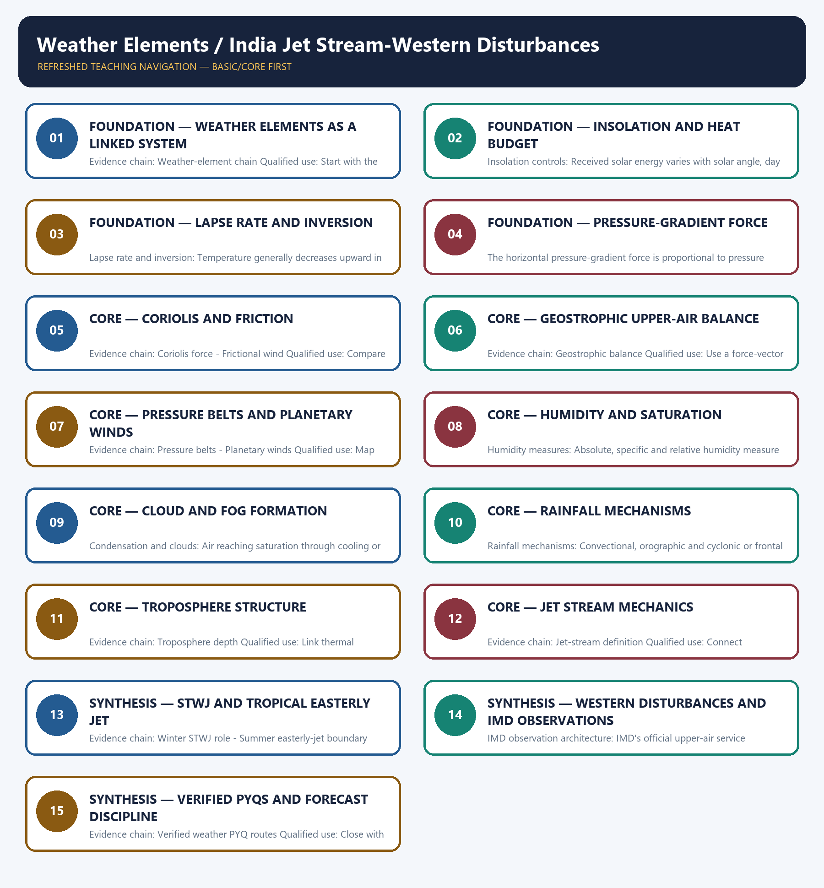

# Weather Elements / India Jet Stream-Western Disturbances — Learner-v2 Complete Learning Session

> **Authoring-only generation:** 2026-09-01. No PDF was rendered and no tracker or index was mutated.

### SOURCE, PROGRESSION AND CURRENT-LINKAGE AUDIT

- **Generation date:** 2026-09-01.
- **Repository-first evidence:** the Basic owner is taught first and preserved in full; the Advanced owner is retained only in the optional final teaching block.
- **OCR evidence:** Repository Markdown was primary. The three required local Geography books were inspected as supplementary OCR/searchable evidence. No unsupported page precision, volatile figure or quotation was imported.
- **Qdrant:** not used; repository Markdown and available OCR context were sufficient.
- **PYQ integrity:** Verified routing retains direct owner demands on weather elements and upper-air processes, including the 2021 and 2022 GS-I questions and relevant objective routes. No official answer letter is invented where the ledger withholds it, and no unrelated Disaster Management warning question is relabelled direct.
- **Live-link boundary:** IMD's official upper-air, radar and satellite service pages are used only to establish observation and forecasting architecture. The live search found no sufficiently stable, topic-specific official September 2026 western-disturbance item, so no current event, jet trend, forecast or realised impact is claimed.
- **Fact/inference discipline:** no current-affairs item, PYQ wording, figure or quotation is invented.

## BASIC LEARNING SESSION

### DEEP-REVIEW LEARNING CONTRACT

| Control | Binding rule for this package |
|---|---|
| Syllabus boundary | Complete physical process, spatial pattern and India anchor are taught before optional Advanced depth. |
| Causal method | Initial condition → energy/force or driver → mechanism → landform/climate/ocean pattern → consequence → feedback/limit. |
| Spatial method | Latitude, altitude, continentality, relief, plate setting, basin/coast orientation and map scale are explicit. |
| Terminology | Close terms are defined on common axes; process, form, region, hazard, regulation and current status are never collapsed. |
| Evidence method | Claim → named place/map/process/official record → analysis → qualification. |
| Practice contract | Every solved item has demand decoding, a detailed examiner-grade model, executable timed/compression plan, marks rationale and answer-specific improvement. |
| Approval | This immutable successor remains `approved: false` pending explicit approval. |

**Canonical Basic/Core owner:** `upsc-ai-kit\knowledge\Geography\basic\13_Weather-Elements.md`  
**Canonical topic owner:** `upsc-ai-kit\knowledge\Geography\basic\13_Weather-Elements.md`  
**Optional Advanced owner:** `upsc-ai-kit\knowledge\Geography\advanced\13_India-JetStream-Western-Disturbances.md`  
**Official syllabus mapping:** `upsc-ai-kit\knowledge\Geography\OFFICIAL-UPSC-SYLLABUS-MAPPING.md`

### EVIDENCE, PYQ AND CURRENT-STATUS CONTROL

- **Process discipline:** no feature is listed without formation sequence, controlling variables and a limiting condition.
- **Map discipline:** distribution is reconstructed through latitude, plate/relief setting, wind/current direction, drainage/coast orientation and named anchors.
- **Quantitative discipline:** coordinates, thresholds, magnitudes, dates, counts and project dimensions retain units, source/date and uncertainty.
- **Causal discipline:** association is not treated as sufficiency; interacting controls, scale, lag, feedback and exceptions are stated.
- **PYQ discipline:** repository routing ledgers and held papers control wording and metadata; reconstructed wording and unavailable official keys remain labelled.
- **Current-status note, rechecked 2026-09-01:** IMD's official upper-air, radar and satellite service pages are used only to establish observation and forecasting architecture. The live search found no sufficiently stable, topic-specific official September 2026 western-disturbance item, so no current event, jet trend, forecast or realised impact is claimed.

**Live/official context sources recorded by the predecessor generation:**

- `https://mausam.imd.gov.in/responsive/servicesMetUpperAir.php`
- `https://mausam.imd.gov.in/responsive/radar.php`
- `https://mausam.imd.gov.in/imd_latest/contents/satmet.php`




*Distinct embedded teaching-navigation image. The separate continuous Cārvāka-style flowchart package remains an independent at-a-glance artifact.*

### SESSION 1 — FOUNDATION — WEATHER ELEMENTS AS A LINKED SYSTEM

#### DEFINITION / WHAT THIS IS CALLED

**Plain-language definition:** Weather-element chain: Insolation, temperature, pressure, wind, humidity, clouds and precipitation are linked state variables and processes; weather is their short-period atmospheric expression at a place.

**Technical definition:** Evidence chain: Weather-element chain Qualified use: Start with the energy-to-rainfall chain.

#### ANSWER-GRABBING OPENING — WRITE/ADAPT IN THE EXAM

> Weather-element chain: Insolation, temperature, pressure, wind, humidity, clouds and precipitation are linked state variables and processes; weather is their short-period atmospheric expression at a place.

#### MUST-WRITE KEYWORDS

- **FOUNDATION**
- **Weather elements as a linked system**
- **Weather-element chain**
- **Evidence chain**
- **Qualified use**
- **Insolation**

**How to use them:** Frame the answer through FOUNDATION; define Weather elements as a linked system, connect Weather-element chain with Evidence chain to explain the mechanism, and use Qualified use for the decisive comparison or qualification.

#### VISUAL FIRST

```text
WEATHER ELEMENTS AS A LINKED SYSTEM
01. Weather-element chain
BOUNDARY -> Do not teach variables as an isolated list.
```

*This topic-specific rail fixes the evidence sequence and its exam boundary before analysis.*

#### CORE EXPLANATION

Insolation, temperature, pressure, wind, humidity, clouds and precipitation are linked state variables and processes; weather is their short-period atmospheric expression at a place.

#### NAMED EVIDENCE AND MECHANISM

- **Weather-element chain:** Insolation, temperature, pressure, wind, humidity, clouds and precipitation are linked state variables and processes; weather is their short-period atmospheric expression at a place.

#### EXAMINER CAUTION

- Do not teach variables as an isolated list.

#### EXAM LINK

- **Prelims:** Separate the agent, landform, location, status and scale attached to Weather elements as a linked system.
- **Mains:** Start with the energy-to-rainfall chain.

#### MINI RECAP

- **Evidence chain:** Weather-element chain
- **Qualified use:** Start with the energy-to-rainfall chain.

#### CLOSING RECALL FLOW — FOUNDATION — WEATHER ELEMENTS AS A LINKED SYSTEM

```text
START / CONCEPT: FOUNDATION — Weather elements as a linked system
        |
        v
EXACT TERMS: FOUNDATION · Weather elements as a linked system · Weather-element chain · Evidence chain · Qualified use · Insolation
        |
        v
MECHANISM / ARGUMENT: Evidence chain: Weather-element chain Qualified use: Start with the energy-to-rainfall chain.
        |
        v
CONSEQUENCE / CONTRAST: Do not teach variables as an isolated list.
        |
        v
UPSC TRAP / ANSWER-USE: Do not miss this limiting distinction: insolation, temperature, pressure, wind, humidity, clouds and precipitation are linked state variables and processes.
        |
        v
ANSWER-GRABBING FORMULATION: Weather-element chain: Insolation, temperature, pressure, wind, humidity, clouds and precipitation are linked state variables and processes; weather is their short-period atmospheric expression at a place.
```
### SESSION 2 — FOUNDATION — INSOLATION AND HEAT BUDGET

#### DEFINITION / WHAT THIS IS CALLED

**Plain-language definition:** Evidence chain: Insolation controls - Heat-budget distinction Qualified use: Use an input-transfer-output diagram.

**Technical definition:** Insolation controls: Received solar energy varies with solar angle, day length, Earth-Sun distance, cloud, dust and surface orientation; latitude alone does not determine daily receipt.

#### ANSWER-GRABBING OPENING — WRITE/ADAPT IN THE EXAM

> Insolation controls: Received solar energy varies with solar angle, day length, Earth-Sun distance, cloud, dust and surface orientation; latitude alone does not determine daily receipt.

#### MUST-WRITE KEYWORDS

- **FOUNDATION**
- **Insolation**
- **heat budget**
- **Insolation controls**
- **Heat-budget distinction**
- **Evidence chain**

**How to use them:** Frame the answer through FOUNDATION; define Insolation, connect heat budget with Insolation controls to explain the mechanism, and use Heat-budget distinction for the decisive comparison or qualification.

#### VISUAL FIRST

```text
INSOLATION AND HEAT BUDGET
01. Insolation controls
    |
    v
02. Heat-budget distinction
BOUNDARY -> Separate shortwave receipt from atmospheric heating.
```

*This topic-specific rail fixes the evidence sequence and its exam boundary before analysis.*

#### CORE EXPLANATION

Received solar energy varies with solar angle, day length, Earth-Sun distance, cloud, dust and surface orientation; latitude alone does not determine daily receipt. The atmosphere gains energy from absorbed solar radiation and from terrestrial longwave, sensible and latent heat; incoming shortwave and outgoing longwave must not be conflated.

#### NAMED EVIDENCE AND MECHANISM

- **Insolation controls:** Received solar energy varies with solar angle, day length, Earth-Sun distance, cloud, dust and surface orientation; latitude alone does not determine daily receipt.
- **Heat-budget distinction:** The atmosphere gains energy from absorbed solar radiation and from terrestrial longwave, sensible and latent heat; incoming shortwave and outgoing longwave must not be conflated.

#### EXAMINER CAUTION

- Separate shortwave receipt from atmospheric heating.

#### EXAM LINK

- **Prelims:** Separate the agent, landform, location, status and scale attached to Insolation and heat budget.
- **Mains:** Use an input-transfer-output diagram.

#### MINI RECAP

- **Evidence chain:** Insolation controls -> Heat-budget distinction
- **Qualified use:** Use an input-transfer-output diagram.

#### CLOSING RECALL FLOW — FOUNDATION — INSOLATION AND HEAT BUDGET

```text
START / CONCEPT: FOUNDATION — Insolation and heat budget
        |
        v
EXACT TERMS: FOUNDATION · Insolation · heat budget · Insolation controls · Heat-budget distinction · Evidence chain
        |
        v
MECHANISM / ARGUMENT: Evidence chain: Insolation controls - Heat-budget distinction Qualified use: Use an input-transfer-output diagram.
        |
        v
CONSEQUENCE / CONTRAST: Heat-budget distinction: The atmosphere gains energy from absorbed solar radiation and from terrestrial longwave, sensible and latent heat; incoming shortwave and outgoing longwave must not be conflated.
        |
        v
UPSC TRAP / ANSWER-USE: Do not miss this limiting distinction: received solar energy varies with solar angle, day length, Earth-Sun distance, cloud, dust and...
        |
        v
ANSWER-GRABBING FORMULATION: Insolation controls: Received solar energy varies with solar angle, day length, Earth-Sun distance, cloud, dust and surface orientation; latitude alone does not determine daily receipt.
```
### SESSION 3 — FOUNDATION — LAPSE RATE AND INVERSION

#### DEFINITION / WHAT THIS IS CALLED

**Plain-language definition:** Evidence chain: Lapse rate and inversion Qualified use: Draw normal and inverted profiles.

**Technical definition:** Lapse rate and inversion: Temperature generally decreases upward in the troposphere, while an inversion has temperature increasing with height through a layer and can suppress mixing and trap pollutants.

#### ANSWER-GRABBING OPENING — WRITE/ADAPT IN THE EXAM

> Lapse rate and inversion: Temperature generally decreases upward in the troposphere, while an inversion has temperature increasing with height through a layer and can suppress mixing and trap pollutants.

#### MUST-WRITE KEYWORDS

- **FOUNDATION**
- **Lapse rate**
- **inversion**
- **Lapse rate and inversion**
- **Evidence chain**
- **Qualified use**

**How to use them:** Frame the answer through FOUNDATION; define Lapse rate, connect inversion with Lapse rate and inversion to explain the mechanism, and use Evidence chain for the decisive comparison or qualification.

#### VISUAL FIRST

```text
LAPSE RATE AND INVERSION
01. Lapse rate and inversion
BOUNDARY -> State the layer and stability consequence.
```

*This topic-specific rail fixes the evidence sequence and its exam boundary before analysis.*

#### CORE EXPLANATION

Temperature generally decreases upward in the troposphere, while an inversion has temperature increasing with height through a layer and can suppress mixing and trap pollutants.

#### NAMED EVIDENCE AND MECHANISM

- **Lapse rate and inversion:** Temperature generally decreases upward in the troposphere, while an inversion has temperature increasing with height through a layer and can suppress mixing and trap pollutants.

#### EXAMINER CAUTION

- State the layer and stability consequence.

#### EXAM LINK

- **Prelims:** Separate the agent, landform, location, status and scale attached to Lapse rate and inversion.
- **Mains:** Draw normal and inverted profiles.

#### MINI RECAP

- **Evidence chain:** Lapse rate and inversion
- **Qualified use:** Draw normal and inverted profiles.

#### CLOSING RECALL FLOW — FOUNDATION — LAPSE RATE AND INVERSION

```text
START / CONCEPT: FOUNDATION — Lapse rate and inversion
        |
        v
EXACT TERMS: FOUNDATION · Lapse rate · inversion · Lapse rate and inversion · Evidence chain · Qualified use
        |
        v
MECHANISM / ARGUMENT: Evidence chain: Lapse rate and inversion Qualified use: Draw normal and inverted profiles.
        |
        v
CONSEQUENCE / CONTRAST: The resulting consequence is that temperature generally decreases upward in the troposphere.
        |
        v
UPSC TRAP / ANSWER-USE: Do not miss this limiting distinction: temperature generally decreases upward in the troposphere.
        |
        v
ANSWER-GRABBING FORMULATION: Lapse rate and inversion: Temperature generally decreases upward in the troposphere, while an inversion has temperature increasing with height through a layer and can suppress mixing and trap pollutants.
```
### SESSION 4 — FOUNDATION — PRESSURE-GRADIENT FORCE

#### DEFINITION / WHAT THIS IS CALLED

**Plain-language definition:** The pressure-gradient force starts wind by accelerating air from higher toward lower pressure.

**Technical definition:** The horizontal pressure-gradient force is proportional to pressure change per unit distance, so closely spaced isobars imply stronger acceleration before Coriolis and friction reshape the wind.

#### ANSWER-GRABBING OPENING — WRITE/ADAPT IN THE EXAM

> Wind responds to a pressure difference over distance, not to whether one place merely has a high or low pressure value.

#### MUST-WRITE KEYWORDS

- **pressure gradient**
- **isobar spacing**
- **acceleration**
- **high pressure**
- **low pressure**
- **wind speed**

**How to use them:** Read isobar spacing, identify the high-to-low force direction, and then add Coriolis and friction separately rather than treating pressure value alone as wind speed.

#### VISUAL FIRST

```text
PRESSURE-GRADIENT FORCE
01. Pressure-gradient force
BOUNDARY -> Gradient, not pressure alone, controls acceleration.
```

*This topic-specific rail fixes the evidence sequence and its exam boundary before analysis.*

#### CORE EXPLANATION

Horizontal pressure differences accelerate air from higher toward lower pressure, with strength related to gradient rather than the absolute pressure value.

#### NAMED EVIDENCE AND MECHANISM

- **Pressure-gradient force:** Horizontal pressure differences accelerate air from higher toward lower pressure, with strength related to gradient rather than the absolute pressure value.

#### EXAMINER CAUTION

- Gradient, not pressure alone, controls acceleration.

#### EXAM LINK

- **Prelims:** Separate the agent, landform, location, status and scale attached to Pressure-gradient force.
- **Mains:** Read isobar spacing before wind speed.

#### MINI RECAP

- **Evidence chain:** Pressure-gradient force
- **Qualified use:** Read isobar spacing before wind speed.

#### CLOSING RECALL FLOW — FOUNDATION — PRESSURE-GRADIENT FORCE

```text
START / CONCEPT: FOUNDATION — Pressure-gradient force
        |
        v
EXACT TERMS: pressure gradient · isobar spacing · acceleration · high pressure · low pressure · wind speed
        |
        v
MECHANISM / ARGUMENT: Evidence chain: Pressure-gradient force Qualified use: Read isobar spacing before wind speed.
        |
        v
CONSEQUENCE / CONTRAST: The resulting consequence is that read isobar spacing before wind speed.
        |
        v
UPSC TRAP / ANSWER-USE: Do not miss this limiting distinction: read isobar spacing before wind speed.
        |
        v
ANSWER-GRABBING FORMULATION: Wind responds to a pressure difference over distance, not to whether one place merely has a high or low pressure value.
```
### SESSION 5 — CORE — CORIOLIS AND FRICTION

#### DEFINITION / WHAT THIS IS CALLED

**Plain-language definition:** Coriolis force: Earth's rotation deflects moving air to the right in the Northern Hemisphere and left in the Southern Hemisphere, is zero at the equator and increases poleward for a given speed.

**Technical definition:** Evidence chain: Coriolis force - Frictional wind Qualified use: Compare upper and surface wind.

#### ANSWER-GRABBING OPENING — WRITE/ADAPT IN THE EXAM

> Coriolis force: Earth's rotation deflects moving air to the right in the Northern Hemisphere and left in the Southern Hemisphere, is zero at the equator and increases poleward for a given speed.

#### MUST-WRITE KEYWORDS

- **Coriolis**
- **friction**
- **Coriolis force**
- **Frictional wind**
- **Evidence chain**
- **Qualified use**

**How to use them:** Frame the answer through Coriolis; define friction, connect Coriolis force with Frictional wind to explain the mechanism, and use Evidence chain for the decisive comparison or qualification.

#### VISUAL FIRST

```text
CORIOLIS AND FRICTION
01. Coriolis force
    |
    v
02. Frictional wind
BOUNDARY -> Coriolis deflects but does not start wind.
```

*This topic-specific rail fixes the evidence sequence and its exam boundary before analysis.*

#### CORE EXPLANATION

Earth's rotation deflects moving air to the right in the Northern Hemisphere and left in the Southern Hemisphere, is zero at the equator and increases poleward for a given speed. Near the surface, friction slows wind, weakens Coriolis deflection and allows flow to cross isobars toward low pressure; aloft the balance differs.

#### NAMED EVIDENCE AND MECHANISM

- **Coriolis force:** Earth's rotation deflects moving air to the right in the Northern Hemisphere and left in the Southern Hemisphere, is zero at the equator and increases poleward for a given speed.
- **Frictional wind:** Near the surface, friction slows wind, weakens Coriolis deflection and allows flow to cross isobars toward low pressure; aloft the balance differs.

#### EXAMINER CAUTION

- Coriolis deflects but does not start wind.

#### EXAM LINK

- **Prelims:** Separate the agent, landform, location, status and scale attached to Coriolis and friction.
- **Mains:** Compare upper and surface wind.

#### MINI RECAP

- **Evidence chain:** Coriolis force -> Frictional wind
- **Qualified use:** Compare upper and surface wind.

#### CLOSING RECALL FLOW — CORE — CORIOLIS AND FRICTION

```text
START / CONCEPT: CORE — Coriolis and friction
        |
        v
EXACT TERMS: Coriolis · friction · Coriolis force · Frictional wind · Evidence chain · Qualified use
        |
        v
MECHANISM / ARGUMENT: Evidence chain: Coriolis force - Frictional wind Qualified use: Compare upper and surface wind.
        |
        v
CONSEQUENCE / CONTRAST: Frictional wind: Near the surface, friction slows wind, weakens Coriolis deflection and allows flow to cross isobars toward low pressure; aloft the balance differs.
        |
        v
UPSC TRAP / ANSWER-USE: Coriolis deflects but does not start wind.
        |
        v
ANSWER-GRABBING FORMULATION: Coriolis force: Earth's rotation deflects moving air to the right in the Northern Hemisphere and left in the Southern Hemisphere, is zero at the equator and increases poleward for a given speed.
```
### SESSION 6 — CORE — GEOSTROPHIC UPPER-AIR BALANCE

#### DEFINITION / WHAT THIS IS CALLED

**Plain-language definition:** Geostrophic balance: Away from the equator and friction layer, pressure-gradient and Coriolis forces can approximately balance, producing wind nearly parallel to straight isobars.

**Technical definition:** Evidence chain: Geostrophic balance Qualified use: Use a force-vector sketch.

#### ANSWER-GRABBING OPENING — WRITE/ADAPT IN THE EXAM

> Geostrophic balance: Away from the equator and friction layer, pressure-gradient and Coriolis forces can approximately balance, producing wind nearly parallel to straight isobars.

#### MUST-WRITE KEYWORDS

- **Geostrophic upper-air balance**
- **Geostrophic balance**
- **Evidence chain**
- **Qualified use**
- **Away**
- **Coriolis**

**How to use them:** Frame the answer through Geostrophic upper-air balance; define Geostrophic balance, connect Evidence chain with Qualified use to explain the mechanism, and use Away for the decisive comparison or qualification.

#### VISUAL FIRST

```text
GEOSTROPHIC UPPER-AIR BALANCE
01. Geostrophic balance
BOUNDARY -> It is an approximation away from equator and friction.
```

*This topic-specific rail fixes the evidence sequence and its exam boundary before analysis.*

#### CORE EXPLANATION

Away from the equator and friction layer, pressure-gradient and Coriolis forces can approximately balance, producing wind nearly parallel to straight isobars.

#### NAMED EVIDENCE AND MECHANISM

- **Geostrophic balance:** Away from the equator and friction layer, pressure-gradient and Coriolis forces can approximately balance, producing wind nearly parallel to straight isobars.

#### EXAMINER CAUTION

- It is an approximation away from equator and friction.

#### EXAM LINK

- **Prelims:** Separate the agent, landform, location, status and scale attached to Geostrophic upper-air balance.
- **Mains:** Use a force-vector sketch.

#### MINI RECAP

- **Evidence chain:** Geostrophic balance
- **Qualified use:** Use a force-vector sketch.

#### CLOSING RECALL FLOW — CORE — GEOSTROPHIC UPPER-AIR BALANCE

```text
START / CONCEPT: CORE — Geostrophic upper-air balance
        |
        v
EXACT TERMS: Geostrophic upper-air balance · Geostrophic balance · Evidence chain · Qualified use · Away · Coriolis
        |
        v
MECHANISM / ARGUMENT: Evidence chain: Geostrophic balance Qualified use: Use a force-vector sketch.
        |
        v
CONSEQUENCE / CONTRAST: It is an approximation away from equator and friction.
        |
        v
UPSC TRAP / ANSWER-USE: Do not miss this limiting distinction: away from the equator and friction layer, pressure-gradient and Coriolis forces can approximately balance...
        |
        v
ANSWER-GRABBING FORMULATION: Geostrophic balance: Away from the equator and friction layer, pressure-gradient and Coriolis forces can approximately balance, producing wind nearly parallel to straight isobars.
```
### SESSION 7 — CORE — PRESSURE BELTS AND PLANETARY WINDS

#### DEFINITION / WHAT THIS IS CALLED

**Plain-language definition:** Pressure belts: Equatorial low, subtropical highs, subpolar lows and polar highs are idealised planetary belts that migrate seasonally and are broken by land-sea heating and topography.

**Technical definition:** Evidence chain: Pressure belts - Planetary winds Qualified use: Map the ideal pattern with seasonal caveats.

#### ANSWER-GRABBING OPENING — WRITE/ADAPT IN THE EXAM

> Pressure belts: Equatorial low, subtropical highs, subpolar lows and polar highs are idealised planetary belts that migrate seasonally and are broken by land-sea heating and topography.

#### MUST-WRITE KEYWORDS

- **Pressure belts**
- **planetary winds**
- **Evidence chain**
- **Qualified use**
- **Equatorial**
- **Pressure**

**How to use them:** Frame the answer through Pressure belts; define planetary winds, connect Evidence chain with Qualified use to explain the mechanism, and use Equatorial for the decisive comparison or qualification.

#### VISUAL FIRST

```text
PRESSURE BELTS AND PLANETARY WINDS
01. Pressure belts
    |
    v
02. Planetary winds
BOUNDARY -> Belts migrate and break into cells.
```

*This topic-specific rail fixes the evidence sequence and its exam boundary before analysis.*

#### CORE EXPLANATION

Equatorial low, subtropical highs, subpolar lows and polar highs are idealised planetary belts that migrate seasonally and are broken by land-sea heating and topography. Trade winds, westerlies and polar easterlies connect the pressure belts, but monsoons, cyclones, local winds and seasonal migration complicate the ideal pattern.

#### NAMED EVIDENCE AND MECHANISM

- **Pressure belts:** Equatorial low, subtropical highs, subpolar lows and polar highs are idealised planetary belts that migrate seasonally and are broken by land-sea heating and topography.
- **Planetary winds:** Trade winds, westerlies and polar easterlies connect the pressure belts, but monsoons, cyclones, local winds and seasonal migration complicate the ideal pattern.

#### EXAMINER CAUTION

- Belts migrate and break into cells.

#### EXAM LINK

- **Prelims:** Separate the agent, landform, location, status and scale attached to Pressure belts and planetary winds.
- **Mains:** Map the ideal pattern with seasonal caveats.

#### MINI RECAP

- **Evidence chain:** Pressure belts -> Planetary winds
- **Qualified use:** Map the ideal pattern with seasonal caveats.

#### CLOSING RECALL FLOW — CORE — PRESSURE BELTS AND PLANETARY WINDS

```text
START / CONCEPT: CORE — Pressure belts and planetary winds
        |
        v
EXACT TERMS: Pressure belts · planetary winds · Evidence chain · Qualified use · Equatorial · Pressure
        |
        v
MECHANISM / ARGUMENT: Evidence chain: Pressure belts - Planetary winds Qualified use: Map the ideal pattern with seasonal caveats.
        |
        v
CONSEQUENCE / CONTRAST: The resulting consequence is that pressure belts - Planetary winds Qualified use.
        |
        v
UPSC TRAP / ANSWER-USE: Do not miss this limiting distinction: pressure belts - Planetary winds Qualified use.
        |
        v
ANSWER-GRABBING FORMULATION: Pressure belts: Equatorial low, subtropical highs, subpolar lows and polar highs are idealised planetary belts that migrate seasonally and are broken by land-sea heating and topography.
```
### SESSION 8 — CORE — HUMIDITY AND SATURATION

#### DEFINITION / WHAT THIS IS CALLED

**Plain-language definition:** CORE — Humidity and saturation comprises Humidity, saturation and Humidity measures as its core connected dimensions.

**Technical definition:** Humidity measures: Absolute, specific and relative humidity measure different properties; relative humidity changes with both water-vapour content and temperature.

#### ANSWER-GRABBING OPENING — WRITE/ADAPT IN THE EXAM

> Evidence chain: Humidity measures Qualified use: Use a cooling-air parcel example.

#### MUST-WRITE KEYWORDS

- **Humidity**
- **saturation**
- **Humidity measures**
- **Evidence chain**
- **Qualified use**
- **Absolute**

**How to use them:** Frame the answer through Humidity; define saturation, connect Humidity measures with Evidence chain to explain the mechanism, and use Qualified use for the decisive comparison or qualification.

#### VISUAL FIRST

```text
HUMIDITY AND SATURATION
01. Humidity measures
BOUNDARY -> Relative humidity depends on temperature.
```

*This topic-specific rail fixes the evidence sequence and its exam boundary before analysis.*

#### CORE EXPLANATION

Absolute, specific and relative humidity measure different properties; relative humidity changes with both water-vapour content and temperature.

#### NAMED EVIDENCE AND MECHANISM

- **Humidity measures:** Absolute, specific and relative humidity measure different properties; relative humidity changes with both water-vapour content and temperature.

#### EXAMINER CAUTION

- Relative humidity depends on temperature.

#### EXAM LINK

- **Prelims:** Separate the agent, landform, location, status and scale attached to Humidity and saturation.
- **Mains:** Use a cooling-air parcel example.

#### MINI RECAP

- **Evidence chain:** Humidity measures
- **Qualified use:** Use a cooling-air parcel example.

#### CLOSING RECALL FLOW — CORE — HUMIDITY AND SATURATION

```text
START / CONCEPT: CORE — Humidity and saturation
        |
        v
EXACT TERMS: Humidity · saturation · Humidity measures · Evidence chain · Qualified use · Absolute
        |
        v
MECHANISM / ARGUMENT: Humidity measures: Absolute, specific and relative humidity measure different properties; relative humidity changes with both water-vapour content and temperature.
        |
        v
CONSEQUENCE / CONTRAST: Mains: Use a cooling-air parcel example.
        |
        v
UPSC TRAP / ANSWER-USE: Do not miss this limiting distinction: evidence chain: Humidity measures Qualified use: Use a cooling-air parcel example.
        |
        v
ANSWER-GRABBING FORMULATION: Evidence chain: Humidity measures Qualified use: Use a cooling-air parcel example.
```
### SESSION 9 — CORE — CLOUD AND FOG FORMATION

#### DEFINITION / WHAT THIS IS CALLED

**Plain-language definition:** Evidence chain: Condensation and clouds Qualified use: Connect nuclei, lift and droplet growth.

**Technical definition:** Condensation and clouds: Air reaching saturation through cooling or moisture addition can condense on nuclei, forming cloud or fog when lift, stability and droplet processes permit.

#### ANSWER-GRABBING OPENING — WRITE/ADAPT IN THE EXAM

> Evidence chain: Condensation and clouds Qualified use: Connect nuclei, lift and droplet growth.

#### MUST-WRITE KEYWORDS

- **Cloud**
- **fog formation**
- **Condensation and clouds**
- **Evidence chain**
- **Qualified use**
- **Air**

**How to use them:** Frame the answer through Cloud; define fog formation, connect Condensation and clouds with Evidence chain to explain the mechanism, and use Qualified use for the decisive comparison or qualification.

#### VISUAL FIRST

```text
CLOUD AND FOG FORMATION
01. Condensation and clouds
BOUNDARY -> Saturation alone does not guarantee rain.
```

*This topic-specific rail fixes the evidence sequence and its exam boundary before analysis.*

#### CORE EXPLANATION

Air reaching saturation through cooling or moisture addition can condense on nuclei, forming cloud or fog when lift, stability and droplet processes permit.

#### NAMED EVIDENCE AND MECHANISM

- **Condensation and clouds:** Air reaching saturation through cooling or moisture addition can condense on nuclei, forming cloud or fog when lift, stability and droplet processes permit.

#### EXAMINER CAUTION

- Saturation alone does not guarantee rain.

#### EXAM LINK

- **Prelims:** Separate the agent, landform, location, status and scale attached to Cloud and fog formation.
- **Mains:** Connect nuclei, lift and droplet growth.

#### MINI RECAP

- **Evidence chain:** Condensation and clouds
- **Qualified use:** Connect nuclei, lift and droplet growth.

#### CLOSING RECALL FLOW — CORE — CLOUD AND FOG FORMATION

```text
START / CONCEPT: CORE — Cloud and fog formation
        |
        v
EXACT TERMS: Cloud · fog formation · Condensation and clouds · Evidence chain · Qualified use · Air
        |
        v
MECHANISM / ARGUMENT: Condensation and clouds: Air reaching saturation through cooling or moisture addition can condense on nuclei, forming cloud or fog when lift, stability and droplet processes permit.
        |
        v
CONSEQUENCE / CONTRAST: Saturation alone does not guarantee rain.
        |
        v
UPSC TRAP / ANSWER-USE: Do not miss this limiting distinction: connect nuclei, lift and droplet growth.
        |
        v
ANSWER-GRABBING FORMULATION: Evidence chain: Condensation and clouds Qualified use: Connect nuclei, lift and droplet growth.
```
### SESSION 10 — CORE — RAINFALL MECHANISMS

#### DEFINITION / WHAT THIS IS CALLED

**Plain-language definition:** Evidence chain: Rainfall mechanisms Qualified use: Compare convectional, relief and frontal uplift.

**Technical definition:** Rainfall mechanisms: Convectional, orographic and cyclonic or frontal rainfall describe uplift mechanisms; one storm can combine more than one mechanism.

#### ANSWER-GRABBING OPENING — WRITE/ADAPT IN THE EXAM

> Evidence chain: Rainfall mechanisms Qualified use: Compare convectional, relief and frontal uplift.

#### MUST-WRITE KEYWORDS

- **Rainfall mechanisms**
- **Evidence chain**
- **Qualified use**
- **Convectional**
- **Rainfall**
- **Real**

**How to use them:** Frame the answer through Rainfall mechanisms; define Evidence chain, connect Qualified use with Convectional to explain the mechanism, and use Rainfall for the decisive comparison or qualification.

#### VISUAL FIRST

```text
RAINFALL MECHANISMS
01. Rainfall mechanisms
BOUNDARY -> Real storms can mix uplift mechanisms.
```

*This topic-specific rail fixes the evidence sequence and its exam boundary before analysis.*

#### CORE EXPLANATION

Convectional, orographic and cyclonic or frontal rainfall describe uplift mechanisms; one storm can combine more than one mechanism.

#### NAMED EVIDENCE AND MECHANISM

- **Rainfall mechanisms:** Convectional, orographic and cyclonic or frontal rainfall describe uplift mechanisms; one storm can combine more than one mechanism.

#### EXAMINER CAUTION

- Real storms can mix uplift mechanisms.

#### EXAM LINK

- **Prelims:** Separate the agent, landform, location, status and scale attached to Rainfall mechanisms.
- **Mains:** Compare convectional, relief and frontal uplift.

#### MINI RECAP

- **Evidence chain:** Rainfall mechanisms
- **Qualified use:** Compare convectional, relief and frontal uplift.

#### CLOSING RECALL FLOW — CORE — RAINFALL MECHANISMS

```text
START / CONCEPT: CORE — Rainfall mechanisms
        |
        v
EXACT TERMS: Rainfall mechanisms · Evidence chain · Qualified use · Convectional · Rainfall · Real
        |
        v
MECHANISM / ARGUMENT: Rainfall mechanisms: Convectional, orographic and cyclonic or frontal rainfall describe uplift mechanisms; one storm can combine more than one mechanism.
        |
        v
CONSEQUENCE / CONTRAST: Real storms can mix uplift mechanisms.
        |
        v
UPSC TRAP / ANSWER-USE: Do not miss this limiting distinction: compare convectional, relief and frontal uplift.
        |
        v
ANSWER-GRABBING FORMULATION: Evidence chain: Rainfall mechanisms Qualified use: Compare convectional, relief and frontal uplift.
```
### SESSION 11 — CORE — TROPOSPHERE STRUCTURE

#### DEFINITION / WHAT THIS IS CALLED

**Plain-language definition:** Troposphere depth: The troposphere is generally deeper over the warm tropics and shallower toward the poles, and most weather occurs there because water vapour, vertical mixing and instability are concentrated in it.

**Technical definition:** Evidence chain: Troposphere depth Qualified use: Link thermal expansion to convection.

#### ANSWER-GRABBING OPENING — WRITE/ADAPT IN THE EXAM

> Troposphere depth: The troposphere is generally deeper over the warm tropics and shallower toward the poles, and most weather occurs there because water vapour, vertical mixing and instability are concentrated in it.

#### MUST-WRITE KEYWORDS

- **Troposphere structure**
- **Troposphere depth**
- **Evidence chain**
- **Qualified use**
- **The troposphere**
- **Troposphere depth: The troposphere**

**How to use them:** Frame the answer through Troposphere structure; define Troposphere depth, connect Evidence chain with Qualified use to explain the mechanism, and use The troposphere for the decisive comparison or qualification.

#### VISUAL FIRST

```text
TROPOSPHERE STRUCTURE
01. Troposphere depth
BOUNDARY -> Depth varies with latitude and season.
```

*This topic-specific rail fixes the evidence sequence and its exam boundary before analysis.*

#### CORE EXPLANATION

The troposphere is generally deeper over the warm tropics and shallower toward the poles, and most weather occurs there because water vapour, vertical mixing and instability are concentrated in it.

#### NAMED EVIDENCE AND MECHANISM

- **Troposphere depth:** The troposphere is generally deeper over the warm tropics and shallower toward the poles, and most weather occurs there because water vapour, vertical mixing and instability are concentrated in it.

#### EXAMINER CAUTION

- Depth varies with latitude and season.

#### EXAM LINK

- **Prelims:** Separate the agent, landform, location, status and scale attached to Troposphere structure.
- **Mains:** Link thermal expansion to convection.

#### MINI RECAP

- **Evidence chain:** Troposphere depth
- **Qualified use:** Link thermal expansion to convection.

#### CLOSING RECALL FLOW — CORE — TROPOSPHERE STRUCTURE

```text
START / CONCEPT: CORE — Troposphere structure
        |
        v
EXACT TERMS: Troposphere structure · Troposphere depth · Evidence chain · Qualified use · The troposphere · Troposphere depth: The troposphere
        |
        v
MECHANISM / ARGUMENT: Evidence chain: Troposphere depth Qualified use: Link thermal expansion to convection.
        |
        v
CONSEQUENCE / CONTRAST: The resulting consequence is that the troposphere is generally deeper over the warm tropics and shallower toward the poles.
        |
        v
UPSC TRAP / ANSWER-USE: Do not miss this limiting distinction: the troposphere is generally deeper over the warm tropics and shallower toward the poles.
        |
        v
ANSWER-GRABBING FORMULATION: Troposphere depth: The troposphere is generally deeper over the warm tropics and shallower toward the poles, and most weather occurs there because water vapour, vertical mixing and instability are concentrated in it.
```
### SESSION 12 — CORE — JET STREAM MECHANICS

#### DEFINITION / WHAT THIS IS CALLED

**Plain-language definition:** Jet-stream definition: A jet stream is a narrow current of strong upper-tropospheric or lower-stratospheric winds associated with sharp horizontal temperature gradients; it is not fixed at one altitude.

**Technical definition:** Evidence chain: Jet-stream definition Qualified use: Connect temperature gradient to strong upper wind.

#### ANSWER-GRABBING OPENING — WRITE/ADAPT IN THE EXAM

> Jet-stream definition: A jet stream is a narrow current of strong upper-tropospheric or lower-stratospheric winds associated with sharp horizontal temperature gradients; it is not fixed at one altitude.

#### MUST-WRITE KEYWORDS

- **Jet stream mechanics**
- **Jet-stream definition**
- **Evidence chain**
- **Qualified use**
- **A jet stream**
- **Jet-stream definition: A jet stream**

**How to use them:** Frame the answer through Jet stream mechanics; define Jet-stream definition, connect Evidence chain with Qualified use to explain the mechanism, and use A jet stream for the decisive comparison or qualification.

#### VISUAL FIRST

```text
JET STREAM MECHANICS
01. Jet-stream definition
BOUNDARY -> A jet core is not fixed at one pressure level.
```

*This topic-specific rail fixes the evidence sequence and its exam boundary before analysis.*

#### CORE EXPLANATION

A jet stream is a narrow current of strong upper-tropospheric or lower-stratospheric winds associated with sharp horizontal temperature gradients; it is not fixed at one altitude.

#### NAMED EVIDENCE AND MECHANISM

- **Jet-stream definition:** A jet stream is a narrow current of strong upper-tropospheric or lower-stratospheric winds associated with sharp horizontal temperature gradients; it is not fixed at one altitude.

#### EXAMINER CAUTION

- A jet core is not fixed at one pressure level.

#### EXAM LINK

- **Prelims:** Separate the agent, landform, location, status and scale attached to Jet stream mechanics.
- **Mains:** Connect temperature gradient to strong upper wind.

#### MINI RECAP

- **Evidence chain:** Jet-stream definition
- **Qualified use:** Connect temperature gradient to strong upper wind.

#### CLOSING RECALL FLOW — CORE — JET STREAM MECHANICS

```text
START / CONCEPT: CORE — Jet stream mechanics
        |
        v
EXACT TERMS: Jet stream mechanics · Jet-stream definition · Evidence chain · Qualified use · A jet stream · Jet-stream definition: A jet stream
        |
        v
MECHANISM / ARGUMENT: Evidence chain: Jet-stream definition Qualified use: Connect temperature gradient to strong upper wind.
        |
        v
CONSEQUENCE / CONTRAST: A jet core is not fixed at one pressure level.
        |
        v
UPSC TRAP / ANSWER-USE: Do not miss this limiting distinction: a jet stream is a narrow current of strong upper-tropospheric or lower-stratospheric winds associated...
        |
        v
ANSWER-GRABBING FORMULATION: Jet-stream definition: A jet stream is a narrow current of strong upper-tropospheric or lower-stratospheric winds associated with sharp horizontal temperature gradients; it is not fixed at one altitude.
```
### SESSION 13 — SYNTHESIS — STWJ AND TROPICAL EASTERLY JET

#### DEFINITION / WHAT THIS IS CALLED

**Plain-language definition:** Summer easterly-jet boundary: The tropical easterly jet is a summer upper-air feature linked to the monsoon circulation, but its appearance or strength is not a single-cause switch that proves monsoon onset or rainfall.

**Technical definition:** Evidence chain: Winter STWJ role - Summer easterly-jet boundary Qualified use: Place both within winter and summer circulation.

#### ANSWER-GRABBING OPENING — WRITE/ADAPT IN THE EXAM

> Summer easterly-jet boundary: The tropical easterly jet is a summer upper-air feature linked to the monsoon circulation, but its appearance or strength is not a single-cause switch that proves monsoon onset or rainfall.

#### MUST-WRITE KEYWORDS

- **SYNTHESIS**
- **STWJ**
- **tropical easterly jet**
- **Winter STWJ role**
- **Summer easterly-jet boundary**
- **Evidence chain**

**How to use them:** Frame the answer through SYNTHESIS; define STWJ, connect tropical easterly jet with Winter STWJ role to explain the mechanism, and use Summer easterly-jet boundary for the decisive comparison or qualification.

#### VISUAL FIRST

```text
STWJ AND TROPICAL EASTERLY JET
01. Winter STWJ role
    |
    v
02. Summer easterly-jet boundary
BOUNDARY -> Neither jet alone determines seasonal rainfall.
```

*This topic-specific rail fixes the evidence sequence and its exam boundary before analysis.*

#### CORE EXPLANATION

In winter the subtropical westerly jet lies south of the Himalaya in the broad Indian-sector circulation and helps steer western disturbances toward north and northwest India. The tropical easterly jet is a summer upper-air feature linked to the monsoon circulation, but its appearance or strength is not a single-cause switch that proves monsoon onset or rainfall.

#### NAMED EVIDENCE AND MECHANISM

- **Winter STWJ role:** In winter the subtropical westerly jet lies south of the Himalaya in the broad Indian-sector circulation and helps steer western disturbances toward north and northwest India.
- **Summer easterly-jet boundary:** The tropical easterly jet is a summer upper-air feature linked to the monsoon circulation, but its appearance or strength is not a single-cause switch that proves monsoon onset or rainfall.

#### EXAMINER CAUTION

- Neither jet alone determines seasonal rainfall.

#### EXAM LINK

- **Prelims:** Separate the agent, landform, location, status and scale attached to STWJ and tropical easterly jet.
- **Mains:** Place both within winter and summer circulation.

#### MINI RECAP

- **Evidence chain:** Winter STWJ role -> Summer easterly-jet boundary
- **Qualified use:** Place both within winter and summer circulation.

#### CLOSING RECALL FLOW — SYNTHESIS — STWJ AND TROPICAL EASTERLY JET

```text
START / CONCEPT: SYNTHESIS — STWJ and tropical easterly jet
        |
        v
EXACT TERMS: SYNTHESIS · STWJ · tropical easterly jet · Winter STWJ role · Summer easterly-jet boundary · Evidence chain
        |
        v
MECHANISM / ARGUMENT: Evidence chain: Winter STWJ role - Summer easterly-jet boundary Qualified use: Place both within winter and summer circulation.
        |
        v
CONSEQUENCE / CONTRAST: Neither jet alone determines seasonal rainfall.
        |
        v
UPSC TRAP / ANSWER-USE: Do not miss this limiting distinction: the tropical easterly jet is a summer upper-air feature linked to the monsoon circulation.
        |
        v
ANSWER-GRABBING FORMULATION: Summer easterly-jet boundary: The tropical easterly jet is a summer upper-air feature linked to the monsoon circulation, but its appearance or strength is not a single-cause switch that proves monsoon onset or rainfall.
```
### SESSION 14 — SYNTHESIS — WESTERN DISTURBANCES AND IMD OBSERVATIONS

#### DEFINITION / WHAT THIS IS CALLED

**Plain-language definition:** Western-disturbance structure: Western disturbances are eastward-moving mid-latitude troughs, lows or cyclonic circulations embedded in the westerlies and commonly draw moisture along their path; they are not southwest-monsoon systems.

**Technical definition:** IMD observation architecture: IMD's official upper-air service describes radiosonde and pilot-balloon observations that support analysis of winds, pressure and temperature aloft; observation, diagnosis and forecast remain distinct.

#### ANSWER-GRABBING OPENING — WRITE/ADAPT IN THE EXAM

> Western-disturbance structure: Western disturbances are eastward-moving mid-latitude troughs, lows or cyclonic circulations embedded in the westerlies and commonly draw moisture along their path; they are not southwest-monsoon systems.

#### MUST-WRITE KEYWORDS

- **SYNTHESIS**
- **Western disturbances**
- **IMD observations**
- **Western-disturbance structure**
- **IMD observation architecture**
- **Evidence chain**

**How to use them:** Frame the answer through SYNTHESIS; define Western disturbances, connect IMD observations with Western-disturbance structure to explain the mechanism, and use IMD observation architecture for the decisive comparison or qualification.

#### VISUAL FIRST

```text
WESTERN DISTURBANCES AND IMD OBSERVATIONS
01. Western-disturbance structure
    |
    v
02. IMD observation architecture
BOUNDARY -> A WD can be a trough or circulation, not only a surface low.
```

*This topic-specific rail fixes the evidence sequence and its exam boundary before analysis.*

#### CORE EXPLANATION

Western disturbances are eastward-moving mid-latitude troughs, lows or cyclonic circulations embedded in the westerlies and commonly draw moisture along their path; they are not southwest-monsoon systems. IMD's official upper-air service describes radiosonde and pilot-balloon observations that support analysis of winds, pressure and temperature aloft; observation, diagnosis and forecast remain distinct.

#### NAMED EVIDENCE AND MECHANISM

- **Western-disturbance structure:** Western disturbances are eastward-moving mid-latitude troughs, lows or cyclonic circulations embedded in the westerlies and commonly draw moisture along their path; they are not southwest-monsoon systems.
- **IMD observation architecture:** IMD's official upper-air service describes radiosonde and pilot-balloon observations that support analysis of winds, pressure and temperature aloft; observation, diagnosis and forecast remain distinct.

#### EXAMINER CAUTION

- A WD can be a trough or circulation, not only a surface low.

#### EXAM LINK

- **Prelims:** Separate the agent, landform, location, status and scale attached to Western disturbances and IMD observations.
- **Mains:** Trace detection, steering and precipitation.

#### MINI RECAP

- **Evidence chain:** Western-disturbance structure -> IMD observation architecture
- **Qualified use:** Trace detection, steering and precipitation.

#### CLOSING RECALL FLOW — SYNTHESIS — WESTERN DISTURBANCES AND IMD OBSERVATIONS

```text
START / CONCEPT: SYNTHESIS — Western disturbances and IMD observations
        |
        v
EXACT TERMS: SYNTHESIS · Western disturbances · IMD observations · Western-disturbance structure · IMD observation architecture · Evidence chain
        |
        v
MECHANISM / ARGUMENT: Evidence chain: Western-disturbance structure - IMD observation architecture Qualified use: Trace detection, steering and precipitation.
        |
        v
CONSEQUENCE / CONTRAST: A WD can be a trough or circulation, not only a surface low.
        |
        v
UPSC TRAP / ANSWER-USE: Do not miss this limiting distinction: iMD's official upper-air service describes radiosonde and pilot-balloon observations that support analysis of winds...
        |
        v
ANSWER-GRABBING FORMULATION: Western-disturbance structure: Western disturbances are eastward-moving mid-latitude troughs, lows or cyclonic circulations embedded in the westerlies and commonly draw moisture along their path; they are not southwest-monsoon systems.
```
### SESSION 15 — SYNTHESIS — VERIFIED PYQS AND FORECAST DISCIPLINE

#### DEFINITION / WHAT THIS IS CALLED

**Plain-language definition:** Forecast, warning and outcome are different claims.

**Technical definition:** Evidence chain: Verified weather PYQ routes Qualified use: Close with source-date and uncertainty discipline.

#### ANSWER-GRABBING OPENING — WRITE/ADAPT IN THE EXAM

> Evidence chain: Verified weather PYQ routes Qualified use: Close with source-date and uncertainty discipline.

#### MUST-WRITE KEYWORDS

- **SYNTHESIS**
- **Verified PYQs**
- **forecast discipline**
- **Verified weather PYQ routes**
- **Evidence chain**
- **Qualified use**

**How to use them:** Frame the answer through SYNTHESIS; define Verified PYQs, connect forecast discipline with Verified weather PYQ routes to explain the mechanism, and use Evidence chain for the decisive comparison or qualification.

#### VISUAL FIRST

```text
VERIFIED PYQS AND FORECAST DISCIPLINE
01. Verified weather PYQ routes
BOUNDARY -> Forecast, warning and outcome are different claims.
```

*This topic-specific rail fixes the evidence sequence and its exam boundary before analysis.*

#### CORE EXPLANATION

Direct routes include 2021 GS-I mountain alignment and local weather, 2022 GS-I tropospheric weather processes, and objective demands on jet streams, clouds, insolation, isotherms and atmospheric dust.

#### NAMED EVIDENCE AND MECHANISM

- **Verified weather PYQ routes:** Direct routes include 2021 GS-I mountain alignment and local weather, 2022 GS-I tropospheric weather processes, and objective demands on jet streams, clouds, insolation, isotherms and atmospheric dust.

#### EXAMINER CAUTION

- Forecast, warning and outcome are different claims.

#### EXAM LINK

- **Prelims:** Separate the agent, landform, location, status and scale attached to Verified PYQs and forecast discipline.
- **Mains:** Close with source-date and uncertainty discipline.

#### MINI RECAP

- **Evidence chain:** Verified weather PYQ routes
- **Qualified use:** Close with source-date and uncertainty discipline.
#### COMPLETE BASIC OWNER EVIDENCE BANK

> **Subject:** Geography · **Tier:** Must-Do (foundation + standard) · **GS Paper:** GS-I
> **Grounded in:** G.C. Leong, *Certificate Physical & Human Geography* + Majid Husain, *Indian & World Geography*.
> ✅ = from source book · ⚠️ = inference / standard knowledge · 📰 = current affairs.
> *Companion: `advanced/13_India-JetStream-Western-Disturbances.md`.*

#### 1. Weather elements and the causation chain

✅ Weather is the short-term state of the atmosphere at a place. ✅ The core elements are **temperature/insolation, pressure, wind, humidity and precipitation**. ✅ Insolation drives differential heating; differential heating creates pressure differences; pressure differences drive winds; winds carry moisture; cooling and condensation produce rainfall.

| Element | Definition / driver | Key exam point |
|---|---|---|
| ✅ Insolation | Incoming solar radiation received at surface | Maximum with vertical sun; modified by latitude, cloud, aspect and altitude |
| ✅ Pressure | Weight of air column; thermal + dynamic causes | Air moves from high to low pressure |
| ✅ Wind | Horizontal movement of air | Deflected by Coriolis/Ferrel's law |
| ✅ Humidity | Water vapour in air | Absolute/specific vs relative humidity; dew point is the saturation temperature |
| ✅ Rainfall | Condensation and precipitation | Convectional, orographic and cyclonic/frontal |

#### 2. Heat budget and pressure belts

✅ Earth's heat budget balances incoming shortwave solar radiation and outgoing terrestrial longwave radiation. ✅ Tropics have surplus energy (0–40 deg in notes) and higher latitudes have deficit (40–90 deg); winds and ocean currents transfer heat poleward.

| Pressure belt | Latitude / nature | Air movement | Weather significance |
|---|---|---|---|
| ✅ Equatorial Low / Doldrums | 0–5 deg; thermal low | Warm air ascends | Calm, convectional rainfall |
| ✅ Sub-tropical High / Horse Latitudes | 25–35 deg; dynamic high | Air descends | Dry belts and deserts |
| ✅ Sub-polar Low | 60–65 deg; dynamic low | Air converges/ascends | Stormy/frontal belt |
| ✅ Polar High | Poles; thermal high | Cold dense air descends | Source of polar easterlies |

> 🔑 Trap: Pressure belts migrate north/south with the seasonal heating pattern, but the displacement is
> not a uniform 5° everywhere and is strongly distorted over continents.

#### 3. Planetary winds and rainfall types

| Wind system | From → to | Direction noted |
|---|---|---|
| ✅ Trade winds | Sub-tropical High → Equatorial Low | NE trades in N hemisphere; SE trades in S hemisphere |
| ✅ Westerlies | Sub-tropical High → Sub-polar Low | SW in Northern Hemisphere |
| ✅ Polar easterlies | Polar High → Sub-polar Low | Cold easterly flow |

| Rainfall type | Mechanism | Typical setting |
|---|---|---|
| ✅ Convectional | Heated air rises, cools and condenses | Equatorial afternoons, thunderstorms |
| ✅ Orographic / relief | Moist air forced up mountain | Windward rain, leeward rain-shadow |
| ✅ Cyclonic / frontal | Warm and cold air masses meet; warm air lifted | Temperate depressions and tropical cyclones |

#### 4. Humidity and clouds

✅ Absolute humidity is water-vapour mass per unit volume. ✅ Relative humidity is the ratio of actual
vapour pressure to saturation vapour pressure at the same temperature. ✅ Warm air has a higher
saturation vapour pressure. At 100% RH the air is saturated; cooling below the dew point permits
condensation or deposition if suitable surfaces/nuclei are present.

| Cloud family | Height/form | Exam association |
|---|---|---|
| ✅ Cirrus | High cloud | Wispy high cloud |
| ✅ Alto | Middle cloud prefix | Mid-level cloud group |
| ✅ Strato | Low layered cloud prefix | Layered low cloud logic |
| ✅ Cumulonimbus | Vertical development | Thunderstorms, hail and heavy rain |

#### ➕ Temperature Inversion (PYQ / high-yield gap)

> ✅ Grounded in GC Leong + Majid Husain + ⚠️ standard geography. Added to close a UPSC gap.

- ✅ **Temperature inversion** is reversal of the normal lapse rate: air near the surface becomes colder than air above, as shown in book passages on valley-bottom inversion and low-level inversion with frost.
- ✅ Favourable conditions: long winter nights, cloudless clear sky, dry air/low relative humidity and calm or slow air movement.
- ⚠️ Mechanism: nocturnal radiational cooling chills the ground; dense cold air drains into valleys/frost hollows and gets trapped below warmer air.
- ⚠️ India link: winter inversions over the Indo-Gangetic plains can trap fog, smoke and pollutants near the surface.

| Type | Mechanism | Exam association |
|---|---|---|
| ✅ Radiation inversion | Night-time surface cooling | Frost, fog, pollution trapping |
| ⚠️ Valley inversion | Cold-air drainage downslope | Frost hollows, colder valley floor |
| ⚠️ Subsidence inversion | Descending anticyclonic air warms aloft | Stable dry layer, smog cap |

> 🔑 Trap: Inversion is **stability**, not instability; it suppresses vertical mixing even if pollution/fog near the ground looks dramatic.

#### ➕ Katabatic & Anabatic Winds (local-winds PYQ gap)

> ✅ Grounded in Majid Husain + ⚠️ standard geography. Added to close a UPSC gap.

- ✅ Mountain-valley winds reverse direction daily: book passages state daytime heating makes air rise up mountain slopes as a warm **valley wind**.
- ⚠️ **Anabatic wind** = daytime upslope flow caused by slope heating; **katabatic wind** = night-time downslope drainage of cold, dense air.
- ⚠️ These are local, thermally driven winds, like sea breeze/land breeze logic, but controlled by relief instead of shoreline contrast.
- ⚠️ India link: Himalayan valleys show daytime upslope cloud build-up and night-time cold-air pooling that aids frost/fog.

| Wind | Time | Direction | Thermal character |
|---|---|---|---|
| ⚠️ Anabatic / valley wind | Day | Upslope | Warm rising air |
| ⚠️ Katabatic / mountain wind | Night | Downslope | Cold dense drainage |
| ✅ Sea breeze | Day | Sea → land | Cooler onshore air |
| ✅ Land breeze | Night | Land → sea | Offshore drainage |

> 🔑 Trap: A **valley wind** is named from its origin but blows **upslope** in daytime; a **mountain wind** blows downslope at night.

#### ➕ Albedo & Earth's Heat Budget (high-yield climatology gap)

> ✅ Grounded in GC Leong + Majid Husain + ⚠️ standard geography. Added to close a UPSC gap.

- ✅ Earth's heat budget balances incoming shortwave solar radiation and outgoing terrestrial longwave radiation; tropics have surplus energy and high latitudes have deficit, redistributed by winds and ocean currents.
- ✅ Majid Husain defines **albedo** as reflectivity: the percentage of incident solar radiation reflected by a surface; clouds are major reflectors.
- ✅ GC Leong notes solar energy reaches Earth as insolation and that a large part is reflected back to space by the atmosphere/surface.
- ⚠️ High-albedo surfaces such as fresh snow/clouds cool the surface; low-albedo surfaces such as ocean/asphalt absorb more heat.

| Surface / layer | Albedo tendency | Climate effect |
|---|---|---|
| ✅ Clouds | High reflector | Reduces incoming shortwave |
| ⚠️ Fresh snow/ice | Very high | Ice-albedo feedback |
| ⚠️ Forest/ocean | Low | Strong absorption |
| ⚠️ Urban dark surfaces | Low | Urban heat island support |

> 🔑 Trap: Albedo affects **incoming shortwave reflection**; the greenhouse effect mainly concerns **outgoing longwave trapping**.

#### 5. Must-Know Facts (Prelims) and UPSC traps

- ✅ Doldrums = equatorial low, calm ascending air and convectional rainfall.
- ✅ Horse Latitudes = sub-tropical high pressure near 30 deg, descending dry air and major deserts (Sahara, Thar, Kalahari).
- ✅ Coriolis force is zero at equator, maximum at poles; deflects right in N hemisphere and left in S hemisphere.
- ✅ Windward slope = heavy orographic rain; leeward slope = rain-shadow, e.g. Western Ghats windward wet, Deccan leeward dry.
- ✅ Cumulonimbus = towering vertical thunderstorm/rain cloud.

> 🔑 Trap: High relative humidity does not always mean high absolute moisture; cold air can be saturated with little vapour.

- ❌ Trades and westerlies both blow towards equator → Trades blow equatorward; westerlies blow poleward from subtropical highs.
- ❌ Doldrums are high-pressure belts → Doldrums are **equatorial low pressure**.
- ❌ All rainfall is convectional → Relief and frontal/cyclonic lifting are separate rainfall mechanisms.

#### 6. 📰 Current link

##### CA Anchor — Heatwaves, Loo Winds & Anticyclonic Subsidence

📰 **News trigger:** Recurrent pre-monsoon heatwaves keep the pressure-wind chain current. Use IMD's
dated station observations and heatwave bulletins rather than viral “world's hottest cities” rankings.

✅ A persistent anticyclonic ridge can cause subsidence, adiabatic warming and suppressed cloud
development—a mechanism often described as a heat dome. Not every heatwave has the same circulation pattern.

✅ IMD criteria vary by plains, hills and coasts. For plains, a heatwave is considered only after the
maximum reaches at least 40°C, then departure-from-normal or actual-temperature thresholds are applied;
always quote the current IMD criterion and bulletin date.

| Driver | Mechanism (links to static concept) | Impact |
|---|---|---|
| ✅ Heat Dome | Persistent anticyclone → subsidence → adiabatic warming, no clouds | Trapped hot air over Indo-Gangetic plains |
| ✅ Loo winds | Hot dry NW winds, steep pressure gradient in May–June | Dehydration, heatstroke, high mortality |
| ✅ Weak Western Disturbances | Fewer moisture-bearing systems → no relief rain | Prolonged dry heat spell |
| ✅ Urban Heat Island | Concrete + low green cover retains heat | Cities hotter than surrounding rural areas |

- ✅ Loo = hot, dry, gusty afternoon wind over north-western and northern plains in May–June; intense
  continental heating and pressure gradients sustain it.
- ✅ Anticyclone / Heat Dome: a high-pressure system with descending and diverging air; subsidence compresses and warms air adiabatically, prevents convection and cloud formation — hence clear skies and intense surface heating.
- ✅ IMD colour-coded alerts: Green (no action) → Yellow (watch) → Orange (be prepared) → Red (take action).

##### Current-link Must-Know Facts

- ✅ Heatwave thresholds are terrain-specific; cite the current IMD bulletin rather than one decontextualised number.
- ✅ Loo is a local wind (thermally induced), not a planetary wind; blows strongest 3–6 pm, May–June.
- ✅ Heat dome = anticyclonic subsidence → exactly the sub-tropical high pressure mechanism that creates deserts.
- ⚠️ High night-time minima reduce physiological recovery; power demand rises with cooling load.

##### Current-link Traps

- ❌ A heat dome is a type of cyclone → It is an **anticyclone** (high pressure) with descending air — the opposite of a cyclone's ascending low-pressure air.
- ❌ Loo is a monsoon wind → Loo is a pre-monsoon local wind of the hot dry season (May–June); it stops once the SW monsoon arrives.

#### 7. Mains angles

- Explain how differential heating sets up global pressure and wind systems, and how seasonal migration of pressure belts governs the Indian monsoon.
- Persistent anticyclonic subsidence can amplify summer heat; link atmospheric circulation, urban heat islands and Heat Action Plans.

#### 8. Study link

Geography → Climatology → Atmospheric Circulation  
Geography → Climatology → Pressure & Winds + local winds (Loo)

#### 9. Cyclones, cloudbursts and tornadoes: the severe-weather family

> **Why this section exists:** the official syllabus names *cyclone* among the geophysical phenomena
> to be covered, and this file is the routed owner for demands on **sea-surface temperature and
> tropical-cyclone formation**, **cloudbursts** and **twisters and their concentration around the
> Gulf of Mexico**. The file previously carried those items in its PYQ tables with **no teaching
> content behind any of them**. The three systems are taught here together because the shared
> question is: what supplies the energy, and what organises it?

##### 9.1 Tropical cyclones: energy source, genesis conditions, structure

⚠️ A tropical cyclone is a warm-core, low-pressure vortex that converts **latent heat released by
condensation over a warm ocean** into rotational kinetic energy. The ocean is the fuel tank; the
storm is a heat engine. Everything else follows from that.

| Genesis condition | Why it is required |
|---|---|
| ⚠️ Sea-surface temperature above roughly 26-27 degrees C, **through a sufficient depth** of the upper ocean | Supplies the evaporation and hence the latent heat; depth matters because the storm's own winds mix cooler water upward and would otherwise shut off its fuel |
| ⚠️ Latitude beyond about 5 degrees from the equator | The Coriolis effect is effectively zero at the equator, so a converging low cannot acquire rotation — **which is why no tropical cyclone forms on the equator itself** |
| ⚠️ Low vertical wind shear | Strong shear tilts and ventilates the developing warm core, tearing the system apart before it can organise |
| ⚠️ A pre-existing disturbance | Genesis requires an initial convergence centre; storms do not form from an undisturbed atmosphere |
| ⚠️ Deep, moist mid-troposphere | Dry air entrained at mid-levels kills convection through downdrafts |
| ⚠️ Upper-level divergence | Air must be evacuated aloft, or the surface pressure cannot continue to fall |

```text
STRUCTURE (vertical section)

   <----------------- outflow aloft ----------------->
        cirrus canopy spreading outward
   ________/                                \________
  |  spiral   |   EYE WALL   | EYE |  EYE WALL |  spiral |
  |   bands   |  tallest     |calm |  tallest  |  bands  |
  |           |  cloud,      |sub- |  cloud,   |         |
  |           |  strongest   |side |  strongest|         |
  |           |  wind & rain |-nce |  wind&rain|         |
  =======  WARM OCEAN SURFACE: evaporation feeds the inflow  =======
   ----> low-level convergent inflow spiralling inward ---->
```

- ⚠️ **The eye is calm and clear because air subsides in it**, warming adiabatically — the same
  subsidence logic as an anticyclone, operating inside a storm. The **eyewall** carries the
  strongest winds and heaviest rain.
- ⚠️ **Why a cyclone weakens at landfall:** the moisture and heat supply is cut off, and surface
  friction over land disrupts the inflow. This is also why a storm re-intensifies if it crosses back
  over warm water.
- ⚠️ **Where the damage actually comes from:** **storm surge** (wind-driven water piled against the
  coast, worst where the shelf is shallow and the coast funnel-shaped), extreme rainfall and inland
  flooding, and wind. Surge and inland flooding, not wind alone, cause most fatalities.

###### Why sea-surface temperature matters more than it appears

| Link | Mechanism |
|---|---|
| ⚠️ Warmer sea -> more evaporation | More latent heat available; a higher potential intensity ceiling |
| ⚠️ Warmer sea -> deeper warm layer | Storm-induced mixing brings up water that is still warm, so the fuel supply is not self-limiting |
| ⚠️ Warmer sea -> higher moisture content in the inflow | Heavier rainfall rates for a storm of the same wind speed |
| ⚠️ Warmer sea -> expansion of the region meeting the temperature threshold | Genesis becomes possible in seasons and basins where it was previously marginal |

> ⚠️ **Factual caution:** a warmer ocean raises the *potential ceiling* of intensity and the
> rainfall rate. It does **not** straightforwardly increase the *number* of storms, because genesis
> also requires low shear and a suitable disturbance, and those may change in the opposite
> direction. Write the mechanism precisely and avoid quoting frequency trends, named-storm data or
> intensity statistics from memory.

###### The Bay of Bengal and the Arabian Sea

| Factor | Bay of Bengal | Arabian Sea |
|---|---|---|
| ⚠️ Sea-surface temperature and stratification | Very warm; large freshwater discharge from the Ganga-Brahmaputra and Irrawaddy systems creates a fresh, buoyant surface layer that resists mixing and keeps the surface warm | Warm, but historically with more mixing and cooler upwelled water in places |
| ⚠️ Coastal configuration | Shallow, funnel-shaped head; a converging coastline concentrates surge into a rising, narrowing basin | Broader, less funnel-shaped approaches |
| ⚠️ Exposure | Extremely dense, low-lying deltaic population on the storm-facing coast | Lower population density on much of the exposed coast |
| ⚠️ Net effect | Historically the more cyclone-prone basin **and** by far the more lethal, because surge, shallow bathymetry and deltaic settlement coincide | Fewer but not negligible systems; western-coast exposure is significant |

> 🔑 **Trap:** the Bay of Bengal's higher death toll is **not** explained by storm frequency alone.
> It is the product of bathymetry, coastal shape, deltaic elevation and population density acting
> together — that is, of **exposure and vulnerability**, not just hazard. This distinction is the
> single most valuable sentence available on Indian cyclone geography.

> 🔑 **Trap:** the same system is called a **cyclone** in the Indian Ocean, a **hurricane** in the
> Atlantic and eastern Pacific and a **typhoon** in the western Pacific. These are regional names,
> not different phenomena. A **tropical** cyclone is warm-cored and thermally driven; a
> **temperate/extra-tropical** cyclone is cold-cored and driven by the temperature contrast across
> a front — do not merge the two.

##### 9.2 Cloudbursts

- ✅ **IMD's operational criterion:** a cloudburst is recorded when rainfall of about **100 mm or
  more falls in one hour** over a small area. It is defined by **rate and spatial concentration**,
  not by total volume.
- ⚠️ **Mechanism:** a deep, moisture-laden convective column develops in which strong updrafts
  suspend a very large water load aloft; when the updraft can no longer support it — or when
  additional moisture is force-lifted into the same cell — the accumulated water is released almost
  at once over a very small area.
- ⚠️ **Why Himalayan valleys are the classic setting:** monsoon moisture is forced abruptly upward by
  steep relief (orographic lifting added to convective instability); the valleys are narrow, steep
  and short, so runoff concentrates within minutes; the slopes carry abundant loose debris, so the
  water becomes a **debris flow** rather than clear-water flood; and settlement, roads and
  infrastructure occupy the valley floor and the fan surfaces — precisely the deposition zone.
- ⚠️ **Why they are so hard to forecast:** the cells are small, short-lived and develop rapidly, so
  they sit at the limit of what conventional observation networks and model grids resolve. Dense
  radar and automatic weather-station coverage in mountainous terrain, plus nowcasting, is the
  practicable response — together with **land-use control on valley floors and fans**, which is the
  part that geography, not meteorology, has to supply.

> 🔑 **Trap:** a cloudburst is not simply "very heavy rain". The defining features are the
> **intensity-in-one-hour criterion** and the **very small affected area** — which is why a
> cloudburst can devastate one valley while the district total looks unremarkable.

##### 9.3 Tornadoes: the twister family and why the Gulf of Mexico region concentrates them

⚠️ A tornado is a violently rotating column of air extending from the base of a convective cloud to
the ground. It is much smaller, much shorter-lived and much more intense in wind speed than a
tropical cyclone, and it is a **land-based, mid-latitude, severe-thunderstorm** product rather than
a warm-ocean phenomenon.

| Ingredient | Role |
|---|---|
| ⚠️ Warm, very moist low-level air | Supplies buoyancy and latent heat — supplied by the **Gulf of Mexico**, a warm sea open directly to the continental interior |
| ⚠️ Cool, dry air aloft or intruding | Creates steep instability and, where it meets the moist air at the surface, a sharp moisture boundary — the **dryline** |
| ⚠️ A capping stable layer | Prevents premature convection so that instability accumulates and is released explosively |
| ⚠️ Strong vertical wind shear, with directional change | Generates horizontal rotation, which is tilted vertically in the updraft to create a rotating storm — the **supercell** and its **mesocyclone** |
| ⚠️ A lifting trigger | A front, dryline or terrain feature that finally breaks the cap |

- ⚠️ **Why the central United States above all:** the Gulf of Mexico delivers warm moist air
  northward across an open plain; the Rocky Mountains deliver dry air, and act as an elevated heat
  source and a source of lee troughing, over the top of it; cold air is free to sweep south from
  Canada because **no east-west mountain barrier crosses the continent**; and the mid-latitude jet
  stream supplies the vertical shear. Nowhere else combines a warm tropical sea, a great meridional
  plain, an adjacent high plateau and a strong jet in exactly this configuration.
- ⚠️ **The comparative point:** the reason this is a geography question rather than a meteorology
  question is that the **continental configuration** — a north-south open corridor between a warm
  sea and a cold continental interior, flanked by mountains — is what makes the ingredients meet.
  Asia's east-west Himalayan barrier blocks the equivalent cold-air surge; Europe's seas and ranges
  are differently arranged.
- ⚠️ **India does experience tornadoes**, most often in the eastern and north-eastern belt in the
  pre-monsoon season, associated with severe thunderstorms of the same family as the
  **Nor'wester/Kalbaisakhi**; they are far less frequent and generally less intense than in the
  American plains because the ingredient combination is less favourable and shorter-lived.

> 🔑 **Trap:** a tornado, a tropical cyclone and a dust devil are three different things. The
> discriminators are **scale** (hundreds of metres versus hundreds of kilometres), **energy source**
> (thunderstorm updraft versus warm ocean versus local surface heating) and **duration** (minutes
> versus days). Also note that a **waterspout** is a tornado over water — not a small cyclone.

> ⚠️ **Factual caution:** do not quote tornado wind speeds, an intensity-scale rating, an annual
> tornado count or a named outbreak's toll from memory.

#### 10. Upper-air waves and blocking: why weather gets stuck

> **Promoted into Core (13 Aug 2026):** upper-air planetary-wave dynamics is a **general**
> atmospheric mechanism, and it is the standard explanation for persistent extreme weather. The
> Indian jet-stream and western-disturbance application remains in
> `advanced/13_India-JetStream-Western-Disturbances.md`.

- ⚠️ **Jet streams** are narrow bands of very fast upper-tropospheric wind, formed where the
  horizontal temperature contrast between air masses is steepest. The steeper the contrast, the
  stronger the jet.
- ⚠️ **Rossby waves** are the large-scale north-south meanders of that westerly flow. They arise
  because the **Coriolis effect varies with latitude**, so a parcel displaced poleward or
  equatorward is turned back, and the flow oscillates. Continental relief and land-sea heating
  contrasts anchor the wave pattern in preferred positions.

```text
LOW-AMPLITUDE (zonal) FLOW          HIGH-AMPLITUDE (meridional) FLOW
  ~~~~~~~~~~~~~~~~~~~~~~              /\      /\      /  fast, straight west-to-east        /  \    /  \    /    weather systems move through      /    \  /    \  /      quickly; no extreme persists     /      \/      \/      
  -> changeable, moderate weather   -> deep ridges and troughs; systems move
                                       slowly or stall; heat under a ridge and
                                       cold under a trough PERSIST for days
                                       -> this persistence is what turns weather
                                          into a heatwave, cold wave, drought
                                          or prolonged flood episode
```

- ⚠️ **Blocking** occurs when a large, slow or stationary high-pressure system interrupts the
  westerly flow and diverts travelling systems around it. Beneath the block, subsidence gives clear
  skies and accumulating heat in summer, or trapped cold and fog in winter; on its flanks, storms
  are steered repeatedly over the same area, producing prolonged rain and flooding.
- ⚠️ **The transferable point:** most damaging weather extremes are extremes of **duration**, not of
  instantaneous intensity — and duration is governed by the upper-air wave pattern. This single
  idea connects heatwaves, cold waves, stalled monsoon breaks, persistent floods and blocked
  western disturbances to one mechanism, and it is why the "heat dome" described in the
  current-link section above is a circulation phenomenon rather than a surface one.

> ⚠️ **Factual caution:** do not quote jet-stream speeds, wave numbers, blocking-event durations or
> a claimed trend in waviness from memory; the last in particular is an active research question.

#### 11. Answer architecture (10/15/20-mark support)

##### 11.1 Directive decoding for this topic

| If the question says | It is really asking for | Do **not** |
|---|---|---|
| "How does sea-surface temperature rise affect tropical cyclone formation?" | The heat-engine mechanism, the depth-of-warm-layer point, and the **intensity-versus-frequency distinction** | Claim warming simply means more cyclones |
| "Explain the phenomenon of cloudbursts" | The intensity criterion, the convective-plus-orographic mechanism, the runoff concentration, and the forecasting limit | Describe it as heavy monsoon rain |
| "Explain twisters and their concentration around the Gulf of Mexico" | The five ingredients and, decisively, the **continental configuration** that assembles them | List tornado damage |
| "Distinguish tropical from temperate cyclones" | Warm core versus cold core; latent-heat versus frontal-contrast energy; ocean versus front; structure and track | Treat them as size variants |
| "Account for the global pattern of pressure belts and winds" | Differential heating -> pressure gradient -> Coriolis deflection -> the three-cell arrangement, with the seasonal migration and its continental distortion | Recite belts without the causal chain |

##### 11.2 Reusable 10-mark spine — SST rise and tropical-cyclone formation

1. **Thesis:** a tropical cyclone is a heat engine fed by ocean evaporation, so a warmer ocean
   raises the **energy ceiling and rainfall potential** of the storms that do form — while the
   number that form depends on conditions that warming does not improve.
2. **Mechanism:** evaporation -> latent-heat release in the eyewall -> pressure fall -> stronger
   inflow -> more evaporation, and the depth-of-warm-layer point that prevents self-limitation.
3. **The other necessary conditions:** Coriolis beyond about 5 degrees, low shear, a seed
   disturbance, moist mid-levels, upper-level divergence — and the observation that shear in
   particular may not become more favourable.
4. **Consequence for India:** intensification closer to the coast leaves less warning time; a higher
   rainfall rate for a given storm; surge riding on a higher mean sea level; and a longer or shifted
   season in marginal basins.
5. **Balance:** the vulnerability half — the Bay of Bengal's lethality comes from shallow
   bathymetry, funnel-shaped coast and deltaic population density, and India's improved warning and
   evacuation systems have reduced mortality even as exposure of assets has grown.
6. **Conclusion:** graded — the defensible statement is that warming shifts the distribution toward
   more intense and wetter storms, not that it multiplies them.

##### 11.3 Reusable 15-mark spine — "twisters and the Gulf of Mexico"

1. **Thesis:** tornado concentration is a **geographical** outcome — a specific continental
   configuration that repeatedly assembles the ingredients of rotating deep convection in one place.
2. **The ingredients:** moisture, instability, capping, shear, trigger.
3. **The configuration:** warm Gulf sea open to the interior; a great meridional plain; the Rockies
   supplying dry, elevated air and lee troughing; unobstructed polar-air incursion for want of an
   east-west barrier; a strong mid-latitude jet overhead.
4. **Structural chain:** shear -> horizontal vorticity -> tilting in the updraft -> mesocyclone ->
   supercell -> tornado.
5. **Comparative test — the part that proves the argument:** apply the same checklist to South Asia
   and explain why the Himalaya's east-west barrier and the region's different circulation give
   occasional pre-monsoon tornadoes but not a comparable belt.
6. **Consequence and response:** warning lead time, storm-shelter design and building codes rather
   than avoidance, because the affected area of any single event is small but unpredictable.
7. **Conclusion:** graded — the phenomenon is meteorological, but its **spatial concentration** is
   explained by continental geometry, which is why it is a legitimate geography question.

##### 11.4 Evidence units available in this file

> **Claim:** the same physical process yields opposite human outcomes depending on exposure.
> **Evidence:** the Bay of Bengal's shallow, funnel-shaped head and dense deltaic settlement convert
> a given storm surge into far greater loss than the same storm would cause on a steep, sparsely
> settled coast. **Significance:** it establishes hazard, exposure and vulnerability as separable
> terms, which is the core analytical move in every disaster answer. **Limitation:** improvements in
> forecasting, cyclone shelters and evacuation have reduced mortality substantially even where
> physical exposure is unchanged, so vulnerability is not fixed.

> **Claim:** atmospheric subsidence explains both deserts and heatwaves — one permanent, one
> episodic. **Evidence:** the descending limb of the subtropical high creates the great trade-wind
> deserts, while a persistent anticyclonic ridge produces the adiabatic warming, cloud suppression
> and trapped heat of a heat-dome episode. **Significance:** it lets one mechanism be transferred
> across two apparently unrelated questions. **Limitation:** not every heatwave has the same
> circulation cause, and heatwave criteria are terrain-specific and agency-defined.

> **Claim:** relief converts an ordinary rainfall mechanism into a disaster. **Evidence:** in
> Himalayan valleys, orographic lifting superimposed on convective instability produces cloudbursts
> whose runoff concentrates within minutes down short, steep, debris-laden catchments onto occupied
> valley floors and fans. **Significance:** it identifies the actionable variable as **land use on
> the deposition surface**, not as rainfall. **Limitation:** the cells are too small and short-lived
> for reliable deterministic forecasting, so warning alone cannot substitute for siting control.

<!-- BEGIN GENERATED PYQ INTEGRATION: 2026 -->

#### 2026 PYQ Integration

> **Status:** 2026 question-level PYQ demand is integrated into this owner.
> **Provenance:** Audited local official-paper routing ledgers: `_PYQ-ROUTING-PRELIMS-2026.md`.
> **Answer-key rule:** The 2026 Prelims and CSAT Set-A keys held locally are **provisional**; no option or answer is recorded or inferred in this integration.

- **Year represented:** 2026
- **Paper(s):** Prelims GS-I
- **Routed question demands:** 1

| Year | Paper | Q | PYQ demand (neutral rendering) | Directive / format | Source status | Owner requirement |
|---:|---|---|---|---|---|---|
| 2026 | Prelims GS-I | 84 | Bharat Forecast System's resolution objective and developing institution | Objective question; provisional 2026 Set-A key present locally, answer not inferred | Provisional 2026 Set-A key present locally (`Ans-2026-GS1-Provisional`); key is provisional - no answer letter recorded or inferred here | Cover the named fact/concept and its likely statement-level distinctions. |

##### What this owner must now support

- Bharat Forecast System's resolution objective and developing institution

> This block integrates the 2026 examinable demand and paper metadata. It is kept separate from the 2018-2023 and 2024-2025 blocks and does not convert a provisionally-keyed, answer-free objective question into a solved answer.
<!-- END GENERATED PYQ INTEGRATION: 2026 -->

<!-- BEGIN GENERATED PYQ INTEGRATION: 2024-2025 -->

#### Recent PYQ Integration (2024-2025)

> **Status:** 2024-2025 question-level PYQ demand is integrated into this owner.
> **Provenance:** Audited local official-paper routing ledgers: `_PYQ-ROUTING-MAINS-GS1-GS2-ESSAY-2024-2025.md`, `_PYQ-ROUTING-PRELIMS-2024-2025.md`.
> **Answer-key rule:** The official 2024-2025 Prelims Set-A keys are present in the repository and CSAT Set-A keys are supplied; even so, no option or answer is recorded or inferred in this integration.

- **Years represented:** 2024, 2025
- **Paper(s):** GS-I, Prelims GS-I
- **Routed question demands:** 11

| Year | Paper | Q | PYQ demand (neutral rendering) | Directive / format | Source status | Owner requirement |
|---:|---|---|---|---|---|---|
| 2024 | GS-I | 4 | Sea surface temperature rise and formation of tropical cyclones | Explain · 10 marks · 150 words | Routed to owning topic | Prepare context, core dimensions, evidence/examples, counterpoint and a concise conclusion. |
| 2024 | GS-I | 6 | The phenomenon of cloudbursts | Explain · 10 marks · 150 words | Routed to owning topic | Prepare context, core dimensions, evidence/examples, counterpoint and a concise conclusion. |
| 2024 | GS-I | 16 | Twisters and their concentration around the Gulf of Mexico | Explain · 15 marks · 250 words | Routed to owning topic | Prepare context, core dimensions, evidence/examples, counterpoint and a concise conclusion. |
| 2024 | Prelims GS-I | 1 | Atmosphere heated more by solar than terrestrial radiation; greenhouse gases | Objective question; official Set-A key available locally, answer not inferred | Key available locally (official Set-A answer key present); answer not recorded here | Cover the named fact/concept and its likely statement-level distinctions. |
| 2024 | Prelims GS-I | 2 | Thickness of the troposphere at the equator versus poles; convection | Objective question; official Set-A key available locally, answer not inferred | Key available locally (official Set-A answer key present); answer not recorded here | Cover the named fact/concept and its likely statement-level distinctions. |
| 2024 | Prelims GS-I | 4 | Inferences from January isothermal maps | Objective question; official Set-A key available locally, answer not inferred | Key available locally (official Set-A answer key present); answer not recorded here | Cover the named fact/concept and its likely statement-level distinctions. |
| 2024 | Prelims GS-I | 12 | Water-vapour characteristics with altitude | Objective question; official Set-A key available locally, answer not inferred | Key available locally (official Set-A answer key present); answer not recorded here | Cover the named fact/concept and its likely statement-level distinctions. |
| 2024 | Prelims GS-I | 14 | Coriolis force characteristics | Objective question; official Set-A key available locally, answer not inferred | Key available locally (official Set-A answer key present); answer not recorded here | Cover the named fact/concept and its likely statement-level distinctions. |
| 2025 | Prelims GS-I | 26 | Atmospheric dust distribution across climatic zones | Objective question; official Set-A key available locally, answer not inferred | Key available locally (official Set-A answer key present); answer not recorded here | Cover the named fact/concept and its likely statement-level distinctions. |
| 2025 | Prelims GS-I | 27 | January isotherms bending over land and ocean | Objective question; official Set-A key available locally, answer not inferred | Key available locally (official Set-A answer key present); answer not recorded here | Cover the named fact/concept and its likely statement-level distinctions. |
| 2025 | Prelims GS-I | 29 | Atmosphere maintaining Earth's temperature; CO2 absorbing radiation | Objective question; official Set-A key available locally, answer not inferred | Key available locally (official Set-A answer key present); answer not recorded here | Cover the named fact/concept and its likely statement-level distinctions. |

##### What this owner must now support

- Sea surface temperature rise and formation of tropical cyclones
- The phenomenon of cloudbursts
- Twisters and their concentration around the Gulf of Mexico
- Atmosphere heated more by solar than terrestrial radiation; greenhouse gases
- Thickness of the troposphere at the equator versus poles; convection
- Inferences from January isothermal maps
- Water-vapour characteristics with altitude
- Coriolis force characteristics
- Atmospheric dust distribution across climatic zones
- January isotherms bending over land and ocean
- Atmosphere maintaining Earth's temperature; CO2 absorbing radiation

> This block integrates the 2024-2025 examinable demand and paper metadata. It is kept separate from the 2018-2023 block and does not convert an unkeyed/answer-free objective question into a solved answer.
<!-- END GENERATED PYQ INTEGRATION: 2024-2025 -->

<!-- BEGIN GENERATED PYQ INTEGRATION: 2018-2023 -->

#### Historical PYQ Integration (2018-2023)

> **Status:** Question-level PYQ demand is integrated into this owner.
> **Provenance:** Audited local official-paper routing ledgers: `_PYQ-ROUTING-MAINS-GS1-GS2-ESSAY-2018-2023.md`, `_PYQ-ROUTING-PRELIMS-2018-2023.md`.
> **Answer-key rule:** The official 2018-2023 Prelims/CSAT keys are not held locally; no option or answer has been inferred.

- **Years represented:** 2019, 2020, 2021, 2022, 2023
- **Paper(s):** GS-I, Prelims GS-I
- **Routed question demands:** 7

| Year | Paper | Q | PYQ demand (neutral rendering) | Directive / format | Source status | Owner requirement |
|---:|---|---:|---|---|---|---|
| 2019 | Prelims GS-I | 44 | Absence of dewdrops formation on cloudy nights | Objective question; official key unavailable locally | Routed; key unavailable locally | Cover the named fact/concept and its likely statement-level distinctions. |
| 2020 | Prelims GS-I | 99 | Jet streams hemisphere limitation and cyclone eye temperature | Objective question; official key unavailable locally | Routed; key unavailable locally | Cover the named fact/concept and its likely statement-level distinctions. |
| 2021 | GS-I | 14 | Alignment of major mountain ranges and impact on local weather | Briefly mention and explain · 15 marks · 250 words | Routed to owning topic | Prepare context, core dimensions, evidence/examples, counterpoint and a concise conclusion. |
| 2022 | GS-I | 17 | Troposphere as the layer determining weather processes | How · 15 marks · 250 words | Routed to owning topic | Prepare context, core dimensions, evidence/examples, counterpoint and a concise conclusion. |
| 2022 | Prelims GS-I | 81 | High and low clouds differential effects on Earth temperature | Objective question; official key unavailable locally | Routed; key unavailable locally | Cover the named fact/concept and its likely statement-level distinctions. |
| 2023 | Prelims GS-I | 62 | Insolation distribution in Earth's atmosphere infrared rays | Objective question; official key unavailable locally | Routed; key unavailable locally | Cover the named fact/concept and its likely statement-level distinctions. |
| 2023 | Prelims GS-I | 64 | Temperature contrast between continents and oceans seasons | Objective question; official key unavailable locally | Routed; key unavailable locally | Cover the named fact/concept and its likely statement-level distinctions. |

##### What this owner must now support

- Absence of dewdrops formation on cloudy nights
- Jet streams hemisphere limitation and cyclone eye temperature
- Alignment of major mountain ranges and impact on local weather
- Troposphere as the layer determining weather processes
- High and low clouds differential effects on Earth temperature
- Insolation distribution in Earth's atmosphere infrared rays
- Temperature contrast between continents and oceans seasons

> The table integrates the examinable demand and paper metadata. It does not turn an unkeyed objective question into a solved answer, and it does not claim that lexical presence alone proves full conceptual sufficiency.
<!-- END GENERATED PYQ INTEGRATION: 2018-2023 -->

#### CLOSING RECALL FLOW — SYNTHESIS — VERIFIED PYQS AND FORECAST DISCIPLINE

```text
START / CONCEPT: SYNTHESIS — Verified PYQs and forecast discipline
        |
        v
EXACT TERMS: SYNTHESIS · Verified PYQs · forecast discipline · Verified weather PYQ routes · Evidence chain · Qualified use
        |
        v
MECHANISM / ARGUMENT: It is defined by rate and spatial concentration, not by total volume. ⚠️ Mechanism: a deep, moisture-laden convective column develops in which strong updrafts suspend a very large water load aloft; when the updraft can no longer support it — or when additional moisture is force-lifted into the same cell — the accumulated water is released almost at once over a very small area. ⚠️ Why Himalayan valleys are the classic setting: monsoon moisture is forced abruptly upward by steep relief (orographic lifting added to convective instability); the valleys are narrow, steep and short, so runoff concentrates within minutes; the slopes carry abundant loose debris, so the water becomes a debris flow rather than clear-water flood; and settlement, roads and infrastructure occupy the valley floor and the fan surfaces — precisely the deposition zone. ⚠️ Why they are so hard to forecast: the cells are small, short-lived and develop rapidly, so they sit at the limit of what conventional observation networks and model grids resolve.
        |
        v
CONSEQUENCE / CONTRAST: 🔑 Trap: Pressure belts migrate north/south with the seasonal heating pattern, but the displacement is not a uniform 5° everywhere and is strongly distorted over continents.
        |
        v
UPSC TRAP / ANSWER-USE: 🔑 Trap: Inversion is stability, not instability; it suppresses vertical mixing even if pollution/fog near the ground looks dramatic.
        |
        v
ANSWER-GRABBING FORMULATION: Evidence chain: Verified weather PYQ routes Qualified use: Close with source-date and uncertainty discipline.
```
### GEOGRAPHY DEEP-REVIEW CORE CONTROL

- **Must remember:** Weather elements connect radiation balance, temperature, pressure-gradient force, Coriolis/friction, humidity, stability, condensation, clouds and precipitation; upper-air Rossby waves, subtropical jet and western-disturbance tracks anchor Indian seasonality.
- **Close distinction:** Humidity, relative humidity and dew point differ; weather differs from climate, jet stream from surface wind, and a western disturbance is an eastward-moving extratropical system embedded in westerlies rather than a western Indian monsoon branch.
- **Evidence / causal limit:** Jet position is one control among topography, blocking, moisture supply and synoptic evolution; event attribution and seasonal forecasts require dated agency evidence and probabilistic language.

## BASIC MCQS / REMEDIATION

### Q1. Which statement correctly explains Weather-element chain?

A. Insolation, temperature, pressure, wind, humidity, clouds and precipitation are linked state variables and processes; weather is their short-period atmospheric expression at a place.
B. The atmosphere gains energy from absorbed solar radiation and from terrestrial longwave, sensible and latent heat; incoming shortwave and outgoing longwave must not be conflated.
C. Temperature generally decreases upward in the troposphere, while an inversion has temperature increasing with height through a layer and can suppress mixing and trap pollutants.
D. Received solar energy varies with solar angle, day length, Earth-Sun distance, cloud, dust and surface orientation; latitude alone does not determine daily receipt.

**Answer: A.**
**Explanation:** Insolation, temperature, pressure, wind, humidity, clouds and precipitation are linked state variables and processes; weather is their short-period atmospheric expression at a place. The other options describe different processes, locations, scales or governance categories.

### Q2. Which option is the safest spatial interpretation of Weather-element chain?

A. Horizontal pressure differences accelerate air from higher toward lower pressure, with strength related to gradient rather than the absolute pressure value.
B. Insolation, temperature, pressure, wind, humidity, clouds and precipitation are linked state variables and processes; weather is their short-period atmospheric expression at a place.
C. Temperature generally decreases upward in the troposphere, while an inversion has temperature increasing with height through a layer and can suppress mixing and trap pollutants.
D. The atmosphere gains energy from absorbed solar radiation and from terrestrial longwave, sensible and latent heat; incoming shortwave and outgoing longwave must not be conflated.

**Answer: B.**
**Explanation:** Insolation, temperature, pressure, wind, humidity, clouds and precipitation are linked state variables and processes; weather is their short-period atmospheric expression at a place. The other options describe different processes, locations, scales or governance categories.

### Q3. Which statement preserves the process boundary for Weather-element chain?

A. Earth's rotation deflects moving air to the right in the Northern Hemisphere and left in the Southern Hemisphere, is zero at the equator and increases poleward for a given speed.
B. Temperature generally decreases upward in the troposphere, while an inversion has temperature increasing with height through a layer and can suppress mixing and trap pollutants.
C. Insolation, temperature, pressure, wind, humidity, clouds and precipitation are linked state variables and processes; weather is their short-period atmospheric expression at a place.
D. Horizontal pressure differences accelerate air from higher toward lower pressure, with strength related to gradient rather than the absolute pressure value.

**Answer: C.**
**Explanation:** Insolation, temperature, pressure, wind, humidity, clouds and precipitation are linked state variables and processes; weather is their short-period atmospheric expression at a place. The other options describe different processes, locations, scales or governance categories.

### Q4. Which option avoids the main UPSC trap concerning Weather-element chain?

A. Earth's rotation deflects moving air to the right in the Northern Hemisphere and left in the Southern Hemisphere, is zero at the equator and increases poleward for a given speed.
B. Horizontal pressure differences accelerate air from higher toward lower pressure, with strength related to gradient rather than the absolute pressure value.
C. Near the surface, friction slows wind, weakens Coriolis deflection and allows flow to cross isobars toward low pressure; aloft the balance differs.
D. Insolation, temperature, pressure, wind, humidity, clouds and precipitation are linked state variables and processes; weather is their short-period atmospheric expression at a place.

**Answer: D.**
**Explanation:** Insolation, temperature, pressure, wind, humidity, clouds and precipitation are linked state variables and processes; weather is their short-period atmospheric expression at a place. The other options describe different processes, locations, scales or governance categories.

### Q5. Which statement correctly explains Insolation controls?

A. Received solar energy varies with solar angle, day length, Earth-Sun distance, cloud, dust and surface orientation; latitude alone does not determine daily receipt.
B. Horizontal pressure differences accelerate air from higher toward lower pressure, with strength related to gradient rather than the absolute pressure value.
C. The atmosphere gains energy from absorbed solar radiation and from terrestrial longwave, sensible and latent heat; incoming shortwave and outgoing longwave must not be conflated.
D. Temperature generally decreases upward in the troposphere, while an inversion has temperature increasing with height through a layer and can suppress mixing and trap pollutants.

**Answer: A.**
**Explanation:** Received solar energy varies with solar angle, day length, Earth-Sun distance, cloud, dust and surface orientation; latitude alone does not determine daily receipt. The other options describe different processes, locations, scales or governance categories.

### Q6. Which option is the safest spatial interpretation of Insolation controls?

A. Earth's rotation deflects moving air to the right in the Northern Hemisphere and left in the Southern Hemisphere, is zero at the equator and increases poleward for a given speed.
B. Received solar energy varies with solar angle, day length, Earth-Sun distance, cloud, dust and surface orientation; latitude alone does not determine daily receipt.
C. Horizontal pressure differences accelerate air from higher toward lower pressure, with strength related to gradient rather than the absolute pressure value.
D. Temperature generally decreases upward in the troposphere, while an inversion has temperature increasing with height through a layer and can suppress mixing and trap pollutants.

**Answer: B.**
**Explanation:** Received solar energy varies with solar angle, day length, Earth-Sun distance, cloud, dust and surface orientation; latitude alone does not determine daily receipt. The other options describe different processes, locations, scales or governance categories.

### Q7. Which statement preserves the process boundary for Insolation controls?

A. Earth's rotation deflects moving air to the right in the Northern Hemisphere and left in the Southern Hemisphere, is zero at the equator and increases poleward for a given speed.
B. Horizontal pressure differences accelerate air from higher toward lower pressure, with strength related to gradient rather than the absolute pressure value.
C. Received solar energy varies with solar angle, day length, Earth-Sun distance, cloud, dust and surface orientation; latitude alone does not determine daily receipt.
D. Near the surface, friction slows wind, weakens Coriolis deflection and allows flow to cross isobars toward low pressure; aloft the balance differs.

**Answer: C.**
**Explanation:** Received solar energy varies with solar angle, day length, Earth-Sun distance, cloud, dust and surface orientation; latitude alone does not determine daily receipt. The other options describe different processes, locations, scales or governance categories.

### Q8. Which option avoids the main UPSC trap concerning Insolation controls?

A. Away from the equator and friction layer, pressure-gradient and Coriolis forces can approximately balance, producing wind nearly parallel to straight isobars.
B. Earth's rotation deflects moving air to the right in the Northern Hemisphere and left in the Southern Hemisphere, is zero at the equator and increases poleward for a given speed.
C. Near the surface, friction slows wind, weakens Coriolis deflection and allows flow to cross isobars toward low pressure; aloft the balance differs.
D. Received solar energy varies with solar angle, day length, Earth-Sun distance, cloud, dust and surface orientation; latitude alone does not determine daily receipt.

**Answer: D.**
**Explanation:** Received solar energy varies with solar angle, day length, Earth-Sun distance, cloud, dust and surface orientation; latitude alone does not determine daily receipt. The other options describe different processes, locations, scales or governance categories.

### Q9. Which statement correctly explains Heat-budget distinction?

A. The atmosphere gains energy from absorbed solar radiation and from terrestrial longwave, sensible and latent heat; incoming shortwave and outgoing longwave must not be conflated.
B. Horizontal pressure differences accelerate air from higher toward lower pressure, with strength related to gradient rather than the absolute pressure value.
C. Earth's rotation deflects moving air to the right in the Northern Hemisphere and left in the Southern Hemisphere, is zero at the equator and increases poleward for a given speed.
D. Temperature generally decreases upward in the troposphere, while an inversion has temperature increasing with height through a layer and can suppress mixing and trap pollutants.

**Answer: A.**
**Explanation:** The atmosphere gains energy from absorbed solar radiation and from terrestrial longwave, sensible and latent heat; incoming shortwave and outgoing longwave must not be conflated. The other options describe different processes, locations, scales or governance categories.

### Q10. Which option is the safest spatial interpretation of Heat-budget distinction?

A. Horizontal pressure differences accelerate air from higher toward lower pressure, with strength related to gradient rather than the absolute pressure value.
B. The atmosphere gains energy from absorbed solar radiation and from terrestrial longwave, sensible and latent heat; incoming shortwave and outgoing longwave must not be conflated.
C. Earth's rotation deflects moving air to the right in the Northern Hemisphere and left in the Southern Hemisphere, is zero at the equator and increases poleward for a given speed.
D. Near the surface, friction slows wind, weakens Coriolis deflection and allows flow to cross isobars toward low pressure; aloft the balance differs.

**Answer: B.**
**Explanation:** The atmosphere gains energy from absorbed solar radiation and from terrestrial longwave, sensible and latent heat; incoming shortwave and outgoing longwave must not be conflated. The other options describe different processes, locations, scales or governance categories.

### Q11. Which statement preserves the process boundary for Heat-budget distinction?

A. Near the surface, friction slows wind, weakens Coriolis deflection and allows flow to cross isobars toward low pressure; aloft the balance differs.
B. Away from the equator and friction layer, pressure-gradient and Coriolis forces can approximately balance, producing wind nearly parallel to straight isobars.
C. The atmosphere gains energy from absorbed solar radiation and from terrestrial longwave, sensible and latent heat; incoming shortwave and outgoing longwave must not be conflated.
D. Earth's rotation deflects moving air to the right in the Northern Hemisphere and left in the Southern Hemisphere, is zero at the equator and increases poleward for a given speed.

**Answer: C.**
**Explanation:** The atmosphere gains energy from absorbed solar radiation and from terrestrial longwave, sensible and latent heat; incoming shortwave and outgoing longwave must not be conflated. The other options describe different processes, locations, scales or governance categories.

### Q12. Which option avoids the main UPSC trap concerning Heat-budget distinction?

A. Equatorial low, subtropical highs, subpolar lows and polar highs are idealised planetary belts that migrate seasonally and are broken by land-sea heating and topography.
B. Near the surface, friction slows wind, weakens Coriolis deflection and allows flow to cross isobars toward low pressure; aloft the balance differs.
C. Away from the equator and friction layer, pressure-gradient and Coriolis forces can approximately balance, producing wind nearly parallel to straight isobars.
D. The atmosphere gains energy from absorbed solar radiation and from terrestrial longwave, sensible and latent heat; incoming shortwave and outgoing longwave must not be conflated.

**Answer: D.**
**Explanation:** The atmosphere gains energy from absorbed solar radiation and from terrestrial longwave, sensible and latent heat; incoming shortwave and outgoing longwave must not be conflated. The other options describe different processes, locations, scales or governance categories.

### Q13. Which statement correctly explains Lapse rate and inversion?

A. Temperature generally decreases upward in the troposphere, while an inversion has temperature increasing with height through a layer and can suppress mixing and trap pollutants.
B. Horizontal pressure differences accelerate air from higher toward lower pressure, with strength related to gradient rather than the absolute pressure value.
C. Earth's rotation deflects moving air to the right in the Northern Hemisphere and left in the Southern Hemisphere, is zero at the equator and increases poleward for a given speed.
D. Near the surface, friction slows wind, weakens Coriolis deflection and allows flow to cross isobars toward low pressure; aloft the balance differs.

**Answer: A.**
**Explanation:** Temperature generally decreases upward in the troposphere, while an inversion has temperature increasing with height through a layer and can suppress mixing and trap pollutants. The other options describe different processes, locations, scales or governance categories.

### Q14. Which option is the safest spatial interpretation of Lapse rate and inversion?

A. Away from the equator and friction layer, pressure-gradient and Coriolis forces can approximately balance, producing wind nearly parallel to straight isobars.
B. Temperature generally decreases upward in the troposphere, while an inversion has temperature increasing with height through a layer and can suppress mixing and trap pollutants.
C. Near the surface, friction slows wind, weakens Coriolis deflection and allows flow to cross isobars toward low pressure; aloft the balance differs.
D. Earth's rotation deflects moving air to the right in the Northern Hemisphere and left in the Southern Hemisphere, is zero at the equator and increases poleward for a given speed.

**Answer: B.**
**Explanation:** Temperature generally decreases upward in the troposphere, while an inversion has temperature increasing with height through a layer and can suppress mixing and trap pollutants. The other options describe different processes, locations, scales or governance categories.

### Q15. Which statement preserves the process boundary for Lapse rate and inversion?

A. Equatorial low, subtropical highs, subpolar lows and polar highs are idealised planetary belts that migrate seasonally and are broken by land-sea heating and topography.
B. Near the surface, friction slows wind, weakens Coriolis deflection and allows flow to cross isobars toward low pressure; aloft the balance differs.
C. Temperature generally decreases upward in the troposphere, while an inversion has temperature increasing with height through a layer and can suppress mixing and trap pollutants.
D. Away from the equator and friction layer, pressure-gradient and Coriolis forces can approximately balance, producing wind nearly parallel to straight isobars.

**Answer: C.**
**Explanation:** Temperature generally decreases upward in the troposphere, while an inversion has temperature increasing with height through a layer and can suppress mixing and trap pollutants. The other options describe different processes, locations, scales or governance categories.

### Q16. Which option avoids the main UPSC trap concerning Lapse rate and inversion?

A. Away from the equator and friction layer, pressure-gradient and Coriolis forces can approximately balance, producing wind nearly parallel to straight isobars.
B. Equatorial low, subtropical highs, subpolar lows and polar highs are idealised planetary belts that migrate seasonally and are broken by land-sea heating and topography.
C. Trade winds, westerlies and polar easterlies connect the pressure belts, but monsoons, cyclones, local winds and seasonal migration complicate the ideal pattern.
D. Temperature generally decreases upward in the troposphere, while an inversion has temperature increasing with height through a layer and can suppress mixing and trap pollutants.

**Answer: D.**
**Explanation:** Temperature generally decreases upward in the troposphere, while an inversion has temperature increasing with height through a layer and can suppress mixing and trap pollutants. The other options describe different processes, locations, scales or governance categories.

### Q17. Which statement correctly explains Pressure-gradient force?

A. Horizontal pressure differences accelerate air from higher toward lower pressure, with strength related to gradient rather than the absolute pressure value.
B. Earth's rotation deflects moving air to the right in the Northern Hemisphere and left in the Southern Hemisphere, is zero at the equator and increases poleward for a given speed.
C. Near the surface, friction slows wind, weakens Coriolis deflection and allows flow to cross isobars toward low pressure; aloft the balance differs.
D. Away from the equator and friction layer, pressure-gradient and Coriolis forces can approximately balance, producing wind nearly parallel to straight isobars.

**Answer: A.**
**Explanation:** Horizontal pressure differences accelerate air from higher toward lower pressure, with strength related to gradient rather than the absolute pressure value. The other options describe different processes, locations, scales or governance categories.

### Q18. Which option is the safest spatial interpretation of Pressure-gradient force?

A. Away from the equator and friction layer, pressure-gradient and Coriolis forces can approximately balance, producing wind nearly parallel to straight isobars.
B. Horizontal pressure differences accelerate air from higher toward lower pressure, with strength related to gradient rather than the absolute pressure value.
C. Near the surface, friction slows wind, weakens Coriolis deflection and allows flow to cross isobars toward low pressure; aloft the balance differs.
D. Equatorial low, subtropical highs, subpolar lows and polar highs are idealised planetary belts that migrate seasonally and are broken by land-sea heating and topography.

**Answer: B.**
**Explanation:** Horizontal pressure differences accelerate air from higher toward lower pressure, with strength related to gradient rather than the absolute pressure value. The other options describe different processes, locations, scales or governance categories.

### Q19. Which statement preserves the process boundary for Pressure-gradient force?

A. Away from the equator and friction layer, pressure-gradient and Coriolis forces can approximately balance, producing wind nearly parallel to straight isobars.
B. Trade winds, westerlies and polar easterlies connect the pressure belts, but monsoons, cyclones, local winds and seasonal migration complicate the ideal pattern.
C. Horizontal pressure differences accelerate air from higher toward lower pressure, with strength related to gradient rather than the absolute pressure value.
D. Equatorial low, subtropical highs, subpolar lows and polar highs are idealised planetary belts that migrate seasonally and are broken by land-sea heating and topography.

**Answer: C.**
**Explanation:** Horizontal pressure differences accelerate air from higher toward lower pressure, with strength related to gradient rather than the absolute pressure value. The other options describe different processes, locations, scales or governance categories.

### Q20. Which option avoids the main UPSC trap concerning Pressure-gradient force?

A. Absolute, specific and relative humidity measure different properties; relative humidity changes with both water-vapour content and temperature.
B. Equatorial low, subtropical highs, subpolar lows and polar highs are idealised planetary belts that migrate seasonally and are broken by land-sea heating and topography.
C. Trade winds, westerlies and polar easterlies connect the pressure belts, but monsoons, cyclones, local winds and seasonal migration complicate the ideal pattern.
D. Horizontal pressure differences accelerate air from higher toward lower pressure, with strength related to gradient rather than the absolute pressure value.

**Answer: D.**
**Explanation:** Horizontal pressure differences accelerate air from higher toward lower pressure, with strength related to gradient rather than the absolute pressure value. The other options describe different processes, locations, scales or governance categories.

### Q21. Which statement correctly explains Coriolis force?

A. Earth's rotation deflects moving air to the right in the Northern Hemisphere and left in the Southern Hemisphere, is zero at the equator and increases poleward for a given speed.
B. Near the surface, friction slows wind, weakens Coriolis deflection and allows flow to cross isobars toward low pressure; aloft the balance differs.
C. Away from the equator and friction layer, pressure-gradient and Coriolis forces can approximately balance, producing wind nearly parallel to straight isobars.
D. Equatorial low, subtropical highs, subpolar lows and polar highs are idealised planetary belts that migrate seasonally and are broken by land-sea heating and topography.

**Answer: A.**
**Explanation:** Earth's rotation deflects moving air to the right in the Northern Hemisphere and left in the Southern Hemisphere, is zero at the equator and increases poleward for a given speed. The other options describe different processes, locations, scales or governance categories.

### Q22. Which option is the safest spatial interpretation of Coriolis force?

A. Away from the equator and friction layer, pressure-gradient and Coriolis forces can approximately balance, producing wind nearly parallel to straight isobars.
B. Earth's rotation deflects moving air to the right in the Northern Hemisphere and left in the Southern Hemisphere, is zero at the equator and increases poleward for a given speed.
C. Equatorial low, subtropical highs, subpolar lows and polar highs are idealised planetary belts that migrate seasonally and are broken by land-sea heating and topography.
D. Trade winds, westerlies and polar easterlies connect the pressure belts, but monsoons, cyclones, local winds and seasonal migration complicate the ideal pattern.

**Answer: B.**
**Explanation:** Earth's rotation deflects moving air to the right in the Northern Hemisphere and left in the Southern Hemisphere, is zero at the equator and increases poleward for a given speed. The other options describe different processes, locations, scales or governance categories.

### Q23. Which statement preserves the process boundary for Coriolis force?

A. Absolute, specific and relative humidity measure different properties; relative humidity changes with both water-vapour content and temperature.
B. Equatorial low, subtropical highs, subpolar lows and polar highs are idealised planetary belts that migrate seasonally and are broken by land-sea heating and topography.
C. Earth's rotation deflects moving air to the right in the Northern Hemisphere and left in the Southern Hemisphere, is zero at the equator and increases poleward for a given speed.
D. Trade winds, westerlies and polar easterlies connect the pressure belts, but monsoons, cyclones, local winds and seasonal migration complicate the ideal pattern.

**Answer: C.**
**Explanation:** Earth's rotation deflects moving air to the right in the Northern Hemisphere and left in the Southern Hemisphere, is zero at the equator and increases poleward for a given speed. The other options describe different processes, locations, scales or governance categories.

### Q24. Which option avoids the main UPSC trap concerning Coriolis force?

A. Trade winds, westerlies and polar easterlies connect the pressure belts, but monsoons, cyclones, local winds and seasonal migration complicate the ideal pattern.
B. Absolute, specific and relative humidity measure different properties; relative humidity changes with both water-vapour content and temperature.
C. Air reaching saturation through cooling or moisture addition can condense on nuclei, forming cloud or fog when lift, stability and droplet processes permit.
D. Earth's rotation deflects moving air to the right in the Northern Hemisphere and left in the Southern Hemisphere, is zero at the equator and increases poleward for a given speed.

**Answer: D.**
**Explanation:** Earth's rotation deflects moving air to the right in the Northern Hemisphere and left in the Southern Hemisphere, is zero at the equator and increases poleward for a given speed. The other options describe different processes, locations, scales or governance categories.

### Q25. Which statement correctly explains Frictional wind?

A. Near the surface, friction slows wind, weakens Coriolis deflection and allows flow to cross isobars toward low pressure; aloft the balance differs.
B. Away from the equator and friction layer, pressure-gradient and Coriolis forces can approximately balance, producing wind nearly parallel to straight isobars.
C. Trade winds, westerlies and polar easterlies connect the pressure belts, but monsoons, cyclones, local winds and seasonal migration complicate the ideal pattern.
D. Equatorial low, subtropical highs, subpolar lows and polar highs are idealised planetary belts that migrate seasonally and are broken by land-sea heating and topography.

**Answer: A.**
**Explanation:** Near the surface, friction slows wind, weakens Coriolis deflection and allows flow to cross isobars toward low pressure; aloft the balance differs. The other options describe different processes, locations, scales or governance categories.

### Q26. Which option is the safest spatial interpretation of Frictional wind?

A. Equatorial low, subtropical highs, subpolar lows and polar highs are idealised planetary belts that migrate seasonally and are broken by land-sea heating and topography.
B. Near the surface, friction slows wind, weakens Coriolis deflection and allows flow to cross isobars toward low pressure; aloft the balance differs.
C. Absolute, specific and relative humidity measure different properties; relative humidity changes with both water-vapour content and temperature.
D. Trade winds, westerlies and polar easterlies connect the pressure belts, but monsoons, cyclones, local winds and seasonal migration complicate the ideal pattern.

**Answer: B.**
**Explanation:** Near the surface, friction slows wind, weakens Coriolis deflection and allows flow to cross isobars toward low pressure; aloft the balance differs. The other options describe different processes, locations, scales or governance categories.

### Q27. Which statement preserves the process boundary for Frictional wind?

A. Trade winds, westerlies and polar easterlies connect the pressure belts, but monsoons, cyclones, local winds and seasonal migration complicate the ideal pattern.
B. Air reaching saturation through cooling or moisture addition can condense on nuclei, forming cloud or fog when lift, stability and droplet processes permit.
C. Near the surface, friction slows wind, weakens Coriolis deflection and allows flow to cross isobars toward low pressure; aloft the balance differs.
D. Absolute, specific and relative humidity measure different properties; relative humidity changes with both water-vapour content and temperature.

**Answer: C.**
**Explanation:** Near the surface, friction slows wind, weakens Coriolis deflection and allows flow to cross isobars toward low pressure; aloft the balance differs. The other options describe different processes, locations, scales or governance categories.

### Q28. Which option avoids the main UPSC trap concerning Frictional wind?

A. Air reaching saturation through cooling or moisture addition can condense on nuclei, forming cloud or fog when lift, stability and droplet processes permit.
B. Absolute, specific and relative humidity measure different properties; relative humidity changes with both water-vapour content and temperature.
C. Convectional, orographic and cyclonic or frontal rainfall describe uplift mechanisms; one storm can combine more than one mechanism.
D. Near the surface, friction slows wind, weakens Coriolis deflection and allows flow to cross isobars toward low pressure; aloft the balance differs.

**Answer: D.**
**Explanation:** Near the surface, friction slows wind, weakens Coriolis deflection and allows flow to cross isobars toward low pressure; aloft the balance differs. The other options describe different processes, locations, scales or governance categories.

### Q29. Which statement correctly explains Geostrophic balance?

A. Away from the equator and friction layer, pressure-gradient and Coriolis forces can approximately balance, producing wind nearly parallel to straight isobars.
B. Absolute, specific and relative humidity measure different properties; relative humidity changes with both water-vapour content and temperature.
C. Equatorial low, subtropical highs, subpolar lows and polar highs are idealised planetary belts that migrate seasonally and are broken by land-sea heating and topography.
D. Trade winds, westerlies and polar easterlies connect the pressure belts, but monsoons, cyclones, local winds and seasonal migration complicate the ideal pattern.

**Answer: A.**
**Explanation:** Away from the equator and friction layer, pressure-gradient and Coriolis forces can approximately balance, producing wind nearly parallel to straight isobars. The other options describe different processes, locations, scales or governance categories.

### Q30. Which option is the safest spatial interpretation of Geostrophic balance?

A. Absolute, specific and relative humidity measure different properties; relative humidity changes with both water-vapour content and temperature.
B. Away from the equator and friction layer, pressure-gradient and Coriolis forces can approximately balance, producing wind nearly parallel to straight isobars.
C. Air reaching saturation through cooling or moisture addition can condense on nuclei, forming cloud or fog when lift, stability and droplet processes permit.
D. Trade winds, westerlies and polar easterlies connect the pressure belts, but monsoons, cyclones, local winds and seasonal migration complicate the ideal pattern.

**Answer: B.**
**Explanation:** Away from the equator and friction layer, pressure-gradient and Coriolis forces can approximately balance, producing wind nearly parallel to straight isobars. The other options describe different processes, locations, scales or governance categories.

### Q31. Which statement preserves the process boundary for Geostrophic balance?

A. Absolute, specific and relative humidity measure different properties; relative humidity changes with both water-vapour content and temperature.
B. Convectional, orographic and cyclonic or frontal rainfall describe uplift mechanisms; one storm can combine more than one mechanism.
C. Away from the equator and friction layer, pressure-gradient and Coriolis forces can approximately balance, producing wind nearly parallel to straight isobars.
D. Air reaching saturation through cooling or moisture addition can condense on nuclei, forming cloud or fog when lift, stability and droplet processes permit.

**Answer: C.**
**Explanation:** Away from the equator and friction layer, pressure-gradient and Coriolis forces can approximately balance, producing wind nearly parallel to straight isobars. The other options describe different processes, locations, scales or governance categories.

### Q32. Which option avoids the main UPSC trap concerning Geostrophic balance?

A. Air reaching saturation through cooling or moisture addition can condense on nuclei, forming cloud or fog when lift, stability and droplet processes permit.
B. Convectional, orographic and cyclonic or frontal rainfall describe uplift mechanisms; one storm can combine more than one mechanism.
C. The troposphere is generally deeper over the warm tropics and shallower toward the poles, and most weather occurs there because water vapour, vertical mixing and instability are concentrated in it.
D. Away from the equator and friction layer, pressure-gradient and Coriolis forces can approximately balance, producing wind nearly parallel to straight isobars.

**Answer: D.**
**Explanation:** Away from the equator and friction layer, pressure-gradient and Coriolis forces can approximately balance, producing wind nearly parallel to straight isobars. The other options describe different processes, locations, scales or governance categories.

### Q33. Which statement correctly explains Pressure belts?

A. Equatorial low, subtropical highs, subpolar lows and polar highs are idealised planetary belts that migrate seasonally and are broken by land-sea heating and topography.
B. Trade winds, westerlies and polar easterlies connect the pressure belts, but monsoons, cyclones, local winds and seasonal migration complicate the ideal pattern.
C. Absolute, specific and relative humidity measure different properties; relative humidity changes with both water-vapour content and temperature.
D. Air reaching saturation through cooling or moisture addition can condense on nuclei, forming cloud or fog when lift, stability and droplet processes permit.

**Answer: A.**
**Explanation:** Equatorial low, subtropical highs, subpolar lows and polar highs are idealised planetary belts that migrate seasonally and are broken by land-sea heating and topography. The other options describe different processes, locations, scales or governance categories.

### Q34. Which option is the safest spatial interpretation of Pressure belts?

A. Absolute, specific and relative humidity measure different properties; relative humidity changes with both water-vapour content and temperature.
B. Equatorial low, subtropical highs, subpolar lows and polar highs are idealised planetary belts that migrate seasonally and are broken by land-sea heating and topography.
C. Convectional, orographic and cyclonic or frontal rainfall describe uplift mechanisms; one storm can combine more than one mechanism.
D. Air reaching saturation through cooling or moisture addition can condense on nuclei, forming cloud or fog when lift, stability and droplet processes permit.

**Answer: B.**
**Explanation:** Equatorial low, subtropical highs, subpolar lows and polar highs are idealised planetary belts that migrate seasonally and are broken by land-sea heating and topography. The other options describe different processes, locations, scales or governance categories.

### Q35. Which statement preserves the process boundary for Pressure belts?

A. The troposphere is generally deeper over the warm tropics and shallower toward the poles, and most weather occurs there because water vapour, vertical mixing and instability are concentrated in it.
B. Convectional, orographic and cyclonic or frontal rainfall describe uplift mechanisms; one storm can combine more than one mechanism.
C. Equatorial low, subtropical highs, subpolar lows and polar highs are idealised planetary belts that migrate seasonally and are broken by land-sea heating and topography.
D. Air reaching saturation through cooling or moisture addition can condense on nuclei, forming cloud or fog when lift, stability and droplet processes permit.

**Answer: C.**
**Explanation:** Equatorial low, subtropical highs, subpolar lows and polar highs are idealised planetary belts that migrate seasonally and are broken by land-sea heating and topography. The other options describe different processes, locations, scales or governance categories.

### Q36. Which option avoids the main UPSC trap concerning Pressure belts?

A. The troposphere is generally deeper over the warm tropics and shallower toward the poles, and most weather occurs there because water vapour, vertical mixing and instability are concentrated in it.
B. Convectional, orographic and cyclonic or frontal rainfall describe uplift mechanisms; one storm can combine more than one mechanism.
C. A jet stream is a narrow current of strong upper-tropospheric or lower-stratospheric winds associated with sharp horizontal temperature gradients; it is not fixed at one altitude.
D. Equatorial low, subtropical highs, subpolar lows and polar highs are idealised planetary belts that migrate seasonally and are broken by land-sea heating and topography.

**Answer: D.**
**Explanation:** Equatorial low, subtropical highs, subpolar lows and polar highs are idealised planetary belts that migrate seasonally and are broken by land-sea heating and topography. The other options describe different processes, locations, scales or governance categories.

### Q37. Which statement correctly explains Planetary winds?

A. Trade winds, westerlies and polar easterlies connect the pressure belts, but monsoons, cyclones, local winds and seasonal migration complicate the ideal pattern.
B. Absolute, specific and relative humidity measure different properties; relative humidity changes with both water-vapour content and temperature.
C. Convectional, orographic and cyclonic or frontal rainfall describe uplift mechanisms; one storm can combine more than one mechanism.
D. Air reaching saturation through cooling or moisture addition can condense on nuclei, forming cloud or fog when lift, stability and droplet processes permit.

**Answer: A.**
**Explanation:** Trade winds, westerlies and polar easterlies connect the pressure belts, but monsoons, cyclones, local winds and seasonal migration complicate the ideal pattern. The other options describe different processes, locations, scales or governance categories.

### Q38. Which option is the safest spatial interpretation of Planetary winds?

A. The troposphere is generally deeper over the warm tropics and shallower toward the poles, and most weather occurs there because water vapour, vertical mixing and instability are concentrated in it.
B. Trade winds, westerlies and polar easterlies connect the pressure belts, but monsoons, cyclones, local winds and seasonal migration complicate the ideal pattern.
C. Air reaching saturation through cooling or moisture addition can condense on nuclei, forming cloud or fog when lift, stability and droplet processes permit.
D. Convectional, orographic and cyclonic or frontal rainfall describe uplift mechanisms; one storm can combine more than one mechanism.

**Answer: B.**
**Explanation:** Trade winds, westerlies and polar easterlies connect the pressure belts, but monsoons, cyclones, local winds and seasonal migration complicate the ideal pattern. The other options describe different processes, locations, scales or governance categories.

### Q39. Which statement preserves the process boundary for Planetary winds?

A. A jet stream is a narrow current of strong upper-tropospheric or lower-stratospheric winds associated with sharp horizontal temperature gradients; it is not fixed at one altitude.
B. Convectional, orographic and cyclonic or frontal rainfall describe uplift mechanisms; one storm can combine more than one mechanism.
C. Trade winds, westerlies and polar easterlies connect the pressure belts, but monsoons, cyclones, local winds and seasonal migration complicate the ideal pattern.
D. The troposphere is generally deeper over the warm tropics and shallower toward the poles, and most weather occurs there because water vapour, vertical mixing and instability are concentrated in it.

**Answer: C.**
**Explanation:** Trade winds, westerlies and polar easterlies connect the pressure belts, but monsoons, cyclones, local winds and seasonal migration complicate the ideal pattern. The other options describe different processes, locations, scales or governance categories.

### Q40. Which option avoids the main UPSC trap concerning Planetary winds?

A. A jet stream is a narrow current of strong upper-tropospheric or lower-stratospheric winds associated with sharp horizontal temperature gradients; it is not fixed at one altitude.
B. In winter the subtropical westerly jet lies south of the Himalaya in the broad Indian-sector circulation and helps steer western disturbances toward north and northwest India.
C. The troposphere is generally deeper over the warm tropics and shallower toward the poles, and most weather occurs there because water vapour, vertical mixing and instability are concentrated in it.
D. Trade winds, westerlies and polar easterlies connect the pressure belts, but monsoons, cyclones, local winds and seasonal migration complicate the ideal pattern.

**Answer: D.**
**Explanation:** Trade winds, westerlies and polar easterlies connect the pressure belts, but monsoons, cyclones, local winds and seasonal migration complicate the ideal pattern. The other options describe different processes, locations, scales or governance categories.

### Q41. Which statement correctly explains Humidity measures?

A. Absolute, specific and relative humidity measure different properties; relative humidity changes with both water-vapour content and temperature.
B. Air reaching saturation through cooling or moisture addition can condense on nuclei, forming cloud or fog when lift, stability and droplet processes permit.
C. Convectional, orographic and cyclonic or frontal rainfall describe uplift mechanisms; one storm can combine more than one mechanism.
D. The troposphere is generally deeper over the warm tropics and shallower toward the poles, and most weather occurs there because water vapour, vertical mixing and instability are concentrated in it.

**Answer: A.**
**Explanation:** Absolute, specific and relative humidity measure different properties; relative humidity changes with both water-vapour content and temperature. The other options describe different processes, locations, scales or governance categories.

### Q42. Which option is the safest spatial interpretation of Humidity measures?

A. The troposphere is generally deeper over the warm tropics and shallower toward the poles, and most weather occurs there because water vapour, vertical mixing and instability are concentrated in it.
B. Absolute, specific and relative humidity measure different properties; relative humidity changes with both water-vapour content and temperature.
C. A jet stream is a narrow current of strong upper-tropospheric or lower-stratospheric winds associated with sharp horizontal temperature gradients; it is not fixed at one altitude.
D. Convectional, orographic and cyclonic or frontal rainfall describe uplift mechanisms; one storm can combine more than one mechanism.

**Answer: B.**
**Explanation:** Absolute, specific and relative humidity measure different properties; relative humidity changes with both water-vapour content and temperature. The other options describe different processes, locations, scales or governance categories.

### Q43. Which statement preserves the process boundary for Humidity measures?

A. In winter the subtropical westerly jet lies south of the Himalaya in the broad Indian-sector circulation and helps steer western disturbances toward north and northwest India.
B. The troposphere is generally deeper over the warm tropics and shallower toward the poles, and most weather occurs there because water vapour, vertical mixing and instability are concentrated in it.
C. Absolute, specific and relative humidity measure different properties; relative humidity changes with both water-vapour content and temperature.
D. A jet stream is a narrow current of strong upper-tropospheric or lower-stratospheric winds associated with sharp horizontal temperature gradients; it is not fixed at one altitude.

**Answer: C.**
**Explanation:** Absolute, specific and relative humidity measure different properties; relative humidity changes with both water-vapour content and temperature. The other options describe different processes, locations, scales or governance categories.

### Q44. Which option avoids the main UPSC trap concerning Humidity measures?

A. The tropical easterly jet is a summer upper-air feature linked to the monsoon circulation, but its appearance or strength is not a single-cause switch that proves monsoon onset or rainfall.
B. A jet stream is a narrow current of strong upper-tropospheric or lower-stratospheric winds associated with sharp horizontal temperature gradients; it is not fixed at one altitude.
C. In winter the subtropical westerly jet lies south of the Himalaya in the broad Indian-sector circulation and helps steer western disturbances toward north and northwest India.
D. Absolute, specific and relative humidity measure different properties; relative humidity changes with both water-vapour content and temperature.

**Answer: D.**
**Explanation:** Absolute, specific and relative humidity measure different properties; relative humidity changes with both water-vapour content and temperature. The other options describe different processes, locations, scales or governance categories.

### Q45. Which statement correctly explains Condensation and clouds?

A. Air reaching saturation through cooling or moisture addition can condense on nuclei, forming cloud or fog when lift, stability and droplet processes permit.
B. The troposphere is generally deeper over the warm tropics and shallower toward the poles, and most weather occurs there because water vapour, vertical mixing and instability are concentrated in it.
C. A jet stream is a narrow current of strong upper-tropospheric or lower-stratospheric winds associated with sharp horizontal temperature gradients; it is not fixed at one altitude.
D. Convectional, orographic and cyclonic or frontal rainfall describe uplift mechanisms; one storm can combine more than one mechanism.

**Answer: A.**
**Explanation:** Air reaching saturation through cooling or moisture addition can condense on nuclei, forming cloud or fog when lift, stability and droplet processes permit. The other options describe different processes, locations, scales or governance categories.

### Q46. Which option is the safest spatial interpretation of Condensation and clouds?

A. In winter the subtropical westerly jet lies south of the Himalaya in the broad Indian-sector circulation and helps steer western disturbances toward north and northwest India.
B. Air reaching saturation through cooling or moisture addition can condense on nuclei, forming cloud or fog when lift, stability and droplet processes permit.
C. The troposphere is generally deeper over the warm tropics and shallower toward the poles, and most weather occurs there because water vapour, vertical mixing and instability are concentrated in it.
D. A jet stream is a narrow current of strong upper-tropospheric or lower-stratospheric winds associated with sharp horizontal temperature gradients; it is not fixed at one altitude.

**Answer: B.**
**Explanation:** Air reaching saturation through cooling or moisture addition can condense on nuclei, forming cloud or fog when lift, stability and droplet processes permit. The other options describe different processes, locations, scales or governance categories.

### Q47. Which statement preserves the process boundary for Condensation and clouds?

A. In winter the subtropical westerly jet lies south of the Himalaya in the broad Indian-sector circulation and helps steer western disturbances toward north and northwest India.
B. A jet stream is a narrow current of strong upper-tropospheric or lower-stratospheric winds associated with sharp horizontal temperature gradients; it is not fixed at one altitude.
C. Air reaching saturation through cooling or moisture addition can condense on nuclei, forming cloud or fog when lift, stability and droplet processes permit.
D. The tropical easterly jet is a summer upper-air feature linked to the monsoon circulation, but its appearance or strength is not a single-cause switch that proves monsoon onset or rainfall.

**Answer: C.**
**Explanation:** Air reaching saturation through cooling or moisture addition can condense on nuclei, forming cloud or fog when lift, stability and droplet processes permit. The other options describe different processes, locations, scales or governance categories.

### Q48. Which option avoids the main UPSC trap concerning Condensation and clouds?

A. Western disturbances are eastward-moving mid-latitude troughs, lows or cyclonic circulations embedded in the westerlies and commonly draw moisture along their path; they are not southwest-monsoon systems.
B. The tropical easterly jet is a summer upper-air feature linked to the monsoon circulation, but its appearance or strength is not a single-cause switch that proves monsoon onset or rainfall.
C. In winter the subtropical westerly jet lies south of the Himalaya in the broad Indian-sector circulation and helps steer western disturbances toward north and northwest India.
D. Air reaching saturation through cooling or moisture addition can condense on nuclei, forming cloud or fog when lift, stability and droplet processes permit.

**Answer: D.**
**Explanation:** Air reaching saturation through cooling or moisture addition can condense on nuclei, forming cloud or fog when lift, stability and droplet processes permit. The other options describe different processes, locations, scales or governance categories.

### Q49. Which statement correctly explains Rainfall mechanisms?

A. Convectional, orographic and cyclonic or frontal rainfall describe uplift mechanisms; one storm can combine more than one mechanism.
B. A jet stream is a narrow current of strong upper-tropospheric or lower-stratospheric winds associated with sharp horizontal temperature gradients; it is not fixed at one altitude.
C. In winter the subtropical westerly jet lies south of the Himalaya in the broad Indian-sector circulation and helps steer western disturbances toward north and northwest India.
D. The troposphere is generally deeper over the warm tropics and shallower toward the poles, and most weather occurs there because water vapour, vertical mixing and instability are concentrated in it.

**Answer: A.**
**Explanation:** Convectional, orographic and cyclonic or frontal rainfall describe uplift mechanisms; one storm can combine more than one mechanism. The other options describe different processes, locations, scales or governance categories.

### Q50. Which option is the safest spatial interpretation of Rainfall mechanisms?

A. A jet stream is a narrow current of strong upper-tropospheric or lower-stratospheric winds associated with sharp horizontal temperature gradients; it is not fixed at one altitude.
B. Convectional, orographic and cyclonic or frontal rainfall describe uplift mechanisms; one storm can combine more than one mechanism.
C. The tropical easterly jet is a summer upper-air feature linked to the monsoon circulation, but its appearance or strength is not a single-cause switch that proves monsoon onset or rainfall.
D. In winter the subtropical westerly jet lies south of the Himalaya in the broad Indian-sector circulation and helps steer western disturbances toward north and northwest India.

**Answer: B.**
**Explanation:** Convectional, orographic and cyclonic or frontal rainfall describe uplift mechanisms; one storm can combine more than one mechanism. The other options describe different processes, locations, scales or governance categories.

### Q51. Which statement preserves the process boundary for Rainfall mechanisms?

A. The tropical easterly jet is a summer upper-air feature linked to the monsoon circulation, but its appearance or strength is not a single-cause switch that proves monsoon onset or rainfall.
B. In winter the subtropical westerly jet lies south of the Himalaya in the broad Indian-sector circulation and helps steer western disturbances toward north and northwest India.
C. Convectional, orographic and cyclonic or frontal rainfall describe uplift mechanisms; one storm can combine more than one mechanism.
D. Western disturbances are eastward-moving mid-latitude troughs, lows or cyclonic circulations embedded in the westerlies and commonly draw moisture along their path; they are not southwest-monsoon systems.

**Answer: C.**
**Explanation:** Convectional, orographic and cyclonic or frontal rainfall describe uplift mechanisms; one storm can combine more than one mechanism. The other options describe different processes, locations, scales or governance categories.

### Q52. Which option avoids the main UPSC trap concerning Rainfall mechanisms?

A. The tropical easterly jet is a summer upper-air feature linked to the monsoon circulation, but its appearance or strength is not a single-cause switch that proves monsoon onset or rainfall.
B. IMD's official upper-air service describes radiosonde and pilot-balloon observations that support analysis of winds, pressure and temperature aloft; observation, diagnosis and forecast remain distinct.
C. Western disturbances are eastward-moving mid-latitude troughs, lows or cyclonic circulations embedded in the westerlies and commonly draw moisture along their path; they are not southwest-monsoon systems.
D. Convectional, orographic and cyclonic or frontal rainfall describe uplift mechanisms; one storm can combine more than one mechanism.

**Answer: D.**
**Explanation:** Convectional, orographic and cyclonic or frontal rainfall describe uplift mechanisms; one storm can combine more than one mechanism. The other options describe different processes, locations, scales or governance categories.

### Q53. Which statement correctly explains Troposphere depth?

A. The troposphere is generally deeper over the warm tropics and shallower toward the poles, and most weather occurs there because water vapour, vertical mixing and instability are concentrated in it.
B. The tropical easterly jet is a summer upper-air feature linked to the monsoon circulation, but its appearance or strength is not a single-cause switch that proves monsoon onset or rainfall.
C. In winter the subtropical westerly jet lies south of the Himalaya in the broad Indian-sector circulation and helps steer western disturbances toward north and northwest India.
D. A jet stream is a narrow current of strong upper-tropospheric or lower-stratospheric winds associated with sharp horizontal temperature gradients; it is not fixed at one altitude.

**Answer: A.**
**Explanation:** The troposphere is generally deeper over the warm tropics and shallower toward the poles, and most weather occurs there because water vapour, vertical mixing and instability are concentrated in it. The other options describe different processes, locations, scales or governance categories.

### Q54. Which option is the safest spatial interpretation of Troposphere depth?

A. Western disturbances are eastward-moving mid-latitude troughs, lows or cyclonic circulations embedded in the westerlies and commonly draw moisture along their path; they are not southwest-monsoon systems.
B. The troposphere is generally deeper over the warm tropics and shallower toward the poles, and most weather occurs there because water vapour, vertical mixing and instability are concentrated in it.
C. In winter the subtropical westerly jet lies south of the Himalaya in the broad Indian-sector circulation and helps steer western disturbances toward north and northwest India.
D. The tropical easterly jet is a summer upper-air feature linked to the monsoon circulation, but its appearance or strength is not a single-cause switch that proves monsoon onset or rainfall.

**Answer: B.**
**Explanation:** The troposphere is generally deeper over the warm tropics and shallower toward the poles, and most weather occurs there because water vapour, vertical mixing and instability are concentrated in it. The other options describe different processes, locations, scales or governance categories.

### Q55. Which statement preserves the process boundary for Troposphere depth?

A. IMD's official upper-air service describes radiosonde and pilot-balloon observations that support analysis of winds, pressure and temperature aloft; observation, diagnosis and forecast remain distinct.
B. Western disturbances are eastward-moving mid-latitude troughs, lows or cyclonic circulations embedded in the westerlies and commonly draw moisture along their path; they are not southwest-monsoon systems.
C. The troposphere is generally deeper over the warm tropics and shallower toward the poles, and most weather occurs there because water vapour, vertical mixing and instability are concentrated in it.
D. The tropical easterly jet is a summer upper-air feature linked to the monsoon circulation, but its appearance or strength is not a single-cause switch that proves monsoon onset or rainfall.

**Answer: C.**
**Explanation:** The troposphere is generally deeper over the warm tropics and shallower toward the poles, and most weather occurs there because water vapour, vertical mixing and instability are concentrated in it. The other options describe different processes, locations, scales or governance categories.

### Q56. Which option avoids the main UPSC trap concerning Troposphere depth?

A. IMD's official upper-air service describes radiosonde and pilot-balloon observations that support analysis of winds, pressure and temperature aloft; observation, diagnosis and forecast remain distinct.
B. Western disturbances are eastward-moving mid-latitude troughs, lows or cyclonic circulations embedded in the westerlies and commonly draw moisture along their path; they are not southwest-monsoon systems.
C. Direct routes include 2021 GS-I mountain alignment and local weather, 2022 GS-I tropospheric weather processes, and objective demands on jet streams, clouds, insolation, isotherms and atmospheric dust.
D. The troposphere is generally deeper over the warm tropics and shallower toward the poles, and most weather occurs there because water vapour, vertical mixing and instability are concentrated in it.

**Answer: D.**
**Explanation:** The troposphere is generally deeper over the warm tropics and shallower toward the poles, and most weather occurs there because water vapour, vertical mixing and instability are concentrated in it. The other options describe different processes, locations, scales or governance categories.

### Q57. Which statement correctly explains Jet-stream definition?

A. A jet stream is a narrow current of strong upper-tropospheric or lower-stratospheric winds associated with sharp horizontal temperature gradients; it is not fixed at one altitude.
B. Western disturbances are eastward-moving mid-latitude troughs, lows or cyclonic circulations embedded in the westerlies and commonly draw moisture along their path; they are not southwest-monsoon systems.
C. The tropical easterly jet is a summer upper-air feature linked to the monsoon circulation, but its appearance or strength is not a single-cause switch that proves monsoon onset or rainfall.
D. In winter the subtropical westerly jet lies south of the Himalaya in the broad Indian-sector circulation and helps steer western disturbances toward north and northwest India.

**Answer: A.**
**Explanation:** A jet stream is a narrow current of strong upper-tropospheric or lower-stratospheric winds associated with sharp horizontal temperature gradients; it is not fixed at one altitude. The other options describe different processes, locations, scales or governance categories.

### Q58. Which option is the safest spatial interpretation of Jet-stream definition?

A. IMD's official upper-air service describes radiosonde and pilot-balloon observations that support analysis of winds, pressure and temperature aloft; observation, diagnosis and forecast remain distinct.
B. A jet stream is a narrow current of strong upper-tropospheric or lower-stratospheric winds associated with sharp horizontal temperature gradients; it is not fixed at one altitude.
C. The tropical easterly jet is a summer upper-air feature linked to the monsoon circulation, but its appearance or strength is not a single-cause switch that proves monsoon onset or rainfall.
D. Western disturbances are eastward-moving mid-latitude troughs, lows or cyclonic circulations embedded in the westerlies and commonly draw moisture along their path; they are not southwest-monsoon systems.

**Answer: B.**
**Explanation:** A jet stream is a narrow current of strong upper-tropospheric or lower-stratospheric winds associated with sharp horizontal temperature gradients; it is not fixed at one altitude. The other options describe different processes, locations, scales or governance categories.

### Q59. Which statement preserves the process boundary for Jet-stream definition?

A. Direct routes include 2021 GS-I mountain alignment and local weather, 2022 GS-I tropospheric weather processes, and objective demands on jet streams, clouds, insolation, isotherms and atmospheric dust.
B. Western disturbances are eastward-moving mid-latitude troughs, lows or cyclonic circulations embedded in the westerlies and commonly draw moisture along their path; they are not southwest-monsoon systems.
C. A jet stream is a narrow current of strong upper-tropospheric or lower-stratospheric winds associated with sharp horizontal temperature gradients; it is not fixed at one altitude.
D. IMD's official upper-air service describes radiosonde and pilot-balloon observations that support analysis of winds, pressure and temperature aloft; observation, diagnosis and forecast remain distinct.

**Answer: C.**
**Explanation:** A jet stream is a narrow current of strong upper-tropospheric or lower-stratospheric winds associated with sharp horizontal temperature gradients; it is not fixed at one altitude. The other options describe different processes, locations, scales or governance categories.

### Q60. Which option avoids the main UPSC trap concerning Jet-stream definition?

A. Insolation, temperature, pressure, wind, humidity, clouds and precipitation are linked state variables and processes; weather is their short-period atmospheric expression at a place.
B. Direct routes include 2021 GS-I mountain alignment and local weather, 2022 GS-I tropospheric weather processes, and objective demands on jet streams, clouds, insolation, isotherms and atmospheric dust.
C. IMD's official upper-air service describes radiosonde and pilot-balloon observations that support analysis of winds, pressure and temperature aloft; observation, diagnosis and forecast remain distinct.
D. A jet stream is a narrow current of strong upper-tropospheric or lower-stratospheric winds associated with sharp horizontal temperature gradients; it is not fixed at one altitude.

**Answer: D.**
**Explanation:** A jet stream is a narrow current of strong upper-tropospheric or lower-stratospheric winds associated with sharp horizontal temperature gradients; it is not fixed at one altitude. The other options describe different processes, locations, scales or governance categories.

### Q61. Which statement correctly explains Winter STWJ role?

A. In winter the subtropical westerly jet lies south of the Himalaya in the broad Indian-sector circulation and helps steer western disturbances toward north and northwest India.
B. The tropical easterly jet is a summer upper-air feature linked to the monsoon circulation, but its appearance or strength is not a single-cause switch that proves monsoon onset or rainfall.
C. IMD's official upper-air service describes radiosonde and pilot-balloon observations that support analysis of winds, pressure and temperature aloft; observation, diagnosis and forecast remain distinct.
D. Western disturbances are eastward-moving mid-latitude troughs, lows or cyclonic circulations embedded in the westerlies and commonly draw moisture along their path; they are not southwest-monsoon systems.

**Answer: A.**
**Explanation:** In winter the subtropical westerly jet lies south of the Himalaya in the broad Indian-sector circulation and helps steer western disturbances toward north and northwest India. The other options describe different processes, locations, scales or governance categories.

### Q62. Which option is the safest spatial interpretation of Winter STWJ role?

A. Western disturbances are eastward-moving mid-latitude troughs, lows or cyclonic circulations embedded in the westerlies and commonly draw moisture along their path; they are not southwest-monsoon systems.
B. In winter the subtropical westerly jet lies south of the Himalaya in the broad Indian-sector circulation and helps steer western disturbances toward north and northwest India.
C. Direct routes include 2021 GS-I mountain alignment and local weather, 2022 GS-I tropospheric weather processes, and objective demands on jet streams, clouds, insolation, isotherms and atmospheric dust.
D. IMD's official upper-air service describes radiosonde and pilot-balloon observations that support analysis of winds, pressure and temperature aloft; observation, diagnosis and forecast remain distinct.

**Answer: B.**
**Explanation:** In winter the subtropical westerly jet lies south of the Himalaya in the broad Indian-sector circulation and helps steer western disturbances toward north and northwest India. The other options describe different processes, locations, scales or governance categories.

### Q63. Which statement preserves the process boundary for Winter STWJ role?

A. IMD's official upper-air service describes radiosonde and pilot-balloon observations that support analysis of winds, pressure and temperature aloft; observation, diagnosis and forecast remain distinct.
B. Insolation, temperature, pressure, wind, humidity, clouds and precipitation are linked state variables and processes; weather is their short-period atmospheric expression at a place.
C. In winter the subtropical westerly jet lies south of the Himalaya in the broad Indian-sector circulation and helps steer western disturbances toward north and northwest India.
D. Direct routes include 2021 GS-I mountain alignment and local weather, 2022 GS-I tropospheric weather processes, and objective demands on jet streams, clouds, insolation, isotherms and atmospheric dust.

**Answer: C.**
**Explanation:** In winter the subtropical westerly jet lies south of the Himalaya in the broad Indian-sector circulation and helps steer western disturbances toward north and northwest India. The other options describe different processes, locations, scales or governance categories.

### Q64. Which option avoids the main UPSC trap concerning Winter STWJ role?

A. Direct routes include 2021 GS-I mountain alignment and local weather, 2022 GS-I tropospheric weather processes, and objective demands on jet streams, clouds, insolation, isotherms and atmospheric dust.
B. Insolation, temperature, pressure, wind, humidity, clouds and precipitation are linked state variables and processes; weather is their short-period atmospheric expression at a place.
C. Received solar energy varies with solar angle, day length, Earth-Sun distance, cloud, dust and surface orientation; latitude alone does not determine daily receipt.
D. In winter the subtropical westerly jet lies south of the Himalaya in the broad Indian-sector circulation and helps steer western disturbances toward north and northwest India.

**Answer: D.**
**Explanation:** In winter the subtropical westerly jet lies south of the Himalaya in the broad Indian-sector circulation and helps steer western disturbances toward north and northwest India. The other options describe different processes, locations, scales or governance categories.

### Q65. Which statement correctly explains Summer easterly-jet boundary?

A. The tropical easterly jet is a summer upper-air feature linked to the monsoon circulation, but its appearance or strength is not a single-cause switch that proves monsoon onset or rainfall.
B. Western disturbances are eastward-moving mid-latitude troughs, lows or cyclonic circulations embedded in the westerlies and commonly draw moisture along their path; they are not southwest-monsoon systems.
C. Direct routes include 2021 GS-I mountain alignment and local weather, 2022 GS-I tropospheric weather processes, and objective demands on jet streams, clouds, insolation, isotherms and atmospheric dust.
D. IMD's official upper-air service describes radiosonde and pilot-balloon observations that support analysis of winds, pressure and temperature aloft; observation, diagnosis and forecast remain distinct.

**Answer: A.**
**Explanation:** The tropical easterly jet is a summer upper-air feature linked to the monsoon circulation, but its appearance or strength is not a single-cause switch that proves monsoon onset or rainfall. The other options describe different processes, locations, scales or governance categories.

### Q66. Which option is the safest spatial interpretation of Summer easterly-jet boundary?

A. Direct routes include 2021 GS-I mountain alignment and local weather, 2022 GS-I tropospheric weather processes, and objective demands on jet streams, clouds, insolation, isotherms and atmospheric dust.
B. The tropical easterly jet is a summer upper-air feature linked to the monsoon circulation, but its appearance or strength is not a single-cause switch that proves monsoon onset or rainfall.
C. Insolation, temperature, pressure, wind, humidity, clouds and precipitation are linked state variables and processes; weather is their short-period atmospheric expression at a place.
D. IMD's official upper-air service describes radiosonde and pilot-balloon observations that support analysis of winds, pressure and temperature aloft; observation, diagnosis and forecast remain distinct.

**Answer: B.**
**Explanation:** The tropical easterly jet is a summer upper-air feature linked to the monsoon circulation, but its appearance or strength is not a single-cause switch that proves monsoon onset or rainfall. The other options describe different processes, locations, scales or governance categories.

### Q67. Which statement preserves the process boundary for Summer easterly-jet boundary?

A. Insolation, temperature, pressure, wind, humidity, clouds and precipitation are linked state variables and processes; weather is their short-period atmospheric expression at a place.
B. Direct routes include 2021 GS-I mountain alignment and local weather, 2022 GS-I tropospheric weather processes, and objective demands on jet streams, clouds, insolation, isotherms and atmospheric dust.
C. The tropical easterly jet is a summer upper-air feature linked to the monsoon circulation, but its appearance or strength is not a single-cause switch that proves monsoon onset or rainfall.
D. Received solar energy varies with solar angle, day length, Earth-Sun distance, cloud, dust and surface orientation; latitude alone does not determine daily receipt.

**Answer: C.**
**Explanation:** The tropical easterly jet is a summer upper-air feature linked to the monsoon circulation, but its appearance or strength is not a single-cause switch that proves monsoon onset or rainfall. The other options describe different processes, locations, scales or governance categories.

### Q68. Which option avoids the main UPSC trap concerning Summer easterly-jet boundary?

A. Insolation, temperature, pressure, wind, humidity, clouds and precipitation are linked state variables and processes; weather is their short-period atmospheric expression at a place.
B. The atmosphere gains energy from absorbed solar radiation and from terrestrial longwave, sensible and latent heat; incoming shortwave and outgoing longwave must not be conflated.
C. Received solar energy varies with solar angle, day length, Earth-Sun distance, cloud, dust and surface orientation; latitude alone does not determine daily receipt.
D. The tropical easterly jet is a summer upper-air feature linked to the monsoon circulation, but its appearance or strength is not a single-cause switch that proves monsoon onset or rainfall.

**Answer: D.**
**Explanation:** The tropical easterly jet is a summer upper-air feature linked to the monsoon circulation, but its appearance or strength is not a single-cause switch that proves monsoon onset or rainfall. The other options describe different processes, locations, scales or governance categories.

### Q69. Which statement correctly explains Western-disturbance structure?

A. Western disturbances are eastward-moving mid-latitude troughs, lows or cyclonic circulations embedded in the westerlies and commonly draw moisture along their path; they are not southwest-monsoon systems.
B. Direct routes include 2021 GS-I mountain alignment and local weather, 2022 GS-I tropospheric weather processes, and objective demands on jet streams, clouds, insolation, isotherms and atmospheric dust.
C. IMD's official upper-air service describes radiosonde and pilot-balloon observations that support analysis of winds, pressure and temperature aloft; observation, diagnosis and forecast remain distinct.
D. Insolation, temperature, pressure, wind, humidity, clouds and precipitation are linked state variables and processes; weather is their short-period atmospheric expression at a place.

**Answer: A.**
**Explanation:** Western disturbances are eastward-moving mid-latitude troughs, lows or cyclonic circulations embedded in the westerlies and commonly draw moisture along their path; they are not southwest-monsoon systems. The other options describe different processes, locations, scales or governance categories.

### Q70. Which option is the safest spatial interpretation of Western-disturbance structure?

A. Insolation, temperature, pressure, wind, humidity, clouds and precipitation are linked state variables and processes; weather is their short-period atmospheric expression at a place.
B. Western disturbances are eastward-moving mid-latitude troughs, lows or cyclonic circulations embedded in the westerlies and commonly draw moisture along their path; they are not southwest-monsoon systems.
C. Received solar energy varies with solar angle, day length, Earth-Sun distance, cloud, dust and surface orientation; latitude alone does not determine daily receipt.
D. Direct routes include 2021 GS-I mountain alignment and local weather, 2022 GS-I tropospheric weather processes, and objective demands on jet streams, clouds, insolation, isotherms and atmospheric dust.

**Answer: B.**
**Explanation:** Western disturbances are eastward-moving mid-latitude troughs, lows or cyclonic circulations embedded in the westerlies and commonly draw moisture along their path; they are not southwest-monsoon systems. The other options describe different processes, locations, scales or governance categories.

### Q71. Which statement preserves the process boundary for Western-disturbance structure?

A. Insolation, temperature, pressure, wind, humidity, clouds and precipitation are linked state variables and processes; weather is their short-period atmospheric expression at a place.
B. The atmosphere gains energy from absorbed solar radiation and from terrestrial longwave, sensible and latent heat; incoming shortwave and outgoing longwave must not be conflated.
C. Western disturbances are eastward-moving mid-latitude troughs, lows or cyclonic circulations embedded in the westerlies and commonly draw moisture along their path; they are not southwest-monsoon systems.
D. Received solar energy varies with solar angle, day length, Earth-Sun distance, cloud, dust and surface orientation; latitude alone does not determine daily receipt.

**Answer: C.**
**Explanation:** Western disturbances are eastward-moving mid-latitude troughs, lows or cyclonic circulations embedded in the westerlies and commonly draw moisture along their path; they are not southwest-monsoon systems. The other options describe different processes, locations, scales or governance categories.

### Q72. Which option avoids the main UPSC trap concerning Western-disturbance structure?

A. The atmosphere gains energy from absorbed solar radiation and from terrestrial longwave, sensible and latent heat; incoming shortwave and outgoing longwave must not be conflated.
B. Temperature generally decreases upward in the troposphere, while an inversion has temperature increasing with height through a layer and can suppress mixing and trap pollutants.
C. Received solar energy varies with solar angle, day length, Earth-Sun distance, cloud, dust and surface orientation; latitude alone does not determine daily receipt.
D. Western disturbances are eastward-moving mid-latitude troughs, lows or cyclonic circulations embedded in the westerlies and commonly draw moisture along their path; they are not southwest-monsoon systems.

**Answer: D.**
**Explanation:** Western disturbances are eastward-moving mid-latitude troughs, lows or cyclonic circulations embedded in the westerlies and commonly draw moisture along their path; they are not southwest-monsoon systems. The other options describe different processes, locations, scales or governance categories.

### Q73. Which statement correctly explains IMD observation architecture?

A. IMD's official upper-air service describes radiosonde and pilot-balloon observations that support analysis of winds, pressure and temperature aloft; observation, diagnosis and forecast remain distinct.
B. Received solar energy varies with solar angle, day length, Earth-Sun distance, cloud, dust and surface orientation; latitude alone does not determine daily receipt.
C. Direct routes include 2021 GS-I mountain alignment and local weather, 2022 GS-I tropospheric weather processes, and objective demands on jet streams, clouds, insolation, isotherms and atmospheric dust.
D. Insolation, temperature, pressure, wind, humidity, clouds and precipitation are linked state variables and processes; weather is their short-period atmospheric expression at a place.

**Answer: A.**
**Explanation:** IMD's official upper-air service describes radiosonde and pilot-balloon observations that support analysis of winds, pressure and temperature aloft; observation, diagnosis and forecast remain distinct. The other options describe different processes, locations, scales or governance categories.

### Q74. Which option is the safest spatial interpretation of IMD observation architecture?

A. Insolation, temperature, pressure, wind, humidity, clouds and precipitation are linked state variables and processes; weather is their short-period atmospheric expression at a place.
B. IMD's official upper-air service describes radiosonde and pilot-balloon observations that support analysis of winds, pressure and temperature aloft; observation, diagnosis and forecast remain distinct.
C. Received solar energy varies with solar angle, day length, Earth-Sun distance, cloud, dust and surface orientation; latitude alone does not determine daily receipt.
D. The atmosphere gains energy from absorbed solar radiation and from terrestrial longwave, sensible and latent heat; incoming shortwave and outgoing longwave must not be conflated.

**Answer: B.**
**Explanation:** IMD's official upper-air service describes radiosonde and pilot-balloon observations that support analysis of winds, pressure and temperature aloft; observation, diagnosis and forecast remain distinct. The other options describe different processes, locations, scales or governance categories.

### Q75. Which statement preserves the process boundary for IMD observation architecture?

A. Temperature generally decreases upward in the troposphere, while an inversion has temperature increasing with height through a layer and can suppress mixing and trap pollutants.
B. Received solar energy varies with solar angle, day length, Earth-Sun distance, cloud, dust and surface orientation; latitude alone does not determine daily receipt.
C. IMD's official upper-air service describes radiosonde and pilot-balloon observations that support analysis of winds, pressure and temperature aloft; observation, diagnosis and forecast remain distinct.
D. The atmosphere gains energy from absorbed solar radiation and from terrestrial longwave, sensible and latent heat; incoming shortwave and outgoing longwave must not be conflated.

**Answer: C.**
**Explanation:** IMD's official upper-air service describes radiosonde and pilot-balloon observations that support analysis of winds, pressure and temperature aloft; observation, diagnosis and forecast remain distinct. The other options describe different processes, locations, scales or governance categories.

### Q76. Which option avoids the main UPSC trap concerning IMD observation architecture?

A. Horizontal pressure differences accelerate air from higher toward lower pressure, with strength related to gradient rather than the absolute pressure value.
B. Temperature generally decreases upward in the troposphere, while an inversion has temperature increasing with height through a layer and can suppress mixing and trap pollutants.
C. The atmosphere gains energy from absorbed solar radiation and from terrestrial longwave, sensible and latent heat; incoming shortwave and outgoing longwave must not be conflated.
D. IMD's official upper-air service describes radiosonde and pilot-balloon observations that support analysis of winds, pressure and temperature aloft; observation, diagnosis and forecast remain distinct.

**Answer: D.**
**Explanation:** IMD's official upper-air service describes radiosonde and pilot-balloon observations that support analysis of winds, pressure and temperature aloft; observation, diagnosis and forecast remain distinct. The other options describe different processes, locations, scales or governance categories.

### Q77. Which statement correctly explains Verified weather PYQ routes?

A. Direct routes include 2021 GS-I mountain alignment and local weather, 2022 GS-I tropospheric weather processes, and objective demands on jet streams, clouds, insolation, isotherms and atmospheric dust.
B. The atmosphere gains energy from absorbed solar radiation and from terrestrial longwave, sensible and latent heat; incoming shortwave and outgoing longwave must not be conflated.
C. Insolation, temperature, pressure, wind, humidity, clouds and precipitation are linked state variables and processes; weather is their short-period atmospheric expression at a place.
D. Received solar energy varies with solar angle, day length, Earth-Sun distance, cloud, dust and surface orientation; latitude alone does not determine daily receipt.

**Answer: A.**
**Explanation:** Direct routes include 2021 GS-I mountain alignment and local weather, 2022 GS-I tropospheric weather processes, and objective demands on jet streams, clouds, insolation, isotherms and atmospheric dust. The other options describe different processes, locations, scales or governance categories.

**Demand decoding:** The directive **answer** requires a direct position on “Q77. Which statement correctly explains Verified weather PYQ routes?”, all clauses and scales, a process chain, spatial reconstruction, named India/world evidence, a counter-condition and a qualified conclusion.

**Detailed examiner-grade model answer:**

**Introduction and thesis:** The answer must resolve the physical-geography demand in “Q77. Which statement correctly explains Verified weather PYQ routes?”.

**Analytical body:**

1. **Claim and named evidence:** Q77. Which statement correctly explains Verified weather PYQ routes? **Analysis:** Trace the driver → mechanism → spatial expression → consequence chain and connect the named place, map or observation to the directive. **Qualification:** State the scale, threshold, interacting control, exception or source/date boundary.
2. **Claim and named evidence:** A. Direct routes include 2021 GS-I mountain alignment and local weather, 2022 GS-I tropospheric weather processes, and objective demands on jet streams, clouds, insolation, isotherms and atmospheric dust. **Analysis:** Trace the driver → mechanism → spatial expression → consequence chain and connect the named place, map or observation to the directive. **Qualification:** State the scale, threshold, interacting control, exception or source/date boundary.
3. **Claim and named evidence:** B. The atmosphere gains energy from absorbed solar radiation and from terrestrial longwave, sensible and latent heat; incoming shortwave and outgoing longwave must not be conflated. **Analysis:** Trace the driver → mechanism → spatial expression → consequence chain and connect the named place, map or observation to the directive. **Qualification:** State the scale, threshold, interacting control, exception or source/date boundary.
4. **Claim and named evidence:** C. Insolation, temperature, pressure, wind, humidity, clouds and precipitation are linked state variables and processes; weather is their short-period atmospheric expression at a place. **Analysis:** Trace the driver → mechanism → spatial expression → consequence chain and connect the named place, map or observation to the directive. **Qualification:** State the scale, threshold, interacting control, exception or source/date boundary.
5. **Claim and named evidence:** D. Received solar energy varies with solar angle, day length, Earth-Sun distance, cloud, dust and surface orientation; latitude alone does not determine daily receipt. **Analysis:** Trace the driver → mechanism → spatial expression → consequence chain and connect the named place, map or observation to the directive. **Qualification:** State the scale, threshold, interacting control, exception or source/date boundary.

**Counter-position / limit:** A spatial association, one event, one model or one map layer does not establish a sufficient or timeless cause; test energy, material, structure, circulation, scale and human mediation.

**Qualified conclusion:** The answer must resolve the physical-geography demand in “Q77. Which statement correctly explains Verified weather PYQ routes?”.

**Executable exam-length answer / compression plan:** For a 15-mark answer, spend about one-sixth of the time decoding and drawing the map/flow; open with definition and thesis; organise five process-spatial points as claim → named evidence → analysis → qualification; compress examples before mechanisms and reserve the final minute for the causal limit.

**Why this earns marks:** The answer obeys the directive, explains rather than catalogues, makes the spatial logic visible and avoids deterministic or timeless claims.

**How to improve this answer:** For “Q77. Which statement correctly explains Verified weather PYQ routes?”, replace the weakest generalisation with one labelled process arrow or map anchor and state the scale, exception or evidence needed before extending the conclusion.

### Q78. Which option is the safest spatial interpretation of Verified weather PYQ routes?

A. The atmosphere gains energy from absorbed solar radiation and from terrestrial longwave, sensible and latent heat; incoming shortwave and outgoing longwave must not be conflated.
B. Direct routes include 2021 GS-I mountain alignment and local weather, 2022 GS-I tropospheric weather processes, and objective demands on jet streams, clouds, insolation, isotherms and atmospheric dust.
C. Received solar energy varies with solar angle, day length, Earth-Sun distance, cloud, dust and surface orientation; latitude alone does not determine daily receipt.
D. Temperature generally decreases upward in the troposphere, while an inversion has temperature increasing with height through a layer and can suppress mixing and trap pollutants.

**Answer: B.**
**Explanation:** Direct routes include 2021 GS-I mountain alignment and local weather, 2022 GS-I tropospheric weather processes, and objective demands on jet streams, clouds, insolation, isotherms and atmospheric dust. The other options describe different processes, locations, scales or governance categories.

**Demand decoding:** Treat “Q78. Which option is the safest spatial interpretation of Verified weather PYQ routes?” as a process, location, scale, terminology and status problem. Verify every statement independently.

**Detailed examiner-grade model answer:**

**Introduction and thesis:** The answer must resolve the physical-geography demand in “Q78. Which option is the safest spatial interpretation of Verified weather PYQ routes?”.

**Analytical body:**

1. **Claim and named evidence:** Q78. Which option is the safest spatial interpretation of Verified weather PYQ routes? **Analysis:** Trace the driver → mechanism → spatial expression → consequence chain and connect the named place, map or observation to the directive. **Qualification:** State the scale, threshold, interacting control, exception or source/date boundary.
2. **Claim and named evidence:** A. The atmosphere gains energy from absorbed solar radiation and from terrestrial longwave, sensible and latent heat; incoming shortwave and outgoing longwave must not be conflated. **Analysis:** Trace the driver → mechanism → spatial expression → consequence chain and connect the named place, map or observation to the directive. **Qualification:** State the scale, threshold, interacting control, exception or source/date boundary.
3. **Claim and named evidence:** B. Direct routes include 2021 GS-I mountain alignment and local weather, 2022 GS-I tropospheric weather processes, and objective demands on jet streams, clouds, insolation, isotherms and atmospheric dust. **Analysis:** Trace the driver → mechanism → spatial expression → consequence chain and connect the named place, map or observation to the directive. **Qualification:** State the scale, threshold, interacting control, exception or source/date boundary.
4. **Claim and named evidence:** C. Received solar energy varies with solar angle, day length, Earth-Sun distance, cloud, dust and surface orientation; latitude alone does not determine daily receipt. **Analysis:** Trace the driver → mechanism → spatial expression → consequence chain and connect the named place, map or observation to the directive. **Qualification:** State the scale, threshold, interacting control, exception or source/date boundary.
5. **Claim and named evidence:** D. Temperature generally decreases upward in the troposphere, while an inversion has temperature increasing with height through a layer and can suppress mixing and trap pollutants. **Analysis:** Trace the driver → mechanism → spatial expression → consequence chain and connect the named place, map or observation to the directive. **Qualification:** State the scale, threshold, interacting control, exception or source/date boundary.

**Counter-position / limit:** A spatial association, one event, one model or one map layer does not establish a sufficient or timeless cause; test energy, material, structure, circulation, scale and human mediation.

**Qualified conclusion:** The answer must resolve the physical-geography demand in “Q78. Which option is the safest spatial interpretation of Verified weather PYQ routes?”.

**Executable exam-length answer / compression plan:** Fix the phenomenon and spatial setting; trace the controlling mechanism; test direction, sequence, threshold and India/world anchor; eliminate the closest term, map or causation distractor.

**Why this earns marks:** It preserves exact process-to-pattern reasoning and prevents a familiar place-name or correlation from substituting for causation.

**How to improve this answer:** For “Q78. Which option is the safest spatial interpretation of Verified weather PYQ routes?”, state why the nearest distractor fails on process, direction, scale, location, terminology, date or official status.

### Q79. Which statement preserves the process boundary for Verified weather PYQ routes?

A. The atmosphere gains energy from absorbed solar radiation and from terrestrial longwave, sensible and latent heat; incoming shortwave and outgoing longwave must not be conflated.
B. Horizontal pressure differences accelerate air from higher toward lower pressure, with strength related to gradient rather than the absolute pressure value.
C. Direct routes include 2021 GS-I mountain alignment and local weather, 2022 GS-I tropospheric weather processes, and objective demands on jet streams, clouds, insolation, isotherms and atmospheric dust.
D. Temperature generally decreases upward in the troposphere, while an inversion has temperature increasing with height through a layer and can suppress mixing and trap pollutants.

**Answer: C.**
**Explanation:** Direct routes include 2021 GS-I mountain alignment and local weather, 2022 GS-I tropospheric weather processes, and objective demands on jet streams, clouds, insolation, isotherms and atmospheric dust. The other options describe different processes, locations, scales or governance categories.

**Demand decoding:** The directive **answer** requires a direct position on “Q79. Which statement preserves the process boundary for Verified weather PYQ routes?”, all clauses and scales, a process chain, spatial reconstruction, named India/world evidence, a counter-condition and a qualified conclusion.

**Detailed examiner-grade model answer:**

**Introduction and thesis:** The answer must resolve the physical-geography demand in “Q79. Which statement preserves the process boundary for Verified weather PYQ routes?”.

**Analytical body:**

1. **Claim and named evidence:** Q79. Which statement preserves the process boundary for Verified weather PYQ routes? **Analysis:** Trace the driver → mechanism → spatial expression → consequence chain and connect the named place, map or observation to the directive. **Qualification:** State the scale, threshold, interacting control, exception or source/date boundary.
2. **Claim and named evidence:** A. The atmosphere gains energy from absorbed solar radiation and from terrestrial longwave, sensible and latent heat; incoming shortwave and outgoing longwave must not be conflated. **Analysis:** Trace the driver → mechanism → spatial expression → consequence chain and connect the named place, map or observation to the directive. **Qualification:** State the scale, threshold, interacting control, exception or source/date boundary.
3. **Claim and named evidence:** B. Horizontal pressure differences accelerate air from higher toward lower pressure, with strength related to gradient rather than the absolute pressure value. **Analysis:** Trace the driver → mechanism → spatial expression → consequence chain and connect the named place, map or observation to the directive. **Qualification:** State the scale, threshold, interacting control, exception or source/date boundary.
4. **Claim and named evidence:** C. Direct routes include 2021 GS-I mountain alignment and local weather, 2022 GS-I tropospheric weather processes, and objective demands on jet streams, clouds, insolation, isotherms and atmospheric dust. **Analysis:** Trace the driver → mechanism → spatial expression → consequence chain and connect the named place, map or observation to the directive. **Qualification:** State the scale, threshold, interacting control, exception or source/date boundary.
5. **Claim and named evidence:** D. Temperature generally decreases upward in the troposphere, while an inversion has temperature increasing with height through a layer and can suppress mixing and trap pollutants. **Analysis:** Trace the driver → mechanism → spatial expression → consequence chain and connect the named place, map or observation to the directive. **Qualification:** State the scale, threshold, interacting control, exception or source/date boundary.

**Counter-position / limit:** A spatial association, one event, one model or one map layer does not establish a sufficient or timeless cause; test energy, material, structure, circulation, scale and human mediation.

**Qualified conclusion:** The answer must resolve the physical-geography demand in “Q79. Which statement preserves the process boundary for Verified weather PYQ routes?”.

**Executable exam-length answer / compression plan:** For a 15-mark answer, spend about one-sixth of the time decoding and drawing the map/flow; open with definition and thesis; organise five process-spatial points as claim → named evidence → analysis → qualification; compress examples before mechanisms and reserve the final minute for the causal limit.

**Why this earns marks:** The answer obeys the directive, explains rather than catalogues, makes the spatial logic visible and avoids deterministic or timeless claims.

**How to improve this answer:** For “Q79. Which statement preserves the process boundary for Verified weather PYQ routes?”, replace the weakest generalisation with one labelled process arrow or map anchor and state the scale, exception or evidence needed before extending the conclusion.

### Q80. Which option avoids the main UPSC trap concerning Verified weather PYQ routes?

A. Horizontal pressure differences accelerate air from higher toward lower pressure, with strength related to gradient rather than the absolute pressure value.
B. Temperature generally decreases upward in the troposphere, while an inversion has temperature increasing with height through a layer and can suppress mixing and trap pollutants.
C. Earth's rotation deflects moving air to the right in the Northern Hemisphere and left in the Southern Hemisphere, is zero at the equator and increases poleward for a given speed.
D. Direct routes include 2021 GS-I mountain alignment and local weather, 2022 GS-I tropospheric weather processes, and objective demands on jet streams, clouds, insolation, isotherms and atmospheric dust.

**Answer: D.**
**Explanation:** Direct routes include 2021 GS-I mountain alignment and local weather, 2022 GS-I tropospheric weather processes, and objective demands on jet streams, clouds, insolation, isotherms and atmospheric dust. The other options describe different processes, locations, scales or governance categories.

## PYQS AND ANSWER PRACTICE

**Demand decoding:** Treat “Q80. Which option avoids the main UPSC trap concerning Verified weather PYQ routes?” as a process, location, scale, terminology and status problem. Verify every statement independently.

**Detailed examiner-grade model answer:**

**Introduction and thesis:** The answer must resolve the physical-geography demand in “Q80. Which option avoids the main UPSC trap concerning Verified weather PYQ routes?”.

**Analytical body:**

1. **Claim and named evidence:** Q80. Which option avoids the main UPSC trap concerning Verified weather PYQ routes? **Analysis:** Trace the driver → mechanism → spatial expression → consequence chain and connect the named place, map or observation to the directive. **Qualification:** State the scale, threshold, interacting control, exception or source/date boundary.
2. **Claim and named evidence:** A. Horizontal pressure differences accelerate air from higher toward lower pressure, with strength related to gradient rather than the absolute pressure value. **Analysis:** Trace the driver → mechanism → spatial expression → consequence chain and connect the named place, map or observation to the directive. **Qualification:** State the scale, threshold, interacting control, exception or source/date boundary.
3. **Claim and named evidence:** B. Temperature generally decreases upward in the troposphere, while an inversion has temperature increasing with height through a layer and can suppress mixing and trap pollutants. **Analysis:** Trace the driver → mechanism → spatial expression → consequence chain and connect the named place, map or observation to the directive. **Qualification:** State the scale, threshold, interacting control, exception or source/date boundary.
4. **Claim and named evidence:** C. Earth's rotation deflects moving air to the right in the Northern Hemisphere and left in the Southern Hemisphere, is zero at the equator and increases poleward for a given speed. **Analysis:** Trace the driver → mechanism → spatial expression → consequence chain and connect the named place, map or observation to the directive. **Qualification:** State the scale, threshold, interacting control, exception or source/date boundary.
5. **Claim and named evidence:** D. Direct routes include 2021 GS-I mountain alignment and local weather, 2022 GS-I tropospheric weather processes, and objective demands on jet streams, clouds, insolation, isotherms and atmospheric dust. **Analysis:** Trace the driver → mechanism → spatial expression → consequence chain and connect the named place, map or observation to the directive. **Qualification:** State the scale, threshold, interacting control, exception or source/date boundary.

**Counter-position / limit:** A spatial association, one event, one model or one map layer does not establish a sufficient or timeless cause; test energy, material, structure, circulation, scale and human mediation.

**Qualified conclusion:** The answer must resolve the physical-geography demand in “Q80. Which option avoids the main UPSC trap concerning Verified weather PYQ routes?”.

**Executable exam-length answer / compression plan:** Fix the phenomenon and spatial setting; trace the controlling mechanism; test direction, sequence, threshold and India/world anchor; eliminate the closest term, map or causation distractor.

**Why this earns marks:** It preserves exact process-to-pattern reasoning and prevents a familiar place-name or correlation from substituting for causation.

**How to improve this answer:** For “Q80. Which option avoids the main UPSC trap concerning Verified weather PYQ routes?”, state why the nearest distractor fails on process, direction, scale, location, terminology, date or official status.

### VERIFIED PYQ OWNERSHIP AUDIT

Verified routing retains direct owner demands on weather elements and upper-air processes, including the 2021 and 2022 GS-I questions and relevant objective routes. No official answer letter is invented where the ledger withholds it, and no unrelated Disaster Management warning question is relabelled direct.

### OWNER PYQ LEDGER EXTRACTS

#### ➕ Temperature Inversion (PYQ / high-yield gap)

> ✅ Grounded in GC Leong + Majid Husain + ⚠️ standard geography. Added to close a UPSC gap.

- ✅ **Temperature inversion** is reversal of the normal lapse rate: air near the surface becomes colder than air above, as shown in book passages on valley-bottom inversion and low-level inversion with frost.
- ✅ Favourable conditions: long winter nights, cloudless clear sky, dry air/low relative humidity and calm or slow air movement.
- ⚠️ Mechanism: nocturnal radiational cooling chills the ground; dense cold air drains into valleys/frost hollows and gets trapped below warmer air.
- ⚠️ India link: winter inversions over the Indo-Gangetic plains can trap fog, smoke and pollutants near the surface.

| Type | Mechanism | Exam association |
|---|---|---|
| ✅ Radiation inversion | Night-time surface cooling | Frost, fog, pollution trapping |
| ⚠️ Valley inversion | Cold-air drainage downslope | Frost hollows, colder valley floor |
| ⚠️ Subsidence inversion | Descending anticyclonic air warms aloft | Stable dry layer, smog cap |

> 🔑 Trap: Inversion is **stability**, not instability; it suppresses vertical mixing even if pollution/fog near the ground looks dramatic.

#### ➕ Katabatic & Anabatic Winds (local-winds PYQ gap)

> ✅ Grounded in Majid Husain + ⚠️ standard geography. Added to close a UPSC gap.

- ✅ Mountain-valley winds reverse direction daily: book passages state daytime heating makes air rise up mountain slopes as a warm **valley wind**.
- ⚠️ **Anabatic wind** = daytime upslope flow caused by slope heating; **katabatic wind** = night-time downslope drainage of cold, dense air.
- ⚠️ These are local, thermally driven winds, like sea breeze/land breeze logic, but controlled by relief instead of shoreline contrast.
- ⚠️ India link: Himalayan valleys show daytime upslope cloud build-up and night-time cold-air pooling that aids frost/fog.

| Wind | Time | Direction | Thermal character |
|---|---|---|---|
| ⚠️ Anabatic / valley wind | Day | Upslope | Warm rising air |
| ⚠️ Katabatic / mountain wind | Night | Downslope | Cold dense drainage |
| ✅ Sea breeze | Day | Sea → land | Cooler onshore air |
| ✅ Land breeze | Night | Land → sea | Offshore drainage |

> 🔑 Trap: A **valley wind** is named from its origin but blows **upslope** in daytime; a **mountain wind** blows downslope at night.

#### 2026 PYQ Integration

> **Status:** 2026 question-level PYQ demand is integrated into this owner.
> **Provenance:** Audited local official-paper routing ledgers: `_PYQ-ROUTING-PRELIMS-2026.md`.
> **Answer-key rule:** The 2026 Prelims and CSAT Set-A keys held locally are **provisional**; no option or answer is recorded or inferred in this integration.

- **Year represented:** 2026
- **Paper(s):** Prelims GS-I
- **Routed question demands:** 1

| Year | Paper | Q | PYQ demand (neutral rendering) | Directive / format | Source status | Owner requirement |
|---:|---|---|---|---|---|---|
| 2026 | Prelims GS-I | 84 | Bharat Forecast System's resolution objective and developing institution | Objective question; provisional 2026 Set-A key present locally, answer not inferred | Provisional 2026 Set-A key present locally (`Ans-2026-GS1-Provisional`); key is provisional - no answer letter recorded or inferred here | Cover the named fact/concept and its likely statement-level distinctions. |

##### What this owner must now support

- Bharat Forecast System's resolution objective and developing institution

> This block integrates the 2026 examinable demand and paper metadata. It is kept separate from the 2018-2023 and 2024-2025 blocks and does not convert a provisionally-keyed, answer-free objective question into a solved answer.
<!-- END GENERATED PYQ INTEGRATION: 2026 -->

<!-- BEGIN GENERATED PYQ INTEGRATION: 2024-2025 -->

#### Recent PYQ Integration (2024-2025)

> **Status:** 2024-2025 question-level PYQ demand is integrated into this owner.
> **Provenance:** Audited local official-paper routing ledgers: `_PYQ-ROUTING-MAINS-GS1-GS2-ESSAY-2024-2025.md`, `_PYQ-ROUTING-PRELIMS-2024-2025.md`.
> **Answer-key rule:** The official 2024-2025 Prelims Set-A keys are present in the repository and CSAT Set-A keys are supplied; even so, no option or answer is recorded or inferred in this integration.

- **Years represented:** 2024, 2025
- **Paper(s):** GS-I, Prelims GS-I
- **Routed question demands:** 11

| Year | Paper | Q | PYQ demand (neutral rendering) | Directive / format | Source status | Owner requirement |
|---:|---|---|---|---|---|---|
| 2024 | GS-I | 4 | Sea surface temperature rise and formation of tropical cyclones | Explain · 10 marks · 150 words | Routed to owning topic | Prepare context, core dimensions, evidence/examples, counterpoint and a concise conclusion. |
| 2024 | GS-I | 6 | The phenomenon of cloudbursts | Explain · 10 marks · 150 words | Routed to owning topic | Prepare context, core dimensions, evidence/examples, counterpoint and a concise conclusion. |
| 2024 | GS-I | 16 | Twisters and their concentration around the Gulf of Mexico | Explain · 15 marks · 250 words | Routed to owning topic | Prepare context, core dimensions, evidence/examples, counterpoint and a concise conclusion. |
| 2024 | Prelims GS-I | 1 | Atmosphere heated more by solar than terrestrial radiation; greenhouse gases | Objective question; official Set-A key available locally, answer not inferred | Key available locally (official Set-A answer key present); answer not recorded here | Cover the named fact/concept and its likely statement-level distinctions. |
| 2024 | Prelims GS-I | 2 | Thickness of the troposphere at the equator versus poles; convection | Objective question; official Set-A key available locally, answer not inferred | Key available locally (official Set-A answer key present); answer not recorded here | Cover the named fact/concept and its likely statement-level distinctions. |
| 2024 | Prelims GS-I | 4 | Inferences from January isothermal maps | Objective question; official Set-A key available locally, answer not inferred | Key available locally (official Set-A answer key present); answer not recorded here | Cover the named fact/concept and its likely statement-level distinctions. |
| 2024 | Prelims GS-I | 12 | Water-vapour characteristics with altitude | Objective question; official Set-A key available locally, answer not inferred | Key available locally (official Set-A answer key present); answer not recorded here | Cover the named fact/concept and its likely statement-level distinctions. |
| 2024 | Prelims GS-I | 14 | Coriolis force characteristics | Objective question; official Set-A key available locally, answer not inferred | Key available locally (official Set-A answer key present); answer not recorded here | Cover the named fact/concept and its likely statement-level distinctions. |
| 2025 | Prelims GS-I | 26 | Atmospheric dust distribution across climatic zones | Objective question; official Set-A key available locally, answer not inferred | Key available locally (official Set-A answer key present); answer not recorded here | Cover the named fact/concept and its likely statement-level distinctions. |
| 2025 | Prelims GS-I | 27 | January isotherms bending over land and ocean | Objective question; official Set-A key available locally, answer not inferred | Key available locally (official Set-A answer key present); answer not recorded here | Cover the named fact/concept and its likely statement-level distinctions. |
| 2025 | Prelims GS-I | 29 | Atmosphere maintaining Earth's temperature; CO2 absorbing radiation | Objective question; official Set-A key available locally, answer not inferred | Key available locally (official Set-A answer key present); answer not recorded here | Cover the named fact/concept and its likely statement-level distinctions. |

##### What this owner must now support

- Sea surface temperature rise and formation of tropical cyclones
- The phenomenon of cloudbursts
- Twisters and their concentration around the Gulf of Mexico
- Atmosphere heated more by solar than terrestrial radiation; greenhouse gases
- Thickness of the troposphere at the equator versus poles; convection
- Inferences from January isothermal maps
- Water-vapour characteristics with altitude
- Coriolis force characteristics
- Atmospheric dust distribution across climatic zones
- January isotherms bending over land and ocean
- Atmosphere maintaining Earth's temperature; CO2 absorbing radiation

> This block integrates the 2024-2025 examinable demand and paper metadata. It is kept separate from the 2018-2023 block and does not convert an unkeyed/answer-free objective question into a solved answer.
<!-- END GENERATED PYQ INTEGRATION: 2024-2025 -->

<!-- BEGIN GENERATED PYQ INTEGRATION: 2018-2023 -->

#### Historical PYQ Integration (2018-2023)

> **Status:** Question-level PYQ demand is integrated into this owner.
> **Provenance:** Audited local official-paper routing ledgers: `_PYQ-ROUTING-MAINS-GS1-GS2-ESSAY-2018-2023.md`, `_PYQ-ROUTING-PRELIMS-2018-2023.md`.
> **Answer-key rule:** The official 2018-2023 Prelims/CSAT keys are not held locally; no option or answer has been inferred.

- **Years represented:** 2019, 2020, 2021, 2022, 2023
- **Paper(s):** GS-I, Prelims GS-I
- **Routed question demands:** 7

| Year | Paper | Q | PYQ demand (neutral rendering) | Directive / format | Source status | Owner requirement |
|---:|---|---:|---|---|---|---|
| 2019 | Prelims GS-I | 44 | Absence of dewdrops formation on cloudy nights | Objective question; official key unavailable locally | Routed; key unavailable locally | Cover the named fact/concept and its likely statement-level distinctions. |
| 2020 | Prelims GS-I | 99 | Jet streams hemisphere limitation and cyclone eye temperature | Objective question; official key unavailable locally | Routed; key unavailable locally | Cover the named fact/concept and its likely statement-level distinctions. |
| 2021 | GS-I | 14 | Alignment of major mountain ranges and impact on local weather | Briefly mention and explain · 15 marks · 250 words | Routed to owning topic | Prepare context, core dimensions, evidence/examples, counterpoint and a concise conclusion. |
| 2022 | GS-I | 17 | Troposphere as the layer determining weather processes | How · 15 marks · 250 words | Routed to owning topic | Prepare context, core dimensions, evidence/examples, counterpoint and a concise conclusion. |
| 2022 | Prelims GS-I | 81 | High and low clouds differential effects on Earth temperature | Objective question; official key unavailable locally | Routed; key unavailable locally | Cover the named fact/concept and its likely statement-level distinctions. |
| 2023 | Prelims GS-I | 62 | Insolation distribution in Earth's atmosphere infrared rays | Objective question; official key unavailable locally | Routed; key unavailable locally | Cover the named fact/concept and its likely statement-level distinctions. |
| 2023 | Prelims GS-I | 64 | Temperature contrast between continents and oceans seasons | Objective question; official key unavailable locally | Routed; key unavailable locally | Cover the named fact/concept and its likely statement-level distinctions. |

##### What this owner must now support

- Absence of dewdrops formation on cloudy nights
- Jet streams hemisphere limitation and cyclone eye temperature
- Alignment of major mountain ranges and impact on local weather
- Troposphere as the layer determining weather processes
- High and low clouds differential effects on Earth temperature
- Insolation distribution in Earth's atmosphere infrared rays
- Temperature contrast between continents and oceans seasons

> The table integrates the examinable demand and paper metadata. It does not turn an unkeyed objective question into a solved answer, and it does not claim that lexical presence alone proves full conceptual sufficiency.
<!-- END GENERATED PYQ INTEGRATION: 2018-2023 -->

#### ➕ Rossby Waves (jet-stream / Western Disturbance PYQ gap)

> ✅ Grounded in Majid Husain + D.R. Khullar + ⚠️ standard geography. Added to close a UPSC gap.

- ✅ Majid Husain links Rossby-wave/geostrophic upper-air flow with winds moving parallel to isobars where pressure-gradient force balances Coriolis force in the upper troposphere.
- ✅ D.R. Khullar's jet-stream passages note that the upper jet steers western depressions from the Mediterranean towards India.
- ⚠️ **Rossby waves** are large meanders in the westerly upper-air flow caused by Earth's rotation and latitudinal variation in Coriolis force.
- ⚠️ India link: stronger meanders/blocking can alter Western Disturbance tracks, cold waves, heat domes and pre-monsoon rainfall.

| Feature | Straight/zonal jet | Wavy/meridional Rossby flow |
|---|---|---|
| ⚠️ Path | West-east, faster | Large north-south loops |
| ⚠️ Weather | Quick-moving systems | Blocking, persistent extremes |
| ✅ India link | WD conveyor | WD track shifts / stalled systems |

> 🔑 Trap: Rossby waves are **upper-air planetary waves**, not ocean waves; they steer weather systems rather than directly producing rain by themselves.

### PYQ DEMAND CARD 1 — 2021 GS-I

**Demand:** Briefly mention the alignment of major mountain ranges of the world and explain their impact on local weather conditions, with examples. (250 words)

**Status:** Verified routed direct Mains demand.

**Model solution:** Map east-west and north-south ranges, then explain barrier, orographic rain, rain shadow, channelling, foehn-type descent and cold-air blocking. Use Himalaya and Western Ghats examples and qualify by synoptic wind direction, pass geometry and season.

**Demand decoding:** The directive **answer** requires a direct position on “PYQ DEMAND CARD 1 — 2021 GS-I”, all clauses and scales, a process chain, spatial reconstruction, named India/world evidence, a counter-condition and a qualified conclusion.

**Detailed examiner-grade model answer:**

**Introduction and thesis:** The answer must resolve the physical-geography demand in “PYQ DEMAND CARD 1 — 2021 GS-I”.

**Analytical body:**

1. **Claim and named evidence:** Demand: Briefly mention the alignment of major mountain ranges of the world and explain their impact on local weather conditions, with examples. (250 words) **Analysis:** Trace the driver → mechanism → spatial expression → consequence chain and connect the named place, map or observation to the directive. **Qualification:** State the scale, threshold, interacting control, exception or source/date boundary.

**Counter-position / limit:** A spatial association, one event, one model or one map layer does not establish a sufficient or timeless cause; test energy, material, structure, circulation, scale and human mediation.

**Qualified conclusion:** The answer must resolve the physical-geography demand in “PYQ DEMAND CARD 1 — 2021 GS-I”.

**Executable exam-length answer / compression plan:** For a 15-mark answer, spend about one-sixth of the time decoding and drawing the map/flow; open with definition and thesis; organise five process-spatial points as claim → named evidence → analysis → qualification; compress examples before mechanisms and reserve the final minute for the causal limit.

**Why this earns marks:** The answer obeys the directive, explains rather than catalogues, makes the spatial logic visible and avoids deterministic or timeless claims.

**How to improve this answer:** For “PYQ DEMAND CARD 1 — 2021 GS-I”, replace the weakest generalisation with one labelled process arrow or map anchor and state the scale, exception or evidence needed before extending the conclusion.

### PYQ DEMAND CARD 2 — 2022 GS-I

**Demand:** Discuss how the troposphere determines weather processes. (250 words)

**Status:** Verified routed direct Mains demand.

**Model solution:** Link surface heating, water vapour, lapse rate, convection, condensation, pressure systems and upper-air steering within the troposphere. Add its greater tropical depth and the tropopause boundary. Qualify that stratospheric and oceanic influences can modulate tropospheric weather.

**Demand decoding:** The directive **answer** requires a direct position on “PYQ DEMAND CARD 2 — 2022 GS-I”, all clauses and scales, a process chain, spatial reconstruction, named India/world evidence, a counter-condition and a qualified conclusion.

**Detailed examiner-grade model answer:**

**Introduction and thesis:** The answer must resolve the physical-geography demand in “PYQ DEMAND CARD 2 — 2022 GS-I”.

**Analytical body:**

1. **Claim and named evidence:** Demand: Discuss how the troposphere determines weather processes. (250 words) **Analysis:** Trace the driver → mechanism → spatial expression → consequence chain and connect the named place, map or observation to the directive. **Qualification:** State the scale, threshold, interacting control, exception or source/date boundary.

**Counter-position / limit:** A spatial association, one event, one model or one map layer does not establish a sufficient or timeless cause; test energy, material, structure, circulation, scale and human mediation.

**Qualified conclusion:** The answer must resolve the physical-geography demand in “PYQ DEMAND CARD 2 — 2022 GS-I”.

**Executable exam-length answer / compression plan:** For a 15-mark answer, spend about one-sixth of the time decoding and drawing the map/flow; open with definition and thesis; organise five process-spatial points as claim → named evidence → analysis → qualification; compress examples before mechanisms and reserve the final minute for the causal limit.

**Why this earns marks:** The answer obeys the directive, explains rather than catalogues, makes the spatial logic visible and avoids deterministic or timeless claims.

**How to improve this answer:** For “PYQ DEMAND CARD 2 — 2022 GS-I”, replace the weakest generalisation with one labelled process arrow or map anchor and state the scale, exception or evidence needed before extending the conclusion.

### PYQ DEMAND CARD 3 — 2024 Prelims GS-I

**Demand:** Inferences from January isothermal maps.

**Status:** Verified routed objective demand; official Set-A key exists locally but the routing ledger records no answer letter.

**Model solution:** Trace land-sea thermal contrast, current influence and continentality from the mapped isotherms. Preserve the official option order and do not manufacture an answer letter.

**Demand decoding:** Treat “PYQ DEMAND CARD 3 — 2024 Prelims GS-I” as a process, location, scale, terminology and status problem. Verify every statement independently.

**Detailed examiner-grade model answer:**

**Introduction and thesis:** The answer must resolve the physical-geography demand in “PYQ DEMAND CARD 3 — 2024 Prelims GS-I”.

**Analytical body:**

1. **Claim and named evidence:** Demand: Inferences from January isothermal maps. **Analysis:** Trace the driver → mechanism → spatial expression → consequence chain and connect the named place, map or observation to the directive. **Qualification:** State the scale, threshold, interacting control, exception or source/date boundary.
2. **Claim and named evidence:** Status: Verified routed objective demand; official Set-A key exists locally but the routing ledger records no answer letter. **Analysis:** Trace the driver → mechanism → spatial expression → consequence chain and connect the named place, map or observation to the directive. **Qualification:** State the scale, threshold, interacting control, exception or source/date boundary.
3. **Claim and named evidence:** Model solution: Trace land-sea thermal contrast, current influence and continentality from the mapped isotherms. Preserve the official option order and do not manufacture an answer letter. **Analysis:** Trace the driver → mechanism → spatial expression → consequence chain and connect the named place, map or observation to the directive. **Qualification:** State the scale, threshold, interacting control, exception or source/date boundary.

**Counter-position / limit:** A spatial association, one event, one model or one map layer does not establish a sufficient or timeless cause; test energy, material, structure, circulation, scale and human mediation.

**Qualified conclusion:** The answer must resolve the physical-geography demand in “PYQ DEMAND CARD 3 — 2024 Prelims GS-I”.

**Executable exam-length answer / compression plan:** Fix the phenomenon and spatial setting; trace the controlling mechanism; test direction, sequence, threshold and India/world anchor; eliminate the closest term, map or causation distractor.

**Why this earns marks:** It preserves exact process-to-pattern reasoning and prevents a familiar place-name or correlation from substituting for causation.

**How to improve this answer:** For “PYQ DEMAND CARD 3 — 2024 Prelims GS-I”, state why the nearest distractor fails on process, direction, scale, location, terminology, date or official status.

### PYQ DEMAND CARD 4 — 2025 Prelims GS-I

**Demand:** Atmospheric dust distribution across climatic zones.

**Status:** Verified routed objective demand; official Set-A key exists locally but the routing ledger records no answer letter.

**Model solution:** Use source, aridity, vegetation cover, uplift and washout rather than assuming uniform vertical or latitudinal distribution. Preserve the official option order and do not invent a key.

**Demand decoding:** Treat “PYQ DEMAND CARD 4 — 2025 Prelims GS-I” as a process, location, scale, terminology and status problem. Verify every statement independently.

**Detailed examiner-grade model answer:**

**Introduction and thesis:** The answer must resolve the physical-geography demand in “PYQ DEMAND CARD 4 — 2025 Prelims GS-I”.

**Analytical body:**

1. **Claim and named evidence:** Demand: Atmospheric dust distribution across climatic zones. **Analysis:** Trace the driver → mechanism → spatial expression → consequence chain and connect the named place, map or observation to the directive. **Qualification:** State the scale, threshold, interacting control, exception or source/date boundary.
2. **Claim and named evidence:** Status: Verified routed objective demand; official Set-A key exists locally but the routing ledger records no answer letter. **Analysis:** Trace the driver → mechanism → spatial expression → consequence chain and connect the named place, map or observation to the directive. **Qualification:** State the scale, threshold, interacting control, exception or source/date boundary.
3. **Claim and named evidence:** Model solution: Use source, aridity, vegetation cover, uplift and washout rather than assuming uniform vertical or latitudinal distribution. Preserve the official option order and do not invent a key. **Analysis:** Trace the driver → mechanism → spatial expression → consequence chain and connect the named place, map or observation to the directive. **Qualification:** State the scale, threshold, interacting control, exception or source/date boundary.

**Counter-position / limit:** A spatial association, one event, one model or one map layer does not establish a sufficient or timeless cause; test energy, material, structure, circulation, scale and human mediation.

**Qualified conclusion:** The answer must resolve the physical-geography demand in “PYQ DEMAND CARD 4 — 2025 Prelims GS-I”.

**Executable exam-length answer / compression plan:** Fix the phenomenon and spatial setting; trace the controlling mechanism; test direction, sequence, threshold and India/world anchor; eliminate the closest term, map or causation distractor.

**Why this earns marks:** It preserves exact process-to-pattern reasoning and prevents a familiar place-name or correlation from substituting for causation.

**How to improve this answer:** For “PYQ DEMAND CARD 4 — 2025 Prelims GS-I”, state why the nearest distractor fails on process, direction, scale, location, terminology, date or official status.

### ORIGINAL MAINS 1 — 10 MARKS

**Question:** Explain why relative humidity can rise at night without additional water vapour. Answer in about 150 words.

**Model thesis:** Cooling lowers saturation capacity, so relative humidity can rise toward saturation even when actual vapour content changes little.

**Claim → named evidence → analysis → qualification:**

- Absolute, specific and relative humidity measure different properties; relative humidity changes with both water-vapour content and temperature.
- Air reaching saturation through cooling or moisture addition can condense on nuclei, forming cloud or fog when lift, stability and droplet processes permit.

**Qualified conclusion:** Cooling lowers saturation capacity, so relative humidity can rise toward saturation even when actual vapour content changes little.

**Demand decoding:** The directive **explain** requires a direct position on “Explain why relative humidity can rise at night without additional water vapour. Answer in…”, all clauses and scales, a process chain, spatial reconstruction, named India/world evidence, a counter-condition and a qualified conclusion.

**Detailed examiner-grade model answer:**

**Introduction and thesis:** Cooling lowers saturation capacity, so relative humidity can rise toward saturation even when actual vapour content changes little.

**Analytical body:**

1. **Claim and named evidence:** Absolute, specific and relative humidity measure different properties; relative humidity changes with both water-vapour content and temperature. **Analysis:** Trace the driver → mechanism → spatial expression → consequence chain and connect the named place, map or observation to the directive. **Qualification:** State the scale, threshold, interacting control, exception or source/date boundary.
2. **Claim and named evidence:** Air reaching saturation through cooling or moisture addition can condense on nuclei, forming cloud or fog when lift, stability and droplet processes permit. **Analysis:** Trace the driver → mechanism → spatial expression → consequence chain and connect the named place, map or observation to the directive. **Qualification:** State the scale, threshold, interacting control, exception or source/date boundary.

**Counter-position / limit:** A spatial association, one event, one model or one map layer does not establish a sufficient or timeless cause; test energy, material, structure, circulation, scale and human mediation.

**Qualified conclusion:** Cooling lowers saturation capacity, so relative humidity can rise toward saturation even when actual vapour content changes little.

**Executable exam-length answer / compression plan:** For a 10-mark answer, spend about one-sixth of the time decoding and drawing the map/flow; open with definition and thesis; organise three process-spatial points as claim → named evidence → analysis → qualification; compress examples before mechanisms and reserve the final minute for the causal limit.

**Why this earns marks:** The answer obeys the directive, explains rather than catalogues, makes the spatial logic visible and avoids deterministic or timeless claims.

**How to improve this answer:** For “Explain why relative humidity can rise at night without additional water vapour. Answer in…”, replace the weakest generalisation with one labelled process arrow or map anchor and state the scale, exception or evidence needed before extending the conclusion.

### ORIGINAL MAINS 2 — 10 MARKS

**Question:** Differentiate pressure-gradient, Coriolis and frictional controls on wind. Answer in about 150 words.

**Model thesis:** Pressure gradient initiates acceleration, Coriolis deflects motion, and friction slows and turns surface flow across isobars.

**Claim → named evidence → analysis → qualification:**

- Horizontal pressure differences accelerate air from higher toward lower pressure, with strength related to gradient rather than the absolute pressure value.
- Earth's rotation deflects moving air to the right in the Northern Hemisphere and left in the Southern Hemisphere, is zero at the equator and increases poleward for a given speed.
- Near the surface, friction slows wind, weakens Coriolis deflection and allows flow to cross isobars toward low pressure; aloft the balance differs.
- Away from the equator and friction layer, pressure-gradient and Coriolis forces can approximately balance, producing wind nearly parallel to straight isobars.

**Qualified conclusion:** Pressure gradient initiates acceleration, Coriolis deflects motion, and friction slows and turns surface flow across isobars.

**Demand decoding:** The directive **answer** requires a direct position on “Differentiate pressure-gradient, Coriolis and frictional controls on wind. Answer in about…”, all clauses and scales, a process chain, spatial reconstruction, named India/world evidence, a counter-condition and a qualified conclusion.

**Detailed examiner-grade model answer:**

**Introduction and thesis:** Pressure gradient initiates acceleration, Coriolis deflects motion, and friction slows and turns surface flow across isobars.

**Analytical body:**

1. **Claim and named evidence:** Horizontal pressure differences accelerate air from higher toward lower pressure, with strength related to gradient rather than the absolute pressure value. **Analysis:** Trace the driver → mechanism → spatial expression → consequence chain and connect the named place, map or observation to the directive. **Qualification:** State the scale, threshold, interacting control, exception or source/date boundary.
2. **Claim and named evidence:** Earth's rotation deflects moving air to the right in the Northern Hemisphere and left in the Southern Hemisphere, is zero at the equator and increases poleward for a given speed. **Analysis:** Trace the driver → mechanism → spatial expression → consequence chain and connect the named place, map or observation to the directive. **Qualification:** State the scale, threshold, interacting control, exception or source/date boundary.
3. **Claim and named evidence:** Near the surface, friction slows wind, weakens Coriolis deflection and allows flow to cross isobars toward low pressure; aloft the balance differs. **Analysis:** Trace the driver → mechanism → spatial expression → consequence chain and connect the named place, map or observation to the directive. **Qualification:** State the scale, threshold, interacting control, exception or source/date boundary.
4. **Claim and named evidence:** Away from the equator and friction layer, pressure-gradient and Coriolis forces can approximately balance, producing wind nearly parallel to straight isobars. **Analysis:** Trace the driver → mechanism → spatial expression → consequence chain and connect the named place, map or observation to the directive. **Qualification:** State the scale, threshold, interacting control, exception or source/date boundary.

**Counter-position / limit:** A spatial association, one event, one model or one map layer does not establish a sufficient or timeless cause; test energy, material, structure, circulation, scale and human mediation.

**Qualified conclusion:** Pressure gradient initiates acceleration, Coriolis deflects motion, and friction slows and turns surface flow across isobars.

**Executable exam-length answer / compression plan:** For a 10-mark answer, spend about one-sixth of the time decoding and drawing the map/flow; open with definition and thesis; organise three process-spatial points as claim → named evidence → analysis → qualification; compress examples before mechanisms and reserve the final minute for the causal limit.

**Why this earns marks:** The answer obeys the directive, explains rather than catalogues, makes the spatial logic visible and avoids deterministic or timeless claims.

**How to improve this answer:** For “Differentiate pressure-gradient, Coriolis and frictional controls on wind. Answer in about…”, replace the weakest generalisation with one labelled process arrow or map anchor and state the scale, exception or evidence needed before extending the conclusion.

### ORIGINAL MAINS 3 — 15 MARKS

**Question:** Explain how atmospheric stability and uplift mechanism determine clouds and rainfall. Answer in about 250 words.

**Model thesis:** Lapse structure controls parcel buoyancy, while convection, terrain and fronts provide lift; moisture and microphysics determine precipitation efficiency.

**Claim → named evidence → analysis → qualification:**

- Temperature generally decreases upward in the troposphere, while an inversion has temperature increasing with height through a layer and can suppress mixing and trap pollutants.
- Air reaching saturation through cooling or moisture addition can condense on nuclei, forming cloud or fog when lift, stability and droplet processes permit.
- Convectional, orographic and cyclonic or frontal rainfall describe uplift mechanisms; one storm can combine more than one mechanism.

**Qualified conclusion:** Lapse structure controls parcel buoyancy, while convection, terrain and fronts provide lift; moisture and microphysics determine precipitation efficiency.

**Demand decoding:** The directive **explain** requires a direct position on “Explain how atmospheric stability and uplift mechanism determine clouds and rainfall. Answer…”, all clauses and scales, a process chain, spatial reconstruction, named India/world evidence, a counter-condition and a qualified conclusion.

**Detailed examiner-grade model answer:**

**Introduction and thesis:** Lapse structure controls parcel buoyancy, while convection, terrain and fronts provide lift; moisture and microphysics determine precipitation efficiency.

**Analytical body:**

1. **Claim and named evidence:** Temperature generally decreases upward in the troposphere, while an inversion has temperature increasing with height through a layer and can suppress mixing and trap pollutants. **Analysis:** Trace the driver → mechanism → spatial expression → consequence chain and connect the named place, map or observation to the directive. **Qualification:** State the scale, threshold, interacting control, exception or source/date boundary.
2. **Claim and named evidence:** Air reaching saturation through cooling or moisture addition can condense on nuclei, forming cloud or fog when lift, stability and droplet processes permit. **Analysis:** Trace the driver → mechanism → spatial expression → consequence chain and connect the named place, map or observation to the directive. **Qualification:** State the scale, threshold, interacting control, exception or source/date boundary.
3. **Claim and named evidence:** Convectional, orographic and cyclonic or frontal rainfall describe uplift mechanisms; one storm can combine more than one mechanism. **Analysis:** Trace the driver → mechanism → spatial expression → consequence chain and connect the named place, map or observation to the directive. **Qualification:** State the scale, threshold, interacting control, exception or source/date boundary.

**Counter-position / limit:** A spatial association, one event, one model or one map layer does not establish a sufficient or timeless cause; test energy, material, structure, circulation, scale and human mediation.

**Qualified conclusion:** Lapse structure controls parcel buoyancy, while convection, terrain and fronts provide lift; moisture and microphysics determine precipitation efficiency.

**Executable exam-length answer / compression plan:** For a 15-mark answer, spend about one-sixth of the time decoding and drawing the map/flow; open with definition and thesis; organise five process-spatial points as claim → named evidence → analysis → qualification; compress examples before mechanisms and reserve the final minute for the causal limit.

**Why this earns marks:** The answer obeys the directive, explains rather than catalogues, makes the spatial logic visible and avoids deterministic or timeless claims.

**How to improve this answer:** For “Explain how atmospheric stability and uplift mechanism determine clouds and rainfall. Answer…”, replace the weakest generalisation with one labelled process arrow or map anchor and state the scale, exception or evidence needed before extending the conclusion.

### ORIGINAL MAINS 4 — 15 MARKS

**Question:** Analyse why the troposphere is the principal weather-producing layer. Answer in about 250 words.

**Model thesis:** Its water vapour, vertical mixing, heating from below and pressure-temperature gradients host clouds, storms and upper-air steering, with depth varying by latitude.

**Claim → named evidence → analysis → qualification:**

- Received solar energy varies with solar angle, day length, Earth-Sun distance, cloud, dust and surface orientation; latitude alone does not determine daily receipt.
- The atmosphere gains energy from absorbed solar radiation and from terrestrial longwave, sensible and latent heat; incoming shortwave and outgoing longwave must not be conflated.
- The troposphere is generally deeper over the warm tropics and shallower toward the poles, and most weather occurs there because water vapour, vertical mixing and instability are concentrated in it.
- A jet stream is a narrow current of strong upper-tropospheric or lower-stratospheric winds associated with sharp horizontal temperature gradients; it is not fixed at one altitude.

**Qualified conclusion:** Its water vapour, vertical mixing, heating from below and pressure-temperature gradients host clouds, storms and upper-air steering, with depth varying by latitude.

**Demand decoding:** The directive **analyse** requires a direct position on “Analyse why the troposphere is the principal weather-producing layer. Answer in about 250…”, all clauses and scales, a process chain, spatial reconstruction, named India/world evidence, a counter-condition and a qualified conclusion.

**Detailed examiner-grade model answer:**

**Introduction and thesis:** Its water vapour, vertical mixing, heating from below and pressure-temperature gradients host clouds, storms and upper-air steering, with depth varying by latitude.

**Analytical body:**

1. **Claim and named evidence:** Received solar energy varies with solar angle, day length, Earth-Sun distance, cloud, dust and surface orientation; latitude alone does not determine daily receipt. **Analysis:** Trace the driver → mechanism → spatial expression → consequence chain and connect the named place, map or observation to the directive. **Qualification:** State the scale, threshold, interacting control, exception or source/date boundary.
2. **Claim and named evidence:** The atmosphere gains energy from absorbed solar radiation and from terrestrial longwave, sensible and latent heat; incoming shortwave and outgoing longwave must not be conflated. **Analysis:** Trace the driver → mechanism → spatial expression → consequence chain and connect the named place, map or observation to the directive. **Qualification:** State the scale, threshold, interacting control, exception or source/date boundary.
3. **Claim and named evidence:** The troposphere is generally deeper over the warm tropics and shallower toward the poles, and most weather occurs there because water vapour, vertical mixing and instability are concentrated in it. **Analysis:** Trace the driver → mechanism → spatial expression → consequence chain and connect the named place, map or observation to the directive. **Qualification:** State the scale, threshold, interacting control, exception or source/date boundary.
4. **Claim and named evidence:** A jet stream is a narrow current of strong upper-tropospheric or lower-stratospheric winds associated with sharp horizontal temperature gradients; it is not fixed at one altitude. **Analysis:** Trace the driver → mechanism → spatial expression → consequence chain and connect the named place, map or observation to the directive. **Qualification:** State the scale, threshold, interacting control, exception or source/date boundary.

**Counter-position / limit:** A spatial association, one event, one model or one map layer does not establish a sufficient or timeless cause; test energy, material, structure, circulation, scale and human mediation.

**Qualified conclusion:** Its water vapour, vertical mixing, heating from below and pressure-temperature gradients host clouds, storms and upper-air steering, with depth varying by latitude.

**Executable exam-length answer / compression plan:** For a 15-mark answer, spend about one-sixth of the time decoding and drawing the map/flow; open with definition and thesis; organise five process-spatial points as claim → named evidence → analysis → qualification; compress examples before mechanisms and reserve the final minute for the causal limit.

**Why this earns marks:** The answer obeys the directive, explains rather than catalogues, makes the spatial logic visible and avoids deterministic or timeless claims.

**How to improve this answer:** For “Analyse why the troposphere is the principal weather-producing layer. Answer in about 250…”, replace the weakest generalisation with one labelled process arrow or map anchor and state the scale, exception or evidence needed before extending the conclusion.

### ORIGINAL MAINS 5 — 20 MARKS

**Question:** Examine the role of upper-air jets and western disturbances in India's seasonal weather. Answer in about 300 words.

**Model thesis:** Winter STWJ steering and evolving western disturbances support rain and snow, while summer easterly flow belongs to a wider monsoon system; no jet acts as a deterministic switch.

**Claim → named evidence → analysis → qualification:**

- A jet stream is a narrow current of strong upper-tropospheric or lower-stratospheric winds associated with sharp horizontal temperature gradients; it is not fixed at one altitude.
- In winter the subtropical westerly jet lies south of the Himalaya in the broad Indian-sector circulation and helps steer western disturbances toward north and northwest India.
- The tropical easterly jet is a summer upper-air feature linked to the monsoon circulation, but its appearance or strength is not a single-cause switch that proves monsoon onset or rainfall.
- Western disturbances are eastward-moving mid-latitude troughs, lows or cyclonic circulations embedded in the westerlies and commonly draw moisture along their path; they are not southwest-monsoon systems.

**Qualified conclusion:** Winter STWJ steering and evolving western disturbances support rain and snow, while summer easterly flow belongs to a wider monsoon system; no jet acts as a deterministic switch.

**Demand decoding:** The directive **examine** requires a direct position on “Examine the role of upper-air jets and western disturbances in India's seasonal weather.…”, all clauses and scales, a process chain, spatial reconstruction, named India/world evidence, a counter-condition and a qualified conclusion.

**Detailed examiner-grade model answer:**

**Introduction and thesis:** Winter STWJ steering and evolving western disturbances support rain and snow, while summer easterly flow belongs to a wider monsoon system; no jet acts as a deterministic switch.

**Analytical body:**

1. **Claim and named evidence:** A jet stream is a narrow current of strong upper-tropospheric or lower-stratospheric winds associated with sharp horizontal temperature gradients; it is not fixed at one altitude. **Analysis:** Trace the driver → mechanism → spatial expression → consequence chain and connect the named place, map or observation to the directive. **Qualification:** State the scale, threshold, interacting control, exception or source/date boundary.
2. **Claim and named evidence:** In winter the subtropical westerly jet lies south of the Himalaya in the broad Indian-sector circulation and helps steer western disturbances toward north and northwest India. **Analysis:** Trace the driver → mechanism → spatial expression → consequence chain and connect the named place, map or observation to the directive. **Qualification:** State the scale, threshold, interacting control, exception or source/date boundary.
3. **Claim and named evidence:** The tropical easterly jet is a summer upper-air feature linked to the monsoon circulation, but its appearance or strength is not a single-cause switch that proves monsoon onset or rainfall. **Analysis:** Trace the driver → mechanism → spatial expression → consequence chain and connect the named place, map or observation to the directive. **Qualification:** State the scale, threshold, interacting control, exception or source/date boundary.
4. **Claim and named evidence:** Western disturbances are eastward-moving mid-latitude troughs, lows or cyclonic circulations embedded in the westerlies and commonly draw moisture along their path; they are not southwest-monsoon systems. **Analysis:** Trace the driver → mechanism → spatial expression → consequence chain and connect the named place, map or observation to the directive. **Qualification:** State the scale, threshold, interacting control, exception or source/date boundary.

**Counter-position / limit:** A spatial association, one event, one model or one map layer does not establish a sufficient or timeless cause; test energy, material, structure, circulation, scale and human mediation.

**Qualified conclusion:** Winter STWJ steering and evolving western disturbances support rain and snow, while summer easterly flow belongs to a wider monsoon system; no jet acts as a deterministic switch.

**Executable exam-length answer / compression plan:** For a 20-mark answer, spend about one-sixth of the time decoding and drawing the map/flow; open with definition and thesis; organise six to eight process-spatial points as claim → named evidence → analysis → qualification; compress examples before mechanisms and reserve the final minute for the causal limit.

**Why this earns marks:** The answer obeys the directive, explains rather than catalogues, makes the spatial logic visible and avoids deterministic or timeless claims.

**How to improve this answer:** For “Examine the role of upper-air jets and western disturbances in India's seasonal weather.…”, replace the weakest generalisation with one labelled process arrow or map anchor and state the scale, exception or evidence needed before extending the conclusion.

### ORIGINAL MAINS 6 — 20 MARKS

**Question:** Design an evidence chain for forecasting western-disturbance impacts over India. Answer in about 300 words.

**Model thesis:** Combine upper-air soundings, satellite, radar, numerical ensembles, terrain and impact exposure, while separating observation, forecast, warning and verified outcome.

**Claim → named evidence → analysis → qualification:**

- Western disturbances are eastward-moving mid-latitude troughs, lows or cyclonic circulations embedded in the westerlies and commonly draw moisture along their path; they are not southwest-monsoon systems.
- IMD's official upper-air service describes radiosonde and pilot-balloon observations that support analysis of winds, pressure and temperature aloft; observation, diagnosis and forecast remain distinct.
- Direct routes include 2021 GS-I mountain alignment and local weather, 2022 GS-I tropospheric weather processes, and objective demands on jet streams, clouds, insolation, isotherms and atmospheric dust.

**Qualified conclusion:** Combine upper-air soundings, satellite, radar, numerical ensembles, terrain and impact exposure, while separating observation, forecast, warning and verified outcome.

**Demand decoding:** The directive **answer** requires a direct position on “Design an evidence chain for forecasting western-disturbance impacts over India. Answer in…”, all clauses and scales, a process chain, spatial reconstruction, named India/world evidence, a counter-condition and a qualified conclusion.

**Detailed examiner-grade model answer:**

**Introduction and thesis:** Combine upper-air soundings, satellite, radar, numerical ensembles, terrain and impact exposure, while separating observation, forecast, warning and verified outcome.

**Analytical body:**

1. **Claim and named evidence:** Western disturbances are eastward-moving mid-latitude troughs, lows or cyclonic circulations embedded in the westerlies and commonly draw moisture along their path; they are not southwest-monsoon systems. **Analysis:** Trace the driver → mechanism → spatial expression → consequence chain and connect the named place, map or observation to the directive. **Qualification:** State the scale, threshold, interacting control, exception or source/date boundary.
2. **Claim and named evidence:** IMD's official upper-air service describes radiosonde and pilot-balloon observations that support analysis of winds, pressure and temperature aloft; observation, diagnosis and forecast remain distinct. **Analysis:** Trace the driver → mechanism → spatial expression → consequence chain and connect the named place, map or observation to the directive. **Qualification:** State the scale, threshold, interacting control, exception or source/date boundary.
3. **Claim and named evidence:** Direct routes include 2021 GS-I mountain alignment and local weather, 2022 GS-I tropospheric weather processes, and objective demands on jet streams, clouds, insolation, isotherms and atmospheric dust. **Analysis:** Trace the driver → mechanism → spatial expression → consequence chain and connect the named place, map or observation to the directive. **Qualification:** State the scale, threshold, interacting control, exception or source/date boundary.

**Counter-position / limit:** A spatial association, one event, one model or one map layer does not establish a sufficient or timeless cause; test energy, material, structure, circulation, scale and human mediation.

**Qualified conclusion:** Combine upper-air soundings, satellite, radar, numerical ensembles, terrain and impact exposure, while separating observation, forecast, warning and verified outcome.

**Executable exam-length answer / compression plan:** For a 20-mark answer, spend about one-sixth of the time decoding and drawing the map/flow; open with definition and thesis; organise six to eight process-spatial points as claim → named evidence → analysis → qualification; compress examples before mechanisms and reserve the final minute for the causal limit.

**Why this earns marks:** The answer obeys the directive, explains rather than catalogues, makes the spatial logic visible and avoids deterministic or timeless claims.

**How to improve this answer:** For “Design an evidence chain for forecasting western-disturbance impacts over India. Answer in…”, replace the weakest generalisation with one labelled process arrow or map anchor and state the scale, exception or evidence needed before extending the conclusion.

## OPTIONAL ADVANCED DEPTH — NOT REQUIRED FOR A CORE ANSWER

> **Subject:** Geography · **Tier:** Advanced (India-applied) · **GS Paper:** GS-I & GS-III
> **Grounded in:** D.R. Khullar, *India: A Comprehensive Geography* + Majid Husain + verified CA.
> ✅ = from source book · ⚠️ = inference / standard knowledge · 📰 = current affairs.
> *Companion: `basic/13_Weather-Elements.md`.*

#### 1. Controls of Indian weather

✅ India's weather is shaped by latitude, altitude, distance from sea, relief, the Himalayan barrier and upper-air circulation. ✅ The Tropic of Cancer bisects India; the Himalayas block cold Central Asian air; distance from sea creates continentality; and jet streams steer seasonal systems.

> 🔑 Trap: Indian weather is not explained by surface monsoon winds alone; upper-air jets and western disturbances are essential.

#### 2. Jet streams, WDs and local winds

| System | Season / mechanism | Effect on India |
|---|---|---|
| ✅ Subtropical Westerly Jet (STWJ) | Winter; south of Himalayas around ~25 deg N in notes | Steers Western Disturbances into NW India |
| ✅ Tropical Easterly Jet (TEJ) | Summer upper-tropospheric easterly flow over South Asia | Associated with established monsoon circulation and latent heating |
| ✅ Western Disturbances | Mediterranean-origin extra-tropical systems steered eastward | Winter rain/mahawat and Himalayan snow |
| ✅ Loo | May–June; steep pressure gradient over NW India | Hot, dry, dust-laden local wind |
| ✅ Tibetan-Himalayan highlands | Barrier + summer heat source | Blocks cold air and helps monsoon reversal |

#### 3. Core static theory

- ✅ Jet streams are fast, narrow upper-tropospheric wind bands.
- ✅ STWJ lies south of the Himalayas in winter and acts as the conveyor for Western Disturbances.
- ✅ Northward withdrawal of STWJ is a pre-condition for SW monsoon onset.
- ✅ TEJ develops as part of the summer monsoon's upper-air circulation. Tibetan/Asian heating matters,
  but the jet is not a single-cause “switch” for monsoon burst.
- ✅ Western Disturbances are extra-tropical, non-monsoonal low-pressure systems from the Mediterranean moving east via Iran-Afghanistan-Pakistan.
- ✅ WDs bring winter/early-spring rain to Punjab, Haryana, Delhi and UP and snow to J&K, HP and Uttarakhand; they are vital for Rabi crops such as wheat, mustard and gram.
- ✅ In May–June, intense heating over north-west India supports the hot, dry Loo. Its timing and strength
  vary locally; the old textbook gradient and clock-time should not be universalised.
- ✅ Altitude lowers temperature by about **6.5 deg C/km** in the notes; the Himalayan barrier gives India warmer winters than comparable latitudes by blocking Central Asian cold air.

#### 4. Must-Know Facts (Prelims)

- ✅ STWJ steers Western Disturbances in winter.
- ✅ STWJ's northward shift is essential for SW monsoon onset.
- ✅ TEJ is a summer/monsoon feature over peninsular India.
- ✅ Western Disturbances are Mediterranean-origin, extra-tropical and winter-active.
- ✅ WD winter rain is called **mahawat** in the notes and is vital for wheat/Rabi crops.
- ✅ Loo is a local pre-monsoon hot dry wind of NW/northern plains, not a planetary wind.
- ✅ Himalayas block cold Siberian/Central Asian air masses.

#### ➕ Rossby Waves (jet-stream / Western Disturbance PYQ gap)

> ✅ Grounded in Majid Husain + D.R. Khullar + ⚠️ standard geography. Added to close a UPSC gap.

- ✅ Majid Husain links Rossby-wave/geostrophic upper-air flow with winds moving parallel to isobars where pressure-gradient force balances Coriolis force in the upper troposphere.
- ✅ D.R. Khullar's jet-stream passages note that the upper jet steers western depressions from the Mediterranean towards India.
- ⚠️ **Rossby waves** are large meanders in the westerly upper-air flow caused by Earth's rotation and latitudinal variation in Coriolis force.
- ⚠️ India link: stronger meanders/blocking can alter Western Disturbance tracks, cold waves, heat domes and pre-monsoon rainfall.

| Feature | Straight/zonal jet | Wavy/meridional Rossby flow |
|---|---|---|
| ⚠️ Path | West-east, faster | Large north-south loops |
| ⚠️ Weather | Quick-moving systems | Blocking, persistent extremes |
| ✅ India link | WD conveyor | WD track shifts / stalled systems |

> 🔑 Trap: Rossby waves are **upper-air planetary waves**, not ocean waves; they steer weather systems rather than directly producing rain by themselves.

#### 5. UPSC Traps

- ❌ Western Disturbances are part of SW monsoon → They are **extra-tropical winter systems** from the Mediterranean.
- ❌ TEJ operates in winter → TEJ is a **summer** feature; STWJ dominates winter.
- ❌ Loo affects all India uniformly → Loo is concentrated in NW/northern plains; coasts/peninsula are moderated by sea influence.
- ❌ Himalayas only cause orographic rain → They also block cold air and interact with upper-air circulation.
- ❌ More WD rain is always good → Moderate winter rain helps Rabi; intense untimely rain/hail can damage crops.

#### 6. 📰 Current link

##### CA Anchor — Western-Disturbance Variability and Mission Mausam

📰 **News trigger:** Western-disturbance tracks and intensity remain central to winter rain, snow, hail and
spring crop damage. Mission Mausam (approved 2024) is the distinct advanced anchor because it expands
observations, modelling and nowcasting rather than making a deterministic claim that climate change has
already increased every WD metric.

| Phenomenon | Static link | Consequence |
|---|---|---|
| ✅ Western Disturbance | Upper-air trough/low embedded in the westerlies | Winter rain/snow; excessive rain or hail can damage Rabi crops |
| ⚠️ Moisture interaction | Arabian Sea moisture can amplify precipitation | Event-specific; not every WD is equally wet |
| ✅ Forecast modernisation | More observations and high-resolution models | Better track/intensity and impact forecasts |

- ✅ El Nino (ENSO warm phase): abnormal warming of the central-eastern equatorial Pacific weakens the Walker Circulation, tends to suppress the Indian SW monsoon (below-normal rainfall). La Nina generally does the opposite.
- ⚠️ Links between Arctic amplification, jet waviness and specific Indian extremes remain an active
  research question; present them as a hypothesis, not settled causation.
- ✅ LPA (Long Period Average): IMD's benchmark for monsoon rainfall; 96–104% of LPA = "normal". 90% = "below normal".

##### Current-link Must-Know Facts

- ✅ WD effects depend on track, embedded moisture and interaction with topography.
- ✅ Mission Mausam is an observation-and-forecasting programme, not the Ministry of Culture's Project Mausam.
- ✅ Rabi crops (wheat, mustard, gram) depend on WD winter rain — excess/hail damages standing crops.
- ✅ Normal monsoon = 96–104% of LPA (IMD classification).

##### Current-link Traps

- ❌ El Nino strengthens the Indian monsoon → El Nino typically **suppresses** the Indian SW monsoon (below-normal rain); La Nina tends to enhance it.
- ❌ More Western Disturbances are always good for agriculture → Excess/intense WDs bring hailstorms and untimely rain that damage standing Rabi crops — too much is as harmful as too little.

#### 7. Mains angles

- Analyse the role of STWJ, TEJ and Western Disturbances in shaping India's seasonal weather rhythm and Rabi-crop security.
- Discuss how climate-change-driven jet-stream variability and ENSO can create a double risk: hyperactive Western Disturbances and weak monsoons.

#### 8. Study link

Geography → Climate of India → Jet Streams & Western Disturbances  
Geography → Climate of India → WD + ENSO + GS-III agriculture adaptation

## CONSOLIDATED REGISTER NOTES

### COMPLETE TOPIC ASCII MASTER FLOW DIAGRAM

#### ASCII MASTER FLOW — PANEL 1/12: Weather causation chain

```ascii-master
INSOLATION -> surface and atmospheric heating
TEMPERATURE GRADIENT -> pressure gradient
WIND -> moisture transport and convergence
LIFT + SATURATION -> cloud and precipitation
MUST REMEMBER: Weather elements connect radiation balance, temperature, pressure-gradient
  force, Coriolis/friction, humidity, stability, condensation, clouds and precipitation;
  upper-air Rossby waves, subtropical jet and western-disturbance tracks anchor Indian
  seasonality.
```

#### ASCII MASTER FLOW — PANEL 2/12: Heat-budget ledger

```ascii-master
SUN -> incoming shortwave
SURFACE -> reflected + absorbed energy
EARTH -> longwave + sensible + latent heat
BALANCE -> temperature and circulation response
```

#### ASCII MASTER FLOW — PANEL 3/12: Stability profiles

```ascii-master
NORMAL TENDENCY -> temperature falls upward
INVERSION -> temperature rises through layer
STABLE LAYER -> vertical mixing suppressed
SURFACE INVERSION -> fog and pollution trapping
```

#### ASCII MASTER FLOW — PANEL 4/12: Wind-force triangle

```ascii-master
PRESSURE GRADIENT -> starts acceleration
CORIOLIS -> right north / left south
FRICTION -> slows and crosses isobars
ALOFT -> near-geostrophic parallel flow
```

#### ASCII MASTER FLOW — PANEL 5/12: Planetary circulation rail

```ascii-master
EQUATORIAL LOW -> convergence and ascent
SUBTROPICAL HIGH -> descent and trades
SUBPOLAR LOW -> westerly-polar interaction
POLAR HIGH -> cold outflow; belts migrate
```

#### ASCII MASTER FLOW — PANEL 6/12: Humidity-to-cloud chain

```ascii-master
MOISTURE CONTENT + TEMPERATURE -> relative humidity
COOLING TO SATURATION -> dew point reached
NUCLEI + LIFT -> droplets or ice crystals
GROWTH + FALL SPEED -> precipitation
```

#### ASCII MASTER FLOW — PANEL 7/12: Rainfall comparison

```ascii-master
CONVECTIONAL -> buoyant thermal ascent
OROGRAPHIC -> forced relief ascent
FRONTAL / CYCLONIC -> convergent dynamic ascent
REAL EVENT -> mechanisms may combine
```

#### ASCII MASTER FLOW — PANEL 8/12: Troposphere section

```ascii-master
SURFACE -> moisture, friction and heating
MID LEVELS -> clouds, troughs and stability
UPPER TROPOSPHERE -> jets and divergence
TROPICS DEEPER / POLES SHALLOWER
```

#### ASCII MASTER FLOW — PANEL 9/12: Jet-stream engine

```ascii-master
HORIZONTAL TEMPERATURE GRADIENT
HEIGHT / PRESSURE GRADIENT ALOFT
CORIOLIS BALANCE -> strong near-zonal wind
ROSSBY WAVES -> ridges, troughs and steering
```

#### ASCII MASTER FLOW — PANEL 10/12: India seasonal jets

```ascii-master
WINTER -> STWJ south of Himalaya sector
STWJ -> steers western disturbances east
SUMMER -> tropical easterly jet develops
RULE -> jets are parts of wider circulation
CLOSE DISTINCTION: Humidity, relative humidity and dew point differ; weather differs from
  climate, jet stream from surface wind, and a western disturbance is an eastward-moving
  extratropical system embedded in westerlies rather than a western Indian monsoon branch.
```

#### ASCII MASTER FLOW — PANEL 11/12: Western-disturbance chain

```ascii-master
UPPER TROUGH / LOW -> eastward westerly motion
MOISTURE + DYNAMICAL LIFT -> cloud and rain/snow
HIMALAYA + PLAINS -> terrain-specific impacts
OUTCOME -> beneficial or damaging by timing/intensity
EVIDENCE LIMIT: Jet position is one control among topography, blocking, moisture supply and
  synoptic evolution; event attribution and seasonal forecasts require dated agency evidence
  and probabilistic language.
```

#### ASCII MASTER FLOW — PANEL 12/12: Forecast evidence ladder

```ascii-master
RADIOSONDE / PILOT BALLOON -> upper-air state
SATELLITE + RADAR -> cloud and precipitation
NWP ENSEMBLE -> scenarios and uncertainty
WARNING -> action; later observations verify outcome
```
