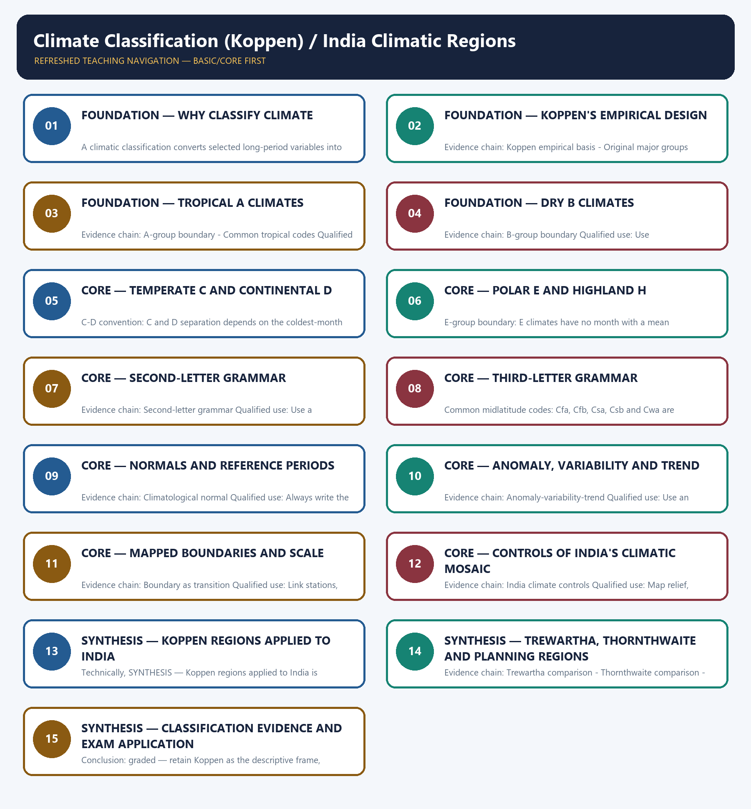

# Climate Classification (Koppen) / India Climatic Regions — Learner-v2 Complete Learning Session

> **Authoring-only generation:** 2026-09-01. No PDF was rendered and no tracker or index was mutated.

### SOURCE, PROGRESSION AND CURRENT-LINKAGE AUDIT

- **Generation date:** 2026-09-01.
- **Repository-first evidence:** the Basic owner is taught first and preserved in full; the Advanced owner is retained only in the optional final teaching block.
- **OCR evidence:** Repository Markdown was primary. The three required local Geography books were inspected as supplementary OCR/searchable evidence. No unsupported page precision, volatile figure or quotation was imported.
- **Qdrant:** not used; repository Markdown and available OCR context were sufficient.
- **PYQ integrity:** The audited routing ledgers contain no direct question owned by Geography Topic 14. Weather-element, monsoon, vegetation and crop-region questions remain with their routed owners. This package therefore records a transparent zero-direct-PYQ audit and does not invent wording, year, marks or key.
- **Live-link boundary:** IMD official climate-service material is used only to identify normals and climate-data products. No sufficiently clear official live item was found that establishes a new national Koppen map or revised region boundary, so no current code, boundary, forecast or measurement is claimed.
- **Fact/inference discipline:** no current-affairs item, PYQ wording, figure or quotation is invented.

## BASIC LEARNING SESSION

### DEEP-REVIEW LEARNING CONTRACT

| Control | Binding rule for this package |
|---|---|
| Syllabus boundary | Complete physical process, spatial pattern and India anchor are taught before optional Advanced depth. |
| Causal method | Initial condition → energy/force or driver → mechanism → landform/climate/ocean pattern → consequence → feedback/limit. |
| Spatial method | Latitude, altitude, continentality, relief, plate setting, basin/coast orientation and map scale are explicit. |
| Terminology | Close terms are defined on common axes; process, form, region, hazard, regulation and current status are never collapsed. |
| Evidence method | Claim → named place/map/process/official record → analysis → qualification. |
| Practice contract | Every solved item has demand decoding, a detailed examiner-grade model, executable timed/compression plan, marks rationale and answer-specific improvement. |
| Approval | This immutable successor remains `approved: false` pending explicit approval. |

**Canonical Basic/Core owner:** `upsc-ai-kit\knowledge\Geography\basic\14_Climate-Classification-Koppen.md`  
**Canonical topic owner:** `upsc-ai-kit\knowledge\Geography\basic\14_Climate-Classification-Koppen.md`  
**Optional Advanced owner:** `upsc-ai-kit\knowledge\Geography\advanced\14_India-Climatic-Regions.md`  
**Official syllabus mapping:** `upsc-ai-kit\knowledge\Geography\OFFICIAL-UPSC-SYLLABUS-MAPPING.md`

### EVIDENCE, PYQ AND CURRENT-STATUS CONTROL

- **Process discipline:** no feature is listed without formation sequence, controlling variables and a limiting condition.
- **Map discipline:** distribution is reconstructed through latitude, plate/relief setting, wind/current direction, drainage/coast orientation and named anchors.
- **Quantitative discipline:** coordinates, thresholds, magnitudes, dates, counts and project dimensions retain units, source/date and uncertainty.
- **Causal discipline:** association is not treated as sufficiency; interacting controls, scale, lag, feedback and exceptions are stated.
- **PYQ discipline:** repository routing ledgers and held papers control wording and metadata; reconstructed wording and unavailable official keys remain labelled.
- **Current-status note, rechecked 2026-09-01:** IMD official climate-service material is used only to identify normals and climate-data products. No sufficiently clear official live item was found that establishes a new national Koppen map or revised region boundary, so no current code, boundary, forecast or measurement is claimed.

**Live/official context sources recorded by the predecessor generation:**

- `https://mausam.imd.gov.in/imd_latest/contents/pdf/pubbrochures/Climate%20Services.pdf`
- `https://mausam.imd.gov.in/`




*Distinct embedded teaching-navigation image. The separate continuous Cārvāka-style flowchart package remains an independent at-a-glance artifact.*

### SESSION 1 — FOUNDATION — WHY CLASSIFY CLIMATE

#### DEFINITION / WHAT THIS IS CALLED

**Plain-language definition:** Climate classification groups recurring temperature and moisture patterns so places can be compared and mapped.

**Technical definition:** A climatic classification converts selected long-period variables into threshold-defined spatial classes whose validity depends on reference period, resolution, interpolation and intended analytical or planning purpose.

#### ANSWER-GRABBING OPENING — WRITE/ADAPT IN THE EXAM

> A climate class is a transparent model of recurring conditions, not a natural wall or a substitute for causal explanation.

#### MUST-WRITE KEYWORDS

- **classification purpose**
- **variables**
- **thresholds**
- **reference period**
- **spatial scale**
- **model limits**

**How to use them:** State the purpose, variables, period and scale first; explain the threshold rule; then treat the mapped boundary as a transition and disclose what the chosen scheme cannot represent.

#### VISUAL FIRST

```text
WHY CLASSIFY CLIMATE
01. Classification purpose
BOUNDARY -> Every map needs a stated purpose and scale.
```

*This topic-specific rail fixes the evidence sequence and its exam boundary before analysis.*

#### CORE EXPLANATION

A climate classification simplifies long-period temperature and moisture patterns for comparison, mapping or planning; its classes depend on variables, thresholds, period, scale and purpose.

#### NAMED EVIDENCE AND MECHANISM

- **Classification purpose:** A climate classification simplifies long-period temperature and moisture patterns for comparison, mapping or planning; its classes depend on variables, thresholds, period, scale and purpose.

#### EXAMINER CAUTION

- Every map needs a stated purpose and scale.

#### EXAM LINK

- **Prelims:** Separate the agent, landform, location, status and scale attached to Why classify climate.
- **Mains:** Begin with model utility and limits.

#### MINI RECAP

- **Evidence chain:** Classification purpose
- **Qualified use:** Begin with model utility and limits.

#### CLOSING RECALL FLOW — FOUNDATION — WHY CLASSIFY CLIMATE

```text
START / CONCEPT: FOUNDATION — Why classify climate
        |
        v
EXACT TERMS: classification purpose · variables · thresholds · reference period · spatial scale · model limits
        |
        v
MECHANISM / ARGUMENT: Evidence chain: Classification purpose Qualified use: Begin with model utility and limits.
        |
        v
CONSEQUENCE / CONTRAST: The resulting consequence is that begin with model utility and limits.
        |
        v
UPSC TRAP / ANSWER-USE: Do not miss this limiting distinction: begin with model utility and limits.
        |
        v
ANSWER-GRABBING FORMULATION: A climate class is a transparent model of recurring conditions, not a natural wall or a substitute for causal explanation.
```
### SESSION 2 — FOUNDATION — KOPPEN'S EMPIRICAL DESIGN

#### DEFINITION / WHAT THIS IS CALLED

**Plain-language definition:** Koppen empirical basis: Koppen's system is empirical and vegetation-linked, using observed temperature and precipitation thresholds rather than directly classifying air masses or causal circulation.

**Technical definition:** Evidence chain: Koppen empirical basis - Original major groups Qualified use: Explain the original A-E architecture.

#### ANSWER-GRABBING OPENING — WRITE/ADAPT IN THE EXAM

> Evidence chain: Koppen empirical basis - Original major groups Qualified use: Explain the original A-E architecture.

#### MUST-WRITE KEYWORDS

- **FOUNDATION**
- **Koppen's empirical design**
- **Koppen empirical basis**
- **Original major groups**
- **Evidence chain**
- **Qualified use**

**How to use them:** Frame the answer through FOUNDATION; define Koppen's empirical design, connect Koppen empirical basis with Original major groups to explain the mechanism, and use Evidence chain for the decisive comparison or qualification.

#### VISUAL FIRST

```text
KOPPEN'S EMPIRICAL DESIGN
01. Koppen empirical basis
    |
    v
02. Original major groups
BOUNDARY -> Keep vegetation linkage separate from causation.
```

*This topic-specific rail fixes the evidence sequence and its exam boundary before analysis.*

#### CORE EXPLANATION

Koppen's system is empirical and vegetation-linked, using observed temperature and precipitation thresholds rather than directly classifying air masses or causal circulation. The original major groups are A tropical, B dry, C warm temperate, D snow or continental and E polar; H highland is a later practical addition, not an original sixth group.

#### NAMED EVIDENCE AND MECHANISM

- **Koppen empirical basis:** Koppen's system is empirical and vegetation-linked, using observed temperature and precipitation thresholds rather than directly classifying air masses or causal circulation.
- **Original major groups:** The original major groups are A tropical, B dry, C warm temperate, D snow or continental and E polar; H highland is a later practical addition, not an original sixth group.

#### EXAMINER CAUTION

- Keep vegetation linkage separate from causation.

#### EXAM LINK

- **Prelims:** Separate the agent, landform, location, status and scale attached to Koppen's empirical design.
- **Mains:** Explain the original A-E architecture.

#### MINI RECAP

- **Evidence chain:** Koppen empirical basis -> Original major groups
- **Qualified use:** Explain the original A-E architecture.

#### CLOSING RECALL FLOW — FOUNDATION — KOPPEN'S EMPIRICAL DESIGN

```text
START / CONCEPT: FOUNDATION — Koppen's empirical design
        |
        v
EXACT TERMS: FOUNDATION · Koppen's empirical design · Koppen empirical basis · Original major groups · Evidence chain · Qualified use
        |
        v
MECHANISM / ARGUMENT: Koppen empirical basis: Koppen's system is empirical and vegetation-linked, using observed temperature and precipitation thresholds rather than directly classifying air masses or causal circulation.
        |
        v
CONSEQUENCE / CONTRAST: The original major groups are A tropical, B dry, C warm temperate, D snow or continental and E polar; H highland is a later practical addition, not an original sixth group.
        |
        v
UPSC TRAP / ANSWER-USE: Do not miss this limiting distinction: mains: Explain the original A-E architecture.
        |
        v
ANSWER-GRABBING FORMULATION: Evidence chain: Koppen empirical basis - Original major groups Qualified use: Explain the original A-E architecture.
```
### SESSION 3 — FOUNDATION — TROPICAL A CLIMATES

#### DEFINITION / WHAT THIS IS CALLED

**Plain-language definition:** Common tropical codes: Af denotes tropical rainforest, Am tropical monsoon and Aw or As tropical wet-dry climates; the code describes threshold behaviour, not a complete causal explanation.

**Technical definition:** Evidence chain: A-group boundary - Common tropical codes Qualified use: Decode Af, Am and Aw/As.

#### ANSWER-GRABBING OPENING — WRITE/ADAPT IN THE EXAM

> Common tropical codes: Af denotes tropical rainforest, Am tropical monsoon and Aw or As tropical wet-dry climates; the code describes threshold behaviour, not a complete causal explanation.

#### MUST-WRITE KEYWORDS

- **FOUNDATION**
- **Tropical A climates**
- **A-group boundary**
- **Common tropical codes**
- **Evidence chain**
- **Qualified use**

**How to use them:** Frame the answer through FOUNDATION; define Tropical A climates, connect A-group boundary with Common tropical codes to explain the mechanism, and use Evidence chain for the decisive comparison or qualification.

#### VISUAL FIRST

```text
TROPICAL A CLIMATES
01. A-group boundary
    |
    v
02. Common tropical codes
BOUNDARY -> Codes express thresholds, not full mechanisms.
```

*This topic-specific rail fixes the evidence sequence and its exam boundary before analysis.*

#### CORE EXPLANATION

In the usual Koppen grammar, A climates have every month's mean temperature at least 18 degrees Celsius, with second letters expressing rainfall seasonality. Af denotes tropical rainforest, Am tropical monsoon and Aw or As tropical wet-dry climates; the code describes threshold behaviour, not a complete causal explanation.

#### NAMED EVIDENCE AND MECHANISM

- **A-group boundary:** In the usual Koppen grammar, A climates have every month's mean temperature at least 18 degrees Celsius, with second letters expressing rainfall seasonality.
- **Common tropical codes:** Af denotes tropical rainforest, Am tropical monsoon and Aw or As tropical wet-dry climates; the code describes threshold behaviour, not a complete causal explanation.

#### EXAMINER CAUTION

- Codes express thresholds, not full mechanisms.

#### EXAM LINK

- **Prelims:** Separate the agent, landform, location, status and scale attached to Tropical A climates.
- **Mains:** Decode Af, Am and Aw/As.

#### MINI RECAP

- **Evidence chain:** A-group boundary -> Common tropical codes
- **Qualified use:** Decode Af, Am and Aw/As.

#### CLOSING RECALL FLOW — FOUNDATION — TROPICAL A CLIMATES

```text
START / CONCEPT: FOUNDATION — Tropical A climates
        |
        v
EXACT TERMS: FOUNDATION · Tropical A climates · A-group boundary · Common tropical codes · Evidence chain · Qualified use
        |
        v
MECHANISM / ARGUMENT: Evidence chain: A-group boundary - Common tropical codes Qualified use: Decode Af, Am and Aw/As.
        |
        v
CONSEQUENCE / CONTRAST: A-group boundary: In the usual Koppen grammar, A climates have every month's mean temperature at least 18 degrees Celsius, with second letters expressing rainfall seasonality.
        |
        v
UPSC TRAP / ANSWER-USE: Do not miss this limiting distinction: af denotes tropical rainforest, Am tropical monsoon and Aw or As tropical wet-dry climates.
        |
        v
ANSWER-GRABBING FORMULATION: Common tropical codes: Af denotes tropical rainforest, Am tropical monsoon and Aw or As tropical wet-dry climates; the code describes threshold behaviour, not a complete causal explanation.
```
### SESSION 4 — FOUNDATION — DRY B CLIMATES

#### DEFINITION / WHAT THIS IS CALLED

**Plain-language definition:** B-group boundary: B climates are defined first by precipitation falling below a temperature- and season-dependent dryness threshold, then divided into desert BW and steppe BS.

**Technical definition:** Evidence chain: B-group boundary Qualified use: Use precipitation-demand logic.

#### ANSWER-GRABBING OPENING — WRITE/ADAPT IN THE EXAM

> B-group boundary: B climates are defined first by precipitation falling below a temperature- and season-dependent dryness threshold, then divided into desert BW and steppe BS.

#### MUST-WRITE KEYWORDS

- **FOUNDATION**
- **Dry B climates**
- **B-group boundary**
- **Evidence chain**
- **Qualified use**
- **B climates**

**How to use them:** Frame the answer through FOUNDATION; define Dry B climates, connect B-group boundary with Evidence chain to explain the mechanism, and use Qualified use for the decisive comparison or qualification.

#### VISUAL FIRST

```text
DRY B CLIMATES
01. B-group boundary
BOUNDARY -> Apply dryness before desert-steppe division.
```

*This topic-specific rail fixes the evidence sequence and its exam boundary before analysis.*

#### CORE EXPLANATION

B climates are defined first by precipitation falling below a temperature- and season-dependent dryness threshold, then divided into desert BW and steppe BS.

#### NAMED EVIDENCE AND MECHANISM

- **B-group boundary:** B climates are defined first by precipitation falling below a temperature- and season-dependent dryness threshold, then divided into desert BW and steppe BS.

#### EXAMINER CAUTION

- Apply dryness before desert-steppe division.

#### EXAM LINK

- **Prelims:** Separate the agent, landform, location, status and scale attached to Dry B climates.
- **Mains:** Use precipitation-demand logic.

#### MINI RECAP

- **Evidence chain:** B-group boundary
- **Qualified use:** Use precipitation-demand logic.

#### CLOSING RECALL FLOW — FOUNDATION — DRY B CLIMATES

```text
START / CONCEPT: FOUNDATION — Dry B climates
        |
        v
EXACT TERMS: FOUNDATION · Dry B climates · B-group boundary · Evidence chain · Qualified use · B climates
        |
        v
MECHANISM / ARGUMENT: Evidence chain: B-group boundary Qualified use: Use precipitation-demand logic.
        |
        v
CONSEQUENCE / CONTRAST: The resulting consequence is that b climates are defined first by precipitation falling below a temperature- and season-dependent dryness...
        |
        v
UPSC TRAP / ANSWER-USE: Do not miss this limiting distinction: b climates are defined first by precipitation falling below a temperature- and season-dependent dryness...
        |
        v
ANSWER-GRABBING FORMULATION: B-group boundary: B climates are defined first by precipitation falling below a temperature- and season-dependent dryness threshold, then divided into desert BW and steppe BS.
```
### SESSION 5 — CORE — TEMPERATE C AND CONTINENTAL D

#### DEFINITION / WHAT THIS IS CALLED

**Plain-language definition:** Evidence chain: C-D convention Qualified use: Show why maps may differ.

**Technical definition:** C-D convention: C and D separation depends on the coldest-month threshold, for which minus 3 degrees Celsius and 0 degrees Celsius conventions both occur; an answer must state the convention.

#### ANSWER-GRABBING OPENING — WRITE/ADAPT IN THE EXAM

> Evidence chain: C-D convention Qualified use: Show why maps may differ.

#### MUST-WRITE KEYWORDS

- **Temperate C**
- **continental D**
- **C-D convention**
- **Evidence chain**
- **Qualified use**
- **Celsius**

**How to use them:** Frame the answer through Temperate C; define continental D, connect C-D convention with Evidence chain to explain the mechanism, and use Qualified use for the decisive comparison or qualification.

#### VISUAL FIRST

```text
TEMPERATE C AND CONTINENTAL D
01. C-D convention
BOUNDARY -> State the minus 3 or 0 degree convention.
```

*This topic-specific rail fixes the evidence sequence and its exam boundary before analysis.*

#### CORE EXPLANATION

C and D separation depends on the coldest-month threshold, for which minus 3 degrees Celsius and 0 degrees Celsius conventions both occur; an answer must state the convention.

#### NAMED EVIDENCE AND MECHANISM

- **C-D convention:** C and D separation depends on the coldest-month threshold, for which minus 3 degrees Celsius and 0 degrees Celsius conventions both occur; an answer must state the convention.

#### EXAMINER CAUTION

- State the minus 3 or 0 degree convention.

#### EXAM LINK

- **Prelims:** Separate the agent, landform, location, status and scale attached to Temperate C and continental D.
- **Mains:** Show why maps may differ.

#### MINI RECAP

- **Evidence chain:** C-D convention
- **Qualified use:** Show why maps may differ.

#### CLOSING RECALL FLOW — CORE — TEMPERATE C AND CONTINENTAL D

```text
START / CONCEPT: CORE — Temperate C and continental D
        |
        v
EXACT TERMS: Temperate C · continental D · C-D convention · Evidence chain · Qualified use · Celsius
        |
        v
MECHANISM / ARGUMENT: C-D convention: C and D separation depends on the coldest-month threshold, for which minus 3 degrees Celsius and 0 degrees Celsius conventions both occur; an answer must state the convention.
        |
        v
CONSEQUENCE / CONTRAST: Mains: Show why maps may differ.
        |
        v
UPSC TRAP / ANSWER-USE: Do not miss this limiting distinction: evidence chain: C-D convention Qualified use: Show why maps may differ.
        |
        v
ANSWER-GRABBING FORMULATION: Evidence chain: C-D convention Qualified use: Show why maps may differ.
```
### SESSION 6 — CORE — POLAR E AND HIGHLAND H

#### DEFINITION / WHAT THIS IS CALLED

**Plain-language definition:** Evidence chain: E-group boundary Qualified use: Separate thermal polar limits from elevation.

**Technical definition:** E-group boundary: E climates have no month with a mean temperature of at least 10 degrees Celsius, separating tundra ET from ice-cap EF by the warmest-month condition.

#### ANSWER-GRABBING OPENING — WRITE/ADAPT IN THE EXAM

> Evidence chain: E-group boundary Qualified use: Separate thermal polar limits from elevation.

#### MUST-WRITE KEYWORDS

- **Polar E**
- **highland H**
- **E-group boundary**
- **Evidence chain**
- **Qualified use**
- **Celsius**

**How to use them:** Frame the answer through Polar E; define highland H, connect E-group boundary with Evidence chain to explain the mechanism, and use Qualified use for the decisive comparison or qualification.

#### VISUAL FIRST

```text
POLAR E AND HIGHLAND H
01. E-group boundary
BOUNDARY -> H is a later practical addition.
```

*This topic-specific rail fixes the evidence sequence and its exam boundary before analysis.*

#### CORE EXPLANATION

E climates have no month with a mean temperature of at least 10 degrees Celsius, separating tundra ET from ice-cap EF by the warmest-month condition.

#### NAMED EVIDENCE AND MECHANISM

- **E-group boundary:** E climates have no month with a mean temperature of at least 10 degrees Celsius, separating tundra ET from ice-cap EF by the warmest-month condition.

#### EXAMINER CAUTION

- H is a later practical addition.

#### EXAM LINK

- **Prelims:** Separate the agent, landform, location, status and scale attached to Polar E and highland H.
- **Mains:** Separate thermal polar limits from elevation.

#### MINI RECAP

- **Evidence chain:** E-group boundary
- **Qualified use:** Separate thermal polar limits from elevation.

#### CLOSING RECALL FLOW — CORE — POLAR E AND HIGHLAND H

```text
START / CONCEPT: CORE — Polar E and highland H
        |
        v
EXACT TERMS: Polar E · highland H · E-group boundary · Evidence chain · Qualified use · Celsius
        |
        v
MECHANISM / ARGUMENT: E-group boundary: E climates have no month with a mean temperature of at least 10 degrees Celsius, separating tundra ET from ice-cap EF by the warmest-month condition.
        |
        v
CONSEQUENCE / CONTRAST: H is a later practical addition.
        |
        v
UPSC TRAP / ANSWER-USE: Do not miss this limiting distinction: separate thermal polar limits from elevation.
        |
        v
ANSWER-GRABBING FORMULATION: Evidence chain: E-group boundary Qualified use: Separate thermal polar limits from elevation.
```
### SESSION 7 — CORE — SECOND-LETTER GRAMMAR

#### DEFINITION / WHAT THIS IS CALLED

**Plain-language definition:** Second-letter grammar: For A, C and D climates, f indicates no dry season, s a dry summer and w a dry winter; m denotes monsoon in the A group.

**Technical definition:** Evidence chain: Second-letter grammar Qualified use: Use a seasonality key.

#### ANSWER-GRABBING OPENING — WRITE/ADAPT IN THE EXAM

> Second-letter grammar: For A, C and D climates, f indicates no dry season, s a dry summer and w a dry winter; m denotes monsoon in the A group.

#### MUST-WRITE KEYWORDS

- **Second-letter grammar**
- **Evidence chain**
- **Qualified use**
- **For**
- **Second-letter**
- **Qualified**

**How to use them:** Frame the answer through Second-letter grammar; define Evidence chain, connect Qualified use with For to explain the mechanism, and use Second-letter for the decisive comparison or qualification.

#### VISUAL FIRST

```text
SECOND-LETTER GRAMMAR
01. Second-letter grammar
BOUNDARY -> Do not reverse s and w.
```

*This topic-specific rail fixes the evidence sequence and its exam boundary before analysis.*

#### CORE EXPLANATION

For A, C and D climates, f indicates no dry season, s a dry summer and w a dry winter; m denotes monsoon in the A group.

#### NAMED EVIDENCE AND MECHANISM

- **Second-letter grammar:** For A, C and D climates, f indicates no dry season, s a dry summer and w a dry winter; m denotes monsoon in the A group.

#### EXAMINER CAUTION

- Do not reverse s and w.

#### EXAM LINK

- **Prelims:** Separate the agent, landform, location, status and scale attached to Second-letter grammar.
- **Mains:** Use a seasonality key.

#### MINI RECAP

- **Evidence chain:** Second-letter grammar
- **Qualified use:** Use a seasonality key.

#### CLOSING RECALL FLOW — CORE — SECOND-LETTER GRAMMAR

```text
START / CONCEPT: CORE — Second-letter grammar
        |
        v
EXACT TERMS: Second-letter grammar · Evidence chain · Qualified use · For · Second-letter · Qualified
        |
        v
MECHANISM / ARGUMENT: Evidence chain: Second-letter grammar Qualified use: Use a seasonality key.
        |
        v
CONSEQUENCE / CONTRAST: Do not reverse s and w.
        |
        v
UPSC TRAP / ANSWER-USE: Do not miss this limiting distinction: for A, C and D climates, f indicates no dry season, s a dry...
        |
        v
ANSWER-GRABBING FORMULATION: Second-letter grammar: For A, C and D climates, f indicates no dry season, s a dry summer and w a dry winter; m denotes monsoon in the A group.
```
### SESSION 8 — CORE — THIRD-LETTER GRAMMAR

#### DEFINITION / WHAT THIS IS CALLED

**Plain-language definition:** Evidence chain: Third-letter grammar - Common midlatitude codes Qualified use: Decode common midlatitude codes.

**Technical definition:** Common midlatitude codes: Cfa, Cfb, Csa, Csb and Cwa are combinations of moisture seasonality and summer-temperature letters; similar code labels can mask different local mechanisms.

#### ANSWER-GRABBING OPENING — WRITE/ADAPT IN THE EXAM

> Evidence chain: Third-letter grammar - Common midlatitude codes Qualified use: Decode common midlatitude codes.

#### MUST-WRITE KEYWORDS

- **Third-letter grammar**
- **Common midlatitude codes**
- **Evidence chain**
- **Qualified use**
- **Cfa, Cfb, Csa, Csb and Cwa**
- **Cfa**

**How to use them:** Frame the answer through Third-letter grammar; define Common midlatitude codes, connect Evidence chain with Qualified use to explain the mechanism, and use Cfa, Cfb, Csa, Csb and Cwa for the decisive comparison or qualification.

#### VISUAL FIRST

```text
THIRD-LETTER GRAMMAR
01. Third-letter grammar
    |
    v
02. Common midlatitude codes
BOUNDARY -> Later letters refine, not replace, the first group.
```

*This topic-specific rail fixes the evidence sequence and its exam boundary before analysis.*

#### CORE EXPLANATION

For C and D climates, a, b, c and d refine summer warmth or winter severity, while h and k commonly refine hot and cold dry climates in B-group applications. Cfa, Cfb, Csa, Csb and Cwa are combinations of moisture seasonality and summer-temperature letters; similar code labels can mask different local mechanisms.

#### NAMED EVIDENCE AND MECHANISM

- **Third-letter grammar:** For C and D climates, a, b, c and d refine summer warmth or winter severity, while h and k commonly refine hot and cold dry climates in B-group applications.
- **Common midlatitude codes:** Cfa, Cfb, Csa, Csb and Cwa are combinations of moisture seasonality and summer-temperature letters; similar code labels can mask different local mechanisms.

#### EXAMINER CAUTION

- Later letters refine, not replace, the first group.

#### EXAM LINK

- **Prelims:** Separate the agent, landform, location, status and scale attached to Third-letter grammar.
- **Mains:** Decode common midlatitude codes.

#### MINI RECAP

- **Evidence chain:** Third-letter grammar -> Common midlatitude codes
- **Qualified use:** Decode common midlatitude codes.

#### CLOSING RECALL FLOW — CORE — THIRD-LETTER GRAMMAR

```text
START / CONCEPT: CORE — Third-letter grammar
        |
        v
EXACT TERMS: Third-letter grammar · Common midlatitude codes · Evidence chain · Qualified use · Cfa, Cfb, Csa, Csb and Cwa · Cfa
        |
        v
MECHANISM / ARGUMENT: Common midlatitude codes: Cfa, Cfb, Csa, Csb and Cwa are combinations of moisture seasonality and summer-temperature letters; similar code labels can mask different local mechanisms.
        |
        v
CONSEQUENCE / CONTRAST: The resulting consequence is that third-letter grammar - Common midlatitude codes Qualified use.
        |
        v
UPSC TRAP / ANSWER-USE: Do not miss this limiting distinction: third-letter grammar - Common midlatitude codes Qualified use.
        |
        v
ANSWER-GRABBING FORMULATION: Evidence chain: Third-letter grammar - Common midlatitude codes Qualified use: Decode common midlatitude codes.
```
### SESSION 9 — CORE — NORMALS AND REFERENCE PERIODS

#### DEFINITION / WHAT THIS IS CALLED

**Plain-language definition:** A climatological normal is a reference average, normally over 30 years; it is a baseline for anomalies rather than a forecast or promise of typical weather.

**Technical definition:** Evidence chain: Climatological normal Qualified use: Always write the period beside the map.

#### ANSWER-GRABBING OPENING — WRITE/ADAPT IN THE EXAM

> A climatological normal is a reference average, normally over 30 years; it is a baseline for anomalies rather than a forecast or promise of typical weather.

#### MUST-WRITE KEYWORDS

- **Normals**
- **reference periods**
- **Climatological normal**
- **Evidence chain**
- **Qualified use**
- **A climatological normal**

**How to use them:** Frame the answer through Normals; define reference periods, connect Climatological normal with Evidence chain to explain the mechanism, and use Qualified use for the decisive comparison or qualification.

#### VISUAL FIRST

```text
NORMALS AND REFERENCE PERIODS
01. Climatological normal
BOUNDARY -> A normal is a baseline, not predicted weather.
```

*This topic-specific rail fixes the evidence sequence and its exam boundary before analysis.*

#### CORE EXPLANATION

A climatological normal is a reference average, normally over 30 years; it is a baseline for anomalies rather than a forecast or promise of typical weather.

#### NAMED EVIDENCE AND MECHANISM

- **Climatological normal:** A climatological normal is a reference average, normally over 30 years; it is a baseline for anomalies rather than a forecast or promise of typical weather.

#### EXAMINER CAUTION

- A normal is a baseline, not predicted weather.

#### EXAM LINK

- **Prelims:** Separate the agent, landform, location, status and scale attached to Normals and reference periods.
- **Mains:** Always write the period beside the map.

#### MINI RECAP

- **Evidence chain:** Climatological normal
- **Qualified use:** Always write the period beside the map.

#### CLOSING RECALL FLOW — CORE — NORMALS AND REFERENCE PERIODS

```text
START / CONCEPT: CORE — Normals and reference periods
        |
        v
EXACT TERMS: Normals · reference periods · Climatological normal · Evidence chain · Qualified use · A climatological normal
        |
        v
MECHANISM / ARGUMENT: Evidence chain: Climatological normal Qualified use: Always write the period beside the map.
        |
        v
CONSEQUENCE / CONTRAST: A normal is a baseline, not predicted weather.
        |
        v
UPSC TRAP / ANSWER-USE: Do not miss this limiting distinction: always write the period beside the map.
        |
        v
ANSWER-GRABBING FORMULATION: A climatological normal is a reference average, normally over 30 years; it is a baseline for anomalies rather than a forecast or promise of typical weather.
```
### SESSION 10 — CORE — ANOMALY, VARIABILITY AND TREND

#### DEFINITION / WHAT THIS IS CALLED

**Plain-language definition:** Anomaly-variability-trend: An anomaly is departure from a stated normal, variability is fluctuation around a reference and trend is a multi-period direction; one month or season cannot redraw a climate region.

**Technical definition:** Evidence chain: Anomaly-variability-trend Qualified use: Use an evidence-strength ladder.

#### ANSWER-GRABBING OPENING — WRITE/ADAPT IN THE EXAM

> Anomaly-variability-trend: An anomaly is departure from a stated normal, variability is fluctuation around a reference and trend is a multi-period direction; one month or season cannot redraw a climate region.

#### MUST-WRITE KEYWORDS

- **Anomaly**
- **variability**
- **trend**
- **Anomaly-variability-trend**
- **Evidence chain**
- **Qualified use**

**How to use them:** Frame the answer through Anomaly; define variability, connect trend with Anomaly-variability-trend to explain the mechanism, and use Evidence chain for the decisive comparison or qualification.

#### VISUAL FIRST

```text
ANOMALY, VARIABILITY AND TREND
01. Anomaly-variability-trend
BOUNDARY -> One event cannot establish a trend.
```

*This topic-specific rail fixes the evidence sequence and its exam boundary before analysis.*

#### CORE EXPLANATION

An anomaly is departure from a stated normal, variability is fluctuation around a reference and trend is a multi-period direction; one month or season cannot redraw a climate region.

#### NAMED EVIDENCE AND MECHANISM

- **Anomaly-variability-trend:** An anomaly is departure from a stated normal, variability is fluctuation around a reference and trend is a multi-period direction; one month or season cannot redraw a climate region.

#### EXAMINER CAUTION

- One event cannot establish a trend.

#### EXAM LINK

- **Prelims:** Separate the agent, landform, location, status and scale attached to Anomaly, variability and trend.
- **Mains:** Use an evidence-strength ladder.

#### MINI RECAP

- **Evidence chain:** Anomaly-variability-trend
- **Qualified use:** Use an evidence-strength ladder.

#### CLOSING RECALL FLOW — CORE — ANOMALY, VARIABILITY AND TREND

```text
START / CONCEPT: CORE — Anomaly, variability and trend
        |
        v
EXACT TERMS: Anomaly · variability · trend · Anomaly-variability-trend · Evidence chain · Qualified use
        |
        v
MECHANISM / ARGUMENT: Evidence chain: Anomaly-variability-trend Qualified use: Use an evidence-strength ladder.
        |
        v
CONSEQUENCE / CONTRAST: The resulting consequence is that an anomaly is departure from a stated normal, variability is fluctuation around a reference...
        |
        v
UPSC TRAP / ANSWER-USE: Do not miss this limiting distinction: an anomaly is departure from a stated normal, variability is fluctuation around a reference...
        |
        v
ANSWER-GRABBING FORMULATION: Anomaly-variability-trend: An anomaly is departure from a stated normal, variability is fluctuation around a reference and trend is a multi-period direction; one month or season cannot redraw a climate region.
```
### SESSION 11 — CORE — MAPPED BOUNDARIES AND SCALE

#### DEFINITION / WHAT THIS IS CALLED

**Plain-language definition:** Boundary as transition: A mapped climatic boundary is a modelled transition based on gridded or station data and interpolation, not a wall visible on the ground.

**Technical definition:** Evidence chain: Boundary as transition Qualified use: Link stations, grids and interpolation.

#### ANSWER-GRABBING OPENING — WRITE/ADAPT IN THE EXAM

> Boundary as transition: A mapped climatic boundary is a modelled transition based on gridded or station data and interpolation, not a wall visible on the ground.

#### MUST-WRITE KEYWORDS

- **Mapped boundaries**
- **scale**
- **Boundary as transition**
- **Evidence chain**
- **Qualified use**
- **A mapped climatic boundary**

**How to use them:** Frame the answer through Mapped boundaries; define scale, connect Boundary as transition with Evidence chain to explain the mechanism, and use Qualified use for the decisive comparison or qualification.

#### VISUAL FIRST

```text
MAPPED BOUNDARIES AND SCALE
01. Boundary as transition
BOUNDARY -> Classification zones are transitional.
```

*This topic-specific rail fixes the evidence sequence and its exam boundary before analysis.*

#### CORE EXPLANATION

A mapped climatic boundary is a modelled transition based on gridded or station data and interpolation, not a wall visible on the ground.

#### NAMED EVIDENCE AND MECHANISM

- **Boundary as transition:** A mapped climatic boundary is a modelled transition based on gridded or station data and interpolation, not a wall visible on the ground.

#### EXAMINER CAUTION

- Classification zones are transitional.

#### EXAM LINK

- **Prelims:** Separate the agent, landform, location, status and scale attached to Mapped boundaries and scale.
- **Mains:** Link stations, grids and interpolation.

#### MINI RECAP

- **Evidence chain:** Boundary as transition
- **Qualified use:** Link stations, grids and interpolation.

#### CLOSING RECALL FLOW — CORE — MAPPED BOUNDARIES AND SCALE

```text
START / CONCEPT: CORE — Mapped boundaries and scale
        |
        v
EXACT TERMS: Mapped boundaries · scale · Boundary as transition · Evidence chain · Qualified use · A mapped climatic boundary
        |
        v
MECHANISM / ARGUMENT: Evidence chain: Boundary as transition Qualified use: Link stations, grids and interpolation.
        |
        v
CONSEQUENCE / CONTRAST: The resulting consequence is that a mapped climatic boundary is a modelled transition based on gridded or station data...
        |
        v
UPSC TRAP / ANSWER-USE: Do not miss this limiting distinction: a mapped climatic boundary is a modelled transition based on gridded or station data...
        |
        v
ANSWER-GRABBING FORMULATION: Boundary as transition: A mapped climatic boundary is a modelled transition based on gridded or station data and interpolation, not a wall visible on the ground.
```
### SESSION 12 — CORE — CONTROLS OF INDIA'S CLIMATIC MOSAIC

#### DEFINITION / WHAT THIS IS CALLED

**Plain-language definition:** India climate controls: India's climatic patterns reflect latitude, altitude, relief, continentality, monsoon circulation, western disturbances, tropical systems and ocean-atmosphere variability acting together.

**Technical definition:** Evidence chain: India climate controls Qualified use: Map relief, distance and circulation controls.

#### ANSWER-GRABBING OPENING — WRITE/ADAPT IN THE EXAM

> India climate controls: India's climatic patterns reflect latitude, altitude, relief, continentality, monsoon circulation, western disturbances, tropical systems and ocean-atmosphere variability acting together.

#### MUST-WRITE KEYWORDS

- **Controls of India's climatic mosaic**
- **India climate controls**
- **Evidence chain**
- **Qualified use**
- **India's**
- **India**

**How to use them:** Frame the answer through Controls of India's climatic mosaic; define India climate controls, connect Evidence chain with Qualified use to explain the mechanism, and use India's for the decisive comparison or qualification.

#### VISUAL FIRST

```text
CONTROLS OF INDIA'S CLIMATIC MOSAIC
01. India climate controls
BOUNDARY -> Reject one-factor monsoon explanations.
```

*This topic-specific rail fixes the evidence sequence and its exam boundary before analysis.*

#### CORE EXPLANATION

India's climatic patterns reflect latitude, altitude, relief, continentality, monsoon circulation, western disturbances, tropical systems and ocean-atmosphere variability acting together.

#### NAMED EVIDENCE AND MECHANISM

- **India climate controls:** India's climatic patterns reflect latitude, altitude, relief, continentality, monsoon circulation, western disturbances, tropical systems and ocean-atmosphere variability acting together.

#### EXAMINER CAUTION

- Reject one-factor monsoon explanations.

#### EXAM LINK

- **Prelims:** Separate the agent, landform, location, status and scale attached to Controls of India's climatic mosaic.
- **Mains:** Map relief, distance and circulation controls.

#### MINI RECAP

- **Evidence chain:** India climate controls
- **Qualified use:** Map relief, distance and circulation controls.

#### CLOSING RECALL FLOW — CORE — CONTROLS OF INDIA'S CLIMATIC MOSAIC

```text
START / CONCEPT: CORE — Controls of India's climatic mosaic
        |
        v
EXACT TERMS: Controls of India's climatic mosaic · India climate controls · Evidence chain · Qualified use · India's · India
        |
        v
MECHANISM / ARGUMENT: Evidence chain: India climate controls Qualified use: Map relief, distance and circulation controls.
        |
        v
CONSEQUENCE / CONTRAST: The resulting consequence is that india's climatic patterns reflect latitude, altitude, relief, continentality, monsoon circulation, western disturbances, tropical systems...
        |
        v
UPSC TRAP / ANSWER-USE: Do not miss this limiting distinction: india's climatic patterns reflect latitude, altitude, relief, continentality, monsoon circulation, western disturbances, tropical systems...
        |
        v
ANSWER-GRABBING FORMULATION: India climate controls: India's climatic patterns reflect latitude, altitude, relief, continentality, monsoon circulation, western disturbances, tropical systems and ocean-atmosphere variability acting together.
```
### SESSION 13 — SYNTHESIS — KOPPEN REGIONS APPLIED TO INDIA

#### DEFINITION / WHAT THIS IS CALLED

**Plain-language definition:** Evidence chain: India Koppen application Qualified use: Name dataset and convention before boundaries.

**Technical definition:** Technically, SYNTHESIS — Koppen regions applied to India is analysed by relating SYNTHESIS to Koppen regions applied to India, then testing the relationship through India Koppen application and Evidence chain.

#### ANSWER-GRABBING OPENING — WRITE/ADAPT IN THE EXAM

> Evidence chain: India Koppen application Qualified use: Name dataset and convention before boundaries.

#### MUST-WRITE KEYWORDS

- **SYNTHESIS**
- **Koppen regions applied to India**
- **India Koppen application**
- **Evidence chain**
- **Qualified use**
- **India Koppen**

**How to use them:** Frame the answer through SYNTHESIS; define Koppen regions applied to India, connect India Koppen application with Evidence chain to explain the mechanism, and use Qualified use for the decisive comparison or qualification.

#### VISUAL FIRST

```text
KOPPEN REGIONS APPLIED TO INDIA
01. India Koppen application
BOUNDARY -> Do not claim one immutable code map.
```

*This topic-specific rail fixes the evidence sequence and its exam boundary before analysis.*

#### CORE EXPLANATION

Applied maps commonly identify tropical wet, monsoon, wet-dry, arid, semi-arid, humid subtropical or temperate and highland sectors, but exact codes and boundaries vary by dataset and convention.

#### NAMED EVIDENCE AND MECHANISM

- **India Koppen application:** Applied maps commonly identify tropical wet, monsoon, wet-dry, arid, semi-arid, humid subtropical or temperate and highland sectors, but exact codes and boundaries vary by dataset and convention.

#### EXAMINER CAUTION

- Do not claim one immutable code map.

#### EXAM LINK

- **Prelims:** Separate the agent, landform, location, status and scale attached to Koppen regions applied to India.
- **Mains:** Name dataset and convention before boundaries.

#### MINI RECAP

- **Evidence chain:** India Koppen application
- **Qualified use:** Name dataset and convention before boundaries.

#### CLOSING RECALL FLOW — SYNTHESIS — KOPPEN REGIONS APPLIED TO INDIA

```text
START / CONCEPT: SYNTHESIS — Koppen regions applied to India
        |
        v
EXACT TERMS: SYNTHESIS · Koppen regions applied to India · India Koppen application · Evidence chain · Qualified use · India Koppen
        |
        v
MECHANISM / ARGUMENT: Do not claim one immutable code map.
        |
        v
CONSEQUENCE / CONTRAST: The resulting consequence is that name dataset and convention before boundaries.
        |
        v
UPSC TRAP / ANSWER-USE: Do not miss this limiting distinction: name dataset and convention before boundaries.
        |
        v
ANSWER-GRABBING FORMULATION: Evidence chain: India Koppen application Qualified use: Name dataset and convention before boundaries.
```
### SESSION 14 — SYNTHESIS — TREWARTHA, THORNTHWAITE AND PLANNING REGIONS

#### DEFINITION / WHAT THIS IS CALLED

**Plain-language definition:** Agro-climatic regions organise climate and cropping conditions, whereas agro-ecological regions additionally integrate soils, landform and growing period; neither is identical to a Koppen map.

**Technical definition:** Evidence chain: Trewartha comparison - Thornthwaite comparison - Planning-region distinction Qualified use: Compare descriptive, water-balance and land-use maps.

#### ANSWER-GRABBING OPENING — WRITE/ADAPT IN THE EXAM

> Trewartha comparison: Trewartha modifies Koppen to give middle-latitude and subtropical thermal regimes different emphasis; it remains a classification, not a direct hazard or crop map.

#### MUST-WRITE KEYWORDS

- **SYNTHESIS**
- **Trewartha**
- **Thornthwaite**
- **planning regions**
- **Trewartha comparison**
- **Thornthwaite comparison**

**How to use them:** Frame the answer through SYNTHESIS; define Trewartha, connect Thornthwaite with planning regions to explain the mechanism, and use Trewartha comparison for the decisive comparison or qualification.

#### VISUAL FIRST

```text
TREWARTHA, THORNTHWAITE AND PLANNING REGIONS
01. Trewartha comparison
    |
    v
02. Thornthwaite comparison
    |
    v
03. Planning-region distinction
BOUNDARY -> Classification purpose decides the preferred framework.
```

*This topic-specific rail fixes the evidence sequence and its exam boundary before analysis.*

#### CORE EXPLANATION

Trewartha modifies Koppen to give middle-latitude and subtropical thermal regimes different emphasis; it remains a classification, not a direct hazard or crop map. Thornthwaite emphasises water balance and potential evapotranspiration, making it useful for moisture effectiveness while increasing data and method dependence. Agro-climatic regions organise climate and cropping conditions, whereas agro-ecological regions additionally integrate soils, landform and growing period; neither is identical to a Koppen map.

#### NAMED EVIDENCE AND MECHANISM

- **Trewartha comparison:** Trewartha modifies Koppen to give middle-latitude and subtropical thermal regimes different emphasis; it remains a classification, not a direct hazard or crop map.
- **Thornthwaite comparison:** Thornthwaite emphasises water balance and potential evapotranspiration, making it useful for moisture effectiveness while increasing data and method dependence.
- **Planning-region distinction:** Agro-climatic regions organise climate and cropping conditions, whereas agro-ecological regions additionally integrate soils, landform and growing period; neither is identical to a Koppen map.

#### EXAMINER CAUTION

- Classification purpose decides the preferred framework.

#### EXAM LINK

- **Prelims:** Separate the agent, landform, location, status and scale attached to Trewartha, Thornthwaite and planning regions.
- **Mains:** Compare descriptive, water-balance and land-use maps.

#### MINI RECAP

- **Evidence chain:** Trewartha comparison -> Thornthwaite comparison -> Planning-region distinction
- **Qualified use:** Compare descriptive, water-balance and land-use maps.

#### CLOSING RECALL FLOW — SYNTHESIS — TREWARTHA, THORNTHWAITE AND PLANNING REGIONS

```text
START / CONCEPT: SYNTHESIS — Trewartha, Thornthwaite and planning regions
        |
        v
EXACT TERMS: SYNTHESIS · Trewartha · Thornthwaite · planning regions · Trewartha comparison · Thornthwaite comparison
        |
        v
MECHANISM / ARGUMENT: Evidence chain: Trewartha comparison - Thornthwaite comparison - Planning-region distinction Qualified use: Compare descriptive, water-balance and land-use maps.
        |
        v
CONSEQUENCE / CONTRAST: Agro-climatic regions organise climate and cropping conditions, whereas agro-ecological regions additionally integrate soils, landform and growing period; neither is identical to a Koppen map.
        |
        v
UPSC TRAP / ANSWER-USE: Do not miss this limiting distinction: compare descriptive, water-balance and land-use maps.
        |
        v
ANSWER-GRABBING FORMULATION: Trewartha comparison: Trewartha modifies Koppen to give middle-latitude and subtropical thermal regimes different emphasis; it remains a classification, not a direct hazard or crop map.
```
### SESSION 15 — SYNTHESIS — CLASSIFICATION EVIDENCE AND EXAM APPLICATION

#### DEFINITION / WHAT THIS IS CALLED

**Plain-language definition:** Why this section exists: the file taught the Koppen code system but neither applied it to India nor placed it against the alternatives — so it could support a definition question but not an application or evaluation question.

**Technical definition:** Conclusion: graded — retain Koppen as the descriptive frame, supplement it with a water-balance approach for agricultural application, and treat its boundaries as moving lines rather than fixed ones.

#### ANSWER-GRABBING OPENING — WRITE/ADAPT IN THE EXAM

> Why this section exists: the file taught the Koppen code system but neither applied it to India nor placed it against the alternatives — so it could support a definition question but not an application or evaluation question.

#### MUST-WRITE KEYWORDS

- **SYNTHESIS**
- **exam application**
- **Official-data boundary**
- **Evidence chain**
- **Qualified use**
- **Subject**

**How to use them:** Frame the answer through SYNTHESIS; define exam application, connect Official-data boundary with Evidence chain to explain the mechanism, and use Qualified use for the decisive comparison or qualification.

#### VISUAL FIRST

```text
CLASSIFICATION EVIDENCE AND EXAM APPLICATION
01. Official-data boundary
BOUNDARY -> No direct route means no invented PYQ.
```

*This topic-specific rail fixes the evidence sequence and its exam boundary before analysis.*

#### CORE EXPLANATION

IMD climate services provide normals, station or gridded data and climate products, but no single immutable official Koppen map should be asserted without naming source, period, resolution and threshold convention.

#### NAMED EVIDENCE AND MECHANISM

- **Official-data boundary:** IMD climate services provide normals, station or gridded data and climate products, but no single immutable official Koppen map should be asserted without naming source, period, resolution and threshold convention.

#### EXAMINER CAUTION

- No direct route means no invented PYQ.

#### EXAM LINK

- **Prelims:** Separate the agent, landform, location, status and scale attached to Classification evidence and exam application.
- **Mains:** Close with transparent source and method discipline.

#### MINI RECAP

- **Evidence chain:** Official-data boundary
- **Qualified use:** Close with transparent source and method discipline.
#### COMPLETE BASIC OWNER EVIDENCE BANK

> **Subject:** Geography · **Tier:** Must-Do (foundation + standard) · **GS Paper:** GS-I
> **Grounded in:** G.C. Leong, *Certificate Physical & Human Geography* + Majid Husain, *Indian & World Geography*.
> ✅ = from source book · ⚠️ = inference / standard knowledge · 📰 = current affairs.
> *Companion: `advanced/14_India-Climatic-Regions.md`.*

#### 1. What Koppen did

✅ Koppen suggested **five major climate types** corresponding to five principal vegetation groups. ✅ Each climatic type is represented by a capital letter. ✅ The system is **empirical** because it uses observed temperature and precipitation values, not genetic causes such as air masses. ✅ A later **H (Highland)** group is used for undifferentiated mountain climates.

> 🔑 Trap: Koppen is vegetation-linked and data-based; it is not a causal/genetic classification.

#### 2. Major groups and criteria

| Group | Name | Defining criterion from source notes |
|---|---|---|
| ✅ A | Tropical rainy climate with no cool season | Temperature of coolest month above **18°C** |
| ✅ B | Dry climate | Excess of evaporation over precipitation |
| ✅ C | Temperate / mesothermal climate | Coldest month below **18°C** but above the C/D threshold; warmest month over **10°C** |
| ✅ D | Continental / microthermal climate | Coldest month below the C/D threshold; warmest month over **10°C** |
| ✅ E | Polar climate with no warm season | Warmest month below **10°C** |
| ✅ H | Highland climate | Added later for mountainous, undifferentiated climates |

#### 3. Letter code logic

| Letter position | Symbols | Meaning |
|---|---|---|
| ✅ First capital | A, B, C, D, E | Major climate group |
| ✅ Moist second letters | f, m, w, s | f = no dry season; m = monsoon/short dry season; w = dry winter; s = dry summer |
| ✅ Dry-climate second letters | W, S | W = desert/arid; S = steppe/semi-arid |
| ✅ Temperature letters | h/k for B; a/b/c/d for C-D | h/k distinguish hot/cold dry climates; a-d distinguish summer warmth/severity |

#### 4. Common full codes

| Code | Climate meaning |
|---|---|
| ✅ Af | Tropical rainforest |
| ✅ Am | Tropical monsoon |
| ✅ Aw | Tropical savanna with dry winter |
| ✅ BWh | Hot desert |
| ✅ BSh | Hot steppe/semi-arid |
| ✅ Cs | Mediterranean with dry summer |
| ✅ Cw | China type / dry winter warm temperate |
| ✅ Cf | Maritime / no dry season warm temperate |
| ✅ Df | Humid continental with no dry season; Siberian interiors often use dry-winter Dw codes |
| ✅ ET | Tundra |
| ✅ EF | Ice cap |

#### ➕ Isohyet & Isotherm (climatic-map PYQ gap)

> ✅ Grounded in Majid Husain + ⚠️ standard geography. Added to close a UPSC gap.

- ✅ Majid Husain's climatology terms define **isohyet** as a line joining places with equal amounts of rainfall and **isotherm** as a line joining places with equal temperature.
- ✅ The same isoline list includes **isobar** for equal atmospheric pressure, showing the wider climatic-map logic.
- ⚠️ Isohyets are used to map rainfall belts/monsoon gradients; isotherms map temperature gradients and thermal anomalies.
- ⚠️ India link: crowded isohyets along the Western Ghats show sharp orographic rainfall contrast; January isotherms bend southward over north India due to winter cooling.

| Isoline | Joins equal values of | UPSC use |
|---|---|---|
| ✅ Isotherm | Temperature | Heat belts, cold/warm anomalies |
| ✅ Isohyet | Rainfall | Monsoon/rain-shadow mapping |
| ✅ Isobar | Pressure | Wind/cyclone interpretation |

> 🔑 Trap: An isohyet is **rainfall**, not humidity; an isotherm is **temperature**, not heat budget.

#### 5. Must-Know Facts (Prelims) and UPSC traps

- ✅ Koppen is empirical/data-based, not genetic/cause-based.
- ✅ Group A: coolest month above 18°C.
- ✅ Group B: dry/arid because evaporation exceeds precipitation; not a temperature group.
- ✅ Original Köppen uses **-3°C** for the C/D boundary; many modern maps use **0°C**. State the convention.
- ✅ Group E: warmest month below 10°C.
- ✅ f = no dry season; w = dry winter; s = dry summer; m = monsoon.
- ✅ H = highland, added later.

> 🔑 Trap: In Koppen, **B** is dry climate, not the second-coldest climate. It can be hot (BWh/BSh) or cold (BWk/BSk).

- ❌ "w" means wet → In Koppen, **w = dry winter**.
- ❌ Mediterranean Cs has winter dryness → **s = dry summer**.
- ❌ Group B is based only on temperature → B is based on **aridity**.

#### 6. 📰 Current link

##### CA Anchor — Updating Köppen-Geiger Maps under Climate Change

📰 **News trigger:** Updated Köppen-Geiger datasets compare historical baselines and future projections.
Classification boundaries can move as temperature and precipitation regimes change, but India-wide
claims of a specific BWh/BSh expansion require a named dataset, scenario and period.

| Region | Old zone (1990s) | New trend (2025/26) |
|---|---|---|
| ✅ Dry-zone boundary | BWh/BSh threshold | Sensitive to both precipitation seasonality and temperature |
| ⚠️ Transition belts | Aw/BSh or C/B margins | Direction and magnitude depend on dataset and emissions scenario |

- ✅ Group B logic recap: aridity is judged by a rainfall-temperature threshold (evaporation vs precipitation), so a small rise in temperature can flip a region from moist (A/C) to dry (B) even without a big rainfall drop.
- ✅ Koppen-Geiger maps: modern high-resolution versions (used by IPCC-era studies) track boundary migration decade-by-decade — the visual evidence of climate change.
- ✅ Policy link: National Action Plan on Climate Change (NAPCC) + state action plans now realign crop planning, drought preparedness and water management to updated climate maps.

##### Current-link Must-Know Facts

- ✅ Group B (dry) expansion in India = warming + erratic rainfall tipping Aw/BSh land into drier categories.
- ✅ Thar's BWh belt is projected to expand eastward and southward; BSh steppe spreading into peninsular interior.
- ⚠️ Do not quote a national percentage shift without the underlying map, baseline and scenario.
- ✅ Koppen "B" is aridity-defined, so temperature rise alone can shift the zone boundary.
- ✅ Feeds NAPCC / state climate action plans for crop and water re-planning.

##### Current-link Traps

- ❌ Koppen zones are permanent lines on a map → They are threshold-based; as temperature/precipitation change, the boundaries physically migrate over decades.
- ❌ Only rainfall decline can expand a desert (BWh) → Because B is aridity-defined (evaporation vs rain), rising temperature increases evaporation and can expand the arid zone even with stable rainfall.

#### 7. Mains angles

- Evaluate Koppen's classification: empirical, vegetation-linked and map-able, but limited because it ignores causes/air-masses and draws sharp boundaries across gradual transitions.
- Use shifting Koppen boundaries as concrete map-able evidence of climate change in India, linking the expanding dry belt to desertification, food security and adaptation policy.

#### 8. Study link

Geography → Climatology → Climate Classification  
Geography → Climate Classification (Koppen) + GS-III climate change

#### 9. Applying and criticising the classification

> **Why this section exists:** the file taught the Koppen code system but neither applied it to
> India nor placed it against the alternatives — so it could support a definition question but not
> an application or evaluation question.

##### 9.1 Koppen applied to India

⚠️ India is a compressed sample of much of the world's climatic range, which is why it is such a
convenient test case. Read each zone as **code -> cause -> region -> land-use consequence**.

| Broad Koppen type | Physical cause | Indian expression | Consequence |
|---|---|---|---|
| ⚠️ Tropical monsoon (Am) | Heavy seasonal monsoon rainfall with a short dry season | The wettest windward tracts — the Western Ghats' seaward slope, and the far north-east | Evergreen and semi-evergreen forest; plantation crops; heavy leaching and laterite development |
| ⚠️ Tropical wet-and-dry / savanna (Aw) | A clear dry season with monsoon-concentrated rain | Much of the peninsular interior | Rain-fed cereals and millets; high inter-annual variability |
| ⚠️ Semi-arid steppe (BSh) | Rain-shadow position and distance from the moisture stream | The leeward Deccan interior and the belt fringing the north-west | Drought-prone dryland farming; pastoralism |
| ⚠️ Arid desert (BWh) | Subtropical subsidence with weak monsoon penetration | The north-western desert | Irrigated pockets; high salinisation risk |
| ⚠️ Humid subtropical with dry winter (Cwa) | Continental interior with monsoon summer rain and a cool dry winter | The northern plains | The rice-wheat double-cropping core; the winter dry season is what makes a rabi crop possible |
| ⚠️ Temperate and cold highland types | Altitude overriding latitude | The Himalayan belt, changing rapidly with height | Vertical zonation of forest, horticulture and pasture |
| ⚠️ Polar / cold desert type | Extreme altitude with rain-shadow behind the Himalaya | The trans-Himalayan cold desert | Sparse vegetation; a very short cropping window |

> 🔑 **Trap:** the Western Ghats' windward slope and the Deccan interior lie at the **same latitude**
> and fall in **different Koppen groups**. Latitude alone therefore explains almost nothing here;
> relief and the moisture-bearing wind direction explain almost everything. This single contrast
> answers a large family of Indian regional-climate questions.

> 🔑 **Trap:** the same letter code appears in different continents with quite different vegetation
> and land use, because Koppen classifies **climate**, not biome or economy. Do not slide from a
> code to a livelihood without stating the intervening reasoning.

##### 9.2 Koppen against the alternatives

| Scheme | Basis | Strength | Weakness |
|---|---|---|---|
| ⚠️ Koppen | Empirical thresholds of temperature and precipitation, chosen to correspond to vegetation boundaries | Objective, reproducible from station data; globally comparable; maps easily; excellent for exam use | Purely empirical — it does not explain **why**; sharp lines across real gradients; the same code covers different air-mass regimes |
| ⚠️ Thornthwaite | Moisture balance — precipitation set against potential evapotranspiration | Physiologically meaningful: it measures water actually **available** to plants, so it is more useful for agriculture and irrigation planning | Data-demanding; less intuitive; less used for global comparison |
| ⚠️ Trewartha | A modification of Koppen with adjusted thresholds and an added mid-latitude group | Corrects Koppen's known over-extension of some groups | Still empirical; loses Koppen's simplicity |
| ⚠️ Genetic classifications | Air masses and circulation as the causal basis | Explains causation, which the empirical schemes do not | Boundaries are less reproducible from routine data |

- ⚠️ **The examiner-facing conclusion:** Koppen survives not because it is the most accurate scheme
  but because it is the most **operational** one — reproducible, communicable and globally
  comparable. The correct evaluative position is that empirical and genetic schemes answer
  different questions and are complements rather than rivals.

##### 9.3 When climate zones move

- ⚠️ **The concept:** a classification boundary is defined by a threshold, so a sustained shift in
  the underlying temperature or moisture statistics **relocates the boundary** even though nothing
  about the scheme has changed. Zone shift is thus a way of *measuring* climate change with a
  familiar yardstick.
- ⚠️ **Expected direction of movement:** poleward and upslope migration of thermal boundaries;
  expansion of arid and semi-arid classes where evaporative demand rises faster than rainfall;
  contraction of highland and polar classes as warmth moves up mountains.
- ⚠️ **Why this matters practically:** crop-suitability zoning, forest-type mapping, irrigation
  design and pest-and-disease range assumptions are all built on historic climatic normals. If the
  underlying class moves, the planning baseline is invalidated — which is the real administrative
  consequence.

> ⚠️ **Factual caution:** do **not** quote a percentage of area shifting class, a projected zone
> boundary for a given year, or a national-scale reclassification statistic. The file's existing
> caution against unsourced shift figures applies to this section too: state direction and
> mechanism, and cite any map or study you actually use.

#### 10. Answer architecture (10/15/20-mark support)

##### 10.1 Directive decoding for this topic

| If the question says | It is really asking for | Do **not** |
|---|---|---|
| "Explain the basis of Koppen's classification" | The temperature-and-precipitation thresholds chosen to track vegetation limits, plus the letter grammar | Recite codes without the logic |
| "Critically examine Koppen's scheme" | Strengths, the empirical-versus-genetic limitation, and the comparison with Thornthwaite and Trewartha | Only praise or only attack it |
| "Classify India's climate using Koppen" | The zone table above, each with its cause and land-use consequence | List codes without regions |
| "Discuss the implications of shifting climate zones" | Threshold-crossing logic, expected direction, and the invalidation of planning baselines | Quote an unsourced shift statistic |

##### 10.2 Reusable 15-mark spine — "Critically examine Koppen's classification with reference to India"

1. **Thesis:** Koppen's scheme remains the standard because it is reproducible and communicable, not
   because it is causally complete — and India is the sharpest place to see both its power and its
   limits.
2. **The scheme:** thresholds tied to vegetation limits; the letter grammar; the major groups.
3. **Application:** India's zones, each explained by cause rather than merely named.
4. **Where it works:** it captures the monsoon's defining seasonality and separates the wet Ghats
   from the dry interior at the same latitude with no special pleading.
5. **Where it fails:** it does not explain the monsoon reversal that produces the pattern; it draws
   hard boundaries across genuine gradients; and the same code covers different air-mass regimes.
6. **The alternatives:** Thornthwaite's water-balance basis is more useful for agricultural planning;
   genetic schemes explain causation but are harder to apply.
7. **The current extension:** thresholds move when the climate does, invalidating zoning baselines.
8. **Conclusion:** graded — retain Koppen as the descriptive frame, supplement it with a
   water-balance approach for agricultural application, and treat its boundaries as moving lines
   rather than fixed ones.

##### 10.3 Evidence units available in this file

> **Claim:** climate classification is an argument about causes disguised as a system of labels.
> **Evidence:** the windward Western Ghats and the leeward Deccan interior share a latitude but fall
> into different Koppen groups. **Significance:** it demonstrates that relief and wind direction,
> not latitude, organise India's climatic map — the premise of almost every Indian regional-climate
> question. **Limitation:** the classification records the outcome without explaining the monsoon
> mechanism that produces it, which is why a genetic account must be supplied alongside.

#### CLOSING RECALL FLOW — SYNTHESIS — CLASSIFICATION EVIDENCE AND EXAM APPLICATION

```text
START / CONCEPT: SYNTHESIS — Classification evidence and exam application
        |
        v
EXACT TERMS: SYNTHESIS · exam application · Official-data boundary · Evidence chain · Qualified use · Subject
        |
        v
MECHANISM / ARGUMENT: Classification boundaries can move as temperature and precipitation regimes change, but India-wide claims of a specific BWh/BSh expansion require a named dataset, scenario and period.
        |
        v
CONSEQUENCE / CONTRAST: Official-data boundary: IMD climate services provide normals, station or gridded data and climate products, but no single immutable official Koppen map should be asserted without naming source, period, resolution and threshold convention.
        |
        v
UPSC TRAP / ANSWER-USE: 🔑 Trap: Koppen is vegetation-linked and data-based; it is not a causal/genetic classification.
        |
        v
ANSWER-GRABBING FORMULATION: Why this section exists: the file taught the Koppen code system but neither applied it to India nor placed it against the alternatives — so it could support a definition question but not an application or evaluation question.
```
### GEOGRAPHY DEEP-REVIEW CORE CONTROL

- **Must remember:** Köppen classification uses temperature and precipitation thresholds with seasonality letters; India must be mapped as regional climate regimes shaped by latitude, altitude, continentality, relief and monsoon circulation rather than memorised codes alone.
- **Close distinction:** A/B/C/D/E are major climate groups, second and third letters carry moisture/thermal meaning, and climate region differs from vegetation biome or agro-climatic zone even when boundaries broadly correlate.
- **Evidence / causal limit:** Threshold classification simplifies transitional and highland mosaics; map answers should state dataset/scale and avoid treating a code boundary as a permanent administrative or ecological line.

## BASIC MCQS / REMEDIATION

### Q1. Which statement correctly explains Classification purpose?

A. A climate classification simplifies long-period temperature and moisture patterns for comparison, mapping or planning; its classes depend on variables, thresholds, period, scale and purpose.
B. Koppen's system is empirical and vegetation-linked, using observed temperature and precipitation thresholds rather than directly classifying air masses or causal circulation.
C. The original major groups are A tropical, B dry, C warm temperate, D snow or continental and E polar; H highland is a later practical addition, not an original sixth group.
D. In the usual Koppen grammar, A climates have every month's mean temperature at least 18 degrees Celsius, with second letters expressing rainfall seasonality.

**Answer: A.**
**Explanation:** A climate classification simplifies long-period temperature and moisture patterns for comparison, mapping or planning; its classes depend on variables, thresholds, period, scale and purpose. The other options describe different processes, locations, scales or governance categories.

### Q2. Which option is the safest spatial interpretation of Classification purpose?

A. B climates are defined first by precipitation falling below a temperature- and season-dependent dryness threshold, then divided into desert BW and steppe BS.
B. A climate classification simplifies long-period temperature and moisture patterns for comparison, mapping or planning; its classes depend on variables, thresholds, period, scale and purpose.
C. The original major groups are A tropical, B dry, C warm temperate, D snow or continental and E polar; H highland is a later practical addition, not an original sixth group.
D. In the usual Koppen grammar, A climates have every month's mean temperature at least 18 degrees Celsius, with second letters expressing rainfall seasonality.

**Answer: B.**
**Explanation:** A climate classification simplifies long-period temperature and moisture patterns for comparison, mapping or planning; its classes depend on variables, thresholds, period, scale and purpose. The other options describe different processes, locations, scales or governance categories.

### Q3. Which statement preserves the process boundary for Classification purpose?

A. B climates are defined first by precipitation falling below a temperature- and season-dependent dryness threshold, then divided into desert BW and steppe BS.
B. In the usual Koppen grammar, A climates have every month's mean temperature at least 18 degrees Celsius, with second letters expressing rainfall seasonality.
C. A climate classification simplifies long-period temperature and moisture patterns for comparison, mapping or planning; its classes depend on variables, thresholds, period, scale and purpose.
D. C and D separation depends on the coldest-month threshold, for which minus 3 degrees Celsius and 0 degrees Celsius conventions both occur; an answer must state the convention.

**Answer: C.**
**Explanation:** A climate classification simplifies long-period temperature and moisture patterns for comparison, mapping or planning; its classes depend on variables, thresholds, period, scale and purpose. The other options describe different processes, locations, scales or governance categories.

### Q4. Which option avoids the main UPSC trap concerning Classification purpose?

A. B climates are defined first by precipitation falling below a temperature- and season-dependent dryness threshold, then divided into desert BW and steppe BS.
B. E climates have no month with a mean temperature of at least 10 degrees Celsius, separating tundra ET from ice-cap EF by the warmest-month condition.
C. C and D separation depends on the coldest-month threshold, for which minus 3 degrees Celsius and 0 degrees Celsius conventions both occur; an answer must state the convention.
D. A climate classification simplifies long-period temperature and moisture patterns for comparison, mapping or planning; its classes depend on variables, thresholds, period, scale and purpose.

**Answer: D.**
**Explanation:** A climate classification simplifies long-period temperature and moisture patterns for comparison, mapping or planning; its classes depend on variables, thresholds, period, scale and purpose. The other options describe different processes, locations, scales or governance categories.

### Q5. Which statement correctly explains Koppen empirical basis?

A. Koppen's system is empirical and vegetation-linked, using observed temperature and precipitation thresholds rather than directly classifying air masses or causal circulation.
B. In the usual Koppen grammar, A climates have every month's mean temperature at least 18 degrees Celsius, with second letters expressing rainfall seasonality.
C. The original major groups are A tropical, B dry, C warm temperate, D snow or continental and E polar; H highland is a later practical addition, not an original sixth group.
D. B climates are defined first by precipitation falling below a temperature- and season-dependent dryness threshold, then divided into desert BW and steppe BS.

**Answer: A.**
**Explanation:** Koppen's system is empirical and vegetation-linked, using observed temperature and precipitation thresholds rather than directly classifying air masses or causal circulation. The other options describe different processes, locations, scales or governance categories.

### Q6. Which option is the safest spatial interpretation of Koppen empirical basis?

A. C and D separation depends on the coldest-month threshold, for which minus 3 degrees Celsius and 0 degrees Celsius conventions both occur; an answer must state the convention.
B. Koppen's system is empirical and vegetation-linked, using observed temperature and precipitation thresholds rather than directly classifying air masses or causal circulation.
C. In the usual Koppen grammar, A climates have every month's mean temperature at least 18 degrees Celsius, with second letters expressing rainfall seasonality.
D. B climates are defined first by precipitation falling below a temperature- and season-dependent dryness threshold, then divided into desert BW and steppe BS.

**Answer: B.**
**Explanation:** Koppen's system is empirical and vegetation-linked, using observed temperature and precipitation thresholds rather than directly classifying air masses or causal circulation. The other options describe different processes, locations, scales or governance categories.

### Q7. Which statement preserves the process boundary for Koppen empirical basis?

A. C and D separation depends on the coldest-month threshold, for which minus 3 degrees Celsius and 0 degrees Celsius conventions both occur; an answer must state the convention.
B. E climates have no month with a mean temperature of at least 10 degrees Celsius, separating tundra ET from ice-cap EF by the warmest-month condition.
C. Koppen's system is empirical and vegetation-linked, using observed temperature and precipitation thresholds rather than directly classifying air masses or causal circulation.
D. B climates are defined first by precipitation falling below a temperature- and season-dependent dryness threshold, then divided into desert BW and steppe BS.

**Answer: C.**
**Explanation:** Koppen's system is empirical and vegetation-linked, using observed temperature and precipitation thresholds rather than directly classifying air masses or causal circulation. The other options describe different processes, locations, scales or governance categories.

### Q8. Which option avoids the main UPSC trap concerning Koppen empirical basis?

A. C and D separation depends on the coldest-month threshold, for which minus 3 degrees Celsius and 0 degrees Celsius conventions both occur; an answer must state the convention.
B. E climates have no month with a mean temperature of at least 10 degrees Celsius, separating tundra ET from ice-cap EF by the warmest-month condition.
C. For A, C and D climates, f indicates no dry season, s a dry summer and w a dry winter; m denotes monsoon in the A group.
D. Koppen's system is empirical and vegetation-linked, using observed temperature and precipitation thresholds rather than directly classifying air masses or causal circulation.

**Answer: D.**
**Explanation:** Koppen's system is empirical and vegetation-linked, using observed temperature and precipitation thresholds rather than directly classifying air masses or causal circulation. The other options describe different processes, locations, scales or governance categories.

### Q9. Which statement correctly explains Original major groups?

A. The original major groups are A tropical, B dry, C warm temperate, D snow or continental and E polar; H highland is a later practical addition, not an original sixth group.
B. C and D separation depends on the coldest-month threshold, for which minus 3 degrees Celsius and 0 degrees Celsius conventions both occur; an answer must state the convention.
C. In the usual Koppen grammar, A climates have every month's mean temperature at least 18 degrees Celsius, with second letters expressing rainfall seasonality.
D. B climates are defined first by precipitation falling below a temperature- and season-dependent dryness threshold, then divided into desert BW and steppe BS.

**Answer: A.**
**Explanation:** The original major groups are A tropical, B dry, C warm temperate, D snow or continental and E polar; H highland is a later practical addition, not an original sixth group. The other options describe different processes, locations, scales or governance categories.

### Q10. Which option is the safest spatial interpretation of Original major groups?

A. B climates are defined first by precipitation falling below a temperature- and season-dependent dryness threshold, then divided into desert BW and steppe BS.
B. The original major groups are A tropical, B dry, C warm temperate, D snow or continental and E polar; H highland is a later practical addition, not an original sixth group.
C. E climates have no month with a mean temperature of at least 10 degrees Celsius, separating tundra ET from ice-cap EF by the warmest-month condition.
D. C and D separation depends on the coldest-month threshold, for which minus 3 degrees Celsius and 0 degrees Celsius conventions both occur; an answer must state the convention.

**Answer: B.**
**Explanation:** The original major groups are A tropical, B dry, C warm temperate, D snow or continental and E polar; H highland is a later practical addition, not an original sixth group. The other options describe different processes, locations, scales or governance categories.

### Q11. Which statement preserves the process boundary for Original major groups?

A. C and D separation depends on the coldest-month threshold, for which minus 3 degrees Celsius and 0 degrees Celsius conventions both occur; an answer must state the convention.
B. E climates have no month with a mean temperature of at least 10 degrees Celsius, separating tundra ET from ice-cap EF by the warmest-month condition.
C. The original major groups are A tropical, B dry, C warm temperate, D snow or continental and E polar; H highland is a later practical addition, not an original sixth group.
D. For A, C and D climates, f indicates no dry season, s a dry summer and w a dry winter; m denotes monsoon in the A group.

**Answer: C.**
**Explanation:** The original major groups are A tropical, B dry, C warm temperate, D snow or continental and E polar; H highland is a later practical addition, not an original sixth group. The other options describe different processes, locations, scales or governance categories.

### Q12. Which option avoids the main UPSC trap concerning Original major groups?

A. E climates have no month with a mean temperature of at least 10 degrees Celsius, separating tundra ET from ice-cap EF by the warmest-month condition.
B. For C and D climates, a, b, c and d refine summer warmth or winter severity, while h and k commonly refine hot and cold dry climates in B-group applications.
C. For A, C and D climates, f indicates no dry season, s a dry summer and w a dry winter; m denotes monsoon in the A group.
D. The original major groups are A tropical, B dry, C warm temperate, D snow or continental and E polar; H highland is a later practical addition, not an original sixth group.

**Answer: D.**
**Explanation:** The original major groups are A tropical, B dry, C warm temperate, D snow or continental and E polar; H highland is a later practical addition, not an original sixth group. The other options describe different processes, locations, scales or governance categories.

### Q13. Which statement correctly explains A-group boundary?

A. In the usual Koppen grammar, A climates have every month's mean temperature at least 18 degrees Celsius, with second letters expressing rainfall seasonality.
B. C and D separation depends on the coldest-month threshold, for which minus 3 degrees Celsius and 0 degrees Celsius conventions both occur; an answer must state the convention.
C. E climates have no month with a mean temperature of at least 10 degrees Celsius, separating tundra ET from ice-cap EF by the warmest-month condition.
D. B climates are defined first by precipitation falling below a temperature- and season-dependent dryness threshold, then divided into desert BW and steppe BS.

**Answer: A.**
**Explanation:** In the usual Koppen grammar, A climates have every month's mean temperature at least 18 degrees Celsius, with second letters expressing rainfall seasonality. The other options describe different processes, locations, scales or governance categories.

### Q14. Which option is the safest spatial interpretation of A-group boundary?

A. C and D separation depends on the coldest-month threshold, for which minus 3 degrees Celsius and 0 degrees Celsius conventions both occur; an answer must state the convention.
B. In the usual Koppen grammar, A climates have every month's mean temperature at least 18 degrees Celsius, with second letters expressing rainfall seasonality.
C. For A, C and D climates, f indicates no dry season, s a dry summer and w a dry winter; m denotes monsoon in the A group.
D. E climates have no month with a mean temperature of at least 10 degrees Celsius, separating tundra ET from ice-cap EF by the warmest-month condition.

**Answer: B.**
**Explanation:** In the usual Koppen grammar, A climates have every month's mean temperature at least 18 degrees Celsius, with second letters expressing rainfall seasonality. The other options describe different processes, locations, scales or governance categories.

### Q15. Which statement preserves the process boundary for A-group boundary?

A. For C and D climates, a, b, c and d refine summer warmth or winter severity, while h and k commonly refine hot and cold dry climates in B-group applications.
B. For A, C and D climates, f indicates no dry season, s a dry summer and w a dry winter; m denotes monsoon in the A group.
C. In the usual Koppen grammar, A climates have every month's mean temperature at least 18 degrees Celsius, with second letters expressing rainfall seasonality.
D. E climates have no month with a mean temperature of at least 10 degrees Celsius, separating tundra ET from ice-cap EF by the warmest-month condition.

**Answer: C.**
**Explanation:** In the usual Koppen grammar, A climates have every month's mean temperature at least 18 degrees Celsius, with second letters expressing rainfall seasonality. The other options describe different processes, locations, scales or governance categories.

### Q16. Which option avoids the main UPSC trap concerning A-group boundary?

A. Af denotes tropical rainforest, Am tropical monsoon and Aw or As tropical wet-dry climates; the code describes threshold behaviour, not a complete causal explanation.
B. For C and D climates, a, b, c and d refine summer warmth or winter severity, while h and k commonly refine hot and cold dry climates in B-group applications.
C. For A, C and D climates, f indicates no dry season, s a dry summer and w a dry winter; m denotes monsoon in the A group.
D. In the usual Koppen grammar, A climates have every month's mean temperature at least 18 degrees Celsius, with second letters expressing rainfall seasonality.

**Answer: D.**
**Explanation:** In the usual Koppen grammar, A climates have every month's mean temperature at least 18 degrees Celsius, with second letters expressing rainfall seasonality. The other options describe different processes, locations, scales or governance categories.

### Q17. Which statement correctly explains B-group boundary?

A. B climates are defined first by precipitation falling below a temperature- and season-dependent dryness threshold, then divided into desert BW and steppe BS.
B. C and D separation depends on the coldest-month threshold, for which minus 3 degrees Celsius and 0 degrees Celsius conventions both occur; an answer must state the convention.
C. For A, C and D climates, f indicates no dry season, s a dry summer and w a dry winter; m denotes monsoon in the A group.
D. E climates have no month with a mean temperature of at least 10 degrees Celsius, separating tundra ET from ice-cap EF by the warmest-month condition.

**Answer: A.**
**Explanation:** B climates are defined first by precipitation falling below a temperature- and season-dependent dryness threshold, then divided into desert BW and steppe BS. The other options describe different processes, locations, scales or governance categories.

### Q18. Which option is the safest spatial interpretation of B-group boundary?

A. E climates have no month with a mean temperature of at least 10 degrees Celsius, separating tundra ET from ice-cap EF by the warmest-month condition.
B. B climates are defined first by precipitation falling below a temperature- and season-dependent dryness threshold, then divided into desert BW and steppe BS.
C. For A, C and D climates, f indicates no dry season, s a dry summer and w a dry winter; m denotes monsoon in the A group.
D. For C and D climates, a, b, c and d refine summer warmth or winter severity, while h and k commonly refine hot and cold dry climates in B-group applications.

**Answer: B.**
**Explanation:** B climates are defined first by precipitation falling below a temperature- and season-dependent dryness threshold, then divided into desert BW and steppe BS. The other options describe different processes, locations, scales or governance categories.

### Q19. Which statement preserves the process boundary for B-group boundary?

A. For A, C and D climates, f indicates no dry season, s a dry summer and w a dry winter; m denotes monsoon in the A group.
B. For C and D climates, a, b, c and d refine summer warmth or winter severity, while h and k commonly refine hot and cold dry climates in B-group applications.
C. B climates are defined first by precipitation falling below a temperature- and season-dependent dryness threshold, then divided into desert BW and steppe BS.
D. Af denotes tropical rainforest, Am tropical monsoon and Aw or As tropical wet-dry climates; the code describes threshold behaviour, not a complete causal explanation.

**Answer: C.**
**Explanation:** B climates are defined first by precipitation falling below a temperature- and season-dependent dryness threshold, then divided into desert BW and steppe BS. The other options describe different processes, locations, scales or governance categories.

### Q20. Which option avoids the main UPSC trap concerning B-group boundary?

A. For C and D climates, a, b, c and d refine summer warmth or winter severity, while h and k commonly refine hot and cold dry climates in B-group applications.
B. Cfa, Cfb, Csa, Csb and Cwa are combinations of moisture seasonality and summer-temperature letters; similar code labels can mask different local mechanisms.
C. Af denotes tropical rainforest, Am tropical monsoon and Aw or As tropical wet-dry climates; the code describes threshold behaviour, not a complete causal explanation.
D. B climates are defined first by precipitation falling below a temperature- and season-dependent dryness threshold, then divided into desert BW and steppe BS.

**Answer: D.**
**Explanation:** B climates are defined first by precipitation falling below a temperature- and season-dependent dryness threshold, then divided into desert BW and steppe BS. The other options describe different processes, locations, scales or governance categories.

### Q21. Which statement correctly explains C-D convention?

A. C and D separation depends on the coldest-month threshold, for which minus 3 degrees Celsius and 0 degrees Celsius conventions both occur; an answer must state the convention.
B. For A, C and D climates, f indicates no dry season, s a dry summer and w a dry winter; m denotes monsoon in the A group.
C. E climates have no month with a mean temperature of at least 10 degrees Celsius, separating tundra ET from ice-cap EF by the warmest-month condition.
D. For C and D climates, a, b, c and d refine summer warmth or winter severity, while h and k commonly refine hot and cold dry climates in B-group applications.

**Answer: A.**
**Explanation:** C and D separation depends on the coldest-month threshold, for which minus 3 degrees Celsius and 0 degrees Celsius conventions both occur; an answer must state the convention. The other options describe different processes, locations, scales or governance categories.

### Q22. Which option is the safest spatial interpretation of C-D convention?

A. For C and D climates, a, b, c and d refine summer warmth or winter severity, while h and k commonly refine hot and cold dry climates in B-group applications.
B. C and D separation depends on the coldest-month threshold, for which minus 3 degrees Celsius and 0 degrees Celsius conventions both occur; an answer must state the convention.
C. For A, C and D climates, f indicates no dry season, s a dry summer and w a dry winter; m denotes monsoon in the A group.
D. Af denotes tropical rainforest, Am tropical monsoon and Aw or As tropical wet-dry climates; the code describes threshold behaviour, not a complete causal explanation.

**Answer: B.**
**Explanation:** C and D separation depends on the coldest-month threshold, for which minus 3 degrees Celsius and 0 degrees Celsius conventions both occur; an answer must state the convention. The other options describe different processes, locations, scales or governance categories.

### Q23. Which statement preserves the process boundary for C-D convention?

A. For C and D climates, a, b, c and d refine summer warmth or winter severity, while h and k commonly refine hot and cold dry climates in B-group applications.
B. Cfa, Cfb, Csa, Csb and Cwa are combinations of moisture seasonality and summer-temperature letters; similar code labels can mask different local mechanisms.
C. C and D separation depends on the coldest-month threshold, for which minus 3 degrees Celsius and 0 degrees Celsius conventions both occur; an answer must state the convention.
D. Af denotes tropical rainforest, Am tropical monsoon and Aw or As tropical wet-dry climates; the code describes threshold behaviour, not a complete causal explanation.

**Answer: C.**
**Explanation:** C and D separation depends on the coldest-month threshold, for which minus 3 degrees Celsius and 0 degrees Celsius conventions both occur; an answer must state the convention. The other options describe different processes, locations, scales or governance categories.

### Q24. Which option avoids the main UPSC trap concerning C-D convention?

A. Af denotes tropical rainforest, Am tropical monsoon and Aw or As tropical wet-dry climates; the code describes threshold behaviour, not a complete causal explanation.
B. Cfa, Cfb, Csa, Csb and Cwa are combinations of moisture seasonality and summer-temperature letters; similar code labels can mask different local mechanisms.
C. A climatological normal is a reference average, normally over 30 years; it is a baseline for anomalies rather than a forecast or promise of typical weather.
D. C and D separation depends on the coldest-month threshold, for which minus 3 degrees Celsius and 0 degrees Celsius conventions both occur; an answer must state the convention.

**Answer: D.**
**Explanation:** C and D separation depends on the coldest-month threshold, for which minus 3 degrees Celsius and 0 degrees Celsius conventions both occur; an answer must state the convention. The other options describe different processes, locations, scales or governance categories.

### Q25. Which statement correctly explains E-group boundary?

A. E climates have no month with a mean temperature of at least 10 degrees Celsius, separating tundra ET from ice-cap EF by the warmest-month condition.
B. For C and D climates, a, b, c and d refine summer warmth or winter severity, while h and k commonly refine hot and cold dry climates in B-group applications.
C. For A, C and D climates, f indicates no dry season, s a dry summer and w a dry winter; m denotes monsoon in the A group.
D. Af denotes tropical rainforest, Am tropical monsoon and Aw or As tropical wet-dry climates; the code describes threshold behaviour, not a complete causal explanation.

**Answer: A.**
**Explanation:** E climates have no month with a mean temperature of at least 10 degrees Celsius, separating tundra ET from ice-cap EF by the warmest-month condition. The other options describe different processes, locations, scales or governance categories.

### Q26. Which option is the safest spatial interpretation of E-group boundary?

A. Cfa, Cfb, Csa, Csb and Cwa are combinations of moisture seasonality and summer-temperature letters; similar code labels can mask different local mechanisms.
B. E climates have no month with a mean temperature of at least 10 degrees Celsius, separating tundra ET from ice-cap EF by the warmest-month condition.
C. Af denotes tropical rainforest, Am tropical monsoon and Aw or As tropical wet-dry climates; the code describes threshold behaviour, not a complete causal explanation.
D. For C and D climates, a, b, c and d refine summer warmth or winter severity, while h and k commonly refine hot and cold dry climates in B-group applications.

**Answer: B.**
**Explanation:** E climates have no month with a mean temperature of at least 10 degrees Celsius, separating tundra ET from ice-cap EF by the warmest-month condition. The other options describe different processes, locations, scales or governance categories.

### Q27. Which statement preserves the process boundary for E-group boundary?

A. Cfa, Cfb, Csa, Csb and Cwa are combinations of moisture seasonality and summer-temperature letters; similar code labels can mask different local mechanisms.
B. A climatological normal is a reference average, normally over 30 years; it is a baseline for anomalies rather than a forecast or promise of typical weather.
C. E climates have no month with a mean temperature of at least 10 degrees Celsius, separating tundra ET from ice-cap EF by the warmest-month condition.
D. Af denotes tropical rainforest, Am tropical monsoon and Aw or As tropical wet-dry climates; the code describes threshold behaviour, not a complete causal explanation.

**Answer: C.**
**Explanation:** E climates have no month with a mean temperature of at least 10 degrees Celsius, separating tundra ET from ice-cap EF by the warmest-month condition. The other options describe different processes, locations, scales or governance categories.

### Q28. Which option avoids the main UPSC trap concerning E-group boundary?

A. Cfa, Cfb, Csa, Csb and Cwa are combinations of moisture seasonality and summer-temperature letters; similar code labels can mask different local mechanisms.
B. An anomaly is departure from a stated normal, variability is fluctuation around a reference and trend is a multi-period direction; one month or season cannot redraw a climate region.
C. A climatological normal is a reference average, normally over 30 years; it is a baseline for anomalies rather than a forecast or promise of typical weather.
D. E climates have no month with a mean temperature of at least 10 degrees Celsius, separating tundra ET from ice-cap EF by the warmest-month condition.

**Answer: D.**
**Explanation:** E climates have no month with a mean temperature of at least 10 degrees Celsius, separating tundra ET from ice-cap EF by the warmest-month condition. The other options describe different processes, locations, scales or governance categories.

### Q29. Which statement correctly explains Second-letter grammar?

A. For A, C and D climates, f indicates no dry season, s a dry summer and w a dry winter; m denotes monsoon in the A group.
B. Af denotes tropical rainforest, Am tropical monsoon and Aw or As tropical wet-dry climates; the code describes threshold behaviour, not a complete causal explanation.
C. For C and D climates, a, b, c and d refine summer warmth or winter severity, while h and k commonly refine hot and cold dry climates in B-group applications.
D. Cfa, Cfb, Csa, Csb and Cwa are combinations of moisture seasonality and summer-temperature letters; similar code labels can mask different local mechanisms.

**Answer: A.**
**Explanation:** For A, C and D climates, f indicates no dry season, s a dry summer and w a dry winter; m denotes monsoon in the A group. The other options describe different processes, locations, scales or governance categories.

### Q30. Which option is the safest spatial interpretation of Second-letter grammar?

A. Af denotes tropical rainforest, Am tropical monsoon and Aw or As tropical wet-dry climates; the code describes threshold behaviour, not a complete causal explanation.
B. For A, C and D climates, f indicates no dry season, s a dry summer and w a dry winter; m denotes monsoon in the A group.
C. Cfa, Cfb, Csa, Csb and Cwa are combinations of moisture seasonality and summer-temperature letters; similar code labels can mask different local mechanisms.
D. A climatological normal is a reference average, normally over 30 years; it is a baseline for anomalies rather than a forecast or promise of typical weather.

**Answer: B.**
**Explanation:** For A, C and D climates, f indicates no dry season, s a dry summer and w a dry winter; m denotes monsoon in the A group. The other options describe different processes, locations, scales or governance categories.

### Q31. Which statement preserves the process boundary for Second-letter grammar?

A. A climatological normal is a reference average, normally over 30 years; it is a baseline for anomalies rather than a forecast or promise of typical weather.
B. An anomaly is departure from a stated normal, variability is fluctuation around a reference and trend is a multi-period direction; one month or season cannot redraw a climate region.
C. For A, C and D climates, f indicates no dry season, s a dry summer and w a dry winter; m denotes monsoon in the A group.
D. Cfa, Cfb, Csa, Csb and Cwa are combinations of moisture seasonality and summer-temperature letters; similar code labels can mask different local mechanisms.

**Answer: C.**
**Explanation:** For A, C and D climates, f indicates no dry season, s a dry summer and w a dry winter; m denotes monsoon in the A group. The other options describe different processes, locations, scales or governance categories.

### Q32. Which option avoids the main UPSC trap concerning Second-letter grammar?

A. An anomaly is departure from a stated normal, variability is fluctuation around a reference and trend is a multi-period direction; one month or season cannot redraw a climate region.
B. A climatological normal is a reference average, normally over 30 years; it is a baseline for anomalies rather than a forecast or promise of typical weather.
C. A mapped climatic boundary is a modelled transition based on gridded or station data and interpolation, not a wall visible on the ground.
D. For A, C and D climates, f indicates no dry season, s a dry summer and w a dry winter; m denotes monsoon in the A group.

**Answer: D.**
**Explanation:** For A, C and D climates, f indicates no dry season, s a dry summer and w a dry winter; m denotes monsoon in the A group. The other options describe different processes, locations, scales or governance categories.

### Q33. Which statement correctly explains Third-letter grammar?

A. For C and D climates, a, b, c and d refine summer warmth or winter severity, while h and k commonly refine hot and cold dry climates in B-group applications.
B. Af denotes tropical rainforest, Am tropical monsoon and Aw or As tropical wet-dry climates; the code describes threshold behaviour, not a complete causal explanation.
C. A climatological normal is a reference average, normally over 30 years; it is a baseline for anomalies rather than a forecast or promise of typical weather.
D. Cfa, Cfb, Csa, Csb and Cwa are combinations of moisture seasonality and summer-temperature letters; similar code labels can mask different local mechanisms.

**Answer: A.**
**Explanation:** For C and D climates, a, b, c and d refine summer warmth or winter severity, while h and k commonly refine hot and cold dry climates in B-group applications. The other options describe different processes, locations, scales or governance categories.

### Q34. Which option is the safest spatial interpretation of Third-letter grammar?

A. An anomaly is departure from a stated normal, variability is fluctuation around a reference and trend is a multi-period direction; one month or season cannot redraw a climate region.
B. For C and D climates, a, b, c and d refine summer warmth or winter severity, while h and k commonly refine hot and cold dry climates in B-group applications.
C. Cfa, Cfb, Csa, Csb and Cwa are combinations of moisture seasonality and summer-temperature letters; similar code labels can mask different local mechanisms.
D. A climatological normal is a reference average, normally over 30 years; it is a baseline for anomalies rather than a forecast or promise of typical weather.

**Answer: B.**
**Explanation:** For C and D climates, a, b, c and d refine summer warmth or winter severity, while h and k commonly refine hot and cold dry climates in B-group applications. The other options describe different processes, locations, scales or governance categories.

### Q35. Which statement preserves the process boundary for Third-letter grammar?

A. A climatological normal is a reference average, normally over 30 years; it is a baseline for anomalies rather than a forecast or promise of typical weather.
B. A mapped climatic boundary is a modelled transition based on gridded or station data and interpolation, not a wall visible on the ground.
C. For C and D climates, a, b, c and d refine summer warmth or winter severity, while h and k commonly refine hot and cold dry climates in B-group applications.
D. An anomaly is departure from a stated normal, variability is fluctuation around a reference and trend is a multi-period direction; one month or season cannot redraw a climate region.

**Answer: C.**
**Explanation:** For C and D climates, a, b, c and d refine summer warmth or winter severity, while h and k commonly refine hot and cold dry climates in B-group applications. The other options describe different processes, locations, scales or governance categories.

### Q36. Which option avoids the main UPSC trap concerning Third-letter grammar?

A. An anomaly is departure from a stated normal, variability is fluctuation around a reference and trend is a multi-period direction; one month or season cannot redraw a climate region.
B. A mapped climatic boundary is a modelled transition based on gridded or station data and interpolation, not a wall visible on the ground.
C. India's climatic patterns reflect latitude, altitude, relief, continentality, monsoon circulation, western disturbances, tropical systems and ocean-atmosphere variability acting together.
D. For C and D climates, a, b, c and d refine summer warmth or winter severity, while h and k commonly refine hot and cold dry climates in B-group applications.

**Answer: D.**
**Explanation:** For C and D climates, a, b, c and d refine summer warmth or winter severity, while h and k commonly refine hot and cold dry climates in B-group applications. The other options describe different processes, locations, scales or governance categories.

### Q37. Which statement correctly explains Common tropical codes?

A. Af denotes tropical rainforest, Am tropical monsoon and Aw or As tropical wet-dry climates; the code describes threshold behaviour, not a complete causal explanation.
B. A climatological normal is a reference average, normally over 30 years; it is a baseline for anomalies rather than a forecast or promise of typical weather.
C. Cfa, Cfb, Csa, Csb and Cwa are combinations of moisture seasonality and summer-temperature letters; similar code labels can mask different local mechanisms.
D. An anomaly is departure from a stated normal, variability is fluctuation around a reference and trend is a multi-period direction; one month or season cannot redraw a climate region.

**Answer: A.**
**Explanation:** Af denotes tropical rainforest, Am tropical monsoon and Aw or As tropical wet-dry climates; the code describes threshold behaviour, not a complete causal explanation. The other options describe different processes, locations, scales or governance categories.

### Q38. Which option is the safest spatial interpretation of Common tropical codes?

A. A climatological normal is a reference average, normally over 30 years; it is a baseline for anomalies rather than a forecast or promise of typical weather.
B. Af denotes tropical rainforest, Am tropical monsoon and Aw or As tropical wet-dry climates; the code describes threshold behaviour, not a complete causal explanation.
C. An anomaly is departure from a stated normal, variability is fluctuation around a reference and trend is a multi-period direction; one month or season cannot redraw a climate region.
D. A mapped climatic boundary is a modelled transition based on gridded or station data and interpolation, not a wall visible on the ground.

**Answer: B.**
**Explanation:** Af denotes tropical rainforest, Am tropical monsoon and Aw or As tropical wet-dry climates; the code describes threshold behaviour, not a complete causal explanation. The other options describe different processes, locations, scales or governance categories.

### Q39. Which statement preserves the process boundary for Common tropical codes?

A. An anomaly is departure from a stated normal, variability is fluctuation around a reference and trend is a multi-period direction; one month or season cannot redraw a climate region.
B. A mapped climatic boundary is a modelled transition based on gridded or station data and interpolation, not a wall visible on the ground.
C. Af denotes tropical rainforest, Am tropical monsoon and Aw or As tropical wet-dry climates; the code describes threshold behaviour, not a complete causal explanation.
D. India's climatic patterns reflect latitude, altitude, relief, continentality, monsoon circulation, western disturbances, tropical systems and ocean-atmosphere variability acting together.

**Answer: C.**
**Explanation:** Af denotes tropical rainforest, Am tropical monsoon and Aw or As tropical wet-dry climates; the code describes threshold behaviour, not a complete causal explanation. The other options describe different processes, locations, scales or governance categories.

### Q40. Which option avoids the main UPSC trap concerning Common tropical codes?

A. India's climatic patterns reflect latitude, altitude, relief, continentality, monsoon circulation, western disturbances, tropical systems and ocean-atmosphere variability acting together.
B. A mapped climatic boundary is a modelled transition based on gridded or station data and interpolation, not a wall visible on the ground.
C. Applied maps commonly identify tropical wet, monsoon, wet-dry, arid, semi-arid, humid subtropical or temperate and highland sectors, but exact codes and boundaries vary by dataset and convention.
D. Af denotes tropical rainforest, Am tropical monsoon and Aw or As tropical wet-dry climates; the code describes threshold behaviour, not a complete causal explanation.

**Answer: D.**
**Explanation:** Af denotes tropical rainforest, Am tropical monsoon and Aw or As tropical wet-dry climates; the code describes threshold behaviour, not a complete causal explanation. The other options describe different processes, locations, scales or governance categories.

### Q41. Which statement correctly explains Common midlatitude codes?

A. Cfa, Cfb, Csa, Csb and Cwa are combinations of moisture seasonality and summer-temperature letters; similar code labels can mask different local mechanisms.
B. An anomaly is departure from a stated normal, variability is fluctuation around a reference and trend is a multi-period direction; one month or season cannot redraw a climate region.
C. A climatological normal is a reference average, normally over 30 years; it is a baseline for anomalies rather than a forecast or promise of typical weather.
D. A mapped climatic boundary is a modelled transition based on gridded or station data and interpolation, not a wall visible on the ground.

**Answer: A.**
**Explanation:** Cfa, Cfb, Csa, Csb and Cwa are combinations of moisture seasonality and summer-temperature letters; similar code labels can mask different local mechanisms. The other options describe different processes, locations, scales or governance categories.

### Q42. Which option is the safest spatial interpretation of Common midlatitude codes?

A. An anomaly is departure from a stated normal, variability is fluctuation around a reference and trend is a multi-period direction; one month or season cannot redraw a climate region.
B. Cfa, Cfb, Csa, Csb and Cwa are combinations of moisture seasonality and summer-temperature letters; similar code labels can mask different local mechanisms.
C. A mapped climatic boundary is a modelled transition based on gridded or station data and interpolation, not a wall visible on the ground.
D. India's climatic patterns reflect latitude, altitude, relief, continentality, monsoon circulation, western disturbances, tropical systems and ocean-atmosphere variability acting together.

**Answer: B.**
**Explanation:** Cfa, Cfb, Csa, Csb and Cwa are combinations of moisture seasonality and summer-temperature letters; similar code labels can mask different local mechanisms. The other options describe different processes, locations, scales or governance categories.

### Q43. Which statement preserves the process boundary for Common midlatitude codes?

A. India's climatic patterns reflect latitude, altitude, relief, continentality, monsoon circulation, western disturbances, tropical systems and ocean-atmosphere variability acting together.
B. Applied maps commonly identify tropical wet, monsoon, wet-dry, arid, semi-arid, humid subtropical or temperate and highland sectors, but exact codes and boundaries vary by dataset and convention.
C. Cfa, Cfb, Csa, Csb and Cwa are combinations of moisture seasonality and summer-temperature letters; similar code labels can mask different local mechanisms.
D. A mapped climatic boundary is a modelled transition based on gridded or station data and interpolation, not a wall visible on the ground.

**Answer: C.**
**Explanation:** Cfa, Cfb, Csa, Csb and Cwa are combinations of moisture seasonality and summer-temperature letters; similar code labels can mask different local mechanisms. The other options describe different processes, locations, scales or governance categories.

### Q44. Which option avoids the main UPSC trap concerning Common midlatitude codes?

A. India's climatic patterns reflect latitude, altitude, relief, continentality, monsoon circulation, western disturbances, tropical systems and ocean-atmosphere variability acting together.
B. Applied maps commonly identify tropical wet, monsoon, wet-dry, arid, semi-arid, humid subtropical or temperate and highland sectors, but exact codes and boundaries vary by dataset and convention.
C. Trewartha modifies Koppen to give middle-latitude and subtropical thermal regimes different emphasis; it remains a classification, not a direct hazard or crop map.
D. Cfa, Cfb, Csa, Csb and Cwa are combinations of moisture seasonality and summer-temperature letters; similar code labels can mask different local mechanisms.

**Answer: D.**
**Explanation:** Cfa, Cfb, Csa, Csb and Cwa are combinations of moisture seasonality and summer-temperature letters; similar code labels can mask different local mechanisms. The other options describe different processes, locations, scales or governance categories.

### Q45. Which statement correctly explains Climatological normal?

A. A climatological normal is a reference average, normally over 30 years; it is a baseline for anomalies rather than a forecast or promise of typical weather.
B. A mapped climatic boundary is a modelled transition based on gridded or station data and interpolation, not a wall visible on the ground.
C. India's climatic patterns reflect latitude, altitude, relief, continentality, monsoon circulation, western disturbances, tropical systems and ocean-atmosphere variability acting together.
D. An anomaly is departure from a stated normal, variability is fluctuation around a reference and trend is a multi-period direction; one month or season cannot redraw a climate region.

**Answer: A.**
**Explanation:** A climatological normal is a reference average, normally over 30 years; it is a baseline for anomalies rather than a forecast or promise of typical weather. The other options describe different processes, locations, scales or governance categories.

### Q46. Which option is the safest spatial interpretation of Climatological normal?

A. Applied maps commonly identify tropical wet, monsoon, wet-dry, arid, semi-arid, humid subtropical or temperate and highland sectors, but exact codes and boundaries vary by dataset and convention.
B. A climatological normal is a reference average, normally over 30 years; it is a baseline for anomalies rather than a forecast or promise of typical weather.
C. A mapped climatic boundary is a modelled transition based on gridded or station data and interpolation, not a wall visible on the ground.
D. India's climatic patterns reflect latitude, altitude, relief, continentality, monsoon circulation, western disturbances, tropical systems and ocean-atmosphere variability acting together.

**Answer: B.**
**Explanation:** A climatological normal is a reference average, normally over 30 years; it is a baseline for anomalies rather than a forecast or promise of typical weather. The other options describe different processes, locations, scales or governance categories.

### Q47. Which statement preserves the process boundary for Climatological normal?

A. Trewartha modifies Koppen to give middle-latitude and subtropical thermal regimes different emphasis; it remains a classification, not a direct hazard or crop map.
B. Applied maps commonly identify tropical wet, monsoon, wet-dry, arid, semi-arid, humid subtropical or temperate and highland sectors, but exact codes and boundaries vary by dataset and convention.
C. A climatological normal is a reference average, normally over 30 years; it is a baseline for anomalies rather than a forecast or promise of typical weather.
D. India's climatic patterns reflect latitude, altitude, relief, continentality, monsoon circulation, western disturbances, tropical systems and ocean-atmosphere variability acting together.

**Answer: C.**
**Explanation:** A climatological normal is a reference average, normally over 30 years; it is a baseline for anomalies rather than a forecast or promise of typical weather. The other options describe different processes, locations, scales or governance categories.

### Q48. Which option avoids the main UPSC trap concerning Climatological normal?

A. Applied maps commonly identify tropical wet, monsoon, wet-dry, arid, semi-arid, humid subtropical or temperate and highland sectors, but exact codes and boundaries vary by dataset and convention.
B. Thornthwaite emphasises water balance and potential evapotranspiration, making it useful for moisture effectiveness while increasing data and method dependence.
C. Trewartha modifies Koppen to give middle-latitude and subtropical thermal regimes different emphasis; it remains a classification, not a direct hazard or crop map.
D. A climatological normal is a reference average, normally over 30 years; it is a baseline for anomalies rather than a forecast or promise of typical weather.

**Answer: D.**
**Explanation:** A climatological normal is a reference average, normally over 30 years; it is a baseline for anomalies rather than a forecast or promise of typical weather. The other options describe different processes, locations, scales or governance categories.

### Q49. Which statement correctly explains Anomaly-variability-trend?

A. An anomaly is departure from a stated normal, variability is fluctuation around a reference and trend is a multi-period direction; one month or season cannot redraw a climate region.
B. Applied maps commonly identify tropical wet, monsoon, wet-dry, arid, semi-arid, humid subtropical or temperate and highland sectors, but exact codes and boundaries vary by dataset and convention.
C. A mapped climatic boundary is a modelled transition based on gridded or station data and interpolation, not a wall visible on the ground.
D. India's climatic patterns reflect latitude, altitude, relief, continentality, monsoon circulation, western disturbances, tropical systems and ocean-atmosphere variability acting together.

**Answer: A.**
**Explanation:** An anomaly is departure from a stated normal, variability is fluctuation around a reference and trend is a multi-period direction; one month or season cannot redraw a climate region. The other options describe different processes, locations, scales or governance categories.

### Q50. Which option is the safest spatial interpretation of Anomaly-variability-trend?

A. Applied maps commonly identify tropical wet, monsoon, wet-dry, arid, semi-arid, humid subtropical or temperate and highland sectors, but exact codes and boundaries vary by dataset and convention.
B. An anomaly is departure from a stated normal, variability is fluctuation around a reference and trend is a multi-period direction; one month or season cannot redraw a climate region.
C. India's climatic patterns reflect latitude, altitude, relief, continentality, monsoon circulation, western disturbances, tropical systems and ocean-atmosphere variability acting together.
D. Trewartha modifies Koppen to give middle-latitude and subtropical thermal regimes different emphasis; it remains a classification, not a direct hazard or crop map.

**Answer: B.**
**Explanation:** An anomaly is departure from a stated normal, variability is fluctuation around a reference and trend is a multi-period direction; one month or season cannot redraw a climate region. The other options describe different processes, locations, scales or governance categories.

### Q51. Which statement preserves the process boundary for Anomaly-variability-trend?

A. Trewartha modifies Koppen to give middle-latitude and subtropical thermal regimes different emphasis; it remains a classification, not a direct hazard or crop map.
B. Thornthwaite emphasises water balance and potential evapotranspiration, making it useful for moisture effectiveness while increasing data and method dependence.
C. An anomaly is departure from a stated normal, variability is fluctuation around a reference and trend is a multi-period direction; one month or season cannot redraw a climate region.
D. Applied maps commonly identify tropical wet, monsoon, wet-dry, arid, semi-arid, humid subtropical or temperate and highland sectors, but exact codes and boundaries vary by dataset and convention.

**Answer: C.**
**Explanation:** An anomaly is departure from a stated normal, variability is fluctuation around a reference and trend is a multi-period direction; one month or season cannot redraw a climate region. The other options describe different processes, locations, scales or governance categories.

### Q52. Which option avoids the main UPSC trap concerning Anomaly-variability-trend?

A. Thornthwaite emphasises water balance and potential evapotranspiration, making it useful for moisture effectiveness while increasing data and method dependence.
B. Agro-climatic regions organise climate and cropping conditions, whereas agro-ecological regions additionally integrate soils, landform and growing period; neither is identical to a Koppen map.
C. Trewartha modifies Koppen to give middle-latitude and subtropical thermal regimes different emphasis; it remains a classification, not a direct hazard or crop map.
D. An anomaly is departure from a stated normal, variability is fluctuation around a reference and trend is a multi-period direction; one month or season cannot redraw a climate region.

**Answer: D.**
**Explanation:** An anomaly is departure from a stated normal, variability is fluctuation around a reference and trend is a multi-period direction; one month or season cannot redraw a climate region. The other options describe different processes, locations, scales or governance categories.

### Q53. Which statement correctly explains Boundary as transition?

A. A mapped climatic boundary is a modelled transition based on gridded or station data and interpolation, not a wall visible on the ground.
B. India's climatic patterns reflect latitude, altitude, relief, continentality, monsoon circulation, western disturbances, tropical systems and ocean-atmosphere variability acting together.
C. Trewartha modifies Koppen to give middle-latitude and subtropical thermal regimes different emphasis; it remains a classification, not a direct hazard or crop map.
D. Applied maps commonly identify tropical wet, monsoon, wet-dry, arid, semi-arid, humid subtropical or temperate and highland sectors, but exact codes and boundaries vary by dataset and convention.

**Answer: A.**
**Explanation:** A mapped climatic boundary is a modelled transition based on gridded or station data and interpolation, not a wall visible on the ground. The other options describe different processes, locations, scales or governance categories.

### Q54. Which option is the safest spatial interpretation of Boundary as transition?

A. Applied maps commonly identify tropical wet, monsoon, wet-dry, arid, semi-arid, humid subtropical or temperate and highland sectors, but exact codes and boundaries vary by dataset and convention.
B. A mapped climatic boundary is a modelled transition based on gridded or station data and interpolation, not a wall visible on the ground.
C. Thornthwaite emphasises water balance and potential evapotranspiration, making it useful for moisture effectiveness while increasing data and method dependence.
D. Trewartha modifies Koppen to give middle-latitude and subtropical thermal regimes different emphasis; it remains a classification, not a direct hazard or crop map.

**Answer: B.**
**Explanation:** A mapped climatic boundary is a modelled transition based on gridded or station data and interpolation, not a wall visible on the ground. The other options describe different processes, locations, scales or governance categories.

### Q55. Which statement preserves the process boundary for Boundary as transition?

A. Agro-climatic regions organise climate and cropping conditions, whereas agro-ecological regions additionally integrate soils, landform and growing period; neither is identical to a Koppen map.
B. Trewartha modifies Koppen to give middle-latitude and subtropical thermal regimes different emphasis; it remains a classification, not a direct hazard or crop map.
C. A mapped climatic boundary is a modelled transition based on gridded or station data and interpolation, not a wall visible on the ground.
D. Thornthwaite emphasises water balance and potential evapotranspiration, making it useful for moisture effectiveness while increasing data and method dependence.

**Answer: C.**
**Explanation:** A mapped climatic boundary is a modelled transition based on gridded or station data and interpolation, not a wall visible on the ground. The other options describe different processes, locations, scales or governance categories.

### Q56. Which option avoids the main UPSC trap concerning Boundary as transition?

A. Thornthwaite emphasises water balance and potential evapotranspiration, making it useful for moisture effectiveness while increasing data and method dependence.
B. IMD climate services provide normals, station or gridded data and climate products, but no single immutable official Koppen map should be asserted without naming source, period, resolution and threshold convention.
C. Agro-climatic regions organise climate and cropping conditions, whereas agro-ecological regions additionally integrate soils, landform and growing period; neither is identical to a Koppen map.
D. A mapped climatic boundary is a modelled transition based on gridded or station data and interpolation, not a wall visible on the ground.

**Answer: D.**
**Explanation:** A mapped climatic boundary is a modelled transition based on gridded or station data and interpolation, not a wall visible on the ground. The other options describe different processes, locations, scales or governance categories.

### Q57. Which statement correctly explains India climate controls?

A. India's climatic patterns reflect latitude, altitude, relief, continentality, monsoon circulation, western disturbances, tropical systems and ocean-atmosphere variability acting together.
B. Trewartha modifies Koppen to give middle-latitude and subtropical thermal regimes different emphasis; it remains a classification, not a direct hazard or crop map.
C. Applied maps commonly identify tropical wet, monsoon, wet-dry, arid, semi-arid, humid subtropical or temperate and highland sectors, but exact codes and boundaries vary by dataset and convention.
D. Thornthwaite emphasises water balance and potential evapotranspiration, making it useful for moisture effectiveness while increasing data and method dependence.

**Answer: A.**
**Explanation:** India's climatic patterns reflect latitude, altitude, relief, continentality, monsoon circulation, western disturbances, tropical systems and ocean-atmosphere variability acting together. The other options describe different processes, locations, scales or governance categories.

### Q58. Which option is the safest spatial interpretation of India climate controls?

A. Agro-climatic regions organise climate and cropping conditions, whereas agro-ecological regions additionally integrate soils, landform and growing period; neither is identical to a Koppen map.
B. India's climatic patterns reflect latitude, altitude, relief, continentality, monsoon circulation, western disturbances, tropical systems and ocean-atmosphere variability acting together.
C. Trewartha modifies Koppen to give middle-latitude and subtropical thermal regimes different emphasis; it remains a classification, not a direct hazard or crop map.
D. Thornthwaite emphasises water balance and potential evapotranspiration, making it useful for moisture effectiveness while increasing data and method dependence.

**Answer: B.**
**Explanation:** India's climatic patterns reflect latitude, altitude, relief, continentality, monsoon circulation, western disturbances, tropical systems and ocean-atmosphere variability acting together. The other options describe different processes, locations, scales or governance categories.

### Q59. Which statement preserves the process boundary for India climate controls?

A. Thornthwaite emphasises water balance and potential evapotranspiration, making it useful for moisture effectiveness while increasing data and method dependence.
B. Agro-climatic regions organise climate and cropping conditions, whereas agro-ecological regions additionally integrate soils, landform and growing period; neither is identical to a Koppen map.
C. India's climatic patterns reflect latitude, altitude, relief, continentality, monsoon circulation, western disturbances, tropical systems and ocean-atmosphere variability acting together.
D. IMD climate services provide normals, station or gridded data and climate products, but no single immutable official Koppen map should be asserted without naming source, period, resolution and threshold convention.

**Answer: C.**
**Explanation:** India's climatic patterns reflect latitude, altitude, relief, continentality, monsoon circulation, western disturbances, tropical systems and ocean-atmosphere variability acting together. The other options describe different processes, locations, scales or governance categories.

### Q60. Which option avoids the main UPSC trap concerning India climate controls?

A. A climate classification simplifies long-period temperature and moisture patterns for comparison, mapping or planning; its classes depend on variables, thresholds, period, scale and purpose.
B. IMD climate services provide normals, station or gridded data and climate products, but no single immutable official Koppen map should be asserted without naming source, period, resolution and threshold convention.
C. Agro-climatic regions organise climate and cropping conditions, whereas agro-ecological regions additionally integrate soils, landform and growing period; neither is identical to a Koppen map.
D. India's climatic patterns reflect latitude, altitude, relief, continentality, monsoon circulation, western disturbances, tropical systems and ocean-atmosphere variability acting together.

**Answer: D.**
**Explanation:** India's climatic patterns reflect latitude, altitude, relief, continentality, monsoon circulation, western disturbances, tropical systems and ocean-atmosphere variability acting together. The other options describe different processes, locations, scales or governance categories.

### Q61. Which statement correctly explains India Koppen application?

A. Applied maps commonly identify tropical wet, monsoon, wet-dry, arid, semi-arid, humid subtropical or temperate and highland sectors, but exact codes and boundaries vary by dataset and convention.
B. Trewartha modifies Koppen to give middle-latitude and subtropical thermal regimes different emphasis; it remains a classification, not a direct hazard or crop map.
C. Agro-climatic regions organise climate and cropping conditions, whereas agro-ecological regions additionally integrate soils, landform and growing period; neither is identical to a Koppen map.
D. Thornthwaite emphasises water balance and potential evapotranspiration, making it useful for moisture effectiveness while increasing data and method dependence.

**Answer: A.**
**Explanation:** Applied maps commonly identify tropical wet, monsoon, wet-dry, arid, semi-arid, humid subtropical or temperate and highland sectors, but exact codes and boundaries vary by dataset and convention. The other options describe different processes, locations, scales or governance categories.

### Q62. Which option is the safest spatial interpretation of India Koppen application?

A. Agro-climatic regions organise climate and cropping conditions, whereas agro-ecological regions additionally integrate soils, landform and growing period; neither is identical to a Koppen map.
B. Applied maps commonly identify tropical wet, monsoon, wet-dry, arid, semi-arid, humid subtropical or temperate and highland sectors, but exact codes and boundaries vary by dataset and convention.
C. Thornthwaite emphasises water balance and potential evapotranspiration, making it useful for moisture effectiveness while increasing data and method dependence.
D. IMD climate services provide normals, station or gridded data and climate products, but no single immutable official Koppen map should be asserted without naming source, period, resolution and threshold convention.

**Answer: B.**
**Explanation:** Applied maps commonly identify tropical wet, monsoon, wet-dry, arid, semi-arid, humid subtropical or temperate and highland sectors, but exact codes and boundaries vary by dataset and convention. The other options describe different processes, locations, scales or governance categories.

### Q63. Which statement preserves the process boundary for India Koppen application?

A. A climate classification simplifies long-period temperature and moisture patterns for comparison, mapping or planning; its classes depend on variables, thresholds, period, scale and purpose.
B. IMD climate services provide normals, station or gridded data and climate products, but no single immutable official Koppen map should be asserted without naming source, period, resolution and threshold convention.
C. Applied maps commonly identify tropical wet, monsoon, wet-dry, arid, semi-arid, humid subtropical or temperate and highland sectors, but exact codes and boundaries vary by dataset and convention.
D. Agro-climatic regions organise climate and cropping conditions, whereas agro-ecological regions additionally integrate soils, landform and growing period; neither is identical to a Koppen map.

**Answer: C.**
**Explanation:** Applied maps commonly identify tropical wet, monsoon, wet-dry, arid, semi-arid, humid subtropical or temperate and highland sectors, but exact codes and boundaries vary by dataset and convention. The other options describe different processes, locations, scales or governance categories.

### Q64. Which option avoids the main UPSC trap concerning India Koppen application?

A. Koppen's system is empirical and vegetation-linked, using observed temperature and precipitation thresholds rather than directly classifying air masses or causal circulation.
B. A climate classification simplifies long-period temperature and moisture patterns for comparison, mapping or planning; its classes depend on variables, thresholds, period, scale and purpose.
C. IMD climate services provide normals, station or gridded data and climate products, but no single immutable official Koppen map should be asserted without naming source, period, resolution and threshold convention.
D. Applied maps commonly identify tropical wet, monsoon, wet-dry, arid, semi-arid, humid subtropical or temperate and highland sectors, but exact codes and boundaries vary by dataset and convention.

**Answer: D.**
**Explanation:** Applied maps commonly identify tropical wet, monsoon, wet-dry, arid, semi-arid, humid subtropical or temperate and highland sectors, but exact codes and boundaries vary by dataset and convention. The other options describe different processes, locations, scales or governance categories.

### Q65. Which statement correctly explains Trewartha comparison?

A. Trewartha modifies Koppen to give middle-latitude and subtropical thermal regimes different emphasis; it remains a classification, not a direct hazard or crop map.
B. IMD climate services provide normals, station or gridded data and climate products, but no single immutable official Koppen map should be asserted without naming source, period, resolution and threshold convention.
C. Agro-climatic regions organise climate and cropping conditions, whereas agro-ecological regions additionally integrate soils, landform and growing period; neither is identical to a Koppen map.
D. Thornthwaite emphasises water balance and potential evapotranspiration, making it useful for moisture effectiveness while increasing data and method dependence.

**Answer: A.**
**Explanation:** Trewartha modifies Koppen to give middle-latitude and subtropical thermal regimes different emphasis; it remains a classification, not a direct hazard or crop map. The other options describe different processes, locations, scales or governance categories.

### Q66. Which option is the safest spatial interpretation of Trewartha comparison?

A. Agro-climatic regions organise climate and cropping conditions, whereas agro-ecological regions additionally integrate soils, landform and growing period; neither is identical to a Koppen map.
B. Trewartha modifies Koppen to give middle-latitude and subtropical thermal regimes different emphasis; it remains a classification, not a direct hazard or crop map.
C. A climate classification simplifies long-period temperature and moisture patterns for comparison, mapping or planning; its classes depend on variables, thresholds, period, scale and purpose.
D. IMD climate services provide normals, station or gridded data and climate products, but no single immutable official Koppen map should be asserted without naming source, period, resolution and threshold convention.

**Answer: B.**
**Explanation:** Trewartha modifies Koppen to give middle-latitude and subtropical thermal regimes different emphasis; it remains a classification, not a direct hazard or crop map. The other options describe different processes, locations, scales or governance categories.

### Q67. Which statement preserves the process boundary for Trewartha comparison?

A. IMD climate services provide normals, station or gridded data and climate products, but no single immutable official Koppen map should be asserted without naming source, period, resolution and threshold convention.
B. A climate classification simplifies long-period temperature and moisture patterns for comparison, mapping or planning; its classes depend on variables, thresholds, period, scale and purpose.
C. Trewartha modifies Koppen to give middle-latitude and subtropical thermal regimes different emphasis; it remains a classification, not a direct hazard or crop map.
D. Koppen's system is empirical and vegetation-linked, using observed temperature and precipitation thresholds rather than directly classifying air masses or causal circulation.

**Answer: C.**
**Explanation:** Trewartha modifies Koppen to give middle-latitude and subtropical thermal regimes different emphasis; it remains a classification, not a direct hazard or crop map. The other options describe different processes, locations, scales or governance categories.

### Q68. Which option avoids the main UPSC trap concerning Trewartha comparison?

A. Koppen's system is empirical and vegetation-linked, using observed temperature and precipitation thresholds rather than directly classifying air masses or causal circulation.
B. A climate classification simplifies long-period temperature and moisture patterns for comparison, mapping or planning; its classes depend on variables, thresholds, period, scale and purpose.
C. The original major groups are A tropical, B dry, C warm temperate, D snow or continental and E polar; H highland is a later practical addition, not an original sixth group.
D. Trewartha modifies Koppen to give middle-latitude and subtropical thermal regimes different emphasis; it remains a classification, not a direct hazard or crop map.

**Answer: D.**
**Explanation:** Trewartha modifies Koppen to give middle-latitude and subtropical thermal regimes different emphasis; it remains a classification, not a direct hazard or crop map. The other options describe different processes, locations, scales or governance categories.

### Q69. Which statement correctly explains Thornthwaite comparison?

A. Thornthwaite emphasises water balance and potential evapotranspiration, making it useful for moisture effectiveness while increasing data and method dependence.
B. A climate classification simplifies long-period temperature and moisture patterns for comparison, mapping or planning; its classes depend on variables, thresholds, period, scale and purpose.
C. Agro-climatic regions organise climate and cropping conditions, whereas agro-ecological regions additionally integrate soils, landform and growing period; neither is identical to a Koppen map.
D. IMD climate services provide normals, station or gridded data and climate products, but no single immutable official Koppen map should be asserted without naming source, period, resolution and threshold convention.

**Answer: A.**
**Explanation:** Thornthwaite emphasises water balance and potential evapotranspiration, making it useful for moisture effectiveness while increasing data and method dependence. The other options describe different processes, locations, scales or governance categories.

### Q70. Which option is the safest spatial interpretation of Thornthwaite comparison?

A. IMD climate services provide normals, station or gridded data and climate products, but no single immutable official Koppen map should be asserted without naming source, period, resolution and threshold convention.
B. Thornthwaite emphasises water balance and potential evapotranspiration, making it useful for moisture effectiveness while increasing data and method dependence.
C. Koppen's system is empirical and vegetation-linked, using observed temperature and precipitation thresholds rather than directly classifying air masses or causal circulation.
D. A climate classification simplifies long-period temperature and moisture patterns for comparison, mapping or planning; its classes depend on variables, thresholds, period, scale and purpose.

**Answer: B.**
**Explanation:** Thornthwaite emphasises water balance and potential evapotranspiration, making it useful for moisture effectiveness while increasing data and method dependence. The other options describe different processes, locations, scales or governance categories.

### Q71. Which statement preserves the process boundary for Thornthwaite comparison?

A. A climate classification simplifies long-period temperature and moisture patterns for comparison, mapping or planning; its classes depend on variables, thresholds, period, scale and purpose.
B. Koppen's system is empirical and vegetation-linked, using observed temperature and precipitation thresholds rather than directly classifying air masses or causal circulation.
C. Thornthwaite emphasises water balance and potential evapotranspiration, making it useful for moisture effectiveness while increasing data and method dependence.
D. The original major groups are A tropical, B dry, C warm temperate, D snow or continental and E polar; H highland is a later practical addition, not an original sixth group.

**Answer: C.**
**Explanation:** Thornthwaite emphasises water balance and potential evapotranspiration, making it useful for moisture effectiveness while increasing data and method dependence. The other options describe different processes, locations, scales or governance categories.

### Q72. Which option avoids the main UPSC trap concerning Thornthwaite comparison?

A. In the usual Koppen grammar, A climates have every month's mean temperature at least 18 degrees Celsius, with second letters expressing rainfall seasonality.
B. The original major groups are A tropical, B dry, C warm temperate, D snow or continental and E polar; H highland is a later practical addition, not an original sixth group.
C. Koppen's system is empirical and vegetation-linked, using observed temperature and precipitation thresholds rather than directly classifying air masses or causal circulation.
D. Thornthwaite emphasises water balance and potential evapotranspiration, making it useful for moisture effectiveness while increasing data and method dependence.

**Answer: D.**
**Explanation:** Thornthwaite emphasises water balance and potential evapotranspiration, making it useful for moisture effectiveness while increasing data and method dependence. The other options describe different processes, locations, scales or governance categories.

### Q73. Which statement correctly explains Planning-region distinction?

A. Agro-climatic regions organise climate and cropping conditions, whereas agro-ecological regions additionally integrate soils, landform and growing period; neither is identical to a Koppen map.
B. Koppen's system is empirical and vegetation-linked, using observed temperature and precipitation thresholds rather than directly classifying air masses or causal circulation.
C. A climate classification simplifies long-period temperature and moisture patterns for comparison, mapping or planning; its classes depend on variables, thresholds, period, scale and purpose.
D. IMD climate services provide normals, station or gridded data and climate products, but no single immutable official Koppen map should be asserted without naming source, period, resolution and threshold convention.

**Answer: A.**
**Explanation:** Agro-climatic regions organise climate and cropping conditions, whereas agro-ecological regions additionally integrate soils, landform and growing period; neither is identical to a Koppen map. The other options describe different processes, locations, scales or governance categories.

### Q74. Which option is the safest spatial interpretation of Planning-region distinction?

A. Koppen's system is empirical and vegetation-linked, using observed temperature and precipitation thresholds rather than directly classifying air masses or causal circulation.
B. Agro-climatic regions organise climate and cropping conditions, whereas agro-ecological regions additionally integrate soils, landform and growing period; neither is identical to a Koppen map.
C. The original major groups are A tropical, B dry, C warm temperate, D snow or continental and E polar; H highland is a later practical addition, not an original sixth group.
D. A climate classification simplifies long-period temperature and moisture patterns for comparison, mapping or planning; its classes depend on variables, thresholds, period, scale and purpose.

**Answer: B.**
**Explanation:** Agro-climatic regions organise climate and cropping conditions, whereas agro-ecological regions additionally integrate soils, landform and growing period; neither is identical to a Koppen map. The other options describe different processes, locations, scales or governance categories.

### Q75. Which statement preserves the process boundary for Planning-region distinction?

A. The original major groups are A tropical, B dry, C warm temperate, D snow or continental and E polar; H highland is a later practical addition, not an original sixth group.
B. Koppen's system is empirical and vegetation-linked, using observed temperature and precipitation thresholds rather than directly classifying air masses or causal circulation.
C. Agro-climatic regions organise climate and cropping conditions, whereas agro-ecological regions additionally integrate soils, landform and growing period; neither is identical to a Koppen map.
D. In the usual Koppen grammar, A climates have every month's mean temperature at least 18 degrees Celsius, with second letters expressing rainfall seasonality.

**Answer: C.**
**Explanation:** Agro-climatic regions organise climate and cropping conditions, whereas agro-ecological regions additionally integrate soils, landform and growing period; neither is identical to a Koppen map. The other options describe different processes, locations, scales or governance categories.

### Q76. Which option avoids the main UPSC trap concerning Planning-region distinction?

A. B climates are defined first by precipitation falling below a temperature- and season-dependent dryness threshold, then divided into desert BW and steppe BS.
B. The original major groups are A tropical, B dry, C warm temperate, D snow or continental and E polar; H highland is a later practical addition, not an original sixth group.
C. In the usual Koppen grammar, A climates have every month's mean temperature at least 18 degrees Celsius, with second letters expressing rainfall seasonality.
D. Agro-climatic regions organise climate and cropping conditions, whereas agro-ecological regions additionally integrate soils, landform and growing period; neither is identical to a Koppen map.

**Answer: D.**
**Explanation:** Agro-climatic regions organise climate and cropping conditions, whereas agro-ecological regions additionally integrate soils, landform and growing period; neither is identical to a Koppen map. The other options describe different processes, locations, scales or governance categories.

### Q77. Which statement correctly explains Official-data boundary?

A. IMD climate services provide normals, station or gridded data and climate products, but no single immutable official Koppen map should be asserted without naming source, period, resolution and threshold convention.
B. The original major groups are A tropical, B dry, C warm temperate, D snow or continental and E polar; H highland is a later practical addition, not an original sixth group.
C. A climate classification simplifies long-period temperature and moisture patterns for comparison, mapping or planning; its classes depend on variables, thresholds, period, scale and purpose.
D. Koppen's system is empirical and vegetation-linked, using observed temperature and precipitation thresholds rather than directly classifying air masses or causal circulation.

**Answer: A.**
**Explanation:** IMD climate services provide normals, station or gridded data and climate products, but no single immutable official Koppen map should be asserted without naming source, period, resolution and threshold convention. The other options describe different processes, locations, scales or governance categories.

### Q78. Which option is the safest spatial interpretation of Official-data boundary?

A. Koppen's system is empirical and vegetation-linked, using observed temperature and precipitation thresholds rather than directly classifying air masses or causal circulation.
B. IMD climate services provide normals, station or gridded data and climate products, but no single immutable official Koppen map should be asserted without naming source, period, resolution and threshold convention.
C. The original major groups are A tropical, B dry, C warm temperate, D snow or continental and E polar; H highland is a later practical addition, not an original sixth group.
D. In the usual Koppen grammar, A climates have every month's mean temperature at least 18 degrees Celsius, with second letters expressing rainfall seasonality.

**Answer: B.**
**Explanation:** IMD climate services provide normals, station or gridded data and climate products, but no single immutable official Koppen map should be asserted without naming source, period, resolution and threshold convention. The other options describe different processes, locations, scales or governance categories.

### Q79. Which statement preserves the process boundary for Official-data boundary?

A. In the usual Koppen grammar, A climates have every month's mean temperature at least 18 degrees Celsius, with second letters expressing rainfall seasonality.
B. B climates are defined first by precipitation falling below a temperature- and season-dependent dryness threshold, then divided into desert BW and steppe BS.
C. IMD climate services provide normals, station or gridded data and climate products, but no single immutable official Koppen map should be asserted without naming source, period, resolution and threshold convention.
D. The original major groups are A tropical, B dry, C warm temperate, D snow or continental and E polar; H highland is a later practical addition, not an original sixth group.

**Answer: C.**
**Explanation:** IMD climate services provide normals, station or gridded data and climate products, but no single immutable official Koppen map should be asserted without naming source, period, resolution and threshold convention. The other options describe different processes, locations, scales or governance categories.

### Q80. Which option avoids the main UPSC trap concerning Official-data boundary?

A. B climates are defined first by precipitation falling below a temperature- and season-dependent dryness threshold, then divided into desert BW and steppe BS.
B. C and D separation depends on the coldest-month threshold, for which minus 3 degrees Celsius and 0 degrees Celsius conventions both occur; an answer must state the convention.
C. In the usual Koppen grammar, A climates have every month's mean temperature at least 18 degrees Celsius, with second letters expressing rainfall seasonality.
D. IMD climate services provide normals, station or gridded data and climate products, but no single immutable official Koppen map should be asserted without naming source, period, resolution and threshold convention.

**Answer: D.**
**Explanation:** IMD climate services provide normals, station or gridded data and climate products, but no single immutable official Koppen map should be asserted without naming source, period, resolution and threshold convention. The other options describe different processes, locations, scales or governance categories.

## PYQS AND ANSWER PRACTICE

### TRANSPARENT ZERO-DIRECT-PYQ AUDIT

The audited routing ledgers contain no direct question owned by Geography Topic 14. Weather-element, monsoon, vegetation and crop-region questions remain with their routed owners. This package therefore records a transparent zero-direct-PYQ audit and does not invent wording, year, marks or key.

### CROSS-OWNER MATERIAL BOUNDARY

Legacy owner PYQ integration remains preserved inside the complete Basic or Advanced evidence banks, but it is not repeated here or presented as direct solved PYQ practice.

### ORIGINAL MAINS 1 — 10 MARKS

**Question:** Explain why Koppen's classification is empirical and vegetation-linked rather than genetic. Answer in about 150 words.

**Model thesis:** Its temperature and precipitation thresholds approximate vegetation limits and permit reproducible maps, but they do not directly explain circulation causes.

**Claim → named evidence → analysis → qualification:**

- A climate classification simplifies long-period temperature and moisture patterns for comparison, mapping or planning; its classes depend on variables, thresholds, period, scale and purpose.
- Koppen's system is empirical and vegetation-linked, using observed temperature and precipitation thresholds rather than directly classifying air masses or causal circulation.
- The original major groups are A tropical, B dry, C warm temperate, D snow or continental and E polar; H highland is a later practical addition, not an original sixth group.

**Qualified conclusion:** Its temperature and precipitation thresholds approximate vegetation limits and permit reproducible maps, but they do not directly explain circulation causes.

**Demand decoding:** The directive **explain** requires a direct position on “Explain why Koppen's classification is empirical and vegetation-linked rather than genetic.…”, all clauses and scales, a process chain, spatial reconstruction, named India/world evidence, a counter-condition and a qualified conclusion.

**Detailed examiner-grade model answer:**

**Introduction and thesis:** Its temperature and precipitation thresholds approximate vegetation limits and permit reproducible maps, but they do not directly explain circulation causes.

**Analytical body:**

1. **Claim and named evidence:** A climate classification simplifies long-period temperature and moisture patterns for comparison, mapping or planning; its classes depend on variables, thresholds, period, scale and purpose. **Analysis:** Trace the driver → mechanism → spatial expression → consequence chain and connect the named place, map or observation to the directive. **Qualification:** State the scale, threshold, interacting control, exception or source/date boundary.
2. **Claim and named evidence:** Koppen's system is empirical and vegetation-linked, using observed temperature and precipitation thresholds rather than directly classifying air masses or causal circulation. **Analysis:** Trace the driver → mechanism → spatial expression → consequence chain and connect the named place, map or observation to the directive. **Qualification:** State the scale, threshold, interacting control, exception or source/date boundary.
3. **Claim and named evidence:** The original major groups are A tropical, B dry, C warm temperate, D snow or continental and E polar; H highland is a later practical addition, not an original sixth group. **Analysis:** Trace the driver → mechanism → spatial expression → consequence chain and connect the named place, map or observation to the directive. **Qualification:** State the scale, threshold, interacting control, exception or source/date boundary.

**Counter-position / limit:** A spatial association, one event, one model or one map layer does not establish a sufficient or timeless cause; test energy, material, structure, circulation, scale and human mediation.

**Qualified conclusion:** Its temperature and precipitation thresholds approximate vegetation limits and permit reproducible maps, but they do not directly explain circulation causes.

**Executable exam-length answer / compression plan:** For a 10-mark answer, spend about one-sixth of the time decoding and drawing the map/flow; open with definition and thesis; organise three process-spatial points as claim → named evidence → analysis → qualification; compress examples before mechanisms and reserve the final minute for the causal limit.

**Why this earns marks:** The answer obeys the directive, explains rather than catalogues, makes the spatial logic visible and avoids deterministic or timeless claims.

**How to improve this answer:** For “Explain why Koppen's classification is empirical and vegetation-linked rather than genetic.…”, replace the weakest generalisation with one labelled process arrow or map anchor and state the scale, exception or evidence needed before extending the conclusion.

### ORIGINAL MAINS 2 — 10 MARKS

**Question:** Decode the logic of the letters in Af, Am, Aw, BW, BS and Cwa. Answer in about 150 words.

**Model thesis:** The first letter gives the major thermal-moisture group, the second rainfall seasonality or dryness type, and later letters refine temperature.

**Claim → named evidence → analysis → qualification:**

- In the usual Koppen grammar, A climates have every month's mean temperature at least 18 degrees Celsius, with second letters expressing rainfall seasonality.
- B climates are defined first by precipitation falling below a temperature- and season-dependent dryness threshold, then divided into desert BW and steppe BS.
- For A, C and D climates, f indicates no dry season, s a dry summer and w a dry winter; m denotes monsoon in the A group.
- For C and D climates, a, b, c and d refine summer warmth or winter severity, while h and k commonly refine hot and cold dry climates in B-group applications.
- Af denotes tropical rainforest, Am tropical monsoon and Aw or As tropical wet-dry climates; the code describes threshold behaviour, not a complete causal explanation.

**Qualified conclusion:** The first letter gives the major thermal-moisture group, the second rainfall seasonality or dryness type, and later letters refine temperature.

**Demand decoding:** The directive **answer** requires a direct position on “Decode the logic of the letters in Af, Am, Aw, BW, BS and Cwa. Answer in about 150 words.”, all clauses and scales, a process chain, spatial reconstruction, named India/world evidence, a counter-condition and a qualified conclusion.

**Detailed examiner-grade model answer:**

**Introduction and thesis:** The first letter gives the major thermal-moisture group, the second rainfall seasonality or dryness type, and later letters refine temperature.

**Analytical body:**

1. **Claim and named evidence:** In the usual Koppen grammar, A climates have every month's mean temperature at least 18 degrees Celsius, with second letters expressing rainfall seasonality. **Analysis:** Trace the driver → mechanism → spatial expression → consequence chain and connect the named place, map or observation to the directive. **Qualification:** State the scale, threshold, interacting control, exception or source/date boundary.
2. **Claim and named evidence:** B climates are defined first by precipitation falling below a temperature- and season-dependent dryness threshold, then divided into desert BW and steppe BS. **Analysis:** Trace the driver → mechanism → spatial expression → consequence chain and connect the named place, map or observation to the directive. **Qualification:** State the scale, threshold, interacting control, exception or source/date boundary.
3. **Claim and named evidence:** For A, C and D climates, f indicates no dry season, s a dry summer and w a dry winter; m denotes monsoon in the A group. **Analysis:** Trace the driver → mechanism → spatial expression → consequence chain and connect the named place, map or observation to the directive. **Qualification:** State the scale, threshold, interacting control, exception or source/date boundary.
4. **Claim and named evidence:** For C and D climates, a, b, c and d refine summer warmth or winter severity, while h and k commonly refine hot and cold dry climates in B-group applications. **Analysis:** Trace the driver → mechanism → spatial expression → consequence chain and connect the named place, map or observation to the directive. **Qualification:** State the scale, threshold, interacting control, exception or source/date boundary.
5. **Claim and named evidence:** Af denotes tropical rainforest, Am tropical monsoon and Aw or As tropical wet-dry climates; the code describes threshold behaviour, not a complete causal explanation. **Analysis:** Trace the driver → mechanism → spatial expression → consequence chain and connect the named place, map or observation to the directive. **Qualification:** State the scale, threshold, interacting control, exception or source/date boundary.

**Counter-position / limit:** A spatial association, one event, one model or one map layer does not establish a sufficient or timeless cause; test energy, material, structure, circulation, scale and human mediation.

**Qualified conclusion:** The first letter gives the major thermal-moisture group, the second rainfall seasonality or dryness type, and later letters refine temperature.

**Executable exam-length answer / compression plan:** For a 10-mark answer, spend about one-sixth of the time decoding and drawing the map/flow; open with definition and thesis; organise three process-spatial points as claim → named evidence → analysis → qualification; compress examples before mechanisms and reserve the final minute for the causal limit.

**Why this earns marks:** The answer obeys the directive, explains rather than catalogues, makes the spatial logic visible and avoids deterministic or timeless claims.

**How to improve this answer:** For “Decode the logic of the letters in Af, Am, Aw, BW, BS and Cwa. Answer in about 150 words.”, replace the weakest generalisation with one labelled process arrow or map anchor and state the scale, exception or evidence needed before extending the conclusion.

### ORIGINAL MAINS 3 — 15 MARKS

**Question:** Critically examine the threshold and boundary problems in Koppen classification. Answer in about 250 words.

**Model thesis:** Threshold conventions, station density, interpolation, topography and reference period can shift mapped classes, so reproducibility requires explicit methods.

**Claim → named evidence → analysis → qualification:**

- C and D separation depends on the coldest-month threshold, for which minus 3 degrees Celsius and 0 degrees Celsius conventions both occur; an answer must state the convention.
- E climates have no month with a mean temperature of at least 10 degrees Celsius, separating tundra ET from ice-cap EF by the warmest-month condition.
- A climatological normal is a reference average, normally over 30 years; it is a baseline for anomalies rather than a forecast or promise of typical weather.
- A mapped climatic boundary is a modelled transition based on gridded or station data and interpolation, not a wall visible on the ground.

**Qualified conclusion:** Threshold conventions, station density, interpolation, topography and reference period can shift mapped classes, so reproducibility requires explicit methods.

**Demand decoding:** The directive **critically examine** requires a direct position on “Critically examine the threshold and boundary problems in Koppen classification. Answer in…”, all clauses and scales, a process chain, spatial reconstruction, named India/world evidence, a counter-condition and a qualified conclusion.

**Detailed examiner-grade model answer:**

**Introduction and thesis:** Threshold conventions, station density, interpolation, topography and reference period can shift mapped classes, so reproducibility requires explicit methods.

**Analytical body:**

1. **Claim and named evidence:** C and D separation depends on the coldest-month threshold, for which minus 3 degrees Celsius and 0 degrees Celsius conventions both occur; an answer must state the convention. **Analysis:** Trace the driver → mechanism → spatial expression → consequence chain and connect the named place, map or observation to the directive. **Qualification:** State the scale, threshold, interacting control, exception or source/date boundary.
2. **Claim and named evidence:** E climates have no month with a mean temperature of at least 10 degrees Celsius, separating tundra ET from ice-cap EF by the warmest-month condition. **Analysis:** Trace the driver → mechanism → spatial expression → consequence chain and connect the named place, map or observation to the directive. **Qualification:** State the scale, threshold, interacting control, exception or source/date boundary.
3. **Claim and named evidence:** A climatological normal is a reference average, normally over 30 years; it is a baseline for anomalies rather than a forecast or promise of typical weather. **Analysis:** Trace the driver → mechanism → spatial expression → consequence chain and connect the named place, map or observation to the directive. **Qualification:** State the scale, threshold, interacting control, exception or source/date boundary.
4. **Claim and named evidence:** A mapped climatic boundary is a modelled transition based on gridded or station data and interpolation, not a wall visible on the ground. **Analysis:** Trace the driver → mechanism → spatial expression → consequence chain and connect the named place, map or observation to the directive. **Qualification:** State the scale, threshold, interacting control, exception or source/date boundary.

**Counter-position / limit:** A spatial association, one event, one model or one map layer does not establish a sufficient or timeless cause; test energy, material, structure, circulation, scale and human mediation.

**Qualified conclusion:** Threshold conventions, station density, interpolation, topography and reference period can shift mapped classes, so reproducibility requires explicit methods.

**Executable exam-length answer / compression plan:** For a 15-mark answer, spend about one-sixth of the time decoding and drawing the map/flow; open with definition and thesis; organise five process-spatial points as claim → named evidence → analysis → qualification; compress examples before mechanisms and reserve the final minute for the causal limit.

**Why this earns marks:** The answer obeys the directive, explains rather than catalogues, makes the spatial logic visible and avoids deterministic or timeless claims.

**How to improve this answer:** For “Critically examine the threshold and boundary problems in Koppen classification. Answer in…”, replace the weakest generalisation with one labelled process arrow or map anchor and state the scale, exception or evidence needed before extending the conclusion.

### ORIGINAL MAINS 4 — 15 MARKS

**Question:** Explain the controls that create India's climatic diversity without relying on a code list. Answer in about 250 words.

**Model thesis:** Latitude, altitude, relief, continentality, monsoon and synoptic-ocean drivers create the patterns that classifications summarise.

**Claim → named evidence → analysis → qualification:**

- India's climatic patterns reflect latitude, altitude, relief, continentality, monsoon circulation, western disturbances, tropical systems and ocean-atmosphere variability acting together.
- Applied maps commonly identify tropical wet, monsoon, wet-dry, arid, semi-arid, humid subtropical or temperate and highland sectors, but exact codes and boundaries vary by dataset and convention.

**Qualified conclusion:** Latitude, altitude, relief, continentality, monsoon and synoptic-ocean drivers create the patterns that classifications summarise.

**Demand decoding:** The directive **explain** requires a direct position on “Explain the controls that create India's climatic diversity without relying on a code list.…”, all clauses and scales, a process chain, spatial reconstruction, named India/world evidence, a counter-condition and a qualified conclusion.

**Detailed examiner-grade model answer:**

**Introduction and thesis:** Latitude, altitude, relief, continentality, monsoon and synoptic-ocean drivers create the patterns that classifications summarise.

**Analytical body:**

1. **Claim and named evidence:** India's climatic patterns reflect latitude, altitude, relief, continentality, monsoon circulation, western disturbances, tropical systems and ocean-atmosphere variability acting together. **Analysis:** Trace the driver → mechanism → spatial expression → consequence chain and connect the named place, map or observation to the directive. **Qualification:** State the scale, threshold, interacting control, exception or source/date boundary.
2. **Claim and named evidence:** Applied maps commonly identify tropical wet, monsoon, wet-dry, arid, semi-arid, humid subtropical or temperate and highland sectors, but exact codes and boundaries vary by dataset and convention. **Analysis:** Trace the driver → mechanism → spatial expression → consequence chain and connect the named place, map or observation to the directive. **Qualification:** State the scale, threshold, interacting control, exception or source/date boundary.

**Counter-position / limit:** A spatial association, one event, one model or one map layer does not establish a sufficient or timeless cause; test energy, material, structure, circulation, scale and human mediation.

**Qualified conclusion:** Latitude, altitude, relief, continentality, monsoon and synoptic-ocean drivers create the patterns that classifications summarise.

**Executable exam-length answer / compression plan:** For a 15-mark answer, spend about one-sixth of the time decoding and drawing the map/flow; open with definition and thesis; organise five process-spatial points as claim → named evidence → analysis → qualification; compress examples before mechanisms and reserve the final minute for the causal limit.

**Why this earns marks:** The answer obeys the directive, explains rather than catalogues, makes the spatial logic visible and avoids deterministic or timeless claims.

**How to improve this answer:** For “Explain the controls that create India's climatic diversity without relying on a code list.…”, replace the weakest generalisation with one labelled process arrow or map anchor and state the scale, exception or evidence needed before extending the conclusion.

### ORIGINAL MAINS 5 — 20 MARKS

**Question:** Compare Koppen, Trewartha and Thornthwaite as tools for classifying Indian climate. Answer in about 300 words.

**Model thesis:** Koppen offers communicable temperature-rainfall classes, Trewartha refines thermal zones and Thornthwaite adds water balance; purpose and data determine suitability.

**Claim → named evidence → analysis → qualification:**

- Koppen's system is empirical and vegetation-linked, using observed temperature and precipitation thresholds rather than directly classifying air masses or causal circulation.
- Trewartha modifies Koppen to give middle-latitude and subtropical thermal regimes different emphasis; it remains a classification, not a direct hazard or crop map.
- Thornthwaite emphasises water balance and potential evapotranspiration, making it useful for moisture effectiveness while increasing data and method dependence.

**Qualified conclusion:** Koppen offers communicable temperature-rainfall classes, Trewartha refines thermal zones and Thornthwaite adds water balance; purpose and data determine suitability.

**Demand decoding:** The directive **compare** requires a direct position on “Compare Koppen, Trewartha and Thornthwaite as tools for classifying Indian climate. Answer in…”, all clauses and scales, a process chain, spatial reconstruction, named India/world evidence, a counter-condition and a qualified conclusion.

**Detailed examiner-grade model answer:**

**Introduction and thesis:** Koppen offers communicable temperature-rainfall classes, Trewartha refines thermal zones and Thornthwaite adds water balance; purpose and data determine suitability.

**Analytical body:**

1. **Claim and named evidence:** Koppen's system is empirical and vegetation-linked, using observed temperature and precipitation thresholds rather than directly classifying air masses or causal circulation. **Analysis:** Trace the driver → mechanism → spatial expression → consequence chain and connect the named place, map or observation to the directive. **Qualification:** State the scale, threshold, interacting control, exception or source/date boundary.
2. **Claim and named evidence:** Trewartha modifies Koppen to give middle-latitude and subtropical thermal regimes different emphasis; it remains a classification, not a direct hazard or crop map. **Analysis:** Trace the driver → mechanism → spatial expression → consequence chain and connect the named place, map or observation to the directive. **Qualification:** State the scale, threshold, interacting control, exception or source/date boundary.
3. **Claim and named evidence:** Thornthwaite emphasises water balance and potential evapotranspiration, making it useful for moisture effectiveness while increasing data and method dependence. **Analysis:** Trace the driver → mechanism → spatial expression → consequence chain and connect the named place, map or observation to the directive. **Qualification:** State the scale, threshold, interacting control, exception or source/date boundary.

**Counter-position / limit:** A spatial association, one event, one model or one map layer does not establish a sufficient or timeless cause; test energy, material, structure, circulation, scale and human mediation.

**Qualified conclusion:** Koppen offers communicable temperature-rainfall classes, Trewartha refines thermal zones and Thornthwaite adds water balance; purpose and data determine suitability.

**Executable exam-length answer / compression plan:** For a 20-mark answer, spend about one-sixth of the time decoding and drawing the map/flow; open with definition and thesis; organise six to eight process-spatial points as claim → named evidence → analysis → qualification; compress examples before mechanisms and reserve the final minute for the causal limit.

**Why this earns marks:** The answer obeys the directive, explains rather than catalogues, makes the spatial logic visible and avoids deterministic or timeless claims.

**How to improve this answer:** For “Compare Koppen, Trewartha and Thornthwaite as tools for classifying Indian climate. Answer in…”, replace the weakest generalisation with one labelled process arrow or map anchor and state the scale, exception or evidence needed before extending the conclusion.

### ORIGINAL MAINS 6 — 20 MARKS

**Question:** Design a multi-layer climatic regionalisation for Indian planning under climate variability. Answer in about 300 words.

**Model thesis:** Use transparent normals and trends, retain a descriptive climate layer, and overlay soils, growing period, hazards, water and livelihoods rather than forcing one map to answer every purpose.

**Claim → named evidence → analysis → qualification:**

- An anomaly is departure from a stated normal, variability is fluctuation around a reference and trend is a multi-period direction; one month or season cannot redraw a climate region.
- A mapped climatic boundary is a modelled transition based on gridded or station data and interpolation, not a wall visible on the ground.
- Agro-climatic regions organise climate and cropping conditions, whereas agro-ecological regions additionally integrate soils, landform and growing period; neither is identical to a Koppen map.
- IMD climate services provide normals, station or gridded data and climate products, but no single immutable official Koppen map should be asserted without naming source, period, resolution and threshold convention.

**Qualified conclusion:** Use transparent normals and trends, retain a descriptive climate layer, and overlay soils, growing period, hazards, water and livelihoods rather than forcing one map to answer every purpose.

**Demand decoding:** The directive **answer** requires a direct position on “Design a multi-layer climatic regionalisation for Indian planning under climate variability.…”, all clauses and scales, a process chain, spatial reconstruction, named India/world evidence, a counter-condition and a qualified conclusion.

**Detailed examiner-grade model answer:**

**Introduction and thesis:** Use transparent normals and trends, retain a descriptive climate layer, and overlay soils, growing period, hazards, water and livelihoods rather than forcing one map to answer every purpose.

**Analytical body:**

1. **Claim and named evidence:** An anomaly is departure from a stated normal, variability is fluctuation around a reference and trend is a multi-period direction; one month or season cannot redraw a climate region. **Analysis:** Trace the driver → mechanism → spatial expression → consequence chain and connect the named place, map or observation to the directive. **Qualification:** State the scale, threshold, interacting control, exception or source/date boundary.
2. **Claim and named evidence:** A mapped climatic boundary is a modelled transition based on gridded or station data and interpolation, not a wall visible on the ground. **Analysis:** Trace the driver → mechanism → spatial expression → consequence chain and connect the named place, map or observation to the directive. **Qualification:** State the scale, threshold, interacting control, exception or source/date boundary.
3. **Claim and named evidence:** Agro-climatic regions organise climate and cropping conditions, whereas agro-ecological regions additionally integrate soils, landform and growing period; neither is identical to a Koppen map. **Analysis:** Trace the driver → mechanism → spatial expression → consequence chain and connect the named place, map or observation to the directive. **Qualification:** State the scale, threshold, interacting control, exception or source/date boundary.
4. **Claim and named evidence:** IMD climate services provide normals, station or gridded data and climate products, but no single immutable official Koppen map should be asserted without naming source, period, resolution and threshold convention. **Analysis:** Trace the driver → mechanism → spatial expression → consequence chain and connect the named place, map or observation to the directive. **Qualification:** State the scale, threshold, interacting control, exception or source/date boundary.

**Counter-position / limit:** A spatial association, one event, one model or one map layer does not establish a sufficient or timeless cause; test energy, material, structure, circulation, scale and human mediation.

**Qualified conclusion:** Use transparent normals and trends, retain a descriptive climate layer, and overlay soils, growing period, hazards, water and livelihoods rather than forcing one map to answer every purpose.

**Executable exam-length answer / compression plan:** For a 20-mark answer, spend about one-sixth of the time decoding and drawing the map/flow; open with definition and thesis; organise six to eight process-spatial points as claim → named evidence → analysis → qualification; compress examples before mechanisms and reserve the final minute for the causal limit.

**Why this earns marks:** The answer obeys the directive, explains rather than catalogues, makes the spatial logic visible and avoids deterministic or timeless claims.

**How to improve this answer:** For “Design a multi-layer climatic regionalisation for Indian planning under climate variability.…”, replace the weakest generalisation with one labelled process arrow or map anchor and state the scale, exception or evidence needed before extending the conclusion.

## OPTIONAL ADVANCED DEPTH — NOT REQUIRED FOR A CORE ANSWER

> **Subject:** Geography · **Tier:** Advanced (India-applied) · **GS Paper:** GS-I & GS-III
> **Grounded in:** D.R. Khullar, *India: A Comprehensive Geography* + Majid Husain + verified CA.
> ✅ = from source book · ⚠️ = inference / standard knowledge · 📰 = current affairs.
> *Companion: `basic/14_Climate-Classification-Koppen.md`.*

#### 1. Koppen applied to India

✅ Applied Indian schemes are adaptations of Köppen and differ in code detail. Lowland India is dominated
by tropical, dry and warm-temperate types; cold/polar conditions are confined to high elevations.
**H is a later highland addition, not one of Köppen's original five groups.**

> 🔑 Trap: India does not show all Koppen groups uniformly; D/E-type conditions are essentially high-altitude Himalayan, not lowland Indian climates.

#### 2. Koppen climatic regions of India

| Koppen code | Climate type | Indian region |
|---|---|---|
| ✅ Am / source variant Amw | Tropical monsoon, short dry season | West coast and other very wet monsoon pockets |
| ✅ As | Tropical climate with dry summer | Coromandel / Tamil Nadu coast; winter rain from NE monsoon |
| ✅ Aw | Tropical savanna, dry winter | Most of peninsular plateau/interior |
| ✅ BShw | Hot semi-arid steppe | Rain-shadow Deccan, parts of Punjab, Gujarat and NW margins |
| ✅ BWhw | Hot desert | Western Rajasthan/Thar and Kachchh |
| ✅ Cwg | Monsoon with dry winter, Ganges type | North Indian plains: UP, Bihar, Bengal belt |
| ✅ E / H and local cold types | Tundra, ice/highland conditions | High Himalaya only; code varies by map convention |

#### 3. Alternative schemes

| Scheme | Basis | India-use note |
|---|---|---|
| ✅ Koppen | Empirical temperature + precipitation thresholds linked to vegetation | Standard UPSC regional climate map |
| ✅ Trewartha | Modified Koppen; recognises tropical, dry, subtropical, temperate, boreal, polar and highland groups | Alternative Indian map in Khullar/Majid discussion |
| ✅ Thornthwaite | Moisture index using precipitation and potential evapotranspiration | More water-balance based; less common in exams |

#### 4. Core static theory

- ✅ A climates in India include tropical humid climates; Am relates to heavy monsoon rain, while Aw marks savanna/dry-winter interior.
- ✅ B climates are dry: BShw semi-arid steppe and BWhw hot desert.
- ✅ Cwg is the Ganges/north Indian plains monsoon climate with dry winter.
- ✅ H/E applies to the Himalaya above high elevations/snow-line conditions.
- ✅ Trewartha modifies Koppen and includes highland climate for India.
- ✅ Thornthwaite uses precipitation–evapotranspiration moisture balance, not temperature alone.

#### 5. Must-Know Facts (Prelims) and UPSC traps

- ✅ India has Koppen A, B, C and H in standard applied schemes.
- ✅ Am/Amw = West Coast and very wet monsoon belt; Aw = peninsular savanna interior.
- ✅ As = Tamil Nadu/Coromandel dry-summer tropical type linked to NE monsoon rainfall.
- ✅ BWhw = hot desert of western Rajasthan/Thar/Kachchh.
- ✅ BShw = semi-arid steppe/rain-shadow and NW margins.
- ✅ Cwg = Ganges type: north Indian plains, monsoon with dry winter.
- ✅ Thornthwaite uses moisture index / precipitation vs potential evapotranspiration.

> 🔑 Trap: West Coast is **Amw**, not Aw; Aw is mainly peninsular interior savanna/dry-winter climate.

- ❌ Thornthwaite is only temperature-based → It is **moisture-index / water-balance** based.
- ❌ All five Koppen groups occur across lowland India → Lowland India is mainly A/B/C; cold/polar/highland is Himalayan.
- ❌ Cwg is a desert climate → Cwg is the **Ganges type** monsoon climate with dry winter.

#### 6. 📰 Current link

##### CA Anchor — IMD Climate Hazards and Vulnerability Atlas of India

📰 **News trigger:** IMD's Climate Hazards and Vulnerability Atlas maps district-level exposure and
vulnerability to major weather hazards. It is distinct from Köppen classification: one maps hazard,
the other long-term temperature-precipitation climate.

| Layer | What it shows | Analytical caution |
|---|---|---|
| ✅ Köppen region | Long-term climate threshold | Does not by itself measure present vulnerability |
| ✅ Hazard atlas | Frequency/exposure and vulnerability | District risk can differ within one climate class |
| ⚠️ Planning overlay | Population, crops and infrastructure | Hazard becomes disaster through exposure and capacity |

- ✅ Use Köppen/Trewartha/Thornthwaite to describe climatic regions.
- ✅ Use IMD hazard/vulnerability layers to prioritise heat, flood, cyclone, lightning or cold-wave risk.
- ⚠️ Never infer disaster risk from climate class alone.

##### Current-link Must-Know Facts

- ✅ Climate classification and hazard zoning answer different questions.
- ✅ District vulnerability depends on exposure and coping capacity, not only rainfall/temperature.
- ✅ A climate-zone shift claim still requires a named baseline and classification study.

##### Current-link Traps

- ❌ A Köppen map is a disaster-risk map → Hazard frequency, exposure and vulnerability require
  separate layers.

#### 7. Mains angles

- Compare Koppen, Trewartha and Thornthwaite classifications of Indian climate, and justify why Koppen remains standard despite empirical limitations.
- Discuss how updated climate datasets may redraw India's Köppen map and why baseline/method choices matter.

#### 8. Study link

Geography → Climate of India → Climatic Regions (Koppen/Trewartha/Thornthwaite)  
Geography → Climatic Regions of India (Cwg) + GS-III agriculture/groundwater

## CONSOLIDATED REGISTER NOTES

### COMPLETE TOPIC ASCII MASTER FLOW DIAGRAM

#### ASCII MASTER FLOW — PANEL 1/12: Classification design gate

```ascii-master
PURPOSE -> comparison, explanation or planning
VARIABLES -> temperature, rain or water balance
METHOD -> thresholds, period, scale, interpolation
OUTPUT -> useful model with explicit limits
MUST REMEMBER: Köppen classification uses temperature and precipitation thresholds with
  seasonality letters; India must be mapped as regional climate regimes shaped by latitude,
  altitude, continentality, relief and monsoon circulation rather than memorised codes alone.
```

#### ASCII MASTER FLOW — PANEL 2/12: Koppen major groups

```ascii-master
A -> tropical thermal regime
B -> dryness threshold first
C / D -> coldest-month convention matters
E -> warmest month below 10 C; H added later
```

#### ASCII MASTER FLOW — PANEL 3/12: Tropical code grammar

```ascii-master
Af -> no dry season
Am -> monsoon short dry season logic
Aw / As -> dry winter / dry summer
RULE -> first letter climate, second rainfall
```

#### ASCII MASTER FLOW — PANEL 4/12: Dry-climate gate

```ascii-master
TEMPERATURE + RAIN SEASON -> dryness threshold
PRECIPITATION BELOW THRESHOLD -> B group
DRIER -> BW desert
LESS DRY -> BS steppe; h/k thermal suffix
```

#### ASCII MASTER FLOW — PANEL 5/12: C-D threshold firewall

```ascii-master
COLDEST MONTH -> C/D discriminator
CONVENTION 1 -> minus 3 C boundary
CONVENTION 2 -> 0 C boundary
ANSWER RULE -> state convention before mapping
```

#### ASCII MASTER FLOW — PANEL 6/12: Normal-to-trend ladder

```ascii-master
NORMAL -> stated 30-year reference
ANOMALY -> observation minus normal
VARIABILITY -> spread and recurrence
TREND -> multi-period direction with uncertainty
```

#### ASCII MASTER FLOW — PANEL 7/12: Climate-boundary model

```ascii-master
STATIONS / GRIDS -> measured variables
QUALITY CONTROL -> comparable records
INTERPOLATION + THRESHOLDS -> class map
GROUND REALITY -> transition, not wall
```

#### ASCII MASTER FLOW — PANEL 8/12: India control matrix

```ascii-master
LATITUDE + ALTITUDE -> thermal structure
RELIEF -> uplift, rain shadow, cold barrier
SEA DISTANCE -> maritime / continental range
MONSOON + WDs + OCEAN -> seasonal variability
```

#### ASCII MASTER FLOW — PANEL 9/12: India code-map boundary

```ascii-master
COMMON TYPES -> tropical, dry, subtropical, highland
EXACT CODE -> depends on dataset and threshold
BOUNDARY -> depends on scale and interpolation
RULE -> cite source, period and convention
```

#### ASCII MASTER FLOW — PANEL 10/12: Classification comparison

```ascii-master
KOPPEN -> temperature + precipitation thresholds
TREWARTHA -> modified thermal zonation
THORNTHWAITE -> water balance + PET
CHOICE -> match method to question purpose
CLOSE DISTINCTION: A/B/C/D/E are major climate groups, second and third letters carry
  moisture/thermal meaning, and climate region differs from vegetation biome or agro-climatic
  zone even when boundaries broadly correlate.
```

#### ASCII MASTER FLOW — PANEL 11/12: Planning overlay

```ascii-master
CLIMATE TYPE -> long-period thermal-rain pattern
AGRO-CLIMATE -> crop and season context
AGRO-ECOLOGY -> soil + landform + growing period
RISK LAYER -> hazards, exposure and vulnerability
EVIDENCE LIMIT: Threshold classification simplifies transitional and highland mosaics; map
  answers should state dataset/scale and avoid treating a code boundary as a permanent
  administrative or ecological line.
```

#### ASCII MASTER FLOW — PANEL 12/12: Climate answer spine

```ascii-master
DEFINE -> purpose, variables and period
DECODE -> letters and thresholds
MAP -> India with transition caveat
COMPARE -> method, use, limitation and verdict
```
