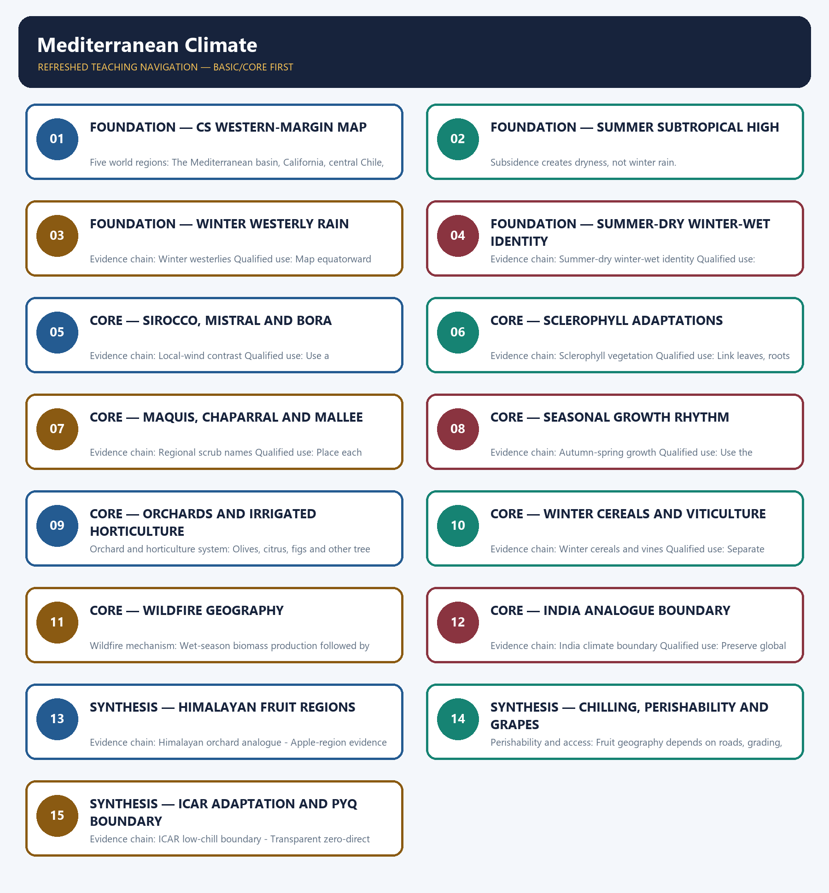

# Mediterranean Climate — Learner-v2 Complete Learning Session

> **Authoring-only generation:** 2026-09-01. No PDF was rendered and no tracker or index was mutated.

### SOURCE, PROGRESSION AND CURRENT-LINKAGE AUDIT

- **Generation date:** 2026-09-01.
- **Repository-first evidence:** the Basic owner is taught first and preserved in full; the Advanced owner is retained only in the optional final teaching block.
- **OCR evidence:** Repository Markdown was primary. The three required local Geography books were inspected as supplementary OCR/searchable evidence. No unsupported page precision, volatile figure or quotation was imported.
- **Qdrant:** not used; repository Markdown and available OCR context were sufficient.
- **PYQ integrity:** The audited routing ledgers contain no direct question owned by Geography Topic 19. Mediterranean pipeline geography, world-region mapping, horticulture, local winds and wildfire questions remain with their routed owners. This package records a transparent zero-direct-PYQ audit and does not invent wording, year, marks or key.
- **Live-link boundary:** Official ICAR material is used only to establish low-chill apple innovation as an adaptation example, and ICAR-CITH is retained as the relevant official temperate-horticulture institution. No unofficial chilling-hour trend, production loss, market value or measured upslope shift is quoted, and India is not reclassified as Mediterranean climate.
- **Fact/inference discipline:** no current-affairs item, PYQ wording, figure or quotation is invented.

## BASIC LEARNING SESSION

### DEEP-REVIEW LEARNING CONTRACT

| Control | Binding rule for this package |
|---|---|
| Syllabus boundary | Complete physical process, spatial pattern and India anchor are taught before optional Advanced depth. |
| Causal method | Initial condition → energy/force or driver → mechanism → landform/climate/ocean pattern → consequence → feedback/limit. |
| Spatial method | Latitude, altitude, continentality, relief, plate setting, basin/coast orientation and map scale are explicit. |
| Terminology | Close terms are defined on common axes; process, form, region, hazard, regulation and current status are never collapsed. |
| Evidence method | Claim → named place/map/process/official record → analysis → qualification. |
| Practice contract | Every solved item has demand decoding, a detailed examiner-grade model, executable timed/compression plan, marks rationale and answer-specific improvement. |
| Approval | This immutable successor remains `approved: false` pending explicit approval. |

**Canonical Basic/Core owner:** `upsc-ai-kit\knowledge\Geography\basic\19_Mediterranean-Climate.md`  
**Canonical topic owner:** `upsc-ai-kit\knowledge\Geography\basic\19_Mediterranean-Climate.md`  
**Optional Advanced owner:** `upsc-ai-kit\knowledge\Geography\advanced\19_India-Himalayan-Fruit-Belt.md`  
**Official syllabus mapping:** `upsc-ai-kit\knowledge\Geography\OFFICIAL-UPSC-SYLLABUS-MAPPING.md`

### EVIDENCE, PYQ AND CURRENT-STATUS CONTROL

- **Process discipline:** no feature is listed without formation sequence, controlling variables and a limiting condition.
- **Map discipline:** distribution is reconstructed through latitude, plate/relief setting, wind/current direction, drainage/coast orientation and named anchors.
- **Quantitative discipline:** coordinates, thresholds, magnitudes, dates, counts and project dimensions retain units, source/date and uncertainty.
- **Causal discipline:** association is not treated as sufficiency; interacting controls, scale, lag, feedback and exceptions are stated.
- **PYQ discipline:** repository routing ledgers and held papers control wording and metadata; reconstructed wording and unavailable official keys remain labelled.
- **Current-status note, rechecked 2026-09-01:** Official ICAR material is used only to establish low-chill apple innovation as an adaptation example, and ICAR-CITH is retained as the relevant official temperate-horticulture institution. No unofficial chilling-hour trend, production loss, market value or measured upslope shift is quoted, and India is not reclassified as Mediterranean climate.

**Live/official context sources recorded by the predecessor generation:**

- `https://icar.org.in/en/low-chill-apple-man-india-hariman-sharma-conferred-padma-shri`
- `https://icarcith.org.in/`




*Distinct embedded teaching-navigation image. The separate continuous Cārvāka-style flowchart package remains an independent at-a-glance artifact.*

### SESSION 1 — FOUNDATION — CS WESTERN-MARGIN MAP

#### DEFINITION / WHAT THIS IS CALLED

**Plain-language definition:** Evidence chain: Cs western-margin location - Five world regions Qualified use: Locate all five classic regions.

**Technical definition:** Five world regions: The Mediterranean basin, California, central Chile, the Cape region and south-western or southern Australia are the five classic world expressions.

#### ANSWER-GRABBING OPENING — WRITE/ADAPT IN THE EXAM

> Evidence chain: Cs western-margin location - Five world regions Qualified use: Locate all five classic regions.

#### MUST-WRITE KEYWORDS

- **FOUNDATION**
- **Cs western-margin map**
- **Cs western-margin location**
- **Five world regions**
- **Evidence chain**
- **Qualified use**

**How to use them:** Frame the answer through FOUNDATION; define Cs western-margin map, connect Cs western-margin location with Five world regions to explain the mechanism, and use Evidence chain for the decisive comparison or qualification.

#### VISUAL FIRST

```text
CS WESTERN-MARGIN MAP
01. Cs western-margin location
    |
    v
02. Five world regions
BOUNDARY -> Latitude and margin are tendencies with local modifiers.
```

*This topic-specific rail fixes the evidence sequence and its exam boundary before analysis.*

#### CORE EXPLANATION

Mediterranean or warm-temperate western-margin climate, commonly Koppen Cs, occupies western continental margins mainly around 30 to 45 degrees north and south; local limits depend on currents, relief and pressure-belt migration. The Mediterranean basin, California, central Chile, the Cape region and south-western or southern Australia are the five classic world expressions.

#### NAMED EVIDENCE AND MECHANISM

- **Cs western-margin location:** Mediterranean or warm-temperate western-margin climate, commonly Koppen Cs, occupies western continental margins mainly around 30 to 45 degrees north and south; local limits depend on currents, relief and pressure-belt migration.
- **Five world regions:** The Mediterranean basin, California, central Chile, the Cape region and south-western or southern Australia are the five classic world expressions.

#### EXAMINER CAUTION

- Latitude and margin are tendencies with local modifiers.

#### EXAM LINK

- **Prelims:** Separate the agent, landform, location, status and scale attached to Cs western-margin map.
- **Mains:** Locate all five classic regions.

#### MINI RECAP

- **Evidence chain:** Cs western-margin location -> Five world regions
- **Qualified use:** Locate all five classic regions.

#### CLOSING RECALL FLOW — FOUNDATION — CS WESTERN-MARGIN MAP

```text
START / CONCEPT: FOUNDATION — Cs western-margin map
        |
        v
EXACT TERMS: FOUNDATION · Cs western-margin map · Cs western-margin location · Five world regions · Evidence chain · Qualified use
        |
        v
MECHANISM / ARGUMENT: Five world regions: The Mediterranean basin, California, central Chile, the Cape region and south-western or southern Australia are the five classic world expressions.
        |
        v
CONSEQUENCE / CONTRAST: Latitude and margin are tendencies with local modifiers.
        |
        v
UPSC TRAP / ANSWER-USE: Do not miss this limiting distinction: cs western-margin location - Five world regions Qualified use.
        |
        v
ANSWER-GRABBING FORMULATION: Evidence chain: Cs western-margin location - Five world regions Qualified use: Locate all five classic regions.
```
### SESSION 2 — FOUNDATION — SUMMER SUBTROPICAL HIGH

#### DEFINITION / WHAT THIS IS CALLED

**Plain-language definition:** Evidence chain: Summer subtropical high Qualified use: Trace poleward high-pressure migration.

**Technical definition:** Subsidence creates dryness, not winter rain.

#### ANSWER-GRABBING OPENING — WRITE/ADAPT IN THE EXAM

> Evidence chain: Summer subtropical high Qualified use: Trace poleward high-pressure migration.

#### MUST-WRITE KEYWORDS

- **FOUNDATION**
- **Summer subtropical high**
- **Evidence chain**
- **Qualified use**
- **Subsidence**
- **Summer**

**How to use them:** Frame the answer through FOUNDATION; define Summer subtropical high, connect Evidence chain with Qualified use to explain the mechanism, and use Subsidence for the decisive comparison or qualification.

#### VISUAL FIRST

```text
SUMMER SUBTROPICAL HIGH
01. Summer subtropical high
BOUNDARY -> Subsidence creates dryness, not winter rain.
```

*This topic-specific rail fixes the evidence sequence and its exam boundary before analysis.*

#### CORE EXPLANATION

Poleward expansion of the subtropical high brings subsiding stable air, clear skies and offshore or weak-moisture flow in summer, producing the characteristic dry season.

#### NAMED EVIDENCE AND MECHANISM

- **Summer subtropical high:** Poleward expansion of the subtropical high brings subsiding stable air, clear skies and offshore or weak-moisture flow in summer, producing the characteristic dry season.

#### EXAMINER CAUTION

- Subsidence creates dryness, not winter rain.

#### EXAM LINK

- **Prelims:** Separate the agent, landform, location, status and scale attached to Summer subtropical high.
- **Mains:** Trace poleward high-pressure migration.

#### MINI RECAP

- **Evidence chain:** Summer subtropical high
- **Qualified use:** Trace poleward high-pressure migration.

#### CLOSING RECALL FLOW — FOUNDATION — SUMMER SUBTROPICAL HIGH

```text
START / CONCEPT: FOUNDATION — Summer subtropical high
        |
        v
EXACT TERMS: FOUNDATION · Summer subtropical high · Evidence chain · Qualified use · Subsidence · Summer
        |
        v
MECHANISM / ARGUMENT: Subsidence creates dryness, not winter rain.
        |
        v
CONSEQUENCE / CONTRAST: The resulting consequence is that evidence chain: Summer subtropical high Qualified use: Trace poleward high-pressure migration.
        |
        v
UPSC TRAP / ANSWER-USE: Do not miss this limiting distinction: evidence chain: Summer subtropical high Qualified use: Trace poleward high-pressure migration.
        |
        v
ANSWER-GRABBING FORMULATION: Evidence chain: Summer subtropical high Qualified use: Trace poleward high-pressure migration.
```
### SESSION 3 — FOUNDATION — WINTER WESTERLY RAIN

#### DEFINITION / WHAT THIS IS CALLED

**Plain-language definition:** Winter westerlies: Equatorward migration of the westerly belt and travelling depressions brings onshore frontal or cyclonic rain in winter; the mechanism is seasonal pressure-belt displacement.

**Technical definition:** Evidence chain: Winter westerlies Qualified use: Map equatorward westerly movement.

#### ANSWER-GRABBING OPENING — WRITE/ADAPT IN THE EXAM

> Winter westerlies: Equatorward migration of the westerly belt and travelling depressions brings onshore frontal or cyclonic rain in winter; the mechanism is seasonal pressure-belt displacement.

#### MUST-WRITE KEYWORDS

- **FOUNDATION**
- **Winter westerly rain**
- **Winter westerlies**
- **Evidence chain**
- **Qualified use**
- **Equatorward**

**How to use them:** Frame the answer through FOUNDATION; define Winter westerly rain, connect Winter westerlies with Evidence chain to explain the mechanism, and use Qualified use for the decisive comparison or qualification.

#### VISUAL FIRST

```text
WINTER WESTERLY RAIN
01. Winter westerlies
BOUNDARY -> Travelling depressions are the rain-bearing mechanism.
```

*This topic-specific rail fixes the evidence sequence and its exam boundary before analysis.*

#### CORE EXPLANATION

Equatorward migration of the westerly belt and travelling depressions brings onshore frontal or cyclonic rain in winter; the mechanism is seasonal pressure-belt displacement.

#### NAMED EVIDENCE AND MECHANISM

- **Winter westerlies:** Equatorward migration of the westerly belt and travelling depressions brings onshore frontal or cyclonic rain in winter; the mechanism is seasonal pressure-belt displacement.

#### EXAMINER CAUTION

- Travelling depressions are the rain-bearing mechanism.

#### EXAM LINK

- **Prelims:** Separate the agent, landform, location, status and scale attached to Winter westerly rain.
- **Mains:** Map equatorward westerly movement.

#### MINI RECAP

- **Evidence chain:** Winter westerlies
- **Qualified use:** Map equatorward westerly movement.

#### CLOSING RECALL FLOW — FOUNDATION — WINTER WESTERLY RAIN

```text
START / CONCEPT: FOUNDATION — Winter westerly rain
        |
        v
EXACT TERMS: FOUNDATION · Winter westerly rain · Winter westerlies · Evidence chain · Qualified use · Equatorward
        |
        v
MECHANISM / ARGUMENT: Evidence chain: Winter westerlies Qualified use: Map equatorward westerly movement.
        |
        v
CONSEQUENCE / CONTRAST: Travelling depressions are the rain-bearing mechanism.
        |
        v
UPSC TRAP / ANSWER-USE: Do not miss this limiting distinction: equatorward migration of the westerly belt and travelling depressions brings onshore frontal or cyclonic...
        |
        v
ANSWER-GRABBING FORMULATION: Winter westerlies: Equatorward migration of the westerly belt and travelling depressions brings onshore frontal or cyclonic rain in winter; the mechanism is seasonal pressure-belt displacement.
```
### SESSION 4 — FOUNDATION — SUMMER-DRY WINTER-WET IDENTITY

#### DEFINITION / WHAT THIS IS CALLED

**Plain-language definition:** Summer-dry winter-wet identity: Dry sunny summers and mild wet winters distinguish Mediterranean climate from summer-rain monsoon and humid eastern-margin climates; winter rain is the primary climatic signature.

**Technical definition:** Evidence chain: Summer-dry winter-wet identity Qualified use: Compare Cs with monsoon and eastern margin climates.

#### ANSWER-GRABBING OPENING — WRITE/ADAPT IN THE EXAM

> Summer-dry winter-wet identity: Dry sunny summers and mild wet winters distinguish Mediterranean climate from summer-rain monsoon and humid eastern-margin climates; winter rain is the primary climatic signature.

#### MUST-WRITE KEYWORDS

- **FOUNDATION**
- **Summer-dry winter-wet identity**
- **Evidence chain**
- **Qualified use**
- **Dry**
- **Mediterranean**

**How to use them:** Frame the answer through FOUNDATION; define Summer-dry winter-wet identity, connect Evidence chain with Qualified use to explain the mechanism, and use Dry for the decisive comparison or qualification.

#### VISUAL FIRST

```text
SUMMER-DRY WINTER-WET IDENTITY
01. Summer-dry winter-wet identity
BOUNDARY -> Do not reverse the seasonal pattern.
```

*This topic-specific rail fixes the evidence sequence and its exam boundary before analysis.*

#### CORE EXPLANATION

Dry sunny summers and mild wet winters distinguish Mediterranean climate from summer-rain monsoon and humid eastern-margin climates; winter rain is the primary climatic signature.

#### NAMED EVIDENCE AND MECHANISM

- **Summer-dry winter-wet identity:** Dry sunny summers and mild wet winters distinguish Mediterranean climate from summer-rain monsoon and humid eastern-margin climates; winter rain is the primary climatic signature.

#### EXAMINER CAUTION

- Do not reverse the seasonal pattern.

#### EXAM LINK

- **Prelims:** Separate the agent, landform, location, status and scale attached to Summer-dry winter-wet identity.
- **Mains:** Compare Cs with monsoon and eastern margin climates.

#### MINI RECAP

- **Evidence chain:** Summer-dry winter-wet identity
- **Qualified use:** Compare Cs with monsoon and eastern margin climates.

#### CLOSING RECALL FLOW — FOUNDATION — SUMMER-DRY WINTER-WET IDENTITY

```text
START / CONCEPT: FOUNDATION — Summer-dry winter-wet identity
        |
        v
EXACT TERMS: FOUNDATION · Summer-dry winter-wet identity · Evidence chain · Qualified use · Dry · Mediterranean
        |
        v
MECHANISM / ARGUMENT: Evidence chain: Summer-dry winter-wet identity Qualified use: Compare Cs with monsoon and eastern margin climates.
        |
        v
CONSEQUENCE / CONTRAST: Do not reverse the seasonal pattern.
        |
        v
UPSC TRAP / ANSWER-USE: Do not miss this limiting distinction: compare Cs with monsoon and eastern margin climates.
        |
        v
ANSWER-GRABBING FORMULATION: Summer-dry winter-wet identity: Dry sunny summers and mild wet winters distinguish Mediterranean climate from summer-rain monsoon and humid eastern-margin climates; winter rain is the primary climatic signature.
```
### SESSION 5 — CORE — SIROCCO, MISTRAL AND BORA

#### DEFINITION / WHAT THIS IS CALLED

**Plain-language definition:** Local-wind contrast: The Sirocco is a hot dusty wind from the Sahara, while the Mistral is a cold strong wind down the Rhone valley and the Bora is a cold Adriatic wind; local winds are not all hot.

**Technical definition:** Evidence chain: Local-wind contrast Qualified use: Use a hot-versus-cold discriminator.

#### ANSWER-GRABBING OPENING — WRITE/ADAPT IN THE EXAM

> Local-wind contrast: The Sirocco is a hot dusty wind from the Sahara, while the Mistral is a cold strong wind down the Rhone valley and the Bora is a cold Adriatic wind; local winds are not all hot.

#### MUST-WRITE KEYWORDS

- **Sirocco**
- **Mistral**
- **Bora**
- **Local-wind contrast**
- **Evidence chain**
- **Qualified use**

**How to use them:** Frame the answer through Sirocco; define Mistral, connect Bora with Local-wind contrast to explain the mechanism, and use Evidence chain for the decisive comparison or qualification.

#### VISUAL FIRST

```text
SIROCCO, MISTRAL AND BORA
01. Local-wind contrast
BOUNDARY -> Local winds differ in origin and temperature.
```

*This topic-specific rail fixes the evidence sequence and its exam boundary before analysis.*

#### CORE EXPLANATION

The Sirocco is a hot dusty wind from the Sahara, while the Mistral is a cold strong wind down the Rhone valley and the Bora is a cold Adriatic wind; local winds are not all hot.

#### NAMED EVIDENCE AND MECHANISM

- **Local-wind contrast:** The Sirocco is a hot dusty wind from the Sahara, while the Mistral is a cold strong wind down the Rhone valley and the Bora is a cold Adriatic wind; local winds are not all hot.

#### EXAMINER CAUTION

- Local winds differ in origin and temperature.

#### EXAM LINK

- **Prelims:** Separate the agent, landform, location, status and scale attached to Sirocco, Mistral and Bora.
- **Mains:** Use a hot-versus-cold discriminator.

#### MINI RECAP

- **Evidence chain:** Local-wind contrast
- **Qualified use:** Use a hot-versus-cold discriminator.

#### CLOSING RECALL FLOW — CORE — SIROCCO, MISTRAL AND BORA

```text
START / CONCEPT: CORE — Sirocco, Mistral and Bora
        |
        v
EXACT TERMS: Sirocco · Mistral · Bora · Local-wind contrast · Evidence chain · Qualified use
        |
        v
MECHANISM / ARGUMENT: Evidence chain: Local-wind contrast Qualified use: Use a hot-versus-cold discriminator.
        |
        v
CONSEQUENCE / CONTRAST: The resulting consequence is that the Sirocco is a hot dusty wind from the Sahara.
        |
        v
UPSC TRAP / ANSWER-USE: Do not miss this limiting distinction: the Sirocco is a hot dusty wind from the Sahara.
        |
        v
ANSWER-GRABBING FORMULATION: Local-wind contrast: The Sirocco is a hot dusty wind from the Sahara, while the Mistral is a cold strong wind down the Rhone valley and the Bora is a cold Adriatic wind; local winds are not all hot.
```
### SESSION 6 — CORE — SCLEROPHYLL ADAPTATIONS

#### DEFINITION / WHAT THIS IS CALLED

**Plain-language definition:** Sclerophyll vegetation: Mediterranean vegetation is evergreen or drought-deciduous scrub and open woodland with small hard leathery or waxy leaves, deep roots and thick bark adapted to summer drought and recurrent fire.

**Technical definition:** Evidence chain: Sclerophyll vegetation Qualified use: Link leaves, roots and bark to summer stress.

#### ANSWER-GRABBING OPENING — WRITE/ADAPT IN THE EXAM

> Sclerophyll vegetation: Mediterranean vegetation is evergreen or drought-deciduous scrub and open woodland with small hard leathery or waxy leaves, deep roots and thick bark adapted to summer drought and recurrent fire.

#### MUST-WRITE KEYWORDS

- **Sclerophyll adaptations**
- **Sclerophyll vegetation**
- **Evidence chain**
- **Qualified use**
- **Mediterranean vegetation**
- **Mediterranean**

**How to use them:** Frame the answer through Sclerophyll adaptations; define Sclerophyll vegetation, connect Evidence chain with Qualified use to explain the mechanism, and use Mediterranean vegetation for the decisive comparison or qualification.

#### VISUAL FIRST

```text
SCLEROPHYLL ADAPTATIONS
01. Sclerophyll vegetation
BOUNDARY -> Vegetation is open and drought-adapted, not rainforest.
```

*This topic-specific rail fixes the evidence sequence and its exam boundary before analysis.*

#### CORE EXPLANATION

Mediterranean vegetation is evergreen or drought-deciduous scrub and open woodland with small hard leathery or waxy leaves, deep roots and thick bark adapted to summer drought and recurrent fire.

#### NAMED EVIDENCE AND MECHANISM

- **Sclerophyll vegetation:** Mediterranean vegetation is evergreen or drought-deciduous scrub and open woodland with small hard leathery or waxy leaves, deep roots and thick bark adapted to summer drought and recurrent fire.

#### EXAMINER CAUTION

- Vegetation is open and drought-adapted, not rainforest.

#### EXAM LINK

- **Prelims:** Separate the agent, landform, location, status and scale attached to Sclerophyll adaptations.
- **Mains:** Link leaves, roots and bark to summer stress.

#### MINI RECAP

- **Evidence chain:** Sclerophyll vegetation
- **Qualified use:** Link leaves, roots and bark to summer stress.

#### CLOSING RECALL FLOW — CORE — SCLEROPHYLL ADAPTATIONS

```text
START / CONCEPT: CORE — Sclerophyll adaptations
        |
        v
EXACT TERMS: Sclerophyll adaptations · Sclerophyll vegetation · Evidence chain · Qualified use · Mediterranean vegetation · Mediterranean
        |
        v
MECHANISM / ARGUMENT: Evidence chain: Sclerophyll vegetation Qualified use: Link leaves, roots and bark to summer stress.
        |
        v
CONSEQUENCE / CONTRAST: Vegetation is open and drought-adapted, not rainforest.
        |
        v
UPSC TRAP / ANSWER-USE: Do not miss this limiting distinction: mediterranean vegetation is evergreen or drought-deciduous scrub and open woodland with small hard leathery...
        |
        v
ANSWER-GRABBING FORMULATION: Sclerophyll vegetation: Mediterranean vegetation is evergreen or drought-deciduous scrub and open woodland with small hard leathery or waxy leaves, deep roots and thick bark adapted to summer drought and recurrent fire.
```
### SESSION 7 — CORE — MAQUIS, CHAPARRAL AND MALLEE

#### DEFINITION / WHAT THIS IS CALLED

**Plain-language definition:** Regional scrub names: Maquis belongs to the Mediterranean basin, chaparral to California and mallee to Australia; similar drought form does not make the floras taxonomically identical.

**Technical definition:** Evidence chain: Regional scrub names Qualified use: Place each regional name correctly.

#### ANSWER-GRABBING OPENING — WRITE/ADAPT IN THE EXAM

> Regional scrub names: Maquis belongs to the Mediterranean basin, chaparral to California and mallee to Australia; similar drought form does not make the floras taxonomically identical.

#### MUST-WRITE KEYWORDS

- **Maquis**
- **chaparral**
- **mallee**
- **Regional scrub names**
- **Evidence chain**
- **Qualified use**

**How to use them:** Frame the answer through Maquis; define chaparral, connect mallee with Regional scrub names to explain the mechanism, and use Evidence chain for the decisive comparison or qualification.

#### VISUAL FIRST

```text
MAQUIS, CHAPARRAL AND MALLEE
01. Regional scrub names
BOUNDARY -> Analogous form does not imply identical flora.
```

*This topic-specific rail fixes the evidence sequence and its exam boundary before analysis.*

#### CORE EXPLANATION

Maquis belongs to the Mediterranean basin, chaparral to California and mallee to Australia; similar drought form does not make the floras taxonomically identical.

#### NAMED EVIDENCE AND MECHANISM

- **Regional scrub names:** Maquis belongs to the Mediterranean basin, chaparral to California and mallee to Australia; similar drought form does not make the floras taxonomically identical.

#### EXAMINER CAUTION

- Analogous form does not imply identical flora.

#### EXAM LINK

- **Prelims:** Separate the agent, landform, location, status and scale attached to Maquis, chaparral and mallee.
- **Mains:** Place each regional name correctly.

#### MINI RECAP

- **Evidence chain:** Regional scrub names
- **Qualified use:** Place each regional name correctly.

#### CLOSING RECALL FLOW — CORE — MAQUIS, CHAPARRAL AND MALLEE

```text
START / CONCEPT: CORE — Maquis, chaparral and mallee
        |
        v
EXACT TERMS: Maquis · chaparral · mallee · Regional scrub names · Evidence chain · Qualified use
        |
        v
MECHANISM / ARGUMENT: Evidence chain: Regional scrub names Qualified use: Place each regional name correctly.
        |
        v
CONSEQUENCE / CONTRAST: Analogous form does not imply identical flora.
        |
        v
UPSC TRAP / ANSWER-USE: Do not miss this limiting distinction: maquis belongs to the Mediterranean basin, chaparral to California and mallee to Australia.
        |
        v
ANSWER-GRABBING FORMULATION: Regional scrub names: Maquis belongs to the Mediterranean basin, chaparral to California and mallee to Australia; similar drought form does not make the floras taxonomically identical.
```
### SESSION 8 — CORE — SEASONAL GROWTH RHYTHM

#### DEFINITION / WHAT THIS IS CALLED

**Plain-language definition:** Autumn-spring growth: Plant growth is favoured in autumn and spring when moisture and temperature overlap, while peak summer heat coincides with drought and winter can limit growth at cooler sites.

**Technical definition:** Evidence chain: Autumn-spring growth Qualified use: Use the moisture-temperature overlap.

#### ANSWER-GRABBING OPENING — WRITE/ADAPT IN THE EXAM

> Autumn-spring growth: Plant growth is favoured in autumn and spring when moisture and temperature overlap, while peak summer heat coincides with drought and winter can limit growth at cooler sites.

#### MUST-WRITE KEYWORDS

- **Seasonal growth rhythm**
- **Autumn-spring growth**
- **Evidence chain**
- **Qualified use**
- **Plant growth**
- **Plant**

**How to use them:** Frame the answer through Seasonal growth rhythm; define Autumn-spring growth, connect Evidence chain with Qualified use to explain the mechanism, and use Plant growth for the decisive comparison or qualification.

#### VISUAL FIRST

```text
SEASONAL GROWTH RHYTHM
01. Autumn-spring growth
BOUNDARY -> Summer heat coincides with water shortage.
```

*This topic-specific rail fixes the evidence sequence and its exam boundary before analysis.*

#### CORE EXPLANATION

Plant growth is favoured in autumn and spring when moisture and temperature overlap, while peak summer heat coincides with drought and winter can limit growth at cooler sites.

#### NAMED EVIDENCE AND MECHANISM

- **Autumn-spring growth:** Plant growth is favoured in autumn and spring when moisture and temperature overlap, while peak summer heat coincides with drought and winter can limit growth at cooler sites.

#### EXAMINER CAUTION

- Summer heat coincides with water shortage.

#### EXAM LINK

- **Prelims:** Separate the agent, landform, location, status and scale attached to Seasonal growth rhythm.
- **Mains:** Use the moisture-temperature overlap.

#### MINI RECAP

- **Evidence chain:** Autumn-spring growth
- **Qualified use:** Use the moisture-temperature overlap.

#### CLOSING RECALL FLOW — CORE — SEASONAL GROWTH RHYTHM

```text
START / CONCEPT: CORE — Seasonal growth rhythm
        |
        v
EXACT TERMS: Seasonal growth rhythm · Autumn-spring growth · Evidence chain · Qualified use · Plant growth · Plant
        |
        v
MECHANISM / ARGUMENT: Evidence chain: Autumn-spring growth Qualified use: Use the moisture-temperature overlap.
        |
        v
CONSEQUENCE / CONTRAST: The resulting consequence is that plant growth is favoured in autumn and spring when moisture and temperature overlap.
        |
        v
UPSC TRAP / ANSWER-USE: Do not miss this limiting distinction: plant growth is favoured in autumn and spring when moisture and temperature overlap.
        |
        v
ANSWER-GRABBING FORMULATION: Autumn-spring growth: Plant growth is favoured in autumn and spring when moisture and temperature overlap, while peak summer heat coincides with drought and winter can limit growth at cooler sites.
```
### SESSION 9 — CORE — ORCHARDS AND IRRIGATED HORTICULTURE

#### DEFINITION / WHAT THIS IS CALLED

**Plain-language definition:** Evidence chain: Orchard and horticulture system Qualified use: Connect tree crops to summer sunshine.

**Technical definition:** Orchard and horticulture system: Olives, citrus, figs and other tree crops exploit deep roots and sunshine, while irrigation supports high-value summer fruits and vegetables; water access converts climatic constraint into comparative advantage.

#### ANSWER-GRABBING OPENING — WRITE/ADAPT IN THE EXAM

> Orchard and horticulture system: Olives, citrus, figs and other tree crops exploit deep roots and sunshine, while irrigation supports high-value summer fruits and vegetables; water access converts climatic constraint into comparative advantage.

#### MUST-WRITE KEYWORDS

- **Orchards**
- **irrigated horticulture**
- **Orchard and horticulture system**
- **Evidence chain**
- **Qualified use**
- **Olives**

**How to use them:** Frame the answer through Orchards; define irrigated horticulture, connect Orchard and horticulture system with Evidence chain to explain the mechanism, and use Qualified use for the decisive comparison or qualification.

#### VISUAL FIRST

```text
ORCHARDS AND IRRIGATED HORTICULTURE
01. Orchard and horticulture system
BOUNDARY -> Climate creates opportunity only where water and markets exist.
```

*This topic-specific rail fixes the evidence sequence and its exam boundary before analysis.*

#### CORE EXPLANATION

Olives, citrus, figs and other tree crops exploit deep roots and sunshine, while irrigation supports high-value summer fruits and vegetables; water access converts climatic constraint into comparative advantage.

#### NAMED EVIDENCE AND MECHANISM

- **Orchard and horticulture system:** Olives, citrus, figs and other tree crops exploit deep roots and sunshine, while irrigation supports high-value summer fruits and vegetables; water access converts climatic constraint into comparative advantage.

#### EXAMINER CAUTION

- Climate creates opportunity only where water and markets exist.

#### EXAM LINK

- **Prelims:** Separate the agent, landform, location, status and scale attached to Orchards and irrigated horticulture.
- **Mains:** Connect tree crops to summer sunshine.

#### MINI RECAP

- **Evidence chain:** Orchard and horticulture system
- **Qualified use:** Connect tree crops to summer sunshine.

#### CLOSING RECALL FLOW — CORE — ORCHARDS AND IRRIGATED HORTICULTURE

```text
START / CONCEPT: CORE — Orchards and irrigated horticulture
        |
        v
EXACT TERMS: Orchards · irrigated horticulture · Orchard and horticulture system · Evidence chain · Qualified use · Olives
        |
        v
MECHANISM / ARGUMENT: Evidence chain: Orchard and horticulture system Qualified use: Connect tree crops to summer sunshine.
        |
        v
CONSEQUENCE / CONTRAST: Climate creates opportunity only where water and markets exist.
        |
        v
UPSC TRAP / ANSWER-USE: Do not miss this limiting distinction: olives, citrus, figs and other tree crops exploit deep roots and sunshine.
        |
        v
ANSWER-GRABBING FORMULATION: Orchard and horticulture system: Olives, citrus, figs and other tree crops exploit deep roots and sunshine, while irrigation supports high-value summer fruits and vegetables; water access converts climatic constraint into comparative advantage.
```
### SESSION 10 — CORE — WINTER CEREALS AND VITICULTURE

#### DEFINITION / WHAT THIS IS CALLED

**Plain-language definition:** Winter cereals and vines: Wheat and barley use cool-season moisture, and viticulture is prominent across Mediterranean-climate regions; historical textbook shares must not be used as current production statistics.

**Technical definition:** Evidence chain: Winter cereals and vines Qualified use: Separate cool-season crops and perennial vines.

#### ANSWER-GRABBING OPENING — WRITE/ADAPT IN THE EXAM

> Winter cereals and vines: Wheat and barley use cool-season moisture, and viticulture is prominent across Mediterranean-climate regions; historical textbook shares must not be used as current production statistics.

#### MUST-WRITE KEYWORDS

- **Winter cereals**
- **viticulture**
- **Winter cereals and vines**
- **Evidence chain**
- **Qualified use**
- **Wheat**

**How to use them:** Frame the answer through Winter cereals; define viticulture, connect Winter cereals and vines with Evidence chain to explain the mechanism, and use Qualified use for the decisive comparison or qualification.

#### VISUAL FIRST

```text
WINTER CEREALS AND VITICULTURE
01. Winter cereals and vines
BOUNDARY -> Historical shares are not current statistics.
```

*This topic-specific rail fixes the evidence sequence and its exam boundary before analysis.*

#### CORE EXPLANATION

Wheat and barley use cool-season moisture, and viticulture is prominent across Mediterranean-climate regions; historical textbook shares must not be used as current production statistics.

#### NAMED EVIDENCE AND MECHANISM

- **Winter cereals and vines:** Wheat and barley use cool-season moisture, and viticulture is prominent across Mediterranean-climate regions; historical textbook shares must not be used as current production statistics.

#### EXAMINER CAUTION

- Historical shares are not current statistics.

#### EXAM LINK

- **Prelims:** Separate the agent, landform, location, status and scale attached to Winter cereals and viticulture.
- **Mains:** Separate cool-season crops and perennial vines.

#### MINI RECAP

- **Evidence chain:** Winter cereals and vines
- **Qualified use:** Separate cool-season crops and perennial vines.

#### CLOSING RECALL FLOW — CORE — WINTER CEREALS AND VITICULTURE

```text
START / CONCEPT: CORE — Winter cereals and viticulture
        |
        v
EXACT TERMS: Winter cereals · viticulture · Winter cereals and vines · Evidence chain · Qualified use · Wheat
        |
        v
MECHANISM / ARGUMENT: Evidence chain: Winter cereals and vines Qualified use: Separate cool-season crops and perennial vines.
        |
        v
CONSEQUENCE / CONTRAST: Historical shares are not current statistics.
        |
        v
UPSC TRAP / ANSWER-USE: Do not miss this limiting distinction: wheat and barley use cool-season moisture.
        |
        v
ANSWER-GRABBING FORMULATION: Winter cereals and vines: Wheat and barley use cool-season moisture, and viticulture is prominent across Mediterranean-climate regions; historical textbook shares must not be used as current production statistics.
```
### SESSION 11 — CORE — WILDFIRE GEOGRAPHY

#### DEFINITION / WHAT THIS IS CALLED

**Plain-language definition:** Evidence chain: Wildfire mechanism Qualified use: Build fuel, drought, wind and ignition chain.

**Technical definition:** Wildfire mechanism: Wet-season biomass production followed by summer desiccation creates fuel, while heat, low humidity, wind, ignition and land management govern spread; climate type raises risk but does not alone cause each fire.

#### ANSWER-GRABBING OPENING — WRITE/ADAPT IN THE EXAM

> Wildfire mechanism: Wet-season biomass production followed by summer desiccation creates fuel, while heat, low humidity, wind, ignition and land management govern spread; climate type raises risk but does not alone cause each fire.

#### MUST-WRITE KEYWORDS

- **Wildfire geography**
- **Wildfire mechanism**
- **Evidence chain**
- **Qualified use**
- **Wet-season**
- **Wildfire**

**How to use them:** Frame the answer through Wildfire geography; define Wildfire mechanism, connect Evidence chain with Qualified use to explain the mechanism, and use Wet-season for the decisive comparison or qualification.

#### VISUAL FIRST

```text
WILDFIRE GEOGRAPHY
01. Wildfire mechanism
BOUNDARY -> Climate risk is not event attribution.
```

*This topic-specific rail fixes the evidence sequence and its exam boundary before analysis.*

#### CORE EXPLANATION

Wet-season biomass production followed by summer desiccation creates fuel, while heat, low humidity, wind, ignition and land management govern spread; climate type raises risk but does not alone cause each fire.

#### NAMED EVIDENCE AND MECHANISM

- **Wildfire mechanism:** Wet-season biomass production followed by summer desiccation creates fuel, while heat, low humidity, wind, ignition and land management govern spread; climate type raises risk but does not alone cause each fire.

#### EXAMINER CAUTION

- Climate risk is not event attribution.

#### EXAM LINK

- **Prelims:** Separate the agent, landform, location, status and scale attached to Wildfire geography.
- **Mains:** Build fuel, drought, wind and ignition chain.

#### MINI RECAP

- **Evidence chain:** Wildfire mechanism
- **Qualified use:** Build fuel, drought, wind and ignition chain.

#### CLOSING RECALL FLOW — CORE — WILDFIRE GEOGRAPHY

```text
START / CONCEPT: CORE — Wildfire geography
        |
        v
EXACT TERMS: Wildfire geography · Wildfire mechanism · Evidence chain · Qualified use · Wet-season · Wildfire
        |
        v
MECHANISM / ARGUMENT: Evidence chain: Wildfire mechanism Qualified use: Build fuel, drought, wind and ignition chain.
        |
        v
CONSEQUENCE / CONTRAST: Climate risk is not event attribution.
        |
        v
UPSC TRAP / ANSWER-USE: Do not miss this limiting distinction: build fuel, drought, wind and ignition chain.
        |
        v
ANSWER-GRABBING FORMULATION: Wildfire mechanism: Wet-season biomass production followed by summer desiccation creates fuel, while heat, low humidity, wind, ignition and land management govern spread; climate type raises risk but does not alone cause each fire.
```
### SESSION 12 — CORE — INDIA ANALOGUE BOUNDARY

#### DEFINITION / WHAT THIS IS CALLED

**Plain-language definition:** India climate boundary: India has no extensive classic Mediterranean Cs region, so the Advanced owner is a horticultural analogue rather than a claim that Kashmir or the Himalaya possess the same winter-rain circulation.

**Technical definition:** Evidence chain: India climate boundary Qualified use: Preserve global Basic versus India Advanced.

#### ANSWER-GRABBING OPENING — WRITE/ADAPT IN THE EXAM

> India climate boundary: India has no extensive classic Mediterranean Cs region, so the Advanced owner is a horticultural analogue rather than a claim that Kashmir or the Himalaya possess the same winter-rain circulation.

#### MUST-WRITE KEYWORDS

- **India analogue boundary**
- **India climate boundary**
- **Evidence chain**
- **Qualified use**
- **India**
- **Mediterranean Cs**

**How to use them:** Frame the answer through India analogue boundary; define India climate boundary, connect Evidence chain with Qualified use to explain the mechanism, and use India for the decisive comparison or qualification.

#### VISUAL FIRST

```text
INDIA ANALOGUE BOUNDARY
01. India climate boundary
BOUNDARY -> Horticultural similarity is not Cs classification.
```

*This topic-specific rail fixes the evidence sequence and its exam boundary before analysis.*

#### CORE EXPLANATION

India has no extensive classic Mediterranean Cs region, so the Advanced owner is a horticultural analogue rather than a claim that Kashmir or the Himalaya possess the same winter-rain circulation.

#### NAMED EVIDENCE AND MECHANISM

- **India climate boundary:** India has no extensive classic Mediterranean Cs region, so the Advanced owner is a horticultural analogue rather than a claim that Kashmir or the Himalaya possess the same winter-rain circulation.

#### EXAMINER CAUTION

- Horticultural similarity is not Cs classification.

#### EXAM LINK

- **Prelims:** Separate the agent, landform, location, status and scale attached to India analogue boundary.
- **Mains:** Preserve global Basic versus India Advanced.

#### MINI RECAP

- **Evidence chain:** India climate boundary
- **Qualified use:** Preserve global Basic versus India Advanced.

#### CLOSING RECALL FLOW — CORE — INDIA ANALOGUE BOUNDARY

```text
START / CONCEPT: CORE — India analogue boundary
        |
        v
EXACT TERMS: India analogue boundary · India climate boundary · Evidence chain · Qualified use · India · Mediterranean Cs
        |
        v
MECHANISM / ARGUMENT: Evidence chain: India climate boundary Qualified use: Preserve global Basic versus India Advanced.
        |
        v
CONSEQUENCE / CONTRAST: Horticultural similarity is not Cs classification.
        |
        v
UPSC TRAP / ANSWER-USE: Do not miss this limiting distinction: india has no extensive classic Mediterranean Cs region, so the Advanced owner is a...
        |
        v
ANSWER-GRABBING FORMULATION: India climate boundary: India has no extensive classic Mediterranean Cs region, so the Advanced owner is a horticultural analogue rather than a claim that Kashmir or the Himalaya possess the same winter-rain circulation.
```
### SESSION 13 — SYNTHESIS — HIMALAYAN FRUIT REGIONS

#### DEFINITION / WHAT THIS IS CALLED

**Plain-language definition:** Apple-region evidence: Kullu and Shimla districts, the Kashmir Valley and suitable Uttarakhand hills are established apple regions, with altitude, aspect, frost, hail, moisture and cultivar shaping local suitability.

**Technical definition:** Evidence chain: Himalayan orchard analogue - Apple-region evidence Qualified use: Map Kashmir, Himachal and Uttarakhand.

#### ANSWER-GRABBING OPENING — WRITE/ADAPT IN THE EXAM

> Himalayan orchard analogue: Kashmir, Himachal Pradesh and Uttarakhand support temperate fruit belts including apple, pear, peach, cherry, walnut, almond and apricot, while their climate remains Himalayan and monsoonal-continental.

#### MUST-WRITE KEYWORDS

- **SYNTHESIS**
- **Himalayan fruit regions**
- **Himalayan orchard analogue**
- **Apple-region evidence**
- **Evidence chain**
- **Qualified use**

**How to use them:** Frame the answer through SYNTHESIS; define Himalayan fruit regions, connect Himalayan orchard analogue with Apple-region evidence to explain the mechanism, and use Evidence chain for the decisive comparison or qualification.

#### VISUAL FIRST

```text
HIMALAYAN FRUIT REGIONS
01. Himalayan orchard analogue
    |
    v
02. Apple-region evidence
BOUNDARY -> Suitability varies by altitude, aspect and hazard.
```

*This topic-specific rail fixes the evidence sequence and its exam boundary before analysis.*

#### CORE EXPLANATION

Kashmir, Himachal Pradesh and Uttarakhand support temperate fruit belts including apple, pear, peach, cherry, walnut, almond and apricot, while their climate remains Himalayan and monsoonal-continental. Kullu and Shimla districts, the Kashmir Valley and suitable Uttarakhand hills are established apple regions, with altitude, aspect, frost, hail, moisture and cultivar shaping local suitability.

#### NAMED EVIDENCE AND MECHANISM

- **Himalayan orchard analogue:** Kashmir, Himachal Pradesh and Uttarakhand support temperate fruit belts including apple, pear, peach, cherry, walnut, almond and apricot, while their climate remains Himalayan and monsoonal-continental.
- **Apple-region evidence:** Kullu and Shimla districts, the Kashmir Valley and suitable Uttarakhand hills are established apple regions, with altitude, aspect, frost, hail, moisture and cultivar shaping local suitability.

#### EXAMINER CAUTION

- Suitability varies by altitude, aspect and hazard.

#### EXAM LINK

- **Prelims:** Separate the agent, landform, location, status and scale attached to Himalayan fruit regions.
- **Mains:** Map Kashmir, Himachal and Uttarakhand.

#### MINI RECAP

- **Evidence chain:** Himalayan orchard analogue -> Apple-region evidence
- **Qualified use:** Map Kashmir, Himachal and Uttarakhand.

#### CLOSING RECALL FLOW — SYNTHESIS — HIMALAYAN FRUIT REGIONS

```text
START / CONCEPT: SYNTHESIS — Himalayan fruit regions
        |
        v
EXACT TERMS: SYNTHESIS · Himalayan fruit regions · Himalayan orchard analogue · Apple-region evidence · Evidence chain · Qualified use
        |
        v
MECHANISM / ARGUMENT: Evidence chain: Himalayan orchard analogue - Apple-region evidence Qualified use: Map Kashmir, Himachal and Uttarakhand.
        |
        v
CONSEQUENCE / CONTRAST: Apple-region evidence: Kullu and Shimla districts, the Kashmir Valley and suitable Uttarakhand hills are established apple regions, with altitude, aspect, frost, hail, moisture and cultivar shaping local suitability.
        |
        v
UPSC TRAP / ANSWER-USE: Do not miss this limiting distinction: kashmir, Himachal Pradesh and Uttarakhand support temperate fruit belts including apple, pear, peach, cherry...
        |
        v
ANSWER-GRABBING FORMULATION: Himalayan orchard analogue: Kashmir, Himachal Pradesh and Uttarakhand support temperate fruit belts including apple, pear, peach, cherry, walnut, almond and apricot, while their climate remains Himalayan and monsoonal-continental.
```
### SESSION 14 — SYNTHESIS — CHILLING, PERISHABILITY AND GRAPES

#### DEFINITION / WHAT THIS IS CALLED

**Plain-language definition:** Apple chilling requirement: Apple is a temperate fruit whose dormancy and bud break depend on cultivar-specific winter chilling followed by a suitable growing season; one universal chilling-hour threshold should not be asserted.

**Technical definition:** Perishability and access: Fruit geography depends on roads, grading, storage, cold chains and market timing because apples and many horticultural products are perishable; climate alone does not create a viable orchard economy.

#### ANSWER-GRABBING OPENING — WRITE/ADAPT IN THE EXAM

> Apple chilling requirement: Apple is a temperate fruit whose dormancy and bud break depend on cultivar-specific winter chilling followed by a suitable growing season; one universal chilling-hour threshold should not be asserted.

#### MUST-WRITE KEYWORDS

- **SYNTHESIS**
- **Chilling**
- **perishability**
- **grapes**
- **Apple chilling requirement**
- **Perishability and access**

**How to use them:** Frame the answer through SYNTHESIS; define Chilling, connect perishability with grapes to explain the mechanism, and use Apple chilling requirement for the decisive comparison or qualification.

#### VISUAL FIRST

```text
CHILLING, PERISHABILITY AND GRAPES
01. Apple chilling requirement
    |
    v
02. Perishability and access
    |
    v
03. Indian viticulture analogue
BOUNDARY -> No universal chill threshold or climate analogy applies.
```

*This topic-specific rail fixes the evidence sequence and its exam boundary before analysis.*

#### CORE EXPLANATION

Apple is a temperate fruit whose dormancy and bud break depend on cultivar-specific winter chilling followed by a suitable growing season; one universal chilling-hour threshold should not be asserted. Fruit geography depends on roads, grading, storage, cold chains and market timing because apples and many horticultural products are perishable; climate alone does not create a viable orchard economy. Nashik and adjoining Maharashtra districts, with Sangli also important, form a major grape belt; this is an agricultural analogue and not evidence of Mediterranean Cs climate.

#### NAMED EVIDENCE AND MECHANISM

- **Apple chilling requirement:** Apple is a temperate fruit whose dormancy and bud break depend on cultivar-specific winter chilling followed by a suitable growing season; one universal chilling-hour threshold should not be asserted.
- **Perishability and access:** Fruit geography depends on roads, grading, storage, cold chains and market timing because apples and many horticultural products are perishable; climate alone does not create a viable orchard economy.
- **Indian viticulture analogue:** Nashik and adjoining Maharashtra districts, with Sangli also important, form a major grape belt; this is an agricultural analogue and not evidence of Mediterranean Cs climate.

#### EXAMINER CAUTION

- No universal chill threshold or climate analogy applies.

#### EXAM LINK

- **Prelims:** Separate the agent, landform, location, status and scale attached to Chilling, perishability and grapes.
- **Mains:** Join physiology with transport and market geography.

#### MINI RECAP

- **Evidence chain:** Apple chilling requirement -> Perishability and access -> Indian viticulture analogue
- **Qualified use:** Join physiology with transport and market geography.

#### CLOSING RECALL FLOW — SYNTHESIS — CHILLING, PERISHABILITY AND GRAPES

```text
START / CONCEPT: SYNTHESIS — Chilling, perishability and grapes
        |
        v
EXACT TERMS: SYNTHESIS · Chilling · perishability · grapes · Apple chilling requirement · Perishability and access
        |
        v
MECHANISM / ARGUMENT: Perishability and access: Fruit geography depends on roads, grading, storage, cold chains and market timing because apples and many horticultural products are perishable; climate alone does not create a viable orchard economy.
        |
        v
CONSEQUENCE / CONTRAST: Evidence chain: Apple chilling requirement - Perishability and access - Indian viticulture analogue Qualified use: Join physiology with transport and market geography.
        |
        v
UPSC TRAP / ANSWER-USE: Nashik and adjoining Maharashtra districts, with Sangli also important, form a major grape belt; this is an agricultural analogue and not evidence of Mediterranean Cs climate.
        |
        v
ANSWER-GRABBING FORMULATION: Apple chilling requirement: Apple is a temperate fruit whose dormancy and bud break depend on cultivar-specific winter chilling followed by a suitable growing season; one universal chilling-hour threshold should not be asserted.
```
### SESSION 15 — SYNTHESIS — ICAR ADAPTATION AND PYQ BOUNDARY

#### DEFINITION / WHAT THIS IS CALLED

**Plain-language definition:** ICAR low-chill boundary: Official ICAR material on low-chill apple innovation shows cultivar development can expand adaptation, but an award or variety profile does not establish a national shift in climate zones or universal field performance.

**Technical definition:** Evidence chain: ICAR low-chill boundary - Transparent zero-direct route Qualified use: Close with official status and ownership discipline.

#### ANSWER-GRABBING OPENING — WRITE/ADAPT IN THE EXAM

> ICAR low-chill boundary: Official ICAR material on low-chill apple innovation shows cultivar development can expand adaptation, but an award or variety profile does not establish a national shift in climate zones or universal field performance.

#### MUST-WRITE KEYWORDS

- **SYNTHESIS**
- **ICAR adaptation**
- **PYQ boundary**
- **ICAR low-chill boundary**
- **Transparent zero-direct route**
- **Evidence chain**

**How to use them:** Frame the answer through SYNTHESIS; define ICAR adaptation, connect PYQ boundary with ICAR low-chill boundary to explain the mechanism, and use Transparent zero-direct route for the decisive comparison or qualification.

#### VISUAL FIRST

```text
ICAR ADAPTATION AND PYQ BOUNDARY
01. ICAR low-chill boundary
    |
    v
02. Transparent zero-direct route
BOUNDARY -> Innovation evidence does not redraw climate zones.
```

*This topic-specific rail fixes the evidence sequence and its exam boundary before analysis.*

#### CORE EXPLANATION

Official ICAR material on low-chill apple innovation shows cultivar development can expand adaptation, but an award or variety profile does not establish a national shift in climate zones or universal field performance. The audited Geography ledgers contain no direct question owned by Topic 19; Mediterranean pipelines, world regions, horticulture and wildfire demands remain with their routed owners, so no PYQ is invented.

#### NAMED EVIDENCE AND MECHANISM

- **ICAR low-chill boundary:** Official ICAR material on low-chill apple innovation shows cultivar development can expand adaptation, but an award or variety profile does not establish a national shift in climate zones or universal field performance.
- **Transparent zero-direct route:** The audited Geography ledgers contain no direct question owned by Topic 19; Mediterranean pipelines, world regions, horticulture and wildfire demands remain with their routed owners, so no PYQ is invented.

#### EXAMINER CAUTION

- Innovation evidence does not redraw climate zones.

#### EXAM LINK

- **Prelims:** Separate the agent, landform, location, status and scale attached to ICAR adaptation and PYQ boundary.
- **Mains:** Close with official status and ownership discipline.

#### MINI RECAP

- **Evidence chain:** ICAR low-chill boundary -> Transparent zero-direct route
- **Qualified use:** Close with official status and ownership discipline.
#### COMPLETE BASIC OWNER EVIDENCE BANK

> **Subject:** Geography · **Tier:** Must-Do (foundation + standard) · **GS Paper:** GS-I
> **Grounded in:** G.C. Leong, *Certificate Physical & Human Geography* + Majid Husain, *Indian & World Geography*.
> ✅ = from source book · ⚠️ = inference / standard knowledge · 📰 = current affairs.
> *Companion: `advanced/19_India-Himalayan-Fruit-Belt.md`.*

#### 1. What & Where (G.C. Leong)

✅ The **warm temperate western margin / Mediterranean climate (Köppen Cs)** occupies western margins of continents in the warm-temperate belt, about **30°–45° N/S**. ✅ It is typified by **dry, sunny summers** and **wet, mild winters**.

| Region | ✅ Mediterranean-climate area |
|---|---|
| Europe / Africa / Asia | Mediterranean basin |
| North America | California |
| South America | Central Chile |
| Africa | Cape region of South Africa |
| Australia | South-west and southern Australia |

> 🔑 Trap: Mediterranean climate is the **winter-rain** climate, not a summer-monsoon climate.

#### 2. Climatic Mechanism

✅ The Mediterranean regime is caused by the **seasonal shifting of pressure and wind belts**. ✅ In summer, the subtropical high shifts poleward over the region, bringing subsidence, offshore trades, clear skies and drought. ✅ In winter, the Westerlies shift equatorward and bring onshore cyclonic rain.

| Season | ✅ Dominant control | ✅ Weather |
|---|---|---|
| Summer | Sub-tropical High / descending air | Hot, dry, sunny; drought |
| Winter | Westerlies + travelling depressions | Mild, wet; main rainy season |
| Night conditions | Rapid radiation | Frosts rare in many regions |
| Rainfall timing | Concentrated in winter | Reverse of monsoon pattern |

✅ In the Northern Hemisphere, onshore Westerlies bring much cyclonic rain from the Atlantic to Mediterranean-bordering countries during winter.

#### 3. Local Winds

✅ G.C. Leong highlights hot, dusty desert winds and cold, stormy winds. ✅ The **Sirocco** is a hot, dusty wind from the Sahara. ✅ The **Mistral** is a cold, stormy wind blowing down the Rhône valley. ✅ The **Bora** affects the Adriatic.

| Wind | ✅ Character | Region / direction |
|---|---|---|
| Sirocco | Hot, dusty | From Sahara toward Mediterranean lands |
| Khamsin | Hot, dusty | Desert wind type |
| Mistral | Cold, stormy | Down Rhône valley |
| Bora | Cold wind | Adriatic region |

> 🔑 Trap: Sirocco and Mistral are **not both hot**; Sirocco is hot, Mistral is cold.

#### 4. Vegetation & Agriculture

✅ Mediterranean vegetation is **sclerophyllous scrub/woodland**: drought-resistant, small broad-leaved, widely spaced trees and shrubs, with an absence of deep shade. ✅ Local scrub names include **maquis** in the Mediterranean, **chaparral** in California and **mallee** in Australia. ✅ Typical plants include **olive, cork oak, fig and eucalyptus**, with deep roots, waxy/leathery leaves and thick bark.

✅ Because summer is dry and winter is cool, plant growth concentrates in **autumn and spring**. ✅ Mediterranean agriculture specialises in **orchards of citrus fruits**, with cereals subordinate to tree crops. ✅ **Wheat and barley** are winter crops, and viticulture is central. Leong's old world-wine share is a
historical textbook snapshot and must not be used as a current production share.

| Component | ✅ Book-grounded fact |
|---|---|
| Scrub names | Maquis, chaparral, mallee |
| Plant adaptations | Deep roots, waxy/leathery leaves, thick bark |
| Typical species | Olive, cork oak, fig, eucalyptus |
| Crop system | Citrus/fruit orchards dominate; cereals subordinate |
| Cereals | Winter wheat and barley |
| Viticulture | Major wine-producing region; about three-quarters of world wine in notes |

#### 5. Must-Know Facts (Prelims)

- ✅ Köppen **Cs**; western margins, **30°–45° N/S**.
- ✅ Dry sunny **summer** + wet mild **winter**.
- ✅ Mechanism: seasonal migration of subtropical highs and Westerlies.
- ✅ Five regions: Mediterranean basin, California, central Chile, Cape, SW/S Australia.
- ✅ Vegetation: sclerophyllous scrub/woodland; **maquis, chaparral, mallee**.
- ✅ Typical species: **olive, cork oak, fig, eucalyptus**.
- ✅ Growth is concentrated in **autumn and spring**.
- ✅ Agriculture: citrus/fruit orchards, winter wheat/barley, viticulture.
- ✅ Local winds: **Sirocco hot**, **Mistral cold**.
- ✅ Mediterranean regions are major wine producers; current shares require dated production data.

#### 6. UPSC Traps

- ❌ Mediterranean climate has summer rainfall like the monsoon → **It has summer drought and winter rain.**
- ❌ Sirocco and Mistral are both hot winds → **Sirocco is hot and dusty; Mistral is cold and stormy.**
- ❌ Mediterranean vegetation is dense shady forest → **It is widely spaced drought-resistant scrub/woodland with little shade.**
- ❌ Mediterranean agriculture is cereal-dominated → **It specialises in orchards; cereals are subordinate.**
- ❌ Mediterranean fires peak in winter → **Fire risk peaks in dry summer.**

#### 7. 📰 Current link

📰 **Mediterranean wildfire seasons:** summer drought, heat, wind, fuel continuity and ignition create
high fire risk. Climate change is lengthening fire-weather seasons, but annual “worst on record” area,
attribution multipliers and emissions must be tied to a named agency and final seasonal dataset.

#### 8. Mains angles

- Explain how seasonal pressure-belt migration creates Mediterranean summer drought and winter rain.
- Use 2025 wildfires to show how climate change amplifies natural Mediterranean fire risk and disaster-management needs.

#### 9. Answer architecture (10/15/20-mark support)

##### 9.1 Directive decoding

| If the question says | It is really asking for | Do **not** |
|---|---|---|
| "Explain the winter-rain regime of Mediterranean lands" | The seasonal migration of pressure belts — subtropical high in summer, westerly depressions in winter | Say "it rains in winter there" |
| "Why is Mediterranean agriculture distinctive?" | Summer drought plus mild winter -> deep-rooted, drought-adapted tree and vine crops plus irrigated summer horticulture | List crops without the climatic logic |
| "Discuss the wildfire problem of Mediterranean regions" | Fuel accumulation in the wet season, desiccation in the summer drought, ignition, and wind-driven spread, plus the land-abandonment factor | Treat fire as purely accidental |

##### 9.2 The mechanism, compressed

```text
SUMMER: the subtropical high shifts poleward and sits over these coasts
        -> subsidence, stability, clear skies, drought
WINTER: the high retreats equatorward; the westerly belt and its travelling
        depressions move in -> frontal rain
RESULT: the only major climate type with a pronounced SUMMER DROUGHT and
        WINTER RAINFALL MAXIMUM - the reverse of the monsoon pattern
LOCATION: western margins of continents at roughly 30-45 degrees, i.e. the
        transition zone BETWEEN the desert belt and the westerly belt
```

> 🔑 **Trap:** Mediterranean climate occurs on **western** continental margins in this latitude band
> because that is where the seasonal alternation between the subtropical high and the westerlies
> operates. Eastern margins at the same latitude have a wholly different regime — see
> `21_Warm-Temperate-Eastern-Margin-China-Type.md`.

##### 9.3 Reusable 10-mark spine — climate and land use in Mediterranean lands

1. **Thesis:** Mediterranean agriculture is the clearest case in world geography of a farming system
   engineered around a **single climatic constraint** — summer drought coinciding with maximum
   sunshine and heat.
2. **Mechanism:** the seasonal pressure-belt migration.
3. **The vegetation response:** sclerophyllous scrub and woodland — small, hard, waxy, often
   evergreen leaves; deep roots; thick bark; fire adaptation.
4. **The agricultural response:** tree and vine crops that survive the drought on deep roots;
   winter-rain cereals; and irrigated summer horticulture where water can be supplied.
5. **The comparative advantage:** high sunshine plus irrigation gives out-of-season fruit and
   vegetables for distant markets — which is why these regions are export horticulture belts
   worldwide, not only around the Mediterranean Sea itself.
6. **The vulnerabilities:** wildfire, summer water competition between agriculture, tourism and
   cities, and soil erosion on cleared slopes in intense winter rain.
7. **Conclusion:** graded — the regime is a constraint that has been converted into a specialised
   comparative advantage, but only where irrigation water can be secured.

##### 9.4 Evidence unit

> **Claim:** identical climates on four continents produce a convergent agricultural landscape.
> **Evidence:** the Mediterranean basin, California, central Chile, the Cape region and
> south-western Australia all specialise in vines, olives or equivalent tree crops, citrus and
> irrigated horticulture. **Significance:** it is the strongest available demonstration that
> climate exerts a real, transferable influence on land use across quite different societies.
> **Limitation:** the convergence is in crop *type*, not in scale, ownership or market orientation —
> those depend on capital, land tenure and market access, which is why the influence is a
> constraint rather than a determinant.

#### CLOSING RECALL FLOW — SYNTHESIS — ICAR ADAPTATION AND PYQ BOUNDARY

```text
START / CONCEPT: SYNTHESIS — ICAR adaptation and PYQ boundary
        |
        v
EXACT TERMS: SYNTHESIS · ICAR adaptation · PYQ boundary · ICAR low-chill boundary · Transparent zero-direct route · Evidence chain
        |
        v
MECHANISM / ARGUMENT: Evidence chain: ICAR low-chill boundary - Transparent zero-direct route Qualified use: Close with official status and ownership discipline.
        |
        v
CONSEQUENCE / CONTRAST: 🔑 Trap: Mediterranean climate is the winter-rain climate, not a summer-monsoon climate.
        |
        v
UPSC TRAP / ANSWER-USE: 🔑 Trap: Sirocco and Mistral are not both hot; Sirocco is hot, Mistral is cold.
        |
        v
ANSWER-GRABBING FORMULATION: ICAR low-chill boundary: Official ICAR material on low-chill apple innovation shows cultivar development can expand adaptation, but an award or variety profile does not establish a national shift in climate zones or universal field performance.
```
### GEOGRAPHY DEEP-REVIEW CORE CONTROL

- **Must remember:** Mediterranean Cs climate results from summer subtropical-high subsidence and winter westerly cyclone/frontal rain on western margins, supporting sclerophyll vegetation, winter cereals, vines, olives and high summer fire risk.
- **Close distinction:** Mediterranean climate is not confined to the Mediterranean Basin, winter rainfall is not monsoonal reversal, and chaparral, maquis, fynbos and mallee are regional analogues rather than identical floras.
- **Evidence / causal limit:** Fire is climate-enabled but ignition, fuel management and settlement shape disaster; Himalayan fruit belts share horticultural traits but not the complete Mediterranean circulation regime.

## BASIC MCQS / REMEDIATION

### Q1. Which statement correctly explains Cs western-margin location?

A. Mediterranean or warm-temperate western-margin climate, commonly Koppen Cs, occupies western continental margins mainly around 30 to 45 degrees north and south; local limits depend on currents, relief and pressure-belt migration.
B. The Mediterranean basin, California, central Chile, the Cape region and south-western or southern Australia are the five classic world expressions.
C. Equatorward migration of the westerly belt and travelling depressions brings onshore frontal or cyclonic rain in winter; the mechanism is seasonal pressure-belt displacement.
D. Poleward expansion of the subtropical high brings subsiding stable air, clear skies and offshore or weak-moisture flow in summer, producing the characteristic dry season.

**Answer: A.**
**Explanation:** Mediterranean or warm-temperate western-margin climate, commonly Koppen Cs, occupies western continental margins mainly around 30 to 45 degrees north and south; local limits depend on currents, relief and pressure-belt migration. The other options describe different processes, locations, scales or governance categories.

### Q2. Which option is the safest spatial interpretation of Cs western-margin location?

A. Dry sunny summers and mild wet winters distinguish Mediterranean climate from summer-rain monsoon and humid eastern-margin climates; winter rain is the primary climatic signature.
B. Mediterranean or warm-temperate western-margin climate, commonly Koppen Cs, occupies western continental margins mainly around 30 to 45 degrees north and south; local limits depend on currents, relief and pressure-belt migration.
C. Poleward expansion of the subtropical high brings subsiding stable air, clear skies and offshore or weak-moisture flow in summer, producing the characteristic dry season.
D. Equatorward migration of the westerly belt and travelling depressions brings onshore frontal or cyclonic rain in winter; the mechanism is seasonal pressure-belt displacement.

**Answer: B.**
**Explanation:** Mediterranean or warm-temperate western-margin climate, commonly Koppen Cs, occupies western continental margins mainly around 30 to 45 degrees north and south; local limits depend on currents, relief and pressure-belt migration. The other options describe different processes, locations, scales or governance categories.

### Q3. Which statement preserves the process boundary for Cs western-margin location?

A. The Sirocco is a hot dusty wind from the Sahara, while the Mistral is a cold strong wind down the Rhone valley and the Bora is a cold Adriatic wind; local winds are not all hot.
B. Equatorward migration of the westerly belt and travelling depressions brings onshore frontal or cyclonic rain in winter; the mechanism is seasonal pressure-belt displacement.
C. Mediterranean or warm-temperate western-margin climate, commonly Koppen Cs, occupies western continental margins mainly around 30 to 45 degrees north and south; local limits depend on currents, relief and pressure-belt migration.
D. Dry sunny summers and mild wet winters distinguish Mediterranean climate from summer-rain monsoon and humid eastern-margin climates; winter rain is the primary climatic signature.

**Answer: C.**
**Explanation:** Mediterranean or warm-temperate western-margin climate, commonly Koppen Cs, occupies western continental margins mainly around 30 to 45 degrees north and south; local limits depend on currents, relief and pressure-belt migration. The other options describe different processes, locations, scales or governance categories.

### Q4. Which option avoids the main UPSC trap concerning Cs western-margin location?

A. The Sirocco is a hot dusty wind from the Sahara, while the Mistral is a cold strong wind down the Rhone valley and the Bora is a cold Adriatic wind; local winds are not all hot.
B. Dry sunny summers and mild wet winters distinguish Mediterranean climate from summer-rain monsoon and humid eastern-margin climates; winter rain is the primary climatic signature.
C. Mediterranean vegetation is evergreen or drought-deciduous scrub and open woodland with small hard leathery or waxy leaves, deep roots and thick bark adapted to summer drought and recurrent fire.
D. Mediterranean or warm-temperate western-margin climate, commonly Koppen Cs, occupies western continental margins mainly around 30 to 45 degrees north and south; local limits depend on currents, relief and pressure-belt migration.

**Answer: D.**
**Explanation:** Mediterranean or warm-temperate western-margin climate, commonly Koppen Cs, occupies western continental margins mainly around 30 to 45 degrees north and south; local limits depend on currents, relief and pressure-belt migration. The other options describe different processes, locations, scales or governance categories.

### Q5. Which statement correctly explains Five world regions?

A. The Mediterranean basin, California, central Chile, the Cape region and south-western or southern Australia are the five classic world expressions.
B. Poleward expansion of the subtropical high brings subsiding stable air, clear skies and offshore or weak-moisture flow in summer, producing the characteristic dry season.
C. Dry sunny summers and mild wet winters distinguish Mediterranean climate from summer-rain monsoon and humid eastern-margin climates; winter rain is the primary climatic signature.
D. Equatorward migration of the westerly belt and travelling depressions brings onshore frontal or cyclonic rain in winter; the mechanism is seasonal pressure-belt displacement.

**Answer: A.**
**Explanation:** The Mediterranean basin, California, central Chile, the Cape region and south-western or southern Australia are the five classic world expressions. The other options describe different processes, locations, scales or governance categories.

### Q6. Which option is the safest spatial interpretation of Five world regions?

A. Equatorward migration of the westerly belt and travelling depressions brings onshore frontal or cyclonic rain in winter; the mechanism is seasonal pressure-belt displacement.
B. The Mediterranean basin, California, central Chile, the Cape region and south-western or southern Australia are the five classic world expressions.
C. The Sirocco is a hot dusty wind from the Sahara, while the Mistral is a cold strong wind down the Rhone valley and the Bora is a cold Adriatic wind; local winds are not all hot.
D. Dry sunny summers and mild wet winters distinguish Mediterranean climate from summer-rain monsoon and humid eastern-margin climates; winter rain is the primary climatic signature.

**Answer: B.**
**Explanation:** The Mediterranean basin, California, central Chile, the Cape region and south-western or southern Australia are the five classic world expressions. The other options describe different processes, locations, scales or governance categories.

### Q7. Which statement preserves the process boundary for Five world regions?

A. The Sirocco is a hot dusty wind from the Sahara, while the Mistral is a cold strong wind down the Rhone valley and the Bora is a cold Adriatic wind; local winds are not all hot.
B. Dry sunny summers and mild wet winters distinguish Mediterranean climate from summer-rain monsoon and humid eastern-margin climates; winter rain is the primary climatic signature.
C. The Mediterranean basin, California, central Chile, the Cape region and south-western or southern Australia are the five classic world expressions.
D. Mediterranean vegetation is evergreen or drought-deciduous scrub and open woodland with small hard leathery or waxy leaves, deep roots and thick bark adapted to summer drought and recurrent fire.

**Answer: C.**
**Explanation:** The Mediterranean basin, California, central Chile, the Cape region and south-western or southern Australia are the five classic world expressions. The other options describe different processes, locations, scales or governance categories.

### Q8. Which option avoids the main UPSC trap concerning Five world regions?

A. Mediterranean vegetation is evergreen or drought-deciduous scrub and open woodland with small hard leathery or waxy leaves, deep roots and thick bark adapted to summer drought and recurrent fire.
B. The Sirocco is a hot dusty wind from the Sahara, while the Mistral is a cold strong wind down the Rhone valley and the Bora is a cold Adriatic wind; local winds are not all hot.
C. Maquis belongs to the Mediterranean basin, chaparral to California and mallee to Australia; similar drought form does not make the floras taxonomically identical.
D. The Mediterranean basin, California, central Chile, the Cape region and south-western or southern Australia are the five classic world expressions.

**Answer: D.**
**Explanation:** The Mediterranean basin, California, central Chile, the Cape region and south-western or southern Australia are the five classic world expressions. The other options describe different processes, locations, scales or governance categories.

### Q9. Which statement correctly explains Summer subtropical high?

A. Poleward expansion of the subtropical high brings subsiding stable air, clear skies and offshore or weak-moisture flow in summer, producing the characteristic dry season.
B. Dry sunny summers and mild wet winters distinguish Mediterranean climate from summer-rain monsoon and humid eastern-margin climates; winter rain is the primary climatic signature.
C. Equatorward migration of the westerly belt and travelling depressions brings onshore frontal or cyclonic rain in winter; the mechanism is seasonal pressure-belt displacement.
D. The Sirocco is a hot dusty wind from the Sahara, while the Mistral is a cold strong wind down the Rhone valley and the Bora is a cold Adriatic wind; local winds are not all hot.

**Answer: A.**
**Explanation:** Poleward expansion of the subtropical high brings subsiding stable air, clear skies and offshore or weak-moisture flow in summer, producing the characteristic dry season. The other options describe different processes, locations, scales or governance categories.

### Q10. Which option is the safest spatial interpretation of Summer subtropical high?

A. The Sirocco is a hot dusty wind from the Sahara, while the Mistral is a cold strong wind down the Rhone valley and the Bora is a cold Adriatic wind; local winds are not all hot.
B. Poleward expansion of the subtropical high brings subsiding stable air, clear skies and offshore or weak-moisture flow in summer, producing the characteristic dry season.
C. Dry sunny summers and mild wet winters distinguish Mediterranean climate from summer-rain monsoon and humid eastern-margin climates; winter rain is the primary climatic signature.
D. Mediterranean vegetation is evergreen or drought-deciduous scrub and open woodland with small hard leathery or waxy leaves, deep roots and thick bark adapted to summer drought and recurrent fire.

**Answer: B.**
**Explanation:** Poleward expansion of the subtropical high brings subsiding stable air, clear skies and offshore or weak-moisture flow in summer, producing the characteristic dry season. The other options describe different processes, locations, scales or governance categories.

### Q11. Which statement preserves the process boundary for Summer subtropical high?

A. Maquis belongs to the Mediterranean basin, chaparral to California and mallee to Australia; similar drought form does not make the floras taxonomically identical.
B. The Sirocco is a hot dusty wind from the Sahara, while the Mistral is a cold strong wind down the Rhone valley and the Bora is a cold Adriatic wind; local winds are not all hot.
C. Poleward expansion of the subtropical high brings subsiding stable air, clear skies and offshore or weak-moisture flow in summer, producing the characteristic dry season.
D. Mediterranean vegetation is evergreen or drought-deciduous scrub and open woodland with small hard leathery or waxy leaves, deep roots and thick bark adapted to summer drought and recurrent fire.

**Answer: C.**
**Explanation:** Poleward expansion of the subtropical high brings subsiding stable air, clear skies and offshore or weak-moisture flow in summer, producing the characteristic dry season. The other options describe different processes, locations, scales or governance categories.

### Q12. Which option avoids the main UPSC trap concerning Summer subtropical high?

A. Mediterranean vegetation is evergreen or drought-deciduous scrub and open woodland with small hard leathery or waxy leaves, deep roots and thick bark adapted to summer drought and recurrent fire.
B. Maquis belongs to the Mediterranean basin, chaparral to California and mallee to Australia; similar drought form does not make the floras taxonomically identical.
C. Plant growth is favoured in autumn and spring when moisture and temperature overlap, while peak summer heat coincides with drought and winter can limit growth at cooler sites.
D. Poleward expansion of the subtropical high brings subsiding stable air, clear skies and offshore or weak-moisture flow in summer, producing the characteristic dry season.

**Answer: D.**
**Explanation:** Poleward expansion of the subtropical high brings subsiding stable air, clear skies and offshore or weak-moisture flow in summer, producing the characteristic dry season. The other options describe different processes, locations, scales or governance categories.

### Q13. Which statement correctly explains Winter westerlies?

A. Equatorward migration of the westerly belt and travelling depressions brings onshore frontal or cyclonic rain in winter; the mechanism is seasonal pressure-belt displacement.
B. Dry sunny summers and mild wet winters distinguish Mediterranean climate from summer-rain monsoon and humid eastern-margin climates; winter rain is the primary climatic signature.
C. Mediterranean vegetation is evergreen or drought-deciduous scrub and open woodland with small hard leathery or waxy leaves, deep roots and thick bark adapted to summer drought and recurrent fire.
D. The Sirocco is a hot dusty wind from the Sahara, while the Mistral is a cold strong wind down the Rhone valley and the Bora is a cold Adriatic wind; local winds are not all hot.

**Answer: A.**
**Explanation:** Equatorward migration of the westerly belt and travelling depressions brings onshore frontal or cyclonic rain in winter; the mechanism is seasonal pressure-belt displacement. The other options describe different processes, locations, scales or governance categories.

### Q14. Which option is the safest spatial interpretation of Winter westerlies?

A. Mediterranean vegetation is evergreen or drought-deciduous scrub and open woodland with small hard leathery or waxy leaves, deep roots and thick bark adapted to summer drought and recurrent fire.
B. Equatorward migration of the westerly belt and travelling depressions brings onshore frontal or cyclonic rain in winter; the mechanism is seasonal pressure-belt displacement.
C. Maquis belongs to the Mediterranean basin, chaparral to California and mallee to Australia; similar drought form does not make the floras taxonomically identical.
D. The Sirocco is a hot dusty wind from the Sahara, while the Mistral is a cold strong wind down the Rhone valley and the Bora is a cold Adriatic wind; local winds are not all hot.

**Answer: B.**
**Explanation:** Equatorward migration of the westerly belt and travelling depressions brings onshore frontal or cyclonic rain in winter; the mechanism is seasonal pressure-belt displacement. The other options describe different processes, locations, scales or governance categories.

### Q15. Which statement preserves the process boundary for Winter westerlies?

A. Mediterranean vegetation is evergreen or drought-deciduous scrub and open woodland with small hard leathery or waxy leaves, deep roots and thick bark adapted to summer drought and recurrent fire.
B. Maquis belongs to the Mediterranean basin, chaparral to California and mallee to Australia; similar drought form does not make the floras taxonomically identical.
C. Equatorward migration of the westerly belt and travelling depressions brings onshore frontal or cyclonic rain in winter; the mechanism is seasonal pressure-belt displacement.
D. Plant growth is favoured in autumn and spring when moisture and temperature overlap, while peak summer heat coincides with drought and winter can limit growth at cooler sites.

**Answer: C.**
**Explanation:** Equatorward migration of the westerly belt and travelling depressions brings onshore frontal or cyclonic rain in winter; the mechanism is seasonal pressure-belt displacement. The other options describe different processes, locations, scales or governance categories.

### Q16. Which option avoids the main UPSC trap concerning Winter westerlies?

A. Olives, citrus, figs and other tree crops exploit deep roots and sunshine, while irrigation supports high-value summer fruits and vegetables; water access converts climatic constraint into comparative advantage.
B. Plant growth is favoured in autumn and spring when moisture and temperature overlap, while peak summer heat coincides with drought and winter can limit growth at cooler sites.
C. Maquis belongs to the Mediterranean basin, chaparral to California and mallee to Australia; similar drought form does not make the floras taxonomically identical.
D. Equatorward migration of the westerly belt and travelling depressions brings onshore frontal or cyclonic rain in winter; the mechanism is seasonal pressure-belt displacement.

**Answer: D.**
**Explanation:** Equatorward migration of the westerly belt and travelling depressions brings onshore frontal or cyclonic rain in winter; the mechanism is seasonal pressure-belt displacement. The other options describe different processes, locations, scales or governance categories.

### Q17. Which statement correctly explains Summer-dry winter-wet identity?

A. Dry sunny summers and mild wet winters distinguish Mediterranean climate from summer-rain monsoon and humid eastern-margin climates; winter rain is the primary climatic signature.
B. Maquis belongs to the Mediterranean basin, chaparral to California and mallee to Australia; similar drought form does not make the floras taxonomically identical.
C. The Sirocco is a hot dusty wind from the Sahara, while the Mistral is a cold strong wind down the Rhone valley and the Bora is a cold Adriatic wind; local winds are not all hot.
D. Mediterranean vegetation is evergreen or drought-deciduous scrub and open woodland with small hard leathery or waxy leaves, deep roots and thick bark adapted to summer drought and recurrent fire.

**Answer: A.**
**Explanation:** Dry sunny summers and mild wet winters distinguish Mediterranean climate from summer-rain monsoon and humid eastern-margin climates; winter rain is the primary climatic signature. The other options describe different processes, locations, scales or governance categories.

### Q18. Which option is the safest spatial interpretation of Summer-dry winter-wet identity?

A. Maquis belongs to the Mediterranean basin, chaparral to California and mallee to Australia; similar drought form does not make the floras taxonomically identical.
B. Dry sunny summers and mild wet winters distinguish Mediterranean climate from summer-rain monsoon and humid eastern-margin climates; winter rain is the primary climatic signature.
C. Plant growth is favoured in autumn and spring when moisture and temperature overlap, while peak summer heat coincides with drought and winter can limit growth at cooler sites.
D. Mediterranean vegetation is evergreen or drought-deciduous scrub and open woodland with small hard leathery or waxy leaves, deep roots and thick bark adapted to summer drought and recurrent fire.

**Answer: B.**
**Explanation:** Dry sunny summers and mild wet winters distinguish Mediterranean climate from summer-rain monsoon and humid eastern-margin climates; winter rain is the primary climatic signature. The other options describe different processes, locations, scales or governance categories.

### Q19. Which statement preserves the process boundary for Summer-dry winter-wet identity?

A. Olives, citrus, figs and other tree crops exploit deep roots and sunshine, while irrigation supports high-value summer fruits and vegetables; water access converts climatic constraint into comparative advantage.
B. Maquis belongs to the Mediterranean basin, chaparral to California and mallee to Australia; similar drought form does not make the floras taxonomically identical.
C. Dry sunny summers and mild wet winters distinguish Mediterranean climate from summer-rain monsoon and humid eastern-margin climates; winter rain is the primary climatic signature.
D. Plant growth is favoured in autumn and spring when moisture and temperature overlap, while peak summer heat coincides with drought and winter can limit growth at cooler sites.

**Answer: C.**
**Explanation:** Dry sunny summers and mild wet winters distinguish Mediterranean climate from summer-rain monsoon and humid eastern-margin climates; winter rain is the primary climatic signature. The other options describe different processes, locations, scales or governance categories.

### Q20. Which option avoids the main UPSC trap concerning Summer-dry winter-wet identity?

A. Wheat and barley use cool-season moisture, and viticulture is prominent across Mediterranean-climate regions; historical textbook shares must not be used as current production statistics.
B. Olives, citrus, figs and other tree crops exploit deep roots and sunshine, while irrigation supports high-value summer fruits and vegetables; water access converts climatic constraint into comparative advantage.
C. Plant growth is favoured in autumn and spring when moisture and temperature overlap, while peak summer heat coincides with drought and winter can limit growth at cooler sites.
D. Dry sunny summers and mild wet winters distinguish Mediterranean climate from summer-rain monsoon and humid eastern-margin climates; winter rain is the primary climatic signature.

**Answer: D.**
**Explanation:** Dry sunny summers and mild wet winters distinguish Mediterranean climate from summer-rain monsoon and humid eastern-margin climates; winter rain is the primary climatic signature. The other options describe different processes, locations, scales or governance categories.

### Q21. Which statement correctly explains Local-wind contrast?

A. The Sirocco is a hot dusty wind from the Sahara, while the Mistral is a cold strong wind down the Rhone valley and the Bora is a cold Adriatic wind; local winds are not all hot.
B. Maquis belongs to the Mediterranean basin, chaparral to California and mallee to Australia; similar drought form does not make the floras taxonomically identical.
C. Mediterranean vegetation is evergreen or drought-deciduous scrub and open woodland with small hard leathery or waxy leaves, deep roots and thick bark adapted to summer drought and recurrent fire.
D. Plant growth is favoured in autumn and spring when moisture and temperature overlap, while peak summer heat coincides with drought and winter can limit growth at cooler sites.

**Answer: A.**
**Explanation:** The Sirocco is a hot dusty wind from the Sahara, while the Mistral is a cold strong wind down the Rhone valley and the Bora is a cold Adriatic wind; local winds are not all hot. The other options describe different processes, locations, scales or governance categories.

### Q22. Which option is the safest spatial interpretation of Local-wind contrast?

A. Plant growth is favoured in autumn and spring when moisture and temperature overlap, while peak summer heat coincides with drought and winter can limit growth at cooler sites.
B. The Sirocco is a hot dusty wind from the Sahara, while the Mistral is a cold strong wind down the Rhone valley and the Bora is a cold Adriatic wind; local winds are not all hot.
C. Olives, citrus, figs and other tree crops exploit deep roots and sunshine, while irrigation supports high-value summer fruits and vegetables; water access converts climatic constraint into comparative advantage.
D. Maquis belongs to the Mediterranean basin, chaparral to California and mallee to Australia; similar drought form does not make the floras taxonomically identical.

**Answer: B.**
**Explanation:** The Sirocco is a hot dusty wind from the Sahara, while the Mistral is a cold strong wind down the Rhone valley and the Bora is a cold Adriatic wind; local winds are not all hot. The other options describe different processes, locations, scales or governance categories.

### Q23. Which statement preserves the process boundary for Local-wind contrast?

A. Olives, citrus, figs and other tree crops exploit deep roots and sunshine, while irrigation supports high-value summer fruits and vegetables; water access converts climatic constraint into comparative advantage.
B. Plant growth is favoured in autumn and spring when moisture and temperature overlap, while peak summer heat coincides with drought and winter can limit growth at cooler sites.
C. The Sirocco is a hot dusty wind from the Sahara, while the Mistral is a cold strong wind down the Rhone valley and the Bora is a cold Adriatic wind; local winds are not all hot.
D. Wheat and barley use cool-season moisture, and viticulture is prominent across Mediterranean-climate regions; historical textbook shares must not be used as current production statistics.

**Answer: C.**
**Explanation:** The Sirocco is a hot dusty wind from the Sahara, while the Mistral is a cold strong wind down the Rhone valley and the Bora is a cold Adriatic wind; local winds are not all hot. The other options describe different processes, locations, scales or governance categories.

### Q24. Which option avoids the main UPSC trap concerning Local-wind contrast?

A. Olives, citrus, figs and other tree crops exploit deep roots and sunshine, while irrigation supports high-value summer fruits and vegetables; water access converts climatic constraint into comparative advantage.
B. Wheat and barley use cool-season moisture, and viticulture is prominent across Mediterranean-climate regions; historical textbook shares must not be used as current production statistics.
C. Wet-season biomass production followed by summer desiccation creates fuel, while heat, low humidity, wind, ignition and land management govern spread; climate type raises risk but does not alone cause each fire.
D. The Sirocco is a hot dusty wind from the Sahara, while the Mistral is a cold strong wind down the Rhone valley and the Bora is a cold Adriatic wind; local winds are not all hot.

**Answer: D.**
**Explanation:** The Sirocco is a hot dusty wind from the Sahara, while the Mistral is a cold strong wind down the Rhone valley and the Bora is a cold Adriatic wind; local winds are not all hot. The other options describe different processes, locations, scales or governance categories.

### Q25. Which statement correctly explains Sclerophyll vegetation?

A. Mediterranean vegetation is evergreen or drought-deciduous scrub and open woodland with small hard leathery or waxy leaves, deep roots and thick bark adapted to summer drought and recurrent fire.
B. Maquis belongs to the Mediterranean basin, chaparral to California and mallee to Australia; similar drought form does not make the floras taxonomically identical.
C. Plant growth is favoured in autumn and spring when moisture and temperature overlap, while peak summer heat coincides with drought and winter can limit growth at cooler sites.
D. Olives, citrus, figs and other tree crops exploit deep roots and sunshine, while irrigation supports high-value summer fruits and vegetables; water access converts climatic constraint into comparative advantage.

**Answer: A.**
**Explanation:** Mediterranean vegetation is evergreen or drought-deciduous scrub and open woodland with small hard leathery or waxy leaves, deep roots and thick bark adapted to summer drought and recurrent fire. The other options describe different processes, locations, scales or governance categories.

### Q26. Which option is the safest spatial interpretation of Sclerophyll vegetation?

A. Plant growth is favoured in autumn and spring when moisture and temperature overlap, while peak summer heat coincides with drought and winter can limit growth at cooler sites.
B. Mediterranean vegetation is evergreen or drought-deciduous scrub and open woodland with small hard leathery or waxy leaves, deep roots and thick bark adapted to summer drought and recurrent fire.
C. Wheat and barley use cool-season moisture, and viticulture is prominent across Mediterranean-climate regions; historical textbook shares must not be used as current production statistics.
D. Olives, citrus, figs and other tree crops exploit deep roots and sunshine, while irrigation supports high-value summer fruits and vegetables; water access converts climatic constraint into comparative advantage.

**Answer: B.**
**Explanation:** Mediterranean vegetation is evergreen or drought-deciduous scrub and open woodland with small hard leathery or waxy leaves, deep roots and thick bark adapted to summer drought and recurrent fire. The other options describe different processes, locations, scales or governance categories.

### Q27. Which statement preserves the process boundary for Sclerophyll vegetation?

A. Olives, citrus, figs and other tree crops exploit deep roots and sunshine, while irrigation supports high-value summer fruits and vegetables; water access converts climatic constraint into comparative advantage.
B. Wheat and barley use cool-season moisture, and viticulture is prominent across Mediterranean-climate regions; historical textbook shares must not be used as current production statistics.
C. Mediterranean vegetation is evergreen or drought-deciduous scrub and open woodland with small hard leathery or waxy leaves, deep roots and thick bark adapted to summer drought and recurrent fire.
D. Wet-season biomass production followed by summer desiccation creates fuel, while heat, low humidity, wind, ignition and land management govern spread; climate type raises risk but does not alone cause each fire.

**Answer: C.**
**Explanation:** Mediterranean vegetation is evergreen or drought-deciduous scrub and open woodland with small hard leathery or waxy leaves, deep roots and thick bark adapted to summer drought and recurrent fire. The other options describe different processes, locations, scales or governance categories.

### Q28. Which option avoids the main UPSC trap concerning Sclerophyll vegetation?

A. Wheat and barley use cool-season moisture, and viticulture is prominent across Mediterranean-climate regions; historical textbook shares must not be used as current production statistics.
B. India has no extensive classic Mediterranean Cs region, so the Advanced owner is a horticultural analogue rather than a claim that Kashmir or the Himalaya possess the same winter-rain circulation.
C. Wet-season biomass production followed by summer desiccation creates fuel, while heat, low humidity, wind, ignition and land management govern spread; climate type raises risk but does not alone cause each fire.
D. Mediterranean vegetation is evergreen or drought-deciduous scrub and open woodland with small hard leathery or waxy leaves, deep roots and thick bark adapted to summer drought and recurrent fire.

**Answer: D.**
**Explanation:** Mediterranean vegetation is evergreen or drought-deciduous scrub and open woodland with small hard leathery or waxy leaves, deep roots and thick bark adapted to summer drought and recurrent fire. The other options describe different processes, locations, scales or governance categories.

### Q29. Which statement correctly explains Regional scrub names?

A. Maquis belongs to the Mediterranean basin, chaparral to California and mallee to Australia; similar drought form does not make the floras taxonomically identical.
B. Olives, citrus, figs and other tree crops exploit deep roots and sunshine, while irrigation supports high-value summer fruits and vegetables; water access converts climatic constraint into comparative advantage.
C. Wheat and barley use cool-season moisture, and viticulture is prominent across Mediterranean-climate regions; historical textbook shares must not be used as current production statistics.
D. Plant growth is favoured in autumn and spring when moisture and temperature overlap, while peak summer heat coincides with drought and winter can limit growth at cooler sites.

**Answer: A.**
**Explanation:** Maquis belongs to the Mediterranean basin, chaparral to California and mallee to Australia; similar drought form does not make the floras taxonomically identical. The other options describe different processes, locations, scales or governance categories.

### Q30. Which option is the safest spatial interpretation of Regional scrub names?

A. Wet-season biomass production followed by summer desiccation creates fuel, while heat, low humidity, wind, ignition and land management govern spread; climate type raises risk but does not alone cause each fire.
B. Maquis belongs to the Mediterranean basin, chaparral to California and mallee to Australia; similar drought form does not make the floras taxonomically identical.
C. Olives, citrus, figs and other tree crops exploit deep roots and sunshine, while irrigation supports high-value summer fruits and vegetables; water access converts climatic constraint into comparative advantage.
D. Wheat and barley use cool-season moisture, and viticulture is prominent across Mediterranean-climate regions; historical textbook shares must not be used as current production statistics.

**Answer: B.**
**Explanation:** Maquis belongs to the Mediterranean basin, chaparral to California and mallee to Australia; similar drought form does not make the floras taxonomically identical. The other options describe different processes, locations, scales or governance categories.

### Q31. Which statement preserves the process boundary for Regional scrub names?

A. Wet-season biomass production followed by summer desiccation creates fuel, while heat, low humidity, wind, ignition and land management govern spread; climate type raises risk but does not alone cause each fire.
B. India has no extensive classic Mediterranean Cs region, so the Advanced owner is a horticultural analogue rather than a claim that Kashmir or the Himalaya possess the same winter-rain circulation.
C. Maquis belongs to the Mediterranean basin, chaparral to California and mallee to Australia; similar drought form does not make the floras taxonomically identical.
D. Wheat and barley use cool-season moisture, and viticulture is prominent across Mediterranean-climate regions; historical textbook shares must not be used as current production statistics.

**Answer: C.**
**Explanation:** Maquis belongs to the Mediterranean basin, chaparral to California and mallee to Australia; similar drought form does not make the floras taxonomically identical. The other options describe different processes, locations, scales or governance categories.

### Q32. Which option avoids the main UPSC trap concerning Regional scrub names?

A. Kashmir, Himachal Pradesh and Uttarakhand support temperate fruit belts including apple, pear, peach, cherry, walnut, almond and apricot, while their climate remains Himalayan and monsoonal-continental.
B. Wet-season biomass production followed by summer desiccation creates fuel, while heat, low humidity, wind, ignition and land management govern spread; climate type raises risk but does not alone cause each fire.
C. India has no extensive classic Mediterranean Cs region, so the Advanced owner is a horticultural analogue rather than a claim that Kashmir or the Himalaya possess the same winter-rain circulation.
D. Maquis belongs to the Mediterranean basin, chaparral to California and mallee to Australia; similar drought form does not make the floras taxonomically identical.

**Answer: D.**
**Explanation:** Maquis belongs to the Mediterranean basin, chaparral to California and mallee to Australia; similar drought form does not make the floras taxonomically identical. The other options describe different processes, locations, scales or governance categories.

### Q33. Which statement correctly explains Autumn-spring growth?

A. Plant growth is favoured in autumn and spring when moisture and temperature overlap, while peak summer heat coincides with drought and winter can limit growth at cooler sites.
B. Wet-season biomass production followed by summer desiccation creates fuel, while heat, low humidity, wind, ignition and land management govern spread; climate type raises risk but does not alone cause each fire.
C. Wheat and barley use cool-season moisture, and viticulture is prominent across Mediterranean-climate regions; historical textbook shares must not be used as current production statistics.
D. Olives, citrus, figs and other tree crops exploit deep roots and sunshine, while irrigation supports high-value summer fruits and vegetables; water access converts climatic constraint into comparative advantage.

**Answer: A.**
**Explanation:** Plant growth is favoured in autumn and spring when moisture and temperature overlap, while peak summer heat coincides with drought and winter can limit growth at cooler sites. The other options describe different processes, locations, scales or governance categories.

### Q34. Which option is the safest spatial interpretation of Autumn-spring growth?

A. Wheat and barley use cool-season moisture, and viticulture is prominent across Mediterranean-climate regions; historical textbook shares must not be used as current production statistics.
B. Plant growth is favoured in autumn and spring when moisture and temperature overlap, while peak summer heat coincides with drought and winter can limit growth at cooler sites.
C. Wet-season biomass production followed by summer desiccation creates fuel, while heat, low humidity, wind, ignition and land management govern spread; climate type raises risk but does not alone cause each fire.
D. India has no extensive classic Mediterranean Cs region, so the Advanced owner is a horticultural analogue rather than a claim that Kashmir or the Himalaya possess the same winter-rain circulation.

**Answer: B.**
**Explanation:** Plant growth is favoured in autumn and spring when moisture and temperature overlap, while peak summer heat coincides with drought and winter can limit growth at cooler sites. The other options describe different processes, locations, scales or governance categories.

### Q35. Which statement preserves the process boundary for Autumn-spring growth?

A. Kashmir, Himachal Pradesh and Uttarakhand support temperate fruit belts including apple, pear, peach, cherry, walnut, almond and apricot, while their climate remains Himalayan and monsoonal-continental.
B. Wet-season biomass production followed by summer desiccation creates fuel, while heat, low humidity, wind, ignition and land management govern spread; climate type raises risk but does not alone cause each fire.
C. Plant growth is favoured in autumn and spring when moisture and temperature overlap, while peak summer heat coincides with drought and winter can limit growth at cooler sites.
D. India has no extensive classic Mediterranean Cs region, so the Advanced owner is a horticultural analogue rather than a claim that Kashmir or the Himalaya possess the same winter-rain circulation.

**Answer: C.**
**Explanation:** Plant growth is favoured in autumn and spring when moisture and temperature overlap, while peak summer heat coincides with drought and winter can limit growth at cooler sites. The other options describe different processes, locations, scales or governance categories.

### Q36. Which option avoids the main UPSC trap concerning Autumn-spring growth?

A. India has no extensive classic Mediterranean Cs region, so the Advanced owner is a horticultural analogue rather than a claim that Kashmir or the Himalaya possess the same winter-rain circulation.
B. Apple is a temperate fruit whose dormancy and bud break depend on cultivar-specific winter chilling followed by a suitable growing season; one universal chilling-hour threshold should not be asserted.
C. Kashmir, Himachal Pradesh and Uttarakhand support temperate fruit belts including apple, pear, peach, cherry, walnut, almond and apricot, while their climate remains Himalayan and monsoonal-continental.
D. Plant growth is favoured in autumn and spring when moisture and temperature overlap, while peak summer heat coincides with drought and winter can limit growth at cooler sites.

**Answer: D.**
**Explanation:** Plant growth is favoured in autumn and spring when moisture and temperature overlap, while peak summer heat coincides with drought and winter can limit growth at cooler sites. The other options describe different processes, locations, scales or governance categories.

### Q37. Which statement correctly explains Orchard and horticulture system?

A. Olives, citrus, figs and other tree crops exploit deep roots and sunshine, while irrigation supports high-value summer fruits and vegetables; water access converts climatic constraint into comparative advantage.
B. Wet-season biomass production followed by summer desiccation creates fuel, while heat, low humidity, wind, ignition and land management govern spread; climate type raises risk but does not alone cause each fire.
C. India has no extensive classic Mediterranean Cs region, so the Advanced owner is a horticultural analogue rather than a claim that Kashmir or the Himalaya possess the same winter-rain circulation.
D. Wheat and barley use cool-season moisture, and viticulture is prominent across Mediterranean-climate regions; historical textbook shares must not be used as current production statistics.

**Answer: A.**
**Explanation:** Olives, citrus, figs and other tree crops exploit deep roots and sunshine, while irrigation supports high-value summer fruits and vegetables; water access converts climatic constraint into comparative advantage. The other options describe different processes, locations, scales or governance categories.

### Q38. Which option is the safest spatial interpretation of Orchard and horticulture system?

A. Wet-season biomass production followed by summer desiccation creates fuel, while heat, low humidity, wind, ignition and land management govern spread; climate type raises risk but does not alone cause each fire.
B. Olives, citrus, figs and other tree crops exploit deep roots and sunshine, while irrigation supports high-value summer fruits and vegetables; water access converts climatic constraint into comparative advantage.
C. India has no extensive classic Mediterranean Cs region, so the Advanced owner is a horticultural analogue rather than a claim that Kashmir or the Himalaya possess the same winter-rain circulation.
D. Kashmir, Himachal Pradesh and Uttarakhand support temperate fruit belts including apple, pear, peach, cherry, walnut, almond and apricot, while their climate remains Himalayan and monsoonal-continental.

**Answer: B.**
**Explanation:** Olives, citrus, figs and other tree crops exploit deep roots and sunshine, while irrigation supports high-value summer fruits and vegetables; water access converts climatic constraint into comparative advantage. The other options describe different processes, locations, scales or governance categories.

### Q39. Which statement preserves the process boundary for Orchard and horticulture system?

A. Kashmir, Himachal Pradesh and Uttarakhand support temperate fruit belts including apple, pear, peach, cherry, walnut, almond and apricot, while their climate remains Himalayan and monsoonal-continental.
B. Apple is a temperate fruit whose dormancy and bud break depend on cultivar-specific winter chilling followed by a suitable growing season; one universal chilling-hour threshold should not be asserted.
C. Olives, citrus, figs and other tree crops exploit deep roots and sunshine, while irrigation supports high-value summer fruits and vegetables; water access converts climatic constraint into comparative advantage.
D. India has no extensive classic Mediterranean Cs region, so the Advanced owner is a horticultural analogue rather than a claim that Kashmir or the Himalaya possess the same winter-rain circulation.

**Answer: C.**
**Explanation:** Olives, citrus, figs and other tree crops exploit deep roots and sunshine, while irrigation supports high-value summer fruits and vegetables; water access converts climatic constraint into comparative advantage. The other options describe different processes, locations, scales or governance categories.

### Q40. Which option avoids the main UPSC trap concerning Orchard and horticulture system?

A. Kashmir, Himachal Pradesh and Uttarakhand support temperate fruit belts including apple, pear, peach, cherry, walnut, almond and apricot, while their climate remains Himalayan and monsoonal-continental.
B. Kullu and Shimla districts, the Kashmir Valley and suitable Uttarakhand hills are established apple regions, with altitude, aspect, frost, hail, moisture and cultivar shaping local suitability.
C. Apple is a temperate fruit whose dormancy and bud break depend on cultivar-specific winter chilling followed by a suitable growing season; one universal chilling-hour threshold should not be asserted.
D. Olives, citrus, figs and other tree crops exploit deep roots and sunshine, while irrigation supports high-value summer fruits and vegetables; water access converts climatic constraint into comparative advantage.

**Answer: D.**
**Explanation:** Olives, citrus, figs and other tree crops exploit deep roots and sunshine, while irrigation supports high-value summer fruits and vegetables; water access converts climatic constraint into comparative advantage. The other options describe different processes, locations, scales or governance categories.

### Q41. Which statement correctly explains Winter cereals and vines?

A. Wheat and barley use cool-season moisture, and viticulture is prominent across Mediterranean-climate regions; historical textbook shares must not be used as current production statistics.
B. Wet-season biomass production followed by summer desiccation creates fuel, while heat, low humidity, wind, ignition and land management govern spread; climate type raises risk but does not alone cause each fire.
C. India has no extensive classic Mediterranean Cs region, so the Advanced owner is a horticultural analogue rather than a claim that Kashmir or the Himalaya possess the same winter-rain circulation.
D. Kashmir, Himachal Pradesh and Uttarakhand support temperate fruit belts including apple, pear, peach, cherry, walnut, almond and apricot, while their climate remains Himalayan and monsoonal-continental.

**Answer: A.**
**Explanation:** Wheat and barley use cool-season moisture, and viticulture is prominent across Mediterranean-climate regions; historical textbook shares must not be used as current production statistics. The other options describe different processes, locations, scales or governance categories.

### Q42. Which option is the safest spatial interpretation of Winter cereals and vines?

A. Kashmir, Himachal Pradesh and Uttarakhand support temperate fruit belts including apple, pear, peach, cherry, walnut, almond and apricot, while their climate remains Himalayan and monsoonal-continental.
B. Wheat and barley use cool-season moisture, and viticulture is prominent across Mediterranean-climate regions; historical textbook shares must not be used as current production statistics.
C. India has no extensive classic Mediterranean Cs region, so the Advanced owner is a horticultural analogue rather than a claim that Kashmir or the Himalaya possess the same winter-rain circulation.
D. Apple is a temperate fruit whose dormancy and bud break depend on cultivar-specific winter chilling followed by a suitable growing season; one universal chilling-hour threshold should not be asserted.

**Answer: B.**
**Explanation:** Wheat and barley use cool-season moisture, and viticulture is prominent across Mediterranean-climate regions; historical textbook shares must not be used as current production statistics. The other options describe different processes, locations, scales or governance categories.

### Q43. Which statement preserves the process boundary for Winter cereals and vines?

A. Apple is a temperate fruit whose dormancy and bud break depend on cultivar-specific winter chilling followed by a suitable growing season; one universal chilling-hour threshold should not be asserted.
B. Kullu and Shimla districts, the Kashmir Valley and suitable Uttarakhand hills are established apple regions, with altitude, aspect, frost, hail, moisture and cultivar shaping local suitability.
C. Wheat and barley use cool-season moisture, and viticulture is prominent across Mediterranean-climate regions; historical textbook shares must not be used as current production statistics.
D. Kashmir, Himachal Pradesh and Uttarakhand support temperate fruit belts including apple, pear, peach, cherry, walnut, almond and apricot, while their climate remains Himalayan and monsoonal-continental.

**Answer: C.**
**Explanation:** Wheat and barley use cool-season moisture, and viticulture is prominent across Mediterranean-climate regions; historical textbook shares must not be used as current production statistics. The other options describe different processes, locations, scales or governance categories.

### Q44. Which option avoids the main UPSC trap concerning Winter cereals and vines?

A. Apple is a temperate fruit whose dormancy and bud break depend on cultivar-specific winter chilling followed by a suitable growing season; one universal chilling-hour threshold should not be asserted.
B. Kullu and Shimla districts, the Kashmir Valley and suitable Uttarakhand hills are established apple regions, with altitude, aspect, frost, hail, moisture and cultivar shaping local suitability.
C. Fruit geography depends on roads, grading, storage, cold chains and market timing because apples and many horticultural products are perishable; climate alone does not create a viable orchard economy.
D. Wheat and barley use cool-season moisture, and viticulture is prominent across Mediterranean-climate regions; historical textbook shares must not be used as current production statistics.

**Answer: D.**
**Explanation:** Wheat and barley use cool-season moisture, and viticulture is prominent across Mediterranean-climate regions; historical textbook shares must not be used as current production statistics. The other options describe different processes, locations, scales or governance categories.

### Q45. Which statement correctly explains Wildfire mechanism?

A. Wet-season biomass production followed by summer desiccation creates fuel, while heat, low humidity, wind, ignition and land management govern spread; climate type raises risk but does not alone cause each fire.
B. Apple is a temperate fruit whose dormancy and bud break depend on cultivar-specific winter chilling followed by a suitable growing season; one universal chilling-hour threshold should not be asserted.
C. India has no extensive classic Mediterranean Cs region, so the Advanced owner is a horticultural analogue rather than a claim that Kashmir or the Himalaya possess the same winter-rain circulation.
D. Kashmir, Himachal Pradesh and Uttarakhand support temperate fruit belts including apple, pear, peach, cherry, walnut, almond and apricot, while their climate remains Himalayan and monsoonal-continental.

**Answer: A.**
**Explanation:** Wet-season biomass production followed by summer desiccation creates fuel, while heat, low humidity, wind, ignition and land management govern spread; climate type raises risk but does not alone cause each fire. The other options describe different processes, locations, scales or governance categories.

### Q46. Which option is the safest spatial interpretation of Wildfire mechanism?

A. Kashmir, Himachal Pradesh and Uttarakhand support temperate fruit belts including apple, pear, peach, cherry, walnut, almond and apricot, while their climate remains Himalayan and monsoonal-continental.
B. Wet-season biomass production followed by summer desiccation creates fuel, while heat, low humidity, wind, ignition and land management govern spread; climate type raises risk but does not alone cause each fire.
C. Kullu and Shimla districts, the Kashmir Valley and suitable Uttarakhand hills are established apple regions, with altitude, aspect, frost, hail, moisture and cultivar shaping local suitability.
D. Apple is a temperate fruit whose dormancy and bud break depend on cultivar-specific winter chilling followed by a suitable growing season; one universal chilling-hour threshold should not be asserted.

**Answer: B.**
**Explanation:** Wet-season biomass production followed by summer desiccation creates fuel, while heat, low humidity, wind, ignition and land management govern spread; climate type raises risk but does not alone cause each fire. The other options describe different processes, locations, scales or governance categories.

### Q47. Which statement preserves the process boundary for Wildfire mechanism?

A. Fruit geography depends on roads, grading, storage, cold chains and market timing because apples and many horticultural products are perishable; climate alone does not create a viable orchard economy.
B. Kullu and Shimla districts, the Kashmir Valley and suitable Uttarakhand hills are established apple regions, with altitude, aspect, frost, hail, moisture and cultivar shaping local suitability.
C. Wet-season biomass production followed by summer desiccation creates fuel, while heat, low humidity, wind, ignition and land management govern spread; climate type raises risk but does not alone cause each fire.
D. Apple is a temperate fruit whose dormancy and bud break depend on cultivar-specific winter chilling followed by a suitable growing season; one universal chilling-hour threshold should not be asserted.

**Answer: C.**
**Explanation:** Wet-season biomass production followed by summer desiccation creates fuel, while heat, low humidity, wind, ignition and land management govern spread; climate type raises risk but does not alone cause each fire. The other options describe different processes, locations, scales or governance categories.

### Q48. Which option avoids the main UPSC trap concerning Wildfire mechanism?

A. Fruit geography depends on roads, grading, storage, cold chains and market timing because apples and many horticultural products are perishable; climate alone does not create a viable orchard economy.
B. Nashik and adjoining Maharashtra districts, with Sangli also important, form a major grape belt; this is an agricultural analogue and not evidence of Mediterranean Cs climate.
C. Kullu and Shimla districts, the Kashmir Valley and suitable Uttarakhand hills are established apple regions, with altitude, aspect, frost, hail, moisture and cultivar shaping local suitability.
D. Wet-season biomass production followed by summer desiccation creates fuel, while heat, low humidity, wind, ignition and land management govern spread; climate type raises risk but does not alone cause each fire.

**Answer: D.**
**Explanation:** Wet-season biomass production followed by summer desiccation creates fuel, while heat, low humidity, wind, ignition and land management govern spread; climate type raises risk but does not alone cause each fire. The other options describe different processes, locations, scales or governance categories.

### Q49. Which statement correctly explains India climate boundary?

A. India has no extensive classic Mediterranean Cs region, so the Advanced owner is a horticultural analogue rather than a claim that Kashmir or the Himalaya possess the same winter-rain circulation.
B. Kullu and Shimla districts, the Kashmir Valley and suitable Uttarakhand hills are established apple regions, with altitude, aspect, frost, hail, moisture and cultivar shaping local suitability.
C. Apple is a temperate fruit whose dormancy and bud break depend on cultivar-specific winter chilling followed by a suitable growing season; one universal chilling-hour threshold should not be asserted.
D. Kashmir, Himachal Pradesh and Uttarakhand support temperate fruit belts including apple, pear, peach, cherry, walnut, almond and apricot, while their climate remains Himalayan and monsoonal-continental.

**Answer: A.**
**Explanation:** India has no extensive classic Mediterranean Cs region, so the Advanced owner is a horticultural analogue rather than a claim that Kashmir or the Himalaya possess the same winter-rain circulation. The other options describe different processes, locations, scales or governance categories.

### Q50. Which option is the safest spatial interpretation of India climate boundary?

A. Apple is a temperate fruit whose dormancy and bud break depend on cultivar-specific winter chilling followed by a suitable growing season; one universal chilling-hour threshold should not be asserted.
B. India has no extensive classic Mediterranean Cs region, so the Advanced owner is a horticultural analogue rather than a claim that Kashmir or the Himalaya possess the same winter-rain circulation.
C. Fruit geography depends on roads, grading, storage, cold chains and market timing because apples and many horticultural products are perishable; climate alone does not create a viable orchard economy.
D. Kullu and Shimla districts, the Kashmir Valley and suitable Uttarakhand hills are established apple regions, with altitude, aspect, frost, hail, moisture and cultivar shaping local suitability.

**Answer: B.**
**Explanation:** India has no extensive classic Mediterranean Cs region, so the Advanced owner is a horticultural analogue rather than a claim that Kashmir or the Himalaya possess the same winter-rain circulation. The other options describe different processes, locations, scales or governance categories.

### Q51. Which statement preserves the process boundary for India climate boundary?

A. Fruit geography depends on roads, grading, storage, cold chains and market timing because apples and many horticultural products are perishable; climate alone does not create a viable orchard economy.
B. Kullu and Shimla districts, the Kashmir Valley and suitable Uttarakhand hills are established apple regions, with altitude, aspect, frost, hail, moisture and cultivar shaping local suitability.
C. India has no extensive classic Mediterranean Cs region, so the Advanced owner is a horticultural analogue rather than a claim that Kashmir or the Himalaya possess the same winter-rain circulation.
D. Nashik and adjoining Maharashtra districts, with Sangli also important, form a major grape belt; this is an agricultural analogue and not evidence of Mediterranean Cs climate.

**Answer: C.**
**Explanation:** India has no extensive classic Mediterranean Cs region, so the Advanced owner is a horticultural analogue rather than a claim that Kashmir or the Himalaya possess the same winter-rain circulation. The other options describe different processes, locations, scales or governance categories.

### Q52. Which option avoids the main UPSC trap concerning India climate boundary?

A. Fruit geography depends on roads, grading, storage, cold chains and market timing because apples and many horticultural products are perishable; climate alone does not create a viable orchard economy.
B. Nashik and adjoining Maharashtra districts, with Sangli also important, form a major grape belt; this is an agricultural analogue and not evidence of Mediterranean Cs climate.
C. Official ICAR material on low-chill apple innovation shows cultivar development can expand adaptation, but an award or variety profile does not establish a national shift in climate zones or universal field performance.
D. India has no extensive classic Mediterranean Cs region, so the Advanced owner is a horticultural analogue rather than a claim that Kashmir or the Himalaya possess the same winter-rain circulation.

**Answer: D.**
**Explanation:** India has no extensive classic Mediterranean Cs region, so the Advanced owner is a horticultural analogue rather than a claim that Kashmir or the Himalaya possess the same winter-rain circulation. The other options describe different processes, locations, scales or governance categories.

### Q53. Which statement correctly explains Himalayan orchard analogue?

A. Kashmir, Himachal Pradesh and Uttarakhand support temperate fruit belts including apple, pear, peach, cherry, walnut, almond and apricot, while their climate remains Himalayan and monsoonal-continental.
B. Fruit geography depends on roads, grading, storage, cold chains and market timing because apples and many horticultural products are perishable; climate alone does not create a viable orchard economy.
C. Kullu and Shimla districts, the Kashmir Valley and suitable Uttarakhand hills are established apple regions, with altitude, aspect, frost, hail, moisture and cultivar shaping local suitability.
D. Apple is a temperate fruit whose dormancy and bud break depend on cultivar-specific winter chilling followed by a suitable growing season; one universal chilling-hour threshold should not be asserted.

**Answer: A.**
**Explanation:** Kashmir, Himachal Pradesh and Uttarakhand support temperate fruit belts including apple, pear, peach, cherry, walnut, almond and apricot, while their climate remains Himalayan and monsoonal-continental. The other options describe different processes, locations, scales or governance categories.

### Q54. Which option is the safest spatial interpretation of Himalayan orchard analogue?

A. Fruit geography depends on roads, grading, storage, cold chains and market timing because apples and many horticultural products are perishable; climate alone does not create a viable orchard economy.
B. Kashmir, Himachal Pradesh and Uttarakhand support temperate fruit belts including apple, pear, peach, cherry, walnut, almond and apricot, while their climate remains Himalayan and monsoonal-continental.
C. Nashik and adjoining Maharashtra districts, with Sangli also important, form a major grape belt; this is an agricultural analogue and not evidence of Mediterranean Cs climate.
D. Kullu and Shimla districts, the Kashmir Valley and suitable Uttarakhand hills are established apple regions, with altitude, aspect, frost, hail, moisture and cultivar shaping local suitability.

**Answer: B.**
**Explanation:** Kashmir, Himachal Pradesh and Uttarakhand support temperate fruit belts including apple, pear, peach, cherry, walnut, almond and apricot, while their climate remains Himalayan and monsoonal-continental. The other options describe different processes, locations, scales or governance categories.

### Q55. Which statement preserves the process boundary for Himalayan orchard analogue?

A. Fruit geography depends on roads, grading, storage, cold chains and market timing because apples and many horticultural products are perishable; climate alone does not create a viable orchard economy.
B. Official ICAR material on low-chill apple innovation shows cultivar development can expand adaptation, but an award or variety profile does not establish a national shift in climate zones or universal field performance.
C. Kashmir, Himachal Pradesh and Uttarakhand support temperate fruit belts including apple, pear, peach, cherry, walnut, almond and apricot, while their climate remains Himalayan and monsoonal-continental.
D. Nashik and adjoining Maharashtra districts, with Sangli also important, form a major grape belt; this is an agricultural analogue and not evidence of Mediterranean Cs climate.

**Answer: C.**
**Explanation:** Kashmir, Himachal Pradesh and Uttarakhand support temperate fruit belts including apple, pear, peach, cherry, walnut, almond and apricot, while their climate remains Himalayan and monsoonal-continental. The other options describe different processes, locations, scales or governance categories.

### Q56. Which option avoids the main UPSC trap concerning Himalayan orchard analogue?

A. Official ICAR material on low-chill apple innovation shows cultivar development can expand adaptation, but an award or variety profile does not establish a national shift in climate zones or universal field performance.
B. The audited Geography ledgers contain no direct question owned by Topic 19; Mediterranean pipelines, world regions, horticulture and wildfire demands remain with their routed owners, so no PYQ is invented.
C. Nashik and adjoining Maharashtra districts, with Sangli also important, form a major grape belt; this is an agricultural analogue and not evidence of Mediterranean Cs climate.
D. Kashmir, Himachal Pradesh and Uttarakhand support temperate fruit belts including apple, pear, peach, cherry, walnut, almond and apricot, while their climate remains Himalayan and monsoonal-continental.

**Answer: D.**
**Explanation:** Kashmir, Himachal Pradesh and Uttarakhand support temperate fruit belts including apple, pear, peach, cherry, walnut, almond and apricot, while their climate remains Himalayan and monsoonal-continental. The other options describe different processes, locations, scales or governance categories.

### Q57. Which statement correctly explains Apple chilling requirement?

A. Apple is a temperate fruit whose dormancy and bud break depend on cultivar-specific winter chilling followed by a suitable growing season; one universal chilling-hour threshold should not be asserted.
B. Kullu and Shimla districts, the Kashmir Valley and suitable Uttarakhand hills are established apple regions, with altitude, aspect, frost, hail, moisture and cultivar shaping local suitability.
C. Nashik and adjoining Maharashtra districts, with Sangli also important, form a major grape belt; this is an agricultural analogue and not evidence of Mediterranean Cs climate.
D. Fruit geography depends on roads, grading, storage, cold chains and market timing because apples and many horticultural products are perishable; climate alone does not create a viable orchard economy.

**Answer: A.**
**Explanation:** Apple is a temperate fruit whose dormancy and bud break depend on cultivar-specific winter chilling followed by a suitable growing season; one universal chilling-hour threshold should not be asserted. The other options describe different processes, locations, scales or governance categories.

### Q58. Which option is the safest spatial interpretation of Apple chilling requirement?

A. Nashik and adjoining Maharashtra districts, with Sangli also important, form a major grape belt; this is an agricultural analogue and not evidence of Mediterranean Cs climate.
B. Apple is a temperate fruit whose dormancy and bud break depend on cultivar-specific winter chilling followed by a suitable growing season; one universal chilling-hour threshold should not be asserted.
C. Fruit geography depends on roads, grading, storage, cold chains and market timing because apples and many horticultural products are perishable; climate alone does not create a viable orchard economy.
D. Official ICAR material on low-chill apple innovation shows cultivar development can expand adaptation, but an award or variety profile does not establish a national shift in climate zones or universal field performance.

**Answer: B.**
**Explanation:** Apple is a temperate fruit whose dormancy and bud break depend on cultivar-specific winter chilling followed by a suitable growing season; one universal chilling-hour threshold should not be asserted. The other options describe different processes, locations, scales or governance categories.

### Q59. Which statement preserves the process boundary for Apple chilling requirement?

A. The audited Geography ledgers contain no direct question owned by Topic 19; Mediterranean pipelines, world regions, horticulture and wildfire demands remain with their routed owners, so no PYQ is invented.
B. Official ICAR material on low-chill apple innovation shows cultivar development can expand adaptation, but an award or variety profile does not establish a national shift in climate zones or universal field performance.
C. Apple is a temperate fruit whose dormancy and bud break depend on cultivar-specific winter chilling followed by a suitable growing season; one universal chilling-hour threshold should not be asserted.
D. Nashik and adjoining Maharashtra districts, with Sangli also important, form a major grape belt; this is an agricultural analogue and not evidence of Mediterranean Cs climate.

**Answer: C.**
**Explanation:** Apple is a temperate fruit whose dormancy and bud break depend on cultivar-specific winter chilling followed by a suitable growing season; one universal chilling-hour threshold should not be asserted. The other options describe different processes, locations, scales or governance categories.

### Q60. Which option avoids the main UPSC trap concerning Apple chilling requirement?

A. Official ICAR material on low-chill apple innovation shows cultivar development can expand adaptation, but an award or variety profile does not establish a national shift in climate zones or universal field performance.
B. Mediterranean or warm-temperate western-margin climate, commonly Koppen Cs, occupies western continental margins mainly around 30 to 45 degrees north and south; local limits depend on currents, relief and pressure-belt migration.
C. The audited Geography ledgers contain no direct question owned by Topic 19; Mediterranean pipelines, world regions, horticulture and wildfire demands remain with their routed owners, so no PYQ is invented.
D. Apple is a temperate fruit whose dormancy and bud break depend on cultivar-specific winter chilling followed by a suitable growing season; one universal chilling-hour threshold should not be asserted.

**Answer: D.**
**Explanation:** Apple is a temperate fruit whose dormancy and bud break depend on cultivar-specific winter chilling followed by a suitable growing season; one universal chilling-hour threshold should not be asserted. The other options describe different processes, locations, scales or governance categories.

### Q61. Which statement correctly explains Apple-region evidence?

A. Kullu and Shimla districts, the Kashmir Valley and suitable Uttarakhand hills are established apple regions, with altitude, aspect, frost, hail, moisture and cultivar shaping local suitability.
B. Official ICAR material on low-chill apple innovation shows cultivar development can expand adaptation, but an award or variety profile does not establish a national shift in climate zones or universal field performance.
C. Nashik and adjoining Maharashtra districts, with Sangli also important, form a major grape belt; this is an agricultural analogue and not evidence of Mediterranean Cs climate.
D. Fruit geography depends on roads, grading, storage, cold chains and market timing because apples and many horticultural products are perishable; climate alone does not create a viable orchard economy.

**Answer: A.**
**Explanation:** Kullu and Shimla districts, the Kashmir Valley and suitable Uttarakhand hills are established apple regions, with altitude, aspect, frost, hail, moisture and cultivar shaping local suitability. The other options describe different processes, locations, scales or governance categories.

### Q62. Which option is the safest spatial interpretation of Apple-region evidence?

A. The audited Geography ledgers contain no direct question owned by Topic 19; Mediterranean pipelines, world regions, horticulture and wildfire demands remain with their routed owners, so no PYQ is invented.
B. Kullu and Shimla districts, the Kashmir Valley and suitable Uttarakhand hills are established apple regions, with altitude, aspect, frost, hail, moisture and cultivar shaping local suitability.
C. Official ICAR material on low-chill apple innovation shows cultivar development can expand adaptation, but an award or variety profile does not establish a national shift in climate zones or universal field performance.
D. Nashik and adjoining Maharashtra districts, with Sangli also important, form a major grape belt; this is an agricultural analogue and not evidence of Mediterranean Cs climate.

**Answer: B.**
**Explanation:** Kullu and Shimla districts, the Kashmir Valley and suitable Uttarakhand hills are established apple regions, with altitude, aspect, frost, hail, moisture and cultivar shaping local suitability. The other options describe different processes, locations, scales or governance categories.

### Q63. Which statement preserves the process boundary for Apple-region evidence?

A. Mediterranean or warm-temperate western-margin climate, commonly Koppen Cs, occupies western continental margins mainly around 30 to 45 degrees north and south; local limits depend on currents, relief and pressure-belt migration.
B. Official ICAR material on low-chill apple innovation shows cultivar development can expand adaptation, but an award or variety profile does not establish a national shift in climate zones or universal field performance.
C. Kullu and Shimla districts, the Kashmir Valley and suitable Uttarakhand hills are established apple regions, with altitude, aspect, frost, hail, moisture and cultivar shaping local suitability.
D. The audited Geography ledgers contain no direct question owned by Topic 19; Mediterranean pipelines, world regions, horticulture and wildfire demands remain with their routed owners, so no PYQ is invented.

**Answer: C.**
**Explanation:** Kullu and Shimla districts, the Kashmir Valley and suitable Uttarakhand hills are established apple regions, with altitude, aspect, frost, hail, moisture and cultivar shaping local suitability. The other options describe different processes, locations, scales or governance categories.

### Q64. Which option avoids the main UPSC trap concerning Apple-region evidence?

A. Mediterranean or warm-temperate western-margin climate, commonly Koppen Cs, occupies western continental margins mainly around 30 to 45 degrees north and south; local limits depend on currents, relief and pressure-belt migration.
B. The audited Geography ledgers contain no direct question owned by Topic 19; Mediterranean pipelines, world regions, horticulture and wildfire demands remain with their routed owners, so no PYQ is invented.
C. The Mediterranean basin, California, central Chile, the Cape region and south-western or southern Australia are the five classic world expressions.
D. Kullu and Shimla districts, the Kashmir Valley and suitable Uttarakhand hills are established apple regions, with altitude, aspect, frost, hail, moisture and cultivar shaping local suitability.

**Answer: D.**
**Explanation:** Kullu and Shimla districts, the Kashmir Valley and suitable Uttarakhand hills are established apple regions, with altitude, aspect, frost, hail, moisture and cultivar shaping local suitability. The other options describe different processes, locations, scales or governance categories.

### Q65. Which statement correctly explains Perishability and access?

A. Fruit geography depends on roads, grading, storage, cold chains and market timing because apples and many horticultural products are perishable; climate alone does not create a viable orchard economy.
B. Nashik and adjoining Maharashtra districts, with Sangli also important, form a major grape belt; this is an agricultural analogue and not evidence of Mediterranean Cs climate.
C. The audited Geography ledgers contain no direct question owned by Topic 19; Mediterranean pipelines, world regions, horticulture and wildfire demands remain with their routed owners, so no PYQ is invented.
D. Official ICAR material on low-chill apple innovation shows cultivar development can expand adaptation, but an award or variety profile does not establish a national shift in climate zones or universal field performance.

**Answer: A.**
**Explanation:** Fruit geography depends on roads, grading, storage, cold chains and market timing because apples and many horticultural products are perishable; climate alone does not create a viable orchard economy. The other options describe different processes, locations, scales or governance categories.

### Q66. Which option is the safest spatial interpretation of Perishability and access?

A. Official ICAR material on low-chill apple innovation shows cultivar development can expand adaptation, but an award or variety profile does not establish a national shift in climate zones or universal field performance.
B. Fruit geography depends on roads, grading, storage, cold chains and market timing because apples and many horticultural products are perishable; climate alone does not create a viable orchard economy.
C. The audited Geography ledgers contain no direct question owned by Topic 19; Mediterranean pipelines, world regions, horticulture and wildfire demands remain with their routed owners, so no PYQ is invented.
D. Mediterranean or warm-temperate western-margin climate, commonly Koppen Cs, occupies western continental margins mainly around 30 to 45 degrees north and south; local limits depend on currents, relief and pressure-belt migration.

**Answer: B.**
**Explanation:** Fruit geography depends on roads, grading, storage, cold chains and market timing because apples and many horticultural products are perishable; climate alone does not create a viable orchard economy. The other options describe different processes, locations, scales or governance categories.

### Q67. Which statement preserves the process boundary for Perishability and access?

A. Mediterranean or warm-temperate western-margin climate, commonly Koppen Cs, occupies western continental margins mainly around 30 to 45 degrees north and south; local limits depend on currents, relief and pressure-belt migration.
B. The audited Geography ledgers contain no direct question owned by Topic 19; Mediterranean pipelines, world regions, horticulture and wildfire demands remain with their routed owners, so no PYQ is invented.
C. Fruit geography depends on roads, grading, storage, cold chains and market timing because apples and many horticultural products are perishable; climate alone does not create a viable orchard economy.
D. The Mediterranean basin, California, central Chile, the Cape region and south-western or southern Australia are the five classic world expressions.

**Answer: C.**
**Explanation:** Fruit geography depends on roads, grading, storage, cold chains and market timing because apples and many horticultural products are perishable; climate alone does not create a viable orchard economy. The other options describe different processes, locations, scales or governance categories.

### Q68. Which option avoids the main UPSC trap concerning Perishability and access?

A. The Mediterranean basin, California, central Chile, the Cape region and south-western or southern Australia are the five classic world expressions.
B. Mediterranean or warm-temperate western-margin climate, commonly Koppen Cs, occupies western continental margins mainly around 30 to 45 degrees north and south; local limits depend on currents, relief and pressure-belt migration.
C. Poleward expansion of the subtropical high brings subsiding stable air, clear skies and offshore or weak-moisture flow in summer, producing the characteristic dry season.
D. Fruit geography depends on roads, grading, storage, cold chains and market timing because apples and many horticultural products are perishable; climate alone does not create a viable orchard economy.

**Answer: D.**
**Explanation:** Fruit geography depends on roads, grading, storage, cold chains and market timing because apples and many horticultural products are perishable; climate alone does not create a viable orchard economy. The other options describe different processes, locations, scales or governance categories.

### Q69. Which statement correctly explains Indian viticulture analogue?

A. Nashik and adjoining Maharashtra districts, with Sangli also important, form a major grape belt; this is an agricultural analogue and not evidence of Mediterranean Cs climate.
B. Official ICAR material on low-chill apple innovation shows cultivar development can expand adaptation, but an award or variety profile does not establish a national shift in climate zones or universal field performance.
C. The audited Geography ledgers contain no direct question owned by Topic 19; Mediterranean pipelines, world regions, horticulture and wildfire demands remain with their routed owners, so no PYQ is invented.
D. Mediterranean or warm-temperate western-margin climate, commonly Koppen Cs, occupies western continental margins mainly around 30 to 45 degrees north and south; local limits depend on currents, relief and pressure-belt migration.

**Answer: A.**
**Explanation:** Nashik and adjoining Maharashtra districts, with Sangli also important, form a major grape belt; this is an agricultural analogue and not evidence of Mediterranean Cs climate. The other options describe different processes, locations, scales or governance categories.

### Q70. Which option is the safest spatial interpretation of Indian viticulture analogue?

A. The Mediterranean basin, California, central Chile, the Cape region and south-western or southern Australia are the five classic world expressions.
B. Nashik and adjoining Maharashtra districts, with Sangli also important, form a major grape belt; this is an agricultural analogue and not evidence of Mediterranean Cs climate.
C. The audited Geography ledgers contain no direct question owned by Topic 19; Mediterranean pipelines, world regions, horticulture and wildfire demands remain with their routed owners, so no PYQ is invented.
D. Mediterranean or warm-temperate western-margin climate, commonly Koppen Cs, occupies western continental margins mainly around 30 to 45 degrees north and south; local limits depend on currents, relief and pressure-belt migration.

**Answer: B.**
**Explanation:** Nashik and adjoining Maharashtra districts, with Sangli also important, form a major grape belt; this is an agricultural analogue and not evidence of Mediterranean Cs climate. The other options describe different processes, locations, scales or governance categories.

### Q71. Which statement preserves the process boundary for Indian viticulture analogue?

A. Mediterranean or warm-temperate western-margin climate, commonly Koppen Cs, occupies western continental margins mainly around 30 to 45 degrees north and south; local limits depend on currents, relief and pressure-belt migration.
B. Poleward expansion of the subtropical high brings subsiding stable air, clear skies and offshore or weak-moisture flow in summer, producing the characteristic dry season.
C. Nashik and adjoining Maharashtra districts, with Sangli also important, form a major grape belt; this is an agricultural analogue and not evidence of Mediterranean Cs climate.
D. The Mediterranean basin, California, central Chile, the Cape region and south-western or southern Australia are the five classic world expressions.

**Answer: C.**
**Explanation:** Nashik and adjoining Maharashtra districts, with Sangli also important, form a major grape belt; this is an agricultural analogue and not evidence of Mediterranean Cs climate. The other options describe different processes, locations, scales or governance categories.

### Q72. Which option avoids the main UPSC trap concerning Indian viticulture analogue?

A. The Mediterranean basin, California, central Chile, the Cape region and south-western or southern Australia are the five classic world expressions.
B. Poleward expansion of the subtropical high brings subsiding stable air, clear skies and offshore or weak-moisture flow in summer, producing the characteristic dry season.
C. Equatorward migration of the westerly belt and travelling depressions brings onshore frontal or cyclonic rain in winter; the mechanism is seasonal pressure-belt displacement.
D. Nashik and adjoining Maharashtra districts, with Sangli also important, form a major grape belt; this is an agricultural analogue and not evidence of Mediterranean Cs climate.

**Answer: D.**
**Explanation:** Nashik and adjoining Maharashtra districts, with Sangli also important, form a major grape belt; this is an agricultural analogue and not evidence of Mediterranean Cs climate. The other options describe different processes, locations, scales or governance categories.

### Q73. Which statement correctly explains ICAR low-chill boundary?

A. Official ICAR material on low-chill apple innovation shows cultivar development can expand adaptation, but an award or variety profile does not establish a national shift in climate zones or universal field performance.
B. Mediterranean or warm-temperate western-margin climate, commonly Koppen Cs, occupies western continental margins mainly around 30 to 45 degrees north and south; local limits depend on currents, relief and pressure-belt migration.
C. The Mediterranean basin, California, central Chile, the Cape region and south-western or southern Australia are the five classic world expressions.
D. The audited Geography ledgers contain no direct question owned by Topic 19; Mediterranean pipelines, world regions, horticulture and wildfire demands remain with their routed owners, so no PYQ is invented.

**Answer: A.**
**Explanation:** Official ICAR material on low-chill apple innovation shows cultivar development can expand adaptation, but an award or variety profile does not establish a national shift in climate zones or universal field performance. The other options describe different processes, locations, scales or governance categories.

### Q74. Which option is the safest spatial interpretation of ICAR low-chill boundary?

A. Mediterranean or warm-temperate western-margin climate, commonly Koppen Cs, occupies western continental margins mainly around 30 to 45 degrees north and south; local limits depend on currents, relief and pressure-belt migration.
B. Official ICAR material on low-chill apple innovation shows cultivar development can expand adaptation, but an award or variety profile does not establish a national shift in climate zones or universal field performance.
C. Poleward expansion of the subtropical high brings subsiding stable air, clear skies and offshore or weak-moisture flow in summer, producing the characteristic dry season.
D. The Mediterranean basin, California, central Chile, the Cape region and south-western or southern Australia are the five classic world expressions.

**Answer: B.**
**Explanation:** Official ICAR material on low-chill apple innovation shows cultivar development can expand adaptation, but an award or variety profile does not establish a national shift in climate zones or universal field performance. The other options describe different processes, locations, scales or governance categories.

### Q75. Which statement preserves the process boundary for ICAR low-chill boundary?

A. Equatorward migration of the westerly belt and travelling depressions brings onshore frontal or cyclonic rain in winter; the mechanism is seasonal pressure-belt displacement.
B. The Mediterranean basin, California, central Chile, the Cape region and south-western or southern Australia are the five classic world expressions.
C. Official ICAR material on low-chill apple innovation shows cultivar development can expand adaptation, but an award or variety profile does not establish a national shift in climate zones or universal field performance.
D. Poleward expansion of the subtropical high brings subsiding stable air, clear skies and offshore or weak-moisture flow in summer, producing the characteristic dry season.

**Answer: C.**
**Explanation:** Official ICAR material on low-chill apple innovation shows cultivar development can expand adaptation, but an award or variety profile does not establish a national shift in climate zones or universal field performance. The other options describe different processes, locations, scales or governance categories.

### Q76. Which option avoids the main UPSC trap concerning ICAR low-chill boundary?

A. Equatorward migration of the westerly belt and travelling depressions brings onshore frontal or cyclonic rain in winter; the mechanism is seasonal pressure-belt displacement.
B. Dry sunny summers and mild wet winters distinguish Mediterranean climate from summer-rain monsoon and humid eastern-margin climates; winter rain is the primary climatic signature.
C. Poleward expansion of the subtropical high brings subsiding stable air, clear skies and offshore or weak-moisture flow in summer, producing the characteristic dry season.
D. Official ICAR material on low-chill apple innovation shows cultivar development can expand adaptation, but an award or variety profile does not establish a national shift in climate zones or universal field performance.

**Answer: D.**
**Explanation:** Official ICAR material on low-chill apple innovation shows cultivar development can expand adaptation, but an award or variety profile does not establish a national shift in climate zones or universal field performance. The other options describe different processes, locations, scales or governance categories.

### Q77. Which statement correctly explains Transparent zero-direct route?

A. The audited Geography ledgers contain no direct question owned by Topic 19; Mediterranean pipelines, world regions, horticulture and wildfire demands remain with their routed owners, so no PYQ is invented.
B. Poleward expansion of the subtropical high brings subsiding stable air, clear skies and offshore or weak-moisture flow in summer, producing the characteristic dry season.
C. Mediterranean or warm-temperate western-margin climate, commonly Koppen Cs, occupies western continental margins mainly around 30 to 45 degrees north and south; local limits depend on currents, relief and pressure-belt migration.
D. The Mediterranean basin, California, central Chile, the Cape region and south-western or southern Australia are the five classic world expressions.

**Answer: A.**
**Explanation:** The audited Geography ledgers contain no direct question owned by Topic 19; Mediterranean pipelines, world regions, horticulture and wildfire demands remain with their routed owners, so no PYQ is invented. The other options describe different processes, locations, scales or governance categories.

### Q78. Which option is the safest spatial interpretation of Transparent zero-direct route?

A. Equatorward migration of the westerly belt and travelling depressions brings onshore frontal or cyclonic rain in winter; the mechanism is seasonal pressure-belt displacement.
B. The audited Geography ledgers contain no direct question owned by Topic 19; Mediterranean pipelines, world regions, horticulture and wildfire demands remain with their routed owners, so no PYQ is invented.
C. Poleward expansion of the subtropical high brings subsiding stable air, clear skies and offshore or weak-moisture flow in summer, producing the characteristic dry season.
D. The Mediterranean basin, California, central Chile, the Cape region and south-western or southern Australia are the five classic world expressions.

**Answer: B.**
**Explanation:** The audited Geography ledgers contain no direct question owned by Topic 19; Mediterranean pipelines, world regions, horticulture and wildfire demands remain with their routed owners, so no PYQ is invented. The other options describe different processes, locations, scales or governance categories.

### Q79. Which statement preserves the process boundary for Transparent zero-direct route?

A. Dry sunny summers and mild wet winters distinguish Mediterranean climate from summer-rain monsoon and humid eastern-margin climates; winter rain is the primary climatic signature.
B. Equatorward migration of the westerly belt and travelling depressions brings onshore frontal or cyclonic rain in winter; the mechanism is seasonal pressure-belt displacement.
C. The audited Geography ledgers contain no direct question owned by Topic 19; Mediterranean pipelines, world regions, horticulture and wildfire demands remain with their routed owners, so no PYQ is invented.
D. Poleward expansion of the subtropical high brings subsiding stable air, clear skies and offshore or weak-moisture flow in summer, producing the characteristic dry season.

**Answer: C.**
**Explanation:** The audited Geography ledgers contain no direct question owned by Topic 19; Mediterranean pipelines, world regions, horticulture and wildfire demands remain with their routed owners, so no PYQ is invented. The other options describe different processes, locations, scales or governance categories.

### Q80. Which option avoids the main UPSC trap concerning Transparent zero-direct route?

A. The Sirocco is a hot dusty wind from the Sahara, while the Mistral is a cold strong wind down the Rhone valley and the Bora is a cold Adriatic wind; local winds are not all hot.
B. Dry sunny summers and mild wet winters distinguish Mediterranean climate from summer-rain monsoon and humid eastern-margin climates; winter rain is the primary climatic signature.
C. Equatorward migration of the westerly belt and travelling depressions brings onshore frontal or cyclonic rain in winter; the mechanism is seasonal pressure-belt displacement.
D. The audited Geography ledgers contain no direct question owned by Topic 19; Mediterranean pipelines, world regions, horticulture and wildfire demands remain with their routed owners, so no PYQ is invented.

**Answer: D.**
**Explanation:** The audited Geography ledgers contain no direct question owned by Topic 19; Mediterranean pipelines, world regions, horticulture and wildfire demands remain with their routed owners, so no PYQ is invented. The other options describe different processes, locations, scales or governance categories.

## PYQS AND ANSWER PRACTICE

### TRANSPARENT ZERO-DIRECT-PYQ AUDIT

The audited routing ledgers contain no direct question owned by Geography Topic 19. Mediterranean pipeline geography, world-region mapping, horticulture, local winds and wildfire questions remain with their routed owners. This package records a transparent zero-direct-PYQ audit and does not invent wording, year, marks or key.

### ORIGINAL MAINS 1 — 10 MARKS

**Question:** Explain why Mediterranean climates receive winter rain and experience summer drought. Answer in about 150 words.

**Model thesis:** Seasonal pressure-belt migration places the subtropical high overhead in summer and brings westerly depressions in winter.

**Claim → named evidence → analysis → qualification:**

- Mediterranean or warm-temperate western-margin climate, commonly Koppen Cs, occupies western continental margins mainly around 30 to 45 degrees north and south; local limits depend on currents, relief and pressure-belt migration.
- Poleward expansion of the subtropical high brings subsiding stable air, clear skies and offshore or weak-moisture flow in summer, producing the characteristic dry season.
- Equatorward migration of the westerly belt and travelling depressions brings onshore frontal or cyclonic rain in winter; the mechanism is seasonal pressure-belt displacement.
- Dry sunny summers and mild wet winters distinguish Mediterranean climate from summer-rain monsoon and humid eastern-margin climates; winter rain is the primary climatic signature.

**Qualified conclusion:** Seasonal pressure-belt migration places the subtropical high overhead in summer and brings westerly depressions in winter.

**Demand decoding:** The directive **explain** requires a direct position on “Explain why Mediterranean climates receive winter rain and experience summer drought. Answer…”, all clauses and scales, a process chain, spatial reconstruction, named India/world evidence, a counter-condition and a qualified conclusion.

**Detailed examiner-grade model answer:**

**Introduction and thesis:** Seasonal pressure-belt migration places the subtropical high overhead in summer and brings westerly depressions in winter.

**Analytical body:**

1. **Claim and named evidence:** Mediterranean or warm-temperate western-margin climate, commonly Koppen Cs, occupies western continental margins mainly around 30 to 45 degrees north and south; local limits depend on currents, relief and pressure-belt migration. **Analysis:** Trace the driver → mechanism → spatial expression → consequence chain and connect the named place, map or observation to the directive. **Qualification:** State the scale, threshold, interacting control, exception or source/date boundary.
2. **Claim and named evidence:** Poleward expansion of the subtropical high brings subsiding stable air, clear skies and offshore or weak-moisture flow in summer, producing the characteristic dry season. **Analysis:** Trace the driver → mechanism → spatial expression → consequence chain and connect the named place, map or observation to the directive. **Qualification:** State the scale, threshold, interacting control, exception or source/date boundary.
3. **Claim and named evidence:** Equatorward migration of the westerly belt and travelling depressions brings onshore frontal or cyclonic rain in winter; the mechanism is seasonal pressure-belt displacement. **Analysis:** Trace the driver → mechanism → spatial expression → consequence chain and connect the named place, map or observation to the directive. **Qualification:** State the scale, threshold, interacting control, exception or source/date boundary.
4. **Claim and named evidence:** Dry sunny summers and mild wet winters distinguish Mediterranean climate from summer-rain monsoon and humid eastern-margin climates; winter rain is the primary climatic signature. **Analysis:** Trace the driver → mechanism → spatial expression → consequence chain and connect the named place, map or observation to the directive. **Qualification:** State the scale, threshold, interacting control, exception or source/date boundary.

**Counter-position / limit:** A spatial association, one event, one model or one map layer does not establish a sufficient or timeless cause; test energy, material, structure, circulation, scale and human mediation.

**Qualified conclusion:** Seasonal pressure-belt migration places the subtropical high overhead in summer and brings westerly depressions in winter.

**Executable exam-length answer / compression plan:** For a 10-mark answer, spend about one-sixth of the time decoding and drawing the map/flow; open with definition and thesis; organise three process-spatial points as claim → named evidence → analysis → qualification; compress examples before mechanisms and reserve the final minute for the causal limit.

**Why this earns marks:** The answer obeys the directive, explains rather than catalogues, makes the spatial logic visible and avoids deterministic or timeless claims.

**How to improve this answer:** For “Explain why Mediterranean climates receive winter rain and experience summer drought. Answer…”, replace the weakest generalisation with one labelled process arrow or map anchor and state the scale, exception or evidence needed before extending the conclusion.

### ORIGINAL MAINS 2 — 10 MARKS

**Question:** Distinguish Sirocco, Mistral and Bora as local Mediterranean winds. Answer in about 150 words.

**Model thesis:** Sirocco is hot and dusty, whereas Mistral and Bora are cold winds with different corridors; origin and temperature prevent close-option confusion.

**Claim → named evidence → analysis → qualification:**

- The Sirocco is a hot dusty wind from the Sahara, while the Mistral is a cold strong wind down the Rhone valley and the Bora is a cold Adriatic wind; local winds are not all hot.

**Qualified conclusion:** Sirocco is hot and dusty, whereas Mistral and Bora are cold winds with different corridors; origin and temperature prevent close-option confusion.

**Demand decoding:** The directive **answer** requires a direct position on “Distinguish Sirocco, Mistral and Bora as local Mediterranean winds. Answer in about 150 words.”, all clauses and scales, a process chain, spatial reconstruction, named India/world evidence, a counter-condition and a qualified conclusion.

**Detailed examiner-grade model answer:**

**Introduction and thesis:** Sirocco is hot and dusty, whereas Mistral and Bora are cold winds with different corridors; origin and temperature prevent close-option confusion.

**Analytical body:**

1. **Claim and named evidence:** The Sirocco is a hot dusty wind from the Sahara, while the Mistral is a cold strong wind down the Rhone valley and the Bora is a cold Adriatic wind; local winds are not all hot. **Analysis:** Trace the driver → mechanism → spatial expression → consequence chain and connect the named place, map or observation to the directive. **Qualification:** State the scale, threshold, interacting control, exception or source/date boundary.

**Counter-position / limit:** A spatial association, one event, one model or one map layer does not establish a sufficient or timeless cause; test energy, material, structure, circulation, scale and human mediation.

**Qualified conclusion:** Sirocco is hot and dusty, whereas Mistral and Bora are cold winds with different corridors; origin and temperature prevent close-option confusion.

**Executable exam-length answer / compression plan:** For a 10-mark answer, spend about one-sixth of the time decoding and drawing the map/flow; open with definition and thesis; organise three process-spatial points as claim → named evidence → analysis → qualification; compress examples before mechanisms and reserve the final minute for the causal limit.

**Why this earns marks:** The answer obeys the directive, explains rather than catalogues, makes the spatial logic visible and avoids deterministic or timeless claims.

**How to improve this answer:** For “Distinguish Sirocco, Mistral and Bora as local Mediterranean winds. Answer in about 150 words.”, replace the weakest generalisation with one labelled process arrow or map anchor and state the scale, exception or evidence needed before extending the conclusion.

### ORIGINAL MAINS 3 — 15 MARKS

**Question:** Explain how Mediterranean vegetation is adapted to summer drought and fire. Answer in about 250 words.

**Model thesis:** Sclerophyll leaves, roots, bark, open structure and seasonal growth conserve water and tolerate disturbance, with regional scrub analogues.

**Claim → named evidence → analysis → qualification:**

- Mediterranean vegetation is evergreen or drought-deciduous scrub and open woodland with small hard leathery or waxy leaves, deep roots and thick bark adapted to summer drought and recurrent fire.
- Maquis belongs to the Mediterranean basin, chaparral to California and mallee to Australia; similar drought form does not make the floras taxonomically identical.
- Plant growth is favoured in autumn and spring when moisture and temperature overlap, while peak summer heat coincides with drought and winter can limit growth at cooler sites.
- Wet-season biomass production followed by summer desiccation creates fuel, while heat, low humidity, wind, ignition and land management govern spread; climate type raises risk but does not alone cause each fire.

**Qualified conclusion:** Sclerophyll leaves, roots, bark, open structure and seasonal growth conserve water and tolerate disturbance, with regional scrub analogues.

**Demand decoding:** The directive **explain** requires a direct position on “Explain how Mediterranean vegetation is adapted to summer drought and fire. Answer in about…”, all clauses and scales, a process chain, spatial reconstruction, named India/world evidence, a counter-condition and a qualified conclusion.

**Detailed examiner-grade model answer:**

**Introduction and thesis:** Sclerophyll leaves, roots, bark, open structure and seasonal growth conserve water and tolerate disturbance, with regional scrub analogues.

**Analytical body:**

1. **Claim and named evidence:** Mediterranean vegetation is evergreen or drought-deciduous scrub and open woodland with small hard leathery or waxy leaves, deep roots and thick bark adapted to summer drought and recurrent fire. **Analysis:** Trace the driver → mechanism → spatial expression → consequence chain and connect the named place, map or observation to the directive. **Qualification:** State the scale, threshold, interacting control, exception or source/date boundary.
2. **Claim and named evidence:** Maquis belongs to the Mediterranean basin, chaparral to California and mallee to Australia; similar drought form does not make the floras taxonomically identical. **Analysis:** Trace the driver → mechanism → spatial expression → consequence chain and connect the named place, map or observation to the directive. **Qualification:** State the scale, threshold, interacting control, exception or source/date boundary.
3. **Claim and named evidence:** Plant growth is favoured in autumn and spring when moisture and temperature overlap, while peak summer heat coincides with drought and winter can limit growth at cooler sites. **Analysis:** Trace the driver → mechanism → spatial expression → consequence chain and connect the named place, map or observation to the directive. **Qualification:** State the scale, threshold, interacting control, exception or source/date boundary.
4. **Claim and named evidence:** Wet-season biomass production followed by summer desiccation creates fuel, while heat, low humidity, wind, ignition and land management govern spread; climate type raises risk but does not alone cause each fire. **Analysis:** Trace the driver → mechanism → spatial expression → consequence chain and connect the named place, map or observation to the directive. **Qualification:** State the scale, threshold, interacting control, exception or source/date boundary.

**Counter-position / limit:** A spatial association, one event, one model or one map layer does not establish a sufficient or timeless cause; test energy, material, structure, circulation, scale and human mediation.

**Qualified conclusion:** Sclerophyll leaves, roots, bark, open structure and seasonal growth conserve water and tolerate disturbance, with regional scrub analogues.

**Executable exam-length answer / compression plan:** For a 15-mark answer, spend about one-sixth of the time decoding and drawing the map/flow; open with definition and thesis; organise five process-spatial points as claim → named evidence → analysis → qualification; compress examples before mechanisms and reserve the final minute for the causal limit.

**Why this earns marks:** The answer obeys the directive, explains rather than catalogues, makes the spatial logic visible and avoids deterministic or timeless claims.

**How to improve this answer:** For “Explain how Mediterranean vegetation is adapted to summer drought and fire. Answer in about…”, replace the weakest generalisation with one labelled process arrow or map anchor and state the scale, exception or evidence needed before extending the conclusion.

### ORIGINAL MAINS 4 — 15 MARKS

**Question:** Why is Mediterranean agriculture dominated by orchards, vines and high-value horticulture? Answer in about 250 words.

**Model thesis:** Winter moisture, summer sunshine, drought-resistant perennials and irrigation create specialisation, while cereals exploit cool-season rain.

**Claim → named evidence → analysis → qualification:**

- Olives, citrus, figs and other tree crops exploit deep roots and sunshine, while irrigation supports high-value summer fruits and vegetables; water access converts climatic constraint into comparative advantage.
- Wheat and barley use cool-season moisture, and viticulture is prominent across Mediterranean-climate regions; historical textbook shares must not be used as current production statistics.

**Qualified conclusion:** Winter moisture, summer sunshine, drought-resistant perennials and irrigation create specialisation, while cereals exploit cool-season rain.

**Demand decoding:** The directive **answer** requires a direct position on “Why is Mediterranean agriculture dominated by orchards, vines and high-value horticulture?…”, all clauses and scales, a process chain, spatial reconstruction, named India/world evidence, a counter-condition and a qualified conclusion.

**Detailed examiner-grade model answer:**

**Introduction and thesis:** Winter moisture, summer sunshine, drought-resistant perennials and irrigation create specialisation, while cereals exploit cool-season rain.

**Analytical body:**

1. **Claim and named evidence:** Olives, citrus, figs and other tree crops exploit deep roots and sunshine, while irrigation supports high-value summer fruits and vegetables; water access converts climatic constraint into comparative advantage. **Analysis:** Trace the driver → mechanism → spatial expression → consequence chain and connect the named place, map or observation to the directive. **Qualification:** State the scale, threshold, interacting control, exception or source/date boundary.
2. **Claim and named evidence:** Wheat and barley use cool-season moisture, and viticulture is prominent across Mediterranean-climate regions; historical textbook shares must not be used as current production statistics. **Analysis:** Trace the driver → mechanism → spatial expression → consequence chain and connect the named place, map or observation to the directive. **Qualification:** State the scale, threshold, interacting control, exception or source/date boundary.

**Counter-position / limit:** A spatial association, one event, one model or one map layer does not establish a sufficient or timeless cause; test energy, material, structure, circulation, scale and human mediation.

**Qualified conclusion:** Winter moisture, summer sunshine, drought-resistant perennials and irrigation create specialisation, while cereals exploit cool-season rain.

**Executable exam-length answer / compression plan:** For a 15-mark answer, spend about one-sixth of the time decoding and drawing the map/flow; open with definition and thesis; organise five process-spatial points as claim → named evidence → analysis → qualification; compress examples before mechanisms and reserve the final minute for the causal limit.

**Why this earns marks:** The answer obeys the directive, explains rather than catalogues, makes the spatial logic visible and avoids deterministic or timeless claims.

**How to improve this answer:** For “Why is Mediterranean agriculture dominated by orchards, vines and high-value horticulture?…”, replace the weakest generalisation with one labelled process arrow or map anchor and state the scale, exception or evidence needed before extending the conclusion.

### ORIGINAL MAINS 5 — 20 MARKS

**Question:** Compare classic Mediterranean agriculture with India's Himalayan fruit-belt analogue. Answer in about 300 words.

**Model thesis:** Both specialise in temperate or perennial horticulture, but India's orchard belts depend on Himalayan chilling and monsoonal-continental conditions rather than Cs winter rain.

**Claim → named evidence → analysis → qualification:**

- India has no extensive classic Mediterranean Cs region, so the Advanced owner is a horticultural analogue rather than a claim that Kashmir or the Himalaya possess the same winter-rain circulation.
- Kashmir, Himachal Pradesh and Uttarakhand support temperate fruit belts including apple, pear, peach, cherry, walnut, almond and apricot, while their climate remains Himalayan and monsoonal-continental.
- Apple is a temperate fruit whose dormancy and bud break depend on cultivar-specific winter chilling followed by a suitable growing season; one universal chilling-hour threshold should not be asserted.
- Kullu and Shimla districts, the Kashmir Valley and suitable Uttarakhand hills are established apple regions, with altitude, aspect, frost, hail, moisture and cultivar shaping local suitability.
- Nashik and adjoining Maharashtra districts, with Sangli also important, form a major grape belt; this is an agricultural analogue and not evidence of Mediterranean Cs climate.

**Qualified conclusion:** Both specialise in temperate or perennial horticulture, but India's orchard belts depend on Himalayan chilling and monsoonal-continental conditions rather than Cs winter rain.

**Demand decoding:** The directive **compare** requires a direct position on “Compare classic Mediterranean agriculture with India's Himalayan fruit-belt analogue. Answer…”, all clauses and scales, a process chain, spatial reconstruction, named India/world evidence, a counter-condition and a qualified conclusion.

**Detailed examiner-grade model answer:**

**Introduction and thesis:** Both specialise in temperate or perennial horticulture, but India's orchard belts depend on Himalayan chilling and monsoonal-continental conditions rather than Cs winter rain.

**Analytical body:**

1. **Claim and named evidence:** India has no extensive classic Mediterranean Cs region, so the Advanced owner is a horticultural analogue rather than a claim that Kashmir or the Himalaya possess the same winter-rain circulation. **Analysis:** Trace the driver → mechanism → spatial expression → consequence chain and connect the named place, map or observation to the directive. **Qualification:** State the scale, threshold, interacting control, exception or source/date boundary.
2. **Claim and named evidence:** Kashmir, Himachal Pradesh and Uttarakhand support temperate fruit belts including apple, pear, peach, cherry, walnut, almond and apricot, while their climate remains Himalayan and monsoonal-continental. **Analysis:** Trace the driver → mechanism → spatial expression → consequence chain and connect the named place, map or observation to the directive. **Qualification:** State the scale, threshold, interacting control, exception or source/date boundary.
3. **Claim and named evidence:** Apple is a temperate fruit whose dormancy and bud break depend on cultivar-specific winter chilling followed by a suitable growing season; one universal chilling-hour threshold should not be asserted. **Analysis:** Trace the driver → mechanism → spatial expression → consequence chain and connect the named place, map or observation to the directive. **Qualification:** State the scale, threshold, interacting control, exception or source/date boundary.
4. **Claim and named evidence:** Kullu and Shimla districts, the Kashmir Valley and suitable Uttarakhand hills are established apple regions, with altitude, aspect, frost, hail, moisture and cultivar shaping local suitability. **Analysis:** Trace the driver → mechanism → spatial expression → consequence chain and connect the named place, map or observation to the directive. **Qualification:** State the scale, threshold, interacting control, exception or source/date boundary.
5. **Claim and named evidence:** Nashik and adjoining Maharashtra districts, with Sangli also important, form a major grape belt; this is an agricultural analogue and not evidence of Mediterranean Cs climate. **Analysis:** Trace the driver → mechanism → spatial expression → consequence chain and connect the named place, map or observation to the directive. **Qualification:** State the scale, threshold, interacting control, exception or source/date boundary.

**Counter-position / limit:** A spatial association, one event, one model or one map layer does not establish a sufficient or timeless cause; test energy, material, structure, circulation, scale and human mediation.

**Qualified conclusion:** Both specialise in temperate or perennial horticulture, but India's orchard belts depend on Himalayan chilling and monsoonal-continental conditions rather than Cs winter rain.

**Executable exam-length answer / compression plan:** For a 20-mark answer, spend about one-sixth of the time decoding and drawing the map/flow; open with definition and thesis; organise six to eight process-spatial points as claim → named evidence → analysis → qualification; compress examples before mechanisms and reserve the final minute for the causal limit.

**Why this earns marks:** The answer obeys the directive, explains rather than catalogues, makes the spatial logic visible and avoids deterministic or timeless claims.

**How to improve this answer:** For “Compare classic Mediterranean agriculture with India's Himalayan fruit-belt analogue. Answer…”, replace the weakest generalisation with one labelled process arrow or map anchor and state the scale, exception or evidence needed before extending the conclusion.

### ORIGINAL MAINS 6 — 20 MARKS

**Question:** Design a climate-resilient strategy for India's apple economy without treating current anomalies as a climate classification. Answer in about 300 words.

**Model thesis:** Use cultivar-specific chill monitoring, frost-hail risk, water, diversification, cold chains and official trials, while separating adaptation evidence from claims of a new climate zone.

**Claim → named evidence → analysis → qualification:**

- Apple is a temperate fruit whose dormancy and bud break depend on cultivar-specific winter chilling followed by a suitable growing season; one universal chilling-hour threshold should not be asserted.
- Kullu and Shimla districts, the Kashmir Valley and suitable Uttarakhand hills are established apple regions, with altitude, aspect, frost, hail, moisture and cultivar shaping local suitability.
- Fruit geography depends on roads, grading, storage, cold chains and market timing because apples and many horticultural products are perishable; climate alone does not create a viable orchard economy.
- Official ICAR material on low-chill apple innovation shows cultivar development can expand adaptation, but an award or variety profile does not establish a national shift in climate zones or universal field performance.
- The audited Geography ledgers contain no direct question owned by Topic 19; Mediterranean pipelines, world regions, horticulture and wildfire demands remain with their routed owners, so no PYQ is invented.

**Qualified conclusion:** Use cultivar-specific chill monitoring, frost-hail risk, water, diversification, cold chains and official trials, while separating adaptation evidence from claims of a new climate zone.

**Demand decoding:** The directive **answer** requires a direct position on “Design a climate-resilient strategy for India's apple economy without treating current…”, all clauses and scales, a process chain, spatial reconstruction, named India/world evidence, a counter-condition and a qualified conclusion.

**Detailed examiner-grade model answer:**

**Introduction and thesis:** Use cultivar-specific chill monitoring, frost-hail risk, water, diversification, cold chains and official trials, while separating adaptation evidence from claims of a new climate zone.

**Analytical body:**

1. **Claim and named evidence:** Apple is a temperate fruit whose dormancy and bud break depend on cultivar-specific winter chilling followed by a suitable growing season; one universal chilling-hour threshold should not be asserted. **Analysis:** Trace the driver → mechanism → spatial expression → consequence chain and connect the named place, map or observation to the directive. **Qualification:** State the scale, threshold, interacting control, exception or source/date boundary.
2. **Claim and named evidence:** Kullu and Shimla districts, the Kashmir Valley and suitable Uttarakhand hills are established apple regions, with altitude, aspect, frost, hail, moisture and cultivar shaping local suitability. **Analysis:** Trace the driver → mechanism → spatial expression → consequence chain and connect the named place, map or observation to the directive. **Qualification:** State the scale, threshold, interacting control, exception or source/date boundary.
3. **Claim and named evidence:** Fruit geography depends on roads, grading, storage, cold chains and market timing because apples and many horticultural products are perishable; climate alone does not create a viable orchard economy. **Analysis:** Trace the driver → mechanism → spatial expression → consequence chain and connect the named place, map or observation to the directive. **Qualification:** State the scale, threshold, interacting control, exception or source/date boundary.
4. **Claim and named evidence:** Official ICAR material on low-chill apple innovation shows cultivar development can expand adaptation, but an award or variety profile does not establish a national shift in climate zones or universal field performance. **Analysis:** Trace the driver → mechanism → spatial expression → consequence chain and connect the named place, map or observation to the directive. **Qualification:** State the scale, threshold, interacting control, exception or source/date boundary.
5. **Claim and named evidence:** The audited Geography ledgers contain no direct question owned by Topic 19; Mediterranean pipelines, world regions, horticulture and wildfire demands remain with their routed owners, so no PYQ is invented. **Analysis:** Trace the driver → mechanism → spatial expression → consequence chain and connect the named place, map or observation to the directive. **Qualification:** State the scale, threshold, interacting control, exception or source/date boundary.

**Counter-position / limit:** A spatial association, one event, one model or one map layer does not establish a sufficient or timeless cause; test energy, material, structure, circulation, scale and human mediation.

**Qualified conclusion:** Use cultivar-specific chill monitoring, frost-hail risk, water, diversification, cold chains and official trials, while separating adaptation evidence from claims of a new climate zone.

**Executable exam-length answer / compression plan:** For a 20-mark answer, spend about one-sixth of the time decoding and drawing the map/flow; open with definition and thesis; organise six to eight process-spatial points as claim → named evidence → analysis → qualification; compress examples before mechanisms and reserve the final minute for the causal limit.

**Why this earns marks:** The answer obeys the directive, explains rather than catalogues, makes the spatial logic visible and avoids deterministic or timeless claims.

**How to improve this answer:** For “Design a climate-resilient strategy for India's apple economy without treating current…”, replace the weakest generalisation with one labelled process arrow or map anchor and state the scale, exception or evidence needed before extending the conclusion.

## OPTIONAL ADVANCED DEPTH — NOT REQUIRED FOR A CORE ANSWER

> **Subject:** Geography · **Tier:** Advanced (India-applied) · **GS Paper:** GS-I
> **Grounded in:** D.R. Khullar, *India: A Comprehensive Geography* + Majid Husain + verified CA.
> ✅ = from source book · ⚠️ = inference / standard knowledge · 📰 = current affairs.
> *Companion: `basic/19_Mediterranean-Climate.md`.*

#### 1. India’s Mediterranean Analogue

✅ India has no extensive classic Mediterranean (Cs) region, but orchard agriculture occurs in
temperate Himalayan valleys and viticulture in the Deccan. ✅ Majid Husain's source text notes that the Himalayas are known for **apple, peach, cherry, pear, mulberry, walnut, almond and apricot orchards**.

| Crop / system | ✅ Indian region | Mediterranean link |
|---|---|---|
| Apple | Kashmir Valley; Kullu and Shimla; Uttarakhand hills | Temperate orchard economy |
| Peach, cherry, pear | Himalayan valleys | Temperate fruit belt |
| Walnut, almond, apricot | Himalayas / J&K-Ladakh-Himachal belts | Dry/cool temperate fruits |
| Grapes | Nashik–Sangli, Maharashtra in source notes | Viticulture analogue |
| Saffron | Pampore, Kashmir in source notes | Mediterranean-type autumn crop |

> 🔑 Trap: Kashmir is not a true Mediterranean climate; it is a **temperate horticultural analogue**.

#### 2. Apple: Climatic Requirements & Regions

✅ D.R. Khullar identifies apple as a **temperate fruit crop**. It requires cool winters with
cultivar-specific **chilling**, followed by a mild growing season. Khullar's **21°–24°C** growing-season
and **100–125 cm** rainfall figures are source-era generalisations, not universal thresholds. ✅ Orchard localities should be free from **hailstorms and frost**. ✅ Low temperature, rain, fog and cloudy weather hamper proper growth at maturity.

✅ Main areas of apple production: **Kullu and Shimla districts in Himachal Pradesh**, the **Kashmir Valley**, and hilly areas of **Uttarakhand**.

| Requirement / region | ✅ Book-grounded fact |
|---|---|
| Crop type | Apple = temperate fruit crop |
| Growing-season temperature | **21°–24°C** |
| Rainfall | **100–125 cm**, well-distributed |
| Hazard-free site | Free from hailstorms and frost |
| Maturity risk | Low temperature, rain, fog, cloudy weather hamper growth |
| Main areas | Kullu, Shimla, Kashmir Valley, Uttarakhand hills |

#### 3. Transport, Perishability & Valley Location

✅ Apple is a **perishable commodity** and must reach market quickly; therefore it needs **quick and efficient transport**. ✅ The source text also notes that slope/valley-air drainage influences frost pockets — useful for orchard siting.

⚠️ Hence horticulture is a climate-plus-connectivity system: favourable temperature/rainfall is not enough without roads, cold chains and market access.

#### 4. Must-Know Facts (Prelims)

- ✅ India has **no true Mediterranean (Cs) climate**.
- ✅ Himalayan temperate horticulture is India’s Mediterranean-style orchard analogue.
- ✅ Himalayas are known for apple, peach, cherry, pear, mulberry, walnut, almond and apricot orchards.
- ✅ Apple is a **temperate fruit crop**.
- ✅ Apple suitability depends on winter chilling, frost/hail exposure, growing-season temperature and water.
- ✅ Numerical thresholds vary by cultivar and orchard altitude; use them only with the source context.
- ✅ Apple orchards should be free from hailstorms and frost.
- ✅ Main apple areas: **Kullu, Shimla, Kashmir Valley, hilly Uttarakhand**.
- ✅ Apple is perishable and requires quick, efficient transport.
- ✅ Nashik and adjoining Maharashtra districts form a major grape/wine belt; Sangli is also important for grapes.

#### 5. UPSC Traps

- ❌ India has a Mediterranean climate in Kashmir → **India lacks true Cs; Kashmir is a temperate horticultural analogue.**
- ❌ Indian grapes are grown mainly in the Himalayas → **Main viticulture belt is Nashik–Sangli, Maharashtra.**
- ❌ Warmer winters always help apple cultivation → **Apples need sufficient winter cold/chilling for proper bud-break.**
- ❌ Apple geography is only climate → **Perishability and transport are also critical.**

#### 6. 📰 Current link

📰 **Himalayan apple-belt shift:** warmer winters can reduce chilling at lower elevations, while hail,
unseasonal rain and market access affect yields and returns. Use horticulture-department data for any
rupee value, family count or measured upslope shift.

#### 7. Mains angles

- Explain how India reproduces the Mediterranean fruit economy in Himalayan temperate belts despite lacking a true Mediterranean climate.
- Discuss how declining chilling hours and import-duty policy jointly threaten India’s Himalayan apple economy.

## CONSOLIDATED REGISTER NOTES

### COMPLETE TOPIC ASCII MASTER FLOW DIAGRAM

#### ASCII MASTER FLOW — PANEL 1/12: Five-region world map

```ascii-master
MEDITERRANEAN BASIN -> largest expression
CALIFORNIA + CENTRAL CHILE -> west coasts
CAPE -> south-west South Africa
SW / SOUTH AUSTRALIA -> fifth region
MUST REMEMBER: Mediterranean Cs climate results from summer subtropical-high subsidence and
  winter westerly cyclone/frontal rain on western margins, supporting sclerophyll vegetation,
  winter cereals, vines, olives and high summer fire risk.
```

#### ASCII MASTER FLOW — PANEL 2/12: Seasonal pressure switch

```ascii-master
SUMMER -> subtropical high shifts poleward
SUBSIDENCE -> clear sky and drought
WINTER -> westerlies shift equatorward
DEPRESSIONS -> frontal rain arrives
```

#### ASCII MASTER FLOW — PANEL 3/12: Climate identity firewall

```ascii-master
MEDITERRANEAN -> summer dry / winter wet
MONSOON -> summer wet / winter drier
EASTERN MARGIN -> rain through much of year
RULE -> rainfall season outranks latitude alone
```

#### ASCII MASTER FLOW — PANEL 4/12: Local-wind matrix

```ascii-master
SIROCCO -> hot, dusty, Sahara origin
MISTRAL -> cold, Rhone-valley outflow
BORA -> cold, Adriatic downslope wind
TRAP -> local Mediterranean winds are not all hot
```

#### ASCII MASTER FLOW — PANEL 5/12: Sclerophyll design

```ascii-master
LEAF -> small, hard, waxy or leathery
ROOT -> deep access to stored moisture
BARK -> drought and fire protection
STRUCTURE -> scrub or open woodland
```

#### ASCII MASTER FLOW — PANEL 6/12: Regional scrub names

```ascii-master
MAQUIS -> Mediterranean basin
CHAPARRAL -> California
MALLEE -> Australia
FORM CONVERGES -> species remain regional
```

#### ASCII MASTER FLOW — PANEL 7/12: Growth-season calendar

```ascii-master
AUTUMN -> rain returns after drought
WINTER -> moisture but cooler growth
SPRING -> best moisture-temperature overlap
SUMMER -> drought and fire stress
```

#### ASCII MASTER FLOW — PANEL 8/12: Agricultural system

```ascii-master
WINTER RAIN -> cereals and soil recharge
DEEP-ROOTED TREES -> survive dry summer
SUN + IRRIGATION -> fruit and vegetables
MARKETS -> high-value export horticulture
```

#### ASCII MASTER FLOW — PANEL 9/12: Wildfire chain

```ascii-master
WET SEASON -> biomass and fine fuel
SUMMER DROUGHT -> fuel desiccation
HEAT + WIND + IGNITION -> rapid spread
LAND MANAGEMENT -> exposure and recovery
```

#### ASCII MASTER FLOW — PANEL 10/12: India analogue map

```ascii-master
KASHMIR -> temperate fruit valleys
HIMACHAL -> Kullu and Shimla apple belts
UTTARAKHAND -> suitable hill orchards
MAHARASHTRA -> grape belt, not Cs climate
CLOSE DISTINCTION: Mediterranean climate is not confined to the Mediterranean Basin, winter
  rainfall is not monsoonal reversal, and chaparral, maquis, fynbos and mallee are regional
  analogues rather than identical floras.
```

#### ASCII MASTER FLOW — PANEL 11/12: Apple viability ladder

```ascii-master
WINTER CHILL -> cultivar-specific dormancy
SITE -> frost, hail, aspect and water
HARVEST -> grading and storage
MARKET -> roads, cold chain and timing
EVIDENCE LIMIT: Fire is climate-enabled but ignition, fuel management and settlement shape
  disaster; Himalayan fruit belts share horticultural traits but not the complete
  Mediterranean circulation regime.
```

#### ASCII MASTER FLOW — PANEL 12/12: Mediterranean answer spine

```ascii-master
LOCATE -> western margins at 30-45 degrees
DERIVE -> summer high / winter westerlies
LINK -> sclerophyll, crops and fire
QUALIFY -> India is an orchard analogue only
```
