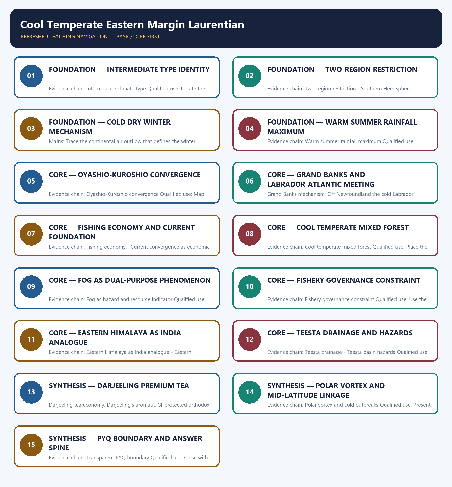

# Cool Temperate Eastern Margin Laurentian — Learner-v2 Complete Learning Session

> **Authoring-only generation:** 2026-09-01. No PDF was rendered and no tracker or index was mutated.

### SOURCE, PROGRESSION AND CURRENT-LINKAGE AUDIT

- **Generation date:** 2026-09-01.
- **Repository-first evidence:** the Basic owner is taught first and preserved in full; the Advanced owner is retained only in the optional final teaching block.
- **OCR evidence:** Repository Markdown was primary. The three required local Geography books were inspected as supplementary OCR/searchable evidence. No unsupported page precision, volatile figure or quotation was imported.
- **Qdrant:** not used; repository Markdown and available OCR context were sufficient.
- **PYQ integrity:** The audited routing ledgers contain no direct question owned by Geography Topic 24. Laurentian and Eastern Himalaya concepts may be tested through adjacent climate or regional geography questions, but no solved PYQ or fabricated answer key is included.
- **Live-link boundary:** Tea Board and CWC sources are used only to establish Darjeeling GI tea and Teesta basin flood management as live current anchors. No volatile production, yield or GLOF claim is quoted without a dated official source.
- **Fact/inference discipline:** no current-affairs item, PYQ wording, figure or quotation is invented.

## BASIC LEARNING SESSION

### DEEP-REVIEW LEARNING CONTRACT

| Control | Binding rule for this package |
|---|---|
| Syllabus boundary | Complete physical process, spatial pattern and India anchor are taught before optional Advanced depth. |
| Causal method | Initial condition → energy/force or driver → mechanism → landform/climate/ocean pattern → consequence → feedback/limit. |
| Spatial method | Latitude, altitude, continentality, relief, plate setting, basin/coast orientation and map scale are explicit. |
| Terminology | Close terms are defined on common axes; process, form, region, hazard, regulation and current status are never collapsed. |
| Evidence method | Claim → named place/map/process/official record → analysis → qualification. |
| Practice contract | Every solved item has demand decoding, a detailed examiner-grade model, executable timed/compression plan, marks rationale and answer-specific improvement. |
| Approval | This immutable successor remains `approved: false` pending explicit approval. |

**Canonical Basic/Core owner:** `upsc-ai-kit\knowledge\Geography\basic\24_Cool-Temperate-Eastern-Margin-Laurentian.md`  
**Canonical topic owner:** `upsc-ai-kit\knowledge\Geography\basic\24_Cool-Temperate-Eastern-Margin-Laurentian.md`  
**Optional Advanced owner:** `upsc-ai-kit\knowledge\Geography\advanced\24_India-Eastern-Himalaya-Temperate.md`  
**Official syllabus mapping:** `upsc-ai-kit\knowledge\Geography\OFFICIAL-UPSC-SYLLABUS-MAPPING.md`

### EVIDENCE, PYQ AND CURRENT-STATUS CONTROL

- **Process discipline:** no feature is listed without formation sequence, controlling variables and a limiting condition.
- **Map discipline:** distribution is reconstructed through latitude, plate/relief setting, wind/current direction, drainage/coast orientation and named anchors.
- **Quantitative discipline:** coordinates, thresholds, magnitudes, dates, counts and project dimensions retain units, source/date and uncertainty.
- **Causal discipline:** association is not treated as sufficiency; interacting controls, scale, lag, feedback and exceptions are stated.
- **PYQ discipline:** repository routing ledgers and held papers control wording and metadata; reconstructed wording and unavailable official keys remain labelled.
- **Current-status note, rechecked 2026-09-01:** The static physical-geography core needs no volatile claim. Any hazard event, project, designation, regulatory status, climate anomaly or count must retain an official source, observation date and status boundary.

**Live/official context sources recorded by the predecessor generation:**

- No live source is required for the static physical-geography claim.




*Distinct embedded teaching-navigation image. The separate continuous Cārvāka-style flowchart package remains an independent at-a-glance artifact.*

### SESSION 1 — FOUNDATION — INTERMEDIATE TYPE IDENTITY

#### DEFINITION / WHAT THIS IS CALLED

**Plain-language definition:** Intermediate climate type: The Cool Temperate Eastern Margin or Laurentian climate is an intermediate type between the British maritime and Siberian continental types, combining features of both: cold dry winters from continental air and warm summers with a summer rainfall maximum from ocean easterlies.

**Technical definition:** Evidence chain: Intermediate climate type Qualified use: Locate the type between the British maritime and Siberian continental extremes.

#### ANSWER-GRABBING OPENING — WRITE/ADAPT IN THE EXAM

> Intermediate climate type: The Cool Temperate Eastern Margin or Laurentian climate is an intermediate type between the British maritime and Siberian continental types, combining features of both: cold dry winters from continental air and warm summers with a summer rainfall maximum from ocean easterlies.

#### MUST-WRITE KEYWORDS

- **FOUNDATION**
- **Intermediate type identity**
- **Intermediate climate type**
- **Evidence chain**
- **Qualified use**
- **The Cool Temperate Eastern Margin or Laurentian climate**

**How to use them:** Frame the answer through FOUNDATION; define Intermediate type identity, connect Intermediate climate type with Evidence chain to explain the mechanism, and use Qualified use for the decisive comparison or qualification.

#### VISUAL FIRST

```text
INTERMEDIATE TYPE IDENTITY
01. Intermediate climate type
BOUNDARY -> This is intermediate, not a simple average of British and Siberian.
```

*This topic-specific rail fixes the evidence sequence and its exam boundary before analysis.*

#### CORE EXPLANATION

The Cool Temperate Eastern Margin or Laurentian climate is an intermediate type between the British maritime and Siberian continental types, combining features of both: cold dry winters from continental air and warm summers with a summer rainfall maximum from ocean easterlies.

#### NAMED EVIDENCE AND MECHANISM

- **Intermediate climate type:** The Cool Temperate Eastern Margin or Laurentian climate is an intermediate type between the British maritime and Siberian continental types, combining features of both: cold dry winters from continental air and warm summers with a summer rainfall maximum from ocean easterlies.

#### EXAMINER CAUTION

- This is intermediate, not a simple average of British and Siberian.

#### EXAM LINK

- **Prelims:** Separate the agent, landform, location, status and scale attached to Intermediate type identity.
- **Mains:** Locate the type between the British maritime and Siberian continental extremes.

#### MINI RECAP

- **Evidence chain:** Intermediate climate type
- **Qualified use:** Locate the type between the British maritime and Siberian continental extremes.

#### CLOSING RECALL FLOW — FOUNDATION — INTERMEDIATE TYPE IDENTITY

```text
START / CONCEPT: FOUNDATION — Intermediate type identity
        |
        v
EXACT TERMS: FOUNDATION · Intermediate type identity · Intermediate climate type · Evidence chain · Qualified use · The Cool Temperate Eastern Margin or Laurentian climate
        |
        v
MECHANISM / ARGUMENT: Evidence chain: Intermediate climate type Qualified use: Locate the type between the British maritime and Siberian continental extremes.
        |
        v
CONSEQUENCE / CONTRAST: This is intermediate, not a simple average of British and Siberian.
        |
        v
UPSC TRAP / ANSWER-USE: Do not miss this limiting distinction: this is intermediate, not a simple average of British and Siberian.
        |
        v
ANSWER-GRABBING FORMULATION: Intermediate climate type: The Cool Temperate Eastern Margin or Laurentian climate is an intermediate type between the British maritime and Siberian continental types, combining features of both: cold dry winters from continental air and warm summers with a summer rainfall maximum from ocean easterlies.
```
### SESSION 2 — FOUNDATION — TWO-REGION RESTRICTION

#### DEFINITION / WHAT THIS IS CALLED

**Plain-language definition:** Two-region restriction: The Laurentian type occurs in only two regions and is absent from the Southern Hemisphere: NE North America including eastern Canada, the Maritime Provinces, New England and Newfoundland; and eastern Asia including eastern Siberia, North China, Manchuria, Korea and northern Japan.

**Technical definition:** Evidence chain: Two-region restriction - Southern Hemisphere absence Qualified use: Map NE North America and East Asia as the only two regions.

#### ANSWER-GRABBING OPENING — WRITE/ADAPT IN THE EXAM

> Two-region restriction: The Laurentian type occurs in only two regions and is absent from the Southern Hemisphere: NE North America including eastern Canada, the Maritime Provinces, New England and Newfoundland; and eastern Asia including eastern Siberia, North China, Manchuria, Korea and northern Japan.

#### MUST-WRITE KEYWORDS

- **FOUNDATION**
- **Two-region restriction**
- **Southern Hemisphere absence**
- **Evidence chain**
- **Qualified use**
- **The Laurentian**

**How to use them:** Frame the answer through FOUNDATION; define Two-region restriction, connect Southern Hemisphere absence with Evidence chain to explain the mechanism, and use Qualified use for the decisive comparison or qualification.

#### VISUAL FIRST

```text
TWO-REGION RESTRICTION
01. Two-region restriction
    |
    v
02. Southern Hemisphere absence
BOUNDARY -> No Southern Hemisphere land exists at the relevant latitudes.
```

*This topic-specific rail fixes the evidence sequence and its exam boundary before analysis.*

#### CORE EXPLANATION

The Laurentian type occurs in only two regions and is absent from the Southern Hemisphere: NE North America including eastern Canada, the Maritime Provinces, New England and Newfoundland; and eastern Asia including eastern Siberia, North China, Manchuria, Korea and northern Japan. The Laurentian type is absent in the Southern Hemisphere because the continents are narrow or absent at the relevant latitudes, so no continental interior exists to generate the defining cold dry winter air mass.

#### NAMED EVIDENCE AND MECHANISM

- **Two-region restriction:** The Laurentian type occurs in only two regions and is absent from the Southern Hemisphere: NE North America including eastern Canada, the Maritime Provinces, New England and Newfoundland; and eastern Asia including eastern Siberia, North China, Manchuria, Korea and northern Japan.
- **Southern Hemisphere absence:** The Laurentian type is absent in the Southern Hemisphere because the continents are narrow or absent at the relevant latitudes, so no continental interior exists to generate the defining cold dry winter air mass.

#### EXAMINER CAUTION

- No Southern Hemisphere land exists at the relevant latitudes.

#### EXAM LINK

- **Prelims:** Separate the agent, landform, location, status and scale attached to Two-region restriction.
- **Mains:** Map NE North America and East Asia as the only two regions.

#### MINI RECAP

- **Evidence chain:** Two-region restriction -> Southern Hemisphere absence
- **Qualified use:** Map NE North America and East Asia as the only two regions.

#### CLOSING RECALL FLOW — FOUNDATION — TWO-REGION RESTRICTION

```text
START / CONCEPT: FOUNDATION — Two-region restriction
        |
        v
EXACT TERMS: FOUNDATION · Two-region restriction · Southern Hemisphere absence · Evidence chain · Qualified use · The Laurentian
        |
        v
MECHANISM / ARGUMENT: Evidence chain: Two-region restriction - Southern Hemisphere absence Qualified use: Map NE North America and East Asia as the only two regions.
        |
        v
CONSEQUENCE / CONTRAST: Southern Hemisphere absence: The Laurentian type is absent in the Southern Hemisphere because the continents are narrow or absent at the relevant latitudes, so no continental interior exists to generate the defining cold dry winter air mass.
        |
        v
UPSC TRAP / ANSWER-USE: Do not miss this limiting distinction: two-region restriction - Southern Hemisphere absence Qualified use.
        |
        v
ANSWER-GRABBING FORMULATION: Two-region restriction: The Laurentian type occurs in only two regions and is absent from the Southern Hemisphere: NE North America including eastern Canada, the Maritime Provinces, New England and Newfoundland; and eastern Asia including eastern Siberia, North China, Manchuria, Korea and northern Japan.
```
### SESSION 3 — FOUNDATION — COLD DRY WINTER MECHANISM

#### DEFINITION / WHAT THIS IS CALLED

**Plain-language definition:** Evidence chain: Cold dry winter mechanism Qualified use: Trace the continental air outflow that defines the winter character.

**Technical definition:** Mains: Trace the continental air outflow that defines the winter character.

#### ANSWER-GRABBING OPENING — WRITE/ADAPT IN THE EXAM

> Evidence chain: Cold dry winter mechanism Qualified use: Trace the continental air outflow that defines the winter character.

#### MUST-WRITE KEYWORDS

- **FOUNDATION**
- **Cold dry winter mechanism**
- **Evidence chain**
- **Qualified use**
- **Trace**
- **Cold**

**How to use them:** Frame the answer through FOUNDATION; define Cold dry winter mechanism, connect Evidence chain with Qualified use to explain the mechanism, and use Trace for the decisive comparison or qualification.

#### VISUAL FIRST

```text
COLD DRY WINTER MECHANISM
01. Cold dry winter mechanism
BOUNDARY -> Continental Westerlies, not latitude, cause the cold dry winters.
```

*This topic-specific rail fixes the evidence sequence and its exam boundary before analysis.*

#### CORE EXPLANATION

Cold dry winters result from Westerly winds blowing outward from the chilled continental interior; these carry dry, frigid air to the eastern margins, creating the type's most distinctive winter character.

#### NAMED EVIDENCE AND MECHANISM

- **Cold dry winter mechanism:** Cold dry winters result from Westerly winds blowing outward from the chilled continental interior; these carry dry, frigid air to the eastern margins, creating the type's most distinctive winter character.

#### EXAMINER CAUTION

- Continental Westerlies, not latitude, cause the cold dry winters.

#### EXAM LINK

- **Prelims:** Separate the agent, landform, location, status and scale attached to Cold dry winter mechanism.
- **Mains:** Trace the continental air outflow that defines the winter character.

#### MINI RECAP

- **Evidence chain:** Cold dry winter mechanism
- **Qualified use:** Trace the continental air outflow that defines the winter character.

#### CLOSING RECALL FLOW — FOUNDATION — COLD DRY WINTER MECHANISM

```text
START / CONCEPT: FOUNDATION — Cold dry winter mechanism
        |
        v
EXACT TERMS: FOUNDATION · Cold dry winter mechanism · Evidence chain · Qualified use · Trace · Cold
        |
        v
MECHANISM / ARGUMENT: Mains: Trace the continental air outflow that defines the winter character.
        |
        v
CONSEQUENCE / CONTRAST: The resulting consequence is that cold dry winter mechanism Qualified use.
        |
        v
UPSC TRAP / ANSWER-USE: Do not miss this limiting distinction: cold dry winter mechanism Qualified use.
        |
        v
ANSWER-GRABBING FORMULATION: Evidence chain: Cold dry winter mechanism Qualified use: Trace the continental air outflow that defines the winter character.
```
### SESSION 4 — FOUNDATION — WARM SUMMER RAINFALL MAXIMUM

#### DEFINITION / WHAT THIS IS CALLED

**Plain-language definition:** Warm summers receive about two-thirds of the total 30 to 60 inches of precipitation from easterly winds off the oceans, giving a distinct summer rainfall maximum that is the reverse of the British type's autumn-winter rain.

**Technical definition:** Evidence chain: Warm summer rainfall maximum Qualified use: Explain the two-thirds summer share of 30-60 inches annual rainfall.

#### ANSWER-GRABBING OPENING — WRITE/ADAPT IN THE EXAM

> Evidence chain: Warm summer rainfall maximum Qualified use: Explain the two-thirds summer share of 30-60 inches annual rainfall.

#### MUST-WRITE KEYWORDS

- **FOUNDATION**
- **Warm summer rainfall maximum**
- **Evidence chain**
- **Qualified use**
- **Warm**
- **British**

**How to use them:** Frame the answer through FOUNDATION; define Warm summer rainfall maximum, connect Evidence chain with Qualified use to explain the mechanism, and use Warm for the decisive comparison or qualification.

#### VISUAL FIRST

```text
WARM SUMMER RAINFALL MAXIMUM
01. Warm summer rainfall maximum
BOUNDARY -> Summer maximum is the reverse of the British type.
```

*This topic-specific rail fixes the evidence sequence and its exam boundary before analysis.*

#### CORE EXPLANATION

Warm summers receive about two-thirds of the total 30 to 60 inches of precipitation from easterly winds off the oceans, giving a distinct summer rainfall maximum that is the reverse of the British type's autumn-winter rain.

#### NAMED EVIDENCE AND MECHANISM

- **Warm summer rainfall maximum:** Warm summers receive about two-thirds of the total 30 to 60 inches of precipitation from easterly winds off the oceans, giving a distinct summer rainfall maximum that is the reverse of the British type's autumn-winter rain.

#### EXAMINER CAUTION

- Summer maximum is the reverse of the British type.

#### EXAM LINK

- **Prelims:** Separate the agent, landform, location, status and scale attached to Warm summer rainfall maximum.
- **Mains:** Explain the two-thirds summer share of 30-60 inches annual rainfall.

#### MINI RECAP

- **Evidence chain:** Warm summer rainfall maximum
- **Qualified use:** Explain the two-thirds summer share of 30-60 inches annual rainfall.

#### CLOSING RECALL FLOW — FOUNDATION — WARM SUMMER RAINFALL MAXIMUM

```text
START / CONCEPT: FOUNDATION — Warm summer rainfall maximum
        |
        v
EXACT TERMS: FOUNDATION · Warm summer rainfall maximum · Evidence chain · Qualified use · Warm · British
        |
        v
MECHANISM / ARGUMENT: Warm summers receive about two-thirds of the total 30 to 60 inches of precipitation from easterly winds off the oceans, giving a distinct summer rainfall maximum that is the reverse of the British type's autumn-winter rain.
        |
        v
CONSEQUENCE / CONTRAST: Mains: Explain the two-thirds summer share of 30-60 inches annual rainfall.
        |
        v
UPSC TRAP / ANSWER-USE: Do not miss this limiting distinction: summer maximum is the reverse of the British type.
        |
        v
ANSWER-GRABBING FORMULATION: Evidence chain: Warm summer rainfall maximum Qualified use: Explain the two-thirds summer share of 30-60 inches annual rainfall.
```
### SESSION 5 — CORE — OYASHIO-KUROSHIO CONVERGENCE

#### DEFINITION / WHAT THIS IS CALLED

**Plain-language definition:** Oyashio-Kuroshio convergence: Off northern Japan the cold Oyashio current meets the warm Kuroshio, producing fog and mist and making north Japan a second Newfoundland; the convergence zone is a major fishing ground supported by nutrient mixing over shallow shelves.

**Technical definition:** Evidence chain: Oyashio-Kuroshio convergence Qualified use: Map northern Japan's current meeting and its dual economic effect.

#### ANSWER-GRABBING OPENING — WRITE/ADAPT IN THE EXAM

> Oyashio-Kuroshio convergence: Off northern Japan the cold Oyashio current meets the warm Kuroshio, producing fog and mist and making north Japan a second Newfoundland; the convergence zone is a major fishing ground supported by nutrient mixing over shallow shelves.

#### MUST-WRITE KEYWORDS

- **Oyashio-Kuroshio convergence**
- **Evidence chain**
- **Qualified use**
- **Off**
- **Japan**
- **Oyashio**

**How to use them:** Frame the answer through Oyashio-Kuroshio convergence; define Evidence chain, connect Qualified use with Off to explain the mechanism, and use Japan for the decisive comparison or qualification.

#### VISUAL FIRST

```text
OYASHIO-KUROSHIO CONVERGENCE
01. Oyashio-Kuroshio convergence
BOUNDARY -> Convergence produces fog and fish, not just one.
```

*This topic-specific rail fixes the evidence sequence and its exam boundary before analysis.*

#### CORE EXPLANATION

Off northern Japan the cold Oyashio current meets the warm Kuroshio, producing fog and mist and making north Japan a second Newfoundland; the convergence zone is a major fishing ground supported by nutrient mixing over shallow shelves.

#### NAMED EVIDENCE AND MECHANISM

- **Oyashio-Kuroshio convergence:** Off northern Japan the cold Oyashio current meets the warm Kuroshio, producing fog and mist and making north Japan a second Newfoundland; the convergence zone is a major fishing ground supported by nutrient mixing over shallow shelves.

#### EXAMINER CAUTION

- Convergence produces fog and fish, not just one.

#### EXAM LINK

- **Prelims:** Separate the agent, landform, location, status and scale attached to Oyashio-Kuroshio convergence.
- **Mains:** Map northern Japan's current meeting and its dual economic effect.

#### MINI RECAP

- **Evidence chain:** Oyashio-Kuroshio convergence
- **Qualified use:** Map northern Japan's current meeting and its dual economic effect.

#### CLOSING RECALL FLOW — CORE — OYASHIO-KUROSHIO CONVERGENCE

```text
START / CONCEPT: CORE — Oyashio-Kuroshio convergence
        |
        v
EXACT TERMS: Oyashio-Kuroshio convergence · Evidence chain · Qualified use · Off · Japan · Oyashio
        |
        v
MECHANISM / ARGUMENT: Evidence chain: Oyashio-Kuroshio convergence Qualified use: Map northern Japan's current meeting and its dual economic effect.
        |
        v
CONSEQUENCE / CONTRAST: Convergence produces fog and fish, not just one.
        |
        v
UPSC TRAP / ANSWER-USE: Do not miss this limiting distinction: map northern Japan's current meeting and its dual economic effect.
        |
        v
ANSWER-GRABBING FORMULATION: Oyashio-Kuroshio convergence: Off northern Japan the cold Oyashio current meets the warm Kuroshio, producing fog and mist and making north Japan a second Newfoundland; the convergence zone is a major fishing ground supported by nutrient mixing over shallow shelves.
```
### SESSION 6 — CORE — GRAND BANKS AND LABRADOR-ATLANTIC MEETING

#### DEFINITION / WHAT THIS IS CALLED

**Plain-language definition:** Evidence chain: Grand Banks mechanism - Fog as hazard and resource indicator Qualified use: Trace the Newfoundland mechanism from current convergence through fog to fishery.

**Technical definition:** Grand Banks mechanism: Off Newfoundland the cold Labrador Current meets warmer Atlantic water over the shallow Grand Banks, favouring fog; fish productivity depends on shelf mixing, nutrient supply and management, not merely on warm-cold current meeting alone.

#### ANSWER-GRABBING OPENING — WRITE/ADAPT IN THE EXAM

> Grand Banks mechanism: Off Newfoundland the cold Labrador Current meets warmer Atlantic water over the shallow Grand Banks, favouring fog; fish productivity depends on shelf mixing, nutrient supply and management, not merely on warm-cold current meeting alone.

#### MUST-WRITE KEYWORDS

- **Grand Banks**
- **Labrador-Atlantic meeting**
- **Grand Banks mechanism**
- **Fog as hazard and resource indicator**
- **Evidence chain**
- **Qualified use**

**How to use them:** Frame the answer through Grand Banks; define Labrador-Atlantic meeting, connect Grand Banks mechanism with Fog as hazard and resource indicator to explain the mechanism, and use Evidence chain for the decisive comparison or qualification.

#### VISUAL FIRST

```text
GRAND BANKS AND LABRADOR-ATLANTIC MEETING
01. Grand Banks mechanism
    |
    v
02. Fog as hazard and resource indicator
BOUNDARY -> Fish productivity requires shelf, mixing and management, not just currents.
```

*This topic-specific rail fixes the evidence sequence and its exam boundary before analysis.*

#### CORE EXPLANATION

Off Newfoundland the cold Labrador Current meets warmer Atlantic water over the shallow Grand Banks, favouring fog; fish productivity depends on shelf mixing, nutrient supply and management, not merely on warm-cold current meeting alone. Fog at current convergence zones is simultaneously a navigational hazard and a biological indicator of nutrient-rich mixing waters; the same process that creates poor visibility creates high marine productivity.

#### NAMED EVIDENCE AND MECHANISM

- **Grand Banks mechanism:** Off Newfoundland the cold Labrador Current meets warmer Atlantic water over the shallow Grand Banks, favouring fog; fish productivity depends on shelf mixing, nutrient supply and management, not merely on warm-cold current meeting alone.
- **Fog as hazard and resource indicator:** Fog at current convergence zones is simultaneously a navigational hazard and a biological indicator of nutrient-rich mixing waters; the same process that creates poor visibility creates high marine productivity.

#### EXAMINER CAUTION

- Fish productivity requires shelf, mixing and management, not just currents.

#### EXAM LINK

- **Prelims:** Separate the agent, landform, location, status and scale attached to Grand Banks and Labrador-Atlantic meeting.
- **Mains:** Trace the Newfoundland mechanism from current convergence through fog to fishery.

#### MINI RECAP

- **Evidence chain:** Grand Banks mechanism -> Fog as hazard and resource indicator
- **Qualified use:** Trace the Newfoundland mechanism from current convergence through fog to fishery.

#### CLOSING RECALL FLOW — CORE — GRAND BANKS AND LABRADOR-ATLANTIC MEETING

```text
START / CONCEPT: CORE — Grand Banks and Labrador-Atlantic meeting
        |
        v
EXACT TERMS: Grand Banks · Labrador-Atlantic meeting · Grand Banks mechanism · Fog as hazard and resource indicator · Evidence chain · Qualified use
        |
        v
MECHANISM / ARGUMENT: Evidence chain: Grand Banks mechanism - Fog as hazard and resource indicator Qualified use: Trace the Newfoundland mechanism from current convergence through fog to fishery.
        |
        v
CONSEQUENCE / CONTRAST: Fish productivity requires shelf, mixing and management, not just currents.
        |
        v
UPSC TRAP / ANSWER-USE: Do not miss this limiting distinction: fog as hazard and resource indicator.
        |
        v
ANSWER-GRABBING FORMULATION: Grand Banks mechanism: Off Newfoundland the cold Labrador Current meets warmer Atlantic water over the shallow Grand Banks, favouring fog; fish productivity depends on shelf mixing, nutrient supply and management, not merely on warm-cold current meeting alone.
```
### SESSION 7 — CORE — FISHING ECONOMY AND CURRENT FOUNDATION

#### DEFINITION / WHAT THIS IS CALLED

**Plain-language definition:** Current convergence as economic foundation: The Laurentian type's economic foundation is built on the sea rather than the land because the same current configuration that produces harsh foggy climate also produces exceptional marine productivity on broad shallow shelves.

**Technical definition:** Evidence chain: Fishing economy - Current convergence as economic foundation Qualified use: Connect the physical oceanographic base to the Laurentian economic identity.

#### ANSWER-GRABBING OPENING — WRITE/ADAPT IN THE EXAM

> Evidence chain: Fishing economy - Current convergence as economic foundation Qualified use: Connect the physical oceanographic base to the Laurentian economic identity.

#### MUST-WRITE KEYWORDS

- **Fishing economy**
- **current foundation**
- **Current convergence as economic foundation**
- **Evidence chain**
- **Qualified use**
- **Fishing**

**How to use them:** Frame the answer through Fishing economy; define current foundation, connect Current convergence as economic foundation with Evidence chain to explain the mechanism, and use Qualified use for the decisive comparison or qualification.

#### VISUAL FIRST

```text
FISHING ECONOMY AND CURRENT FOUNDATION
01. Fishing economy
    |
    v
02. Current convergence as economic foundation
BOUNDARY -> The economy is built on the sea, not the land.
```

*This topic-specific rail fixes the evidence sequence and its exam boundary before analysis.*

#### CORE EXPLANATION

Fishing replaces agriculture as the main occupation in many Laurentian coastlands; the convergence of warm and cold currents over broad shallow shelves creates the physical basis for world-historic fishing grounds. The Laurentian type's economic foundation is built on the sea rather than the land because the same current configuration that produces harsh foggy climate also produces exceptional marine productivity on broad shallow shelves.

#### NAMED EVIDENCE AND MECHANISM

- **Fishing economy:** Fishing replaces agriculture as the main occupation in many Laurentian coastlands; the convergence of warm and cold currents over broad shallow shelves creates the physical basis for world-historic fishing grounds.
- **Current convergence as economic foundation:** The Laurentian type's economic foundation is built on the sea rather than the land because the same current configuration that produces harsh foggy climate also produces exceptional marine productivity on broad shallow shelves.

#### EXAMINER CAUTION

- The economy is built on the sea, not the land.

#### EXAM LINK

- **Prelims:** Separate the agent, landform, location, status and scale attached to Fishing economy and current foundation.
- **Mains:** Connect the physical oceanographic base to the Laurentian economic identity.

#### MINI RECAP

- **Evidence chain:** Fishing economy -> Current convergence as economic foundation
- **Qualified use:** Connect the physical oceanographic base to the Laurentian economic identity.

#### CLOSING RECALL FLOW — CORE — FISHING ECONOMY AND CURRENT FOUNDATION

```text
START / CONCEPT: CORE — Fishing economy and current foundation
        |
        v
EXACT TERMS: Fishing economy · current foundation · Current convergence as economic foundation · Evidence chain · Qualified use · Fishing
        |
        v
MECHANISM / ARGUMENT: Current convergence as economic foundation: The Laurentian type's economic foundation is built on the sea rather than the land because the same current configuration that produces harsh foggy climate also produces exceptional marine productivity on broad shallow shelves.
        |
        v
CONSEQUENCE / CONTRAST: The economy is built on the sea, not the land.
        |
        v
UPSC TRAP / ANSWER-USE: Do not miss this limiting distinction: fishing replaces agriculture as the main occupation in many Laurentian coastlands.
        |
        v
ANSWER-GRABBING FORMULATION: Evidence chain: Fishing economy - Current convergence as economic foundation Qualified use: Connect the physical oceanographic base to the Laurentian economic identity.
```
### SESSION 8 — CORE — COOL TEMPERATE MIXED FOREST

#### DEFINITION / WHAT THIS IS CALLED

**Plain-language definition:** Cool temperate mixed forest: The predominant natural vegetation is cool temperate forest of mixed coniferous-deciduous character, a transition between the deciduous British type forest and the coniferous Siberian taiga, favoured by heavy rain, warm summers and damp air.

**Technical definition:** Evidence chain: Cool temperate mixed forest Qualified use: Place the mixed forest between the British deciduous and Siberian coniferous.

#### ANSWER-GRABBING OPENING — WRITE/ADAPT IN THE EXAM

> Cool temperate mixed forest: The predominant natural vegetation is cool temperate forest of mixed coniferous-deciduous character, a transition between the deciduous British type forest and the coniferous Siberian taiga, favoured by heavy rain, warm summers and damp air.

#### MUST-WRITE KEYWORDS

- **Cool temperate mixed forest**
- **Evidence chain**
- **Qualified use**
- **The predominant natural vegetation**
- **British**
- **Siberian**

**How to use them:** Frame the answer through Cool temperate mixed forest; define Evidence chain, connect Qualified use with The predominant natural vegetation to explain the mechanism, and use British for the decisive comparison or qualification.

#### VISUAL FIRST

```text
COOL TEMPERATE MIXED FOREST
01. Cool temperate mixed forest
BOUNDARY -> A transition forest, not purely coniferous or deciduous.
```

*This topic-specific rail fixes the evidence sequence and its exam boundary before analysis.*

#### CORE EXPLANATION

The predominant natural vegetation is cool temperate forest of mixed coniferous-deciduous character, a transition between the deciduous British type forest and the coniferous Siberian taiga, favoured by heavy rain, warm summers and damp air.

#### NAMED EVIDENCE AND MECHANISM

- **Cool temperate mixed forest:** The predominant natural vegetation is cool temperate forest of mixed coniferous-deciduous character, a transition between the deciduous British type forest and the coniferous Siberian taiga, favoured by heavy rain, warm summers and damp air.

#### EXAMINER CAUTION

- A transition forest, not purely coniferous or deciduous.

#### EXAM LINK

- **Prelims:** Separate the agent, landform, location, status and scale attached to Cool temperate mixed forest.
- **Mains:** Place the mixed forest between the British deciduous and Siberian coniferous.

#### MINI RECAP

- **Evidence chain:** Cool temperate mixed forest
- **Qualified use:** Place the mixed forest between the British deciduous and Siberian coniferous.

#### CLOSING RECALL FLOW — CORE — COOL TEMPERATE MIXED FOREST

```text
START / CONCEPT: CORE — Cool temperate mixed forest
        |
        v
EXACT TERMS: Cool temperate mixed forest · Evidence chain · Qualified use · The predominant natural vegetation · British · Siberian
        |
        v
MECHANISM / ARGUMENT: Evidence chain: Cool temperate mixed forest Qualified use: Place the mixed forest between the British deciduous and Siberian coniferous.
        |
        v
CONSEQUENCE / CONTRAST: The resulting consequence is that cool temperate mixed forest Qualified use.
        |
        v
UPSC TRAP / ANSWER-USE: Do not miss this limiting distinction: cool temperate mixed forest Qualified use.
        |
        v
ANSWER-GRABBING FORMULATION: Cool temperate mixed forest: The predominant natural vegetation is cool temperate forest of mixed coniferous-deciduous character, a transition between the deciduous British type forest and the coniferous Siberian taiga, favoured by heavy rain, warm summers and damp air.
```
### SESSION 9 — CORE — FOG AS DUAL-PURPOSE PHENOMENON

#### DEFINITION / WHAT THIS IS CALLED

**Plain-language definition:** Fog as hazard and resource indicator: Fog at current convergence zones is simultaneously a navigational hazard and a biological indicator of nutrient-rich mixing waters; the same process that creates poor visibility creates high marine productivity.

**Technical definition:** Evidence chain: Fog as hazard and resource indicator Qualified use: Explain why the same process creates poor visibility and high marine productivity.

#### ANSWER-GRABBING OPENING — WRITE/ADAPT IN THE EXAM

> Evidence chain: Fog as hazard and resource indicator Qualified use: Explain why the same process creates poor visibility and high marine productivity.

#### MUST-WRITE KEYWORDS

- **Fog as dual-purpose phenomenon**
- **Fog as hazard and resource indicator**
- **Evidence chain**
- **Qualified use**
- **Fog at current convergence zones**
- **Fog**

**How to use them:** Frame the answer through Fog as dual-purpose phenomenon; define Fog as hazard and resource indicator, connect Evidence chain with Qualified use to explain the mechanism, and use Fog at current convergence zones for the decisive comparison or qualification.

#### VISUAL FIRST

```text
FOG AS DUAL-PURPOSE PHENOMENON
01. Fog as hazard and resource indicator
BOUNDARY -> Fog is a hazard and a resource indicator simultaneously.
```

*This topic-specific rail fixes the evidence sequence and its exam boundary before analysis.*

#### CORE EXPLANATION

Fog at current convergence zones is simultaneously a navigational hazard and a biological indicator of nutrient-rich mixing waters; the same process that creates poor visibility creates high marine productivity.

#### NAMED EVIDENCE AND MECHANISM

- **Fog as hazard and resource indicator:** Fog at current convergence zones is simultaneously a navigational hazard and a biological indicator of nutrient-rich mixing waters; the same process that creates poor visibility creates high marine productivity.

#### EXAMINER CAUTION

- Fog is a hazard and a resource indicator simultaneously.

#### EXAM LINK

- **Prelims:** Separate the agent, landform, location, status and scale attached to Fog as dual-purpose phenomenon.
- **Mains:** Explain why the same process creates poor visibility and high marine productivity.

#### MINI RECAP

- **Evidence chain:** Fog as hazard and resource indicator
- **Qualified use:** Explain why the same process creates poor visibility and high marine productivity.

#### CLOSING RECALL FLOW — CORE — FOG AS DUAL-PURPOSE PHENOMENON

```text
START / CONCEPT: CORE — Fog as dual-purpose phenomenon
        |
        v
EXACT TERMS: Fog as dual-purpose phenomenon · Fog as hazard and resource indicator · Evidence chain · Qualified use · Fog at current convergence zones · Fog
        |
        v
MECHANISM / ARGUMENT: Fog as hazard and resource indicator: Fog at current convergence zones is simultaneously a navigational hazard and a biological indicator of nutrient-rich mixing waters; the same process that creates poor visibility creates high marine productivity.
        |
        v
CONSEQUENCE / CONTRAST: Mains: Explain why the same process creates poor visibility and high marine productivity.
        |
        v
UPSC TRAP / ANSWER-USE: Do not miss this limiting distinction: fog is a hazard and a resource indicator simultaneously.
        |
        v
ANSWER-GRABBING FORMULATION: Evidence chain: Fog as hazard and resource indicator Qualified use: Explain why the same process creates poor visibility and high marine productivity.
```
### SESSION 10 — CORE — FISHERY GOVERNANCE CONSTRAINT

#### DEFINITION / WHAT THIS IS CALLED

**Plain-language definition:** Fishery governance constraint: The physical basis of the fishery is a potential, not a guarantee: heavily exploited stocks such as the Grand Banks cod have collapsed despite unchanged oceanography, so the constraint is governance, not geography.

**Technical definition:** Evidence chain: Fishery governance constraint Qualified use: Use the Grand Banks cod collapse to qualify physical-determinist arguments.

#### ANSWER-GRABBING OPENING — WRITE/ADAPT IN THE EXAM

> Fishery governance constraint: The physical basis of the fishery is a potential, not a guarantee: heavily exploited stocks such as the Grand Banks cod have collapsed despite unchanged oceanography, so the constraint is governance, not geography.

#### MUST-WRITE KEYWORDS

- **Fishery governance constraint**
- **Evidence chain**
- **Qualified use**
- **The physical basis of the fishery**
- **Grand Banks**
- **Fishery**

**How to use them:** Frame the answer through Fishery governance constraint; define Evidence chain, connect Qualified use with The physical basis of the fishery to explain the mechanism, and use Grand Banks for the decisive comparison or qualification.

#### VISUAL FIRST

```text
FISHERY GOVERNANCE CONSTRAINT
01. Fishery governance constraint
BOUNDARY -> Physical basis is a potential, not a guarantee.
```

*This topic-specific rail fixes the evidence sequence and its exam boundary before analysis.*

#### CORE EXPLANATION

The physical basis of the fishery is a potential, not a guarantee: heavily exploited stocks such as the Grand Banks cod have collapsed despite unchanged oceanography, so the constraint is governance, not geography.

#### NAMED EVIDENCE AND MECHANISM

- **Fishery governance constraint:** The physical basis of the fishery is a potential, not a guarantee: heavily exploited stocks such as the Grand Banks cod have collapsed despite unchanged oceanography, so the constraint is governance, not geography.

#### EXAMINER CAUTION

- Physical basis is a potential, not a guarantee.

#### EXAM LINK

- **Prelims:** Separate the agent, landform, location, status and scale attached to Fishery governance constraint.
- **Mains:** Use the Grand Banks cod collapse to qualify physical-determinist arguments.

#### MINI RECAP

- **Evidence chain:** Fishery governance constraint
- **Qualified use:** Use the Grand Banks cod collapse to qualify physical-determinist arguments.

#### CLOSING RECALL FLOW — CORE — FISHERY GOVERNANCE CONSTRAINT

```text
START / CONCEPT: CORE — Fishery governance constraint
        |
        v
EXACT TERMS: Fishery governance constraint · Evidence chain · Qualified use · The physical basis of the fishery · Grand Banks · Fishery
        |
        v
MECHANISM / ARGUMENT: Evidence chain: Fishery governance constraint Qualified use: Use the Grand Banks cod collapse to qualify physical-determinist arguments.
        |
        v
CONSEQUENCE / CONTRAST: Physical basis is a potential, not a guarantee.
        |
        v
UPSC TRAP / ANSWER-USE: Do not miss this limiting distinction: use the Grand Banks cod collapse to qualify physical-determinist arguments.
        |
        v
ANSWER-GRABBING FORMULATION: Fishery governance constraint: The physical basis of the fishery is a potential, not a guarantee: heavily exploited stocks such as the Grand Banks cod have collapsed despite unchanged oceanography, so the constraint is governance, not geography.
```
### SESSION 11 — CORE — EASTERN HIMALAYA AS INDIA ANALOGUE

#### DEFINITION / WHAT THIS IS CALLED

**Plain-language definition:** Eastern Himalaya as India analogue: India lacks a true Laurentian climate, but the Eastern Himalaya including Darjeeling, Sikkim and Arunachal Pradesh is the country's cool, humid, eastern-facing temperate zone with a summer monsoon rainfall maximum and persistent hill fog.

**Technical definition:** Evidence chain: Eastern Himalaya as India analogue - Eastern Himalaya warm perhumid ecoregion Qualified use: Map Darjeeling-Sikkim-Arunachal as the cool humid eastern-facing temperate zone.

#### ANSWER-GRABBING OPENING — WRITE/ADAPT IN THE EXAM

> Eastern Himalaya as India analogue: India lacks a true Laurentian climate, but the Eastern Himalaya including Darjeeling, Sikkim and Arunachal Pradesh is the country's cool, humid, eastern-facing temperate zone with a summer monsoon rainfall maximum and persistent hill fog.

#### MUST-WRITE KEYWORDS

- **Eastern Himalaya as India analogue**
- **Eastern Himalaya warm perhumid ecoregion**
- **Evidence chain**
- **Qualified use**
- **India**
- **Laurentian**

**How to use them:** Frame the answer through Eastern Himalaya as India analogue; define Eastern Himalaya warm perhumid ecoregion, connect Evidence chain with Qualified use to explain the mechanism, and use India for the decisive comparison or qualification.

#### VISUAL FIRST

```text
EASTERN HIMALAYA AS INDIA ANALOGUE
01. Eastern Himalaya as India analogue
    |
    v
02. Eastern Himalaya warm perhumid ecoregion
BOUNDARY -> India has no true Laurentian climate; the analogue is altitudinal.
```

*This topic-specific rail fixes the evidence sequence and its exam boundary before analysis.*

#### CORE EXPLANATION

India lacks a true Laurentian climate, but the Eastern Himalaya including Darjeeling, Sikkim and Arunachal Pradesh is the country's cool, humid, eastern-facing temperate zone with a summer monsoon rainfall maximum and persistent hill fog. Khullar classes the Eastern Himalayas as a warm perhumid ecoregion with brown-and-red soils and a growing period exceeding 210 days; the region includes Sikkim, Arunachal Pradesh and the hilly areas of Assam.

#### NAMED EVIDENCE AND MECHANISM

- **Eastern Himalaya as India analogue:** India lacks a true Laurentian climate, but the Eastern Himalaya including Darjeeling, Sikkim and Arunachal Pradesh is the country's cool, humid, eastern-facing temperate zone with a summer monsoon rainfall maximum and persistent hill fog.
- **Eastern Himalaya warm perhumid ecoregion:** Khullar classes the Eastern Himalayas as a warm perhumid ecoregion with brown-and-red soils and a growing period exceeding 210 days; the region includes Sikkim, Arunachal Pradesh and the hilly areas of Assam.

#### EXAMINER CAUTION

- India has no true Laurentian climate; the analogue is altitudinal.

#### EXAM LINK

- **Prelims:** Separate the agent, landform, location, status and scale attached to Eastern Himalaya as India analogue.
- **Mains:** Map Darjeeling-Sikkim-Arunachal as the cool humid eastern-facing temperate zone.

#### MINI RECAP

- **Evidence chain:** Eastern Himalaya as India analogue -> Eastern Himalaya warm perhumid ecoregion
- **Qualified use:** Map Darjeeling-Sikkim-Arunachal as the cool humid eastern-facing temperate zone.

#### CLOSING RECALL FLOW — CORE — EASTERN HIMALAYA AS INDIA ANALOGUE

```text
START / CONCEPT: CORE — Eastern Himalaya as India analogue
        |
        v
EXACT TERMS: Eastern Himalaya as India analogue · Eastern Himalaya warm perhumid ecoregion · Evidence chain · Qualified use · India · Laurentian
        |
        v
MECHANISM / ARGUMENT: Evidence chain: Eastern Himalaya as India analogue - Eastern Himalaya warm perhumid ecoregion Qualified use: Map Darjeeling-Sikkim-Arunachal as the cool humid eastern-facing temperate zone.
        |
        v
CONSEQUENCE / CONTRAST: India has no true Laurentian climate; the analogue is altitudinal.
        |
        v
UPSC TRAP / ANSWER-USE: Do not miss this limiting distinction: khullar classes the Eastern Himalayas as a warm perhumid ecoregion with brown-and-red soils and...
        |
        v
ANSWER-GRABBING FORMULATION: Eastern Himalaya as India analogue: India lacks a true Laurentian climate, but the Eastern Himalaya including Darjeeling, Sikkim and Arunachal Pradesh is the country's cool, humid, eastern-facing temperate zone with a summer monsoon rainfall maximum and persistent hill fog.
```
### SESSION 12 — CORE — TEESTA DRAINAGE AND HAZARDS

#### DEFINITION / WHAT THIS IS CALLED

**Plain-language definition:** Teesta drainage: Sikkim is drained chiefly by the Teesta and its tributaries; the Teesta joins the Brahmaputra system in Bangladesh, not the Ganga, which is a common UPSC trap.

**Technical definition:** Evidence chain: Teesta drainage - Teesta basin hazards Qualified use: Identify the GLOF, landslide and corridor-concentration risks.

#### ANSWER-GRABBING OPENING — WRITE/ADAPT IN THE EXAM

> Teesta drainage: Sikkim is drained chiefly by the Teesta and its tributaries; the Teesta joins the Brahmaputra system in Bangladesh, not the Ganga, which is a common UPSC trap.

#### MUST-WRITE KEYWORDS

- **Teesta drainage**
- **hazards**
- **Teesta basin hazards**
- **Evidence chain**
- **Qualified use**
- **Sikkim**

**How to use them:** Frame the answer through Teesta drainage; define hazards, connect Teesta basin hazards with Evidence chain to explain the mechanism, and use Qualified use for the decisive comparison or qualification.

#### VISUAL FIRST

```text
TEESTA DRAINAGE AND HAZARDS
01. Teesta drainage
    |
    v
02. Teesta basin hazards
BOUNDARY -> The Teesta joins the Brahmaputra, not the Ganga.
```

*This topic-specific rail fixes the evidence sequence and its exam boundary before analysis.*

#### CORE EXPLANATION

Sikkim is drained chiefly by the Teesta and its tributaries; the Teesta joins the Brahmaputra system in Bangladesh, not the Ganga, which is a common UPSC trap. The 2023 South Lhonak GLOF, recurring landslides, hydropower infrastructure concentration and repeated NH-10 disruption illustrate the Teesta basin's interaction of steep relief, sediment load, extreme monsoon rain and corridor concentration.

#### NAMED EVIDENCE AND MECHANISM

- **Teesta drainage:** Sikkim is drained chiefly by the Teesta and its tributaries; the Teesta joins the Brahmaputra system in Bangladesh, not the Ganga, which is a common UPSC trap.
- **Teesta basin hazards:** The 2023 South Lhonak GLOF, recurring landslides, hydropower infrastructure concentration and repeated NH-10 disruption illustrate the Teesta basin's interaction of steep relief, sediment load, extreme monsoon rain and corridor concentration.

#### EXAMINER CAUTION

- The Teesta joins the Brahmaputra, not the Ganga.

#### EXAM LINK

- **Prelims:** Separate the agent, landform, location, status and scale attached to Teesta drainage and hazards.
- **Mains:** Identify the GLOF, landslide and corridor-concentration risks.

#### MINI RECAP

- **Evidence chain:** Teesta drainage -> Teesta basin hazards
- **Qualified use:** Identify the GLOF, landslide and corridor-concentration risks.

#### CLOSING RECALL FLOW — CORE — TEESTA DRAINAGE AND HAZARDS

```text
START / CONCEPT: CORE — Teesta drainage and hazards
        |
        v
EXACT TERMS: Teesta drainage · hazards · Teesta basin hazards · Evidence chain · Qualified use · Sikkim
        |
        v
MECHANISM / ARGUMENT: Evidence chain: Teesta drainage - Teesta basin hazards Qualified use: Identify the GLOF, landslide and corridor-concentration risks.
        |
        v
CONSEQUENCE / CONTRAST: The resulting consequence is that sikkim is drained chiefly by the Teesta and its tributaries.
        |
        v
UPSC TRAP / ANSWER-USE: Do not miss this limiting distinction: sikkim is drained chiefly by the Teesta and its tributaries.
        |
        v
ANSWER-GRABBING FORMULATION: Teesta drainage: Sikkim is drained chiefly by the Teesta and its tributaries; the Teesta joins the Brahmaputra system in Bangladesh, not the Ganga, which is a common UPSC trap.
```
### SESSION 13 — SYNTHESIS — DARJEELING PREMIUM TEA

#### DEFINITION / WHAT THIS IS CALLED

**Plain-language definition:** The Brahmaputra Valley is a bulk-tea belt producing high volumes, while the Darjeeling hills produce low-yield premium GI tea; this hill-versus-valley distinction in quality, yield and market mirrors the Laurentian pattern of altitude-controlled economic specialisation.

**Technical definition:** Darjeeling tea economy: Darjeeling's aromatic GI-protected orthodox tea grows on estates at about 900 to 1800 metres elevation in a climate with approximately 300 centimetres annual rainfall; it is a low-yield premium tea contrasting with the Brahmaputra valley's bulk production.

#### ANSWER-GRABBING OPENING — WRITE/ADAPT IN THE EXAM

> The Brahmaputra Valley is a bulk-tea belt producing high volumes, while the Darjeeling hills produce low-yield premium GI tea; this hill-versus-valley distinction in quality, yield and market mirrors the Laurentian pattern of altitude-controlled economic specialisation.

#### MUST-WRITE KEYWORDS

- **SYNTHESIS**
- **Darjeeling premium tea**
- **Darjeeling tea economy**
- **Hill versus valley tea distinction**
- **Evidence chain**
- **Qualified use**

**How to use them:** Frame the answer through SYNTHESIS; define Darjeeling premium tea, connect Darjeeling tea economy with Hill versus valley tea distinction to explain the mechanism, and use Evidence chain for the decisive comparison or qualification.

#### VISUAL FIRST

```text
DARJEELING PREMIUM TEA
01. Darjeeling tea economy
    |
    v
02. Hill versus valley tea distinction
BOUNDARY -> Darjeeling is premium low-yield, not bulk.
```

*This topic-specific rail fixes the evidence sequence and its exam boundary before analysis.*

#### CORE EXPLANATION

Darjeeling's aromatic GI-protected orthodox tea grows on estates at about 900 to 1800 metres elevation in a climate with approximately 300 centimetres annual rainfall; it is a low-yield premium tea contrasting with the Brahmaputra valley's bulk production. The Brahmaputra Valley is a bulk-tea belt producing high volumes, while the Darjeeling hills produce low-yield premium GI tea; this hill-versus-valley distinction in quality, yield and market mirrors the Laurentian pattern of altitude-controlled economic specialisation.

#### NAMED EVIDENCE AND MECHANISM

- **Darjeeling tea economy:** Darjeeling's aromatic GI-protected orthodox tea grows on estates at about 900 to 1800 metres elevation in a climate with approximately 300 centimetres annual rainfall; it is a low-yield premium tea contrasting with the Brahmaputra valley's bulk production.
- **Hill versus valley tea distinction:** The Brahmaputra Valley is a bulk-tea belt producing high volumes, while the Darjeeling hills produce low-yield premium GI tea; this hill-versus-valley distinction in quality, yield and market mirrors the Laurentian pattern of altitude-controlled economic specialisation.

#### EXAMINER CAUTION

- Darjeeling is premium low-yield, not bulk.

#### EXAM LINK

- **Prelims:** Separate the agent, landform, location, status and scale attached to Darjeeling premium tea.
- **Mains:** Contrast hill premium with valley bulk production.

#### MINI RECAP

- **Evidence chain:** Darjeeling tea economy -> Hill versus valley tea distinction
- **Qualified use:** Contrast hill premium with valley bulk production.

#### CLOSING RECALL FLOW — SYNTHESIS — DARJEELING PREMIUM TEA

```text
START / CONCEPT: SYNTHESIS — Darjeeling premium tea
        |
        v
EXACT TERMS: SYNTHESIS · Darjeeling premium tea · Darjeeling tea economy · Hill versus valley tea distinction · Evidence chain · Qualified use
        |
        v
MECHANISM / ARGUMENT: Evidence chain: Darjeeling tea economy - Hill versus valley tea distinction Qualified use: Contrast hill premium with valley bulk production.
        |
        v
CONSEQUENCE / CONTRAST: Darjeeling is premium low-yield, not bulk.
        |
        v
UPSC TRAP / ANSWER-USE: Do not miss this limiting distinction: darjeeling's aromatic GI-protected orthodox tea grows on estates at about 900 to 1800 metres...
        |
        v
ANSWER-GRABBING FORMULATION: The Brahmaputra Valley is a bulk-tea belt producing high volumes, while the Darjeeling hills produce low-yield premium GI tea; this hill-versus-valley distinction in quality, yield and market mirrors the Laurentian pattern of altitude-controlled economic specialisation.
```
### SESSION 14 — SYNTHESIS — POLAR VORTEX AND MID-LATITUDE LINKAGE

#### DEFINITION / WHAT THIS IS CALLED

**Plain-language definition:** Polar vortex and cold outbreaks: Stratospheric disruptions can alter mid-latitude cold outbreak risk in Laurentian-type regions, but the links to Arctic sea-ice loss remain actively debated and event attribution must be cautious.

**Technical definition:** Evidence chain: Polar vortex and cold outbreaks Qualified use: Present stratospheric disruption as a hypothesis, not a settled mechanism.

#### ANSWER-GRABBING OPENING — WRITE/ADAPT IN THE EXAM

> Polar vortex and cold outbreaks: Stratospheric disruptions can alter mid-latitude cold outbreak risk in Laurentian-type regions, but the links to Arctic sea-ice loss remain actively debated and event attribution must be cautious.

#### MUST-WRITE KEYWORDS

- **SYNTHESIS**
- **Polar vortex**
- **mid-latitude linkage**
- **Polar vortex and cold outbreaks**
- **Evidence chain**
- **Qualified use**

**How to use them:** Frame the answer through SYNTHESIS; define Polar vortex, connect mid-latitude linkage with Polar vortex and cold outbreaks to explain the mechanism, and use Evidence chain for the decisive comparison or qualification.

#### VISUAL FIRST

```text
POLAR VORTEX AND MID-LATITUDE LINKAGE
01. Polar vortex and cold outbreaks
BOUNDARY -> The polar-vortex cold-outbreak link is actively debated.
```

*This topic-specific rail fixes the evidence sequence and its exam boundary before analysis.*

#### CORE EXPLANATION

Stratospheric disruptions can alter mid-latitude cold outbreak risk in Laurentian-type regions, but the links to Arctic sea-ice loss remain actively debated and event attribution must be cautious.

#### NAMED EVIDENCE AND MECHANISM

- **Polar vortex and cold outbreaks:** Stratospheric disruptions can alter mid-latitude cold outbreak risk in Laurentian-type regions, but the links to Arctic sea-ice loss remain actively debated and event attribution must be cautious.

#### EXAMINER CAUTION

- The polar-vortex cold-outbreak link is actively debated.

#### EXAM LINK

- **Prelims:** Separate the agent, landform, location, status and scale attached to Polar vortex and mid-latitude linkage.
- **Mains:** Present stratospheric disruption as a hypothesis, not a settled mechanism.

#### MINI RECAP

- **Evidence chain:** Polar vortex and cold outbreaks
- **Qualified use:** Present stratospheric disruption as a hypothesis, not a settled mechanism.

#### CLOSING RECALL FLOW — SYNTHESIS — POLAR VORTEX AND MID-LATITUDE LINKAGE

```text
START / CONCEPT: SYNTHESIS — Polar vortex and mid-latitude linkage
        |
        v
EXACT TERMS: SYNTHESIS · Polar vortex · mid-latitude linkage · Polar vortex and cold outbreaks · Evidence chain · Qualified use
        |
        v
MECHANISM / ARGUMENT: Evidence chain: Polar vortex and cold outbreaks Qualified use: Present stratospheric disruption as a hypothesis, not a settled mechanism.
        |
        v
CONSEQUENCE / CONTRAST: The polar-vortex cold-outbreak link is actively debated.
        |
        v
UPSC TRAP / ANSWER-USE: Do not miss this limiting distinction: stratospheric disruptions can alter mid-latitude cold outbreak risk in Laurentian-type regions.
        |
        v
ANSWER-GRABBING FORMULATION: Polar vortex and cold outbreaks: Stratospheric disruptions can alter mid-latitude cold outbreak risk in Laurentian-type regions, but the links to Arctic sea-ice loss remain actively debated and event attribution must be cautious.
```
### SESSION 15 — SYNTHESIS — PYQ BOUNDARY AND ANSWER SPINE

#### DEFINITION / WHAT THIS IS CALLED

**Plain-language definition:** Transparent PYQ boundary: The audited routing ledgers contain no direct question owned by Geography Topic 24; Laurentian and Eastern Himalaya concepts may be tested through adjacent climate or regional geography questions but no solved PYQ is fabricated.

**Technical definition:** Evidence chain: Transparent PYQ boundary Qualified use: Close with the transparent zero-direct-PYQ audit.

#### ANSWER-GRABBING OPENING — WRITE/ADAPT IN THE EXAM

> Transparent PYQ boundary: The audited routing ledgers contain no direct question owned by Geography Topic 24; Laurentian and Eastern Himalaya concepts may be tested through adjacent climate or regional geography questions but no solved PYQ is fabricated.

#### MUST-WRITE KEYWORDS

- **SYNTHESIS**
- **PYQ boundary**
- **spine**
- **Transparent PYQ boundary**
- **Evidence chain**
- **Qualified use**

**How to use them:** Frame the answer through SYNTHESIS; define PYQ boundary, connect spine with Transparent PYQ boundary to explain the mechanism, and use Evidence chain for the decisive comparison or qualification.

#### VISUAL FIRST

```text
PYQ BOUNDARY AND ANSWER SPINE
01. Transparent PYQ boundary
BOUNDARY -> No direct PYQ is owned by this topic.
```

*This topic-specific rail fixes the evidence sequence and its exam boundary before analysis.*

#### CORE EXPLANATION

The audited routing ledgers contain no direct question owned by Geography Topic 24; Laurentian and Eastern Himalaya concepts may be tested through adjacent climate or regional geography questions but no solved PYQ is fabricated.

#### NAMED EVIDENCE AND MECHANISM

- **Transparent PYQ boundary:** The audited routing ledgers contain no direct question owned by Geography Topic 24; Laurentian and Eastern Himalaya concepts may be tested through adjacent climate or regional geography questions but no solved PYQ is fabricated.

#### EXAMINER CAUTION

- No direct PYQ is owned by this topic.

#### EXAM LINK

- **Prelims:** Separate the agent, landform, location, status and scale attached to PYQ boundary and answer spine.
- **Mains:** Close with the transparent zero-direct-PYQ audit.

#### MINI RECAP

- **Evidence chain:** Transparent PYQ boundary
- **Qualified use:** Close with the transparent zero-direct-PYQ audit.
#### COMPLETE BASIC OWNER EVIDENCE BANK

> **Subject:** Geography · **Tier:** Must-Do (foundation + standard) · **GS Paper:** GS-I
> **Grounded in:** G.C. Leong, *Certificate Physical & Human Geography* + Majid Husain, *Indian & World Geography*.
> ✅ = from source book · ⚠️ = inference / standard knowledge · 📰 = current affairs.
> *Companion: `advanced/24_India-Eastern-Himalaya-Temperate.md`.*

#### 1. What & Where (G.C. Leong)

✅ The Cool Temperate Eastern Margin (**Laurentian**) climate is an **intermediate type between the
British (maritime) and Siberian (continental) types** — it has **features of both**. ✅ It occurs in
**only two regions** (and **not in the Southern Hemisphere** — no land at those latitudes):

| Region | Areas |
|---|---|
| ✅ **North American** | NE North America — **eastern Canada, NE USA (Maritime Provinces, New England), Newfoundland** |
| ✅ **Asiatic** | Eastern Asia — **eastern Siberia, North China, Manchuria, Korea, northern Japan** |

#### 2. Climate

- ✅ **Cold, dry winters** — chilled by **dry Westerlies blowing out from the continental interior**.
- ✅ **Warm summers with a distinct summer rainfall maximum** — from **easterly winds off the oceans**.
- ✅ Precipitation **30–60 inches**, of which about **two-thirds falls in summer**.

> 🔑 Trap: Rain has a **summer maximum** (easterly ocean winds); winters are **dry and cold** — the
> opposite of the British type (autumn/winter rain).

#### 3. Currents, fog & fishing

✅ Off **northern Japan**, the cold **Oyashio** current meets the warm **Kuroshio**, producing **fog and
mist** and making north Japan a **"second Newfoundland."** ✅ **Fishing replaces agriculture** as the main
occupation in many coastlands. ⚠️ Off Newfoundland, the cold **Labrador Current** meets warmer Atlantic water over the shallow Grand
Banks, favouring fog. Fish productivity also depends on shelf mixing, nutrient supply and management;
warm-cold “meeting” alone is not a complete explanation.

#### 4. Natural vegetation

✅ Predominant vegetation = **cool temperate forest** — the heavy rain, warm summers and damp air favour
tree growth. ⚠️ Generally a **mixed coniferous–deciduous** forest (a transition between the deciduous
British type and the coniferous Siberian taiga).

#### 5. Must-Know Facts (Prelims)

- ✅ Laurentian = **intermediate between British (maritime) and Siberian (continental)** types.
- ✅ Occurs in **only two regions**: NE North America and East Asia; **absent in S. Hemisphere**.
- ✅ **Summer rainfall maximum** (~2/3 of 30–60 in); **cold dry winters**.
- ✅ **Oyashio × Kuroshio** off Japan → fog ("second Newfoundland"); **Labrador × Gulf Stream** → Grand Banks.
- ✅ Vegetation = **cool temperate mixed forest**; **fishing** is a key occupation.

#### 6. UPSC Traps

- ❌ Laurentian type has a winter rainfall maximum → **summer maximum** (easterly ocean winds).
- ❌ It occurs in the Southern Hemisphere too → **Northern Hemisphere only** (no land there).
- ❌ Grand Banks fisheries arise simply because two currents meet → shallow shelf, mixing, nutrients,
  water masses and fisheries management all matter.

#### 7. 📰 Current link

📰 **Polar-vortex and cold-outbreak research:** stratospheric disruptions can alter mid-latitude cold
outbreak risk, but links to Arctic sea-ice loss remain actively debated and event attribution must be cautious.

#### 8. Mains angles

- Why **eastern margins** in cool temperate latitudes have **cold dry winters + summer-max rain**, unlike
  the mild wet western (British) margins — role of continental Westerlies vs ocean easterlies.
- Ocean-current convergence and the making of the world's **great fishing banks** (Grand Banks, N. Japan).

#### 9. Answer architecture (10/15/20-mark support)

##### 9.1 Directive decoding

| If the question says | It is really asking for | Do **not** |
|---|---|---|
| "Why do the cool temperate eastern margins have severe winters?" | Continental air arriving from the interior plus a cold offshore current — the mirror image of the western margin | Attribute it to latitude |
| "Account for the great fishing grounds of the north-west Atlantic" | Broad shallow shelf plus warm-cold current mixing plus nutrient supply, and the fog that accompanies it | Say the water is simply cold |
| "Compare the Laurentian type with the British type" | Use the comparison bank in `22_Cool-Temperate-Western-Margin-British-Type.md` | Describe each separately |

##### 9.2 Why this type is effectively absent in the Southern Hemisphere

- ⚠️ The explanation is **land distribution, not climate**: at the latitudes where a cool temperate
  eastern margin would occur, the southern continents are narrow or absent, so there is insufficient
  continental interior to generate the continental air mass that defines the type. Where southern
  land does exist at these latitudes it is strongly maritime-influenced on all sides.
- ⚠️ Stating this correctly — as a consequence of the arrangement of land and sea, which is itself a
  tectonic outcome (see `02_The-Earths-Crust-Rocks.md`) — is worth more than restating the absence.

##### 9.3 Reusable 10-mark spine — climate, fog and the fishing economy

1. **Thesis:** the Laurentian type's economy is built on the **sea rather than the land**, because
   the same current configuration that produces its harsh, foggy climate also produces exceptional
   marine productivity.
2. **Climatic mechanism:** continental air outflow in winter; cold offshore current; summer-maximum
   rainfall; large annual range; frozen rivers and ports.
3. **Oceanographic mechanism:** meeting of warm and cold currents over a broad shallow shelf ->
   mixing and nutrient supply -> plankton -> one of the world's historic fishing grounds; the same
   contrast chills warm moist air from below, producing persistent dense fog.
4. **Land economy:** mixed and coniferous forest supporting timber, pulp and paper; limited
   agriculture because of the short season and thin glaciated soils.
5. **Balance:** the fishery is a physical potential, not a guarantee — heavily exploited stocks have
   collapsed despite unchanged oceanography, so the constraint is governance, not geography.
6. **Conclusion:** graded — physical endowment sets the possibility; management determines whether it
   persists.

##### 9.4 Evidence units available in this file

> **Claim:** the same current configuration produces a hazard and a resource in one place.
> **Evidence:** the meeting of a warm and a cold current off this coast chills warm moist air from
> below, generating persistent dense fog, while the mixing and nutrient supply over a broad shallow
> shelf sustain one of the world's historic fishing grounds. **Significance:** it explains why the
> region's economy was built on the sea despite a climate and soils that limit agriculture.
> **Limitation:** the physical basis guarantees productivity only in principle — heavily exploited
> stocks have collapsed with the oceanography unchanged, so governance rather than geography
> determines whether the resource persists.

> **Claim:** the absence of a climate type can be a fact about land distribution rather than about
> climate. **Evidence:** the cool temperate eastern margin type is effectively absent in the
> Southern Hemisphere because the southern continents are narrow or absent at the relevant
> latitudes, so no continental interior exists to generate the defining winter air mass.
> **Significance:** it teaches the habit of checking the arrangement of land and sea — itself a
> tectonic outcome — before reaching for a climatic explanation. **Limitation:** southern uplands at
> comparable latitudes do carry analogous vegetation, so the absence is of the climatic **type**,
> not of every associated feature.

#### CLOSING RECALL FLOW — SYNTHESIS — PYQ BOUNDARY AND ANSWER SPINE

```text
START / CONCEPT: SYNTHESIS — PYQ boundary and answer spine
        |
        v
EXACT TERMS: SYNTHESIS · PYQ boundary · spine · Transparent PYQ boundary · Evidence chain · Qualified use
        |
        v
MECHANISM / ARGUMENT: Evidence chain: Transparent PYQ boundary Qualified use: Close with the transparent zero-direct-PYQ audit.
        |
        v
CONSEQUENCE / CONTRAST: Fish productivity also depends on shelf mixing, nutrient supply and management; warm-cold “meeting” alone is not a complete explanation.
        |
        v
UPSC TRAP / ANSWER-USE: 📰 Polar-vortex and cold-outbreak research: stratospheric disruptions can alter mid-latitude cold outbreak risk, but links to Arctic sea-ice loss remain actively debated and event attribution must be cautious.
        |
        v
ANSWER-GRABBING FORMULATION: Transparent PYQ boundary: The audited routing ledgers contain no direct question owned by Geography Topic 24; Laurentian and Eastern Himalaya concepts may be tested through adjacent climate or regional geography questions but no solved PYQ is fabricated.
```
### GEOGRAPHY DEEP-REVIEW CORE CONTROL

- **Must remember:** Cool temperate eastern-margin Laurentian climate combines continental air masses, maritime moisture, warm-current influence and frontal/cyclonic precipitation, yielding warm summers, cold winters and year-round precipitation in northeastern North America and northeast Asia.
- **Close distinction:** Laurentian differs from warm China type by colder winters and from Siberian interiors by stronger maritime precipitation; warm and cold currents modify coastal gradients but do not alone create the whole climate.
- **Evidence / causal limit:** Current-air-mass causation must be expressed as interaction with latitude, westerlies and continentality; Eastern Himalayan temperate zones are topographic analogues rather than Laurentian climatic replicas.

## BASIC MCQS / REMEDIATION

### Q1. Which statement correctly explains Intermediate climate type?

A. The Cool Temperate Eastern Margin or Laurentian climate is an intermediate type between the British maritime and Siberian continental types, combining features of both: cold dry winters from continental air and warm summers with a summer rainfall maximum from ocean easterlies.
B. Warm summers receive about two-thirds of the total 30 to 60 inches of precipitation from easterly winds off the oceans, giving a distinct summer rainfall maximum that is the reverse of the British type's autumn-winter rain.
C. The Laurentian type occurs in only two regions and is absent from the Southern Hemisphere: NE North America including eastern Canada, the Maritime Provinces, New England and Newfoundland; and eastern Asia including eastern Siberia, North China, Manchuria, Korea and northern Japan.
D. Cold dry winters result from Westerly winds blowing outward from the chilled continental interior; these carry dry, frigid air to the eastern margins, creating the type's most distinctive winter character.

**Answer: A.**
**Explanation:** The Cool Temperate Eastern Margin or Laurentian climate is an intermediate type between the British maritime and Siberian continental types, combining features of both: cold dry winters from continental air and warm summers with a summer rainfall maximum from ocean easterlies. The other options describe different processes, locations, scales or governance categories.

### Q2. Which option is the safest spatial interpretation of Intermediate climate type?

A. Off northern Japan the cold Oyashio current meets the warm Kuroshio, producing fog and mist and making north Japan a second Newfoundland; the convergence zone is a major fishing ground supported by nutrient mixing over shallow shelves.
B. The Cool Temperate Eastern Margin or Laurentian climate is an intermediate type between the British maritime and Siberian continental types, combining features of both: cold dry winters from continental air and warm summers with a summer rainfall maximum from ocean easterlies.
C. Cold dry winters result from Westerly winds blowing outward from the chilled continental interior; these carry dry, frigid air to the eastern margins, creating the type's most distinctive winter character.
D. Warm summers receive about two-thirds of the total 30 to 60 inches of precipitation from easterly winds off the oceans, giving a distinct summer rainfall maximum that is the reverse of the British type's autumn-winter rain.

**Answer: B.**
**Explanation:** The Cool Temperate Eastern Margin or Laurentian climate is an intermediate type between the British maritime and Siberian continental types, combining features of both: cold dry winters from continental air and warm summers with a summer rainfall maximum from ocean easterlies. The other options describe different processes, locations, scales or governance categories.

### Q3. Which statement preserves the process boundary for Intermediate climate type?

A. Off northern Japan the cold Oyashio current meets the warm Kuroshio, producing fog and mist and making north Japan a second Newfoundland; the convergence zone is a major fishing ground supported by nutrient mixing over shallow shelves.
B. Warm summers receive about two-thirds of the total 30 to 60 inches of precipitation from easterly winds off the oceans, giving a distinct summer rainfall maximum that is the reverse of the British type's autumn-winter rain.
C. The Cool Temperate Eastern Margin or Laurentian climate is an intermediate type between the British maritime and Siberian continental types, combining features of both: cold dry winters from continental air and warm summers with a summer rainfall maximum from ocean easterlies.
D. Off Newfoundland the cold Labrador Current meets warmer Atlantic water over the shallow Grand Banks, favouring fog; fish productivity depends on shelf mixing, nutrient supply and management, not merely on warm-cold current meeting alone.

**Answer: C.**
**Explanation:** The Cool Temperate Eastern Margin or Laurentian climate is an intermediate type between the British maritime and Siberian continental types, combining features of both: cold dry winters from continental air and warm summers with a summer rainfall maximum from ocean easterlies. The other options describe different processes, locations, scales or governance categories.

### Q4. Which option avoids the main UPSC trap concerning Intermediate climate type?

A. Fishing replaces agriculture as the main occupation in many Laurentian coastlands; the convergence of warm and cold currents over broad shallow shelves creates the physical basis for world-historic fishing grounds.
B. Off northern Japan the cold Oyashio current meets the warm Kuroshio, producing fog and mist and making north Japan a second Newfoundland; the convergence zone is a major fishing ground supported by nutrient mixing over shallow shelves.
C. Off Newfoundland the cold Labrador Current meets warmer Atlantic water over the shallow Grand Banks, favouring fog; fish productivity depends on shelf mixing, nutrient supply and management, not merely on warm-cold current meeting alone.
D. The Cool Temperate Eastern Margin or Laurentian climate is an intermediate type between the British maritime and Siberian continental types, combining features of both: cold dry winters from continental air and warm summers with a summer rainfall maximum from ocean easterlies.

**Answer: D.**
**Explanation:** The Cool Temperate Eastern Margin or Laurentian climate is an intermediate type between the British maritime and Siberian continental types, combining features of both: cold dry winters from continental air and warm summers with a summer rainfall maximum from ocean easterlies. The other options describe different processes, locations, scales or governance categories.

### Q5. Which statement correctly explains Two-region restriction?

A. The Laurentian type occurs in only two regions and is absent from the Southern Hemisphere: NE North America including eastern Canada, the Maritime Provinces, New England and Newfoundland; and eastern Asia including eastern Siberia, North China, Manchuria, Korea and northern Japan.
B. Off northern Japan the cold Oyashio current meets the warm Kuroshio, producing fog and mist and making north Japan a second Newfoundland; the convergence zone is a major fishing ground supported by nutrient mixing over shallow shelves.
C. Cold dry winters result from Westerly winds blowing outward from the chilled continental interior; these carry dry, frigid air to the eastern margins, creating the type's most distinctive winter character.
D. Warm summers receive about two-thirds of the total 30 to 60 inches of precipitation from easterly winds off the oceans, giving a distinct summer rainfall maximum that is the reverse of the British type's autumn-winter rain.

**Answer: A.**
**Explanation:** The Laurentian type occurs in only two regions and is absent from the Southern Hemisphere: NE North America including eastern Canada, the Maritime Provinces, New England and Newfoundland; and eastern Asia including eastern Siberia, North China, Manchuria, Korea and northern Japan. The other options describe different processes, locations, scales or governance categories.

### Q6. Which option is the safest spatial interpretation of Two-region restriction?

A. Warm summers receive about two-thirds of the total 30 to 60 inches of precipitation from easterly winds off the oceans, giving a distinct summer rainfall maximum that is the reverse of the British type's autumn-winter rain.
B. The Laurentian type occurs in only two regions and is absent from the Southern Hemisphere: NE North America including eastern Canada, the Maritime Provinces, New England and Newfoundland; and eastern Asia including eastern Siberia, North China, Manchuria, Korea and northern Japan.
C. Off Newfoundland the cold Labrador Current meets warmer Atlantic water over the shallow Grand Banks, favouring fog; fish productivity depends on shelf mixing, nutrient supply and management, not merely on warm-cold current meeting alone.
D. Off northern Japan the cold Oyashio current meets the warm Kuroshio, producing fog and mist and making north Japan a second Newfoundland; the convergence zone is a major fishing ground supported by nutrient mixing over shallow shelves.

**Answer: B.**
**Explanation:** The Laurentian type occurs in only two regions and is absent from the Southern Hemisphere: NE North America including eastern Canada, the Maritime Provinces, New England and Newfoundland; and eastern Asia including eastern Siberia, North China, Manchuria, Korea and northern Japan. The other options describe different processes, locations, scales or governance categories.

### Q7. Which statement preserves the process boundary for Two-region restriction?

A. Off Newfoundland the cold Labrador Current meets warmer Atlantic water over the shallow Grand Banks, favouring fog; fish productivity depends on shelf mixing, nutrient supply and management, not merely on warm-cold current meeting alone.
B. Off northern Japan the cold Oyashio current meets the warm Kuroshio, producing fog and mist and making north Japan a second Newfoundland; the convergence zone is a major fishing ground supported by nutrient mixing over shallow shelves.
C. The Laurentian type occurs in only two regions and is absent from the Southern Hemisphere: NE North America including eastern Canada, the Maritime Provinces, New England and Newfoundland; and eastern Asia including eastern Siberia, North China, Manchuria, Korea and northern Japan.
D. Fishing replaces agriculture as the main occupation in many Laurentian coastlands; the convergence of warm and cold currents over broad shallow shelves creates the physical basis for world-historic fishing grounds.

**Answer: C.**
**Explanation:** The Laurentian type occurs in only two regions and is absent from the Southern Hemisphere: NE North America including eastern Canada, the Maritime Provinces, New England and Newfoundland; and eastern Asia including eastern Siberia, North China, Manchuria, Korea and northern Japan. The other options describe different processes, locations, scales or governance categories.

### Q8. Which option avoids the main UPSC trap concerning Two-region restriction?

A. The predominant natural vegetation is cool temperate forest of mixed coniferous-deciduous character, a transition between the deciduous British type forest and the coniferous Siberian taiga, favoured by heavy rain, warm summers and damp air.
B. Off Newfoundland the cold Labrador Current meets warmer Atlantic water over the shallow Grand Banks, favouring fog; fish productivity depends on shelf mixing, nutrient supply and management, not merely on warm-cold current meeting alone.
C. Fishing replaces agriculture as the main occupation in many Laurentian coastlands; the convergence of warm and cold currents over broad shallow shelves creates the physical basis for world-historic fishing grounds.
D. The Laurentian type occurs in only two regions and is absent from the Southern Hemisphere: NE North America including eastern Canada, the Maritime Provinces, New England and Newfoundland; and eastern Asia including eastern Siberia, North China, Manchuria, Korea and northern Japan.

**Answer: D.**
**Explanation:** The Laurentian type occurs in only two regions and is absent from the Southern Hemisphere: NE North America including eastern Canada, the Maritime Provinces, New England and Newfoundland; and eastern Asia including eastern Siberia, North China, Manchuria, Korea and northern Japan. The other options describe different processes, locations, scales or governance categories.

### Q9. Which statement correctly explains Cold dry winter mechanism?

A. Cold dry winters result from Westerly winds blowing outward from the chilled continental interior; these carry dry, frigid air to the eastern margins, creating the type's most distinctive winter character.
B. Warm summers receive about two-thirds of the total 30 to 60 inches of precipitation from easterly winds off the oceans, giving a distinct summer rainfall maximum that is the reverse of the British type's autumn-winter rain.
C. Off northern Japan the cold Oyashio current meets the warm Kuroshio, producing fog and mist and making north Japan a second Newfoundland; the convergence zone is a major fishing ground supported by nutrient mixing over shallow shelves.
D. Off Newfoundland the cold Labrador Current meets warmer Atlantic water over the shallow Grand Banks, favouring fog; fish productivity depends on shelf mixing, nutrient supply and management, not merely on warm-cold current meeting alone.

**Answer: A.**
**Explanation:** Cold dry winters result from Westerly winds blowing outward from the chilled continental interior; these carry dry, frigid air to the eastern margins, creating the type's most distinctive winter character. The other options describe different processes, locations, scales or governance categories.

### Q10. Which option is the safest spatial interpretation of Cold dry winter mechanism?

A. Off Newfoundland the cold Labrador Current meets warmer Atlantic water over the shallow Grand Banks, favouring fog; fish productivity depends on shelf mixing, nutrient supply and management, not merely on warm-cold current meeting alone.
B. Cold dry winters result from Westerly winds blowing outward from the chilled continental interior; these carry dry, frigid air to the eastern margins, creating the type's most distinctive winter character.
C. Fishing replaces agriculture as the main occupation in many Laurentian coastlands; the convergence of warm and cold currents over broad shallow shelves creates the physical basis for world-historic fishing grounds.
D. Off northern Japan the cold Oyashio current meets the warm Kuroshio, producing fog and mist and making north Japan a second Newfoundland; the convergence zone is a major fishing ground supported by nutrient mixing over shallow shelves.

**Answer: B.**
**Explanation:** Cold dry winters result from Westerly winds blowing outward from the chilled continental interior; these carry dry, frigid air to the eastern margins, creating the type's most distinctive winter character. The other options describe different processes, locations, scales or governance categories.

### Q11. Which statement preserves the process boundary for Cold dry winter mechanism?

A. Fishing replaces agriculture as the main occupation in many Laurentian coastlands; the convergence of warm and cold currents over broad shallow shelves creates the physical basis for world-historic fishing grounds.
B. The predominant natural vegetation is cool temperate forest of mixed coniferous-deciduous character, a transition between the deciduous British type forest and the coniferous Siberian taiga, favoured by heavy rain, warm summers and damp air.
C. Cold dry winters result from Westerly winds blowing outward from the chilled continental interior; these carry dry, frigid air to the eastern margins, creating the type's most distinctive winter character.
D. Off Newfoundland the cold Labrador Current meets warmer Atlantic water over the shallow Grand Banks, favouring fog; fish productivity depends on shelf mixing, nutrient supply and management, not merely on warm-cold current meeting alone.

**Answer: C.**
**Explanation:** Cold dry winters result from Westerly winds blowing outward from the chilled continental interior; these carry dry, frigid air to the eastern margins, creating the type's most distinctive winter character. The other options describe different processes, locations, scales or governance categories.

### Q12. Which option avoids the main UPSC trap concerning Cold dry winter mechanism?

A. The predominant natural vegetation is cool temperate forest of mixed coniferous-deciduous character, a transition between the deciduous British type forest and the coniferous Siberian taiga, favoured by heavy rain, warm summers and damp air.
B. Fishing replaces agriculture as the main occupation in many Laurentian coastlands; the convergence of warm and cold currents over broad shallow shelves creates the physical basis for world-historic fishing grounds.
C. The Laurentian type is absent in the Southern Hemisphere because the continents are narrow or absent at the relevant latitudes, so no continental interior exists to generate the defining cold dry winter air mass.
D. Cold dry winters result from Westerly winds blowing outward from the chilled continental interior; these carry dry, frigid air to the eastern margins, creating the type's most distinctive winter character.

**Answer: D.**
**Explanation:** Cold dry winters result from Westerly winds blowing outward from the chilled continental interior; these carry dry, frigid air to the eastern margins, creating the type's most distinctive winter character. The other options describe different processes, locations, scales or governance categories.

### Q13. Which statement correctly explains Warm summer rainfall maximum?

A. Warm summers receive about two-thirds of the total 30 to 60 inches of precipitation from easterly winds off the oceans, giving a distinct summer rainfall maximum that is the reverse of the British type's autumn-winter rain.
B. Off Newfoundland the cold Labrador Current meets warmer Atlantic water over the shallow Grand Banks, favouring fog; fish productivity depends on shelf mixing, nutrient supply and management, not merely on warm-cold current meeting alone.
C. Fishing replaces agriculture as the main occupation in many Laurentian coastlands; the convergence of warm and cold currents over broad shallow shelves creates the physical basis for world-historic fishing grounds.
D. Off northern Japan the cold Oyashio current meets the warm Kuroshio, producing fog and mist and making north Japan a second Newfoundland; the convergence zone is a major fishing ground supported by nutrient mixing over shallow shelves.

**Answer: A.**
**Explanation:** Warm summers receive about two-thirds of the total 30 to 60 inches of precipitation from easterly winds off the oceans, giving a distinct summer rainfall maximum that is the reverse of the British type's autumn-winter rain. The other options describe different processes, locations, scales or governance categories.

### Q14. Which option is the safest spatial interpretation of Warm summer rainfall maximum?

A. Off Newfoundland the cold Labrador Current meets warmer Atlantic water over the shallow Grand Banks, favouring fog; fish productivity depends on shelf mixing, nutrient supply and management, not merely on warm-cold current meeting alone.
B. Warm summers receive about two-thirds of the total 30 to 60 inches of precipitation from easterly winds off the oceans, giving a distinct summer rainfall maximum that is the reverse of the British type's autumn-winter rain.
C. The predominant natural vegetation is cool temperate forest of mixed coniferous-deciduous character, a transition between the deciduous British type forest and the coniferous Siberian taiga, favoured by heavy rain, warm summers and damp air.
D. Fishing replaces agriculture as the main occupation in many Laurentian coastlands; the convergence of warm and cold currents over broad shallow shelves creates the physical basis for world-historic fishing grounds.

**Answer: B.**
**Explanation:** Warm summers receive about two-thirds of the total 30 to 60 inches of precipitation from easterly winds off the oceans, giving a distinct summer rainfall maximum that is the reverse of the British type's autumn-winter rain. The other options describe different processes, locations, scales or governance categories.

### Q15. Which statement preserves the process boundary for Warm summer rainfall maximum?

A. Fishing replaces agriculture as the main occupation in many Laurentian coastlands; the convergence of warm and cold currents over broad shallow shelves creates the physical basis for world-historic fishing grounds.
B. The predominant natural vegetation is cool temperate forest of mixed coniferous-deciduous character, a transition between the deciduous British type forest and the coniferous Siberian taiga, favoured by heavy rain, warm summers and damp air.
C. Warm summers receive about two-thirds of the total 30 to 60 inches of precipitation from easterly winds off the oceans, giving a distinct summer rainfall maximum that is the reverse of the British type's autumn-winter rain.
D. The Laurentian type is absent in the Southern Hemisphere because the continents are narrow or absent at the relevant latitudes, so no continental interior exists to generate the defining cold dry winter air mass.

**Answer: C.**
**Explanation:** Warm summers receive about two-thirds of the total 30 to 60 inches of precipitation from easterly winds off the oceans, giving a distinct summer rainfall maximum that is the reverse of the British type's autumn-winter rain. The other options describe different processes, locations, scales or governance categories.

### Q16. Which option avoids the main UPSC trap concerning Warm summer rainfall maximum?

A. Fog at current convergence zones is simultaneously a navigational hazard and a biological indicator of nutrient-rich mixing waters; the same process that creates poor visibility creates high marine productivity.
B. The predominant natural vegetation is cool temperate forest of mixed coniferous-deciduous character, a transition between the deciduous British type forest and the coniferous Siberian taiga, favoured by heavy rain, warm summers and damp air.
C. The Laurentian type is absent in the Southern Hemisphere because the continents are narrow or absent at the relevant latitudes, so no continental interior exists to generate the defining cold dry winter air mass.
D. Warm summers receive about two-thirds of the total 30 to 60 inches of precipitation from easterly winds off the oceans, giving a distinct summer rainfall maximum that is the reverse of the British type's autumn-winter rain.

**Answer: D.**
**Explanation:** Warm summers receive about two-thirds of the total 30 to 60 inches of precipitation from easterly winds off the oceans, giving a distinct summer rainfall maximum that is the reverse of the British type's autumn-winter rain. The other options describe different processes, locations, scales or governance categories.

### Q17. Which statement correctly explains Oyashio-Kuroshio convergence?

A. Off northern Japan the cold Oyashio current meets the warm Kuroshio, producing fog and mist and making north Japan a second Newfoundland; the convergence zone is a major fishing ground supported by nutrient mixing over shallow shelves.
B. The predominant natural vegetation is cool temperate forest of mixed coniferous-deciduous character, a transition between the deciduous British type forest and the coniferous Siberian taiga, favoured by heavy rain, warm summers and damp air.
C. Fishing replaces agriculture as the main occupation in many Laurentian coastlands; the convergence of warm and cold currents over broad shallow shelves creates the physical basis for world-historic fishing grounds.
D. Off Newfoundland the cold Labrador Current meets warmer Atlantic water over the shallow Grand Banks, favouring fog; fish productivity depends on shelf mixing, nutrient supply and management, not merely on warm-cold current meeting alone.

**Answer: A.**
**Explanation:** Off northern Japan the cold Oyashio current meets the warm Kuroshio, producing fog and mist and making north Japan a second Newfoundland; the convergence zone is a major fishing ground supported by nutrient mixing over shallow shelves. The other options describe different processes, locations, scales or governance categories.

### Q18. Which option is the safest spatial interpretation of Oyashio-Kuroshio convergence?

A. The Laurentian type is absent in the Southern Hemisphere because the continents are narrow or absent at the relevant latitudes, so no continental interior exists to generate the defining cold dry winter air mass.
B. Off northern Japan the cold Oyashio current meets the warm Kuroshio, producing fog and mist and making north Japan a second Newfoundland; the convergence zone is a major fishing ground supported by nutrient mixing over shallow shelves.
C. Fishing replaces agriculture as the main occupation in many Laurentian coastlands; the convergence of warm and cold currents over broad shallow shelves creates the physical basis for world-historic fishing grounds.
D. The predominant natural vegetation is cool temperate forest of mixed coniferous-deciduous character, a transition between the deciduous British type forest and the coniferous Siberian taiga, favoured by heavy rain, warm summers and damp air.

**Answer: B.**
**Explanation:** Off northern Japan the cold Oyashio current meets the warm Kuroshio, producing fog and mist and making north Japan a second Newfoundland; the convergence zone is a major fishing ground supported by nutrient mixing over shallow shelves. The other options describe different processes, locations, scales or governance categories.

### Q19. Which statement preserves the process boundary for Oyashio-Kuroshio convergence?

A. The Laurentian type is absent in the Southern Hemisphere because the continents are narrow or absent at the relevant latitudes, so no continental interior exists to generate the defining cold dry winter air mass.
B. The predominant natural vegetation is cool temperate forest of mixed coniferous-deciduous character, a transition between the deciduous British type forest and the coniferous Siberian taiga, favoured by heavy rain, warm summers and damp air.
C. Off northern Japan the cold Oyashio current meets the warm Kuroshio, producing fog and mist and making north Japan a second Newfoundland; the convergence zone is a major fishing ground supported by nutrient mixing over shallow shelves.
D. Fog at current convergence zones is simultaneously a navigational hazard and a biological indicator of nutrient-rich mixing waters; the same process that creates poor visibility creates high marine productivity.

**Answer: C.**
**Explanation:** Off northern Japan the cold Oyashio current meets the warm Kuroshio, producing fog and mist and making north Japan a second Newfoundland; the convergence zone is a major fishing ground supported by nutrient mixing over shallow shelves. The other options describe different processes, locations, scales or governance categories.

### Q20. Which option avoids the main UPSC trap concerning Oyashio-Kuroshio convergence?

A. The Laurentian type is absent in the Southern Hemisphere because the continents are narrow or absent at the relevant latitudes, so no continental interior exists to generate the defining cold dry winter air mass.
B. India lacks a true Laurentian climate, but the Eastern Himalaya including Darjeeling, Sikkim and Arunachal Pradesh is the country's cool, humid, eastern-facing temperate zone with a summer monsoon rainfall maximum and persistent hill fog.
C. Fog at current convergence zones is simultaneously a navigational hazard and a biological indicator of nutrient-rich mixing waters; the same process that creates poor visibility creates high marine productivity.
D. Off northern Japan the cold Oyashio current meets the warm Kuroshio, producing fog and mist and making north Japan a second Newfoundland; the convergence zone is a major fishing ground supported by nutrient mixing over shallow shelves.

**Answer: D.**
**Explanation:** Off northern Japan the cold Oyashio current meets the warm Kuroshio, producing fog and mist and making north Japan a second Newfoundland; the convergence zone is a major fishing ground supported by nutrient mixing over shallow shelves. The other options describe different processes, locations, scales or governance categories.

### Q21. Which statement correctly explains Grand Banks mechanism?

A. Off Newfoundland the cold Labrador Current meets warmer Atlantic water over the shallow Grand Banks, favouring fog; fish productivity depends on shelf mixing, nutrient supply and management, not merely on warm-cold current meeting alone.
B. The Laurentian type is absent in the Southern Hemisphere because the continents are narrow or absent at the relevant latitudes, so no continental interior exists to generate the defining cold dry winter air mass.
C. The predominant natural vegetation is cool temperate forest of mixed coniferous-deciduous character, a transition between the deciduous British type forest and the coniferous Siberian taiga, favoured by heavy rain, warm summers and damp air.
D. Fishing replaces agriculture as the main occupation in many Laurentian coastlands; the convergence of warm and cold currents over broad shallow shelves creates the physical basis for world-historic fishing grounds.

**Answer: A.**
**Explanation:** Off Newfoundland the cold Labrador Current meets warmer Atlantic water over the shallow Grand Banks, favouring fog; fish productivity depends on shelf mixing, nutrient supply and management, not merely on warm-cold current meeting alone. The other options describe different processes, locations, scales or governance categories.

### Q22. Which option is the safest spatial interpretation of Grand Banks mechanism?

A. Fog at current convergence zones is simultaneously a navigational hazard and a biological indicator of nutrient-rich mixing waters; the same process that creates poor visibility creates high marine productivity.
B. Off Newfoundland the cold Labrador Current meets warmer Atlantic water over the shallow Grand Banks, favouring fog; fish productivity depends on shelf mixing, nutrient supply and management, not merely on warm-cold current meeting alone.
C. The predominant natural vegetation is cool temperate forest of mixed coniferous-deciduous character, a transition between the deciduous British type forest and the coniferous Siberian taiga, favoured by heavy rain, warm summers and damp air.
D. The Laurentian type is absent in the Southern Hemisphere because the continents are narrow or absent at the relevant latitudes, so no continental interior exists to generate the defining cold dry winter air mass.

**Answer: B.**
**Explanation:** Off Newfoundland the cold Labrador Current meets warmer Atlantic water over the shallow Grand Banks, favouring fog; fish productivity depends on shelf mixing, nutrient supply and management, not merely on warm-cold current meeting alone. The other options describe different processes, locations, scales or governance categories.

### Q23. Which statement preserves the process boundary for Grand Banks mechanism?

A. Fog at current convergence zones is simultaneously a navigational hazard and a biological indicator of nutrient-rich mixing waters; the same process that creates poor visibility creates high marine productivity.
B. India lacks a true Laurentian climate, but the Eastern Himalaya including Darjeeling, Sikkim and Arunachal Pradesh is the country's cool, humid, eastern-facing temperate zone with a summer monsoon rainfall maximum and persistent hill fog.
C. Off Newfoundland the cold Labrador Current meets warmer Atlantic water over the shallow Grand Banks, favouring fog; fish productivity depends on shelf mixing, nutrient supply and management, not merely on warm-cold current meeting alone.
D. The Laurentian type is absent in the Southern Hemisphere because the continents are narrow or absent at the relevant latitudes, so no continental interior exists to generate the defining cold dry winter air mass.

**Answer: C.**
**Explanation:** Off Newfoundland the cold Labrador Current meets warmer Atlantic water over the shallow Grand Banks, favouring fog; fish productivity depends on shelf mixing, nutrient supply and management, not merely on warm-cold current meeting alone. The other options describe different processes, locations, scales or governance categories.

### Q24. Which option avoids the main UPSC trap concerning Grand Banks mechanism?

A. Fog at current convergence zones is simultaneously a navigational hazard and a biological indicator of nutrient-rich mixing waters; the same process that creates poor visibility creates high marine productivity.
B. India lacks a true Laurentian climate, but the Eastern Himalaya including Darjeeling, Sikkim and Arunachal Pradesh is the country's cool, humid, eastern-facing temperate zone with a summer monsoon rainfall maximum and persistent hill fog.
C. Khullar classes the Eastern Himalayas as a warm perhumid ecoregion with brown-and-red soils and a growing period exceeding 210 days; the region includes Sikkim, Arunachal Pradesh and the hilly areas of Assam.
D. Off Newfoundland the cold Labrador Current meets warmer Atlantic water over the shallow Grand Banks, favouring fog; fish productivity depends on shelf mixing, nutrient supply and management, not merely on warm-cold current meeting alone.

**Answer: D.**
**Explanation:** Off Newfoundland the cold Labrador Current meets warmer Atlantic water over the shallow Grand Banks, favouring fog; fish productivity depends on shelf mixing, nutrient supply and management, not merely on warm-cold current meeting alone. The other options describe different processes, locations, scales or governance categories.

### Q25. Which statement correctly explains Fishing economy?

A. Fishing replaces agriculture as the main occupation in many Laurentian coastlands; the convergence of warm and cold currents over broad shallow shelves creates the physical basis for world-historic fishing grounds.
B. The Laurentian type is absent in the Southern Hemisphere because the continents are narrow or absent at the relevant latitudes, so no continental interior exists to generate the defining cold dry winter air mass.
C. Fog at current convergence zones is simultaneously a navigational hazard and a biological indicator of nutrient-rich mixing waters; the same process that creates poor visibility creates high marine productivity.
D. The predominant natural vegetation is cool temperate forest of mixed coniferous-deciduous character, a transition between the deciduous British type forest and the coniferous Siberian taiga, favoured by heavy rain, warm summers and damp air.

**Answer: A.**
**Explanation:** Fishing replaces agriculture as the main occupation in many Laurentian coastlands; the convergence of warm and cold currents over broad shallow shelves creates the physical basis for world-historic fishing grounds. The other options describe different processes, locations, scales or governance categories.

### Q26. Which option is the safest spatial interpretation of Fishing economy?

A. The Laurentian type is absent in the Southern Hemisphere because the continents are narrow or absent at the relevant latitudes, so no continental interior exists to generate the defining cold dry winter air mass.
B. Fishing replaces agriculture as the main occupation in many Laurentian coastlands; the convergence of warm and cold currents over broad shallow shelves creates the physical basis for world-historic fishing grounds.
C. India lacks a true Laurentian climate, but the Eastern Himalaya including Darjeeling, Sikkim and Arunachal Pradesh is the country's cool, humid, eastern-facing temperate zone with a summer monsoon rainfall maximum and persistent hill fog.
D. Fog at current convergence zones is simultaneously a navigational hazard and a biological indicator of nutrient-rich mixing waters; the same process that creates poor visibility creates high marine productivity.

**Answer: B.**
**Explanation:** Fishing replaces agriculture as the main occupation in many Laurentian coastlands; the convergence of warm and cold currents over broad shallow shelves creates the physical basis for world-historic fishing grounds. The other options describe different processes, locations, scales or governance categories.

### Q27. Which statement preserves the process boundary for Fishing economy?

A. Fog at current convergence zones is simultaneously a navigational hazard and a biological indicator of nutrient-rich mixing waters; the same process that creates poor visibility creates high marine productivity.
B. India lacks a true Laurentian climate, but the Eastern Himalaya including Darjeeling, Sikkim and Arunachal Pradesh is the country's cool, humid, eastern-facing temperate zone with a summer monsoon rainfall maximum and persistent hill fog.
C. Fishing replaces agriculture as the main occupation in many Laurentian coastlands; the convergence of warm and cold currents over broad shallow shelves creates the physical basis for world-historic fishing grounds.
D. Khullar classes the Eastern Himalayas as a warm perhumid ecoregion with brown-and-red soils and a growing period exceeding 210 days; the region includes Sikkim, Arunachal Pradesh and the hilly areas of Assam.

**Answer: C.**
**Explanation:** Fishing replaces agriculture as the main occupation in many Laurentian coastlands; the convergence of warm and cold currents over broad shallow shelves creates the physical basis for world-historic fishing grounds. The other options describe different processes, locations, scales or governance categories.

### Q28. Which option avoids the main UPSC trap concerning Fishing economy?

A. India lacks a true Laurentian climate, but the Eastern Himalaya including Darjeeling, Sikkim and Arunachal Pradesh is the country's cool, humid, eastern-facing temperate zone with a summer monsoon rainfall maximum and persistent hill fog.
B. Sikkim is drained chiefly by the Teesta and its tributaries; the Teesta joins the Brahmaputra system in Bangladesh, not the Ganga, which is a common UPSC trap.
C. Khullar classes the Eastern Himalayas as a warm perhumid ecoregion with brown-and-red soils and a growing period exceeding 210 days; the region includes Sikkim, Arunachal Pradesh and the hilly areas of Assam.
D. Fishing replaces agriculture as the main occupation in many Laurentian coastlands; the convergence of warm and cold currents over broad shallow shelves creates the physical basis for world-historic fishing grounds.

**Answer: D.**
**Explanation:** Fishing replaces agriculture as the main occupation in many Laurentian coastlands; the convergence of warm and cold currents over broad shallow shelves creates the physical basis for world-historic fishing grounds. The other options describe different processes, locations, scales or governance categories.

### Q29. Which statement correctly explains Cool temperate mixed forest?

A. The predominant natural vegetation is cool temperate forest of mixed coniferous-deciduous character, a transition between the deciduous British type forest and the coniferous Siberian taiga, favoured by heavy rain, warm summers and damp air.
B. Fog at current convergence zones is simultaneously a navigational hazard and a biological indicator of nutrient-rich mixing waters; the same process that creates poor visibility creates high marine productivity.
C. India lacks a true Laurentian climate, but the Eastern Himalaya including Darjeeling, Sikkim and Arunachal Pradesh is the country's cool, humid, eastern-facing temperate zone with a summer monsoon rainfall maximum and persistent hill fog.
D. The Laurentian type is absent in the Southern Hemisphere because the continents are narrow or absent at the relevant latitudes, so no continental interior exists to generate the defining cold dry winter air mass.

**Answer: A.**
**Explanation:** The predominant natural vegetation is cool temperate forest of mixed coniferous-deciduous character, a transition between the deciduous British type forest and the coniferous Siberian taiga, favoured by heavy rain, warm summers and damp air. The other options describe different processes, locations, scales or governance categories.

### Q30. Which option is the safest spatial interpretation of Cool temperate mixed forest?

A. Fog at current convergence zones is simultaneously a navigational hazard and a biological indicator of nutrient-rich mixing waters; the same process that creates poor visibility creates high marine productivity.
B. The predominant natural vegetation is cool temperate forest of mixed coniferous-deciduous character, a transition between the deciduous British type forest and the coniferous Siberian taiga, favoured by heavy rain, warm summers and damp air.
C. Khullar classes the Eastern Himalayas as a warm perhumid ecoregion with brown-and-red soils and a growing period exceeding 210 days; the region includes Sikkim, Arunachal Pradesh and the hilly areas of Assam.
D. India lacks a true Laurentian climate, but the Eastern Himalaya including Darjeeling, Sikkim and Arunachal Pradesh is the country's cool, humid, eastern-facing temperate zone with a summer monsoon rainfall maximum and persistent hill fog.

**Answer: B.**
**Explanation:** The predominant natural vegetation is cool temperate forest of mixed coniferous-deciduous character, a transition between the deciduous British type forest and the coniferous Siberian taiga, favoured by heavy rain, warm summers and damp air. The other options describe different processes, locations, scales or governance categories.

### Q31. Which statement preserves the process boundary for Cool temperate mixed forest?

A. India lacks a true Laurentian climate, but the Eastern Himalaya including Darjeeling, Sikkim and Arunachal Pradesh is the country's cool, humid, eastern-facing temperate zone with a summer monsoon rainfall maximum and persistent hill fog.
B. Sikkim is drained chiefly by the Teesta and its tributaries; the Teesta joins the Brahmaputra system in Bangladesh, not the Ganga, which is a common UPSC trap.
C. The predominant natural vegetation is cool temperate forest of mixed coniferous-deciduous character, a transition between the deciduous British type forest and the coniferous Siberian taiga, favoured by heavy rain, warm summers and damp air.
D. Khullar classes the Eastern Himalayas as a warm perhumid ecoregion with brown-and-red soils and a growing period exceeding 210 days; the region includes Sikkim, Arunachal Pradesh and the hilly areas of Assam.

**Answer: C.**
**Explanation:** The predominant natural vegetation is cool temperate forest of mixed coniferous-deciduous character, a transition between the deciduous British type forest and the coniferous Siberian taiga, favoured by heavy rain, warm summers and damp air. The other options describe different processes, locations, scales or governance categories.

### Q32. Which option avoids the main UPSC trap concerning Cool temperate mixed forest?

A. Sikkim is drained chiefly by the Teesta and its tributaries; the Teesta joins the Brahmaputra system in Bangladesh, not the Ganga, which is a common UPSC trap.
B. Darjeeling's aromatic GI-protected orthodox tea grows on estates at about 900 to 1800 metres elevation in a climate with approximately 300 centimetres annual rainfall; it is a low-yield premium tea contrasting with the Brahmaputra valley's bulk production.
C. Khullar classes the Eastern Himalayas as a warm perhumid ecoregion with brown-and-red soils and a growing period exceeding 210 days; the region includes Sikkim, Arunachal Pradesh and the hilly areas of Assam.
D. The predominant natural vegetation is cool temperate forest of mixed coniferous-deciduous character, a transition between the deciduous British type forest and the coniferous Siberian taiga, favoured by heavy rain, warm summers and damp air.

**Answer: D.**
**Explanation:** The predominant natural vegetation is cool temperate forest of mixed coniferous-deciduous character, a transition between the deciduous British type forest and the coniferous Siberian taiga, favoured by heavy rain, warm summers and damp air. The other options describe different processes, locations, scales or governance categories.

### Q33. Which statement correctly explains Southern Hemisphere absence?

A. The Laurentian type is absent in the Southern Hemisphere because the continents are narrow or absent at the relevant latitudes, so no continental interior exists to generate the defining cold dry winter air mass.
B. India lacks a true Laurentian climate, but the Eastern Himalaya including Darjeeling, Sikkim and Arunachal Pradesh is the country's cool, humid, eastern-facing temperate zone with a summer monsoon rainfall maximum and persistent hill fog.
C. Khullar classes the Eastern Himalayas as a warm perhumid ecoregion with brown-and-red soils and a growing period exceeding 210 days; the region includes Sikkim, Arunachal Pradesh and the hilly areas of Assam.
D. Fog at current convergence zones is simultaneously a navigational hazard and a biological indicator of nutrient-rich mixing waters; the same process that creates poor visibility creates high marine productivity.

**Answer: A.**
**Explanation:** The Laurentian type is absent in the Southern Hemisphere because the continents are narrow or absent at the relevant latitudes, so no continental interior exists to generate the defining cold dry winter air mass. The other options describe different processes, locations, scales or governance categories.

### Q34. Which option is the safest spatial interpretation of Southern Hemisphere absence?

A. Khullar classes the Eastern Himalayas as a warm perhumid ecoregion with brown-and-red soils and a growing period exceeding 210 days; the region includes Sikkim, Arunachal Pradesh and the hilly areas of Assam.
B. The Laurentian type is absent in the Southern Hemisphere because the continents are narrow or absent at the relevant latitudes, so no continental interior exists to generate the defining cold dry winter air mass.
C. India lacks a true Laurentian climate, but the Eastern Himalaya including Darjeeling, Sikkim and Arunachal Pradesh is the country's cool, humid, eastern-facing temperate zone with a summer monsoon rainfall maximum and persistent hill fog.
D. Sikkim is drained chiefly by the Teesta and its tributaries; the Teesta joins the Brahmaputra system in Bangladesh, not the Ganga, which is a common UPSC trap.

**Answer: B.**
**Explanation:** The Laurentian type is absent in the Southern Hemisphere because the continents are narrow or absent at the relevant latitudes, so no continental interior exists to generate the defining cold dry winter air mass. The other options describe different processes, locations, scales or governance categories.

### Q35. Which statement preserves the process boundary for Southern Hemisphere absence?

A. Khullar classes the Eastern Himalayas as a warm perhumid ecoregion with brown-and-red soils and a growing period exceeding 210 days; the region includes Sikkim, Arunachal Pradesh and the hilly areas of Assam.
B. Sikkim is drained chiefly by the Teesta and its tributaries; the Teesta joins the Brahmaputra system in Bangladesh, not the Ganga, which is a common UPSC trap.
C. The Laurentian type is absent in the Southern Hemisphere because the continents are narrow or absent at the relevant latitudes, so no continental interior exists to generate the defining cold dry winter air mass.
D. Darjeeling's aromatic GI-protected orthodox tea grows on estates at about 900 to 1800 metres elevation in a climate with approximately 300 centimetres annual rainfall; it is a low-yield premium tea contrasting with the Brahmaputra valley's bulk production.

**Answer: C.**
**Explanation:** The Laurentian type is absent in the Southern Hemisphere because the continents are narrow or absent at the relevant latitudes, so no continental interior exists to generate the defining cold dry winter air mass. The other options describe different processes, locations, scales or governance categories.

### Q36. Which option avoids the main UPSC trap concerning Southern Hemisphere absence?

A. The Brahmaputra Valley is a bulk-tea belt producing high volumes, while the Darjeeling hills produce low-yield premium GI tea; this hill-versus-valley distinction in quality, yield and market mirrors the Laurentian pattern of altitude-controlled economic specialisation.
B. Sikkim is drained chiefly by the Teesta and its tributaries; the Teesta joins the Brahmaputra system in Bangladesh, not the Ganga, which is a common UPSC trap.
C. Darjeeling's aromatic GI-protected orthodox tea grows on estates at about 900 to 1800 metres elevation in a climate with approximately 300 centimetres annual rainfall; it is a low-yield premium tea contrasting with the Brahmaputra valley's bulk production.
D. The Laurentian type is absent in the Southern Hemisphere because the continents are narrow or absent at the relevant latitudes, so no continental interior exists to generate the defining cold dry winter air mass.

**Answer: D.**
**Explanation:** The Laurentian type is absent in the Southern Hemisphere because the continents are narrow or absent at the relevant latitudes, so no continental interior exists to generate the defining cold dry winter air mass. The other options describe different processes, locations, scales or governance categories.

### Q37. Which statement correctly explains Fog as hazard and resource indicator?

A. Fog at current convergence zones is simultaneously a navigational hazard and a biological indicator of nutrient-rich mixing waters; the same process that creates poor visibility creates high marine productivity.
B. Sikkim is drained chiefly by the Teesta and its tributaries; the Teesta joins the Brahmaputra system in Bangladesh, not the Ganga, which is a common UPSC trap.
C. Khullar classes the Eastern Himalayas as a warm perhumid ecoregion with brown-and-red soils and a growing period exceeding 210 days; the region includes Sikkim, Arunachal Pradesh and the hilly areas of Assam.
D. India lacks a true Laurentian climate, but the Eastern Himalaya including Darjeeling, Sikkim and Arunachal Pradesh is the country's cool, humid, eastern-facing temperate zone with a summer monsoon rainfall maximum and persistent hill fog.

**Answer: A.**
**Explanation:** Fog at current convergence zones is simultaneously a navigational hazard and a biological indicator of nutrient-rich mixing waters; the same process that creates poor visibility creates high marine productivity. The other options describe different processes, locations, scales or governance categories.

### Q38. Which option is the safest spatial interpretation of Fog as hazard and resource indicator?

A. Khullar classes the Eastern Himalayas as a warm perhumid ecoregion with brown-and-red soils and a growing period exceeding 210 days; the region includes Sikkim, Arunachal Pradesh and the hilly areas of Assam.
B. Fog at current convergence zones is simultaneously a navigational hazard and a biological indicator of nutrient-rich mixing waters; the same process that creates poor visibility creates high marine productivity.
C. Darjeeling's aromatic GI-protected orthodox tea grows on estates at about 900 to 1800 metres elevation in a climate with approximately 300 centimetres annual rainfall; it is a low-yield premium tea contrasting with the Brahmaputra valley's bulk production.
D. Sikkim is drained chiefly by the Teesta and its tributaries; the Teesta joins the Brahmaputra system in Bangladesh, not the Ganga, which is a common UPSC trap.

**Answer: B.**
**Explanation:** Fog at current convergence zones is simultaneously a navigational hazard and a biological indicator of nutrient-rich mixing waters; the same process that creates poor visibility creates high marine productivity. The other options describe different processes, locations, scales or governance categories.

### Q39. Which statement preserves the process boundary for Fog as hazard and resource indicator?

A. Darjeeling's aromatic GI-protected orthodox tea grows on estates at about 900 to 1800 metres elevation in a climate with approximately 300 centimetres annual rainfall; it is a low-yield premium tea contrasting with the Brahmaputra valley's bulk production.
B. The Brahmaputra Valley is a bulk-tea belt producing high volumes, while the Darjeeling hills produce low-yield premium GI tea; this hill-versus-valley distinction in quality, yield and market mirrors the Laurentian pattern of altitude-controlled economic specialisation.
C. Fog at current convergence zones is simultaneously a navigational hazard and a biological indicator of nutrient-rich mixing waters; the same process that creates poor visibility creates high marine productivity.
D. Sikkim is drained chiefly by the Teesta and its tributaries; the Teesta joins the Brahmaputra system in Bangladesh, not the Ganga, which is a common UPSC trap.

**Answer: C.**
**Explanation:** Fog at current convergence zones is simultaneously a navigational hazard and a biological indicator of nutrient-rich mixing waters; the same process that creates poor visibility creates high marine productivity. The other options describe different processes, locations, scales or governance categories.

### Q40. Which option avoids the main UPSC trap concerning Fog as hazard and resource indicator?

A. The Brahmaputra Valley is a bulk-tea belt producing high volumes, while the Darjeeling hills produce low-yield premium GI tea; this hill-versus-valley distinction in quality, yield and market mirrors the Laurentian pattern of altitude-controlled economic specialisation.
B. Darjeeling's aromatic GI-protected orthodox tea grows on estates at about 900 to 1800 metres elevation in a climate with approximately 300 centimetres annual rainfall; it is a low-yield premium tea contrasting with the Brahmaputra valley's bulk production.
C. The 2023 South Lhonak GLOF, recurring landslides, hydropower infrastructure concentration and repeated NH-10 disruption illustrate the Teesta basin's interaction of steep relief, sediment load, extreme monsoon rain and corridor concentration.
D. Fog at current convergence zones is simultaneously a navigational hazard and a biological indicator of nutrient-rich mixing waters; the same process that creates poor visibility creates high marine productivity.

**Answer: D.**
**Explanation:** Fog at current convergence zones is simultaneously a navigational hazard and a biological indicator of nutrient-rich mixing waters; the same process that creates poor visibility creates high marine productivity. The other options describe different processes, locations, scales or governance categories.

### Q41. Which statement correctly explains Eastern Himalaya as India analogue?

A. India lacks a true Laurentian climate, but the Eastern Himalaya including Darjeeling, Sikkim and Arunachal Pradesh is the country's cool, humid, eastern-facing temperate zone with a summer monsoon rainfall maximum and persistent hill fog.
B. Sikkim is drained chiefly by the Teesta and its tributaries; the Teesta joins the Brahmaputra system in Bangladesh, not the Ganga, which is a common UPSC trap.
C. Darjeeling's aromatic GI-protected orthodox tea grows on estates at about 900 to 1800 metres elevation in a climate with approximately 300 centimetres annual rainfall; it is a low-yield premium tea contrasting with the Brahmaputra valley's bulk production.
D. Khullar classes the Eastern Himalayas as a warm perhumid ecoregion with brown-and-red soils and a growing period exceeding 210 days; the region includes Sikkim, Arunachal Pradesh and the hilly areas of Assam.

**Answer: A.**
**Explanation:** India lacks a true Laurentian climate, but the Eastern Himalaya including Darjeeling, Sikkim and Arunachal Pradesh is the country's cool, humid, eastern-facing temperate zone with a summer monsoon rainfall maximum and persistent hill fog. The other options describe different processes, locations, scales or governance categories.

### Q42. Which option is the safest spatial interpretation of Eastern Himalaya as India analogue?

A. Sikkim is drained chiefly by the Teesta and its tributaries; the Teesta joins the Brahmaputra system in Bangladesh, not the Ganga, which is a common UPSC trap.
B. India lacks a true Laurentian climate, but the Eastern Himalaya including Darjeeling, Sikkim and Arunachal Pradesh is the country's cool, humid, eastern-facing temperate zone with a summer monsoon rainfall maximum and persistent hill fog.
C. Darjeeling's aromatic GI-protected orthodox tea grows on estates at about 900 to 1800 metres elevation in a climate with approximately 300 centimetres annual rainfall; it is a low-yield premium tea contrasting with the Brahmaputra valley's bulk production.
D. The Brahmaputra Valley is a bulk-tea belt producing high volumes, while the Darjeeling hills produce low-yield premium GI tea; this hill-versus-valley distinction in quality, yield and market mirrors the Laurentian pattern of altitude-controlled economic specialisation.

**Answer: B.**
**Explanation:** India lacks a true Laurentian climate, but the Eastern Himalaya including Darjeeling, Sikkim and Arunachal Pradesh is the country's cool, humid, eastern-facing temperate zone with a summer monsoon rainfall maximum and persistent hill fog. The other options describe different processes, locations, scales or governance categories.

### Q43. Which statement preserves the process boundary for Eastern Himalaya as India analogue?

A. Darjeeling's aromatic GI-protected orthodox tea grows on estates at about 900 to 1800 metres elevation in a climate with approximately 300 centimetres annual rainfall; it is a low-yield premium tea contrasting with the Brahmaputra valley's bulk production.
B. The 2023 South Lhonak GLOF, recurring landslides, hydropower infrastructure concentration and repeated NH-10 disruption illustrate the Teesta basin's interaction of steep relief, sediment load, extreme monsoon rain and corridor concentration.
C. India lacks a true Laurentian climate, but the Eastern Himalaya including Darjeeling, Sikkim and Arunachal Pradesh is the country's cool, humid, eastern-facing temperate zone with a summer monsoon rainfall maximum and persistent hill fog.
D. The Brahmaputra Valley is a bulk-tea belt producing high volumes, while the Darjeeling hills produce low-yield premium GI tea; this hill-versus-valley distinction in quality, yield and market mirrors the Laurentian pattern of altitude-controlled economic specialisation.

**Answer: C.**
**Explanation:** India lacks a true Laurentian climate, but the Eastern Himalaya including Darjeeling, Sikkim and Arunachal Pradesh is the country's cool, humid, eastern-facing temperate zone with a summer monsoon rainfall maximum and persistent hill fog. The other options describe different processes, locations, scales or governance categories.

### Q44. Which option avoids the main UPSC trap concerning Eastern Himalaya as India analogue?

A. The Brahmaputra Valley is a bulk-tea belt producing high volumes, while the Darjeeling hills produce low-yield premium GI tea; this hill-versus-valley distinction in quality, yield and market mirrors the Laurentian pattern of altitude-controlled economic specialisation.
B. Stratospheric disruptions can alter mid-latitude cold outbreak risk in Laurentian-type regions, but the links to Arctic sea-ice loss remain actively debated and event attribution must be cautious.
C. The 2023 South Lhonak GLOF, recurring landslides, hydropower infrastructure concentration and repeated NH-10 disruption illustrate the Teesta basin's interaction of steep relief, sediment load, extreme monsoon rain and corridor concentration.
D. India lacks a true Laurentian climate, but the Eastern Himalaya including Darjeeling, Sikkim and Arunachal Pradesh is the country's cool, humid, eastern-facing temperate zone with a summer monsoon rainfall maximum and persistent hill fog.

**Answer: D.**
**Explanation:** India lacks a true Laurentian climate, but the Eastern Himalaya including Darjeeling, Sikkim and Arunachal Pradesh is the country's cool, humid, eastern-facing temperate zone with a summer monsoon rainfall maximum and persistent hill fog. The other options describe different processes, locations, scales or governance categories.

### Q45. Which statement correctly explains Eastern Himalaya warm perhumid ecoregion?

A. Khullar classes the Eastern Himalayas as a warm perhumid ecoregion with brown-and-red soils and a growing period exceeding 210 days; the region includes Sikkim, Arunachal Pradesh and the hilly areas of Assam.
B. Sikkim is drained chiefly by the Teesta and its tributaries; the Teesta joins the Brahmaputra system in Bangladesh, not the Ganga, which is a common UPSC trap.
C. Darjeeling's aromatic GI-protected orthodox tea grows on estates at about 900 to 1800 metres elevation in a climate with approximately 300 centimetres annual rainfall; it is a low-yield premium tea contrasting with the Brahmaputra valley's bulk production.
D. The Brahmaputra Valley is a bulk-tea belt producing high volumes, while the Darjeeling hills produce low-yield premium GI tea; this hill-versus-valley distinction in quality, yield and market mirrors the Laurentian pattern of altitude-controlled economic specialisation.

**Answer: A.**
**Explanation:** Khullar classes the Eastern Himalayas as a warm perhumid ecoregion with brown-and-red soils and a growing period exceeding 210 days; the region includes Sikkim, Arunachal Pradesh and the hilly areas of Assam. The other options describe different processes, locations, scales or governance categories.

### Q46. Which option is the safest spatial interpretation of Eastern Himalaya warm perhumid ecoregion?

A. The 2023 South Lhonak GLOF, recurring landslides, hydropower infrastructure concentration and repeated NH-10 disruption illustrate the Teesta basin's interaction of steep relief, sediment load, extreme monsoon rain and corridor concentration.
B. Khullar classes the Eastern Himalayas as a warm perhumid ecoregion with brown-and-red soils and a growing period exceeding 210 days; the region includes Sikkim, Arunachal Pradesh and the hilly areas of Assam.
C. Darjeeling's aromatic GI-protected orthodox tea grows on estates at about 900 to 1800 metres elevation in a climate with approximately 300 centimetres annual rainfall; it is a low-yield premium tea contrasting with the Brahmaputra valley's bulk production.
D. The Brahmaputra Valley is a bulk-tea belt producing high volumes, while the Darjeeling hills produce low-yield premium GI tea; this hill-versus-valley distinction in quality, yield and market mirrors the Laurentian pattern of altitude-controlled economic specialisation.

**Answer: B.**
**Explanation:** Khullar classes the Eastern Himalayas as a warm perhumid ecoregion with brown-and-red soils and a growing period exceeding 210 days; the region includes Sikkim, Arunachal Pradesh and the hilly areas of Assam. The other options describe different processes, locations, scales or governance categories.

### Q47. Which statement preserves the process boundary for Eastern Himalaya warm perhumid ecoregion?

A. The 2023 South Lhonak GLOF, recurring landslides, hydropower infrastructure concentration and repeated NH-10 disruption illustrate the Teesta basin's interaction of steep relief, sediment load, extreme monsoon rain and corridor concentration.
B. Stratospheric disruptions can alter mid-latitude cold outbreak risk in Laurentian-type regions, but the links to Arctic sea-ice loss remain actively debated and event attribution must be cautious.
C. Khullar classes the Eastern Himalayas as a warm perhumid ecoregion with brown-and-red soils and a growing period exceeding 210 days; the region includes Sikkim, Arunachal Pradesh and the hilly areas of Assam.
D. The Brahmaputra Valley is a bulk-tea belt producing high volumes, while the Darjeeling hills produce low-yield premium GI tea; this hill-versus-valley distinction in quality, yield and market mirrors the Laurentian pattern of altitude-controlled economic specialisation.

**Answer: C.**
**Explanation:** Khullar classes the Eastern Himalayas as a warm perhumid ecoregion with brown-and-red soils and a growing period exceeding 210 days; the region includes Sikkim, Arunachal Pradesh and the hilly areas of Assam. The other options describe different processes, locations, scales or governance categories.

### Q48. Which option avoids the main UPSC trap concerning Eastern Himalaya warm perhumid ecoregion?

A. Stratospheric disruptions can alter mid-latitude cold outbreak risk in Laurentian-type regions, but the links to Arctic sea-ice loss remain actively debated and event attribution must be cautious.
B. The Laurentian type's economic foundation is built on the sea rather than the land because the same current configuration that produces harsh foggy climate also produces exceptional marine productivity on broad shallow shelves.
C. The 2023 South Lhonak GLOF, recurring landslides, hydropower infrastructure concentration and repeated NH-10 disruption illustrate the Teesta basin's interaction of steep relief, sediment load, extreme monsoon rain and corridor concentration.
D. Khullar classes the Eastern Himalayas as a warm perhumid ecoregion with brown-and-red soils and a growing period exceeding 210 days; the region includes Sikkim, Arunachal Pradesh and the hilly areas of Assam.

**Answer: D.**
**Explanation:** Khullar classes the Eastern Himalayas as a warm perhumid ecoregion with brown-and-red soils and a growing period exceeding 210 days; the region includes Sikkim, Arunachal Pradesh and the hilly areas of Assam. The other options describe different processes, locations, scales or governance categories.

### Q49. Which statement correctly explains Teesta drainage?

A. Sikkim is drained chiefly by the Teesta and its tributaries; the Teesta joins the Brahmaputra system in Bangladesh, not the Ganga, which is a common UPSC trap.
B. The 2023 South Lhonak GLOF, recurring landslides, hydropower infrastructure concentration and repeated NH-10 disruption illustrate the Teesta basin's interaction of steep relief, sediment load, extreme monsoon rain and corridor concentration.
C. Darjeeling's aromatic GI-protected orthodox tea grows on estates at about 900 to 1800 metres elevation in a climate with approximately 300 centimetres annual rainfall; it is a low-yield premium tea contrasting with the Brahmaputra valley's bulk production.
D. The Brahmaputra Valley is a bulk-tea belt producing high volumes, while the Darjeeling hills produce low-yield premium GI tea; this hill-versus-valley distinction in quality, yield and market mirrors the Laurentian pattern of altitude-controlled economic specialisation.

**Answer: A.**
**Explanation:** Sikkim is drained chiefly by the Teesta and its tributaries; the Teesta joins the Brahmaputra system in Bangladesh, not the Ganga, which is a common UPSC trap. The other options describe different processes, locations, scales or governance categories.

### Q50. Which option is the safest spatial interpretation of Teesta drainage?

A. The 2023 South Lhonak GLOF, recurring landslides, hydropower infrastructure concentration and repeated NH-10 disruption illustrate the Teesta basin's interaction of steep relief, sediment load, extreme monsoon rain and corridor concentration.
B. Sikkim is drained chiefly by the Teesta and its tributaries; the Teesta joins the Brahmaputra system in Bangladesh, not the Ganga, which is a common UPSC trap.
C. The Brahmaputra Valley is a bulk-tea belt producing high volumes, while the Darjeeling hills produce low-yield premium GI tea; this hill-versus-valley distinction in quality, yield and market mirrors the Laurentian pattern of altitude-controlled economic specialisation.
D. Stratospheric disruptions can alter mid-latitude cold outbreak risk in Laurentian-type regions, but the links to Arctic sea-ice loss remain actively debated and event attribution must be cautious.

**Answer: B.**
**Explanation:** Sikkim is drained chiefly by the Teesta and its tributaries; the Teesta joins the Brahmaputra system in Bangladesh, not the Ganga, which is a common UPSC trap. The other options describe different processes, locations, scales or governance categories.

### Q51. Which statement preserves the process boundary for Teesta drainage?

A. The 2023 South Lhonak GLOF, recurring landslides, hydropower infrastructure concentration and repeated NH-10 disruption illustrate the Teesta basin's interaction of steep relief, sediment load, extreme monsoon rain and corridor concentration.
B. The Laurentian type's economic foundation is built on the sea rather than the land because the same current configuration that produces harsh foggy climate also produces exceptional marine productivity on broad shallow shelves.
C. Sikkim is drained chiefly by the Teesta and its tributaries; the Teesta joins the Brahmaputra system in Bangladesh, not the Ganga, which is a common UPSC trap.
D. Stratospheric disruptions can alter mid-latitude cold outbreak risk in Laurentian-type regions, but the links to Arctic sea-ice loss remain actively debated and event attribution must be cautious.

**Answer: C.**
**Explanation:** Sikkim is drained chiefly by the Teesta and its tributaries; the Teesta joins the Brahmaputra system in Bangladesh, not the Ganga, which is a common UPSC trap. The other options describe different processes, locations, scales or governance categories.

### Q52. Which option avoids the main UPSC trap concerning Teesta drainage?

A. The Laurentian type's economic foundation is built on the sea rather than the land because the same current configuration that produces harsh foggy climate also produces exceptional marine productivity on broad shallow shelves.
B. The physical basis of the fishery is a potential, not a guarantee: heavily exploited stocks such as the Grand Banks cod have collapsed despite unchanged oceanography, so the constraint is governance, not geography.
C. Stratospheric disruptions can alter mid-latitude cold outbreak risk in Laurentian-type regions, but the links to Arctic sea-ice loss remain actively debated and event attribution must be cautious.
D. Sikkim is drained chiefly by the Teesta and its tributaries; the Teesta joins the Brahmaputra system in Bangladesh, not the Ganga, which is a common UPSC trap.

**Answer: D.**
**Explanation:** Sikkim is drained chiefly by the Teesta and its tributaries; the Teesta joins the Brahmaputra system in Bangladesh, not the Ganga, which is a common UPSC trap. The other options describe different processes, locations, scales or governance categories.

### Q53. Which statement correctly explains Darjeeling tea economy?

A. Darjeeling's aromatic GI-protected orthodox tea grows on estates at about 900 to 1800 metres elevation in a climate with approximately 300 centimetres annual rainfall; it is a low-yield premium tea contrasting with the Brahmaputra valley's bulk production.
B. The Brahmaputra Valley is a bulk-tea belt producing high volumes, while the Darjeeling hills produce low-yield premium GI tea; this hill-versus-valley distinction in quality, yield and market mirrors the Laurentian pattern of altitude-controlled economic specialisation.
C. The 2023 South Lhonak GLOF, recurring landslides, hydropower infrastructure concentration and repeated NH-10 disruption illustrate the Teesta basin's interaction of steep relief, sediment load, extreme monsoon rain and corridor concentration.
D. Stratospheric disruptions can alter mid-latitude cold outbreak risk in Laurentian-type regions, but the links to Arctic sea-ice loss remain actively debated and event attribution must be cautious.

**Answer: A.**
**Explanation:** Darjeeling's aromatic GI-protected orthodox tea grows on estates at about 900 to 1800 metres elevation in a climate with approximately 300 centimetres annual rainfall; it is a low-yield premium tea contrasting with the Brahmaputra valley's bulk production. The other options describe different processes, locations, scales or governance categories.

### Q54. Which option is the safest spatial interpretation of Darjeeling tea economy?

A. The Laurentian type's economic foundation is built on the sea rather than the land because the same current configuration that produces harsh foggy climate also produces exceptional marine productivity on broad shallow shelves.
B. Darjeeling's aromatic GI-protected orthodox tea grows on estates at about 900 to 1800 metres elevation in a climate with approximately 300 centimetres annual rainfall; it is a low-yield premium tea contrasting with the Brahmaputra valley's bulk production.
C. The 2023 South Lhonak GLOF, recurring landslides, hydropower infrastructure concentration and repeated NH-10 disruption illustrate the Teesta basin's interaction of steep relief, sediment load, extreme monsoon rain and corridor concentration.
D. Stratospheric disruptions can alter mid-latitude cold outbreak risk in Laurentian-type regions, but the links to Arctic sea-ice loss remain actively debated and event attribution must be cautious.

**Answer: B.**
**Explanation:** Darjeeling's aromatic GI-protected orthodox tea grows on estates at about 900 to 1800 metres elevation in a climate with approximately 300 centimetres annual rainfall; it is a low-yield premium tea contrasting with the Brahmaputra valley's bulk production. The other options describe different processes, locations, scales or governance categories.

### Q55. Which statement preserves the process boundary for Darjeeling tea economy?

A. Stratospheric disruptions can alter mid-latitude cold outbreak risk in Laurentian-type regions, but the links to Arctic sea-ice loss remain actively debated and event attribution must be cautious.
B. The Laurentian type's economic foundation is built on the sea rather than the land because the same current configuration that produces harsh foggy climate also produces exceptional marine productivity on broad shallow shelves.
C. Darjeeling's aromatic GI-protected orthodox tea grows on estates at about 900 to 1800 metres elevation in a climate with approximately 300 centimetres annual rainfall; it is a low-yield premium tea contrasting with the Brahmaputra valley's bulk production.
D. The physical basis of the fishery is a potential, not a guarantee: heavily exploited stocks such as the Grand Banks cod have collapsed despite unchanged oceanography, so the constraint is governance, not geography.

**Answer: C.**
**Explanation:** Darjeeling's aromatic GI-protected orthodox tea grows on estates at about 900 to 1800 metres elevation in a climate with approximately 300 centimetres annual rainfall; it is a low-yield premium tea contrasting with the Brahmaputra valley's bulk production. The other options describe different processes, locations, scales or governance categories.

### Q56. Which option avoids the main UPSC trap concerning Darjeeling tea economy?

A. The audited routing ledgers contain no direct question owned by Geography Topic 24; Laurentian and Eastern Himalaya concepts may be tested through adjacent climate or regional geography questions but no solved PYQ is fabricated.
B. The physical basis of the fishery is a potential, not a guarantee: heavily exploited stocks such as the Grand Banks cod have collapsed despite unchanged oceanography, so the constraint is governance, not geography.
C. The Laurentian type's economic foundation is built on the sea rather than the land because the same current configuration that produces harsh foggy climate also produces exceptional marine productivity on broad shallow shelves.
D. Darjeeling's aromatic GI-protected orthodox tea grows on estates at about 900 to 1800 metres elevation in a climate with approximately 300 centimetres annual rainfall; it is a low-yield premium tea contrasting with the Brahmaputra valley's bulk production.

**Answer: D.**
**Explanation:** Darjeeling's aromatic GI-protected orthodox tea grows on estates at about 900 to 1800 metres elevation in a climate with approximately 300 centimetres annual rainfall; it is a low-yield premium tea contrasting with the Brahmaputra valley's bulk production. The other options describe different processes, locations, scales or governance categories.

### Q57. Which statement correctly explains Hill versus valley tea distinction?

A. The Brahmaputra Valley is a bulk-tea belt producing high volumes, while the Darjeeling hills produce low-yield premium GI tea; this hill-versus-valley distinction in quality, yield and market mirrors the Laurentian pattern of altitude-controlled economic specialisation.
B. The 2023 South Lhonak GLOF, recurring landslides, hydropower infrastructure concentration and repeated NH-10 disruption illustrate the Teesta basin's interaction of steep relief, sediment load, extreme monsoon rain and corridor concentration.
C. Stratospheric disruptions can alter mid-latitude cold outbreak risk in Laurentian-type regions, but the links to Arctic sea-ice loss remain actively debated and event attribution must be cautious.
D. The Laurentian type's economic foundation is built on the sea rather than the land because the same current configuration that produces harsh foggy climate also produces exceptional marine productivity on broad shallow shelves.

**Answer: A.**
**Explanation:** The Brahmaputra Valley is a bulk-tea belt producing high volumes, while the Darjeeling hills produce low-yield premium GI tea; this hill-versus-valley distinction in quality, yield and market mirrors the Laurentian pattern of altitude-controlled economic specialisation. The other options describe different processes, locations, scales or governance categories.

### Q58. Which option is the safest spatial interpretation of Hill versus valley tea distinction?

A. The physical basis of the fishery is a potential, not a guarantee: heavily exploited stocks such as the Grand Banks cod have collapsed despite unchanged oceanography, so the constraint is governance, not geography.
B. The Brahmaputra Valley is a bulk-tea belt producing high volumes, while the Darjeeling hills produce low-yield premium GI tea; this hill-versus-valley distinction in quality, yield and market mirrors the Laurentian pattern of altitude-controlled economic specialisation.
C. The Laurentian type's economic foundation is built on the sea rather than the land because the same current configuration that produces harsh foggy climate also produces exceptional marine productivity on broad shallow shelves.
D. Stratospheric disruptions can alter mid-latitude cold outbreak risk in Laurentian-type regions, but the links to Arctic sea-ice loss remain actively debated and event attribution must be cautious.

**Answer: B.**
**Explanation:** The Brahmaputra Valley is a bulk-tea belt producing high volumes, while the Darjeeling hills produce low-yield premium GI tea; this hill-versus-valley distinction in quality, yield and market mirrors the Laurentian pattern of altitude-controlled economic specialisation. The other options describe different processes, locations, scales or governance categories.

### Q59. Which statement preserves the process boundary for Hill versus valley tea distinction?

A. The audited routing ledgers contain no direct question owned by Geography Topic 24; Laurentian and Eastern Himalaya concepts may be tested through adjacent climate or regional geography questions but no solved PYQ is fabricated.
B. The physical basis of the fishery is a potential, not a guarantee: heavily exploited stocks such as the Grand Banks cod have collapsed despite unchanged oceanography, so the constraint is governance, not geography.
C. The Brahmaputra Valley is a bulk-tea belt producing high volumes, while the Darjeeling hills produce low-yield premium GI tea; this hill-versus-valley distinction in quality, yield and market mirrors the Laurentian pattern of altitude-controlled economic specialisation.
D. The Laurentian type's economic foundation is built on the sea rather than the land because the same current configuration that produces harsh foggy climate also produces exceptional marine productivity on broad shallow shelves.

**Answer: C.**
**Explanation:** The Brahmaputra Valley is a bulk-tea belt producing high volumes, while the Darjeeling hills produce low-yield premium GI tea; this hill-versus-valley distinction in quality, yield and market mirrors the Laurentian pattern of altitude-controlled economic specialisation. The other options describe different processes, locations, scales or governance categories.

### Q60. Which option avoids the main UPSC trap concerning Hill versus valley tea distinction?

A. The audited routing ledgers contain no direct question owned by Geography Topic 24; Laurentian and Eastern Himalaya concepts may be tested through adjacent climate or regional geography questions but no solved PYQ is fabricated.
B. The physical basis of the fishery is a potential, not a guarantee: heavily exploited stocks such as the Grand Banks cod have collapsed despite unchanged oceanography, so the constraint is governance, not geography.
C. The Cool Temperate Eastern Margin or Laurentian climate is an intermediate type between the British maritime and Siberian continental types, combining features of both: cold dry winters from continental air and warm summers with a summer rainfall maximum from ocean easterlies.
D. The Brahmaputra Valley is a bulk-tea belt producing high volumes, while the Darjeeling hills produce low-yield premium GI tea; this hill-versus-valley distinction in quality, yield and market mirrors the Laurentian pattern of altitude-controlled economic specialisation.

**Answer: D.**
**Explanation:** The Brahmaputra Valley is a bulk-tea belt producing high volumes, while the Darjeeling hills produce low-yield premium GI tea; this hill-versus-valley distinction in quality, yield and market mirrors the Laurentian pattern of altitude-controlled economic specialisation. The other options describe different processes, locations, scales or governance categories.

### Q61. Which statement correctly explains Teesta basin hazards?

A. The 2023 South Lhonak GLOF, recurring landslides, hydropower infrastructure concentration and repeated NH-10 disruption illustrate the Teesta basin's interaction of steep relief, sediment load, extreme monsoon rain and corridor concentration.
B. The physical basis of the fishery is a potential, not a guarantee: heavily exploited stocks such as the Grand Banks cod have collapsed despite unchanged oceanography, so the constraint is governance, not geography.
C. The Laurentian type's economic foundation is built on the sea rather than the land because the same current configuration that produces harsh foggy climate also produces exceptional marine productivity on broad shallow shelves.
D. Stratospheric disruptions can alter mid-latitude cold outbreak risk in Laurentian-type regions, but the links to Arctic sea-ice loss remain actively debated and event attribution must be cautious.

**Answer: A.**
**Explanation:** The 2023 South Lhonak GLOF, recurring landslides, hydropower infrastructure concentration and repeated NH-10 disruption illustrate the Teesta basin's interaction of steep relief, sediment load, extreme monsoon rain and corridor concentration. The other options describe different processes, locations, scales or governance categories.

### Q62. Which option is the safest spatial interpretation of Teesta basin hazards?

A. The Laurentian type's economic foundation is built on the sea rather than the land because the same current configuration that produces harsh foggy climate also produces exceptional marine productivity on broad shallow shelves.
B. The 2023 South Lhonak GLOF, recurring landslides, hydropower infrastructure concentration and repeated NH-10 disruption illustrate the Teesta basin's interaction of steep relief, sediment load, extreme monsoon rain and corridor concentration.
C. The audited routing ledgers contain no direct question owned by Geography Topic 24; Laurentian and Eastern Himalaya concepts may be tested through adjacent climate or regional geography questions but no solved PYQ is fabricated.
D. The physical basis of the fishery is a potential, not a guarantee: heavily exploited stocks such as the Grand Banks cod have collapsed despite unchanged oceanography, so the constraint is governance, not geography.

**Answer: B.**
**Explanation:** The 2023 South Lhonak GLOF, recurring landslides, hydropower infrastructure concentration and repeated NH-10 disruption illustrate the Teesta basin's interaction of steep relief, sediment load, extreme monsoon rain and corridor concentration. The other options describe different processes, locations, scales or governance categories.

### Q63. Which statement preserves the process boundary for Teesta basin hazards?

A. The physical basis of the fishery is a potential, not a guarantee: heavily exploited stocks such as the Grand Banks cod have collapsed despite unchanged oceanography, so the constraint is governance, not geography.
B. The Cool Temperate Eastern Margin or Laurentian climate is an intermediate type between the British maritime and Siberian continental types, combining features of both: cold dry winters from continental air and warm summers with a summer rainfall maximum from ocean easterlies.
C. The 2023 South Lhonak GLOF, recurring landslides, hydropower infrastructure concentration and repeated NH-10 disruption illustrate the Teesta basin's interaction of steep relief, sediment load, extreme monsoon rain and corridor concentration.
D. The audited routing ledgers contain no direct question owned by Geography Topic 24; Laurentian and Eastern Himalaya concepts may be tested through adjacent climate or regional geography questions but no solved PYQ is fabricated.

**Answer: C.**
**Explanation:** The 2023 South Lhonak GLOF, recurring landslides, hydropower infrastructure concentration and repeated NH-10 disruption illustrate the Teesta basin's interaction of steep relief, sediment load, extreme monsoon rain and corridor concentration. The other options describe different processes, locations, scales or governance categories.

### Q64. Which option avoids the main UPSC trap concerning Teesta basin hazards?

A. The Laurentian type occurs in only two regions and is absent from the Southern Hemisphere: NE North America including eastern Canada, the Maritime Provinces, New England and Newfoundland; and eastern Asia including eastern Siberia, North China, Manchuria, Korea and northern Japan.
B. The Cool Temperate Eastern Margin or Laurentian climate is an intermediate type between the British maritime and Siberian continental types, combining features of both: cold dry winters from continental air and warm summers with a summer rainfall maximum from ocean easterlies.
C. The audited routing ledgers contain no direct question owned by Geography Topic 24; Laurentian and Eastern Himalaya concepts may be tested through adjacent climate or regional geography questions but no solved PYQ is fabricated.
D. The 2023 South Lhonak GLOF, recurring landslides, hydropower infrastructure concentration and repeated NH-10 disruption illustrate the Teesta basin's interaction of steep relief, sediment load, extreme monsoon rain and corridor concentration.

**Answer: D.**
**Explanation:** The 2023 South Lhonak GLOF, recurring landslides, hydropower infrastructure concentration and repeated NH-10 disruption illustrate the Teesta basin's interaction of steep relief, sediment load, extreme monsoon rain and corridor concentration. The other options describe different processes, locations, scales or governance categories.

### Q65. Which statement correctly explains Polar vortex and cold outbreaks?

A. Stratospheric disruptions can alter mid-latitude cold outbreak risk in Laurentian-type regions, but the links to Arctic sea-ice loss remain actively debated and event attribution must be cautious.
B. The audited routing ledgers contain no direct question owned by Geography Topic 24; Laurentian and Eastern Himalaya concepts may be tested through adjacent climate or regional geography questions but no solved PYQ is fabricated.
C. The Laurentian type's economic foundation is built on the sea rather than the land because the same current configuration that produces harsh foggy climate also produces exceptional marine productivity on broad shallow shelves.
D. The physical basis of the fishery is a potential, not a guarantee: heavily exploited stocks such as the Grand Banks cod have collapsed despite unchanged oceanography, so the constraint is governance, not geography.

**Answer: A.**
**Explanation:** Stratospheric disruptions can alter mid-latitude cold outbreak risk in Laurentian-type regions, but the links to Arctic sea-ice loss remain actively debated and event attribution must be cautious. The other options describe different processes, locations, scales or governance categories.

### Q66. Which option is the safest spatial interpretation of Polar vortex and cold outbreaks?

A. The audited routing ledgers contain no direct question owned by Geography Topic 24; Laurentian and Eastern Himalaya concepts may be tested through adjacent climate or regional geography questions but no solved PYQ is fabricated.
B. Stratospheric disruptions can alter mid-latitude cold outbreak risk in Laurentian-type regions, but the links to Arctic sea-ice loss remain actively debated and event attribution must be cautious.
C. The Cool Temperate Eastern Margin or Laurentian climate is an intermediate type between the British maritime and Siberian continental types, combining features of both: cold dry winters from continental air and warm summers with a summer rainfall maximum from ocean easterlies.
D. The physical basis of the fishery is a potential, not a guarantee: heavily exploited stocks such as the Grand Banks cod have collapsed despite unchanged oceanography, so the constraint is governance, not geography.

**Answer: B.**
**Explanation:** Stratospheric disruptions can alter mid-latitude cold outbreak risk in Laurentian-type regions, but the links to Arctic sea-ice loss remain actively debated and event attribution must be cautious. The other options describe different processes, locations, scales or governance categories.

### Q67. Which statement preserves the process boundary for Polar vortex and cold outbreaks?

A. The Laurentian type occurs in only two regions and is absent from the Southern Hemisphere: NE North America including eastern Canada, the Maritime Provinces, New England and Newfoundland; and eastern Asia including eastern Siberia, North China, Manchuria, Korea and northern Japan.
B. The Cool Temperate Eastern Margin or Laurentian climate is an intermediate type between the British maritime and Siberian continental types, combining features of both: cold dry winters from continental air and warm summers with a summer rainfall maximum from ocean easterlies.
C. Stratospheric disruptions can alter mid-latitude cold outbreak risk in Laurentian-type regions, but the links to Arctic sea-ice loss remain actively debated and event attribution must be cautious.
D. The audited routing ledgers contain no direct question owned by Geography Topic 24; Laurentian and Eastern Himalaya concepts may be tested through adjacent climate or regional geography questions but no solved PYQ is fabricated.

**Answer: C.**
**Explanation:** Stratospheric disruptions can alter mid-latitude cold outbreak risk in Laurentian-type regions, but the links to Arctic sea-ice loss remain actively debated and event attribution must be cautious. The other options describe different processes, locations, scales or governance categories.

### Q68. Which option avoids the main UPSC trap concerning Polar vortex and cold outbreaks?

A. The Laurentian type occurs in only two regions and is absent from the Southern Hemisphere: NE North America including eastern Canada, the Maritime Provinces, New England and Newfoundland; and eastern Asia including eastern Siberia, North China, Manchuria, Korea and northern Japan.
B. The Cool Temperate Eastern Margin or Laurentian climate is an intermediate type between the British maritime and Siberian continental types, combining features of both: cold dry winters from continental air and warm summers with a summer rainfall maximum from ocean easterlies.
C. Cold dry winters result from Westerly winds blowing outward from the chilled continental interior; these carry dry, frigid air to the eastern margins, creating the type's most distinctive winter character.
D. Stratospheric disruptions can alter mid-latitude cold outbreak risk in Laurentian-type regions, but the links to Arctic sea-ice loss remain actively debated and event attribution must be cautious.

**Answer: D.**
**Explanation:** Stratospheric disruptions can alter mid-latitude cold outbreak risk in Laurentian-type regions, but the links to Arctic sea-ice loss remain actively debated and event attribution must be cautious. The other options describe different processes, locations, scales or governance categories.

### Q69. Which statement correctly explains Current convergence as economic foundation?

A. The Laurentian type's economic foundation is built on the sea rather than the land because the same current configuration that produces harsh foggy climate also produces exceptional marine productivity on broad shallow shelves.
B. The audited routing ledgers contain no direct question owned by Geography Topic 24; Laurentian and Eastern Himalaya concepts may be tested through adjacent climate or regional geography questions but no solved PYQ is fabricated.
C. The physical basis of the fishery is a potential, not a guarantee: heavily exploited stocks such as the Grand Banks cod have collapsed despite unchanged oceanography, so the constraint is governance, not geography.
D. The Cool Temperate Eastern Margin or Laurentian climate is an intermediate type between the British maritime and Siberian continental types, combining features of both: cold dry winters from continental air and warm summers with a summer rainfall maximum from ocean easterlies.

**Answer: A.**
**Explanation:** The Laurentian type's economic foundation is built on the sea rather than the land because the same current configuration that produces harsh foggy climate also produces exceptional marine productivity on broad shallow shelves. The other options describe different processes, locations, scales or governance categories.

### Q70. Which option is the safest spatial interpretation of Current convergence as economic foundation?

A. The audited routing ledgers contain no direct question owned by Geography Topic 24; Laurentian and Eastern Himalaya concepts may be tested through adjacent climate or regional geography questions but no solved PYQ is fabricated.
B. The Laurentian type's economic foundation is built on the sea rather than the land because the same current configuration that produces harsh foggy climate also produces exceptional marine productivity on broad shallow shelves.
C. The Cool Temperate Eastern Margin or Laurentian climate is an intermediate type between the British maritime and Siberian continental types, combining features of both: cold dry winters from continental air and warm summers with a summer rainfall maximum from ocean easterlies.
D. The Laurentian type occurs in only two regions and is absent from the Southern Hemisphere: NE North America including eastern Canada, the Maritime Provinces, New England and Newfoundland; and eastern Asia including eastern Siberia, North China, Manchuria, Korea and northern Japan.

**Answer: B.**
**Explanation:** The Laurentian type's economic foundation is built on the sea rather than the land because the same current configuration that produces harsh foggy climate also produces exceptional marine productivity on broad shallow shelves. The other options describe different processes, locations, scales or governance categories.

### Q71. Which statement preserves the process boundary for Current convergence as economic foundation?

A. Cold dry winters result from Westerly winds blowing outward from the chilled continental interior; these carry dry, frigid air to the eastern margins, creating the type's most distinctive winter character.
B. The Cool Temperate Eastern Margin or Laurentian climate is an intermediate type between the British maritime and Siberian continental types, combining features of both: cold dry winters from continental air and warm summers with a summer rainfall maximum from ocean easterlies.
C. The Laurentian type's economic foundation is built on the sea rather than the land because the same current configuration that produces harsh foggy climate also produces exceptional marine productivity on broad shallow shelves.
D. The Laurentian type occurs in only two regions and is absent from the Southern Hemisphere: NE North America including eastern Canada, the Maritime Provinces, New England and Newfoundland; and eastern Asia including eastern Siberia, North China, Manchuria, Korea and northern Japan.

**Answer: C.**
**Explanation:** The Laurentian type's economic foundation is built on the sea rather than the land because the same current configuration that produces harsh foggy climate also produces exceptional marine productivity on broad shallow shelves. The other options describe different processes, locations, scales or governance categories.

### Q72. Which option avoids the main UPSC trap concerning Current convergence as economic foundation?

A. Cold dry winters result from Westerly winds blowing outward from the chilled continental interior; these carry dry, frigid air to the eastern margins, creating the type's most distinctive winter character.
B. Warm summers receive about two-thirds of the total 30 to 60 inches of precipitation from easterly winds off the oceans, giving a distinct summer rainfall maximum that is the reverse of the British type's autumn-winter rain.
C. The Laurentian type occurs in only two regions and is absent from the Southern Hemisphere: NE North America including eastern Canada, the Maritime Provinces, New England and Newfoundland; and eastern Asia including eastern Siberia, North China, Manchuria, Korea and northern Japan.
D. The Laurentian type's economic foundation is built on the sea rather than the land because the same current configuration that produces harsh foggy climate also produces exceptional marine productivity on broad shallow shelves.

**Answer: D.**
**Explanation:** The Laurentian type's economic foundation is built on the sea rather than the land because the same current configuration that produces harsh foggy climate also produces exceptional marine productivity on broad shallow shelves. The other options describe different processes, locations, scales or governance categories.

### Q73. Which statement correctly explains Fishery governance constraint?

A. The physical basis of the fishery is a potential, not a guarantee: heavily exploited stocks such as the Grand Banks cod have collapsed despite unchanged oceanography, so the constraint is governance, not geography.
B. The Cool Temperate Eastern Margin or Laurentian climate is an intermediate type between the British maritime and Siberian continental types, combining features of both: cold dry winters from continental air and warm summers with a summer rainfall maximum from ocean easterlies.
C. The audited routing ledgers contain no direct question owned by Geography Topic 24; Laurentian and Eastern Himalaya concepts may be tested through adjacent climate or regional geography questions but no solved PYQ is fabricated.
D. The Laurentian type occurs in only two regions and is absent from the Southern Hemisphere: NE North America including eastern Canada, the Maritime Provinces, New England and Newfoundland; and eastern Asia including eastern Siberia, North China, Manchuria, Korea and northern Japan.

**Answer: A.**
**Explanation:** The physical basis of the fishery is a potential, not a guarantee: heavily exploited stocks such as the Grand Banks cod have collapsed despite unchanged oceanography, so the constraint is governance, not geography. The other options describe different processes, locations, scales or governance categories.

### Q74. Which option is the safest spatial interpretation of Fishery governance constraint?

A. The Laurentian type occurs in only two regions and is absent from the Southern Hemisphere: NE North America including eastern Canada, the Maritime Provinces, New England and Newfoundland; and eastern Asia including eastern Siberia, North China, Manchuria, Korea and northern Japan.
B. The physical basis of the fishery is a potential, not a guarantee: heavily exploited stocks such as the Grand Banks cod have collapsed despite unchanged oceanography, so the constraint is governance, not geography.
C. Cold dry winters result from Westerly winds blowing outward from the chilled continental interior; these carry dry, frigid air to the eastern margins, creating the type's most distinctive winter character.
D. The Cool Temperate Eastern Margin or Laurentian climate is an intermediate type between the British maritime and Siberian continental types, combining features of both: cold dry winters from continental air and warm summers with a summer rainfall maximum from ocean easterlies.

**Answer: B.**
**Explanation:** The physical basis of the fishery is a potential, not a guarantee: heavily exploited stocks such as the Grand Banks cod have collapsed despite unchanged oceanography, so the constraint is governance, not geography. The other options describe different processes, locations, scales or governance categories.

### Q75. Which statement preserves the process boundary for Fishery governance constraint?

A. The Laurentian type occurs in only two regions and is absent from the Southern Hemisphere: NE North America including eastern Canada, the Maritime Provinces, New England and Newfoundland; and eastern Asia including eastern Siberia, North China, Manchuria, Korea and northern Japan.
B. Cold dry winters result from Westerly winds blowing outward from the chilled continental interior; these carry dry, frigid air to the eastern margins, creating the type's most distinctive winter character.
C. The physical basis of the fishery is a potential, not a guarantee: heavily exploited stocks such as the Grand Banks cod have collapsed despite unchanged oceanography, so the constraint is governance, not geography.
D. Warm summers receive about two-thirds of the total 30 to 60 inches of precipitation from easterly winds off the oceans, giving a distinct summer rainfall maximum that is the reverse of the British type's autumn-winter rain.

**Answer: C.**
**Explanation:** The physical basis of the fishery is a potential, not a guarantee: heavily exploited stocks such as the Grand Banks cod have collapsed despite unchanged oceanography, so the constraint is governance, not geography. The other options describe different processes, locations, scales or governance categories.

### Q76. Which option avoids the main UPSC trap concerning Fishery governance constraint?

A. Off northern Japan the cold Oyashio current meets the warm Kuroshio, producing fog and mist and making north Japan a second Newfoundland; the convergence zone is a major fishing ground supported by nutrient mixing over shallow shelves.
B. Cold dry winters result from Westerly winds blowing outward from the chilled continental interior; these carry dry, frigid air to the eastern margins, creating the type's most distinctive winter character.
C. Warm summers receive about two-thirds of the total 30 to 60 inches of precipitation from easterly winds off the oceans, giving a distinct summer rainfall maximum that is the reverse of the British type's autumn-winter rain.
D. The physical basis of the fishery is a potential, not a guarantee: heavily exploited stocks such as the Grand Banks cod have collapsed despite unchanged oceanography, so the constraint is governance, not geography.

**Answer: D.**
**Explanation:** The physical basis of the fishery is a potential, not a guarantee: heavily exploited stocks such as the Grand Banks cod have collapsed despite unchanged oceanography, so the constraint is governance, not geography. The other options describe different processes, locations, scales or governance categories.

### Q77. Which statement correctly explains Transparent PYQ boundary?

A. The audited routing ledgers contain no direct question owned by Geography Topic 24; Laurentian and Eastern Himalaya concepts may be tested through adjacent climate or regional geography questions but no solved PYQ is fabricated.
B. Cold dry winters result from Westerly winds blowing outward from the chilled continental interior; these carry dry, frigid air to the eastern margins, creating the type's most distinctive winter character.
C. The Laurentian type occurs in only two regions and is absent from the Southern Hemisphere: NE North America including eastern Canada, the Maritime Provinces, New England and Newfoundland; and eastern Asia including eastern Siberia, North China, Manchuria, Korea and northern Japan.
D. The Cool Temperate Eastern Margin or Laurentian climate is an intermediate type between the British maritime and Siberian continental types, combining features of both: cold dry winters from continental air and warm summers with a summer rainfall maximum from ocean easterlies.

**Answer: A.**
**Explanation:** The audited routing ledgers contain no direct question owned by Geography Topic 24; Laurentian and Eastern Himalaya concepts may be tested through adjacent climate or regional geography questions but no solved PYQ is fabricated. The other options describe different processes, locations, scales or governance categories.

**Demand decoding:** The directive **answer** requires a direct position on “Q77. Which statement correctly explains Transparent PYQ boundary?”, all clauses and scales, a process chain, spatial reconstruction, named India/world evidence, a counter-condition and a qualified conclusion.

**Detailed examiner-grade model answer:**

**Introduction and thesis:** The answer must resolve the physical-geography demand in “Q77. Which statement correctly explains Transparent PYQ boundary?”.

**Analytical body:**

1. **Claim and named evidence:** Q77. Which statement correctly explains Transparent PYQ boundary? **Analysis:** Trace the driver → mechanism → spatial expression → consequence chain and connect the named place, map or observation to the directive. **Qualification:** State the scale, threshold, interacting control, exception or source/date boundary.
2. **Claim and named evidence:** B. Cold dry winters result from Westerly winds blowing outward from the chilled continental interior; these carry dry, frigid air to the eastern margins, creating the type's most distinctive winter character. **Analysis:** Trace the driver → mechanism → spatial expression → consequence chain and connect the named place, map or observation to the directive. **Qualification:** State the scale, threshold, interacting control, exception or source/date boundary.

**Counter-position / limit:** A spatial association, one event, one model or one map layer does not establish a sufficient or timeless cause; test energy, material, structure, circulation, scale and human mediation.

**Qualified conclusion:** The answer must resolve the physical-geography demand in “Q77. Which statement correctly explains Transparent PYQ boundary?”.

**Executable exam-length answer / compression plan:** For a 15-mark answer, spend about one-sixth of the time decoding and drawing the map/flow; open with definition and thesis; organise five process-spatial points as claim → named evidence → analysis → qualification; compress examples before mechanisms and reserve the final minute for the causal limit.

**Why this earns marks:** The answer obeys the directive, explains rather than catalogues, makes the spatial logic visible and avoids deterministic or timeless claims.

**How to improve this answer:** For “Q77. Which statement correctly explains Transparent PYQ boundary?”, replace the weakest generalisation with one labelled process arrow or map anchor and state the scale, exception or evidence needed before extending the conclusion.

### Q78. Which option is the safest spatial interpretation of Transparent PYQ boundary?

A. Warm summers receive about two-thirds of the total 30 to 60 inches of precipitation from easterly winds off the oceans, giving a distinct summer rainfall maximum that is the reverse of the British type's autumn-winter rain.
B. The audited routing ledgers contain no direct question owned by Geography Topic 24; Laurentian and Eastern Himalaya concepts may be tested through adjacent climate or regional geography questions but no solved PYQ is fabricated.
C. Cold dry winters result from Westerly winds blowing outward from the chilled continental interior; these carry dry, frigid air to the eastern margins, creating the type's most distinctive winter character.
D. The Laurentian type occurs in only two regions and is absent from the Southern Hemisphere: NE North America including eastern Canada, the Maritime Provinces, New England and Newfoundland; and eastern Asia including eastern Siberia, North China, Manchuria, Korea and northern Japan.

**Answer: B.**
**Explanation:** The audited routing ledgers contain no direct question owned by Geography Topic 24; Laurentian and Eastern Himalaya concepts may be tested through adjacent climate or regional geography questions but no solved PYQ is fabricated. The other options describe different processes, locations, scales or governance categories.

**Demand decoding:** Treat “Q78. Which option is the safest spatial interpretation of Transparent PYQ boundary?” as a process, location, scale, terminology and status problem. Verify every statement independently.

**Detailed examiner-grade model answer:**

**Introduction and thesis:** The answer must resolve the physical-geography demand in “Q78. Which option is the safest spatial interpretation of Transparent PYQ boundary?”.

**Analytical body:**

1. **Claim and named evidence:** Q78. Which option is the safest spatial interpretation of Transparent PYQ boundary? **Analysis:** Trace the driver → mechanism → spatial expression → consequence chain and connect the named place, map or observation to the directive. **Qualification:** State the scale, threshold, interacting control, exception or source/date boundary.
2. **Claim and named evidence:** C. Cold dry winters result from Westerly winds blowing outward from the chilled continental interior; these carry dry, frigid air to the eastern margins, creating the type's most distinctive winter character. **Analysis:** Trace the driver → mechanism → spatial expression → consequence chain and connect the named place, map or observation to the directive. **Qualification:** State the scale, threshold, interacting control, exception or source/date boundary.

**Counter-position / limit:** A spatial association, one event, one model or one map layer does not establish a sufficient or timeless cause; test energy, material, structure, circulation, scale and human mediation.

**Qualified conclusion:** The answer must resolve the physical-geography demand in “Q78. Which option is the safest spatial interpretation of Transparent PYQ boundary?”.

**Executable exam-length answer / compression plan:** Fix the phenomenon and spatial setting; trace the controlling mechanism; test direction, sequence, threshold and India/world anchor; eliminate the closest term, map or causation distractor.

**Why this earns marks:** It preserves exact process-to-pattern reasoning and prevents a familiar place-name or correlation from substituting for causation.

**How to improve this answer:** For “Q78. Which option is the safest spatial interpretation of Transparent PYQ boundary?”, state why the nearest distractor fails on process, direction, scale, location, terminology, date or official status.

### Q79. Which statement preserves the process boundary for Transparent PYQ boundary?

A. Cold dry winters result from Westerly winds blowing outward from the chilled continental interior; these carry dry, frigid air to the eastern margins, creating the type's most distinctive winter character.
B. Warm summers receive about two-thirds of the total 30 to 60 inches of precipitation from easterly winds off the oceans, giving a distinct summer rainfall maximum that is the reverse of the British type's autumn-winter rain.
C. The audited routing ledgers contain no direct question owned by Geography Topic 24; Laurentian and Eastern Himalaya concepts may be tested through adjacent climate or regional geography questions but no solved PYQ is fabricated.
D. Off northern Japan the cold Oyashio current meets the warm Kuroshio, producing fog and mist and making north Japan a second Newfoundland; the convergence zone is a major fishing ground supported by nutrient mixing over shallow shelves.

**Answer: C.**
**Explanation:** The audited routing ledgers contain no direct question owned by Geography Topic 24; Laurentian and Eastern Himalaya concepts may be tested through adjacent climate or regional geography questions but no solved PYQ is fabricated. The other options describe different processes, locations, scales or governance categories.

**Demand decoding:** The directive **answer** requires a direct position on “Q79. Which statement preserves the process boundary for Transparent PYQ boundary?”, all clauses and scales, a process chain, spatial reconstruction, named India/world evidence, a counter-condition and a qualified conclusion.

**Detailed examiner-grade model answer:**

**Introduction and thesis:** The answer must resolve the physical-geography demand in “Q79. Which statement preserves the process boundary for Transparent PYQ boundary?”.

**Analytical body:**

1. **Claim and named evidence:** Q79. Which statement preserves the process boundary for Transparent PYQ boundary? **Analysis:** Trace the driver → mechanism → spatial expression → consequence chain and connect the named place, map or observation to the directive. **Qualification:** State the scale, threshold, interacting control, exception or source/date boundary.
2. **Claim and named evidence:** A. Cold dry winters result from Westerly winds blowing outward from the chilled continental interior; these carry dry, frigid air to the eastern margins, creating the type's most distinctive winter character. **Analysis:** Trace the driver → mechanism → spatial expression → consequence chain and connect the named place, map or observation to the directive. **Qualification:** State the scale, threshold, interacting control, exception or source/date boundary.

**Counter-position / limit:** A spatial association, one event, one model or one map layer does not establish a sufficient or timeless cause; test energy, material, structure, circulation, scale and human mediation.

**Qualified conclusion:** The answer must resolve the physical-geography demand in “Q79. Which statement preserves the process boundary for Transparent PYQ boundary?”.

**Executable exam-length answer / compression plan:** For a 15-mark answer, spend about one-sixth of the time decoding and drawing the map/flow; open with definition and thesis; organise five process-spatial points as claim → named evidence → analysis → qualification; compress examples before mechanisms and reserve the final minute for the causal limit.

**Why this earns marks:** The answer obeys the directive, explains rather than catalogues, makes the spatial logic visible and avoids deterministic or timeless claims.

**How to improve this answer:** For “Q79. Which statement preserves the process boundary for Transparent PYQ boundary?”, replace the weakest generalisation with one labelled process arrow or map anchor and state the scale, exception or evidence needed before extending the conclusion.

### Q80. Which option avoids the main UPSC trap concerning Transparent PYQ boundary?

A. Off northern Japan the cold Oyashio current meets the warm Kuroshio, producing fog and mist and making north Japan a second Newfoundland; the convergence zone is a major fishing ground supported by nutrient mixing over shallow shelves.
B. Warm summers receive about two-thirds of the total 30 to 60 inches of precipitation from easterly winds off the oceans, giving a distinct summer rainfall maximum that is the reverse of the British type's autumn-winter rain.
C. Off Newfoundland the cold Labrador Current meets warmer Atlantic water over the shallow Grand Banks, favouring fog; fish productivity depends on shelf mixing, nutrient supply and management, not merely on warm-cold current meeting alone.
D. The audited routing ledgers contain no direct question owned by Geography Topic 24; Laurentian and Eastern Himalaya concepts may be tested through adjacent climate or regional geography questions but no solved PYQ is fabricated.

**Answer: D.**
**Explanation:** The audited routing ledgers contain no direct question owned by Geography Topic 24; Laurentian and Eastern Himalaya concepts may be tested through adjacent climate or regional geography questions but no solved PYQ is fabricated. The other options describe different processes, locations, scales or governance categories.

## PYQS AND ANSWER PRACTICE

**Demand decoding:** Treat “Q80. Which option avoids the main UPSC trap concerning Transparent PYQ boundary?” as a process, location, scale, terminology and status problem. Verify every statement independently.

**Detailed examiner-grade model answer:**

**Introduction and thesis:** The answer must resolve the physical-geography demand in “Q80. Which option avoids the main UPSC trap concerning Transparent PYQ boundary?”.

**Analytical body:**

1. **Claim and named evidence:** Q80. Which option avoids the main UPSC trap concerning Transparent PYQ boundary? **Analysis:** Trace the driver → mechanism → spatial expression → consequence chain and connect the named place, map or observation to the directive. **Qualification:** State the scale, threshold, interacting control, exception or source/date boundary.

**Counter-position / limit:** A spatial association, one event, one model or one map layer does not establish a sufficient or timeless cause; test energy, material, structure, circulation, scale and human mediation.

**Qualified conclusion:** The answer must resolve the physical-geography demand in “Q80. Which option avoids the main UPSC trap concerning Transparent PYQ boundary?”.

**Executable exam-length answer / compression plan:** Fix the phenomenon and spatial setting; trace the controlling mechanism; test direction, sequence, threshold and India/world anchor; eliminate the closest term, map or causation distractor.

**Why this earns marks:** It preserves exact process-to-pattern reasoning and prevents a familiar place-name or correlation from substituting for causation.

**How to improve this answer:** For “Q80. Which option avoids the main UPSC trap concerning Transparent PYQ boundary?”, state why the nearest distractor fails on process, direction, scale, location, terminology, date or official status.

### TRANSPARENT ZERO-DIRECT-PYQ AUDIT

The audited routing ledgers contain no direct question owned by Geography Topic 24. Laurentian and Eastern Himalaya concepts may be tested through adjacent climate or regional geography questions, but no solved PYQ or fabricated answer key is included.

### ORIGINAL MAINS 1 — 10 MARKS

**Question:** Explain why the Laurentian climate has cold dry winters and a summer rainfall maximum. Answer in about 150 words.

**Model thesis:** Continental Westerlies blow dry frigid air from the interior in winter while easterly ocean winds bring moisture-laden summer rain; this reverses the British type's seasonal pattern and is the Laurentian type's defining character.

**Claim → named evidence → analysis → qualification:**

- Cold dry winters result from Westerly winds blowing outward from the chilled continental interior; these carry dry, frigid air to the eastern margins, creating the type's most distinctive winter character.
- Warm summers receive about two-thirds of the total 30 to 60 inches of precipitation from easterly winds off the oceans, giving a distinct summer rainfall maximum that is the reverse of the British type's autumn-winter rain.
- The Cool Temperate Eastern Margin or Laurentian climate is an intermediate type between the British maritime and Siberian continental types, combining features of both: cold dry winters from continental air and warm summers with a summer rainfall maximum from ocean easterlies.

**Qualified conclusion:** Continental Westerlies blow dry frigid air from the interior in winter while easterly ocean winds bring moisture-laden summer rain; this reverses the British type's seasonal pattern and is the Laurentian type's defining character.

**Demand decoding:** The directive **explain** requires a direct position on “Explain why the Laurentian climate has cold dry winters and a summer rainfall maximum. Answer…”, all clauses and scales, a process chain, spatial reconstruction, named India/world evidence, a counter-condition and a qualified conclusion.

**Detailed examiner-grade model answer:**

**Introduction and thesis:** Continental Westerlies blow dry frigid air from the interior in winter while easterly ocean winds bring moisture-laden summer rain; this reverses the British type's seasonal pattern and is the Laurentian type's defining character.

**Analytical body:**

1. **Claim and named evidence:** Cold dry winters result from Westerly winds blowing outward from the chilled continental interior; these carry dry, frigid air to the eastern margins, creating the type's most distinctive winter character. **Analysis:** Trace the driver → mechanism → spatial expression → consequence chain and connect the named place, map or observation to the directive. **Qualification:** State the scale, threshold, interacting control, exception or source/date boundary.
2. **Claim and named evidence:** Warm summers receive about two-thirds of the total 30 to 60 inches of precipitation from easterly winds off the oceans, giving a distinct summer rainfall maximum that is the reverse of the British type's autumn-winter rain. **Analysis:** Trace the driver → mechanism → spatial expression → consequence chain and connect the named place, map or observation to the directive. **Qualification:** State the scale, threshold, interacting control, exception or source/date boundary.
3. **Claim and named evidence:** The Cool Temperate Eastern Margin or Laurentian climate is an intermediate type between the British maritime and Siberian continental types, combining features of both: cold dry winters from continental air and warm summers with a summer rainfall maximum from ocean easterlies. **Analysis:** Trace the driver → mechanism → spatial expression → consequence chain and connect the named place, map or observation to the directive. **Qualification:** State the scale, threshold, interacting control, exception or source/date boundary.

**Counter-position / limit:** A spatial association, one event, one model or one map layer does not establish a sufficient or timeless cause; test energy, material, structure, circulation, scale and human mediation.

**Qualified conclusion:** Continental Westerlies blow dry frigid air from the interior in winter while easterly ocean winds bring moisture-laden summer rain; this reverses the British type's seasonal pattern and is the Laurentian type's defining character.

**Executable exam-length answer / compression plan:** For a 10-mark answer, spend about one-sixth of the time decoding and drawing the map/flow; open with definition and thesis; organise three process-spatial points as claim → named evidence → analysis → qualification; compress examples before mechanisms and reserve the final minute for the causal limit.

**Why this earns marks:** The answer obeys the directive, explains rather than catalogues, makes the spatial logic visible and avoids deterministic or timeless claims.

**How to improve this answer:** For “Explain why the Laurentian climate has cold dry winters and a summer rainfall maximum. Answer…”, replace the weakest generalisation with one labelled process arrow or map anchor and state the scale, exception or evidence needed before extending the conclusion.

### ORIGINAL MAINS 2 — 10 MARKS

**Question:** Account for the formation of the world's great fishing grounds off the Laurentian coasts. Answer in about 150 words.

**Model thesis:** Warm and cold currents converge over broad shallow shelves producing nutrient mixing and high plankton productivity; the same convergence generates persistent fog that is both a navigational hazard and a biological indicator.

**Claim → named evidence → analysis → qualification:**

- Off northern Japan the cold Oyashio current meets the warm Kuroshio, producing fog and mist and making north Japan a second Newfoundland; the convergence zone is a major fishing ground supported by nutrient mixing over shallow shelves.
- Off Newfoundland the cold Labrador Current meets warmer Atlantic water over the shallow Grand Banks, favouring fog; fish productivity depends on shelf mixing, nutrient supply and management, not merely on warm-cold current meeting alone.
- Fishing replaces agriculture as the main occupation in many Laurentian coastlands; the convergence of warm and cold currents over broad shallow shelves creates the physical basis for world-historic fishing grounds.

**Qualified conclusion:** Warm and cold currents converge over broad shallow shelves producing nutrient mixing and high plankton productivity; the same convergence generates persistent fog that is both a navigational hazard and a biological indicator.

**Demand decoding:** The directive **answer** requires a direct position on “Account for the formation of the world's great fishing grounds off the Laurentian coasts.…”, all clauses and scales, a process chain, spatial reconstruction, named India/world evidence, a counter-condition and a qualified conclusion.

**Detailed examiner-grade model answer:**

**Introduction and thesis:** Warm and cold currents converge over broad shallow shelves producing nutrient mixing and high plankton productivity; the same convergence generates persistent fog that is both a navigational hazard and a biological indicator.

**Analytical body:**

1. **Claim and named evidence:** Off northern Japan the cold Oyashio current meets the warm Kuroshio, producing fog and mist and making north Japan a second Newfoundland; the convergence zone is a major fishing ground supported by nutrient mixing over shallow shelves. **Analysis:** Trace the driver → mechanism → spatial expression → consequence chain and connect the named place, map or observation to the directive. **Qualification:** State the scale, threshold, interacting control, exception or source/date boundary.
2. **Claim and named evidence:** Off Newfoundland the cold Labrador Current meets warmer Atlantic water over the shallow Grand Banks, favouring fog; fish productivity depends on shelf mixing, nutrient supply and management, not merely on warm-cold current meeting alone. **Analysis:** Trace the driver → mechanism → spatial expression → consequence chain and connect the named place, map or observation to the directive. **Qualification:** State the scale, threshold, interacting control, exception or source/date boundary.
3. **Claim and named evidence:** Fishing replaces agriculture as the main occupation in many Laurentian coastlands; the convergence of warm and cold currents over broad shallow shelves creates the physical basis for world-historic fishing grounds. **Analysis:** Trace the driver → mechanism → spatial expression → consequence chain and connect the named place, map or observation to the directive. **Qualification:** State the scale, threshold, interacting control, exception or source/date boundary.

**Counter-position / limit:** A spatial association, one event, one model or one map layer does not establish a sufficient or timeless cause; test energy, material, structure, circulation, scale and human mediation.

**Qualified conclusion:** Warm and cold currents converge over broad shallow shelves producing nutrient mixing and high plankton productivity; the same convergence generates persistent fog that is both a navigational hazard and a biological indicator.

**Executable exam-length answer / compression plan:** For a 10-mark answer, spend about one-sixth of the time decoding and drawing the map/flow; open with definition and thesis; organise three process-spatial points as claim → named evidence → analysis → qualification; compress examples before mechanisms and reserve the final minute for the causal limit.

**Why this earns marks:** The answer obeys the directive, explains rather than catalogues, makes the spatial logic visible and avoids deterministic or timeless claims.

**How to improve this answer:** For “Account for the formation of the world's great fishing grounds off the Laurentian coasts.…”, replace the weakest generalisation with one labelled process arrow or map anchor and state the scale, exception or evidence needed before extending the conclusion.

### ORIGINAL MAINS 3 — 15 MARKS

**Question:** Compare the Laurentian and British climate types in terms of rainfall regime, winter character and economic orientation. Answer in about 250 words.

**Model thesis:** The Laurentian type has a summer rainfall maximum from ocean easterlies and cold dry winters from continental air, while the British type has autumn-winter rain and mild wet winters from maritime Westerlies; the Laurentian economy is sea-based while the British economy is land-based.

**Claim → named evidence → analysis → qualification:**

- The Cool Temperate Eastern Margin or Laurentian climate is an intermediate type between the British maritime and Siberian continental types, combining features of both: cold dry winters from continental air and warm summers with a summer rainfall maximum from ocean easterlies.
- Warm summers receive about two-thirds of the total 30 to 60 inches of precipitation from easterly winds off the oceans, giving a distinct summer rainfall maximum that is the reverse of the British type's autumn-winter rain.
- The predominant natural vegetation is cool temperate forest of mixed coniferous-deciduous character, a transition between the deciduous British type forest and the coniferous Siberian taiga, favoured by heavy rain, warm summers and damp air.
- The Laurentian type's economic foundation is built on the sea rather than the land because the same current configuration that produces harsh foggy climate also produces exceptional marine productivity on broad shallow shelves.

**Qualified conclusion:** The Laurentian type has a summer rainfall maximum from ocean easterlies and cold dry winters from continental air, while the British type has autumn-winter rain and mild wet winters from maritime Westerlies; the Laurentian economy is sea-based while the British economy is land-based.

**Demand decoding:** The directive **compare** requires a direct position on “Compare the Laurentian and British climate types in terms of rainfall regime, winter…”, all clauses and scales, a process chain, spatial reconstruction, named India/world evidence, a counter-condition and a qualified conclusion.

**Detailed examiner-grade model answer:**

**Introduction and thesis:** The Laurentian type has a summer rainfall maximum from ocean easterlies and cold dry winters from continental air, while the British type has autumn-winter rain and mild wet winters from maritime Westerlies; the Laurentian economy is sea-based while the British economy is land-based.

**Analytical body:**

1. **Claim and named evidence:** The Cool Temperate Eastern Margin or Laurentian climate is an intermediate type between the British maritime and Siberian continental types, combining features of both: cold dry winters from continental air and warm summers with a summer rainfall maximum from ocean easterlies. **Analysis:** Trace the driver → mechanism → spatial expression → consequence chain and connect the named place, map or observation to the directive. **Qualification:** State the scale, threshold, interacting control, exception or source/date boundary.
2. **Claim and named evidence:** Warm summers receive about two-thirds of the total 30 to 60 inches of precipitation from easterly winds off the oceans, giving a distinct summer rainfall maximum that is the reverse of the British type's autumn-winter rain. **Analysis:** Trace the driver → mechanism → spatial expression → consequence chain and connect the named place, map or observation to the directive. **Qualification:** State the scale, threshold, interacting control, exception or source/date boundary.
3. **Claim and named evidence:** The predominant natural vegetation is cool temperate forest of mixed coniferous-deciduous character, a transition between the deciduous British type forest and the coniferous Siberian taiga, favoured by heavy rain, warm summers and damp air. **Analysis:** Trace the driver → mechanism → spatial expression → consequence chain and connect the named place, map or observation to the directive. **Qualification:** State the scale, threshold, interacting control, exception or source/date boundary.
4. **Claim and named evidence:** The Laurentian type's economic foundation is built on the sea rather than the land because the same current configuration that produces harsh foggy climate also produces exceptional marine productivity on broad shallow shelves. **Analysis:** Trace the driver → mechanism → spatial expression → consequence chain and connect the named place, map or observation to the directive. **Qualification:** State the scale, threshold, interacting control, exception or source/date boundary.

**Counter-position / limit:** A spatial association, one event, one model or one map layer does not establish a sufficient or timeless cause; test energy, material, structure, circulation, scale and human mediation.

**Qualified conclusion:** The Laurentian type has a summer rainfall maximum from ocean easterlies and cold dry winters from continental air, while the British type has autumn-winter rain and mild wet winters from maritime Westerlies; the Laurentian economy is sea-based while the British economy is land-based.

**Executable exam-length answer / compression plan:** For a 15-mark answer, spend about one-sixth of the time decoding and drawing the map/flow; open with definition and thesis; organise five process-spatial points as claim → named evidence → analysis → qualification; compress examples before mechanisms and reserve the final minute for the causal limit.

**Why this earns marks:** The answer obeys the directive, explains rather than catalogues, makes the spatial logic visible and avoids deterministic or timeless claims.

**How to improve this answer:** For “Compare the Laurentian and British climate types in terms of rainfall regime, winter…”, replace the weakest generalisation with one labelled process arrow or map anchor and state the scale, exception or evidence needed before extending the conclusion.

### ORIGINAL MAINS 4 — 15 MARKS

**Question:** Assess how the Eastern Himalaya serves as India's Laurentian-type analogue in terms of climate and economy. Answer in about 250 words.

**Model thesis:** The Eastern Himalaya shares summer-maximum rainfall, persistent hill fog and a specialised agricultural economy with the Laurentian type; Darjeeling's premium tea mirrors the altitude-controlled economic specialisation while the Teesta basin faces GLOF and landslide hazards.

**Claim → named evidence → analysis → qualification:**

- India lacks a true Laurentian climate, but the Eastern Himalaya including Darjeeling, Sikkim and Arunachal Pradesh is the country's cool, humid, eastern-facing temperate zone with a summer monsoon rainfall maximum and persistent hill fog.
- Khullar classes the Eastern Himalayas as a warm perhumid ecoregion with brown-and-red soils and a growing period exceeding 210 days; the region includes Sikkim, Arunachal Pradesh and the hilly areas of Assam.
- Darjeeling's aromatic GI-protected orthodox tea grows on estates at about 900 to 1800 metres elevation in a climate with approximately 300 centimetres annual rainfall; it is a low-yield premium tea contrasting with the Brahmaputra valley's bulk production.
- The 2023 South Lhonak GLOF, recurring landslides, hydropower infrastructure concentration and repeated NH-10 disruption illustrate the Teesta basin's interaction of steep relief, sediment load, extreme monsoon rain and corridor concentration.

**Qualified conclusion:** The Eastern Himalaya shares summer-maximum rainfall, persistent hill fog and a specialised agricultural economy with the Laurentian type; Darjeeling's premium tea mirrors the altitude-controlled economic specialisation while the Teesta basin faces GLOF and landslide hazards.

**Demand decoding:** The directive **assess** requires a direct position on “Assess how the Eastern Himalaya serves as India's Laurentian-type analogue in terms of…”, all clauses and scales, a process chain, spatial reconstruction, named India/world evidence, a counter-condition and a qualified conclusion.

**Detailed examiner-grade model answer:**

**Introduction and thesis:** The Eastern Himalaya shares summer-maximum rainfall, persistent hill fog and a specialised agricultural economy with the Laurentian type; Darjeeling's premium tea mirrors the altitude-controlled economic specialisation while the Teesta basin faces GLOF and landslide hazards.

**Analytical body:**

1. **Claim and named evidence:** India lacks a true Laurentian climate, but the Eastern Himalaya including Darjeeling, Sikkim and Arunachal Pradesh is the country's cool, humid, eastern-facing temperate zone with a summer monsoon rainfall maximum and persistent hill fog. **Analysis:** Trace the driver → mechanism → spatial expression → consequence chain and connect the named place, map or observation to the directive. **Qualification:** State the scale, threshold, interacting control, exception or source/date boundary.
2. **Claim and named evidence:** Khullar classes the Eastern Himalayas as a warm perhumid ecoregion with brown-and-red soils and a growing period exceeding 210 days; the region includes Sikkim, Arunachal Pradesh and the hilly areas of Assam. **Analysis:** Trace the driver → mechanism → spatial expression → consequence chain and connect the named place, map or observation to the directive. **Qualification:** State the scale, threshold, interacting control, exception or source/date boundary.
3. **Claim and named evidence:** Darjeeling's aromatic GI-protected orthodox tea grows on estates at about 900 to 1800 metres elevation in a climate with approximately 300 centimetres annual rainfall; it is a low-yield premium tea contrasting with the Brahmaputra valley's bulk production. **Analysis:** Trace the driver → mechanism → spatial expression → consequence chain and connect the named place, map or observation to the directive. **Qualification:** State the scale, threshold, interacting control, exception or source/date boundary.
4. **Claim and named evidence:** The 2023 South Lhonak GLOF, recurring landslides, hydropower infrastructure concentration and repeated NH-10 disruption illustrate the Teesta basin's interaction of steep relief, sediment load, extreme monsoon rain and corridor concentration. **Analysis:** Trace the driver → mechanism → spatial expression → consequence chain and connect the named place, map or observation to the directive. **Qualification:** State the scale, threshold, interacting control, exception or source/date boundary.

**Counter-position / limit:** A spatial association, one event, one model or one map layer does not establish a sufficient or timeless cause; test energy, material, structure, circulation, scale and human mediation.

**Qualified conclusion:** The Eastern Himalaya shares summer-maximum rainfall, persistent hill fog and a specialised agricultural economy with the Laurentian type; Darjeeling's premium tea mirrors the altitude-controlled economic specialisation while the Teesta basin faces GLOF and landslide hazards.

**Executable exam-length answer / compression plan:** For a 15-mark answer, spend about one-sixth of the time decoding and drawing the map/flow; open with definition and thesis; organise five process-spatial points as claim → named evidence → analysis → qualification; compress examples before mechanisms and reserve the final minute for the causal limit.

**Why this earns marks:** The answer obeys the directive, explains rather than catalogues, makes the spatial logic visible and avoids deterministic or timeless claims.

**How to improve this answer:** For “Assess how the Eastern Himalaya serves as India's Laurentian-type analogue in terms of…”, replace the weakest generalisation with one labelled process arrow or map anchor and state the scale, exception or evidence needed before extending the conclusion.

### ORIGINAL MAINS 5 — 20 MARKS

**Question:** Analyse why the same current configuration produces both a hazard and a resource on the Laurentian coasts, and why physical endowment alone cannot sustain the fishery. Answer in about 300 words.

**Model thesis:** Warm-cold current convergence over shallow shelves generates fog as a navigational hazard and nutrient mixing as a productivity base simultaneously; however, the Grand Banks cod collapse shows that governance, not geography, determines whether the physical potential persists.

**Claim → named evidence → analysis → qualification:**

- Off northern Japan the cold Oyashio current meets the warm Kuroshio, producing fog and mist and making north Japan a second Newfoundland; the convergence zone is a major fishing ground supported by nutrient mixing over shallow shelves.
- Off Newfoundland the cold Labrador Current meets warmer Atlantic water over the shallow Grand Banks, favouring fog; fish productivity depends on shelf mixing, nutrient supply and management, not merely on warm-cold current meeting alone.
- Fog at current convergence zones is simultaneously a navigational hazard and a biological indicator of nutrient-rich mixing waters; the same process that creates poor visibility creates high marine productivity.
- The physical basis of the fishery is a potential, not a guarantee: heavily exploited stocks such as the Grand Banks cod have collapsed despite unchanged oceanography, so the constraint is governance, not geography.
- Fishing replaces agriculture as the main occupation in many Laurentian coastlands; the convergence of warm and cold currents over broad shallow shelves creates the physical basis for world-historic fishing grounds.

**Qualified conclusion:** Warm-cold current convergence over shallow shelves generates fog as a navigational hazard and nutrient mixing as a productivity base simultaneously; however, the Grand Banks cod collapse shows that governance, not geography, determines whether the physical potential persists.

**Demand decoding:** The directive **analyse** requires a direct position on “Analyse why the same current configuration produces both a hazard and a resource on the…”, all clauses and scales, a process chain, spatial reconstruction, named India/world evidence, a counter-condition and a qualified conclusion.

**Detailed examiner-grade model answer:**

**Introduction and thesis:** Warm-cold current convergence over shallow shelves generates fog as a navigational hazard and nutrient mixing as a productivity base simultaneously; however, the Grand Banks cod collapse shows that governance, not geography, determines whether the physical potential persists.

**Analytical body:**

1. **Claim and named evidence:** Off northern Japan the cold Oyashio current meets the warm Kuroshio, producing fog and mist and making north Japan a second Newfoundland; the convergence zone is a major fishing ground supported by nutrient mixing over shallow shelves. **Analysis:** Trace the driver → mechanism → spatial expression → consequence chain and connect the named place, map or observation to the directive. **Qualification:** State the scale, threshold, interacting control, exception or source/date boundary.
2. **Claim and named evidence:** Off Newfoundland the cold Labrador Current meets warmer Atlantic water over the shallow Grand Banks, favouring fog; fish productivity depends on shelf mixing, nutrient supply and management, not merely on warm-cold current meeting alone. **Analysis:** Trace the driver → mechanism → spatial expression → consequence chain and connect the named place, map or observation to the directive. **Qualification:** State the scale, threshold, interacting control, exception or source/date boundary.
3. **Claim and named evidence:** Fog at current convergence zones is simultaneously a navigational hazard and a biological indicator of nutrient-rich mixing waters; the same process that creates poor visibility creates high marine productivity. **Analysis:** Trace the driver → mechanism → spatial expression → consequence chain and connect the named place, map or observation to the directive. **Qualification:** State the scale, threshold, interacting control, exception or source/date boundary.
4. **Claim and named evidence:** The physical basis of the fishery is a potential, not a guarantee: heavily exploited stocks such as the Grand Banks cod have collapsed despite unchanged oceanography, so the constraint is governance, not geography. **Analysis:** Trace the driver → mechanism → spatial expression → consequence chain and connect the named place, map or observation to the directive. **Qualification:** State the scale, threshold, interacting control, exception or source/date boundary.
5. **Claim and named evidence:** Fishing replaces agriculture as the main occupation in many Laurentian coastlands; the convergence of warm and cold currents over broad shallow shelves creates the physical basis for world-historic fishing grounds. **Analysis:** Trace the driver → mechanism → spatial expression → consequence chain and connect the named place, map or observation to the directive. **Qualification:** State the scale, threshold, interacting control, exception or source/date boundary.

**Counter-position / limit:** A spatial association, one event, one model or one map layer does not establish a sufficient or timeless cause; test energy, material, structure, circulation, scale and human mediation.

**Qualified conclusion:** Warm-cold current convergence over shallow shelves generates fog as a navigational hazard and nutrient mixing as a productivity base simultaneously; however, the Grand Banks cod collapse shows that governance, not geography, determines whether the physical potential persists.

**Executable exam-length answer / compression plan:** For a 20-mark answer, spend about one-sixth of the time decoding and drawing the map/flow; open with definition and thesis; organise six to eight process-spatial points as claim → named evidence → analysis → qualification; compress examples before mechanisms and reserve the final minute for the causal limit.

**Why this earns marks:** The answer obeys the directive, explains rather than catalogues, makes the spatial logic visible and avoids deterministic or timeless claims.

**How to improve this answer:** For “Analyse why the same current configuration produces both a hazard and a resource on the…”, replace the weakest generalisation with one labelled process arrow or map anchor and state the scale, exception or evidence needed before extending the conclusion.

### ORIGINAL MAINS 6 — 20 MARKS

**Question:** Design a sustainable development strategy for the Eastern Himalayan Laurentian-analogue belt integrating the lessons of fishery governance failure. Answer in about 300 words.

**Model thesis:** Apply the Grand Banks governance lesson to the Teesta basin: physical endowment sets the possibility but management determines sustainability; integrate GLOF early-warning, hydropower carrying-capacity assessment, premium-tea GI protection and monsoon-infrastructure resilience.

**Claim → named evidence → analysis → qualification:**

- The 2023 South Lhonak GLOF, recurring landslides, hydropower infrastructure concentration and repeated NH-10 disruption illustrate the Teesta basin's interaction of steep relief, sediment load, extreme monsoon rain and corridor concentration.
- The physical basis of the fishery is a potential, not a guarantee: heavily exploited stocks such as the Grand Banks cod have collapsed despite unchanged oceanography, so the constraint is governance, not geography.
- Darjeeling's aromatic GI-protected orthodox tea grows on estates at about 900 to 1800 metres elevation in a climate with approximately 300 centimetres annual rainfall; it is a low-yield premium tea contrasting with the Brahmaputra valley's bulk production.
- The Brahmaputra Valley is a bulk-tea belt producing high volumes, while the Darjeeling hills produce low-yield premium GI tea; this hill-versus-valley distinction in quality, yield and market mirrors the Laurentian pattern of altitude-controlled economic specialisation.
- Stratospheric disruptions can alter mid-latitude cold outbreak risk in Laurentian-type regions, but the links to Arctic sea-ice loss remain actively debated and event attribution must be cautious.

**Qualified conclusion:** Apply the Grand Banks governance lesson to the Teesta basin: physical endowment sets the possibility but management determines sustainability; integrate GLOF early-warning, hydropower carrying-capacity assessment, premium-tea GI protection and monsoon-infrastructure resilience.

**Demand decoding:** The directive **answer** requires a direct position on “Design a sustainable development strategy for the Eastern Himalayan Laurentian-analogue belt…”, all clauses and scales, a process chain, spatial reconstruction, named India/world evidence, a counter-condition and a qualified conclusion.

**Detailed examiner-grade model answer:**

**Introduction and thesis:** Apply the Grand Banks governance lesson to the Teesta basin: physical endowment sets the possibility but management determines sustainability; integrate GLOF early-warning, hydropower carrying-capacity assessment, premium-tea GI protection and monsoon-infrastructure resilience.

**Analytical body:**

1. **Claim and named evidence:** The 2023 South Lhonak GLOF, recurring landslides, hydropower infrastructure concentration and repeated NH-10 disruption illustrate the Teesta basin's interaction of steep relief, sediment load, extreme monsoon rain and corridor concentration. **Analysis:** Trace the driver → mechanism → spatial expression → consequence chain and connect the named place, map or observation to the directive. **Qualification:** State the scale, threshold, interacting control, exception or source/date boundary.
2. **Claim and named evidence:** The physical basis of the fishery is a potential, not a guarantee: heavily exploited stocks such as the Grand Banks cod have collapsed despite unchanged oceanography, so the constraint is governance, not geography. **Analysis:** Trace the driver → mechanism → spatial expression → consequence chain and connect the named place, map or observation to the directive. **Qualification:** State the scale, threshold, interacting control, exception or source/date boundary.
3. **Claim and named evidence:** Darjeeling's aromatic GI-protected orthodox tea grows on estates at about 900 to 1800 metres elevation in a climate with approximately 300 centimetres annual rainfall; it is a low-yield premium tea contrasting with the Brahmaputra valley's bulk production. **Analysis:** Trace the driver → mechanism → spatial expression → consequence chain and connect the named place, map or observation to the directive. **Qualification:** State the scale, threshold, interacting control, exception or source/date boundary.
4. **Claim and named evidence:** The Brahmaputra Valley is a bulk-tea belt producing high volumes, while the Darjeeling hills produce low-yield premium GI tea; this hill-versus-valley distinction in quality, yield and market mirrors the Laurentian pattern of altitude-controlled economic specialisation. **Analysis:** Trace the driver → mechanism → spatial expression → consequence chain and connect the named place, map or observation to the directive. **Qualification:** State the scale, threshold, interacting control, exception or source/date boundary.
5. **Claim and named evidence:** Stratospheric disruptions can alter mid-latitude cold outbreak risk in Laurentian-type regions, but the links to Arctic sea-ice loss remain actively debated and event attribution must be cautious. **Analysis:** Trace the driver → mechanism → spatial expression → consequence chain and connect the named place, map or observation to the directive. **Qualification:** State the scale, threshold, interacting control, exception or source/date boundary.

**Counter-position / limit:** A spatial association, one event, one model or one map layer does not establish a sufficient or timeless cause; test energy, material, structure, circulation, scale and human mediation.

**Qualified conclusion:** Apply the Grand Banks governance lesson to the Teesta basin: physical endowment sets the possibility but management determines sustainability; integrate GLOF early-warning, hydropower carrying-capacity assessment, premium-tea GI protection and monsoon-infrastructure resilience.

**Executable exam-length answer / compression plan:** For a 20-mark answer, spend about one-sixth of the time decoding and drawing the map/flow; open with definition and thesis; organise six to eight process-spatial points as claim → named evidence → analysis → qualification; compress examples before mechanisms and reserve the final minute for the causal limit.

**Why this earns marks:** The answer obeys the directive, explains rather than catalogues, makes the spatial logic visible and avoids deterministic or timeless claims.

**How to improve this answer:** For “Design a sustainable development strategy for the Eastern Himalayan Laurentian-analogue belt…”, replace the weakest generalisation with one labelled process arrow or map anchor and state the scale, exception or evidence needed before extending the conclusion.

## OPTIONAL ADVANCED DEPTH — NOT REQUIRED FOR A CORE ANSWER

> **Subject:** Geography · **Tier:** Advanced (India-applied) · **GS Paper:** GS-I / GS-III
> **Grounded in:** D.R. Khullar, *India: A Comprehensive Geography* + Majid Husain, *India geography* + verified CA.
> ✅ = from source book · ⚠️ = inference / standard knowledge · 📰 = current affairs.
> *Companion: `basic/24_Cool-Temperate-Eastern-Margin-Laurentian.md`.*

#### 0. Why this is India's "eastern-margin temperate" analogue

⚠️ India lacks a true Laurentian climate, but the **Eastern Himalaya (Darjeeling–Sikkim–Arunachal)** is
the country's **cool, humid, eastern-facing temperate zone** — with a **summer (monsoon) rainfall
maximum**, persistent **hill fog**, and a **tea** economy that parallels the Laurentian's summer-rain,
fog-bound, fishing coasts (altitude substituting for latitude here).

#### 1. The Eastern Himalayan region (D.R. Khullar)

✅ Khullar's region **"The Eastern Himalayas"** = **Sikkim, Arunachal Pradesh and the hilly areas of
Assam** — a **warm perhumid ecoregion** with **brown-and-red soils** and a **growing period > 210 days**.
✅ Sikkim is drained chiefly by the **Teesta** and its tributaries; the Teesta joins the Brahmaputra
(Jamuna) system in Bangladesh. Avoid the unclear “anticlinal valley” label for the whole Sikkim Himalaya. ✅ The **Darjeeling Himalaya** consists of two N–S ranges famed worldwide for tea.

#### 2. Darjeeling tea (Khullar)

| Feature | Detail |
|---|---|
| ✅ Fame | Darjeeling's aromatic, GI-protected orthodox tea |
| ✅ Rainfall | ~**300 cm** annually; moderate temperature; fertile soils give special flavour |
| ✅ Elevation | Tea estates within **900–1,800 m** (too cold above, too warm below) |
| ✅ Yield | Source-era text emphasises low yield relative to plains tea (quality, not quantity); current yield needs Tea Board data |

⚠️ Contrast: the **Brahmaputra Valley** is a bulk-tea belt, while the
**Darjeeling hills** produce low-yield, premium GI tea — a hill vs valley distinction.

#### 3. Must-Know Facts (Prelims)

- ✅ **Eastern Himalayas** (Khullar) = Sikkim + Arunachal + hilly Assam; **warm perhumid**, growing period **>210 days**.
- ✅ Sikkim is drained by the Teesta system; Teesta ultimately joins the Brahmaputra/Jamuna.
- ✅ Darjeeling tea: humid hill climate and middle-elevation estates; exact rain/elevation/yield ranges are source-era generalisations.
- ✅ Summer (monsoon) rainfall maximum + hill fog — the eastern-margin temperate signature.

#### 4. UPSC Traps

- ❌ The Teesta is a tributary of the Ganga → it is a tributary of the **Brahmaputra**.
- ❌ Darjeeling produces India's bulk tea → it is **low-yield premium** tea; **Assam/Brahmaputra valley**
  is the bulk producer.

#### 5. 📰 Current link

📰 **Teesta basin risk:** the 2023 South Lhonak GLOF, landslides, hydropower infrastructure and repeated
NH-10 disruption show the interaction of steep relief, sediment, extreme rain and corridor concentration.
Use dated state/CWC reports for a specific closure or flood claim.

#### 6. Mains angles

- **Carrying capacity of Himalayan hill regions**: how tourism, hydropower and unplanned construction
  amplify climate-driven landslides and floods in the Teesta/Darjeeling belt.
- Altitude-controlled tea geography: why Darjeeling yields premium low-volume tea while Assam yields bulk tea.

## CONSOLIDATED REGISTER NOTES

### COMPLETE TOPIC ASCII MASTER FLOW DIAGRAM

#### ASCII MASTER FLOW — PANEL 1/12: Laurentian climate world distribution

```ascii-master
NE NORTH AMERICA -> eastern Canada, Maritime Provinces, New England, Newfoundland
EAST ASIA -> eastern Siberia, North China, Manchuria, Korea, northern Japan
SOUTHERN HEMISPHERE -> absent: continents too narrow at relevant latitudes
INTERMEDIATE -> between British maritime (west) and Siberian continental (east)
MUST REMEMBER: Cool temperate eastern-margin Laurentian climate combines continental air
  masses, maritime moisture, warm-current influence and frontal/cyclonic precipitation,
  yielding warm summers, cold winters and year-round precipitation in northeastern North
  America and northeast Asia.
```

#### ASCII MASTER FLOW — PANEL 2/12: Seasonal rainfall mechanism

```ascii-master
WINTER -> continental Westerlies blow dry frigid air from interior
SUMMER -> easterly ocean winds bring moisture-laden rainfall
RESULT -> distinct summer maximum: two-thirds of 30-60 inches total
CONTRAST -> reverse of British type's autumn-winter rain pattern
```

#### ASCII MASTER FLOW — PANEL 3/12: Current convergence and fishing

```ascii-master
OYASHIO (cold) + KUROSHIO (warm) -> convergence off northern Japan
LABRADOR (cold) + ATLANTIC (warm) -> convergence over Grand Banks shelf
NUTRIENT MIXING -> plankton bloom on broad shallow shelves
RESULT -> world-historic fishing grounds plus persistent fog
```

#### ASCII MASTER FLOW — PANEL 4/12: Fog as dual phenomenon

```ascii-master
FOG AS HAZARD -> poor visibility, navigational danger, shipping risk
FOG AS INDICATOR -> biological marker of nutrient-rich mixing waters
MECHANISM -> warm moist air chilled from below by cold current contact
EXAM USE -> same process creates hazard and resource simultaneously
```

#### ASCII MASTER FLOW — PANEL 5/12: Mixed forest transition strip

```ascii-master
BRITISH MARGIN -> deciduous broadleaf forest (mild, wet winters)
LAURENTIAN ZONE -> mixed coniferous-deciduous transition forest
SIBERIAN INTERIOR -> evergreen coniferous taiga (cold, dry winters)
GRADIENT -> maritime to continental controls the forest composition
```

#### ASCII MASTER FLOW — PANEL 6/12: Fishery governance lesson

```ascii-master
PHYSICAL BASE -> current convergence + shallow shelf + nutrient mixing
INITIAL OUTCOME -> one of the world's most productive fisheries
OVEREXPLOITATION -> Grand Banks cod stocks collapsed despite same oceanography
CONCLUSION -> governance, not geography, determines sustainability
```

#### ASCII MASTER FLOW — PANEL 7/12: Eastern Himalaya analogue map

```ascii-master
DARJEELING-SIKKIM -> cool humid eastern-facing temperate belt
ARUNACHAL PRADESH -> warm perhumid ecoregion, growing period > 210 days
MONSOON RAINFALL -> summer maximum parallels Laurentian pattern
HILL FOG -> persistent mist mirrors Newfoundland-Japan fog zones
```

#### ASCII MASTER FLOW — PANEL 8/12: Teesta basin profile

```ascii-master
STEEP RELIEF -> rapid runoff, high sediment load
EXTREME MONSOON RAIN -> triggers landslides and GLOF events
CORRIDOR CONCENTRATION -> NH-10, hydropower on narrow valley floor
2023 SOUTH LHONAK GLOF -> illustrates combined relief-rain-infrastructure risk
```

#### ASCII MASTER FLOW — PANEL 9/12: Darjeeling tea economy

```ascii-master
DARJEELING HILLS -> low-yield, premium, GI-protected orthodox tea
BRAHMAPUTRA VALLEY -> bulk-tea belt, high-volume production
ELEVATION -> estates at 900-1800 m; too cold above, too warm below
DISTINCTION -> hill quality versus valley quantity mirrors altitude control
```

#### ASCII MASTER FLOW — PANEL 10/12: British-Laurentian comparison

```ascii-master
RAINFALL -> British: autumn-winter max | Laurentian: summer max
WINTER -> British: mild, wet (maritime) | Laurentian: cold, dry (continental)
ECONOMY -> British: land-based agriculture | Laurentian: sea-based fishing
FOREST -> British: deciduous broadleaf | Laurentian: mixed transitional
CLOSE DISTINCTION: Laurentian differs from warm China type by colder winters and from Siberian
  interiors by stronger maritime precipitation; warm and cold currents modify coastal
  gradients but do not alone create the whole climate.
```

#### ASCII MASTER FLOW — PANEL 11/12: Polar-vortex hypothesis

```ascii-master
STRATOSPHERIC DISRUPTION -> weakens polar vortex containment
COLD ARCTIC AIR -> spills southward into mid-latitudes
LAURENTIAN REGIONS -> experience severe cold outbreaks
STATUS -> actively debated link to Arctic sea-ice loss; not settled science
EVIDENCE LIMIT: Current-air-mass causation must be expressed as interaction with latitude,
  westerlies and continentality; Eastern Himalayan temperate zones are topographic analogues
  rather than Laurentian climatic replicas.
```

#### ASCII MASTER FLOW — PANEL 12/12: Laurentian answer spine

```ascii-master
DEFINE -> intermediate type between British maritime and Siberian continental
LOCATE -> NE North America and East Asia only; absent in Southern Hemisphere
EXPLAIN -> cold dry winters, summer rain maximum, current convergence, fog-fishery
QUALIFY -> India Eastern Himalaya analogue; transparent zero-direct-PYQ boundary
```
