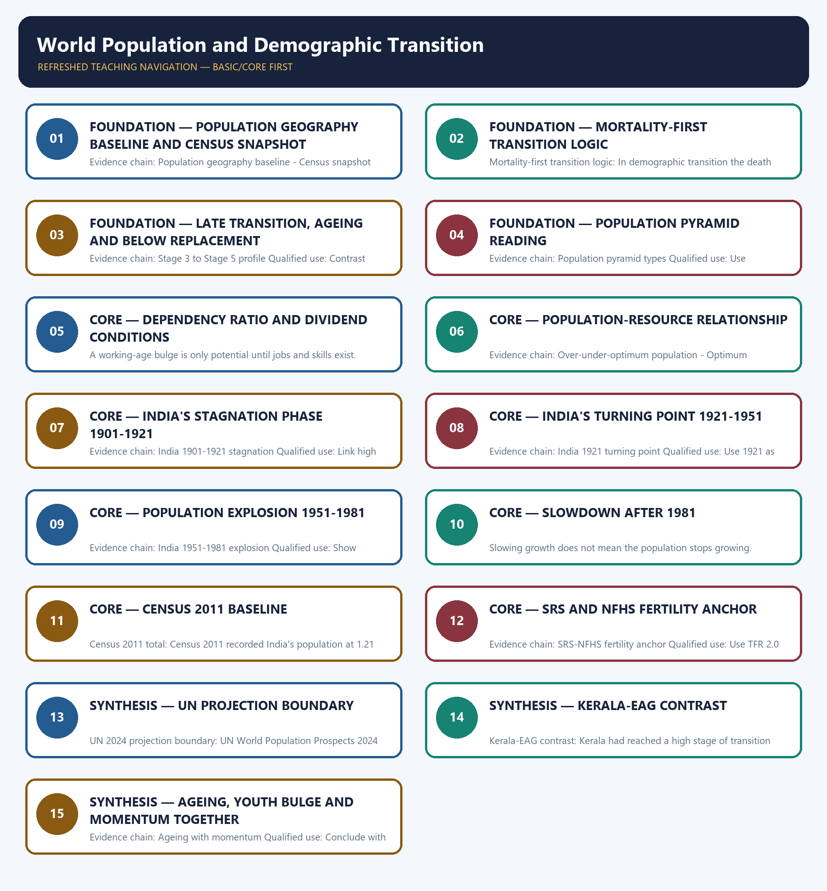

# World Population and Demographic Transition — Learner-v2 Complete Learning Session

> **Authoring-only generation:** 2026-09-01. No PDF was rendered and no tracker or index was mutated.

### SOURCE, PROGRESSION AND CURRENT-LINKAGE AUDIT

- **Generation date:** 2026-09-01.
- **Repository-first evidence:** the Basic owner is taught first and preserved in full; the Advanced owner is retained only in the optional final teaching block.
- **OCR evidence:** Repository Markdown was primary. The three required local Geography books were inspected as supplementary OCR/searchable evidence. No unsupported page precision, volatile figure or quotation was imported.
- **Qdrant:** not used; repository Markdown and available OCR context were sufficient.
- **PYQ integrity:** The audited routing ledgers consulted for this rebuild do not assign a direct solved PYQ to Geography Topic 26. Population questions are routed mainly through Indian Society, Economy and cross-owner demographic files, so this package keeps the demographic-geography framework transparent and does not fabricate a direct PYQ answer card.
- **Live-link boundary:** UN World Population Prospects 2024, Census 2011 and SRS 2022 are used only as dated anchors. No projection is presented as a census total, and no post-2011 demographic claim is left without its instrument and date label.
- **Fact/inference discipline:** no current-affairs item, PYQ wording, figure or quotation is invented.

## BASIC LEARNING SESSION

### DEEP-REVIEW LEARNING CONTRACT

| Control | Binding rule for this package |
|---|---|
| Syllabus boundary | Complete Human, Economic and Regional Geography Basic/Core is taught before optional Advanced depth. |
| Spatial method | Distribution → controlling physical/human variables → network or region → named world/India anchors → scale and exception. |
| Model method | State assumptions, mechanism, predicted pattern, named application and empirical or Global-South limitation. |
| Evidence method | Claim → named map/place/institution/dataset → analysis → source-date-status or causal qualification. |
| Policy method | Chronology, legal or planning instrument, responsible institution, implementation scale and current status remain distinct. |
| Practice contract | Every solved item has demand decoding, a detailed examiner-grade model, executable timed/compression plan, marks rationale and answer-specific improvement. |
| Approval | This immutable successor remains `approved: false` pending explicit approval. |

**Canonical Basic/Core owner:** `upsc-ai-kit\knowledge\Geography\basic\26_World-Population-and-Demographic-Transition.md`  
**Canonical topic owner:** `upsc-ai-kit\knowledge\Geography\basic\26_World-Population-and-Demographic-Transition.md`  
**Optional Advanced owner:** `upsc-ai-kit\knowledge\Geography\advanced\26_World-Population-and-Demographic-Transition.md`  
**Official syllabus mapping:** `upsc-ai-kit\knowledge\Geography\OFFICIAL-UPSC-SYLLABUS-MAPPING.md`

### EVIDENCE, PYQ AND CURRENT-STATUS CONTROL

- **Definition discipline:** close terms share a comparison axis and are never treated as synonyms.
- **Map discipline:** pattern is reconstructed through site, situation, density, gradient, corridor, node, belt, boundary, hinterland and scale.
- **Model discipline:** Ravenstein, Lee, Christaller, Burgess, Hoyt, Harris-Ullman, Myrdal, Perroux, von Thünen, Weber and related models retain assumptions and limits.
- **India discipline:** every explanation carries named state, region, city, corridor, resource belt, border sector or cultural landscape evidence.
- **Data discipline:** Census, SRS, NFHS, Agriculture Census, production, trade, energy and infrastructure claims retain source, reference period, release date and status.
- **PYQ discipline:** repository routing ledgers and held papers control wording and metadata; reconstructed wording and unavailable official keys remain labelled.
- **Current-status note, rechecked 2026-09-05:** Static concepts are separated from volatile population, production, trade, infrastructure, mission, boundary and policy claims. Every current number or status requires the issuing institution, reference period, publication date and provisional/final/operational boundary.

**Live/official context sources recorded by the predecessor generation:**

- No volatile live claim is necessary for the static core.



*Distinct embedded teaching-navigation image. The separate continuous Cārvāka-style flowchart package remains an independent at-a-glance artifact.*

### SESSION 1 — FOUNDATION — POPULATION GEOGRAPHY BASELINE AND CENSUS SNAPSHOT

#### DEFINITION / WHAT THIS IS CALLED

**Plain-language definition:** Population geography baseline: Population distribution, growth and composition are core human-geography variables because they shape pressure on land, jobs, housing and services.

**Technical definition:** Evidence chain: Population geography baseline - Census snapshot rule - Vital-rate toolkit Qualified use: Open with definition plus the indicator toolkit before citing any number.

#### ANSWER-GRABBING OPENING — WRITE/ADAPT IN THE EXAM

> Evidence chain: Population geography baseline - Census snapshot rule - Vital-rate toolkit Qualified use: Open with definition plus the indicator toolkit before citing any number.

#### MUST-WRITE KEYWORDS

- **FOUNDATION**
- **Population geography baseline**
- **census snapshot**
- **Census snapshot rule**
- **Vital-rate toolkit**
- **Evidence chain**

**How to use them:** Frame the answer through FOUNDATION; define Population geography baseline, connect census snapshot with Census snapshot rule to explain the mechanism, and use Vital-rate toolkit for the decisive comparison or qualification.

#### VISUAL FIRST

```text
POPULATION GEOGRAPHY BASELINE AND CENSUS SNAPSHOT
01. Population geography baseline
    |
    v
02. Census snapshot rule
    |
    v
03. Vital-rate toolkit
BOUNDARY -> Growth depends on births, deaths and migration together.
```

*This topic-specific rail fixes the evidence sequence and its exam boundary before analysis.*

#### CORE EXPLANATION

Population distribution, growth and composition are core human-geography variables because they shape pressure on land, jobs, housing and services. A census gives a time-specific demographic snapshot, while growth between two dates reflects births, deaths and migration together. Growth rate, crude birth rate, crude death rate, total fertility rate, infant mortality rate, life expectancy and sex ratio are the standard population indicators.

#### NAMED EVIDENCE AND MECHANISM

- **Population geography baseline:** Population distribution, growth and composition are core human-geography variables because they shape pressure on land, jobs, housing and services.
- **Census snapshot rule:** A census gives a time-specific demographic snapshot, while growth between two dates reflects births, deaths and migration together.
- **Vital-rate toolkit:** Growth rate, crude birth rate, crude death rate, total fertility rate, infant mortality rate, life expectancy and sex ratio are the standard population indicators.

#### EXAMINER CAUTION

- Growth depends on births, deaths and migration together.

#### EXAM LINK

- **Prelims:** Separate the agent, landform, location, status and scale attached to Population geography baseline and census snapshot.
- **Mains:** Open with definition plus the indicator toolkit before citing any number.

#### MINI RECAP

- **Evidence chain:** Population geography baseline -> Census snapshot rule -> Vital-rate toolkit
- **Qualified use:** Open with definition plus the indicator toolkit before citing any number.

#### CLOSING RECALL FLOW — FOUNDATION — POPULATION GEOGRAPHY BASELINE AND CENSUS SNAPSHOT

```text
START / CONCEPT: FOUNDATION — Population geography baseline and census snapshot
        |
        v
EXACT TERMS: FOUNDATION · Population geography baseline · census snapshot · Census snapshot rule · Vital-rate toolkit · Evidence chain
        |
        v
MECHANISM / ARGUMENT: Population geography baseline: Population distribution, growth and composition are core human-geography variables because they shape pressure on land, jobs, housing and services.
        |
        v
CONSEQUENCE / CONTRAST: Census snapshot rule: A census gives a time-specific demographic snapshot, while growth between two dates reflects births, deaths and migration together.
        |
        v
UPSC TRAP / ANSWER-USE: Do not miss this limiting distinction: growth rate, crude birth rate, crude death rate, total fertility rate, infant mortality rate...
        |
        v
ANSWER-GRABBING FORMULATION: Evidence chain: Population geography baseline - Census snapshot rule - Vital-rate toolkit Qualified use: Open with definition plus the indicator toolkit before citing any number.
```
### SESSION 2 — FOUNDATION — MORTALITY-FIRST TRANSITION LOGIC

#### DEFINITION / WHAT THIS IS CALLED

**Plain-language definition:** Evidence chain: Mortality-first transition logic - Stage 1 and Stage 2 profile Qualified use: Explain why the middle-stage gap produces rapid growth.

**Technical definition:** Mortality-first transition logic: In demographic transition the death rate usually falls before the birth rate, so the gap between them produces the growth spurt.

#### ANSWER-GRABBING OPENING — WRITE/ADAPT IN THE EXAM

> Evidence chain: Mortality-first transition logic - Stage 1 and Stage 2 profile Qualified use: Explain why the middle-stage gap produces rapid growth.

#### MUST-WRITE KEYWORDS

- **FOUNDATION**
- **Mortality-first transition logic**
- **Stage 1 and Stage 2 profile**
- **Evidence chain**
- **Qualified use**
- **In**

**How to use them:** Frame the answer through FOUNDATION; define Mortality-first transition logic, connect Stage 1 and Stage 2 profile with Evidence chain to explain the mechanism, and use Qualified use for the decisive comparison or qualification.

#### VISUAL FIRST

```text
MORTALITY-FIRST TRANSITION LOGIC
01. Mortality-first transition logic
    |
    v
02. Stage 1 and Stage 2 profile
BOUNDARY -> Stage 2 begins with mortality decline, not fertility decline.
```

*This topic-specific rail fixes the evidence sequence and its exam boundary before analysis.*

#### CORE EXPLANATION

In demographic transition the death rate usually falls before the birth rate, so the gap between them produces the growth spurt. Stage 1 has high birth and high death rates with fluctuating growth, while Stage 2 keeps birth rates high but mortality falls rapidly.

#### NAMED EVIDENCE AND MECHANISM

- **Mortality-first transition logic:** In demographic transition the death rate usually falls before the birth rate, so the gap between them produces the growth spurt.
- **Stage 1 and Stage 2 profile:** Stage 1 has high birth and high death rates with fluctuating growth, while Stage 2 keeps birth rates high but mortality falls rapidly.

#### EXAMINER CAUTION

- Stage 2 begins with mortality decline, not fertility decline.

#### EXAM LINK

- **Prelims:** Separate the agent, landform, location, status and scale attached to Mortality-first transition logic.
- **Mains:** Explain why the middle-stage gap produces rapid growth.

#### MINI RECAP

- **Evidence chain:** Mortality-first transition logic -> Stage 1 and Stage 2 profile
- **Qualified use:** Explain why the middle-stage gap produces rapid growth.

#### CLOSING RECALL FLOW — FOUNDATION — MORTALITY-FIRST TRANSITION LOGIC

```text
START / CONCEPT: FOUNDATION — Mortality-first transition logic
        |
        v
EXACT TERMS: FOUNDATION · Mortality-first transition logic · Stage 1 and Stage 2 profile · Evidence chain · Qualified use · In
        |
        v
MECHANISM / ARGUMENT: Mortality-first transition logic: In demographic transition the death rate usually falls before the birth rate, so the gap between them produces the growth spurt.
        |
        v
CONSEQUENCE / CONTRAST: Stage 1 and Stage 2 profile: Stage 1 has high birth and high death rates with fluctuating growth, while Stage 2 keeps birth rates high but mortality falls rapidly.
        |
        v
UPSC TRAP / ANSWER-USE: Do not miss this limiting distinction: in demographic transition the death rate usually falls before the birth rate, so the...
        |
        v
ANSWER-GRABBING FORMULATION: Evidence chain: Mortality-first transition logic - Stage 1 and Stage 2 profile Qualified use: Explain why the middle-stage gap produces rapid growth.
```
### SESSION 3 — FOUNDATION — LATE TRANSITION, AGEING AND BELOW REPLACEMENT

#### DEFINITION / WHAT THIS IS CALLED

**Plain-language definition:** Stage 3 to Stage 5 profile: Stage 3 brings fertility decline, Stage 4 has low birth and death rates with stable growth, and Stage 5 in some advanced societies means below-replacement fertility and ageing.

**Technical definition:** Evidence chain: Stage 3 to Stage 5 profile Qualified use: Contrast Stage 4 stability with Stage 5 ageing pressures.

#### ANSWER-GRABBING OPENING — WRITE/ADAPT IN THE EXAM

> Evidence chain: Stage 3 to Stage 5 profile Qualified use: Contrast Stage 4 stability with Stage 5 ageing pressures.

#### MUST-WRITE KEYWORDS

- **FOUNDATION**
- **Late transition**
- **ageing**
- **below replacement**
- **Stage 3 to Stage 5 profile**
- **Evidence chain**

**How to use them:** Frame the answer through FOUNDATION; define Late transition, connect ageing with below replacement to explain the mechanism, and use Stage 3 to Stage 5 profile for the decisive comparison or qualification.

#### VISUAL FIRST

```text
LATE TRANSITION, AGEING AND BELOW REPLACEMENT
01. Stage 3 to Stage 5 profile
BOUNDARY -> Below-replacement fertility is not the same as immediate decline.
```

*This topic-specific rail fixes the evidence sequence and its exam boundary before analysis.*

#### CORE EXPLANATION

Stage 3 brings fertility decline, Stage 4 has low birth and death rates with stable growth, and Stage 5 in some advanced societies means below-replacement fertility and ageing.

#### NAMED EVIDENCE AND MECHANISM

- **Stage 3 to Stage 5 profile:** Stage 3 brings fertility decline, Stage 4 has low birth and death rates with stable growth, and Stage 5 in some advanced societies means below-replacement fertility and ageing.

#### EXAMINER CAUTION

- Below-replacement fertility is not the same as immediate decline.

#### EXAM LINK

- **Prelims:** Separate the agent, landform, location, status and scale attached to Late transition, ageing and below replacement.
- **Mains:** Contrast Stage 4 stability with Stage 5 ageing pressures.

#### MINI RECAP

- **Evidence chain:** Stage 3 to Stage 5 profile
- **Qualified use:** Contrast Stage 4 stability with Stage 5 ageing pressures.

#### CLOSING RECALL FLOW — FOUNDATION — LATE TRANSITION, AGEING AND BELOW REPLACEMENT

```text
START / CONCEPT: FOUNDATION — Late transition, ageing and below replacement
        |
        v
EXACT TERMS: FOUNDATION · Late transition · ageing · below replacement · Stage 3 to Stage 5 profile · Evidence chain
        |
        v
MECHANISM / ARGUMENT: Stage 3 to Stage 5 profile: Stage 3 brings fertility decline, Stage 4 has low birth and death rates with stable growth, and Stage 5 in some advanced societies means below-replacement fertility and ageing.
        |
        v
CONSEQUENCE / CONTRAST: Below-replacement fertility is not the same as immediate decline.
        |
        v
UPSC TRAP / ANSWER-USE: Do not miss this limiting distinction: stage 3 to Stage 5 profile Qualified use.
        |
        v
ANSWER-GRABBING FORMULATION: Evidence chain: Stage 3 to Stage 5 profile Qualified use: Contrast Stage 4 stability with Stage 5 ageing pressures.
```
### SESSION 4 — FOUNDATION — POPULATION PYRAMID READING

#### DEFINITION / WHAT THIS IS CALLED

**Plain-language definition:** Population pyramid types: Expansive, stationary and constrictive population pyramids are the quick visual forms for youthful, slower-growth and ageing populations respectively.

**Technical definition:** Evidence chain: Population pyramid types Qualified use: Use expansive, stationary and constrictive pyramids as a fast visual answer.

#### ANSWER-GRABBING OPENING — WRITE/ADAPT IN THE EXAM

> Population pyramid types: Expansive, stationary and constrictive population pyramids are the quick visual forms for youthful, slower-growth and ageing populations respectively.

#### MUST-WRITE KEYWORDS

- **FOUNDATION**
- **Population pyramid reading**
- **Population pyramid types**
- **Evidence chain**
- **Qualified use**
- **Expansive, stationary and constrictive population pyramids**

**How to use them:** Frame the answer through FOUNDATION; define Population pyramid reading, connect Population pyramid types with Evidence chain to explain the mechanism, and use Qualified use for the decisive comparison or qualification.

#### VISUAL FIRST

```text
POPULATION PYRAMID READING
01. Population pyramid types
BOUNDARY -> Do not confuse youthful and ageing pyramid shapes.
```

*This topic-specific rail fixes the evidence sequence and its exam boundary before analysis.*

#### CORE EXPLANATION

Expansive, stationary and constrictive population pyramids are the quick visual forms for youthful, slower-growth and ageing populations respectively.

#### NAMED EVIDENCE AND MECHANISM

- **Population pyramid types:** Expansive, stationary and constrictive population pyramids are the quick visual forms for youthful, slower-growth and ageing populations respectively.

#### EXAMINER CAUTION

- Do not confuse youthful and ageing pyramid shapes.

#### EXAM LINK

- **Prelims:** Separate the agent, landform, location, status and scale attached to Population pyramid reading.
- **Mains:** Use expansive, stationary and constrictive pyramids as a fast visual answer.

#### MINI RECAP

- **Evidence chain:** Population pyramid types
- **Qualified use:** Use expansive, stationary and constrictive pyramids as a fast visual answer.

#### CLOSING RECALL FLOW — FOUNDATION — POPULATION PYRAMID READING

```text
START / CONCEPT: FOUNDATION — Population pyramid reading
        |
        v
EXACT TERMS: FOUNDATION · Population pyramid reading · Population pyramid types · Evidence chain · Qualified use · Expansive, stationary and constrictive population pyramids
        |
        v
MECHANISM / ARGUMENT: Evidence chain: Population pyramid types Qualified use: Use expansive, stationary and constrictive pyramids as a fast visual answer.
        |
        v
CONSEQUENCE / CONTRAST: Do not confuse youthful and ageing pyramid shapes.
        |
        v
UPSC TRAP / ANSWER-USE: Do not miss this limiting distinction: use expansive, stationary and constrictive pyramids as a fast visual answer.
        |
        v
ANSWER-GRABBING FORMULATION: Population pyramid types: Expansive, stationary and constrictive population pyramids are the quick visual forms for youthful, slower-growth and ageing populations respectively.
```
### SESSION 5 — CORE — DEPENDENCY RATIO AND DIVIDEND CONDITIONS

#### DEFINITION / WHAT THIS IS CALLED

**Plain-language definition:** Evidence chain: Dependency and dividend condition Qualified use: Move from age structure to productivity, not to slogans about youth.

**Technical definition:** A working-age bulge is only potential until jobs and skills exist.

#### ANSWER-GRABBING OPENING — WRITE/ADAPT IN THE EXAM

> Evidence chain: Dependency and dividend condition Qualified use: Move from age structure to productivity, not to slogans about youth.

#### MUST-WRITE KEYWORDS

- **Dependency ratio**
- **dividend conditions**
- **Dependency and dividend condition**
- **Evidence chain**
- **Qualified use**
- **A working-age bulge**

**How to use them:** Frame the answer through Dependency ratio; define dividend conditions, connect Dependency and dividend condition with Evidence chain to explain the mechanism, and use Qualified use for the decisive comparison or qualification.

#### VISUAL FIRST

```text
DEPENDENCY RATIO AND DIVIDEND CONDITIONS
01. Dependency and dividend condition
BOUNDARY -> A working-age bulge is only potential until jobs and skills exist.
```

*This topic-specific rail fixes the evidence sequence and its exam boundary before analysis.*

#### CORE EXPLANATION

A large working-age share reduces dependency pressure, but a demographic dividend appears only when education, health, skills and jobs convert that structure into productivity.

#### NAMED EVIDENCE AND MECHANISM

- **Dependency and dividend condition:** A large working-age share reduces dependency pressure, but a demographic dividend appears only when education, health, skills and jobs convert that structure into productivity.

#### EXAMINER CAUTION

- A working-age bulge is only potential until jobs and skills exist.

#### EXAM LINK

- **Prelims:** Separate the agent, landform, location, status and scale attached to Dependency ratio and dividend conditions.
- **Mains:** Move from age structure to productivity, not to slogans about youth.

#### MINI RECAP

- **Evidence chain:** Dependency and dividend condition
- **Qualified use:** Move from age structure to productivity, not to slogans about youth.

#### CLOSING RECALL FLOW — CORE — DEPENDENCY RATIO AND DIVIDEND CONDITIONS

```text
START / CONCEPT: CORE — Dependency ratio and dividend conditions
        |
        v
EXACT TERMS: Dependency ratio · dividend conditions · Dependency and dividend condition · Evidence chain · Qualified use · A working-age bulge
        |
        v
MECHANISM / ARGUMENT: A working-age bulge is only potential until jobs and skills exist.
        |
        v
CONSEQUENCE / CONTRAST: The resulting consequence is that dependency and dividend condition Qualified use.
        |
        v
UPSC TRAP / ANSWER-USE: Do not miss this limiting distinction: dependency and dividend condition Qualified use.
        |
        v
ANSWER-GRABBING FORMULATION: Evidence chain: Dependency and dividend condition Qualified use: Move from age structure to productivity, not to slogans about youth.
```
### SESSION 6 — CORE — POPULATION-RESOURCE RELATIONSHIP

#### DEFINITION / WHAT THIS IS CALLED

**Plain-language definition:** Optimum population shifts: Optimum population is not a permanent number because technology, trade and institutions can change the carrying capacity of the same resource base.

**Technical definition:** Evidence chain: Over-under-optimum population - Optimum population shifts Qualified use: Use over, under and optimum population as relational, not moral, categories.

#### ANSWER-GRABBING OPENING — WRITE/ADAPT IN THE EXAM

> Evidence chain: Over-under-optimum population - Optimum population shifts Qualified use: Use over, under and optimum population as relational, not moral, categories.

#### MUST-WRITE KEYWORDS

- **Population-resource relationship**
- **Over-under-optimum population**
- **Optimum population shifts**
- **Evidence chain**
- **Qualified use**
- **Optimum population**

**How to use them:** Frame the answer through Population-resource relationship; define Over-under-optimum population, connect Optimum population shifts with Evidence chain to explain the mechanism, and use Qualified use for the decisive comparison or qualification.

#### VISUAL FIRST

```text
POPULATION-RESOURCE RELATIONSHIP
01. Over-under-optimum population
    |
    v
02. Optimum population shifts
BOUNDARY -> Optimum population shifts with technology and institutions.
```

*This topic-specific rail fixes the evidence sequence and its exam boundary before analysis.*

#### CORE EXPLANATION

Under-population, over-population and optimum population describe the relationship among people, resources, technology and living standards. Optimum population is not a permanent number because technology, trade and institutions can change the carrying capacity of the same resource base.

#### NAMED EVIDENCE AND MECHANISM

- **Over-under-optimum population:** Under-population, over-population and optimum population describe the relationship among people, resources, technology and living standards.
- **Optimum population shifts:** Optimum population is not a permanent number because technology, trade and institutions can change the carrying capacity of the same resource base.

#### EXAMINER CAUTION

- Optimum population shifts with technology and institutions.

#### EXAM LINK

- **Prelims:** Separate the agent, landform, location, status and scale attached to Population-resource relationship.
- **Mains:** Use over, under and optimum population as relational, not moral, categories.

#### MINI RECAP

- **Evidence chain:** Over-under-optimum population -> Optimum population shifts
- **Qualified use:** Use over, under and optimum population as relational, not moral, categories.

#### CLOSING RECALL FLOW — CORE — POPULATION-RESOURCE RELATIONSHIP

```text
START / CONCEPT: CORE — Population-resource relationship
        |
        v
EXACT TERMS: Population-resource relationship · Over-under-optimum population · Optimum population shifts · Evidence chain · Qualified use · Optimum population
        |
        v
MECHANISM / ARGUMENT: Optimum population shifts: Optimum population is not a permanent number because technology, trade and institutions can change the carrying capacity of the same resource base.
        |
        v
CONSEQUENCE / CONTRAST: Mains: Use over, under and optimum population as relational, not moral, categories.
        |
        v
UPSC TRAP / ANSWER-USE: Do not miss this limiting distinction: over-under-optimum population - Optimum population shifts Qualified use.
        |
        v
ANSWER-GRABBING FORMULATION: Evidence chain: Over-under-optimum population - Optimum population shifts Qualified use: Use over, under and optimum population as relational, not moral, categories.
```
### SESSION 7 — CORE — INDIA'S STAGNATION PHASE 1901-1921

#### DEFINITION / WHAT THIS IS CALLED

**Plain-language definition:** India 1901-1921 stagnation: Khullar treats 1901-1921 as a phase of high birth and high death rates, epidemics, famine stress and demographic stagnation.

**Technical definition:** Evidence chain: India 1901-1921 stagnation Qualified use: Link high mortality, epidemics and unstable growth clearly.

#### ANSWER-GRABBING OPENING — WRITE/ADAPT IN THE EXAM

> India 1901-1921 stagnation: Khullar treats 1901-1921 as a phase of high birth and high death rates, epidemics, famine stress and demographic stagnation.

#### MUST-WRITE KEYWORDS

- **India's stagnation phase 1901-1921**
- **India 1901-1921 stagnation**
- **Evidence chain**
- **Qualified use**
- **Khullar**
- **1901-1921**

**How to use them:** Frame the answer through India's stagnation phase 1901-1921; define India 1901-1921 stagnation, connect Evidence chain with Qualified use to explain the mechanism, and use Khullar for the decisive comparison or qualification.

#### VISUAL FIRST

```text
INDIA'S STAGNATION PHASE 1901-1921
01. India 1901-1921 stagnation
BOUNDARY -> Do not call this a steady-growth phase.
```

*This topic-specific rail fixes the evidence sequence and its exam boundary before analysis.*

#### CORE EXPLANATION

Khullar treats 1901-1921 as a phase of high birth and high death rates, epidemics, famine stress and demographic stagnation.

#### NAMED EVIDENCE AND MECHANISM

- **India 1901-1921 stagnation:** Khullar treats 1901-1921 as a phase of high birth and high death rates, epidemics, famine stress and demographic stagnation.

#### EXAMINER CAUTION

- Do not call this a steady-growth phase.

#### EXAM LINK

- **Prelims:** Separate the agent, landform, location, status and scale attached to India's stagnation phase 1901-1921.
- **Mains:** Link high mortality, epidemics and unstable growth clearly.

#### MINI RECAP

- **Evidence chain:** India 1901-1921 stagnation
- **Qualified use:** Link high mortality, epidemics and unstable growth clearly.

#### CLOSING RECALL FLOW — CORE — INDIA'S STAGNATION PHASE 1901-1921

```text
START / CONCEPT: CORE — India's stagnation phase 1901-1921
        |
        v
EXACT TERMS: India's stagnation phase 1901-1921 · India 1901-1921 stagnation · Evidence chain · Qualified use · Khullar · 1901-1921
        |
        v
MECHANISM / ARGUMENT: Evidence chain: India 1901-1921 stagnation Qualified use: Link high mortality, epidemics and unstable growth clearly.
        |
        v
CONSEQUENCE / CONTRAST: Do not call this a steady-growth phase.
        |
        v
UPSC TRAP / ANSWER-USE: Do not miss this limiting distinction: khullar treats 1901-1921 as a phase of high birth and high death rates, epidemics...
        |
        v
ANSWER-GRABBING FORMULATION: India 1901-1921 stagnation: Khullar treats 1901-1921 as a phase of high birth and high death rates, epidemics, famine stress and demographic stagnation.
```
### SESSION 8 — CORE — INDIA'S TURNING POINT 1921-1951

#### DEFINITION / WHAT THIS IS CALLED

**Plain-language definition:** India 1921 turning point: The years 1921-1951 are the steady-growth phase, and 1921 is widely treated as India's demographic turning point.

**Technical definition:** Evidence chain: India 1921 turning point Qualified use: Use 1921 as the turning point and steady-growth bridge.

#### ANSWER-GRABBING OPENING — WRITE/ADAPT IN THE EXAM

> India 1921 turning point: The years 1921-1951 are the steady-growth phase, and 1921 is widely treated as India's demographic turning point.

#### MUST-WRITE KEYWORDS

- **India's turning point 1921-1951**
- **India 1921 turning point**
- **Evidence chain**
- **Qualified use**
- **The years 1921-1951**
- **1921-1951**

**How to use them:** Frame the answer through India's turning point 1921-1951; define India 1921 turning point, connect Evidence chain with Qualified use to explain the mechanism, and use The years 1921-1951 for the decisive comparison or qualification.

#### VISUAL FIRST

```text
INDIA'S TURNING POINT 1921-1951
01. India 1921 turning point
BOUNDARY -> 1921 matters because the demographic trend changes, not because fertility collapses.
```

*This topic-specific rail fixes the evidence sequence and its exam boundary before analysis.*

#### CORE EXPLANATION

The years 1921-1951 are the steady-growth phase, and 1921 is widely treated as India's demographic turning point.

#### NAMED EVIDENCE AND MECHANISM

- **India 1921 turning point:** The years 1921-1951 are the steady-growth phase, and 1921 is widely treated as India's demographic turning point.

#### EXAMINER CAUTION

- 1921 matters because the demographic trend changes, not because fertility collapses.

#### EXAM LINK

- **Prelims:** Separate the agent, landform, location, status and scale attached to India's turning point 1921-1951.
- **Mains:** Use 1921 as the turning point and steady-growth bridge.

#### MINI RECAP

- **Evidence chain:** India 1921 turning point
- **Qualified use:** Use 1921 as the turning point and steady-growth bridge.

#### CLOSING RECALL FLOW — CORE — INDIA'S TURNING POINT 1921-1951

```text
START / CONCEPT: CORE — India's turning point 1921-1951
        |
        v
EXACT TERMS: India's turning point 1921-1951 · India 1921 turning point · Evidence chain · Qualified use · The years 1921-1951 · 1921-1951
        |
        v
MECHANISM / ARGUMENT: Evidence chain: India 1921 turning point Qualified use: Use 1921 as the turning point and steady-growth bridge.
        |
        v
CONSEQUENCE / CONTRAST: Mains: Use 1921 as the turning point and steady-growth bridge.
        |
        v
UPSC TRAP / ANSWER-USE: Do not miss this limiting distinction: the years 1921-1951 are the steady-growth phase.
        |
        v
ANSWER-GRABBING FORMULATION: India 1921 turning point: The years 1921-1951 are the steady-growth phase, and 1921 is widely treated as India's demographic turning point.
```
### SESSION 9 — CORE — POPULATION EXPLOSION 1951-1981

#### DEFINITION / WHAT THIS IS CALLED

**Plain-language definition:** Explosion refers to rapid growth, not to one sudden event.

**Technical definition:** Evidence chain: India 1951-1981 explosion Qualified use: Show mortality decline outrunning fertility decline.

#### ANSWER-GRABBING OPENING — WRITE/ADAPT IN THE EXAM

> Evidence chain: India 1951-1981 explosion Qualified use: Show mortality decline outrunning fertility decline.

#### MUST-WRITE KEYWORDS

- **Population explosion 1951-1981**
- **India 1951-1981 explosion**
- **Evidence chain**
- **Qualified use**
- **Explosion**
- **1951-1981**

**How to use them:** Frame the answer through Population explosion 1951-1981; define India 1951-1981 explosion, connect Evidence chain with Qualified use to explain the mechanism, and use Explosion for the decisive comparison or qualification.

#### VISUAL FIRST

```text
POPULATION EXPLOSION 1951-1981
01. India 1951-1981 explosion
BOUNDARY -> Explosion refers to rapid growth, not to one sudden event.
```

*This topic-specific rail fixes the evidence sequence and its exam boundary before analysis.*

#### CORE EXPLANATION

The period 1951-1981 saw sharp mortality decline while fertility remained high, producing the population-explosion phase.

#### NAMED EVIDENCE AND MECHANISM

- **India 1951-1981 explosion:** The period 1951-1981 saw sharp mortality decline while fertility remained high, producing the population-explosion phase.

#### EXAMINER CAUTION

- Explosion refers to rapid growth, not to one sudden event.

#### EXAM LINK

- **Prelims:** Separate the agent, landform, location, status and scale attached to Population explosion 1951-1981.
- **Mains:** Show mortality decline outrunning fertility decline.

#### MINI RECAP

- **Evidence chain:** India 1951-1981 explosion
- **Qualified use:** Show mortality decline outrunning fertility decline.

#### CLOSING RECALL FLOW — CORE — POPULATION EXPLOSION 1951-1981

```text
START / CONCEPT: CORE — Population explosion 1951-1981
        |
        v
EXACT TERMS: Population explosion 1951-1981 · India 1951-1981 explosion · Evidence chain · Qualified use · Explosion · 1951-1981
        |
        v
MECHANISM / ARGUMENT: Explosion refers to rapid growth, not to one sudden event.
        |
        v
CONSEQUENCE / CONTRAST: Mains: Show mortality decline outrunning fertility decline.
        |
        v
UPSC TRAP / ANSWER-USE: Do not miss this limiting distinction: explosion refers to rapid growth, not to one sudden event.
        |
        v
ANSWER-GRABBING FORMULATION: Evidence chain: India 1951-1981 explosion Qualified use: Show mortality decline outrunning fertility decline.
```
### SESSION 10 — CORE — SLOWDOWN AFTER 1981

#### DEFINITION / WHAT THIS IS CALLED

**Plain-language definition:** Evidence chain: India 1981-2011 slowdown Qualified use: Explain fertility decline and momentum together.

**Technical definition:** Slowing growth does not mean the population stops growing.

#### ANSWER-GRABBING OPENING — WRITE/ADAPT IN THE EXAM

> Evidence chain: India 1981-2011 slowdown Qualified use: Explain fertility decline and momentum together.

#### MUST-WRITE KEYWORDS

- **Slowdown after 1981**
- **India 1981-2011 slowdown**
- **Evidence chain**
- **Qualified use**
- **Slowing**
- **1981-2011**

**How to use them:** Frame the answer through Slowdown after 1981; define India 1981-2011 slowdown, connect Evidence chain with Qualified use to explain the mechanism, and use Slowing for the decisive comparison or qualification.

#### VISUAL FIRST

```text
SLOWDOWN AFTER 1981
01. India 1981-2011 slowdown
BOUNDARY -> Slowing growth does not mean the population stops growing.
```

*This topic-specific rail fixes the evidence sequence and its exam boundary before analysis.*

#### CORE EXPLANATION

From 1981 to 2011 fertility decline deepened and growth slowed, showing a later transition phase rather than stagnation.

#### NAMED EVIDENCE AND MECHANISM

- **India 1981-2011 slowdown:** From 1981 to 2011 fertility decline deepened and growth slowed, showing a later transition phase rather than stagnation.

#### EXAMINER CAUTION

- Slowing growth does not mean the population stops growing.

#### EXAM LINK

- **Prelims:** Separate the agent, landform, location, status and scale attached to Slowdown after 1981.
- **Mains:** Explain fertility decline and momentum together.

#### MINI RECAP

- **Evidence chain:** India 1981-2011 slowdown
- **Qualified use:** Explain fertility decline and momentum together.

#### CLOSING RECALL FLOW — CORE — SLOWDOWN AFTER 1981

```text
START / CONCEPT: CORE — Slowdown after 1981
        |
        v
EXACT TERMS: Slowdown after 1981 · India 1981-2011 slowdown · Evidence chain · Qualified use · Slowing · 1981-2011
        |
        v
MECHANISM / ARGUMENT: Slowing growth does not mean the population stops growing.
        |
        v
CONSEQUENCE / CONTRAST: Mains: Explain fertility decline and momentum together.
        |
        v
UPSC TRAP / ANSWER-USE: Do not miss this limiting distinction: explain fertility decline and momentum together.
        |
        v
ANSWER-GRABBING FORMULATION: Evidence chain: India 1981-2011 slowdown Qualified use: Explain fertility decline and momentum together.
```
### SESSION 11 — CORE — CENSUS 2011 BASELINE

#### DEFINITION / WHAT THIS IS CALLED

**Plain-language definition:** Evidence chain: Census 2011 total - Census 2011 social indicators Qualified use: Quote population, sex ratio and literacy only with the census label.

**Technical definition:** Census 2011 total: Census 2011 recorded India's population at 1.21 billion, and no later projection should be called a census count.

#### ANSWER-GRABBING OPENING — WRITE/ADAPT IN THE EXAM

> Do not merge Census totals with later projections.

#### MUST-WRITE KEYWORDS

- **Census 2011 baseline**
- **Census 2011 total**
- **Census 2011 social indicators**
- **Evidence chain**
- **Qualified use**
- **Census**

**How to use them:** Frame the answer through Census 2011 baseline; define Census 2011 total, connect Census 2011 social indicators with Evidence chain to explain the mechanism, and use Qualified use for the decisive comparison or qualification.

#### VISUAL FIRST

```text
CENSUS 2011 BASELINE
01. Census 2011 total
    |
    v
02. Census 2011 social indicators
BOUNDARY -> Do not merge Census totals with later projections.
```

*This topic-specific rail fixes the evidence sequence and its exam boundary before analysis.*

#### CORE EXPLANATION

Census 2011 recorded India's population at 1.21 billion, and no later projection should be called a census count. Census 2011 reported a sex ratio of 943 females per 1,000 males and a literacy rate of 74.04 percent.

#### NAMED EVIDENCE AND MECHANISM

- **Census 2011 total:** Census 2011 recorded India's population at 1.21 billion, and no later projection should be called a census count.
- **Census 2011 social indicators:** Census 2011 reported a sex ratio of 943 females per 1,000 males and a literacy rate of 74.04 percent.

#### EXAMINER CAUTION

- Do not merge Census totals with later projections.

#### EXAM LINK

- **Prelims:** Separate the agent, landform, location, status and scale attached to Census 2011 baseline.
- **Mains:** Quote population, sex ratio and literacy only with the census label.

#### MINI RECAP

- **Evidence chain:** Census 2011 total -> Census 2011 social indicators
- **Qualified use:** Quote population, sex ratio and literacy only with the census label.

#### CLOSING RECALL FLOW — CORE — CENSUS 2011 BASELINE

```text
START / CONCEPT: CORE — Census 2011 baseline
        |
        v
EXACT TERMS: Census 2011 baseline · Census 2011 total · Census 2011 social indicators · Evidence chain · Qualified use · Census
        |
        v
MECHANISM / ARGUMENT: Evidence chain: Census 2011 total - Census 2011 social indicators Qualified use: Quote population, sex ratio and literacy only with the census label.
        |
        v
CONSEQUENCE / CONTRAST: Census 2011 total: Census 2011 recorded India's population at 1.21 billion, and no later projection should be called a census count.
        |
        v
UPSC TRAP / ANSWER-USE: Do not miss this limiting distinction: do not merge Census totals with later projections.
        |
        v
ANSWER-GRABBING FORMULATION: Do not merge Census totals with later projections.
```
### SESSION 12 — CORE — SRS AND NFHS FERTILITY ANCHOR

#### DEFINITION / WHAT THIS IS CALLED

**Plain-language definition:** Survey fertility evidence is dated and source-specific.

**Technical definition:** Evidence chain: SRS-NFHS fertility anchor Qualified use: Use TFR 2.0 as a named SRS-NFHS fertility marker.

#### ANSWER-GRABBING OPENING — WRITE/ADAPT IN THE EXAM

> Evidence chain: SRS-NFHS fertility anchor Qualified use: Use TFR 2.0 as a named SRS-NFHS fertility marker.

#### MUST-WRITE KEYWORDS

- **SRS**
- **NFHS fertility anchor**
- **SRS-NFHS fertility anchor**
- **Evidence chain**
- **Qualified use**
- **Survey fertility evidence**

**How to use them:** Frame the answer through SRS; define NFHS fertility anchor, connect SRS-NFHS fertility anchor with Evidence chain to explain the mechanism, and use Qualified use for the decisive comparison or qualification.

#### VISUAL FIRST

```text
SRS AND NFHS FERTILITY ANCHOR
01. SRS-NFHS fertility anchor
BOUNDARY -> Survey fertility evidence is dated and source-specific.
```

*This topic-specific rail fixes the evidence sequence and its exam boundary before analysis.*

#### CORE EXPLANATION

SRS 2022 and NFHS-5 both place India's total fertility rate at 2.0, showing replacement-level fertility nationally in dated survey evidence.

#### NAMED EVIDENCE AND MECHANISM

- **SRS-NFHS fertility anchor:** SRS 2022 and NFHS-5 both place India's total fertility rate at 2.0, showing replacement-level fertility nationally in dated survey evidence.

#### EXAMINER CAUTION

- Survey fertility evidence is dated and source-specific.

#### EXAM LINK

- **Prelims:** Separate the agent, landform, location, status and scale attached to SRS and NFHS fertility anchor.
- **Mains:** Use TFR 2.0 as a named SRS-NFHS fertility marker.

#### MINI RECAP

- **Evidence chain:** SRS-NFHS fertility anchor
- **Qualified use:** Use TFR 2.0 as a named SRS-NFHS fertility marker.

#### CLOSING RECALL FLOW — CORE — SRS AND NFHS FERTILITY ANCHOR

```text
START / CONCEPT: CORE — SRS and NFHS fertility anchor
        |
        v
EXACT TERMS: SRS · NFHS fertility anchor · SRS-NFHS fertility anchor · Evidence chain · Qualified use · Survey fertility evidence
        |
        v
MECHANISM / ARGUMENT: Mains: Use TFR 2.0 as a named SRS-NFHS fertility marker.
        |
        v
CONSEQUENCE / CONTRAST: Survey fertility evidence is dated and source-specific.
        |
        v
UPSC TRAP / ANSWER-USE: Do not miss this limiting distinction: use TFR 2.0 as a named SRS-NFHS fertility marker.
        |
        v
ANSWER-GRABBING FORMULATION: Evidence chain: SRS-NFHS fertility anchor Qualified use: Use TFR 2.0 as a named SRS-NFHS fertility marker.
```
### SESSION 13 — SYNTHESIS — UN PROJECTION BOUNDARY

#### DEFINITION / WHAT THIS IS CALLED

**Plain-language definition:** Evidence chain: UN 2024 projection boundary Qualified use: Use the 2024 estimate only to explain population momentum.

**Technical definition:** UN 2024 projection boundary: UN World Population Prospects 2024 places India's mid-2024 population at about 1.45 billion, but this remains a projection rather than a census count.

#### ANSWER-GRABBING OPENING — WRITE/ADAPT IN THE EXAM

> Evidence chain: UN 2024 projection boundary Qualified use: Use the 2024 estimate only to explain population momentum.

#### MUST-WRITE KEYWORDS

- **SYNTHESIS**
- **UN projection boundary**
- **UN 2024 projection boundary**
- **Evidence chain**
- **Qualified use**
- **UN World Population Prospects**

**How to use them:** Frame the answer through SYNTHESIS; define UN projection boundary, connect UN 2024 projection boundary with Evidence chain to explain the mechanism, and use Qualified use for the decisive comparison or qualification.

#### VISUAL FIRST

```text
UN PROJECTION BOUNDARY
01. UN 2024 projection boundary
BOUNDARY -> A UN estimate must stay labelled as a projection.
```

*This topic-specific rail fixes the evidence sequence and its exam boundary before analysis.*

#### CORE EXPLANATION

UN World Population Prospects 2024 places India's mid-2024 population at about 1.45 billion, but this remains a projection rather than a census count.

#### NAMED EVIDENCE AND MECHANISM

- **UN 2024 projection boundary:** UN World Population Prospects 2024 places India's mid-2024 population at about 1.45 billion, but this remains a projection rather than a census count.

#### EXAMINER CAUTION

- A UN estimate must stay labelled as a projection.

#### EXAM LINK

- **Prelims:** Separate the agent, landform, location, status and scale attached to UN projection boundary.
- **Mains:** Use the 2024 estimate only to explain population momentum.

#### MINI RECAP

- **Evidence chain:** UN 2024 projection boundary
- **Qualified use:** Use the 2024 estimate only to explain population momentum.

#### CLOSING RECALL FLOW — SYNTHESIS — UN PROJECTION BOUNDARY

```text
START / CONCEPT: SYNTHESIS — UN projection boundary
        |
        v
EXACT TERMS: SYNTHESIS · UN projection boundary · UN 2024 projection boundary · Evidence chain · Qualified use · UN World Population Prospects
        |
        v
MECHANISM / ARGUMENT: UN 2024 projection boundary: UN World Population Prospects 2024 places India's mid-2024 population at about 1.45 billion, but this remains a projection rather than a census count.
        |
        v
CONSEQUENCE / CONTRAST: A UN estimate must stay labelled as a projection.
        |
        v
UPSC TRAP / ANSWER-USE: Do not miss this limiting distinction: use the 2024 estimate only to explain population momentum.
        |
        v
ANSWER-GRABBING FORMULATION: Evidence chain: UN 2024 projection boundary Qualified use: Use the 2024 estimate only to explain population momentum.
```
### SESSION 14 — SYNTHESIS — KERALA-EAG CONTRAST

#### DEFINITION / WHAT THIS IS CALLED

**Plain-language definition:** Evidence chain: Kerala-EAG contrast Qualified use: Contrast early-transition and lagging-transition regions carefully.

**Technical definition:** Kerala-EAG contrast: Kerala had reached a high stage of transition comparable to advanced countries by the 2011 period, while several populous EAG states retained more youthful structures for longer.

#### ANSWER-GRABBING OPENING — WRITE/ADAPT IN THE EXAM

> Kerala-EAG contrast: Kerala had reached a high stage of transition comparable to advanced countries by the 2011 period, while several populous EAG states retained more youthful structures for longer.

#### MUST-WRITE KEYWORDS

- **SYNTHESIS**
- **Kerala-EAG contrast**
- **Evidence chain**
- **Qualified use**
- **Kerala**
- **EAG**

**How to use them:** Frame the answer through SYNTHESIS; define Kerala-EAG contrast, connect Evidence chain with Qualified use to explain the mechanism, and use Kerala for the decisive comparison or qualification.

#### VISUAL FIRST

```text
KERALA-EAG CONTRAST
01. Kerala-EAG contrast
BOUNDARY -> India is not one uniform demographic stage.
```

*This topic-specific rail fixes the evidence sequence and its exam boundary before analysis.*

#### CORE EXPLANATION

Kerala had reached a high stage of transition comparable to advanced countries by the 2011 period, while several populous EAG states retained more youthful structures for longer.

#### NAMED EVIDENCE AND MECHANISM

- **Kerala-EAG contrast:** Kerala had reached a high stage of transition comparable to advanced countries by the 2011 period, while several populous EAG states retained more youthful structures for longer.

#### EXAMINER CAUTION

- India is not one uniform demographic stage.

#### EXAM LINK

- **Prelims:** Separate the agent, landform, location, status and scale attached to Kerala-EAG contrast.
- **Mains:** Contrast early-transition and lagging-transition regions carefully.

#### MINI RECAP

- **Evidence chain:** Kerala-EAG contrast
- **Qualified use:** Contrast early-transition and lagging-transition regions carefully.

#### CLOSING RECALL FLOW — SYNTHESIS — KERALA-EAG CONTRAST

```text
START / CONCEPT: SYNTHESIS — Kerala-EAG contrast
        |
        v
EXACT TERMS: SYNTHESIS · Kerala-EAG contrast · Evidence chain · Qualified use · Kerala · EAG
        |
        v
MECHANISM / ARGUMENT: Evidence chain: Kerala-EAG contrast Qualified use: Contrast early-transition and lagging-transition regions carefully.
        |
        v
CONSEQUENCE / CONTRAST: India is not one uniform demographic stage.
        |
        v
UPSC TRAP / ANSWER-USE: Do not miss this limiting distinction: contrast early-transition and lagging-transition regions carefully.
        |
        v
ANSWER-GRABBING FORMULATION: Kerala-EAG contrast: Kerala had reached a high stage of transition comparable to advanced countries by the 2011 period, while several populous EAG states retained more youthful structures for longer.
```
### SESSION 15 — SYNTHESIS — AGEING, YOUTH BULGE AND MOMENTUM TOGETHER

#### DEFINITION / WHAT THIS IS CALLED

**Plain-language definition:** ❌ Stage 2 means both birth and death rates fall together - In standard DTM, death rate usually falls first while birth rate stays high for some time. ❌ A youthful population automatically gives growth - It gives potential, not guaranteed growth. ❌ High life expectancy always means high population growth - Many high-life-expectancy societies have very low fertility and slow growth.

**Technical definition:** Evidence chain: Ageing with momentum Qualified use: Conclude with coexistence: momentum, ageing pockets and youth-bulge states.

#### ANSWER-GRABBING OPENING — WRITE/ADAPT IN THE EXAM

> ⚠️ Replacement-level fertility is the fertility rate at which a generation exactly replaces itself; sustained fertility below that level means eventual population decline once the momentum of the existing age structure is exhausted. ⚠️ "Demographic winter" is a descriptive, non-technical term — not an official demographic category — for a condition in which fertility has been well below replacement for long enough to produce simultaneous population decline, rapid ageing and a shrinking working-age share.

#### MUST-WRITE KEYWORDS

- **SYNTHESIS**
- **Ageing**
- **youth bulge**
- **momentum together**
- **Ageing with momentum**
- **Evidence chain**

**How to use them:** Frame the answer through SYNTHESIS; define Ageing, connect youth bulge with momentum together to explain the mechanism, and use Ageing with momentum for the decisive comparison or qualification.

#### VISUAL FIRST

```text
AGEING, YOUTH BULGE AND MOMENTUM TOGETHER
01. Ageing with momentum
BOUNDARY -> Do not force India into only a dividend or only an ageing frame.
```

*This topic-specific rail fixes the evidence sequence and its exam boundary before analysis.*

#### CORE EXPLANATION

India simultaneously contains ageing pockets, replacement-level states and youth-bulge states, so population momentum and regional divergence continue together.

#### NAMED EVIDENCE AND MECHANISM

- **Ageing with momentum:** India simultaneously contains ageing pockets, replacement-level states and youth-bulge states, so population momentum and regional divergence continue together.

#### EXAMINER CAUTION

- Do not force India into only a dividend or only an ageing frame.

#### EXAM LINK

- **Prelims:** Separate the agent, landform, location, status and scale attached to Ageing, youth bulge and momentum together.
- **Mains:** Conclude with coexistence: momentum, ageing pockets and youth-bulge states.

#### MINI RECAP

- **Evidence chain:** Ageing with momentum
- **Qualified use:** Conclude with coexistence: momentum, ageing pockets and youth-bulge states.
#### COMPLETE BASIC OWNER EVIDENCE BANK

> **Subject:** Geography · **Tier:** Must-Do (foundation + standard) · **GS Paper:** GS-I
> **Grounded in:** Majid Husain, *Indian & World Geography* + G.C. Leong for physical-resource context + verified UN/Census-SRS current anchor.
> ✅ = from source book or official source · ⚠️ = inference / standard synthesis · 📰 = current affairs.
> *Companion: `advanced/26_World-Population-and-Demographic-Transition.md`.*

#### 1. Population as a geographic variable

✅ Majid Husain treats population distribution, growth and composition as core human-geography
variables shaping pressure on land, jobs, housing and services. ✅ A census gives a time-specific demographic snapshot; growth between two dates reflects births, deaths and migration.

| Indicator | What it measures | Why UPSC cares |
|---|---|---|
| ✅ Growth rate | Change in population over time | Distinguishes stagnation, explosion and slowdown |
| ✅ Crude Birth Rate | Live births per 1,000 population in a year | Basic fertility indicator |
| ✅ Crude Death Rate | Deaths per 1,000 population in a year | Mortality transition and public-health improvement |
| ✅ Total Fertility Rate | Average children per woman | Best quick marker of demographic transition |
| ✅ Infant Mortality Rate | Deaths below age one per 1,000 live births | Health-system and nutrition proxy |
| ✅ Life expectancy | Average years expected at birth | Human-development signal |
| ✅ Sex ratio | Balance between females and males | Reveals gender bias, migration effects and ageing |

> 🔑 Trap: population growth is not the same as birth rate; it depends on births, deaths and migration together.

#### 2. Demographic transition model

✅ India's long-run story broadly fits demographic-transition logic: first mortality falls, later fertility falls, and growth eventually slows. ⚠️ In standard human geography, the model is used for world comparison.

| Stage | Birth rate | Death rate | Growth outcome | Typical social setting |
|---|---|---|---|---|
| ⚠️ Stage 1 | High | High | Very low or fluctuating | Pre-modern economy, disease and famine vulnerability |
| ⚠️ Stage 2 | High | Falls fast | Rapid increase | Better sanitation, food supply and medicine |
| ⚠️ Stage 3 | Falls | Low | Slowing growth | Urbanisation, female education, family limitation |
| ⚠️ Stage 4 | Low | Low | Stable or very slow growth | Mature urban-industrial society |
| ⚠️ Stage 5 | Very low | Low to moderate | Ageing or decline | Below-replacement fertility in some advanced economies |

⚠️ India's familiar phase sequence—stagnation, steady growth, rapid growth and slowdown—is an
India-specific application, while the table above is the general world model.

#### 3. Population composition and population pyramids

✅ Population composition covers age, sex, literacy, occupation and dependency. ✅ Majid Husain highlights the population pyramid as a quick visual tool for age-sex structure.

| Pyramid type | Shape logic | What it usually signals |
|---|---|---|
| ✅ Expansive | Broad base, narrow top | High fertility and youthful population |
| ⚠️ Stationary | More even middle, moderate base | Slower growth and longer life expectancy |
| ⚠️ Constrictive | Narrow base, wider middle/older ages | Low fertility, ageing and possible labour shortage |

⚠️ Dependency ratio matters because a large working-age share can become a demographic dividend only if jobs, schooling, skills and health improve together.

#### 4. Population-resource ideas

✅ Majid Husain discusses over-population, under-population and optimum population while explaining migration and development consequences. ⚠️ These are not moral labels; they describe the relationship between people, resources, technology and living standards.

| Idea | Meaning | Exam use |
|---|---|---|
| ✅ Under-population | Too few people to utilise resources fully | Sparse frontiers, labour scarcity |
| ✅ Over-population | Population pressure lowers living standards | Congestion, disguised unemployment, resource stress |
| ✅ Optimum population | Resource use and quality of life are in relative balance | Conceptual benchmark, not a fixed number |
| ⚠️ Demographic dividend | Working-age bulge can raise growth | Only if education, health and jobs convert numbers into productivity |

> 🔑 Trap: optimum population is not a single permanent number; technology, trade and institutions can shift it.

#### 5. World patterns that follow from transition

- ✅ UN World Population Prospects 2024 says the world population is about **8.2 billion in 2024**.
- ✅ The same UN update says global fertility has fallen sharply over time and many countries are now below replacement level.
- ⚠️ Sub-Saharan Africa still has many youthful, high-growth populations, while much of Europe and East Asia face ageing and slower growth.
- ⚠️ Therefore the real exam issue is not just “too many people” but very different regional age structures, labour supplies and welfare burdens.

#### 6. Must-Know Facts (Prelims) and UPSC traps

- ✅ In demographic transition, death rates usually fall before birth rates.
- ✅ Population pyramid = age-sex structure at a glance.
- ✅ TFR is a better transition indicator than crude birth rate alone.
- ✅ Sex ratio can be shaped by mortality, migration and sex ratio at birth.
- ✅ Ageing, not just high growth, is now a major demographic issue in many countries.

- ❌ Stage 2 means both birth and death rates fall together -> In standard DTM, death rate usually falls first while birth rate stays high for some time.
- ❌ A youthful population automatically gives growth -> It gives potential, not guaranteed growth.
- ❌ High life expectancy always means high population growth -> Many high-life-expectancy societies have very low fertility and slow growth.

#### 7. Exam linkage

- ⚠️ Recurring UPSC theme: demographic transition as the bridge between crude vital rates and real-world development stages.
- ⚠️ Prelims often tests indicator meaning: CBR vs TFR vs IMR vs life expectancy.
- ⚠️ GS-I/Mains frequently uses the population question through demographic dividend, ageing, dependency and regional inequality.

#### 8. 📰 Current link

##### CA Anchor — UN World Population Prospects 2024

📰 **News trigger:** UN DESA's *World Population Prospects 2024* estimates the world at about **8.2 billion in 2024**, with rapid ageing and broad fertility decline becoming central global trends.

| Current fact | Static linkage |
|---|---|
| ✅ World population around 8.2 billion in 2024 | Size alone is not enough; structure and growth stage matter |
| ✅ Many countries are below replacement fertility | Stage 4/5 demographic transition logic |
| ✅ Population aged 65+ is rising fast globally | Ageing pyramid, dependency and welfare burden |
| ⚠️ Regional divergence is widening | Different continents are in different transition stages |

#### 9. Mains angles

- Explain the demographic transition model and show why the same model produces different policy problems in youthful and ageing regions.
- “Population pressure is a relative concept.” Discuss with reference to optimum population, technology and demographic structure.

#### 10. Probable Questions

**Prelims-style concept prompt**
- ⚠️ Which of the following statements about demographic transition is/are correct? (1) In the standard model, death rate usually falls before birth rate. (2) TFR is a better quick marker of transition than crude birth rate alone. **Answer:** Both statements are correct, because Stage 2 begins with mortality decline while fertility stays high for some time, and this file explicitly treats TFR as a better transition indicator than crude birth rate alone.

**Probable Mains questions (10-15 marks)**
- ⚠️ Discuss how the same demographic transition model produces very different policy problems in youthful populations and ageing populations. (15 marks)
- ⚠️ Examine the relationship between population pyramid shape, dependency ratio and the possibility of a demographic dividend. (10 marks)

#### 11. Study link

Geography → Human Geography → Population  
Geography → Human Geography → Demographic Transition & Population Pyramids

#### 12. Population debates, decline and policy

> **Why this section exists:** the file taught the transition model but omitted the **debate** that
> gives population geography its analytical content, and it listed *demographic winter* as a routed
> demand while teaching nothing about it. Both are repaired here.

##### 12.1 Malthus and Boserup: the founding argument

| | **Malthusian position** | **Boserupian position** |
|---|---|---|
| ⚠️ Core claim | Population tends to grow faster than the means of subsistence, so growth is checked by scarcity | Population pressure is itself the **stimulus** to agricultural intensification and innovation |
| ⚠️ Direction of causation | Food supply limits population | Population drives food supply |
| ⚠️ Checks or response | Preventive checks such as delayed marriage; positive checks such as famine and disease | Shorter fallows, new tools, irrigation, multiple cropping, labour intensification |
| ⚠️ Implied policy | Restrain growth | Invest in technology, inputs and institutions |
| ⚠️ Where the evidence supports it | Local, short-run subsistence crises; ecological limits in fragile environments | The long-run global record, in which output has repeatedly outpaced population |
| ⚠️ Where it fails | It underestimated technological change and did not anticipate the fertility transition | It assumes innovation is always available and understates ecological cost and distributional failure |

- ⚠️ **The defensible synthesis for an answer:** aggregate scarcity has repeatedly been averted by
  intensification, which supports Boserup; but famine has continued to occur amid adequate
  aggregate supply, which points to **entitlement and distribution failure** rather than absolute
  shortage — so neither model, taken alone, explains observed outcomes. The binding constraints
  today are ecological and distributional rather than arithmetic.
- ⚠️ **Neo-Malthusian revival:** the argument returns in the language of carrying capacity,
  ecological footprint and planetary limits, shifting the concern from food quantity to water,
  soil, biodiversity and climate.

##### 12.2 The far end of the transition: ageing, below-replacement fertility and "demographic winter"

- ⚠️ **Replacement-level fertility** is the fertility rate at which a generation exactly replaces
  itself; sustained fertility **below** that level means eventual population decline once the
  momentum of the existing age structure is exhausted.
- ⚠️ **"Demographic winter"** is a **descriptive, non-technical term** — not an official demographic
  category — for a condition in which fertility has been well below replacement for long enough to
  produce simultaneous **population decline, rapid ageing and a shrinking working-age share**. Say
  this explicitly in an answer; treating a rhetorical phrase as a technical measure is a
  detectable error.

| Feature of the condition | Mechanism | Consequence |
|---|---|---|
| ⚠️ Sustained below-replacement fertility | Delayed and reduced childbearing; high cost of child-rearing; housing and job insecurity; expanded female education and labour-force participation; changing family norms | Successively smaller birth cohorts |
| ⚠️ Rising longevity | Improved health and nutrition | A growing elderly share even before decline begins |
| ⚠️ Rising old-age dependency | Fewer workers per retiree | Pension and health-financing strain; fiscal pressure |
| ⚠️ Labour-force contraction | Small cohorts entering, large cohorts leaving | Labour shortage; pressure for automation or immigration |
| ⚠️ Regional depopulation | Young adults migrate to cities | Abandoned villages and small towns; service withdrawal from thinned-out areas |
| ⚠️ Population momentum in reverse | The age structure keeps the decline going after fertility recovers | Policy effects are slow and lagged, which is why late responses fail |

- ⚠️ **Policy responses and their honest record:** pro-natalist incentives such as child benefits,
  parental leave and childcare provision have generally produced modest and slow effects;
  immigration can offset labour shortage quickly but raises integration and political questions;
  raising the retirement age and expanding female labour-force participation extend the effective
  workforce; automation substitutes capital for scarce labour. **No country has reversed a deep
  fertility decline by incentives alone** — state this as the qualification.

##### 12.3 India's position in the transition, stated carefully

- ⚠️ India is in the **later phase** of the transition: mortality has fallen substantially, fertility
  has declined markedly, growth continues largely through **population momentum** built into a young
  age structure, and the working-age share is historically large.
- ⚠️ **The dividend is conditional, not automatic.** A large working-age share raises output only if
  those workers are healthy, educated, skilled and employed; otherwise the same demography produces
  unemployment and social stress rather than growth. This conditionality is the single most
  important sentence available on Indian population geography.
- ⚠️ **Sub-national divergence is the real story:** the southern and western states are demographically
  far ahead of parts of the north and east, so India will **age and grow at the same time in
  different states**, producing migration pressure from younger to older states, and raising
  federal questions about representation and fiscal transfer that turn on population counts.

> ⚠️ **Factual caution:** do **not** quote a total fertility rate, a national or state population
> figure, an old-age dependency ratio, a life-expectancy value, a decadal growth rate or a
> "dividend window" end-year from memory. The folder's Census-currency rule applies: the last
> completed all-India Census remains the baseline, and any newer figure must be attributed to a
> named survey with its date.

#### 13. Reading population composition spatially

> **Why this section exists:** a Core-only stress test found that a question on the **spatial
> pattern** of a composition variable such as the sex ratio could not be answered, because the file
> defined composition concepts without ever asking *where* they vary and *why*. The India-specific
> series and dated survey values remain in `advanced/26`; the analytical method is Core.

##### 13.1 The method: turn a ratio into a geography

```text
1. DEFINE the measure precisely (numerator, denominator, and which
   population it refers to) - most errors are definitional, not factual.
2. DISTINGUISH the sub-measures. For the sex ratio: the ratio AT BIRTH,
   the ratio in the CHILD age group, and the ratio for ALL AGES behave
   differently and have different causes.
3. MAP the variation - between regions, between rural and urban, and
   between social groups.
4. SEPARATE the four possible drivers of ANY spatial difference in a
   composition ratio:
      - differential MORTALITY at particular ages
      - differential SEX RATIO AT BIRTH
      - MIGRATION, which removes or adds one group selectively
      - AGE STRUCTURE, since ratios differ systematically by age
5. EXPLAIN why the drivers differ spatially - agrarian structure, kinship
   and inheritance practice, female education and workforce participation,
   access to and use of health services, and the labour-demand pull of
   destination regions.
6. QUALIFY: a ratio is a summary statistic; district and community
   variation within any region is usually larger than the difference
   between regions.
```

- ⚠️ **The migration correction that most answers miss:** a destination region receiving
  predominantly male labour migrants will show a male-heavy overall ratio, and the corresponding
  source region a female-heavy one, **without any difference in mortality or births**. So an
  all-ages ratio in a high-migration region is partly a **migration statistic**. Separating the
  child sex ratio — which migration barely affects — from the all-ages ratio is therefore the
  single most important analytical step (see `27_Migration-Theories-and-Patterns-India.md`).
- ⚠️ **The same method transfers** to literacy differentials, the urban share, the working-age
  share, the dependency ratio and religious or linguistic composition: define, disaggregate, map,
  separate drivers, explain spatially, qualify.

> ⚠️ **Factual caution:** do **not** quote a sex ratio, a child sex ratio, a literacy rate or a
> state ranking from memory. The folder's Census-currency rule applies: the last completed
> all-India Census is the baseline, and any later figure needs its named survey and date.

#### 14. Answer architecture (10/15/20-mark support)

##### 14.1 Directive decoding

| If the question says | It is really asking for | Do **not** |
|---|---|---|
| "Explain the demographic transition model" | The stage-wise decoupling of mortality and fertility, why the gap produces the growth spurt, and the model's limits as a predictor | Describe stages without the mechanism |
| "Elaborate the concept of demographic winter" | The definition, its honest status as a descriptive term, causes, consequences and the record of policy responses | Treat it as an official demographic measure |
| "Is India's demographic dividend an opportunity or a risk?" | The conditionality argument, sub-national divergence, and the employment and skilling requirement | Assert the dividend as automatic |
| "Discuss population as a resource" | Population as both producer and consumer; quality versus quantity; the Malthus-Boserup argument | Recite population figures |
| "Examine the population-resource relationship" | Malthus, Boserup, the entitlement critique and the ecological reformulation | Take one side without the counter |

##### 14.2 Reusable 15-mark spine — the transition and its two ends

1. **Thesis:** the demographic transition is not a forecast but a **descriptive generalisation**, and
   its analytical value lies in explaining why population growth is a *temporary* phase produced by
   the lag between falling mortality and falling fertility.
2. **Mechanism:** stage by stage, with the explicit point that the growth surge is the **gap**
   between the two declining curves, not a rise in births.
3. **The early-end problem:** rapid growth, a young dependency burden and pressure on services.
4. **The late-end problem:** ageing, below-replacement fertility, labour-force contraction and
   regional depopulation.
5. **The debate:** Malthus versus Boserup, with the entitlement and ecological correction.
6. **Limits of the model:** it was generalised from a particular historical experience; migration is
   excluded; and later transitions have been faster and driven by different causes — imported
   health technology and female education rather than industrialisation.
7. **India applied:** the momentum-driven growth, the conditional dividend, and the sub-national
   divergence.
8. **Conclusion:** graded — demography sets the arithmetic; institutions determine whether the
   arithmetic becomes a dividend or a burden.

##### 14.3 Evidence units available in this file

> **Claim:** the same demographic structure can produce opposite economic outcomes.
> **Evidence:** a large working-age share raises output only where health, education, skills and
> employment absorb it; the identical age structure without those conditions produces
> unemployment. **Significance:** it converts a demographic fact into a policy argument about
> education and job creation, which is exactly the demand of a dividend question.
> **Limitation:** the window is time-bounded by the age structure itself, so the argument is about
> urgency as well as about direction.

> **Claim:** population decline is harder to reverse than population growth was to slow.
> **Evidence:** where fertility has fallen well below replacement, the shrinking size of successive
> cohorts continues the decline even if fertility recovers, because momentum operates in reverse;
> and pro-natalist incentives have generally produced modest effects. **Significance:** it explains
> why ageing societies turn to immigration, later retirement and automation rather than relying on
> birth incentives. **Limitation:** the evidence is drawn from a limited set of societies over a
> short period, so strong predictive claims are not warranted.

<!-- BEGIN GENERATED PYQ INTEGRATION: 2024-2025 -->

#### Recent PYQ Integration (2024-2025)

> **Status:** 2024-2025 question-level PYQ demand is integrated into this owner.
> **Provenance:** Audited local official-paper routing ledgers: `_PYQ-ROUTING-MAINS-GS1-GS2-ESSAY-2024-2025.md`, `_PYQ-ROUTING-PRELIMS-2024-2025.md`.
> **Answer-key rule:** The official 2024-2025 Prelims Set-A keys are present in the repository and CSAT Set-A keys are supplied; even so, no option or answer is recorded or inferred in this integration.

- **Years represented:** 2024
- **Paper(s):** GS-I, Prelims GS-I
- **Routed question demands:** 3

| Year | Paper | Q | PYQ demand (neutral rendering) | Directive / format | Source status | Owner requirement |
|---:|---|---|---|---|---|---|
| 2024 | GS-I | 7 | Concept of a 'demographic winter' | Elaborate · 10 marks · 150 words | Routed to owning topic | Prepare context, core dimensions, evidence/examples, counterpoint and a concise conclusion. |
| 2024 | Prelims GS-I | 41 | Total fertility rate - definition | Objective question; official Set-A key available locally, answer not inferred | Key available locally (official Set-A answer key present); answer not recorded here | Cover the named fact/concept and its likely statement-level distinctions. |
| 2024 | Prelims GS-I | 67 | Countries in the news for low birth rate / ageing / declining population | Objective question; official Set-A key available locally, answer not inferred | Key available locally (official Set-A answer key present); answer not recorded here | Cover the named fact/concept and its likely statement-level distinctions. |

##### What this owner must now support

- Concept of a 'demographic winter'
- Total fertility rate - definition
- Countries in the news for low birth rate / ageing / declining population

> This block integrates the 2024-2025 examinable demand and paper metadata. It is kept separate from the 2018-2023 block and does not convert an unkeyed/answer-free objective question into a solved answer.
<!-- END GENERATED PYQ INTEGRATION: 2024-2025 -->

#### CLOSING RECALL FLOW — SYNTHESIS — AGEING, YOUTH BULGE AND MOMENTUM TOGETHER

```text
START / CONCEPT: SYNTHESIS — Ageing, youth bulge and momentum together
        |
        v
EXACT TERMS: SYNTHESIS · Ageing · youth bulge · momentum together · Ageing with momentum · Evidence chain
        |
        v
MECHANISM / ARGUMENT: Explain the demographic transition model and show why the same model produces different policy problems in youthful and ageing regions.
        |
        v
CONSEQUENCE / CONTRAST: Do not force India into only a dividend or only an ageing frame.
        |
        v
UPSC TRAP / ANSWER-USE: 🔑 Trap: population growth is not the same as birth rate; it depends on births, deaths and migration together.
        |
        v
ANSWER-GRABBING FORMULATION: ⚠️ Replacement-level fertility is the fertility rate at which a generation exactly replaces itself; sustained fertility below that level means eventual population decline once the momentum of the existing age structure is exhausted. ⚠️ "Demographic winter" is a descriptive, non-technical term — not an official demographic category — for a condition in which fertility has been well below replacement for long enough to produce simultaneous population decline, rapid ageing and a shrinking working-age share.
```
### GEOGRAPHY DEEP-REVIEW CORE CONTROL

- **Must remember:** Population geography separates stock, structure, distribution, density, growth, fertility, mortality and mobility; demographic transition moves from high birth/high death through mortality-led growth and fertility decline toward low rates, with a possible ageing or below-replacement phase rather than one universal timetable.
- **Close distinction:** Crude birth/death rates, TFR, replacement fertility, dependency ratio, sex ratio, life expectancy and population pyramid answer different questions; demographic dividend is a conditional age-structure opportunity, not an automatic growth bonus, and Census 2011, SRS, NFHS and UN estimates retain different reference dates and methods.
- **Evidence / causal limit:** India must be mapped through Kerala/Tamil Nadu ageing and low fertility, EAG-state youth and higher fertility, urban-rural and gender contrasts, and migration-adjusted state patterns; transition theory is descriptive, while policy, health, education, labour absorption and gender agency explain divergent pathways.

### TRANSITION EVIDENCE AND PERIODIZATION LEDGER — TOPIC 26

#### Models and criteria

| Model | Core use | Limit |
|---|---|---|
| Colonial Hindu/Muslim/British division | history of periodization | communal ruler-religion label cannot explain social transition |
| Dynastic chronology | orders Gupta, post-Gupta and regional polities | ruler change is not simultaneous structural change |
| Indian feudalism | grants, intermediaries, immunities, labour and exchange contraction | outcomes and commerce vary by region |
| Segmentary state | graded ritual/political control beyond a core | derived mainly from later-south debates; not universal |
| Integrative/regional state | chiefs, grants, cults and local elites build regional power | integration remains unequal and coercive |

Test transition through polity, agrarian relations, revenue/labour, settlement,
exchange, institutions, social classification, religion, language and material
culture. The c. 300-550, 550-750 and 750-1000 phases are heuristics, not universal
ruptures.

#### Grant rights and ground effects

| Recipient/right | Historical question | Source caution |
|---|---|---|
| Brahmana, temple, monastery, official or retainer | why was revenue or land assigned? | recipient classes vary by region and date |
| taxes and produce | who collected which dues? | exemption formula is not proof of enforcement |
| labour (vishti) | who supplied transport, construction or provisioning? | incidence must be locally evidenced |
| judicial/fiscal immunity | were fines, officials or policing functions restricted? | specified right is not total sovereignty |
| water, pasture, trees and forest | which older users were affected? | charter silence does not mean empty land |

### REGIONAL CONTINUITY-CHANGE LEDGER — TOPIC 26

| Region | Transition pattern | Anti-universalization rule |
|---|---|---|
| North | post-Gupta courts, samantas, grants and selected urban contraction | no instantaneous anarchy |
| East | agrarian expansion, Pala-Sena formations and mahavihara networks | no uniform Buddhist society |
| Western India | regional lineages, ports and Jain/Brahmanical institutions | genealogy is not literal ethnicity |
| Deccan | Vakataka-Chalukya-Rashtrakuta grants, temples, irrigation and exchange | no one feudal sequence |
| South | Pallava/Pandya and Chola-boundary brahmadeyas, tanks, temples and local bodies | full Imperial Chola system belongs to Topic 27 |
| Forest/hill frontiers | chiefs, products, cultivation, cults, resistance and peasantization | incorporation is not passive assimilation |

#### Social, institutional and knowledge controls

- Samanta changed from neighbouring ruler to varied subordinate/intermediary
  usage; it was not one legal class.
- Temples and monasteries could be landholders, employers, redistributors,
  archives, schools and political nodes, but functions varied locally.
- Varna prescription, jati process, occupation, untouchability and exclusion
  must be separated by source, region and date.
- Gender analysis must include property, marriage, labour, donor/political and
  religious agency without one all-India status verdict.
- Bhakti was not uniformly egalitarian; Buddhism and Jainism transformed
  regionally rather than simply disappearing.
- Sanskrit cosmopolitan continuity coexisted with vernacular literary and
  epigraphic growth.
- Incoming peoples affected political and cultural formation, but invasion alone
  did not cause the transition.

#### PYQ ownership control

The repository routes **zero direct PYQs** to Topic 26. The ten retained
questions belong to Topics 10, 20, 22, 23, 27 or Indian Art and Culture and are
adjacent continuity/change practice only.

**Final method:** model -> evidence class -> regional case -> continuity ->
transformation -> source limit -> qualified verdict.

### Semantic-completeness ownership and PYQ control

- **Owned core:** population distribution, density, growth and composition;
  fertility, mortality, age-sex structure and dependency; population
  pyramids; demographic transition, momentum, dividend, ageing, optimum
  population and the Malthus-Boserup debate.
- **Theory/model control:** demographic transition is a descriptive
  generalisation, not a universal timetable or deterministic forecast.
  Malthus, Boserup and optimum-population reasoning retain assumptions,
  counter-evidence, entitlement/distribution and ecological qualifications.
- **Indicator control:** CBR, CDR, TFR, IMR, life expectancy, sex ratio and
  dependency ratio answer different questions. Replacement fertility does
  not mean immediate zero growth; momentum and age structure intervene.
- **Scale/map control:** world transition regions are separated from India's
  staggered state transitions. Kerala and Tamil Nadu ageing/low fertility,
  EAG-state youth and higher fertility, and urban-rural/gender contrasts are
  mapped without treating national averages as uniform state conditions.
- **Date/data control:** Census 2011 is the latest completed Indian
  enumeration at this review cutoff. SRS and NFHS are sample-based, and UN
  World Population Prospects 2024 is an estimate/projection series; none is
  relabelled as a post-2011 census count.
- **Close-option control:** population growth differs from birth rate;
  youthful structure from demographic dividend; ageing from population
  decline; child sex ratio from all-ages sex ratio; stock from flow.
- **Boundary:** Indian Society owns population-policy, gender and social
  consequences in full; Economy owns labour absorption and dividend policy.
  Geography owns spatial distribution, demographic mechanisms and regional
  differentiation, with bounded bridges to those owners.
- **Verified PYQ ownership, 2018-2026:** direct routes include 2024 Prelims
  TFR definition and low-birth-rate/ageing country questions plus 2024 GS-I
  Q7 on demographic winter. Official answer letters absent from routing
  ledgers are not invented.

## BASIC MCQS / REMEDIATION

### Q1. Which statement correctly explains Population geography baseline?

A. Population distribution, growth and composition are core human-geography variables because they shape pressure on land, jobs, housing and services.
B. A census gives a time-specific demographic snapshot, while growth between two dates reflects births, deaths and migration together.
C. Growth rate, crude birth rate, crude death rate, total fertility rate, infant mortality rate, life expectancy and sex ratio are the standard population indicators.
D. In demographic transition the death rate usually falls before the birth rate, so the gap between them produces the growth spurt.

**Answer: A.**
**Explanation:** Population distribution, growth and composition are core human-geography variables because they shape pressure on land, jobs, housing and services. The other options describe different processes, locations, scales or governance categories.

### Q2. Which option is the safest spatial interpretation of Population geography baseline?

A. In demographic transition the death rate usually falls before the birth rate, so the gap between them produces the growth spurt.
B. Population distribution, growth and composition are core human-geography variables because they shape pressure on land, jobs, housing and services.
C. Growth rate, crude birth rate, crude death rate, total fertility rate, infant mortality rate, life expectancy and sex ratio are the standard population indicators.
D. Stage 1 has high birth and high death rates with fluctuating growth, while Stage 2 keeps birth rates high but mortality falls rapidly.

**Answer: B.**
**Explanation:** Population distribution, growth and composition are core human-geography variables because they shape pressure on land, jobs, housing and services. The other options describe different processes, locations, scales or governance categories.

### Q3. Which statement preserves the process boundary for Population geography baseline?

A. Stage 3 brings fertility decline, Stage 4 has low birth and death rates with stable growth, and Stage 5 in some advanced societies means below-replacement fertility and ageing.
B. In demographic transition the death rate usually falls before the birth rate, so the gap between them produces the growth spurt.
C. Population distribution, growth and composition are core human-geography variables because they shape pressure on land, jobs, housing and services.
D. Stage 1 has high birth and high death rates with fluctuating growth, while Stage 2 keeps birth rates high but mortality falls rapidly.

**Answer: C.**
**Explanation:** Population distribution, growth and composition are core human-geography variables because they shape pressure on land, jobs, housing and services. The other options describe different processes, locations, scales or governance categories.

### Q4. Which option avoids the main UPSC trap concerning Population geography baseline?

A. Stage 1 has high birth and high death rates with fluctuating growth, while Stage 2 keeps birth rates high but mortality falls rapidly.
B. Expansive, stationary and constrictive population pyramids are the quick visual forms for youthful, slower-growth and ageing populations respectively.
C. Stage 3 brings fertility decline, Stage 4 has low birth and death rates with stable growth, and Stage 5 in some advanced societies means below-replacement fertility and ageing.
D. Population distribution, growth and composition are core human-geography variables because they shape pressure on land, jobs, housing and services.

**Answer: D.**
**Explanation:** Population distribution, growth and composition are core human-geography variables because they shape pressure on land, jobs, housing and services. The other options describe different processes, locations, scales or governance categories.

### Q5. Which statement correctly explains Census snapshot rule?

A. A census gives a time-specific demographic snapshot, while growth between two dates reflects births, deaths and migration together.
B. In demographic transition the death rate usually falls before the birth rate, so the gap between them produces the growth spurt.
C. Growth rate, crude birth rate, crude death rate, total fertility rate, infant mortality rate, life expectancy and sex ratio are the standard population indicators.
D. Stage 1 has high birth and high death rates with fluctuating growth, while Stage 2 keeps birth rates high but mortality falls rapidly.

**Answer: A.**
**Explanation:** A census gives a time-specific demographic snapshot, while growth between two dates reflects births, deaths and migration together. The other options describe different processes, locations, scales or governance categories.

### Q6. Which option is the safest spatial interpretation of Census snapshot rule?

A. Stage 3 brings fertility decline, Stage 4 has low birth and death rates with stable growth, and Stage 5 in some advanced societies means below-replacement fertility and ageing.
B. A census gives a time-specific demographic snapshot, while growth between two dates reflects births, deaths and migration together.
C. Stage 1 has high birth and high death rates with fluctuating growth, while Stage 2 keeps birth rates high but mortality falls rapidly.
D. In demographic transition the death rate usually falls before the birth rate, so the gap between them produces the growth spurt.

**Answer: B.**
**Explanation:** A census gives a time-specific demographic snapshot, while growth between two dates reflects births, deaths and migration together. The other options describe different processes, locations, scales or governance categories.

### Q7. Which statement preserves the process boundary for Census snapshot rule?

A. Stage 3 brings fertility decline, Stage 4 has low birth and death rates with stable growth, and Stage 5 in some advanced societies means below-replacement fertility and ageing.
B. Stage 1 has high birth and high death rates with fluctuating growth, while Stage 2 keeps birth rates high but mortality falls rapidly.
C. A census gives a time-specific demographic snapshot, while growth between two dates reflects births, deaths and migration together.
D. Expansive, stationary and constrictive population pyramids are the quick visual forms for youthful, slower-growth and ageing populations respectively.

**Answer: C.**
**Explanation:** A census gives a time-specific demographic snapshot, while growth between two dates reflects births, deaths and migration together. The other options describe different processes, locations, scales or governance categories.

### Q8. Which option avoids the main UPSC trap concerning Census snapshot rule?

A. Stage 3 brings fertility decline, Stage 4 has low birth and death rates with stable growth, and Stage 5 in some advanced societies means below-replacement fertility and ageing.
B. Expansive, stationary and constrictive population pyramids are the quick visual forms for youthful, slower-growth and ageing populations respectively.
C. A large working-age share reduces dependency pressure, but a demographic dividend appears only when education, health, skills and jobs convert that structure into productivity.
D. A census gives a time-specific demographic snapshot, while growth between two dates reflects births, deaths and migration together.

**Answer: D.**
**Explanation:** A census gives a time-specific demographic snapshot, while growth between two dates reflects births, deaths and migration together. The other options describe different processes, locations, scales or governance categories.

### Q9. Which statement correctly explains Vital-rate toolkit?

A. Growth rate, crude birth rate, crude death rate, total fertility rate, infant mortality rate, life expectancy and sex ratio are the standard population indicators.
B. In demographic transition the death rate usually falls before the birth rate, so the gap between them produces the growth spurt.
C. Stage 1 has high birth and high death rates with fluctuating growth, while Stage 2 keeps birth rates high but mortality falls rapidly.
D. Stage 3 brings fertility decline, Stage 4 has low birth and death rates with stable growth, and Stage 5 in some advanced societies means below-replacement fertility and ageing.

**Answer: A.**
**Explanation:** Growth rate, crude birth rate, crude death rate, total fertility rate, infant mortality rate, life expectancy and sex ratio are the standard population indicators. The other options describe different processes, locations, scales or governance categories.

### Q10. Which option is the safest spatial interpretation of Vital-rate toolkit?

A. Stage 3 brings fertility decline, Stage 4 has low birth and death rates with stable growth, and Stage 5 in some advanced societies means below-replacement fertility and ageing.
B. Growth rate, crude birth rate, crude death rate, total fertility rate, infant mortality rate, life expectancy and sex ratio are the standard population indicators.
C. Expansive, stationary and constrictive population pyramids are the quick visual forms for youthful, slower-growth and ageing populations respectively.
D. Stage 1 has high birth and high death rates with fluctuating growth, while Stage 2 keeps birth rates high but mortality falls rapidly.

**Answer: B.**
**Explanation:** Growth rate, crude birth rate, crude death rate, total fertility rate, infant mortality rate, life expectancy and sex ratio are the standard population indicators. The other options describe different processes, locations, scales or governance categories.

### Q11. Which statement preserves the process boundary for Vital-rate toolkit?

A. Stage 3 brings fertility decline, Stage 4 has low birth and death rates with stable growth, and Stage 5 in some advanced societies means below-replacement fertility and ageing.
B. A large working-age share reduces dependency pressure, but a demographic dividend appears only when education, health, skills and jobs convert that structure into productivity.
C. Growth rate, crude birth rate, crude death rate, total fertility rate, infant mortality rate, life expectancy and sex ratio are the standard population indicators.
D. Expansive, stationary and constrictive population pyramids are the quick visual forms for youthful, slower-growth and ageing populations respectively.

**Answer: C.**
**Explanation:** Growth rate, crude birth rate, crude death rate, total fertility rate, infant mortality rate, life expectancy and sex ratio are the standard population indicators. The other options describe different processes, locations, scales or governance categories.

### Q12. Which option avoids the main UPSC trap concerning Vital-rate toolkit?

A. A large working-age share reduces dependency pressure, but a demographic dividend appears only when education, health, skills and jobs convert that structure into productivity.
B. Expansive, stationary and constrictive population pyramids are the quick visual forms for youthful, slower-growth and ageing populations respectively.
C. Under-population, over-population and optimum population describe the relationship among people, resources, technology and living standards.
D. Growth rate, crude birth rate, crude death rate, total fertility rate, infant mortality rate, life expectancy and sex ratio are the standard population indicators.

**Answer: D.**
**Explanation:** Growth rate, crude birth rate, crude death rate, total fertility rate, infant mortality rate, life expectancy and sex ratio are the standard population indicators. The other options describe different processes, locations, scales or governance categories.

### Q13. Which statement correctly explains Mortality-first transition logic?

A. In demographic transition the death rate usually falls before the birth rate, so the gap between them produces the growth spurt.
B. Stage 1 has high birth and high death rates with fluctuating growth, while Stage 2 keeps birth rates high but mortality falls rapidly.
C. Stage 3 brings fertility decline, Stage 4 has low birth and death rates with stable growth, and Stage 5 in some advanced societies means below-replacement fertility and ageing.
D. Expansive, stationary and constrictive population pyramids are the quick visual forms for youthful, slower-growth and ageing populations respectively.

**Answer: A.**
**Explanation:** In demographic transition the death rate usually falls before the birth rate, so the gap between them produces the growth spurt. The other options describe different processes, locations, scales or governance categories.

### Q14. Which option is the safest spatial interpretation of Mortality-first transition logic?

A. Stage 3 brings fertility decline, Stage 4 has low birth and death rates with stable growth, and Stage 5 in some advanced societies means below-replacement fertility and ageing.
B. In demographic transition the death rate usually falls before the birth rate, so the gap between them produces the growth spurt.
C. Expansive, stationary and constrictive population pyramids are the quick visual forms for youthful, slower-growth and ageing populations respectively.
D. A large working-age share reduces dependency pressure, but a demographic dividend appears only when education, health, skills and jobs convert that structure into productivity.

**Answer: B.**
**Explanation:** In demographic transition the death rate usually falls before the birth rate, so the gap between them produces the growth spurt. The other options describe different processes, locations, scales or governance categories.

### Q15. Which statement preserves the process boundary for Mortality-first transition logic?

A. A large working-age share reduces dependency pressure, but a demographic dividend appears only when education, health, skills and jobs convert that structure into productivity.
B. Expansive, stationary and constrictive population pyramids are the quick visual forms for youthful, slower-growth and ageing populations respectively.
C. In demographic transition the death rate usually falls before the birth rate, so the gap between them produces the growth spurt.
D. Under-population, over-population and optimum population describe the relationship among people, resources, technology and living standards.

**Answer: C.**
**Explanation:** In demographic transition the death rate usually falls before the birth rate, so the gap between them produces the growth spurt. The other options describe different processes, locations, scales or governance categories.

### Q16. Which option avoids the main UPSC trap concerning Mortality-first transition logic?

A. A large working-age share reduces dependency pressure, but a demographic dividend appears only when education, health, skills and jobs convert that structure into productivity.
B. Under-population, over-population and optimum population describe the relationship among people, resources, technology and living standards.
C. Optimum population is not a permanent number because technology, trade and institutions can change the carrying capacity of the same resource base.
D. In demographic transition the death rate usually falls before the birth rate, so the gap between them produces the growth spurt.

**Answer: D.**
**Explanation:** In demographic transition the death rate usually falls before the birth rate, so the gap between them produces the growth spurt. The other options describe different processes, locations, scales or governance categories.

### Q17. Which statement correctly explains Stage 1 and Stage 2 profile?

A. Stage 1 has high birth and high death rates with fluctuating growth, while Stage 2 keeps birth rates high but mortality falls rapidly.
B. Stage 3 brings fertility decline, Stage 4 has low birth and death rates with stable growth, and Stage 5 in some advanced societies means below-replacement fertility and ageing.
C. A large working-age share reduces dependency pressure, but a demographic dividend appears only when education, health, skills and jobs convert that structure into productivity.
D. Expansive, stationary and constrictive population pyramids are the quick visual forms for youthful, slower-growth and ageing populations respectively.

**Answer: A.**
**Explanation:** Stage 1 has high birth and high death rates with fluctuating growth, while Stage 2 keeps birth rates high but mortality falls rapidly. The other options describe different processes, locations, scales or governance categories.

### Q18. Which option is the safest spatial interpretation of Stage 1 and Stage 2 profile?

A. Under-population, over-population and optimum population describe the relationship among people, resources, technology and living standards.
B. Stage 1 has high birth and high death rates with fluctuating growth, while Stage 2 keeps birth rates high but mortality falls rapidly.
C. A large working-age share reduces dependency pressure, but a demographic dividend appears only when education, health, skills and jobs convert that structure into productivity.
D. Expansive, stationary and constrictive population pyramids are the quick visual forms for youthful, slower-growth and ageing populations respectively.

**Answer: B.**
**Explanation:** Stage 1 has high birth and high death rates with fluctuating growth, while Stage 2 keeps birth rates high but mortality falls rapidly. The other options describe different processes, locations, scales or governance categories.

### Q19. Which statement preserves the process boundary for Stage 1 and Stage 2 profile?

A. Optimum population is not a permanent number because technology, trade and institutions can change the carrying capacity of the same resource base.
B. Under-population, over-population and optimum population describe the relationship among people, resources, technology and living standards.
C. Stage 1 has high birth and high death rates with fluctuating growth, while Stage 2 keeps birth rates high but mortality falls rapidly.
D. A large working-age share reduces dependency pressure, but a demographic dividend appears only when education, health, skills and jobs convert that structure into productivity.

**Answer: C.**
**Explanation:** Stage 1 has high birth and high death rates with fluctuating growth, while Stage 2 keeps birth rates high but mortality falls rapidly. The other options describe different processes, locations, scales or governance categories.

### Q20. Which option avoids the main UPSC trap concerning Stage 1 and Stage 2 profile?

A. Optimum population is not a permanent number because technology, trade and institutions can change the carrying capacity of the same resource base.
B. Khullar treats 1901-1921 as a phase of high birth and high death rates, epidemics, famine stress and demographic stagnation.
C. Under-population, over-population and optimum population describe the relationship among people, resources, technology and living standards.
D. Stage 1 has high birth and high death rates with fluctuating growth, while Stage 2 keeps birth rates high but mortality falls rapidly.

**Answer: D.**
**Explanation:** Stage 1 has high birth and high death rates with fluctuating growth, while Stage 2 keeps birth rates high but mortality falls rapidly. The other options describe different processes, locations, scales or governance categories.

### Q21. Which statement correctly explains Stage 3 to Stage 5 profile?

A. Stage 3 brings fertility decline, Stage 4 has low birth and death rates with stable growth, and Stage 5 in some advanced societies means below-replacement fertility and ageing.
B. A large working-age share reduces dependency pressure, but a demographic dividend appears only when education, health, skills and jobs convert that structure into productivity.
C. Under-population, over-population and optimum population describe the relationship among people, resources, technology and living standards.
D. Expansive, stationary and constrictive population pyramids are the quick visual forms for youthful, slower-growth and ageing populations respectively.

**Answer: A.**
**Explanation:** Stage 3 brings fertility decline, Stage 4 has low birth and death rates with stable growth, and Stage 5 in some advanced societies means below-replacement fertility and ageing. The other options describe different processes, locations, scales or governance categories.

### Q22. Which option is the safest spatial interpretation of Stage 3 to Stage 5 profile?

A. Optimum population is not a permanent number because technology, trade and institutions can change the carrying capacity of the same resource base.
B. Stage 3 brings fertility decline, Stage 4 has low birth and death rates with stable growth, and Stage 5 in some advanced societies means below-replacement fertility and ageing.
C. Under-population, over-population and optimum population describe the relationship among people, resources, technology and living standards.
D. A large working-age share reduces dependency pressure, but a demographic dividend appears only when education, health, skills and jobs convert that structure into productivity.

**Answer: B.**
**Explanation:** Stage 3 brings fertility decline, Stage 4 has low birth and death rates with stable growth, and Stage 5 in some advanced societies means below-replacement fertility and ageing. The other options describe different processes, locations, scales or governance categories.

### Q23. Which statement preserves the process boundary for Stage 3 to Stage 5 profile?

A. Khullar treats 1901-1921 as a phase of high birth and high death rates, epidemics, famine stress and demographic stagnation.
B. Under-population, over-population and optimum population describe the relationship among people, resources, technology and living standards.
C. Stage 3 brings fertility decline, Stage 4 has low birth and death rates with stable growth, and Stage 5 in some advanced societies means below-replacement fertility and ageing.
D. Optimum population is not a permanent number because technology, trade and institutions can change the carrying capacity of the same resource base.

**Answer: C.**
**Explanation:** Stage 3 brings fertility decline, Stage 4 has low birth and death rates with stable growth, and Stage 5 in some advanced societies means below-replacement fertility and ageing. The other options describe different processes, locations, scales or governance categories.

### Q24. Which option avoids the main UPSC trap concerning Stage 3 to Stage 5 profile?

A. The years 1921-1951 are the steady-growth phase, and 1921 is widely treated as India's demographic turning point.
B. Optimum population is not a permanent number because technology, trade and institutions can change the carrying capacity of the same resource base.
C. Khullar treats 1901-1921 as a phase of high birth and high death rates, epidemics, famine stress and demographic stagnation.
D. Stage 3 brings fertility decline, Stage 4 has low birth and death rates with stable growth, and Stage 5 in some advanced societies means below-replacement fertility and ageing.

**Answer: D.**
**Explanation:** Stage 3 brings fertility decline, Stage 4 has low birth and death rates with stable growth, and Stage 5 in some advanced societies means below-replacement fertility and ageing. The other options describe different processes, locations, scales or governance categories.

### Q25. Which statement correctly explains Population pyramid types?

A. Expansive, stationary and constrictive population pyramids are the quick visual forms for youthful, slower-growth and ageing populations respectively.
B. Optimum population is not a permanent number because technology, trade and institutions can change the carrying capacity of the same resource base.
C. A large working-age share reduces dependency pressure, but a demographic dividend appears only when education, health, skills and jobs convert that structure into productivity.
D. Under-population, over-population and optimum population describe the relationship among people, resources, technology and living standards.

**Answer: A.**
**Explanation:** Expansive, stationary and constrictive population pyramids are the quick visual forms for youthful, slower-growth and ageing populations respectively. The other options describe different processes, locations, scales or governance categories.

### Q26. Which option is the safest spatial interpretation of Population pyramid types?

A. Under-population, over-population and optimum population describe the relationship among people, resources, technology and living standards.
B. Expansive, stationary and constrictive population pyramids are the quick visual forms for youthful, slower-growth and ageing populations respectively.
C. Khullar treats 1901-1921 as a phase of high birth and high death rates, epidemics, famine stress and demographic stagnation.
D. Optimum population is not a permanent number because technology, trade and institutions can change the carrying capacity of the same resource base.

**Answer: B.**
**Explanation:** Expansive, stationary and constrictive population pyramids are the quick visual forms for youthful, slower-growth and ageing populations respectively. The other options describe different processes, locations, scales or governance categories.

### Q27. Which statement preserves the process boundary for Population pyramid types?

A. The years 1921-1951 are the steady-growth phase, and 1921 is widely treated as India's demographic turning point.
B. Optimum population is not a permanent number because technology, trade and institutions can change the carrying capacity of the same resource base.
C. Expansive, stationary and constrictive population pyramids are the quick visual forms for youthful, slower-growth and ageing populations respectively.
D. Khullar treats 1901-1921 as a phase of high birth and high death rates, epidemics, famine stress and demographic stagnation.

**Answer: C.**
**Explanation:** Expansive, stationary and constrictive population pyramids are the quick visual forms for youthful, slower-growth and ageing populations respectively. The other options describe different processes, locations, scales or governance categories.

### Q28. Which option avoids the main UPSC trap concerning Population pyramid types?

A. Khullar treats 1901-1921 as a phase of high birth and high death rates, epidemics, famine stress and demographic stagnation.
B. The period 1951-1981 saw sharp mortality decline while fertility remained high, producing the population-explosion phase.
C. The years 1921-1951 are the steady-growth phase, and 1921 is widely treated as India's demographic turning point.
D. Expansive, stationary and constrictive population pyramids are the quick visual forms for youthful, slower-growth and ageing populations respectively.

**Answer: D.**
**Explanation:** Expansive, stationary and constrictive population pyramids are the quick visual forms for youthful, slower-growth and ageing populations respectively. The other options describe different processes, locations, scales or governance categories.

### Q29. Which statement correctly explains Dependency and dividend condition?

A. A large working-age share reduces dependency pressure, but a demographic dividend appears only when education, health, skills and jobs convert that structure into productivity.
B. Under-population, over-population and optimum population describe the relationship among people, resources, technology and living standards.
C. Optimum population is not a permanent number because technology, trade and institutions can change the carrying capacity of the same resource base.
D. Khullar treats 1901-1921 as a phase of high birth and high death rates, epidemics, famine stress and demographic stagnation.

**Answer: A.**
**Explanation:** A large working-age share reduces dependency pressure, but a demographic dividend appears only when education, health, skills and jobs convert that structure into productivity. The other options describe different processes, locations, scales or governance categories.

### Q30. Which option is the safest spatial interpretation of Dependency and dividend condition?

A. Khullar treats 1901-1921 as a phase of high birth and high death rates, epidemics, famine stress and demographic stagnation.
B. A large working-age share reduces dependency pressure, but a demographic dividend appears only when education, health, skills and jobs convert that structure into productivity.
C. Optimum population is not a permanent number because technology, trade and institutions can change the carrying capacity of the same resource base.
D. The years 1921-1951 are the steady-growth phase, and 1921 is widely treated as India's demographic turning point.

**Answer: B.**
**Explanation:** A large working-age share reduces dependency pressure, but a demographic dividend appears only when education, health, skills and jobs convert that structure into productivity. The other options describe different processes, locations, scales or governance categories.

### Q31. Which statement preserves the process boundary for Dependency and dividend condition?

A. The years 1921-1951 are the steady-growth phase, and 1921 is widely treated as India's demographic turning point.
B. Khullar treats 1901-1921 as a phase of high birth and high death rates, epidemics, famine stress and demographic stagnation.
C. A large working-age share reduces dependency pressure, but a demographic dividend appears only when education, health, skills and jobs convert that structure into productivity.
D. The period 1951-1981 saw sharp mortality decline while fertility remained high, producing the population-explosion phase.

**Answer: C.**
**Explanation:** A large working-age share reduces dependency pressure, but a demographic dividend appears only when education, health, skills and jobs convert that structure into productivity. The other options describe different processes, locations, scales or governance categories.

### Q32. Which option avoids the main UPSC trap concerning Dependency and dividend condition?

A. The years 1921-1951 are the steady-growth phase, and 1921 is widely treated as India's demographic turning point.
B. From 1981 to 2011 fertility decline deepened and growth slowed, showing a later transition phase rather than stagnation.
C. The period 1951-1981 saw sharp mortality decline while fertility remained high, producing the population-explosion phase.
D. A large working-age share reduces dependency pressure, but a demographic dividend appears only when education, health, skills and jobs convert that structure into productivity.

**Answer: D.**
**Explanation:** A large working-age share reduces dependency pressure, but a demographic dividend appears only when education, health, skills and jobs convert that structure into productivity. The other options describe different processes, locations, scales or governance categories.

### Q33. Which statement correctly explains Over-under-optimum population?

A. Under-population, over-population and optimum population describe the relationship among people, resources, technology and living standards.
B. Optimum population is not a permanent number because technology, trade and institutions can change the carrying capacity of the same resource base.
C. The years 1921-1951 are the steady-growth phase, and 1921 is widely treated as India's demographic turning point.
D. Khullar treats 1901-1921 as a phase of high birth and high death rates, epidemics, famine stress and demographic stagnation.

**Answer: A.**
**Explanation:** Under-population, over-population and optimum population describe the relationship among people, resources, technology and living standards. The other options describe different processes, locations, scales or governance categories.

### Q34. Which option is the safest spatial interpretation of Over-under-optimum population?

A. Khullar treats 1901-1921 as a phase of high birth and high death rates, epidemics, famine stress and demographic stagnation.
B. Under-population, over-population and optimum population describe the relationship among people, resources, technology and living standards.
C. The period 1951-1981 saw sharp mortality decline while fertility remained high, producing the population-explosion phase.
D. The years 1921-1951 are the steady-growth phase, and 1921 is widely treated as India's demographic turning point.

**Answer: B.**
**Explanation:** Under-population, over-population and optimum population describe the relationship among people, resources, technology and living standards. The other options describe different processes, locations, scales or governance categories.

### Q35. Which statement preserves the process boundary for Over-under-optimum population?

A. The period 1951-1981 saw sharp mortality decline while fertility remained high, producing the population-explosion phase.
B. From 1981 to 2011 fertility decline deepened and growth slowed, showing a later transition phase rather than stagnation.
C. Under-population, over-population and optimum population describe the relationship among people, resources, technology and living standards.
D. The years 1921-1951 are the steady-growth phase, and 1921 is widely treated as India's demographic turning point.

**Answer: C.**
**Explanation:** Under-population, over-population and optimum population describe the relationship among people, resources, technology and living standards. The other options describe different processes, locations, scales or governance categories.

### Q36. Which option avoids the main UPSC trap concerning Over-under-optimum population?

A. From 1981 to 2011 fertility decline deepened and growth slowed, showing a later transition phase rather than stagnation.
B. The period 1951-1981 saw sharp mortality decline while fertility remained high, producing the population-explosion phase.
C. Census 2011 recorded India's population at 1.21 billion, and no later projection should be called a census count.
D. Under-population, over-population and optimum population describe the relationship among people, resources, technology and living standards.

**Answer: D.**
**Explanation:** Under-population, over-population and optimum population describe the relationship among people, resources, technology and living standards. The other options describe different processes, locations, scales or governance categories.

### Q37. Which statement correctly explains Optimum population shifts?

A. Optimum population is not a permanent number because technology, trade and institutions can change the carrying capacity of the same resource base.
B. The period 1951-1981 saw sharp mortality decline while fertility remained high, producing the population-explosion phase.
C. Khullar treats 1901-1921 as a phase of high birth and high death rates, epidemics, famine stress and demographic stagnation.
D. The years 1921-1951 are the steady-growth phase, and 1921 is widely treated as India's demographic turning point.

**Answer: A.**
**Explanation:** Optimum population is not a permanent number because technology, trade and institutions can change the carrying capacity of the same resource base. The other options describe different processes, locations, scales or governance categories.

### Q38. Which option is the safest spatial interpretation of Optimum population shifts?

A. The period 1951-1981 saw sharp mortality decline while fertility remained high, producing the population-explosion phase.
B. Optimum population is not a permanent number because technology, trade and institutions can change the carrying capacity of the same resource base.
C. The years 1921-1951 are the steady-growth phase, and 1921 is widely treated as India's demographic turning point.
D. From 1981 to 2011 fertility decline deepened and growth slowed, showing a later transition phase rather than stagnation.

**Answer: B.**
**Explanation:** Optimum population is not a permanent number because technology, trade and institutions can change the carrying capacity of the same resource base. The other options describe different processes, locations, scales or governance categories.

### Q39. Which statement preserves the process boundary for Optimum population shifts?

A. Census 2011 recorded India's population at 1.21 billion, and no later projection should be called a census count.
B. From 1981 to 2011 fertility decline deepened and growth slowed, showing a later transition phase rather than stagnation.
C. Optimum population is not a permanent number because technology, trade and institutions can change the carrying capacity of the same resource base.
D. The period 1951-1981 saw sharp mortality decline while fertility remained high, producing the population-explosion phase.

**Answer: C.**
**Explanation:** Optimum population is not a permanent number because technology, trade and institutions can change the carrying capacity of the same resource base. The other options describe different processes, locations, scales or governance categories.

### Q40. Which option avoids the main UPSC trap concerning Optimum population shifts?

A. From 1981 to 2011 fertility decline deepened and growth slowed, showing a later transition phase rather than stagnation.
B. Census 2011 recorded India's population at 1.21 billion, and no later projection should be called a census count.
C. Census 2011 reported a sex ratio of 943 females per 1,000 males and a literacy rate of 74.04 percent.
D. Optimum population is not a permanent number because technology, trade and institutions can change the carrying capacity of the same resource base.

**Answer: D.**
**Explanation:** Optimum population is not a permanent number because technology, trade and institutions can change the carrying capacity of the same resource base. The other options describe different processes, locations, scales or governance categories.

### Q41. Which statement correctly explains India 1901-1921 stagnation?

A. Khullar treats 1901-1921 as a phase of high birth and high death rates, epidemics, famine stress and demographic stagnation.
B. From 1981 to 2011 fertility decline deepened and growth slowed, showing a later transition phase rather than stagnation.
C. The period 1951-1981 saw sharp mortality decline while fertility remained high, producing the population-explosion phase.
D. The years 1921-1951 are the steady-growth phase, and 1921 is widely treated as India's demographic turning point.

**Answer: A.**
**Explanation:** Khullar treats 1901-1921 as a phase of high birth and high death rates, epidemics, famine stress and demographic stagnation. The other options describe different processes, locations, scales or governance categories.

### Q42. Which option is the safest spatial interpretation of India 1901-1921 stagnation?

A. From 1981 to 2011 fertility decline deepened and growth slowed, showing a later transition phase rather than stagnation.
B. Khullar treats 1901-1921 as a phase of high birth and high death rates, epidemics, famine stress and demographic stagnation.
C. Census 2011 recorded India's population at 1.21 billion, and no later projection should be called a census count.
D. The period 1951-1981 saw sharp mortality decline while fertility remained high, producing the population-explosion phase.

**Answer: B.**
**Explanation:** Khullar treats 1901-1921 as a phase of high birth and high death rates, epidemics, famine stress and demographic stagnation. The other options describe different processes, locations, scales or governance categories.

### Q43. Which statement preserves the process boundary for India 1901-1921 stagnation?

A. From 1981 to 2011 fertility decline deepened and growth slowed, showing a later transition phase rather than stagnation.
B. Census 2011 recorded India's population at 1.21 billion, and no later projection should be called a census count.
C. Khullar treats 1901-1921 as a phase of high birth and high death rates, epidemics, famine stress and demographic stagnation.
D. Census 2011 reported a sex ratio of 943 females per 1,000 males and a literacy rate of 74.04 percent.

**Answer: C.**
**Explanation:** Khullar treats 1901-1921 as a phase of high birth and high death rates, epidemics, famine stress and demographic stagnation. The other options describe different processes, locations, scales or governance categories.

### Q44. Which option avoids the main UPSC trap concerning India 1901-1921 stagnation?

A. SRS 2022 and NFHS-5 both place India's total fertility rate at 2.0, showing replacement-level fertility nationally in dated survey evidence.
B. Census 2011 reported a sex ratio of 943 females per 1,000 males and a literacy rate of 74.04 percent.
C. Census 2011 recorded India's population at 1.21 billion, and no later projection should be called a census count.
D. Khullar treats 1901-1921 as a phase of high birth and high death rates, epidemics, famine stress and demographic stagnation.

**Answer: D.**
**Explanation:** Khullar treats 1901-1921 as a phase of high birth and high death rates, epidemics, famine stress and demographic stagnation. The other options describe different processes, locations, scales or governance categories.

### Q45. Which statement correctly explains India 1921 turning point?

A. The years 1921-1951 are the steady-growth phase, and 1921 is widely treated as India's demographic turning point.
B. From 1981 to 2011 fertility decline deepened and growth slowed, showing a later transition phase rather than stagnation.
C. Census 2011 recorded India's population at 1.21 billion, and no later projection should be called a census count.
D. The period 1951-1981 saw sharp mortality decline while fertility remained high, producing the population-explosion phase.

**Answer: A.**
**Explanation:** The years 1921-1951 are the steady-growth phase, and 1921 is widely treated as India's demographic turning point. The other options describe different processes, locations, scales or governance categories.

### Q46. Which option is the safest spatial interpretation of India 1921 turning point?

A. Census 2011 recorded India's population at 1.21 billion, and no later projection should be called a census count.
B. The years 1921-1951 are the steady-growth phase, and 1921 is widely treated as India's demographic turning point.
C. From 1981 to 2011 fertility decline deepened and growth slowed, showing a later transition phase rather than stagnation.
D. Census 2011 reported a sex ratio of 943 females per 1,000 males and a literacy rate of 74.04 percent.

**Answer: B.**
**Explanation:** The years 1921-1951 are the steady-growth phase, and 1921 is widely treated as India's demographic turning point. The other options describe different processes, locations, scales or governance categories.

### Q47. Which statement preserves the process boundary for India 1921 turning point?

A. SRS 2022 and NFHS-5 both place India's total fertility rate at 2.0, showing replacement-level fertility nationally in dated survey evidence.
B. Census 2011 recorded India's population at 1.21 billion, and no later projection should be called a census count.
C. The years 1921-1951 are the steady-growth phase, and 1921 is widely treated as India's demographic turning point.
D. Census 2011 reported a sex ratio of 943 females per 1,000 males and a literacy rate of 74.04 percent.

**Answer: C.**
**Explanation:** The years 1921-1951 are the steady-growth phase, and 1921 is widely treated as India's demographic turning point. The other options describe different processes, locations, scales or governance categories.

### Q48. Which option avoids the main UPSC trap concerning India 1921 turning point?

A. SRS 2022 and NFHS-5 both place India's total fertility rate at 2.0, showing replacement-level fertility nationally in dated survey evidence.
B. Census 2011 reported a sex ratio of 943 females per 1,000 males and a literacy rate of 74.04 percent.
C. UN World Population Prospects 2024 places India's mid-2024 population at about 1.45 billion, but this remains a projection rather than a census count.
D. The years 1921-1951 are the steady-growth phase, and 1921 is widely treated as India's demographic turning point.

**Answer: D.**
**Explanation:** The years 1921-1951 are the steady-growth phase, and 1921 is widely treated as India's demographic turning point. The other options describe different processes, locations, scales or governance categories.

### Q49. Which statement correctly explains India 1951-1981 explosion?

A. The period 1951-1981 saw sharp mortality decline while fertility remained high, producing the population-explosion phase.
B. Census 2011 reported a sex ratio of 943 females per 1,000 males and a literacy rate of 74.04 percent.
C. Census 2011 recorded India's population at 1.21 billion, and no later projection should be called a census count.
D. From 1981 to 2011 fertility decline deepened and growth slowed, showing a later transition phase rather than stagnation.

**Answer: A.**
**Explanation:** The period 1951-1981 saw sharp mortality decline while fertility remained high, producing the population-explosion phase. The other options describe different processes, locations, scales or governance categories.

### Q50. Which option is the safest spatial interpretation of India 1951-1981 explosion?

A. SRS 2022 and NFHS-5 both place India's total fertility rate at 2.0, showing replacement-level fertility nationally in dated survey evidence.
B. The period 1951-1981 saw sharp mortality decline while fertility remained high, producing the population-explosion phase.
C. Census 2011 reported a sex ratio of 943 females per 1,000 males and a literacy rate of 74.04 percent.
D. Census 2011 recorded India's population at 1.21 billion, and no later projection should be called a census count.

**Answer: B.**
**Explanation:** The period 1951-1981 saw sharp mortality decline while fertility remained high, producing the population-explosion phase. The other options describe different processes, locations, scales or governance categories.

### Q51. Which statement preserves the process boundary for India 1951-1981 explosion?

A. Census 2011 reported a sex ratio of 943 females per 1,000 males and a literacy rate of 74.04 percent.
B. UN World Population Prospects 2024 places India's mid-2024 population at about 1.45 billion, but this remains a projection rather than a census count.
C. The period 1951-1981 saw sharp mortality decline while fertility remained high, producing the population-explosion phase.
D. SRS 2022 and NFHS-5 both place India's total fertility rate at 2.0, showing replacement-level fertility nationally in dated survey evidence.

**Answer: C.**
**Explanation:** The period 1951-1981 saw sharp mortality decline while fertility remained high, producing the population-explosion phase. The other options describe different processes, locations, scales or governance categories.

### Q52. Which option avoids the main UPSC trap concerning India 1951-1981 explosion?

A. SRS 2022 and NFHS-5 both place India's total fertility rate at 2.0, showing replacement-level fertility nationally in dated survey evidence.
B. UN World Population Prospects 2024 places India's mid-2024 population at about 1.45 billion, but this remains a projection rather than a census count.
C. Kerala had reached a high stage of transition comparable to advanced countries by the 2011 period, while several populous EAG states retained more youthful structures for longer.
D. The period 1951-1981 saw sharp mortality decline while fertility remained high, producing the population-explosion phase.

**Answer: D.**
**Explanation:** The period 1951-1981 saw sharp mortality decline while fertility remained high, producing the population-explosion phase. The other options describe different processes, locations, scales or governance categories.

### Q53. Which statement correctly explains India 1981-2011 slowdown?

A. From 1981 to 2011 fertility decline deepened and growth slowed, showing a later transition phase rather than stagnation.
B. SRS 2022 and NFHS-5 both place India's total fertility rate at 2.0, showing replacement-level fertility nationally in dated survey evidence.
C. Census 2011 recorded India's population at 1.21 billion, and no later projection should be called a census count.
D. Census 2011 reported a sex ratio of 943 females per 1,000 males and a literacy rate of 74.04 percent.

**Answer: A.**
**Explanation:** From 1981 to 2011 fertility decline deepened and growth slowed, showing a later transition phase rather than stagnation. The other options describe different processes, locations, scales or governance categories.

### Q54. Which option is the safest spatial interpretation of India 1981-2011 slowdown?

A. UN World Population Prospects 2024 places India's mid-2024 population at about 1.45 billion, but this remains a projection rather than a census count.
B. From 1981 to 2011 fertility decline deepened and growth slowed, showing a later transition phase rather than stagnation.
C. SRS 2022 and NFHS-5 both place India's total fertility rate at 2.0, showing replacement-level fertility nationally in dated survey evidence.
D. Census 2011 reported a sex ratio of 943 females per 1,000 males and a literacy rate of 74.04 percent.

**Answer: B.**
**Explanation:** From 1981 to 2011 fertility decline deepened and growth slowed, showing a later transition phase rather than stagnation. The other options describe different processes, locations, scales or governance categories.

### Q55. Which statement preserves the process boundary for India 1981-2011 slowdown?

A. UN World Population Prospects 2024 places India's mid-2024 population at about 1.45 billion, but this remains a projection rather than a census count.
B. Kerala had reached a high stage of transition comparable to advanced countries by the 2011 period, while several populous EAG states retained more youthful structures for longer.
C. From 1981 to 2011 fertility decline deepened and growth slowed, showing a later transition phase rather than stagnation.
D. SRS 2022 and NFHS-5 both place India's total fertility rate at 2.0, showing replacement-level fertility nationally in dated survey evidence.

**Answer: C.**
**Explanation:** From 1981 to 2011 fertility decline deepened and growth slowed, showing a later transition phase rather than stagnation. The other options describe different processes, locations, scales or governance categories.

### Q56. Which option avoids the main UPSC trap concerning India 1981-2011 slowdown?

A. Kerala had reached a high stage of transition comparable to advanced countries by the 2011 period, while several populous EAG states retained more youthful structures for longer.
B. India simultaneously contains ageing pockets, replacement-level states and youth-bulge states, so population momentum and regional divergence continue together.
C. UN World Population Prospects 2024 places India's mid-2024 population at about 1.45 billion, but this remains a projection rather than a census count.
D. From 1981 to 2011 fertility decline deepened and growth slowed, showing a later transition phase rather than stagnation.

**Answer: D.**
**Explanation:** From 1981 to 2011 fertility decline deepened and growth slowed, showing a later transition phase rather than stagnation. The other options describe different processes, locations, scales or governance categories.

### Q57. Which statement correctly explains Census 2011 total?

A. Census 2011 recorded India's population at 1.21 billion, and no later projection should be called a census count.
B. Census 2011 reported a sex ratio of 943 females per 1,000 males and a literacy rate of 74.04 percent.
C. SRS 2022 and NFHS-5 both place India's total fertility rate at 2.0, showing replacement-level fertility nationally in dated survey evidence.
D. UN World Population Prospects 2024 places India's mid-2024 population at about 1.45 billion, but this remains a projection rather than a census count.

**Answer: A.**
**Explanation:** Census 2011 recorded India's population at 1.21 billion, and no later projection should be called a census count. The other options describe different processes, locations, scales or governance categories.

### Q58. Which option is the safest spatial interpretation of Census 2011 total?

A. UN World Population Prospects 2024 places India's mid-2024 population at about 1.45 billion, but this remains a projection rather than a census count.
B. Census 2011 recorded India's population at 1.21 billion, and no later projection should be called a census count.
C. Kerala had reached a high stage of transition comparable to advanced countries by the 2011 period, while several populous EAG states retained more youthful structures for longer.
D. SRS 2022 and NFHS-5 both place India's total fertility rate at 2.0, showing replacement-level fertility nationally in dated survey evidence.

**Answer: B.**
**Explanation:** Census 2011 recorded India's population at 1.21 billion, and no later projection should be called a census count. The other options describe different processes, locations, scales or governance categories.

### Q59. Which statement preserves the process boundary for Census 2011 total?

A. India simultaneously contains ageing pockets, replacement-level states and youth-bulge states, so population momentum and regional divergence continue together.
B. UN World Population Prospects 2024 places India's mid-2024 population at about 1.45 billion, but this remains a projection rather than a census count.
C. Census 2011 recorded India's population at 1.21 billion, and no later projection should be called a census count.
D. Kerala had reached a high stage of transition comparable to advanced countries by the 2011 period, while several populous EAG states retained more youthful structures for longer.

**Answer: C.**
**Explanation:** Census 2011 recorded India's population at 1.21 billion, and no later projection should be called a census count. The other options describe different processes, locations, scales or governance categories.

### Q60. Which option avoids the main UPSC trap concerning Census 2011 total?

A. Population distribution, growth and composition are core human-geography variables because they shape pressure on land, jobs, housing and services.
B. India simultaneously contains ageing pockets, replacement-level states and youth-bulge states, so population momentum and regional divergence continue together.
C. Kerala had reached a high stage of transition comparable to advanced countries by the 2011 period, while several populous EAG states retained more youthful structures for longer.
D. Census 2011 recorded India's population at 1.21 billion, and no later projection should be called a census count.

**Answer: D.**
**Explanation:** Census 2011 recorded India's population at 1.21 billion, and no later projection should be called a census count. The other options describe different processes, locations, scales or governance categories.

### Q61. Which statement correctly explains Census 2011 social indicators?

A. Census 2011 reported a sex ratio of 943 females per 1,000 males and a literacy rate of 74.04 percent.
B. Kerala had reached a high stage of transition comparable to advanced countries by the 2011 period, while several populous EAG states retained more youthful structures for longer.
C. SRS 2022 and NFHS-5 both place India's total fertility rate at 2.0, showing replacement-level fertility nationally in dated survey evidence.
D. UN World Population Prospects 2024 places India's mid-2024 population at about 1.45 billion, but this remains a projection rather than a census count.

**Answer: A.**
**Explanation:** Census 2011 reported a sex ratio of 943 females per 1,000 males and a literacy rate of 74.04 percent. The other options describe different processes, locations, scales or governance categories.

### Q62. Which option is the safest spatial interpretation of Census 2011 social indicators?

A. Kerala had reached a high stage of transition comparable to advanced countries by the 2011 period, while several populous EAG states retained more youthful structures for longer.
B. Census 2011 reported a sex ratio of 943 females per 1,000 males and a literacy rate of 74.04 percent.
C. UN World Population Prospects 2024 places India's mid-2024 population at about 1.45 billion, but this remains a projection rather than a census count.
D. India simultaneously contains ageing pockets, replacement-level states and youth-bulge states, so population momentum and regional divergence continue together.

**Answer: B.**
**Explanation:** Census 2011 reported a sex ratio of 943 females per 1,000 males and a literacy rate of 74.04 percent. The other options describe different processes, locations, scales or governance categories.

### Q63. Which statement preserves the process boundary for Census 2011 social indicators?

A. India simultaneously contains ageing pockets, replacement-level states and youth-bulge states, so population momentum and regional divergence continue together.
B. Population distribution, growth and composition are core human-geography variables because they shape pressure on land, jobs, housing and services.
C. Census 2011 reported a sex ratio of 943 females per 1,000 males and a literacy rate of 74.04 percent.
D. Kerala had reached a high stage of transition comparable to advanced countries by the 2011 period, while several populous EAG states retained more youthful structures for longer.

**Answer: C.**
**Explanation:** Census 2011 reported a sex ratio of 943 females per 1,000 males and a literacy rate of 74.04 percent. The other options describe different processes, locations, scales or governance categories.

### Q64. Which option avoids the main UPSC trap concerning Census 2011 social indicators?

A. Population distribution, growth and composition are core human-geography variables because they shape pressure on land, jobs, housing and services.
B. India simultaneously contains ageing pockets, replacement-level states and youth-bulge states, so population momentum and regional divergence continue together.
C. A census gives a time-specific demographic snapshot, while growth between two dates reflects births, deaths and migration together.
D. Census 2011 reported a sex ratio of 943 females per 1,000 males and a literacy rate of 74.04 percent.

**Answer: D.**
**Explanation:** Census 2011 reported a sex ratio of 943 females per 1,000 males and a literacy rate of 74.04 percent. The other options describe different processes, locations, scales or governance categories.

### Q65. Which statement correctly explains SRS-NFHS fertility anchor?

A. SRS 2022 and NFHS-5 both place India's total fertility rate at 2.0, showing replacement-level fertility nationally in dated survey evidence.
B. UN World Population Prospects 2024 places India's mid-2024 population at about 1.45 billion, but this remains a projection rather than a census count.
C. India simultaneously contains ageing pockets, replacement-level states and youth-bulge states, so population momentum and regional divergence continue together.
D. Kerala had reached a high stage of transition comparable to advanced countries by the 2011 period, while several populous EAG states retained more youthful structures for longer.

**Answer: A.**
**Explanation:** SRS 2022 and NFHS-5 both place India's total fertility rate at 2.0, showing replacement-level fertility nationally in dated survey evidence. The other options describe different processes, locations, scales or governance categories.

### Q66. Which option is the safest spatial interpretation of SRS-NFHS fertility anchor?

A. India simultaneously contains ageing pockets, replacement-level states and youth-bulge states, so population momentum and regional divergence continue together.
B. SRS 2022 and NFHS-5 both place India's total fertility rate at 2.0, showing replacement-level fertility nationally in dated survey evidence.
C. Population distribution, growth and composition are core human-geography variables because they shape pressure on land, jobs, housing and services.
D. Kerala had reached a high stage of transition comparable to advanced countries by the 2011 period, while several populous EAG states retained more youthful structures for longer.

**Answer: B.**
**Explanation:** SRS 2022 and NFHS-5 both place India's total fertility rate at 2.0, showing replacement-level fertility nationally in dated survey evidence. The other options describe different processes, locations, scales or governance categories.

### Q67. Which statement preserves the process boundary for SRS-NFHS fertility anchor?

A. A census gives a time-specific demographic snapshot, while growth between two dates reflects births, deaths and migration together.
B. Population distribution, growth and composition are core human-geography variables because they shape pressure on land, jobs, housing and services.
C. SRS 2022 and NFHS-5 both place India's total fertility rate at 2.0, showing replacement-level fertility nationally in dated survey evidence.
D. India simultaneously contains ageing pockets, replacement-level states and youth-bulge states, so population momentum and regional divergence continue together.

**Answer: C.**
**Explanation:** SRS 2022 and NFHS-5 both place India's total fertility rate at 2.0, showing replacement-level fertility nationally in dated survey evidence. The other options describe different processes, locations, scales or governance categories.

### Q68. Which option avoids the main UPSC trap concerning SRS-NFHS fertility anchor?

A. Population distribution, growth and composition are core human-geography variables because they shape pressure on land, jobs, housing and services.
B. A census gives a time-specific demographic snapshot, while growth between two dates reflects births, deaths and migration together.
C. Growth rate, crude birth rate, crude death rate, total fertility rate, infant mortality rate, life expectancy and sex ratio are the standard population indicators.
D. SRS 2022 and NFHS-5 both place India's total fertility rate at 2.0, showing replacement-level fertility nationally in dated survey evidence.

**Answer: D.**
**Explanation:** SRS 2022 and NFHS-5 both place India's total fertility rate at 2.0, showing replacement-level fertility nationally in dated survey evidence. The other options describe different processes, locations, scales or governance categories.

### Q69. Which statement correctly explains UN 2024 projection boundary?

A. UN World Population Prospects 2024 places India's mid-2024 population at about 1.45 billion, but this remains a projection rather than a census count.
B. Kerala had reached a high stage of transition comparable to advanced countries by the 2011 period, while several populous EAG states retained more youthful structures for longer.
C. Population distribution, growth and composition are core human-geography variables because they shape pressure on land, jobs, housing and services.
D. India simultaneously contains ageing pockets, replacement-level states and youth-bulge states, so population momentum and regional divergence continue together.

**Answer: A.**
**Explanation:** UN World Population Prospects 2024 places India's mid-2024 population at about 1.45 billion, but this remains a projection rather than a census count. The other options describe different processes, locations, scales or governance categories.

### Q70. Which option is the safest spatial interpretation of UN 2024 projection boundary?

A. Population distribution, growth and composition are core human-geography variables because they shape pressure on land, jobs, housing and services.
B. UN World Population Prospects 2024 places India's mid-2024 population at about 1.45 billion, but this remains a projection rather than a census count.
C. India simultaneously contains ageing pockets, replacement-level states and youth-bulge states, so population momentum and regional divergence continue together.
D. A census gives a time-specific demographic snapshot, while growth between two dates reflects births, deaths and migration together.

**Answer: B.**
**Explanation:** UN World Population Prospects 2024 places India's mid-2024 population at about 1.45 billion, but this remains a projection rather than a census count. The other options describe different processes, locations, scales or governance categories.

### Q71. Which statement preserves the process boundary for UN 2024 projection boundary?

A. Population distribution, growth and composition are core human-geography variables because they shape pressure on land, jobs, housing and services.
B. A census gives a time-specific demographic snapshot, while growth between two dates reflects births, deaths and migration together.
C. UN World Population Prospects 2024 places India's mid-2024 population at about 1.45 billion, but this remains a projection rather than a census count.
D. Growth rate, crude birth rate, crude death rate, total fertility rate, infant mortality rate, life expectancy and sex ratio are the standard population indicators.

**Answer: C.**
**Explanation:** UN World Population Prospects 2024 places India's mid-2024 population at about 1.45 billion, but this remains a projection rather than a census count. The other options describe different processes, locations, scales or governance categories.

### Q72. Which option avoids the main UPSC trap concerning UN 2024 projection boundary?

A. A census gives a time-specific demographic snapshot, while growth between two dates reflects births, deaths and migration together.
B. Growth rate, crude birth rate, crude death rate, total fertility rate, infant mortality rate, life expectancy and sex ratio are the standard population indicators.
C. In demographic transition the death rate usually falls before the birth rate, so the gap between them produces the growth spurt.
D. UN World Population Prospects 2024 places India's mid-2024 population at about 1.45 billion, but this remains a projection rather than a census count.

**Answer: D.**
**Explanation:** UN World Population Prospects 2024 places India's mid-2024 population at about 1.45 billion, but this remains a projection rather than a census count. The other options describe different processes, locations, scales or governance categories.

### Q73. Which statement correctly explains Kerala-EAG contrast?

A. Kerala had reached a high stage of transition comparable to advanced countries by the 2011 period, while several populous EAG states retained more youthful structures for longer.
B. A census gives a time-specific demographic snapshot, while growth between two dates reflects births, deaths and migration together.
C. India simultaneously contains ageing pockets, replacement-level states and youth-bulge states, so population momentum and regional divergence continue together.
D. Population distribution, growth and composition are core human-geography variables because they shape pressure on land, jobs, housing and services.

**Answer: A.**
**Explanation:** Kerala had reached a high stage of transition comparable to advanced countries by the 2011 period, while several populous EAG states retained more youthful structures for longer. The other options describe different processes, locations, scales or governance categories.

### Q74. Which option is the safest spatial interpretation of Kerala-EAG contrast?

A. Population distribution, growth and composition are core human-geography variables because they shape pressure on land, jobs, housing and services.
B. Kerala had reached a high stage of transition comparable to advanced countries by the 2011 period, while several populous EAG states retained more youthful structures for longer.
C. A census gives a time-specific demographic snapshot, while growth between two dates reflects births, deaths and migration together.
D. Growth rate, crude birth rate, crude death rate, total fertility rate, infant mortality rate, life expectancy and sex ratio are the standard population indicators.

**Answer: B.**
**Explanation:** Kerala had reached a high stage of transition comparable to advanced countries by the 2011 period, while several populous EAG states retained more youthful structures for longer. The other options describe different processes, locations, scales or governance categories.

### Q75. Which statement preserves the process boundary for Kerala-EAG contrast?

A. A census gives a time-specific demographic snapshot, while growth between two dates reflects births, deaths and migration together.
B. In demographic transition the death rate usually falls before the birth rate, so the gap between them produces the growth spurt.
C. Kerala had reached a high stage of transition comparable to advanced countries by the 2011 period, while several populous EAG states retained more youthful structures for longer.
D. Growth rate, crude birth rate, crude death rate, total fertility rate, infant mortality rate, life expectancy and sex ratio are the standard population indicators.

**Answer: C.**
**Explanation:** Kerala had reached a high stage of transition comparable to advanced countries by the 2011 period, while several populous EAG states retained more youthful structures for longer. The other options describe different processes, locations, scales or governance categories.

### Q76. Which option avoids the main UPSC trap concerning Kerala-EAG contrast?

A. Stage 1 has high birth and high death rates with fluctuating growth, while Stage 2 keeps birth rates high but mortality falls rapidly.
B. Growth rate, crude birth rate, crude death rate, total fertility rate, infant mortality rate, life expectancy and sex ratio are the standard population indicators.
C. In demographic transition the death rate usually falls before the birth rate, so the gap between them produces the growth spurt.
D. Kerala had reached a high stage of transition comparable to advanced countries by the 2011 period, while several populous EAG states retained more youthful structures for longer.

**Answer: D.**
**Explanation:** Kerala had reached a high stage of transition comparable to advanced countries by the 2011 period, while several populous EAG states retained more youthful structures for longer. The other options describe different processes, locations, scales or governance categories.

### Q77. Which statement correctly explains Ageing with momentum?

A. India simultaneously contains ageing pockets, replacement-level states and youth-bulge states, so population momentum and regional divergence continue together.
B. A census gives a time-specific demographic snapshot, while growth between two dates reflects births, deaths and migration together.
C. Population distribution, growth and composition are core human-geography variables because they shape pressure on land, jobs, housing and services.
D. Growth rate, crude birth rate, crude death rate, total fertility rate, infant mortality rate, life expectancy and sex ratio are the standard population indicators.

**Answer: A.**
**Explanation:** India simultaneously contains ageing pockets, replacement-level states and youth-bulge states, so population momentum and regional divergence continue together. The other options describe different processes, locations, scales or governance categories.

### Q78. Which option is the safest spatial interpretation of Ageing with momentum?

A. A census gives a time-specific demographic snapshot, while growth between two dates reflects births, deaths and migration together.
B. India simultaneously contains ageing pockets, replacement-level states and youth-bulge states, so population momentum and regional divergence continue together.
C. Growth rate, crude birth rate, crude death rate, total fertility rate, infant mortality rate, life expectancy and sex ratio are the standard population indicators.
D. In demographic transition the death rate usually falls before the birth rate, so the gap between them produces the growth spurt.

**Answer: B.**
**Explanation:** India simultaneously contains ageing pockets, replacement-level states and youth-bulge states, so population momentum and regional divergence continue together. The other options describe different processes, locations, scales or governance categories.

### Q79. Which statement preserves the process boundary for Ageing with momentum?

A. Stage 1 has high birth and high death rates with fluctuating growth, while Stage 2 keeps birth rates high but mortality falls rapidly.
B. Growth rate, crude birth rate, crude death rate, total fertility rate, infant mortality rate, life expectancy and sex ratio are the standard population indicators.
C. India simultaneously contains ageing pockets, replacement-level states and youth-bulge states, so population momentum and regional divergence continue together.
D. In demographic transition the death rate usually falls before the birth rate, so the gap between them produces the growth spurt.

**Answer: C.**
**Explanation:** India simultaneously contains ageing pockets, replacement-level states and youth-bulge states, so population momentum and regional divergence continue together. The other options describe different processes, locations, scales or governance categories.

### Q80. Which option avoids the main UPSC trap concerning Ageing with momentum?

A. Stage 3 brings fertility decline, Stage 4 has low birth and death rates with stable growth, and Stage 5 in some advanced societies means below-replacement fertility and ageing.
B. In demographic transition the death rate usually falls before the birth rate, so the gap between them produces the growth spurt.
C. Stage 1 has high birth and high death rates with fluctuating growth, while Stage 2 keeps birth rates high but mortality falls rapidly.
D. India simultaneously contains ageing pockets, replacement-level states and youth-bulge states, so population momentum and regional divergence continue together.

**Answer: D.**
**Explanation:** India simultaneously contains ageing pockets, replacement-level states and youth-bulge states, so population momentum and regional divergence continue together. The other options describe different processes, locations, scales or governance categories.

## PYQS AND ANSWER PRACTICE

### TRANSPARENT ZERO-DIRECT-PYQ AUDIT

The audited routing ledgers consulted for this rebuild do not assign a direct solved PYQ to Geography Topic 26. Population questions are routed mainly through Indian Society, Economy and cross-owner demographic files, so this package keeps the demographic-geography framework transparent and does not fabricate a direct PYQ answer card.

### CROSS-OWNER MATERIAL BOUNDARY

Legacy owner PYQ integration remains preserved inside the complete Basic or Advanced evidence banks, but it is not repeated here or presented as direct solved PYQ practice.

### ORIGINAL MAINS 1 — 10 MARKS

**Question:** Explain the demographic transition model and identify why the growth spurt appears in the middle stages. Answer in about 150 words.

**Model thesis:** The demographic transition model is driven by mortality decline preceding fertility decline; the temporary gap between the two rates creates rapid population growth before stability returns.

**Claim → named evidence → analysis → qualification:**

- Growth rate, crude birth rate, crude death rate, total fertility rate, infant mortality rate, life expectancy and sex ratio are the standard population indicators.
- In demographic transition the death rate usually falls before the birth rate, so the gap between them produces the growth spurt.
- Stage 1 has high birth and high death rates with fluctuating growth, while Stage 2 keeps birth rates high but mortality falls rapidly.
- Stage 3 brings fertility decline, Stage 4 has low birth and death rates with stable growth, and Stage 5 in some advanced societies means below-replacement fertility and ageing.

**Qualified conclusion:** The demographic transition model is driven by mortality decline preceding fertility decline; the temporary gap between the two rates creates rapid population growth before stability returns.

**Demand decoding:** The directive **explain** requires a direct position on “Explain the demographic transition model and identify why the growth spurt appears in the…”, all clauses and scales, a causal-spatial argument, named India/world evidence, model or policy limits and a qualified conclusion.

**Detailed examiner-grade model answer:**

**Introduction and thesis:** The demographic transition model is driven by mortality decline preceding fertility decline; the temporary gap between the two rates creates rapid population growth before stability returns.

**Analytical body:**

1. **Claim and named evidence:** Growth rate, crude birth rate, crude death rate, total fertility rate, infant mortality rate, life expectancy and sex ratio are the standard population indicators. **Analysis:** Connect the named place, dataset, model or institution to the driver → mechanism → spatial pattern → consequence chain. **Qualification:** State the scale, model assumption, interacting control, regional exception or source-date-status boundary.
2. **Claim and named evidence:** In demographic transition the death rate usually falls before the birth rate, so the gap between them produces the growth spurt. **Analysis:** Connect the named place, dataset, model or institution to the driver → mechanism → spatial pattern → consequence chain. **Qualification:** State the scale, model assumption, interacting control, regional exception or source-date-status boundary.
3. **Claim and named evidence:** Stage 1 has high birth and high death rates with fluctuating growth, while Stage 2 keeps birth rates high but mortality falls rapidly. **Analysis:** Connect the named place, dataset, model or institution to the driver → mechanism → spatial pattern → consequence chain. **Qualification:** State the scale, model assumption, interacting control, regional exception or source-date-status boundary.
4. **Claim and named evidence:** Stage 3 brings fertility decline, Stage 4 has low birth and death rates with stable growth, and Stage 5 in some advanced societies means below-replacement fertility and ageing. **Analysis:** Connect the named place, dataset, model or institution to the driver → mechanism → spatial pattern → consequence chain. **Qualification:** State the scale, model assumption, interacting control, regional exception or source-date-status boundary.

**Counter-position / limit:** A spatial correlation, model prediction, single scheme or aggregate statistic is neither a sufficient cause nor a timeless description; test institutions, agency, networks, scale, distributional effects and the evidence date.

**Qualified conclusion:** The demographic transition model is driven by mortality decline preceding fertility decline; the temporary gap between the two rates creates rapid population growth before stability returns.

**Executable exam-length answer / compression plan:** For a 10-mark answer, spend about one-sixth of the time decoding and drawing the map/flow; open with definition and thesis; organise three points as claim → named evidence → analysis → qualification; compress examples before mechanisms and reserve the final minute for the scale, model or data-status limit.

**Why this earns marks:** The answer obeys the directive, explains spatial differentiation, integrates Indian evidence and avoids determinism or timeless statistics.

**How to improve this answer:** For “Explain the demographic transition model and identify why the growth spurt appears in the…”, replace the weakest generalisation with one labelled map, model assumption, policy chronology or dataset and state the exception, scale or source-date-status boundary.

### ORIGINAL MAINS 2 — 10 MARKS

**Question:** Show how population pyramids and dependency ratio together help in reading a population structure. Answer in about 150 words.

**Model thesis:** Population pyramids reveal age-sex structure at a glance, while dependency ratio shows whether a youthful or ageing structure is likely to create burden or dividend conditions.

**Claim → named evidence → analysis → qualification:**

- Expansive, stationary and constrictive population pyramids are the quick visual forms for youthful, slower-growth and ageing populations respectively.
- A large working-age share reduces dependency pressure, but a demographic dividend appears only when education, health, skills and jobs convert that structure into productivity.

**Qualified conclusion:** Population pyramids reveal age-sex structure at a glance, while dependency ratio shows whether a youthful or ageing structure is likely to create burden or dividend conditions.

**Demand decoding:** The directive **answer** requires a direct position on “Show how population pyramids and dependency ratio together help in reading a population…”, all clauses and scales, a causal-spatial argument, named India/world evidence, model or policy limits and a qualified conclusion.

**Detailed examiner-grade model answer:**

**Introduction and thesis:** Population pyramids reveal age-sex structure at a glance, while dependency ratio shows whether a youthful or ageing structure is likely to create burden or dividend conditions.

**Analytical body:**

1. **Claim and named evidence:** Expansive, stationary and constrictive population pyramids are the quick visual forms for youthful, slower-growth and ageing populations respectively. **Analysis:** Connect the named place, dataset, model or institution to the driver → mechanism → spatial pattern → consequence chain. **Qualification:** State the scale, model assumption, interacting control, regional exception or source-date-status boundary.
2. **Claim and named evidence:** A large working-age share reduces dependency pressure, but a demographic dividend appears only when education, health, skills and jobs convert that structure into productivity. **Analysis:** Connect the named place, dataset, model or institution to the driver → mechanism → spatial pattern → consequence chain. **Qualification:** State the scale, model assumption, interacting control, regional exception or source-date-status boundary.

**Counter-position / limit:** A spatial correlation, model prediction, single scheme or aggregate statistic is neither a sufficient cause nor a timeless description; test institutions, agency, networks, scale, distributional effects and the evidence date.

**Qualified conclusion:** Population pyramids reveal age-sex structure at a glance, while dependency ratio shows whether a youthful or ageing structure is likely to create burden or dividend conditions.

**Executable exam-length answer / compression plan:** For a 10-mark answer, spend about one-sixth of the time decoding and drawing the map/flow; open with definition and thesis; organise three points as claim → named evidence → analysis → qualification; compress examples before mechanisms and reserve the final minute for the scale, model or data-status limit.

**Why this earns marks:** The answer obeys the directive, explains spatial differentiation, integrates Indian evidence and avoids determinism or timeless statistics.

**How to improve this answer:** For “Show how population pyramids and dependency ratio together help in reading a population…”, replace the weakest generalisation with one labelled map, model assumption, policy chronology or dataset and state the exception, scale or source-date-status boundary.

### ORIGINAL MAINS 3 — 15 MARKS

**Question:** Discuss the idea of optimum population with suitable qualifications. Answer in about 250 words.

**Model thesis:** Optimum population is a relational concept balancing people, resources, technology and living standards; it shifts when productive capacity, trade links and institutions change.

**Claim → named evidence → analysis → qualification:**

- Under-population, over-population and optimum population describe the relationship among people, resources, technology and living standards.
- Optimum population is not a permanent number because technology, trade and institutions can change the carrying capacity of the same resource base.

**Qualified conclusion:** Optimum population is a relational concept balancing people, resources, technology and living standards; it shifts when productive capacity, trade links and institutions change.

**Demand decoding:** The directive **discuss** requires a direct position on “Discuss the idea of optimum population with suitable qualifications. Answer in about 250…”, all clauses and scales, a causal-spatial argument, named India/world evidence, model or policy limits and a qualified conclusion.

**Detailed examiner-grade model answer:**

**Introduction and thesis:** Optimum population is a relational concept balancing people, resources, technology and living standards; it shifts when productive capacity, trade links and institutions change.

**Analytical body:**

1. **Claim and named evidence:** Under-population, over-population and optimum population describe the relationship among people, resources, technology and living standards. **Analysis:** Connect the named place, dataset, model or institution to the driver → mechanism → spatial pattern → consequence chain. **Qualification:** State the scale, model assumption, interacting control, regional exception or source-date-status boundary.
2. **Claim and named evidence:** Optimum population is not a permanent number because technology, trade and institutions can change the carrying capacity of the same resource base. **Analysis:** Connect the named place, dataset, model or institution to the driver → mechanism → spatial pattern → consequence chain. **Qualification:** State the scale, model assumption, interacting control, regional exception or source-date-status boundary.

**Counter-position / limit:** A spatial correlation, model prediction, single scheme or aggregate statistic is neither a sufficient cause nor a timeless description; test institutions, agency, networks, scale, distributional effects and the evidence date.

**Qualified conclusion:** Optimum population is a relational concept balancing people, resources, technology and living standards; it shifts when productive capacity, trade links and institutions change.

**Executable exam-length answer / compression plan:** For a 15-mark answer, spend about one-sixth of the time decoding and drawing the map/flow; open with definition and thesis; organise five points as claim → named evidence → analysis → qualification; compress examples before mechanisms and reserve the final minute for the scale, model or data-status limit.

**Why this earns marks:** The answer obeys the directive, explains spatial differentiation, integrates Indian evidence and avoids determinism or timeless statistics.

**How to improve this answer:** For “Discuss the idea of optimum population with suitable qualifications. Answer in about 250…”, replace the weakest generalisation with one labelled map, model assumption, policy chronology or dataset and state the exception, scale or source-date-status boundary.

### ORIGINAL MAINS 4 — 15 MARKS

**Question:** Trace India's long demographic transition from 1901 to 2011. Answer in about 250 words.

**Model thesis:** India's demographic story moves from stagnation to steady growth, to population explosion, and then to slowdown, showing mortality decline first and fertility decline later.

**Claim → named evidence → analysis → qualification:**

- Khullar treats 1901-1921 as a phase of high birth and high death rates, epidemics, famine stress and demographic stagnation.
- The years 1921-1951 are the steady-growth phase, and 1921 is widely treated as India's demographic turning point.
- The period 1951-1981 saw sharp mortality decline while fertility remained high, producing the population-explosion phase.
- From 1981 to 2011 fertility decline deepened and growth slowed, showing a later transition phase rather than stagnation.

**Qualified conclusion:** India's demographic story moves from stagnation to steady growth, to population explosion, and then to slowdown, showing mortality decline first and fertility decline later.

**Demand decoding:** The directive **trace** requires a direct position on “Trace India's long demographic transition from 1901 to 2011. Answer in about 250 words.”, all clauses and scales, a causal-spatial argument, named India/world evidence, model or policy limits and a qualified conclusion.

**Detailed examiner-grade model answer:**

**Introduction and thesis:** India's demographic story moves from stagnation to steady growth, to population explosion, and then to slowdown, showing mortality decline first and fertility decline later.

**Analytical body:**

1. **Claim and named evidence:** Khullar treats 1901-1921 as a phase of high birth and high death rates, epidemics, famine stress and demographic stagnation. **Analysis:** Connect the named place, dataset, model or institution to the driver → mechanism → spatial pattern → consequence chain. **Qualification:** State the scale, model assumption, interacting control, regional exception or source-date-status boundary.
2. **Claim and named evidence:** The years 1921-1951 are the steady-growth phase, and 1921 is widely treated as India's demographic turning point. **Analysis:** Connect the named place, dataset, model or institution to the driver → mechanism → spatial pattern → consequence chain. **Qualification:** State the scale, model assumption, interacting control, regional exception or source-date-status boundary.
3. **Claim and named evidence:** The period 1951-1981 saw sharp mortality decline while fertility remained high, producing the population-explosion phase. **Analysis:** Connect the named place, dataset, model or institution to the driver → mechanism → spatial pattern → consequence chain. **Qualification:** State the scale, model assumption, interacting control, regional exception or source-date-status boundary.
4. **Claim and named evidence:** From 1981 to 2011 fertility decline deepened and growth slowed, showing a later transition phase rather than stagnation. **Analysis:** Connect the named place, dataset, model or institution to the driver → mechanism → spatial pattern → consequence chain. **Qualification:** State the scale, model assumption, interacting control, regional exception or source-date-status boundary.

**Counter-position / limit:** A spatial correlation, model prediction, single scheme or aggregate statistic is neither a sufficient cause nor a timeless description; test institutions, agency, networks, scale, distributional effects and the evidence date.

**Qualified conclusion:** India's demographic story moves from stagnation to steady growth, to population explosion, and then to slowdown, showing mortality decline first and fertility decline later.

**Executable exam-length answer / compression plan:** For a 15-mark answer, spend about one-sixth of the time decoding and drawing the map/flow; open with definition and thesis; organise five points as claim → named evidence → analysis → qualification; compress examples before mechanisms and reserve the final minute for the scale, model or data-status limit.

**Why this earns marks:** The answer obeys the directive, explains spatial differentiation, integrates Indian evidence and avoids determinism or timeless statistics.

**How to improve this answer:** For “Trace India's long demographic transition from 1901 to 2011. Answer in about 250 words.”, replace the weakest generalisation with one labelled map, model assumption, policy chronology or dataset and state the exception, scale or source-date-status boundary.

### ORIGINAL MAINS 5 — 20 MARKS

**Question:** Is India in a demographic-dividend phase or a demographic-divergence phase? Analyse. Answer in about 300 words.

**Model thesis:** India has a dividend window at the national scale, but regional divergence, population momentum and unequal labour absorption mean the same age structure can produce both opportunity and burden.

**Claim → named evidence → analysis → qualification:**

- A large working-age share reduces dependency pressure, but a demographic dividend appears only when education, health, skills and jobs convert that structure into productivity.
- SRS 2022 and NFHS-5 both place India's total fertility rate at 2.0, showing replacement-level fertility nationally in dated survey evidence.
- Kerala had reached a high stage of transition comparable to advanced countries by the 2011 period, while several populous EAG states retained more youthful structures for longer.
- India simultaneously contains ageing pockets, replacement-level states and youth-bulge states, so population momentum and regional divergence continue together.

**Qualified conclusion:** India has a dividend window at the national scale, but regional divergence, population momentum and unequal labour absorption mean the same age structure can produce both opportunity and burden.

**Demand decoding:** The directive **analyse** requires a direct position on “Is India in a demographic-dividend phase or a demographic-divergence phase? Analyse. Answer…”, all clauses and scales, a causal-spatial argument, named India/world evidence, model or policy limits and a qualified conclusion.

**Detailed examiner-grade model answer:**

**Introduction and thesis:** India has a dividend window at the national scale, but regional divergence, population momentum and unequal labour absorption mean the same age structure can produce both opportunity and burden.

**Analytical body:**

1. **Claim and named evidence:** A large working-age share reduces dependency pressure, but a demographic dividend appears only when education, health, skills and jobs convert that structure into productivity. **Analysis:** Connect the named place, dataset, model or institution to the driver → mechanism → spatial pattern → consequence chain. **Qualification:** State the scale, model assumption, interacting control, regional exception or source-date-status boundary.
2. **Claim and named evidence:** SRS 2022 and NFHS-5 both place India's total fertility rate at 2.0, showing replacement-level fertility nationally in dated survey evidence. **Analysis:** Connect the named place, dataset, model or institution to the driver → mechanism → spatial pattern → consequence chain. **Qualification:** State the scale, model assumption, interacting control, regional exception or source-date-status boundary.
3. **Claim and named evidence:** Kerala had reached a high stage of transition comparable to advanced countries by the 2011 period, while several populous EAG states retained more youthful structures for longer. **Analysis:** Connect the named place, dataset, model or institution to the driver → mechanism → spatial pattern → consequence chain. **Qualification:** State the scale, model assumption, interacting control, regional exception or source-date-status boundary.
4. **Claim and named evidence:** India simultaneously contains ageing pockets, replacement-level states and youth-bulge states, so population momentum and regional divergence continue together. **Analysis:** Connect the named place, dataset, model or institution to the driver → mechanism → spatial pattern → consequence chain. **Qualification:** State the scale, model assumption, interacting control, regional exception or source-date-status boundary.

**Counter-position / limit:** A spatial correlation, model prediction, single scheme or aggregate statistic is neither a sufficient cause nor a timeless description; test institutions, agency, networks, scale, distributional effects and the evidence date.

**Qualified conclusion:** India has a dividend window at the national scale, but regional divergence, population momentum and unequal labour absorption mean the same age structure can produce both opportunity and burden.

**Executable exam-length answer / compression plan:** For a 20-mark answer, spend about one-sixth of the time decoding and drawing the map/flow; open with definition and thesis; organise six to eight points as claim → named evidence → analysis → qualification; compress examples before mechanisms and reserve the final minute for the scale, model or data-status limit.

**Why this earns marks:** The answer obeys the directive, explains spatial differentiation, integrates Indian evidence and avoids determinism or timeless statistics.

**How to improve this answer:** For “Is India in a demographic-dividend phase or a demographic-divergence phase? Analyse. Answer…”, replace the weakest generalisation with one labelled map, model assumption, policy chronology or dataset and state the exception, scale or source-date-status boundary.

### ORIGINAL MAINS 6 — 20 MARKS

**Question:** Why must population answers on India separate Census 2011 data from SRS, NFHS and UN updates? Answer in about 300 words.

**Model thesis:** Data discipline is essential because Census, survey-based fertility estimates and UN projections answer different questions; mixing them casually turns demographic evidence into factual error.

**Claim → named evidence → analysis → qualification:**

- Census 2011 recorded India's population at 1.21 billion, and no later projection should be called a census count.
- Census 2011 reported a sex ratio of 943 females per 1,000 males and a literacy rate of 74.04 percent.
- SRS 2022 and NFHS-5 both place India's total fertility rate at 2.0, showing replacement-level fertility nationally in dated survey evidence.
- UN World Population Prospects 2024 places India's mid-2024 population at about 1.45 billion, but this remains a projection rather than a census count.

**Qualified conclusion:** Data discipline is essential because Census, survey-based fertility estimates and UN projections answer different questions; mixing them casually turns demographic evidence into factual error.

**Demand decoding:** The directive **answer** requires a direct position on “Why must population answers on India separate Census 2011 data from SRS, NFHS and UN updates?…”, all clauses and scales, a causal-spatial argument, named India/world evidence, model or policy limits and a qualified conclusion.

**Detailed examiner-grade model answer:**

**Introduction and thesis:** Data discipline is essential because Census, survey-based fertility estimates and UN projections answer different questions; mixing them casually turns demographic evidence into factual error.

**Analytical body:**

1. **Claim and named evidence:** Census 2011 recorded India's population at 1.21 billion, and no later projection should be called a census count. **Analysis:** Connect the named place, dataset, model or institution to the driver → mechanism → spatial pattern → consequence chain. **Qualification:** State the scale, model assumption, interacting control, regional exception or source-date-status boundary.
2. **Claim and named evidence:** Census 2011 reported a sex ratio of 943 females per 1,000 males and a literacy rate of 74.04 percent. **Analysis:** Connect the named place, dataset, model or institution to the driver → mechanism → spatial pattern → consequence chain. **Qualification:** State the scale, model assumption, interacting control, regional exception or source-date-status boundary.
3. **Claim and named evidence:** SRS 2022 and NFHS-5 both place India's total fertility rate at 2.0, showing replacement-level fertility nationally in dated survey evidence. **Analysis:** Connect the named place, dataset, model or institution to the driver → mechanism → spatial pattern → consequence chain. **Qualification:** State the scale, model assumption, interacting control, regional exception or source-date-status boundary.
4. **Claim and named evidence:** UN World Population Prospects 2024 places India's mid-2024 population at about 1.45 billion, but this remains a projection rather than a census count. **Analysis:** Connect the named place, dataset, model or institution to the driver → mechanism → spatial pattern → consequence chain. **Qualification:** State the scale, model assumption, interacting control, regional exception or source-date-status boundary.

**Counter-position / limit:** A spatial correlation, model prediction, single scheme or aggregate statistic is neither a sufficient cause nor a timeless description; test institutions, agency, networks, scale, distributional effects and the evidence date.

**Qualified conclusion:** Data discipline is essential because Census, survey-based fertility estimates and UN projections answer different questions; mixing them casually turns demographic evidence into factual error.

**Executable exam-length answer / compression plan:** For a 20-mark answer, spend about one-sixth of the time decoding and drawing the map/flow; open with definition and thesis; organise six to eight points as claim → named evidence → analysis → qualification; compress examples before mechanisms and reserve the final minute for the scale, model or data-status limit.

**Why this earns marks:** The answer obeys the directive, explains spatial differentiation, integrates Indian evidence and avoids determinism or timeless statistics.

**How to improve this answer:** For “Why must population answers on India separate Census 2011 data from SRS, NFHS and UN updates?…”, replace the weakest generalisation with one labelled map, model assumption, policy chronology or dataset and state the exception, scale or source-date-status boundary.

## OPTIONAL ADVANCED DEPTH — NOT REQUIRED FOR A CORE ANSWER

> **Subject:** Geography · **Tier:** Advanced (India-applied) · **GS Paper:** GS-I
> **Grounded in:** D.R. Khullar, *India: A Comprehensive Geography* + Majid Husain, *Geography of India* + distinct verified Census/SRS/UN current anchor.
> ✅ = from source book or official source · ⚠️ = inference / standard synthesis · 📰 = current affairs.
> *Companion: `basic/26_World-Population-and-Demographic-Transition.md`.*

#### 1. India's long demographic transition

✅ Khullar divides India's modern population history into broad phases: **1901-1921 stagnation**, **1921-1951 steady growth**, **1951-1981 rapid high growth or population explosion**, and **1981-2011 slowing growth**. ✅ He also notes that the Indian story broadly aligns with classical demographic transition, with mortality decline preceding fertility decline.

| Phase in Khullar | Main demographic logic | India significance |
|---|---|---|
| ✅ 1901-1921 | High birth and high death rates | Epidemics, famine and unstable growth |
| ✅ 1921-1951 | Death rate falls, birth rate remains high | “Steady growth” and the demographic turning point after 1921 |
| ✅ 1951-1981 | Sharp mortality decline, fertility stays high | Population explosion phase |
| ✅ 1981-2011 | Fertility begins falling faster | Growth slows, transition deepens |
| ⚠️ Post-2011 | Transition continues with large regional variation | Dividend and ageing coexist in different states |

> 🔑 Trap: India's “demographic transition” is not one uniform national stage; state-level transitions are staggered.

#### 2. Official indicators to use in answers

✅ The last full Census remains **2011**; no later all-India census count should be implied. ✅ For post-2011 fertility or current population references, use SRS, NFHS or UN projections and name the source.

| Indicator | Verified figure | Source and caution |
|---|---|---|
| ✅ Population | 1.21 billion | Census 2011 final total |
| ✅ Sex ratio | 943 females per 1,000 males | Census 2011 final figure; some provisional material showed 940 |
| ✅ Literacy rate | 74.04% | Census 2011 final figure |
| ✅ TFR | 2.0 | SRS Statistical Report 2022; NFHS-5 also reported 2.0 for 2019-21 |
| ✅ Mid-2024 population estimate | About 1.45 billion | UN World Population Prospects 2024; projection, not census count |

⚠️ Answer-writing rule: when the question is about “current India”, combine **Census 2011 structural data** with **SRS/NFHS/UN dated updates** and explicitly note the source-year gap.

#### 3. Spatial differentiation inside India

✅ Khullar's state discussion shows that demographic change is spatially uneven. ✅ He explicitly notes that Kerala had reached a high stage of transition comparable to advanced countries by the 2011 period, while some populous states still recorded much faster growth.

- ⚠️ Southern and some western states moved earlier towards lower fertility, better female literacy and slower growth.
- ⚠️ Several EAG or historically lagging states retained youthful age structures for longer, which kept national momentum high even as all-India fertility fell.
- ⚠️ Therefore India simultaneously contains **ageing pockets**, **replacement-level states**, and **youth-bulge states**.

#### 4. Demographic dividend versus demographic burden

✅ A large working-age share can reduce dependency pressure. ⚠️ But the dividend is not automatic; it depends on schooling quality, female work participation, skill formation, health, and labour absorption outside low-productivity agriculture.

| Debate | Geographic reading |
|---|---|
| ⚠️ Dividend optimism | Large labour force, expanding market, possible savings boost |
| ⚠️ Dividend caution | Without jobs, the same youth bulge becomes unemployment, informality and migration stress |
| ⚠️ Ageing challenge | States that moved early in transition now face elder-care, pension and health burdens sooner |

#### 5. Institutions and data sources worth naming

- ✅ **Office of the Registrar General and Census Commissioner, India**: Census and SRS.
- ✅ **Ministry of Health and Family Welfare**: NFHS.
- ✅ **UN DESA Population Division**: World Population Prospects for dated international comparison.
- ⚠️ In Mains, naming the source often upgrades credibility more than adding an unverified number.

#### 6. Must-Know Facts (Prelims) and UPSC traps

- ✅ 1921 is widely treated as India's demographic turning point.
- ✅ India has reached replacement-level fertility at the national scale in recent official estimates, but not uniformly across all states.
- ✅ The last completed Census is 2011.
- ✅ Census, SRS and NFHS answer different questions and should not be mixed casually.
- ✅ Sex ratio, literacy, fertility and age structure must be read together, not in isolation.

- ❌ A post-2011 projected population figure is a census count -> It is a projection or sample-based estimate, not a census total.
- ❌ Replacement-level fertility means population stops growing immediately -> Population momentum keeps total size rising for some time.
- ❌ India is either “young” or “ageing” -> Different regions are doing both at once.

#### 7. Exam linkage

- ⚠️ Recurring UPSC theme: demographic dividend versus employment reality.
- ⚠️ GS-I often links demographic transition with regional inequality, urbanisation and migration.
- ⚠️ Essay/Mains can also ask whether India is “late in reaping” or “already moving past” the easy phase of the dividend window.

#### 8. 📰 Current link

##### CA Anchor — SRS 2022 and UN World Population Prospects 2024

📰 **News trigger:** SRS 2022 places India's **TFR at 2.0**, while UN *World Population Prospects 2024* puts India's mid-2024 population at about **1.45 billion** and projects continued growth before a later-century slowdown.

| Current fact | Static concept | Exam use |
|---|---|---|
| ✅ TFR 2.0 in SRS 2022 | Near-complete fertility transition at national scale | Use to explain replacement-level transition |
| ✅ Mid-2024 India estimate about 1.45 billion | Population momentum | Use only as dated UN projection |
| ✅ Census 2011 remains latest completed full count | Data-discipline point | Do not present scheduled Census 2027 as completed data |
| ⚠️ National average hides state divergence | Differential transition | Good Mains paragraph on India’s uneven geography |

##### 📰 Census 2027 — officially scheduled, results not yet available

- ✅ General reference date: **00:00 on 1 March 2027**.
- ✅ Reference date for Ladakh and specified snow-bound areas of Jammu and
  Kashmir, Himachal Pradesh and Uttarakhand: **00:00 on 1 October 2026**.
- ✅ The exercise includes digital/self-enumeration architecture; caste
  enumeration is to occur in the population-enumeration phase.
- ❌ Do not cite a “2027 population,” language, religion or migration result
  before official release. [PIB schedule](https://pib.gov.in/PressReleasePage.aspx?PRID=2133845).

#### 9. Mains angles

- “India has entered a new demographic phase, but not a uniform one.” Discuss with reference to fertility decline, regional variation and ageing.
- Distinguish between demographic dividend and demographic momentum in the Indian context.
- Why should Census 2011, SRS and UN projections be used differently in population answers on India?

#### 10. Probable Questions

**Prelims-style concept prompt**
- ⚠️ Which of the following statements about India's demographic transition is/are correct? (1) 1921 is widely treated as India's demographic turning point. (2) Replacement-level fertility means India's population stops growing immediately. **Answer:** Only statement (1) is correct, because this file identifies 1921 as the turning point, while population momentum can keep total numbers rising even after fertility reaches replacement level.

**Probable Mains questions (10-15 marks)**
- ⚠️ “India has entered a new demographic phase, but not a uniform one.” Examine this statement with reference to state-level fertility decline, youth-bulge regions and ageing pockets. (15 marks)
- ⚠️ Discuss why Census 2011, SRS/NFHS updates and UN projections must be used differently while writing population answers on India. (10 marks)

#### 11. Study link

Geography → Human Geography → Population in India  
Geography → Human Geography → Demographic Transition + Demographic Dividend

## CONSOLIDATED REGISTER NOTES

### COMPLETE TOPIC ASCII MASTER FLOW DIAGRAM

#### ASCII MASTER FLOW — PANEL 1/12: Population balance equation

```ascii-master
POPULATION AT T2 = population at T1 + births - deaths +/- migration
CENSUS -> time-specific snapshot, not a continuous live counter
GROWTH RATE -> outcome of all three components together
TRAP -> birth rate alone cannot explain total population change
MUST REMEMBER: Population geography separates stock, structure, distribution, density, growth,
  fertility, mortality and mobility; demographic transition moves from high birth/high death
  through mortality-led growth and fertility decline toward low rates, with a possible ageing
  or below-replacement phase rather than one universal timetable.
MUST REMEMBER: Population geography separates stock, structure, distribution, density, growth,
  fertility, mortality and mobility; demographic transition moves from high birth/high death
  through mortality-led growth and fertility decline toward low rates, with a possible ageing
  or below-replacement phase rather than one universal timetable.
```

#### ASCII MASTER FLOW — PANEL 2/12: Demographic transition spine

```ascii-master
STAGE 1 -> high birth, high death, unstable growth
STAGE 2 -> death rate falls first, birth stays high
STAGE 3 -> fertility falls, growth slows
STAGE 4/5 -> low rates, then ageing or decline in some societies
```

#### ASCII MASTER FLOW — PANEL 3/12: Population pyramid reading

```ascii-master
EXPANSIVE -> broad base, youthful age structure, high fertility
STATIONARY -> moderated base and fuller middle, slower growth
CONSTRICTIVE -> narrow base and wider upper ages, ageing trend
READING RULE -> shape, dependency and labour supply move together
```

#### ASCII MASTER FLOW — PANEL 4/12: Dependency to dividend fork

```ascii-master
WORKING-AGE SHARE RISES -> dependency ratio can fall
IF health + education + skills + jobs improve -> dividend window
IF labour absorption fails -> unemployment and informality rise
VERDICT -> demography gives potential, institutions decide the outcome
```

#### ASCII MASTER FLOW — PANEL 5/12: Population-resource triangle

```ascii-master
UNDER-POPULATION -> too few people to use resources fully
OVER-POPULATION -> pressure lowers living standards and employment quality
OPTIMUM POPULATION -> relative balance of people, resources and technology
SHIFT RULE -> technology, trade and institutions can move the optimum
```

#### ASCII MASTER FLOW — PANEL 6/12: India demographic timeline

```ascii-master
1901-1921 -> stagnation under high birth and high death rates
1921-1951 -> steady growth after the turning point
1951-1981 -> population explosion as mortality falls sharply
1981-2011 -> slowing growth as fertility decline deepens
```

#### ASCII MASTER FLOW — PANEL 7/12: India data-source firewall

```ascii-master
CENSUS 2011 -> 1.21 billion total; sex ratio 943; literacy 74.04%
SRS 2022 / NFHS-5 -> TFR 2.0; fertility anchor, not census count
UN WPP 2024 -> mid-2024 estimate about 1.45 billion projection
RULE -> keep instrument, date and status label attached to every figure
```

#### ASCII MASTER FLOW — PANEL 8/12: Kerala-EAG contrast rail

```ascii-master
KERALA -> early fertility decline, higher literacy, later-ageing pressures
EAG STATES -> more youthful structures and slower transition timing
NATIONAL AVERAGE -> hides staggered state-level transition stages
EXAM USE -> India contains early, middle and late transition spaces together
```

#### ASCII MASTER FLOW — PANEL 9/12: Ageing with population momentum

```ascii-master
REPLACEMENT-LEVEL TFR -> does not stop growth immediately
YOUNG COHORT BULGE -> population momentum keeps totals rising
EARLY-TRANSITION STATES -> old-age burden appears sooner
LATE-TRANSITION STATES -> youth bulge and migration pressure persist longer
```

#### ASCII MASTER FLOW — PANEL 10/12: Sex ratio interpretation rule

```ascii-master
SEX RATIO -> shaped by births, mortality and migration together
LABOUR MIGRATION -> can skew all-age ratios without changing births
CHILD SEX RATIO -> isolates a different part of the demographic problem
SAFE ANSWER -> define the measure before comparing regions
CLOSE DISTINCTION: Crude birth/death rates, TFR, replacement fertility, dependency ratio, sex
  ratio, life expectancy and population pyramid answer different questions; demographic
  dividend is a conditional age-structure opportunity, not an automatic growth bonus, and
  Census 2011, SRS, NFHS and UN estimates retain different reference dates and methods.
CLOSE DISTINCTION: Crude birth/death rates, TFR, replacement fertility, dependency ratio, sex
  ratio, life expectancy and population pyramid answer different questions; demographic
  dividend is a conditional age-structure opportunity, not an automatic growth bonus, and
  Census 2011, SRS, NFHS and UN estimates retain different reference dates and methods.
```

#### ASCII MASTER FLOW — PANEL 11/12: World divergence under one model

```ascii-master
SUB-SAHARAN AFRICA -> youthful, high-growth structures remain common
EUROPE / EAST ASIA -> low fertility, ageing and labour shortage concerns
INDIA -> dividend window plus internal divergence at the same time
LESSON -> one transition model yields very different policy problems
EVIDENCE LIMIT: India must be mapped through Kerala/Tamil Nadu ageing and low fertility,
  EAG-state youth and higher fertility, urban-rural and gender contrasts, and
  migration-adjusted state patterns; transition theory is descriptive, while policy, health,
  education, labour absorption and gender agency explain divergent pathways.
EVIDENCE LIMIT: India must be mapped through Kerala/Tamil Nadu ageing and low fertility,
  EAG-state youth and higher fertility, urban-rural and gender contrasts, and
  migration-adjusted state patterns; transition theory is descriptive, while policy, health,
  education, labour absorption and gender agency explain divergent pathways.
```

#### ASCII MASTER FLOW — PANEL 12/12: Population answer spine

```ascii-master
DEFINE -> indicator, census or survey, and what exactly is being measured
ORDER -> transition stage, pyramid shape and dependency condition
LOCATE -> world contrast plus Kerala-EAG or other state divergence
QUALIFY -> projection versus census, dividend versus momentum, no fabricated PYQ
```
