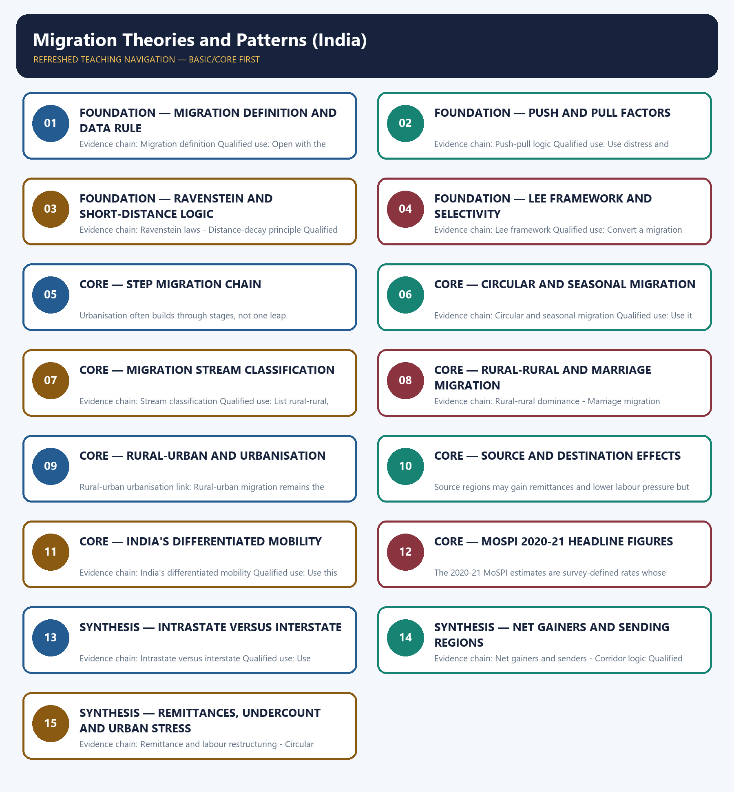

# Migration Theories and Patterns (India) — Learner-v2 Complete Learning Session

> **Authoring-only generation:** 2026-09-01. No PDF was rendered and no tracker or index was mutated.

### SOURCE, PROGRESSION AND CURRENT-LINKAGE AUDIT

- **Generation date:** 2026-09-01.
- **Repository-first evidence:** the Basic owner is taught first and preserved in full; the Advanced owner is retained only in the optional final teaching block.
- **OCR evidence:** Repository Markdown was primary. The three required local Geography books were inspected as supplementary OCR/searchable evidence. No unsupported page precision, volatile figure or quotation was imported.
- **Qdrant:** not used; repository Markdown and available OCR context were sufficient.
- **PYQ integrity:** Verified routing for this rebuild comes from the owner files: the 2024 GS-I demand on why large cities attract more migrants than smaller towns is supported directly inside the Basic owner, while the 2018 indentured-labour demand remains cross-cutting and is not falsely recast as a direct solved PYQ here.
- **Live-link boundary:** MoSPI Migration in India 2020-21 remains the latest official all-India survey-style anchor at this cutoff. Census 2027 is only a scheduled baseline refresh, so no new migration result is invented or implied here.
- **Fact/inference discipline:** no current-affairs item, PYQ wording, figure or quotation is invented.

## BASIC LEARNING SESSION

### DEEP-REVIEW LEARNING CONTRACT

| Control | Binding rule for this package |
|---|---|
| Syllabus boundary | Complete Human, Economic and Regional Geography Basic/Core is taught before optional Advanced depth. |
| Spatial method | Distribution → controlling physical/human variables → network or region → named world/India anchors → scale and exception. |
| Model method | State assumptions, mechanism, predicted pattern, named application and empirical or Global-South limitation. |
| Evidence method | Claim → named map/place/institution/dataset → analysis → source-date-status or causal qualification. |
| Policy method | Chronology, legal or planning instrument, responsible institution, implementation scale and current status remain distinct. |
| Practice contract | Every solved item has demand decoding, a detailed examiner-grade model, executable timed/compression plan, marks rationale and answer-specific improvement. |
| Approval | This immutable successor remains `approved: false` pending explicit approval. |

**Canonical Basic/Core owner:** `upsc-ai-kit\knowledge\Geography\basic\27_Migration-Theories-and-Patterns-India.md`  
**Canonical topic owner:** `upsc-ai-kit\knowledge\Geography\basic\27_Migration-Theories-and-Patterns-India.md`  
**Optional Advanced owner:** `upsc-ai-kit\knowledge\Geography\advanced\27_Migration-Theories-and-Patterns-India.md`  
**Official syllabus mapping:** `upsc-ai-kit\knowledge\Geography\OFFICIAL-UPSC-SYLLABUS-MAPPING.md`

### EVIDENCE, PYQ AND CURRENT-STATUS CONTROL

- **Definition discipline:** close terms share a comparison axis and are never treated as synonyms.
- **Map discipline:** pattern is reconstructed through site, situation, density, gradient, corridor, node, belt, boundary, hinterland and scale.
- **Model discipline:** Ravenstein, Lee, Christaller, Burgess, Hoyt, Harris-Ullman, Myrdal, Perroux, von Thünen, Weber and related models retain assumptions and limits.
- **India discipline:** every explanation carries named state, region, city, corridor, resource belt, border sector or cultural landscape evidence.
- **Data discipline:** Census, SRS, NFHS, Agriculture Census, production, trade, energy and infrastructure claims retain source, reference period, release date and status.
- **PYQ discipline:** repository routing ledgers and held papers control wording and metadata; reconstructed wording and unavailable official keys remain labelled.
- **Current-status note, rechecked 2026-09-05:** Rechecked 2026-09-05. Census 2011 remains the detailed internal-migration census baseline; MoSPI Migration in India 2020-21 is a PLFS-period survey, not a post-2011 census. UN International Migrant Stock 2024 covers international stock for 1990-2024 and states that countries without full reassessment may use extrapolated 2020 trends.

**Live/official context sources recorded by the predecessor generation:**

- `https://censusindia.gov.in/census.website/search/node?keys=india%20migration%20data`
- `https://mospi.gov.in/sites/default/files/publication_reports/Migration%20in%20India%20RL16082023.pdf`
- `https://www.un.org/development/desa/pd/content/international-migrant-stock`



*Distinct embedded teaching-navigation image. The separate continuous Cārvāka-style flowchart package remains an independent at-a-glance artifact.*

### SESSION 1 — FOUNDATION — MIGRATION DEFINITION AND DATA RULE

#### DEFINITION / WHAT THIS IS CALLED

**Plain-language definition:** Migration definition: Migration is a change in usual residence across a meaningful geographic or administrative boundary, and datasets may track it by place of birth or last usual residence.

**Technical definition:** Evidence chain: Migration definition Qualified use: Open with the residence concept before using census or survey migration numbers.

#### ANSWER-GRABBING OPENING — WRITE/ADAPT IN THE EXAM

> Migration definition: Migration is a change in usual residence across a meaningful geographic or administrative boundary, and datasets may track it by place of birth or last usual residence.

#### MUST-WRITE KEYWORDS

- **FOUNDATION**
- **Migration definition**
- **data rule**
- **Evidence chain**
- **Qualified use**
- **Migration**

**How to use them:** Frame the answer through FOUNDATION; define Migration definition, connect data rule with Evidence chain to explain the mechanism, and use Qualified use for the decisive comparison or qualification.

#### VISUAL FIRST

```text
MIGRATION DEFINITION AND DATA RULE
01. Migration definition
BOUNDARY -> Definition by usual residence matters before any analysis begins.
```

*This topic-specific rail fixes the evidence sequence and its exam boundary before analysis.*

#### CORE EXPLANATION

Migration is a change in usual residence across a meaningful geographic or administrative boundary, and datasets may track it by place of birth or last usual residence.

#### NAMED EVIDENCE AND MECHANISM

- **Migration definition:** Migration is a change in usual residence across a meaningful geographic or administrative boundary, and datasets may track it by place of birth or last usual residence.

#### EXAMINER CAUTION

- Definition by usual residence matters before any analysis begins.

#### EXAM LINK

- **Prelims:** Separate the agent, landform, location, status and scale attached to Migration definition and data rule.
- **Mains:** Open with the residence concept before using census or survey migration numbers.

#### MINI RECAP

- **Evidence chain:** Migration definition
- **Qualified use:** Open with the residence concept before using census or survey migration numbers.

#### CLOSING RECALL FLOW — FOUNDATION — MIGRATION DEFINITION AND DATA RULE

```text
START / CONCEPT: FOUNDATION — Migration definition and data rule
        |
        v
EXACT TERMS: FOUNDATION · Migration definition · data rule · Evidence chain · Qualified use · Migration
        |
        v
MECHANISM / ARGUMENT: Evidence chain: Migration definition Qualified use: Open with the residence concept before using census or survey migration numbers.
        |
        v
CONSEQUENCE / CONTRAST: The resulting consequence is that open with the residence concept before using census or survey migration numbers.
        |
        v
UPSC TRAP / ANSWER-USE: Do not miss this limiting distinction: open with the residence concept before using census or survey migration numbers.
        |
        v
ANSWER-GRABBING FORMULATION: Migration definition: Migration is a change in usual residence across a meaningful geographic or administrative boundary, and datasets may track it by place of birth or last usual residence.
```
### SESSION 2 — FOUNDATION — PUSH AND PULL FACTORS

#### DEFINITION / WHAT THIS IS CALLED

**Plain-language definition:** Push-pull logic: Migration is commonly explained through push factors at the origin and pull factors at the destination.

**Technical definition:** Evidence chain: Push-pull logic Qualified use: Use distress and opportunity in one causal frame.

#### ANSWER-GRABBING OPENING — WRITE/ADAPT IN THE EXAM

> Push-pull logic: Migration is commonly explained through push factors at the origin and pull factors at the destination.

#### MUST-WRITE KEYWORDS

- **FOUNDATION**
- **Push**
- **pull factors**
- **Push-pull logic**
- **Evidence chain**
- **Qualified use**

**How to use them:** Frame the answer through FOUNDATION; define Push, connect pull factors with Push-pull logic to explain the mechanism, and use Evidence chain for the decisive comparison or qualification.

#### VISUAL FIRST

```text
PUSH AND PULL FACTORS
01. Push-pull logic
BOUNDARY -> Push and pull operate together, not in isolation.
```

*This topic-specific rail fixes the evidence sequence and its exam boundary before analysis.*

#### CORE EXPLANATION

Migration is commonly explained through push factors at the origin and pull factors at the destination.

#### NAMED EVIDENCE AND MECHANISM

- **Push-pull logic:** Migration is commonly explained through push factors at the origin and pull factors at the destination.

#### EXAMINER CAUTION

- Push and pull operate together, not in isolation.

#### EXAM LINK

- **Prelims:** Separate the agent, landform, location, status and scale attached to Push and pull factors.
- **Mains:** Use distress and opportunity in one causal frame.

#### MINI RECAP

- **Evidence chain:** Push-pull logic
- **Qualified use:** Use distress and opportunity in one causal frame.

#### CLOSING RECALL FLOW — FOUNDATION — PUSH AND PULL FACTORS

```text
START / CONCEPT: FOUNDATION — Push and pull factors
        |
        v
EXACT TERMS: FOUNDATION · Push · pull factors · Push-pull logic · Evidence chain · Qualified use
        |
        v
MECHANISM / ARGUMENT: Evidence chain: Push-pull logic Qualified use: Use distress and opportunity in one causal frame.
        |
        v
CONSEQUENCE / CONTRAST: Mains: Use distress and opportunity in one causal frame.
        |
        v
UPSC TRAP / ANSWER-USE: Do not miss this limiting distinction: migration is commonly explained through push factors at the origin and pull factors at...
        |
        v
ANSWER-GRABBING FORMULATION: Push-pull logic: Migration is commonly explained through push factors at the origin and pull factors at the destination.
```
### SESSION 3 — FOUNDATION — RAVENSTEIN AND SHORT-DISTANCE LOGIC

#### DEFINITION / WHAT THIS IS CALLED

**Plain-language definition:** Ravenstein is a heuristic, not an iron law.

**Technical definition:** Evidence chain: Ravenstein laws - Distance-decay principle Qualified use: Explain distance-decay, short moves and counter-streams together.

#### ANSWER-GRABBING OPENING — WRITE/ADAPT IN THE EXAM

> Evidence chain: Ravenstein laws - Distance-decay principle Qualified use: Explain distance-decay, short moves and counter-streams together.

#### MUST-WRITE KEYWORDS

- **FOUNDATION**
- **Ravenstein**
- **short-distance logic**
- **Ravenstein laws**
- **Distance-decay principle**
- **Evidence chain**

**How to use them:** Frame the answer through FOUNDATION; define Ravenstein, connect short-distance logic with Ravenstein laws to explain the mechanism, and use Distance-decay principle for the decisive comparison or qualification.

#### VISUAL FIRST

```text
RAVENSTEIN AND SHORT-DISTANCE LOGIC
01. Ravenstein laws
    |
    v
02. Distance-decay principle
BOUNDARY -> Ravenstein is a heuristic, not an iron law.
```

*This topic-specific rail fixes the evidence sequence and its exam boundary before analysis.*

#### CORE EXPLANATION

Ravenstein's laws emphasise short-distance movement, step migration and the creation of counter-streams. Migration volume usually falls with distance unless exceptional opportunities or networks offset distance costs.

#### NAMED EVIDENCE AND MECHANISM

- **Ravenstein laws:** Ravenstein's laws emphasise short-distance movement, step migration and the creation of counter-streams.
- **Distance-decay principle:** Migration volume usually falls with distance unless exceptional opportunities or networks offset distance costs.

#### EXAMINER CAUTION

- Ravenstein is a heuristic, not an iron law.

#### EXAM LINK

- **Prelims:** Separate the agent, landform, location, status and scale attached to Ravenstein and short-distance logic.
- **Mains:** Explain distance-decay, short moves and counter-streams together.

#### MINI RECAP

- **Evidence chain:** Ravenstein laws -> Distance-decay principle
- **Qualified use:** Explain distance-decay, short moves and counter-streams together.

#### CLOSING RECALL FLOW — FOUNDATION — RAVENSTEIN AND SHORT-DISTANCE LOGIC

```text
START / CONCEPT: FOUNDATION — Ravenstein and short-distance logic
        |
        v
EXACT TERMS: FOUNDATION · Ravenstein · short-distance logic · Ravenstein laws · Distance-decay principle · Evidence chain
        |
        v
MECHANISM / ARGUMENT: Mains: Explain distance-decay, short moves and counter-streams together.
        |
        v
CONSEQUENCE / CONTRAST: Ravenstein is a heuristic, not an iron law.
        |
        v
UPSC TRAP / ANSWER-USE: Do not miss this limiting distinction: ravenstein is a heuristic, not an iron law.
        |
        v
ANSWER-GRABBING FORMULATION: Evidence chain: Ravenstein laws - Distance-decay principle Qualified use: Explain distance-decay, short moves and counter-streams together.
```
### SESSION 4 — FOUNDATION — LEE FRAMEWORK AND SELECTIVITY

#### DEFINITION / WHAT THIS IS CALLED

**Plain-language definition:** Lee framework: Lee's framework explains migration through origin factors, destination factors, intervening obstacles and personal selectivity.

**Technical definition:** Evidence chain: Lee framework Qualified use: Convert a migration answer into a diagram with origin, destination and obstacles.

#### ANSWER-GRABBING OPENING — WRITE/ADAPT IN THE EXAM

> Lee framework: Lee's framework explains migration through origin factors, destination factors, intervening obstacles and personal selectivity.

#### MUST-WRITE KEYWORDS

- **FOUNDATION**
- **Lee framework**
- **selectivity**
- **Evidence chain**
- **Qualified use**
- **Lee's**

**How to use them:** Frame the answer through FOUNDATION; define Lee framework, connect selectivity with Evidence chain to explain the mechanism, and use Qualified use for the decisive comparison or qualification.

#### VISUAL FIRST

```text
LEE FRAMEWORK AND SELECTIVITY
01. Lee framework
BOUNDARY -> Do not forget intervening obstacles and personal selectivity.
```

*This topic-specific rail fixes the evidence sequence and its exam boundary before analysis.*

#### CORE EXPLANATION

Lee's framework explains migration through origin factors, destination factors, intervening obstacles and personal selectivity.

#### NAMED EVIDENCE AND MECHANISM

- **Lee framework:** Lee's framework explains migration through origin factors, destination factors, intervening obstacles and personal selectivity.

#### EXAMINER CAUTION

- Do not forget intervening obstacles and personal selectivity.

#### EXAM LINK

- **Prelims:** Separate the agent, landform, location, status and scale attached to Lee framework and selectivity.
- **Mains:** Convert a migration answer into a diagram with origin, destination and obstacles.

#### MINI RECAP

- **Evidence chain:** Lee framework
- **Qualified use:** Convert a migration answer into a diagram with origin, destination and obstacles.

#### CLOSING RECALL FLOW — FOUNDATION — LEE FRAMEWORK AND SELECTIVITY

```text
START / CONCEPT: FOUNDATION — Lee framework and selectivity
        |
        v
EXACT TERMS: FOUNDATION · Lee framework · selectivity · Evidence chain · Qualified use · Lee's
        |
        v
MECHANISM / ARGUMENT: Evidence chain: Lee framework Qualified use: Convert a migration answer into a diagram with origin, destination and obstacles.
        |
        v
CONSEQUENCE / CONTRAST: Do not forget intervening obstacles and personal selectivity.
        |
        v
UPSC TRAP / ANSWER-USE: Do not miss this limiting distinction: do not forget intervening obstacles and personal selectivity.
        |
        v
ANSWER-GRABBING FORMULATION: Lee framework: Lee's framework explains migration through origin factors, destination factors, intervening obstacles and personal selectivity.
```
### SESSION 5 — CORE — STEP MIGRATION CHAIN

#### DEFINITION / WHAT THIS IS CALLED

**Plain-language definition:** Evidence chain: Step migration chain Qualified use: Use village-town-city-metropolis as the classic sequence.

**Technical definition:** Urbanisation often builds through stages, not one leap.

#### ANSWER-GRABBING OPENING — WRITE/ADAPT IN THE EXAM

> Evidence chain: Step migration chain Qualified use: Use village-town-city-metropolis as the classic sequence.

#### MUST-WRITE KEYWORDS

- **Step migration chain**
- **Evidence chain**
- **Qualified use**
- **Urbanisation**
- **Step**
- **Qualified**

**How to use them:** Frame the answer through Step migration chain; define Evidence chain, connect Qualified use with Urbanisation to explain the mechanism, and use Step for the decisive comparison or qualification.

#### VISUAL FIRST

```text
STEP MIGRATION CHAIN
01. Step migration chain
BOUNDARY -> Urbanisation often builds through stages, not one leap.
```

*This topic-specific rail fixes the evidence sequence and its exam boundary before analysis.*

#### CORE EXPLANATION

Step migration often proceeds village to small town to city to metropolis rather than by one direct leap.

#### NAMED EVIDENCE AND MECHANISM

- **Step migration chain:** Step migration often proceeds village to small town to city to metropolis rather than by one direct leap.

#### EXAMINER CAUTION

- Urbanisation often builds through stages, not one leap.

#### EXAM LINK

- **Prelims:** Separate the agent, landform, location, status and scale attached to Step migration chain.
- **Mains:** Use village-town-city-metropolis as the classic sequence.

#### MINI RECAP

- **Evidence chain:** Step migration chain
- **Qualified use:** Use village-town-city-metropolis as the classic sequence.

#### CLOSING RECALL FLOW — CORE — STEP MIGRATION CHAIN

```text
START / CONCEPT: CORE — Step migration chain
        |
        v
EXACT TERMS: Step migration chain · Evidence chain · Qualified use · Urbanisation · Step · Qualified
        |
        v
MECHANISM / ARGUMENT: Urbanisation often builds through stages, not one leap.
        |
        v
CONSEQUENCE / CONTRAST: Mains: Use village-town-city-metropolis as the classic sequence.
        |
        v
UPSC TRAP / ANSWER-USE: Do not miss this limiting distinction: use village-town-city-metropolis as the classic sequence.
        |
        v
ANSWER-GRABBING FORMULATION: Evidence chain: Step migration chain Qualified use: Use village-town-city-metropolis as the classic sequence.
```
### SESSION 6 — CORE — CIRCULAR AND SEASONAL MIGRATION

#### DEFINITION / WHAT THIS IS CALLED

**Plain-language definition:** Circular and seasonal migration: Circular or seasonal migration repeats movement without final permanent settlement and is central to labour geography.

**Technical definition:** Evidence chain: Circular and seasonal migration Qualified use: Use it to explain precarity, construction labour and welfare-portability issues.

#### ANSWER-GRABBING OPENING — WRITE/ADAPT IN THE EXAM

> Evidence chain: Circular and seasonal migration Qualified use: Use it to explain precarity, construction labour and welfare-portability issues.

#### MUST-WRITE KEYWORDS

- **Circular**
- **seasonal migration**
- **Circular and seasonal migration**
- **Evidence chain**
- **Qualified use**
- **Circular migration**

**How to use them:** Frame the answer through Circular; define seasonal migration, connect Circular and seasonal migration with Evidence chain to explain the mechanism, and use Qualified use for the decisive comparison or qualification.

#### VISUAL FIRST

```text
CIRCULAR AND SEASONAL MIGRATION
01. Circular and seasonal migration
BOUNDARY -> Circular migration is mobility without final permanent settlement.
```

*This topic-specific rail fixes the evidence sequence and its exam boundary before analysis.*

#### CORE EXPLANATION

Circular or seasonal migration repeats movement without final permanent settlement and is central to labour geography.

#### NAMED EVIDENCE AND MECHANISM

- **Circular and seasonal migration:** Circular or seasonal migration repeats movement without final permanent settlement and is central to labour geography.

#### EXAMINER CAUTION

- Circular migration is mobility without final permanent settlement.

#### EXAM LINK

- **Prelims:** Separate the agent, landform, location, status and scale attached to Circular and seasonal migration.
- **Mains:** Use it to explain precarity, construction labour and welfare-portability issues.

#### MINI RECAP

- **Evidence chain:** Circular and seasonal migration
- **Qualified use:** Use it to explain precarity, construction labour and welfare-portability issues.

#### CLOSING RECALL FLOW — CORE — CIRCULAR AND SEASONAL MIGRATION

```text
START / CONCEPT: CORE — Circular and seasonal migration
        |
        v
EXACT TERMS: Circular · seasonal migration · Circular and seasonal migration · Evidence chain · Qualified use · Circular migration
        |
        v
MECHANISM / ARGUMENT: Circular and seasonal migration: Circular or seasonal migration repeats movement without final permanent settlement and is central to labour geography.
        |
        v
CONSEQUENCE / CONTRAST: Circular migration is mobility without final permanent settlement.
        |
        v
UPSC TRAP / ANSWER-USE: Do not miss this limiting distinction: use it to explain precarity, construction labour and welfare-portability issues.
        |
        v
ANSWER-GRABBING FORMULATION: Evidence chain: Circular and seasonal migration Qualified use: Use it to explain precarity, construction labour and welfare-portability issues.
```
### SESSION 7 — CORE — MIGRATION STREAM CLASSIFICATION

#### DEFINITION / WHAT THIS IS CALLED

**Plain-language definition:** Stream classification: Migration can be classified as internal or international and, within internal migration, as rural-rural, rural-urban, urban-urban and urban-rural streams.

**Technical definition:** Evidence chain: Stream classification Qualified use: List rural-rural, rural-urban, urban-urban and urban-rural cleanly.

#### ANSWER-GRABBING OPENING — WRITE/ADAPT IN THE EXAM

> Stream classification: Migration can be classified as internal or international and, within internal migration, as rural-rural, rural-urban, urban-urban and urban-rural streams.

#### MUST-WRITE KEYWORDS

- **Migration stream classification**
- **Stream classification**
- **Evidence chain**
- **Qualified use**
- **Migration**
- **Stream**

**How to use them:** Frame the answer through Migration stream classification; define Stream classification, connect Evidence chain with Qualified use to explain the mechanism, and use Migration for the decisive comparison or qualification.

#### VISUAL FIRST

```text
MIGRATION STREAM CLASSIFICATION
01. Stream classification
BOUNDARY -> Separate administrative distance from rural-urban character.
```

*This topic-specific rail fixes the evidence sequence and its exam boundary before analysis.*

#### CORE EXPLANATION

Migration can be classified as internal or international and, within internal migration, as rural-rural, rural-urban, urban-urban and urban-rural streams.

#### NAMED EVIDENCE AND MECHANISM

- **Stream classification:** Migration can be classified as internal or international and, within internal migration, as rural-rural, rural-urban, urban-urban and urban-rural streams.

#### EXAMINER CAUTION

- Separate administrative distance from rural-urban character.

#### EXAM LINK

- **Prelims:** Separate the agent, landform, location, status and scale attached to Migration stream classification.
- **Mains:** List rural-rural, rural-urban, urban-urban and urban-rural cleanly.

#### MINI RECAP

- **Evidence chain:** Stream classification
- **Qualified use:** List rural-rural, rural-urban, urban-urban and urban-rural cleanly.

#### CLOSING RECALL FLOW — CORE — MIGRATION STREAM CLASSIFICATION

```text
START / CONCEPT: CORE — Migration stream classification
        |
        v
EXACT TERMS: Migration stream classification · Stream classification · Evidence chain · Qualified use · Migration · Stream
        |
        v
MECHANISM / ARGUMENT: Evidence chain: Stream classification Qualified use: List rural-rural, rural-urban, urban-urban and urban-rural cleanly.
        |
        v
CONSEQUENCE / CONTRAST: The resulting consequence is that migration can be classified as internal or international and, within internal migration, as rural-rural...
        |
        v
UPSC TRAP / ANSWER-USE: Do not miss this limiting distinction: migration can be classified as internal or international and, within internal migration, as rural-rural...
        |
        v
ANSWER-GRABBING FORMULATION: Stream classification: Migration can be classified as internal or international and, within internal migration, as rural-rural, rural-urban, urban-urban and urban-rural streams.
```
### SESSION 8 — CORE — RURAL-RURAL AND MARRIAGE MIGRATION

#### DEFINITION / WHAT THIS IS CALLED

**Plain-language definition:** Rural-rural dominance: Rural-rural movement has historically been the largest internal stream in India, especially because marriage migration is large.

**Technical definition:** Evidence chain: Rural-rural dominance - Marriage migration dominance Qualified use: Explain why marriage keeps rural-rural migration large in India.

#### ANSWER-GRABBING OPENING — WRITE/ADAPT IN THE EXAM

> Evidence chain: Rural-rural dominance - Marriage migration dominance Qualified use: Explain why marriage keeps rural-rural migration large in India.

#### MUST-WRITE KEYWORDS

- **Rural-rural**
- **marriage migration**
- **Rural-rural dominance**
- **Marriage migration dominance**
- **Evidence chain**
- **Qualified use**

**How to use them:** Frame the answer through Rural-rural; define marriage migration, connect Rural-rural dominance with Marriage migration dominance to explain the mechanism, and use Evidence chain for the decisive comparison or qualification.

#### VISUAL FIRST

```text
RURAL-RURAL AND MARRIAGE MIGRATION
01. Rural-rural dominance
    |
    v
02. Marriage migration dominance
BOUNDARY -> Recorded migration totals are not identical to labour migration totals.
```

*This topic-specific rail fixes the evidence sequence and its exam boundary before analysis.*

#### CORE EXPLANATION

Rural-rural movement has historically been the largest internal stream in India, especially because marriage migration is large. Female migrants moving due to marriage formed 86.8 percent of female migrants in the MoSPI 2020-21 snapshot.

#### NAMED EVIDENCE AND MECHANISM

- **Rural-rural dominance:** Rural-rural movement has historically been the largest internal stream in India, especially because marriage migration is large.
- **Marriage migration dominance:** Female migrants moving due to marriage formed 86.8 percent of female migrants in the MoSPI 2020-21 snapshot.

#### EXAMINER CAUTION

- Recorded migration totals are not identical to labour migration totals.

#### EXAM LINK

- **Prelims:** Separate the agent, landform, location, status and scale attached to Rural-rural and marriage migration.
- **Mains:** Explain why marriage keeps rural-rural migration large in India.

#### MINI RECAP

- **Evidence chain:** Rural-rural dominance -> Marriage migration dominance
- **Qualified use:** Explain why marriage keeps rural-rural migration large in India.

#### CLOSING RECALL FLOW — CORE — RURAL-RURAL AND MARRIAGE MIGRATION

```text
START / CONCEPT: CORE — Rural-rural and marriage migration
        |
        v
EXACT TERMS: Rural-rural · marriage migration · Rural-rural dominance · Marriage migration dominance · Evidence chain · Qualified use
        |
        v
MECHANISM / ARGUMENT: Rural-rural dominance: Rural-rural movement has historically been the largest internal stream in India, especially because marriage migration is large.
        |
        v
CONSEQUENCE / CONTRAST: Recorded migration totals are not identical to labour migration totals.
        |
        v
UPSC TRAP / ANSWER-USE: Do not miss this limiting distinction: explain why marriage keeps rural-rural migration large in India.
        |
        v
ANSWER-GRABBING FORMULATION: Evidence chain: Rural-rural dominance - Marriage migration dominance Qualified use: Explain why marriage keeps rural-rural migration large in India.
```
### SESSION 9 — CORE — RURAL-URBAN AND URBANISATION

#### DEFINITION / WHAT THIS IS CALLED

**Plain-language definition:** Evidence chain: Rural-urban urbanisation link Qualified use: Show why rural-urban flow remains the urban-growth stream.

**Technical definition:** Rural-urban urbanisation link: Rural-urban migration remains the classic labour stream that fuels urbanisation, construction and informal work.

#### ANSWER-GRABBING OPENING — WRITE/ADAPT IN THE EXAM

> Evidence chain: Rural-urban urbanisation link Qualified use: Show why rural-urban flow remains the urban-growth stream.

#### MUST-WRITE KEYWORDS

- **Rural-urban**
- **urbanisation**
- **Rural-urban urbanisation link**
- **Evidence chain**
- **Qualified use**
- **Qualified**

**How to use them:** Frame the answer through Rural-urban; define urbanisation, connect Rural-urban urbanisation link with Evidence chain to explain the mechanism, and use Qualified use for the decisive comparison or qualification.

#### VISUAL FIRST

```text
RURAL-URBAN AND URBANISATION
01. Rural-urban urbanisation link
BOUNDARY -> Do not let marriage migration erase labour migration.
```

*This topic-specific rail fixes the evidence sequence and its exam boundary before analysis.*

#### CORE EXPLANATION

Rural-urban migration remains the classic labour stream that fuels urbanisation, construction and informal work.

#### NAMED EVIDENCE AND MECHANISM

- **Rural-urban urbanisation link:** Rural-urban migration remains the classic labour stream that fuels urbanisation, construction and informal work.

#### EXAMINER CAUTION

- Do not let marriage migration erase labour migration.

#### EXAM LINK

- **Prelims:** Separate the agent, landform, location, status and scale attached to Rural-urban and urbanisation.
- **Mains:** Show why rural-urban flow remains the urban-growth stream.

#### MINI RECAP

- **Evidence chain:** Rural-urban urbanisation link
- **Qualified use:** Show why rural-urban flow remains the urban-growth stream.

#### CLOSING RECALL FLOW — CORE — RURAL-URBAN AND URBANISATION

```text
START / CONCEPT: CORE — Rural-urban and urbanisation
        |
        v
EXACT TERMS: Rural-urban · urbanisation · Rural-urban urbanisation link · Evidence chain · Qualified use · Qualified
        |
        v
MECHANISM / ARGUMENT: Rural-urban urbanisation link: Rural-urban migration remains the classic labour stream that fuels urbanisation, construction and informal work.
        |
        v
CONSEQUENCE / CONTRAST: Do not let marriage migration erase labour migration.
        |
        v
UPSC TRAP / ANSWER-USE: Do not miss this limiting distinction: show why rural-urban flow remains the urban-growth stream.
        |
        v
ANSWER-GRABBING FORMULATION: Evidence chain: Rural-urban urbanisation link Qualified use: Show why rural-urban flow remains the urban-growth stream.
```
### SESSION 10 — CORE — SOURCE AND DESTINATION EFFECTS

#### DEFINITION / WHAT THIS IS CALLED

**Plain-language definition:** Migration changes both the place people leave and the place where they settle, creating gains and costs on each side.

**Technical definition:** Source regions may gain remittances and lower labour pressure but lose selected skills or workers, while destinations gain labour and demand but face differentiated housing, service and integration pressures.

#### ANSWER-GRABBING OPENING — WRITE/ADAPT IN THE EXAM

> Migration redistributes people, income, skills and service burdens between linked source and destination regions.

#### MUST-WRITE KEYWORDS

- **source region**
- **destination region**
- **remittances**
- **labour supply**
- **urban services**
- **social costs**

**How to use them:** Compare source-region remittances and labour supply with destination-region jobs and urban services; then add skill loss, congestion, housing and social-integration qualifications.

#### VISUAL FIRST

```text
SOURCE AND DESTINATION EFFECTS
01. Source-destination effects
BOUNDARY -> One-sided answers on cities or villages alone stay incomplete.
```

*This topic-specific rail fixes the evidence sequence and its exam boundary before analysis.*

#### CORE EXPLANATION

Migration changes source and destination regions together through remittances, labour redistribution, sex-structure change, congestion and slum pressure.

#### NAMED EVIDENCE AND MECHANISM

- **Source-destination effects:** Migration changes source and destination regions together through remittances, labour redistribution, sex-structure change, congestion and slum pressure.

#### EXAMINER CAUTION

- One-sided answers on cities or villages alone stay incomplete.

#### EXAM LINK

- **Prelims:** Separate the agent, landform, location, status and scale attached to Source and destination effects.
- **Mains:** Balance remittances, labour gains, congestion and slum pressure together.

#### MINI RECAP

- **Evidence chain:** Source-destination effects
- **Qualified use:** Balance remittances, labour gains, congestion and slum pressure together.

#### CLOSING RECALL FLOW — CORE — SOURCE AND DESTINATION EFFECTS

```text
START / CONCEPT: CORE — Source and destination effects
        |
        v
EXACT TERMS: source region · destination region · remittances · labour supply · urban services · social costs
        |
        v
MECHANISM / ARGUMENT: Evidence chain: Source-destination effects Qualified use: Balance remittances, labour gains, congestion and slum pressure together.
        |
        v
CONSEQUENCE / CONTRAST: The resulting consequence is that balance remittances, labour gains, congestion and slum pressure together.
        |
        v
UPSC TRAP / ANSWER-USE: Do not miss this limiting distinction: balance remittances, labour gains, congestion and slum pressure together.
        |
        v
ANSWER-GRABBING FORMULATION: Migration redistributes people, income, skills and service burdens between linked source and destination regions.
```
### SESSION 11 — CORE — INDIA'S DIFFERENTIATED MOBILITY

#### DEFINITION / WHAT THIS IS CALLED

**Plain-language definition:** India's differentiated mobility: Khullar describes India as historically less mobile than many Western societies but internally very differentiated by marriage, labour and interstate variation.

**Technical definition:** Evidence chain: India's differentiated mobility Qualified use: Use this as the transition sentence from theory to India.

#### ANSWER-GRABBING OPENING — WRITE/ADAPT IN THE EXAM

> India's differentiated mobility: Khullar describes India as historically less mobile than many Western societies but internally very differentiated by marriage, labour and interstate variation.

#### MUST-WRITE KEYWORDS

- **India's differentiated mobility**
- **Evidence chain**
- **Qualified use**
- **Khullar**
- **India**
- **Western**

**How to use them:** Frame the answer through India's differentiated mobility; define Evidence chain, connect Qualified use with Khullar to explain the mechanism, and use India for the decisive comparison or qualification.

#### VISUAL FIRST

```text
INDIA'S DIFFERENTIATED MOBILITY
01. India's differentiated mobility
BOUNDARY -> India is less mobile than some Western societies but highly varied internally.
```

*This topic-specific rail fixes the evidence sequence and its exam boundary before analysis.*

#### CORE EXPLANATION

Khullar describes India as historically less mobile than many Western societies but internally very differentiated by marriage, labour and interstate variation.

#### NAMED EVIDENCE AND MECHANISM

- **India's differentiated mobility:** Khullar describes India as historically less mobile than many Western societies but internally very differentiated by marriage, labour and interstate variation.

#### EXAMINER CAUTION

- India is less mobile than some Western societies but highly varied internally.

#### EXAM LINK

- **Prelims:** Separate the agent, landform, location, status and scale attached to India's differentiated mobility.
- **Mains:** Use this as the transition sentence from theory to India.

#### MINI RECAP

- **Evidence chain:** India's differentiated mobility
- **Qualified use:** Use this as the transition sentence from theory to India.

#### CLOSING RECALL FLOW — CORE — INDIA'S DIFFERENTIATED MOBILITY

```text
START / CONCEPT: CORE — India's differentiated mobility
        |
        v
EXACT TERMS: India's differentiated mobility · Evidence chain · Qualified use · Khullar · India · Western
        |
        v
MECHANISM / ARGUMENT: Evidence chain: India's differentiated mobility Qualified use: Use this as the transition sentence from theory to India.
        |
        v
CONSEQUENCE / CONTRAST: India is less mobile than some Western societies but highly varied internally.
        |
        v
UPSC TRAP / ANSWER-USE: Do not miss this limiting distinction: use this as the transition sentence from theory to India.
        |
        v
ANSWER-GRABBING FORMULATION: India's differentiated mobility: Khullar describes India as historically less mobile than many Western societies but internally very differentiated by marriage, labour and interstate variation.
```
### SESSION 12 — CORE — MOSPI 2020-21 HEADLINE FIGURES

#### DEFINITION / WHAT THIS IS CALLED

**Plain-language definition:** MoSPI migration figures must be quoted together with their survey year, population base and rural-urban categories.

**Technical definition:** The 2020-21 MoSPI estimates are survey-defined rates whose all-India, rural and urban values must retain the report period, denominator and migration definition before comparison.

#### ANSWER-GRABBING OPENING — WRITE/ADAPT IN THE EXAM

> A migration statistic is usable evidence only when agency, survey period, denominator and category travel with the number.

#### MUST-WRITE KEYWORDS

- **MoSPI**
- **2020-21**
- **all-India migration rate**
- **rural migration rate**
- **urban migration rate**
- **survey definition**

**How to use them:** Name MoSPI and 2020-21, state the all-India migration rate, compare rural and urban migration rates on the same denominator, then disclose the survey definition and avoid projecting the figures to another year.

#### VISUAL FIRST

```text
MOSPI 2020-21 HEADLINE FIGURES
01. MoSPI all-India migration rate
    |
    v
02. Rural and urban migration rates
BOUNDARY -> Survey figures need the source and year label.
```

*This topic-specific rail fixes the evidence sequence and its exam boundary before analysis.*

#### CORE EXPLANATION

MoSPI's Migration in India 2020-21 gives an all-India migration rate of 28.9 percent. The same MoSPI release gives a rural migration rate of 26.5 percent and an urban migration rate of 34.9 percent.

#### NAMED EVIDENCE AND MECHANISM

- **MoSPI all-India migration rate:** MoSPI's Migration in India 2020-21 gives an all-India migration rate of 28.9 percent.
- **Rural and urban migration rates:** The same MoSPI release gives a rural migration rate of 26.5 percent and an urban migration rate of 34.9 percent.

#### EXAMINER CAUTION

- Survey figures need the source and year label.

#### EXAM LINK

- **Prelims:** Separate the agent, landform, location, status and scale attached to MoSPI 2020-21 headline figures.
- **Mains:** Quote all-India, rural and urban migration rates together.

#### MINI RECAP

- **Evidence chain:** MoSPI all-India migration rate -> Rural and urban migration rates
- **Qualified use:** Quote all-India, rural and urban migration rates together.

#### CLOSING RECALL FLOW — CORE — MOSPI 2020-21 HEADLINE FIGURES

```text
START / CONCEPT: CORE — MoSPI 2020-21 headline figures
        |
        v
EXACT TERMS: MoSPI · 2020-21 · all-India migration rate · rural migration rate · urban migration rate · survey definition
        |
        v
MECHANISM / ARGUMENT: Evidence chain: MoSPI all-India migration rate - Rural and urban migration rates Qualified use: Quote all-India, rural and urban migration rates together.
        |
        v
CONSEQUENCE / CONTRAST: The resulting consequence is that moSPI all-India migration rate - Rural and urban migration rates Qualified use.
        |
        v
UPSC TRAP / ANSWER-USE: Do not miss this limiting distinction: moSPI all-India migration rate - Rural and urban migration rates Qualified use.
        |
        v
ANSWER-GRABBING FORMULATION: A migration statistic is usable evidence only when agency, survey period, denominator and category travel with the number.
```
### SESSION 13 — SYNTHESIS — INTRASTATE VERSUS INTERSTATE

#### DEFINITION / WHAT THIS IS CALLED

**Plain-language definition:** Interstate migration is not the dominant share in India.

**Technical definition:** Evidence chain: Intrastate versus interstate Qualified use: Use intrastate majority as the safest prelims firewall.

#### ANSWER-GRABBING OPENING — WRITE/ADAPT IN THE EXAM

> Intrastate versus interstate: In MoSPI 2020-21, 87.5 percent of migrants were intrastate and 12.5 percent were interstate.

#### MUST-WRITE KEYWORDS

- **SYNTHESIS**
- **Intrastate versus interstate**
- **Evidence chain**
- **Qualified use**
- **In MoSPI**
- **2020-21**

**How to use them:** Frame the answer through SYNTHESIS; define Intrastate versus interstate, connect Evidence chain with Qualified use to explain the mechanism, and use In MoSPI for the decisive comparison or qualification.

#### VISUAL FIRST

```text
INTRASTATE VERSUS INTERSTATE
01. Intrastate versus interstate
BOUNDARY -> Interstate migration is not the dominant share in India.
```

*This topic-specific rail fixes the evidence sequence and its exam boundary before analysis.*

#### CORE EXPLANATION

In MoSPI 2020-21, 87.5 percent of migrants were intrastate and 12.5 percent were interstate.

#### NAMED EVIDENCE AND MECHANISM

- **Intrastate versus interstate:** In MoSPI 2020-21, 87.5 percent of migrants were intrastate and 12.5 percent were interstate.

#### EXAMINER CAUTION

- Interstate migration is not the dominant share in India.

#### EXAM LINK

- **Prelims:** Separate the agent, landform, location, status and scale attached to Intrastate versus interstate.
- **Mains:** Use intrastate majority as the safest prelims firewall.

#### MINI RECAP

- **Evidence chain:** Intrastate versus interstate
- **Qualified use:** Use intrastate majority as the safest prelims firewall.

#### CLOSING RECALL FLOW — SYNTHESIS — INTRASTATE VERSUS INTERSTATE

```text
START / CONCEPT: SYNTHESIS — Intrastate versus interstate
        |
        v
EXACT TERMS: SYNTHESIS · Intrastate versus interstate · Evidence chain · Qualified use · In MoSPI · 2020-21
        |
        v
MECHANISM / ARGUMENT: Evidence chain: Intrastate versus interstate Qualified use: Use intrastate majority as the safest prelims firewall.
        |
        v
CONSEQUENCE / CONTRAST: Interstate migration is not the dominant share in India.
        |
        v
UPSC TRAP / ANSWER-USE: Do not miss this limiting distinction: use intrastate majority as the safest prelims firewall.
        |
        v
ANSWER-GRABBING FORMULATION: Intrastate versus interstate: In MoSPI 2020-21, 87.5 percent of migrants were intrastate and 12.5 percent were interstate.
```
### SESSION 14 — SYNTHESIS — NET GAINERS AND SENDING REGIONS

#### DEFINITION / WHAT THIS IS CALLED

**Plain-language definition:** Net gainers and senders: Khullar's spatial pattern shows Maharashtra, Gujarat, Delhi, Haryana and Punjab as classic gainers, while Bihar, Uttar Pradesh, Odisha and east-central belts are major sending regions.

**Technical definition:** Evidence chain: Net gainers and senders - Corridor logic Qualified use: Map agrarian sending regions against industrial and service corridors.

#### ANSWER-GRABBING OPENING — WRITE/ADAPT IN THE EXAM

> Net gainers and senders: Khullar's spatial pattern shows Maharashtra, Gujarat, Delhi, Haryana and Punjab as classic gainers, while Bihar, Uttar Pradesh, Odisha and east-central belts are major sending regions.

#### MUST-WRITE KEYWORDS

- **SYNTHESIS**
- **Net gainers**
- **sending regions**
- **Net gainers and senders**
- **Corridor logic**
- **Evidence chain**

**How to use them:** Frame the answer through SYNTHESIS; define Net gainers, connect sending regions with Net gainers and senders to explain the mechanism, and use Corridor logic for the decisive comparison or qualification.

#### VISUAL FIRST

```text
NET GAINERS AND SENDING REGIONS
01. Net gainers and senders
    |
    v
02. Corridor logic
BOUNDARY -> Do not describe migration as random movement across the map.
```

*This topic-specific rail fixes the evidence sequence and its exam boundary before analysis.*

#### CORE EXPLANATION

Khullar's spatial pattern shows Maharashtra, Gujarat, Delhi, Haryana and Punjab as classic gainers, while Bihar, Uttar Pradesh, Odisha and east-central belts are major sending regions. India's broad direction of labour mobility runs from lower-income agrarian regions towards industrial, construction and service corridors, making migration both development-seeking and distress-driven.

#### NAMED EVIDENCE AND MECHANISM

- **Net gainers and senders:** Khullar's spatial pattern shows Maharashtra, Gujarat, Delhi, Haryana and Punjab as classic gainers, while Bihar, Uttar Pradesh, Odisha and east-central belts are major sending regions.
- **Corridor logic:** India's broad direction of labour mobility runs from lower-income agrarian regions towards industrial, construction and service corridors, making migration both development-seeking and distress-driven.

#### EXAMINER CAUTION

- Do not describe migration as random movement across the map.

#### EXAM LINK

- **Prelims:** Separate the agent, landform, location, status and scale attached to Net gainers and sending regions.
- **Mains:** Map agrarian sending regions against industrial and service corridors.

#### MINI RECAP

- **Evidence chain:** Net gainers and senders -> Corridor logic
- **Qualified use:** Map agrarian sending regions against industrial and service corridors.

#### CLOSING RECALL FLOW — SYNTHESIS — NET GAINERS AND SENDING REGIONS

```text
START / CONCEPT: SYNTHESIS — Net gainers and sending regions
        |
        v
EXACT TERMS: SYNTHESIS · Net gainers · sending regions · Net gainers and senders · Corridor logic · Evidence chain
        |
        v
MECHANISM / ARGUMENT: Evidence chain: Net gainers and senders - Corridor logic Qualified use: Map agrarian sending regions against industrial and service corridors.
        |
        v
CONSEQUENCE / CONTRAST: Do not describe migration as random movement across the map.
        |
        v
UPSC TRAP / ANSWER-USE: Do not miss this limiting distinction: khullar's spatial pattern shows Maharashtra, Gujarat, Delhi, Haryana and Punjab as classic gainers.
        |
        v
ANSWER-GRABBING FORMULATION: Net gainers and senders: Khullar's spatial pattern shows Maharashtra, Gujarat, Delhi, Haryana and Punjab as classic gainers, while Bihar, Uttar Pradesh, Odisha and east-central belts are major sending regions.
```
### SESSION 15 — SYNTHESIS — REMITTANCES, UNDERCOUNT AND URBAN STRESS

#### DEFINITION / WHAT THIS IS CALLED

**Plain-language definition:** Circular undercount and urban stress: Circular migration is undercount-prone in usual-residence measures, while destination cities face rental insecurity, service pressure and informal settlement growth.

**Technical definition:** Evidence chain: Remittance and labour restructuring - Circular undercount and urban stress Qualified use: Conclude with remittances, undercount and welfare-portability pressure.

#### ANSWER-GRABBING OPENING — WRITE/ADAPT IN THE EXAM

> Circular undercount and urban stress: Circular migration is undercount-prone in usual-residence measures, while destination cities face rental insecurity, service pressure and informal settlement growth.

#### MUST-WRITE KEYWORDS

- **SYNTHESIS**
- **Remittances**
- **undercount**
- **urban stress**
- **Remittance and labour restructuring**
- **Circular undercount and urban stress**

**How to use them:** Frame the answer through SYNTHESIS; define Remittances, connect undercount with urban stress to explain the mechanism, and use Remittance and labour restructuring for the decisive comparison or qualification.

#### VISUAL FIRST

```text
REMITTANCES, UNDERCOUNT AND URBAN STRESS
01. Remittance and labour restructuring
    |
    v
02. Circular undercount and urban stress
BOUNDARY -> Migration supports households but also exposes data and service-delivery gaps.
```

*This topic-specific rail fixes the evidence sequence and its exam boundary before analysis.*

#### CORE EXPLANATION

Remittances support consumption, housing, education and debt repayment in source regions, but they do not automatically create local productive employment. Circular migration is undercount-prone in usual-residence measures, while destination cities face rental insecurity, service pressure and informal settlement growth.

#### NAMED EVIDENCE AND MECHANISM

- **Remittance and labour restructuring:** Remittances support consumption, housing, education and debt repayment in source regions, but they do not automatically create local productive employment.
- **Circular undercount and urban stress:** Circular migration is undercount-prone in usual-residence measures, while destination cities face rental insecurity, service pressure and informal settlement growth.

#### EXAMINER CAUTION

- Migration supports households but also exposes data and service-delivery gaps.

#### EXAM LINK

- **Prelims:** Separate the agent, landform, location, status and scale attached to Remittances, undercount and urban stress.
- **Mains:** Conclude with remittances, undercount and welfare-portability pressure.

#### MINI RECAP

- **Evidence chain:** Remittance and labour restructuring -> Circular undercount and urban stress
- **Qualified use:** Conclude with remittances, undercount and welfare-portability pressure.
#### COMPLETE BASIC OWNER EVIDENCE BANK

> **Subject:** Geography · **Tier:** Must-Do (foundation + standard) · **GS Paper:** GS-I
> **Grounded in:** Majid Husain, *Indian & World Geography* + G.C. Leong for physical-resource context + verified MoSPI current anchor.
> ✅ = from source book or official source · ⚠️ = inference / standard synthesis · 📰 = current affairs.
> *Companion: `advanced/27_Migration-Theories-and-Patterns-India.md`.*

#### 1. What migration means in geography

✅ Migration is a change in usual residence across a meaningful geographic or administrative boundary;
it may be internal or international, and official datasets may use place of birth or last usual residence.
Majid Husain explains the logic through **push factors** from the origin and **pull factors** at the destination.

| Basic term | Meaning |
|---|---|
| ✅ Migration | Change of usual residence; may be internal or international |
| ✅ Immigration | Movement into a country |
| ✅ Emigration | Movement out of a country |
| ✅ Push factors | Distress, conflict, disaster, job loss, social pressure |
| ✅ Pull factors | Jobs, wages, safety, education, amenities |
| ✅ Refugee | Person meeting the applicable refugee-law definition; not every forced migrant has the same legal status |

#### 2. Classical theories you should know

> ⚠️ Migration models are analytical tools, not iron laws; motives, obstacles and selectivity interact. The models below are therefore best used as analytical tools, not iron laws.

| Theory / idea | Core proposition | UPSC utility |
|---|---|---|
| ⚠️ Ravenstein's laws | Most migrants move short distances; migration often occurs step by step; each major stream creates a counter-stream | Good for explaining rural-urban chains |
| ⚠️ Lee's framework | Migration reflects push factors, pull factors, intervening obstacles and personal selectivity | Useful in diagram-based Mains answers |
| ⚠️ Distance-decay idea | Volume of migration usually falls with distance unless opportunities are exceptional | Explains local dominance of short-range migration |
| ⚠️ Step migration | Village -> small town -> city -> metropolis sequence | Useful in urbanisation questions |
| ⚠️ Circular / seasonal migration | Repeated movement without final permanent shift | Important for labour geography |

#### 3. Types and streams of migration

✅ Official migration measurement commonly compares place of birth or last usual residence with place of enumeration. ✅ He also distinguishes major internal streams by rural and urban origin-destination combinations.

| Type | Example | Static note |
|---|---|---|
| ✅ Internal migration | Movement within a country | Intra-district, inter-district, interstate |
| ✅ International migration | Country-to-country movement | Immigration and emigration |
| ✅ Rural-to-rural | Marriage or farm-labour movement | Often the largest stream in traditional societies |
| ✅ Rural-to-urban | Labour, education, services | Strongly linked to urbanisation |
| ✅ Urban-to-urban | Professional and business mobility | Hierarchical city networks |
| ✅ Urban-to-rural | Retirement, return migration, peri-urban spillover | Smaller but conceptually important |

#### 4. Effects on source and destination regions

✅ Migration changes origin areas, destination areas and migrants themselves. ✅ He also links migration with changing sex structure, labour availability, remittances, slums and pressure on infrastructure.

| Effect | Source area | Destination area |
|---|---|---|
| ✅ Population size | May lose population | Gains population |
| ✅ Age-sex structure | Often loses young adults | Often gains young working-age groups |
| ✅ Economy | Remittances may support households | Labour supply rises |
| ✅ Society | New ideas may travel back | Cultural mixing rises |
| ✅ Environment | Pressure may reduce locally | Urban congestion, pollution and slums may rise |

#### 5. World patterns and why they differ

- ⚠️ Labour migration is often strongest along opportunity corridors: mines, industrial belts, ports, construction zones and service hubs.
- ⚠️ Forced migration follows war, persecution, border change and ecological stress.
- ⚠️ Gender patterns differ: some streams are male-dominated work migration, while others are female-dominated marriage migration.
- ⚠️ Therefore migration is never “only economic”; culture, kinship, law, transport and state policy also matter.

#### 6. Must-Know Facts (Prelims) and UPSC traps

- ✅ Migration is a component of population change, along with fertility and mortality.
- ✅ Push and pull can operate together; the same factor may push one group and attract another.
- ✅ Internal migration can be classified both by administrative distance and by rural-urban character.
- ✅ Migration can improve incomes while worsening congestion in destination regions.
- ✅ Remittance is a major link between migration and rural development.

- ❌ Migration always reduces population pressure -> It may shift pressure from one region to another.
- ❌ All migration is long-distance -> Short-distance and step migration are often more common.
- ❌ Refugees and voluntary emigrants are the same -> Forced and voluntary movements differ legally and analytically.

#### 7. Exam linkage

- ⚠️ Recurring UPSC theme: migration as the bridge between population geography and urbanisation.
- ⚠️ Prelims often tests stream classification: rural-rural versus rural-urban versus urban-urban.
- ⚠️ Mains may ask whether migration is a safety valve, a distress signal or both.

#### 8. 📰 Current link

##### CA Anchor — MoSPI's Migration in India 2020-21

📰 **News trigger:** MoSPI released *Migration in India 2020-21* in June 2022 using the PLFS framework, again highlighting that marriage and work remain the dominant reasons behind internal migration.

| Current fact | Static concept |
|---|---|
| ✅ Migration must be measured carefully by residence concept | Definition matters in data interpretation |
| ✅ Work and marriage remain central migration drivers | Push-pull and gender-selective migration |
| ✅ Temporary movement surged during the pandemic period | Circular and distress migration are analytically important |

#### 9. Mains angles

- Explain migration using push-pull, intervening obstacles and selectivity.
- Show how migration can simultaneously reduce pressure in one region and create stress in another.

#### 10. Probable Questions

**Prelims-style concept prompt**
- ⚠️ Which of the following statements about migration theory is/are correct? (1) Ravenstein's laws suggest migration often occurs step by step. (2) Lee's framework includes push factors, pull factors, intervening obstacles and personal selectivity. **Answer:** Both statements are correct, because this file presents step migration under Ravenstein's logic and describes Lee's framework through exactly these four elements.

**Probable Mains questions (10-15 marks)**
- ⚠️ Discuss how push factors, pull factors and intervening obstacles together shape internal migration streams. (15 marks)
- ⚠️ Examine how migration can simultaneously reduce pressure in one region and create congestion, slums and infrastructure stress in another. (10 marks)

#### 11. Study link

Geography → Human Geography → Migration  
Geography → Human Geography → Migration Streams & Consequences

#### 12. Migration models, India's streams and the policy question

> **Why this section exists:** the file named Ravenstein and Lee but omitted the **predictive and
> economic models**, carried **no Indian migration corridors or streams**, and treated remittances
> and distress migration as passing mentions. Those are the elements a 10- or 15-mark answer needs.

##### 12.1 The model set, arranged by what each explains

| Model | Core proposition | What it explains well | Where it fails |
|---|---|---|---|
| ⚠️ Ravenstein's laws | Most migration is short-distance and proceeds by steps toward centres of commerce and industry; each stream generates a counter-stream; women predominate in short-distance movement | Distance decay, step migration, counter-streams — still empirically robust | Derived from one nineteenth-century national context; treats migration as largely economic |
| ⚠️ Lee's push-pull framework | Migration results from factors at origin, factors at destination, **intervening obstacles**, and personal factors | Adds obstacles and perception; explains why identical differentials produce different flows | Descriptive rather than predictive; the categories are not measurable |
| ⚠️ Gravity model | Flow between two places rises with their populations and falls with the distance between them | Gives a usable quantitative first approximation of flow volume | Ignores culture, networks, policy and information; distance is a poor proxy for real cost |
| ⚠️ Stouffer's intervening opportunities | Migration to a destination is proportional to the opportunities there and inversely proportional to the opportunities encountered along the way | Explains why a nearer, smaller city can capture migrants bound for a larger one | Requires opportunity to be quantifiable |
| ⚠️ Todaro / Harris-Todaro | Migrants respond to **expected** urban income — the urban wage discounted by the probability of getting a job — not to the observed wage | Explains why rural-urban migration continues despite visible urban unemployment; explains informal-sector absorption | Assumes better information than migrants have; understates non-economic motives |
| ⚠️ Zelinsky's mobility transition | Mobility type changes systematically with the stage of the demographic transition — from rural colonisation to rural-urban to inter-urban and circular movement | Links migration to demography; explains why mobility patterns change over development | Broad-brush and stage-based, with the same limitations as the transition model |
| ⚠️ Network / chain migration | Earlier migrants lower the cost and risk for later ones from the same origin | Explains **corridor persistence** — why specific source districts feed specific destinations for decades | Under-explains the initial flow |

- ⚠️ **The most useful pairing in an answer:** Todaro explains *why* people move despite urban
  unemployment; network theory explains *why they move to that particular city*. Neither alone
  explains observed Indian corridors.

##### 12.2 India's migration geography

| Stream | Character | Analytical point |
|---|---|---|
| ⚠️ Rural-to-rural | Historically the largest internal stream in India, and heavily female because **marriage** is the dominant recorded reason for female migration | This is why raw migration totals are misleading if read as economic movement |
| ⚠️ Rural-to-urban | The classic economic stream; strongly male-dominated in the work category | The stream that drives urbanisation and informal-sector growth |
| ⚠️ Urban-to-urban | Growing with a maturing urban system | Skilled and inter-metropolitan movement |
| ⚠️ Urban-to-rural | Smallest; return migration on retirement, distress or shock | The 2020 pandemic reversal was a temporary, extreme instance |
| ⚠️ Seasonal and circular | Repeated short-term movement tied to the agricultural calendar and construction cycles | Systematically under-counted by censuses that use a place-of-last-residence definition; this measurement problem is itself an examinable point |
| ⚠️ International — skilled | Professional emigration to advanced economies | Brain drain versus brain circulation and diaspora investment |
| ⚠️ International — contract labour | Semi-skilled and unskilled contract work, notably to West Asia | The principal remittance source for specific southern and eastern source regions |

- ⚠️ **Direction of internal flow:** the dominant economic movement runs from **densely populated,
  agriculturally dependent, lower-income regions of the north and east** toward the
  **industrial-urban and irrigated-agricultural regions of the west, north-west and south**. This
  reflects exactly the regional disparity analysed in
  `29_Regional-Development-and-Five-Year-Plans.md` — migration is disparity made visible.
- ⚠️ **Remittances** operate at two scales: internal remittances sustain consumption, housing,
  education and debt repayment in source villages; international remittances have transformed
  specific source regions' housing, education and land markets. The analytical point is that
  remittances **raise consumption and reduce poverty reliably, but do not by themselves create local
  productive employment** — which is why source regions can become remittance-dependent without
  becoming developed.

##### 12.3 Effects, stated as a balance sheet

| | **Source region** | **Destination region** |
|---|---|---|
| ⚠️ Gains | Reduced pressure on land and jobs; remittance inflow; skills and ideas returning; reduced open unemployment | Labour supply for construction, manufacturing and services; demographic rejuvenation; entrepreneurship and cultural diversity |
| ⚠️ Losses | Loss of the young, able and often better-educated; skewed age and sex structure; land left under-cultivated; social costs to families left behind | Pressure on housing, water, sanitation and transport; informal settlement growth; wage competition at the bottom; occasional political backlash |
| ⚠️ The honest verdict | Migration is a **rational household risk-diversification strategy**, not a symptom of failure — but it redistributes the costs of regional inequality onto migrants themselves | The city gains the labour and externalises the reproduction cost of that labour back to the source region |

- ⚠️ **Distress migration** is distinguished from opportunity migration by its trigger — crop
  failure, debt, disaster, conflict or displacement — and by the migrant's weak bargaining position
  on arrival. **Climate- and disaster-induced displacement** is a growing category, and it does not
  fit the voluntary-migration models above, because the decision is not a wage comparison.
- ⚠️ **The portability problem:** an internal migrant in India can lose practical access to
  entitlements tied to place of registration — rations, health services, schooling and voting — and
  policies attempting portability of benefits address exactly this. Institutional detail belongs to
  `Social-Justice` and `Governance`; the geographic point is that **mobility outruns the
  territorial design of welfare delivery**.

> ⚠️ **Factual caution:** do **not** quote a migrant count, a share of internal migrants, remittance
> values or corridor volumes from memory. The folder's Census-currency rule applies, and any survey
> figure must carry its source name and release date.

#### 13. Answer architecture (10/15/20-mark support)

##### 13.1 Directive decoding

| If the question says | It is really asking for | Do **not** |
|---|---|---|
| "Why do large cities attract more migrants than smaller towns?" | Scale and diversity of the opportunity set, expected-income logic, network effects, and the intervening-opportunity qualification | List urban amenities |
| "Discuss the effects of migration on source and destination" | The two-column balance sheet with named mechanisms on both sides, then a verdict | Give a one-sided problem list |
| "Examine distress migration" | The trigger-based definition, the weak-bargaining consequence, and the entitlement-portability problem | Merge it with ordinary economic migration |
| "Evaluate migration theories" | What each model explains and where it fails, then the combined explanation | Describe each theory in sequence |

##### 13.2 Reusable 10-mark spine — "why the largest cities capture the most migrants"

1. **Thesis:** migrants are drawn to the largest cities not by higher observed wages alone but by the
   **breadth of the opportunity set and the probability of finding some work**, reinforced by
   pre-existing social networks.
2. **Expected-income mechanism (Todaro):** the migrant compares the urban wage **discounted by the
   probability of employment** with the rural alternative; large cities offer a higher probability
   across more sectors, so migration persists despite visible unemployment.
3. **Diversity of the opportunity set:** construction, manufacturing, transport, domestic work,
   retail and the wider informal economy provide multiple simultaneous entry points, which reduces
   the risk of arriving and finding nothing.
4. **Network effects:** earlier migrants supply information, initial housing, job contacts and
   credit, lowering entry cost — which is why corridors persist between specific source districts
   and specific destination cities.
5. **Agglomeration:** larger cities have higher and more diverse labour demand, better connectivity
   and better health, education and service access.
6. **Counterpoint and qualification:** Stouffer's intervening opportunities predict that a nearer
   growing city can intercept the flow, and the emergence of regional urban centres does divert
   some movement; large-city costs of living, housing and commuting also offset the wage advantage.
7. **Conclusion:** graded — the pull of large cities is a symptom of the **spatial concentration of
   opportunity**, so it can only be moderated by building genuine opportunity in intermediate towns,
   not by restricting movement.

##### 13.3 Evidence units available in this file

> **Claim:** migration continues toward cities that already have visible unemployment, so the
> observed-wage explanation is inadequate. **Evidence:** the expected-income framework holds that
> migrants weigh the urban wage by the probability of obtaining work, and that a large, diversified
> informal sector raises that probability. **Significance:** it explains persistent rural-urban
> movement and the growth of informal employment as a rational response rather than a mistake.
> **Limitation:** it assumes migrants have reasonably good information about urban conditions, and
> it under-weights marriage, education, kinship and distress, which drive much observed movement.

> **Claim:** migration corridors are social structures, not merely economic gradients.
> **Evidence:** specific source districts feed specific destination cities over decades because
> earlier migrants supply information, housing, credit and job contacts to later ones.
> **Significance:** it explains corridor persistence, occupational clustering by origin community,
> and why the same wage differential produces flows along some routes and not others.
> **Limitation:** network theory explains continuation better than initiation, so the original
> impetus must still be explained economically or historically.

<!-- BEGIN GENERATED PYQ INTEGRATION: 2024-2025 -->

#### Recent PYQ Integration (2024-2025)

> **Status:** 2024-2025 question-level PYQ demand is integrated into this owner.
> **Provenance:** Audited local official-paper routing ledgers: `_PYQ-ROUTING-MAINS-GS1-GS2-ESSAY-2024-2025.md`.

- **Years represented:** 2024
- **Paper(s):** GS-I
- **Routed question demands:** 1

| Year | Paper | Q | PYQ demand (neutral rendering) | Directive / format | Source status | Owner requirement |
|---:|---|---|---|---|---|---|
| 2024 | GS-I | 5 | Why large cities attract more migrants than smaller towns | Discuss · 10 marks · 150 words | Routed to owning topic | Prepare context, core dimensions, evidence/examples, counterpoint and a concise conclusion. |

##### What this owner must now support

- Why large cities attract more migrants than smaller towns

> This block integrates the 2024-2025 examinable demand and paper metadata. It is kept separate from the 2018-2023 block and does not convert an unkeyed/answer-free objective question into a solved answer.
<!-- END GENERATED PYQ INTEGRATION: 2024-2025 -->

#### CLOSING RECALL FLOW — SYNTHESIS — REMITTANCES, UNDERCOUNT AND URBAN STRESS

```text
START / CONCEPT: SYNTHESIS — Remittances, undercount and urban stress
        |
        v
EXACT TERMS: SYNTHESIS · Remittances · undercount · urban stress · Remittance and labour restructuring · Circular undercount and urban stress
        |
        v
MECHANISM / ARGUMENT: Evidence chain: Remittance and labour restructuring - Circular undercount and urban stress Qualified use: Conclude with remittances, undercount and welfare-portability pressure.
        |
        v
CONSEQUENCE / CONTRAST: Remittance and labour restructuring: Remittances support consumption, housing, education and debt repayment in source regions, but they do not automatically create local productive employment.
        |
        v
UPSC TRAP / ANSWER-USE: Remittances support consumption, housing, education and debt repayment in source regions, but they do not automatically create local productive employment.
        |
        v
ANSWER-GRABBING FORMULATION: Circular undercount and urban stress: Circular migration is undercount-prone in usual-residence measures, while destination cities face rental insecurity, service pressure and informal settlement growth.
```
### GEOGRAPHY DEEP-REVIEW CORE CONTROL

- **Must remember:** Migration analysis joins Ravenstein's regularities, Lee's push-pull-intervening-obstacle framework, gravity and distance-decay, Zelinsky's mobility transition, Harris-Todaro expected-income logic, network/cumulative causation and segmented labour demand to India's marriage, work, education, distress and circulation streams.
- **Close distinction:** Migrant stock differs from flow, lifetime from last-residence migration, internal from international movement, seasonal/circular from permanent relocation, and Census reason-for-migration categories from causal explanation; women recorded under marriage can also be workers, so one response category must not erase economic agency.
- **Evidence / causal limit:** India patterns require Bihar–Uttar Pradesh source belts, Delhi–NCR/Mumbai/Surat/Bengaluru destinations, Kerala–Gulf corridors, tribal and drought-prone seasonal streams, remittances and care/skill loss; Census 2011 is the latest completed census baseline as of the review date, while surveys and administrative records are partial.

### FINAL CHOLA EVIDENCE LEDGER — TOPIC 27

#### Source, chronology and political-space controls

| Evidence | Secure use | Hard limit |
|---|---|---|
| Royal eulogy/order | ruler, title, order, campaign claim and ideology | target list is not a permanent empire map |
| Temple record | tax, gift, staff, committee, transaction and institutional work | great temples over-shape the surviving archive |
| Copper plate | genealogy, grant, monastery and diplomatic patronage | formula and royal lineage claim need corroboration |
| Archaeology/architecture | settlement, port, irrigation, craft and monumental sequence | style alone cannot name every patron |
| Coin | ruler/title, metal and circulation | no uniform cash economy or sovereignty from one find |
| Sri Lankan/Chinese account | external view of campaigns, embassies and trade | selective purpose, chronology and hearsay |

| Phase | Historical anchor | Caution |
|---|---|---|
| Vijayalaya-Aditya I | Tanjavur foothold and Pallava eclipse | not an uninterrupted Sangam empire |
| Parantaka I | Pandya expansion and Takkolam setback | expansion was reversible |
| Rajaraja I | survey, northern Sri Lanka and Brihadisvara | monument does not prove universal prosperity |
| Rajendra I | Gangaikondacholapuram, Ganga claim and 1025 Srivijaya/Kadaram targets | neither route nor raid equals annexed provinces |
| Rajadhiraja-successors | Western Chalukya and island warfare | one battlefield death did not end the dynasty |
| Kulottunga I | Eastern Chalukya-Chola branch connection and consolidation | dynastic change plus continuity |

### STATE, SOCIETY AND MARITIME LIMIT LEDGER — TOPIC 27

#### Administration and locality

- Mandalam, valanadu, nadu, kurram, ur, sabha/mahasabha, nagaram and variyam
  varied by inscription, chronology and region.
- Uttaramerur describes a restricted brahmadeya sabha procedure with property,
  residence, age, learning/conduct and accounting conditions; it is not
  universal democracy.
- Royal authority worked through officers, chiefs, temples, assemblies and
  landed/corporate intermediaries.
- Centralized, segmentary and integrative models each explain part of the
  inscriptional evidence.

#### Land, dependence and temple society

- Ownership, cultivation, revenue claim and jurisdiction are distinct land
  rights.
- Brahmadeya, devadana and non-brahmadeya land coexisted with vellala
  landholding/cultivation, peasants, artisans and service groups.
- Segregated settlements and dependent/servile relations are visible, but terms
  should not be equated automatically with modern Atlantic slavery.
- Women appear as queens, property holders, donors and temple personnel; agency
  coexisted with patriarchal and caste constraints.
- Temples could be ritual, landed, redistributive, employment, craft,
  educational, cultural and archival nodes; no single temple model is universal.

#### Maritime and religious limits

- Ainnurruvar/Ayyavole, Manigramam, Anjuvannam and nagaram networks interacted
  with courts without becoming royal departments.
- Sri Lanka involved conquest, administration and resistance; Srivijaya/Kadaram
  involved an expeditionary strike plus later diplomacy.
- No evidence establishes Southeast Asian colonization, a permanent naval
  empire or royal control of every commercial voyage.
- Shaiva prominence coexisted unevenly with Vaishnava, Buddhist and Jain
  institutions; religious pluralism did not exclude conflict.
- Kaveri ecology enabled intensive agriculture, but ecological determinism
  cannot explain imperial formation.

#### Four routed PYQ anchors

1. 2020 Prelims Q24: cross-routed dynasty chronology; inferred order only.
2. 2022 GS-I Q12: Gupta-Chola cultural comparison.
3. 2024 GS-I Q11: Chola art and architecture with institutional/material context.
4. 2025 Prelims Q16: officially keyed Rajendra I Srivijaya campaign.

**Final method:** source -> reign/region -> institution -> social/material
mechanism -> limit -> multidimensional verdict.

### Semantic-completeness ownership and PYQ control

- **Owned core:** migration stock and flow; place-of-birth and last-residence
  measures; internal/international, intra/interstate, rural-rural,
  rural-urban, urban-urban, return, seasonal and circular movement; origin,
  destination, corridor, remittance and demographic effects.
- **Theory/model control:** Ravenstein, Lee, gravity/distance-decay,
  Stouffer's intervening opportunities, Harris-Todaro expected income,
  Zelinsky mobility transition and network/cumulative causation retain their
  assumptions, predictive reach and empirical limits.
- **Causal control:** wage or population size alone never explains a flow.
  Opportunity sets, job probability, kinship networks, transport, gender,
  marriage, distress, policy and intervening obstacles jointly shape
  selectivity and destination choice.
- **Scale/map control:** Bihar-Uttar Pradesh source belts,
  Delhi-NCR/Mumbai-Surat/Bengaluru destinations, Kerala-Gulf corridors,
  tribal/drought-prone seasonal streams and counter/return flows are mapped
  as corridors, not timeless state labels.
- **Date/data control:** Census 2011 migration tables remain the latest
  completed census baseline; MoSPI's Migration in India 2020-21 is a
  survey-period estimate, while UN International Migrant Stock 2024 covers
  international stock and may extrapolate countries not fully reassessed.
- **Gender/close-option control:** a recorded marriage reason does not erase
  women's work; migrant stock differs from annual flow, internal from
  international movement, and usual-residence migration from temporary or
  circular mobility.
- **Boundary:** Social Justice/Governance own entitlement portability and
  labour protection; Indian Society owns gender/family transformation.
  Geography owns movement measurement, theory, spatial streams and regional
  consequences, retaining bounded institutional bridges.
- **Verified PYQ ownership, 2018-2026:** direct ownership includes 2024 GS-I
  Q5 on why large cities attract more migrants; the 2018 indentured-labour
  diaspora demand is cross-owned with Modern History. No direct objective key
  or migrant count is fabricated.

## BASIC MCQS / REMEDIATION

### Q1. Which statement correctly explains Migration definition?

A. Migration is a change in usual residence across a meaningful geographic or administrative boundary, and datasets may track it by place of birth or last usual residence.
B. Migration is commonly explained through push factors at the origin and pull factors at the destination.
C. Lee's framework explains migration through origin factors, destination factors, intervening obstacles and personal selectivity.
D. Ravenstein's laws emphasise short-distance movement, step migration and the creation of counter-streams.

**Answer: A.**
**Explanation:** Migration is a change in usual residence across a meaningful geographic or administrative boundary, and datasets may track it by place of birth or last usual residence. The other options describe different processes, locations, scales or governance categories.

### Q2. Which option is the safest spatial interpretation of Migration definition?

A. Migration volume usually falls with distance unless exceptional opportunities or networks offset distance costs.
B. Migration is a change in usual residence across a meaningful geographic or administrative boundary, and datasets may track it by place of birth or last usual residence.
C. Lee's framework explains migration through origin factors, destination factors, intervening obstacles and personal selectivity.
D. Ravenstein's laws emphasise short-distance movement, step migration and the creation of counter-streams.

**Answer: B.**
**Explanation:** Migration is a change in usual residence across a meaningful geographic or administrative boundary, and datasets may track it by place of birth or last usual residence. The other options describe different processes, locations, scales or governance categories.

### Q3. Which statement preserves the process boundary for Migration definition?

A. Step migration often proceeds village to small town to city to metropolis rather than by one direct leap.
B. Migration volume usually falls with distance unless exceptional opportunities or networks offset distance costs.
C. Migration is a change in usual residence across a meaningful geographic or administrative boundary, and datasets may track it by place of birth or last usual residence.
D. Lee's framework explains migration through origin factors, destination factors, intervening obstacles and personal selectivity.

**Answer: C.**
**Explanation:** Migration is a change in usual residence across a meaningful geographic or administrative boundary, and datasets may track it by place of birth or last usual residence. The other options describe different processes, locations, scales or governance categories.

### Q4. Which option avoids the main UPSC trap concerning Migration definition?

A. Circular or seasonal migration repeats movement without final permanent settlement and is central to labour geography.
B. Step migration often proceeds village to small town to city to metropolis rather than by one direct leap.
C. Migration volume usually falls with distance unless exceptional opportunities or networks offset distance costs.
D. Migration is a change in usual residence across a meaningful geographic or administrative boundary, and datasets may track it by place of birth or last usual residence.

**Answer: D.**
**Explanation:** Migration is a change in usual residence across a meaningful geographic or administrative boundary, and datasets may track it by place of birth or last usual residence. The other options describe different processes, locations, scales or governance categories.

### Q5. Which statement correctly explains Push-pull logic?

A. Migration is commonly explained through push factors at the origin and pull factors at the destination.
B. Lee's framework explains migration through origin factors, destination factors, intervening obstacles and personal selectivity.
C. Ravenstein's laws emphasise short-distance movement, step migration and the creation of counter-streams.
D. Migration volume usually falls with distance unless exceptional opportunities or networks offset distance costs.

**Answer: A.**
**Explanation:** Migration is commonly explained through push factors at the origin and pull factors at the destination. The other options describe different processes, locations, scales or governance categories.

### Q6. Which option is the safest spatial interpretation of Push-pull logic?

A. Lee's framework explains migration through origin factors, destination factors, intervening obstacles and personal selectivity.
B. Migration is commonly explained through push factors at the origin and pull factors at the destination.
C. Step migration often proceeds village to small town to city to metropolis rather than by one direct leap.
D. Migration volume usually falls with distance unless exceptional opportunities or networks offset distance costs.

**Answer: B.**
**Explanation:** Migration is commonly explained through push factors at the origin and pull factors at the destination. The other options describe different processes, locations, scales or governance categories.

### Q7. Which statement preserves the process boundary for Push-pull logic?

A. Migration volume usually falls with distance unless exceptional opportunities or networks offset distance costs.
B. Circular or seasonal migration repeats movement without final permanent settlement and is central to labour geography.
C. Migration is commonly explained through push factors at the origin and pull factors at the destination.
D. Step migration often proceeds village to small town to city to metropolis rather than by one direct leap.

**Answer: C.**
**Explanation:** Migration is commonly explained through push factors at the origin and pull factors at the destination. The other options describe different processes, locations, scales or governance categories.

### Q8. Which option avoids the main UPSC trap concerning Push-pull logic?

A. Circular or seasonal migration repeats movement without final permanent settlement and is central to labour geography.
B. Migration can be classified as internal or international and, within internal migration, as rural-rural, rural-urban, urban-urban and urban-rural streams.
C. Step migration often proceeds village to small town to city to metropolis rather than by one direct leap.
D. Migration is commonly explained through push factors at the origin and pull factors at the destination.

**Answer: D.**
**Explanation:** Migration is commonly explained through push factors at the origin and pull factors at the destination. The other options describe different processes, locations, scales or governance categories.

### Q9. Which statement correctly explains Ravenstein laws?

A. Ravenstein's laws emphasise short-distance movement, step migration and the creation of counter-streams.
B. Step migration often proceeds village to small town to city to metropolis rather than by one direct leap.
C. Lee's framework explains migration through origin factors, destination factors, intervening obstacles and personal selectivity.
D. Migration volume usually falls with distance unless exceptional opportunities or networks offset distance costs.

**Answer: A.**
**Explanation:** Ravenstein's laws emphasise short-distance movement, step migration and the creation of counter-streams. The other options describe different processes, locations, scales or governance categories.

### Q10. Which option is the safest spatial interpretation of Ravenstein laws?

A. Step migration often proceeds village to small town to city to metropolis rather than by one direct leap.
B. Ravenstein's laws emphasise short-distance movement, step migration and the creation of counter-streams.
C. Circular or seasonal migration repeats movement without final permanent settlement and is central to labour geography.
D. Migration volume usually falls with distance unless exceptional opportunities or networks offset distance costs.

**Answer: B.**
**Explanation:** Ravenstein's laws emphasise short-distance movement, step migration and the creation of counter-streams. The other options describe different processes, locations, scales or governance categories.

### Q11. Which statement preserves the process boundary for Ravenstein laws?

A. Migration can be classified as internal or international and, within internal migration, as rural-rural, rural-urban, urban-urban and urban-rural streams.
B. Circular or seasonal migration repeats movement without final permanent settlement and is central to labour geography.
C. Ravenstein's laws emphasise short-distance movement, step migration and the creation of counter-streams.
D. Step migration often proceeds village to small town to city to metropolis rather than by one direct leap.

**Answer: C.**
**Explanation:** Ravenstein's laws emphasise short-distance movement, step migration and the creation of counter-streams. The other options describe different processes, locations, scales or governance categories.

### Q12. Which option avoids the main UPSC trap concerning Ravenstein laws?

A. Rural-rural movement has historically been the largest internal stream in India, especially because marriage migration is large.
B. Migration can be classified as internal or international and, within internal migration, as rural-rural, rural-urban, urban-urban and urban-rural streams.
C. Circular or seasonal migration repeats movement without final permanent settlement and is central to labour geography.
D. Ravenstein's laws emphasise short-distance movement, step migration and the creation of counter-streams.

**Answer: D.**
**Explanation:** Ravenstein's laws emphasise short-distance movement, step migration and the creation of counter-streams. The other options describe different processes, locations, scales or governance categories.

### Q13. Which statement correctly explains Lee framework?

A. Lee's framework explains migration through origin factors, destination factors, intervening obstacles and personal selectivity.
B. Migration volume usually falls with distance unless exceptional opportunities or networks offset distance costs.
C. Circular or seasonal migration repeats movement without final permanent settlement and is central to labour geography.
D. Step migration often proceeds village to small town to city to metropolis rather than by one direct leap.

**Answer: A.**
**Explanation:** Lee's framework explains migration through origin factors, destination factors, intervening obstacles and personal selectivity. The other options describe different processes, locations, scales or governance categories.

### Q14. Which option is the safest spatial interpretation of Lee framework?

A. Circular or seasonal migration repeats movement without final permanent settlement and is central to labour geography.
B. Lee's framework explains migration through origin factors, destination factors, intervening obstacles and personal selectivity.
C. Step migration often proceeds village to small town to city to metropolis rather than by one direct leap.
D. Migration can be classified as internal or international and, within internal migration, as rural-rural, rural-urban, urban-urban and urban-rural streams.

**Answer: B.**
**Explanation:** Lee's framework explains migration through origin factors, destination factors, intervening obstacles and personal selectivity. The other options describe different processes, locations, scales or governance categories.

### Q15. Which statement preserves the process boundary for Lee framework?

A. Rural-rural movement has historically been the largest internal stream in India, especially because marriage migration is large.
B. Circular or seasonal migration repeats movement without final permanent settlement and is central to labour geography.
C. Lee's framework explains migration through origin factors, destination factors, intervening obstacles and personal selectivity.
D. Migration can be classified as internal or international and, within internal migration, as rural-rural, rural-urban, urban-urban and urban-rural streams.

**Answer: C.**
**Explanation:** Lee's framework explains migration through origin factors, destination factors, intervening obstacles and personal selectivity. The other options describe different processes, locations, scales or governance categories.

### Q16. Which option avoids the main UPSC trap concerning Lee framework?

A. Rural-rural movement has historically been the largest internal stream in India, especially because marriage migration is large.
B. Rural-urban migration remains the classic labour stream that fuels urbanisation, construction and informal work.
C. Migration can be classified as internal or international and, within internal migration, as rural-rural, rural-urban, urban-urban and urban-rural streams.
D. Lee's framework explains migration through origin factors, destination factors, intervening obstacles and personal selectivity.

**Answer: D.**
**Explanation:** Lee's framework explains migration through origin factors, destination factors, intervening obstacles and personal selectivity. The other options describe different processes, locations, scales or governance categories.

### Q17. Which statement correctly explains Distance-decay principle?

A. Migration volume usually falls with distance unless exceptional opportunities or networks offset distance costs.
B. Circular or seasonal migration repeats movement without final permanent settlement and is central to labour geography.
C. Migration can be classified as internal or international and, within internal migration, as rural-rural, rural-urban, urban-urban and urban-rural streams.
D. Step migration often proceeds village to small town to city to metropolis rather than by one direct leap.

**Answer: A.**
**Explanation:** Migration volume usually falls with distance unless exceptional opportunities or networks offset distance costs. The other options describe different processes, locations, scales or governance categories.

### Q18. Which option is the safest spatial interpretation of Distance-decay principle?

A. Circular or seasonal migration repeats movement without final permanent settlement and is central to labour geography.
B. Migration volume usually falls with distance unless exceptional opportunities or networks offset distance costs.
C. Rural-rural movement has historically been the largest internal stream in India, especially because marriage migration is large.
D. Migration can be classified as internal or international and, within internal migration, as rural-rural, rural-urban, urban-urban and urban-rural streams.

**Answer: B.**
**Explanation:** Migration volume usually falls with distance unless exceptional opportunities or networks offset distance costs. The other options describe different processes, locations, scales or governance categories.

### Q19. Which statement preserves the process boundary for Distance-decay principle?

A. Rural-urban migration remains the classic labour stream that fuels urbanisation, construction and informal work.
B. Migration can be classified as internal or international and, within internal migration, as rural-rural, rural-urban, urban-urban and urban-rural streams.
C. Migration volume usually falls with distance unless exceptional opportunities or networks offset distance costs.
D. Rural-rural movement has historically been the largest internal stream in India, especially because marriage migration is large.

**Answer: C.**
**Explanation:** Migration volume usually falls with distance unless exceptional opportunities or networks offset distance costs. The other options describe different processes, locations, scales or governance categories.

### Q20. Which option avoids the main UPSC trap concerning Distance-decay principle?

A. Rural-urban migration remains the classic labour stream that fuels urbanisation, construction and informal work.
B. Migration changes source and destination regions together through remittances, labour redistribution, sex-structure change, congestion and slum pressure.
C. Rural-rural movement has historically been the largest internal stream in India, especially because marriage migration is large.
D. Migration volume usually falls with distance unless exceptional opportunities or networks offset distance costs.

**Answer: D.**
**Explanation:** Migration volume usually falls with distance unless exceptional opportunities or networks offset distance costs. The other options describe different processes, locations, scales or governance categories.

### Q21. Which statement correctly explains Step migration chain?

A. Step migration often proceeds village to small town to city to metropolis rather than by one direct leap.
B. Circular or seasonal migration repeats movement without final permanent settlement and is central to labour geography.
C. Migration can be classified as internal or international and, within internal migration, as rural-rural, rural-urban, urban-urban and urban-rural streams.
D. Rural-rural movement has historically been the largest internal stream in India, especially because marriage migration is large.

**Answer: A.**
**Explanation:** Step migration often proceeds village to small town to city to metropolis rather than by one direct leap. The other options describe different processes, locations, scales or governance categories.

### Q22. Which option is the safest spatial interpretation of Step migration chain?

A. Rural-urban migration remains the classic labour stream that fuels urbanisation, construction and informal work.
B. Step migration often proceeds village to small town to city to metropolis rather than by one direct leap.
C. Rural-rural movement has historically been the largest internal stream in India, especially because marriage migration is large.
D. Migration can be classified as internal or international and, within internal migration, as rural-rural, rural-urban, urban-urban and urban-rural streams.

**Answer: B.**
**Explanation:** Step migration often proceeds village to small town to city to metropolis rather than by one direct leap. The other options describe different processes, locations, scales or governance categories.

### Q23. Which statement preserves the process boundary for Step migration chain?

A. Migration changes source and destination regions together through remittances, labour redistribution, sex-structure change, congestion and slum pressure.
B. Rural-urban migration remains the classic labour stream that fuels urbanisation, construction and informal work.
C. Step migration often proceeds village to small town to city to metropolis rather than by one direct leap.
D. Rural-rural movement has historically been the largest internal stream in India, especially because marriage migration is large.

**Answer: C.**
**Explanation:** Step migration often proceeds village to small town to city to metropolis rather than by one direct leap. The other options describe different processes, locations, scales or governance categories.

### Q24. Which option avoids the main UPSC trap concerning Step migration chain?

A. Rural-urban migration remains the classic labour stream that fuels urbanisation, construction and informal work.
B. Migration changes source and destination regions together through remittances, labour redistribution, sex-structure change, congestion and slum pressure.
C. Khullar describes India as historically less mobile than many Western societies but internally very differentiated by marriage, labour and interstate variation.
D. Step migration often proceeds village to small town to city to metropolis rather than by one direct leap.

**Answer: D.**
**Explanation:** Step migration often proceeds village to small town to city to metropolis rather than by one direct leap. The other options describe different processes, locations, scales or governance categories.

### Q25. Which statement correctly explains Circular and seasonal migration?

A. Circular or seasonal migration repeats movement without final permanent settlement and is central to labour geography.
B. Migration can be classified as internal or international and, within internal migration, as rural-rural, rural-urban, urban-urban and urban-rural streams.
C. Rural-urban migration remains the classic labour stream that fuels urbanisation, construction and informal work.
D. Rural-rural movement has historically been the largest internal stream in India, especially because marriage migration is large.

**Answer: A.**
**Explanation:** Circular or seasonal migration repeats movement without final permanent settlement and is central to labour geography. The other options describe different processes, locations, scales or governance categories.

### Q26. Which option is the safest spatial interpretation of Circular and seasonal migration?

A. Migration changes source and destination regions together through remittances, labour redistribution, sex-structure change, congestion and slum pressure.
B. Circular or seasonal migration repeats movement without final permanent settlement and is central to labour geography.
C. Rural-urban migration remains the classic labour stream that fuels urbanisation, construction and informal work.
D. Rural-rural movement has historically been the largest internal stream in India, especially because marriage migration is large.

**Answer: B.**
**Explanation:** Circular or seasonal migration repeats movement without final permanent settlement and is central to labour geography. The other options describe different processes, locations, scales or governance categories.

### Q27. Which statement preserves the process boundary for Circular and seasonal migration?

A. Migration changes source and destination regions together through remittances, labour redistribution, sex-structure change, congestion and slum pressure.
B. Khullar describes India as historically less mobile than many Western societies but internally very differentiated by marriage, labour and interstate variation.
C. Circular or seasonal migration repeats movement without final permanent settlement and is central to labour geography.
D. Rural-urban migration remains the classic labour stream that fuels urbanisation, construction and informal work.

**Answer: C.**
**Explanation:** Circular or seasonal migration repeats movement without final permanent settlement and is central to labour geography. The other options describe different processes, locations, scales or governance categories.

### Q28. Which option avoids the main UPSC trap concerning Circular and seasonal migration?

A. Khullar describes India as historically less mobile than many Western societies but internally very differentiated by marriage, labour and interstate variation.
B. MoSPI's Migration in India 2020-21 gives an all-India migration rate of 28.9 percent.
C. Migration changes source and destination regions together through remittances, labour redistribution, sex-structure change, congestion and slum pressure.
D. Circular or seasonal migration repeats movement without final permanent settlement and is central to labour geography.

**Answer: D.**
**Explanation:** Circular or seasonal migration repeats movement without final permanent settlement and is central to labour geography. The other options describe different processes, locations, scales or governance categories.

### Q29. Which statement correctly explains Stream classification?

A. Migration can be classified as internal or international and, within internal migration, as rural-rural, rural-urban, urban-urban and urban-rural streams.
B. Rural-urban migration remains the classic labour stream that fuels urbanisation, construction and informal work.
C. Rural-rural movement has historically been the largest internal stream in India, especially because marriage migration is large.
D. Migration changes source and destination regions together through remittances, labour redistribution, sex-structure change, congestion and slum pressure.

**Answer: A.**
**Explanation:** Migration can be classified as internal or international and, within internal migration, as rural-rural, rural-urban, urban-urban and urban-rural streams. The other options describe different processes, locations, scales or governance categories.

### Q30. Which option is the safest spatial interpretation of Stream classification?

A. Rural-urban migration remains the classic labour stream that fuels urbanisation, construction and informal work.
B. Migration can be classified as internal or international and, within internal migration, as rural-rural, rural-urban, urban-urban and urban-rural streams.
C. Khullar describes India as historically less mobile than many Western societies but internally very differentiated by marriage, labour and interstate variation.
D. Migration changes source and destination regions together through remittances, labour redistribution, sex-structure change, congestion and slum pressure.

**Answer: B.**
**Explanation:** Migration can be classified as internal or international and, within internal migration, as rural-rural, rural-urban, urban-urban and urban-rural streams. The other options describe different processes, locations, scales or governance categories.

### Q31. Which statement preserves the process boundary for Stream classification?

A. MoSPI's Migration in India 2020-21 gives an all-India migration rate of 28.9 percent.
B. Khullar describes India as historically less mobile than many Western societies but internally very differentiated by marriage, labour and interstate variation.
C. Migration can be classified as internal or international and, within internal migration, as rural-rural, rural-urban, urban-urban and urban-rural streams.
D. Migration changes source and destination regions together through remittances, labour redistribution, sex-structure change, congestion and slum pressure.

**Answer: C.**
**Explanation:** Migration can be classified as internal or international and, within internal migration, as rural-rural, rural-urban, urban-urban and urban-rural streams. The other options describe different processes, locations, scales or governance categories.

### Q32. Which option avoids the main UPSC trap concerning Stream classification?

A. The same MoSPI release gives a rural migration rate of 26.5 percent and an urban migration rate of 34.9 percent.
B. Khullar describes India as historically less mobile than many Western societies but internally very differentiated by marriage, labour and interstate variation.
C. MoSPI's Migration in India 2020-21 gives an all-India migration rate of 28.9 percent.
D. Migration can be classified as internal or international and, within internal migration, as rural-rural, rural-urban, urban-urban and urban-rural streams.

**Answer: D.**
**Explanation:** Migration can be classified as internal or international and, within internal migration, as rural-rural, rural-urban, urban-urban and urban-rural streams. The other options describe different processes, locations, scales or governance categories.

### Q33. Which statement correctly explains Rural-rural dominance?

A. Rural-rural movement has historically been the largest internal stream in India, especially because marriage migration is large.
B. Migration changes source and destination regions together through remittances, labour redistribution, sex-structure change, congestion and slum pressure.
C. Rural-urban migration remains the classic labour stream that fuels urbanisation, construction and informal work.
D. Khullar describes India as historically less mobile than many Western societies but internally very differentiated by marriage, labour and interstate variation.

**Answer: A.**
**Explanation:** Rural-rural movement has historically been the largest internal stream in India, especially because marriage migration is large. The other options describe different processes, locations, scales or governance categories.

### Q34. Which option is the safest spatial interpretation of Rural-rural dominance?

A. MoSPI's Migration in India 2020-21 gives an all-India migration rate of 28.9 percent.
B. Rural-rural movement has historically been the largest internal stream in India, especially because marriage migration is large.
C. Migration changes source and destination regions together through remittances, labour redistribution, sex-structure change, congestion and slum pressure.
D. Khullar describes India as historically less mobile than many Western societies but internally very differentiated by marriage, labour and interstate variation.

**Answer: B.**
**Explanation:** Rural-rural movement has historically been the largest internal stream in India, especially because marriage migration is large. The other options describe different processes, locations, scales or governance categories.

### Q35. Which statement preserves the process boundary for Rural-rural dominance?

A. The same MoSPI release gives a rural migration rate of 26.5 percent and an urban migration rate of 34.9 percent.
B. MoSPI's Migration in India 2020-21 gives an all-India migration rate of 28.9 percent.
C. Rural-rural movement has historically been the largest internal stream in India, especially because marriage migration is large.
D. Khullar describes India as historically less mobile than many Western societies but internally very differentiated by marriage, labour and interstate variation.

**Answer: C.**
**Explanation:** Rural-rural movement has historically been the largest internal stream in India, especially because marriage migration is large. The other options describe different processes, locations, scales or governance categories.

### Q36. Which option avoids the main UPSC trap concerning Rural-rural dominance?

A. MoSPI's Migration in India 2020-21 gives an all-India migration rate of 28.9 percent.
B. The same MoSPI release gives a rural migration rate of 26.5 percent and an urban migration rate of 34.9 percent.
C. In MoSPI 2020-21, 87.5 percent of migrants were intrastate and 12.5 percent were interstate.
D. Rural-rural movement has historically been the largest internal stream in India, especially because marriage migration is large.

**Answer: D.**
**Explanation:** Rural-rural movement has historically been the largest internal stream in India, especially because marriage migration is large. The other options describe different processes, locations, scales or governance categories.

### Q37. Which statement correctly explains Rural-urban urbanisation link?

A. Rural-urban migration remains the classic labour stream that fuels urbanisation, construction and informal work.
B. Khullar describes India as historically less mobile than many Western societies but internally very differentiated by marriage, labour and interstate variation.
C. MoSPI's Migration in India 2020-21 gives an all-India migration rate of 28.9 percent.
D. Migration changes source and destination regions together through remittances, labour redistribution, sex-structure change, congestion and slum pressure.

**Answer: A.**
**Explanation:** Rural-urban migration remains the classic labour stream that fuels urbanisation, construction and informal work. The other options describe different processes, locations, scales or governance categories.

### Q38. Which option is the safest spatial interpretation of Rural-urban urbanisation link?

A. Khullar describes India as historically less mobile than many Western societies but internally very differentiated by marriage, labour and interstate variation.
B. Rural-urban migration remains the classic labour stream that fuels urbanisation, construction and informal work.
C. The same MoSPI release gives a rural migration rate of 26.5 percent and an urban migration rate of 34.9 percent.
D. MoSPI's Migration in India 2020-21 gives an all-India migration rate of 28.9 percent.

**Answer: B.**
**Explanation:** Rural-urban migration remains the classic labour stream that fuels urbanisation, construction and informal work. The other options describe different processes, locations, scales or governance categories.

### Q39. Which statement preserves the process boundary for Rural-urban urbanisation link?

A. The same MoSPI release gives a rural migration rate of 26.5 percent and an urban migration rate of 34.9 percent.
B. In MoSPI 2020-21, 87.5 percent of migrants were intrastate and 12.5 percent were interstate.
C. Rural-urban migration remains the classic labour stream that fuels urbanisation, construction and informal work.
D. MoSPI's Migration in India 2020-21 gives an all-India migration rate of 28.9 percent.

**Answer: C.**
**Explanation:** Rural-urban migration remains the classic labour stream that fuels urbanisation, construction and informal work. The other options describe different processes, locations, scales or governance categories.

### Q40. Which option avoids the main UPSC trap concerning Rural-urban urbanisation link?

A. Female migrants moving due to marriage formed 86.8 percent of female migrants in the MoSPI 2020-21 snapshot.
B. In MoSPI 2020-21, 87.5 percent of migrants were intrastate and 12.5 percent were interstate.
C. The same MoSPI release gives a rural migration rate of 26.5 percent and an urban migration rate of 34.9 percent.
D. Rural-urban migration remains the classic labour stream that fuels urbanisation, construction and informal work.

**Answer: D.**
**Explanation:** Rural-urban migration remains the classic labour stream that fuels urbanisation, construction and informal work. The other options describe different processes, locations, scales or governance categories.

### Q41. Which statement correctly explains Source-destination effects?

A. Migration changes source and destination regions together through remittances, labour redistribution, sex-structure change, congestion and slum pressure.
B. Khullar describes India as historically less mobile than many Western societies but internally very differentiated by marriage, labour and interstate variation.
C. The same MoSPI release gives a rural migration rate of 26.5 percent and an urban migration rate of 34.9 percent.
D. MoSPI's Migration in India 2020-21 gives an all-India migration rate of 28.9 percent.

**Answer: A.**
**Explanation:** Migration changes source and destination regions together through remittances, labour redistribution, sex-structure change, congestion and slum pressure. The other options describe different processes, locations, scales or governance categories.

### Q42. Which option is the safest spatial interpretation of Source-destination effects?

A. In MoSPI 2020-21, 87.5 percent of migrants were intrastate and 12.5 percent were interstate.
B. Migration changes source and destination regions together through remittances, labour redistribution, sex-structure change, congestion and slum pressure.
C. The same MoSPI release gives a rural migration rate of 26.5 percent and an urban migration rate of 34.9 percent.
D. MoSPI's Migration in India 2020-21 gives an all-India migration rate of 28.9 percent.

**Answer: B.**
**Explanation:** Migration changes source and destination regions together through remittances, labour redistribution, sex-structure change, congestion and slum pressure. The other options describe different processes, locations, scales or governance categories.

### Q43. Which statement preserves the process boundary for Source-destination effects?

A. In MoSPI 2020-21, 87.5 percent of migrants were intrastate and 12.5 percent were interstate.
B. Female migrants moving due to marriage formed 86.8 percent of female migrants in the MoSPI 2020-21 snapshot.
C. Migration changes source and destination regions together through remittances, labour redistribution, sex-structure change, congestion and slum pressure.
D. The same MoSPI release gives a rural migration rate of 26.5 percent and an urban migration rate of 34.9 percent.

**Answer: C.**
**Explanation:** Migration changes source and destination regions together through remittances, labour redistribution, sex-structure change, congestion and slum pressure. The other options describe different processes, locations, scales or governance categories.

### Q44. Which option avoids the main UPSC trap concerning Source-destination effects?

A. Female migrants moving due to marriage formed 86.8 percent of female migrants in the MoSPI 2020-21 snapshot.
B. Khullar's spatial pattern shows Maharashtra, Gujarat, Delhi, Haryana and Punjab as classic gainers, while Bihar, Uttar Pradesh, Odisha and east-central belts are major sending regions.
C. In MoSPI 2020-21, 87.5 percent of migrants were intrastate and 12.5 percent were interstate.
D. Migration changes source and destination regions together through remittances, labour redistribution, sex-structure change, congestion and slum pressure.

**Answer: D.**
**Explanation:** Migration changes source and destination regions together through remittances, labour redistribution, sex-structure change, congestion and slum pressure. The other options describe different processes, locations, scales or governance categories.

### Q45. Which statement correctly explains India's differentiated mobility?

A. Khullar describes India as historically less mobile than many Western societies but internally very differentiated by marriage, labour and interstate variation.
B. MoSPI's Migration in India 2020-21 gives an all-India migration rate of 28.9 percent.
C. The same MoSPI release gives a rural migration rate of 26.5 percent and an urban migration rate of 34.9 percent.
D. In MoSPI 2020-21, 87.5 percent of migrants were intrastate and 12.5 percent were interstate.

**Answer: A.**
**Explanation:** Khullar describes India as historically less mobile than many Western societies but internally very differentiated by marriage, labour and interstate variation. The other options describe different processes, locations, scales or governance categories.

### Q46. Which option is the safest spatial interpretation of India's differentiated mobility?

A. In MoSPI 2020-21, 87.5 percent of migrants were intrastate and 12.5 percent were interstate.
B. Khullar describes India as historically less mobile than many Western societies but internally very differentiated by marriage, labour and interstate variation.
C. Female migrants moving due to marriage formed 86.8 percent of female migrants in the MoSPI 2020-21 snapshot.
D. The same MoSPI release gives a rural migration rate of 26.5 percent and an urban migration rate of 34.9 percent.

**Answer: B.**
**Explanation:** Khullar describes India as historically less mobile than many Western societies but internally very differentiated by marriage, labour and interstate variation. The other options describe different processes, locations, scales or governance categories.

### Q47. Which statement preserves the process boundary for India's differentiated mobility?

A. Khullar's spatial pattern shows Maharashtra, Gujarat, Delhi, Haryana and Punjab as classic gainers, while Bihar, Uttar Pradesh, Odisha and east-central belts are major sending regions.
B. Female migrants moving due to marriage formed 86.8 percent of female migrants in the MoSPI 2020-21 snapshot.
C. Khullar describes India as historically less mobile than many Western societies but internally very differentiated by marriage, labour and interstate variation.
D. In MoSPI 2020-21, 87.5 percent of migrants were intrastate and 12.5 percent were interstate.

**Answer: C.**
**Explanation:** Khullar describes India as historically less mobile than many Western societies but internally very differentiated by marriage, labour and interstate variation. The other options describe different processes, locations, scales or governance categories.

### Q48. Which option avoids the main UPSC trap concerning India's differentiated mobility?

A. Female migrants moving due to marriage formed 86.8 percent of female migrants in the MoSPI 2020-21 snapshot.
B. India's broad direction of labour mobility runs from lower-income agrarian regions towards industrial, construction and service corridors, making migration both development-seeking and distress-driven.
C. Khullar's spatial pattern shows Maharashtra, Gujarat, Delhi, Haryana and Punjab as classic gainers, while Bihar, Uttar Pradesh, Odisha and east-central belts are major sending regions.
D. Khullar describes India as historically less mobile than many Western societies but internally very differentiated by marriage, labour and interstate variation.

**Answer: D.**
**Explanation:** Khullar describes India as historically less mobile than many Western societies but internally very differentiated by marriage, labour and interstate variation. The other options describe different processes, locations, scales or governance categories.

### Q49. Which statement correctly explains MoSPI all-India migration rate?

A. MoSPI's Migration in India 2020-21 gives an all-India migration rate of 28.9 percent.
B. Female migrants moving due to marriage formed 86.8 percent of female migrants in the MoSPI 2020-21 snapshot.
C. In MoSPI 2020-21, 87.5 percent of migrants were intrastate and 12.5 percent were interstate.
D. The same MoSPI release gives a rural migration rate of 26.5 percent and an urban migration rate of 34.9 percent.

**Answer: A.**
**Explanation:** MoSPI's Migration in India 2020-21 gives an all-India migration rate of 28.9 percent. The other options describe different processes, locations, scales or governance categories.

### Q50. Which option is the safest spatial interpretation of MoSPI all-India migration rate?

A. Female migrants moving due to marriage formed 86.8 percent of female migrants in the MoSPI 2020-21 snapshot.
B. MoSPI's Migration in India 2020-21 gives an all-India migration rate of 28.9 percent.
C. In MoSPI 2020-21, 87.5 percent of migrants were intrastate and 12.5 percent were interstate.
D. Khullar's spatial pattern shows Maharashtra, Gujarat, Delhi, Haryana and Punjab as classic gainers, while Bihar, Uttar Pradesh, Odisha and east-central belts are major sending regions.

**Answer: B.**
**Explanation:** MoSPI's Migration in India 2020-21 gives an all-India migration rate of 28.9 percent. The other options describe different processes, locations, scales or governance categories.

### Q51. Which statement preserves the process boundary for MoSPI all-India migration rate?

A. India's broad direction of labour mobility runs from lower-income agrarian regions towards industrial, construction and service corridors, making migration both development-seeking and distress-driven.
B. Female migrants moving due to marriage formed 86.8 percent of female migrants in the MoSPI 2020-21 snapshot.
C. MoSPI's Migration in India 2020-21 gives an all-India migration rate of 28.9 percent.
D. Khullar's spatial pattern shows Maharashtra, Gujarat, Delhi, Haryana and Punjab as classic gainers, while Bihar, Uttar Pradesh, Odisha and east-central belts are major sending regions.

**Answer: C.**
**Explanation:** MoSPI's Migration in India 2020-21 gives an all-India migration rate of 28.9 percent. The other options describe different processes, locations, scales or governance categories.

### Q52. Which option avoids the main UPSC trap concerning MoSPI all-India migration rate?

A. Khullar's spatial pattern shows Maharashtra, Gujarat, Delhi, Haryana and Punjab as classic gainers, while Bihar, Uttar Pradesh, Odisha and east-central belts are major sending regions.
B. India's broad direction of labour mobility runs from lower-income agrarian regions towards industrial, construction and service corridors, making migration both development-seeking and distress-driven.
C. Remittances support consumption, housing, education and debt repayment in source regions, but they do not automatically create local productive employment.
D. MoSPI's Migration in India 2020-21 gives an all-India migration rate of 28.9 percent.

**Answer: D.**
**Explanation:** MoSPI's Migration in India 2020-21 gives an all-India migration rate of 28.9 percent. The other options describe different processes, locations, scales or governance categories.

### Q53. Which statement correctly explains Rural and urban migration rates?

A. The same MoSPI release gives a rural migration rate of 26.5 percent and an urban migration rate of 34.9 percent.
B. Female migrants moving due to marriage formed 86.8 percent of female migrants in the MoSPI 2020-21 snapshot.
C. In MoSPI 2020-21, 87.5 percent of migrants were intrastate and 12.5 percent were interstate.
D. Khullar's spatial pattern shows Maharashtra, Gujarat, Delhi, Haryana and Punjab as classic gainers, while Bihar, Uttar Pradesh, Odisha and east-central belts are major sending regions.

**Answer: A.**
**Explanation:** The same MoSPI release gives a rural migration rate of 26.5 percent and an urban migration rate of 34.9 percent. The other options describe different processes, locations, scales or governance categories.

### Q54. Which option is the safest spatial interpretation of Rural and urban migration rates?

A. India's broad direction of labour mobility runs from lower-income agrarian regions towards industrial, construction and service corridors, making migration both development-seeking and distress-driven.
B. The same MoSPI release gives a rural migration rate of 26.5 percent and an urban migration rate of 34.9 percent.
C. Khullar's spatial pattern shows Maharashtra, Gujarat, Delhi, Haryana and Punjab as classic gainers, while Bihar, Uttar Pradesh, Odisha and east-central belts are major sending regions.
D. Female migrants moving due to marriage formed 86.8 percent of female migrants in the MoSPI 2020-21 snapshot.

**Answer: B.**
**Explanation:** The same MoSPI release gives a rural migration rate of 26.5 percent and an urban migration rate of 34.9 percent. The other options describe different processes, locations, scales or governance categories.

### Q55. Which statement preserves the process boundary for Rural and urban migration rates?

A. Khullar's spatial pattern shows Maharashtra, Gujarat, Delhi, Haryana and Punjab as classic gainers, while Bihar, Uttar Pradesh, Odisha and east-central belts are major sending regions.
B. India's broad direction of labour mobility runs from lower-income agrarian regions towards industrial, construction and service corridors, making migration both development-seeking and distress-driven.
C. The same MoSPI release gives a rural migration rate of 26.5 percent and an urban migration rate of 34.9 percent.
D. Remittances support consumption, housing, education and debt repayment in source regions, but they do not automatically create local productive employment.

**Answer: C.**
**Explanation:** The same MoSPI release gives a rural migration rate of 26.5 percent and an urban migration rate of 34.9 percent. The other options describe different processes, locations, scales or governance categories.

### Q56. Which option avoids the main UPSC trap concerning Rural and urban migration rates?

A. India's broad direction of labour mobility runs from lower-income agrarian regions towards industrial, construction and service corridors, making migration both development-seeking and distress-driven.
B. Circular migration is undercount-prone in usual-residence measures, while destination cities face rental insecurity, service pressure and informal settlement growth.
C. Remittances support consumption, housing, education and debt repayment in source regions, but they do not automatically create local productive employment.
D. The same MoSPI release gives a rural migration rate of 26.5 percent and an urban migration rate of 34.9 percent.

**Answer: D.**
**Explanation:** The same MoSPI release gives a rural migration rate of 26.5 percent and an urban migration rate of 34.9 percent. The other options describe different processes, locations, scales or governance categories.

### Q57. Which statement correctly explains Intrastate versus interstate?

A. In MoSPI 2020-21, 87.5 percent of migrants were intrastate and 12.5 percent were interstate.
B. Khullar's spatial pattern shows Maharashtra, Gujarat, Delhi, Haryana and Punjab as classic gainers, while Bihar, Uttar Pradesh, Odisha and east-central belts are major sending regions.
C. India's broad direction of labour mobility runs from lower-income agrarian regions towards industrial, construction and service corridors, making migration both development-seeking and distress-driven.
D. Female migrants moving due to marriage formed 86.8 percent of female migrants in the MoSPI 2020-21 snapshot.

**Answer: A.**
**Explanation:** In MoSPI 2020-21, 87.5 percent of migrants were intrastate and 12.5 percent were interstate. The other options describe different processes, locations, scales or governance categories.

### Q58. Which option is the safest spatial interpretation of Intrastate versus interstate?

A. Remittances support consumption, housing, education and debt repayment in source regions, but they do not automatically create local productive employment.
B. In MoSPI 2020-21, 87.5 percent of migrants were intrastate and 12.5 percent were interstate.
C. Khullar's spatial pattern shows Maharashtra, Gujarat, Delhi, Haryana and Punjab as classic gainers, while Bihar, Uttar Pradesh, Odisha and east-central belts are major sending regions.
D. India's broad direction of labour mobility runs from lower-income agrarian regions towards industrial, construction and service corridors, making migration both development-seeking and distress-driven.

**Answer: B.**
**Explanation:** In MoSPI 2020-21, 87.5 percent of migrants were intrastate and 12.5 percent were interstate. The other options describe different processes, locations, scales or governance categories.

### Q59. Which statement preserves the process boundary for Intrastate versus interstate?

A. Circular migration is undercount-prone in usual-residence measures, while destination cities face rental insecurity, service pressure and informal settlement growth.
B. Remittances support consumption, housing, education and debt repayment in source regions, but they do not automatically create local productive employment.
C. In MoSPI 2020-21, 87.5 percent of migrants were intrastate and 12.5 percent were interstate.
D. India's broad direction of labour mobility runs from lower-income agrarian regions towards industrial, construction and service corridors, making migration both development-seeking and distress-driven.

**Answer: C.**
**Explanation:** In MoSPI 2020-21, 87.5 percent of migrants were intrastate and 12.5 percent were interstate. The other options describe different processes, locations, scales or governance categories.

### Q60. Which option avoids the main UPSC trap concerning Intrastate versus interstate?

A. Migration is a change in usual residence across a meaningful geographic or administrative boundary, and datasets may track it by place of birth or last usual residence.
B. Remittances support consumption, housing, education and debt repayment in source regions, but they do not automatically create local productive employment.
C. Circular migration is undercount-prone in usual-residence measures, while destination cities face rental insecurity, service pressure and informal settlement growth.
D. In MoSPI 2020-21, 87.5 percent of migrants were intrastate and 12.5 percent were interstate.

**Answer: D.**
**Explanation:** In MoSPI 2020-21, 87.5 percent of migrants were intrastate and 12.5 percent were interstate. The other options describe different processes, locations, scales or governance categories.

### Q61. Which statement correctly explains Marriage migration dominance?

A. Female migrants moving due to marriage formed 86.8 percent of female migrants in the MoSPI 2020-21 snapshot.
B. Khullar's spatial pattern shows Maharashtra, Gujarat, Delhi, Haryana and Punjab as classic gainers, while Bihar, Uttar Pradesh, Odisha and east-central belts are major sending regions.
C. Remittances support consumption, housing, education and debt repayment in source regions, but they do not automatically create local productive employment.
D. India's broad direction of labour mobility runs from lower-income agrarian regions towards industrial, construction and service corridors, making migration both development-seeking and distress-driven.

**Answer: A.**
**Explanation:** Female migrants moving due to marriage formed 86.8 percent of female migrants in the MoSPI 2020-21 snapshot. The other options describe different processes, locations, scales or governance categories.

### Q62. Which option is the safest spatial interpretation of Marriage migration dominance?

A. Remittances support consumption, housing, education and debt repayment in source regions, but they do not automatically create local productive employment.
B. Female migrants moving due to marriage formed 86.8 percent of female migrants in the MoSPI 2020-21 snapshot.
C. India's broad direction of labour mobility runs from lower-income agrarian regions towards industrial, construction and service corridors, making migration both development-seeking and distress-driven.
D. Circular migration is undercount-prone in usual-residence measures, while destination cities face rental insecurity, service pressure and informal settlement growth.

**Answer: B.**
**Explanation:** Female migrants moving due to marriage formed 86.8 percent of female migrants in the MoSPI 2020-21 snapshot. The other options describe different processes, locations, scales or governance categories.

### Q63. Which statement preserves the process boundary for Marriage migration dominance?

A. Migration is a change in usual residence across a meaningful geographic or administrative boundary, and datasets may track it by place of birth or last usual residence.
B. Remittances support consumption, housing, education and debt repayment in source regions, but they do not automatically create local productive employment.
C. Female migrants moving due to marriage formed 86.8 percent of female migrants in the MoSPI 2020-21 snapshot.
D. Circular migration is undercount-prone in usual-residence measures, while destination cities face rental insecurity, service pressure and informal settlement growth.

**Answer: C.**
**Explanation:** Female migrants moving due to marriage formed 86.8 percent of female migrants in the MoSPI 2020-21 snapshot. The other options describe different processes, locations, scales or governance categories.

### Q64. Which option avoids the main UPSC trap concerning Marriage migration dominance?

A. Migration is a change in usual residence across a meaningful geographic or administrative boundary, and datasets may track it by place of birth or last usual residence.
B. Circular migration is undercount-prone in usual-residence measures, while destination cities face rental insecurity, service pressure and informal settlement growth.
C. Migration is commonly explained through push factors at the origin and pull factors at the destination.
D. Female migrants moving due to marriage formed 86.8 percent of female migrants in the MoSPI 2020-21 snapshot.

**Answer: D.**
**Explanation:** Female migrants moving due to marriage formed 86.8 percent of female migrants in the MoSPI 2020-21 snapshot. The other options describe different processes, locations, scales or governance categories.

### Q65. Which statement correctly explains Net gainers and senders?

A. Khullar's spatial pattern shows Maharashtra, Gujarat, Delhi, Haryana and Punjab as classic gainers, while Bihar, Uttar Pradesh, Odisha and east-central belts are major sending regions.
B. Remittances support consumption, housing, education and debt repayment in source regions, but they do not automatically create local productive employment.
C. India's broad direction of labour mobility runs from lower-income agrarian regions towards industrial, construction and service corridors, making migration both development-seeking and distress-driven.
D. Circular migration is undercount-prone in usual-residence measures, while destination cities face rental insecurity, service pressure and informal settlement growth.

**Answer: A.**
**Explanation:** Khullar's spatial pattern shows Maharashtra, Gujarat, Delhi, Haryana and Punjab as classic gainers, while Bihar, Uttar Pradesh, Odisha and east-central belts are major sending regions. The other options describe different processes, locations, scales or governance categories.

### Q66. Which option is the safest spatial interpretation of Net gainers and senders?

A. Remittances support consumption, housing, education and debt repayment in source regions, but they do not automatically create local productive employment.
B. Khullar's spatial pattern shows Maharashtra, Gujarat, Delhi, Haryana and Punjab as classic gainers, while Bihar, Uttar Pradesh, Odisha and east-central belts are major sending regions.
C. Circular migration is undercount-prone in usual-residence measures, while destination cities face rental insecurity, service pressure and informal settlement growth.
D. Migration is a change in usual residence across a meaningful geographic or administrative boundary, and datasets may track it by place of birth or last usual residence.

**Answer: B.**
**Explanation:** Khullar's spatial pattern shows Maharashtra, Gujarat, Delhi, Haryana and Punjab as classic gainers, while Bihar, Uttar Pradesh, Odisha and east-central belts are major sending regions. The other options describe different processes, locations, scales or governance categories.

### Q67. Which statement preserves the process boundary for Net gainers and senders?

A. Migration is commonly explained through push factors at the origin and pull factors at the destination.
B. Circular migration is undercount-prone in usual-residence measures, while destination cities face rental insecurity, service pressure and informal settlement growth.
C. Khullar's spatial pattern shows Maharashtra, Gujarat, Delhi, Haryana and Punjab as classic gainers, while Bihar, Uttar Pradesh, Odisha and east-central belts are major sending regions.
D. Migration is a change in usual residence across a meaningful geographic or administrative boundary, and datasets may track it by place of birth or last usual residence.

**Answer: C.**
**Explanation:** Khullar's spatial pattern shows Maharashtra, Gujarat, Delhi, Haryana and Punjab as classic gainers, while Bihar, Uttar Pradesh, Odisha and east-central belts are major sending regions. The other options describe different processes, locations, scales or governance categories.

### Q68. Which option avoids the main UPSC trap concerning Net gainers and senders?

A. Migration is commonly explained through push factors at the origin and pull factors at the destination.
B. Migration is a change in usual residence across a meaningful geographic or administrative boundary, and datasets may track it by place of birth or last usual residence.
C. Ravenstein's laws emphasise short-distance movement, step migration and the creation of counter-streams.
D. Khullar's spatial pattern shows Maharashtra, Gujarat, Delhi, Haryana and Punjab as classic gainers, while Bihar, Uttar Pradesh, Odisha and east-central belts are major sending regions.

**Answer: D.**
**Explanation:** Khullar's spatial pattern shows Maharashtra, Gujarat, Delhi, Haryana and Punjab as classic gainers, while Bihar, Uttar Pradesh, Odisha and east-central belts are major sending regions. The other options describe different processes, locations, scales or governance categories.

### Q69. Which statement correctly explains Corridor logic?

A. India's broad direction of labour mobility runs from lower-income agrarian regions towards industrial, construction and service corridors, making migration both development-seeking and distress-driven.
B. Migration is a change in usual residence across a meaningful geographic or administrative boundary, and datasets may track it by place of birth or last usual residence.
C. Remittances support consumption, housing, education and debt repayment in source regions, but they do not automatically create local productive employment.
D. Circular migration is undercount-prone in usual-residence measures, while destination cities face rental insecurity, service pressure and informal settlement growth.

**Answer: A.**
**Explanation:** India's broad direction of labour mobility runs from lower-income agrarian regions towards industrial, construction and service corridors, making migration both development-seeking and distress-driven. The other options describe different processes, locations, scales or governance categories.

### Q70. Which option is the safest spatial interpretation of Corridor logic?

A. Migration is commonly explained through push factors at the origin and pull factors at the destination.
B. India's broad direction of labour mobility runs from lower-income agrarian regions towards industrial, construction and service corridors, making migration both development-seeking and distress-driven.
C. Circular migration is undercount-prone in usual-residence measures, while destination cities face rental insecurity, service pressure and informal settlement growth.
D. Migration is a change in usual residence across a meaningful geographic or administrative boundary, and datasets may track it by place of birth or last usual residence.

**Answer: B.**
**Explanation:** India's broad direction of labour mobility runs from lower-income agrarian regions towards industrial, construction and service corridors, making migration both development-seeking and distress-driven. The other options describe different processes, locations, scales or governance categories.

### Q71. Which statement preserves the process boundary for Corridor logic?

A. Migration is commonly explained through push factors at the origin and pull factors at the destination.
B. Migration is a change in usual residence across a meaningful geographic or administrative boundary, and datasets may track it by place of birth or last usual residence.
C. India's broad direction of labour mobility runs from lower-income agrarian regions towards industrial, construction and service corridors, making migration both development-seeking and distress-driven.
D. Ravenstein's laws emphasise short-distance movement, step migration and the creation of counter-streams.

**Answer: C.**
**Explanation:** India's broad direction of labour mobility runs from lower-income agrarian regions towards industrial, construction and service corridors, making migration both development-seeking and distress-driven. The other options describe different processes, locations, scales or governance categories.

### Q72. Which option avoids the main UPSC trap concerning Corridor logic?

A. Lee's framework explains migration through origin factors, destination factors, intervening obstacles and personal selectivity.
B. Migration is commonly explained through push factors at the origin and pull factors at the destination.
C. Ravenstein's laws emphasise short-distance movement, step migration and the creation of counter-streams.
D. India's broad direction of labour mobility runs from lower-income agrarian regions towards industrial, construction and service corridors, making migration both development-seeking and distress-driven.

**Answer: D.**
**Explanation:** India's broad direction of labour mobility runs from lower-income agrarian regions towards industrial, construction and service corridors, making migration both development-seeking and distress-driven. The other options describe different processes, locations, scales or governance categories.

### Q73. Which statement correctly explains Remittance and labour restructuring?

A. Remittances support consumption, housing, education and debt repayment in source regions, but they do not automatically create local productive employment.
B. Migration is commonly explained through push factors at the origin and pull factors at the destination.
C. Migration is a change in usual residence across a meaningful geographic or administrative boundary, and datasets may track it by place of birth or last usual residence.
D. Circular migration is undercount-prone in usual-residence measures, while destination cities face rental insecurity, service pressure and informal settlement growth.

**Answer: A.**
**Explanation:** Remittances support consumption, housing, education and debt repayment in source regions, but they do not automatically create local productive employment. The other options describe different processes, locations, scales or governance categories.

### Q74. Which option is the safest spatial interpretation of Remittance and labour restructuring?

A. Migration is a change in usual residence across a meaningful geographic or administrative boundary, and datasets may track it by place of birth or last usual residence.
B. Remittances support consumption, housing, education and debt repayment in source regions, but they do not automatically create local productive employment.
C. Ravenstein's laws emphasise short-distance movement, step migration and the creation of counter-streams.
D. Migration is commonly explained through push factors at the origin and pull factors at the destination.

**Answer: B.**
**Explanation:** Remittances support consumption, housing, education and debt repayment in source regions, but they do not automatically create local productive employment. The other options describe different processes, locations, scales or governance categories.

### Q75. Which statement preserves the process boundary for Remittance and labour restructuring?

A. Lee's framework explains migration through origin factors, destination factors, intervening obstacles and personal selectivity.
B. Ravenstein's laws emphasise short-distance movement, step migration and the creation of counter-streams.
C. Remittances support consumption, housing, education and debt repayment in source regions, but they do not automatically create local productive employment.
D. Migration is commonly explained through push factors at the origin and pull factors at the destination.

**Answer: C.**
**Explanation:** Remittances support consumption, housing, education and debt repayment in source regions, but they do not automatically create local productive employment. The other options describe different processes, locations, scales or governance categories.

### Q76. Which option avoids the main UPSC trap concerning Remittance and labour restructuring?

A. Migration volume usually falls with distance unless exceptional opportunities or networks offset distance costs.
B. Ravenstein's laws emphasise short-distance movement, step migration and the creation of counter-streams.
C. Lee's framework explains migration through origin factors, destination factors, intervening obstacles and personal selectivity.
D. Remittances support consumption, housing, education and debt repayment in source regions, but they do not automatically create local productive employment.

**Answer: D.**
**Explanation:** Remittances support consumption, housing, education and debt repayment in source regions, but they do not automatically create local productive employment. The other options describe different processes, locations, scales or governance categories.

### Q77. Which statement correctly explains Circular undercount and urban stress?

A. Circular migration is undercount-prone in usual-residence measures, while destination cities face rental insecurity, service pressure and informal settlement growth.
B. Ravenstein's laws emphasise short-distance movement, step migration and the creation of counter-streams.
C. Migration is commonly explained through push factors at the origin and pull factors at the destination.
D. Migration is a change in usual residence across a meaningful geographic or administrative boundary, and datasets may track it by place of birth or last usual residence.

**Answer: A.**
**Explanation:** Circular migration is undercount-prone in usual-residence measures, while destination cities face rental insecurity, service pressure and informal settlement growth. The other options describe different processes, locations, scales or governance categories.

### Q78. Which option is the safest spatial interpretation of Circular undercount and urban stress?

A. Ravenstein's laws emphasise short-distance movement, step migration and the creation of counter-streams.
B. Circular migration is undercount-prone in usual-residence measures, while destination cities face rental insecurity, service pressure and informal settlement growth.
C. Migration is commonly explained through push factors at the origin and pull factors at the destination.
D. Lee's framework explains migration through origin factors, destination factors, intervening obstacles and personal selectivity.

**Answer: B.**
**Explanation:** Circular migration is undercount-prone in usual-residence measures, while destination cities face rental insecurity, service pressure and informal settlement growth. The other options describe different processes, locations, scales or governance categories.

### Q79. Which statement preserves the process boundary for Circular undercount and urban stress?

A. Migration volume usually falls with distance unless exceptional opportunities or networks offset distance costs.
B. Lee's framework explains migration through origin factors, destination factors, intervening obstacles and personal selectivity.
C. Circular migration is undercount-prone in usual-residence measures, while destination cities face rental insecurity, service pressure and informal settlement growth.
D. Ravenstein's laws emphasise short-distance movement, step migration and the creation of counter-streams.

**Answer: C.**
**Explanation:** Circular migration is undercount-prone in usual-residence measures, while destination cities face rental insecurity, service pressure and informal settlement growth. The other options describe different processes, locations, scales or governance categories.

### Q80. Which option avoids the main UPSC trap concerning Circular undercount and urban stress?

A. Lee's framework explains migration through origin factors, destination factors, intervening obstacles and personal selectivity.
B. Step migration often proceeds village to small town to city to metropolis rather than by one direct leap.
C. Migration volume usually falls with distance unless exceptional opportunities or networks offset distance costs.
D. Circular migration is undercount-prone in usual-residence measures, while destination cities face rental insecurity, service pressure and informal settlement growth.

**Answer: D.**
**Explanation:** Circular migration is undercount-prone in usual-residence measures, while destination cities face rental insecurity, service pressure and informal settlement growth. The other options describe different processes, locations, scales or governance categories.

## PYQS AND ANSWER PRACTICE

### VERIFIED PYQ OWNERSHIP AUDIT

Verified routing for this rebuild comes from the owner files: the 2024 GS-I demand on why large cities attract more migrants than smaller towns is supported directly inside the Basic owner, while the 2018 indentured-labour demand remains cross-cutting and is not falsely recast as a direct solved PYQ here.

### OWNER PYQ LEDGER EXTRACTS

#### Recent PYQ Integration (2024-2025)

> **Status:** 2024-2025 question-level PYQ demand is integrated into this owner.
> **Provenance:** Audited local official-paper routing ledgers: `_PYQ-ROUTING-MAINS-GS1-GS2-ESSAY-2024-2025.md`.

- **Years represented:** 2024
- **Paper(s):** GS-I
- **Routed question demands:** 1

| Year | Paper | Q | PYQ demand (neutral rendering) | Directive / format | Source status | Owner requirement |
|---:|---|---|---|---|---|---|
| 2024 | GS-I | 5 | Why large cities attract more migrants than smaller towns | Discuss · 10 marks · 150 words | Routed to owning topic | Prepare context, core dimensions, evidence/examples, counterpoint and a concise conclusion. |

##### What this owner must now support

- Why large cities attract more migrants than smaller towns

> This block integrates the 2024-2025 examinable demand and paper metadata. It is kept separate from the 2018-2023 block and does not convert an unkeyed/answer-free objective question into a solved answer.
<!-- END GENERATED PYQ INTEGRATION: 2024-2025 -->

#### Historical PYQ Integration (2018-2023)

> **Status:** Question-level PYQ demand is integrated into this owner.
> **Provenance:** Audited local official-paper routing ledgers: `_PYQ-ROUTING-MAINS-GS1-GS2-ESSAY-2018-2023.md`.

- **Years represented:** 2018
- **Paper(s):** GS-I
- **Routed question demands:** 1

| Year | Paper | Q | PYQ demand (neutral rendering) | Directive / format | Source status | Owner requirement |
|---:|---|---:|---|---|---|---|
| 2018 | GS-I | 13 | Indentured labour export and diaspora cultural identity | Why and Have they · 15 marks · 250 words | Cross-cutting; colonial labour and migration both linked | Prepare context, core dimensions, evidence/examples, counterpoint and a concise conclusion. |

##### What this owner must now support

- Indentured labour export and diaspora cultural identity

> The table integrates the examinable demand and paper metadata. It does not turn an unkeyed objective question into a solved answer, and it does not claim that lexical presence alone proves full conceptual sufficiency.
<!-- END GENERATED PYQ INTEGRATION: 2018-2023 -->

### PYQ DEMAND CARD 1 — 2024 GS-I

**Demand:** Why do large cities attract more migrants than smaller towns?

**Status:** Verified routed demand from the Basic owner and the 2024-2025 PYQ integration block.

**Model solution:** Large cities attract more migrants because they concentrate diverse job opportunities, transport connections, services and migrant networks, so expected chances of finding some work are higher than in smaller towns. Smaller towns do intercept part of the flow, but big metropolitan nodes still dominate because they combine scale, labour demand and social support networks. The safe qualification is that migration reflects both opportunity and distress, and the attraction of big cities ultimately mirrors the spatial concentration of development.

**Demand decoding:** The directive **answer** requires a direct position on “PYQ DEMAND CARD 1 — 2024 GS-I”, all clauses and scales, a causal-spatial argument, named India/world evidence, model or policy limits and a qualified conclusion.

**Detailed examiner-grade model answer:**

**Introduction and thesis:** The answer must resolve the human-geography demand in “PYQ DEMAND CARD 1 — 2024 GS-I”.

**Analytical body:**

1. **Claim and named evidence:** Demand: Why do large cities attract more migrants than smaller towns? **Analysis:** Connect the named place, dataset, model or institution to the driver → mechanism → spatial pattern → consequence chain. **Qualification:** State the scale, model assumption, interacting control, regional exception or source-date-status boundary.
2. **Claim and named evidence:** Status: Verified routed demand from the Basic owner and the 2024-2025 PYQ integration block. **Analysis:** Connect the named place, dataset, model or institution to the driver → mechanism → spatial pattern → consequence chain. **Qualification:** State the scale, model assumption, interacting control, regional exception or source-date-status boundary.

**Counter-position / limit:** A spatial correlation, model prediction, single scheme or aggregate statistic is neither a sufficient cause nor a timeless description; test institutions, agency, networks, scale, distributional effects and the evidence date.

**Qualified conclusion:** The answer must resolve the human-geography demand in “PYQ DEMAND CARD 1 — 2024 GS-I”.

**Executable exam-length answer / compression plan:** For a 15-mark answer, spend about one-sixth of the time decoding and drawing the map/flow; open with definition and thesis; organise five points as claim → named evidence → analysis → qualification; compress examples before mechanisms and reserve the final minute for the scale, model or data-status limit.

**Why this earns marks:** The answer obeys the directive, explains spatial differentiation, integrates Indian evidence and avoids determinism or timeless statistics.

**How to improve this answer:** For “PYQ DEMAND CARD 1 — 2024 GS-I”, replace the weakest generalisation with one labelled map, model assumption, policy chronology or dataset and state the exception, scale or source-date-status boundary.

### ORIGINAL MAINS 1 — 10 MARKS

**Question:** Explain migration using push factors, pull factors and intervening obstacles. Answer in about 150 words.

**Model thesis:** Migration decisions arise from origin distress, destination attraction, intervening obstacles and personal selectivity; no one factor explains every stream.

**Claim → named evidence → analysis → qualification:**

- Migration is a change in usual residence across a meaningful geographic or administrative boundary, and datasets may track it by place of birth or last usual residence.
- Migration is commonly explained through push factors at the origin and pull factors at the destination.
- Lee's framework explains migration through origin factors, destination factors, intervening obstacles and personal selectivity.

**Qualified conclusion:** Migration decisions arise from origin distress, destination attraction, intervening obstacles and personal selectivity; no one factor explains every stream.

**Demand decoding:** The directive **explain** requires a direct position on “Explain migration using push factors, pull factors and intervening obstacles. Answer in about…”, all clauses and scales, a causal-spatial argument, named India/world evidence, model or policy limits and a qualified conclusion.

**Detailed examiner-grade model answer:**

**Introduction and thesis:** Migration decisions arise from origin distress, destination attraction, intervening obstacles and personal selectivity; no one factor explains every stream.

**Analytical body:**

1. **Claim and named evidence:** Migration is a change in usual residence across a meaningful geographic or administrative boundary, and datasets may track it by place of birth or last usual residence. **Analysis:** Connect the named place, dataset, model or institution to the driver → mechanism → spatial pattern → consequence chain. **Qualification:** State the scale, model assumption, interacting control, regional exception or source-date-status boundary.
2. **Claim and named evidence:** Migration is commonly explained through push factors at the origin and pull factors at the destination. **Analysis:** Connect the named place, dataset, model or institution to the driver → mechanism → spatial pattern → consequence chain. **Qualification:** State the scale, model assumption, interacting control, regional exception or source-date-status boundary.
3. **Claim and named evidence:** Lee's framework explains migration through origin factors, destination factors, intervening obstacles and personal selectivity. **Analysis:** Connect the named place, dataset, model or institution to the driver → mechanism → spatial pattern → consequence chain. **Qualification:** State the scale, model assumption, interacting control, regional exception or source-date-status boundary.

**Counter-position / limit:** A spatial correlation, model prediction, single scheme or aggregate statistic is neither a sufficient cause nor a timeless description; test institutions, agency, networks, scale, distributional effects and the evidence date.

**Qualified conclusion:** Migration decisions arise from origin distress, destination attraction, intervening obstacles and personal selectivity; no one factor explains every stream.

**Executable exam-length answer / compression plan:** For a 10-mark answer, spend about one-sixth of the time decoding and drawing the map/flow; open with definition and thesis; organise three points as claim → named evidence → analysis → qualification; compress examples before mechanisms and reserve the final minute for the scale, model or data-status limit.

**Why this earns marks:** The answer obeys the directive, explains spatial differentiation, integrates Indian evidence and avoids determinism or timeless statistics.

**How to improve this answer:** For “Explain migration using push factors, pull factors and intervening obstacles. Answer in about…”, replace the weakest generalisation with one labelled map, model assumption, policy chronology or dataset and state the exception, scale or source-date-status boundary.

### ORIGINAL MAINS 2 — 10 MARKS

**Question:** Why is step migration important in understanding urbanisation? Answer in about 150 words.

**Model thesis:** Step migration shows that urbanisation often grows through a hierarchy of places, not by one jump from village to metropolis.

**Claim → named evidence → analysis → qualification:**

- Ravenstein's laws emphasise short-distance movement, step migration and the creation of counter-streams.
- Migration volume usually falls with distance unless exceptional opportunities or networks offset distance costs.
- Step migration often proceeds village to small town to city to metropolis rather than by one direct leap.

**Qualified conclusion:** Step migration shows that urbanisation often grows through a hierarchy of places, not by one jump from village to metropolis.

**Demand decoding:** The directive **answer** requires a direct position on “Why is step migration important in understanding urbanisation? Answer in about 150 words.”, all clauses and scales, a causal-spatial argument, named India/world evidence, model or policy limits and a qualified conclusion.

**Detailed examiner-grade model answer:**

**Introduction and thesis:** Step migration shows that urbanisation often grows through a hierarchy of places, not by one jump from village to metropolis.

**Analytical body:**

1. **Claim and named evidence:** Ravenstein's laws emphasise short-distance movement, step migration and the creation of counter-streams. **Analysis:** Connect the named place, dataset, model or institution to the driver → mechanism → spatial pattern → consequence chain. **Qualification:** State the scale, model assumption, interacting control, regional exception or source-date-status boundary.
2. **Claim and named evidence:** Migration volume usually falls with distance unless exceptional opportunities or networks offset distance costs. **Analysis:** Connect the named place, dataset, model or institution to the driver → mechanism → spatial pattern → consequence chain. **Qualification:** State the scale, model assumption, interacting control, regional exception or source-date-status boundary.
3. **Claim and named evidence:** Step migration often proceeds village to small town to city to metropolis rather than by one direct leap. **Analysis:** Connect the named place, dataset, model or institution to the driver → mechanism → spatial pattern → consequence chain. **Qualification:** State the scale, model assumption, interacting control, regional exception or source-date-status boundary.

**Counter-position / limit:** A spatial correlation, model prediction, single scheme or aggregate statistic is neither a sufficient cause nor a timeless description; test institutions, agency, networks, scale, distributional effects and the evidence date.

**Qualified conclusion:** Step migration shows that urbanisation often grows through a hierarchy of places, not by one jump from village to metropolis.

**Executable exam-length answer / compression plan:** For a 10-mark answer, spend about one-sixth of the time decoding and drawing the map/flow; open with definition and thesis; organise three points as claim → named evidence → analysis → qualification; compress examples before mechanisms and reserve the final minute for the scale, model or data-status limit.

**Why this earns marks:** The answer obeys the directive, explains spatial differentiation, integrates Indian evidence and avoids determinism or timeless statistics.

**How to improve this answer:** For “Why is step migration important in understanding urbanisation? Answer in about 150 words.”, replace the weakest generalisation with one labelled map, model assumption, policy chronology or dataset and state the exception, scale or source-date-status boundary.

### ORIGINAL MAINS 3 — 15 MARKS

**Question:** Discuss why India's migration is not one stream but many. Answer in about 250 words.

**Model thesis:** India's migration geography must separate marriage-led rural-rural movement, labour-led rural-urban mobility, urban-urban professional movement and circular migration.

**Claim → named evidence → analysis → qualification:**

- Migration can be classified as internal or international and, within internal migration, as rural-rural, rural-urban, urban-urban and urban-rural streams.
- Rural-rural movement has historically been the largest internal stream in India, especially because marriage migration is large.
- Rural-urban migration remains the classic labour stream that fuels urbanisation, construction and informal work.
- Female migrants moving due to marriage formed 86.8 percent of female migrants in the MoSPI 2020-21 snapshot.

**Qualified conclusion:** India's migration geography must separate marriage-led rural-rural movement, labour-led rural-urban mobility, urban-urban professional movement and circular migration.

**Demand decoding:** The directive **discuss** requires a direct position on “Discuss why India's migration is not one stream but many. Answer in about 250 words.”, all clauses and scales, a causal-spatial argument, named India/world evidence, model or policy limits and a qualified conclusion.

**Detailed examiner-grade model answer:**

**Introduction and thesis:** India's migration geography must separate marriage-led rural-rural movement, labour-led rural-urban mobility, urban-urban professional movement and circular migration.

**Analytical body:**

1. **Claim and named evidence:** Migration can be classified as internal or international and, within internal migration, as rural-rural, rural-urban, urban-urban and urban-rural streams. **Analysis:** Connect the named place, dataset, model or institution to the driver → mechanism → spatial pattern → consequence chain. **Qualification:** State the scale, model assumption, interacting control, regional exception or source-date-status boundary.
2. **Claim and named evidence:** Rural-rural movement has historically been the largest internal stream in India, especially because marriage migration is large. **Analysis:** Connect the named place, dataset, model or institution to the driver → mechanism → spatial pattern → consequence chain. **Qualification:** State the scale, model assumption, interacting control, regional exception or source-date-status boundary.
3. **Claim and named evidence:** Rural-urban migration remains the classic labour stream that fuels urbanisation, construction and informal work. **Analysis:** Connect the named place, dataset, model or institution to the driver → mechanism → spatial pattern → consequence chain. **Qualification:** State the scale, model assumption, interacting control, regional exception or source-date-status boundary.
4. **Claim and named evidence:** Female migrants moving due to marriage formed 86.8 percent of female migrants in the MoSPI 2020-21 snapshot. **Analysis:** Connect the named place, dataset, model or institution to the driver → mechanism → spatial pattern → consequence chain. **Qualification:** State the scale, model assumption, interacting control, regional exception or source-date-status boundary.

**Counter-position / limit:** A spatial correlation, model prediction, single scheme or aggregate statistic is neither a sufficient cause nor a timeless description; test institutions, agency, networks, scale, distributional effects and the evidence date.

**Qualified conclusion:** India's migration geography must separate marriage-led rural-rural movement, labour-led rural-urban mobility, urban-urban professional movement and circular migration.

**Executable exam-length answer / compression plan:** For a 15-mark answer, spend about one-sixth of the time decoding and drawing the map/flow; open with definition and thesis; organise five points as claim → named evidence → analysis → qualification; compress examples before mechanisms and reserve the final minute for the scale, model or data-status limit.

**Why this earns marks:** The answer obeys the directive, explains spatial differentiation, integrates Indian evidence and avoids determinism or timeless statistics.

**How to improve this answer:** For “Discuss why India's migration is not one stream but many. Answer in about 250 words.”, replace the weakest generalisation with one labelled map, model assumption, policy chronology or dataset and state the exception, scale or source-date-status boundary.

### ORIGINAL MAINS 4 — 15 MARKS

**Question:** Assess the effects of migration on source and destination regions in India. Answer in about 250 words.

**Model thesis:** Migration redistributes labour and income: remittances support origin households, but cities absorb labour with congestion, informality and service pressure.

**Claim → named evidence → analysis → qualification:**

- Migration changes source and destination regions together through remittances, labour redistribution, sex-structure change, congestion and slum pressure.
- Remittances support consumption, housing, education and debt repayment in source regions, but they do not automatically create local productive employment.
- Circular migration is undercount-prone in usual-residence measures, while destination cities face rental insecurity, service pressure and informal settlement growth.

**Qualified conclusion:** Migration redistributes labour and income: remittances support origin households, but cities absorb labour with congestion, informality and service pressure.

**Demand decoding:** The directive **assess** requires a direct position on “Assess the effects of migration on source and destination regions in India. Answer in about…”, all clauses and scales, a causal-spatial argument, named India/world evidence, model or policy limits and a qualified conclusion.

**Detailed examiner-grade model answer:**

**Introduction and thesis:** Migration redistributes labour and income: remittances support origin households, but cities absorb labour with congestion, informality and service pressure.

**Analytical body:**

1. **Claim and named evidence:** Migration changes source and destination regions together through remittances, labour redistribution, sex-structure change, congestion and slum pressure. **Analysis:** Connect the named place, dataset, model or institution to the driver → mechanism → spatial pattern → consequence chain. **Qualification:** State the scale, model assumption, interacting control, regional exception or source-date-status boundary.
2. **Claim and named evidence:** Remittances support consumption, housing, education and debt repayment in source regions, but they do not automatically create local productive employment. **Analysis:** Connect the named place, dataset, model or institution to the driver → mechanism → spatial pattern → consequence chain. **Qualification:** State the scale, model assumption, interacting control, regional exception or source-date-status boundary.
3. **Claim and named evidence:** Circular migration is undercount-prone in usual-residence measures, while destination cities face rental insecurity, service pressure and informal settlement growth. **Analysis:** Connect the named place, dataset, model or institution to the driver → mechanism → spatial pattern → consequence chain. **Qualification:** State the scale, model assumption, interacting control, regional exception or source-date-status boundary.

**Counter-position / limit:** A spatial correlation, model prediction, single scheme or aggregate statistic is neither a sufficient cause nor a timeless description; test institutions, agency, networks, scale, distributional effects and the evidence date.

**Qualified conclusion:** Migration redistributes labour and income: remittances support origin households, but cities absorb labour with congestion, informality and service pressure.

**Executable exam-length answer / compression plan:** For a 15-mark answer, spend about one-sixth of the time decoding and drawing the map/flow; open with definition and thesis; organise five points as claim → named evidence → analysis → qualification; compress examples before mechanisms and reserve the final minute for the scale, model or data-status limit.

**Why this earns marks:** The answer obeys the directive, explains spatial differentiation, integrates Indian evidence and avoids determinism or timeless statistics.

**How to improve this answer:** For “Assess the effects of migration on source and destination regions in India. Answer in about…”, replace the weakest generalisation with one labelled map, model assumption, policy chronology or dataset and state the exception, scale or source-date-status boundary.

### ORIGINAL MAINS 5 — 20 MARKS

**Question:** Use the latest official migration snapshot to explain India's internal mobility pattern. Answer in about 300 words.

**Model thesis:** MoSPI 2020-21 shows that India's migration remains largely intrastate, marriage-heavy in recorded female movement and more urban in incidence, which complicates simplistic labour-migration readings.

**Claim → named evidence → analysis → qualification:**

- MoSPI's Migration in India 2020-21 gives an all-India migration rate of 28.9 percent.
- The same MoSPI release gives a rural migration rate of 26.5 percent and an urban migration rate of 34.9 percent.
- In MoSPI 2020-21, 87.5 percent of migrants were intrastate and 12.5 percent were interstate.
- Female migrants moving due to marriage formed 86.8 percent of female migrants in the MoSPI 2020-21 snapshot.

**Qualified conclusion:** MoSPI 2020-21 shows that India's migration remains largely intrastate, marriage-heavy in recorded female movement and more urban in incidence, which complicates simplistic labour-migration readings.

**Demand decoding:** The directive **explain** requires a direct position on “Use the latest official migration snapshot to explain India's internal mobility pattern.…”, all clauses and scales, a causal-spatial argument, named India/world evidence, model or policy limits and a qualified conclusion.

**Detailed examiner-grade model answer:**

**Introduction and thesis:** MoSPI 2020-21 shows that India's migration remains largely intrastate, marriage-heavy in recorded female movement and more urban in incidence, which complicates simplistic labour-migration readings.

**Analytical body:**

1. **Claim and named evidence:** MoSPI's Migration in India 2020-21 gives an all-India migration rate of 28.9 percent. **Analysis:** Connect the named place, dataset, model or institution to the driver → mechanism → spatial pattern → consequence chain. **Qualification:** State the scale, model assumption, interacting control, regional exception or source-date-status boundary.
2. **Claim and named evidence:** The same MoSPI release gives a rural migration rate of 26.5 percent and an urban migration rate of 34.9 percent. **Analysis:** Connect the named place, dataset, model or institution to the driver → mechanism → spatial pattern → consequence chain. **Qualification:** State the scale, model assumption, interacting control, regional exception or source-date-status boundary.
3. **Claim and named evidence:** In MoSPI 2020-21, 87.5 percent of migrants were intrastate and 12.5 percent were interstate. **Analysis:** Connect the named place, dataset, model or institution to the driver → mechanism → spatial pattern → consequence chain. **Qualification:** State the scale, model assumption, interacting control, regional exception or source-date-status boundary.
4. **Claim and named evidence:** Female migrants moving due to marriage formed 86.8 percent of female migrants in the MoSPI 2020-21 snapshot. **Analysis:** Connect the named place, dataset, model or institution to the driver → mechanism → spatial pattern → consequence chain. **Qualification:** State the scale, model assumption, interacting control, regional exception or source-date-status boundary.

**Counter-position / limit:** A spatial correlation, model prediction, single scheme or aggregate statistic is neither a sufficient cause nor a timeless description; test institutions, agency, networks, scale, distributional effects and the evidence date.

**Qualified conclusion:** MoSPI 2020-21 shows that India's migration remains largely intrastate, marriage-heavy in recorded female movement and more urban in incidence, which complicates simplistic labour-migration readings.

**Executable exam-length answer / compression plan:** For a 20-mark answer, spend about one-sixth of the time decoding and drawing the map/flow; open with definition and thesis; organise six to eight points as claim → named evidence → analysis → qualification; compress examples before mechanisms and reserve the final minute for the scale, model or data-status limit.

**Why this earns marks:** The answer obeys the directive, explains spatial differentiation, integrates Indian evidence and avoids determinism or timeless statistics.

**How to improve this answer:** For “Use the latest official migration snapshot to explain India's internal mobility pattern.…”, replace the weakest generalisation with one labelled map, model assumption, policy chronology or dataset and state the exception, scale or source-date-status boundary.

### ORIGINAL MAINS 6 — 20 MARKS

**Question:** Why do large cities attract more migrants than smaller towns? Analyse with Indian examples. Answer in about 300 words.

**Model thesis:** Large cities concentrate diversified opportunities, networks and labour demand, so they attract migrants despite risk, while smaller centres intercept only part of the flow.

**Claim → named evidence → analysis → qualification:**

- Step migration often proceeds village to small town to city to metropolis rather than by one direct leap.
- Rural-urban migration remains the classic labour stream that fuels urbanisation, construction and informal work.
- Khullar's spatial pattern shows Maharashtra, Gujarat, Delhi, Haryana and Punjab as classic gainers, while Bihar, Uttar Pradesh, Odisha and east-central belts are major sending regions.
- India's broad direction of labour mobility runs from lower-income agrarian regions towards industrial, construction and service corridors, making migration both development-seeking and distress-driven.
- Circular migration is undercount-prone in usual-residence measures, while destination cities face rental insecurity, service pressure and informal settlement growth.

**Qualified conclusion:** Large cities concentrate diversified opportunities, networks and labour demand, so they attract migrants despite risk, while smaller centres intercept only part of the flow.

**Demand decoding:** The directive **analyse** requires a direct position on “Why do large cities attract more migrants than smaller towns? Analyse with Indian examples.…”, all clauses and scales, a causal-spatial argument, named India/world evidence, model or policy limits and a qualified conclusion.

**Detailed examiner-grade model answer:**

**Introduction and thesis:** Large cities concentrate diversified opportunities, networks and labour demand, so they attract migrants despite risk, while smaller centres intercept only part of the flow.

**Analytical body:**

1. **Claim and named evidence:** Step migration often proceeds village to small town to city to metropolis rather than by one direct leap. **Analysis:** Connect the named place, dataset, model or institution to the driver → mechanism → spatial pattern → consequence chain. **Qualification:** State the scale, model assumption, interacting control, regional exception or source-date-status boundary.
2. **Claim and named evidence:** Rural-urban migration remains the classic labour stream that fuels urbanisation, construction and informal work. **Analysis:** Connect the named place, dataset, model or institution to the driver → mechanism → spatial pattern → consequence chain. **Qualification:** State the scale, model assumption, interacting control, regional exception or source-date-status boundary.
3. **Claim and named evidence:** Khullar's spatial pattern shows Maharashtra, Gujarat, Delhi, Haryana and Punjab as classic gainers, while Bihar, Uttar Pradesh, Odisha and east-central belts are major sending regions. **Analysis:** Connect the named place, dataset, model or institution to the driver → mechanism → spatial pattern → consequence chain. **Qualification:** State the scale, model assumption, interacting control, regional exception or source-date-status boundary.
4. **Claim and named evidence:** India's broad direction of labour mobility runs from lower-income agrarian regions towards industrial, construction and service corridors, making migration both development-seeking and distress-driven. **Analysis:** Connect the named place, dataset, model or institution to the driver → mechanism → spatial pattern → consequence chain. **Qualification:** State the scale, model assumption, interacting control, regional exception or source-date-status boundary.
5. **Claim and named evidence:** Circular migration is undercount-prone in usual-residence measures, while destination cities face rental insecurity, service pressure and informal settlement growth. **Analysis:** Connect the named place, dataset, model or institution to the driver → mechanism → spatial pattern → consequence chain. **Qualification:** State the scale, model assumption, interacting control, regional exception or source-date-status boundary.

**Counter-position / limit:** A spatial correlation, model prediction, single scheme or aggregate statistic is neither a sufficient cause nor a timeless description; test institutions, agency, networks, scale, distributional effects and the evidence date.

**Qualified conclusion:** Large cities concentrate diversified opportunities, networks and labour demand, so they attract migrants despite risk, while smaller centres intercept only part of the flow.

**Executable exam-length answer / compression plan:** For a 20-mark answer, spend about one-sixth of the time decoding and drawing the map/flow; open with definition and thesis; organise six to eight points as claim → named evidence → analysis → qualification; compress examples before mechanisms and reserve the final minute for the scale, model or data-status limit.

**Why this earns marks:** The answer obeys the directive, explains spatial differentiation, integrates Indian evidence and avoids determinism or timeless statistics.

**How to improve this answer:** For “Why do large cities attract more migrants than smaller towns? Analyse with Indian examples.…”, replace the weakest generalisation with one labelled map, model assumption, policy chronology or dataset and state the exception, scale or source-date-status boundary.

## OPTIONAL ADVANCED DEPTH — NOT REQUIRED FOR A CORE ANSWER

> **Subject:** Geography · **Tier:** Advanced (India-applied) · **GS Paper:** GS-I
> **Grounded in:** D.R. Khullar, *India: A Comprehensive Geography* + Majid Husain, *Geography of India* + distinct verified MoSPI/Census current anchor.
> ✅ = from source book or official source · ⚠️ = inference / standard synthesis · 📰 = current affairs.
> *Companion: `basic/27_Migration-Theories-and-Patterns-India.md`.*

#### 1. Why India is a classic migration geography case

✅ Khullar describes India as historically less mobile than many Western countries, but internally very differentiated by marriage migration, labour migration, interstate variation and rural-urban flows. ✅ He also shows that migration affects not only total numbers but sex ratio, age composition, occupational structure and dependency.

#### 2. Latest official all-India migration snapshot

✅ MoSPI's *Migration in India 2020-21* remains the latest all-India official survey-style update on the subject. ✅ It defines migrants by a last usual residence different from the place of enumeration.

| Indicator | Verified figure | Source note |
|---|---|---|
| ✅ All-India migration rate | 28.9% | MoSPI, Migration in India 2020-21 |
| ✅ Rural migration rate | 26.5% | Same source |
| ✅ Urban migration rate | 34.9% | Same source |
| ✅ Share of intrastate migrants | 87.5% | Same source |
| ✅ Share of interstate migrants | 12.5% | Same source |
| ✅ Female migrants moving due to marriage | 86.8% | Same source |
| ✅ Temporary visitors in survey year | 0.7% of population | Largely pandemic-related movement in that round |

> 🔑 Trap: India's most recent migration numbers come from survey-based official sources, not from a post-2011 census table.

#### 3. Spatial patterns inside India

✅ Khullar's 2001-era mapping shows several states as net gainers and others as net losers in interstate migration. ✅ Historically, Maharashtra, Gujarat, Delhi/Union Territories, Haryana and Punjab attracted migrants, while Bihar, Uttar Pradesh, Odisha, Madhya Pradesh-region belts and some eastern states were major sending areas.

- ⚠️ Today the broad logic still survives in updated form: industrial, construction, service and metropolitan corridors attract labour from lower-income agrarian regions.
- ⚠️ Delhi NCR, the Mumbai-Pune belt, Gujarat's industrial corridor, Punjab-Haryana farm and logistics zones, and Bengaluru-led service regions remain high-attraction spaces.
- ⚠️ Migration in India is therefore both **development-seeking** and **distress-driven**.

#### 4. Dominant streams in India

✅ Khullar clearly identifies rural-rural, rural-urban, urban-urban and urban-rural streams. ✅ He notes that rural-rural movement has long been the biggest stream and that female migrants are especially prominent in it because of marriage migration.

| Stream | India-specific reading | Answer cue |
|---|---|---|
| ✅ Rural-rural | Marriage, agricultural labour, local mobility | Biggest stream by volume historically |
| ✅ Rural-urban | Construction, manufacturing, services, informal work | Core urbanisation driver |
| ✅ Urban-urban | Higher education, white-collar jobs, business transfer | Hierarchical city network |
| ⚠️ Urban-rural | Return migration, peri-urban spillover, retirement | Small but analytically important |
| ⚠️ Circular / seasonal | Brick kilns, harvesting, construction, informal labour | Best lens for precarity and portability of welfare |

#### 5. Consequences that matter in Indian answers

✅ Khullar explicitly links migration with remittances, changing sex ratios, labour redistribution, rising dependency in source regions, and overcrowding plus slum pressure in destination cities.

| Consequence | India angle |
|---|---|
| ✅ Remittances | Lifeline for many poor rural households |
| ✅ Sex composition change | Male-selective labour migration alters source and destination ratios |
| ✅ Occupational restructuring | Farm households depend on non-farm earnings |
| ✅ Urban stress | Slums, rental insecurity, water and transport pressure |
| ⚠️ Social change | Greater autonomy for some women, but also care burden and vulnerability |

#### 6. Debate: opportunity migration or distress migration?

- ⚠️ The same corridor can contain both aspiration and distress: one worker may migrate for skill-led mobility, another for survival.
- ⚠️ Rural-urban migration is not automatically a sign of successful structural transformation if urban jobs remain informal and insecure.
- ⚠️ Pandemic-era reverse migration made seasonal and circular labour mobility far more visible in policy debate.

#### 7. Institutions and data sources to name

- ✅ **MoSPI / NSS / PLFS-based report:** latest official migration survey snapshot.
- ✅ **Census of India:** long-run migration concepts, place-of-birth and last-residence tables.
- ⚠️ For answer quality, always distinguish census concept, survey concept and temporary/circular movement.

#### 8. Must-Know Facts (Prelims) and UPSC traps

- ✅ Most migrants in India are intrastate, not interstate.
- ✅ Marriage is the dominant reason for female migration in official data.
- ✅ Urban migration rate is higher than rural migration rate in the latest MoSPI snapshot.
- ✅ Migration changes population structure, not just population size.
- ✅ Rural-rural movement remains crucial even when public debate focuses only on rural-urban movement.

- ❌ Interstate migration is the dominant stream in India -> Most migration remains within the same state.
- ❌ Migration to cities is always permanent -> Seasonal, circular and temporary patterns matter greatly.
- ❌ Migration only affects destination cities -> It also reshapes rural labour supply, dependency and social relations at origin.

#### 9. Exam linkage

- ⚠️ Recurring UPSC theme: migration as a test of regional imbalance and labour-market transformation.
- ⚠️ GS-I answers improve when they separate marriage migration, labour migration and distress/circular migration.
- ⚠️ Migration also links GS-I with GS-II welfare portability and GS-III urban/informal-economy stress.

#### 10. 📰 Current link

##### CA Anchor — Census 2027 will refresh migration geography, but has no results yet

📰 **News trigger:** Census 2027 is scheduled to collect a new national population baseline. Until its
migration tables are released, MoSPI's 2020-21 survey remains the dated survey anchor rather than a
substitute for a new census.

| Current fact | Static linkage | Use in answer |
|---|---|---|
| ✅ Census 2027 scheduled | New migration tables will eventually reset the decennial baseline | Do not invent results |
| ✅ MoSPI 2020-21 remains dated survey evidence | Census and survey concepts differ | Label source and year |
| ⚠️ Circular migration remains undercount-prone | Usual-residence measures miss some mobility | Use as an evaluative point |

⚠️ **Census 2027 routing:** the exercise is officially scheduled, but no new
migration result exists at this cutoff. Keep the 2020-21 survey figures dated
and use `26_World-Population-and-Demographic-Transition.md` for the schedule.

#### 11. Mains angles

- “India's migration is not one stream but many.” Discuss with reference to marriage, labour and circular migration.
- Analyse the impact of internal migration on source regions, destination cities and gender relations in India.
- Why does distress migration persist even in a high-growth economy?

#### 12. Probable Questions

**Prelims-style concept prompt**
- ⚠️ Which of the following statements about migration in India is/are correct? (1) Interstate migrants form the dominant share of migrants in the latest official snapshot. (2) Marriage is the dominant reason for female migration in official data. **Answer:** Only statement (2) is correct, because this file notes that most migrants are intrastate, while marriage accounts for the overwhelming share of female migration.

**Probable Mains questions (10-15 marks)**
- ⚠️ Discuss why rural-rural, rural-urban and circular migration must be separated to understand India's migration geography. (15 marks)
- ⚠️ Critically analyse whether internal migration in India is better understood as opportunity-led mobility or distress-driven survival. (10 marks)

#### 13. Study link

Geography → Human Geography → Migration in India  
Geography → Human Geography → Interstate Migration + Rural-Urban Mobility

<!-- BEGIN GENERATED PYQ INTEGRATION: 2018-2023 -->

#### Historical PYQ Integration (2018-2023)

> **Status:** Question-level PYQ demand is integrated into this owner.
> **Provenance:** Audited local official-paper routing ledgers: `_PYQ-ROUTING-MAINS-GS1-GS2-ESSAY-2018-2023.md`.

- **Years represented:** 2018
- **Paper(s):** GS-I
- **Routed question demands:** 1

| Year | Paper | Q | PYQ demand (neutral rendering) | Directive / format | Source status | Owner requirement |
|---:|---|---:|---|---|---|---|
| 2018 | GS-I | 13 | Indentured labour export and diaspora cultural identity | Why and Have they · 15 marks · 250 words | Cross-cutting; colonial labour and migration both linked | Prepare context, core dimensions, evidence/examples, counterpoint and a concise conclusion. |

##### What this owner must now support

- Indentured labour export and diaspora cultural identity

> The table integrates the examinable demand and paper metadata. It does not turn an unkeyed objective question into a solved answer, and it does not claim that lexical presence alone proves full conceptual sufficiency.
<!-- END GENERATED PYQ INTEGRATION: 2018-2023 -->

## CONSOLIDATED REGISTER NOTES

### COMPLETE TOPIC ASCII MASTER FLOW DIAGRAM

#### ASCII MASTER FLOW — PANEL 1/12: Migration concept firewall

```ascii-master
MIGRATION -> change in usual residence across a meaningful boundary
IMMIGRATION -> movement into a country or receiving region
EMIGRATION -> movement out of a country or sending region
DATA RULE -> place of birth and last usual residence answer different questions
MUST REMEMBER: Migration analysis joins Ravenstein's regularities, Lee's
  push-pull-intervening-obstacle framework, gravity and distance-decay, Zelinsky's mobility
  transition, Harris-Todaro expected-income logic, network/cumulative causation and segmented
  labour demand to India's marriage, work, education, distress and circulation streams.
MUST REMEMBER: Migration analysis joins Ravenstein's regularities, Lee's
  push-pull-intervening-obstacle framework, gravity and distance-decay, Zelinsky's mobility
  transition, Harris-Todaro expected-income logic, network/cumulative causation and segmented
  labour demand to India's marriage, work, education, distress and circulation streams.
MUST REMEMBER: Migration analysis joins Ravenstein's regularities, Lee's
  push-pull-intervening-obstacle framework, gravity and distance-decay, Zelinsky's mobility
  transition, Harris-Todaro expected-income logic, network/cumulative causation and segmented
  labour demand to India's marriage, work, education, distress and circulation streams.
```

#### ASCII MASTER FLOW — PANEL 2/12: Push-pull-obstacle model

```ascii-master
ORIGIN PUSH -> job loss, conflict, debt, disaster, social pressure
DESTINATION PULL -> wages, safety, education, amenities, networks
INTERVENING OBSTACLES -> distance, cost, borders, information gaps
SELECTIVITY -> age, gender, class and skills shape who actually moves
```

#### ASCII MASTER FLOW — PANEL 3/12: Ravenstein law strip

```ascii-master
MOST MOVES -> short distance rather than very long distance
STEP MIGRATION -> village to town to city to metropolis
COUNTER-STREAM -> each major flow generates some reverse movement
LIMIT -> use as an analytical guide, not as an absolute rule
```

#### ASCII MASTER FLOW — PANEL 4/12: Distance-decay and step migration

```ascii-master
DISTANCE RISES -> cost, uncertainty and social risk rise
OPPORTUNITY NODES -> nearer towns intercept part of the flow
NETWORKS -> reduce cost and keep corridors alive
RESULT -> many migrants move in stages rather than one leap
```

#### ASCII MASTER FLOW — PANEL 5/12: Migration stream matrix

```ascii-master
RURAL-RURAL -> marriage, local farm labour, nearby relocation
RURAL-URBAN -> labour, services, education, construction
URBAN-URBAN -> professional, business and higher-education mobility
URBAN-RURAL -> return migration, retirement or peri-urban spillover
```

#### ASCII MASTER FLOW — PANEL 6/12: Source-destination balance sheet

```ascii-master
SOURCE -> reduced pressure, remittances, but loss of young workers
DESTINATION -> labour gain, market expansion, but service pressure
AGE-SEX EFFECT -> selective migration alters both ends differently
VERDICT -> migration redistributes both opportunity and vulnerability
```

#### ASCII MASTER FLOW — PANEL 7/12: India official snapshot

```ascii-master
ALL-INDIA RATE -> 28.9% in MoSPI Migration in India 2020-21
RURAL RATE -> 26.5% | URBAN RATE -> 34.9%
INTRASTATE -> 87.5% | INTERSTATE -> 12.5%
RULE -> label the source-year before using any percentage
```

#### ASCII MASTER FLOW — PANEL 8/12: Marriage migration dominance

```ascii-master
FEMALE MIGRANTS DUE TO MARRIAGE -> 86.8% in MoSPI 2020-21
ANALYTICAL RESULT -> raw migration totals are not equal to labour migration
RURAL-RURAL STREAM -> remains large because marriage mobility is large
EXAM USE -> separate social migration from labour migration explicitly
```

#### ASCII MASTER FLOW — PANEL 9/12: India corridor map

```ascii-master
SENDING BELTS -> Bihar, Uttar Pradesh, Odisha and east-central regions
GAINER ZONES -> Maharashtra, Gujarat, Delhi, Haryana and Punjab
CURRENT LOGIC -> labour moves toward industrial, farm and service corridors
QUALIFIER -> the same corridor may mix opportunity and distress migration
```

#### ASCII MASTER FLOW — PANEL 10/12: Circular migration and undercount

```ascii-master
SEASONAL MOVEMENT -> brick kilns, harvesting, construction, informal work
USUAL-RESIDENCE DATA -> can miss repeated short-duration mobility
POLICY EFFECT -> portability of welfare becomes a major issue
CITY EFFECT -> rental insecurity and service pressure stay concentrated
CLOSE DISTINCTION: Migrant stock differs from flow, lifetime from last-residence migration,
  internal from international movement, seasonal/circular from permanent relocation, and
  Census reason-for-migration categories from causal explanation; women recorded under
  marriage can also be workers, so one response category must not erase economic agency.
CLOSE DISTINCTION: Migrant stock differs from flow, lifetime from last-residence migration,
  internal from international movement, seasonal/circular from permanent relocation, and
  Census reason-for-migration categories from causal explanation; women recorded under
  marriage can also be workers, so one response category must not erase economic agency.
CLOSE DISTINCTION: Migrant stock differs from flow, lifetime from last-residence migration,
  internal from international movement, seasonal/circular from permanent relocation, and
  Census reason-for-migration categories from causal explanation; women recorded under
  marriage can also be workers, so one response category must not erase economic agency.
```

#### ASCII MASTER FLOW — PANEL 11/12: Large-city attraction logic

```ascii-master
DIVERSE JOB SET -> big cities offer multiple labour-market entry points
NETWORKS -> earlier migrants lower cost and risk for later migrants
TRANSPORT + SERVICES -> large nodes compress search costs
COUNTERPOINT -> some nearer towns intercept flows as opportunities expand
EVIDENCE LIMIT: India patterns require Bihar–Uttar Pradesh source belts,
  Delhi–NCR/Mumbai/Surat/Bengaluru destinations, Kerala–Gulf corridors, tribal and
  drought-prone seasonal streams, remittances and care/skill loss; Census 2011 is the latest
  completed census baseline as of the review date, while surveys and administrative records
  are partial.
EVIDENCE LIMIT: India patterns require Bihar–Uttar Pradesh source belts,
  Delhi–NCR/Mumbai/Surat/Bengaluru destinations, Kerala–Gulf corridors, tribal and
  drought-prone seasonal streams, remittances and care/skill loss; Census 2011 is the latest
  completed census baseline as of the review date, while surveys and administrative records
  are partial.
EVIDENCE LIMIT: India patterns require Bihar–Uttar Pradesh source belts,
  Delhi–NCR/Mumbai/Surat/Bengaluru destinations, Kerala–Gulf corridors, tribal and
  drought-prone seasonal streams, remittances and care/skill loss; Census 2011 is the latest
  completed census baseline as of the review date, while surveys and administrative records
  are partial.
```

#### ASCII MASTER FLOW — PANEL 12/12: Migration answer spine

```ascii-master
DEFINE -> residence rule, stream type and whether migration is internal or international
EXPLAIN -> push, pull, obstacles, distance-decay and step migration
MAP -> marriage-heavy rural-rural and labour-heavy corridor movements in India
QUALIFY -> intrastate dominance, remittances, undercount and verified PYQ routing
```
