# Geography 30 — Primary Economic Activities: Agriculture

This learner-first session begins with the complete Basic owner in its natural order. Practice
follows only after the core is clear. India-specific optional depth is deliberately kept after
practice so that it enriches, rather than complicates, the first explanation.

## BASIC LEARNING SESSION

### DEEP-REVIEW LEARNING CONTRACT

| Control | Binding rule for this package |
|---|---|
| Syllabus boundary | Complete Human, Economic and Regional Geography Basic/Core is taught before optional Advanced depth. |
| Spatial method | Distribution → controlling physical/human variables → network or region → named world/India anchors → scale and exception. |
| Model method | State assumptions, mechanism, predicted pattern, named application and empirical or Global-South limitation. |
| Evidence method | Claim → named map/place/institution/dataset → analysis → source-date-status or causal qualification. |
| Policy method | Chronology, legal or planning instrument, responsible institution, implementation scale and current status remain distinct. |
| Practice contract | Every solved item has demand decoding, a detailed examiner-grade model, executable timed/compression plan, marks rationale and answer-specific improvement. |
| Approval | This immutable successor remains `approved: false` pending explicit approval. |

**Canonical Basic/Core owner:** `upsc-ai-kit\knowledge\Geography\basic\30_Primary-Economic-Activities-Agriculture.md`  
**Canonical topic owner:** `upsc-ai-kit\knowledge\Geography\basic\30_Primary-Economic-Activities-Agriculture.md`  
**Optional Advanced owner:** `upsc-ai-kit\knowledge\Geography\advanced\30_Primary-Economic-Activities-Agriculture.md`  
**Official syllabus mapping:** `upsc-ai-kit\knowledge\Geography\OFFICIAL-UPSC-SYLLABUS-MAPPING.md`

### EVIDENCE, PYQ AND CURRENT-STATUS CONTROL

- **Definition discipline:** close terms share a comparison axis and are never treated as synonyms.
- **Map discipline:** pattern is reconstructed through site, situation, density, gradient, corridor, node, belt, boundary, hinterland and scale.
- **Model discipline:** Ravenstein, Lee, Christaller, Burgess, Hoyt, Harris-Ullman, Myrdal, Perroux, von Thünen, Weber and related models retain assumptions and limits.
- **India discipline:** every explanation carries named state, region, city, corridor, resource belt, border sector or cultural landscape evidence.
- **Data discipline:** Census, SRS, NFHS, Agriculture Census, production, trade, energy and infrastructure claims retain source, reference period, release date and status.
- **PYQ discipline:** repository routing ledgers and held papers control wording and metadata; reconstructed wording and unavailable official keys remain labelled.
- **Current-status note, rechecked 2026-09-02:** Static concepts are separated from volatile population, production, trade, infrastructure, mission, boundary and policy claims. Every current number or status requires the issuing institution, reference period, publication date and provisional/final/operational boundary.

**Live/official context sources recorded by the predecessor generation:**

- No volatile live claim is necessary for the static core.


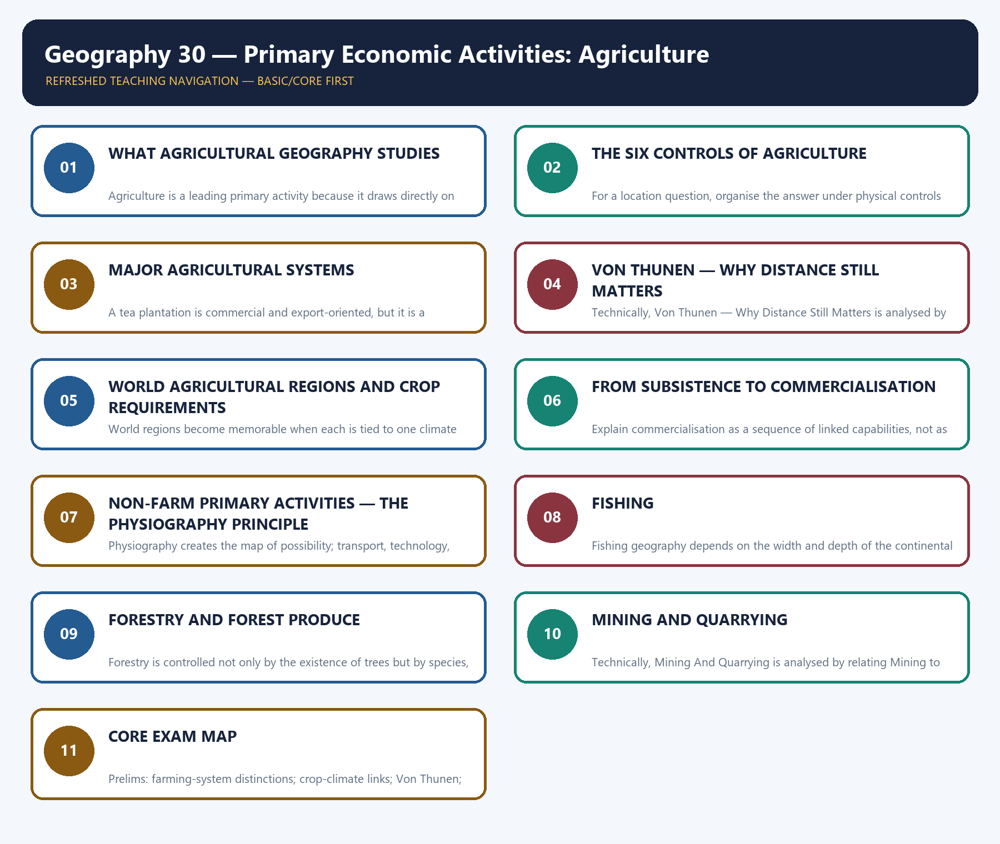

*Distinct embedded teaching-navigation image. The separate continuous Cārvāka-style flowchart package remains an independent at-a-glance artifact.*
### START HERE — THE LEARNING PATH AND EVIDENCE SAFETY

#### Visual first


The topic is easiest when read as one chain:

```text
NATURAL BASE -> FARMING SYSTEM -> LOCATION -> MARKET LINK -> CHANGE -> EXAM ANSWER
climate/soil    labour + scale    distance     transport      technology   claim + evidence
```

#### Plain-language explanation

Agriculture is not a list of crops. Geography asks why a crop or primary activity appears in
one place, why it is organised in a particular way, and how water, labour, technology,
transport and institutions change that pattern.

The package keeps four evidence firewalls from the v1 source:

| Never merge these labels | Safe reading rule |
|---|---|
| Advance estimate and final estimate | Keep the estimate stage, reference year and unit attached |
| Production, arrival, procurement, stock, consumption and export | Treat each as a different flow or stock |
| MSP announcement and actual procurement | A national price signal does not prove purchase in every crop or region |
| Announcement, approval, launch, guidelines, selection, release, output and outcome | A scheme stage is not proof of impact |
| Owned area, operated area, operational holding and average holding | Use the Agriculture Census definition and vintage |

> FACT: The v1 evidence register was retrieved on 19 August 2026. Its 2025-26 Third Advance
> Estimate is not presented as final. It records foodgrains at 3765.63 lakh tonnes and nine
> oilseeds at 430.59 lakh tonnes; the oilseed aggregate is also 43.059 million tonnes. The
> rejected web value near 39 lakh tonnes is not used.

#### India example

A Punjab wheat field, a Kerala rubber plantation and an Odisha fishing harbour are all primary
activity spaces, but each is explained by a different combination of ecology, labour,
infrastructure and market access.

#### Exam link

In Prelims, UPSC separates close classifications. In Mains, it rewards a chain from physical
setting to human organisation, spatial outcome and qualification.

#### Traps

- Do not turn a dated official estimate into a timeless fact.
- Do not treat a scheme dashboard as an impact evaluation.
- Do not begin with India-specific complexity before the core location logic is understood.

#### Quick recap

Read the topic as **where -> why there -> how organised -> what changed -> what remains
constrained**.

---
### SESSION 1 — WHAT AGRICULTURAL GEOGRAPHY STUDIES

#### VISUAL FIRST

```text
WHAT AGRICULTURAL GEOGRAPHY STUDIES
STARTING CONDITION / SPATIAL DRIVER
        ↓
MODEL / CAUSAL / INSTITUTIONAL MECHANISM
        ↓
DISTRIBUTION / NETWORK / REGION / LANDSCAPE
        ↓
NAMED INDIA + WORLD MAP / DATA ANCHOR
        ↓
SCALE + MODEL / DATA / POLICY LIMIT
```

*Use this gateway before the detailed spatial, model, map and qualified causal explanation below.*

#### DEFINITION / WHAT THIS IS CALLED

**Plain-language definition:** A good GS-I opening line is: Agricultural geography explains the spatial organisation of production through the interaction of ecological suitability and human choice.

**Technical definition:** Agriculture is a leading primary activity because it draws directly on land, water, climate, soil and labour.

#### ANSWER-GRABBING OPENING — WRITE/ADAPT IN THE EXAM

> A good GS-I opening line is: Agricultural geography explains the spatial organisation of production through the interaction of ecological suitability and human choice.

#### MUST-WRITE KEYWORDS

- **What Agricultural Geography Studies**
- **location, seasonality, organisation and change**
- **Agriculture**
- **Why**
- **The third question**
- **It**

**How to use them:** Frame the answer through What Agricultural Geography Studies; define location, seasonality, organisation and change, connect Agriculture with Why to explain the mechanism, and use The third question for the decisive comparison or qualification.

#### Visual first

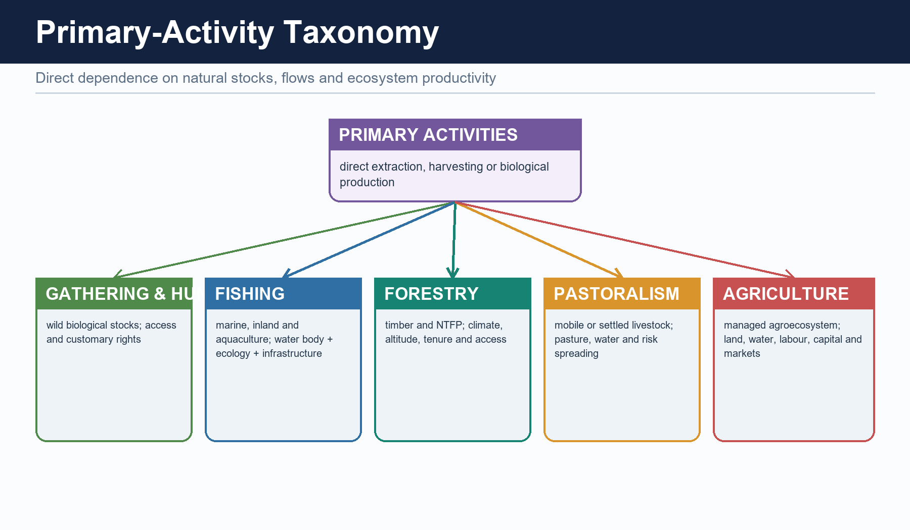

#### Plain-language explanation

Agriculture is a leading primary activity because it draws directly on land, water, climate,
soil and labour. Agricultural geography therefore asks three simple questions:

1. **What is produced?**
2. **Where is it produced?**
3. **Why does that location and seasonal pattern make sense?**

The third question is the real geographic question. It connects nature with labour, markets,
technology and institutions.

#### India example

Rice appears in humid eastern and deltaic belts because water and level alluvial land favour
it, but irrigated rice can also appear in drier north-western districts. The crop name alone
cannot explain the location; water control and incentives complete the answer.

#### Exam link

A good GS-I opening line is: *Agricultural geography explains the spatial organisation of
production through the interaction of ecological suitability and human choice.*

#### Traps

- Agriculture is not agronomy alone.
- A crop map is not explained by climate alone.
- Primary activity does not mean technologically primitive.

#### Quick recap

Agricultural geography studies **location, seasonality, organisation and change**.

---

#### CLOSING RECALL FLOW — WHAT AGRICULTURAL GEOGRAPHY STUDIES

```text
START / CONCEPT: WHAT AGRICULTURAL GEOGRAPHY STUDIES
        |
        v
EXACT TERMS: What Agricultural Geography Studies · location, seasonality, organisation and change · Agriculture · Why · The third question · It
        |
        v
MECHANISM / ARGUMENT: Agriculture is a leading primary activity because it draws directly on land, water, climate, soil and labour.
        |
        v
CONSEQUENCE / CONTRAST: Rice appears in humid eastern and deltaic belts because water and level alluvial land favour it, but irrigated rice can also appear in drier north-western districts.
        |
        v
UPSC TRAP / ANSWER-USE: Primary activity does not mean technologically primitive.
        |
        v
ANSWER-GRABBING FORMULATION: A good GS-I opening line is: Agricultural geography explains the spatial organisation of production through the interaction of ecological suitability and human choice.
```
### SESSION 2 — THE SIX CONTROLS OF AGRICULTURE

#### VISUAL FIRST

```text
THE SIX CONTROLS OF AGRICULTURE
STARTING CONDITION / SPATIAL DRIVER
        ↓
MODEL / CAUSAL / INSTITUTIONAL MECHANISM
        ↓
DISTRIBUTION / NETWORK / REGION / LANDSCAPE
        ↓
NAMED INDIA + WORLD MAP / DATA ANCHOR
        ↓
SCALE + MODEL / DATA / POLICY LIMIT
```

*Use this gateway before the detailed spatial, model, map and qualified causal explanation below.*

#### DEFINITION / WHAT THIS IS CALLED

**Plain-language definition:** Agriculture is a multi-control system: climate + relief + soil + water + labour + market.

**Technical definition:** For a location question, organise the answer under physical controls and human controls, then show their interaction.

#### ANSWER-GRABBING OPENING — WRITE/ADAPT IN THE EXAM

> For a location question, organise the answer under physical controls and human controls, then show their interaction.

#### MUST-WRITE KEYWORDS

- **The Six Controls Of Agriculture**
- **physical controls**
- **human controls**
- **multi-control system**
- **Climate**
- **Heat, rainfall and growing season**

**How to use them:** Frame the answer through The Six Controls Of Agriculture; define physical controls, connect human controls with multi-control system to explain the mechanism, and use Climate for the decisive comparison or qualification.

#### Visual first

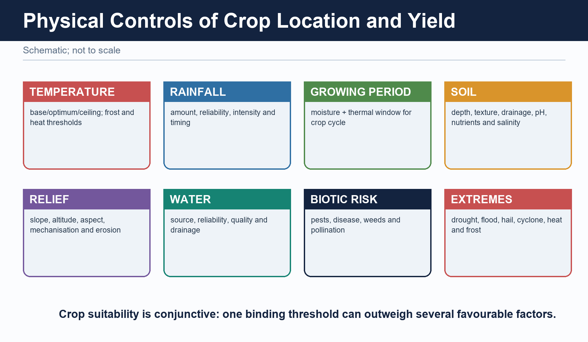

#### Plain-language explanation

No single control creates an agricultural region. Think of six filters working together:

| Control | What it decides | Easy example |
|---|---|---|
| Climate | Heat, rainfall and growing season | Warm, wet conditions favour rice |
| Relief | Slope, altitude and mechanisation | Plains favour large machinery; slopes favour terraces |
| Soil | Drainage, texture and moisture storage | Loams suit wheat; clayey lowlands retain water |
| Water | Reliability beyond rainfall | Irrigation supports dry-season or uncertain-rainfall farming |
| Labour | Whether labour-heavy work is feasible | Wet-rice transplanting and tea plucking need abundant labour |
| Market and transport | Whether output can reach buyers before losing value | Dairy and vegetables cluster near cities or cold chains |

A location succeeds when enough filters align. A fertile soil without suitable temperature,
water, labour or access does not automatically become a productive farming belt.

#### India example

Black soil supports cotton in parts of the Deccan because it retains moisture, but cotton also
grows on alluvial soils where climate, irrigation and markets are favourable. Soil is an
advantage, not an exclusive rule.

#### Exam link

For a location question, organise the answer under **physical controls** and **human controls**,
then show their interaction.

#### Traps

- Fertile soil alone is not sufficient.
- Irrigation reduces rainfall uncertainty; it does not remove heat, drainage or market limits.
- Mechanisation follows relief, holding size, capital and crop type—not plains alone.

#### Quick recap

Agriculture is a **multi-control system**: climate + relief + soil + water + labour + market.

---

#### CLOSING RECALL FLOW — THE SIX CONTROLS OF AGRICULTURE

```text
START / CONCEPT: THE SIX CONTROLS OF AGRICULTURE
        |
        v
EXACT TERMS: The Six Controls Of Agriculture · physical controls · human controls · multi-control system · Climate · Heat, rainfall and growing season
        |
        v
MECHANISM / ARGUMENT: Black soil supports cotton in parts of the Deccan because it retains moisture, but cotton also grows on alluvial soils where climate, irrigation and markets are favourable.
        |
        v
CONSEQUENCE / CONTRAST: A fertile soil without suitable temperature, water, labour or access does not automatically become a productive farming belt.
        |
        v
UPSC TRAP / ANSWER-USE: Irrigation reduces rainfall uncertainty; it does not remove heat, drainage or market limits.
        |
        v
ANSWER-GRABBING FORMULATION: For a location question, organise the answer under physical controls and human controls, then show their interaction.
```
### SESSION 3 — MAJOR AGRICULTURAL SYSTEMS

#### VISUAL FIRST

```text
MAJOR AGRICULTURAL SYSTEMS
STARTING CONDITION / SPATIAL DRIVER
        ↓
MODEL / CAUSAL / INSTITUTIONAL MECHANISM
        ↓
DISTRIBUTION / NETWORK / REGION / LANDSCAPE
        ↓
NAMED INDIA + WORLD MAP / DATA ANCHOR
        ↓
SCALE + MODEL / DATA / POLICY LIMIT
```

*Use this gateway before the detailed spatial, model, map and qualified causal explanation below.*

#### DEFINITION / WHAT THIS IS CALLED

**Plain-language definition:** A farming system tells us how land, labour, animals, capital and markets are combined.

**Technical definition:** A tea plantation is commercial and export-oriented, but it is a different system from a commercial grain farm.

#### ANSWER-GRABBING OPENING — WRITE/ADAPT IN THE EXAM

> A farming system tells us how land, labour, animals, capital and markets are combined.

#### MUST-WRITE KEYWORDS

- **Major Agricultural Systems**
- **Intensity**
- **Commercial orientation**
- **climate base, labour/scale, market link**
- **resource base + labour and scale + market orientation**
- **Shifting cultivation**

**How to use them:** Frame the answer through Major Agricultural Systems; define Intensity, connect Commercial orientation with climate base, labour/scale, market link to explain the mechanism, and use resource base + labour and scale + market orientation for the decisive comparison or qualification.

#### Visual first

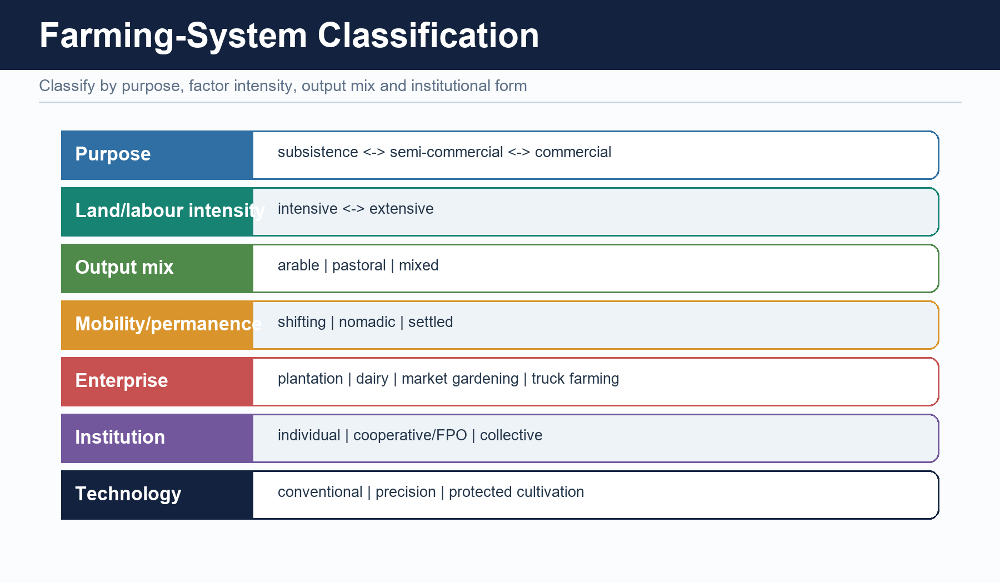

#### Plain-language explanation

A farming system tells us how land, labour, animals, capital and markets are combined.

| System | Simple meaning | Typical setting |
|---|---|---|
| Shifting cultivation | A plot is cleared, cultivated briefly and left fallow | Humid tropical forest margins |
| Subsistence wet-rice | Small fields, much labour and controlled water | Monsoon Asian valleys and deltas |
| Nomadic herding | Herds move to use scattered pasture and water | Arid and semi-arid belts |
| Mixed farming | Crops and livestock support each other | Temperate Europe and North American belts |
| Mediterranean farming | Winter crops plus fruits, vines and olives under dry summers | Mediterranean-type climates |
| Plantation agriculture | Estate-scale, specialised, export-oriented production | Humid tropical belts with port links |
| Commercial grain | Large, mechanised, low-labour fields | Prairies, Pampas, Steppes and Downs |
| Market gardening and dairy | High-value perishables serving urban demand | Metropolitan and well-connected belts |

Two axes prevent confusion:

- **Intensity** asks how much labour/capital and output occur per unit land.
- **Commercial orientation** asks how strongly production is aimed at the market.

#### India example

Wet-rice cultivation may be highly intensive because much labour is applied to a small field,
even when mechanisation is limited. A tea plantation is commercial and export-oriented, but it
is a different system from a commercial grain farm.

#### Exam link

Compare systems using the same three columns: **climate base, labour/scale, market link**.

#### Traps

- Intensive does not always mean mechanised.
- Plantation does not mean subsistence.
- Large farm does not automatically mean commercial grain farming.
- Shifting cultivation and plantation agriculture are not synonyms.

#### Quick recap

Classify a system by **resource base + labour and scale + market orientation**.

---

#### CLOSING RECALL FLOW — MAJOR AGRICULTURAL SYSTEMS

```text
START / CONCEPT: MAJOR AGRICULTURAL SYSTEMS
        |
        v
EXACT TERMS: Major Agricultural Systems · Intensity · Commercial orientation · climate base, labour/scale, market link · resource base + labour and scale + market orientation · Shifting cultivation
        |
        v
MECHANISM / ARGUMENT: Wet-rice cultivation may be highly intensive because much labour is applied to a small field, even when mechanisation is limited.
        |
        v
CONSEQUENCE / CONTRAST: A tea plantation is commercial and export-oriented, but it is a different system from a commercial grain farm.
        |
        v
UPSC TRAP / ANSWER-USE: Shifting cultivation and plantation agriculture are not synonyms.
        |
        v
ANSWER-GRABBING FORMULATION: A farming system tells us how land, labour, animals, capital and markets are combined.
```
### SESSION 4 — VON THUNEN — WHY DISTANCE STILL MATTERS

#### VISUAL FIRST

```text
VON THUNEN — WHY DISTANCE STILL MATTERS
STARTING CONDITION / SPATIAL DRIVER
        ↓
MODEL / CAUSAL / INSTITUTIONAL MECHANISM
        ↓
DISTRIBUTION / NETWORK / REGION / LANDSCAPE
        ↓
NAMED INDIA + WORLD MAP / DATA ANCHOR
        ↓
SCALE + MODEL / DATA / POLICY LIMIT
```

*Use this gateway before the detailed spatial, model, map and qualified causal explanation below.*

#### DEFINITION / WHAT THIS IS CALLED

**Plain-language definition:** Von Thunen is a location model, not a climate classification.

**Technical definition:** Technically, Von Thunen — Why Distance Still Matters is analysed by relating Von Thunen to Why Distance Still Matters, then testing the relationship through core logic - modern modification - surviving application - limitation and Farmers.

#### ANSWER-GRABBING OPENING — WRITE/ADAPT IN THE EXAM

> Von Thunen is a location model, not a climate classification.

#### MUST-WRITE KEYWORDS

- **Von Thunen**
- **Why Distance Still Matters**
- **core logic - modern modification - surviving application - limitation**
- **Farmers**
- **Farther**
- **They**

**How to use them:** Frame the answer through Von Thunen; define Why Distance Still Matters, connect core logic - modern modification - surviving application - limitation with Farmers to explain the mechanism, and use Farther for the decisive comparison or qualification.

#### Visual first


```text
MARKET -> perishables/high value -> field crops -> extensive grazing
         high rent and frequent trips             lower rent and fewer trips
```

#### Plain-language explanation

Von Thunen imagined one market surrounded by uniform land. Farmers choose the activity that
can pay the land rent left after production and transport costs. A perishable or bulky product
loses more value with distance, so it tends to stay nearer the market.

- Near the market: dairy, vegetables, flowers and other frequent-delivery goods.
- Farther away: less perishable or more extensive uses.
- Land rent generally falls outward because access to the market becomes costlier.

The exact classical rings rarely survive today, but the mechanism survives.


Refrigeration, expressways and air freight stretch the rings. They do not make freight,
freshness, delivery frequency or access disappear.

#### India example

Peri-urban vegetable, milk and flower belts around Delhi, Bengaluru and other large cities show
the continuing demand-distance logic. A cold chain can move the belt outward, but it adds cost
and requires reliable logistics.

#### Exam link

For “relevance today,” write **core logic -> modern modification -> surviving application ->
limitation**.

#### Traps

- Von Thunen is a location model, not a climate classification.
- Do not defend literal rings in a multi-market economy.
- Do not call the model obsolete merely because technology changes distance penalties.

#### Quick recap

The rings may change; **transport cost, perishability and land rent still shape location**.

---

#### CLOSING RECALL FLOW — VON THUNEN — WHY DISTANCE STILL MATTERS

```text
START / CONCEPT: VON THUNEN — WHY DISTANCE STILL MATTERS
        |
        v
EXACT TERMS: Von Thunen · Why Distance Still Matters · core logic - modern modification - surviving application - limitation · Farmers · Farther · They
        |
        v
MECHANISM / ARGUMENT: Do not call the model obsolete merely because technology changes distance penalties.
        |
        v
CONSEQUENCE / CONTRAST: They do not make freight, freshness, delivery frequency or access disappear.
        |
        v
UPSC TRAP / ANSWER-USE: A cold chain can move the belt outward, but it adds cost and requires reliable logistics.
        |
        v
ANSWER-GRABBING FORMULATION: Von Thunen is a location model, not a climate classification.
```
### SESSION 5 — WORLD AGRICULTURAL REGIONS AND CROP REQUIREMENTS

#### VISUAL FIRST

```text
WORLD AGRICULTURAL REGIONS AND CROP REQUIREMENTS
STARTING CONDITION / SPATIAL DRIVER
        ↓
MODEL / CAUSAL / INSTITUTIONAL MECHANISM
        ↓
DISTRIBUTION / NETWORK / REGION / LANDSCAPE
        ↓
NAMED INDIA + WORLD MAP / DATA ANCHOR
        ↓
SCALE + MODEL / DATA / POLICY LIMIT
```

*Use this gateway before the detailed spatial, model, map and qualified causal explanation below.*

#### DEFINITION / WHAT THIS IS CALLED

**Plain-language definition:** A crop region is a bundle of suitability, not a single climatic number.

**Technical definition:** World regions become memorable when each is tied to one climate pattern, one production system and one market or labour feature.

#### ANSWER-GRABBING OPENING — WRITE/ADAPT IN THE EXAM

> A crop region is a bundle of suitability, not a single climatic number.

#### MUST-WRITE KEYWORDS

- **World Agricultural Regions**
- **Crop Requirements**
- **crop - climate - soil/drainage - region**
- **bundle of suitability**
- **Monsoon Asia**
- **Intensive wet-rice**

**How to use them:** Frame the answer through World Agricultural Regions; define Crop Requirements, connect crop - climate - soil/drainage - region with bundle of suitability to explain the mechanism, and use Monsoon Asia for the decisive comparison or qualification.

#### Visual first

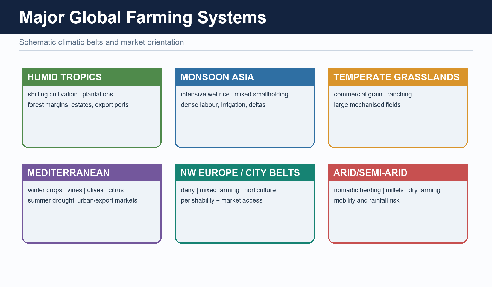

#### Plain-language explanation

World regions become memorable when each is tied to one climate pattern, one production
system and one market or labour feature.

| Region | Dominant pattern | Why it appears there |
|---|---|---|
| Monsoon Asia | Intensive wet-rice | Summer rain, alluvial lowlands and dense labour |
| Prairies, Pampas, Steppes, Downs | Commercial grain | Vast temperate plains and mechanisation |
| Mediterranean margins | Horticulture, vines, olives and winter crops | Winter rain and dry summer |
| Humid tropical plantation belts | Tea, coffee, cocoa, rubber and sugarcane | Warm humid climate plus historical port orientation |
| Savanna and semi-arid belts | Livestock and drought-resistant crops | Uncertain rainfall and extensive grazing |
| Urban-industrial belts | Dairy and market gardening | Dense nearby demand and good transport |


Crop requirements are broad guides, not rigid thresholds:

| Crop | Broad requirement | High-yield caution |
|---|---|---|
| Rice | Warm season and abundant or controlled water | Upland, irrigated and deltaic rice differ |
| Wheat | Cool growing period and drier ripening | Not a high-rainfall tropical crop |
| Cotton | Long warm frost-free season and well-drained moisture-retentive soil | Not confined to black soil |
| Jute | Hot humid monsoon conditions, alluvium and retting water | Not a dry-Deccan crop |
| Tea | Warm humid climate, acidic well-drained slopes and labour | High rain does not mean waterlogging |
| Coffee | Warm shaded uplands with drainage | Not found in every humid tropical lowland |
| Millets | Lower or variable rainfall; many tolerate lighter soils | “Coarse cereal” does not mean nutritionally inferior |

#### India example

Tea in Assam and hill areas, coffee on shaded southern uplands, jute in the humid eastern
alluvial belt and millets in drier tracts show how different ecological packages create
different crop geographies.

#### Exam link

In map-based or matching questions, connect **crop -> climate -> soil/drainage -> region**.

#### Traps

- Avoid one-crop-one-soil absolutism.
- High rainfall can harm a crop when drainage is poor.
- A historical production belt is not automatically the current top-ranking belt.

#### Quick recap

A crop region is a **bundle of suitability**, not a single climatic number.

---

#### CLOSING RECALL FLOW — WORLD AGRICULTURAL REGIONS AND CROP REQUIREMENTS

```text
START / CONCEPT: WORLD AGRICULTURAL REGIONS AND CROP REQUIREMENTS
        |
        v
EXACT TERMS: World Agricultural Regions · Crop Requirements · crop - climate - soil/drainage - region · bundle of suitability · Monsoon Asia · Intensive wet-rice
        |
        v
MECHANISM / ARGUMENT: World regions become memorable when each is tied to one climate pattern, one production system and one market or labour feature.
        |
        v
CONSEQUENCE / CONTRAST: Crop requirements are broad guides, not rigid thresholds.
        |
        v
UPSC TRAP / ANSWER-USE: A historical production belt is not automatically the current top-ranking belt.
        |
        v
ANSWER-GRABBING FORMULATION: A crop region is a bundle of suitability, not a single climatic number.
```
### SESSION 6 — FROM SUBSISTENCE TO COMMERCIALISATION

#### VISUAL FIRST

```text
FROM SUBSISTENCE TO COMMERCIALISATION
STARTING CONDITION / SPATIAL DRIVER
        ↓
MODEL / CAUSAL / INSTITUTIONAL MECHANISM
        ↓
DISTRIBUTION / NETWORK / REGION / LANDSCAPE
        ↓
NAMED INDIA + WORLD MAP / DATA ANCHOR
        ↓
SCALE + MODEL / DATA / POLICY LIMIT
```

*Use this gateway before the detailed spatial, model, map and qualified causal explanation below.*

#### DEFINITION / WHAT THIS IS CALLED

**Plain-language definition:** Commercialisation is produced by water + technology + connectivity + institutions + demand.

**Technical definition:** Explain commercialisation as a sequence of linked capabilities, not as a simple shift from “traditional” to “modern.”.

#### ANSWER-GRABBING OPENING — WRITE/ADAPT IN THE EXAM

> Explain commercialisation as a sequence of linked capabilities, not as a simple shift from “traditional” to “modern.”.

#### MUST-WRITE KEYWORDS

- **From Subsistence To Commercialisation**
- **sequence of linked capabilities**
- **water + technology + connectivity + institutions + demand**
- **status + date + unit + measure**
- **Irrigation**
- **Improved seed and inputs**

**How to use them:** Frame the answer through From Subsistence To Commercialisation; define sequence of linked capabilities, connect water + technology + connectivity + institutions + demand with status + date + unit + measure to explain the mechanism, and use Irrigation for the decisive comparison or qualification.

#### Visual first

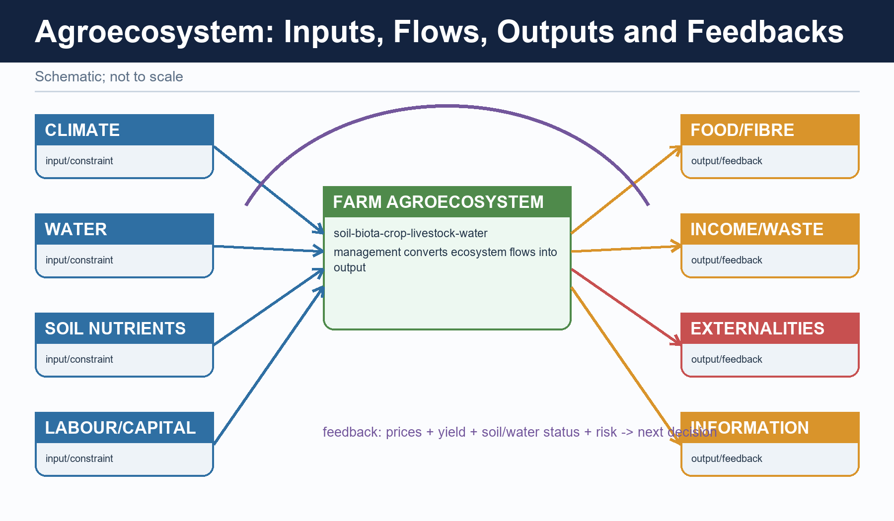

```text
SUBSISTENCE -> SURPLUS -> SPECIALISATION -> PROCESSING AND VALUE CHAINS
                enabled by water, seed, roads, credit, storage and demand
```

#### Plain-language explanation

Agricultural change occurs when several enabling conditions combine:

| Driver | Spatial consequence |
|---|---|
| Irrigation | Cultivation expands or becomes more reliable in seasonal and dry belts |
| Improved seed and inputs | Yield and cropping intensity can rise |
| Roads and ports | Rural output reaches urban and export markets |
| Contracting and agribusiness | Production clusters around processors or buyers |
| Cold chain | Perishables can travel farther without losing as much value |

Institutions matter because they organise water, information and exchange. Agriculture
ministries frame policy; irrigation agencies control water; cooperatives, mandis, commodity
boards and farmer organisations link producers to markets; FAO-type systems help compare food
and production patterns internationally.

#### India example

A vegetable-growing district can commercialise only when production is matched by roads,
grading, aggregation, storage and buyers. Higher biological output without a functioning chain
can still end in distress sale.

#### Exam link

Explain commercialisation as a **sequence of linked capabilities**, not as a simple shift from
“traditional” to “modern.”

#### Traps

- More inputs do not automatically mean more net income.
- Market access requires physical and institutional infrastructure.
- Cold chain changes distance costs but can add capital, energy and bargaining risks.

#### Quick recap

Commercialisation is produced by **water + technology + connectivity + institutions + demand**.

---
#### READING AGRICULTURE CURRENT AFFAIRS WITHOUT DATA MISTAKES

#### Visual first


#### Plain-language explanation

Agriculture news often places several unlike numbers side by side. Before using a number, ask:

1. Is it an estimate, a final value, a target or an administrative count?
2. What is the reference year and unit?
3. Does it measure production, purchase, stock, coverage or outcome?
4. Is the statement national, crop-specific or region-specific?

The Basic owner's current anchor is PIB, 28 May 2025, on approval of MSP for Kharif crops for
2025-26. It is safe evidence that MSP decisions are season-specific and crop-specific. It is
not evidence of final output or universal procurement.

#### India example

A national Kharif MSP announcement affects expectations across crop belts, but actual purchase
still depends on crop, state, mandi access and procurement arrangements.

#### Exam link

Use dated evidence as a labelled example: *“PIB, 28 May 2025, records Kharif MSP approval; this
is a policy announcement, not procurement coverage.”*

#### Traps

- Third Advance Estimate is not final.
- Foodgrains do not include oilseeds.
- A cotton bale and a jute/mesta bale use different official weights in the v1 DES source.
- A dashboard count does not establish yield, income or ecological impact.

#### Quick recap

Keep **status + date + unit + measure** attached to every official figure.

---

#### CLOSING RECALL FLOW — FROM SUBSISTENCE TO COMMERCIALISATION

```text
START / CONCEPT: FROM SUBSISTENCE TO COMMERCIALISATION
        |
        v
EXACT TERMS: From Subsistence To Commercialisation · sequence of linked capabilities · water + technology + connectivity + institutions + demand · status + date + unit + measure · Irrigation · Improved seed and inputs
        |
        v
MECHANISM / ARGUMENT: Commercialisation is produced by water + technology + connectivity + institutions + demand.
        |
        v
CONSEQUENCE / CONTRAST: Cold chain changes distance costs but can add capital, energy and bargaining risks.
        |
        v
UPSC TRAP / ANSWER-USE: The Basic owner's current anchor is PIB, 28 May 2025, on approval of MSP for Kharif crops for not evidence of final output or universal procurement.
        |
        v
ANSWER-GRABBING FORMULATION: Explain commercialisation as a sequence of linked capabilities, not as a simple shift from “traditional” to “modern.”.
```
### SESSION 7 — NON-FARM PRIMARY ACTIVITIES — THE PHYSIOGRAPHY PRINCIPLE

#### VISUAL FIRST

```text
NON-FARM PRIMARY ACTIVITIES — THE PHYSIOGRAPHY PRINCIPLE
STARTING CONDITION / SPATIAL DRIVER
        ↓
MODEL / CAUSAL / INSTITUTIONAL MECHANISM
        ↓
DISTRIBUTION / NETWORK / REGION / LANDSCAPE
        ↓
NAMED INDIA + WORLD MAP / DATA ANCHOR
        ↓
SCALE + MODEL / DATA / POLICY LIMIT
```

*Use this gateway before the detailed spatial, model, map and qualified causal explanation below.*

#### DEFINITION / WHAT THIS IS CALLED

**Plain-language definition:** Physiography sets where the resource can exist; human systems decide whether and how it is used.

**Technical definition:** Physiography creates the map of possibility; transport, technology, rights and regulation decide how much of that possibility is used.

#### ANSWER-GRABBING OPENING — WRITE/ADAPT IN THE EXAM

> Physiography sets where the resource can exist; human systems decide whether and how it is used.

#### MUST-WRITE KEYWORDS

- **Non-Farm Primary Activities**
- **The Physiography Principle**
- **fishing, forestry and gathering, mining and quarrying**
- **where the resource can exist**
- **Their location**
- **Their**

**How to use them:** Frame the answer through Non-Farm Primary Activities; define The Physiography Principle, connect fishing, forestry and gathering, mining and quarrying with where the resource can exist to explain the mechanism, and use Their location for the decisive comparison or qualification.

#### Visual first

```text
PHYSIOGRAPHY -> RESOURCE OCCURRENCE -> ACCESS -> ACTIVITY LOCATION
relief/geology   shelf/forest/ore      road/port   harbour/mine/forest camp
```

#### Plain-language explanation

Primary activities extract or harvest directly from nature. Non-farm primary activities here
mean **fishing, forestry and gathering, mining and quarrying**. Manufacturing is excluded.

Their location is tightly constrained because the resource cannot be shifted to any chosen
place. Physiography creates the map of possibility; transport, technology, rights and
regulation decide how much of that possibility is used.

#### India example

A mineral deposit in a remote plateau, a productive continental shelf and a forest-produce
belt each offer different kinds of potential. Accessibility and institutions then determine
whether the potential becomes a viable livelihood or industry.

#### Exam link

The 2025 GS-I direct demand requires the definition first, then fishing, forestry, mining and
quarrying linked explicitly to Indian physiography.

#### Traps

- Do not include factories.
- Do not list activities without the physiographic mechanism.
- Resource occurrence is not the same as realised production.

#### Quick recap

Physiography sets **where the resource can exist**; human systems decide **whether and how it is used**.

---

#### CLOSING RECALL FLOW — NON-FARM PRIMARY ACTIVITIES — THE PHYSIOGRAPHY PRINCIPLE

```text
START / CONCEPT: NON-FARM PRIMARY ACTIVITIES — THE PHYSIOGRAPHY PRINCIPLE
        |
        v
EXACT TERMS: Non-Farm Primary Activities · The Physiography Principle · fishing, forestry and gathering, mining and quarrying · where the resource can exist · Their location · Their
        |
        v
MECHANISM / ARGUMENT: Their location is tightly constrained because the resource cannot be shifted to any chosen place.
        |
        v
CONSEQUENCE / CONTRAST: Do not list activities without the physiographic mechanism.
        |
        v
UPSC TRAP / ANSWER-USE: Resource occurrence is not the same as realised production.
        |
        v
ANSWER-GRABBING FORMULATION: Physiography sets where the resource can exist; human systems decide whether and how it is used.
```
### SESSION 8 — FISHING

#### VISUAL FIRST

```text
FISHING
STARTING CONDITION / SPATIAL DRIVER
        ↓
MODEL / CAUSAL / INSTITUTIONAL MECHANISM
        ↓
DISTRIBUTION / NETWORK / REGION / LANDSCAPE
        ↓
NAMED INDIA + WORLD MAP / DATA ANCHOR
        ↓
SCALE + MODEL / DATA / POLICY LIMIT
```

*Use this gateway before the detailed spatial, model, map and qualified causal explanation below.*

#### DEFINITION / WHAT THIS IS CALLED

**Plain-language definition:** Fishing follows water-body form + nutrients + shelter + access.

**Technical definition:** Fishing geography depends on the width and depth of the continental shelf, nutrient supply, current mixing, upwelling, sheltered landing sites, estuaries and inland water bodies.

#### ANSWER-GRABBING OPENING — WRITE/ADAPT IN THE EXAM

> Coastal state does not automatically mean the same fishing potential.

#### MUST-WRITE KEYWORDS

- **Fishing**
- **water-body form + nutrients + shelter + access**
- **Mangrove-estuarine margins**
- **Mangrove-estuarine**
- **India's**
- **The Gangetic**

**How to use them:** Frame the answer through Fishing; define water-body form + nutrients + shelter + access, connect Mangrove-estuarine margins with Mangrove-estuarine to explain the mechanism, and use India's for the decisive comparison or qualification.

#### Visual first

```text
BROAD SHALLOW SHELF + SUNLIGHT + NUTRIENTS -> PLANKTON -> FISHING GROUND
UPWELLING/CURRENT MIXING ------------------> HIGH PRODUCTIVITY
BAY/ESTUARY/HARBOUR ----------------------> LANDING AND AQUACULTURE
RIVER/LAKE/RESERVOIR ---------------------> INLAND FISHERY
```

#### Plain-language explanation

Fishing geography depends on the width and depth of the continental shelf, nutrient supply,
current mixing, upwelling, sheltered landing sites, estuaries and inland water bodies.
Mangrove-estuarine margins are nursery habitats but can also face aquaculture pressure.

#### India example

India's broader western shelf and seasonal monsoonal upwelling create a different marine
potential from the generally narrower eastern shelf. The Gangetic and Brahmaputra
floodplains and peninsular reservoirs also show why a major fish-producing area need not be
coastal.

#### Exam link

Link every example to a mechanism: shelf -> marine potential; floodplain/reservoir -> inland
fishery; bay/estuary -> harbour or brackish aquaculture.

#### Traps

- Coastal state does not automatically mean the same fishing potential.
- Physiography explains potential, not landings by itself.
- Add overfishing, craft conflict, breeding-season regulation, cyclone exposure and habitat
  loss as qualifications.

#### Quick recap

Fishing follows **water-body form + nutrients + shelter + access**.

---

#### CLOSING RECALL FLOW — FISHING

```text
START / CONCEPT: FISHING
        |
        v
EXACT TERMS: Fishing · water-body form + nutrients + shelter + access · Mangrove-estuarine margins · Mangrove-estuarine · India's · The Gangetic
        |
        v
MECHANISM / ARGUMENT: Fishing geography depends on the width and depth of the continental shelf, nutrient supply, current mixing, upwelling, sheltered landing sites, estuaries and inland water bodies.
        |
        v
CONSEQUENCE / CONTRAST: Mangrove-estuarine margins are nursery habitats but can also face aquaculture pressure.
        |
        v
UPSC TRAP / ANSWER-USE: The Gangetic and Brahmaputra floodplains and peninsular reservoirs also show why a major fish-producing area need not be coastal.
        |
        v
ANSWER-GRABBING FORMULATION: Coastal state does not automatically mean the same fishing potential.
```
### SESSION 9 — FORESTRY AND FOREST PRODUCE

#### VISUAL FIRST

```text
FORESTRY AND FOREST PRODUCE
STARTING CONDITION / SPATIAL DRIVER
        ↓
MODEL / CAUSAL / INSTITUTIONAL MECHANISM
        ↓
DISTRIBUTION / NETWORK / REGION / LANDSCAPE
        ↓
NAMED INDIA + WORLD MAP / DATA ANCHOR
        ↓
SCALE + MODEL / DATA / POLICY LIMIT
```

*Use this gateway before the detailed spatial, model, map and qualified causal explanation below.*

#### DEFINITION / WHAT THIS IS CALLED

**Plain-language definition:** Forestry location is shaped by forest type, slope, accessibility and rights.

**Technical definition:** Forestry is controlled not only by the existence of trees but by species, slope, distance and access.

#### ANSWER-GRABBING OPENING — WRITE/ADAPT IN THE EXAM

> Forestry location is shaped by forest type, slope, accessibility and rights.

#### MUST-WRITE KEYWORDS

- **Forestry**
- **Forest Produce**
- **forest ecology - accessibility - product - livelihood/institutional issue**
- **forest type, slope, accessibility and rights**
- **Climate and altitude**
- **Forest type and available species**

**How to use them:** Frame the answer through Forestry; define Forest Produce, connect forest ecology - accessibility - product - livelihood/institutional issue with forest type, slope, accessibility and rights to explain the mechanism, and use Climate and altitude for the decisive comparison or qualification.

#### Visual first

| Physiographic control | What it changes |
|---|---|
| Climate and altitude | Forest type and available species |
| Relief and slope | Extraction method, cost and erosion risk |
| Accessibility | Whether a forest stand is commercially reachable |
| Species pattern | Whether mechanised extraction is practical |

#### Plain-language explanation

Forestry is controlled not only by the existence of trees but by species, slope, distance and
access. Steep or remote forests may remain difficult to exploit even when biomass is abundant.
Diverse tropical forests are also less suited to uniform mechanised extraction than
single-species stands.

#### India example

Non-timber forest produce—bamboo, tendu leaf, mahua, gums, resins, honey, lac and medicinal
plants—is especially important in central Indian and north-eastern forest belts. This makes
forestry a livelihood and social-geography question, not merely a timber question.

#### Exam link

Show the sequence **forest ecology -> accessibility -> product -> livelihood/institutional issue**.

#### Traps

- Do not treat all Indian forests as commercial timber zones.
- Forest type varies with altitude and climate.
- Access can be more decisive than standing volume.

#### Quick recap

Forestry location is shaped by **forest type, slope, accessibility and rights**.

---

#### CLOSING RECALL FLOW — FORESTRY AND FOREST PRODUCE

```text
START / CONCEPT: FORESTRY AND FOREST PRODUCE
        |
        v
EXACT TERMS: Forestry · Forest Produce · forest ecology - accessibility - product - livelihood/institutional issue · forest type, slope, accessibility and rights · Climate and altitude · Forest type and available species
        |
        v
MECHANISM / ARGUMENT: Non-timber forest produce—bamboo, tendu leaf, mahua, gums, resins, honey, lac and medicinal plants—is especially important in central Indian and north-eastern forest belts.
        |
        v
CONSEQUENCE / CONTRAST: Forestry is controlled not only by the existence of trees but by species, slope, distance and access.
        |
        v
UPSC TRAP / ANSWER-USE: Do not treat all Indian forests as commercial timber zones.
        |
        v
ANSWER-GRABBING FORMULATION: Forestry location is shaped by forest type, slope, accessibility and rights.
```
### SESSION 10 — MINING AND QUARRYING

#### VISUAL FIRST

```text
MINING AND QUARRYING
STARTING CONDITION / SPATIAL DRIVER
        ↓
MODEL / CAUSAL / INSTITUTIONAL MECHANISM
        ↓
DISTRIBUTION / NETWORK / REGION / LANDSCAPE
        ↓
NAMED INDIA + WORLD MAP / DATA ANCHOR
        ↓
SCALE + MODEL / DATA / POLICY LIMIT
```

*Use this gateway before the detailed spatial, model, map and qualified causal explanation below.*

#### DEFINITION / WHAT THIS IS CALLED

**Plain-language definition:** Quarrying may be widespread, but riverbed mining and hill cutting can destabilise channels and slopes.

**Technical definition:** Technically, Mining And Quarrying is analysed by relating Mining to Quarrying, then testing the relationship through transport and institutions convert deposit into production and claim - named evidence - analysis - qualification - verdict.

#### ANSWER-GRABBING OPENING — WRITE/ADAPT IN THE EXAM

> Quarrying may be widespread, but riverbed mining and hill cutting can destabilise channels and slopes.

#### MUST-WRITE KEYWORDS

- **Mining**
- **Quarrying**
- **transport and institutions convert deposit into production**
- **claim - named evidence - analysis - qualification - verdict**
- **uneven regional gains and new ecological pressures**
- **Ancient shields and crystalline plateaus**

**How to use them:** Frame the answer through Mining; define Quarrying, connect transport and institutions convert deposit into production with claim - named evidence - analysis - qualification - verdict to explain the mechanism, and use uneven regional gains and new ecological pressures for the decisive comparison or qualification.

#### Visual first

| Geological setting | Typical occurrence | Location implication |
|---|---|---|
| Ancient shields and crystalline plateaus | Metallic ores in specific belts | Mining concentrates in peninsular plateau zones |
| Sedimentary basins | Coal, petroleum, gas and limestone | Extraction follows basin structure |
| Lateritic weathering caps | Bauxite | Plateau-edge and upland association |
| Continental-margin basins | Offshore petroleum and gas | Marine geology governs occurrence |
| Riverbeds and hill slopes | Sand, gravel and building stone | Quarrying is dispersed and locally contentious |

#### Plain-language explanation

Geology decides occurrence, while grade, relief, transport, power and processing decide
economic viability. Bulky low-value-per-tonne ores are especially sensitive to transport cost.
Quarrying may be widespread, but riverbed mining and hill cutting can destabilise channels and
slopes.

#### India example

The coincidence of mineral belts with peninsular plateaus shows the geological control. Their
rail links to ports and industrial centres show the second control: a deposit becomes an
economic resource only when it can be reached and moved.

#### Exam link

Write **geology -> occurrence -> accessibility -> extraction -> social/ecological consequence**.

#### Traps

- Mineral richness does not guarantee local prosperity.
- Deposit quality alone does not decide viability.
- Do not quote reserves or output from memory.

#### Quick recap

Geology fixes the deposit; **transport and institutions convert deposit into production**.

---
#### ANSWER ARCHITECTURE AND TECHNOLOGY-LED TRANSFORMATION

#### Visual first


#### Plain-language explanation

Directive decoding:

| Directive | What the answer must do |
|---|---|
| Discuss non-farm primary activities | Define, exclude manufacturing, cover fishing/forestry/mining/quarrying and tie each to physiography |
| Distinguish farming systems | Compare climate, labour/scale and market orientation using common axes |
| Examine Von Thunen today | Explain the mechanism, modern changes, surviving applications and limits |
| Relate agriculture to food security | Trace agro-climate -> crop pattern -> water -> market/procurement -> access |

A technology-led package—improved varieties, assured irrigation, fertiliser, credit,
extension and procurement—can raise yields and cropping intensity quickly. It also spreads
unevenly because water, level land, credit, inputs and purchase outlets are unevenly
distributed.

```text
UNEVEN PRECONDITIONS -> UNEVEN ADOPTION -> SURPLUS CORE
                     -> REGIONAL DIVERGENCE
                     -> INPUT PRESSURE AND CROP LOCK-IN
```

#### India example

The Green Revolution is the clearest illustration: it strengthened national grain security
but first favoured irrigated, well-connected regions. Detailed India-specific geography is
intentionally reserved for the optional Advanced block.

#### Exam link

Every Mains answer should move through **claim -> named evidence -> analysis -> qualification ->
verdict**. For a 10-marker, three mechanism-linked examples are usually stronger than a long
list.

#### Traps

- Do not narrate a technology package without explaining spatial selectivity.
- Do not present ecological costs as proof that productivity gains were unreal.
- Do not use memorised output, yield or input figures without a dated source.

#### Quick recap

Technology can overcome a constraint nationally while producing **uneven regional gains and
new ecological pressures**.

#### CLOSING RECALL FLOW — MINING AND QUARRYING

```text
START / CONCEPT: MINING AND QUARRYING
        |
        v
EXACT TERMS: Mining · Quarrying · transport and institutions convert deposit into production · claim - named evidence - analysis - qualification - verdict · uneven regional gains and new ecological pressures · Ancient shields and crystalline plateaus
        |
        v
MECHANISM / ARGUMENT: It also spreads unevenly because water, level land, credit, inputs and purchase outlets are unevenly distributed.
        |
        v
CONSEQUENCE / CONTRAST: Technology can overcome a constraint nationally while producing uneven regional gains and new ecological pressures.
        |
        v
UPSC TRAP / ANSWER-USE: The Green Revolution is the clearest illustration: it strengthened national grain security but first favoured irrigated, well-connected regions.
        |
        v
ANSWER-GRABBING FORMULATION: Quarrying may be widespread, but riverbed mining and hill cutting can destabilise channels and slopes.
```
### SESSION 11 — CORE EXAM MAP

#### VISUAL FIRST

```text
CORE EXAM MAP
STARTING CONDITION / SPATIAL DRIVER
        ↓
MODEL / CAUSAL / INSTITUTIONAL MECHANISM
        ↓
DISTRIBUTION / NETWORK / REGION / LANDSCAPE
        ↓
NAMED INDIA + WORLD MAP / DATA ANCHOR
        ↓
SCALE + MODEL / DATA / POLICY LIMIT
```

*Use this gateway before the detailed spatial, model, map and qualified causal explanation below.*

#### DEFINITION / WHAT THIS IS CALLED

**Plain-language definition:** Prelims: farming-system distinctions; crop-climate links; Von Thunen; primary-activity classification; official-data labels.

**Technical definition:** Prelims: farming-system distinctions; crop-climate links; Von Thunen; primary-activity classification; official-data labels.

#### ANSWER-GRABBING OPENING — WRITE/ADAPT IN THE EXAM

> Prelims: farming-system distinctions; crop-climate links; Von Thunen; primary-activity classification; official-data labels.

#### MUST-WRITE KEYWORDS

- **Core Exam Map**
- **GS-I**
- **GS-III**
- **Study link**
- **Von Thunen**

**How to use them:** Frame the answer through Core Exam Map; define GS-I, connect GS-III with Study link to explain the mechanism, and use Von Thunen for the decisive comparison or qualification.

- **Prelims:** farming-system distinctions; crop-climate links; Von Thunen; primary-activity
  classification; official-data labels.
- **GS-I:** world agricultural regions; location models; physiography of non-farm primary
  activities.
- **GS-III:** commercialisation, food-security chain, technology-led change and sustainability.
- **Study link:** Geography -> Economic Geography -> Agriculture and Primary Activities.

#### CLOSING RECALL FLOW — CORE EXAM MAP

```text
START / CONCEPT: CORE EXAM MAP
        |
        v
EXACT TERMS: Core Exam Map · GS-I · GS-III · Study link · Von Thunen
        |
        v
MECHANISM / ARGUMENT: The operative mechanism is that prelims: farming-system distinctions; crop-climate links; Von Thunen; primary-activity classification; official-data labels.
        |
        v
CONSEQUENCE / CONTRAST: The resulting consequence is that prelims: farming-system distinctions; crop-climate links; Von Thunen; primary-activity classification; official-data labels.
        |
        v
UPSC TRAP / ANSWER-USE: Do not miss this limiting distinction: prelims: farming-system distinctions; crop-climate links; Von Thunen; primary-activity classification; official-data labels.
        |
        v
ANSWER-GRABBING FORMULATION: Prelims: farming-system distinctions; crop-climate links; Von Thunen; primary-activity classification; official-data labels.
```
### GEOGRAPHY DEEP-REVIEW CORE CONTROL

- **Must remember:** Agricultural geography reconstructs land use through physical controls, tenure, labour, technology, markets and policy; it compares subsistence/commercial, intensive/extensive, plantation, mixed, dairy, Mediterranean, shifting, pastoral and von Thünen location logics before mapping India's crop seasons and agro-regions.
- **Close distinction:** Kharif, rabi and zaid are seasons rather than crop essences; net sown area differs from gross cropped area, cropping intensity from yield, MSP announcement from procurement, food security from cereal self-sufficiency, and irrigation potential from realised equitable water delivery.
- **Evidence / causal limit:** Punjab–Haryana wheat-rice, western Maharashtra sugarcane, Malwa cotton/soybean, Assam tea, Kerala rubber/spices, Karnataka coffee, eastern rice, dryland Deccan millets/pulses and horticultural belts must be explained through water, soil, labour, market and policy interactions, with Agriculture Census/land-use/production data source-dated.

## BASIC MCQS / REMEDIATION

### MCQ 1 — Basic mastery check

What is the central question of agricultural geography?

- A. Where production occurs, why it occurs there and how its seasonal organisation changes
- B. Only how seeds are bred
- C. Only which crop has the highest output
- D. Only how farm machinery works

**Answer: A.** Where production occurs, why it occurs there and how its seasonal organisation changes

**Why:** Agricultural geography explains spatial organisation. Agronomy and machinery matter, but they do not replace the location question.

**Remediation if missed:** Return to the four core words: location, seasonality, organisation and change.

### MCQ 2 — Basic mastery check

Which statement best explains why fertile soil alone does not create an agricultural region?

- A. Relief always overrides every other factor
- B. Climate, water, labour and market access must also align
- C. Only government policy matters
- D. Soil has no role in crop choice

**Answer: B.** Climate, water, labour and market access must also align

**Why:** Soil is one filter in a multi-control system. A crop still needs suitable heat, water, labour arrangements and access.

**Remediation if missed:** Rebuild the six-control table and test one Indian crop against every control.

### MCQ 3 — Basic mastery check

Which feature most clearly distinguishes shifting cultivation from plantation agriculture?

- A. Both are necessarily mechanised
- B. Plantations always use long fallow
- C. Shifting cultivation rotates temporary plots and fallow; plantations are specialised commercial estates
- D. Both are urban-oriented systems

**Answer: C.** Shifting cultivation rotates temporary plots and fallow; plantations are specialised commercial estates

**Why:** The two systems differ in plot cycle, scale and market orientation. Plantation production is commercial and usually specialised.

**Remediation if missed:** Compare every farming system on climate, labour/scale and market orientation.

### MCQ 4 — Basic mastery check

Which statement correctly describes mixed farming?

- A. It excludes animals
- B. It is identical to nomadic herding
- C. It must be a tropical plantation
- D. Crops and livestock are integrated so that outputs and inputs can support one another

**Answer: D.** Crops and livestock are integrated so that outputs and inputs can support one another

**Why:** Mixed farming integrates enterprises: residues may feed livestock and manure may return nutrients to fields.

**Remediation if missed:** Draw a two-way crop-residue/manure arrow rather than memorising a label.

### MCQ 5 — Basic mastery check

Which statement best separates intensive farming from commercial farming?

- A. Intensity concerns inputs or output per unit land; commercial orientation concerns production for markets
- B. Intensive always means large farms
- C. The terms are climatic regions
- D. Commercial always means low labour use

**Answer: A.** Intensity concerns inputs or output per unit land; commercial orientation concerns production for markets

**Why:** The terms use different axes. A small wet-rice farm can be intensive, while a plantation can be strongly commercial.

**Remediation if missed:** Ask whether the word describes land-use intensity or the destination of output.

### MCQ 6 — Basic mastery check

In Von Thunen's logic, what most strongly pulls a product closer to the market?

- A. The absence of consumer demand
- B. High transport cost, perishability or rapid quality loss with distance
- C. Uniform land quality by itself
- D. A lower delivery frequency

**Answer: B.** High transport cost, perishability or rapid quality loss with distance

**Why:** Distance imposes a larger penalty on bulky, frequently delivered or perishable goods, reducing the rent they can pay farther away.

**Remediation if missed:** Use the chain distance -> freight/decay -> lower net return -> location response.

### MCQ 7 — Basic mastery check

What is the best description of cold-chain effects on Von Thunen's model?

- A. Cold chains restore the exact classical rings
- B. Cold chains convert the model into a climate classification
- C. Cold chains stretch feasible market distance but add cost and infrastructure dependence
- D. Cold chains make all farm locations equally profitable

**Answer: C.** Cold chains stretch feasible market distance but add cost and infrastructure dependence

**Why:** Refrigeration reduces decay and can move perishables farther, but logistics, energy and reliability still matter.

**Remediation if missed:** Do not use 'technology removes distance'; use 'technology changes the distance penalty.'

### MCQ 8 — Basic mastery check

Which statement about Von Thunen is correct?

- A. It classifies monsoon climates
- B. It ranks countries by agricultural output
- C. It predicts one permanent crop map for every city
- D. It is a location model based on market distance, transport cost and land rent

**Answer: D.** It is a location model based on market distance, transport cost and land rent

**Why:** The model is an abstract mechanism, not a literal universal map. Its assumptions help isolate the role of distance.

**Remediation if missed:** Memorise the three anchors: market distance, transport cost and land rent.

### MCQ 9 — Basic mastery check

Which pairing is most accurate?

- A. Monsoon Asia — intensive wet-rice supported by summer rain, alluvial lowlands and dense labour
- B. Prairies — shifting cultivation
- C. Urban-industrial belts — nomadic herding
- D. Mediterranean margins — tropical wet-rice monoculture

**Answer: A.** Monsoon Asia — intensive wet-rice supported by summer rain, alluvial lowlands and dense labour

**Why:** Monsoon Asian wet-rice combines seasonal water, suitable lowlands and high labour availability.

**Remediation if missed:** Pair each world region with climate, system and labour/market feature.

### MCQ 10 — Basic mastery check

Which climate pattern supports classic Mediterranean agriculture?

- A. Permanent frost
- B. Winter rain and summer drought
- C. Rain in every month with no dry season
- D. Only summer monsoon rain

**Answer: B.** Winter rain and summer drought

**Why:** Winter rain supports winter crops while the dry sunny summer favours vines, olives and horticulture with water management.

**Remediation if missed:** Use the seasonal phrase 'winter rain, summer drought' before recalling crops.

### MCQ 11 — Basic mastery check

Why is commercial grain farming associated with the Prairies, Pampas, Steppes and Downs?

- A. These are humid tropical deltas
- B. They require dense manual transplanting
- C. Vast temperate plains permit large fields and mechanisation
- D. They lack transport to markets

**Answer: C.** Vast temperate plains permit large fields and mechanisation

**Why:** Broad level plains and lower population density support large mechanised holdings and bulk grain movement.

**Remediation if missed:** Connect relief and holding scale to mechanisation instead of memorising region names alone.

### MCQ 12 — Basic mastery check

Why do market gardening and dairy often occur near cities?

- A. They can grow only on black soil
- B. They require no consumers
- C. They are always subsistence activities
- D. Perishability, frequent delivery and dense demand favour accessible locations

**Answer: D.** Perishability, frequent delivery and dense demand favour accessible locations

**Why:** These goods lose value with delay and benefit from nearby demand, though cold chains can extend their range.

**Remediation if missed:** Apply Von Thunen's mechanism to one everyday product such as milk or leafy vegetables.

### MCQ 13 — Basic mastery check

Which statement about cotton location is safest?

- A. A long warm frost-free season and suitable drainage matter; cotton is not confined to black soil
- B. Cotton grows only in deltaic new alluvium
- C. Cotton is a cool wet highland crop
- D. Cotton requires permanent waterlogging

**Answer: A.** A long warm frost-free season and suitable drainage matter; cotton is not confined to black soil

**Why:** Black soil is favourable in parts of India, but alluvial cotton belts show that crop location is a bundle of conditions.

**Remediation if missed:** Replace one-soil absolutism with climate + drainage + water + market.

### MCQ 14 — Basic mastery check

Which combination best suits tea?

- A. Waterlogged lowlands with no drainage
- B. Warm humid conditions, acidic well-drained slopes and abundant plucking labour
- C. Arid plains and saline soil
- D. Cold steppe grasslands

**Answer: B.** Warm humid conditions, acidic well-drained slopes and abundant plucking labour

**Why:** Tea benefits from humidity and slope drainage; heavy rain does not mean stagnant water is desirable.

**Remediation if missed:** Remember the paired condition: high moisture but good drainage.

### MCQ 15 — Basic mastery check

Which statement about millets is most accurate?

- A. They require permanent flooding
- B. They are nutritionally inferior by definition
- C. Many tolerate lower or variable rainfall and lighter soils, with important nutrition and resilience value
- D. They are confined to humid deltas

**Answer: C.** Many tolerate lower or variable rainfall and lighter soils, with important nutrition and resilience value

**Why:** Millets fit many dryland systems and the label 'coarse cereal' is a grain-size or category label, not a nutrition verdict.

**Remediation if missed:** Link millets to dryland suitability without claiming every millet has identical requirements.

### MCQ 16 — Basic mastery check

Which sequence best describes commercialisation?

- A. Export first, then production
- B. Mechanisation alone, without markets
- C. Subsistence directly to processing without surplus
- D. Subsistence -> surplus -> specialisation -> processing/value-chain linkage

**Answer: D.** Subsistence -> surplus -> specialisation -> processing/value-chain linkage

**Why:** Commercialisation is a staged transition enabled by water, technology, roads, storage, finance and demand.

**Remediation if missed:** Rehearse both the sequence and the enabling conditions beneath it.

### MCQ 17 — Basic mastery check

Which institution-role pairing is most defensible?

- A. Cooperatives, mandis and farmer organisations can aggregate output and connect producers with markets
- B. FAO directly procures every farmer's crop
- C. Irrigation agencies have no effect on cultivation
- D. Agriculture ministries determine local rainfall

**Answer: A.** Cooperatives, mandis and farmer organisations can aggregate output and connect producers with markets

**Why:** Market institutions organise exchange and bargaining, while water and policy institutions shape other parts of the system.

**Remediation if missed:** Separate water control, policy direction, market linkage and international comparison roles.

### MCQ 18 — Basic mastery check

Which is the safest interpretation of a Kharif MSP announcement?

- A. It proves every farmer sold at MSP
- B. It is a season- and crop-specific price-policy decision, not proof of procurement coverage or final output
- C. It is a final harvest estimate
- D. It measures household nutrition

**Answer: B.** It is a season- and crop-specific price-policy decision, not proof of procurement coverage or final output

**Why:** Announcement, procurement and output are different stages and measures. The date and crop season must remain attached.

**Remediation if missed:** Use the firewall: announcement != purchase != production.

### MCQ 19 — Basic mastery check

Which set contains only non-farm primary activities in this topic?

- A. Manufacturing, banking and transport
- B. Software, tourism and dairy processing
- C. Fishing, forestry/gathering, mining and quarrying
- D. Crop farming, retail and construction

**Answer: C.** Fishing, forestry/gathering, mining and quarrying

**Why:** These activities directly harvest or extract natural resources and exclude manufacturing.

**Remediation if missed:** Define primary activity first, then explicitly exclude factories and services.

### MCQ 20 — Basic mastery check

Which statement best explains fishing geography?

- A. All coastlines offer identical potential
- B. Only distance from the national capital matters
- C. Fish production is impossible inland
- D. Shelf form, nutrients, currents/upwelling, shelter, inland waters and access jointly shape location

**Answer: D.** Shelf form, nutrients, currents/upwelling, shelter, inland waters and access jointly shape location

**Why:** Physiography creates marine and inland potential, while harbours, technology, regulation and markets shape realised production.

**Remediation if missed:** Build a mechanism for shelf, upwelling, estuary and reservoir rather than listing coasts.

### MCQ 21 — Basic mastery check

Which is the best explanation of forestry location?

- A. Climate and altitude shape forest type, while slope and accessibility shape extraction
- B. Non-timber forest produce has no livelihood role
- C. Relief has no effect on extraction cost
- D. Every forest is equally suited to commercial timber

**Answer: A.** Climate and altitude shape forest type, while slope and accessibility shape extraction

**Why:** Forest composition and reachability matter together; remote or steep terrain can constrain use even when forests are extensive.

**Remediation if missed:** Use the sequence forest type -> access -> product -> livelihood.

### MCQ 22 — Basic mastery check

Why can two mineral deposits of similar grade have different economic outcomes?

- A. All ores have the same value density
- B. Relief, transport, power, processing and rights can make one deposit accessible and the other unviable
- C. Geology becomes irrelevant after discovery
- D. Mining is independent of infrastructure

**Answer: B.** Relief, transport, power, processing and rights can make one deposit accessible and the other unviable

**Why:** Occurrence is geological, but viable extraction depends on moving material, obtaining inputs and managing institutions.

**Remediation if missed:** Separate 'deposit exists' from 'resource is economically usable.'

### MCQ 23 — Basic mastery check

Why does a technology-led agricultural package spread unevenly?

- A. Technology has no relation to infrastructure
- B. Yields cannot respond to improved seed
- C. Assured water, level land, credit, inputs, extension and procurement outlets are spatially uneven
- D. Every region begins with identical water and credit access

**Answer: C.** Assured water, level land, credit, inputs, extension and procurement outlets are spatially uneven

**Why:** The package works through complementary preconditions. Regions that already possess them become early surplus cores.

**Remediation if missed:** Trace precondition filter -> adoption -> yield response -> regional divergence.

### MCQ 24 — Basic mastery check

Which structure best answers a Geography Mains question?

- A. A long list without a thesis
- B. A conclusion unrelated to the directive
- C. Only a scheme list
- D. Claim -> named evidence -> spatial/causal analysis -> qualification -> reasoned verdict

**Answer: D.** Claim -> named evidence -> spatial/causal analysis -> qualification -> reasoned verdict

**Why:** The structure keeps evidence analytical and ensures the conclusion answers the directive rather than merely ending the response.

**Remediation if missed:** After every example, write one sentence beginning 'This shows...' and add one real limitation.

### Basic remediation ladder

| Error pattern | Repair action | Mastery test |
|---|---|---|
| Classification errors | Rebuild the common comparison axes | Explain two systems without using memorised region names |
| Location errors | Draw control -> mechanism -> location | Add one India example and one exception |
| Model errors | Separate assumptions, mechanism and modern modification | Apply Von Thunen to milk or vegetables |
| Data-status errors | Write stage, date, unit and measure beside the figure | Explain why announcement is not outcome |
| Non-farm errors | Start from physiography and resource occurrence | Cover fishing, forestry, mining and quarrying without manufacturing |

## PYQS AND ANSWER PRACTICE

### Verified direct PYQs


#### UPSC Prelims 2019 Q21 - New World crops

Which group of plants was domesticated in the New World and introduced into the Old World? A Tobacco, cocoa and rubber; B Tobacco, cotton and rubber; C Cotton, coffee and sugarcane; D Rubber, coffee and wheat.

**INFERRED ANSWER - NOT OFFICIALLY VERIFIED: A. Confidence: high.**

Tobacco, cacao and the rubber tree are New World domesticates. Coffee and wheat are Old World; cotton has multiple domestication centres, so options containing coffee/wheat or an ambiguous cotton bundle are eliminated.

**Why this earns marks:** source-status transparency plus option-by-option elimination.

#### UPSC Prelims 2020 Q87 - frost-free subtropical crop

A subtropical crop is injured by hard frost, needs at least 210 frost-free days, 50-100 cm rainfall and light well-drained moisture-retentive soil. Identify it: A Cotton; B Jute; C Sugarcane; D Tea.

**INFERRED ANSWER - NOT OFFICIALLY VERIFIED: A. Confidence: high.**

The long frost-free season with moderate rainfall and a light, well-drained moisture-retentive soil is the classic cotton requirement bundle. Jute and tea require more humid conditions; sugarcane has a different water-duration profile.

**Why this earns marks:** source-status transparency plus option-by-option elimination.

#### UPSC Prelims 2022 Q62 - tea-producing states

Among Andhra Pradesh, Kerala, Himachal Pradesh and Tripura, how many are generally known as tea-producing States? A one; B two; C three; D all four.

**INFERRED ANSWER - NOT OFFICIALLY VERIFIED: D. Confidence: high.**

Kerala, Himachal Pradesh and Tripura have recognised tea sectors, and Andhra Pradesh has tea cultivation including the Araku/Eastern Ghats context. The missing local official key prevents upgrading the answer to official status.

**Why this earns marks:** source-status transparency plus option-by-option elimination.

#### UPSC Prelims 2023 Q4 - India-China agriculture comparison

Statements: India has more arable area than China; India's proportion of irrigated area is higher; India's average productivity per hectare is higher. How many are correct? A one; B two; C all three; D none.

**INFERRED ANSWER - NOT OFFICIALLY VERIFIED: B. Confidence: medium-high.**

The first two comparative statements are defensible under the data vintage used by the question, while India's average agricultural productivity per hectare is not higher than China's. Cross-country definitions and reference years are the main caution.

**Why this earns marks:** source-status transparency plus option-by-option elimination.

#### UPSC Prelims 2025 Q24 - turmeric, official key conflict

Statements for 2022-23: India is the largest producer and exporter of turmeric; more than 30 varieties are grown; Maharashtra, Telangana, Karnataka and Tamil Nadu are major producers. Options: A I-II; B II-III; C I-III; D I-II-III.

**OFFICIAL SET-A KEY: B (statements II and III only).**

The local official UPSC key unambiguously records B. However, dated PIB material describes India as the world's largest producer, consumer and exporter and supports statements II and III. The package preserves the official key and flags the unresolved primary-source contradiction rather than inventing a reconciliation.

**Why this earns marks:** source-status transparency plus option-by-option elimination.

#### 2018 GS-I Q15

Define the Blue Revolution and explain problems and strategies for pisciculture development in India.

**Claim:** Define fisheries/aquaculture expansion, distinguish capture from culture, map inland/coastal potential, and evaluate seed-feed-disease-water-market constraints.

- **Named evidence/example:** India's floodplains, reservoirs and ponds show that fish geography is not coastal only.
  - **Analysis:** The evidence proves a specific spatial or institutional mechanism.
- **Named evidence/example:** PM Matsya Sampada-type value-chain logic: seed, feed, health, landing, cold chain and market.
  - **Analysis:** The evidence proves a specific spatial or institutional mechanism.
- **Named evidence/example:** Coastal aquaculture illustrates export potential with disease, salinity and habitat risks.
  - **Analysis:** The evidence proves a specific spatial or institutional mechanism.

**Qualification:** Do not reduce Blue Revolution to a slogan or a production number.

**Verdict:** A region-specific, biosecure and cold-chain-linked fisheries strategy can diversify rural income without externalising ecological costs.

**Why this earns marks:** directive fidelity, named evidence, analysis, qualification and a reasoned verdict.

#### 2022 GS-I Q15

Describe the distribution of rubber-producing countries and indicate major environmental issues faced by them.

**Claim:** Locate humid tropical South-East and South Asia, parts of Africa and Latin America; explain heat-rainfall and plantation-processing geography.

- **Named evidence/example:** Thailand, Indonesia, Vietnam and Malaysia illustrate the South-East Asian core.
  - **Analysis:** The evidence proves a specific spatial or institutional mechanism.
- **Named evidence/example:** India's classic belt is Kerala with suitable expansion pockets in the North-East.
  - **Analysis:** The evidence proves a specific spatial or institutional mechanism.
- **Named evidence/example:** Plantation expansion can replace diverse forests, simplify habitats and create chemical/soil impacts.
  - **Analysis:** The evidence proves a specific spatial or institutional mechanism.

**Qualification:** Natural-rubber distribution also reflects colonial planting, labour, disease and processing, not climate alone.

**Verdict:** Sustainable rubber requires yield improvement on existing land, diversified agroforestry and traceable value chains.

**Why this earns marks:** directive fidelity, named evidence, analysis, qualification and a reasoned verdict.

#### 2023 GS-I Q17

Give reasons for India's movement from net food importer in the 1960s to net food exporter.

**Claim:** Explain technology plus institutions: irrigation, HYVs, research, credit, procurement, storage, roads and later diversification.

- **Named evidence/example:** Punjab-Haryana-western UP supplied the early Green Revolution surplus.
  - **Analysis:** The evidence proves a specific spatial or institutional mechanism.
- **Named evidence/example:** FCI/central-pool procurement converted regional surplus into national food management.
  - **Analysis:** The evidence proves a specific spatial or institutional mechanism.
- **Named evidence/example:** Later gains in rice, wheat, horticulture, livestock and fisheries broadened output.
  - **Analysis:** The evidence proves a specific spatial or institutional mechanism.

**Qualification:** Net export is commodity- and year-specific and does not prove universal nutritional security or sustainable water use.

**Verdict:** India's transition was an institutional-spatial transformation; future security requires diversified, climate-resilient and resource-aligned productivity.

**Why this earns marks:** directive fidelity, named evidence, analysis, qualification and a reasoned verdict.

#### 2025 GS-I Q5

What are non-farm primary activities? How are these related to physiographic features in India?

**Claim:** Define and explicitly exclude manufacturing; cover fishing, forestry, mining and quarrying.

- **Named evidence/example:** Western shelf/upwelling and estuaries shape marine fishing; floodplains/reservoirs shape inland fishery.
  - **Analysis:** The evidence proves a specific spatial or institutional mechanism.
- **Named evidence/example:** Climate, altitude and access shape Himalayan, central Indian and north-eastern forestry/NTFP systems.
  - **Analysis:** The evidence proves a specific spatial or institutional mechanism.
- **Named evidence/example:** Peninsular shields, sedimentary basins, lateritic caps and riverbeds govern mining/quarrying occurrence.
  - **Analysis:** The evidence proves a specific spatial or institutional mechanism.

**Qualification:** Physiography sets occurrence and potential, while transport, technology, rights and regulation determine realised use.

**Verdict:** India's non-farm primary geography is the economic expression of its geological, fluvial, coastal and ecological diversity.

**Why this earns marks:** directive fidelity, named evidence, analysis, qualification and a reasoned verdict.

### Verified cross-topic Mains PYQs


#### 2018 GS-III Q3 - 10 marks

Discuss how MSP can protect farmers from low-income traps.

**Claim:** MSP can reduce downside price risk only when the signal is credible at the farmer's market.

- **Named evidence/example:** CACP recommendation and CCEA announcement establish the national signal. **Analysis:** it demonstrates the causal or spatial relationship demanded.
- **Named evidence/example:** FCI/state procurement in rice-wheat belts shows how purchase makes the signal effective. **Analysis:** it demonstrates the causal or spatial relationship demanded.
- **Named evidence/example:** Pulses/oilseeds show weaker and more episodic procurement geography. **Analysis:** it demonstrates the causal or spatial relationship demanded.

**Qualification:** MSP does not address yield loss, rising cost, tiny marketed surplus or non-farm household risk.

**Verdict:** Use crop- and region-specific procurement with storage, diversification and risk instruments rather than treating MSP as universal income policy.

**Why this earns marks:** mark-proportionate evidence, explicit mechanism, counterpoint and verdict for a 10-marker.

#### 2018 GS-III Q4 - 10 marks

Examine the role of supermarkets in agricultural supply chains and whether they eliminate intermediaries.

**Claim:** Agricultural-marketing performance depends on functions, competition and infrastructure rather than the legal identity of the intermediary.

- **Named evidence/example:** e-NAM demonstrates digital price discovery but still requires assaying, logistics and settlement. **Analysis:** it demonstrates the causal or spatial relationship demanded.
- **Named evidence/example:** FPOs aggregate small lots and bargaining power but need working capital and governance. **Analysis:** it demonstrates the causal or spatial relationship demanded.
- **Named evidence/example:** Warehouse receipts and cold chains reduce distress sale and quality loss when accredited and connected. **Analysis:** it demonstrates the causal or spatial relationship demanded.

**Qualification:** A large private buyer can replace a commission agent yet reproduce monopsony and quality-dispute risk.

**Verdict:** Reform should combine market choice, trusted grading, farmer aggregation, finance, logistics and enforceable contracts.

**Why this earns marks:** mark-proportionate evidence, explicit mechanism, counterpoint and verdict for a 10-marker.

#### 2018 GS-III Q8 - 10 marks

Discuss ecological and economic benefits of Sikkim as an organic state.

**Claim:** Ecological farming can reduce external input and soil-water pressure while creating differentiated transition costs.

- **Named evidence/example:** Sikkim provides a named whole-state organic-policy example. **Analysis:** it demonstrates the causal or spatial relationship demanded.
- **Named evidence/example:** NPOP/PGS-type certification distinguishes standard-based organic from generic low-input practice. **Analysis:** it demonstrates the causal or spatial relationship demanded.
- **Named evidence/example:** Diversified rotations, manure and biological processes can improve soil functions. **Analysis:** it demonstrates the causal or spatial relationship demanded.

**Qualification:** Certification, market premium and lower chemical use do not guarantee yield, income or zero externality in every crop and season.

**Verdict:** Phase transitions with extension, local nutrient plans, markets and outcome monitoring.

**Why this earns marks:** mark-proportionate evidence, explicit mechanism, counterpoint and verdict for a 10-marker.

#### 2018 GS-III Q13 - 15 marks

Assess the role of the National Horticulture Mission in production and farmer income.

**Claim:** High-value horticulture can raise value per hectare and employment only when perishability and market risk are managed.

- **Named evidence/example:** Mission-linked nurseries, planting material and cluster support strengthen the production base. **Analysis:** it demonstrates the causal or spatial relationship demanded.
- **Named evidence/example:** Packhouses, cold chains and processing convert biological output into saleable quality. **Analysis:** it demonstrates the causal or spatial relationship demanded.
- **Named evidence/example:** FPOs and contracts can aggregate produce and connect buyers. **Analysis:** it demonstrates the causal or spatial relationship demanded.

**Qualification:** A high gross value can coexist with high cost, rejection, price crash and post-harvest loss.

**Verdict:** Choose crops by agro-climate, water, market, logistics and household risk rather than price expectation alone.

**Why this earns marks:** mark-proportionate evidence, explicit mechanism, counterpoint and verdict for a 15-marker.

#### 2018 GS-III Q14 - 15 marks

Elaborate changes in cropping pattern and the emphasis on millet production.

**Claim:** Cropping patterns respond to agro-climate and relative expected returns shaped by procurement, consumption, technology and value chains.

- **Named evidence/example:** Rice-wheat procurement and irrigation created path dependence in the north-west. **Analysis:** it demonstrates the causal or spatial relationship demanded.
- **Named evidence/example:** Millets offer dryland, nutrition and climate advantages in suitable regions. **Analysis:** it demonstrates the causal or spatial relationship demanded.
- **Named evidence/example:** Pulses/oilseeds and horticulture require seed, processing, storage and market support. **Analysis:** it demonstrates the causal or spatial relationship demanded.

**Qualification:** Diversification can shift water or price risk rather than reduce it when alternative chains are weak.

**Verdict:** Align price, procurement, water, processing and insurance signals with regional agro-ecology.

**Why this earns marks:** mark-proportionate evidence, explicit mechanism, counterpoint and verdict for a 15-marker.

#### 2019 GS-III Q3 - 10 marks

Discuss how Integrated Farming Systems sustain agricultural production.

**Claim:** Integrated Farming Systems stabilise smallholder livelihoods by linking crop, livestock, fish and trees through material and income flows.

- **Named evidence/example:** Crop residues feed livestock and manure returns nutrients. **Analysis:** it demonstrates the causal or spatial relationship demanded.
- **Named evidence/example:** Farm ponds can support protective irrigation and fish where ecologically suitable. **Analysis:** it demonstrates the causal or spatial relationship demanded.
- **Named evidence/example:** Multiple enterprises spread seasonal labour and market risk. **Analysis:** it demonstrates the causal or spatial relationship demanded.

**Qualification:** Management, labour, animal health, water and market complexity can exceed smallholder capacity.

**Verdict:** Promote locally designed enterprise combinations with extension, biosecurity and FPO/value-chain support.

**Why this earns marks:** mark-proportionate evidence, explicit mechanism, counterpoint and verdict for a 10-marker.

#### 2019 GS-III Q4 - 10 marks

Elaborate the impact of watershed development on water-stressed agriculture.

**Claim:** India's agricultural water crisis is a source-distribution-application-drainage-governance problem, not only a shortage of projects.

- **Named evidence/example:** PMKSY separates access, efficiency and watershed/command functions. **Analysis:** it demonstrates the causal or spatial relationship demanded.
- **Named evidence/example:** Drip/sprinkler can raise plot efficiency; basin saving depends on rebound. **Analysis:** it demonstrates the causal or spatial relationship demanded.
- **Named evidence/example:** Watershed ridge-to-valley treatment supports recharge and protective irrigation. **Analysis:** it demonstrates the causal or spatial relationship demanded.
- **Named evidence/example:** The groundwater-power nexus in north-western and hard-rock regions shows shared-stock externality. **Analysis:** it demonstrates the causal or spatial relationship demanded.

**Qualification:** Potential created or area covered does not prove reliable, equitable and sustainable irrigation.

**Verdict:** Combine aquifer budgeting, crop-water alignment, energy reform, canal maintenance, drainage and participatory allocation.

**Why this earns marks:** mark-proportionate evidence, explicit mechanism, counterpoint and verdict for a 10-marker.

#### 2019 GS-III Q5 - 10 marks

Discuss the contributions of M. Visvesvaraya and M.S. Swaminathan to water engineering and agricultural science.

**Claim:** Agricultural transformation emerged from complementary engineering, crop science and state institutions.

- **Named evidence/example:** Visvesvaraya's automatic sluice gates and block irrigation illustrate systematic water engineering. **Analysis:** it demonstrates the causal or spatial relationship demanded.
- **Named evidence/example:** Swaminathan's role in adapting semi-dwarf wheat/rice links global germplasm to Indian agronomy. **Analysis:** it demonstrates the causal or spatial relationship demanded.
- **Named evidence/example:** Punjab-Haryana-western UP show the package of water, fertiliser, credit, extension and procurement. **Analysis:** it demonstrates the causal or spatial relationship demanded.

**Qualification:** Success was regionally selective and generated groundwater, nutrient and crop-lock-in costs.

**Verdict:** Retain research and state capacity while shifting to diversified, resource-aligned and rainfed productivity.

**Why this earns marks:** mark-proportionate evidence, explicit mechanism, counterpoint and verdict for a 10-marker.

#### 2019 GS-III Q13 - 15 marks

Discuss reforms needed to make foodgrain distribution effective.

**Claim:** Food security requires availability, access, utilisation and stability; procurement and PDS are linked but distinct institutions.

- **Named evidence/example:** FCI/state procurement converts surplus into central-pool stocks. **Analysis:** it demonstrates the causal or spatial relationship demanded.
- **Named evidence/example:** NFSA/TPDS creates a legal entitlement channel. **Analysis:** it demonstrates the causal or spatial relationship demanded.
- **Named evidence/example:** ONORC/digitisation improve portability and auditability. **Analysis:** it demonstrates the causal or spatial relationship demanded.
- **Named evidence/example:** Buffer stocks support emergencies and price management. **Analysis:** it demonstrates the causal or spatial relationship demanded.

**Qualification:** Cereal access cannot alone solve nutrition, exclusion, storage loss or ecological production costs.

**Verdict:** Improve dynamic coverage, grievance routes, storage, diversified baskets and transparent stock-release rules.

**Why this earns marks:** mark-proportionate evidence, explicit mechanism, counterpoint and verdict for a 15-marker.

#### 2019 GS-III Q14 - 15 marks

Elaborate policy responses to food-processing-sector challenges.

**Claim:** Food processing connects farm geography to consumer markets by extending shelf life, standardising quality and creating derived demand.

- **Named evidence/example:** Milk cooperatives show aggregation-processing-cold-chain integration. **Analysis:** it demonstrates the causal or spatial relationship demanded.
- **Named evidence/example:** Fruit/vegetable packhouses and cold chains reduce quality decay. **Analysis:** it demonstrates the causal or spatial relationship demanded.
- **Named evidence/example:** AIF and MoFPI-type infrastructure support can crowd in storage and processing. **Analysis:** it demonstrates the causal or spatial relationship demanded.

**Qualification:** Processing can concentrate buyer power, water use, waste and low-quality jobs if regulation and local linkages are weak.

**Verdict:** Build clusters around resource suitability, farmer organisations, logistics, skills, quality and circular waste use.

**Why this earns marks:** mark-proportionate evidence, explicit mechanism, counterpoint and verdict for a 15-marker.

#### 2020 GS-III Q3 - 10 marks

What are the constraints in transport and marketing of agricultural produce?

**Claim:** Agricultural-marketing performance depends on functions, competition and infrastructure rather than the legal identity of the intermediary.

- **Named evidence/example:** e-NAM demonstrates digital price discovery but still requires assaying, logistics and settlement. **Analysis:** it demonstrates the causal or spatial relationship demanded.
- **Named evidence/example:** FPOs aggregate small lots and bargaining power but need working capital and governance. **Analysis:** it demonstrates the causal or spatial relationship demanded.
- **Named evidence/example:** Warehouse receipts and cold chains reduce distress sale and quality loss when accredited and connected. **Analysis:** it demonstrates the causal or spatial relationship demanded.

**Qualification:** A large private buyer can replace a commission agent yet reproduce monopsony and quality-dispute risk.

**Verdict:** Reform should combine market choice, trusted grading, farmer aggregation, finance, logistics and enforceable contracts.

**Why this earns marks:** mark-proportionate evidence, explicit mechanism, counterpoint and verdict for a 10-marker.

#### 2020 GS-III Q4 - 10 marks

What are the challenges and opportunities of food processing for raising farmer income?

**Claim:** Food processing connects farm geography to consumer markets by extending shelf life, standardising quality and creating derived demand.

- **Named evidence/example:** Milk cooperatives show aggregation-processing-cold-chain integration. **Analysis:** it demonstrates the causal or spatial relationship demanded.
- **Named evidence/example:** Fruit/vegetable packhouses and cold chains reduce quality decay. **Analysis:** it demonstrates the causal or spatial relationship demanded.
- **Named evidence/example:** AIF and MoFPI-type infrastructure support can crowd in storage and processing. **Analysis:** it demonstrates the causal or spatial relationship demanded.

**Qualification:** Processing can concentrate buyer power, water use, waste and low-quality jobs if regulation and local linkages are weak.

**Verdict:** Build clusters around resource suitability, farmer organisations, logistics, skills, quality and circular waste use.

**Why this earns marks:** mark-proportionate evidence, explicit mechanism, counterpoint and verdict for a 10-marker.

#### 2020 GS-III Q6 - 10 marks

How has agricultural technology changed farming and everyday life?

**Claim:** Digital agriculture improves observation, coordination and transaction only when data are accurate and services remain accessible and contestable.

- **Named evidence/example:** Digital Agriculture Mission provides the umbrella. **Analysis:** it demonstrates the causal or spatial relationship demanded.
- **Named evidence/example:** AgriStack federates farmer, map and crop-sown information with states. **Analysis:** it demonstrates the causal or spatial relationship demanded.
- **Named evidence/example:** Krishi-DSS and remote sensing support monitoring. **Analysis:** it demonstrates the causal or spatial relationship demanded.
- **Named evidence/example:** e-NAM, digital claims and advisories connect production to markets/risk. **Analysis:** it demonstrates the causal or spatial relationship demanded.

**Qualification:** Land-linked registries may exclude tenants and women; model inference can be wrong; connectivity and correction matter.

**Verdict:** Pair digital public infrastructure with assisted access, privacy, ground truth, reasons and appeal.

**Why this earns marks:** mark-proportionate evidence, explicit mechanism, counterpoint and verdict for a 10-marker.

#### 2020 GS-III Q8 - 10 marks

Explain water-conservation and security features of Jal Shakti Abhiyan.

**Claim:** India's agricultural water crisis is a source-distribution-application-drainage-governance problem, not only a shortage of projects.

- **Named evidence/example:** PMKSY separates access, efficiency and watershed/command functions. **Analysis:** it demonstrates the causal or spatial relationship demanded.
- **Named evidence/example:** Drip/sprinkler can raise plot efficiency; basin saving depends on rebound. **Analysis:** it demonstrates the causal or spatial relationship demanded.
- **Named evidence/example:** Watershed ridge-to-valley treatment supports recharge and protective irrigation. **Analysis:** it demonstrates the causal or spatial relationship demanded.
- **Named evidence/example:** The groundwater-power nexus in north-western and hard-rock regions shows shared-stock externality. **Analysis:** it demonstrates the causal or spatial relationship demanded.

**Qualification:** Potential created or area covered does not prove reliable, equitable and sustainable irrigation.

**Verdict:** Combine aquifer budgeting, crop-water alignment, energy reform, canal maintenance, drainage and participatory allocation.

**Why this earns marks:** mark-proportionate evidence, explicit mechanism, counterpoint and verdict for a 10-marker.

#### 2020 GS-III Q13 - 15 marks

What explains the success of the rice-wheat system, and what negative consequences followed?

**Claim:** Agricultural transformation emerged from complementary engineering, crop science and state institutions.

- **Named evidence/example:** Visvesvaraya's automatic sluice gates and block irrigation illustrate systematic water engineering. **Analysis:** it demonstrates the causal or spatial relationship demanded.
- **Named evidence/example:** Swaminathan's role in adapting semi-dwarf wheat/rice links global germplasm to Indian agronomy. **Analysis:** it demonstrates the causal or spatial relationship demanded.
- **Named evidence/example:** Punjab-Haryana-western UP show the package of water, fertiliser, credit, extension and procurement. **Analysis:** it demonstrates the causal or spatial relationship demanded.

**Qualification:** Success was regionally selective and generated groundwater, nutrient and crop-lock-in costs.

**Verdict:** Retain research and state capacity while shifting to diversified, resource-aligned and rainfed productivity.

**Why this earns marks:** mark-proportionate evidence, explicit mechanism, counterpoint and verdict for a 15-marker.

#### 2020 GS-III Q14 - 15 marks

Suggest measures to improve water storage and irrigation under depletion.

**Claim:** India's agricultural water crisis is a source-distribution-application-drainage-governance problem, not only a shortage of projects.

- **Named evidence/example:** PMKSY separates access, efficiency and watershed/command functions. **Analysis:** it demonstrates the causal or spatial relationship demanded.
- **Named evidence/example:** Drip/sprinkler can raise plot efficiency; basin saving depends on rebound. **Analysis:** it demonstrates the causal or spatial relationship demanded.
- **Named evidence/example:** Watershed ridge-to-valley treatment supports recharge and protective irrigation. **Analysis:** it demonstrates the causal or spatial relationship demanded.
- **Named evidence/example:** The groundwater-power nexus in north-western and hard-rock regions shows shared-stock externality. **Analysis:** it demonstrates the causal or spatial relationship demanded.

**Qualification:** Potential created or area covered does not prove reliable, equitable and sustainable irrigation.

**Verdict:** Combine aquifer budgeting, crop-water alignment, energy reform, canal maintenance, drainage and participatory allocation.

**Why this earns marks:** mark-proportionate evidence, explicit mechanism, counterpoint and verdict for a 15-marker.

#### 2021 GS-III Q3 - 10 marks

How did land reforms affect marginal and small farmers?

**Claim:** Land reform succeeds when legal design, records, mobilisation and administration alter the cultivator's actual rights and incentives.

- **Named evidence/example:** Operation Barga recorded sharecroppers. **Analysis:** it demonstrates the causal or spatial relationship demanded.
- **Named evidence/example:** Kerala and early J&K illustrate stronger reform under distinct political conditions. **Analysis:** it demonstrates the causal or spatial relationship demanded.
- **Named evidence/example:** Agriculture Census separates operated from owned area. **Analysis:** it demonstrates the causal or spatial relationship demanded.
- **Named evidence/example:** Consolidation and clear leasing can improve investment and scale. **Analysis:** it demonstrates the causal or spatial relationship demanded.

**Qualification:** Ceiling evasion, exemptions, informal tenancy and fragmentation limited impact; one state model is not universally transferable.

**Verdict:** Complete the rights-records-leasing-consolidation chain while protecting tenants, women and smallholders.

**Why this earns marks:** mark-proportionate evidence, explicit mechanism, counterpoint and verdict for a 10-marker.

#### 2021 GS-III Q4 - 10 marks

How far can micro-irrigation solve India's water crisis?

**Claim:** India's agricultural water crisis is a source-distribution-application-drainage-governance problem, not only a shortage of projects.

- **Named evidence/example:** PMKSY separates access, efficiency and watershed/command functions. **Analysis:** it demonstrates the causal or spatial relationship demanded.
- **Named evidence/example:** Drip/sprinkler can raise plot efficiency; basin saving depends on rebound. **Analysis:** it demonstrates the causal or spatial relationship demanded.
- **Named evidence/example:** Watershed ridge-to-valley treatment supports recharge and protective irrigation. **Analysis:** it demonstrates the causal or spatial relationship demanded.
- **Named evidence/example:** The groundwater-power nexus in north-western and hard-rock regions shows shared-stock externality. **Analysis:** it demonstrates the causal or spatial relationship demanded.

**Qualification:** Potential created or area covered does not prove reliable, equitable and sustainable irrigation.

**Verdict:** Combine aquifer budgeting, crop-water alignment, energy reform, canal maintenance, drainage and participatory allocation.

**Why this earns marks:** mark-proportionate evidence, explicit mechanism, counterpoint and verdict for a 10-marker.

#### 2021 GS-III Q13 - 15 marks

What are the salient features of NFSA 2013, and how has it addressed hunger?

**Claim:** Food security requires availability, access, utilisation and stability; procurement and PDS are linked but distinct institutions.

- **Named evidence/example:** FCI/state procurement converts surplus into central-pool stocks. **Analysis:** it demonstrates the causal or spatial relationship demanded.
- **Named evidence/example:** NFSA/TPDS creates a legal entitlement channel. **Analysis:** it demonstrates the causal or spatial relationship demanded.
- **Named evidence/example:** ONORC/digitisation improve portability and auditability. **Analysis:** it demonstrates the causal or spatial relationship demanded.
- **Named evidence/example:** Buffer stocks support emergencies and price management. **Analysis:** it demonstrates the causal or spatial relationship demanded.

**Qualification:** Cereal access cannot alone solve nutrition, exclusion, storage loss or ecological production costs.

**Verdict:** Improve dynamic coverage, grievance routes, storage, diversified baskets and transparent stock-release rules.

**Why this earns marks:** mark-proportionate evidence, explicit mechanism, counterpoint and verdict for a 15-marker.

#### 2021 GS-III Q14 - 15 marks

What are the challenges of crop diversification and opportunities from emerging technologies?

**Claim:** Cropping patterns respond to agro-climate and relative expected returns shaped by procurement, consumption, technology and value chains.

- **Named evidence/example:** Rice-wheat procurement and irrigation created path dependence in the north-west. **Analysis:** it demonstrates the causal or spatial relationship demanded.
- **Named evidence/example:** Millets offer dryland, nutrition and climate advantages in suitable regions. **Analysis:** it demonstrates the causal or spatial relationship demanded.
- **Named evidence/example:** Pulses/oilseeds and horticulture require seed, processing, storage and market support. **Analysis:** it demonstrates the causal or spatial relationship demanded.

**Qualification:** Diversification can shift water or price risk rather than reduce it when alternative chains are weak.

**Verdict:** Align price, procurement, water, processing and insurance signals with regional agro-ecology.

**Why this earns marks:** mark-proportionate evidence, explicit mechanism, counterpoint and verdict for a 15-marker.

#### 2022 GS-III Q3 - 10 marks

Discuss PDS challenges and measures for effectiveness and transparency.

**Claim:** Food security requires availability, access, utilisation and stability; procurement and PDS are linked but distinct institutions.

- **Named evidence/example:** FCI/state procurement converts surplus into central-pool stocks. **Analysis:** it demonstrates the causal or spatial relationship demanded.
- **Named evidence/example:** NFSA/TPDS creates a legal entitlement channel. **Analysis:** it demonstrates the causal or spatial relationship demanded.
- **Named evidence/example:** ONORC/digitisation improve portability and auditability. **Analysis:** it demonstrates the causal or spatial relationship demanded.
- **Named evidence/example:** Buffer stocks support emergencies and price management. **Analysis:** it demonstrates the causal or spatial relationship demanded.

**Qualification:** Cereal access cannot alone solve nutrition, exclusion, storage loss or ecological production costs.

**Verdict:** Improve dynamic coverage, grievance routes, storage, diversified baskets and transparent stock-release rules.

**Why this earns marks:** mark-proportionate evidence, explicit mechanism, counterpoint and verdict for a 10-marker.

#### 2022 GS-III Q4 - 10 marks

Elaborate the scope and significance of food processing in India.

**Claim:** Food processing connects farm geography to consumer markets by extending shelf life, standardising quality and creating derived demand.

- **Named evidence/example:** Milk cooperatives show aggregation-processing-cold-chain integration. **Analysis:** it demonstrates the causal or spatial relationship demanded.
- **Named evidence/example:** Fruit/vegetable packhouses and cold chains reduce quality decay. **Analysis:** it demonstrates the causal or spatial relationship demanded.
- **Named evidence/example:** AIF and MoFPI-type infrastructure support can crowd in storage and processing. **Analysis:** it demonstrates the causal or spatial relationship demanded.

**Qualification:** Processing can concentrate buyer power, water use, waste and low-quality jobs if regulation and local linkages are weak.

**Verdict:** Build clusters around resource suitability, farmer organisations, logistics, skills, quality and circular waste use.

**Why this earns marks:** mark-proportionate evidence, explicit mechanism, counterpoint and verdict for a 10-marker.

#### 2022 GS-III Q13 - 15 marks

Discuss upstream and downstream bottlenecks in agricultural marketing.

**Claim:** Agricultural-marketing performance depends on functions, competition and infrastructure rather than the legal identity of the intermediary.

- **Named evidence/example:** e-NAM demonstrates digital price discovery but still requires assaying, logistics and settlement. **Analysis:** it demonstrates the causal or spatial relationship demanded.
- **Named evidence/example:** FPOs aggregate small lots and bargaining power but need working capital and governance. **Analysis:** it demonstrates the causal or spatial relationship demanded.
- **Named evidence/example:** Warehouse receipts and cold chains reduce distress sale and quality loss when accredited and connected. **Analysis:** it demonstrates the causal or spatial relationship demanded.

**Qualification:** A large private buyer can replace a commission agent yet reproduce monopsony and quality-dispute risk.

**Verdict:** Reform should combine market choice, trusted grading, farmer aggregation, finance, logistics and enforceable contracts.

**Why this earns marks:** mark-proportionate evidence, explicit mechanism, counterpoint and verdict for a 15-marker.

#### 2022 GS-III Q14 - 15 marks

Explain benefits of Integrated Farming Systems for small and marginal farmers.

**Claim:** Integrated Farming Systems stabilise smallholder livelihoods by linking crop, livestock, fish and trees through material and income flows.

- **Named evidence/example:** Crop residues feed livestock and manure returns nutrients. **Analysis:** it demonstrates the causal or spatial relationship demanded.
- **Named evidence/example:** Farm ponds can support protective irrigation and fish where ecologically suitable. **Analysis:** it demonstrates the causal or spatial relationship demanded.
- **Named evidence/example:** Multiple enterprises spread seasonal labour and market risk. **Analysis:** it demonstrates the causal or spatial relationship demanded.

**Qualification:** Management, labour, animal health, water and market complexity can exceed smallholder capacity.

**Verdict:** Promote locally designed enterprise combinations with extension, biosecurity and FPO/value-chain support.

**Why this earns marks:** mark-proportionate evidence, explicit mechanism, counterpoint and verdict for a 15-marker.

#### 2023 GS-III Q3 - 10 marks

Explain how e-technology helps farmers in production and marketing.

**Claim:** Digital agriculture improves observation, coordination and transaction only when data are accurate and services remain accessible and contestable.

- **Named evidence/example:** Digital Agriculture Mission provides the umbrella. **Analysis:** it demonstrates the causal or spatial relationship demanded.
- **Named evidence/example:** AgriStack federates farmer, map and crop-sown information with states. **Analysis:** it demonstrates the causal or spatial relationship demanded.
- **Named evidence/example:** Krishi-DSS and remote sensing support monitoring. **Analysis:** it demonstrates the causal or spatial relationship demanded.
- **Named evidence/example:** e-NAM, digital claims and advisories connect production to markets/risk. **Analysis:** it demonstrates the causal or spatial relationship demanded.

**Qualification:** Land-linked registries may exclude tenants and women; model inference can be wrong; connectivity and correction matter.

**Verdict:** Pair digital public infrastructure with assisted access, privacy, ground truth, reasons and appeal.

**Why this earns marks:** mark-proportionate evidence, explicit mechanism, counterpoint and verdict for a 10-marker.

#### 2023 GS-III Q4 - 10 marks

Discuss land-reform objectives, measures and land-ceiling policy.

**Claim:** Land reform succeeds when legal design, records, mobilisation and administration alter the cultivator's actual rights and incentives.

- **Named evidence/example:** Operation Barga recorded sharecroppers. **Analysis:** it demonstrates the causal or spatial relationship demanded.
- **Named evidence/example:** Kerala and early J&K illustrate stronger reform under distinct political conditions. **Analysis:** it demonstrates the causal or spatial relationship demanded.
- **Named evidence/example:** Agriculture Census separates operated from owned area. **Analysis:** it demonstrates the causal or spatial relationship demanded.
- **Named evidence/example:** Consolidation and clear leasing can improve investment and scale. **Analysis:** it demonstrates the causal or spatial relationship demanded.

**Qualification:** Ceiling evasion, exemptions, informal tenancy and fragmentation limited impact; one state model is not universally transferable.

**Verdict:** Complete the rights-records-leasing-consolidation chain while protecting tenants, women and smallholders.

**Why this earns marks:** mark-proportionate evidence, explicit mechanism, counterpoint and verdict for a 10-marker.

#### 2023 GS-III Q13 - 15 marks

Explain cropping-pattern changes driven by consumption and marketing.

**Claim:** Cropping patterns respond to agro-climate and relative expected returns shaped by procurement, consumption, technology and value chains.

- **Named evidence/example:** Rice-wheat procurement and irrigation created path dependence in the north-west. **Analysis:** it demonstrates the causal or spatial relationship demanded.
- **Named evidence/example:** Millets offer dryland, nutrition and climate advantages in suitable regions. **Analysis:** it demonstrates the causal or spatial relationship demanded.
- **Named evidence/example:** Pulses/oilseeds and horticulture require seed, processing, storage and market support. **Analysis:** it demonstrates the causal or spatial relationship demanded.

**Qualification:** Diversification can shift water or price risk rather than reduce it when alternative chains are weak.

**Verdict:** Align price, procurement, water, processing and insurance signals with regional agro-ecology.

**Why this earns marks:** mark-proportionate evidence, explicit mechanism, counterpoint and verdict for a 15-marker.

#### 2023 GS-III Q14 - 15 marks

Discuss Indian farm subsidies and WTO disputes on agricultural support.

**Claim:** Farm support must be classified by design and trade effect rather than by domestic policy label.

- **Named evidence/example:** WTO amber box captures trade-distorting support subject to commitments. **Analysis:** it demonstrates the causal or spatial relationship demanded.
- **Named evidence/example:** Green box requires specified non/minimally trade-distorting design. **Analysis:** it demonstrates the causal or spatial relationship demanded.
- **Named evidence/example:** Blue box links support to production-limiting programmes. **Analysis:** it demonstrates the causal or spatial relationship demanded.
- **Named evidence/example:** Public stockholding debates show the interaction of administered prices and food security. **Analysis:** it demonstrates the causal or spatial relationship demanded.

**Qualification:** A measure can serve legitimate livelihood/food-security goals and still face notification or calculation disputes.

**Verdict:** Improve transparent notification, targeted decoupled support and a durable food-security solution while protecting policy space.

**Why this earns marks:** mark-proportionate evidence, explicit mechanism, counterpoint and verdict for a 15-marker.

#### 2024 GS-III Q3 - 10 marks

Elaborate factors behind successful land reforms in parts of India.

**Claim:** Land reform succeeds when legal design, records, mobilisation and administration alter the cultivator's actual rights and incentives.

- **Named evidence/example:** Operation Barga recorded sharecroppers. **Analysis:** it demonstrates the causal or spatial relationship demanded.
- **Named evidence/example:** Kerala and early J&K illustrate stronger reform under distinct political conditions. **Analysis:** it demonstrates the causal or spatial relationship demanded.
- **Named evidence/example:** Agriculture Census separates operated from owned area. **Analysis:** it demonstrates the causal or spatial relationship demanded.
- **Named evidence/example:** Consolidation and clear leasing can improve investment and scale. **Analysis:** it demonstrates the causal or spatial relationship demanded.

**Qualification:** Ceiling evasion, exemptions, informal tenancy and fragmentation limited impact; one state model is not universally transferable.

**Verdict:** Complete the rights-records-leasing-consolidation chain while protecting tenants, women and smallholders.

**Why this earns marks:** mark-proportionate evidence, explicit mechanism, counterpoint and verdict for a 10-marker.

#### 2024 GS-III Q4 - 10 marks

Explain the role of millets in health and nutritional security.

**Claim:** Cropping patterns respond to agro-climate and relative expected returns shaped by procurement, consumption, technology and value chains.

- **Named evidence/example:** Rice-wheat procurement and irrigation created path dependence in the north-west. **Analysis:** it demonstrates the causal or spatial relationship demanded.
- **Named evidence/example:** Millets offer dryland, nutrition and climate advantages in suitable regions. **Analysis:** it demonstrates the causal or spatial relationship demanded.
- **Named evidence/example:** Pulses/oilseeds and horticulture require seed, processing, storage and market support. **Analysis:** it demonstrates the causal or spatial relationship demanded.

**Qualification:** Diversification can shift water or price risk rather than reduce it when alternative chains are weak.

**Verdict:** Align price, procurement, water, processing and insurance signals with regional agro-ecology.

**Why this earns marks:** mark-proportionate evidence, explicit mechanism, counterpoint and verdict for a 10-marker.

#### 2024 GS-III Q13 - 15 marks

State challenges of the Indian irrigation system and government measures.

**Claim:** India's agricultural water crisis is a source-distribution-application-drainage-governance problem, not only a shortage of projects.

- **Named evidence/example:** PMKSY separates access, efficiency and watershed/command functions. **Analysis:** it demonstrates the causal or spatial relationship demanded.
- **Named evidence/example:** Drip/sprinkler can raise plot efficiency; basin saving depends on rebound. **Analysis:** it demonstrates the causal or spatial relationship demanded.
- **Named evidence/example:** Watershed ridge-to-valley treatment supports recharge and protective irrigation. **Analysis:** it demonstrates the causal or spatial relationship demanded.
- **Named evidence/example:** The groundwater-power nexus in north-western and hard-rock regions shows shared-stock externality. **Analysis:** it demonstrates the causal or spatial relationship demanded.

**Qualification:** Potential created or area covered does not prove reliable, equitable and sustainable irrigation.

**Verdict:** Combine aquifer budgeting, crop-water alignment, energy reform, canal maintenance, drainage and participatory allocation.

**Why this earns marks:** mark-proportionate evidence, explicit mechanism, counterpoint and verdict for a 15-marker.

#### 2024 GS-III Q14 - 15 marks

Elucidate the importance of buffer stocks for price stabilisation and storage challenges.

**Claim:** Food security requires availability, access, utilisation and stability; procurement and PDS are linked but distinct institutions.

- **Named evidence/example:** FCI/state procurement converts surplus into central-pool stocks. **Analysis:** it demonstrates the causal or spatial relationship demanded.
- **Named evidence/example:** NFSA/TPDS creates a legal entitlement channel. **Analysis:** it demonstrates the causal or spatial relationship demanded.
- **Named evidence/example:** ONORC/digitisation improve portability and auditability. **Analysis:** it demonstrates the causal or spatial relationship demanded.
- **Named evidence/example:** Buffer stocks support emergencies and price management. **Analysis:** it demonstrates the causal or spatial relationship demanded.

**Qualification:** Cereal access cannot alone solve nutrition, exclusion, storage loss or ecological production costs.

**Verdict:** Improve dynamic coverage, grievance routes, storage, diversified baskets and transparent stock-release rules.

**Why this earns marks:** mark-proportionate evidence, explicit mechanism, counterpoint and verdict for a 15-marker.

#### 2025 GS-III Q3 - 10 marks

Explain factors influencing farmers' selection of high-value crops.

**Claim:** High-value horticulture can raise value per hectare and employment only when perishability and market risk are managed.

- **Named evidence/example:** Mission-linked nurseries, planting material and cluster support strengthen the production base. **Analysis:** it demonstrates the causal or spatial relationship demanded.
- **Named evidence/example:** Packhouses, cold chains and processing convert biological output into saleable quality. **Analysis:** it demonstrates the causal or spatial relationship demanded.
- **Named evidence/example:** FPOs and contracts can aggregate produce and connect buyers. **Analysis:** it demonstrates the causal or spatial relationship demanded.

**Qualification:** A high gross value can coexist with high cost, rejection, price crash and post-harvest loss.

**Verdict:** Choose crops by agro-climate, water, market, logistics and household risk rather than price expectation alone.

**Why this earns marks:** mark-proportionate evidence, explicit mechanism, counterpoint and verdict for a 10-marker.

#### 2025 GS-III Q4 - 10 marks

Elaborate the scope and significance of supply-chain management of agricultural commodities.

**Claim:** Agricultural-marketing performance depends on functions, competition and infrastructure rather than the legal identity of the intermediary.

- **Named evidence/example:** e-NAM demonstrates digital price discovery but still requires assaying, logistics and settlement. **Analysis:** it demonstrates the causal or spatial relationship demanded.
- **Named evidence/example:** FPOs aggregate small lots and bargaining power but need working capital and governance. **Analysis:** it demonstrates the causal or spatial relationship demanded.
- **Named evidence/example:** Warehouse receipts and cold chains reduce distress sale and quality loss when accredited and connected. **Analysis:** it demonstrates the causal or spatial relationship demanded.

**Qualification:** A large private buyer can replace a commission agent yet reproduce monopsony and quality-dispute risk.

**Verdict:** Reform should combine market choice, trusted grading, farmer aggregation, finance, logistics and enforceable contracts.

**Why this earns marks:** mark-proportionate evidence, explicit mechanism, counterpoint and verdict for a 10-marker.

#### 2025 GS-III Q13 - 15 marks

Examine factors behind groundwater depletion and government steps.

**Claim:** India's agricultural water crisis is a source-distribution-application-drainage-governance problem, not only a shortage of projects.

- **Named evidence/example:** PMKSY separates access, efficiency and watershed/command functions. **Analysis:** it demonstrates the causal or spatial relationship demanded.
- **Named evidence/example:** Drip/sprinkler can raise plot efficiency; basin saving depends on rebound. **Analysis:** it demonstrates the causal or spatial relationship demanded.
- **Named evidence/example:** Watershed ridge-to-valley treatment supports recharge and protective irrigation. **Analysis:** it demonstrates the causal or spatial relationship demanded.
- **Named evidence/example:** The groundwater-power nexus in north-western and hard-rock regions shows shared-stock externality. **Analysis:** it demonstrates the causal or spatial relationship demanded.

**Qualification:** Potential created or area covered does not prove reliable, equitable and sustainable irrigation.

**Verdict:** Combine aquifer budgeting, crop-water alignment, energy reform, canal maintenance, drainage and participatory allocation.

**Why this earns marks:** mark-proportionate evidence, explicit mechanism, counterpoint and verdict for a 15-marker.

#### 2025 GS-III Q14 - 15 marks

Examine the scope of food processing and its employment potential.

**Claim:** Food processing connects farm geography to consumer markets by extending shelf life, standardising quality and creating derived demand.

- **Named evidence/example:** Milk cooperatives show aggregation-processing-cold-chain integration. **Analysis:** it demonstrates the causal or spatial relationship demanded.
- **Named evidence/example:** Fruit/vegetable packhouses and cold chains reduce quality decay. **Analysis:** it demonstrates the causal or spatial relationship demanded.
- **Named evidence/example:** AIF and MoFPI-type infrastructure support can crowd in storage and processing. **Analysis:** it demonstrates the causal or spatial relationship demanded.

**Qualification:** Processing can concentrate buyer power, water use, waste and low-quality jobs if regulation and local linkages are weak.

**Verdict:** Build clusters around resource suitability, farmer organisations, logistics, skills, quality and circular waste use.

**Why this earns marks:** mark-proportionate evidence, explicit mechanism, counterpoint and verdict for a 15-marker.

### Original 10-mark practice 1

**Question:** Examine the continuing relevance of Von Thunen for peri-urban agriculture in India.

**Claim:** Von Thunen remains relevant as a mechanism of transport cost, perishability and land
rent, even though Indian cities no longer display perfect concentric rings.

- **Named evidence/example:** Milk, leafy vegetables and flowers cluster around large markets
  such as Delhi and Bengaluru. **Analysis:** frequent delivery and quality loss make access
  valuable, so high-value perishables can outbid extensive uses near demand. **Qualification:**
  urban expansion can displace these belts outward.
- **Named evidence/example:** Expressways, refrigerated transport and collection centres extend
  the distance from which perishables can arrive. **Analysis:** technology stretches the ring
  by reducing decay and travel time. **Qualification:** energy, coordination and cold-chain
  reliability add new costs.
- **Named evidence/example:** Competing wholesale markets and processors create several demand
  nodes rather than one isolated market. **Analysis:** the rent gradient becomes corridor- and
  network-shaped. **Qualification:** this departs from the model's single-market assumption.

**Verdict:** The classical map is obsolete as a literal pattern, but its distance-cost logic
remains a strong first explanation of peri-urban high-value farming.

**Why this earns marks:** It answers “examine,” applies the model to named Indian urban contexts,
explains modern modification, states assumptions and gives a graded verdict.

**Demand decoding:** The directive **examine** requires a direct position on “Examine the continuing relevance of Von Thunen for peri-urban agriculture in India.”, all clauses and scales, a causal-spatial argument, named India/world evidence, model or policy limits and a qualified conclusion.

**Detailed examiner-grade model answer:**

**Introduction and thesis:** The answer must resolve the human-geography demand in “Examine the continuing relevance of Von Thunen for peri-urban agriculture in India.”.

**Analytical body:**

1. **Claim and named evidence:** Claim: Von Thunen remains relevant as a mechanism of transport cost, perishability and land **Analysis:** Connect the named place, dataset, model or institution to the driver → mechanism → spatial pattern → consequence chain. **Qualification:** State the scale, model assumption, interacting control, regional exception or source-date-status boundary.
2. **Claim and named evidence:** rent, even though Indian cities no longer display perfect concentric rings. **Analysis:** Connect the named place, dataset, model or institution to the driver → mechanism → spatial pattern → consequence chain. **Qualification:** State the scale, model assumption, interacting control, regional exception or source-date-status boundary.
3. **Claim and named evidence:** Named evidence/example: Milk, leafy vegetables and flowers cluster around large markets **Analysis:** Connect the named place, dataset, model or institution to the driver → mechanism → spatial pattern → consequence chain. **Qualification:** State the scale, model assumption, interacting control, regional exception or source-date-status boundary.
4. **Claim and named evidence:** such as Delhi and Bengaluru. Analysis: frequent delivery and quality loss make access **Analysis:** Connect the named place, dataset, model or institution to the driver → mechanism → spatial pattern → consequence chain. **Qualification:** State the scale, model assumption, interacting control, regional exception or source-date-status boundary.
5. **Claim and named evidence:** valuable, so high-value perishables can outbid extensive uses near demand. Qualification **Analysis:** Connect the named place, dataset, model or institution to the driver → mechanism → spatial pattern → consequence chain. **Qualification:** State the scale, model assumption, interacting control, regional exception or source-date-status boundary.

**Counter-position / limit:** A spatial correlation, model prediction, single scheme or aggregate statistic is neither a sufficient cause nor a timeless description; test institutions, agency, networks, scale, distributional effects and the evidence date.

**Qualified conclusion:** The answer must resolve the human-geography demand in “Examine the continuing relevance of Von Thunen for peri-urban agriculture in India.”.

**Executable exam-length answer / compression plan:** For a 15-mark answer, spend about one-sixth of the time decoding and drawing the map/flow; open with definition and thesis; organise five points as claim → named evidence → analysis → qualification; compress examples before mechanisms and reserve the final minute for the scale, model or data-status limit.

**How to improve this answer:** For “Examine the continuing relevance of Von Thunen for peri-urban agriculture in India.”, replace the weakest generalisation with one labelled map, model assumption, policy chronology or dataset and state the exception, scale or source-date-status boundary.

### Original 10-mark practice 2

**Question:** Explain why an increase in irrigation potential need not produce reliable and sustainable irrigation.

**Claim:** Irrigation potential measures created capacity; reliable and sustainable irrigation
depends on actual delivery, equitable access, drainage, aquifer balance and crop-water use.

- **Named evidence/example:** Canal commands may suffer poor maintenance, tail-end deprivation
  and waterlogging. **Analysis:** created capacity does not prove timely field delivery.
  **Qualification:** well-managed commands can still provide stable multi-season irrigation.
- **Named evidence/example:** Punjab's groundwater-energy nexus lowers the marginal pumping
  cost. **Analysis:** individual pumping from a shared aquifer can produce collective depletion.
  **Qualification:** groundwater can remain a flexible buffer where recharge and abstraction are balanced.
- **Named evidence/example:** Hard-rock aquifers in the Deccan have limited and uneven storage.
  **Analysis:** more wells can divide a small stock rather than create more dependable water.
  **Qualification:** watershed recharge and aquifer mapping can improve local resilience.
- **Named evidence/example:** PMKSY distinguishes access, efficiency and watershed or command
  functions. **Analysis:** the policy design itself shows that infrastructure, application
  efficiency and source sustainability are different problems. **Qualification:** programme
  coverage remains an activity measure, not proof of basin-level savings.

**Verdict:** Irrigation becomes reliable only when source, distribution, application, drainage
and governance are managed as one hydrological system.

**Why this earns marks:** It distinguishes potential from outcome, uses canal and groundwater
mechanisms, adds a programme example and ends with a systems verdict.

**Demand decoding:** The directive **explain** requires a direct position on “Explain why an increase in irrigation potential need not produce reliable and sustainable…”, all clauses and scales, a causal-spatial argument, named India/world evidence, model or policy limits and a qualified conclusion.

**Detailed examiner-grade model answer:**

**Introduction and thesis:** The answer must resolve the human-geography demand in “Explain why an increase in irrigation potential need not produce reliable and sustainable irrigation.”.

**Analytical body:**

1. **Claim and named evidence:** Claim: Irrigation potential measures created capacity; reliable and sustainable irrigation **Analysis:** Connect the named place, dataset, model or institution to the driver → mechanism → spatial pattern → consequence chain. **Qualification:** State the scale, model assumption, interacting control, regional exception or source-date-status boundary.
2. **Claim and named evidence:** depends on actual delivery, equitable access, drainage, aquifer balance and crop-water use. **Analysis:** Connect the named place, dataset, model or institution to the driver → mechanism → spatial pattern → consequence chain. **Qualification:** State the scale, model assumption, interacting control, regional exception or source-date-status boundary.
3. **Claim and named evidence:** Named evidence/example: Canal commands may suffer poor maintenance, tail-end deprivation **Analysis:** Connect the named place, dataset, model or institution to the driver → mechanism → spatial pattern → consequence chain. **Qualification:** State the scale, model assumption, interacting control, regional exception or source-date-status boundary.
4. **Claim and named evidence:** and waterlogging. Analysis: created capacity does not prove timely field delivery. **Analysis:** Connect the named place, dataset, model or institution to the driver → mechanism → spatial pattern → consequence chain. **Qualification:** State the scale, model assumption, interacting control, regional exception or source-date-status boundary.
5. **Claim and named evidence:** Qualification: well-managed commands can still provide stable multi-season irrigation. **Analysis:** Connect the named place, dataset, model or institution to the driver → mechanism → spatial pattern → consequence chain. **Qualification:** State the scale, model assumption, interacting control, regional exception or source-date-status boundary.

**Counter-position / limit:** A spatial correlation, model prediction, single scheme or aggregate statistic is neither a sufficient cause nor a timeless description; test institutions, agency, networks, scale, distributional effects and the evidence date.

**Qualified conclusion:** The answer must resolve the human-geography demand in “Explain why an increase in irrigation potential need not produce reliable and sustainable irrigation.”.

**Executable exam-length answer / compression plan:** For a 15-mark answer, spend about one-sixth of the time decoding and drawing the map/flow; open with definition and thesis; organise five points as claim → named evidence → analysis → qualification; compress examples before mechanisms and reserve the final minute for the scale, model or data-status limit.

**How to improve this answer:** For “Explain why an increase in irrigation potential need not produce reliable and sustainable…”, replace the weakest generalisation with one labelled map, model assumption, policy chronology or dataset and state the exception, scale or source-date-status boundary.

### Original 15-mark practice 1

**Question:** Analyse how land tenure, water, procurement and cold-chain geography jointly shape crop choice in India.

**Claim:** Crop choice is a household risk decision shaped by control over land, water
reliability, assured sale and the ability to preserve quality—not by agro-climate or price alone.

- **Named evidence/example:** The 2015-16 Agriculture Census records 146.45 million operational
  holdings with an average size of 1.08 hectares. **Analysis:** small operational scale can
  reduce risk-bearing capacity and favour familiar crops with established buyers.
  **Qualification:** aggregation and custom services can partly overcome scale constraints.
- **Named evidence/example:** Irrigated north-western districts support rice-wheat rotations.
  **Analysis:** assured water permits timely sowing and lowers yield risk. **Qualification:** the
  same choice can become ecologically irrational where aquifers are stressed.
- **Named evidence/example:** FCI and state procurement concentrate credible purchase in
  selected grain belts. **Analysis:** a visible buyer converts MSP from a signal into a
  bankable expectation. **Qualification:** MSP announcement does not mean equal procurement
  across crops and states.
- **Named evidence/example:** Horticultural belts such as Nashik depend on packhouses, transport,
  storage and processing. **Analysis:** cold-chain access makes a perishable high-value crop
  saleable beyond the local market. **Qualification:** rejection, power cost and buyer
  concentration can replace biological risk with market risk.
- **Named evidence/example:** FPOs and e-NAM-type systems can aggregate lots and improve price
  discovery. **Analysis:** institutions can widen crop options for small operators.
  **Qualification:** registration or platform value is not proof of higher net farm income.

**Verdict:** Diversification succeeds when tenure security, water, purchase assurance and
perishability management are aligned regionally; changing only the announced price is insufficient.

**Why this earns marks:** It analyses four interacting determinants, uses dated structural
evidence, adds regional examples and qualifies every policy mechanism.

**Demand decoding:** The directive **analyse** requires a direct position on “Analyse how land tenure, water, procurement and cold-chain geography jointly shape crop…”, all clauses and scales, a causal-spatial argument, named India/world evidence, model or policy limits and a qualified conclusion.

**Detailed examiner-grade model answer:**

**Introduction and thesis:** The answer must resolve the human-geography demand in “Analyse how land tenure, water, procurement and cold-chain geography jointly shape crop choice in India.”.

**Analytical body:**

1. **Claim and named evidence:** Claim: Crop choice is a household risk decision shaped by control over land, water **Analysis:** Connect the named place, dataset, model or institution to the driver → mechanism → spatial pattern → consequence chain. **Qualification:** State the scale, model assumption, interacting control, regional exception or source-date-status boundary.
2. **Claim and named evidence:** reliability, assured sale and the ability to preserve quality—not by agro-climate or price alone. **Analysis:** Connect the named place, dataset, model or institution to the driver → mechanism → spatial pattern → consequence chain. **Qualification:** State the scale, model assumption, interacting control, regional exception or source-date-status boundary.
3. **Claim and named evidence:** Named evidence/example: The 2015-16 Agriculture Census records 146.45 million operational **Analysis:** Connect the named place, dataset, model or institution to the driver → mechanism → spatial pattern → consequence chain. **Qualification:** State the scale, model assumption, interacting control, regional exception or source-date-status boundary.
4. **Claim and named evidence:** holdings with an average size of 1.08 hectares. Analysis: small operational scale can **Analysis:** Connect the named place, dataset, model or institution to the driver → mechanism → spatial pattern → consequence chain. **Qualification:** State the scale, model assumption, interacting control, regional exception or source-date-status boundary.
5. **Claim and named evidence:** reduce risk-bearing capacity and favour familiar crops with established buyers. **Analysis:** Connect the named place, dataset, model or institution to the driver → mechanism → spatial pattern → consequence chain. **Qualification:** State the scale, model assumption, interacting control, regional exception or source-date-status boundary.

**Counter-position / limit:** A spatial correlation, model prediction, single scheme or aggregate statistic is neither a sufficient cause nor a timeless description; test institutions, agency, networks, scale, distributional effects and the evidence date.

**Qualified conclusion:** The answer must resolve the human-geography demand in “Analyse how land tenure, water, procurement and cold-chain geography jointly shape crop choice in India.”.

**Executable exam-length answer / compression plan:** For a 15-mark answer, spend about one-sixth of the time decoding and drawing the map/flow; open with definition and thesis; organise five points as claim → named evidence → analysis → qualification; compress examples before mechanisms and reserve the final minute for the scale, model or data-status limit.

**How to improve this answer:** For “Analyse how land tenure, water, procurement and cold-chain geography jointly shape crop…”, replace the weakest generalisation with one labelled map, model assumption, policy chronology or dataset and state the exception, scale or source-date-status boundary.

### Original 15-mark practice 2

**Question:** Critically examine the regional diffusion and second-generation challenges of the Green Revolution.

**Claim:** The Green Revolution was a technology-institution package that secured national grain
supply but diffused unevenly because its preconditions were geographically selective.

- **Named evidence/example:** Punjab, Haryana and western Uttar Pradesh combined assured
  irrigation, level alluvial land, credit, extension and procurement. **Analysis:** complementary
  preconditions produced an early wheat-rice surplus core. **Qualification:** technology alone
  cannot explain the concentration.
- **Named evidence/example:** FCI and state procurement connected this regional surplus to the
  central pool. **Analysis:** market assurance made repeated input-intensive cultivation
  rational. **Qualification:** procurement geography remained narrower than production geography.
- **Named evidence/example:** Later diffusion into parts of Rajasthan, Madhya Pradesh and other
  irrigated districts shows that the package could travel where conditions improved.
  **Analysis:** diffusion followed infrastructure rather than a uniform national wave.
  **Qualification:** many rainfed and tribal regions remained outside the strongest gains.
- **Named evidence/example:** Rice-wheat repetition in the north-west increased groundwater,
  nutrient and residue-management pressures. **Analysis:** the successful core acquired
  second-generation ecological costs. **Qualification:** these costs arise from incentive and
  resource misalignment, not from yield improvement in itself.
- **Named evidence/example:** Pulses, oilseeds and millets often remained in less-favoured
  dryland areas. **Analysis:** crop-pattern narrowing shifted diversity and risk spatially.
  **Qualification:** diversification without processing and purchase support can expose farmers
  to new price risk.

**Verdict:** The next transformation should retain research, extension and state capacity while
redirecting them toward rainfed productivity, crop-water alignment, soil recovery and credible
markets for diversified crops.

**Why this earns marks:** It evaluates both achievement and uneven diffusion, ties evidence to
spatial mechanisms, avoids a one-sided ecological critique and offers mechanism-matched reform.

**Demand decoding:** The directive **critically examine** requires a direct position on “Critically examine the regional diffusion and second-generation challenges of the Green…”, all clauses and scales, a causal-spatial argument, named India/world evidence, model or policy limits and a qualified conclusion.

**Detailed examiner-grade model answer:**

**Introduction and thesis:** The answer must resolve the human-geography demand in “Critically examine the regional diffusion and second-generation challenges of the Green Revolution.”.

**Analytical body:**

1. **Claim and named evidence:** Claim: The Green Revolution was a technology-institution package that secured national grain **Analysis:** Connect the named place, dataset, model or institution to the driver → mechanism → spatial pattern → consequence chain. **Qualification:** State the scale, model assumption, interacting control, regional exception or source-date-status boundary.
2. **Claim and named evidence:** supply but diffused unevenly because its preconditions were geographically selective. **Analysis:** Connect the named place, dataset, model or institution to the driver → mechanism → spatial pattern → consequence chain. **Qualification:** State the scale, model assumption, interacting control, regional exception or source-date-status boundary.
3. **Claim and named evidence:** Named evidence/example: Punjab, Haryana and western Uttar Pradesh combined assured **Analysis:** Connect the named place, dataset, model or institution to the driver → mechanism → spatial pattern → consequence chain. **Qualification:** State the scale, model assumption, interacting control, regional exception or source-date-status boundary.
4. **Claim and named evidence:** irrigation, level alluvial land, credit, extension and procurement. Analysis: complementary **Analysis:** Connect the named place, dataset, model or institution to the driver → mechanism → spatial pattern → consequence chain. **Qualification:** State the scale, model assumption, interacting control, regional exception or source-date-status boundary.
5. **Claim and named evidence:** preconditions produced an early wheat-rice surplus core. Qualification: technology alone **Analysis:** Connect the named place, dataset, model or institution to the driver → mechanism → spatial pattern → consequence chain. **Qualification:** State the scale, model assumption, interacting control, regional exception or source-date-status boundary.

**Counter-position / limit:** A spatial correlation, model prediction, single scheme or aggregate statistic is neither a sufficient cause nor a timeless description; test institutions, agency, networks, scale, distributional effects and the evidence date.

**Qualified conclusion:** The answer must resolve the human-geography demand in “Critically examine the regional diffusion and second-generation challenges of the Green Revolution.”.

**Executable exam-length answer / compression plan:** For a 15-mark answer, spend about one-sixth of the time decoding and drawing the map/flow; open with definition and thesis; organise five points as claim → named evidence → analysis → qualification; compress examples before mechanisms and reserve the final minute for the scale, model or data-status limit.

**How to improve this answer:** For “Critically examine the regional diffusion and second-generation challenges of the Green…”, replace the weakest generalisation with one labelled map, model assumption, policy chronology or dataset and state the exception, scale or source-date-status boundary.

### Original 20-mark practice 1

**Question:** Agricultural transformation must move from output maximisation to resilient value creation. Discuss with reference to rainfed systems, markets, digital agriculture and a just transition.

**Claim:** Resilient value creation means raising stable net livelihood value per unit of scarce
water, soil and risk, rather than maximising a single crop's gross output.

- **Named evidence/example:** Watershed ridge-to-valley treatment and farm ponds in rainfed
  regions support recharge and protective irrigation. **Analysis:** small, timely water access
  can stabilise crops without copying canal-intensive systems. **Qualification:** structures
  need catchment logic and maintenance; counting structures is not an outcome.
- **Named evidence/example:** Millets, pulses, oilseeds and integrated crop-livestock systems fit
  many dryland ecologies. **Analysis:** diversification spreads climatic and income risk while
  improving biomass and nutrient flows. **Qualification:** alternative crops need seed,
  processing and dependable demand.
- **Named evidence/example:** FPOs, grading, warehouse finance, cold chains and processing can
  convert output into retained value. **Analysis:** aggregation and quality preservation improve
  bargaining and reduce distress sale. **Qualification:** governance, working capital and
  monopsony risks remain.
- **Named evidence/example:** The Digital Agriculture Mission was approved on 2 September 2024,
  while AgriStack uses federated registries. **Analysis:** interoperable data can support
  targeted services and decision support. **Qualification:** registry creation is not impact;
  consent, correction, exclusion and accountability are essential.
- **Named evidence/example:** Sikkim and the National Mission on Natural Farming, approved on
  25 November 2024, illustrate ecological-transition pathways. **Analysis:** lower external
  input dependence may improve soil-biological processes and differentiated market value.
  **Qualification:** organic, natural and conservation agriculture are distinct; yield and
  income effects vary by crop and transition stage.
- **Named evidence/example:** Water-stressed rice-wheat regions and vulnerable smallholders show
  why transition costs are unequal. **Analysis:** new incentives can create short-run income,
  skill and asset losses for some groups. **Qualification:** reform must be sequenced rather
  than imposed as a uniform withdrawal of support.

**Verdict:** A resilient transformation combines agro-ecological fit, risk-spreading farm
systems, competitive value chains, accountable digital public infrastructure and time-bound
transition support for affected farmers and workers.

**Why this earns marks:** It directly defines the requested shift, covers all four named
dimensions, uses dated programme evidence, links every example to a mechanism and builds a
balanced just-transition verdict.

**Demand decoding:** The directive **discuss** requires a direct position on “Agricultural transformation must move from output maximisation to resilient value creation.…”, all clauses and scales, a causal-spatial argument, named India/world evidence, model or policy limits and a qualified conclusion.

**Detailed examiner-grade model answer:**

**Introduction and thesis:** The answer must resolve the human-geography demand in “Agricultural transformation must move from output maximisation to resilient value creation. Discuss with reference to rainfed systems, markets,…”.

**Analytical body:**

1. **Claim and named evidence:** Claim: Resilient value creation means raising stable net livelihood value per unit of scarce **Analysis:** Connect the named place, dataset, model or institution to the driver → mechanism → spatial pattern → consequence chain. **Qualification:** State the scale, model assumption, interacting control, regional exception or source-date-status boundary.
2. **Claim and named evidence:** water, soil and risk, rather than maximising a single crop's gross output. **Analysis:** Connect the named place, dataset, model or institution to the driver → mechanism → spatial pattern → consequence chain. **Qualification:** State the scale, model assumption, interacting control, regional exception or source-date-status boundary.
3. **Claim and named evidence:** Named evidence/example: Watershed ridge-to-valley treatment and farm ponds in rainfed **Analysis:** Connect the named place, dataset, model or institution to the driver → mechanism → spatial pattern → consequence chain. **Qualification:** State the scale, model assumption, interacting control, regional exception or source-date-status boundary.
4. **Claim and named evidence:** regions support recharge and protective irrigation. Analysis: small, timely water access **Analysis:** Connect the named place, dataset, model or institution to the driver → mechanism → spatial pattern → consequence chain. **Qualification:** State the scale, model assumption, interacting control, regional exception or source-date-status boundary.
5. **Claim and named evidence:** can stabilise crops without copying canal-intensive systems. Qualification: structures **Analysis:** Connect the named place, dataset, model or institution to the driver → mechanism → spatial pattern → consequence chain. **Qualification:** State the scale, model assumption, interacting control, regional exception or source-date-status boundary.

**Counter-position / limit:** A spatial correlation, model prediction, single scheme or aggregate statistic is neither a sufficient cause nor a timeless description; test institutions, agency, networks, scale, distributional effects and the evidence date.

**Qualified conclusion:** The answer must resolve the human-geography demand in “Agricultural transformation must move from output maximisation to resilient value creation. Discuss with reference to rainfed systems, markets,…”.

**Executable exam-length answer / compression plan:** For a 15-mark answer, spend about one-sixth of the time decoding and drawing the map/flow; open with definition and thesis; organise five points as claim → named evidence → analysis → qualification; compress examples before mechanisms and reserve the final minute for the scale, model or data-status limit.

**How to improve this answer:** For “Agricultural transformation must move from output maximisation to resilient value creation.…”, replace the weakest generalisation with one labelled map, model assumption, policy chronology or dataset and state the exception, scale or source-date-status boundary.

### Original 20-mark practice 2

**Question:** Evaluate India's food-security geography from production and procurement to stocks, PDS, trade and nutrition.

**Claim:** India's food security is a spatial chain linking agro-climatic production, selective
procurement, central-pool movement and legal distribution; success in cereal availability does
not by itself secure nutrition or sustainability.

- **Named evidence/example:** Punjab, Haryana and western Uttar Pradesh formed an early
  Green-Revolution surplus core. **Analysis:** irrigation and technology converted a regional
  advantage into national grain availability. **Qualification:** concentration also created
  groundwater and crop-lock-in costs.
- **Named evidence/example:** FCI and state agencies procure in surplus belts and move grain
  into the central pool. **Analysis:** procurement and logistics translate local surplus into
  inter-regional redistribution. **Qualification:** procurement is more concentrated than
  production and varies by crop.
- **Named evidence/example:** NFSA and TPDS create an entitlement channel, while portability
  initiatives help mobile households use it beyond the home location. **Analysis:** legal and
  digital architecture addresses access, not merely availability. **Qualification:** exclusion,
  authentication and grievance failures can still interrupt access.
- **Named evidence/example:** Buffer stocks support emergencies, distribution and market
  management. **Analysis:** stocks create temporal stability between harvest and need.
  **Qualification:** stock level, storage quality and release rules matter; production is not
  the same as stock.
- **Named evidence/example:** Trade can bridge commodity or seasonal gaps and dispose of
  selected surpluses. **Analysis:** it adds flexibility to a geographically uneven system.
  **Qualification:** net export is commodity- and year-specific and cannot prove universal
  food security.
- **Named evidence/example:** Cereal entitlements coexist with nutrition challenges requiring
  pulses, oils, diverse foods, health, water and sanitation. **Analysis:** utilisation and diet
  quality extend beyond grain calories. **Qualification:** a diversified basket must remain
  logistically and fiscally workable.
- **Named evidence/example:** The v1 data firewall separates Third Advance Estimates,
  procurement, stocks, distribution, consumption and export. **Analysis:** correct labels
  prevent false causal claims. **Qualification:** even accurate national aggregates can hide
  regional and household inequality.

**Verdict:** India should preserve the production-procurement-PDS backbone while diversifying
crops and baskets, improving dynamic coverage and grievance systems, modernising storage and
aligning production incentives with regional water and nutrition needs.

**Why this earns marks:** It evaluates the full chain named in the question, distinguishes every
data category, integrates geography with institutions and nutrition, and ends with a
source-aware graded verdict.

**Demand decoding:** The directive **evaluate** requires a direct position on “Evaluate India's food-security geography from production and procurement to stocks, PDS,…”, all clauses and scales, a causal-spatial argument, named India/world evidence, model or policy limits and a qualified conclusion.

**Detailed examiner-grade model answer:**

**Introduction and thesis:** The answer must resolve the human-geography demand in “Evaluate India's food-security geography from production and procurement to stocks, PDS, trade and nutrition.”.

**Analytical body:**

1. **Claim and named evidence:** Claim: India's food security is a spatial chain linking agro-climatic production, selective **Analysis:** Connect the named place, dataset, model or institution to the driver → mechanism → spatial pattern → consequence chain. **Qualification:** State the scale, model assumption, interacting control, regional exception or source-date-status boundary.
2. **Claim and named evidence:** procurement, central-pool movement and legal distribution; success in cereal availability does **Analysis:** Connect the named place, dataset, model or institution to the driver → mechanism → spatial pattern → consequence chain. **Qualification:** State the scale, model assumption, interacting control, regional exception or source-date-status boundary.
3. **Claim and named evidence:** not by itself secure nutrition or sustainability. **Analysis:** Connect the named place, dataset, model or institution to the driver → mechanism → spatial pattern → consequence chain. **Qualification:** State the scale, model assumption, interacting control, regional exception or source-date-status boundary.
4. **Claim and named evidence:** Named evidence/example: Punjab, Haryana and western Uttar Pradesh formed an early **Analysis:** Connect the named place, dataset, model or institution to the driver → mechanism → spatial pattern → consequence chain. **Qualification:** State the scale, model assumption, interacting control, regional exception or source-date-status boundary.
5. **Claim and named evidence:** Green-Revolution surplus core. Analysis: irrigation and technology converted a regional **Analysis:** Connect the named place, dataset, model or institution to the driver → mechanism → spatial pattern → consequence chain. **Qualification:** State the scale, model assumption, interacting control, regional exception or source-date-status boundary.

**Counter-position / limit:** A spatial correlation, model prediction, single scheme or aggregate statistic is neither a sufficient cause nor a timeless description; test institutions, agency, networks, scale, distributional effects and the evidence date.

**Qualified conclusion:** The answer must resolve the human-geography demand in “Evaluate India's food-security geography from production and procurement to stocks, PDS, trade and nutrition.”.

**Executable exam-length answer / compression plan:** For a 15-mark answer, spend about one-sixth of the time decoding and drawing the map/flow; open with definition and thesis; organise five points as claim → named evidence → analysis → qualification; compress examples before mechanisms and reserve the final minute for the scale, model or data-status limit.

**How to improve this answer:** For “Evaluate India's food-security geography from production and procurement to stocks, PDS,…”, replace the weakest generalisation with one labelled map, model assumption, policy chronology or dataset and state the exception, scale or source-date-status boundary.

## OPTIONAL ADVANCED DEPTH — NOT REQUIRED FOR A CORE ANSWER

This block adds India-specific depth from the Advanced owner. Nothing here is required to
understand the Basic session; use it for qualification, richer evidence and higher-value Mains answers.

### 1. India is an agro-climatic mosaic, not one farm region

#### Visual first


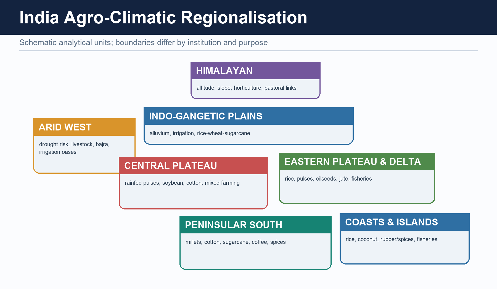

#### Plain-language explanation

Indian agriculture is shaped by monsoon seasonality, irrigation inequality, alluvial and
plateau soils, fragmented holdings, market access and procurement geography.

| Season | Basic timing | Geographic logic |
|---|---|---|
| Kharif | Sown with the south-west monsoon; harvested in autumn | Rainfall timing drives rice, maize, cotton, soybean and millet decisions |
| Rabi | Sown after monsoon withdrawal; harvested in spring | Cool season, residual moisture and irrigation support wheat, mustard and gram |
| Zaid | Short summer interval | Irrigated pockets support vegetables, fodder and watermelon |

Canal-irrigated north-west, rice-delta east, dryland Deccan, plantation highlands and
horticultural mountain belts operate under different opportunity and risk structures.

#### India example

A delayed monsoon affects Kharif sowing directly, while assured tube-well water can protect a
Rabi wheat schedule. The season names therefore represent water-temperature regimes, not just months.

#### Exam link

Use an India map and write season -> water source -> crop pattern -> regional risk.

#### Traps

- Kharif and Rabi are not mere calendar labels.
- India does not have one uniform rainfed or irrigated agriculture.
- Current rankings must not be inferred from textbook crop belts.

#### Quick recap

India's agricultural geography is a **mosaic of seasonal water regimes and regional institutions**.

---

### 2. Holdings, irrigation inequality and the soil-crop map

#### Visual first


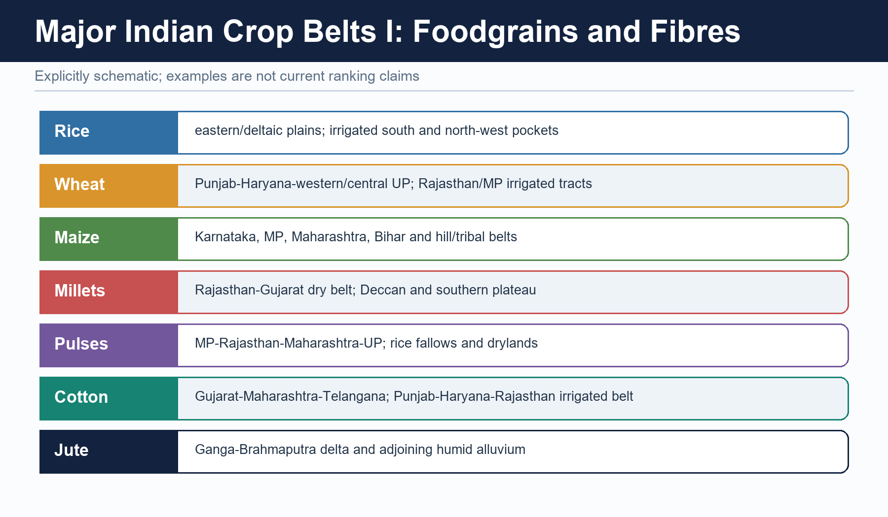

#### Plain-language explanation

The official 10th Agriculture Census, 2015-16, recorded **146.45 million operational holdings**
with an average size of **1.08 hectares**. This is a dated structural baseline. An operational
holding is land operated as one technical unit, not simply all land legally owned by a person.

| Factor | Regional effect |
|---|---|
| Fragmented holdings | Can limit machinery, bargaining and risk-bearing unless services or aggregation compensate |
| Canal irrigation | Important in Punjab, Haryana, western Uttar Pradesh and parts of Rajasthan |
| Tube wells | Support assured Rabi cultivation in alluvial plains but can stress aquifers |
| Tanks and rainfed dependence | More important across many plateau and peninsular settings |

| Soil group | Core association | Qualification |
|---|---|---|
| Alluvial | Northern plains and deltas; rice, wheat, sugarcane and jute | Khadar is newer; bhangar older |
| Black/regur | Deccan Trap areas; cotton, soybean, pulses and cereals | Cotton is not exclusive to regur |
| Red and yellow | Peninsular crystalline uplands | Often low in nitrogen/humus; response depends on water and inputs |
| Laterite | Strongly leached high-rainfall uplands | Tea, coffee or cashew need suitable management |
| Arid | Western dry tracts | Irrigation can improve output but also create salinity or waterlogging |
| Forest/mountain | Hill and Himalayan belts | Varies sharply with altitude and parent material |
| Problem soils | Saline, alkaline, peaty or marshy pockets | Defined by chemistry and drainage, not one climate zone |

#### India example

Small holdings in a well-irrigated, road-connected district may be more commercially viable
than larger holdings in a dry, remote area. Scale and location interact.

#### Exam link

Cite the Agriculture Census only with its 2015-16 vintage and operational-holding definition.

#### Traps

- Owned land is not the same as operated land.
- Average holding size is not a measure of landlessness.
- Irrigation source and aquifer type matter, not only irrigated-area labels.

#### Quick recap

Regional inequality reflects **holding structure + water access + soil setting + connectivity**.

---

### 3. Green Revolution geography

#### Visual first


#### Plain-language explanation

The Green Revolution first concentrated in Punjab, Haryana and western Uttar Pradesh. It was
not a seed-only event. Its package combined high-yielding varieties, fertiliser, assured
irrigation, credit, extension and procurement.

| Package element | Spatial outcome |
|---|---|
| Assured irrigation | Favoured north-western alluvial plains |
| Wheat-rice rotations | Created a concentrated surplus core |
| Mandis, storage and procurement | Reinforced the same districts through path dependence |
| Later diffusion | Reached other irrigated and connected districts unevenly |

#### India example

Once a district had irrigation, input dealers, extension, procurement centres and storage, the
next season's same crop choice became safer. Institutions therefore reinforced the original
ecological and infrastructural advantage.

#### Exam link

A critical answer must include national food-security gains, regional selectivity and
second-generation costs.

#### Traps

- Do not describe uniform national spread.
- Do not blame “technology” without identifying incentives and preconditions.
- Do not ignore rainfed India or intra-regional inequality.

#### Quick recap

The Green Revolution was a **productive but spatially selective package**.

---

### 4. Procurement, the central pool and food-security geography

#### Visual first

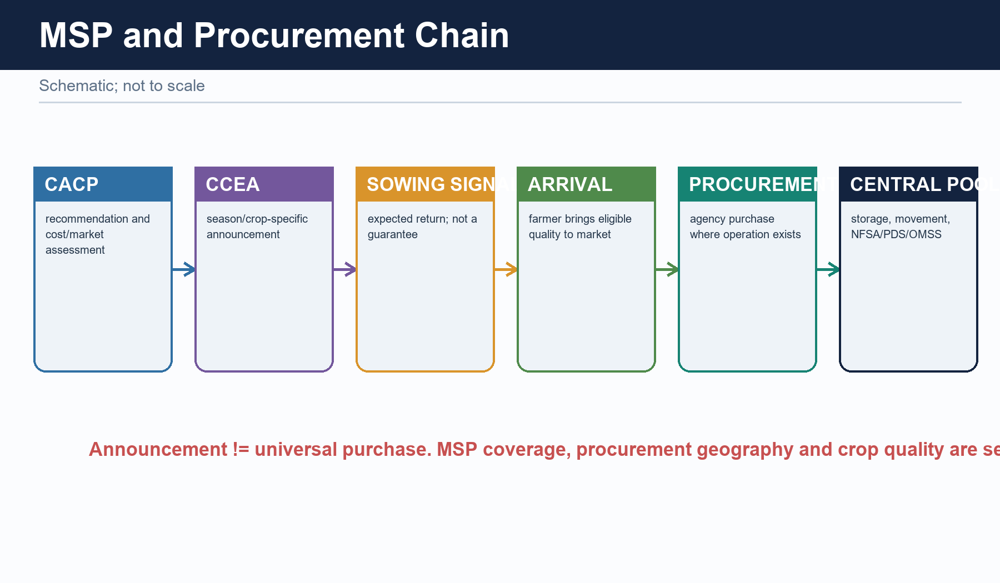

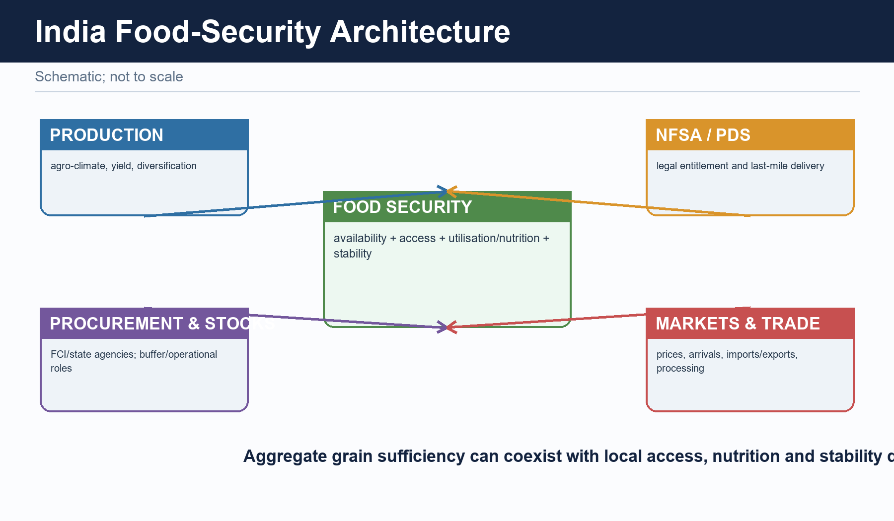

#### Plain-language explanation

Food security is not production alone. It is the movement from surplus fields to purchase,
storage and distribution.

```text
CACP recommendation -> Union MSP announcement -> FCI/state procurement
-> central pool/storage -> NFSA/PDS distribution to deficit and consuming regions
```

Procurement geography is narrower than production geography. FCI and state agencies connect
selected surplus belts to the central pool; NFSA/PDS channels redistribute grain toward
deficit and population-dense regions.

| Actor | Geographic role |
|---|---|
| Ministry of Agriculture and Farmers Welfare | Crop estimates, census and policy direction |
| CACP and Union Government | MSP recommendation and announcement |
| FCI and state agencies | Procurement, movement and storage |
| ICAR and Krishi Vigyan network | Region-specific research and extension |

#### India example

Punjab and Haryana matter not only as producing spaces but as procurement and distribution
anchors. Their role cannot be inferred from cropped area alone.

#### Exam link

Distinguish availability, access, utilisation and stability; then locate procurement, stocks
and PDS within that architecture.

#### Traps

- MSP announcement is not procurement.
- Production is not stock.
- Record output does not prove universal nutrition or access.

#### Quick recap

National food security converts **regional surplus into inter-regional access** through institutions.

---

### 5. Regional imbalance, ecological feedback and diversification

#### Visual first

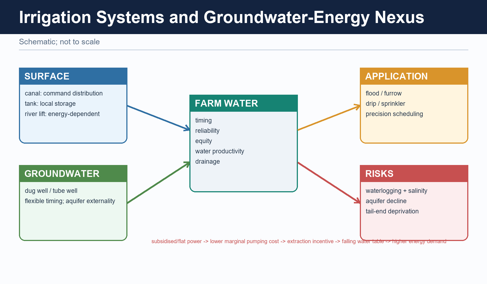

#### Plain-language explanation

The successful surplus core also developed second-generation pressures:

- groundwater depletion where pumping incentives exceed recharge;
- salinisation or waterlogging in poorly drained commands;
- nutrient imbalance and soil-organic-matter decline;
- residue-burning pressures in tight crop calendars;
- rice-wheat lock-in where procurement makes a narrow crop mix safer;
- inter-regional gaps between irrigated and rainfed areas.

Diversification is therefore a geographic adjustment, not merely a slogan. Alternative crops
must fit water, soil, processing, purchase and household risk.

#### India example

Replacing paddy in a water-stressed district is difficult if the alternative lacks seed,
processing, storage and a credible buyer. The existing crop can remain privately rational even
when it is ecologically costly.

#### Exam link

Write **problem mechanism -> region -> incentive -> matched reform**, not a generic list of schemes.

#### Traps

- Rainfed India is central to pulses, oilseeds, millets and resilience.
- Crop diversification can shift risk if value chains are weak.
- Foodgrain surplus can coexist with nutritional and access inequality.

#### Quick recap

Sustainable diversification requires **resource alignment and market credibility together**.

---

### 6. Dated current-policy evidence and status discipline

#### Visual first

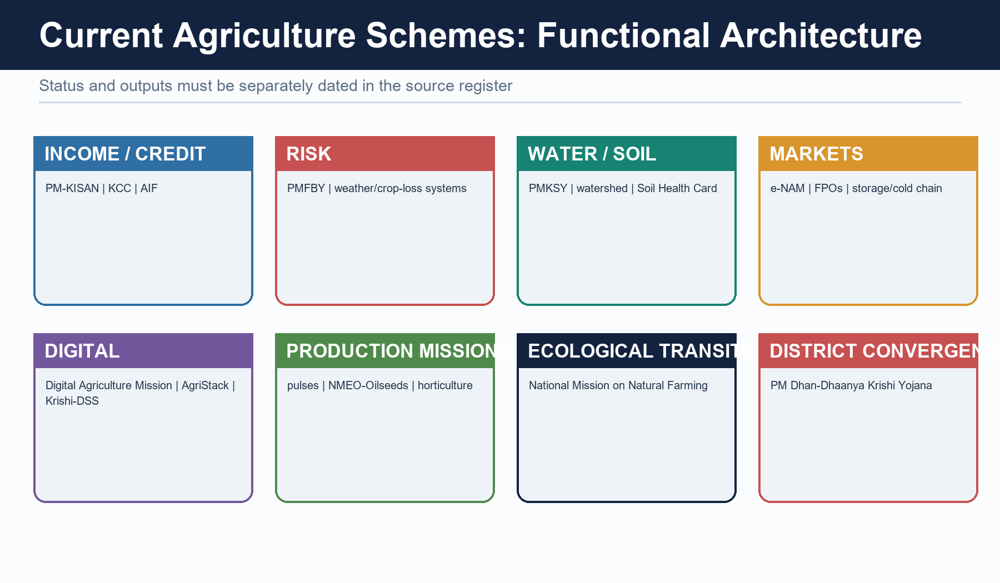


#### Plain-language explanation

The Advanced owner's current anchor is PM Dhan-Dhaanya Krishi Yojana. Budget 2025-26 announced
it; the Cabinet approved it on **16 July 2025**; it was launched on **11 October 2025**. It
targets **100 districts** selected for low productivity, low cropping intensity and low credit
disbursement through scheme convergence. District selection and plans are implementation
evidence, not impact evaluation.

| Dated official evidence retained from v1 | Safe use |
|---|---|
| Digital Agriculture Mission approved 2 September 2024 | Mission design; registry progress is not impact |
| National Mission on Natural Farming approved 25 November 2024 | Design and transition architecture; enrolment is not yield proof |
| Kharif MSP approval, PIB 28 May 2025 | Season- and crop-specific price decision; not purchase coverage |
| PM Dhan-Dhaanya approval 16 July 2025 and launch 11 October 2025 | District convergence architecture; not outcome evaluation |
| Mission for Aatmanirbharta in Pulses launched October 2025 | Mission targets remain targets |
| Agriculture Infrastructure Fund status as of 26 January 2026 | Sanctioned loan/project is not completed infrastructure |
| DES Third Advance Estimates dated 27 May 2026 | Advance estimate only; keep crop aggregate and units exact |
| PM-KISAN 23rd instalment transfer dated 20 June 2026 | Administrative transfer is not causal income impact |
| Soil Health Card progress, July 2026 | Card or lab count is not adoption or soil outcome |

The safe status ladder is:

```text
ANNOUNCEMENT -> APPROVAL -> GUIDELINES -> SELECTION/ALLOCATION
-> RELEASE -> ACTIVITY/OUTPUT -> OUTCOME -> IMPACT
```

#### India example

A district can complete a plan and enrol beneficiaries without yet proving higher yields,
incomes or lower ecological stress. Monitoring must move from activity to outcome indicators.

#### Exam link

Use a current scheme to illustrate a static geographic mechanism, then state the evidence
stage. For PM Dhan-Dhaanya, the static link is spatially concentrated agricultural backwardness.

#### Traps

- Applications are not unique farmers.
- Registration or trade value is not farmer-income impact.
- Sanction is not completion.
- Coverage is not reliable irrigation or basin saving.

#### Quick recap

Dated policy evidence earns marks only when its **stage and boundary** remain explicit.

---

### 7. Advanced exam routes

#### Visual first


#### Plain-language explanation

Advanced depth is useful for three recurring arguments:

1. Indian agriculture is monsoon dependence moderated unequally by irrigation.
2. Green Revolution gains and procurement path dependence created a surplus core with
   second-generation ecological costs.
3. Food security moves through production, selective procurement, central-pool logistics and
   NFSA/PDS access.

Historical Advanced-owner PYQ links retained:

- 2018 GS-I: Blue Revolution and pisciculture development.
- 2022 GS-I: rubber-producing countries and environmental issues.
- 2023 GS-I: movement from net food importer to net food exporter.
- 2025 GS-I: non-farm primary activities and physiographic features.

#### India example

A complete answer on Punjab-Haryana should connect alluvial plains and irrigation to the
technology package, procurement institutions, national grain movement and aquifer stress.

#### Exam link

Probable routes:

- Discuss how monsoon seasonality, irrigation inequality and fragmented holdings shape regional agriculture.
- Critically analyse the spatial concentration and long-run effects of the Green Revolution.
- Explain how MSP, procurement and NFSA convert local surpluses into national food security.

#### Traps

- Advanced detail must qualify the core answer, not bury it.
- Do not write Economy-only price-policy analysis in a Geography answer.
- Keep current figures dated and official.

#### Quick recap

Optional depth adds **regional specificity, institutional geography and evidence discipline**.

## CONSOLIDATED REGISTER NOTES

### CORE BASIC

#### Agricultural geography in one line

- Studies where primary production occurs, why it occurs there, how it is organised and how it changes.
- Core chain: natural base -> farming system -> location -> market link -> change -> answer.
- Six controls: climate, relief, soil, water, labour, market/transport.

#### Farming systems and world regions

- Shifting: temporary clearing, brief cultivation, fallow rotation.
- Wet-rice: small holdings, dense labour, controlled water, monsoon Asian valleys/deltas.
- Nomadic pastoralism: mobility across sparse arid/semi-arid pasture.
- Mixed farming: crop-livestock integration.
- Mediterranean: winter rain, summer drought, vines/olives/fruits and winter crops.
- Plantation: specialised estate, tropical, commercial/export orientation.
- Commercial grain: vast temperate plains, mechanisation, low labour density.
- Market gardening/dairy: perishability + urban demand + access.
- Trap: intensity per unit land is not the same as market orientation.

#### Von Thunen and location

- Market distance raises freight and decay costs; land rent generally falls outward.
- Perishables and frequent-delivery goods can pay higher rent near demand.
- Cold chains and expressways stretch rings; they do not remove cost or reliability.
- Answer route: assumptions -> mechanism -> modern modification -> surviving application -> limitation.

#### Crop-location rapid recall

- Rice: warmth + abundant/controlled water; upland, irrigated and deltaic systems differ.
- Wheat: cool growth + drier ripening.
- Cotton: long frost-free warmth; not confined to black soil.
- Jute: hot humid alluvial east + retting water.
- Tea: warm humid, acidic, well-drained slopes + labour.
- Coffee: warm shaded uplands + drainage.
- Millets: many fit lower/variable rainfall; “coarse” is not a nutrition verdict.

#### Commercialisation and evidence firewalls

- Transition: subsistence -> surplus -> specialisation -> processing/value chains.
- Enablers: water, improved inputs, roads, ports, aggregation, storage, finance, demand.
- Advance estimate != final; production != procurement != stock != consumption != export.
- MSP announcement != actual procurement.
- Scheme stage: announcement -> approval -> guidelines -> selection -> release -> output -> outcome -> impact.
- Keep date, unit, reference year and statistical status attached.

#### Non-farm primary activities

- Definition: fishing, forestry/gathering, mining and quarrying; exclude manufacturing.
- Physiography -> resource occurrence -> accessibility -> realised activity.
- Fishing: shelf, nutrients, upwelling/current mixing, harbour/estuary, inland waters.
- Forestry: climate/altitude, slope, accessibility, species and rights; NTFP matters in central and north-eastern belts.
- Mining: shields for metallic ores, basins for fuels/limestone, lateritic caps for bauxite, margins for offshore hydrocarbons.
- Qualification: physical potential is modified by transport, technology, regulation and rights.

#### Core answer spine

- Claim -> named evidence/example -> spatial or causal analysis -> qualification -> verdict.
- “Discuss” needs balanced dimensions; “distinguish” needs common axes; “examine” needs relevance and limits.
- Technology package can raise national output yet create uneven regional gains because preconditions are uneven.

### OPTIONAL ADVANCED

#### India's seasonal and regional mosaic

- Kharif: monsoon-linked; Rabi: cool season + residual moisture/irrigation; Zaid: short irrigated summer.
- Mosaics: irrigated north-west, rice-delta east, dryland Deccan, plantation highlands, mountain horticulture.

#### Holdings, soils and irrigation

- Agriculture Census 2015-16: 146.45 million operational holdings; average 1.08 ha.
- Operational holding != owned area; dated baseline != current annual statistic.
- Canal and tube-well advantage is regionally unequal; hard-rock and rainfed systems face different constraints.
- Soil links are associations, never crop exclusivity rules.

#### Green Revolution and procurement geography

- Package: HYV + assured irrigation + fertiliser + credit + extension + procurement.
- Early core: Punjab, Haryana, western Uttar Pradesh; later uneven diffusion.
- Gain: national grain surplus and food-security capacity.
- Costs: aquifer stress, nutrient imbalance, residue pressure, rice-wheat lock-in, regional divergence.
- CACP/Union announcement -> FCI/state procurement -> central pool -> NFSA/PDS distribution.
- Procurement geography is narrower than production geography.

#### Current evidence and safe use

- PM Dhan-Dhaanya: approved 16 July 2025; launched 11 October 2025; 100 districts; convergence design, not impact proof.
- Digital Agriculture Mission: approved 2 September 2024; registry progress != welfare outcome.
- NMNF: approved 25 November 2024; enrolment/cluster count != yield or income effect.
- DES Third Advance Estimate dated 27 May 2026: foodgrains 3765.63 lakh tonnes; nine oilseeds 430.59 lakh tonnes.
- Use dated evidence to illustrate a mechanism, then state its statistical or implementation boundary.

#### PYQ and verdict routes

- 2025 GS-I: define non-farm primary activities, link each to physiography, qualify with access and institutions.
- Green Revolution verdict: productive but spatially selective; next step is rainfed productivity, crop-water alignment and credible diversified markets.
- Food-security verdict: preserve the production-procurement-PDS backbone while improving nutrition, regional sustainability and access.
- Diversification verdict: alternative crops need water fit, processing, purchase assurance and transition support.

### COMPLETE TOPIC ASCII MASTER FLOW DIAGRAM

#### ASCII MASTER FLOW — PANEL 1/12: Agricultural geography as a natural-human-market system

```ascii-master
+-------------- AGRICULTURAL GEOGRAPHY ----------------+
| Where does production occur, why there, how organised,|
| and how does the pattern change through time?         |
+--------------------------------------------------------+
                         |
       +-----------------+------------------+
       |                 |                  |
NATURAL BASE         HUMAN SYSTEM       MARKET SYSTEM
climate              labour/holding     demand
relief               technology         transport
soil                 tenure/capital     storage/processing
water                institutions       price and trade links
       \                 |                  /
        +---------- FARMING SYSTEM ----------+
                         |
 location -> seasonality -> intensity -> surplus -> value chain
                         |
 spatial gains and costs feed back to soil, water, labour and region

Six controls: climate, relief, soil, water, labour, market/transport.
MUST REMEMBER: Agricultural geography reconstructs land use through physical controls, tenure,
  labour, technology, markets and policy; it compares subsistence/commercial,
  intensive/extensive, plantation, mixed, dairy, Mediterranean, shifting, pastoral and von
  Thünen location logics before mapping India's crop seasons and agro-regions.
```

#### ASCII MASTER FLOW — PANEL 2/12: Farming-system classification by ecology, labour and market

```ascii-master
+----------------------+-----------------------+----------------------+
| SYSTEM               | ORGANISATION          | TYPICAL SETTING      |
+----------------------+-----------------------+----------------------+
| Shifting cultivation | clearing + fallow     | humid forest margins |
| Wet-rice intensive   | small, labour, water  | monsoon valleys      |
| Nomadic pastoralism  | mobile herds          | arid sparse pasture  |
| Mixed farming        | crop-livestock link   | temperate regions    |
| Mediterranean        | winter rain system    | west-coast margins   |
| Plantation           | estate + export crop  | tropical highlands   |
| Commercial grain     | mechanised vast farms | temperate plains     |
| Dairy/market garden  | perishable + urban    | city hinterlands     |
+----------------------+-----------------------+----------------------+

CLASSIFICATION AXES
subsistence/commercial | intensive/extensive | crop/livestock mix
sedentary/mobile | small/large scale | local/export orientation

High output per hectare is not the same as commercial orientation.
```

#### ASCII MASTER FLOW — PANEL 3/12: Von Thunen rings and the survival of distance

```ascii-master
                      CENTRAL MARKET
                 +-----------------------+
                 | dairy / vegetables    | high decay, frequent trips
                 +-----------------------+
                 | forestry / fuelwood   | heavy transport burden
                 +-----------------------+
                 | field crops           | lower perishability
                 +-----------------------+
                 | livestock / ranching  | extensive outer use
                 +-----------------------+

distance up -> freight/reliability cost up -> bid rent generally down
perishability + delivery frequency + land rent decide near-market use
                         |
MODERN MODIFIERS
cold chain + expressway + processing + digital markets + policy
                         |
stretch, distort or split rings; they do not abolish cost and access

Answer route: assumptions -> mechanism -> modification -> surviving use
              -> limits from relief, multiple markets and institutions.
```

#### ASCII MASTER FLOW — PANEL 4/12: World crop regions and ecological requirements

```ascii-master
+---------+--------------------------+----------------------------+
| CROP    | ECOLOGICAL BUNDLE        | BROAD GEOGRAPHY            |
+---------+--------------------------+----------------------------+
| Rice    | warmth + managed water   | monsoon valleys/deltas     |
| Wheat   | cool growth, dry ripening| temperate and winter belts |
| Cotton  | frost-free warmth        | subtropical plains/plateaus|
| Jute    | humid alluvium + retting | eastern deltaic belt       |
| Tea     | humid acidic slopes      | Asian tropical highlands   |
| Coffee  | shaded drained uplands   | tropical uplands           |
| Millets | variable lower rainfall  | semi-arid drylands         |
+---------+--------------------------+----------------------------+

REGIONAL LOGIC
Monsoon Asia -> intensive rice | temperate plains -> commercial grain
Mediterranean margins -> winter crops, vines, olives and fruits
Tropical estates -> plantation crops | city belts -> dairy and vegetables

A crop-soil link is an association, not an exclusive rule.
```

#### ASCII MASTER FLOW — PANEL 5/12: India's agro-climatic mosaic, Green Revolution and food chain

```ascii-master
INDIA'S AGRICULTURAL MOSAIC
North-west       : irrigated wheat-rice and procurement core
Eastern deltas   : rice, jute and water-rich farming
Dryland Deccan   : millets, pulses, oilseeds and variable rainfall
Western plateau  : cotton and mixed irrigated-dryland systems
Highlands        : tea, coffee, spices and horticulture
Mountains        : horticulture, pastoral and terrace systems
                         |
GREEN REVOLUTION PACKAGE
HYV + assured irrigation + fertiliser + credit + extension + procurement
                         |
early concentration: Punjab + Haryana + western Uttar Pradesh
                         |
higher grain output -> procurement -> central pool -> NFSA/PDS movement
                         |
SECOND-GENERATION FEEDBACK
water-table decline + nutrient imbalance + residue pressure
+ rice-wheat lock-in + regional divergence

Productive success and ecological stress can coexist in the same region.
```

#### ASCII MASTER FLOW — PANEL 6/12: Fishing, forestry, mining and quarrying through physiography

```ascii-master
+------------+---------------------------+-------------------------+
| ACTIVITY   | PHYSICAL BASE             | HUMAN FILTER            |
+------------+---------------------------+-------------------------+
| Fishing    | shelf, nutrients, mixing  | harbour, cold chain     |
| Inland fish| river, tank, reservoir    | rights, seed, markets   |
| Forestry   | climate, altitude, species| access, tenure, rules   |
| Mining     | ore body or fuel basin    | grade, power, transport |
| Quarrying  | accessible bulk material  | demand, regulation      |
+------------+---------------------------+-------------------------+

PHYSIOGRAPHIC SEQUENCE
resource occurrence -> accessibility -> extraction/harvest -> processing link
                         |
technology + transport + institutions + rights determine realised activity

Indian cues:
central/NE forests -> timber and NTFP | shields -> many metallic ores
sedimentary basins -> coal/limestone | margins -> offshore hydrocarbons

Primary extraction ends before manufacturing begins.
```

#### ASCII MASTER FLOW — PANEL 7/12: Sustainable agriculture and intervention stack

```ascii-master
REGIONAL PRODUCTION PRESSURE
monsoon variability + fragmented holdings + unequal irrigation
+ soil decline + water stress + market risk
                         |
RESPONSE STACK
soil and water conservation
-> crop-water alignment and diversification
-> efficient irrigation and resilient seed systems
-> storage, aggregation, processing and cold chain
-> credit, insurance, extension and market access
-> procurement reform with food-security safeguards
-> local monitoring of income, nutrition and ecology

EVIDENCE FIREWALL
estimate is not final | output is not procurement | procurement is not stock
stock is not consumption | MSP announcement is not actual purchase

SCHEME STATUS
announcement -> approval -> guidelines -> selection -> funds
-> physical output -> service outcome -> long-term impact

Technology raises output only where water, knowledge and institutions converge.
```

#### ASCII MASTER FLOW — PANEL 8/12: Map-answer and Mains spine for agricultural geography

```ascii-master
QUESTION: Why is agricultural change spatially unequal?
                             |
1. DEFINE: location, seasonality, organisation and change
                             |
2. MAP: irrigated NW | eastern deltas | dry Deccan | plantation hills
                             |
3. BUILD CONTROL MATRIX
   climate + relief + soil + water + labour + market/transport
                             |
4. EXPLAIN SYSTEM
   subsistence -> surplus -> specialisation -> processing -> value chain
                             |
5. ADD NAMED EVIDENCE
   Green Revolution core, procurement geography or physiographic activity
                             |
6. EVALUATE
   productivity + food security versus water, soil and regional inequality
                             |
7. QUALIFY AND CONCLUDE
   diversify only with purchase assurance, processing and transition support

Claim -> evidence -> spatial mechanism -> distributional/ecological limit
      -> region-sensitive verdict.
```

#### ASCII MASTER FLOW — PANEL 9/12: Evidence ladder and confidence control

```ascii-master
EVIDENCE LADDER
1. = grounded source = synthesis / exam heuristic = verified dated...
2. Source/date: PIB, 28 May 2025 -Cabinet approval of MSP for Kharif...
3. central Indian and north-eastern forest belts and is a principal...
VERDICT: Source type controls the strength and limits of the historical claim.
```

#### ASCII MASTER FLOW — PANEL 10/12: Examiner traps and contested boundaries

```ascii-master
CLOSE DISTINCTIONS
1. Do not turn a dated official estimate into a timeless fact.
2. Do not treat a scheme dashboard as an impact evaluation.
3. Do not begin with India-specific complexity before the core location...
VERDICT: Qualification earns marks; false certainty is a hard failure.
CLOSE DISTINCTION: Kharif, rabi and zaid are seasons rather than crop essences; net sown area
  differs from gross cropped area, cropping intensity from yield, MSP announcement from
  procurement, food security from cereal self-sufficiency, and irrigation potential from
  realised equitable water delivery.
```

#### ASCII MASTER FLOW — PANEL 11/12: Integrated answer spine and qualified conclusion

```ascii-master
ANSWER SPINE
1. Practice contract Every solved item has demand decoding, a detailed...
2. NATURAL BASE -> FARMING SYSTEM -> LOCATION -> MARKET LINK -> CHANGE...
3. In Prelims, UPSC separates close classifications. In Mains, it...
VERDICT: Claim, named evidence, analysis and qualification lead to a graded...
EVIDENCE LIMIT: Punjab–Haryana wheat-rice, western Maharashtra sugarcane, Malwa
  cotton/soybean, Assam tea, Kerala rubber/spices, Karnataka coffee, eastern rice, dryland
  Deccan millets/pulses and horticultural belts must be explained through water, soil, labour,
  market and policy interactions, with Agriculture Census/land-use/production data
  source-dated.
```

#### ASCII MASTER FLOW — PANEL 12/12: Evidence ladder and confidence control — DEEP-REVIEW SYNTHESIS 2

```ascii-master
EVIDENCE LADDER
1. = grounded source = synthesis / exam heuristic = verified dated...
2. Source/date: PIB, 28 May 2025 -Cabinet approval of MSP for Kharif...
3. central Indian and north-eastern forest belts and is a principal...
VERDICT: Source type controls the strength and limits of the historical claim.
```
