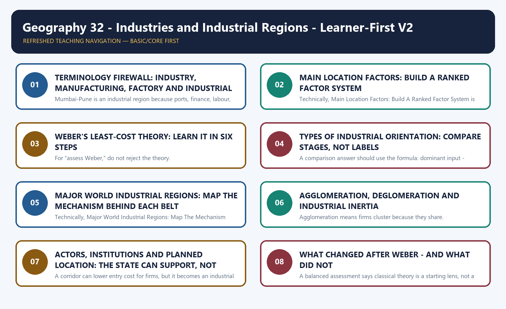
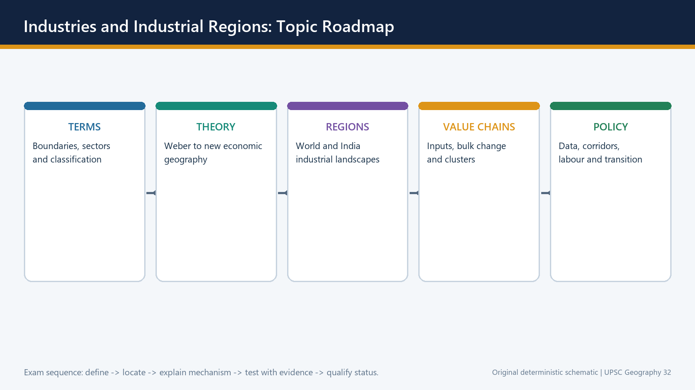
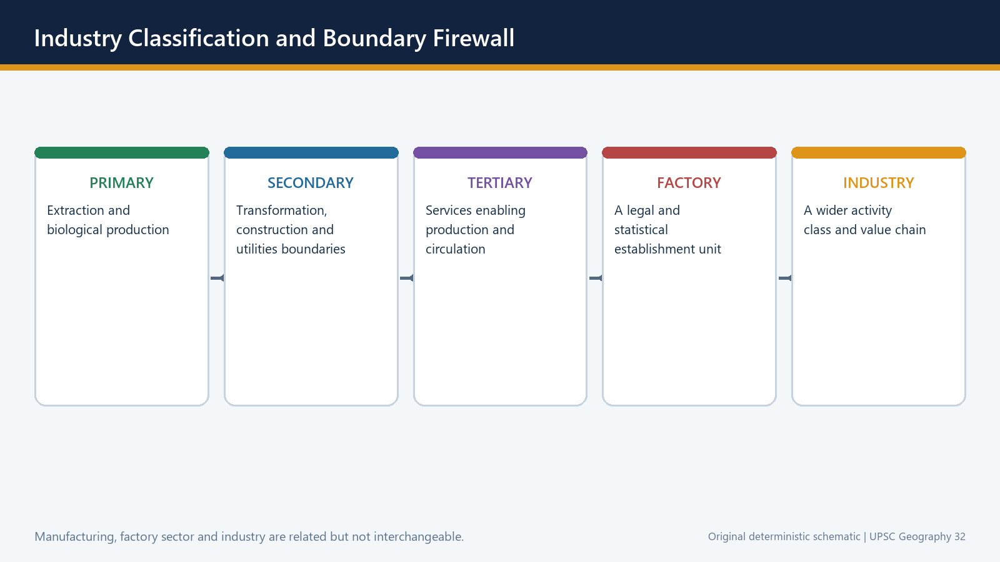
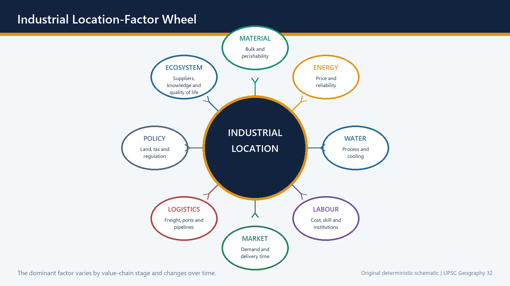
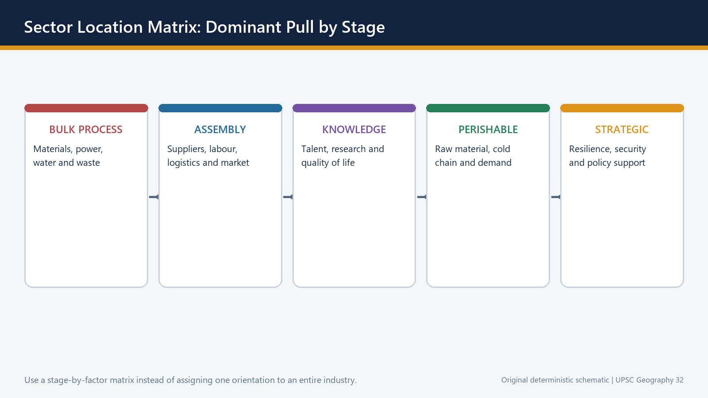
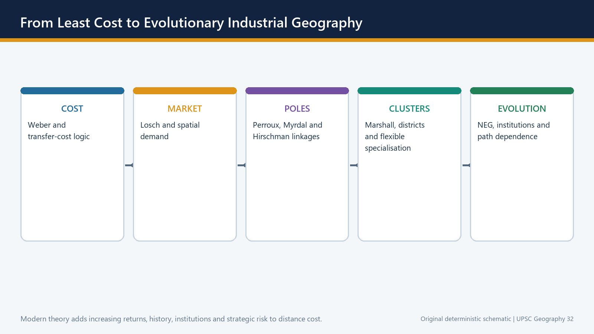
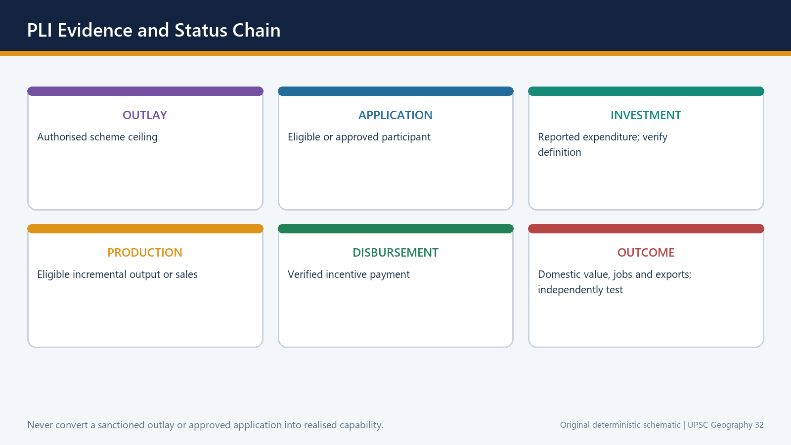
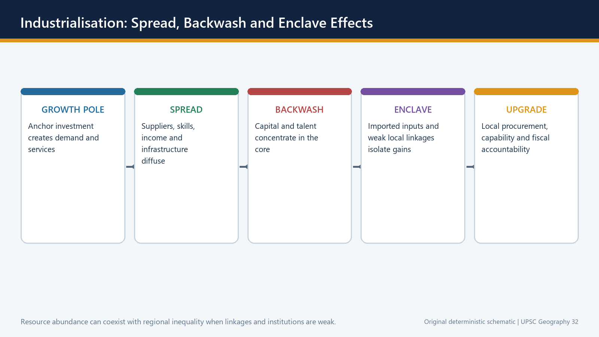
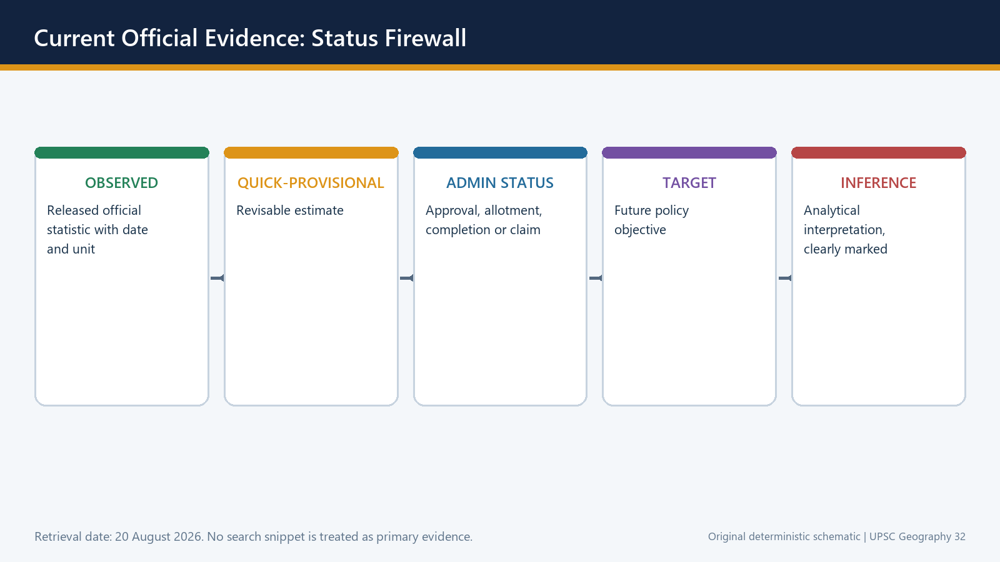

# Geography 32 - Industries and Industrial Regions - Learner-First V2

**Purpose:** Learn the core geography first, practise it, then add optional India-applied depth.

**Evidence date:** 20 August 2026. Dated official and provisional claims are preserved from the v1 source; they are not silently upgraded.

**How to use this session:** Read one Basic subtopic at a time. Begin with the visual, explain the mechanism aloud, test the India example, and attempt the recap before moving on.

## BASIC LEARNING SESSION

### DEEP-REVIEW LEARNING CONTRACT

| Control | Binding rule for this package |
|---|---|
| Syllabus boundary | Complete Human, Economic and Regional Geography Basic/Core is taught before optional Advanced depth. |
| Spatial method | Distribution → controlling physical/human variables → network or region → named world/India anchors → scale and exception. |
| Model method | State assumptions, mechanism, predicted pattern, named application and empirical or Global-South limitation. |
| Evidence method | Claim → named map/place/institution/dataset → analysis → source-date-status or causal qualification. |
| Policy method | Chronology, legal or planning instrument, responsible institution, implementation scale and current status remain distinct. |
| Practice contract | Every solved item has demand decoding, a detailed examiner-grade model, executable timed/compression plan, marks rationale and answer-specific improvement. |
| Approval | This immutable successor remains `approved: false` pending explicit approval. |

**Canonical Basic/Core owner:** `upsc-ai-kit\knowledge\Geography\basic\32_Industries-and-Industrial-Regions.md`  
**Canonical topic owner:** `upsc-ai-kit\knowledge\Geography\basic\32_Industries-and-Industrial-Regions.md`  
**Optional Advanced owner:** `upsc-ai-kit\knowledge\Geography\advanced\32_Industries-and-Industrial-Regions.md`  
**Official syllabus mapping:** `upsc-ai-kit\knowledge\Geography\OFFICIAL-UPSC-SYLLABUS-MAPPING.md`

### EVIDENCE, PYQ AND CURRENT-STATUS CONTROL

- **Definition discipline:** close terms share a comparison axis and are never treated as synonyms.
- **Map discipline:** pattern is reconstructed through site, situation, density, gradient, corridor, node, belt, boundary, hinterland and scale.
- **Model discipline:** Ravenstein, Lee, Christaller, Burgess, Hoyt, Harris-Ullman, Myrdal, Perroux, von Thünen, Weber and related models retain assumptions and limits.
- **India discipline:** every explanation carries named state, region, city, corridor, resource belt, border sector or cultural landscape evidence.
- **Data discipline:** Census, SRS, NFHS, Agriculture Census, production, trade, energy and infrastructure claims retain source, reference period, release date and status.
- **PYQ discipline:** repository routing ledgers and held papers control wording and metadata; reconstructed wording and unavailable official keys remain labelled.
- **Current-status note, rechecked 2026-09-02:** Static concepts are separated from volatile population, production, trade, infrastructure, mission, boundary and policy claims. Every current number or status requires the issuing institution, reference period, publication date and provisional/final/operational boundary.

**Live/official context sources recorded by the predecessor generation:**

- No volatile live claim is necessary for the static core.




*Distinct embedded teaching-navigation image. The separate continuous Cārvāka-style flowchart package remains an independent at-a-glance artifact.*
### LEARNING ROAD MAP: ASK THE LOCATION QUESTION IN THE RIGHT ORDER



*Visual first: the topic moves from precise terms to factors, theory, regions, persistence, policy and answer writing.*

**Simple explanation**

Industrial geography is not a plant-list chapter. It asks a sequence of questions:

```text
What is being produced?
        -> Which stage of the value chain is being located?
        -> Which cost or capability pulls most strongly?
        -> Why do firms cluster?
        -> Why does the cluster persist, decline or move?
        -> What does this mean for India, policy and the exam?
```

The central habit is to replace a one-factor answer with a **ranked explanation**. Raw material may dominate cement clinker, power may dominate aluminium smelting, market access may dominate bakery products, and specialised skills may dominate knowledge-intensive industry.

**India-centric example**

The eastern mineral belt shows source orientation; the western port-market belt shows port, finance and market orientation; southern technology and engineering clusters show skill and knowledge orientation.

**Exam link**

- Prelims asks which locational pull best fits an industry.
- GS-I asks why industries and industrial regions are distributed unevenly.
- GS-III asks how corridors, logistics and incentives can reshape that geography.

> **Trap:** A named factory is evidence only when it proves a mechanism. Do not substitute plant lists for explanation.

**Mini recap:** Define the activity -> identify the stage -> rank factors -> explain clustering -> qualify with change over time.

---
### SESSION 1 — TERMINOLOGY FIREWALL: INDUSTRY, MANUFACTURING, FACTORY AND INDUSTRIAL REGION

#### VISUAL FIRST

```text
TERMINOLOGY FIREWALL: INDUSTRY, MANUFACTURING, FACTORY AND INDUSTRIAL REGION
STARTING CONDITION / SPATIAL DRIVER
        ↓
MODEL / CAUSAL / INSTITUTIONAL MECHANISM
        ↓
DISTRIBUTION / NETWORK / REGION / LANDSCAPE
        ↓
NAMED INDIA + WORLD MAP / DATA ANCHOR
        ↓
SCALE + MODEL / DATA / POLICY LIMIT
```

*Use this gateway before the detailed spatial, model, map and qualified causal explanation below.*

#### DEFINITION / WHAT THIS IS CALLED

**Plain-language definition:** Mini recap: Industry is the ecosystem; manufacturing is the activity; factory is the site; region is the connected landscape.

**Technical definition:** Mumbai-Pune is an industrial region because ports, finance, labour, engineering firms, chemicals, automobiles and markets interact across a wider belt.

#### ANSWER-GRABBING OPENING — WRITE/ADAPT IN THE EXAM

> Mini recap: Industry is the ecosystem; manufacturing is the activity; factory is the site; region is the connected landscape.

#### MUST-WRITE KEYWORDS

- **Terminology Firewall**
- **Industry**
- **Manufacturing**
- **ory**
- **Industrial Region**
- **Simple explanation**

**How to use them:** Frame the answer through Terminology Firewall; define Industry, connect Manufacturing with ory to explain the mechanism, and use Industrial Region for the decisive comparison or qualification.



*Visual first: activity, establishment and region are different units and should not be mixed.*

**Simple explanation**

- **Industry** is the broad set of activities and organisations that transform inputs into useful goods. In geography, the word may cover a production chain and its supplier-service ecosystem.
- **Manufacturing** is the transformation or assembly activity itself.
- A **factory** is an establishment or production site; it is not automatically the whole industry.
- An **industrial region** is a connected manufacturing landscape containing several firms, labour markets, suppliers, transport links and urban services. It is larger than a single city or estate.
- An **industrial belt** is a broad, historically concentrated zone. A **cluster** is a dense local network. A **corridor** links nodes through freight, utilities and urban systems.
- **Orientation** means the dominant locational pull: raw material, market, power, labour or another capability.
- **Footloose** means weak dependence on one localised raw material; it never means location-free.

| Term | Think of it as | Avoid this error |
|---|---|---|
| Industry | Whole activity or ecosystem | Treating one factory as the industry |
| Manufacturing | Transformation/assembly | Equating it with all services around production |
| Factory | Establishment/site | Equating factory data with all manufacturing |
| Cluster | Dense local network | Calling any industrial estate a cluster |
| Corridor | Nodes plus connective systems | Calling any highway an industrial corridor |
| Industrial region | Wider interconnected landscape | Treating it as only a mineral region |

**India-centric example**

Mumbai-Pune is an industrial region because ports, finance, labour, engineering firms, chemicals, automobiles and markets interact across a wider belt. One automobile plant within it is only an establishment.

**Exam link**

A precise first line saves marks: state whether the question concerns an activity, a plant, a cluster, a corridor or a region.

> **Trap:** Manufacturing data, factory-sector data and employment generated by a scheme have different boundaries.

**Mini recap:** Industry is the ecosystem; manufacturing is the activity; factory is the site; region is the connected landscape.

---

#### CLOSING RECALL FLOW — TERMINOLOGY FIREWALL: INDUSTRY, MANUFACTURING, FACTORY AND INDUSTRIAL REGION

```text
START / CONCEPT: TERMINOLOGY FIREWALL: INDUSTRY, MANUFACTURING, FACTORY AND INDUSTRIAL REGION
        |
        v
EXACT TERMS: Terminology Firewall · Industry · Manufacturing · ory · Industrial Region · Simple explanation
        |
        v
MECHANISM / ARGUMENT: Mumbai-Pune is an industrial region because ports, finance, labour, engineering firms, chemicals, automobiles and markets interact across a wider belt.
        |
        v
CONSEQUENCE / CONTRAST: A factory is an establishment or production site; it is not automatically the whole industry.
        |
        v
UPSC TRAP / ANSWER-USE: Do not miss this limiting distinction: manufacturing data, factory-sector data and employment generated by a scheme have different boundaries.
        |
        v
ANSWER-GRABBING FORMULATION: Mini recap: Industry is the ecosystem; manufacturing is the activity; factory is the site; region is the connected landscape.
```
### SESSION 2 — MAIN LOCATION FACTORS: BUILD A RANKED FACTOR SYSTEM

#### VISUAL FIRST

```text
MAIN LOCATION FACTORS: BUILD A RANKED FACTOR SYSTEM
STARTING CONDITION / SPATIAL DRIVER
        ↓
MODEL / CAUSAL / INSTITUTIONAL MECHANISM
        ↓
DISTRIBUTION / NETWORK / REGION / LANDSCAPE
        ↓
NAMED INDIA + WORLD MAP / DATA ANCHOR
        ↓
SCALE + MODEL / DATA / POLICY LIMIT
```

*Use this gateway before the detailed spatial, model, map and qualified causal explanation below.*

#### DEFINITION / WHAT THIS IS CALLED

**Plain-language definition:** Main Location Factors: Build A Ranked Factor System comprises Main Location Factors, Build A Ranked Factor System and Simple explanation as its core connected dimensions.

**Technical definition:** Technically, Main Location Factors: Build A Ranked Factor System is analysed by relating Main Location Factors to Build A Ranked Factor System, then testing the relationship through Simple explanation and Step-by-step method.

#### ANSWER-GRABBING OPENING — WRITE/ADAPT IN THE EXAM

> Main Location Factors: Build A Ranked Factor System comprises Main Location Factors, Build A Ranked Factor System and Simple explanation as its core connected dimensions.

#### MUST-WRITE KEYWORDS

- **Main Location Factors**
- **Build A Ranked Factor System**
- **Simple explanation**
- **Step-by-step method**
- **India-centric examples**
- **Exam link**

**How to use them:** Frame the answer through Main Location Factors; define Build A Ranked Factor System, connect Simple explanation with Step-by-step method to explain the mechanism, and use India-centric examples for the decisive comparison or qualification.



*Visual first: location results from interacting material, energy, labour, market, transport, water, capital and technology pulls.*

**Simple explanation**

| Factor | Why it matters | Typical pull |
|---|---|---|
| Raw material | Bulky or weight-losing inputs are expensive to move | Toward mine, farm or forest source |
| Power/energy | Continuous or electro-intensive processes need reliable supply | Toward cheap, stable electricity or fuel |
| Labour | Industries differ between abundant routine labour and scarce specialised skills | Toward labour pools and training ecosystems |
| Market | Perishable, fragile, bulky-final or frequently demanded goods need consumers nearby | Toward cities and demand regions |
| Transport | Rail, road, port and pipeline networks shape cost, time and reliability | Toward junctions, ports and corridors |
| Water | Cooling, washing, processing and settlements need dependable water | Toward suitable water systems, subject to ecology |
| Capital and technology | Finance, research, testing and entrepreneurship reduce production risk | Toward metropolitan and innovation nodes |
| Land and regulation | Cost, scale, zoning and environmental limits affect feasibility | Toward suitable planned sites, but not without linkages |
| Agglomeration | Shared suppliers, skills and infrastructure lower unit cost | Toward existing clusters |

**Step-by-step method**

1. Split the industry into stages.
2. For each stage, list the major inputs and outputs.
3. Ask which input is bulky, perishable, energy-intensive or skill-intensive.
4. Add transport time, market access and supplier dependence.
5. Rank the factors; do not merely list them.
6. Add a qualification: technology, policy, congestion or risk can change the ranking.

**India-centric examples**

- Sugar mills are pulled toward cane because cane is bulky and loses recoverable quality with delay.
- Aluminium smelting is strongly power-oriented even when bauxite mining and refining occur elsewhere.
- Ready-mix concrete and bakery products are market-oriented because delivery time and final bulk matter.
- Bengaluru's technology-engineering ecosystem is skill- and knowledge-oriented.

**Exam link**

Use a factor table only after stating the dominant factor. A good answer says: “For this stage, X dominates because Y; Z modifies it.”

> **Trap:** No single factor explains all industries, and one industry can have different orientations at different stages.

**Mini recap:** Stage first, factor ranking second, named example third, qualification last.

---

#### CLOSING RECALL FLOW — MAIN LOCATION FACTORS: BUILD A RANKED FACTOR SYSTEM

```text
START / CONCEPT: MAIN LOCATION FACTORS: BUILD A RANKED FACTOR SYSTEM
        |
        v
EXACT TERMS: Main Location Factors · Build A Ranked Factor System · Simple explanation · Step-by-step method · India-centric examples · Exam link
        |
        v
MECHANISM / ARGUMENT: Sugar mills are pulled toward cane because cane is bulky and loses recoverable quality with delay.
        |
        v
CONSEQUENCE / CONTRAST: Rank the factors; do not merely list them.
        |
        v
UPSC TRAP / ANSWER-USE: Do not miss this limiting distinction: no single factor explains all industries.
        |
        v
ANSWER-GRABBING FORMULATION: Main Location Factors: Build A Ranked Factor System comprises Main Location Factors, Build A Ranked Factor System and Simple explanation as its core connected dimensions.
```
### SESSION 3 — WEBER'S LEAST-COST THEORY: LEARN IT IN SIX STEPS

#### VISUAL FIRST

```text
WEBER'S LEAST-COST THEORY: LEARN IT IN SIX STEPS
STARTING CONDITION / SPATIAL DRIVER
        ↓
MODEL / CAUSAL / INSTITUTIONAL MECHANISM
        ↓
DISTRIBUTION / NETWORK / REGION / LANDSCAPE
        ↓
NAMED INDIA + WORLD MAP / DATA ANCHOR
        ↓
SCALE + MODEL / DATA / POLICY LIMIT
```

*Use this gateway before the detailed spatial, model, map and qualified causal explanation below.*

#### DEFINITION / WHAT THIS IS CALLED

**Plain-language definition:** Alfred Weber's 1909 model asks: where can a factory minimise the combined burden of transport cost, labour cost and agglomeration/deglomeration effects?

**Technical definition:** For “assess Weber,” do not reject the theory.

#### ANSWER-GRABBING OPENING — WRITE/ADAPT IN THE EXAM

> For “assess Weber,” do not reject the theory.

#### MUST-WRITE KEYWORDS

- **Weber'S Least-Cost Theory**
- **Learn It In Six Steps**
- **Step 1 - the question**
- **transport cost, labour cost and agglomeration/deglomeration effects**
- **Step 2 - locate raw materials and market**
- **Step 3 - use weight-loss logic**

**How to use them:** Frame the answer through Weber'S Least-Cost Theory; define Learn It In Six Steps, connect Step 1 - the question with transport cost, labour cost and agglomeration/deglomeration effects to explain the mechanism, and use Step 2 - locate raw materials and market for the decisive comparison or qualification.


*Visual first: Weber begins with transport cost, then tests whether labour savings or clustering justify moving away from the transport minimum.*

**Step 1 - the question**

Alfred Weber's 1909 model asks: where can a factory minimise the combined burden of **transport cost, labour cost and agglomeration/deglomeration effects**?

**Step 2 - locate raw materials and market**

Imagine two localised raw-material sources and one market. The first task is to find the site with the lowest total cost of moving inputs in and output out.

**Step 3 - use weight-loss logic**

```text
MATERIAL INDEX = weight of localised raw material used / weight of finished product

Index > 1  -> weight-losing process -> stronger source pull
Index < 1  -> weaker source pull; market pull may strengthen
Index about 1 or ubiquitous inputs -> labour, power, accessibility and clustering decide more
```

Examples: ore concentration, sugar from cane and clinker production tend toward inputs; beverages add water and are commonly market-oriented.

**Step 4 - identify the transport-minimum point**

This is the lowest-freight site in the simplified triangle. It is the starting point, not an automatic final answer.

**Step 5 - test a cheaper-labour site**

An **isodapane** joins places with equal additional transport cost around the transport minimum. A firm moves to a labour site only when labour savings exceed that extra freight burden.

```text
Net gain from moving = labour saving - extra transport cost
Move only when the result is positive.
```

**Step 6 - add agglomeration and deglomeration**

A cluster can pull the plant further if shared suppliers, services, labour and infrastructure save more than the added cost. Congestion, land rent, pollution and delay can push activity outward.

**India-centric example**

An eastern steel complex reflects bulk-material and rail logic. A labour-intensive garment unit may accept higher freight to enter a deep labour-supplier cluster. A congested inner-city unit may shift to a peripheral industrial estate while retaining access to the same regional market.

**What Weber gets right**

- Firms compare location-dependent costs.
- Raw-material weight, labour savings and clustering can be analysed together.
- The model gives a disciplined starting mechanism.

**What Weber simplifies**

- Demand is treated too simply.
- Firms do not possess perfect information.
- Technology, institutions, global value chains, environmental rules and strategic risk can change the cost surface.

**Exam link**

For “assess Weber,” do not reject the theory. Write: the **method survives**—identify the dominant locational burden—but the dominant burdens now also include skills, reliability, supplier time, regulation and resilience.

> **Trap:** Weber did not explain transport alone; labour and agglomeration are central to the model.

**Mini recap:** Transport minimum -> labour deviation -> agglomeration pull -> deglomeration push -> modern qualification.

---

#### CLOSING RECALL FLOW — WEBER'S LEAST-COST THEORY: LEARN IT IN SIX STEPS

```text
START / CONCEPT: WEBER'S LEAST-COST THEORY: LEARN IT IN SIX STEPS
        |
        v
EXACT TERMS: Weber'S Least-Cost Theory · Learn It In Six Steps · Step 1 - the question · transport cost, labour cost and agglomeration/deglomeration effects · Step 2 - locate raw materials and market · Step 3 - use weight-loss logic
        |
        v
MECHANISM / ARGUMENT: A firm moves to a labour site only when labour savings exceed that extra freight burden.
        |
        v
CONSEQUENCE / CONTRAST: It is the starting point, not an automatic final answer.
        |
        v
UPSC TRAP / ANSWER-USE: Weber did not explain transport alone; labour and agglomeration are central to the model.
        |
        v
ANSWER-GRABBING FORMULATION: For “assess Weber,” do not reject the theory.
```
### SESSION 4 — TYPES OF INDUSTRIAL ORIENTATION: COMPARE STAGES, NOT LABELS

#### VISUAL FIRST

```text
TYPES OF INDUSTRIAL ORIENTATION: COMPARE STAGES, NOT LABELS
STARTING CONDITION / SPATIAL DRIVER
        ↓
MODEL / CAUSAL / INSTITUTIONAL MECHANISM
        ↓
DISTRIBUTION / NETWORK / REGION / LANDSCAPE
        ↓
NAMED INDIA + WORLD MAP / DATA ANCHOR
        ↓
SCALE + MODEL / DATA / POLICY LIMIT
```

*Use this gateway before the detailed spatial, model, map and qualified causal explanation below.*

#### DEFINITION / WHAT THIS IS CALLED

**Plain-language definition:** The term “orientation” does not imprison an industry in one place.

**Technical definition:** A comparison answer should use the formula: dominant input - spatial pull - named example - modern modifier.

#### ANSWER-GRABBING OPENING — WRITE/ADAPT IN THE EXAM

> The term “orientation” does not imprison an industry in one place.

#### MUST-WRITE KEYWORDS

- **Types Of Industrial Orientation**
- **Not Labels**
- **Simple explanation**
- **India-centric example**
- **Exam link**
- **dominant input - spatial pull - named example - modern modifier**

**How to use them:** Frame the answer through Types Of Industrial Orientation; define Not Labels, connect Simple explanation with India-centric example to explain the mechanism, and use Exam link for the decisive comparison or qualification.



*Visual first: a value chain can contain source-oriented, power-oriented, market-oriented and knowledge-oriented stages.*

| Orientation | Core logic | India-centric example | Qualification |
|---|---|---|---|
| Raw-material oriented | Input is localised, bulky, perishable or weight-losing | Sugar near cane; cement clinker near limestone | Grinding or distribution may move marketward |
| Market oriented | Final product is perishable, fragile, bulky-final or time-sensitive | Bakery, beverages, ready-mix concrete | Large regional plants may serve several markets |
| Power oriented | Electricity reliability/cost dominates | Aluminium smelting | Refining and mining may locate elsewhere |
| Labour oriented | Labour quantity or specialised skill is decisive | Garments; electronics assembly; engineering skills | Logistics and buyer standards still matter |
| Port oriented | Imported inputs and export access dominate | Coastal refining and petrochemicals | Chokepoint and geopolitical risks rise |
| Footloose | High value-to-weight and weak localised-input dependence | Selected electronics/design activities | Skills, power, airports and suppliers keep them spatial |

**Simple explanation**

The term “orientation” does not imprison an industry in one place. It identifies the strongest pull for a specific stage and time. Technology can split the chain: raw-material processing remains near the source while assembly or finishing moves toward markets.

**India-centric example**

Steel's mining and beneficiation remain source-linked, while some finishing operations can move closer to automobile and construction markets. Aluminium refining follows bauxite more than aluminium smelting, which follows electricity.

**Exam link**

A comparison answer should use the formula: **dominant input -> spatial pull -> named example -> modern modifier**.

> **Trap:** Footloose means flexible among suitable sites, not free from skills, utilities, logistics or regulation.

**Mini recap:** Always specify the stage before assigning an orientation.

---

#### CLOSING RECALL FLOW — TYPES OF INDUSTRIAL ORIENTATION: COMPARE STAGES, NOT LABELS

```text
START / CONCEPT: TYPES OF INDUSTRIAL ORIENTATION: COMPARE STAGES, NOT LABELS
        |
        v
EXACT TERMS: Types Of Industrial Orientation · Not Labels · Simple explanation · India-centric example · Exam link · dominant input - spatial pull - named example - modern modifier
        |
        v
MECHANISM / ARGUMENT: Technology can split the chain: raw-material processing remains near the source while assembly or finishing moves toward markets.
        |
        v
CONSEQUENCE / CONTRAST: Steel's mining and beneficiation remain source-linked, while some finishing operations can move closer to automobile and construction markets.
        |
        v
UPSC TRAP / ANSWER-USE: Footloose means flexible among suitable sites, not free from skills, utilities, logistics or regulation.
        |
        v
ANSWER-GRABBING FORMULATION: The term “orientation” does not imprison an industry in one place.
```
### SESSION 5 — MAJOR WORLD INDUSTRIAL REGIONS: MAP THE MECHANISM BEHIND EACH BELT

#### VISUAL FIRST

```text
MAJOR WORLD INDUSTRIAL REGIONS: MAP THE MECHANISM BEHIND EACH BELT
STARTING CONDITION / SPATIAL DRIVER
        ↓
MODEL / CAUSAL / INSTITUTIONAL MECHANISM
        ↓
DISTRIBUTION / NETWORK / REGION / LANDSCAPE
        ↓
NAMED INDIA + WORLD MAP / DATA ANCHOR
        ↓
SCALE + MODEL / DATA / POLICY LIMIT
```

*Use this gateway before the detailed spatial, model, map and qualified causal explanation below.*

#### DEFINITION / WHAT THIS IS CALLED

**Plain-language definition:** An industrial region is a historical accumulation.

**Technical definition:** Technically, Major World Industrial Regions: Map The Mechanism Behind Each Belt is analysed by relating Major World Industrial Regions to Map The Mechanism Behind Each Belt, then testing the relationship through Simple explanation and India-centric comparison.

#### ANSWER-GRABBING OPENING — WRITE/ADAPT IN THE EXAM

> An industrial region is a historical accumulation.

#### MUST-WRITE KEYWORDS

- **Major World Industrial Regions**
- **Map The Mechanism Behind Each Belt**
- **Simple explanation**
- **India-centric comparison**
- **Exam link**
- **Mini recap**

**How to use them:** Frame the answer through Major World Industrial Regions; define Map The Mechanism Behind Each Belt, connect Simple explanation with India-centric comparison to explain the mechanism, and use Exam link for the decisive comparison or qualification.


*Visual first: the world's major regions represent different combinations of resources, ports, markets, labour and state-supported infrastructure; the map is schematic and not to scale.*

| Region | Classical identity | Why it emerged | What it teaches |
|---|---|---|---|
| North-Eastern USA / Great Lakes | Coal-iron-manufacturing core | Resources, waterways, rail, immigrant labour, continental market | Multi-factor raw-material region and later restructuring |
| Western and Central Europe, including Ruhr-Lorraine arc | Dense coal-river-port manufacturing | Coal, rivers, ports, urban markets and engineering | Agglomeration, inertia and deindustrialisation can coexist |
| Russian / east European heavy-industry belts | Resource-based heavy industry | Coal, metals and state-led industrialisation | Policy and resources jointly shape location |
| Japanese Pacific Belt | Coastal industrial concentration | Imported raw materials, deep ports and urban-export markets | Ports can substitute for domestic mineral abundance |
| Eastern China littoral | Export manufacturing corridor | Labour, ports, infrastructure, supplier networks and designated zones | Policy can manufacture agglomeration when market links are real |

**Simple explanation**

An industrial region is a historical accumulation. Its original factor may weaken, yet supplier networks, skills, urban markets and transport remain. Some activities upgrade; others decline or relocate.

**India-centric comparison**

The eastern mineral belt resembles classical resource-linked regions. The western industrial belt resembles port-market-capital concentration. Southern technology and engineering clusters illustrate skill-based agglomeration.

**Exam link**

Use world cases to prove mechanisms, not as decorative examples: Japan refutes resource determinism; Ruhr/Great Lakes show conditional inertia; coastal China shows policy-enabled export agglomeration.

> **Trap:** Contemporary output leadership can shift. Use these as textbook locational frames, not undated rank claims.

**Mini recap:** Region = original advantage + accumulated ecosystem + later restructuring.

---

#### CLOSING RECALL FLOW — MAJOR WORLD INDUSTRIAL REGIONS: MAP THE MECHANISM BEHIND EACH BELT

```text
START / CONCEPT: MAJOR WORLD INDUSTRIAL REGIONS: MAP THE MECHANISM BEHIND EACH BELT
        |
        v
EXACT TERMS: Major World Industrial Regions · Map The Mechanism Behind Each Belt · Simple explanation · India-centric comparison · Exam link · Mini recap
        |
        v
MECHANISM / ARGUMENT: Use world cases to prove mechanisms, not as decorative examples: Japan refutes resource determinism; Ruhr/Great Lakes show conditional inertia; coastal China shows policy-enabled export agglomeration.
        |
        v
CONSEQUENCE / CONTRAST: Use these as textbook locational frames, not undated rank claims.
        |
        v
UPSC TRAP / ANSWER-USE: Contemporary output leadership can shift. Use these as textbook locational frames, not undated rank claims.
        |
        v
ANSWER-GRABBING FORMULATION: An industrial region is a historical accumulation.
```
### SESSION 6 — AGGLOMERATION, DEGLOMERATION AND INDUSTRIAL INERTIA

#### VISUAL FIRST

```text
AGGLOMERATION, DEGLOMERATION AND INDUSTRIAL INERTIA
STARTING CONDITION / SPATIAL DRIVER
        ↓
MODEL / CAUSAL / INSTITUTIONAL MECHANISM
        ↓
DISTRIBUTION / NETWORK / REGION / LANDSCAPE
        ↓
NAMED INDIA + WORLD MAP / DATA ANCHOR
        ↓
SCALE + MODEL / DATA / POLICY LIMIT
```

*Use this gateway before the detailed spatial, model, map and qualified causal explanation below.*

#### DEFINITION / WHAT THIS IS CALLED

**Plain-language definition:** Industrial inertia means an old industrial centre continues after its original reason weakens because sunk infrastructure, skills, institutions, suppliers and market relationships remain valuable.

**Technical definition:** Agglomeration means firms cluster because they share.

#### ANSWER-GRABBING OPENING — WRITE/ADAPT IN THE EXAM

> Yet inertia is not permanent if technology, demand and transferable skills erode.

#### MUST-WRITE KEYWORDS

- **Agglomeration**
- **Deglomeration**
- **Industrial Inertia**
- **Agglomeration means**
- **Deglomeration means**
- **Industrial inertia means**

**How to use them:** Frame the answer through Agglomeration; define Deglomeration, connect Industrial Inertia with Agglomeration means to explain the mechanism, and use Deglomeration means for the decisive comparison or qualification.


*Visual first: clustering lowers cost until congestion, rent, pollution and delay begin to outweigh the shared advantages.*

**Agglomeration means** firms cluster because they share:

- specialised labour pools;
- input and component suppliers;
- repair, finance, testing and logistics services;
- knowledge and learning networks;
- common infrastructure and a large market.

**Deglomeration means** firms move outward when congestion, high land rent, pollution controls, water stress, labour conflict or delivery delay raise costs.

**Industrial inertia means** an old industrial centre continues after its original reason weakens because sunk infrastructure, skills, institutions, suppliers and market relationships remain valuable.


*Second visual: persistence is conditional; a shock can produce upgrading, partial relocation or decline.*

**Stepwise survival test**

1. What created the region?
2. Which advantages accumulated after creation?
3. Are those capabilities transferable to new products and technologies?
4. Has congestion or environmental cost overtaken cluster savings?
5. Does the region upgrade, decentralise within the belt, or decline?

**India-centric example**

The Hugli belt cannot be explained by raw jute alone. Port access, labour, machinery, trading networks and inertia mattered. Yet inertia is not permanent if technology, demand and transferable skills erode.

**Exam link**

For “why do old regions persist?”, give the mechanism first and then the counter-case: history helps only when accumulated capabilities remain useful.

> **Trap:** Inertia is not a guarantee of survival; it is a mechanism that can be overcome by technological, market or ecological change.

**Mini recap:** Cluster savings create persistence; diseconomies and shocks decide whether the region upgrades, moves or declines.

---

#### CLOSING RECALL FLOW — AGGLOMERATION, DEGLOMERATION AND INDUSTRIAL INERTIA

```text
START / CONCEPT: AGGLOMERATION, DEGLOMERATION AND INDUSTRIAL INERTIA
        |
        v
EXACT TERMS: Agglomeration · Deglomeration · Industrial Inertia · Agglomeration means · Deglomeration means · Industrial inertia means
        |
        v
MECHANISM / ARGUMENT: Industrial inertia means an old industrial centre continues after its original reason weakens because sunk infrastructure, skills, institutions, suppliers and market relationships remain valuable.
        |
        v
CONSEQUENCE / CONTRAST: Trap: Inertia is not a guarantee of survival; it is a mechanism that can be overcome by technological, market or ecological change.
        |
        v
UPSC TRAP / ANSWER-USE: Do not miss this limiting distinction: inertia is not a guarantee of survival.
        |
        v
ANSWER-GRABBING FORMULATION: Yet inertia is not permanent if technology, demand and transferable skills erode.
```
### SESSION 7 — ACTORS, INSTITUTIONS AND PLANNED LOCATION: THE STATE CAN SUPPORT, NOT INVENT, EVERY LINKAGE

#### VISUAL FIRST

```text
ACTORS, INSTITUTIONS AND PLANNED LOCATION: THE STATE CAN SUPPORT, NOT INVENT, EVERY LINKAGE
STARTING CONDITION / SPATIAL DRIVER
        ↓
MODEL / CAUSAL / INSTITUTIONAL MECHANISM
        ↓
DISTRIBUTION / NETWORK / REGION / LANDSCAPE
        ↓
NAMED INDIA + WORLD MAP / DATA ANCHOR
        ↓
SCALE + MODEL / DATA / POLICY LIMIT
```

*Use this gateway before the detailed spatial, model, map and qualified causal explanation below.*

#### DEFINITION / WHAT THIS IS CALLED

**Plain-language definition:** Mini recap: The state can coordinate location and manufacture initial agglomeration, but firms and local linkages must make it self-sustaining.

**Technical definition:** A corridor can lower entry cost for firms, but it becomes an industrial region only when suppliers, workers, housing, services and repeated production linkages accumulate.

#### ANSWER-GRABBING OPENING — WRITE/ADAPT IN THE EXAM

> Mini recap: The state can coordinate location and manufacture initial agglomeration, but firms and local linkages must make it self-sustaining.

#### MUST-WRITE KEYWORDS

- **Actors**
- **Institutions**
- **Planned Location**
- **The State Can Support**
- **Not Invent**
- **Every Linkage**

**How to use them:** Frame the answer through Actors; define Institutions, connect Planned Location with The State Can Support to explain the mechanism, and use Not Invent for the decisive comparison or qualification.


*Visual first: planned industrial space combines freight, nodes, utilities, land, labour settlements and governance.*

| Actor/institution | Geographic role |
|---|---|
| Industrial ministries and development agencies | Zoning, land, common infrastructure and incentives |
| Railways, highways, ports and pipeline agencies | Lower freight time and connect nodes to markets |
| Power and water utilities | Determine whether a site is operationally viable |
| State agencies and local bodies | Land, municipal services, housing and local coordination |
| Firms, suppliers and labour markets | Turn infrastructure into a real cluster through repeated linkages |

**Basic current anchor retained from the owner**

On **28 August 2024**, PIB reported Cabinet approval of **12 industrial nodes/cities** under the National Industrial Corridor Development Programme, with project investment of **Rs 28,602 crore**. This is an example of deliberate corridor-linked, multimodal and plug-and-play industrial space.

**How to read the anchor**

```text
Approval is not operation.
Planned node is not occupied cluster.
Trunk infrastructure is not production.
Production is not automatically local development.
```

The location-theory link is valid: transport, land, labour pools, utilities and market reach are being assembled through policy. The outcome claim must remain stage-specific.

**India-centric example**

A corridor can lower entry cost for firms, but it becomes an industrial region only when suppliers, workers, housing, services and repeated production linkages accumulate.

**Exam link**

When asked about the state, analyse four layers: infrastructure, incentives, institutions and local capability. Then state the limit: policy cannot compensate indefinitely for weak market access, skills or ecological capacity.

> **Trap:** An industrial corridor is not simply a highway; it is an integrated manufacturing-freight-urban-utility system.

**Mini recap:** The state can coordinate location and manufacture initial agglomeration, but firms and local linkages must make it self-sustaining.

---

#### CLOSING RECALL FLOW — ACTORS, INSTITUTIONS AND PLANNED LOCATION: THE STATE CAN SUPPORT, NOT INVENT, EVERY LINKAGE

```text
START / CONCEPT: ACTORS, INSTITUTIONS AND PLANNED LOCATION: THE STATE CAN SUPPORT, NOT INVENT, EVERY LINKAGE
        |
        v
EXACT TERMS: Actors · Institutions · Planned Location · The State Can Support · Not Invent · Every Linkage
        |
        v
MECHANISM / ARGUMENT: The location-theory link is valid: transport, land, labour pools, utilities and market reach are being assembled through policy.
        |
        v
CONSEQUENCE / CONTRAST: A corridor can lower entry cost for firms, but it becomes an industrial region only when suppliers, workers, housing, services and repeated production linkages accumulate.
        |
        v
UPSC TRAP / ANSWER-USE: An industrial corridor is not simply a highway; it is an integrated manufacturing-freight-urban-utility system.
        |
        v
ANSWER-GRABBING FORMULATION: Mini recap: The state can coordinate location and manufacture initial agglomeration, but firms and local linkages must make it self-sustaining.
```
### SESSION 8 — WHAT CHANGED AFTER WEBER - AND WHAT DID NOT

#### VISUAL FIRST

```text
WHAT CHANGED AFTER WEBER - AND WHAT DID NOT
STARTING CONDITION / SPATIAL DRIVER
        ↓
MODEL / CAUSAL / INSTITUTIONAL MECHANISM
        ↓
DISTRIBUTION / NETWORK / REGION / LANDSCAPE
        ↓
NAMED INDIA + WORLD MAP / DATA ANCHOR
        ↓
SCALE + MODEL / DATA / POLICY LIMIT
```

*Use this gateway before the detailed spatial, model, map and qualified causal explanation below.*

#### DEFINITION / WHAT THIS IS CALLED

**Plain-language definition:** (15 marks) Explain why old industrial regions persist after the original resource advantage weakens.

**Technical definition:** A balanced assessment says classical theory is a starting lens, not a universal law.

#### ANSWER-GRABBING OPENING — WRITE/ADAPT IN THE EXAM

> (15 marks) Explain why old industrial regions persist after the original resource advantage weakens.

#### MUST-WRITE KEYWORDS

- **What Changed After Weber**
- **What Did Not**
- **Simple explanation**
- **India-centric example**
- **Exam link**
- **Mini recap**

**How to use them:** Frame the answer through What Changed After Weber; define What Did Not, connect Simple explanation with India-centric example to explain the mechanism, and use Exam link for the decisive comparison or qualification.



*Visual first: modern industrial geography adds fragmented value chains, skills, institutions, environment and resilience to the classical cost problem.*

| Change | Locational effect |
|---|---|
| Global value chains | The stage, not the whole industry, becomes the unit of analysis |
| Containerisation and cheap ocean freight | Weakens some source pulls and strengthens ports |
| Just-in-time logistics | Re-strengthens proximity to suppliers, ports and markets |
| Reliable power and digital systems | Makes service quality a locational factor |
| Skills and knowledge clustering | Moves the “raw material” toward trained people and institutions |
| Environmental regulation and land cost | Produces outward movement, cleaner technology or offshoring |
| Corridors, zones and incentives | Deliberately create initial agglomeration |
| Supply-chain security | Adds political trust and resilience to firm calculations |

**Simple explanation**

Weber's method remains useful: compare location-dependent burdens. What changes is the content of those burdens. Freight still matters, but time, reliability, qualification by buyers, supplier depth, carbon rules and geopolitical risk may matter more.

**India-centric example**

A semiconductor or electronics location depends on reliable power, water, specialised suppliers, skills, air-sea connectivity and customer qualification. It is not “location-free”; its cost surface is simply more complex than a mine-market triangle.

**Exam link**

A balanced assessment says classical theory is a starting lens, not a universal law. Add agglomeration, value-chain stage, institutions and risk.

> **Trap:** Digitalisation reduces some distance costs but does not erase the geography of people, energy, logistics or regulation.

**Mini recap:** Least cost survives as a method; modern capability, time and risk change what counts as cost.

---
#### BASIC ANSWER ARCHITECTURE AND EVIDENCE UNITS


*Visual first: high-scoring answers move from a precise boundary to mechanism, evidence, qualification and verdict.*

**Directive decoding**

| Directive | What to do | What not to do |
|---|---|---|
| Explain | Show the mechanism in ordered steps | Give only a list |
| Discuss | Present dimensions with evidence and a balanced close | Write one-sided description |
| Assess / critically examine | Establish a test, give supporting and limiting evidence, then grade the claim | Reject or praise absolutely |
| Account for location | Rank the causal factors and show change over time | Name plants without mechanisms |

**Reusable spine**

1. Define the exact unit.
2. State a direct thesis.
3. Explain the dominant location mechanism.
4. Add a named India or world example.
5. Analyse why the evidence supports the claim.
6. Qualify with stage, region, technology, data or counter-evidence.
7. End with a graded verdict.

```text
Claim -> named evidence/example -> analysis -> qualification -> verdict
```

**Evidence unit 1 - conditional inertia**

- **Claim:** Industrial regions can outlive their original location logic.
- **Evidence:** Coal-and-iron cores retained manufacturing through skills, engineering and repair ecosystems, transport and urban markets.
- **Analysis:** Agglomeration becomes an independent locational force.
- **Qualification:** Technology-specific, non-transferable capabilities can still produce severe decline.
- **Verdict:** Persistence must be demonstrated, not assumed.

**Evidence unit 2 - ports substitute for domestic resources**

- **Claim:** Domestic mineral abundance is not necessary for industrialisation.
- **Evidence:** Resource-poor coastal belts can import raw materials, process them near deep ports and export finished goods.
- **Analysis:** The decisive location factor shifts from mine proximity to maritime logistics and markets.
- **Qualification:** Shipping and geopolitical vulnerability replace resource vulnerability.
- **Verdict:** Port orientation refutes resource determinism, not location theory.

**Named regional evidence sequence**

- Eastern mineral belt -> source and bulk-transport logic.
- Western industrial belt -> port, market, finance and capital logic.
- Southern technology-engineering clusters -> skills and knowledge agglomeration.

**Basic probable questions**

- Discuss Weber's least-cost theory and its modern relevance. (15 marks)
- Explain why old industrial regions persist after the original resource advantage weakens. (10 marks)
- Distinguish raw-material, market, power, labour and footloose orientation with examples. (10 marks)

**Study link:** Geography -> Economic Geography -> Industries -> Industrial location theory and industrial regions.

> **Trap:** Do not use unverified plant dates, production rankings, investment values or employment claims from memory.

**Mini recap:** Boundary -> mechanism -> named evidence -> analysis -> qualification -> graded verdict.

#### CLOSING RECALL FLOW — WHAT CHANGED AFTER WEBER - AND WHAT DID NOT

```text
START / CONCEPT: WHAT CHANGED AFTER WEBER - AND WHAT DID NOT
        |
        v
EXACT TERMS: What Changed After Weber · What Did Not · Simple explanation · India-centric example · Exam link · Mini recap
        |
        v
MECHANISM / ARGUMENT: A semiconductor or electronics location depends on reliable power, water, specialised suppliers, skills, air-sea connectivity and customer qualification.
        |
        v
CONSEQUENCE / CONTRAST: It is not “location-free”; its cost surface is simply more complex than a mine-market triangle.
        |
        v
UPSC TRAP / ANSWER-USE: Digitalisation reduces some distance costs but does not erase the geography of people, energy, logistics or regulation.
        |
        v
ANSWER-GRABBING FORMULATION: (15 marks) Explain why old industrial regions persist after the original resource advantage weakens.
```
### GEOGRAPHY DEEP-REVIEW CORE CONTROL

- **Must remember:** Industrial geography links raw material, energy, labour, capital, market, transport, agglomeration and policy through Weber's least-cost theory, Lösch's market areas, growth-pole and product-cycle/network perspectives, then maps old and new industrial regions at world and India scales.
- **Close distinction:** Industry, manufacturing and factory employment are not synonyms; localisation economies differ from urbanisation economies, industrial corridor from a single estate or transport line, footloose from location-free, and deindustrialisation can be relative employment/output change rather than disappearance.
- **Evidence / causal limit:** Chotanagpur, Mumbai–Pune, Gujarat, Hugli, Bengaluru–Tamil Nadu, NCR and Visakhapatnam–Guntur contrast with Ruhr, Great Lakes, Japan's Pacific Belt and China's coast; Jamshedpur, petrochemical ports, auto clusters, electronics/services and DMIC show changing weights of material, market, skills and logistics.

## BASIC MCQS / REMEDIATION

**Rotation rule:** These original questions use the strict key sequence A -> B -> C -> D. Verified PYQs later retain their historical answer positions and are not rearranged.

### Core concept MCQs

#### MCQ 1 - key A

**Question:** Which statement best distinguishes an industrial region from a factory?

- (a) An industrial region is a connected landscape of firms, labour, suppliers and transport; a factory is one establishment.
- (b) They are exact synonyms.
- (c) A factory must cover several states.
- (d) An industrial region contains no services.

**Answer: A**

**Explanation:** The region is the wider spatial system; the factory is a production site.

**Error repair:** Revise the terminology firewall before attempting location theory.

---

#### MCQ 2 - key B

**Question:** Why is a one-factor explanation of industrial location usually weak?

- (a) Policy determines every location.
- (b) Different value-chain stages face different combinations of material, power, labour, market and logistics pulls.
- (c) Every industry is footloose.
- (d) Raw material never matters.

**Answer: B**

**Explanation:** Factor ranking changes by stage and industry.

**Error repair:** Write one industry as a chain and assign different dominant factors to two stages.

---

#### MCQ 3 - key C

**Question:** A material index above one most directly indicates:

- (a) a guaranteed labour location.
- (b) absence of transport cost;
- (c) a stronger source pull because localised input weight exceeds finished-product weight;
- (d) automatic market orientation;

**Answer: C**

**Explanation:** Weight-losing production tends to avoid moving unnecessary input weight.

**Error repair:** Recalculate the ratio as localised input weight divided by finished-product weight.

---

#### MCQ 4 - key D

**Question:** In Weber's sequence, a cheap-labour site replaces the transport minimum when:

- (a) the market disappears;
- (b) the material index is exactly one;
- (c) all firms deglomerate;
- (d) labour savings exceed the additional transport cost.

**Answer: D**

**Explanation:** A move occurs only when the net cost saving is positive.

**Error repair:** Use the equation labour saving minus freight penalty.

---

#### MCQ 5 - key A

**Question:** An isodapane joins locations with equal:

- (a) additional transport cost around the transport-minimum point;
- (b) market population;
- (c) wage rate;
- (d) water availability.

**Answer: A**

**Explanation:** It measures the freight penalty of deviating from the transport optimum.

**Error repair:** Keep “iso = equal” and “dapane = expense” as the recall cue.

---

#### MCQ 6 - key B

**Question:** Which example is most clearly power-oriented?

- (a) Newspaper printing near readers.
- (b) Aluminium smelting requiring large, reliable electricity supply.
- (c) Sugar milling near cane.
- (d) A neighbourhood bakery.

**Answer: B**

**Explanation:** Smelting is electro-intensive; mining and refining may have other locations.

**Error repair:** Separate aluminium's mining, refining and smelting stages.

---

#### MCQ 7 - key C

**Question:** Which statement about a footloose industry is correct?

- (a) It must locate beside a mine.
- (b) It has no location requirements.
- (c) It is weakly tied to one localised raw material but still needs skills, power, connectivity and institutions.
- (d) It cannot form a cluster.

**Answer: C**

**Explanation:** Flexibility exists only among suitable sites.

**Error repair:** Replace “location-free” with “less raw-material-bound.”

---

#### MCQ 8 - key D

**Question:** Which statement best defines agglomeration?

- (a) A movement of every plant to rural land.
- (b) Any increase in city population.
- (c) A legal factory registration.
- (d) Clustering that creates shared supplier, labour, infrastructure and knowledge advantages.

**Answer: D**

**Explanation:** Agglomeration is an economic-spatial mechanism, not mere urban growth.

**Error repair:** Name two shared advantages and one possible diseconomy.

---

#### MCQ 9 - key A

**Question:** Industrial inertia is best understood as:

- (a) persistence caused by sunk infrastructure, skills, suppliers and market relationships after the original pull weakens;
- (b) guaranteed survival of every old region;
- (c) complete absence of relocation;
- (d) a synonym for raw-material orientation.

**Answer: A**

**Explanation:** Accumulated advantages can preserve a region, but only conditionally.

**Error repair:** Add the question: are the accumulated capabilities transferable?

---

#### MCQ 10 - key B

**Question:** Japan's Pacific industrial belt most clearly demonstrates that:

- (a) shipping risk is irrelevant;
- (b) ports and markets can substitute for domestic mineral abundance through imported inputs;
- (c) urban markets weaken industry.
- (d) industrialisation always requires domestic ore;

**Answer: B**

**Explanation:** Port orientation can overcome resource scarcity while creating trade vulnerability.

**Error repair:** Pair the example with its qualification: maritime and geopolitical exposure.

---

#### MCQ 11 - key C

**Question:** Why can the Hugli industrial belt not be explained by raw jute alone?

- (a) The belt lacks labour and transport.
- (b) Only a modern semiconductor incentive explains it.
- (c) Port access, labour, machinery, trading networks and industrial inertia also matter.
- (d) Jute has no geographic origin.

**Answer: C**

**Explanation:** Historical ecosystems complement the original raw-material pull.

**Error repair:** Convert the answer into “initial factor + accumulated advantages.”

---

#### MCQ 12 - key D

**Question:** Which is the safest description of an industrial corridor?

- (a) Any single industrial estate.
- (b) A guarantee that all nodes are producing.
- (c) Any national highway.
- (d) A network of industrial nodes, freight spines, utilities and urban systems.

**Answer: D**

**Explanation:** Corridor is an integrated regional architecture.

**Error repair:** Route announcement, node construction and production are separate stages.

---

#### MCQ 13 - key A

**Question:** Which sequence best represents a high-scoring location answer?

- (a) Define -> rank factors -> named evidence -> analysis -> qualification -> verdict.
- (b) Scheme list without a spatial mechanism.
- (c) Plant list -> slogan -> conclusion.
- (d) Statistic -> statistic -> statistic.

**Answer: A**

**Explanation:** The sequence connects evidence to a causal claim.

**Error repair:** Add “because” after every example in a draft answer.

---

#### MCQ 14 - key B

**Question:** Which statement correctly updates Weber for modern industry?

- (a) Every modern industry is market-oriented.
- (b) The least-cost method survives, but skills, reliability, supplier time, regulation and risk also enter the cost-capability set.
- (c) Agglomeration has disappeared.
- (d) Transport no longer matters anywhere.

**Answer: B**

**Explanation:** The method remains useful even when the dominant variables change.

**Error repair:** Distinguish “theory is incomplete” from “theory is useless.”

---

#### MCQ 15 - key C

**Question:** Which combination best explains the eastern Chinese littoral as a manufacturing region?

- (a) No policy or market role.
- (b) Coal alone.
- (c) Ports, labour, infrastructure, suppliers, export markets and state-enabled zones.
- (d) Climate alone.

**Answer: C**

**Explanation:** Policy-enabled agglomeration interacted with real market linkages.

**Error repair:** Avoid policy determinism; policy succeeds when underlying linkages are viable.

---

#### MCQ 16 - key D

**Question:** Which conclusion follows from the 28 August 2024 NICDP approval anchor?

- (a) Every approved node was already producing.
- (b) The project investment figure was realised output.
- (c) Corridors make labour and markets irrelevant.
- (d) The state was deliberately assembling corridor-linked industrial space, while operational outcomes required separate evidence.

**Answer: D**

**Explanation:** The anchor illustrates planned location without collapsing approval into operation.

**Error repair:** Rewrite every project statement with an explicit status word.

---

#### MCQ 17 - key A

**Question:** Which industry-stage pair is most accurately matched?

- (a) Cement clinker - limestone/source pull.
- (b) Bakery - iron-ore pull.
- (c) Sugar milling - footloose location.
- (d) Aluminium smelting - neighbourhood market pull only.

**Answer: A**

**Explanation:** Clinker production is strongly linked to limestone and bulk freight.

**Error repair:** Match the physical property of the input or output to the stage.

---

#### MCQ 18 - key B

**Question:** What is deglomeration?

- (a) The first formation of a cluster.
- (b) Outward movement caused when congestion, rent, pollution or delay outweigh cluster benefits.
- (c) A material index above one.
- (d) A port importing raw materials.

**Answer: B**

**Explanation:** Diseconomies can reverse or redistribute agglomeration.

**Error repair:** Pair every cluster advantage with a possible diseconomy.

---

#### MCQ 19 - key C

**Question:** Which statement about industrial regions is correct?

- (a) They are only resource regions.
- (b) They must be confined to one municipal boundary.
- (c) They combine production, transport, labour, suppliers and urban markets and may restructure over time.
- (d) They never change after formation.

**Answer: C**

**Explanation:** A region is a connected and evolving manufacturing landscape.

**Error repair:** Use “emergence -> accumulation -> restructuring” as the temporal sequence.

---

#### MCQ 20 - key D

**Question:** A state-built industrial node is most likely to become a durable region when:

- (a) only land is allotted;
- (b) incentives permanently replace productivity;
- (c) only a highway is announced;
- (d) firms, suppliers, skills, housing, utilities and markets develop repeated local linkages.

**Answer: D**

**Explanation:** Infrastructure initiates concentration; embedded linkages make it self-sustaining.

**Error repair:** Test every corridor claim for supplier, skill and settlement depth.

---

### Remedial MCQs: repair the most common errors

#### Remedial MCQ 1 - key A

**Question:** “Material index below one proves market location.” Which correction is best?

- (a) It weakens source pull, but labour, power, agglomeration, multiple markets and policy can still decide.
- (b) It makes the activity tertiary.
- (c) It proves source location.
- (d) It eliminates freight.

**Answer: A**

**Explanation:** Material index is one component, not a complete decision rule.

**Error repair:** Always add at least one non-material factor after using the index.

---

#### Remedial MCQ 2 - key B

**Question:** “Footloose means location-free.” What is the correct repair?

- (a) Footloose means mineral-based.
- (b) Footloose means less tied to a localised input, while skills, utilities and connectivity still constrain location.
- (c) Footloose industries cannot cluster.
- (d) Footloose means market-free.

**Answer: B**

**Explanation:** The term describes relative flexibility, not zero spatial dependence.

**Error repair:** Replace “free” with “flexible among suitable ecosystems.”

---

#### Remedial MCQ 3 - key C

**Question:** “All old regions survive because of inertia.” Why is this wrong?

- (a) Raw materials never weaken.
- (b) Every old region becomes a corridor.
- (c) Survival depends on whether accumulated skills, suppliers and infrastructure remain transferable under new technology and markets.
- (d) Inertia never exists.

**Answer: C**

**Explanation:** Inertia is conditional and can be overwhelmed by shocks or non-transferable assets.

**Error repair:** Add one upgrading path and one decline path to the answer.

---

#### Remedial MCQ 4 - key D

**Question:** A corridor node has completed trunk infrastructure. What follows?

- (a) The whole corridor is operational.
- (b) All announced investment is realised.
- (c) Every local worker is employed.
- (d) Infrastructure is at an advanced stage; occupancy, production and employment need separate evidence.

**Answer: D**

**Explanation:** Project stages must remain distinct.

**Error repair:** Use approval -> construction -> occupancy -> production -> outcomes.

---

#### Remedial MCQ 5 - key A

**Question:** “Weber is obsolete because global value chains exist.” Which response is strongest?

- (a) Weber's specific assumptions are limited, but comparing location-dependent burdens remains useful at each value-chain stage.
- (b) Agglomeration is unrelated to Weber.
- (c) Global value chains remove transport.
- (d) Weber perfectly predicts every modern plant.

**Answer: A**

**Explanation:** Balanced assessment preserves the method and updates the variables.

**Error repair:** State one surviving insight and one modern correction.

---

#### Remedial MCQ 6 - key B

**Question:** “Ports make resource geography irrelevant.” What is the correct qualification?

- (a) Coastal industry has no market link.
- (b) Ports can import resources efficiently, but create dependence on shipping, chokepoints and trade access.
- (c) Ports serve only tourism.
- (d) Ports eliminate all risk.

**Answer: B**

**Explanation:** One vulnerability is exchanged for another.

**Error repair:** Add a maritime-risk qualification to port-based examples.

---

#### Remedial MCQ 7 - key C

**Question:** Why is “industrial corridor = highway” incorrect?

- (a) Highways cannot carry goods.
- (b) Corridors contain no roads.
- (c) Industrial corridors integrate transport with nodes, utilities, land, labour settlements and governance.
- (d) Industrial corridors are only tax zones.

**Answer: C**

**Explanation:** Manufacturing and urban systems distinguish the corridor from a route.

**Error repair:** Name one node function and one connective function.

---

#### Remedial MCQ 8 - key D

**Question:** Which repair turns a plant list into geographic analysis?

- (a) Add more plant names.
- (b) Remove all examples.
- (c) Add unverified production figures.
- (d) Link each named example to a location mechanism and then qualify its limits.

**Answer: D**

**Explanation:** Evidence earns marks only when it proves the causal claim.

**Error repair:** After each example, write “This shows...” and “However...”.

## PYQS AND ANSWER PRACTICE

**Preservation note:** The following evidence labels, official-source dates, inferred/provisional key caveats and solved-answer structures are retained from v1. No provisional datum is upgraded. Official PYQ answer positions are preserved rather than rotated.

### Evidence protocol and data-status discipline

- ✅ **Observed official statistic:** directly retrieved release with date, unit and boundary.
- 🟦 **Quick / provisional estimate:** revisable status retained.
- 🟨 **Administrative status:** announcement, approval, application, allotment, construction, inauguration, production and disbursement kept separate.
- 🎯 **Target / outlay:** future objective or authorised ceiling, never rewritten as achievement.
- ⚠️ **Inference:** analytical geographic interpretation, not an official datum.
- Firewall: ASI factory sector != all manufacturing; IIP index/growth != output value/GVA; current price != constant price; factory != establishment != enterprise; worker != person engaged != employment generated; registration != active enterprise; approved/committed investment != realised investment; gross output != GVA; installed capacity != actual production; export value != domestic value addition.

### Source register - retrieved 20 August 2026

| Source | Path / URL | Use and boundary |
|---|---|---|
| Repository basic owner | upsc-ai-kit/knowledge/Geography/basic/32_Industries-and-Industrial-Regions.md | Static terminology, location factors, Weber, global regions and answer architecture. |
| Repository advanced owner | upsc-ai-kit/knowledge/Geography/advanced/32_Industries-and-Industrial-Regions.md | India regions, corridors, PLI, institutions and routed PYQ demands. |
| MoSPI ASI Summary Results 2023-24 | https://mospi.gov.in/uploads/publications_reports/publications_reports1759229789833_2b8ed8ad-314e-46b7-b123-b08cb17f1233_ASI_Summary_Results_2023-24C.pdf | Latest released factory-sector summary found; registered factory sector, not all manufacturing. |
| MoSPI IIP June 2026 | https://mospi.gov.in/uploads/latestreleasesfiles/1785235100253-IIP%20Press%20release%20Jun%202026.pdf | Quick Estimate, base 2022-23=100; index and growth, not output value or GVA. |
| MoSPI National Accounts PE 2025-26 | https://mospi.gov.in/uploads/latestReleases/latest_release_1780655857536_5ac01869-ca4a-422d-b7a7-57b81da60932_Press_Note_on_GDP_Estimates_for_Q4_2025-26_and_PE_FY_2025-26_F.pdf | Provisional economy-wide manufacturing GVA at constant and current prices. |
| Economic Survey 2025-26 | https://www.indiabudget.gov.in/economicsurvey/ | Manufacturing technology intensity, logistics, industry and macro context; January-2026 vintage. |
| DPIIT-PIB PLI update, 21 Jul 2026 | https://pib.gov.in/PressReleasePage.aspx?PRID=2287008&reg=3&lang=1 | Official scheme-reported investment, direct and indirect employment, and exports as on 31 Mar 2026. |
| India Semiconductor Mission, Semicon 2.0 | https://ism.gov.in/schemes/semicon2.0/index | Cabinet-approved second phase, fiscal outlay, six pillars and dated status; page updated 19 Aug 2026. |
| NICDC DMU report, 31 Jul 2025 | https://nicdc.in/assets/pdfs/01_DMU_Report_31_Jul_2025.pdf | Node-by-node land, trunk infrastructure, allotment and construction stages; not a blanket operation claim. |
| NICDC corridor programme | https://nicdc.in/projects/national-industrial-corridor-development-programme | Official programme and corridor architecture. |
| DFCCIL milestones | https://dfccil.com/Home/DynemicPages?MenuId=74 | Page updated 30 Jul 2026; records trial-run completion of the WDFC and the completed-project claim. |
| PM GatiShakti and National Logistics Policy | https://www.dpiit.gov.in/logistics-division | Planning platform and logistics-policy architecture; platform use is not project completion. |
| PLFS Annual Report 2025 press note | https://www.mospi.gov.in/uploads/latestReleases/latest_release_1774607827733_3e8964a9-268b-4cc9-ad65-cfc8a9e32f08_Press_note_AR_PLFS_2025_23032025_V2.1_26032026_final.pdf | Employment and worker measures with survey definitions; no substitution with scheme job claims. |
| Udyam and MSME dashboard | https://dashboard.msme.gov.in/ | Administrative registrations and self-reported fields; registration is not an active-enterprise census. |
| Ministry of Steel Annual Report 2025-26 | https://steel.gov.in/sites/default/files/Annual_Report_2025-26_English.pdf | Steel policy, production chain and decarbonisation context. |
| Ministry of Heavy Industries Annual Report 2025-26 | https://heavyindustries.gov.in/sites/default/files/final_heavy_annual_report_2025-26_hindi_english_28_march_2026.pdf | Automobile, EV and capital-goods policy context. |
| Ministry of Textiles official portal | https://texmin.nic.in/ | Textile schemes and sector documents; no unverified 2025-26 annual-report claim used. |
| Ministry of Food Processing annual reports | https://www.mofpi.gov.in/en/documents/reports/annual-report | Latest official report page; processing and cold-chain programme context. |
| Department of Chemicals and Petrochemicals | https://chemicals.gov.in/ | Petrochemical and chemical industry policy context. |
| Department of Fertilizers | https://fert.gov.in/ | Fertiliser policy and plant/feedstock context. |
| Local UPSC papers and routing ledgers | books/prelima_question_paper_answers; books/more_previous_papers; upsc-ai-kit/knowledge/_PYQ-ROUTING-* | Question stems, official 2024-25 keys, provisional 2026 key context and explicit unavailable-key labels. |

### 36. Current official evidence dashboard as of 20 August 2026


*36. Current official evidence dashboard as of 20 August 2026. Original deterministic schematic; maps are explicitly schematic and not to scale.*

The current dashboard is deliberately small and status-rich. It supports analysis without turning the topic into a volatile ranking sheet.

**Current official anchor:** All current claims were directly checked against primary official documents or pages retrieved by 20 August 2026.

- ASI 2023-24 is the latest directly verified factory-sector summary located; no ASI 2024-25 release is claimed.
- IIP June 2026 is a Quick Estimate: 7.3 percent overall, 7.8 percent manufacturing, with 19 of 23 manufacturing groups positive; base 2022-23=100.
- National Accounts PE 2025-26 estimates real manufacturing GVA growth at 10.7 percent; PE is provisional and economy-wide.
- PLI official update as on 31 March 2026 reports over Rs 2.40 lakh crore investment, over 14.15 lakh direct and indirect employment and over Rs 15.2 lakh crore exports; these remain scheme-reported figures.
- Semicon 2.0 is officially Cabinet-approved with Rs 1,27,500 crore fiscal outlay and six strategic pillars; the official page says the first fab is scheduled for 2028.
- NICDC evidence remains node-specific; DFCCIL records DFC project completion after the 31 March 2026 WDFC trial run.
- PLFS, Udyam and sector ministry evidence are used only within their stated measurement boundaries.

**Must-know facts**

- Every figure has source date and status.
- No volatile global or state rank is used without a dated official table.
- Official scheme claims and independent outcomes are separated.

**UPSC traps**

- **Wrong:** June 2026 IIP is final. **Correct:** It is a Quick Estimate and subject to revision.
- **Wrong:** Semicon outlay is expenditure. **Correct:** It is an approved fiscal outlay, not disbursement or production.

**Mains / practice route:** Use one static mechanism and one bounded current fact in each answer; do not overload the answer with headline data.

---

### Part II - Solved Prelims PYQs

#### UPSC Prelims 2023 Q71 - MSME classification and priority-sector credit

**Question:** Consider: (1) Under the MSMED Act, medium enterprises have plant and machinery investment between Rs 15 crore and Rs 25 crore. (2) All bank loans to MSMEs qualify under the priority sector. Which is correct?

- (A) 1 only
- (B) 2 only
- (C) Both 1 and 2
- (D) Neither 1 nor 2

**Answer: B**
**Key status:** INFERRED ANSWER - NOT OFFICIALLY VERIFIED LOCALLY · **Confidence:** High

**Elimination / explanation:** Statement 1 was false in the question-year framework; the cited band was not the operative medium-enterprise definition. Statement 2 was accepted under RBI priority-sector treatment for eligible MSME credit. Current thresholds were revised again from 1 April 2025, so retain the question-year context.

---

#### UPSC Prelims 2023 Q88 - export share and PLI

**Question:** Statement I: India accounts for 3.2 percent of global exports of goods. Statement II: Many local and some foreign companies operating in India have taken advantage of the PLI scheme. Choose the correct relationship.

- (A) Both correct and II explains I
- (B) Both correct but II does not explain I
- (C) I correct, II incorrect
- (D) I incorrect, II correct

**Answer: D**
**Key status:** INFERRED ANSWER - NOT OFFICIALLY VERIFIED LOCALLY · **Confidence:** High

**Elimination / explanation:** Statement I was incorrect for the question-year merchandise-export share; Statement II was correct. The item tests the difference between a valid scheme statement and an overstated global-share statistic.

---

#### UPSC Prelims 2023 Q99 - green hydrogen and heavy industry

**Question:** Green hydrogen is expected to play a significant role in decarbonising how many of the following: fertiliser plants, oil refineries and steel plants?

- (A) Only one
- (B) Only two
- (C) All three
- (D) None

**Answer: C**
**Key status:** INFERRED ANSWER - NOT OFFICIALLY VERIFIED LOCALLY · **Confidence:** Very high

**Elimination / explanation:** All three use hydrogen or can use hydrogen-linked process routes: ammonia for fertiliser, hydrotreating and hydrocracking in refineries, and hydrogen-based direct reduction in steel. Actual low-carbon effect depends on hydrogen production and lifecycle boundary.

---

#### UPSC Prelims 2026 Q29 - Oeko-Tex certification and Eri silk

**Question:** Which implications of Oeko-Tex certification for Eri silk are significant: (1) access to high-end markets prioritising chemical-safe products; (2) confirmation against international safety, environmental and quality standards for premium eco-conscious markets?

- (A) 1 only
- (B) 2 only
- (C) Both 1 and 2
- (D) Neither 1 nor 2

**Answer: C**
**Key status:** PROVISIONAL 2026 KEY CONTEXT; NOT A FINAL OFFICIAL KEY · **Confidence:** High

**Elimination / explanation:** Both implications express the market-access role of conformity certification. Qualification: certification applies to the defined standard and supply-chain scope; it is not proof that every lifecycle impact is zero.

---

#### UPSC Prelims 2026 Q83 - semiconductor plants and locations

**Question:** Which pair is not correctly matched: CG Power-Renesas-STARS : Gujarat; Tata Semiconductor Assembly and Test : Assam; HCL-Foxconn India Chip : Madhya Pradesh; SicSem : Odisha?

- (A) CG Power partnership : Gujarat
- (B) Tata assembly and test : Assam
- (C) HCL-Foxconn : Madhya Pradesh
- (D) SicSem : Odisha

**Answer: C**
**Key status:** PROVISIONAL 2026 KEY CONTEXT; ANSWER INFERRED FROM OFFICIAL LOCATION DATA · **Confidence:** High

**Elimination / explanation:** The HCL-Foxconn project is associated with Uttar Pradesh, not Madhya Pradesh. The other location pairs match the announced state-level projects. Announcement and approval still do not establish commercial production.

---

### Part III - Solved Mains PYQs

#### 2018 GS-I Q16 - Industrial corridors

**Question:** What is the significance of industrial corridors in India? Identify industrial corridors and explain their main characteristics.

**Direct thesis:** Industrial corridors are networked regional-development systems in which freight spines, industrial nodes, utilities and urbanisation are planned together; their significance depends on node-level execution, not route announcement.

- **Claim:** Logistics efficiency. **Named evidence/example:** DMIC's alignment with the western freight spine and ports. **Analysis:** reliable freight can lower inventory time and widen market reach. **Qualification:** last-mile and terminal bottlenecks can preserve old costs.
- **Claim:** Planned agglomeration. **Named evidence/example:** Dholera, AURIC, Greater Noida and Vikram Udyogpuri. **Analysis:** trunk infrastructure and common utilities can reduce entry cost. **Qualification:** completed infrastructure does not prove occupancy or production.
- **Claim:** Regional restructuring. **Named evidence/example:** AKIC, CBIC and VCIC arcs. **Analysis:** new nodes can connect interior regions to ports and markets. **Qualification:** core regions may capture gains unless local suppliers and skills deepen.
- **Claim:** Urban effects. **Named evidence/example:** industrial city and logistics-hub model. **Analysis:** housing and services can support labour and firms. **Qualification:** land-value pressure, water and municipal capacity can create exclusion.
- **Claim:** Governance. **Named evidence/example:** NICDC-NICDIT SPVs and state agencies. **Analysis:** multi-level coordination can sequence land, utilities and connectivity. **Qualification:** heterogeneous state capacity and project stages limit uniform outcomes.
- **Verdict:** Industrial corridors are significant because they transform isolated-site policy into networked industrial urbanisation, but they earn that label only where freight, nodes, utilities, local linkages and safeguards become functional.
- **Why this earns marks:** It identifies corridors, explains characteristics, uses named nodes, and qualifies status and regional effects.

---

#### 2019 GS-I Q6 - Resource-based manufacturing and employment

**Question:** Can regional resource-based manufacturing promote employment in India?

**Direct thesis:** Resource-based manufacturing can promote employment when extraction is linked to local processing, suppliers, skills and markets; a mine-to-port enclave creates far fewer durable regional gains.

- **Claim:** Value addition. **Named evidence/example:** iron ore-steel-engineering linkages in the east-central belt. **Analysis:** processing multiplies direct and indirect demand beyond extraction. **Qualification:** capital-intensive plants may create fewer jobs than output suggests.
- **Claim:** Agro processing. **Named evidence/example:** sugar, dairy and food-processing clusters. **Analysis:** perishable local inputs support dispersed processing and services. **Qualification:** seasonality and farm-price risk weaken job stability.
- **Claim:** Supplier effects. **Named evidence/example:** fabrication, repair and transport around steel or cement nodes. **Analysis:** backward and forward linkages support MSMEs. **Qualification:** local firms need standards, finance and procurement access.
- **Claim:** Justice. **Named evidence/example:** tribal and mineral districts of Odisha, Jharkhand and Chhattisgarh. **Analysis:** local employment can improve legitimacy and income. **Qualification:** displacement, pollution and imported skilled labour can produce enclave outcomes.
- **Verdict:** The strategy is employment-promoting only when resource geography is converted into a locally embedded value chain with skills, supplier development and environmental accountability.
- **Why this earns marks:** It answers the conditional 'can', uses sector and regional evidence, and distinguishes an embedded cluster from an enclave.

---

#### 2019 GS-I Q7 - Food processing in North-West India

**Question:** Discuss the factors responsible for localisation of agro-based food-processing industries in North-West India.

**Direct thesis:** North-West localisation results from the interaction of agricultural surplus with procurement, irrigation, roads, cold chains, urban demand and entrepreneurship rather than climate alone.

- **Claim:** Raw material. **Named evidence/example:** Punjab-Haryana-western Uttar Pradesh grain, dairy and horticulture base. **Analysis:** surplus and perishability support mills, dairies and primary processing. **Qualification:** crop concentration also creates water and ecological stress.
- **Claim:** Institutions. **Named evidence/example:** procurement, mandis, cooperatives and extension networks. **Analysis:** aggregation and assured flows lower plant-supply risk. **Qualification:** policy dependence can lock the region into unsuitable crops.
- **Claim:** Infrastructure. **Named evidence/example:** dense roads, power, storage and proximity to Delhi-NCR. **Analysis:** reliable logistics links farm gates to large consumer markets. **Qualification:** cold-chain quality remains uneven by commodity.
- **Claim:** Enterprise and labour. **Named evidence/example:** established milling, dairy and packaging ecosystems. **Analysis:** skills and supplier depth reinforce agglomeration. **Qualification:** small producers can face weak bargaining power.
- **Verdict:** The region is localised by an agro-institutional-logistics system; future competitiveness requires crop diversification, water efficiency and farmer-linked value addition.
- **Why this earns marks:** It goes beyond a crop list, explains mechanisms and adds the water and bargaining qualification.

---

#### 2020 GS-I Q7 - Steel away from raw materials

**Question:** Account for the present location of iron and steel industries away from sources of raw material, giving examples.

**Direct thesis:** Steel has not become resource-free; technology, imported inputs, scrap, ports, electricity and markets have created alternative least-cost configurations.

- **Claim:** Maritime bulk. **Named evidence/example:** coastal integrated plants and port-linked steelmaking. **Analysis:** large vessels can import coking coal or ore and export products efficiently. **Qualification:** port depth and geopolitical freight risk matter.
- **Claim:** Scrap-EAF route. **Named evidence/example:** market-region mini-mills using urban scrap and grid power. **Analysis:** the raw material is generated near consumption and recycled locally. **Qualification:** scrap quality and electricity carbon intensity constrain output.
- **Claim:** Market and downstream pull. **Named evidence/example:** steel linked to auto, engineering and construction clusters. **Analysis:** specialised rolling and delivery move closer to users. **Qualification:** primary ironmaking may remain resource linked.
- **Claim:** Technology and policy. **Named evidence/example:** DRI, gas, power and corridor infrastructure. **Analysis:** changed inputs alter the cost surface. **Qualification:** new plants still need water, land and environmental capacity.
- **Verdict:** The modern map is stage-split: mines and beneficiation remain source-oriented, while selected steelmaking and finishing move toward ports, scrap, power and markets.
- **Why this earns marks:** It directly accounts for relocation with mechanisms and examples while preserving the continuing raw-material role.

---

#### 2021 GS-I Q17 - IT industry and Indian cities

**Question:** What are the socio-economic implications of the growth of IT industries in major Indian cities?

**Direct thesis:** IT growth created high-productivity knowledge agglomerations and service exports, but also reshaped land, labour, migration and urban inequality.

- **Claim:** Employment and skills. **Named evidence/example:** Bengaluru, Hyderabad, Pune, Chennai and NCR. **Analysis:** deep labour markets and learning networks raised skilled employment. **Qualification:** benefits concentrate among educated workers and can widen wage gaps.
- **Claim:** Urban land. **Named evidence/example:** technology corridors and peripheral office clusters. **Analysis:** investment expands infrastructure and municipal revenue. **Qualification:** land prices, commuting and informal housing costs rise.
- **Claim:** Migration and society. **Named evidence/example:** national and international skilled migration. **Analysis:** diversity and consumption strengthen urban services. **Qualification:** care burdens, exclusion and migrant precarity persist.
- **Claim:** Industrial spillover. **Named evidence/example:** electronics, start-ups and professional services. **Analysis:** knowledge services support design, finance and manufacturing control. **Qualification:** service clustering does not automatically create mass manufacturing jobs.
- **Claim:** Risk and resilience. **Named evidence/example:** remote work and distributed delivery after shocks. **Analysis:** some functions can decentralise to tier-2 cities. **Qualification:** network, skill and client concentration preserve metropolitan dominance.
- **Verdict:** IT-led urbanisation is a powerful growth engine but requires housing, transport, public services, wider skill access and deliberate links to production ecosystems.
- **Why this earns marks:** It covers multiple socio-economic dimensions, names cities, and balances productivity gains with urban inequality.

---

#### 2023 GS-III Q1 - Manufacturing, MSMEs and policy

**Question:** Faster economic growth requires a higher manufacturing share, particularly from MSMEs. Comment on current government policies.

**Direct thesis:** Manufacturing policy now combines formalisation, finance, receivables, cluster support, logistics and output-linked incentives, but MSME productivity and graduation remain the decisive tests.

- **Claim:** Formalisation. **Named evidence/example:** Udyam registration. **Analysis:** creates a scheme and procurement identity. **Qualification:** registration is not an active-enterprise or capability measure.
- **Claim:** Finance. **Named evidence/example:** CGTMSE and TReDS. **Analysis:** separate collateral risk from delayed receivables. **Qualification:** buyer acceptance and appraisal constraints remain.
- **Claim:** Capability. **Named evidence/example:** cluster common facilities and quality standards. **Analysis:** shared testing and machinery can raise productivity. **Qualification:** under-used facilities do not create demand.
- **Claim:** Market and linkages. **Named evidence/example:** public procurement and anchor-firm supply chains. **Analysis:** stable demand can help firms scale. **Qualification:** large-firm compliance requirements can exclude micro units.
- **Verdict:** Policy breadth has improved, but faster growth requires measuring productivity, payment discipline, supplier upgrading, job quality and successful graduation, not registrations alone.
- **Why this earns marks:** It comments rather than describes and links each policy instrument to a distinct MSME constraint.

---

#### 2024 GS-I Q13 - Industrial Revolution and Indian handicrafts

**Question:** Discuss how the Industrial Revolution in England contributed to the decline of Indian handicrafts.

**Direct thesis:** English mechanisation interacted with colonial trade, fiscal and market power to displace many Indian handicrafts, though decline was uneven and not a simple technology-only story.

- **Claim:** Productivity and price. **Named evidence/example:** mechanised spinning and weaving in Britain. **Analysis:** lower unit cost and scale intensified import competition. **Qualification:** quality niches and regional crafts persisted.
- **Claim:** Trade structure. **Named evidence/example:** colonial tariff and market arrangements. **Analysis:** British goods gained access while Indian producers lost reciprocal advantage. **Qualification:** changes varied over time and commodity.
- **Claim:** Demand shift. **Named evidence/example:** decline of courts and reorientation of elite consumption. **Analysis:** traditional patronage weakened. **Qualification:** new urban and export niches emerged.
- **Claim:** Raw-material linkage. **Named evidence/example:** cotton and other raw exports through port-rail networks. **Analysis:** colonial geography favoured inputs outward and manufactures inward. **Qualification:** modern Indian mills later developed in Bombay and Ahmedabad.
- **Claim:** Labour effect. **Named evidence/example:** artisan displacement and occupational change. **Analysis:** income and skill systems were disrupted. **Qualification:** not every artisan entered factory work or agriculture in the same way.
- **Verdict:** The decline was produced by mechanised cost advantage embedded in colonial institutions and transport-market restructuring, not by machines alone.
- **Why this earns marks:** It answers causation, integrates industrial geography and colonial political economy, and preserves regional variation.

---

#### 2024 GS-III Q7 - Industrial pollution of river water

**Question:** Discuss industrial pollution of river water and suggest mitigation measures.

**Direct thesis:** Industrial river pollution is a pathway problem linking process choice, effluent load, treatment reliability, cluster carrying capacity and enforcement.

- **Claim:** Source control. **Named evidence/example:** cleaner chemistry, water reuse and segregation of high-toxicity streams. **Analysis:** prevention lowers treatment burden. **Qualification:** technology must suit the process and scale.
- **Claim:** Treatment. **Named evidence/example:** functional ETPs and CETPs in industrial clusters. **Analysis:** shared infrastructure can serve smaller firms. **Qualification:** poor operation can merely centralise failure.
- **Claim:** Regulation. **Named evidence/example:** consent conditions, continuous monitoring and surprise inspection. **Analysis:** data and enforcement deter non-compliance. **Qualification:** sensor data need calibration and public accountability.
- **Claim:** Spatial planning. **Named evidence/example:** cumulative assessment of polluted industrial stretches. **Analysis:** carrying capacity can guide siting and expansion. **Qualification:** relocation can transfer pollution without remediation.
- **Claim:** Liability. **Named evidence/example:** polluter-pays remediation and hazardous-waste traceability. **Analysis:** internalises legacy and accident costs. **Qualification:** small firms need transition support without waiving standards.
- **Verdict:** Mitigation requires prevention, reliable treatment, basin-scale planning, transparent monitoring and enforceable liability rather than clearance alone.
- **Why this earns marks:** It provides a causal pollution chain, named instruments and an implementation qualification.

---

#### 2025 GS-III Q12 - PLI rationale, achievements and reform

**Question:** Discuss the rationale and achievements of the PLI scheme and suggest improvements.

**Direct thesis:** PLI addresses scale, additionality and strategic-supply gaps by linking support to eligible incremental performance, but achievement must be tested beyond scheme-reported investment and exports.

- **Claim:** Rationale. **Named evidence/example:** 14-sector framework coordinated by DPIIT. **Analysis:** targets scale, investment, exports and strategic capability. **Qualification:** sector design and market structure differ.
- **Claim:** Reported achievement. **Named evidence/example:** PIB status as on 31 March 2026: over Rs 2.40 lakh crore investment and Rs 15.2 lakh crore exports. **Analysis:** shows substantial scheme-linked activity. **Qualification:** official administrative attribution needs counterfactual and domestic-content testing.
- **Claim:** Employment. **Named evidence/example:** over 14.15 lakh direct and indirect jobs reported. **Analysis:** employment is a stated programme objective. **Qualification:** definition, job quality and PLFS triangulation are necessary.
- **Claim:** Cluster effect. **Named evidence/example:** electronics, autos, pharma, solar and other sector clusters. **Analysis:** anchor investment can deepen suppliers. **Qualification:** large eligibility thresholds can exclude MSMEs.
- **Claim:** Improvement. **Named evidence/example:** publish application-investment-production-disbursement-domestic-value ladders. **Analysis:** transparent stage data improves accountability. **Qualification:** commercial confidentiality must still be protected.
- **Claim:** Improvement. **Named evidence/example:** tie support to supplier upgrading, R and D, skills and green performance. **Analysis:** moves policy from assembly scale to capability. **Qualification:** conditions must remain administratively feasible.
- **Verdict:** PLI should evolve from output additionality toward transparent capability additionality: domestic value, supplier depth, technology, quality jobs and decarbonisation.
- **Why this earns marks:** It addresses rationale, achievements and improvements with current official evidence and explicit attribution limits.

---

#### 2025 GS-III Q16 - Semiconductor industry and ISM

**Question:** Mention the challenges to the semiconductor industry and the salient features of the India Semiconductor Mission.

**Direct thesis:** Semiconductors require an ecosystem across design, tools, materials, fabs, packaging, talent and customers; India's strategy is therefore a capability-stack project, not a single-fab subsidy.

- **Claim:** Capital and technology. **Named evidence/example:** high fab cost, long gestation, yield learning and concentrated equipment supply. **Analysis:** commercial viability depends on sustained process capability. **Qualification:** mature-node and packaging strategies can be more realistic than prestige nodes.
- **Claim:** Utilities. **Named evidence/example:** ultra-pure water, stable power, gases and chemical treatment. **Analysis:** site reliability directly affects yield. **Qualification:** resource and environmental costs must be internalised.
- **Claim:** Talent and customers. **Named evidence/example:** design strength but thinner fab-process and reliability experience. **Analysis:** skills and qualification determine production learning. **Qualification:** training counts do not equal experienced teams.
- **Claim:** ISM architecture. **Named evidence/example:** Semicon India 1.0 and ISM as implementing agency. **Analysis:** supports fabs, compound semiconductors, ATMP-OSAT and design. **Qualification:** approval is not commissioning.
- **Claim:** Semicon 2.0. **Named evidence/example:** Cabinet-approved Rs 1,27,500 crore outlay and six pillars. **Analysis:** adds machines, materials, R and D and talent to ecosystem policy. **Qualification:** outlay is not disbursement or commercial supply.
- **Claim:** Status caution. **Named evidence/example:** official page schedules the first fab for 2028. **Analysis:** prevents false 'first operational fab' claims. **Qualification:** timelines can change and need dated verification.
- **Verdict:** India's strongest route is layered: retain design strength, scale packaging and selected fabs, build utilities and materials, and judge success by yield and qualified supply.
- **Why this earns marks:** It answers both challenges and features, uses current official status, and distinguishes every semiconductor stage.

---

### Part VI - Original solved Mains practice

#### Practice 1 - 10 marks

**Question:** Explain why Weber's least-cost theory remains useful but insufficient for modern industrial location.

**Direct thesis:** Weber remains useful as a method for identifying the dominant cost, but modern location also depends on markets, institutions, GVC stages, knowledge and resilience.

- **Claim:** Transport core. **Named evidence/example:** material index and isodapanes. **Analysis:** clarify bulk and freight trade-offs. **Qualification:** multi-modal time and reliability may matter more than tonne-km.
- **Claim:** Labour and agglomeration. **Named evidence/example:** critical isodapane and cluster economies. **Analysis:** show why a higher-freight site can be cheaper overall. **Qualification:** skill quality and knowledge spillovers exceed wage differences.
- **Claim:** Modern correction. **Named evidence/example:** semiconductor, auto and port-refinery clusters. **Analysis:** utilities, suppliers, customer qualification and risk shape location. **Qualification:** these factors can still be treated as an expanded cost-capability set.
- **Verdict:** Use Weber as the starting cost framework, then add profit, path dependence, institutions and strategic risk.
- **Why this earns marks:** It states theory, applies named industries, and gives a balanced assessment rather than rejecting or repeating Weber.

---

#### Practice 2 - 10 marks

**Question:** Differentiate ASI, IIP and manufacturing GVA. Why does this distinction matter?

**Direct thesis:** ASI, IIP and manufacturing GVA measure different universes and concepts; treating them as substitutes creates false industrial narratives.

- **Claim:** ASI. **Named evidence/example:** ASI 2023-24 factory-sector summary. **Analysis:** measures registered factories, inputs, output and value added. **Qualification:** excludes much unorganised manufacturing.
- **Claim:** IIP. **Named evidence/example:** June 2026 Quick Estimate, base 2022-23. **Analysis:** tracks volume change at high frequency. **Qualification:** is revisable and not a rupee value.
- **Claim:** GVA. **Named evidence/example:** National Accounts PE 2025-26. **Analysis:** measures economy-wide value addition. **Qualification:** current and constant prices answer different questions.
- **Claim:** Policy significance. **Named evidence/example:** PLI and Udyam dashboards. **Analysis:** administrative data can complement the three. **Qualification:** registration and scheme claims do not replace statistical surveys.
- **Verdict:** The correct indicator must follow the question: factory structure, production momentum or value added.
- **Why this earns marks:** It uses current official examples and a clean measurement firewall.

---

#### Practice 3 - 15 marks

**Question:** Compare India's classical industrial regions with corridor-led industrialisation.

**Direct thesis:** Classical regions emerged through resources, ports, markets and cumulative agglomeration; corridors attempt to create networked agglomeration through planned freight, nodes and utilities.

- **Claim:** Classical mineral belt. **Named evidence/example:** Chotanagpur-Damodar. **Analysis:** coal, ore, rail and public heavy industry created a durable complex. **Qualification:** resource wealth did not guarantee broad local development.
- **Claim:** Classical port-market belts. **Named evidence/example:** Mumbai-Pune, Gujarat and Hugli. **Analysis:** capital, ports, labour and markets created diversified regions. **Qualification:** legacy congestion and industrial decline vary internally.
- **Claim:** Southern knowledge-engineering arc. **Named evidence/example:** Bengaluru-Chennai-Coimbatore. **Analysis:** skills, suppliers and ports show post-resource clustering. **Qualification:** urban stress and uneven inclusion remain.
- **Claim:** Corridor logic. **Named evidence/example:** DMIC, AKIC, CBIC and VCIC. **Analysis:** freight and planned nodes aim to lower entry and logistics costs. **Qualification:** node stages and uptake remain heterogeneous.
- **Claim:** Verdict condition. **Named evidence/example:** local supplier, skills, housing and environmental systems. **Analysis:** determine whether corridors become regions. **Qualification:** land and infrastructure alone can create enclaves.
- **Verdict:** Corridors do not replace old regions; they overlay and redirect the inherited industrial map.
- **Why this earns marks:** It compares emergence, mechanism, evidence and limitations across both spatial forms.

---

#### Practice 4 - 15 marks

**Question:** Can PLI and industrial corridors reduce India's regional imbalance? Critically examine.

**Direct thesis:** PLI and corridors can widen the industrial map, but agglomeration and state-capacity differences can also reinforce already-competitive regions.

- **Claim:** Positive mechanism. **Named evidence/example:** planned nodes and output-linked anchor investment. **Analysis:** can lower coordination failure and create supplier demand. **Qualification:** minimum thresholds may favour large firms.
- **Claim:** Connectivity. **Named evidence/example:** DFCs, ports and logistics platforms. **Analysis:** can connect interior regions to national and export markets. **Qualification:** core firms may capture improved access first.
- **Claim:** Capability. **Named evidence/example:** skills, utilities, testing and finance. **Analysis:** allow local suppliers to join value chains. **Qualification:** weak institutions cannot be solved by incentives alone.
- **Claim:** Evidence caution. **Named evidence/example:** PLI reported investment and exports; NICDC node stages. **Analysis:** show activity and infrastructure progress. **Qualification:** administrative claims do not prove convergence.
- **Claim:** Corrective design. **Named evidence/example:** regional supplier funds, common facilities, housing and transparent monitoring. **Analysis:** turns node investment into spread effects. **Qualification:** must avoid permanent subsidy dependence.
- **Verdict:** They reduce imbalance only when incentives and connectivity build transferable local capability rather than isolated plants.
- **Why this earns marks:** It critically balances spread and backwash with current policy evidence.

---

#### Practice 5 - 20 marks

**Question:** Design a geographically grounded pathway for decarbonising India's steel, cement, refining and fertiliser industries.

**Direct thesis:** Industrial decarbonisation must be sector-specific and spatial: technologies depend on clean power, hydrogen, scrap, geology, ports, water and cluster infrastructure.

- **Claim:** Steel. **Named evidence/example:** scrap-EAF clusters, lower-carbon DRI, hydrogen pilots and efficiency. **Analysis:** route choice changes raw-material and power geography. **Qualification:** scrap quality, green-power availability and cost constrain scale.
- **Claim:** Cement. **Named evidence/example:** clinker substitution, alternative fuels and carbon capture. **Analysis:** process emissions require more than renewable electricity. **Qualification:** material standards and CO2 transport-storage networks are needed.
- **Claim:** Refining. **Named evidence/example:** efficiency, electrification, low-carbon hydrogen and product transition. **Analysis:** cluster utilities can lower unit transition cost. **Qualification:** refinery demand may change unevenly and stranded assets are possible.
- **Claim:** Fertiliser. **Named evidence/example:** green ammonia near renewable-power and port-water systems. **Analysis:** hydrogen feedstock can reduce gas-linked emissions and imports. **Qualification:** water, power additionality and price support matter.
- **Claim:** Infrastructure. **Named evidence/example:** grids, pipelines, ports, storage and carbon accounting. **Analysis:** connects resource-rich green zones to industrial demand. **Qualification:** land, ecology and public finance impose limits.
- **Claim:** Justice. **Named evidence/example:** coal-steel districts, workers and MSME suppliers. **Analysis:** transition planning prevents regional shock. **Qualification:** green investment is not automatically socially just.
- **Verdict:** The pathway should create low-carbon industrial corridors with credible lifecycle accounting while preserving competition, regional justice and technology flexibility.
- **Why this earns marks:** It differentiates hard-to-abate sectors, links technologies to geography, and includes infrastructure and justice.

---

#### Practice 6 - 20 marks

**Question:** Industrial geography is now shaped as much by resilience and path dependence as by least cost. Discuss with India and world examples.

**Direct thesis:** Least cost still disciplines firm choice, but repeated shocks and accumulated ecosystems have changed which costs count and how quickly firms can relocate.

- **Claim:** Path dependence. **Named evidence/example:** Ruhr, Great Lakes, Hugli and Mumbai-Pune. **Analysis:** skills, suppliers and infrastructure preserve activity after original resource advantages weaken. **Qualification:** technology-specific assets can still strand regions.
- **Claim:** Port-GVC logic. **Named evidence/example:** Japan Pacific belt, coastal China and Southeast Asian platforms. **Analysis:** imported inputs and export networks can substitute for resources. **Qualification:** shipping chokepoints and geopolitical exposure rise.
- **Claim:** Knowledge clusters. **Named evidence/example:** Silicon Valley-type regions, Bengaluru-Hyderabad and pharma clusters. **Analysis:** talent and tacit learning create increasing returns. **Qualification:** housing and inequality can generate diseconomies.
- **Claim:** Resilience shift. **Named evidence/example:** semiconductors, batteries, autos and critical components. **Analysis:** multi-sourcing and trusted partnerships enter location decisions. **Qualification:** duplication raises cost.
- **Claim:** Indian policy. **Named evidence/example:** PLI, Semicon 2.0, GatiShakti and industrial corridors. **Analysis:** state action seeks capability and logistics resilience. **Qualification:** approval and outlay do not guarantee qualified production.
- **Claim:** Environmental constraint. **Named evidence/example:** water-intensive fabs, chemical clusters and green steel. **Analysis:** resource limits and carbon rules reshape feasible sites. **Qualification:** relocation can export environmental burdens.
- **Verdict:** Modern industrial geography is an expanded least-cost problem in which reliability, history, institutions, carbon and strategic risk are priced alongside freight and labour.
- **Why this earns marks:** It integrates theory, global and Indian evidence, counterpoints and a graded synthesis.

---

## OPTIONAL ADVANCED DEPTH — NOT REQUIRED FOR A CORE ANSWER

**Use rule:** This section enriches a strong answer. The Basic session above is sufficient for a core answer. Do not force every term or policy detail into every response.

### 1. India's industrial geography: from inherited belts to designed corridors


*Visual first: classical resource, port and market belts now coexist with southern skill clusters and planned corridor nodes; boundaries are schematic and not to scale.*

**Simple explanation**

India's industrial geography first accumulated around **resource belts, ports and major markets**. It is now being reorganised through **freight corridors, logistics platforms, industrial nodes and production-linked incentives**. The new map overlays the old map; it does not erase it.

| Classical region | Geographic base | Broad industrial character |
|---|---|---|
| Chota Nagpur / Damodar valley | Coal, iron ore and rail | Steel, heavy engineering and power |
| Mumbai-Pune | Port, market, capital and labour | Engineering, chemicals, textiles and automobiles |
| Ahmedabad-Vadodara | Cotton hinterland, enterprise and transport | Textiles, chemicals and engineering |
| Chennai-Bengaluru arc | Ports, skills, markets and engineering base | Automobiles, electronics, machinery and linked services |
| Coimbatore-Tiruppur | Cotton-textile base, engineering skills and enterprise networks | Knitwear, textiles, pumps and machinery |
| Delhi-NCR | Market, connectivity, policy and labour | Diversified manufacturing and logistics |
| Visakhapatnam/eastern coast nodes | Port plus mineral hinterland | Metallurgical and petro-industrial activity |

**India-centric example**

A mineral-linked eastern plant and a skill-linked southern plant respond to different factor sets, while corridor policy attempts to connect both to larger freight and market systems.

**Exam link**

Trace the change as: mineral/port belts -> cumulative agglomeration -> diversified clusters -> corridor-led network geography.

> **Trap:** New nodes do not make brownfield regions irrelevant; old regions retain suppliers, skills and sunk infrastructure.

**Advanced recap:** The industrial map is layered, not replaced.

---

### 2. Corridors and planned industrial space


*Visual first: corridors link freight spines and ports to planned manufacturing-urban nodes; alignments and status are schematic and date-sensitive.*

```text
Freight spine / expressway / port
          -> industrial node
          -> trunk utilities and serviced land
          -> firms and suppliers
          -> labour settlements and services
          -> possible industrial region
```

| Corridor/programme | Geographic importance |
|---|---|
| DMIC | Links the northern market belt with western ports |
| AKIC | Extends manufacturing logic along an eastern freight-industrial axis |
| Chennai-Bengaluru and Vizag-Chennai systems | Connect southern/eastern ports, skills and manufacturing |
| NICDP smart-city/node model | Attempts planned agglomeration through trunk infrastructure |

**Simple explanation**

Corridor policy changes the scale of location analysis. The question is not merely “where is the plant?” but “how do freight, utilities, urbanisation and institutions make several nodes work as a network?”

**India-centric example**

DMIC illustrates a western port-market connection; southern/eastern corridors connect engineering and export nodes. Their performance remains node-specific rather than uniform.

**Exam link**

Evaluate corridors through logistics, planned agglomeration, regional spread, urban capacity and implementation stage.

> **Trap:** A completed freight asset does not establish that every connected industrial node is occupied or producing.

**Advanced recap:** Corridor significance depends on functional links and node execution.

---

### 3. PLI and the new sector-specific industrial map



*Visual first: approved outlay, application, investment, production, eligible incentive and wider outcome are different stages.*

**Owner-level anchor retained without upgrading**

The advanced owner records the official PLI architecture as covering **14 sectors** with an approved outlay of about **Rs 1.97 lakh crore**. This is an authorised framework value, not a production or disbursement claim.

| Sectoral shift | Geographic implication |
|---|---|
| Electronics/mobile manufacturing | Pull toward NCR, Tamil Nadu, Karnataka and Andhra-linked ecosystems |
| Autos and components | Reinforces western and southern manufacturing corridors |
| Solar modules and ACC batteries | Links clean-tech manufacturing to power, ports, minerals and markets |
| Telecom and pharmaceuticals | Strengthens specialised supplier, skill and regulatory clusters |
| Food processing | Connects agro-hinterlands to aggregation, cold chains and consumer markets |

**Simple explanation**

An incentive never acts alone. It interacts with ports, supplier depth, power quality, skills, land and state capacity. Therefore PLI may deepen strong clusters faster than it creates new ones.

**India-centric example**

An electronics anchor plant can attract suppliers only if logistics, utilities, engineering labour, testing and customer qualification are available.

**Exam link**

Treat PLI as a geographic instrument only after explaining how it changes firm location, scale and supplier concentration.

> **Trap:** PLI is not “only economics,” but neither does the incentive formula by itself prove a new industrial region.

**Advanced recap:** Incentive + real ecosystem -> cluster possibility; outlay alone -> no outcome claim.

---

### 4. Institutions, regional imbalance and the spread-backwash test



*Visual first: a growth node can diffuse demand and skills, or draw capital and talent away from lagging regions.*

| Institution/actor | Role |
|---|---|
| DPIIT / Ministry of Commerce and Industry | Industrial policy and corridor governance |
| NICDIT / corridor SPVs | Node and industrial-city development |
| State industrial development agencies | Land, utilities and local clustering |
| Port authorities and rail freight systems | Export orientation and supply-chain efficiency |

**Deeper debates**

- **Regional imbalance:** western and southern corridors may advance faster than eastern or interior regions because prior capabilities differ.
- **Brownfield versus greenfield:** old belts possess supplier and labour depth; new cities may offer better infrastructure and planning.
- **Deindustrialisation:** corridor construction can coexist with weak manufacturing employment quality or decline in particular old sectors.
- **Logistics-led industrialisation:** multimodal connectivity now complements tariffs, subsidies and industrial licensing.
- **Spread versus backwash:** local procurement, skills and small-firm upgrading produce spread; imported labour, enclave supply chains and land pressure produce backwash.

**India-centric example**

A mineral district may host large output but weak local development if suppliers, skilled jobs and fiscal benefits leak outward. A corridor node may reduce imbalance only when local firms and workers enter the value chain.

**Exam link**

A critical answer should test whether the policy builds **transferable local capability**, not merely a large plant.

> **Trap:** Resource endowment, infrastructure spending or an anchor firm does not automatically produce regional convergence.

**Advanced recap:** The regional-development outcome depends on institutions and linkages, not location alone.

---

### 5. Advanced facts, traps and current linkage



*Visual first: announcement, approval, construction, operation and outcome require separate evidence.*

**Must-know facts retained from the advanced owner**

- Chota Nagpur remains the classical mineral-based heavy-industrial core.
- Port- and market-based industrial regions are as important as resource-based regions.
- Corridors represent a shift from isolated factories to networked industrial landscapes.
- The PLI architecture covers 14 sectors with approved outlay around Rs 1.97 lakh crore in the owner-level anchor.
- NICDP uses planned nodes/cities and trunk infrastructure to build agglomeration.

**Current-link reading**

The advanced owner's PLI anchor is used to show **sector-specific cluster formation**. The Basic owner's NICDP anchor is separately used to show **planned industrial nodes**. Neither anchor should be converted into an undated achievement claim.

**UPSC traps**

- Wrong: India's industrial geography is explained only by coal and ore. Correct: ports, markets, skills and logistics dominate many modern sectors.
- Wrong: New nodes make old regions irrelevant. Correct: brownfield ecosystems retain inertia and supplier depth.
- Wrong: PLI automatically disperses industry. Correct: incentives may reinforce existing capable regions unless weaker regions gain real ecosystems.
- Wrong: An industrial corridor is a transport line. Correct: it is an integrated manufacturing-freight-urban-utility system.

**Exam link**

Use one dated anchor, one static mechanism and one status qualification. More figures do not automatically earn more marks.

**Advanced recap:** Separate static geography, dated administrative status and analytical inference.

---

### 6. Historical PYQ integration and advanced answer routes


*Visual first: every advanced point must still serve the claim-evidence-analysis-qualification-verdict spine.*

| Year | Paper | Demand | Directive / format | Owner requirement |
|---:|---|---|---|---|
| 2018 | GS-I | Significance and characteristics of industrial corridors in India | Explain; 15 marks; 250 words | Define corridor, identify systems, explain significance and qualify execution |
| 2019 | GS-I | Regional resource-based manufacturing and employment | Conditional “can”; 10 marks; 150 words | Distinguish embedded value chain from enclave extraction |
| 2019 | GS-I | Localisation of agro-based food processing in North-West India | Discuss; 10 marks; 150 words | Combine raw material, institutions, infrastructure and market |
| 2020 | GS-I | Steel away from raw materials | Account for with examples; 10 marks; 150 words | Explain ports, scrap, energy, markets and stage splitting |
| 2021 | GS-I | Socio-economic implications of IT growth in major Indian cities | Implications; 15 marks; 250 words | Balance productivity and urban inequality |

**Advanced Mains angles**

- Trace the movement from mineral and port belts to corridor-led manufacturing.
- Discuss how PLI and industrial corridors reshape concentration.
- Examine whether planned nodes can overcome historical regional imbalance.

**Reusable verdict**

India is moving from partly accidental concentration toward more deliberately designed concentration, but design becomes development only when logistics, suppliers, skills, settlements, ecology and accountable institutions function together.

**Study link:** Geography -> Economic Geography of India -> Industrial regions, corridors, smart cities and manufacturing clusters.

> **Trap:** Optional depth should sharpen a core argument, not overcrowd it with policy names.

**Advanced recap:** Select depth according to the directive; do not display the whole chapter in every answer.

## CONSOLIDATED REGISTER NOTES

### CORE BASIC - rapid revision sheet


*Register visual: compress the Basic session into boundary, mechanism, evidence, qualification and verdict.*

#### Terms that must stay separate

- Industry = broad production activity/ecosystem.
- Manufacturing = transformation or assembly.
- Factory = establishment/site; factory-sector data != all manufacturing.
- Cluster = dense local network; corridor = nodes plus connective systems; industrial region = wider manufacturing landscape.
- Orientation = dominant locational pull; footloose = less tied to a localised raw material, not location-free.

#### Location-factor checklist

- Raw material: bulky, localised, perishable or weight-losing.
- Power: price, reliability and continuity.
- Labour: quantity, skill, productivity and industrial relations.
- Market: perishability, delivery time, final bulk and demand.
- Transport: rail-road-port-pipeline cost, time and reliability.
- Water: process and settlement demand subject to ecological limits.
- Capital/technology: finance, research, testing and entrepreneurship.
- Agglomeration: suppliers, labour pool, services, infrastructure and knowledge.
- Rule: split the value chain and rank factors by stage.

#### Weber in one page

```text
Transport-minimum point
       -> test material index and weight loss
       -> compare labour saving with extra freight on isodapanes
       -> add agglomeration saving
       -> add deglomeration cost
       -> qualify with modern skills, institutions, environment and risk
```

- Material index = localised raw-material weight / finished-product weight.
- Above one strengthens source pull; below one weakens it but does not prove market location.
- Weber includes transport, labour and agglomeration.
- Balanced verdict: method survives; variables have widened.

#### Orientation examples

| Orientation | Recall example | Qualification |
|---|---|---|
| Raw material | Sugar near cane; clinker near limestone | Later stages may move marketward |
| Power | Aluminium smelting | Refining may locate elsewhere |
| Market | Bakery, beverages, ready-mix concrete | Regional scale still possible |
| Labour/skill | Garments; engineering/technology clusters | Logistics and standards remain |
| Port | Coastal refining; Japanese Pacific Belt | Shipping risk rises |
| Footloose | Selected high-value, low-bulk activity | Skills and utilities still bind |

#### World and India evidence

- Great Lakes and Ruhr-Western Europe: classical multi-factor cores; inertia plus restructuring.
- Japan Pacific Belt: ports can substitute for domestic mineral abundance.
- Eastern China littoral: labour, ports, suppliers, export markets and policy-enabled agglomeration.
- India eastern mineral belt: bulk material-source logic.
- India western belt: port, market, capital and finance logic.
- Southern engineering/technology clusters: knowledge and skilled-labour agglomeration.

#### Agglomeration and inertia

- Agglomeration savings: specialised labour, suppliers, repair/testing, infrastructure, knowledge and market.
- Diseconomies: congestion, rent, pollution, water stress and delivery delay.
- Inertia = persistence through accumulated assets and relationships.
- Qualification: persistence depends on transferable capability; technology-specific assets can strand a region.

#### Actors and the Basic current anchor

- State roles: land, zoning, common utilities, freight links, power and coordination.
- Firms and labour markets create the repeated linkages that turn a node into a cluster.
- PIB, 28 Aug 2024: approval of 12 NICDP industrial nodes/cities with project investment of Rs 28,602 crore.
- Status firewall: approval != operation != production != local development.

#### Basic traps

- One industry != one orientation.
- Footloose != location-free.
- Industrial region != resource region.
- Corridor != highway.
- Inertia != guaranteed survival.
- Plant list != analysis.
- Dated textbook regions != current rankings.

#### Core answer route

```text
Define exact unit
-> direct thesis
-> rank location factors
-> named India/world evidence
-> analysis
-> qualification/counter-evidence
-> graded verdict
```

### OPTIONAL ADVANCED - enrichment register


*Register visual: use the Advanced notes only to enrich the core location argument.*

#### Classical Indian regions

- Chota Nagpur/Damodar: coal-iron-rail heavy-industry core.
- Mumbai-Pune: port-market-capital-labour diversified belt.
- Ahmedabad-Vadodara: cotton, enterprise, chemicals and engineering.
- Chennai-Bengaluru: ports, skills, engineering, autos and electronics.
- Coimbatore-Tiruppur: textile-enterprise-engineering networks.
- Delhi-NCR: market, connectivity, policy, labour and logistics.
- Visakhapatnam/eastern coast: port-mineral-hinterland metallurgical/petro-industrial nodes.

#### Corridor logic

- DMIC: northern markets to western ports.
- AKIC: eastern freight-industrial axis.
- Chennai-Bengaluru and Vizag-Chennai: southern/eastern manufacturing-port systems.
- NICDP nodes: planned agglomeration through trunk infrastructure.
- Test: freight + node + utilities + suppliers + skills + housing + ecology + governance.

#### PLI geography

- Owner-level framework: 14 sectors; approved outlay around Rs 1.97 lakh crore.
- Electronics, autos, solar/ACC, telecom, pharma and food processing can deepen sector clusters.
- Incentive interacts with ports, skills, suppliers, power and state capacity.
- Outlay/application/investment/production/disbursement/outcome are separate stages.

#### Institutions and debates

- DPIIT/Commerce and Industry: policy and corridor governance.
- NICDIT/SPVs: node development.
- State agencies: land, utilities and local coordination.
- Ports/rail freight: export and supply-chain efficiency.
- Brownfield depth versus greenfield infrastructure.
- Spread versus backwash; embedded local value chain versus enclave.
- Logistics-led industrialisation complements, not replaces, industrial capability.

#### Optional Advanced traps

- New node != old-region obsolescence.
- Resource wealth != broad regional development.
- PLI != automatic dispersal or domestic value addition.
- Freight completion != every node operational.
- Administrative claim != independent outcome.

#### PYQ routes

- Corridors: network significance + node execution + regional/urban qualification.
- Resource manufacturing: value addition + jobs + suppliers + enclave risk.
- Food processing: surplus + institutions + cold chain + market + water qualification.
- Steel relocation: port/scrap/power/market stage split without claiming resource freedom.
- IT cities: knowledge agglomeration + jobs + land/migration/inequality.

#### Final one-line verdict

Industrial location is a changing **cost-capability-risk** problem: resources, markets and transport begin the explanation; agglomeration, history, institutions, ecology and resilience complete it.

### COMPLETE TOPIC ASCII MASTER FLOW DIAGRAM

#### ASCII MASTER FLOW — PANEL 1/12: Industrial geography: terminology and location question

```ascii-master
+---------------- INDUSTRIAL GEOGRAPHY ----------------+
| CENTRAL QUESTION: Why does an activity locate here,  |
| cluster there, persist, disperse or relocate?         |
+--------------------------------------------------------+
                         |
INDUSTRY = broad organised economic activity
MANUFACTURING = transformation of material into products
FACTORY = individual production establishment
INDUSTRIAL REGION = dense interacting firms, labour and infrastructure
                         |
LOCATION FACTOR SYSTEM
raw material + energy + water + labour + capital + market
+ transport + land + technology + policy + agglomeration
                         |
firm choice -> supplier links -> labour settlement -> shared services
                         |
cluster growth or failure depends on linkage quality and external costs

Do not use factory, manufacturing and industrial region as synonyms.
MUST REMEMBER: Industrial geography links raw material, energy, labour, capital, market,
  transport, agglomeration and policy through Weber's least-cost theory, Lösch's market areas,
  growth-pole and product-cycle/network perspectives, then maps old and new industrial regions
  at world and India scales.
```

#### ASCII MASTER FLOW — PANEL 2/12: Ranked location factors and industrial orientation

```ascii-master
FIRST ASK: Which cost, risk or capability dominates this industry?
                             |
       +---------------------+----------------------+
       |                     |                      |
RAW-MATERIAL            MARKET                 FOOTLOOSE / SKILL
weight loss             perishability          high value-to-weight
bulk or fragility       custom demand          knowledge and networks
       |                     |                      |
ore processing          food/bakery             electronics / IT-linked
       +---------------------+----------------------+
                             |
PORT ORIENTATION: imported input + export market + deep logistics
POWER ORIENTATION: energy-intensive process
LABOUR ORIENTATION: skill, wage, productivity and labour ecosystem
STATE ORIENTATION: serviced land, trunk utility and policy support
                             |
RANK FACTORS BY PROCESS STAGE
input -> transformation -> assembly -> distribution -> after-sales

A multi-stage value chain can split across several locations.
```

#### ASCII MASTER FLOW — PANEL 3/12: Weber's least-cost theory in six analytical steps

```ascii-master
1. LOCATE raw-material sources and market
                         |
2. CLASSIFY inputs: ubiquitous or localised; pure or weight-losing
                         |
3. COMPARE transport burden through the material index
                         |
4. FIND transport-minimum point within the locational triangle
                         |
5. TEST labour saving against added transport cost
                         |
6. TEST agglomeration saving against congestion and dispersion cost
                         |
                 LEAST TOTAL COST LOCATION

TRANSPORT COST + LABOUR COST + AGGLOMERATION ECONOMY
                         |
MODERN QUALIFICATION
containers + roads + reliable power + data + regulation + value chains
alter cost surfaces, but distance, weight, time and reliability still matter.

Weber explains a baseline mechanism, not every final location.
```

#### ASCII MASTER FLOW — PANEL 4/12: Major world industrial regions and their geographic mechanisms

```ascii-master
+----------------------+--------------------------------------------+
| REGION               | MECHANISM                                  |
+----------------------+--------------------------------------------+
| NE United States     | market + Great Lakes + transport + skills  |
| Ruhr / NW Europe     | coal legacy + Rhine links + dense markets  |
| Midlands / N Italy   | old industry + SMEs + European networks    |
| Japan Pacific Belt   | ports + imported inputs + coastal markets  |
| China coastal belt   | ports + labour + FDI + supplier depth      |
| South Korea corridor | ports + chaebol networks + technology      |
+----------------------+--------------------------------------------+

COMMON EVOLUTION
resource or port advantage -> firm concentration -> suppliers and labour
-> infrastructure and knowledge -> diversification -> industrial inertia

RESTRUCTURING PRESSURE
old plant + pollution + land cost + global competition
-> upgrading, decline, relocation or service transition

The same label hides different factor combinations and historical paths.
```

#### ASCII MASTER FLOW — PANEL 5/12: India's layered industrial map: belts, clusters and corridors

```ascii-master
INDIA'S LAYERED INDUSTRIAL GEOGRAPHY
Chota Nagpur / Damodar : coal + ore + rail -> steel, power, engineering
Mumbai-Pune            : port + market + capital -> diversified industry
Ahmedabad-Vadodara     : cotton + enterprise -> textile, chemical, engineering
Chennai-Bengaluru      : ports + skill -> auto, electronics, machinery
Coimbatore-Tiruppur    : textile base + SMEs -> knitwear, pumps, machinery
Delhi-NCR              : market + policy + logistics -> diversified cluster
Visakhapatnam/east     : port + mineral hinterland -> metal and petro industry
                         |
CORRIDOR OVERLAY
freight spine / expressway / port -> planned node -> trunk utilities
-> firms and suppliers -> labour settlements -> possible industrial region
                         |
DMIC west | AKIC east | Chennai-Bengaluru | Vizag-Chennai

New corridors overlay inherited belts; they do not erase brownfield depth.
```

#### ASCII MASTER FLOW — PANEL 6/12: Agglomeration, deglomeration, inertia and regional divergence

```ascii-master
AGGLOMERATION LOOP
firms cluster -> shared suppliers + labour + services + knowledge
-> lower transaction cost -> more firms and skill -> deeper cluster
                         |
                 CONGESTION THRESHOLD
land cost + traffic + pollution + water stress + labour pressure
                         |
DEGLOMERATION
selected plants or stages move outward to cheaper connected sites
                         |
INDUSTRIAL INERTIA
sunk capital + supplier ties + skill + reputation keep old region active

REGIONAL OUTCOME TEST
SPREAD: local suppliers + training + demand + infrastructure diffusion
BACKWASH: talent/capital drain + enclave links + land displacement
                         |
A large plant creates convergence only when local capability and linkages grow.
```

#### ASCII MASTER FLOW — PANEL 7/12: State, corridors, PLI and the industrial intervention stack

```ascii-master
NATIONAL POLICY: DPIIT / ministries define frameworks and incentives
                         |
CORRIDOR GOVERNANCE: NICDIT / SPVs plan nodes and trunk systems
                         |
STATE AGENCIES: land + utilities + approvals + local industrial estates
                         |
NETWORK ACTORS: rail freight + ports + roads + power + digital systems
                         |
FIRM ECOSYSTEM: anchor producer + suppliers + skills + testing + finance
                         |
URBAN SUPPORT: housing + mobility + water + waste + social services
                         |
OUTCOME: production + jobs + local linkages + lower logistics cost

STATUS FIREWALL
outlay -> application -> investment -> production -> incentive -> wider outcome

PLI may reinforce capable clusters unless weaker regions gain real ecosystems.
A transport line becomes a corridor only through functioning nodes and linkages.
```

#### ASCII MASTER FLOW — PANEL 8/12: Map-answer and Mains spine for industrial location and regions

```ascii-master
QUESTION: How is India's industrial geography being reorganised?
                             |
1. DEFINE: factory, manufacturing, cluster, region and corridor
                             |
2. MAP: mineral east | western port belt | southern skill arcs | NCR
                             |
3. EXPLAIN INHERITED LOCATION
   raw material + port + market + labour + transport + agglomeration
                             |
4. ADD NEW NETWORK LOGIC
   freight corridor + planned node + supplier ecosystem + incentives
                             |
5. TEST REGIONAL EFFECT
   jobs + local procurement + skill transfer versus enclave/backwash
                             |
6. QUALIFY STATUS
   announcement, construction, operation and outcome need separate evidence
                             |
7. VERDICT
   designed concentration becomes development only when logistics,
   suppliers, skills, settlements, ecology and institutions work together.
```

#### ASCII MASTER FLOW — PANEL 9/12: Evidence ladder and confidence control

```ascii-master
EVIDENCE LADDER
1. = grounded source = synthesis / exam heuristic = verified dated...
2. Raw material Weight-losing or bulky industries may stay near source
3. Material index If raw materials are bulky / weight-losing, source...
VERDICT: Source type controls the strength and limits of the historical claim.
```

#### ASCII MASTER FLOW — PANEL 10/12: Examiner traps and contested boundaries

```ascii-master
CLOSE DISTINCTIONS
1. Trap: A named factory is evidence only when it proves a mechanism. Do...
2. SCALE + MODEL / DATA / POLICY LIMIT
3. Trap: Manufacturing data, factory-sector data and employment...
VERDICT: Qualification earns marks; false certainty is a hard failure.
CLOSE DISTINCTION: Industry, manufacturing and factory employment are not synonyms;
  localisation economies differ from urbanisation economies, industrial corridor from a single
  estate or transport line, footloose from location-free, and deindustrialisation can be
  relative employment/output change rather than disappearance.
```

#### ASCII MASTER FLOW — PANEL 11/12: Integrated answer spine and qualified conclusion

```ascii-master
ANSWER SPINE
1. Practice contract Every solved item has demand decoding, a detailed...
2. Visual first: the topic moves from precise terms to factors, theory,...
3. ANSWER-GRABBING OPENING - WRITE/ADAPT IN THE EXAM
VERDICT: Claim, named evidence, analysis and qualification lead to a graded...
EVIDENCE LIMIT: Chotanagpur, Mumbai–Pune, Gujarat, Hugli, Bengaluru–Tamil Nadu, NCR and
  Visakhapatnam–Guntur contrast with Ruhr, Great Lakes, Japan's Pacific Belt and China's
  coast; Jamshedpur, petrochemical ports, auto clusters, electronics/services and DMIC show
  changing weights of material, market, skills and logistics.
```

#### ASCII MASTER FLOW — PANEL 12/12: Evidence ladder and confidence control — DEEP-REVIEW SYNTHESIS 2

```ascii-master
EVIDENCE LADDER
1. = grounded source = synthesis / exam heuristic = verified dated...
2. Raw material Weight-losing or bulky industries may stay near source
3. Material index If raw materials are bulky / weight-losing, source...
VERDICT: Source type controls the strength and limits of the historical claim.
```
