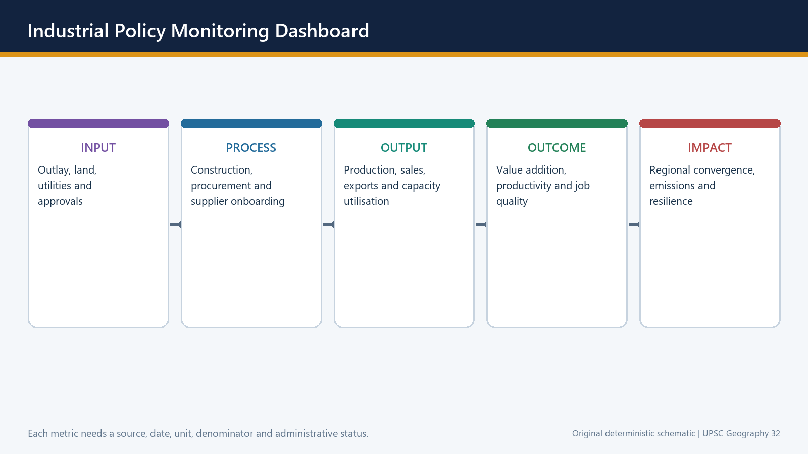

# Industries and Industrial Regions — Solved Practice Workbook

## BASIC MCQS / REMEDIATION

**Rotation rule:** These original questions use the strict key sequence A -> B -> C -> D. Verified PYQs later retain their historical answer positions and are not rearranged.

### Core concept MCQs

#### MCQ 1 - key A

**Question:** Which statement best distinguishes an industrial region from a factory?

- (a) An industrial region is a connected landscape of firms, labour, suppliers and transport; a factory is one establishment.
- (b) They are exact synonyms.
- (c) A factory must cover several states.
- (d) An industrial region contains no services.

**Answer: A**

**Explanation:** The region is the wider spatial system; the factory is a production site.

**Error repair:** Revise the terminology firewall before attempting location theory.

---

#### MCQ 2 - key B

**Question:** Why is a one-factor explanation of industrial location usually weak?

- (a) Policy determines every location.
- (b) Different value-chain stages face different combinations of material, power, labour, market and logistics pulls.
- (c) Every industry is footloose.
- (d) Raw material never matters.

**Answer: B**

**Explanation:** Factor ranking changes by stage and industry.

**Error repair:** Write one industry as a chain and assign different dominant factors to two stages.

---

#### MCQ 3 - key C

**Question:** A material index above one most directly indicates:

- (a) a guaranteed labour location.
- (b) absence of transport cost;
- (c) a stronger source pull because localised input weight exceeds finished-product weight;
- (d) automatic market orientation;

**Answer: C**

**Explanation:** Weight-losing production tends to avoid moving unnecessary input weight.

**Error repair:** Recalculate the ratio as localised input weight divided by finished-product weight.

---

#### MCQ 4 - key D

**Question:** In Weber's sequence, a cheap-labour site replaces the transport minimum when:

- (a) the market disappears;
- (b) the material index is exactly one;
- (c) all firms deglomerate;
- (d) labour savings exceed the additional transport cost.

**Answer: D**

**Explanation:** A move occurs only when the net cost saving is positive.

**Error repair:** Use the equation labour saving minus freight penalty.

---

#### MCQ 5 - key A

**Question:** An isodapane joins locations with equal:

- (a) additional transport cost around the transport-minimum point;
- (b) market population;
- (c) wage rate;
- (d) water availability.

**Answer: A**

**Explanation:** It measures the freight penalty of deviating from the transport optimum.

**Error repair:** Keep “iso = equal” and “dapane = expense” as the recall cue.

---

#### MCQ 6 - key B

**Question:** Which example is most clearly power-oriented?

- (a) Newspaper printing near readers.
- (b) Aluminium smelting requiring large, reliable electricity supply.
- (c) Sugar milling near cane.
- (d) A neighbourhood bakery.

**Answer: B**

**Explanation:** Smelting is electro-intensive; mining and refining may have other locations.

**Error repair:** Separate aluminium's mining, refining and smelting stages.

---

#### MCQ 7 - key C

**Question:** Which statement about a footloose industry is correct?

- (a) It must locate beside a mine.
- (b) It has no location requirements.
- (c) It is weakly tied to one localised raw material but still needs skills, power, connectivity and institutions.
- (d) It cannot form a cluster.

**Answer: C**

**Explanation:** Flexibility exists only among suitable sites.

**Error repair:** Replace “location-free” with “less raw-material-bound.”

---

#### MCQ 8 - key D

**Question:** Which statement best defines agglomeration?

- (a) A movement of every plant to rural land.
- (b) Any increase in city population.
- (c) A legal factory registration.
- (d) Clustering that creates shared supplier, labour, infrastructure and knowledge advantages.

**Answer: D**

**Explanation:** Agglomeration is an economic-spatial mechanism, not mere urban growth.

**Error repair:** Name two shared advantages and one possible diseconomy.

---

#### MCQ 9 - key A

**Question:** Industrial inertia is best understood as:

- (a) persistence caused by sunk infrastructure, skills, suppliers and market relationships after the original pull weakens;
- (b) guaranteed survival of every old region;
- (c) complete absence of relocation;
- (d) a synonym for raw-material orientation.

**Answer: A**

**Explanation:** Accumulated advantages can preserve a region, but only conditionally.

**Error repair:** Add the question: are the accumulated capabilities transferable?

---

#### MCQ 10 - key B

**Question:** Japan's Pacific industrial belt most clearly demonstrates that:

- (a) shipping risk is irrelevant;
- (b) ports and markets can substitute for domestic mineral abundance through imported inputs;
- (c) urban markets weaken industry.
- (d) industrialisation always requires domestic ore;

**Answer: B**

**Explanation:** Port orientation can overcome resource scarcity while creating trade vulnerability.

**Error repair:** Pair the example with its qualification: maritime and geopolitical exposure.

---

#### MCQ 11 - key C

**Question:** Why can the Hugli industrial belt not be explained by raw jute alone?

- (a) The belt lacks labour and transport.
- (b) Only a modern semiconductor incentive explains it.
- (c) Port access, labour, machinery, trading networks and industrial inertia also matter.
- (d) Jute has no geographic origin.

**Answer: C**

**Explanation:** Historical ecosystems complement the original raw-material pull.

**Error repair:** Convert the answer into “initial factor + accumulated advantages.”

---

#### MCQ 12 - key D

**Question:** Which is the safest description of an industrial corridor?

- (a) Any single industrial estate.
- (b) A guarantee that all nodes are producing.
- (c) Any national highway.
- (d) A network of industrial nodes, freight spines, utilities and urban systems.

**Answer: D**

**Explanation:** Corridor is an integrated regional architecture.

**Error repair:** Route announcement, node construction and production are separate stages.

---

#### MCQ 13 - key A

**Question:** Which sequence best represents a high-scoring location answer?

- (a) Define -> rank factors -> named evidence -> analysis -> qualification -> verdict.
- (b) Scheme list without a spatial mechanism.
- (c) Plant list -> slogan -> conclusion.
- (d) Statistic -> statistic -> statistic.

**Answer: A**

**Explanation:** The sequence connects evidence to a causal claim.

**Error repair:** Add “because” after every example in a draft answer.

---

#### MCQ 14 - key B

**Question:** Which statement correctly updates Weber for modern industry?

- (a) Every modern industry is market-oriented.
- (b) The least-cost method survives, but skills, reliability, supplier time, regulation and risk also enter the cost-capability set.
- (c) Agglomeration has disappeared.
- (d) Transport no longer matters anywhere.

**Answer: B**

**Explanation:** The method remains useful even when the dominant variables change.

**Error repair:** Distinguish “theory is incomplete” from “theory is useless.”

---

#### MCQ 15 - key C

**Question:** Which combination best explains the eastern Chinese littoral as a manufacturing region?

- (a) No policy or market role.
- (b) Coal alone.
- (c) Ports, labour, infrastructure, suppliers, export markets and state-enabled zones.
- (d) Climate alone.

**Answer: C**

**Explanation:** Policy-enabled agglomeration interacted with real market linkages.

**Error repair:** Avoid policy determinism; policy succeeds when underlying linkages are viable.

---

#### MCQ 16 - key D

**Question:** Which conclusion follows from the 28 August 2024 NICDP approval anchor?

- (a) Every approved node was already producing.
- (b) The project investment figure was realised output.
- (c) Corridors make labour and markets irrelevant.
- (d) The state was deliberately assembling corridor-linked industrial space, while operational outcomes required separate evidence.

**Answer: D**

**Explanation:** The anchor illustrates planned location without collapsing approval into operation.

**Error repair:** Rewrite every project statement with an explicit status word.

---

#### MCQ 17 - key A

**Question:** Which industry-stage pair is most accurately matched?

- (a) Cement clinker - limestone/source pull.
- (b) Bakery - iron-ore pull.
- (c) Sugar milling - footloose location.
- (d) Aluminium smelting - neighbourhood market pull only.

**Answer: A**

**Explanation:** Clinker production is strongly linked to limestone and bulk freight.

**Error repair:** Match the physical property of the input or output to the stage.

---

#### MCQ 18 - key B

**Question:** What is deglomeration?

- (a) The first formation of a cluster.
- (b) Outward movement caused when congestion, rent, pollution or delay outweigh cluster benefits.
- (c) A material index above one.
- (d) A port importing raw materials.

**Answer: B**

**Explanation:** Diseconomies can reverse or redistribute agglomeration.

**Error repair:** Pair every cluster advantage with a possible diseconomy.

---

#### MCQ 19 - key C

**Question:** Which statement about industrial regions is correct?

- (a) They are only resource regions.
- (b) They must be confined to one municipal boundary.
- (c) They combine production, transport, labour, suppliers and urban markets and may restructure over time.
- (d) They never change after formation.

**Answer: C**

**Explanation:** A region is a connected and evolving manufacturing landscape.

**Error repair:** Use “emergence -> accumulation -> restructuring” as the temporal sequence.

---

#### MCQ 20 - key D

**Question:** A state-built industrial node is most likely to become a durable region when:

- (a) only land is allotted;
- (b) incentives permanently replace productivity;
- (c) only a highway is announced;
- (d) firms, suppliers, skills, housing, utilities and markets develop repeated local linkages.

**Answer: D**

**Explanation:** Infrastructure initiates concentration; embedded linkages make it self-sustaining.

**Error repair:** Test every corridor claim for supplier, skill and settlement depth.

---

### Remedial MCQs: repair the most common errors

#### Remedial MCQ 1 - key A

**Question:** “Material index below one proves market location.” Which correction is best?

- (a) It weakens source pull, but labour, power, agglomeration, multiple markets and policy can still decide.
- (b) It makes the activity tertiary.
- (c) It proves source location.
- (d) It eliminates freight.

**Answer: A**

**Explanation:** Material index is one component, not a complete decision rule.

**Error repair:** Always add at least one non-material factor after using the index.

---

#### Remedial MCQ 2 - key B

**Question:** “Footloose means location-free.” What is the correct repair?

- (a) Footloose means mineral-based.
- (b) Footloose means less tied to a localised input, while skills, utilities and connectivity still constrain location.
- (c) Footloose industries cannot cluster.
- (d) Footloose means market-free.

**Answer: B**

**Explanation:** The term describes relative flexibility, not zero spatial dependence.

**Error repair:** Replace “free” with “flexible among suitable ecosystems.”

---

#### Remedial MCQ 3 - key C

**Question:** “All old regions survive because of inertia.” Why is this wrong?

- (a) Raw materials never weaken.
- (b) Every old region becomes a corridor.
- (c) Survival depends on whether accumulated skills, suppliers and infrastructure remain transferable under new technology and markets.
- (d) Inertia never exists.

**Answer: C**

**Explanation:** Inertia is conditional and can be overwhelmed by shocks or non-transferable assets.

**Error repair:** Add one upgrading path and one decline path to the answer.

---

#### Remedial MCQ 4 - key D

**Question:** A corridor node has completed trunk infrastructure. What follows?

- (a) The whole corridor is operational.
- (b) All announced investment is realised.
- (c) Every local worker is employed.
- (d) Infrastructure is at an advanced stage; occupancy, production and employment need separate evidence.

**Answer: D**

**Explanation:** Project stages must remain distinct.

**Error repair:** Use approval -> construction -> occupancy -> production -> outcomes.

---

#### Remedial MCQ 5 - key A

**Question:** “Weber is obsolete because global value chains exist.” Which response is strongest?

- (a) Weber's specific assumptions are limited, but comparing location-dependent burdens remains useful at each value-chain stage.
- (b) Agglomeration is unrelated to Weber.
- (c) Global value chains remove transport.
- (d) Weber perfectly predicts every modern plant.

**Answer: A**

**Explanation:** Balanced assessment preserves the method and updates the variables.

**Error repair:** State one surviving insight and one modern correction.

---

#### Remedial MCQ 6 - key B

**Question:** “Ports make resource geography irrelevant.” What is the correct qualification?

- (a) Coastal industry has no market link.
- (b) Ports can import resources efficiently, but create dependence on shipping, chokepoints and trade access.
- (c) Ports serve only tourism.
- (d) Ports eliminate all risk.

**Answer: B**

**Explanation:** One vulnerability is exchanged for another.

**Error repair:** Add a maritime-risk qualification to port-based examples.

---

#### Remedial MCQ 7 - key C

**Question:** Why is “industrial corridor = highway” incorrect?

- (a) Highways cannot carry goods.
- (b) Corridors contain no roads.
- (c) Industrial corridors integrate transport with nodes, utilities, land, labour settlements and governance.
- (d) Industrial corridors are only tax zones.

**Answer: C**

**Explanation:** Manufacturing and urban systems distinguish the corridor from a route.

**Error repair:** Name one node function and one connective function.

---

#### Remedial MCQ 8 - key D

**Question:** Which repair turns a plant list into geographic analysis?

- (a) Add more plant names.
- (b) Remove all examples.
- (c) Add unverified production figures.
- (d) Link each named example to a location mechanism and then qualify its limits.

**Answer: D**

**Explanation:** Evidence earns marks only when it proves the causal claim.

**Error repair:** After each example, write “This shows...” and “However...”.

## PYQS AND ANSWER PRACTICE

**Preservation note:** The following evidence labels, official-source dates, inferred/provisional key caveats and solved-answer structures are retained from v1. No provisional datum is upgraded. Official PYQ answer positions are preserved rather than rotated.

### Evidence protocol and data-status discipline

- ✅ **Observed official statistic:** directly retrieved release with date, unit and boundary.
- 🟦 **Quick / provisional estimate:** revisable status retained.
- 🟨 **Administrative status:** announcement, approval, application, allotment, construction, inauguration, production and disbursement kept separate.
- 🎯 **Target / outlay:** future objective or authorised ceiling, never rewritten as achievement.
- ⚠️ **Inference:** analytical geographic interpretation, not an official datum.
- Firewall: ASI factory sector != all manufacturing; IIP index/growth != output value/GVA; current price != constant price; factory != establishment != enterprise; worker != person engaged != employment generated; registration != active enterprise; approved/committed investment != realised investment; gross output != GVA; installed capacity != actual production; export value != domestic value addition.

### Source register - retrieved 20 August 2026

| Source | Path / URL | Use and boundary |
|---|---|---|
| Repository basic owner | upsc-ai-kit/knowledge/Geography/basic/32_Industries-and-Industrial-Regions.md | Static terminology, location factors, Weber, global regions and answer architecture. |
| Repository advanced owner | upsc-ai-kit/knowledge/Geography/advanced/32_Industries-and-Industrial-Regions.md | India regions, corridors, PLI, institutions and routed PYQ demands. |
| MoSPI ASI Summary Results 2023-24 | https://mospi.gov.in/uploads/publications_reports/publications_reports1759229789833_2b8ed8ad-314e-46b7-b123-b08cb17f1233_ASI_Summary_Results_2023-24C.pdf | Latest released factory-sector summary found; registered factory sector, not all manufacturing. |
| MoSPI IIP June 2026 | https://mospi.gov.in/uploads/latestreleasesfiles/1785235100253-IIP%20Press%20release%20Jun%202026.pdf | Quick Estimate, base 2022-23=100; index and growth, not output value or GVA. |
| MoSPI National Accounts PE 2025-26 | https://mospi.gov.in/uploads/latestReleases/latest_release_1780655857536_5ac01869-ca4a-422d-b7a7-57b81da60932_Press_Note_on_GDP_Estimates_for_Q4_2025-26_and_PE_FY_2025-26_F.pdf | Provisional economy-wide manufacturing GVA at constant and current prices. |
| Economic Survey 2025-26 | https://www.indiabudget.gov.in/economicsurvey/ | Manufacturing technology intensity, logistics, industry and macro context; January-2026 vintage. |
| DPIIT-PIB PLI update, 21 Jul 2026 | https://pib.gov.in/PressReleasePage.aspx?PRID=2287008&reg=3&lang=1 | Official scheme-reported investment, direct and indirect employment, and exports as on 31 Mar 2026. |
| India Semiconductor Mission, Semicon 2.0 | https://ism.gov.in/schemes/semicon2.0/index | Cabinet-approved second phase, fiscal outlay, six pillars and dated status; page updated 19 Aug 2026. |
| NICDC DMU report, 31 Jul 2025 | https://nicdc.in/assets/pdfs/01_DMU_Report_31_Jul_2025.pdf | Node-by-node land, trunk infrastructure, allotment and construction stages; not a blanket operation claim. |
| NICDC corridor programme | https://nicdc.in/projects/national-industrial-corridor-development-programme | Official programme and corridor architecture. |
| DFCCIL milestones | https://dfccil.com/Home/DynemicPages?MenuId=74 | Page updated 30 Jul 2026; records trial-run completion of the WDFC and the completed-project claim. |
| PM GatiShakti and National Logistics Policy | https://www.dpiit.gov.in/logistics-division | Planning platform and logistics-policy architecture; platform use is not project completion. |
| PLFS Annual Report 2025 press note | https://www.mospi.gov.in/uploads/latestReleases/latest_release_1774607827733_3e8964a9-268b-4cc9-ad65-cfc8a9e32f08_Press_note_AR_PLFS_2025_23032025_V2.1_26032026_final.pdf | Employment and worker measures with survey definitions; no substitution with scheme job claims. |
| Udyam and MSME dashboard | https://dashboard.msme.gov.in/ | Administrative registrations and self-reported fields; registration is not an active-enterprise census. |
| Ministry of Steel Annual Report 2025-26 | https://steel.gov.in/sites/default/files/Annual_Report_2025-26_English.pdf | Steel policy, production chain and decarbonisation context. |
| Ministry of Heavy Industries Annual Report 2025-26 | https://heavyindustries.gov.in/sites/default/files/final_heavy_annual_report_2025-26_hindi_english_28_march_2026.pdf | Automobile, EV and capital-goods policy context. |
| Ministry of Textiles official portal | https://texmin.nic.in/ | Textile schemes and sector documents; no unverified 2025-26 annual-report claim used. |
| Ministry of Food Processing annual reports | https://www.mofpi.gov.in/en/documents/reports/annual-report | Latest official report page; processing and cold-chain programme context. |
| Department of Chemicals and Petrochemicals | https://chemicals.gov.in/ | Petrochemical and chemical industry policy context. |
| Department of Fertilizers | https://fert.gov.in/ | Fertiliser policy and plant/feedstock context. |
| Local UPSC papers and routing ledgers | books/prelima_question_paper_answers; books/more_previous_papers; upsc-ai-kit/knowledge/_PYQ-ROUTING-* | Question stems, official 2024-25 keys, provisional 2026 key context and explicit unavailable-key labels. |

### 36. Current official evidence dashboard as of 20 August 2026

*36. Current official evidence dashboard as of 20 August 2026. Original deterministic schematic; maps are explicitly schematic and not to scale.*

The current dashboard is deliberately small and status-rich. It supports analysis without turning the topic into a volatile ranking sheet.

**Current official anchor:** All current claims were directly checked against primary official documents or pages retrieved by 20 August 2026.

- ASI 2023-24 is the latest directly verified factory-sector summary located; no ASI 2024-25 release is claimed.
- IIP June 2026 is a Quick Estimate: 7.3 percent overall, 7.8 percent manufacturing, with 19 of 23 manufacturing groups positive; base 2022-23=100.
- National Accounts PE 2025-26 estimates real manufacturing GVA growth at 10.7 percent; PE is provisional and economy-wide.
- PLI official update as on 31 March 2026 reports over Rs 2.40 lakh crore investment, over 14.15 lakh direct and indirect employment and over Rs 15.2 lakh crore exports; these remain scheme-reported figures.
- Semicon 2.0 is officially Cabinet-approved with Rs 1,27,500 crore fiscal outlay and six strategic pillars; the official page says the first fab is scheduled for 2028.
- NICDC evidence remains node-specific; DFCCIL records DFC project completion after the 31 March 2026 WDFC trial run.
- PLFS, Udyam and sector ministry evidence are used only within their stated measurement boundaries.

**Must-know facts**

- Every figure has source date and status.
- No volatile global or state rank is used without a dated official table.
- Official scheme claims and independent outcomes are separated.

**UPSC traps**

- **Wrong:** June 2026 IIP is final. **Correct:** It is a Quick Estimate and subject to revision.
- **Wrong:** Semicon outlay is expenditure. **Correct:** It is an approved fiscal outlay, not disbursement or production.

**Mains / practice route:** Use one static mechanism and one bounded current fact in each answer; do not overload the answer with headline data.

---

### Part II - Solved Prelims PYQs

#### UPSC Prelims 2023 Q71 - MSME classification and priority-sector credit

**Question:** Consider: (1) Under the MSMED Act, medium enterprises have plant and machinery investment between Rs 15 crore and Rs 25 crore. (2) All bank loans to MSMEs qualify under the priority sector. Which is correct?

- (A) 1 only
- (B) 2 only
- (C) Both 1 and 2
- (D) Neither 1 nor 2

**Answer: B**
**Key status:** INFERRED ANSWER - NOT OFFICIALLY VERIFIED LOCALLY · **Confidence:** High

**Elimination / explanation:** Statement 1 was false in the question-year framework; the cited band was not the operative medium-enterprise definition. Statement 2 was accepted under RBI priority-sector treatment for eligible MSME credit. Current thresholds were revised again from 1 April 2025, so retain the question-year context.

---

#### UPSC Prelims 2023 Q88 - export share and PLI

**Question:** Statement I: India accounts for 3.2 percent of global exports of goods. Statement II: Many local and some foreign companies operating in India have taken advantage of the PLI scheme. Choose the correct relationship.

- (A) Both correct and II explains I
- (B) Both correct but II does not explain I
- (C) I correct, II incorrect
- (D) I incorrect, II correct

**Answer: D**
**Key status:** INFERRED ANSWER - NOT OFFICIALLY VERIFIED LOCALLY · **Confidence:** High

**Elimination / explanation:** Statement I was incorrect for the question-year merchandise-export share; Statement II was correct. The item tests the difference between a valid scheme statement and an overstated global-share statistic.

---

#### UPSC Prelims 2023 Q99 - green hydrogen and heavy industry

**Question:** Green hydrogen is expected to play a significant role in decarbonising how many of the following: fertiliser plants, oil refineries and steel plants?

- (A) Only one
- (B) Only two
- (C) All three
- (D) None

**Answer: C**
**Key status:** INFERRED ANSWER - NOT OFFICIALLY VERIFIED LOCALLY · **Confidence:** Very high

**Elimination / explanation:** All three use hydrogen or can use hydrogen-linked process routes: ammonia for fertiliser, hydrotreating and hydrocracking in refineries, and hydrogen-based direct reduction in steel. Actual low-carbon effect depends on hydrogen production and lifecycle boundary.

---

#### UPSC Prelims 2026 Q29 - Oeko-Tex certification and Eri silk

**Question:** Which implications of Oeko-Tex certification for Eri silk are significant: (1) access to high-end markets prioritising chemical-safe products; (2) confirmation against international safety, environmental and quality standards for premium eco-conscious markets?

- (A) 1 only
- (B) 2 only
- (C) Both 1 and 2
- (D) Neither 1 nor 2

**Answer: C**
**Key status:** PROVISIONAL 2026 KEY CONTEXT; NOT A FINAL OFFICIAL KEY · **Confidence:** High

**Elimination / explanation:** Both implications express the market-access role of conformity certification. Qualification: certification applies to the defined standard and supply-chain scope; it is not proof that every lifecycle impact is zero.

---

#### UPSC Prelims 2026 Q83 - semiconductor plants and locations

**Question:** Which pair is not correctly matched: CG Power-Renesas-STARS : Gujarat; Tata Semiconductor Assembly and Test : Assam; HCL-Foxconn India Chip : Madhya Pradesh; SicSem : Odisha?

- (A) CG Power partnership : Gujarat
- (B) Tata assembly and test : Assam
- (C) HCL-Foxconn : Madhya Pradesh
- (D) SicSem : Odisha

**Answer: C**
**Key status:** PROVISIONAL 2026 KEY CONTEXT; ANSWER INFERRED FROM OFFICIAL LOCATION DATA · **Confidence:** High

**Elimination / explanation:** The HCL-Foxconn project is associated with Uttar Pradesh, not Madhya Pradesh. The other location pairs match the announced state-level projects. Announcement and approval still do not establish commercial production.

---

### Part III - Solved Mains PYQs

#### 2018 GS-I Q16 - Industrial corridors

**Question:** What is the significance of industrial corridors in India? Identify industrial corridors and explain their main characteristics.

**Direct thesis:** Industrial corridors are networked regional-development systems in which freight spines, industrial nodes, utilities and urbanisation are planned together; their significance depends on node-level execution, not route announcement.

- **Claim:** Logistics efficiency. **Named evidence/example:** DMIC's alignment with the western freight spine and ports. **Analysis:** reliable freight can lower inventory time and widen market reach. **Qualification:** last-mile and terminal bottlenecks can preserve old costs.
- **Claim:** Planned agglomeration. **Named evidence/example:** Dholera, AURIC, Greater Noida and Vikram Udyogpuri. **Analysis:** trunk infrastructure and common utilities can reduce entry cost. **Qualification:** completed infrastructure does not prove occupancy or production.
- **Claim:** Regional restructuring. **Named evidence/example:** AKIC, CBIC and VCIC arcs. **Analysis:** new nodes can connect interior regions to ports and markets. **Qualification:** core regions may capture gains unless local suppliers and skills deepen.
- **Claim:** Urban effects. **Named evidence/example:** industrial city and logistics-hub model. **Analysis:** housing and services can support labour and firms. **Qualification:** land-value pressure, water and municipal capacity can create exclusion.
- **Claim:** Governance. **Named evidence/example:** NICDC-NICDIT SPVs and state agencies. **Analysis:** multi-level coordination can sequence land, utilities and connectivity. **Qualification:** heterogeneous state capacity and project stages limit uniform outcomes.
- **Verdict:** Industrial corridors are significant because they transform isolated-site policy into networked industrial urbanisation, but they earn that label only where freight, nodes, utilities, local linkages and safeguards become functional.
- **Why this earns marks:** It identifies corridors, explains characteristics, uses named nodes, and qualifies status and regional effects.

---

#### 2019 GS-I Q6 - Resource-based manufacturing and employment

**Question:** Can regional resource-based manufacturing promote employment in India?

**Direct thesis:** Resource-based manufacturing can promote employment when extraction is linked to local processing, suppliers, skills and markets; a mine-to-port enclave creates far fewer durable regional gains.

- **Claim:** Value addition. **Named evidence/example:** iron ore-steel-engineering linkages in the east-central belt. **Analysis:** processing multiplies direct and indirect demand beyond extraction. **Qualification:** capital-intensive plants may create fewer jobs than output suggests.
- **Claim:** Agro processing. **Named evidence/example:** sugar, dairy and food-processing clusters. **Analysis:** perishable local inputs support dispersed processing and services. **Qualification:** seasonality and farm-price risk weaken job stability.
- **Claim:** Supplier effects. **Named evidence/example:** fabrication, repair and transport around steel or cement nodes. **Analysis:** backward and forward linkages support MSMEs. **Qualification:** local firms need standards, finance and procurement access.
- **Claim:** Justice. **Named evidence/example:** tribal and mineral districts of Odisha, Jharkhand and Chhattisgarh. **Analysis:** local employment can improve legitimacy and income. **Qualification:** displacement, pollution and imported skilled labour can produce enclave outcomes.
- **Verdict:** The strategy is employment-promoting only when resource geography is converted into a locally embedded value chain with skills, supplier development and environmental accountability.
- **Why this earns marks:** It answers the conditional 'can', uses sector and regional evidence, and distinguishes an embedded cluster from an enclave.

---

#### 2019 GS-I Q7 - Food processing in North-West India

**Question:** Discuss the factors responsible for localisation of agro-based food-processing industries in North-West India.

**Direct thesis:** North-West localisation results from the interaction of agricultural surplus with procurement, irrigation, roads, cold chains, urban demand and entrepreneurship rather than climate alone.

- **Claim:** Raw material. **Named evidence/example:** Punjab-Haryana-western Uttar Pradesh grain, dairy and horticulture base. **Analysis:** surplus and perishability support mills, dairies and primary processing. **Qualification:** crop concentration also creates water and ecological stress.
- **Claim:** Institutions. **Named evidence/example:** procurement, mandis, cooperatives and extension networks. **Analysis:** aggregation and assured flows lower plant-supply risk. **Qualification:** policy dependence can lock the region into unsuitable crops.
- **Claim:** Infrastructure. **Named evidence/example:** dense roads, power, storage and proximity to Delhi-NCR. **Analysis:** reliable logistics links farm gates to large consumer markets. **Qualification:** cold-chain quality remains uneven by commodity.
- **Claim:** Enterprise and labour. **Named evidence/example:** established milling, dairy and packaging ecosystems. **Analysis:** skills and supplier depth reinforce agglomeration. **Qualification:** small producers can face weak bargaining power.
- **Verdict:** The region is localised by an agro-institutional-logistics system; future competitiveness requires crop diversification, water efficiency and farmer-linked value addition.
- **Why this earns marks:** It goes beyond a crop list, explains mechanisms and adds the water and bargaining qualification.

---

#### 2020 GS-I Q7 - Steel away from raw materials

**Question:** Account for the present location of iron and steel industries away from sources of raw material, giving examples.

**Direct thesis:** Steel has not become resource-free; technology, imported inputs, scrap, ports, electricity and markets have created alternative least-cost configurations.

- **Claim:** Maritime bulk. **Named evidence/example:** coastal integrated plants and port-linked steelmaking. **Analysis:** large vessels can import coking coal or ore and export products efficiently. **Qualification:** port depth and geopolitical freight risk matter.
- **Claim:** Scrap-EAF route. **Named evidence/example:** market-region mini-mills using urban scrap and grid power. **Analysis:** the raw material is generated near consumption and recycled locally. **Qualification:** scrap quality and electricity carbon intensity constrain output.
- **Claim:** Market and downstream pull. **Named evidence/example:** steel linked to auto, engineering and construction clusters. **Analysis:** specialised rolling and delivery move closer to users. **Qualification:** primary ironmaking may remain resource linked.
- **Claim:** Technology and policy. **Named evidence/example:** DRI, gas, power and corridor infrastructure. **Analysis:** changed inputs alter the cost surface. **Qualification:** new plants still need water, land and environmental capacity.
- **Verdict:** The modern map is stage-split: mines and beneficiation remain source-oriented, while selected steelmaking and finishing move toward ports, scrap, power and markets.
- **Why this earns marks:** It directly accounts for relocation with mechanisms and examples while preserving the continuing raw-material role.

---

#### 2021 GS-I Q17 - IT industry and Indian cities

**Question:** What are the socio-economic implications of the growth of IT industries in major Indian cities?

**Direct thesis:** IT growth created high-productivity knowledge agglomerations and service exports, but also reshaped land, labour, migration and urban inequality.

- **Claim:** Employment and skills. **Named evidence/example:** Bengaluru, Hyderabad, Pune, Chennai and NCR. **Analysis:** deep labour markets and learning networks raised skilled employment. **Qualification:** benefits concentrate among educated workers and can widen wage gaps.
- **Claim:** Urban land. **Named evidence/example:** technology corridors and peripheral office clusters. **Analysis:** investment expands infrastructure and municipal revenue. **Qualification:** land prices, commuting and informal housing costs rise.
- **Claim:** Migration and society. **Named evidence/example:** national and international skilled migration. **Analysis:** diversity and consumption strengthen urban services. **Qualification:** care burdens, exclusion and migrant precarity persist.
- **Claim:** Industrial spillover. **Named evidence/example:** electronics, start-ups and professional services. **Analysis:** knowledge services support design, finance and manufacturing control. **Qualification:** service clustering does not automatically create mass manufacturing jobs.
- **Claim:** Risk and resilience. **Named evidence/example:** remote work and distributed delivery after shocks. **Analysis:** some functions can decentralise to tier-2 cities. **Qualification:** network, skill and client concentration preserve metropolitan dominance.
- **Verdict:** IT-led urbanisation is a powerful growth engine but requires housing, transport, public services, wider skill access and deliberate links to production ecosystems.
- **Why this earns marks:** It covers multiple socio-economic dimensions, names cities, and balances productivity gains with urban inequality.

---

#### 2023 GS-III Q1 - Manufacturing, MSMEs and policy

**Question:** Faster economic growth requires a higher manufacturing share, particularly from MSMEs. Comment on current government policies.

**Direct thesis:** Manufacturing policy now combines formalisation, finance, receivables, cluster support, logistics and output-linked incentives, but MSME productivity and graduation remain the decisive tests.

- **Claim:** Formalisation. **Named evidence/example:** Udyam registration. **Analysis:** creates a scheme and procurement identity. **Qualification:** registration is not an active-enterprise or capability measure.
- **Claim:** Finance. **Named evidence/example:** CGTMSE and TReDS. **Analysis:** separate collateral risk from delayed receivables. **Qualification:** buyer acceptance and appraisal constraints remain.
- **Claim:** Capability. **Named evidence/example:** cluster common facilities and quality standards. **Analysis:** shared testing and machinery can raise productivity. **Qualification:** under-used facilities do not create demand.
- **Claim:** Market and linkages. **Named evidence/example:** public procurement and anchor-firm supply chains. **Analysis:** stable demand can help firms scale. **Qualification:** large-firm compliance requirements can exclude micro units.
- **Verdict:** Policy breadth has improved, but faster growth requires measuring productivity, payment discipline, supplier upgrading, job quality and successful graduation, not registrations alone.
- **Why this earns marks:** It comments rather than describes and links each policy instrument to a distinct MSME constraint.

---

#### 2024 GS-I Q13 - Industrial Revolution and Indian handicrafts

**Question:** Discuss how the Industrial Revolution in England contributed to the decline of Indian handicrafts.

**Direct thesis:** English mechanisation interacted with colonial trade, fiscal and market power to displace many Indian handicrafts, though decline was uneven and not a simple technology-only story.

- **Claim:** Productivity and price. **Named evidence/example:** mechanised spinning and weaving in Britain. **Analysis:** lower unit cost and scale intensified import competition. **Qualification:** quality niches and regional crafts persisted.
- **Claim:** Trade structure. **Named evidence/example:** colonial tariff and market arrangements. **Analysis:** British goods gained access while Indian producers lost reciprocal advantage. **Qualification:** changes varied over time and commodity.
- **Claim:** Demand shift. **Named evidence/example:** decline of courts and reorientation of elite consumption. **Analysis:** traditional patronage weakened. **Qualification:** new urban and export niches emerged.
- **Claim:** Raw-material linkage. **Named evidence/example:** cotton and other raw exports through port-rail networks. **Analysis:** colonial geography favoured inputs outward and manufactures inward. **Qualification:** modern Indian mills later developed in Bombay and Ahmedabad.
- **Claim:** Labour effect. **Named evidence/example:** artisan displacement and occupational change. **Analysis:** income and skill systems were disrupted. **Qualification:** not every artisan entered factory work or agriculture in the same way.
- **Verdict:** The decline was produced by mechanised cost advantage embedded in colonial institutions and transport-market restructuring, not by machines alone.
- **Why this earns marks:** It answers causation, integrates industrial geography and colonial political economy, and preserves regional variation.

---

#### 2024 GS-III Q7 - Industrial pollution of river water

**Question:** Discuss industrial pollution of river water and suggest mitigation measures.

**Direct thesis:** Industrial river pollution is a pathway problem linking process choice, effluent load, treatment reliability, cluster carrying capacity and enforcement.

- **Claim:** Source control. **Named evidence/example:** cleaner chemistry, water reuse and segregation of high-toxicity streams. **Analysis:** prevention lowers treatment burden. **Qualification:** technology must suit the process and scale.
- **Claim:** Treatment. **Named evidence/example:** functional ETPs and CETPs in industrial clusters. **Analysis:** shared infrastructure can serve smaller firms. **Qualification:** poor operation can merely centralise failure.
- **Claim:** Regulation. **Named evidence/example:** consent conditions, continuous monitoring and surprise inspection. **Analysis:** data and enforcement deter non-compliance. **Qualification:** sensor data need calibration and public accountability.
- **Claim:** Spatial planning. **Named evidence/example:** cumulative assessment of polluted industrial stretches. **Analysis:** carrying capacity can guide siting and expansion. **Qualification:** relocation can transfer pollution without remediation.
- **Claim:** Liability. **Named evidence/example:** polluter-pays remediation and hazardous-waste traceability. **Analysis:** internalises legacy and accident costs. **Qualification:** small firms need transition support without waiving standards.
- **Verdict:** Mitigation requires prevention, reliable treatment, basin-scale planning, transparent monitoring and enforceable liability rather than clearance alone.
- **Why this earns marks:** It provides a causal pollution chain, named instruments and an implementation qualification.

---

#### 2025 GS-III Q12 - PLI rationale, achievements and reform

**Question:** Discuss the rationale and achievements of the PLI scheme and suggest improvements.

**Direct thesis:** PLI addresses scale, additionality and strategic-supply gaps by linking support to eligible incremental performance, but achievement must be tested beyond scheme-reported investment and exports.

- **Claim:** Rationale. **Named evidence/example:** 14-sector framework coordinated by DPIIT. **Analysis:** targets scale, investment, exports and strategic capability. **Qualification:** sector design and market structure differ.
- **Claim:** Reported achievement. **Named evidence/example:** PIB status as on 31 March 2026: over Rs 2.40 lakh crore investment and Rs 15.2 lakh crore exports. **Analysis:** shows substantial scheme-linked activity. **Qualification:** official administrative attribution needs counterfactual and domestic-content testing.
- **Claim:** Employment. **Named evidence/example:** over 14.15 lakh direct and indirect jobs reported. **Analysis:** employment is a stated programme objective. **Qualification:** definition, job quality and PLFS triangulation are necessary.
- **Claim:** Cluster effect. **Named evidence/example:** electronics, autos, pharma, solar and other sector clusters. **Analysis:** anchor investment can deepen suppliers. **Qualification:** large eligibility thresholds can exclude MSMEs.
- **Claim:** Improvement. **Named evidence/example:** publish application-investment-production-disbursement-domestic-value ladders. **Analysis:** transparent stage data improves accountability. **Qualification:** commercial confidentiality must still be protected.
- **Claim:** Improvement. **Named evidence/example:** tie support to supplier upgrading, R and D, skills and green performance. **Analysis:** moves policy from assembly scale to capability. **Qualification:** conditions must remain administratively feasible.
- **Verdict:** PLI should evolve from output additionality toward transparent capability additionality: domestic value, supplier depth, technology, quality jobs and decarbonisation.
- **Why this earns marks:** It addresses rationale, achievements and improvements with current official evidence and explicit attribution limits.

---

#### 2025 GS-III Q16 - Semiconductor industry and ISM

**Question:** Mention the challenges to the semiconductor industry and the salient features of the India Semiconductor Mission.

**Direct thesis:** Semiconductors require an ecosystem across design, tools, materials, fabs, packaging, talent and customers; India's strategy is therefore a capability-stack project, not a single-fab subsidy.

- **Claim:** Capital and technology. **Named evidence/example:** high fab cost, long gestation, yield learning and concentrated equipment supply. **Analysis:** commercial viability depends on sustained process capability. **Qualification:** mature-node and packaging strategies can be more realistic than prestige nodes.
- **Claim:** Utilities. **Named evidence/example:** ultra-pure water, stable power, gases and chemical treatment. **Analysis:** site reliability directly affects yield. **Qualification:** resource and environmental costs must be internalised.
- **Claim:** Talent and customers. **Named evidence/example:** design strength but thinner fab-process and reliability experience. **Analysis:** skills and qualification determine production learning. **Qualification:** training counts do not equal experienced teams.
- **Claim:** ISM architecture. **Named evidence/example:** Semicon India 1.0 and ISM as implementing agency. **Analysis:** supports fabs, compound semiconductors, ATMP-OSAT and design. **Qualification:** approval is not commissioning.
- **Claim:** Semicon 2.0. **Named evidence/example:** Cabinet-approved Rs 1,27,500 crore outlay and six pillars. **Analysis:** adds machines, materials, R and D and talent to ecosystem policy. **Qualification:** outlay is not disbursement or commercial supply.
- **Claim:** Status caution. **Named evidence/example:** official page schedules the first fab for 2028. **Analysis:** prevents false 'first operational fab' claims. **Qualification:** timelines can change and need dated verification.
- **Verdict:** India's strongest route is layered: retain design strength, scale packaging and selected fabs, build utilities and materials, and judge success by yield and qualified supply.
- **Why this earns marks:** It answers both challenges and features, uses current official status, and distinguishes every semiconductor stage.

---

### Part VI - Original solved Mains practice

#### Practice 1 - 10 marks

**Question:** Explain why Weber's least-cost theory remains useful but insufficient for modern industrial location.

**Direct thesis:** Weber remains useful as a method for identifying the dominant cost, but modern location also depends on markets, institutions, GVC stages, knowledge and resilience.

- **Claim:** Transport core. **Named evidence/example:** material index and isodapanes. **Analysis:** clarify bulk and freight trade-offs. **Qualification:** multi-modal time and reliability may matter more than tonne-km.
- **Claim:** Labour and agglomeration. **Named evidence/example:** critical isodapane and cluster economies. **Analysis:** show why a higher-freight site can be cheaper overall. **Qualification:** skill quality and knowledge spillovers exceed wage differences.
- **Claim:** Modern correction. **Named evidence/example:** semiconductor, auto and port-refinery clusters. **Analysis:** utilities, suppliers, customer qualification and risk shape location. **Qualification:** these factors can still be treated as an expanded cost-capability set.
- **Verdict:** Use Weber as the starting cost framework, then add profit, path dependence, institutions and strategic risk.
- **Why this earns marks:** It states theory, applies named industries, and gives a balanced assessment rather than rejecting or repeating Weber.

---

#### Practice 2 - 10 marks

**Question:** Differentiate ASI, IIP and manufacturing GVA. Why does this distinction matter?

**Direct thesis:** ASI, IIP and manufacturing GVA measure different universes and concepts; treating them as substitutes creates false industrial narratives.

- **Claim:** ASI. **Named evidence/example:** ASI 2023-24 factory-sector summary. **Analysis:** measures registered factories, inputs, output and value added. **Qualification:** excludes much unorganised manufacturing.
- **Claim:** IIP. **Named evidence/example:** June 2026 Quick Estimate, base 2022-23. **Analysis:** tracks volume change at high frequency. **Qualification:** is revisable and not a rupee value.
- **Claim:** GVA. **Named evidence/example:** National Accounts PE 2025-26. **Analysis:** measures economy-wide value addition. **Qualification:** current and constant prices answer different questions.
- **Claim:** Policy significance. **Named evidence/example:** PLI and Udyam dashboards. **Analysis:** administrative data can complement the three. **Qualification:** registration and scheme claims do not replace statistical surveys.
- **Verdict:** The correct indicator must follow the question: factory structure, production momentum or value added.
- **Why this earns marks:** It uses current official examples and a clean measurement firewall.

---

#### Practice 3 - 15 marks

**Question:** Compare India's classical industrial regions with corridor-led industrialisation.

**Direct thesis:** Classical regions emerged through resources, ports, markets and cumulative agglomeration; corridors attempt to create networked agglomeration through planned freight, nodes and utilities.

- **Claim:** Classical mineral belt. **Named evidence/example:** Chotanagpur-Damodar. **Analysis:** coal, ore, rail and public heavy industry created a durable complex. **Qualification:** resource wealth did not guarantee broad local development.
- **Claim:** Classical port-market belts. **Named evidence/example:** Mumbai-Pune, Gujarat and Hugli. **Analysis:** capital, ports, labour and markets created diversified regions. **Qualification:** legacy congestion and industrial decline vary internally.
- **Claim:** Southern knowledge-engineering arc. **Named evidence/example:** Bengaluru-Chennai-Coimbatore. **Analysis:** skills, suppliers and ports show post-resource clustering. **Qualification:** urban stress and uneven inclusion remain.
- **Claim:** Corridor logic. **Named evidence/example:** DMIC, AKIC, CBIC and VCIC. **Analysis:** freight and planned nodes aim to lower entry and logistics costs. **Qualification:** node stages and uptake remain heterogeneous.
- **Claim:** Verdict condition. **Named evidence/example:** local supplier, skills, housing and environmental systems. **Analysis:** determine whether corridors become regions. **Qualification:** land and infrastructure alone can create enclaves.
- **Verdict:** Corridors do not replace old regions; they overlay and redirect the inherited industrial map.
- **Why this earns marks:** It compares emergence, mechanism, evidence and limitations across both spatial forms.

---

#### Practice 4 - 15 marks

**Question:** Can PLI and industrial corridors reduce India's regional imbalance? Critically examine.

**Direct thesis:** PLI and corridors can widen the industrial map, but agglomeration and state-capacity differences can also reinforce already-competitive regions.

- **Claim:** Positive mechanism. **Named evidence/example:** planned nodes and output-linked anchor investment. **Analysis:** can lower coordination failure and create supplier demand. **Qualification:** minimum thresholds may favour large firms.
- **Claim:** Connectivity. **Named evidence/example:** DFCs, ports and logistics platforms. **Analysis:** can connect interior regions to national and export markets. **Qualification:** core firms may capture improved access first.
- **Claim:** Capability. **Named evidence/example:** skills, utilities, testing and finance. **Analysis:** allow local suppliers to join value chains. **Qualification:** weak institutions cannot be solved by incentives alone.
- **Claim:** Evidence caution. **Named evidence/example:** PLI reported investment and exports; NICDC node stages. **Analysis:** show activity and infrastructure progress. **Qualification:** administrative claims do not prove convergence.
- **Claim:** Corrective design. **Named evidence/example:** regional supplier funds, common facilities, housing and transparent monitoring. **Analysis:** turns node investment into spread effects. **Qualification:** must avoid permanent subsidy dependence.
- **Verdict:** They reduce imbalance only when incentives and connectivity build transferable local capability rather than isolated plants.
- **Why this earns marks:** It critically balances spread and backwash with current policy evidence.

---

#### Practice 5 - 20 marks

**Question:** Design a geographically grounded pathway for decarbonising India's steel, cement, refining and fertiliser industries.

**Direct thesis:** Industrial decarbonisation must be sector-specific and spatial: technologies depend on clean power, hydrogen, scrap, geology, ports, water and cluster infrastructure.

- **Claim:** Steel. **Named evidence/example:** scrap-EAF clusters, lower-carbon DRI, hydrogen pilots and efficiency. **Analysis:** route choice changes raw-material and power geography. **Qualification:** scrap quality, green-power availability and cost constrain scale.
- **Claim:** Cement. **Named evidence/example:** clinker substitution, alternative fuels and carbon capture. **Analysis:** process emissions require more than renewable electricity. **Qualification:** material standards and CO2 transport-storage networks are needed.
- **Claim:** Refining. **Named evidence/example:** efficiency, electrification, low-carbon hydrogen and product transition. **Analysis:** cluster utilities can lower unit transition cost. **Qualification:** refinery demand may change unevenly and stranded assets are possible.
- **Claim:** Fertiliser. **Named evidence/example:** green ammonia near renewable-power and port-water systems. **Analysis:** hydrogen feedstock can reduce gas-linked emissions and imports. **Qualification:** water, power additionality and price support matter.
- **Claim:** Infrastructure. **Named evidence/example:** grids, pipelines, ports, storage and carbon accounting. **Analysis:** connects resource-rich green zones to industrial demand. **Qualification:** land, ecology and public finance impose limits.
- **Claim:** Justice. **Named evidence/example:** coal-steel districts, workers and MSME suppliers. **Analysis:** transition planning prevents regional shock. **Qualification:** green investment is not automatically socially just.
- **Verdict:** The pathway should create low-carbon industrial corridors with credible lifecycle accounting while preserving competition, regional justice and technology flexibility.
- **Why this earns marks:** It differentiates hard-to-abate sectors, links technologies to geography, and includes infrastructure and justice.

---

#### Practice 6 - 20 marks

**Question:** Industrial geography is now shaped as much by resilience and path dependence as by least cost. Discuss with India and world examples.

**Direct thesis:** Least cost still disciplines firm choice, but repeated shocks and accumulated ecosystems have changed which costs count and how quickly firms can relocate.

- **Claim:** Path dependence. **Named evidence/example:** Ruhr, Great Lakes, Hugli and Mumbai-Pune. **Analysis:** skills, suppliers and infrastructure preserve activity after original resource advantages weaken. **Qualification:** technology-specific assets can still strand regions.
- **Claim:** Port-GVC logic. **Named evidence/example:** Japan Pacific belt, coastal China and Southeast Asian platforms. **Analysis:** imported inputs and export networks can substitute for resources. **Qualification:** shipping chokepoints and geopolitical exposure rise.
- **Claim:** Knowledge clusters. **Named evidence/example:** Silicon Valley-type regions, Bengaluru-Hyderabad and pharma clusters. **Analysis:** talent and tacit learning create increasing returns. **Qualification:** housing and inequality can generate diseconomies.
- **Claim:** Resilience shift. **Named evidence/example:** semiconductors, batteries, autos and critical components. **Analysis:** multi-sourcing and trusted partnerships enter location decisions. **Qualification:** duplication raises cost.
- **Claim:** Indian policy. **Named evidence/example:** PLI, Semicon 2.0, GatiShakti and industrial corridors. **Analysis:** state action seeks capability and logistics resilience. **Qualification:** approval and outlay do not guarantee qualified production.
- **Claim:** Environmental constraint. **Named evidence/example:** water-intensive fabs, chemical clusters and green steel. **Analysis:** resource limits and carbon rules reshape feasible sites. **Qualification:** relocation can export environmental burdens.
- **Verdict:** Modern industrial geography is an expanded least-cost problem in which reliability, history, institutions, carbon and strategic risk are priced alongside freight and labour.
- **Why this earns marks:** It integrates theory, global and Indian evidence, counterpoints and a graded synthesis.

---
