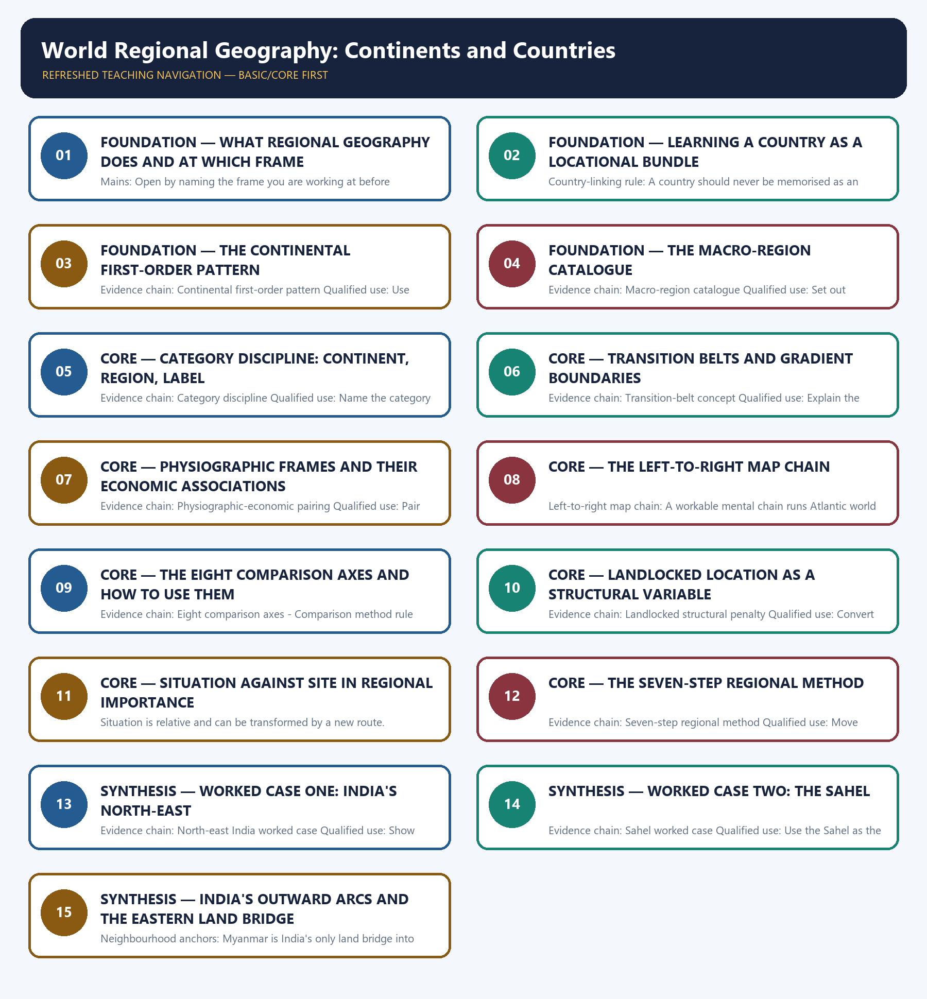

# World Regional Geography: Continents and Countries — Learner-v2 Complete Learning Session

> **Authoring-only generation:** 2026-09-01. No PDF was rendered and no tracker or index was mutated.

### SOURCE, PROGRESSION AND CURRENT-LINKAGE AUDIT

- **Generation date:** 2026-09-01.
- **Repository-first evidence:** the Basic owner is taught first and preserved in full; the Advanced owner is retained only in the optional final teaching block.
- **OCR evidence:** Repository Markdown was primary. The three required local Geography books were inspected as supplementary OCR/searchable evidence. No unsupported page precision, volatile figure or quotation was imported.
- **Qdrant:** not used; repository Markdown and available OCR context were sufficient.
- **PYQ integrity:** The audited routing ledgers consulted for this build assign no direct Mains PYQ to Geography Topic 34. The topic does own a large body of routed Prelims demand across 2018 to 2025, covering seas and bordering countries, world rivers, the Levant, Congo Basin membership, Andean and equatorial crossings, time zones and region-country pairings, but those entries are recorded in the ledgers as objective questions whose official keys are either unavailable locally or deliberately not inferred. This package therefore keeps the regional method transparent, reproduces no option letter or answer key, and does not fabricate a direct solved PYQ card for a Mains demand this owner does not hold.
- **Live-link boundary:** The only dated current anchor used is the Kaladan Multi-Modal Transit Transport Project, recorded in the repository owner through a Press Information Bureau release of 7 July 2025 and confirmed against official Ministry of Ports, Shipping and Waterways material. Its route geography of Kolkata, Sittwe, the Kaladan river, Paletwa and Zorinpui is stated as route geography, the Paletwa-Zorinpui road is described as still under construction, and the 2027 date is presented strictly as an officially stated operational target rather than an achieved completion. No continental area or population share, corridor width, state area, rainfall record, hydropower figure or demographic percentage is quoted from memory.
- **Fact/inference discipline:** no current-affairs item, PYQ wording, figure or quotation is invented.

## BASIC LEARNING SESSION

### DEEP-REVIEW LEARNING CONTRACT

| Control | Binding rule for this package |
|---|---|
| Syllabus boundary | Complete Human, Economic and Regional Geography Basic/Core is taught before optional Advanced depth. |
| Spatial method | Distribution → controlling physical/human variables → network or region → named world/India anchors → scale and exception. |
| Model method | State assumptions, mechanism, predicted pattern, named application and empirical or Global-South limitation. |
| Evidence method | Claim → named map/place/institution/dataset → analysis → source-date-status or causal qualification. |
| Policy method | Chronology, legal or planning instrument, responsible institution, implementation scale and current status remain distinct. |
| Practice contract | Every solved item has demand decoding, a detailed examiner-grade model, executable timed/compression plan, marks rationale and answer-specific improvement. |
| Approval | This immutable successor remains `approved: false` pending explicit approval. |

**Canonical Basic/Core owner:** `upsc-ai-kit\knowledge\Geography\basic\34_World-Regional-Geography-Continents-Countries.md`  
**Canonical topic owner:** `upsc-ai-kit\knowledge\Geography\basic\34_World-Regional-Geography-Continents-Countries.md`  
**Optional Advanced owner:** `upsc-ai-kit\knowledge\Geography\advanced\34_World-Regional-Geography-Continents-Countries.md`  
**Official syllabus mapping:** `upsc-ai-kit\knowledge\Geography\OFFICIAL-UPSC-SYLLABUS-MAPPING.md`

### EVIDENCE, PYQ AND CURRENT-STATUS CONTROL

- **Definition discipline:** close terms share a comparison axis and are never treated as synonyms.
- **Map discipline:** pattern is reconstructed through site, situation, density, gradient, corridor, node, belt, boundary, hinterland and scale.
- **Model discipline:** Ravenstein, Lee, Christaller, Burgess, Hoyt, Harris-Ullman, Myrdal, Perroux, von Thünen, Weber and related models retain assumptions and limits.
- **India discipline:** every explanation carries named state, region, city, corridor, resource belt, border sector or cultural landscape evidence.
- **Data discipline:** Census, SRS, NFHS, Agriculture Census, production, trade, energy and infrastructure claims retain source, reference period, release date and status.
- **PYQ discipline:** repository routing ledgers and held papers control wording and metadata; reconstructed wording and unavailable official keys remain labelled.
- **Current-status note, rechecked 2026-09-02:** Static concepts are separated from volatile population, production, trade, infrastructure, mission, boundary and policy claims. Every current number or status requires the issuing institution, reference period, publication date and provisional/final/operational boundary.

**Live/official context sources recorded by the predecessor generation:**

- No volatile live claim is necessary for the static core.




*Distinct embedded teaching-navigation image. The separate continuous Cārvāka-style flowchart package remains an independent at-a-glance artifact.*

### SESSION 1 — FOUNDATION — WHAT REGIONAL GEOGRAPHY DOES AND AT WHICH FRAME

#### DEFINITION / WHAT THIS IS CALLED

**Plain-language definition:** Evidence chain: What regional geography does - First frame and second frame Qualified use: Open by naming the frame you are working at before describing any region.

**Technical definition:** Mains: Open by naming the frame you are working at before describing any region.

#### ANSWER-GRABBING OPENING — WRITE/ADAPT IN THE EXAM

> Evidence chain: What regional geography does - First frame and second frame Qualified use: Open by naming the frame you are working at before describing any region.

#### MUST-WRITE KEYWORDS

- **FOUNDATION**
- **What regional geography does**
- **at which frame**
- **First frame and second frame**
- **Evidence chain**
- **Qualified use**

**How to use them:** Frame the answer through FOUNDATION; define What regional geography does, connect at which frame with First frame and second frame to explain the mechanism, and use Evidence chain for the decisive comparison or qualification.

#### VISUAL FIRST

```text
WHAT REGIONAL GEOGRAPHY DOES AND AT WHICH FRAME
01. What regional geography does
    |
    v
02. First frame and second frame
BOUNDARY -> Continents are the opening frame, not the examinable one.
```

*This topic-specific rail fixes the evidence sequence and its exam boundary before analysis.*

#### CORE EXPLANATION

Regional geography studies the Earth by dividing it into large areas with internal coherence, which may be physical, climatic, cultural, economic or historical rather than merely political. Continents are the first-order frame, but examination questions usually work at the second frame of sub-regions, transition zones, chokepoints, river basins, deserts, mountain systems and country-location associations.

#### NAMED EVIDENCE AND MECHANISM

- **What regional geography does:** Regional geography studies the Earth by dividing it into large areas with internal coherence, which may be physical, climatic, cultural, economic or historical rather than merely political.
- **First frame and second frame:** Continents are the first-order frame, but examination questions usually work at the second frame of sub-regions, transition zones, chokepoints, river basins, deserts, mountain systems and country-location associations.

#### EXAMINER CAUTION

- Continents are the opening frame, not the examinable one.

#### EXAM LINK

- **Prelims:** Separate the agent, landform, location, status and scale attached to What regional geography does and at which frame.
- **Mains:** Open by naming the frame you are working at before describing any region.

#### MINI RECAP

- **Evidence chain:** What regional geography does -> First frame and second frame
- **Qualified use:** Open by naming the frame you are working at before describing any region.

#### CLOSING RECALL FLOW — FOUNDATION — WHAT REGIONAL GEOGRAPHY DOES AND AT WHICH FRAME

```text
START / CONCEPT: FOUNDATION — What regional geography does and at which frame
        |
        v
EXACT TERMS: FOUNDATION · What regional geography does · at which frame · First frame and second frame · Evidence chain · Qualified use
        |
        v
MECHANISM / ARGUMENT: What regional geography does: Regional geography studies the Earth by dividing it into large areas with internal coherence, which may be physical, climatic, cultural, economic or historical rather than merely political.
        |
        v
CONSEQUENCE / CONTRAST: Prelims: Separate the agent, landform, location, status and scale attached to What regional geography does and at which frame.
        |
        v
UPSC TRAP / ANSWER-USE: First frame and second frame: Continents are the first-order frame, but examination questions usually work at the second frame of sub-regions, transition zones, chokepoints, river basins, deserts, mountain systems and country-location associations.
        |
        v
ANSWER-GRABBING FORMULATION: Evidence chain: What regional geography does - First frame and second frame Qualified use: Open by naming the frame you are working at before describing any region.
```
### SESSION 2 — FOUNDATION — LEARNING A COUNTRY AS A LOCATIONAL BUNDLE

#### DEFINITION / WHAT THIS IS CALLED

**Plain-language definition:** Evidence chain: Country-linking rule Qualified use: Attach region, relief, river or sea and economic identity to every country named.

**Technical definition:** Country-linking rule: A country should never be memorised as an isolated name; it must be linked to a region, a relief unit, a river or sea, and an economic identity so that map elimination becomes possible.

#### ANSWER-GRABBING OPENING — WRITE/ADAPT IN THE EXAM

> Evidence chain: Country-linking rule Qualified use: Attach region, relief, river or sea and economic identity to every country named.

#### MUST-WRITE KEYWORDS

- **FOUNDATION**
- **Learning a country as a locational bundle**
- **Country-linking rule**
- **Evidence chain**
- **Qualified use**
- **Country-linking**

**How to use them:** Frame the answer through FOUNDATION; define Learning a country as a locational bundle, connect Country-linking rule with Evidence chain to explain the mechanism, and use Qualified use for the decisive comparison or qualification.

#### VISUAL FIRST

```text
LEARNING A COUNTRY AS A LOCATIONAL BUNDLE
01. Country-linking rule
BOUNDARY -> An isolated country name carries no eliminating power.
```

*This topic-specific rail fixes the evidence sequence and its exam boundary before analysis.*

#### CORE EXPLANATION

A country should never be memorised as an isolated name; it must be linked to a region, a relief unit, a river or sea, and an economic identity so that map elimination becomes possible.

#### NAMED EVIDENCE AND MECHANISM

- **Country-linking rule:** A country should never be memorised as an isolated name; it must be linked to a region, a relief unit, a river or sea, and an economic identity so that map elimination becomes possible.

#### EXAMINER CAUTION

- An isolated country name carries no eliminating power.

#### EXAM LINK

- **Prelims:** Separate the agent, landform, location, status and scale attached to Learning a country as a locational bundle.
- **Mains:** Attach region, relief, river or sea and economic identity to every country named.

#### MINI RECAP

- **Evidence chain:** Country-linking rule
- **Qualified use:** Attach region, relief, river or sea and economic identity to every country named.

#### CLOSING RECALL FLOW — FOUNDATION — LEARNING A COUNTRY AS A LOCATIONAL BUNDLE

```text
START / CONCEPT: FOUNDATION — Learning a country as a locational bundle
        |
        v
EXACT TERMS: FOUNDATION · Learning a country as a locational bundle · Country-linking rule · Evidence chain · Qualified use · Country-linking
        |
        v
MECHANISM / ARGUMENT: Country-linking rule: A country should never be memorised as an isolated name; it must be linked to a region, a relief unit, a river or sea, and an economic identity so that map elimination becomes possible.
        |
        v
CONSEQUENCE / CONTRAST: The resulting consequence is that attach region, relief, river or sea and economic identity to every country named.
        |
        v
UPSC TRAP / ANSWER-USE: Do not miss this limiting distinction: attach region, relief, river or sea and economic identity to every country named.
        |
        v
ANSWER-GRABBING FORMULATION: Evidence chain: Country-linking rule Qualified use: Attach region, relief, river or sea and economic identity to every country named.
```
### SESSION 3 — FOUNDATION — THE CONTINENTAL FIRST-ORDER PATTERN

#### DEFINITION / WHAT THIS IS CALLED

**Plain-language definition:** Continental first-order pattern: In the source framework Asia is the largest continent in both area and population, Antarctica is an ice-dominated polar desert, Europe is highly peninsular and urbanised, and Australia is the smallest continent with a strong interior-aridity pattern.

**Technical definition:** Evidence chain: Continental first-order pattern Qualified use: Use continental extremes as pattern anchors without quoting dated shares.

#### ANSWER-GRABBING OPENING — WRITE/ADAPT IN THE EXAM

> Continental first-order pattern: In the source framework Asia is the largest continent in both area and population, Antarctica is an ice-dominated polar desert, Europe is highly peninsular and urbanised, and Australia is the smallest continent with a strong interior-aridity pattern.

#### MUST-WRITE KEYWORDS

- **FOUNDATION**
- **The continental first-order pattern**
- **Continental first-order pattern**
- **Evidence chain**
- **Qualified use**
- **In the source framework Asia**

**How to use them:** Frame the answer through FOUNDATION; define The continental first-order pattern, connect Continental first-order pattern with Evidence chain to explain the mechanism, and use Qualified use for the decisive comparison or qualification.

#### VISUAL FIRST

```text
THE CONTINENTAL FIRST-ORDER PATTERN
01. Continental first-order pattern
BOUNDARY -> The source continental table is a book-era snapshot, not current data.
```

*This topic-specific rail fixes the evidence sequence and its exam boundary before analysis.*

#### CORE EXPLANATION

In the source framework Asia is the largest continent in both area and population, Antarctica is an ice-dominated polar desert, Europe is highly peninsular and urbanised, and Australia is the smallest continent with a strong interior-aridity pattern.

#### NAMED EVIDENCE AND MECHANISM

- **Continental first-order pattern:** In the source framework Asia is the largest continent in both area and population, Antarctica is an ice-dominated polar desert, Europe is highly peninsular and urbanised, and Australia is the smallest continent with a strong interior-aridity pattern.

#### EXAMINER CAUTION

- The source continental table is a book-era snapshot, not current data.

#### EXAM LINK

- **Prelims:** Separate the agent, landform, location, status and scale attached to The continental first-order pattern.
- **Mains:** Use continental extremes as pattern anchors without quoting dated shares.

#### MINI RECAP

- **Evidence chain:** Continental first-order pattern
- **Qualified use:** Use continental extremes as pattern anchors without quoting dated shares.

#### CLOSING RECALL FLOW — FOUNDATION — THE CONTINENTAL FIRST-ORDER PATTERN

```text
START / CONCEPT: FOUNDATION — The continental first-order pattern
        |
        v
EXACT TERMS: FOUNDATION · The continental first-order pattern · Continental first-order pattern · Evidence chain · Qualified use · In the source framework Asia
        |
        v
MECHANISM / ARGUMENT: Evidence chain: Continental first-order pattern Qualified use: Use continental extremes as pattern anchors without quoting dated shares.
        |
        v
CONSEQUENCE / CONTRAST: The source continental table is a book-era snapshot, not current data.
        |
        v
UPSC TRAP / ANSWER-USE: Do not miss this limiting distinction: use continental extremes as pattern anchors without quoting dated shares.
        |
        v
ANSWER-GRABBING FORMULATION: Continental first-order pattern: In the source framework Asia is the largest continent in both area and population, Antarctica is an ice-dominated polar desert, Europe is highly peninsular and urbanised, and Australia is the smallest continent with a strong interior-aridity pattern.
```
### SESSION 4 — FOUNDATION — THE MACRO-REGION CATALOGUE

#### DEFINITION / WHAT THIS IS CALLED

**Plain-language definition:** Macro-region catalogue: The macro-regions to recognise are South-West Asia, South Asia, mainland and maritime South-East Asia, East Asia, Central Asia, North Asia or Siberia, North Africa against Sub-Saharan Africa, Anglo America against Latin America, the northern, western, eastern and Mediterranean Europes, and Australia against Oceania.

**Technical definition:** Evidence chain: Macro-region catalogue Qualified use: Set out macro-regions by organising logic rather than by membership list.

#### ANSWER-GRABBING OPENING — WRITE/ADAPT IN THE EXAM

> Macro-region catalogue: The macro-regions to recognise are South-West Asia, South Asia, mainland and maritime South-East Asia, East Asia, Central Asia, North Asia or Siberia, North Africa against Sub-Saharan Africa, Anglo America against Latin America, the northern, western, eastern and Mediterranean Europes, and Australia against Oceania.

#### MUST-WRITE KEYWORDS

- **FOUNDATION**
- **The macro-region catalogue**
- **Macro-region catalogue**
- **Evidence chain**
- **Qualified use**
- **The macro-regions to recognise**

**How to use them:** Frame the answer through FOUNDATION; define The macro-region catalogue, connect Macro-region catalogue with Evidence chain to explain the mechanism, and use Qualified use for the decisive comparison or qualification.

#### VISUAL FIRST

```text
THE MACRO-REGION CATALOGUE
01. Macro-region catalogue
BOUNDARY -> Mainland and maritime South-East Asia are not one region.
```

*This topic-specific rail fixes the evidence sequence and its exam boundary before analysis.*

#### CORE EXPLANATION

The macro-regions to recognise are South-West Asia, South Asia, mainland and maritime South-East Asia, East Asia, Central Asia, North Asia or Siberia, North Africa against Sub-Saharan Africa, Anglo America against Latin America, the northern, western, eastern and Mediterranean Europes, and Australia against Oceania.

#### NAMED EVIDENCE AND MECHANISM

- **Macro-region catalogue:** The macro-regions to recognise are South-West Asia, South Asia, mainland and maritime South-East Asia, East Asia, Central Asia, North Asia or Siberia, North Africa against Sub-Saharan Africa, Anglo America against Latin America, the northern, western, eastern and Mediterranean Europes, and Australia against Oceania.

#### EXAMINER CAUTION

- Mainland and maritime South-East Asia are not one region.

#### EXAM LINK

- **Prelims:** Separate the agent, landform, location, status and scale attached to The macro-region catalogue.
- **Mains:** Set out macro-regions by organising logic rather than by membership list.

#### MINI RECAP

- **Evidence chain:** Macro-region catalogue
- **Qualified use:** Set out macro-regions by organising logic rather than by membership list.

#### CLOSING RECALL FLOW — FOUNDATION — THE MACRO-REGION CATALOGUE

```text
START / CONCEPT: FOUNDATION — The macro-region catalogue
        |
        v
EXACT TERMS: FOUNDATION · The macro-region catalogue · Macro-region catalogue · Evidence chain · Qualified use · The macro-regions to recognise
        |
        v
MECHANISM / ARGUMENT: Evidence chain: Macro-region catalogue Qualified use: Set out macro-regions by organising logic rather than by membership list.
        |
        v
CONSEQUENCE / CONTRAST: Mainland and maritime South-East Asia are not one region.
        |
        v
UPSC TRAP / ANSWER-USE: Do not miss this limiting distinction: set out macro-regions by organising logic rather than by membership list.
        |
        v
ANSWER-GRABBING FORMULATION: Macro-region catalogue: The macro-regions to recognise are South-West Asia, South Asia, mainland and maritime South-East Asia, East Asia, Central Asia, North Asia or Siberia, North Africa against Sub-Saharan Africa, Anglo America against Latin America, the northern, western, eastern and Mediterranean Europes, and Australia against Oceania.
```
### SESSION 5 — CORE — CATEGORY DISCIPLINE: CONTINENT, REGION, LABEL

#### DEFINITION / WHAT THIS IS CALLED

**Plain-language definition:** Category discipline: Continent, region, sub-region and civilisational label are different categories, so Middle East, Latin America and Nordic are regional labels rather than continents, and Australia is a continent while Oceania is the wider island region around it.

**Technical definition:** Evidence chain: Category discipline Qualified use: Name the category you are using before you compare any two areas.

#### ANSWER-GRABBING OPENING — WRITE/ADAPT IN THE EXAM

> Category discipline: Continent, region, sub-region and civilisational label are different categories, so Middle East, Latin America and Nordic are regional labels rather than continents, and Australia is a continent while Oceania is the wider island region around it.

#### MUST-WRITE KEYWORDS

- **Category discipline**
- **continent**
- **region**
- **label**
- **Evidence chain**
- **Qualified use**

**How to use them:** Frame the answer through Category discipline; define continent, connect region with label to explain the mechanism, and use Evidence chain for the decisive comparison or qualification.

#### VISUAL FIRST

```text
CATEGORY DISCIPLINE: CONTINENT, REGION, LABEL
01. Category discipline
BOUNDARY -> Middle East, Latin America and Nordic are labels, not continents.
```

*This topic-specific rail fixes the evidence sequence and its exam boundary before analysis.*

#### CORE EXPLANATION

Continent, region, sub-region and civilisational label are different categories, so Middle East, Latin America and Nordic are regional labels rather than continents, and Australia is a continent while Oceania is the wider island region around it.

#### NAMED EVIDENCE AND MECHANISM

- **Category discipline:** Continent, region, sub-region and civilisational label are different categories, so Middle East, Latin America and Nordic are regional labels rather than continents, and Australia is a continent while Oceania is the wider island region around it.

#### EXAMINER CAUTION

- Middle East, Latin America and Nordic are labels, not continents.

#### EXAM LINK

- **Prelims:** Separate the agent, landform, location, status and scale attached to Category discipline: continent, region, label.
- **Mains:** Name the category you are using before you compare any two areas.

#### MINI RECAP

- **Evidence chain:** Category discipline
- **Qualified use:** Name the category you are using before you compare any two areas.

#### CLOSING RECALL FLOW — CORE — CATEGORY DISCIPLINE: CONTINENT, REGION, LABEL

```text
START / CONCEPT: CORE — Category discipline: continent, region, label
        |
        v
EXACT TERMS: Category discipline · continent · region · label · Evidence chain · Qualified use
        |
        v
MECHANISM / ARGUMENT: Evidence chain: Category discipline Qualified use: Name the category you are using before you compare any two areas.
        |
        v
CONSEQUENCE / CONTRAST: Middle East, Latin America and Nordic are labels, not continents.
        |
        v
UPSC TRAP / ANSWER-USE: Do not miss this limiting distinction: name the category you are using before you compare any two areas.
        |
        v
ANSWER-GRABBING FORMULATION: Category discipline: Continent, region, sub-region and civilisational label are different categories, so Middle East, Latin America and Nordic are regional labels rather than continents, and Australia is a continent while Oceania is the wider island region around it.
```
### SESSION 6 — CORE — TRANSITION BELTS AND GRADIENT BOUNDARIES

#### DEFINITION / WHAT THIS IS CALLED

**Plain-language definition:** Transition-belt concept: The Sahel is a transition belt defined by a rainfall gradient rather than by relief or political boundary, so it runs across many states and lies wholly within none.

**Technical definition:** Evidence chain: Transition-belt concept Qualified use: Explain the Sahel as a rainfall gradient before mentioning any country.

#### ANSWER-GRABBING OPENING — WRITE/ADAPT IN THE EXAM

> Transition-belt concept: The Sahel is a transition belt defined by a rainfall gradient rather than by relief or political boundary, so it runs across many states and lies wholly within none.

#### MUST-WRITE KEYWORDS

- **Transition belts**
- **gradient boundaries**
- **Transition-belt concept**
- **Evidence chain**
- **Qualified use**
- **The Sahel**

**How to use them:** Frame the answer through Transition belts; define gradient boundaries, connect Transition-belt concept with Evidence chain to explain the mechanism, and use Qualified use for the decisive comparison or qualification.

#### VISUAL FIRST

```text
TRANSITION BELTS AND GRADIENT BOUNDARIES
01. Transition-belt concept
BOUNDARY -> A gradient belt lies wholly inside no single state.
```

*This topic-specific rail fixes the evidence sequence and its exam boundary before analysis.*

#### CORE EXPLANATION

The Sahel is a transition belt defined by a rainfall gradient rather than by relief or political boundary, so it runs across many states and lies wholly within none.

#### NAMED EVIDENCE AND MECHANISM

- **Transition-belt concept:** The Sahel is a transition belt defined by a rainfall gradient rather than by relief or political boundary, so it runs across many states and lies wholly within none.

#### EXAMINER CAUTION

- A gradient belt lies wholly inside no single state.

#### EXAM LINK

- **Prelims:** Separate the agent, landform, location, status and scale attached to Transition belts and gradient boundaries.
- **Mains:** Explain the Sahel as a rainfall gradient before mentioning any country.

#### MINI RECAP

- **Evidence chain:** Transition-belt concept
- **Qualified use:** Explain the Sahel as a rainfall gradient before mentioning any country.

#### CLOSING RECALL FLOW — CORE — TRANSITION BELTS AND GRADIENT BOUNDARIES

```text
START / CONCEPT: CORE — Transition belts and gradient boundaries
        |
        v
EXACT TERMS: Transition belts · gradient boundaries · Transition-belt concept · Evidence chain · Qualified use · The Sahel
        |
        v
MECHANISM / ARGUMENT: Evidence chain: Transition-belt concept Qualified use: Explain the Sahel as a rainfall gradient before mentioning any country.
        |
        v
CONSEQUENCE / CONTRAST: Mains: Explain the Sahel as a rainfall gradient before mentioning any country.
        |
        v
UPSC TRAP / ANSWER-USE: Do not miss this limiting distinction: the Sahel is a transition belt defined by a rainfall gradient rather than by...
        |
        v
ANSWER-GRABBING FORMULATION: Transition-belt concept: The Sahel is a transition belt defined by a rainfall gradient rather than by relief or political boundary, so it runs across many states and lies wholly within none.
```
### SESSION 7 — CORE — PHYSIOGRAPHIC FRAMES AND THEIR ECONOMIC ASSOCIATIONS

#### DEFINITION / WHAT THIS IS CALLED

**Plain-language definition:** The economic association follows the physical frame, not the reverse.

**Technical definition:** Evidence chain: Physiographic-economic pairing Qualified use: Pair frame with economy for each region instead of listing produce.

#### ANSWER-GRABBING OPENING — WRITE/ADAPT IN THE EXAM

> The economic association follows the physical frame, not the reverse.

#### MUST-WRITE KEYWORDS

- **Physiographic frames**
- **their economic associations**
- **Physiographic-economic pairing**
- **Evidence chain**
- **Qualified use**
- **Physiographic-economic**

**How to use them:** Frame the answer through Physiographic frames; define their economic associations, connect Physiographic-economic pairing with Evidence chain to explain the mechanism, and use Qualified use for the decisive comparison or qualification.

#### VISUAL FIRST

```text
PHYSIOGRAPHIC FRAMES AND THEIR ECONOMIC ASSOCIATIONS
01. Physiographic-economic pairing
BOUNDARY -> The economic association follows the physical frame, not the reverse.
```

*This topic-specific rail fixes the evidence sequence and its exam boundary before analysis.*

#### CORE EXPLANATION

Every macro-region pairs a dominant physical frame with an economic association: Sahara, Atlas and the Nile corridor with oasis belts and the Suez gateway; the Congo Basin and plateaux with mining and plantation belts; the North European Plain and navigable rivers with dense transport and port economy; the Western Cordillera and Great Plains with wheat and industrial corridors; and the Andes, Amazon and Pampas with copper, rainforest and temperate farming.

#### NAMED EVIDENCE AND MECHANISM

- **Physiographic-economic pairing:** Every macro-region pairs a dominant physical frame with an economic association: Sahara, Atlas and the Nile corridor with oasis belts and the Suez gateway; the Congo Basin and plateaux with mining and plantation belts; the North European Plain and navigable rivers with dense transport and port economy; the Western Cordillera and Great Plains with wheat and industrial corridors; and the Andes, Amazon and Pampas with copper, rainforest and temperate farming.

#### EXAMINER CAUTION

- The economic association follows the physical frame, not the reverse.

#### EXAM LINK

- **Prelims:** Separate the agent, landform, location, status and scale attached to Physiographic frames and their economic associations.
- **Mains:** Pair frame with economy for each region instead of listing produce.

#### MINI RECAP

- **Evidence chain:** Physiographic-economic pairing
- **Qualified use:** Pair frame with economy for each region instead of listing produce.

#### CLOSING RECALL FLOW — CORE — PHYSIOGRAPHIC FRAMES AND THEIR ECONOMIC ASSOCIATIONS

```text
START / CONCEPT: CORE — Physiographic frames and their economic associations
        |
        v
EXACT TERMS: Physiographic frames · their economic associations · Physiographic-economic pairing · Evidence chain · Qualified use · Physiographic-economic
        |
        v
MECHANISM / ARGUMENT: Evidence chain: Physiographic-economic pairing Qualified use: Pair frame with economy for each region instead of listing produce.
        |
        v
CONSEQUENCE / CONTRAST: The resulting consequence is that the economic association follows the physical frame, not the reverse.
        |
        v
UPSC TRAP / ANSWER-USE: Do not miss this limiting distinction: the economic association follows the physical frame, not the reverse.
        |
        v
ANSWER-GRABBING FORMULATION: The economic association follows the physical frame, not the reverse.
```
### SESSION 8 — CORE — THE LEFT-TO-RIGHT MAP CHAIN

#### DEFINITION / WHAT THIS IS CALLED

**Plain-language definition:** Evidence chain: Left-to-right map chain Qualified use: Use the chain as a fast locating device in map-based elimination.

**Technical definition:** Left-to-right map chain: A workable mental chain runs Atlantic world to Europe to West Asia to South Asia to South-East Asia to Pacific Asia, so any given sea, strait, plateau or river should first be placed inside a region and then inside a continent.

#### ANSWER-GRABBING OPENING — WRITE/ADAPT IN THE EXAM

> Evidence chain: Left-to-right map chain Qualified use: Use the chain as a fast locating device in map-based elimination.

#### MUST-WRITE KEYWORDS

- **The left-to-right map chain**
- **Left-to-right map chain**
- **Evidence chain**
- **Qualified use**
- **Atlantic**
- **Europe**

**How to use them:** Frame the answer through The left-to-right map chain; define Left-to-right map chain, connect Evidence chain with Qualified use to explain the mechanism, and use Atlantic for the decisive comparison or qualification.

#### VISUAL FIRST

```text
THE LEFT-TO-RIGHT MAP CHAIN
01. Left-to-right map chain
BOUNDARY -> Place a feature in a region before placing it in a continent.
```

*This topic-specific rail fixes the evidence sequence and its exam boundary before analysis.*

#### CORE EXPLANATION

A workable mental chain runs Atlantic world to Europe to West Asia to South Asia to South-East Asia to Pacific Asia, so any given sea, strait, plateau or river should first be placed inside a region and then inside a continent.

#### NAMED EVIDENCE AND MECHANISM

- **Left-to-right map chain:** A workable mental chain runs Atlantic world to Europe to West Asia to South Asia to South-East Asia to Pacific Asia, so any given sea, strait, plateau or river should first be placed inside a region and then inside a continent.

#### EXAMINER CAUTION

- Place a feature in a region before placing it in a continent.

#### EXAM LINK

- **Prelims:** Separate the agent, landform, location, status and scale attached to The left-to-right map chain.
- **Mains:** Use the chain as a fast locating device in map-based elimination.

#### MINI RECAP

- **Evidence chain:** Left-to-right map chain
- **Qualified use:** Use the chain as a fast locating device in map-based elimination.

#### CLOSING RECALL FLOW — CORE — THE LEFT-TO-RIGHT MAP CHAIN

```text
START / CONCEPT: CORE — The left-to-right map chain
        |
        v
EXACT TERMS: The left-to-right map chain · Left-to-right map chain · Evidence chain · Qualified use · Atlantic · Europe
        |
        v
MECHANISM / ARGUMENT: Left-to-right map chain: A workable mental chain runs Atlantic world to Europe to West Asia to South Asia to South-East Asia to Pacific Asia, so any given sea, strait, plateau or river should first be placed inside a region and then inside a continent.
        |
        v
CONSEQUENCE / CONTRAST: Mains: Use the chain as a fast locating device in map-based elimination.
        |
        v
UPSC TRAP / ANSWER-USE: Do not miss this limiting distinction: use the chain as a fast locating device in map-based elimination.
        |
        v
ANSWER-GRABBING FORMULATION: Evidence chain: Left-to-right map chain Qualified use: Use the chain as a fast locating device in map-based elimination.
```
### SESSION 9 — CORE — THE EIGHT COMPARISON AXES AND HOW TO USE THEM

#### DEFINITION / WHAT THIS IS CALLED

**Plain-language definition:** Comparison method rule: Each chosen axis must be applied to both regions inside the same paragraph, because a comparison written as two separate descriptions is marked as description rather than comparison.

**Technical definition:** Evidence chain: Eight comparison axes - Comparison method rule Qualified use: Select four or five axes and apply each to both regions in one paragraph.

#### ANSWER-GRABBING OPENING — WRITE/ADAPT IN THE EXAM

> Prelims: Separate the agent, landform, location, status and scale attached to The eight comparison axes and how to use them.

#### MUST-WRITE KEYWORDS

- **The eight comparison axes**
- **how to use them**
- **Eight comparison axes**
- **Comparison method rule**
- **Evidence chain**
- **Qualified use**

**How to use them:** Frame the answer through The eight comparison axes; define how to use them, connect Eight comparison axes with Comparison method rule to explain the mechanism, and use Evidence chain for the decisive comparison or qualification.

#### VISUAL FIRST

```text
THE EIGHT COMPARISON AXES AND HOW TO USE THEM
01. Eight comparison axes
    |
    v
02. Comparison method rule
BOUNDARY -> Two separate descriptions never score as a comparison.
```

*This topic-specific rail fixes the evidence sequence and its exam boundary before analysis.*

#### CORE EXPLANATION

Any comparative regional question can be answered on eight axes: location and situation, structure and relief, climate and water, resource base, population and settlement, economic structure, connectivity, and constraints and risks. Each chosen axis must be applied to both regions inside the same paragraph, because a comparison written as two separate descriptions is marked as description rather than comparison.

#### NAMED EVIDENCE AND MECHANISM

- **Eight comparison axes:** Any comparative regional question can be answered on eight axes: location and situation, structure and relief, climate and water, resource base, population and settlement, economic structure, connectivity, and constraints and risks.
- **Comparison method rule:** Each chosen axis must be applied to both regions inside the same paragraph, because a comparison written as two separate descriptions is marked as description rather than comparison.

#### EXAMINER CAUTION

- Two separate descriptions never score as a comparison.

#### EXAM LINK

- **Prelims:** Separate the agent, landform, location, status and scale attached to The eight comparison axes and how to use them.
- **Mains:** Select four or five axes and apply each to both regions in one paragraph.

#### MINI RECAP

- **Evidence chain:** Eight comparison axes -> Comparison method rule
- **Qualified use:** Select four or five axes and apply each to both regions in one paragraph.

#### CLOSING RECALL FLOW — CORE — THE EIGHT COMPARISON AXES AND HOW TO USE THEM

```text
START / CONCEPT: CORE — The eight comparison axes and how to use them
        |
        v
EXACT TERMS: The eight comparison axes · how to use them · Eight comparison axes · Comparison method rule · Evidence chain · Qualified use
        |
        v
MECHANISM / ARGUMENT: Evidence chain: Eight comparison axes - Comparison method rule Qualified use: Select four or five axes and apply each to both regions in one paragraph.
        |
        v
CONSEQUENCE / CONTRAST: Eight comparison axes: Any comparative regional question can be answered on eight axes: location and situation, structure and relief, climate and water, resource base, population and settlement, economic structure, connectivity, and constraints and risks.
        |
        v
UPSC TRAP / ANSWER-USE: Comparison method rule: Each chosen axis must be applied to both regions inside the same paragraph, because a comparison written as two separate descriptions is marked as description rather than comparison.
        |
        v
ANSWER-GRABBING FORMULATION: Prelims: Separate the agent, landform, location, status and scale attached to The eight comparison axes and how to use them.
```
### SESSION 10 — CORE — LANDLOCKED LOCATION AS A STRUCTURAL VARIABLE

#### DEFINITION / WHAT THIS IS CALLED

**Plain-language definition:** Landlocked structural penalty: A landlocked state depends on a neighbour's ports, roads and goodwill, faces higher freight costs and longer transit times and cannot independently guarantee trade access, which is why transit agreements and corridor projects matter disproportionately to interior states.

**Technical definition:** Evidence chain: Landlocked structural penalty Qualified use: Convert interior location into a freight-cost and transit argument.

#### ANSWER-GRABBING OPENING — WRITE/ADAPT IN THE EXAM

> Evidence chain: Landlocked structural penalty Qualified use: Convert interior location into a freight-cost and transit argument.

#### MUST-WRITE KEYWORDS

- **Landlocked location as a structural variable**
- **Landlocked structural penalty**
- **Evidence chain**
- **Qualified use**
- **Landlocked**
- **Transit dependence**

**How to use them:** Frame the answer through Landlocked location as a structural variable; define Landlocked structural penalty, connect Evidence chain with Qualified use to explain the mechanism, and use Landlocked for the decisive comparison or qualification.

#### VISUAL FIRST

```text
LANDLOCKED LOCATION AS A STRUCTURAL VARIABLE
01. Landlocked structural penalty
BOUNDARY -> Transit dependence is structural, not diplomatic accident.
```

*This topic-specific rail fixes the evidence sequence and its exam boundary before analysis.*

#### CORE EXPLANATION

A landlocked state depends on a neighbour's ports, roads and goodwill, faces higher freight costs and longer transit times and cannot independently guarantee trade access, which is why transit agreements and corridor projects matter disproportionately to interior states.

#### NAMED EVIDENCE AND MECHANISM

- **Landlocked structural penalty:** A landlocked state depends on a neighbour's ports, roads and goodwill, faces higher freight costs and longer transit times and cannot independently guarantee trade access, which is why transit agreements and corridor projects matter disproportionately to interior states.

#### EXAMINER CAUTION

- Transit dependence is structural, not diplomatic accident.

#### EXAM LINK

- **Prelims:** Separate the agent, landform, location, status and scale attached to Landlocked location as a structural variable.
- **Mains:** Convert interior location into a freight-cost and transit argument.

#### MINI RECAP

- **Evidence chain:** Landlocked structural penalty
- **Qualified use:** Convert interior location into a freight-cost and transit argument.

#### CLOSING RECALL FLOW — CORE — LANDLOCKED LOCATION AS A STRUCTURAL VARIABLE

```text
START / CONCEPT: CORE — Landlocked location as a structural variable
        |
        v
EXACT TERMS: Landlocked location as a structural variable · Landlocked structural penalty · Evidence chain · Qualified use · Landlocked · Transit dependence
        |
        v
MECHANISM / ARGUMENT: Landlocked structural penalty: A landlocked state depends on a neighbour's ports, roads and goodwill, faces higher freight costs and longer transit times and cannot independently guarantee trade access, which is why transit agreements and corridor projects matter disproportionately to interior states.
        |
        v
CONSEQUENCE / CONTRAST: Transit dependence is structural, not diplomatic accident.
        |
        v
UPSC TRAP / ANSWER-USE: Do not miss this limiting distinction: convert interior location into a freight-cost and transit argument.
        |
        v
ANSWER-GRABBING FORMULATION: Evidence chain: Landlocked structural penalty Qualified use: Convert interior location into a freight-cost and transit argument.
```
### SESSION 11 — CORE — SITUATION AGAINST SITE IN REGIONAL IMPORTANCE

#### DEFINITION / WHAT THIS IS CALLED

**Plain-language definition:** Situation outweighs site: Regions positioned on major shipping lanes or at land bridges between economic cores have historically prospered relative to better-endowed peripheral regions, but situation is a relative and changeable property that a new canal, pipeline, corridor or route closure can transform.

**Technical definition:** Situation is relative and can be transformed by a new route.

#### ANSWER-GRABBING OPENING — WRITE/ADAPT IN THE EXAM

> Situation outweighs site: Regions positioned on major shipping lanes or at land bridges between economic cores have historically prospered relative to better-endowed peripheral regions, but situation is a relative and changeable property that a new canal, pipeline, corridor or route closure can transform.

#### MUST-WRITE KEYWORDS

- **Situation against site in regional importance**
- **Situation outweighs site**
- **Evidence chain**
- **Qualified use**
- **Regions**
- **Situation**

**How to use them:** Frame the answer through Situation against site in regional importance; define Situation outweighs site, connect Evidence chain with Qualified use to explain the mechanism, and use Regions for the decisive comparison or qualification.

#### VISUAL FIRST

```text
SITUATION AGAINST SITE IN REGIONAL IMPORTANCE
01. Situation outweighs site
BOUNDARY -> Situation is relative and can be transformed by a new route.
```

*This topic-specific rail fixes the evidence sequence and its exam boundary before analysis.*

#### CORE EXPLANATION

Regions positioned on major shipping lanes or at land bridges between economic cores have historically prospered relative to better-endowed peripheral regions, but situation is a relative and changeable property that a new canal, pipeline, corridor or route closure can transform.

#### NAMED EVIDENCE AND MECHANISM

- **Situation outweighs site:** Regions positioned on major shipping lanes or at land bridges between economic cores have historically prospered relative to better-endowed peripheral regions, but situation is a relative and changeable property that a new canal, pipeline, corridor or route closure can transform.

#### EXAMINER CAUTION

- Situation is relative and can be transformed by a new route.

#### EXAM LINK

- **Prelims:** Separate the agent, landform, location, status and scale attached to Situation against site in regional importance.
- **Mains:** Argue route position first, then qualify its impermanence.

#### MINI RECAP

- **Evidence chain:** Situation outweighs site
- **Qualified use:** Argue route position first, then qualify its impermanence.

#### CLOSING RECALL FLOW — CORE — SITUATION AGAINST SITE IN REGIONAL IMPORTANCE

```text
START / CONCEPT: CORE — Situation against site in regional importance
        |
        v
EXACT TERMS: Situation against site in regional importance · Situation outweighs site · Evidence chain · Qualified use · Regions · Situation
        |
        v
MECHANISM / ARGUMENT: Situation is relative and can be transformed by a new route.
        |
        v
CONSEQUENCE / CONTRAST: Evidence chain: Situation outweighs site Qualified use: Argue route position first, then qualify its impermanence.
        |
        v
UPSC TRAP / ANSWER-USE: Do not miss this limiting distinction: regions positioned on major shipping lanes or at land bridges between economic cores have...
        |
        v
ANSWER-GRABBING FORMULATION: Situation outweighs site: Regions positioned on major shipping lanes or at land bridges between economic cores have historically prospered relative to better-endowed peripheral regions, but situation is a relative and changeable property that a new canal, pipeline, corridor or route closure can transform.
```
### SESSION 12 — CORE — THE SEVEN-STEP REGIONAL METHOD

#### DEFINITION / WHAT THIS IS CALLED

**Plain-language definition:** Seven-step regional method: A regional answer is built by locating and delimiting the region, establishing its physical base, testing accessibility, assessing the resource base, describing population and culture, stating the economic outcome, and closing with synthesis and qualification.

**Technical definition:** Evidence chain: Seven-step regional method Qualified use: Move through locate, base, access, resources, people, outcome and qualification.

#### ANSWER-GRABBING OPENING — WRITE/ADAPT IN THE EXAM

> Seven-step regional method: A regional answer is built by locating and delimiting the region, establishing its physical base, testing accessibility, assessing the resource base, describing population and culture, stating the economic outcome, and closing with synthesis and qualification.

#### MUST-WRITE KEYWORDS

- **The seven-step regional method**
- **Seven-step regional method**
- **Evidence chain**
- **Qualified use**
- **A regional answer**
- **Seven-step regional method: A regional answer**

**How to use them:** Frame the answer through The seven-step regional method; define Seven-step regional method, connect Evidence chain with Qualified use to explain the mechanism, and use A regional answer for the decisive comparison or qualification.

#### VISUAL FIRST

```text
THE SEVEN-STEP REGIONAL METHOD
01. Seven-step regional method
BOUNDARY -> A regional answer is an argument, not a fact list.
```

*This topic-specific rail fixes the evidence sequence and its exam boundary before analysis.*

#### CORE EXPLANATION

A regional answer is built by locating and delimiting the region, establishing its physical base, testing accessibility, assessing the resource base, describing population and culture, stating the economic outcome, and closing with synthesis and qualification.

#### NAMED EVIDENCE AND MECHANISM

- **Seven-step regional method:** A regional answer is built by locating and delimiting the region, establishing its physical base, testing accessibility, assessing the resource base, describing population and culture, stating the economic outcome, and closing with synthesis and qualification.

#### EXAMINER CAUTION

- A regional answer is an argument, not a fact list.

#### EXAM LINK

- **Prelims:** Separate the agent, landform, location, status and scale attached to The seven-step regional method.
- **Mains:** Move through locate, base, access, resources, people, outcome and qualification.

#### MINI RECAP

- **Evidence chain:** Seven-step regional method
- **Qualified use:** Move through locate, base, access, resources, people, outcome and qualification.

#### CLOSING RECALL FLOW — CORE — THE SEVEN-STEP REGIONAL METHOD

```text
START / CONCEPT: CORE — The seven-step regional method
        |
        v
EXACT TERMS: The seven-step regional method · Seven-step regional method · Evidence chain · Qualified use · A regional answer · Seven-step regional method: A regional answer
        |
        v
MECHANISM / ARGUMENT: Evidence chain: Seven-step regional method Qualified use: Move through locate, base, access, resources, people, outcome and qualification.
        |
        v
CONSEQUENCE / CONTRAST: A regional answer is an argument, not a fact list.
        |
        v
UPSC TRAP / ANSWER-USE: Do not miss this limiting distinction: a regional answer is built by locating and delimiting the region, establishing its physical...
        |
        v
ANSWER-GRABBING FORMULATION: Seven-step regional method: A regional answer is built by locating and delimiting the region, establishing its physical base, testing accessibility, assessing the resource base, describing population and culture, stating the economic outcome, and closing with synthesis and qualification.
```
### SESSION 13 — SYNTHESIS — WORKED CASE ONE: INDIA'S NORTH-EAST

#### DEFINITION / WHAT THIS IS CALLED

**Plain-language definition:** North-east India worked case: India's north-east is internationally adjacent but nationally peripheral, combining young fold ranges and hill terrain around a large alluvial valley, extremely high rainfall on some slopes, high seismicity, a narrow land corridor that raises transport cost, hydropower, hydrocarbon, plantation and forest resources that are hard to move to market, and very high ethno-linguistic diversity, while remaining internally non-uniform.

**Technical definition:** Evidence chain: North-east India worked case Qualified use: Show compound causation: terrain, corridor, adjacency and plurality together.

#### ANSWER-GRABBING OPENING — WRITE/ADAPT IN THE EXAM

> Evidence chain: North-east India worked case Qualified use: Show compound causation: terrain, corridor, adjacency and plurality together.

#### MUST-WRITE KEYWORDS

- **SYNTHESIS**
- **Worked case one**
- **India's north-east**
- **North-east India worked case**
- **Evidence chain**
- **Qualified use**

**How to use them:** Frame the answer through SYNTHESIS; define Worked case one, connect India's north-east with North-east India worked case to explain the mechanism, and use Evidence chain for the decisive comparison or qualification.

#### VISUAL FIRST

```text
WORKED CASE ONE: INDIA'S NORTH-EAST
01. North-east India worked case
BOUNDARY -> The region is internally non-uniform, so avoid region-wide generalisation.
```

*This topic-specific rail fixes the evidence sequence and its exam boundary before analysis.*

#### CORE EXPLANATION

India's north-east is internationally adjacent but nationally peripheral, combining young fold ranges and hill terrain around a large alluvial valley, extremely high rainfall on some slopes, high seismicity, a narrow land corridor that raises transport cost, hydropower, hydrocarbon, plantation and forest resources that are hard to move to market, and very high ethno-linguistic diversity, while remaining internally non-uniform.

#### NAMED EVIDENCE AND MECHANISM

- **North-east India worked case:** India's north-east is internationally adjacent but nationally peripheral, combining young fold ranges and hill terrain around a large alluvial valley, extremely high rainfall on some slopes, high seismicity, a narrow land corridor that raises transport cost, hydropower, hydrocarbon, plantation and forest resources that are hard to move to market, and very high ethno-linguistic diversity, while remaining internally non-uniform.

#### EXAMINER CAUTION

- The region is internally non-uniform, so avoid region-wide generalisation.

#### EXAM LINK

- **Prelims:** Separate the agent, landform, location, status and scale attached to Worked case one: India's north-east.
- **Mains:** Show compound causation: terrain, corridor, adjacency and plurality together.

#### MINI RECAP

- **Evidence chain:** North-east India worked case
- **Qualified use:** Show compound causation: terrain, corridor, adjacency and plurality together.

#### CLOSING RECALL FLOW — SYNTHESIS — WORKED CASE ONE: INDIA'S NORTH-EAST

```text
START / CONCEPT: SYNTHESIS — Worked case one: India's north-east
        |
        v
EXACT TERMS: SYNTHESIS · Worked case one · India's north-east · North-east India worked case · Evidence chain · Qualified use
        |
        v
MECHANISM / ARGUMENT: North-east India worked case: India's north-east is internationally adjacent but nationally peripheral, combining young fold ranges and hill terrain around a large alluvial valley, extremely high rainfall on some slopes, high seismicity, a narrow land corridor that raises transport cost, hydropower, hydrocarbon, plantation and forest resources that are hard to move to market, and very high ethno-linguistic diversity, while remaining internally non-uniform.
        |
        v
CONSEQUENCE / CONTRAST: Mains: Show compound causation: terrain, corridor, adjacency and plurality together.
        |
        v
UPSC TRAP / ANSWER-USE: The region is internally non-uniform, so avoid region-wide generalisation.
        |
        v
ANSWER-GRABBING FORMULATION: Evidence chain: North-east India worked case Qualified use: Show compound causation: terrain, corridor, adjacency and plurality together.
```
### SESSION 14 — SYNTHESIS — WORKED CASE TWO: THE SAHEL

#### DEFINITION / WHAT THIS IS CALLED

**Plain-language definition:** Sahel worked case: The Sahel is a semi-arid east-west belt with a single short wet season, exceptionally high inter-annual rainfall variability, level to gently undulating terrain, thin fragile soils vulnerable to wind and water erosion, largely interior location with long distances to any port, and an economy historically built on rain-fed drought-tolerant cereals and extensive pastoralism.

**Technical definition:** Evidence chain: Sahel worked case Qualified use: Use the Sahel as the second worked case any comparison requires.

#### ANSWER-GRABBING OPENING — WRITE/ADAPT IN THE EXAM

> Sahel worked case: The Sahel is a semi-arid east-west belt with a single short wet season, exceptionally high inter-annual rainfall variability, level to gently undulating terrain, thin fragile soils vulnerable to wind and water erosion, largely interior location with long distances to any port, and an economy historically built on rain-fed drought-tolerant cereals and extensive pastoralism.

#### MUST-WRITE KEYWORDS

- **SYNTHESIS**
- **Worked case two**
- **the Sahel**
- **Sahel worked case**
- **Evidence chain**
- **Qualified use**

**How to use them:** Frame the answer through SYNTHESIS; define Worked case two, connect the Sahel with Sahel worked case to explain the mechanism, and use Evidence chain for the decisive comparison or qualification.

#### VISUAL FIRST

```text
WORKED CASE TWO: THE SAHEL
01. Sahel worked case
BOUNDARY -> Variability, not average rainfall, is the operative constraint.
```

*This topic-specific rail fixes the evidence sequence and its exam boundary before analysis.*

#### CORE EXPLANATION

The Sahel is a semi-arid east-west belt with a single short wet season, exceptionally high inter-annual rainfall variability, level to gently undulating terrain, thin fragile soils vulnerable to wind and water erosion, largely interior location with long distances to any port, and an economy historically built on rain-fed drought-tolerant cereals and extensive pastoralism.

#### NAMED EVIDENCE AND MECHANISM

- **Sahel worked case:** The Sahel is a semi-arid east-west belt with a single short wet season, exceptionally high inter-annual rainfall variability, level to gently undulating terrain, thin fragile soils vulnerable to wind and water erosion, largely interior location with long distances to any port, and an economy historically built on rain-fed drought-tolerant cereals and extensive pastoralism.

#### EXAMINER CAUTION

- Variability, not average rainfall, is the operative constraint.

#### EXAM LINK

- **Prelims:** Separate the agent, landform, location, status and scale attached to Worked case two: the Sahel.
- **Mains:** Use the Sahel as the second worked case any comparison requires.

#### MINI RECAP

- **Evidence chain:** Sahel worked case
- **Qualified use:** Use the Sahel as the second worked case any comparison requires.

#### CLOSING RECALL FLOW — SYNTHESIS — WORKED CASE TWO: THE SAHEL

```text
START / CONCEPT: SYNTHESIS — Worked case two: the Sahel
        |
        v
EXACT TERMS: SYNTHESIS · Worked case two · the Sahel · Sahel worked case · Evidence chain · Qualified use
        |
        v
MECHANISM / ARGUMENT: Evidence chain: Sahel worked case Qualified use: Use the Sahel as the second worked case any comparison requires.
        |
        v
CONSEQUENCE / CONTRAST: Mains: Use the Sahel as the second worked case any comparison requires.
        |
        v
UPSC TRAP / ANSWER-USE: Variability, not average rainfall, is the operative constraint.
        |
        v
ANSWER-GRABBING FORMULATION: Sahel worked case: The Sahel is a semi-arid east-west belt with a single short wet season, exceptionally high inter-annual rainfall variability, level to gently undulating terrain, thin fragile soils vulnerable to wind and water erosion, largely interior location with long distances to any port, and an economy historically built on rain-fed drought-tolerant cereals and extensive pastoralism.
```
### SESSION 15 — SYNTHESIS — INDIA'S OUTWARD ARCS AND THE EASTERN LAND BRIDGE

#### DEFINITION / WHAT THIS IS CALLED

**Plain-language definition:** India's outward arcs: India's regional geography is maritime-heavy in the west and east and barrier-heavy in the north: westward through the Arabian Sea to the Gulf and Red Sea approaches and Suez, eastward through the Bay of Bengal and Andaman Sea toward Malacca-oriented passages, and northward against the Himalaya-Karakoram barrier toward Central Asia.

**Technical definition:** Neighbourhood anchors: Myanmar is India's only land bridge into mainland South-East Asia, Bangladesh is the deltaic neighbour that wraps around much of India's north-east approach, and Central Asia is close in map distance but access-constrained by mountains and intervening transit politics.

#### ANSWER-GRABBING OPENING — WRITE/ADAPT IN THE EXAM

> Evidence chain: India's outward arcs - Feature-not-capital trap - Neighbourhood anchors - Kaladan corridor anchor Qualified use: Close with maritime openness, northern constraint and a dated corridor anchor.

#### MUST-WRITE KEYWORDS

- **SYNTHESIS**
- **India's outward arcs**
- **the eastern land bridge**
- **Feature-not-capital trap**
- **Neighbourhood anchors**
- **Kaladan corridor anchor**

**How to use them:** Frame the answer through SYNTHESIS; define India's outward arcs, connect the eastern land bridge with Feature-not-capital trap to explain the mechanism, and use Neighbourhood anchors for the decisive comparison or qualification.

#### VISUAL FIRST

```text
INDIA'S OUTWARD ARCS AND THE EASTERN LAND BRIDGE
01. India's outward arcs
    |
    v
02. Feature-not-capital trap
    |
    v
03. Neighbourhood anchors
    |
    v
04. Kaladan corridor anchor
BOUNDARY -> Corridor status must be stated as target, not as completion.
```

*This topic-specific rail fixes the evidence sequence and its exam boundary before analysis.*

#### CORE EXPLANATION

India's regional geography is maritime-heavy in the west and east and barrier-heavy in the north: westward through the Arabian Sea to the Gulf and Red Sea approaches and Suez, eastward through the Bay of Bengal and Andaman Sea toward Malacca-oriented passages, and northward against the Himalaya-Karakoram barrier toward Central Asia. Questions increasingly combine a country with a strait, sea, river, plateau, delta or island chain, so the high-yield pairings are Suez with Egypt, the Bosporus and Dardanelles with Turkey, Hormuz with Iran, the United Arab Emirates and Oman, and Malacca with Singapore, Indonesia and Malaysia. Myanmar is India's only land bridge into mainland South-East Asia, Bangladesh is the deltaic neighbour that wraps around much of India's north-east approach, and Central Asia is close in map distance but access-constrained by mountains and intervening transit politics. The Kaladan Multi-Modal Transit Transport Project connects Kolkata by sea to Sittwe on Myanmar's Rakhine coast, then along the Kaladan river to Paletwa and by road to Zorinpui on the Mizoram border; the Paletwa-Zorinpui road segment remains under construction and the officially stated operational target is 2027.

#### NAMED EVIDENCE AND MECHANISM

- **India's outward arcs:** India's regional geography is maritime-heavy in the west and east and barrier-heavy in the north: westward through the Arabian Sea to the Gulf and Red Sea approaches and Suez, eastward through the Bay of Bengal and Andaman Sea toward Malacca-oriented passages, and northward against the Himalaya-Karakoram barrier toward Central Asia.
- **Feature-not-capital trap:** Questions increasingly combine a country with a strait, sea, river, plateau, delta or island chain, so the high-yield pairings are Suez with Egypt, the Bosporus and Dardanelles with Turkey, Hormuz with Iran, the United Arab Emirates and Oman, and Malacca with Singapore, Indonesia and Malaysia.
- **Neighbourhood anchors:** Myanmar is India's only land bridge into mainland South-East Asia, Bangladesh is the deltaic neighbour that wraps around much of India's north-east approach, and Central Asia is close in map distance but access-constrained by mountains and intervening transit politics.
- **Kaladan corridor anchor:** The Kaladan Multi-Modal Transit Transport Project connects Kolkata by sea to Sittwe on Myanmar's Rakhine coast, then along the Kaladan river to Paletwa and by road to Zorinpui on the Mizoram border; the Paletwa-Zorinpui road segment remains under construction and the officially stated operational target is 2027.

#### EXAMINER CAUTION

- Corridor status must be stated as target, not as completion.

#### EXAM LINK

- **Prelims:** Separate the agent, landform, location, status and scale attached to India's outward arcs and the eastern land bridge.
- **Mains:** Close with maritime openness, northern constraint and a dated corridor anchor.

#### MINI RECAP

- **Evidence chain:** India's outward arcs -> Feature-not-capital trap -> Neighbourhood anchors -> Kaladan corridor anchor
- **Qualified use:** Close with maritime openness, northern constraint and a dated corridor anchor.
#### COMPLETE BASIC OWNER EVIDENCE BANK

> **Subject:** Geography · **Tier:** Must-Do (world/general-concept) · **GS Paper:** GS-I
> **Grounded in:** Majid Husain, *Indian & World Geography* + G.C. Leong for physical-region framing + verified dated current-affairs anchor.
> **Data caution:** ✅ Some continent population figures below are book-era snapshots reproduced from atlas tables quoted in the source text (around 2008); use them for **relative pattern**, not as current population data.
> ✅ = grounded source · ⚠️ = synthesis / exam heuristic · 📰 = verified dated current-affairs anchor.
> *Companion: `advanced/34_World-Regional-Geography-Continents-Countries.md`.*

#### 1. What regional geography does

✅ Regional geography studies the Earth by dividing it into **large areas with internal coherence** - physical, climatic, cultural, economic or historical. ✅ In Majid Husain's treatment, continents are the first frame, but UPSC usually asks the second frame: **sub-regions, transition zones, chokepoints, river basins, deserts, mountain systems and country-location associations**.

⚠️ Rule for exam use: do not memorise countries as isolated names. Link each one to a **region + relief + river/sea + economic identity**.

#### 2. Continents as the first-order frame

| Continent | ✅ Source-era area share | ✅ Source-era population share | Exam use |
|---|---:|---:|---|
| Asia | 29.4% | 60.6% | Largest landmass; strongest sub-regional diversity |
| Africa | 20.2% | 14.0% | Tropics, plateaux, rift valley, desert-savanna-rainforest sequence |
| North America | 16.2% | 7.9% | Cordillera + interior plains + Atlantic seaboard |
| South America | 11.9% | 5.8% | Andes + Amazon + Brazilian Highlands |
| Antarctica | 9.3% | 0 | Polar desert, ice-sheet continent |
| Europe | 7.0% | 11.2% | Peninsulas, plains, river transport, dense urban belt |
| Australia / Oceania | 6.0% | 0.5% | Dry continental core + island Pacific world |

✅ Majid Husain's extracted tables also note key continental extremes: Asia as the largest continent; Antarctica as the coldest and ice-dominated continent; Europe as highly urbanised and peninsular; Australia as the smallest continent with a strong interior-aridity pattern.

#### 3. Macro-regions UPSC should recognise

| Region label | Organising logic | High-yield examples |
|---|---|---|
| ✅ South-West Asia | Arid plateau + desert + oil belt + Mediterranean interfaces | Anatolia, Levant, Mesopotamia, Arabian Peninsula, Iranian Plateau |
| ✅ South Asia | Monsoon domain around Himalaya + Indian Ocean | India, Pakistan, Nepal, Bhutan, Bangladesh, Sri Lanka, Maldives |
| ✅ South-East Asia | Mainland + maritime tropical region | Myanmar, Thailand, Laos, Cambodia, Vietnam; Indonesia, Malaysia, Philippines |
| ✅ East Asia | Temperate-monsoon + industrial littoral + loess/river basins | China, Japan, Koreas, Taiwan |
| ✅ Central Asia | Interior drylands and steppe-basin systems | Kazakhstan, Kyrgyzstan, Tajikistan, Turkmenistan, Uzbekistan |
| ⚠️ North Asia / Siberia | Boreal and cold-continental Asian Russia | West Siberian Plain, Central Siberian Plateau |
| ⚠️ North Africa vs Sub-Saharan Africa | Sahara is the major divider, but Sahel is the transition belt | Maghreb, Nile valley, Sahel, Congo Basin, East African Rift |
| ⚠️ Anglo America vs Latin America | Language-colonial-cultural shorthand with physical overlap | U.S.-Canada vs Mexico-Central America-Caribbean-South America |
| ✅ Northern / Western / Eastern / Mediterranean Europe | Relief, climate, seafront and historical economic core | Scandinavian Peninsula, North European Plain, Iberia, Balkans |
| ⚠️ Australia vs Oceania | Continental Australia is not identical to Pacific island world | Australia, New Zealand, Melanesia, Micronesia, Polynesia |

> 🔑 Trap: **Continent**, **region**, **sub-region** and **civilisational label** are not the same thing. "Middle East", "Latin America" and "Nordic" are regional labels, not continents.

#### 4. Major physiographic-economic regions of the world

| Continent / region | Dominant physical frame | Common economic-geography association |
|---|---|---|
| ✅ North Africa | Sahara + Atlas + Nile corridor | Oasis belts, Mediterranean coast, Suez gateway |
| ✅ Tropical Africa | Congo Basin + plateaux + savanna | Mining, plantation belts, pastoral margins |
| ✅ Europe | North European Plain + peninsulas + navigable rivers | Dense transport, manufacturing, port economy |
| ✅ North America | Western Cordillera + Great Plains + Laurentian / Atlantic core | Wheat belt, industrial corridor, energy basins |
| ✅ South America | Andes + Amazon + Brazilian Highlands + Pampas | Copper-west, rainforest core, soybean / cattle / temperate farming |
| ✅ West Asia | Plateau-desert-chokepoint geography | Oil, gas, pilgrimage and sea-lane significance |
| ✅ Central Asia | Steppe, basin and mountain knotlands | Transit routes, cotton-irrigation belts, hydrocarbons |
| ✅ Australia | Western Plateau + interior desert + Great Dividing Range | Pastoralism, mining, coastal settlement concentration |
| ✅ Antarctica | Ice sheet + polar desert | Research stations, treaty-governed scientific space |

#### 5. Map-style mental sketch

    Atlantic world -> Europe -> West Asia -> South Asia -> South-East Asia -> Pacific Asia
                       |           |             |               |
                 North European    Arabian/      Himalayan-      Malacca / archipelagic
                 Plain, Alps       Iranian core  monsoon core     passage world

⚠️ Use this left-to-right chain in map questions: if UPSC gives a sea, strait, plateau or river, first place it inside a **region**, then place the region inside a **continent**.

#### 6. Must-Know Facts (Prelims) and UPSC traps

- ✅ Asia is the largest continent in both area and population in the source framework.
- ✅ Antarctica is a polar desert despite its ice cover.
- ✅ Europe is highly peninsular and river-linked; that is why small distances produce dense interaction zones.
- ✅ South-East Asia must be split into **mainland** and **maritime** South-East Asia.
- ✅ The Sahel is a **transition belt**, not a separate continent or a single country.
- ✅ Latin America is a regional-cultural label spanning Mexico, Central America, the Caribbean and most of South America.
- ✅ Australia is a continent; Oceania is the wider island region around it.

> 🔑 Trap: "Middle East" is not identical to "all Muslim-majority countries"; it is a geographic-regional label anchored in South-West Asia and adjacent North Africa.

- ❌ North America and Latin America are identical categories -> Latin America includes **Mexico onward**, not the whole continent.
- ❌ Africa can be reduced to Sahara + rainforest -> Sahel, savanna, Rift Valley, plateaux and Mediterranean margins are equally important.
- ❌ Europe is only a cultural idea -> in geography it is also a peninsular extension of Eurasia with a strong plain-river-coast logic.

#### 7. PYQ / exam linkage

- ⚠️ Recurring UPSC Prelims theme: match **country with capital / strait / river / plateau / desert / sea coast**.
- ⚠️ Recurring GS-I theme: explain how **relief, climate and resources** create distinct regional personalities.
- ⚠️ Map-based elimination improves when you know regional clusters: e.g. Baltic, Balkans, Sahel, Horn of Africa, Levant, Andes, Pampas, Caribbean, mainland vs maritime South-East Asia.

#### 8. 📰 Current link

##### CA Anchor — 07 July 2025, PIB: Kaladan project and the South Asia-South-East Asia interface

📰 **Source/date:** PIB release dated **07 July 2025** on Northeast waterways and the Kaladan Multi-Modal Transit Transport Project.

✅ The Kaladan route matters because it turns a textbook regional-geography fact into a live corridor: **India's north-east opens toward the Bay of Bengal and Myanmar's Rakhine coast, i.e. the South Asia-South-East Asia transition zone**.

- ✅ Static link: India, Bangladesh and Myanmar are not just neighbours; they sit at a **monsoon-coast-hill-river interface** between two major Asian regions.
- ⚠️ Exam value: current corridors often revive static map questions on **Sittwe, Mizoram, Chin Hills, Arakan / Rakhine coast, Bay of Bengal and Malacca-oriented trade routes**.

#### 9. Mains angles

- Distinguish **continent**, **region**, **sub-region** and **transition belt** with suitable world examples.
- Show how physical geography shapes world regional identities: Sahara-Sahel, Andes-Amazon, North European Plain, West Asian desert-plateau and maritime South-East Asia.
- Explain why regional geography remains relevant in an age of trade corridors, chokepoints and environmental stress.

#### 10. Probable Questions

**Prelims-style concept prompt**
- ⚠️ Which of the following statements is/are correct? (1) The Sahel is a transition belt between North Africa and Sub-Saharan Africa. (2) Australia and Oceania are identical geographical categories. (3) South-East Asia must be split into mainland and maritime South-East Asia. **Answer:** Statements **(1) and (3) only** are correct; this file treats the Sahel as a transition belt, distinguishes continental Australia from the wider island region of Oceania, and separates mainland from maritime South-East Asia.

**Probable Mains questions (10-15 marks)**
- ⚠️ Examine the difference among continent, region, sub-region and transition belt, using examples such as South-West Asia, South-East Asia and the Sahara-Sahel sequence. (15 marks)
- ⚠️ Discuss how physical frames like the Andes-Amazon-Brazilian Highlands, the North European Plain and West Asian desert-plateau geography create distinct world regional identities. (10 marks)

#### 11. Study link

Geography -> World Regional Geography -> Continents and macro-regions  
Geography -> Mapwork -> Countries, capitals, seas, straits and physiographic regions

#### 12. Answer architecture (10/15/20-mark support)

##### 12.1 Directive decoding

| If the question says | It is really asking for | Do **not** |
|---|---|---|
| "Compare two world regions" | A stated set of comparison **axes** applied to both, then a verdict on what the comparison shows | Describe each region in turn |
| "Explain the significance of a region's location" | Position relative to routes, resources, markets and power centres — situation, not site | Give latitude and longitude |
| "Account for the concentration of X in region Y" | The physical control, then the historical and economic filter | Assert the pattern |
| "Discuss the geographical basis of a regional grouping" | Contiguity, shared physiography or basin, complementary resources, and the route logic that binds them | List member countries |

##### 12.2 The comparison method — the single most reusable tool in regional geography

⚠️ Any comparative regional question can be answered with the same eight axes. Choose the four or
five that the question actually engages, and **apply each to both regions before moving on** — a
comparison written as two separate descriptions scores as description, not comparison.

| Axis | What to establish |
|---|---|
| ⚠️ Location and situation | Latitude, continental position, coastal or landlocked, proximity to routes and markets |
| ⚠️ Structure and relief | Shield, fold belt, basin or plain, and the consequences for soils, minerals and transport |
| ⚠️ Climate and water | Regime and reliability, not merely averages; the water-availability constraint |
| ⚠️ Resource base | What is present, whether it is accessible, and whether it is processed locally or exported raw |
| ⚠️ Population and settlement | Density, distribution, urbanisation level and the reason for the pattern |
| ⚠️ Economic structure | Sectoral composition; position in global value chains; degree of specialisation |
| ⚠️ Connectivity | Ports, corridors, chokepoints, and internal versus external orientation |
| ⚠️ Constraints and risks | Physical hazard, water stress, political fragmentation, boundary disputes, resource dependence |

##### 12.3 Location as an analytical variable

- ⚠️ **Landlocked versus coastal** is the most consequential single locational distinction in the
  world map: a landlocked state depends on a neighbour's ports, roads and goodwill, faces higher
  freight costs and longer transit times, and cannot independently guarantee access to trade. This
  is why transit agreements and corridor projects matter disproportionately to such states, and it
  is a ready-made analytical point for any question about a landlocked country or region.
- ⚠️ **The route position** — astride a chokepoint, on a major shipping lane, at a land bridge between
  regions — repeatedly outweighs resource endowment in explaining a region's historical importance.
- ⚠️ **Latitudinal position and continental configuration** together explain the climate the region
  receives; the east-west margin asymmetry established in
  `22_Cool-Temperate-Western-Margin-British-Type.md` is directly transferable here.

##### 12.4 Reusable 15-mark spine — a regional comparison

1. **Thesis:** state, in one sentence, what the comparison actually demonstrates — for example that
   similar physical endowments have produced divergent outcomes because of connectivity and
   institutions, or that different endowments have converged because of trade.
2. **Axis by axis,** applying each to **both** regions in the same paragraph.
3. **Identify the decisive variable** — the axis on which the two regions differ most, and which best
   explains the outcome.
4. **Provide the counter-case** — the axis on which they are alike, so the argument is not
   over-determined.
5. **Conclusion:** a graded verdict answering the exact comparative question asked, rather than a
   summary of both regions.

##### 12.5 Evidence unit

> **Claim:** situation outweighs site in explaining regional economic importance. **Evidence:**
> regions positioned on major shipping lanes and at land bridges between economic cores have
> historically prospered relative to better-endowed but peripheral regions, and landlocked regions
> face structurally higher trade costs regardless of their internal resources. **Significance:** it
> supplies a transferable explanatory variable for almost any regional question, and it explains why
> corridor and transit diplomacy is central to interior states. **Limitation:** situation is a
> relative and changeable property — a new canal, pipeline, corridor or route closure can transform a
> region's position without any change in its physical geography.

##### 12.6 Reading a distinctive region: the method, with India's north-east as the worked case

> ⚠️ Added 13 Aug 2026 after a Core-only stress test found the folder able to describe world
> macro-regions but unable to build a full regional-geography answer about a distinctive region.

⚠️ A "regional geography" answer is not a list of facts about a place. It is an argument that a
**particular combination** of physical, historical, economic and political conditions produces a
distinctive outcome. The method below applies to any region; India's north-east is used because it
tests every element.

| Analytical step | Applied to India's north-eastern region |
|---|---|
| ⚠️ **Locate and delimit** | A hill-and-valley region beyond the main Ganga plain, connected to the rest of the country by a narrow land corridor and sharing long international boundaries on several sides — so it is **internationally adjacent but nationally peripheral** |
| ⚠️ **Physical base** | Young fold ranges and hill terrain enclosing a large alluvial river valley; among the wettest climates on Earth on some slopes; high seismicity; heavy rainfall driving landslides and valley flooding (`02`, `03`, `16`) |
| ⚠️ **Accessibility** | The corridor constraint means long, costly surface routes; terrain raises construction and maintenance cost; this is the single most consequential fact about the region's economy |
| ⚠️ **Resource base** | Hydropower potential from high-gradient rivers; hydrocarbons in the valley; plantation crops favoured by climate and slope; and forest resources — an endowment that is real but hard to move to market |
| ⚠️ **Population and culture** | Very high ethno-linguistic diversity, with communities distributed by habitat and with continuity across international boundaries — an overlap-zone geography in the sense of `37` |
| ⚠️ **Economic outcome** | Limited manufacturing, heavy dependence on primary activity and public employment, and out-migration of the educated young toward metropolitan centres elsewhere (`27`, `29`) |
| ⚠️ **The synthesis** | The region's distinctiveness is a **compound** of terrain, corridor geography, international adjacency and cultural plurality; no single one of these explains it, and policies that address only one of them under-perform |
| ⚠️ **The qualification** | The region is not internally uniform: a large alluvial valley, high hill districts and foothill belts differ sharply in accessibility, density and economy, so region-wide generalisations are unsafe |

- ⚠️ **Transferring the method:** the same seven steps — locate, physical base, accessibility,
  resources, people, economic outcome, synthesis and qualification — will build a regional answer
  on the Sahel, Central Asia, the Arctic rim, the Andean states or any Indian region.

> ⚠️ **Factual caution:** do **not** quote corridor widths, state areas, rainfall records,
> hydropower potential in megawatts, literacy or tribal-population percentages from memory.

##### 12.7 A second worked region: the Sahel, for comparative use

> ⚠️ Added 13 Aug 2026 after a final hostile test found that a **comparative** regional question
> could be answered strongly on one region and only schematically on any second one. A comparison
> needs two worked cases; this supplies the other side.

Applying the same seven steps as §12.6:

| Analytical step | Applied to the Sahel |
|---|---|
| ⚠️ **Locate and delimit** | A broad east-west **transition belt** across Africa between the Sahara to the north and the wetter savanna and Sudan zone to the south. It is defined by a **rainfall gradient**, not by relief or by political boundaries — so it crosses many states and lies wholly within none |
| ⚠️ **Physical base** | Semi-arid, with a single short wet season and **exceptionally high inter-annual rainfall variability**; largely level to gently undulating terrain; thin, fragile soils vulnerable to both wind and water erosion (`07`, `17`, `18`) |
| ⚠️ **Accessibility** | Landlocked over much of its extent, with long distances to any port — the structural trade-cost penalty of interior location set out in §12.3 |
| ⚠️ **Resource base** | Rain-fed drought-tolerant cereals and extensive pastoralism as the historic economy; groundwater of uneven availability; and, in parts, mineral and hydrocarbon endowments whose revenue does not readily convert into regional development |
| ⚠️ **People** | Rapid population growth; a long-standing complementary relationship between settled cultivators and mobile herders, organised around seasonal movement to follow the rains |
| ⚠️ **Economic outcome and stress** | Recurrent drought years; cultivation extending onto marginal land as population grows; grazing concentrated around boreholes and reduced pasture; land degradation on the dry margin; the shrinkage of Lake Chad removing fishing and flood-recession farming livelihoods (`09`); and competition between herders and farmers over a contracting resource base, which in weakly governed areas escalates into conflict and displacement |
| ⚠️ **The synthesis** | The Sahel's difficulty is **rainfall variability plus a narrow resource margin plus rapid population growth plus interior location**, with governance capacity determining whether a drought becomes a crisis. Restoration efforts operate on the mechanism — vegetation cover, water harvesting and grazing management — rather than on an imagined advancing desert front (`07`) |
| ⚠️ **The qualification** | The belt is **not** uniformly degrading. Regreening has been recorded in some areas following better rainfall years and farmer-managed regeneration, so "the Sahara is advancing" is not a defensible statement; degradation and recovery occur simultaneously in different places |

##### 12.8 Using the two worked regions comparatively

| Comparison axis | India's north-east | The Sahel | What the contrast shows |
|---|---|---|---|
| ⚠️ Defining constraint | **Terrain and corridor access** — too much relief, too little connection | **Rainfall variability** — too little water, too unreliably | Two entirely different physical constraints |
| ⚠️ Water | Abundant, sometimes excessive; the problem is flood and erosion | Scarce and unreliable; the problem is drought | Opposite ends of the water spectrum |
| ⚠️ Location penalty | A narrow land corridor to the national core | Landlocked interior, far from any port | Both are **accessibility** penalties, arising from different geometries |
| ⚠️ Population | High cultural diversity; out-migration of the young | Rapid growth pressing on a fragile resource base | Different demographic problems |
| ⚠️ Institutional setting | A single state with fiscal transfer capacity | Many states, several with limited administrative reach | Governance capacity is the strongest single differentiator |
| ⚠️ Degradation risk | Landslide, bank erosion, deforestation on slopes | Wind and water erosion, overgrazing, marginal cultivation | Same category, different mechanism |

- ⚠️ **The conclusion a comparative question is testing:** physical geography sets **which** problem
  a region must solve — flood and access in one case, drought and land degradation in the other —
  but it does not set how well the problem is solved. Regions with comparable physical constraints
  diverge sharply according to connectivity investment, institutional capacity and fiscal transfer,
  which is why an environmentally deterministic answer fails and a **constraint-plus-capacity**
  answer succeeds.

> ⚠️ **Factual caution:** do **not** quote Sahel rainfall values, population growth rates,
> degradation percentages, Lake Chad area loss, conflict casualty figures or the coverage of any
> restoration programme from memory.

<!-- BEGIN GENERATED PYQ INTEGRATION: 2024-2025 -->

#### Recent PYQ Integration (2024-2025)

> **Status:** 2024-2025 question-level PYQ demand is integrated into this owner.
> **Provenance:** Audited local official-paper routing ledgers: `_PYQ-ROUTING-PRELIMS-2024-2025.md`.
> **Answer-key rule:** The official 2024-2025 Prelims Set-A keys are present in the repository and CSAT Set-A keys are supplied; even so, no option or answer is recorded or inferred in this integration.

- **Years represented:** 2024, 2025
- **Paper(s):** Prelims GS-I
- **Routed question demands:** 8

| Year | Paper | Q | PYQ demand (neutral rendering) | Directive / format | Source status | Owner requirement |
|---:|---|---|---|---|---|---|
| 2024 | Prelims GS-I | 5 | World's two largest cocoa producers | Objective question; official Set-A key available locally, answer not inferred | Key available locally (official Set-A answer key present); answer not recorded here | Cover the named fact/concept and its likely statement-level distinctions. |
| 2024 | Prelims GS-I | 8 | Countries bordering the North Sea | Objective question; official Set-A key available locally, answer not inferred | Key available locally (official Set-A answer key present); answer not recorded here | Cover the named fact/concept and its likely statement-level distinctions. |
| 2024 | Prelims GS-I | 16 | World's largest tropical peatland region | Objective question; official Set-A key available locally, answer not inferred | Key available locally (official Set-A answer key present); answer not recorded here | Cover the named fact/concept and its likely statement-level distinctions. |
| 2024 | Prelims GS-I | 79 | Longest land border between any two countries in the world (Canada-USA) | Objective question; official Set-A key available locally, answer not inferred | Key available locally (official Set-A answer key present); answer not recorded here | Cover the named fact/concept and its likely statement-level distinctions. |
| 2025 | Prelims GS-I | 22 | Countries through which the Andes mountains pass | Objective question; official Set-A key available locally, answer not inferred | Key available locally (official Set-A answer key present); answer not recorded here | Cover the named fact/concept and its likely statement-level distinctions. |
| 2025 | Prelims GS-I | 23 | Water bodies through which the equator passes | Objective question; official Set-A key available locally, answer not inferred | Key available locally (official Set-A answer key present); answer not recorded here | Cover the named fact/concept and its likely statement-level distinctions. |
| 2025 | Prelims GS-I | 76 | Countries with more than four time zones | Objective question; official Set-A key available locally, answer not inferred | Key available locally (official Set-A answer key present); answer not recorded here | Cover the named fact/concept and its likely statement-level distinctions. |
| 2025 | Prelims GS-I | 80 | Region-country pairs (Mallorca, Normandy, Sardinia) | Objective question; official Set-A key available locally, answer not inferred | Key available locally (official Set-A answer key present); answer not recorded here | Cover the named fact/concept and its likely statement-level distinctions. |

##### What this owner must now support

- World's two largest cocoa producers
- Countries bordering the North Sea
- World's largest tropical peatland region
- Longest land border between any two countries in the world (Canada-USA)
- Countries through which the Andes mountains pass
- Water bodies through which the equator passes
- Countries with more than four time zones
- Region-country pairs (Mallorca, Normandy, Sardinia)

> This block integrates the 2024-2025 examinable demand and paper metadata. It is kept separate from the 2018-2023 block and does not convert an unkeyed/answer-free objective question into a solved answer.
<!-- END GENERATED PYQ INTEGRATION: 2024-2025 -->

<!-- BEGIN GENERATED PYQ INTEGRATION: 2018-2023 -->

#### Historical PYQ Integration (2018-2023)

> **Status:** Question-level PYQ demand is integrated into this owner.
> **Provenance:** Audited local official-paper routing ledgers: `_PYQ-ROUTING-PRELIMS-2018-2023.md`.
> **Answer-key rule:** The official 2018-2023 Prelims/CSAT keys are not held locally; no option or answer has been inferred.

- **Years represented:** 2019, 2020, 2022, 2023
- **Paper(s):** Prelims GS-I
- **Routed question demands:** 9

| Year | Paper | Q | PYQ demand (neutral rendering) | Directive / format | Source status | Owner requirement |
|---:|---|---:|---|---|---|---|
| 2019 | Prelims GS-I | 36 | Countries bordering major seas of the world | Objective question; official key unavailable locally | Routed; key unavailable locally | Cover the named fact/concept and its likely statement-level distinctions. |
| 2020 | Prelims GS-I | 68 | World rivers Mekong Thames Volga Zambezi flow destinations | Objective question; official key unavailable locally | Routed; key unavailable locally | Cover the named fact/concept and its likely statement-level distinctions. |
| 2022 | Prelims GS-I | 23 | West African lake drying into desert identification | Objective question; official key unavailable locally | Routed; key unavailable locally | Cover the named fact/concept and its likely statement-level distinctions. |
| 2022 | Prelims GS-I | 26 | Levant term geographical region identification | Objective question; official key unavailable locally | Routed; key unavailable locally | Cover the named fact/concept and its likely statement-level distinctions. |
| 2022 | Prelims GS-I | 27 | Countries sharing border with Afghanistan identification | Objective question; official key unavailable locally | Routed; key unavailable locally | Cover the named fact/concept and its likely statement-level distinctions. |
| 2022 | Prelims GS-I | 67 | Vietnam economy governance and global supply chain profile | Objective question; official key unavailable locally | Routed; key unavailable locally | Cover the named fact/concept and its likely statement-level distinctions. |
| 2022 | Prelims GS-I | 88 | Regions Anatolia Amhara Cabo Delgado Catalonia country matching | Objective question; official key unavailable locally | Routed; key unavailable locally | Cover the named fact/concept and its likely statement-level distinctions. |
| 2023 | Prelims GS-I | 8 | Congo Basin member countries in Africa | Objective question; official key unavailable locally | Routed; key unavailable locally | Cover the named fact/concept and its likely statement-level distinctions. |
| 2023 | Prelims GS-I | 61 | Countries sharing land borders with Ukraine | Objective question; official key unavailable locally | Routed; key unavailable locally | Cover the named fact/concept and its likely statement-level distinctions. |

##### What this owner must now support

- Countries bordering major seas of the world
- World rivers Mekong Thames Volga Zambezi flow destinations
- West African lake drying into desert identification
- Levant term geographical region identification
- Countries sharing border with Afghanistan identification
- Vietnam economy governance and global supply chain profile
- Regions Anatolia Amhara Cabo Delgado Catalonia country matching
- Congo Basin member countries in Africa
- Countries sharing land borders with Ukraine

> The table integrates the examinable demand and paper metadata. It does not turn an unkeyed objective question into a solved answer, and it does not claim that lexical presence alone proves full conceptual sufficiency.
<!-- END GENERATED PYQ INTEGRATION: 2018-2023 -->

#### CLOSING RECALL FLOW — SYNTHESIS — INDIA'S OUTWARD ARCS AND THE EASTERN LAND BRIDGE

```text
START / CONCEPT: SYNTHESIS — India's outward arcs and the eastern land bridge
        |
        v
EXACT TERMS: SYNTHESIS · India's outward arcs · the eastern land bridge · Feature-not-capital trap · Neighbourhood anchors · Kaladan corridor anchor
        |
        v
MECHANISM / ARGUMENT: India's outward arcs: India's regional geography is maritime-heavy in the west and east and barrier-heavy in the north: westward through the Arabian Sea to the Gulf and Red Sea approaches and Suez, eastward through the Bay of Bengal and Andaman Sea toward Malacca-oriented passages, and northward against the Himalaya-Karakoram barrier toward Central Asia.
        |
        v
CONSEQUENCE / CONTRAST: Neighbourhood anchors: Myanmar is India's only land bridge into mainland South-East Asia, Bangladesh is the deltaic neighbour that wraps around much of India's north-east approach, and Central Asia is close in map distance but access-constrained by mountains and intervening transit politics.
        |
        v
UPSC TRAP / ANSWER-USE: Evidence regions positioned on major shipping lanes and at land bridges between economic cores have historically prospered relative to better-endowed but peripheral regions, and landlocked regions face structurally higher trade costs regardless of their internal resources.
        |
        v
ANSWER-GRABBING FORMULATION: Evidence chain: India's outward arcs - Feature-not-capital trap - Neighbourhood anchors - Kaladan corridor anchor Qualified use: Close with maritime openness, northern constraint and a dated corridor anchor.
```
### GEOGRAPHY DEEP-REVIEW CORE CONTROL

- **Must remember:** World regional geography synthesises location, physiography, drainage, climate, biomes, resources, population and economy rather than memorising country lists; every continent is reconstructed through plate-relief belts, wind/current controls, river basins, settlement cores and strategic interfaces.
- **Close distinction:** Europe is not coterminous with the EU, Middle East with West Asia, Latin America with South America, Sahel with Sahara, mainland with maritime Southeast Asia, and a continent, cultural region, economic bloc and political boundary answer different map questions.
- **Evidence / causal limit:** Andes–Amazon–Pampas, Rockies–Great Lakes–Mississippi, Alps–North European Plain, Atlas–Sahara–Sahel–Congo–Rift, West Siberian Plain–Central Asian basins–monsoon Asia, and Australian interior/eastern rim provide comparable regional spines; country data and geopolitical status remain source-dated.

## BASIC MCQS / REMEDIATION

### Q1. Which statement correctly explains What regional geography does?

A. Regional geography studies the Earth by dividing it into large areas with internal coherence, which may be physical, climatic, cultural, economic or historical rather than merely political.
B. A country should never be memorised as an isolated name; it must be linked to a region, a relief unit, a river or sea, and an economic identity so that map elimination becomes possible.
C. In the source framework Asia is the largest continent in both area and population, Antarctica is an ice-dominated polar desert, Europe is highly peninsular and urbanised, and Australia is the smallest continent with a strong interior-aridity pattern.
D. Continents are the first-order frame, but examination questions usually work at the second frame of sub-regions, transition zones, chokepoints, river basins, deserts, mountain systems and country-location associations.

**Answer: A.**
**Explanation:** Regional geography studies the Earth by dividing it into large areas with internal coherence, which may be physical, climatic, cultural, economic or historical rather than merely political. The other options describe different processes, locations, scales or governance categories.

### Q2. Which option is the safest spatial interpretation of What regional geography does?

A. In the source framework Asia is the largest continent in both area and population, Antarctica is an ice-dominated polar desert, Europe is highly peninsular and urbanised, and Australia is the smallest continent with a strong interior-aridity pattern.
B. Regional geography studies the Earth by dividing it into large areas with internal coherence, which may be physical, climatic, cultural, economic or historical rather than merely political.
C. A country should never be memorised as an isolated name; it must be linked to a region, a relief unit, a river or sea, and an economic identity so that map elimination becomes possible.
D. The macro-regions to recognise are South-West Asia, South Asia, mainland and maritime South-East Asia, East Asia, Central Asia, North Asia or Siberia, North Africa against Sub-Saharan Africa, Anglo America against Latin America, the northern, western, eastern and Mediterranean Europes, and Australia against Oceania.

**Answer: B.**
**Explanation:** Regional geography studies the Earth by dividing it into large areas with internal coherence, which may be physical, climatic, cultural, economic or historical rather than merely political. The other options describe different processes, locations, scales or governance categories.

### Q3. Which statement preserves the process boundary for What regional geography does?

A. The macro-regions to recognise are South-West Asia, South Asia, mainland and maritime South-East Asia, East Asia, Central Asia, North Asia or Siberia, North Africa against Sub-Saharan Africa, Anglo America against Latin America, the northern, western, eastern and Mediterranean Europes, and Australia against Oceania.
B. Continent, region, sub-region and civilisational label are different categories, so Middle East, Latin America and Nordic are regional labels rather than continents, and Australia is a continent while Oceania is the wider island region around it.
C. Regional geography studies the Earth by dividing it into large areas with internal coherence, which may be physical, climatic, cultural, economic or historical rather than merely political.
D. In the source framework Asia is the largest continent in both area and population, Antarctica is an ice-dominated polar desert, Europe is highly peninsular and urbanised, and Australia is the smallest continent with a strong interior-aridity pattern.

**Answer: C.**
**Explanation:** Regional geography studies the Earth by dividing it into large areas with internal coherence, which may be physical, climatic, cultural, economic or historical rather than merely political. The other options describe different processes, locations, scales or governance categories.

### Q4. Which option avoids the main UPSC trap concerning What regional geography does?

A. Continent, region, sub-region and civilisational label are different categories, so Middle East, Latin America and Nordic are regional labels rather than continents, and Australia is a continent while Oceania is the wider island region around it.
B. The macro-regions to recognise are South-West Asia, South Asia, mainland and maritime South-East Asia, East Asia, Central Asia, North Asia or Siberia, North Africa against Sub-Saharan Africa, Anglo America against Latin America, the northern, western, eastern and Mediterranean Europes, and Australia against Oceania.
C. The Sahel is a transition belt defined by a rainfall gradient rather than by relief or political boundary, so it runs across many states and lies wholly within none.
D. Regional geography studies the Earth by dividing it into large areas with internal coherence, which may be physical, climatic, cultural, economic or historical rather than merely political.

**Answer: D.**
**Explanation:** Regional geography studies the Earth by dividing it into large areas with internal coherence, which may be physical, climatic, cultural, economic or historical rather than merely political. The other options describe different processes, locations, scales or governance categories.

### Q5. Which statement correctly explains First frame and second frame?

A. Continents are the first-order frame, but examination questions usually work at the second frame of sub-regions, transition zones, chokepoints, river basins, deserts, mountain systems and country-location associations.
B. The macro-regions to recognise are South-West Asia, South Asia, mainland and maritime South-East Asia, East Asia, Central Asia, North Asia or Siberia, North Africa against Sub-Saharan Africa, Anglo America against Latin America, the northern, western, eastern and Mediterranean Europes, and Australia against Oceania.
C. In the source framework Asia is the largest continent in both area and population, Antarctica is an ice-dominated polar desert, Europe is highly peninsular and urbanised, and Australia is the smallest continent with a strong interior-aridity pattern.
D. A country should never be memorised as an isolated name; it must be linked to a region, a relief unit, a river or sea, and an economic identity so that map elimination becomes possible.

**Answer: A.**
**Explanation:** Continents are the first-order frame, but examination questions usually work at the second frame of sub-regions, transition zones, chokepoints, river basins, deserts, mountain systems and country-location associations. The other options describe different processes, locations, scales or governance categories.

### Q6. Which option is the safest spatial interpretation of First frame and second frame?

A. In the source framework Asia is the largest continent in both area and population, Antarctica is an ice-dominated polar desert, Europe is highly peninsular and urbanised, and Australia is the smallest continent with a strong interior-aridity pattern.
B. Continents are the first-order frame, but examination questions usually work at the second frame of sub-regions, transition zones, chokepoints, river basins, deserts, mountain systems and country-location associations.
C. The macro-regions to recognise are South-West Asia, South Asia, mainland and maritime South-East Asia, East Asia, Central Asia, North Asia or Siberia, North Africa against Sub-Saharan Africa, Anglo America against Latin America, the northern, western, eastern and Mediterranean Europes, and Australia against Oceania.
D. Continent, region, sub-region and civilisational label are different categories, so Middle East, Latin America and Nordic are regional labels rather than continents, and Australia is a continent while Oceania is the wider island region around it.

**Answer: B.**
**Explanation:** Continents are the first-order frame, but examination questions usually work at the second frame of sub-regions, transition zones, chokepoints, river basins, deserts, mountain systems and country-location associations. The other options describe different processes, locations, scales or governance categories.

### Q7. Which statement preserves the process boundary for First frame and second frame?

A. The macro-regions to recognise are South-West Asia, South Asia, mainland and maritime South-East Asia, East Asia, Central Asia, North Asia or Siberia, North Africa against Sub-Saharan Africa, Anglo America against Latin America, the northern, western, eastern and Mediterranean Europes, and Australia against Oceania.
B. Continent, region, sub-region and civilisational label are different categories, so Middle East, Latin America and Nordic are regional labels rather than continents, and Australia is a continent while Oceania is the wider island region around it.
C. Continents are the first-order frame, but examination questions usually work at the second frame of sub-regions, transition zones, chokepoints, river basins, deserts, mountain systems and country-location associations.
D. The Sahel is a transition belt defined by a rainfall gradient rather than by relief or political boundary, so it runs across many states and lies wholly within none.

**Answer: C.**
**Explanation:** Continents are the first-order frame, but examination questions usually work at the second frame of sub-regions, transition zones, chokepoints, river basins, deserts, mountain systems and country-location associations. The other options describe different processes, locations, scales or governance categories.

### Q8. Which option avoids the main UPSC trap concerning First frame and second frame?

A. The Sahel is a transition belt defined by a rainfall gradient rather than by relief or political boundary, so it runs across many states and lies wholly within none.
B. Every macro-region pairs a dominant physical frame with an economic association: Sahara, Atlas and the Nile corridor with oasis belts and the Suez gateway; the Congo Basin and plateaux with mining and plantation belts; the North European Plain and navigable rivers with dense transport and port economy; the Western Cordillera and Great Plains with wheat and industrial corridors; and the Andes, Amazon and Pampas with copper, rainforest and temperate farming.
C. Continent, region, sub-region and civilisational label are different categories, so Middle East, Latin America and Nordic are regional labels rather than continents, and Australia is a continent while Oceania is the wider island region around it.
D. Continents are the first-order frame, but examination questions usually work at the second frame of sub-regions, transition zones, chokepoints, river basins, deserts, mountain systems and country-location associations.

**Answer: D.**
**Explanation:** Continents are the first-order frame, but examination questions usually work at the second frame of sub-regions, transition zones, chokepoints, river basins, deserts, mountain systems and country-location associations. The other options describe different processes, locations, scales or governance categories.

### Q9. Which statement correctly explains Country-linking rule?

A. A country should never be memorised as an isolated name; it must be linked to a region, a relief unit, a river or sea, and an economic identity so that map elimination becomes possible.
B. The macro-regions to recognise are South-West Asia, South Asia, mainland and maritime South-East Asia, East Asia, Central Asia, North Asia or Siberia, North Africa against Sub-Saharan Africa, Anglo America against Latin America, the northern, western, eastern and Mediterranean Europes, and Australia against Oceania.
C. Continent, region, sub-region and civilisational label are different categories, so Middle East, Latin America and Nordic are regional labels rather than continents, and Australia is a continent while Oceania is the wider island region around it.
D. In the source framework Asia is the largest continent in both area and population, Antarctica is an ice-dominated polar desert, Europe is highly peninsular and urbanised, and Australia is the smallest continent with a strong interior-aridity pattern.

**Answer: A.**
**Explanation:** A country should never be memorised as an isolated name; it must be linked to a region, a relief unit, a river or sea, and an economic identity so that map elimination becomes possible. The other options describe different processes, locations, scales or governance categories.

### Q10. Which option is the safest spatial interpretation of Country-linking rule?

A. Continent, region, sub-region and civilisational label are different categories, so Middle East, Latin America and Nordic are regional labels rather than continents, and Australia is a continent while Oceania is the wider island region around it.
B. A country should never be memorised as an isolated name; it must be linked to a region, a relief unit, a river or sea, and an economic identity so that map elimination becomes possible.
C. The Sahel is a transition belt defined by a rainfall gradient rather than by relief or political boundary, so it runs across many states and lies wholly within none.
D. The macro-regions to recognise are South-West Asia, South Asia, mainland and maritime South-East Asia, East Asia, Central Asia, North Asia or Siberia, North Africa against Sub-Saharan Africa, Anglo America against Latin America, the northern, western, eastern and Mediterranean Europes, and Australia against Oceania.

**Answer: B.**
**Explanation:** A country should never be memorised as an isolated name; it must be linked to a region, a relief unit, a river or sea, and an economic identity so that map elimination becomes possible. The other options describe different processes, locations, scales or governance categories.

### Q11. Which statement preserves the process boundary for Country-linking rule?

A. Continent, region, sub-region and civilisational label are different categories, so Middle East, Latin America and Nordic are regional labels rather than continents, and Australia is a continent while Oceania is the wider island region around it.
B. Every macro-region pairs a dominant physical frame with an economic association: Sahara, Atlas and the Nile corridor with oasis belts and the Suez gateway; the Congo Basin and plateaux with mining and plantation belts; the North European Plain and navigable rivers with dense transport and port economy; the Western Cordillera and Great Plains with wheat and industrial corridors; and the Andes, Amazon and Pampas with copper, rainforest and temperate farming.
C. A country should never be memorised as an isolated name; it must be linked to a region, a relief unit, a river or sea, and an economic identity so that map elimination becomes possible.
D. The Sahel is a transition belt defined by a rainfall gradient rather than by relief or political boundary, so it runs across many states and lies wholly within none.

**Answer: C.**
**Explanation:** A country should never be memorised as an isolated name; it must be linked to a region, a relief unit, a river or sea, and an economic identity so that map elimination becomes possible. The other options describe different processes, locations, scales or governance categories.

### Q12. Which option avoids the main UPSC trap concerning Country-linking rule?

A. A workable mental chain runs Atlantic world to Europe to West Asia to South Asia to South-East Asia to Pacific Asia, so any given sea, strait, plateau or river should first be placed inside a region and then inside a continent.
B. The Sahel is a transition belt defined by a rainfall gradient rather than by relief or political boundary, so it runs across many states and lies wholly within none.
C. Every macro-region pairs a dominant physical frame with an economic association: Sahara, Atlas and the Nile corridor with oasis belts and the Suez gateway; the Congo Basin and plateaux with mining and plantation belts; the North European Plain and navigable rivers with dense transport and port economy; the Western Cordillera and Great Plains with wheat and industrial corridors; and the Andes, Amazon and Pampas with copper, rainforest and temperate farming.
D. A country should never be memorised as an isolated name; it must be linked to a region, a relief unit, a river or sea, and an economic identity so that map elimination becomes possible.

**Answer: D.**
**Explanation:** A country should never be memorised as an isolated name; it must be linked to a region, a relief unit, a river or sea, and an economic identity so that map elimination becomes possible. The other options describe different processes, locations, scales or governance categories.

### Q13. Which statement correctly explains Continental first-order pattern?

A. In the source framework Asia is the largest continent in both area and population, Antarctica is an ice-dominated polar desert, Europe is highly peninsular and urbanised, and Australia is the smallest continent with a strong interior-aridity pattern.
B. The Sahel is a transition belt defined by a rainfall gradient rather than by relief or political boundary, so it runs across many states and lies wholly within none.
C. Continent, region, sub-region and civilisational label are different categories, so Middle East, Latin America and Nordic are regional labels rather than continents, and Australia is a continent while Oceania is the wider island region around it.
D. The macro-regions to recognise are South-West Asia, South Asia, mainland and maritime South-East Asia, East Asia, Central Asia, North Asia or Siberia, North Africa against Sub-Saharan Africa, Anglo America against Latin America, the northern, western, eastern and Mediterranean Europes, and Australia against Oceania.

**Answer: A.**
**Explanation:** In the source framework Asia is the largest continent in both area and population, Antarctica is an ice-dominated polar desert, Europe is highly peninsular and urbanised, and Australia is the smallest continent with a strong interior-aridity pattern. The other options describe different processes, locations, scales or governance categories.

### Q14. Which option is the safest spatial interpretation of Continental first-order pattern?

A. Every macro-region pairs a dominant physical frame with an economic association: Sahara, Atlas and the Nile corridor with oasis belts and the Suez gateway; the Congo Basin and plateaux with mining and plantation belts; the North European Plain and navigable rivers with dense transport and port economy; the Western Cordillera and Great Plains with wheat and industrial corridors; and the Andes, Amazon and Pampas with copper, rainforest and temperate farming.
B. In the source framework Asia is the largest continent in both area and population, Antarctica is an ice-dominated polar desert, Europe is highly peninsular and urbanised, and Australia is the smallest continent with a strong interior-aridity pattern.
C. The Sahel is a transition belt defined by a rainfall gradient rather than by relief or political boundary, so it runs across many states and lies wholly within none.
D. Continent, region, sub-region and civilisational label are different categories, so Middle East, Latin America and Nordic are regional labels rather than continents, and Australia is a continent while Oceania is the wider island region around it.

**Answer: B.**
**Explanation:** In the source framework Asia is the largest continent in both area and population, Antarctica is an ice-dominated polar desert, Europe is highly peninsular and urbanised, and Australia is the smallest continent with a strong interior-aridity pattern. The other options describe different processes, locations, scales or governance categories.

### Q15. Which statement preserves the process boundary for Continental first-order pattern?

A. The Sahel is a transition belt defined by a rainfall gradient rather than by relief or political boundary, so it runs across many states and lies wholly within none.
B. A workable mental chain runs Atlantic world to Europe to West Asia to South Asia to South-East Asia to Pacific Asia, so any given sea, strait, plateau or river should first be placed inside a region and then inside a continent.
C. In the source framework Asia is the largest continent in both area and population, Antarctica is an ice-dominated polar desert, Europe is highly peninsular and urbanised, and Australia is the smallest continent with a strong interior-aridity pattern.
D. Every macro-region pairs a dominant physical frame with an economic association: Sahara, Atlas and the Nile corridor with oasis belts and the Suez gateway; the Congo Basin and plateaux with mining and plantation belts; the North European Plain and navigable rivers with dense transport and port economy; the Western Cordillera and Great Plains with wheat and industrial corridors; and the Andes, Amazon and Pampas with copper, rainforest and temperate farming.

**Answer: C.**
**Explanation:** In the source framework Asia is the largest continent in both area and population, Antarctica is an ice-dominated polar desert, Europe is highly peninsular and urbanised, and Australia is the smallest continent with a strong interior-aridity pattern. The other options describe different processes, locations, scales or governance categories.

### Q16. Which option avoids the main UPSC trap concerning Continental first-order pattern?

A. A workable mental chain runs Atlantic world to Europe to West Asia to South Asia to South-East Asia to Pacific Asia, so any given sea, strait, plateau or river should first be placed inside a region and then inside a continent.
B. Every macro-region pairs a dominant physical frame with an economic association: Sahara, Atlas and the Nile corridor with oasis belts and the Suez gateway; the Congo Basin and plateaux with mining and plantation belts; the North European Plain and navigable rivers with dense transport and port economy; the Western Cordillera and Great Plains with wheat and industrial corridors; and the Andes, Amazon and Pampas with copper, rainforest and temperate farming.
C. Any comparative regional question can be answered on eight axes: location and situation, structure and relief, climate and water, resource base, population and settlement, economic structure, connectivity, and constraints and risks.
D. In the source framework Asia is the largest continent in both area and population, Antarctica is an ice-dominated polar desert, Europe is highly peninsular and urbanised, and Australia is the smallest continent with a strong interior-aridity pattern.

**Answer: D.**
**Explanation:** In the source framework Asia is the largest continent in both area and population, Antarctica is an ice-dominated polar desert, Europe is highly peninsular and urbanised, and Australia is the smallest continent with a strong interior-aridity pattern. The other options describe different processes, locations, scales or governance categories.

### Q17. Which statement correctly explains Macro-region catalogue?

A. The macro-regions to recognise are South-West Asia, South Asia, mainland and maritime South-East Asia, East Asia, Central Asia, North Asia or Siberia, North Africa against Sub-Saharan Africa, Anglo America against Latin America, the northern, western, eastern and Mediterranean Europes, and Australia against Oceania.
B. Every macro-region pairs a dominant physical frame with an economic association: Sahara, Atlas and the Nile corridor with oasis belts and the Suez gateway; the Congo Basin and plateaux with mining and plantation belts; the North European Plain and navigable rivers with dense transport and port economy; the Western Cordillera and Great Plains with wheat and industrial corridors; and the Andes, Amazon and Pampas with copper, rainforest and temperate farming.
C. Continent, region, sub-region and civilisational label are different categories, so Middle East, Latin America and Nordic are regional labels rather than continents, and Australia is a continent while Oceania is the wider island region around it.
D. The Sahel is a transition belt defined by a rainfall gradient rather than by relief or political boundary, so it runs across many states and lies wholly within none.

**Answer: A.**
**Explanation:** The macro-regions to recognise are South-West Asia, South Asia, mainland and maritime South-East Asia, East Asia, Central Asia, North Asia or Siberia, North Africa against Sub-Saharan Africa, Anglo America against Latin America, the northern, western, eastern and Mediterranean Europes, and Australia against Oceania. The other options describe different processes, locations, scales or governance categories.

### Q18. Which option is the safest spatial interpretation of Macro-region catalogue?

A. The Sahel is a transition belt defined by a rainfall gradient rather than by relief or political boundary, so it runs across many states and lies wholly within none.
B. The macro-regions to recognise are South-West Asia, South Asia, mainland and maritime South-East Asia, East Asia, Central Asia, North Asia or Siberia, North Africa against Sub-Saharan Africa, Anglo America against Latin America, the northern, western, eastern and Mediterranean Europes, and Australia against Oceania.
C. A workable mental chain runs Atlantic world to Europe to West Asia to South Asia to South-East Asia to Pacific Asia, so any given sea, strait, plateau or river should first be placed inside a region and then inside a continent.
D. Every macro-region pairs a dominant physical frame with an economic association: Sahara, Atlas and the Nile corridor with oasis belts and the Suez gateway; the Congo Basin and plateaux with mining and plantation belts; the North European Plain and navigable rivers with dense transport and port economy; the Western Cordillera and Great Plains with wheat and industrial corridors; and the Andes, Amazon and Pampas with copper, rainforest and temperate farming.

**Answer: B.**
**Explanation:** The macro-regions to recognise are South-West Asia, South Asia, mainland and maritime South-East Asia, East Asia, Central Asia, North Asia or Siberia, North Africa against Sub-Saharan Africa, Anglo America against Latin America, the northern, western, eastern and Mediterranean Europes, and Australia against Oceania. The other options describe different processes, locations, scales or governance categories.

### Q19. Which statement preserves the process boundary for Macro-region catalogue?

A. Every macro-region pairs a dominant physical frame with an economic association: Sahara, Atlas and the Nile corridor with oasis belts and the Suez gateway; the Congo Basin and plateaux with mining and plantation belts; the North European Plain and navigable rivers with dense transport and port economy; the Western Cordillera and Great Plains with wheat and industrial corridors; and the Andes, Amazon and Pampas with copper, rainforest and temperate farming.
B. Any comparative regional question can be answered on eight axes: location and situation, structure and relief, climate and water, resource base, population and settlement, economic structure, connectivity, and constraints and risks.
C. The macro-regions to recognise are South-West Asia, South Asia, mainland and maritime South-East Asia, East Asia, Central Asia, North Asia or Siberia, North Africa against Sub-Saharan Africa, Anglo America against Latin America, the northern, western, eastern and Mediterranean Europes, and Australia against Oceania.
D. A workable mental chain runs Atlantic world to Europe to West Asia to South Asia to South-East Asia to Pacific Asia, so any given sea, strait, plateau or river should first be placed inside a region and then inside a continent.

**Answer: C.**
**Explanation:** The macro-regions to recognise are South-West Asia, South Asia, mainland and maritime South-East Asia, East Asia, Central Asia, North Asia or Siberia, North Africa against Sub-Saharan Africa, Anglo America against Latin America, the northern, western, eastern and Mediterranean Europes, and Australia against Oceania. The other options describe different processes, locations, scales or governance categories.

### Q20. Which option avoids the main UPSC trap concerning Macro-region catalogue?

A. Any comparative regional question can be answered on eight axes: location and situation, structure and relief, climate and water, resource base, population and settlement, economic structure, connectivity, and constraints and risks.
B. A workable mental chain runs Atlantic world to Europe to West Asia to South Asia to South-East Asia to Pacific Asia, so any given sea, strait, plateau or river should first be placed inside a region and then inside a continent.
C. Each chosen axis must be applied to both regions inside the same paragraph, because a comparison written as two separate descriptions is marked as description rather than comparison.
D. The macro-regions to recognise are South-West Asia, South Asia, mainland and maritime South-East Asia, East Asia, Central Asia, North Asia or Siberia, North Africa against Sub-Saharan Africa, Anglo America against Latin America, the northern, western, eastern and Mediterranean Europes, and Australia against Oceania.

**Answer: D.**
**Explanation:** The macro-regions to recognise are South-West Asia, South Asia, mainland and maritime South-East Asia, East Asia, Central Asia, North Asia or Siberia, North Africa against Sub-Saharan Africa, Anglo America against Latin America, the northern, western, eastern and Mediterranean Europes, and Australia against Oceania. The other options describe different processes, locations, scales or governance categories.

### Q21. Which statement correctly explains Category discipline?

A. Continent, region, sub-region and civilisational label are different categories, so Middle East, Latin America and Nordic are regional labels rather than continents, and Australia is a continent while Oceania is the wider island region around it.
B. The Sahel is a transition belt defined by a rainfall gradient rather than by relief or political boundary, so it runs across many states and lies wholly within none.
C. Every macro-region pairs a dominant physical frame with an economic association: Sahara, Atlas and the Nile corridor with oasis belts and the Suez gateway; the Congo Basin and plateaux with mining and plantation belts; the North European Plain and navigable rivers with dense transport and port economy; the Western Cordillera and Great Plains with wheat and industrial corridors; and the Andes, Amazon and Pampas with copper, rainforest and temperate farming.
D. A workable mental chain runs Atlantic world to Europe to West Asia to South Asia to South-East Asia to Pacific Asia, so any given sea, strait, plateau or river should first be placed inside a region and then inside a continent.

**Answer: A.**
**Explanation:** Continent, region, sub-region and civilisational label are different categories, so Middle East, Latin America and Nordic are regional labels rather than continents, and Australia is a continent while Oceania is the wider island region around it. The other options describe different processes, locations, scales or governance categories.

### Q22. Which option is the safest spatial interpretation of Category discipline?

A. Every macro-region pairs a dominant physical frame with an economic association: Sahara, Atlas and the Nile corridor with oasis belts and the Suez gateway; the Congo Basin and plateaux with mining and plantation belts; the North European Plain and navigable rivers with dense transport and port economy; the Western Cordillera and Great Plains with wheat and industrial corridors; and the Andes, Amazon and Pampas with copper, rainforest and temperate farming.
B. Continent, region, sub-region and civilisational label are different categories, so Middle East, Latin America and Nordic are regional labels rather than continents, and Australia is a continent while Oceania is the wider island region around it.
C. A workable mental chain runs Atlantic world to Europe to West Asia to South Asia to South-East Asia to Pacific Asia, so any given sea, strait, plateau or river should first be placed inside a region and then inside a continent.
D. Any comparative regional question can be answered on eight axes: location and situation, structure and relief, climate and water, resource base, population and settlement, economic structure, connectivity, and constraints and risks.

**Answer: B.**
**Explanation:** Continent, region, sub-region and civilisational label are different categories, so Middle East, Latin America and Nordic are regional labels rather than continents, and Australia is a continent while Oceania is the wider island region around it. The other options describe different processes, locations, scales or governance categories.

### Q23. Which statement preserves the process boundary for Category discipline?

A. Each chosen axis must be applied to both regions inside the same paragraph, because a comparison written as two separate descriptions is marked as description rather than comparison.
B. A workable mental chain runs Atlantic world to Europe to West Asia to South Asia to South-East Asia to Pacific Asia, so any given sea, strait, plateau or river should first be placed inside a region and then inside a continent.
C. Continent, region, sub-region and civilisational label are different categories, so Middle East, Latin America and Nordic are regional labels rather than continents, and Australia is a continent while Oceania is the wider island region around it.
D. Any comparative regional question can be answered on eight axes: location and situation, structure and relief, climate and water, resource base, population and settlement, economic structure, connectivity, and constraints and risks.

**Answer: C.**
**Explanation:** Continent, region, sub-region and civilisational label are different categories, so Middle East, Latin America and Nordic are regional labels rather than continents, and Australia is a continent while Oceania is the wider island region around it. The other options describe different processes, locations, scales or governance categories.

### Q24. Which option avoids the main UPSC trap concerning Category discipline?

A. Any comparative regional question can be answered on eight axes: location and situation, structure and relief, climate and water, resource base, population and settlement, economic structure, connectivity, and constraints and risks.
B. Each chosen axis must be applied to both regions inside the same paragraph, because a comparison written as two separate descriptions is marked as description rather than comparison.
C. A landlocked state depends on a neighbour's ports, roads and goodwill, faces higher freight costs and longer transit times and cannot independently guarantee trade access, which is why transit agreements and corridor projects matter disproportionately to interior states.
D. Continent, region, sub-region and civilisational label are different categories, so Middle East, Latin America and Nordic are regional labels rather than continents, and Australia is a continent while Oceania is the wider island region around it.

**Answer: D.**
**Explanation:** Continent, region, sub-region and civilisational label are different categories, so Middle East, Latin America and Nordic are regional labels rather than continents, and Australia is a continent while Oceania is the wider island region around it. The other options describe different processes, locations, scales or governance categories.

### Q25. Which statement correctly explains Transition-belt concept?

A. The Sahel is a transition belt defined by a rainfall gradient rather than by relief or political boundary, so it runs across many states and lies wholly within none.
B. A workable mental chain runs Atlantic world to Europe to West Asia to South Asia to South-East Asia to Pacific Asia, so any given sea, strait, plateau or river should first be placed inside a region and then inside a continent.
C. Any comparative regional question can be answered on eight axes: location and situation, structure and relief, climate and water, resource base, population and settlement, economic structure, connectivity, and constraints and risks.
D. Every macro-region pairs a dominant physical frame with an economic association: Sahara, Atlas and the Nile corridor with oasis belts and the Suez gateway; the Congo Basin and plateaux with mining and plantation belts; the North European Plain and navigable rivers with dense transport and port economy; the Western Cordillera and Great Plains with wheat and industrial corridors; and the Andes, Amazon and Pampas with copper, rainforest and temperate farming.

**Answer: A.**
**Explanation:** The Sahel is a transition belt defined by a rainfall gradient rather than by relief or political boundary, so it runs across many states and lies wholly within none. The other options describe different processes, locations, scales or governance categories.

### Q26. Which option is the safest spatial interpretation of Transition-belt concept?

A. A workable mental chain runs Atlantic world to Europe to West Asia to South Asia to South-East Asia to Pacific Asia, so any given sea, strait, plateau or river should first be placed inside a region and then inside a continent.
B. The Sahel is a transition belt defined by a rainfall gradient rather than by relief or political boundary, so it runs across many states and lies wholly within none.
C. Any comparative regional question can be answered on eight axes: location and situation, structure and relief, climate and water, resource base, population and settlement, economic structure, connectivity, and constraints and risks.
D. Each chosen axis must be applied to both regions inside the same paragraph, because a comparison written as two separate descriptions is marked as description rather than comparison.

**Answer: B.**
**Explanation:** The Sahel is a transition belt defined by a rainfall gradient rather than by relief or political boundary, so it runs across many states and lies wholly within none. The other options describe different processes, locations, scales or governance categories.

### Q27. Which statement preserves the process boundary for Transition-belt concept?

A. Each chosen axis must be applied to both regions inside the same paragraph, because a comparison written as two separate descriptions is marked as description rather than comparison.
B. A landlocked state depends on a neighbour's ports, roads and goodwill, faces higher freight costs and longer transit times and cannot independently guarantee trade access, which is why transit agreements and corridor projects matter disproportionately to interior states.
C. The Sahel is a transition belt defined by a rainfall gradient rather than by relief or political boundary, so it runs across many states and lies wholly within none.
D. Any comparative regional question can be answered on eight axes: location and situation, structure and relief, climate and water, resource base, population and settlement, economic structure, connectivity, and constraints and risks.

**Answer: C.**
**Explanation:** The Sahel is a transition belt defined by a rainfall gradient rather than by relief or political boundary, so it runs across many states and lies wholly within none. The other options describe different processes, locations, scales or governance categories.

### Q28. Which option avoids the main UPSC trap concerning Transition-belt concept?

A. Regions positioned on major shipping lanes or at land bridges between economic cores have historically prospered relative to better-endowed peripheral regions, but situation is a relative and changeable property that a new canal, pipeline, corridor or route closure can transform.
B. A landlocked state depends on a neighbour's ports, roads and goodwill, faces higher freight costs and longer transit times and cannot independently guarantee trade access, which is why transit agreements and corridor projects matter disproportionately to interior states.
C. Each chosen axis must be applied to both regions inside the same paragraph, because a comparison written as two separate descriptions is marked as description rather than comparison.
D. The Sahel is a transition belt defined by a rainfall gradient rather than by relief or political boundary, so it runs across many states and lies wholly within none.

**Answer: D.**
**Explanation:** The Sahel is a transition belt defined by a rainfall gradient rather than by relief or political boundary, so it runs across many states and lies wholly within none. The other options describe different processes, locations, scales or governance categories.

### Q29. Which statement correctly explains Physiographic-economic pairing?

A. Every macro-region pairs a dominant physical frame with an economic association: Sahara, Atlas and the Nile corridor with oasis belts and the Suez gateway; the Congo Basin and plateaux with mining and plantation belts; the North European Plain and navigable rivers with dense transport and port economy; the Western Cordillera and Great Plains with wheat and industrial corridors; and the Andes, Amazon and Pampas with copper, rainforest and temperate farming.
B. A workable mental chain runs Atlantic world to Europe to West Asia to South Asia to South-East Asia to Pacific Asia, so any given sea, strait, plateau or river should first be placed inside a region and then inside a continent.
C. Each chosen axis must be applied to both regions inside the same paragraph, because a comparison written as two separate descriptions is marked as description rather than comparison.
D. Any comparative regional question can be answered on eight axes: location and situation, structure and relief, climate and water, resource base, population and settlement, economic structure, connectivity, and constraints and risks.

**Answer: A.**
**Explanation:** Every macro-region pairs a dominant physical frame with an economic association: Sahara, Atlas and the Nile corridor with oasis belts and the Suez gateway; the Congo Basin and plateaux with mining and plantation belts; the North European Plain and navigable rivers with dense transport and port economy; the Western Cordillera and Great Plains with wheat and industrial corridors; and the Andes, Amazon and Pampas with copper, rainforest and temperate farming. The other options describe different processes, locations, scales or governance categories.

### Q30. Which option is the safest spatial interpretation of Physiographic-economic pairing?

A. Each chosen axis must be applied to both regions inside the same paragraph, because a comparison written as two separate descriptions is marked as description rather than comparison.
B. Every macro-region pairs a dominant physical frame with an economic association: Sahara, Atlas and the Nile corridor with oasis belts and the Suez gateway; the Congo Basin and plateaux with mining and plantation belts; the North European Plain and navigable rivers with dense transport and port economy; the Western Cordillera and Great Plains with wheat and industrial corridors; and the Andes, Amazon and Pampas with copper, rainforest and temperate farming.
C. Any comparative regional question can be answered on eight axes: location and situation, structure and relief, climate and water, resource base, population and settlement, economic structure, connectivity, and constraints and risks.
D. A landlocked state depends on a neighbour's ports, roads and goodwill, faces higher freight costs and longer transit times and cannot independently guarantee trade access, which is why transit agreements and corridor projects matter disproportionately to interior states.

**Answer: B.**
**Explanation:** Every macro-region pairs a dominant physical frame with an economic association: Sahara, Atlas and the Nile corridor with oasis belts and the Suez gateway; the Congo Basin and plateaux with mining and plantation belts; the North European Plain and navigable rivers with dense transport and port economy; the Western Cordillera and Great Plains with wheat and industrial corridors; and the Andes, Amazon and Pampas with copper, rainforest and temperate farming. The other options describe different processes, locations, scales or governance categories.

### Q31. Which statement preserves the process boundary for Physiographic-economic pairing?

A. A landlocked state depends on a neighbour's ports, roads and goodwill, faces higher freight costs and longer transit times and cannot independently guarantee trade access, which is why transit agreements and corridor projects matter disproportionately to interior states.
B. Each chosen axis must be applied to both regions inside the same paragraph, because a comparison written as two separate descriptions is marked as description rather than comparison.
C. Every macro-region pairs a dominant physical frame with an economic association: Sahara, Atlas and the Nile corridor with oasis belts and the Suez gateway; the Congo Basin and plateaux with mining and plantation belts; the North European Plain and navigable rivers with dense transport and port economy; the Western Cordillera and Great Plains with wheat and industrial corridors; and the Andes, Amazon and Pampas with copper, rainforest and temperate farming.
D. Regions positioned on major shipping lanes or at land bridges between economic cores have historically prospered relative to better-endowed peripheral regions, but situation is a relative and changeable property that a new canal, pipeline, corridor or route closure can transform.

**Answer: C.**
**Explanation:** Every macro-region pairs a dominant physical frame with an economic association: Sahara, Atlas and the Nile corridor with oasis belts and the Suez gateway; the Congo Basin and plateaux with mining and plantation belts; the North European Plain and navigable rivers with dense transport and port economy; the Western Cordillera and Great Plains with wheat and industrial corridors; and the Andes, Amazon and Pampas with copper, rainforest and temperate farming. The other options describe different processes, locations, scales or governance categories.

### Q32. Which option avoids the main UPSC trap concerning Physiographic-economic pairing?

A. Regions positioned on major shipping lanes or at land bridges between economic cores have historically prospered relative to better-endowed peripheral regions, but situation is a relative and changeable property that a new canal, pipeline, corridor or route closure can transform.
B. A landlocked state depends on a neighbour's ports, roads and goodwill, faces higher freight costs and longer transit times and cannot independently guarantee trade access, which is why transit agreements and corridor projects matter disproportionately to interior states.
C. A regional answer is built by locating and delimiting the region, establishing its physical base, testing accessibility, assessing the resource base, describing population and culture, stating the economic outcome, and closing with synthesis and qualification.
D. Every macro-region pairs a dominant physical frame with an economic association: Sahara, Atlas and the Nile corridor with oasis belts and the Suez gateway; the Congo Basin and plateaux with mining and plantation belts; the North European Plain and navigable rivers with dense transport and port economy; the Western Cordillera and Great Plains with wheat and industrial corridors; and the Andes, Amazon and Pampas with copper, rainforest and temperate farming.

**Answer: D.**
**Explanation:** Every macro-region pairs a dominant physical frame with an economic association: Sahara, Atlas and the Nile corridor with oasis belts and the Suez gateway; the Congo Basin and plateaux with mining and plantation belts; the North European Plain and navigable rivers with dense transport and port economy; the Western Cordillera and Great Plains with wheat and industrial corridors; and the Andes, Amazon and Pampas with copper, rainforest and temperate farming. The other options describe different processes, locations, scales or governance categories.

### Q33. Which statement correctly explains Left-to-right map chain?

A. A workable mental chain runs Atlantic world to Europe to West Asia to South Asia to South-East Asia to Pacific Asia, so any given sea, strait, plateau or river should first be placed inside a region and then inside a continent.
B. Any comparative regional question can be answered on eight axes: location and situation, structure and relief, climate and water, resource base, population and settlement, economic structure, connectivity, and constraints and risks.
C. A landlocked state depends on a neighbour's ports, roads and goodwill, faces higher freight costs and longer transit times and cannot independently guarantee trade access, which is why transit agreements and corridor projects matter disproportionately to interior states.
D. Each chosen axis must be applied to both regions inside the same paragraph, because a comparison written as two separate descriptions is marked as description rather than comparison.

**Answer: A.**
**Explanation:** A workable mental chain runs Atlantic world to Europe to West Asia to South Asia to South-East Asia to Pacific Asia, so any given sea, strait, plateau or river should first be placed inside a region and then inside a continent. The other options describe different processes, locations, scales or governance categories.

### Q34. Which option is the safest spatial interpretation of Left-to-right map chain?

A. A landlocked state depends on a neighbour's ports, roads and goodwill, faces higher freight costs and longer transit times and cannot independently guarantee trade access, which is why transit agreements and corridor projects matter disproportionately to interior states.
B. A workable mental chain runs Atlantic world to Europe to West Asia to South Asia to South-East Asia to Pacific Asia, so any given sea, strait, plateau or river should first be placed inside a region and then inside a continent.
C. Regions positioned on major shipping lanes or at land bridges between economic cores have historically prospered relative to better-endowed peripheral regions, but situation is a relative and changeable property that a new canal, pipeline, corridor or route closure can transform.
D. Each chosen axis must be applied to both regions inside the same paragraph, because a comparison written as two separate descriptions is marked as description rather than comparison.

**Answer: B.**
**Explanation:** A workable mental chain runs Atlantic world to Europe to West Asia to South Asia to South-East Asia to Pacific Asia, so any given sea, strait, plateau or river should first be placed inside a region and then inside a continent. The other options describe different processes, locations, scales or governance categories.

### Q35. Which statement preserves the process boundary for Left-to-right map chain?

A. A landlocked state depends on a neighbour's ports, roads and goodwill, faces higher freight costs and longer transit times and cannot independently guarantee trade access, which is why transit agreements and corridor projects matter disproportionately to interior states.
B. Regions positioned on major shipping lanes or at land bridges between economic cores have historically prospered relative to better-endowed peripheral regions, but situation is a relative and changeable property that a new canal, pipeline, corridor or route closure can transform.
C. A workable mental chain runs Atlantic world to Europe to West Asia to South Asia to South-East Asia to Pacific Asia, so any given sea, strait, plateau or river should first be placed inside a region and then inside a continent.
D. A regional answer is built by locating and delimiting the region, establishing its physical base, testing accessibility, assessing the resource base, describing population and culture, stating the economic outcome, and closing with synthesis and qualification.

**Answer: C.**
**Explanation:** A workable mental chain runs Atlantic world to Europe to West Asia to South Asia to South-East Asia to Pacific Asia, so any given sea, strait, plateau or river should first be placed inside a region and then inside a continent. The other options describe different processes, locations, scales or governance categories.

### Q36. Which option avoids the main UPSC trap concerning Left-to-right map chain?

A. Regions positioned on major shipping lanes or at land bridges between economic cores have historically prospered relative to better-endowed peripheral regions, but situation is a relative and changeable property that a new canal, pipeline, corridor or route closure can transform.
B. India's north-east is internationally adjacent but nationally peripheral, combining young fold ranges and hill terrain around a large alluvial valley, extremely high rainfall on some slopes, high seismicity, a narrow land corridor that raises transport cost, hydropower, hydrocarbon, plantation and forest resources that are hard to move to market, and very high ethno-linguistic diversity, while remaining internally non-uniform.
C. A regional answer is built by locating and delimiting the region, establishing its physical base, testing accessibility, assessing the resource base, describing population and culture, stating the economic outcome, and closing with synthesis and qualification.
D. A workable mental chain runs Atlantic world to Europe to West Asia to South Asia to South-East Asia to Pacific Asia, so any given sea, strait, plateau or river should first be placed inside a region and then inside a continent.

**Answer: D.**
**Explanation:** A workable mental chain runs Atlantic world to Europe to West Asia to South Asia to South-East Asia to Pacific Asia, so any given sea, strait, plateau or river should first be placed inside a region and then inside a continent. The other options describe different processes, locations, scales or governance categories.

### Q37. Which statement correctly explains Eight comparison axes?

A. Any comparative regional question can be answered on eight axes: location and situation, structure and relief, climate and water, resource base, population and settlement, economic structure, connectivity, and constraints and risks.
B. Each chosen axis must be applied to both regions inside the same paragraph, because a comparison written as two separate descriptions is marked as description rather than comparison.
C. Regions positioned on major shipping lanes or at land bridges between economic cores have historically prospered relative to better-endowed peripheral regions, but situation is a relative and changeable property that a new canal, pipeline, corridor or route closure can transform.
D. A landlocked state depends on a neighbour's ports, roads and goodwill, faces higher freight costs and longer transit times and cannot independently guarantee trade access, which is why transit agreements and corridor projects matter disproportionately to interior states.

**Answer: A.**
**Explanation:** Any comparative regional question can be answered on eight axes: location and situation, structure and relief, climate and water, resource base, population and settlement, economic structure, connectivity, and constraints and risks. The other options describe different processes, locations, scales or governance categories.

### Q38. Which option is the safest spatial interpretation of Eight comparison axes?

A. Regions positioned on major shipping lanes or at land bridges between economic cores have historically prospered relative to better-endowed peripheral regions, but situation is a relative and changeable property that a new canal, pipeline, corridor or route closure can transform.
B. Any comparative regional question can be answered on eight axes: location and situation, structure and relief, climate and water, resource base, population and settlement, economic structure, connectivity, and constraints and risks.
C. A landlocked state depends on a neighbour's ports, roads and goodwill, faces higher freight costs and longer transit times and cannot independently guarantee trade access, which is why transit agreements and corridor projects matter disproportionately to interior states.
D. A regional answer is built by locating and delimiting the region, establishing its physical base, testing accessibility, assessing the resource base, describing population and culture, stating the economic outcome, and closing with synthesis and qualification.

**Answer: B.**
**Explanation:** Any comparative regional question can be answered on eight axes: location and situation, structure and relief, climate and water, resource base, population and settlement, economic structure, connectivity, and constraints and risks. The other options describe different processes, locations, scales or governance categories.

### Q39. Which statement preserves the process boundary for Eight comparison axes?

A. A regional answer is built by locating and delimiting the region, establishing its physical base, testing accessibility, assessing the resource base, describing population and culture, stating the economic outcome, and closing with synthesis and qualification.
B. India's north-east is internationally adjacent but nationally peripheral, combining young fold ranges and hill terrain around a large alluvial valley, extremely high rainfall on some slopes, high seismicity, a narrow land corridor that raises transport cost, hydropower, hydrocarbon, plantation and forest resources that are hard to move to market, and very high ethno-linguistic diversity, while remaining internally non-uniform.
C. Any comparative regional question can be answered on eight axes: location and situation, structure and relief, climate and water, resource base, population and settlement, economic structure, connectivity, and constraints and risks.
D. Regions positioned on major shipping lanes or at land bridges between economic cores have historically prospered relative to better-endowed peripheral regions, but situation is a relative and changeable property that a new canal, pipeline, corridor or route closure can transform.

**Answer: C.**
**Explanation:** Any comparative regional question can be answered on eight axes: location and situation, structure and relief, climate and water, resource base, population and settlement, economic structure, connectivity, and constraints and risks. The other options describe different processes, locations, scales or governance categories.

### Q40. Which option avoids the main UPSC trap concerning Eight comparison axes?

A. A regional answer is built by locating and delimiting the region, establishing its physical base, testing accessibility, assessing the resource base, describing population and culture, stating the economic outcome, and closing with synthesis and qualification.
B. India's north-east is internationally adjacent but nationally peripheral, combining young fold ranges and hill terrain around a large alluvial valley, extremely high rainfall on some slopes, high seismicity, a narrow land corridor that raises transport cost, hydropower, hydrocarbon, plantation and forest resources that are hard to move to market, and very high ethno-linguistic diversity, while remaining internally non-uniform.
C. The Sahel is a semi-arid east-west belt with a single short wet season, exceptionally high inter-annual rainfall variability, level to gently undulating terrain, thin fragile soils vulnerable to wind and water erosion, largely interior location with long distances to any port, and an economy historically built on rain-fed drought-tolerant cereals and extensive pastoralism.
D. Any comparative regional question can be answered on eight axes: location and situation, structure and relief, climate and water, resource base, population and settlement, economic structure, connectivity, and constraints and risks.

**Answer: D.**
**Explanation:** Any comparative regional question can be answered on eight axes: location and situation, structure and relief, climate and water, resource base, population and settlement, economic structure, connectivity, and constraints and risks. The other options describe different processes, locations, scales or governance categories.

### Q41. Which statement correctly explains Comparison method rule?

A. Each chosen axis must be applied to both regions inside the same paragraph, because a comparison written as two separate descriptions is marked as description rather than comparison.
B. Regions positioned on major shipping lanes or at land bridges between economic cores have historically prospered relative to better-endowed peripheral regions, but situation is a relative and changeable property that a new canal, pipeline, corridor or route closure can transform.
C. A landlocked state depends on a neighbour's ports, roads and goodwill, faces higher freight costs and longer transit times and cannot independently guarantee trade access, which is why transit agreements and corridor projects matter disproportionately to interior states.
D. A regional answer is built by locating and delimiting the region, establishing its physical base, testing accessibility, assessing the resource base, describing population and culture, stating the economic outcome, and closing with synthesis and qualification.

**Answer: A.**
**Explanation:** Each chosen axis must be applied to both regions inside the same paragraph, because a comparison written as two separate descriptions is marked as description rather than comparison. The other options describe different processes, locations, scales or governance categories.

### Q42. Which option is the safest spatial interpretation of Comparison method rule?

A. India's north-east is internationally adjacent but nationally peripheral, combining young fold ranges and hill terrain around a large alluvial valley, extremely high rainfall on some slopes, high seismicity, a narrow land corridor that raises transport cost, hydropower, hydrocarbon, plantation and forest resources that are hard to move to market, and very high ethno-linguistic diversity, while remaining internally non-uniform.
B. Each chosen axis must be applied to both regions inside the same paragraph, because a comparison written as two separate descriptions is marked as description rather than comparison.
C. Regions positioned on major shipping lanes or at land bridges between economic cores have historically prospered relative to better-endowed peripheral regions, but situation is a relative and changeable property that a new canal, pipeline, corridor or route closure can transform.
D. A regional answer is built by locating and delimiting the region, establishing its physical base, testing accessibility, assessing the resource base, describing population and culture, stating the economic outcome, and closing with synthesis and qualification.

**Answer: B.**
**Explanation:** Each chosen axis must be applied to both regions inside the same paragraph, because a comparison written as two separate descriptions is marked as description rather than comparison. The other options describe different processes, locations, scales or governance categories.

### Q43. Which statement preserves the process boundary for Comparison method rule?

A. A regional answer is built by locating and delimiting the region, establishing its physical base, testing accessibility, assessing the resource base, describing population and culture, stating the economic outcome, and closing with synthesis and qualification.
B. The Sahel is a semi-arid east-west belt with a single short wet season, exceptionally high inter-annual rainfall variability, level to gently undulating terrain, thin fragile soils vulnerable to wind and water erosion, largely interior location with long distances to any port, and an economy historically built on rain-fed drought-tolerant cereals and extensive pastoralism.
C. Each chosen axis must be applied to both regions inside the same paragraph, because a comparison written as two separate descriptions is marked as description rather than comparison.
D. India's north-east is internationally adjacent but nationally peripheral, combining young fold ranges and hill terrain around a large alluvial valley, extremely high rainfall on some slopes, high seismicity, a narrow land corridor that raises transport cost, hydropower, hydrocarbon, plantation and forest resources that are hard to move to market, and very high ethno-linguistic diversity, while remaining internally non-uniform.

**Answer: C.**
**Explanation:** Each chosen axis must be applied to both regions inside the same paragraph, because a comparison written as two separate descriptions is marked as description rather than comparison. The other options describe different processes, locations, scales or governance categories.

### Q44. Which option avoids the main UPSC trap concerning Comparison method rule?

A. India's regional geography is maritime-heavy in the west and east and barrier-heavy in the north: westward through the Arabian Sea to the Gulf and Red Sea approaches and Suez, eastward through the Bay of Bengal and Andaman Sea toward Malacca-oriented passages, and northward against the Himalaya-Karakoram barrier toward Central Asia.
B. The Sahel is a semi-arid east-west belt with a single short wet season, exceptionally high inter-annual rainfall variability, level to gently undulating terrain, thin fragile soils vulnerable to wind and water erosion, largely interior location with long distances to any port, and an economy historically built on rain-fed drought-tolerant cereals and extensive pastoralism.
C. India's north-east is internationally adjacent but nationally peripheral, combining young fold ranges and hill terrain around a large alluvial valley, extremely high rainfall on some slopes, high seismicity, a narrow land corridor that raises transport cost, hydropower, hydrocarbon, plantation and forest resources that are hard to move to market, and very high ethno-linguistic diversity, while remaining internally non-uniform.
D. Each chosen axis must be applied to both regions inside the same paragraph, because a comparison written as two separate descriptions is marked as description rather than comparison.

**Answer: D.**
**Explanation:** Each chosen axis must be applied to both regions inside the same paragraph, because a comparison written as two separate descriptions is marked as description rather than comparison. The other options describe different processes, locations, scales or governance categories.

### Q45. Which statement correctly explains Landlocked structural penalty?

A. A landlocked state depends on a neighbour's ports, roads and goodwill, faces higher freight costs and longer transit times and cannot independently guarantee trade access, which is why transit agreements and corridor projects matter disproportionately to interior states.
B. Regions positioned on major shipping lanes or at land bridges between economic cores have historically prospered relative to better-endowed peripheral regions, but situation is a relative and changeable property that a new canal, pipeline, corridor or route closure can transform.
C. A regional answer is built by locating and delimiting the region, establishing its physical base, testing accessibility, assessing the resource base, describing population and culture, stating the economic outcome, and closing with synthesis and qualification.
D. India's north-east is internationally adjacent but nationally peripheral, combining young fold ranges and hill terrain around a large alluvial valley, extremely high rainfall on some slopes, high seismicity, a narrow land corridor that raises transport cost, hydropower, hydrocarbon, plantation and forest resources that are hard to move to market, and very high ethno-linguistic diversity, while remaining internally non-uniform.

**Answer: A.**
**Explanation:** A landlocked state depends on a neighbour's ports, roads and goodwill, faces higher freight costs and longer transit times and cannot independently guarantee trade access, which is why transit agreements and corridor projects matter disproportionately to interior states. The other options describe different processes, locations, scales or governance categories.

### Q46. Which option is the safest spatial interpretation of Landlocked structural penalty?

A. India's north-east is internationally adjacent but nationally peripheral, combining young fold ranges and hill terrain around a large alluvial valley, extremely high rainfall on some slopes, high seismicity, a narrow land corridor that raises transport cost, hydropower, hydrocarbon, plantation and forest resources that are hard to move to market, and very high ethno-linguistic diversity, while remaining internally non-uniform.
B. A landlocked state depends on a neighbour's ports, roads and goodwill, faces higher freight costs and longer transit times and cannot independently guarantee trade access, which is why transit agreements and corridor projects matter disproportionately to interior states.
C. A regional answer is built by locating and delimiting the region, establishing its physical base, testing accessibility, assessing the resource base, describing population and culture, stating the economic outcome, and closing with synthesis and qualification.
D. The Sahel is a semi-arid east-west belt with a single short wet season, exceptionally high inter-annual rainfall variability, level to gently undulating terrain, thin fragile soils vulnerable to wind and water erosion, largely interior location with long distances to any port, and an economy historically built on rain-fed drought-tolerant cereals and extensive pastoralism.

**Answer: B.**
**Explanation:** A landlocked state depends on a neighbour's ports, roads and goodwill, faces higher freight costs and longer transit times and cannot independently guarantee trade access, which is why transit agreements and corridor projects matter disproportionately to interior states. The other options describe different processes, locations, scales or governance categories.

### Q47. Which statement preserves the process boundary for Landlocked structural penalty?

A. India's regional geography is maritime-heavy in the west and east and barrier-heavy in the north: westward through the Arabian Sea to the Gulf and Red Sea approaches and Suez, eastward through the Bay of Bengal and Andaman Sea toward Malacca-oriented passages, and northward against the Himalaya-Karakoram barrier toward Central Asia.
B. India's north-east is internationally adjacent but nationally peripheral, combining young fold ranges and hill terrain around a large alluvial valley, extremely high rainfall on some slopes, high seismicity, a narrow land corridor that raises transport cost, hydropower, hydrocarbon, plantation and forest resources that are hard to move to market, and very high ethno-linguistic diversity, while remaining internally non-uniform.
C. A landlocked state depends on a neighbour's ports, roads and goodwill, faces higher freight costs and longer transit times and cannot independently guarantee trade access, which is why transit agreements and corridor projects matter disproportionately to interior states.
D. The Sahel is a semi-arid east-west belt with a single short wet season, exceptionally high inter-annual rainfall variability, level to gently undulating terrain, thin fragile soils vulnerable to wind and water erosion, largely interior location with long distances to any port, and an economy historically built on rain-fed drought-tolerant cereals and extensive pastoralism.

**Answer: C.**
**Explanation:** A landlocked state depends on a neighbour's ports, roads and goodwill, faces higher freight costs and longer transit times and cannot independently guarantee trade access, which is why transit agreements and corridor projects matter disproportionately to interior states. The other options describe different processes, locations, scales or governance categories.

### Q48. Which option avoids the main UPSC trap concerning Landlocked structural penalty?

A. The Sahel is a semi-arid east-west belt with a single short wet season, exceptionally high inter-annual rainfall variability, level to gently undulating terrain, thin fragile soils vulnerable to wind and water erosion, largely interior location with long distances to any port, and an economy historically built on rain-fed drought-tolerant cereals and extensive pastoralism.
B. Questions increasingly combine a country with a strait, sea, river, plateau, delta or island chain, so the high-yield pairings are Suez with Egypt, the Bosporus and Dardanelles with Turkey, Hormuz with Iran, the United Arab Emirates and Oman, and Malacca with Singapore, Indonesia and Malaysia.
C. India's regional geography is maritime-heavy in the west and east and barrier-heavy in the north: westward through the Arabian Sea to the Gulf and Red Sea approaches and Suez, eastward through the Bay of Bengal and Andaman Sea toward Malacca-oriented passages, and northward against the Himalaya-Karakoram barrier toward Central Asia.
D. A landlocked state depends on a neighbour's ports, roads and goodwill, faces higher freight costs and longer transit times and cannot independently guarantee trade access, which is why transit agreements and corridor projects matter disproportionately to interior states.

**Answer: D.**
**Explanation:** A landlocked state depends on a neighbour's ports, roads and goodwill, faces higher freight costs and longer transit times and cannot independently guarantee trade access, which is why transit agreements and corridor projects matter disproportionately to interior states. The other options describe different processes, locations, scales or governance categories.

### Q49. Which statement correctly explains Situation outweighs site?

A. Regions positioned on major shipping lanes or at land bridges between economic cores have historically prospered relative to better-endowed peripheral regions, but situation is a relative and changeable property that a new canal, pipeline, corridor or route closure can transform.
B. India's north-east is internationally adjacent but nationally peripheral, combining young fold ranges and hill terrain around a large alluvial valley, extremely high rainfall on some slopes, high seismicity, a narrow land corridor that raises transport cost, hydropower, hydrocarbon, plantation and forest resources that are hard to move to market, and very high ethno-linguistic diversity, while remaining internally non-uniform.
C. A regional answer is built by locating and delimiting the region, establishing its physical base, testing accessibility, assessing the resource base, describing population and culture, stating the economic outcome, and closing with synthesis and qualification.
D. The Sahel is a semi-arid east-west belt with a single short wet season, exceptionally high inter-annual rainfall variability, level to gently undulating terrain, thin fragile soils vulnerable to wind and water erosion, largely interior location with long distances to any port, and an economy historically built on rain-fed drought-tolerant cereals and extensive pastoralism.

**Answer: A.**
**Explanation:** Regions positioned on major shipping lanes or at land bridges between economic cores have historically prospered relative to better-endowed peripheral regions, but situation is a relative and changeable property that a new canal, pipeline, corridor or route closure can transform. The other options describe different processes, locations, scales or governance categories.

### Q50. Which option is the safest spatial interpretation of Situation outweighs site?

A. The Sahel is a semi-arid east-west belt with a single short wet season, exceptionally high inter-annual rainfall variability, level to gently undulating terrain, thin fragile soils vulnerable to wind and water erosion, largely interior location with long distances to any port, and an economy historically built on rain-fed drought-tolerant cereals and extensive pastoralism.
B. Regions positioned on major shipping lanes or at land bridges between economic cores have historically prospered relative to better-endowed peripheral regions, but situation is a relative and changeable property that a new canal, pipeline, corridor or route closure can transform.
C. India's regional geography is maritime-heavy in the west and east and barrier-heavy in the north: westward through the Arabian Sea to the Gulf and Red Sea approaches and Suez, eastward through the Bay of Bengal and Andaman Sea toward Malacca-oriented passages, and northward against the Himalaya-Karakoram barrier toward Central Asia.
D. India's north-east is internationally adjacent but nationally peripheral, combining young fold ranges and hill terrain around a large alluvial valley, extremely high rainfall on some slopes, high seismicity, a narrow land corridor that raises transport cost, hydropower, hydrocarbon, plantation and forest resources that are hard to move to market, and very high ethno-linguistic diversity, while remaining internally non-uniform.

**Answer: B.**
**Explanation:** Regions positioned on major shipping lanes or at land bridges between economic cores have historically prospered relative to better-endowed peripheral regions, but situation is a relative and changeable property that a new canal, pipeline, corridor or route closure can transform. The other options describe different processes, locations, scales or governance categories.

### Q51. Which statement preserves the process boundary for Situation outweighs site?

A. Questions increasingly combine a country with a strait, sea, river, plateau, delta or island chain, so the high-yield pairings are Suez with Egypt, the Bosporus and Dardanelles with Turkey, Hormuz with Iran, the United Arab Emirates and Oman, and Malacca with Singapore, Indonesia and Malaysia.
B. The Sahel is a semi-arid east-west belt with a single short wet season, exceptionally high inter-annual rainfall variability, level to gently undulating terrain, thin fragile soils vulnerable to wind and water erosion, largely interior location with long distances to any port, and an economy historically built on rain-fed drought-tolerant cereals and extensive pastoralism.
C. Regions positioned on major shipping lanes or at land bridges between economic cores have historically prospered relative to better-endowed peripheral regions, but situation is a relative and changeable property that a new canal, pipeline, corridor or route closure can transform.
D. India's regional geography is maritime-heavy in the west and east and barrier-heavy in the north: westward through the Arabian Sea to the Gulf and Red Sea approaches and Suez, eastward through the Bay of Bengal and Andaman Sea toward Malacca-oriented passages, and northward against the Himalaya-Karakoram barrier toward Central Asia.

**Answer: C.**
**Explanation:** Regions positioned on major shipping lanes or at land bridges between economic cores have historically prospered relative to better-endowed peripheral regions, but situation is a relative and changeable property that a new canal, pipeline, corridor or route closure can transform. The other options describe different processes, locations, scales or governance categories.

### Q52. Which option avoids the main UPSC trap concerning Situation outweighs site?

A. Questions increasingly combine a country with a strait, sea, river, plateau, delta or island chain, so the high-yield pairings are Suez with Egypt, the Bosporus and Dardanelles with Turkey, Hormuz with Iran, the United Arab Emirates and Oman, and Malacca with Singapore, Indonesia and Malaysia.
B. India's regional geography is maritime-heavy in the west and east and barrier-heavy in the north: westward through the Arabian Sea to the Gulf and Red Sea approaches and Suez, eastward through the Bay of Bengal and Andaman Sea toward Malacca-oriented passages, and northward against the Himalaya-Karakoram barrier toward Central Asia.
C. Myanmar is India's only land bridge into mainland South-East Asia, Bangladesh is the deltaic neighbour that wraps around much of India's north-east approach, and Central Asia is close in map distance but access-constrained by mountains and intervening transit politics.
D. Regions positioned on major shipping lanes or at land bridges between economic cores have historically prospered relative to better-endowed peripheral regions, but situation is a relative and changeable property that a new canal, pipeline, corridor or route closure can transform.

**Answer: D.**
**Explanation:** Regions positioned on major shipping lanes or at land bridges between economic cores have historically prospered relative to better-endowed peripheral regions, but situation is a relative and changeable property that a new canal, pipeline, corridor or route closure can transform. The other options describe different processes, locations, scales or governance categories.

### Q53. Which statement correctly explains Seven-step regional method?

A. A regional answer is built by locating and delimiting the region, establishing its physical base, testing accessibility, assessing the resource base, describing population and culture, stating the economic outcome, and closing with synthesis and qualification.
B. India's north-east is internationally adjacent but nationally peripheral, combining young fold ranges and hill terrain around a large alluvial valley, extremely high rainfall on some slopes, high seismicity, a narrow land corridor that raises transport cost, hydropower, hydrocarbon, plantation and forest resources that are hard to move to market, and very high ethno-linguistic diversity, while remaining internally non-uniform.
C. The Sahel is a semi-arid east-west belt with a single short wet season, exceptionally high inter-annual rainfall variability, level to gently undulating terrain, thin fragile soils vulnerable to wind and water erosion, largely interior location with long distances to any port, and an economy historically built on rain-fed drought-tolerant cereals and extensive pastoralism.
D. India's regional geography is maritime-heavy in the west and east and barrier-heavy in the north: westward through the Arabian Sea to the Gulf and Red Sea approaches and Suez, eastward through the Bay of Bengal and Andaman Sea toward Malacca-oriented passages, and northward against the Himalaya-Karakoram barrier toward Central Asia.

**Answer: A.**
**Explanation:** A regional answer is built by locating and delimiting the region, establishing its physical base, testing accessibility, assessing the resource base, describing population and culture, stating the economic outcome, and closing with synthesis and qualification. The other options describe different processes, locations, scales or governance categories.

### Q54. Which option is the safest spatial interpretation of Seven-step regional method?

A. Questions increasingly combine a country with a strait, sea, river, plateau, delta or island chain, so the high-yield pairings are Suez with Egypt, the Bosporus and Dardanelles with Turkey, Hormuz with Iran, the United Arab Emirates and Oman, and Malacca with Singapore, Indonesia and Malaysia.
B. A regional answer is built by locating and delimiting the region, establishing its physical base, testing accessibility, assessing the resource base, describing population and culture, stating the economic outcome, and closing with synthesis and qualification.
C. India's regional geography is maritime-heavy in the west and east and barrier-heavy in the north: westward through the Arabian Sea to the Gulf and Red Sea approaches and Suez, eastward through the Bay of Bengal and Andaman Sea toward Malacca-oriented passages, and northward against the Himalaya-Karakoram barrier toward Central Asia.
D. The Sahel is a semi-arid east-west belt with a single short wet season, exceptionally high inter-annual rainfall variability, level to gently undulating terrain, thin fragile soils vulnerable to wind and water erosion, largely interior location with long distances to any port, and an economy historically built on rain-fed drought-tolerant cereals and extensive pastoralism.

**Answer: B.**
**Explanation:** A regional answer is built by locating and delimiting the region, establishing its physical base, testing accessibility, assessing the resource base, describing population and culture, stating the economic outcome, and closing with synthesis and qualification. The other options describe different processes, locations, scales or governance categories.

### Q55. Which statement preserves the process boundary for Seven-step regional method?

A. Questions increasingly combine a country with a strait, sea, river, plateau, delta or island chain, so the high-yield pairings are Suez with Egypt, the Bosporus and Dardanelles with Turkey, Hormuz with Iran, the United Arab Emirates and Oman, and Malacca with Singapore, Indonesia and Malaysia.
B. Myanmar is India's only land bridge into mainland South-East Asia, Bangladesh is the deltaic neighbour that wraps around much of India's north-east approach, and Central Asia is close in map distance but access-constrained by mountains and intervening transit politics.
C. A regional answer is built by locating and delimiting the region, establishing its physical base, testing accessibility, assessing the resource base, describing population and culture, stating the economic outcome, and closing with synthesis and qualification.
D. India's regional geography is maritime-heavy in the west and east and barrier-heavy in the north: westward through the Arabian Sea to the Gulf and Red Sea approaches and Suez, eastward through the Bay of Bengal and Andaman Sea toward Malacca-oriented passages, and northward against the Himalaya-Karakoram barrier toward Central Asia.

**Answer: C.**
**Explanation:** A regional answer is built by locating and delimiting the region, establishing its physical base, testing accessibility, assessing the resource base, describing population and culture, stating the economic outcome, and closing with synthesis and qualification. The other options describe different processes, locations, scales or governance categories.

### Q56. Which option avoids the main UPSC trap concerning Seven-step regional method?

A. The Kaladan Multi-Modal Transit Transport Project connects Kolkata by sea to Sittwe on Myanmar's Rakhine coast, then along the Kaladan river to Paletwa and by road to Zorinpui on the Mizoram border; the Paletwa-Zorinpui road segment remains under construction and the officially stated operational target is 2027.
B. Myanmar is India's only land bridge into mainland South-East Asia, Bangladesh is the deltaic neighbour that wraps around much of India's north-east approach, and Central Asia is close in map distance but access-constrained by mountains and intervening transit politics.
C. Questions increasingly combine a country with a strait, sea, river, plateau, delta or island chain, so the high-yield pairings are Suez with Egypt, the Bosporus and Dardanelles with Turkey, Hormuz with Iran, the United Arab Emirates and Oman, and Malacca with Singapore, Indonesia and Malaysia.
D. A regional answer is built by locating and delimiting the region, establishing its physical base, testing accessibility, assessing the resource base, describing population and culture, stating the economic outcome, and closing with synthesis and qualification.

**Answer: D.**
**Explanation:** A regional answer is built by locating and delimiting the region, establishing its physical base, testing accessibility, assessing the resource base, describing population and culture, stating the economic outcome, and closing with synthesis and qualification. The other options describe different processes, locations, scales or governance categories.

### Q57. Which statement correctly explains North-east India worked case?

A. India's north-east is internationally adjacent but nationally peripheral, combining young fold ranges and hill terrain around a large alluvial valley, extremely high rainfall on some slopes, high seismicity, a narrow land corridor that raises transport cost, hydropower, hydrocarbon, plantation and forest resources that are hard to move to market, and very high ethno-linguistic diversity, while remaining internally non-uniform.
B. India's regional geography is maritime-heavy in the west and east and barrier-heavy in the north: westward through the Arabian Sea to the Gulf and Red Sea approaches and Suez, eastward through the Bay of Bengal and Andaman Sea toward Malacca-oriented passages, and northward against the Himalaya-Karakoram barrier toward Central Asia.
C. Questions increasingly combine a country with a strait, sea, river, plateau, delta or island chain, so the high-yield pairings are Suez with Egypt, the Bosporus and Dardanelles with Turkey, Hormuz with Iran, the United Arab Emirates and Oman, and Malacca with Singapore, Indonesia and Malaysia.
D. The Sahel is a semi-arid east-west belt with a single short wet season, exceptionally high inter-annual rainfall variability, level to gently undulating terrain, thin fragile soils vulnerable to wind and water erosion, largely interior location with long distances to any port, and an economy historically built on rain-fed drought-tolerant cereals and extensive pastoralism.

**Answer: A.**
**Explanation:** India's north-east is internationally adjacent but nationally peripheral, combining young fold ranges and hill terrain around a large alluvial valley, extremely high rainfall on some slopes, high seismicity, a narrow land corridor that raises transport cost, hydropower, hydrocarbon, plantation and forest resources that are hard to move to market, and very high ethno-linguistic diversity, while remaining internally non-uniform. The other options describe different processes, locations, scales or governance categories.

### Q58. Which option is the safest spatial interpretation of North-east India worked case?

A. Questions increasingly combine a country with a strait, sea, river, plateau, delta or island chain, so the high-yield pairings are Suez with Egypt, the Bosporus and Dardanelles with Turkey, Hormuz with Iran, the United Arab Emirates and Oman, and Malacca with Singapore, Indonesia and Malaysia.
B. India's north-east is internationally adjacent but nationally peripheral, combining young fold ranges and hill terrain around a large alluvial valley, extremely high rainfall on some slopes, high seismicity, a narrow land corridor that raises transport cost, hydropower, hydrocarbon, plantation and forest resources that are hard to move to market, and very high ethno-linguistic diversity, while remaining internally non-uniform.
C. Myanmar is India's only land bridge into mainland South-East Asia, Bangladesh is the deltaic neighbour that wraps around much of India's north-east approach, and Central Asia is close in map distance but access-constrained by mountains and intervening transit politics.
D. India's regional geography is maritime-heavy in the west and east and barrier-heavy in the north: westward through the Arabian Sea to the Gulf and Red Sea approaches and Suez, eastward through the Bay of Bengal and Andaman Sea toward Malacca-oriented passages, and northward against the Himalaya-Karakoram barrier toward Central Asia.

**Answer: B.**
**Explanation:** India's north-east is internationally adjacent but nationally peripheral, combining young fold ranges and hill terrain around a large alluvial valley, extremely high rainfall on some slopes, high seismicity, a narrow land corridor that raises transport cost, hydropower, hydrocarbon, plantation and forest resources that are hard to move to market, and very high ethno-linguistic diversity, while remaining internally non-uniform. The other options describe different processes, locations, scales or governance categories.

### Q59. Which statement preserves the process boundary for North-east India worked case?

A. The Kaladan Multi-Modal Transit Transport Project connects Kolkata by sea to Sittwe on Myanmar's Rakhine coast, then along the Kaladan river to Paletwa and by road to Zorinpui on the Mizoram border; the Paletwa-Zorinpui road segment remains under construction and the officially stated operational target is 2027.
B. Questions increasingly combine a country with a strait, sea, river, plateau, delta or island chain, so the high-yield pairings are Suez with Egypt, the Bosporus and Dardanelles with Turkey, Hormuz with Iran, the United Arab Emirates and Oman, and Malacca with Singapore, Indonesia and Malaysia.
C. India's north-east is internationally adjacent but nationally peripheral, combining young fold ranges and hill terrain around a large alluvial valley, extremely high rainfall on some slopes, high seismicity, a narrow land corridor that raises transport cost, hydropower, hydrocarbon, plantation and forest resources that are hard to move to market, and very high ethno-linguistic diversity, while remaining internally non-uniform.
D. Myanmar is India's only land bridge into mainland South-East Asia, Bangladesh is the deltaic neighbour that wraps around much of India's north-east approach, and Central Asia is close in map distance but access-constrained by mountains and intervening transit politics.

**Answer: C.**
**Explanation:** India's north-east is internationally adjacent but nationally peripheral, combining young fold ranges and hill terrain around a large alluvial valley, extremely high rainfall on some slopes, high seismicity, a narrow land corridor that raises transport cost, hydropower, hydrocarbon, plantation and forest resources that are hard to move to market, and very high ethno-linguistic diversity, while remaining internally non-uniform. The other options describe different processes, locations, scales or governance categories.

### Q60. Which option avoids the main UPSC trap concerning North-east India worked case?

A. Myanmar is India's only land bridge into mainland South-East Asia, Bangladesh is the deltaic neighbour that wraps around much of India's north-east approach, and Central Asia is close in map distance but access-constrained by mountains and intervening transit politics.
B. The Kaladan Multi-Modal Transit Transport Project connects Kolkata by sea to Sittwe on Myanmar's Rakhine coast, then along the Kaladan river to Paletwa and by road to Zorinpui on the Mizoram border; the Paletwa-Zorinpui road segment remains under construction and the officially stated operational target is 2027.
C. Regional geography studies the Earth by dividing it into large areas with internal coherence, which may be physical, climatic, cultural, economic or historical rather than merely political.
D. India's north-east is internationally adjacent but nationally peripheral, combining young fold ranges and hill terrain around a large alluvial valley, extremely high rainfall on some slopes, high seismicity, a narrow land corridor that raises transport cost, hydropower, hydrocarbon, plantation and forest resources that are hard to move to market, and very high ethno-linguistic diversity, while remaining internally non-uniform.

**Answer: D.**
**Explanation:** India's north-east is internationally adjacent but nationally peripheral, combining young fold ranges and hill terrain around a large alluvial valley, extremely high rainfall on some slopes, high seismicity, a narrow land corridor that raises transport cost, hydropower, hydrocarbon, plantation and forest resources that are hard to move to market, and very high ethno-linguistic diversity, while remaining internally non-uniform. The other options describe different processes, locations, scales or governance categories.

### Q61. Which statement correctly explains Sahel worked case?

A. The Sahel is a semi-arid east-west belt with a single short wet season, exceptionally high inter-annual rainfall variability, level to gently undulating terrain, thin fragile soils vulnerable to wind and water erosion, largely interior location with long distances to any port, and an economy historically built on rain-fed drought-tolerant cereals and extensive pastoralism.
B. India's regional geography is maritime-heavy in the west and east and barrier-heavy in the north: westward through the Arabian Sea to the Gulf and Red Sea approaches and Suez, eastward through the Bay of Bengal and Andaman Sea toward Malacca-oriented passages, and northward against the Himalaya-Karakoram barrier toward Central Asia.
C. Myanmar is India's only land bridge into mainland South-East Asia, Bangladesh is the deltaic neighbour that wraps around much of India's north-east approach, and Central Asia is close in map distance but access-constrained by mountains and intervening transit politics.
D. Questions increasingly combine a country with a strait, sea, river, plateau, delta or island chain, so the high-yield pairings are Suez with Egypt, the Bosporus and Dardanelles with Turkey, Hormuz with Iran, the United Arab Emirates and Oman, and Malacca with Singapore, Indonesia and Malaysia.

**Answer: A.**
**Explanation:** The Sahel is a semi-arid east-west belt with a single short wet season, exceptionally high inter-annual rainfall variability, level to gently undulating terrain, thin fragile soils vulnerable to wind and water erosion, largely interior location with long distances to any port, and an economy historically built on rain-fed drought-tolerant cereals and extensive pastoralism. The other options describe different processes, locations, scales or governance categories.

### Q62. Which option is the safest spatial interpretation of Sahel worked case?

A. Myanmar is India's only land bridge into mainland South-East Asia, Bangladesh is the deltaic neighbour that wraps around much of India's north-east approach, and Central Asia is close in map distance but access-constrained by mountains and intervening transit politics.
B. The Sahel is a semi-arid east-west belt with a single short wet season, exceptionally high inter-annual rainfall variability, level to gently undulating terrain, thin fragile soils vulnerable to wind and water erosion, largely interior location with long distances to any port, and an economy historically built on rain-fed drought-tolerant cereals and extensive pastoralism.
C. Questions increasingly combine a country with a strait, sea, river, plateau, delta or island chain, so the high-yield pairings are Suez with Egypt, the Bosporus and Dardanelles with Turkey, Hormuz with Iran, the United Arab Emirates and Oman, and Malacca with Singapore, Indonesia and Malaysia.
D. The Kaladan Multi-Modal Transit Transport Project connects Kolkata by sea to Sittwe on Myanmar's Rakhine coast, then along the Kaladan river to Paletwa and by road to Zorinpui on the Mizoram border; the Paletwa-Zorinpui road segment remains under construction and the officially stated operational target is 2027.

**Answer: B.**
**Explanation:** The Sahel is a semi-arid east-west belt with a single short wet season, exceptionally high inter-annual rainfall variability, level to gently undulating terrain, thin fragile soils vulnerable to wind and water erosion, largely interior location with long distances to any port, and an economy historically built on rain-fed drought-tolerant cereals and extensive pastoralism. The other options describe different processes, locations, scales or governance categories.

### Q63. Which statement preserves the process boundary for Sahel worked case?

A. The Kaladan Multi-Modal Transit Transport Project connects Kolkata by sea to Sittwe on Myanmar's Rakhine coast, then along the Kaladan river to Paletwa and by road to Zorinpui on the Mizoram border; the Paletwa-Zorinpui road segment remains under construction and the officially stated operational target is 2027.
B. Myanmar is India's only land bridge into mainland South-East Asia, Bangladesh is the deltaic neighbour that wraps around much of India's north-east approach, and Central Asia is close in map distance but access-constrained by mountains and intervening transit politics.
C. The Sahel is a semi-arid east-west belt with a single short wet season, exceptionally high inter-annual rainfall variability, level to gently undulating terrain, thin fragile soils vulnerable to wind and water erosion, largely interior location with long distances to any port, and an economy historically built on rain-fed drought-tolerant cereals and extensive pastoralism.
D. Regional geography studies the Earth by dividing it into large areas with internal coherence, which may be physical, climatic, cultural, economic or historical rather than merely political.

**Answer: C.**
**Explanation:** The Sahel is a semi-arid east-west belt with a single short wet season, exceptionally high inter-annual rainfall variability, level to gently undulating terrain, thin fragile soils vulnerable to wind and water erosion, largely interior location with long distances to any port, and an economy historically built on rain-fed drought-tolerant cereals and extensive pastoralism. The other options describe different processes, locations, scales or governance categories.

### Q64. Which option avoids the main UPSC trap concerning Sahel worked case?

A. Continents are the first-order frame, but examination questions usually work at the second frame of sub-regions, transition zones, chokepoints, river basins, deserts, mountain systems and country-location associations.
B. Regional geography studies the Earth by dividing it into large areas with internal coherence, which may be physical, climatic, cultural, economic or historical rather than merely political.
C. The Kaladan Multi-Modal Transit Transport Project connects Kolkata by sea to Sittwe on Myanmar's Rakhine coast, then along the Kaladan river to Paletwa and by road to Zorinpui on the Mizoram border; the Paletwa-Zorinpui road segment remains under construction and the officially stated operational target is 2027.
D. The Sahel is a semi-arid east-west belt with a single short wet season, exceptionally high inter-annual rainfall variability, level to gently undulating terrain, thin fragile soils vulnerable to wind and water erosion, largely interior location with long distances to any port, and an economy historically built on rain-fed drought-tolerant cereals and extensive pastoralism.

**Answer: D.**
**Explanation:** The Sahel is a semi-arid east-west belt with a single short wet season, exceptionally high inter-annual rainfall variability, level to gently undulating terrain, thin fragile soils vulnerable to wind and water erosion, largely interior location with long distances to any port, and an economy historically built on rain-fed drought-tolerant cereals and extensive pastoralism. The other options describe different processes, locations, scales or governance categories.

### Q65. Which statement correctly explains India's outward arcs?

A. India's regional geography is maritime-heavy in the west and east and barrier-heavy in the north: westward through the Arabian Sea to the Gulf and Red Sea approaches and Suez, eastward through the Bay of Bengal and Andaman Sea toward Malacca-oriented passages, and northward against the Himalaya-Karakoram barrier toward Central Asia.
B. The Kaladan Multi-Modal Transit Transport Project connects Kolkata by sea to Sittwe on Myanmar's Rakhine coast, then along the Kaladan river to Paletwa and by road to Zorinpui on the Mizoram border; the Paletwa-Zorinpui road segment remains under construction and the officially stated operational target is 2027.
C. Myanmar is India's only land bridge into mainland South-East Asia, Bangladesh is the deltaic neighbour that wraps around much of India's north-east approach, and Central Asia is close in map distance but access-constrained by mountains and intervening transit politics.
D. Questions increasingly combine a country with a strait, sea, river, plateau, delta or island chain, so the high-yield pairings are Suez with Egypt, the Bosporus and Dardanelles with Turkey, Hormuz with Iran, the United Arab Emirates and Oman, and Malacca with Singapore, Indonesia and Malaysia.

**Answer: A.**
**Explanation:** India's regional geography is maritime-heavy in the west and east and barrier-heavy in the north: westward through the Arabian Sea to the Gulf and Red Sea approaches and Suez, eastward through the Bay of Bengal and Andaman Sea toward Malacca-oriented passages, and northward against the Himalaya-Karakoram barrier toward Central Asia. The other options describe different processes, locations, scales or governance categories.

### Q66. Which option is the safest spatial interpretation of India's outward arcs?

A. The Kaladan Multi-Modal Transit Transport Project connects Kolkata by sea to Sittwe on Myanmar's Rakhine coast, then along the Kaladan river to Paletwa and by road to Zorinpui on the Mizoram border; the Paletwa-Zorinpui road segment remains under construction and the officially stated operational target is 2027.
B. India's regional geography is maritime-heavy in the west and east and barrier-heavy in the north: westward through the Arabian Sea to the Gulf and Red Sea approaches and Suez, eastward through the Bay of Bengal and Andaman Sea toward Malacca-oriented passages, and northward against the Himalaya-Karakoram barrier toward Central Asia.
C. Regional geography studies the Earth by dividing it into large areas with internal coherence, which may be physical, climatic, cultural, economic or historical rather than merely political.
D. Myanmar is India's only land bridge into mainland South-East Asia, Bangladesh is the deltaic neighbour that wraps around much of India's north-east approach, and Central Asia is close in map distance but access-constrained by mountains and intervening transit politics.

**Answer: B.**
**Explanation:** India's regional geography is maritime-heavy in the west and east and barrier-heavy in the north: westward through the Arabian Sea to the Gulf and Red Sea approaches and Suez, eastward through the Bay of Bengal and Andaman Sea toward Malacca-oriented passages, and northward against the Himalaya-Karakoram barrier toward Central Asia. The other options describe different processes, locations, scales or governance categories.

### Q67. Which statement preserves the process boundary for India's outward arcs?

A. Regional geography studies the Earth by dividing it into large areas with internal coherence, which may be physical, climatic, cultural, economic or historical rather than merely political.
B. The Kaladan Multi-Modal Transit Transport Project connects Kolkata by sea to Sittwe on Myanmar's Rakhine coast, then along the Kaladan river to Paletwa and by road to Zorinpui on the Mizoram border; the Paletwa-Zorinpui road segment remains under construction and the officially stated operational target is 2027.
C. India's regional geography is maritime-heavy in the west and east and barrier-heavy in the north: westward through the Arabian Sea to the Gulf and Red Sea approaches and Suez, eastward through the Bay of Bengal and Andaman Sea toward Malacca-oriented passages, and northward against the Himalaya-Karakoram barrier toward Central Asia.
D. Continents are the first-order frame, but examination questions usually work at the second frame of sub-regions, transition zones, chokepoints, river basins, deserts, mountain systems and country-location associations.

**Answer: C.**
**Explanation:** India's regional geography is maritime-heavy in the west and east and barrier-heavy in the north: westward through the Arabian Sea to the Gulf and Red Sea approaches and Suez, eastward through the Bay of Bengal and Andaman Sea toward Malacca-oriented passages, and northward against the Himalaya-Karakoram barrier toward Central Asia. The other options describe different processes, locations, scales or governance categories.

### Q68. Which option avoids the main UPSC trap concerning India's outward arcs?

A. Continents are the first-order frame, but examination questions usually work at the second frame of sub-regions, transition zones, chokepoints, river basins, deserts, mountain systems and country-location associations.
B. A country should never be memorised as an isolated name; it must be linked to a region, a relief unit, a river or sea, and an economic identity so that map elimination becomes possible.
C. Regional geography studies the Earth by dividing it into large areas with internal coherence, which may be physical, climatic, cultural, economic or historical rather than merely political.
D. India's regional geography is maritime-heavy in the west and east and barrier-heavy in the north: westward through the Arabian Sea to the Gulf and Red Sea approaches and Suez, eastward through the Bay of Bengal and Andaman Sea toward Malacca-oriented passages, and northward against the Himalaya-Karakoram barrier toward Central Asia.

**Answer: D.**
**Explanation:** India's regional geography is maritime-heavy in the west and east and barrier-heavy in the north: westward through the Arabian Sea to the Gulf and Red Sea approaches and Suez, eastward through the Bay of Bengal and Andaman Sea toward Malacca-oriented passages, and northward against the Himalaya-Karakoram barrier toward Central Asia. The other options describe different processes, locations, scales or governance categories.

### Q69. Which statement correctly explains Feature-not-capital trap?

A. Questions increasingly combine a country with a strait, sea, river, plateau, delta or island chain, so the high-yield pairings are Suez with Egypt, the Bosporus and Dardanelles with Turkey, Hormuz with Iran, the United Arab Emirates and Oman, and Malacca with Singapore, Indonesia and Malaysia.
B. The Kaladan Multi-Modal Transit Transport Project connects Kolkata by sea to Sittwe on Myanmar's Rakhine coast, then along the Kaladan river to Paletwa and by road to Zorinpui on the Mizoram border; the Paletwa-Zorinpui road segment remains under construction and the officially stated operational target is 2027.
C. Regional geography studies the Earth by dividing it into large areas with internal coherence, which may be physical, climatic, cultural, economic or historical rather than merely political.
D. Myanmar is India's only land bridge into mainland South-East Asia, Bangladesh is the deltaic neighbour that wraps around much of India's north-east approach, and Central Asia is close in map distance but access-constrained by mountains and intervening transit politics.

**Answer: A.**
**Explanation:** Questions increasingly combine a country with a strait, sea, river, plateau, delta or island chain, so the high-yield pairings are Suez with Egypt, the Bosporus and Dardanelles with Turkey, Hormuz with Iran, the United Arab Emirates and Oman, and Malacca with Singapore, Indonesia and Malaysia. The other options describe different processes, locations, scales or governance categories.

### Q70. Which option is the safest spatial interpretation of Feature-not-capital trap?

A. Continents are the first-order frame, but examination questions usually work at the second frame of sub-regions, transition zones, chokepoints, river basins, deserts, mountain systems and country-location associations.
B. Questions increasingly combine a country with a strait, sea, river, plateau, delta or island chain, so the high-yield pairings are Suez with Egypt, the Bosporus and Dardanelles with Turkey, Hormuz with Iran, the United Arab Emirates and Oman, and Malacca with Singapore, Indonesia and Malaysia.
C. Regional geography studies the Earth by dividing it into large areas with internal coherence, which may be physical, climatic, cultural, economic or historical rather than merely political.
D. The Kaladan Multi-Modal Transit Transport Project connects Kolkata by sea to Sittwe on Myanmar's Rakhine coast, then along the Kaladan river to Paletwa and by road to Zorinpui on the Mizoram border; the Paletwa-Zorinpui road segment remains under construction and the officially stated operational target is 2027.

**Answer: B.**
**Explanation:** Questions increasingly combine a country with a strait, sea, river, plateau, delta or island chain, so the high-yield pairings are Suez with Egypt, the Bosporus and Dardanelles with Turkey, Hormuz with Iran, the United Arab Emirates and Oman, and Malacca with Singapore, Indonesia and Malaysia. The other options describe different processes, locations, scales or governance categories.

### Q71. Which statement preserves the process boundary for Feature-not-capital trap?

A. Continents are the first-order frame, but examination questions usually work at the second frame of sub-regions, transition zones, chokepoints, river basins, deserts, mountain systems and country-location associations.
B. Regional geography studies the Earth by dividing it into large areas with internal coherence, which may be physical, climatic, cultural, economic or historical rather than merely political.
C. Questions increasingly combine a country with a strait, sea, river, plateau, delta or island chain, so the high-yield pairings are Suez with Egypt, the Bosporus and Dardanelles with Turkey, Hormuz with Iran, the United Arab Emirates and Oman, and Malacca with Singapore, Indonesia and Malaysia.
D. A country should never be memorised as an isolated name; it must be linked to a region, a relief unit, a river or sea, and an economic identity so that map elimination becomes possible.

**Answer: C.**
**Explanation:** Questions increasingly combine a country with a strait, sea, river, plateau, delta or island chain, so the high-yield pairings are Suez with Egypt, the Bosporus and Dardanelles with Turkey, Hormuz with Iran, the United Arab Emirates and Oman, and Malacca with Singapore, Indonesia and Malaysia. The other options describe different processes, locations, scales or governance categories.

### Q72. Which option avoids the main UPSC trap concerning Feature-not-capital trap?

A. A country should never be memorised as an isolated name; it must be linked to a region, a relief unit, a river or sea, and an economic identity so that map elimination becomes possible.
B. Continents are the first-order frame, but examination questions usually work at the second frame of sub-regions, transition zones, chokepoints, river basins, deserts, mountain systems and country-location associations.
C. In the source framework Asia is the largest continent in both area and population, Antarctica is an ice-dominated polar desert, Europe is highly peninsular and urbanised, and Australia is the smallest continent with a strong interior-aridity pattern.
D. Questions increasingly combine a country with a strait, sea, river, plateau, delta or island chain, so the high-yield pairings are Suez with Egypt, the Bosporus and Dardanelles with Turkey, Hormuz with Iran, the United Arab Emirates and Oman, and Malacca with Singapore, Indonesia and Malaysia.

**Answer: D.**
**Explanation:** Questions increasingly combine a country with a strait, sea, river, plateau, delta or island chain, so the high-yield pairings are Suez with Egypt, the Bosporus and Dardanelles with Turkey, Hormuz with Iran, the United Arab Emirates and Oman, and Malacca with Singapore, Indonesia and Malaysia. The other options describe different processes, locations, scales or governance categories.

### Q73. Which statement correctly explains Neighbourhood anchors?

A. Myanmar is India's only land bridge into mainland South-East Asia, Bangladesh is the deltaic neighbour that wraps around much of India's north-east approach, and Central Asia is close in map distance but access-constrained by mountains and intervening transit politics.
B. Continents are the first-order frame, but examination questions usually work at the second frame of sub-regions, transition zones, chokepoints, river basins, deserts, mountain systems and country-location associations.
C. Regional geography studies the Earth by dividing it into large areas with internal coherence, which may be physical, climatic, cultural, economic or historical rather than merely political.
D. The Kaladan Multi-Modal Transit Transport Project connects Kolkata by sea to Sittwe on Myanmar's Rakhine coast, then along the Kaladan river to Paletwa and by road to Zorinpui on the Mizoram border; the Paletwa-Zorinpui road segment remains under construction and the officially stated operational target is 2027.

**Answer: A.**
**Explanation:** Myanmar is India's only land bridge into mainland South-East Asia, Bangladesh is the deltaic neighbour that wraps around much of India's north-east approach, and Central Asia is close in map distance but access-constrained by mountains and intervening transit politics. The other options describe different processes, locations, scales or governance categories.

### Q74. Which option is the safest spatial interpretation of Neighbourhood anchors?

A. Regional geography studies the Earth by dividing it into large areas with internal coherence, which may be physical, climatic, cultural, economic or historical rather than merely political.
B. Myanmar is India's only land bridge into mainland South-East Asia, Bangladesh is the deltaic neighbour that wraps around much of India's north-east approach, and Central Asia is close in map distance but access-constrained by mountains and intervening transit politics.
C. A country should never be memorised as an isolated name; it must be linked to a region, a relief unit, a river or sea, and an economic identity so that map elimination becomes possible.
D. Continents are the first-order frame, but examination questions usually work at the second frame of sub-regions, transition zones, chokepoints, river basins, deserts, mountain systems and country-location associations.

**Answer: B.**
**Explanation:** Myanmar is India's only land bridge into mainland South-East Asia, Bangladesh is the deltaic neighbour that wraps around much of India's north-east approach, and Central Asia is close in map distance but access-constrained by mountains and intervening transit politics. The other options describe different processes, locations, scales or governance categories.

### Q75. Which statement preserves the process boundary for Neighbourhood anchors?

A. A country should never be memorised as an isolated name; it must be linked to a region, a relief unit, a river or sea, and an economic identity so that map elimination becomes possible.
B. In the source framework Asia is the largest continent in both area and population, Antarctica is an ice-dominated polar desert, Europe is highly peninsular and urbanised, and Australia is the smallest continent with a strong interior-aridity pattern.
C. Myanmar is India's only land bridge into mainland South-East Asia, Bangladesh is the deltaic neighbour that wraps around much of India's north-east approach, and Central Asia is close in map distance but access-constrained by mountains and intervening transit politics.
D. Continents are the first-order frame, but examination questions usually work at the second frame of sub-regions, transition zones, chokepoints, river basins, deserts, mountain systems and country-location associations.

**Answer: C.**
**Explanation:** Myanmar is India's only land bridge into mainland South-East Asia, Bangladesh is the deltaic neighbour that wraps around much of India's north-east approach, and Central Asia is close in map distance but access-constrained by mountains and intervening transit politics. The other options describe different processes, locations, scales or governance categories.

### Q76. Which option avoids the main UPSC trap concerning Neighbourhood anchors?

A. A country should never be memorised as an isolated name; it must be linked to a region, a relief unit, a river or sea, and an economic identity so that map elimination becomes possible.
B. The macro-regions to recognise are South-West Asia, South Asia, mainland and maritime South-East Asia, East Asia, Central Asia, North Asia or Siberia, North Africa against Sub-Saharan Africa, Anglo America against Latin America, the northern, western, eastern and Mediterranean Europes, and Australia against Oceania.
C. In the source framework Asia is the largest continent in both area and population, Antarctica is an ice-dominated polar desert, Europe is highly peninsular and urbanised, and Australia is the smallest continent with a strong interior-aridity pattern.
D. Myanmar is India's only land bridge into mainland South-East Asia, Bangladesh is the deltaic neighbour that wraps around much of India's north-east approach, and Central Asia is close in map distance but access-constrained by mountains and intervening transit politics.

**Answer: D.**
**Explanation:** Myanmar is India's only land bridge into mainland South-East Asia, Bangladesh is the deltaic neighbour that wraps around much of India's north-east approach, and Central Asia is close in map distance but access-constrained by mountains and intervening transit politics. The other options describe different processes, locations, scales or governance categories.

### Q77. Which statement correctly explains Kaladan corridor anchor?

A. The Kaladan Multi-Modal Transit Transport Project connects Kolkata by sea to Sittwe on Myanmar's Rakhine coast, then along the Kaladan river to Paletwa and by road to Zorinpui on the Mizoram border; the Paletwa-Zorinpui road segment remains under construction and the officially stated operational target is 2027.
B. A country should never be memorised as an isolated name; it must be linked to a region, a relief unit, a river or sea, and an economic identity so that map elimination becomes possible.
C. Continents are the first-order frame, but examination questions usually work at the second frame of sub-regions, transition zones, chokepoints, river basins, deserts, mountain systems and country-location associations.
D. Regional geography studies the Earth by dividing it into large areas with internal coherence, which may be physical, climatic, cultural, economic or historical rather than merely political.

**Answer: A.**
**Explanation:** The Kaladan Multi-Modal Transit Transport Project connects Kolkata by sea to Sittwe on Myanmar's Rakhine coast, then along the Kaladan river to Paletwa and by road to Zorinpui on the Mizoram border; the Paletwa-Zorinpui road segment remains under construction and the officially stated operational target is 2027. The other options describe different processes, locations, scales or governance categories.

### Q78. Which option is the safest spatial interpretation of Kaladan corridor anchor?

A. Continents are the first-order frame, but examination questions usually work at the second frame of sub-regions, transition zones, chokepoints, river basins, deserts, mountain systems and country-location associations.
B. The Kaladan Multi-Modal Transit Transport Project connects Kolkata by sea to Sittwe on Myanmar's Rakhine coast, then along the Kaladan river to Paletwa and by road to Zorinpui on the Mizoram border; the Paletwa-Zorinpui road segment remains under construction and the officially stated operational target is 2027.
C. In the source framework Asia is the largest continent in both area and population, Antarctica is an ice-dominated polar desert, Europe is highly peninsular and urbanised, and Australia is the smallest continent with a strong interior-aridity pattern.
D. A country should never be memorised as an isolated name; it must be linked to a region, a relief unit, a river or sea, and an economic identity so that map elimination becomes possible.

**Answer: B.**
**Explanation:** The Kaladan Multi-Modal Transit Transport Project connects Kolkata by sea to Sittwe on Myanmar's Rakhine coast, then along the Kaladan river to Paletwa and by road to Zorinpui on the Mizoram border; the Paletwa-Zorinpui road segment remains under construction and the officially stated operational target is 2027. The other options describe different processes, locations, scales or governance categories.

### Q79. Which statement preserves the process boundary for Kaladan corridor anchor?

A. A country should never be memorised as an isolated name; it must be linked to a region, a relief unit, a river or sea, and an economic identity so that map elimination becomes possible.
B. The macro-regions to recognise are South-West Asia, South Asia, mainland and maritime South-East Asia, East Asia, Central Asia, North Asia or Siberia, North Africa against Sub-Saharan Africa, Anglo America against Latin America, the northern, western, eastern and Mediterranean Europes, and Australia against Oceania.
C. The Kaladan Multi-Modal Transit Transport Project connects Kolkata by sea to Sittwe on Myanmar's Rakhine coast, then along the Kaladan river to Paletwa and by road to Zorinpui on the Mizoram border; the Paletwa-Zorinpui road segment remains under construction and the officially stated operational target is 2027.
D. In the source framework Asia is the largest continent in both area and population, Antarctica is an ice-dominated polar desert, Europe is highly peninsular and urbanised, and Australia is the smallest continent with a strong interior-aridity pattern.

**Answer: C.**
**Explanation:** The Kaladan Multi-Modal Transit Transport Project connects Kolkata by sea to Sittwe on Myanmar's Rakhine coast, then along the Kaladan river to Paletwa and by road to Zorinpui on the Mizoram border; the Paletwa-Zorinpui road segment remains under construction and the officially stated operational target is 2027. The other options describe different processes, locations, scales or governance categories.

### Q80. Which option avoids the main UPSC trap concerning Kaladan corridor anchor?

A. The macro-regions to recognise are South-West Asia, South Asia, mainland and maritime South-East Asia, East Asia, Central Asia, North Asia or Siberia, North Africa against Sub-Saharan Africa, Anglo America against Latin America, the northern, western, eastern and Mediterranean Europes, and Australia against Oceania.
B. Continent, region, sub-region and civilisational label are different categories, so Middle East, Latin America and Nordic are regional labels rather than continents, and Australia is a continent while Oceania is the wider island region around it.
C. In the source framework Asia is the largest continent in both area and population, Antarctica is an ice-dominated polar desert, Europe is highly peninsular and urbanised, and Australia is the smallest continent with a strong interior-aridity pattern.
D. The Kaladan Multi-Modal Transit Transport Project connects Kolkata by sea to Sittwe on Myanmar's Rakhine coast, then along the Kaladan river to Paletwa and by road to Zorinpui on the Mizoram border; the Paletwa-Zorinpui road segment remains under construction and the officially stated operational target is 2027.

**Answer: D.**
**Explanation:** The Kaladan Multi-Modal Transit Transport Project connects Kolkata by sea to Sittwe on Myanmar's Rakhine coast, then along the Kaladan river to Paletwa and by road to Zorinpui on the Mizoram border; the Paletwa-Zorinpui road segment remains under construction and the officially stated operational target is 2027. The other options describe different processes, locations, scales or governance categories.

## PYQS AND ANSWER PRACTICE

### TRANSPARENT ZERO-DIRECT-PYQ AUDIT

The audited routing ledgers consulted for this build assign no direct Mains PYQ to Geography Topic 34. The topic does own a large body of routed Prelims demand across 2018 to 2025, covering seas and bordering countries, world rivers, the Levant, Congo Basin membership, Andean and equatorial crossings, time zones and region-country pairings, but those entries are recorded in the ledgers as objective questions whose official keys are either unavailable locally or deliberately not inferred. This package therefore keeps the regional method transparent, reproduces no option letter or answer key, and does not fabricate a direct solved PYQ card for a Mains demand this owner does not hold.

### CROSS-OWNER MATERIAL BOUNDARY

Legacy owner PYQ integration remains preserved inside the complete Basic or Advanced evidence banks, but it is not repeated here or presented as direct solved PYQ practice.

### ORIGINAL MAINS 1 — 10 MARKS

**Question:** Distinguish continent, region, sub-region and transition belt with suitable world examples. Answer in about 150 words.

**Model thesis:** The four terms describe different orders of spatial coherence, so a continent is a landmass frame, a region is an internally coherent area, a sub-region is its differentiated part, and a transition belt is a gradient zone that belongs fully to neither of its neighbours.

**Claim → named evidence → analysis → qualification:**

- Regional geography studies the Earth by dividing it into large areas with internal coherence, which may be physical, climatic, cultural, economic or historical rather than merely political.
- The macro-regions to recognise are South-West Asia, South Asia, mainland and maritime South-East Asia, East Asia, Central Asia, North Asia or Siberia, North Africa against Sub-Saharan Africa, Anglo America against Latin America, the northern, western, eastern and Mediterranean Europes, and Australia against Oceania.
- Continent, region, sub-region and civilisational label are different categories, so Middle East, Latin America and Nordic are regional labels rather than continents, and Australia is a continent while Oceania is the wider island region around it.
- The Sahel is a transition belt defined by a rainfall gradient rather than by relief or political boundary, so it runs across many states and lies wholly within none.

**Qualified conclusion:** The four terms describe different orders of spatial coherence, so a continent is a landmass frame, a region is an internally coherent area, a sub-region is its differentiated part, and a transition belt is a gradient zone that belongs fully to neither of its neighbours.

**Demand decoding:** The directive **answer** requires a direct position on “Distinguish continent, region, sub-region and transition belt with suitable world examples.…”, all clauses and scales, a causal-spatial argument, named India/world evidence, model or policy limits and a qualified conclusion.

**Detailed examiner-grade model answer:**

**Introduction and thesis:** The four terms describe different orders of spatial coherence, so a continent is a landmass frame, a region is an internally coherent area, a sub-region is its differentiated part, and a transition belt is a gradient zone that belongs fully to neither of its neighbours.

**Analytical body:**

1. **Claim and named evidence:** Regional geography studies the Earth by dividing it into large areas with internal coherence, which may be physical, climatic, cultural, economic or historical rather than merely political. **Analysis:** Connect the named place, dataset, model or institution to the driver → mechanism → spatial pattern → consequence chain. **Qualification:** State the scale, model assumption, interacting control, regional exception or source-date-status boundary.
2. **Claim and named evidence:** The macro-regions to recognise are South-West Asia, South Asia, mainland and maritime South-East Asia, East Asia, Central Asia, North Asia or Siberia, North Africa against Sub-Saharan Africa, Anglo America against Latin America, the northern, western, eastern and Mediterranean Europes, and Australia against Oceania. **Analysis:** Connect the named place, dataset, model or institution to the driver → mechanism → spatial pattern → consequence chain. **Qualification:** State the scale, model assumption, interacting control, regional exception or source-date-status boundary.
3. **Claim and named evidence:** Continent, region, sub-region and civilisational label are different categories, so Middle East, Latin America and Nordic are regional labels rather than continents, and Australia is a continent while Oceania is the wider island region around it. **Analysis:** Connect the named place, dataset, model or institution to the driver → mechanism → spatial pattern → consequence chain. **Qualification:** State the scale, model assumption, interacting control, regional exception or source-date-status boundary.
4. **Claim and named evidence:** The Sahel is a transition belt defined by a rainfall gradient rather than by relief or political boundary, so it runs across many states and lies wholly within none. **Analysis:** Connect the named place, dataset, model or institution to the driver → mechanism → spatial pattern → consequence chain. **Qualification:** State the scale, model assumption, interacting control, regional exception or source-date-status boundary.

**Counter-position / limit:** A spatial correlation, model prediction, single scheme or aggregate statistic is neither a sufficient cause nor a timeless description; test institutions, agency, networks, scale, distributional effects and the evidence date.

**Qualified conclusion:** The four terms describe different orders of spatial coherence, so a continent is a landmass frame, a region is an internally coherent area, a sub-region is its differentiated part, and a transition belt is a gradient zone that belongs fully to neither of its neighbours.

**Executable exam-length answer / compression plan:** For a 10-mark answer, spend about one-sixth of the time decoding and drawing the map/flow; open with definition and thesis; organise three points as claim → named evidence → analysis → qualification; compress examples before mechanisms and reserve the final minute for the scale, model or data-status limit.

**Why this earns marks:** The answer obeys the directive, explains spatial differentiation, integrates Indian evidence and avoids determinism or timeless statistics.

**How to improve this answer:** For “Distinguish continent, region, sub-region and transition belt with suitable world examples.…”, replace the weakest generalisation with one labelled map, model assumption, policy chronology or dataset and state the exception, scale or source-date-status boundary.

### ORIGINAL MAINS 2 — 10 MARKS

**Question:** Explain why a country should be learnt through its region, relief and route position rather than as an isolated name. Answer in about 150 words.

**Model thesis:** Locational learning works because map questions test associations between a country and a strait, sea, river, plateau or island chain, and elimination depends on placing a feature first in a region and then in a continent.

**Claim → named evidence → analysis → qualification:**

- Continents are the first-order frame, but examination questions usually work at the second frame of sub-regions, transition zones, chokepoints, river basins, deserts, mountain systems and country-location associations.
- A country should never be memorised as an isolated name; it must be linked to a region, a relief unit, a river or sea, and an economic identity so that map elimination becomes possible.
- A workable mental chain runs Atlantic world to Europe to West Asia to South Asia to South-East Asia to Pacific Asia, so any given sea, strait, plateau or river should first be placed inside a region and then inside a continent.
- Questions increasingly combine a country with a strait, sea, river, plateau, delta or island chain, so the high-yield pairings are Suez with Egypt, the Bosporus and Dardanelles with Turkey, Hormuz with Iran, the United Arab Emirates and Oman, and Malacca with Singapore, Indonesia and Malaysia.

**Qualified conclusion:** Locational learning works because map questions test associations between a country and a strait, sea, river, plateau or island chain, and elimination depends on placing a feature first in a region and then in a continent.

**Demand decoding:** The directive **explain** requires a direct position on “Explain why a country should be learnt through its region, relief and route position rather…”, all clauses and scales, a causal-spatial argument, named India/world evidence, model or policy limits and a qualified conclusion.

**Detailed examiner-grade model answer:**

**Introduction and thesis:** Locational learning works because map questions test associations between a country and a strait, sea, river, plateau or island chain, and elimination depends on placing a feature first in a region and then in a continent.

**Analytical body:**

1. **Claim and named evidence:** Continents are the first-order frame, but examination questions usually work at the second frame of sub-regions, transition zones, chokepoints, river basins, deserts, mountain systems and country-location associations. **Analysis:** Connect the named place, dataset, model or institution to the driver → mechanism → spatial pattern → consequence chain. **Qualification:** State the scale, model assumption, interacting control, regional exception or source-date-status boundary.
2. **Claim and named evidence:** A country should never be memorised as an isolated name; it must be linked to a region, a relief unit, a river or sea, and an economic identity so that map elimination becomes possible. **Analysis:** Connect the named place, dataset, model or institution to the driver → mechanism → spatial pattern → consequence chain. **Qualification:** State the scale, model assumption, interacting control, regional exception or source-date-status boundary.
3. **Claim and named evidence:** A workable mental chain runs Atlantic world to Europe to West Asia to South Asia to South-East Asia to Pacific Asia, so any given sea, strait, plateau or river should first be placed inside a region and then inside a continent. **Analysis:** Connect the named place, dataset, model or institution to the driver → mechanism → spatial pattern → consequence chain. **Qualification:** State the scale, model assumption, interacting control, regional exception or source-date-status boundary.
4. **Claim and named evidence:** Questions increasingly combine a country with a strait, sea, river, plateau, delta or island chain, so the high-yield pairings are Suez with Egypt, the Bosporus and Dardanelles with Turkey, Hormuz with Iran, the United Arab Emirates and Oman, and Malacca with Singapore, Indonesia and Malaysia. **Analysis:** Connect the named place, dataset, model or institution to the driver → mechanism → spatial pattern → consequence chain. **Qualification:** State the scale, model assumption, interacting control, regional exception or source-date-status boundary.

**Counter-position / limit:** A spatial correlation, model prediction, single scheme or aggregate statistic is neither a sufficient cause nor a timeless description; test institutions, agency, networks, scale, distributional effects and the evidence date.

**Qualified conclusion:** Locational learning works because map questions test associations between a country and a strait, sea, river, plateau or island chain, and elimination depends on placing a feature first in a region and then in a continent.

**Executable exam-length answer / compression plan:** For a 10-mark answer, spend about one-sixth of the time decoding and drawing the map/flow; open with definition and thesis; organise three points as claim → named evidence → analysis → qualification; compress examples before mechanisms and reserve the final minute for the scale, model or data-status limit.

**Why this earns marks:** The answer obeys the directive, explains spatial differentiation, integrates Indian evidence and avoids determinism or timeless statistics.

**How to improve this answer:** For “Explain why a country should be learnt through its region, relief and route position rather…”, replace the weakest generalisation with one labelled map, model assumption, policy chronology or dataset and state the exception, scale or source-date-status boundary.

### ORIGINAL MAINS 3 — 15 MARKS

**Question:** Discuss how physical frames such as the Andes-Amazon system, the North European Plain and West Asian desert-plateau geography create distinct regional identities. Answer in about 250 words.

**Model thesis:** Regional identity emerges where a dominant physical frame sets the terms for soils, water, minerals and transport, and the economic association that follows becomes the region's recognisable personality rather than an accidental attribute.

**Claim → named evidence → analysis → qualification:**

- In the source framework Asia is the largest continent in both area and population, Antarctica is an ice-dominated polar desert, Europe is highly peninsular and urbanised, and Australia is the smallest continent with a strong interior-aridity pattern.
- Every macro-region pairs a dominant physical frame with an economic association: Sahara, Atlas and the Nile corridor with oasis belts and the Suez gateway; the Congo Basin and plateaux with mining and plantation belts; the North European Plain and navigable rivers with dense transport and port economy; the Western Cordillera and Great Plains with wheat and industrial corridors; and the Andes, Amazon and Pampas with copper, rainforest and temperate farming.
- Any comparative regional question can be answered on eight axes: location and situation, structure and relief, climate and water, resource base, population and settlement, economic structure, connectivity, and constraints and risks.
- Regions positioned on major shipping lanes or at land bridges between economic cores have historically prospered relative to better-endowed peripheral regions, but situation is a relative and changeable property that a new canal, pipeline, corridor or route closure can transform.

**Qualified conclusion:** Regional identity emerges where a dominant physical frame sets the terms for soils, water, minerals and transport, and the economic association that follows becomes the region's recognisable personality rather than an accidental attribute.

**Demand decoding:** The directive **discuss** requires a direct position on “Discuss how physical frames such as the Andes-Amazon system, the North European Plain and…”, all clauses and scales, a causal-spatial argument, named India/world evidence, model or policy limits and a qualified conclusion.

**Detailed examiner-grade model answer:**

**Introduction and thesis:** Regional identity emerges where a dominant physical frame sets the terms for soils, water, minerals and transport, and the economic association that follows becomes the region's recognisable personality rather than an accidental attribute.

**Analytical body:**

1. **Claim and named evidence:** In the source framework Asia is the largest continent in both area and population, Antarctica is an ice-dominated polar desert, Europe is highly peninsular and urbanised, and Australia is the smallest continent with a strong interior-aridity pattern. **Analysis:** Connect the named place, dataset, model or institution to the driver → mechanism → spatial pattern → consequence chain. **Qualification:** State the scale, model assumption, interacting control, regional exception or source-date-status boundary.
2. **Claim and named evidence:** Every macro-region pairs a dominant physical frame with an economic association: Sahara, Atlas and the Nile corridor with oasis belts and the Suez gateway; the Congo Basin and plateaux with mining and plantation belts; the North European Plain and navigable rivers with dense transport and port economy; the Western Cordillera and Great Plains with wheat and industrial corridors; and the Andes, Amazon and Pampas with copper, rainforest and temperate farming. **Analysis:** Connect the named place, dataset, model or institution to the driver → mechanism → spatial pattern → consequence chain. **Qualification:** State the scale, model assumption, interacting control, regional exception or source-date-status boundary.
3. **Claim and named evidence:** Any comparative regional question can be answered on eight axes: location and situation, structure and relief, climate and water, resource base, population and settlement, economic structure, connectivity, and constraints and risks. **Analysis:** Connect the named place, dataset, model or institution to the driver → mechanism → spatial pattern → consequence chain. **Qualification:** State the scale, model assumption, interacting control, regional exception or source-date-status boundary.
4. **Claim and named evidence:** Regions positioned on major shipping lanes or at land bridges between economic cores have historically prospered relative to better-endowed peripheral regions, but situation is a relative and changeable property that a new canal, pipeline, corridor or route closure can transform. **Analysis:** Connect the named place, dataset, model or institution to the driver → mechanism → spatial pattern → consequence chain. **Qualification:** State the scale, model assumption, interacting control, regional exception or source-date-status boundary.

**Counter-position / limit:** A spatial correlation, model prediction, single scheme or aggregate statistic is neither a sufficient cause nor a timeless description; test institutions, agency, networks, scale, distributional effects and the evidence date.

**Qualified conclusion:** Regional identity emerges where a dominant physical frame sets the terms for soils, water, minerals and transport, and the economic association that follows becomes the region's recognisable personality rather than an accidental attribute.

**Executable exam-length answer / compression plan:** For a 15-mark answer, spend about one-sixth of the time decoding and drawing the map/flow; open with definition and thesis; organise five points as claim → named evidence → analysis → qualification; compress examples before mechanisms and reserve the final minute for the scale, model or data-status limit.

**Why this earns marks:** The answer obeys the directive, explains spatial differentiation, integrates Indian evidence and avoids determinism or timeless statistics.

**How to improve this answer:** For “Discuss how physical frames such as the Andes-Amazon system, the North European Plain and…”, replace the weakest generalisation with one labelled map, model assumption, policy chronology or dataset and state the exception, scale or source-date-status boundary.

### ORIGINAL MAINS 4 — 15 MARKS

**Question:** Explain the method by which a distinctive region should be analysed, using India's north-east and the Sahel as worked cases. Answer in about 250 words.

**Model thesis:** A regional answer is an argument that a particular combination of physical, historical, economic and political conditions produces a distinctive outcome, so the seven-step method matters more than the accumulation of regional facts.

**Claim → named evidence → analysis → qualification:**

- A regional answer is built by locating and delimiting the region, establishing its physical base, testing accessibility, assessing the resource base, describing population and culture, stating the economic outcome, and closing with synthesis and qualification.
- India's north-east is internationally adjacent but nationally peripheral, combining young fold ranges and hill terrain around a large alluvial valley, extremely high rainfall on some slopes, high seismicity, a narrow land corridor that raises transport cost, hydropower, hydrocarbon, plantation and forest resources that are hard to move to market, and very high ethno-linguistic diversity, while remaining internally non-uniform.
- The Sahel is a semi-arid east-west belt with a single short wet season, exceptionally high inter-annual rainfall variability, level to gently undulating terrain, thin fragile soils vulnerable to wind and water erosion, largely interior location with long distances to any port, and an economy historically built on rain-fed drought-tolerant cereals and extensive pastoralism.
- A landlocked state depends on a neighbour's ports, roads and goodwill, faces higher freight costs and longer transit times and cannot independently guarantee trade access, which is why transit agreements and corridor projects matter disproportionately to interior states.

**Qualified conclusion:** A regional answer is an argument that a particular combination of physical, historical, economic and political conditions produces a distinctive outcome, so the seven-step method matters more than the accumulation of regional facts.

**Demand decoding:** The directive **explain** requires a direct position on “Explain the method by which a distinctive region should be analysed, using India's north-east…”, all clauses and scales, a causal-spatial argument, named India/world evidence, model or policy limits and a qualified conclusion.

**Detailed examiner-grade model answer:**

**Introduction and thesis:** A regional answer is an argument that a particular combination of physical, historical, economic and political conditions produces a distinctive outcome, so the seven-step method matters more than the accumulation of regional facts.

**Analytical body:**

1. **Claim and named evidence:** A regional answer is built by locating and delimiting the region, establishing its physical base, testing accessibility, assessing the resource base, describing population and culture, stating the economic outcome, and closing with synthesis and qualification. **Analysis:** Connect the named place, dataset, model or institution to the driver → mechanism → spatial pattern → consequence chain. **Qualification:** State the scale, model assumption, interacting control, regional exception or source-date-status boundary.
2. **Claim and named evidence:** India's north-east is internationally adjacent but nationally peripheral, combining young fold ranges and hill terrain around a large alluvial valley, extremely high rainfall on some slopes, high seismicity, a narrow land corridor that raises transport cost, hydropower, hydrocarbon, plantation and forest resources that are hard to move to market, and very high ethno-linguistic diversity, while remaining internally non-uniform. **Analysis:** Connect the named place, dataset, model or institution to the driver → mechanism → spatial pattern → consequence chain. **Qualification:** State the scale, model assumption, interacting control, regional exception or source-date-status boundary.
3. **Claim and named evidence:** The Sahel is a semi-arid east-west belt with a single short wet season, exceptionally high inter-annual rainfall variability, level to gently undulating terrain, thin fragile soils vulnerable to wind and water erosion, largely interior location with long distances to any port, and an economy historically built on rain-fed drought-tolerant cereals and extensive pastoralism. **Analysis:** Connect the named place, dataset, model or institution to the driver → mechanism → spatial pattern → consequence chain. **Qualification:** State the scale, model assumption, interacting control, regional exception or source-date-status boundary.
4. **Claim and named evidence:** A landlocked state depends on a neighbour's ports, roads and goodwill, faces higher freight costs and longer transit times and cannot independently guarantee trade access, which is why transit agreements and corridor projects matter disproportionately to interior states. **Analysis:** Connect the named place, dataset, model or institution to the driver → mechanism → spatial pattern → consequence chain. **Qualification:** State the scale, model assumption, interacting control, regional exception or source-date-status boundary.

**Counter-position / limit:** A spatial correlation, model prediction, single scheme or aggregate statistic is neither a sufficient cause nor a timeless description; test institutions, agency, networks, scale, distributional effects and the evidence date.

**Qualified conclusion:** A regional answer is an argument that a particular combination of physical, historical, economic and political conditions produces a distinctive outcome, so the seven-step method matters more than the accumulation of regional facts.

**Executable exam-length answer / compression plan:** For a 15-mark answer, spend about one-sixth of the time decoding and drawing the map/flow; open with definition and thesis; organise five points as claim → named evidence → analysis → qualification; compress examples before mechanisms and reserve the final minute for the scale, model or data-status limit.

**Why this earns marks:** The answer obeys the directive, explains spatial differentiation, integrates Indian evidence and avoids determinism or timeless statistics.

**How to improve this answer:** For “Explain the method by which a distinctive region should be analysed, using India's north-east…”, replace the weakest generalisation with one labelled map, model assumption, policy chronology or dataset and state the exception, scale or source-date-status boundary.

### ORIGINAL MAINS 5 — 20 MARKS

**Question:** Is location or resource endowment the stronger explanation of a world region's economic importance? Analyse. Answer in about 300 words.

**Model thesis:** Situation frequently outweighs endowment because route position and transit access decide whether resources can reach markets, but situation is changeable and endowment still sets the ceiling, so the honest verdict is conditional rather than absolute.

**Claim → named evidence → analysis → qualification:**

- Any comparative regional question can be answered on eight axes: location and situation, structure and relief, climate and water, resource base, population and settlement, economic structure, connectivity, and constraints and risks.
- A landlocked state depends on a neighbour's ports, roads and goodwill, faces higher freight costs and longer transit times and cannot independently guarantee trade access, which is why transit agreements and corridor projects matter disproportionately to interior states.
- Regions positioned on major shipping lanes or at land bridges between economic cores have historically prospered relative to better-endowed peripheral regions, but situation is a relative and changeable property that a new canal, pipeline, corridor or route closure can transform.
- India's regional geography is maritime-heavy in the west and east and barrier-heavy in the north: westward through the Arabian Sea to the Gulf and Red Sea approaches and Suez, eastward through the Bay of Bengal and Andaman Sea toward Malacca-oriented passages, and northward against the Himalaya-Karakoram barrier toward Central Asia.

**Qualified conclusion:** Situation frequently outweighs endowment because route position and transit access decide whether resources can reach markets, but situation is changeable and endowment still sets the ceiling, so the honest verdict is conditional rather than absolute.

**Demand decoding:** The directive **analyse** requires a direct position on “Is location or resource endowment the stronger explanation of a world region's economic…”, all clauses and scales, a causal-spatial argument, named India/world evidence, model or policy limits and a qualified conclusion.

**Detailed examiner-grade model answer:**

**Introduction and thesis:** Situation frequently outweighs endowment because route position and transit access decide whether resources can reach markets, but situation is changeable and endowment still sets the ceiling, so the honest verdict is conditional rather than absolute.

**Analytical body:**

1. **Claim and named evidence:** Any comparative regional question can be answered on eight axes: location and situation, structure and relief, climate and water, resource base, population and settlement, economic structure, connectivity, and constraints and risks. **Analysis:** Connect the named place, dataset, model or institution to the driver → mechanism → spatial pattern → consequence chain. **Qualification:** State the scale, model assumption, interacting control, regional exception or source-date-status boundary.
2. **Claim and named evidence:** A landlocked state depends on a neighbour's ports, roads and goodwill, faces higher freight costs and longer transit times and cannot independently guarantee trade access, which is why transit agreements and corridor projects matter disproportionately to interior states. **Analysis:** Connect the named place, dataset, model or institution to the driver → mechanism → spatial pattern → consequence chain. **Qualification:** State the scale, model assumption, interacting control, regional exception or source-date-status boundary.
3. **Claim and named evidence:** Regions positioned on major shipping lanes or at land bridges between economic cores have historically prospered relative to better-endowed peripheral regions, but situation is a relative and changeable property that a new canal, pipeline, corridor or route closure can transform. **Analysis:** Connect the named place, dataset, model or institution to the driver → mechanism → spatial pattern → consequence chain. **Qualification:** State the scale, model assumption, interacting control, regional exception or source-date-status boundary.
4. **Claim and named evidence:** India's regional geography is maritime-heavy in the west and east and barrier-heavy in the north: westward through the Arabian Sea to the Gulf and Red Sea approaches and Suez, eastward through the Bay of Bengal and Andaman Sea toward Malacca-oriented passages, and northward against the Himalaya-Karakoram barrier toward Central Asia. **Analysis:** Connect the named place, dataset, model or institution to the driver → mechanism → spatial pattern → consequence chain. **Qualification:** State the scale, model assumption, interacting control, regional exception or source-date-status boundary.

**Counter-position / limit:** A spatial correlation, model prediction, single scheme or aggregate statistic is neither a sufficient cause nor a timeless description; test institutions, agency, networks, scale, distributional effects and the evidence date.

**Qualified conclusion:** Situation frequently outweighs endowment because route position and transit access decide whether resources can reach markets, but situation is changeable and endowment still sets the ceiling, so the honest verdict is conditional rather than absolute.

**Executable exam-length answer / compression plan:** For a 20-mark answer, spend about one-sixth of the time decoding and drawing the map/flow; open with definition and thesis; organise six to eight points as claim → named evidence → analysis → qualification; compress examples before mechanisms and reserve the final minute for the scale, model or data-status limit.

**Why this earns marks:** The answer obeys the directive, explains spatial differentiation, integrates Indian evidence and avoids determinism or timeless statistics.

**How to improve this answer:** For “Is location or resource endowment the stronger explanation of a world region's economic…”, replace the weakest generalisation with one labelled map, model assumption, policy chronology or dataset and state the exception, scale or source-date-status boundary.

### ORIGINAL MAINS 6 — 20 MARKS

**Question:** Assess the proposition that India's regional geography is outward-facing in the seas and constrained in the mountains. Answer in about 300 words.

**Model thesis:** India's westward and eastward maritime arcs give it comparatively open access to West Asia, East Africa and South-East Asia, while the northern mountain barrier and transit politics make Central Asia difficult, so corridor projects through the eastern land bridge carry disproportionate significance.

**Claim → named evidence → analysis → qualification:**

- India's regional geography is maritime-heavy in the west and east and barrier-heavy in the north: westward through the Arabian Sea to the Gulf and Red Sea approaches and Suez, eastward through the Bay of Bengal and Andaman Sea toward Malacca-oriented passages, and northward against the Himalaya-Karakoram barrier toward Central Asia.
- Questions increasingly combine a country with a strait, sea, river, plateau, delta or island chain, so the high-yield pairings are Suez with Egypt, the Bosporus and Dardanelles with Turkey, Hormuz with Iran, the United Arab Emirates and Oman, and Malacca with Singapore, Indonesia and Malaysia.
- Myanmar is India's only land bridge into mainland South-East Asia, Bangladesh is the deltaic neighbour that wraps around much of India's north-east approach, and Central Asia is close in map distance but access-constrained by mountains and intervening transit politics.
- The Kaladan Multi-Modal Transit Transport Project connects Kolkata by sea to Sittwe on Myanmar's Rakhine coast, then along the Kaladan river to Paletwa and by road to Zorinpui on the Mizoram border; the Paletwa-Zorinpui road segment remains under construction and the officially stated operational target is 2027.

**Qualified conclusion:** India's westward and eastward maritime arcs give it comparatively open access to West Asia, East Africa and South-East Asia, while the northern mountain barrier and transit politics make Central Asia difficult, so corridor projects through the eastern land bridge carry disproportionate significance.

**Demand decoding:** The directive **assess** requires a direct position on “Assess the proposition that India's regional geography is outward-facing in the seas and…”, all clauses and scales, a causal-spatial argument, named India/world evidence, model or policy limits and a qualified conclusion.

**Detailed examiner-grade model answer:**

**Introduction and thesis:** India's westward and eastward maritime arcs give it comparatively open access to West Asia, East Africa and South-East Asia, while the northern mountain barrier and transit politics make Central Asia difficult, so corridor projects through the eastern land bridge carry disproportionate significance.

**Analytical body:**

1. **Claim and named evidence:** India's regional geography is maritime-heavy in the west and east and barrier-heavy in the north: westward through the Arabian Sea to the Gulf and Red Sea approaches and Suez, eastward through the Bay of Bengal and Andaman Sea toward Malacca-oriented passages, and northward against the Himalaya-Karakoram barrier toward Central Asia. **Analysis:** Connect the named place, dataset, model or institution to the driver → mechanism → spatial pattern → consequence chain. **Qualification:** State the scale, model assumption, interacting control, regional exception or source-date-status boundary.
2. **Claim and named evidence:** Questions increasingly combine a country with a strait, sea, river, plateau, delta or island chain, so the high-yield pairings are Suez with Egypt, the Bosporus and Dardanelles with Turkey, Hormuz with Iran, the United Arab Emirates and Oman, and Malacca with Singapore, Indonesia and Malaysia. **Analysis:** Connect the named place, dataset, model or institution to the driver → mechanism → spatial pattern → consequence chain. **Qualification:** State the scale, model assumption, interacting control, regional exception or source-date-status boundary.
3. **Claim and named evidence:** Myanmar is India's only land bridge into mainland South-East Asia, Bangladesh is the deltaic neighbour that wraps around much of India's north-east approach, and Central Asia is close in map distance but access-constrained by mountains and intervening transit politics. **Analysis:** Connect the named place, dataset, model or institution to the driver → mechanism → spatial pattern → consequence chain. **Qualification:** State the scale, model assumption, interacting control, regional exception or source-date-status boundary.
4. **Claim and named evidence:** The Kaladan Multi-Modal Transit Transport Project connects Kolkata by sea to Sittwe on Myanmar's Rakhine coast, then along the Kaladan river to Paletwa and by road to Zorinpui on the Mizoram border; the Paletwa-Zorinpui road segment remains under construction and the officially stated operational target is 2027. **Analysis:** Connect the named place, dataset, model or institution to the driver → mechanism → spatial pattern → consequence chain. **Qualification:** State the scale, model assumption, interacting control, regional exception or source-date-status boundary.

**Counter-position / limit:** A spatial correlation, model prediction, single scheme or aggregate statistic is neither a sufficient cause nor a timeless description; test institutions, agency, networks, scale, distributional effects and the evidence date.

**Qualified conclusion:** India's westward and eastward maritime arcs give it comparatively open access to West Asia, East Africa and South-East Asia, while the northern mountain barrier and transit politics make Central Asia difficult, so corridor projects through the eastern land bridge carry disproportionate significance.

**Executable exam-length answer / compression plan:** For a 20-mark answer, spend about one-sixth of the time decoding and drawing the map/flow; open with definition and thesis; organise six to eight points as claim → named evidence → analysis → qualification; compress examples before mechanisms and reserve the final minute for the scale, model or data-status limit.

**Why this earns marks:** The answer obeys the directive, explains spatial differentiation, integrates Indian evidence and avoids determinism or timeless statistics.

**How to improve this answer:** For “Assess the proposition that India's regional geography is outward-facing in the seas and…”, replace the weakest generalisation with one labelled map, model assumption, policy chronology or dataset and state the exception, scale or source-date-status boundary.

## OPTIONAL ADVANCED DEPTH — NOT REQUIRED FOR A CORE ANSWER

> **Subject:** Geography · **Tier:** Advanced (India-applied + map-intensive) · **GS Paper:** GS-I with GS-II/GS-III overlap
> **Grounded in:** D.R. Khullar, *India: A Comprehensive Geography* + Majid Husain, *Geography of India* + distinct verified outward-connectivity current anchor.
> ✅ = grounded source · ⚠️ = synthesis / answer-writing lens · 📰 = verified dated current-affairs anchor.
> *Companion: `basic/34_World-Regional-Geography-Continents-Countries.md`.*

#### 1. India's outward regional geography

✅ For UPSC, world regional geography becomes high-yield when mapped from India outward. India faces the **Indian Ocean**, opens westward to **West Asia and Africa**, northward to the **Himalaya-Central Asia interface**, and eastward to **South-East Asia and the Pacific littoral**.

| Region around India | Geographic connector | Why it matters for India |
|---|---|---|
| ✅ West Asia | Arabian Sea, Gulf of Oman, Persian Gulf, Red Sea approaches | Energy routes, diaspora, Suez access |
| ✅ East Africa | Western Indian Ocean littoral | Sea-lane continuity from Gulf to Mozambique Channel |
| ✅ Central Asia | Himalayan / Karakoram barrier; access problem | Landlocked interior, transit challenge |
| ✅ South-East Asia | Bay of Bengal, Andaman Sea, Malacca direction | Act East's geographic theatre; corridor and maritime significance |
| ✅ East Asia | Malacca and western Pacific sea lanes | Manufacturing / shipping geography |
| ✅ Europe | Suez-Mediterranean corridor or Eurasian land-sea multimodal links | Trade to Atlantic-facing industrial Europe |
| ⚠️ Australia-Pacific | South-East Asian archipelagic sea lanes | Indo-Pacific sea-space logic |

#### 2. India-facing world regions: a quick answer-writing grid

| Region | Static world-geography keyword | India-applied line |
|---|---|---|
| ✅ South-West Asia | Desert-plateau-chokepoint geography | India's westward trade depends on Hormuz, Bab-el-Mandeb and Suez continuity |
| ✅ Central Asia | Steppe + mountain-locked interior | Physical barriers, not just diplomacy, explain weak direct connectivity |
| ✅ South-East Asia | Mainland + maritime archipelago | India's island geography gives it a forward location toward this region |
| ✅ East Africa | Rift-coast-plateau system | Western Indian Ocean links make East Africa geographically proximate by sea |
| ✅ Europe | Peninsulas + plains + river-port network | Suez is the shortest sea bridge from India to the European core |
| ⚠️ Arctic / high north | Polar route possibility | Useful for future shipping debates, but not yet India's main commercial route |

#### 3. India's outward arcs: map-style sketch

                Europe
                  ^
                  |
        East Africa <- Arabian Sea <- India -> Bay of Bengal -> South-East Asia -> Pacific Asia
                  |                               |
               Mozambique                    Andaman Sea / Malacca
                  |
               Southern Ocean side routes

⚠️ In GS answers, this sketch helps show that India's regional geography is **maritime-heavy in the west and east, barrier-heavy in the north**.

#### 4. Country-by-country UPSC quick-reference (high-yield shortlist)

✅ Use this as a **map-elimination table**, not as an exhaustive world directory.

| Region | Country | Capital | One physical / locational cue | India-facing recall |
|---|---|---|---|---|
| West Asia | Turkey | Ankara | Bosporus-Dardanelles bridge space | Gateway from West Asia to Europe |
| West Asia | Iran | Tehran | Iranian Plateau; Caspian-Gulf position | Links Gulf and Central Asia |
| West Asia | Saudi Arabia | Riyadh | Arabian Peninsula core | Red Sea + Persian Gulf flanks |
| West Asia | UAE | Abu Dhabi | Gulf littoral near Hormuz approach | Major westward maritime node |
| West Asia | Oman | Muscat | Arabian Sea-Gulf of Oman hinge | Hormuz-adjacent maritime geography |
| Central Asia | Kazakhstan | Astana | Steppe and Caspian-facing west | Largest Central Asian state |
| Central Asia | Uzbekistan | Tashkent | Double-landlocked interior | Fergana-region relevance |
| South Asia | Afghanistan | Kabul | Hindu Kush / Wakhan context | India's claimed neighbourhood via far north-west |
| South Asia | Pakistan | Islamabad | Indus basin, Thar-Arabian Sea interface | Western land and maritime neighbour |
| South Asia | Nepal | Kathmandu | Himalayan state between India and Tibet | Open-border mountain neighbour |
| South Asia | Bangladesh | Dhaka | Ganga-Brahmaputra-Meghna delta | India's longest land-border neighbour |
| South Asia | Sri Lanka | Sri Jayawardenepura Kotte / Colombo | Palk Strait, Gulf of Mannar | Maritime neighbour south of Tamil Nadu |
| South Asia | Maldives | Male | Coral atoll chain in Indian Ocean | South-west maritime neighbour |
| South-East Asia | Myanmar | Nay Pyi Taw | Arakan coast + Irrawaddy basin | India's land bridge to SE Asia |
| South-East Asia | Thailand | Bangkok | Mainland SE Asia, Gulf of Thailand | Bay-Mekong transition zone |
| South-East Asia | Vietnam | Hanoi | Red River and South China Sea coast | Western South China Sea littoral |
| South-East Asia | Singapore | Singapore | Malacca-South China Sea gateway | Global chokepoint city-state |
| South-East Asia | Indonesia | Jakarta / Nusantara transition | Archipelago straddling Indian and Pacific oceans | Verify the legal capital-transfer stage in current affairs |
| South-East Asia | Philippines | Manila | Western Pacific archipelago | Island arc east of South China Sea |
| East Asia | China | Beijing | Tibetan Plateau + eastern seaboard duality | Continental and maritime giant adjoining India |
| East Asia | Japan | Tokyo | Pacific island arc | Maritime industrial power |
| East Asia | South Korea | Seoul | Peninsula between Yellow Sea and Sea of Japan / East Sea | East Asian littoral state |
| Africa | Egypt | Cairo | Nile + Suez Canal | Sea route hinge to Europe |
| Africa | Ethiopia | Addis Ababa | Ethiopian Highlands; Horn proximity | Red Sea-Horn significance |
| Africa | Kenya | Nairobi | Rift Valley + Indian Ocean coast | East African littoral link |
| Africa | South Africa | Pretoria / Cape Town / Bloemfontein | Cape sea route and mineral belt | Southern sea-lane pivot |
| Europe | Russia | Moscow | Eurasian plain and Arctic access | Europe-Asia bridge state |
| Europe | France | Paris | Atlantic-Mediterranean dual frontage | Western European core |
| Europe | Germany | Berlin | North European Plain heart | Continental manufacturing core |
| North America | U.S.A. | Washington, D.C. | Atlantic-Pacific continental span | Major Indo-Pacific actor |
| South America | Brazil | Brasilia | Amazon + Brazilian Highlands + Atlantic bulge | Largest South American state |
| Australia-Oceania | Australia | Canberra | Dry interior + coastal settlement arc | Indo-Pacific southern anchor |

> 🔑 Trap: UPSC often asks the **feature**, not just the capital - Suez/Egypt, Bosporus/Turkey, Hormuz-Iran/UAE/Oman side, Malacca-Singapore/Indonesia/Malaysia, Mekong states, Nile basin and Andean states.

#### 5. Must-Know Facts (Prelims) and UPSC traps

- ✅ India's westward maritime geography runs through the **Arabian Sea -> Gulf / Red Sea approaches -> Suez**.
- ✅ India's eastward maritime geography runs through the **Bay of Bengal -> Andaman Sea -> Malacca-oriented passages**.
- ✅ Myanmar is India's only **land bridge** into mainland South-East Asia.
- ✅ Bangladesh is the deltaic neighbour that wraps around much of India's north-east approach.
- ✅ Central Asia is close in map distance but difficult in access because of mountains and intervening politics.

- ❌ India reaches Central Asia as easily as it reaches South-East Asia -> northern barriers are far harder than maritime eastern routes.
- ❌ All Indian outward geography is continental -> India's strongest regional leverage is maritime.
- ❌ Country-capital questions are enough -> UPSC increasingly combines country with **strait, sea, river, plateau, delta or island chain**.

#### 6. PYQ / exam linkage

- ⚠️ Recurring Prelims theme: country-capital-physical-feature mapping.
- ⚠️ Recurring Prelims theme: identify sea lanes and chokepoints connected to India's trade geography.
- ⚠️ Recurring GS-I / GS-II theme: explain how India's location shapes links with West Asia, South-East Asia, Africa and the Indo-Pacific.

#### 7. 📰 Current link

##### CA Anchor 1 — 01 May 2026, PIB Delhi: Great Nicobar and the eastern maritime arc

📰 **Source/date:** PIB Delhi backgrounder, **01 May 2026**, on the Great Nicobar Project.

✅ The official note highlights Great Nicobar's location close to the **east-west shipping route** and near the **Malacca direction**. ⚠️ That makes island geography a live extension of India's South-East Asia-facing regional position rather than a purely local island topic.

##### CA Anchor 2 — 07 July 2025, PIB: Kaladan and the Bay of Bengal-Myanmar corridor

📰 **Source/date:** PIB release, **07 July 2025**, on Northeast waterways and the Kaladan project.

✅ The project revives static mapwork on **Sittwe, Rakhine coast, Paletwa, Zorinpui, Mizoram, Bay of Bengal and the South Asia-South-East Asia transition**.

#### 8. Mains angles

- "India's regional geography is outward-facing in the seas and constrained in the mountains." Discuss.
- Explain India's strategic location using regional-geography categories rather than only diplomatic categories.
- Show how map literacy - seas, straits, deltas, island chains and plateaux - improves both Prelims elimination and GS answer quality.

#### 9. Probable Questions

**Prelims-style concept prompt**
- ⚠️ Which of the following statements is/are correct? (1) Myanmar is India's only land bridge into mainland South-East Asia. (2) Central Asia is easier for India to access directly than South-East Asia. (3) Bangladesh is India's longest land-border neighbour. **Answer:** Statements **(1) and (3) only** are correct; this file identifies Myanmar as the land bridge into mainland South-East Asia, notes Bangladesh as the longest land-border neighbour, and stresses that Central Asia remains access-constrained by mountains and transit barriers.

**Probable Mains questions (10-15 marks)**
- ⚠️ "India's regional geography is outward-facing in the seas and constrained in the mountains." Discuss with reference to West Asia, South-East Asia and Central Asia. (15 marks)
- ⚠️ Examine how chokepoints and corridors such as Hormuz, Suez and the Malacca direction shape India's links with East Africa, Europe and Pacific Asia. (10 marks)

#### 10. Study link

Geography -> World Regional Geography -> India and surrounding world regions  
Geography -> Mapwork -> Country-capital-feature quick revision

## CONSOLIDATED REGISTER NOTES

### COMPLETE TOPIC ASCII MASTER FLOW DIAGRAM

#### ASCII MASTER FLOW — PANEL 1/12: Frames of regional analysis

```ascii-master
CONTINENT -> first-order landmass frame used to open the answer
REGION -> area with internal physical, cultural or economic coherence
SUB-REGION -> differentiated part such as mainland versus maritime South-East Asia
TRANSITION BELT -> gradient zone such as the Sahel, belonging fully to neither side
LABEL -> Middle East, Latin America, Nordic: regional shorthand, never a continent
MUST REMEMBER: World regional geography synthesises location, physiography, drainage, climate,
  biomes, resources, population and economy rather than memorising country lists; every
  continent is reconstructed through plate-relief belts, wind/current controls, river basins,
  settlement cores and strategic interfaces.
```

#### ASCII MASTER FLOW — PANEL 2/12: Continental pattern anchors

```ascii-master
ASIA -> largest in area and population in the source framework; greatest sub-regional variety
AFRICA -> plateaux, rift valley and the desert-savanna-rainforest sequence
EUROPE -> peninsular, river-linked, densely urbanised interaction space
AMERICAS -> Cordillera with interior plains north; Andes, Amazon and Pampas south
ANTARCTICA AND AUSTRALIA -> polar desert under ice; smallest continent with arid interior
```

#### ASCII MASTER FLOW — PANEL 3/12: Macro-region organising logic

```ascii-master
SOUTH-WEST ASIA -> arid plateau, desert and chokepoint interfaces
SOUTH ASIA -> monsoon domain framed by the Himalaya and the Indian Ocean
SOUTH-EAST ASIA -> mainland river basins plus a maritime archipelagic world
CENTRAL ASIA -> interior steppe, basin and mountain knotlands with transit dependence
AFRICA SPLIT -> Sahara divides, but the Sahel is the transition belt between the halves
```

#### ASCII MASTER FLOW — PANEL 4/12: Physical frame to economic association

```ascii-master
SAHARA, ATLAS, NILE -> oasis belts, Mediterranean coast and the Suez gateway
CONGO BASIN AND PLATEAUX -> mining, plantation belts and pastoral margins
NORTH EUROPEAN PLAIN AND RIVERS -> dense transport, manufacturing and port economy
CORDILLERA AND GREAT PLAINS -> wheat belt, industrial corridor and energy basins
ANDES, AMAZON, PAMPAS -> copper west, rainforest core, temperate farming south
```

#### ASCII MASTER FLOW — PANEL 5/12: Left-to-right locating chain

```ascii-master
ATLANTIC WORLD -> Europe with its plains, peninsulas and Alpine spine
WEST ASIA -> Arabian and Iranian core with desert-plateau geography
SOUTH ASIA -> Himalayan-monsoon core opening on the Indian Ocean
SOUTH-EAST ASIA -> Malacca-facing archipelagic and mainland passage world
RULE -> place the feature in a region first, then inside its continent
```

#### ASCII MASTER FLOW — PANEL 6/12: Eight comparison axes

```ascii-master
LOCATION AND SITUATION -> latitude, coastal or landlocked, proximity to routes
STRUCTURE AND CLIMATE -> shield, fold belt, basin; regime and reliability of water
RESOURCES AND PEOPLE -> accessibility and processing; density and urbanisation
ECONOMY AND CONNECTIVITY -> sectoral composition; ports, corridors and chokepoints
CONSTRAINTS -> hazard, water stress, fragmentation and resource dependence
```

#### ASCII MASTER FLOW — PANEL 7/12: Comparison versus description fork

```ascii-master
QUESTION ASKS FOR A COMPARISON -> select four or five relevant axes
IF each axis is applied to both regions in one paragraph -> it reads as comparison
IF the regions are described one after the other -> it is marked as description
THEN -> name the decisive axis on which the two differ most
FINALLY -> give the counter-case axis on which they are alike, then a graded verdict
```

#### ASCII MASTER FLOW — PANEL 8/12: Landlocked penalty and route position

```ascii-master
INTERIOR LOCATION -> dependence on a neighbour's ports, roads and goodwill
CONSEQUENCE -> higher freight cost, longer transit, no independent trade guarantee
RESPONSE -> transit agreements and corridor projects gain disproportionate weight
CONTRAST -> route position on a lane or land bridge often outweighs endowment
CAUTION -> situation is relative; a new canal, corridor or closure rewrites it
```

#### ASCII MASTER FLOW — PANEL 9/12: Seven-step regional method

```ascii-master
LOCATE AND DELIMIT -> state what bounds the region and what it excludes
PHYSICAL BASE -> structure, relief, climate regime and hazard exposure
ACCESSIBILITY -> corridor, coast or interior position and its cost consequence
RESOURCES, PEOPLE, OUTCOME -> endowment, settlement pattern, economic result
SYNTHESIS AND QUALIFICATION -> compound causation, then internal non-uniformity
```

#### ASCII MASTER FLOW — PANEL 10/12: Two worked regions compared

```ascii-master
DELIMITATION -> hill-and-valley corridor region; east-west rainfall-gradient belt
PHYSICAL BASE -> fold ranges, very high rainfall, seismicity; semi-arid, variable rainfall
ACCESS -> narrow land corridor raising cost; interior location far from any port
ECONOMY -> primary activity and out-migration; rain-fed cereals and pastoralism
SHARED LESSON -> distinctiveness is compound, and neither region is internally uniform
CLOSE DISTINCTION: Europe is not coterminous with the EU, Middle East with West Asia, Latin
  America with South America, Sahel with Sahara, mainland with maritime Southeast Asia, and a
  continent, cultural region, economic bloc and political boundary answer different map
  questions.
```

#### ASCII MASTER FLOW — PANEL 11/12: India outward arcs

```ascii-master
WEST -> Arabian Sea to Gulf and Red Sea approaches to the Suez corridor
EAST -> Bay of Bengal to Andaman Sea toward Malacca-oriented passages
NORTH -> Himalaya and Karakoram barrier with transit-constrained Central Asia
LAND BRIDGE -> Myanmar is the only overland entry to mainland South-East Asia
READING -> maritime-heavy west and east, barrier-heavy north
EVIDENCE LIMIT: Andes–Amazon–Pampas, Rockies–Great Lakes–Mississippi, Alps–North European
  Plain, Atlas–Sahara–Sahel–Congo–Rift, West Siberian Plain–Central Asian basins–monsoon Asia,
  and Australian interior/eastern rim provide comparable regional spines; country data and
  geopolitical status remain source-dated.
```

#### ASCII MASTER FLOW — PANEL 12/12: Kaladan corridor and mapwork revival

```ascii-master
KOLKATA -> sea leg across the Bay of Bengal to the Rakhine coast
SITTWE -> port node where the maritime leg meets the Kaladan river route
PALETWA -> river terminus and start of the road segment still under construction
ZORINPUI -> border crossing into Mizoram completing the multimodal chain
STATUS RULE -> state the 2027 official target, never an achieved completion
```
