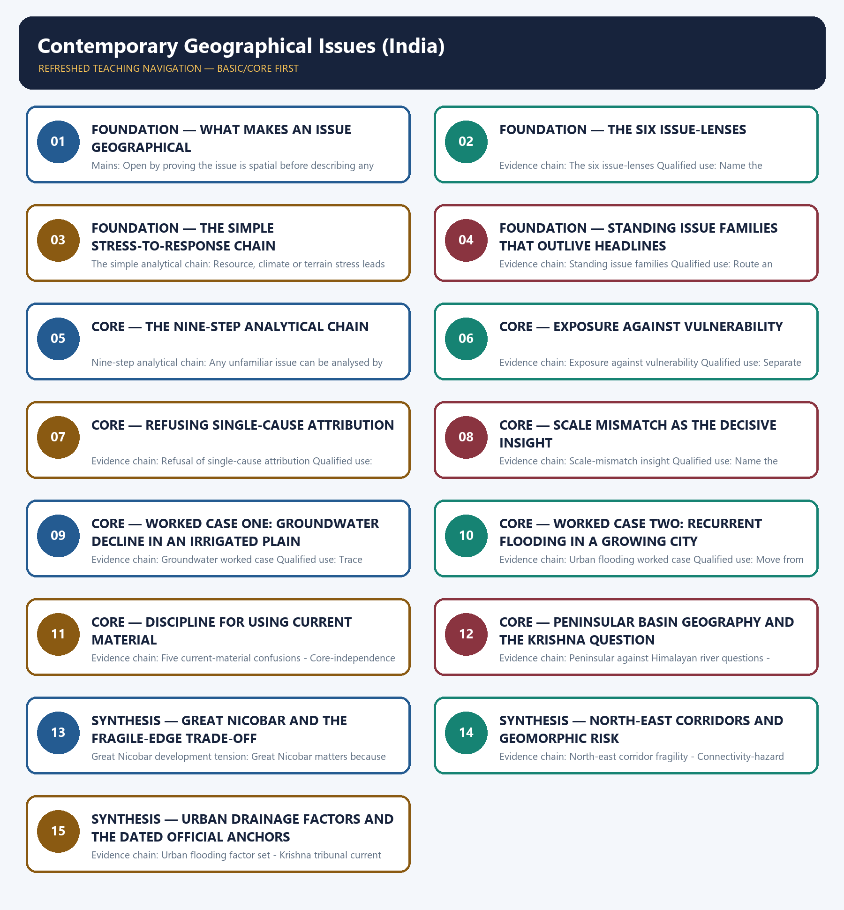

# Contemporary Geographical Issues (India) — Learner-v2 Complete Learning Session

> **Authoring-only generation:** 2026-09-01. No PDF was rendered and no tracker or index was mutated.

### SOURCE, PROGRESSION AND CURRENT-LINKAGE AUDIT

- **Generation date:** 2026-09-01.
- **Repository-first evidence:** the Basic owner is taught first and preserved in full; the Advanced owner is retained only in the optional final teaching block.
- **OCR evidence:** Repository Markdown was primary. The three required local Geography books were inspected as supplementary OCR/searchable evidence. No unsupported page precision, volatile figure or quotation was imported.
- **Qdrant:** not used; repository Markdown and available OCR context were sufficient.
- **PYQ integrity:** Geography Topic 36 owns direct Mains PYQ demand in the audited routing ledgers. Three GS-I demands are routed to this owner: 2019 Q14 on water stress and its regional variation within India, 2023 Q5 on the crisis of availability of and access to freshwater resources, and 2024 Q14 on the declining groundwater of the Gangetic valley and food security. All three are answered below as original model solutions built only from owner evidence. Routed Prelims demands for this topic remain recorded in the ledgers as objective questions whose official keys are either unavailable locally or deliberately not inferred, so no option letter or answer key is reproduced anywhere in this package.
- **Live-link boundary:** Two dated official anchors are used and nothing more. The Press Information Bureau and Lok Sabha written reply of 21 August 2025 is used only to record continued relevance and term extension of the Krishna Water Disputes Tribunal after the post-bifurcation situation, with no allocation share stated. The Press Information Bureau release on urban flooding during the monsoon season, dated 29 July 2024, is used only for its framing that urban flooding involves planning, storm-water drains, land use and water-body management, together with its reference to storm-water and water-body interventions under AMRUT. No rainfall total, groundwater level, flooded-area figure, project outlay or tribunal allocation is quoted from memory, and every anchor illustrates a process that the core files already own.
- **Fact/inference discipline:** no current-affairs item, PYQ wording, figure or quotation is invented.

## BASIC LEARNING SESSION

### DEEP-REVIEW LEARNING CONTRACT

| Control | Binding rule for this package |
|---|---|
| Syllabus boundary | Complete Human, Economic and Regional Geography Basic/Core is taught before optional Advanced depth. |
| Spatial method | Distribution → controlling physical/human variables → network or region → named world/India anchors → scale and exception. |
| Model method | State assumptions, mechanism, predicted pattern, named application and empirical or Global-South limitation. |
| Evidence method | Claim → named map/place/institution/dataset → analysis → source-date-status or causal qualification. |
| Policy method | Chronology, legal or planning instrument, responsible institution, implementation scale and current status remain distinct. |
| Practice contract | Every solved item has demand decoding, a detailed examiner-grade model, executable timed/compression plan, marks rationale and answer-specific improvement. |
| Approval | This immutable successor remains `approved: false` pending explicit approval. |

**Canonical Basic/Core owner:** `upsc-ai-kit\knowledge\Geography\basic\36_Contemporary-Geographical-Issues-India.md`  
**Canonical topic owner:** `upsc-ai-kit\knowledge\Geography\basic\36_Contemporary-Geographical-Issues-India.md`  
**Optional Advanced owner:** `upsc-ai-kit\knowledge\Geography\advanced\36_Contemporary-Geographical-Issues-India.md`  
**Official syllabus mapping:** `upsc-ai-kit\knowledge\Geography\OFFICIAL-UPSC-SYLLABUS-MAPPING.md`

### EVIDENCE, PYQ AND CURRENT-STATUS CONTROL

- **Definition discipline:** close terms share a comparison axis and are never treated as synonyms.
- **Map discipline:** pattern is reconstructed through site, situation, density, gradient, corridor, node, belt, boundary, hinterland and scale.
- **Model discipline:** Ravenstein, Lee, Christaller, Burgess, Hoyt, Harris-Ullman, Myrdal, Perroux, von Thünen, Weber and related models retain assumptions and limits.
- **India discipline:** every explanation carries named state, region, city, corridor, resource belt, border sector or cultural landscape evidence.
- **Data discipline:** Census, SRS, NFHS, Agriculture Census, production, trade, energy and infrastructure claims retain source, reference period, release date and status.
- **PYQ discipline:** repository routing ledgers and held papers control wording and metadata; reconstructed wording and unavailable official keys remain labelled.
- **Current-status note, rechecked 2026-09-02:** Static concepts are separated from volatile population, production, trade, infrastructure, mission, boundary and policy claims. Every current number or status requires the issuing institution, reference period, publication date and provisional/final/operational boundary.

**Live/official context sources recorded by the predecessor generation:**

- No volatile live claim is necessary for the static core.




*Distinct embedded teaching-navigation image. The separate continuous Cārvāka-style flowchart package remains an independent at-a-glance artifact.*

### SESSION 1 — FOUNDATION — WHAT MAKES AN ISSUE GEOGRAPHICAL

#### DEFINITION / WHAT THIS IS CALLED

**Plain-language definition:** Evidence chain: What makes an issue geographical Qualified use: Open by proving the issue is spatial before describing any event.

**Technical definition:** Mains: Open by proving the issue is spatial before describing any event.

#### ANSWER-GRABBING OPENING — WRITE/ADAPT IN THE EXAM

> Evidence chain: What makes an issue geographical Qualified use: Open by proving the issue is spatial before describing any event.

#### MUST-WRITE KEYWORDS

- **FOUNDATION**
- **What makes an issue geographical**
- **Evidence chain**
- **Qualified use**
- **Where**
- **Mains: Open by proving the issue**

**How to use them:** Frame the answer through FOUNDATION; define What makes an issue geographical, connect Evidence chain with Qualified use to explain the mechanism, and use Where for the decisive comparison or qualification.

#### VISUAL FIRST

```text
WHAT MAKES AN ISSUE GEOGRAPHICAL
01. What makes an issue geographical
BOUNDARY -> Where, why there and with what consequence must be answered first.
```

*This topic-specific rail fixes the evidence sequence and its exam boundary before analysis.*

#### CORE EXPLANATION

An issue becomes geographical when location, terrain, climate, water, settlement pattern, resource distribution or connectivity directly shapes the problem, so the answer must establish where it occurs, why there rather than elsewhere, and with what spatial consequence.

#### NAMED EVIDENCE AND MECHANISM

- **What makes an issue geographical:** An issue becomes geographical when location, terrain, climate, water, settlement pattern, resource distribution or connectivity directly shapes the problem, so the answer must establish where it occurs, why there rather than elsewhere, and with what spatial consequence.

#### EXAMINER CAUTION

- Where, why there and with what consequence must be answered first.

#### EXAM LINK

- **Prelims:** Separate the agent, landform, location, status and scale attached to What makes an issue geographical.
- **Mains:** Open by proving the issue is spatial before describing any event.

#### MINI RECAP

- **Evidence chain:** What makes an issue geographical
- **Qualified use:** Open by proving the issue is spatial before describing any event.

#### CLOSING RECALL FLOW — FOUNDATION — WHAT MAKES AN ISSUE GEOGRAPHICAL

```text
START / CONCEPT: FOUNDATION — What makes an issue geographical
        |
        v
EXACT TERMS: FOUNDATION · What makes an issue geographical · Evidence chain · Qualified use · Where · Mains: Open by proving the issue
        |
        v
MECHANISM / ARGUMENT: Mains: Open by proving the issue is spatial before describing any event.
        |
        v
CONSEQUENCE / CONTRAST: What makes an issue geographical: An issue becomes geographical when location, terrain, climate, water, settlement pattern, resource distribution or connectivity directly shapes the problem, so the answer must establish where it occurs, why there rather than elsewhere, and with what spatial consequence.
        |
        v
UPSC TRAP / ANSWER-USE: Do not miss this limiting distinction: where, why there and with what consequence must be answered first.
        |
        v
ANSWER-GRABBING FORMULATION: Evidence chain: What makes an issue geographical Qualified use: Open by proving the issue is spatial before describing any event.
```
### SESSION 2 — FOUNDATION — THE SIX ISSUE-LENSES

#### DEFINITION / WHAT THIS IS CALLED

**Plain-language definition:** The six issue-lenses: The reusable lenses are resource conflict over water, minerals, forests and coasts, boundary and borderland clustering, hazard and vulnerability exposure on floodplains, coasts and slopes, mobility and migration under stress or opportunity, urban primacy overwhelming drainage and land markets, and ecological fragility where development enters islands, wetlands, deltas and mountains.

**Technical definition:** Evidence chain: The six issue-lenses Qualified use: Name the operative lens instead of applying all six mechanically.

#### ANSWER-GRABBING OPENING — WRITE/ADAPT IN THE EXAM

> The six issue-lenses: The reusable lenses are resource conflict over water, minerals, forests and coasts, boundary and borderland clustering, hazard and vulnerability exposure on floodplains, coasts and slopes, mobility and migration under stress or opportunity, urban primacy overwhelming drainage and land markets, and ecological fragility where development enters islands, wetlands, deltas and mountains.

#### MUST-WRITE KEYWORDS

- **FOUNDATION**
- **The six issue-lenses**
- **Evidence chain**
- **Qualified use**
- **The reusable lenses**
- **The six issue-lenses: The reusable lenses**

**How to use them:** Frame the answer through FOUNDATION; define The six issue-lenses, connect Evidence chain with Qualified use to explain the mechanism, and use The reusable lenses for the decisive comparison or qualification.

#### VISUAL FIRST

```text
THE SIX ISSUE-LENSES
01. The six issue-lenses
BOUNDARY -> Choose the lens the question actually engages.
```

*This topic-specific rail fixes the evidence sequence and its exam boundary before analysis.*

#### CORE EXPLANATION

The reusable lenses are resource conflict over water, minerals, forests and coasts, boundary and borderland clustering, hazard and vulnerability exposure on floodplains, coasts and slopes, mobility and migration under stress or opportunity, urban primacy overwhelming drainage and land markets, and ecological fragility where development enters islands, wetlands, deltas and mountains.

#### NAMED EVIDENCE AND MECHANISM

- **The six issue-lenses:** The reusable lenses are resource conflict over water, minerals, forests and coasts, boundary and borderland clustering, hazard and vulnerability exposure on floodplains, coasts and slopes, mobility and migration under stress or opportunity, urban primacy overwhelming drainage and land markets, and ecological fragility where development enters islands, wetlands, deltas and mountains.

#### EXAMINER CAUTION

- Choose the lens the question actually engages.

#### EXAM LINK

- **Prelims:** Separate the agent, landform, location, status and scale attached to The six issue-lenses.
- **Mains:** Name the operative lens instead of applying all six mechanically.

#### MINI RECAP

- **Evidence chain:** The six issue-lenses
- **Qualified use:** Name the operative lens instead of applying all six mechanically.

#### CLOSING RECALL FLOW — FOUNDATION — THE SIX ISSUE-LENSES

```text
START / CONCEPT: FOUNDATION — The six issue-lenses
        |
        v
EXACT TERMS: FOUNDATION · The six issue-lenses · Evidence chain · Qualified use · The reusable lenses · The six issue-lenses: The reusable lenses
        |
        v
MECHANISM / ARGUMENT: Evidence chain: The six issue-lenses Qualified use: Name the operative lens instead of applying all six mechanically.
        |
        v
CONSEQUENCE / CONTRAST: The resulting consequence is that name the operative lens instead of applying all six mechanically.
        |
        v
UPSC TRAP / ANSWER-USE: Do not miss this limiting distinction: name the operative lens instead of applying all six mechanically.
        |
        v
ANSWER-GRABBING FORMULATION: The six issue-lenses: The reusable lenses are resource conflict over water, minerals, forests and coasts, boundary and borderland clustering, hazard and vulnerability exposure on floodplains, coasts and slopes, mobility and migration under stress or opportunity, urban primacy overwhelming drainage and land markets, and ecological fragility where development enters islands, wetlands, deltas and mountains.
```
### SESSION 3 — FOUNDATION — THE SIMPLE STRESS-TO-RESPONSE CHAIN

#### DEFINITION / WHAT THIS IS CALLED

**Plain-language definition:** Evidence chain: The simple analytical chain Qualified use: Follow the chain from stress to spillover to policy response.

**Technical definition:** The simple analytical chain: Resource, climate or terrain stress leads to uneven access or exposure, which produces social conflict or governance pressure, which generates spatial spillover through migration, flooding, erosion or corridor shift, which then invites a policy response.

#### ANSWER-GRABBING OPENING — WRITE/ADAPT IN THE EXAM

> Evidence chain: The simple analytical chain Qualified use: Follow the chain from stress to spillover to policy response.

#### MUST-WRITE KEYWORDS

- **FOUNDATION**
- **The simple stress-to-response chain**
- **The simple analytical chain**
- **Evidence chain**
- **Qualified use**
- **Resource**

**How to use them:** Frame the answer through FOUNDATION; define The simple stress-to-response chain, connect The simple analytical chain with Evidence chain to explain the mechanism, and use Qualified use for the decisive comparison or qualification.

#### VISUAL FIRST

```text
THE SIMPLE STRESS-TO-RESPONSE CHAIN
01. The simple analytical chain
BOUNDARY -> An issue is neither only political nor only environmental.
```

*This topic-specific rail fixes the evidence sequence and its exam boundary before analysis.*

#### CORE EXPLANATION

Resource, climate or terrain stress leads to uneven access or exposure, which produces social conflict or governance pressure, which generates spatial spillover through migration, flooding, erosion or corridor shift, which then invites a policy response.

#### NAMED EVIDENCE AND MECHANISM

- **The simple analytical chain:** Resource, climate or terrain stress leads to uneven access or exposure, which produces social conflict or governance pressure, which generates spatial spillover through migration, flooding, erosion or corridor shift, which then invites a policy response.

#### EXAMINER CAUTION

- An issue is neither only political nor only environmental.

#### EXAM LINK

- **Prelims:** Separate the agent, landform, location, status and scale attached to The simple stress-to-response chain.
- **Mains:** Follow the chain from stress to spillover to policy response.

#### MINI RECAP

- **Evidence chain:** The simple analytical chain
- **Qualified use:** Follow the chain from stress to spillover to policy response.

#### CLOSING RECALL FLOW — FOUNDATION — THE SIMPLE STRESS-TO-RESPONSE CHAIN

```text
START / CONCEPT: FOUNDATION — The simple stress-to-response chain
        |
        v
EXACT TERMS: FOUNDATION · The simple stress-to-response chain · The simple analytical chain · Evidence chain · Qualified use · Resource
        |
        v
MECHANISM / ARGUMENT: The simple analytical chain: Resource, climate or terrain stress leads to uneven access or exposure, which produces social conflict or governance pressure, which generates spatial spillover through migration, flooding, erosion or corridor shift, which then invites a policy response.
        |
        v
CONSEQUENCE / CONTRAST: Mains: Follow the chain from stress to spillover to policy response.
        |
        v
UPSC TRAP / ANSWER-USE: Do not miss this limiting distinction: an issue is neither only political nor only environmental.
        |
        v
ANSWER-GRABBING FORMULATION: Evidence chain: The simple analytical chain Qualified use: Follow the chain from stress to spillover to policy response.
```
### SESSION 4 — FOUNDATION — STANDING ISSUE FAMILIES THAT OUTLIVE HEADLINES

#### DEFINITION / WHAT THIS IS CALLED

**Plain-language definition:** Standing issue families: The families that recur regardless of the year's headlines are water stress and allocation, climate-linked hazard change, land degradation and land-use conflict, urbanisation stress, regional imbalance and migration pressure, resource and energy transition, infrastructure and ecology trade-offs, coastal and island pressure, and boundary and transboundary questions.

**Technical definition:** Evidence chain: Standing issue families Qualified use: Route an unfamiliar issue into a family before analysing it.

#### ANSWER-GRABBING OPENING — WRITE/ADAPT IN THE EXAM

> Standing issue families: The families that recur regardless of the year's headlines are water stress and allocation, climate-linked hazard change, land degradation and land-use conflict, urbanisation stress, regional imbalance and migration pressure, resource and energy transition, infrastructure and ecology trade-offs, coastal and island pressure, and boundary and transboundary questions.

#### MUST-WRITE KEYWORDS

- **FOUNDATION**
- **Standing issue families that outlive headlines**
- **Standing issue families**
- **Evidence chain**
- **Qualified use**
- **Standing**

**How to use them:** Frame the answer through FOUNDATION; define Standing issue families that outlive headlines, connect Standing issue families with Evidence chain to explain the mechanism, and use Qualified use for the decisive comparison or qualification.

#### VISUAL FIRST

```text
STANDING ISSUE FAMILIES THAT OUTLIVE HEADLINES
01. Standing issue families
BOUNDARY -> The family survives even when the example dates.
```

*This topic-specific rail fixes the evidence sequence and its exam boundary before analysis.*

#### CORE EXPLANATION

The families that recur regardless of the year's headlines are water stress and allocation, climate-linked hazard change, land degradation and land-use conflict, urbanisation stress, regional imbalance and migration pressure, resource and energy transition, infrastructure and ecology trade-offs, coastal and island pressure, and boundary and transboundary questions.

#### NAMED EVIDENCE AND MECHANISM

- **Standing issue families:** The families that recur regardless of the year's headlines are water stress and allocation, climate-linked hazard change, land degradation and land-use conflict, urbanisation stress, regional imbalance and migration pressure, resource and energy transition, infrastructure and ecology trade-offs, coastal and island pressure, and boundary and transboundary questions.

#### EXAMINER CAUTION

- The family survives even when the example dates.

#### EXAM LINK

- **Prelims:** Separate the agent, landform, location, status and scale attached to Standing issue families that outlive headlines.
- **Mains:** Route an unfamiliar issue into a family before analysing it.

#### MINI RECAP

- **Evidence chain:** Standing issue families
- **Qualified use:** Route an unfamiliar issue into a family before analysing it.

#### CLOSING RECALL FLOW — FOUNDATION — STANDING ISSUE FAMILIES THAT OUTLIVE HEADLINES

```text
START / CONCEPT: FOUNDATION — Standing issue families that outlive headlines
        |
        v
EXACT TERMS: FOUNDATION · Standing issue families that outlive headlines · Standing issue families · Evidence chain · Qualified use · Standing
        |
        v
MECHANISM / ARGUMENT: Evidence chain: Standing issue families Qualified use: Route an unfamiliar issue into a family before analysing it.
        |
        v
CONSEQUENCE / CONTRAST: The resulting consequence is that the families that recur regardless of the year's headlines are water stress and allocation...
        |
        v
UPSC TRAP / ANSWER-USE: Do not miss this limiting distinction: the families that recur regardless of the year's headlines are water stress and allocation...
        |
        v
ANSWER-GRABBING FORMULATION: Standing issue families: The families that recur regardless of the year's headlines are water stress and allocation, climate-linked hazard change, land degradation and land-use conflict, urbanisation stress, regional imbalance and migration pressure, resource and energy transition, infrastructure and ecology trade-offs, coastal and island pressure, and boundary and transboundary questions.
```
### SESSION 5 — CORE — THE NINE-STEP ANALYTICAL CHAIN

#### DEFINITION / WHAT THIS IS CALLED

**Plain-language definition:** Evidence chain: Nine-step analytical chain Qualified use: Use the nine steps as the spine of every contemporary-issue answer.

**Technical definition:** Nine-step analytical chain: Any unfamiliar issue can be analysed by naming the process, establishing the pattern, separating drivers, fixing the scale, identifying exposure, distinguishing vulnerability, naming the trade-off, matching the instrument to the mechanism, and closing with a graded verdict.

#### ANSWER-GRABBING OPENING — WRITE/ADAPT IN THE EXAM

> Evidence chain: Nine-step analytical chain Qualified use: Use the nine steps as the spine of every contemporary-issue answer.

#### MUST-WRITE KEYWORDS

- **The nine-step analytical chain**
- **Nine-step analytical chain**
- **Evidence chain**
- **Qualified use**
- **Any**
- **Nine-step**

**How to use them:** Frame the answer through The nine-step analytical chain; define Nine-step analytical chain, connect Evidence chain with Qualified use to explain the mechanism, and use Any for the decisive comparison or qualification.

#### VISUAL FIRST

```text
THE NINE-STEP ANALYTICAL CHAIN
01. Nine-step analytical chain
BOUNDARY -> Process and pattern must precede any policy discussion.
```

*This topic-specific rail fixes the evidence sequence and its exam boundary before analysis.*

#### CORE EXPLANATION

Any unfamiliar issue can be analysed by naming the process, establishing the pattern, separating drivers, fixing the scale, identifying exposure, distinguishing vulnerability, naming the trade-off, matching the instrument to the mechanism, and closing with a graded verdict.

#### NAMED EVIDENCE AND MECHANISM

- **Nine-step analytical chain:** Any unfamiliar issue can be analysed by naming the process, establishing the pattern, separating drivers, fixing the scale, identifying exposure, distinguishing vulnerability, naming the trade-off, matching the instrument to the mechanism, and closing with a graded verdict.

#### EXAMINER CAUTION

- Process and pattern must precede any policy discussion.

#### EXAM LINK

- **Prelims:** Separate the agent, landform, location, status and scale attached to The nine-step analytical chain.
- **Mains:** Use the nine steps as the spine of every contemporary-issue answer.

#### MINI RECAP

- **Evidence chain:** Nine-step analytical chain
- **Qualified use:** Use the nine steps as the spine of every contemporary-issue answer.

#### CLOSING RECALL FLOW — CORE — THE NINE-STEP ANALYTICAL CHAIN

```text
START / CONCEPT: CORE — The nine-step analytical chain
        |
        v
EXACT TERMS: The nine-step analytical chain · Nine-step analytical chain · Evidence chain · Qualified use · Any · Nine-step
        |
        v
MECHANISM / ARGUMENT: Nine-step analytical chain: Any unfamiliar issue can be analysed by naming the process, establishing the pattern, separating drivers, fixing the scale, identifying exposure, distinguishing vulnerability, naming the trade-off, matching the instrument to the mechanism, and closing with a graded verdict.
        |
        v
CONSEQUENCE / CONTRAST: Mains: Use the nine steps as the spine of every contemporary-issue answer.
        |
        v
UPSC TRAP / ANSWER-USE: Do not miss this limiting distinction: process and pattern must precede any policy discussion.
        |
        v
ANSWER-GRABBING FORMULATION: Evidence chain: Nine-step analytical chain Qualified use: Use the nine steps as the spine of every contemporary-issue answer.
```
### SESSION 6 — CORE — EXPOSURE AGAINST VULNERABILITY

#### DEFINITION / WHAT THIS IS CALLED

**Plain-language definition:** Exposure against vulnerability: Exposure asks who and what lies in the way of a hazard, while vulnerability asks why the same hazard hurts some groups far more, and collapsing the two is one of the most common analytical failures.

**Technical definition:** Evidence chain: Exposure against vulnerability Qualified use: Separate the two and derive a distributional remedy from vulnerability.

#### ANSWER-GRABBING OPENING — WRITE/ADAPT IN THE EXAM

> Exposure against vulnerability: Exposure asks who and what lies in the way of a hazard, while vulnerability asks why the same hazard hurts some groups far more, and collapsing the two is one of the most common analytical failures.

#### MUST-WRITE KEYWORDS

- **Exposure against vulnerability**
- **Evidence chain**
- **Qualified use**
- **Exposure**
- **Qualified**
- **Separate**

**How to use them:** Frame the answer through Exposure against vulnerability; define Evidence chain, connect Qualified use with Exposure to explain the mechanism, and use Qualified for the decisive comparison or qualification.

#### VISUAL FIRST

```text
EXPOSURE AGAINST VULNERABILITY
01. Exposure against vulnerability
BOUNDARY -> Exposure is physical position; vulnerability is differential capacity.
```

*This topic-specific rail fixes the evidence sequence and its exam boundary before analysis.*

#### CORE EXPLANATION

Exposure asks who and what lies in the way of a hazard, while vulnerability asks why the same hazard hurts some groups far more, and collapsing the two is one of the most common analytical failures.

#### NAMED EVIDENCE AND MECHANISM

- **Exposure against vulnerability:** Exposure asks who and what lies in the way of a hazard, while vulnerability asks why the same hazard hurts some groups far more, and collapsing the two is one of the most common analytical failures.

#### EXAMINER CAUTION

- Exposure is physical position; vulnerability is differential capacity.

#### EXAM LINK

- **Prelims:** Separate the agent, landform, location, status and scale attached to Exposure against vulnerability.
- **Mains:** Separate the two and derive a distributional remedy from vulnerability.

#### MINI RECAP

- **Evidence chain:** Exposure against vulnerability
- **Qualified use:** Separate the two and derive a distributional remedy from vulnerability.

#### CLOSING RECALL FLOW — CORE — EXPOSURE AGAINST VULNERABILITY

```text
START / CONCEPT: CORE — Exposure against vulnerability
        |
        v
EXACT TERMS: Exposure against vulnerability · Evidence chain · Qualified use · Exposure · Qualified · Separate
        |
        v
MECHANISM / ARGUMENT: Evidence chain: Exposure against vulnerability Qualified use: Separate the two and derive a distributional remedy from vulnerability.
        |
        v
CONSEQUENCE / CONTRAST: Exposure is physical position; vulnerability is differential capacity.
        |
        v
UPSC TRAP / ANSWER-USE: Do not miss this limiting distinction: exposure asks who and what lies in the way of a hazard.
        |
        v
ANSWER-GRABBING FORMULATION: Exposure against vulnerability: Exposure asks who and what lies in the way of a hazard, while vulnerability asks why the same hazard hurts some groups far more, and collapsing the two is one of the most common analytical failures.
```
### SESSION 7 — CORE — REFUSING SINGLE-CAUSE ATTRIBUTION

#### DEFINITION / WHAT THIS IS CALLED

**Plain-language definition:** Refusal of single-cause attribution: Natural variability and human amplification must be separated rather than merged, because most contemporary geographical problems are the joint product of a physical process and a land-use or governance decision.

**Technical definition:** Evidence chain: Refusal of single-cause attribution Qualified use: State both driver classes before assigning any causal weight.

#### ANSWER-GRABBING OPENING — WRITE/ADAPT IN THE EXAM

> Refusal of single-cause attribution: Natural variability and human amplification must be separated rather than merged, because most contemporary geographical problems are the joint product of a physical process and a land-use or governance decision.

#### MUST-WRITE KEYWORDS

- **Refusing single-cause attribution**
- **Refusal of single-cause attribution**
- **Evidence chain**
- **Qualified use**
- **Natural**
- **Refusal**

**How to use them:** Frame the answer through Refusing single-cause attribution; define Refusal of single-cause attribution, connect Evidence chain with Qualified use to explain the mechanism, and use Natural for the decisive comparison or qualification.

#### VISUAL FIRST

```text
REFUSING SINGLE-CAUSE ATTRIBUTION
01. Refusal of single-cause attribution
BOUNDARY -> Natural variability and human amplification operate together.
```

*This topic-specific rail fixes the evidence sequence and its exam boundary before analysis.*

#### CORE EXPLANATION

Natural variability and human amplification must be separated rather than merged, because most contemporary geographical problems are the joint product of a physical process and a land-use or governance decision.

#### NAMED EVIDENCE AND MECHANISM

- **Refusal of single-cause attribution:** Natural variability and human amplification must be separated rather than merged, because most contemporary geographical problems are the joint product of a physical process and a land-use or governance decision.

#### EXAMINER CAUTION

- Natural variability and human amplification operate together.

#### EXAM LINK

- **Prelims:** Separate the agent, landform, location, status and scale attached to Refusing single-cause attribution.
- **Mains:** State both driver classes before assigning any causal weight.

#### MINI RECAP

- **Evidence chain:** Refusal of single-cause attribution
- **Qualified use:** State both driver classes before assigning any causal weight.

#### CLOSING RECALL FLOW — CORE — REFUSING SINGLE-CAUSE ATTRIBUTION

```text
START / CONCEPT: CORE — Refusing single-cause attribution
        |
        v
EXACT TERMS: Refusing single-cause attribution · Refusal of single-cause attribution · Evidence chain · Qualified use · Natural · Refusal
        |
        v
MECHANISM / ARGUMENT: Evidence chain: Refusal of single-cause attribution Qualified use: State both driver classes before assigning any causal weight.
        |
        v
CONSEQUENCE / CONTRAST: Natural variability and human amplification must be separated rather than merged, because most contemporary geographical problems are the joint product of a physical process and a land-use or governance decision.
        |
        v
UPSC TRAP / ANSWER-USE: Do not miss this limiting distinction: refusal of single-cause attribution Qualified use.
        |
        v
ANSWER-GRABBING FORMULATION: Refusal of single-cause attribution: Natural variability and human amplification must be separated rather than merged, because most contemporary geographical problems are the joint product of a physical process and a land-use or governance decision.
```
### SESSION 8 — CORE — SCALE MISMATCH AS THE DECISIVE INSIGHT

#### DEFINITION / WHAT THIS IS CALLED

**Plain-language definition:** Scale-mismatch insight: The geography of a problem frequently fails to match the administrative unit expected to solve it, and naming that mismatch is the most frequently available and least frequently used insight in these answers.

**Technical definition:** Evidence chain: Scale-mismatch insight Qualified use: Name the governing scale and the unit expected to act on it.

#### ANSWER-GRABBING OPENING — WRITE/ADAPT IN THE EXAM

> Scale-mismatch insight: The geography of a problem frequently fails to match the administrative unit expected to solve it, and naming that mismatch is the most frequently available and least frequently used insight in these answers.

#### MUST-WRITE KEYWORDS

- **Scale mismatch as the decisive insight**
- **Scale-mismatch insight**
- **Evidence chain**
- **Qualified use**
- **Scale-mismatch**
- **Qualified**

**How to use them:** Frame the answer through Scale mismatch as the decisive insight; define Scale-mismatch insight, connect Evidence chain with Qualified use to explain the mechanism, and use Scale-mismatch for the decisive comparison or qualification.

#### VISUAL FIRST

```text
SCALE MISMATCH AS THE DECISIVE INSIGHT
01. Scale-mismatch insight
BOUNDARY -> Problem geography rarely matches the administrative unit.
```

*This topic-specific rail fixes the evidence sequence and its exam boundary before analysis.*

#### CORE EXPLANATION

The geography of a problem frequently fails to match the administrative unit expected to solve it, and naming that mismatch is the most frequently available and least frequently used insight in these answers.

#### NAMED EVIDENCE AND MECHANISM

- **Scale-mismatch insight:** The geography of a problem frequently fails to match the administrative unit expected to solve it, and naming that mismatch is the most frequently available and least frequently used insight in these answers.

#### EXAMINER CAUTION

- Problem geography rarely matches the administrative unit.

#### EXAM LINK

- **Prelims:** Separate the agent, landform, location, status and scale attached to Scale mismatch as the decisive insight.
- **Mains:** Name the governing scale and the unit expected to act on it.

#### MINI RECAP

- **Evidence chain:** Scale-mismatch insight
- **Qualified use:** Name the governing scale and the unit expected to act on it.

#### CLOSING RECALL FLOW — CORE — SCALE MISMATCH AS THE DECISIVE INSIGHT

```text
START / CONCEPT: CORE — Scale mismatch as the decisive insight
        |
        v
EXACT TERMS: Scale mismatch as the decisive insight · Scale-mismatch insight · Evidence chain · Qualified use · Scale-mismatch · Qualified
        |
        v
MECHANISM / ARGUMENT: Evidence chain: Scale-mismatch insight Qualified use: Name the governing scale and the unit expected to act on it.
        |
        v
CONSEQUENCE / CONTRAST: The resulting consequence is that name the governing scale and the unit expected to act on it.
        |
        v
UPSC TRAP / ANSWER-USE: Do not miss this limiting distinction: name the governing scale and the unit expected to act on it.
        |
        v
ANSWER-GRABBING FORMULATION: Scale-mismatch insight: The geography of a problem frequently fails to match the administrative unit expected to solve it, and naming that mismatch is the most frequently available and least frequently used insight in these answers.
```
### SESSION 9 — CORE — WORKED CASE ONE: GROUNDWATER DECLINE IN AN IRRIGATED PLAIN

#### DEFINITION / WHAT THIS IS CALLED

**Plain-language definition:** Groundwater worked case: Groundwater decline in an intensively irrigated plain is abstraction exceeding recharge in an alluvial aquifer, concentrated where tube-well density, water-intensive cropping and assured procurement coincide rather than simply where rainfall is low, operating at aquifer scale that matches no administrative boundary, and hurting smallholders first because they cannot finance deeper wells.

**Technical definition:** Evidence chain: Groundwater worked case Qualified use: Trace abstraction, aquifer scale and distributional loss in one chain.

#### ANSWER-GRABBING OPENING — WRITE/ADAPT IN THE EXAM

> Groundwater worked case: Groundwater decline in an intensively irrigated plain is abstraction exceeding recharge in an alluvial aquifer, concentrated where tube-well density, water-intensive cropping and assured procurement coincide rather than simply where rainfall is low, operating at aquifer scale that matches no administrative boundary, and hurting smallholders first because they cannot finance deeper wells.

#### MUST-WRITE KEYWORDS

- **Worked case one**
- **groundwater decline in an irrigated plain**
- **Groundwater worked case**
- **Evidence chain**
- **Qualified use**
- **Groundwater decline in an intensively irrigated plain**

**How to use them:** Frame the answer through Worked case one; define groundwater decline in an irrigated plain, connect Groundwater worked case with Evidence chain to explain the mechanism, and use Qualified use for the decisive comparison or qualification.

#### VISUAL FIRST

```text
WORKED CASE ONE: GROUNDWATER DECLINE IN AN IRRIGATED PLAIN
01. Groundwater worked case
BOUNDARY -> The pattern follows cropping and procurement, not rainfall alone.
```

*This topic-specific rail fixes the evidence sequence and its exam boundary before analysis.*

#### CORE EXPLANATION

Groundwater decline in an intensively irrigated plain is abstraction exceeding recharge in an alluvial aquifer, concentrated where tube-well density, water-intensive cropping and assured procurement coincide rather than simply where rainfall is low, operating at aquifer scale that matches no administrative boundary, and hurting smallholders first because they cannot finance deeper wells.

#### NAMED EVIDENCE AND MECHANISM

- **Groundwater worked case:** Groundwater decline in an intensively irrigated plain is abstraction exceeding recharge in an alluvial aquifer, concentrated where tube-well density, water-intensive cropping and assured procurement coincide rather than simply where rainfall is low, operating at aquifer scale that matches no administrative boundary, and hurting smallholders first because they cannot finance deeper wells.

#### EXAMINER CAUTION

- The pattern follows cropping and procurement, not rainfall alone.

#### EXAM LINK

- **Prelims:** Separate the agent, landform, location, status and scale attached to Worked case one: groundwater decline in an irrigated plain.
- **Mains:** Trace abstraction, aquifer scale and distributional loss in one chain.

#### MINI RECAP

- **Evidence chain:** Groundwater worked case
- **Qualified use:** Trace abstraction, aquifer scale and distributional loss in one chain.

#### CLOSING RECALL FLOW — CORE — WORKED CASE ONE: GROUNDWATER DECLINE IN AN IRRIGATED PLAIN

```text
START / CONCEPT: CORE — Worked case one: groundwater decline in an irrigated plain
        |
        v
EXACT TERMS: Worked case one · groundwater decline in an irrigated plain · Groundwater worked case · Evidence chain · Qualified use · Groundwater decline in an intensively irrigated plain
        |
        v
MECHANISM / ARGUMENT: Evidence chain: Groundwater worked case Qualified use: Trace abstraction, aquifer scale and distributional loss in one chain.
        |
        v
CONSEQUENCE / CONTRAST: The pattern follows cropping and procurement, not rainfall alone.
        |
        v
UPSC TRAP / ANSWER-USE: Do not miss this limiting distinction: groundwater decline in an intensively irrigated plain is abstraction exceeding recharge in an alluvial...
        |
        v
ANSWER-GRABBING FORMULATION: Groundwater worked case: Groundwater decline in an intensively irrigated plain is abstraction exceeding recharge in an alluvial aquifer, concentrated where tube-well density, water-intensive cropping and assured procurement coincide rather than simply where rainfall is low, operating at aquifer scale that matches no administrative boundary, and hurting smallholders first because they cannot finance deeper wells.
```
### SESSION 10 — CORE — WORKED CASE TWO: RECURRENT FLOODING IN A GROWING CITY

#### DEFINITION / WHAT THIS IS CALLED

**Plain-language definition:** Urban flooding worked case: Recurrent urban flooding is runoff generation exceeding drainage conveyance, concentrated in low-lying areas, filled tanks and wetlands and encroached natural drains, driven by surface sealing, undersized silted networks and floodplain construction, and operating at catchment scale that typically extends beyond the municipal boundary, so rainfall is the trigger rather than the cause.

**Technical definition:** Evidence chain: Urban flooding worked case Qualified use: Move from conveyance failure to catchment scale and tenure-linked remedies.

#### ANSWER-GRABBING OPENING — WRITE/ADAPT IN THE EXAM

> Urban flooding worked case: Recurrent urban flooding is runoff generation exceeding drainage conveyance, concentrated in low-lying areas, filled tanks and wetlands and encroached natural drains, driven by surface sealing, undersized silted networks and floodplain construction, and operating at catchment scale that typically extends beyond the municipal boundary, so rainfall is the trigger rather than the cause.

#### MUST-WRITE KEYWORDS

- **Worked case two**
- **recurrent flooding in a growing city**
- **Urban flooding worked case**
- **Evidence chain**
- **Qualified use**
- **Recurrent urban flooding**

**How to use them:** Frame the answer through Worked case two; define recurrent flooding in a growing city, connect Urban flooding worked case with Evidence chain to explain the mechanism, and use Qualified use for the decisive comparison or qualification.

#### VISUAL FIRST

```text
WORKED CASE TWO: RECURRENT FLOODING IN A GROWING CITY
01. Urban flooding worked case
BOUNDARY -> Rainfall is the trigger; land use is the cause.
```

*This topic-specific rail fixes the evidence sequence and its exam boundary before analysis.*

#### CORE EXPLANATION

Recurrent urban flooding is runoff generation exceeding drainage conveyance, concentrated in low-lying areas, filled tanks and wetlands and encroached natural drains, driven by surface sealing, undersized silted networks and floodplain construction, and operating at catchment scale that typically extends beyond the municipal boundary, so rainfall is the trigger rather than the cause.

#### NAMED EVIDENCE AND MECHANISM

- **Urban flooding worked case:** Recurrent urban flooding is runoff generation exceeding drainage conveyance, concentrated in low-lying areas, filled tanks and wetlands and encroached natural drains, driven by surface sealing, undersized silted networks and floodplain construction, and operating at catchment scale that typically extends beyond the municipal boundary, so rainfall is the trigger rather than the cause.

#### EXAMINER CAUTION

- Rainfall is the trigger; land use is the cause.

#### EXAM LINK

- **Prelims:** Separate the agent, landform, location, status and scale attached to Worked case two: recurrent flooding in a growing city.
- **Mains:** Move from conveyance failure to catchment scale and tenure-linked remedies.

#### MINI RECAP

- **Evidence chain:** Urban flooding worked case
- **Qualified use:** Move from conveyance failure to catchment scale and tenure-linked remedies.

#### CLOSING RECALL FLOW — CORE — WORKED CASE TWO: RECURRENT FLOODING IN A GROWING CITY

```text
START / CONCEPT: CORE — Worked case two: recurrent flooding in a growing city
        |
        v
EXACT TERMS: Worked case two · recurrent flooding in a growing city · Urban flooding worked case · Evidence chain · Qualified use · Recurrent urban flooding
        |
        v
MECHANISM / ARGUMENT: Evidence chain: Urban flooding worked case Qualified use: Move from conveyance failure to catchment scale and tenure-linked remedies.
        |
        v
CONSEQUENCE / CONTRAST: Rainfall is the trigger; land use is the cause.
        |
        v
UPSC TRAP / ANSWER-USE: Do not miss this limiting distinction: urban flooding worked case Qualified use.
        |
        v
ANSWER-GRABBING FORMULATION: Urban flooding worked case: Recurrent urban flooding is runoff generation exceeding drainage conveyance, concentrated in low-lying areas, filled tanks and wetlands and encroached natural drains, driven by surface sealing, undersized silted networks and floodplain construction, and operating at catchment scale that typically extends beyond the municipal boundary, so rainfall is the trigger rather than the cause.
```
### SESSION 11 — CORE — DISCIPLINE FOR USING CURRENT MATERIAL

#### DEFINITION / WHAT THIS IS CALLED

**Plain-language definition:** CORE — Discipline for using current material comprises Discipline for using current material, Five current-material confusions and Core-independence rule as its core connected dimensions.

**Technical definition:** Evidence chain: Five current-material confusions - Core-independence rule Qualified use: Date and attribute every current claim, and keep the core answer independent.

#### ANSWER-GRABBING OPENING — WRITE/ADAPT IN THE EXAM

> Core-independence rule: A current example must illustrate a process already taught in a core file, so that if the example is removed the answer still stands; core content must never become dependent on current material.

#### MUST-WRITE KEYWORDS

- **Discipline for using current material**
- **Five current-material confusions**
- **Core-independence rule**
- **Evidence chain**
- **Qualified use**
- **Core-independence**

**How to use them:** Frame the answer through Discipline for using current material; define Five current-material confusions, connect Core-independence rule with Evidence chain to explain the mechanism, and use Qualified use for the decisive comparison or qualification.

#### VISUAL FIRST

```text
DISCIPLINE FOR USING CURRENT MATERIAL
01. Five current-material confusions
    |
    v
02. Core-independence rule
BOUNDARY -> A target is not an achievement and a survey is not a census.
```

*This topic-specific rail fixes the evidence sequence and its exam boundary before analysis.*

#### CORE EXPLANATION

Most factual errors in current-affairs answers are one of five confusions: a forecast taken for an observation, a projection for a measurement, a survey for a census, an announcement for an implementation, and a target for an achievement. A current example must illustrate a process already taught in a core file, so that if the example is removed the answer still stands; core content must never become dependent on current material.

#### NAMED EVIDENCE AND MECHANISM

- **Five current-material confusions:** Most factual errors in current-affairs answers are one of five confusions: a forecast taken for an observation, a projection for a measurement, a survey for a census, an announcement for an implementation, and a target for an achievement.
- **Core-independence rule:** A current example must illustrate a process already taught in a core file, so that if the example is removed the answer still stands; core content must never become dependent on current material.

#### EXAMINER CAUTION

- A target is not an achievement and a survey is not a census.

#### EXAM LINK

- **Prelims:** Separate the agent, landform, location, status and scale attached to Discipline for using current material.
- **Mains:** Date and attribute every current claim, and keep the core answer independent.

#### MINI RECAP

- **Evidence chain:** Five current-material confusions -> Core-independence rule
- **Qualified use:** Date and attribute every current claim, and keep the core answer independent.

#### CLOSING RECALL FLOW — CORE — DISCIPLINE FOR USING CURRENT MATERIAL

```text
START / CONCEPT: CORE — Discipline for using current material
        |
        v
EXACT TERMS: Discipline for using current material · Five current-material confusions · Core-independence rule · Evidence chain · Qualified use · Core-independence
        |
        v
MECHANISM / ARGUMENT: Evidence chain: Five current-material confusions - Core-independence rule Qualified use: Date and attribute every current claim, and keep the core answer independent.
        |
        v
CONSEQUENCE / CONTRAST: A target is not an achievement and a survey is not a census.
        |
        v
UPSC TRAP / ANSWER-USE: Do not miss this limiting distinction: a target is not an achievement and a survey is not a census.
        |
        v
ANSWER-GRABBING FORMULATION: Core-independence rule: A current example must illustrate a process already taught in a core file, so that if the example is removed the answer still stands; core content must never become dependent on current material.
```
### SESSION 12 — CORE — PENINSULAR BASIN GEOGRAPHY AND THE KRISHNA QUESTION

#### DEFINITION / WHAT THIS IS CALLED

**Plain-language definition:** Krishna basin geography: The Krishna question is a basin-management problem in which upstream storage and timed release shape downstream availability, the basin spreads across Maharashtra, Karnataka, Telangana and Andhra Pradesh, irrigation command areas depend on predictable release windows, lower riparians fear reduced seasonal flow, and bifurcation changed basin administration itself.

**Technical definition:** Evidence chain: Peninsular against Himalayan river questions - Krishna basin geography Qualified use: Explain storage, release timing and command dependence before allocation shares.

#### ANSWER-GRABBING OPENING — WRITE/ADAPT IN THE EXAM

> Evidence chain: Peninsular against Himalayan river questions - Krishna basin geography Qualified use: Explain storage, release timing and command dependence before allocation shares.

#### MUST-WRITE KEYWORDS

- **Peninsular basin geography**
- **the Krishna question**
- **Peninsular against Himalayan river questions**
- **Krishna basin geography**
- **Evidence chain**
- **Qualified use**

**How to use them:** Frame the answer through Peninsular basin geography; define the Krishna question, connect Peninsular against Himalayan river questions with Krishna basin geography to explain the mechanism, and use Evidence chain for the decisive comparison or qualification.

#### VISUAL FIRST

```text
PENINSULAR BASIN GEOGRAPHY AND THE KRISHNA QUESTION
01. Peninsular against Himalayan river questions
    |
    v
02. Krishna basin geography
BOUNDARY -> Basin geometry constrains what legal allocation can deliver.
```

*This topic-specific rail fixes the evidence sequence and its exam boundary before analysis.*

#### CORE EXPLANATION

Peninsular river disputes differ from Himalayan river questions because storage capacity, monsoon timing, delta requirements and irrigation command areas matter differently in the two settings. The Krishna question is a basin-management problem in which upstream storage and timed release shape downstream availability, the basin spreads across Maharashtra, Karnataka, Telangana and Andhra Pradesh, irrigation command areas depend on predictable release windows, lower riparians fear reduced seasonal flow, and bifurcation changed basin administration itself.

#### NAMED EVIDENCE AND MECHANISM

- **Peninsular against Himalayan river questions:** Peninsular river disputes differ from Himalayan river questions because storage capacity, monsoon timing, delta requirements and irrigation command areas matter differently in the two settings.
- **Krishna basin geography:** The Krishna question is a basin-management problem in which upstream storage and timed release shape downstream availability, the basin spreads across Maharashtra, Karnataka, Telangana and Andhra Pradesh, irrigation command areas depend on predictable release windows, lower riparians fear reduced seasonal flow, and bifurcation changed basin administration itself.

#### EXAMINER CAUTION

- Basin geometry constrains what legal allocation can deliver.

#### EXAM LINK

- **Prelims:** Separate the agent, landform, location, status and scale attached to Peninsular basin geography and the Krishna question.
- **Mains:** Explain storage, release timing and command dependence before allocation shares.

#### MINI RECAP

- **Evidence chain:** Peninsular against Himalayan river questions -> Krishna basin geography
- **Qualified use:** Explain storage, release timing and command dependence before allocation shares.

#### CLOSING RECALL FLOW — CORE — PENINSULAR BASIN GEOGRAPHY AND THE KRISHNA QUESTION

```text
START / CONCEPT: CORE — Peninsular basin geography and the Krishna question
        |
        v
EXACT TERMS: Peninsular basin geography · the Krishna question · Peninsular against Himalayan river questions · Krishna basin geography · Evidence chain · Qualified use
        |
        v
MECHANISM / ARGUMENT: Krishna basin geography: The Krishna question is a basin-management problem in which upstream storage and timed release shape downstream availability, the basin spreads across Maharashtra, Karnataka, Telangana and Andhra Pradesh, irrigation command areas depend on predictable release windows, lower riparians fear reduced seasonal flow, and bifurcation changed basin administration itself.
        |
        v
CONSEQUENCE / CONTRAST: Basin geometry constrains what legal allocation can deliver.
        |
        v
UPSC TRAP / ANSWER-USE: Do not miss this limiting distinction: explain storage, release timing and command dependence before allocation shares.
        |
        v
ANSWER-GRABBING FORMULATION: Evidence chain: Peninsular against Himalayan river questions - Krishna basin geography Qualified use: Explain storage, release timing and command dependence before allocation shares.
```
### SESSION 13 — SYNTHESIS — GREAT NICOBAR AND THE FRAGILE-EDGE TRADE-OFF

#### DEFINITION / WHAT THIS IS CALLED

**Plain-language definition:** Evidence chain: Great Nicobar development tension Qualified use: Write strategic geography and island fragility together, not in sequence.

**Technical definition:** Great Nicobar development tension: Great Nicobar matters because proximity to major east-west sea routes and the Malacca-facing arc sits inside a fragile island system of coral coast, tribal habitat, seismicity and coastal regulation, so strategic geography and fragile-island geography have to be written together.

#### ANSWER-GRABBING OPENING — WRITE/ADAPT IN THE EXAM

> Evidence chain: Great Nicobar development tension Qualified use: Write strategic geography and island fragility together, not in sequence.

#### MUST-WRITE KEYWORDS

- **SYNTHESIS**
- **Great Nicobar**
- **the fragile-edge trade-off**
- **Great Nicobar development tension**
- **Evidence chain**
- **Qualified use**

**How to use them:** Frame the answer through SYNTHESIS; define Great Nicobar, connect the fragile-edge trade-off with Great Nicobar development tension to explain the mechanism, and use Evidence chain for the decisive comparison or qualification.

#### VISUAL FIRST

```text
GREAT NICOBAR AND THE FRAGILE-EDGE TRADE-OFF
01. Great Nicobar development tension
BOUNDARY -> Route advantage and ecological fragility occupy the same site.
```

*This topic-specific rail fixes the evidence sequence and its exam boundary before analysis.*

#### CORE EXPLANATION

Great Nicobar matters because proximity to major east-west sea routes and the Malacca-facing arc sits inside a fragile island system of coral coast, tribal habitat, seismicity and coastal regulation, so strategic geography and fragile-island geography have to be written together.

#### NAMED EVIDENCE AND MECHANISM

- **Great Nicobar development tension:** Great Nicobar matters because proximity to major east-west sea routes and the Malacca-facing arc sits inside a fragile island system of coral coast, tribal habitat, seismicity and coastal regulation, so strategic geography and fragile-island geography have to be written together.

#### EXAMINER CAUTION

- Route advantage and ecological fragility occupy the same site.

#### EXAM LINK

- **Prelims:** Separate the agent, landform, location, status and scale attached to Great Nicobar and the fragile-edge trade-off.
- **Mains:** Write strategic geography and island fragility together, not in sequence.

#### MINI RECAP

- **Evidence chain:** Great Nicobar development tension
- **Qualified use:** Write strategic geography and island fragility together, not in sequence.

#### CLOSING RECALL FLOW — SYNTHESIS — GREAT NICOBAR AND THE FRAGILE-EDGE TRADE-OFF

```text
START / CONCEPT: SYNTHESIS — Great Nicobar and the fragile-edge trade-off
        |
        v
EXACT TERMS: SYNTHESIS · Great Nicobar · the fragile-edge trade-off · Great Nicobar development tension · Evidence chain · Qualified use
        |
        v
MECHANISM / ARGUMENT: Great Nicobar development tension: Great Nicobar matters because proximity to major east-west sea routes and the Malacca-facing arc sits inside a fragile island system of coral coast, tribal habitat, seismicity and coastal regulation, so strategic geography and fragile-island geography have to be written together.
        |
        v
CONSEQUENCE / CONTRAST: The resulting consequence is that great Nicobar development tension Qualified use.
        |
        v
UPSC TRAP / ANSWER-USE: Do not miss this limiting distinction: great Nicobar development tension Qualified use.
        |
        v
ANSWER-GRABBING FORMULATION: Evidence chain: Great Nicobar development tension Qualified use: Write strategic geography and island fragility together, not in sequence.
```
### SESSION 14 — SYNTHESIS — NORTH-EAST CORRIDORS AND GEOMORPHIC RISK

#### DEFINITION / WHAT THIS IS CALLED

**Plain-language definition:** North-east corridor fragility: The north-east combines narrow mainland access, folded hill terrain, heavy monsoon, young unstable slopes and multiple international frontiers, so every road, rail or multimodal corridor is simultaneously a development project and a geomorphic risk problem, and Bay of Bengal access is sought precisely to bypass the narrow mainland hinge.

**Technical definition:** Evidence chain: North-east corridor fragility - Connectivity-hazard caveat Qualified use: Pair corridor benefit with slope, forest and sediment risk in one verdict.

#### ANSWER-GRABBING OPENING — WRITE/ADAPT IN THE EXAM

> North-east corridor fragility: The north-east combines narrow mainland access, folded hill terrain, heavy monsoon, young unstable slopes and multiple international frontiers, so every road, rail or multimodal corridor is simultaneously a development project and a geomorphic risk problem, and Bay of Bengal access is sought precisely to bypass the narrow mainland hinge.

#### MUST-WRITE KEYWORDS

- **SYNTHESIS**
- **North-east corridors**
- **geomorphic risk**
- **North-east corridor fragility**
- **Connectivity-hazard caveat**
- **Evidence chain**

**How to use them:** Frame the answer through SYNTHESIS; define North-east corridors, connect geomorphic risk with North-east corridor fragility to explain the mechanism, and use Connectivity-hazard caveat for the decisive comparison or qualification.

#### VISUAL FIRST

```text
NORTH-EAST CORRIDORS AND GEOMORPHIC RISK
01. North-east corridor fragility
    |
    v
02. Connectivity-hazard caveat
BOUNDARY -> Badly sited connectivity can deepen hazard instead of reducing it.
```

*This topic-specific rail fixes the evidence sequence and its exam boundary before analysis.*

#### CORE EXPLANATION

The north-east combines narrow mainland access, folded hill terrain, heavy monsoon, young unstable slopes and multiple international frontiers, so every road, rail or multimodal corridor is simultaneously a development project and a geomorphic risk problem, and Bay of Bengal access is sought precisely to bypass the narrow mainland hinge. Connectivity does not automatically reduce regional vulnerability, because in mountains and borderlands badly sited roads and corridors can deepen slope instability, forest fragmentation and sediment risk.

#### NAMED EVIDENCE AND MECHANISM

- **North-east corridor fragility:** The north-east combines narrow mainland access, folded hill terrain, heavy monsoon, young unstable slopes and multiple international frontiers, so every road, rail or multimodal corridor is simultaneously a development project and a geomorphic risk problem, and Bay of Bengal access is sought precisely to bypass the narrow mainland hinge.
- **Connectivity-hazard caveat:** Connectivity does not automatically reduce regional vulnerability, because in mountains and borderlands badly sited roads and corridors can deepen slope instability, forest fragmentation and sediment risk.

#### EXAMINER CAUTION

- Badly sited connectivity can deepen hazard instead of reducing it.

#### EXAM LINK

- **Prelims:** Separate the agent, landform, location, status and scale attached to North-east corridors and geomorphic risk.
- **Mains:** Pair corridor benefit with slope, forest and sediment risk in one verdict.

#### MINI RECAP

- **Evidence chain:** North-east corridor fragility -> Connectivity-hazard caveat
- **Qualified use:** Pair corridor benefit with slope, forest and sediment risk in one verdict.

#### CLOSING RECALL FLOW — SYNTHESIS — NORTH-EAST CORRIDORS AND GEOMORPHIC RISK

```text
START / CONCEPT: SYNTHESIS — North-east corridors and geomorphic risk
        |
        v
EXACT TERMS: SYNTHESIS · North-east corridors · geomorphic risk · North-east corridor fragility · Connectivity-hazard caveat · Evidence chain
        |
        v
MECHANISM / ARGUMENT: Connectivity-hazard caveat: Connectivity does not automatically reduce regional vulnerability, because in mountains and borderlands badly sited roads and corridors can deepen slope instability, forest fragmentation and sediment risk.
        |
        v
CONSEQUENCE / CONTRAST: Evidence chain: North-east corridor fragility - Connectivity-hazard caveat Qualified use: Pair corridor benefit with slope, forest and sediment risk in one verdict.
        |
        v
UPSC TRAP / ANSWER-USE: Do not miss this limiting distinction: badly sited connectivity can deepen hazard instead of reducing it.
        |
        v
ANSWER-GRABBING FORMULATION: North-east corridor fragility: The north-east combines narrow mainland access, folded hill terrain, heavy monsoon, young unstable slopes and multiple international frontiers, so every road, rail or multimodal corridor is simultaneously a development project and a geomorphic risk problem, and Bay of Bengal access is sought precisely to bypass the narrow mainland hinge.
```
### SESSION 15 — SYNTHESIS — URBAN DRAINAGE FACTORS AND THE DATED OFFICIAL ANCHORS

#### DEFINITION / WHAT THIS IS CALLED

**Plain-language definition:** Urban flooding current anchor: The Press Information Bureau release on urban flooding during the monsoon season, dated 29 July 2024, stresses that urban flooding is not only about rainfall but about urban planning, storm-water drains, land use and water-body management, and cites storm-water and water-body interventions under AMRUT.

**Technical definition:** Evidence chain: Urban flooding factor set - Krishna tribunal current anchor - Urban flooding current anchor Qualified use: Close with drainage factors bounded by two dated official releases.

#### ANSWER-GRABBING OPENING — WRITE/ADAPT IN THE EXAM

> Evidence chain: Urban flooding factor set - Krishna tribunal current anchor - Urban flooding current anchor Qualified use: Close with drainage factors bounded by two dated official releases.

#### MUST-WRITE KEYWORDS

- **SYNTHESIS**
- **Urban drainage factors**
- **the dated official anchors**
- **Urban flooding factor set**
- **Krishna tribunal current anchor**
- **Urban flooding current anchor**

**How to use them:** Frame the answer through SYNTHESIS; define Urban drainage factors, connect the dated official anchors with Urban flooding factor set to explain the mechanism, and use Krishna tribunal current anchor for the decisive comparison or qualification.

#### VISUAL FIRST

```text
URBAN DRAINAGE FACTORS AND THE DATED OFFICIAL ANCHORS
01. Urban flooding factor set
    |
    v
02. Krishna tribunal current anchor
    |
    v
03. Urban flooding current anchor
BOUNDARY -> Anchors must be dated, attributed and kept illustrative.
```

*This topic-specific rail fixes the evidence sequence and its exam boundary before analysis.*

#### CORE EXPLANATION

Wetland and lake loss reduces storage and spill space, impervious surface growth raises runoff speed and volume, encroached drainage channels block discharge pathways, floodplain construction places assets directly in hazard space, and short-duration intense rainfall exposes the weakness of built drainage design. A Press Information Bureau and Lok Sabha written reply dated 21 August 2025 recorded continued relevance and term extension of the Krishna Water Disputes Tribunal after the complex post-bifurcation situation, showing how one peninsular basin produces repeated upper-lower riparian conflict. The Press Information Bureau release on urban flooding during the monsoon season, dated 29 July 2024, stresses that urban flooding is not only about rainfall but about urban planning, storm-water drains, land use and water-body management, and cites storm-water and water-body interventions under AMRUT.

#### NAMED EVIDENCE AND MECHANISM

- **Urban flooding factor set:** Wetland and lake loss reduces storage and spill space, impervious surface growth raises runoff speed and volume, encroached drainage channels block discharge pathways, floodplain construction places assets directly in hazard space, and short-duration intense rainfall exposes the weakness of built drainage design.
- **Krishna tribunal current anchor:** A Press Information Bureau and Lok Sabha written reply dated 21 August 2025 recorded continued relevance and term extension of the Krishna Water Disputes Tribunal after the complex post-bifurcation situation, showing how one peninsular basin produces repeated upper-lower riparian conflict.
- **Urban flooding current anchor:** The Press Information Bureau release on urban flooding during the monsoon season, dated 29 July 2024, stresses that urban flooding is not only about rainfall but about urban planning, storm-water drains, land use and water-body management, and cites storm-water and water-body interventions under AMRUT.

#### EXAMINER CAUTION

- Anchors must be dated, attributed and kept illustrative.

#### EXAM LINK

- **Prelims:** Separate the agent, landform, location, status and scale attached to Urban drainage factors and the dated official anchors.
- **Mains:** Close with drainage factors bounded by two dated official releases.

#### MINI RECAP

- **Evidence chain:** Urban flooding factor set -> Krishna tribunal current anchor -> Urban flooding current anchor
- **Qualified use:** Close with drainage factors bounded by two dated official releases.
#### COMPLETE BASIC OWNER EVIDENCE BANK

> **Subject:** Geography · **Tier:** Must-Do (conceptual framework) · **GS Paper:** GS-I with GS-III overlap
> **Grounded in:** Majid Husain, *Indian & World Geography* + G.C. Leong for physical-process foundations + verified current anchor.
> ✅ = grounded source / standard concept · ⚠️ = synthesis / issue-lens · 📰 = verified dated current-affairs anchor.
> *Companion: `advanced/36_Contemporary-Geographical-Issues-India.md`.*

#### 1. What makes an issue "geographical"

✅ A contemporary geographical issue is one where **location, terrain, climate, water, settlement pattern, resource distribution or connectivity** directly shape the problem. ⚠️ In UPSC, the issue becomes geographical when you can answer three questions: **where**, **why there**, and **with what spatial consequence**.

#### 2. Core issue-lenses

| Lens | What to ask | Typical Indian example type |
|---|---|---|
| ✅ Resource-conflict lens | Who controls water, minerals, forests, coasts? | Inter-state river disputes, mining-tribal conflict |
| ✅ Boundary / borderland lens | Does the issue cluster near a frontier or gateway? | Hill-border connectivity, migration corridors |
| ✅ Hazard-vulnerability lens | Which floodplain, coast, hill slope or seismic area is exposed? | Urban flooding, landslides, cyclones |
| ✅ Mobility / migration lens | Are people moving because of stress or opportunity? | Climate stress, cityward migration, border mobility |
| ✅ Urban-primacy lens | Is one large city overwhelming drainage, transport and land markets? | Megacity congestion and peri-urban sprawl |
| ⚠️ Ecological-fragility lens | Is development entering a coral island, wetland, delta or mountain ecosystem? | Island megaprojects, hill roads, wetland filling |

#### 3. A simple analytical chain

    resource / climate / terrain stress
              -> uneven access or exposure
              -> social conflict or governance pressure
              -> spatial spillover (migration, flooding, erosion, corridor shift)
              -> policy response

⚠️ Good GS answers move along this chain instead of treating issues as only political or only environmental.

#### 4. Typical categories of contemporary geographical issues

| Category | Geographic trigger | Why UPSC likes it |
|---|---|---|
| ✅ River-water issue | Upstream-downstream asymmetry, basin sharing | Links physical + political geography |
| ✅ Urban flooding | Impervious surfaces + lost wetlands + drainage mismatch | Static drainage applied to city growth |
| ✅ Island / coastal development | Port siting vs coral / mangrove / seismic risk | Development-ecology trade-off |
| ✅ Border connectivity | Mountains, forests, river crossings and chokepoints | Geography of state reach |
| ✅ Climate-linked livelihood stress | Rainfall variability, glacier melt, salinity, heat | Human geography + environment overlap |
| ⚠️ Regional imbalance | Uneven accessibility and core-periphery pattern | Development geography |

#### 5. Must-Know Facts (Prelims) and UPSC traps

- ✅ A dispute is geographical when terrain or basin structure materially shapes it.
- ✅ A hazard becomes a governance issue when land use amplifies natural exposure.
- ✅ Border issues are not only military; they are also about access, roads, river crossings and settlement.
- ✅ Urban issues often begin as drainage, slope, wetland or coastal issues before becoming civic crises.

- ❌ Every current-affairs topic in geography is environmental -> many are about **location, access and regional inequality**.
- ❌ River disputes are only legal disputes -> basin geometry and upstream-downstream structure are central.
- ❌ Urban flooding is only due to heavy rain -> drainage design, encroachment and land cover are equally important.

#### 6. PYQ / exam linkage

- ⚠️ Recurring Prelims theme: identify the underlying landform / basin / coast / border feature behind a current issue.
- ⚠️ Recurring GS-I theme: convert a news event into a spatial explanation.
- ⚠️ Recurring GS-I / GS-III theme: show the development-versus-fragility trade-off in specific regions.

#### 7. 📰 Current link

##### CA Anchor 1 — 29 July 2024, PIB: Urban flooding during monsoon season

📰 **Source/date:** PIB release **"Urban Flooding During Monsoon Season"**, dated **29 July 2024**.

✅ The release stresses that urban flooding is not only about rainfall; it is also about **urban planning, storm-water drains, land use and water-body management**.

⚠️ Keep tribunal-specific Krishna updates for the advanced companion; the basic current anchor here is
urban flooding and the transferable drainage-land-use framework.

#### 8. Mains angles

- Explain how geography converts a development problem into a spatial conflict.
- Show why river disputes, border corridors, urban flooding and island projects cannot be understood without terrain and location.
- Give a framework for analysing any geography current-affairs item in UPSC answers.

#### 9. Probable Questions

**Prelims-style concept prompt**
- ⚠️ Which of the following statements is/are correct? (1) Urban flooding is only a rainfall problem. (2) A dispute becomes geographical when terrain or basin structure materially shapes it. (3) Border issues are only military matters and not questions of access or connectivity. **Answer:** **Only statement (2)** is correct; this file explicitly links geography to basin structure, terrain and spatial consequence, while also showing that urban flooding and border issues involve land use, drainage, access and connectivity.

**Probable Mains questions (10-15 marks)**
- ⚠️ Using the "where - why there - spatial consequence - policy response" chain, discuss how a river-water dispute or an urban-flooding event becomes a geographical issue. (15 marks)
- ⚠️ Examine the development-versus-fragility trade-off in island/coastal and hill-border settings with reference to contemporary geographical issues in India. (10 marks)

#### 10. Study link

Geography -> Applied India -> Contemporary issue-lenses  
Geography -> GS answer writing -> where / why there / consequence / response framework

#### 11. The standing issue set and how to analyse any new one

> **Why this section exists:** a "contemporary issues" file becomes obsolete the moment its examples
> date. What must be stored is a **reusable analytical method** plus the **standing issue families**
> that recur regardless of the year's headlines — so that an unfamiliar current issue can be
> analysed from Core alone.

##### 11.1 The standing issue families

| Family | The geographic question it poses | Core owner to draw evidence from |
|---|---|---|
| ⚠️ **Water stress and allocation** | Groundwater depletion, inter-state and inter-basin allocation, aquifer over-abstraction, urban-rural competition, quality failure | `04`, `05`, `09` |
| ⚠️ **Climate-linked hazard change** | Extreme rainfall, heat, cyclone intensity, glacier and snow change, sea-level rise, and their effects on settlement and agriculture | `06`, `10`, `12`, `13`, `25` |
| ⚠️ **Land degradation and land-use conflict** | Soil erosion, salinisation, desertification of drylands, farmland conversion, mining and forest land | `04`, `07`, `30`, `31` |
| ⚠️ **Urbanisation stress** | Flooding, heat islands, water and sanitation, housing informality, sprawl, peri-urban governance | `28` |
| ⚠️ **Regional imbalance and migration pressure** | Uneven development, distress migration, remittance dependence, depopulating and congesting regions | `27`, `29` |
| ⚠️ **Resource and energy transition** | Critical-mineral dependence, renewable siting and land use, coal-region transition, offshore development | `31`, `32` |
| ⚠️ **Infrastructure and ecology trade-offs** | Corridors, ports, hill roads, dams and islands — development benefit against ecological and displacement cost | `33`, `10`, `11` |
| ⚠️ **Coastal and island pressure** | Erosion, aquifer salinisation, fisheries decline, tourism and infrastructure loading on small islands | `10`, `11` |
| ⚠️ **Boundary, resource-sharing and transboundary questions** | Rivers, borders, maritime zones and the movement of people and goods across them | `35` |

##### 11.2 The analytical chain, applied to any unfamiliar issue

```text
1. PROCESS       What physical or human process is actually operating?
                 (Name it from a Core file - do not describe the news event.)
2. PATTERN       Where does it occur, and why THERE and not elsewhere?
                 (This is the step that makes the answer geographical.)
3. DRIVERS       Separate NATURAL variability from HUMAN amplification -
                 and refuse a single-cause attribution.
4. SCALE         Local, regional, national or transboundary? The scale
                 determines who can act.
5. EXPOSURE      Who and what is in the way? Population, assets, livelihoods.
6. VULNERABILITY Why does the same hazard hurt some groups far more?
7. TRADE-OFF     Name the genuine competing interest - there always is one.
8. INSTRUMENT    Match the response to the mechanism identified at step 1,
                 not to a generic list.
9. VERDICT       A graded conclusion that answers the exact question.
```

- ⚠️ **The discipline that makes this work:** steps 3, 6 and 7 are where most answers fail. Refusing
  single-cause attribution, distinguishing exposure from vulnerability, and naming the real
  trade-off are what separate an analytical answer from a current-affairs summary.

##### 11.3 Two worked applications of the chain

**⚠️ Groundwater decline in an intensively irrigated plain**

1. *Process:* abstraction exceeding recharge in an alluvial aquifer. 2. *Pattern:* concentrated
where tube-well density, water-intensive cropping and assured procurement coincide — not simply
where rainfall is low. 3. *Drivers:* cropping pattern, energy pricing, procurement geography and
rainfall variability together. 4. *Scale:* aquifer-scale, which matches no administrative boundary.
5. *Exposure:* a national foodgrain surplus region. 6. *Vulnerability:* smallholders who cannot
finance deeper wells lose access first, so the burden is distributional. 7. *Trade-off:* crop
diversification reduces water use but conflicts with assured procurement and farm incomes.
8. *Instrument:* demand-side crop and energy-pricing reform plus managed recharge and conjunctive
use, at aquifer scale. 9. *Verdict:* stabilisable, but only through the demand drivers.
Evidence base: `04_Weathering-MassMovement-Groundwater.md`.

**⚠️ Recurrent flooding in a growing city**

1. *Process:* runoff generation exceeding drainage conveyance. 2. *Pattern:* concentrated in
low-lying areas, filled tanks and wetlands, and encroached natural drains. 3. *Drivers:* surface
sealing, drainage encroachment, undersized and silted networks, and floodplain construction —
rainfall is the trigger, not the cause. 4. *Scale:* catchment, which typically extends beyond the
municipal boundary. 5. *Exposure:* the densest and often poorest settlements occupy exactly the
low-lying and drain-adjacent land. 6. *Vulnerability:* informal housing, no insurance, no
alternative shelter, daily-wage income loss. 7. *Trade-off:* protecting drains and floodplains
means foregoing valuable developable land and, sometimes, relocating existing settlements.
8. *Instrument:* drainage-network restoration, blue-green infrastructure, floodplain regulation and
resettlement with tenure, at catchment scale. 9. *Verdict:* frequency and severity are reducible
through land-use action; extreme events remain. Evidence base:
`28_Human-Settlements-and-Urbanisation.md`, `09_Lakes.md`.

##### 11.4 The discipline for using current material

- ⚠️ **Always date and attribute.** A current claim without a source and date is unusable in an
  answer and unsafe in revision.
- ⚠️ **Distinguish a forecast from an observation,** a projection from a measurement, a survey from a
  census, an announcement from an implementation, and a target from an achievement. Most factual
  errors in current-affairs answers are one of these five confusions.
- ⚠️ **Core must not become dependent on current material.** A current example should *illustrate* a
  process taught in a Core file; if the example is removed, the answer must still stand. That
  independence is the test this file exists to enforce.

#### 12. Answer architecture (10/15/20-mark support)

##### 12.1 Directive decoding

| If the question says | It is really asking for | Do **not** |
|---|---|---|
| "Discuss the geographical dimensions of [a current issue]" | The nine-step chain, with process and pattern established before any policy discussion | Summarise the news |
| "Examine the causes and consequences of X" | Separated natural and anthropogenic drivers, then consequences ordered by scale and certainty | Give a single-cause explanation |
| "Suggest measures to address Y" | Instruments **matched to the mechanism** you identified, with the trade-off of each stated | Offer a generic way-forward list |
| "How serious is Z?" | A graded verdict on named dimensions, conceding where the evidence is weaker | Answer "very serious" without gradation |

##### 12.2 Reusable 15-mark spine — any contemporary geographical issue

1. **Thesis:** state what kind of problem it actually is — a physical process amplified by land use,
   a distributional failure, a governance-scale mismatch, or a genuine resource limit. Naming the
   category in the first sentence is what makes the answer analytical.
2. **Process and pattern,** drawn from the relevant Core owner.
3. **Drivers,** natural and human, explicitly refusing single-cause attribution.
4. **Scale mismatch,** if any, between the problem's geography and the administrative unit expected
   to solve it — this is the most frequently available and least frequently used insight.
5. **Exposure and vulnerability,** kept separate.
6. **Trade-offs,** named honestly rather than assumed away.
7. **Instruments,** matched to the mechanism, with feasibility noted.
8. **Conclusion:** graded, answering the precise question.

##### 12.3 Evidence unit

> **Claim:** most contemporary geographical issues are governance-scale mismatches rather than
> knowledge failures. **Evidence:** aquifers, river basins, urban catchments, coastal sediment cells
> and metropolitan labour markets each have a natural boundary that matches no administrative unit,
> while budgets, authority and accountability are organised administratively.
> **Significance:** it explains recurrent implementation failure without attributing it to ignorance
> or bad faith, and it points to basin-, aquifer- and cell-based institutions as the remedy.
> **Limitation:** administrative units carry democratic accountability and taxing power that
> functional units lack, so the answer is coordination and nested institutions rather than
> replacement.

<!-- BEGIN GENERATED PYQ INTEGRATION: 2024-2025 -->

#### Recent PYQ Integration (2024-2025)

> **Status:** 2024-2025 question-level PYQ demand is integrated into this owner.
> **Provenance:** Audited local official-paper routing ledgers: `_PYQ-ROUTING-MAINS-GS1-GS2-ESSAY-2024-2025.md`.

- **Years represented:** 2024
- **Paper(s):** GS-I
- **Routed question demands:** 1

| Year | Paper | Q | PYQ demand (neutral rendering) | Directive / format | Source status | Owner requirement |
|---:|---|---|---|---|---|---|
| 2024 | GS-I | 14 | Declining groundwater of the Gangetic valley and food security | Explain · 15 marks · 250 words | Routed to owning topic | Prepare context, core dimensions, evidence/examples, counterpoint and a concise conclusion. |

##### What this owner must now support

- Declining groundwater of the Gangetic valley and food security

> This block integrates the 2024-2025 examinable demand and paper metadata. It is kept separate from the 2018-2023 block and does not convert an unkeyed/answer-free objective question into a solved answer.
<!-- END GENERATED PYQ INTEGRATION: 2024-2025 -->

<!-- BEGIN GENERATED PYQ INTEGRATION: 2018-2023 -->

#### Historical PYQ Integration (2018-2023)

> **Status:** Question-level PYQ demand is integrated into this owner.
> **Provenance:** Audited local official-paper routing ledgers: `_PYQ-ROUTING-PRELIMS-2018-2023.md`.
> **Answer-key rule:** The official 2018-2023 Prelims/CSAT keys are not held locally; no option or answer has been inferred.

- **Years represented:** 2019, 2022
- **Paper(s):** Prelims GS-I
- **Routed question demands:** 2

| Year | Paper | Q | PYQ demand (neutral rendering) | Directive / format | Source status | Owner requirement |
|---:|---|---:|---|---|---|---|
| 2019 | Prelims GS-I | 23 | Famous places and associated rivers in India | Objective question; official key unavailable locally | Routed; key unavailable locally | Cover the named fact/concept and its likely statement-level distinctions. |
| 2022 | Prelims GS-I | 70 | Major reservoirs and their states matching in India | Objective question; official key unavailable locally | Routed; key unavailable locally | Cover the named fact/concept and its likely statement-level distinctions. |

##### What this owner must now support

- Famous places and associated rivers in India
- Major reservoirs and their states matching in India

> The table integrates the examinable demand and paper metadata. It does not turn an unkeyed objective question into a solved answer, and it does not claim that lexical presence alone proves full conceptual sufficiency.
<!-- END GENERATED PYQ INTEGRATION: 2018-2023 -->

#### CLOSING RECALL FLOW — SYNTHESIS — URBAN DRAINAGE FACTORS AND THE DATED OFFICIAL ANCHORS

```text
START / CONCEPT: SYNTHESIS — Urban drainage factors and the dated official anchors
        |
        v
EXACT TERMS: SYNTHESIS · Urban drainage factors · the dated official anchors · Urban flooding factor set · Krishna tribunal current anchor · Urban flooding current anchor
        |
        v
MECHANISM / ARGUMENT: Krishna tribunal current anchor: A Press Information Bureau and Lok Sabha written reply dated 21 August 2025 recorded continued relevance and term extension of the Krishna Water Disputes Tribunal after the complex post-bifurcation situation, showing how one peninsular basin produces repeated upper-lower riparian conflict.
        |
        v
CONSEQUENCE / CONTRAST: Urban flooding current anchor: The Press Information Bureau release on urban flooding during the monsoon season, dated 29 July 2024, stresses that urban flooding is not only about rainfall but about urban planning, storm-water drains, land use and water-body management, and cites storm-water and water-body interventions under AMRUT.
        |
        v
UPSC TRAP / ANSWER-USE: Answer: Only statement (2) is correct; this file explicitly links geography to basin structure, terrain and spatial consequence, while also showing that urban flooding and border issues involve land use, drainage, access and connectivity.
        |
        v
ANSWER-GRABBING FORMULATION: Evidence chain: Urban flooding factor set - Krishna tribunal current anchor - Urban flooding current anchor Qualified use: Close with drainage factors bounded by two dated official releases.
```
### GEOGRAPHY DEEP-REVIEW CORE CONTROL

- **Must remember:** Contemporary Indian issues are spatial systems: regional inequality, urban stress, agrarian change, land degradation, water conflict, disasters, climate risk, coastal/Himalayan vulnerability, displacement and environmental justice emerge through hazard or pressure × exposure × vulnerability × governance.
- **Close distinction:** Hazard differs from disaster, scarcity from access failure, drought from aridity, degradation from desertification, climate trend from single event, mitigation from adaptation, and project approval, construction and operation are separate status stages.
- **Evidence / causal limit:** Joshimath/Himalayan towns, Delhi air basin, Bengaluru/Chennai water stress, Marathwada drought, Punjab groundwater, Bundelkhand, Sundarbans, Western Ghats, mining belts and inter-state river disputes show scale-specific causation; current claims require IMD, Census, CWC, CGWB, ISRO, MoEFCC or other official source-date-status labels.

## BASIC MCQS / REMEDIATION

### Q1. Which statement correctly explains What makes an issue geographical?

A. An issue becomes geographical when location, terrain, climate, water, settlement pattern, resource distribution or connectivity directly shapes the problem, so the answer must establish where it occurs, why there rather than elsewhere, and with what spatial consequence.
B. The reusable lenses are resource conflict over water, minerals, forests and coasts, boundary and borderland clustering, hazard and vulnerability exposure on floodplains, coasts and slopes, mobility and migration under stress or opportunity, urban primacy overwhelming drainage and land markets, and ecological fragility where development enters islands, wetlands, deltas and mountains.
C. Resource, climate or terrain stress leads to uneven access or exposure, which produces social conflict or governance pressure, which generates spatial spillover through migration, flooding, erosion or corridor shift, which then invites a policy response.
D. The families that recur regardless of the year's headlines are water stress and allocation, climate-linked hazard change, land degradation and land-use conflict, urbanisation stress, regional imbalance and migration pressure, resource and energy transition, infrastructure and ecology trade-offs, coastal and island pressure, and boundary and transboundary questions.

**Answer: A.**
**Explanation:** An issue becomes geographical when location, terrain, climate, water, settlement pattern, resource distribution or connectivity directly shapes the problem, so the answer must establish where it occurs, why there rather than elsewhere, and with what spatial consequence. The other options describe different processes, locations, scales or governance categories.

### Q2. Which option is the safest spatial interpretation of What makes an issue geographical?

A. The families that recur regardless of the year's headlines are water stress and allocation, climate-linked hazard change, land degradation and land-use conflict, urbanisation stress, regional imbalance and migration pressure, resource and energy transition, infrastructure and ecology trade-offs, coastal and island pressure, and boundary and transboundary questions.
B. An issue becomes geographical when location, terrain, climate, water, settlement pattern, resource distribution or connectivity directly shapes the problem, so the answer must establish where it occurs, why there rather than elsewhere, and with what spatial consequence.
C. Any unfamiliar issue can be analysed by naming the process, establishing the pattern, separating drivers, fixing the scale, identifying exposure, distinguishing vulnerability, naming the trade-off, matching the instrument to the mechanism, and closing with a graded verdict.
D. Resource, climate or terrain stress leads to uneven access or exposure, which produces social conflict or governance pressure, which generates spatial spillover through migration, flooding, erosion or corridor shift, which then invites a policy response.

**Answer: B.**
**Explanation:** An issue becomes geographical when location, terrain, climate, water, settlement pattern, resource distribution or connectivity directly shapes the problem, so the answer must establish where it occurs, why there rather than elsewhere, and with what spatial consequence. The other options describe different processes, locations, scales or governance categories.

### Q3. Which statement preserves the process boundary for What makes an issue geographical?

A. The families that recur regardless of the year's headlines are water stress and allocation, climate-linked hazard change, land degradation and land-use conflict, urbanisation stress, regional imbalance and migration pressure, resource and energy transition, infrastructure and ecology trade-offs, coastal and island pressure, and boundary and transboundary questions.
B. Exposure asks who and what lies in the way of a hazard, while vulnerability asks why the same hazard hurts some groups far more, and collapsing the two is one of the most common analytical failures.
C. An issue becomes geographical when location, terrain, climate, water, settlement pattern, resource distribution or connectivity directly shapes the problem, so the answer must establish where it occurs, why there rather than elsewhere, and with what spatial consequence.
D. Any unfamiliar issue can be analysed by naming the process, establishing the pattern, separating drivers, fixing the scale, identifying exposure, distinguishing vulnerability, naming the trade-off, matching the instrument to the mechanism, and closing with a graded verdict.

**Answer: C.**
**Explanation:** An issue becomes geographical when location, terrain, climate, water, settlement pattern, resource distribution or connectivity directly shapes the problem, so the answer must establish where it occurs, why there rather than elsewhere, and with what spatial consequence. The other options describe different processes, locations, scales or governance categories.

### Q4. Which option avoids the main UPSC trap concerning What makes an issue geographical?

A. Exposure asks who and what lies in the way of a hazard, while vulnerability asks why the same hazard hurts some groups far more, and collapsing the two is one of the most common analytical failures.
B. Any unfamiliar issue can be analysed by naming the process, establishing the pattern, separating drivers, fixing the scale, identifying exposure, distinguishing vulnerability, naming the trade-off, matching the instrument to the mechanism, and closing with a graded verdict.
C. Natural variability and human amplification must be separated rather than merged, because most contemporary geographical problems are the joint product of a physical process and a land-use or governance decision.
D. An issue becomes geographical when location, terrain, climate, water, settlement pattern, resource distribution or connectivity directly shapes the problem, so the answer must establish where it occurs, why there rather than elsewhere, and with what spatial consequence.

**Answer: D.**
**Explanation:** An issue becomes geographical when location, terrain, climate, water, settlement pattern, resource distribution or connectivity directly shapes the problem, so the answer must establish where it occurs, why there rather than elsewhere, and with what spatial consequence. The other options describe different processes, locations, scales or governance categories.

### Q5. Which statement correctly explains The six issue-lenses?

A. The reusable lenses are resource conflict over water, minerals, forests and coasts, boundary and borderland clustering, hazard and vulnerability exposure on floodplains, coasts and slopes, mobility and migration under stress or opportunity, urban primacy overwhelming drainage and land markets, and ecological fragility where development enters islands, wetlands, deltas and mountains.
B. Any unfamiliar issue can be analysed by naming the process, establishing the pattern, separating drivers, fixing the scale, identifying exposure, distinguishing vulnerability, naming the trade-off, matching the instrument to the mechanism, and closing with a graded verdict.
C. The families that recur regardless of the year's headlines are water stress and allocation, climate-linked hazard change, land degradation and land-use conflict, urbanisation stress, regional imbalance and migration pressure, resource and energy transition, infrastructure and ecology trade-offs, coastal and island pressure, and boundary and transboundary questions.
D. Resource, climate or terrain stress leads to uneven access or exposure, which produces social conflict or governance pressure, which generates spatial spillover through migration, flooding, erosion or corridor shift, which then invites a policy response.

**Answer: A.**
**Explanation:** The reusable lenses are resource conflict over water, minerals, forests and coasts, boundary and borderland clustering, hazard and vulnerability exposure on floodplains, coasts and slopes, mobility and migration under stress or opportunity, urban primacy overwhelming drainage and land markets, and ecological fragility where development enters islands, wetlands, deltas and mountains. The other options describe different processes, locations, scales or governance categories.

### Q6. Which option is the safest spatial interpretation of The six issue-lenses?

A. Any unfamiliar issue can be analysed by naming the process, establishing the pattern, separating drivers, fixing the scale, identifying exposure, distinguishing vulnerability, naming the trade-off, matching the instrument to the mechanism, and closing with a graded verdict.
B. The reusable lenses are resource conflict over water, minerals, forests and coasts, boundary and borderland clustering, hazard and vulnerability exposure on floodplains, coasts and slopes, mobility and migration under stress or opportunity, urban primacy overwhelming drainage and land markets, and ecological fragility where development enters islands, wetlands, deltas and mountains.
C. Exposure asks who and what lies in the way of a hazard, while vulnerability asks why the same hazard hurts some groups far more, and collapsing the two is one of the most common analytical failures.
D. The families that recur regardless of the year's headlines are water stress and allocation, climate-linked hazard change, land degradation and land-use conflict, urbanisation stress, regional imbalance and migration pressure, resource and energy transition, infrastructure and ecology trade-offs, coastal and island pressure, and boundary and transboundary questions.

**Answer: B.**
**Explanation:** The reusable lenses are resource conflict over water, minerals, forests and coasts, boundary and borderland clustering, hazard and vulnerability exposure on floodplains, coasts and slopes, mobility and migration under stress or opportunity, urban primacy overwhelming drainage and land markets, and ecological fragility where development enters islands, wetlands, deltas and mountains. The other options describe different processes, locations, scales or governance categories.

### Q7. Which statement preserves the process boundary for The six issue-lenses?

A. Any unfamiliar issue can be analysed by naming the process, establishing the pattern, separating drivers, fixing the scale, identifying exposure, distinguishing vulnerability, naming the trade-off, matching the instrument to the mechanism, and closing with a graded verdict.
B. Exposure asks who and what lies in the way of a hazard, while vulnerability asks why the same hazard hurts some groups far more, and collapsing the two is one of the most common analytical failures.
C. The reusable lenses are resource conflict over water, minerals, forests and coasts, boundary and borderland clustering, hazard and vulnerability exposure on floodplains, coasts and slopes, mobility and migration under stress or opportunity, urban primacy overwhelming drainage and land markets, and ecological fragility where development enters islands, wetlands, deltas and mountains.
D. Natural variability and human amplification must be separated rather than merged, because most contemporary geographical problems are the joint product of a physical process and a land-use or governance decision.

**Answer: C.**
**Explanation:** The reusable lenses are resource conflict over water, minerals, forests and coasts, boundary and borderland clustering, hazard and vulnerability exposure on floodplains, coasts and slopes, mobility and migration under stress or opportunity, urban primacy overwhelming drainage and land markets, and ecological fragility where development enters islands, wetlands, deltas and mountains. The other options describe different processes, locations, scales or governance categories.

### Q8. Which option avoids the main UPSC trap concerning The six issue-lenses?

A. The geography of a problem frequently fails to match the administrative unit expected to solve it, and naming that mismatch is the most frequently available and least frequently used insight in these answers.
B. Natural variability and human amplification must be separated rather than merged, because most contemporary geographical problems are the joint product of a physical process and a land-use or governance decision.
C. Exposure asks who and what lies in the way of a hazard, while vulnerability asks why the same hazard hurts some groups far more, and collapsing the two is one of the most common analytical failures.
D. The reusable lenses are resource conflict over water, minerals, forests and coasts, boundary and borderland clustering, hazard and vulnerability exposure on floodplains, coasts and slopes, mobility and migration under stress or opportunity, urban primacy overwhelming drainage and land markets, and ecological fragility where development enters islands, wetlands, deltas and mountains.

**Answer: D.**
**Explanation:** The reusable lenses are resource conflict over water, minerals, forests and coasts, boundary and borderland clustering, hazard and vulnerability exposure on floodplains, coasts and slopes, mobility and migration under stress or opportunity, urban primacy overwhelming drainage and land markets, and ecological fragility where development enters islands, wetlands, deltas and mountains. The other options describe different processes, locations, scales or governance categories.

### Q9. Which statement correctly explains The simple analytical chain?

A. Resource, climate or terrain stress leads to uneven access or exposure, which produces social conflict or governance pressure, which generates spatial spillover through migration, flooding, erosion or corridor shift, which then invites a policy response.
B. The families that recur regardless of the year's headlines are water stress and allocation, climate-linked hazard change, land degradation and land-use conflict, urbanisation stress, regional imbalance and migration pressure, resource and energy transition, infrastructure and ecology trade-offs, coastal and island pressure, and boundary and transboundary questions.
C. Exposure asks who and what lies in the way of a hazard, while vulnerability asks why the same hazard hurts some groups far more, and collapsing the two is one of the most common analytical failures.
D. Any unfamiliar issue can be analysed by naming the process, establishing the pattern, separating drivers, fixing the scale, identifying exposure, distinguishing vulnerability, naming the trade-off, matching the instrument to the mechanism, and closing with a graded verdict.

**Answer: A.**
**Explanation:** Resource, climate or terrain stress leads to uneven access or exposure, which produces social conflict or governance pressure, which generates spatial spillover through migration, flooding, erosion or corridor shift, which then invites a policy response. The other options describe different processes, locations, scales or governance categories.

### Q10. Which option is the safest spatial interpretation of The simple analytical chain?

A. Natural variability and human amplification must be separated rather than merged, because most contemporary geographical problems are the joint product of a physical process and a land-use or governance decision.
B. Resource, climate or terrain stress leads to uneven access or exposure, which produces social conflict or governance pressure, which generates spatial spillover through migration, flooding, erosion or corridor shift, which then invites a policy response.
C. Any unfamiliar issue can be analysed by naming the process, establishing the pattern, separating drivers, fixing the scale, identifying exposure, distinguishing vulnerability, naming the trade-off, matching the instrument to the mechanism, and closing with a graded verdict.
D. Exposure asks who and what lies in the way of a hazard, while vulnerability asks why the same hazard hurts some groups far more, and collapsing the two is one of the most common analytical failures.

**Answer: B.**
**Explanation:** Resource, climate or terrain stress leads to uneven access or exposure, which produces social conflict or governance pressure, which generates spatial spillover through migration, flooding, erosion or corridor shift, which then invites a policy response. The other options describe different processes, locations, scales or governance categories.

### Q11. Which statement preserves the process boundary for The simple analytical chain?

A. Exposure asks who and what lies in the way of a hazard, while vulnerability asks why the same hazard hurts some groups far more, and collapsing the two is one of the most common analytical failures.
B. The geography of a problem frequently fails to match the administrative unit expected to solve it, and naming that mismatch is the most frequently available and least frequently used insight in these answers.
C. Resource, climate or terrain stress leads to uneven access or exposure, which produces social conflict or governance pressure, which generates spatial spillover through migration, flooding, erosion or corridor shift, which then invites a policy response.
D. Natural variability and human amplification must be separated rather than merged, because most contemporary geographical problems are the joint product of a physical process and a land-use or governance decision.

**Answer: C.**
**Explanation:** Resource, climate or terrain stress leads to uneven access or exposure, which produces social conflict or governance pressure, which generates spatial spillover through migration, flooding, erosion or corridor shift, which then invites a policy response. The other options describe different processes, locations, scales or governance categories.

### Q12. Which option avoids the main UPSC trap concerning The simple analytical chain?

A. The geography of a problem frequently fails to match the administrative unit expected to solve it, and naming that mismatch is the most frequently available and least frequently used insight in these answers.
B. Natural variability and human amplification must be separated rather than merged, because most contemporary geographical problems are the joint product of a physical process and a land-use or governance decision.
C. Groundwater decline in an intensively irrigated plain is abstraction exceeding recharge in an alluvial aquifer, concentrated where tube-well density, water-intensive cropping and assured procurement coincide rather than simply where rainfall is low, operating at aquifer scale that matches no administrative boundary, and hurting smallholders first because they cannot finance deeper wells.
D. Resource, climate or terrain stress leads to uneven access or exposure, which produces social conflict or governance pressure, which generates spatial spillover through migration, flooding, erosion or corridor shift, which then invites a policy response.

**Answer: D.**
**Explanation:** Resource, climate or terrain stress leads to uneven access or exposure, which produces social conflict or governance pressure, which generates spatial spillover through migration, flooding, erosion or corridor shift, which then invites a policy response. The other options describe different processes, locations, scales or governance categories.

### Q13. Which statement correctly explains Standing issue families?

A. The families that recur regardless of the year's headlines are water stress and allocation, climate-linked hazard change, land degradation and land-use conflict, urbanisation stress, regional imbalance and migration pressure, resource and energy transition, infrastructure and ecology trade-offs, coastal and island pressure, and boundary and transboundary questions.
B. Exposure asks who and what lies in the way of a hazard, while vulnerability asks why the same hazard hurts some groups far more, and collapsing the two is one of the most common analytical failures.
C. Any unfamiliar issue can be analysed by naming the process, establishing the pattern, separating drivers, fixing the scale, identifying exposure, distinguishing vulnerability, naming the trade-off, matching the instrument to the mechanism, and closing with a graded verdict.
D. Natural variability and human amplification must be separated rather than merged, because most contemporary geographical problems are the joint product of a physical process and a land-use or governance decision.

**Answer: A.**
**Explanation:** The families that recur regardless of the year's headlines are water stress and allocation, climate-linked hazard change, land degradation and land-use conflict, urbanisation stress, regional imbalance and migration pressure, resource and energy transition, infrastructure and ecology trade-offs, coastal and island pressure, and boundary and transboundary questions. The other options describe different processes, locations, scales or governance categories.

### Q14. Which option is the safest spatial interpretation of Standing issue families?

A. The geography of a problem frequently fails to match the administrative unit expected to solve it, and naming that mismatch is the most frequently available and least frequently used insight in these answers.
B. The families that recur regardless of the year's headlines are water stress and allocation, climate-linked hazard change, land degradation and land-use conflict, urbanisation stress, regional imbalance and migration pressure, resource and energy transition, infrastructure and ecology trade-offs, coastal and island pressure, and boundary and transboundary questions.
C. Exposure asks who and what lies in the way of a hazard, while vulnerability asks why the same hazard hurts some groups far more, and collapsing the two is one of the most common analytical failures.
D. Natural variability and human amplification must be separated rather than merged, because most contemporary geographical problems are the joint product of a physical process and a land-use or governance decision.

**Answer: B.**
**Explanation:** The families that recur regardless of the year's headlines are water stress and allocation, climate-linked hazard change, land degradation and land-use conflict, urbanisation stress, regional imbalance and migration pressure, resource and energy transition, infrastructure and ecology trade-offs, coastal and island pressure, and boundary and transboundary questions. The other options describe different processes, locations, scales or governance categories.

### Q15. Which statement preserves the process boundary for Standing issue families?

A. Natural variability and human amplification must be separated rather than merged, because most contemporary geographical problems are the joint product of a physical process and a land-use or governance decision.
B. Groundwater decline in an intensively irrigated plain is abstraction exceeding recharge in an alluvial aquifer, concentrated where tube-well density, water-intensive cropping and assured procurement coincide rather than simply where rainfall is low, operating at aquifer scale that matches no administrative boundary, and hurting smallholders first because they cannot finance deeper wells.
C. The families that recur regardless of the year's headlines are water stress and allocation, climate-linked hazard change, land degradation and land-use conflict, urbanisation stress, regional imbalance and migration pressure, resource and energy transition, infrastructure and ecology trade-offs, coastal and island pressure, and boundary and transboundary questions.
D. The geography of a problem frequently fails to match the administrative unit expected to solve it, and naming that mismatch is the most frequently available and least frequently used insight in these answers.

**Answer: C.**
**Explanation:** The families that recur regardless of the year's headlines are water stress and allocation, climate-linked hazard change, land degradation and land-use conflict, urbanisation stress, regional imbalance and migration pressure, resource and energy transition, infrastructure and ecology trade-offs, coastal and island pressure, and boundary and transboundary questions. The other options describe different processes, locations, scales or governance categories.

### Q16. Which option avoids the main UPSC trap concerning Standing issue families?

A. The geography of a problem frequently fails to match the administrative unit expected to solve it, and naming that mismatch is the most frequently available and least frequently used insight in these answers.
B. Recurrent urban flooding is runoff generation exceeding drainage conveyance, concentrated in low-lying areas, filled tanks and wetlands and encroached natural drains, driven by surface sealing, undersized silted networks and floodplain construction, and operating at catchment scale that typically extends beyond the municipal boundary, so rainfall is the trigger rather than the cause.
C. Groundwater decline in an intensively irrigated plain is abstraction exceeding recharge in an alluvial aquifer, concentrated where tube-well density, water-intensive cropping and assured procurement coincide rather than simply where rainfall is low, operating at aquifer scale that matches no administrative boundary, and hurting smallholders first because they cannot finance deeper wells.
D. The families that recur regardless of the year's headlines are water stress and allocation, climate-linked hazard change, land degradation and land-use conflict, urbanisation stress, regional imbalance and migration pressure, resource and energy transition, infrastructure and ecology trade-offs, coastal and island pressure, and boundary and transboundary questions.

**Answer: D.**
**Explanation:** The families that recur regardless of the year's headlines are water stress and allocation, climate-linked hazard change, land degradation and land-use conflict, urbanisation stress, regional imbalance and migration pressure, resource and energy transition, infrastructure and ecology trade-offs, coastal and island pressure, and boundary and transboundary questions. The other options describe different processes, locations, scales or governance categories.

### Q17. Which statement correctly explains Nine-step analytical chain?

A. Any unfamiliar issue can be analysed by naming the process, establishing the pattern, separating drivers, fixing the scale, identifying exposure, distinguishing vulnerability, naming the trade-off, matching the instrument to the mechanism, and closing with a graded verdict.
B. The geography of a problem frequently fails to match the administrative unit expected to solve it, and naming that mismatch is the most frequently available and least frequently used insight in these answers.
C. Exposure asks who and what lies in the way of a hazard, while vulnerability asks why the same hazard hurts some groups far more, and collapsing the two is one of the most common analytical failures.
D. Natural variability and human amplification must be separated rather than merged, because most contemporary geographical problems are the joint product of a physical process and a land-use or governance decision.

**Answer: A.**
**Explanation:** Any unfamiliar issue can be analysed by naming the process, establishing the pattern, separating drivers, fixing the scale, identifying exposure, distinguishing vulnerability, naming the trade-off, matching the instrument to the mechanism, and closing with a graded verdict. The other options describe different processes, locations, scales or governance categories.

### Q18. Which option is the safest spatial interpretation of Nine-step analytical chain?

A. Groundwater decline in an intensively irrigated plain is abstraction exceeding recharge in an alluvial aquifer, concentrated where tube-well density, water-intensive cropping and assured procurement coincide rather than simply where rainfall is low, operating at aquifer scale that matches no administrative boundary, and hurting smallholders first because they cannot finance deeper wells.
B. Any unfamiliar issue can be analysed by naming the process, establishing the pattern, separating drivers, fixing the scale, identifying exposure, distinguishing vulnerability, naming the trade-off, matching the instrument to the mechanism, and closing with a graded verdict.
C. The geography of a problem frequently fails to match the administrative unit expected to solve it, and naming that mismatch is the most frequently available and least frequently used insight in these answers.
D. Natural variability and human amplification must be separated rather than merged, because most contemporary geographical problems are the joint product of a physical process and a land-use or governance decision.

**Answer: B.**
**Explanation:** Any unfamiliar issue can be analysed by naming the process, establishing the pattern, separating drivers, fixing the scale, identifying exposure, distinguishing vulnerability, naming the trade-off, matching the instrument to the mechanism, and closing with a graded verdict. The other options describe different processes, locations, scales or governance categories.

### Q19. Which statement preserves the process boundary for Nine-step analytical chain?

A. Groundwater decline in an intensively irrigated plain is abstraction exceeding recharge in an alluvial aquifer, concentrated where tube-well density, water-intensive cropping and assured procurement coincide rather than simply where rainfall is low, operating at aquifer scale that matches no administrative boundary, and hurting smallholders first because they cannot finance deeper wells.
B. Recurrent urban flooding is runoff generation exceeding drainage conveyance, concentrated in low-lying areas, filled tanks and wetlands and encroached natural drains, driven by surface sealing, undersized silted networks and floodplain construction, and operating at catchment scale that typically extends beyond the municipal boundary, so rainfall is the trigger rather than the cause.
C. Any unfamiliar issue can be analysed by naming the process, establishing the pattern, separating drivers, fixing the scale, identifying exposure, distinguishing vulnerability, naming the trade-off, matching the instrument to the mechanism, and closing with a graded verdict.
D. The geography of a problem frequently fails to match the administrative unit expected to solve it, and naming that mismatch is the most frequently available and least frequently used insight in these answers.

**Answer: C.**
**Explanation:** Any unfamiliar issue can be analysed by naming the process, establishing the pattern, separating drivers, fixing the scale, identifying exposure, distinguishing vulnerability, naming the trade-off, matching the instrument to the mechanism, and closing with a graded verdict. The other options describe different processes, locations, scales or governance categories.

### Q20. Which option avoids the main UPSC trap concerning Nine-step analytical chain?

A. Groundwater decline in an intensively irrigated plain is abstraction exceeding recharge in an alluvial aquifer, concentrated where tube-well density, water-intensive cropping and assured procurement coincide rather than simply where rainfall is low, operating at aquifer scale that matches no administrative boundary, and hurting smallholders first because they cannot finance deeper wells.
B. Recurrent urban flooding is runoff generation exceeding drainage conveyance, concentrated in low-lying areas, filled tanks and wetlands and encroached natural drains, driven by surface sealing, undersized silted networks and floodplain construction, and operating at catchment scale that typically extends beyond the municipal boundary, so rainfall is the trigger rather than the cause.
C. Most factual errors in current-affairs answers are one of five confusions: a forecast taken for an observation, a projection for a measurement, a survey for a census, an announcement for an implementation, and a target for an achievement.
D. Any unfamiliar issue can be analysed by naming the process, establishing the pattern, separating drivers, fixing the scale, identifying exposure, distinguishing vulnerability, naming the trade-off, matching the instrument to the mechanism, and closing with a graded verdict.

**Answer: D.**
**Explanation:** Any unfamiliar issue can be analysed by naming the process, establishing the pattern, separating drivers, fixing the scale, identifying exposure, distinguishing vulnerability, naming the trade-off, matching the instrument to the mechanism, and closing with a graded verdict. The other options describe different processes, locations, scales or governance categories.

### Q21. Which statement correctly explains Exposure against vulnerability?

A. Exposure asks who and what lies in the way of a hazard, while vulnerability asks why the same hazard hurts some groups far more, and collapsing the two is one of the most common analytical failures.
B. The geography of a problem frequently fails to match the administrative unit expected to solve it, and naming that mismatch is the most frequently available and least frequently used insight in these answers.
C. Natural variability and human amplification must be separated rather than merged, because most contemporary geographical problems are the joint product of a physical process and a land-use or governance decision.
D. Groundwater decline in an intensively irrigated plain is abstraction exceeding recharge in an alluvial aquifer, concentrated where tube-well density, water-intensive cropping and assured procurement coincide rather than simply where rainfall is low, operating at aquifer scale that matches no administrative boundary, and hurting smallholders first because they cannot finance deeper wells.

**Answer: A.**
**Explanation:** Exposure asks who and what lies in the way of a hazard, while vulnerability asks why the same hazard hurts some groups far more, and collapsing the two is one of the most common analytical failures. The other options describe different processes, locations, scales or governance categories.

### Q22. Which option is the safest spatial interpretation of Exposure against vulnerability?

A. The geography of a problem frequently fails to match the administrative unit expected to solve it, and naming that mismatch is the most frequently available and least frequently used insight in these answers.
B. Exposure asks who and what lies in the way of a hazard, while vulnerability asks why the same hazard hurts some groups far more, and collapsing the two is one of the most common analytical failures.
C. Groundwater decline in an intensively irrigated plain is abstraction exceeding recharge in an alluvial aquifer, concentrated where tube-well density, water-intensive cropping and assured procurement coincide rather than simply where rainfall is low, operating at aquifer scale that matches no administrative boundary, and hurting smallholders first because they cannot finance deeper wells.
D. Recurrent urban flooding is runoff generation exceeding drainage conveyance, concentrated in low-lying areas, filled tanks and wetlands and encroached natural drains, driven by surface sealing, undersized silted networks and floodplain construction, and operating at catchment scale that typically extends beyond the municipal boundary, so rainfall is the trigger rather than the cause.

**Answer: B.**
**Explanation:** Exposure asks who and what lies in the way of a hazard, while vulnerability asks why the same hazard hurts some groups far more, and collapsing the two is one of the most common analytical failures. The other options describe different processes, locations, scales or governance categories.

### Q23. Which statement preserves the process boundary for Exposure against vulnerability?

A. Most factual errors in current-affairs answers are one of five confusions: a forecast taken for an observation, a projection for a measurement, a survey for a census, an announcement for an implementation, and a target for an achievement.
B. Recurrent urban flooding is runoff generation exceeding drainage conveyance, concentrated in low-lying areas, filled tanks and wetlands and encroached natural drains, driven by surface sealing, undersized silted networks and floodplain construction, and operating at catchment scale that typically extends beyond the municipal boundary, so rainfall is the trigger rather than the cause.
C. Exposure asks who and what lies in the way of a hazard, while vulnerability asks why the same hazard hurts some groups far more, and collapsing the two is one of the most common analytical failures.
D. Groundwater decline in an intensively irrigated plain is abstraction exceeding recharge in an alluvial aquifer, concentrated where tube-well density, water-intensive cropping and assured procurement coincide rather than simply where rainfall is low, operating at aquifer scale that matches no administrative boundary, and hurting smallholders first because they cannot finance deeper wells.

**Answer: C.**
**Explanation:** Exposure asks who and what lies in the way of a hazard, while vulnerability asks why the same hazard hurts some groups far more, and collapsing the two is one of the most common analytical failures. The other options describe different processes, locations, scales or governance categories.

### Q24. Which option avoids the main UPSC trap concerning Exposure against vulnerability?

A. A current example must illustrate a process already taught in a core file, so that if the example is removed the answer still stands; core content must never become dependent on current material.
B. Recurrent urban flooding is runoff generation exceeding drainage conveyance, concentrated in low-lying areas, filled tanks and wetlands and encroached natural drains, driven by surface sealing, undersized silted networks and floodplain construction, and operating at catchment scale that typically extends beyond the municipal boundary, so rainfall is the trigger rather than the cause.
C. Most factual errors in current-affairs answers are one of five confusions: a forecast taken for an observation, a projection for a measurement, a survey for a census, an announcement for an implementation, and a target for an achievement.
D. Exposure asks who and what lies in the way of a hazard, while vulnerability asks why the same hazard hurts some groups far more, and collapsing the two is one of the most common analytical failures.

**Answer: D.**
**Explanation:** Exposure asks who and what lies in the way of a hazard, while vulnerability asks why the same hazard hurts some groups far more, and collapsing the two is one of the most common analytical failures. The other options describe different processes, locations, scales or governance categories.

### Q25. Which statement correctly explains Refusal of single-cause attribution?

A. Natural variability and human amplification must be separated rather than merged, because most contemporary geographical problems are the joint product of a physical process and a land-use or governance decision.
B. The geography of a problem frequently fails to match the administrative unit expected to solve it, and naming that mismatch is the most frequently available and least frequently used insight in these answers.
C. Groundwater decline in an intensively irrigated plain is abstraction exceeding recharge in an alluvial aquifer, concentrated where tube-well density, water-intensive cropping and assured procurement coincide rather than simply where rainfall is low, operating at aquifer scale that matches no administrative boundary, and hurting smallholders first because they cannot finance deeper wells.
D. Recurrent urban flooding is runoff generation exceeding drainage conveyance, concentrated in low-lying areas, filled tanks and wetlands and encroached natural drains, driven by surface sealing, undersized silted networks and floodplain construction, and operating at catchment scale that typically extends beyond the municipal boundary, so rainfall is the trigger rather than the cause.

**Answer: A.**
**Explanation:** Natural variability and human amplification must be separated rather than merged, because most contemporary geographical problems are the joint product of a physical process and a land-use or governance decision. The other options describe different processes, locations, scales or governance categories.

### Q26. Which option is the safest spatial interpretation of Refusal of single-cause attribution?

A. Most factual errors in current-affairs answers are one of five confusions: a forecast taken for an observation, a projection for a measurement, a survey for a census, an announcement for an implementation, and a target for an achievement.
B. Natural variability and human amplification must be separated rather than merged, because most contemporary geographical problems are the joint product of a physical process and a land-use or governance decision.
C. Recurrent urban flooding is runoff generation exceeding drainage conveyance, concentrated in low-lying areas, filled tanks and wetlands and encroached natural drains, driven by surface sealing, undersized silted networks and floodplain construction, and operating at catchment scale that typically extends beyond the municipal boundary, so rainfall is the trigger rather than the cause.
D. Groundwater decline in an intensively irrigated plain is abstraction exceeding recharge in an alluvial aquifer, concentrated where tube-well density, water-intensive cropping and assured procurement coincide rather than simply where rainfall is low, operating at aquifer scale that matches no administrative boundary, and hurting smallholders first because they cannot finance deeper wells.

**Answer: B.**
**Explanation:** Natural variability and human amplification must be separated rather than merged, because most contemporary geographical problems are the joint product of a physical process and a land-use or governance decision. The other options describe different processes, locations, scales or governance categories.

### Q27. Which statement preserves the process boundary for Refusal of single-cause attribution?

A. A current example must illustrate a process already taught in a core file, so that if the example is removed the answer still stands; core content must never become dependent on current material.
B. Recurrent urban flooding is runoff generation exceeding drainage conveyance, concentrated in low-lying areas, filled tanks and wetlands and encroached natural drains, driven by surface sealing, undersized silted networks and floodplain construction, and operating at catchment scale that typically extends beyond the municipal boundary, so rainfall is the trigger rather than the cause.
C. Natural variability and human amplification must be separated rather than merged, because most contemporary geographical problems are the joint product of a physical process and a land-use or governance decision.
D. Most factual errors in current-affairs answers are one of five confusions: a forecast taken for an observation, a projection for a measurement, a survey for a census, an announcement for an implementation, and a target for an achievement.

**Answer: C.**
**Explanation:** Natural variability and human amplification must be separated rather than merged, because most contemporary geographical problems are the joint product of a physical process and a land-use or governance decision. The other options describe different processes, locations, scales or governance categories.

### Q28. Which option avoids the main UPSC trap concerning Refusal of single-cause attribution?

A. Most factual errors in current-affairs answers are one of five confusions: a forecast taken for an observation, a projection for a measurement, a survey for a census, an announcement for an implementation, and a target for an achievement.
B. A current example must illustrate a process already taught in a core file, so that if the example is removed the answer still stands; core content must never become dependent on current material.
C. Peninsular river disputes differ from Himalayan river questions because storage capacity, monsoon timing, delta requirements and irrigation command areas matter differently in the two settings.
D. Natural variability and human amplification must be separated rather than merged, because most contemporary geographical problems are the joint product of a physical process and a land-use or governance decision.

**Answer: D.**
**Explanation:** Natural variability and human amplification must be separated rather than merged, because most contemporary geographical problems are the joint product of a physical process and a land-use or governance decision. The other options describe different processes, locations, scales or governance categories.

### Q29. Which statement correctly explains Scale-mismatch insight?

A. The geography of a problem frequently fails to match the administrative unit expected to solve it, and naming that mismatch is the most frequently available and least frequently used insight in these answers.
B. Most factual errors in current-affairs answers are one of five confusions: a forecast taken for an observation, a projection for a measurement, a survey for a census, an announcement for an implementation, and a target for an achievement.
C. Recurrent urban flooding is runoff generation exceeding drainage conveyance, concentrated in low-lying areas, filled tanks and wetlands and encroached natural drains, driven by surface sealing, undersized silted networks and floodplain construction, and operating at catchment scale that typically extends beyond the municipal boundary, so rainfall is the trigger rather than the cause.
D. Groundwater decline in an intensively irrigated plain is abstraction exceeding recharge in an alluvial aquifer, concentrated where tube-well density, water-intensive cropping and assured procurement coincide rather than simply where rainfall is low, operating at aquifer scale that matches no administrative boundary, and hurting smallholders first because they cannot finance deeper wells.

**Answer: A.**
**Explanation:** The geography of a problem frequently fails to match the administrative unit expected to solve it, and naming that mismatch is the most frequently available and least frequently used insight in these answers. The other options describe different processes, locations, scales or governance categories.

### Q30. Which option is the safest spatial interpretation of Scale-mismatch insight?

A. Most factual errors in current-affairs answers are one of five confusions: a forecast taken for an observation, a projection for a measurement, a survey for a census, an announcement for an implementation, and a target for an achievement.
B. The geography of a problem frequently fails to match the administrative unit expected to solve it, and naming that mismatch is the most frequently available and least frequently used insight in these answers.
C. Recurrent urban flooding is runoff generation exceeding drainage conveyance, concentrated in low-lying areas, filled tanks and wetlands and encroached natural drains, driven by surface sealing, undersized silted networks and floodplain construction, and operating at catchment scale that typically extends beyond the municipal boundary, so rainfall is the trigger rather than the cause.
D. A current example must illustrate a process already taught in a core file, so that if the example is removed the answer still stands; core content must never become dependent on current material.

**Answer: B.**
**Explanation:** The geography of a problem frequently fails to match the administrative unit expected to solve it, and naming that mismatch is the most frequently available and least frequently used insight in these answers. The other options describe different processes, locations, scales or governance categories.

### Q31. Which statement preserves the process boundary for Scale-mismatch insight?

A. Most factual errors in current-affairs answers are one of five confusions: a forecast taken for an observation, a projection for a measurement, a survey for a census, an announcement for an implementation, and a target for an achievement.
B. A current example must illustrate a process already taught in a core file, so that if the example is removed the answer still stands; core content must never become dependent on current material.
C. The geography of a problem frequently fails to match the administrative unit expected to solve it, and naming that mismatch is the most frequently available and least frequently used insight in these answers.
D. Peninsular river disputes differ from Himalayan river questions because storage capacity, monsoon timing, delta requirements and irrigation command areas matter differently in the two settings.

**Answer: C.**
**Explanation:** The geography of a problem frequently fails to match the administrative unit expected to solve it, and naming that mismatch is the most frequently available and least frequently used insight in these answers. The other options describe different processes, locations, scales or governance categories.

### Q32. Which option avoids the main UPSC trap concerning Scale-mismatch insight?

A. Peninsular river disputes differ from Himalayan river questions because storage capacity, monsoon timing, delta requirements and irrigation command areas matter differently in the two settings.
B. A current example must illustrate a process already taught in a core file, so that if the example is removed the answer still stands; core content must never become dependent on current material.
C. The Krishna question is a basin-management problem in which upstream storage and timed release shape downstream availability, the basin spreads across Maharashtra, Karnataka, Telangana and Andhra Pradesh, irrigation command areas depend on predictable release windows, lower riparians fear reduced seasonal flow, and bifurcation changed basin administration itself.
D. The geography of a problem frequently fails to match the administrative unit expected to solve it, and naming that mismatch is the most frequently available and least frequently used insight in these answers.

**Answer: D.**
**Explanation:** The geography of a problem frequently fails to match the administrative unit expected to solve it, and naming that mismatch is the most frequently available and least frequently used insight in these answers. The other options describe different processes, locations, scales or governance categories.

### Q33. Which statement correctly explains Groundwater worked case?

A. Groundwater decline in an intensively irrigated plain is abstraction exceeding recharge in an alluvial aquifer, concentrated where tube-well density, water-intensive cropping and assured procurement coincide rather than simply where rainfall is low, operating at aquifer scale that matches no administrative boundary, and hurting smallholders first because they cannot finance deeper wells.
B. A current example must illustrate a process already taught in a core file, so that if the example is removed the answer still stands; core content must never become dependent on current material.
C. Recurrent urban flooding is runoff generation exceeding drainage conveyance, concentrated in low-lying areas, filled tanks and wetlands and encroached natural drains, driven by surface sealing, undersized silted networks and floodplain construction, and operating at catchment scale that typically extends beyond the municipal boundary, so rainfall is the trigger rather than the cause.
D. Most factual errors in current-affairs answers are one of five confusions: a forecast taken for an observation, a projection for a measurement, a survey for a census, an announcement for an implementation, and a target for an achievement.

**Answer: A.**
**Explanation:** Groundwater decline in an intensively irrigated plain is abstraction exceeding recharge in an alluvial aquifer, concentrated where tube-well density, water-intensive cropping and assured procurement coincide rather than simply where rainfall is low, operating at aquifer scale that matches no administrative boundary, and hurting smallholders first because they cannot finance deeper wells. The other options describe different processes, locations, scales or governance categories.

### Q34. Which option is the safest spatial interpretation of Groundwater worked case?

A. Most factual errors in current-affairs answers are one of five confusions: a forecast taken for an observation, a projection for a measurement, a survey for a census, an announcement for an implementation, and a target for an achievement.
B. Groundwater decline in an intensively irrigated plain is abstraction exceeding recharge in an alluvial aquifer, concentrated where tube-well density, water-intensive cropping and assured procurement coincide rather than simply where rainfall is low, operating at aquifer scale that matches no administrative boundary, and hurting smallholders first because they cannot finance deeper wells.
C. Peninsular river disputes differ from Himalayan river questions because storage capacity, monsoon timing, delta requirements and irrigation command areas matter differently in the two settings.
D. A current example must illustrate a process already taught in a core file, so that if the example is removed the answer still stands; core content must never become dependent on current material.

**Answer: B.**
**Explanation:** Groundwater decline in an intensively irrigated plain is abstraction exceeding recharge in an alluvial aquifer, concentrated where tube-well density, water-intensive cropping and assured procurement coincide rather than simply where rainfall is low, operating at aquifer scale that matches no administrative boundary, and hurting smallholders first because they cannot finance deeper wells. The other options describe different processes, locations, scales or governance categories.

### Q35. Which statement preserves the process boundary for Groundwater worked case?

A. A current example must illustrate a process already taught in a core file, so that if the example is removed the answer still stands; core content must never become dependent on current material.
B. Peninsular river disputes differ from Himalayan river questions because storage capacity, monsoon timing, delta requirements and irrigation command areas matter differently in the two settings.
C. Groundwater decline in an intensively irrigated plain is abstraction exceeding recharge in an alluvial aquifer, concentrated where tube-well density, water-intensive cropping and assured procurement coincide rather than simply where rainfall is low, operating at aquifer scale that matches no administrative boundary, and hurting smallholders first because they cannot finance deeper wells.
D. The Krishna question is a basin-management problem in which upstream storage and timed release shape downstream availability, the basin spreads across Maharashtra, Karnataka, Telangana and Andhra Pradesh, irrigation command areas depend on predictable release windows, lower riparians fear reduced seasonal flow, and bifurcation changed basin administration itself.

**Answer: C.**
**Explanation:** Groundwater decline in an intensively irrigated plain is abstraction exceeding recharge in an alluvial aquifer, concentrated where tube-well density, water-intensive cropping and assured procurement coincide rather than simply where rainfall is low, operating at aquifer scale that matches no administrative boundary, and hurting smallholders first because they cannot finance deeper wells. The other options describe different processes, locations, scales or governance categories.

### Q36. Which option avoids the main UPSC trap concerning Groundwater worked case?

A. Great Nicobar matters because proximity to major east-west sea routes and the Malacca-facing arc sits inside a fragile island system of coral coast, tribal habitat, seismicity and coastal regulation, so strategic geography and fragile-island geography have to be written together.
B. The Krishna question is a basin-management problem in which upstream storage and timed release shape downstream availability, the basin spreads across Maharashtra, Karnataka, Telangana and Andhra Pradesh, irrigation command areas depend on predictable release windows, lower riparians fear reduced seasonal flow, and bifurcation changed basin administration itself.
C. Peninsular river disputes differ from Himalayan river questions because storage capacity, monsoon timing, delta requirements and irrigation command areas matter differently in the two settings.
D. Groundwater decline in an intensively irrigated plain is abstraction exceeding recharge in an alluvial aquifer, concentrated where tube-well density, water-intensive cropping and assured procurement coincide rather than simply where rainfall is low, operating at aquifer scale that matches no administrative boundary, and hurting smallholders first because they cannot finance deeper wells.

**Answer: D.**
**Explanation:** Groundwater decline in an intensively irrigated plain is abstraction exceeding recharge in an alluvial aquifer, concentrated where tube-well density, water-intensive cropping and assured procurement coincide rather than simply where rainfall is low, operating at aquifer scale that matches no administrative boundary, and hurting smallholders first because they cannot finance deeper wells. The other options describe different processes, locations, scales or governance categories.

### Q37. Which statement correctly explains Urban flooding worked case?

A. Recurrent urban flooding is runoff generation exceeding drainage conveyance, concentrated in low-lying areas, filled tanks and wetlands and encroached natural drains, driven by surface sealing, undersized silted networks and floodplain construction, and operating at catchment scale that typically extends beyond the municipal boundary, so rainfall is the trigger rather than the cause.
B. Peninsular river disputes differ from Himalayan river questions because storage capacity, monsoon timing, delta requirements and irrigation command areas matter differently in the two settings.
C. Most factual errors in current-affairs answers are one of five confusions: a forecast taken for an observation, a projection for a measurement, a survey for a census, an announcement for an implementation, and a target for an achievement.
D. A current example must illustrate a process already taught in a core file, so that if the example is removed the answer still stands; core content must never become dependent on current material.

**Answer: A.**
**Explanation:** Recurrent urban flooding is runoff generation exceeding drainage conveyance, concentrated in low-lying areas, filled tanks and wetlands and encroached natural drains, driven by surface sealing, undersized silted networks and floodplain construction, and operating at catchment scale that typically extends beyond the municipal boundary, so rainfall is the trigger rather than the cause. The other options describe different processes, locations, scales or governance categories.

### Q38. Which option is the safest spatial interpretation of Urban flooding worked case?

A. A current example must illustrate a process already taught in a core file, so that if the example is removed the answer still stands; core content must never become dependent on current material.
B. Recurrent urban flooding is runoff generation exceeding drainage conveyance, concentrated in low-lying areas, filled tanks and wetlands and encroached natural drains, driven by surface sealing, undersized silted networks and floodplain construction, and operating at catchment scale that typically extends beyond the municipal boundary, so rainfall is the trigger rather than the cause.
C. The Krishna question is a basin-management problem in which upstream storage and timed release shape downstream availability, the basin spreads across Maharashtra, Karnataka, Telangana and Andhra Pradesh, irrigation command areas depend on predictable release windows, lower riparians fear reduced seasonal flow, and bifurcation changed basin administration itself.
D. Peninsular river disputes differ from Himalayan river questions because storage capacity, monsoon timing, delta requirements and irrigation command areas matter differently in the two settings.

**Answer: B.**
**Explanation:** Recurrent urban flooding is runoff generation exceeding drainage conveyance, concentrated in low-lying areas, filled tanks and wetlands and encroached natural drains, driven by surface sealing, undersized silted networks and floodplain construction, and operating at catchment scale that typically extends beyond the municipal boundary, so rainfall is the trigger rather than the cause. The other options describe different processes, locations, scales or governance categories.

### Q39. Which statement preserves the process boundary for Urban flooding worked case?

A. Great Nicobar matters because proximity to major east-west sea routes and the Malacca-facing arc sits inside a fragile island system of coral coast, tribal habitat, seismicity and coastal regulation, so strategic geography and fragile-island geography have to be written together.
B. Peninsular river disputes differ from Himalayan river questions because storage capacity, monsoon timing, delta requirements and irrigation command areas matter differently in the two settings.
C. Recurrent urban flooding is runoff generation exceeding drainage conveyance, concentrated in low-lying areas, filled tanks and wetlands and encroached natural drains, driven by surface sealing, undersized silted networks and floodplain construction, and operating at catchment scale that typically extends beyond the municipal boundary, so rainfall is the trigger rather than the cause.
D. The Krishna question is a basin-management problem in which upstream storage and timed release shape downstream availability, the basin spreads across Maharashtra, Karnataka, Telangana and Andhra Pradesh, irrigation command areas depend on predictable release windows, lower riparians fear reduced seasonal flow, and bifurcation changed basin administration itself.

**Answer: C.**
**Explanation:** Recurrent urban flooding is runoff generation exceeding drainage conveyance, concentrated in low-lying areas, filled tanks and wetlands and encroached natural drains, driven by surface sealing, undersized silted networks and floodplain construction, and operating at catchment scale that typically extends beyond the municipal boundary, so rainfall is the trigger rather than the cause. The other options describe different processes, locations, scales or governance categories.

### Q40. Which option avoids the main UPSC trap concerning Urban flooding worked case?

A. Great Nicobar matters because proximity to major east-west sea routes and the Malacca-facing arc sits inside a fragile island system of coral coast, tribal habitat, seismicity and coastal regulation, so strategic geography and fragile-island geography have to be written together.
B. The north-east combines narrow mainland access, folded hill terrain, heavy monsoon, young unstable slopes and multiple international frontiers, so every road, rail or multimodal corridor is simultaneously a development project and a geomorphic risk problem, and Bay of Bengal access is sought precisely to bypass the narrow mainland hinge.
C. The Krishna question is a basin-management problem in which upstream storage and timed release shape downstream availability, the basin spreads across Maharashtra, Karnataka, Telangana and Andhra Pradesh, irrigation command areas depend on predictable release windows, lower riparians fear reduced seasonal flow, and bifurcation changed basin administration itself.
D. Recurrent urban flooding is runoff generation exceeding drainage conveyance, concentrated in low-lying areas, filled tanks and wetlands and encroached natural drains, driven by surface sealing, undersized silted networks and floodplain construction, and operating at catchment scale that typically extends beyond the municipal boundary, so rainfall is the trigger rather than the cause.

**Answer: D.**
**Explanation:** Recurrent urban flooding is runoff generation exceeding drainage conveyance, concentrated in low-lying areas, filled tanks and wetlands and encroached natural drains, driven by surface sealing, undersized silted networks and floodplain construction, and operating at catchment scale that typically extends beyond the municipal boundary, so rainfall is the trigger rather than the cause. The other options describe different processes, locations, scales or governance categories.

### Q41. Which statement correctly explains Five current-material confusions?

A. Most factual errors in current-affairs answers are one of five confusions: a forecast taken for an observation, a projection for a measurement, a survey for a census, an announcement for an implementation, and a target for an achievement.
B. Peninsular river disputes differ from Himalayan river questions because storage capacity, monsoon timing, delta requirements and irrigation command areas matter differently in the two settings.
C. A current example must illustrate a process already taught in a core file, so that if the example is removed the answer still stands; core content must never become dependent on current material.
D. The Krishna question is a basin-management problem in which upstream storage and timed release shape downstream availability, the basin spreads across Maharashtra, Karnataka, Telangana and Andhra Pradesh, irrigation command areas depend on predictable release windows, lower riparians fear reduced seasonal flow, and bifurcation changed basin administration itself.

**Answer: A.**
**Explanation:** Most factual errors in current-affairs answers are one of five confusions: a forecast taken for an observation, a projection for a measurement, a survey for a census, an announcement for an implementation, and a target for an achievement. The other options describe different processes, locations, scales or governance categories.

### Q42. Which option is the safest spatial interpretation of Five current-material confusions?

A. Peninsular river disputes differ from Himalayan river questions because storage capacity, monsoon timing, delta requirements and irrigation command areas matter differently in the two settings.
B. Most factual errors in current-affairs answers are one of five confusions: a forecast taken for an observation, a projection for a measurement, a survey for a census, an announcement for an implementation, and a target for an achievement.
C. Great Nicobar matters because proximity to major east-west sea routes and the Malacca-facing arc sits inside a fragile island system of coral coast, tribal habitat, seismicity and coastal regulation, so strategic geography and fragile-island geography have to be written together.
D. The Krishna question is a basin-management problem in which upstream storage and timed release shape downstream availability, the basin spreads across Maharashtra, Karnataka, Telangana and Andhra Pradesh, irrigation command areas depend on predictable release windows, lower riparians fear reduced seasonal flow, and bifurcation changed basin administration itself.

**Answer: B.**
**Explanation:** Most factual errors in current-affairs answers are one of five confusions: a forecast taken for an observation, a projection for a measurement, a survey for a census, an announcement for an implementation, and a target for an achievement. The other options describe different processes, locations, scales or governance categories.

### Q43. Which statement preserves the process boundary for Five current-material confusions?

A. Great Nicobar matters because proximity to major east-west sea routes and the Malacca-facing arc sits inside a fragile island system of coral coast, tribal habitat, seismicity and coastal regulation, so strategic geography and fragile-island geography have to be written together.
B. The Krishna question is a basin-management problem in which upstream storage and timed release shape downstream availability, the basin spreads across Maharashtra, Karnataka, Telangana and Andhra Pradesh, irrigation command areas depend on predictable release windows, lower riparians fear reduced seasonal flow, and bifurcation changed basin administration itself.
C. Most factual errors in current-affairs answers are one of five confusions: a forecast taken for an observation, a projection for a measurement, a survey for a census, an announcement for an implementation, and a target for an achievement.
D. The north-east combines narrow mainland access, folded hill terrain, heavy monsoon, young unstable slopes and multiple international frontiers, so every road, rail or multimodal corridor is simultaneously a development project and a geomorphic risk problem, and Bay of Bengal access is sought precisely to bypass the narrow mainland hinge.

**Answer: C.**
**Explanation:** Most factual errors in current-affairs answers are one of five confusions: a forecast taken for an observation, a projection for a measurement, a survey for a census, an announcement for an implementation, and a target for an achievement. The other options describe different processes, locations, scales or governance categories.

### Q44. Which option avoids the main UPSC trap concerning Five current-material confusions?

A. The north-east combines narrow mainland access, folded hill terrain, heavy monsoon, young unstable slopes and multiple international frontiers, so every road, rail or multimodal corridor is simultaneously a development project and a geomorphic risk problem, and Bay of Bengal access is sought precisely to bypass the narrow mainland hinge.
B. Wetland and lake loss reduces storage and spill space, impervious surface growth raises runoff speed and volume, encroached drainage channels block discharge pathways, floodplain construction places assets directly in hazard space, and short-duration intense rainfall exposes the weakness of built drainage design.
C. Great Nicobar matters because proximity to major east-west sea routes and the Malacca-facing arc sits inside a fragile island system of coral coast, tribal habitat, seismicity and coastal regulation, so strategic geography and fragile-island geography have to be written together.
D. Most factual errors in current-affairs answers are one of five confusions: a forecast taken for an observation, a projection for a measurement, a survey for a census, an announcement for an implementation, and a target for an achievement.

**Answer: D.**
**Explanation:** Most factual errors in current-affairs answers are one of five confusions: a forecast taken for an observation, a projection for a measurement, a survey for a census, an announcement for an implementation, and a target for an achievement. The other options describe different processes, locations, scales or governance categories.

### Q45. Which statement correctly explains Core-independence rule?

A. A current example must illustrate a process already taught in a core file, so that if the example is removed the answer still stands; core content must never become dependent on current material.
B. Peninsular river disputes differ from Himalayan river questions because storage capacity, monsoon timing, delta requirements and irrigation command areas matter differently in the two settings.
C. Great Nicobar matters because proximity to major east-west sea routes and the Malacca-facing arc sits inside a fragile island system of coral coast, tribal habitat, seismicity and coastal regulation, so strategic geography and fragile-island geography have to be written together.
D. The Krishna question is a basin-management problem in which upstream storage and timed release shape downstream availability, the basin spreads across Maharashtra, Karnataka, Telangana and Andhra Pradesh, irrigation command areas depend on predictable release windows, lower riparians fear reduced seasonal flow, and bifurcation changed basin administration itself.

**Answer: A.**
**Explanation:** A current example must illustrate a process already taught in a core file, so that if the example is removed the answer still stands; core content must never become dependent on current material. The other options describe different processes, locations, scales or governance categories.

### Q46. Which option is the safest spatial interpretation of Core-independence rule?

A. Great Nicobar matters because proximity to major east-west sea routes and the Malacca-facing arc sits inside a fragile island system of coral coast, tribal habitat, seismicity and coastal regulation, so strategic geography and fragile-island geography have to be written together.
B. A current example must illustrate a process already taught in a core file, so that if the example is removed the answer still stands; core content must never become dependent on current material.
C. The Krishna question is a basin-management problem in which upstream storage and timed release shape downstream availability, the basin spreads across Maharashtra, Karnataka, Telangana and Andhra Pradesh, irrigation command areas depend on predictable release windows, lower riparians fear reduced seasonal flow, and bifurcation changed basin administration itself.
D. The north-east combines narrow mainland access, folded hill terrain, heavy monsoon, young unstable slopes and multiple international frontiers, so every road, rail or multimodal corridor is simultaneously a development project and a geomorphic risk problem, and Bay of Bengal access is sought precisely to bypass the narrow mainland hinge.

**Answer: B.**
**Explanation:** A current example must illustrate a process already taught in a core file, so that if the example is removed the answer still stands; core content must never become dependent on current material. The other options describe different processes, locations, scales or governance categories.

### Q47. Which statement preserves the process boundary for Core-independence rule?

A. The north-east combines narrow mainland access, folded hill terrain, heavy monsoon, young unstable slopes and multiple international frontiers, so every road, rail or multimodal corridor is simultaneously a development project and a geomorphic risk problem, and Bay of Bengal access is sought precisely to bypass the narrow mainland hinge.
B. Great Nicobar matters because proximity to major east-west sea routes and the Malacca-facing arc sits inside a fragile island system of coral coast, tribal habitat, seismicity and coastal regulation, so strategic geography and fragile-island geography have to be written together.
C. A current example must illustrate a process already taught in a core file, so that if the example is removed the answer still stands; core content must never become dependent on current material.
D. Wetland and lake loss reduces storage and spill space, impervious surface growth raises runoff speed and volume, encroached drainage channels block discharge pathways, floodplain construction places assets directly in hazard space, and short-duration intense rainfall exposes the weakness of built drainage design.

**Answer: C.**
**Explanation:** A current example must illustrate a process already taught in a core file, so that if the example is removed the answer still stands; core content must never become dependent on current material. The other options describe different processes, locations, scales or governance categories.

### Q48. Which option avoids the main UPSC trap concerning Core-independence rule?

A. Connectivity does not automatically reduce regional vulnerability, because in mountains and borderlands badly sited roads and corridors can deepen slope instability, forest fragmentation and sediment risk.
B. Wetland and lake loss reduces storage and spill space, impervious surface growth raises runoff speed and volume, encroached drainage channels block discharge pathways, floodplain construction places assets directly in hazard space, and short-duration intense rainfall exposes the weakness of built drainage design.
C. The north-east combines narrow mainland access, folded hill terrain, heavy monsoon, young unstable slopes and multiple international frontiers, so every road, rail or multimodal corridor is simultaneously a development project and a geomorphic risk problem, and Bay of Bengal access is sought precisely to bypass the narrow mainland hinge.
D. A current example must illustrate a process already taught in a core file, so that if the example is removed the answer still stands; core content must never become dependent on current material.

**Answer: D.**
**Explanation:** A current example must illustrate a process already taught in a core file, so that if the example is removed the answer still stands; core content must never become dependent on current material. The other options describe different processes, locations, scales or governance categories.

### Q49. Which statement correctly explains Peninsular against Himalayan river questions?

A. Peninsular river disputes differ from Himalayan river questions because storage capacity, monsoon timing, delta requirements and irrigation command areas matter differently in the two settings.
B. The north-east combines narrow mainland access, folded hill terrain, heavy monsoon, young unstable slopes and multiple international frontiers, so every road, rail or multimodal corridor is simultaneously a development project and a geomorphic risk problem, and Bay of Bengal access is sought precisely to bypass the narrow mainland hinge.
C. Great Nicobar matters because proximity to major east-west sea routes and the Malacca-facing arc sits inside a fragile island system of coral coast, tribal habitat, seismicity and coastal regulation, so strategic geography and fragile-island geography have to be written together.
D. The Krishna question is a basin-management problem in which upstream storage and timed release shape downstream availability, the basin spreads across Maharashtra, Karnataka, Telangana and Andhra Pradesh, irrigation command areas depend on predictable release windows, lower riparians fear reduced seasonal flow, and bifurcation changed basin administration itself.

**Answer: A.**
**Explanation:** Peninsular river disputes differ from Himalayan river questions because storage capacity, monsoon timing, delta requirements and irrigation command areas matter differently in the two settings. The other options describe different processes, locations, scales or governance categories.

### Q50. Which option is the safest spatial interpretation of Peninsular against Himalayan river questions?

A. Wetland and lake loss reduces storage and spill space, impervious surface growth raises runoff speed and volume, encroached drainage channels block discharge pathways, floodplain construction places assets directly in hazard space, and short-duration intense rainfall exposes the weakness of built drainage design.
B. Peninsular river disputes differ from Himalayan river questions because storage capacity, monsoon timing, delta requirements and irrigation command areas matter differently in the two settings.
C. Great Nicobar matters because proximity to major east-west sea routes and the Malacca-facing arc sits inside a fragile island system of coral coast, tribal habitat, seismicity and coastal regulation, so strategic geography and fragile-island geography have to be written together.
D. The north-east combines narrow mainland access, folded hill terrain, heavy monsoon, young unstable slopes and multiple international frontiers, so every road, rail or multimodal corridor is simultaneously a development project and a geomorphic risk problem, and Bay of Bengal access is sought precisely to bypass the narrow mainland hinge.

**Answer: B.**
**Explanation:** Peninsular river disputes differ from Himalayan river questions because storage capacity, monsoon timing, delta requirements and irrigation command areas matter differently in the two settings. The other options describe different processes, locations, scales or governance categories.

### Q51. Which statement preserves the process boundary for Peninsular against Himalayan river questions?

A. Wetland and lake loss reduces storage and spill space, impervious surface growth raises runoff speed and volume, encroached drainage channels block discharge pathways, floodplain construction places assets directly in hazard space, and short-duration intense rainfall exposes the weakness of built drainage design.
B. Connectivity does not automatically reduce regional vulnerability, because in mountains and borderlands badly sited roads and corridors can deepen slope instability, forest fragmentation and sediment risk.
C. Peninsular river disputes differ from Himalayan river questions because storage capacity, monsoon timing, delta requirements and irrigation command areas matter differently in the two settings.
D. The north-east combines narrow mainland access, folded hill terrain, heavy monsoon, young unstable slopes and multiple international frontiers, so every road, rail or multimodal corridor is simultaneously a development project and a geomorphic risk problem, and Bay of Bengal access is sought precisely to bypass the narrow mainland hinge.

**Answer: C.**
**Explanation:** Peninsular river disputes differ from Himalayan river questions because storage capacity, monsoon timing, delta requirements and irrigation command areas matter differently in the two settings. The other options describe different processes, locations, scales or governance categories.

### Q52. Which option avoids the main UPSC trap concerning Peninsular against Himalayan river questions?

A. Connectivity does not automatically reduce regional vulnerability, because in mountains and borderlands badly sited roads and corridors can deepen slope instability, forest fragmentation and sediment risk.
B. A Press Information Bureau and Lok Sabha written reply dated 21 August 2025 recorded continued relevance and term extension of the Krishna Water Disputes Tribunal after the complex post-bifurcation situation, showing how one peninsular basin produces repeated upper-lower riparian conflict.
C. Wetland and lake loss reduces storage and spill space, impervious surface growth raises runoff speed and volume, encroached drainage channels block discharge pathways, floodplain construction places assets directly in hazard space, and short-duration intense rainfall exposes the weakness of built drainage design.
D. Peninsular river disputes differ from Himalayan river questions because storage capacity, monsoon timing, delta requirements and irrigation command areas matter differently in the two settings.

**Answer: D.**
**Explanation:** Peninsular river disputes differ from Himalayan river questions because storage capacity, monsoon timing, delta requirements and irrigation command areas matter differently in the two settings. The other options describe different processes, locations, scales or governance categories.

### Q53. Which statement correctly explains Krishna basin geography?

A. The Krishna question is a basin-management problem in which upstream storage and timed release shape downstream availability, the basin spreads across Maharashtra, Karnataka, Telangana and Andhra Pradesh, irrigation command areas depend on predictable release windows, lower riparians fear reduced seasonal flow, and bifurcation changed basin administration itself.
B. Wetland and lake loss reduces storage and spill space, impervious surface growth raises runoff speed and volume, encroached drainage channels block discharge pathways, floodplain construction places assets directly in hazard space, and short-duration intense rainfall exposes the weakness of built drainage design.
C. The north-east combines narrow mainland access, folded hill terrain, heavy monsoon, young unstable slopes and multiple international frontiers, so every road, rail or multimodal corridor is simultaneously a development project and a geomorphic risk problem, and Bay of Bengal access is sought precisely to bypass the narrow mainland hinge.
D. Great Nicobar matters because proximity to major east-west sea routes and the Malacca-facing arc sits inside a fragile island system of coral coast, tribal habitat, seismicity and coastal regulation, so strategic geography and fragile-island geography have to be written together.

**Answer: A.**
**Explanation:** The Krishna question is a basin-management problem in which upstream storage and timed release shape downstream availability, the basin spreads across Maharashtra, Karnataka, Telangana and Andhra Pradesh, irrigation command areas depend on predictable release windows, lower riparians fear reduced seasonal flow, and bifurcation changed basin administration itself. The other options describe different processes, locations, scales or governance categories.

### Q54. Which option is the safest spatial interpretation of Krishna basin geography?

A. The north-east combines narrow mainland access, folded hill terrain, heavy monsoon, young unstable slopes and multiple international frontiers, so every road, rail or multimodal corridor is simultaneously a development project and a geomorphic risk problem, and Bay of Bengal access is sought precisely to bypass the narrow mainland hinge.
B. The Krishna question is a basin-management problem in which upstream storage and timed release shape downstream availability, the basin spreads across Maharashtra, Karnataka, Telangana and Andhra Pradesh, irrigation command areas depend on predictable release windows, lower riparians fear reduced seasonal flow, and bifurcation changed basin administration itself.
C. Connectivity does not automatically reduce regional vulnerability, because in mountains and borderlands badly sited roads and corridors can deepen slope instability, forest fragmentation and sediment risk.
D. Wetland and lake loss reduces storage and spill space, impervious surface growth raises runoff speed and volume, encroached drainage channels block discharge pathways, floodplain construction places assets directly in hazard space, and short-duration intense rainfall exposes the weakness of built drainage design.

**Answer: B.**
**Explanation:** The Krishna question is a basin-management problem in which upstream storage and timed release shape downstream availability, the basin spreads across Maharashtra, Karnataka, Telangana and Andhra Pradesh, irrigation command areas depend on predictable release windows, lower riparians fear reduced seasonal flow, and bifurcation changed basin administration itself. The other options describe different processes, locations, scales or governance categories.

### Q55. Which statement preserves the process boundary for Krishna basin geography?

A. A Press Information Bureau and Lok Sabha written reply dated 21 August 2025 recorded continued relevance and term extension of the Krishna Water Disputes Tribunal after the complex post-bifurcation situation, showing how one peninsular basin produces repeated upper-lower riparian conflict.
B. Wetland and lake loss reduces storage and spill space, impervious surface growth raises runoff speed and volume, encroached drainage channels block discharge pathways, floodplain construction places assets directly in hazard space, and short-duration intense rainfall exposes the weakness of built drainage design.
C. The Krishna question is a basin-management problem in which upstream storage and timed release shape downstream availability, the basin spreads across Maharashtra, Karnataka, Telangana and Andhra Pradesh, irrigation command areas depend on predictable release windows, lower riparians fear reduced seasonal flow, and bifurcation changed basin administration itself.
D. Connectivity does not automatically reduce regional vulnerability, because in mountains and borderlands badly sited roads and corridors can deepen slope instability, forest fragmentation and sediment risk.

**Answer: C.**
**Explanation:** The Krishna question is a basin-management problem in which upstream storage and timed release shape downstream availability, the basin spreads across Maharashtra, Karnataka, Telangana and Andhra Pradesh, irrigation command areas depend on predictable release windows, lower riparians fear reduced seasonal flow, and bifurcation changed basin administration itself. The other options describe different processes, locations, scales or governance categories.

### Q56. Which option avoids the main UPSC trap concerning Krishna basin geography?

A. The Press Information Bureau release on urban flooding during the monsoon season, dated 29 July 2024, stresses that urban flooding is not only about rainfall but about urban planning, storm-water drains, land use and water-body management, and cites storm-water and water-body interventions under AMRUT.
B. A Press Information Bureau and Lok Sabha written reply dated 21 August 2025 recorded continued relevance and term extension of the Krishna Water Disputes Tribunal after the complex post-bifurcation situation, showing how one peninsular basin produces repeated upper-lower riparian conflict.
C. Connectivity does not automatically reduce regional vulnerability, because in mountains and borderlands badly sited roads and corridors can deepen slope instability, forest fragmentation and sediment risk.
D. The Krishna question is a basin-management problem in which upstream storage and timed release shape downstream availability, the basin spreads across Maharashtra, Karnataka, Telangana and Andhra Pradesh, irrigation command areas depend on predictable release windows, lower riparians fear reduced seasonal flow, and bifurcation changed basin administration itself.

**Answer: D.**
**Explanation:** The Krishna question is a basin-management problem in which upstream storage and timed release shape downstream availability, the basin spreads across Maharashtra, Karnataka, Telangana and Andhra Pradesh, irrigation command areas depend on predictable release windows, lower riparians fear reduced seasonal flow, and bifurcation changed basin administration itself. The other options describe different processes, locations, scales or governance categories.

### Q57. Which statement correctly explains Great Nicobar development tension?

A. Great Nicobar matters because proximity to major east-west sea routes and the Malacca-facing arc sits inside a fragile island system of coral coast, tribal habitat, seismicity and coastal regulation, so strategic geography and fragile-island geography have to be written together.
B. Wetland and lake loss reduces storage and spill space, impervious surface growth raises runoff speed and volume, encroached drainage channels block discharge pathways, floodplain construction places assets directly in hazard space, and short-duration intense rainfall exposes the weakness of built drainage design.
C. The north-east combines narrow mainland access, folded hill terrain, heavy monsoon, young unstable slopes and multiple international frontiers, so every road, rail or multimodal corridor is simultaneously a development project and a geomorphic risk problem, and Bay of Bengal access is sought precisely to bypass the narrow mainland hinge.
D. Connectivity does not automatically reduce regional vulnerability, because in mountains and borderlands badly sited roads and corridors can deepen slope instability, forest fragmentation and sediment risk.

**Answer: A.**
**Explanation:** Great Nicobar matters because proximity to major east-west sea routes and the Malacca-facing arc sits inside a fragile island system of coral coast, tribal habitat, seismicity and coastal regulation, so strategic geography and fragile-island geography have to be written together. The other options describe different processes, locations, scales or governance categories.

### Q58. Which option is the safest spatial interpretation of Great Nicobar development tension?

A. Wetland and lake loss reduces storage and spill space, impervious surface growth raises runoff speed and volume, encroached drainage channels block discharge pathways, floodplain construction places assets directly in hazard space, and short-duration intense rainfall exposes the weakness of built drainage design.
B. Great Nicobar matters because proximity to major east-west sea routes and the Malacca-facing arc sits inside a fragile island system of coral coast, tribal habitat, seismicity and coastal regulation, so strategic geography and fragile-island geography have to be written together.
C. A Press Information Bureau and Lok Sabha written reply dated 21 August 2025 recorded continued relevance and term extension of the Krishna Water Disputes Tribunal after the complex post-bifurcation situation, showing how one peninsular basin produces repeated upper-lower riparian conflict.
D. Connectivity does not automatically reduce regional vulnerability, because in mountains and borderlands badly sited roads and corridors can deepen slope instability, forest fragmentation and sediment risk.

**Answer: B.**
**Explanation:** Great Nicobar matters because proximity to major east-west sea routes and the Malacca-facing arc sits inside a fragile island system of coral coast, tribal habitat, seismicity and coastal regulation, so strategic geography and fragile-island geography have to be written together. The other options describe different processes, locations, scales or governance categories.

### Q59. Which statement preserves the process boundary for Great Nicobar development tension?

A. Connectivity does not automatically reduce regional vulnerability, because in mountains and borderlands badly sited roads and corridors can deepen slope instability, forest fragmentation and sediment risk.
B. The Press Information Bureau release on urban flooding during the monsoon season, dated 29 July 2024, stresses that urban flooding is not only about rainfall but about urban planning, storm-water drains, land use and water-body management, and cites storm-water and water-body interventions under AMRUT.
C. Great Nicobar matters because proximity to major east-west sea routes and the Malacca-facing arc sits inside a fragile island system of coral coast, tribal habitat, seismicity and coastal regulation, so strategic geography and fragile-island geography have to be written together.
D. A Press Information Bureau and Lok Sabha written reply dated 21 August 2025 recorded continued relevance and term extension of the Krishna Water Disputes Tribunal after the complex post-bifurcation situation, showing how one peninsular basin produces repeated upper-lower riparian conflict.

**Answer: C.**
**Explanation:** Great Nicobar matters because proximity to major east-west sea routes and the Malacca-facing arc sits inside a fragile island system of coral coast, tribal habitat, seismicity and coastal regulation, so strategic geography and fragile-island geography have to be written together. The other options describe different processes, locations, scales or governance categories.

### Q60. Which option avoids the main UPSC trap concerning Great Nicobar development tension?

A. An issue becomes geographical when location, terrain, climate, water, settlement pattern, resource distribution or connectivity directly shapes the problem, so the answer must establish where it occurs, why there rather than elsewhere, and with what spatial consequence.
B. A Press Information Bureau and Lok Sabha written reply dated 21 August 2025 recorded continued relevance and term extension of the Krishna Water Disputes Tribunal after the complex post-bifurcation situation, showing how one peninsular basin produces repeated upper-lower riparian conflict.
C. The Press Information Bureau release on urban flooding during the monsoon season, dated 29 July 2024, stresses that urban flooding is not only about rainfall but about urban planning, storm-water drains, land use and water-body management, and cites storm-water and water-body interventions under AMRUT.
D. Great Nicobar matters because proximity to major east-west sea routes and the Malacca-facing arc sits inside a fragile island system of coral coast, tribal habitat, seismicity and coastal regulation, so strategic geography and fragile-island geography have to be written together.

**Answer: D.**
**Explanation:** Great Nicobar matters because proximity to major east-west sea routes and the Malacca-facing arc sits inside a fragile island system of coral coast, tribal habitat, seismicity and coastal regulation, so strategic geography and fragile-island geography have to be written together. The other options describe different processes, locations, scales or governance categories.

### Q61. Which statement correctly explains North-east corridor fragility?

A. The north-east combines narrow mainland access, folded hill terrain, heavy monsoon, young unstable slopes and multiple international frontiers, so every road, rail or multimodal corridor is simultaneously a development project and a geomorphic risk problem, and Bay of Bengal access is sought precisely to bypass the narrow mainland hinge.
B. Wetland and lake loss reduces storage and spill space, impervious surface growth raises runoff speed and volume, encroached drainage channels block discharge pathways, floodplain construction places assets directly in hazard space, and short-duration intense rainfall exposes the weakness of built drainage design.
C. A Press Information Bureau and Lok Sabha written reply dated 21 August 2025 recorded continued relevance and term extension of the Krishna Water Disputes Tribunal after the complex post-bifurcation situation, showing how one peninsular basin produces repeated upper-lower riparian conflict.
D. Connectivity does not automatically reduce regional vulnerability, because in mountains and borderlands badly sited roads and corridors can deepen slope instability, forest fragmentation and sediment risk.

**Answer: A.**
**Explanation:** The north-east combines narrow mainland access, folded hill terrain, heavy monsoon, young unstable slopes and multiple international frontiers, so every road, rail or multimodal corridor is simultaneously a development project and a geomorphic risk problem, and Bay of Bengal access is sought precisely to bypass the narrow mainland hinge. The other options describe different processes, locations, scales or governance categories.

### Q62. Which option is the safest spatial interpretation of North-east corridor fragility?

A. The Press Information Bureau release on urban flooding during the monsoon season, dated 29 July 2024, stresses that urban flooding is not only about rainfall but about urban planning, storm-water drains, land use and water-body management, and cites storm-water and water-body interventions under AMRUT.
B. The north-east combines narrow mainland access, folded hill terrain, heavy monsoon, young unstable slopes and multiple international frontiers, so every road, rail or multimodal corridor is simultaneously a development project and a geomorphic risk problem, and Bay of Bengal access is sought precisely to bypass the narrow mainland hinge.
C. A Press Information Bureau and Lok Sabha written reply dated 21 August 2025 recorded continued relevance and term extension of the Krishna Water Disputes Tribunal after the complex post-bifurcation situation, showing how one peninsular basin produces repeated upper-lower riparian conflict.
D. Connectivity does not automatically reduce regional vulnerability, because in mountains and borderlands badly sited roads and corridors can deepen slope instability, forest fragmentation and sediment risk.

**Answer: B.**
**Explanation:** The north-east combines narrow mainland access, folded hill terrain, heavy monsoon, young unstable slopes and multiple international frontiers, so every road, rail or multimodal corridor is simultaneously a development project and a geomorphic risk problem, and Bay of Bengal access is sought precisely to bypass the narrow mainland hinge. The other options describe different processes, locations, scales or governance categories.

### Q63. Which statement preserves the process boundary for North-east corridor fragility?

A. The Press Information Bureau release on urban flooding during the monsoon season, dated 29 July 2024, stresses that urban flooding is not only about rainfall but about urban planning, storm-water drains, land use and water-body management, and cites storm-water and water-body interventions under AMRUT.
B. An issue becomes geographical when location, terrain, climate, water, settlement pattern, resource distribution or connectivity directly shapes the problem, so the answer must establish where it occurs, why there rather than elsewhere, and with what spatial consequence.
C. The north-east combines narrow mainland access, folded hill terrain, heavy monsoon, young unstable slopes and multiple international frontiers, so every road, rail or multimodal corridor is simultaneously a development project and a geomorphic risk problem, and Bay of Bengal access is sought precisely to bypass the narrow mainland hinge.
D. A Press Information Bureau and Lok Sabha written reply dated 21 August 2025 recorded continued relevance and term extension of the Krishna Water Disputes Tribunal after the complex post-bifurcation situation, showing how one peninsular basin produces repeated upper-lower riparian conflict.

**Answer: C.**
**Explanation:** The north-east combines narrow mainland access, folded hill terrain, heavy monsoon, young unstable slopes and multiple international frontiers, so every road, rail or multimodal corridor is simultaneously a development project and a geomorphic risk problem, and Bay of Bengal access is sought precisely to bypass the narrow mainland hinge. The other options describe different processes, locations, scales or governance categories.

### Q64. Which option avoids the main UPSC trap concerning North-east corridor fragility?

A. The Press Information Bureau release on urban flooding during the monsoon season, dated 29 July 2024, stresses that urban flooding is not only about rainfall but about urban planning, storm-water drains, land use and water-body management, and cites storm-water and water-body interventions under AMRUT.
B. The reusable lenses are resource conflict over water, minerals, forests and coasts, boundary and borderland clustering, hazard and vulnerability exposure on floodplains, coasts and slopes, mobility and migration under stress or opportunity, urban primacy overwhelming drainage and land markets, and ecological fragility where development enters islands, wetlands, deltas and mountains.
C. An issue becomes geographical when location, terrain, climate, water, settlement pattern, resource distribution or connectivity directly shapes the problem, so the answer must establish where it occurs, why there rather than elsewhere, and with what spatial consequence.
D. The north-east combines narrow mainland access, folded hill terrain, heavy monsoon, young unstable slopes and multiple international frontiers, so every road, rail or multimodal corridor is simultaneously a development project and a geomorphic risk problem, and Bay of Bengal access is sought precisely to bypass the narrow mainland hinge.

**Answer: D.**
**Explanation:** The north-east combines narrow mainland access, folded hill terrain, heavy monsoon, young unstable slopes and multiple international frontiers, so every road, rail or multimodal corridor is simultaneously a development project and a geomorphic risk problem, and Bay of Bengal access is sought precisely to bypass the narrow mainland hinge. The other options describe different processes, locations, scales or governance categories.

### Q65. Which statement correctly explains Urban flooding factor set?

A. Wetland and lake loss reduces storage and spill space, impervious surface growth raises runoff speed and volume, encroached drainage channels block discharge pathways, floodplain construction places assets directly in hazard space, and short-duration intense rainfall exposes the weakness of built drainage design.
B. Connectivity does not automatically reduce regional vulnerability, because in mountains and borderlands badly sited roads and corridors can deepen slope instability, forest fragmentation and sediment risk.
C. A Press Information Bureau and Lok Sabha written reply dated 21 August 2025 recorded continued relevance and term extension of the Krishna Water Disputes Tribunal after the complex post-bifurcation situation, showing how one peninsular basin produces repeated upper-lower riparian conflict.
D. The Press Information Bureau release on urban flooding during the monsoon season, dated 29 July 2024, stresses that urban flooding is not only about rainfall but about urban planning, storm-water drains, land use and water-body management, and cites storm-water and water-body interventions under AMRUT.

**Answer: A.**
**Explanation:** Wetland and lake loss reduces storage and spill space, impervious surface growth raises runoff speed and volume, encroached drainage channels block discharge pathways, floodplain construction places assets directly in hazard space, and short-duration intense rainfall exposes the weakness of built drainage design. The other options describe different processes, locations, scales or governance categories.

### Q66. Which option is the safest spatial interpretation of Urban flooding factor set?

A. A Press Information Bureau and Lok Sabha written reply dated 21 August 2025 recorded continued relevance and term extension of the Krishna Water Disputes Tribunal after the complex post-bifurcation situation, showing how one peninsular basin produces repeated upper-lower riparian conflict.
B. Wetland and lake loss reduces storage and spill space, impervious surface growth raises runoff speed and volume, encroached drainage channels block discharge pathways, floodplain construction places assets directly in hazard space, and short-duration intense rainfall exposes the weakness of built drainage design.
C. An issue becomes geographical when location, terrain, climate, water, settlement pattern, resource distribution or connectivity directly shapes the problem, so the answer must establish where it occurs, why there rather than elsewhere, and with what spatial consequence.
D. The Press Information Bureau release on urban flooding during the monsoon season, dated 29 July 2024, stresses that urban flooding is not only about rainfall but about urban planning, storm-water drains, land use and water-body management, and cites storm-water and water-body interventions under AMRUT.

**Answer: B.**
**Explanation:** Wetland and lake loss reduces storage and spill space, impervious surface growth raises runoff speed and volume, encroached drainage channels block discharge pathways, floodplain construction places assets directly in hazard space, and short-duration intense rainfall exposes the weakness of built drainage design. The other options describe different processes, locations, scales or governance categories.

### Q67. Which statement preserves the process boundary for Urban flooding factor set?

A. An issue becomes geographical when location, terrain, climate, water, settlement pattern, resource distribution or connectivity directly shapes the problem, so the answer must establish where it occurs, why there rather than elsewhere, and with what spatial consequence.
B. The reusable lenses are resource conflict over water, minerals, forests and coasts, boundary and borderland clustering, hazard and vulnerability exposure on floodplains, coasts and slopes, mobility and migration under stress or opportunity, urban primacy overwhelming drainage and land markets, and ecological fragility where development enters islands, wetlands, deltas and mountains.
C. Wetland and lake loss reduces storage and spill space, impervious surface growth raises runoff speed and volume, encroached drainage channels block discharge pathways, floodplain construction places assets directly in hazard space, and short-duration intense rainfall exposes the weakness of built drainage design.
D. The Press Information Bureau release on urban flooding during the monsoon season, dated 29 July 2024, stresses that urban flooding is not only about rainfall but about urban planning, storm-water drains, land use and water-body management, and cites storm-water and water-body interventions under AMRUT.

**Answer: C.**
**Explanation:** Wetland and lake loss reduces storage and spill space, impervious surface growth raises runoff speed and volume, encroached drainage channels block discharge pathways, floodplain construction places assets directly in hazard space, and short-duration intense rainfall exposes the weakness of built drainage design. The other options describe different processes, locations, scales or governance categories.

### Q68. Which option avoids the main UPSC trap concerning Urban flooding factor set?

A. An issue becomes geographical when location, terrain, climate, water, settlement pattern, resource distribution or connectivity directly shapes the problem, so the answer must establish where it occurs, why there rather than elsewhere, and with what spatial consequence.
B. Resource, climate or terrain stress leads to uneven access or exposure, which produces social conflict or governance pressure, which generates spatial spillover through migration, flooding, erosion or corridor shift, which then invites a policy response.
C. The reusable lenses are resource conflict over water, minerals, forests and coasts, boundary and borderland clustering, hazard and vulnerability exposure on floodplains, coasts and slopes, mobility and migration under stress or opportunity, urban primacy overwhelming drainage and land markets, and ecological fragility where development enters islands, wetlands, deltas and mountains.
D. Wetland and lake loss reduces storage and spill space, impervious surface growth raises runoff speed and volume, encroached drainage channels block discharge pathways, floodplain construction places assets directly in hazard space, and short-duration intense rainfall exposes the weakness of built drainage design.

**Answer: D.**
**Explanation:** Wetland and lake loss reduces storage and spill space, impervious surface growth raises runoff speed and volume, encroached drainage channels block discharge pathways, floodplain construction places assets directly in hazard space, and short-duration intense rainfall exposes the weakness of built drainage design. The other options describe different processes, locations, scales or governance categories.

### Q69. Which statement correctly explains Connectivity-hazard caveat?

A. Connectivity does not automatically reduce regional vulnerability, because in mountains and borderlands badly sited roads and corridors can deepen slope instability, forest fragmentation and sediment risk.
B. An issue becomes geographical when location, terrain, climate, water, settlement pattern, resource distribution or connectivity directly shapes the problem, so the answer must establish where it occurs, why there rather than elsewhere, and with what spatial consequence.
C. A Press Information Bureau and Lok Sabha written reply dated 21 August 2025 recorded continued relevance and term extension of the Krishna Water Disputes Tribunal after the complex post-bifurcation situation, showing how one peninsular basin produces repeated upper-lower riparian conflict.
D. The Press Information Bureau release on urban flooding during the monsoon season, dated 29 July 2024, stresses that urban flooding is not only about rainfall but about urban planning, storm-water drains, land use and water-body management, and cites storm-water and water-body interventions under AMRUT.

**Answer: A.**
**Explanation:** Connectivity does not automatically reduce regional vulnerability, because in mountains and borderlands badly sited roads and corridors can deepen slope instability, forest fragmentation and sediment risk. The other options describe different processes, locations, scales or governance categories.

### Q70. Which option is the safest spatial interpretation of Connectivity-hazard caveat?

A. The reusable lenses are resource conflict over water, minerals, forests and coasts, boundary and borderland clustering, hazard and vulnerability exposure on floodplains, coasts and slopes, mobility and migration under stress or opportunity, urban primacy overwhelming drainage and land markets, and ecological fragility where development enters islands, wetlands, deltas and mountains.
B. Connectivity does not automatically reduce regional vulnerability, because in mountains and borderlands badly sited roads and corridors can deepen slope instability, forest fragmentation and sediment risk.
C. An issue becomes geographical when location, terrain, climate, water, settlement pattern, resource distribution or connectivity directly shapes the problem, so the answer must establish where it occurs, why there rather than elsewhere, and with what spatial consequence.
D. The Press Information Bureau release on urban flooding during the monsoon season, dated 29 July 2024, stresses that urban flooding is not only about rainfall but about urban planning, storm-water drains, land use and water-body management, and cites storm-water and water-body interventions under AMRUT.

**Answer: B.**
**Explanation:** Connectivity does not automatically reduce regional vulnerability, because in mountains and borderlands badly sited roads and corridors can deepen slope instability, forest fragmentation and sediment risk. The other options describe different processes, locations, scales or governance categories.

### Q71. Which statement preserves the process boundary for Connectivity-hazard caveat?

A. An issue becomes geographical when location, terrain, climate, water, settlement pattern, resource distribution or connectivity directly shapes the problem, so the answer must establish where it occurs, why there rather than elsewhere, and with what spatial consequence.
B. Resource, climate or terrain stress leads to uneven access or exposure, which produces social conflict or governance pressure, which generates spatial spillover through migration, flooding, erosion or corridor shift, which then invites a policy response.
C. Connectivity does not automatically reduce regional vulnerability, because in mountains and borderlands badly sited roads and corridors can deepen slope instability, forest fragmentation and sediment risk.
D. The reusable lenses are resource conflict over water, minerals, forests and coasts, boundary and borderland clustering, hazard and vulnerability exposure on floodplains, coasts and slopes, mobility and migration under stress or opportunity, urban primacy overwhelming drainage and land markets, and ecological fragility where development enters islands, wetlands, deltas and mountains.

**Answer: C.**
**Explanation:** Connectivity does not automatically reduce regional vulnerability, because in mountains and borderlands badly sited roads and corridors can deepen slope instability, forest fragmentation and sediment risk. The other options describe different processes, locations, scales or governance categories.

### Q72. Which option avoids the main UPSC trap concerning Connectivity-hazard caveat?

A. The reusable lenses are resource conflict over water, minerals, forests and coasts, boundary and borderland clustering, hazard and vulnerability exposure on floodplains, coasts and slopes, mobility and migration under stress or opportunity, urban primacy overwhelming drainage and land markets, and ecological fragility where development enters islands, wetlands, deltas and mountains.
B. Resource, climate or terrain stress leads to uneven access or exposure, which produces social conflict or governance pressure, which generates spatial spillover through migration, flooding, erosion or corridor shift, which then invites a policy response.
C. The families that recur regardless of the year's headlines are water stress and allocation, climate-linked hazard change, land degradation and land-use conflict, urbanisation stress, regional imbalance and migration pressure, resource and energy transition, infrastructure and ecology trade-offs, coastal and island pressure, and boundary and transboundary questions.
D. Connectivity does not automatically reduce regional vulnerability, because in mountains and borderlands badly sited roads and corridors can deepen slope instability, forest fragmentation and sediment risk.

**Answer: D.**
**Explanation:** Connectivity does not automatically reduce regional vulnerability, because in mountains and borderlands badly sited roads and corridors can deepen slope instability, forest fragmentation and sediment risk. The other options describe different processes, locations, scales or governance categories.

### Q73. Which statement correctly explains Krishna tribunal current anchor?

A. A Press Information Bureau and Lok Sabha written reply dated 21 August 2025 recorded continued relevance and term extension of the Krishna Water Disputes Tribunal after the complex post-bifurcation situation, showing how one peninsular basin produces repeated upper-lower riparian conflict.
B. An issue becomes geographical when location, terrain, climate, water, settlement pattern, resource distribution or connectivity directly shapes the problem, so the answer must establish where it occurs, why there rather than elsewhere, and with what spatial consequence.
C. The Press Information Bureau release on urban flooding during the monsoon season, dated 29 July 2024, stresses that urban flooding is not only about rainfall but about urban planning, storm-water drains, land use and water-body management, and cites storm-water and water-body interventions under AMRUT.
D. The reusable lenses are resource conflict over water, minerals, forests and coasts, boundary and borderland clustering, hazard and vulnerability exposure on floodplains, coasts and slopes, mobility and migration under stress or opportunity, urban primacy overwhelming drainage and land markets, and ecological fragility where development enters islands, wetlands, deltas and mountains.

**Answer: A.**
**Explanation:** A Press Information Bureau and Lok Sabha written reply dated 21 August 2025 recorded continued relevance and term extension of the Krishna Water Disputes Tribunal after the complex post-bifurcation situation, showing how one peninsular basin produces repeated upper-lower riparian conflict. The other options describe different processes, locations, scales or governance categories.

### Q74. Which option is the safest spatial interpretation of Krishna tribunal current anchor?

A. Resource, climate or terrain stress leads to uneven access or exposure, which produces social conflict or governance pressure, which generates spatial spillover through migration, flooding, erosion or corridor shift, which then invites a policy response.
B. A Press Information Bureau and Lok Sabha written reply dated 21 August 2025 recorded continued relevance and term extension of the Krishna Water Disputes Tribunal after the complex post-bifurcation situation, showing how one peninsular basin produces repeated upper-lower riparian conflict.
C. An issue becomes geographical when location, terrain, climate, water, settlement pattern, resource distribution or connectivity directly shapes the problem, so the answer must establish where it occurs, why there rather than elsewhere, and with what spatial consequence.
D. The reusable lenses are resource conflict over water, minerals, forests and coasts, boundary and borderland clustering, hazard and vulnerability exposure on floodplains, coasts and slopes, mobility and migration under stress or opportunity, urban primacy overwhelming drainage and land markets, and ecological fragility where development enters islands, wetlands, deltas and mountains.

**Answer: B.**
**Explanation:** A Press Information Bureau and Lok Sabha written reply dated 21 August 2025 recorded continued relevance and term extension of the Krishna Water Disputes Tribunal after the complex post-bifurcation situation, showing how one peninsular basin produces repeated upper-lower riparian conflict. The other options describe different processes, locations, scales or governance categories.

### Q75. Which statement preserves the process boundary for Krishna tribunal current anchor?

A. The families that recur regardless of the year's headlines are water stress and allocation, climate-linked hazard change, land degradation and land-use conflict, urbanisation stress, regional imbalance and migration pressure, resource and energy transition, infrastructure and ecology trade-offs, coastal and island pressure, and boundary and transboundary questions.
B. The reusable lenses are resource conflict over water, minerals, forests and coasts, boundary and borderland clustering, hazard and vulnerability exposure on floodplains, coasts and slopes, mobility and migration under stress or opportunity, urban primacy overwhelming drainage and land markets, and ecological fragility where development enters islands, wetlands, deltas and mountains.
C. A Press Information Bureau and Lok Sabha written reply dated 21 August 2025 recorded continued relevance and term extension of the Krishna Water Disputes Tribunal after the complex post-bifurcation situation, showing how one peninsular basin produces repeated upper-lower riparian conflict.
D. Resource, climate or terrain stress leads to uneven access or exposure, which produces social conflict or governance pressure, which generates spatial spillover through migration, flooding, erosion or corridor shift, which then invites a policy response.

**Answer: C.**
**Explanation:** A Press Information Bureau and Lok Sabha written reply dated 21 August 2025 recorded continued relevance and term extension of the Krishna Water Disputes Tribunal after the complex post-bifurcation situation, showing how one peninsular basin produces repeated upper-lower riparian conflict. The other options describe different processes, locations, scales or governance categories.

### Q76. Which option avoids the main UPSC trap concerning Krishna tribunal current anchor?

A. The families that recur regardless of the year's headlines are water stress and allocation, climate-linked hazard change, land degradation and land-use conflict, urbanisation stress, regional imbalance and migration pressure, resource and energy transition, infrastructure and ecology trade-offs, coastal and island pressure, and boundary and transboundary questions.
B. Any unfamiliar issue can be analysed by naming the process, establishing the pattern, separating drivers, fixing the scale, identifying exposure, distinguishing vulnerability, naming the trade-off, matching the instrument to the mechanism, and closing with a graded verdict.
C. Resource, climate or terrain stress leads to uneven access or exposure, which produces social conflict or governance pressure, which generates spatial spillover through migration, flooding, erosion or corridor shift, which then invites a policy response.
D. A Press Information Bureau and Lok Sabha written reply dated 21 August 2025 recorded continued relevance and term extension of the Krishna Water Disputes Tribunal after the complex post-bifurcation situation, showing how one peninsular basin produces repeated upper-lower riparian conflict.

**Answer: D.**
**Explanation:** A Press Information Bureau and Lok Sabha written reply dated 21 August 2025 recorded continued relevance and term extension of the Krishna Water Disputes Tribunal after the complex post-bifurcation situation, showing how one peninsular basin produces repeated upper-lower riparian conflict. The other options describe different processes, locations, scales or governance categories.

### Q77. Which statement correctly explains Urban flooding current anchor?

A. The Press Information Bureau release on urban flooding during the monsoon season, dated 29 July 2024, stresses that urban flooding is not only about rainfall but about urban planning, storm-water drains, land use and water-body management, and cites storm-water and water-body interventions under AMRUT.
B. An issue becomes geographical when location, terrain, climate, water, settlement pattern, resource distribution or connectivity directly shapes the problem, so the answer must establish where it occurs, why there rather than elsewhere, and with what spatial consequence.
C. Resource, climate or terrain stress leads to uneven access or exposure, which produces social conflict or governance pressure, which generates spatial spillover through migration, flooding, erosion or corridor shift, which then invites a policy response.
D. The reusable lenses are resource conflict over water, minerals, forests and coasts, boundary and borderland clustering, hazard and vulnerability exposure on floodplains, coasts and slopes, mobility and migration under stress or opportunity, urban primacy overwhelming drainage and land markets, and ecological fragility where development enters islands, wetlands, deltas and mountains.

**Answer: A.**
**Explanation:** The Press Information Bureau release on urban flooding during the monsoon season, dated 29 July 2024, stresses that urban flooding is not only about rainfall but about urban planning, storm-water drains, land use and water-body management, and cites storm-water and water-body interventions under AMRUT. The other options describe different processes, locations, scales or governance categories.

### Q78. Which option is the safest spatial interpretation of Urban flooding current anchor?

A. The reusable lenses are resource conflict over water, minerals, forests and coasts, boundary and borderland clustering, hazard and vulnerability exposure on floodplains, coasts and slopes, mobility and migration under stress or opportunity, urban primacy overwhelming drainage and land markets, and ecological fragility where development enters islands, wetlands, deltas and mountains.
B. The Press Information Bureau release on urban flooding during the monsoon season, dated 29 July 2024, stresses that urban flooding is not only about rainfall but about urban planning, storm-water drains, land use and water-body management, and cites storm-water and water-body interventions under AMRUT.
C. Resource, climate or terrain stress leads to uneven access or exposure, which produces social conflict or governance pressure, which generates spatial spillover through migration, flooding, erosion or corridor shift, which then invites a policy response.
D. The families that recur regardless of the year's headlines are water stress and allocation, climate-linked hazard change, land degradation and land-use conflict, urbanisation stress, regional imbalance and migration pressure, resource and energy transition, infrastructure and ecology trade-offs, coastal and island pressure, and boundary and transboundary questions.

**Answer: B.**
**Explanation:** The Press Information Bureau release on urban flooding during the monsoon season, dated 29 July 2024, stresses that urban flooding is not only about rainfall but about urban planning, storm-water drains, land use and water-body management, and cites storm-water and water-body interventions under AMRUT. The other options describe different processes, locations, scales or governance categories.

### Q79. Which statement preserves the process boundary for Urban flooding current anchor?

A. Any unfamiliar issue can be analysed by naming the process, establishing the pattern, separating drivers, fixing the scale, identifying exposure, distinguishing vulnerability, naming the trade-off, matching the instrument to the mechanism, and closing with a graded verdict.
B. Resource, climate or terrain stress leads to uneven access or exposure, which produces social conflict or governance pressure, which generates spatial spillover through migration, flooding, erosion or corridor shift, which then invites a policy response.
C. The Press Information Bureau release on urban flooding during the monsoon season, dated 29 July 2024, stresses that urban flooding is not only about rainfall but about urban planning, storm-water drains, land use and water-body management, and cites storm-water and water-body interventions under AMRUT.
D. The families that recur regardless of the year's headlines are water stress and allocation, climate-linked hazard change, land degradation and land-use conflict, urbanisation stress, regional imbalance and migration pressure, resource and energy transition, infrastructure and ecology trade-offs, coastal and island pressure, and boundary and transboundary questions.

**Answer: C.**
**Explanation:** The Press Information Bureau release on urban flooding during the monsoon season, dated 29 July 2024, stresses that urban flooding is not only about rainfall but about urban planning, storm-water drains, land use and water-body management, and cites storm-water and water-body interventions under AMRUT. The other options describe different processes, locations, scales or governance categories.

### Q80. Which option avoids the main UPSC trap concerning Urban flooding current anchor?

A. Exposure asks who and what lies in the way of a hazard, while vulnerability asks why the same hazard hurts some groups far more, and collapsing the two is one of the most common analytical failures.
B. The families that recur regardless of the year's headlines are water stress and allocation, climate-linked hazard change, land degradation and land-use conflict, urbanisation stress, regional imbalance and migration pressure, resource and energy transition, infrastructure and ecology trade-offs, coastal and island pressure, and boundary and transboundary questions.
C. Any unfamiliar issue can be analysed by naming the process, establishing the pattern, separating drivers, fixing the scale, identifying exposure, distinguishing vulnerability, naming the trade-off, matching the instrument to the mechanism, and closing with a graded verdict.
D. The Press Information Bureau release on urban flooding during the monsoon season, dated 29 July 2024, stresses that urban flooding is not only about rainfall but about urban planning, storm-water drains, land use and water-body management, and cites storm-water and water-body interventions under AMRUT.

**Answer: D.**
**Explanation:** The Press Information Bureau release on urban flooding during the monsoon season, dated 29 July 2024, stresses that urban flooding is not only about rainfall but about urban planning, storm-water drains, land use and water-body management, and cites storm-water and water-body interventions under AMRUT. The other options describe different processes, locations, scales or governance categories.

## PYQS AND ANSWER PRACTICE

### VERIFIED PYQ OWNERSHIP AUDIT

Geography Topic 36 owns direct Mains PYQ demand in the audited routing ledgers. Three GS-I demands are routed to this owner: 2019 Q14 on water stress and its regional variation within India, 2023 Q5 on the crisis of availability of and access to freshwater resources, and 2024 Q14 on the declining groundwater of the Gangetic valley and food security. All three are answered below as original model solutions built only from owner evidence. Routed Prelims demands for this topic remain recorded in the ledgers as objective questions whose official keys are either unavailable locally or deliberately not inferred, so no option letter or answer key is reproduced anywhere in this package.

**Demand decoding:** The directive **answer** requires a direct position on “VERIFIED PYQ OWNERSHIP AUDIT”, all clauses and scales, a causal-spatial argument, named India/world evidence, model or policy limits and a qualified conclusion.

**Detailed examiner-grade model answer:**

**Introduction and thesis:** The answer must resolve the human-geography demand in “VERIFIED PYQ OWNERSHIP AUDIT”.

**Analytical body:**

1. **Claim and named evidence:** Define the concept and identify its measurement, classification or model axis. **Analysis:** Connect the named place, dataset, model or institution to the driver → mechanism → spatial pattern → consequence chain. **Qualification:** State the scale, model assumption, interacting control, regional exception or source-date-status boundary.
2. **Claim and named evidence:** Map one named Indian pattern and one world or regional comparison. **Analysis:** Connect the named place, dataset, model or institution to the driver → mechanism → spatial pattern → consequence chain. **Qualification:** State the scale, model assumption, interacting control, regional exception or source-date-status boundary.
3. **Claim and named evidence:** Trace the driver through mechanism, network or institution to spatial outcome. **Analysis:** Connect the named place, dataset, model or institution to the driver → mechanism → spatial pattern → consequence chain. **Qualification:** State the scale, model assumption, interacting control, regional exception or source-date-status boundary.
4. **Claim and named evidence:** Test the nearest terminology, model-assumption or policy-status distinction. **Analysis:** Connect the named place, dataset, model or institution to the driver → mechanism → spatial pattern → consequence chain. **Qualification:** State the scale, model assumption, interacting control, regional exception or source-date-status boundary.
5. **Claim and named evidence:** Qualify the conclusion through scale, agency, feedback, exception or data date. **Analysis:** Connect the named place, dataset, model or institution to the driver → mechanism → spatial pattern → consequence chain. **Qualification:** State the scale, model assumption, interacting control, regional exception or source-date-status boundary.

**Counter-position / limit:** A spatial correlation, model prediction, single scheme or aggregate statistic is neither a sufficient cause nor a timeless description; test institutions, agency, networks, scale, distributional effects and the evidence date.

**Qualified conclusion:** The answer must resolve the human-geography demand in “VERIFIED PYQ OWNERSHIP AUDIT”.

**Executable exam-length answer / compression plan:** For a 15-mark answer, spend about one-sixth of the time decoding and drawing the map/flow; open with definition and thesis; organise five points as claim → named evidence → analysis → qualification; compress examples before mechanisms and reserve the final minute for the scale, model or data-status limit.

**Why this earns marks:** The answer obeys the directive, explains spatial differentiation, integrates Indian evidence and avoids determinism or timeless statistics.

**How to improve this answer:** For “VERIFIED PYQ OWNERSHIP AUDIT”, replace the weakest generalisation with one labelled map, model assumption, policy chronology or dataset and state the exception, scale or source-date-status boundary.

### OWNER PYQ LEDGER EXTRACTS

#### 6. PYQ / exam linkage

- ⚠️ Recurring Prelims theme: identify the underlying landform / basin / coast / border feature behind a current issue.
- ⚠️ Recurring GS-I theme: convert a news event into a spatial explanation.
- ⚠️ Recurring GS-I / GS-III theme: show the development-versus-fragility trade-off in specific regions.

#### Recent PYQ Integration (2024-2025)

> **Status:** 2024-2025 question-level PYQ demand is integrated into this owner.
> **Provenance:** Audited local official-paper routing ledgers: `_PYQ-ROUTING-MAINS-GS1-GS2-ESSAY-2024-2025.md`.

- **Years represented:** 2024
- **Paper(s):** GS-I
- **Routed question demands:** 1

| Year | Paper | Q | PYQ demand (neutral rendering) | Directive / format | Source status | Owner requirement |
|---:|---|---|---|---|---|---|
| 2024 | GS-I | 14 | Declining groundwater of the Gangetic valley and food security | Explain · 15 marks · 250 words | Routed to owning topic | Prepare context, core dimensions, evidence/examples, counterpoint and a concise conclusion. |

##### What this owner must now support

- Declining groundwater of the Gangetic valley and food security

> This block integrates the 2024-2025 examinable demand and paper metadata. It is kept separate from the 2018-2023 block and does not convert an unkeyed/answer-free objective question into a solved answer.
<!-- END GENERATED PYQ INTEGRATION: 2024-2025 -->

<!-- BEGIN GENERATED PYQ INTEGRATION: 2018-2023 -->

#### Historical PYQ Integration (2018-2023)

> **Status:** Question-level PYQ demand is integrated into this owner.
> **Provenance:** Audited local official-paper routing ledgers: `_PYQ-ROUTING-PRELIMS-2018-2023.md`.
> **Answer-key rule:** The official 2018-2023 Prelims/CSAT keys are not held locally; no option or answer has been inferred.

- **Years represented:** 2019, 2022
- **Paper(s):** Prelims GS-I
- **Routed question demands:** 2

| Year | Paper | Q | PYQ demand (neutral rendering) | Directive / format | Source status | Owner requirement |
|---:|---|---:|---|---|---|---|
| 2019 | Prelims GS-I | 23 | Famous places and associated rivers in India | Objective question; official key unavailable locally | Routed; key unavailable locally | Cover the named fact/concept and its likely statement-level distinctions. |
| 2022 | Prelims GS-I | 70 | Major reservoirs and their states matching in India | Objective question; official key unavailable locally | Routed; key unavailable locally | Cover the named fact/concept and its likely statement-level distinctions. |

##### What this owner must now support

- Famous places and associated rivers in India
- Major reservoirs and their states matching in India

> The table integrates the examinable demand and paper metadata. It does not turn an unkeyed objective question into a solved answer, and it does not claim that lexical presence alone proves full conceptual sufficiency.
<!-- END GENERATED PYQ INTEGRATION: 2018-2023 -->

#### 8. PYQ / exam linkage

- ⚠️ Recurring Prelims theme: map the issue to its basin / island / corridor / city-drainage setting.
- ⚠️ Recurring GS-I theme: show how physical geography explains current developmental conflict.
- ⚠️ Recurring GS-III theme: balance infrastructure with ecological risk.

#### Historical PYQ Integration (2018-2023)

> **Status:** Question-level PYQ demand is integrated into this owner.
> **Provenance:** Audited local official-paper routing ledgers: `_PYQ-ROUTING-MAINS-GS1-GS2-ESSAY-2018-2023.md`.

- **Years represented:** 2019, 2023
- **Paper(s):** GS-I
- **Routed question demands:** 2

| Year | Paper | Q | PYQ demand (neutral rendering) | Directive / format | Source status | Owner requirement |
|---:|---|---:|---|---|---|---|
| 2019 | GS-I | 14 | Water stress and its regional variation within India | What is and How and Why · 15 marks · 250 words | Routed to owning topic | Prepare context, core dimensions, evidence/examples, counterpoint and a concise conclusion. |
| 2023 | GS-I | 5 | Crisis of availability of and access to freshwater resources | Why is the world confronted · 10 marks · 150 words | Routed to owning topic | Prepare context, core dimensions, evidence/examples, counterpoint and a concise conclusion. |

##### What this owner must now support

- Water stress and its regional variation within India
- Crisis of availability of and access to freshwater resources

> The table integrates the examinable demand and paper metadata. It does not turn an unkeyed objective question into a solved answer, and it does not claim that lexical presence alone proves full conceptual sufficiency.
<!-- END GENERATED PYQ INTEGRATION: 2018-2023 -->

### PYQ DEMAND CARD 1 — 2019 GS-I Q14 (What is, how and why, 15 marks, 250 words)

**Demand:** Explain what water stress is, how and why it varies regionally within India.

**Status:** Verified routed demand from the audited Mains routing ledger for 2018-2023; the owner file records it as routed to this topic. The wording is the ledger's neutral rendering, not reproduced official paper text.

**Model solution:** Thesis: water stress is a mismatch between demand and dependable supply at a given place and time, and it varies regionally within India because the physical supply regime, the demand structure and the governing scale differ from one region to another. Define the term precisely first: stress is not the same as absolute scarcity, since a well-watered region with concentrated abstraction and poor quality management can be stressed while a drier region with modest demand is not. Then explain the physical variation. Rainfall regime, its reliability rather than its average, monsoon timing, storage possibility, aquifer character and the difference between peninsular and Himalayan basins in storage, timing, delta requirement and command dependence all vary systematically across the country. Next explain the human amplification, refusing single-cause attribution: tube-well density, water-intensive cropping and assured procurement concentrate abstraction in specific plains; urban surface sealing and wetland loss reduce recharge while raising demand; and industrial and thermal demand adds a further competing claim. Apply the scale insight, which lifts the answer: aquifers and catchments match no administrative boundary, so the unit expected to solve stress rarely governs the process producing it. Keep exposure distinct from vulnerability, since smallholders unable to finance deeper wells and informal urban households without dependable supply bear the loss first. Name the trade-off honestly: crop diversification and pricing reform reduce abstraction but conflict with assured procurement and farm incomes. Conclude in graded terms: regional variation in water stress is a compound of hydrological endowment, cropping and energy incentives, urban land use and governance scale, and only demand-side and aquifer-scale instruments can address it. Quote no groundwater level, rainfall total or allocation figure from memory.

**Demand decoding:** The directive **answer** requires a direct position on “PYQ DEMAND CARD 1 — 2019 GS-I Q14 (What is, how and why, 15 marks, 250 words)”, all clauses and scales, a causal-spatial argument, named India/world evidence, model or policy limits and a qualified conclusion.

**Detailed examiner-grade model answer:**

**Introduction and thesis:** The answer must resolve the human-geography demand in “PYQ DEMAND CARD 1 — 2019 GS-I Q14 (What is, how and why, 15 marks, 250 words)”.

**Analytical body:**

1. **Claim and named evidence:** PYQ DEMAND CARD 1 — 2019 GS-I Q14 (What is, how and why, 15 marks, 250 words) **Analysis:** Connect the named place, dataset, model or institution to the driver → mechanism → spatial pattern → consequence chain. **Qualification:** State the scale, model assumption, interacting control, regional exception or source-date-status boundary.
2. **Claim and named evidence:** Demand: Explain what water stress is, how and why it varies regionally within India. **Analysis:** Connect the named place, dataset, model or institution to the driver → mechanism → spatial pattern → consequence chain. **Qualification:** State the scale, model assumption, interacting control, regional exception or source-date-status boundary.
3. **Claim and named evidence:** Status: Verified routed demand from the audited Mains routing ledger for 2018-2023; the owner file records it as routed to this topic. The wording is the ledger's neutral rendering, not reproduced official paper text. **Analysis:** Connect the named place, dataset, model or institution to the driver → mechanism → spatial pattern → consequence chain. **Qualification:** State the scale, model assumption, interacting control, regional exception or source-date-status boundary.

**Counter-position / limit:** A spatial correlation, model prediction, single scheme or aggregate statistic is neither a sufficient cause nor a timeless description; test institutions, agency, networks, scale, distributional effects and the evidence date.

**Qualified conclusion:** The answer must resolve the human-geography demand in “PYQ DEMAND CARD 1 — 2019 GS-I Q14 (What is, how and why, 15 marks, 250 words)”.

**Executable exam-length answer / compression plan:** For a 15-mark answer, spend about one-sixth of the time decoding and drawing the map/flow; open with definition and thesis; organise five points as claim → named evidence → analysis → qualification; compress examples before mechanisms and reserve the final minute for the scale, model or data-status limit.

**Why this earns marks:** The answer obeys the directive, explains spatial differentiation, integrates Indian evidence and avoids determinism or timeless statistics.

**How to improve this answer:** For “PYQ DEMAND CARD 1 — 2019 GS-I Q14 (What is, how and why, 15 marks, 250 words)”, replace the weakest generalisation with one labelled map, model assumption, policy chronology or dataset and state the exception, scale or source-date-status boundary.

### PYQ DEMAND CARD 2 — 2023 GS-I Q5 (Why is the world confronted, 10 marks, 150 words)

**Demand:** Explain why the world is increasingly confronted with a crisis of availability of and access to freshwater resources.

**Status:** Verified routed demand from the audited Mains routing ledger for 2018-2023; the owner file records it as routed to this topic. Only the ledger's neutral rendering is used.

**Model solution:** Thesis: the freshwater crisis is one of availability and access together, and treating it as availability alone is the standard error. Availability is constrained physically because usable freshwater is a small and unevenly distributed fraction of total water, because its supply depends on rainfall reliability rather than long-run averages, and because storage in surface reservoirs, snow and ice and aquifers is being drawn down faster than it is replenished in many regions. Access is constrained separately, because water reaches people through infrastructure, entitlement, price and institutions, so two households in the same basin can face entirely different effective supplies. Add the amplifiers without collapsing them into one cause: rising and shifting demand from irrigation, cities and industry; land-use change that seals surfaces, removes wetlands and reduces recharge; quality failure that removes water from usable supply even when it is physically present; and hazard change that alters both extremes. Apply the scale point, since aquifers, catchments and transboundary basins seldom coincide with the administrative unit expected to act. Conclude with a graded verdict: the crisis is real but not uniform, and it is more accurately described as a distributional and governance failure layered over a genuine physical limit than as a simple global shortage.

**Demand decoding:** The directive **answer** requires a direct position on “PYQ DEMAND CARD 2 — 2023 GS-I Q5 (Why is the world confronted, 10 marks, 150 words)”, all clauses and scales, a causal-spatial argument, named India/world evidence, model or policy limits and a qualified conclusion.

**Detailed examiner-grade model answer:**

**Introduction and thesis:** The answer must resolve the human-geography demand in “PYQ DEMAND CARD 2 — 2023 GS-I Q5 (Why is the world confronted, 10 marks, 150 words)”.

**Analytical body:**

1. **Claim and named evidence:** PYQ DEMAND CARD 2 — 2023 GS-I Q5 (Why is the world confronted, 10 marks, 150 words) **Analysis:** Connect the named place, dataset, model or institution to the driver → mechanism → spatial pattern → consequence chain. **Qualification:** State the scale, model assumption, interacting control, regional exception or source-date-status boundary.
2. **Claim and named evidence:** Demand: Explain why the world is increasingly confronted with a crisis of availability of and access to freshwater resources. **Analysis:** Connect the named place, dataset, model or institution to the driver → mechanism → spatial pattern → consequence chain. **Qualification:** State the scale, model assumption, interacting control, regional exception or source-date-status boundary.
3. **Claim and named evidence:** Status: Verified routed demand from the audited Mains routing ledger for 2018-2023; the owner file records it as routed to this topic. Only the ledger's neutral rendering is used. **Analysis:** Connect the named place, dataset, model or institution to the driver → mechanism → spatial pattern → consequence chain. **Qualification:** State the scale, model assumption, interacting control, regional exception or source-date-status boundary.

**Counter-position / limit:** A spatial correlation, model prediction, single scheme or aggregate statistic is neither a sufficient cause nor a timeless description; test institutions, agency, networks, scale, distributional effects and the evidence date.

**Qualified conclusion:** The answer must resolve the human-geography demand in “PYQ DEMAND CARD 2 — 2023 GS-I Q5 (Why is the world confronted, 10 marks, 150 words)”.

**Executable exam-length answer / compression plan:** For a 10-mark answer, spend about one-sixth of the time decoding and drawing the map/flow; open with definition and thesis; organise three points as claim → named evidence → analysis → qualification; compress examples before mechanisms and reserve the final minute for the scale, model or data-status limit.

**Why this earns marks:** The answer obeys the directive, explains spatial differentiation, integrates Indian evidence and avoids determinism or timeless statistics.

**How to improve this answer:** For “PYQ DEMAND CARD 2 — 2023 GS-I Q5 (Why is the world confronted, 10 marks, 150 words)”, replace the weakest generalisation with one labelled map, model assumption, policy chronology or dataset and state the exception, scale or source-date-status boundary.

### PYQ DEMAND CARD 3 — 2024 GS-I Q14 (Explain, 15 marks, 250 words)

**Demand:** Explain the declining groundwater of the Gangetic valley and its implications for food security.

**Status:** Verified routed demand from the audited Mains routing ledger for 2024-2025, routed to this owner as the owning topic. No official answer key exists for a Mains question, and none is implied.

**Model solution:** Thesis: groundwater decline in the Gangetic alluvium is abstraction exceeding recharge in a highly productive aquifer, and because the same aquifer underpins a national foodgrain surplus, the decline converts a hydrological process directly into a food-security question. Establish the process first, then the pattern, and note that the pattern is decisive: depletion concentrates where tube-well density, water-intensive cropping and assured procurement coincide, not simply where rainfall is lowest, which is why the map of decline does not follow the map of aridity. Separate the drivers rather than merging them: cropping pattern and the water intensity it implies, energy pricing that lowers the marginal cost of pumping, procurement geography that stabilises the incentive to grow those crops, and rainfall variability that shifts recharge between years. Fix the scale, since the alluvial aquifer is a continuous body matching no administrative boundary, so district or state action alone cannot govern the process. Distinguish exposure from vulnerability: the exposed asset is a surplus-producing agricultural region, but the first losers are smallholders who cannot finance deeper wells or higher pumping costs, so the burden is distributional before it is national. Draw the food-security implication carefully in three layers: rising extraction cost and falling well yields raise the cost of the same output; quality deterioration in some depleted settings removes water from usable supply; and any abrupt correction transfers risk to the very producers whose surplus the system relies on. Name the trade-off: diversification and pricing reform reduce abstraction but conflict with assured procurement and farm incomes. Conclude in graded terms that the decline is stabilisable through demand-side crop and energy reform, managed recharge and conjunctive use at aquifer scale, while refusing any remembered figure for water table, extraction or production.

**Demand decoding:** The directive **explain** requires a direct position on “PYQ DEMAND CARD 3 — 2024 GS-I Q14 (Explain, 15 marks, 250 words)”, all clauses and scales, a causal-spatial argument, named India/world evidence, model or policy limits and a qualified conclusion.

**Detailed examiner-grade model answer:**

**Introduction and thesis:** The answer must resolve the human-geography demand in “PYQ DEMAND CARD 3 — 2024 GS-I Q14 (Explain, 15 marks, 250 words)”.

**Analytical body:**

1. **Claim and named evidence:** PYQ DEMAND CARD 3 — 2024 GS-I Q14 (Explain, 15 marks, 250 words) **Analysis:** Connect the named place, dataset, model or institution to the driver → mechanism → spatial pattern → consequence chain. **Qualification:** State the scale, model assumption, interacting control, regional exception or source-date-status boundary.
2. **Claim and named evidence:** Demand: Explain the declining groundwater of the Gangetic valley and its implications for food security. **Analysis:** Connect the named place, dataset, model or institution to the driver → mechanism → spatial pattern → consequence chain. **Qualification:** State the scale, model assumption, interacting control, regional exception or source-date-status boundary.
3. **Claim and named evidence:** Status: Verified routed demand from the audited Mains routing ledger for 2024-2025, routed to this owner as the owning topic. No official answer key exists for a Mains question, and none is implied. **Analysis:** Connect the named place, dataset, model or institution to the driver → mechanism → spatial pattern → consequence chain. **Qualification:** State the scale, model assumption, interacting control, regional exception or source-date-status boundary.

**Counter-position / limit:** A spatial correlation, model prediction, single scheme or aggregate statistic is neither a sufficient cause nor a timeless description; test institutions, agency, networks, scale, distributional effects and the evidence date.

**Qualified conclusion:** The answer must resolve the human-geography demand in “PYQ DEMAND CARD 3 — 2024 GS-I Q14 (Explain, 15 marks, 250 words)”.

**Executable exam-length answer / compression plan:** For a 15-mark answer, spend about one-sixth of the time decoding and drawing the map/flow; open with definition and thesis; organise five points as claim → named evidence → analysis → qualification; compress examples before mechanisms and reserve the final minute for the scale, model or data-status limit.

**Why this earns marks:** The answer obeys the directive, explains spatial differentiation, integrates Indian evidence and avoids determinism or timeless statistics.

**How to improve this answer:** For “PYQ DEMAND CARD 3 — 2024 GS-I Q14 (Explain, 15 marks, 250 words)”, replace the weakest generalisation with one labelled map, model assumption, policy chronology or dataset and state the exception, scale or source-date-status boundary.

### ORIGINAL MAINS 1 — 10 MARKS

**Question:** Explain what makes a development problem a geographical issue rather than a general policy problem. Answer in about 150 words.

**Model thesis:** A problem becomes geographical when its location, terrain, water, settlement pattern or connectivity materially shapes it, so the answer must establish where it occurs, why there and with what spatial consequence before any policy discussion.

**Claim → named evidence → analysis → qualification:**

- An issue becomes geographical when location, terrain, climate, water, settlement pattern, resource distribution or connectivity directly shapes the problem, so the answer must establish where it occurs, why there rather than elsewhere, and with what spatial consequence.
- The reusable lenses are resource conflict over water, minerals, forests and coasts, boundary and borderland clustering, hazard and vulnerability exposure on floodplains, coasts and slopes, mobility and migration under stress or opportunity, urban primacy overwhelming drainage and land markets, and ecological fragility where development enters islands, wetlands, deltas and mountains.
- Resource, climate or terrain stress leads to uneven access or exposure, which produces social conflict or governance pressure, which generates spatial spillover through migration, flooding, erosion or corridor shift, which then invites a policy response.
- The families that recur regardless of the year's headlines are water stress and allocation, climate-linked hazard change, land degradation and land-use conflict, urbanisation stress, regional imbalance and migration pressure, resource and energy transition, infrastructure and ecology trade-offs, coastal and island pressure, and boundary and transboundary questions.

**Qualified conclusion:** A problem becomes geographical when its location, terrain, water, settlement pattern or connectivity materially shapes it, so the answer must establish where it occurs, why there and with what spatial consequence before any policy discussion.

**Demand decoding:** The directive **explain** requires a direct position on “Explain what makes a development problem a geographical issue rather than a general policy…”, all clauses and scales, a causal-spatial argument, named India/world evidence, model or policy limits and a qualified conclusion.

**Detailed examiner-grade model answer:**

**Introduction and thesis:** A problem becomes geographical when its location, terrain, water, settlement pattern or connectivity materially shapes it, so the answer must establish where it occurs, why there and with what spatial consequence before any policy discussion.

**Analytical body:**

1. **Claim and named evidence:** An issue becomes geographical when location, terrain, climate, water, settlement pattern, resource distribution or connectivity directly shapes the problem, so the answer must establish where it occurs, why there rather than elsewhere, and with what spatial consequence. **Analysis:** Connect the named place, dataset, model or institution to the driver → mechanism → spatial pattern → consequence chain. **Qualification:** State the scale, model assumption, interacting control, regional exception or source-date-status boundary.
2. **Claim and named evidence:** The reusable lenses are resource conflict over water, minerals, forests and coasts, boundary and borderland clustering, hazard and vulnerability exposure on floodplains, coasts and slopes, mobility and migration under stress or opportunity, urban primacy overwhelming drainage and land markets, and ecological fragility where development enters islands, wetlands, deltas and mountains. **Analysis:** Connect the named place, dataset, model or institution to the driver → mechanism → spatial pattern → consequence chain. **Qualification:** State the scale, model assumption, interacting control, regional exception or source-date-status boundary.
3. **Claim and named evidence:** Resource, climate or terrain stress leads to uneven access or exposure, which produces social conflict or governance pressure, which generates spatial spillover through migration, flooding, erosion or corridor shift, which then invites a policy response. **Analysis:** Connect the named place, dataset, model or institution to the driver → mechanism → spatial pattern → consequence chain. **Qualification:** State the scale, model assumption, interacting control, regional exception or source-date-status boundary.
4. **Claim and named evidence:** The families that recur regardless of the year's headlines are water stress and allocation, climate-linked hazard change, land degradation and land-use conflict, urbanisation stress, regional imbalance and migration pressure, resource and energy transition, infrastructure and ecology trade-offs, coastal and island pressure, and boundary and transboundary questions. **Analysis:** Connect the named place, dataset, model or institution to the driver → mechanism → spatial pattern → consequence chain. **Qualification:** State the scale, model assumption, interacting control, regional exception or source-date-status boundary.

**Counter-position / limit:** A spatial correlation, model prediction, single scheme or aggregate statistic is neither a sufficient cause nor a timeless description; test institutions, agency, networks, scale, distributional effects and the evidence date.

**Qualified conclusion:** A problem becomes geographical when its location, terrain, water, settlement pattern or connectivity materially shapes it, so the answer must establish where it occurs, why there and with what spatial consequence before any policy discussion.

**Executable exam-length answer / compression plan:** For a 10-mark answer, spend about one-sixth of the time decoding and drawing the map/flow; open with definition and thesis; organise three points as claim → named evidence → analysis → qualification; compress examples before mechanisms and reserve the final minute for the scale, model or data-status limit.

**Why this earns marks:** The answer obeys the directive, explains spatial differentiation, integrates Indian evidence and avoids determinism or timeless statistics.

**How to improve this answer:** For “Explain what makes a development problem a geographical issue rather than a general policy…”, replace the weakest generalisation with one labelled map, model assumption, policy chronology or dataset and state the exception, scale or source-date-status boundary.

### ORIGINAL MAINS 2 — 10 MARKS

**Question:** Distinguish exposure from vulnerability and show why the distinction changes the policy instrument chosen. Answer in about 150 words.

**Model thesis:** Exposure identifies who and what lies in a hazard's path while vulnerability explains why the same hazard hurts some groups far more, so a distributional remedy is required alongside a physical one.

**Claim → named evidence → analysis → qualification:**

- Any unfamiliar issue can be analysed by naming the process, establishing the pattern, separating drivers, fixing the scale, identifying exposure, distinguishing vulnerability, naming the trade-off, matching the instrument to the mechanism, and closing with a graded verdict.
- Exposure asks who and what lies in the way of a hazard, while vulnerability asks why the same hazard hurts some groups far more, and collapsing the two is one of the most common analytical failures.
- Natural variability and human amplification must be separated rather than merged, because most contemporary geographical problems are the joint product of a physical process and a land-use or governance decision.
- Recurrent urban flooding is runoff generation exceeding drainage conveyance, concentrated in low-lying areas, filled tanks and wetlands and encroached natural drains, driven by surface sealing, undersized silted networks and floodplain construction, and operating at catchment scale that typically extends beyond the municipal boundary, so rainfall is the trigger rather than the cause.

**Qualified conclusion:** Exposure identifies who and what lies in a hazard's path while vulnerability explains why the same hazard hurts some groups far more, so a distributional remedy is required alongside a physical one.

**Demand decoding:** The directive **answer** requires a direct position on “Distinguish exposure from vulnerability and show why the distinction changes the policy…”, all clauses and scales, a causal-spatial argument, named India/world evidence, model or policy limits and a qualified conclusion.

**Detailed examiner-grade model answer:**

**Introduction and thesis:** Exposure identifies who and what lies in a hazard's path while vulnerability explains why the same hazard hurts some groups far more, so a distributional remedy is required alongside a physical one.

**Analytical body:**

1. **Claim and named evidence:** Any unfamiliar issue can be analysed by naming the process, establishing the pattern, separating drivers, fixing the scale, identifying exposure, distinguishing vulnerability, naming the trade-off, matching the instrument to the mechanism, and closing with a graded verdict. **Analysis:** Connect the named place, dataset, model or institution to the driver → mechanism → spatial pattern → consequence chain. **Qualification:** State the scale, model assumption, interacting control, regional exception or source-date-status boundary.
2. **Claim and named evidence:** Exposure asks who and what lies in the way of a hazard, while vulnerability asks why the same hazard hurts some groups far more, and collapsing the two is one of the most common analytical failures. **Analysis:** Connect the named place, dataset, model or institution to the driver → mechanism → spatial pattern → consequence chain. **Qualification:** State the scale, model assumption, interacting control, regional exception or source-date-status boundary.
3. **Claim and named evidence:** Natural variability and human amplification must be separated rather than merged, because most contemporary geographical problems are the joint product of a physical process and a land-use or governance decision. **Analysis:** Connect the named place, dataset, model or institution to the driver → mechanism → spatial pattern → consequence chain. **Qualification:** State the scale, model assumption, interacting control, regional exception or source-date-status boundary.
4. **Claim and named evidence:** Recurrent urban flooding is runoff generation exceeding drainage conveyance, concentrated in low-lying areas, filled tanks and wetlands and encroached natural drains, driven by surface sealing, undersized silted networks and floodplain construction, and operating at catchment scale that typically extends beyond the municipal boundary, so rainfall is the trigger rather than the cause. **Analysis:** Connect the named place, dataset, model or institution to the driver → mechanism → spatial pattern → consequence chain. **Qualification:** State the scale, model assumption, interacting control, regional exception or source-date-status boundary.

**Counter-position / limit:** A spatial correlation, model prediction, single scheme or aggregate statistic is neither a sufficient cause nor a timeless description; test institutions, agency, networks, scale, distributional effects and the evidence date.

**Qualified conclusion:** Exposure identifies who and what lies in a hazard's path while vulnerability explains why the same hazard hurts some groups far more, so a distributional remedy is required alongside a physical one.

**Executable exam-length answer / compression plan:** For a 10-mark answer, spend about one-sixth of the time decoding and drawing the map/flow; open with definition and thesis; organise three points as claim → named evidence → analysis → qualification; compress examples before mechanisms and reserve the final minute for the scale, model or data-status limit.

**Why this earns marks:** The answer obeys the directive, explains spatial differentiation, integrates Indian evidence and avoids determinism or timeless statistics.

**How to improve this answer:** For “Distinguish exposure from vulnerability and show why the distinction changes the policy…”, replace the weakest generalisation with one labelled map, model assumption, policy chronology or dataset and state the exception, scale or source-date-status boundary.

### ORIGINAL MAINS 3 — 15 MARKS

**Question:** Discuss how upstream storage, command areas and inter-state basin spread shape the geography of a peninsular river-sharing dispute. Answer in about 250 words.

**Model thesis:** A peninsular basin dispute is governed by storage location, timed release and command-area dependence across several states, so basin geometry and administrative reorganisation determine outcomes that legal allocation alone cannot settle.

**Claim → named evidence → analysis → qualification:**

- Peninsular river disputes differ from Himalayan river questions because storage capacity, monsoon timing, delta requirements and irrigation command areas matter differently in the two settings.
- The Krishna question is a basin-management problem in which upstream storage and timed release shape downstream availability, the basin spreads across Maharashtra, Karnataka, Telangana and Andhra Pradesh, irrigation command areas depend on predictable release windows, lower riparians fear reduced seasonal flow, and bifurcation changed basin administration itself.
- The geography of a problem frequently fails to match the administrative unit expected to solve it, and naming that mismatch is the most frequently available and least frequently used insight in these answers.
- A Press Information Bureau and Lok Sabha written reply dated 21 August 2025 recorded continued relevance and term extension of the Krishna Water Disputes Tribunal after the complex post-bifurcation situation, showing how one peninsular basin produces repeated upper-lower riparian conflict.

**Qualified conclusion:** A peninsular basin dispute is governed by storage location, timed release and command-area dependence across several states, so basin geometry and administrative reorganisation determine outcomes that legal allocation alone cannot settle.

**Demand decoding:** The directive **discuss** requires a direct position on “Discuss how upstream storage, command areas and inter-state basin spread shape the geography…”, all clauses and scales, a causal-spatial argument, named India/world evidence, model or policy limits and a qualified conclusion.

**Detailed examiner-grade model answer:**

**Introduction and thesis:** A peninsular basin dispute is governed by storage location, timed release and command-area dependence across several states, so basin geometry and administrative reorganisation determine outcomes that legal allocation alone cannot settle.

**Analytical body:**

1. **Claim and named evidence:** Peninsular river disputes differ from Himalayan river questions because storage capacity, monsoon timing, delta requirements and irrigation command areas matter differently in the two settings. **Analysis:** Connect the named place, dataset, model or institution to the driver → mechanism → spatial pattern → consequence chain. **Qualification:** State the scale, model assumption, interacting control, regional exception or source-date-status boundary.
2. **Claim and named evidence:** The Krishna question is a basin-management problem in which upstream storage and timed release shape downstream availability, the basin spreads across Maharashtra, Karnataka, Telangana and Andhra Pradesh, irrigation command areas depend on predictable release windows, lower riparians fear reduced seasonal flow, and bifurcation changed basin administration itself. **Analysis:** Connect the named place, dataset, model or institution to the driver → mechanism → spatial pattern → consequence chain. **Qualification:** State the scale, model assumption, interacting control, regional exception or source-date-status boundary.
3. **Claim and named evidence:** The geography of a problem frequently fails to match the administrative unit expected to solve it, and naming that mismatch is the most frequently available and least frequently used insight in these answers. **Analysis:** Connect the named place, dataset, model or institution to the driver → mechanism → spatial pattern → consequence chain. **Qualification:** State the scale, model assumption, interacting control, regional exception or source-date-status boundary.
4. **Claim and named evidence:** A Press Information Bureau and Lok Sabha written reply dated 21 August 2025 recorded continued relevance and term extension of the Krishna Water Disputes Tribunal after the complex post-bifurcation situation, showing how one peninsular basin produces repeated upper-lower riparian conflict. **Analysis:** Connect the named place, dataset, model or institution to the driver → mechanism → spatial pattern → consequence chain. **Qualification:** State the scale, model assumption, interacting control, regional exception or source-date-status boundary.

**Counter-position / limit:** A spatial correlation, model prediction, single scheme or aggregate statistic is neither a sufficient cause nor a timeless description; test institutions, agency, networks, scale, distributional effects and the evidence date.

**Qualified conclusion:** A peninsular basin dispute is governed by storage location, timed release and command-area dependence across several states, so basin geometry and administrative reorganisation determine outcomes that legal allocation alone cannot settle.

**Executable exam-length answer / compression plan:** For a 15-mark answer, spend about one-sixth of the time decoding and drawing the map/flow; open with definition and thesis; organise five points as claim → named evidence → analysis → qualification; compress examples before mechanisms and reserve the final minute for the scale, model or data-status limit.

**Why this earns marks:** The answer obeys the directive, explains spatial differentiation, integrates Indian evidence and avoids determinism or timeless statistics.

**How to improve this answer:** For “Discuss how upstream storage, command areas and inter-state basin spread shape the geography…”, replace the weakest generalisation with one labelled map, model assumption, policy chronology or dataset and state the exception, scale or source-date-status boundary.

### ORIGINAL MAINS 4 — 15 MARKS

**Question:** Examine why projects on fragile island and hill-frontier sites are simultaneously strategic initiatives and ecological risk questions. Answer in about 250 words.

**Model thesis:** Sites that gain value from route proximity or frontier position are frequently the same sites whose coral, forest, slope and seismic conditions make development risky, so the honest answer names the trade-off rather than assuming it away.

**Claim → named evidence → analysis → qualification:**

- Great Nicobar matters because proximity to major east-west sea routes and the Malacca-facing arc sits inside a fragile island system of coral coast, tribal habitat, seismicity and coastal regulation, so strategic geography and fragile-island geography have to be written together.
- The north-east combines narrow mainland access, folded hill terrain, heavy monsoon, young unstable slopes and multiple international frontiers, so every road, rail or multimodal corridor is simultaneously a development project and a geomorphic risk problem, and Bay of Bengal access is sought precisely to bypass the narrow mainland hinge.
- Connectivity does not automatically reduce regional vulnerability, because in mountains and borderlands badly sited roads and corridors can deepen slope instability, forest fragmentation and sediment risk.
- The families that recur regardless of the year's headlines are water stress and allocation, climate-linked hazard change, land degradation and land-use conflict, urbanisation stress, regional imbalance and migration pressure, resource and energy transition, infrastructure and ecology trade-offs, coastal and island pressure, and boundary and transboundary questions.

**Qualified conclusion:** Sites that gain value from route proximity or frontier position are frequently the same sites whose coral, forest, slope and seismic conditions make development risky, so the honest answer names the trade-off rather than assuming it away.

**Demand decoding:** The directive **examine** requires a direct position on “Examine why projects on fragile island and hill-frontier sites are simultaneously strategic…”, all clauses and scales, a causal-spatial argument, named India/world evidence, model or policy limits and a qualified conclusion.

**Detailed examiner-grade model answer:**

**Introduction and thesis:** Sites that gain value from route proximity or frontier position are frequently the same sites whose coral, forest, slope and seismic conditions make development risky, so the honest answer names the trade-off rather than assuming it away.

**Analytical body:**

1. **Claim and named evidence:** Great Nicobar matters because proximity to major east-west sea routes and the Malacca-facing arc sits inside a fragile island system of coral coast, tribal habitat, seismicity and coastal regulation, so strategic geography and fragile-island geography have to be written together. **Analysis:** Connect the named place, dataset, model or institution to the driver → mechanism → spatial pattern → consequence chain. **Qualification:** State the scale, model assumption, interacting control, regional exception or source-date-status boundary.
2. **Claim and named evidence:** The north-east combines narrow mainland access, folded hill terrain, heavy monsoon, young unstable slopes and multiple international frontiers, so every road, rail or multimodal corridor is simultaneously a development project and a geomorphic risk problem, and Bay of Bengal access is sought precisely to bypass the narrow mainland hinge. **Analysis:** Connect the named place, dataset, model or institution to the driver → mechanism → spatial pattern → consequence chain. **Qualification:** State the scale, model assumption, interacting control, regional exception or source-date-status boundary.
3. **Claim and named evidence:** Connectivity does not automatically reduce regional vulnerability, because in mountains and borderlands badly sited roads and corridors can deepen slope instability, forest fragmentation and sediment risk. **Analysis:** Connect the named place, dataset, model or institution to the driver → mechanism → spatial pattern → consequence chain. **Qualification:** State the scale, model assumption, interacting control, regional exception or source-date-status boundary.
4. **Claim and named evidence:** The families that recur regardless of the year's headlines are water stress and allocation, climate-linked hazard change, land degradation and land-use conflict, urbanisation stress, regional imbalance and migration pressure, resource and energy transition, infrastructure and ecology trade-offs, coastal and island pressure, and boundary and transboundary questions. **Analysis:** Connect the named place, dataset, model or institution to the driver → mechanism → spatial pattern → consequence chain. **Qualification:** State the scale, model assumption, interacting control, regional exception or source-date-status boundary.

**Counter-position / limit:** A spatial correlation, model prediction, single scheme or aggregate statistic is neither a sufficient cause nor a timeless description; test institutions, agency, networks, scale, distributional effects and the evidence date.

**Qualified conclusion:** Sites that gain value from route proximity or frontier position are frequently the same sites whose coral, forest, slope and seismic conditions make development risky, so the honest answer names the trade-off rather than assuming it away.

**Executable exam-length answer / compression plan:** For a 15-mark answer, spend about one-sixth of the time decoding and drawing the map/flow; open with definition and thesis; organise five points as claim → named evidence → analysis → qualification; compress examples before mechanisms and reserve the final minute for the scale, model or data-status limit.

**Why this earns marks:** The answer obeys the directive, explains spatial differentiation, integrates Indian evidence and avoids determinism or timeless statistics.

**How to improve this answer:** For “Examine why projects on fragile island and hill-frontier sites are simultaneously strategic…”, replace the weakest generalisation with one labelled map, model assumption, policy chronology or dataset and state the exception, scale or source-date-status boundary.

### ORIGINAL MAINS 5 — 20 MARKS

**Question:** Is recurrent urban flooding in Indian cities primarily a rainfall problem or a land-use problem? Analyse. Answer in about 300 words.

**Model thesis:** Rainfall is the trigger while surface sealing, wetland loss, drainage encroachment and floodplain construction are the causes, and because the catchment extends beyond municipal limits the problem is also a scale-mismatch failure rather than a purely civic one.

**Claim → named evidence → analysis → qualification:**

- Recurrent urban flooding is runoff generation exceeding drainage conveyance, concentrated in low-lying areas, filled tanks and wetlands and encroached natural drains, driven by surface sealing, undersized silted networks and floodplain construction, and operating at catchment scale that typically extends beyond the municipal boundary, so rainfall is the trigger rather than the cause.
- Wetland and lake loss reduces storage and spill space, impervious surface growth raises runoff speed and volume, encroached drainage channels block discharge pathways, floodplain construction places assets directly in hazard space, and short-duration intense rainfall exposes the weakness of built drainage design.
- The geography of a problem frequently fails to match the administrative unit expected to solve it, and naming that mismatch is the most frequently available and least frequently used insight in these answers.
- The Press Information Bureau release on urban flooding during the monsoon season, dated 29 July 2024, stresses that urban flooding is not only about rainfall but about urban planning, storm-water drains, land use and water-body management, and cites storm-water and water-body interventions under AMRUT.

**Qualified conclusion:** Rainfall is the trigger while surface sealing, wetland loss, drainage encroachment and floodplain construction are the causes, and because the catchment extends beyond municipal limits the problem is also a scale-mismatch failure rather than a purely civic one.

**Demand decoding:** The directive **analyse** requires a direct position on “Is recurrent urban flooding in Indian cities primarily a rainfall problem or a land-use…”, all clauses and scales, a causal-spatial argument, named India/world evidence, model or policy limits and a qualified conclusion.

**Detailed examiner-grade model answer:**

**Introduction and thesis:** Rainfall is the trigger while surface sealing, wetland loss, drainage encroachment and floodplain construction are the causes, and because the catchment extends beyond municipal limits the problem is also a scale-mismatch failure rather than a purely civic one.

**Analytical body:**

1. **Claim and named evidence:** Recurrent urban flooding is runoff generation exceeding drainage conveyance, concentrated in low-lying areas, filled tanks and wetlands and encroached natural drains, driven by surface sealing, undersized silted networks and floodplain construction, and operating at catchment scale that typically extends beyond the municipal boundary, so rainfall is the trigger rather than the cause. **Analysis:** Connect the named place, dataset, model or institution to the driver → mechanism → spatial pattern → consequence chain. **Qualification:** State the scale, model assumption, interacting control, regional exception or source-date-status boundary.
2. **Claim and named evidence:** Wetland and lake loss reduces storage and spill space, impervious surface growth raises runoff speed and volume, encroached drainage channels block discharge pathways, floodplain construction places assets directly in hazard space, and short-duration intense rainfall exposes the weakness of built drainage design. **Analysis:** Connect the named place, dataset, model or institution to the driver → mechanism → spatial pattern → consequence chain. **Qualification:** State the scale, model assumption, interacting control, regional exception or source-date-status boundary.
3. **Claim and named evidence:** The geography of a problem frequently fails to match the administrative unit expected to solve it, and naming that mismatch is the most frequently available and least frequently used insight in these answers. **Analysis:** Connect the named place, dataset, model or institution to the driver → mechanism → spatial pattern → consequence chain. **Qualification:** State the scale, model assumption, interacting control, regional exception or source-date-status boundary.
4. **Claim and named evidence:** The Press Information Bureau release on urban flooding during the monsoon season, dated 29 July 2024, stresses that urban flooding is not only about rainfall but about urban planning, storm-water drains, land use and water-body management, and cites storm-water and water-body interventions under AMRUT. **Analysis:** Connect the named place, dataset, model or institution to the driver → mechanism → spatial pattern → consequence chain. **Qualification:** State the scale, model assumption, interacting control, regional exception or source-date-status boundary.

**Counter-position / limit:** A spatial correlation, model prediction, single scheme or aggregate statistic is neither a sufficient cause nor a timeless description; test institutions, agency, networks, scale, distributional effects and the evidence date.

**Qualified conclusion:** Rainfall is the trigger while surface sealing, wetland loss, drainage encroachment and floodplain construction are the causes, and because the catchment extends beyond municipal limits the problem is also a scale-mismatch failure rather than a purely civic one.

**Executable exam-length answer / compression plan:** For a 20-mark answer, spend about one-sixth of the time decoding and drawing the map/flow; open with definition and thesis; organise six to eight points as claim → named evidence → analysis → qualification; compress examples before mechanisms and reserve the final minute for the scale, model or data-status limit.

**Why this earns marks:** The answer obeys the directive, explains spatial differentiation, integrates Indian evidence and avoids determinism or timeless statistics.

**How to improve this answer:** For “Is recurrent urban flooding in Indian cities primarily a rainfall problem or a land-use…”, replace the weakest generalisation with one labelled map, model assumption, policy chronology or dataset and state the exception, scale or source-date-status boundary.

### ORIGINAL MAINS 6 — 20 MARKS

**Question:** Construct a reusable framework for analysing any unfamiliar contemporary geographical issue and defend each step. Answer in about 300 words.

**Model thesis:** The nine-step chain works because it forces the process and pattern to be established before policy, separates natural from human drivers, keeps exposure distinct from vulnerability, names the real trade-off, and matches the instrument to the mechanism rather than to a generic list.

**Claim → named evidence → analysis → qualification:**

- Any unfamiliar issue can be analysed by naming the process, establishing the pattern, separating drivers, fixing the scale, identifying exposure, distinguishing vulnerability, naming the trade-off, matching the instrument to the mechanism, and closing with a graded verdict.
- Exposure asks who and what lies in the way of a hazard, while vulnerability asks why the same hazard hurts some groups far more, and collapsing the two is one of the most common analytical failures.
- Natural variability and human amplification must be separated rather than merged, because most contemporary geographical problems are the joint product of a physical process and a land-use or governance decision.
- Most factual errors in current-affairs answers are one of five confusions: a forecast taken for an observation, a projection for a measurement, a survey for a census, an announcement for an implementation, and a target for an achievement.

**Qualified conclusion:** The nine-step chain works because it forces the process and pattern to be established before policy, separates natural from human drivers, keeps exposure distinct from vulnerability, names the real trade-off, and matches the instrument to the mechanism rather than to a generic list.

**Demand decoding:** The directive **answer** requires a direct position on “Construct a reusable framework for analysing any unfamiliar contemporary geographical issue…”, all clauses and scales, a causal-spatial argument, named India/world evidence, model or policy limits and a qualified conclusion.

**Detailed examiner-grade model answer:**

**Introduction and thesis:** The nine-step chain works because it forces the process and pattern to be established before policy, separates natural from human drivers, keeps exposure distinct from vulnerability, names the real trade-off, and matches the instrument to the mechanism rather than to a generic list.

**Analytical body:**

1. **Claim and named evidence:** Any unfamiliar issue can be analysed by naming the process, establishing the pattern, separating drivers, fixing the scale, identifying exposure, distinguishing vulnerability, naming the trade-off, matching the instrument to the mechanism, and closing with a graded verdict. **Analysis:** Connect the named place, dataset, model or institution to the driver → mechanism → spatial pattern → consequence chain. **Qualification:** State the scale, model assumption, interacting control, regional exception or source-date-status boundary.
2. **Claim and named evidence:** Exposure asks who and what lies in the way of a hazard, while vulnerability asks why the same hazard hurts some groups far more, and collapsing the two is one of the most common analytical failures. **Analysis:** Connect the named place, dataset, model or institution to the driver → mechanism → spatial pattern → consequence chain. **Qualification:** State the scale, model assumption, interacting control, regional exception or source-date-status boundary.
3. **Claim and named evidence:** Natural variability and human amplification must be separated rather than merged, because most contemporary geographical problems are the joint product of a physical process and a land-use or governance decision. **Analysis:** Connect the named place, dataset, model or institution to the driver → mechanism → spatial pattern → consequence chain. **Qualification:** State the scale, model assumption, interacting control, regional exception or source-date-status boundary.
4. **Claim and named evidence:** Most factual errors in current-affairs answers are one of five confusions: a forecast taken for an observation, a projection for a measurement, a survey for a census, an announcement for an implementation, and a target for an achievement. **Analysis:** Connect the named place, dataset, model or institution to the driver → mechanism → spatial pattern → consequence chain. **Qualification:** State the scale, model assumption, interacting control, regional exception or source-date-status boundary.

**Counter-position / limit:** A spatial correlation, model prediction, single scheme or aggregate statistic is neither a sufficient cause nor a timeless description; test institutions, agency, networks, scale, distributional effects and the evidence date.

**Qualified conclusion:** The nine-step chain works because it forces the process and pattern to be established before policy, separates natural from human drivers, keeps exposure distinct from vulnerability, names the real trade-off, and matches the instrument to the mechanism rather than to a generic list.

**Executable exam-length answer / compression plan:** For a 20-mark answer, spend about one-sixth of the time decoding and drawing the map/flow; open with definition and thesis; organise six to eight points as claim → named evidence → analysis → qualification; compress examples before mechanisms and reserve the final minute for the scale, model or data-status limit.

**Why this earns marks:** The answer obeys the directive, explains spatial differentiation, integrates Indian evidence and avoids determinism or timeless statistics.

**How to improve this answer:** For “Construct a reusable framework for analysing any unfamiliar contemporary geographical issue…”, replace the weakest generalisation with one labelled map, model assumption, policy chronology or dataset and state the exception, scale or source-date-status boundary.

## OPTIONAL ADVANCED DEPTH — NOT REQUIRED FOR A CORE ANSWER

> **Subject:** Geography · **Tier:** Advanced (India-applied + current-linked) · **GS Paper:** GS-I with GS-III overlap
> **Grounded in:** D.R. Khullar, *India: A Comprehensive Geography* + Majid Husain, *Geography of India* + distinct verified official current anchors.
> ✅ = grounded source · ⚠️ = synthesis / answer-writing lens · 📰 = verified dated current-affairs anchor.
> *Companion: `basic/36_Contemporary-Geographical-Issues-India.md`.*

#### 1. Issue-map: what to watch

| Current issue | Core geography | Why it is geographically important |
|---|---|---|
| ✅ Krishna basin water-sharing | Upper-lower riparian asymmetry in peninsular basin | River basin, reservoirs and post-bifurcation allocation |
| ✅ Great Nicobar development | Island remoteness + shipping-lane proximity + ecological fragility | Strategic location versus fragile island ecology |
| ✅ North-east connectivity | Hill-border-river corridor problem | Access to Bay of Bengal and South-East Asia |
| ✅ Urban flooding | Drainage, wetlands, floodplains, impervious surfaces | Land-use mismatch in fast-growing cities |

#### 2. Static frameworks behind the issues

- ✅ Peninsular river disputes differ from Himalayan river questions because storage, monsoon timing, delta needs and irrigation command areas matter differently.
- ✅ Island megaprojects are geographical questions because **site, coral coast, seismicity, distance and shipping-lane location** shape every outcome.
- ✅ North-east connectivity is fundamentally a **terrain and corridor** issue: steep hills, forest cover, river crossings and a narrow mainland hinge.
- ✅ Urban flooding is usually a **drainage-basin within the city** problem, not just a rainfall problem.

#### 3. Great Nicobar: development at a fragile maritime edge

✅ Great Nicobar's importance comes from its location near major east-west sea routes and the Malacca-facing arc. ⚠️ But the same location sits inside a fragile island system where ecology, tribal habitat, coastal regulation and disaster risk matter together.

⚠️ Cross-link: see `advanced/11_India-Islands-Great-Nicobar.md` for the full island-specific static treatment; the present file uses it only as a **contemporary issue lens**.

#### 4. Krishna basin: geography behind the dispute

✅ The Krishna issue is not only about legal shares. It is also about **who is upstream, where major reservoirs sit, which command areas depend on regulated release, and how Andhra Pradesh-Telangana bifurcation changed basin administration**.

| Geographic variable | Why it matters |
|---|---|
| ✅ Upstream control | Storage and timed release shape downstream availability |
| ✅ Inter-state basin spread | Maharashtra-Karnataka-Telangana-Andhra Pradesh all matter |
| ✅ Irrigation command areas | Agriculture depends on predictable release windows |
| ✅ Delta / lower basin needs | Lower riparians fear reduced seasonal flow |

#### 5. North-east connectivity: corridor versus fragility

✅ The north-east's geography combines **narrow access, folded hill terrain, heavy monsoon, young slopes and multiple international frontiers**. ⚠️ That is why every road, rail or multimodal corridor in the region becomes simultaneously a development project and a geomorphic risk problem.

| Corridor issue | Geographic friction |
|---|---|
| ✅ Cross-border connectivity | Mountain passes, border formalities, river crossings |
| ✅ Internal connectivity | Landslides, slope instability, floodplains, narrow valleys |
| ✅ Bay access | Need for coastal outlets beyond the Siliguri bottleneck |
| ⚠️ Ecological cost | Hill cutting, forest fragmentation, sediment risk |

#### 6. Urban flooding: a geography of blocked drainage

✅ Urban flooding grows when built-up area expands faster than drainage capacity, wetlands are lost, storm-water drains mix with sewage, and low-lying basins are occupied. ⚠️ In Indian cities, the issue is often worsened by paving over tanks, marshes, natural nullahs and floodplains.

| Urban-geography factor | Effect |
|---|---|
| ✅ Wetland / lake loss | Reduces storage and spill space |
| ✅ Impervious surface growth | Increases runoff speed and volume |
| ✅ Encroached drainage channels | Blocks discharge pathways |
| ✅ Floodplain construction | Puts assets directly into hazard space |
| ⚠️ Short-duration intense rainfall | Exposes the weakness of built drainage design |

#### 7. Must-Know Facts (Prelims) and UPSC traps

- ✅ Great Nicobar is a geography issue because location advantage and ecological fragility coexist in the same site.
- ✅ Krishna is a basin-management geography issue, not just a tribunal story.
- ✅ The north-east's connectivity problem is shaped by terrain and frontier location.
- ✅ Urban flooding is often a case of natural drainage being overwritten by land-use change.

- ❌ Connectivity automatically reduces regional vulnerability -> in mountains and borderlands, badly sited connectivity can deepen hazard.
- ❌ A river dispute can be solved by law alone -> basin geometry and reservoir geography still govern outcomes.
- ❌ Urban flooding proves only climate change -> local drainage, wetland loss and urban form remain decisive.

#### 8. PYQ / exam linkage

- ⚠️ Recurring Prelims theme: map the issue to its basin / island / corridor / city-drainage setting.
- ⚠️ Recurring GS-I theme: show how physical geography explains current developmental conflict.
- ⚠️ Recurring GS-III theme: balance infrastructure with ecological risk.

#### 9. 📰 Current link

##### CA Anchor 1 — 21 August 2025, PIB / Lok Sabha: "Krishna Water Disputes Tribunal"

📰 **Source/date:** **21 August 2025**, PIB / Lok Sabha written reply.

✅ The reply notes continued tribunal relevance and term extension after the complex post-bifurcation situation. ⚠️ Geographically, it shows how a single peninsular basin can produce repeated upper-lower riparian conflict.

##### CA Anchor 2 — 25 November 2024, PIB Parliament Question: "Great Nicobar Island Project"

📰 **Source/date:** PIB Delhi release **25 November 2024**.

✅ The official release keeps the project alive as a geography issue of **site selection, ecology, compliance conditions and island-scale transformation**.

##### CA Anchor 3 — 01 May 2026, PIB Delhi backgrounder on Great Nicobar

📰 **Source/date:** **01 May 2026**, PIB Delhi background note.

✅ The note foregrounds Great Nicobar's strategic location near major shipping routes. ⚠️ For GS-I, that means strategic geography and fragile-island geography must be written together.

##### CA Anchor 4 — 07 July 2025, PIB: Kaladan Multi-Modal Transit Transport Project

📰 **Source/date:** PIB release **07 July 2025**.

✅ The Kaladan update turns north-east connectivity into a live example of **corridor geography, Bay access and India-Myanmar frontier planning**.

##### CA Anchor 5 — 29 July 2024, PIB: "Urban Flooding During Monsoon Season"

📰 **Source/date:** **29 July 2024**, PIB release.

✅ The release cites storm-water and water-body interventions under AMRUT, reinforcing that Indian urban flooding is a problem of **drainage design and urban land use**, not rainfall alone.

> ⚠️ Verification discipline: no extra current river-water item beyond the Krishna official release was added here, because other basin developments were not independently fetched from a primary source during compilation.

#### 10. Mains angles

- "India's contemporary geographical issues arise where fragile physical settings meet large development ambitions." Discuss with examples.
- Analyse why basin geography, island location, border corridors and urban drainage produce distinct governance challenges.
- Suggest a geography-first framework for resolving current development disputes in India.

#### 11. Probable Questions

**Prelims-style concept prompt**
- ⚠️ Which of the following statements is/are correct? (1) Great Nicobar combines shipping-lane proximity with ecological fragility. (2) The Krishna dispute is only a question of legal shares and not of basin geography. (3) Urban flooding worsens when wetlands and natural drains are overwritten by built-up land use. **Answer:** Statements **(1) and (3) only** are correct; this file presents Great Nicobar as a strategy-fragility site, Krishna as a basin-management issue, and urban flooding as a drainage-and-land-use problem.

**Probable Mains questions (10-15 marks)**
- ⚠️ Discuss how upstream control, reservoirs, command areas and post-bifurcation administration shape the geography of the Krishna water-sharing dispute. (15 marks)
- ⚠️ Critically analyse why projects in Great Nicobar and the North-East become both connectivity/strategy initiatives and ecological-geomorphic risk questions. (10 marks)

#### 12. Study link

Geography -> India -> Current geographical issues and answer frameworks  
Geography -> Applied mapwork -> basin, corridor, island and city-risk analysis

<!-- BEGIN GENERATED PYQ INTEGRATION: 2018-2023 -->

#### Historical PYQ Integration (2018-2023)

> **Status:** Question-level PYQ demand is integrated into this owner.
> **Provenance:** Audited local official-paper routing ledgers: `_PYQ-ROUTING-MAINS-GS1-GS2-ESSAY-2018-2023.md`.

- **Years represented:** 2019, 2023
- **Paper(s):** GS-I
- **Routed question demands:** 2

| Year | Paper | Q | PYQ demand (neutral rendering) | Directive / format | Source status | Owner requirement |
|---:|---|---:|---|---|---|---|
| 2019 | GS-I | 14 | Water stress and its regional variation within India | What is and How and Why · 15 marks · 250 words | Routed to owning topic | Prepare context, core dimensions, evidence/examples, counterpoint and a concise conclusion. |
| 2023 | GS-I | 5 | Crisis of availability of and access to freshwater resources | Why is the world confronted · 10 marks · 150 words | Routed to owning topic | Prepare context, core dimensions, evidence/examples, counterpoint and a concise conclusion. |

##### What this owner must now support

- Water stress and its regional variation within India
- Crisis of availability of and access to freshwater resources

> The table integrates the examinable demand and paper metadata. It does not turn an unkeyed objective question into a solved answer, and it does not claim that lexical presence alone proves full conceptual sufficiency.
<!-- END GENERATED PYQ INTEGRATION: 2018-2023 -->

## CONSOLIDATED REGISTER NOTES

### COMPLETE TOPIC ASCII MASTER FLOW DIAGRAM

#### ASCII MASTER FLOW — PANEL 1/12: Is it a geographical issue

```ascii-master
ASK WHERE -> can the problem be located on a basin, coast, slope or corridor
ASK WHY THERE -> does terrain, climate, water or connectivity explain the location
ASK SO WHAT -> is there a spatial consequence such as migration, flooding or erosion
IF all three answer yes -> it is a geographical issue and the chain applies
IF only the policy dispute is present -> it is a governance question, not a spatial one
MUST REMEMBER: Contemporary Indian issues are spatial systems: regional inequality, urban
  stress, agrarian change, land degradation, water conflict, disasters, climate risk,
  coastal/Himalayan vulnerability, displacement and environmental justice emerge through
  hazard or pressure × exposure × vulnerability × governance.
```

#### ASCII MASTER FLOW — PANEL 2/12: Six issue-lenses

```ascii-master
RESOURCE CONFLICT -> control of water, minerals, forests and coasts
BORDERLAND -> clustering near a frontier, gateway or corridor
HAZARD AND VULNERABILITY -> floodplain, coast, hill slope and seismic exposure
MOBILITY AND URBAN PRIMACY -> stress migration; drainage and land-market overload
ECOLOGICAL FRAGILITY -> coral island, wetland, delta and mountain ecosystems
```

#### ASCII MASTER FLOW — PANEL 3/12: Stress to policy chain

```ascii-master
RESOURCE, CLIMATE OR TERRAIN STRESS -> the initiating physical condition
UNEVEN ACCESS OR EXPOSURE -> the stress falls unequally across space and groups
CONFLICT OR GOVERNANCE PRESSURE -> contestation becomes visible
SPATIAL SPILLOVER -> migration, flooding, erosion or corridor shift follows
POLICY RESPONSE -> instruments arrive, usually after the spillover
```

#### ASCII MASTER FLOW — PANEL 4/12: Nine-step analytical spine

```ascii-master
PROCESS AND PATTERN -> name the process, then explain why there and not elsewhere
DRIVERS AND SCALE -> separate natural from human; fix local, regional or transboundary
EXPOSURE AND VULNERABILITY -> who is in the way; why the same hazard hurts unequally
TRADE-OFF -> name the genuine competing interest that always exists
INSTRUMENT AND VERDICT -> match the remedy to the mechanism, then grade the conclusion
```

#### ASCII MASTER FLOW — PANEL 5/12: Exposure and vulnerability separated

```ascii-master
EXPOSURE -> population, assets and livelihoods physically in the hazard path
VULNERABILITY -> capacity to absorb, cope and recover from the same hazard
GROUNDWATER CASE -> smallholders lose access first because deeper wells need finance
FLOOD CASE -> informal housing without insurance or alternative shelter bears the loss
IMPLICATION -> physical protection alone leaves the distributional problem untouched
```

#### ASCII MASTER FLOW — PANEL 6/12: Scale mismatch rail

```ascii-master
AQUIFER SCALE -> matches no administrative boundary in an irrigated plain
CATCHMENT SCALE -> extends beyond the municipal limit of a flooding city
BASIN SCALE -> crosses several states in a peninsular river dispute
CONSEQUENCE -> the unit expected to act cannot govern the whole process
ANSWER MOVE -> name the mismatch explicitly; it is the least used available insight
```

#### ASCII MASTER FLOW — PANEL 7/12: Groundwater decline worked chain

```ascii-master
PROCESS -> abstraction exceeds recharge in an alluvial aquifer
PATTERN -> tube-well density, water-intensive cropping and assured procurement coincide
DRIVERS -> cropping pattern, energy pricing, procurement geography, rainfall variability
BURDEN -> smallholders unable to finance deeper wells lose access first
INSTRUMENT -> demand-side crop and energy reform with managed recharge at aquifer scale
```

#### ASCII MASTER FLOW — PANEL 8/12: Urban flooding worked chain

```ascii-master
PROCESS -> runoff generation exceeds drainage conveyance capacity
PATTERN -> low-lying land, filled tanks and wetlands, encroached natural drains
DRIVERS -> surface sealing, undersized silted networks, floodplain construction
TRADE-OFF -> protecting drains and floodplains forgoes valuable developable land
INSTRUMENT -> drainage restoration, blue-green infrastructure and tenure-backed relocation
```

#### ASCII MASTER FLOW — PANEL 9/12: Current-material discipline

```ascii-master
FORECAST vs OBSERVATION -> a prediction is not a recorded measurement
PROJECTION vs MEASUREMENT -> a model output is not an instrument reading
SURVEY vs CENSUS -> a sample estimate is not an enumerated count
ANNOUNCEMENT vs IMPLEMENTATION -> approval is not delivery on the ground
TARGET vs ACHIEVEMENT -> a stated goal is never a completed outcome
```

#### ASCII MASTER FLOW — PANEL 10/12: Peninsular basin dispute geography

```ascii-master
UPSTREAM STORAGE -> reservoir location and timed release govern downstream availability
INTER-STATE SPREAD -> Maharashtra, Karnataka, Telangana and Andhra Pradesh all matter
COMMAND AREAS -> irrigated agriculture depends on predictable release windows
LOWER BASIN -> delta and lower-riparian needs fear reduced seasonal flow
ADMINISTRATION -> bifurcation reorganised the basin's management, not its geometry
CLOSE DISTINCTION: Hazard differs from disaster, scarcity from access failure, drought from
  aridity, degradation from desertification, climate trend from single event, mitigation from
  adaptation, and project approval, construction and operation are separate status stages.
```

#### ASCII MASTER FLOW — PANEL 11/12: Fragile-edge development trade-off

```ascii-master
GREAT NICOBAR ADVANTAGE -> proximity to east-west routes and the Malacca-facing arc
GREAT NICOBAR CONSTRAINT -> coral coast, tribal habitat, seismicity, coastal regulation
NORTH-EAST ADVANTAGE -> Bay of Bengal access bypassing the narrow mainland hinge
NORTH-EAST CONSTRAINT -> folded slopes, heavy monsoon, landslides, forest fragmentation
RULE -> route value and ecological fragility occupy the same site, so name the trade-off
EVIDENCE LIMIT: Joshimath/Himalayan towns, Delhi air basin, Bengaluru/Chennai water stress,
  Marathwada drought, Punjab groundwater, Bundelkhand, Sundarbans, Western Ghats, mining belts
  and inter-state river disputes show scale-specific causation; current claims require IMD,
  Census, CWC, CGWB, ISRO, MoEFCC or other official source-date-status labels.
```

#### ASCII MASTER FLOW — PANEL 12/12: Dated official anchors and their boundary

```ascii-master
21 AUG 2025 -> PIB and Lok Sabha reply on continued Krishna tribunal relevance
29 JUL 2024 -> PIB release on urban flooding during the monsoon season
READING -> both anchors illustrate processes already owned by core files
AMRUT -> storm-water and water-body interventions cited in the flooding release
BOUNDARY -> no allocation share, rainfall total or outlay is quoted from memory
```
