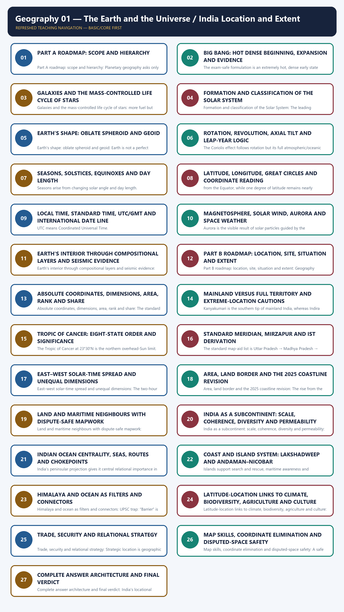
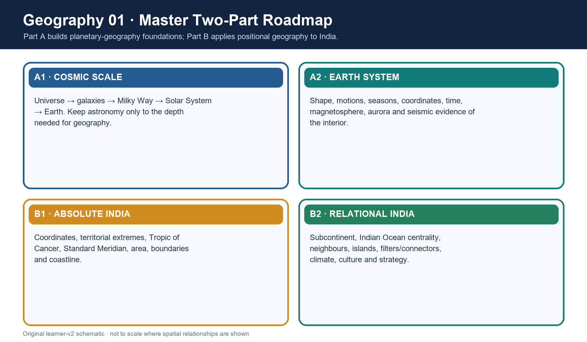
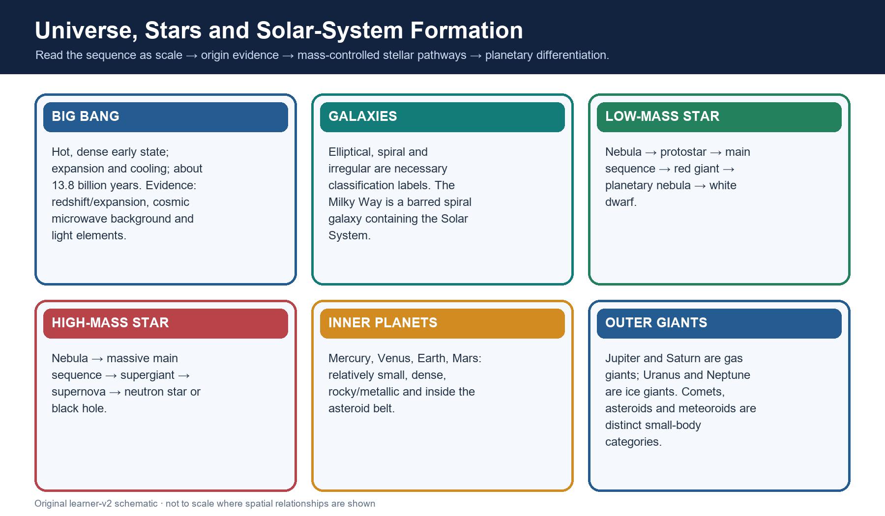
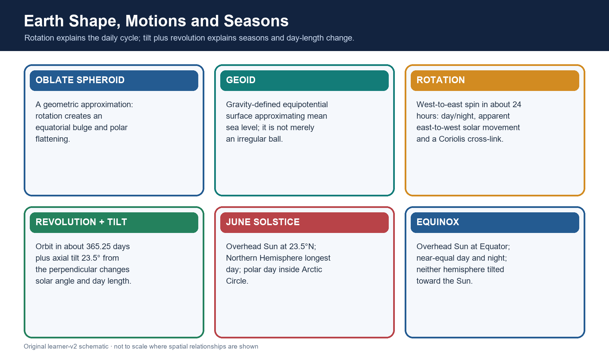
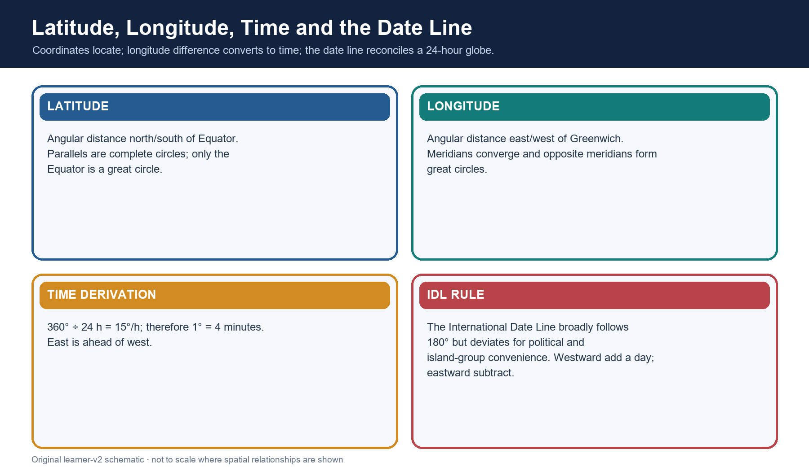
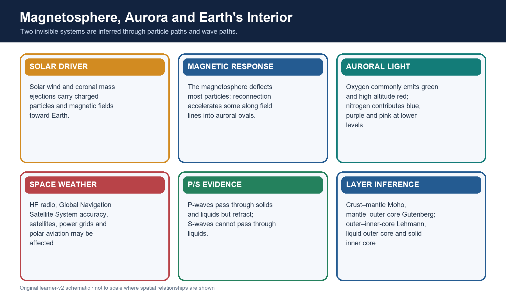
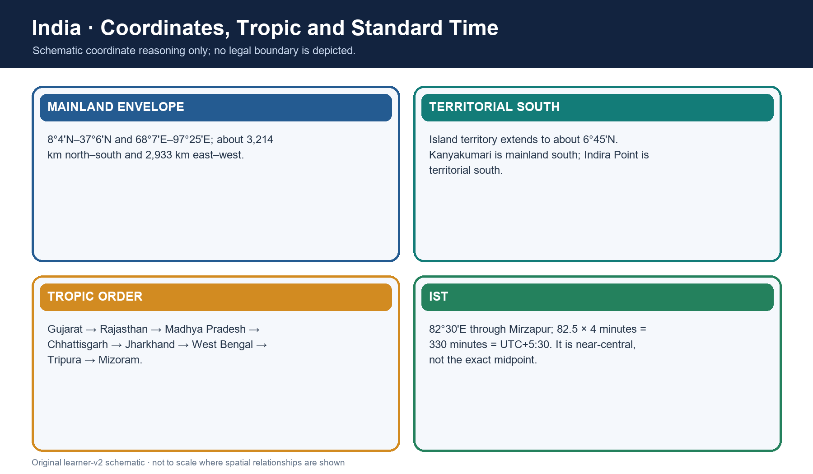
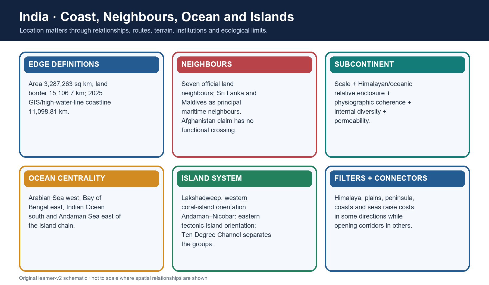
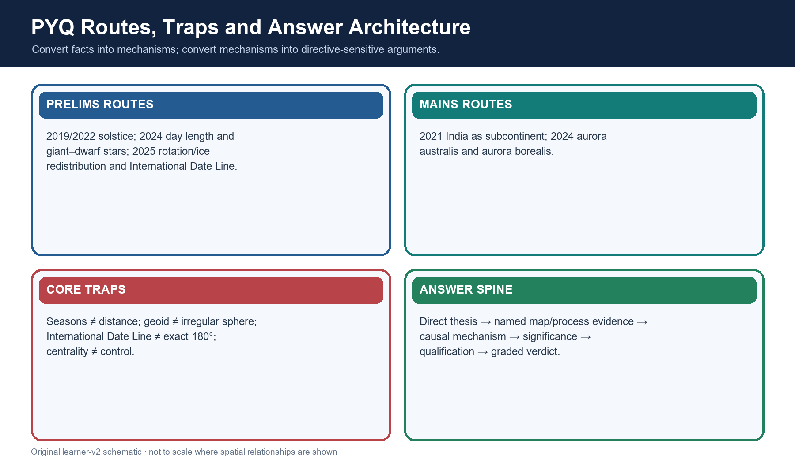

# Geography 01 — The Earth and the Universe / India Location and Extent

**Learner-v2 generation g2 · Part A — Physical Geography · Prelims GS-I + Mains GS-I**

This catalogue topic intentionally joins two substantial owners. The session therefore teaches
planetary geography and India's applied positional geography as two independently complete halves.
It does not treat the slash in the title as permission to omit either half.

**Evidence tags:** **[FACT]** directly retrieved or verified · **[ANALYSIS]** reasoned geographic
synthesis · **[LIMIT]** scope, dating or cartographic caution.


## BASIC LEARNING SESSION



*Distinct embedded teaching-navigation image. The separate continuous Cārvāka-style flowchart package remains an independent at-a-glance artifact.*


### 1. Source audit, syllabus ownership and evidence firewall

**Classification: CORE PRELIMS + CORE MAINS**



*The topic moves from cosmic scale to Earth mechanisms and then from India's absolute position to
its relational significance.*

#### Repository-first audit

| Source owner | What this session retains | Ownership boundary |
|---|---|---|
| `basic/01_The-Earth-and-the-Universe.md` | Shape, motions, coordinates/time, Big Bang, Solar System, interior, magnetosphere/aurora and all routed PYQ demands | Deep plate tectonics and rocks stay with Topic 02; weather and Coriolis mechanics stay with Topic 13 |
| `advanced/01_India-Location-and-Extent.md` | Coordinates, Tropic, Standard Meridian, time spread, coastline and India application | Advanced refinements are taught only after core practice |
| Legacy complete India owner | All 16 chapters, map logic, source cautions, subcontinent model, current coastline anchor and practice concepts | Legacy files remain byte-for-byte unchanged |
| Geography README, syllabus map, answer-worthiness audit and revision chart | Official-clause mapping, Part A sequencing, answer-worthiness and PYQ routes | No inflated claim that every subtopic is a frequent direct Mains demand |
| Cross-links: Topics 02, 12, 13/16, 33 and 35 | Interior boundary, oceans, climate, space programme and political-geography linkage | Cross-links are bounded; their full mechanisms are not duplicated |

#### Local-book audit

- **G.C. Leong scan:** local OCR directly recovered Chapter 1 pages on universe, Solar System,
  Earth's shape, evidence of sphericity, rotation/revolution, solstice/equinox, latitude and
  longitude.
- **Majid Husain, Indian & World Geography:** text-searchable pages 8–26 supplied universe,
  stars, Solar System, axial tilt, International Date Line, great/small circles and seismic-wave
  evidence. Its older “15 billion years/explosion” wording was not retained; current NASA science
  supersedes it.
- **D. R. Khullar scan:** local OCR recovered the locational-setting and land-frontier pages,
  including area, coordinate logic, subcontinent framing and Himalayan/oceanic situation. Older
  coastline and administrative figures were not carried forward.
- **Majid Husain, Geography of India:** the scan's contents and physiography chapters were checked
  for relevant India application; it does not replace the coordinate owner.
- **NCERT PDFs:** no separate local NCERT size/location PDF was present. The repository's verified
  NCERT-derived wording—especially “passes through Mirzapur”—was retained.

#### Live verification cutoff: 22 August 2026

- [FACT] NASA's Universe Overview retains **about 13.8 billion years**, nucleosynthesis and the
  cosmic microwave background as the current exam-safe foundation.
- [FACT] NASA verifies mass-controlled stellar evolution, nebular Solar-System formation, axial
  tilt as the cause of seasons, and Venus's retrograde rotation/Uranus's extreme tilt.
- [FACT] NASA and NOAA verify the aurora chain, auroral ovals, oxygen/nitrogen colours and
  technology impacts. ISRO's bounded May 2024 storm account is used only as an Indian space-weather
  example.
- [FACT] Government of India sources retain area **3,287,263 sq km**, mainland coordinates,
  Standard Meridian **82°30'E**, total land border **15,106.7 km** and seven official land
  neighbours.
- [FACT] The Ministry of Ports, Shipping and Waterways circular of **29 April 2025** and the later
  PIB explanation retain coastline **11,098.81 km** using GIS/high-water-line methodology.
- [ANALYSIS] An official-source search through the cutoff found no later Government of India
  replacement of **11,098.81 km**; the number is therefore used with its 2025 date and method.
- [LIMIT] Maps below are schematic/not to scale and do not depict or adjudicate disputed legal
  boundaries.
### SESSION 1 — PART A ROADMAP: SCOPE AND HIERARCHY

#### DEFINITION / WHAT THIS IS CALLED

**Plain-language definition:** Classification: CORE PRELIMS + SUPPORTING MAINS

**Technical definition:** Part A roadmap: scope and hierarchy: Planetary geography asks only enough astronomy to explain Earth's place, energy relationships,

#### ANSWER-GRABBING OPENING — WRITE/ADAPT IN THE EXAM

> Classification: CORE PRELIMS + SUPPORTING MAINS

#### MUST-WRITE KEYWORDS

- **Classification: CORE PRELIMS + SUPPORTING MAINS**
- **Part A roadmap: scope and hierarchy**

**How to use them:** Classification: CORE PRELIMS + SUPPORTING MAINS

**Classification: CORE PRELIMS + SUPPORTING MAINS**

Planetary geography asks only enough astronomy to explain Earth's place, energy relationships,
motions, time system, magnetic shield and internal differentiation. It does not turn this chapter
into an astrophysics syllabus.

```text
UNIVERSE
  └─ galaxies
       └─ Milky Way (barred spiral)
            └─ Solar System
                 └─ Earth
                      ├─ shape + motions
                      ├─ seasons + coordinates + time
                      ├─ magnetosphere + aurora
                      └─ layered interior inferred from waves
```

> **ANSWER-GRABBING LINE — WRITE/ADAPT IN THE EXAM** Planetary geography begins by locating Earth within a nested hierarchy—universe, galaxy, Solar System and planet—before explaining the processes that make Earth geographically distinctive.

#### CLOSING RECALL FLOW — PART A ROADMAP: SCOPE AND HIERARCHY

```text
START / CONCEPT: Part A roadmap: scope and hierarchy
        |
        v
EXACT TERMS: Classification: CORE PRELIMS + SUPPORTING MAINS · Part A roadmap: scope and hierarchy
        |
        v
MECHANISM / ARGUMENT: Planetary geography begins by locating Earth within a nested hierarchy—universe, galaxy, Solar System and planet—before explaining the processes that make Earth geographically distinctive.
        |
        v
CONSEQUENCE / CONTRAST: motions, time system, magnetic shield and internal differentiation.
        |
        v
UPSC TRAP / ANSWER-USE: Answer-use: Classification: CORE PRELIMS + SUPPORTING MAINS
        |
        v
ANSWER-GRABBING FORMULATION: Classification: CORE PRELIMS + SUPPORTING MAINS
```
### SESSION 2 — BIG BANG: HOT DENSE BEGINNING, EXPANSION AND EVIDENCE

#### DEFINITION / WHAT THIS IS CALLED

**Plain-language definition:** Classification: CORE PRELIMS + CORE MAINS

**Technical definition:** The exam-safe formulation is an extremely hot, dense early state followed by expansion

#### ANSWER-GRABBING OPENING — WRITE/ADAPT IN THE EXAM

> Classification: CORE PRELIMS + CORE MAINS

#### MUST-WRITE KEYWORDS

- **Classification: CORE PRELIMS + CORE MAINS**
- **. The exam-safe formulation is an**
- **UPSC trap**
- **Big Bang: hot dense beginning, expansion and evidence**

**How to use them:** Classification: CORE PRELIMS + CORE MAINS

**Classification: CORE PRELIMS + CORE MAINS**



*The visual connects cosmological origin to star and planetary formation without confusing their
different scales.*

[FACT] Current NASA cosmology places the observable universe's history at about **13.8 billion
years**. The exam-safe formulation is an **extremely hot, dense early state followed by expansion
and cooling**. “Explosion” is misleading if it suggests matter flying from a centre into empty
space.

| Evidence | What it shows | Safe limitation |
|---|---|---|
| Expansion/redshift | Distant-galaxy light is redshifted; large-scale space is expanding | It is not ordinary motion from one terrestrial centre |
| Cosmic microwave background (CMB) | Relic radiation from the epoch when the universe became transparent | It is not light from the first stars |
| Light-element abundance | Early-universe nucleosynthesis predicts much hydrogen/helium and traces of light elements | Avoid unsupported percentage precision |

> **UPSC trap:** Big Bang ≠ a bomb exploding at one point in pre-existing empty space.

> **ANSWER-GRABBING LINE — WRITE/ADAPT IN THE EXAM** The Big Bang denotes the expansion and cooling of an extremely hot, dense early universe about 13.8 billion years ago, not an explosion from one point into pre-existing empty space.

#### CLOSING RECALL FLOW — BIG BANG: HOT DENSE BEGINNING, EXPANSION AND EVIDENCE

```text
START / CONCEPT: Big Bang: hot dense beginning, expansion and evidence
        |
        v
EXACT TERMS: Classification: CORE PRELIMS + CORE MAINS · . The exam-safe formulation is an · UPSC trap · Big Bang: hot dense beginning, expansion and evidence
        |
        v
MECHANISM / ARGUMENT: The exam-safe formulation is an extremely hot, dense early state followed by expansion
        |
        v
CONSEQUENCE / CONTRAST: The visual connects cosmological origin to star and planetary formation without confusing their
        |
        v
UPSC TRAP / ANSWER-USE: UPSC trap: Big Bang ≠ a bomb exploding at one point in pre-existing empty space.
        |
        v
ANSWER-GRABBING FORMULATION: Classification: CORE PRELIMS + CORE MAINS
```
### SESSION 3 — GALAXIES AND THE MASS-CONTROLLED LIFE CYCLE OF STARS

#### DEFINITION / WHAT THIS IS CALLED

**Plain-language definition:** Classification: CORE PRELIMS + CORE MAINS

**Technical definition:** Galaxies and the mass-controlled life cycle of stars: more fuel but consumes it much faster; therefore “larger means longer-lived” is usually false.

#### ANSWER-GRABBING OPENING — WRITE/ADAPT IN THE EXAM

> Classification: CORE PRELIMS + CORE MAINS

#### MUST-WRITE KEYWORDS

- **Classification: CORE PRELIMS + CORE MAINS**
- **Galaxies and the mass-controlled life cycle of stars**

**How to use them:** Classification: CORE PRELIMS + CORE MAINS

**Classification: CORE PRELIMS + CORE MAINS**

| Galaxy type | Necessary recognition | Caution |
|---|---|---|
| Spiral/barred spiral | Disc, central bulge and arms; the Milky Way is barred spiral | Spiral form is not the same as the Solar System |
| Elliptical | Smooth ellipsoidal form, generally less cold gas and less current star formation | Shape alone does not give a precise age |
| Irregular | No regular spiral or elliptical form | “Irregular” does not mean structureless |

```text
gas-dust nebula → gravitational contraction → protostar → main sequence
                                                   ├─ low/intermediate mass → red giant
                                                   │                        → planetary nebula
                                                   │                        → white dwarf
                                                   └─ high mass → supergiant → supernova
                                                                            ├─ neutron star
                                                                            └─ black hole
```

[ANALYSIS] Mass governs core temperature, fusion rate, lifespan and fate. A giant star possesses
more fuel but consumes it much faster; therefore “larger means longer-lived” is usually false.

> **ANSWER-GRABBING LINE — WRITE/ADAPT IN THE EXAM** A star's initial mass governs both its fuel-consumption rate and its final remnant, so massive giants burn faster and usually live shorter lives than low-mass dwarfs.

#### CLOSING RECALL FLOW — GALAXIES AND THE MASS-CONTROLLED LIFE CYCLE OF STARS

```text
START / CONCEPT: Galaxies and the mass-controlled life cycle of stars
        |
        v
EXACT TERMS: Classification: CORE PRELIMS + CORE MAINS · Galaxies and the mass-controlled life cycle of stars
        |
        v
MECHANISM / ARGUMENT: more fuel but consumes it much faster; therefore “larger means longer-lived” is usually false.
        |
        v
CONSEQUENCE / CONTRAST: more fuel but consumes it much faster; therefore “larger means longer-lived” is usually false.
        |
        v
UPSC TRAP / ANSWER-USE: Answer-use: Classification: CORE PRELIMS + CORE MAINS
        |
        v
ANSWER-GRABBING FORMULATION: Classification: CORE PRELIMS + CORE MAINS
```
### SESSION 4 — FORMATION AND CLASSIFICATION OF THE SOLAR SYSTEM

#### DEFINITION / WHAT THIS IS CALLED

**Plain-language definition:** The leading exam-safe model is gravitational collapse of a rotating gas-dust cloud about

**Technical definition:** Formation and classification of the Solar System: The leading exam-safe model is gravitational collapse of a rotating gas-dust cloud about

#### ANSWER-GRABBING OPENING — WRITE/ADAPT IN THE EXAM

> The leading exam-safe model is gravitational collapse of a rotating gas-dust cloud about

#### MUST-WRITE KEYWORDS

- **Classification: CORE PRELIMS**
- **Formation and classification of the Solar System**

**How to use them:** The leading exam-safe model is gravitational collapse of a rotating gas-dust cloud about

**Classification: CORE PRELIMS**

[FACT] The leading exam-safe model is gravitational collapse of a rotating gas-dust cloud about
4.6 billion years ago. Collapse concentrated most mass in the Sun; conservation of angular
momentum flattened the remainder into a protoplanetary disc; dust and ice accreted into larger
bodies.

| Category | Members/examples | Distinction |
|---|---|---|
| Terrestrial planets | Mercury, Venus, Earth, Mars | Inner, smaller, denser, rocky/metallic |
| Gas giants | Jupiter, Saturn | Hydrogen-helium dominated giant planets |
| Ice giants | Uranus, Neptune | Larger role of water/ammonia/methane ices in formation history |
| Dwarf planets | Pluto, Ceres and others | Orbit Sun and are rounded, but have not cleared orbital neighbourhood |
| Asteroid | Rocky/metallic small body, many between Mars and Jupiter | Not an atmospheric flash |
| Comet | Ice-rich body that can develop coma/tail near Sun | Tail points generally away from Sun |
| Meteoroid/meteor/meteorite | Space body / atmospheric luminous path / fragment reaching ground | Stage and location determine the term |

[FACT] The major planets revolve in the same broad prograde direction. Most also rotate prograde;
Venus rotates retrograde, while Uranus's extreme tilt makes it appear to roll around the Sun.

> **ANSWER-GRABBING LINE — WRITE/ADAPT IN THE EXAM** The Solar System formed through gravitational collapse and flattening of a rotating gas-dust nebula, followed by accretion that differentiated rocky inner planets from giant outer planets.

#### CLOSING RECALL FLOW — FORMATION AND CLASSIFICATION OF THE SOLAR SYSTEM

```text
START / CONCEPT: Formation and classification of the Solar System
        |
        v
EXACT TERMS: Classification: CORE PRELIMS · Formation and classification of the Solar System
        |
        v
MECHANISM / ARGUMENT: The Solar System formed through gravitational collapse and flattening of a rotating gas-dust nebula, followed by accretion that differentiated rocky inner planets from giant outer planets.
        |
        v
CONSEQUENCE / CONTRAST: momentum flattened the remainder into a protoplanetary disc; dust and ice accreted into larger
        |
        v
UPSC TRAP / ANSWER-USE: Answer-use: The leading exam-safe model is gravitational collapse of a rotating gas-dust cloud about
        |
        v
ANSWER-GRABBING FORMULATION: The leading exam-safe model is gravitational collapse of a rotating gas-dust cloud about
```
### SESSION 5 — EARTH'S SHAPE: OBLATE SPHEROID AND GEOID

#### DEFINITION / WHAT THIS IS CALLED

**Plain-language definition:** Classification: CORE PRELIMS + SUPPORTING MAINS

**Technical definition:** Earth's shape: oblate spheroid and geoid: Earth is not a perfect sphere.

#### ANSWER-GRABBING OPENING — WRITE/ADAPT IN THE EXAM

> Classification: CORE PRELIMS + SUPPORTING MAINS

#### MUST-WRITE KEYWORDS

- **Classification: CORE PRELIMS + SUPPORTING MAINS**
- **oblate spheroid**
- **geoid**
- **Broad evidence of sphericity**
- **Earth's shape: oblate spheroid and geoid**

**How to use them:** Classification: CORE PRELIMS + SUPPORTING MAINS

**Classification: CORE PRELIMS + SUPPORTING MAINS**



[FACT] Earth is not a perfect sphere. Rotation produces a small equatorial bulge and polar
flattening, so an **oblate spheroid** is the geometric approximation.

[FACT] The **geoid** is the equipotential surface of Earth's gravity field that best approximates
global mean sea level and conceptually continues beneath continents. Gravity variation makes it
undulate relative to a smooth reference ellipsoid.

**Broad evidence of sphericity:** curved horizon, increasing visible horizon with altitude, ships'
hulls disappearing first, Earth's circular lunar-eclipse shadow, changing star altitude with
latitude and direct space observation.

> **ANSWER-GRABBING LINE — WRITE/ADAPT IN THE EXAM** Earth is approximated geometrically as an oblate spheroid, while the geoid is the gravity-defined equipotential surface that best approximates global mean sea level.

#### CLOSING RECALL FLOW — EARTH'S SHAPE: OBLATE SPHEROID AND GEOID

```text
START / CONCEPT: Earth's shape: oblate spheroid and geoid
        |
        v
EXACT TERMS: Classification: CORE PRELIMS + SUPPORTING MAINS · oblate spheroid · geoid · Broad evidence of sphericity · Earth's shape: oblate spheroid and geoid
        |
        v
MECHANISM / ARGUMENT: Earth is not a perfect sphere.
        |
        v
CONSEQUENCE / CONTRAST: Rotation produces a small equatorial bulge and polar
        |
        v
UPSC TRAP / ANSWER-USE: Earth is not a perfect sphere.
        |
        v
ANSWER-GRABBING FORMULATION: Classification: CORE PRELIMS + SUPPORTING MAINS
```
### SESSION 6 — ROTATION, REVOLUTION, AXIAL TILT AND LEAP-YEAR LOGIC

#### DEFINITION / WHAT THIS IS CALLED

**Plain-language definition:** Classification: CORE PRELIMS + CORE MAINS

**Technical definition:** The Coriolis effect follows rotation but its full atmospheric/oceanic mechanics belong to

#### ANSWER-GRABBING OPENING — WRITE/ADAPT IN THE EXAM

> Classification: CORE PRELIMS + CORE MAINS

#### MUST-WRITE KEYWORDS

- **Classification: CORE PRELIMS + CORE MAINS**
- **365**
- **Rotation, revolution, axial tilt and leap-year logic**

**How to use them:** Classification: CORE PRELIMS + CORE MAINS

**Classification: CORE PRELIMS + CORE MAINS**

| Motion/parameter | Exam-safe value | Main consequence |
|---|---:|---|
| Rotation | About 24 hours, west to east | Day/night and apparent east-to-west solar movement |
| Revolution | About 365.24 days | Defines year; combines with tilt for seasonal cycle |
| Axial tilt | 23.5° from perpendicular; 66.5° to orbital plane | Changing solar angle and day length |
| Leap adjustment | Extra calendar day usually every four years, with century refinements | Reconciles calendar with fractional day |

[LIMIT] The Coriolis effect follows rotation but its full atmospheric/oceanic mechanics belong to
Weather Elements and Oceanography.

> **ANSWER-GRABBING LINE — WRITE/ADAPT IN THE EXAM** Rotation produces day and night, whereas revolution acting with axial tilt changes solar angle and day length to produce the seasonal cycle.

#### CLOSING RECALL FLOW — ROTATION, REVOLUTION, AXIAL TILT AND LEAP-YEAR LOGIC

```text
START / CONCEPT: Rotation, revolution, axial tilt and leap-year logic
        |
        v
EXACT TERMS: Classification: CORE PRELIMS + CORE MAINS · 365 · Rotation, revolution, axial tilt and leap-year logic
        |
        v
MECHANISM / ARGUMENT: The Coriolis effect follows rotation but its full atmospheric/oceanic mechanics belong to
        |
        v
CONSEQUENCE / CONTRAST: The Coriolis effect follows rotation but its full atmospheric/oceanic mechanics belong to
        |
        v
UPSC TRAP / ANSWER-USE: Answer-use: Classification: CORE PRELIMS + CORE MAINS
        |
        v
ANSWER-GRABBING FORMULATION: Classification: CORE PRELIMS + CORE MAINS
```
### SESSION 7 — SEASONS, SOLSTICES, EQUINOXES AND DAY LENGTH

#### DEFINITION / WHAT THIS IS CALLED

**Plain-language definition:** Classification: CORE PRELIMS + CORE MAINS

**Technical definition:** Seasons arise from changing solar angle and day length.

#### ANSWER-GRABBING OPENING — WRITE/ADAPT IN THE EXAM

> Classification: CORE PRELIMS + CORE MAINS

#### MUST-WRITE KEYWORDS

- **Classification: CORE PRELIMS + CORE MAINS**
- **solar angle**
- **day length**
- **Seasons, solstices, equinoxes and day length**

**How to use them:** Classification: CORE PRELIMS + CORE MAINS

**Classification: CORE PRELIMS + CORE MAINS**

```text
JUNE SOLSTICE (~21 June)
Subsolar point: 23.5°N
Northern Hemisphere: longest day / shortest night
Southern Hemisphere: shortest day / longest night
Arctic Circle poleward: 24-hour daylight possible

EQUINOXES (~March and September)
Subsolar point: Equator
Near-equal day and night; neither hemisphere tilted toward Sun

DECEMBER SOLSTICE (~21/22 December)
Subsolar point: 23.5°S
Hemispheric pattern reverses
```

[ANALYSIS] Seasons arise from changing **solar angle** and **day length**. Earth is near perihelion
in early January, during Northern Hemisphere winter, so Earth–Sun distance cannot be the main
seasonal cause. The hemispheres experience opposite seasons.

> **ANSWER-GRABBING LINE — WRITE/ADAPT IN THE EXAM** A solstice marks maximum hemispheric tilt toward or away from the Sun, while an equinox places the overhead Sun at the Equator and gives near-equal day and night.

#### CLOSING RECALL FLOW — SEASONS, SOLSTICES, EQUINOXES AND DAY LENGTH

```text
START / CONCEPT: Seasons, solstices, equinoxes and day length
        |
        v
EXACT TERMS: Classification: CORE PRELIMS + CORE MAINS · solar angle · day length · Seasons, solstices, equinoxes and day length
        |
        v
MECHANISM / ARGUMENT: Seasons arise from changing solar angle and day length.
        |
        v
CONSEQUENCE / CONTRAST: in early January, during Northern Hemisphere winter, so Earth–Sun distance cannot be the main
        |
        v
UPSC TRAP / ANSWER-USE: in early January, during Northern Hemisphere winter, so Earth–Sun distance cannot be the main
        |
        v
ANSWER-GRABBING FORMULATION: Classification: CORE PRELIMS + CORE MAINS
```
### SESSION 8 — LATITUDE, LONGITUDE, GREAT CIRCLES AND COORDINATE READING

#### DEFINITION / WHAT THIS IS CALLED

**Plain-language definition:** Longitude lines converge poleward; therefore one degree of longitude becomes shorter away

**Technical definition:** from the Equator, while one degree of latitude remains nearly constant.

#### ANSWER-GRABBING OPENING — WRITE/ADAPT IN THE EXAM

> Longitude lines converge poleward; therefore one degree of longitude becomes shorter away

#### MUST-WRITE KEYWORDS

- **Classification: CORE PRELIMS**
- **Latitude, longitude, great circles and coordinate reading**

**How to use them:** Longitude lines converge poleward; therefore one degree of longitude becomes shorter away

**Classification: CORE PRELIMS**

| Concept | Definition | Geometry/exam use |
|---|---|---|
| Latitude | Angular distance north/south of Equator | Parallels; Equator is a great circle; other parallels are small circles |
| Longitude | Angular distance east/west of Prime Meridian | Meridians are semicircles; opposite meridians form a great circle |
| Great circle | Circle whose plane passes through Earth's centre | Shortest surface route between two points |
| Coordinate grid | Intersection of a latitude and longitude | Read hemisphere letter before comparing values |

[FACT] Longitude lines converge poleward; therefore one degree of longitude becomes shorter away
from the Equator, while one degree of latitude remains nearly constant.

> **ANSWER-GRABBING LINE — WRITE/ADAPT IN THE EXAM** Latitude measures angular distance north or south of the Equator, whereas longitude measures angular distance east or west of the Prime Meridian and provides the basis for time.

#### CLOSING RECALL FLOW — LATITUDE, LONGITUDE, GREAT CIRCLES AND COORDINATE READING

```text
START / CONCEPT: Latitude, longitude, great circles and coordinate reading
        |
        v
EXACT TERMS: Classification: CORE PRELIMS · Latitude, longitude, great circles and coordinate reading
        |
        v
MECHANISM / ARGUMENT: Longitude lines converge poleward; therefore one degree of longitude becomes shorter away
        |
        v
CONSEQUENCE / CONTRAST: Longitude lines converge poleward; therefore one degree of longitude becomes shorter away
        |
        v
UPSC TRAP / ANSWER-USE: Answer-use: Longitude lines converge poleward; therefore one degree of longitude becomes shorter away
        |
        v
ANSWER-GRABBING FORMULATION: Longitude lines converge poleward; therefore one degree of longitude becomes shorter away
```
### SESSION 9 — LOCAL TIME, STANDARD TIME, UTC/GMT AND INTERNATIONAL DATE LINE

#### DEFINITION / WHAT THIS IS CALLED

**Plain-language definition:** !Coordinate, time and date-line logic

**Technical definition:** UTC means Coordinated Universal Time.

#### ANSWER-GRABBING OPENING — WRITE/ADAPT IN THE EXAM

> !Coordinate, time and date-line logic

#### MUST-WRITE KEYWORDS

- **Classification: CORE PRELIMS**
- **UTC**
- **GMT**
- **International Date Line (IDL)**
- **360**
- **180**
- **Local time, standard time, UTC/GMT and International Date Line**

**How to use them:** !Coordinate, time and date-line logic

**Classification: CORE PRELIMS**



```text
360° rotation / 24 hours = 15° per hour
15° / 60 minutes = 1° per 4 minutes
eastward longitude → local solar time ahead
westward longitude → local solar time behind
```

**UTC** means Coordinated Universal Time. **GMT** means Greenwich Mean Time; at UPSC level they
share the zero-meridian reference, though UTC is the modern atomic-time standard.

The **International Date Line (IDL)** broadly follows 180° but zigzags to avoid dividing political
territories and island groups. Crossing westward adds a day; crossing eastward subtracts a day.
Anadyr lies west of the line and Nome east of it: Anadyr is a calendar day ahead, not behind.

> **ANSWER-GRABBING LINE — WRITE/ADAPT IN THE EXAM** Earth's rotation gives 15° of longitude per hour and 1° per four minutes; east is ahead, and crossing the International Date Line westward adds a calendar day while eastward subtracts one.

#### CLOSING RECALL FLOW — LOCAL TIME, STANDARD TIME, UTC/GMT AND INTERNATIONAL DATE LINE

```text
START / CONCEPT: Local time, standard time, UTC/GMT and International Date Line
        |
        v
EXACT TERMS: Classification: CORE PRELIMS · UTC · GMT · International Date Line (IDL) · 360
        |
        v
MECHANISM / ARGUMENT: UTC means Coordinated Universal Time.
        |
        v
CONSEQUENCE / CONTRAST: GMT means Greenwich Mean Time; at UPSC level they
        |
        v
UPSC TRAP / ANSWER-USE: The International Date Line (IDL) broadly follows 180° but zigzags to avoid dividing political
        |
        v
ANSWER-GRABBING FORMULATION: !Coordinate, time and date-line logic
```
### SESSION 10 — MAGNETOSPHERE, SOLAR WIND, AURORA AND SPACE WEATHER

#### DEFINITION / WHAT THIS IS CALLED

**Plain-language definition:** Classification: CORE PRELIMS + CORE MAINS

**Technical definition:** Aurora is the visible result of solar particles guided by the magnetosphere into the polar upper atmosphere, where collisions excite oxygen and nitrogen to emit light.

#### ANSWER-GRABBING OPENING — WRITE/ADAPT IN THE EXAM

> Classification: CORE PRELIMS + CORE MAINS

#### MUST-WRITE KEYWORDS

- **Classification: CORE PRELIMS + CORE MAINS**
- **Space-weather effects**
- **Bounded India anchor**
- **100–200**
- **200**
- **2024**
- **Magnetosphere, solar wind, aurora and space weather**

**How to use them:** Classification: CORE PRELIMS + CORE MAINS

**Classification: CORE PRELIMS + CORE MAINS**



```text
Sun → solar wind / coronal mass ejection
    → magnetosphere compressed on dayside and stretched into magnetotail
    → magnetic reconnection and particle acceleration
    → particles follow converging field lines
    → precipitation into upper atmosphere around magnetic poles
    → oxygen/nitrogen excitation and de-excitation
    → aurora borealis / aurora australis
```

| Control | Outcome |
|---|---|
| Magnetic rather than geographic poles | Auroral ovals are offset from geographic poles |
| Strong geomagnetic storm | Oval expands equatorward; rare lower-latitude sightings become possible |
| Oxygen at roughly 100–200 km | Common green emission |
| Oxygen above roughly 200 km | Red emission |
| Nitrogen, especially lower aurora | Blue, purple, pink/reddish-purple fringes |

**Space-weather effects:** high-frequency (HF) radio disturbance, Global Navigation Satellite
System (GNSS) errors, satellite drag/electronics risk, radiation exposure on polar aviation and
geomagnetically induced currents in long power lines.

**Bounded India anchor:** ISRO reported the May 2024 solar-eruptive event from Earth, Sun–Earth L1
and lunar assets. India's low magnetic latitude reduces routine auroral visibility and high-latitude
grid-current exposure, but equatorial ionospheric disturbance can still affect navigation and
communication.

> **ANSWER-GRABBING LINE — WRITE/ADAPT IN THE EXAM** Aurora is the visible result of solar particles guided by the magnetosphere into the polar upper atmosphere, where collisions excite oxygen and nitrogen to emit light.

#### CLOSING RECALL FLOW — MAGNETOSPHERE, SOLAR WIND, AURORA AND SPACE WEATHER

```text
START / CONCEPT: Magnetosphere, solar wind, aurora and space weather
        |
        v
EXACT TERMS: Classification: CORE PRELIMS + CORE MAINS · Space-weather effects · Bounded India anchor · 100–200 · 200
        |
        v
MECHANISM / ARGUMENT: Aurora is the visible result of solar particles guided by the magnetosphere into the polar upper atmosphere, where collisions excite oxygen and nitrogen to emit light.
        |
        v
CONSEQUENCE / CONTRAST: Space-weather effects: high-frequency (HF) radio disturbance, Global Navigation Satellite
        |
        v
UPSC TRAP / ANSWER-USE: Answer-use: Classification: CORE PRELIMS + CORE MAINS
        |
        v
ANSWER-GRABBING FORMULATION: Classification: CORE PRELIMS + CORE MAINS
```
### SESSION 11 — EARTH'S INTERIOR THROUGH COMPOSITIONAL LAYERS AND SEISMIC EVIDENCE

#### DEFINITION / WHAT THIS IS CALLED

**Plain-language definition:** Classification: CORE PRELIMS + CORE MAINS

**Technical definition:** Earth's interior through compositional layers and seismic evidence: Mechanical cross-link: lithosphere is rigid; asthenosphere below is weaker/ductile.

#### ANSWER-GRABBING OPENING — WRITE/ADAPT IN THE EXAM

> Classification: CORE PRELIMS + CORE MAINS

#### MUST-WRITE KEYWORDS

- **Classification: CORE PRELIMS + CORE MAINS**
- **Mechanical cross-link**
- **Wave logic**
- **Earth's interior through compositional layers and seismic evidence**

**How to use them:** Classification: CORE PRELIMS + CORE MAINS

**Classification: CORE PRELIMS + CORE MAINS**

| Compositional layer | Broad character | Boundary |
|---|---|---|
| Crust | Thin, solid outer shell; continental and oceanic types | Moho below crust |
| Mantle | Solid rock capable of very slow flow; most of Earth's volume | Gutenberg at mantle–outer core |
| Outer core | Liquid, iron-rich | Lehmann at outer–inner core |
| Inner core | Solid, iron-rich under very high pressure | Centre of Earth |

**Mechanical cross-link:** lithosphere is rigid; asthenosphere below is weaker/ductile. Deeper plate
tectonics remains Topic 02.

**Wave logic:** P-waves are compressional and cross solids and liquids, changing speed and
direction. S-waves are shear waves and do not cross liquids. Their shadow zones show that Earth is
differentiated rather than homogeneous.

> **ANSWER-GRABBING LINE — WRITE/ADAPT IN THE EXAM** The disappearance of S-waves through the outer core and the refraction of P-waves create shadow zones that reveal a liquid outer core surrounding a solid inner core.

#### CLOSING RECALL FLOW — EARTH'S INTERIOR THROUGH COMPOSITIONAL LAYERS AND SEISMIC EVIDENCE

```text
START / CONCEPT: Earth's interior through compositional layers and seismic evidence
        |
        v
EXACT TERMS: Classification: CORE PRELIMS + CORE MAINS · Mechanical cross-link · Wave logic · Earth's interior through compositional layers and seismic evidence
        |
        v
MECHANISM / ARGUMENT: The disappearance of S-waves through the outer core and the refraction of P-waves create shadow zones that reveal a liquid outer core surrounding a solid inner core.
        |
        v
CONSEQUENCE / CONTRAST: Wave logic: P-waves are compressional and cross solids and liquids, changing speed and
        |
        v
UPSC TRAP / ANSWER-USE: S-waves are shear waves and do not cross liquids.
        |
        v
ANSWER-GRABBING FORMULATION: Classification: CORE PRELIMS + CORE MAINS
```
### SESSION 12 — PART B ROADMAP: LOCATION, SITE, SITUATION AND EXTENT

#### DEFINITION / WHAT THIS IS CALLED

**Plain-language definition:** Classification: CORE PRELIMS + CORE MAINS

**Technical definition:** Part B roadmap: location, site, situation and extent: Geography creates opportunities and constraints, not predetermined outcomes.

#### ANSWER-GRABBING OPENING — WRITE/ADAPT IN THE EXAM

> Classification: CORE PRELIMS + CORE MAINS

#### MUST-WRITE KEYWORDS

- **Classification: CORE PRELIMS + CORE MAINS**
- **Part B roadmap: location, site, situation and extent**

**How to use them:** Classification: CORE PRELIMS + CORE MAINS

**Classification: CORE PRELIMS + CORE MAINS**



| Tool | Meaning | India application |
|---|---|---|
| Absolute location | Latitude/longitude position | Northern and Eastern hemispheres |
| Site | Physical ground occupied | Peninsula, relief and coastal setting |
| Situation | Relationship to other places/routes | Between West Asian and South-East Asian maritime approaches |
| Extent | North–south/east–west spread | Climate, time and administrative implications |

[ANALYSIS] Geography creates opportunities and constraints, not predetermined outcomes. Ports,
roads, institutions, technology and diplomacy mediate locational advantage.

> **ANSWER-GRABBING LINE — WRITE/ADAPT IN THE EXAM** India's location must be read through four linked ideas—absolute position, physical site, relational situation and territorial extent—because coordinates alone do not explain significance.

#### CLOSING RECALL FLOW — PART B ROADMAP: LOCATION, SITE, SITUATION AND EXTENT

```text
START / CONCEPT: Part B roadmap: location, site, situation and extent
        |
        v
EXACT TERMS: Classification: CORE PRELIMS + CORE MAINS · Part B roadmap: location, site, situation and extent
        |
        v
MECHANISM / ARGUMENT: Geography creates opportunities and constraints, not predetermined outcomes.
        |
        v
CONSEQUENCE / CONTRAST: India's location must be read through four linked ideas—absolute position, physical site, relational situation and territorial extent—because coordinates alone do not explain significance.
        |
        v
UPSC TRAP / ANSWER-USE: Geography creates opportunities and constraints, not predetermined outcomes.
        |
        v
ANSWER-GRABBING FORMULATION: Classification: CORE PRELIMS + CORE MAINS
```
### SESSION 13 — ABSOLUTE COORDINATES, DIMENSIONS, AREA, RANK AND SHARE

#### DEFINITION / WHAT THIS IS CALLED

**Plain-language definition:** The standard mainland envelope is 8°4'N–37°6'N and 68°7'E–97°25'E.

**Technical definition:** Absolute coordinates, dimensions, area, rank and share: The standard mainland envelope is 8°4'N–37°6'N and 68°7'E–97°25'E.

#### ANSWER-GRABBING OPENING — WRITE/ADAPT IN THE EXAM

> The standard mainland envelope is 8°4'N–37°6'N and 68°7'E–97°25'E.

#### MUST-WRITE KEYWORDS

- **Classification: CORE PRELIMS**
- **8°4'N–37°6'N**
- **68°7'E–97°25'E**
- **214**
- **933**
- **287**
- **263**
- **Absolute coordinates, dimensions, area, rank and share**

**How to use them:** The standard mainland envelope is 8°4'N–37°6'N and 68°7'E–97°25'E.

**Classification: CORE PRELIMS**

[FACT] The standard mainland envelope is **8°4'N–37°6'N** and **68°7'E–97°25'E**. India lies
wholly in the Northern and Eastern hemispheres.

| Parameter | Current exam-safe value |
|---|---:|
| Mainland latitudinal span | About 29°02' |
| Mainland longitudinal span | About 29°18' |
| North–south distance | About 3,214 km |
| East–west distance | About 2,933 km |
| Area | 3,287,263 sq km |
| Global area rank / land share | Seventh-largest; about 2.4% of world land area in official profiles |

[LIMIT] A coordinate envelope is a bounding box, not the country's actual polygon; its corners may
lie outside the territory.

> **ANSWER-GRABBING LINE — WRITE/ADAPT IN THE EXAM** Mainland India extends from 8°4'N to 37°6'N and 68°7'E to 97°25'E, combining a nearly 29-degree angular spread with unequal north-south and east-west linear dimensions.

#### CLOSING RECALL FLOW — ABSOLUTE COORDINATES, DIMENSIONS, AREA, RANK AND SHARE

```text
START / CONCEPT: Absolute coordinates, dimensions, area, rank and share
        |
        v
EXACT TERMS: Classification: CORE PRELIMS · 8°4'N–37°6'N · 68°7'E–97°25'E · 214 · 933
        |
        v
MECHANISM / ARGUMENT: wholly in the Northern and Eastern hemispheres.
        |
        v
CONSEQUENCE / CONTRAST: A coordinate envelope is a bounding box, not the country's actual polygon; its corners may
        |
        v
UPSC TRAP / ANSWER-USE: A coordinate envelope is a bounding box, not the country's actual polygon; its corners may
        |
        v
ANSWER-GRABBING FORMULATION: The standard mainland envelope is 8°4'N–37°6'N and 68°7'E–97°25'E.
```
### SESSION 14 — MAINLAND VERSUS FULL TERRITORY AND EXTREME-LOCATION CAUTIONS

#### DEFINITION / WHAT THIS IS CALLED

**Plain-language definition:** The Nicobar Islands extend Indian territory southward to about 6°45'N.

**Technical definition:** Kanyakumari is the southern tip of mainland India, whereas Indira Point on Great Nicobar is the southernmost point of the Union's territory.

#### ANSWER-GRABBING OPENING — WRITE/ADAPT IN THE EXAM

> The Nicobar Islands extend Indian territory southward to about 6°45'N.

#### MUST-WRITE KEYWORDS

- **Classification: CORE PRELIMS**
- **6°45'N**
- **Mainland versus full territory and extreme-location cautions**

**How to use them:** The Nicobar Islands extend Indian territory southward to about 6°45'N.

**Classification: CORE PRELIMS**

[FACT] The Nicobar Islands extend Indian territory southward to about **6°45'N**.

| Category asked | Safe response |
|---|---|
| Southern tip of mainland | Kanyakumari |
| Southernmost point of Union territory | Indira Point, Great Nicobar |
| Western/eastern mainland limits | Use 68°7'E and 97°25'E; add place labels only with category stated |

[LIMIT] A named settlement, inhabited point, sunrise claim and exact coordinate extremity are not
automatically identical. Use official Survey of India maps for legal cartography, especially in
disputed sectors.

> **ANSWER-GRABBING LINE — WRITE/ADAPT IN THE EXAM** Kanyakumari is the southern tip of mainland India, whereas Indira Point on Great Nicobar is the southernmost point of the Union's territory.

#### CLOSING RECALL FLOW — MAINLAND VERSUS FULL TERRITORY AND EXTREME-LOCATION CAUTIONS

```text
START / CONCEPT: Mainland versus full territory and extreme-location cautions
        |
        v
EXACT TERMS: Classification: CORE PRELIMS · 6°45'N · Mainland versus full territory and extreme-location cautions
        |
        v
MECHANISM / ARGUMENT: A named settlement, inhabited point, sunrise claim and exact coordinate extremity are not
        |
        v
CONSEQUENCE / CONTRAST: Kanyakumari is the southern tip of mainland India, whereas Indira Point on Great Nicobar is the southernmost point of the Union's territory.
        |
        v
UPSC TRAP / ANSWER-USE: Answer-use: The Nicobar Islands extend Indian territory southward to about 6°45'N.
        |
        v
ANSWER-GRABBING FORMULATION: The Nicobar Islands extend Indian territory southward to about 6°45'N.
```
### SESSION 15 — TROPIC OF CANCER: EIGHT-STATE ORDER AND SIGNIFICANCE

#### DEFINITION / WHAT THIS IS CALLED

**Plain-language definition:** The Tropic of Cancer at 23°30'N is the northern overhead-Sun limit.

**Technical definition:** The Tropic of Cancer at 23°30'N is the northern overhead-Sun limit.

#### ANSWER-GRABBING OPENING — WRITE/ADAPT IN THE EXAM

> The Tropic of Cancer at 23°30'N is the northern overhead-Sun limit.

#### MUST-WRITE KEYWORDS

- **Classification: CORE PRELIMS**
- **23°30'N**
- **Tropic of Cancer: eight-state order and significance**

**How to use them:** The Tropic of Cancer at 23°30'N is the northern overhead-Sun limit.

**Classification: CORE PRELIMS**

```text
WEST → EAST
Gujarat → Rajasthan → Madhya Pradesh → Chhattisgarh
        → Jharkhand → West Bengal → Tripura → Mizoram
```

[ANALYSIS] The Tropic of Cancer at **23°30'N** is the northern overhead-Sun limit. It is a powerful
map-elimination line, but it neither divides India into exactly equal halves nor creates a sharp
tropical–temperate climatic wall.

> **ANSWER-GRABBING LINE — WRITE/ADAPT IN THE EXAM** The Tropic of Cancer crosses eight states from Gujarat to Mizoram, but it is a solar reference parallel rather than an equal divider or climatic wall.

#### CLOSING RECALL FLOW — TROPIC OF CANCER: EIGHT-STATE ORDER AND SIGNIFICANCE

```text
START / CONCEPT: Tropic of Cancer: eight-state order and significance
        |
        v
EXACT TERMS: Classification: CORE PRELIMS · 23°30'N · Tropic of Cancer: eight-state order and significance
        |
        v
MECHANISM / ARGUMENT: map-elimination line, but it neither divides India into exactly equal halves nor creates a sharp
        |
        v
CONSEQUENCE / CONTRAST: The Tropic of Cancer crosses eight states from Gujarat to Mizoram, but it is a solar reference parallel rather than an equal divider or climatic wall.
        |
        v
UPSC TRAP / ANSWER-USE: The Tropic of Cancer crosses eight states from Gujarat to Mizoram, but it is a solar reference parallel rather than an equal divider or climatic wall.
        |
        v
ANSWER-GRABBING FORMULATION: The Tropic of Cancer at 23°30'N is the northern overhead-Sun limit.
```
### SESSION 16 — STANDARD MERIDIAN, MIRZAPUR AND IST DERIVATION

#### DEFINITION / WHAT THIS IS CALLED

**Plain-language definition:** Classification: CORE PRELIMS + SUPPORTING MAINS

**Technical definition:** The standard map-aid list is Uttar Pradesh → Madhya Pradesh →

#### ANSWER-GRABBING OPENING — WRITE/ADAPT IN THE EXAM

> Classification: CORE PRELIMS + SUPPORTING MAINS

#### MUST-WRITE KEYWORDS

- **Classification: CORE PRELIMS + SUPPORTING MAINS**
- **82°30'E**
- **82°46'E**
- **330**
- **Standard Meridian, Mirzapur and IST derivation**

**How to use them:** Classification: CORE PRELIMS + SUPPORTING MAINS

**Classification: CORE PRELIMS + SUPPORTING MAINS**

[FACT] India adopts **82°30'E** as its Standard Meridian. NCERT wording says it **passes through
Mirzapur in Uttar Pradesh**. The standard map-aid list is Uttar Pradesh → Madhya Pradesh →
Chhattisgarh → Odisha → Andhra Pradesh.

```text
82°30'E = 82.5°
82.5 × 4 minutes = 330 minutes
330 minutes = 5 hours 30 minutes
IST = UTC+5:30
```

[ANALYSIS] The meridian is near-central, not exactly central: the mainland's longitudinal midpoint
is about **82°46'E**.

> **ANSWER-GRABBING LINE — WRITE/ADAPT IN THE EXAM** India's Standard Meridian at 82°30'E passes through Mirzapur in Uttar Pradesh and yields Indian Standard Time of UTC+5:30 by the four-minutes-per-degree rule.

#### CLOSING RECALL FLOW — STANDARD MERIDIAN, MIRZAPUR AND IST DERIVATION

```text
START / CONCEPT: Standard Meridian, Mirzapur and IST derivation
        |
        v
EXACT TERMS: Classification: CORE PRELIMS + SUPPORTING MAINS · 82°30'E · 82°46'E · 330 · Standard Meridian, Mirzapur and IST derivation
        |
        v
MECHANISM / ARGUMENT: NCERT wording says it passes through
        |
        v
CONSEQUENCE / CONTRAST: NCERT wording says it passes through
        |
        v
UPSC TRAP / ANSWER-USE: The meridian is near-central, not exactly central: the mainland's longitudinal midpoint
        |
        v
ANSWER-GRABBING FORMULATION: Classification: CORE PRELIMS + SUPPORTING MAINS
```
### SESSION 17 — EAST–WEST SOLAR-TIME SPREAD AND UNEQUAL DIMENSIONS

#### DEFINITION / WHAT THIS IS CALLED

**Plain-language definition:** Classification: CORE PRELIMS + CORE MAINS

**Technical definition:** East–west solar-time spread and unequal dimensions: The two-hour figure is an envelope calculation; actual sunrise also varies with season,

#### ANSWER-GRABBING OPENING — WRITE/ADAPT IN THE EXAM

> Classification: CORE PRELIMS + CORE MAINS

#### MUST-WRITE KEYWORDS

- **Classification: CORE PRELIMS + CORE MAINS**
- **117**
- **East–west solar-time spread and unequal dimensions**

**How to use them:** Classification: CORE PRELIMS + CORE MAINS

**Classification: CORE PRELIMS + CORE MAINS**

```text
97°25'E − 68°7'E = 29°18'
29°18' × 4 minutes per degree ≈ 117 minutes
conventional answer: about two hours
```

Eastern India experiences local sunrise and noon earlier than western India, although clocks use
one IST. The two-hour figure is an envelope calculation; actual sunrise also varies with season,
terrain, refraction and selected endpoints.

Similar angular spans do not give equal kilometres because longitude degrees contract with
latitude.

> **ANSWER-GRABBING LINE — WRITE/ADAPT IN THE EXAM** India's 29°18' longitudinal span produces about 117 minutes of local solar-time difference, even though one civil time is used across the country.

#### CLOSING RECALL FLOW — EAST–WEST SOLAR-TIME SPREAD AND UNEQUAL DIMENSIONS

```text
START / CONCEPT: East–west solar-time spread and unequal dimensions
        |
        v
EXACT TERMS: Classification: CORE PRELIMS + CORE MAINS · 117 · East–west solar-time spread and unequal dimensions
        |
        v
MECHANISM / ARGUMENT: Similar angular spans do not give equal kilometres because longitude degrees contract with
        |
        v
CONSEQUENCE / CONTRAST: The two-hour figure is an envelope calculation; actual sunrise also varies with season,
        |
        v
UPSC TRAP / ANSWER-USE: Similar angular spans do not give equal kilometres because longitude degrees contract with
        |
        v
ANSWER-GRABBING FORMULATION: Classification: CORE PRELIMS + CORE MAINS
```
### SESSION 18 — AREA, LAND BORDER AND THE 2025 COASTLINE REVISION

#### DEFINITION / WHAT THIS IS CALLED

**Plain-language definition:** Classification: CORE PRELIMS + CURRENT-AFFAIRS LINK

**Technical definition:** Area, land border and the 2025 coastline revision: The rise from the legacy 7,516.6 km demonstrates the coastline paradox: a finer measuring scale

#### ANSWER-GRABBING OPENING — WRITE/ADAPT IN THE EXAM

> Classification: CORE PRELIMS + CURRENT-AFFAIRS LINK

#### MUST-WRITE KEYWORDS

- **Classification: CORE PRELIMS + CURRENT-AFFAIRS LINK**
- **coastline paradox**
- **287**
- **263**
- **106**
- **098**
- **2025**
- **870**

**How to use them:** Classification: CORE PRELIMS + CURRENT-AFFAIRS LINK

**Classification: CORE PRELIMS + CURRENT-AFFAIRS LINK**



| Measure | Current bounded value | Definition caution |
|---|---:|---|
| Area | 3,287,263 sq km | Two-dimensional national area |
| International land border | 15,106.7 km | MHA total; not coastline |
| Revised coastline | 11,098.81 km (2025) | GIS/high-water-line measurement including detailed island/coastal geometry |
| Official breakup | About 7,870.5 km mainland + 3,228.3 km islands | Quote with the 2025 method |

The rise from the legacy 7,516.6 km demonstrates the **coastline paradox**: a finer measuring scale
captures more indentations and island perimeter. It does not increase national area, create land or
automatically redraw Coastal Regulation Zone (CRZ) high-tide-line boundaries.

> **ANSWER-GRABBING LINE — WRITE/ADAPT IN THE EXAM** The 2025 coastline figure of 11,098.81 km reflects finer GIS and high-water-line measurement of coastal detail and islands, not territorial expansion or automatic change in Coastal Regulation Zone boundaries.

#### CLOSING RECALL FLOW — AREA, LAND BORDER AND THE 2025 COASTLINE REVISION

```text
START / CONCEPT: Area, land border and the 2025 coastline revision
        |
        v
EXACT TERMS: Classification: CORE PRELIMS + CURRENT-AFFAIRS LINK · coastline paradox · 287 · 263 · 106
        |
        v
MECHANISM / ARGUMENT: The rise from the legacy 7,516.6 km demonstrates the coastline paradox: a finer measuring scale
        |
        v
CONSEQUENCE / CONTRAST: captures more indentations and island perimeter.
        |
        v
UPSC TRAP / ANSWER-USE: It does not increase national area, create land or
        |
        v
ANSWER-GRABBING FORMULATION: Classification: CORE PRELIMS + CURRENT-AFFAIRS LINK
```
### SESSION 19 — LAND AND MARITIME NEIGHBOURS WITH DISPUTE-SAFE MAPWORK

#### DEFINITION / WHAT THIS IS CALLED

**Plain-language definition:** Classification: CORE PRELIMS + SUPPORTING MAINS

**Technical definition:** Land and maritime neighbours with dispute-safe mapwork: Afghanistan appears in the official list under India's claim, but there is no functioning

#### ANSWER-GRABBING OPENING — WRITE/ADAPT IN THE EXAM

> Classification: CORE PRELIMS + SUPPORTING MAINS

#### MUST-WRITE KEYWORDS

- **Classification: CORE PRELIMS + SUPPORTING MAINS**
- **Official land list**
- **Land and maritime neighbours with dispute-safe mapwork**

**How to use them:** Classification: CORE PRELIMS + SUPPORTING MAINS

**Classification: CORE PRELIMS + SUPPORTING MAINS**

**Official land list:** Afghanistan, Pakistan, China, Nepal, Bhutan, Bangladesh and Myanmar.
Sri Lanka and Maldives are principal maritime neighbours.

| Interface | Geographic character |
|---|---|
| North and north-west | High mountains, plateaux, passes and desert sectors |
| Nepal/Bhutan interfaces | Mountains, foothills and plains connections |
| Bangladesh | Riverine, alluvial and deltaic complexity |
| Myanmar | Forested hills and cross-border cultural continuities |
| Sri Lanka | Palk Strait and Gulf of Mannar |
| Maldives | South-west of Lakshadweep in the Indian Ocean |

[LIMIT] Afghanistan appears in the official list under India's claim, but there is no functioning
direct crossing because intervening territory is administered by Pakistan.

> **ANSWER-GRABBING LINE — WRITE/ADAPT IN THE EXAM** India's official land-neighbour list contains seven countries, including Afghanistan under India's claim, while Sri Lanka and Maldives are principal maritime neighbours.

#### CLOSING RECALL FLOW — LAND AND MARITIME NEIGHBOURS WITH DISPUTE-SAFE MAPWORK

```text
START / CONCEPT: Land and maritime neighbours with dispute-safe mapwork
        |
        v
EXACT TERMS: Classification: CORE PRELIMS + SUPPORTING MAINS · Official land list · Land and maritime neighbours with dispute-safe mapwork
        |
        v
MECHANISM / ARGUMENT: direct crossing because intervening territory is administered by Pakistan.
        |
        v
CONSEQUENCE / CONTRAST: Sri Lanka and Maldives are principal maritime neighbours.
        |
        v
UPSC TRAP / ANSWER-USE: Answer-use: Classification: CORE PRELIMS + SUPPORTING MAINS
        |
        v
ANSWER-GRABBING FORMULATION: Classification: CORE PRELIMS + SUPPORTING MAINS
```
### SESSION 20 — INDIA AS A SUBCONTINENT: SCALE, COHERENCE, DIVERSITY AND PERMEABILITY

#### DEFINITION / WHAT THIS IS CALLED

**Plain-language definition:** Classification: CORE MAINS + PRELIMS CONTEXT

**Technical definition:** India as a subcontinent: scale, coherence, diversity and permeability: The term means a large and distinctive subdivision of Asia, not an isolated or culturally uniform

#### ANSWER-GRABBING OPENING — WRITE/ADAPT IN THE EXAM

> Classification: CORE MAINS + PRELIMS CONTEXT

#### MUST-WRITE KEYWORDS

- **Classification: CORE MAINS + PRELIMS CONTEXT**
- **India as a subcontinent: scale, coherence, diversity and permeability**

**How to use them:** Classification: CORE MAINS + PRELIMS CONTEXT

**Classification: CORE MAINS + PRELIMS CONTEXT**

```text
WHY "SUBCONTINENT"?
├─ continental scale: 3.28 million sq km
├─ relative enclosure: Himalaya + surrounding seas
├─ structural coherence: plains–plateau–peninsula–river systems
├─ internal climatic, ecological and cultural diversity
└─ selective permeability: passes, valleys and maritime routes
```

The term means a large and distinctive subdivision of Asia, not an isolated or culturally uniform
container. “South Asia” is a modern regional term whose membership need not exactly match every use
of “Indian subcontinent”.

> **ANSWER-GRABBING LINE — WRITE/ADAPT IN THE EXAM** India is a subcontinent because continental scale, Himalayan-oceanic relative enclosure, physiographic coherence and internal diversity combine within a distinctive subdivision of Asia.

#### CLOSING RECALL FLOW — INDIA AS A SUBCONTINENT: SCALE, COHERENCE, DIVERSITY AND PERMEABILITY

```text
START / CONCEPT: India as a subcontinent: scale, coherence, diversity and permeability
        |
        v
EXACT TERMS: Classification: CORE MAINS + PRELIMS CONTEXT · India as a subcontinent: scale, coherence, diversity and permeability
        |
        v
MECHANISM / ARGUMENT: India is a subcontinent because continental scale, Himalayan-oceanic relative enclosure, physiographic coherence and internal diversity combine within a distinctive subdivision of Asia.
        |
        v
CONSEQUENCE / CONTRAST: “South Asia” is a modern regional term whose membership need not exactly match every use
        |
        v
UPSC TRAP / ANSWER-USE: The term means a large and distinctive subdivision of Asia, not an isolated or culturally uniform
        |
        v
ANSWER-GRABBING FORMULATION: Classification: CORE MAINS + PRELIMS CONTEXT
```
### SESSION 21 — INDIAN OCEAN CENTRALITY, SEAS, ROUTES AND CHOKEPOINTS

#### DEFINITION / WHAT THIS IS CALLED

**Plain-language definition:** Classification: CORE MAINS + PRELIMS MAPWORK

**Technical definition:** India's peninsular projection gives it central relational importance in the northern Indian Ocean, but proximity to routes and chokepoints does not by itself confer control.

#### ANSWER-GRABBING OPENING — WRITE/ADAPT IN THE EXAM

> Classification: CORE MAINS + PRELIMS MAPWORK

#### MUST-WRITE KEYWORDS

- **Classification: CORE MAINS + PRELIMS MAPWORK**
- **Indian Ocean centrality, seas, routes and chokepoints**

**How to use them:** Classification: CORE MAINS + PRELIMS MAPWORK

**Classification: CORE MAINS + PRELIMS MAPWORK**

| Relative position | Strategic/economic relevance | Qualification |
|---|---|---|
| Arabian Sea west | Routes toward Gulf, Red Sea and East Africa | Route exposure ≠ control |
| Bay of Bengal east | Routes toward Sri Lanka and South-East Asia | Cyclone and delta hazards matter |
| Indian Ocean south | Peninsular projection and two coastal orientations | Port/hinterland capacity converts position into value |
| Andaman Sea east of island chain | Eastern archipelagic relationship | Ecological and seismic constraints |
| Hormuz, Bab-el-Mandeb, Malacca | External gateways affecting energy/trade routes | They lie outside automatic Indian control |

> **ANSWER-GRABBING LINE — WRITE/ADAPT IN THE EXAM** India's peninsular projection gives it central relational importance in the northern Indian Ocean, but proximity to routes and chokepoints does not by itself confer control.

#### CLOSING RECALL FLOW — INDIAN OCEAN CENTRALITY, SEAS, ROUTES AND CHOKEPOINTS

```text
START / CONCEPT: Indian Ocean centrality, seas, routes and chokepoints
        |
        v
EXACT TERMS: Classification: CORE MAINS + PRELIMS MAPWORK · Indian Ocean centrality, seas, routes and chokepoints
        |
        v
MECHANISM / ARGUMENT: India's peninsular projection gives it central relational importance in the northern Indian Ocean, but proximity to routes and chokepoints does not by itself confer control.
        |
        v
CONSEQUENCE / CONTRAST: India's peninsular projection gives it central relational importance in the northern Indian Ocean, but proximity to routes and chokepoints does not by itself confer control.
        |
        v
UPSC TRAP / ANSWER-USE: India's peninsular projection gives it central relational importance in the northern Indian Ocean, but proximity to routes and chokepoints does not by itself confer control.
        |
        v
ANSWER-GRABBING FORMULATION: Classification: CORE MAINS + PRELIMS MAPWORK
```
### SESSION 22 — COAST AND ISLAND SYSTEM: LAKSHADWEEP AND ANDAMAN–NICOBAR

#### DEFINITION / WHAT THIS IS CALLED

**Plain-language definition:** Classification: CORE PRELIMS + CORE MAINS

**Technical definition:** Islands support search and rescue, maritime awareness and connectivity, but they must not be reduced

#### ANSWER-GRABBING OPENING — WRITE/ADAPT IN THE EXAM

> Classification: CORE PRELIMS + CORE MAINS

#### MUST-WRITE KEYWORDS

- **Classification: CORE PRELIMS + CORE MAINS**
- **Coast and island system: Lakshadweep and Andaman–Nicobar**

**How to use them:** Classification: CORE PRELIMS + CORE MAINS

**Classification: CORE PRELIMS + CORE MAINS**

| Dimension | Lakshadweep | Andaman and Nicobar Islands |
|---|---|---|
| Basin | Arabian Sea | Bay of Bengal–Andaman Sea transition |
| Broad geology | Low coral islands/atolls | Tectonic-island arc with varied geology |
| Spatial role | Western maritime orientation | Eastern maritime orientation |
| Key divider | Eight/Nine Degree Channel context belongs deeper mapwork | Ten Degree Channel separates Andaman and Nicobar groups |
| Limits | Freshwater lens, reef ecology, carrying capacity | Seismic-tsunami exposure, forests, indigenous/community rights |

Islands support search and rescue, maritime awareness and connectivity, but they must not be reduced
to military dots.

> **ANSWER-GRABBING LINE — WRITE/ADAPT IN THE EXAM** Lakshadweep and Andaman-Nicobar extend India's western and eastern maritime orientation respectively, but strategic value must be balanced with ecology, hazards, freshwater limits and community rights.

#### CLOSING RECALL FLOW — COAST AND ISLAND SYSTEM: LAKSHADWEEP AND ANDAMAN–NICOBAR

```text
START / CONCEPT: Coast and island system: Lakshadweep and Andaman–Nicobar
        |
        v
EXACT TERMS: Classification: CORE PRELIMS + CORE MAINS · Coast and island system: Lakshadweep and Andaman–Nicobar
        |
        v
MECHANISM / ARGUMENT: Islands support search and rescue, maritime awareness and connectivity, but they must not be reduced
        |
        v
CONSEQUENCE / CONTRAST: Lakshadweep and Andaman-Nicobar extend India's western and eastern maritime orientation respectively, but strategic value must be balanced with ecology, hazards, freshwater limits and community rights.
        |
        v
UPSC TRAP / ANSWER-USE: Islands support search and rescue, maritime awareness and connectivity, but they must not be reduced
        |
        v
ANSWER-GRABBING FORMULATION: Classification: CORE PRELIMS + CORE MAINS
```
### SESSION 23 — HIMALAYA AND OCEAN AS FILTERS AND CONNECTORS

#### DEFINITION / WHAT THIS IS CALLED

**Plain-language definition:** The Himalaya obstructs extremely cold continental air, forces uplift of moisture-bearing winds and

**Technical definition:** Himalaya and ocean as filters and connectors: UPSC trap: “Barrier” is incomplete.

#### ANSWER-GRABBING OPENING — WRITE/ADAPT IN THE EXAM

> The Himalaya obstructs extremely cold continental air, forces uplift of moisture-bearing winds and

#### MUST-WRITE KEYWORDS

- **Classification: CORE MAINS**
- **UPSC trap**
- **Filter**
- **connector**
- **Himalaya and ocean as filters and connectors**

**How to use them:** The Himalaya obstructs extremely cold continental air, forces uplift of moisture-bearing winds and

**Classification: CORE MAINS**

The Himalaya obstructs extremely cold continental air, forces uplift of moisture-bearing winds and
raises the cost of movement. Yet passes and valleys channel trade, pilgrimage and cultural contact.
The northern plains form an internal corridor. Seas lower bulk-transport costs and connect coasts,
but storms, surges, salinity and maritime distance impose risks.

> **UPSC trap:** “Barrier” is incomplete. **Filter** explains both obstruction and selective
> passage; **connector** explains routes without denying risk.

> **ANSWER-GRABBING LINE — WRITE/ADAPT IN THE EXAM** The Himalaya and surrounding seas act as selective filters and connectors: they raise movement costs and shape climate while still channeling exchange through passes, valleys and maritime routes.

#### CLOSING RECALL FLOW — HIMALAYA AND OCEAN AS FILTERS AND CONNECTORS

```text
START / CONCEPT: Himalaya and ocean as filters and connectors
        |
        v
EXACT TERMS: Classification: CORE MAINS · UPSC trap · Filter · connector · Himalaya and ocean as filters and connectors
        |
        v
MECHANISM / ARGUMENT: The Himalaya and surrounding seas act as selective filters and connectors: they raise movement costs and shape climate while still channeling exchange through passes, valleys and maritime routes.
        |
        v
CONSEQUENCE / CONTRAST: The northern plains form an internal corridor.
        |
        v
UPSC TRAP / ANSWER-USE: UPSC trap: “Barrier” is incomplete.
        |
        v
ANSWER-GRABBING FORMULATION: The Himalaya obstructs extremely cold continental air, forces uplift of moisture-bearing winds and
```
### SESSION 24 — LATITUDE-LOCATION LINKS TO CLIMATE, BIODIVERSITY, AGRICULTURE AND CULTURE

#### DEFINITION / WHAT THIS IS CALLED

**Plain-language definition:** Classification: CORE MAINS + BOUNDED CROSS-LINK

**Technical definition:** Latitude-location links to climate, biodiversity, agriculture and culture: Tropical–subtropical latitude supplies the broad solar regime.

#### ANSWER-GRABBING OPENING — WRITE/ADAPT IN THE EXAM

> Classification: CORE MAINS + BOUNDED CROSS-LINK

#### MUST-WRITE KEYWORDS

- **Classification: CORE MAINS + BOUNDED CROSS-LINK**
- **Latitude-location links to climate, biodiversity, agriculture and culture**

**How to use them:** Classification: CORE MAINS + BOUNDED CROSS-LINK

**Classification: CORE MAINS + BOUNDED CROSS-LINK**

- [ANALYSIS] Tropical–subtropical latitude supplies the broad solar regime.
- [ANALYSIS] Arabian Sea/Bay of Bengal moisture, Himalayan relief and land–sea contrast help create
  monsoon seasonality; full jet-stream, Inter-Tropical Convergence Zone, ENSO and IOD mechanics
  remain later climate owners.
- [ANALYSIS] Altitude, climatic gradients and two marine flanks support habitat diversity, but
  geology, soils, evolution and land use complete the explanation.
- [ANALYSIS] Seasonal temperature/rainfall influence crop calendars, while irrigation, seeds,
  markets and policy mediate agricultural outcomes.
- [ANALYSIS] Passes, plains and coasts enabled multidirectional contact with Central Asia, West
  Asia, East Africa and South-East Asia.

> **ANSWER-GRABBING LINE — WRITE/ADAPT IN THE EXAM** Latitude and oceanic situation establish broad climatic and ecological conditions, while relief, circulation, technology and human agency determine their regional expression and cultural consequences.

#### CLOSING RECALL FLOW — LATITUDE-LOCATION LINKS TO CLIMATE, BIODIVERSITY, AGRICULTURE AND CULTURE

```text
START / CONCEPT: Latitude-location links to climate, biodiversity, agriculture and culture
        |
        v
EXACT TERMS: Classification: CORE MAINS + BOUNDED CROSS-LINK · Latitude-location links to climate, biodiversity, agriculture and culture
        |
        v
MECHANISM / ARGUMENT: Tropical–subtropical latitude supplies the broad solar regime.
        |
        v
CONSEQUENCE / CONTRAST: Arabian Sea/Bay of Bengal moisture, Himalayan relief and land–sea contrast help create
        |
        v
UPSC TRAP / ANSWER-USE: Answer-use: Classification: CORE MAINS + BOUNDED CROSS-LINK
        |
        v
ANSWER-GRABBING FORMULATION: Classification: CORE MAINS + BOUNDED CROSS-LINK
```
### SESSION 25 — TRADE, SECURITY AND RELATIONAL STRATEGY

#### DEFINITION / WHAT THIS IS CALLED

**Plain-language definition:** Classification: CORE MAINS + SUPPORTING GS-II/GS-III

**Technical definition:** Trade, security and relational strategy: Strategic location is geographic potential converted into capability only through ports, connectivity, institutions, partnerships and responsible stewardship.

#### ANSWER-GRABBING OPENING — WRITE/ADAPT IN THE EXAM

> Classification: CORE MAINS + SUPPORTING GS-II/GS-III

#### MUST-WRITE KEYWORDS

- **Classification: CORE MAINS + SUPPORTING GS-II/GS-III**
- **Trade, security and relational strategy**

**How to use them:** Classification: CORE MAINS + SUPPORTING GS-II/GS-III

**Classification: CORE MAINS + SUPPORTING GS-II/GS-III**

India's position gives proximity to northern Indian Ocean flows and island-chain approaches.
Usable capability depends on ports, hinterland connectivity, merchant shipping, Navy and Coast
Guard capacity, hydrography, disaster response, fisheries management and regional cooperation.

[LIMIT] Full naval doctrine, MAHASAGAR/SAGAR policy, port economics and security institutions stay
with International Relations, Internal Security and Economy owners.

> **ANSWER-GRABBING LINE — WRITE/ADAPT IN THE EXAM** Strategic location is geographic potential converted into capability only through ports, connectivity, institutions, partnerships and responsible stewardship.

#### CLOSING RECALL FLOW — TRADE, SECURITY AND RELATIONAL STRATEGY

```text
START / CONCEPT: Trade, security and relational strategy
        |
        v
EXACT TERMS: Classification: CORE MAINS + SUPPORTING GS-II/GS-III · Trade, security and relational strategy
        |
        v
MECHANISM / ARGUMENT: Strategic location is geographic potential converted into capability only through ports, connectivity, institutions, partnerships and responsible stewardship.
        |
        v
CONSEQUENCE / CONTRAST: Usable capability depends on ports, hinterland connectivity, merchant shipping, Navy and Coast
        |
        v
UPSC TRAP / ANSWER-USE: Answer-use: Classification: CORE MAINS + SUPPORTING GS-II/GS-III
        |
        v
ANSWER-GRABBING FORMULATION: Classification: CORE MAINS + SUPPORTING GS-II/GS-III
```
### SESSION 26 — MAP SKILLS, COORDINATE ELIMINATION AND DISPUTED-SPACE SAFETY

#### DEFINITION / WHAT THIS IS CALLED

**Plain-language definition:** Classification: CORE PRELIMS + CORE MAINS

**Technical definition:** Map skills, coordinate elimination and disputed-space safety: A safe UPSC map is schematic and not to scale, labels only claim-relevant lines and features, and never improvises disputed boundaries.

#### ANSWER-GRABBING OPENING — WRITE/ADAPT IN THE EXAM

> Classification: CORE PRELIMS + CORE MAINS

#### MUST-WRITE KEYWORDS

- **Classification: CORE PRELIMS + CORE MAINS**
- **Map skills, coordinate elimination and disputed-space safety**

**How to use them:** Classification: CORE PRELIMS + CORE MAINS

**Classification: CORE PRELIMS + CORE MAINS**

```text
SAFE 30-SECOND MAP
1. Draw a simple north arc and tapering peninsula.
2. Mark it "schematic / not to scale".
3. Add only the line/feature used in the answer:
   Tropic of Cancer, 82°30'E, seas, island chains or route arrows.
4. Do not invent boundary alignments or truncate island territory.
5. Use official Survey of India maps when legal cartography is required.
```

Coordinate elimination: identify latitude/longitude category → check N/E hemisphere → check range →
distinguish mainland from territory → calculate longitude-time direction.

> **ANSWER-GRABBING LINE — WRITE/ADAPT IN THE EXAM** A safe UPSC map is schematic and not to scale, labels only claim-relevant lines and features, and never improvises disputed boundaries.

#### CLOSING RECALL FLOW — MAP SKILLS, COORDINATE ELIMINATION AND DISPUTED-SPACE SAFETY

```text
START / CONCEPT: Map skills, coordinate elimination and disputed-space safety
        |
        v
EXACT TERMS: Classification: CORE PRELIMS + CORE MAINS · Map skills, coordinate elimination and disputed-space safety
        |
        v
MECHANISM / ARGUMENT: Coordinate elimination: identify latitude/longitude category → check N/E hemisphere → check range →
        |
        v
CONSEQUENCE / CONTRAST: distinguish mainland from territory → calculate longitude-time direction.
        |
        v
UPSC TRAP / ANSWER-USE: A safe UPSC map is schematic and not to scale, labels only claim-relevant lines and features, and never improvises disputed boundaries.
        |
        v
ANSWER-GRABBING FORMULATION: Classification: CORE PRELIMS + CORE MAINS
```
### SESSION 27 — COMPLETE ANSWER ARCHITECTURE AND FINAL VERDICT

#### DEFINITION / WHAT THIS IS CALLED

**Plain-language definition:** Direct thesis: define location or the mechanism asked.

**Technical definition:** Complete answer architecture and final verdict: India's locational significance is therefore relational rather than deterministic: physical position creates opportunities and constraints, but institutions and choices shape outcomes.

#### ANSWER-GRABBING OPENING — WRITE/ADAPT IN THE EXAM

> Direct thesis: define location or the mechanism asked.

#### MUST-WRITE KEYWORDS

- **Classification: CORE MAINS**
- **Reusable spine**
- **Direct thesis**
- **Absolute base**
- **Named evidence**
- **Mechanism**
- **Significance**
- **Qualification**

**How to use them:** Direct thesis: define location or the mechanism asked.

**Classification: CORE MAINS**



**Reusable spine**

1. **Direct thesis:** define location or the mechanism asked.
2. **Absolute base:** coordinates, extent or Earth-system process.
3. **Named evidence:** map line, sea, boundary type, auroral oval or seismic-wave behaviour.
4. **Mechanism:** explain how the evidence produces the outcome.
5. **Significance:** climate, time, connectivity, hazard, strategy or administration.
6. **Qualification:** avoid determinism, automatic control, exact-180° IDL or disputed-map claims.
7. **Graded verdict:** state what geography enables and what institutions must convert.

> **ANSWER-GRABBING LINE — WRITE/ADAPT IN THE EXAM** A high-scoring location answer moves from claim to named spatial evidence, then explains mechanism and significance before adding a qualification and graded verdict.

> **ANSWER-GRABBING LINE — WRITE/ADAPT IN THE EXAM** India's locational significance is therefore relational rather than deterministic: physical position creates opportunities and constraints, but institutions and choices shape outcomes.

#### CLOSING RECALL FLOW — COMPLETE ANSWER ARCHITECTURE AND FINAL VERDICT

```text
START / CONCEPT: Complete answer architecture and final verdict
        |
        v
EXACT TERMS: Classification: CORE MAINS · Reusable spine · Direct thesis · Absolute base · Named evidence
        |
        v
MECHANISM / ARGUMENT: Direct thesis: define location or the mechanism asked.
        |
        v
CONSEQUENCE / CONTRAST: Significance: climate, time, connectivity, hazard, strategy or administration.
        |
        v
UPSC TRAP / ANSWER-USE: Qualification: avoid determinism, automatic control, exact-180° IDL or disputed-map claims.
        |
        v
ANSWER-GRABBING FORMULATION: Direct thesis: define location or the mechanism asked.
```
## BASIC MCQS / REMEDIATION


### 29. Diagnostic design and rotation rule

The 40 diagnostic questions are balanced across the two halves: Q1–Q20 test planetary geography
and Q21–Q40 test India Location and Extent. Q41–Q48 are remedials. Correct options rotate strictly
**A → B → C → D** without interruption.


#### Q1. Which sequence correctly places Earth in its largest-to-smallest astronomical hierarchy?

- A. Universe → Milky Way galaxy → Solar System → Earth
- B. Milky Way → universe → Earth → Solar System
- C. Solar System → universe → Milky Way → Earth
- D. Universe → Solar System → Milky Way → Earth

**Answer: A. Universe → Milky Way galaxy → Solar System → Earth**

**Explanation:** The universe contains galaxies; the Milky Way contains the Solar System; Earth is one planet within it.


#### Q2. Which statement is the safest description of the Big Bang?

- A. It was a bomb-like explosion from one point into empty space.
- B. It created only the Milky Way while the rest of space already existed.
- C. It is proved by Earth's seasonal cycle.
- D. It describes expansion and cooling from an extremely hot, dense early state.

**Answer: D. It describes expansion and cooling from an extremely hot, dense early state.**

**Explanation:** NASA's current cosmology overview places the early universe at about 13.8 billion years and treats expansion, nucleosynthesis and the cosmic microwave background as linked evidence.


#### Q3. Why do high-mass stars normally have shorter lifespans than low-mass stars?

- A. They contain no hydrogen.
- B. They rotate only clockwise.
- C. Their cores sustain much faster nuclear-fusion rates.
- D. They are always nearer Earth.

**Answer: C. Their cores sustain much faster nuclear-fusion rates.**

**Explanation:** Greater mass produces higher core temperature and pressure, so fuel is consumed disproportionately faster despite the larger fuel stock.


#### Q4. Which pairing is correct?

- A. Spiral galaxy — disc with arms and a central bulge
- B. Milky Way — an isolated planet
- C. Irregular galaxy — perfectly symmetrical disc
- D. Elliptical galaxy — always rich in spiral arms

**Answer: A. Spiral galaxy — disc with arms and a central bulge**

**Explanation:** Galaxy classification is morphological. The Milky Way is a barred spiral; irregular galaxies lack a regular spiral or elliptical form.


#### Q5. Which sequence best represents nebular formation of the Solar System?

- A. Planet formation → nebula → galaxy formation → collapse
- B. Cloud collapse → rotating disc → accretion → differentiated planets
- C. Accretion → Big Bang → cloud collapse → Sun
- D. Earth cooling → Sun formation → cosmic microwave background

**Answer: B. Cloud collapse → rotating disc → accretion → differentiated planets**

**Explanation:** Gravity collapsed gas and dust; angular momentum flattened the material into a disc; accretion assembled planetesimals and planets.


#### Q6. Which group contains only terrestrial planets?

- A. Mercury, Venus, Uranus and Neptune
- B. Jupiter, Saturn, Uranus and Neptune
- C. Earth, Jupiter, Saturn and Mars
- D. Mercury, Venus, Earth and Mars

**Answer: D. Mercury, Venus, Earth and Mars**

**Explanation:** The four inner planets are relatively small and rocky/metallic; the outer four are giant planets.


#### Q7. Which distinction is correct?

- A. A meteor is a dwarf planet.
- B. A meteoroid is in space; a meteor is the luminous atmospheric phenomenon; a meteorite reaches the ground.
- C. A meteorite is always a comet.
- D. A meteoroid exists only after reaching the ground.

**Answer: B. A meteoroid is in space; a meteor is the luminous atmospheric phenomenon; a meteorite reaches the ground.**

**Explanation:** The terms identify location/stage, not three unrelated types of planet.


#### Q8. Which rotation statement is correct?

- A. Uranus has no axial tilt.
- B. Earth rotates east to west.
- C. All planets rotate in precisely the same manner.
- D. Venus rotates retrograde relative to most planets.

**Answer: D. Venus rotates retrograde relative to most planets.**

**Explanation:** NASA describes Venus as rotating backward relative to most planets; Uranus has an extreme axial tilt and Earth rotates west to east.


#### Q9. Why is Earth called an oblate spheroid?

- A. Rotation produces equatorial bulging and polar flattening.
- B. Ocean trenches pull the Equator inward.
- C. Seasons alternately flatten the hemispheres.
- D. The Moon makes Earth a perfect sphere.

**Answer: A. Rotation produces equatorial bulging and polar flattening.**

**Explanation:** The geometric flattening is small but measurable and is tied to rotation.


#### Q10. What is the geoid?

- A. The legal boundary of the oceans
- B. The line joining all mountain summits
- C. A gravity-defined equipotential surface approximating global mean sea level
- D. A perfectly smooth sphere with no gravity variation

**Answer: C. A gravity-defined equipotential surface approximating global mean sea level**

**Explanation:** The geoid is a physical gravity reference; an ellipsoid is a convenient mathematical approximation.


#### Q11. Which relation is correct?

- A. Rotation alone causes seasons.
- B. Earth–Sun distance alone causes seasons.
- C. Revolution alone causes day and night.
- D. Rotation causes day and night; revolution plus tilt causes seasons.

**Answer: D. Rotation causes day and night; revolution plus tilt causes seasons.**

**Explanation:** Tilt changes solar angle and day length as Earth revolves; daily rotation produces the day–night cycle.


#### Q12. Why is leap-year adjustment required?

- A. The International Date Line shifts by one day every four years.
- B. A tropical year is about 365.24 days, not exactly 365 days.
- C. Earth rotates 366 times every year.
- D. The Moon adds one full day annually.

**Answer: B. A tropical year is about 365.24 days, not exactly 365 days.**

**Explanation:** Calendar rules approximate the fractional day accumulated each year; century exceptions refine the simple four-year rule.


#### Q13. Which statement about seasons is correct?

- A. Aphelion always causes winter in both hemispheres.
- B. The hemispheres experience the same season simultaneously.
- C. The Sun is overhead at the poles on every solstice.
- D. Perihelion occurs during Northern Hemisphere winter, showing that distance is not the primary cause of seasons.

**Answer: D. Perihelion occurs during Northern Hemisphere winter, showing that distance is not the primary cause of seasons.**

**Explanation:** Opposite seasons in the two hemispheres and January perihelion demonstrate the controlling role of tilt, not distance.


#### Q14. On the June solstice, where is the Sun overhead at noon?

- A. The Arctic Circle
- B. The Tropic of Cancer
- C. The Tropic of Capricorn
- D. The Equator

**Answer: B. The Tropic of Cancer**

**Explanation:** The subsolar point reaches about 23.5°N at the June solstice.


#### Q15. Which statement about longitude is correct?

- A. All parallels are great circles.
- B. A longitude degree has the same linear length everywhere.
- C. Longitude measures angular distance north or south.
- D. Meridians converge toward the poles.

**Answer: D. Meridians converge toward the poles.**

**Explanation:** Meridian convergence makes a degree of longitude shorter away from the Equator.


#### Q16. A place 30° east of another place is ahead in local solar time by:

- A. Four hours
- B. Two hours
- C. One day
- D. Thirty minutes

**Answer: B. Two hours**

**Explanation:** At 15° per hour, a 30° difference equals two hours.


#### Q17. What is the correct International Date Line travel rule?

- A. Crossing westward subtracts one day.
- B. No date change occurs near 180°.
- C. Crossing westward adds one day; crossing eastward subtracts one day.
- D. Both directions add one day.

**Answer: C. Crossing westward adds one day; crossing eastward subtracts one day.**

**Explanation:** The rule reconciles calendar dates after accumulating longitudinal time differences; the line deviates from exact 180°.


#### Q18. Which sequence best explains an aurora?

- A. Ocean current → evaporation → cloud → aurora
- B. Moonlight → ice reflection → polar cloud → lightning
- C. Earthquake wave → ionosphere → sunlight
- D. Solar wind/CME → magnetospheric interaction → particle precipitation → gas excitation → light

**Answer: D. Solar wind/CME → magnetospheric interaction → particle precipitation → gas excitation → light**

**Explanation:** Aurora is an upper-atmospheric solar–terrestrial coupling phenomenon, not weather or reflected light.


#### Q19. Which gas-colour pairing is broadly correct?

- A. Carbon dioxide — the only auroral colour source
- B. Atomic oxygen — common green and high-altitude red
- C. Nitrogen — only yellow at all heights
- D. Oxygen — black

**Answer: B. Atomic oxygen — common green and high-altitude red**

**Explanation:** NASA identifies oxygen as the source of green and red emissions; nitrogen contributes blue, purple and pink.


#### Q20. What does the S-wave shadow reveal?

- A. A liquid outer core that shear waves cannot traverse
- B. A hollow mantle
- C. A gaseous inner core
- D. A liquid crust

**Answer: A. A liquid outer core that shear waves cannot traverse**

**Explanation:** S-waves travel through solids but not liquids; P-wave refraction supplies complementary evidence.


#### Q21. Which is an example of India's situation rather than its site?

- A. The rock type beneath a city
- B. The local slope of a settlement
- C. Its relationship to West Asian and South-East Asian sea routes
- D. The physical ground occupied by the peninsula

**Answer: C. Its relationship to West Asian and South-East Asian sea routes**

**Explanation:** Situation is relational location; site is the physical ground occupied.


#### Q22. Which coordinate envelope is the standard mainland extent of India?

- A. 8°4'S–37°6'S and 68°7'E–97°25'E
- B. 8°4'N–37°6'N and 68°7'E–97°25'E
- C. 6°45'N–37°6'N and 68°7'W–97°25'W
- D. 23°30'N–82°30'N and 68°7'E–97°25'E

**Answer: B. 8°4'N–37°6'N and 68°7'E–97°25'E**

**Explanation:** The familiar four coordinates refer to mainland India; island territory extends farther south.


#### Q23. Which distinction is correct?

- A. Kanyakumari is the southernmost point of the entire Union.
- B. Both points are in Lakshadweep.
- C. Kanyakumari is mainland south; Indira Point is territorial south.
- D. Indira Point is mainland south.

**Answer: C. Kanyakumari is mainland south; Indira Point is territorial south.**

**Explanation:** The stem must specify mainland or entire territory; confusing the categories is a standard trap.


#### Q24. Which is the correct west-to-east Tropic of Cancer order?

- A. Gujarat → Rajasthan → Uttar Pradesh → Bihar → Jharkhand → West Bengal → Tripura → Mizoram
- B. Rajasthan → Gujarat → Madhya Pradesh → Odisha → Jharkhand → Assam → Tripura → Mizoram
- C. Gujarat → Rajasthan → Madhya Pradesh → Chhattisgarh → Jharkhand → West Bengal → Tripura → Mizoram
- D. Gujarat → Maharashtra → Madhya Pradesh → Chhattisgarh → Odisha → West Bengal → Assam → Manipur

**Answer: C. Gujarat → Rajasthan → Madhya Pradesh → Chhattisgarh → Jharkhand → West Bengal → Tripura → Mizoram**

**Explanation:** The line crosses eight states; Odisha, Maharashtra, Uttar Pradesh, Bihar and Assam are common distractors.


#### Q25. Which statement about the Tropic of Cancer is safest?

- A. It is a solar-geometric reference, not a climatic wall.
- B. It divides India into two exactly equal areas.
- C. Everything south is uniformly equatorial.
- D. It determines monsoon rainfall without relief or circulation.

**Answer: A. It is a solar-geometric reference, not a climatic wall.**

**Explanation:** Latitude matters, but altitude, relief, circulation, continentality and ocean influence prevent a sharp climatic boundary.


#### Q26. Why is Indian Standard Time UTC+5:30?

- A. India lies 5.5° east of Greenwich.
- B. The International Date Line passes through Mirzapur.
- C. 82.5° × four minutes per degree = 330 minutes.
- D. The Tropic of Cancer is 5.5 hours ahead.

**Answer: C. 82.5° × four minutes per degree = 330 minutes.**

**Explanation:** The standard meridian at 82°30'E converts to five hours thirty minutes ahead of Greenwich/UTC.


#### Q27. Which statement about 82°30'E is correct?

- A. It is the Tropic of Cancer.
- B. It is a political state boundary.
- C. It is India's westernmost longitude.
- D. It is near the mainland's central longitude, not its exact midpoint.

**Answer: D. It is near the mainland's central longitude, not its exact midpoint.**

**Explanation:** The arithmetic midpoint of 68°7'E and 97°25'E is about 82°46'E.


#### Q28. India's east–west local solar-time spread is approximately:

- A. 117 minutes, conventionally about two hours
- B. 29 minutes
- C. Twenty-four hours
- D. 330 minutes

**Answer: A. 117 minutes, conventionally about two hours**

**Explanation:** The 29°18' span multiplied by four minutes per degree gives about 117 minutes.


#### Q29. Why are India's similar angular north–south and east–west spans unequal in kilometres?

- A. The Tropic of Cancer bends around mountains.
- B. Latitude degrees become zero in India.
- C. Longitude degrees contract as meridians converge poleward.
- D. Earth stops rotating over the peninsula.

**Answer: C. Longitude degrees contract as meridians converge poleward.**

**Explanation:** A degree of latitude remains nearly constant; longitude degree length varies with latitude.


#### Q30. What does the 2025 coastline revision to 11,098.81 km primarily show?

- A. All Coastal Regulation Zone boundaries shifted automatically.
- B. Finer GIS/high-water-line methodology captured more coastal and island detail.
- C. India acquired new territory.
- D. India's land area automatically increased.

**Answer: B. Finer GIS/high-water-line methodology captured more coastal and island detail.**

**Explanation:** The revised measurement is scale- and method-dependent; it is not territorial growth.


#### Q31. Which statement about India's land neighbours is correct?

- A. The official list includes Afghanistan under India's claim, although there is no functioning direct crossing.
- B. India has only five official land neighbours.
- C. Maldives shares a Himalayan frontier.
- D. Sri Lanka is a land neighbour.

**Answer: A. The official list includes Afghanistan under India's claim, although there is no functioning direct crossing.**

**Explanation:** The official MHA list has seven entries; operational accessibility and legal claim are distinct.


#### Q32. Which maritime pairing is correct?

- A. Bhutan — Gulf of Mannar
- B. Sri Lanka — Palk Strait and Gulf of Mannar
- C. Sri Lanka — Arabian Desert
- D. Maldives — Ten Degree Channel

**Answer: B. Sri Lanka — Palk Strait and Gulf of Mannar**

**Explanation:** Palk Strait and Gulf of Mannar separate India and Sri Lanka; Maldives lies south-west of Lakshadweep.


#### Q33. Why is India considered a subcontinent?

- A. Continental scale and relative physical coherence coexist with deep internal diversity.
- B. It is culturally homogeneous.
- C. It is a separate tectonic plate today in every sense.
- D. It is completely isolated from Asia.

**Answer: A. Continental scale and relative physical coherence coexist with deep internal diversity.**

**Explanation:** Scale, a recognisable Himalayan–oceanic frame, physiographic linkage and diversity support the term; permeability qualifies isolation.


#### Q34. Which claim about Indian Ocean centrality is defensible?

- A. Map centrality guarantees trade dominance.
- B. The Bay of Bengal lies west of India.
- C. India legally owns all three chokepoints.
- D. India is strategically affected by routes through Hormuz, Bab-el-Mandeb and Malacca but does not automatically control them.

**Answer: D. India is strategically affected by routes through Hormuz, Bab-el-Mandeb and Malacca but does not automatically control them.**

**Explanation:** Centrality is relational and must be converted into capability by ports, institutions, partnerships and logistics.


#### Q35. Which island statement is correct?

- A. The Ten Degree Channel separates India and Sri Lanka.
- B. Lakshadweep is mainly coral, while Andaman–Nicobar has a different tectonic-geological setting.
- C. Andaman Sea lies west of Lakshadweep.
- D. All Indian islands are coral atolls.

**Answer: B. Lakshadweep is mainly coral, while Andaman–Nicobar has a different tectonic-geological setting.**

**Explanation:** The two island systems differ in basin, geology, hazards and ecology; Ten Degree Channel separates Andaman and Nicobar groups.


#### Q36. Which statement best describes the Himalaya and surrounding seas?

- A. They are selective filters and connectors, not absolute barriers.
- B. Mountains determine culture without human agency.
- C. Seas only isolate and never connect.
- D. They prevented all historical exchange.

**Answer: A. They are selective filters and connectors, not absolute barriers.**

**Explanation:** Passes, valleys and maritime routes channel interaction even as high relief and distance raise movement costs.


#### Q37. Which official-value pairing is correct?

- A. Area 15,106.7 sq km; land border 7,516.6 km
- B. Area 2.4 sq km; land border 82.5 km
- C. Area 3,287,263 sq km; international land border 15,106.7 km
- D. Area 11,098.81 sq km; land border 3,287,263 km

**Answer: C. Area 3,287,263 sq km; international land border 15,106.7 km**

**Explanation:** Area, land-border length and coastline length are different dimensions and must not be interchanged.


#### Q38. The Ten Degree Channel separates:

- A. India from Sri Lanka
- B. The Andaman group from the Nicobar group
- C. The Arabian Sea from the Bay of Bengal
- D. Lakshadweep from Maldives

**Answer: B. The Andaman group from the Nicobar group**

**Explanation:** The channel is an internal Andaman–Nicobar map reference; Palk Strait and Gulf of Mannar relate to Sri Lanka.


#### Q39. Which statement best connects India's location to climate and culture?

- A. Oceanic location makes every coast climatically identical.
- B. The Himalaya prevented all cultural contact.
- C. Latitude alone determines every crop and culture.
- D. Latitude and oceanic situation set broad conditions, while relief, circulation, routes and human agency shape regional outcomes.

**Answer: D. Latitude and oceanic situation set broad conditions, while relief, circulation, routes and human agency shape regional outcomes.**

**Explanation:** A strong answer recognises broad geographic conditions without converting them into deterministic outcomes.


#### Q40. Which is the safest UPSC map method for India-location answers?

- A. Copy an unverified internet boundary.
- B. Draw exact legal borders from memory.
- C. Omit island territories in every answer.
- D. Use a schematic not-to-scale outline, label only relevant features and never improvise disputed boundaries.

**Answer: D. Use a schematic not-to-scale outline, label only relevant features and never improvise disputed boundaries.**

**Explanation:** The purpose of a GS-I map is analytical orientation, not unsourced legal cartography.


### 30. Remedial MCQs


#### Q41. A learner says: 'Big Bang means matter exploded from a point into empty space.' What is the best correction?

- A. It describes expansion of space from a hot, dense early state; the point-explosion analogy is misleading.
- B. It occurred when the Solar System formed.
- C. It describes Earth's volcanic origin.
- D. It is another name for a supernova.

**Answer: A. It describes expansion of space from a hot, dense early state; the point-explosion analogy is misleading.**

**Explanation:** The correction separates cosmological expansion from an ordinary explosion within pre-existing space.


#### Q42. A learner says: 'January winter proves Earth is farthest from the Sun.' What is the best correction?

- A. Earth is near perihelion in early January; axial tilt, not distance, controls the hemispheric seasons.
- B. Earth has no elliptical orbit.
- C. January is winter in both hemispheres.
- D. Day length is unrelated to axial tilt.

**Answer: A. Earth is near perihelion in early January; axial tilt, not distance, controls the hemispheric seasons.**

**Explanation:** Opposite hemispheric seasons and January perihelion defeat the distance theory.


#### Q43. When it is Monday in Anadyr, what day is it most defensibly in Nome across the date line?

- A. Monday everywhere
- B. Wednesday
- C. Sunday
- D. Tuesday

**Answer: C. Sunday**

**Explanation:** Anadyr lies west of the International Date Line and is a calendar day ahead of Nome; the 2025 PYQ's Monday–Tuesday claim was therefore false.


#### Q44. Which inference from S- and P-wave behaviour is correct?

- A. The mantle is an ocean.
- B. The whole core is liquid.
- C. The outer core is liquid and the inner core is solid.
- D. P-waves cannot cross liquids.

**Answer: C. The outer core is liquid and the inner core is solid.**

**Explanation:** S-wave absence identifies liquid material; P-wave refraction and inner-core transmission support a solid inner core.


#### Q45. A learner uses 6°45'N as India's mainland southern limit. What is the correction?

- A. 6°45'N is the Standard Meridian.
- B. 6°45'N refers to the island extension; the mainland begins near 8°4'N.
- C. The mainland begins at 23°30'N.
- D. India lies south of the Equator.

**Answer: B. 6°45'N refers to the island extension; the mainland begins near 8°4'N.**

**Explanation:** Mainland and full-territory categories must be stated before quoting coordinates.


#### Q46. Which calculation correctly derives the approximate east–west solar-time spread?

- A. 29°18' ÷ 24 ≈ 330 minutes
- B. 97°25' − 8°4' ≈ two hours
- C. 29°18' × 4 minutes per degree ≈ 117 minutes
- D. 82°30' × 4 minutes ≈ 117 minutes

**Answer: C. 29°18' × 4 minutes per degree ≈ 117 minutes**

**Explanation:** Use the longitudinal span, not the Standard Meridian or mixed latitude–longitude values.


#### Q47. A learner says: 'The revised coastline proves India gained land.' What is the correction?

- A. Every high-tide line was legally redrawn.
- B. Land borders were added to the coastline.
- C. The national area doubled.
- D. The increase records finer-scale measurement of coastal complexity and islands, not territorial expansion.

**Answer: D. The increase records finer-scale measurement of coastal complexity and islands, not territorial expansion.**

**Explanation:** The coastline paradox explains why measured length grows as finer detail is captured.


#### Q48. Which sentence is the safest strategic conclusion?

- A. India's location creates opportunities and constraints whose outcomes depend on capacity, institutions and cooperation.
- B. Geography fixes development outcomes regardless of policy.
- C. India controls every Indian Ocean route.
- D. The Himalaya makes India completely isolated.

**Answer: A. India's location creates opportunities and constraints whose outcomes depend on capacity, institutions and cooperation.**

**Explanation:** This formulation is relational and anti-determinist while retaining the real value of location.


## PYQS AND ANSWER PRACTICE


### 31. PYQ audit ledger and answer-key status

| Route | Local official paper | Key/solution status |
|---|---|---|
| Prelims 2019 Q20 | `books/more_previous_papers/csp-p1.pdf` | Official key not held locally; answer below is explicitly inferred |
| GS-I 2021 Q8 | Local official GS-I paper | UPSC supplies no model solution; independent model below |
| Prelims 2022 Q29 | `books/more_previous_papers/GENERAL STUDIES PAPER I.pdf` | Official key not held locally; answer below is explicitly inferred |
| Prelims 2024 Q15, Q32 | Local official Set-A paper | Local official Set-A answer key: D and D |
| GS-I 2024 Q15 | Local official GS-I paper | UPSC supplies no model solution; independent model below |
| Prelims 2025 Q33, Q77 | Local official Set-A paper | Local official Set-A answer key: B and A |

The repository routes exactly these eight genuinely relevant demands. No extra question is labelled
as a verified PYQ merely because it resembles the topic.


### 32. UPSC Prelims 2019 Q20 — June solstice

**Exact local-paper wording:** On 21st June, the Sun:

- A. does not set below the horizon at the Arctic Circle
- B. does not set below the horizon at Antarctic Circle
- C. shines vertically overhead at noon on the Equator
- D. shines vertically overhead at the Tropic of Capricorn

**INFERRED ANSWER — NOT OFFICIALLY VERIFIED LOCALLY: A (high confidence).**

**Statement-level explanation:** On the June solstice the Northern Hemisphere tilts toward the
Sun; the Arctic Circle can receive 24-hour daylight. The overhead Sun is at the Tropic of Cancer,
not the Equator or Tropic of Capricorn. The Antarctic Circle experiences polar night.

### 33. UPSC GS-I 2021 Q8 — India as a subcontinent

**Exact local-paper wording:** “Why is India considered as a subcontinent? Elaborate your answer.”
(10 marks, 150 words)

**Independent model solution**

India is considered a subcontinent because it combines continental scale with a relatively
coherent physical frame within Asia. Its 3.287 million sq km area, Himalayan arc,
Indo-Gangetic-Brahmaputra plains, peninsular plateau, long coast and island extensions form a
large, internally connected geographic unit. The Himalaya and surrounding seas provide relative
enclosure, while river systems, monsoon linkages and the plains–plateau–peninsula structure create
physiographic coherence. Yet this scale also contains major climatic, ecological, linguistic and
cultural diversity. Passes, valleys and Arabian Sea–Bay of Bengal routes historically connected
the region with Central Asia, West Asia, East Africa and South-East Asia. Therefore, “subcontinent”
does not imply isolation or homogeneity; it denotes a large and distinctive subdivision of Asia
whose relative unity coexists with permeability and internal diversity.

**Why this earns marks:** It answers “why”, uses named spatial evidence, explains coherence and
qualifies both isolation and cultural homogeneity.

### 34. UPSC Prelims 2022 Q29 — timing of the longest day

**Exact local-paper wording:** In the northern hemisphere, the longest day of the year normally
occurs in the:

- A. First half of the month of June
- B. Second half of the month of June
- C. First half of the month of July
- D. Second half of the month of July

**INFERRED ANSWER — NOT OFFICIALLY VERIFIED LOCALLY: B (high confidence).**

**Explanation:** The June solstice occurs around 20–21 June, in the second half of June, and gives
the Northern Hemisphere its maximum day length.

### 35. UPSC Prelims 2024 Q15 — latitude and day length

**Exact local-paper wording:** On June 21 every year, which of the following latitude(s)
experience(s) a sunlight of more than 12 hours?

1. Equator
2. Tropic of Cancer
3. Tropic of Capricorn
4. Arctic Circle

- A. 1 only
- B. 2 only
- C. 3 and 4
- D. 2 and 4

**OFFICIAL LOCAL SET-A KEY: D.**

**Statement-level explanation:** The Equator is approximately 12 hours; the Tropic of Cancer lies
in the hemisphere tilted toward the Sun and exceeds 12 hours; the Tropic of Capricorn is below 12
hours; the Arctic Circle can receive 24-hour daylight.

### 36. UPSC Prelims 2024 Q32 — giant and dwarf stars

**Exact local-paper wording:** Consider the following statements:

Statement-I: Giant stars live much longer than dwarf stars.  
Statement-II: Compared to dwarf stars, giant stars have a greater rate of nuclear reactions.

- A. Both Statement-I and Statement-II are correct and Statement-II explains Statement-I
- B. Both Statement-I and Statement-II are correct, but Statement-II does not explain Statement-I
- C. Statement-I is correct, but Statement-II is incorrect
- D. Statement-I is incorrect, but Statement-II is correct

**OFFICIAL LOCAL SET-A KEY: D.**

**Statement-level explanation:** High-mass giant stars have much faster fusion rates and normally
shorter lifespans. Statement II is correct; Statement I reverses the mass–lifetime relationship.

### 37. UPSC GS-I 2024 Q15 — auroras

**Exact local-paper wording:** “What are aurora australis and aurora borealis? How are these
triggered?” (15 marks, 250 words)

**Independent model solution**

Aurora borealis and aurora australis are luminous upper-atmospheric displays around the northern
and southern geomagnetic poles respectively. They are conjugate expressions of solar–terrestrial
coupling. The Sun continuously emits charged particles as solar wind; coronal mass ejections can
intensify this flow. Earth's magnetosphere deflects most particles, but magnetic reconnection in
the magnetotail accelerates some along converging field lines into polar auroral ovals. Collisions
with oxygen and nitrogen excite atmospheric atoms and molecules; de-excitation emits light.
Oxygen commonly produces green near 100–200 km and red at higher altitude, while nitrogen adds
blue, purple and pink at lower levels. The ovals are centred on magnetic, not geographic, poles and
can expand equatorward during strong geomagnetic storms. The same process can disturb HF radio,
GNSS, satellites, power grids and polar aviation. Thus aurora is not reflected sunlight or
tropospheric weather; it is the visible signature of a dynamic magnetic shield interacting with
space weather.

**Why this earns marks:** It defines both terms, supplies a complete causal chain, explains
location and colour, adds consequences and explicitly removes common misconceptions.

### 38. UPSC Prelims 2025 Q33 — rotation/axis, solar flares and polar ice

**Exact local-paper wording:** Consider the following statements:

Statement I: Scientific studies suggest that a shift is taking place in the Earth's rotation and
axis.  
Statement II: Solar flares and associated coronal mass ejections bombarded the Earth's outermost
atmosphere with tremendous amount of energy.  
Statement III: As the Earth's polar ice melts, the water tends to move towards the equator.

- A. Both Statement II and Statement III are correct and both of them explain Statement I
- B. Both Statement II and Statement III are correct but only one of them explains Statement I
- C. Only one of the Statements II and III is correct and that explains Statement I
- D. Neither Statement II nor Statement III is correct

**OFFICIAL LOCAL SET-A KEY: B.**

**Statement-level explanation:** Statements II and III are correct. Redistribution of mass from
polar ice toward lower latitudes can influence rotation and polar motion; solar energy deposition
in the outer atmosphere does not supply that mass-redistribution explanation.

### 39. UPSC Prelims 2025 Q77 — Anadyr and Nome

**Exact local-paper wording:** Consider the following statements:

I. Anadyr in Siberia and Nome in Alaska are a few kilometers from each other, but when people are
waking up and getting set for breakfast in these cities, it would be different days.  
II. When it is Monday in Anadyr, it is Tuesday in Nome.

- A. I only
- B. II only
- C. Both I and II
- D. Neither I nor II

**OFFICIAL LOCAL SET-A KEY: A.**

**Statement-level explanation:** Statement I is correct because the places lie on opposite sides
of the International Date Line. Statement II is reversed: Anadyr is west of the line and normally
a calendar day ahead of Nome, so Monday in Anadyr corresponds broadly to Sunday in Nome at similar
local times.

### 40. Six original solved Mains models


#### Original 10-marker — Explain why Earth–Sun distance does not cause the seasons.

**Model solution**

Seasons result primarily from Earth's 23.5° axial tilt acting through revolution, not from changing distance. As Earth orbits the Sun, the hemisphere tilted sunward receives a higher solar angle and longer daylight, raising daily insolation; the opposite hemisphere receives oblique rays and shorter days. This is why the hemispheres experience opposite seasons at the same Earth–Sun distance. Named evidence strengthens the mechanism: the June solstice places the overhead Sun at the Tropic of Cancer and gives long Northern Hemisphere days, whereas the December solstice reverses the pattern. Earth is also near perihelion in early January, during Northern Hemisphere winter, directly contradicting a simple distance explanation. Distance slightly modifies received energy, but it cannot explain opposite hemispheric seasons. Therefore axial geometry, not proximity, is the controlling cause.

**Why this earns marks:** The answer directly rejects the misconception, explains solar angle and day length, uses solstice and perihelion evidence, and gives a qualified verdict.


#### Original 10-marker — Explain why India's similar angular spans produce unequal linear dimensions.

**Model solution**

Angular equality on a globe does not create equal linear distance because latitude and longitude have different geometry. Mainland India spans about 29°02' in latitude and 29°18' in longitude, yet measures roughly 3,214 km north–south and 2,933 km east–west. A degree of latitude remains nearly constant because parallels are measured along meridians. Meridians, however, converge toward the poles, so the linear length of a longitude degree equals approximately 111 km multiplied by the cosine of latitude. India's east–west spread therefore traverses longitude degrees shorter than at the Equator. The country's irregular outline also means quoted dimensions do not equal the sides of a perfect coordinate rectangle. Hence coordinate span must be converted through spherical geometry rather than read as a flat grid.

**Why this earns marks:** Exact figures serve the mechanism, the cosine/convergence principle is stated, and the irregular-outline qualification prevents false precision.


#### Original 15-marker — Explain how seismic waves reveal Earth's differentiated interior.

**Model solution**

Earth's interior cannot be directly observed at depth, so seismic waves act as probes. P-waves are compressional and travel through solids and liquids; S-waves are shear waves and travel only through solids. Their velocities change and paths refract when density and elastic properties change, identifying discontinuities. The Moho separates crust and mantle; the Gutenberg discontinuity at about 2,900 km marks the mantle–outer-core boundary. S-waves disappear beyond this boundary, demonstrating that the outer core is liquid. P-waves slow and refract sharply, producing a P-wave shadow zone rather than vanishing completely. At greater depth, changes in P-wave behaviour across the Lehmann boundary support a solid inner core under enormous pressure. Surface waves explain much earthquake damage but do not map the deep interior in the same way. Thus the combined transmission, non-transmission, reflection, refraction and shadow-zone pattern reveals a layered, compositionally and mechanically differentiated planet, though precise values improve as global seismic networks and models advance.

**Why this earns marks:** It uses named waves, named discontinuities and shadow zones as evidence, links each to an inference, and adds a methodological qualification.


#### Original 15-marker — Analyse how India's location has shaped climate, cultural contacts and maritime strategy.

**Model solution**

India's location supplies an enabling physical and relational frame, but outcomes arise through circulation, routes and state capacity. Tropical–subtropical latitude, the Himalayan arc and Arabian Sea–Bay of Bengal moisture establish the setting for seasonal monsoon circulation and climatic contrasts. The Himalaya filters cold continental air and forces uplift, while the ocean moderates coasts; however relief and circulation, not latitude alone, explain rainfall. North-western passes, Himalayan valleys and long coasts linked India with Central Asia, West Asia, East Africa and South-East Asia, enabling multidirectional movement of crops, faiths, technologies and communities. The peninsula and island chains also place India near northern Indian Ocean routes connecting Gulf/Red Sea approaches with South-East Asia, supporting ports, energy security, maritime awareness and disaster response. Yet India does not automatically control Hormuz, Bab-el-Mandeb or Malacca, and strategic use must respect island ecology and communities. Location is therefore potential converted into outcomes by infrastructure, institutions and cooperation.

**Why this earns marks:** Three dimensions are integrated through named spatial evidence, causal mechanisms and an anti-determinist strategic qualification.


#### Original 20-marker — Trace the planetary sequence from the Big Bang to a habitable Earth and assess its geographic significance.

**Model solution**

Planetary geography begins at cosmic scale but becomes meaningful only when each stage explains an Earth-system property. The Big Bang model describes expansion and cooling from a hot, dense early universe about 13.8 billion years ago; redshift, the cosmic microwave background and light-element abundance provide mutually reinforcing evidence. Gravity concentrated matter into galaxies and stars. Inside stars, fusion created energy and, over stellar generations, many heavier elements required for rocky planets. Mass controlled stellar lifespans and endpoints, while supernovae dispersed enriched material. About 4.6 billion years ago a rotating gas-dust cloud collapsed to form the Sun and a protoplanetary disc. Temperature gradients and accretion differentiated rocky inner planets from giant outer planets. Earth then developed a differentiated crust–mantle–core structure, a gravity field expressed by the geoid, rotation and revolution, an atmosphere–hydrosphere system and a magnetosphere generated by core dynamics. Its orbital position permits liquid water, but habitability is not distance alone: atmosphere, magnetic shielding, geochemical cycling and long-term stability matter. The sequence is therefore not a deterministic ladder toward life; it explains the material and physical preconditions that make Earth's geography distinctive.

**Why this earns marks:** The answer links four scales, uses three Big Bang evidence units, explains element and planet formation, names Earth-system outcomes and avoids teleology.


#### Original 20-marker — “The Himalaya and the Indian Ocean have made India both a relatively coherent geographic unit and an open arena of exchange.” Discuss.

**Model solution**

The apparent contradiction captures India's locational logic: mountain–ocean enclosure creates relative coherence, while selective gateways sustain exchange. The Himalayan–Karakoram arc separates the subcontinent from the Tibetan and Central Asian interiors, checks very cold continental air and helps organise river and monsoon systems. This gives the northern plains and peninsula a shared environmental frame. Yet passes and valleys were never sealed; they carried trade, pilgrimage, pastoral mobility and political contact. To the south, the peninsula is flanked by the Arabian Sea and Bay of Bengal and extended by Lakshadweep and Andaman–Nicobar. Maritime movement connected western India to Gulf–East African circuits and eastern India to Sri Lanka and South-East Asia; historically, monsoon winds structured sailing seasons. Modern shipping links West Asian energy routes with East Asian production networks through the wider Indian Ocean. However, external chokepoints remain beyond Indian sovereignty, while coasts and islands face cyclones, tsunamis, erosion, ecological limits and community concerns. Mountains and seas are therefore filters and connectors, not deterministic walls or highways. India's geographic unity is relative and relational: enclosure supplies a recognisable subcontinental frame, while permeability explains cultural plurality and maritime significance.

**Why this earns marks:** The answer resolves the quotation, balances unity with permeability, uses named spatial evidence across historical and modern scales, and provides a graded verdict.


## OPTIONAL ADVANCED DEPTH — NOT REQUIRED FOR A CORE ANSWER


### 41. Coordinate envelope, polygon reality and measurement discipline

**Classification: OPTIONAL ADVANCED**

A minimum–maximum coordinate envelope is a bounding rectangle, not India's actual shape. Corners of
the rectangle may fall outside territory, and direct subtraction produces angular span rather than
surface distance. For close options, normalise degrees/minutes, subtract with borrowing, apply four
minutes per longitude degree, and state direction. Do not manufacture seconds-level precision for
observed sunrise.

### 42. Administrative geography of one standard time

**Classification: OPTIONAL ADVANCED**

A central standard meridian reduces nationwide divergence for railways, aviation, markets,
broadcasting and administration. The eastern solar-time mismatch creates legitimate energy and
work-schedule debates, but a second-zone proposal must also consider scheduling, safety,
coordination, social practice and political adoption. Geography identifies the mismatch; it does
not settle policy alone.

### 43. Latitude is not a climatic border

**Classification: OPTIONAL ADVANCED**

The Tropic of Cancer is the overhead-Sun limit, not a weather boundary. Elevation can make a
southern highland cooler than a northern plain; seasonal pressure, ocean–atmosphere circulation,
relief and land–sea contrast control rainfall and temperature expression. “Tropical south and
subtropical north” is a first-order classification, not a complete climatic explanation.

### 44. Coastline paradox and scale-dependent numbers

**Classification: OPTIONAL ADVANCED**

Coastline length depends on reference line, scale, resolution and treatment of estuaries, creeks,
islets and river mouths. The official 2025 figure is valid for its specified GIS/high-water-line
method; the paradox does not make it arbitrary. Use the legacy 7,516.6 km only as a dated comparator.

### 45. Neighbour counts depend on category

**Classification: OPTIONAL ADVANCED**

Land adjacency, functional crossing, maritime boundary, South Asian membership and broader
neighbourhood policy are different counting rules. State the category before giving a number.
Likewise, distinguish a boundary line from a frontier zone and a legal claim from operational
access.

### 46. Subcontinent as a relational scale concept

**Classification: OPTIONAL ADVANCED**

“Subcontinent” joins size, internal diversity, relative physical coherence and distinction within a
larger continent. It is neither a legal category nor proof of cultural sameness. Membership varies
by disciplinary convention; use “South Asia” only with its modern regional meaning stated.

### 47. Mountains as selective permeability

**Classification: OPTIONAL ADVANCED**

High relief raises transport cost and channels flow into passes and valleys. This “filter” model is
stronger than the absolute-barrier shorthand because it simultaneously explains obstruction,
strategic corridors, pastoral movement and cultural exchange.

### 48. Oceans as routes and risk fields

**Classification: OPTIONAL ADVANCED**

Maritime transport lowers bulk-movement cost and creates outward-facing coasts, but cyclone,
tsunami, storm-surge, erosion and saline-intrusion risk vary by coastal morphology. A balanced
answer pairs route opportunity with hazard and does not assume every coast is equally port-suitable.

### 49. Island extension without strategic simplification

**Classification: OPTIONAL ADVANCED**

Island chains extend environmental, logistical and maritime relationships. Capacity claims must
include freshwater, reef/forest ecology, carrying capacity, indigenous/community rights and
seismic-tsunami exposure. “Proximity to a sea lane” is not automatic control over it.

### 50. Route maps require humility

**Classification: OPTIONAL ADVANCED**

Hormuz, Bab-el-Mandeb and Malacca are schematic gateways showing exposure to wider circulation.
Exact shipping tracks vary with destination, draught, market, security and commercial decisions.
Route arrows in a GS-I map are analytical symbols, not sovereignty claims.

### 51. Administrative accuracy after reorganisation

**Classification: OPTIONAL ADVANCED**

Older books may carry stale state/Union Territory labels and old coastline figures. Current answers
must use dated official sources and avoid copying obsolete administrative tables. Detailed
border-state mapping belongs to Topic 35.

### 52. Cross-topic deployment without ownership leakage

**Classification: OPTIONAL ADVANCED**

- **Topic 02:** deeper rocks, plate tectonics and core dynamics.
- **Topics 12–16:** ocean circulation, insolation, Coriolis and monsoon mechanics.
- **Topic 33 / Science and Technology:** ISRO, satellites and operational space-weather monitoring.
- **Topic 35:** boundary, frontier, disputed-space and neighbour detail.
- **Environment/IR/Economy/Internal Security:** CRZ law, maritime diplomacy, port economics and
  security doctrine.

### 53. Future-question transformations

**Classification: OPTIONAL ADVANCED**

The same knowledge can answer: strategic location; subcontinental unity; one-time-zone mismatch;
mountains/seas as connectors; coastline-method change; or map-based coordinate elimination.
Change the thesis and evidence order to the directive instead of pasting one memorised answer.

### 54. Evidence selection by marks

**Classification: OPTIONAL ADVANCED**

- **10 marks:** definition/thesis + three mechanisms + one map/diagram + qualification.
- **15 marks:** add comparison, current bounded example and wider implications.
- **20 marks:** integrate physical, cultural, economic, strategic and ecological dimensions while
  retaining a clear causal spine.

### 55. Final self-audit

**Classification: OPTIONAL ADVANCED**

Check that every number has a category/date; every map is schematic and safe; every strategic claim
separates proximity from control; every paragraph links evidence to mechanism; and the conclusion
answers the directive. Delete decorative facts that do no analytical work.


## CONSOLIDATED REGISTER NOTES


#### 56. Planetary-geography rapid register

- **Hierarchy:** universe → galaxy → Milky Way → Solar System → Earth.
- **Big Bang:** hot dense early state; expansion/cooling; about 13.8 billion years; evidence from
  redshift/expansion, cosmic microwave background and light elements.
- **Stars:** nebula → protostar → main sequence; low mass → red giant/white dwarf; high mass →
  supergiant/supernova/neutron star or black hole. Higher mass generally means faster fusion and
  shorter life.
- **Solar System:** rotating nebula → disc → accretion; terrestrial inner planets; gas/ice giants
  outside; distinguish asteroid, comet, meteoroid, meteor and meteorite.
- **Shape:** oblate spheroid is geometric; geoid is gravity-defined mean-sea-level equipotential.
- **Motions:** rotation ≈ 24 h, revolution ≈ 365.24 d, tilt 23.5° from perpendicular.
- **Seasons:** tilt + revolution; June solstice overhead at 23.5°N; equinox overhead at Equator;
  perihelion does not cause seasons.
- **Coordinates/time:** latitude N/S; longitude E/W; great circle passes through Earth's centre;
  15° = 1 hour; 1° = 4 minutes; east ahead.
- **IDL:** broadly 180° with deviations; westward add a day, eastward subtract.
- **Aurora:** solar wind/CME → magnetosphere/reconnection → polar particle precipitation →
  oxygen/nitrogen light; oval centred on magnetic poles.
- **Interior:** crust–Moho–mantle–Gutenberg–liquid outer core–Lehmann–solid inner core; S-wave
  absence and P-wave refraction create shadow-zone evidence.

#### 57. India Location and Extent rapid register

- **Toolkit:** absolute location + site + situation + extent; opportunity is not determinism.
- **Mainland:** 8°4'N–37°6'N; 68°7'E–97°25'E; about 3,214 km N–S and 2,933 km E–W.
- **Area:** 3,287,263 sq km; seventh-largest; about 2.4% of world land area.
- **Territorial south:** about 6°45'N; Kanyakumari mainland south; Indira Point territorial south.
- **Tropic order:** Gujarat–Rajasthan–Madhya Pradesh–Chhattisgarh–Jharkhand–West Bengal–Tripura–Mizoram.
- **IST:** 82°30'E through Mirzapur; 82.5 × 4 = 330 minutes = UTC+5:30; near-central, not exact.
- **Solar-time gap:** 29°18' × 4 ≈ 117 minutes/about two hours; east ahead.
- **Edges:** land border 15,106.7 km; revised 2025 coastline 11,098.81 km using GIS/HWL; method
  change is not territorial growth or automatic CRZ change.
- **Neighbours:** seven official land countries; Sri Lanka/Maldives maritime; Afghanistan claim
  has no functioning direct crossing.
- **Subcontinent:** scale + relative enclosure + physiographic coherence + internal diversity +
  permeability.
- **Ocean frame:** Arabian Sea west; Bay of Bengal east; Indian Ocean south; Andaman Sea east of
  island chain; centrality is relevance, not control.
- **Islands:** Lakshadweep western/coral orientation; Andaman–Nicobar eastern/tectonic orientation;
  Ten Degree Channel separates Andaman and Nicobar groups.
- **Filters/connectors:** Himalaya and seas obstruct selectively and connect through corridors.
- **Map rule:** schematic/not to scale; only relevant labels; never improvise disputed borders.
- **Answer spine:** thesis → named evidence → mechanism → significance → qualification → verdict.

#### 58. Twenty-eight exam-ready lines

> **ANSWER-GRABBING LINE — WRITE/ADAPT IN THE EXAM** Planetary geography begins by locating Earth within a nested hierarchy—universe, galaxy, Solar System and planet—before explaining the processes that make Earth geographically distinctive.

> **ANSWER-GRABBING LINE — WRITE/ADAPT IN THE EXAM** The Big Bang denotes the expansion and cooling of an extremely hot, dense early universe about 13.8 billion years ago, not an explosion from one point into pre-existing empty space.

> **ANSWER-GRABBING LINE — WRITE/ADAPT IN THE EXAM** A star's initial mass governs both its fuel-consumption rate and its final remnant, so massive giants burn faster and usually live shorter lives than low-mass dwarfs.

> **ANSWER-GRABBING LINE — WRITE/ADAPT IN THE EXAM** The Solar System formed through gravitational collapse and flattening of a rotating gas-dust nebula, followed by accretion that differentiated rocky inner planets from giant outer planets.

> **ANSWER-GRABBING LINE — WRITE/ADAPT IN THE EXAM** Earth is approximated geometrically as an oblate spheroid, while the geoid is the gravity-defined equipotential surface that best approximates global mean sea level.

> **ANSWER-GRABBING LINE — WRITE/ADAPT IN THE EXAM** Rotation produces day and night, whereas revolution acting with axial tilt changes solar angle and day length to produce the seasonal cycle.

> **ANSWER-GRABBING LINE — WRITE/ADAPT IN THE EXAM** A solstice marks maximum hemispheric tilt toward or away from the Sun, while an equinox places the overhead Sun at the Equator and gives near-equal day and night.

> **ANSWER-GRABBING LINE — WRITE/ADAPT IN THE EXAM** Latitude measures angular distance north or south of the Equator, whereas longitude measures angular distance east or west of the Prime Meridian and provides the basis for time.

> **ANSWER-GRABBING LINE — WRITE/ADAPT IN THE EXAM** Earth's rotation gives 15° of longitude per hour and 1° per four minutes; east is ahead, and crossing the International Date Line westward adds a calendar day while eastward subtracts one.

> **ANSWER-GRABBING LINE — WRITE/ADAPT IN THE EXAM** Aurora is the visible result of solar particles guided by the magnetosphere into the polar upper atmosphere, where collisions excite oxygen and nitrogen to emit light.

> **ANSWER-GRABBING LINE — WRITE/ADAPT IN THE EXAM** The disappearance of S-waves through the outer core and the refraction of P-waves create shadow zones that reveal a liquid outer core surrounding a solid inner core.

> **ANSWER-GRABBING LINE — WRITE/ADAPT IN THE EXAM** India's location must be read through four linked ideas—absolute position, physical site, relational situation and territorial extent—because coordinates alone do not explain significance.

> **ANSWER-GRABBING LINE — WRITE/ADAPT IN THE EXAM** Mainland India extends from 8°4'N to 37°6'N and 68°7'E to 97°25'E, combining a nearly 29-degree angular spread with unequal north-south and east-west linear dimensions.

> **ANSWER-GRABBING LINE — WRITE/ADAPT IN THE EXAM** Kanyakumari is the southern tip of mainland India, whereas Indira Point on Great Nicobar is the southernmost point of the Union's territory.

> **ANSWER-GRABBING LINE — WRITE/ADAPT IN THE EXAM** The Tropic of Cancer crosses eight states from Gujarat to Mizoram, but it is a solar reference parallel rather than an equal divider or climatic wall.

> **ANSWER-GRABBING LINE — WRITE/ADAPT IN THE EXAM** India's Standard Meridian at 82°30'E passes through Mirzapur in Uttar Pradesh and yields Indian Standard Time of UTC+5:30 by the four-minutes-per-degree rule.

> **ANSWER-GRABBING LINE — WRITE/ADAPT IN THE EXAM** India's 29°18' longitudinal span produces about 117 minutes of local solar-time difference, even though one civil time is used across the country.

> **ANSWER-GRABBING LINE — WRITE/ADAPT IN THE EXAM** The 2025 coastline figure of 11,098.81 km reflects finer GIS and high-water-line measurement of coastal detail and islands, not territorial expansion or automatic change in Coastal Regulation Zone boundaries.

> **ANSWER-GRABBING LINE — WRITE/ADAPT IN THE EXAM** India's official land-neighbour list contains seven countries, including Afghanistan under India's claim, while Sri Lanka and Maldives are principal maritime neighbours.

> **ANSWER-GRABBING LINE — WRITE/ADAPT IN THE EXAM** India is a subcontinent because continental scale, Himalayan-oceanic relative enclosure, physiographic coherence and internal diversity combine within a distinctive subdivision of Asia.

> **ANSWER-GRABBING LINE — WRITE/ADAPT IN THE EXAM** India's peninsular projection gives it central relational importance in the northern Indian Ocean, but proximity to routes and chokepoints does not by itself confer control.

> **ANSWER-GRABBING LINE — WRITE/ADAPT IN THE EXAM** Lakshadweep and Andaman-Nicobar extend India's western and eastern maritime orientation respectively, but strategic value must be balanced with ecology, hazards, freshwater limits and community rights.

> **ANSWER-GRABBING LINE — WRITE/ADAPT IN THE EXAM** The Himalaya and surrounding seas act as selective filters and connectors: they raise movement costs and shape climate while still channeling exchange through passes, valleys and maritime routes.

> **ANSWER-GRABBING LINE — WRITE/ADAPT IN THE EXAM** Latitude and oceanic situation establish broad climatic and ecological conditions, while relief, circulation, technology and human agency determine their regional expression and cultural consequences.

> **ANSWER-GRABBING LINE — WRITE/ADAPT IN THE EXAM** Strategic location is geographic potential converted into capability only through ports, connectivity, institutions, partnerships and responsible stewardship.

> **ANSWER-GRABBING LINE — WRITE/ADAPT IN THE EXAM** A safe UPSC map is schematic and not to scale, labels only claim-relevant lines and features, and never improvises disputed boundaries.

> **ANSWER-GRABBING LINE — WRITE/ADAPT IN THE EXAM** A high-scoring location answer moves from claim to named spatial evidence, then explains mechanism and significance before adding a qualification and graded verdict.

> **ANSWER-GRABBING LINE — WRITE/ADAPT IN THE EXAM** India's locational significance is therefore relational rather than deterministic: physical position creates opportunities and constraints, but institutions and choices shape outcomes.

#### 59. Last-minute PYQ routes and traps

| Route | One-line recall |
|---|---|
| 2019 solstice | Arctic Circle can have midnight Sun on 21 June |
| 2022 longest day | Second half of June |
| 2024 day length | Tropic of Cancer + Arctic Circle exceed 12 hours |
| 2024 stars | Giant-star fusion faster; lifespan generally shorter |
| 2025 rotation/axis | Polar-ice mass redistribution explains shift; solar flare does not |
| 2025 IDL | Anadyr is a day ahead of Nome |
| 2021 subcontinent | Scale/coherence/diversity/permeability |
| 2024 aurora | Sun → magnetosphere → particles → gases → light |

**Final trap sweep:** Big Bang ≠ point explosion · geoid ≠ merely irregular sphere · rotation ≠
seasons · IDL ≠ exact 180° · Tropic ≠ climatic wall · 82°30'E ≠ exact midpoint · Kanyakumari ≠
territorial south · coastline revision ≠ new land · centrality ≠ control.

### COMPLETE TOPIC ASCII MASTER FLOW DIAGRAM

**High-yield use:** Follow the sessions consecutively as one continuous source-derived teaching and answer-writing route.

```ascii-master
Geography 01 — The Earth and the Universe / India Location and Extent — COMPLETE TOPIC ASCII MASTER FLOW DIAGRAM

START / CENTRAL QUESTION
  Part A roadmap: scope and hierarchy: Planetary geography asks only enough astronomy to explain Earth's place, energy relationships,
        |
        v
+-- SESSION 01: PART A ROADMAP: SCOPE AND HIERARCHY
|   DEFINITION / TERMS : Part A roadmap: scope and hierarchy: Planetary geography asks only enough astronomy to explain Earth's place, energy relationships,
|   MECHANISM / ARGUMENT: Planetary geography begins by locating Earth within a nested hierarchy—universe, galaxy, Solar System and planet—before explaining the processes that make Earth geographically distinctive.
|   CONSEQUENCE / CONTRAST: motions, time system, magnetic shield and internal differentiation.
|   TRAP / ANSWER-USE: Answer-use: Classification: CORE PRELIMS + SUPPORTING MAINS
|   EXAM OPENING: Classification: CORE PRELIMS + SUPPORTING MAINS
+--
        |
        v
+-- SESSION 02: BIG BANG: HOT DENSE BEGINNING, EXPANSION AND EVIDENCE
|   DEFINITION / TERMS : The exam-safe formulation is an extremely hot, dense early state followed by expansion
|   MECHANISM / ARGUMENT: The exam-safe formulation is an extremely hot, dense early state followed by expansion
|   CONSEQUENCE / CONTRAST: The visual connects cosmological origin to star and planetary formation without confusing their
|   TRAP / ANSWER-USE: UPSC trap: Big Bang ≠ a bomb exploding at one point in pre-existing empty space.
|   EXAM OPENING: Classification: CORE PRELIMS + CORE MAINS
+--
        |
        v
+-- SESSION 03: GALAXIES AND THE MASS-CONTROLLED LIFE CYCLE OF STARS
|   DEFINITION / TERMS : Galaxies and the mass-controlled life cycle of stars: more fuel but consumes it much faster; therefore “larger means longer-lived” is usually false.
|   MECHANISM / ARGUMENT: more fuel but consumes it much faster; therefore “larger means longer-lived” is usually false.
|   CONSEQUENCE / CONTRAST: more fuel but consumes it much faster; therefore “larger means longer-lived” is usually false.
|   TRAP / ANSWER-USE: Answer-use: Classification: CORE PRELIMS + CORE MAINS
|   EXAM OPENING: Classification: CORE PRELIMS + CORE MAINS
+--
        |
        v
+-- SESSION 04: FORMATION AND CLASSIFICATION OF THE SOLAR SYSTEM
|   DEFINITION / TERMS : Formation and classification of the Solar System: The leading exam-safe model is gravitational collapse of a rotating gas-dust cloud about
|   MECHANISM / ARGUMENT: The Solar System formed through gravitational collapse and flattening of a rotating gas-dust nebula, followed by accretion that differentiated rocky inner planets from giant outer planets.
|   CONSEQUENCE / CONTRAST: momentum flattened the remainder into a protoplanetary disc; dust and ice accreted into larger
|   TRAP / ANSWER-USE: Answer-use: The leading exam-safe model is gravitational collapse of a rotating gas-dust cloud about
|   EXAM OPENING: The leading exam-safe model is gravitational collapse of a rotating gas-dust cloud about
+--
        |
        v
+-- SESSION 05: EARTH'S SHAPE: OBLATE SPHEROID AND GEOID
|   DEFINITION / TERMS : Earth's shape: oblate spheroid and geoid: Earth is not a perfect sphere.
|   MECHANISM / ARGUMENT: Earth is not a perfect sphere.
|   CONSEQUENCE / CONTRAST: Rotation produces a small equatorial bulge and polar
|   TRAP / ANSWER-USE: Earth is not a perfect sphere.
|   EXAM OPENING: Classification: CORE PRELIMS + SUPPORTING MAINS
+--
        |
        v
+-- SESSION 06: ROTATION, REVOLUTION, AXIAL TILT AND LEAP-YEAR LOGIC
|   DEFINITION / TERMS : The Coriolis effect follows rotation but its full atmospheric/oceanic mechanics belong to
|   MECHANISM / ARGUMENT: The Coriolis effect follows rotation but its full atmospheric/oceanic mechanics belong to
|   CONSEQUENCE / CONTRAST: The Coriolis effect follows rotation but its full atmospheric/oceanic mechanics belong to
|   TRAP / ANSWER-USE: Answer-use: Classification: CORE PRELIMS + CORE MAINS
|   EXAM OPENING: Classification: CORE PRELIMS + CORE MAINS
+--
        |
        v
+-- SESSION 07: SEASONS, SOLSTICES, EQUINOXES AND DAY LENGTH
|   DEFINITION / TERMS : Seasons arise from changing solar angle and day length.
|   MECHANISM / ARGUMENT: Seasons arise from changing solar angle and day length.
|   CONSEQUENCE / CONTRAST: in early January, during Northern Hemisphere winter, so Earth–Sun distance cannot be the main
|   TRAP / ANSWER-USE: in early January, during Northern Hemisphere winter, so Earth–Sun distance cannot be the main
|   EXAM OPENING: Classification: CORE PRELIMS + CORE MAINS
+--
        |
        v
+-- SESSION 08: LATITUDE, LONGITUDE, GREAT CIRCLES AND COORDINATE READING
|   DEFINITION / TERMS : from the Equator, while one degree of latitude remains nearly constant.
|   MECHANISM / ARGUMENT: Longitude lines converge poleward; therefore one degree of longitude becomes shorter away
|   CONSEQUENCE / CONTRAST: Longitude lines converge poleward; therefore one degree of longitude becomes shorter away
|   TRAP / ANSWER-USE: Answer-use: Longitude lines converge poleward; therefore one degree of longitude becomes shorter away
|   EXAM OPENING: Longitude lines converge poleward; therefore one degree of longitude becomes shorter away
+--
        |
        v
+-- SESSION 09: LOCAL TIME, STANDARD TIME, UTC/GMT AND INTERNATIONAL DATE LINE
|   DEFINITION / TERMS : UTC means Coordinated Universal Time.
|   MECHANISM / ARGUMENT: UTC means Coordinated Universal Time.
|   CONSEQUENCE / CONTRAST: GMT means Greenwich Mean Time; at UPSC level they
|   TRAP / ANSWER-USE: The International Date Line (IDL) broadly follows 180° but zigzags to avoid dividing political
|   EXAM OPENING: !Coordinate, time and date-line logic
+--
        |
        v
+-- SESSION 10: MAGNETOSPHERE, SOLAR WIND, AURORA AND SPACE WEATHER
|   DEFINITION / TERMS : Aurora is the visible result of solar particles guided by the magnetosphere into the polar upper atmosphere, where collisions excite oxygen and nitrogen to emit light.
|   MECHANISM / ARGUMENT: Aurora is the visible result of solar particles guided by the magnetosphere into the polar upper atmosphere, where collisions excite oxygen and nitrogen to emit light.
|   CONSEQUENCE / CONTRAST: Space-weather effects: high-frequency (HF) radio disturbance, Global Navigation Satellite
|   TRAP / ANSWER-USE: Answer-use: Classification: CORE PRELIMS + CORE MAINS
|   EXAM OPENING: Classification: CORE PRELIMS + CORE MAINS
+--
        |
        v
+-- SESSION 11: EARTH'S INTERIOR THROUGH COMPOSITIONAL LAYERS AND SEISMIC EVIDENCE
|   DEFINITION / TERMS : Earth's interior through compositional layers and seismic evidence: Mechanical cross-link: lithosphere is rigid; asthenosphere below is weaker/ductile.
|   MECHANISM / ARGUMENT: The disappearance of S-waves through the outer core and the refraction of P-waves create shadow zones that reveal a liquid outer core surrounding a solid inner core.
|   CONSEQUENCE / CONTRAST: Wave logic: P-waves are compressional and cross solids and liquids, changing speed and
|   TRAP / ANSWER-USE: S-waves are shear waves and do not cross liquids.
|   EXAM OPENING: Classification: CORE PRELIMS + CORE MAINS
+--
        |
        v
+-- SESSION 12: PART B ROADMAP: LOCATION, SITE, SITUATION AND EXTENT
|   DEFINITION / TERMS : Part B roadmap: location, site, situation and extent: Geography creates opportunities and constraints, not predetermined outcomes.
|   MECHANISM / ARGUMENT: Geography creates opportunities and constraints, not predetermined outcomes.
|   CONSEQUENCE / CONTRAST: India's location must be read through four linked ideas—absolute position, physical site, relational situation and territorial extent—because coordinates alone do not explain significance.
|   TRAP / ANSWER-USE: Geography creates opportunities and constraints, not predetermined outcomes.
|   EXAM OPENING: Classification: CORE PRELIMS + CORE MAINS
+--
        |
        v
+-- SESSION 13: ABSOLUTE COORDINATES, DIMENSIONS, AREA, RANK AND SHARE
|   DEFINITION / TERMS : Absolute coordinates, dimensions, area, rank and share: The standard mainland envelope is 8°4'N–37°6'N and 68°7'E–97°25'E.
|   MECHANISM / ARGUMENT: wholly in the Northern and Eastern hemispheres.
|   CONSEQUENCE / CONTRAST: A coordinate envelope is a bounding box, not the country's actual polygon; its corners may
|   TRAP / ANSWER-USE: A coordinate envelope is a bounding box, not the country's actual polygon; its corners may
|   EXAM OPENING: The standard mainland envelope is 8°4'N–37°6'N and 68°7'E–97°25'E.
+--
        |
        v
+-- SESSION 14: MAINLAND VERSUS FULL TERRITORY AND EXTREME-LOCATION CAUTIONS
|   DEFINITION / TERMS : Kanyakumari is the southern tip of mainland India, whereas Indira Point on Great Nicobar is the southernmost point of the Union's territory.
|   MECHANISM / ARGUMENT: A named settlement, inhabited point, sunrise claim and exact coordinate extremity are not
|   CONSEQUENCE / CONTRAST: Kanyakumari is the southern tip of mainland India, whereas Indira Point on Great Nicobar is the southernmost point of the Union's territory.
|   TRAP / ANSWER-USE: Answer-use: The Nicobar Islands extend Indian territory southward to about 6°45'N.
|   EXAM OPENING: The Nicobar Islands extend Indian territory southward to about 6°45'N.
+--
        |
        v
+-- SESSION 15: TROPIC OF CANCER: EIGHT-STATE ORDER AND SIGNIFICANCE
|   DEFINITION / TERMS : The Tropic of Cancer at 23°30'N is the northern overhead-Sun limit.
|   MECHANISM / ARGUMENT: map-elimination line, but it neither divides India into exactly equal halves nor creates a sharp
|   CONSEQUENCE / CONTRAST: The Tropic of Cancer crosses eight states from Gujarat to Mizoram, but it is a solar reference parallel rather than an equal divider or climatic wall.
|   TRAP / ANSWER-USE: The Tropic of Cancer crosses eight states from Gujarat to Mizoram, but it is a solar reference parallel rather than an equal divider or climatic wall.
|   EXAM OPENING: The Tropic of Cancer at 23°30'N is the northern overhead-Sun limit.
+--
        |
        v
+-- SESSION 16: STANDARD MERIDIAN, MIRZAPUR AND IST DERIVATION
|   DEFINITION / TERMS : The standard map-aid list is Uttar Pradesh → Madhya Pradesh →
|   MECHANISM / ARGUMENT: NCERT wording says it passes through
|   CONSEQUENCE / CONTRAST: NCERT wording says it passes through
|   TRAP / ANSWER-USE: The meridian is near-central, not exactly central: the mainland's longitudinal midpoint
|   EXAM OPENING: Classification: CORE PRELIMS + SUPPORTING MAINS
+--
        |
        v
+-- SESSION 17: EAST–WEST SOLAR-TIME SPREAD AND UNEQUAL DIMENSIONS
|   DEFINITION / TERMS : East–west solar-time spread and unequal dimensions: The two-hour figure is an envelope calculation; actual sunrise also varies with season,
|   MECHANISM / ARGUMENT: Similar angular spans do not give equal kilometres because longitude degrees contract with
|   CONSEQUENCE / CONTRAST: The two-hour figure is an envelope calculation; actual sunrise also varies with season,
|   TRAP / ANSWER-USE: Similar angular spans do not give equal kilometres because longitude degrees contract with
|   EXAM OPENING: Classification: CORE PRELIMS + CORE MAINS
+--
        |
        v
+-- SESSION 18: AREA, LAND BORDER AND THE 2025 COASTLINE REVISION
|   DEFINITION / TERMS : Area, land border and the 2025 coastline revision: The rise from the legacy 7,516.6 km demonstrates the coastline paradox: a finer measuring scale
|   MECHANISM / ARGUMENT: The rise from the legacy 7,516.6 km demonstrates the coastline paradox: a finer measuring scale
|   CONSEQUENCE / CONTRAST: captures more indentations and island perimeter.
|   TRAP / ANSWER-USE: It does not increase national area, create land or
|   EXAM OPENING: Classification: CORE PRELIMS + CURRENT-AFFAIRS LINK
+--
        |
        v
+-- SESSION 19: LAND AND MARITIME NEIGHBOURS WITH DISPUTE-SAFE MAPWORK
|   DEFINITION / TERMS : Land and maritime neighbours with dispute-safe mapwork: Afghanistan appears in the official list under India's claim, but there is no functioning
|   MECHANISM / ARGUMENT: direct crossing because intervening territory is administered by Pakistan.
|   CONSEQUENCE / CONTRAST: Sri Lanka and Maldives are principal maritime neighbours.
|   TRAP / ANSWER-USE: Answer-use: Classification: CORE PRELIMS + SUPPORTING MAINS
|   EXAM OPENING: Classification: CORE PRELIMS + SUPPORTING MAINS
+--
        |
        v
+-- SESSION 20: INDIA AS A SUBCONTINENT: SCALE, COHERENCE, DIVERSITY AND PERMEABILITY
|   DEFINITION / TERMS : India as a subcontinent: scale, coherence, diversity and permeability: The term means a large and distinctive subdivision of Asia, not an isolated or culturally uniform
|   MECHANISM / ARGUMENT: India is a subcontinent because continental scale, Himalayan-oceanic relative enclosure, physiographic coherence and internal diversity combine within a distinctive subdivision of Asia.
|   CONSEQUENCE / CONTRAST: “South Asia” is a modern regional term whose membership need not exactly match every use
|   TRAP / ANSWER-USE: The term means a large and distinctive subdivision of Asia, not an isolated or culturally uniform
|   EXAM OPENING: Classification: CORE MAINS + PRELIMS CONTEXT
+--
        |
        v
+-- SESSION 21: INDIAN OCEAN CENTRALITY, SEAS, ROUTES AND CHOKEPOINTS
|   DEFINITION / TERMS : India's peninsular projection gives it central relational importance in the northern Indian Ocean, but proximity to routes and chokepoints does not by itself confer control.
|   MECHANISM / ARGUMENT: India's peninsular projection gives it central relational importance in the northern Indian Ocean, but proximity to routes and chokepoints does not by itself confer control.
|   CONSEQUENCE / CONTRAST: India's peninsular projection gives it central relational importance in the northern Indian Ocean, but proximity to routes and chokepoints does not by itself confer control.
|   TRAP / ANSWER-USE: India's peninsular projection gives it central relational importance in the northern Indian Ocean, but proximity to routes and chokepoints does not by itself confer control.
|   EXAM OPENING: Classification: CORE MAINS + PRELIMS MAPWORK
+--
        |
        v
+-- SESSION 22: COAST AND ISLAND SYSTEM: LAKSHADWEEP AND ANDAMAN–NICOBAR
|   DEFINITION / TERMS : Islands support search and rescue, maritime awareness and connectivity, but they must not be reduced
|   MECHANISM / ARGUMENT: Islands support search and rescue, maritime awareness and connectivity, but they must not be reduced
|   CONSEQUENCE / CONTRAST: Lakshadweep and Andaman-Nicobar extend India's western and eastern maritime orientation respectively, but strategic value must be balanced with ecology, hazards, freshwater limits and community rights.
|   TRAP / ANSWER-USE: Islands support search and rescue, maritime awareness and connectivity, but they must not be reduced
|   EXAM OPENING: Classification: CORE PRELIMS + CORE MAINS
+--
        |
        v
+-- SESSION 23: HIMALAYA AND OCEAN AS FILTERS AND CONNECTORS
|   DEFINITION / TERMS : Himalaya and ocean as filters and connectors: UPSC trap: “Barrier” is incomplete.
|   MECHANISM / ARGUMENT: The Himalaya and surrounding seas act as selective filters and connectors: they raise movement costs and shape climate while still channeling exchange through passes, valleys and maritime routes.
|   CONSEQUENCE / CONTRAST: The northern plains form an internal corridor.
|   TRAP / ANSWER-USE: UPSC trap: “Barrier” is incomplete.
|   EXAM OPENING: The Himalaya obstructs extremely cold continental air, forces uplift of moisture-bearing winds and
+--
        |
        v
+-- SESSION 24: LATITUDE-LOCATION LINKS TO CLIMATE, BIODIVERSITY, AGRICULTURE AND CULTURE
|   DEFINITION / TERMS : Latitude-location links to climate, biodiversity, agriculture and culture: Tropical–subtropical latitude supplies the broad solar regime.
|   MECHANISM / ARGUMENT: Tropical–subtropical latitude supplies the broad solar regime.
|   CONSEQUENCE / CONTRAST: Arabian Sea/Bay of Bengal moisture, Himalayan relief and land–sea contrast help create
|   TRAP / ANSWER-USE: Answer-use: Classification: CORE MAINS + BOUNDED CROSS-LINK
|   EXAM OPENING: Classification: CORE MAINS + BOUNDED CROSS-LINK
+--
        |
        v
+-- SESSION 25: TRADE, SECURITY AND RELATIONAL STRATEGY
|   DEFINITION / TERMS : Trade, security and relational strategy: Strategic location is geographic potential converted into capability only through ports, connectivity, institutions, partnerships and responsible stewardship.
|   MECHANISM / ARGUMENT: Strategic location is geographic potential converted into capability only through ports, connectivity, institutions, partnerships and responsible stewardship.
|   CONSEQUENCE / CONTRAST: Usable capability depends on ports, hinterland connectivity, merchant shipping, Navy and Coast
|   TRAP / ANSWER-USE: Answer-use: Classification: CORE MAINS + SUPPORTING GS-II/GS-III
|   EXAM OPENING: Classification: CORE MAINS + SUPPORTING GS-II/GS-III
+--
        |
        v
+-- SESSION 26: MAP SKILLS, COORDINATE ELIMINATION AND DISPUTED-SPACE SAFETY
|   DEFINITION / TERMS : Map skills, coordinate elimination and disputed-space safety: A safe UPSC map is schematic and not to scale, labels only claim-relevant lines and features, and never improvises disputed boundaries.
|   MECHANISM / ARGUMENT: Coordinate elimination: identify latitude/longitude category → check N/E hemisphere → check range →
|   CONSEQUENCE / CONTRAST: distinguish mainland from territory → calculate longitude-time direction.
|   TRAP / ANSWER-USE: A safe UPSC map is schematic and not to scale, labels only claim-relevant lines and features, and never improvises disputed boundaries.
|   EXAM OPENING: Classification: CORE PRELIMS + CORE MAINS
+--
        |
        v
+-- SESSION 27: COMPLETE ANSWER ARCHITECTURE AND FINAL VERDICT
|   DEFINITION / TERMS : Complete answer architecture and final verdict: India's locational significance is therefore relational rather than deterministic: physical position creates opportunities and constraints, but institutions and choices shape outcomes.
|   MECHANISM / ARGUMENT: Direct thesis: define location or the mechanism asked.
|   CONSEQUENCE / CONTRAST: Significance: climate, time, connectivity, hazard, strategy or administration.
|   TRAP / ANSWER-USE: Qualification: avoid determinism, automatic control, exact-180° IDL or disputed-map claims.
|   EXAM OPENING: Direct thesis: define location or the mechanism asked.
+--
        |
        v
ANSWER-WRITING SPINE
definition -> exact terms -> mechanism/evidence -> consequence/contrast
-> objection/trap -> qualified answer-use
```
