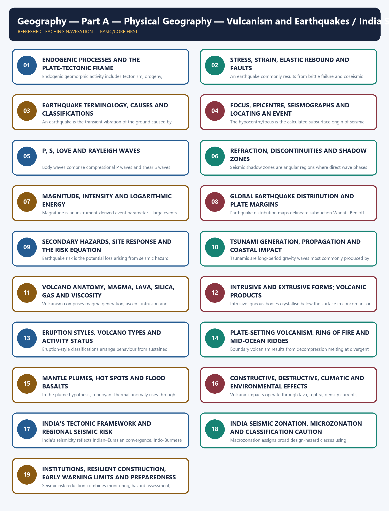

# Geography 03 — Vulcanism and Earthquakes / India Seismic Zones

**Complete uncompressed learner-v2 session | GS-I + Prelims | Generated 23 August 2026 | Approval pending**

> **Syllabus ownership:** Important geophysical phenomena—earthquakes, tsunami and volcanic activity—and the salient features of world and Indian physical geography.
>
> **Source order:** Geography Markdown owners and section-control files → OCR-searchable standard geography and routed local UPSC papers/keys → dated official current sources → no Qdrant dependency.
>
> **Fact discipline:** **[FACT]** means directly supported by a repository, book, official paper/key or official live source. **[INFERENCE]** means analytical synthesis. **[LIMIT]** marks uncertainty, scope or a classification caution.
>
> **Ownership boundary:** Geography explains the physical process, spatial pattern, site response and risk geography. Detailed incident-command and relief administration remain Disaster-Management territory.

| Package component | Count / status |
|---|---:|
| Basic/core numbered sessions | 19 |
| Verified primary-owner PYQs | 7 |
| Cross-owned but directly relevant Mains PYQ | 1 |
| Original hard MCQs | 40 |
| Remedial MCQs | 8 |
| Original solved Mains practice | 6 |
| Objective-key policy | Stable topic seed; balanced, deterministic and non-patterned |
| 2026 PYQ key status | Local provisional key only; not represented as final UPSC key |

## BASIC LEARNING SESSION



*Distinct embedded teaching-navigation image. The separate continuous Cārvāka-style flowchart package remains an independent at-a-glance artifact.*

The master route is:

```text
ENDOGENIC ENERGY
   -> plate setting
   -> stress, strain and faults
   -> earthquake source and seismic waves
   -> measurement, distribution and cascading hazards
   -> magma properties, volcanic forms and eruption styles
   -> boundary/hot-spot distribution and environmental effects
   -> India's tectonic regions and seismic zonation
   -> microzonation, resilient construction and community preparedness
```

**Static/current firewall:** a recent earthquake or eruption illustrates a known mechanism; it does not prove a deterministic prediction, validate a metaphysical claim, or automatically establish a new hazard zone.

### SESSION 1 — ENDOGENIC PROCESSES AND THE PLATE-TECTONIC FRAME

#### DEFINITION / WHAT THIS IS CALLED

**Plain-language definition:** Endogenic processes are changes driven by heat and forces from within the Earth; they build, deform, fracture or erupt the crust.

**Technical definition:** Endogenic geomorphic activity includes tectonism, orogeny, epeirogeny, earthquakes and vulcanism generated by mantle heat, gravity, isostatic adjustment and lithospheric-plate interaction.

#### ANSWER-GRABBING OPENING — WRITE/ADAPT IN THE EXAM

> Earthquakes and vulcanism are surface expressions of an internally powered, mobile lithosphere: plate motion supplies the regional setting, while fault rupture or magma ascent supplies the immediate mechanism.

#### MUST-WRITE KEYWORDS

- **endogenic process**
- **lithosphere–asthenosphere**
- **plate boundary**
- **tectonism, seismicity, vulcanism**

**How to use them:** Begin with the internal-energy source, identify the plate setting, and then separate the regional driver from the event-level mechanism.

#### Visual first — where the two hazards fit

```text
Residual planetary heat + radioactive decay + gravity
                         |
                         v
                MANTLE CONVECTION / FLOW
                         |
                         v
            LITHOSPHERIC PLATES MOVE RELATIVELY
              /              |               \
             /               |                \
     CONVERGENT          DIVERGENT          TRANSFORM
     compression         tension            shear
   trench + arc +      ridge + rift      strike-slip fault
   deep earthquakes    shallow quakes      shallow quakes
        |
        +---- subduction fluids -> melting -> explosive arc volcanism

HOT SPOT / PLUME: volcanism can also occur within a plate.
```

[FACT] Plate tectonics explains why most strong earthquakes and active volcanoes form narrow belts rather than a random global scatter. Convergent margins generate the widest depth range of earthquakes. Divergent and transform margins mainly generate shallow earthquakes.

[FACT] Earthquakes need not be volcanic. The Himalaya is intensely seismic because of continent–continent shortening, yet it lacks the continuous oceanic-slab arc volcanism typical of the Andes or Japan.

[INFERENCE] The best explanatory chain is **internal energy → plate movement → stress or melting → event → landform/hazard**. This prevents the common error of treating “plate tectonics” as the immediate cause of every tremor without explaining rupture.

| Boundary | Plate motion | Dominant earthquake pattern | Typical volcanism |
|---|---|---|---|
| Ocean–continent convergence | Oceanic plate subducts | Shallow to deep, often powerful | Continental volcanic arc; commonly explosive |
| Ocean–ocean convergence | One oceanic plate subducts | Shallow to deep | Island arc |
| Continent–continent convergence | Crust shortens and thickens | Mainly shallow/intermediate thrust seismicity | Limited arc volcanism after ocean closure |
| Divergence | Plates separate | Shallow normal-fault earthquakes | Basaltic ridge/rift volcanism |
| Transform | Plates slide past | Shallow strike-slip earthquakes | Usually little magma generation |
| Hot spot | Plate crosses thermal anomaly | Local volcanic/seismic activity | Intraplate shields or flood basalts |

> **ANSWER-GRABBING LINE — WRITE/ADAPT IN THE EXAM:** Plate tectonics gives the spatial grammar of seismicity and vulcanism, but the examiner still expects the immediate mechanics—fault slip for an earthquake and magma ascent for an eruption.

#### CLOSING RECALL FLOW — ENDOGENIC FRAME

```closure-flow
STARTING CONCEPT: Earth's internal heat drives endogenic change
        |
        v
KEY TERMS / DEFINITIONS: lithosphere | asthenosphere | tectonism | seismicity | vulcanism
        |
        v
MECHANISM / ARGUMENT: plate motion concentrates compression, tension, shear and melting
        |
        v
CONSEQUENCE / CONTRAST: convergent belts host arcs + deep quakes; transforms host quakes without major volcanism
        |
        v
UPSC TRAP / ANSWER-USE: plate setting is the regional driver, not a substitute for rupture/magma mechanics
        |
        v
ANSWER-GRABBING FORMULATION: Earthquakes and vulcanism are surface expressions of an internally powered, mobile lithosphere: plate motion supplies the regional setting, while fault rupture or magma ascent supplies the immediate mechanism.
```

### SESSION 2 — STRESS, STRAIN, ELASTIC REBOUND AND FAULTS

#### DEFINITION / WHAT THIS IS CALLED

**Plain-language definition:** Rocks are slowly loaded, deform and then suddenly slip when the accumulated force overcomes their strength or fault friction.

**Technical definition:** An earthquake commonly results from brittle failure and coseismic slip on a fault after tectonic stress produces elastic strain; elastic rebound is the partial recovery of deformed rock blocks after rupture.

#### ANSWER-GRABBING OPENING — WRITE/ADAPT IN THE EXAM

> The earthquake is sudden, but its preparation is usually slow: stress loads a locked fault, elastic strain accumulates, rupture begins when resistance is exceeded, and released energy radiates as seismic waves.

#### MUST-WRITE KEYWORDS

- **stress and strain**
- **elastic limit**
- **fault plane, hanging wall, footwall**
- **elastic rebound, rupture, slip**

**How to use them:** Write the load–lock–rupture–rebound sequence and match each stress regime with its fault type.

#### Visual first — stress inside a crustal block

```text
COMPRESSION                    TENSION                       SHEAR
 --->  <---                    <---  --->                  ↑      ↓
  rock shortens                 rock stretches             blocks slide
      |                              |                          |
 reverse / thrust fault          normal fault             strike-slip fault

Locked fault through time:
unaltered -> bent/strained -> rupture starts -> slip propagates -> rebound + aftershocks
```

| Fault type | Stress | Relative movement | Common setting | Exam-safe sketch clue |
|---|---|---|---|---|
| Normal | Tension | Hanging wall moves down | Rift/divergent setting | Crust lengthens |
| Reverse | Compression | Hanging wall moves up | Convergent setting | Crust shortens |
| Thrust | Compression | Low-angle reverse fault | Fold-thrust belt | Large horizontal shortening |
| Strike-slip | Shear | Horizontal displacement | Transform/intraplate fault | Offset stream/road |
| Oblique-slip | Combined | Vertical + horizontal | Complex boundaries | Two components |

[FACT] Stress is force per unit area; strain is the deformation produced. Elastic strain is recoverable until failure, whereas permanent deformation remains.

[FACT] A fault is not simply a crack. It is a fracture or fracture zone across which displacement has occurred. A joint has no demonstrable displacement.

[INFERENCE] Fault maps identify where rupture has occurred or may be geologically possible; they do not by themselves provide a date-specific prediction. Activity, slip rate, palaeoseismic evidence, geodesy and instrumental seismicity matter.

[FACT] The first large rupture in a sequence is called the mainshock only retrospectively if no later event is larger. Smaller preceding events are foreshocks only after the mainshock is identified; aftershocks follow stress redistribution.

> **Mnemonic:** **N-T-D** = Normal–Tension–Down; **R-C-Up** = Reverse–Compression–Up.

> **ANSWER-GRABBING LINE — WRITE/ADAPT IN THE EXAM:** Elastic rebound converts long-term tectonic loading into short-duration ground shaking, explaining how gradual plate motion produces a sudden disaster trigger.

#### CLOSING RECALL FLOW — FAULT MECHANICS

```closure-flow
STARTING CONCEPT: slowly moving plates load resistant rock and faults
        |
        v
KEY TERMS / DEFINITIONS: stress | strain | elastic limit | fault plane | hanging wall | footwall
        |
        v
MECHANISM / ARGUMENT: load -> lock -> strain accumulation -> rupture/slip -> elastic rebound
        |
        v
CONSEQUENCE / CONTRAST: tension-normal | compression-reverse/thrust | shear-strike-slip
        |
        v
UPSC TRAP / ANSWER-USE: a mapped fault indicates a source possibility, not the time of the next earthquake
        |
        v
ANSWER-GRABBING FORMULATION: The earthquake is sudden, but its preparation is usually slow: stress loads a locked fault, elastic strain accumulates, rupture begins when resistance is exceeded, and released energy radiates as seismic waves.
```

### SESSION 3 — EARTHQUAKE TERMINOLOGY, CAUSES AND CLASSIFICATIONS

#### DEFINITION / WHAT THIS IS CALLED

**Plain-language definition:** An earthquake is shaking produced when stored energy is suddenly released inside the Earth.

**Technical definition:** An earthquake is the transient vibration of the ground caused by seismic-wave radiation from a sudden source, most commonly fault rupture but also volcanic, collapse, reservoir-associated, induced or explosion sources.

#### ANSWER-GRABBING OPENING — WRITE/ADAPT IN THE EXAM

> Earthquake classification must distinguish the source mechanism, focal depth and tectonic setting; “tectonic earthquake” is the dominant class, not the only possible source of ground vibration.

#### MUST-WRITE KEYWORDS

- **tectonic, volcanic, collapse, induced**
- **focus/hypocentre and epicentre**
- **shallow, intermediate, deep focus**
- **mainshock–aftershock sequence**

**How to use them:** Classify first by cause and depth, then connect each class to its likely spatial setting and hazard expression.

#### Classification matrix

| Basis | Classes | What it tells the examiner |
|---|---|---|
| Cause | Tectonic, volcanic, collapse, explosion, induced/reservoir-associated | Immediate source process |
| Focal depth | Shallow 0–70 km; intermediate 70–300 km; deep 300–700 km | Likely plate setting and surface-effect pattern |
| Tectonic setting | Interplate, intraplate | Boundary versus plate-interior source |
| Sequence | Foreshock, mainshock, aftershock; swarm | Temporal relationship, not a magnitude scale |
| Wave source | Natural or anthropogenic | Needed for monitoring and discrimination |

[FACT] Most damaging earthquakes are shallow because the source is closer to the surface, but damage is not fixed by depth alone. Magnitude, distance, rupture direction, soil and construction remain decisive.

[FACT] Intermediate and deep earthquakes are strongly associated with descending slabs in subduction zones. Deep-focus events are absent from ordinary transform faults and mid-ocean ridges.

[FACT] Reservoir-associated seismicity is linked to changes in pore pressure and loading near existing fractures; Koyna is India's standard example. It does not mean every reservoir causes a damaging earthquake.

[LIMIT] “Human-induced” does not mean humans create tectonic stress from nothing. Injection, extraction, mining or impoundment can alter stresses or pore pressure enough to trigger slip on a susceptible fault.

```text
CAUSE TREE
Earthquake
├─ Tectonic: sudden fault slip
├─ Volcanic: magma movement / pressure change
├─ Collapse: cave or mine-roof failure, usually local
├─ Explosion: chemical or nuclear source
└─ Induced: injection, extraction, mining, reservoir loading
```

> **ANSWER-GRABBING LINE — WRITE/ADAPT IN THE EXAM:** Focal depth is a source descriptor, whereas disaster severity is a relational outcome produced by source, path, site, exposure and vulnerability.

#### CLOSING RECALL FLOW — EARTHQUAKE CLASSES

```closure-flow
STARTING CONCEPT: sudden energy release creates transient ground vibration
        |
        v
KEY TERMS / DEFINITIONS: tectonic | volcanic | collapse | induced | shallow/intermediate/deep
        |
        v
MECHANISM / ARGUMENT: source class + focal depth + tectonic setting explain where and how shaking begins
        |
        v
CONSEQUENCE / CONTRAST: shallow often damages locally; deep slab events may be widely felt but differently expressed
        |
        v
UPSC TRAP / ANSWER-USE: depth influences shaking, but vulnerability determines whether hazard becomes disaster
        |
        v
ANSWER-GRABBING FORMULATION: Earthquake classification must distinguish the source mechanism, focal depth and tectonic setting; “tectonic earthquake” is the dominant class, not the only possible source of ground vibration.
```

### SESSION 4 — FOCUS, EPICENTRE, SEISMOGRAPHS AND LOCATING AN EVENT

#### DEFINITION / WHAT THIS IS CALLED

**Plain-language definition:** The focus is where rupture starts inside the Earth; the epicentre is the point directly above it on the surface.

**Technical definition:** The hypocentre/focus is the calculated subsurface origin of seismic radiation, while the epicentre is its vertical surface projection; a seismometer senses motion and a seismograph/seismic station records a time series called a seismogram.

#### ANSWER-GRABBING OPENING — WRITE/ADAPT IN THE EXAM

> Focus and epicentre identify source geometry, not damage ranking: the worst-hit locality may lie away from the epicentre because rupture directivity, basin amplification and vulnerable construction modify shaking.

#### MUST-WRITE KEYWORDS

- **hypocentre/focus**
- **epicentre**
- **seismometer, seismograph, seismogram**
- **P–S arrival-time difference and triangulation**

**How to use them:** Draw the vertical focus–epicentre relation, then show how three station-distance circles locate the epicentre.

#### Focus–epicentre cross-section

```text
                         Earth's surface
       Station A ●          EPICENTRE ★          ● Station B
                    \           |              /
                     \          | depth       /
                      \         |            /
                       \        X FOCUS      /
                        \______/ \__________/
                           rupturing fault

Waves radiate from the rupture; the hypocentre is an estimated source point,
while a large earthquake actually ruptures a finite fault area.
```

#### Reading a basic seismogram

```text
ground
motion        P arrives       S arrives               surface waves
  ^             /\              /\/\                 /\/\/\/\/\/\/\
  |____________/  \____________/    \_______________/              \____ time
                  <--- S - P ---> gives station-to-epicentre distance
```

[FACT] One station's P–S time difference estimates distance from the source but not direction. A circle can be drawn around that station. The intersection of circles from at least three stations gives an epicentral estimate.

[FACT] Modern location uses many stations, a velocity model and iterative computation. Three-circle triangulation is the learner model, not the full operational method.

[FACT] A seismic trace records amplitude against time. The earliest small motion is normally the P arrival, followed by S and then longer-period surface waves.

[LIMIT] The “focus” is simplified as a point for location. Large ruptures propagate over a plane, so finite-fault geometry and directivity matter for real shaking.

> **ANSWER-GRABBING LINE — WRITE/ADAPT IN THE EXAM:** Epicentral location is a travel-time inference: arrival differences yield distance, multiple stations yield position, and additional modelling estimates depth and rupture geometry.

#### CLOSING RECALL FLOW — EVENT LOCATION

```closure-flow
STARTING CONCEPT: seismic stations record different wave-arrival times
        |
        v
KEY TERMS / DEFINITIONS: focus/hypocentre | epicentre | seismometer | seismogram | P-S interval
        |
        v
MECHANISM / ARGUMENT: one station gives distance -> three or more station circles intersect -> epicentre is estimated
        |
        v
CONSEQUENCE / CONTRAST: epicentre locates the surface projection; worst damage may occur elsewhere
        |
        v
UPSC TRAP / ANSWER-USE: a single station cannot supply both distance and unique direction
        |
        v
ANSWER-GRABBING FORMULATION: Focus and epicentre identify source geometry, not damage ranking: the worst-hit locality may lie away from the epicentre because rupture directivity, basin amplification and vulnerable construction modify shaking.
```

### SESSION 5 — P, S, LOVE AND RAYLEIGH WAVES

#### DEFINITION / WHAT THIS IS CALLED

**Plain-language definition:** Seismic waves carry earthquake energy through the Earth's interior and along its surface.

**Technical definition:** Body waves comprise compressional P waves and shear S waves travelling through the Earth; surface waves comprise Love and Rayleigh modes guided near the surface and commonly producing large damaging motions.

#### ANSWER-GRABBING OPENING — WRITE/ADAPT IN THE EXAM

> P and S waves diagnose the Earth's interior because their velocity and permitted media differ, whereas Love and Rayleigh waves dominate the near-surface damage problem because their amplitudes and durations can be large.

#### MUST-WRITE KEYWORDS

- **body waves and surface waves**
- **compressional/longitudinal P wave**
- **shear/transverse S wave**
- **Love horizontal shear; Rayleigh elliptical motion**

**How to use them:** Compare speed, particle motion, permitted medium, arrival order and damage potential in one table.

| Wave | Particle motion | Medium | Relative speed | Main exam use |
|---|---|---|---|---|
| P | To-and-fro parallel to travel direction | Solids and liquids; also gases in principle | Fastest | First arrival; compression/dilation |
| S | Perpendicular to travel direction | Solids only | Slower than P | Liquid outer-core evidence |
| Love | Horizontal side-to-side shear | Surface layers | Usually faster surface mode | Strong horizontal structural stress |
| Rayleigh | Retrograde/elliptical rolling | Surface layers | Slow surface mode | Vertical + horizontal ground motion |

```text
P WAVE:  ->  ||||||  ->     particles oscillate <----> along travel

S WAVE:  ->  ~~~~~~  ->     particles oscillate ↑↓ across travel

LOVE:    surface shifts <----> horizontally

RAYLEIGH: surface particles roll in ellipses, like a water-wave motion
```

[FACT] UPSC Prelims 2023 tested two precise statements: P waves arrive before S waves, and their particle motions differ. Both statements are correct; the local official key was unavailable, so the workbook labels the answer inferred with high confidence.

[FACT] S waves require shear rigidity and therefore do not pass through a liquid. P waves can pass through both solid and liquid but change velocity and direction at material boundaries.

[INFERENCE] “Surface waves are most destructive” is a useful rule, not an absolute law. Near-fault pulses, high-frequency body waves, resonance and local construction can alter the dominant damage source.

> **ANSWER-GRABBING LINE — WRITE/ADAPT IN THE EXAM:** Arrival order is P first, S second and surface waves later; medium control is P through solids and liquids but S through solids only.

#### CLOSING RECALL FLOW — SEISMIC WAVES

```closure-flow
STARTING CONCEPT: rupture energy travels as body and surface waves
        |
        v
KEY TERMS / DEFINITIONS: P-compressional | S-shear | Love-horizontal | Rayleigh-elliptical
        |
        v
MECHANISM / ARGUMENT: elastic properties control velocity, particle motion and permitted medium
        |
        v
CONSEQUENCE / CONTRAST: P arrives first and crosses liquids; S is stopped by liquid; surface waves strongly affect structures
        |
        v
UPSC TRAP / ANSWER-USE: transverse S motion is not the same as horizontal-only Love motion
        |
        v
ANSWER-GRABBING FORMULATION: P and S waves diagnose the Earth's interior because their velocity and permitted media differ, whereas Love and Rayleigh waves dominate the near-surface damage problem because their amplitudes and durations can be large.
```

### SESSION 6 — REFRACTION, DISCONTINUITIES AND SHADOW ZONES

#### DEFINITION / WHAT THIS IS CALLED

**Plain-language definition:** Seismic waves bend, speed up, slow down or disappear at internal boundaries, allowing scientists to infer layers they cannot directly see.

**Technical definition:** Seismic shadow zones are angular regions where direct wave phases are absent because P waves are strongly refracted at the core–mantle boundary and S waves cannot propagate through the liquid outer core.

#### ANSWER-GRABBING OPENING — WRITE/ADAPT IN THE EXAM

> The Earth’s deep interior is known by wave behaviour rather than direct observation: P-wave refraction and S-wave extinction reveal sharp discontinuities and the liquid state of the outer core.

#### MUST-WRITE KEYWORDS

- **reflection and refraction**
- **core–mantle boundary**
- **P-wave shadow zone**
- **S-wave shadow zone, liquid outer core**

**How to use them:** State the wave rule first, mark the approximate angular zones, and draw the inference about the outer core.

```text
                 EARTHQUAKE ●
                    \  P and S
                     \        MANTLE
                      \       _______
                       \     /       \
                        \   / LIQUID  \
                         \ / OUTER     \
                         / \ CORE       /
      S waves stop ---- X   \         /
      P waves bend ----------\_______/

Approximate angular pattern from the epicentre:
0° ---------------- 103° | 103° -------- 142° | 142° -------- 180°
P + S commonly recorded   P direct shadow       P returns after refraction
S-wave direct shadow extends beyond about 103°
```

[FACT] If Earth were homogeneous, seismic rays would follow simpler paths. Observed velocity changes, reflections and refractions identify internal discontinuities.

[FACT] The approximate P-wave shadow extends from about 103° to 142° from the epicentre. Direct S waves are absent beyond about 103° because the outer core is liquid.

[FACT] The reappearance of P phases beyond the shadow zone results from strong refraction through the core. This is not evidence that the whole core is liquid; other wave evidence supports a solid inner core within the liquid outer core.

[LIMIT] Angles are approximate and phase-specific. Do not turn a classroom shadow-zone sketch into an exact operational travel-time model.

> **ANSWER-GRABBING LINE — WRITE/ADAPT IN THE EXAM:** The larger S-wave shadow is a state-of-matter test, while the P-wave shadow is principally a refraction geometry.

#### CLOSING RECALL FLOW — SHADOW ZONES

```closure-flow
STARTING CONCEPT: seismic velocity changes at internal material boundaries
        |
        v
KEY TERMS / DEFINITIONS: refraction | core-mantle boundary | P shadow 103°-142° | S shadow beyond ~103°
        |
        v
MECHANISM / ARGUMENT: P bends strongly through the core; S cannot cross a liquid outer core
        |
        v
CONSEQUENCE / CONTRAST: P later reappears; direct S remains absent on the far side
        |
        v
UPSC TRAP / ANSWER-USE: S-wave absence proves liquid outer core, not an entirely liquid core
        |
        v
ANSWER-GRABBING FORMULATION: The Earth’s deep interior is known by wave behaviour rather than direct observation: P-wave refraction and S-wave extinction reveal sharp discontinuities and the liquid state of the outer core.
```

### SESSION 7 — MAGNITUDE, INTENSITY AND LOGARITHMIC ENERGY

#### DEFINITION / WHAT THIS IS CALLED

**Plain-language definition:** Magnitude describes the size of the earthquake source; intensity describes how strongly a particular place experienced it.

**Technical definition:** Magnitude is an instrument-derived event parameter—large events are commonly reported using moment magnitude Mw—whereas intensity scales such as MMI or MSK classify observed shaking and effects at individual locations.

#### ANSWER-GRABBING OPENING — WRITE/ADAPT IN THE EXAM

> An earthquake has one estimated magnitude but many intensities, because rupture size is an event property while local effects vary with distance, depth, path, ground and buildings.

#### MUST-WRITE KEYWORDS

- **moment magnitude Mw**
- **local magnitude and “Richter”**
- **MMI/MSK intensity**
- **logarithmic scale, seismic moment**

**How to use them:** Put source size on one side and place-specific effect on the other; then add the logarithmic intuition and limitations.

| Feature | Magnitude | Intensity |
|---|---|---|
| Governing question | How large was the source? | How strong were effects here? |
| Number per event | One preferred estimate, subject to revision | Many observations/maps |
| Basis | Instrumental waveform/source parameters | Felt reports, damage and observed effects |
| Modern large-event language | Mw | MMI/MSK or another intensity scale |
| Main control | Rupture area, slip and rigidity | Magnitude + depth + distance + site + building |

```text
LOCAL-MAGNITUDE INTUITION
M 5 -> baseline
M 6 -> 10 times recorded amplitude; about 31.6 times energy
M 7 -> 100 times amplitude; about 1,000 times energy relative to M 5

This intuition does NOT convert magnitude directly into casualties or damage.
```

[FACT] “Richter scale” properly refers to local magnitude developed for a particular instrumental and regional context. It can saturate for very large earthquakes; Mw is preferred for large modern events.

[FACT] Seismic moment is proportional to rock rigidity × ruptured fault area × average slip. Mw converts this physical source measure to a logarithmic magnitude.

[INFERENCE] A moderate shallow event beneath soft alluvium and vulnerable masonry can cause worse loss than a larger deep event under well-engineered settlements.

[LIMIT] Magnitude estimates can be revised as more data arrive. Intensity is not a synonym for economic loss because two buildings at the same intensity can perform differently.

> **ANSWER-GRABBING LINE — WRITE/ADAPT IN THE EXAM:** Magnitude measures the earthquake; intensity measures the earthquake-at-a-place.

#### CLOSING RECALL FLOW — MEASUREMENT

```closure-flow
STARTING CONCEPT: earthquake size and earthquake effects answer different questions
        |
        v
KEY TERMS / DEFINITIONS: Mw | local magnitude | logarithmic amplitude/energy | MMI/MSK intensity
        |
        v
MECHANISM / ARGUMENT: seismic moment estimates source size; observations classify place-specific shaking
        |
        v
CONSEQUENCE / CONTRAST: one magnitude but multiple intensities and unequal losses
        |
        v
UPSC TRAP / ANSWER-USE: never convert a magnitude directly into a fixed damage category
        |
        v
ANSWER-GRABBING FORMULATION: An earthquake has one estimated magnitude but many intensities, because rupture size is an event property while local effects vary with distance, depth, path, ground and buildings.
```

### SESSION 8 — GLOBAL EARTHQUAKE DISTRIBUTION AND PLATE MARGINS

#### DEFINITION / WHAT THIS IS CALLED

**Plain-language definition:** Global seismic belts are narrow zones where plate motion repeatedly creates and releases stress.

**Technical definition:** Earthquake distribution maps delineate subduction Wadati–Benioff zones, mid-ocean ridges, transform faults, continental collision belts and a smaller population of intraplate sources.

#### ANSWER-GRABBING OPENING — WRITE/ADAPT IN THE EXAM

> The global map of seismicity is a map of plate interaction: shallow events outline almost every boundary, while inclined shallow-to-deep zones uniquely reveal subducting slabs.

#### MUST-WRITE KEYWORDS

- **Circum-Pacific belt**
- **Mediterranean–Himalayan belt**
- **mid-ocean ridge**
- **Wadati–Benioff zone and intraplate seismicity**

**How to use them:** Name the three major belts, then explain their distinct boundary mechanics rather than merely locating them.

```text
WORLD SEISMIC BELTS — SCHEMATIC, NOT TO SCALE

Pacific rim:
Andes -> Central America -> Cascades/Alaska -> Aleutians -> Japan
      -> Philippines -> Indonesia -> New Zealand
      = trenches + arcs + shallow/deep earthquakes + tsunami potential

Mediterranean-Himalayan:
Mediterranean -> Türkiye/Iran -> Hindu Kush -> Himalaya -> Myanmar
      = collision, subduction remnants, transform and complex continental deformation

Mid-ocean ridges:
Mid-Atlantic + Indian Ocean ridge system
      = divergence, basaltic volcanism and shallow earthquakes
```

[FACT] The Circum-Pacific belt is the dominant global concentration of subduction-related earthquakes and volcanoes. Avoid memorising an undated percentage as a timeless constant.

[FACT] The Mediterranean–Himalayan belt includes complex convergence from southern Europe through West and Central Asia to the Himalayan and Myanmar regions.

[FACT] Ridge earthquakes are shallow because the lithosphere is thin and hot. Transform offsets between ridge segments also produce shallow strike-slip events.

[FACT] Intraplate earthquakes occur away from active boundaries, commonly by reactivation of inherited faults or rifts. Bhuj, Latur and New Madrid show that plate interiors are relatively—not absolutely—stable.

[CA FACT — USGS, 7 June 2026] A reviewed Mw 7.8 earthquake occurred 25 km southwest of Kablalan, Philippines, at about 57 km depth. [INFERENCE] Its location reinforces the active western-Pacific plate-boundary belt; it does not prove that every Pacific earthquake produces a tsunami.

> **ANSWER-GRABBING LINE — WRITE/ADAPT IN THE EXAM:** Depth distribution is the diagnostic map layer: only a descending slab generates a systematic inclined belt from shallow trench earthquakes to intermediate and deep events.

#### CLOSING RECALL FLOW — GLOBAL SEISMICITY

```closure-flow
STARTING CONCEPT: relative plate motion concentrates stress along narrow belts
        |
        v
KEY TERMS / DEFINITIONS: Circum-Pacific | Mediterranean-Himalayan | ridge-transform | Wadati-Benioff | intraplate
        |
        v
MECHANISM / ARGUMENT: subduction gives shallow-deep seismicity; ridges/transforms give shallow seismicity; inherited faults reactivate inside plates
        |
        v
CONSEQUENCE / CONTRAST: seismic belts overlap volcano belts strongly but not perfectly
        |
        v
UPSC TRAP / ANSWER-USE: collision Himalaya is seismic without being a typical oceanic-subduction volcanic arc
        |
        v
ANSWER-GRABBING FORMULATION: The global map of seismicity is a map of plate interaction: shallow events outline almost every boundary, while inclined shallow-to-deep zones uniquely reveal subducting slabs.
```

### SESSION 9 — SECONDARY HAZARDS, SITE RESPONSE AND THE RISK EQUATION

#### DEFINITION / WHAT THIS IS CALLED

**Plain-language definition:** The earthquake's shaking can trigger other destructive processes, and the final loss depends on who and what is exposed and how vulnerable they are.

**Technical definition:** Earthquake risk is the potential loss arising from seismic hazard interacting with exposure, physical/social vulnerability and coping capacity; cascading hazards include liquefaction, slope failure, fire, surface rupture, dam failure and tsunami.

#### ANSWER-GRABBING OPENING — WRITE/ADAPT IN THE EXAM

> An earthquake is a hazard event; it becomes a disaster when shaking and cascades strike exposed, vulnerable systems whose coping capacity is exceeded.

#### MUST-WRITE KEYWORDS

- **hazard, exposure, vulnerability, capacity**
- **site amplification and liquefaction**
- **landslide, fire, dam/lifeline failure**
- **cascading or compound risk**

**How to use them:** Separate the physical trigger from the social outcome and write one mechanism sentence for every secondary hazard.

```text
SEISMIC RISK CHAIN
Fault rupture
   -> shaking + surface displacement
   -> local ground response
      ├─ soft-soil amplification
      ├─ liquefaction / lateral spreading
      └─ slope failure
   -> built-system cascades
      ├─ fire from broken utilities
      ├─ bridge/road/port failure
      ├─ dam or embankment distress
      └─ hospital/communication disruption
   -> loss depends on EXPOSURE × VULNERABILITY ÷ CAPACITY
```

| Hazard | Mechanism | Spatial clue |
|---|---|---|
| Liquefaction | Shaking raises pore pressure in loose saturated sediment until effective strength falls | Floodplains, deltas, reclaimed land, old channels |
| Lateral spreading | Liquefied soil moves towards a free face or down gentle slope | Riverbanks, ports, embankments |
| Landslide/rockfall | Shaking destabilises marginal slopes | Himalaya, road cuts, steep valleys |
| Fire | Gas/electric lines break while access and water supply fail | Dense urban areas |
| Surface rupture | Fault displacement reaches ground | Narrow fault corridor |
| Dam/lifeline failure | Shaking, settlement or slope collapse damages critical systems | Reservoir valleys and urban networks |

[FACT] Soft sediment can amplify selected frequencies as waves slow and grow in amplitude. Basin geometry may prolong shaking.

[FACT] Liquefaction is not “soil melting.” It is a temporary loss of effective stress and strength in susceptible saturated granular material.

[INFERENCE] Urban disaster risk is often a network problem: a structurally surviving hospital may still fail functionally if power, water, access or communications collapse.

> **ANSWER-GRABBING LINE — WRITE/ADAPT IN THE EXAM:** Hazard is physical possibility; vulnerability is susceptibility; risk is their interaction with exposure; disaster is realised severe disruption beyond coping capacity.

#### CLOSING RECALL FLOW — CASCADING RISK

```closure-flow
STARTING CONCEPT: rupture initiates shaking, but shaking is only the first link
        |
        v
KEY TERMS / DEFINITIONS: hazard | exposure | vulnerability | capacity | amplification | liquefaction
        |
        v
MECHANISM / ARGUMENT: source -> path -> site -> building/network response -> cascade
        |
        v
CONSEQUENCE / CONTRAST: equal magnitude does not produce equal loss across sites or societies
        |
        v
UPSC TRAP / ANSWER-USE: do not use earthquake, hazard, risk and disaster as synonyms
        |
        v
ANSWER-GRABBING FORMULATION: An earthquake is a hazard event; it becomes a disaster when shaking and cascades strike exposed, vulnerable systems whose coping capacity is exceeded.
```

### SESSION 10 — TSUNAMI GENERATION, PROPAGATION AND COASTAL IMPACT

#### DEFINITION / WHAT THIS IS CALLED

**Plain-language definition:** A tsunami is a train of very long sea waves generated by sudden displacement of a large water volume.

**Technical definition:** Tsunamis are long-period gravity waves most commonly produced by rapid vertical sea-floor displacement during submarine megathrust earthquakes, but also by volcanic collapse/eruption, submarine landslides or rare impacts.

#### ANSWER-GRABBING OPENING — WRITE/ADAPT IN THE EXAM

> A tsunami is not a wind wave or tide: it begins with sudden water-column displacement, crosses deep ocean with low height and high speed, and grows destructively as shoaling compresses the wave near the coast.

#### MUST-WRITE KEYWORDS

- **vertical sea-floor displacement**
- **megathrust and subduction zone**
- **long wavelength, long period**
- **shoaling, run-up, inundation**

**How to use them:** Draw the source–deep ocean–shoaling–run-up chain and add coastal geometry and warning limitations.

```text
SUBDUCTION MEGATHRUST
oceanic plate dives -> locked interface deforms -> sudden rupture
                               |
                               v
                    sea floor moves vertically
                               |
                               v
               whole water column is displaced
                               |
          deep ocean: long, fast, low amplitude
                               |
                               v
             shallow shelf: speed falls, height rises
                               |
                               v
                  RUN-UP + INUNDATION + RETURN FLOW
```

[FACT] Strike-slip movement with little vertical displacement is less efficient at generating a large basin-wide tsunami than thrust displacement, although landslides triggered by any event may create a local tsunami.

[FACT] In deep water, a tsunami can pass beneath ships with little notice. Near shore, decreasing depth slows the wave, shortens wavelength and increases height.

[FACT] The first arrival need not be the largest, and sea withdrawal need not precede every tsunami. Strong or long coastal shaking, unusual sea-level change or an official alert requires immediate movement along identified evacuation routes.

[FACT] On 26 December 2004, rupture on the Sunda subduction margin generated the Indian Ocean tsunami. India subsequently established the Indian Tsunami Early Warning Centre at INCOIS, Hyderabad, using seismic, bottom-pressure and tide-gauge observations.

[INFERENCE] Coastal damage varies with bathymetry, shelf width, bays, estuaries, coastal slope, settlement pattern and evacuation capacity. “Move to 10 metres” is not a universal rule; follow official local maps and routes.

> **ANSWER-GRABBING LINE — WRITE/ADAPT IN THE EXAM:** Tsunami risk joins a tectonic source to an oceanographic transmission path and a geomorphically conditioned coast.

#### CLOSING RECALL FLOW — TSUNAMI

```closure-flow
STARTING CONCEPT: sudden displacement of a large water column
        |
        v
KEY TERMS / DEFINITIONS: megathrust | vertical displacement | long wavelength | shoaling | run-up | inundation
        |
        v
MECHANISM / ARGUMENT: submarine rupture -> deep-ocean propagation -> shallow-water amplification -> coastal flooding
        |
        v
CONSEQUENCE / CONTRAST: low wave offshore can become destructive onshore; first wave need not be largest
        |
        v
UPSC TRAP / ANSWER-USE: tsunami is a seismic/gravity wave train, not a tidal wave
        |
        v
ANSWER-GRABBING FORMULATION: A tsunami is not a wind wave or tide: it begins with sudden water-column displacement, crosses deep ocean with low height and high speed, and grows destructively as shoaling compresses the wave near the coast.
```

### SESSION 11 — VOLCANO ANATOMY, MAGMA, LAVA, SILICA, GAS AND VISCOSITY

#### DEFINITION / WHAT THIS IS CALLED

**Plain-language definition:** A volcano is an opening and landform through which molten rock, gas and fragments reach or approach the surface.

**Technical definition:** Vulcanism comprises magma generation, ascent, intrusion and extrusion; magma is molten or partially molten subsurface material containing crystals and volatiles, while lava is magma erupted at the surface.

#### ANSWER-GRABBING OPENING — WRITE/ADAPT IN THE EXAM

> Eruption style is controlled less by the size of a cone than by magma rheology: silica-rich, cooler and gas-charged magma is commonly more viscous and explosive, whereas hotter basaltic magma generally allows easier degassing and effusive flow.

#### MUST-WRITE KEYWORDS

- **magma versus lava**
- **magma chamber, conduit, vent, crater/caldera**
- **silica polymerisation and viscosity**
- **dissolved volatiles, gas pressure, temperature**

**How to use them:** Label the anatomy, then explain the silica–temperature–gas control chain without treating composition as a perfect predictor.

#### Volcano cross-section

```text
                         ash / gas plume
                              ↑
                      ______ crater ______
                     /       central       \
       lava flow -->/          vent         \ <-- layers of lava + tephra
                   /             |           \
                  /       side vent -> cone   \
-----------------/---------------|-------------\------ surface
                                 |
                              conduit
                    dyke  /      |      \  sill
                         /       |       \______
                        /     MAGMA CHAMBER     \
                       /________________________\

Caldera: broad collapse depression after major magma withdrawal; not simply a large crater.
```

| Control | Effect on viscosity/degassing | Likely tendency |
|---|---|---|
| More silica | Greater polymerisation | Higher viscosity |
| Higher temperature | Easier molecular movement | Lower viscosity |
| More crystals | Stiffer magma | Higher effective viscosity |
| Dissolved gas retained under pressure | Potential rapid expansion during ascent | More explosive fragmentation |
| Open conduits/easy degassing | Pressure escapes | More effusive behaviour |

[FACT] Basaltic magma is generally hotter, less silica-rich and less viscous than andesitic or rhyolitic magma. Rhyolitic magma is commonly cooler and more viscous.

[FACT] Pressure decreases during ascent. Dissolved volatiles exsolve into bubbles; if viscous magma prevents escape, gas pressure can fragment magma into tephra and drive explosive eruptions.

[LIMIT] Composition gives a tendency, not a guaranteed eruption. Water–magma interaction, conduit sealing, eruption rate and external water can change behaviour.

[FACT] A crater is the vent-centred depression at a summit or flank. A caldera is a much larger collapse structure commonly related to withdrawal of a substantial magma volume.

> **ANSWER-GRABBING LINE — WRITE/ADAPT IN THE EXAM:** Silica raises viscosity, viscosity impedes degassing, retained gas raises pressure, and pressure-driven fragmentation makes an eruption explosive.

#### CLOSING RECALL FLOW — VOLCANO CONTROLS

```closure-flow
STARTING CONCEPT: magma rises because it is buoyant and pressurised
        |
        v
KEY TERMS / DEFINITIONS: magma/lava | chamber | conduit | vent | crater/caldera | volatiles
        |
        v
MECHANISM / ARGUMENT: silica + lower temperature + crystals -> viscosity -> trapped gas -> fragmentation
        |
        v
CONSEQUENCE / CONTRAST: basaltic magma tends effusive; silicic magma tends explosive
        |
        v
UPSC TRAP / ANSWER-USE: volcano shape is an outcome; magma rheology is the mechanism
        |
        v
ANSWER-GRABBING FORMULATION: Eruption style is controlled less by the size of a cone than by magma rheology: silica-rich, cooler and gas-charged magma is commonly more viscous and explosive, whereas hotter basaltic magma generally allows easier degassing and effusive flow.
```

### SESSION 12 — INTRUSIVE AND EXTRUSIVE FORMS; VOLCANIC PRODUCTS

#### DEFINITION / WHAT THIS IS CALLED

**Plain-language definition:** Magma may cool underground as an intrusion or erupt at the surface as lava, ash, fragments and gas.

**Technical definition:** Intrusive igneous bodies crystallise below the surface in concordant or discordant forms, whereas extrusive vulcanism constructs lava plains, cones, domes and pyroclastic deposits from erupted products.

#### ANSWER-GRABBING OPENING — WRITE/ADAPT IN THE EXAM

> Intrusive forms record the geometry of magma emplacement, while extrusive forms record the interaction of lava viscosity, gas, eruption rate, relief and erosion at the surface.

#### MUST-WRITE KEYWORDS

- **batholith, laccolith, lopolith, phacolith**
- **dyke and sill**
- **lava, tephra, ash, lapilli, bombs**
- **pyroclastic density current and lahar**

**How to use them:** Classify intrusions by relation to rock layers and erupted products by size, state and hazard mechanism.

#### Intrusive forms — labelled schematic

```text
sedimentary layers  ================================ 
                    =======  SILL  =================  concordant sheet
                    =======________=================
                       /  LACCOLITH  \               dome-shaped concordant
----------------------/--------------\----------------
              | DYKE |                               discordant sheet
              |      |       ( PHACOLITH )           fold-related lens
              |      |     ________________
              |      |    /    BATHOLITH     \       very large deep body
______________|______|___/____________________\_______
```

| Product/form | Meaning | Major hazard or landform |
|---|---|---|
| Lava flow | Molten rock at surface | Buries/burns land; basalt can travel far |
| Volcanic gas | H2O, CO2, SO2 and other species including sulphur and nitrogen species | Toxicity, acid aerosols, climate/air effects |
| Ash/dust | Fine pyroclasts | Roof load, crops, water, health, aviation |
| Lapilli | 2–64 mm pyroclasts | Fallout and cone building |
| Bomb/block | Coarse fragment | Ballistic hazard near vent |
| Pyroclastic density current | Hot turbulent gas–particle flow | Fast, ground-hugging, lethal |
| Lahar | Water-mobilised volcanic debris | Valley-confined mudflow, can occur long after eruption |
| Fissure basalt | Fluid lava from cracks | Lava plateau, e.g. Deccan Traps |

[FACT] UPSC Prelims 2024 asked whether pyroclastic debris, ash and dust, nitrogen compounds and sulphur compounds are products of volcanic eruptions. The official local Set-A key is **D: all four**.

[FACT] Dykes cut across pre-existing layers; sills run approximately parallel to them. Batholiths are very large discordant plutonic bodies later exposed by uplift and erosion.

[FACT] A lahar is not lava. It is a flowing mixture of water and volcanic sediment, often channelled down valleys.

[INFERENCE] Product classification is also a risk map: ballistic blocks dominate near the vent, ash affects broad downwind areas, pyroclastic currents follow topography, and lahars extend far along drainage lines.

> **ANSWER-GRABBING LINE — WRITE/ADAPT IN THE EXAM:** The same eruption has a spatially differentiated hazard field—ballistics near the vent, density currents on flanks, ash downwind and lahars down valleys.

#### CLOSING RECALL FLOW — FORMS AND PRODUCTS

```closure-flow
STARTING CONCEPT: magma either stalls underground or reaches the surface
        |
        v
KEY TERMS / DEFINITIONS: batholith/laccolith/lopolith/phacolith | dyke/sill | lava/tephra/gas/lahar
        |
        v
MECHANISM / ARGUMENT: emplacement geometry forms intrusions; fragmentation and flow form extrusive products
        |
        v
CONSEQUENCE / CONTRAST: dyke cuts layers, sill follows layers; pyroclastic current is hot gas-debris, lahar is water-debris
        |
        v
UPSC TRAP / ANSWER-USE: ash, sulphur compounds and nitrogen species are eruption products, not only lava
        |
        v
ANSWER-GRABBING FORMULATION: Intrusive forms record the geometry of magma emplacement, while extrusive forms record the interaction of lava viscosity, gas, eruption rate, relief and erosion at the surface.
```

### SESSION 13 — ERUPTION STYLES, VOLCANO TYPES AND ACTIVITY STATUS

#### DEFINITION / WHAT THIS IS CALLED

**Plain-language definition:** Volcanoes differ in how they erupt, the landforms they build and whether they are presently active or capable of renewed activity.

**Technical definition:** Eruption-style classifications arrange behaviour from sustained effusive fissure or fountain activity to intermittent explosions and high-column Plinian/Pelean activity; morphology includes shield, composite, cinder, dome and caldera systems.

#### ANSWER-GRABBING OPENING — WRITE/ADAPT IN THE EXAM

> Eruption style, volcano shape and activity status are three separate classifications: fluid lava can build a shield, alternating lava and tephra can build a stratovolcano, and neither shape alone determines whether a volcano is extinct.

#### MUST-WRITE KEYWORDS

- **Icelandic/Hawaiian/Strombolian/Vulcanian/Plinian**
- **shield, composite/stratovolcano, cinder cone, lava dome**
- **active, dormant, extinct**
- **caldera collapse**

**How to use them:** Move from effusive to explosive, then match each style to products and morphology while qualifying activity labels.

| Eruption style | Core behaviour | Common product/shape |
|---|---|---|
| Icelandic/fissure | Quiet, voluminous basalt from long cracks | Lava plateau |
| Hawaiian | Fluid lava fountains and flows | Shield volcano |
| Strombolian | Repeated moderate bursts | Scoria/cinder cone |
| Vulcanian | Short violent ash-rich blasts from plugged vent | Ash and blocks |
| Plinian/Vesuvian | Sustained high eruption column, widespread tephra | Explosive stratovolcano/caldera potential |
| Pelean/dome-collapse | Viscous dome growth and collapse | Pyroclastic density currents |

| Volcano type | Profile | Magma/eruption tendency | Example route |
|---|---|---|---|
| Shield | Broad, gentle | Basaltic, effusive | Hawai‘i |
| Composite/strato | Tall, layered, steep upper slopes | Andesitic–dacitic, mixed/explosive | Andes, Japan |
| Cinder/scoria cone | Small, steep fragment cone | Strombolian fragments | Monogenetic fields |
| Lava dome | Steep viscous mound | Silicic, unstable collapse | Arc volcano summits |
| Caldera system | Broad collapse depression | Major withdrawal/explosive history | Crater-lake systems |
| Fissure plateau | Sheet lava, step-like relief | Fluid flood basalt | Deccan |

[FACT] “Active, dormant and extinct” are descriptive status classes, not a compulsory life cycle. A volcano with no historical eruption may still be capable of renewed activity if geological and geophysical evidence shows a live system.

[FACT] Barren Island is India's active-volcano example within the Andaman volcanic arc. Narcondam is volcanic but should not be substituted for Barren Island in the 2018 PYQ.

[CA FACT — USGS/HVO, 10 March 2026] Kīlauea episode 43 produced vigorous lava fountains and extensive tephra fallout. [INFERENCE] It is a current illustration of basaltic volcanism producing both effusive lava and hazardous fragment fallout; “basaltic” does not mean harmless.

> **ANSWER-GRABBING LINE — WRITE/ADAPT IN THE EXAM:** Active status concerns eruptive capability; shield/composite concerns form; Hawaiian/Plinian concerns behaviour—UPSC can mix these axes in close options.

#### CLOSING RECALL FLOW — ERUPTION CLASSIFICATION

```closure-flow
STARTING CONCEPT: magma properties and vent conditions control eruptive behaviour
        |
        v
KEY TERMS / DEFINITIONS: Icelandic/Hawaiian/Strombolian/Vulcanian/Plinian | shield/strato/dome | active/dormant/extinct
        |
        v
MECHANISM / ARGUMENT: easy degassing -> effusion; trapped gas + viscous magma -> fragmentation/explosion
        |
        v
CONSEQUENCE / CONTRAST: style, landform and activity status are independent classification axes
        |
        v
UPSC TRAP / ANSWER-USE: absence of a recent historical eruption does not by itself prove extinction
        |
        v
ANSWER-GRABBING FORMULATION: Eruption style, volcano shape and activity status are three separate classifications: fluid lava can build a shield, alternating lava and tephra can build a stratovolcano, and neither shape alone determines whether a volcano is extinct.
```

### SESSION 14 — PLATE-SETTING VOLCANISM, RING OF FIRE AND MID-OCEAN RIDGES

#### DEFINITION / WHAT THIS IS CALLED

**Plain-language definition:** Most volcanoes occur where plates separate or where one plate sinks beneath another.

**Technical definition:** Boundary volcanism results from decompression melting at divergent margins and flux melting above subduction slabs, producing contrasting basaltic ridge/rift systems and commonly explosive volcanic arcs.

#### ANSWER-GRABBING OPENING — WRITE/ADAPT IN THE EXAM

> Divergent volcanism is generated mainly by pressure release in upwelling mantle, whereas subduction volcanism is promoted by slab-derived volatiles that lower the melting temperature of the mantle wedge.

#### MUST-WRITE KEYWORDS

- **decompression melting**
- **flux melting and mantle wedge**
- **trench–arc–back-arc**
- **Circum-Pacific Ring of Fire and mid-ocean ridge**

**How to use them:** Explain the melting mechanism before naming the belt; then compare ridge basalt with arc stratovolcanoes.

```text
SUBDUCTION MARGIN
oceanic plate ---> trench \ descends
                              \ water-rich minerals release volatiles
                               \        ↑
                                \  MANTLE WEDGE melts
                                 \       ↑ magma
continent / island arc ___________\______/\/\ volcanoes
            shallow quakes -> intermediate -> deep along slab

DIVERGENT MARGIN
plate <---      ridge/rift      ---> plate
                  ↑ hot mantle rises
                  ↑ pressure falls
             decompression melting -> basalt
```

[FACT] The Ring of Fire includes trenches, island arcs, continental arcs, transform segments, earthquakes from shallow to deep, explosive volcanoes and tsunami-generating megathrusts around much of the Pacific margin.

[FACT] Mid-ocean ridges form the longest volcanic system on Earth, mostly submarine. New basaltic crust forms at spreading axes.

[FACT] Continental rifts may begin with normal faulting and basaltic volcanism; continued extension can develop a narrow sea and eventually an ocean basin.

[FACT] The Mediterranean–Himalayan belt is not one uniform volcanic arc. It combines subduction remnants, collision, escape tectonics and complex faults; the Himalaya itself is primarily a collision-seismic belt.

```text
RING OF FIRE ANSWER MAP LABELS
Andes | Central America | Cascades | Alaska-Aleutians | Kamchatka
Japan | Philippines | Indonesia | Tonga-Kermadec | New Zealand
```

> **ANSWER-GRABBING LINE — WRITE/ADAPT IN THE EXAM:** The Ring of Fire is a linked trench–earthquake–arc system, not merely a ring-shaped list of volcanoes.

#### CLOSING RECALL FLOW — BOUNDARY VOLCANISM

```closure-flow
STARTING CONCEPT: plate interaction creates melting conditions
        |
        v
KEY TERMS / DEFINITIONS: decompression melting | flux melting | trench-arc | ridge-rift | Ring of Fire
        |
        v
MECHANISM / ARGUMENT: divergence lowers pressure; subduction adds volatiles to the mantle wedge
        |
        v
CONSEQUENCE / CONTRAST: ridges yield basaltic crust; arcs yield mixed, often explosive stratovolcanism
        |
        v
UPSC TRAP / ANSWER-USE: Ring of Fire means a geophysical system, not a perfect geometric circle
        |
        v
ANSWER-GRABBING FORMULATION: Divergent volcanism is generated mainly by pressure release in upwelling mantle, whereas subduction volcanism is promoted by slab-derived volatiles that lower the melting temperature of the mantle wedge.
```

### SESSION 15 — MANTLE PLUMES, HOT SPOTS AND FLOOD BASALTS

#### DEFINITION / WHAT THIS IS CALLED

**Plain-language definition:** A mantle plume is a proposed long-lived upwelling of unusually hot material that can create volcanism away from a plate boundary.

**Technical definition:** In the plume hypothesis, a buoyant thermal anomaly rises through the mantle; a broad plume head may produce a large igneous province, while a narrower persistent tail forms a hot spot and an age-progressive volcanic chain as the plate moves overhead.

#### ANSWER-GRABBING OPENING — WRITE/ADAPT IN THE EXAM

> Mantle plumes complement plate-boundary theory by explaining selected intraplate volcanic chains and flood-basalt provinces, while hot-spot age progression provides an independent record of plate motion.

#### MUST-WRITE KEYWORDS

- **plume head and plume tail**
- **hot spot**
- **age-progressive volcanic chain**
- **large igneous province/flood basalt**

**How to use them:** Define the anatomy, show moving plate over a relatively stable source, give Hawaii and Deccan, and add the scientific qualification.

```text
                 moving lithospheric plate  ----------->
surface       old volcano      older      young      ACTIVE
                 /\             /\         /\          /\
-----------------|--------------|----------|-----------|-------
                 |              |          |           |
                 +-------------- age increases --------+
                                                plume tail
                                                    ↑
                                              buoyant upwelling
                                             /               \
                                      earlier broad PLUME HEAD
                                      -> flood-basalt outpouring
```

[FACT] The classic hot-spot expectation is an age-progressive chain, with the active volcano over or near the present source and older extinct centres trailing in the direction opposite plate motion.

[FACT] Flood basalts erupt mainly from fissures and build plateaux through repeated fluid flows. The Deccan Traps are not a giant single cone.

[FACT] Deccan volcanism is associated in standard plume interpretation with the Réunion hot-spot system and the Indian Plate's passage, while the Hawaiian chain illustrates a long-lived oceanic hot spot.

[INFERENCE] Hot spots can supply a reference frame for plate direction and relative rate independent of ridge magnetic stripes, though plume motion and mantle flow complicate a perfectly fixed frame.

[LIMIT] The deep-plume hypothesis is influential but not the only explanation of intraplate volcanism; lithospheric extension, edge-driven convection and shallow mantle heterogeneity may also contribute.

> **ANSWER-GRABBING LINE — WRITE/ADAPT IN THE EXAM:** Plumes add a vertical mantle component to the horizontal plate-tectonic system, but they refine rather than replace plate tectonics.

#### CLOSING RECALL FLOW — PLUMES

```closure-flow
STARTING CONCEPT: some major volcanism lies away from plate boundaries
        |
        v
KEY TERMS / DEFINITIONS: thermal anomaly | plume head | plume tail | hot spot | age progression | flood basalt
        |
        v
MECHANISM / ARGUMENT: head reaches lithosphere -> voluminous fissure basalt; moving plate over tail -> volcanic chain
        |
        v
CONSEQUENCE / CONTRAST: Deccan plateau differs from an arc cone; hot-spot trail records plate motion
        |
        v
UPSC TRAP / ANSWER-USE: plume hypothesis is a standard but qualified explanation, not a settled universal cause
        |
        v
ANSWER-GRABBING FORMULATION: Mantle plumes complement plate-boundary theory by explaining selected intraplate volcanic chains and flood-basalt provinces, while hot-spot age progression provides an independent record of plate motion.
```

### SESSION 16 — CONSTRUCTIVE, DESTRUCTIVE, CLIMATIC AND ENVIRONMENTAL EFFECTS

#### DEFINITION / WHAT THIS IS CALLED

**Plain-language definition:** Volcanism can destroy lives and ecosystems quickly but also create land, soils, minerals and energy over longer periods.

**Technical definition:** Volcanic impacts operate through lava, tephra, density currents, lahars, gases and aerosols at event scales, and through crustal construction, nutrient release, hydrothermal mineralisation and atmospheric forcing at longer scales.

#### ANSWER-GRABBING OPENING — WRITE/ADAPT IN THE EXAM

> Volcanism is geographically double-edged: episodic high-intensity hazards coexist with persistent benefits such as fertile weathered material, geothermal energy, mineralisation and new crust.

#### MUST-WRITE KEYWORDS

- **pyroclastic density current, ash fall, lahar**
- **stratospheric sulphate aerosol**
- **geothermal and mineral resources**
- **soil fertility and new land**

**How to use them:** Organise the answer by pathway and timescale; include the fertility/resource counterpoint after the hazard analysis.

| Pathway | Immediate process | Environmental/regional impact |
|---|---|---|
| Lava | Burial, burning, cutting access | Land/infrastructure loss; new rock and coast |
| Ash | Downwind fallout | Crop loss, roof loading, water contamination, aviation disruption |
| Density current | Hot gas–particle flow | Extreme proximal mortality and ecosystem stripping |
| Lahar | Water + ash/debris down valleys | Repeated valley destruction after eruption |
| SO2 to stratosphere | Sulphate aerosol reflects sunlight | Temporary regional/hemispheric cooling |
| CO2 and other gases | Local accumulation or long-term greenhouse contribution | Local asphyxiation; different timescale from aerosol cooling |
| Weathering/hydrothermal action | Nutrient release and mineral deposition | Fertile soils, ore bodies, geothermal use |

[FACT] Short-lived cooling after a major explosive eruption is principally associated with stratospheric sulphate aerosols, not with ash remaining aloft indefinitely.

[FACT] Ash can eventually contribute nutrients, but fresh ash may initially smother crops, contaminate water and damage machinery. “Volcanic soil is fertile” should never erase the transition cost.

[FACT] Volcanic landscapes support tourism, geothermal power and mineral resources, but these benefits may also increase settlement and exposure.

[FACT] The 2021 eruptions used in the Mains PYQ illustrate different pathways: La Soufrière ash and pyroclastic activity in St Vincent; Nyiragongo lava near Goma; Cumbre Vieja lava/ash on La Palma; Semeru pyroclastic and lahar hazards in Indonesia.

[INFERENCE] The answer should be regional, not merely global: wind, valleys, island size, farming systems, water supply and aviation routes determine who experiences which impact.

> **ANSWER-GRABBING LINE — WRITE/ADAPT IN THE EXAM:** The climatic effect depends on what reaches the stratosphere, while the regional effect depends on where ash, lava, pyroclastic currents and lahars travel.

#### CLOSING RECALL FLOW — VOLCANIC IMPACTS

```closure-flow
STARTING CONCEPT: eruption products follow different atmospheric and topographic pathways
        |
        v
KEY TERMS / DEFINITIONS: ash | density current | lahar | sulphate aerosol | geothermal | fertility
        |
        v
MECHANISM / ARGUMENT: product + height + wind + relief + water control the impact footprint
        |
        v
CONSEQUENCE / CONTRAST: short-term destruction/cooling can coexist with long-term land, soil and resource benefits
        |
        v
UPSC TRAP / ANSWER-USE: ash is not the principal long-lived global cooling agent; stratospheric sulphate aerosol is
        |
        v
ANSWER-GRABBING FORMULATION: Volcanism is geographically double-edged: episodic high-intensity hazards coexist with persistent benefits such as fertile weathered material, geothermal energy, mineralisation and new crust.
```

### SESSION 17 — INDIA'S TECTONIC FRAMEWORK AND REGIONAL SEISMIC RISK

#### DEFINITION / WHAT THIS IS CALLED

**Plain-language definition:** India contains several different earthquake environments—from the active Himalayan collision and Andaman subduction margin to Kachchh rifts and older peninsular faults.

**Technical definition:** India's seismicity reflects Indian–Eurasian convergence, Indo-Burmese deformation, Sunda–Andaman subduction and reactivation of inherited intraplate structures within the Peninsular shield.

#### ANSWER-GRABBING OPENING — WRITE/ADAPT IN THE EXAM

> India does not possess one earthquake belt but a mosaic of collision, subduction, syntaxis, rift-reactivation and intraplate settings, each requiring a different source explanation and risk lens.

#### MUST-WRITE KEYWORDS

- **Himalayan collision and Main Himalayan Thrust**
- **Indo-Burmese/NE India**
- **Sunda–Andaman subduction**
- **Kachchh rift and Peninsular intraplate seismicity**

**How to use them:** Draw a five-label India schematic and give one mechanism and one case/lesson for each region.

```text
INDIA SEISMOTECTONIC SCHEMATIC — NOT A LEGAL BOUNDARY MAP

NW Himalaya / Kashmir ---- Central Himalaya ---- Eastern Himalaya
       collision, shortening, thrust loading; young relief and landslides
                                      \
                                       \  NE syntaxis + Indo-Burmese ranges
                                        \ complex compression/strike-slip

KACHCHH: inherited rift/fault reactivation        PENINSULAR SHIELD:
Bhuj 2001, intraplate high hazard                 relatively stable, not aseismic
                                                   Koyna / Latur examples

Bay of Bengal ------------------ ANDAMAN-NICOBAR ARC / SUNDA TRENCH
                                  subduction + earthquakes + Barren Island + tsunami
```

| Region | Tectonic logic | Risk modifier / case |
|---|---|---|
| Himalaya | Ongoing continent–continent shortening and thrusting | Steep slopes, road isolation, vulnerable hill construction |
| NE/Indo-Burmese | Interaction of Himalayan and Burma/Sunda systems | Complex faults, high rainfall and landslide cascades |
| Andaman–Nicobar | Active subduction and island arc | Earthquake–tsunami–volcanic multi-hazard |
| Kachchh | Reactivated inherited rift/fault structures | Bhuj 2001; liquefaction and masonry vulnerability |
| Peninsula | Old shield with lower average deformation | Koyna reservoir-associated; Latur intraplate vulnerability |
| Indo-Gangetic plain | Foreland basin receiving Himalayan shaking | Soft alluvium, dense exposure, amplification/liquefaction |

[FACT] The 2001 Bhuj earthquake demonstrates severe intraplate risk in Kachchh and the role of non-engineered construction and liquefaction.

[FACT] The 2011 Sikkim earthquake illustrates Himalayan/NE mountain cascades, including landslides and access disruption. The 2015 Gorkha earthquake in Nepal affected parts of northern and eastern India, showing transboundary Himalayan risk.

[FACT] The Peninsular shield is relatively stable, not aseismic. Latur and Koyna are essential close-option corrections.

[CA FACT — PIB/NCS, 22 July 2026] NCS reported 16 earthquakes in the Kangra–Chamba region during June 2026, including one in the M5.0–5.9 range, and stated that its National Seismological Network had 172 stations. [INFERENCE] Event counts show monitoring and active deformation, not a deterministic forecast of a larger event.

> **ANSWER-GRABBING LINE — WRITE/ADAPT IN THE EXAM:** India's earthquake geography must connect tectonic source, geomorphic site and settlement vulnerability; a zone label alone cannot explain loss.

#### CLOSING RECALL FLOW — INDIA TECTONICS

```closure-flow
STARTING CONCEPT: the Indian Plate interacts with Eurasia, Burma/Sunda and inherited shield structures
        |
        v
KEY TERMS / DEFINITIONS: Himalayan thrust | Indo-Burmese | Sunda-Andaman | Kachchh rift | intraplate shield
        |
        v
MECHANISM / ARGUMENT: collision/subduction drive boundary seismicity; old faults can reactivate inside the plate
        |
        v
CONSEQUENCE / CONTRAST: Himalaya/Andaman are boundary systems; Kachchh/Latur/Koyna correct the “stable means aseismic” error
        |
        v
UPSC TRAP / ANSWER-USE: Indo-Gangetic alluvium may amplify Himalayan shaking far from the mountain source
        |
        v
ANSWER-GRABBING FORMULATION: India does not possess one earthquake belt but a mosaic of collision, subduction, syntaxis, rift-reactivation and intraplate settings, each requiring a different source explanation and risk lens.
```

### SESSION 18 — INDIA SEISMIC ZONATION, MICROZONATION AND CLASSIFICATION CAUTION

#### DEFINITION / WHAT THIS IS CALLED

**Plain-language definition:** Seismic zonation divides large areas by expected earthquake hazard for planning and design; microzonation studies local ground differences within a city or region.

**Technical definition:** Macrozonation assigns broad design-hazard classes using national-scale seismic evidence, while microzonation integrates geology, seismotectonics, ground motion, soil and site response to produce finer GIS-based hazard or risk products.

#### ANSWER-GRABBING OPENING — WRITE/ADAPT IN THE EXAM

> Zonation is a design and planning input, not an earthquake prediction: macrozones generalise regional hazard, while microzonation resolves the local soil, basin and liquefaction contrasts that determine neighbourhood-level shaking.

#### MUST-WRITE KEYWORDS

- **BIS IS 1893**
- **macrozonation versus microzonation**
- **zone factor/design spectrum**
- **site amplification, liquefaction and local geology**

**How to use them:** State the code/hazard purpose, disclose the current official classification caution, and end with microzonation plus enforcement.

#### What the familiar four-zone framework means

| Publicly verifiable BIS design-code baseline | Broad description |
|---|---|
| Zone II | Lower national-scale design hazard |
| Zone III | Moderate |
| Zone IV | High |
| Zone V | Very high |

[FACT] The familiar BIS macrozonation uses Zones II, III, IV and V; there is no Zone I in that framework. Zone V includes very-high-hazard sectors such as parts of the Himalaya/NE, Kachchh and Andaman–Nicobar.

[FACT] NCS defines seismic hazard microzonation as classification into zones of relatively similar exposure to earthquake effects and describes it as a GIS-based, site-specific planning tool. Its public page records Delhi microzonation at 1:10,000 scale and work in other cities.

#### Official-classification caution at the 23 August 2026 cutoff

| Official strand | What it says | Exam-safe treatment |
|---|---|---|
| Publicly searchable BIS design baseline | IS 1893 (Part 1):2016 remains the publicly verifiable standard; familiar map is Zones II–V | Use for code-baseline answers; verify latest edition/amendment before engineering application |
| PIB/MoES parliamentary reply, 17 Dec 2025 | Refers to an updated zonation map placing the Himalayan arc in a new Zone VI | Cite with source/date as an official hazard-map revision claim |
| PIB/MoES parliamentary reply, 22 Jul 2026 | Describes Kangra–Chamba–Dharamshala as Zone V, “the highest earthquake hazard zone in India” | Shows official public communication is not yet internally harmonised |

[LIMIT] Because the corresponding adopted BIS standard/map could not be independently verified on the public BIS portal at the package cutoff, this package does **not** silently replace the code baseline with Zone VI. It teaches both official strands and tells the learner to state the source and date.

```text
MACROZONATION                       MICROZONATION
national/regional scale             city/local scale
        |                                  |
broad design hazard                 soil + basin + fault + groundwater
        |                                  |
cannot locate next event            cannot predict next event either
        \_____________ both inform safer planning _____________/
```

[INFERENCE] A city-wide zone label can conceal high-risk reclaimed ground, old channels and soft basins next to safer rock sites. Microzonation must feed building regulation, land use, lifeline siting and retrofit priorities.

> **ANSWER-GRABBING LINE — WRITE/ADAPT IN THE EXAM:** Macrozonation tells a city the regional design problem; microzonation tells neighbourhoods how local ground modifies that problem.

#### CLOSING RECALL FLOW — ZONATION

```closure-flow
STARTING CONCEPT: hazard varies regionally and locally
        |
        v
KEY TERMS / DEFINITIONS: IS 1893 | Zones II-V baseline | dated Zone VI revision claim | macrozonation | microzonation
        |
        v
MECHANISM / ARGUMENT: national evidence defines broad design zones; local geology/soil/groundwater refine site response
        |
        v
CONSEQUENCE / CONTRAST: zone map guides design but neither macro- nor microzonation predicts event time
        |
        v
UPSC TRAP / ANSWER-USE: disclose the 2025/2026 official inconsistency instead of asserting an unverified settled Zone VI code
        |
        v
ANSWER-GRABBING FORMULATION: Zonation is a design and planning input, not an earthquake prediction: macrozones generalise regional hazard, while microzonation resolves the local soil, basin and liquefaction contrasts that determine neighbourhood-level shaking.
```

### SESSION 19 — INSTITUTIONS, RESILIENT CONSTRUCTION, EARLY WARNING LIMITS AND PREPAREDNESS

#### DEFINITION / WHAT THIS IS CALLED

**Plain-language definition:** Earthquake risk reduction means preventing avoidable collapse and disruption because the exact time of an earthquake cannot presently be predicted.

**Technical definition:** Seismic risk reduction combines monitoring, hazard assessment, code-compliant ductile design, non-structural safety, retrofitting, land-use control, lifeline continuity, drills, public education and rapid warning/response systems.

#### ANSWER-GRABBING OPENING — WRITE/ADAPT IN THE EXAM

> Since deterministic earthquake prediction is unavailable, public policy must shift from forecasting the event to reducing the consequences through safer sites, ductile structures, retrofitted lifelines and practised community action.

#### MUST-WRITE KEYWORDS

- **NCS–MoES, GSI, BIS, NDMA**
- **ductility, load path, soft storey, non-structural safety**
- **retrofitting and lifeline infrastructure**
- **earthquake early warning versus prediction**

**How to use them:** Organise the answer as knowledge institutions → codes and enforcement → buildings/lifelines → warning limits → household/community action.

| Institution | Core role in this topic |
|---|---|
| NCS, MoES | National seismic monitoring, event information, hazard and microzonation work |
| GSI | Geological/seismotectonic mapping and geoscientific evidence |
| BIS | Structural standards such as IS 1893 and allied earthquake-resistant design/construction/evaluation codes |
| NDMA/NIDM | National guidance, preparedness, training and capacity building |
| States/UTs/ULBs | Building approvals, bye-law enforcement, inspections, local land use and drills |
| INCOIS/ITEWC | Indian Ocean tsunami warning service |

#### Resilient-building chain

```text
SAFE SITE
  -> regular configuration + continuous load path
  -> ductile detailing + strong connections
  -> light/anchored non-structural elements
  -> quality materials and workmanship
  -> inspection and maintenance
  -> RETROFIT vulnerable existing stock and lifelines

Avoid: weak/soft storey, heavy unanchored parapets/tanks, plan irregularity,
poor masonry connections, open ground-floor discontinuity and code-without-enforcement.
```

[FACT — PIB, 23 July 2026] MoHUA stated that urban building approval and bye-law enforcement belong to ULBs/Urban Development Authorities; it cited Model Building Bye-Laws Chapter 6, BIS earthquake-resistant standards, and NDMA guidance on safer construction, structural strengthening and retrofitting, especially lifeline and critical infrastructure.

[FACT] Retrofitting may add confinement, bracing, shear walls, jacketing, improved connections or foundation measures depending on an engineering assessment. There is no universal retrofit recipe.

[FACT] Earthquake early warning detects an earthquake **after rupture begins** and may warn locations before the strongest waves arrive. It is not prediction; warning time is short and near-source blind zones are unavoidable.

[FACT] Practical community actions include Drop–Cover–Hold On during shaking, avoiding lifts, securing heavy objects, identifying safe assembly/evacuation routes, practising drills and checking utilities/fire hazards after shaking.

[INFERENCE] The implementation gap is often the decisive risk multiplier: a technically sound code that is not adopted, supervised or enforced does not create a safe building.

#### Current-affairs anchor box — static/current kept separate

- **[CA FACT] NCS June 2026 monthly report:** 445 earthquakes were located globally by NCS during the month, with 230 in India and its neighbourhood; a preliminary report covered the 5 June Chamba M5.0 event.
- **[CA FACT] PIB 22 July 2026:** 16 June events in Kangra–Chamba; NCS network stated as 172 stations.
- **[CA FACT] PIB 23 July 2026:** structural-safety audits, BIS codes, retrofitting and state/ULB enforcement responsibilities.
- **[CA FACT] USGS reviewed events:** Mw 7.8 Philippines on 7 June 2026 and Mw 7.7 north-northwest of Ende, Indonesia, on 14 August 2026 illustrate continuing Ring-of-Fire seismicity.
- **[CA FACT] USGS/HVO 10 March 2026:** Kīlauea episode 43 provides a current volcanic-products and monitoring illustration.
- **[LIMIT]** None of these events predicts the timing of an Indian earthquake or proves a new BIS regulatory zone.

> **ANSWER-GRABBING LINE — WRITE/ADAPT IN THE EXAM:** Earthquake resilience is less a problem of knowing that a city is at risk than of converting that knowledge into enforced design, retrofitted lifelines and rehearsed behaviour.

#### CLOSING RECALL FLOW — RISK REDUCTION

```closure-flow
STARTING CONCEPT: exact earthquake prediction is unavailable
        |
        v
KEY TERMS / DEFINITIONS: NCS/MoES | GSI | BIS | NDMA | ULB enforcement | ductility | retrofit | EEW
        |
        v
MECHANISM / ARGUMENT: monitor/map -> design/enforce -> retrofit lifelines -> secure non-structural elements -> drill/communicate
        |
        v
CONSEQUENCE / CONTRAST: early warning may provide seconds after rupture; prediction claims event before rupture
        |
        v
UPSC TRAP / ANSWER-USE: codes on paper do not reduce vulnerability without local adoption, supervision and compliance
        |
        v
ANSWER-GRABBING FORMULATION: Since deterministic earthquake prediction is unavailable, public policy must shift from forecasting the event to reducing the consequences through safer sites, ductile structures, retrofitted lifelines and practised community action.
```

## BASIC MCQS / REMEDIATION

### Practice rule

These are original UPSC-style questions, not claimed PYQs. The renderer applies the stable `geography-03` seed to reposition the correct option while preserving its content. Final keys must be balanced and non-patterned.

### MCQ 1 — Endogenic processes

Which statement most accurately describes an endogenic process?

A. It is driven mainly by energy and forces originating within the Earth and includes tectonism, earthquakes and vulcanism.
B. It is any process that lowers relief, including only rivers, glaciers and wind.
C. It refers exclusively to volcanic eruptions at plate boundaries.
D. It is a climatic process caused by unequal solar heating.

**Answer: A.**

**Explanation:** Endogenic processes are internally driven. Option B describes exogenic denudation, C is too narrow because earthquakes and non-volcanic tectonism also qualify, and D belongs to atmospheric energy processes.

### MCQ 2 — Plate-boundary signature

Which combination is correctly matched?

A. Subduction margin — trench, inclined shallow-to-deep seismic zone and volcanic arc
B. Transform margin — deep-focus earthquakes and continuous arc volcanism
C. Continent–continent collision — ocean trench and routine basaltic island arc
D. Mid-ocean ridge — predominantly deep earthquakes and rhyolitic calderas

**Answer: A.**

**Explanation:** A gives the diagnostic subduction system. Transform and ridge earthquakes are mainly shallow. A mature continent–continent collision has consumed the intervening oceanic slab and is not a standard island-arc setting.

### MCQ 3 — Normal fault

A normal fault most directly indicates:

A. Horizontal shear with no vertical component by definition
B. Crustal compression in which the hanging wall moves up
C. Magma-chamber collapse without brittle failure
D. Crustal extension in which the hanging wall moves down relative to the footwall

**Answer: D.**

**Explanation:** Tensional stress lengthens crust and produces normal faulting. B defines reverse faulting, A describes ideal strike-slip movement, and C describes a caldera process rather than a fault definition.

### MCQ 4 — Elastic rebound

Elastic rebound theory explains:

A. Why all aftershocks are smaller than every foreshock
B. How slow strain accumulation on a locked fault can be released by sudden rupture and partial recovery
C. Why liquid magma necessarily triggers a tectonic earthquake
D. How surface waves convert into tides in the ocean

**Answer: B.**

**Explanation:** The theory links gradual loading to sudden slip. A is false because sequence labels are retrospective and magnitudes vary. C and D conflate unrelated processes.

### MCQ 5 — Earthquake source class

Which event is best classified as reservoir-associated seismicity?

A. Slip promoted near susceptible faults after reservoir loading and pore-pressure change
B. A megathrust rupture caused solely by atmospheric pressure
C. A cave-roof collapse generating a basin-wide tsunami
D. A volcanic ash cloud recorded by a seismometer

**Answer: A.**

**Explanation:** Reservoir impoundment can alter loading and pore pressure near pre-existing weaknesses. It does not create plate stress from nothing. The other options confuse source mechanisms and scales.

### MCQ 6 — Focal depth

Which statement about focal depth is correct?

A. A shallow earthquake is always more damaging than any deep earthquake.
B. Focal depth and epicentral distance are the same quantity.
C. Transform faults routinely generate earthquakes at 500–700 km depth.
D. Deep-focus earthquakes are characteristic of descending slabs and may occur hundreds of kilometres below the surface.

**Answer: D.**

**Explanation:** Intermediate and deep seismicity follows subducting lithosphere. Transform events are shallow. Damage cannot be inferred from depth alone, and depth is vertical source position rather than surface distance.

### MCQ 7 — Focus and epicentre

Which distinction is correct?

A. Both terms refer to the entire seismic zone.
B. The focus is the subsurface rupture origin; the epicentre is its vertical projection on the surface.
C. The epicentre lies inside the Earth and the focus lies on the surface.
D. The focus is the worst-damaged town; the epicentre is the largest-magnitude station.

**Answer: B.**

**Explanation:** A is the standard geometric distinction. Damage may peak away from the epicentre because of directivity, site effects and construction.

### MCQ 8 — Locating an epicentre

Why are observations from at least three seismic stations used in the elementary epicentre-location method?

A. Each station supplies a distance circle, and their intersection estimates the epicentre.
B. One station measures longitude, one latitude and one magnitude.
C. S waves alone indicate a unique direction at each station.
D. Three stations eliminate the need for an Earth-velocity model.

**Answer: A.**

**Explanation:** P–S arrival difference gives distance, not a unique bearing. Multiple circles constrain position. Operational location uses more stations and a velocity model.

### MCQ 9 — P and S waves

Which statement is correct?

A. Both P and S waves are confined to the Earth's surface.
B. P waves move particles only perpendicular to propagation.
C. S waves arrive before P waves because shear motion is faster.
D. P waves are compressional and can cross liquids, whereas S waves are shear waves requiring a solid medium.

**Answer: D.**

**Explanation:** P waves arrive first and travel through solids and liquids. S waves are slower and cannot propagate through liquid. Both are body waves.

### MCQ 10 — Surface waves

Which pairing is correct?

A. Love wave — liquid-only; Rayleigh wave — gas-only
B. Love wave — mainly horizontal shear; Rayleigh wave — elliptical rolling motion
C. Love wave — first arrival; Rayleigh wave — always second arrival
D. Love wave — compressional body wave; Rayleigh wave — deep-core shear wave

**Answer: B.**

**Explanation:** Love and Rayleigh are surface-wave modes. Love produces strong horizontal motion; Rayleigh produces rolling vertical and horizontal motion.

### MCQ 11 — Shadow zones

The absence of direct S waves beyond about 103° from an earthquake primarily indicates that:

A. The outer core is liquid and lacks the shear rigidity needed for S-wave transmission.
B. The mantle is entirely molten.
C. S waves travel faster than P waves through liquids.
D. The inner core is a vacuum.

**Answer: A.**

**Explanation:** S-wave extinction is the decisive liquid outer-core evidence. It does not imply a molten mantle or empty inner core.

### MCQ 12 — Magnitude and intensity

Which statement is correct?

A. Intensity is constant everywhere for a given event.
B. One earthquake has one preferred magnitude estimate but may produce many place-specific intensities.
C. Magnitude is assigned from building damage alone.
D. Mw and MMI are interchangeable labels for the same quantity.

**Answer: B.**

**Explanation:** Magnitude describes source size; intensity describes effects at a location. Mw is a magnitude scale, while MMI is an intensity scale.

### MCQ 13 — Moment magnitude

Moment magnitude is physically linked most directly to:

A. Number of media reports and casualties
B. Rock rigidity, ruptured fault area and average slip
C. Duration of the monsoon
D. Distance from the nearest city only

**Answer: B.**

**Explanation:** Seismic moment is rigidity × area × slip. Human impact does not define Mw.

### MCQ 14 — Global belts

Which global belt is correctly characterised?

A. Circum-Pacific belt — subduction trenches, volcanic arcs, shallow-to-deep earthquakes and tsunami potential
B. Mid-Atlantic Ridge — continent–continent collision with no volcanism
C. Mediterranean–Himalayan belt — a single uniform oceanic island arc
D. Stable shields — completely earthquake-free interiors

**Answer: A.**

**Explanation:** A captures the Ring of Fire system. Ridges are divergent and volcanic; the Mediterranean–Himalayan belt is tectonically complex; shields can host intraplate earthquakes.

### MCQ 15 — Site amplification

Site amplification most commonly occurs when:

A. A volcano emits only water vapour.
B. A fault is absent from the entire region.
C. Seismic waves enter softer unconsolidated sediment and selected motions increase relative to nearby rock sites.
D. All waves accelerate through soft soil and lose amplitude completely.

**Answer: C.**

**Explanation:** Soft sediment and basin geometry can amplify and prolong shaking. The response is frequency-dependent, not a universal simple increase.

### MCQ 16 — Liquefaction

Liquefaction is best described as:

A. Dissolution of limestone by rainwater
B. Conversion of lava into volcanic glass
C. Melting of bedrock due to frictional heat
D. Temporary strength loss in loose saturated granular sediment as pore pressure rises during shaking

**Answer: D.**

**Explanation:** Liquefaction reduces effective stress; the grains do not literally melt. Floodplains, deltas, reclaimed land and old channels are common susceptible settings.

### MCQ 17 — Hazard and disaster

Which formulation is most accurate?

A. Every recorded earthquake is automatically a disaster.
B. Capacity increases risk by definition.
C. A seismic hazard becomes a disaster when it causes severe disruption in an exposed, vulnerable society beyond coping capacity.
D. Vulnerability is the magnitude of the earthquake source.

**Answer: C.**

**Explanation:** Hazard, exposure, vulnerability and capacity must be separated. Small uninhabited events may be hazards without disasters.

### MCQ 18 — Tsunami source

Which earthquake mechanism is generally most efficient at generating a large basin-wide tsunami?

A. A minor mine collapse far inland
B. A deep continental strike-slip event with no water displacement
C. A slow atmospheric-pressure change
D. A submarine megathrust producing rapid vertical displacement of the sea floor

**Answer: D.**

**Explanation:** Rapid vertical displacement of a large sea-floor area moves the whole water column. Strike-slip movement is less efficient unless it triggers a landslide or includes vertical displacement.

### MCQ 19 — Tsunami behaviour

As a tsunami enters shallower coastal water, it generally:

A. Converts into an S wave
B. Speeds up, lengthens and necessarily disappears
C. Slows, shortens in wavelength and grows in height through shoaling
D. Becomes a tide controlled by the Moon

**Answer: C.**

**Explanation:** Reduced depth lowers speed; energy compression raises wave height. A tsunami is not a tidal wave.

### MCQ 20 — Volcano anatomy

Which distinction is correct?

A. A crater is a vent-centred depression; a caldera is a much larger collapse depression commonly linked to substantial magma withdrawal.
B. A magma chamber is located only above the crater.
C. A caldera is always a small side vent.
D. A conduit is an erosional river channel.

**Answer: A.**

**Explanation:** Caldera collapse is structurally and dimensionally distinct from an ordinary crater. Chambers and conduits are subsurface parts of the magma system.

### MCQ 21 — Silica and viscosity

All else equal, increasing magma silica commonly:

A. Eliminates dissolved volatiles
B. Guarantees a harmless effusive eruption
C. Converts magma into sedimentary rock before ascent
D. Increases polymerisation and viscosity, making gas escape more difficult

**Answer: D.**

**Explanation:** Silica-rich structures impede flow and degassing. Composition controls tendency, not certainty.

### MCQ 22 — Explosive eruption

Which chain most directly favours explosive fragmentation?

A. No volatiles → increasing gas pressure
B. Viscous magma → inhibited degassing → gas expansion during ascent → fragmentation
C. Falling pressure → gases remain permanently dissolved
D. Fluid basalt → open degassing → guaranteed Plinian column

**Answer: B.**

**Explanation:** Exsolution and trapped gas create overpressure. Fluid magma with open pathways usually degasses more easily.

### MCQ 23 — Dyke and sill

Which pairing is correct?

A. Dyke — surface ash deposit; sill — tsunami wave
B. Dyke — concordant dome; sill — deep batholith only
C. Dyke — cuts across layers; sill — intrudes approximately parallel to layers
D. Dyke — crater; sill — caldera

**Answer: C.**

**Explanation:** Relation to country-rock layering is the close-option distinction.

### MCQ 24 — Volcanic products

Which one is correctly matched?

A. Lapilli — volcanic gas only
B. Lahar — water-mobilised volcanic debris flow, commonly channelled down valleys
C. Pyroclastic density current — cool groundwater moving slowly uphill
D. Volcanic bomb — ash particle smaller than 2 mm

**Answer: B.**

**Explanation:** Lahars are sediment–water flows. Density currents are hot gas–particle flows. Lapilli are 2–64 mm fragments; bombs/blocks are coarse.

### MCQ 25 — Eruption style

Which eruption style is most closely associated with sustained high eruption columns and widespread tephra?

A. Icelandic fissure
B. Quiet effusive degassing only
C. Plinian
D. Hawaiian

**Answer: C.**

**Explanation:** Plinian activity is highly explosive. Hawaiian and Icelandic styles are generally more effusive.

### MCQ 26 — Volcano morphology

Which description best fits a shield volcano?

A. A steep cone made only of glacial ice
B. Broad gentle slopes built mainly by repeated low-viscosity basaltic flows
C. A fold mountain produced without magma
D. A deep ocean trench

**Answer: B.**

**Explanation:** Fluid lava travels far and builds a low-angle profile. Composite volcanoes are generally steeper and layered.

### MCQ 27 — Activity status

Which statement is correct?

A. Active, dormant and extinct are evidence-based status descriptions, not a compulsory one-way life cycle.
B. A shield volcano can never be active.
C. Dormant means eruption is physically impossible.
D. Every volcano inactive for one century is automatically extinct.

**Answer: A.**

**Explanation:** Geological, geophysical and gas evidence matters. Long repose may still end in renewed activity.

### MCQ 28 — Ring of Fire

The Circum-Pacific “Ring of Fire” is best understood as:

A. A perfect circle of only basaltic shield volcanoes
B. A continent-interior rift with no earthquakes
C. A climatic belt created by ocean currents
D. A linked system of trenches, subducting slabs, earthquake zones and volcanic arcs around much of the Pacific margin

**Answer: D.**

**Explanation:** The Ring of Fire is a geophysical system, not a mathematically perfect ring or a single volcano type.

### MCQ 29 — Divergent volcanism

Magma at a mid-ocean ridge is generated mainly because:

A. Continents collide and completely stop mantle flow
B. Surface ash is buried by glaciers
C. A cold slab adds water to a mantle wedge
D. Hot mantle rises and partially melts as pressure decreases

**Answer: D.**

**Explanation:** Decompression melting is the principal ridge mechanism. Slab-derived flux melting describes subduction arcs.

### MCQ 30 — Subduction volcanism

At a subduction zone, magma generation is promoted when:

A. The oceanic plate becomes less dense than the atmosphere
B. Volatiles released from the descending slab lower the melting temperature in the overlying mantle wedge
C. The trench removes all water from minerals
D. The transform fault creates a mid-ocean ridge

**Answer: B.**

**Explanation:** Flux melting above the slab feeds volcanic arcs.

### MCQ 31 — Mantle plume

Which is the characteristic plume/hot-spot prediction?

A. A plume tail always creates continent–continent collision.
B. Hot-spot chains become younger away from the active end in both directions.
C. Every hot spot lies exactly on a trench.
D. A moving plate over a relatively persistent source can create an age-progressive volcanic chain.

**Answer: D.**

**Explanation:** Age generally increases away from the active hot-spot end. The hypothesis is useful but scientifically qualified.

### MCQ 32 — Flood basalt

Which statement about the Deccan Traps is correct?

A. They consist only of limestone caves.
B. They are a continental flood-basalt province built mainly by extensive fissure eruptions, not a single giant cone.
C. They were formed by a modern tsunami.
D. They are an active Himalayan island arc.

**Answer: B.**

**Explanation:** Repeated basalt sheets produce plateau and step-like relief.

### MCQ 33 — Volcanic climate forcing

Temporary global or hemispheric cooling after a major explosive eruption is most directly associated with:

A. Stratospheric sulphate aerosols reflecting incoming sunlight
B. S waves entering the atmosphere
C. Lava absorbing all ocean heat
D. Coarse bombs remaining suspended for decades

**Answer: A.**

**Explanation:** Sulphur gases converted to fine aerosols in the stratosphere provide the main short-term radiative pathway.

### MCQ 34 — Constructive effect

Which is a constructive long-term effect of vulcanism?

A. Guaranteed absence of future hazards
B. Elimination of all atmospheric gases
C. Conversion of every volcanic slope into a desert
D. Creation of new crust and land, geothermal potential, hydrothermal minerals and weathered fertile material

**Answer: D.**

**Explanation:** Benefits coexist with episodic risk; they do not remove it.

### MCQ 35 — India tectonic setting

Which regional pairing is correct?

A. Kachchh — mid-ocean ridge spreading axis
B. Peninsular India — absolutely aseismic shield
C. Andaman–Nicobar — Sunda subduction/island-arc setting with earthquake, tsunami and volcanic links
D. Himalaya — routine oceanic island arc after complete subduction

**Answer: C.**

**Explanation:** Andaman is the subduction/island-arc system. Kachchh is an intraplate rift-reactivation setting, Himalaya a continental collision, and the peninsula is relatively stable but not aseismic.

### MCQ 36 — Bhuj lesson

The 2001 Bhuj earthquake is most useful for demonstrating:

A. That all major Indian earthquakes occur only in the Himalaya
B. That liquefaction occurs only in solid granite
C. Severe intraplate risk in Kachchh combined with vulnerable buildings and local ground effects
D. That seismic zones predict event dates

**Answer: C.**

**Explanation:** Bhuj corrects the boundary-only and stable-shield assumptions and illustrates the risk equation.

### MCQ 37 — Peninsular exceptions

Which pair corrects the statement “Peninsular India is earthquake-free”?

A. Kīlauea and Mauna Loa
B. Andes and Aleutians
C. Barren Island and Narcondam
D. Koyna and Latur

**Answer: D.**

**Explanation:** Koyna and Latur are standard Indian intraplate/reservoir-associated examples.

### MCQ 38 — Seismic zonation

Which statement about seismic zonation is correct?

A. It guarantees equal shaking everywhere inside one zone.
B. It replaces structural design and construction quality.
C. It is a broad hazard/design classification and does not predict the time, place and magnitude of the next earthquake.
D. It is identical to an intensity map of one past event.

**Answer: C.**

**Explanation:** Macrozonation supports design but cannot resolve local site response or predict events.

### MCQ 39 — Microzonation

Seismic microzonation primarily adds:

A. Finer site-specific information on geology, soil, ground motion, liquefaction and related local effects
B. A list of volcanic eruption styles
C. A guaranteed earthquake date for each ward
D. A replacement for all building codes

**Answer: A.**

**Explanation:** It is a local hazard/risk-planning tool, not prediction.

### MCQ 40 — Early warning

Earthquake early warning differs from prediction because it:

A. names the exact future event years before rupture.
B. prevents the earthquake from occurring.
C. Detects a rupture that has already begun and may alert more distant places before strong shaking arrives.
D. works equally well at the epicentre with unlimited warning time.

**Answer: C.**

**Explanation:** Warning time is short and near-source blind zones remain. EEW can automate protective action but cannot stop the source.

### MCQ 41 — Remedial: magnitude versus intensity

A learner writes, “The earthquake had intensity Mw 7.0 everywhere.” What is the best correction?

A. Mw measures only casualties.
B. Mw is a magnitude; intensity is place-specific and should be expressed through an intensity scale or observed effects.
C. Intensity and magnitude are identical, but the number must be rounded.
D. Every place has the same intensity for one event.

**Answer: B.**

**Explanation:** The sentence mixes event size and local effect. One event may produce a mapped gradient of intensities.

### MCQ 42 — Remedial: S waves

Why do S waves not pass through the liquid outer core?

A. Liquids always absorb P waves but transmit S waves.
B. S waves are electromagnetic.
C. S waves are tides.
D. A liquid cannot sustain the shear stress required for S-wave propagation.

**Answer: D.**

**Explanation:** Shear rigidity is the controlling property.

### MCQ 43 — Remedial: epicentre

Which statement avoids the epicentre trap?

A. The epicentre is always the place with the most deaths.
B. The epicentre is a geometric surface projection; the greatest loss may occur elsewhere because site and vulnerability modify shaking.
C. The epicentre is the entire fault plane.
D. The epicentre measures magnitude.

**Answer: B.**

**Explanation:** Damage geography and source geometry must be separated.

### MCQ 44 — Remedial: hazard and disaster

Which situation is a seismic hazard without necessarily being a disaster?

A. Any earthquake listed by a seismic network
B. A dormant fault with no possibility of movement
C. A strong remote earthquake that causes no severe social disruption because exposure is minimal
D. A building-code document

**Answer: C.**

**Explanation:** Disaster requires realised severe impact on society.

### MCQ 45 — Remedial: tsunami terminology

Why is “tidal wave” an unsafe synonym for tsunami?

A. Tsunamis are generated by sudden water displacement and are not caused by astronomical tides.
B. Tides are seismic body waves.
C. Tsunamis cannot cross an ocean.
D. Tsunamis occur only at low tide.

**Answer: A.**

**Explanation:** The source mechanism is unrelated to lunar/solar tides.

### MCQ 46 — Remedial: shield versus composite

Which comparison is correct?

A. Shield volcanoes are always extinct and composite volcanoes always active.
B. Both terms classify focal depth.
C. Shield volcanoes are broad products of fluid flows; composite volcanoes are layered cones commonly associated with mixed and explosive activity.
D. Composite volcanoes form only at mid-ocean ridges.

**Answer: C.**

**Explanation:** Form and status are separate classifications.

### MCQ 47 — Remedial: zone map

A city lies in one national seismic zone. Which conclusion is justified?

A. The next earthquake date is known.
B. Every neighbourhood has identical soil and shaking.
C. The zone supplies a broad design-hazard input, but local microzonation and code compliance are still required.
D. Retrofitting is unnecessary.

**Answer: C.**

**Explanation:** Macrozones do not erase local geology or building differences.

### MCQ 48 — Remedial: prediction versus preparedness

Which policy follows from the present inability to predict earthquake time deterministically?

A. Prioritise enforced resilient construction, retrofit, lifeline continuity, monitoring, drills and public education.
B. Build only after an earthquake warning is issued.
C. Treat low recent seismicity as proof of permanent safety.
D. Stop seismic monitoring.

**Answer: A.**

**Explanation:** Risk reduction manages consequences under uncertainty; absence of recent events does not erase accumulated hazard.

## PYQS AND ANSWER PRACTICE

### PYQ control note

- Exact wording is reproduced from the routed local UPSC question papers.
- UPSC does not publish model Mains answers; the Mains solutions below are independent examiner-grade models.
- 2018 and 2023 Prelims keys are unavailable in the local verified key set; answers are explicitly labelled inferred.
- The 2024 Set-A answer is verified from the local official key.
- The 2026 Set-A key is local and provisional. It is reported as provisional, never as the final UPSC key and never replaced by an inference.

### VERIFIED PYQ 1 — UPSC Prelims 2018 GS-I Q85: Barren Island

**Exact question**

Consider the following statements:

1. The Barren Island volcano is an active volcano located in the Indian territory.
2. Barren Island lies about 140 km east of Great Nicobar.
3. The last time the Barren Island volcano erupted was in 1991 and it has remained inactive since then.

Which of the statements given above is/are correct?

A. 1 only  
B. 2 and 3 only  
C. 3 only  
D. 1 and 3 only

**INFERRED ANSWER — NOT OFFICIALLY VERIFIED LOCALLY: A, 1 only. Confidence: high.**

**Explanation**

- Statement 1 is correct: Barren Island in Indian territory is the country's active-volcano example.
- Statement 2 is false: the location relative to Great Nicobar is wrong; Barren Island lies in the northern Andaman Sea, northeast of Port Blair, not about 140 km east of Great Nicobar.
- Statement 3 is false: activity resumed after 1991; therefore “remained inactive since then” is incorrect.

**Why this PYQ matters:** UPSC combines activity status, map location and eruption chronology. “Active” is not equivalent to “erupting continuously.”

### VERIFIED PYQ 2 — UPSC Prelims 2023 GS-I Q65: P and S waves

**Exact question**

Consider the following statements:

1. In a seismograph, P waves are recorded earlier than S waves.
2. In P waves, the individual particles vibrate to and fro in the direction of wave propagation, whereas in S waves, the particles vibrate up and down at right angles to the direction of wave propagation.

Which of the statements given above is/are correct?

A. 1 only  
B. 2 only  
C. Both 1 and 2  
D. Neither 1 nor 2

**INFERRED ANSWER — NOT OFFICIALLY VERIFIED LOCALLY: C, both 1 and 2. Confidence: high.**

**Explanation**

P waves are faster compressional body waves, so they arrive first. Their particle motion is parallel to propagation. S waves are shear waves with particle motion perpendicular to propagation. The statement's “up and down” language illustrates the transverse relation; S polarisation may occur in different perpendicular orientations.

### VERIFIED PYQ 3 — UPSC Prelims 2024 GS-I Q3: products of eruptions

**Exact question**

Consider the following:

1. Pyroclastic debris
2. Ash and dust
3. Nitrogen compounds
4. Sulphur compounds

How many of the above are products of volcanic eruptions?

A. Only one  
B. Only two  
C. Only three  
D. All four

**OFFICIALLY VERIFIED LOCAL SET-A KEY: D, all four.**

**Explanation**

Explosive eruptions produce pyroclastic debris, ash and dust. Volcanic emissions include sulphur compounds and can include nitrogen species/compounds. The official key controls the objective answer. The elimination lesson is that eruption products include gases and chemical species, not only visible lava and rock fragments.

### VERIFIED PYQ 4 — UPSC Prelims 2026 GS-I Q31: Tungurahua

**Exact question**

Tungurahua Volcano, which was declared a Global Geopark by UNESCO in 2025, is situated in which one among the following countries?

A. Ecuador  
B. Peru  
C. Bolivia  
D. Colombia

**LOCAL PROVISIONAL SET-A KEY: A, Ecuador. Final official UPSC key not verified.**

**Status explanation:** UNESCO's official 2025 material identifies Tungurahua Volcano UNESCO Global Geopark in Ecuador. The local answer-key document is expressly provisional; this package records its status and does not infer or upgrade it to a final key.

**Map trap:** Ecuador and Colombia are both Andean states on the Ring of Fire. Tungurahua belongs to Ecuador's volcanic arc.

### VERIFIED PYQ 5 — UPSC Mains GS-I 2018 Q6, 10 marks

**Exact question:** “Define mantle plume and explain its role in plate tectonics.” *(Answer in 150 words.)*

#### Demand decoding

“Define” requires plume anatomy; “explain its role” requires hot-spot chains, flood basalts and the plate-motion reference frame. A generic answer on plate boundaries misses the demand.

#### Model answer

A **mantle plume** is a hypothesised buoyant upwelling of anomalously hot mantle material that rises substantially independently of ordinary plate-boundary circulation.

```text
deep thermal anomaly -> broad plume head -> flood basalt
                     -> persistent tail -> hot spot
moving plate over tail -> age-progressive volcanic chain
```

Its role in plate tectonics is threefold.

1. **Intraplate volcanism:** It explains volcanoes away from plate margins, such as the Hawaiian hot-spot chain.
2. **Large igneous provinces:** Arrival of a broad plume head may generate voluminous fissure eruptions; the Deccan Traps are the Indian illustration.
3. **Plate-motion record:** Progressive ageing away from an active hot spot indicates the direction and approximate relative rate of plate movement, independently checking evidence from magnetic stripes.
4. **Rifting link:** Thermal doming and magmatism may assist continental break-up, although plate stresses also matter.

The hypothesis is not a complete replacement for plate tectonics. Plumes add a vertical mantle component to a system dominated by horizontal plate interaction, and some intraplate volcanism may have shallower causes.

#### Why this earns marks

It gives a direct definition, one process diagram, two named examples, four roles and a scientific qualification instead of describing ordinary arc volcanoes.

### VERIFIED PYQ 6 — UPSC Mains GS-I 2020 Q4, 10 marks

**Exact question:** “Discuss the geophysical characteristics of Circum-Pacific Zone.” *(Answer in 150 words.)*

#### Demand decoding

“Geophysical characteristics” requires tectonic structure, earthquake-depth pattern, volcanism, landforms and tsunami potential—not a list of Pacific countries.

#### Model answer

The Circum-Pacific Zone or **Ring of Fire** is the world's dominant linked belt of subduction-related seismicity and volcanism around much of the Pacific margin.

```text
oceanic plate -> trench -> inclined Wadati-Benioff seismic zone
                         -> mantle-wedge melting -> volcanic arc
```

Its principal characteristics are:

- **Deep trenches** such as Peru–Chile, Japan and Mariana mark descending plates.
- **Shallow, intermediate and deep earthquakes** outline subducting slabs; powerful megathrust events occur on locked plate interfaces.
- **Volcanic arcs** form as slab-derived volatiles promote mantle-wedge melting. Continental arcs occur in the Andes/Cascades and island arcs in Japan, the Philippines and Aleutians.
- **Explosive stratovolcanism** is common because arc magmas are often volatile-rich and relatively viscous.
- **Tsunami potential** is high where submarine megathrust rupture displaces the sea floor.
- Transform segments and back-arc basins add local complexity.

Thus, the Ring is not merely a concentration of volcanoes but a trench–slab–earthquake–arc system produced by continuing Pacific-margin convergence.

#### Why this earns marks

The answer reconstructs the entire geophysical system, uses map-ready examples and ends with a mechanism-led conclusion.

### VERIFIED PYQ 7 — UPSC Mains GS-I 2021 Q7, 10 marks

**Exact question:** “Mention the global occurrence of volcanic eruptions in 2021 and their impact on regional environment.” *(Answer in 150 words.)*

#### Demand decoding

The word “mention” requires multiple named occurrences, but “impact on regional environment” requires a short mechanism and consequence for each rather than a bare list.

#### Model answer

Volcanic eruptions in 2021 occurred across several tectonic settings, especially subduction arcs and hot spots.

| Occurrence | Setting/product | Regional environmental impact |
|---|---|---|
| La Soufrière, St Vincent | Explosive island-arc eruption | Ash affected air, water, crops and inter-island activity; pyroclastic and lahar hazards threatened valleys |
| Nyiragongo, DR Congo | Fluid lava from the East African Rift region | Lava affected settlements and infrastructure around Goma; evacuation and seismic unrest disrupted livelihoods |
| Cumbre Vieja, La Palma, Spain | Intraplate Canary hot-spot volcanism | Lava buried settlements and plantations; ash disrupted air quality and aviation |
| Semeru, Indonesia | Subduction-arc stratovolcano | Pyroclastic flows, ash and rain-remobilised debris affected valleys and communities |

The impacts were therefore spatially selective: wind controlled ash, relief channelled density currents and lahars, and island/urban exposure magnified disruption. Yet, over longer periods, volcanic materials may create new land and fertile weathered soils. Regional impact depends as much on settlement, drainage and wind as on eruption magnitude.

#### Why this earns marks

It names globally distributed examples, ties each to a product/pathway and provides the constructive counterpoint without diluting the hazard analysis.

### SUPPLEMENTARY CROSS-OWNED PYQ 8 — UPSC Mains GS-I 2025 Q7, 10 marks

**Exact question:** “What are Tsunamis? How and where are they formed? What are their consequences? Explain with examples.” *(Answer in 150 words.)*

**Ownership note:** The institutional disaster-management route is owned elsewhere, but the physical geography is directly relevant and therefore solved here.

#### Model answer

A **tsunami** is a train of long-period gravity waves generated by sudden displacement of a large water column; it is not a tide or ordinary wind wave.

**Formation and location:** Submarine megathrust earthquakes at subduction zones are the chief cause. Rapid vertical sea-floor movement displaces water, producing low-amplitude, fast waves in the deep ocean. As they enter shallow water, speed and wavelength fall while height increases through shoaling. Volcanic collapse, submarine landslides and rare impacts can also generate tsunamis. Major source belts include the Pacific Ring of Fire and the Sunda–Andaman subduction zone.

**Consequences:** Run-up and inundation cause drowning, erosion, debris impact and infrastructure loss; saline water contaminates soils and groundwater; ports, fisheries, tourism and coastal livelihoods suffer. Funnel-shaped bays, low slopes and dense unplanned settlements magnify loss.

The 2004 Sumatra–Andaman earthquake devastated Indian Ocean coasts; the 2011 Tōhoku event demonstrated earthquake–tsunami–nuclear cascading risk. Warning systems reduce exposure, but near-source coasts must also use natural warning signs and rapid evacuation.

#### Why this earns marks

Every sub-demand—definition, how, where, consequences and examples—is visibly answered.

### ORIGINAL 10-MARK QUESTION 1

**Question:** Explain why a moderate earthquake may cause greater damage than a larger earthquake. *(150 words.)*

#### Model answer

Magnitude measures source size, not automatic damage. A moderate event may be more destructive when the complete risk chain is unfavourable:

1. **Shallow source and proximity:** less energy is lost before waves reach a settlement.
2. **Directivity:** rupture may focus strong motion towards the city.
3. **Soft ground:** alluvium and basin sediments amplify selected frequencies and prolong shaking.
4. **Liquefaction:** loose saturated sand loses strength, damaging foundations and utilities.
5. **Resonance:** dominant ground period may match vulnerable building heights.
6. **Weak building stock:** unreinforced masonry, soft storeys, poor connections and heavy unanchored elements fail.
7. **Exposure and cascading failure:** dense population, fire, blocked roads and lifeline disruption multiply loss.

```text
damage ≠ magnitude alone
damage = source × path × site × exposure × vulnerability ÷ capacity
```

Thus a larger deep earthquake beneath rock and code-compliant construction may cause less loss than a smaller shallow event beneath saturated alluvium and non-engineered buildings. Earthquake policy must therefore combine source hazard with microzonation, resilient construction and retrofit.

### ORIGINAL 10-MARK QUESTION 2

**Question:** Distinguish between volcanic ash, pyroclastic density currents and lahars, and explain why they require different hazard maps. *(150 words.)*

#### Model answer

All three contain volcanic material but move through different media and pathways.

| Hazard | Composition/motion | Control | Hazard-map implication |
|---|---|---|---|
| Ash fall | Fine airborne particles settling from plume | Eruption-column height and wind | Broad downwind sectors; aviation, crops, water and roof load |
| Pyroclastic density current | Hot turbulent gas–particle mixture hugging ground | Collapse/blast energy and relief | Proximal flanks and valleys; extreme temperature and speed |
| Lahar | Water-mobilised ash and debris | Rain, snow/crater water and drainage | River valleys far beyond cone; can recur after eruption |

Ash maps must model wind and accumulation thickness. Density-current maps require topographic run-out zones and exclusion areas. Lahar maps must follow drainage channels, bridges, settlements and reservoirs, including post-eruption rainfall scenarios.

Therefore, a single circular “volcano danger zone” is inadequate. Product, transport medium and terrain create distinct footprints; risk communication and evacuation must match each pathway.

### ORIGINAL 15-MARK QUESTION 1

**Question:** Examine the tectonic and geomorphic reasons for the uneven distribution of earthquake risk in India. *(250 words.)*

#### Model answer

India's earthquake risk is uneven because **hazard sources vary by tectonic region**, while geomorphology and settlement alter the received shaking.

```text
tectonic source -> wave path -> local ground -> exposed built environment
```

**Tectonic differentiation**

- **Himalaya:** continuing Indian–Eurasian convergence loads a broad fold-thrust belt. Shallow thrust earthquakes combine with steep slopes and landslide cascades.
- **North-East/Indo-Burmese region:** the eastern Himalayan syntaxis and Burma/Sunda interaction create complex compression and strike-slip deformation.
- **Andaman–Nicobar:** Sunda subduction creates earthquake, tsunami and volcanic multi-hazard.
- **Kachchh:** inherited rifts and faults can reactivate within the plate; Bhuj 2001 disproves the assumption that only boundaries generate severe risk.
- **Peninsular shield:** lower average deformation, but Koyna and Latur show reservoir-associated and intraplate exceptions.

**Geomorphic and exposure differentiation**

- Indo-Gangetic and urban-basin alluvium can amplify shaking.
- Loose saturated floodplain, delta and reclaimed deposits are liquefaction-prone.
- Himalayan relief triggers landslides and cuts roads, power and communications.
- Dense cities, vulnerable masonry, soft storeys and weak enforcement convert hazard into disaster.

**Qualification:** A BIS macrozone is a broad design input, not a prediction or a neighbourhood risk map. Microzonation, building inventory and lifeline analysis are necessary.

India's seismic-risk map is therefore not merely a tectonic map. It is a layered map of active structures, sediment, slope, urban exposure and construction quality.

### ORIGINAL 15-MARK QUESTION 2

**Question:** “Volcanoes are both agents of destruction and foundations of regional development.” Discuss. *(250 words.)*

#### Model answer

Volcanoes produce acute, spatially differentiated hazards but also long-lived resources and land.

**Destructive role**

- Lava buries land and infrastructure.
- Pyroclastic density currents cause extreme proximal destruction.
- Ash damages crops, water, roofs, health and aviation over broad downwind areas.
- Lahars repeatedly affect valleys even after eruption.
- Volcanic gases create toxic local conditions; stratospheric sulphate aerosols may temporarily cool climate.
- Eruptions displace populations and disrupt island economies, ports and tourism.

**Developmental foundations**

- Weathered basalt and ash can form productive soils, as seen in the Deccan and Java, though fresh ash first imposes costs.
- Geothermal heat supports energy and heating in suitable regions.
- Hydrothermal systems concentrate metallic minerals and industrial materials.
- Volcanism constructs islands, plateaux and new crust.
- Distinctive landscapes support tourism and scientific education.

**Analytical balance**

The benefits are often continuous or recoverable, whereas hazards are episodic but potentially catastrophic. This explains continued settlement: communities exchange recurrent benefits for probabilistic risk. However, development becomes sustainable only when monitoring, exclusion zones, resilient infrastructure, evacuation routes and livelihood diversification prevent the resource advantage from becoming an exposure trap.

Thus volcanism is not “beneficial” or “destructive” in isolation. Regional outcome depends on product pathways, recurrence, governance and the capacity to live with a dynamic landscape.

### ORIGINAL 20-MARK QUESTION 1

**Question:** Critically examine India's seismic-zonation framework as an instrument of urban risk reduction. *(250 words; expanded model supplied.)*

#### Model answer

Seismic zonation is indispensable because it converts national-scale seismotectonic evidence into a design language, but it is insufficient as a complete urban-risk instrument.

**Value**

1. **Common regulatory baseline:** BIS zonation and IS 1893 provide broad design-hazard parameters for structural standards.
2. **Prioritisation:** High-hazard regions can prioritise critical infrastructure, schools, hospitals and emergency routes.
3. **Mainstreaming:** A map makes earthquake resistance part of ordinary building regulation rather than post-disaster relief.
4. **Inter-regional consistency:** It enables comparable minimum design expectations across jurisdictions.

**Limitations**

1. **Scale:** A macrozone cannot resolve soft alluvium, reclaimed land, basin edges, active fault traces or liquefaction within a city.
2. **Hazard–risk gap:** It maps broad hazard, not exposure, building fragility, network dependence or social vulnerability.
3. **Boundary illusion:** Administrative users may treat zone lines as abrupt physical changes.
4. **Prediction misconception:** A zone neither predicts the next event nor guarantees uniform intensity.
5. **Implementation:** Weak local adoption, informal construction, poor supervision and ageing buildings can defeat a sound code.
6. **Current classification caution:** Official public communication in 2025–2026 refers inconsistently to Zone VI and Zone V for the Himalayan belt, while the publicly verifiable BIS design baseline remains the familiar II–V framework. Regulatory answers must cite the edition/date rather than assert an unverified settled change.

**Way forward**

```text
macrozonation -> city microzonation -> parcel/geotechnical check
-> risk-sensitive land use -> code-compliant design
-> inventory + retrofit -> enforcement + audit + drills
```

NCS/MoES hazard work, GSI mapping, BIS codes, NDMA guidance and State/ULB enforcement must operate as one chain. Zonation is therefore the starting map of resilience, not its final guarantee.

### ORIGINAL 20-MARK QUESTION 2

**Question:** Analyse the common tectonic logic and contrasting surface expressions of earthquakes, volcanoes and tsunamis around the Circum-Pacific belt. *(250 words; expanded model supplied.)*

#### Model answer

The Circum-Pacific belt is unified by plate convergence but differentiated by the way energy and material reach the surface.

**Common tectonic logic**

Oceanic lithosphere subducts beneath another oceanic plate or a continent. The locked interface accumulates elastic strain; rupture generates earthquakes. The descending slab releases volatiles, promoting mantle-wedge melting and volcanic arcs. Submarine megathrust displacement may move the ocean floor and generate tsunamis.

```text
trench
  -> locked megathrust -> earthquake + possible vertical sea-floor displacement
  -> descending slab -> shallow/intermediate/deep seismicity
  -> slab volatiles -> mantle-wedge melt -> volcanic arc
```

**Contrasting expressions**

- **Earthquakes** are sudden elastic-energy release and occur along the interface, within the slab and in the overriding plate. Their map extends from shallow trench events to deep Wadati–Benioff zones.
- **Volcanoes** are mass and heat transfer. Magma rises landward of the trench, forming island arcs such as Japan/Philippines or continental arcs such as the Andes.
- **Tsunamis** are water-column responses. They require efficient vertical displacement or another rapid mass movement; not every large earthquake produces one.

**Regional controls**

Arc magma chemistry and gas favour explosive stratovolcanoes. Trench geometry, rupture area and depth influence earthquakes. Bathymetry, bays and coastal slope control tsunami run-up. Transform segments may be highly seismic but weakly volcanic.

**Critical qualification**

The “Ring” is neither continuous nor mechanically uniform. It is a connected plate-margin system whose hazards share a tectonic origin but require distinct monitoring, maps and preparedness.

## OPTIONAL ADVANCED DEPTH — NOT REQUIRED FOR A CORE ANSWER

### ADVANCED 1 — FINITE-FAULT RUPTURE, DIRECTIVITY AND FREQUENCY-DEPENDENT SITE RESPONSE

**Optional enrichment:** The point-source focus is useful for location, but a large earthquake ruptures a finite fault. Slip begins at the hypocentre and propagates. Where rupture travels towards a site, pulses can concentrate energy in the forward direction.

```text
FAULT PLANE
hypocentre X ========> rupture propagation
                     city in forward direction may receive a strong velocity pulse
```

- **Directivity** helps explain elongated damage patterns that a simple epicentral circle cannot.
- **Frequency content** matters: short stiff structures respond differently from tall flexible structures.
- **Resonance** occurs when dominant ground periods approach a structure's natural period.
- **Basin-edge effects** can focus or convert waves; deep basins may prolong long-period shaking.
- **Nonlinearity:** very strong shaking can change soil stiffness and damping, so weak-motion amplification cannot always be extrapolated directly.

**Core safeguard:** These refinements improve a high-level answer but are not prerequisites for explaining magnitude, intensity or site amplification.

### ADVANCED 2 — SEISMIC CYCLE, PALAEOSEISMOLOGY AND PROBABILITY

The “seismic cycle” is a conceptual sequence of interseismic loading, coseismic rupture and postseismic adjustment. It is not a clock.

| Evidence | What it can add | Limitation |
|---|---|---|
| Historical catalogue | Past felt/damaging events | Short relative to geological recurrence |
| Instrumental record | Precise recent locations/magnitudes | Very short for rare great events |
| GPS/geodesy | Present deformation/strain accumulation | Does not give exact rupture date |
| Palaeoseismology | Ancient surface ruptures and recurrence ranges | Incomplete preservation and dating uncertainty |
| Probabilistic hazard assessment | Likelihood of ground motion in a time window | Probability is not prediction |

**Advanced answer line:** A long quiet interval may indicate low activity, incomplete records or strain accumulation; it is not proof of safety.

### ADVANCED 3 — CODE HIERARCHY, PERFORMANCE AND RETROFIT TRIAGE

Earthquake-resistant design does not mean “no damage.” Modern performance thinking distinguishes:

```text
frequent shaking -> limited/no significant damage
strong design shaking -> life safety, controlled damage
rare extreme shaking -> collapse prevention where feasible
```

**Ductility** allows controlled deformation and energy dissipation instead of brittle collapse. A continuous load path transfers inertial forces through floors, walls/frames and foundations.

**Retrofit triage**

1. Screen a building inventory.
2. Prioritise hospitals, schools, bridges, water, power and emergency facilities.
3. Conduct detailed structural/geotechnical evaluation.
4. Select structure-specific measures—jacketing, bracing, shear walls, diaphragm/connection repair, foundation improvement or non-structural anchorage.
5. Verify workmanship and maintain the intervention.

**Limit:** A generic checklist cannot replace a qualified structural assessment.

### ADVANCED 4 — EARTHQUAKE EARLY WARNING AND OPERATIONAL LIMITS

An EEW system uses rapidly detected P waves and source estimates to issue alerts before stronger shaking reaches more distant users.

```text
rupture begins -> nearest sensors detect P
-> automatic location/magnitude estimate
-> alert communication
-> trains slow | lifts stop | valves isolate | people protect

warning time = travel-time advantage - detection/processing/communication delay
```

Near the source, strong shaking may arrive before a useful alert. False/missed alerts, network density, telemetry, public understanding and automated end uses shape performance.

**Advanced distinction:** Forecasting changes probability over a period; prediction specifies a future event with time/place/magnitude; EEW alerts after initiation.

### ADVANCED 5 — VOLCANIC MONITORING AND ERUPTION-STYLE UNCERTAINTY

No single signal guarantees an eruption. Monitoring combines:

- earthquake swarms and volcanic tremor;
- deformation from GPS, tilt and satellite radar;
- gas composition and flux;
- thermal anomalies;
- visual, infrasound and satellite ash observations;
- petrology and past deposits.

```text
unrest data -> multiple independent indicators
-> scenario probabilities -> alert level
-> exclusion/aviation/community action
```

Viscosity, gas and composition remain central, but conduit geometry, magma recharge, groundwater and dome collapse can shift style. A basaltic system may still produce hazardous fountains, ash and gas, while a silicic system may extrude quietly for a time before explosive transition.

**Optional conclusion:** Volcano forecasting is scenario-based risk communication under uncertainty, not a declaration that a particular eruption is metaphysically inevitable.

## CONSOLIDATED REGISTER NOTES

### 1. THE COMPLETE EARTHQUAKE MECHANISM

- **Earthquake:** transient ground vibration from sudden energy release, usually fault rupture.
- **Driver versus mechanism:** plate motion loads the region; rupture/slip is the immediate source.
- **Elastic rebound:** load → lock → strain → rupture → slip → partial recovery.
- **Stress–fault pairs:** tension–normal; compression–reverse/thrust; shear–strike-slip.
- **Source classes:** tectonic, volcanic, collapse, explosion, induced/reservoir-associated.
- **Depth:** shallow 0–70 km; intermediate 70–300 km; deep 300–700 km.
- **Sequence:** foreshock/mainshock/aftershock labels are relational; swarm lacks one clearly dominant event.

### 2. SOURCE GEOMETRY AND SEISMOGRAM

- **Focus/hypocentre:** subsurface rupture origin; **epicentre:** vertical surface projection.
- One station's **P–S interval** gives distance; three or more station-distance circles estimate the epicentre.
- Large events rupture finite fault areas; the focus-point model is a simplification.
- Epicentre ≠ worst-damaged locality.

```text
seismogram: P first -> S second -> surface waves later
```

### 3. WAVES AND EARTH INTERIOR

| Wave | Motion | Medium | Use |
|---|---|---|---|
| P | Compressional, parallel | Solid + liquid | First arrival; core refraction |
| S | Shear, perpendicular | Solid only | Liquid outer-core evidence |
| Love | Horizontal surface shear | Surface | Strong lateral motion |
| Rayleigh | Elliptical rolling | Surface | Vertical + horizontal motion |

- Approximate **P shadow:** 103°–142°.
- Direct **S shadow:** beyond about 103°.
- Do not say the entire core is liquid; outer core liquid, inner core solid by combined evidence.

### 4. MAGNITUDE, INTENSITY AND DAMAGE

- **Magnitude:** source size; modern large-event use **Mw**.
- **Seismic moment:** rigidity × fault area × average slip.
- **Local-magnitude intuition:** +1 ≈ 10× amplitude and ~31.6× energy.
- **Intensity:** place-specific effects; MMI/MSK-type scale.
- One magnitude; multiple intensities.
- Damage chain: **source × path × site × exposure × vulnerability ÷ capacity**.

### 5. GLOBAL DISTRIBUTION

- **Circum-Pacific:** trenches, Benioff zones, arcs, megathrusts, tsunamis.
- **Mediterranean–Himalayan:** complex convergence/collision from Mediterranean to Myanmar.
- **Mid-ocean ridges/transforms:** shallow seismicity; ridge basaltic volcanism.
- **Intraplate:** inherited structure reactivation; relatively stable ≠ aseismic.

### 6. CASCADING EARTHQUAKE HAZARDS

- **Amplification:** soft sediment/basin may enlarge or prolong selected motions.
- **Liquefaction:** loose saturated granular sediment loses effective strength.
- **Lateral spreading:** liquefied soil moves towards free face/down slope.
- **Landslide/rockfall:** marginal slopes fail.
- **Fire/lifeline failure:** utility and access networks cascade.
- **Surface rupture:** siting issue across fault trace.
- **Dam/embankment distress:** shaking + settlement + slope failure.

### 7. TSUNAMI SPINE

```text
submarine megathrust
-> rapid vertical sea-floor displacement
-> long low wave in deep ocean
-> shoaling near coast
-> run-up + inundation + return flow
```

- Not a tide or wind wave.
- First wave need not be largest; withdrawal need not precede every event.
- Source belts: Ring of Fire and Sunda–Andaman.
- Coastal controls: bathymetry, bays, shelf, slope, settlement, evacuation.
- India case: 26 Dec 2004 → INCOIS/ITEWC warning architecture.

### 8. VOLCANO ANATOMY AND MAGMA CONTROL

- **Magma** below; **lava** after eruption.
- Chamber → conduit → vent → crater; side vents/dykes/sills.
- **Caldera** = large collapse depression after major withdrawal; not just big crater.
- Silica ↑ → polymerisation/viscosity ↑ → degassing harder.
- Temperature ↑ → viscosity generally ↓.
- Retained volatiles + decompression → bubbles → fragmentation/explosion.

### 9. INTRUSIVE/EXTRUSIVE FORMS AND PRODUCTS

- Intrusive: batholith, laccolith, lopolith, phacolith, dyke, sill.
- Dyke cuts layers; sill parallels layers.
- Products: lava, gases, ash/dust, lapilli, bombs/blocks, density currents, lahars.
- **2024 Prelims official key:** pyroclastic debris + ash/dust + nitrogen compounds + sulphur compounds = all four.

### 10. ERUPTION STYLES AND VOLCANO TYPES

- Effusive → explosive: Icelandic/fissure → Hawaiian → Strombolian → Vulcanian → Plinian/Pelean.
- Shield = fluid flows, gentle; composite = alternating lava/tephra, steep; cinder = fragments; dome = viscous; fissure = plateau.
- Active/dormant/extinct = capability/status evidence, not mandatory life cycle.
- Barren Island = active Indian volcano; 2018 PYQ answer inferred **1 only**.

### 11. VOLCANIC DISTRIBUTION AND PLUMES

- Divergence: decompression melting → basalt/ridge/rift.
- Subduction: slab volatiles → mantle-wedge flux melting → arc.
- Ring of Fire = trench–slab–earthquake–arc system.
- Plume: head → flood basalt; tail → hot spot; moving plate → age chain.
- Deccan = flood-basalt plateau, not giant cone.
- Plume hypothesis is useful but qualified.

### 12. VOLCANIC IMPACTS

- Hazards: lava, ash, density currents, lahars, gases.
- Climate: stratospheric sulphate aerosol → temporary cooling.
- Benefits: soil material, new crust/land, geothermal energy, minerals, tourism.
- Regional impact depends on wind, relief, drainage, island size and exposure.
- 2021 cases: La Soufrière, Nyiragongo, Cumbre Vieja, Semeru.

### 13. INDIA REGIONAL MAP RECALL

```text
Himalaya: collision/thrust + slope cascade
NE/Indo-Burmese: complex convergence/strike-slip
Andaman: subduction + tsunami + Barren volcanism
Kachchh: inherited rift/fault reactivation; Bhuj
Peninsula: relatively stable, not aseismic; Koyna/Latur
Indo-Gangetic: foreland alluvium + amplification/exposure
```

- Case bank: Bhuj 2001; Indian Ocean tsunami 2004; Sikkim 2011; Gorkha/Nepal effects in India 2015.
- Current anchor: NCS/PIB June–July 2026 Kangra–Chamba monitoring.

### 14. ZONATION AND THE OFFICIAL-STATUS CAUTION

- Macrozonation: broad national design hazard; not prediction or neighbourhood map.
- Familiar publicly verifiable BIS baseline: IS 1893 (Part 1):2016, Zones II–V.
- PIB 17 Dec 2025: official reply refers to Himalayan Zone VI updated map.
- PIB 22 Jul 2026: official reply calls Kangra–Chamba Zone V, highest.
- Exam-safe: cite source/date; do not silently claim settled BIS Zone VI without adopted-standard verification.
- Microzonation: geology + soil + ground motion + groundwater + liquefaction + GIS.
- NCS public page: Delhi 1:10,000 and other city studies.

### 15. INSTITUTIONS AND RISK REDUCTION

- NCS/MoES: monitoring, event reports, hazard/microzonation.
- GSI: geological and seismotectonic evidence.
- BIS: design/construction/evaluation standards.
- NDMA/NIDM: guidance, preparedness and training.
- States/UTs/ULBs: adoption, building approval, inspection, enforcement.
- INCOIS: tsunami warning.
- Building spine: safe site → regular form/load path → ductility/connections → anchored non-structural elements → quality control → retrofit.
- EEW detects after rupture; prediction claims before rupture.
- Household/community: Drop–Cover–Hold On, secure heavy objects, avoid lifts, drills, routes, utility/fire checks.

### 16. EXAMINER TRAPS

1. Focus ≠ epicentre ≠ worst damage.
2. Magnitude ≠ intensity ≠ loss.
3. S waves do not cross liquids; P waves do.
4. Surface waves are not the only possible damaging waves.
5. “Stable shield” ≠ aseismic.
6. Tsunami ≠ tidal wave.
7. Strike-slip earthquake does not automatically create basin-wide tsunami.
8. Shield/composite = form; Hawaiian/Plinian = style; active/dormant/extinct = status.
9. Caldera ≠ ordinary crater.
10. Lahar ≠ lava; density current ≠ ash fall.
11. Deccan = fissure flood basalt, not cone chain.
12. Zone map ≠ prediction; microzonation ≠ event forecast.
13. Code availability ≠ enforcement.
14. Recent tremor/eruption ≠ proof of deterministic future event.

### 17. READY INTRODUCTIONS AND CONCLUSIONS

**Earthquake introduction:** “An earthquake is the sudden release of stored elastic strain, but its disaster outcome is produced by the interaction of source, path, site, exposure and vulnerability.”

**Volcano introduction:** “Vulcanism transfers heat and material from the Earth's interior to the crust and surface, producing both high-intensity hazards and long-term land, soil and resource benefits.”

**India seismic conclusion:** “India needs a layered safety system—national hazard maps, city microzonation, code-compliant construction, retrofitted lifelines and rehearsed community response—because prediction cannot substitute for resilience.”

**Balanced volcano conclusion:** “The developmental value of volcanic landscapes is sustainable only when monitoring and land-use discipline prevent persistent resource benefits from becoming an exposure trap.”

### 18. ANSWER-WRITING SPINES

**10-mark process answer**

```text
definition -> labelled diagram -> 3-step mechanism -> 2 examples
-> one limitation/trap -> direct conclusion
```

**15-mark India risk answer**

```text
tectonic regions -> ground/site modifiers -> exposure/vulnerability
-> cases -> zonation/microzonation -> qualified policy conclusion
```

**20-mark critical answer**

```text
thesis -> value -> limitations -> official/source inconsistency
-> institutional implementation chain -> graded verdict
```

### COMPLETE TOPIC ASCII MASTER FLOW DIAGRAM

```ascii-master
GEOGRAPHY 03 — VULCANISM AND EARTHQUAKES / INDIA SEISMIC ZONES
COMPLETE TOP-TO-BOTTOM EXAMINABLE FLOW

[START] EARTH IS INTERNALLY ACTIVE
  residual heat + radioactive decay + gravity
        |
        v
  mantle flow + mobile lithosphere
        |
        +-------------------- PLATE-SETTING AXES ---------------------+
        |                                                             |
        v                                                             v
  CONVERGENT                                                     DIVERGENT
  compression                                                     tension
  trench / collision                                              ridge / rift
  shallow-deep slab quakes                                        shallow quakes
  flux melting -> arcs                                            decompression -> basalt
        |
        +-------------------------- TRANSFORM -------------------------+
                                   shear
                                   shallow strike-slip quakes
                                   usually little magma generation
        |
        v
======================================================================
PANEL 1 — EARTHQUAKE SOURCE: LOAD -> LOCK -> RUPTURE -> RADIATE
======================================================================
  stress = force/area
  strain = deformation
        |
        v
  elastic loading of fault
        |
        +-- tension -> NORMAL fault -> hanging wall down
        +-- compression -> REVERSE/THRUST -> hanging wall up
        +-- shear -> STRIKE-SLIP -> horizontal movement
        |
        v
  resistance exceeded -> rupture begins at FOCUS/HYPOCENTRE
        |
        v
  slip propagates over finite fault -> elastic rebound
        |
        v
  seismic waves + aftershock stress redistribution

CAUSE CLASSES:
  tectonic | volcanic | collapse | explosion | induced/reservoir-associated
DEPTH CLASSES:
  shallow 0-70 km | intermediate 70-300 km | deep 300-700 km
TRAP:
  plate tectonics is regional driver; fault rupture is immediate mechanism.

        |
        v
======================================================================
PANEL 2 — LOCATION AND WAVES
======================================================================
  FOCUS inside Earth
        |
        v
  EPICENTRE = vertical surface projection
        |
        v
  station records SEISMOGRAM
        |
        +-- P: compressional, parallel, fastest, solid + liquid
        +-- S: shear, perpendicular, slower, solid only
        +-- LOVE: horizontal surface shear
        +-- RAYLEIGH: elliptical rolling surface motion
        |
        v
  P-S interval -> station distance
  3+ distance circles -> epicentre estimate
  operational location -> many stations + velocity model

SHADOW ZONES:
  P direct shadow approx. 103°-142° due strong core refraction
  S direct shadow beyond approx. 103° because liquid outer core blocks shear
TRAP:
  outer core liquid does not mean entire core liquid.

        |
        v
======================================================================
PANEL 3 — MEASUREMENT AND DAMAGE
======================================================================
  MAGNITUDE = event/source size
  Mw <- seismic moment = rigidity × rupture area × average slip
  local-magnitude intuition: +1 = 10× amplitude, ~31.6× energy
        |
        v
  INTENSITY = effects at one place (MMI/MSK-type)
        |
        v
  one magnitude -> many intensities
        |
        v
  DAMAGE/RISK =
  source × path × site × exposure × vulnerability ÷ capacity
        |
        +-- soft sediment/basin -> amplification
        +-- loose saturated sand -> liquefaction -> lateral spreading
        +-- slopes -> landslide/rockfall
        +-- utilities -> fire / lifeline cascade
        +-- surface faulting -> severance
        +-- dams/embankments -> settlement/failure risk
TRAP:
  magnitude ≠ intensity ≠ casualties; hazard ≠ disaster.

        |
        v
======================================================================
PANEL 4 — GLOBAL EARTHQUAKE BELTS
======================================================================
  CIRCUM-PACIFIC:
  trench + Wadati-Benioff zone + arc + megathrust + tsunami potential
  labels: Andes | Central America | Cascades | Alaska-Aleutians |
          Kamchatka | Japan | Philippines | Indonesia | NZ
        |
  MEDITERRANEAN-HIMALAYAN:
  collision + complex convergence from Mediterranean to Myanmar
        |
  MID-OCEAN RIDGES / TRANSFORMS:
  shallow quakes; basalt at ridge
        |
  INTRAPLATE:
  inherited rifts/faults may reactivate
TRAP:
  Himalaya is highly seismic without being an Andean-type active volcanic arc.

        |
        v
======================================================================
PANEL 5 — TSUNAMI CHAIN
======================================================================
  submarine megathrust / volcanic collapse / submarine landslide
        |
        v
  RAPID VERTICAL WATER-COLUMN DISPLACEMENT
        |
        v
  deep ocean: long wavelength + high speed + low amplitude
        |
        v
  shallow coast: speed↓ wavelength↓ height↑ (SHOALING)
        |
        v
  run-up + inundation + debris + salinisation + return flow
        |
  controls: bathymetry | bay shape | shelf | slope | exposure | evacuation
  cases: 2004 Sumatra-Andaman | 2011 Tohoku
TRAPS:
  tsunami ≠ tide; first wave need not be largest; withdrawal not universal.

        |
        v
======================================================================
PANEL 6 — VOLCANO ANATOMY AND MAGMA RHEOLOGY
======================================================================
  MAGMA below surface -> LAVA after eruption
  chamber -> conduit -> central/side vent -> crater
  CALDERA = large collapse depression after major magma withdrawal
        |
        v
  silica↑ -> polymerisation↑ -> viscosity↑
  temperature↑ -> viscosity↓
  crystals↑ -> effective viscosity↑
  pressure↓ during ascent -> volatiles exsolve
        |
        +-- easy degassing -> more effusive tendency
        +-- trapped gas -> overpressure -> fragmentation -> explosive tendency
TRAP:
  composition sets tendency, not guaranteed eruption style.

        |
        v
======================================================================
PANEL 7 — FORMS, PRODUCTS, STYLES, TYPES, STATUS
======================================================================
INTRUSIVE:
  batholith | laccolith | lopolith | phacolith | DYKE cuts | SILL parallels
EXTRUSIVE PRODUCTS:
  lava | gases | ash/dust | lapilli | bombs/blocks |
  pyroclastic density currents | lahars
2024 PRELIMS:
  pyroclastic debris + ash/dust + nitrogen compounds + sulphur compounds
  official key = ALL FOUR

STYLE CONTINUUM:
  Icelandic/fissure -> Hawaiian -> Strombolian -> Vulcanian -> Plinian/Pelean
MORPHOLOGY:
  shield | composite/strato | cinder | dome | caldera | fissure plateau
STATUS:
  active | dormant | extinct = evidence-based descriptions, not fixed life cycle
2018 PRELIMS:
  Barren Island statement 1 only = inferred, official local key unavailable

        |
        v
======================================================================
PANEL 8 — VOLCANIC DISTRIBUTION AND PLUMES
======================================================================
  DIVERGENCE -> decompression melting -> ridge/rift basalt
  SUBDUCTION -> slab volatiles -> mantle-wedge flux melting -> arc
  HOT SPOT/PLUME -> intraplate volcanism
        |
        v
  plume HEAD -> large igneous province / flood basalt
  plume TAIL -> hot spot
  moving plate -> age-progressive volcanic chain
        |
  examples: Hawaii | Deccan Traps / Reunion interpretation
TRAPS:
  Deccan = fissure plateau, not a giant cone;
  plume is qualified hypothesis, not replacement for plate tectonics.

        |
        v
======================================================================
PANEL 9 — VOLCANIC IMPACT BALANCE
======================================================================
DESTRUCTIVE:
  lava burial | ash/aviation/water/crop effects |
  density currents | lahars | toxic gases
CLIMATE:
  stratospheric SO2 -> sulphate aerosol -> temporary cooling
CONSTRUCTIVE:
  new crust/land | weathered soil material | geothermal | minerals | tourism
2021 CASE ROUTE:
  La Soufriere | Nyiragongo | Cumbre Vieja | Semeru
TRAP:
  ash is not the principal long-lived global-cooling agent;
  stratospheric sulphate aerosol is.

        |
        v
======================================================================
PANEL 10 — INDIA SEISMOTECTONIC MOSAIC
======================================================================
  HIMALAYA:
  Indian-Eurasian collision -> thrust loading -> quakes + landslide cascade
        |
  NE / INDO-BURMESE:
  syntaxis + complex compression/strike-slip + high-rainfall slope cascades
        |
  ANDAMAN-NICOBAR:
  Sunda subduction -> earthquake + tsunami + Barren Island volcanic arc
        |
  KACHCHH:
  inherited rift/fault reactivation -> Bhuj 2001
        |
  PENINSULAR SHIELD:
  relatively stable, NOT aseismic -> Koyna + Latur
        |
  INDO-GANGETIC FORELAND:
  Himalayan shaking + alluvium amplification/liquefaction + dense exposure
CASE BANK:
  Bhuj 2001 | Indian Ocean tsunami 2004 | Sikkim 2011 |
  Gorkha/Nepal effects in India 2015

        |
        v
======================================================================
PANEL 11 — INDIA ZONATION AND OFFICIAL CAUTION
======================================================================
  MACROZONATION = broad regional design hazard
  publicly verifiable BIS baseline:
  IS 1893 (Part 1):2016 -> Zones II, III, IV, V
        |
        +-- PIB 17 Dec 2025: updated map described Himalayan Zone VI
        +-- PIB 22 Jul 2026: Kangra-Chamba described Zone V, highest
        |
        v
  EXAM-SAFE RULE:
  cite source + date; do not claim settled adopted Zone VI code without
  verifying latest BIS standard/amendment.

  MICROZONATION =
  geology + seismotectonics + ground motion + soil + groundwater +
  amplification + liquefaction -> GIS local products
  NCS public anchor: Delhi 1:10,000
TRAP:
  neither macro- nor microzonation predicts event time.

        |
        v
======================================================================
PANEL 12 — INSTITUTIONS AND RESILIENCE
======================================================================
  NCS/MoES -> monitor + report + hazard/microzonation
  GSI -> geological/seismotectonic evidence
  BIS -> structural design/construction/evaluation standards
  NDMA/NIDM -> guidance + training + preparedness
  States/UTs/ULBs -> adoption + approval + inspection + enforcement
  INCOIS/ITEWC -> tsunami warning
        |
        v
  SAFE SITE
  -> regular form + continuous load path
  -> ductility + connections
  -> anchor non-structural elements
  -> quality construction
  -> retrofit vulnerable stock + lifelines
  -> drills + Drop-Cover-Hold On + utility/fire checks
        |
        v
  EEW detects AFTER rupture starts and may provide seconds;
  PREDICTION claims event before rupture.
TRAP:
  code on paper ≠ safety without local enforcement.

        |
        v
======================================================================
FINAL ANSWER-WRITING SPINE
======================================================================
  DEFINE precisely
        ->
  DRAW one labelled mechanism/map
        ->
  EXPLAIN causal chain with exact terms
        ->
  ADD named India/world evidence
        ->
  DISTINGUISH close options and limits
        ->
  CONNECT hazard to exposure/vulnerability only when asked
        ->
  CONCLUDE:
  prediction cannot replace resilience; resources cannot erase hazard;
  plate setting explains distribution but event mechanics explain occurrence.

[END] QUALIFIED VERDICT
Earthquakes, volcanoes and tsunamis share an internally powered tectonic base,
but their mechanisms, pathways, spatial footprints and risk-reduction tools
must be analysed separately and then reconnected through geography.
```
