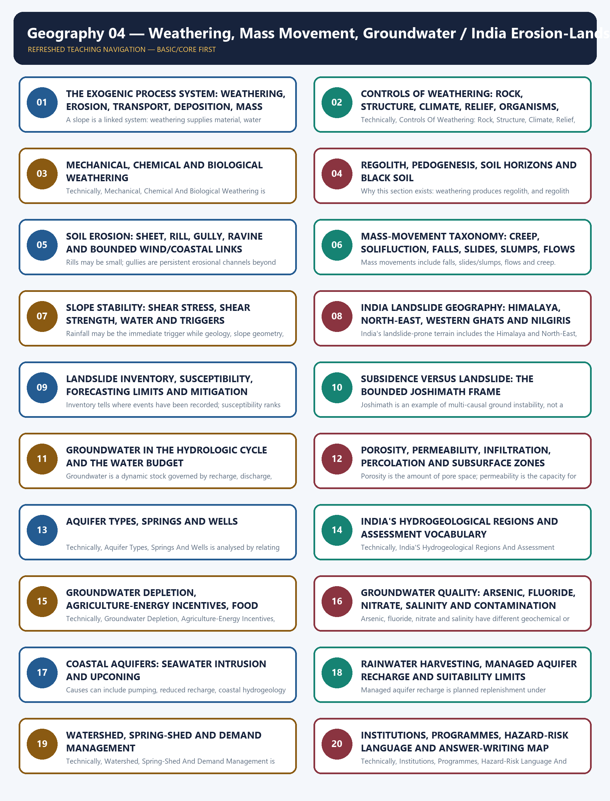
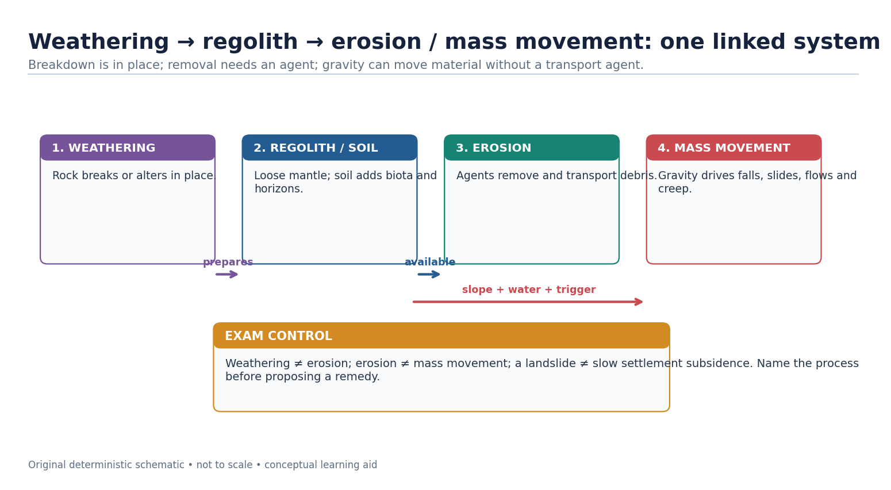
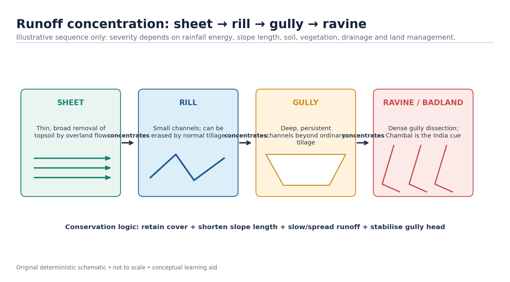
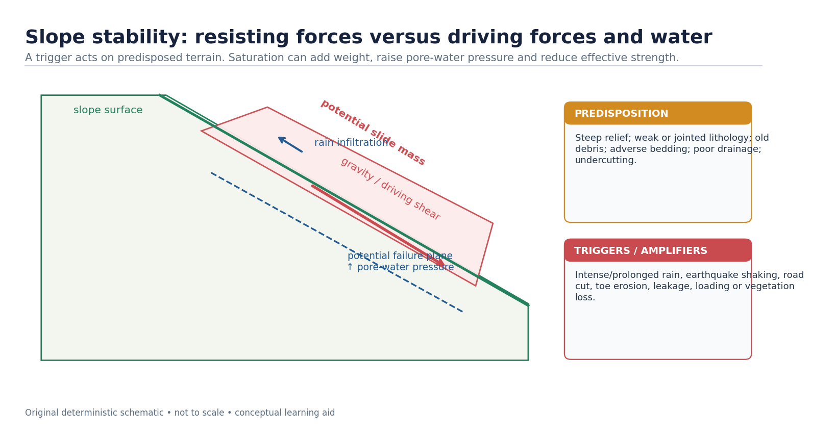
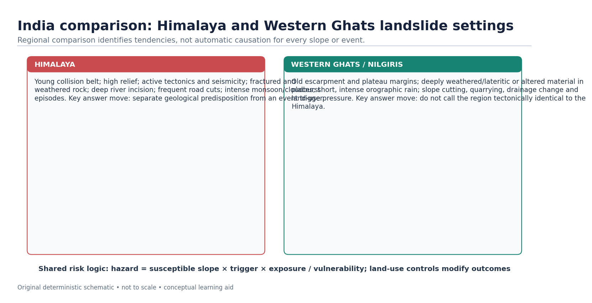
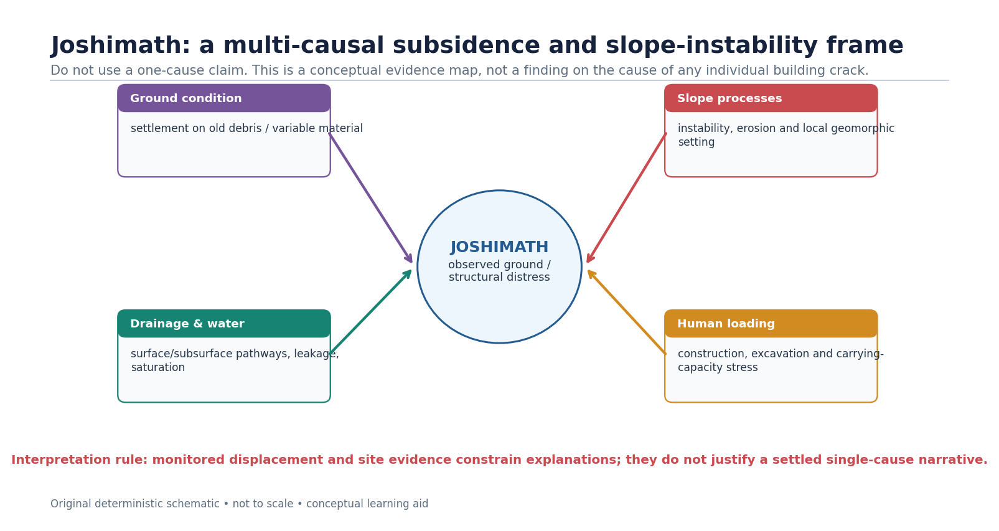
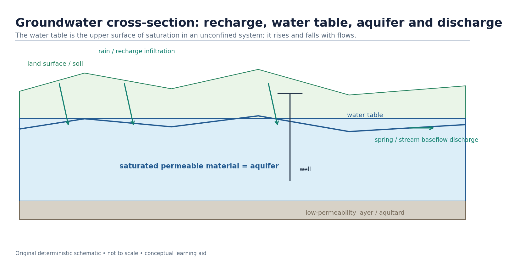
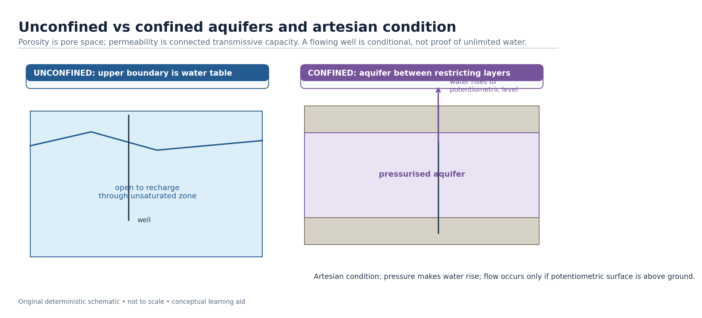
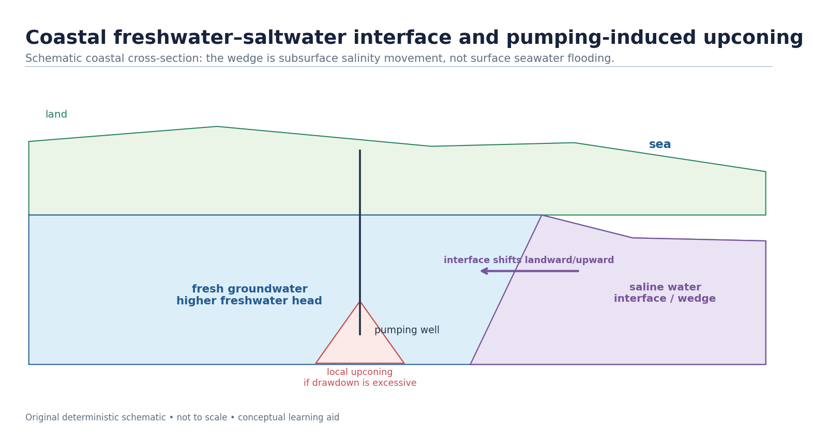
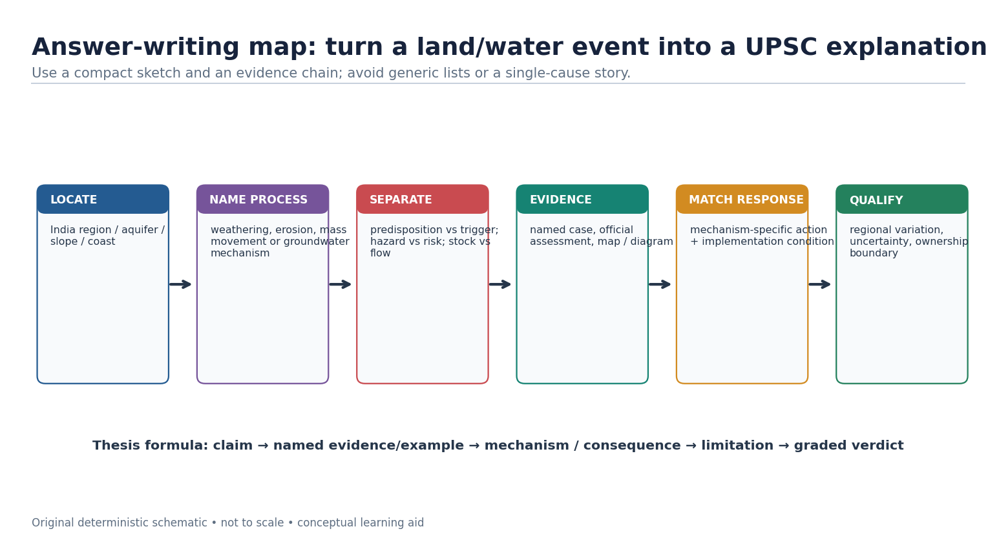

# Geography 04 — Weathering, Mass Movement, Groundwater / India Erosion-Landslides-Groundwater

**Complete uncompressed learner-v2 source | GS-I + Prelims with bounded GS-III links | Generated 23 August 2026 | Approval pending**

> **Syllabus ownership:** Exogenic geomorphic processes, India’s erosion and slope-hazard geography, and groundwater as a physical resource system. Detailed incident command belongs to Disaster Management; pollution regulation and coastal ecology remain cross-owned.
>
> **Source order followed:** repository Markdown owners and Geography control files → OCR-searchable local standard books and exact local UPSC papers/keys → dated official live sources → no Qdrant dependency.
>
> **Evidence tags:** **[FACT]** = directly supported by a repository owner, local book/paper/key or official source; **[INFERENCE]** = reasoned synthesis; **[LIMIT]** = uncertainty, scope or attribution caution.

| Package component | Authored coverage |
|---|---:|
| Basic/core numbered sessions | 20 |
| Verified routed PYQs | 12 |
| Original hard MCQs | 40 |
| Remedial MCQs | 8 |
| Original solved Mains questions | 6 |
| Objective-key policy | Stable `geography-04` seed; balanced, deterministic and non-patterned after generation |

### Source and current-affairs register

- Repository owners: `Geography/basic/04_Weathering-MassMovement-Groundwater.md`, `Geography/advanced/04_India-Erosion-Landslides-Groundwater.md`, the legacy complete package, Geography README, syllabus mapping, answer-worthiness audit, revision chart and routed cross-links.
- Local books checked: G.C. Leong; Majid Husain, *Indian & World Geography*; Majid Husain, *Indian Geography*; D.R. Khullar, *India: A Comprehensive Geography*.
- Local official papers/keys checked: 2018, 2019, 2020, 2021, 2023, 2024 and 2025 routed papers; 2024 and 2025 Set-A answer keys.
- [FACT] Ministry of Jal Shakti, **Water Management and Conservation**, 3 August 2026, reports the completed Atal Bhujal pilot period, NAQUIM/NAQUIM 2.0, monitoring and recharge-programme status.
- [FACT] Ministry of Jal Shakti, **Rainwater Harvesting and Water Conservation**, 6 August 2026, reports the 2025 assessment trend and the 1 June 2026 launch of JSJB: CTR 2026.
- [FACT] Ministry of Jal Shakti, **Average Groundwater Consumption and Its Quality in the Country**, 10 August 2026, reports 2025 recharge/extractable/extraction figures, use shares, quality-monitoring and NAQUIM 2.0 details.
- [FACT] GSI, **Preliminary Assessment of a Landslide Incidence at Chanmari West, Aizawl**, June 2026, documents a rainfall-triggered complex rockslide-to-flow event, joint control, toe erosion and settlement/drainage amplifiers.
- [FACT] IMD, **Heavy Rainfall Warning based on 0300 UTC of 18 August 2026**, is used only as a current rainfall-monitoring illustration, not as proof of a particular landslide.
- [FACT] PIB/NMSA, **Building Climate-Resilient Farming in India**, 9 May 2026, links soil-health management with measures to mitigate soil erosion and land degradation.
- [LIMIT] The last-six-month official search found no new exclusive Joshimath technical bulletin. The case is retained as a bounded multi-causal illustration, not a settled single-cause diagnosis.

## BASIC LEARNING SESSION



*Distinct embedded teaching-navigation image. The separate continuous Cārvāka-style flowchart package remains an independent at-a-glance artifact.*
### SESSION 1 — THE EXOGENIC PROCESS SYSTEM: WEATHERING, EROSION, TRANSPORT, DEPOSITION, MASS WASTING AND STORAGE

#### DEFINITION / WHAT THIS IS CALLED

**Plain-language definition:** Denudation is a connected source–transfer–storage system, but weathering, erosion and mass wasting must still be distinguished by whether material remains in place, is carried by an agent, or moves mainly under gravity.

**Technical definition:** A slope is a linked system: weathering supplies material, water changes strength, gravity moves it, runoff may entrain it, and deposition stores it until the next threshold is crossed.

#### ANSWER-GRABBING OPENING — WRITE/ADAPT IN THE EXAM

> Denudation is a connected source–transfer–storage system, but weathering, erosion and mass wasting must still be distinguished by whether material remains in place, is carried by an agent, or moves mainly under gravity.

#### MUST-WRITE KEYWORDS

- **The Exogenic Process System**
- **Weathering**
- **Erosion**
- **Transport**
- **Deposition**
- **Mass Wasting**

**How to use them:** Frame the answer through The Exogenic Process System; define Weathering, connect Erosion with Transport to explain the mechanism, and use Deposition for the decisive comparison or qualification.

[FACT] Exogenic geomorphic processes are surface and near-surface processes driven mainly by solar-climatic energy, gravity and moving water, wind, ice or waves. They lower, reshape, transfer and temporarily store material produced from rock.

```text
UPLIFT / EXPOSED ROCK
        |
        v
WEATHERING IN PLACE -> REGOLITH / DISSOLVED LOAD
        |                         |
        +------ gravity ----------+----> MASS WASTING
        |
        +------ agent detaches and transports ----> EROSION + TRANSPORT
                                                     |
                                                     v
                                               DEPOSITION / STORAGE
                                                     |
                                                     +--> later remobilisation
```

| Term | Exact boundary | Exam use |
|---|---|---|
| Weathering | Physical disintegration or chemical alteration **in situ** | Creates regolith, clay, ions and weak zones |
| Erosion | Detachment and removal by a moving agent | Requires transport by water, wind, ice or waves |
| Transportation | Movement of load after entrainment | Traction, saltation, suspension or solution |
| Deposition | Settling when competence/energy falls | Builds temporary geomorphic stores |
| Mass wasting | Downslope movement primarily under gravity | May be slow creep or rapid fall/slide/flow |
| Denudation | Collective lowering by weathering, mass wasting and erosion | Umbrella term, not a synonym for one process |

[INFERENCE] A slope is a linked system: weathering supplies material, water changes strength, gravity moves it, runoff may entrain it, and deposition stores it until the next threshold is crossed.

> **ANSWER-GRABBING LINE — WRITE/ADAPT IN THE EXAM:** Denudation is a connected source–transfer–storage system, but weathering, erosion and mass wasting must still be distinguished by whether material remains in place, is carried by an agent, or moves mainly under gravity.

#### Examiner traps

- Weathering is not “erosion without a river”; it is in-situ change.
- Deposition is not permanent disposal; stored sediment may be remobilised.
- A landslide can deliver sediment to a river, but the initial movement remains mass wasting.



#### CLOSING RECALL FLOW — THE EXOGENIC PROCESS SYSTEM: WEATHERING, EROSION, TRANSPORT, DEPOSITION, MASS WASTING AND STORAGE

```text
START / CONCEPT: THE EXOGENIC PROCESS SYSTEM: WEATHERING, EROSION, TRANSPORT, DEPOSITION, MASS WASTING AND STORAGE
        |
        v
EXACT TERMS: The Exogenic Process System · Weathering · Erosion · Transport · Deposition · Mass Wasting
        |
        v
MECHANISM / ARGUMENT: A slope is a linked system: weathering supplies material, water changes strength, gravity moves it, runoff may entrain it, and deposition stores it until the next threshold is crossed.
        |
        v
CONSEQUENCE / CONTRAST: Weathering is not “erosion without a river”; it is in-situ change.
        |
        v
UPSC TRAP / ANSWER-USE: A landslide can deliver sediment to a river, but the initial movement remains mass wasting.
        |
        v
ANSWER-GRABBING FORMULATION: Denudation is a connected source–transfer–storage system, but weathering, erosion and mass wasting must still be distinguished by whether material remains in place, is carried by an agent, or moves mainly under gravity.
```
### SESSION 2 — CONTROLS OF WEATHERING: ROCK, STRUCTURE, CLIMATE, RELIEF, ORGANISMS, TIME AND LAND USE

#### DEFINITION / WHAT THIS IS CALLED

**Plain-language definition:** Weathering is controlled not by climate alone but by the interaction of energy and moisture with mineralogy, discontinuities, relief, biota, time and land use.

**Technical definition:** Technically, Controls Of Weathering: Rock, Structure, Climate, Relief, Organisms, Time And Land Use is analysed by relating Controls Of Weathering to Rock, then testing the relationship through Structure and Climate.

#### ANSWER-GRABBING OPENING — WRITE/ADAPT IN THE EXAM

> Weathering is controlled not by climate alone but by the interaction of energy and moisture with mineralogy, discontinuities, relief, biota, time and land use.

#### MUST-WRITE KEYWORDS

- **Controls Of Weathering**
- **Rock**
- **Structure**
- **Climate**
- **Relief**
- **Organisms**

**How to use them:** Frame the answer through Controls Of Weathering; define Rock, connect Structure with Climate to explain the mechanism, and use Relief for the decisive comparison or qualification.

[FACT] Weathering rate and product depend on an interacting control set: mineral composition and rock texture; joints, bedding and faults; temperature and moisture; slope and drainage; organisms; duration of exposure; and human disturbance.

| Control | Mechanism | Example / qualification |
|---|---|---|
| Rock type and mineralogy | Minerals differ in solubility and chemical stability | Carbonates dissolve readily; quartz is relatively resistant |
| Structure | Joints and bedding increase reactive surface and water entry | A jointed strong rock may weather faster than a massive equivalent |
| Climate | Temperature range, rainfall and moisture govern reaction/freeze–thaw cycles | Hot-humid settings favour rapid chemical alteration; cold wet cycles favour frost action |
| Relief | Slope changes drainage, residence time and removal | Steep slopes may expose fresh rock by rapid removal |
| Organisms | Roots, burrowing, microbes and organic acids widen or alter pathways | Biological action often reinforces physical and chemical weathering |
| Time | Longer exposure permits deeper profiles where removal is limited | Time alone cannot overcome rapid erosion |
| Land use | Excavation, irrigation, pollution and vegetation removal alter pathways | Human action can accelerate both breakdown and removal |

[INFERENCE] Climate sets broad tendencies, but lithology and structure decide how a particular rock actually responds. Therefore “humid climate means one uniform weathering product” is unsafe.

> **ANSWER-GRABBING LINE — WRITE/ADAPT IN THE EXAM:** Weathering is controlled not by climate alone but by the interaction of energy and moisture with mineralogy, discontinuities, relief, biota, time and land use.

#### Quick comparison

```text
HIGH WATER + WARMTH + REACTIVE MINERALS + JOINTS -> faster chemical alteration
COLD/WET CYCLES + JOINTED ROCK                 -> frost shattering
ARID/SALINE SURFACE + EVAPORATION              -> salt crystallisation
STEEP SLOPE + RAPID REMOVAL                     -> thin regolith, repeated fresh exposure
```

#### CLOSING RECALL FLOW — CONTROLS OF WEATHERING: ROCK, STRUCTURE, CLIMATE, RELIEF, ORGANISMS, TIME AND LAND USE

```text
START / CONCEPT: CONTROLS OF WEATHERING: ROCK, STRUCTURE, CLIMATE, RELIEF, ORGANISMS, TIME AND LAND USE
        |
        v
EXACT TERMS: Controls Of Weathering · Rock · Structure · Climate · Relief · Organisms
        |
        v
MECHANISM / ARGUMENT: Therefore “humid climate means one uniform weathering product” is unsafe.
        |
        v
CONSEQUENCE / CONTRAST: The resulting consequence is that weathering is controlled not by climate alone but by the interaction of energy and...
        |
        v
UPSC TRAP / ANSWER-USE: Do not miss this limiting distinction: weathering is controlled not by climate alone but by the interaction of energy and...
        |
        v
ANSWER-GRABBING FORMULATION: Weathering is controlled not by climate alone but by the interaction of energy and moisture with mineralogy, discontinuities, relief, biota, time and land use.
```
### SESSION 3 — MECHANICAL, CHEMICAL AND BIOLOGICAL WEATHERING

#### DEFINITION / WHAT THIS IS CALLED

**Plain-language definition:** Mechanical, Chemical And Biological Weathering comprises Mechanical, Chemical and Biological Weathering as its core connected dimensions.

**Technical definition:** Technically, Mechanical, Chemical And Biological Weathering is analysed by relating Mechanical to Chemical, then testing the relationship through Biological Weathering and Mnemonic.

#### ANSWER-GRABBING OPENING — WRITE/ADAPT IN THE EXAM

> Wrong: Chemical weathering is absent from a seasonal monsoon setting.

#### MUST-WRITE KEYWORDS

- **Mechanical**
- **Chemical**
- **Biological Weathering**
- **Mnemonic**
- **M-FSTUW**
- **C-SCHHO**

**How to use them:** Frame the answer through Mechanical; define Chemical, connect Biological Weathering with Mnemonic to explain the mechanism, and use M-FSTUW for the decisive comparison or qualification.

[FACT] Mechanical weathering includes freeze–thaw, thermal expansion, salt crystallisation and unloading/exfoliation. Chemical weathering includes solution, carbonation, hydrolysis and oxidation. Biological activity includes roots, burrowing and organic-acid pathways.


*The diagram emphasises process–product logic rather than a false single-process zoning of India.*

#### Evidence / comparison matrix

| Family | Mechanism cue | Product / India use |
| --- | --- | --- |
| Mechanical | fracture, expansion, frost/salt action | scree, blocks, joint opening; high-relief/cold or exposed settings |
| Chemical | water-driven mineral alteration/dissolution | clay, solution features, weathered mantle; humid/monsoon settings |
| Biological | root, burrow, organic-acid action | joint widening and enhanced mineral alteration |

#### Teaching, explanation and solution

- [FACT] Frost action requires water access and repeated freezing; it is a conditional mechanism, not a generic mountain label.
- [FACT] Carbonation involves carbonic-acid-bearing water dissolving carbonate minerals; it does not mean limestone 'melts'.
- [FACT] Chemical weathering can generate clay minerals, which can influence slope material behaviour and hard-rock aquifer weathered zones.
- [ANALYSIS] A useful answer joins climate to lithology and structure: warmth/water may accelerate reactions, but minerals and fractures determine the pathway.
- [LIMIT] Do not quote an unsupported national rate, depth or percentage of weathering from a textbook edition as a current fact.

#### Must-know facts

- Mechanical = disintegration; chemical = alteration; biological can reinforce both.
- Solution/carbonation are especially important in carbonate terrain.
- The product of weathering can be both a soil parent material and a potential slope-failure material.

#### UPSC traps and corrections

- **Wrong:** Chemical weathering is absent from a seasonal monsoon setting. **Correct:** Water availability, temperature and mineralogy can support it even where a dry season exists.
- **Wrong:** A biological process is separate from physical/chemical action. **Correct:** Roots and organisms often alter the physical and chemical pathways together.

#### Mains / answer route

Draw a three-column mini-table only if it clarifies the directive; then connect one weathering product to landform, soil, slope or groundwater.

#### Study link

PYQ 2024 Prelims Q7; Topics 08 karst and 30 agriculture.

#### Complete process table

| Family | Process | Mechanism | Diagnostic caution |
|---|---|---|---|
| Mechanical | Thermal expansion | Unequal heating/cooling creates stress; repeated cycles loosen grains or shells | Daily heating alone does not guarantee large-scale exfoliation |
| Mechanical | Unloading / pressure release | Removal of overburden lets massive rock expand and sheet joints develop | Distinguish from temperature-only explanation |
| Mechanical | Frost action | Water in cracks freezes, expands and repeatedly wedges rock | Needs water, freezing and repeated cycles |
| Mechanical | Salt crystallisation | Saline water enters pores; crystal growth/hydration pressure disrupts rock | Common in arid/coastal micro-environments |
| Mechanical | Wetting–drying | Swelling and shrinkage of clay-rich material creates fatigue and cracking | Especially relevant where moisture alternates |
| Chemical | Solution | Soluble minerals pass into water | Does not mean literal melting |
| Chemical | Carbonation | CO2 + water forms weak carbonic acid that attacks carbonates | Central to limestone/karst |
| Chemical | Hydration | Water is incorporated into a mineral structure, causing expansion/change | Distinguish from simple wetting |
| Chemical | Hydrolysis | Hydrogen/hydroxyl ions react with silicates; feldspar can alter to clay | Produces secondary minerals |
| Chemical | Oxidation/reduction | Electron transfer changes iron-bearing minerals; reducing conditions reverse iron state | Redox depends on oxygen and drainage |
| Biological | Roots/fauna/microbes | Wedge joints, mix material and generate acids | Often physical and chemical together |
| Anthropogenic | Cutting, blasting, pollution, irrigation | Exposes fresh surfaces, changes water chemistry and weakens support | Acceleration, not a separate natural family |

[FACT] Water can enable carbonation, hydrolysis, hydration and oxidation; this is why the exact composition and pathway of rainwater matter in Prelims 2024 Q7.

> **Mnemonic:** **M-FSTUW** = Mechanical: Frost, Salt, Thermal, Unloading, Wetting–drying. **C-SCHHO** = Chemical: Solution, Carbonation, Hydration, Hydrolysis, Oxidation/reduction.

#### CLOSING RECALL FLOW — MECHANICAL, CHEMICAL AND BIOLOGICAL WEATHERING

```text
START / CONCEPT: MECHANICAL, CHEMICAL AND BIOLOGICAL WEATHERING
        |
        v
EXACT TERMS: Mechanical · Chemical · Biological Weathering · Mnemonic · M-FSTUW · C-SCHHO
        |
        v
MECHANISM / ARGUMENT: Chemical weathering can generate clay minerals, which can influence slope material behaviour and hard-rock aquifer weathered zones.
        |
        v
CONSEQUENCE / CONTRAST: Mechanical = disintegration; chemical = alteration; biological can reinforce both.
        |
        v
UPSC TRAP / ANSWER-USE: Do not quote an unsupported national rate, depth or percentage of weathering from a textbook edition as a current fact.
        |
        v
ANSWER-GRABBING FORMULATION: Wrong: Chemical weathering is absent from a seasonal monsoon setting.
```
### SESSION 4 — REGOLITH, PEDOGENESIS, SOIL HORIZONS AND BLACK SOIL

#### DEFINITION / WHAT THIS IS CALLED

**Plain-language definition:** Regolith is the loose weathered mantle above bedrock; soil is a biologically active, vertically organised body formed when mineral matter, organic inputs, water movement, organisms, relief and time create horizons.

**Technical definition:** Why this section exists: weathering produces regolith, and regolith becomes soil — yet no file in this folder taught soil formation or any soil type, although this file is the routed owner for black cotton soil formation from volcanic rock, 30Primary-Economic-Activities Agriculture.md uses "chernozem", "alluvial" and "black soil" as evidence without defining them, and 15Hot-Wet-Equatorial-Climate.md is routed a demand on rainforest soil nutrient status.

#### ANSWER-GRABBING OPENING — WRITE/ADAPT IN THE EXAM

> Pedogenesis begins with weathered parent material but becomes soil formation only when organic activity, translocation and time create an organised profile; black soil illustrates how basaltic parent material and seasonal moisture regimes shape properties.

#### MUST-WRITE KEYWORDS

- **Regolith**
- **Pedogenesis**
- **Soil Horizons**
- **Black Soil**
- **Why this section exists**
- **horizon differentiation**

**How to use them:** Frame the answer through Regolith; define Pedogenesis, connect Soil Horizons with Black Soil to explain the mechanism, and use Why this section exists for the decisive comparison or qualification.

[FACT] Regolith is the loose weathered mantle above bedrock; soil is a biologically active, vertically organised body formed when mineral matter, organic inputs, water movement, organisms, relief and time create horizons.

> **Why this section exists:** weathering produces regolith, and regolith becomes soil — yet **no
> file in this folder taught soil formation or any soil type**, although this file is the routed
> owner for *black cotton soil formation from volcanic rock*, `30_Primary-Economic-Activities-
> Agriculture.md` uses "chernozem", "alluvial" and "black soil" as evidence without defining them,
> and `15_Hot-Wet-Equatorial-Climate.md` is routed a demand on rainforest soil nutrient status.
> Soil is the hinge between physical and economic geography, and it was missing.

#### From rock to soil

```text
PARENT ROCK
  -> WEATHERING (physical breakup + chemical alteration)  [Section 1 of this file]
  -> REGOLITH: loose, unsorted mineral debris - NOT yet soil
  -> + ORGANIC MATTER from plants and soil organisms
  -> + WATER MOVEMENT (leaching down, capillary rise up)
  -> HORIZON DIFFERENTIATION over time
  -> SOIL: a vertically organised, biologically active natural body
```

⚠️ Soil formation is controlled by five interacting factors, none of which is sufficient alone:

| Factor | How it acts | Diagnostic consequence |
|---|---|---|
| ⚠️ Climate | Temperature and moisture set the rate and direction of weathering and leaching | The single strongest control at world scale — which is why soil belts broadly follow climate belts |
| ⚠️ Parent material | Supplies mineral composition and texture | Dominant where soils are young or where the rock is distinctive, e.g. basalt |
| ⚠️ Relief | Governs drainage, erosion and depth of accumulation | Thin skeletal soils on steep slopes; deep soils in valleys and plains |
| ⚠️ Organisms | Add organic matter, mix horizons, cycle nutrients | Grassland root turnover builds deep humus; forest litter builds a surface layer |
| ⚠️ Time | Allows horizons to differentiate | Immature soils on floodplains and volcanic ash; mature, strongly leached soils on old stable surfaces |

> 🔑 **Trap:** soil is not "crushed rock". Regolith becomes soil only when organic matter, biological
> activity and water movement have produced **horizon differentiation**. This is exactly why
> alluvium deposited last season is fertile but immature.

#### The soil profile

| Horizon | Content | Exam significance |
|---|---|---|
| ⚠️ O | Surface organic litter | Thick in cool, wet forests; almost absent in deserts and in hot humid soils where decomposition is very fast |
| ⚠️ A (topsoil) | Mineral matter mixed with humus; zone of **eluviation** (removal) | The agriculturally critical layer; the layer lost to erosion |
| ⚠️ E | Strongly leached, pale | Diagnostic of podzolisation under cool, wet, acidic conditions |
| ⚠️ B (subsoil) | Zone of **illuviation** — accumulation of clay, iron and aluminium washed down from above | Where hardpans and iron-rich crusts form |
| ⚠️ C | Weathered parent material | Links the soil to its rock |
| ⚠️ R | Unweathered bedrock | The base of the profile |

- ⚠️ **Eluviation vs illuviation** is the single most testable pair here: material is *removed* from
  A/E and *deposited* in B. Every leached soil type below is a variation on how far this has gone.

#### The two great pedogenic directions

| Process | Climatic setting | What happens | Resulting soil character |
|---|---|---|---|
| ⚠️ **Podzolisation** | Cool, humid, coniferous forest | Acidic litter mobilises iron and aluminium downward | Pale, leached, acidic, low-fertility soils requiring liming — the taiga belt |
| ⚠️ **Laterisation** | Hot, humid tropics | Intense leaching removes silica and bases; iron and aluminium oxides are left behind and can harden on exposure | Red, iron-rich, nutrient-poor soils; hardened crusts; good for tree crops with management, poor for continuous cereals |
| ⚠️ **Calcification** | Semi-arid, low leaching | Evaporation exceeds percolation; calcium carbonate accumulates | Base-rich soils; calcrete/kankar nodules |
| ⚠️ **Salinisation / alkalisation** | Arid, and irrigated land with poor drainage | Capillary rise brings salts to the surface | Saline/alkali soils — a *human-induced* degradation pathway, not only a natural one |
| ⚠️ **Gleying** | Waterlogged, poorly drained | Anaerobic conditions reduce iron | Grey-blue mottled, peaty and marshy soils |
| ⚠️ **Humification / melanisation** | Temperate grassland | Deep root turnover builds abundant humus | **Chernozem** — the deep black earths of the steppe and prairie granaries |

> 🔑 **Trap** (routed as a Prelims demand): **rainforest soils are not rich**. The equatorial biome's
> luxuriance rests on a *rapid nutrient cycle held in the living biomass*, not in the soil. Heavy
> rainfall leaches bases quickly, decomposition is fast, and once the canopy is cleared the nutrient
> capital is exported or washed out within a few cropping cycles — which is the real reason shifting
> cultivation uses long fallows. See `15_Hot-Wet-Equatorial-Climate.md`.

#### India's principal soil groups

⚠️ The standard classification used in Indian geography recognises the following major groups. Learn
each as **parent material -> process -> property -> crop consequence**, which is the form UPSC tests.

| Soil | Origin and distribution | Key properties | Crop / management consequence |
|---|---|---|---|
| ⚠️ **Alluvial** | Deposited by rivers; the northern plains, coastal plains and deltas — India's most extensive soil group | Highly variable texture; generally fertile; **khadar** (newer, flood-renewed) is more fertile than **bhangar** (older, often with kankar) | The foundation of the rice-wheat system; fertility maintained by annual renewal but exposed to waterlogging and salinity under canal irrigation |
| ⚠️ **Black / regur** | Weathering of the **Deccan basalt** under a semi-arid seasonal climate | Clayey; very high moisture retention; **swells when wet, cracks deeply when dry**; rich in iron, lime, magnesia; poor in nitrogen and organic matter | Self-ploughing cracks and moisture retention make it the classic **cotton** soil; it is workable only in a narrow moisture window and needs nitrogen supplementation |
| ⚠️ **Red and yellow** | Crystalline igneous and metamorphic rocks of the Peninsula under moderate rainfall | Red from iron oxide; yellow where hydrated; generally light-textured and low in nitrogen, phosphorus and humus | Responds strongly to fertiliser and irrigation; supports millets, pulses and oilseeds without them |
| ⚠️ **Laterite** | Intense leaching under a **seasonally alternating wet and dry** tropical climate on high rainfall uplands | Iron-and-aluminium rich; acidic; **hardens irreversibly on exposure** — historically quarried as a building brick, which is the origin of the name | Poor for cereals without heavy amendment; suited to tea, coffee, cashew and rubber on managed slopes |
| ⚠️ **Arid / desert** | Aeolian and weathering products in the north-western dry belt | Sandy, low organic matter, often calcareous or saline at depth | Productive **only** with reliable irrigation, and then at high salinisation risk |
| ⚠️ **Saline and alkaline** | Arid climates and, critically, **poorly drained irrigated tracts** | Salt or sodium accumulation at the surface | Reclamation by drainage, gypsum and leaching — a degradation class as much as a soil class |
| ⚠️ **Peaty and marshy** | Waterlogged, high-organic settings in humid deltas and backwaters | Very high organic content; acidic; anaerobic | Special-purpose wetland cultivation; drainage alters it fundamentally |
| ⚠️ **Forest and mountain** | Hill slopes under forest cover | Thin, immature, texture varies sharply with altitude and slope | Highly erosion-prone once cleared; suited to horticulture and plantations on terraces |

> 🔑 **Trap:** black soil is derived from **basaltic lava**, not from "black minerals" and not from
> alluvium. Its cotton suitability follows from **moisture retention plus self-mulching cracking**,
> not from exceptional chemical richness — it is in fact poor in nitrogen and humus.

> 🔑 **Trap:** laterite forms under a **wet-and-dry** regime, not under perpetually wet equatorial
> conditions. The alternation is what allows the iron crust to harden.

#### Soil degradation: the applied half

| Degradation type | Mechanism | Where it bites |
|---|---|---|
| ⚠️ Sheet, rill and gully erosion | Raindrop impact and runoff on unprotected slopes | Ravine lands of the Chambal-Yamuna tract; deforested hill slopes |
| ⚠️ Wind erosion | Deflation of dry, bare, fine material | The arid north-west |
| ⚠️ Salinisation and waterlogging | Irrigation without drainage; canal seepage raising the water table | Canal command areas |
| ⚠️ Nutrient mining and organic-matter decline | Continuous intensive cropping without balanced replenishment | Intensively cropped irrigated belts |
| ⚠️ Acidification | Leaching in high-rainfall areas | Humid eastern and north-eastern uplands |
| ⚠️ Sealing and contamination | Urban expansion, mining spoil, industrial effluent | Peri-urban and mining districts |

- ⚠️ **Conservation logic:** contour bunding and terracing reduce slope length and runoff velocity;
  shelterbelts reduce wind velocity; gully plugging and check dams arrest headward erosion;
  organic-matter restoration and balanced nutrient use rebuild structure; drainage plus gypsum
  reclaims sodic land. The organising principle is **reduce the erosive energy, restore the
  protective cover, and close the nutrient cycle**.

> ⚠️ **Factual caution:** do **not** quote a national percentage of degraded land, a soil-loss rate
> in tonnes per hectare, an ICAR survey figure or a soil-organic-carbon value from memory. The
> classification, process and consequence are the marks-bearing content here; institutional
> desertification and land-degradation targets belong to `Environment-and-Ecology`.

#### Black-soil causal chain

```text
DECCAN TRAP BASALT
   -> long weathering of basaltic parent material
   -> clay-rich regolith with shrink–swell minerals
   -> high moisture retention + deep cracks on drying
   -> self-mulching tendency and cotton suitability
   -> LIMIT: poor nitrogen/organic matter; difficult tillage when too wet
```

[FACT] The 2021 Prelims question uses the exact expression **fissure volcanic rock**. The local official key is unavailable; the independent geological solution is the basaltic/fissure-volcanic option, clearly labelled non-official in the workbook.

> **ANSWER-GRABBING LINE — WRITE/ADAPT IN THE EXAM:** Pedogenesis begins with weathered parent material but becomes soil formation only when organic activity, translocation and time create an organised profile; black soil illustrates how basaltic parent material and seasonal moisture regimes shape properties.

#### CLOSING RECALL FLOW — REGOLITH, PEDOGENESIS, SOIL HORIZONS AND BLACK SOIL

```text
START / CONCEPT: REGOLITH, PEDOGENESIS, SOIL HORIZONS AND BLACK SOIL
        |
        v
EXACT TERMS: Regolith · Pedogenesis · Soil Horizons · Black Soil · Why this section exists · horizon differentiation
        |
        v
MECHANISM / ARGUMENT: Why this section exists: weathering produces regolith, and regolith becomes soil — yet no file in this folder taught soil formation or any soil type, although this file is the routed owner for black cotton soil formation from volcanic rock, 30Primary-Economic-Activities Agriculture.md uses "chernozem", "alluvial" and "black soil" as evidence without defining them, and 15Hot-Wet-Equatorial-Climate.md is routed a demand on rainforest soil nutrient status.
        |
        v
CONSEQUENCE / CONTRAST: 🔑 Trap: black soil is derived from basaltic lava, not from "black minerals" and not from alluvium.
        |
        v
UPSC TRAP / ANSWER-USE: Do not miss this limiting distinction: regolith becomes soil only when organic matter, biological activity and water movement have produced...
        |
        v
ANSWER-GRABBING FORMULATION: Pedogenesis begins with weathered parent material but becomes soil formation only when organic activity, translocation and time create an organised profile; black soil illustrates how basaltic parent material and seasonal moisture regimes shape properties.
```
### SESSION 5 — SOIL EROSION: SHEET, RILL, GULLY, RAVINE AND BOUNDED WIND/COASTAL LINKS

#### DEFINITION / WHAT THIS IS CALLED

**Plain-language definition:** Chambal ravines are an India location cue for severe gully dissection.

**Technical definition:** Rills may be small; gullies are persistent erosional channels beyond ordinary tillage.

#### ANSWER-GRABBING OPENING — WRITE/ADAPT IN THE EXAM

> Rain-splash and overland flow can progress from sheet erosion to rills, gullies and ravines where flow concentrates and protection/drainage fail.

#### MUST-WRITE KEYWORDS

- **Soil Erosion**
- **Sheet**
- **Rill**
- **Gully**
- **Ravine**
- **Bounded Wind/Coastal Links**

**How to use them:** Frame the answer through Soil Erosion; define Sheet, connect Rill with Gully to explain the mechanism, and use Ravine for the decisive comparison or qualification.

[FACT] Erosion removes and transports material. Rain-splash and overland flow can progress from sheet erosion to rills, gullies and ravines where flow concentrates and protection/drainage fail. Chambal ravines are an India location cue for severe gully dissection.



*Schematic sequence: not every rill becomes a ravine, and form depends on material, drainage and management.*

#### Evidence / comparison matrix

| Form | Hydrological signal | Mechanism-matched response |
| --- | --- | --- |
| Sheet | broad shallow overland flow | cover, contouring, residue and infiltration |
| Rill | small concentrated channels | break slope length, spread flow, early repair |
| Gully | incised concentrated runoff | gully-head control, check structures, vegetative stabilisation |
| Ravine | dense mature gully network | catchment-scale drainage, land-use and rehabilitation |

#### Teaching, explanation and solution

- [FACT] Running water, wind, ice and waves can erode; gravity-driven movement is classified separately as mass movement.
- [FACT] Wind transport vocabulary includes surface creep, saltation and suspension; dry bare surfaces and sparse cover increase susceptibility.
- [FACT] Chambal is an exam-safe ravine/badland anchor; do not give it a false all-India rank or an unsupported area figure.
- [ANALYSIS] Soil conservation works by reducing erosive energy, retaining protective cover, improving infiltration and controlling concentrated flow.
- [ANALYSIS] Contour bunding/terracing shorten effective slope length; shelterbelts reduce wind velocity; drainage and gully-head work prevent headward erosion.
- [LIMIT] A check dam is not automatically a recharge or erosion cure: location, sediment load, maintenance, drainage and aquifer conditions decide performance.

#### Must-know facts

- Sheet erosion can be diffuse but agriculturally serious because it removes topsoil.
- Rills may be small; gullies are persistent erosional channels beyond ordinary tillage.
- Conservation must be catchment and slope specific, not a generic 'plant trees' list.

#### UPSC traps and corrections

- **Wrong:** Ravines are just any river valley. **Correct:** They are intensely dissected badland/gully terrain, classically associated with the Chambal tract.
- **Wrong:** Erosion control means only retaining sediment at the bottom. **Correct:** Control begins upslope by reducing raindrop/runoff energy and flow concentration.

#### Mains / answer route

For a soil-erosion answer, draw the sequence and pair each stage with a mechanism rather than listing conservation schemes.

#### Study link

Topic 05 running water; Topic 07 aeolian processes; Environment land-degradation owner; Agriculture soil-health link.

#### Bounded agent comparison

| Agent | Relevant process | Bounded use in this topic |
|---|---|---|
| Running water | splash, sheet wash, rills, gullies, ravines | Core owner |
| Wind | deflation, abrasion; creep, saltation, suspension | Use for arid Rajasthan linkage; landforms belong to Topic 07 |
| Waves | hydraulic action, abrasion and sediment removal | Use only to distinguish coastal erosion; landforms/CRZ belong to Topic 10/Environment |

[FACT] PIB’s National Mission for Sustainable Agriculture note dated 9 May 2026 states that Soil Health Management promotes land-use practices and measures to mitigate soil erosion and land degradation. [LIMIT] It does not replace site-specific erosion measurement.

#### CLOSING RECALL FLOW — SOIL EROSION: SHEET, RILL, GULLY, RAVINE AND BOUNDED WIND/COASTAL LINKS

```text
START / CONCEPT: SOIL EROSION: SHEET, RILL, GULLY, RAVINE AND BOUNDED WIND/COASTAL LINKS
        |
        v
EXACT TERMS: Soil Erosion · Sheet · Rill · Gully · Ravine · Bounded Wind/Coastal Links
        |
        v
MECHANISM / ARGUMENT: Sheet erosion can be diffuse but agriculturally serious because it removes topsoil.
        |
        v
CONSEQUENCE / CONTRAST: Chambal is an exam-safe ravine/badland anchor; do not give it a false all-India rank or an unsupported area figure.
        |
        v
UPSC TRAP / ANSWER-USE: A check dam is not automatically a recharge or erosion cure: location, sediment load, maintenance, drainage and aquifer conditions decide performance.
        |
        v
ANSWER-GRABBING FORMULATION: Rain-splash and overland flow can progress from sheet erosion to rills, gullies and ravines where flow concentrates and protection/drainage fail.
```
### SESSION 6 — MASS-MOVEMENT TAXONOMY: CREEP, SOLIFLUCTION, FALLS, SLIDES, SLUMPS, FLOWS AND AVALANCHES

#### DEFINITION / WHAT THIS IS CALLED

**Plain-language definition:** “Landslide” is a broad popular term; exam precision improves when the actual fall–slide–flow–creep class is named.

**Technical definition:** Mass movements include falls, slides/slumps, flows and creep.

#### ANSWER-GRABBING OPENING — WRITE/ADAPT IN THE EXAM

> “Landslide” is a broad popular term; exam precision improves when the actual fall–slide–flow–creep class is named.

#### MUST-WRITE KEYWORDS

- **Mass-Movement Taxonomy**
- **Creep**
- **Solifluction**
- **Falls**
- **Slides**
- **Slumps**

**How to use them:** Frame the answer through Mass-Movement Taxonomy; define Creep, connect Solifluction with Falls to explain the mechanism, and use Slides for the decisive comparison or qualification.

[FACT] Mass movements include falls, slides/slumps, flows and creep. They move rock, soil or debris downslope under gravity. Stability changes when driving stresses exceed resisting strength; water can increase weight and pore-water pressure while reducing effective resistance.



*A conceptual force diagram: no individual slope should be diagnosed from this drawing alone.*

#### Evidence / comparison matrix

| Movement | Typical material / behaviour | Diagnostic clue |
| --- | --- | --- |
| Rockfall | detached blocks from steep face | rapid, fall/bounce path |
| Slide / slump | mass moves along a surface | coherent block or rotational geometry |
| Debris / earth flow | water-rich loose material deforms | channelised or lobate movement |
| Creep | very slow soil/regolith movement | tilted posts/trees, subtle deformation |
| Subsidence | ground lowers/settles | vertical/settlement change; not automatically a slide |

#### Teaching, explanation and solution

- [FACT] Predisposition includes steep relief, weak/jointed or weathered material, old debris, adverse structure, toe erosion and poor drainage.
- [FACT] Intense/prolonged rainfall, earthquake shaking, cutting, leakage, loading and vegetation/land-use change can be triggers or amplifiers depending on the site.
- [ANALYSIS] The phrase 'rain caused the landslide' is incomplete when rainfall is the immediate trigger but slope geometry, drainage and construction created susceptibility.
- [ANALYSIS] Hazard is the likelihood/intensity of a physical process; risk adds exposed people, assets and vulnerability.
- [LIMIT] A landslide type cannot be assigned remotely from a news headline; field/imagery and material evidence determine classification.

#### Must-know facts

- Mass movement is gravity-driven and may be rapid or very slow.
- Saturation can change strength and stress; it is not merely 'extra water on a slope'.
- Subsidence and landslide may co-occur in a mountain settlement but are not synonyms.

#### UPSC traps and corrections

- **Wrong:** A rainfall trigger explains all causal pathways. **Correct:** Separate trigger, predisposition and human amplification.
- **Wrong:** A hazard map measures disaster loss. **Correct:** Loss also depends on exposure, vulnerability, construction and response capacity.

#### Mains / answer route

Use a two-part body: (i) material–slope–water mechanics; (ii) exposure/land-use and matched prevention.

#### Study link

Disaster Management landslide/GLOF owner for institutions; Geography Topic 03 seismic triggers; Topic 05 toe erosion.

#### Full movement taxonomy

| Movement | Material / water | Surface / style | Speed cue |
|---|---|---|---|
| Soil creep | soil/regolith; low to moderate water | diffuse deformation | very slow |
| Solifluction | saturated active layer over frozen/impermeable ground | lobes/sheets | slow |
| Rockfall | detached rock | free fall, bounce, roll | very rapid |
| Translational slide | coherent mass | planar surface | rapid |
| Rotational slide / slump | soil/debris | curved concave surface; back-tilted blocks | rapid to moderate |
| Debris flow | coarse/fine mixed debris + abundant water | channelised surge | rapid |
| Earthflow | fine-grained soil, commonly wet | tongue/lobe | slow to rapid |
| Mudflow | water-rich fine sediment | fluid, channelised | rapid |
| Debris/rock avalanche | fragmented mass | extremely rapid, long runout | extremely rapid |
| Snow avalanche | snow/ice, sometimes debris | channel/open slope | rapid |

[FACT] Classification uses material, type of movement, water content and rate. “Landslide” is a broad popular term; exam precision improves when the actual fall–slide–flow–creep class is named.

#### CLOSING RECALL FLOW — MASS-MOVEMENT TAXONOMY: CREEP, SOLIFLUCTION, FALLS, SLIDES, SLUMPS, FLOWS AND AVALANCHES

```text
START / CONCEPT: MASS-MOVEMENT TAXONOMY: CREEP, SOLIFLUCTION, FALLS, SLIDES, SLUMPS, FLOWS AND AVALANCHES
        |
        v
EXACT TERMS: Mass-Movement Taxonomy · Creep · Solifluction · Falls · Slides · Slumps
        |
        v
MECHANISM / ARGUMENT: Mass movements include falls, slides/slumps, flows and creep.
        |
        v
CONSEQUENCE / CONTRAST: Stability changes when driving stresses exceed resisting strength; water can increase weight and pore-water pressure while reducing effective resistance.
        |
        v
UPSC TRAP / ANSWER-USE: The phrase 'rain caused the landslide' is incomplete when rainfall is the immediate trigger but slope geometry, drainage and construction created susceptibility.
        |
        v
ANSWER-GRABBING FORMULATION: “Landslide” is a broad popular term; exam precision improves when the actual fall–slide–flow–creep class is named.
```
### SESSION 7 — SLOPE STABILITY: SHEAR STRESS, SHEAR STRENGTH, WATER AND TRIGGERS

#### DEFINITION / WHAT THIS IS CALLED

**Plain-language definition:** Landslides occur at a threshold where driving stress exceeds resisting strength; water is especially important because it can simultaneously add weight, raise pore pressure and weaken material.

**Technical definition:** Rainfall may be the immediate trigger while geology, slope geometry, drainage and construction are the deeper predispositions.

#### ANSWER-GRABBING OPENING — WRITE/ADAPT IN THE EXAM

> Landslides occur at a threshold where driving stress exceeds resisting strength; water is especially important because it can simultaneously add weight, raise pore pressure and weaken material.

#### MUST-WRITE KEYWORDS

- **Slope Stability**
- **Shear Stress**
- **Shear Strength**
- **Water**
- **Triggers**
- **Steep or over-steepened slope**

**How to use them:** Frame the answer through Slope Stability; define Shear Stress, connect Shear Strength with Water to explain the mechanism, and use Triggers for the decisive comparison or qualification.

[FACT] A slope fails when downslope driving shear stress exceeds available shear strength along a potential failure surface. Shear strength depends on cohesion, friction, effective normal stress, roots/support and material structure.

```text
DRIVING STRESS rises with:
  slope angle + mass/loading + undercutting + shaking

RESISTING STRENGTH falls with:
  weathering + weak layers + adverse joints/bedding + saturation

RAINFALL PATHWAY:
  infiltration -> saturation -> extra weight + pore-water pressure
               -> lower effective stress / friction
               -> threshold crossed -> fall / slide / flow
```

| Predisposition | Trigger/amplifier | Why it matters |
|---|---|---|
| Steep or over-steepened slope | road cut / toe erosion | increases driving component or removes support |
| Weak lithology / clay / weathered regolith | prolonged rain / leakage | reduces effective strength |
| Joints, faults, bedding dipping out of slope | rainfall or shaking | provides failure surface |
| Old landslide debris | loading / drainage change | heterogeneous, compressible and water-sensitive |
| Sparse/degraded vegetation | intense runoff | less root reinforcement and more erosion |
| Seismic setting | earthquake shaking | transient stress and possible strength loss |

[INFERENCE] Rainfall may be the immediate trigger while geology, slope geometry, drainage and construction are the deeper predispositions. This separation is essential for both diagnosis and prevention.

> **ANSWER-GRABBING LINE — WRITE/ADAPT IN THE EXAM:** Landslides occur at a threshold where driving stress exceeds resisting strength; water is especially important because it can simultaneously add weight, raise pore pressure and weaken material.


#### CLOSING RECALL FLOW — SLOPE STABILITY: SHEAR STRESS, SHEAR STRENGTH, WATER AND TRIGGERS

```text
START / CONCEPT: SLOPE STABILITY: SHEAR STRESS, SHEAR STRENGTH, WATER AND TRIGGERS
        |
        v
EXACT TERMS: Slope Stability · Shear Stress · Shear Strength · Water · Triggers · Steep or over-steepened slope
        |
        v
MECHANISM / ARGUMENT: Shear strength depends on cohesion, friction, effective normal stress, roots/support and material structure.
        |
        v
CONSEQUENCE / CONTRAST: Rainfall may be the immediate trigger while geology, slope geometry, drainage and construction are the deeper predispositions.
        |
        v
UPSC TRAP / ANSWER-USE: Do not miss this limiting distinction: this separation is essential for both diagnosis and prevention.
        |
        v
ANSWER-GRABBING FORMULATION: Landslides occur at a threshold where driving stress exceeds resisting strength; water is especially important because it can simultaneously add weight, raise pore pressure and weaken material.
```
### SESSION 8 — INDIA LANDSLIDE GEOGRAPHY: HIMALAYA, NORTH-EAST, WESTERN GHATS AND NILGIRIS

#### DEFINITION / WHAT THIS IS CALLED

**Plain-language definition:** India Landslide Geography: Himalaya, North-East, Western Ghats And Nilgiris comprises India Landslide Geography, Himalaya and North-East as its core connected dimensions.

**Technical definition:** India's landslide-prone terrain includes the Himalaya and North-East, and parts of the Western Ghats/Nilgiris.

#### ANSWER-GRABBING OPENING — WRITE/ADAPT IN THE EXAM

> India's landslide-prone terrain includes the Himalaya and North-East, and parts of the Western Ghats/Nilgiris.

#### MUST-WRITE KEYWORDS

- **India Landslide Geography**
- **Himalaya**
- **North-East**
- **Western Ghats**
- **Nilgiris**
- **Himalaya / North-East**

**How to use them:** Frame the answer through India Landslide Geography; define Himalaya, connect North-East with Western Ghats to explain the mechanism, and use Nilgiris for the decisive comparison or qualification.

[FACT] India's landslide-prone terrain includes the Himalaya and North-East, and parts of the Western Ghats/Nilgiris. [ANALYSIS] Regional tendencies derive from a different mix of relief, lithology/structure, weathered material, rainfall, drainage, road cutting and land use; no region is a deterministic single-cause zone.



*Use the comparison to differentiate mechanisms, not to rank regions or imply a fixed boundary.*

#### Evidence / comparison matrix

| Setting | Dominant answer cues | Caution |
| --- | --- | --- |
| Himalaya / North-East | young tectonic relief, fractured material, seismicity, river incision, monsoon, road cuts | event trigger and local lithology still vary |
| Western Ghats / Nilgiris | escarpment/plateau slopes, deeply weathered material, intense orographic rain, cuts/drainage/land use | do not make it a tectonic copy of Himalaya |
| Kachchh / Peninsula | local scarps, weathered material, drainage and inherited structure can matter | not a claim that all peninsular areas share mountain-slope hazard |

#### Teaching, explanation and solution

- [FACT] The GSI landslide-hazard programme and ISRO Landslide Atlas are mapping/inventory resources; they support spatial reasoning and do not predict a specific future failure.
- [ANALYSIS] Himalaya answers should combine tectonic youth/high relief with rainfall, weathering, drainage, road alignment and settlement pressure rather than choosing one factor.
- [ANALYSIS] Western Ghats/Nilgiris answers should connect intense rain and material/drainage/land-use context without using 'old mountains' as an explanation by itself.
- [FACT] Road cutting can remove lateral/toe support and alter drainage; design, maintenance and site investigation determine whether it becomes an amplifier.
- [LIMIT] Avoid unsupported landslide-ranking claims, casualty figures, susceptibility percentages, aquifer depths or event counts.

#### Must-know facts

- India-hazard geography is comparative, not a one-line hot-spot list.
- Road alignment and drainage are physical-risk variables, not merely infrastructure issues.
- An official atlas/inventory records mapped events; it is not a complete risk assessment.

#### UPSC traps and corrections

- **Wrong:** Every Western Ghats failure has an earthquake cause. **Correct:** Rainfall, material, drainage and land-use factors are often central; assess each site.
- **Wrong:** A stable peninsula cannot have slope or groundwater hazards. **Correct:** Relative tectonic stability does not erase weathering, drainage, escarpments or human modification.

#### Mains / answer route

Differentiate regions through one comparison table, then add a cross-cutting drainage/road-cutting paragraph and a qualification.

#### Study link

2021 GS-I Q4 is an adjacent Disaster Management owner; Geography supplies the physical comparison.

#### India map recall

```text
NORTH / NORTH-EAST
J&K-Ladakh -> Himachal -> Uttarakhand -> Sikkim/Darjeeling -> Arunachal/Naga-Patkai-Mizo hills
CORE CUES: young relief | active deformation | fractured rocks | river incision | monsoon/snowmelt

WESTERN ESCARPMENT
Konkan-Goa -> Western Ghats of Karnataka -> Kerala -> Nilgiris
CORE CUES: steep escarpment | deep weathering/laterite | orographic rain | cuts/quarries/drainage

PENINSULAR LOCAL EXCEPTIONS
scarps, mining/cut slopes, weathered plateaux and reservoir/road corridors can fail locally
```

[FACT] The June 2026 GSI Chanmari West report is a North-East example: the site lay in a high-susceptibility zone on the 1:50,000 GSI map, and the investigated event involved joint-controlled wedge/planar failure, toe erosion, rainfall and settlement/drainage interference.

#### CLOSING RECALL FLOW — INDIA LANDSLIDE GEOGRAPHY: HIMALAYA, NORTH-EAST, WESTERN GHATS AND NILGIRIS

```text
START / CONCEPT: INDIA LANDSLIDE GEOGRAPHY: HIMALAYA, NORTH-EAST, WESTERN GHATS AND NILGIRIS
        |
        v
EXACT TERMS: India Landslide Geography · Himalaya · North-East · Western Ghats · Nilgiris · Himalaya / North-East
        |
        v
MECHANISM / ARGUMENT: Western Ghats/Nilgiris answers should connect intense rain and material/drainage/land-use context without using 'old mountains' as an explanation by itself.
        |
        v
CONSEQUENCE / CONTRAST: The GSI landslide-hazard programme and ISRO Landslide Atlas are mapping/inventory resources; they support spatial reasoning and do not predict a specific future failure.
        |
        v
UPSC TRAP / ANSWER-USE: India-hazard geography is comparative, not a one-line hot-spot list.
        |
        v
ANSWER-GRABBING FORMULATION: India's landslide-prone terrain includes the Himalaya and North-East, and parts of the Western Ghats/Nilgiris.
```
### SESSION 9 — LANDSLIDE INVENTORY, SUSCEPTIBILITY, FORECASTING LIMITS AND MITIGATION

#### DEFINITION / WHAT THIS IS CALLED

**Plain-language definition:** GSI is India’s principal geoscientific agency for national landslide inventory, susceptibility/hazard studies, post-event investigation and the National Landslide Forecasting Centre ecosystem.

**Technical definition:** Inventory tells where events have been recorded; susceptibility ranks relative terrain propensity; a forecast estimates heightened likelihood for a time window; none is a deterministic date-and-place prediction.

#### ANSWER-GRABBING OPENING — WRITE/ADAPT IN THE EXAM

> GSI is India’s principal geoscientific agency for national landslide inventory, susceptibility/hazard studies, post-event investigation and the National Landslide Forecasting Centre ecosystem.

#### MUST-WRITE KEYWORDS

- **Landslide Inventory**
- **Susceptibility**
- **Forecasting Limits**
- **Mitigation**
- **Inventory**
- **mapped/reported past events**

**How to use them:** Frame the answer through Landslide Inventory; define Susceptibility, connect Forecasting Limits with Mitigation to explain the mechanism, and use Inventory for the decisive comparison or qualification.

[FACT] GSI is India’s principal geoscientific agency for national landslide inventory, susceptibility/hazard studies, post-event investigation and the National Landslide Forecasting Centre ecosystem. Inventory tells where events have been recorded; susceptibility ranks relative terrain propensity; a forecast estimates heightened likelihood for a time window; none is a deterministic date-and-place prediction.

| Product | Main input | What it supports | Main limitation |
|---|---|---|---|
| Inventory | mapped/reported past events | pattern and database | incomplete reporting and changing slopes |
| Susceptibility map | terrain, geology, slope, drainage, land cover and inventory | screening and land-use planning | generally not event timing |
| Hazard/forecast bulletin | susceptibility + rainfall/forecast/threshold information | readiness and warning | gauge density, forecast error and local threshold variation |
| Site investigation | field structure, material, hydrology and geometry | engineering design | time/cost and scale limits |

[FACT] GSI’s June 2026 Chanmari West preliminary assessment updated the North-East inventory and recommended immediate remedial measures. It also noted sparse rain gauges and possible local rainfall variation—an exam-ready reason why regional warnings do not eliminate site uncertainty.

#### Mitigation hierarchy

```text
AVOID -> susceptibility-sensitive land use; setbacks; carrying-capacity checks
DRAIN -> catch drains; lined side drains; culverts; prevent leakage and free slope flow
STABILISE -> benching; toe protection; retaining/anchoring where designed
BIOENGINEER -> deep-rooted local vegetation + coir/live checks; never vegetation alone
MAINTAIN -> clear drains; inspect cuts; manage spoil and wastewater
WARN -> thresholds + monitoring + communication + evacuation route
PREPARE -> community mapping, drills, road closure and shelter/access planning
```

[INFERENCE] Early warning reduces exposure and response delay; it does not increase rock strength. Structural work without drainage can also fail.

> **ANSWER-GRABBING LINE — WRITE/ADAPT IN THE EXAM:** India needs a layered landslide strategy—avoid unsafe exposure, control water, stabilise diagnosed slopes, maintain infrastructure, and connect forecasts to last-mile action.

#### CLOSING RECALL FLOW — LANDSLIDE INVENTORY, SUSCEPTIBILITY, FORECASTING LIMITS AND MITIGATION

```text
START / CONCEPT: LANDSLIDE INVENTORY, SUSCEPTIBILITY, FORECASTING LIMITS AND MITIGATION
        |
        v
EXACT TERMS: Landslide Inventory · Susceptibility · Forecasting Limits · Mitigation · Inventory · mapped/reported past events
        |
        v
MECHANISM / ARGUMENT: Inventory tells where events have been recorded; susceptibility ranks relative terrain propensity; a forecast estimates heightened likelihood for a time window; none is a deterministic date-and-place prediction.
        |
        v
CONSEQUENCE / CONTRAST: It also noted sparse rain gauges and possible local rainfall variation—an exam-ready reason why regional warnings do not eliminate site uncertainty.
        |
        v
UPSC TRAP / ANSWER-USE: Early warning reduces exposure and response delay; it does not increase rock strength.
        |
        v
ANSWER-GRABBING FORMULATION: GSI is India’s principal geoscientific agency for national landslide inventory, susceptibility/hazard studies, post-event investigation and the National Landslide Forecasting Centre ecosystem.
```
### SESSION 10 — SUBSIDENCE VERSUS LANDSLIDE: THE BOUNDED JOSHIMATH FRAME

#### DEFINITION / WHAT THIS IS CALLED

**Plain-language definition:** Subsidence is lowering/settlement of ground; a landslide is a downslope mass movement.

**Technical definition:** Joshimath is an example of multi-causal ground instability, not a proof of a one-cause narrative.

#### ANSWER-GRABBING OPENING — WRITE/ADAPT IN THE EXAM

> Subsidence is lowering/settlement of ground; a landslide is a downslope mass movement.

#### MUST-WRITE KEYWORDS

- **Subsidence Versus Landslide**
- **The Bounded Joshimath Frame**
- **multi-causal ground instability**
- **Geomorphology / material**
- **old debris, slope morphology and settlement context**
- **a unique cause of each damage site**

**How to use them:** Frame the answer through Subsidence Versus Landslide; define The Bounded Joshimath Frame, connect multi-causal ground instability with Geomorphology / material to explain the mechanism, and use old debris, slope morphology and settlement context for the decisive comparison or qualification.

[FACT] Joshimath is a settlement in a fragile Himalayan setting where ground/structural distress has been monitored and studied. [ANALYSIS] A defensible geography answer treats it as a multi-causal terrain–water–loading problem involving old landslide/debris material, slope/ground conditions, drainage and human modification, with site-specific evidence needed for attribution.



*Explicitly non-single-cause: use this as an answer architecture, not as a definitive diagnosis.*

#### Evidence / comparison matrix

| Evidence layer | What it can support | What it cannot prove alone |
| --- | --- | --- |
| Geomorphology / material | old debris, slope morphology and settlement context | a unique cause of each damage site |
| Drainage / water | saturation, leakage or flow-path hypotheses | that water alone explains all movement |
| Construction / loading | possible amplification and carrying-capacity concern | a national rule from one town |
| Monitoring | where/when displacement or cracks are observed | complete causation without integrated investigation |

#### Teaching, explanation and solution

- [FACT] Subsidence is lowering/settlement of ground; a landslide is a downslope mass movement. A mountain settlement can face both, but the labels are not interchangeable.
- [ANALYSIS] The high-scoring answer structure is: terrain/material context → water/drainage → construction/loading → observed monitoring → uncertainty → cautious planning response.
- [FACT] Old landslide/debris material may be heterogeneous and water-sensitive; it should not be treated as a uniform foundation by assumption.
- [LIMIT] Do not state an unsupported causal hierarchy, casualty count, measured rate, aquifer depth, tunnel attribution or final expert conclusion.
- [ANALYSIS] Zonation, drainage audit, slope-sensitive construction and continued monitoring are mechanism-aligned recommendations; implementation requires site investigation and social safeguards.

#### Must-know facts

- Joshimath is an example of **multi-causal ground instability**, not a proof of a one-cause narrative.
- Observed displacement is evidence of change; causal attribution requires integrated geotechnical/hydrological/geomorphic evidence.
- The safe formulation is ‘contributing factors / hypotheses constrained by evidence’, not ‘settled cause’.

#### UPSC traps and corrections

- **Wrong:** Using 'landslide' and 'subsidence' as synonyms. **Correct:** Describe the observed process and explain possible interaction carefully.
- **Wrong:** Turning a current-affairs case into an unsupported universal conclusion. **Correct:** State local evidence, uncertainty and the mechanism-specific planning lesson.

#### Mains / answer route

Use a labelled four-factor mini-map; end with a qualification that monitoring and site investigation precede definitive attribution.

#### Study link

Topic 02 Himalayan geology; Topic 03 seismicity; Disaster Management slope-risk governance; Environment carrying-capacity links.

#### Distinction

| Process | Dominant displacement | Typical mechanism |
|---|---|---|
| Subsidence | vertical or differential lowering/settlement | compaction, void collapse, consolidation, extraction or ground-material deformation |
| Landslide | downslope movement | shear failure along a surface or deformation as a flow |

[LIMIT] No exclusive new official Joshimath technical bulletin was located for 23 February–23 August 2026. Do not attach fresh rates, casualty counts or a single tunnel/groundwater/construction cause. Use the case only to demonstrate multi-causal investigation, drainage sensitivity, old debris, loading, monitoring and precautionary land-use.

#### CLOSING RECALL FLOW — SUBSIDENCE VERSUS LANDSLIDE: THE BOUNDED JOSHIMATH FRAME

```text
START / CONCEPT: SUBSIDENCE VERSUS LANDSLIDE: THE BOUNDED JOSHIMATH FRAME
        |
        v
EXACT TERMS: Subsidence Versus Landslide · The Bounded Joshimath Frame · multi-causal ground instability · Geomorphology / material · old debris, slope morphology and settlement context · a unique cause of each damage site
        |
        v
MECHANISM / ARGUMENT: Joshimath is an example of multi-causal ground instability, not a proof of a one-cause narrative.
        |
        v
CONSEQUENCE / CONTRAST: Old landslide/debris material may be heterogeneous and water-sensitive; it should not be treated as a uniform foundation by assumption.
        |
        v
UPSC TRAP / ANSWER-USE: A mountain settlement can face both, but the labels are not interchangeable.
        |
        v
ANSWER-GRABBING FORMULATION: Subsidence is lowering/settlement of ground; a landslide is a downslope mass movement.
```
### SESSION 11 — GROUNDWATER IN THE HYDROLOGIC CYCLE AND THE WATER BUDGET

#### DEFINITION / WHAT THIS IS CALLED

**Plain-language definition:** Groundwater is the subsurface part of the hydrologic cycle.

**Technical definition:** Groundwater is a dynamic stock governed by recharge, discharge, pumping, inter-aquifer flow and quality; annual recharge is therefore not a licence to abstract the same quantity everywhere.

#### ANSWER-GRABBING OPENING — WRITE/ADAPT IN THE EXAM

> Groundwater is a dynamic stock governed by recharge, discharge, pumping, inter-aquifer flow and quality; annual recharge is therefore not a licence to abstract the same quantity everywhere.

#### MUST-WRITE KEYWORDS

- **Groundwater In The Hydrologic Cycle**
- **The Water Budget**
- **Aquifer water budget**
- **Safe yield**
- **Sustainable yield**
- **Cone of depression**

**How to use them:** Frame the answer through Groundwater In The Hydrologic Cycle; define The Water Budget, connect Aquifer water budget with Safe yield to explain the mechanism, and use Sustainable yield for the decisive comparison or qualification.

[FACT] Groundwater is the subsurface part of the hydrologic cycle. Precipitation may be intercepted, evaporated, run off, stored as soil moisture or infiltrate; only the fraction that reaches the saturated zone becomes recharge.

```text
PRECIPITATION
  |--> interception / evapotranspiration
  |--> surface runoff -> streams/reservoirs
  |--> infiltration -> soil moisture
                     -> percolation below root zone
                     -> RECHARGE -> AQUIFER STORAGE
                                      |--> springs/baseflow
                                      |--> pumping
                                      |--> leakage to another aquifer
```

**Aquifer water budget:**

```text
CHANGE IN STORAGE = RECHARGE + INFLOW - NATURAL DISCHARGE - PUMPING - OUTFLOW
```

[FACT] Water-table rise or fall reflects a balance through time, not rainfall alone. Pumping may capture water that otherwise fed springs/baseflow, so “safe” withdrawal cannot be judged by annual recharge as a simple independent pot.

| Term | Exam-safe meaning |
|---|---|
| Safe yield | Older management idea: withdrawal intended to avoid specified undesirable effects |
| Sustainable yield | Withdrawal acceptable only after ecological, quality, social, economic and long-term effects are considered |
| Cone of depression | Local lowering of hydraulic head around a pumping well |
| Drawdown | Difference between pre-pumping and pumping head |

> **ANSWER-GRABBING LINE — WRITE/ADAPT IN THE EXAM:** Groundwater is a dynamic stock governed by recharge, discharge, pumping, inter-aquifer flow and quality; annual recharge is therefore not a licence to abstract the same quantity everywhere.



#### CLOSING RECALL FLOW — GROUNDWATER IN THE HYDROLOGIC CYCLE AND THE WATER BUDGET

```text
START / CONCEPT: GROUNDWATER IN THE HYDROLOGIC CYCLE AND THE WATER BUDGET
        |
        v
EXACT TERMS: Groundwater In The Hydrologic Cycle · The Water Budget · Aquifer water budget · Safe yield · Sustainable yield · Cone of depression
        |
        v
MECHANISM / ARGUMENT: Pumping may capture water that otherwise fed springs/baseflow, so “safe” withdrawal cannot be judged by annual recharge as a simple independent pot.
        |
        v
CONSEQUENCE / CONTRAST: Water-table rise or fall reflects a balance through time, not rainfall alone.
        |
        v
UPSC TRAP / ANSWER-USE: Do not miss this limiting distinction: groundwater is the subsurface part of the hydrologic cycle.
        |
        v
ANSWER-GRABBING FORMULATION: Groundwater is a dynamic stock governed by recharge, discharge, pumping, inter-aquifer flow and quality; annual recharge is therefore not a licence to abstract the same quantity everywhere.
```
### SESSION 12 — POROSITY, PERMEABILITY, INFILTRATION, PERCOLATION AND SUBSURFACE ZONES

#### DEFINITION / WHAT THIS IS CALLED

**Plain-language definition:** Infiltration is water entering soil/surface material; percolation is its downward movement through pores/fractures.

**Technical definition:** Porosity is the amount of pore space; permeability is the capacity for connected flow.

#### ANSWER-GRABBING OPENING — WRITE/ADAPT IN THE EXAM

> Infiltration is water entering soil/surface material; percolation is its downward movement through pores/fractures.

#### MUST-WRITE KEYWORDS

- **Porosity**
- **Permeability**
- **Infiltration**
- **Percolation**
- **Subsurface Zones**
- **water enters soil/surface**

**How to use them:** Frame the answer through Porosity; define Permeability, connect Infiltration with Percolation to explain the mechanism, and use Subsurface Zones for the decisive comparison or qualification.

[FACT] Infiltration is water entering soil/surface material; percolation is its downward movement through pores/fractures. An aquifer both stores and transmits groundwater. Recharge adds water to storage; discharge occurs through springs, baseflow, pumping or other outflows.


*Schematic cross-section; real aquifers are spatially heterogeneous and water-table form varies with geology and topography.*

#### Evidence / comparison matrix

| Term | Meaning | Prelims elimination cue |
| --- | --- | --- |
| Infiltration | water enters soil/surface | entry is not the same as deep recharge |
| Percolation | downward movement through material | needs transmissive pathways |
| Aquifer | stores and transmits usable groundwater | not every porous body yields well |
| Aquitard | restricts transmission relative to aquifer | restriction ≠ absolute zero storage |
| Water table | upper surface of saturated zone in unconfined setting | moves with flows/extraction |

#### Teaching, explanation and solution

- [FACT] Porosity is the amount of pore space; permeability is the capacity for connected flow. High porosity alone does not guarantee high permeability.
- [FACT] Hard-rock aquifers commonly depend on weathered mantles, joints, fractures, faults and interflow contacts; primary pore-space assumptions can mislead.
- [FACT] Alluvial aquifers may have layered, heterogeneous sand/silt/clay arrangements; water availability and quality vary vertically and spatially.
- [ANALYSIS] Recharge is a process and resource assessment is an estimate; do not equate annual recharge with extractable resource, extraction or stage of extraction.
- [LIMIT] A local water-table fall does not automatically establish whole-aquifer depletion; use time series, location, abstraction and recharge evidence.

#### Must-know facts

- Infiltration ≠ percolation ≠ recharge.
- Aquifer = storage **and** transmission; aquitard restricts flow.
- Water table is a dynamic surface, not a fixed underground lake roof.

#### UPSC traps and corrections

- **Wrong:** All porous rocks are good aquifers. **Correct:** Pores must be sufficiently connected and yield must be meaningful.
- **Wrong:** A water-table decline equals contamination. **Correct:** Quantity and quality require separate evidence, though they can interact.

#### Mains / answer route

Use a small cross-section and distinguish stock, recharge flow, extraction flow and quality before discussing policy.

#### Study link

Topic 02 hard-rock geology; Topic 05 drainage/baseflow; CGWB aquifer-mapping context.

#### Complete close-option table

| Pair | First term | Second term |
|---|---|---|
| Porosity / permeability | fraction of void space | connected ability to transmit fluid |
| Infiltration / percolation | entry through ground surface | downward movement through soil/rock |
| Aeration / saturation | pores contain air plus water | pores are water-filled |
| Water table / capillary fringe | top of saturated zone in unconfined aquifer | zone immediately above with capillary-held water |
| Aquifer / aquitard / aquiclude | stores and transmits | transmits slowly / practically does not transmit |

[FACT] Clay can be highly porous because it contains many tiny pores, yet poorly permeable because those pores are small and poorly connected. Chalk may absorb and transmit water through pores and fractures. This distinction is the core of the official-keyed 2025 Q28.

#### CLOSING RECALL FLOW — POROSITY, PERMEABILITY, INFILTRATION, PERCOLATION AND SUBSURFACE ZONES

```text
START / CONCEPT: POROSITY, PERMEABILITY, INFILTRATION, PERCOLATION AND SUBSURFACE ZONES
        |
        v
EXACT TERMS: Porosity · Permeability · Infiltration · Percolation · Subsurface Zones · water enters soil/surface
        |
        v
MECHANISM / ARGUMENT: Porosity is the amount of pore space; permeability is the capacity for connected flow.
        |
        v
CONSEQUENCE / CONTRAST: High porosity alone does not guarantee high permeability.
        |
        v
UPSC TRAP / ANSWER-USE: Recharge is a process and resource assessment is an estimate; do not equate annual recharge with extractable resource, extraction or stage of extraction.
        |
        v
ANSWER-GRABBING FORMULATION: Infiltration is water entering soil/surface material; percolation is its downward movement through pores/fractures.
```
### SESSION 13 — AQUIFER TYPES, SPRINGS AND WELLS

#### DEFINITION / WHAT THIS IS CALLED

**Plain-language definition:** In an artesian condition, water in a confined aquifer rises in a well to its potentiometric level; it flows at ground surface only where that level is above ground.

**Technical definition:** Technically, Aquifer Types, Springs And Wells is analysed by relating Aquifer Types to Springs, then testing the relationship through Wells and Unconfined.

#### ANSWER-GRABBING OPENING — WRITE/ADAPT IN THE EXAM

> In an artesian condition, water in a confined aquifer rises in a well to its potentiometric level; it flows at ground surface only where that level is above ground.

#### MUST-WRITE KEYWORDS

- **Aquifer Types**
- **Springs**
- **Wells**
- **Unconfined**
- **open upper boundary at water table**
- **vulnerable to surface recharge/contaminant pathways**

**How to use them:** Frame the answer through Aquifer Types; define Springs, connect Wells with Unconfined to explain the mechanism, and use open upper boundary at water table for the decisive comparison or qualification.

[FACT] An unconfined aquifer has a water table as its upper boundary. A confined aquifer lies between lower-permeability layers and may be pressurised. In an artesian condition, water in a confined aquifer rises in a well to its potentiometric level; it flows at ground surface only where that level is above ground.



*Pressure conditions are schematic; a well does not create a new water source.*

#### Evidence / comparison matrix

| System | Boundary / pressure | Answer caution |
| --- | --- | --- |
| Unconfined | open upper boundary at water table | vulnerable to surface recharge/contaminant pathways |
| Confined | between restricting layers; pressure may exist | not necessarily flowing at surface |
| Artesian | well water rises to potentiometric level | do not equate rising water with inexhaustible supply |
| Hard rock | weathered/fractured secondary pathways | high local variability |
| Alluvium | layered sediment bodies | heterogeneity and depth variation matter |

#### Teaching, explanation and solution

- [FACT] The water-table concept is most directly applied to unconfined systems; confined systems are described by hydraulic/potentiometric head.
- [FACT] Clay may be porous yet have low permeability; chalk can be permeable where pore/fracture networks transmit water. This is the core of Prelims 2025 Q28.
- [ANALYSIS] A groundwater answer gains accuracy by naming aquifer type before proposing recharge, pumping limits or quality protection.
- [LIMIT] Artesian pressure does not eliminate recharge dependence, depletion risk, quality concern or need for well management.

#### Must-know facts

- Unconfined ≠ confined; water table ≠ potentiometric surface.
- Flowing artesian wells are conditional.
- Hard-rock and alluvial aquifers have different storage/transmission pathways.

#### UPSC traps and corrections

- **Wrong:** Clay cannot contain water because it is impermeable. **Correct:** It can have pore space yet transmit water slowly; storage and transmission differ.
- **Wrong:** A confined aquifer is safe from all contamination. **Correct:** Protection varies with confining layers, well integrity and pathways.

#### Mains / answer route

When asked to compare, draw the two cross-sections, name head conditions and add an India aquifer-type example without unsupported depth values.

#### Study link

PYQ 2025 Prelims Q28; Topic 02 hard-rock aquifer link; Basic 04 karst hydrology.

#### Additional forms

| Form | Condition | Key caution |
|---|---|---|
| Perched aquifer | local saturated body above main water table on discontinuous aquitard | small and seasonal; not the regional water table |
| Contact spring | permeable layer meets an impermeable layer at surface | discharge follows lithologic contact |
| Depression spring | water table intersects a valley/depression | flow varies with water-table position |
| Fracture/fault spring | water follows structural opening | fault may conduct or impede depending on fill |
| Gravity well | taps shallow unconfined water | vulnerable to local contamination |
| Tube well | taps deeper permeable horizon/fracture network | depth alone does not guarantee sustainability |


#### CLOSING RECALL FLOW — AQUIFER TYPES, SPRINGS AND WELLS

```text
START / CONCEPT: AQUIFER TYPES, SPRINGS AND WELLS
        |
        v
EXACT TERMS: Aquifer Types · Springs · Wells · Unconfined · open upper boundary at water table · vulnerable to surface recharge/contaminant pathways
        |
        v
MECHANISM / ARGUMENT: The water-table concept is most directly applied to unconfined systems; confined systems are described by hydraulic/potentiometric head.
        |
        v
CONSEQUENCE / CONTRAST: Artesian pressure does not eliminate recharge dependence, depletion risk, quality concern or need for well management.
        |
        v
UPSC TRAP / ANSWER-USE: Do not miss this limiting distinction: an unconfined aquifer has a water table as its upper boundary.
        |
        v
ANSWER-GRABBING FORMULATION: In an artesian condition, water in a confined aquifer rises in a well to its potentiometric level; it flows at ground surface only where that level is above ground.
```
### SESSION 14 — INDIA'S HYDROGEOLOGICAL REGIONS AND ASSESSMENT VOCABULARY

#### DEFINITION / WHAT THIS IS CALLED

**Plain-language definition:** India'S Hydrogeological Regions And Assessment Vocabulary comprises India'S Hydrogeological Regions, Assessment Vocabulary and 2025 assessment / 6 Aug 2026 release as its core connected dimensions.

**Technical definition:** Technically, India'S Hydrogeological Regions And Assessment Vocabulary is analysed by relating India'S Hydrogeological Regions to Assessment Vocabulary, then testing the relationship through 2025 assessment / 6 Aug 2026 release and 449 BCM annual recharge.

#### ANSWER-GRABBING OPENING — WRITE/ADAPT IN THE EXAM

> The 6 August 2026 official release attributes the quoted national values to the 2025 assessment; they are dated assessment figures, not a forecast or universal local condition.

#### MUST-WRITE KEYWORDS

- **India'S Hydrogeological Regions**
- **Assessment Vocabulary**
- **2025 assessment / 6 Aug 2026 release**
- **449 BCM annual recharge**
- **408 BCM annual extractable resource**
- **247 BCM annual extraction**

**How to use them:** Frame the answer through India'S Hydrogeological Regions; define Assessment Vocabulary, connect 2025 assessment / 6 Aug 2026 release with 449 BCM annual recharge to explain the mechanism, and use 408 BCM annual extractable resource for the decisive comparison or qualification.

[FACT] India contains diverse alluvial, hard-rock, basaltic, coastal and fractured aquifer settings. The Ministry of Jal Shakti release dated 6 August 2026 reports the 2025 assessment values: total annual groundwater recharge 448.52 BCM, annual extractable groundwater resource 407.75 BCM, and annual groundwater extraction 247.22 BCM.

#### Evidence / comparison matrix

| Assessment term | What it means | Do not substitute |
| --- | --- | --- |
| Annual recharge | estimated water added to groundwater system in a year | extractable resource |
| Annual extractable resource | assessed usable/recoverable resource under methodology | actual annual extraction |
| Annual extraction | estimated withdrawal | stage of extraction by itself |
| Stage of extraction | ratio/indicator used in assessment framework | a direct contaminant measurement |

#### Teaching, explanation and solution

- [FACT] The 6 August 2026 official release attributes the quoted national values to the 2025 assessment; they are dated assessment figures, not a forecast or universal local condition.
- [FACT] Ministry of Jal Shakti’s 3 August 2026 release reports CGWB/NAQUIM mappable-area coverage and dissemination of district-level aquifer-management plans; this is an implementation/status claim, not an outcome guarantee.
- [ANALYSIS] Groundwater stress has spatial drivers: hydrogeology, recharge opportunity, irrigation and urban demand, cropping, energy incentives, pollution pathways and governance scale.
- [ANALYSIS] National totals cannot answer a block, city or well question; aquifer heterogeneity and seasonal timing matter.
- [LIMIT] Do not claim that a scheme, map or notification automatically produces water-level recovery; distinguish implementation from measured outcome.

#### Must-know facts

- Quote 448.52 / 407.75 / 247.22 BCM only with the **2025 assessment / 6 Aug 2026 release** label.
- Recharge, extractable resource and extraction are different quantities.
- Aquifer-management scale often differs from administrative scale.

#### UPSC traps and corrections

- **Wrong:** Annual recharge is the same as annual pumping. **Correct:** They are distinct assessment quantities with different definitions.
- **Wrong:** A national value describes every state or city. **Correct:** Groundwater is locally heterogeneous; disaggregate before inference.

#### Mains / answer route

Use one dated assessment fact as evidence, then return to mechanisms and local variation rather than data dumping.

#### Study link

CGWB/Ministry of Jal Shakti assessment and NAQUIM; Economy irrigation-demand owner; Geography Topic 36 issue lens.

#### Three-region comparison

| Region | Storage/transmission | Typical management issue |
|---|---|---|
| Indo-Gangetic and coastal alluvium | primary intergranular porosity; layered sand–silt–clay | large yields but local depletion/quality heterogeneity |
| Peninsular hard rock / basalt | weathered mantle, fractures, joints and vesicular/interflow zones | limited, discontinuous storage; recharge must hit pathways |
| Coastal aquifer systems | freshwater–saline interface in porous/fractured units | drawdown, salinity, upconing and land-use pressure |

[FACT] The Ministry of Jal Shakti’s 10 August 2026 reply reports the 2025 assessment as about **449 BCM annual recharge**, **408 BCM annual extractable resource** and **247 BCM annual extraction**, with a national stage of extraction of **60.63%**. The 6 August 2026 reply gives the more precise recharge figure **448.52 BCM** and records that “safe” assessment units rose from 62.6% in 2017 to 73.14% in 2025 while “over-exploited” units declined from 17.2% to 10.8%.

[LIMIT] National averages can improve while particular aquifers, blocks, cities or seasons remain stressed.

#### CLOSING RECALL FLOW — INDIA'S HYDROGEOLOGICAL REGIONS AND ASSESSMENT VOCABULARY

```text
START / CONCEPT: INDIA'S HYDROGEOLOGICAL REGIONS AND ASSESSMENT VOCABULARY
        |
        v
EXACT TERMS: India'S Hydrogeological Regions · Assessment Vocabulary · 2025 assessment / 6 Aug 2026 release · 449 BCM annual recharge · 408 BCM annual extractable resource · 247 BCM annual extraction
        |
        v
MECHANISM / ARGUMENT: Do not claim that a scheme, map or notification automatically produces water-level recovery; distinguish implementation from measured outcome.
        |
        v
CONSEQUENCE / CONTRAST: Ministry of Jal Shakti’s 3 August 2026 release reports CGWB/NAQUIM mappable-area coverage and dissemination of district-level aquifer-management plans; this is an implementation/status claim, not an outcome guarantee.
        |
        v
UPSC TRAP / ANSWER-USE: National averages can improve while particular aquifers, blocks, cities or seasons remain stressed.
        |
        v
ANSWER-GRABBING FORMULATION: The 6 August 2026 official release attributes the quoted national values to the 2025 assessment; they are dated assessment figures, not a forecast or universal local condition.
```
### SESSION 15 — GROUNDWATER DEPLETION, AGRICULTURE-ENERGY INCENTIVES, FOOD SECURITY AND SUBSIDENCE

#### DEFINITION / WHAT THIS IS CALLED

**Plain-language definition:** Food security is more than aggregate grain output: small farmers’ ability to deepen wells, buy energy or switch crops affects access and stability.

**Technical definition:** Technically, Groundwater Depletion, Agriculture-Energy Incentives, Food Security And Subsidence is analysed by relating Groundwater Depletion to Agriculture-Energy Incentives, then testing the relationship through Food Security and Subsidence.

#### ANSWER-GRABBING OPENING — WRITE/ADAPT IN THE EXAM

> Food security is more than aggregate grain output: small farmers’ ability to deepen wells, buy energy or switch crops affects access and stability.

#### MUST-WRITE KEYWORDS

- **Groundwater Depletion**
- **Agriculture-Energy Incentives**
- **Food Security**
- **Subsidence**
- **215 BCM (87%)**
- **28 BCM (11%)**

**How to use them:** Frame the answer through Groundwater Depletion; define Agriculture-Energy Incentives, connect Food Security with Subsidence to explain the mechanism, and use 215 BCM (87%) for the decisive comparison or qualification.

[FACT] UPSC Mains 2024 GS-I Q14 asks how a serious decline in Gangetic-valley groundwater potential may affect India’s food security. [ANALYSIS] The demand is a hydrology-to-food-security chain: recharge–withdrawal imbalance → well/yield/energy consequences → irrigation reliability and crop risk → availability, access and stability.


*A causal chain: it does not say every part of the Gangetic plain has the same aquifer condition or crop response.*

#### Evidence / comparison matrix

| Food-security pillar | Groundwater transmission route | Equity / policy implication |
| --- | --- | --- |
| Availability | irrigation reliability affects production | conjunctive use and crop-water fit |
| Access | deeper pumping raises cost and income risk | smallholder credit/energy burden |
| Stability | rainfall/seasonal buffer weakens | aquifer monitoring and drought planning |
| Utilisation | quality can add health/cost constraints | separate quality surveillance |

#### Teaching, explanation and solution

- [FACT] The Gangetic plain contains productive alluvial aquifer systems, but neither ‘alluvial’ nor ‘fertile’ proves unlimited withdrawal.
- [ANALYSIS] Withdrawal concentrated in a dry-season irrigation regime can lower water levels, increase lift/energy costs and reduce well yield/reliability where extraction exceeds replenishment.
- [ANALYSIS] Food security is more than aggregate grain output: small farmers’ ability to deepen wells, buy energy or switch crops affects access and stability.
- [ANALYSIS] Crop diversification, efficient irrigation, conjunctive surface-groundwater use, recharge-zone protection and aquifer-scale participation address different parts of the chain.
- [LIMIT] Do not argue that tube-well irrigation is inherently harmful; it has supported productivity and resilience. The issue is imbalance and governance, not irrigation alone.

#### Must-know facts

- Use availability–access–stability, not only ‘less food’.
- Link hydrogeology to crop/energy/procurement choices; avoid a generic rainwater-harvesting list.
- Conjunctive use means managing surface and groundwater together.

#### UPSC traps and corrections

- **Wrong:** A water-table decline has only an environmental effect. **Correct:** It can transmit through irrigation costs, output risk, farm income and national food security.
- **Wrong:** Food security means foodgrain availability only. **Correct:** Use availability, access, utilisation and stability; qualify regional variation.

#### Mains / answer route

Start with a one-line hydrological thesis and draw the chain; use a balanced conclusion on productivity, equity and demand-side governance.

#### Study link

2024 GS-I Q14 direct; Economy 14 irrigation and sustainable agriculture adjacent owner; Topic 30 agriculture.

#### Depletion driver chain

```text
ASSURED/UNDERPRICED ENERGY + WATER-INTENSIVE CROPS + PROCUREMENT SIGNALS
                  + WEAK METERING / MANY PRIVATE WELLS
                                  |
                                  v
                       HIGH DRY-SEASON PUMPING
                                  |
              recharge < withdrawal over relevant period
                                  |
      water table/head falls -> deeper lift + higher cost + unequal access
                                  |
       yield/timing risk -> farm income risk -> food availability/access/stability
                                  |
       compaction in susceptible sediments -> possible land subsidence
```

[FACT] The 10 August 2026 Ministry reply attributes **215 BCM (87%)** of assessed annual extraction to irrigation, **28 BCM (11%)** to domestic use and **4 BCM (2%)** to industry. These are national 2025 assessment shares and must not be applied automatically to one state or aquifer.

[FACT] Groundwater withdrawal can contribute to land subsidence where head decline causes compaction of compressible sediments; the response may be partly irreversible. [LIMIT] Not every falling well level produces measurable subsidence, and Joshimath should not be reduced to an extraction-only analogy.

#### CLOSING RECALL FLOW — GROUNDWATER DEPLETION, AGRICULTURE-ENERGY INCENTIVES, FOOD SECURITY AND SUBSIDENCE

```text
START / CONCEPT: GROUNDWATER DEPLETION, AGRICULTURE-ENERGY INCENTIVES, FOOD SECURITY AND SUBSIDENCE
        |
        v
EXACT TERMS: Groundwater Depletion · Agriculture-Energy Incentives · Food Security · Subsidence · 215 BCM (87%) · 28 BCM (11%)
        |
        v
MECHANISM / ARGUMENT: Correct: It can transmit through irrigation costs, output risk, farm income and national food security.
        |
        v
CONSEQUENCE / CONTRAST: Not every falling well level produces measurable subsidence, and Joshimath should not be reduced to an extraction-only analogy.
        |
        v
UPSC TRAP / ANSWER-USE: Use availability–access–stability, not only ‘less food’.
        |
        v
ANSWER-GRABBING FORMULATION: Food security is more than aggregate grain output: small farmers’ ability to deepen wells, buy energy or switch crops affects access and stability.
```
### SESSION 16 — GROUNDWATER QUALITY: ARSENIC, FLUORIDE, NITRATE, SALINITY AND CONTAMINATION PATHWAYS

#### DEFINITION / WHAT THIS IS CALLED

**Plain-language definition:** Arsenic, fluoride, nitrate and salinity are legitimate UPSC categories, but their geography and source mechanisms differ.

**Technical definition:** Arsenic, fluoride, nitrate and salinity have different geochemical or anthropogenic pathways and need local testing.

#### ANSWER-GRABBING OPENING — WRITE/ADAPT IN THE EXAM

> Arsenic, fluoride, nitrate and salinity are legitimate UPSC categories, but their geography and source mechanisms differ.

#### MUST-WRITE KEYWORDS

- **Groundwater Quality**
- **Arsenic**
- **Fluoride**
- **Nitrate**
- **Salinity**
- **Contamination Pathways**

**How to use them:** Frame the answer through Groundwater Quality; define Arsenic, connect Fluoride with Nitrate to explain the mechanism, and use Salinity for the decisive comparison or qualification.

[FACT] Groundwater concerns include quantity and quality. Arsenic, fluoride, nitrate and salinity have different geochemical or anthropogenic pathways and need local testing. [ANALYSIS] A high-quality answer names the mechanism rather than converting a contaminant into an all-India label.


*The two axes can interact, but they must be monitored and explained separately.*

#### Evidence / comparison matrix

| Issue | Safe geographic framing | Do not claim without evidence |
| --- | --- | --- |
| Arsenic | geogenic risk in some alluvial sediment settings | all alluvial groundwater is arsenic-contaminated |
| Fluoride | geogenic risk in some hard-rock/arid settings | one national fluoride belt/depth |
| Nitrate | often linked to fertiliser/sewage pathways | a single source at every well |
| Salinity | coastal intrusion or inland hydrogeochemical/irrigation pathways | salinity always means seawater intrusion |

#### Teaching, explanation and solution

- [FACT] Quantity measurement concerns level, storage, recharge, extraction and well yield; quality concerns chemical/microbial composition measured in samples.
- [FACT] Arsenic, fluoride, nitrate and salinity are legitimate UPSC categories, but their geography and source mechanisms differ.
- [ANALYSIS] Quantity–quality interaction can occur: drawdown may change salinity risk or raise treatment costs; contamination can make nominal water availability unusable.
- [LIMIT] Avoid unsupported district lists, concentration values, exact aquifer depths or claims that one contamination pathway applies nationally.
- [ANALYSIS] Safe action pairs monitoring with source control, alternative safe supply/treatment where appropriate, aquifer protection and demand/recharge management.

#### Must-know facts

- Contamination ≠ salinity; salinity ≠ seawater intrusion.
- Quality and quantity require different evidence streams.
- Use source-specific and aquifer-specific language.

#### UPSC traps and corrections

- **Wrong:** A falling water table proves arsenic or fluoride contamination. **Correct:** A water-level trend and a quality sample answer different questions.
- **Wrong:** Recharge is always quality-neutral. **Correct:** Recharge water and pathways require quality safeguards.

#### Mains / answer route

Use a two-column quantity–quality matrix, then identify the mechanism before offering monitoring, protection or treatment.

#### Study link

CGWB monitoring; Environment water-pollution owner; coastal intrusion section; food-security quality link.

#### Contaminant mechanism matrix

| Issue | Common pathway | Exam-safe management |
|---|---|---|
| Arsenic | geogenic mobilisation in susceptible alluvial aquifers under particular redox conditions | test wells, identify safe aquifers, safe supply/treatment, protect well construction |
| Fluoride | geogenic release from fluoride-bearing minerals, favoured by some hard-rock/arid hydrochemistry | source mapping, blending/treatment, safe alternative source |
| Nitrate | fertiliser, sewage, animal waste and leaching | sanitation, nutrient management, source protection and monitoring |
| Salinity | inland evaporation/irrigation return or coastal interface movement | diagnose source; drainage/demand/recharge response |
| Microbial/urban contaminants | leaky sewers, septic systems, dumps and contaminated recharge | sanitary protection, first-flush/filtration and monitoring |

[FACT] The Ministry’s 10 August 2026 reply says CGWB uses Annual Ground Water Quality Reports, bulletins and fortnightly Ground Water Quality Alerts. It also records NAQUIM 2.0 priority studies in water-stressed and quality-affected areas and an arsenic-safe deeper-aquifer cement-sealing technique. [LIMIT] The national statement that groundwater is generally potable does not certify an individual well.


#### CLOSING RECALL FLOW — GROUNDWATER QUALITY: ARSENIC, FLUORIDE, NITRATE, SALINITY AND CONTAMINATION PATHWAYS

```text
START / CONCEPT: GROUNDWATER QUALITY: ARSENIC, FLUORIDE, NITRATE, SALINITY AND CONTAMINATION PATHWAYS
        |
        v
EXACT TERMS: Groundwater Quality · Arsenic · Fluoride · Nitrate · Salinity · Contamination Pathways
        |
        v
MECHANISM / ARGUMENT: Arsenic, fluoride, nitrate and salinity have different geochemical or anthropogenic pathways and need local testing.
        |
        v
CONSEQUENCE / CONTRAST: Wrong: A falling water table proves arsenic or fluoride contamination.
        |
        v
UPSC TRAP / ANSWER-USE: Do not miss this limiting distinction: drawdown may change salinity risk or raise treatment costs.
        |
        v
ANSWER-GRABBING FORMULATION: Arsenic, fluoride, nitrate and salinity are legitimate UPSC categories, but their geography and source mechanisms differ.
```
### SESSION 17 — COASTAL AQUIFERS: SEAWATER INTRUSION AND UPCONING

#### DEFINITION / WHAT THIS IS CALLED

**Plain-language definition:** Seawater intrusion is landward/upward movement of saline water into a coastal freshwater aquifer.

**Technical definition:** Causes can include pumping, reduced recharge, coastal hydrogeology and sea-level/storm stresses; relative contribution is site-specific.

#### ANSWER-GRABBING OPENING — WRITE/ADAPT IN THE EXAM

> Seawater intrusion is landward/upward movement of saline water into a coastal freshwater aquifer.

#### MUST-WRITE KEYWORDS

- **Coastal Aquifers**
- **Seawater Intrusion**
- **Upconing**
- **groundwater interface**
- **Excessive pumping**
- **freshwater head falls; interface may move landward/upward**

**How to use them:** Frame the answer through Coastal Aquifers; define Seawater Intrusion, connect Upconing with groundwater interface to explain the mechanism, and use Excessive pumping for the decisive comparison or qualification.

[FACT] Seawater intrusion is landward/upward movement of saline water into a coastal freshwater aquifer. The 2025 GS-III Q8 asks causes and remedial measures. The direct PYQ owner is Environment and Ecology Topic 24; this Geography session supplies the hydrogeological mechanism.



*Schematic subsurface interface: not a coastal flood map and not a site-specific salinity boundary.*

#### Evidence / comparison matrix

| Driver | Hydrogeological effect | Matched remedy |
| --- | --- | --- |
| Excessive pumping | freshwater head falls; interface may move landward/upward | abstraction control, well spacing/depth review, demand change |
| Reduced recharge / sealed recharge area | less freshwater pressure | protect recharge, suitable managed recharge |
| Sea-level / storm / coastal change | boundary stress can rise | risk-sensitive planning and monitoring |
| Poor drainage / saline pathways | local salinity vulnerability | site-specific barrier/drainage/source control |

#### Teaching, explanation and solution

- [FACT] The central mechanism is freshwater hydraulic head: when excessive abstraction lowers it, saline water can advance inland or rise beneath a well (upconing).
- [FACT] The saline wedge is a subsurface interface; it should not be confused with visible coastal flooding.
- [ANALYSIS] Causes can include pumping, reduced recharge, coastal hydrogeology and sea-level/storm stresses; relative contribution is site-specific.
- [ANALYSIS] Remedy stack: monitor salinity/head; reduce or redistribute pumping; protect recharge; use suitable managed recharge/barrier methods; adapt crop/land use and prevent pollution.
- [LIMIT] Desalination can improve supplied water but does not by itself restore aquifer pressure. A recharge structure is not automatically suitable in a saline or contaminated setting.

#### Must-know facts

- Seawater intrusion is a **groundwater interface** problem, not a synonym for surface flooding.
- Upconing is local saline rise toward a pumped well.
- Pumping control and recharge address different mechanisms; combine them where evidence supports.

#### UPSC traps and corrections

- **Wrong:** Sea-level rise alone explains every coastal saline well. **Correct:** Assess extraction, recharge, geology and coastal drivers together.
- **Wrong:** Any injection equals managed aquifer recharge. **Correct:** Managed recharge requires source-water, aquifer and monitoring safeguards.

#### Mains / answer route

Lead with the interface mechanism, group remedies as demand/recharge/barrier/monitoring, and state the true Environment owner boundary.

#### Study link

2025 GS-III Q8 adjacent owner: Environment Topic 24; Geography Topic 10 coast; groundwater basics in this topic.

```text
NORMAL: freshwater head toward coast -> saline interface held seaward/deep

OVER-PUMPING:
well drawdown -> freshwater head falls
              -> saline interface shifts landward
              -> saline water rises below well (upconing)
              -> well/soil salinity risk
```


#### CLOSING RECALL FLOW — COASTAL AQUIFERS: SEAWATER INTRUSION AND UPCONING

```text
START / CONCEPT: COASTAL AQUIFERS: SEAWATER INTRUSION AND UPCONING
        |
        v
EXACT TERMS: Coastal Aquifers · Seawater Intrusion · Upconing · groundwater interface · Excessive pumping · freshwater head falls; interface may move landward/upward
        |
        v
MECHANISM / ARGUMENT: The central mechanism is freshwater hydraulic head: when excessive abstraction lowers it, saline water can advance inland or rise beneath a well (upconing).
        |
        v
CONSEQUENCE / CONTRAST: Seawater intrusion is a groundwater interface problem, not a synonym for surface flooding.
        |
        v
UPSC TRAP / ANSWER-USE: The saline wedge is a subsurface interface; it should not be confused with visible coastal flooding.
        |
        v
ANSWER-GRABBING FORMULATION: Seawater intrusion is landward/upward movement of saline water into a coastal freshwater aquifer.
```
### SESSION 18 — RAINWATER HARVESTING, MANAGED AQUIFER RECHARGE AND SUITABILITY LIMITS

#### DEFINITION / WHAT THIS IS CALLED

**Plain-language definition:** Rainwater harvesting becomes effective only when capture, water quality, aquifer suitability, maintenance and demand control are treated as one urban water-budget system.

**Technical definition:** Managed aquifer recharge is planned replenishment under hydrogeological safeguards; it is not unrestricted injection of any available water.

#### ANSWER-GRABBING OPENING — WRITE/ADAPT IN THE EXAM

> Rainwater harvesting becomes effective only when capture, water quality, aquifer suitability, maintenance and demand control are treated as one urban water-budget system.

#### MUST-WRITE KEYWORDS

- **Rainwater Harvesting**
- **Managed Aquifer Recharge**
- **Suitability Limits**
- **or**
- **Aquifer fit**
- **recharge pathways and storage vary**

**How to use them:** Frame the answer through Rainwater Harvesting; define Managed Aquifer Recharge, connect Suitability Limits with or to explain the mechanism, and use Aquifer fit for the decisive comparison or qualification.

[FACT] The 2018 GS-I Q14 asks: ‘The ideal solution of depleting ground water resources in India is water harvesting system. How can it be made effective in urban areas?’ [ANALYSIS] The directive is not a list of structures; it asks how harvesting can work in an urban hydrogeological, water-quality, land-use and maintenance context.


*Use the stack to avoid portraying recharge as unrestricted injection or a substitute for demand management.*

#### Evidence / comparison matrix

| Condition | Why it matters | Evidence / maintenance question |
| --- | --- | --- |
| Aquifer fit | recharge pathways and storage vary | map recharge zone, depth/material and quality risk |
| Water quality | roof/runoff can carry contaminants | first flush, filtration and periodic inspection |
| Land/drainage | impervious cover redirects runoff | protect drains, tanks/wetlands and access routes |
| Demand control | recharge cannot offset unlimited pumping | metering, reuse, leakage/crop/industrial action |
| Governance | assets need upkeep and data | monitor level/quality and publicly review outcomes |

#### Teaching, explanation and solution

- [FACT] Rooftop harvesting can capture rainfall and route it to storage or recharge after appropriate quality control; the choice depends on local aquifer and intended use.
- [FACT] Managed aquifer recharge is planned replenishment under hydrogeological safeguards; it is not unrestricted injection of any available water.
- [ANALYSIS] Urban effectiveness requires source separation, first-flush/filtration, recharge-zone protection, drainage integration, maintenance and monitoring of both level and quality.
- [ANALYSIS] Demand management—leakage reduction, reuse, metering/regulation and water-sensitive planning—prevents a recharge-only strategy from being overwhelmed by extraction.
- [LIMIT] Count of structures is an implementation indicator, not outcome evidence. Measure water-level/quality trend and distributional access before claiming success.

#### Must-know facts

- Harvesting may be for storage **or** recharge; do not assume both.
- Recharge needs clean-enough water and aquifer suitability.
- Urban groundwater plans require demand reduction and storm-water/wetland integration.

#### UPSC traps and corrections

- **Wrong:** Any recharge well is automatically beneficial. **Correct:** Poor-quality inflow or poor siting can damage aquifer quality or underperform.
- **Wrong:** Construction counts prove groundwater revival. **Correct:** Use monitoring outcomes and counterfactual demand/recharge context.

#### Mains / answer route

Answer 2018 through a five-part architecture: capture → quality → aquifer fit → demand/drainage → monitoring/governance.

#### Study link

2018 GS-I Q14 direct; urbanisation Topic 28; Environment water-pollution owner; CGWB/NAQUIM link.

#### Storage versus recharge decision

| Question | Storage | Managed aquifer recharge |
|---|---|---|
| Purpose | direct later use | replenish suitable aquifer |
| Primary controls | tank capacity, demand, water quality | source water, pretreatment, aquifer capacity, clogging and monitoring |
| Urban risk | mosquito/maintenance or overflow | contaminant injection, poor siting, blocked structures |
| Success indicator | reliable usable volume | groundwater level/quality and water-budget response |

[FACT] The 6 August 2026 Ministry reply records that JSJB: CTR 2026 was launched on 1 June 2026, emphasising low-cost locally tailored rainwater-harvesting/recharge structures, convergence and community participation. It reports that recharge from tanks, ponds and other conservation structures increased from 13.98 BCM in 2017 to 26.91 BCM in 2025. [LIMIT] This national assessment contribution does not prove that every individual structure caused a local rise.

> **ANSWER-GRABBING LINE — WRITE/ADAPT IN THE EXAM:** Rainwater harvesting becomes effective only when capture, water quality, aquifer suitability, maintenance and demand control are treated as one urban water-budget system.

#### CLOSING RECALL FLOW — RAINWATER HARVESTING, MANAGED AQUIFER RECHARGE AND SUITABILITY LIMITS

```text
START / CONCEPT: RAINWATER HARVESTING, MANAGED AQUIFER RECHARGE AND SUITABILITY LIMITS
        |
        v
EXACT TERMS: Rainwater Harvesting · Managed Aquifer Recharge · Suitability Limits · or · Aquifer fit · recharge pathways and storage vary
        |
        v
MECHANISM / ARGUMENT: Rooftop harvesting can capture rainfall and route it to storage or recharge after appropriate quality control; the choice depends on local aquifer and intended use.
        |
        v
CONSEQUENCE / CONTRAST: Managed aquifer recharge is planned replenishment under hydrogeological safeguards; it is not unrestricted injection of any available water.
        |
        v
UPSC TRAP / ANSWER-USE: Harvesting may be for storage or recharge; do not assume both.
        |
        v
ANSWER-GRABBING FORMULATION: Rainwater harvesting becomes effective only when capture, water quality, aquifer suitability, maintenance and demand control are treated as one urban water-budget system.
```
### SESSION 19 — WATERSHED, SPRING-SHED AND DEMAND MANAGEMENT

#### DEFINITION / WHAT THIS IS CALLED

**Plain-language definition:** A spring-shed is the hydrogeological recharge area feeding one or more springs; it may cross the visible surface-water divide.

**Technical definition:** Technically, Watershed, Spring-Shed And Demand Management is analysed by relating Watershed to Spring-Shed, then testing the relationship through Demand Management and Runoff erosion.

#### ANSWER-GRABBING OPENING — WRITE/ADAPT IN THE EXAM

> A spring-shed is the hydrogeological recharge area feeding one or more springs; it may cross the visible surface-water divide.

#### MUST-WRITE KEYWORDS

- **Watershed**
- **Spring-Shed**
- **Demand Management**
- **Runoff erosion**
- **cover, contouring, gully/drainage control, catchment treatment**
- **Slope instability**

**How to use them:** Frame the answer through Watershed; define Spring-Shed, connect Demand Management with Runoff erosion to explain the mechanism, and use cover, contouring, gully/drainage control, catchment treatment for the decisive comparison or qualification.

[ANALYSIS] Soil erosion, slope instability and groundwater stress are linked through a catchment: land cover, drainage and infiltration affect runoff, sediment, recharge and slope saturation. A response is robust only when it prevents the actual pathway, not when it repeats a generic structure list.


*A mechanism-matched stack for urban, rural, slope and coastal adaptation; select only relevant layers in an answer.*

#### Evidence / comparison matrix

| Problem mechanism | Useful response families | Boundary / condition |
| --- | --- | --- |
| Runoff erosion | cover, contouring, gully/drainage control, catchment treatment | avoid dumping structures downstream |
| Slope instability | drainage, bioengineering, retaining/toe measures, zoning, early warning | site investigation and maintenance |
| Aquifer decline | demand management, conjunctive use, recharge-zone protection, managed recharge | aquifer fit and monitoring |
| Coastal salinity | abstraction control, recharge/barrier options, salinity monitoring | site-specific hydrogeology |

#### Teaching, explanation and solution

- [FACT] Watershed/catchment management works across upslope–downslope connections; drainage divides and aquifer boundaries rarely align neatly with administrative limits.
- [ANALYSIS] Vegetation/bioengineering, drainage, retaining structures and land-use zoning serve different roles: cover and roots, water routing, mechanical support and exposure avoidance.
- [ANALYSIS] Early warning reduces exposure when a warning–communication–evacuation chain works; it does not stabilise a slope by itself.
- [ANALYSIS] Community/aquifer-level water budgeting makes withdrawal and recharge visible, but must be paired with credible demand incentives and equity safeguards.
- [LIMIT] Do not transfer a hill-slope retaining solution to a coastal aquifer, or a recharge solution to a debris-flow channel, without identifying the mechanism.

#### Must-know facts

- Catchment management links runoff, sediment, recharge and downstream risk.
- Drainage is both a slope-stability and urban-water issue.
- A scheme/notification/map is an input; outcome needs monitoring.

#### UPSC traps and corrections

- **Wrong:** All conservation means plantation. **Correct:** Select cover, drainage, structure, land-use or demand action based on process.
- **Wrong:** Early warning removes landslide hazard. **Correct:** It may reduce exposure; source/slope mitigation remains separate.

#### Mains / answer route

Organise ‘measures’ by mechanism, scale and implementation condition; this avoids a generic way-forward paragraph.

#### Study link

Disaster Management slope response; Environment land/coast; Economy crop/energy incentives; Geography 36 governance-scale lens.

#### Scale ladder

```text
PLOT: cover, soil structure, efficient irrigation
  -> SLOPE: contouring, drainage, bioengineering, toe protection
  -> MICRO-WATERSHED: gully control, tanks/wetlands, sediment management
  -> SPRING-SHED: map recharge area feeding a spring, protect pathways, monitor discharge
  -> AQUIFER: water budget, well spacing/pumping, recharge quality
  -> BASIN/CITY: conjunctive use, reuse, land-use and incentive reform
```

[FACT] A spring-shed is the hydrogeological recharge area feeding one or more springs; it may cross the visible surface-water divide. [INFERENCE] Spring revival therefore needs fracture/recharge-zone mapping, source protection and demand management, not merely treatment at the outlet.

[FACT] Demand management includes crop-water alignment, micro-irrigation, scheduling, reuse, leakage control, metering or permits where lawful, and community water budgets. Supply augmentation without demand correction can induce more pumping.

#### CLOSING RECALL FLOW — WATERSHED, SPRING-SHED AND DEMAND MANAGEMENT

```text
START / CONCEPT: WATERSHED, SPRING-SHED AND DEMAND MANAGEMENT
        |
        v
EXACT TERMS: Watershed · Spring-Shed · Demand Management · Runoff erosion · cover, contouring, gully/drainage control, catchment treatment · Slope instability
        |
        v
MECHANISM / ARGUMENT: Soil erosion, slope instability and groundwater stress are linked through a catchment: land cover, drainage and infiltration affect runoff, sediment, recharge and slope saturation.
        |
        v
CONSEQUENCE / CONTRAST: Community/aquifer-level water budgeting makes withdrawal and recharge visible, but must be paired with credible demand incentives and equity safeguards.
        |
        v
UPSC TRAP / ANSWER-USE: A response is robust only when it prevents the actual pathway, not when it repeats a generic structure list.
        |
        v
ANSWER-GRABBING FORMULATION: A spring-shed is the hydrogeological recharge area feeding one or more springs; it may cross the visible surface-water divide.
```
### SESSION 20 — INSTITUTIONS, PROGRAMMES, HAZARD-RISK LANGUAGE AND ANSWER-WRITING MAP

#### DEFINITION / WHAT THIS IS CALLED

**Plain-language definition:** Prelims elimination: test mechanism, scale and conditionality separately; reject absolute claims such as ‘all porous rocks are permeable’ or ‘all saline water is seawater intrusion’.

**Technical definition:** Technically, Institutions, Programmes, Hazard-Risk Language And Answer-Writing Map is analysed by relating Institutions to Programmes, then testing the relationship through Hazard-Risk Language and Writing Map.

#### ANSWER-GRABBING OPENING — WRITE/ADAPT IN THE EXAM

> A map should label broad regions (Himalaya, Western Ghats/Nilgiris, Chambal, Ganga plain, coast) only where it advances the question; state ‘schematic/not to scale’ where appropriate.

#### MUST-WRITE KEYWORDS

- **Institutions**
- **Programmes**
- **Hazard-Risk Language**
- **Writing Map**
- **claim → named evidence → analysis → qualification → verdict**
- **Differentiate**

**How to use them:** Frame the answer through Institutions; define Programmes, connect Hazard-Risk Language with Writing Map to explain the mechanism, and use claim → named evidence → analysis → qualification → verdict for the decisive comparison or qualification.

[ANALYSIS] A Geography answer becomes analytical when it locates the setting, names the physical mechanism, distinguishes evidence from inference, then matches the response. A compact cross-section, flow chain or comparison table can carry more marks than a decorative India outline.



*A reusable structure for 10/15/20 markers; maps are schematic and never legal-boundary claims.*

#### Evidence / comparison matrix

| Directive | What examiner needs | Best visual |
| --- | --- | --- |
| Differentiate | clear basis of comparison + consequences | two-column table / paired sections |
| Explain / how | mechanism and transmission chain | causal arrows / cross-section |
| Examine | drivers, evidence, analysis, limitation and verdict | matrix + small map |
| Suggest measures | mechanism-matched interventions + implementation condition | response stack |

#### Teaching, explanation and solution

- [FACT] 10-mark answer: thesis + 2–3 named evidence units + mechanism + qualification; 15/20 marks need wider regional/sectoral linkage, not merely more adjectives.
- [ANALYSIS] Evidence unit: claim → named evidence/example → what it demonstrates → limitation/qualification.
- [FACT] A map should label broad regions (Himalaya, Western Ghats/Nilgiris, Chambal, Ganga plain, coast) only where it advances the question; state ‘schematic/not to scale’ where appropriate.
- [ANALYSIS] Prelims elimination: test mechanism, scale and conditionality separately; reject absolute claims such as ‘all porous rocks are permeable’ or ‘all saline water is seawater intrusion’.
- [LIMIT] Cross-paper link is not ownership transfer: 2021 landslides is Disaster Management owner; 2025 coastal intrusion is Environment owner; 2025 groundwater depletion is Economy owner.

#### Must-know facts

- Answer spine: **claim → named evidence → analysis → qualification → verdict**.
- Use one visual that answers the directive; do not decorate.
- Preserve direct-owner and adjacent-owner boundaries in PYQ discussion.

#### UPSC traps and corrections

- **Wrong:** Writing a generic causes–effects–measures list for every directive. **Correct:** Decode the directive and use the correct comparison, mechanism or evaluation structure.
- **Wrong:** Treating a correlation or news claim as causation. **Correct:** State evidence limits and distinguish monitoring from attribution.

#### Mains / answer route

A 20-marker can combine a process diagram, a regional comparison, an equity/governance lens and a qualified conclusion—only if each component answers the stem.

#### Study link

All Topic 04 PYQs; Geography Master Framework and revision chart.

#### Verified institutional stack

| Institution / programme | Verified role/status | Caution |
|---|---|---|
| CGWB | assessment, monitoring, hydrogeological studies, aquifer mapping and technical guidance | water is a State subject; implementation is shared |
| NAQUIM 1.0 | mapped about 25 lakh sq km of identified mappable area; plans shared with states/districts | a map is a planning input, not recovery proof |
| NAQUIM 2.0 | detailed priority-area studies; 143 study areas/76,857 sq km during 2023–24 to 2025–26 reported on 10 Aug 2026 | use dated status |
| Atal Bhujal Yojana | community-led pilot in 8,203 priority GPs, 229 blocks, 80 districts, seven states; 1 Apr 2020–15 Oct 2025 | describe as completed pilot, not indefinitely ongoing |
| JSA: Catch the Rain / JSJB: CTR 2026 | conservation, recharge and participation; JSJB: CTR launched 1 Jun 2026 | structure count ≠ measured aquifer recovery |
| GSI / NLFC ecosystem | inventory, susceptibility/hazard studies, post-event work and landslide forecasting | susceptibility/forecast ≠ deterministic prediction |
| NDMA / State authorities | risk-reduction guidance, preparedness and response | detailed institutional architecture belongs to DM owner |

#### Hazard–risk–vulnerability distinction

```text
HAZARD = potentially damaging physical process
EXPOSURE = people/assets located in its path
VULNERABILITY = susceptibility to damage
CAPACITY = ability to anticipate, cope and recover

DISASTER RISK rises with hazard x exposure x vulnerability,
and falls as capacity improves.
```

#### India answer map

```text
HIMALAYA/NE -> slope failure, springs, road/drainage and seismic links
WESTERN GHATS/NILGIRIS -> weathered escarpments + orographic rain + land-use
CHAMBAL -> gully/ravine erosion
INDO-GANGETIC ALLUVIUM -> productive aquifers + depletion/quality/food chain
PENINSULAR HARD ROCK -> weathered/fracture storage, high local variability
COAST -> freshwater-saline interface, upconing and salinity
```

> **ANSWER-GRABBING LINE — WRITE/ADAPT IN THE EXAM:** Good geography answers move from process to spatial pattern, then from consequence to a mechanism-matched and institutionally realistic response.


#### CLOSING RECALL FLOW — INSTITUTIONS, PROGRAMMES, HAZARD-RISK LANGUAGE AND ANSWER-WRITING MAP

```text
START / CONCEPT: INSTITUTIONS, PROGRAMMES, HAZARD-RISK LANGUAGE AND ANSWER-WRITING MAP
        |
        v
EXACT TERMS: Institutions · Programmes · Hazard-Risk Language · Writing Map · claim → named evidence → analysis → qualification → verdict · Differentiate
        |
        v
MECHANISM / ARGUMENT: A Geography answer becomes analytical when it locates the setting, names the physical mechanism, distinguishes evidence from inference, then matches the response.
        |
        v
CONSEQUENCE / CONTRAST: Cross-paper link is not ownership transfer: 2021 landslides is Disaster Management owner; 2025 coastal intrusion is Environment owner; 2025 groundwater depletion is Economy owner.
        |
        v
UPSC TRAP / ANSWER-USE: Use one visual that answers the directive; do not decorate.
        |
        v
ANSWER-GRABBING FORMULATION: A map should label broad regions (Himalaya, Western Ghats/Nilgiris, Chambal, Ganga plain, coast) only where it advances the question; state ‘schematic/not to scale’ where appropriate.
```
## BASIC MCQS / REMEDIATION

### Practice rule

These 48 questions are original UPSC-style practice. The generation pipeline uses the stable `geography-04` seed to balance and non-pattern correct-option positions while preserving the correct answer content. Questions 41–48 are remedial.

### MCQ 1 — Exogenic boundary

Which statement correctly separates weathering from erosion?

A. Weathering changes rock in situ, whereas erosion includes detachment and transport by an external agent.
B. Denudation excludes mass wasting.
C. Weathering always moves sediment downhill.
D. Erosion occurs only after soil has formed.

**Answer: A.**

**Explanation:** Weathering is defined by absence of transport; denudation is the wider lowering system.

### MCQ 2 — Denudation system

Which sequence best represents a source–transfer–storage system?

A. Mass wasting -> weathering only after transport
B. Deposition -> uplift -> no further change
C. Weathering -> regolith -> entrainment/transport -> deposition -> possible remobilisation
D. Soil formation -> no erosion

**Answer: C.**

**Explanation:** Weathered material can move, be stored and later be remobilised.

### MCQ 3 — Weathering controls

Which is the most accurate statement?

A. Time always creates deep soil even on rapidly eroding slopes.
B. Climate alone fixes the same weathering product in every rock.
C. Rock structure matters only in deserts.
D. Climate interacts with mineralogy, joints, relief, organisms, time and land use to control weathering.

**Answer: D.**

**Explanation:** Weathering is a multivariable process.

### MCQ 4 — Thermal and unloading

Which distinction is correct?

A. Thermal expansion changes feldspar directly to clay.
B. Thermal expansion stresses rock through temperature cycling; unloading creates pressure-release sheet joints.
C. Both terms mean frost action.
D. Unloading requires salt crystallisation.

**Answer: B.**

**Explanation:** The two mechanisms are mechanical but not identical.

### MCQ 5 — Frost action

Frost weathering is strongest where:

A. Temperatures never approach freezing.
B. Water repeatedly enters joints, freezes and thaws around the freezing point.
C. Only chemical solution occurs.
D. The rock remains permanently dry.

**Answer: B.**

**Explanation:** Water access and repeated freeze–thaw cycles are essential.

### MCQ 6 — Salt crystallisation

Salt weathering most directly involves:

A. Crystal growth or hydration pressure within pores and cracks.
B. A falling water table around a pumping well.
C. Carbonic acid dissolving limestone only.
D. Downslope sliding along a bedding plane.

**Answer: A.**

**Explanation:** Evaporation concentrates salts and growing crystals disrupt rock.

### MCQ 7 — Wetting and drying

Repeated wetting and drying especially weakens:

A. Freshwater head at a coast only.
B. Only unjointed quartzite.
C. Clay-rich material that swells and shrinks.
D. A confined aquifer by artesian flow.

**Answer: C.**

**Explanation:** Moisture cycling creates fatigue in expansive materials.

### MCQ 8 — Carbonation

Carbonation is best described as:

A. Mechanical removal by wind.
B. Carbon-dioxide-bearing water forming weak carbonic acid that dissolves carbonate minerals.
C. Oxygen reacting with iron only.
D. Physical expansion during freezing.

**Answer: B.**

**Explanation:** Carbonation is a chemical dissolution pathway central to limestone.

### MCQ 9 — Hydrolysis

Hydrolysis can transform feldspar mainly into:

A. Fresh volcanic glass without alteration.
B. Clay minerals and dissolved ions.
C. Pure metallic iron.
D. Glacial till.

**Answer: B.**

**Explanation:** Water reacts with silicate minerals and creates secondary minerals.

### MCQ 10 — Oxidation-reduction

Which statement is correct?

A. Redox has no relation to drainage.
B. Oxidation requires no oxygen-bearing pathway.
C. Iron-bearing minerals may oxidise in oxygenated conditions, while reducing conditions can change iron to more soluble forms.
D. Reduction is a mechanical fracture process.

**Answer: C.**

**Explanation:** Redox state depends strongly on oxygen and water conditions.

### MCQ 11 — Biological weathering

Plant roots and microbes can:

A. Operate only after erosion has ended.
B. Prevent all weathering beneath vegetation.
C. Create artesian pressure.
D. Widen joints physically and accelerate chemical alteration through organic acids.

**Answer: D.**

**Explanation:** Biological action commonly reinforces physical and chemical processes.

### MCQ 12 — Regolith and soil

Which statement is correct?

A. Regolith is weathered mantle; soil requires biological activity and horizon development.
B. All regolith is mature fertile soil.
C. Soil forms without parent material, organisms or time.
D. The B horizon is always unweathered bedrock.

**Answer: A.**

**Explanation:** Soil is an organised natural body, not merely broken rock.

### MCQ 13 — Eluviation and illuviation

Which pairing is correct?

A. Eluviation is removal from an upper horizon; illuviation is accumulation in a lower horizon.
B. Both mean surface erosion.
C. Eluviation means artesian flow.
D. Illuviation occurs only in deserts.

**Answer: A.**

**Explanation:** The pair describes vertical translocation within a soil profile.

### MCQ 14 — Black soil

Black cotton soil is most closely linked to:

A. Granite weathering alone in a perhumid climate.
B. Recent marine coral deposits.
C. Weathering of Deccan basaltic/fissure-volcanic parent material and clay-rich shrink–swell behaviour.
D. Unweathered shale with no clay.

**Answer: C.**

**Explanation:** Parent material and seasonal moisture help explain regur properties.

### MCQ 15 — Sheet-rill-gully

Which order shows increasing concentration and incision by runoff?

A. Gully -> sheet -> ravine -> rill
B. Sheet -> rill -> gully -> ravine
C. Rill -> ravine -> sheet -> gully
D. Ravine -> sheet -> rill -> gully

**Answer: B.**

**Explanation:** Runoff becomes progressively channelised and erosive.

### MCQ 16 — Wind erosion

Which transport sequence is associated with wind erosion?

A. Infiltration, percolation and recharge
B. Surface creep, saltation and suspension
C. Solution, carbonation and hydrolysis
D. Creep, slump and artesian rise

**Answer: B.**

**Explanation:** Wind moves coarse grains near the surface and finer grains in suspension.

### MCQ 17 — Creep

A classic field indicator of soil creep is:

A. A single deep ocean trench.
B. A fresh lava flow.
C. Slowly tilted fences, posts or tree trunks on a slope.
D. A flowing artesian well.

**Answer: C.**

**Explanation:** Creep is gradual and produces subtle deformation.

### MCQ 18 — Solifluction

Solifluction refers to:

A. Chemical oxidation of iron.
B. Coastal saline upconing.
C. Dry rockfall from a vertical cliff only.
D. Slow flow of water-saturated surface material over frozen or impermeable ground.

**Answer: D.**

**Explanation:** Saturation above a restricting layer promotes slow lobate movement.

### MCQ 19 — Slump

A slump is distinguished by:

A. Rotational movement along a curved failure surface, often with back-tilted blocks.
B. Only wind transport.
C. Uniform sheet wash.
D. Free fall without a failure surface.

**Answer: A.**

**Explanation:** Rotational geometry is the diagnostic clue.

### MCQ 20 — Debris flow

Which description best fits a debris flow?

A. Imperceptible soil creep.
B. Groundwater moving through an aquitard.
C. A coherent block moving on one plane only.
D. A rapid, water-rich, deforming mixture of coarse and fine material, often channelised.

**Answer: D.**

**Explanation:** Water and mixed debris produce flow-like motion.

### MCQ 21 — Slope threshold

A slope becomes unstable when:

A. Driving shear stress exceeds available resisting shear strength.
B. Rainfall begins regardless of material and slope.
C. An inventory map is published.
D. Porosity becomes zero everywhere.

**Answer: A.**

**Explanation:** Failure is a stress–strength threshold problem.

### MCQ 22 — Pore-water pressure

Why can saturation reduce slope stability?

A. It removes all joints.
B. It converts every slide into subsidence.
C. It may add weight and raise pore-water pressure, lowering effective resistance.
D. It always cements grains permanently.

**Answer: C.**

**Explanation:** Water can increase driving stress while reducing effective friction.

### MCQ 23 — Toe undercutting

Toe erosion or excavation can destabilise a slope because it:

A. Raises the potentiometric surface in all aquifers.
B. Prevents runoff concentration.
C. Always increases cohesion.
D. Removes support from the lower slope and may steepen the profile.

**Answer: D.**

**Explanation:** Loss of toe support changes slope-force balance.

### MCQ 24 — Himalaya-Ghats comparison

Which comparison is most defensible?

A. The Himalaya combines young tectonic relief and fractured material; the Western Ghats often combine weathered escarpments, intense orographic rain and land-use/drainage change.
B. Both regions have identical tectonic history.
C. Western Ghats landslides are always earthquake-triggered.
D. Himalayan landslides have no rainfall link.

**Answer: A.**

**Explanation:** The regions share triggers but differ in geological predisposition.

### MCQ 25 — Inventory versus forecast

A landslide inventory primarily records:

A. Groundwater quality samples.
B. Only rainfall totals.
C. Past mapped or reported events and their attributes.
D. The exact date of every future failure.

**Answer: C.**

**Explanation:** Inventory supports pattern analysis but is not deterministic prediction.

### MCQ 26 — Susceptibility map

A susceptibility map most directly shows:

A. The official compensation amount.
B. Only exposed population.
C. Relative spatial propensity based on terrain and conditioning factors.
D. Guaranteed annual landslide counts.

**Answer: C.**

**Explanation:** Susceptibility is a spatial screening product.

### MCQ 27 — Early warning

Which statement about landslide early warning is correct?

A. It replaces drainage and land-use planning.
B. It predicts every failure with certainty.
C. It removes weak rock.
D. It can reduce exposure if thresholds, communication and action work, but it does not stabilise the slope.

**Answer: D.**

**Explanation:** Warning and source mitigation perform different functions.

### MCQ 28 — Subsidence versus landslide

Which distinction is correct?

A. A landslide has no shear movement.
B. Subsidence is ground lowering/settlement; a landslide is downslope mass movement.
C. Subsidence can occur only at coasts.
D. Both are always identical.

**Answer: B.**

**Explanation:** They can coexist but should not be used as synonyms.

### MCQ 29 — Joshimath evidence

The safest Joshimath conclusion is:

A. One visible crack proves one cause.
B. All change is caused by groundwater pumping alone.
C. Use a multi-causal frame involving ground material, drainage/water, slope and loading, with integrated evidence.
D. Monitoring removes uncertainty.

**Answer: C.**

**Explanation:** The case requires bounded, evidence-led attribution.

### MCQ 30 — Water budget

Which equation is conceptually correct?

A. Discharge is not part of the aquifer budget.
B. Storage always equals rainfall.
C. Pumping creates recharge automatically.
D. Change in groundwater storage = recharge + inflow - discharge - pumping - outflow.

**Answer: D.**

**Explanation:** Groundwater storage changes through multiple inflows and outflows.

### MCQ 31 — Infiltration-percolation

Which distinction is correct?

A. Percolation happens before surface entry.
B. Infiltration is entry at the surface; percolation is subsequent downward movement through material.
C. Both mean pumping.
D. Infiltration always reaches the aquifer.

**Answer: B.**

**Explanation:** Surface entry does not guarantee deep recharge.

### MCQ 32 — Porosity-permeability

Why can clay be porous but poorly permeable?

A. It is always crystalline limestone.
B. Permeability means total pore volume only.
C. It may contain many tiny pores that are poorly connected for rapid flow.
D. It contains no water.

**Answer: C.**

**Explanation:** Storage space and connected transmission are different properties.

### MCQ 33 — Aquifer-aquitard

Which pairing is correct?

A. Aquifer—surface river; aquitard—rainfall.
B. Aquifer—completely impermeable; aquitard—unlimited flow.
C. Aquifer—zone of aeration only; aquitard—water table.
D. Aquifer—stores and transmits usable groundwater; aquitard—transmits much more slowly.

**Answer: D.**

**Explanation:** The distinction is relative hydraulic transmission.

### MCQ 34 — Confined aquifer

A confined aquifer is:

A. Unable to recharge anywhere.
B. A permeable unit bounded by lower-permeability layers and commonly under pressure.
C. Always exposed directly at the local ground surface.
D. Necessarily saline.

**Answer: B.**

**Explanation:** Confinement changes head conditions but does not create unlimited water.

### MCQ 35 — Artesian flow

A well flows at the surface without pumping only when:

A. The potentiometric level of the confined aquifer lies above ground level.
B. The well is merely deep.
C. The aquifer is unconfined and dry.
D. Clay has high permeability.

**Answer: A.**

**Explanation:** Artesian rise is pressure-controlled and flowing conditions are conditional.

### MCQ 36 — Perched aquifer

A perched water body forms when:

A. The entire basin becomes confined.
B. A river erodes a ravine.
C. Seawater rises under every coastal well.
D. A local low-permeability lens holds saturation above the regional water table.

**Answer: D.**

**Explanation:** Perched aquifers are local and commonly seasonal.

### MCQ 37 — Hard-rock aquifer

Groundwater in crystalline hard-rock terrain is commonly stored and transmitted through:

A. Only primary intergranular pores like loose sand.
B. Weathered mantles, joints, fractures and other secondary openings.
C. An unlimited underground lake.
D. Clay aquicludes alone.

**Answer: B.**

**Explanation:** Secondary porosity creates highly variable local yields.

### MCQ 38 — Cone of depression

A cone of depression is:

A. The local lowering of hydraulic head around a pumping well.
B. The saline interface at the coast only.
C. A gully head in a ravine.
D. A soil horizon.

**Answer: A.**

**Explanation:** Pumping produces spatial drawdown around the well.

### MCQ 39 — Safe and sustainable yield

Which statement is most accurate?

A. Sustainable yield considers ecological, quality, social and long-term effects beyond a simple recharge-volume rule.
B. Safe yield always equals annual recharge.
C. Both terms mean unlimited pumping.
D. Sustainable yield ignores baseflow and springs.

**Answer: A.**

**Explanation:** Groundwater sustainability is broader than arithmetic balance.

### MCQ 40 — Coastal intrusion

Excessive coastal pumping can:

A. Prove surface storm-surge flooding.
B. Lower freshwater head and induce landward interface movement or local upconing.
C. Push the saline interface seaward automatically.
D. Remove all salinity from soil.

**Answer: B.**

**Explanation:** Hydraulic-head decline is the central mechanism.

### MCQ 41 — Remedial: weathering versus erosion

A rock cracks in place and is later carried away by a stream. Which classification is correct?

A. Cracking is weathering; stream removal is erosion and transportation.
B. Both stages are deposition.
C. Cracking is erosion because rock changed.
D. Stream transport is weathering.

**Answer: A.**

**Explanation:** Separate in-situ breakdown from agent-driven removal.

### MCQ 42 — Remedial: infiltration versus percolation

Rain enters the soil but is later stopped by a compact layer. What is certain?

A. Infiltration occurred, but deep percolation/recharge may have been limited.
B. Recharge must equal rainfall.
C. No infiltration occurred.
D. The aquifer became artesian.

**Answer: A.**

**Explanation:** Entry and deep downward transfer are different.

### MCQ 43 — Remedial: porosity versus permeability

Which material can have high porosity but low permeability?

A. Open well-sorted gravel only.
B. A river channel.
C. A fully open fracture.
D. Clay with many small poorly connected pores.

**Answer: D.**

**Explanation:** Clay is the standard close-option trap.

### MCQ 44 — Remedial: aquifer type

Water rises in a well above the top of the tapped aquifer but not above ground. This indicates:

A. An unconfined water table at ground level.
B. A perched aquifer necessarily.
C. No pressure.
D. A confined artesian condition that is not flowing at the surface.

**Answer: D.**

**Explanation:** Artesian means pressure rise; flowing artesian is a narrower case.

### MCQ 45 — Remedial: landslide type

A coherent mass moves downslope along a curved surface and leaves a head scarp. It is most likely:

A. Saltation.
B. A rotational slide or slump.
C. A rockfall.
D. Soil creep only.

**Answer: B.**

**Explanation:** Curved failure geometry and back rotation distinguish a slump.

### MCQ 46 — Remedial: rainfall causation

After intense rain a slope fails. Which conclusion is valid?

A. Road cutting can never matter.
B. The event was predicted by any susceptibility map.
C. Rain may be the trigger, while material, structure, drainage and cutting require investigation as predispositions.
D. Rain is necessarily the sole cause.

**Answer: C.**

**Explanation:** Trigger and predisposition must be separated.

### MCQ 47 — Remedial: quantity-quality

A falling water table proves:

A. That recharge structures are effective.
B. Arsenic contamination everywhere.
C. Seawater intrusion in every inland basin.
D. Only a quantity trend at the measured location; contamination requires separate sampling and pathway evidence.

**Answer: D.**

**Explanation:** Quantity and quality evidence are distinct.

### MCQ 48 — Remedial: recharge effectiveness

Which is the best evaluation of a recharge programme?

A. Ignore extraction changes.
B. Count structures only.
C. Check aquifer fit, source-water quality, maintenance, demand and measured level/quality trends.
D. Assume every borewell is a recharge shaft.

**Answer: C.**

**Explanation:** Inputs must be separated from hydrological outcomes.


## PYQS AND ANSWER PRACTICE

### PYQ control note

- Exact wording below was checked against the routed local official papers.
- **Official Set-A keys:** 2024 Q7 = **A**; 2025 Q28 = **C**.
- **Key unavailable locally:** 2020 Q98, 2021 Q64 and 2023 Q76. Any independent solution is explicitly non-official.
- Mains has no UPSC model key; the answers below are independent examiner-grade models.
- Direct owner is shown first. Cross-owned questions are included because Topic 04 supplies essential physical-geography mechanics, but ownership is not transferred.

### VERIFIED PYQ 1 — UPSC Prelims 2021 GS-I Q64: black cotton soil

**Exact question:** The black cotton soil of India has been formed due to the weathering of

A. brown forest soil  
B. fissure volcanic rock  
C. granite and schist  
D. shale and limestone

**Official-key status:** No official local key is available.

**Independent solution — NOT AN OFFICIAL KEY: B.** The Deccan black-soil region is associated with weathering of basaltic lava flows, described in the option as fissure volcanic rock. Brown forest soil is not parent rock; granite/schist and shale/limestone do not explain the classic regur association.

### VERIFIED PYQ 2 — UPSC Prelims 2023 GS-I Q76: groundwater withdrawal

**Exact question:**

Statement-I: According to the United Nations ‘World Water Development Report, 2022’, India extracts more than a quarter of the world’s groundwater withdrawal each year.

Statement-II: India needs to extract more than a quarter of the world’s groundwater each year to satisfy the drinking water and sanitation needs of almost 18% of world’s population living in its territory.

Which one of the following is correct in respect of the above statements?

A. Both Statement-I and Statement-II are correct and Statement-II is the correct explanation for Statement-I  
B. Both Statement-I and Statement-II are correct and Statement-II is not the correct explanation for Statement-I  
C. Statement-I is correct but Statement-II is incorrect  
D. Statement-I is incorrect but Statement-II is correct

**Official-key status:** No official local key is available.

**Independent solution — NOT AN OFFICIAL KEY: C.** Statement-I is consistent with the cited report framing. Statement-II is not a valid explanation because India’s groundwater withdrawal is dominated by irrigation rather than a necessary drinking-water-and-sanitation requirement proportional to population. The 10 August 2026 Ministry reply separately reports 87% irrigation, 11% domestic and 2% industrial shares for the 2025 assessment.

### VERIFIED PYQ 3 — UPSC Prelims 2024 GS-I Q7: rainfall and weathering

**Exact question:**

Statement-I: Rainfall is one of the reasons for weathering of rocks.  
Statement-II: Rain water contains carbon dioxide in solution.  
Statement-III: Rain water contains atmospheric oxygen.

Which one of the following is correct in respect of the above statements?

A. Both Statement-II and Statement-III are correct and both of them explain Statement-I  
B. Both Statement-II and Statement-III are correct, but only one of them explains Statement-I  
C. Only one of the Statements II and III is correct and that explains Statement-I  
D. Neither Statement-II nor Statement-III is correct

**Official local Set-A key: A.** Dissolved carbon dioxide enables weak carbonic-acid/carbonation reactions; dissolved oxygen supports oxidation. Both can make rainfall a weathering agent.

### VERIFIED PYQ 4 — UPSC Prelims 2025 GS-I Q28: chalk and clay

**Exact question:**

Statement-I: In the context of effect of water on rocks, chalk is known as a very permeable rock whereas clay is known as quite an impermeable or least permeable rock.  
Statement-II: Chalk is porous and hence can absorb water.  
Statement-III: Clay is not at all porous.

Which one of the following is correct in respect of the above statements?

A. Both Statement-II and Statement-III are correct and both of them explain Statement-I  
B. Both Statement-II and Statement-III are correct but only one of them explains Statement-I  
C. Only one of the Statements II and III is correct and that explains Statement-I  
D. Neither Statement-II nor Statement-III is correct

**Official local Set-A key: C.** Statement-II is correct and explains chalk’s ability to admit water; Statement-III is false because clay can be porous but has very low permeability due to tiny, poorly connected pores.

### SUPPLEMENTARY CROSS-OWNED PYQ 5 — UPSC Prelims 2020 GS-I Q98: CGWA

**Exact question:**

Consider the following statements:

1. 36% of India’s districts are classified as “overexploited” or “critical” by the Central Ground Water Authority (CGWA).  
2. CGWA was formed under the Environment (Protection) Act.  
3. India has the largest area under groundwater irrigation in the world.

Which of the statements given above is/are correct?

A. 1 only  
B. 2 and 3 only  
C. 2 only  
D. 1 and 3 only

**Official-key status:** No official local key is available. The workbook does not convert an external or inferred key into an official fact. The concept route is institutional: CGWA was constituted under the Environment (Protection) Act framework; dated percentages must be treated cautiously.

### VERIFIED PYQ 6 — UPSC Mains 2018 GS-I Q14, 15 marks

**Exact question:** “The ideal solution of depleting ground water resources in India is water harvesting system.” How can it be made effective in urban areas? (Answer in 250 words)

**Model answer**

Urban water harvesting can relieve groundwater stress only when it is designed as a water-budget and aquifer-management system rather than as a construction target.

First, cities should capture roof runoff for direct non-potable storage and route only suitably treated surplus to recharge. First-flush diversion, filtration and separation from sewage are essential because contaminated recharge can damage an aquifer. Second, recharge structures must follow hydrogeological mapping: permeable recharge zones, depth to water, confining layers and contamination risk decide whether a pit, shaft, trench, well or restored tank is suitable.

Third, urban planning must preserve lakes, wetlands, floodplains and open recharge areas while reducing impervious cover through blue–green infrastructure. Storm-water drains should be integrated with detention and recharge rather than used merely to export runoff. Fourth, demand must fall through leakage control, reuse of treated wastewater, metering/regulation of bulk extraction and water-efficient fixtures; otherwise added recharge is overwhelmed.

Finally, municipal bodies need enforceable building provisions, maintenance registers, public aquifer/water-level maps and quality monitoring. The 3–10 August 2026 Ministry of Jal Shakti replies confirm that CGWB/NAQUIM, digital monitoring and recharge campaigns provide planning instruments, but structure counts do not prove recovery.

**Conclusion:** harvesting is effective when **capture + quality + aquifer fit + demand control + maintenance + measured outcomes** operate together.

**Why this earns marks:** It answers “how effective”, uses an urban-specific mechanism, names current institutions and adds an outcome-based qualification.

### SUPPLEMENTARY CROSS-OWNED PYQ 7 — UPSC Mains GS-III 2019 Q18, 15 marks

**Exact question:** Disaster preparedness is the first step in any disaster management process. Explain how hazard zonation mapping will help disaster mitigation in the case of landslides. (Answer in 250 words)

**Model answer**

Landslide hazard zonation maps classify terrain by relative likelihood or intensity of slope failure using geology, slope, drainage, land cover, geomorphology and past-event inventory. They support mitigation before a trigger becomes a disaster.

At planning stage, the maps can keep settlements, hospitals, schools and lifeline corridors away from very-high-susceptibility slopes; guide alignment and design of roads, tunnels and utilities; and identify where site investigation must precede construction. At preparedness stage, zonation helps locate monitoring instruments, rainfall thresholds, evacuation routes, shelters, equipment and maintenance priorities. At mitigation stage, it supports targeted drainage, toe protection, retaining/anchoring, bioengineering and controlled spoil disposal rather than uniform treatment.

GSI’s national inventory and susceptibility work provides the spatial base. Its June 2026 Chanmari West assessment illustrates why maps must be followed by field examination: a mapped high-susceptibility slope still required joint, toe-erosion, runoff and settlement-drainage diagnosis.

However, susceptibility is not the same as a date-specific forecast, and hazard is not risk. Exposure, vulnerability, map scale, changing land use, rainfall uncertainty and last-mile communication determine outcomes.

**Conclusion:** zonation is most effective when legally linked to land-use control, engineering design, maintenance, forecast dissemination and community drills.

**Why this earns marks:** It explains the decision uses of zonation and qualifies scale, timing and risk limitations.

### SUPPLEMENTARY CROSS-OWNED PYQ 8 — UPSC Mains GS-I 2021 Q4, 10 marks

**Exact question:** Differentiate the causes of landslides in the Himalayan region and Western Ghats. (Answer in 150 words)

**Model answer**

Both regions experience gravity-driven failure, but their predispositions differ.

| Himalayan region | Western Ghats |
|---|---|
| Young collision belt, active uplift and seismicity | Older escarpment/plateau-margin terrain |
| Very high relief, deep river incision and fractured/folded rocks | Deep weathering, lateritic/altered mantle and steep scarps |
| Snowmelt, monsoon saturation and earthquakes can trigger failure | Intense orographic monsoon rainfall and short saturated slopes dominate many events |
| Road cutting, tunnelling, toe erosion and unstable debris amplify risk | Quarrying, road/house cuts, plantation/land-use change and blocked drainage amplify risk |

In both, rainfall is often a trigger rather than the entire cause; lithology, joints, slope geometry, drainage and human loading need site evidence.

**Conclusion:** mitigation must therefore be region-specific—tectonic and corridor-sensitive in the Himalaya, and drainage/weathered-mantle/land-use sensitive in the Ghats.

**Why this earns marks:** It obeys “differentiate”, gives paired causal categories and retains a shared multi-factor qualification.

### SUPPLEMENTARY CROSS-OWNED PYQ 9 — UPSC Mains GS-III 2021 Q18, 15 marks

**Exact question:** Describe the various causes and the effects of landslides. Mention the important components of the National Landslide Risk Management Strategy. (Answer in 250 words)

**Model answer**

Landslides are gravity-driven movements of rock, debris or earth when driving stress exceeds resisting strength.

**Causes:** steep or undercut slopes; weak, weathered or jointed lithology; adverse bedding; old debris; saturation and pore-pressure rise during intense/prolonged rain; river/toe erosion; earthquake shaking; and human triggers such as road cutting, quarrying, loading, leakage, deforestation and unplanned drainage.

**Effects:** deaths and injuries; burial of settlements; road, rail, pipeline and power disruption; river blockage and flash-flood risk; sedimentation; loss of soil and forests; isolation of mountain communities; and recurring livelihood/fiscal costs.

**Risk-management components:** inventory and susceptibility/hazard zonation; site investigation and monitoring; rainfall/threshold-based forecasting with last-mile warning; land-use regulation and safer corridor alignment; drainage and slope treatment; bioengineering and designed retaining/toe works; enforcement of hill construction standards; community awareness, evacuation routes and drills; emergency access and post-event learning.

The GSI/NLFC ecosystem supplies inventory, susceptibility and forecast inputs, while NDMA/state authorities own broader disaster-management coordination. Forecasts reduce exposure but do not stabilise a slope.

**Conclusion:** an effective strategy connects **map → regulate → drain/stabilise → warn → evacuate → update inventory**.

**Why this earns marks:** It covers causes, effects and strategy as three explicit demands and respects institutional ownership.

### SUPPLEMENTARY CROSS-OWNED PYQ 10 — UPSC Mains GS-I 2024 Q14, 15 marks

**Exact question:** The groundwater potential of the Gangetic valley is on a serious decline. How may it affect the food security of India? (Answer in 250 words)

**Model answer**

The Gangetic valley’s alluvial aquifers support a major irrigated foodgrain region. Persistent withdrawal beyond replenishment can therefore transmit hydrological stress into food insecurity.

```text
falling head/yield -> deeper pumping + higher energy cost
                   -> delayed/less reliable irrigation
                   -> crop-yield and income risk
                   -> food availability, access and stability stress
```

Small and marginal farmers have less capacity to deepen wells, purchase pumps or absorb energy costs, so the first effect is often unequal access to irrigation. Rice–wheat and other water-intensive rotations can face timing and yield risk, while reduced dry-season buffer increases dependence on variable rainfall. Higher production costs can affect prices and procurement; quality deterioration can also make nominal groundwater unusable.

Yet tube-well irrigation has supported productivity and drought resilience. The solution is not indiscriminate pumping prohibition. It is conjunctive surface–groundwater use, crop diversification aligned with agro-climate, efficient irrigation, rational energy/procurement signals, protection of recharge zones and wetlands, managed recharge where suitable, and aquifer-level community water budgets.

**Conclusion:** food security requires managing groundwater as production infrastructure and a common-pool resource, with equity for smallholders.

**Why this earns marks:** It links groundwater to all food-security pillars, explains the transmission chain and gives a balanced demand-side solution.

### SUPPLEMENTARY CROSS-OWNED PYQ 11 — UPSC Mains GS-III 2025 Q8, 10 marks

**Exact question:** Seawater intrusion in the coastal aquifers is a major concern in India. What are the causes of seawater intrusion and the remedial measures to combat this hazard? (Answer in 150 words)

**Model answer**

Seawater intrusion is landward or upward movement of saline water into a coastal freshwater aquifer when freshwater hydraulic head becomes inadequate.

**Causes:** excessive pumping and clustered deep wells; reduced recharge through surface sealing or drought; coastal-aquifer geometry and preferential pathways; irrigation return/saline canals; and sea-level or storm stress where locally relevant. A pumping well may also draw saline water upward as **upconing**.

**Measures:** monitor groundwater head and salinity; cap, meter or redistribute abstraction; protect recharge zones; use suitably treated managed recharge; space and redesign wells; adopt efficient irrigation and less water-intensive uses; use site-specific subsurface/hydraulic barriers where feasible; and prevent pollution that compounds salinity.

Desalination may supply water but does not by itself restore aquifer pressure. Recharge without source-water and aquifer safeguards can worsen quality.

**Conclusion:** coastal aquifer security needs a monitored balance of pumping, recharge and land-use suited to local hydrogeology.

**Why this earns marks:** It begins with the hydraulic mechanism and matches each remedy to a cause.

### SUPPLEMENTARY CROSS-OWNED PYQ 12 — UPSC Mains GS-III 2025 Q13, 15 marks

**Exact question:** Examine the factors responsible for depleting groundwater in India. What are the steps taken by the government to mitigate such depletion of groundwater? (Answer in 250 words)

**Model answer**

Groundwater depletes when withdrawal persistently exceeds recharge at the relevant aquifer scale.

**Factors:** irrigation-dominated extraction; water-intensive crops and procurement incentives; low-cost/unmetered farm energy; numerous private wells; urban and industrial demand; leakage and sealed recharge surfaces; drought and rainfall variability; loss of tanks/wetlands; and limited storage in weathered/fractured hard-rock aquifers. Weak aquifer-scale regulation turns an individually rational pump into a collective decline.

**Government steps:** CGWB conducts annual dynamic resource assessment, level/quality monitoring and technical studies. NAQUIM 1.0 mapped about 25 lakh sq km; NAQUIM 2.0 targets detailed priority-area studies. The Atal Bhujal pilot used community water-security planning in 8,203 Gram Panchayats across seven states. JSA: Catch the Rain, JSJB: CTR 2026, the Master Plan for Artificial Recharge, PMKSY components, water-body restoration and Jal Shakti Kendras support recharge and conservation. CGWA/state rules regulate specified extraction.

The 6–10 August 2026 Ministry replies report national recharge/extraction improvement and large structure counts, but these are not proof of recovery in every aquifer. Crop/energy incentives, metering, reuse, maintenance, quality safeguards and transparent local outcomes remain necessary.

**Conclusion:** scientific mapping and recharge must be coupled with demand reform and accountable state/local governance.

**Why this earns marks:** It examines natural, economic and institutional drivers and evaluates government measures rather than listing schemes.

### ORIGINAL 10-MARK QUESTION 1 — process distinction

**Question:** Distinguish weathering, erosion and mass movement. Show how their interaction can create risk along a Himalayan road corridor. (150 words)

**Model answer:** Weathering breaks or alters rock in situ; erosion detaches and transports material through water, wind, ice or waves; mass movement transfers rock/debris downslope mainly under gravity. In a Himalayan road corridor, fractured rock and weathered regolith provide susceptible material. A road cut may steepen or undercut the slope and redirect drainage. Intense rain can infiltrate joints, add weight and raise pore-water pressure until resisting strength is exceeded. The resulting slide blocks the road; runoff may then entrain debris and erode the toe. GSI inventory/susceptibility work shows why geology, slope, rainfall and exposure must be combined. Yet neither road construction nor rainfall alone proves cause at a particular site. Site investigation, drainage design, toe support, slope treatment, spoil control, maintenance and warning/closure protocols are needed. **Why this earns marks:** definitions are exact, the causal chain is applied to India, and attribution is qualified.

### ORIGINAL 10-MARK QUESTION 2 — porosity and permeability

**Question:** Explain why porosity alone cannot determine whether a rock or sediment is a productive aquifer. (150 words)

**Model answer:** Porosity measures the fraction of void space, whereas permeability measures whether pores or fractures are connected well enough to transmit water. Clay can contain abundant microscopic pore space yet release and transmit water very slowly; it can act as an aquitard. Well-sorted sand and gravel combine useful porosity with connected pores. Chalk may absorb and transmit water through matrix pores and fractures. Crystalline hard rock has little primary porosity but can yield groundwater through weathered mantles, joints and fractures. Productivity also depends on saturated thickness, recharge, boundary conditions and well design. Therefore aquifer assessment requires both storage and transmissivity evidence. **Why this earns marks:** it uses the exact close-option distinction, gives contrasting materials and connects the concept to India’s hard-rock aquifers.

### ORIGINAL 15-MARK QUESTION 1 — watershed management

**Question:** Examine why soil erosion and slope failure should be managed at watershed scale in India. Illustrate with distinct physiographic settings. (250 words)

**Model answer:** Soil erosion and slope failure are linked watershed processes because vegetation, slope length, drainage and infiltration control runoff energy, sediment transfer and pore-water conditions. In the Chambal tract, diffuse sheet wash can concentrate into rills, gullies and ravines; cover, contouring, gully-head control and catchment drainage must act upslope. Himalayan corridors combine high relief, fractured/weathered material, river undercutting, road cuts and intense rainfall; drainage, toe protection, designed stabilisation and hazard-sensitive alignment must work together. Western Ghats/Nilgiris slopes have a different mix of deep weathering/laterite, escarpment relief, orographic rain, quarry/road cuts and altered drainage. Catchment treatment can also improve infiltration and spring/aquifer recharge, but poorly sited sediment-laden structures may clog or destabilise slopes. Watershed scale does not eliminate plot-level tenure, maintenance and incentive problems. India therefore needs nested plot–slope–micro-watershed–aquifer planning supported by monitoring and community institutions. **Why this earns marks:** it examines a causal proposition, compares regions and matches interventions to mechanisms.

### ORIGINAL 15-MARK QUESTION 2 — urban subsidence

**Question:** Analyse the relationship between groundwater extraction, geological conditions and land subsidence in Indian cities and plains. Suggest a risk-reduction framework. (250 words)

**Model answer:** Groundwater extraction can cause land subsidence where pumping lowers pore pressure in compressible aquifer-system sediments, transfers load to the grain skeleton and produces compaction. The effect is strongest where thick fine-grained layers are susceptible, withdrawal is concentrated and recharge is inadequate. Hard-rock cities may show a different response because storage is fracture-controlled; not every falling water table produces measurable subsidence. Urban loading, excavation, drainage leakage, cavities and natural consolidation can also contribute, so attribution requires geodetic, borehole, pumping and hydrogeological evidence. Impacts include differential settlement, cracked buildings, damaged drains and increased flood exposure. Risk reduction requires aquifer-wise extraction budgets; well registration and metering for major users; conjunctive supply and reuse; recharge-zone protection and safe managed recharge; InSAR/GNSS and groundwater-level monitoring; geotechnical zoning; building/drainage audits; and public disclosure. **Conclusion:** subsidence policy must connect water management with geotechnical land-use planning while avoiding single-cause claims. **Why this earns marks:** it explains the compaction mechanism, distinguishes settings and proposes measurable interventions.

### ORIGINAL 20-MARK QUESTION 1 — integrated landslide governance

**Question:** “A landslide disaster is produced as much by exposure and vulnerability as by slope failure.” Analyse for India and propose an integrated strategy. (250 words)

**Model answer:** A landslide hazard is the physical probability and intensity of slope movement; disaster risk emerges when people and assets are exposed and vulnerable, while capacity is weak. India’s Himalayan and North-Eastern belts combine high relief, fractured or weathered materials, seismicity, river incision and monsoon triggers. Western Ghats/Nilgiris commonly add deep weathering, orographic rain, slope cutting, quarrying and drainage disruption. Yet the same physical event produces different losses depending on settlement location, road redundancy, construction quality, poverty and warning access. GSI inventory and susceptibility mapping help avoid high-risk siting; the June 2026 Chanmari report shows why field diagnosis of joints, toe erosion, runoff and settlement drainage is still necessary. An integrated strategy should: regulate land use and carrying capacity; require site investigation and safe road/slope design; maintain catch drains and culverts; combine engineered stabilisation with bioengineering; monitor rainfall and movement; link forecasts to local communication, closures and evacuation; train communities; protect alternate access; and update inventories after events. Forecasts cannot stabilise slopes, and retaining walls cannot compensate for unmanaged water. **Conclusion:** India must join source treatment with exposure reduction and social preparedness. **Why this earns marks:** it uses the risk equation, regional differentiation, current GSI evidence and a layered strategy.

### ORIGINAL 20-MARK QUESTION 2 — groundwater common-pool resource

**Question:** “Groundwater is a stock governed by flows, quality and institutions—not an invisible reserve waiting to be pumped.” Analyse this proposition for India, including food security and coastal aquifers. (250 words)

**Model answer:** Groundwater storage changes through recharge, inflow, natural discharge, baseflow, pumping and inter-aquifer leakage; usable supply also depends on permeability and quality. The 2025 assessment reported in August 2026 distinguishes 448.52 BCM recharge, 407.75 BCM extractable resource and 247.22 BCM extraction. These national values cannot certify a local aquifer. In the Gangetic food belt, falling head raises lift and energy costs, reduces irrigation reliability and affects output, smallholder income and food-security stability. In hard-rock India, limited discontinuous weathered/fracture storage creates sharp local variability. At the coast, excessive pumping lowers freshwater head, enabling landward saline-interface movement and upconing. Arsenic, fluoride, nitrate and salinity further reduce usable stock through different pathways. CGWB assessment/monitoring, NAQUIM, Atal Bhujal learning and recharge programmes provide tools, but sustainable management also needs crop-energy reform, efficient irrigation, conjunctive use, reuse, quality safeguards, state/local regulation and aquifer-level participation. **Conclusion:** recharge is necessary but cannot substitute for demand management and accountable institutions. **Why this earns marks:** it integrates stock–flow, regional hydrogeology, quality, food and governance with current evidence.

### DIAGRAM AND MAP PRACTICE

#### Diagram 1 — weathering to storage

```text
ROCK -> weathering -> regolith -> [gravity movement / agent transport]
                                  -> deposition/storage -> remobilisation
```

#### Diagram 2 — slope force and water

```text
rain -> infiltration -> weight + pore pressure -> lower effective strength
road/river cut -> toe support loss --------------------^ -> failure
```

#### Diagram 3 — aquifer section

```text
recharge area -> unconfined water table -> aquitard -> confined aquifer
                                        well rises to potentiometric level
```

#### Diagram 4 — coastal upconing

```text
coast | freshwater wedge over saline water
      | pumping well -> cone of depression -> saline rise/upconing
```

#### Map 5 — India recall

```text
Himalaya/NE: landslides + springs | Western Ghats/Nilgiris: rain-weathered slopes
Chambal: ravines | Indo-Gangetic plain: alluvial aquifers/food
Peninsula: hard-rock aquifers | Coast: saline interface
```

#### Answer skeleton 6

```text
definition -> labelled diagram/map -> mechanism -> India evidence
-> effect/evaluation -> limitation -> matched response -> qualified conclusion
```


## OPTIONAL ADVANCED DEPTH — NOT REQUIRED FOR A CORE ANSWER

### ADVANCED 1 — EFFECTIVE STRESS, FACTOR OF SAFETY AND THRESHOLDS

The simple core rule is driving stress versus resisting strength. In technical terms, shear strength is often represented by a Mohr–Coulomb relation: cohesion plus effective normal stress multiplied by friction. Pore pressure lowers effective normal stress. A factor of safety above one indicates calculated resistance exceeds driving force; near one means marginal stability. Real slopes remain uncertain because geometry, groundwater pathways and material properties vary.

### ADVANCED 2 — WEATHERING PROFILES, CLAYS AND HYDRO-MECHANICAL FEEDBACK

Weathering fronts can create saprolite, corestones, clay-rich horizons and permeability contrasts. A permeable upper layer over a less-permeable horizon may generate perched saturation and lateral flow during rain. Some clays lose strength when remoulded or repeatedly wetted; expansive clays shrink and swell. These concepts refine, but are not required to replace, the core slope-water mechanism.

### ADVANCED 3 — FORECAST SKILL, FALSE ALARMS AND NON-STATIONARITY

Rainfall-threshold systems balance missed events against false alarms. Sparse gauges, forecast uncertainty, changing slopes after construction or previous failures, and climate-driven changes in rainfall intensity can make historical thresholds non-stationary. Forecasts should therefore be updated with event inventories, local observations and transparent uncertainty.

### ADVANCED 4 — AQUIFER HETEROGENEITY, CAPTURE AND SUSTAINABLE YIELD

Pumping may capture natural discharge or induce leakage before it visibly mines storage. Therefore sustainable yield cannot be calculated as a fixed fraction of annual recharge alone. Ecological baseflow, spring users, land subsidence, water quality, energy cost and distributional equity must be included. Numerical groundwater models are scenario tools, not certainty machines.

### ADVANCED 5 — GOVERNANCE EVALUATION

Evaluate programmes through a results chain: inputs and structure counts → functioning assets → hydrological response → quality and ecosystem response → equitable user outcomes. Stable institutions require data sharing, maintenance finance, enforceable abstraction rules, community participation and coordination across aquifer/watershed and administrative boundaries.


## CONSOLIDATED REGISTER NOTES

### Process system and definitions

- Exogenic system: weathering supplies material; erosion detaches/transports; mass wasting moves material by gravity; deposition stores it; denudation is the collective lowering.
- Weathering **in situ**; erosion includes transport; subsidence is ground lowering, not automatically downslope sliding.
- Controls: rock/mineralogy, joints/bedding, climate, relief/drainage, organisms, time and land use.
- Mechanical: thermal, unloading/exfoliation, frost, salt and wetting–drying.
- Chemical: solution, carbonation, hydration, hydrolysis and oxidation/reduction.
- Biological/anthropogenic processes widen pathways and accelerate physical/chemical change.

### Regolith, soils and erosion

- Regolith becomes soil through organic inputs, organisms, translocation and horizon development.
- O–A/E–B–C–R profile; eluviation removes, illuviation accumulates.
- Black/regur soil: Deccan basalt/fissure-volcanic parent; shrink–swell clay, moisture retention, deep dry cracks; poor N/humus caution.
- Water erosion: sheet → rill → gully → ravine; Chambal cue.
- Control: cover, contouring/terracing, slope-length reduction, gully-head/drainage treatment and catchment rehabilitation.
- Wind: creep–saltation–suspension; coastal erosion remains bounded to its separate owner.

### Mass movement and India

- Types: creep, solifluction, fall, translational slide, slump, debris/earth/mud flow, rock/debris avalanche and snow avalanche.
- Failure: driving shear stress > resisting strength.
- Water adds weight, raises pore pressure and can weaken/remould material.
- Predisposition: relief, lithology, joints/bedding, weathering, old debris, toe erosion and poor drainage.
- Triggers/amplifiers: intense/prolonged rain, earthquake, cutting, loading, leakage, quarrying and vegetation/land-use change.
- Himalaya/NE: young relief, active deformation, fractures, incision, rain/seismicity and corridor pressure.
- Western Ghats/Nilgiris: weathered/lateritic escarpments, orographic rain, cuts/quarries and drainage change.
- GSI: inventory, susceptibility/hazard studies, post-event investigations and NLFC ecosystem. Map ≠ prediction.
- Mitigation: avoid → drain → stabilise → bioengineer → maintain → warn → prepare.
- Joshimath: multi-causal bounded case; subsidence ≠ landslide; no new exclusive six-month official bulletin located.

### Groundwater fundamentals

- Hydrologic route: precipitation → infiltration → soil moisture → percolation → recharge → storage → spring/baseflow/pumping.
- Budget: Δstorage = recharge + inflow − natural discharge − pumping − outflow.
- Porosity = void fraction; permeability = connected flow capacity.
- Clay can be porous but poorly permeable; chalk may be porous/permeable.
- Zone of aeration above water table; zone of saturation below; capillary fringe immediately above.
- Aquifer stores/transmits; aquitard transmits slowly; aquiclude practically does not transmit.
- Unconfined: water-table boundary. Confined: pressured between restricting layers. Perched: local saturation above main table. Artesian: water rises to potentiometric level; flowing only if above ground.
- Springs: contact, depression, fracture/fault. Wells do not create water.
- Cone of depression and drawdown surround pumping wells.
- Sustainable yield includes ecological, quality, social and long-term effects; it is broader than “safe yield”.

### India groundwater geography, quantity and quality

- Alluvial: intergranular layered aquifers; high potential but local depletion/quality variation.
- Hard rock/basalt: weathered mantle, fractures, joints and interflow zones; discontinuous storage.
- Coast: freshwater–saline interface and upconing risk.
- August 2026 official reporting of 2025 assessment: recharge 448.52 BCM; extractable 407.75 BCM; extraction 247.22 BCM; stage 60.63%; irrigation 87%.
- Depletion chain: crop/energy/urban demand + weak regulation + limited recharge → falling head/yield → higher cost/inequality → food-security stress; compaction may cause subsidence in susceptible sediments.
- Quality: arsenic (geogenic alluvial/redox), fluoride (geogenic hard-rock/arid settings), nitrate (fertiliser/sewage), salinity (coastal or inland), microbial/urban pathways.
- Quantity and quality need separate evidence but interact.
- Coastal: lower freshwater head → landward saline interface / upconing. Desalination does not restore aquifer head.

### Institutions, current anchors and scheme status

- CGWB: assessment, monitoring, hydrogeology, NAQUIM and technical guidance.
- NAQUIM 1.0: about 25 lakh sq km mapped; management plans shared. NAQUIM 2.0: detailed priority studies; 143 study areas/76,857 sq km during 2023–24 to 2025–26 as reported 10 Aug 2026.
- Atal Bhujal: completed pilot period 1 Apr 2020–15 Oct 2025 in 8,203 priority GPs, 229 blocks, 80 districts, seven states; learning shared for replication.
- JSA: CTR / JSJB: CTR 2026: recharge/conservation and community convergence; 1 June 2026 launch; counts are inputs, not proof of recovery.
- GSI June 2026 Chanmari: complex rockslide-to-flow; joints, poor rock, toe erosion, runoff and settlement/drainage factors.
- IMD 18 Aug 2026 warning: rainfall monitoring context only, not a deterministic slide forecast.
- NMSA 9 May 2026: soil-health management includes erosion/land-degradation mitigation.

### PYQ and examiner-trap register

- 2021 Q64: exact black-soil question; local official key unavailable; independent B is non-official.
- 2023 Q76: exact groundwater-share question; local official key unavailable; independent C is non-official.
- 2024 Q7: official Set-A key A.
- 2025 Q28: official Set-A key C.
- 2018 GS-I Q14: exact direct-owner urban harvesting question; model answer complete.
- Cross-owned: 2020 CGWA; 2019/2021 landslide management; 2021 region comparison; 2024 Gangetic food; 2025 coastal intrusion/depletion.
- Traps: weathering ≠ erosion; porosity ≠ permeability; infiltration ≠ percolation; aquifer ≠ underground lake; hazard ≠ risk; warning ≠ stabilisation; structure count ≠ outcome; salinity ≠ always seawater intrusion; subsidence ≠ slide.

### Answer-writing keyword bank

- **Openings:** “source–transfer–storage system”; “driving stress versus resisting strength”; “dynamic stock governed by flows and quality”; “freshwater hydraulic head controls the saline interface”.
- **Body verbs:** predisposes, triggers, amplifies, transmits, stores, discharges, draws down, compacts, intrudes, upcones, maps, monitors, regulates.
- **Evidence form:** claim → named India evidence/current source → mechanism → qualification.
- **Diagram use:** process flow for weathering/erosion; force diagram for slope; paired table for Himalaya/Ghats; aquifer cross-section; India schematic map; coastal wedge.
- **Conclusion:** mechanism-matched, region-sensitive, monitored and equitable intervention.

### COMPLETE TOPIC ASCII MASTER FLOW DIAGRAM

**High-yield use:** Follow the panels as one topic-specific conceptual atlas: root question, classifications, processes or arguments, comparisons, objections and a final answer-writing spine. This text-native master is separate from both graphical flowchart artifacts.

#### ASCII MASTER FLOW — PANEL 1/8: Geography 04 — Weathering, Mass Movement…: central question and analytical axes

```ascii-master
GEOGRAPHY 04 — WEATHERING, MASS MOVEMENT, GROUNDWATER / INDIA… — CONCEPTUAL ATLAS


KEY TERMS: The Exogenic Process System • Weathering • Erosion • Transport • Deposition •
KEY TERMS: Mass Wasting
                         CENTRAL QUESTION / ROOT
        How should the complete structure of Geography 04 — Weathering, Mass Movement, Groundwater…
        be defined, related, compared and evaluated?
                                  │
                                  ▼
                       A slope is a linked system: weathering supplies material, water…
                                  │
          ┌───────────────────────┼───────────────────────┐
          ▼                       ▼                       ▼
AXIS 1: THE EXOGENIC PROCESS SYSTEM: WEATHERING, EROSION, TRANSPORT…
  • The Exogenic Process System
  • A slope is a linked system: weathering supplies material, water…
AXIS 2: MASS-MOVEMENT TAXONOMY: CREEP, SOLIFLUCTION, FALLS, SLIDES…
  • Mass-Movement Taxonomy
  • Mass movements include falls, slides/slumps, flows and creep
AXIS 3: AQUIFER TYPES, SPRINGS AND WELLS
  • Aquifer Types
  • The water-table concept is most directly applied to unconfined…
          └───────────────────────┼───────────────────────┘
                                  ▼
                         CROSS-PANEL CONTROL
  The Exogenic Process System • Weathering • Erosion • Transport
                                  │
                                  ▼
          Definition → relation → mechanism → comparison → verdict
```

#### ASCII MASTER FLOW — PANEL 2/8: Exogenic system, weathering controls, regolith and soils

```ascii-master
EXOGENIC SYSTEM, WEATHERING CONTROLS, REGOLITH AND SOILS
│

KEY TERMS: The Exogenic Process System • Weathering • Erosion • Transport • Deposition •
KEY TERMS: Mass Wasting
├── KEY CONCEPTS
│   ├── The Exogenic Process System
│   ├── Weathering
│   ├── Erosion
│   ├── Transport
│   └── Deposition
│
├── THE EXOGENIC PROCESS SYSTEM: WEATHERING, EROSION, TRANSPORT…
│   ├─ TERMS: A slope is a linked system: weathering supplies material, water…
│   ├─ LOGIC: A slope is a linked system: weathering supplies material, water…
│   └─ RESULT: Weathering is not “erosion without a river”
├── CONTROLS OF WEATHERING: ROCK, STRUCTURE, CLIMATE, RELIEF…
│   ├─ TERMS: Weathering is controlled not by climate alone but by the interaction
│   ├─ TERMS: of energy and moisture with mineralogy…
│   ├─ LOGIC: Therefore “humid climate means one uniform weathering product” is…
│   └─ RESULT: weathering is controlled not by climate alone but by the…
├── MECHANICAL, CHEMICAL AND BIOLOGICAL WEATHERING
│   ├─ TERMS: Mechanical, Chemical And Biological Weathering comprises Mechanical,
│   ├─ TERMS: Chemical and Biological Weathering as its core…
│   ├─ LOGIC: Chemical weathering can generate clay minerals, which can influence…
│   └─ RESULT: Mechanical = disintegration
├── REGOLITH, PEDOGENESIS, SOIL HORIZONS AND BLACK SOIL
│   ├─ TERMS: weathering produces regolith, and regolith becomes soil — yet no…
│   ├─ LOGIC: weathering produces regolith, and regolith becomes soil — yet no…
│   └─ RESULT: Trap: black soil is derived from basaltic lava, not from "black…
│
└── CONVERGENCE
    ├─ Distinguish the branches before combining them
    └─ Reconnect each branch to the topic's central explanatory problem
```

#### ASCII MASTER FLOW — PANEL 3/8: Erosion and mass movement: taxonomy, slope stability and triggers

```ascii-master
EROSION AND MASS MOVEMENT: TAXONOMY, SLOPE STABILITY AND TRIGGERS


KEY TERMS: Soil Erosion • Sheet • Rill • Gully • Ravine • Bounded Wind/Coastal Links
CAUSE / CONDITION 1: Rills may be small
          │
          ├── MECHANISM
          │   Sheet erosion can be diffuse but agriculturally serious because it…
          │
          └── EFFECT / CONTRAST
              Chambal is an exam-safe ravine/badland anchor
          │
          ▼
CAUSE / CONDITION 2: Mass movements include falls, slides/slumps, flows and creep
          │
          ├── MECHANISM
          │   Mass movements include falls, slides/slumps, flows and creep
          │
          └── EFFECT / CONTRAST
              Stability changes when driving stresses exceed resisting strength
          │
          ▼
CAUSE / CONDITION 3: Rainfall may be the immediate trigger while geology, slope…
          │
          ├── MECHANISM
          │   Shear strength depends on cohesion, friction, effective normal…
          │
          └── EFFECT / CONTRAST
              Rainfall may be the immediate trigger while geology, slope…
          │
          ▼
CAUSE / CONDITION 4: India's landslide-prone terrain includes the Himalaya and…
          │
          ├── MECHANISM
          │   Western Ghats/Nilgiris answers should connect intense rain and…
          │
          └── EFFECT / CONTRAST
              The GSI landslide-hazard programme and ISRO Landslide Atlas are…
          │
          ▼
SYSTEM RESULT: causes interact; mechanism explains why the outcome follows.
```

#### ASCII MASTER FLOW — PANEL 4/8: India’s landslide geography, forecasting, mitigation and subsidence

```ascii-master
INDIA’S LANDSLIDE GEOGRAPHY, FORECASTING, MITIGATION AND SUBSIDENCE


KEY TERMS: Landslide Inventory • Susceptibility • Forecasting Limits • Mitigation •
KEY TERMS: Inventory • mapped/reported past events
UPSTREAM / OUTER SETTING
        │
        ▼
┌──────────────────────────────────────────────────────────────────────┐
│ ZONE / LAYER A                                                       │
│ LANDSLIDE INVENTORY, SUSCEPTIBILITY, FORECASTING LIMITS AND…         │
│ Process: Inventory tells where events have been recorded             │
│ Result : It also noted sparse rain gauges and possible local…        │
└──────────────────────────────────────────────────────────────────────┘
        │
        ▼
┌──────────────────────────────────────────────────────────────────────┐
│ ZONE / LAYER B                                                       │
│ SUBSIDENCE VERSUS LANDSLIDE: THE BOUNDED JOSHIMATH FRAME             │
│ Process: Joshimath is an example of multi-causal ground…             │
│ Result : Old landslide/debris material may be heterogeneous and…     │
└──────────────────────────────────────────────────────────────────────┘
        │
        ▼
┌──────────────────────────────────────────────────────────────────────┐
│ ZONE / LAYER C                                                       │
│ GROUNDWATER IN THE HYDROLOGIC CYCLE AND THE WATER BUDGET             │
│ Process: Pumping may capture water that otherwise fed…               │
│ Result : Water-table rise or fall reflects a balance through time…   │
└──────────────────────────────────────────────────────────────────────┘
        │
        ▼
┌──────────────────────────────────────────────────────────────────────┐
│ INDIA / LOCAL EXPRESSION                                             │
│ POROSITY, PERMEABILITY, INFILTRATION, PERCOLATION AND SUBSURFACE…    │
│ Process: Porosity is the amount of pore space                        │
│ Result : High porosity alone does not guarantee high permeability    │
└──────────────────────────────────────────────────────────────────────┘
        │
        ▼
SPATIAL CONTROL: locate the process, then compare scale and regional expression.
```

#### ASCII MASTER FLOW — PANEL 5/8: Groundwater cycle, aquifers, hydrogeology, depletion and quality

```ascii-master
GROUNDWATER CYCLE, AQUIFERS, HYDROGEOLOGY, DEPLETION AND QUALITY


KEY TERMS: Aquifer Types • Springs • Wells • Unconfined • open upper boundary at water table
KEY TERMS: • vulnerable to surface…
┌────────────────────────┬───────────────────────────────┬───────────────────────────────┐
│ MODEL / BRANCH         │ CORE POSITION                 │ DISTINCTION / RESULT          │
├────────────────────────┼───────────────────────────────┼───────────────────────────────┤
│ AQUIFER TYPES, SPRINGS │ In an artesian condition,     │ Artesian pressure does not    │
│ AND WELLS              │ water in a confined aquifer   │ eliminate recharge            │
│                        │ rises in a well to its        │ dependence, depletion…        │
│                        │ potentiometric…               │                               │
├────────────────────────┼───────────────────────────────┼───────────────────────────────┤
│ INDIA'S                │ India'S Hydrogeological       │ Ministry of Jal Shakti’s 3    │
│ HYDROGEOLOGICAL        │ Regions And Assessment        │ August 2026 release reports   │
│ REGIONS AND ASSESSMENT │ Vocabulary comprises India'S  │ CGWB/NAQUIM…                  │
│ VOCABULARY             │ Hydrogeological…              │                               │
├────────────────────────┼───────────────────────────────┼───────────────────────────────┤
│ GROUNDWATER DEPLETION, │ Food security is more than    │ Not every falling well level  │
│ AGRICULTURE-ENERGY     │ aggregate grain output: small │ produces measurable           │
│ INCENTIVES, FOOD       │ farmers’ ability to deepen    │ subsidence, and…              │
│ SECURITY AND…          │ wells…                        │                               │
├────────────────────────┼───────────────────────────────┼───────────────────────────────┤
│ GROUNDWATER QUALITY:   │ Arsenic, fluoride, nitrate    │ Wrong: A falling water table  │
│ ARSENIC, FLUORIDE,     │ and salinity have different   │ proves arsenic or fluoride…   │
│ NITRATE, SALINITY AND… │ geochemical…                  │                               │
└────────────────────────┴───────────────────────────────┴───────────────────────────────┘
                                  │
                                  ▼
COMPARE ON THE SAME AXIS: definition • mechanism • consequence • limit
```

#### ASCII MASTER FLOW — PANEL 6/8: Coastal intrusion, recharge, watershed management and institutions

```ascii-master
COASTAL INTRUSION, RECHARGE, WATERSHED MANAGEMENT AND INSTITUTIONS


KEY TERMS: Coastal Aquifers • Seawater Intrusion • Upconing • groundwater interface •
KEY TERMS: Excessive pumping • freshwater head falls
CAUSE / CONDITION 1: Causes can include pumping, reduced recharge, coastal…
          │
          ├── MECHANISM
          │   The central mechanism is freshwater hydraulic head: when excessive…
          │
          └── EFFECT / CONTRAST
              Seawater intrusion is a groundwater interface problem, not a…
          │
          ▼
CAUSE / CONDITION 2: Managed aquifer recharge is planned replenishment under…
          │
          ├── MECHANISM
          │   Rooftop harvesting can capture rainfall and route it to storage or…
          │
          └── EFFECT / CONTRAST
              Managed aquifer recharge is planned replenishment under…
          │
          ▼
CAUSE / CONDITION 3: A spring-shed is the hydrogeological recharge area feeding…
          │
          ├── MECHANISM
          │   Soil erosion, slope instability and groundwater stress are linked…
          │
          └── EFFECT / CONTRAST
              Community/aquifer-level water budgeting makes withdrawal and…
          │
          ▼
CAUSE / CONDITION 4: Prelims elimination: test mechanism, scale and conditionality…
          │
          ├── MECHANISM
          │   A Geography answer becomes analytical when it locates the setting…
          │
          └── EFFECT / CONTRAST
              claim - named evidence - analysis - qualification - verdict
          │
          ▼
SYSTEM RESULT: causes interact; mechanism explains why the outcome follows.
```

#### ASCII MASTER FLOW — PANEL 7/8: Geography 04 — Weathering, Mass Movement…: traps, PYQ routes and applied recall

```ascii-master
GEOGRAPHY 04 — WEATHERING, MASS MOVEMENT…: TRAPS, PYQ ROUTES AND APPLIED RECALL


KEY TERMS: The Exogenic Process System • Weathering • Erosion • Transport • Deposition •
KEY TERMS: Mass Wasting
                         EXAM APPLICATION ROOT
                                  │
          ┌───────────────────────┼───────────────────────┐
          ▼                       ▼                       ▼
    CLOSE-OPTION TRAPS         PYQ / QUESTION ROUTES      ANSWER USE
├── A landslide can deliver sediment to a river, but the initial…
├── this separation is essential for both diagnosis and prevention
├── National averages can improve while particular aquifers, blocks…
├── Use one visual that answers the directive
│
├── VERIFIED PYQ 1 — UPSC Prelims 2021 GS-I Q64: black cotton soil
├── Exact question: The black cotton soil of India has been formed due to the…
├── VERIFIED PYQ 2 — UPSC Prelims 2023 GS-I Q76: groundwater withdrawal
├── VERIFIED PYQ 3 — UPSC Prelims 2024 GS-I Q7: rainfall and weathering
│
└── Denudation is a connected source–transfer–storage system, but…
└── Groundwater is a dynamic stock governed by recharge, discharge…
└── A map should label broad regions (Himalaya, Western Ghats/Nilgiris…
                                  │
                                  ▼
CONTROL: identify demand → select exact evidence → expose trap → qualify.
```

#### ASCII MASTER FLOW — PANEL 8/8: Geography 04 — Weathering, Mass Movement…: integrated revision and answer-writing spine

```ascii-master
GEOGRAPHY 04 — WEATHERING, MASS MOVEMENT, GROUNDWATER / INDIA… — ANSWER / REVISION SPINE


KEY TERMS: The Exogenic Process System • Weathering • Erosion • Transport • Deposition •
KEY TERMS: Mass Wasting
1. DEFINE THE PRECISE TOPIC / TERM
   └─ A slope is a linked system: weathering supplies material, water…
                  │
                  ▼
2. MAP THE MAIN TYPES, STAGES OR INSTITUTIONS
   └─ The Exogenic Process System
                  │
                  ▼
3. EXPLAIN THE MECHANISM / ARGUMENT / CAUSAL LINK
   └─ Shear strength depends on cohesion, friction, effective normal…
                  │
                  ▼
4. COMPARE ON A COMMON ANALYTICAL AXIS
   └─ Erosion
                  │
                  ▼
5. TEST WITH OBJECTION, LIMIT, EXCEPTION OR TRAP
   └─ Use one visual that answers the directive
                  │
                  ▼
6. GIVE A QUALIFIED, TOPIC-SPECIFIC VERDICT
   └─ A map should label broad regions (Himalaya, Western Ghats/Nilgiris…

HIGH-YIELD FORMULA
  ROOT CONCEPT
      + CLASSIFICATION / SEQUENCE
      + MECHANISM / EVIDENCE
      + COMPARISON / APPLICATION
      + OBJECTION / LIMIT
      = QUALIFIED ANSWER
```
