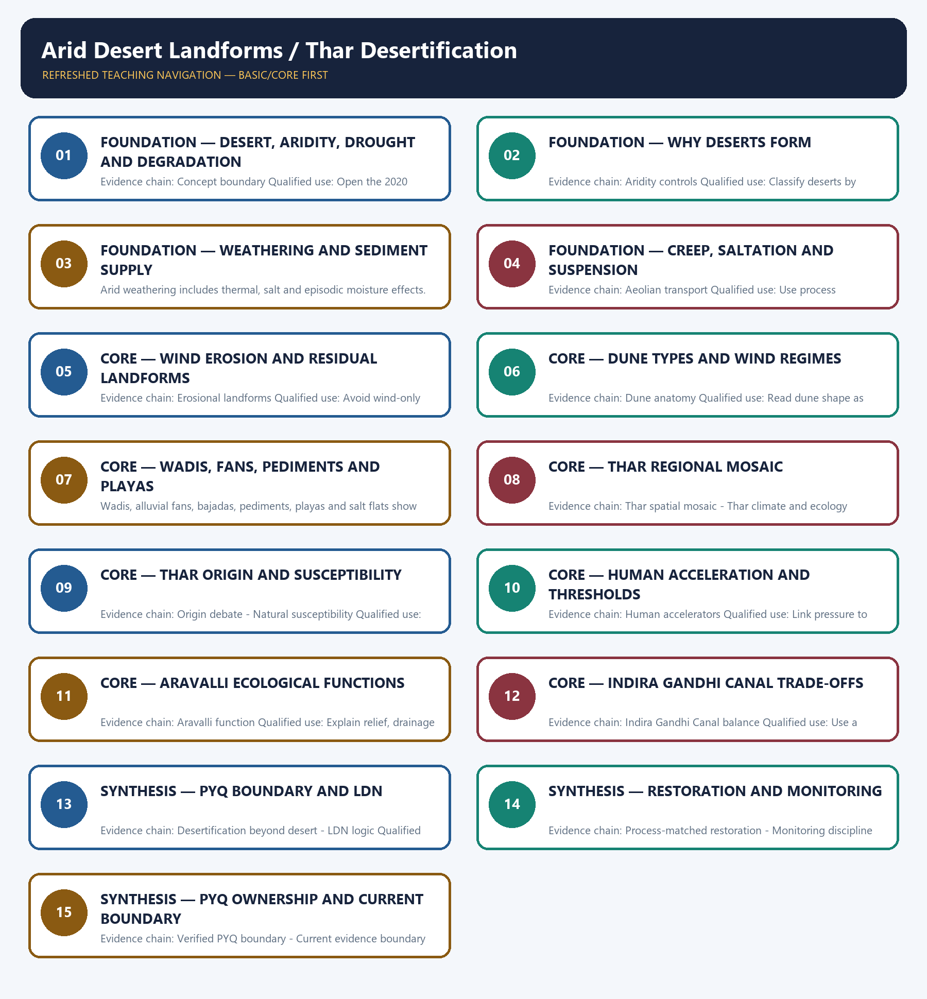

# Arid Desert Landforms / Thar Desertification — Learner-v2 Complete Learning Session

> **Authoring-only generation:** 2026-09-01. No PDF was rendered and no tracker or index was mutated.

### SOURCE, PROGRESSION AND CURRENT-LINKAGE AUDIT

- **Generation date:** 2026-09-01.
- **Repository-first evidence:** the Basic owner is taught first and preserved in full; the Advanced owner is retained only in the optional final teaching block.
- **OCR evidence:** Repository Markdown was primary. The three required local Geography books were inspected as supplementary OCR/searchable evidence. No unsupported page precision, volatile figure or quotation was imported.
- **Qdrant:** not used; repository Markdown and available OCR context were sufficient.
- **PYQ integrity:** TRANSPARENT ZERO-DIRECT-PYQ AUDIT: the central Mains ledger routes the 2020 desertification demand to Environment and Ecology, and no direct Topic 07 objective route appears in the checked central ledgers. Cross-owned questions remain conceptual context, not claimed Geography PYQs.
- **Live-link boundary:** The SAC atlas page and UNCCD's June 2026 restoration communication were directly fetched. The atlas remains a dated mapping baseline, not a September 2026 condition report; no Thar percentage, target achievement or COP17 outcome is asserted.
- **Fact/inference discipline:** no current-affairs item, PYQ wording, figure or quotation is invented.

## BASIC LEARNING SESSION



*Distinct embedded teaching-navigation image. The separate continuous Cārvāka-style flowchart package remains an independent at-a-glance artifact.*

### SESSION 1 — FOUNDATION — DESERT, ARIDITY, DROUGHT AND DEGRADATION

#### DEFINITION / WHAT THIS IS CALLED

**Plain-language definition:** Concept boundary: A desert is a climatic region, aridity a long-term moisture deficit, drought a temporary anomaly, land degradation a broad decline in condition, and desertification dryland degradation.

**Technical definition:** Evidence chain: Concept boundary Qualified use: Open the 2020 route with a definition firewall.

#### ANSWER-GRABBING OPENING — WRITE/ADAPT IN THE EXAM

> Concept boundary: A desert is a climatic region, aridity a long-term moisture deficit, drought a temporary anomaly, land degradation a broad decline in condition, and desertification dryland degradation.

#### MUST-WRITE KEYWORDS

- **FOUNDATION**
- **Desert**
- **aridity**
- **drought**
- **degradation**
- **Concept boundary**

**How to use them:** Frame the answer through FOUNDATION; define Desert, connect aridity with drought to explain the mechanism, and use degradation for the decisive comparison or qualification.

#### VISUAL FIRST

```text
DESERT, ARIDITY, DROUGHT AND DEGRADATION
01. Concept boundary
BOUNDARY -> These terms are related but non-equivalent.
```

*This topic-specific rail fixes the evidence sequence and its exam boundary before analysis.*

#### CORE EXPLANATION

A desert is a climatic region, aridity a long-term moisture deficit, drought a temporary anomaly, land degradation a broad decline in condition, and desertification dryland degradation.

#### NAMED EVIDENCE AND MECHANISM

- **Concept boundary:** A desert is a climatic region, aridity a long-term moisture deficit, drought a temporary anomaly, land degradation a broad decline in condition, and desertification dryland degradation.

#### EXAMINER CAUTION

- These terms are related but non-equivalent.

#### EXAM LINK

- **Prelims:** Separate the agent, landform, location, status and scale attached to Desert, aridity, drought and degradation.
- **Mains:** Open the 2020 route with a definition firewall.

#### MINI RECAP

- **Evidence chain:** Concept boundary
- **Qualified use:** Open the 2020 route with a definition firewall.

#### CLOSING RECALL FLOW — FOUNDATION — DESERT, ARIDITY, DROUGHT AND DEGRADATION

```text
START / CONCEPT: FOUNDATION — Desert, aridity, drought and degradation
        |
        v
EXACT TERMS: FOUNDATION · Desert · aridity · drought · degradation · Concept boundary
        |
        v
MECHANISM / ARGUMENT: Evidence chain: Concept boundary Qualified use: Open the 2020 route with a definition firewall.
        |
        v
CONSEQUENCE / CONTRAST: These terms are related but non-equivalent.
        |
        v
UPSC TRAP / ANSWER-USE: Do not miss this limiting distinction: a desert is a climatic region, aridity a long-term moisture deficit, drought a temporary...
        |
        v
ANSWER-GRABBING FORMULATION: Concept boundary: A desert is a climatic region, aridity a long-term moisture deficit, drought a temporary anomaly, land degradation a broad decline in condition, and desertification dryland degradation.
```
### SESSION 2 — FOUNDATION — WHY DESERTS FORM

#### DEFINITION / WHAT THIS IS CALLED

**Plain-language definition:** Subtropical subsidence, continentality, rain shadow, cold currents and polar cold can create deserts; heat alone is neither necessary nor sufficient.

**Technical definition:** Evidence chain: Aridity controls Qualified use: Classify deserts by atmospheric and locational control.

#### ANSWER-GRABBING OPENING — WRITE/ADAPT IN THE EXAM

> Aridity controls: Subtropical subsidence, continentality, rain shadow, cold currents and polar cold can create deserts; heat alone is neither necessary nor sufficient.

#### MUST-WRITE KEYWORDS

- **FOUNDATION**
- **Why deserts form**
- **Aridity controls**
- **Evidence chain**
- **Qualified use**
- **Subtropical**

**How to use them:** Frame the answer through FOUNDATION; define Why deserts form, connect Aridity controls with Evidence chain to explain the mechanism, and use Qualified use for the decisive comparison or qualification.

#### VISUAL FIRST

```text
WHY DESERTS FORM
01. Aridity controls
BOUNDARY -> High temperature alone does not define desert genesis.
```

*This topic-specific rail fixes the evidence sequence and its exam boundary before analysis.*

#### CORE EXPLANATION

Subtropical subsidence, continentality, rain shadow, cold currents and polar cold can create deserts; heat alone is neither necessary nor sufficient.

#### NAMED EVIDENCE AND MECHANISM

- **Aridity controls:** Subtropical subsidence, continentality, rain shadow, cold currents and polar cold can create deserts; heat alone is neither necessary nor sufficient.

#### EXAMINER CAUTION

- High temperature alone does not define desert genesis.

#### EXAM LINK

- **Prelims:** Separate the agent, landform, location, status and scale attached to Why deserts form.
- **Mains:** Classify deserts by atmospheric and locational control.

#### MINI RECAP

- **Evidence chain:** Aridity controls
- **Qualified use:** Classify deserts by atmospheric and locational control.

#### CLOSING RECALL FLOW — FOUNDATION — WHY DESERTS FORM

```text
START / CONCEPT: FOUNDATION — Why deserts form
        |
        v
EXACT TERMS: FOUNDATION · Why deserts form · Aridity controls · Evidence chain · Qualified use · Subtropical
        |
        v
MECHANISM / ARGUMENT: Evidence chain: Aridity controls Qualified use: Classify deserts by atmospheric and locational control.
        |
        v
CONSEQUENCE / CONTRAST: High temperature alone does not define desert genesis.
        |
        v
UPSC TRAP / ANSWER-USE: Do not miss this limiting distinction: high temperature alone does not define desert genesis.
        |
        v
ANSWER-GRABBING FORMULATION: Aridity controls: Subtropical subsidence, continentality, rain shadow, cold currents and polar cold can create deserts; heat alone is neither necessary nor sufficient.
```
### SESSION 3 — FOUNDATION — WEATHERING AND SEDIMENT SUPPLY

#### DEFINITION / WHAT THIS IS CALLED

**Plain-language definition:** Evidence chain: Weathering in arid lands Qualified use: Connect material production to later transport.

**Technical definition:** Arid weathering includes thermal, salt and episodic moisture effects.

#### ANSWER-GRABBING OPENING — WRITE/ADAPT IN THE EXAM

> Evidence chain: Weathering in arid lands Qualified use: Connect material production to later transport.

#### MUST-WRITE KEYWORDS

- **FOUNDATION**
- **Weathering**
- **sediment supply**
- **Weathering in arid lands**
- **Evidence chain**
- **Qualified use**

**How to use them:** Frame the answer through FOUNDATION; define Weathering, connect sediment supply with Weathering in arid lands to explain the mechanism, and use Evidence chain for the decisive comparison or qualification.

#### VISUAL FIRST

```text
WEATHERING AND SEDIMENT SUPPLY
01. Weathering in arid lands
BOUNDARY -> Arid weathering includes thermal, salt and episodic moisture effects.
```

*This topic-specific rail fixes the evidence sequence and its exam boundary before analysis.*

#### CORE EXPLANATION

Large thermal ranges, salt crystallisation and episodic wetting weaken exposed rock, while sparse cover leaves debris available to wind and flash runoff.

#### NAMED EVIDENCE AND MECHANISM

- **Weathering in arid lands:** Large thermal ranges, salt crystallisation and episodic wetting weaken exposed rock, while sparse cover leaves debris available to wind and flash runoff.

#### EXAMINER CAUTION

- Arid weathering includes thermal, salt and episodic moisture effects.

#### EXAM LINK

- **Prelims:** Separate the agent, landform, location, status and scale attached to Weathering and sediment supply.
- **Mains:** Connect material production to later transport.

#### MINI RECAP

- **Evidence chain:** Weathering in arid lands
- **Qualified use:** Connect material production to later transport.

#### CLOSING RECALL FLOW — FOUNDATION — WEATHERING AND SEDIMENT SUPPLY

```text
START / CONCEPT: FOUNDATION — Weathering and sediment supply
        |
        v
EXACT TERMS: FOUNDATION · Weathering · sediment supply · Weathering in arid lands · Evidence chain · Qualified use
        |
        v
MECHANISM / ARGUMENT: Arid weathering includes thermal, salt and episodic moisture effects.
        |
        v
CONSEQUENCE / CONTRAST: The resulting consequence is that weathering in arid lands Qualified use.
        |
        v
UPSC TRAP / ANSWER-USE: Do not miss this limiting distinction: weathering in arid lands Qualified use.
        |
        v
ANSWER-GRABBING FORMULATION: Evidence chain: Weathering in arid lands Qualified use: Connect material production to later transport.
```
### SESSION 4 — FOUNDATION — CREEP, SALTATION AND SUSPENSION

#### DEFINITION / WHAT THIS IS CALLED

**Plain-language definition:** Aeolian transport: Wind moves coarse particles mainly by surface creep, sand by saltation and fine dust by suspension; deflation removes loose material and abrasion sandblasts exposed surfaces.

**Technical definition:** Evidence chain: Aeolian transport Qualified use: Use process vocabulary for elimination.

#### ANSWER-GRABBING OPENING — WRITE/ADAPT IN THE EXAM

> Aeolian transport: Wind moves coarse particles mainly by surface creep, sand by saltation and fine dust by suspension; deflation removes loose material and abrasion sandblasts exposed surfaces.

#### MUST-WRITE KEYWORDS

- **FOUNDATION**
- **Creep**
- **saltation**
- **suspension**
- **Aeolian transport**
- **Evidence chain**

**How to use them:** Frame the answer through FOUNDATION; define Creep, connect saltation with suspension to explain the mechanism, and use Aeolian transport for the decisive comparison or qualification.

#### VISUAL FIRST

```text
CREEP, SALTATION AND SUSPENSION
01. Aeolian transport
BOUNDARY -> Transport mode depends on particle size and wind threshold.
```

*This topic-specific rail fixes the evidence sequence and its exam boundary before analysis.*

#### CORE EXPLANATION

Wind moves coarse particles mainly by surface creep, sand by saltation and fine dust by suspension; deflation removes loose material and abrasion sandblasts exposed surfaces.

#### NAMED EVIDENCE AND MECHANISM

- **Aeolian transport:** Wind moves coarse particles mainly by surface creep, sand by saltation and fine dust by suspension; deflation removes loose material and abrasion sandblasts exposed surfaces.

#### EXAMINER CAUTION

- Transport mode depends on particle size and wind threshold.

#### EXAM LINK

- **Prelims:** Separate the agent, landform, location, status and scale attached to Creep, saltation and suspension.
- **Mains:** Use process vocabulary for elimination.

#### MINI RECAP

- **Evidence chain:** Aeolian transport
- **Qualified use:** Use process vocabulary for elimination.

#### CLOSING RECALL FLOW — FOUNDATION — CREEP, SALTATION AND SUSPENSION

```text
START / CONCEPT: FOUNDATION — Creep, saltation and suspension
        |
        v
EXACT TERMS: FOUNDATION · Creep · saltation · suspension · Aeolian transport · Evidence chain
        |
        v
MECHANISM / ARGUMENT: Transport mode depends on particle size and wind threshold.
        |
        v
CONSEQUENCE / CONTRAST: Evidence chain: Aeolian transport Qualified use: Use process vocabulary for elimination.
        |
        v
UPSC TRAP / ANSWER-USE: Do not miss this limiting distinction: mains: Use process vocabulary for elimination.
        |
        v
ANSWER-GRABBING FORMULATION: Aeolian transport: Wind moves coarse particles mainly by surface creep, sand by saltation and fine dust by suspension; deflation removes loose material and abrasion sandblasts exposed surfaces.
```
### SESSION 5 — CORE — WIND EROSION AND RESIDUAL LANDFORMS

#### DEFINITION / WHAT THIS IS CALLED

**Plain-language definition:** Erosional landforms: Deflation hollows, desert pavement, ventifacts, yardangs, zeugens, rock pedestals and inselbergs reflect different combinations of wind, structure and weathering.

**Technical definition:** Evidence chain: Erosional landforms Qualified use: Avoid wind-only explanations.

#### ANSWER-GRABBING OPENING — WRITE/ADAPT IN THE EXAM

> Erosional landforms: Deflation hollows, desert pavement, ventifacts, yardangs, zeugens, rock pedestals and inselbergs reflect different combinations of wind, structure and weathering.

#### MUST-WRITE KEYWORDS

- **Wind erosion**
- **residual landforms**
- **Erosional landforms**
- **Evidence chain**
- **Qualified use**
- **Deflation**

**How to use them:** Frame the answer through Wind erosion; define residual landforms, connect Erosional landforms with Evidence chain to explain the mechanism, and use Qualified use for the decisive comparison or qualification.

#### VISUAL FIRST

```text
WIND EROSION AND RESIDUAL LANDFORMS
01. Erosional landforms
BOUNDARY -> Many forms also require structural or weathering controls.
```

*This topic-specific rail fixes the evidence sequence and its exam boundary before analysis.*

#### CORE EXPLANATION

Deflation hollows, desert pavement, ventifacts, yardangs, zeugens, rock pedestals and inselbergs reflect different combinations of wind, structure and weathering.

#### NAMED EVIDENCE AND MECHANISM

- **Erosional landforms:** Deflation hollows, desert pavement, ventifacts, yardangs, zeugens, rock pedestals and inselbergs reflect different combinations of wind, structure and weathering.

#### EXAMINER CAUTION

- Many forms also require structural or weathering controls.

#### EXAM LINK

- **Prelims:** Separate the agent, landform, location, status and scale attached to Wind erosion and residual landforms.
- **Mains:** Avoid wind-only explanations.

#### MINI RECAP

- **Evidence chain:** Erosional landforms
- **Qualified use:** Avoid wind-only explanations.

#### CLOSING RECALL FLOW — CORE — WIND EROSION AND RESIDUAL LANDFORMS

```text
START / CONCEPT: CORE — Wind erosion and residual landforms
        |
        v
EXACT TERMS: Wind erosion · residual landforms · Erosional landforms · Evidence chain · Qualified use · Deflation
        |
        v
MECHANISM / ARGUMENT: Evidence chain: Erosional landforms Qualified use: Avoid wind-only explanations.
        |
        v
CONSEQUENCE / CONTRAST: The resulting consequence is that deflation hollows, desert pavement, ventifacts, yardangs, zeugens, rock pedestals and inselbergs reflect different combinations...
        |
        v
UPSC TRAP / ANSWER-USE: Do not miss this limiting distinction: deflation hollows, desert pavement, ventifacts, yardangs, zeugens, rock pedestals and inselbergs reflect different combinations...
        |
        v
ANSWER-GRABBING FORMULATION: Erosional landforms: Deflation hollows, desert pavement, ventifacts, yardangs, zeugens, rock pedestals and inselbergs reflect different combinations of wind, structure and weathering.
```
### SESSION 6 — CORE — DUNE TYPES AND WIND REGIMES

#### DEFINITION / WHAT THIS IS CALLED

**Plain-language definition:** Dune anatomy: A barchan has horns pointing downwind under limited sand and one prevailing wind; transverse, longitudinal, parabolic and star dunes indicate different sand, vegetation and wind regimes.

**Technical definition:** Evidence chain: Dune anatomy Qualified use: Read dune shape as process evidence.

#### ANSWER-GRABBING OPENING — WRITE/ADAPT IN THE EXAM

> Dune anatomy: A barchan has horns pointing downwind under limited sand and one prevailing wind; transverse, longitudinal, parabolic and star dunes indicate different sand, vegetation and wind regimes.

#### MUST-WRITE KEYWORDS

- **Dune types**
- **wind regimes**
- **Dune anatomy**
- **Evidence chain**
- **Qualified use**
- **Dune**

**How to use them:** Frame the answer through Dune types; define wind regimes, connect Dune anatomy with Evidence chain to explain the mechanism, and use Qualified use for the decisive comparison or qualification.

#### VISUAL FIRST

```text
DUNE TYPES AND WIND REGIMES
01. Dune anatomy
BOUNDARY -> Barchan horns point downwind.
```

*This topic-specific rail fixes the evidence sequence and its exam boundary before analysis.*

#### CORE EXPLANATION

A barchan has horns pointing downwind under limited sand and one prevailing wind; transverse, longitudinal, parabolic and star dunes indicate different sand, vegetation and wind regimes.

#### NAMED EVIDENCE AND MECHANISM

- **Dune anatomy:** A barchan has horns pointing downwind under limited sand and one prevailing wind; transverse, longitudinal, parabolic and star dunes indicate different sand, vegetation and wind regimes.

#### EXAMINER CAUTION

- Barchan horns point downwind.

#### EXAM LINK

- **Prelims:** Separate the agent, landform, location, status and scale attached to Dune types and wind regimes.
- **Mains:** Read dune shape as process evidence.

#### MINI RECAP

- **Evidence chain:** Dune anatomy
- **Qualified use:** Read dune shape as process evidence.

#### CLOSING RECALL FLOW — CORE — DUNE TYPES AND WIND REGIMES

```text
START / CONCEPT: CORE — Dune types and wind regimes
        |
        v
EXACT TERMS: Dune types · wind regimes · Dune anatomy · Evidence chain · Qualified use · Dune
        |
        v
MECHANISM / ARGUMENT: Evidence chain: Dune anatomy Qualified use: Read dune shape as process evidence.
        |
        v
CONSEQUENCE / CONTRAST: The resulting consequence is that a barchan has horns pointing downwind under limited sand and one prevailing wind.
        |
        v
UPSC TRAP / ANSWER-USE: Do not miss this limiting distinction: a barchan has horns pointing downwind under limited sand and one prevailing wind.
        |
        v
ANSWER-GRABBING FORMULATION: Dune anatomy: A barchan has horns pointing downwind under limited sand and one prevailing wind; transverse, longitudinal, parabolic and star dunes indicate different sand, vegetation and wind regimes.
```
### SESSION 7 — CORE — WADIS, FANS, PEDIMENTS AND PLAYAS

#### DEFINITION / WHAT THIS IS CALLED

**Plain-language definition:** CORE — Wadis, fans, pediments and playas comprises Wadis, fans and pediments as its core connected dimensions.

**Technical definition:** Wadis, alluvial fans, bajadas, pediments, playas and salt flats show that episodic runoff and evaporation are integral to desert geomorphology.

#### ANSWER-GRABBING OPENING — WRITE/ADAPT IN THE EXAM

> Water-built desert forms: Wadis, alluvial fans, bajadas, pediments, playas and salt flats show that episodic runoff and evaporation are integral to desert geomorphology.

#### MUST-WRITE KEYWORDS

- **Wadis**
- **fans**
- **pediments**
- **playas**
- **Water-built desert forms**
- **Evidence chain**

**How to use them:** Frame the answer through Wadis; define fans, connect pediments with playas to explain the mechanism, and use Water-built desert forms for the decisive comparison or qualification.

#### VISUAL FIRST

```text
WADIS, FANS, PEDIMENTS AND PLAYAS
01. Water-built desert forms
BOUNDARY -> Deserts are not geomorphically waterless.
```

*This topic-specific rail fixes the evidence sequence and its exam boundary before analysis.*

#### CORE EXPLANATION

Wadis, alluvial fans, bajadas, pediments, playas and salt flats show that episodic runoff and evaporation are integral to desert geomorphology.

#### NAMED EVIDENCE AND MECHANISM

- **Water-built desert forms:** Wadis, alluvial fans, bajadas, pediments, playas and salt flats show that episodic runoff and evaporation are integral to desert geomorphology.

#### EXAMINER CAUTION

- Deserts are not geomorphically waterless.

#### EXAM LINK

- **Prelims:** Separate the agent, landform, location, status and scale attached to Wadis, fans, pediments and playas.
- **Mains:** Integrate episodic runoff and evaporation.

#### MINI RECAP

- **Evidence chain:** Water-built desert forms
- **Qualified use:** Integrate episodic runoff and evaporation.

#### CLOSING RECALL FLOW — CORE — WADIS, FANS, PEDIMENTS AND PLAYAS

```text
START / CONCEPT: CORE — Wadis, fans, pediments and playas
        |
        v
EXACT TERMS: Wadis · fans · pediments · playas · Water-built desert forms · Evidence chain
        |
        v
MECHANISM / ARGUMENT: Wadis, alluvial fans, bajadas, pediments, playas and salt flats show that episodic runoff and evaporation are integral to desert geomorphology.
        |
        v
CONSEQUENCE / CONTRAST: Evidence chain: Water-built desert forms Qualified use: Integrate episodic runoff and evaporation.
        |
        v
UPSC TRAP / ANSWER-USE: Do not miss this limiting distinction: wadis, alluvial fans, bajadas, pediments, playas and salt flats show that episodic runoff and...
        |
        v
ANSWER-GRABBING FORMULATION: Water-built desert forms: Wadis, alluvial fans, bajadas, pediments, playas and salt flats show that episodic runoff and evaporation are integral to desert geomorphology.
```
### SESSION 8 — CORE — THAR REGIONAL MOSAIC

#### DEFINITION / WHAT THIS IS CALLED

**Plain-language definition:** Thar spatial mosaic: The Thar includes dune fields, interdunes, rocky residuals, pediments, alluvium, playas, settlements and canal-modified tracts; it is not one continuous erg.

**Technical definition:** Evidence chain: Thar spatial mosaic - Thar climate and ecology Qualified use: Draw dunes, Aravalli, Luni, playas and canal tract.

#### ANSWER-GRABBING OPENING — WRITE/ADAPT IN THE EXAM

> Thar spatial mosaic: The Thar includes dune fields, interdunes, rocky residuals, pediments, alluvium, playas, settlements and canal-modified tracts; it is not one continuous erg.

#### MUST-WRITE KEYWORDS

- **Thar regional mosaic**
- **Thar spatial mosaic**
- **Thar climate and ecology**
- **Evidence chain**
- **Qualified use**
- **The Thar**

**How to use them:** Frame the answer through Thar regional mosaic; define Thar spatial mosaic, connect Thar climate and ecology with Evidence chain to explain the mechanism, and use Qualified use for the decisive comparison or qualification.

#### VISUAL FIRST

```text
THAR REGIONAL MOSAIC
01. Thar spatial mosaic
    |
    v
02. Thar climate and ecology
BOUNDARY -> A schematic region is not a legal boundary.
```

*This topic-specific rail fixes the evidence sequence and its exam boundary before analysis.*

#### CORE EXPLANATION

The Thar includes dune fields, interdunes, rocky residuals, pediments, alluvium, playas, settlements and canal-modified tracts; it is not one continuous erg. Highly variable rainfall, high evaporative demand, ephemeral drainage and pulse-based productivity support drought-adapted vegetation, pastoral mobility and risk-spreading livelihoods.

#### NAMED EVIDENCE AND MECHANISM

- **Thar spatial mosaic:** The Thar includes dune fields, interdunes, rocky residuals, pediments, alluvium, playas, settlements and canal-modified tracts; it is not one continuous erg.
- **Thar climate and ecology:** Highly variable rainfall, high evaporative demand, ephemeral drainage and pulse-based productivity support drought-adapted vegetation, pastoral mobility and risk-spreading livelihoods.

#### EXAMINER CAUTION

- A schematic region is not a legal boundary.

#### EXAM LINK

- **Prelims:** Separate the agent, landform, location, status and scale attached to Thar regional mosaic.
- **Mains:** Draw dunes, Aravalli, Luni, playas and canal tract.

#### MINI RECAP

- **Evidence chain:** Thar spatial mosaic -> Thar climate and ecology
- **Qualified use:** Draw dunes, Aravalli, Luni, playas and canal tract.

#### CLOSING RECALL FLOW — CORE — THAR REGIONAL MOSAIC

```text
START / CONCEPT: CORE — Thar regional mosaic
        |
        v
EXACT TERMS: Thar regional mosaic · Thar spatial mosaic · Thar climate and ecology · Evidence chain · Qualified use · The Thar
        |
        v
MECHANISM / ARGUMENT: Evidence chain: Thar spatial mosaic - Thar climate and ecology Qualified use: Draw dunes, Aravalli, Luni, playas and canal tract.
        |
        v
CONSEQUENCE / CONTRAST: A schematic region is not a legal boundary.
        |
        v
UPSC TRAP / ANSWER-USE: Do not miss this limiting distinction: the Thar includes dune fields, interdunes, rocky residuals, pediments, alluvium, playas, settlements and canal-modified...
        |
        v
ANSWER-GRABBING FORMULATION: Thar spatial mosaic: The Thar includes dune fields, interdunes, rocky residuals, pediments, alluvium, playas, settlements and canal-modified tracts; it is not one continuous erg.
```
### SESSION 9 — CORE — THAR ORIGIN AND SUSCEPTIBILITY

#### DEFINITION / WHAT THIS IS CALLED

**Plain-language definition:** Origin debate: The Thar is polygenetic: tectonic and drainage history, monsoon variability, wind reworking and human land use operated over different timescales; one-cause origin claims are unsafe.

**Technical definition:** Evidence chain: Origin debate - Natural susceptibility Qualified use: Give a polygenetic, multi-timescale account.

#### ANSWER-GRABBING OPENING — WRITE/ADAPT IN THE EXAM

> Origin debate: The Thar is polygenetic: tectonic and drainage history, monsoon variability, wind reworking and human land use operated over different timescales; one-cause origin claims are unsafe.

#### MUST-WRITE KEYWORDS

- **Thar origin**
- **susceptibility**
- **Origin debate**
- **Natural susceptibility**
- **Evidence chain**
- **Qualified use**

**How to use them:** Frame the answer through Thar origin; define susceptibility, connect Origin debate with Natural susceptibility to explain the mechanism, and use Evidence chain for the decisive comparison or qualification.

#### VISUAL FIRST

```text
THAR ORIGIN AND SUSCEPTIBILITY
01. Origin debate
    |
    v
02. Natural susceptibility
BOUNDARY -> Origin and present degradation are different questions.
```

*This topic-specific rail fixes the evidence sequence and its exam boundary before analysis.*

#### CORE EXPLANATION

The Thar is polygenetic: tectonic and drainage history, monsoon variability, wind reworking and human land use operated over different timescales; one-cause origin claims are unsafe. Low and variable rainfall, erodible sediment, strong winds, saline basins and slow biological recovery create susceptibility without proving degradation.

#### NAMED EVIDENCE AND MECHANISM

- **Origin debate:** The Thar is polygenetic: tectonic and drainage history, monsoon variability, wind reworking and human land use operated over different timescales; one-cause origin claims are unsafe.
- **Natural susceptibility:** Low and variable rainfall, erodible sediment, strong winds, saline basins and slow biological recovery create susceptibility without proving degradation.

#### EXAMINER CAUTION

- Origin and present degradation are different questions.

#### EXAM LINK

- **Prelims:** Separate the agent, landform, location, status and scale attached to Thar origin and susceptibility.
- **Mains:** Give a polygenetic, multi-timescale account.

#### MINI RECAP

- **Evidence chain:** Origin debate -> Natural susceptibility
- **Qualified use:** Give a polygenetic, multi-timescale account.

#### CLOSING RECALL FLOW — CORE — THAR ORIGIN AND SUSCEPTIBILITY

```text
START / CONCEPT: CORE — Thar origin and susceptibility
        |
        v
EXACT TERMS: Thar origin · susceptibility · Origin debate · Natural susceptibility · Evidence chain · Qualified use
        |
        v
MECHANISM / ARGUMENT: Evidence chain: Origin debate - Natural susceptibility Qualified use: Give a polygenetic, multi-timescale account.
        |
        v
CONSEQUENCE / CONTRAST: Natural susceptibility: Low and variable rainfall, erodible sediment, strong winds, saline basins and slow biological recovery create susceptibility without proving degradation.
        |
        v
UPSC TRAP / ANSWER-USE: Do not miss this limiting distinction: origin and present degradation are different questions.
        |
        v
ANSWER-GRABBING FORMULATION: Origin debate: The Thar is polygenetic: tectonic and drainage history, monsoon variability, wind reworking and human land use operated over different timescales; one-cause origin claims are unsafe.
```
### SESSION 10 — CORE — HUMAN ACCELERATION AND THRESHOLDS

#### DEFINITION / WHAT THIS IS CALLED

**Plain-language definition:** Human accelerators: Vegetation removal, poorly managed grazing, repeated tillage, groundwater stress, mining, infrastructure fragmentation and unsuitable irrigation can exceed recovery thresholds.

**Technical definition:** Evidence chain: Human accelerators Qualified use: Link pressure to loss of recovery capacity.

#### ANSWER-GRABBING OPENING — WRITE/ADAPT IN THE EXAM

> Human accelerators: Vegetation removal, poorly managed grazing, repeated tillage, groundwater stress, mining, infrastructure fragmentation and unsuitable irrigation can exceed recovery thresholds.

#### MUST-WRITE KEYWORDS

- **Human acceleration**
- **thresholds**
- **Human accelerators**
- **Evidence chain**
- **Qualified use**
- **Vegetation**

**How to use them:** Frame the answer through Human acceleration; define thresholds, connect Human accelerators with Evidence chain to explain the mechanism, and use Qualified use for the decisive comparison or qualification.

#### VISUAL FIRST

```text
HUMAN ACCELERATION AND THRESHOLDS
01. Human accelerators
BOUNDARY -> Presence of people is not itself degradation.
```

*This topic-specific rail fixes the evidence sequence and its exam boundary before analysis.*

#### CORE EXPLANATION

Vegetation removal, poorly managed grazing, repeated tillage, groundwater stress, mining, infrastructure fragmentation and unsuitable irrigation can exceed recovery thresholds.

#### NAMED EVIDENCE AND MECHANISM

- **Human accelerators:** Vegetation removal, poorly managed grazing, repeated tillage, groundwater stress, mining, infrastructure fragmentation and unsuitable irrigation can exceed recovery thresholds.

#### EXAMINER CAUTION

- Presence of people is not itself degradation.

#### EXAM LINK

- **Prelims:** Separate the agent, landform, location, status and scale attached to Human acceleration and thresholds.
- **Mains:** Link pressure to loss of recovery capacity.

#### MINI RECAP

- **Evidence chain:** Human accelerators
- **Qualified use:** Link pressure to loss of recovery capacity.

#### CLOSING RECALL FLOW — CORE — HUMAN ACCELERATION AND THRESHOLDS

```text
START / CONCEPT: CORE — Human acceleration and thresholds
        |
        v
EXACT TERMS: Human acceleration · thresholds · Human accelerators · Evidence chain · Qualified use · Vegetation
        |
        v
MECHANISM / ARGUMENT: Evidence chain: Human accelerators Qualified use: Link pressure to loss of recovery capacity.
        |
        v
CONSEQUENCE / CONTRAST: Presence of people is not itself degradation.
        |
        v
UPSC TRAP / ANSWER-USE: Do not miss this limiting distinction: vegetation removal, poorly managed grazing, repeated tillage, groundwater stress, mining, infrastructure fragmentation and unsuitable...
        |
        v
ANSWER-GRABBING FORMULATION: Human accelerators: Vegetation removal, poorly managed grazing, repeated tillage, groundwater stress, mining, infrastructure fragmentation and unsuitable irrigation can exceed recovery thresholds.
```
### SESSION 11 — CORE — ARAVALLI ECOLOGICAL FUNCTIONS

#### DEFINITION / WHAT THIS IS CALLED

**Plain-language definition:** Aravalli function: The Aravalli influences relief, drainage, habitat connectivity and local erosion control, but it is not a complete wall that mechanically blocks all desert movement.

**Technical definition:** Evidence chain: Aravalli function Qualified use: Explain relief, drainage and connectivity.

#### ANSWER-GRABBING OPENING — WRITE/ADAPT IN THE EXAM

> Evidence chain: Aravalli function Qualified use: Explain relief, drainage and connectivity.

#### MUST-WRITE KEYWORDS

- **Aravalli ecological functions**
- **Aravalli function**
- **Evidence chain**
- **Qualified use**
- **The Aravalli**
- **Aravalli**

**How to use them:** Frame the answer through Aravalli ecological functions; define Aravalli function, connect Evidence chain with Qualified use to explain the mechanism, and use The Aravalli for the decisive comparison or qualification.

#### VISUAL FIRST

```text
ARAVALLI ECOLOGICAL FUNCTIONS
01. Aravalli function
BOUNDARY -> Do not use the simplistic wall metaphor.
```

*This topic-specific rail fixes the evidence sequence and its exam boundary before analysis.*

#### CORE EXPLANATION

The Aravalli influences relief, drainage, habitat connectivity and local erosion control, but it is not a complete wall that mechanically blocks all desert movement.

#### NAMED EVIDENCE AND MECHANISM

- **Aravalli function:** The Aravalli influences relief, drainage, habitat connectivity and local erosion control, but it is not a complete wall that mechanically blocks all desert movement.

#### EXAMINER CAUTION

- Do not use the simplistic wall metaphor.

#### EXAM LINK

- **Prelims:** Separate the agent, landform, location, status and scale attached to Aravalli ecological functions.
- **Mains:** Explain relief, drainage and connectivity.

#### MINI RECAP

- **Evidence chain:** Aravalli function
- **Qualified use:** Explain relief, drainage and connectivity.

#### CLOSING RECALL FLOW — CORE — ARAVALLI ECOLOGICAL FUNCTIONS

```text
START / CONCEPT: CORE — Aravalli ecological functions
        |
        v
EXACT TERMS: Aravalli ecological functions · Aravalli function · Evidence chain · Qualified use · The Aravalli · Aravalli
        |
        v
MECHANISM / ARGUMENT: Aravalli function: The Aravalli influences relief, drainage, habitat connectivity and local erosion control, but it is not a complete wall that mechanically blocks all desert movement.
        |
        v
CONSEQUENCE / CONTRAST: Do not use the simplistic wall metaphor.
        |
        v
UPSC TRAP / ANSWER-USE: Do not miss this limiting distinction: mains: Explain relief, drainage and connectivity.
        |
        v
ANSWER-GRABBING FORMULATION: Evidence chain: Aravalli function Qualified use: Explain relief, drainage and connectivity.
```
### SESSION 12 — CORE — INDIRA GANDHI CANAL TRADE-OFFS

#### DEFINITION / WHAT THIS IS CALLED

**Plain-language definition:** Indira Gandhi Canal balance: Canal irrigation can support farming, water supply and settlement while seepage, waterlogging, salinity, invasive spread and crop-water mismatch create new risks where drainage is weak.

**Technical definition:** Evidence chain: Indira Gandhi Canal balance Qualified use: Use a balanced irrigation transformation case.

#### ANSWER-GRABBING OPENING — WRITE/ADAPT IN THE EXAM

> Indira Gandhi Canal balance: Canal irrigation can support farming, water supply and settlement while seepage, waterlogging, salinity, invasive spread and crop-water mismatch create new risks where drainage is weak.

#### MUST-WRITE KEYWORDS

- **Indira Gandhi Canal trade-offs**
- **Indira Gandhi Canal balance**
- **Evidence chain**
- **Qualified use**
- **Canal**
- **Indira Gandhi Canal**

**How to use them:** Frame the answer through Indira Gandhi Canal trade-offs; define Indira Gandhi Canal balance, connect Evidence chain with Qualified use to explain the mechanism, and use Canal for the decisive comparison or qualification.

#### VISUAL FIRST

```text
INDIRA GANDHI CANAL TRADE-OFFS
01. Indira Gandhi Canal balance
BOUNDARY -> Benefits and salinity-waterlogging risks can coexist.
```

*This topic-specific rail fixes the evidence sequence and its exam boundary before analysis.*

#### CORE EXPLANATION

Canal irrigation can support farming, water supply and settlement while seepage, waterlogging, salinity, invasive spread and crop-water mismatch create new risks where drainage is weak.

#### NAMED EVIDENCE AND MECHANISM

- **Indira Gandhi Canal balance:** Canal irrigation can support farming, water supply and settlement while seepage, waterlogging, salinity, invasive spread and crop-water mismatch create new risks where drainage is weak.

#### EXAMINER CAUTION

- Benefits and salinity-waterlogging risks can coexist.

#### EXAM LINK

- **Prelims:** Separate the agent, landform, location, status and scale attached to Indira Gandhi Canal trade-offs.
- **Mains:** Use a balanced irrigation transformation case.

#### MINI RECAP

- **Evidence chain:** Indira Gandhi Canal balance
- **Qualified use:** Use a balanced irrigation transformation case.

#### CLOSING RECALL FLOW — CORE — INDIRA GANDHI CANAL TRADE-OFFS

```text
START / CONCEPT: CORE — Indira Gandhi Canal trade-offs
        |
        v
EXACT TERMS: Indira Gandhi Canal trade-offs · Indira Gandhi Canal balance · Evidence chain · Qualified use · Canal · Indira Gandhi Canal
        |
        v
MECHANISM / ARGUMENT: Evidence chain: Indira Gandhi Canal balance Qualified use: Use a balanced irrigation transformation case.
        |
        v
CONSEQUENCE / CONTRAST: Benefits and salinity-waterlogging risks can coexist.
        |
        v
UPSC TRAP / ANSWER-USE: Do not miss this limiting distinction: use a balanced irrigation transformation case.
        |
        v
ANSWER-GRABBING FORMULATION: Indira Gandhi Canal balance: Canal irrigation can support farming, water supply and settlement while seepage, waterlogging, salinity, invasive spread and crop-water mismatch create new risks where drainage is weak.
```
### SESSION 13 — SYNTHESIS — PYQ BOUNDARY AND LDN

#### DEFINITION / WHAT THIS IS CALLED

**Plain-language definition:** Desertification beyond desert: The 2020 GS-I wording invites examples beyond visible deserts, but strict UNCCD usage confines desertification to arid, semi-arid and dry sub-humid lands; humid cases are broader land degradation.

**Technical definition:** Evidence chain: Desertification beyond desert - LDN logic Qualified use: Reconcile exam demand with UNCCD precision.

#### ANSWER-GRABBING OPENING — WRITE/ADAPT IN THE EXAM

> LDN logic: Land Degradation Neutrality seeks to balance anticipated losses with measures that avoid, reduce and reverse degradation while protecting land-based natural capital.

#### MUST-WRITE KEYWORDS

- **SYNTHESIS**
- **PYQ boundary**
- **LDN**
- **Desertification beyond desert**
- **LDN logic**
- **Evidence chain**

**How to use them:** Frame the answer through SYNTHESIS; define PYQ boundary, connect LDN with Desertification beyond desert to explain the mechanism, and use LDN logic for the decisive comparison or qualification.

#### VISUAL FIRST

```text
PYQ BOUNDARY AND LDN
01. Desertification beyond desert
    |
    v
02. LDN logic
BOUNDARY -> Broad wording does not erase formal dryland usage.
```

*This topic-specific rail fixes the evidence sequence and its exam boundary before analysis.*

#### CORE EXPLANATION

The 2020 GS-I wording invites examples beyond visible deserts, but strict UNCCD usage confines desertification to arid, semi-arid and dry sub-humid lands; humid cases are broader land degradation. Land Degradation Neutrality seeks to balance anticipated losses with measures that avoid, reduce and reverse degradation while protecting land-based natural capital.

#### NAMED EVIDENCE AND MECHANISM

- **Desertification beyond desert:** The 2020 GS-I wording invites examples beyond visible deserts, but strict UNCCD usage confines desertification to arid, semi-arid and dry sub-humid lands; humid cases are broader land degradation.
- **LDN logic:** Land Degradation Neutrality seeks to balance anticipated losses with measures that avoid, reduce and reverse degradation while protecting land-based natural capital.

#### EXAMINER CAUTION

- Broad wording does not erase formal dryland usage.

#### EXAM LINK

- **Prelims:** Separate the agent, landform, location, status and scale attached to PYQ boundary and LDN.
- **Mains:** Reconcile exam demand with UNCCD precision.

#### MINI RECAP

- **Evidence chain:** Desertification beyond desert -> LDN logic
- **Qualified use:** Reconcile exam demand with UNCCD precision.

#### CLOSING RECALL FLOW — SYNTHESIS — PYQ BOUNDARY AND LDN

```text
START / CONCEPT: SYNTHESIS — PYQ boundary and LDN
        |
        v
EXACT TERMS: SYNTHESIS · PYQ boundary · LDN · Desertification beyond desert · LDN logic · Evidence chain
        |
        v
MECHANISM / ARGUMENT: Evidence chain: Desertification beyond desert - LDN logic Qualified use: Reconcile exam demand with UNCCD precision.
        |
        v
CONSEQUENCE / CONTRAST: Desertification beyond desert: The 2020 GS-I wording invites examples beyond visible deserts, but strict UNCCD usage confines desertification to arid, semi-arid and dry sub-humid lands; humid cases are broader land degradation.
        |
        v
UPSC TRAP / ANSWER-USE: Broad wording does not erase formal dryland usage.
        |
        v
ANSWER-GRABBING FORMULATION: LDN logic: Land Degradation Neutrality seeks to balance anticipated losses with measures that avoid, reduce and reverse degradation while protecting land-based natural capital.
```
### SESSION 14 — SYNTHESIS — RESTORATION AND MONITORING

#### DEFINITION / WHAT THIS IS CALLED

**Plain-language definition:** Monitoring discipline: Land-cover change, vegetation productivity, soil carbon and field indicators need scale, baseline and causal interpretation; mapped degradation is not automatically current condition or programme impact.

**Technical definition:** Evidence chain: Process-matched restoration - Monitoring discipline Qualified use: Match intervention and indicator to process.

#### ANSWER-GRABBING OPENING — WRITE/ADAPT IN THE EXAM

> Monitoring discipline: Land-cover change, vegetation productivity, soil carbon and field indicators need scale, baseline and causal interpretation; mapped degradation is not automatically current condition or programme impact.

#### MUST-WRITE KEYWORDS

- **SYNTHESIS**
- **Restoration**
- **monitoring**
- **Process-matched restoration**
- **Monitoring discipline**
- **Evidence chain**

**How to use them:** Frame the answer through SYNTHESIS; define Restoration, connect monitoring with Process-matched restoration to explain the mechanism, and use Monitoring discipline for the decisive comparison or qualification.

#### VISUAL FIRST

```text
RESTORATION AND MONITORING
01. Process-matched restoration
    |
    v
02. Monitoring discipline
BOUNDARY -> A map is a baseline, not causal proof.
```

*This topic-specific rail fixes the evidence sequence and its exam boundary before analysis.*

#### CORE EXPLANATION

Dune stabilisation, shelterbelts, native grass and rangeland recovery, watershed treatment, drainage, salinity management and community institutions must match the diagnosed process. Land-cover change, vegetation productivity, soil carbon and field indicators need scale, baseline and causal interpretation; mapped degradation is not automatically current condition or programme impact.

#### NAMED EVIDENCE AND MECHANISM

- **Process-matched restoration:** Dune stabilisation, shelterbelts, native grass and rangeland recovery, watershed treatment, drainage, salinity management and community institutions must match the diagnosed process.
- **Monitoring discipline:** Land-cover change, vegetation productivity, soil carbon and field indicators need scale, baseline and causal interpretation; mapped degradation is not automatically current condition or programme impact.

#### EXAMINER CAUTION

- A map is a baseline, not causal proof.

#### EXAM LINK

- **Prelims:** Separate the agent, landform, location, status and scale attached to Restoration and monitoring.
- **Mains:** Match intervention and indicator to process.

#### MINI RECAP

- **Evidence chain:** Process-matched restoration -> Monitoring discipline
- **Qualified use:** Match intervention and indicator to process.

#### CLOSING RECALL FLOW — SYNTHESIS — RESTORATION AND MONITORING

```text
START / CONCEPT: SYNTHESIS — Restoration and monitoring
        |
        v
EXACT TERMS: SYNTHESIS · Restoration · monitoring · Process-matched restoration · Monitoring discipline · Evidence chain
        |
        v
MECHANISM / ARGUMENT: Evidence chain: Process-matched restoration - Monitoring discipline Qualified use: Match intervention and indicator to process.
        |
        v
CONSEQUENCE / CONTRAST: Process-matched restoration: Dune stabilisation, shelterbelts, native grass and rangeland recovery, watershed treatment, drainage, salinity management and community institutions must match the diagnosed process.
        |
        v
UPSC TRAP / ANSWER-USE: A map is a baseline, not causal proof.
        |
        v
ANSWER-GRABBING FORMULATION: Monitoring discipline: Land-cover change, vegetation productivity, soil carbon and field indicators need scale, baseline and causal interpretation; mapped degradation is not automatically current condition or programme impact.
```
### SESSION 15 — SYNTHESIS — PYQ OWNERSHIP AND CURRENT BOUNDARY

#### DEFINITION / WHAT THIS IS CALLED

**Plain-language definition:** Current evidence boundary: SAC's Desertification Status Mapping Atlas is an official dated mapping baseline and UNCCD's 2026 material keeps restoration current; neither licenses an invented current Thar percentage or COP outcome.

**Technical definition:** Evidence chain: Verified PYQ boundary - Current evidence boundary Qualified use: Close with definition, diagnosis, response and caveat.

#### ANSWER-GRABBING OPENING — WRITE/ADAPT IN THE EXAM

> Current evidence boundary: SAC's Desertification Status Mapping Atlas is an official dated mapping baseline and UNCCD's 2026 material keeps restoration current; neither licenses an invented current Thar percentage or COP outcome.

#### MUST-WRITE KEYWORDS

- **SYNTHESIS**
- **PYQ ownership**
- **current boundary**
- **Verified PYQ boundary**
- **Current evidence boundary**
- **Evidence chain**

**How to use them:** Frame the answer through SYNTHESIS; define PYQ ownership, connect current boundary with Verified PYQ boundary to explain the mechanism, and use Current evidence boundary for the decisive comparison or qualification.

#### VISUAL FIRST

```text
PYQ OWNERSHIP AND CURRENT BOUNDARY
01. Verified PYQ boundary
    |
    v
02. Current evidence boundary
BOUNDARY -> Do not claim a cross-owned demand as a direct Geography PYQ.
```

*This topic-specific rail fixes the evidence sequence and its exam boundary before analysis.*

#### CORE EXPLANATION

The central routing ledger assigns the 2020 desertification demand to Environment and Ecology, and the checked ledgers contain no direct Geography Topic 07 route; those questions remain cross-owner context only. SAC's Desertification Status Mapping Atlas is an official dated mapping baseline and UNCCD's 2026 material keeps restoration current; neither licenses an invented current Thar percentage or COP outcome.

#### NAMED EVIDENCE AND MECHANISM

- **Verified PYQ boundary:** The central routing ledger assigns the 2020 desertification demand to Environment and Ecology, and the checked ledgers contain no direct Geography Topic 07 route; those questions remain cross-owner context only.
- **Current evidence boundary:** SAC's Desertification Status Mapping Atlas is an official dated mapping baseline and UNCCD's 2026 material keeps restoration current; neither licenses an invented current Thar percentage or COP outcome.

#### EXAMINER CAUTION

- Do not claim a cross-owned demand as a direct Geography PYQ.

#### EXAM LINK

- **Prelims:** Separate the agent, landform, location, status and scale attached to PYQ ownership and current boundary.
- **Mains:** Close with definition, diagnosis, response and caveat.

#### MINI RECAP

- **Evidence chain:** Verified PYQ boundary -> Current evidence boundary
- **Qualified use:** Close with definition, diagnosis, response and caveat.
#### COMPLETE BASIC OWNER EVIDENCE BANK

> **Subject:** Geography · **Tier:** Must-Do (foundation + standard) · **GS Paper:** GS-I
> **Grounded in:** G.C. Leong, *Certificate Physical & Human Geography* + Majid Husain, *Indian & World Geography*.
> ✅ = from source book · ⚠️ = inference / standard knowledge · 📰 = current affairs.
> *Companion: `advanced/07_Thar-Desertification.md`.*

#### 1. Snapshot & core idea


**Foundation — Wind Erosion & Depositional Desert Landforms (GC Leong / Majid).**

✅ In deserts, wind is the chief agent. It erodes by deflation (lifting/rolling loose material) and abrasion (sand-blasting rock), then deposits sand as dunes and fine dust as loess. Sparse vegetation + dry, loose regolith let wind pick up grains. Coarse sand does the abrading near the ground; fine dust travels far and settles as loess beyond desert margins.
- ✅ Deflation lowers the land into deflation hollows by blowing away loose sand/dust; a lag of pebbles left behind forms a desert pavement.
- ✅ Abrasion and deflation help sculpt **zeugens** (tabular, resistant cap rock over a narrower softer
  pedestal), pedestal/mushroom rocks and **yardangs** (streamlined ridges parallel to prevailing wind).
- ✅ Ventifacts are wind-faceted pebbles; a three-faced one is a dreikanter. Inselbergs are isolated
  residual hills. Mesas and buttes are structurally controlled residuals shaped by combined weathering,
  runoff and slope retreat—not wind-only forms.
- ✅ Depositional dunes: crescent-shaped barchans (horns point downwind) and long ridge-like seifs (longitudinal dunes) aligned with the wind.
- ✅ Loess = extensive deposits of wind-blown fine silt/dust carried far beyond the desert (very fertile).

**Ca Anchor — Greening of the Thar Desert.**

✅ The Thar shows that a 'desert' is dynamic: aeolian dune landscapes can be partly stabilised/greened by irrigation and land-use change, while other margins still face wind erosion.
- ✅ Drivers of local greening include Indira Gandhi Canal irrigation, groundwater use, farming,
  settlement growth and rainfall variability; avoid transferring study-area percentage changes to the whole Thar.
- ✅ Greening stabilises dunes locally, but the arid fringe (E/SE Thar) remains vulnerable to degradation.
- ✅ Shows the difference between the physical 'sand desert' and productivity-based 'desertification'.

#### 2. Key classification / data

| Process / landform | Formation | Diagnostic feature |
|---|---|---|
| ✅ Deflation | Wind blows away loose sand and dust | Deflation hollow; desert pavement lag |
| ✅ Abrasion | Sand-blasting by wind-driven grains | Zeugen, yardangs, ventifacts, dreikanter |
| ✅ Yardang | Streamlined wind-eroded ridge | Long axis parallel to prevailing wind |
| ✅ Zeugens | Differential erosion beneath a resistant cap | Tabular cap on a narrower pedestal; not every mushroom rock is a zeugen |
| ✅ Ventifact / dreikanter | Wind-faceted pebble | Dreikanter has three facets |
| ✅ Inselberg / mesa | Resistant residual hill / flat-topped upland | Left after surrounding softer material is removed |
| ✅ Barchan | Crescentic sand dune | Horns point downwind |
| ✅ Seif | Longitudinal dune | Long ridge aligned with dominant wind |
| ✅ Loess | Wind-blown fine silt deposited beyond desert margins | Often porous and fertile; colour and carbonate content vary |

#### 3. Study links

> **Study link:** ✅ Geography → Physical → Arid/Aeolian Landforms (GC Leong: Wind & Deserts; Majid: Aeolian Geomorphology)
> **Study link:** ✅ Geography → Arid Landforms → Desert Dynamics (applied CA)

#### 4. Must-Know Facts (Prelims)


**Foundation — Wind Erosion & Depositional Desert Landforms (GC Leong / Majid).**
- ✅ Wind erosion = deflation + abrasion.
- ✅ Deflation hollow + desert pavement (lag of pebbles).
- ✅ Yardang: long axis PARALLEL to wind; zeugen = rock mushroom.
- ✅ Dreikanter = 3-faced wind-faceted pebble (ventifact).
- ✅ Barchan = crescentic dune; seif = longitudinal dune.
- ✅ Loess = wind-blown fertile silt beyond desert margins.

**Ca Anchor — Greening of the Thar Desert.**
- ✅ Thar greening driven mainly by Indira Gandhi Canal irrigation.
- ✅ It is unusually densely settled for a hot desert, but avoid an uncited world superlative.
- ✅ Desert extent is dynamic — greening vs fringe degradation.

#### 5. UPSC Traps

> 🔑 Trap: Do not confuse similar-looking landforms, processes, scales or Indian locations; UPSC often tests the exact mechanism and setting.


**Foundation — Wind Erosion & Depositional Desert Landforms (GC Leong / Majid).**
- ❌ Barchan horns point into (upwind of) the wind. → Barchan horns point DOWNWIND (leeward); the gentle slope faces the wind.
- ❌ A yardang's long axis is perpendicular to the wind. → A yardang is streamlined PARALLEL to the wind direction.
- ❌ Loess is a water-laid deposit. → Loess is WIND-blown fine dust (aeolian), not fluvial.

**Ca Anchor — Greening of the Thar Desert.**
- ❌ Deserts are static and always expanding. → Extent is dynamic — irrigation can green/stabilise dunes while other areas degrade.

#### 6. 📰 Current link


**Foundation — Wind Erosion & Depositional Desert Landforms (GC Leong / Majid).**
📰 Desert (aeolian) geomorphology underpins India's arid Thar — where wind erosion, dunes and desertification meet irrigation-driven greening.

**Ca Anchor — Greening of the Thar Desert.**
📰 Remote-sensing studies show parts of the Thar 'greening' over two decades — driven by canal irrigation (Indira Gandhi Canal), farm expansion and rising rainfall — even as fringes still degrade.

#### 7. Mains angles


**Foundation — Wind Erosion & Depositional Desert Landforms (GC Leong / Majid).**
- ⚠️ Explain deflation vs abrasion and classify desert landforms, applying them to India's Thar (dunes, wind erosion) and its dynamic greening/desertification.

**Ca Anchor — Greening of the Thar Desert.**
- ⚠️ Use aeolian geomorphology to discuss irrigation-driven Thar greening vs desertification trade-offs.

#### 8. Why deserts are where they are - and the work of water in them

> **Why this section exists:** the file taught aeolian landforms but never explained **why arid
> zones occupy the positions they do**, and it omitted the fluvial landform suite that in fact
> dominates most desert surfaces. Both are standard demands and both were absent.

##### 8.1 The five causes of aridity, each with its signature

| Cause | Mechanism | Signature location |
|---|---|---|
| ⚠️ Subtropical high pressure | Descending limb of the Hadley circulation; subsidence warms and dries the air and suppresses convection | The great trade-wind deserts along roughly 20-30 degrees in both hemispheres — Sahara, Arabian, Kalahari, Australian |
| ⚠️ Continentality | Distance from any moisture source; air arriving is already dry | Mid-latitude interior deserts such as the Gobi and the Central Asian basins |
| ⚠️ Rain shadow | Moist air is forced to rise over a barrier, precipitates on the windward side and descends dry on the lee | Leeward basins behind major ranges; the Patagonian desert behind the Andes |
| ⚠️ Cold offshore currents | Air over cold water is chilled from below, becomes stable, and yields fog rather than rain on reaching land | The extreme coastal deserts — Atacama and Namib, both remarkably dry yet foggy |
| ⚠️ Polar aridity | Extremely cold air holds very little moisture; subsidence over the ice sheets | The polar cold deserts, treated in `25_Arctic-or-Polar-Climate.md` |

> 🔑 **Trap:** "desert" is defined by **moisture deficit**, not by heat or by sand. The largest
> deserts by area are cold ones, most desert surfaces are **rock and gravel rather than sand**, and
> the Atacama and Namib are cool and foggy while being among the driest places on Earth.

> 🔑 **Trap:** more than one cause usually operates at once. The Thar, for example, sits within the
> subtropical-high belt **and** lies in a position where the summer monsoon current arrives with
> weak lifting; a single-cause explanation for any large desert is usually wrong.

##### 8.2 Desert surfaces: the standard three

| Surface | Character | Why it forms |
|---|---|---|
| ⚠️ Erg / sand sea | Extensive dune fields | Where sand supply, wind energy and a depositional basin coincide |
| ⚠️ Reg / serir | Stony, gravel-strewn plain, often with a desert pavement | Deflation removes fines and leaves a lag of coarse clasts, which then armours the surface |
| ⚠️ Hamada | Bare rock plateau surface | Sweeping removal of loose material, leaving bedrock exposed |

- ⚠️ **Sediment transport by wind operates in three modes:** **suspension** carries the finest dust
  far beyond the desert — the source of loess belts elsewhere; **saltation** bounces sand grains and
  does most of the abrasion; **surface creep** rolls the coarsest grains. This is why wind abrasion
  is concentrated **near the ground**, producing undercut, pedestal-like rock forms.

##### 8.3 Running water in deserts: the process most answers forget

⚠️ Rainfall in deserts is rare, but when it comes it is often intense, falls on sparse vegetation and
crusted or bare ground, and generates very high runoff. Over geological time, **episodic water does
more to shape most desert landscapes than wind does**.

| Landform | Process |
|---|---|
| ⚠️ Wadi / arroyo | Steep-sided, normally dry channel cut and periodically re-scoured by flash floods |
| ⚠️ Alluvial fan | Cone of sediment where a confined channel loses gradient and confinement at a mountain front |
| ⚠️ Bajada | Coalesced belt of alluvial fans along the mountain foot |
| ⚠️ Pediment | Gently sloping rock-cut surface at the mountain base, thinly veneered with debris |
| ⚠️ Playa / salt pan | Ephemeral lake floor in an interior basin; evaporation concentrates salts |
| ⚠️ Inselberg | Isolated residual hill rising abruptly from a pediment plain |

```text
MOUNTAIN FRONT
   |  wadi carries flash-flood load out of the confined channel
   v
ALLUVIAL FAN -> merging into a BAJADA
   |  gradient falls further
   v
PEDIMENT (rock-cut) -> BASIN FLOOR
   |  no outlet; water evaporates
   v
PLAYA / SALT PAN, with INSELBERGS standing above the plain
```

> 🔑 **Trap:** flash floods are the leading cause of death in many desert regions, and wadis are the
> most dangerous places to camp or build. "Arid" does not mean "no flood risk"; it means the flood
> is rare, sudden and channel-focused.

##### 8.4 Desertification is not the same as desert

- ⚠️ A **desert** is a climatic zone. **Desertification** is *land degradation in arid, semi-arid and
  dry sub-humid areas*, driven by climatic variation and human activity. A desert cannot
  "desertify"; the land at risk is the productive dryland margin around it.
- ⚠️ Human drivers operate through the same physical mechanisms taught above: removal of vegetation
  cover exposes soil to deflation and raindrop impact; overgrazing prevents recovery; cultivation of
  marginal land breaks surface crusts; and irrigation without drainage salinises the soil (see
  `04_Weathering-MassMovement-Groundwater.md`).
- ⚠️ **The reversibility point:** dryland degradation is often recoverable through vegetation
  restoration, shelterbelts, controlled grazing and water harvesting — which is why "advancing
  desert" imagery is misleading. Institutional and convention-level treatment (UNCCD, land
  degradation neutrality) belongs to `Environment-and-Ecology`; keep the geomorphic mechanism here.

> ⚠️ **Factual caution:** do **not** quote a percentage of India's or the world's land as degraded,
> a rate of desert advance, or a dune-migration rate from memory.

#### 9. Answer architecture (10/15/20-mark support)

##### 9.1 Directive decoding for this topic

| If the question says | It is really asking for | Do **not** |
|---|---|---|
| "Account for the distribution of the world's hot deserts" | The five causes, each matched to a named desert, and the multi-cause qualification | Say "deserts are hot and dry" |
| "Explain aeolian landforms" | Deflation, abrasion and deposition, with the three transport modes and the near-ground abrasion consequence | List dune names only |
| "Distinguish desert from desertification" | Climatic zone versus land-degradation process, plus the reversibility argument | Treat them as synonyms |
| "Discuss the role of water in arid landform development" | The wadi-fan-bajada-pediment-playa sequence and the flash-flood regime | Claim wind does everything |

##### 9.2 Reusable 10-mark spine — "Why are deserts located where they are?"

1. **Thesis:** desert location is not accidental; it is the surface expression of atmospheric
   subsidence, distance from moisture, orographic blocking and ocean-surface temperature — usually
   in combination.
2. **Cause-by-cause treatment,** each anchored to a named desert (subtropical high -> Sahara;
   continentality -> Gobi; rain shadow -> Patagonia; cold current -> Atacama and Namib; polar
   subsidence -> the ice deserts).
3. **Consequence for the landscape:** aridity -> sparse vegetation -> exposed surface -> effective
   wind action **and** high-runoff flash floods, giving both aeolian and fluvial suites.
4. **Qualification:** the causes overlap; sand is a minority surface; cold deserts are the largest.
5. **Conclusion:** deserts are best read as a **global circulation output**, which is why their
   margins — not their cores — are where climate variability and human pressure interact most
   sharply.

##### 9.3 Evidence units available in this file

> **Claim:** aridity is created by circulation, not merely by low rainfall totals. **Evidence:** the
> Atacama and Namib are cool and frequently foggy yet extraordinarily dry, because a cold offshore
> current stabilises the air and prevents convection. **Significance:** it shows a moisture-bearing
> ocean can coexist with extreme drought, defeating the intuitive "coast means rain" assumption.
> **Limitation:** fog does supply some moisture, supporting distinctive fog-dependent ecosystems and
> even fog-harvesting, so these coasts are not biologically empty.

> **Claim:** the desert margin, not the desert core, is the policy-relevant zone. **Evidence:**
> degradation processes — deflation of bared soil, overgrazing, marginal cultivation, irrigation
> salinisation — all operate on the semi-arid fringe where population and cultivation are viable.
> **Significance:** it redirects an answer from imagery about "spreading sand" to the actual
> land-management question. **Limitation:** rainfall variability at that margin is itself high, so
> attributing degradation entirely to human action overstates the case in drought years.

#### CLOSING RECALL FLOW — SYNTHESIS — PYQ OWNERSHIP AND CURRENT BOUNDARY

```text
START / CONCEPT: SYNTHESIS — PYQ ownership and current boundary
        |
        v
EXACT TERMS: SYNTHESIS · PYQ ownership · current boundary · Verified PYQ boundary · Current evidence boundary · Evidence chain
        |
        v
MECHANISM / ARGUMENT: 🔑 Trap: Do not confuse similar-looking landforms, processes, scales or Indian locations; UPSC often tests the exact mechanism and setting.
        |
        v
CONSEQUENCE / CONTRAST: Do not claim a cross-owned demand as a direct Geography PYQ.
        |
        v
UPSC TRAP / ANSWER-USE: Ca Anchor — Greening of the Thar Desert. ❌ Deserts are static and always expanding. → Extent is dynamic — irrigation can green/stabilise dunes while other areas degrade.
        |
        v
ANSWER-GRABBING FORMULATION: Current evidence boundary: SAC's Desertification Status Mapping Atlas is an official dated mapping baseline and UNCCD's 2026 material keeps restoration current; neither licenses an invented current Thar percentage or COP outcome.
```
## BASIC MCQS / REMEDIATION

### Q1. Which statement correctly explains Concept boundary?

A. A desert is a climatic region, aridity a long-term moisture deficit, drought a temporary anomaly, land degradation a broad decline in condition, and desertification dryland degradation.
B. Subtropical subsidence, continentality, rain shadow, cold currents and polar cold can create deserts; heat alone is neither necessary nor sufficient.
C. Wind moves coarse particles mainly by surface creep, sand by saltation and fine dust by suspension; deflation removes loose material and abrasion sandblasts exposed surfaces.
D. Large thermal ranges, salt crystallisation and episodic wetting weaken exposed rock, while sparse cover leaves debris available to wind and flash runoff.

**Answer: A.**
**Explanation:** A desert is a climatic region, aridity a long-term moisture deficit, drought a temporary anomaly, land degradation a broad decline in condition, and desertification dryland degradation. The other options describe different processes, locations, scales or governance categories.

### Q2. Which option is the safest spatial interpretation of Concept boundary?

A. Wind moves coarse particles mainly by surface creep, sand by saltation and fine dust by suspension; deflation removes loose material and abrasion sandblasts exposed surfaces.
B. A desert is a climatic region, aridity a long-term moisture deficit, drought a temporary anomaly, land degradation a broad decline in condition, and desertification dryland degradation.
C. Large thermal ranges, salt crystallisation and episodic wetting weaken exposed rock, while sparse cover leaves debris available to wind and flash runoff.
D. Deflation hollows, desert pavement, ventifacts, yardangs, zeugens, rock pedestals and inselbergs reflect different combinations of wind, structure and weathering.

**Answer: B.**
**Explanation:** A desert is a climatic region, aridity a long-term moisture deficit, drought a temporary anomaly, land degradation a broad decline in condition, and desertification dryland degradation. The other options describe different processes, locations, scales or governance categories.

### Q3. Which statement preserves the process boundary for Concept boundary?

A. A barchan has horns pointing downwind under limited sand and one prevailing wind; transverse, longitudinal, parabolic and star dunes indicate different sand, vegetation and wind regimes.
B. Deflation hollows, desert pavement, ventifacts, yardangs, zeugens, rock pedestals and inselbergs reflect different combinations of wind, structure and weathering.
C. A desert is a climatic region, aridity a long-term moisture deficit, drought a temporary anomaly, land degradation a broad decline in condition, and desertification dryland degradation.
D. Wind moves coarse particles mainly by surface creep, sand by saltation and fine dust by suspension; deflation removes loose material and abrasion sandblasts exposed surfaces.

**Answer: C.**
**Explanation:** A desert is a climatic region, aridity a long-term moisture deficit, drought a temporary anomaly, land degradation a broad decline in condition, and desertification dryland degradation. The other options describe different processes, locations, scales or governance categories.

### Q4. Which option avoids the main UPSC trap concerning Concept boundary?

A. Deflation hollows, desert pavement, ventifacts, yardangs, zeugens, rock pedestals and inselbergs reflect different combinations of wind, structure and weathering.
B. A barchan has horns pointing downwind under limited sand and one prevailing wind; transverse, longitudinal, parabolic and star dunes indicate different sand, vegetation and wind regimes.
C. Wadis, alluvial fans, bajadas, pediments, playas and salt flats show that episodic runoff and evaporation are integral to desert geomorphology.
D. A desert is a climatic region, aridity a long-term moisture deficit, drought a temporary anomaly, land degradation a broad decline in condition, and desertification dryland degradation.

**Answer: D.**
**Explanation:** A desert is a climatic region, aridity a long-term moisture deficit, drought a temporary anomaly, land degradation a broad decline in condition, and desertification dryland degradation. The other options describe different processes, locations, scales or governance categories.

### Q5. Which statement correctly explains Aridity controls?

A. Subtropical subsidence, continentality, rain shadow, cold currents and polar cold can create deserts; heat alone is neither necessary nor sufficient.
B. Large thermal ranges, salt crystallisation and episodic wetting weaken exposed rock, while sparse cover leaves debris available to wind and flash runoff.
C. Deflation hollows, desert pavement, ventifacts, yardangs, zeugens, rock pedestals and inselbergs reflect different combinations of wind, structure and weathering.
D. Wind moves coarse particles mainly by surface creep, sand by saltation and fine dust by suspension; deflation removes loose material and abrasion sandblasts exposed surfaces.

**Answer: A.**
**Explanation:** Subtropical subsidence, continentality, rain shadow, cold currents and polar cold can create deserts; heat alone is neither necessary nor sufficient. The other options describe different processes, locations, scales or governance categories.

### Q6. Which option is the safest spatial interpretation of Aridity controls?

A. Wind moves coarse particles mainly by surface creep, sand by saltation and fine dust by suspension; deflation removes loose material and abrasion sandblasts exposed surfaces.
B. Subtropical subsidence, continentality, rain shadow, cold currents and polar cold can create deserts; heat alone is neither necessary nor sufficient.
C. A barchan has horns pointing downwind under limited sand and one prevailing wind; transverse, longitudinal, parabolic and star dunes indicate different sand, vegetation and wind regimes.
D. Deflation hollows, desert pavement, ventifacts, yardangs, zeugens, rock pedestals and inselbergs reflect different combinations of wind, structure and weathering.

**Answer: B.**
**Explanation:** Subtropical subsidence, continentality, rain shadow, cold currents and polar cold can create deserts; heat alone is neither necessary nor sufficient. The other options describe different processes, locations, scales or governance categories.

### Q7. Which statement preserves the process boundary for Aridity controls?

A. A barchan has horns pointing downwind under limited sand and one prevailing wind; transverse, longitudinal, parabolic and star dunes indicate different sand, vegetation and wind regimes.
B. Wadis, alluvial fans, bajadas, pediments, playas and salt flats show that episodic runoff and evaporation are integral to desert geomorphology.
C. Subtropical subsidence, continentality, rain shadow, cold currents and polar cold can create deserts; heat alone is neither necessary nor sufficient.
D. Deflation hollows, desert pavement, ventifacts, yardangs, zeugens, rock pedestals and inselbergs reflect different combinations of wind, structure and weathering.

**Answer: C.**
**Explanation:** Subtropical subsidence, continentality, rain shadow, cold currents and polar cold can create deserts; heat alone is neither necessary nor sufficient. The other options describe different processes, locations, scales or governance categories.

### Q8. Which option avoids the main UPSC trap concerning Aridity controls?

A. A barchan has horns pointing downwind under limited sand and one prevailing wind; transverse, longitudinal, parabolic and star dunes indicate different sand, vegetation and wind regimes.
B. The Thar includes dune fields, interdunes, rocky residuals, pediments, alluvium, playas, settlements and canal-modified tracts; it is not one continuous erg.
C. Wadis, alluvial fans, bajadas, pediments, playas and salt flats show that episodic runoff and evaporation are integral to desert geomorphology.
D. Subtropical subsidence, continentality, rain shadow, cold currents and polar cold can create deserts; heat alone is neither necessary nor sufficient.

**Answer: D.**
**Explanation:** Subtropical subsidence, continentality, rain shadow, cold currents and polar cold can create deserts; heat alone is neither necessary nor sufficient. The other options describe different processes, locations, scales or governance categories.

### Q9. Which statement correctly explains Weathering in arid lands?

A. Large thermal ranges, salt crystallisation and episodic wetting weaken exposed rock, while sparse cover leaves debris available to wind and flash runoff.
B. A barchan has horns pointing downwind under limited sand and one prevailing wind; transverse, longitudinal, parabolic and star dunes indicate different sand, vegetation and wind regimes.
C. Deflation hollows, desert pavement, ventifacts, yardangs, zeugens, rock pedestals and inselbergs reflect different combinations of wind, structure and weathering.
D. Wind moves coarse particles mainly by surface creep, sand by saltation and fine dust by suspension; deflation removes loose material and abrasion sandblasts exposed surfaces.

**Answer: A.**
**Explanation:** Large thermal ranges, salt crystallisation and episodic wetting weaken exposed rock, while sparse cover leaves debris available to wind and flash runoff. The other options describe different processes, locations, scales or governance categories.

### Q10. Which option is the safest spatial interpretation of Weathering in arid lands?

A. Wadis, alluvial fans, bajadas, pediments, playas and salt flats show that episodic runoff and evaporation are integral to desert geomorphology.
B. Large thermal ranges, salt crystallisation and episodic wetting weaken exposed rock, while sparse cover leaves debris available to wind and flash runoff.
C. Deflation hollows, desert pavement, ventifacts, yardangs, zeugens, rock pedestals and inselbergs reflect different combinations of wind, structure and weathering.
D. A barchan has horns pointing downwind under limited sand and one prevailing wind; transverse, longitudinal, parabolic and star dunes indicate different sand, vegetation and wind regimes.

**Answer: B.**
**Explanation:** Large thermal ranges, salt crystallisation and episodic wetting weaken exposed rock, while sparse cover leaves debris available to wind and flash runoff. The other options describe different processes, locations, scales or governance categories.

### Q11. Which statement preserves the process boundary for Weathering in arid lands?

A. The Thar includes dune fields, interdunes, rocky residuals, pediments, alluvium, playas, settlements and canal-modified tracts; it is not one continuous erg.
B. Wadis, alluvial fans, bajadas, pediments, playas and salt flats show that episodic runoff and evaporation are integral to desert geomorphology.
C. Large thermal ranges, salt crystallisation and episodic wetting weaken exposed rock, while sparse cover leaves debris available to wind and flash runoff.
D. A barchan has horns pointing downwind under limited sand and one prevailing wind; transverse, longitudinal, parabolic and star dunes indicate different sand, vegetation and wind regimes.

**Answer: C.**
**Explanation:** Large thermal ranges, salt crystallisation and episodic wetting weaken exposed rock, while sparse cover leaves debris available to wind and flash runoff. The other options describe different processes, locations, scales or governance categories.

### Q12. Which option avoids the main UPSC trap concerning Weathering in arid lands?

A. The Thar includes dune fields, interdunes, rocky residuals, pediments, alluvium, playas, settlements and canal-modified tracts; it is not one continuous erg.
B. Wadis, alluvial fans, bajadas, pediments, playas and salt flats show that episodic runoff and evaporation are integral to desert geomorphology.
C. Highly variable rainfall, high evaporative demand, ephemeral drainage and pulse-based productivity support drought-adapted vegetation, pastoral mobility and risk-spreading livelihoods.
D. Large thermal ranges, salt crystallisation and episodic wetting weaken exposed rock, while sparse cover leaves debris available to wind and flash runoff.

**Answer: D.**
**Explanation:** Large thermal ranges, salt crystallisation and episodic wetting weaken exposed rock, while sparse cover leaves debris available to wind and flash runoff. The other options describe different processes, locations, scales or governance categories.

### Q13. Which statement correctly explains Aeolian transport?

A. Wind moves coarse particles mainly by surface creep, sand by saltation and fine dust by suspension; deflation removes loose material and abrasion sandblasts exposed surfaces.
B. Wadis, alluvial fans, bajadas, pediments, playas and salt flats show that episodic runoff and evaporation are integral to desert geomorphology.
C. A barchan has horns pointing downwind under limited sand and one prevailing wind; transverse, longitudinal, parabolic and star dunes indicate different sand, vegetation and wind regimes.
D. Deflation hollows, desert pavement, ventifacts, yardangs, zeugens, rock pedestals and inselbergs reflect different combinations of wind, structure and weathering.

**Answer: A.**
**Explanation:** Wind moves coarse particles mainly by surface creep, sand by saltation and fine dust by suspension; deflation removes loose material and abrasion sandblasts exposed surfaces. The other options describe different processes, locations, scales or governance categories.

### Q14. Which option is the safest spatial interpretation of Aeolian transport?

A. Wadis, alluvial fans, bajadas, pediments, playas and salt flats show that episodic runoff and evaporation are integral to desert geomorphology.
B. Wind moves coarse particles mainly by surface creep, sand by saltation and fine dust by suspension; deflation removes loose material and abrasion sandblasts exposed surfaces.
C. The Thar includes dune fields, interdunes, rocky residuals, pediments, alluvium, playas, settlements and canal-modified tracts; it is not one continuous erg.
D. A barchan has horns pointing downwind under limited sand and one prevailing wind; transverse, longitudinal, parabolic and star dunes indicate different sand, vegetation and wind regimes.

**Answer: B.**
**Explanation:** Wind moves coarse particles mainly by surface creep, sand by saltation and fine dust by suspension; deflation removes loose material and abrasion sandblasts exposed surfaces. The other options describe different processes, locations, scales or governance categories.

### Q15. Which statement preserves the process boundary for Aeolian transport?

A. The Thar includes dune fields, interdunes, rocky residuals, pediments, alluvium, playas, settlements and canal-modified tracts; it is not one continuous erg.
B. Wadis, alluvial fans, bajadas, pediments, playas and salt flats show that episodic runoff and evaporation are integral to desert geomorphology.
C. Wind moves coarse particles mainly by surface creep, sand by saltation and fine dust by suspension; deflation removes loose material and abrasion sandblasts exposed surfaces.
D. Highly variable rainfall, high evaporative demand, ephemeral drainage and pulse-based productivity support drought-adapted vegetation, pastoral mobility and risk-spreading livelihoods.

**Answer: C.**
**Explanation:** Wind moves coarse particles mainly by surface creep, sand by saltation and fine dust by suspension; deflation removes loose material and abrasion sandblasts exposed surfaces. The other options describe different processes, locations, scales or governance categories.

### Q16. Which option avoids the main UPSC trap concerning Aeolian transport?

A. Highly variable rainfall, high evaporative demand, ephemeral drainage and pulse-based productivity support drought-adapted vegetation, pastoral mobility and risk-spreading livelihoods.
B. The Thar is polygenetic: tectonic and drainage history, monsoon variability, wind reworking and human land use operated over different timescales; one-cause origin claims are unsafe.
C. The Thar includes dune fields, interdunes, rocky residuals, pediments, alluvium, playas, settlements and canal-modified tracts; it is not one continuous erg.
D. Wind moves coarse particles mainly by surface creep, sand by saltation and fine dust by suspension; deflation removes loose material and abrasion sandblasts exposed surfaces.

**Answer: D.**
**Explanation:** Wind moves coarse particles mainly by surface creep, sand by saltation and fine dust by suspension; deflation removes loose material and abrasion sandblasts exposed surfaces. The other options describe different processes, locations, scales or governance categories.

### Q17. Which statement correctly explains Erosional landforms?

A. Deflation hollows, desert pavement, ventifacts, yardangs, zeugens, rock pedestals and inselbergs reflect different combinations of wind, structure and weathering.
B. The Thar includes dune fields, interdunes, rocky residuals, pediments, alluvium, playas, settlements and canal-modified tracts; it is not one continuous erg.
C. A barchan has horns pointing downwind under limited sand and one prevailing wind; transverse, longitudinal, parabolic and star dunes indicate different sand, vegetation and wind regimes.
D. Wadis, alluvial fans, bajadas, pediments, playas and salt flats show that episodic runoff and evaporation are integral to desert geomorphology.

**Answer: A.**
**Explanation:** Deflation hollows, desert pavement, ventifacts, yardangs, zeugens, rock pedestals and inselbergs reflect different combinations of wind, structure and weathering. The other options describe different processes, locations, scales or governance categories.

### Q18. Which option is the safest spatial interpretation of Erosional landforms?

A. The Thar includes dune fields, interdunes, rocky residuals, pediments, alluvium, playas, settlements and canal-modified tracts; it is not one continuous erg.
B. Deflation hollows, desert pavement, ventifacts, yardangs, zeugens, rock pedestals and inselbergs reflect different combinations of wind, structure and weathering.
C. Highly variable rainfall, high evaporative demand, ephemeral drainage and pulse-based productivity support drought-adapted vegetation, pastoral mobility and risk-spreading livelihoods.
D. Wadis, alluvial fans, bajadas, pediments, playas and salt flats show that episodic runoff and evaporation are integral to desert geomorphology.

**Answer: B.**
**Explanation:** Deflation hollows, desert pavement, ventifacts, yardangs, zeugens, rock pedestals and inselbergs reflect different combinations of wind, structure and weathering. The other options describe different processes, locations, scales or governance categories.

### Q19. Which statement preserves the process boundary for Erosional landforms?

A. Highly variable rainfall, high evaporative demand, ephemeral drainage and pulse-based productivity support drought-adapted vegetation, pastoral mobility and risk-spreading livelihoods.
B. The Thar includes dune fields, interdunes, rocky residuals, pediments, alluvium, playas, settlements and canal-modified tracts; it is not one continuous erg.
C. Deflation hollows, desert pavement, ventifacts, yardangs, zeugens, rock pedestals and inselbergs reflect different combinations of wind, structure and weathering.
D. The Thar is polygenetic: tectonic and drainage history, monsoon variability, wind reworking and human land use operated over different timescales; one-cause origin claims are unsafe.

**Answer: C.**
**Explanation:** Deflation hollows, desert pavement, ventifacts, yardangs, zeugens, rock pedestals and inselbergs reflect different combinations of wind, structure and weathering. The other options describe different processes, locations, scales or governance categories.

### Q20. Which option avoids the main UPSC trap concerning Erosional landforms?

A. The Thar is polygenetic: tectonic and drainage history, monsoon variability, wind reworking and human land use operated over different timescales; one-cause origin claims are unsafe.
B. Highly variable rainfall, high evaporative demand, ephemeral drainage and pulse-based productivity support drought-adapted vegetation, pastoral mobility and risk-spreading livelihoods.
C. Low and variable rainfall, erodible sediment, strong winds, saline basins and slow biological recovery create susceptibility without proving degradation.
D. Deflation hollows, desert pavement, ventifacts, yardangs, zeugens, rock pedestals and inselbergs reflect different combinations of wind, structure and weathering.

**Answer: D.**
**Explanation:** Deflation hollows, desert pavement, ventifacts, yardangs, zeugens, rock pedestals and inselbergs reflect different combinations of wind, structure and weathering. The other options describe different processes, locations, scales or governance categories.

### Q21. Which statement correctly explains Dune anatomy?

A. A barchan has horns pointing downwind under limited sand and one prevailing wind; transverse, longitudinal, parabolic and star dunes indicate different sand, vegetation and wind regimes.
B. The Thar includes dune fields, interdunes, rocky residuals, pediments, alluvium, playas, settlements and canal-modified tracts; it is not one continuous erg.
C. Wadis, alluvial fans, bajadas, pediments, playas and salt flats show that episodic runoff and evaporation are integral to desert geomorphology.
D. Highly variable rainfall, high evaporative demand, ephemeral drainage and pulse-based productivity support drought-adapted vegetation, pastoral mobility and risk-spreading livelihoods.

**Answer: A.**
**Explanation:** A barchan has horns pointing downwind under limited sand and one prevailing wind; transverse, longitudinal, parabolic and star dunes indicate different sand, vegetation and wind regimes. The other options describe different processes, locations, scales or governance categories.

### Q22. Which option is the safest spatial interpretation of Dune anatomy?

A. The Thar is polygenetic: tectonic and drainage history, monsoon variability, wind reworking and human land use operated over different timescales; one-cause origin claims are unsafe.
B. A barchan has horns pointing downwind under limited sand and one prevailing wind; transverse, longitudinal, parabolic and star dunes indicate different sand, vegetation and wind regimes.
C. Highly variable rainfall, high evaporative demand, ephemeral drainage and pulse-based productivity support drought-adapted vegetation, pastoral mobility and risk-spreading livelihoods.
D. The Thar includes dune fields, interdunes, rocky residuals, pediments, alluvium, playas, settlements and canal-modified tracts; it is not one continuous erg.

**Answer: B.**
**Explanation:** A barchan has horns pointing downwind under limited sand and one prevailing wind; transverse, longitudinal, parabolic and star dunes indicate different sand, vegetation and wind regimes. The other options describe different processes, locations, scales or governance categories.

### Q23. Which statement preserves the process boundary for Dune anatomy?

A. The Thar is polygenetic: tectonic and drainage history, monsoon variability, wind reworking and human land use operated over different timescales; one-cause origin claims are unsafe.
B. Low and variable rainfall, erodible sediment, strong winds, saline basins and slow biological recovery create susceptibility without proving degradation.
C. A barchan has horns pointing downwind under limited sand and one prevailing wind; transverse, longitudinal, parabolic and star dunes indicate different sand, vegetation and wind regimes.
D. Highly variable rainfall, high evaporative demand, ephemeral drainage and pulse-based productivity support drought-adapted vegetation, pastoral mobility and risk-spreading livelihoods.

**Answer: C.**
**Explanation:** A barchan has horns pointing downwind under limited sand and one prevailing wind; transverse, longitudinal, parabolic and star dunes indicate different sand, vegetation and wind regimes. The other options describe different processes, locations, scales or governance categories.

### Q24. Which option avoids the main UPSC trap concerning Dune anatomy?

A. Low and variable rainfall, erodible sediment, strong winds, saline basins and slow biological recovery create susceptibility without proving degradation.
B. Vegetation removal, poorly managed grazing, repeated tillage, groundwater stress, mining, infrastructure fragmentation and unsuitable irrigation can exceed recovery thresholds.
C. The Thar is polygenetic: tectonic and drainage history, monsoon variability, wind reworking and human land use operated over different timescales; one-cause origin claims are unsafe.
D. A barchan has horns pointing downwind under limited sand and one prevailing wind; transverse, longitudinal, parabolic and star dunes indicate different sand, vegetation and wind regimes.

**Answer: D.**
**Explanation:** A barchan has horns pointing downwind under limited sand and one prevailing wind; transverse, longitudinal, parabolic and star dunes indicate different sand, vegetation and wind regimes. The other options describe different processes, locations, scales or governance categories.

### Q25. Which statement correctly explains Water-built desert forms?

A. Wadis, alluvial fans, bajadas, pediments, playas and salt flats show that episodic runoff and evaporation are integral to desert geomorphology.
B. The Thar is polygenetic: tectonic and drainage history, monsoon variability, wind reworking and human land use operated over different timescales; one-cause origin claims are unsafe.
C. Highly variable rainfall, high evaporative demand, ephemeral drainage and pulse-based productivity support drought-adapted vegetation, pastoral mobility and risk-spreading livelihoods.
D. The Thar includes dune fields, interdunes, rocky residuals, pediments, alluvium, playas, settlements and canal-modified tracts; it is not one continuous erg.

**Answer: A.**
**Explanation:** Wadis, alluvial fans, bajadas, pediments, playas and salt flats show that episodic runoff and evaporation are integral to desert geomorphology. The other options describe different processes, locations, scales or governance categories.

### Q26. Which option is the safest spatial interpretation of Water-built desert forms?

A. The Thar is polygenetic: tectonic and drainage history, monsoon variability, wind reworking and human land use operated over different timescales; one-cause origin claims are unsafe.
B. Wadis, alluvial fans, bajadas, pediments, playas and salt flats show that episodic runoff and evaporation are integral to desert geomorphology.
C. Highly variable rainfall, high evaporative demand, ephemeral drainage and pulse-based productivity support drought-adapted vegetation, pastoral mobility and risk-spreading livelihoods.
D. Low and variable rainfall, erodible sediment, strong winds, saline basins and slow biological recovery create susceptibility without proving degradation.

**Answer: B.**
**Explanation:** Wadis, alluvial fans, bajadas, pediments, playas and salt flats show that episodic runoff and evaporation are integral to desert geomorphology. The other options describe different processes, locations, scales or governance categories.

### Q27. Which statement preserves the process boundary for Water-built desert forms?

A. Vegetation removal, poorly managed grazing, repeated tillage, groundwater stress, mining, infrastructure fragmentation and unsuitable irrigation can exceed recovery thresholds.
B. Low and variable rainfall, erodible sediment, strong winds, saline basins and slow biological recovery create susceptibility without proving degradation.
C. Wadis, alluvial fans, bajadas, pediments, playas and salt flats show that episodic runoff and evaporation are integral to desert geomorphology.
D. The Thar is polygenetic: tectonic and drainage history, monsoon variability, wind reworking and human land use operated over different timescales; one-cause origin claims are unsafe.

**Answer: C.**
**Explanation:** Wadis, alluvial fans, bajadas, pediments, playas and salt flats show that episodic runoff and evaporation are integral to desert geomorphology. The other options describe different processes, locations, scales or governance categories.

### Q28. Which option avoids the main UPSC trap concerning Water-built desert forms?

A. Low and variable rainfall, erodible sediment, strong winds, saline basins and slow biological recovery create susceptibility without proving degradation.
B. Vegetation removal, poorly managed grazing, repeated tillage, groundwater stress, mining, infrastructure fragmentation and unsuitable irrigation can exceed recovery thresholds.
C. The Aravalli influences relief, drainage, habitat connectivity and local erosion control, but it is not a complete wall that mechanically blocks all desert movement.
D. Wadis, alluvial fans, bajadas, pediments, playas and salt flats show that episodic runoff and evaporation are integral to desert geomorphology.

**Answer: D.**
**Explanation:** Wadis, alluvial fans, bajadas, pediments, playas and salt flats show that episodic runoff and evaporation are integral to desert geomorphology. The other options describe different processes, locations, scales or governance categories.

### Q29. Which statement correctly explains Thar spatial mosaic?

A. The Thar includes dune fields, interdunes, rocky residuals, pediments, alluvium, playas, settlements and canal-modified tracts; it is not one continuous erg.
B. Highly variable rainfall, high evaporative demand, ephemeral drainage and pulse-based productivity support drought-adapted vegetation, pastoral mobility and risk-spreading livelihoods.
C. The Thar is polygenetic: tectonic and drainage history, monsoon variability, wind reworking and human land use operated over different timescales; one-cause origin claims are unsafe.
D. Low and variable rainfall, erodible sediment, strong winds, saline basins and slow biological recovery create susceptibility without proving degradation.

**Answer: A.**
**Explanation:** The Thar includes dune fields, interdunes, rocky residuals, pediments, alluvium, playas, settlements and canal-modified tracts; it is not one continuous erg. The other options describe different processes, locations, scales or governance categories.

### Q30. Which option is the safest spatial interpretation of Thar spatial mosaic?

A. The Thar is polygenetic: tectonic and drainage history, monsoon variability, wind reworking and human land use operated over different timescales; one-cause origin claims are unsafe.
B. The Thar includes dune fields, interdunes, rocky residuals, pediments, alluvium, playas, settlements and canal-modified tracts; it is not one continuous erg.
C. Low and variable rainfall, erodible sediment, strong winds, saline basins and slow biological recovery create susceptibility without proving degradation.
D. Vegetation removal, poorly managed grazing, repeated tillage, groundwater stress, mining, infrastructure fragmentation and unsuitable irrigation can exceed recovery thresholds.

**Answer: B.**
**Explanation:** The Thar includes dune fields, interdunes, rocky residuals, pediments, alluvium, playas, settlements and canal-modified tracts; it is not one continuous erg. The other options describe different processes, locations, scales or governance categories.

### Q31. Which statement preserves the process boundary for Thar spatial mosaic?

A. Vegetation removal, poorly managed grazing, repeated tillage, groundwater stress, mining, infrastructure fragmentation and unsuitable irrigation can exceed recovery thresholds.
B. The Aravalli influences relief, drainage, habitat connectivity and local erosion control, but it is not a complete wall that mechanically blocks all desert movement.
C. The Thar includes dune fields, interdunes, rocky residuals, pediments, alluvium, playas, settlements and canal-modified tracts; it is not one continuous erg.
D. Low and variable rainfall, erodible sediment, strong winds, saline basins and slow biological recovery create susceptibility without proving degradation.

**Answer: C.**
**Explanation:** The Thar includes dune fields, interdunes, rocky residuals, pediments, alluvium, playas, settlements and canal-modified tracts; it is not one continuous erg. The other options describe different processes, locations, scales or governance categories.

### Q32. Which option avoids the main UPSC trap concerning Thar spatial mosaic?

A. Canal irrigation can support farming, water supply and settlement while seepage, waterlogging, salinity, invasive spread and crop-water mismatch create new risks where drainage is weak.
B. Vegetation removal, poorly managed grazing, repeated tillage, groundwater stress, mining, infrastructure fragmentation and unsuitable irrigation can exceed recovery thresholds.
C. The Aravalli influences relief, drainage, habitat connectivity and local erosion control, but it is not a complete wall that mechanically blocks all desert movement.
D. The Thar includes dune fields, interdunes, rocky residuals, pediments, alluvium, playas, settlements and canal-modified tracts; it is not one continuous erg.

**Answer: D.**
**Explanation:** The Thar includes dune fields, interdunes, rocky residuals, pediments, alluvium, playas, settlements and canal-modified tracts; it is not one continuous erg. The other options describe different processes, locations, scales or governance categories.

### Q33. Which statement correctly explains Thar climate and ecology?

A. Highly variable rainfall, high evaporative demand, ephemeral drainage and pulse-based productivity support drought-adapted vegetation, pastoral mobility and risk-spreading livelihoods.
B. The Thar is polygenetic: tectonic and drainage history, monsoon variability, wind reworking and human land use operated over different timescales; one-cause origin claims are unsafe.
C. Low and variable rainfall, erodible sediment, strong winds, saline basins and slow biological recovery create susceptibility without proving degradation.
D. Vegetation removal, poorly managed grazing, repeated tillage, groundwater stress, mining, infrastructure fragmentation and unsuitable irrigation can exceed recovery thresholds.

**Answer: A.**
**Explanation:** Highly variable rainfall, high evaporative demand, ephemeral drainage and pulse-based productivity support drought-adapted vegetation, pastoral mobility and risk-spreading livelihoods. The other options describe different processes, locations, scales or governance categories.

### Q34. Which option is the safest spatial interpretation of Thar climate and ecology?

A. Low and variable rainfall, erodible sediment, strong winds, saline basins and slow biological recovery create susceptibility without proving degradation.
B. Highly variable rainfall, high evaporative demand, ephemeral drainage and pulse-based productivity support drought-adapted vegetation, pastoral mobility and risk-spreading livelihoods.
C. The Aravalli influences relief, drainage, habitat connectivity and local erosion control, but it is not a complete wall that mechanically blocks all desert movement.
D. Vegetation removal, poorly managed grazing, repeated tillage, groundwater stress, mining, infrastructure fragmentation and unsuitable irrigation can exceed recovery thresholds.

**Answer: B.**
**Explanation:** Highly variable rainfall, high evaporative demand, ephemeral drainage and pulse-based productivity support drought-adapted vegetation, pastoral mobility and risk-spreading livelihoods. The other options describe different processes, locations, scales or governance categories.

### Q35. Which statement preserves the process boundary for Thar climate and ecology?

A. The Aravalli influences relief, drainage, habitat connectivity and local erosion control, but it is not a complete wall that mechanically blocks all desert movement.
B. Vegetation removal, poorly managed grazing, repeated tillage, groundwater stress, mining, infrastructure fragmentation and unsuitable irrigation can exceed recovery thresholds.
C. Highly variable rainfall, high evaporative demand, ephemeral drainage and pulse-based productivity support drought-adapted vegetation, pastoral mobility and risk-spreading livelihoods.
D. Canal irrigation can support farming, water supply and settlement while seepage, waterlogging, salinity, invasive spread and crop-water mismatch create new risks where drainage is weak.

**Answer: C.**
**Explanation:** Highly variable rainfall, high evaporative demand, ephemeral drainage and pulse-based productivity support drought-adapted vegetation, pastoral mobility and risk-spreading livelihoods. The other options describe different processes, locations, scales or governance categories.

### Q36. Which option avoids the main UPSC trap concerning Thar climate and ecology?

A. The 2020 GS-I wording invites examples beyond visible deserts, but strict UNCCD usage confines desertification to arid, semi-arid and dry sub-humid lands; humid cases are broader land degradation.
B. Canal irrigation can support farming, water supply and settlement while seepage, waterlogging, salinity, invasive spread and crop-water mismatch create new risks where drainage is weak.
C. The Aravalli influences relief, drainage, habitat connectivity and local erosion control, but it is not a complete wall that mechanically blocks all desert movement.
D. Highly variable rainfall, high evaporative demand, ephemeral drainage and pulse-based productivity support drought-adapted vegetation, pastoral mobility and risk-spreading livelihoods.

**Answer: D.**
**Explanation:** Highly variable rainfall, high evaporative demand, ephemeral drainage and pulse-based productivity support drought-adapted vegetation, pastoral mobility and risk-spreading livelihoods. The other options describe different processes, locations, scales or governance categories.

### Q37. Which statement correctly explains Origin debate?

A. The Thar is polygenetic: tectonic and drainage history, monsoon variability, wind reworking and human land use operated over different timescales; one-cause origin claims are unsafe.
B. Vegetation removal, poorly managed grazing, repeated tillage, groundwater stress, mining, infrastructure fragmentation and unsuitable irrigation can exceed recovery thresholds.
C. Low and variable rainfall, erodible sediment, strong winds, saline basins and slow biological recovery create susceptibility without proving degradation.
D. The Aravalli influences relief, drainage, habitat connectivity and local erosion control, but it is not a complete wall that mechanically blocks all desert movement.

**Answer: A.**
**Explanation:** The Thar is polygenetic: tectonic and drainage history, monsoon variability, wind reworking and human land use operated over different timescales; one-cause origin claims are unsafe. The other options describe different processes, locations, scales or governance categories.

### Q38. Which option is the safest spatial interpretation of Origin debate?

A. The Aravalli influences relief, drainage, habitat connectivity and local erosion control, but it is not a complete wall that mechanically blocks all desert movement.
B. The Thar is polygenetic: tectonic and drainage history, monsoon variability, wind reworking and human land use operated over different timescales; one-cause origin claims are unsafe.
C. Canal irrigation can support farming, water supply and settlement while seepage, waterlogging, salinity, invasive spread and crop-water mismatch create new risks where drainage is weak.
D. Vegetation removal, poorly managed grazing, repeated tillage, groundwater stress, mining, infrastructure fragmentation and unsuitable irrigation can exceed recovery thresholds.

**Answer: B.**
**Explanation:** The Thar is polygenetic: tectonic and drainage history, monsoon variability, wind reworking and human land use operated over different timescales; one-cause origin claims are unsafe. The other options describe different processes, locations, scales or governance categories.

### Q39. Which statement preserves the process boundary for Origin debate?

A. The 2020 GS-I wording invites examples beyond visible deserts, but strict UNCCD usage confines desertification to arid, semi-arid and dry sub-humid lands; humid cases are broader land degradation.
B. Canal irrigation can support farming, water supply and settlement while seepage, waterlogging, salinity, invasive spread and crop-water mismatch create new risks where drainage is weak.
C. The Thar is polygenetic: tectonic and drainage history, monsoon variability, wind reworking and human land use operated over different timescales; one-cause origin claims are unsafe.
D. The Aravalli influences relief, drainage, habitat connectivity and local erosion control, but it is not a complete wall that mechanically blocks all desert movement.

**Answer: C.**
**Explanation:** The Thar is polygenetic: tectonic and drainage history, monsoon variability, wind reworking and human land use operated over different timescales; one-cause origin claims are unsafe. The other options describe different processes, locations, scales or governance categories.

### Q40. Which option avoids the main UPSC trap concerning Origin debate?

A. Land Degradation Neutrality seeks to balance anticipated losses with measures that avoid, reduce and reverse degradation while protecting land-based natural capital.
B. Canal irrigation can support farming, water supply and settlement while seepage, waterlogging, salinity, invasive spread and crop-water mismatch create new risks where drainage is weak.
C. The 2020 GS-I wording invites examples beyond visible deserts, but strict UNCCD usage confines desertification to arid, semi-arid and dry sub-humid lands; humid cases are broader land degradation.
D. The Thar is polygenetic: tectonic and drainage history, monsoon variability, wind reworking and human land use operated over different timescales; one-cause origin claims are unsafe.

**Answer: D.**
**Explanation:** The Thar is polygenetic: tectonic and drainage history, monsoon variability, wind reworking and human land use operated over different timescales; one-cause origin claims are unsafe. The other options describe different processes, locations, scales or governance categories.

### Q41. Which statement correctly explains Natural susceptibility?

A. Low and variable rainfall, erodible sediment, strong winds, saline basins and slow biological recovery create susceptibility without proving degradation.
B. Vegetation removal, poorly managed grazing, repeated tillage, groundwater stress, mining, infrastructure fragmentation and unsuitable irrigation can exceed recovery thresholds.
C. The Aravalli influences relief, drainage, habitat connectivity and local erosion control, but it is not a complete wall that mechanically blocks all desert movement.
D. Canal irrigation can support farming, water supply and settlement while seepage, waterlogging, salinity, invasive spread and crop-water mismatch create new risks where drainage is weak.

**Answer: A.**
**Explanation:** Low and variable rainfall, erodible sediment, strong winds, saline basins and slow biological recovery create susceptibility without proving degradation. The other options describe different processes, locations, scales or governance categories.

### Q42. Which option is the safest spatial interpretation of Natural susceptibility?

A. The Aravalli influences relief, drainage, habitat connectivity and local erosion control, but it is not a complete wall that mechanically blocks all desert movement.
B. Low and variable rainfall, erodible sediment, strong winds, saline basins and slow biological recovery create susceptibility without proving degradation.
C. Canal irrigation can support farming, water supply and settlement while seepage, waterlogging, salinity, invasive spread and crop-water mismatch create new risks where drainage is weak.
D. The 2020 GS-I wording invites examples beyond visible deserts, but strict UNCCD usage confines desertification to arid, semi-arid and dry sub-humid lands; humid cases are broader land degradation.

**Answer: B.**
**Explanation:** Low and variable rainfall, erodible sediment, strong winds, saline basins and slow biological recovery create susceptibility without proving degradation. The other options describe different processes, locations, scales or governance categories.

### Q43. Which statement preserves the process boundary for Natural susceptibility?

A. Canal irrigation can support farming, water supply and settlement while seepage, waterlogging, salinity, invasive spread and crop-water mismatch create new risks where drainage is weak.
B. Land Degradation Neutrality seeks to balance anticipated losses with measures that avoid, reduce and reverse degradation while protecting land-based natural capital.
C. Low and variable rainfall, erodible sediment, strong winds, saline basins and slow biological recovery create susceptibility without proving degradation.
D. The 2020 GS-I wording invites examples beyond visible deserts, but strict UNCCD usage confines desertification to arid, semi-arid and dry sub-humid lands; humid cases are broader land degradation.

**Answer: C.**
**Explanation:** Low and variable rainfall, erodible sediment, strong winds, saline basins and slow biological recovery create susceptibility without proving degradation. The other options describe different processes, locations, scales or governance categories.

### Q44. Which option avoids the main UPSC trap concerning Natural susceptibility?

A. The 2020 GS-I wording invites examples beyond visible deserts, but strict UNCCD usage confines desertification to arid, semi-arid and dry sub-humid lands; humid cases are broader land degradation.
B. Dune stabilisation, shelterbelts, native grass and rangeland recovery, watershed treatment, drainage, salinity management and community institutions must match the diagnosed process.
C. Land Degradation Neutrality seeks to balance anticipated losses with measures that avoid, reduce and reverse degradation while protecting land-based natural capital.
D. Low and variable rainfall, erodible sediment, strong winds, saline basins and slow biological recovery create susceptibility without proving degradation.

**Answer: D.**
**Explanation:** Low and variable rainfall, erodible sediment, strong winds, saline basins and slow biological recovery create susceptibility without proving degradation. The other options describe different processes, locations, scales or governance categories.

### Q45. Which statement correctly explains Human accelerators?

A. Vegetation removal, poorly managed grazing, repeated tillage, groundwater stress, mining, infrastructure fragmentation and unsuitable irrigation can exceed recovery thresholds.
B. The Aravalli influences relief, drainage, habitat connectivity and local erosion control, but it is not a complete wall that mechanically blocks all desert movement.
C. The 2020 GS-I wording invites examples beyond visible deserts, but strict UNCCD usage confines desertification to arid, semi-arid and dry sub-humid lands; humid cases are broader land degradation.
D. Canal irrigation can support farming, water supply and settlement while seepage, waterlogging, salinity, invasive spread and crop-water mismatch create new risks where drainage is weak.

**Answer: A.**
**Explanation:** Vegetation removal, poorly managed grazing, repeated tillage, groundwater stress, mining, infrastructure fragmentation and unsuitable irrigation can exceed recovery thresholds. The other options describe different processes, locations, scales or governance categories.

### Q46. Which option is the safest spatial interpretation of Human accelerators?

A. Land Degradation Neutrality seeks to balance anticipated losses with measures that avoid, reduce and reverse degradation while protecting land-based natural capital.
B. Vegetation removal, poorly managed grazing, repeated tillage, groundwater stress, mining, infrastructure fragmentation and unsuitable irrigation can exceed recovery thresholds.
C. Canal irrigation can support farming, water supply and settlement while seepage, waterlogging, salinity, invasive spread and crop-water mismatch create new risks where drainage is weak.
D. The 2020 GS-I wording invites examples beyond visible deserts, but strict UNCCD usage confines desertification to arid, semi-arid and dry sub-humid lands; humid cases are broader land degradation.

**Answer: B.**
**Explanation:** Vegetation removal, poorly managed grazing, repeated tillage, groundwater stress, mining, infrastructure fragmentation and unsuitable irrigation can exceed recovery thresholds. The other options describe different processes, locations, scales or governance categories.

### Q47. Which statement preserves the process boundary for Human accelerators?

A. The 2020 GS-I wording invites examples beyond visible deserts, but strict UNCCD usage confines desertification to arid, semi-arid and dry sub-humid lands; humid cases are broader land degradation.
B. Dune stabilisation, shelterbelts, native grass and rangeland recovery, watershed treatment, drainage, salinity management and community institutions must match the diagnosed process.
C. Vegetation removal, poorly managed grazing, repeated tillage, groundwater stress, mining, infrastructure fragmentation and unsuitable irrigation can exceed recovery thresholds.
D. Land Degradation Neutrality seeks to balance anticipated losses with measures that avoid, reduce and reverse degradation while protecting land-based natural capital.

**Answer: C.**
**Explanation:** Vegetation removal, poorly managed grazing, repeated tillage, groundwater stress, mining, infrastructure fragmentation and unsuitable irrigation can exceed recovery thresholds. The other options describe different processes, locations, scales or governance categories.

### Q48. Which option avoids the main UPSC trap concerning Human accelerators?

A. Dune stabilisation, shelterbelts, native grass and rangeland recovery, watershed treatment, drainage, salinity management and community institutions must match the diagnosed process.
B. Land Degradation Neutrality seeks to balance anticipated losses with measures that avoid, reduce and reverse degradation while protecting land-based natural capital.
C. Land-cover change, vegetation productivity, soil carbon and field indicators need scale, baseline and causal interpretation; mapped degradation is not automatically current condition or programme impact.
D. Vegetation removal, poorly managed grazing, repeated tillage, groundwater stress, mining, infrastructure fragmentation and unsuitable irrigation can exceed recovery thresholds.

**Answer: D.**
**Explanation:** Vegetation removal, poorly managed grazing, repeated tillage, groundwater stress, mining, infrastructure fragmentation and unsuitable irrigation can exceed recovery thresholds. The other options describe different processes, locations, scales or governance categories.

### Q49. Which statement correctly explains Aravalli function?

A. The Aravalli influences relief, drainage, habitat connectivity and local erosion control, but it is not a complete wall that mechanically blocks all desert movement.
B. Land Degradation Neutrality seeks to balance anticipated losses with measures that avoid, reduce and reverse degradation while protecting land-based natural capital.
C. Canal irrigation can support farming, water supply and settlement while seepage, waterlogging, salinity, invasive spread and crop-water mismatch create new risks where drainage is weak.
D. The 2020 GS-I wording invites examples beyond visible deserts, but strict UNCCD usage confines desertification to arid, semi-arid and dry sub-humid lands; humid cases are broader land degradation.

**Answer: A.**
**Explanation:** The Aravalli influences relief, drainage, habitat connectivity and local erosion control, but it is not a complete wall that mechanically blocks all desert movement. The other options describe different processes, locations, scales or governance categories.

### Q50. Which option is the safest spatial interpretation of Aravalli function?

A. Dune stabilisation, shelterbelts, native grass and rangeland recovery, watershed treatment, drainage, salinity management and community institutions must match the diagnosed process.
B. The Aravalli influences relief, drainage, habitat connectivity and local erosion control, but it is not a complete wall that mechanically blocks all desert movement.
C. The 2020 GS-I wording invites examples beyond visible deserts, but strict UNCCD usage confines desertification to arid, semi-arid and dry sub-humid lands; humid cases are broader land degradation.
D. Land Degradation Neutrality seeks to balance anticipated losses with measures that avoid, reduce and reverse degradation while protecting land-based natural capital.

**Answer: B.**
**Explanation:** The Aravalli influences relief, drainage, habitat connectivity and local erosion control, but it is not a complete wall that mechanically blocks all desert movement. The other options describe different processes, locations, scales or governance categories.

### Q51. Which statement preserves the process boundary for Aravalli function?

A. Land Degradation Neutrality seeks to balance anticipated losses with measures that avoid, reduce and reverse degradation while protecting land-based natural capital.
B. Land-cover change, vegetation productivity, soil carbon and field indicators need scale, baseline and causal interpretation; mapped degradation is not automatically current condition or programme impact.
C. The Aravalli influences relief, drainage, habitat connectivity and local erosion control, but it is not a complete wall that mechanically blocks all desert movement.
D. Dune stabilisation, shelterbelts, native grass and rangeland recovery, watershed treatment, drainage, salinity management and community institutions must match the diagnosed process.

**Answer: C.**
**Explanation:** The Aravalli influences relief, drainage, habitat connectivity and local erosion control, but it is not a complete wall that mechanically blocks all desert movement. The other options describe different processes, locations, scales or governance categories.

### Q52. Which option avoids the main UPSC trap concerning Aravalli function?

A. The central routing ledger assigns the 2020 desertification demand to Environment and Ecology, and the checked ledgers contain no direct Geography Topic 07 route; those questions remain cross-owner context only.
B. Dune stabilisation, shelterbelts, native grass and rangeland recovery, watershed treatment, drainage, salinity management and community institutions must match the diagnosed process.
C. Land-cover change, vegetation productivity, soil carbon and field indicators need scale, baseline and causal interpretation; mapped degradation is not automatically current condition or programme impact.
D. The Aravalli influences relief, drainage, habitat connectivity and local erosion control, but it is not a complete wall that mechanically blocks all desert movement.

**Answer: D.**
**Explanation:** The Aravalli influences relief, drainage, habitat connectivity and local erosion control, but it is not a complete wall that mechanically blocks all desert movement. The other options describe different processes, locations, scales or governance categories.

### Q53. Which statement correctly explains Indira Gandhi Canal balance?

A. Canal irrigation can support farming, water supply and settlement while seepage, waterlogging, salinity, invasive spread and crop-water mismatch create new risks where drainage is weak.
B. Dune stabilisation, shelterbelts, native grass and rangeland recovery, watershed treatment, drainage, salinity management and community institutions must match the diagnosed process.
C. The 2020 GS-I wording invites examples beyond visible deserts, but strict UNCCD usage confines desertification to arid, semi-arid and dry sub-humid lands; humid cases are broader land degradation.
D. Land Degradation Neutrality seeks to balance anticipated losses with measures that avoid, reduce and reverse degradation while protecting land-based natural capital.

**Answer: A.**
**Explanation:** Canal irrigation can support farming, water supply and settlement while seepage, waterlogging, salinity, invasive spread and crop-water mismatch create new risks where drainage is weak. The other options describe different processes, locations, scales or governance categories.

### Q54. Which option is the safest spatial interpretation of Indira Gandhi Canal balance?

A. Land Degradation Neutrality seeks to balance anticipated losses with measures that avoid, reduce and reverse degradation while protecting land-based natural capital.
B. Canal irrigation can support farming, water supply and settlement while seepage, waterlogging, salinity, invasive spread and crop-water mismatch create new risks where drainage is weak.
C. Land-cover change, vegetation productivity, soil carbon and field indicators need scale, baseline and causal interpretation; mapped degradation is not automatically current condition or programme impact.
D. Dune stabilisation, shelterbelts, native grass and rangeland recovery, watershed treatment, drainage, salinity management and community institutions must match the diagnosed process.

**Answer: B.**
**Explanation:** Canal irrigation can support farming, water supply and settlement while seepage, waterlogging, salinity, invasive spread and crop-water mismatch create new risks where drainage is weak. The other options describe different processes, locations, scales or governance categories.

### Q55. Which statement preserves the process boundary for Indira Gandhi Canal balance?

A. Dune stabilisation, shelterbelts, native grass and rangeland recovery, watershed treatment, drainage, salinity management and community institutions must match the diagnosed process.
B. The central routing ledger assigns the 2020 desertification demand to Environment and Ecology, and the checked ledgers contain no direct Geography Topic 07 route; those questions remain cross-owner context only.
C. Canal irrigation can support farming, water supply and settlement while seepage, waterlogging, salinity, invasive spread and crop-water mismatch create new risks where drainage is weak.
D. Land-cover change, vegetation productivity, soil carbon and field indicators need scale, baseline and causal interpretation; mapped degradation is not automatically current condition or programme impact.

**Answer: C.**
**Explanation:** Canal irrigation can support farming, water supply and settlement while seepage, waterlogging, salinity, invasive spread and crop-water mismatch create new risks where drainage is weak. The other options describe different processes, locations, scales or governance categories.

### Q56. Which option avoids the main UPSC trap concerning Indira Gandhi Canal balance?

A. SAC's Desertification Status Mapping Atlas is an official dated mapping baseline and UNCCD's 2026 material keeps restoration current; neither licenses an invented current Thar percentage or COP outcome.
B. Land-cover change, vegetation productivity, soil carbon and field indicators need scale, baseline and causal interpretation; mapped degradation is not automatically current condition or programme impact.
C. The central routing ledger assigns the 2020 desertification demand to Environment and Ecology, and the checked ledgers contain no direct Geography Topic 07 route; those questions remain cross-owner context only.
D. Canal irrigation can support farming, water supply and settlement while seepage, waterlogging, salinity, invasive spread and crop-water mismatch create new risks where drainage is weak.

**Answer: D.**
**Explanation:** Canal irrigation can support farming, water supply and settlement while seepage, waterlogging, salinity, invasive spread and crop-water mismatch create new risks where drainage is weak. The other options describe different processes, locations, scales or governance categories.

### Q57. Which statement correctly explains Desertification beyond desert?

A. The 2020 GS-I wording invites examples beyond visible deserts, but strict UNCCD usage confines desertification to arid, semi-arid and dry sub-humid lands; humid cases are broader land degradation.
B. Dune stabilisation, shelterbelts, native grass and rangeland recovery, watershed treatment, drainage, salinity management and community institutions must match the diagnosed process.
C. Land Degradation Neutrality seeks to balance anticipated losses with measures that avoid, reduce and reverse degradation while protecting land-based natural capital.
D. Land-cover change, vegetation productivity, soil carbon and field indicators need scale, baseline and causal interpretation; mapped degradation is not automatically current condition or programme impact.

**Answer: A.**
**Explanation:** The 2020 GS-I wording invites examples beyond visible deserts, but strict UNCCD usage confines desertification to arid, semi-arid and dry sub-humid lands; humid cases are broader land degradation. The other options describe different processes, locations, scales or governance categories.

### Q58. Which option is the safest spatial interpretation of Desertification beyond desert?

A. Land-cover change, vegetation productivity, soil carbon and field indicators need scale, baseline and causal interpretation; mapped degradation is not automatically current condition or programme impact.
B. The 2020 GS-I wording invites examples beyond visible deserts, but strict UNCCD usage confines desertification to arid, semi-arid and dry sub-humid lands; humid cases are broader land degradation.
C. Dune stabilisation, shelterbelts, native grass and rangeland recovery, watershed treatment, drainage, salinity management and community institutions must match the diagnosed process.
D. The central routing ledger assigns the 2020 desertification demand to Environment and Ecology, and the checked ledgers contain no direct Geography Topic 07 route; those questions remain cross-owner context only.

**Answer: B.**
**Explanation:** The 2020 GS-I wording invites examples beyond visible deserts, but strict UNCCD usage confines desertification to arid, semi-arid and dry sub-humid lands; humid cases are broader land degradation. The other options describe different processes, locations, scales or governance categories.

### Q59. Which statement preserves the process boundary for Desertification beyond desert?

A. Land-cover change, vegetation productivity, soil carbon and field indicators need scale, baseline and causal interpretation; mapped degradation is not automatically current condition or programme impact.
B. The central routing ledger assigns the 2020 desertification demand to Environment and Ecology, and the checked ledgers contain no direct Geography Topic 07 route; those questions remain cross-owner context only.
C. The 2020 GS-I wording invites examples beyond visible deserts, but strict UNCCD usage confines desertification to arid, semi-arid and dry sub-humid lands; humid cases are broader land degradation.
D. SAC's Desertification Status Mapping Atlas is an official dated mapping baseline and UNCCD's 2026 material keeps restoration current; neither licenses an invented current Thar percentage or COP outcome.

**Answer: C.**
**Explanation:** The 2020 GS-I wording invites examples beyond visible deserts, but strict UNCCD usage confines desertification to arid, semi-arid and dry sub-humid lands; humid cases are broader land degradation. The other options describe different processes, locations, scales or governance categories.

### Q60. Which option avoids the main UPSC trap concerning Desertification beyond desert?

A. SAC's Desertification Status Mapping Atlas is an official dated mapping baseline and UNCCD's 2026 material keeps restoration current; neither licenses an invented current Thar percentage or COP outcome.
B. A desert is a climatic region, aridity a long-term moisture deficit, drought a temporary anomaly, land degradation a broad decline in condition, and desertification dryland degradation.
C. The central routing ledger assigns the 2020 desertification demand to Environment and Ecology, and the checked ledgers contain no direct Geography Topic 07 route; those questions remain cross-owner context only.
D. The 2020 GS-I wording invites examples beyond visible deserts, but strict UNCCD usage confines desertification to arid, semi-arid and dry sub-humid lands; humid cases are broader land degradation.

**Answer: D.**
**Explanation:** The 2020 GS-I wording invites examples beyond visible deserts, but strict UNCCD usage confines desertification to arid, semi-arid and dry sub-humid lands; humid cases are broader land degradation. The other options describe different processes, locations, scales or governance categories.

### Q61. Which statement correctly explains LDN logic?

A. Land Degradation Neutrality seeks to balance anticipated losses with measures that avoid, reduce and reverse degradation while protecting land-based natural capital.
B. Land-cover change, vegetation productivity, soil carbon and field indicators need scale, baseline and causal interpretation; mapped degradation is not automatically current condition or programme impact.
C. The central routing ledger assigns the 2020 desertification demand to Environment and Ecology, and the checked ledgers contain no direct Geography Topic 07 route; those questions remain cross-owner context only.
D. Dune stabilisation, shelterbelts, native grass and rangeland recovery, watershed treatment, drainage, salinity management and community institutions must match the diagnosed process.

**Answer: A.**
**Explanation:** Land Degradation Neutrality seeks to balance anticipated losses with measures that avoid, reduce and reverse degradation while protecting land-based natural capital. The other options describe different processes, locations, scales or governance categories.

### Q62. Which option is the safest spatial interpretation of LDN logic?

A. Land-cover change, vegetation productivity, soil carbon and field indicators need scale, baseline and causal interpretation; mapped degradation is not automatically current condition or programme impact.
B. Land Degradation Neutrality seeks to balance anticipated losses with measures that avoid, reduce and reverse degradation while protecting land-based natural capital.
C. SAC's Desertification Status Mapping Atlas is an official dated mapping baseline and UNCCD's 2026 material keeps restoration current; neither licenses an invented current Thar percentage or COP outcome.
D. The central routing ledger assigns the 2020 desertification demand to Environment and Ecology, and the checked ledgers contain no direct Geography Topic 07 route; those questions remain cross-owner context only.

**Answer: B.**
**Explanation:** Land Degradation Neutrality seeks to balance anticipated losses with measures that avoid, reduce and reverse degradation while protecting land-based natural capital. The other options describe different processes, locations, scales or governance categories.

### Q63. Which statement preserves the process boundary for LDN logic?

A. The central routing ledger assigns the 2020 desertification demand to Environment and Ecology, and the checked ledgers contain no direct Geography Topic 07 route; those questions remain cross-owner context only.
B. A desert is a climatic region, aridity a long-term moisture deficit, drought a temporary anomaly, land degradation a broad decline in condition, and desertification dryland degradation.
C. Land Degradation Neutrality seeks to balance anticipated losses with measures that avoid, reduce and reverse degradation while protecting land-based natural capital.
D. SAC's Desertification Status Mapping Atlas is an official dated mapping baseline and UNCCD's 2026 material keeps restoration current; neither licenses an invented current Thar percentage or COP outcome.

**Answer: C.**
**Explanation:** Land Degradation Neutrality seeks to balance anticipated losses with measures that avoid, reduce and reverse degradation while protecting land-based natural capital. The other options describe different processes, locations, scales or governance categories.

### Q64. Which option avoids the main UPSC trap concerning LDN logic?

A. Subtropical subsidence, continentality, rain shadow, cold currents and polar cold can create deserts; heat alone is neither necessary nor sufficient.
B. A desert is a climatic region, aridity a long-term moisture deficit, drought a temporary anomaly, land degradation a broad decline in condition, and desertification dryland degradation.
C. SAC's Desertification Status Mapping Atlas is an official dated mapping baseline and UNCCD's 2026 material keeps restoration current; neither licenses an invented current Thar percentage or COP outcome.
D. Land Degradation Neutrality seeks to balance anticipated losses with measures that avoid, reduce and reverse degradation while protecting land-based natural capital.

**Answer: D.**
**Explanation:** Land Degradation Neutrality seeks to balance anticipated losses with measures that avoid, reduce and reverse degradation while protecting land-based natural capital. The other options describe different processes, locations, scales or governance categories.

### Q65. Which statement correctly explains Process-matched restoration?

A. Dune stabilisation, shelterbelts, native grass and rangeland recovery, watershed treatment, drainage, salinity management and community institutions must match the diagnosed process.
B. SAC's Desertification Status Mapping Atlas is an official dated mapping baseline and UNCCD's 2026 material keeps restoration current; neither licenses an invented current Thar percentage or COP outcome.
C. Land-cover change, vegetation productivity, soil carbon and field indicators need scale, baseline and causal interpretation; mapped degradation is not automatically current condition or programme impact.
D. The central routing ledger assigns the 2020 desertification demand to Environment and Ecology, and the checked ledgers contain no direct Geography Topic 07 route; those questions remain cross-owner context only.

**Answer: A.**
**Explanation:** Dune stabilisation, shelterbelts, native grass and rangeland recovery, watershed treatment, drainage, salinity management and community institutions must match the diagnosed process. The other options describe different processes, locations, scales or governance categories.

### Q66. Which option is the safest spatial interpretation of Process-matched restoration?

A. A desert is a climatic region, aridity a long-term moisture deficit, drought a temporary anomaly, land degradation a broad decline in condition, and desertification dryland degradation.
B. Dune stabilisation, shelterbelts, native grass and rangeland recovery, watershed treatment, drainage, salinity management and community institutions must match the diagnosed process.
C. The central routing ledger assigns the 2020 desertification demand to Environment and Ecology, and the checked ledgers contain no direct Geography Topic 07 route; those questions remain cross-owner context only.
D. SAC's Desertification Status Mapping Atlas is an official dated mapping baseline and UNCCD's 2026 material keeps restoration current; neither licenses an invented current Thar percentage or COP outcome.

**Answer: B.**
**Explanation:** Dune stabilisation, shelterbelts, native grass and rangeland recovery, watershed treatment, drainage, salinity management and community institutions must match the diagnosed process. The other options describe different processes, locations, scales or governance categories.

### Q67. Which statement preserves the process boundary for Process-matched restoration?

A. Subtropical subsidence, continentality, rain shadow, cold currents and polar cold can create deserts; heat alone is neither necessary nor sufficient.
B. A desert is a climatic region, aridity a long-term moisture deficit, drought a temporary anomaly, land degradation a broad decline in condition, and desertification dryland degradation.
C. Dune stabilisation, shelterbelts, native grass and rangeland recovery, watershed treatment, drainage, salinity management and community institutions must match the diagnosed process.
D. SAC's Desertification Status Mapping Atlas is an official dated mapping baseline and UNCCD's 2026 material keeps restoration current; neither licenses an invented current Thar percentage or COP outcome.

**Answer: C.**
**Explanation:** Dune stabilisation, shelterbelts, native grass and rangeland recovery, watershed treatment, drainage, salinity management and community institutions must match the diagnosed process. The other options describe different processes, locations, scales or governance categories.

### Q68. Which option avoids the main UPSC trap concerning Process-matched restoration?

A. Subtropical subsidence, continentality, rain shadow, cold currents and polar cold can create deserts; heat alone is neither necessary nor sufficient.
B. Large thermal ranges, salt crystallisation and episodic wetting weaken exposed rock, while sparse cover leaves debris available to wind and flash runoff.
C. A desert is a climatic region, aridity a long-term moisture deficit, drought a temporary anomaly, land degradation a broad decline in condition, and desertification dryland degradation.
D. Dune stabilisation, shelterbelts, native grass and rangeland recovery, watershed treatment, drainage, salinity management and community institutions must match the diagnosed process.

**Answer: D.**
**Explanation:** Dune stabilisation, shelterbelts, native grass and rangeland recovery, watershed treatment, drainage, salinity management and community institutions must match the diagnosed process. The other options describe different processes, locations, scales or governance categories.

### Q69. Which statement correctly explains Monitoring discipline?

A. Land-cover change, vegetation productivity, soil carbon and field indicators need scale, baseline and causal interpretation; mapped degradation is not automatically current condition or programme impact.
B. A desert is a climatic region, aridity a long-term moisture deficit, drought a temporary anomaly, land degradation a broad decline in condition, and desertification dryland degradation.
C. The central routing ledger assigns the 2020 desertification demand to Environment and Ecology, and the checked ledgers contain no direct Geography Topic 07 route; those questions remain cross-owner context only.
D. SAC's Desertification Status Mapping Atlas is an official dated mapping baseline and UNCCD's 2026 material keeps restoration current; neither licenses an invented current Thar percentage or COP outcome.

**Answer: A.**
**Explanation:** Land-cover change, vegetation productivity, soil carbon and field indicators need scale, baseline and causal interpretation; mapped degradation is not automatically current condition or programme impact. The other options describe different processes, locations, scales or governance categories.

### Q70. Which option is the safest spatial interpretation of Monitoring discipline?

A. SAC's Desertification Status Mapping Atlas is an official dated mapping baseline and UNCCD's 2026 material keeps restoration current; neither licenses an invented current Thar percentage or COP outcome.
B. Land-cover change, vegetation productivity, soil carbon and field indicators need scale, baseline and causal interpretation; mapped degradation is not automatically current condition or programme impact.
C. Subtropical subsidence, continentality, rain shadow, cold currents and polar cold can create deserts; heat alone is neither necessary nor sufficient.
D. A desert is a climatic region, aridity a long-term moisture deficit, drought a temporary anomaly, land degradation a broad decline in condition, and desertification dryland degradation.

**Answer: B.**
**Explanation:** Land-cover change, vegetation productivity, soil carbon and field indicators need scale, baseline and causal interpretation; mapped degradation is not automatically current condition or programme impact. The other options describe different processes, locations, scales or governance categories.

### Q71. Which statement preserves the process boundary for Monitoring discipline?

A. A desert is a climatic region, aridity a long-term moisture deficit, drought a temporary anomaly, land degradation a broad decline in condition, and desertification dryland degradation.
B. Subtropical subsidence, continentality, rain shadow, cold currents and polar cold can create deserts; heat alone is neither necessary nor sufficient.
C. Land-cover change, vegetation productivity, soil carbon and field indicators need scale, baseline and causal interpretation; mapped degradation is not automatically current condition or programme impact.
D. Large thermal ranges, salt crystallisation and episodic wetting weaken exposed rock, while sparse cover leaves debris available to wind and flash runoff.

**Answer: C.**
**Explanation:** Land-cover change, vegetation productivity, soil carbon and field indicators need scale, baseline and causal interpretation; mapped degradation is not automatically current condition or programme impact. The other options describe different processes, locations, scales or governance categories.

### Q72. Which option avoids the main UPSC trap concerning Monitoring discipline?

A. Subtropical subsidence, continentality, rain shadow, cold currents and polar cold can create deserts; heat alone is neither necessary nor sufficient.
B. Wind moves coarse particles mainly by surface creep, sand by saltation and fine dust by suspension; deflation removes loose material and abrasion sandblasts exposed surfaces.
C. Large thermal ranges, salt crystallisation and episodic wetting weaken exposed rock, while sparse cover leaves debris available to wind and flash runoff.
D. Land-cover change, vegetation productivity, soil carbon and field indicators need scale, baseline and causal interpretation; mapped degradation is not automatically current condition or programme impact.

**Answer: D.**
**Explanation:** Land-cover change, vegetation productivity, soil carbon and field indicators need scale, baseline and causal interpretation; mapped degradation is not automatically current condition or programme impact. The other options describe different processes, locations, scales or governance categories.

### Q73. Which statement correctly explains Verified PYQ boundary?

A. The central routing ledger assigns the 2020 desertification demand to Environment and Ecology, and the checked ledgers contain no direct Geography Topic 07 route; those questions remain cross-owner context only.
B. SAC's Desertification Status Mapping Atlas is an official dated mapping baseline and UNCCD's 2026 material keeps restoration current; neither licenses an invented current Thar percentage or COP outcome.
C. A desert is a climatic region, aridity a long-term moisture deficit, drought a temporary anomaly, land degradation a broad decline in condition, and desertification dryland degradation.
D. Subtropical subsidence, continentality, rain shadow, cold currents and polar cold can create deserts; heat alone is neither necessary nor sufficient.

**Answer: A.**
**Explanation:** The central routing ledger assigns the 2020 desertification demand to Environment and Ecology, and the checked ledgers contain no direct Geography Topic 07 route; those questions remain cross-owner context only. The other options describe different processes, locations, scales or governance categories.

### Q74. Which option is the safest spatial interpretation of Verified PYQ boundary?

A. A desert is a climatic region, aridity a long-term moisture deficit, drought a temporary anomaly, land degradation a broad decline in condition, and desertification dryland degradation.
B. The central routing ledger assigns the 2020 desertification demand to Environment and Ecology, and the checked ledgers contain no direct Geography Topic 07 route; those questions remain cross-owner context only.
C. Subtropical subsidence, continentality, rain shadow, cold currents and polar cold can create deserts; heat alone is neither necessary nor sufficient.
D. Large thermal ranges, salt crystallisation and episodic wetting weaken exposed rock, while sparse cover leaves debris available to wind and flash runoff.

**Answer: B.**
**Explanation:** The central routing ledger assigns the 2020 desertification demand to Environment and Ecology, and the checked ledgers contain no direct Geography Topic 07 route; those questions remain cross-owner context only. The other options describe different processes, locations, scales or governance categories.

### Q75. Which statement preserves the process boundary for Verified PYQ boundary?

A. Wind moves coarse particles mainly by surface creep, sand by saltation and fine dust by suspension; deflation removes loose material and abrasion sandblasts exposed surfaces.
B. Subtropical subsidence, continentality, rain shadow, cold currents and polar cold can create deserts; heat alone is neither necessary nor sufficient.
C. The central routing ledger assigns the 2020 desertification demand to Environment and Ecology, and the checked ledgers contain no direct Geography Topic 07 route; those questions remain cross-owner context only.
D. Large thermal ranges, salt crystallisation and episodic wetting weaken exposed rock, while sparse cover leaves debris available to wind and flash runoff.

**Answer: C.**
**Explanation:** The central routing ledger assigns the 2020 desertification demand to Environment and Ecology, and the checked ledgers contain no direct Geography Topic 07 route; those questions remain cross-owner context only. The other options describe different processes, locations, scales or governance categories.

### Q76. Which option avoids the main UPSC trap concerning Verified PYQ boundary?

A. Deflation hollows, desert pavement, ventifacts, yardangs, zeugens, rock pedestals and inselbergs reflect different combinations of wind, structure and weathering.
B. Wind moves coarse particles mainly by surface creep, sand by saltation and fine dust by suspension; deflation removes loose material and abrasion sandblasts exposed surfaces.
C. Large thermal ranges, salt crystallisation and episodic wetting weaken exposed rock, while sparse cover leaves debris available to wind and flash runoff.
D. The central routing ledger assigns the 2020 desertification demand to Environment and Ecology, and the checked ledgers contain no direct Geography Topic 07 route; those questions remain cross-owner context only.

**Answer: D.**
**Explanation:** The central routing ledger assigns the 2020 desertification demand to Environment and Ecology, and the checked ledgers contain no direct Geography Topic 07 route; those questions remain cross-owner context only. The other options describe different processes, locations, scales or governance categories.

### Q77. Which statement correctly explains Current evidence boundary?

A. SAC's Desertification Status Mapping Atlas is an official dated mapping baseline and UNCCD's 2026 material keeps restoration current; neither licenses an invented current Thar percentage or COP outcome.
B. A desert is a climatic region, aridity a long-term moisture deficit, drought a temporary anomaly, land degradation a broad decline in condition, and desertification dryland degradation.
C. Subtropical subsidence, continentality, rain shadow, cold currents and polar cold can create deserts; heat alone is neither necessary nor sufficient.
D. Large thermal ranges, salt crystallisation and episodic wetting weaken exposed rock, while sparse cover leaves debris available to wind and flash runoff.

**Answer: A.**
**Explanation:** SAC's Desertification Status Mapping Atlas is an official dated mapping baseline and UNCCD's 2026 material keeps restoration current; neither licenses an invented current Thar percentage or COP outcome. The other options describe different processes, locations, scales or governance categories.

### Q78. Which option is the safest spatial interpretation of Current evidence boundary?

A. Large thermal ranges, salt crystallisation and episodic wetting weaken exposed rock, while sparse cover leaves debris available to wind and flash runoff.
B. SAC's Desertification Status Mapping Atlas is an official dated mapping baseline and UNCCD's 2026 material keeps restoration current; neither licenses an invented current Thar percentage or COP outcome.
C. Wind moves coarse particles mainly by surface creep, sand by saltation and fine dust by suspension; deflation removes loose material and abrasion sandblasts exposed surfaces.
D. Subtropical subsidence, continentality, rain shadow, cold currents and polar cold can create deserts; heat alone is neither necessary nor sufficient.

**Answer: B.**
**Explanation:** SAC's Desertification Status Mapping Atlas is an official dated mapping baseline and UNCCD's 2026 material keeps restoration current; neither licenses an invented current Thar percentage or COP outcome. The other options describe different processes, locations, scales or governance categories.

### Q79. Which statement preserves the process boundary for Current evidence boundary?

A. Wind moves coarse particles mainly by surface creep, sand by saltation and fine dust by suspension; deflation removes loose material and abrasion sandblasts exposed surfaces.
B. Large thermal ranges, salt crystallisation and episodic wetting weaken exposed rock, while sparse cover leaves debris available to wind and flash runoff.
C. SAC's Desertification Status Mapping Atlas is an official dated mapping baseline and UNCCD's 2026 material keeps restoration current; neither licenses an invented current Thar percentage or COP outcome.
D. Deflation hollows, desert pavement, ventifacts, yardangs, zeugens, rock pedestals and inselbergs reflect different combinations of wind, structure and weathering.

**Answer: C.**
**Explanation:** SAC's Desertification Status Mapping Atlas is an official dated mapping baseline and UNCCD's 2026 material keeps restoration current; neither licenses an invented current Thar percentage or COP outcome. The other options describe different processes, locations, scales or governance categories.

### Q80. Which option avoids the main UPSC trap concerning Current evidence boundary?

A. Wind moves coarse particles mainly by surface creep, sand by saltation and fine dust by suspension; deflation removes loose material and abrasion sandblasts exposed surfaces.
B. Deflation hollows, desert pavement, ventifacts, yardangs, zeugens, rock pedestals and inselbergs reflect different combinations of wind, structure and weathering.
C. A barchan has horns pointing downwind under limited sand and one prevailing wind; transverse, longitudinal, parabolic and star dunes indicate different sand, vegetation and wind regimes.
D. SAC's Desertification Status Mapping Atlas is an official dated mapping baseline and UNCCD's 2026 material keeps restoration current; neither licenses an invented current Thar percentage or COP outcome.

**Answer: D.**
**Explanation:** SAC's Desertification Status Mapping Atlas is an official dated mapping baseline and UNCCD's 2026 material keeps restoration current; neither licenses an invented current Thar percentage or COP outcome. The other options describe different processes, locations, scales or governance categories.

## PYQS AND ANSWER PRACTICE

### TRANSPARENT ZERO-DIRECT-PYQ AUDIT

TRANSPARENT ZERO-DIRECT-PYQ AUDIT: the central Mains ledger routes the 2020 desertification demand to Environment and Ecology, and no direct Topic 07 objective route appears in the checked central ledgers. Cross-owned questions remain conceptual context, not claimed Geography PYQs.

### ORIGINAL MAINS 1 — 10 MARKS

**Question:** Differentiate desert, aridity, drought, land degradation and desertification. Answer in about 150 words.

**Model thesis:** The concepts occupy different climatic, temporal and ecological levels; policy fails when they are collapsed.

**Claim → named evidence → analysis → qualification:**

- A desert is a climatic region, aridity a long-term moisture deficit, drought a temporary anomaly, land degradation a broad decline in condition, and desertification dryland degradation.
- The 2020 GS-I wording invites examples beyond visible deserts, but strict UNCCD usage confines desertification to arid, semi-arid and dry sub-humid lands; humid cases are broader land degradation.

**Qualified conclusion:** The concepts occupy different climatic, temporal and ecological levels; policy fails when they are collapsed.

### ORIGINAL MAINS 2 — 10 MARKS

**Question:** Explain how wind and episodic water jointly create arid landforms. Answer in about 150 words.

**Model thesis:** Aeolian erosion and deposition interact with weathering, flash runoff, fan building, playa flooding and evaporation.

**Claim → named evidence → analysis → qualification:**

- Large thermal ranges, salt crystallisation and episodic wetting weaken exposed rock, while sparse cover leaves debris available to wind and flash runoff.
- Wind moves coarse particles mainly by surface creep, sand by saltation and fine dust by suspension; deflation removes loose material and abrasion sandblasts exposed surfaces.
- Deflation hollows, desert pavement, ventifacts, yardangs, zeugens, rock pedestals and inselbergs reflect different combinations of wind, structure and weathering.
- A barchan has horns pointing downwind under limited sand and one prevailing wind; transverse, longitudinal, parabolic and star dunes indicate different sand, vegetation and wind regimes.
- Wadis, alluvial fans, bajadas, pediments, playas and salt flats show that episodic runoff and evaporation are integral to desert geomorphology.

**Qualified conclusion:** Aeolian erosion and deposition interact with weathering, flash runoff, fan building, playa flooding and evaporation.

### ORIGINAL MAINS 3 — 15 MARKS

**Question:** Describe the Thar as a dynamic geomorphic and livelihood mosaic rather than a uniform sand sea. Answer in about 250 words.

**Model thesis:** Dunes, pediments, playas, drainage, ecological pulses and human adaptation create regional diversity.

**Claim → named evidence → analysis → qualification:**

- The Thar includes dune fields, interdunes, rocky residuals, pediments, alluvium, playas, settlements and canal-modified tracts; it is not one continuous erg.
- Highly variable rainfall, high evaporative demand, ephemeral drainage and pulse-based productivity support drought-adapted vegetation, pastoral mobility and risk-spreading livelihoods.
- The Thar is polygenetic: tectonic and drainage history, monsoon variability, wind reworking and human land use operated over different timescales; one-cause origin claims are unsafe.

**Qualified conclusion:** Dunes, pediments, playas, drainage, ecological pulses and human adaptation create regional diversity.

### ORIGINAL MAINS 4 — 15 MARKS

**Question:** Assess the role of the Aravalli and the Indira Gandhi Canal in shaping desertification risk. Answer in about 250 words.

**Model thesis:** Both alter spatial processes and livelihoods, but neither is a single-direction barrier or cure.

**Claim → named evidence → analysis → qualification:**

- The Aravalli influences relief, drainage, habitat connectivity and local erosion control, but it is not a complete wall that mechanically blocks all desert movement.
- Canal irrigation can support farming, water supply and settlement while seepage, waterlogging, salinity, invasive spread and crop-water mismatch create new risks where drainage is weak.

**Qualified conclusion:** Both alter spatial processes and livelihoods, but neither is a single-direction barrier or cure.

### ORIGINAL MAINS 5 — 20 MARKS

**Question:** Evaluate the drivers of Thar desertification and propose a process-matched restoration strategy. Answer in about 300 words.

**Model thesis:** Natural susceptibility becomes degradation when pressures exceed recovery; responses must target cover, soil, water, salinity and institutions.

**Claim → named evidence → analysis → qualification:**

- Low and variable rainfall, erodible sediment, strong winds, saline basins and slow biological recovery create susceptibility without proving degradation.
- Vegetation removal, poorly managed grazing, repeated tillage, groundwater stress, mining, infrastructure fragmentation and unsuitable irrigation can exceed recovery thresholds.
- Dune stabilisation, shelterbelts, native grass and rangeland recovery, watershed treatment, drainage, salinity management and community institutions must match the diagnosed process.
- Land-cover change, vegetation productivity, soil carbon and field indicators need scale, baseline and causal interpretation; mapped degradation is not automatically current condition or programme impact.

**Qualified conclusion:** Natural susceptibility becomes degradation when pressures exceed recovery; responses must target cover, soil, water, salinity and institutions.

### ORIGINAL MAINS 6 — 20 MARKS

**Question:** Justify the proposition that desertification does not have simple climatic boundaries while retaining UNCCD precision. Answer in about 300 words.

**Model thesis:** Use broad degradation mechanisms across climates, then explicitly preserve the Convention's dryland definition.

**Claim → named evidence → analysis → qualification:**

- A desert is a climatic region, aridity a long-term moisture deficit, drought a temporary anomaly, land degradation a broad decline in condition, and desertification dryland degradation.
- The 2020 GS-I wording invites examples beyond visible deserts, but strict UNCCD usage confines desertification to arid, semi-arid and dry sub-humid lands; humid cases are broader land degradation.
- Land Degradation Neutrality seeks to balance anticipated losses with measures that avoid, reduce and reverse degradation while protecting land-based natural capital.
- SAC's Desertification Status Mapping Atlas is an official dated mapping baseline and UNCCD's 2026 material keeps restoration current; neither licenses an invented current Thar percentage or COP outcome.

**Qualified conclusion:** Use broad degradation mechanisms across climates, then explicitly preserve the Convention's dryland definition.

## OPTIONAL ADVANCED DEPTH — NOT REQUIRED FOR A CORE ANSWER

> **Subject:** Geography · **Tier:** Advanced (India-applied) · **GS Paper:** GS-I
> **Grounded in:** D.R. Khullar, *India: A Comprehensive Geography* + Majid Husain, *India geography* + verified CA.
> ✅ = from source book · ⚠️ = inference / standard knowledge · 📰 = current affairs.
> *Companion: `basic/07_Arid-Desert-Landforms.md`.*

#### 1. Snapshot & core idea


**Advanced — The Thar (Great Indian Desert): Extent & Aridity (Khullar / Majid).**

✅ Khullar places the arid/semi-arid Thar chiefly west of the Aravalli in Rajasthan, extending into
adjoining Punjab, Haryana, Gujarat and Pakistan. Older regional descriptions link it with the Rann of
Kachchh, but the Rann is a **distinct saline mudflat/marsh system**, not simply another field of Thar dunes. The sand derives from mechanical disintegration of local rocks (and blown-in material). West of the Aravalli — Jaisalmer and Barmer — is classic aeolian topography dominated by sand dunes.
- ✅ The Thar lies west of the Aravalli, between the Indus and the Aravalli, spilling into Punjab, Haryana and northern Gujarat.
- ✅ Book estimates of desert area vary with the boundary used; retain them as source-era figures, not
  as a single current official area. Rainfall grades from semi-arid margins to an arid western core.
- ✅ The Rann of Kachchh is treated as an extension of the desert; Jaisalmer and Barmer show the strongest aeolian (dune) topography.
- ✅ Economy (Majid): bajra, pulses, fodder; livestock is central; scope for date-palm, water-melon and rain-water harvesting.
- ✅ It is described as the Western Dry Region — an arid tract (Marwar/Mewar margins) with extreme temperature range.

**Ca Anchor — ISRO-SAC Desertification & Land Degradation Atlas.**

✅ Desertification is not just sand spreading — it is loss of dryland productivity by water/wind erosion and vegetation loss, mapped nationally to guide restoration.
- ✅ ~29.7% of India (~97.85 mha) is degraded (2018-19), up from 28.76% (2003-05) — a rising trend.
- ✅ Rajasthan has the largest desertified area; wind erosion drives 40%+ of its desertification.
- ✅ India targets Land Degradation Neutrality (LDN) by 2030 under the UNCCD; tools include Green India Mission and watershed/afforestation programmes.

#### 2. Key classification / data

| Attribute | Value / detail | Source significance |
|---|---|---|
| ✅ Location | West of Aravalli; Rajasthan with adjoining Punjab/Haryana; between Indus and Aravalli | Defines the Great Indian Desert setting |
| ✅ Area | Varies with whether only the arid core or wider semi-arid region is included | Always state delimitation/source |
| ✅ Rainfall | <50 cm annually in Khullar note; <25 cm arid core in source note | Aridity control |
| ✅ Rann relationship | Kachchh, Gujarat | Arid-region linkage, but geomorphically a saline mudflat/marsh distinct from sandy Thar |
| ✅ Aeolian core | Jaisalmer and Barmer | Strong sand-dune topography |
| ✅ Economy | Bajra, pulses, fodder, livestock, date-palm possibilities | Livelihood adaptation |
| ✅ Degradation driver | Wind erosion, unsuitable cultivation, poor moisture conservation and overgrazing | Source-book dryland analysis |
| ✅ Conservation direction | Agroforestry, pasture management, water conservation and reclamation | Source-book measures, updated with landscape-restoration logic |

#### 3. Study links

> **Study link:** ✅ Geography → India → Arid Region / Western Dry Region (Khullar; Majid: Physiography)
> **Study link:** ✅ Geography → Arid India → Desertification & LDN (applied CA)

#### 4. Must-Know Facts (Prelims)


**Advanced — The Thar (Great Indian Desert): Extent & Aridity (Khullar / Majid).**
- ✅ Thar = west of Aravalli, between Indus & Aravalli.
- ✅ Area figures vary by delimitation; western core is arid and margins semi-arid.
- ✅ Rann of Kachchh is linked to the wider arid region but is a distinct saline mudflat/marsh.
- ✅ Jaisalmer & Barmer = strongest aeolian (dune) topography.
- ✅ Core crops: bajra, pulses, fodder; livestock-based economy.

**Ca Anchor — ISRO-SAC Desertification & Land Degradation Atlas.**
- ✅ Atlas by ISRO-SAC; ~29.7% of India degraded (2018-19).
- ✅ Rajasthan = largest desertified area (wind erosion dominant).
- ✅ India target: Land Degradation Neutrality by 2030 (UNCCD).

#### 5. UPSC Traps

> 🔑 Trap: Do not confuse similar-looking landforms, processes, scales or Indian locations; UPSC often tests the exact mechanism and setting.


**Advanced — The Thar (Great Indian Desert): Extent & Aridity (Khullar / Majid).**
- ❌ The Thar lies east of the Aravalli. → The Thar is WEST of the Aravalli range.
- ❌ The Rann of Kachchh is unrelated to the Thar. → Khullar treats the Rann of Kachchh as an EXTENSION of the Thar desert.
- ❌ The Thar receives moderate rainfall (~75 cm). → It receives < 50 cm (Khullar); the arid core is < 25 cm (Majid).

**Ca Anchor — ISRO-SAC Desertification & Land Degradation Atlas.**
- ❌ Desertification means only the spread of sand dunes. → It means loss of dryland PRODUCTIVITY (water/wind erosion, vegetation loss) — often reversible.

#### 6. 📰 Current link


**Advanced — The Thar (Great Indian Desert): Extent & Aridity (Khullar / Majid).**
📰 The Thar's current significance lies in the contrast between mobile/stabilised dunes, canal-irrigated
tracts, renewable-energy expansion and land degradation. Quote area and rainfall only with the source boundary/year.

**Ca Anchor — ISRO-SAC Desertification & Land Degradation Atlas.**
📰 ISRO's Space Applications Centre 'Desertification & Land Degradation Atlas of India' shows ~29.7% of India's land degraded (2018-19), with Rajasthan the largest desertified area — mostly by wind erosion.

#### 7. Mains angles


**Advanced — The Thar (Great Indian Desert): Extent & Aridity (Khullar / Majid).**
- ⚠️ Characterise the Thar's extent, aridity and aeolian landscape, and link its physical setting to livelihood strategies and desertification risk.

**Ca Anchor — ISRO-SAC Desertification & Land Degradation Atlas.**
- ⚠️ Use the Atlas to argue for targeted, region-specific land-restoration to meet India's 2030 LDN goal.

## CONSOLIDATED REGISTER NOTES

### COMPLETE TOPIC ASCII MASTER FLOW DIAGRAM

**High-yield use:** Follow the panels as one topic-specific conceptual atlas: root question, classifications, processes or arguments, comparisons, objections and a final answer-writing spine. This text-native master is separate from both graphical flowchart artifacts.

#### ASCII MASTER FLOW — PANEL 1/12: Concept firewall

```ascii-master
DESERT -> climatic region
ARIDITY -> long-term moisture deficit
DROUGHT -> temporary anomaly
DESERTIFICATION -> degradation within drylands
```

#### ASCII MASTER FLOW — PANEL 2/12: Desert-forming controls

```ascii-master
SUBTROPICAL HIGH -> descending dry air
CONTINENTALITY / RAIN SHADOW -> moisture loss
COLD CURRENT -> stable dry coastal air
POLAR COLD -> low absolute moisture
```

#### ASCII MASTER FLOW — PANEL 3/12: Aeolian transport

```ascii-master
CREEP -> coarse grains roll or slide
SALTATION -> sand grains bounce
SUSPENSION -> fine dust travels far
DEPOSITION -> velocity or carrying power falls
```

#### ASCII MASTER FLOW — PANEL 4/12: Dune discriminator

```ascii-master
BARCHAN -> limited sand, horns downwind
TRANSVERSE -> abundant sand, one dominant wind
LONGITUDINAL -> aligned with resultant winds
PARABOLIC / STAR -> vegetation anchor / multidirectional winds
```

#### ASCII MASTER FLOW — PANEL 5/12: Water in the desert

```ascii-master
STORM RUNOFF -> wadi discharge
MOUNTAIN FRONT -> alluvial fan
FANS COALESCE -> bajada
CLOSED BASIN -> playa and salt concentration
```

#### ASCII MASTER FLOW — PANEL 6/12: Thar spatial anatomy

```ascii-master
WEST -> sandy Marusthali core
EAST -> Bagar and Aravalli transition
SOUTHWEST -> Luni and saline-basin route
NORTH -> canal-alluvial transformation
```

#### ASCII MASTER FLOW — PANEL 7/12: Susceptibility-to-degradation

```ascii-master
VARIABLE RAIN + WIND -> natural stress
COVER LOSS + SOIL DISTURBANCE -> exposure
WATER MISMANAGEMENT -> salinity or depletion
THRESHOLD CROSSED -> recovery capacity declines
```

#### ASCII MASTER FLOW — PANEL 8/12: Aravalli boundary

```ascii-master
RELIEF -> modifies local wind and runoff
DRAINAGE -> divides and routes water
HABITAT -> supports connectivity
LIMIT -> not an impermeable desert wall
```

#### ASCII MASTER FLOW — PANEL 9/12: Canal balance

```ascii-master
BENEFIT -> water supply and production
SEEPAGE -> water-table rise
POOR DRAINAGE -> waterlogging and salinity
MANAGEMENT -> crop-water fit + drainage + monitoring
```

#### ASCII MASTER FLOW — PANEL 10/12: LDN response hierarchy

```ascii-master
AVOID -> protect functioning land
REDUCE -> improve grazing, tillage and water use
REVERSE -> restore soil, grass and drainage
BALANCE -> monitor gains and losses transparently
```

#### ASCII MASTER FLOW — PANEL 11/12: Restoration matrix

```ascii-master
WIND EROSION -> cover, shelter and dune management
RUNOFF EROSION -> contour and watershed treatment
SALINITY -> drainage and water balance
RANGELAND DECLINE -> native grass + institutions
```

#### ASCII MASTER FLOW — PANEL 12/12: Desertification answer spine

```ascii-master
DEFINE -> retain UNCCD dryland boundary
MAP -> locate process and pressure
DIAGNOSE -> susceptibility plus accelerator
RESPOND -> process-matched, monitored and qualified
```
