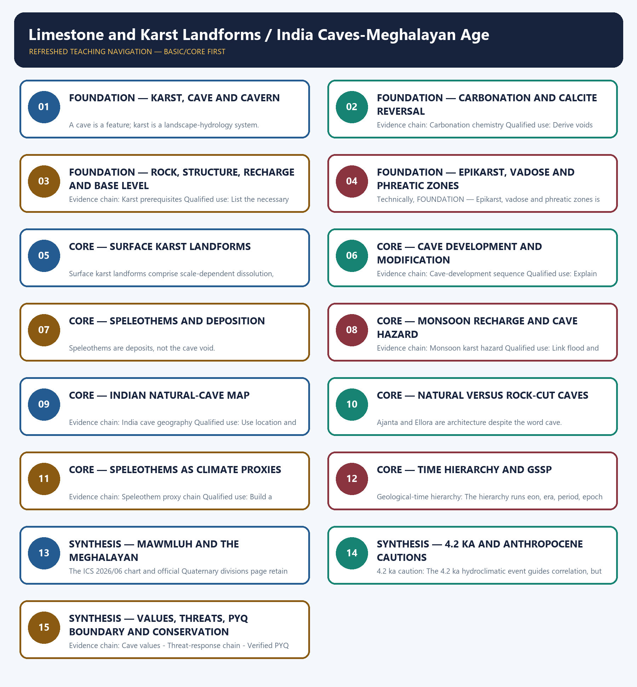

# Limestone and Karst Landforms / India Caves-Meghalayan Age — Learner-v2 Complete Learning Session

> **Authoring-only generation:** 2026-09-01. No PDF was rendered and no tracker or index was mutated.

### SOURCE, PROGRESSION AND CURRENT-LINKAGE AUDIT

- **Generation date:** 2026-09-01.
- **Repository-first evidence:** the Basic owner is taught first and preserved in full; the Advanced owner is retained only in the optional final teaching block.
- **OCR evidence:** Repository Markdown was primary. The three required local Geography books were inspected as supplementary OCR/searchable evidence. No unsupported page precision, volatile figure or quotation was imported.
- **Qdrant:** not used; repository Markdown and available OCR context were sufficient.
- **PYQ integrity:** TRANSPARENT ZERO-DIRECT-PYQ AUDIT: no direct Geography Topic 08 route was found in the checked central ledgers. Ajanta is routed to Indian Art and Culture; other adjacent legacy-package questions are not promoted into direct PYQ cards.
- **Live-link boundary:** The ICS 2026/06 chart metadata and official Quaternary divisions page were directly fetched on 2026-09-01. They retain the Holocene-Meghalayan hierarchy and identify the KM-A speleothem at Mawmluh; no cave record, mining status or new geological date is inferred.
- **Fact/inference discipline:** no current-affairs item, PYQ wording, figure or quotation is invented.

## BASIC LEARNING SESSION



*Distinct embedded teaching-navigation image. The separate continuous Cārvāka-style flowchart package remains an independent at-a-glance artifact.*

### SESSION 1 — FOUNDATION — KARST, CAVE AND CAVERN

#### DEFINITION / WHAT THIS IS CALLED

**Plain-language definition:** Karst system definition: Karst is soluble-rock terrain organised by dissolution and underground drainage; a cave is a natural void, while cavern usually describes a large chamber rather than a separate universal origin.

**Technical definition:** A cave is a feature; karst is a landscape-hydrology system.

#### ANSWER-GRABBING OPENING — WRITE/ADAPT IN THE EXAM

> Karst system definition: Karst is soluble-rock terrain organised by dissolution and underground drainage; a cave is a natural void, while cavern usually describes a large chamber rather than a separate universal origin.

#### MUST-WRITE KEYWORDS

- **FOUNDATION**
- **Karst**
- **cave**
- **cavern**
- **Karst system definition**
- **Evidence chain**

**How to use them:** Frame the answer through FOUNDATION; define Karst, connect cave with cavern to explain the mechanism, and use Karst system definition for the decisive comparison or qualification.

#### VISUAL FIRST

```text
KARST, CAVE AND CAVERN
01. Karst system definition
BOUNDARY -> A cave is a feature; karst is a landscape-hydrology system.
```

*This topic-specific rail fixes the evidence sequence and its exam boundary before analysis.*

#### CORE EXPLANATION

Karst is soluble-rock terrain organised by dissolution and underground drainage; a cave is a natural void, while cavern usually describes a large chamber rather than a separate universal origin.

#### NAMED EVIDENCE AND MECHANISM

- **Karst system definition:** Karst is soluble-rock terrain organised by dissolution and underground drainage; a cave is a natural void, while cavern usually describes a large chamber rather than a separate universal origin.

#### EXAMINER CAUTION

- A cave is a feature; karst is a landscape-hydrology system.

#### EXAM LINK

- **Prelims:** Separate the agent, landform, location, status and scale attached to Karst, cave and cavern.
- **Mains:** Start with coupled surface-subsurface drainage.

#### MINI RECAP

- **Evidence chain:** Karst system definition
- **Qualified use:** Start with coupled surface-subsurface drainage.

#### CLOSING RECALL FLOW — FOUNDATION — KARST, CAVE AND CAVERN

```text
START / CONCEPT: FOUNDATION — Karst, cave and cavern
        |
        v
EXACT TERMS: FOUNDATION · Karst · cave · cavern · Karst system definition · Evidence chain
        |
        v
MECHANISM / ARGUMENT: A cave is a feature; karst is a landscape-hydrology system.
        |
        v
CONSEQUENCE / CONTRAST: Evidence chain: Karst system definition Qualified use: Start with coupled surface-subsurface drainage.
        |
        v
UPSC TRAP / ANSWER-USE: Do not miss this limiting distinction: karst is soluble-rock terrain organised by dissolution and underground drainage.
        |
        v
ANSWER-GRABBING FORMULATION: Karst system definition: Karst is soluble-rock terrain organised by dissolution and underground drainage; a cave is a natural void, while cavern usually describes a large chamber rather than a separate universal origin.
```
### SESSION 2 — FOUNDATION — CARBONATION AND CALCITE REVERSAL

#### DEFINITION / WHAT THIS IS CALLED

**Plain-language definition:** Carbonation chemistry: Soil carbon dioxide dissolved in water forms weak carbonic acid that converts calcium carbonate to dissolved calcium and bicarbonate; degassing can reverse the balance and precipitate calcite.

**Technical definition:** Evidence chain: Carbonation chemistry Qualified use: Derive voids and speleothems from chemistry.

#### ANSWER-GRABBING OPENING — WRITE/ADAPT IN THE EXAM

> Carbonation chemistry: Soil carbon dioxide dissolved in water forms weak carbonic acid that converts calcium carbonate to dissolved calcium and bicarbonate; degassing can reverse the balance and precipitate calcite.

#### MUST-WRITE KEYWORDS

- **FOUNDATION**
- **Carbonation**
- **calcite reversal**
- **Carbonation chemistry**
- **Evidence chain**
- **Qualified use**

**How to use them:** Frame the answer through FOUNDATION; define Carbonation, connect calcite reversal with Carbonation chemistry to explain the mechanism, and use Evidence chain for the decisive comparison or qualification.

#### VISUAL FIRST

```text
CARBONATION AND CALCITE REVERSAL
01. Carbonation chemistry
BOUNDARY -> Dissolution and deposition are opposite directions of one carbonate system.
```

*This topic-specific rail fixes the evidence sequence and its exam boundary before analysis.*

#### CORE EXPLANATION

Soil carbon dioxide dissolved in water forms weak carbonic acid that converts calcium carbonate to dissolved calcium and bicarbonate; degassing can reverse the balance and precipitate calcite.

#### NAMED EVIDENCE AND MECHANISM

- **Carbonation chemistry:** Soil carbon dioxide dissolved in water forms weak carbonic acid that converts calcium carbonate to dissolved calcium and bicarbonate; degassing can reverse the balance and precipitate calcite.

#### EXAMINER CAUTION

- Dissolution and deposition are opposite directions of one carbonate system.

#### EXAM LINK

- **Prelims:** Separate the agent, landform, location, status and scale attached to Carbonation and calcite reversal.
- **Mains:** Derive voids and speleothems from chemistry.

#### MINI RECAP

- **Evidence chain:** Carbonation chemistry
- **Qualified use:** Derive voids and speleothems from chemistry.

#### CLOSING RECALL FLOW — FOUNDATION — CARBONATION AND CALCITE REVERSAL

```text
START / CONCEPT: FOUNDATION — Carbonation and calcite reversal
        |
        v
EXACT TERMS: FOUNDATION · Carbonation · calcite reversal · Carbonation chemistry · Evidence chain · Qualified use
        |
        v
MECHANISM / ARGUMENT: Evidence chain: Carbonation chemistry Qualified use: Derive voids and speleothems from chemistry.
        |
        v
CONSEQUENCE / CONTRAST: Dissolution and deposition are opposite directions of one carbonate system.
        |
        v
UPSC TRAP / ANSWER-USE: Do not miss this limiting distinction: soil carbon dioxide dissolved in water forms weak carbonic acid that converts calcium carbonate...
        |
        v
ANSWER-GRABBING FORMULATION: Carbonation chemistry: Soil carbon dioxide dissolved in water forms weak carbonic acid that converts calcium carbonate to dissolved calcium and bicarbonate; degassing can reverse the balance and precipitate calcite.
```
### SESSION 3 — FOUNDATION — ROCK, STRUCTURE, RECHARGE AND BASE LEVEL

#### DEFINITION / WHAT THIS IS CALLED

**Plain-language definition:** Karst prerequisites: Effective karstification requires soluble and sufficiently thick rock, joints or bedding pathways, recharge, hydraulic gradient, outlet or base-level relation and adequate time.

**Technical definition:** Evidence chain: Karst prerequisites Qualified use: List the necessary controls.

#### ANSWER-GRABBING OPENING — WRITE/ADAPT IN THE EXAM

> Karst prerequisites: Effective karstification requires soluble and sufficiently thick rock, joints or bedding pathways, recharge, hydraulic gradient, outlet or base-level relation and adequate time.

#### MUST-WRITE KEYWORDS

- **FOUNDATION**
- **Rock**
- **structure**
- **recharge**
- **base level**
- **Karst prerequisites**

**How to use them:** Frame the answer through FOUNDATION; define Rock, connect structure with recharge to explain the mechanism, and use base level for the decisive comparison or qualification.

#### VISUAL FIRST

```text
ROCK, STRUCTURE, RECHARGE AND BASE LEVEL
01. Karst prerequisites
BOUNDARY -> Rainfall alone cannot produce mature karst.
```

*This topic-specific rail fixes the evidence sequence and its exam boundary before analysis.*

#### CORE EXPLANATION

Effective karstification requires soluble and sufficiently thick rock, joints or bedding pathways, recharge, hydraulic gradient, outlet or base-level relation and adequate time.

#### NAMED EVIDENCE AND MECHANISM

- **Karst prerequisites:** Effective karstification requires soluble and sufficiently thick rock, joints or bedding pathways, recharge, hydraulic gradient, outlet or base-level relation and adequate time.

#### EXAMINER CAUTION

- Rainfall alone cannot produce mature karst.

#### EXAM LINK

- **Prelims:** Separate the agent, landform, location, status and scale attached to Rock, structure, recharge and base level.
- **Mains:** List the necessary controls.

#### MINI RECAP

- **Evidence chain:** Karst prerequisites
- **Qualified use:** List the necessary controls.

#### CLOSING RECALL FLOW — FOUNDATION — ROCK, STRUCTURE, RECHARGE AND BASE LEVEL

```text
START / CONCEPT: FOUNDATION — Rock, structure, recharge and base level
        |
        v
EXACT TERMS: FOUNDATION · Rock · structure · recharge · base level · Karst prerequisites
        |
        v
MECHANISM / ARGUMENT: Evidence chain: Karst prerequisites Qualified use: List the necessary controls.
        |
        v
CONSEQUENCE / CONTRAST: The resulting consequence is that effective karstification requires soluble and sufficiently thick rock, joints or bedding pathways, recharge, hydraulic...
        |
        v
UPSC TRAP / ANSWER-USE: Do not miss this limiting distinction: effective karstification requires soluble and sufficiently thick rock, joints or bedding pathways, recharge, hydraulic...
        |
        v
ANSWER-GRABBING FORMULATION: Karst prerequisites: Effective karstification requires soluble and sufficiently thick rock, joints or bedding pathways, recharge, hydraulic gradient, outlet or base-level relation and adequate time.
```
### SESSION 4 — FOUNDATION — EPIKARST, VADOSE AND PHREATIC ZONES

#### DEFINITION / WHAT THIS IS CALLED

**Plain-language definition:** Evidence chain: Epikarst-vadose-phreatic zones Qualified use: Use a vertical hydrological cross-section.

**Technical definition:** Technically, FOUNDATION — Epikarst, vadose and phreatic zones is analysed by relating FOUNDATION to Epikarst, then testing the relationship through vadose and phreatic zones.

#### ANSWER-GRABBING OPENING — WRITE/ADAPT IN THE EXAM

> Evidence chain: Epikarst-vadose-phreatic zones Qualified use: Use a vertical hydrological cross-section.

#### MUST-WRITE KEYWORDS

- **FOUNDATION**
- **Epikarst**
- **vadose**
- **phreatic zones**
- **Epikarst-vadose-phreatic zones**
- **Evidence chain**

**How to use them:** Frame the answer through FOUNDATION; define Epikarst, connect vadose with phreatic zones to explain the mechanism, and use Epikarst-vadose-phreatic zones for the decisive comparison or qualification.

#### VISUAL FIRST

```text
EPIKARST, VADOSE AND PHREATIC ZONES
01. Epikarst-vadose-phreatic zones
BOUNDARY -> Water-table position and passage form change through time.
```

*This topic-specific rail fixes the evidence sequence and its exam boundary before analysis.*

#### CORE EXPLANATION

Epikarst stores and routes recharge near the surface, vadose water descends through air-filled openings, and phreatic passages develop below the water table under saturated flow.

#### NAMED EVIDENCE AND MECHANISM

- **Epikarst-vadose-phreatic zones:** Epikarst stores and routes recharge near the surface, vadose water descends through air-filled openings, and phreatic passages develop below the water table under saturated flow.

#### EXAMINER CAUTION

- Water-table position and passage form change through time.

#### EXAM LINK

- **Prelims:** Separate the agent, landform, location, status and scale attached to Epikarst, vadose and phreatic zones.
- **Mains:** Use a vertical hydrological cross-section.

#### MINI RECAP

- **Evidence chain:** Epikarst-vadose-phreatic zones
- **Qualified use:** Use a vertical hydrological cross-section.

#### CLOSING RECALL FLOW — FOUNDATION — EPIKARST, VADOSE AND PHREATIC ZONES

```text
START / CONCEPT: FOUNDATION — Epikarst, vadose and phreatic zones
        |
        v
EXACT TERMS: FOUNDATION · Epikarst · vadose · phreatic zones · Epikarst-vadose-phreatic zones · Evidence chain
        |
        v
MECHANISM / ARGUMENT: Mains: Use a vertical hydrological cross-section.
        |
        v
CONSEQUENCE / CONTRAST: The resulting consequence is that evidence chain: Epikarst-vadose-phreatic zones Qualified use: Use a vertical hydrological cross-section.
        |
        v
UPSC TRAP / ANSWER-USE: Do not miss this limiting distinction: evidence chain: Epikarst-vadose-phreatic zones Qualified use: Use a vertical hydrological cross-section.
        |
        v
ANSWER-GRABBING FORMULATION: Evidence chain: Epikarst-vadose-phreatic zones Qualified use: Use a vertical hydrological cross-section.
```
### SESSION 5 — CORE — SURFACE KARST LANDFORMS

#### DEFINITION / WHAT THIS IS CALLED

**Plain-language definition:** Surface karst landforms are solutional or collapse features that route surface water into soluble rock and underground drainage.

**Technical definition:** Surface karst landforms comprise scale-dependent dissolution, subsidence and collapse forms whose morphology reflects lithology, structure, recharge and base-level-controlled conduit development.

#### ANSWER-GRABBING OPENING — WRITE/ADAPT IN THE EXAM

> Karst surface forms are visible expressions of a drainage system progressively transferred into soluble rock.

#### MUST-WRITE KEYWORDS

- **karren**
- **doline**
- **uvala**
- **polje**
- **swallow hole**
- **blind valley**

**How to use them:** Order karren, doline, uvala and polje by scale and mechanism; connect the swallow hole and blind valley to underground drainage; then qualify that closed depressions do not form one rigid sequence.

#### VISUAL FIRST

```text
SURFACE KARST LANDFORMS
01. Surface karst suite
BOUNDARY -> Closed depressions differ by process and scale.
```

*This topic-specific rail fixes the evidence sequence and its exam boundary before analysis.*

#### CORE EXPLANATION

Karren or lapies, dolines, uvalas, poljes, swallow holes, disappearing streams and blind valleys express solution, collapse, structural guidance and underground diversion at different scales.

#### NAMED EVIDENCE AND MECHANISM

- **Surface karst suite:** Karren or lapies, dolines, uvalas, poljes, swallow holes, disappearing streams and blind valleys express solution, collapse, structural guidance and underground diversion at different scales.

#### EXAMINER CAUTION

- Closed depressions differ by process and scale.

#### EXAM LINK

- **Prelims:** Separate the agent, landform, location, status and scale attached to Surface karst landforms.
- **Mains:** Diagnose karren, doline, uvala and polje.

#### MINI RECAP

- **Evidence chain:** Surface karst suite
- **Qualified use:** Diagnose karren, doline, uvala and polje.

#### CLOSING RECALL FLOW — CORE — SURFACE KARST LANDFORMS

```text
START / CONCEPT: CORE — Surface karst landforms
        |
        v
EXACT TERMS: karren · doline · uvala · polje · swallow hole · blind valley
        |
        v
MECHANISM / ARGUMENT: Evidence chain: Surface karst suite Qualified use: Diagnose karren, doline, uvala and polje.
        |
        v
CONSEQUENCE / CONTRAST: The resulting consequence is that diagnose karren, doline, uvala and polje.
        |
        v
UPSC TRAP / ANSWER-USE: Do not miss this limiting distinction: diagnose karren, doline, uvala and polje.
        |
        v
ANSWER-GRABBING FORMULATION: Karst surface forms are visible expressions of a drainage system progressively transferred into soluble rock.
```
### SESSION 6 — CORE — CAVE DEVELOPMENT AND MODIFICATION

#### DEFINITION / WHAT THIS IS CALLED

**Plain-language definition:** Cave stages can repeat after base-level change.

**Technical definition:** Evidence chain: Cave-development sequence Qualified use: Explain inception, enlargement, incision and collapse.

#### ANSWER-GRABBING OPENING — WRITE/ADAPT IN THE EXAM

> Cave stages can repeat after base-level change.

#### MUST-WRITE KEYWORDS

- **Cave development**
- **modification**
- **Cave-development sequence**
- **Evidence chain**
- **Qualified use**
- **Cave**

**How to use them:** Frame the answer through Cave development; define modification, connect Cave-development sequence with Evidence chain to explain the mechanism, and use Qualified use for the decisive comparison or qualification.

#### VISUAL FIRST

```text
CAVE DEVELOPMENT AND MODIFICATION
01. Cave-development sequence
BOUNDARY -> Cave stages can repeat after base-level change.
```

*This topic-specific rail fixes the evidence sequence and its exam boundary before analysis.*

#### CORE EXPLANATION

Passages may begin along structural openings, enlarge under phreatic flow, incise under vadose flow after base-level change and later undergo collapse, sediment fill or renewed dissolution.

#### NAMED EVIDENCE AND MECHANISM

- **Cave-development sequence:** Passages may begin along structural openings, enlarge under phreatic flow, incise under vadose flow after base-level change and later undergo collapse, sediment fill or renewed dissolution.

#### EXAMINER CAUTION

- Cave stages can repeat after base-level change.

#### EXAM LINK

- **Prelims:** Separate the agent, landform, location, status and scale attached to Cave development and modification.
- **Mains:** Explain inception, enlargement, incision and collapse.

#### MINI RECAP

- **Evidence chain:** Cave-development sequence
- **Qualified use:** Explain inception, enlargement, incision and collapse.

#### CLOSING RECALL FLOW — CORE — CAVE DEVELOPMENT AND MODIFICATION

```text
START / CONCEPT: CORE — Cave development and modification
        |
        v
EXACT TERMS: Cave development · modification · Cave-development sequence · Evidence chain · Qualified use · Cave
        |
        v
MECHANISM / ARGUMENT: Evidence chain: Cave-development sequence Qualified use: Explain inception, enlargement, incision and collapse.
        |
        v
CONSEQUENCE / CONTRAST: Mains: Explain inception, enlargement, incision and collapse.
        |
        v
UPSC TRAP / ANSWER-USE: Do not miss this limiting distinction: explain inception, enlargement, incision and collapse.
        |
        v
ANSWER-GRABBING FORMULATION: Cave stages can repeat after base-level change.
```
### SESSION 7 — CORE — SPELEOTHEMS AND DEPOSITION

#### DEFINITION / WHAT THIS IS CALLED

**Plain-language definition:** Speleothem suite: Stalactites hang, stalagmites rise, columns join them, while curtains, flowstone, rimstone and cave pearls are secondary mineral deposits rather than excavated voids.

**Technical definition:** Speleothems are deposits, not the cave void.

#### ANSWER-GRABBING OPENING — WRITE/ADAPT IN THE EXAM

> Speleothem suite: Stalactites hang, stalagmites rise, columns join them, while curtains, flowstone, rimstone and cave pearls are secondary mineral deposits rather than excavated voids.

#### MUST-WRITE KEYWORDS

- **Speleothems**
- **deposition**
- **Speleothem suite**
- **Evidence chain**
- **Qualified use**
- **Stalactites**

**How to use them:** Frame the answer through Speleothems; define deposition, connect Speleothem suite with Evidence chain to explain the mechanism, and use Qualified use for the decisive comparison or qualification.

#### VISUAL FIRST

```text
SPELEOTHEMS AND DEPOSITION
01. Speleothem suite
BOUNDARY -> Speleothems are deposits, not the cave void.
```

*This topic-specific rail fixes the evidence sequence and its exam boundary before analysis.*

#### CORE EXPLANATION

Stalactites hang, stalagmites rise, columns join them, while curtains, flowstone, rimstone and cave pearls are secondary mineral deposits rather than excavated voids.

#### NAMED EVIDENCE AND MECHANISM

- **Speleothem suite:** Stalactites hang, stalagmites rise, columns join them, while curtains, flowstone, rimstone and cave pearls are secondary mineral deposits rather than excavated voids.

#### EXAMINER CAUTION

- Speleothems are deposits, not the cave void.

#### EXAM LINK

- **Prelims:** Separate the agent, landform, location, status and scale attached to Speleothems and deposition.
- **Mains:** Match shape to drip, film or pool process.

#### MINI RECAP

- **Evidence chain:** Speleothem suite
- **Qualified use:** Match shape to drip, film or pool process.

#### CLOSING RECALL FLOW — CORE — SPELEOTHEMS AND DEPOSITION

```text
START / CONCEPT: CORE — Speleothems and deposition
        |
        v
EXACT TERMS: Speleothems · deposition · Speleothem suite · Evidence chain · Qualified use · Stalactites
        |
        v
MECHANISM / ARGUMENT: Evidence chain: Speleothem suite Qualified use: Match shape to drip, film or pool process.
        |
        v
CONSEQUENCE / CONTRAST: Speleothems are deposits, not the cave void.
        |
        v
UPSC TRAP / ANSWER-USE: Do not miss this limiting distinction: stalactites hang, stalagmites rise, columns join them.
        |
        v
ANSWER-GRABBING FORMULATION: Speleothem suite: Stalactites hang, stalagmites rise, columns join them, while curtains, flowstone, rimstone and cave pearls are secondary mineral deposits rather than excavated voids.
```
### SESSION 8 — CORE — MONSOON RECHARGE AND CAVE HAZARD

#### DEFINITION / WHAT THIS IS CALLED

**Plain-language definition:** Monsoon karst hazard: Rapid recharge through conduits can produce flash flooding, contamination transfer and unstable access; high rainfall promotes solution only where rock, structure and drainage permit.

**Technical definition:** Evidence chain: Monsoon karst hazard Qualified use: Link flood and contamination pathways.

#### ANSWER-GRABBING OPENING — WRITE/ADAPT IN THE EXAM

> Monsoon karst hazard: Rapid recharge through conduits can produce flash flooding, contamination transfer and unstable access; high rainfall promotes solution only where rock, structure and drainage permit.

#### MUST-WRITE KEYWORDS

- **Monsoon recharge**
- **cave hazard**
- **Monsoon karst hazard**
- **Evidence chain**
- **Qualified use**
- **Rapid**

**How to use them:** Frame the answer through Monsoon recharge; define cave hazard, connect Monsoon karst hazard with Evidence chain to explain the mechanism, and use Qualified use for the decisive comparison or qualification.

#### VISUAL FIRST

```text
MONSOON RECHARGE AND CAVE HAZARD
01. Monsoon karst hazard
BOUNDARY -> Fast conduit flow increases both recharge efficiency and vulnerability.
```

*This topic-specific rail fixes the evidence sequence and its exam boundary before analysis.*

#### CORE EXPLANATION

Rapid recharge through conduits can produce flash flooding, contamination transfer and unstable access; high rainfall promotes solution only where rock, structure and drainage permit.

#### NAMED EVIDENCE AND MECHANISM

- **Monsoon karst hazard:** Rapid recharge through conduits can produce flash flooding, contamination transfer and unstable access; high rainfall promotes solution only where rock, structure and drainage permit.

#### EXAMINER CAUTION

- Fast conduit flow increases both recharge efficiency and vulnerability.

#### EXAM LINK

- **Prelims:** Separate the agent, landform, location, status and scale attached to Monsoon recharge and cave hazard.
- **Mains:** Link flood and contamination pathways.

#### MINI RECAP

- **Evidence chain:** Monsoon karst hazard
- **Qualified use:** Link flood and contamination pathways.

#### CLOSING RECALL FLOW — CORE — MONSOON RECHARGE AND CAVE HAZARD

```text
START / CONCEPT: CORE — Monsoon recharge and cave hazard
        |
        v
EXACT TERMS: Monsoon recharge · cave hazard · Monsoon karst hazard · Evidence chain · Qualified use · Rapid
        |
        v
MECHANISM / ARGUMENT: Evidence chain: Monsoon karst hazard Qualified use: Link flood and contamination pathways.
        |
        v
CONSEQUENCE / CONTRAST: Fast conduit flow increases both recharge efficiency and vulnerability.
        |
        v
UPSC TRAP / ANSWER-USE: Do not miss this limiting distinction: rapid recharge through conduits can produce flash flooding, contamination transfer and unstable access.
        |
        v
ANSWER-GRABBING FORMULATION: Monsoon karst hazard: Rapid recharge through conduits can produce flash flooding, contamination transfer and unstable access; high rainfall promotes solution only where rock, structure and drainage permit.
```
### SESSION 9 — CORE — INDIAN NATURAL-CAVE MAP

#### DEFINITION / WHAT THIS IS CALLED

**Plain-language definition:** India cave geography: Meghalaya's limestone caves, Borra in Andhra Pradesh and Belum in Andhra Pradesh are natural cave examples; survey length or rank claims must carry a dated authoritative source.

**Technical definition:** Evidence chain: India cave geography Qualified use: Use location and cave type safely.

#### ANSWER-GRABBING OPENING — WRITE/ADAPT IN THE EXAM

> India cave geography: Meghalaya's limestone caves, Borra in Andhra Pradesh and Belum in Andhra Pradesh are natural cave examples; survey length or rank claims must carry a dated authoritative source.

#### MUST-WRITE KEYWORDS

- **Indian natural-cave map**
- **India cave geography**
- **Evidence chain**
- **Qualified use**
- **Meghalaya's**
- **Borra**

**How to use them:** Frame the answer through Indian natural-cave map; define India cave geography, connect Evidence chain with Qualified use to explain the mechanism, and use Meghalaya's for the decisive comparison or qualification.

#### VISUAL FIRST

```text
INDIAN NATURAL-CAVE MAP
01. India cave geography
BOUNDARY -> Rank and length claims are volatile survey statements.
```

*This topic-specific rail fixes the evidence sequence and its exam boundary before analysis.*

#### CORE EXPLANATION

Meghalaya's limestone caves, Borra in Andhra Pradesh and Belum in Andhra Pradesh are natural cave examples; survey length or rank claims must carry a dated authoritative source.

#### NAMED EVIDENCE AND MECHANISM

- **India cave geography:** Meghalaya's limestone caves, Borra in Andhra Pradesh and Belum in Andhra Pradesh are natural cave examples; survey length or rank claims must carry a dated authoritative source.

#### EXAMINER CAUTION

- Rank and length claims are volatile survey statements.

#### EXAM LINK

- **Prelims:** Separate the agent, landform, location, status and scale attached to Indian natural-cave map.
- **Mains:** Use location and cave type safely.

#### MINI RECAP

- **Evidence chain:** India cave geography
- **Qualified use:** Use location and cave type safely.

#### CLOSING RECALL FLOW — CORE — INDIAN NATURAL-CAVE MAP

```text
START / CONCEPT: CORE — Indian natural-cave map
        |
        v
EXACT TERMS: Indian natural-cave map · India cave geography · Evidence chain · Qualified use · Meghalaya's · Borra
        |
        v
MECHANISM / ARGUMENT: Evidence chain: India cave geography Qualified use: Use location and cave type safely.
        |
        v
CONSEQUENCE / CONTRAST: Rank and length claims are volatile survey statements.
        |
        v
UPSC TRAP / ANSWER-USE: Do not miss this limiting distinction: use location and cave type safely.
        |
        v
ANSWER-GRABBING FORMULATION: India cave geography: Meghalaya's limestone caves, Borra in Andhra Pradesh and Belum in Andhra Pradesh are natural cave examples; survey length or rank claims must carry a dated authoritative source.
```
### SESSION 10 — CORE — NATURAL VERSUS ROCK-CUT CAVES

#### DEFINITION / WHAT THIS IS CALLED

**Plain-language definition:** Natural-rock-cut firewall: Ajanta and Ellora are human-excavated rock-cut architecture, not karst solution caves; natural cave genesis and cultural use are separate analytical categories.

**Technical definition:** Ajanta and Ellora are architecture despite the word cave.

#### ANSWER-GRABBING OPENING — WRITE/ADAPT IN THE EXAM

> Natural-rock-cut firewall: Ajanta and Ellora are human-excavated rock-cut architecture, not karst solution caves; natural cave genesis and cultural use are separate analytical categories.

#### MUST-WRITE KEYWORDS

- **Natural versus rock-cut caves**
- **Natural-rock-cut firewall**
- **Evidence chain**
- **Qualified use**
- **Ajanta and Ellora**
- **Ajanta**

**How to use them:** Frame the answer through Natural versus rock-cut caves; define Natural-rock-cut firewall, connect Evidence chain with Qualified use to explain the mechanism, and use Ajanta and Ellora for the decisive comparison or qualification.

#### VISUAL FIRST

```text
NATURAL VERSUS ROCK-CUT CAVES
01. Natural-rock-cut firewall
BOUNDARY -> Ajanta and Ellora are architecture despite the word cave.
```

*This topic-specific rail fixes the evidence sequence and its exam boundary before analysis.*

#### CORE EXPLANATION

Ajanta and Ellora are human-excavated rock-cut architecture, not karst solution caves; natural cave genesis and cultural use are separate analytical categories.

#### NAMED EVIDENCE AND MECHANISM

- **Natural-rock-cut firewall:** Ajanta and Ellora are human-excavated rock-cut architecture, not karst solution caves; natural cave genesis and cultural use are separate analytical categories.

#### EXAMINER CAUTION

- Ajanta and Ellora are architecture despite the word cave.

#### EXAM LINK

- **Prelims:** Separate the agent, landform, location, status and scale attached to Natural versus rock-cut caves.
- **Mains:** Prepare objective elimination.

#### MINI RECAP

- **Evidence chain:** Natural-rock-cut firewall
- **Qualified use:** Prepare objective elimination.

#### CLOSING RECALL FLOW — CORE — NATURAL VERSUS ROCK-CUT CAVES

```text
START / CONCEPT: CORE — Natural versus rock-cut caves
        |
        v
EXACT TERMS: Natural versus rock-cut caves · Natural-rock-cut firewall · Evidence chain · Qualified use · Ajanta and Ellora · Ajanta
        |
        v
MECHANISM / ARGUMENT: Ajanta and Ellora are architecture despite the word cave.
        |
        v
CONSEQUENCE / CONTRAST: Evidence chain: Natural-rock-cut firewall Qualified use: Prepare objective elimination.
        |
        v
UPSC TRAP / ANSWER-USE: Do not miss this limiting distinction: ajanta and Ellora are human-excavated rock-cut architecture, not karst solution caves.
        |
        v
ANSWER-GRABBING FORMULATION: Natural-rock-cut firewall: Ajanta and Ellora are human-excavated rock-cut architecture, not karst solution caves; natural cave genesis and cultural use are separate analytical categories.
```
### SESSION 11 — CORE — SPELEOTHEMS AS CLIMATE PROXIES

#### DEFINITION / WHAT THIS IS CALLED

**Plain-language definition:** Proxy signal is filtered by catchment and cave processes.

**Technical definition:** Evidence chain: Speleothem proxy chain Qualified use: Build a method-and-limit answer.

#### ANSWER-GRABBING OPENING — WRITE/ADAPT IN THE EXAM

> Speleothem proxy chain: A cave proxy links climate to rainfall and vegetation, recharge routing, drip-water chemistry, calcite deposition, isotope or trace-element measurement and an independently constrained chronology.

#### MUST-WRITE KEYWORDS

- **Speleothems as climate proxies**
- **Speleothem proxy chain**
- **Evidence chain**
- **Qualified use**
- **Speleothem**
- **Proxy signal**

**How to use them:** Frame the answer through Speleothems as climate proxies; define Speleothem proxy chain, connect Evidence chain with Qualified use to explain the mechanism, and use Speleothem for the decisive comparison or qualification.

#### VISUAL FIRST

```text
SPELEOTHEMS AS CLIMATE PROXIES
01. Speleothem proxy chain
BOUNDARY -> Proxy signal is filtered by catchment and cave processes.
```

*This topic-specific rail fixes the evidence sequence and its exam boundary before analysis.*

#### CORE EXPLANATION

A cave proxy links climate to rainfall and vegetation, recharge routing, drip-water chemistry, calcite deposition, isotope or trace-element measurement and an independently constrained chronology.

#### NAMED EVIDENCE AND MECHANISM

- **Speleothem proxy chain:** A cave proxy links climate to rainfall and vegetation, recharge routing, drip-water chemistry, calcite deposition, isotope or trace-element measurement and an independently constrained chronology.

#### EXAMINER CAUTION

- Proxy signal is filtered by catchment and cave processes.

#### EXAM LINK

- **Prelims:** Separate the agent, landform, location, status and scale attached to Speleothems as climate proxies.
- **Mains:** Build a method-and-limit answer.

#### MINI RECAP

- **Evidence chain:** Speleothem proxy chain
- **Qualified use:** Build a method-and-limit answer.

#### CLOSING RECALL FLOW — CORE — SPELEOTHEMS AS CLIMATE PROXIES

```text
START / CONCEPT: CORE — Speleothems as climate proxies
        |
        v
EXACT TERMS: Speleothems as climate proxies · Speleothem proxy chain · Evidence chain · Qualified use · Speleothem · Proxy signal
        |
        v
MECHANISM / ARGUMENT: Evidence chain: Speleothem proxy chain Qualified use: Build a method-and-limit answer.
        |
        v
CONSEQUENCE / CONTRAST: Proxy signal is filtered by catchment and cave processes.
        |
        v
UPSC TRAP / ANSWER-USE: Do not miss this limiting distinction: evidence chain: Speleothem proxy chain Qualified use: Build a method-and-limit answer.
        |
        v
ANSWER-GRABBING FORMULATION: Speleothem proxy chain: A cave proxy links climate to rainfall and vegetation, recharge routing, drip-water chemistry, calcite deposition, isotope or trace-element measurement and an independently constrained chronology.
```
### SESSION 12 — CORE — TIME HIERARCHY AND GSSP

#### DEFINITION / WHAT THIS IS CALLED

**Plain-language definition:** GSSP method: A Global Boundary Stratotype Section and Point is the physical reference defining a unit's lower boundary; the correlation signal and the named time interval are related but not identical.

**Technical definition:** Geological-time hierarchy: The hierarchy runs eon, era, period, epoch and age; the Holocene is an Epoch and the Meghalayan is its uppermost formal Age or Stage.

#### ANSWER-GRABBING OPENING — WRITE/ADAPT IN THE EXAM

> GSSP method: A Global Boundary Stratotype Section and Point is the physical reference defining a unit's lower boundary; the correlation signal and the named time interval are related but not identical.

#### MUST-WRITE KEYWORDS

- **Time hierarchy**
- **GSSP**
- **Geological-time hierarchy**
- **GSSP method**
- **Evidence chain**
- **Qualified use**

**How to use them:** Frame the answer through Time hierarchy; define GSSP, connect Geological-time hierarchy with GSSP method to explain the mechanism, and use Evidence chain for the decisive comparison or qualification.

#### VISUAL FIRST

```text
TIME HIERARCHY AND GSSP
01. Geological-time hierarchy
    |
    v
02. GSSP method
BOUNDARY -> Age, Epoch, point and signal are not interchangeable.
```

*This topic-specific rail fixes the evidence sequence and its exam boundary before analysis.*

#### CORE EXPLANATION

The hierarchy runs eon, era, period, epoch and age; the Holocene is an Epoch and the Meghalayan is its uppermost formal Age or Stage. A Global Boundary Stratotype Section and Point is the physical reference defining a unit's lower boundary; the correlation signal and the named time interval are related but not identical.

#### NAMED EVIDENCE AND MECHANISM

- **Geological-time hierarchy:** The hierarchy runs eon, era, period, epoch and age; the Holocene is an Epoch and the Meghalayan is its uppermost formal Age or Stage.
- **GSSP method:** A Global Boundary Stratotype Section and Point is the physical reference defining a unit's lower boundary; the correlation signal and the named time interval are related but not identical.

#### EXAMINER CAUTION

- Age, Epoch, point and signal are not interchangeable.

#### EXAM LINK

- **Prelims:** Separate the agent, landform, location, status and scale attached to Time hierarchy and GSSP.
- **Mains:** Establish formal stratigraphic vocabulary.

#### MINI RECAP

- **Evidence chain:** Geological-time hierarchy -> GSSP method
- **Qualified use:** Establish formal stratigraphic vocabulary.

#### CLOSING RECALL FLOW — CORE — TIME HIERARCHY AND GSSP

```text
START / CONCEPT: CORE — Time hierarchy and GSSP
        |
        v
EXACT TERMS: Time hierarchy · GSSP · Geological-time hierarchy · GSSP method · Evidence chain · Qualified use
        |
        v
MECHANISM / ARGUMENT: Evidence chain: Geological-time hierarchy - GSSP method Qualified use: Establish formal stratigraphic vocabulary.
        |
        v
CONSEQUENCE / CONTRAST: Geological-time hierarchy: The hierarchy runs eon, era, period, epoch and age; the Holocene is an Epoch and the Meghalayan is its uppermost formal Age or Stage.
        |
        v
UPSC TRAP / ANSWER-USE: Age, Epoch, point and signal are not interchangeable.
        |
        v
ANSWER-GRABBING FORMULATION: GSSP method: A Global Boundary Stratotype Section and Point is the physical reference defining a unit's lower boundary; the correlation signal and the named time interval are related but not identical.
```
### SESSION 13 — SYNTHESIS — MAWMLUH AND THE MEGHALAYAN

#### DEFINITION / WHAT THIS IS CALLED

**Plain-language definition:** Meghalayan boundary: The Meghalayan GSSP is in the KM-A speleothem from Mawmluh Cave, Meghalaya, and the official Quaternary page identifies it as the Upper or Late Holocene Stage or Age reference.

**Technical definition:** The ICS 2026/06 chart and official Quaternary divisions page retain the Meghalayan and identify Mawmluh's KM-A speleothem; no cave-length record or mining outcome is inferred.

#### ANSWER-GRABBING OPENING — WRITE/ADAPT IN THE EXAM

> Meghalayan boundary: The Meghalayan GSSP is in the KM-A speleothem from Mawmluh Cave, Meghalaya, and the official Quaternary page identifies it as the Upper or Late Holocene Stage or Age reference.

#### MUST-WRITE KEYWORDS

- **SYNTHESIS**
- **Mawmluh**
- **the Meghalayan**
- **Meghalayan boundary**
- **Current official anchor**
- **Evidence chain**

**How to use them:** Frame the answer through SYNTHESIS; define Mawmluh, connect the Meghalayan with Meghalayan boundary to explain the mechanism, and use Current official anchor for the decisive comparison or qualification.

#### VISUAL FIRST

```text
MAWMLUH AND THE MEGHALAYAN
01. Meghalayan boundary
    |
    v
02. Current official anchor
BOUNDARY -> The locality defines a global unit, not an India-only label.
```

*This topic-specific rail fixes the evidence sequence and its exam boundary before analysis.*

#### CORE EXPLANATION

The Meghalayan GSSP is in the KM-A speleothem from Mawmluh Cave, Meghalaya, and the official Quaternary page identifies it as the Upper or Late Holocene Stage or Age reference. The ICS 2026/06 chart and official Quaternary divisions page retain the Meghalayan and identify Mawmluh's KM-A speleothem; no cave-length record or mining outcome is inferred.

#### NAMED EVIDENCE AND MECHANISM

- **Meghalayan boundary:** The Meghalayan GSSP is in the KM-A speleothem from Mawmluh Cave, Meghalaya, and the official Quaternary page identifies it as the Upper or Late Holocene Stage or Age reference.
- **Current official anchor:** The ICS 2026/06 chart and official Quaternary divisions page retain the Meghalayan and identify Mawmluh's KM-A speleothem; no cave-length record or mining outcome is inferred.

#### EXAMINER CAUTION

- The locality defines a global unit, not an India-only label.

#### EXAM LINK

- **Prelims:** Separate the agent, landform, location, status and scale attached to Mawmluh and the Meghalayan.
- **Mains:** Use the directly fetched official anchor.

#### MINI RECAP

- **Evidence chain:** Meghalayan boundary -> Current official anchor
- **Qualified use:** Use the directly fetched official anchor.

#### CLOSING RECALL FLOW — SYNTHESIS — MAWMLUH AND THE MEGHALAYAN

```text
START / CONCEPT: SYNTHESIS — Mawmluh and the Meghalayan
        |
        v
EXACT TERMS: SYNTHESIS · Mawmluh · the Meghalayan · Meghalayan boundary · Current official anchor · Evidence chain
        |
        v
MECHANISM / ARGUMENT: Current official anchor: The ICS 2026/06 chart and official Quaternary divisions page retain the Meghalayan and identify Mawmluh's KM-A speleothem; no cave-length record or mining outcome is inferred.
        |
        v
CONSEQUENCE / CONTRAST: The locality defines a global unit, not an India-only label.
        |
        v
UPSC TRAP / ANSWER-USE: Do not miss this limiting distinction: meghalayan boundary - Current official anchor Qualified use.
        |
        v
ANSWER-GRABBING FORMULATION: Meghalayan boundary: The Meghalayan GSSP is in the KM-A speleothem from Mawmluh Cave, Meghalaya, and the official Quaternary page identifies it as the Upper or Late Holocene Stage or Age reference.
```
### SESSION 14 — SYNTHESIS — 4.2 KA AND ANTHROPOCENE CAUTIONS

#### DEFINITION / WHAT THIS IS CALLED

**Plain-language definition:** Evidence chain: 4.2 ka caution - Anthropocene status Qualified use: Add scientific and status qualifications.

**Technical definition:** 4.2 ka caution: The 4.2 ka hydroclimatic event guides correlation, but spatially variable climate evidence does not prove one uniform global drought or one-cause collapse of ancient societies.

#### ANSWER-GRABBING OPENING — WRITE/ADAPT IN THE EXAM

> 4.2 ka caution: The 4.2 ka hydroclimatic event guides correlation, but spatially variable climate evidence does not prove one uniform global drought or one-cause collapse of ancient societies.

#### MUST-WRITE KEYWORDS

- **SYNTHESIS**
- **Anthropocene cautions**
- **Anthropocene status**
- **Evidence chain**
- **4.2 ka**
- **4.2 ka caution**

**How to use them:** Frame the answer through SYNTHESIS; define Anthropocene cautions, connect Anthropocene status with Evidence chain to explain the mechanism, and use 4.2 ka for the decisive comparison or qualification.

#### VISUAL FIRST

```text
4.2 KA AND ANTHROPOCENE CAUTIONS
01. 4.2 ka caution
    |
    v
02. Anthropocene status
BOUNDARY -> Neither uniform drought nor formal Anthropocene status should be assumed.
```

*This topic-specific rail fixes the evidence sequence and its exam boundary before analysis.*

#### CORE EXPLANATION

The 4.2 ka hydroclimatic event guides correlation, but spatially variable climate evidence does not prove one uniform global drought or one-cause collapse of ancient societies. The formal chart retains Holocene and Meghalayan; Anthropocene remains an informal term rather than a ratified Epoch after rejection of the formal proposal.

#### NAMED EVIDENCE AND MECHANISM

- **4.2 ka caution:** The 4.2 ka hydroclimatic event guides correlation, but spatially variable climate evidence does not prove one uniform global drought or one-cause collapse of ancient societies.
- **Anthropocene status:** The formal chart retains Holocene and Meghalayan; Anthropocene remains an informal term rather than a ratified Epoch after rejection of the formal proposal.

#### EXAMINER CAUTION

- Neither uniform drought nor formal Anthropocene status should be assumed.

#### EXAM LINK

- **Prelims:** Separate the agent, landform, location, status and scale attached to 4.2 ka and Anthropocene cautions.
- **Mains:** Add scientific and status qualifications.

#### MINI RECAP

- **Evidence chain:** 4.2 ka caution -> Anthropocene status
- **Qualified use:** Add scientific and status qualifications.

#### CLOSING RECALL FLOW — SYNTHESIS — 4.2 KA AND ANTHROPOCENE CAUTIONS

```text
START / CONCEPT: SYNTHESIS — 4.2 ka and Anthropocene cautions
        |
        v
EXACT TERMS: SYNTHESIS · Anthropocene cautions · Anthropocene status · Evidence chain · 4.2 ka · 4.2 ka caution
        |
        v
MECHANISM / ARGUMENT: Evidence chain: 4.2 ka caution - Anthropocene status Qualified use: Add scientific and status qualifications.
        |
        v
CONSEQUENCE / CONTRAST: Anthropocene status: The formal chart retains Holocene and Meghalayan; Anthropocene remains an informal term rather than a ratified Epoch after rejection of the formal proposal.
        |
        v
UPSC TRAP / ANSWER-USE: Do not miss this limiting distinction: neither uniform drought nor formal Anthropocene status should be assumed.
        |
        v
ANSWER-GRABBING FORMULATION: 4.2 ka caution: The 4.2 ka hydroclimatic event guides correlation, but spatially variable climate evidence does not prove one uniform global drought or one-cause collapse of ancient societies.
```
### SESSION 15 — SYNTHESIS — VALUES, THREATS, PYQ BOUNDARY AND CONSERVATION

#### DEFINITION / WHAT THIS IS CALLED

**Plain-language definition:** Verified PYQ boundary: The checked central ledgers route Ajanta to Indian Art and Culture and contain no direct Geography Topic 08 demand; cave-shrine and limestone questions in the legacy package are retained only as cross-owner context.

**Technical definition:** Evidence chain: Cave values - Threat-response chain - Verified PYQ boundary Qualified use: Close with a catchment-to-cave conservation spine.

#### ANSWER-GRABBING OPENING — WRITE/ADAPT IN THE EXAM

> Evidence chain: Cave values - Threat-response chain - Verified PYQ boundary Qualified use: Close with a catchment-to-cave conservation spine.

#### MUST-WRITE KEYWORDS

- **SYNTHESIS**
- **Values**
- **threats**
- **PYQ boundary**
- **conservation**
- **Cave values**

**How to use them:** Frame the answer through SYNTHESIS; define Values, connect threats with PYQ boundary to explain the mechanism, and use conservation for the decisive comparison or qualification.

#### VISUAL FIRST

```text
VALUES, THREATS, PYQ BOUNDARY AND CONSERVATION
01. Cave values
    |
    v
02. Threat-response chain
    |
    v
03. Verified PYQ boundary
BOUNDARY -> No direct Mains route should be fabricated.
```

*This topic-specific rail fixes the evidence sequence and its exam boundary before analysis.*

#### CORE EXPLANATION

Karst stores and transmits groundwater, supports specialised biodiversity, preserves palaeoclimate and archaeological archives and sustains cultural and tourism values. Quarrying, pollution, altered recharge, waste, infrastructure and unmanaged visitation can damage a connected catchment-aquifer-cave system; conservation must extend beyond the entrance. The checked central ledgers route Ajanta to Indian Art and Culture and contain no direct Geography Topic 08 demand; cave-shrine and limestone questions in the legacy package are retained only as cross-owner context.

#### NAMED EVIDENCE AND MECHANISM

- **Cave values:** Karst stores and transmits groundwater, supports specialised biodiversity, preserves palaeoclimate and archaeological archives and sustains cultural and tourism values.
- **Threat-response chain:** Quarrying, pollution, altered recharge, waste, infrastructure and unmanaged visitation can damage a connected catchment-aquifer-cave system; conservation must extend beyond the entrance.
- **Verified PYQ boundary:** The checked central ledgers route Ajanta to Indian Art and Culture and contain no direct Geography Topic 08 demand; cave-shrine and limestone questions in the legacy package are retained only as cross-owner context.

#### EXAMINER CAUTION

- No direct Mains route should be fabricated.

#### EXAM LINK

- **Prelims:** Separate the agent, landform, location, status and scale attached to Values, threats, PYQ boundary and conservation.
- **Mains:** Close with a catchment-to-cave conservation spine.

#### MINI RECAP

- **Evidence chain:** Cave values -> Threat-response chain -> Verified PYQ boundary
- **Qualified use:** Close with a catchment-to-cave conservation spine.
#### COMPLETE BASIC OWNER EVIDENCE BANK

> **Subject:** Geography · **Tier:** Must-Do (foundation + standard) · **GS Paper:** GS-I
> **Grounded in:** G.C. Leong, *Certificate Physical & Human Geography* + Majid Husain, *Indian & World Geography*.
> ✅ = from source book · ⚠️ = inference / standard knowledge · 📰 = current affairs.
> *Companion: `advanced/08_India-Caves-Meghalayan-Age.md`.*

#### 1. Snapshot & core idea


**Foundation — Karst Erosional & Depositional Landforms (GC Leong / Majid).**

✅ In limestone (chalk) country, the master process is carbonation/solution: rain + CO2 forms weak carbonic acid that dissolves calcium carbonate. Karst thus has little surface water and no integrated drainage. Water sinks at swallow/sink holes along joints, etching out caverns underground; dissolved calcium carbonate is later re-deposited drip by drip as stalactites and stalagmites.
- ✅ Carbonation/solution of calcium carbonate is the dominant process; karst is dry at the surface and lacks a well-integrated drainage system (Majid).
- ✅ Swallow holes/ponors are points where surface water sinks. **Doline** and **sinkhole** are overlapping
  terms for closed karst depressions; coalesced depressions may form uvalas, while poljes are much larger,
  structurally influenced, flat-floored basins.
- ✅ Clints & grikes (limestone pavement): blocks (clints) separated by solution-widened joints (grikes); French term for karren is lapies.
- ✅ Underground, water etches caverns and passages along joints/bedding planes.
- ✅ Depositional dripstone: stalactites hang from the roof, stalagmites rise from the floor; when they meet they form a pillar/column (Batu, Mammoth, Carlsbad, Postojna caves).

**Ca Anchor — Limestone Mining vs Karst Aquifers (Meghalaya).**

✅ A karst aquifer stores water in solution-widened joints and caverns; mining the host limestone directly attacks this hidden water system.
- ✅ Karst aquifers hold groundwater in cave/joint networks — a major water source but highly vulnerable.
- ✅ Cement-grade limestone mining causes cave collapse, destroys cave ecosystems and lowers groundwater recharge.
- ✅ Regulatory brakes: NGT/Supreme Court restrictions on mining in ecologically sensitive karst areas.

#### 2. Key classification / data

| Type | Landform / term | What it is |
|---|---|---|
| ✅ Process | Carbonation / solution | Weak carbonic acid dissolves calcium carbonate in limestone/chalk |
| ✅ Surface erosional | Clints and grikes / lapies or karren | Limestone pavement: blocks and solution-widened joints |
| ✅ Surface erosional | Swallow hole / sinkhole | Point where stream sinks underground; collapse depression if cavern roof fails |
| ✅ Surface erosional | Doline | Small solution/collapse hollow; stream sink common |
| ✅ Surface erosional | Uvala | Hollow formed by coalescence of two or more dolines |
| ✅ Surface erosional | Polje | Large flat-floored karst basin |
| ✅ Sub-surface erosional | Cave / cavern / underground passage | Solution along joints and bedding planes |
| ✅ Depositional | Stalactite | Dripstone hanging from cave roof |
| ✅ Depositional | Stalagmite | Dripstone rising from cave floor |
| ✅ Depositional | Pillar / column | Forms when stalactite and stalagmite meet |

#### 3. Study links

> **Study link:** ✅ Geography → Physical → Karst/Limestone (GC Leong: Underground Water; Majid: Karst Geomorphology)
> **Study link:** ✅ Geography → Karst → Aquifers & Mining (applied CA)

#### 4. Must-Know Facts (Prelims)


**Foundation — Karst Erosional & Depositional Landforms (GC Leong / Majid).**
- ✅ Master process = carbonation/solution (CaCO3 + carbonic acid).
- ✅ Karst = little surface water, disintegrated drainage.
- ✅ Do not treat sinkhole→doline as a strict sequence; doline/sinkhole overlap, while uvala and polje are larger composite basins.
- ✅ Clints (blocks) + grikes (solution-widened joints) = limestone pavement.
- ✅ Stalactite (roof, 'holds tight') vs stalagmite (ground); meet = pillar.

**Ca Anchor — Limestone Mining vs Karst Aquifers (Meghalaya).**
- ✅ Karst aquifer = groundwater in limestone caves/joints (vulnerable).
- ✅ Meghalaya hosts India's largest cave systems (Siju, Krem Liat Prah).
- ✅ Threat: cement/limestone mining -> cave collapse + aquifer damage.

#### 5. UPSC Traps

> 🔑 Trap: Do not confuse similar-looking landforms, processes, scales or Indian locations; UPSC often tests the exact mechanism and setting.


**Foundation — Karst Erosional & Depositional Landforms (GC Leong / Majid).**
- ❌ Stalagmites hang from the cave roof. → Stalactites hang from the ROOF; stalagmites rise from the FLOOR.
- ❌ Karst regions have dense surface drainage. → Karst LACKS integrated surface drainage — water disappears underground.
- ❌ A uvala is smaller than a single doline. → A uvala is formed by TWO OR MORE coalesced dolines (larger).

**Ca Anchor — Limestone Mining vs Karst Aquifers (Meghalaya).**
- ❌ Karst aquifers are well protected from contamination. → They are HIGHLY vulnerable — pollutants travel fast through open joints/caves.

#### 6. 📰 Current link


**Foundation — Karst Erosional & Depositional Landforms (GC Leong / Majid).**
📰 Karst geomorphology explains India's spectacular limestone caves (Meghalaya) — and why their aquifers are so vulnerable to mining and contamination.

**Ca Anchor — Limestone Mining vs Karst Aquifers (Meghalaya).**
📰 Unregulated limestone mining for cement in Meghalaya threatens its karst caves and aquifers — risking cave collapse, disrupted underground streams and groundwater loss.

#### 7. Mains angles


**Foundation — Karst Erosional & Depositional Landforms (GC Leong / Majid).**
- ⚠️ Explain how solution creates karst erosional and depositional landforms, and relate them to India's limestone cave systems and their fragile aquifers.

**Ca Anchor — Limestone Mining vs Karst Aquifers (Meghalaya).**
- ⚠️ Link karst hydrology to the mining-vs-conservation conflict over Meghalaya's caves and aquifers.

#### 8. Caves as a climate archive, and the geological time scale

> **Promoted into Core (13 Aug 2026):** the *concept* of how the geological time scale is formally
> defined, and of how cave deposits record past climate, are general methods rather than India
> applications. The Indian cave inventory and the Meghalayan reference section remain in
> `advanced/08_India-Caves-Meghalayan-Age.md`.

- ⚠️ **Speleothems as proxies:** a stalagmite grows in annual to sub-annual increments, and the
  chemistry of each increment varies with the rainfall and temperature at the time it formed.
  Because the layers can be dated and read in sequence, cave deposits provide a **continuous
  terrestrial record of past rainfall** — including monsoon strength — for periods long before any
  instrumental measurement. This is why caves matter far beyond geomorphology.
- ⚠️ **How geological time is formally defined:** each division of the geological time scale is
  fixed by an agreed reference point in an actual rock or sediment section — a
  **Global Boundary Stratotype Section and Point**, informally called a "golden spike". The
  boundary is defined by a **physical marker in a real section**, not by a calculated age, which is
  why a single named locality can become the global standard for a time division.
- ⚠️ **The consequence for an answer:** stratigraphic naming is a matter of international agreement
  on evidence, so "the Meghalayan Age" is a formally ratified subdivision of recent geological time
  rather than a regional label — and the fact that a cave deposit can serve as its reference marker
  follows directly from the proxy property above.

> ⚠️ **Factual caution:** do not quote the age of any geological boundary, a stalagmite growth rate,
> or a cave's surveyed length from memory.

#### 9. Answer architecture (10/15/20-mark support)

##### 9.1 Directive decoding for this topic

| If the question says | It is really asking for | Do **not** |
|---|---|---|
| "Explain karst landform development" | The carbonation-solution chemistry, the role of joints and the water-table control on the surface-versus-underground split | List cave features only |
| "Why is karst country dry at the surface?" | Rapid vertical loss of water down enlarged joints and swallow holes into an underground drainage system | Say "it does not rain there" |
| "Discuss the human problems of limestone regions" | Water supply, thin soils, foundation and subsidence risk, quarrying pressure, contamination speed | Present karst as purely scenic |

##### 9.2 The applied dimension this topic is usually asked through

- ⚠️ **Water:** karst aquifers transmit water through conduits rather than pores, so they deliver
  large yields but respond within hours to rainfall and offer almost **no natural filtration**.
  Contamination introduced at one point can appear far away, quickly and undiluted. This is the
  single most important applied fact about limestone country.
- ⚠️ **Ground stability:** dissolution voids collapse. Subsidence and sinkhole formation are
  aggravated where **groundwater is heavily pumped** (removing buoyant support) or where leaking
  water and sewer mains concentrate infiltration — which makes urban karst a distinct hazard class.
- ⚠️ **Soils and land use:** limestone weathers to a thin, often stony residual soil with rapid
  drainage, so karst uplands are typically pastoral or forested rather than intensively cropped.
- ⚠️ **Resource conflict:** limestone is the raw material of cement, and cement demand puts
  quarrying pressure directly onto cave systems, aquifer recharge zones and the specialised,
  often endemic, cave fauna they contain.

> ⚠️ **Factual caution:** do not quote cave lengths, depths or rankings from memory — surveyed
> lengths change as exploration proceeds. Name the system and the state, not a number.

##### 9.3 Reusable 10-mark spine — "karst as a coupled surface-subsurface system"

1. **Thesis:** karst is not a set of curiosities but a landscape in which the drainage system has
   migrated underground, and every distinctive feature follows from that single fact.
2. **Mechanism:** rainwater with dissolved carbon dioxide forms a weak acid; carbonate rock is
   soluble; joints and bedding planes guide the attack; solution enlarges them progressively.
3. **Surface consequence:** limestone pavement, swallow holes, dolines, dry valleys, disappearing
   streams, and resurgence springs where the water returns at an impermeable contact.
4. **Subsurface consequence:** caverns, and depositional forms built by carbonate re-precipitation
   where water degasses.
5. **Control:** the water table separates the zone of active enlargement from the zone of
   deposition — which is why cave levels record former base levels.
6. **Applied significance:** rapid, unfiltered aquifer transmission; subsidence risk; thin soils;
   quarrying conflict.
7. **Conclusion:** limestone regions demand a different land-use and water-protection regime from
   their non-karstic neighbours, because the usual assumption of slow, filtered infiltration fails.

##### 9.4 Evidence units available in this file

> **Claim:** rock chemistry, not climate alone, can determine an entire landscape's hydrology.
> **Evidence:** limestone uplands carry dry valleys and disappearing streams while adjoining
> impermeable rocks in the same rainfall regime carry ordinary surface drainage. **Significance:**
> it is the cleanest available demonstration that lithology is an independent geographical control.
> **Limitation:** climate still governs the rate — solution is faster where water is abundant and
> vegetation supplies additional carbon dioxide to the soil water.

#### CLOSING RECALL FLOW — SYNTHESIS — VALUES, THREATS, PYQ BOUNDARY AND CONSERVATION

```text
START / CONCEPT: SYNTHESIS — Values, threats, PYQ boundary and conservation
        |
        v
EXACT TERMS: SYNTHESIS · Values · threats · PYQ boundary · conservation · Cave values
        |
        v
MECHANISM / ARGUMENT: This is why caves matter far beyond geomorphology. ⚠️ How geological time is formally defined: each division of the geological time scale is fixed by an agreed reference point in an actual rock or sediment section — a Global Boundary Stratotype Section and Point, informally called a "golden spike".
        |
        v
CONSEQUENCE / CONTRAST: ⚠️ Factual caution: do not quote the age of any geological boundary, a stalagmite growth rate, or a cave's surveyed length from memory.
        |
        v
UPSC TRAP / ANSWER-USE: The boundary is defined by a physical marker in a real section, not by a calculated age, which is why a single named locality can become the global standard for a time division. ⚠️ The consequence for an answer: stratigraphic naming is a matter of international agreement on evidence, so "the Meghalayan Age" is a formally ratified subdivision of recent geological time rather than a regional label — and the fact that a cave deposit can serve as its reference marker follows directly from the proxy property above.
        |
        v
ANSWER-GRABBING FORMULATION: Evidence chain: Cave values - Threat-response chain - Verified PYQ boundary Qualified use: Close with a catchment-to-cave conservation spine.
```
## BASIC MCQS / REMEDIATION

### Q1. Which statement correctly explains Karst system definition?

A. Karst is soluble-rock terrain organised by dissolution and underground drainage; a cave is a natural void, while cavern usually describes a large chamber rather than a separate universal origin.
B. Soil carbon dioxide dissolved in water forms weak carbonic acid that converts calcium carbonate to dissolved calcium and bicarbonate; degassing can reverse the balance and precipitate calcite.
C. Epikarst stores and routes recharge near the surface, vadose water descends through air-filled openings, and phreatic passages develop below the water table under saturated flow.
D. Effective karstification requires soluble and sufficiently thick rock, joints or bedding pathways, recharge, hydraulic gradient, outlet or base-level relation and adequate time.

**Answer: A.**
**Explanation:** Karst is soluble-rock terrain organised by dissolution and underground drainage; a cave is a natural void, while cavern usually describes a large chamber rather than a separate universal origin. The other options describe different processes, locations, scales or governance categories.

### Q2. Which option is the safest spatial interpretation of Karst system definition?

A. Epikarst stores and routes recharge near the surface, vadose water descends through air-filled openings, and phreatic passages develop below the water table under saturated flow.
B. Karst is soluble-rock terrain organised by dissolution and underground drainage; a cave is a natural void, while cavern usually describes a large chamber rather than a separate universal origin.
C. Effective karstification requires soluble and sufficiently thick rock, joints or bedding pathways, recharge, hydraulic gradient, outlet or base-level relation and adequate time.
D. Karren or lapies, dolines, uvalas, poljes, swallow holes, disappearing streams and blind valleys express solution, collapse, structural guidance and underground diversion at different scales.

**Answer: B.**
**Explanation:** Karst is soluble-rock terrain organised by dissolution and underground drainage; a cave is a natural void, while cavern usually describes a large chamber rather than a separate universal origin. The other options describe different processes, locations, scales or governance categories.

### Q3. Which statement preserves the process boundary for Karst system definition?

A. Karren or lapies, dolines, uvalas, poljes, swallow holes, disappearing streams and blind valleys express solution, collapse, structural guidance and underground diversion at different scales.
B. Epikarst stores and routes recharge near the surface, vadose water descends through air-filled openings, and phreatic passages develop below the water table under saturated flow.
C. Karst is soluble-rock terrain organised by dissolution and underground drainage; a cave is a natural void, while cavern usually describes a large chamber rather than a separate universal origin.
D. Passages may begin along structural openings, enlarge under phreatic flow, incise under vadose flow after base-level change and later undergo collapse, sediment fill or renewed dissolution.

**Answer: C.**
**Explanation:** Karst is soluble-rock terrain organised by dissolution and underground drainage; a cave is a natural void, while cavern usually describes a large chamber rather than a separate universal origin. The other options describe different processes, locations, scales or governance categories.

### Q4. Which option avoids the main UPSC trap concerning Karst system definition?

A. Karren or lapies, dolines, uvalas, poljes, swallow holes, disappearing streams and blind valleys express solution, collapse, structural guidance and underground diversion at different scales.
B. Passages may begin along structural openings, enlarge under phreatic flow, incise under vadose flow after base-level change and later undergo collapse, sediment fill or renewed dissolution.
C. Stalactites hang, stalagmites rise, columns join them, while curtains, flowstone, rimstone and cave pearls are secondary mineral deposits rather than excavated voids.
D. Karst is soluble-rock terrain organised by dissolution and underground drainage; a cave is a natural void, while cavern usually describes a large chamber rather than a separate universal origin.

**Answer: D.**
**Explanation:** Karst is soluble-rock terrain organised by dissolution and underground drainage; a cave is a natural void, while cavern usually describes a large chamber rather than a separate universal origin. The other options describe different processes, locations, scales or governance categories.

### Q5. Which statement correctly explains Carbonation chemistry?

A. Soil carbon dioxide dissolved in water forms weak carbonic acid that converts calcium carbonate to dissolved calcium and bicarbonate; degassing can reverse the balance and precipitate calcite.
B. Karren or lapies, dolines, uvalas, poljes, swallow holes, disappearing streams and blind valleys express solution, collapse, structural guidance and underground diversion at different scales.
C. Effective karstification requires soluble and sufficiently thick rock, joints or bedding pathways, recharge, hydraulic gradient, outlet or base-level relation and adequate time.
D. Epikarst stores and routes recharge near the surface, vadose water descends through air-filled openings, and phreatic passages develop below the water table under saturated flow.

**Answer: A.**
**Explanation:** Soil carbon dioxide dissolved in water forms weak carbonic acid that converts calcium carbonate to dissolved calcium and bicarbonate; degassing can reverse the balance and precipitate calcite. The other options describe different processes, locations, scales or governance categories.

### Q6. Which option is the safest spatial interpretation of Carbonation chemistry?

A. Epikarst stores and routes recharge near the surface, vadose water descends through air-filled openings, and phreatic passages develop below the water table under saturated flow.
B. Soil carbon dioxide dissolved in water forms weak carbonic acid that converts calcium carbonate to dissolved calcium and bicarbonate; degassing can reverse the balance and precipitate calcite.
C. Karren or lapies, dolines, uvalas, poljes, swallow holes, disappearing streams and blind valleys express solution, collapse, structural guidance and underground diversion at different scales.
D. Passages may begin along structural openings, enlarge under phreatic flow, incise under vadose flow after base-level change and later undergo collapse, sediment fill or renewed dissolution.

**Answer: B.**
**Explanation:** Soil carbon dioxide dissolved in water forms weak carbonic acid that converts calcium carbonate to dissolved calcium and bicarbonate; degassing can reverse the balance and precipitate calcite. The other options describe different processes, locations, scales or governance categories.

### Q7. Which statement preserves the process boundary for Carbonation chemistry?

A. Stalactites hang, stalagmites rise, columns join them, while curtains, flowstone, rimstone and cave pearls are secondary mineral deposits rather than excavated voids.
B. Karren or lapies, dolines, uvalas, poljes, swallow holes, disappearing streams and blind valleys express solution, collapse, structural guidance and underground diversion at different scales.
C. Soil carbon dioxide dissolved in water forms weak carbonic acid that converts calcium carbonate to dissolved calcium and bicarbonate; degassing can reverse the balance and precipitate calcite.
D. Passages may begin along structural openings, enlarge under phreatic flow, incise under vadose flow after base-level change and later undergo collapse, sediment fill or renewed dissolution.

**Answer: C.**
**Explanation:** Soil carbon dioxide dissolved in water forms weak carbonic acid that converts calcium carbonate to dissolved calcium and bicarbonate; degassing can reverse the balance and precipitate calcite. The other options describe different processes, locations, scales or governance categories.

### Q8. Which option avoids the main UPSC trap concerning Carbonation chemistry?

A. Rapid recharge through conduits can produce flash flooding, contamination transfer and unstable access; high rainfall promotes solution only where rock, structure and drainage permit.
B. Passages may begin along structural openings, enlarge under phreatic flow, incise under vadose flow after base-level change and later undergo collapse, sediment fill or renewed dissolution.
C. Stalactites hang, stalagmites rise, columns join them, while curtains, flowstone, rimstone and cave pearls are secondary mineral deposits rather than excavated voids.
D. Soil carbon dioxide dissolved in water forms weak carbonic acid that converts calcium carbonate to dissolved calcium and bicarbonate; degassing can reverse the balance and precipitate calcite.

**Answer: D.**
**Explanation:** Soil carbon dioxide dissolved in water forms weak carbonic acid that converts calcium carbonate to dissolved calcium and bicarbonate; degassing can reverse the balance and precipitate calcite. The other options describe different processes, locations, scales or governance categories.

### Q9. Which statement correctly explains Karst prerequisites?

A. Effective karstification requires soluble and sufficiently thick rock, joints or bedding pathways, recharge, hydraulic gradient, outlet or base-level relation and adequate time.
B. Karren or lapies, dolines, uvalas, poljes, swallow holes, disappearing streams and blind valleys express solution, collapse, structural guidance and underground diversion at different scales.
C. Epikarst stores and routes recharge near the surface, vadose water descends through air-filled openings, and phreatic passages develop below the water table under saturated flow.
D. Passages may begin along structural openings, enlarge under phreatic flow, incise under vadose flow after base-level change and later undergo collapse, sediment fill or renewed dissolution.

**Answer: A.**
**Explanation:** Effective karstification requires soluble and sufficiently thick rock, joints or bedding pathways, recharge, hydraulic gradient, outlet or base-level relation and adequate time. The other options describe different processes, locations, scales or governance categories.

### Q10. Which option is the safest spatial interpretation of Karst prerequisites?

A. Passages may begin along structural openings, enlarge under phreatic flow, incise under vadose flow after base-level change and later undergo collapse, sediment fill or renewed dissolution.
B. Effective karstification requires soluble and sufficiently thick rock, joints or bedding pathways, recharge, hydraulic gradient, outlet or base-level relation and adequate time.
C. Stalactites hang, stalagmites rise, columns join them, while curtains, flowstone, rimstone and cave pearls are secondary mineral deposits rather than excavated voids.
D. Karren or lapies, dolines, uvalas, poljes, swallow holes, disappearing streams and blind valleys express solution, collapse, structural guidance and underground diversion at different scales.

**Answer: B.**
**Explanation:** Effective karstification requires soluble and sufficiently thick rock, joints or bedding pathways, recharge, hydraulic gradient, outlet or base-level relation and adequate time. The other options describe different processes, locations, scales or governance categories.

### Q11. Which statement preserves the process boundary for Karst prerequisites?

A. Stalactites hang, stalagmites rise, columns join them, while curtains, flowstone, rimstone and cave pearls are secondary mineral deposits rather than excavated voids.
B. Rapid recharge through conduits can produce flash flooding, contamination transfer and unstable access; high rainfall promotes solution only where rock, structure and drainage permit.
C. Effective karstification requires soluble and sufficiently thick rock, joints or bedding pathways, recharge, hydraulic gradient, outlet or base-level relation and adequate time.
D. Passages may begin along structural openings, enlarge under phreatic flow, incise under vadose flow after base-level change and later undergo collapse, sediment fill or renewed dissolution.

**Answer: C.**
**Explanation:** Effective karstification requires soluble and sufficiently thick rock, joints or bedding pathways, recharge, hydraulic gradient, outlet or base-level relation and adequate time. The other options describe different processes, locations, scales or governance categories.

### Q12. Which option avoids the main UPSC trap concerning Karst prerequisites?

A. Rapid recharge through conduits can produce flash flooding, contamination transfer and unstable access; high rainfall promotes solution only where rock, structure and drainage permit.
B. Stalactites hang, stalagmites rise, columns join them, while curtains, flowstone, rimstone and cave pearls are secondary mineral deposits rather than excavated voids.
C. Meghalaya's limestone caves, Borra in Andhra Pradesh and Belum in Andhra Pradesh are natural cave examples; survey length or rank claims must carry a dated authoritative source.
D. Effective karstification requires soluble and sufficiently thick rock, joints or bedding pathways, recharge, hydraulic gradient, outlet or base-level relation and adequate time.

**Answer: D.**
**Explanation:** Effective karstification requires soluble and sufficiently thick rock, joints or bedding pathways, recharge, hydraulic gradient, outlet or base-level relation and adequate time. The other options describe different processes, locations, scales or governance categories.

### Q13. Which statement correctly explains Epikarst-vadose-phreatic zones?

A. Epikarst stores and routes recharge near the surface, vadose water descends through air-filled openings, and phreatic passages develop below the water table under saturated flow.
B. Stalactites hang, stalagmites rise, columns join them, while curtains, flowstone, rimstone and cave pearls are secondary mineral deposits rather than excavated voids.
C. Karren or lapies, dolines, uvalas, poljes, swallow holes, disappearing streams and blind valleys express solution, collapse, structural guidance and underground diversion at different scales.
D. Passages may begin along structural openings, enlarge under phreatic flow, incise under vadose flow after base-level change and later undergo collapse, sediment fill or renewed dissolution.

**Answer: A.**
**Explanation:** Epikarst stores and routes recharge near the surface, vadose water descends through air-filled openings, and phreatic passages develop below the water table under saturated flow. The other options describe different processes, locations, scales or governance categories.

### Q14. Which option is the safest spatial interpretation of Epikarst-vadose-phreatic zones?

A. Rapid recharge through conduits can produce flash flooding, contamination transfer and unstable access; high rainfall promotes solution only where rock, structure and drainage permit.
B. Epikarst stores and routes recharge near the surface, vadose water descends through air-filled openings, and phreatic passages develop below the water table under saturated flow.
C. Stalactites hang, stalagmites rise, columns join them, while curtains, flowstone, rimstone and cave pearls are secondary mineral deposits rather than excavated voids.
D. Passages may begin along structural openings, enlarge under phreatic flow, incise under vadose flow after base-level change and later undergo collapse, sediment fill or renewed dissolution.

**Answer: B.**
**Explanation:** Epikarst stores and routes recharge near the surface, vadose water descends through air-filled openings, and phreatic passages develop below the water table under saturated flow. The other options describe different processes, locations, scales or governance categories.

### Q15. Which statement preserves the process boundary for Epikarst-vadose-phreatic zones?

A. Meghalaya's limestone caves, Borra in Andhra Pradesh and Belum in Andhra Pradesh are natural cave examples; survey length or rank claims must carry a dated authoritative source.
B. Rapid recharge through conduits can produce flash flooding, contamination transfer and unstable access; high rainfall promotes solution only where rock, structure and drainage permit.
C. Epikarst stores and routes recharge near the surface, vadose water descends through air-filled openings, and phreatic passages develop below the water table under saturated flow.
D. Stalactites hang, stalagmites rise, columns join them, while curtains, flowstone, rimstone and cave pearls are secondary mineral deposits rather than excavated voids.

**Answer: C.**
**Explanation:** Epikarst stores and routes recharge near the surface, vadose water descends through air-filled openings, and phreatic passages develop below the water table under saturated flow. The other options describe different processes, locations, scales or governance categories.

### Q16. Which option avoids the main UPSC trap concerning Epikarst-vadose-phreatic zones?

A. Meghalaya's limestone caves, Borra in Andhra Pradesh and Belum in Andhra Pradesh are natural cave examples; survey length or rank claims must carry a dated authoritative source.
B. Rapid recharge through conduits can produce flash flooding, contamination transfer and unstable access; high rainfall promotes solution only where rock, structure and drainage permit.
C. Ajanta and Ellora are human-excavated rock-cut architecture, not karst solution caves; natural cave genesis and cultural use are separate analytical categories.
D. Epikarst stores and routes recharge near the surface, vadose water descends through air-filled openings, and phreatic passages develop below the water table under saturated flow.

**Answer: D.**
**Explanation:** Epikarst stores and routes recharge near the surface, vadose water descends through air-filled openings, and phreatic passages develop below the water table under saturated flow. The other options describe different processes, locations, scales or governance categories.

### Q17. Which statement correctly explains Surface karst suite?

A. Karren or lapies, dolines, uvalas, poljes, swallow holes, disappearing streams and blind valleys express solution, collapse, structural guidance and underground diversion at different scales.
B. Rapid recharge through conduits can produce flash flooding, contamination transfer and unstable access; high rainfall promotes solution only where rock, structure and drainage permit.
C. Stalactites hang, stalagmites rise, columns join them, while curtains, flowstone, rimstone and cave pearls are secondary mineral deposits rather than excavated voids.
D. Passages may begin along structural openings, enlarge under phreatic flow, incise under vadose flow after base-level change and later undergo collapse, sediment fill or renewed dissolution.

**Answer: A.**
**Explanation:** Karren or lapies, dolines, uvalas, poljes, swallow holes, disappearing streams and blind valleys express solution, collapse, structural guidance and underground diversion at different scales. The other options describe different processes, locations, scales or governance categories.

### Q18. Which option is the safest spatial interpretation of Surface karst suite?

A. Stalactites hang, stalagmites rise, columns join them, while curtains, flowstone, rimstone and cave pearls are secondary mineral deposits rather than excavated voids.
B. Karren or lapies, dolines, uvalas, poljes, swallow holes, disappearing streams and blind valleys express solution, collapse, structural guidance and underground diversion at different scales.
C. Rapid recharge through conduits can produce flash flooding, contamination transfer and unstable access; high rainfall promotes solution only where rock, structure and drainage permit.
D. Meghalaya's limestone caves, Borra in Andhra Pradesh and Belum in Andhra Pradesh are natural cave examples; survey length or rank claims must carry a dated authoritative source.

**Answer: B.**
**Explanation:** Karren or lapies, dolines, uvalas, poljes, swallow holes, disappearing streams and blind valleys express solution, collapse, structural guidance and underground diversion at different scales. The other options describe different processes, locations, scales or governance categories.

### Q19. Which statement preserves the process boundary for Surface karst suite?

A. Meghalaya's limestone caves, Borra in Andhra Pradesh and Belum in Andhra Pradesh are natural cave examples; survey length or rank claims must carry a dated authoritative source.
B. Ajanta and Ellora are human-excavated rock-cut architecture, not karst solution caves; natural cave genesis and cultural use are separate analytical categories.
C. Karren or lapies, dolines, uvalas, poljes, swallow holes, disappearing streams and blind valleys express solution, collapse, structural guidance and underground diversion at different scales.
D. Rapid recharge through conduits can produce flash flooding, contamination transfer and unstable access; high rainfall promotes solution only where rock, structure and drainage permit.

**Answer: C.**
**Explanation:** Karren or lapies, dolines, uvalas, poljes, swallow holes, disappearing streams and blind valleys express solution, collapse, structural guidance and underground diversion at different scales. The other options describe different processes, locations, scales or governance categories.

### Q20. Which option avoids the main UPSC trap concerning Surface karst suite?

A. Meghalaya's limestone caves, Borra in Andhra Pradesh and Belum in Andhra Pradesh are natural cave examples; survey length or rank claims must carry a dated authoritative source.
B. Ajanta and Ellora are human-excavated rock-cut architecture, not karst solution caves; natural cave genesis and cultural use are separate analytical categories.
C. A cave proxy links climate to rainfall and vegetation, recharge routing, drip-water chemistry, calcite deposition, isotope or trace-element measurement and an independently constrained chronology.
D. Karren or lapies, dolines, uvalas, poljes, swallow holes, disappearing streams and blind valleys express solution, collapse, structural guidance and underground diversion at different scales.

**Answer: D.**
**Explanation:** Karren or lapies, dolines, uvalas, poljes, swallow holes, disappearing streams and blind valleys express solution, collapse, structural guidance and underground diversion at different scales. The other options describe different processes, locations, scales or governance categories.

### Q21. Which statement correctly explains Cave-development sequence?

A. Passages may begin along structural openings, enlarge under phreatic flow, incise under vadose flow after base-level change and later undergo collapse, sediment fill or renewed dissolution.
B. Rapid recharge through conduits can produce flash flooding, contamination transfer and unstable access; high rainfall promotes solution only where rock, structure and drainage permit.
C. Meghalaya's limestone caves, Borra in Andhra Pradesh and Belum in Andhra Pradesh are natural cave examples; survey length or rank claims must carry a dated authoritative source.
D. Stalactites hang, stalagmites rise, columns join them, while curtains, flowstone, rimstone and cave pearls are secondary mineral deposits rather than excavated voids.

**Answer: A.**
**Explanation:** Passages may begin along structural openings, enlarge under phreatic flow, incise under vadose flow after base-level change and later undergo collapse, sediment fill or renewed dissolution. The other options describe different processes, locations, scales or governance categories.

### Q22. Which option is the safest spatial interpretation of Cave-development sequence?

A. Ajanta and Ellora are human-excavated rock-cut architecture, not karst solution caves; natural cave genesis and cultural use are separate analytical categories.
B. Passages may begin along structural openings, enlarge under phreatic flow, incise under vadose flow after base-level change and later undergo collapse, sediment fill or renewed dissolution.
C. Meghalaya's limestone caves, Borra in Andhra Pradesh and Belum in Andhra Pradesh are natural cave examples; survey length or rank claims must carry a dated authoritative source.
D. Rapid recharge through conduits can produce flash flooding, contamination transfer and unstable access; high rainfall promotes solution only where rock, structure and drainage permit.

**Answer: B.**
**Explanation:** Passages may begin along structural openings, enlarge under phreatic flow, incise under vadose flow after base-level change and later undergo collapse, sediment fill or renewed dissolution. The other options describe different processes, locations, scales or governance categories.

### Q23. Which statement preserves the process boundary for Cave-development sequence?

A. Ajanta and Ellora are human-excavated rock-cut architecture, not karst solution caves; natural cave genesis and cultural use are separate analytical categories.
B. Meghalaya's limestone caves, Borra in Andhra Pradesh and Belum in Andhra Pradesh are natural cave examples; survey length or rank claims must carry a dated authoritative source.
C. Passages may begin along structural openings, enlarge under phreatic flow, incise under vadose flow after base-level change and later undergo collapse, sediment fill or renewed dissolution.
D. A cave proxy links climate to rainfall and vegetation, recharge routing, drip-water chemistry, calcite deposition, isotope or trace-element measurement and an independently constrained chronology.

**Answer: C.**
**Explanation:** Passages may begin along structural openings, enlarge under phreatic flow, incise under vadose flow after base-level change and later undergo collapse, sediment fill or renewed dissolution. The other options describe different processes, locations, scales or governance categories.

### Q24. Which option avoids the main UPSC trap concerning Cave-development sequence?

A. A cave proxy links climate to rainfall and vegetation, recharge routing, drip-water chemistry, calcite deposition, isotope or trace-element measurement and an independently constrained chronology.
B. The hierarchy runs eon, era, period, epoch and age; the Holocene is an Epoch and the Meghalayan is its uppermost formal Age or Stage.
C. Ajanta and Ellora are human-excavated rock-cut architecture, not karst solution caves; natural cave genesis and cultural use are separate analytical categories.
D. Passages may begin along structural openings, enlarge under phreatic flow, incise under vadose flow after base-level change and later undergo collapse, sediment fill or renewed dissolution.

**Answer: D.**
**Explanation:** Passages may begin along structural openings, enlarge under phreatic flow, incise under vadose flow after base-level change and later undergo collapse, sediment fill or renewed dissolution. The other options describe different processes, locations, scales or governance categories.

### Q25. Which statement correctly explains Speleothem suite?

A. Stalactites hang, stalagmites rise, columns join them, while curtains, flowstone, rimstone and cave pearls are secondary mineral deposits rather than excavated voids.
B. Ajanta and Ellora are human-excavated rock-cut architecture, not karst solution caves; natural cave genesis and cultural use are separate analytical categories.
C. Meghalaya's limestone caves, Borra in Andhra Pradesh and Belum in Andhra Pradesh are natural cave examples; survey length or rank claims must carry a dated authoritative source.
D. Rapid recharge through conduits can produce flash flooding, contamination transfer and unstable access; high rainfall promotes solution only where rock, structure and drainage permit.

**Answer: A.**
**Explanation:** Stalactites hang, stalagmites rise, columns join them, while curtains, flowstone, rimstone and cave pearls are secondary mineral deposits rather than excavated voids. The other options describe different processes, locations, scales or governance categories.

### Q26. Which option is the safest spatial interpretation of Speleothem suite?

A. A cave proxy links climate to rainfall and vegetation, recharge routing, drip-water chemistry, calcite deposition, isotope or trace-element measurement and an independently constrained chronology.
B. Stalactites hang, stalagmites rise, columns join them, while curtains, flowstone, rimstone and cave pearls are secondary mineral deposits rather than excavated voids.
C. Ajanta and Ellora are human-excavated rock-cut architecture, not karst solution caves; natural cave genesis and cultural use are separate analytical categories.
D. Meghalaya's limestone caves, Borra in Andhra Pradesh and Belum in Andhra Pradesh are natural cave examples; survey length or rank claims must carry a dated authoritative source.

**Answer: B.**
**Explanation:** Stalactites hang, stalagmites rise, columns join them, while curtains, flowstone, rimstone and cave pearls are secondary mineral deposits rather than excavated voids. The other options describe different processes, locations, scales or governance categories.

### Q27. Which statement preserves the process boundary for Speleothem suite?

A. Ajanta and Ellora are human-excavated rock-cut architecture, not karst solution caves; natural cave genesis and cultural use are separate analytical categories.
B. The hierarchy runs eon, era, period, epoch and age; the Holocene is an Epoch and the Meghalayan is its uppermost formal Age or Stage.
C. Stalactites hang, stalagmites rise, columns join them, while curtains, flowstone, rimstone and cave pearls are secondary mineral deposits rather than excavated voids.
D. A cave proxy links climate to rainfall and vegetation, recharge routing, drip-water chemistry, calcite deposition, isotope or trace-element measurement and an independently constrained chronology.

**Answer: C.**
**Explanation:** Stalactites hang, stalagmites rise, columns join them, while curtains, flowstone, rimstone and cave pearls are secondary mineral deposits rather than excavated voids. The other options describe different processes, locations, scales or governance categories.

### Q28. Which option avoids the main UPSC trap concerning Speleothem suite?

A. A Global Boundary Stratotype Section and Point is the physical reference defining a unit's lower boundary; the correlation signal and the named time interval are related but not identical.
B. A cave proxy links climate to rainfall and vegetation, recharge routing, drip-water chemistry, calcite deposition, isotope or trace-element measurement and an independently constrained chronology.
C. The hierarchy runs eon, era, period, epoch and age; the Holocene is an Epoch and the Meghalayan is its uppermost formal Age or Stage.
D. Stalactites hang, stalagmites rise, columns join them, while curtains, flowstone, rimstone and cave pearls are secondary mineral deposits rather than excavated voids.

**Answer: D.**
**Explanation:** Stalactites hang, stalagmites rise, columns join them, while curtains, flowstone, rimstone and cave pearls are secondary mineral deposits rather than excavated voids. The other options describe different processes, locations, scales or governance categories.

### Q29. Which statement correctly explains Monsoon karst hazard?

A. Rapid recharge through conduits can produce flash flooding, contamination transfer and unstable access; high rainfall promotes solution only where rock, structure and drainage permit.
B. Ajanta and Ellora are human-excavated rock-cut architecture, not karst solution caves; natural cave genesis and cultural use are separate analytical categories.
C. Meghalaya's limestone caves, Borra in Andhra Pradesh and Belum in Andhra Pradesh are natural cave examples; survey length or rank claims must carry a dated authoritative source.
D. A cave proxy links climate to rainfall and vegetation, recharge routing, drip-water chemistry, calcite deposition, isotope or trace-element measurement and an independently constrained chronology.

**Answer: A.**
**Explanation:** Rapid recharge through conduits can produce flash flooding, contamination transfer and unstable access; high rainfall promotes solution only where rock, structure and drainage permit. The other options describe different processes, locations, scales or governance categories.

### Q30. Which option is the safest spatial interpretation of Monsoon karst hazard?

A. Ajanta and Ellora are human-excavated rock-cut architecture, not karst solution caves; natural cave genesis and cultural use are separate analytical categories.
B. Rapid recharge through conduits can produce flash flooding, contamination transfer and unstable access; high rainfall promotes solution only where rock, structure and drainage permit.
C. The hierarchy runs eon, era, period, epoch and age; the Holocene is an Epoch and the Meghalayan is its uppermost formal Age or Stage.
D. A cave proxy links climate to rainfall and vegetation, recharge routing, drip-water chemistry, calcite deposition, isotope or trace-element measurement and an independently constrained chronology.

**Answer: B.**
**Explanation:** Rapid recharge through conduits can produce flash flooding, contamination transfer and unstable access; high rainfall promotes solution only where rock, structure and drainage permit. The other options describe different processes, locations, scales or governance categories.

### Q31. Which statement preserves the process boundary for Monsoon karst hazard?

A. A cave proxy links climate to rainfall and vegetation, recharge routing, drip-water chemistry, calcite deposition, isotope or trace-element measurement and an independently constrained chronology.
B. A Global Boundary Stratotype Section and Point is the physical reference defining a unit's lower boundary; the correlation signal and the named time interval are related but not identical.
C. Rapid recharge through conduits can produce flash flooding, contamination transfer and unstable access; high rainfall promotes solution only where rock, structure and drainage permit.
D. The hierarchy runs eon, era, period, epoch and age; the Holocene is an Epoch and the Meghalayan is its uppermost formal Age or Stage.

**Answer: C.**
**Explanation:** Rapid recharge through conduits can produce flash flooding, contamination transfer and unstable access; high rainfall promotes solution only where rock, structure and drainage permit. The other options describe different processes, locations, scales or governance categories.

### Q32. Which option avoids the main UPSC trap concerning Monsoon karst hazard?

A. The Meghalayan GSSP is in the KM-A speleothem from Mawmluh Cave, Meghalaya, and the official Quaternary page identifies it as the Upper or Late Holocene Stage or Age reference.
B. The hierarchy runs eon, era, period, epoch and age; the Holocene is an Epoch and the Meghalayan is its uppermost formal Age or Stage.
C. A Global Boundary Stratotype Section and Point is the physical reference defining a unit's lower boundary; the correlation signal and the named time interval are related but not identical.
D. Rapid recharge through conduits can produce flash flooding, contamination transfer and unstable access; high rainfall promotes solution only where rock, structure and drainage permit.

**Answer: D.**
**Explanation:** Rapid recharge through conduits can produce flash flooding, contamination transfer and unstable access; high rainfall promotes solution only where rock, structure and drainage permit. The other options describe different processes, locations, scales or governance categories.

### Q33. Which statement correctly explains India cave geography?

A. Meghalaya's limestone caves, Borra in Andhra Pradesh and Belum in Andhra Pradesh are natural cave examples; survey length or rank claims must carry a dated authoritative source.
B. The hierarchy runs eon, era, period, epoch and age; the Holocene is an Epoch and the Meghalayan is its uppermost formal Age or Stage.
C. A cave proxy links climate to rainfall and vegetation, recharge routing, drip-water chemistry, calcite deposition, isotope or trace-element measurement and an independently constrained chronology.
D. Ajanta and Ellora are human-excavated rock-cut architecture, not karst solution caves; natural cave genesis and cultural use are separate analytical categories.

**Answer: A.**
**Explanation:** Meghalaya's limestone caves, Borra in Andhra Pradesh and Belum in Andhra Pradesh are natural cave examples; survey length or rank claims must carry a dated authoritative source. The other options describe different processes, locations, scales or governance categories.

### Q34. Which option is the safest spatial interpretation of India cave geography?

A. A Global Boundary Stratotype Section and Point is the physical reference defining a unit's lower boundary; the correlation signal and the named time interval are related but not identical.
B. Meghalaya's limestone caves, Borra in Andhra Pradesh and Belum in Andhra Pradesh are natural cave examples; survey length or rank claims must carry a dated authoritative source.
C. A cave proxy links climate to rainfall and vegetation, recharge routing, drip-water chemistry, calcite deposition, isotope or trace-element measurement and an independently constrained chronology.
D. The hierarchy runs eon, era, period, epoch and age; the Holocene is an Epoch and the Meghalayan is its uppermost formal Age or Stage.

**Answer: B.**
**Explanation:** Meghalaya's limestone caves, Borra in Andhra Pradesh and Belum in Andhra Pradesh are natural cave examples; survey length or rank claims must carry a dated authoritative source. The other options describe different processes, locations, scales or governance categories.

### Q35. Which statement preserves the process boundary for India cave geography?

A. The hierarchy runs eon, era, period, epoch and age; the Holocene is an Epoch and the Meghalayan is its uppermost formal Age or Stage.
B. A Global Boundary Stratotype Section and Point is the physical reference defining a unit's lower boundary; the correlation signal and the named time interval are related but not identical.
C. Meghalaya's limestone caves, Borra in Andhra Pradesh and Belum in Andhra Pradesh are natural cave examples; survey length or rank claims must carry a dated authoritative source.
D. The Meghalayan GSSP is in the KM-A speleothem from Mawmluh Cave, Meghalaya, and the official Quaternary page identifies it as the Upper or Late Holocene Stage or Age reference.

**Answer: C.**
**Explanation:** Meghalaya's limestone caves, Borra in Andhra Pradesh and Belum in Andhra Pradesh are natural cave examples; survey length or rank claims must carry a dated authoritative source. The other options describe different processes, locations, scales or governance categories.

### Q36. Which option avoids the main UPSC trap concerning India cave geography?

A. The Meghalayan GSSP is in the KM-A speleothem from Mawmluh Cave, Meghalaya, and the official Quaternary page identifies it as the Upper or Late Holocene Stage or Age reference.
B. The 4.2 ka hydroclimatic event guides correlation, but spatially variable climate evidence does not prove one uniform global drought or one-cause collapse of ancient societies.
C. A Global Boundary Stratotype Section and Point is the physical reference defining a unit's lower boundary; the correlation signal and the named time interval are related but not identical.
D. Meghalaya's limestone caves, Borra in Andhra Pradesh and Belum in Andhra Pradesh are natural cave examples; survey length or rank claims must carry a dated authoritative source.

**Answer: D.**
**Explanation:** Meghalaya's limestone caves, Borra in Andhra Pradesh and Belum in Andhra Pradesh are natural cave examples; survey length or rank claims must carry a dated authoritative source. The other options describe different processes, locations, scales or governance categories.

### Q37. Which statement correctly explains Natural-rock-cut firewall?

A. Ajanta and Ellora are human-excavated rock-cut architecture, not karst solution caves; natural cave genesis and cultural use are separate analytical categories.
B. A Global Boundary Stratotype Section and Point is the physical reference defining a unit's lower boundary; the correlation signal and the named time interval are related but not identical.
C. A cave proxy links climate to rainfall and vegetation, recharge routing, drip-water chemistry, calcite deposition, isotope or trace-element measurement and an independently constrained chronology.
D. The hierarchy runs eon, era, period, epoch and age; the Holocene is an Epoch and the Meghalayan is its uppermost formal Age or Stage.

**Answer: A.**
**Explanation:** Ajanta and Ellora are human-excavated rock-cut architecture, not karst solution caves; natural cave genesis and cultural use are separate analytical categories. The other options describe different processes, locations, scales or governance categories.

### Q38. Which option is the safest spatial interpretation of Natural-rock-cut firewall?

A. The Meghalayan GSSP is in the KM-A speleothem from Mawmluh Cave, Meghalaya, and the official Quaternary page identifies it as the Upper or Late Holocene Stage or Age reference.
B. Ajanta and Ellora are human-excavated rock-cut architecture, not karst solution caves; natural cave genesis and cultural use are separate analytical categories.
C. A Global Boundary Stratotype Section and Point is the physical reference defining a unit's lower boundary; the correlation signal and the named time interval are related but not identical.
D. The hierarchy runs eon, era, period, epoch and age; the Holocene is an Epoch and the Meghalayan is its uppermost formal Age or Stage.

**Answer: B.**
**Explanation:** Ajanta and Ellora are human-excavated rock-cut architecture, not karst solution caves; natural cave genesis and cultural use are separate analytical categories. The other options describe different processes, locations, scales or governance categories.

### Q39. Which statement preserves the process boundary for Natural-rock-cut firewall?

A. The Meghalayan GSSP is in the KM-A speleothem from Mawmluh Cave, Meghalaya, and the official Quaternary page identifies it as the Upper or Late Holocene Stage or Age reference.
B. The 4.2 ka hydroclimatic event guides correlation, but spatially variable climate evidence does not prove one uniform global drought or one-cause collapse of ancient societies.
C. Ajanta and Ellora are human-excavated rock-cut architecture, not karst solution caves; natural cave genesis and cultural use are separate analytical categories.
D. A Global Boundary Stratotype Section and Point is the physical reference defining a unit's lower boundary; the correlation signal and the named time interval are related but not identical.

**Answer: C.**
**Explanation:** Ajanta and Ellora are human-excavated rock-cut architecture, not karst solution caves; natural cave genesis and cultural use are separate analytical categories. The other options describe different processes, locations, scales or governance categories.

### Q40. Which option avoids the main UPSC trap concerning Natural-rock-cut firewall?

A. The Meghalayan GSSP is in the KM-A speleothem from Mawmluh Cave, Meghalaya, and the official Quaternary page identifies it as the Upper or Late Holocene Stage or Age reference.
B. The formal chart retains Holocene and Meghalayan; Anthropocene remains an informal term rather than a ratified Epoch after rejection of the formal proposal.
C. The 4.2 ka hydroclimatic event guides correlation, but spatially variable climate evidence does not prove one uniform global drought or one-cause collapse of ancient societies.
D. Ajanta and Ellora are human-excavated rock-cut architecture, not karst solution caves; natural cave genesis and cultural use are separate analytical categories.

**Answer: D.**
**Explanation:** Ajanta and Ellora are human-excavated rock-cut architecture, not karst solution caves; natural cave genesis and cultural use are separate analytical categories. The other options describe different processes, locations, scales or governance categories.

### Q41. Which statement correctly explains Speleothem proxy chain?

A. A cave proxy links climate to rainfall and vegetation, recharge routing, drip-water chemistry, calcite deposition, isotope or trace-element measurement and an independently constrained chronology.
B. A Global Boundary Stratotype Section and Point is the physical reference defining a unit's lower boundary; the correlation signal and the named time interval are related but not identical.
C. The Meghalayan GSSP is in the KM-A speleothem from Mawmluh Cave, Meghalaya, and the official Quaternary page identifies it as the Upper or Late Holocene Stage or Age reference.
D. The hierarchy runs eon, era, period, epoch and age; the Holocene is an Epoch and the Meghalayan is its uppermost formal Age or Stage.

**Answer: A.**
**Explanation:** A cave proxy links climate to rainfall and vegetation, recharge routing, drip-water chemistry, calcite deposition, isotope or trace-element measurement and an independently constrained chronology. The other options describe different processes, locations, scales or governance categories.

### Q42. Which option is the safest spatial interpretation of Speleothem proxy chain?

A. The Meghalayan GSSP is in the KM-A speleothem from Mawmluh Cave, Meghalaya, and the official Quaternary page identifies it as the Upper or Late Holocene Stage or Age reference.
B. A cave proxy links climate to rainfall and vegetation, recharge routing, drip-water chemistry, calcite deposition, isotope or trace-element measurement and an independently constrained chronology.
C. The 4.2 ka hydroclimatic event guides correlation, but spatially variable climate evidence does not prove one uniform global drought or one-cause collapse of ancient societies.
D. A Global Boundary Stratotype Section and Point is the physical reference defining a unit's lower boundary; the correlation signal and the named time interval are related but not identical.

**Answer: B.**
**Explanation:** A cave proxy links climate to rainfall and vegetation, recharge routing, drip-water chemistry, calcite deposition, isotope or trace-element measurement and an independently constrained chronology. The other options describe different processes, locations, scales or governance categories.

### Q43. Which statement preserves the process boundary for Speleothem proxy chain?

A. The formal chart retains Holocene and Meghalayan; Anthropocene remains an informal term rather than a ratified Epoch after rejection of the formal proposal.
B. The 4.2 ka hydroclimatic event guides correlation, but spatially variable climate evidence does not prove one uniform global drought or one-cause collapse of ancient societies.
C. A cave proxy links climate to rainfall and vegetation, recharge routing, drip-water chemistry, calcite deposition, isotope or trace-element measurement and an independently constrained chronology.
D. The Meghalayan GSSP is in the KM-A speleothem from Mawmluh Cave, Meghalaya, and the official Quaternary page identifies it as the Upper or Late Holocene Stage or Age reference.

**Answer: C.**
**Explanation:** A cave proxy links climate to rainfall and vegetation, recharge routing, drip-water chemistry, calcite deposition, isotope or trace-element measurement and an independently constrained chronology. The other options describe different processes, locations, scales or governance categories.

### Q44. Which option avoids the main UPSC trap concerning Speleothem proxy chain?

A. Karst stores and transmits groundwater, supports specialised biodiversity, preserves palaeoclimate and archaeological archives and sustains cultural and tourism values.
B. The formal chart retains Holocene and Meghalayan; Anthropocene remains an informal term rather than a ratified Epoch after rejection of the formal proposal.
C. The 4.2 ka hydroclimatic event guides correlation, but spatially variable climate evidence does not prove one uniform global drought or one-cause collapse of ancient societies.
D. A cave proxy links climate to rainfall and vegetation, recharge routing, drip-water chemistry, calcite deposition, isotope or trace-element measurement and an independently constrained chronology.

**Answer: D.**
**Explanation:** A cave proxy links climate to rainfall and vegetation, recharge routing, drip-water chemistry, calcite deposition, isotope or trace-element measurement and an independently constrained chronology. The other options describe different processes, locations, scales or governance categories.

### Q45. Which statement correctly explains Geological-time hierarchy?

A. The hierarchy runs eon, era, period, epoch and age; the Holocene is an Epoch and the Meghalayan is its uppermost formal Age or Stage.
B. The Meghalayan GSSP is in the KM-A speleothem from Mawmluh Cave, Meghalaya, and the official Quaternary page identifies it as the Upper or Late Holocene Stage or Age reference.
C. The 4.2 ka hydroclimatic event guides correlation, but spatially variable climate evidence does not prove one uniform global drought or one-cause collapse of ancient societies.
D. A Global Boundary Stratotype Section and Point is the physical reference defining a unit's lower boundary; the correlation signal and the named time interval are related but not identical.

**Answer: A.**
**Explanation:** The hierarchy runs eon, era, period, epoch and age; the Holocene is an Epoch and the Meghalayan is its uppermost formal Age or Stage. The other options describe different processes, locations, scales or governance categories.

### Q46. Which option is the safest spatial interpretation of Geological-time hierarchy?

A. The Meghalayan GSSP is in the KM-A speleothem from Mawmluh Cave, Meghalaya, and the official Quaternary page identifies it as the Upper or Late Holocene Stage or Age reference.
B. The hierarchy runs eon, era, period, epoch and age; the Holocene is an Epoch and the Meghalayan is its uppermost formal Age or Stage.
C. The 4.2 ka hydroclimatic event guides correlation, but spatially variable climate evidence does not prove one uniform global drought or one-cause collapse of ancient societies.
D. The formal chart retains Holocene and Meghalayan; Anthropocene remains an informal term rather than a ratified Epoch after rejection of the formal proposal.

**Answer: B.**
**Explanation:** The hierarchy runs eon, era, period, epoch and age; the Holocene is an Epoch and the Meghalayan is its uppermost formal Age or Stage. The other options describe different processes, locations, scales or governance categories.

### Q47. Which statement preserves the process boundary for Geological-time hierarchy?

A. The 4.2 ka hydroclimatic event guides correlation, but spatially variable climate evidence does not prove one uniform global drought or one-cause collapse of ancient societies.
B. Karst stores and transmits groundwater, supports specialised biodiversity, preserves palaeoclimate and archaeological archives and sustains cultural and tourism values.
C. The hierarchy runs eon, era, period, epoch and age; the Holocene is an Epoch and the Meghalayan is its uppermost formal Age or Stage.
D. The formal chart retains Holocene and Meghalayan; Anthropocene remains an informal term rather than a ratified Epoch after rejection of the formal proposal.

**Answer: C.**
**Explanation:** The hierarchy runs eon, era, period, epoch and age; the Holocene is an Epoch and the Meghalayan is its uppermost formal Age or Stage. The other options describe different processes, locations, scales or governance categories.

### Q48. Which option avoids the main UPSC trap concerning Geological-time hierarchy?

A. Quarrying, pollution, altered recharge, waste, infrastructure and unmanaged visitation can damage a connected catchment-aquifer-cave system; conservation must extend beyond the entrance.
B. Karst stores and transmits groundwater, supports specialised biodiversity, preserves palaeoclimate and archaeological archives and sustains cultural and tourism values.
C. The formal chart retains Holocene and Meghalayan; Anthropocene remains an informal term rather than a ratified Epoch after rejection of the formal proposal.
D. The hierarchy runs eon, era, period, epoch and age; the Holocene is an Epoch and the Meghalayan is its uppermost formal Age or Stage.

**Answer: D.**
**Explanation:** The hierarchy runs eon, era, period, epoch and age; the Holocene is an Epoch and the Meghalayan is its uppermost formal Age or Stage. The other options describe different processes, locations, scales or governance categories.

### Q49. Which statement correctly explains GSSP method?

A. A Global Boundary Stratotype Section and Point is the physical reference defining a unit's lower boundary; the correlation signal and the named time interval are related but not identical.
B. The formal chart retains Holocene and Meghalayan; Anthropocene remains an informal term rather than a ratified Epoch after rejection of the formal proposal.
C. The Meghalayan GSSP is in the KM-A speleothem from Mawmluh Cave, Meghalaya, and the official Quaternary page identifies it as the Upper or Late Holocene Stage or Age reference.
D. The 4.2 ka hydroclimatic event guides correlation, but spatially variable climate evidence does not prove one uniform global drought or one-cause collapse of ancient societies.

**Answer: A.**
**Explanation:** A Global Boundary Stratotype Section and Point is the physical reference defining a unit's lower boundary; the correlation signal and the named time interval are related but not identical. The other options describe different processes, locations, scales or governance categories.

### Q50. Which option is the safest spatial interpretation of GSSP method?

A. The 4.2 ka hydroclimatic event guides correlation, but spatially variable climate evidence does not prove one uniform global drought or one-cause collapse of ancient societies.
B. A Global Boundary Stratotype Section and Point is the physical reference defining a unit's lower boundary; the correlation signal and the named time interval are related but not identical.
C. Karst stores and transmits groundwater, supports specialised biodiversity, preserves palaeoclimate and archaeological archives and sustains cultural and tourism values.
D. The formal chart retains Holocene and Meghalayan; Anthropocene remains an informal term rather than a ratified Epoch after rejection of the formal proposal.

**Answer: B.**
**Explanation:** A Global Boundary Stratotype Section and Point is the physical reference defining a unit's lower boundary; the correlation signal and the named time interval are related but not identical. The other options describe different processes, locations, scales or governance categories.

### Q51. Which statement preserves the process boundary for GSSP method?

A. Karst stores and transmits groundwater, supports specialised biodiversity, preserves palaeoclimate and archaeological archives and sustains cultural and tourism values.
B. Quarrying, pollution, altered recharge, waste, infrastructure and unmanaged visitation can damage a connected catchment-aquifer-cave system; conservation must extend beyond the entrance.
C. A Global Boundary Stratotype Section and Point is the physical reference defining a unit's lower boundary; the correlation signal and the named time interval are related but not identical.
D. The formal chart retains Holocene and Meghalayan; Anthropocene remains an informal term rather than a ratified Epoch after rejection of the formal proposal.

**Answer: C.**
**Explanation:** A Global Boundary Stratotype Section and Point is the physical reference defining a unit's lower boundary; the correlation signal and the named time interval are related but not identical. The other options describe different processes, locations, scales or governance categories.

### Q52. Which option avoids the main UPSC trap concerning GSSP method?

A. The checked central ledgers route Ajanta to Indian Art and Culture and contain no direct Geography Topic 08 demand; cave-shrine and limestone questions in the legacy package are retained only as cross-owner context.
B. Karst stores and transmits groundwater, supports specialised biodiversity, preserves palaeoclimate and archaeological archives and sustains cultural and tourism values.
C. Quarrying, pollution, altered recharge, waste, infrastructure and unmanaged visitation can damage a connected catchment-aquifer-cave system; conservation must extend beyond the entrance.
D. A Global Boundary Stratotype Section and Point is the physical reference defining a unit's lower boundary; the correlation signal and the named time interval are related but not identical.

**Answer: D.**
**Explanation:** A Global Boundary Stratotype Section and Point is the physical reference defining a unit's lower boundary; the correlation signal and the named time interval are related but not identical. The other options describe different processes, locations, scales or governance categories.

### Q53. Which statement correctly explains Meghalayan boundary?

A. The Meghalayan GSSP is in the KM-A speleothem from Mawmluh Cave, Meghalaya, and the official Quaternary page identifies it as the Upper or Late Holocene Stage or Age reference.
B. The formal chart retains Holocene and Meghalayan; Anthropocene remains an informal term rather than a ratified Epoch after rejection of the formal proposal.
C. The 4.2 ka hydroclimatic event guides correlation, but spatially variable climate evidence does not prove one uniform global drought or one-cause collapse of ancient societies.
D. Karst stores and transmits groundwater, supports specialised biodiversity, preserves palaeoclimate and archaeological archives and sustains cultural and tourism values.

**Answer: A.**
**Explanation:** The Meghalayan GSSP is in the KM-A speleothem from Mawmluh Cave, Meghalaya, and the official Quaternary page identifies it as the Upper or Late Holocene Stage or Age reference. The other options describe different processes, locations, scales or governance categories.

### Q54. Which option is the safest spatial interpretation of Meghalayan boundary?

A. Quarrying, pollution, altered recharge, waste, infrastructure and unmanaged visitation can damage a connected catchment-aquifer-cave system; conservation must extend beyond the entrance.
B. The Meghalayan GSSP is in the KM-A speleothem from Mawmluh Cave, Meghalaya, and the official Quaternary page identifies it as the Upper or Late Holocene Stage or Age reference.
C. The formal chart retains Holocene and Meghalayan; Anthropocene remains an informal term rather than a ratified Epoch after rejection of the formal proposal.
D. Karst stores and transmits groundwater, supports specialised biodiversity, preserves palaeoclimate and archaeological archives and sustains cultural and tourism values.

**Answer: B.**
**Explanation:** The Meghalayan GSSP is in the KM-A speleothem from Mawmluh Cave, Meghalaya, and the official Quaternary page identifies it as the Upper or Late Holocene Stage or Age reference. The other options describe different processes, locations, scales or governance categories.

### Q55. Which statement preserves the process boundary for Meghalayan boundary?

A. Karst stores and transmits groundwater, supports specialised biodiversity, preserves palaeoclimate and archaeological archives and sustains cultural and tourism values.
B. The checked central ledgers route Ajanta to Indian Art and Culture and contain no direct Geography Topic 08 demand; cave-shrine and limestone questions in the legacy package are retained only as cross-owner context.
C. The Meghalayan GSSP is in the KM-A speleothem from Mawmluh Cave, Meghalaya, and the official Quaternary page identifies it as the Upper or Late Holocene Stage or Age reference.
D. Quarrying, pollution, altered recharge, waste, infrastructure and unmanaged visitation can damage a connected catchment-aquifer-cave system; conservation must extend beyond the entrance.

**Answer: C.**
**Explanation:** The Meghalayan GSSP is in the KM-A speleothem from Mawmluh Cave, Meghalaya, and the official Quaternary page identifies it as the Upper or Late Holocene Stage or Age reference. The other options describe different processes, locations, scales or governance categories.

### Q56. Which option avoids the main UPSC trap concerning Meghalayan boundary?

A. Quarrying, pollution, altered recharge, waste, infrastructure and unmanaged visitation can damage a connected catchment-aquifer-cave system; conservation must extend beyond the entrance.
B. The ICS 2026/06 chart and official Quaternary divisions page retain the Meghalayan and identify Mawmluh's KM-A speleothem; no cave-length record or mining outcome is inferred.
C. The checked central ledgers route Ajanta to Indian Art and Culture and contain no direct Geography Topic 08 demand; cave-shrine and limestone questions in the legacy package are retained only as cross-owner context.
D. The Meghalayan GSSP is in the KM-A speleothem from Mawmluh Cave, Meghalaya, and the official Quaternary page identifies it as the Upper or Late Holocene Stage or Age reference.

**Answer: D.**
**Explanation:** The Meghalayan GSSP is in the KM-A speleothem from Mawmluh Cave, Meghalaya, and the official Quaternary page identifies it as the Upper or Late Holocene Stage or Age reference. The other options describe different processes, locations, scales or governance categories.

### Q57. Which statement correctly explains 4.2 ka caution?

A. The 4.2 ka hydroclimatic event guides correlation, but spatially variable climate evidence does not prove one uniform global drought or one-cause collapse of ancient societies.
B. Quarrying, pollution, altered recharge, waste, infrastructure and unmanaged visitation can damage a connected catchment-aquifer-cave system; conservation must extend beyond the entrance.
C. Karst stores and transmits groundwater, supports specialised biodiversity, preserves palaeoclimate and archaeological archives and sustains cultural and tourism values.
D. The formal chart retains Holocene and Meghalayan; Anthropocene remains an informal term rather than a ratified Epoch after rejection of the formal proposal.

**Answer: A.**
**Explanation:** The 4.2 ka hydroclimatic event guides correlation, but spatially variable climate evidence does not prove one uniform global drought or one-cause collapse of ancient societies. The other options describe different processes, locations, scales or governance categories.

### Q58. Which option is the safest spatial interpretation of 4.2 ka caution?

A. Karst stores and transmits groundwater, supports specialised biodiversity, preserves palaeoclimate and archaeological archives and sustains cultural and tourism values.
B. The 4.2 ka hydroclimatic event guides correlation, but spatially variable climate evidence does not prove one uniform global drought or one-cause collapse of ancient societies.
C. Quarrying, pollution, altered recharge, waste, infrastructure and unmanaged visitation can damage a connected catchment-aquifer-cave system; conservation must extend beyond the entrance.
D. The checked central ledgers route Ajanta to Indian Art and Culture and contain no direct Geography Topic 08 demand; cave-shrine and limestone questions in the legacy package are retained only as cross-owner context.

**Answer: B.**
**Explanation:** The 4.2 ka hydroclimatic event guides correlation, but spatially variable climate evidence does not prove one uniform global drought or one-cause collapse of ancient societies. The other options describe different processes, locations, scales or governance categories.

### Q59. Which statement preserves the process boundary for 4.2 ka caution?

A. Quarrying, pollution, altered recharge, waste, infrastructure and unmanaged visitation can damage a connected catchment-aquifer-cave system; conservation must extend beyond the entrance.
B. The checked central ledgers route Ajanta to Indian Art and Culture and contain no direct Geography Topic 08 demand; cave-shrine and limestone questions in the legacy package are retained only as cross-owner context.
C. The 4.2 ka hydroclimatic event guides correlation, but spatially variable climate evidence does not prove one uniform global drought or one-cause collapse of ancient societies.
D. The ICS 2026/06 chart and official Quaternary divisions page retain the Meghalayan and identify Mawmluh's KM-A speleothem; no cave-length record or mining outcome is inferred.

**Answer: C.**
**Explanation:** The 4.2 ka hydroclimatic event guides correlation, but spatially variable climate evidence does not prove one uniform global drought or one-cause collapse of ancient societies. The other options describe different processes, locations, scales or governance categories.

### Q60. Which option avoids the main UPSC trap concerning 4.2 ka caution?

A. Karst is soluble-rock terrain organised by dissolution and underground drainage; a cave is a natural void, while cavern usually describes a large chamber rather than a separate universal origin.
B. The ICS 2026/06 chart and official Quaternary divisions page retain the Meghalayan and identify Mawmluh's KM-A speleothem; no cave-length record or mining outcome is inferred.
C. The checked central ledgers route Ajanta to Indian Art and Culture and contain no direct Geography Topic 08 demand; cave-shrine and limestone questions in the legacy package are retained only as cross-owner context.
D. The 4.2 ka hydroclimatic event guides correlation, but spatially variable climate evidence does not prove one uniform global drought or one-cause collapse of ancient societies.

**Answer: D.**
**Explanation:** The 4.2 ka hydroclimatic event guides correlation, but spatially variable climate evidence does not prove one uniform global drought or one-cause collapse of ancient societies. The other options describe different processes, locations, scales or governance categories.

### Q61. Which statement correctly explains Anthropocene status?

A. The formal chart retains Holocene and Meghalayan; Anthropocene remains an informal term rather than a ratified Epoch after rejection of the formal proposal.
B. Karst stores and transmits groundwater, supports specialised biodiversity, preserves palaeoclimate and archaeological archives and sustains cultural and tourism values.
C. The checked central ledgers route Ajanta to Indian Art and Culture and contain no direct Geography Topic 08 demand; cave-shrine and limestone questions in the legacy package are retained only as cross-owner context.
D. Quarrying, pollution, altered recharge, waste, infrastructure and unmanaged visitation can damage a connected catchment-aquifer-cave system; conservation must extend beyond the entrance.

**Answer: A.**
**Explanation:** The formal chart retains Holocene and Meghalayan; Anthropocene remains an informal term rather than a ratified Epoch after rejection of the formal proposal. The other options describe different processes, locations, scales or governance categories.

### Q62. Which option is the safest spatial interpretation of Anthropocene status?

A. Quarrying, pollution, altered recharge, waste, infrastructure and unmanaged visitation can damage a connected catchment-aquifer-cave system; conservation must extend beyond the entrance.
B. The formal chart retains Holocene and Meghalayan; Anthropocene remains an informal term rather than a ratified Epoch after rejection of the formal proposal.
C. The ICS 2026/06 chart and official Quaternary divisions page retain the Meghalayan and identify Mawmluh's KM-A speleothem; no cave-length record or mining outcome is inferred.
D. The checked central ledgers route Ajanta to Indian Art and Culture and contain no direct Geography Topic 08 demand; cave-shrine and limestone questions in the legacy package are retained only as cross-owner context.

**Answer: B.**
**Explanation:** The formal chart retains Holocene and Meghalayan; Anthropocene remains an informal term rather than a ratified Epoch after rejection of the formal proposal. The other options describe different processes, locations, scales or governance categories.

### Q63. Which statement preserves the process boundary for Anthropocene status?

A. The ICS 2026/06 chart and official Quaternary divisions page retain the Meghalayan and identify Mawmluh's KM-A speleothem; no cave-length record or mining outcome is inferred.
B. Karst is soluble-rock terrain organised by dissolution and underground drainage; a cave is a natural void, while cavern usually describes a large chamber rather than a separate universal origin.
C. The formal chart retains Holocene and Meghalayan; Anthropocene remains an informal term rather than a ratified Epoch after rejection of the formal proposal.
D. The checked central ledgers route Ajanta to Indian Art and Culture and contain no direct Geography Topic 08 demand; cave-shrine and limestone questions in the legacy package are retained only as cross-owner context.

**Answer: C.**
**Explanation:** The formal chart retains Holocene and Meghalayan; Anthropocene remains an informal term rather than a ratified Epoch after rejection of the formal proposal. The other options describe different processes, locations, scales or governance categories.

### Q64. Which option avoids the main UPSC trap concerning Anthropocene status?

A. Soil carbon dioxide dissolved in water forms weak carbonic acid that converts calcium carbonate to dissolved calcium and bicarbonate; degassing can reverse the balance and precipitate calcite.
B. The ICS 2026/06 chart and official Quaternary divisions page retain the Meghalayan and identify Mawmluh's KM-A speleothem; no cave-length record or mining outcome is inferred.
C. Karst is soluble-rock terrain organised by dissolution and underground drainage; a cave is a natural void, while cavern usually describes a large chamber rather than a separate universal origin.
D. The formal chart retains Holocene and Meghalayan; Anthropocene remains an informal term rather than a ratified Epoch after rejection of the formal proposal.

**Answer: D.**
**Explanation:** The formal chart retains Holocene and Meghalayan; Anthropocene remains an informal term rather than a ratified Epoch after rejection of the formal proposal. The other options describe different processes, locations, scales or governance categories.

### Q65. Which statement correctly explains Cave values?

A. Karst stores and transmits groundwater, supports specialised biodiversity, preserves palaeoclimate and archaeological archives and sustains cultural and tourism values.
B. The checked central ledgers route Ajanta to Indian Art and Culture and contain no direct Geography Topic 08 demand; cave-shrine and limestone questions in the legacy package are retained only as cross-owner context.
C. Quarrying, pollution, altered recharge, waste, infrastructure and unmanaged visitation can damage a connected catchment-aquifer-cave system; conservation must extend beyond the entrance.
D. The ICS 2026/06 chart and official Quaternary divisions page retain the Meghalayan and identify Mawmluh's KM-A speleothem; no cave-length record or mining outcome is inferred.

**Answer: A.**
**Explanation:** Karst stores and transmits groundwater, supports specialised biodiversity, preserves palaeoclimate and archaeological archives and sustains cultural and tourism values. The other options describe different processes, locations, scales or governance categories.

### Q66. Which option is the safest spatial interpretation of Cave values?

A. Karst is soluble-rock terrain organised by dissolution and underground drainage; a cave is a natural void, while cavern usually describes a large chamber rather than a separate universal origin.
B. Karst stores and transmits groundwater, supports specialised biodiversity, preserves palaeoclimate and archaeological archives and sustains cultural and tourism values.
C. The ICS 2026/06 chart and official Quaternary divisions page retain the Meghalayan and identify Mawmluh's KM-A speleothem; no cave-length record or mining outcome is inferred.
D. The checked central ledgers route Ajanta to Indian Art and Culture and contain no direct Geography Topic 08 demand; cave-shrine and limestone questions in the legacy package are retained only as cross-owner context.

**Answer: B.**
**Explanation:** Karst stores and transmits groundwater, supports specialised biodiversity, preserves palaeoclimate and archaeological archives and sustains cultural and tourism values. The other options describe different processes, locations, scales or governance categories.

### Q67. Which statement preserves the process boundary for Cave values?

A. Karst is soluble-rock terrain organised by dissolution and underground drainage; a cave is a natural void, while cavern usually describes a large chamber rather than a separate universal origin.
B. Soil carbon dioxide dissolved in water forms weak carbonic acid that converts calcium carbonate to dissolved calcium and bicarbonate; degassing can reverse the balance and precipitate calcite.
C. Karst stores and transmits groundwater, supports specialised biodiversity, preserves palaeoclimate and archaeological archives and sustains cultural and tourism values.
D. The ICS 2026/06 chart and official Quaternary divisions page retain the Meghalayan and identify Mawmluh's KM-A speleothem; no cave-length record or mining outcome is inferred.

**Answer: C.**
**Explanation:** Karst stores and transmits groundwater, supports specialised biodiversity, preserves palaeoclimate and archaeological archives and sustains cultural and tourism values. The other options describe different processes, locations, scales or governance categories.

### Q68. Which option avoids the main UPSC trap concerning Cave values?

A. Effective karstification requires soluble and sufficiently thick rock, joints or bedding pathways, recharge, hydraulic gradient, outlet or base-level relation and adequate time.
B. Soil carbon dioxide dissolved in water forms weak carbonic acid that converts calcium carbonate to dissolved calcium and bicarbonate; degassing can reverse the balance and precipitate calcite.
C. Karst is soluble-rock terrain organised by dissolution and underground drainage; a cave is a natural void, while cavern usually describes a large chamber rather than a separate universal origin.
D. Karst stores and transmits groundwater, supports specialised biodiversity, preserves palaeoclimate and archaeological archives and sustains cultural and tourism values.

**Answer: D.**
**Explanation:** Karst stores and transmits groundwater, supports specialised biodiversity, preserves palaeoclimate and archaeological archives and sustains cultural and tourism values. The other options describe different processes, locations, scales or governance categories.

### Q69. Which statement correctly explains Threat-response chain?

A. Quarrying, pollution, altered recharge, waste, infrastructure and unmanaged visitation can damage a connected catchment-aquifer-cave system; conservation must extend beyond the entrance.
B. The checked central ledgers route Ajanta to Indian Art and Culture and contain no direct Geography Topic 08 demand; cave-shrine and limestone questions in the legacy package are retained only as cross-owner context.
C. The ICS 2026/06 chart and official Quaternary divisions page retain the Meghalayan and identify Mawmluh's KM-A speleothem; no cave-length record or mining outcome is inferred.
D. Karst is soluble-rock terrain organised by dissolution and underground drainage; a cave is a natural void, while cavern usually describes a large chamber rather than a separate universal origin.

**Answer: A.**
**Explanation:** Quarrying, pollution, altered recharge, waste, infrastructure and unmanaged visitation can damage a connected catchment-aquifer-cave system; conservation must extend beyond the entrance. The other options describe different processes, locations, scales or governance categories.

### Q70. Which option is the safest spatial interpretation of Threat-response chain?

A. Soil carbon dioxide dissolved in water forms weak carbonic acid that converts calcium carbonate to dissolved calcium and bicarbonate; degassing can reverse the balance and precipitate calcite.
B. Quarrying, pollution, altered recharge, waste, infrastructure and unmanaged visitation can damage a connected catchment-aquifer-cave system; conservation must extend beyond the entrance.
C. Karst is soluble-rock terrain organised by dissolution and underground drainage; a cave is a natural void, while cavern usually describes a large chamber rather than a separate universal origin.
D. The ICS 2026/06 chart and official Quaternary divisions page retain the Meghalayan and identify Mawmluh's KM-A speleothem; no cave-length record or mining outcome is inferred.

**Answer: B.**
**Explanation:** Quarrying, pollution, altered recharge, waste, infrastructure and unmanaged visitation can damage a connected catchment-aquifer-cave system; conservation must extend beyond the entrance. The other options describe different processes, locations, scales or governance categories.

### Q71. Which statement preserves the process boundary for Threat-response chain?

A. Karst is soluble-rock terrain organised by dissolution and underground drainage; a cave is a natural void, while cavern usually describes a large chamber rather than a separate universal origin.
B. Effective karstification requires soluble and sufficiently thick rock, joints or bedding pathways, recharge, hydraulic gradient, outlet or base-level relation and adequate time.
C. Quarrying, pollution, altered recharge, waste, infrastructure and unmanaged visitation can damage a connected catchment-aquifer-cave system; conservation must extend beyond the entrance.
D. Soil carbon dioxide dissolved in water forms weak carbonic acid that converts calcium carbonate to dissolved calcium and bicarbonate; degassing can reverse the balance and precipitate calcite.

**Answer: C.**
**Explanation:** Quarrying, pollution, altered recharge, waste, infrastructure and unmanaged visitation can damage a connected catchment-aquifer-cave system; conservation must extend beyond the entrance. The other options describe different processes, locations, scales or governance categories.

### Q72. Which option avoids the main UPSC trap concerning Threat-response chain?

A. Effective karstification requires soluble and sufficiently thick rock, joints or bedding pathways, recharge, hydraulic gradient, outlet or base-level relation and adequate time.
B. Epikarst stores and routes recharge near the surface, vadose water descends through air-filled openings, and phreatic passages develop below the water table under saturated flow.
C. Soil carbon dioxide dissolved in water forms weak carbonic acid that converts calcium carbonate to dissolved calcium and bicarbonate; degassing can reverse the balance and precipitate calcite.
D. Quarrying, pollution, altered recharge, waste, infrastructure and unmanaged visitation can damage a connected catchment-aquifer-cave system; conservation must extend beyond the entrance.

**Answer: D.**
**Explanation:** Quarrying, pollution, altered recharge, waste, infrastructure and unmanaged visitation can damage a connected catchment-aquifer-cave system; conservation must extend beyond the entrance. The other options describe different processes, locations, scales or governance categories.

### Q73. Which statement correctly explains Verified PYQ boundary?

A. The checked central ledgers route Ajanta to Indian Art and Culture and contain no direct Geography Topic 08 demand; cave-shrine and limestone questions in the legacy package are retained only as cross-owner context.
B. The ICS 2026/06 chart and official Quaternary divisions page retain the Meghalayan and identify Mawmluh's KM-A speleothem; no cave-length record or mining outcome is inferred.
C. Soil carbon dioxide dissolved in water forms weak carbonic acid that converts calcium carbonate to dissolved calcium and bicarbonate; degassing can reverse the balance and precipitate calcite.
D. Karst is soluble-rock terrain organised by dissolution and underground drainage; a cave is a natural void, while cavern usually describes a large chamber rather than a separate universal origin.

**Answer: A.**
**Explanation:** The checked central ledgers route Ajanta to Indian Art and Culture and contain no direct Geography Topic 08 demand; cave-shrine and limestone questions in the legacy package are retained only as cross-owner context. The other options describe different processes, locations, scales or governance categories.

### Q74. Which option is the safest spatial interpretation of Verified PYQ boundary?

A. Effective karstification requires soluble and sufficiently thick rock, joints or bedding pathways, recharge, hydraulic gradient, outlet or base-level relation and adequate time.
B. The checked central ledgers route Ajanta to Indian Art and Culture and contain no direct Geography Topic 08 demand; cave-shrine and limestone questions in the legacy package are retained only as cross-owner context.
C. Soil carbon dioxide dissolved in water forms weak carbonic acid that converts calcium carbonate to dissolved calcium and bicarbonate; degassing can reverse the balance and precipitate calcite.
D. Karst is soluble-rock terrain organised by dissolution and underground drainage; a cave is a natural void, while cavern usually describes a large chamber rather than a separate universal origin.

**Answer: B.**
**Explanation:** The checked central ledgers route Ajanta to Indian Art and Culture and contain no direct Geography Topic 08 demand; cave-shrine and limestone questions in the legacy package are retained only as cross-owner context. The other options describe different processes, locations, scales or governance categories.

### Q75. Which statement preserves the process boundary for Verified PYQ boundary?

A. Soil carbon dioxide dissolved in water forms weak carbonic acid that converts calcium carbonate to dissolved calcium and bicarbonate; degassing can reverse the balance and precipitate calcite.
B. Effective karstification requires soluble and sufficiently thick rock, joints or bedding pathways, recharge, hydraulic gradient, outlet or base-level relation and adequate time.
C. The checked central ledgers route Ajanta to Indian Art and Culture and contain no direct Geography Topic 08 demand; cave-shrine and limestone questions in the legacy package are retained only as cross-owner context.
D. Epikarst stores and routes recharge near the surface, vadose water descends through air-filled openings, and phreatic passages develop below the water table under saturated flow.

**Answer: C.**
**Explanation:** The checked central ledgers route Ajanta to Indian Art and Culture and contain no direct Geography Topic 08 demand; cave-shrine and limestone questions in the legacy package are retained only as cross-owner context. The other options describe different processes, locations, scales or governance categories.

### Q76. Which option avoids the main UPSC trap concerning Verified PYQ boundary?

A. Effective karstification requires soluble and sufficiently thick rock, joints or bedding pathways, recharge, hydraulic gradient, outlet or base-level relation and adequate time.
B. Epikarst stores and routes recharge near the surface, vadose water descends through air-filled openings, and phreatic passages develop below the water table under saturated flow.
C. Karren or lapies, dolines, uvalas, poljes, swallow holes, disappearing streams and blind valleys express solution, collapse, structural guidance and underground diversion at different scales.
D. The checked central ledgers route Ajanta to Indian Art and Culture and contain no direct Geography Topic 08 demand; cave-shrine and limestone questions in the legacy package are retained only as cross-owner context.

**Answer: D.**
**Explanation:** The checked central ledgers route Ajanta to Indian Art and Culture and contain no direct Geography Topic 08 demand; cave-shrine and limestone questions in the legacy package are retained only as cross-owner context. The other options describe different processes, locations, scales or governance categories.

### Q77. Which statement correctly explains Current official anchor?

A. The ICS 2026/06 chart and official Quaternary divisions page retain the Meghalayan and identify Mawmluh's KM-A speleothem; no cave-length record or mining outcome is inferred.
B. Effective karstification requires soluble and sufficiently thick rock, joints or bedding pathways, recharge, hydraulic gradient, outlet or base-level relation and adequate time.
C. Karst is soluble-rock terrain organised by dissolution and underground drainage; a cave is a natural void, while cavern usually describes a large chamber rather than a separate universal origin.
D. Soil carbon dioxide dissolved in water forms weak carbonic acid that converts calcium carbonate to dissolved calcium and bicarbonate; degassing can reverse the balance and precipitate calcite.

**Answer: A.**
**Explanation:** The ICS 2026/06 chart and official Quaternary divisions page retain the Meghalayan and identify Mawmluh's KM-A speleothem; no cave-length record or mining outcome is inferred. The other options describe different processes, locations, scales or governance categories.

### Q78. Which option is the safest spatial interpretation of Current official anchor?

A. Epikarst stores and routes recharge near the surface, vadose water descends through air-filled openings, and phreatic passages develop below the water table under saturated flow.
B. The ICS 2026/06 chart and official Quaternary divisions page retain the Meghalayan and identify Mawmluh's KM-A speleothem; no cave-length record or mining outcome is inferred.
C. Soil carbon dioxide dissolved in water forms weak carbonic acid that converts calcium carbonate to dissolved calcium and bicarbonate; degassing can reverse the balance and precipitate calcite.
D. Effective karstification requires soluble and sufficiently thick rock, joints or bedding pathways, recharge, hydraulic gradient, outlet or base-level relation and adequate time.

**Answer: B.**
**Explanation:** The ICS 2026/06 chart and official Quaternary divisions page retain the Meghalayan and identify Mawmluh's KM-A speleothem; no cave-length record or mining outcome is inferred. The other options describe different processes, locations, scales or governance categories.

### Q79. Which statement preserves the process boundary for Current official anchor?

A. Effective karstification requires soluble and sufficiently thick rock, joints or bedding pathways, recharge, hydraulic gradient, outlet or base-level relation and adequate time.
B. Karren or lapies, dolines, uvalas, poljes, swallow holes, disappearing streams and blind valleys express solution, collapse, structural guidance and underground diversion at different scales.
C. The ICS 2026/06 chart and official Quaternary divisions page retain the Meghalayan and identify Mawmluh's KM-A speleothem; no cave-length record or mining outcome is inferred.
D. Epikarst stores and routes recharge near the surface, vadose water descends through air-filled openings, and phreatic passages develop below the water table under saturated flow.

**Answer: C.**
**Explanation:** The ICS 2026/06 chart and official Quaternary divisions page retain the Meghalayan and identify Mawmluh's KM-A speleothem; no cave-length record or mining outcome is inferred. The other options describe different processes, locations, scales or governance categories.

### Q80. Which option avoids the main UPSC trap concerning Current official anchor?

A. Passages may begin along structural openings, enlarge under phreatic flow, incise under vadose flow after base-level change and later undergo collapse, sediment fill or renewed dissolution.
B. Epikarst stores and routes recharge near the surface, vadose water descends through air-filled openings, and phreatic passages develop below the water table under saturated flow.
C. Karren or lapies, dolines, uvalas, poljes, swallow holes, disappearing streams and blind valleys express solution, collapse, structural guidance and underground diversion at different scales.
D. The ICS 2026/06 chart and official Quaternary divisions page retain the Meghalayan and identify Mawmluh's KM-A speleothem; no cave-length record or mining outcome is inferred.

**Answer: D.**
**Explanation:** The ICS 2026/06 chart and official Quaternary divisions page retain the Meghalayan and identify Mawmluh's KM-A speleothem; no cave-length record or mining outcome is inferred. The other options describe different processes, locations, scales or governance categories.

## PYQS AND ANSWER PRACTICE

### TRANSPARENT ZERO-DIRECT-PYQ AUDIT

TRANSPARENT ZERO-DIRECT-PYQ AUDIT: no direct Geography Topic 08 route was found in the checked central ledgers. Ajanta is routed to Indian Art and Culture; other adjacent legacy-package questions are not promoted into direct PYQ cards.

### ORIGINAL MAINS 1 — 10 MARKS

**Question:** Explain how carbonation and groundwater routing create a karst landscape. Answer in about 150 words.

**Model thesis:** Chemistry supplies dissolution while structure, recharge, gradient, base level and time organise surface and underground forms.

**Claim → named evidence → analysis → qualification:**

- Karst is soluble-rock terrain organised by dissolution and underground drainage; a cave is a natural void, while cavern usually describes a large chamber rather than a separate universal origin.
- Soil carbon dioxide dissolved in water forms weak carbonic acid that converts calcium carbonate to dissolved calcium and bicarbonate; degassing can reverse the balance and precipitate calcite.
- Effective karstification requires soluble and sufficiently thick rock, joints or bedding pathways, recharge, hydraulic gradient, outlet or base-level relation and adequate time.
- Epikarst stores and routes recharge near the surface, vadose water descends through air-filled openings, and phreatic passages develop below the water table under saturated flow.
- Karren or lapies, dolines, uvalas, poljes, swallow holes, disappearing streams and blind valleys express solution, collapse, structural guidance and underground diversion at different scales.

**Qualified conclusion:** Chemistry supplies dissolution while structure, recharge, gradient, base level and time organise surface and underground forms.

### ORIGINAL MAINS 2 — 10 MARKS

**Question:** Differentiate natural caves, speleothems and rock-cut cave architecture. Answer in about 150 words.

**Model thesis:** Natural void, secondary mineral deposit and human excavation are separate genetic categories.

**Claim → named evidence → analysis → qualification:**

- Stalactites hang, stalagmites rise, columns join them, while curtains, flowstone, rimstone and cave pearls are secondary mineral deposits rather than excavated voids.
- Meghalaya's limestone caves, Borra in Andhra Pradesh and Belum in Andhra Pradesh are natural cave examples; survey length or rank claims must carry a dated authoritative source.
- Ajanta and Ellora are human-excavated rock-cut architecture, not karst solution caves; natural cave genesis and cultural use are separate analytical categories.

**Qualified conclusion:** Natural void, secondary mineral deposit and human excavation are separate genetic categories.

### ORIGINAL MAINS 3 — 15 MARKS

**Question:** Explain the stages of cave development and the role of changing base level. Answer in about 250 words.

**Model thesis:** Structural inception, phreatic enlargement, vadose incision and later modification can overlap as hydrology shifts.

**Claim → named evidence → analysis → qualification:**

- Epikarst stores and routes recharge near the surface, vadose water descends through air-filled openings, and phreatic passages develop below the water table under saturated flow.
- Passages may begin along structural openings, enlarge under phreatic flow, incise under vadose flow after base-level change and later undergo collapse, sediment fill or renewed dissolution.
- Rapid recharge through conduits can produce flash flooding, contamination transfer and unstable access; high rainfall promotes solution only where rock, structure and drainage permit.

**Qualified conclusion:** Structural inception, phreatic enlargement, vadose incision and later modification can overlap as hydrology shifts.

### ORIGINAL MAINS 4 — 15 MARKS

**Question:** Assess how speleothems are used as palaeoclimate archives and identify their limitations. Answer in about 250 words.

**Model thesis:** Proxy interpretation requires a climate-recharge-cave-calcite-measurement-age chain, with site-specific uncertainty at every link.

**Claim → named evidence → analysis → qualification:**

- A cave proxy links climate to rainfall and vegetation, recharge routing, drip-water chemistry, calcite deposition, isotope or trace-element measurement and an independently constrained chronology.
- The 4.2 ka hydroclimatic event guides correlation, but spatially variable climate evidence does not prove one uniform global drought or one-cause collapse of ancient societies.

**Qualified conclusion:** Proxy interpretation requires a climate-recharge-cave-calcite-measurement-age chain, with site-specific uncertainty at every link.

### ORIGINAL MAINS 5 — 20 MARKS

**Question:** Explain the formal basis of the Meghalayan Age and critically assess civilisation-collapse narratives around 4.2 ka. Answer in about 300 words.

**Model thesis:** Separate hierarchy, GSSP point, correlation signal and interval, then qualify spatially uneven climate and societal causation.

**Claim → named evidence → analysis → qualification:**

- The hierarchy runs eon, era, period, epoch and age; the Holocene is an Epoch and the Meghalayan is its uppermost formal Age or Stage.
- A Global Boundary Stratotype Section and Point is the physical reference defining a unit's lower boundary; the correlation signal and the named time interval are related but not identical.
- The Meghalayan GSSP is in the KM-A speleothem from Mawmluh Cave, Meghalaya, and the official Quaternary page identifies it as the Upper or Late Holocene Stage or Age reference.
- The 4.2 ka hydroclimatic event guides correlation, but spatially variable climate evidence does not prove one uniform global drought or one-cause collapse of ancient societies.
- The formal chart retains Holocene and Meghalayan; Anthropocene remains an informal term rather than a ratified Epoch after rejection of the formal proposal.
- The ICS 2026/06 chart and official Quaternary divisions page retain the Meghalayan and identify Mawmluh's KM-A speleothem; no cave-length record or mining outcome is inferred.

**Qualified conclusion:** Separate hierarchy, GSSP point, correlation signal and interval, then qualify spatially uneven climate and societal causation.

### ORIGINAL MAINS 6 — 20 MARKS

**Question:** Design a conservation framework for India's karst and cave systems. Answer in about 300 words.

**Model thesis:** Protect recharge and groundwater, map passages and biodiversity, regulate extraction and visitation, monitor change and keep natural and cultural-cave governance distinct.

**Claim → named evidence → analysis → qualification:**

- Karst stores and transmits groundwater, supports specialised biodiversity, preserves palaeoclimate and archaeological archives and sustains cultural and tourism values.
- Quarrying, pollution, altered recharge, waste, infrastructure and unmanaged visitation can damage a connected catchment-aquifer-cave system; conservation must extend beyond the entrance.
- The checked central ledgers route Ajanta to Indian Art and Culture and contain no direct Geography Topic 08 demand; cave-shrine and limestone questions in the legacy package are retained only as cross-owner context.

**Qualified conclusion:** Protect recharge and groundwater, map passages and biodiversity, regulate extraction and visitation, monitor change and keep natural and cultural-cave governance distinct.

## OPTIONAL ADVANCED DEPTH — NOT REQUIRED FOR A CORE ANSWER

> **Subject:** Geography · **Tier:** Advanced (India-applied) · **GS Paper:** GS-I
> **Grounded in:** D.R. Khullar, *India: A Comprehensive Geography* + Majid Husain, *India geography* + verified CA.
> ✅ = from source book · ⚠️ = inference / standard knowledge · 📰 = current affairs.
> *Companion: `basic/08_Limestone-and-Karst-Landforms.md`.*

#### 1. Snapshot & core idea


**Advanced — India's Limestone Caves & Cave Tourism (Khullar).**

✅ India's natural karst caves must be separated from **rock-cut cultural caves**. Meghalaya contains the
country's most extensive mapped limestone-cave systems; Ajanta, Udayagiri-Khandagiri and many Pachmarhi
sites are human-made or rock-shelter heritage, not equivalent natural solution caves. The Meghalaya caves form in thick limestone under very high rainfall (Cherrapunji) — ideal conditions for rapid solution and dripstone growth.
- ✅ Meghalaya has India's premier karst systems. **Krem Liat Prah** is widely cited as India's longest
  natural cave (mapped length has increased with exploration); the old ~19.2 km “Asia's longest” claim is outdated.
- ✅ The Cherrapunji limestone cave shows well-developed stalactite and stalagmite formations (dripstone deposition).
- ✅ Cave tourism spans two different categories: natural karst caves in Meghalaya and rock-cut/
  rock-shelter heritage at Ajanta, Udayagiri-Khandagiri and Pachmarhi.
- ✅ Very high rainfall over thick limestone makes Meghalaya ideal for rapid solution and cave growth.
- ✅ These caves double as palaeoclimate archives — their stalagmites record past rainfall/drought.

**Ca Anchor — Mawmluh Cave & the Meghalayan Age (GSSP).**

✅ Karst dripstone is a precise climate recorder: Mawmluh's stalagmite captured a global ~4,200-year-ago mega-drought, earning it a place on the geological time scale.
- ✅ GSSP = Global Boundary Stratotype Section and Point — the physical 'golden spike' defining a time boundary.
- ✅ The Meghalayan Age is the youngest stage of the Holocene (last ~4,200 years); its GSSP is the KNI-51 stalagmite in Mawmluh Cave, Meghalaya.
- ✅ The stalagmite isotope signal marks abrupt weakening of the Indian summer monsoon around 4.2 ka.
  The event's global synchronicity and direct role in civilisational change remain debated.

#### 2. Key classification / data

| Site / item | Location | Book-grounded note |
|---|---|---|
| ✅ Jaintia Hills caves | Meghalaya | Major natural limestone-cave belt; old length/rank claims require updated survey data |
| ✅ Cherrapunji limestone cave | Meghalaya | Well-developed stalactite and stalagmite formations |
| ✅ Ajanta caves | Maharashtra | Rock-cut cultural caves—not natural karst |
| ✅ Pachmarhi caves | Madhya Pradesh | About 500 caves; some with early-man paintings |
| ✅ Khandagiri and Udayagiri | Odisha | Twin hills with rock-sculpture caves |
| ✅ Mawmluh Cave | Meghalaya | KNI-51 stalagmite is GSSP for the Meghalayan Age in CA note |
| ✅ Meghalaya / Jaintia geology | NE India | Limestone-bearing formations and major natural-cave belt |

#### 3. Study links

> **Study link:** ✅ Geography → India → Karst Caves & Cave Tourism (Khullar: Tourism / Physiography)
> **Study link:** ✅ Geography → Karst → Palaeoclimate / GSSP (applied CA)

#### 4. Must-Know Facts (Prelims)


**Advanced — India's Limestone Caves & Cave Tourism (Khullar).**
- ✅ Krem Liat Prah in Meghalaya is widely cited as India's longest natural cave; mapped length is survey-dependent.
- ✅ Cherrapunji limestone cave: developed stalactite/stalagmite (Khullar).
- ✅ Ajanta (Maharashtra), Pachmarhi (MP ~500 caves), Khandagiri/Udayagiri (Odisha).
- ✅ High rainfall + thick limestone => rapid karst solution in Meghalaya.

**Ca Anchor — Mawmluh Cave & the Meghalayan Age (GSSP).**
- ✅ Meghalayan Age = current stage of the Holocene (~last 4,200 yrs).
- ✅ GSSP defined by stalagmite KNI-51 in Mawmluh Cave, Meghalaya.
- ✅ Basis: a global ~4,200-year-ago mega-drought recorded in dripstone.

#### 5. UPSC Traps

> 🔑 Trap: Do not confuse similar-looking landforms, processes, scales or Indian locations; UPSC often tests the exact mechanism and setting.


**Advanced — India's Limestone Caves & Cave Tourism (Khullar).**
- ❌ India has no significant natural limestone caves. → Meghalaya hosts India's most extensive mapped karst systems.
- ❌ Ajanta and Pachmarhi are natural solution caves. → Many are rock-cut/cultural caves; the classic natural karst caves are in Meghalaya.

**Ca Anchor — Mawmluh Cave & the Meghalayan Age (GSSP).**
- ❌ The Meghalayan Age is a separate geological Epoch. → It is an AGE/STAGE within the Holocene Epoch, not an epoch itself.

#### 6. 📰 Current link


**Advanced — India's Limestone Caves & Cave Tourism (Khullar).**
📰 Meghalaya cave exploration continues to revise mapped lengths, which is exactly why old “Asia's
longest” labels should not be frozen into static notes. Conservation concerns include quarrying,
pollution and unregulated visitation.

**Ca Anchor — Mawmluh Cave & the Meghalayan Age (GSSP).**
📰 A stalagmite (KNI-51) in Mawmluh Cave near Cherrapunji is the global reference point (GSSP) defining the 'Meghalayan Age' — the current stage of the Holocene, begun ~4,200 years ago.

#### 7. Mains angles


**Advanced — India's Limestone Caves & Cave Tourism (Khullar).**
- ⚠️ Assess Meghalaya's karst caves as geomorphic, palaeoclimatic and tourism assets, and the need to protect them from mining and unregulated tourism.

**Ca Anchor — Mawmluh Cave & the Meghalayan Age (GSSP).**
- ⚠️ Show how karst dripstone serves as a palaeoclimate proxy that anchors the geological time scale.

## CONSOLIDATED REGISTER NOTES

### COMPLETE TOPIC ASCII MASTER FLOW DIAGRAM

**High-yield use:** Follow the panels as one topic-specific conceptual atlas: root question, classifications, processes or arguments, comparisons, objections and a final answer-writing spine. This text-native master is separate from both graphical flowchart artifacts.

#### ASCII MASTER FLOW — PANEL 1/12: Karst coupled system

```ascii-master
RECHARGE -> joints, bedding and sink points
DISSOLUTION -> openings enlarge underground
CONDUITS -> springs export water and solute
SURFACE + CAVE -> one hydrological landscape
```

#### ASCII MASTER FLOW — PANEL 2/12: Carbonate cycle

```ascii-master
CO2 + WATER -> weak carbonic acid
ACID + CaCO3 -> dissolved bicarbonate
TRANSPORT -> solution moves through conduits
DEGASSING -> calcite can precipitate
```

#### ASCII MASTER FLOW — PANEL 3/12: Karst prerequisites

```ascii-master
ROCK -> soluble, thick and exposed to recharge
STRUCTURE -> joints and bedding pathways
FLOW -> gradient plus outlet / base level
TIME -> sustained dissolution and removal
```

#### ASCII MASTER FLOW — PANEL 4/12: Hydrological zones

```ascii-master
EPKARST -> shallow storage and routing
VADOSE -> descending water in air-filled voids
WATER TABLE -> fluctuating boundary
PHREATIC -> saturated tubes and loops
```

#### ASCII MASTER FLOW — PANEL 5/12: Surface-karst ladder

```ascii-master
KARREN -> small solution grooves
DOLINE -> closed depression
UVALA / POLJE -> larger composite / structural basin
SWALLOW HOLE -> surface stream transfers underground
```

#### ASCII MASTER FLOW — PANEL 6/12: Cave-development sequence

```ascii-master
INCEPTION -> favourable fracture or bedding plane
PHREATIC -> passage enlarges under saturation
VADOSE -> stream incises after water-table fall
LATE CHANGE -> collapse, fill or renewed solution
```

#### ASCII MASTER FLOW — PANEL 7/12: Speleothem map

```ascii-master
STALACTITE -> roof drip deposit
STALAGMITE -> floor splash / drip deposit
COLUMN -> roof and floor forms join
FLOWSTONE / CURTAIN -> film flow on wall or slope
```

#### ASCII MASTER FLOW — PANEL 8/12: India cave firewall

```ascii-master
MAWMLUH / MAWSMAI / SIJU -> Meghalaya limestone
BORRA / BELUM -> natural caves in Andhra Pradesh
AJANTA / ELLORA -> human rock-cut architecture
RULE -> location does not replace genetic classification
```

#### ASCII MASTER FLOW — PANEL 9/12: Proxy pipeline

```ascii-master
CLIMATE -> rainfall, vegetation and soil CO2
RECHARGE -> route and residence time
CALCITE -> isotope / element signal
CHRONOLOGY -> dated series with uncertainty
```

#### ASCII MASTER FLOW — PANEL 10/12: Meghalayan hierarchy

```ascii-master
QUATERNARY -> Period
HOLOCENE -> Epoch
MEGHALAYAN -> Age / Stage
GSSP -> KM-A speleothem at Mawmluh
```

#### ASCII MASTER FLOW — PANEL 11/12: Status and narrative caution

```ascii-master
4.2 ka EVENT -> correlation guide
GSSP POINT -> physical lower boundary
MEGHALAYAN -> named formal interval
ANTHROPOCENE -> not a ratified Epoch
```

#### ASCII MASTER FLOW — PANEL 12/12: Karst conservation spine

```ascii-master
MAP -> recharge, passages, springs and values
AVOID -> irreversible quarry and pollution pathways
MANAGE -> visitation, waste and water use
MONITOR -> hydrology, biodiversity and structural change
```
