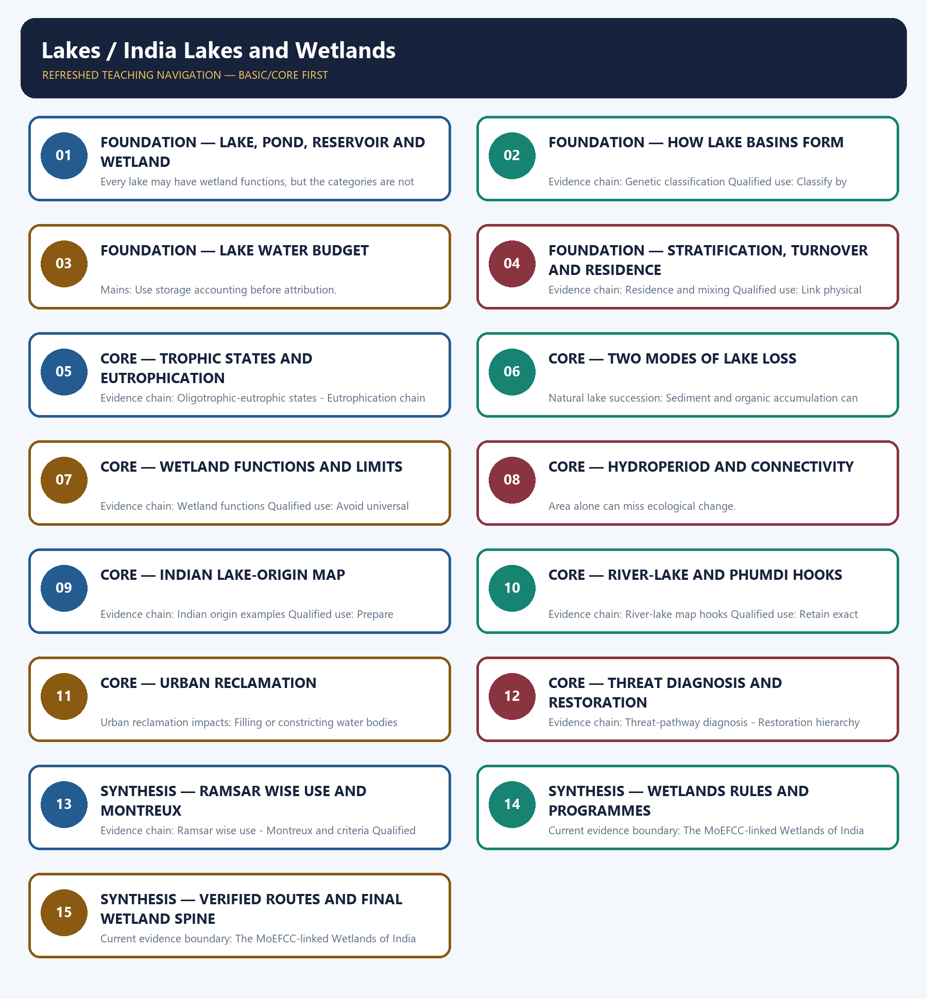

# Lakes / India Lakes and Wetlands — Learner-v2 Complete Learning Session

> **Authoring-only generation:** 2026-09-01. No PDF was rendered and no tracker or index was mutated.

### SOURCE, PROGRESSION AND CURRENT-LINKAGE AUDIT

- **Generation date:** 2026-09-01.
- **Repository-first evidence:** the Basic owner is taught first and preserved in full; the Advanced owner is retained only in the optional final teaching block.
- **OCR evidence:** Repository Markdown was primary. The three required local Geography books were inspected as supplementary OCR/searchable evidence. No unsupported page precision, volatile figure or quotation was imported.
- **Qdrant:** not used; repository Markdown and available OCR context were sufficient.
- **PYQ integrity:** Verified routing retains direct Geography objective routes from 2018, 2019, 2021 and 2023 plus a provisional 2026 Lake Turkana route. The 2021 urban-water-body Mains demand is routed to Environment and Ecology and is not claimed as a direct Geography PYQ.
- **Live-link boundary:** The MoEFCC-linked Wetlands of India portal was directly fetched and describes itself as a dynamic national knowledge repository. The Ramsar country profile returned 403 during the fresh check, so this package does not upgrade or restate a latest count or site-status claim.
- **Fact/inference discipline:** no current-affairs item, PYQ wording, figure or quotation is invented.

## BASIC LEARNING SESSION



*Distinct embedded teaching-navigation image. The separate continuous Cārvāka-style flowchart package remains an independent at-a-glance artifact.*

### SESSION 1 — FOUNDATION — LAKE, POND, RESERVOIR AND WETLAND

#### DEFINITION / WHAT THIS IS CALLED

**Plain-language definition:** Lake-wetland boundary: A lake is standing water in an inland basin, while wetland is a broader hydro-ecological category including marshes, floodplains, peatlands, mangroves and shallow coastal waters.

**Technical definition:** Every lake may have wetland functions, but the categories are not identical.

#### ANSWER-GRABBING OPENING — WRITE/ADAPT IN THE EXAM

> Lake-wetland boundary: A lake is standing water in an inland basin, while wetland is a broader hydro-ecological category including marshes, floodplains, peatlands, mangroves and shallow coastal waters.

#### MUST-WRITE KEYWORDS

- **FOUNDATION**
- **Lake**
- **pond**
- **reservoir**
- **wetland**
- **Lake-wetland boundary**

**How to use them:** Frame the answer through FOUNDATION; define Lake, connect pond with reservoir to explain the mechanism, and use wetland for the decisive comparison or qualification.

#### VISUAL FIRST

```text
LAKE, POND, RESERVOIR AND WETLAND
01. Lake-wetland boundary
BOUNDARY -> Every lake may have wetland functions, but the categories are not identical.
```

*This topic-specific rail fixes the evidence sequence and its exam boundary before analysis.*

#### CORE EXPLANATION

A lake is standing water in an inland basin, while wetland is a broader hydro-ecological category including marshes, floodplains, peatlands, mangroves and shallow coastal waters.

#### NAMED EVIDENCE AND MECHANISM

- **Lake-wetland boundary:** A lake is standing water in an inland basin, while wetland is a broader hydro-ecological category including marshes, floodplains, peatlands, mangroves and shallow coastal waters.

#### EXAMINER CAUTION

- Every lake may have wetland functions, but the categories are not identical.

#### EXAM LINK

- **Prelims:** Separate the agent, landform, location, status and scale attached to Lake, pond, reservoir and wetland.
- **Mains:** Build a definition-first answer.

#### MINI RECAP

- **Evidence chain:** Lake-wetland boundary
- **Qualified use:** Build a definition-first answer.

#### CLOSING RECALL FLOW — FOUNDATION — LAKE, POND, RESERVOIR AND WETLAND

```text
START / CONCEPT: FOUNDATION — Lake, pond, reservoir and wetland
        |
        v
EXACT TERMS: FOUNDATION · Lake · pond · reservoir · wetland · Lake-wetland boundary
        |
        v
MECHANISM / ARGUMENT: Every lake may have wetland functions, but the categories are not identical.
        |
        v
CONSEQUENCE / CONTRAST: Evidence chain: Lake-wetland boundary Qualified use: Build a definition-first answer.
        |
        v
UPSC TRAP / ANSWER-USE: Do not miss this limiting distinction: a lake is standing water in an inland basin.
        |
        v
ANSWER-GRABBING FORMULATION: Lake-wetland boundary: A lake is standing water in an inland basin, while wetland is a broader hydro-ecological category including marshes, floodplains, peatlands, mangroves and shallow coastal waters.
```
### SESSION 2 — FOUNDATION — HOW LAKE BASINS FORM

#### DEFINITION / WHAT THIS IS CALLED

**Plain-language definition:** Genetic classification: Lake origin can be tectonic, glacial, volcanic, fluvial, coastal, solutional, impact, aeolian, landslide-dammed or artificial; mixed controls require qualification.

**Technical definition:** Evidence chain: Genetic classification Qualified use: Classify by dominant genetic process.

#### ANSWER-GRABBING OPENING — WRITE/ADAPT IN THE EXAM

> Genetic classification: Lake origin can be tectonic, glacial, volcanic, fluvial, coastal, solutional, impact, aeolian, landslide-dammed or artificial; mixed controls require qualification.

#### MUST-WRITE KEYWORDS

- **FOUNDATION**
- **How lake basins form**
- **Genetic classification**
- **Evidence chain**
- **Qualified use**
- **Lake**

**How to use them:** Frame the answer through FOUNDATION; define How lake basins form, connect Genetic classification with Evidence chain to explain the mechanism, and use Qualified use for the decisive comparison or qualification.

#### VISUAL FIRST

```text
HOW LAKE BASINS FORM
01. Genetic classification
BOUNDARY -> Mixed origin and later modification are common.
```

*This topic-specific rail fixes the evidence sequence and its exam boundary before analysis.*

#### CORE EXPLANATION

Lake origin can be tectonic, glacial, volcanic, fluvial, coastal, solutional, impact, aeolian, landslide-dammed or artificial; mixed controls require qualification.

#### NAMED EVIDENCE AND MECHANISM

- **Genetic classification:** Lake origin can be tectonic, glacial, volcanic, fluvial, coastal, solutional, impact, aeolian, landslide-dammed or artificial; mixed controls require qualification.

#### EXAMINER CAUTION

- Mixed origin and later modification are common.

#### EXAM LINK

- **Prelims:** Separate the agent, landform, location, status and scale attached to How lake basins form.
- **Mains:** Classify by dominant genetic process.

#### MINI RECAP

- **Evidence chain:** Genetic classification
- **Qualified use:** Classify by dominant genetic process.

#### CLOSING RECALL FLOW — FOUNDATION — HOW LAKE BASINS FORM

```text
START / CONCEPT: FOUNDATION — How lake basins form
        |
        v
EXACT TERMS: FOUNDATION · How lake basins form · Genetic classification · Evidence chain · Qualified use · Lake
        |
        v
MECHANISM / ARGUMENT: Evidence chain: Genetic classification Qualified use: Classify by dominant genetic process.
        |
        v
CONSEQUENCE / CONTRAST: Mixed origin and later modification are common.
        |
        v
UPSC TRAP / ANSWER-USE: Do not miss this limiting distinction: lake origin can be tectonic, glacial, volcanic, fluvial, coastal, solutional, impact, aeolian, landslide-dammed or...
        |
        v
ANSWER-GRABBING FORMULATION: Genetic classification: Lake origin can be tectonic, glacial, volcanic, fluvial, coastal, solutional, impact, aeolian, landslide-dammed or artificial; mixed controls require qualification.
```
### SESSION 3 — FOUNDATION — LAKE WATER BUDGET

#### DEFINITION / WHAT THIS IS CALLED

**Plain-language definition:** Evidence chain: Water-budget equation Qualified use: Use storage accounting before attribution.

**Technical definition:** Mains: Use storage accounting before attribution.

#### ANSWER-GRABBING OPENING — WRITE/ADAPT IN THE EXAM

> Evidence chain: Water-budget equation Qualified use: Use storage accounting before attribution.

#### MUST-WRITE KEYWORDS

- **FOUNDATION**
- **Lake water budget**
- **Water-budget equation**
- **Evidence chain**
- **Qualified use**
- **Water-budget**

**How to use them:** Frame the answer through FOUNDATION; define Lake water budget, connect Water-budget equation with Evidence chain to explain the mechanism, and use Qualified use for the decisive comparison or qualification.

#### VISUAL FIRST

```text
LAKE WATER BUDGET
01. Water-budget equation
BOUNDARY -> A level trend needs a stated period and complete inputs and outputs.
```

*This topic-specific rail fixes the evidence sequence and its exam boundary before analysis.*

#### CORE EXPLANATION

Lake storage changes with precipitation, inflow and groundwater inputs minus evaporation, outflow and seepage; level change cannot be assigned to one driver without a budget.

#### NAMED EVIDENCE AND MECHANISM

- **Water-budget equation:** Lake storage changes with precipitation, inflow and groundwater inputs minus evaporation, outflow and seepage; level change cannot be assigned to one driver without a budget.

#### EXAMINER CAUTION

- A level trend needs a stated period and complete inputs and outputs.

#### EXAM LINK

- **Prelims:** Separate the agent, landform, location, status and scale attached to Lake water budget.
- **Mains:** Use storage accounting before attribution.

#### MINI RECAP

- **Evidence chain:** Water-budget equation
- **Qualified use:** Use storage accounting before attribution.

#### CLOSING RECALL FLOW — FOUNDATION — LAKE WATER BUDGET

```text
START / CONCEPT: FOUNDATION — Lake water budget
        |
        v
EXACT TERMS: FOUNDATION · Lake water budget · Water-budget equation · Evidence chain · Qualified use · Water-budget
        |
        v
MECHANISM / ARGUMENT: Mains: Use storage accounting before attribution.
        |
        v
CONSEQUENCE / CONTRAST: The resulting consequence is that evidence chain: Water-budget equation Qualified use: Use storage accounting before attribution.
        |
        v
UPSC TRAP / ANSWER-USE: Do not miss this limiting distinction: evidence chain: Water-budget equation Qualified use: Use storage accounting before attribution.
        |
        v
ANSWER-GRABBING FORMULATION: Evidence chain: Water-budget equation Qualified use: Use storage accounting before attribution.
```
### SESSION 4 — FOUNDATION — STRATIFICATION, TURNOVER AND RESIDENCE

#### DEFINITION / WHAT THIS IS CALLED

**Plain-language definition:** Residence and mixing: Depth, area, residence time, temperature, wind and inflow density influence stratification and turnover; tropical and shallow lakes need not follow a simple temperate seasonal model.

**Technical definition:** Evidence chain: Residence and mixing Qualified use: Link physical limnology to oxygen and nutrients.

#### ANSWER-GRABBING OPENING — WRITE/ADAPT IN THE EXAM

> Residence and mixing: Depth, area, residence time, temperature, wind and inflow density influence stratification and turnover; tropical and shallow lakes need not follow a simple temperate seasonal model.

#### MUST-WRITE KEYWORDS

- **FOUNDATION**
- **Stratification**
- **turnover**
- **residence**
- **Residence and mixing**
- **Evidence chain**

**How to use them:** Frame the answer through FOUNDATION; define Stratification, connect turnover with residence to explain the mechanism, and use Residence and mixing for the decisive comparison or qualification.

#### VISUAL FIRST

```text
STRATIFICATION, TURNOVER AND RESIDENCE
01. Residence and mixing
BOUNDARY -> Temperate textbook cycles are not universal.
```

*This topic-specific rail fixes the evidence sequence and its exam boundary before analysis.*

#### CORE EXPLANATION

Depth, area, residence time, temperature, wind and inflow density influence stratification and turnover; tropical and shallow lakes need not follow a simple temperate seasonal model.

#### NAMED EVIDENCE AND MECHANISM

- **Residence and mixing:** Depth, area, residence time, temperature, wind and inflow density influence stratification and turnover; tropical and shallow lakes need not follow a simple temperate seasonal model.

#### EXAMINER CAUTION

- Temperate textbook cycles are not universal.

#### EXAM LINK

- **Prelims:** Separate the agent, landform, location, status and scale attached to Stratification, turnover and residence.
- **Mains:** Link physical limnology to oxygen and nutrients.

#### MINI RECAP

- **Evidence chain:** Residence and mixing
- **Qualified use:** Link physical limnology to oxygen and nutrients.

#### CLOSING RECALL FLOW — FOUNDATION — STRATIFICATION, TURNOVER AND RESIDENCE

```text
START / CONCEPT: FOUNDATION — Stratification, turnover and residence
        |
        v
EXACT TERMS: FOUNDATION · Stratification · turnover · residence · Residence and mixing · Evidence chain
        |
        v
MECHANISM / ARGUMENT: Evidence chain: Residence and mixing Qualified use: Link physical limnology to oxygen and nutrients.
        |
        v
CONSEQUENCE / CONTRAST: Temperate textbook cycles are not universal.
        |
        v
UPSC TRAP / ANSWER-USE: Do not miss this limiting distinction: depth, area, residence time, temperature, wind and inflow density influence stratification and turnover.
        |
        v
ANSWER-GRABBING FORMULATION: Residence and mixing: Depth, area, residence time, temperature, wind and inflow density influence stratification and turnover; tropical and shallow lakes need not follow a simple temperate seasonal model.
```
### SESSION 5 — CORE — TROPHIC STATES AND EUTROPHICATION

#### DEFINITION / WHAT THIS IS CALLED

**Plain-language definition:** Oligotrophic-eutrophic states: Oligotrophic lakes are relatively nutrient-poor and clear, while eutrophic systems are nutrient-rich and productive; trophic state is condition, not basin origin or legal status.

**Technical definition:** Evidence chain: Oligotrophic-eutrophic states - Eutrophication chain Qualified use: Explain nutrient-to-oxygen causation.

#### ANSWER-GRABBING OPENING — WRITE/ADAPT IN THE EXAM

> Evidence chain: Oligotrophic-eutrophic states - Eutrophication chain Qualified use: Explain nutrient-to-oxygen causation.

#### MUST-WRITE KEYWORDS

- **Trophic states**
- **eutrophication**
- **Oligotrophic-eutrophic states**
- **Eutrophication chain**
- **Evidence chain**
- **Qualified use**

**How to use them:** Frame the answer through Trophic states; define eutrophication, connect Oligotrophic-eutrophic states with Eutrophication chain to explain the mechanism, and use Evidence chain for the decisive comparison or qualification.

#### VISUAL FIRST

```text
TROPHIC STATES AND EUTROPHICATION
01. Oligotrophic-eutrophic states
    |
    v
02. Eutrophication chain
BOUNDARY -> Trophic state is neither lake origin nor conservation status.
```

*This topic-specific rail fixes the evidence sequence and its exam boundary before analysis.*

#### CORE EXPLANATION

Oligotrophic lakes are relatively nutrient-poor and clear, while eutrophic systems are nutrient-rich and productive; trophic state is condition, not basin origin or legal status. Nutrient loading can drive algal growth, reduced light, decomposition and oxygen depletion; internal loading, flushing and food-web responses complicate recovery.

#### NAMED EVIDENCE AND MECHANISM

- **Oligotrophic-eutrophic states:** Oligotrophic lakes are relatively nutrient-poor and clear, while eutrophic systems are nutrient-rich and productive; trophic state is condition, not basin origin or legal status.
- **Eutrophication chain:** Nutrient loading can drive algal growth, reduced light, decomposition and oxygen depletion; internal loading, flushing and food-web responses complicate recovery.

#### EXAMINER CAUTION

- Trophic state is neither lake origin nor conservation status.

#### EXAM LINK

- **Prelims:** Separate the agent, landform, location, status and scale attached to Trophic states and eutrophication.
- **Mains:** Explain nutrient-to-oxygen causation.

#### MINI RECAP

- **Evidence chain:** Oligotrophic-eutrophic states -> Eutrophication chain
- **Qualified use:** Explain nutrient-to-oxygen causation.

#### CLOSING RECALL FLOW — CORE — TROPHIC STATES AND EUTROPHICATION

```text
START / CONCEPT: CORE — Trophic states and eutrophication
        |
        v
EXACT TERMS: Trophic states · eutrophication · Oligotrophic-eutrophic states · Eutrophication chain · Evidence chain · Qualified use
        |
        v
MECHANISM / ARGUMENT: Eutrophication chain: Nutrient loading can drive algal growth, reduced light, decomposition and oxygen depletion; internal loading, flushing and food-web responses complicate recovery.
        |
        v
CONSEQUENCE / CONTRAST: Oligotrophic-eutrophic states: Oligotrophic lakes are relatively nutrient-poor and clear, while eutrophic systems are nutrient-rich and productive; trophic state is condition, not basin origin or legal status.
        |
        v
UPSC TRAP / ANSWER-USE: Do not miss this limiting distinction: trophic state is neither lake origin nor conservation status.
        |
        v
ANSWER-GRABBING FORMULATION: Evidence chain: Oligotrophic-eutrophic states - Eutrophication chain Qualified use: Explain nutrient-to-oxygen causation.
```
### SESSION 6 — CORE — TWO MODES OF LAKE LOSS

#### DEFINITION / WHAT THIS IS CALLED

**Plain-language definition:** Evidence chain: Natural lake succession - Human-induced shrinkage Qualified use: Compare infilling with water-budget failure.

**Technical definition:** Natural lake succession: Sediment and organic accumulation can gradually make lakes shallower and convert open water to marsh or terrestrial habitat; this differs from rapid water-budget collapse.

#### ANSWER-GRABBING OPENING — WRITE/ADAPT IN THE EXAM

> Evidence chain: Natural lake succession - Human-induced shrinkage Qualified use: Compare infilling with water-budget failure.

#### MUST-WRITE KEYWORDS

- **Two modes of lake loss**
- **Natural lake succession**
- **Human-induced shrinkage**
- **Evidence chain**
- **Qualified use**
- **Sediment**

**How to use them:** Frame the answer through Two modes of lake loss; define Natural lake succession, connect Human-induced shrinkage with Evidence chain to explain the mechanism, and use Qualified use for the decisive comparison or qualification.

#### VISUAL FIRST

```text
TWO MODES OF LAKE LOSS
01. Natural lake succession
    |
    v
02. Human-induced shrinkage
BOUNDARY -> Slow succession and rapid shrinkage need different evidence.
```

*This topic-specific rail fixes the evidence sequence and its exam boundary before analysis.*

#### CORE EXPLANATION

Sediment and organic accumulation can gradually make lakes shallower and convert open water to marsh or terrestrial habitat; this differs from rapid water-budget collapse. Diversion, damming, groundwater extraction, catchment change and warming-driven evaporation can shrink lakes; Aral Sea and Lake Chad illustrate different combinations and trajectories.

#### NAMED EVIDENCE AND MECHANISM

- **Natural lake succession:** Sediment and organic accumulation can gradually make lakes shallower and convert open water to marsh or terrestrial habitat; this differs from rapid water-budget collapse.
- **Human-induced shrinkage:** Diversion, damming, groundwater extraction, catchment change and warming-driven evaporation can shrink lakes; Aral Sea and Lake Chad illustrate different combinations and trajectories.

#### EXAMINER CAUTION

- Slow succession and rapid shrinkage need different evidence.

#### EXAM LINK

- **Prelims:** Separate the agent, landform, location, status and scale attached to Two modes of lake loss.
- **Mains:** Compare infilling with water-budget failure.

#### MINI RECAP

- **Evidence chain:** Natural lake succession -> Human-induced shrinkage
- **Qualified use:** Compare infilling with water-budget failure.

#### CLOSING RECALL FLOW — CORE — TWO MODES OF LAKE LOSS

```text
START / CONCEPT: CORE — Two modes of lake loss
        |
        v
EXACT TERMS: Two modes of lake loss · Natural lake succession · Human-induced shrinkage · Evidence chain · Qualified use · Sediment
        |
        v
MECHANISM / ARGUMENT: Natural lake succession: Sediment and organic accumulation can gradually make lakes shallower and convert open water to marsh or terrestrial habitat; this differs from rapid water-budget collapse.
        |
        v
CONSEQUENCE / CONTRAST: Human-induced shrinkage: Diversion, damming, groundwater extraction, catchment change and warming-driven evaporation can shrink lakes; Aral Sea and Lake Chad illustrate different combinations and trajectories.
        |
        v
UPSC TRAP / ANSWER-USE: Do not miss this limiting distinction: natural lake succession - Human-induced shrinkage Qualified use.
        |
        v
ANSWER-GRABBING FORMULATION: Evidence chain: Natural lake succession - Human-induced shrinkage Qualified use: Compare infilling with water-budget failure.
```
### SESSION 7 — CORE — WETLAND FUNCTIONS AND LIMITS

#### DEFINITION / WHAT THIS IS CALLED

**Plain-language definition:** Wetland functions: Wetlands store and slow water, trap sediment and nutrients, support biodiversity and livelihoods and sometimes recharge or discharge groundwater; every function is site and connectivity dependent.

**Technical definition:** Evidence chain: Wetland functions Qualified use: Avoid universal service claims.

#### ANSWER-GRABBING OPENING — WRITE/ADAPT IN THE EXAM

> Wetland functions: Wetlands store and slow water, trap sediment and nutrients, support biodiversity and livelihoods and sometimes recharge or discharge groundwater; every function is site and connectivity dependent.

#### MUST-WRITE KEYWORDS

- **Wetland functions**
- **limits**
- **Evidence chain**
- **Qualified use**
- **Wetlands**
- **Wetland**

**How to use them:** Frame the answer through Wetland functions; define limits, connect Evidence chain with Qualified use to explain the mechanism, and use Wetlands for the decisive comparison or qualification.

#### VISUAL FIRST

```text
WETLAND FUNCTIONS AND LIMITS
01. Wetland functions
BOUNDARY -> Function depends on hydroperiod, soils, connectivity and condition.
```

*This topic-specific rail fixes the evidence sequence and its exam boundary before analysis.*

#### CORE EXPLANATION

Wetlands store and slow water, trap sediment and nutrients, support biodiversity and livelihoods and sometimes recharge or discharge groundwater; every function is site and connectivity dependent.

#### NAMED EVIDENCE AND MECHANISM

- **Wetland functions:** Wetlands store and slow water, trap sediment and nutrients, support biodiversity and livelihoods and sometimes recharge or discharge groundwater; every function is site and connectivity dependent.

#### EXAMINER CAUTION

- Function depends on hydroperiod, soils, connectivity and condition.

#### EXAM LINK

- **Prelims:** Separate the agent, landform, location, status and scale attached to Wetland functions and limits.
- **Mains:** Avoid universal service claims.

#### MINI RECAP

- **Evidence chain:** Wetland functions
- **Qualified use:** Avoid universal service claims.

#### CLOSING RECALL FLOW — CORE — WETLAND FUNCTIONS AND LIMITS

```text
START / CONCEPT: CORE — Wetland functions and limits
        |
        v
EXACT TERMS: Wetland functions · limits · Evidence chain · Qualified use · Wetlands · Wetland
        |
        v
MECHANISM / ARGUMENT: Evidence chain: Wetland functions Qualified use: Avoid universal service claims.
        |
        v
CONSEQUENCE / CONTRAST: Function depends on hydroperiod, soils, connectivity and condition.
        |
        v
UPSC TRAP / ANSWER-USE: Do not miss this limiting distinction: evidence chain: Wetland functions Qualified use: Avoid universal service claims.
        |
        v
ANSWER-GRABBING FORMULATION: Wetland functions: Wetlands store and slow water, trap sediment and nutrients, support biodiversity and livelihoods and sometimes recharge or discharge groundwater; every function is site and connectivity dependent.
```
### SESSION 8 — CORE — HYDROPERIOD AND CONNECTIVITY

#### DEFINITION / WHAT THIS IS CALLED

**Plain-language definition:** Evidence chain: Hydroperiod and connectivity Qualified use: Use timing, depth, duration and connection.

**Technical definition:** Area alone can miss ecological change.

#### ANSWER-GRABBING OPENING — WRITE/ADAPT IN THE EXAM

> Evidence chain: Hydroperiod and connectivity Qualified use: Use timing, depth, duration and connection.

#### MUST-WRITE KEYWORDS

- **Hydroperiod**
- **connectivity**
- **Hydroperiod and connectivity**
- **Evidence chain**
- **Qualified use**
- **Area**

**How to use them:** Frame the answer through Hydroperiod; define connectivity, connect Hydroperiod and connectivity with Evidence chain to explain the mechanism, and use Qualified use for the decisive comparison or qualification.

#### VISUAL FIRST

```text
HYDROPERIOD AND CONNECTIVITY
01. Hydroperiod and connectivity
BOUNDARY -> Area alone can miss ecological change.
```

*This topic-specific rail fixes the evidence sequence and its exam boundary before analysis.*

#### CORE EXPLANATION

Duration, depth, timing and frequency of inundation plus river, groundwater and coastal connections control ecological character more precisely than the label wetland alone.

#### NAMED EVIDENCE AND MECHANISM

- **Hydroperiod and connectivity:** Duration, depth, timing and frequency of inundation plus river, groundwater and coastal connections control ecological character more precisely than the label wetland alone.

#### EXAMINER CAUTION

- Area alone can miss ecological change.

#### EXAM LINK

- **Prelims:** Separate the agent, landform, location, status and scale attached to Hydroperiod and connectivity.
- **Mains:** Use timing, depth, duration and connection.

#### MINI RECAP

- **Evidence chain:** Hydroperiod and connectivity
- **Qualified use:** Use timing, depth, duration and connection.

#### CLOSING RECALL FLOW — CORE — HYDROPERIOD AND CONNECTIVITY

```text
START / CONCEPT: CORE — Hydroperiod and connectivity
        |
        v
EXACT TERMS: Hydroperiod · connectivity · Hydroperiod and connectivity · Evidence chain · Qualified use · Area
        |
        v
MECHANISM / ARGUMENT: Area alone can miss ecological change.
        |
        v
CONSEQUENCE / CONTRAST: Mains: Use timing, depth, duration and connection.
        |
        v
UPSC TRAP / ANSWER-USE: Do not miss this limiting distinction: use timing, depth, duration and connection.
        |
        v
ANSWER-GRABBING FORMULATION: Evidence chain: Hydroperiod and connectivity Qualified use: Use timing, depth, duration and connection.
```
### SESSION 9 — CORE — INDIAN LAKE-ORIGIN MAP

#### DEFINITION / WHAT THIS IS CALLED

**Plain-language definition:** Indian origin examples: Wular is tectonic-influenced, Lonar impact-origin, Kanwar or Kabar Tal fluvial-floodplain, Chilika lagoonal, Sambhar saline inland and Bhoj an artificial reservoir system.

**Technical definition:** Evidence chain: Indian origin examples Qualified use: Prepare map-based prelims elimination.

#### ANSWER-GRABBING OPENING — WRITE/ADAPT IN THE EXAM

> Indian origin examples: Wular is tectonic-influenced, Lonar impact-origin, Kanwar or Kabar Tal fluvial-floodplain, Chilika lagoonal, Sambhar saline inland and Bhoj an artificial reservoir system.

#### MUST-WRITE KEYWORDS

- **Indian lake-origin map**
- **Indian origin examples**
- **Evidence chain**
- **Qualified use**
- **Wular**
- **Lonar**

**How to use them:** Frame the answer through Indian lake-origin map; define Indian origin examples, connect Evidence chain with Qualified use to explain the mechanism, and use Wular for the decisive comparison or qualification.

#### VISUAL FIRST

```text
INDIAN LAKE-ORIGIN MAP
01. Indian origin examples
BOUNDARY -> Named examples must match both place and genesis.
```

*This topic-specific rail fixes the evidence sequence and its exam boundary before analysis.*

#### CORE EXPLANATION

Wular is tectonic-influenced, Lonar impact-origin, Kanwar or Kabar Tal fluvial-floodplain, Chilika lagoonal, Sambhar saline inland and Bhoj an artificial reservoir system.

#### NAMED EVIDENCE AND MECHANISM

- **Indian origin examples:** Wular is tectonic-influenced, Lonar impact-origin, Kanwar or Kabar Tal fluvial-floodplain, Chilika lagoonal, Sambhar saline inland and Bhoj an artificial reservoir system.

#### EXAMINER CAUTION

- Named examples must match both place and genesis.

#### EXAM LINK

- **Prelims:** Separate the agent, landform, location, status and scale attached to Indian lake-origin map.
- **Mains:** Prepare map-based prelims elimination.

#### MINI RECAP

- **Evidence chain:** Indian origin examples
- **Qualified use:** Prepare map-based prelims elimination.

#### CLOSING RECALL FLOW — CORE — INDIAN LAKE-ORIGIN MAP

```text
START / CONCEPT: CORE — Indian lake-origin map
        |
        v
EXACT TERMS: Indian lake-origin map · Indian origin examples · Evidence chain · Qualified use · Wular · Lonar
        |
        v
MECHANISM / ARGUMENT: Evidence chain: Indian origin examples Qualified use: Prepare map-based prelims elimination.
        |
        v
CONSEQUENCE / CONTRAST: Named examples must match both place and genesis.
        |
        v
UPSC TRAP / ANSWER-USE: Do not miss this limiting distinction: wular is tectonic-influenced, Lonar impact-origin, Kanwar or Kabar Tal fluvial-floodplain, Chilika lagoonal, Sambhar saline...
        |
        v
ANSWER-GRABBING FORMULATION: Indian origin examples: Wular is tectonic-influenced, Lonar impact-origin, Kanwar or Kabar Tal fluvial-floodplain, Chilika lagoonal, Sambhar saline inland and Bhoj an artificial reservoir system.
```
### SESSION 10 — CORE — RIVER-LAKE AND PHUMDI HOOKS

#### DEFINITION / WHAT THIS IS CALLED

**Plain-language definition:** River-lake map hooks: Wular is linked to the Jhelum, Kolleru lies between the Krishna and Godavari delta systems but is not directly fed by the Krishna, and Loktak's phumdis are distinctive floating biomass-soil masses.

**Technical definition:** Evidence chain: River-lake map hooks Qualified use: Retain exact Indian spatial relations.

#### ANSWER-GRABBING OPENING — WRITE/ADAPT IN THE EXAM

> River-lake map hooks: Wular is linked to the Jhelum, Kolleru lies between the Krishna and Godavari delta systems but is not directly fed by the Krishna, and Loktak's phumdis are distinctive floating biomass-soil masses.

#### MUST-WRITE KEYWORDS

- **River-lake**
- **phumdi hooks**
- **River-lake map hooks**
- **Evidence chain**
- **Qualified use**
- **Wular**

**How to use them:** Frame the answer through River-lake; define phumdi hooks, connect River-lake map hooks with Evidence chain to explain the mechanism, and use Qualified use for the decisive comparison or qualification.

#### VISUAL FIRST

```text
RIVER-LAKE AND PHUMDI HOOKS
01. River-lake map hooks
BOUNDARY -> Between two deltas does not mean direct river feeding.
```

*This topic-specific rail fixes the evidence sequence and its exam boundary before analysis.*

#### CORE EXPLANATION

Wular is linked to the Jhelum, Kolleru lies between the Krishna and Godavari delta systems but is not directly fed by the Krishna, and Loktak's phumdis are distinctive floating biomass-soil masses.

#### NAMED EVIDENCE AND MECHANISM

- **River-lake map hooks:** Wular is linked to the Jhelum, Kolleru lies between the Krishna and Godavari delta systems but is not directly fed by the Krishna, and Loktak's phumdis are distinctive floating biomass-soil masses.

#### EXAMINER CAUTION

- Between two deltas does not mean direct river feeding.

#### EXAM LINK

- **Prelims:** Separate the agent, landform, location, status and scale attached to River-lake and phumdi hooks.
- **Mains:** Retain exact Indian spatial relations.

#### MINI RECAP

- **Evidence chain:** River-lake map hooks
- **Qualified use:** Retain exact Indian spatial relations.

#### CLOSING RECALL FLOW — CORE — RIVER-LAKE AND PHUMDI HOOKS

```text
START / CONCEPT: CORE — River-lake and phumdi hooks
        |
        v
EXACT TERMS: River-lake · phumdi hooks · River-lake map hooks · Evidence chain · Qualified use · Wular
        |
        v
MECHANISM / ARGUMENT: Evidence chain: River-lake map hooks Qualified use: Retain exact Indian spatial relations.
        |
        v
CONSEQUENCE / CONTRAST: Between two deltas does not mean direct river feeding.
        |
        v
UPSC TRAP / ANSWER-USE: Do not miss this limiting distinction: wular is linked to the Jhelum, Kolleru lies between the Krishna and Godavari delta...
        |
        v
ANSWER-GRABBING FORMULATION: River-lake map hooks: Wular is linked to the Jhelum, Kolleru lies between the Krishna and Godavari delta systems but is not directly fed by the Krishna, and Loktak's phumdis are distinctive floating biomass-soil masses.
```
### SESSION 11 — CORE — URBAN RECLAMATION

#### DEFINITION / WHAT THIS IS CALLED

**Plain-language definition:** Evidence chain: Urban reclamation impacts Qualified use: Prepare the 2021 GS-I route.

**Technical definition:** Urban reclamation impacts: Filling or constricting water bodies removes storage and drainage space, fragments habitat, worsens flood peaks and water quality and can shift risk toward poorer low-lying communities.

#### ANSWER-GRABBING OPENING — WRITE/ADAPT IN THE EXAM

> Evidence chain: Urban reclamation impacts Qualified use: Prepare the 2021 GS-I route.

#### MUST-WRITE KEYWORDS

- **Urban reclamation**
- **Urban reclamation impacts**
- **Evidence chain**
- **Qualified use**
- **Filling**
- **Urban**

**How to use them:** Frame the answer through Urban reclamation; define Urban reclamation impacts, connect Evidence chain with Qualified use to explain the mechanism, and use Filling for the decisive comparison or qualification.

#### VISUAL FIRST

```text
URBAN RECLAMATION
01. Urban reclamation impacts
BOUNDARY -> A water body is drainage infrastructure and habitat, not vacant land.
```

*This topic-specific rail fixes the evidence sequence and its exam boundary before analysis.*

#### CORE EXPLANATION

Filling or constricting water bodies removes storage and drainage space, fragments habitat, worsens flood peaks and water quality and can shift risk toward poorer low-lying communities.

#### NAMED EVIDENCE AND MECHANISM

- **Urban reclamation impacts:** Filling or constricting water bodies removes storage and drainage space, fragments habitat, worsens flood peaks and water quality and can shift risk toward poorer low-lying communities.

#### EXAMINER CAUTION

- A water body is drainage infrastructure and habitat, not vacant land.

#### EXAM LINK

- **Prelims:** Separate the agent, landform, location, status and scale attached to Urban reclamation.
- **Mains:** Prepare the 2021 GS-I route.

#### MINI RECAP

- **Evidence chain:** Urban reclamation impacts
- **Qualified use:** Prepare the 2021 GS-I route.

#### CLOSING RECALL FLOW — CORE — URBAN RECLAMATION

```text
START / CONCEPT: CORE — Urban reclamation
        |
        v
EXACT TERMS: Urban reclamation · Urban reclamation impacts · Evidence chain · Qualified use · Filling · Urban
        |
        v
MECHANISM / ARGUMENT: Urban reclamation impacts: Filling or constricting water bodies removes storage and drainage space, fragments habitat, worsens flood peaks and water quality and can shift risk toward poorer low-lying communities.
        |
        v
CONSEQUENCE / CONTRAST: A water body is drainage infrastructure and habitat, not vacant land.
        |
        v
UPSC TRAP / ANSWER-USE: Do not miss this limiting distinction: evidence chain: Urban reclamation impacts Qualified use: Prepare the 2021 GS-I route.
        |
        v
ANSWER-GRABBING FORMULATION: Evidence chain: Urban reclamation impacts Qualified use: Prepare the 2021 GS-I route.
```
### SESSION 12 — CORE — THREAT DIAGNOSIS AND RESTORATION

#### DEFINITION / WHAT THIS IS CALLED

**Plain-language definition:** Beautification without source control is not ecological restoration.

**Technical definition:** Evidence chain: Threat-pathway diagnosis - Restoration hierarchy Qualified use: Match mechanism, intervention and indicator.

#### ANSWER-GRABBING OPENING — WRITE/ADAPT IN THE EXAM

> Evidence chain: Threat-pathway diagnosis - Restoration hierarchy Qualified use: Match mechanism, intervention and indicator.

#### MUST-WRITE KEYWORDS

- **Threat diagnosis**
- **restoration**
- **Threat-pathway diagnosis**
- **Restoration hierarchy**
- **Evidence chain**
- **Qualified use**

**How to use them:** Frame the answer through Threat diagnosis; define restoration, connect Threat-pathway diagnosis with Restoration hierarchy to explain the mechanism, and use Evidence chain for the decisive comparison or qualification.

#### VISUAL FIRST

```text
THREAT DIAGNOSIS AND RESTORATION
01. Threat-pathway diagnosis
    |
    v
02. Restoration hierarchy
BOUNDARY -> Beautification without source control is not ecological restoration.
```

*This topic-specific rail fixes the evidence sequence and its exam boundary before analysis.*

#### CORE EXPLANATION

Catchment sewage, nutrients, sediment, encroachment, invasive species, altered inflow, extraction and shoreline hardening act through different mechanisms and require different remedies. Protect catchment and inflow, stop pollution and encroachment, restore hydrological connectivity, manage sediment and invasives, then monitor ecological response rather than beautification alone.

#### NAMED EVIDENCE AND MECHANISM

- **Threat-pathway diagnosis:** Catchment sewage, nutrients, sediment, encroachment, invasive species, altered inflow, extraction and shoreline hardening act through different mechanisms and require different remedies.
- **Restoration hierarchy:** Protect catchment and inflow, stop pollution and encroachment, restore hydrological connectivity, manage sediment and invasives, then monitor ecological response rather than beautification alone.

#### EXAMINER CAUTION

- Beautification without source control is not ecological restoration.

#### EXAM LINK

- **Prelims:** Separate the agent, landform, location, status and scale attached to Threat diagnosis and restoration.
- **Mains:** Match mechanism, intervention and indicator.

#### MINI RECAP

- **Evidence chain:** Threat-pathway diagnosis -> Restoration hierarchy
- **Qualified use:** Match mechanism, intervention and indicator.

#### CLOSING RECALL FLOW — CORE — THREAT DIAGNOSIS AND RESTORATION

```text
START / CONCEPT: CORE — Threat diagnosis and restoration
        |
        v
EXACT TERMS: Threat diagnosis · restoration · Threat-pathway diagnosis · Restoration hierarchy · Evidence chain · Qualified use
        |
        v
MECHANISM / ARGUMENT: Beautification without source control is not ecological restoration.
        |
        v
CONSEQUENCE / CONTRAST: The resulting consequence is that threat-pathway diagnosis - Restoration hierarchy Qualified use.
        |
        v
UPSC TRAP / ANSWER-USE: Do not miss this limiting distinction: threat-pathway diagnosis - Restoration hierarchy Qualified use.
        |
        v
ANSWER-GRABBING FORMULATION: Evidence chain: Threat-pathway diagnosis - Restoration hierarchy Qualified use: Match mechanism, intervention and indicator.
```
### SESSION 13 — SYNTHESIS — RAMSAR WISE USE AND MONTREUX

#### DEFINITION / WHAT THIS IS CALLED

**Plain-language definition:** Montreux and criteria: A site can qualify by meeting at least one Ramsar criterion; the Montreux Record highlights listed sites where ecological character has changed, is changing or is likely to change.

**Technical definition:** Evidence chain: Ramsar wise use - Montreux and criteria Qualified use: Separate international recognition from condition.

#### ANSWER-GRABBING OPENING — WRITE/ADAPT IN THE EXAM

> Montreux and criteria: A site can qualify by meeting at least one Ramsar criterion; the Montreux Record highlights listed sites where ecological character has changed, is changing or is likely to change.

#### MUST-WRITE KEYWORDS

- **SYNTHESIS**
- **Ramsar wise use**
- **Montreux**
- **Montreux and criteria**
- **Evidence chain**
- **Qualified use**

**How to use them:** Frame the answer through SYNTHESIS; define Ramsar wise use, connect Montreux with Montreux and criteria to explain the mechanism, and use Evidence chain for the decisive comparison or qualification.

#### VISUAL FIRST

```text
RAMSAR WISE USE AND MONTREUX
01. Ramsar wise use
    |
    v
02. Montreux and criteria
BOUNDARY -> Designation does not equal domestic protected-area status or health.
```

*This topic-specific rail fixes the evidence sequence and its exam boundary before analysis.*

#### CORE EXPLANATION

Ramsar designation recognises international importance and wise-use obligations; it does not automatically create a National Park, prohibit all human use or prove ecological health. A site can qualify by meeting at least one Ramsar criterion; the Montreux Record highlights listed sites where ecological character has changed, is changing or is likely to change.

#### NAMED EVIDENCE AND MECHANISM

- **Ramsar wise use:** Ramsar designation recognises international importance and wise-use obligations; it does not automatically create a National Park, prohibit all human use or prove ecological health.
- **Montreux and criteria:** A site can qualify by meeting at least one Ramsar criterion; the Montreux Record highlights listed sites where ecological character has changed, is changing or is likely to change.

#### EXAMINER CAUTION

- Designation does not equal domestic protected-area status or health.

#### EXAM LINK

- **Prelims:** Separate the agent, landform, location, status and scale attached to Ramsar wise use and Montreux.
- **Mains:** Separate international recognition from condition.

#### MINI RECAP

- **Evidence chain:** Ramsar wise use -> Montreux and criteria
- **Qualified use:** Separate international recognition from condition.

#### CLOSING RECALL FLOW — SYNTHESIS — RAMSAR WISE USE AND MONTREUX

```text
START / CONCEPT: SYNTHESIS — Ramsar wise use and Montreux
        |
        v
EXACT TERMS: SYNTHESIS · Ramsar wise use · Montreux · Montreux and criteria · Evidence chain · Qualified use
        |
        v
MECHANISM / ARGUMENT: Evidence chain: Ramsar wise use - Montreux and criteria Qualified use: Separate international recognition from condition.
        |
        v
CONSEQUENCE / CONTRAST: Ramsar wise use: Ramsar designation recognises international importance and wise-use obligations; it does not automatically create a National Park, prohibit all human use or prove ecological health.
        |
        v
UPSC TRAP / ANSWER-USE: Do not miss this limiting distinction: separate the agent, landform, location, status and scale attached to Ramsar wise use and...
        |
        v
ANSWER-GRABBING FORMULATION: Montreux and criteria: A site can qualify by meeting at least one Ramsar criterion; the Montreux Record highlights listed sites where ecological character has changed, is changing or is likely to change.
```
### SESSION 14 — SYNTHESIS — WETLANDS RULES AND PROGRAMMES

#### DEFINITION / WHAT THIS IS CALLED

**Plain-language definition:** Indian governance: Wetlands Rules 2017 establish State or Union Territory Wetland Authorities and a notification-regulation framework; NPCA and other programmes are separate implementation instruments.

**Technical definition:** Current evidence boundary: The MoEFCC-linked Wetlands of India portal is a dynamic official knowledge repository; a fresh Ramsar country-profile fetch returned access restriction, so no new September 2026 count is asserted.

#### ANSWER-GRABBING OPENING — WRITE/ADAPT IN THE EXAM

> Indian governance: Wetlands Rules 2017 establish State or Union Territory Wetland Authorities and a notification-regulation framework; NPCA and other programmes are separate implementation instruments.

#### MUST-WRITE KEYWORDS

- **SYNTHESIS**
- **Wetlands Rules**
- **programmes**
- **Indian governance**
- **Current evidence boundary**
- **Evidence chain**

**How to use them:** Frame the answer through SYNTHESIS; define Wetlands Rules, connect programmes with Indian governance to explain the mechanism, and use Current evidence boundary for the decisive comparison or qualification.

#### VISUAL FIRST

```text
WETLANDS RULES AND PROGRAMMES
01. Indian governance
    |
    v
02. Current evidence boundary
BOUNDARY -> Law, finance, implementation and outcome are separate statuses.
```

*This topic-specific rail fixes the evidence sequence and its exam boundary before analysis.*

#### CORE EXPLANATION

Wetlands Rules 2017 establish State or Union Territory Wetland Authorities and a notification-regulation framework; NPCA and other programmes are separate implementation instruments. The MoEFCC-linked Wetlands of India portal is a dynamic official knowledge repository; a fresh Ramsar country-profile fetch returned access restriction, so no new September 2026 count is asserted.

#### NAMED EVIDENCE AND MECHANISM

- **Indian governance:** Wetlands Rules 2017 establish State or Union Territory Wetland Authorities and a notification-regulation framework; NPCA and other programmes are separate implementation instruments.
- **Current evidence boundary:** The MoEFCC-linked Wetlands of India portal is a dynamic official knowledge repository; a fresh Ramsar country-profile fetch returned access restriction, so no new September 2026 count is asserted.

#### EXAMINER CAUTION

- Law, finance, implementation and outcome are separate statuses.

#### EXAM LINK

- **Prelims:** Separate the agent, landform, location, status and scale attached to Wetlands Rules and programmes.
- **Mains:** Build an Indian governance chain.

#### MINI RECAP

- **Evidence chain:** Indian governance -> Current evidence boundary
- **Qualified use:** Build an Indian governance chain.

#### CLOSING RECALL FLOW — SYNTHESIS — WETLANDS RULES AND PROGRAMMES

```text
START / CONCEPT: SYNTHESIS — Wetlands Rules and programmes
        |
        v
EXACT TERMS: SYNTHESIS · Wetlands Rules · programmes · Indian governance · Current evidence boundary · Evidence chain
        |
        v
MECHANISM / ARGUMENT: Current evidence boundary: The MoEFCC-linked Wetlands of India portal is a dynamic official knowledge repository; a fresh Ramsar country-profile fetch returned access restriction, so no new September 2026 count is asserted.
        |
        v
CONSEQUENCE / CONTRAST: Evidence chain: Indian governance - Current evidence boundary Qualified use: Build an Indian governance chain.
        |
        v
UPSC TRAP / ANSWER-USE: Do not miss this limiting distinction: mains: Build an Indian governance chain.
        |
        v
ANSWER-GRABBING FORMULATION: Indian governance: Wetlands Rules 2017 establish State or Union Territory Wetland Authorities and a notification-regulation framework; NPCA and other programmes are separate implementation instruments.
```
### SESSION 15 — SYNTHESIS — VERIFIED ROUTES AND FINAL WETLAND SPINE

#### DEFINITION / WHAT THIS IS CALLED

**Plain-language definition:** Verified PYQ routes: Direct Geography routes cover human-caused lake shrinkage, artificial lakes, reservoir names, saline Rajasthan lakes, river-lake matching and the provisional Lake Turkana demand; wetland-governance Mains questions are cross-owned.

**Technical definition:** Current evidence boundary: The MoEFCC-linked Wetlands of India portal is a dynamic official knowledge repository; a fresh Ramsar country-profile fetch returned access restriction, so no new September 2026 count is asserted.

#### ANSWER-GRABBING OPENING — WRITE/ADAPT IN THE EXAM

> Verified PYQ routes: Direct Geography routes cover human-caused lake shrinkage, artificial lakes, reservoir names, saline Rajasthan lakes, river-lake matching and the provisional Lake Turkana demand; wetland-governance Mains questions are cross-owned.

#### MUST-WRITE KEYWORDS

- **SYNTHESIS**
- **Verified routes**
- **final wetland spine**
- **Verified PYQ routes**
- **Current evidence boundary**
- **Evidence chain**

**How to use them:** Frame the answer through SYNTHESIS; define Verified routes, connect final wetland spine with Verified PYQ routes to explain the mechanism, and use Current evidence boundary for the decisive comparison or qualification.

#### VISUAL FIRST

```text
VERIFIED ROUTES AND FINAL WETLAND SPINE
01. Verified PYQ routes
    |
    v
02. Current evidence boundary
BOUNDARY -> Do not invent dynamic site counts or objective keys.
```

*This topic-specific rail fixes the evidence sequence and its exam boundary before analysis.*

#### CORE EXPLANATION

Direct Geography routes cover human-caused lake shrinkage, artificial lakes, reservoir names, saline Rajasthan lakes, river-lake matching and the provisional Lake Turkana demand; wetland-governance Mains questions are cross-owned. The MoEFCC-linked Wetlands of India portal is a dynamic official knowledge repository; a fresh Ramsar country-profile fetch returned access restriction, so no new September 2026 count is asserted.

#### NAMED EVIDENCE AND MECHANISM

- **Verified PYQ routes:** Direct Geography routes cover human-caused lake shrinkage, artificial lakes, reservoir names, saline Rajasthan lakes, river-lake matching and the provisional Lake Turkana demand; wetland-governance Mains questions are cross-owned.
- **Current evidence boundary:** The MoEFCC-linked Wetlands of India portal is a dynamic official knowledge repository; a fresh Ramsar country-profile fetch returned access restriction, so no new September 2026 count is asserted.

#### EXAMINER CAUTION

- Do not invent dynamic site counts or objective keys.

#### EXAM LINK

- **Prelims:** Separate the agent, landform, location, status and scale attached to Verified routes and final wetland spine.
- **Mains:** Close with origin, budget, function, governance and qualification.

#### MINI RECAP

- **Evidence chain:** Verified PYQ routes -> Current evidence boundary
- **Qualified use:** Close with origin, budget, function, governance and qualification.
#### COMPLETE BASIC OWNER EVIDENCE BANK

> **Subject:** Geography · **Tier:** Must-Do (foundation + standard) · **GS Paper:** GS-I
> **Grounded in:** G.C. Leong, *Certificate Physical & Human Geography* + Majid Husain, *Indian & World Geography*.
> ✅ = from source book · ⚠️ = inference / standard knowledge · 📰 = current affairs.
> *Companion: `advanced/09_India-Lakes-and-Wetlands.md`.*

#### 1. What is a lake?

✅ A **lake** is a body of water occupying a hollow/depression on land. ✅ The hollow may be produced by **earth movement, glaciation, volcanic activity, erosion or deposition**. ✅ Lakes are often temporary in geomorphic time because they may be **filled by sediment**, drained by outlet erosion or transformed into marsh/wetland.

> 🔑 Trap: Classify a lake by its **dominant basin-forming process**, not by its present water quality alone.

#### 2. Classification by origin

| Origin | Basin-forming process | Lake type | Examples from source |
|---|---|---|---|
| ✅ Earth movement | Warping, sagging, faulting, rifting or downwarping creates a basin | Tectonic / rift-valley lake | Tanganyika, Baikal; Caspian (largest lake) |
| ✅ Glaciation | Ice scours/deepens hollows, deposits drift dams, or buried ice melts | Tarn, kettle, drift-dammed, glacially modified lake | Cirque tarns; Great Lakes |
| ✅ Volcanic activity | Crater/caldera depression holds water | Crater / caldera lake | Lake Toba |
| ✅ Impact | Meteorite impact excavates a crater | Impact-crater lake | Lonar |
| ✅ Erosion | Solution, wind deflation or other erosion excavates hollows | Karst / deflation / playa lake | Solution lakes; desert playas |
| ✅ Deposition | Deposition cuts off water from a river/sea or dams a valley | Ox-bow, lagoon, barrier lake | Cut-off meanders; Chilika lagoon |
| ✅ Human action | River valley dammed deliberately | Reservoir | Dammed river lakes |

#### 3. Core static theory

##### 3.1 Tectonic / earth-movement lakes

✅ Earth movements create basins by **warping, sagging, faulting and rifting**. ✅ Rift-valley lakes such as **Tanganyika** and **Baikal** are among the deepest because the basin is structurally controlled. ✅ The **Caspian** is a downwarped inland basin and is treated as the **world's largest lake** despite its name.

##### 3.2 Glacial lakes

✅ **Tarns** occupy cirque hollows. ✅ **Kettle lakes** form when buried ice blocks melt inside glacial
deposits. ✅ Drift-dammed lakes form where glacial deposits block drainage. The **Great Lakes** occupy
tectonically inherited basins profoundly deepened and modified by Pleistocene ice.

##### 3.3 Volcanic and crater lakes

✅ Water may collect in a **volcanic crater** or larger **caldera**; **Toba** is a caldera-lake example.
✅ **Lonar** is a meteorite-impact lake excavated in Deccan basalt, not a volcanic crater.

##### 3.4 Erosional and depositional lakes

✅ **Karst lakes** form in solution hollows. ✅ **Deflation/playa lakes** form in wind-scooped desert hollows and are often salty in inland-drainage basins. ✅ **Ox-bow lakes** are cut-off meanders. ✅ **Lagoons** are coastal water bodies enclosed by a bar/spit; **barrier lakes** form where deposits/dams obstruct drainage.

#### 4. Must-Know Facts (Prelims)

- ✅ Lake = water body in a land hollow/depression.
- ✅ Major origins: tectonic, glacial, volcanic/crater, erosional, depositional and man-made.
- ✅ Rift-valley lakes are tectonic and very deep: **Tanganyika, Baikal**.
- ✅ **Caspian Sea** = world's largest lake / inland tectonic basin.
- ✅ **Tarn** = cirque lake; **kettle** = lake from melted buried ice block.
- ✅ **Caldera lake** example: Toba; **Lonar** = meteorite-impact lake in basalt.
- ✅ **Ox-bow lake** = cut-off meander.
- ✅ **Lagoon** = barrier/spit-enclosed coastal lake.
- ✅ Salt lakes commonly form in **endorheic/inland drainage** basins.

#### 5. UPSC Traps

- ❌ Caspian Sea is an ocean/sea because of its name → It is the **world's largest lake**, an inland tectonic basin.
- ❌ All deep lakes are glacial → The deepest examples in the notes, **Baikal and Tanganyika**, are **tectonic rift-valley lakes**.
- ❌ Tarn and kettle are the same → **Tarn = cirque hollow**; **kettle = melted buried ice block**.
- ❌ Lagoon is tectonic → Lagoon is **coastal/depositional**, enclosed by a bar or spit.
- ❌ Ox-bow lake forms on a coast → Ox-bow forms when a **river meander is cut off**.

#### 6. 📰 Current link

##### CA Anchor — Chilika Lagoon (Asia's Largest Brackish Lagoon)

📰 **News trigger:** Chilika (Odisha) — Asia's largest brackish-water lagoon and India's first Ramsar site (1981) — is a flagship for lagoon ecology, hosting Irrawaddy dolphins and vast migratory-bird flocks.

✅ A lagoon is a coastal depositional lake cut off from the sea by a bar/spit — Chilika is the classic Indian example, brackish because it mixes river and sea water.

- ✅ Chilika is Asia's largest brackish-water lagoon (barrier-enclosed coastal lake) in Odisha.
- ✅ It was among India's first Ramsar sites (1981) and supports Irrawaddy dolphins and large fisheries.
- ✅ Its salinity and mouth position are actively managed to sustain fish stocks and bird habitat.

##### Current-link Must-Know Facts

- ✅ Chilika = Asia's largest brackish lagoon (Odisha).
- ✅ India's first Ramsar site (1981, with Keoladeo).
- ✅ Key species: Irrawaddy dolphin; major migratory-bird site.

##### Current-link Traps

- ❌ Chilika is a freshwater tectonic lake → It is a **brackish coastal lagoon** (depositional), mixing river and sea water.

#### 7. Mains angles

- Classify lakes by mode of origin and apply the scheme to India's tectonic (Wular), glacial (Kashmir), volcanic/crater (Lonar) and lagoonal (Chilika) lakes.
- Use lagoon geomorphology to explain Chilika's brackish ecology and its Ramsar conservation stakes.

#### 8. Study link

Geography → Physical Geography → Lakes (G.C. Leong; Majid Husain)  
Geography → Lakes → Lagoons / Wetlands (applied CA)

#### 9. Shrinking and dying lakes: the change-in-critical-features demand

> **Why this section exists:** the syllabus explicitly names *changes in critical geographical
> features, including water bodies* and their effects, and a routed Prelims demand concerns lake
> shrinkage through human activity. The file taught lake origins but not lake **change**.

##### 9.1 The two ways a lake dies

```text
A. HYDROLOGICAL DEATH - the water budget fails
   inflow (river + rainfall + groundwater)  <  outflow (evaporation + abstraction + seepage)
   -> level falls -> area contracts -> salinity concentrates -> ecosystem collapses

B. SEDIMENTARY / BIOLOGICAL DEATH - the basin fills
   sediment inflow + nutrient enrichment -> shallowing -> algal dominance
   -> oxygen depletion on decay -> fish kill -> marsh -> dry land
```

- ⚠️ **All lakes are temporary landforms.** Every lake is filling with sediment or draining as its
  outlet cuts down. Human action changes the *rate*, sometimes by orders of magnitude.

##### 9.2 Worked cases of induced shrinkage

| Lake | Mechanism of change | Effects |
|---|---|---|
| ⚠️ **Aral Sea** | Its two feeder rivers, the Amu Darya and Syr Darya, were diverted from the 1960s for large-scale irrigation, chiefly cotton, in a basin where evaporation is high | The sea fell and split into separate water bodies; salinity rose far beyond the tolerance of the native fishery, ending a commercial fishing economy; ports were stranded far inland; the exposed bed became a source of **salt-and-dust storms** carrying agrochemical residues onto surrounding farmland and settlements; regional climate moderation by the water body weakened. A dam later helped stabilise and partially restore the northern remnant, showing the loss is not wholly irreversible |
| ⚠️ **Lake Chad** | A shallow, endorheic lake in a semi-arid basin, subjected simultaneously to a multi-decadal decline in rainfall, greatly increased irrigation abstraction from its feeder rivers, and rapid population growth around it | Drastic area contraction; collapse of fishing and flood-recession farming livelihoods; competition between farmers, herders and fishers; displacement and, in combination with other factors, aggravated regional insecurity. It is the standard example of a **water body whose shrinkage becomes a security question** |
| ⚠️ **Endorheic saline lakes generally** | No outlet, so any inflow reduction is expressed directly as level fall and salinity rise | Extremely sensitive to upstream abstraction; recovery requires restoring inflow, not local measures |

> 🔑 **Trap:** a lake with **no outlet** is not "stagnant"; it loses water by evaporation, which is
> precisely why it concentrates salts and why it is hypersensitive to any reduction in inflow. This
> is the mechanical reason inland drainage basins hold the world's salt lakes.

##### 9.3 Eutrophication: death by enrichment

- ⚠️ **Mechanism:** nutrient loading, chiefly nitrogen and phosphorus from fertiliser runoff,
  untreated sewage and detergents, triggers excessive algal growth; the bloom shades out submerged
  plants; when the algae die, decomposition consumes dissolved oxygen; the resulting hypoxia kills
  fish and invertebrates; the cycle repeats and the lake shallows into marsh.
- ⚠️ **Why urban lakes are worst affected:** they receive concentrated sewage and stormwater, their
  catchments are sealed so runoff arrives fast and dirty, their inflow channels are often
  encroached, and their flood-buffering function is lost at the same time — which is why lake
  degradation and **urban flooding** are two symptoms of one failure (see
  `28_Human-Settlements-and-Urbanisation.md`).
- ⚠️ **Restoration logic:** intercept and treat the inflow first; remove accumulated nutrient-rich
  sediment; restore the buffer and catchment; only then attempt biological restoration. Aeration or
  de-weeding without stopping the nutrient source is a recurring and expensive failure.

> ⚠️ **Factual caution:** do not quote a lake's area loss percentage, a date of splitting, a salinity
> value or a fish-catch figure from memory. Describe the mechanism and the direction of change.

#### 10. Answer architecture (10/15/20-mark support)

##### 10.1 Directive decoding for this topic

| If the question says | It is really asking for | Do **not** |
|---|---|---|
| "Classify lakes by origin" | Process-based genesis — tectonic, glacial, volcanic, fluvial, coastal, karst, aeolian, organic and artificial — with a named example each | Give a list without the forming process |
| "Discuss the shrinkage of inland water bodies and its effects" | The water-budget failure mechanism plus the livelihood, ecological, climatic and security effects | Narrate one lake's story |
| "Why are lakes described as temporary features?" | Infilling and outlet incision as the two natural terminations, accelerated by human action | Treat lakes as permanent |
| "Examine the ecological value of wetlands and lagoons" | Fisheries, flood buffering, groundwater recharge, biodiversity and salinity regulation, with the trade-offs | Confuse a lagoon with a freshwater lake |

##### 10.2 Reusable 15-mark spine — "changes in inland water bodies and their effects"

1. **Thesis:** the shrinkage of major inland water bodies is rarely climatic alone; it is
   overwhelmingly a **diversion-and-abstraction outcome amplified by climatic variability**, and its
   effects propagate from ecology to livelihood to human security.
2. **Mechanism:** the water budget of a closed or slow-flushing basin, and why evaporation makes
   such basins hypersensitive to inflow reduction.
3. **Named evidence, two contrasting cases:** the Aral Sea as diversion-dominated; Lake Chad as
   rainfall-decline plus abstraction plus population pressure.
4. **Effect chain:** area loss -> salinity or nutrient change -> fishery and biodiversity collapse ->
   exposed bed and dust or salt export -> loss of local climatic moderation -> livelihood loss ->
   migration and, where institutions are weak, conflict.
5. **The Indian register:** lagoon and wetland systems face the parallel pressures of sedimentation,
   encroachment, aquaculture conversion, catchment change and nutrient loading.
6. **Balance:** partial reversal is possible where inflow is restored, as the northern Aral remnant
   shows; and not every lagoon is degrading — mouth management can restore salinity balance.
7. **Conclusion:** graded — inland water bodies are better treated as **basin-scale accounting
   outcomes** than as local sites, so their protection is an upstream allocation decision.

##### 10.3 Evidence units available in this file

> **Claim:** an irrigation decision taken hundreds of kilometres upstream can destroy a fishery,
> a port function and a regional climate buffer. **Evidence:** diversion of the Amu Darya and Syr
> Darya for irrigation caused the Aral Sea to fall, split and become hypersaline, stranding ports
> and ending its fishery. **Significance:** it is the clearest available demonstration that water
> bodies are the terminal accounting point of basin-wide decisions. **Limitation:** partial
> restoration of the northern remnant after inflow was retained shows the outcome was a policy
> choice, not an inevitability — which is the analytically stronger conclusion.

> **Claim:** lagoons and lakes deliver services whose value is invisible until they fail.
> **Evidence:** Chilika, a brackish lagoon and an early Indian Ramsar site, sustains fisheries and
> migratory-bird habitat whose condition depends on the salinity regime set by its sea mouth.
> **Significance:** it shows that "conservation" of such a system is a hydrological management
> problem, not a fencing problem. **Limitation:** salinity management involves genuine trade-offs
> between fisheries, weed control and freshwater-dependent uses, so there is no single optimum.

<!-- BEGIN GENERATED PYQ INTEGRATION: 2026 -->

#### 2026 PYQ Integration

> **Status:** 2026 question-level PYQ demand is integrated into this owner.
> **Provenance:** Audited local official-paper routing ledgers: `_PYQ-ROUTING-PRELIMS-2026.md`.
> **Answer-key rule:** The 2026 Prelims and CSAT Set-A keys held locally are **provisional**; no option or answer is recorded or inferred in this integration.

- **Year represented:** 2026
- **Paper(s):** Prelims GS-I
- **Routed question demands:** 1

| Year | Paper | Q | PYQ demand (neutral rendering) | Directive / format | Source status | Owner requirement |
|---:|---|---|---|---|---|---|
| 2026 | Prelims GS-I | 39 | Lake Turkana geography, desert-lake status, and UNESCO heritage | Objective question; provisional 2026 Set-A key present locally, answer not inferred | Provisional 2026 Set-A key present locally (`Ans-2026-GS1-Provisional`); key is provisional - no answer letter recorded or inferred here | Cover the named fact/concept and its likely statement-level distinctions. |

##### What this owner must now support

- Lake Turkana geography, desert-lake status, and UNESCO heritage

> This block integrates the 2026 examinable demand and paper metadata. It is kept separate from the 2018-2023 and 2024-2025 blocks and does not convert a provisionally-keyed, answer-free objective question into a solved answer.
<!-- END GENERATED PYQ INTEGRATION: 2026 -->

<!-- BEGIN GENERATED PYQ INTEGRATION: 2018-2023 -->

#### Historical PYQ Integration (2018-2023)

> **Status:** Question-level PYQ demand is integrated into this owner.
> **Provenance:** Audited local official-paper routing ledgers: `_PYQ-ROUTING-PRELIMS-2018-2023.md`.
> **Answer-key rule:** The official 2018-2023 Prelims/CSAT keys are not held locally; no option or answer has been inferred.

- **Years represented:** 2018, 2019, 2021, 2023
- **Paper(s):** Prelims GS-I
- **Routed question demands:** 5

| Year | Paper | Q | PYQ demand (neutral rendering) | Directive / format | Source status | Owner requirement |
|---:|---|---:|---|---|---|---|
| 2018 | Prelims GS-I | 13 | Aral Sea Lake Baikal shrinkage due to human activities | Objective question; official key unavailable locally | Routed; key unavailable locally | Cover the named fact/concept and its likely statement-level distinctions. |
| 2018 | Prelims GS-I | 77 | Artificial lake identification among given Indian water bodies | Objective question; official key unavailable locally | Routed; key unavailable locally | Cover the named fact/concept and its likely statement-level distinctions. |
| 2019 | Prelims GS-I | 42 | Common features of Aliyar Isapur and Kangsabati | Objective question; official key unavailable locally | Routed; key unavailable locally | Cover the named fact/concept and its likely statement-level distinctions. |
| 2021 | Prelims GS-I | 54 | Saline lakes Rajasthan Didwana Kuchaman Sargol Khatu | Objective question; official key unavailable locally | Routed; key unavailable locally | Cover the named fact/concept and its likely statement-level distinctions. |
| 2023 | Prelims GS-I | 1 | Indian rivers feeding lakes Wular Kolleru Kanwar | Objective question; official key unavailable locally | Routed; key unavailable locally | Cover the named fact/concept and its likely statement-level distinctions. |

##### What this owner must now support

- Aral Sea Lake Baikal shrinkage due to human activities
- Artificial lake identification among given Indian water bodies
- Common features of Aliyar Isapur and Kangsabati
- Saline lakes Rajasthan Didwana Kuchaman Sargol Khatu
- Indian rivers feeding lakes Wular Kolleru Kanwar

> The table integrates the examinable demand and paper metadata. It does not turn an unkeyed objective question into a solved answer, and it does not claim that lexical presence alone proves full conceptual sufficiency.
<!-- END GENERATED PYQ INTEGRATION: 2018-2023 -->

#### CLOSING RECALL FLOW — SYNTHESIS — VERIFIED ROUTES AND FINAL WETLAND SPINE

```text
START / CONCEPT: SYNTHESIS — Verified routes and final wetland spine
        |
        v
EXACT TERMS: SYNTHESIS · Verified routes · final wetland spine · Verified PYQ routes · Current evidence boundary · Evidence chain
        |
        v
MECHANISM / ARGUMENT: Evidence chain: Verified PYQ routes - Current evidence boundary Qualified use: Close with origin, budget, function, governance and qualification.
        |
        v
CONSEQUENCE / CONTRAST: ✅ Water may collect in a volcanic crater or larger caldera; Toba is a caldera-lake example. ✅ Lonar is a meteorite-impact lake excavated in Deccan basalt, not a volcanic crater.
        |
        v
UPSC TRAP / ANSWER-USE: 🔑 Trap: a lake with no outlet is not "stagnant"; it loses water by evaporation, which is precisely why it concentrates salts and why it is hypersensitive to any reduction in inflow.
        |
        v
ANSWER-GRABBING FORMULATION: Verified PYQ routes: Direct Geography routes cover human-caused lake shrinkage, artificial lakes, reservoir names, saline Rajasthan lakes, river-lake matching and the provisional Lake Turkana demand; wetland-governance Mains questions are cross-owned.
```
## BASIC MCQS / REMEDIATION

### Q1. Which statement correctly explains Lake-wetland boundary?

A. A lake is standing water in an inland basin, while wetland is a broader hydro-ecological category including marshes, floodplains, peatlands, mangroves and shallow coastal waters.
B. Lake origin can be tectonic, glacial, volcanic, fluvial, coastal, solutional, impact, aeolian, landslide-dammed or artificial; mixed controls require qualification.
C. Depth, area, residence time, temperature, wind and inflow density influence stratification and turnover; tropical and shallow lakes need not follow a simple temperate seasonal model.
D. Lake storage changes with precipitation, inflow and groundwater inputs minus evaporation, outflow and seepage; level change cannot be assigned to one driver without a budget.

**Answer: A.**
**Explanation:** A lake is standing water in an inland basin, while wetland is a broader hydro-ecological category including marshes, floodplains, peatlands, mangroves and shallow coastal waters. The other options describe different processes, locations, scales or governance categories.

### Q2. Which option is the safest spatial interpretation of Lake-wetland boundary?

A. Depth, area, residence time, temperature, wind and inflow density influence stratification and turnover; tropical and shallow lakes need not follow a simple temperate seasonal model.
B. A lake is standing water in an inland basin, while wetland is a broader hydro-ecological category including marshes, floodplains, peatlands, mangroves and shallow coastal waters.
C. Lake storage changes with precipitation, inflow and groundwater inputs minus evaporation, outflow and seepage; level change cannot be assigned to one driver without a budget.
D. Oligotrophic lakes are relatively nutrient-poor and clear, while eutrophic systems are nutrient-rich and productive; trophic state is condition, not basin origin or legal status.

**Answer: B.**
**Explanation:** A lake is standing water in an inland basin, while wetland is a broader hydro-ecological category including marshes, floodplains, peatlands, mangroves and shallow coastal waters. The other options describe different processes, locations, scales or governance categories.

### Q3. Which statement preserves the process boundary for Lake-wetland boundary?

A. Nutrient loading can drive algal growth, reduced light, decomposition and oxygen depletion; internal loading, flushing and food-web responses complicate recovery.
B. Oligotrophic lakes are relatively nutrient-poor and clear, while eutrophic systems are nutrient-rich and productive; trophic state is condition, not basin origin or legal status.
C. A lake is standing water in an inland basin, while wetland is a broader hydro-ecological category including marshes, floodplains, peatlands, mangroves and shallow coastal waters.
D. Depth, area, residence time, temperature, wind and inflow density influence stratification and turnover; tropical and shallow lakes need not follow a simple temperate seasonal model.

**Answer: C.**
**Explanation:** A lake is standing water in an inland basin, while wetland is a broader hydro-ecological category including marshes, floodplains, peatlands, mangroves and shallow coastal waters. The other options describe different processes, locations, scales or governance categories.

### Q4. Which option avoids the main UPSC trap concerning Lake-wetland boundary?

A. Oligotrophic lakes are relatively nutrient-poor and clear, while eutrophic systems are nutrient-rich and productive; trophic state is condition, not basin origin or legal status.
B. Nutrient loading can drive algal growth, reduced light, decomposition and oxygen depletion; internal loading, flushing and food-web responses complicate recovery.
C. Sediment and organic accumulation can gradually make lakes shallower and convert open water to marsh or terrestrial habitat; this differs from rapid water-budget collapse.
D. A lake is standing water in an inland basin, while wetland is a broader hydro-ecological category including marshes, floodplains, peatlands, mangroves and shallow coastal waters.

**Answer: D.**
**Explanation:** A lake is standing water in an inland basin, while wetland is a broader hydro-ecological category including marshes, floodplains, peatlands, mangroves and shallow coastal waters. The other options describe different processes, locations, scales or governance categories.

### Q5. Which statement correctly explains Genetic classification?

A. Lake origin can be tectonic, glacial, volcanic, fluvial, coastal, solutional, impact, aeolian, landslide-dammed or artificial; mixed controls require qualification.
B. Depth, area, residence time, temperature, wind and inflow density influence stratification and turnover; tropical and shallow lakes need not follow a simple temperate seasonal model.
C. Lake storage changes with precipitation, inflow and groundwater inputs minus evaporation, outflow and seepage; level change cannot be assigned to one driver without a budget.
D. Oligotrophic lakes are relatively nutrient-poor and clear, while eutrophic systems are nutrient-rich and productive; trophic state is condition, not basin origin or legal status.

**Answer: A.**
**Explanation:** Lake origin can be tectonic, glacial, volcanic, fluvial, coastal, solutional, impact, aeolian, landslide-dammed or artificial; mixed controls require qualification. The other options describe different processes, locations, scales or governance categories.

### Q6. Which option is the safest spatial interpretation of Genetic classification?

A. Depth, area, residence time, temperature, wind and inflow density influence stratification and turnover; tropical and shallow lakes need not follow a simple temperate seasonal model.
B. Lake origin can be tectonic, glacial, volcanic, fluvial, coastal, solutional, impact, aeolian, landslide-dammed or artificial; mixed controls require qualification.
C. Oligotrophic lakes are relatively nutrient-poor and clear, while eutrophic systems are nutrient-rich and productive; trophic state is condition, not basin origin or legal status.
D. Nutrient loading can drive algal growth, reduced light, decomposition and oxygen depletion; internal loading, flushing and food-web responses complicate recovery.

**Answer: B.**
**Explanation:** Lake origin can be tectonic, glacial, volcanic, fluvial, coastal, solutional, impact, aeolian, landslide-dammed or artificial; mixed controls require qualification. The other options describe different processes, locations, scales or governance categories.

### Q7. Which statement preserves the process boundary for Genetic classification?

A. Sediment and organic accumulation can gradually make lakes shallower and convert open water to marsh or terrestrial habitat; this differs from rapid water-budget collapse.
B. Nutrient loading can drive algal growth, reduced light, decomposition and oxygen depletion; internal loading, flushing and food-web responses complicate recovery.
C. Lake origin can be tectonic, glacial, volcanic, fluvial, coastal, solutional, impact, aeolian, landslide-dammed or artificial; mixed controls require qualification.
D. Oligotrophic lakes are relatively nutrient-poor and clear, while eutrophic systems are nutrient-rich and productive; trophic state is condition, not basin origin or legal status.

**Answer: C.**
**Explanation:** Lake origin can be tectonic, glacial, volcanic, fluvial, coastal, solutional, impact, aeolian, landslide-dammed or artificial; mixed controls require qualification. The other options describe different processes, locations, scales or governance categories.

### Q8. Which option avoids the main UPSC trap concerning Genetic classification?

A. Nutrient loading can drive algal growth, reduced light, decomposition and oxygen depletion; internal loading, flushing and food-web responses complicate recovery.
B. Diversion, damming, groundwater extraction, catchment change and warming-driven evaporation can shrink lakes; Aral Sea and Lake Chad illustrate different combinations and trajectories.
C. Sediment and organic accumulation can gradually make lakes shallower and convert open water to marsh or terrestrial habitat; this differs from rapid water-budget collapse.
D. Lake origin can be tectonic, glacial, volcanic, fluvial, coastal, solutional, impact, aeolian, landslide-dammed or artificial; mixed controls require qualification.

**Answer: D.**
**Explanation:** Lake origin can be tectonic, glacial, volcanic, fluvial, coastal, solutional, impact, aeolian, landslide-dammed or artificial; mixed controls require qualification. The other options describe different processes, locations, scales or governance categories.

### Q9. Which statement correctly explains Water-budget equation?

A. Lake storage changes with precipitation, inflow and groundwater inputs minus evaporation, outflow and seepage; level change cannot be assigned to one driver without a budget.
B. Depth, area, residence time, temperature, wind and inflow density influence stratification and turnover; tropical and shallow lakes need not follow a simple temperate seasonal model.
C. Oligotrophic lakes are relatively nutrient-poor and clear, while eutrophic systems are nutrient-rich and productive; trophic state is condition, not basin origin or legal status.
D. Nutrient loading can drive algal growth, reduced light, decomposition and oxygen depletion; internal loading, flushing and food-web responses complicate recovery.

**Answer: A.**
**Explanation:** Lake storage changes with precipitation, inflow and groundwater inputs minus evaporation, outflow and seepage; level change cannot be assigned to one driver without a budget. The other options describe different processes, locations, scales or governance categories.

### Q10. Which option is the safest spatial interpretation of Water-budget equation?

A. Sediment and organic accumulation can gradually make lakes shallower and convert open water to marsh or terrestrial habitat; this differs from rapid water-budget collapse.
B. Lake storage changes with precipitation, inflow and groundwater inputs minus evaporation, outflow and seepage; level change cannot be assigned to one driver without a budget.
C. Nutrient loading can drive algal growth, reduced light, decomposition and oxygen depletion; internal loading, flushing and food-web responses complicate recovery.
D. Oligotrophic lakes are relatively nutrient-poor and clear, while eutrophic systems are nutrient-rich and productive; trophic state is condition, not basin origin or legal status.

**Answer: B.**
**Explanation:** Lake storage changes with precipitation, inflow and groundwater inputs minus evaporation, outflow and seepage; level change cannot be assigned to one driver without a budget. The other options describe different processes, locations, scales or governance categories.

### Q11. Which statement preserves the process boundary for Water-budget equation?

A. Nutrient loading can drive algal growth, reduced light, decomposition and oxygen depletion; internal loading, flushing and food-web responses complicate recovery.
B. Diversion, damming, groundwater extraction, catchment change and warming-driven evaporation can shrink lakes; Aral Sea and Lake Chad illustrate different combinations and trajectories.
C. Lake storage changes with precipitation, inflow and groundwater inputs minus evaporation, outflow and seepage; level change cannot be assigned to one driver without a budget.
D. Sediment and organic accumulation can gradually make lakes shallower and convert open water to marsh or terrestrial habitat; this differs from rapid water-budget collapse.

**Answer: C.**
**Explanation:** Lake storage changes with precipitation, inflow and groundwater inputs minus evaporation, outflow and seepage; level change cannot be assigned to one driver without a budget. The other options describe different processes, locations, scales or governance categories.

### Q12. Which option avoids the main UPSC trap concerning Water-budget equation?

A. Diversion, damming, groundwater extraction, catchment change and warming-driven evaporation can shrink lakes; Aral Sea and Lake Chad illustrate different combinations and trajectories.
B. Wetlands store and slow water, trap sediment and nutrients, support biodiversity and livelihoods and sometimes recharge or discharge groundwater; every function is site and connectivity dependent.
C. Sediment and organic accumulation can gradually make lakes shallower and convert open water to marsh or terrestrial habitat; this differs from rapid water-budget collapse.
D. Lake storage changes with precipitation, inflow and groundwater inputs minus evaporation, outflow and seepage; level change cannot be assigned to one driver without a budget.

**Answer: D.**
**Explanation:** Lake storage changes with precipitation, inflow and groundwater inputs minus evaporation, outflow and seepage; level change cannot be assigned to one driver without a budget. The other options describe different processes, locations, scales or governance categories.

### Q13. Which statement correctly explains Residence and mixing?

A. Depth, area, residence time, temperature, wind and inflow density influence stratification and turnover; tropical and shallow lakes need not follow a simple temperate seasonal model.
B. Sediment and organic accumulation can gradually make lakes shallower and convert open water to marsh or terrestrial habitat; this differs from rapid water-budget collapse.
C. Oligotrophic lakes are relatively nutrient-poor and clear, while eutrophic systems are nutrient-rich and productive; trophic state is condition, not basin origin or legal status.
D. Nutrient loading can drive algal growth, reduced light, decomposition and oxygen depletion; internal loading, flushing and food-web responses complicate recovery.

**Answer: A.**
**Explanation:** Depth, area, residence time, temperature, wind and inflow density influence stratification and turnover; tropical and shallow lakes need not follow a simple temperate seasonal model. The other options describe different processes, locations, scales or governance categories.

### Q14. Which option is the safest spatial interpretation of Residence and mixing?

A. Sediment and organic accumulation can gradually make lakes shallower and convert open water to marsh or terrestrial habitat; this differs from rapid water-budget collapse.
B. Depth, area, residence time, temperature, wind and inflow density influence stratification and turnover; tropical and shallow lakes need not follow a simple temperate seasonal model.
C. Nutrient loading can drive algal growth, reduced light, decomposition and oxygen depletion; internal loading, flushing and food-web responses complicate recovery.
D. Diversion, damming, groundwater extraction, catchment change and warming-driven evaporation can shrink lakes; Aral Sea and Lake Chad illustrate different combinations and trajectories.

**Answer: B.**
**Explanation:** Depth, area, residence time, temperature, wind and inflow density influence stratification and turnover; tropical and shallow lakes need not follow a simple temperate seasonal model. The other options describe different processes, locations, scales or governance categories.

### Q15. Which statement preserves the process boundary for Residence and mixing?

A. Wetlands store and slow water, trap sediment and nutrients, support biodiversity and livelihoods and sometimes recharge or discharge groundwater; every function is site and connectivity dependent.
B. Diversion, damming, groundwater extraction, catchment change and warming-driven evaporation can shrink lakes; Aral Sea and Lake Chad illustrate different combinations and trajectories.
C. Depth, area, residence time, temperature, wind and inflow density influence stratification and turnover; tropical and shallow lakes need not follow a simple temperate seasonal model.
D. Sediment and organic accumulation can gradually make lakes shallower and convert open water to marsh or terrestrial habitat; this differs from rapid water-budget collapse.

**Answer: C.**
**Explanation:** Depth, area, residence time, temperature, wind and inflow density influence stratification and turnover; tropical and shallow lakes need not follow a simple temperate seasonal model. The other options describe different processes, locations, scales or governance categories.

### Q16. Which option avoids the main UPSC trap concerning Residence and mixing?

A. Duration, depth, timing and frequency of inundation plus river, groundwater and coastal connections control ecological character more precisely than the label wetland alone.
B. Diversion, damming, groundwater extraction, catchment change and warming-driven evaporation can shrink lakes; Aral Sea and Lake Chad illustrate different combinations and trajectories.
C. Wetlands store and slow water, trap sediment and nutrients, support biodiversity and livelihoods and sometimes recharge or discharge groundwater; every function is site and connectivity dependent.
D. Depth, area, residence time, temperature, wind and inflow density influence stratification and turnover; tropical and shallow lakes need not follow a simple temperate seasonal model.

**Answer: D.**
**Explanation:** Depth, area, residence time, temperature, wind and inflow density influence stratification and turnover; tropical and shallow lakes need not follow a simple temperate seasonal model. The other options describe different processes, locations, scales or governance categories.

### Q17. Which statement correctly explains Oligotrophic-eutrophic states?

A. Oligotrophic lakes are relatively nutrient-poor and clear, while eutrophic systems are nutrient-rich and productive; trophic state is condition, not basin origin or legal status.
B. Diversion, damming, groundwater extraction, catchment change and warming-driven evaporation can shrink lakes; Aral Sea and Lake Chad illustrate different combinations and trajectories.
C. Sediment and organic accumulation can gradually make lakes shallower and convert open water to marsh or terrestrial habitat; this differs from rapid water-budget collapse.
D. Nutrient loading can drive algal growth, reduced light, decomposition and oxygen depletion; internal loading, flushing and food-web responses complicate recovery.

**Answer: A.**
**Explanation:** Oligotrophic lakes are relatively nutrient-poor and clear, while eutrophic systems are nutrient-rich and productive; trophic state is condition, not basin origin or legal status. The other options describe different processes, locations, scales or governance categories.

### Q18. Which option is the safest spatial interpretation of Oligotrophic-eutrophic states?

A. Sediment and organic accumulation can gradually make lakes shallower and convert open water to marsh or terrestrial habitat; this differs from rapid water-budget collapse.
B. Oligotrophic lakes are relatively nutrient-poor and clear, while eutrophic systems are nutrient-rich and productive; trophic state is condition, not basin origin or legal status.
C. Wetlands store and slow water, trap sediment and nutrients, support biodiversity and livelihoods and sometimes recharge or discharge groundwater; every function is site and connectivity dependent.
D. Diversion, damming, groundwater extraction, catchment change and warming-driven evaporation can shrink lakes; Aral Sea and Lake Chad illustrate different combinations and trajectories.

**Answer: B.**
**Explanation:** Oligotrophic lakes are relatively nutrient-poor and clear, while eutrophic systems are nutrient-rich and productive; trophic state is condition, not basin origin or legal status. The other options describe different processes, locations, scales or governance categories.

### Q19. Which statement preserves the process boundary for Oligotrophic-eutrophic states?

A. Duration, depth, timing and frequency of inundation plus river, groundwater and coastal connections control ecological character more precisely than the label wetland alone.
B. Wetlands store and slow water, trap sediment and nutrients, support biodiversity and livelihoods and sometimes recharge or discharge groundwater; every function is site and connectivity dependent.
C. Oligotrophic lakes are relatively nutrient-poor and clear, while eutrophic systems are nutrient-rich and productive; trophic state is condition, not basin origin or legal status.
D. Diversion, damming, groundwater extraction, catchment change and warming-driven evaporation can shrink lakes; Aral Sea and Lake Chad illustrate different combinations and trajectories.

**Answer: C.**
**Explanation:** Oligotrophic lakes are relatively nutrient-poor and clear, while eutrophic systems are nutrient-rich and productive; trophic state is condition, not basin origin or legal status. The other options describe different processes, locations, scales or governance categories.

### Q20. Which option avoids the main UPSC trap concerning Oligotrophic-eutrophic states?

A. Wetlands store and slow water, trap sediment and nutrients, support biodiversity and livelihoods and sometimes recharge or discharge groundwater; every function is site and connectivity dependent.
B. Wular is tectonic-influenced, Lonar impact-origin, Kanwar or Kabar Tal fluvial-floodplain, Chilika lagoonal, Sambhar saline inland and Bhoj an artificial reservoir system.
C. Duration, depth, timing and frequency of inundation plus river, groundwater and coastal connections control ecological character more precisely than the label wetland alone.
D. Oligotrophic lakes are relatively nutrient-poor and clear, while eutrophic systems are nutrient-rich and productive; trophic state is condition, not basin origin or legal status.

**Answer: D.**
**Explanation:** Oligotrophic lakes are relatively nutrient-poor and clear, while eutrophic systems are nutrient-rich and productive; trophic state is condition, not basin origin or legal status. The other options describe different processes, locations, scales or governance categories.

### Q21. Which statement correctly explains Eutrophication chain?

A. Nutrient loading can drive algal growth, reduced light, decomposition and oxygen depletion; internal loading, flushing and food-web responses complicate recovery.
B. Wetlands store and slow water, trap sediment and nutrients, support biodiversity and livelihoods and sometimes recharge or discharge groundwater; every function is site and connectivity dependent.
C. Sediment and organic accumulation can gradually make lakes shallower and convert open water to marsh or terrestrial habitat; this differs from rapid water-budget collapse.
D. Diversion, damming, groundwater extraction, catchment change and warming-driven evaporation can shrink lakes; Aral Sea and Lake Chad illustrate different combinations and trajectories.

**Answer: A.**
**Explanation:** Nutrient loading can drive algal growth, reduced light, decomposition and oxygen depletion; internal loading, flushing and food-web responses complicate recovery. The other options describe different processes, locations, scales or governance categories.

### Q22. Which option is the safest spatial interpretation of Eutrophication chain?

A. Diversion, damming, groundwater extraction, catchment change and warming-driven evaporation can shrink lakes; Aral Sea and Lake Chad illustrate different combinations and trajectories.
B. Nutrient loading can drive algal growth, reduced light, decomposition and oxygen depletion; internal loading, flushing and food-web responses complicate recovery.
C. Wetlands store and slow water, trap sediment and nutrients, support biodiversity and livelihoods and sometimes recharge or discharge groundwater; every function is site and connectivity dependent.
D. Duration, depth, timing and frequency of inundation plus river, groundwater and coastal connections control ecological character more precisely than the label wetland alone.

**Answer: B.**
**Explanation:** Nutrient loading can drive algal growth, reduced light, decomposition and oxygen depletion; internal loading, flushing and food-web responses complicate recovery. The other options describe different processes, locations, scales or governance categories.

### Q23. Which statement preserves the process boundary for Eutrophication chain?

A. Wular is tectonic-influenced, Lonar impact-origin, Kanwar or Kabar Tal fluvial-floodplain, Chilika lagoonal, Sambhar saline inland and Bhoj an artificial reservoir system.
B. Wetlands store and slow water, trap sediment and nutrients, support biodiversity and livelihoods and sometimes recharge or discharge groundwater; every function is site and connectivity dependent.
C. Nutrient loading can drive algal growth, reduced light, decomposition and oxygen depletion; internal loading, flushing and food-web responses complicate recovery.
D. Duration, depth, timing and frequency of inundation plus river, groundwater and coastal connections control ecological character more precisely than the label wetland alone.

**Answer: C.**
**Explanation:** Nutrient loading can drive algal growth, reduced light, decomposition and oxygen depletion; internal loading, flushing and food-web responses complicate recovery. The other options describe different processes, locations, scales or governance categories.

### Q24. Which option avoids the main UPSC trap concerning Eutrophication chain?

A. Wular is tectonic-influenced, Lonar impact-origin, Kanwar or Kabar Tal fluvial-floodplain, Chilika lagoonal, Sambhar saline inland and Bhoj an artificial reservoir system.
B. Wular is linked to the Jhelum, Kolleru lies between the Krishna and Godavari delta systems but is not directly fed by the Krishna, and Loktak's phumdis are distinctive floating biomass-soil masses.
C. Duration, depth, timing and frequency of inundation plus river, groundwater and coastal connections control ecological character more precisely than the label wetland alone.
D. Nutrient loading can drive algal growth, reduced light, decomposition and oxygen depletion; internal loading, flushing and food-web responses complicate recovery.

**Answer: D.**
**Explanation:** Nutrient loading can drive algal growth, reduced light, decomposition and oxygen depletion; internal loading, flushing and food-web responses complicate recovery. The other options describe different processes, locations, scales or governance categories.

### Q25. Which statement correctly explains Natural lake succession?

A. Sediment and organic accumulation can gradually make lakes shallower and convert open water to marsh or terrestrial habitat; this differs from rapid water-budget collapse.
B. Wetlands store and slow water, trap sediment and nutrients, support biodiversity and livelihoods and sometimes recharge or discharge groundwater; every function is site and connectivity dependent.
C. Duration, depth, timing and frequency of inundation plus river, groundwater and coastal connections control ecological character more precisely than the label wetland alone.
D. Diversion, damming, groundwater extraction, catchment change and warming-driven evaporation can shrink lakes; Aral Sea and Lake Chad illustrate different combinations and trajectories.

**Answer: A.**
**Explanation:** Sediment and organic accumulation can gradually make lakes shallower and convert open water to marsh or terrestrial habitat; this differs from rapid water-budget collapse. The other options describe different processes, locations, scales or governance categories.

### Q26. Which option is the safest spatial interpretation of Natural lake succession?

A. Wular is tectonic-influenced, Lonar impact-origin, Kanwar or Kabar Tal fluvial-floodplain, Chilika lagoonal, Sambhar saline inland and Bhoj an artificial reservoir system.
B. Sediment and organic accumulation can gradually make lakes shallower and convert open water to marsh or terrestrial habitat; this differs from rapid water-budget collapse.
C. Wetlands store and slow water, trap sediment and nutrients, support biodiversity and livelihoods and sometimes recharge or discharge groundwater; every function is site and connectivity dependent.
D. Duration, depth, timing and frequency of inundation plus river, groundwater and coastal connections control ecological character more precisely than the label wetland alone.

**Answer: B.**
**Explanation:** Sediment and organic accumulation can gradually make lakes shallower and convert open water to marsh or terrestrial habitat; this differs from rapid water-budget collapse. The other options describe different processes, locations, scales or governance categories.

### Q27. Which statement preserves the process boundary for Natural lake succession?

A. Wular is linked to the Jhelum, Kolleru lies between the Krishna and Godavari delta systems but is not directly fed by the Krishna, and Loktak's phumdis are distinctive floating biomass-soil masses.
B. Duration, depth, timing and frequency of inundation plus river, groundwater and coastal connections control ecological character more precisely than the label wetland alone.
C. Sediment and organic accumulation can gradually make lakes shallower and convert open water to marsh or terrestrial habitat; this differs from rapid water-budget collapse.
D. Wular is tectonic-influenced, Lonar impact-origin, Kanwar or Kabar Tal fluvial-floodplain, Chilika lagoonal, Sambhar saline inland and Bhoj an artificial reservoir system.

**Answer: C.**
**Explanation:** Sediment and organic accumulation can gradually make lakes shallower and convert open water to marsh or terrestrial habitat; this differs from rapid water-budget collapse. The other options describe different processes, locations, scales or governance categories.

### Q28. Which option avoids the main UPSC trap concerning Natural lake succession?

A. Wular is linked to the Jhelum, Kolleru lies between the Krishna and Godavari delta systems but is not directly fed by the Krishna, and Loktak's phumdis are distinctive floating biomass-soil masses.
B. Filling or constricting water bodies removes storage and drainage space, fragments habitat, worsens flood peaks and water quality and can shift risk toward poorer low-lying communities.
C. Wular is tectonic-influenced, Lonar impact-origin, Kanwar or Kabar Tal fluvial-floodplain, Chilika lagoonal, Sambhar saline inland and Bhoj an artificial reservoir system.
D. Sediment and organic accumulation can gradually make lakes shallower and convert open water to marsh or terrestrial habitat; this differs from rapid water-budget collapse.

**Answer: D.**
**Explanation:** Sediment and organic accumulation can gradually make lakes shallower and convert open water to marsh or terrestrial habitat; this differs from rapid water-budget collapse. The other options describe different processes, locations, scales or governance categories.

### Q29. Which statement correctly explains Human-induced shrinkage?

A. Diversion, damming, groundwater extraction, catchment change and warming-driven evaporation can shrink lakes; Aral Sea and Lake Chad illustrate different combinations and trajectories.
B. Duration, depth, timing and frequency of inundation plus river, groundwater and coastal connections control ecological character more precisely than the label wetland alone.
C. Wular is tectonic-influenced, Lonar impact-origin, Kanwar or Kabar Tal fluvial-floodplain, Chilika lagoonal, Sambhar saline inland and Bhoj an artificial reservoir system.
D. Wetlands store and slow water, trap sediment and nutrients, support biodiversity and livelihoods and sometimes recharge or discharge groundwater; every function is site and connectivity dependent.

**Answer: A.**
**Explanation:** Diversion, damming, groundwater extraction, catchment change and warming-driven evaporation can shrink lakes; Aral Sea and Lake Chad illustrate different combinations and trajectories. The other options describe different processes, locations, scales or governance categories.

### Q30. Which option is the safest spatial interpretation of Human-induced shrinkage?

A. Wular is linked to the Jhelum, Kolleru lies between the Krishna and Godavari delta systems but is not directly fed by the Krishna, and Loktak's phumdis are distinctive floating biomass-soil masses.
B. Diversion, damming, groundwater extraction, catchment change and warming-driven evaporation can shrink lakes; Aral Sea and Lake Chad illustrate different combinations and trajectories.
C. Duration, depth, timing and frequency of inundation plus river, groundwater and coastal connections control ecological character more precisely than the label wetland alone.
D. Wular is tectonic-influenced, Lonar impact-origin, Kanwar or Kabar Tal fluvial-floodplain, Chilika lagoonal, Sambhar saline inland and Bhoj an artificial reservoir system.

**Answer: B.**
**Explanation:** Diversion, damming, groundwater extraction, catchment change and warming-driven evaporation can shrink lakes; Aral Sea and Lake Chad illustrate different combinations and trajectories. The other options describe different processes, locations, scales or governance categories.

### Q31. Which statement preserves the process boundary for Human-induced shrinkage?

A. Wular is tectonic-influenced, Lonar impact-origin, Kanwar or Kabar Tal fluvial-floodplain, Chilika lagoonal, Sambhar saline inland and Bhoj an artificial reservoir system.
B. Filling or constricting water bodies removes storage and drainage space, fragments habitat, worsens flood peaks and water quality and can shift risk toward poorer low-lying communities.
C. Diversion, damming, groundwater extraction, catchment change and warming-driven evaporation can shrink lakes; Aral Sea and Lake Chad illustrate different combinations and trajectories.
D. Wular is linked to the Jhelum, Kolleru lies between the Krishna and Godavari delta systems but is not directly fed by the Krishna, and Loktak's phumdis are distinctive floating biomass-soil masses.

**Answer: C.**
**Explanation:** Diversion, damming, groundwater extraction, catchment change and warming-driven evaporation can shrink lakes; Aral Sea and Lake Chad illustrate different combinations and trajectories. The other options describe different processes, locations, scales or governance categories.

### Q32. Which option avoids the main UPSC trap concerning Human-induced shrinkage?

A. Filling or constricting water bodies removes storage and drainage space, fragments habitat, worsens flood peaks and water quality and can shift risk toward poorer low-lying communities.
B. Catchment sewage, nutrients, sediment, encroachment, invasive species, altered inflow, extraction and shoreline hardening act through different mechanisms and require different remedies.
C. Wular is linked to the Jhelum, Kolleru lies between the Krishna and Godavari delta systems but is not directly fed by the Krishna, and Loktak's phumdis are distinctive floating biomass-soil masses.
D. Diversion, damming, groundwater extraction, catchment change and warming-driven evaporation can shrink lakes; Aral Sea and Lake Chad illustrate different combinations and trajectories.

**Answer: D.**
**Explanation:** Diversion, damming, groundwater extraction, catchment change and warming-driven evaporation can shrink lakes; Aral Sea and Lake Chad illustrate different combinations and trajectories. The other options describe different processes, locations, scales or governance categories.

### Q33. Which statement correctly explains Wetland functions?

A. Wetlands store and slow water, trap sediment and nutrients, support biodiversity and livelihoods and sometimes recharge or discharge groundwater; every function is site and connectivity dependent.
B. Wular is tectonic-influenced, Lonar impact-origin, Kanwar or Kabar Tal fluvial-floodplain, Chilika lagoonal, Sambhar saline inland and Bhoj an artificial reservoir system.
C. Wular is linked to the Jhelum, Kolleru lies between the Krishna and Godavari delta systems but is not directly fed by the Krishna, and Loktak's phumdis are distinctive floating biomass-soil masses.
D. Duration, depth, timing and frequency of inundation plus river, groundwater and coastal connections control ecological character more precisely than the label wetland alone.

**Answer: A.**
**Explanation:** Wetlands store and slow water, trap sediment and nutrients, support biodiversity and livelihoods and sometimes recharge or discharge groundwater; every function is site and connectivity dependent. The other options describe different processes, locations, scales or governance categories.

### Q34. Which option is the safest spatial interpretation of Wetland functions?

A. Wular is tectonic-influenced, Lonar impact-origin, Kanwar or Kabar Tal fluvial-floodplain, Chilika lagoonal, Sambhar saline inland and Bhoj an artificial reservoir system.
B. Wetlands store and slow water, trap sediment and nutrients, support biodiversity and livelihoods and sometimes recharge or discharge groundwater; every function is site and connectivity dependent.
C. Wular is linked to the Jhelum, Kolleru lies between the Krishna and Godavari delta systems but is not directly fed by the Krishna, and Loktak's phumdis are distinctive floating biomass-soil masses.
D. Filling or constricting water bodies removes storage and drainage space, fragments habitat, worsens flood peaks and water quality and can shift risk toward poorer low-lying communities.

**Answer: B.**
**Explanation:** Wetlands store and slow water, trap sediment and nutrients, support biodiversity and livelihoods and sometimes recharge or discharge groundwater; every function is site and connectivity dependent. The other options describe different processes, locations, scales or governance categories.

### Q35. Which statement preserves the process boundary for Wetland functions?

A. Filling or constricting water bodies removes storage and drainage space, fragments habitat, worsens flood peaks and water quality and can shift risk toward poorer low-lying communities.
B. Catchment sewage, nutrients, sediment, encroachment, invasive species, altered inflow, extraction and shoreline hardening act through different mechanisms and require different remedies.
C. Wetlands store and slow water, trap sediment and nutrients, support biodiversity and livelihoods and sometimes recharge or discharge groundwater; every function is site and connectivity dependent.
D. Wular is linked to the Jhelum, Kolleru lies between the Krishna and Godavari delta systems but is not directly fed by the Krishna, and Loktak's phumdis are distinctive floating biomass-soil masses.

**Answer: C.**
**Explanation:** Wetlands store and slow water, trap sediment and nutrients, support biodiversity and livelihoods and sometimes recharge or discharge groundwater; every function is site and connectivity dependent. The other options describe different processes, locations, scales or governance categories.

### Q36. Which option avoids the main UPSC trap concerning Wetland functions?

A. Catchment sewage, nutrients, sediment, encroachment, invasive species, altered inflow, extraction and shoreline hardening act through different mechanisms and require different remedies.
B. Filling or constricting water bodies removes storage and drainage space, fragments habitat, worsens flood peaks and water quality and can shift risk toward poorer low-lying communities.
C. Protect catchment and inflow, stop pollution and encroachment, restore hydrological connectivity, manage sediment and invasives, then monitor ecological response rather than beautification alone.
D. Wetlands store and slow water, trap sediment and nutrients, support biodiversity and livelihoods and sometimes recharge or discharge groundwater; every function is site and connectivity dependent.

**Answer: D.**
**Explanation:** Wetlands store and slow water, trap sediment and nutrients, support biodiversity and livelihoods and sometimes recharge or discharge groundwater; every function is site and connectivity dependent. The other options describe different processes, locations, scales or governance categories.

### Q37. Which statement correctly explains Hydroperiod and connectivity?

A. Duration, depth, timing and frequency of inundation plus river, groundwater and coastal connections control ecological character more precisely than the label wetland alone.
B. Wular is tectonic-influenced, Lonar impact-origin, Kanwar or Kabar Tal fluvial-floodplain, Chilika lagoonal, Sambhar saline inland and Bhoj an artificial reservoir system.
C. Filling or constricting water bodies removes storage and drainage space, fragments habitat, worsens flood peaks and water quality and can shift risk toward poorer low-lying communities.
D. Wular is linked to the Jhelum, Kolleru lies between the Krishna and Godavari delta systems but is not directly fed by the Krishna, and Loktak's phumdis are distinctive floating biomass-soil masses.

**Answer: A.**
**Explanation:** Duration, depth, timing and frequency of inundation plus river, groundwater and coastal connections control ecological character more precisely than the label wetland alone. The other options describe different processes, locations, scales or governance categories.

### Q38. Which option is the safest spatial interpretation of Hydroperiod and connectivity?

A. Filling or constricting water bodies removes storage and drainage space, fragments habitat, worsens flood peaks and water quality and can shift risk toward poorer low-lying communities.
B. Duration, depth, timing and frequency of inundation plus river, groundwater and coastal connections control ecological character more precisely than the label wetland alone.
C. Wular is linked to the Jhelum, Kolleru lies between the Krishna and Godavari delta systems but is not directly fed by the Krishna, and Loktak's phumdis are distinctive floating biomass-soil masses.
D. Catchment sewage, nutrients, sediment, encroachment, invasive species, altered inflow, extraction and shoreline hardening act through different mechanisms and require different remedies.

**Answer: B.**
**Explanation:** Duration, depth, timing and frequency of inundation plus river, groundwater and coastal connections control ecological character more precisely than the label wetland alone. The other options describe different processes, locations, scales or governance categories.

### Q39. Which statement preserves the process boundary for Hydroperiod and connectivity?

A. Protect catchment and inflow, stop pollution and encroachment, restore hydrological connectivity, manage sediment and invasives, then monitor ecological response rather than beautification alone.
B. Catchment sewage, nutrients, sediment, encroachment, invasive species, altered inflow, extraction and shoreline hardening act through different mechanisms and require different remedies.
C. Duration, depth, timing and frequency of inundation plus river, groundwater and coastal connections control ecological character more precisely than the label wetland alone.
D. Filling or constricting water bodies removes storage and drainage space, fragments habitat, worsens flood peaks and water quality and can shift risk toward poorer low-lying communities.

**Answer: C.**
**Explanation:** Duration, depth, timing and frequency of inundation plus river, groundwater and coastal connections control ecological character more precisely than the label wetland alone. The other options describe different processes, locations, scales or governance categories.

### Q40. Which option avoids the main UPSC trap concerning Hydroperiod and connectivity?

A. Catchment sewage, nutrients, sediment, encroachment, invasive species, altered inflow, extraction and shoreline hardening act through different mechanisms and require different remedies.
B. Protect catchment and inflow, stop pollution and encroachment, restore hydrological connectivity, manage sediment and invasives, then monitor ecological response rather than beautification alone.
C. Ramsar designation recognises international importance and wise-use obligations; it does not automatically create a National Park, prohibit all human use or prove ecological health.
D. Duration, depth, timing and frequency of inundation plus river, groundwater and coastal connections control ecological character more precisely than the label wetland alone.

**Answer: D.**
**Explanation:** Duration, depth, timing and frequency of inundation plus river, groundwater and coastal connections control ecological character more precisely than the label wetland alone. The other options describe different processes, locations, scales or governance categories.

### Q41. Which statement correctly explains Indian origin examples?

A. Wular is tectonic-influenced, Lonar impact-origin, Kanwar or Kabar Tal fluvial-floodplain, Chilika lagoonal, Sambhar saline inland and Bhoj an artificial reservoir system.
B. Wular is linked to the Jhelum, Kolleru lies between the Krishna and Godavari delta systems but is not directly fed by the Krishna, and Loktak's phumdis are distinctive floating biomass-soil masses.
C. Filling or constricting water bodies removes storage and drainage space, fragments habitat, worsens flood peaks and water quality and can shift risk toward poorer low-lying communities.
D. Catchment sewage, nutrients, sediment, encroachment, invasive species, altered inflow, extraction and shoreline hardening act through different mechanisms and require different remedies.

**Answer: A.**
**Explanation:** Wular is tectonic-influenced, Lonar impact-origin, Kanwar or Kabar Tal fluvial-floodplain, Chilika lagoonal, Sambhar saline inland and Bhoj an artificial reservoir system. The other options describe different processes, locations, scales or governance categories.

### Q42. Which option is the safest spatial interpretation of Indian origin examples?

A. Protect catchment and inflow, stop pollution and encroachment, restore hydrological connectivity, manage sediment and invasives, then monitor ecological response rather than beautification alone.
B. Wular is tectonic-influenced, Lonar impact-origin, Kanwar or Kabar Tal fluvial-floodplain, Chilika lagoonal, Sambhar saline inland and Bhoj an artificial reservoir system.
C. Catchment sewage, nutrients, sediment, encroachment, invasive species, altered inflow, extraction and shoreline hardening act through different mechanisms and require different remedies.
D. Filling or constricting water bodies removes storage and drainage space, fragments habitat, worsens flood peaks and water quality and can shift risk toward poorer low-lying communities.

**Answer: B.**
**Explanation:** Wular is tectonic-influenced, Lonar impact-origin, Kanwar or Kabar Tal fluvial-floodplain, Chilika lagoonal, Sambhar saline inland and Bhoj an artificial reservoir system. The other options describe different processes, locations, scales or governance categories.

### Q43. Which statement preserves the process boundary for Indian origin examples?

A. Ramsar designation recognises international importance and wise-use obligations; it does not automatically create a National Park, prohibit all human use or prove ecological health.
B. Protect catchment and inflow, stop pollution and encroachment, restore hydrological connectivity, manage sediment and invasives, then monitor ecological response rather than beautification alone.
C. Wular is tectonic-influenced, Lonar impact-origin, Kanwar or Kabar Tal fluvial-floodplain, Chilika lagoonal, Sambhar saline inland and Bhoj an artificial reservoir system.
D. Catchment sewage, nutrients, sediment, encroachment, invasive species, altered inflow, extraction and shoreline hardening act through different mechanisms and require different remedies.

**Answer: C.**
**Explanation:** Wular is tectonic-influenced, Lonar impact-origin, Kanwar or Kabar Tal fluvial-floodplain, Chilika lagoonal, Sambhar saline inland and Bhoj an artificial reservoir system. The other options describe different processes, locations, scales or governance categories.

### Q44. Which option avoids the main UPSC trap concerning Indian origin examples?

A. A site can qualify by meeting at least one Ramsar criterion; the Montreux Record highlights listed sites where ecological character has changed, is changing or is likely to change.
B. Protect catchment and inflow, stop pollution and encroachment, restore hydrological connectivity, manage sediment and invasives, then monitor ecological response rather than beautification alone.
C. Ramsar designation recognises international importance and wise-use obligations; it does not automatically create a National Park, prohibit all human use or prove ecological health.
D. Wular is tectonic-influenced, Lonar impact-origin, Kanwar or Kabar Tal fluvial-floodplain, Chilika lagoonal, Sambhar saline inland and Bhoj an artificial reservoir system.

**Answer: D.**
**Explanation:** Wular is tectonic-influenced, Lonar impact-origin, Kanwar or Kabar Tal fluvial-floodplain, Chilika lagoonal, Sambhar saline inland and Bhoj an artificial reservoir system. The other options describe different processes, locations, scales or governance categories.

### Q45. Which statement correctly explains River-lake map hooks?

A. Wular is linked to the Jhelum, Kolleru lies between the Krishna and Godavari delta systems but is not directly fed by the Krishna, and Loktak's phumdis are distinctive floating biomass-soil masses.
B. Protect catchment and inflow, stop pollution and encroachment, restore hydrological connectivity, manage sediment and invasives, then monitor ecological response rather than beautification alone.
C. Filling or constricting water bodies removes storage and drainage space, fragments habitat, worsens flood peaks and water quality and can shift risk toward poorer low-lying communities.
D. Catchment sewage, nutrients, sediment, encroachment, invasive species, altered inflow, extraction and shoreline hardening act through different mechanisms and require different remedies.

**Answer: A.**
**Explanation:** Wular is linked to the Jhelum, Kolleru lies between the Krishna and Godavari delta systems but is not directly fed by the Krishna, and Loktak's phumdis are distinctive floating biomass-soil masses. The other options describe different processes, locations, scales or governance categories.

### Q46. Which option is the safest spatial interpretation of River-lake map hooks?

A. Protect catchment and inflow, stop pollution and encroachment, restore hydrological connectivity, manage sediment and invasives, then monitor ecological response rather than beautification alone.
B. Wular is linked to the Jhelum, Kolleru lies between the Krishna and Godavari delta systems but is not directly fed by the Krishna, and Loktak's phumdis are distinctive floating biomass-soil masses.
C. Ramsar designation recognises international importance and wise-use obligations; it does not automatically create a National Park, prohibit all human use or prove ecological health.
D. Catchment sewage, nutrients, sediment, encroachment, invasive species, altered inflow, extraction and shoreline hardening act through different mechanisms and require different remedies.

**Answer: B.**
**Explanation:** Wular is linked to the Jhelum, Kolleru lies between the Krishna and Godavari delta systems but is not directly fed by the Krishna, and Loktak's phumdis are distinctive floating biomass-soil masses. The other options describe different processes, locations, scales or governance categories.

### Q47. Which statement preserves the process boundary for River-lake map hooks?

A. A site can qualify by meeting at least one Ramsar criterion; the Montreux Record highlights listed sites where ecological character has changed, is changing or is likely to change.
B. Ramsar designation recognises international importance and wise-use obligations; it does not automatically create a National Park, prohibit all human use or prove ecological health.
C. Wular is linked to the Jhelum, Kolleru lies between the Krishna and Godavari delta systems but is not directly fed by the Krishna, and Loktak's phumdis are distinctive floating biomass-soil masses.
D. Protect catchment and inflow, stop pollution and encroachment, restore hydrological connectivity, manage sediment and invasives, then monitor ecological response rather than beautification alone.

**Answer: C.**
**Explanation:** Wular is linked to the Jhelum, Kolleru lies between the Krishna and Godavari delta systems but is not directly fed by the Krishna, and Loktak's phumdis are distinctive floating biomass-soil masses. The other options describe different processes, locations, scales or governance categories.

### Q48. Which option avoids the main UPSC trap concerning River-lake map hooks?

A. Ramsar designation recognises international importance and wise-use obligations; it does not automatically create a National Park, prohibit all human use or prove ecological health.
B. A site can qualify by meeting at least one Ramsar criterion; the Montreux Record highlights listed sites where ecological character has changed, is changing or is likely to change.
C. Wetlands Rules 2017 establish State or Union Territory Wetland Authorities and a notification-regulation framework; NPCA and other programmes are separate implementation instruments.
D. Wular is linked to the Jhelum, Kolleru lies between the Krishna and Godavari delta systems but is not directly fed by the Krishna, and Loktak's phumdis are distinctive floating biomass-soil masses.

**Answer: D.**
**Explanation:** Wular is linked to the Jhelum, Kolleru lies between the Krishna and Godavari delta systems but is not directly fed by the Krishna, and Loktak's phumdis are distinctive floating biomass-soil masses. The other options describe different processes, locations, scales or governance categories.

### Q49. Which statement correctly explains Urban reclamation impacts?

A. Filling or constricting water bodies removes storage and drainage space, fragments habitat, worsens flood peaks and water quality and can shift risk toward poorer low-lying communities.
B. Ramsar designation recognises international importance and wise-use obligations; it does not automatically create a National Park, prohibit all human use or prove ecological health.
C. Protect catchment and inflow, stop pollution and encroachment, restore hydrological connectivity, manage sediment and invasives, then monitor ecological response rather than beautification alone.
D. Catchment sewage, nutrients, sediment, encroachment, invasive species, altered inflow, extraction and shoreline hardening act through different mechanisms and require different remedies.

**Answer: A.**
**Explanation:** Filling or constricting water bodies removes storage and drainage space, fragments habitat, worsens flood peaks and water quality and can shift risk toward poorer low-lying communities. The other options describe different processes, locations, scales or governance categories.

### Q50. Which option is the safest spatial interpretation of Urban reclamation impacts?

A. A site can qualify by meeting at least one Ramsar criterion; the Montreux Record highlights listed sites where ecological character has changed, is changing or is likely to change.
B. Filling or constricting water bodies removes storage and drainage space, fragments habitat, worsens flood peaks and water quality and can shift risk toward poorer low-lying communities.
C. Ramsar designation recognises international importance and wise-use obligations; it does not automatically create a National Park, prohibit all human use or prove ecological health.
D. Protect catchment and inflow, stop pollution and encroachment, restore hydrological connectivity, manage sediment and invasives, then monitor ecological response rather than beautification alone.

**Answer: B.**
**Explanation:** Filling or constricting water bodies removes storage and drainage space, fragments habitat, worsens flood peaks and water quality and can shift risk toward poorer low-lying communities. The other options describe different processes, locations, scales or governance categories.

### Q51. Which statement preserves the process boundary for Urban reclamation impacts?

A. Wetlands Rules 2017 establish State or Union Territory Wetland Authorities and a notification-regulation framework; NPCA and other programmes are separate implementation instruments.
B. Ramsar designation recognises international importance and wise-use obligations; it does not automatically create a National Park, prohibit all human use or prove ecological health.
C. Filling or constricting water bodies removes storage and drainage space, fragments habitat, worsens flood peaks and water quality and can shift risk toward poorer low-lying communities.
D. A site can qualify by meeting at least one Ramsar criterion; the Montreux Record highlights listed sites where ecological character has changed, is changing or is likely to change.

**Answer: C.**
**Explanation:** Filling or constricting water bodies removes storage and drainage space, fragments habitat, worsens flood peaks and water quality and can shift risk toward poorer low-lying communities. The other options describe different processes, locations, scales or governance categories.

### Q52. Which option avoids the main UPSC trap concerning Urban reclamation impacts?

A. A site can qualify by meeting at least one Ramsar criterion; the Montreux Record highlights listed sites where ecological character has changed, is changing or is likely to change.
B. Wetlands Rules 2017 establish State or Union Territory Wetland Authorities and a notification-regulation framework; NPCA and other programmes are separate implementation instruments.
C. Direct Geography routes cover human-caused lake shrinkage, artificial lakes, reservoir names, saline Rajasthan lakes, river-lake matching and the provisional Lake Turkana demand; wetland-governance Mains questions are cross-owned.
D. Filling or constricting water bodies removes storage and drainage space, fragments habitat, worsens flood peaks and water quality and can shift risk toward poorer low-lying communities.

**Answer: D.**
**Explanation:** Filling or constricting water bodies removes storage and drainage space, fragments habitat, worsens flood peaks and water quality and can shift risk toward poorer low-lying communities. The other options describe different processes, locations, scales or governance categories.

### Q53. Which statement correctly explains Threat-pathway diagnosis?

A. Catchment sewage, nutrients, sediment, encroachment, invasive species, altered inflow, extraction and shoreline hardening act through different mechanisms and require different remedies.
B. A site can qualify by meeting at least one Ramsar criterion; the Montreux Record highlights listed sites where ecological character has changed, is changing or is likely to change.
C. Ramsar designation recognises international importance and wise-use obligations; it does not automatically create a National Park, prohibit all human use or prove ecological health.
D. Protect catchment and inflow, stop pollution and encroachment, restore hydrological connectivity, manage sediment and invasives, then monitor ecological response rather than beautification alone.

**Answer: A.**
**Explanation:** Catchment sewage, nutrients, sediment, encroachment, invasive species, altered inflow, extraction and shoreline hardening act through different mechanisms and require different remedies. The other options describe different processes, locations, scales or governance categories.

### Q54. Which option is the safest spatial interpretation of Threat-pathway diagnosis?

A. A site can qualify by meeting at least one Ramsar criterion; the Montreux Record highlights listed sites where ecological character has changed, is changing or is likely to change.
B. Catchment sewage, nutrients, sediment, encroachment, invasive species, altered inflow, extraction and shoreline hardening act through different mechanisms and require different remedies.
C. Wetlands Rules 2017 establish State or Union Territory Wetland Authorities and a notification-regulation framework; NPCA and other programmes are separate implementation instruments.
D. Ramsar designation recognises international importance and wise-use obligations; it does not automatically create a National Park, prohibit all human use or prove ecological health.

**Answer: B.**
**Explanation:** Catchment sewage, nutrients, sediment, encroachment, invasive species, altered inflow, extraction and shoreline hardening act through different mechanisms and require different remedies. The other options describe different processes, locations, scales or governance categories.

### Q55. Which statement preserves the process boundary for Threat-pathway diagnosis?

A. A site can qualify by meeting at least one Ramsar criterion; the Montreux Record highlights listed sites where ecological character has changed, is changing or is likely to change.
B. Wetlands Rules 2017 establish State or Union Territory Wetland Authorities and a notification-regulation framework; NPCA and other programmes are separate implementation instruments.
C. Catchment sewage, nutrients, sediment, encroachment, invasive species, altered inflow, extraction and shoreline hardening act through different mechanisms and require different remedies.
D. Direct Geography routes cover human-caused lake shrinkage, artificial lakes, reservoir names, saline Rajasthan lakes, river-lake matching and the provisional Lake Turkana demand; wetland-governance Mains questions are cross-owned.

**Answer: C.**
**Explanation:** Catchment sewage, nutrients, sediment, encroachment, invasive species, altered inflow, extraction and shoreline hardening act through different mechanisms and require different remedies. The other options describe different processes, locations, scales or governance categories.

### Q56. Which option avoids the main UPSC trap concerning Threat-pathway diagnosis?

A. Direct Geography routes cover human-caused lake shrinkage, artificial lakes, reservoir names, saline Rajasthan lakes, river-lake matching and the provisional Lake Turkana demand; wetland-governance Mains questions are cross-owned.
B. Wetlands Rules 2017 establish State or Union Territory Wetland Authorities and a notification-regulation framework; NPCA and other programmes are separate implementation instruments.
C. The MoEFCC-linked Wetlands of India portal is a dynamic official knowledge repository; a fresh Ramsar country-profile fetch returned access restriction, so no new September 2026 count is asserted.
D. Catchment sewage, nutrients, sediment, encroachment, invasive species, altered inflow, extraction and shoreline hardening act through different mechanisms and require different remedies.

**Answer: D.**
**Explanation:** Catchment sewage, nutrients, sediment, encroachment, invasive species, altered inflow, extraction and shoreline hardening act through different mechanisms and require different remedies. The other options describe different processes, locations, scales or governance categories.

### Q57. Which statement correctly explains Restoration hierarchy?

A. Protect catchment and inflow, stop pollution and encroachment, restore hydrological connectivity, manage sediment and invasives, then monitor ecological response rather than beautification alone.
B. A site can qualify by meeting at least one Ramsar criterion; the Montreux Record highlights listed sites where ecological character has changed, is changing or is likely to change.
C. Wetlands Rules 2017 establish State or Union Territory Wetland Authorities and a notification-regulation framework; NPCA and other programmes are separate implementation instruments.
D. Ramsar designation recognises international importance and wise-use obligations; it does not automatically create a National Park, prohibit all human use or prove ecological health.

**Answer: A.**
**Explanation:** Protect catchment and inflow, stop pollution and encroachment, restore hydrological connectivity, manage sediment and invasives, then monitor ecological response rather than beautification alone. The other options describe different processes, locations, scales or governance categories.

### Q58. Which option is the safest spatial interpretation of Restoration hierarchy?

A. Direct Geography routes cover human-caused lake shrinkage, artificial lakes, reservoir names, saline Rajasthan lakes, river-lake matching and the provisional Lake Turkana demand; wetland-governance Mains questions are cross-owned.
B. Protect catchment and inflow, stop pollution and encroachment, restore hydrological connectivity, manage sediment and invasives, then monitor ecological response rather than beautification alone.
C. Wetlands Rules 2017 establish State or Union Territory Wetland Authorities and a notification-regulation framework; NPCA and other programmes are separate implementation instruments.
D. A site can qualify by meeting at least one Ramsar criterion; the Montreux Record highlights listed sites where ecological character has changed, is changing or is likely to change.

**Answer: B.**
**Explanation:** Protect catchment and inflow, stop pollution and encroachment, restore hydrological connectivity, manage sediment and invasives, then monitor ecological response rather than beautification alone. The other options describe different processes, locations, scales or governance categories.

### Q59. Which statement preserves the process boundary for Restoration hierarchy?

A. The MoEFCC-linked Wetlands of India portal is a dynamic official knowledge repository; a fresh Ramsar country-profile fetch returned access restriction, so no new September 2026 count is asserted.
B. Direct Geography routes cover human-caused lake shrinkage, artificial lakes, reservoir names, saline Rajasthan lakes, river-lake matching and the provisional Lake Turkana demand; wetland-governance Mains questions are cross-owned.
C. Protect catchment and inflow, stop pollution and encroachment, restore hydrological connectivity, manage sediment and invasives, then monitor ecological response rather than beautification alone.
D. Wetlands Rules 2017 establish State or Union Territory Wetland Authorities and a notification-regulation framework; NPCA and other programmes are separate implementation instruments.

**Answer: C.**
**Explanation:** Protect catchment and inflow, stop pollution and encroachment, restore hydrological connectivity, manage sediment and invasives, then monitor ecological response rather than beautification alone. The other options describe different processes, locations, scales or governance categories.

### Q60. Which option avoids the main UPSC trap concerning Restoration hierarchy?

A. The MoEFCC-linked Wetlands of India portal is a dynamic official knowledge repository; a fresh Ramsar country-profile fetch returned access restriction, so no new September 2026 count is asserted.
B. Direct Geography routes cover human-caused lake shrinkage, artificial lakes, reservoir names, saline Rajasthan lakes, river-lake matching and the provisional Lake Turkana demand; wetland-governance Mains questions are cross-owned.
C. A lake is standing water in an inland basin, while wetland is a broader hydro-ecological category including marshes, floodplains, peatlands, mangroves and shallow coastal waters.
D. Protect catchment and inflow, stop pollution and encroachment, restore hydrological connectivity, manage sediment and invasives, then monitor ecological response rather than beautification alone.

**Answer: D.**
**Explanation:** Protect catchment and inflow, stop pollution and encroachment, restore hydrological connectivity, manage sediment and invasives, then monitor ecological response rather than beautification alone. The other options describe different processes, locations, scales or governance categories.

### Q61. Which statement correctly explains Ramsar wise use?

A. Ramsar designation recognises international importance and wise-use obligations; it does not automatically create a National Park, prohibit all human use or prove ecological health.
B. Wetlands Rules 2017 establish State or Union Territory Wetland Authorities and a notification-regulation framework; NPCA and other programmes are separate implementation instruments.
C. A site can qualify by meeting at least one Ramsar criterion; the Montreux Record highlights listed sites where ecological character has changed, is changing or is likely to change.
D. Direct Geography routes cover human-caused lake shrinkage, artificial lakes, reservoir names, saline Rajasthan lakes, river-lake matching and the provisional Lake Turkana demand; wetland-governance Mains questions are cross-owned.

**Answer: A.**
**Explanation:** Ramsar designation recognises international importance and wise-use obligations; it does not automatically create a National Park, prohibit all human use or prove ecological health. The other options describe different processes, locations, scales or governance categories.

### Q62. Which option is the safest spatial interpretation of Ramsar wise use?

A. The MoEFCC-linked Wetlands of India portal is a dynamic official knowledge repository; a fresh Ramsar country-profile fetch returned access restriction, so no new September 2026 count is asserted.
B. Ramsar designation recognises international importance and wise-use obligations; it does not automatically create a National Park, prohibit all human use or prove ecological health.
C. Wetlands Rules 2017 establish State or Union Territory Wetland Authorities and a notification-regulation framework; NPCA and other programmes are separate implementation instruments.
D. Direct Geography routes cover human-caused lake shrinkage, artificial lakes, reservoir names, saline Rajasthan lakes, river-lake matching and the provisional Lake Turkana demand; wetland-governance Mains questions are cross-owned.

**Answer: B.**
**Explanation:** Ramsar designation recognises international importance and wise-use obligations; it does not automatically create a National Park, prohibit all human use or prove ecological health. The other options describe different processes, locations, scales or governance categories.

### Q63. Which statement preserves the process boundary for Ramsar wise use?

A. A lake is standing water in an inland basin, while wetland is a broader hydro-ecological category including marshes, floodplains, peatlands, mangroves and shallow coastal waters.
B. The MoEFCC-linked Wetlands of India portal is a dynamic official knowledge repository; a fresh Ramsar country-profile fetch returned access restriction, so no new September 2026 count is asserted.
C. Ramsar designation recognises international importance and wise-use obligations; it does not automatically create a National Park, prohibit all human use or prove ecological health.
D. Direct Geography routes cover human-caused lake shrinkage, artificial lakes, reservoir names, saline Rajasthan lakes, river-lake matching and the provisional Lake Turkana demand; wetland-governance Mains questions are cross-owned.

**Answer: C.**
**Explanation:** Ramsar designation recognises international importance and wise-use obligations; it does not automatically create a National Park, prohibit all human use or prove ecological health. The other options describe different processes, locations, scales or governance categories.

### Q64. Which option avoids the main UPSC trap concerning Ramsar wise use?

A. A lake is standing water in an inland basin, while wetland is a broader hydro-ecological category including marshes, floodplains, peatlands, mangroves and shallow coastal waters.
B. Lake origin can be tectonic, glacial, volcanic, fluvial, coastal, solutional, impact, aeolian, landslide-dammed or artificial; mixed controls require qualification.
C. The MoEFCC-linked Wetlands of India portal is a dynamic official knowledge repository; a fresh Ramsar country-profile fetch returned access restriction, so no new September 2026 count is asserted.
D. Ramsar designation recognises international importance and wise-use obligations; it does not automatically create a National Park, prohibit all human use or prove ecological health.

**Answer: D.**
**Explanation:** Ramsar designation recognises international importance and wise-use obligations; it does not automatically create a National Park, prohibit all human use or prove ecological health. The other options describe different processes, locations, scales or governance categories.

### Q65. Which statement correctly explains Montreux and criteria?

A. A site can qualify by meeting at least one Ramsar criterion; the Montreux Record highlights listed sites where ecological character has changed, is changing or is likely to change.
B. The MoEFCC-linked Wetlands of India portal is a dynamic official knowledge repository; a fresh Ramsar country-profile fetch returned access restriction, so no new September 2026 count is asserted.
C. Wetlands Rules 2017 establish State or Union Territory Wetland Authorities and a notification-regulation framework; NPCA and other programmes are separate implementation instruments.
D. Direct Geography routes cover human-caused lake shrinkage, artificial lakes, reservoir names, saline Rajasthan lakes, river-lake matching and the provisional Lake Turkana demand; wetland-governance Mains questions are cross-owned.

**Answer: A.**
**Explanation:** A site can qualify by meeting at least one Ramsar criterion; the Montreux Record highlights listed sites where ecological character has changed, is changing or is likely to change. The other options describe different processes, locations, scales or governance categories.

### Q66. Which option is the safest spatial interpretation of Montreux and criteria?

A. Direct Geography routes cover human-caused lake shrinkage, artificial lakes, reservoir names, saline Rajasthan lakes, river-lake matching and the provisional Lake Turkana demand; wetland-governance Mains questions are cross-owned.
B. A site can qualify by meeting at least one Ramsar criterion; the Montreux Record highlights listed sites where ecological character has changed, is changing or is likely to change.
C. The MoEFCC-linked Wetlands of India portal is a dynamic official knowledge repository; a fresh Ramsar country-profile fetch returned access restriction, so no new September 2026 count is asserted.
D. A lake is standing water in an inland basin, while wetland is a broader hydro-ecological category including marshes, floodplains, peatlands, mangroves and shallow coastal waters.

**Answer: B.**
**Explanation:** A site can qualify by meeting at least one Ramsar criterion; the Montreux Record highlights listed sites where ecological character has changed, is changing or is likely to change. The other options describe different processes, locations, scales or governance categories.

### Q67. Which statement preserves the process boundary for Montreux and criteria?

A. A lake is standing water in an inland basin, while wetland is a broader hydro-ecological category including marshes, floodplains, peatlands, mangroves and shallow coastal waters.
B. The MoEFCC-linked Wetlands of India portal is a dynamic official knowledge repository; a fresh Ramsar country-profile fetch returned access restriction, so no new September 2026 count is asserted.
C. A site can qualify by meeting at least one Ramsar criterion; the Montreux Record highlights listed sites where ecological character has changed, is changing or is likely to change.
D. Lake origin can be tectonic, glacial, volcanic, fluvial, coastal, solutional, impact, aeolian, landslide-dammed or artificial; mixed controls require qualification.

**Answer: C.**
**Explanation:** A site can qualify by meeting at least one Ramsar criterion; the Montreux Record highlights listed sites where ecological character has changed, is changing or is likely to change. The other options describe different processes, locations, scales or governance categories.

### Q68. Which option avoids the main UPSC trap concerning Montreux and criteria?

A. Lake origin can be tectonic, glacial, volcanic, fluvial, coastal, solutional, impact, aeolian, landslide-dammed or artificial; mixed controls require qualification.
B. Lake storage changes with precipitation, inflow and groundwater inputs minus evaporation, outflow and seepage; level change cannot be assigned to one driver without a budget.
C. A lake is standing water in an inland basin, while wetland is a broader hydro-ecological category including marshes, floodplains, peatlands, mangroves and shallow coastal waters.
D. A site can qualify by meeting at least one Ramsar criterion; the Montreux Record highlights listed sites where ecological character has changed, is changing or is likely to change.

**Answer: D.**
**Explanation:** A site can qualify by meeting at least one Ramsar criterion; the Montreux Record highlights listed sites where ecological character has changed, is changing or is likely to change. The other options describe different processes, locations, scales or governance categories.

### Q69. Which statement correctly explains Indian governance?

A. Wetlands Rules 2017 establish State or Union Territory Wetland Authorities and a notification-regulation framework; NPCA and other programmes are separate implementation instruments.
B. Direct Geography routes cover human-caused lake shrinkage, artificial lakes, reservoir names, saline Rajasthan lakes, river-lake matching and the provisional Lake Turkana demand; wetland-governance Mains questions are cross-owned.
C. A lake is standing water in an inland basin, while wetland is a broader hydro-ecological category including marshes, floodplains, peatlands, mangroves and shallow coastal waters.
D. The MoEFCC-linked Wetlands of India portal is a dynamic official knowledge repository; a fresh Ramsar country-profile fetch returned access restriction, so no new September 2026 count is asserted.

**Answer: A.**
**Explanation:** Wetlands Rules 2017 establish State or Union Territory Wetland Authorities and a notification-regulation framework; NPCA and other programmes are separate implementation instruments. The other options describe different processes, locations, scales or governance categories.

### Q70. Which option is the safest spatial interpretation of Indian governance?

A. Lake origin can be tectonic, glacial, volcanic, fluvial, coastal, solutional, impact, aeolian, landslide-dammed or artificial; mixed controls require qualification.
B. Wetlands Rules 2017 establish State or Union Territory Wetland Authorities and a notification-regulation framework; NPCA and other programmes are separate implementation instruments.
C. A lake is standing water in an inland basin, while wetland is a broader hydro-ecological category including marshes, floodplains, peatlands, mangroves and shallow coastal waters.
D. The MoEFCC-linked Wetlands of India portal is a dynamic official knowledge repository; a fresh Ramsar country-profile fetch returned access restriction, so no new September 2026 count is asserted.

**Answer: B.**
**Explanation:** Wetlands Rules 2017 establish State or Union Territory Wetland Authorities and a notification-regulation framework; NPCA and other programmes are separate implementation instruments. The other options describe different processes, locations, scales or governance categories.

### Q71. Which statement preserves the process boundary for Indian governance?

A. Lake origin can be tectonic, glacial, volcanic, fluvial, coastal, solutional, impact, aeolian, landslide-dammed or artificial; mixed controls require qualification.
B. A lake is standing water in an inland basin, while wetland is a broader hydro-ecological category including marshes, floodplains, peatlands, mangroves and shallow coastal waters.
C. Wetlands Rules 2017 establish State or Union Territory Wetland Authorities and a notification-regulation framework; NPCA and other programmes are separate implementation instruments.
D. Lake storage changes with precipitation, inflow and groundwater inputs minus evaporation, outflow and seepage; level change cannot be assigned to one driver without a budget.

**Answer: C.**
**Explanation:** Wetlands Rules 2017 establish State or Union Territory Wetland Authorities and a notification-regulation framework; NPCA and other programmes are separate implementation instruments. The other options describe different processes, locations, scales or governance categories.

### Q72. Which option avoids the main UPSC trap concerning Indian governance?

A. Lake storage changes with precipitation, inflow and groundwater inputs minus evaporation, outflow and seepage; level change cannot be assigned to one driver without a budget.
B. Depth, area, residence time, temperature, wind and inflow density influence stratification and turnover; tropical and shallow lakes need not follow a simple temperate seasonal model.
C. Lake origin can be tectonic, glacial, volcanic, fluvial, coastal, solutional, impact, aeolian, landslide-dammed or artificial; mixed controls require qualification.
D. Wetlands Rules 2017 establish State or Union Territory Wetland Authorities and a notification-regulation framework; NPCA and other programmes are separate implementation instruments.

**Answer: D.**
**Explanation:** Wetlands Rules 2017 establish State or Union Territory Wetland Authorities and a notification-regulation framework; NPCA and other programmes are separate implementation instruments. The other options describe different processes, locations, scales or governance categories.

### Q73. Which statement correctly explains Verified PYQ routes?

A. Direct Geography routes cover human-caused lake shrinkage, artificial lakes, reservoir names, saline Rajasthan lakes, river-lake matching and the provisional Lake Turkana demand; wetland-governance Mains questions are cross-owned.
B. The MoEFCC-linked Wetlands of India portal is a dynamic official knowledge repository; a fresh Ramsar country-profile fetch returned access restriction, so no new September 2026 count is asserted.
C. Lake origin can be tectonic, glacial, volcanic, fluvial, coastal, solutional, impact, aeolian, landslide-dammed or artificial; mixed controls require qualification.
D. A lake is standing water in an inland basin, while wetland is a broader hydro-ecological category including marshes, floodplains, peatlands, mangroves and shallow coastal waters.

**Answer: A.**
**Explanation:** Direct Geography routes cover human-caused lake shrinkage, artificial lakes, reservoir names, saline Rajasthan lakes, river-lake matching and the provisional Lake Turkana demand; wetland-governance Mains questions are cross-owned. The other options describe different processes, locations, scales or governance categories.

### Q74. Which option is the safest spatial interpretation of Verified PYQ routes?

A. A lake is standing water in an inland basin, while wetland is a broader hydro-ecological category including marshes, floodplains, peatlands, mangroves and shallow coastal waters.
B. Direct Geography routes cover human-caused lake shrinkage, artificial lakes, reservoir names, saline Rajasthan lakes, river-lake matching and the provisional Lake Turkana demand; wetland-governance Mains questions are cross-owned.
C. Lake origin can be tectonic, glacial, volcanic, fluvial, coastal, solutional, impact, aeolian, landslide-dammed or artificial; mixed controls require qualification.
D. Lake storage changes with precipitation, inflow and groundwater inputs minus evaporation, outflow and seepage; level change cannot be assigned to one driver without a budget.

**Answer: B.**
**Explanation:** Direct Geography routes cover human-caused lake shrinkage, artificial lakes, reservoir names, saline Rajasthan lakes, river-lake matching and the provisional Lake Turkana demand; wetland-governance Mains questions are cross-owned. The other options describe different processes, locations, scales or governance categories.

### Q75. Which statement preserves the process boundary for Verified PYQ routes?

A. Depth, area, residence time, temperature, wind and inflow density influence stratification and turnover; tropical and shallow lakes need not follow a simple temperate seasonal model.
B. Lake storage changes with precipitation, inflow and groundwater inputs minus evaporation, outflow and seepage; level change cannot be assigned to one driver without a budget.
C. Direct Geography routes cover human-caused lake shrinkage, artificial lakes, reservoir names, saline Rajasthan lakes, river-lake matching and the provisional Lake Turkana demand; wetland-governance Mains questions are cross-owned.
D. Lake origin can be tectonic, glacial, volcanic, fluvial, coastal, solutional, impact, aeolian, landslide-dammed or artificial; mixed controls require qualification.

**Answer: C.**
**Explanation:** Direct Geography routes cover human-caused lake shrinkage, artificial lakes, reservoir names, saline Rajasthan lakes, river-lake matching and the provisional Lake Turkana demand; wetland-governance Mains questions are cross-owned. The other options describe different processes, locations, scales or governance categories.

### Q76. Which option avoids the main UPSC trap concerning Verified PYQ routes?

A. Oligotrophic lakes are relatively nutrient-poor and clear, while eutrophic systems are nutrient-rich and productive; trophic state is condition, not basin origin or legal status.
B. Lake storage changes with precipitation, inflow and groundwater inputs minus evaporation, outflow and seepage; level change cannot be assigned to one driver without a budget.
C. Depth, area, residence time, temperature, wind and inflow density influence stratification and turnover; tropical and shallow lakes need not follow a simple temperate seasonal model.
D. Direct Geography routes cover human-caused lake shrinkage, artificial lakes, reservoir names, saline Rajasthan lakes, river-lake matching and the provisional Lake Turkana demand; wetland-governance Mains questions are cross-owned.

**Answer: D.**
**Explanation:** Direct Geography routes cover human-caused lake shrinkage, artificial lakes, reservoir names, saline Rajasthan lakes, river-lake matching and the provisional Lake Turkana demand; wetland-governance Mains questions are cross-owned. The other options describe different processes, locations, scales or governance categories.

### Q77. Which statement correctly explains Current evidence boundary?

A. The MoEFCC-linked Wetlands of India portal is a dynamic official knowledge repository; a fresh Ramsar country-profile fetch returned access restriction, so no new September 2026 count is asserted.
B. A lake is standing water in an inland basin, while wetland is a broader hydro-ecological category including marshes, floodplains, peatlands, mangroves and shallow coastal waters.
C. Lake storage changes with precipitation, inflow and groundwater inputs minus evaporation, outflow and seepage; level change cannot be assigned to one driver without a budget.
D. Lake origin can be tectonic, glacial, volcanic, fluvial, coastal, solutional, impact, aeolian, landslide-dammed or artificial; mixed controls require qualification.

**Answer: A.**
**Explanation:** The MoEFCC-linked Wetlands of India portal is a dynamic official knowledge repository; a fresh Ramsar country-profile fetch returned access restriction, so no new September 2026 count is asserted. The other options describe different processes, locations, scales or governance categories.

### Q78. Which option is the safest spatial interpretation of Current evidence boundary?

A. Depth, area, residence time, temperature, wind and inflow density influence stratification and turnover; tropical and shallow lakes need not follow a simple temperate seasonal model.
B. The MoEFCC-linked Wetlands of India portal is a dynamic official knowledge repository; a fresh Ramsar country-profile fetch returned access restriction, so no new September 2026 count is asserted.
C. Lake storage changes with precipitation, inflow and groundwater inputs minus evaporation, outflow and seepage; level change cannot be assigned to one driver without a budget.
D. Lake origin can be tectonic, glacial, volcanic, fluvial, coastal, solutional, impact, aeolian, landslide-dammed or artificial; mixed controls require qualification.

**Answer: B.**
**Explanation:** The MoEFCC-linked Wetlands of India portal is a dynamic official knowledge repository; a fresh Ramsar country-profile fetch returned access restriction, so no new September 2026 count is asserted. The other options describe different processes, locations, scales or governance categories.

### Q79. Which statement preserves the process boundary for Current evidence boundary?

A. Oligotrophic lakes are relatively nutrient-poor and clear, while eutrophic systems are nutrient-rich and productive; trophic state is condition, not basin origin or legal status.
B. Lake storage changes with precipitation, inflow and groundwater inputs minus evaporation, outflow and seepage; level change cannot be assigned to one driver without a budget.
C. The MoEFCC-linked Wetlands of India portal is a dynamic official knowledge repository; a fresh Ramsar country-profile fetch returned access restriction, so no new September 2026 count is asserted.
D. Depth, area, residence time, temperature, wind and inflow density influence stratification and turnover; tropical and shallow lakes need not follow a simple temperate seasonal model.

**Answer: C.**
**Explanation:** The MoEFCC-linked Wetlands of India portal is a dynamic official knowledge repository; a fresh Ramsar country-profile fetch returned access restriction, so no new September 2026 count is asserted. The other options describe different processes, locations, scales or governance categories.

### Q80. Which option avoids the main UPSC trap concerning Current evidence boundary?

A. Oligotrophic lakes are relatively nutrient-poor and clear, while eutrophic systems are nutrient-rich and productive; trophic state is condition, not basin origin or legal status.
B. Nutrient loading can drive algal growth, reduced light, decomposition and oxygen depletion; internal loading, flushing and food-web responses complicate recovery.
C. Depth, area, residence time, temperature, wind and inflow density influence stratification and turnover; tropical and shallow lakes need not follow a simple temperate seasonal model.
D. The MoEFCC-linked Wetlands of India portal is a dynamic official knowledge repository; a fresh Ramsar country-profile fetch returned access restriction, so no new September 2026 count is asserted.

**Answer: D.**
**Explanation:** The MoEFCC-linked Wetlands of India portal is a dynamic official knowledge repository; a fresh Ramsar country-profile fetch returned access restriction, so no new September 2026 count is asserted. The other options describe different processes, locations, scales or governance categories.

## PYQS AND ANSWER PRACTICE

### VERIFIED PYQ OWNERSHIP AUDIT

Verified routing retains direct Geography objective routes from 2018, 2019, 2021 and 2023 plus a provisional 2026 Lake Turkana route. The 2021 urban-water-body Mains demand is routed to Environment and Ecology and is not claimed as a direct Geography PYQ.

### OWNER PYQ LEDGER EXTRACTS

#### 2026 PYQ Integration

> **Status:** 2026 question-level PYQ demand is integrated into this owner.
> **Provenance:** Audited local official-paper routing ledgers: `_PYQ-ROUTING-PRELIMS-2026.md`.
> **Answer-key rule:** The 2026 Prelims and CSAT Set-A keys held locally are **provisional**; no option or answer is recorded or inferred in this integration.

- **Year represented:** 2026
- **Paper(s):** Prelims GS-I
- **Routed question demands:** 1

| Year | Paper | Q | PYQ demand (neutral rendering) | Directive / format | Source status | Owner requirement |
|---:|---|---|---|---|---|---|
| 2026 | Prelims GS-I | 39 | Lake Turkana geography, desert-lake status, and UNESCO heritage | Objective question; provisional 2026 Set-A key present locally, answer not inferred | Provisional 2026 Set-A key present locally (`Ans-2026-GS1-Provisional`); key is provisional - no answer letter recorded or inferred here | Cover the named fact/concept and its likely statement-level distinctions. |

##### What this owner must now support

- Lake Turkana geography, desert-lake status, and UNESCO heritage

> This block integrates the 2026 examinable demand and paper metadata. It is kept separate from the 2018-2023 and 2024-2025 blocks and does not convert a provisionally-keyed, answer-free objective question into a solved answer.
<!-- END GENERATED PYQ INTEGRATION: 2026 -->

<!-- BEGIN GENERATED PYQ INTEGRATION: 2018-2023 -->

#### Historical PYQ Integration (2018-2023)

> **Status:** Question-level PYQ demand is integrated into this owner.
> **Provenance:** Audited local official-paper routing ledgers: `_PYQ-ROUTING-PRELIMS-2018-2023.md`.
> **Answer-key rule:** The official 2018-2023 Prelims/CSAT keys are not held locally; no option or answer has been inferred.

- **Years represented:** 2018, 2019, 2021, 2023
- **Paper(s):** Prelims GS-I
- **Routed question demands:** 5

| Year | Paper | Q | PYQ demand (neutral rendering) | Directive / format | Source status | Owner requirement |
|---:|---|---:|---|---|---|---|
| 2018 | Prelims GS-I | 13 | Aral Sea Lake Baikal shrinkage due to human activities | Objective question; official key unavailable locally | Routed; key unavailable locally | Cover the named fact/concept and its likely statement-level distinctions. |
| 2018 | Prelims GS-I | 77 | Artificial lake identification among given Indian water bodies | Objective question; official key unavailable locally | Routed; key unavailable locally | Cover the named fact/concept and its likely statement-level distinctions. |
| 2019 | Prelims GS-I | 42 | Common features of Aliyar Isapur and Kangsabati | Objective question; official key unavailable locally | Routed; key unavailable locally | Cover the named fact/concept and its likely statement-level distinctions. |
| 2021 | Prelims GS-I | 54 | Saline lakes Rajasthan Didwana Kuchaman Sargol Khatu | Objective question; official key unavailable locally | Routed; key unavailable locally | Cover the named fact/concept and its likely statement-level distinctions. |
| 2023 | Prelims GS-I | 1 | Indian rivers feeding lakes Wular Kolleru Kanwar | Objective question; official key unavailable locally | Routed; key unavailable locally | Cover the named fact/concept and its likely statement-level distinctions. |

##### What this owner must now support

- Aral Sea Lake Baikal shrinkage due to human activities
- Artificial lake identification among given Indian water bodies
- Common features of Aliyar Isapur and Kangsabati
- Saline lakes Rajasthan Didwana Kuchaman Sargol Khatu
- Indian rivers feeding lakes Wular Kolleru Kanwar

> The table integrates the examinable demand and paper metadata. It does not turn an unkeyed objective question into a solved answer, and it does not claim that lexical presence alone proves full conceptual sufficiency.
<!-- END GENERATED PYQ INTEGRATION: 2018-2023 -->

### PYQ DEMAND CARD 1 — 2018 Prelims GS-I

**Demand:** Human-induced shrinkage of major world lakes and identification of an artificial Indian lake.

**Status:** Verified routed objective demands; official keys unavailable locally.

**Model solution:** Separate diversion-driven Aral shrinkage from unrelated water bodies, and classify Kodaikanal as artificial while preserving official options and unverified-key status.

### PYQ DEMAND CARD 2 — 2019 Prelims GS-I

**Demand:** Common feature of Aliyar, Isapur and Kangsabati.

**Status:** Verified routed objective demand; official key unavailable locally.

**Model solution:** They are reservoir or project water bodies. The route tests artificial storage rather than natural lake genesis; do not manufacture an official answer letter.

### PYQ DEMAND CARD 3 — 2021 Prelims GS-I

**Demand:** Saline lakes of Rajasthan.

**Status:** Verified routed objective demand; official key unavailable locally.

**Model solution:** Use Didwana, Kuchaman, Sargol and Khatu as arid closed-drainage saline-lake cues while keeping the official options unchanged.

### PYQ DEMAND CARD 4 — 2023 Prelims GS-I

**Demand:** Indian rivers feeding or associated with Wular, Kolleru and Kanwar lakes.

**Status:** Verified routed objective demand; official key unavailable locally.

**Model solution:** Wular is Jhelum-linked; Kolleru lies between the Krishna and Godavari delta systems but is not directly Krishna-fed; Kanwar or Kabar Tal is a floodplain wetland.

### PYQ DEMAND CARD 5 — 2026 Prelims GS-I

**Demand:** Lake Turkana geography, desert-lake status and UNESCO heritage.

**Status:** Provisional routed demand; no answer letter recorded or inferred.

**Model solution:** Use only the neutral routing theme until the provisional key and official status evidence are independently verified; do not solve by memory.

### ORIGINAL MAINS 1 — 10 MARKS

**Question:** Classify lakes by origin and explain why mixed-origin qualifications matter. Answer in about 150 words.

**Model thesis:** Genetic classification identifies the basin-forming process, but later hydrology and human modification can overprint the original form.

**Claim → named evidence → analysis → qualification:**

- A lake is standing water in an inland basin, while wetland is a broader hydro-ecological category including marshes, floodplains, peatlands, mangroves and shallow coastal waters.
- Lake origin can be tectonic, glacial, volcanic, fluvial, coastal, solutional, impact, aeolian, landslide-dammed or artificial; mixed controls require qualification.
- Wular is tectonic-influenced, Lonar impact-origin, Kanwar or Kabar Tal fluvial-floodplain, Chilika lagoonal, Sambhar saline inland and Bhoj an artificial reservoir system.

**Qualified conclusion:** Genetic classification identifies the basin-forming process, but later hydrology and human modification can overprint the original form.

### ORIGINAL MAINS 2 — 10 MARKS

**Question:** Explain lake-level change through a water-budget framework. Answer in about 150 words.

**Model thesis:** Storage responds to multiple inflows and losses, so attribution requires scale, period and connectivity rather than one visible driver.

**Claim → named evidence → analysis → qualification:**

- Lake storage changes with precipitation, inflow and groundwater inputs minus evaporation, outflow and seepage; level change cannot be assigned to one driver without a budget.
- Depth, area, residence time, temperature, wind and inflow density influence stratification and turnover; tropical and shallow lakes need not follow a simple temperate seasonal model.
- Diversion, damming, groundwater extraction, catchment change and warming-driven evaporation can shrink lakes; Aral Sea and Lake Chad illustrate different combinations and trajectories.

**Qualified conclusion:** Storage responds to multiple inflows and losses, so attribution requires scale, period and connectivity rather than one visible driver.

### ORIGINAL MAINS 3 — 15 MARKS

**Question:** Differentiate natural lake succession from eutrophication and rapid human-induced shrinkage. Answer in about 250 words.

**Model thesis:** The three pathways differ in mechanism, tempo, indicators and remedy despite sometimes sharing a smaller open-water area.

**Claim → named evidence → analysis → qualification:**

- Oligotrophic lakes are relatively nutrient-poor and clear, while eutrophic systems are nutrient-rich and productive; trophic state is condition, not basin origin or legal status.
- Nutrient loading can drive algal growth, reduced light, decomposition and oxygen depletion; internal loading, flushing and food-web responses complicate recovery.
- Sediment and organic accumulation can gradually make lakes shallower and convert open water to marsh or terrestrial habitat; this differs from rapid water-budget collapse.
- Diversion, damming, groundwater extraction, catchment change and warming-driven evaporation can shrink lakes; Aral Sea and Lake Chad illustrate different combinations and trajectories.

**Qualified conclusion:** The three pathways differ in mechanism, tempo, indicators and remedy despite sometimes sharing a smaller open-water area.

### ORIGINAL MAINS 4 — 15 MARKS

**Question:** Explain the environmental implications of reclaiming urban water bodies. Answer in about 250 words.

**Model thesis:** Reclamation removes hydrological storage and connectivity while concentrating flood, pollution, heat and equity burdens.

**Claim → named evidence → analysis → qualification:**

- Duration, depth, timing and frequency of inundation plus river, groundwater and coastal connections control ecological character more precisely than the label wetland alone.
- Filling or constricting water bodies removes storage and drainage space, fragments habitat, worsens flood peaks and water quality and can shift risk toward poorer low-lying communities.
- Catchment sewage, nutrients, sediment, encroachment, invasive species, altered inflow, extraction and shoreline hardening act through different mechanisms and require different remedies.

**Qualified conclusion:** Reclamation removes hydrological storage and connectivity while concentrating flood, pollution, heat and equity burdens.

### ORIGINAL MAINS 5 — 20 MARKS

**Question:** Assess India's wetland conservation architecture from Ramsar designation to site restoration. Answer in about 300 words.

**Model thesis:** International recognition, domestic regulation, programme finance, local implementation and measured ecological outcomes are distinct governance stages.

**Claim → named evidence → analysis → qualification:**

- Protect catchment and inflow, stop pollution and encroachment, restore hydrological connectivity, manage sediment and invasives, then monitor ecological response rather than beautification alone.
- Ramsar designation recognises international importance and wise-use obligations; it does not automatically create a National Park, prohibit all human use or prove ecological health.
- A site can qualify by meeting at least one Ramsar criterion; the Montreux Record highlights listed sites where ecological character has changed, is changing or is likely to change.
- Wetlands Rules 2017 establish State or Union Territory Wetland Authorities and a notification-regulation framework; NPCA and other programmes are separate implementation instruments.
- The MoEFCC-linked Wetlands of India portal is a dynamic official knowledge repository; a fresh Ramsar country-profile fetch returned access restriction, so no new September 2026 count is asserted.

**Qualified conclusion:** International recognition, domestic regulation, programme finance, local implementation and measured ecological outcomes are distinct governance stages.

### ORIGINAL MAINS 6 — 20 MARKS

**Question:** Design a basin-to-wetland restoration and monitoring strategy for a degraded Indian lake. Answer in about 300 words.

**Model thesis:** Diagnose catchment, hydrology, nutrients, sediment, biodiversity and use, then sequence source control, reconnection, adaptive management and transparent indicators.

**Claim → named evidence → analysis → qualification:**

- Wetlands store and slow water, trap sediment and nutrients, support biodiversity and livelihoods and sometimes recharge or discharge groundwater; every function is site and connectivity dependent.
- Duration, depth, timing and frequency of inundation plus river, groundwater and coastal connections control ecological character more precisely than the label wetland alone.
- Catchment sewage, nutrients, sediment, encroachment, invasive species, altered inflow, extraction and shoreline hardening act through different mechanisms and require different remedies.
- Protect catchment and inflow, stop pollution and encroachment, restore hydrological connectivity, manage sediment and invasives, then monitor ecological response rather than beautification alone.
- Wetlands Rules 2017 establish State or Union Territory Wetland Authorities and a notification-regulation framework; NPCA and other programmes are separate implementation instruments.

**Qualified conclusion:** Diagnose catchment, hydrology, nutrients, sediment, biodiversity and use, then sequence source control, reconnection, adaptive management and transparent indicators.

## OPTIONAL ADVANCED DEPTH — NOT REQUIRED FOR A CORE ANSWER

> **Subject:** Geography · **Tier:** Advanced (India-applied) · **GS Paper:** GS-I & GS-III (Environment)
> **Grounded in:** D.R. Khullar, *India: A Comprehensive Geography* + Majid Husain + verified CA.
> ✅ = from source book · ⚠️ = inference / standard knowledge · 📰 = current affairs.
> *Companion: `basic/09_Lakes.md`.*

#### 1. India lake map: geomorphic logic

✅ India's lakes reflect regional geomorphology: **Himalayan glaciation**, tectonic basins, east-coast lagoons, arid-zone salt lakes and human-made tanks/reservoirs. ✅ Majid notes that glacial/Pleistocene lakes are confined to the **Himalaya**; the Peninsula has **no evidence of Pleistocene glaciation** in the extracted source.

> 🔑 Trap: Do not transfer Himalayan glacial-lake logic to Peninsular India; Peninsular lakes are mainly lagoonal, tectonic/crater, tank/reservoir, ox-bow or salt-lake types.

#### 2. Indian lakes by origin

| Lake / group | Origin | Location / note |
|---|---|---|
| ✅ Gangabal | Glacial | Kashmir Himalaya |
| ✅ Sheshnag | Glacial | Kashmir Himalaya |
| ✅ Kailash-Kund | Glacial | Himalaya (listed in source) |
| ✅ Sanasar | Glacial | Kashmir Himalaya |
| ✅ Sat Tal | Interconnected Kumaun lake group; origin is complex | Near Bhimtal, Uttarakhand |
| ✅ Naini | Tectonic/structural basin, modified by slope processes | Kumaun, Uttarakhand |
| ✅ Wular | Tectonic freshwater lake | J&K; among Asia's largest freshwater lakes |
| ✅ Chilika | Coastal lagoon | Odisha; east coast |
| ✅ Pulicat | Coastal lagoon | Andhra Pradesh/Tamil Nadu; east coast |
| ✅ Sambhar | Inland salt lake | Rajasthan; arid inland-drainage basin |
| ✅ Sasthamkotta | Freshwater lake | Kollam, Kerala; Kerala's largest freshwater lake |

#### 3. Core static theory

##### 3.1 Himalayan lakes

✅ High Himalayan lakes include **Gangabal, Sheshnag and Kailash-Kund** in glacial settings. Do not
classify every lower Kumaun lake as purely glacial: faulting, structural control, landslides and
depositional blockage may interact.

##### 3.2 Peninsular and coastal lakes

✅ The Peninsula lacks Pleistocene glacial tarns in the source. ✅ East-coast lagoons such as **Chilika** and **Pulicat** form behind sand bars/spits. ✅ **Sasthamkotta** in Kollam is Kerala's largest freshwater lake. ✅ **Sambhar** is a major salt lake of Rajasthan's arid inland drainage.

##### 3.3 Wetland conservation linkage

✅ Many Indian lakes function as wetlands, so geomorphology links directly to **Ramsar conservation** and ecological services. ⚠️ For UPSC, classify first by origin, then add ecological role: lagoon fisheries, tectonic freshwater storage, glacial high-altitude hazards, or salt-lake arid ecology.

#### 4. Must-Know Facts (Prelims)

- ✅ Indian glacial lakes in the source are Himalayan: Gangabal, Sheshnag, Kailash-Kund, Sanasar.
- ✅ Peninsula: no Pleistocene glaciation in Majid's account; hence no Peninsular glacial tarn belt.
- ✅ Wular (J&K) = tectonic freshwater lake; among Asia's largest freshwater lakes.
- ✅ Chilika and Pulicat = east-coast lagoons.
- ✅ Sambhar (Rajasthan) = major inland salt lake.
- ✅ Sasthamkotta = Kerala's largest freshwater lake.
- ✅ Sat Tal = Kumaun lake group near Bhimtal; avoid reducing its origin to a single glacial label.

#### 5. UPSC Traps

- ❌ Peninsular India has glacial tarn lakes → Glacial lakes are Himalayan in the source; Peninsular India shows **no Pleistocene glaciation**.
- ❌ Sambhar is a freshwater lake → Sambhar is a **salt lake** of Rajasthan's arid inland drainage.
- ❌ Pulicat is a west-coast lagoon → Pulicat is on the **east coast** (AP/TN).
- ❌ Wular is a lagoon → Wular is **tectonic/freshwater**, not coastal lagoonal.
- ❌ All Ramsar lakes have the same origin → Ramsar status is conservation status; origin may be glacial, tectonic, lagoonal, man-made or salt.

#### 6. 📰 Current link

##### CA Anchor — Loktak Phumdis & India's Ramsar Network

📰 **News trigger (verified 5 June 2026):** India reached **100 Ramsar sites** when Jai Prakash
Narayan Bird Sanctuary (**Surha Tal**, Ballia, Uttar Pradesh) became the 100th Wetland of International Importance. Loktak Lake (Manipur) remains a key conservation case because of its floating "phumdis" and Keibul Lamjao National Park.

✅ Loktak shows a lake's ecology as a living system: floating phumdis are matted vegetation/soil that host a unique deer, but the lake is stressed by the Ithai barrage and pollution.

- ✅ Phumdis = floating masses of vegetation, soil and organic matter on Loktak.
- ✅ The Keibul Lamjao floating national park sits on phumdis and shelters the endangered Sangai deer.
- ✅ Loktak is on the Montreux Record (Ramsar sites needing priority conservation) due to shrinking phumdis, the Ithai barrage and pollution.
- 📰 India has **100 Ramsar sites** as of 5 June 2026. PIB source:
  https://pib.gov.in/PressReleasePage.aspx?PRID=2269189&reg=3&lang=1

##### Current-link Must-Know Facts

- ✅ Loktak (Manipur): floating phumdis; Keibul Lamjao = only floating national park.
- ✅ Sangai deer is endemic to Loktak's phumdis.
- ✅ Loktak is on the Montreux Record.
- 📰 India's 100th Ramsar site is the Jai Prakash Narayan Bird Sanctuary (Surha Tal), Ballia, Uttar Pradesh; designation milestone dated 5 June 2026.

##### Current-link Traps

- ❌ Wular Lake is on the Montreux Record → **Loktak** is on the Montreux Record; Wular is not.

#### 7. Mains angles

- Map Indian lakes onto formative processes — glacial, tectonic, lagoonal and salt — and link these origins to ecology and conservation needs.
- Link lake ecology (phumdis) to wetland degradation and India's Ramsar conservation commitments.

#### 8. Study link

Geography → India → Lakes (Majid: Lakes of India; Khullar: Physiography)  
Geography → India Lakes → Wetlands / Ramsar (applied CA)

## CONSOLIDATED REGISTER NOTES

### COMPLETE TOPIC ASCII MASTER FLOW DIAGRAM

**High-yield use:** Follow the panels as one topic-specific conceptual atlas: root question, classifications, processes or arguments, comparisons, objections and a final answer-writing spine. This text-native master is separate from both graphical flowchart artifacts.

#### ASCII MASTER FLOW — PANEL 1/12: Category boundary

```ascii-master
LAKE -> standing water in an inland basin
RESERVOIR -> artificial or strongly regulated storage
WETLAND -> broader hydrological-ecological category
RAMSAR SITE -> international designation, not basin origin
```

#### ASCII MASTER FLOW — PANEL 2/12: Lake-origin tree

```ascii-master
EARTH MOVEMENT -> tectonic or volcanic basin
ICE / RIVER / COAST -> tarn, ox-bow or lagoon
BLOCKAGE / IMPACT -> landslide dam or crater
HUMAN WORK -> reservoir, bund or excavation
```

#### ASCII MASTER FLOW — PANEL 3/12: Water-budget equation

```ascii-master
INPUT -> rain + river + groundwater
OUTPUT -> evaporation + outflow + seepage
STORAGE CHANGE -> inputs minus outputs
ATTRIBUTION -> state period, basin and uncertainty
```

#### ASCII MASTER FLOW — PANEL 4/12: Lake-change firewall

```ascii-master
SUCCESSION -> sediment and organic infilling
EUTROPHICATION -> nutrient-productivity-oxygen shift
SHRINKAGE -> water-budget deficit
RULE -> similar appearance can hide different mechanisms
```

#### ASCII MASTER FLOW — PANEL 5/12: Wetland hydroperiod

```ascii-master
TIMING -> season of inundation
DURATION -> how long water remains
DEPTH + FREQUENCY -> habitat filter
CONNECTIVITY -> river, aquifer or coast link
```

#### ASCII MASTER FLOW — PANEL 6/12: India lake map

```ascii-master
WULAR -> Jhelum-linked Kashmir basin
SAMBHAR -> saline Rajasthan closed basin
CHILIKA -> Odisha coastal lagoon
LONAR / KANWAR / BHOJ -> impact / fluvial / artificial
```

#### ASCII MASTER FLOW — PANEL 7/12: River-lake traps

```ascii-master
WULAR -> linked to Jhelum
KOLLERU -> between Krishna and Godavari deltas
LOKTAK -> phumdi-bearing lake
RULE -> adjacency does not prove direct feeding
```

#### ASCII MASTER FLOW — PANEL 8/12: Urban reclamation chain

```ascii-master
FILL / NARROW -> storage and drainage lost
RUNOFF -> flood peak and duration rise
POLLUTION -> dilution and habitat decline
EQUITY -> low-lying communities bear shifted risk
```

#### ASCII MASTER FLOW — PANEL 9/12: Threat-response matrix

```ascii-master
SEWAGE / NUTRIENT -> source control + treatment
SEDIMENT -> catchment and erosion management
ENCROACHMENT -> protect hydrological space
INVASIVE / ALTERED FLOW -> ecological and flow restoration
```

#### ASCII MASTER FLOW — PANEL 10/12: Ramsar status firewall

```ascii-master
CRITERION -> at least one can support listing
WISE USE -> maintain ecological character
MONTREUX -> priority attention to character change
LIMIT -> listing is not automatic National Park status
```

#### ASCII MASTER FLOW — PANEL 11/12: India governance chain

```ascii-master
INVENTORY -> identify and delineate system
NOTIFICATION / RULES -> regulate activities
PLAN / NPCA -> finance and implement management
MONITOR -> prove ecological response
```

#### ASCII MASTER FLOW — PANEL 12/12: Lake-wetland answer spine

```ascii-master
DEFINE -> basin, wetland and status
CLASSIFY -> origin and hydrology
DIAGNOSE -> budget, nutrient or connectivity failure
RESPOND -> basin-scale, monitored and status-aware
```
