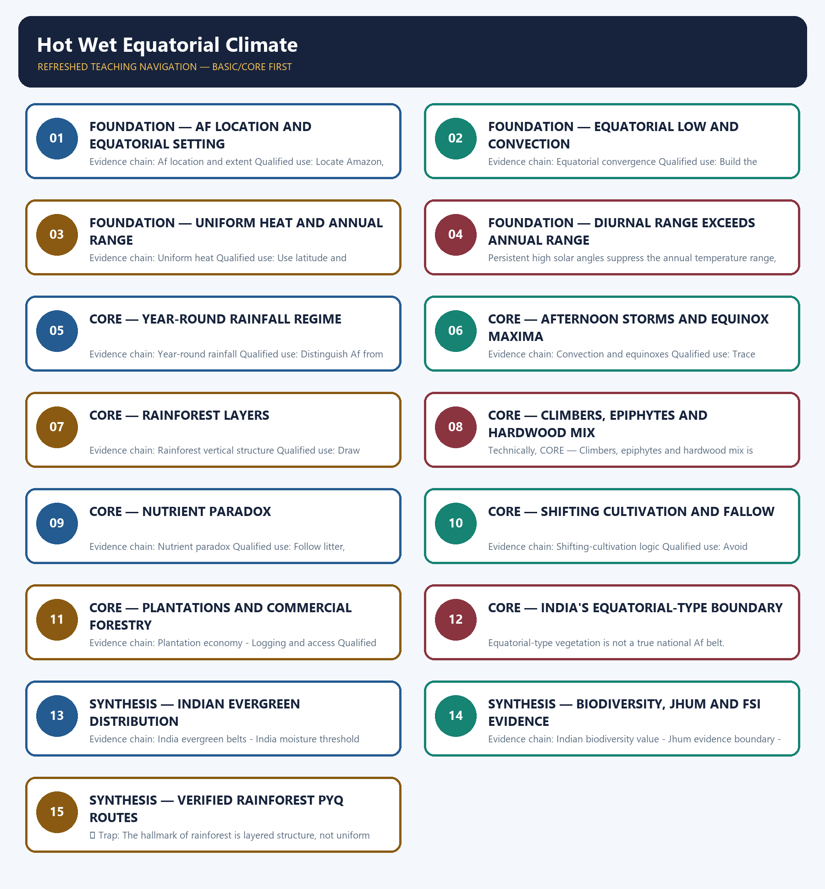

# Hot Wet Equatorial Climate — Learner-v2 Complete Learning Session

> **Authoring-only generation:** 2026-09-01. No PDF was rendered and no tracker or index was mutated.

### SOURCE, PROGRESSION AND CURRENT-LINKAGE AUDIT

- **Generation date:** 2026-09-01.
- **Repository-first evidence:** the Basic owner is taught first and preserved in full; the Advanced owner is retained only in the optional final teaching block.
- **OCR evidence:** Repository Markdown was primary. The three required local Geography books were inspected as supplementary OCR/searchable evidence. No unsupported page precision, volatile figure or quotation was imported.
- **Qdrant:** not used; repository Markdown and available OCR context were sufficient.
- **PYQ integrity:** Verified direct routing retains the 2021 Prelims tropical-rainforest vegetation-structure demand and the 2023 Prelims rainforest nutrient/decomposition demand. The local ledger withholds both official answer letters, so the package teaches the tested distinctions and does not manufacture an objective key.
- **Live-link boundary:** FSI's official publications page establishes the biennial reporting framework, and ISFR 2023 Volume II is the dated current official baseline consulted for state-level forest evidence. No forest-extent percentage, loss rate or legal status is imported into the climate definition, and no later unpublished report is implied.
- **Fact/inference discipline:** no current-affairs item, PYQ wording, figure or quotation is invented.

## BASIC LEARNING SESSION



*Distinct embedded teaching-navigation image. The separate continuous Cārvāka-style flowchart package remains an independent at-a-glance artifact.*

### SESSION 1 — FOUNDATION — AF LOCATION AND EQUATORIAL SETTING

#### DEFINITION / WHAT THIS IS CALLED

**Plain-language definition:** Af location and extent: The textbook hot-wet equatorial or Koppen Af climate is concentrated close to the Equator, commonly about 5 to 10 degrees north and south, with major lowland expressions in Amazonia, the Congo basin and maritime Southeast Asia; mapped limits vary with dataset and relief.

**Technical definition:** Evidence chain: Af location and extent Qualified use: Locate Amazon, Congo and maritime Southeast Asia before explaining process.

#### ANSWER-GRABBING OPENING — WRITE/ADAPT IN THE EXAM

> Af location and extent: The textbook hot-wet equatorial or Koppen Af climate is concentrated close to the Equator, commonly about 5 to 10 degrees north and south, with major lowland expressions in Amazonia, the Congo basin and maritime Southeast Asia; mapped limits vary with dataset and relief.

#### MUST-WRITE KEYWORDS

- **FOUNDATION**
- **Af location**
- **equatorial setting**
- **Af location and extent**
- **Evidence chain**
- **Qualified use**

**How to use them:** Frame the answer through FOUNDATION; define Af location, connect equatorial setting with Af location and extent to explain the mechanism, and use Evidence chain for the decisive comparison or qualification.

#### VISUAL FIRST

```text
AF LOCATION AND EQUATORIAL SETTING
01. Af location and extent
BOUNDARY -> Latitude is a guide, not a wall.
```

*This topic-specific rail fixes the evidence sequence and its exam boundary before analysis.*

#### CORE EXPLANATION

The textbook hot-wet equatorial or Koppen Af climate is concentrated close to the Equator, commonly about 5 to 10 degrees north and south, with major lowland expressions in Amazonia, the Congo basin and maritime Southeast Asia; mapped limits vary with dataset and relief.

#### NAMED EVIDENCE AND MECHANISM

- **Af location and extent:** The textbook hot-wet equatorial or Koppen Af climate is concentrated close to the Equator, commonly about 5 to 10 degrees north and south, with major lowland expressions in Amazonia, the Congo basin and maritime Southeast Asia; mapped limits vary with dataset and relief.

#### EXAMINER CAUTION

- Latitude is a guide, not a wall.

#### EXAM LINK

- **Prelims:** Separate the agent, landform, location, status and scale attached to Af location and equatorial setting.
- **Mains:** Locate Amazon, Congo and maritime Southeast Asia before explaining process.

#### MINI RECAP

- **Evidence chain:** Af location and extent
- **Qualified use:** Locate Amazon, Congo and maritime Southeast Asia before explaining process.

#### CLOSING RECALL FLOW — FOUNDATION — AF LOCATION AND EQUATORIAL SETTING

```text
START / CONCEPT: FOUNDATION — Af location and equatorial setting
        |
        v
EXACT TERMS: FOUNDATION · Af location · equatorial setting · Af location and extent · Evidence chain · Qualified use
        |
        v
MECHANISM / ARGUMENT: Evidence chain: Af location and extent Qualified use: Locate Amazon, Congo and maritime Southeast Asia before explaining process.
        |
        v
CONSEQUENCE / CONTRAST: Latitude is a guide, not a wall.
        |
        v
UPSC TRAP / ANSWER-USE: Do not miss this limiting distinction: af location and extent Qualified use.
        |
        v
ANSWER-GRABBING FORMULATION: Af location and extent: The textbook hot-wet equatorial or Koppen Af climate is concentrated close to the Equator, commonly about 5 to 10 degrees north and south, with major lowland expressions in Amazonia, the Congo basin and maritime Southeast Asia; mapped limits vary with dataset and relief.
```
### SESSION 2 — FOUNDATION — EQUATORIAL LOW AND CONVECTION

#### DEFINITION / WHAT THIS IS CALLED

**Plain-language definition:** Equatorial convergence: Persistent high insolation, the equatorial low-pressure belt and converging moist air favour uplift and convection; seasonal ITCZ movement can shift rainfall maxima without creating a true dry winter.

**Technical definition:** Evidence chain: Equatorial convergence Qualified use: Build the convergence-to-uplift chain.

#### ANSWER-GRABBING OPENING — WRITE/ADAPT IN THE EXAM

> Equatorial convergence: Persistent high insolation, the equatorial low-pressure belt and converging moist air favour uplift and convection; seasonal ITCZ movement can shift rainfall maxima without creating a true dry winter.

#### MUST-WRITE KEYWORDS

- **FOUNDATION**
- **Equatorial low**
- **convection**
- **Equatorial convergence**
- **Evidence chain**
- **Qualified use**

**How to use them:** Frame the answer through FOUNDATION; define Equatorial low, connect convection with Equatorial convergence to explain the mechanism, and use Evidence chain for the decisive comparison or qualification.

#### VISUAL FIRST

```text
EQUATORIAL LOW AND CONVECTION
01. Equatorial convergence
BOUNDARY -> ITCZ migration alters maxima without creating monsoon seasonality.
```

*This topic-specific rail fixes the evidence sequence and its exam boundary before analysis.*

#### CORE EXPLANATION

Persistent high insolation, the equatorial low-pressure belt and converging moist air favour uplift and convection; seasonal ITCZ movement can shift rainfall maxima without creating a true dry winter.

#### NAMED EVIDENCE AND MECHANISM

- **Equatorial convergence:** Persistent high insolation, the equatorial low-pressure belt and converging moist air favour uplift and convection; seasonal ITCZ movement can shift rainfall maxima without creating a true dry winter.

#### EXAMINER CAUTION

- ITCZ migration alters maxima without creating monsoon seasonality.

#### EXAM LINK

- **Prelims:** Separate the agent, landform, location, status and scale attached to Equatorial low and convection.
- **Mains:** Build the convergence-to-uplift chain.

#### MINI RECAP

- **Evidence chain:** Equatorial convergence
- **Qualified use:** Build the convergence-to-uplift chain.

#### CLOSING RECALL FLOW — FOUNDATION — EQUATORIAL LOW AND CONVECTION

```text
START / CONCEPT: FOUNDATION — Equatorial low and convection
        |
        v
EXACT TERMS: FOUNDATION · Equatorial low · convection · Equatorial convergence · Evidence chain · Qualified use
        |
        v
MECHANISM / ARGUMENT: Evidence chain: Equatorial convergence Qualified use: Build the convergence-to-uplift chain.
        |
        v
CONSEQUENCE / CONTRAST: The resulting consequence is that persistent high insolation, the equatorial low-pressure belt and converging moist air favour uplift and...
        |
        v
UPSC TRAP / ANSWER-USE: Do not miss this limiting distinction: persistent high insolation, the equatorial low-pressure belt and converging moist air favour uplift and...
        |
        v
ANSWER-GRABBING FORMULATION: Equatorial convergence: Persistent high insolation, the equatorial low-pressure belt and converging moist air favour uplift and convection; seasonal ITCZ movement can shift rainfall maxima without creating a true dry winter.
```
### SESSION 3 — FOUNDATION — UNIFORM HEAT AND ANNUAL RANGE

#### DEFINITION / WHAT THIS IS CALLED

**Plain-language definition:** Uniform heat: Source-era climatic summaries place mean monthly temperatures commonly around 26 to 28 degrees Celsius, while the annual range is usually below about 3 degrees Celsius; these are climatic descriptors, not daily limits.

**Technical definition:** Evidence chain: Uniform heat Qualified use: Use latitude and cloud-humidity controls.

#### ANSWER-GRABBING OPENING — WRITE/ADAPT IN THE EXAM

> Uniform heat: Source-era climatic summaries place mean monthly temperatures commonly around 26 to 28 degrees Celsius, while the annual range is usually below about 3 degrees Celsius; these are climatic descriptors, not daily limits.

#### MUST-WRITE KEYWORDS

- **FOUNDATION**
- **Uniform heat**
- **annual range**
- **Evidence chain**
- **Qualified use**
- **Source-era**

**How to use them:** Frame the answer through FOUNDATION; define Uniform heat, connect annual range with Evidence chain to explain the mechanism, and use Qualified use for the decisive comparison or qualification.

#### VISUAL FIRST

```text
UNIFORM HEAT AND ANNUAL RANGE
01. Uniform heat
BOUNDARY -> Climatic means are not daily extremes.
```

*This topic-specific rail fixes the evidence sequence and its exam boundary before analysis.*

#### CORE EXPLANATION

Source-era climatic summaries place mean monthly temperatures commonly around 26 to 28 degrees Celsius, while the annual range is usually below about 3 degrees Celsius; these are climatic descriptors, not daily limits.

#### NAMED EVIDENCE AND MECHANISM

- **Uniform heat:** Source-era climatic summaries place mean monthly temperatures commonly around 26 to 28 degrees Celsius, while the annual range is usually below about 3 degrees Celsius; these are climatic descriptors, not daily limits.

#### EXAMINER CAUTION

- Climatic means are not daily extremes.

#### EXAM LINK

- **Prelims:** Separate the agent, landform, location, status and scale attached to Uniform heat and annual range.
- **Mains:** Use latitude and cloud-humidity controls.

#### MINI RECAP

- **Evidence chain:** Uniform heat
- **Qualified use:** Use latitude and cloud-humidity controls.

#### CLOSING RECALL FLOW — FOUNDATION — UNIFORM HEAT AND ANNUAL RANGE

```text
START / CONCEPT: FOUNDATION — Uniform heat and annual range
        |
        v
EXACT TERMS: FOUNDATION · Uniform heat · annual range · Evidence chain · Qualified use · Source-era
        |
        v
MECHANISM / ARGUMENT: Evidence chain: Uniform heat Qualified use: Use latitude and cloud-humidity controls.
        |
        v
CONSEQUENCE / CONTRAST: Climatic means are not daily extremes.
        |
        v
UPSC TRAP / ANSWER-USE: Do not miss this limiting distinction: mains: Use latitude and cloud-humidity controls.
        |
        v
ANSWER-GRABBING FORMULATION: Uniform heat: Source-era climatic summaries place mean monthly temperatures commonly around 26 to 28 degrees Celsius, while the annual range is usually below about 3 degrees Celsius; these are climatic descriptors, not daily limits.
```
### SESSION 4 — FOUNDATION — DIURNAL RANGE EXCEEDS ANNUAL RANGE

#### DEFINITION / WHAT THIS IS CALLED

**Plain-language definition:** Equatorial places usually change more between day and night than between the warmest and coolest months.

**Technical definition:** Persistent high solar angles suppress the annual temperature range, while the daily radiation cycle retains a larger diurnal range despite humidity and cloud moderation.

#### ANSWER-GRABBING OPENING — WRITE/ADAPT IN THE EXAM

> Near the Equator, the calendar changes temperature less than the daily alternation of sunlight and darkness.

#### MUST-WRITE KEYWORDS

- **diurnal temperature range**
- **annual temperature range**
- **day-night radiation**
- **seasonal contrast**
- **equatorial latitude**
- **UPSC discriminator**

**How to use them:** Compare monthly means with day-night observations, connect weak solar seasonality to the small annual range, and state explicitly that diurnal range exceeds annual range.

#### VISUAL FIRST

```text
DIURNAL RANGE EXCEEDS ANNUAL RANGE
01. Diurnal-annual contrast
BOUNDARY -> Do not reverse the two ranges.
```

*This topic-specific rail fixes the evidence sequence and its exam boundary before analysis.*

#### CORE EXPLANATION

The diurnal temperature range exceeds the annual range because day-night radiation changes more than seasonal solar receipt near the Equator; this is a classic close-option discriminator.

#### NAMED EVIDENCE AND MECHANISM

- **Diurnal-annual contrast:** The diurnal temperature range exceeds the annual range because day-night radiation changes more than seasonal solar receipt near the Equator; this is a classic close-option discriminator.

#### EXAMINER CAUTION

- Do not reverse the two ranges.

#### EXAM LINK

- **Prelims:** Separate the agent, landform, location, status and scale attached to Diurnal range exceeds annual range.
- **Mains:** State the classic Prelims discriminator explicitly.

#### MINI RECAP

- **Evidence chain:** Diurnal-annual contrast
- **Qualified use:** State the classic Prelims discriminator explicitly.

#### CLOSING RECALL FLOW — FOUNDATION — DIURNAL RANGE EXCEEDS ANNUAL RANGE

```text
START / CONCEPT: FOUNDATION — Diurnal range exceeds annual range
        |
        v
EXACT TERMS: diurnal temperature range · annual temperature range · day-night radiation · seasonal contrast · equatorial latitude · UPSC discriminator
        |
        v
MECHANISM / ARGUMENT: The diurnal temperature range exceeds the annual range because day-night radiation changes more than seasonal solar receipt near the Equator; this is a classic close-option discriminator.
        |
        v
CONSEQUENCE / CONTRAST: Do not reverse the two ranges.
        |
        v
UPSC TRAP / ANSWER-USE: Do not miss this limiting distinction: state the classic Prelims discriminator explicitly.
        |
        v
ANSWER-GRABBING FORMULATION: Near the Equator, the calendar changes temperature less than the daily alternation of sunlight and darkness.
```
### SESSION 5 — CORE — YEAR-ROUND RAINFALL REGIME

#### DEFINITION / WHAT THIS IS CALLED

**Plain-language definition:** Year-round rainfall: Source notes commonly give about 150 to 250 centimetres of annual rain, heavy and well distributed through the year; the defining point is absence of a true dry season, not one universal total.

**Technical definition:** Evidence chain: Year-round rainfall Qualified use: Distinguish Af from Am and Aw.

#### ANSWER-GRABBING OPENING — WRITE/ADAPT IN THE EXAM

> Year-round rainfall: Source notes commonly give about 150 to 250 centimetres of annual rain, heavy and well distributed through the year; the defining point is absence of a true dry season, not one universal total.

#### MUST-WRITE KEYWORDS

- **Year-round rainfall regime**
- **Year-round rainfall**
- **Evidence chain**
- **Qualified use**
- **Year-round**
- **Qualified**

**How to use them:** Frame the answer through Year-round rainfall regime; define Year-round rainfall, connect Evidence chain with Qualified use to explain the mechanism, and use Year-round for the decisive comparison or qualification.

#### VISUAL FIRST

```text
YEAR-ROUND RAINFALL REGIME
01. Year-round rainfall
BOUNDARY -> The no-dry-season rule matters more than one total.
```

*This topic-specific rail fixes the evidence sequence and its exam boundary before analysis.*

#### CORE EXPLANATION

Source notes commonly give about 150 to 250 centimetres of annual rain, heavy and well distributed through the year; the defining point is absence of a true dry season, not one universal total.

#### NAMED EVIDENCE AND MECHANISM

- **Year-round rainfall:** Source notes commonly give about 150 to 250 centimetres of annual rain, heavy and well distributed through the year; the defining point is absence of a true dry season, not one universal total.

#### EXAMINER CAUTION

- The no-dry-season rule matters more than one total.

#### EXAM LINK

- **Prelims:** Separate the agent, landform, location, status and scale attached to Year-round rainfall regime.
- **Mains:** Distinguish Af from Am and Aw.

#### MINI RECAP

- **Evidence chain:** Year-round rainfall
- **Qualified use:** Distinguish Af from Am and Aw.

#### CLOSING RECALL FLOW — CORE — YEAR-ROUND RAINFALL REGIME

```text
START / CONCEPT: CORE — Year-round rainfall regime
        |
        v
EXACT TERMS: Year-round rainfall regime · Year-round rainfall · Evidence chain · Qualified use · Year-round · Qualified
        |
        v
MECHANISM / ARGUMENT: Evidence chain: Year-round rainfall Qualified use: Distinguish Af from Am and Aw.
        |
        v
CONSEQUENCE / CONTRAST: The resulting consequence is that source notes commonly give about 150 to 250 centimetres of annual rain, heavy and...
        |
        v
UPSC TRAP / ANSWER-USE: Do not miss this limiting distinction: source notes commonly give about 150 to 250 centimetres of annual rain, heavy and...
        |
        v
ANSWER-GRABBING FORMULATION: Year-round rainfall: Source notes commonly give about 150 to 250 centimetres of annual rain, heavy and well distributed through the year; the defining point is absence of a true dry season, not one universal total.
```
### SESSION 6 — CORE — AFTERNOON STORMS AND EQUINOX MAXIMA

#### DEFINITION / WHAT THIS IS CALLED

**Plain-language definition:** Convection and equinoxes: Strong daytime heating produces convection, cumulonimbus growth and frequent afternoon thunderstorms, while slight double rainfall maxima may occur near the equinox passages of the overhead sun.

**Technical definition:** Evidence chain: Convection and equinoxes Qualified use: Trace heating, uplift, condensation and storm.

#### ANSWER-GRABBING OPENING — WRITE/ADAPT IN THE EXAM

> Convection and equinoxes: Strong daytime heating produces convection, cumulonimbus growth and frequent afternoon thunderstorms, while slight double rainfall maxima may occur near the equinox passages of the overhead sun.

#### MUST-WRITE KEYWORDS

- **Afternoon storms**
- **equinox maxima**
- **Convection and equinoxes**
- **Evidence chain**
- **Qualified use**
- **Strong**

**How to use them:** Frame the answer through Afternoon storms; define equinox maxima, connect Convection and equinoxes with Evidence chain to explain the mechanism, and use Qualified use for the decisive comparison or qualification.

#### VISUAL FIRST

```text
AFTERNOON STORMS AND EQUINOX MAXIMA
01. Convection and equinoxes
BOUNDARY -> Neither timing nor double maximum is compulsory at every station.
```

*This topic-specific rail fixes the evidence sequence and its exam boundary before analysis.*

#### CORE EXPLANATION

Strong daytime heating produces convection, cumulonimbus growth and frequent afternoon thunderstorms, while slight double rainfall maxima may occur near the equinox passages of the overhead sun.

#### NAMED EVIDENCE AND MECHANISM

- **Convection and equinoxes:** Strong daytime heating produces convection, cumulonimbus growth and frequent afternoon thunderstorms, while slight double rainfall maxima may occur near the equinox passages of the overhead sun.

#### EXAMINER CAUTION

- Neither timing nor double maximum is compulsory at every station.

#### EXAM LINK

- **Prelims:** Separate the agent, landform, location, status and scale attached to Afternoon storms and equinox maxima.
- **Mains:** Trace heating, uplift, condensation and storm.

#### MINI RECAP

- **Evidence chain:** Convection and equinoxes
- **Qualified use:** Trace heating, uplift, condensation and storm.

#### CLOSING RECALL FLOW — CORE — AFTERNOON STORMS AND EQUINOX MAXIMA

```text
START / CONCEPT: CORE — Afternoon storms and equinox maxima
        |
        v
EXACT TERMS: Afternoon storms · equinox maxima · Convection and equinoxes · Evidence chain · Qualified use · Strong
        |
        v
MECHANISM / ARGUMENT: Evidence chain: Convection and equinoxes Qualified use: Trace heating, uplift, condensation and storm.
        |
        v
CONSEQUENCE / CONTRAST: Neither timing nor double maximum is compulsory at every station.
        |
        v
UPSC TRAP / ANSWER-USE: Do not miss this limiting distinction: strong daytime heating produces convection, cumulonimbus growth and frequent afternoon thunderstorms.
        |
        v
ANSWER-GRABBING FORMULATION: Convection and equinoxes: Strong daytime heating produces convection, cumulonimbus growth and frequent afternoon thunderstorms, while slight double rainfall maxima may occur near the equinox passages of the overhead sun.
```
### SESSION 7 — CORE — RAINFOREST LAYERS

#### DEFINITION / WHAT THIS IS CALLED

**Plain-language definition:** Rainforest vertical structure: Tropical rainforest is evergreen, broad-leaved and multi-storeyed, with emergents above a closed canopy, shaded under-storeys and a dark humid floor; vegetation is not a uniform wall of equal-height trees.

**Technical definition:** Evidence chain: Rainforest vertical structure Qualified use: Draw emergent-canopy-understorey-floor structure.

#### ANSWER-GRABBING OPENING — WRITE/ADAPT IN THE EXAM

> Rainforest vertical structure: Tropical rainforest is evergreen, broad-leaved and multi-storeyed, with emergents above a closed canopy, shaded under-storeys and a dark humid floor; vegetation is not a uniform wall of equal-height trees.

#### MUST-WRITE KEYWORDS

- **Rainforest layers**
- **Rainforest vertical structure**
- **Evidence chain**
- **Qualified use**
- **Tropical rainforest**
- **Tropical**

**How to use them:** Frame the answer through Rainforest layers; define Rainforest vertical structure, connect Evidence chain with Qualified use to explain the mechanism, and use Tropical rainforest for the decisive comparison or qualification.

#### VISUAL FIRST

```text
RAINFOREST LAYERS
01. Rainforest vertical structure
BOUNDARY -> Layering, not uniform height, is diagnostic.
```

*This topic-specific rail fixes the evidence sequence and its exam boundary before analysis.*

#### CORE EXPLANATION

Tropical rainforest is evergreen, broad-leaved and multi-storeyed, with emergents above a closed canopy, shaded under-storeys and a dark humid floor; vegetation is not a uniform wall of equal-height trees.

#### NAMED EVIDENCE AND MECHANISM

- **Rainforest vertical structure:** Tropical rainforest is evergreen, broad-leaved and multi-storeyed, with emergents above a closed canopy, shaded under-storeys and a dark humid floor; vegetation is not a uniform wall of equal-height trees.

#### EXAMINER CAUTION

- Layering, not uniform height, is diagnostic.

#### EXAM LINK

- **Prelims:** Separate the agent, landform, location, status and scale attached to Rainforest layers.
- **Mains:** Draw emergent-canopy-understorey-floor structure.

#### MINI RECAP

- **Evidence chain:** Rainforest vertical structure
- **Qualified use:** Draw emergent-canopy-understorey-floor structure.

#### CLOSING RECALL FLOW — CORE — RAINFOREST LAYERS

```text
START / CONCEPT: CORE — Rainforest layers
        |
        v
EXACT TERMS: Rainforest layers · Rainforest vertical structure · Evidence chain · Qualified use · Tropical rainforest · Tropical
        |
        v
MECHANISM / ARGUMENT: Evidence chain: Rainforest vertical structure Qualified use: Draw emergent-canopy-understorey-floor structure.
        |
        v
CONSEQUENCE / CONTRAST: Layering, not uniform height, is diagnostic.
        |
        v
UPSC TRAP / ANSWER-USE: Do not miss this limiting distinction: tropical rainforest is evergreen, broad-leaved and multi-storeyed, with emergents above a closed canopy, shaded...
        |
        v
ANSWER-GRABBING FORMULATION: Rainforest vertical structure: Tropical rainforest is evergreen, broad-leaved and multi-storeyed, with emergents above a closed canopy, shaded under-storeys and a dark humid floor; vegetation is not a uniform wall of equal-height trees.
```
### SESSION 8 — CORE — CLIMBERS, EPIPHYTES AND HARDWOOD MIX

#### DEFINITION / WHAT THIS IS CALLED

**Plain-language definition:** Evidence chain: Lianas, epiphytes and hardwoods Qualified use: Connect forest form to access and logging.

**Technical definition:** Technically, CORE — Climbers, epiphytes and hardwood mix is analysed by relating Climbers to epiphytes, then testing the relationship through hardwood mix and Lianas, epiphytes and hardwoods.

#### ANSWER-GRABBING OPENING — WRITE/ADAPT IN THE EXAM

> Evidence chain: Lianas, epiphytes and hardwoods Qualified use: Connect forest form to access and logging.

#### MUST-WRITE KEYWORDS

- **Climbers**
- **epiphytes**
- **hardwood mix**
- **Lianas, epiphytes and hardwoods**
- **Evidence chain**
- **Qualified use**

**How to use them:** Frame the answer through Climbers; define epiphytes, connect hardwood mix with Lianas, epiphytes and hardwoods to explain the mechanism, and use Evidence chain for the decisive comparison or qualification.

#### VISUAL FIRST

```text
CLIMBERS, EPIPHYTES AND HARDWOOD MIX
01. Lianas, epiphytes and hardwoods
BOUNDARY -> Species richness can hinder selective extraction.
```

*This topic-specific rail fixes the evidence sequence and its exam boundary before analysis.*

#### CORE EXPLANATION

Lianas and epiphytes exploit light and support within the layered forest, while mixed hardwood species such as ebony and rosewood complicate selective commercial extraction.

#### NAMED EVIDENCE AND MECHANISM

- **Lianas, epiphytes and hardwoods:** Lianas and epiphytes exploit light and support within the layered forest, while mixed hardwood species such as ebony and rosewood complicate selective commercial extraction.

#### EXAMINER CAUTION

- Species richness can hinder selective extraction.

#### EXAM LINK

- **Prelims:** Separate the agent, landform, location, status and scale attached to Climbers, epiphytes and hardwood mix.
- **Mains:** Connect forest form to access and logging.

#### MINI RECAP

- **Evidence chain:** Lianas, epiphytes and hardwoods
- **Qualified use:** Connect forest form to access and logging.

#### CLOSING RECALL FLOW — CORE — CLIMBERS, EPIPHYTES AND HARDWOOD MIX

```text
START / CONCEPT: CORE — Climbers, epiphytes and hardwood mix
        |
        v
EXACT TERMS: Climbers · epiphytes · hardwood mix · Lianas, epiphytes and hardwoods · Evidence chain · Qualified use
        |
        v
MECHANISM / ARGUMENT: Species richness can hinder selective extraction.
        |
        v
CONSEQUENCE / CONTRAST: The resulting consequence is that lianas, epiphytes and hardwoods Qualified use.
        |
        v
UPSC TRAP / ANSWER-USE: Do not miss this limiting distinction: lianas, epiphytes and hardwoods Qualified use.
        |
        v
ANSWER-GRABBING FORMULATION: Evidence chain: Lianas, epiphytes and hardwoods Qualified use: Connect forest form to access and logging.
```
### SESSION 9 — CORE — NUTRIENT PARADOX

#### DEFINITION / WHAT THIS IS CALLED

**Plain-language definition:** Nutrient paradox: Rapid decomposition and intense leaching mean nutrient capital is held largely in living biomass and fast litter-root recycling rather than in a deep fertile soil store; young volcanic and alluvial soils are important exceptions.

**Technical definition:** Evidence chain: Nutrient paradox Qualified use: Follow litter, decomposition, roots and leaching.

#### ANSWER-GRABBING OPENING — WRITE/ADAPT IN THE EXAM

> Nutrient paradox: Rapid decomposition and intense leaching mean nutrient capital is held largely in living biomass and fast litter-root recycling rather than in a deep fertile soil store; young volcanic and alluvial soils are important exceptions.

#### MUST-WRITE KEYWORDS

- **Nutrient paradox**
- **Evidence chain**
- **Qualified use**
- **Rapid decomposition and intense leaching mean nutrient capital**
- **Rapid**
- **Nutrient**

**How to use them:** Frame the answer through Nutrient paradox; define Evidence chain, connect Qualified use with Rapid decomposition and intense leaching mean nutrient capital to explain the mechanism, and use Rapid for the decisive comparison or qualification.

#### VISUAL FIRST

```text
NUTRIENT PARADOX
01. Nutrient paradox
BOUNDARY -> Rich biomass does not imply rich soil.
```

*This topic-specific rail fixes the evidence sequence and its exam boundary before analysis.*

#### CORE EXPLANATION

Rapid decomposition and intense leaching mean nutrient capital is held largely in living biomass and fast litter-root recycling rather than in a deep fertile soil store; young volcanic and alluvial soils are important exceptions.

#### NAMED EVIDENCE AND MECHANISM

- **Nutrient paradox:** Rapid decomposition and intense leaching mean nutrient capital is held largely in living biomass and fast litter-root recycling rather than in a deep fertile soil store; young volcanic and alluvial soils are important exceptions.

#### EXAMINER CAUTION

- Rich biomass does not imply rich soil.

#### EXAM LINK

- **Prelims:** Separate the agent, landform, location, status and scale attached to Nutrient paradox.
- **Mains:** Follow litter, decomposition, roots and leaching.

#### MINI RECAP

- **Evidence chain:** Nutrient paradox
- **Qualified use:** Follow litter, decomposition, roots and leaching.

#### CLOSING RECALL FLOW — CORE — NUTRIENT PARADOX

```text
START / CONCEPT: CORE — Nutrient paradox
        |
        v
EXACT TERMS: Nutrient paradox · Evidence chain · Qualified use · Rapid decomposition and intense leaching mean nutrient capital · Rapid · Nutrient
        |
        v
MECHANISM / ARGUMENT: Evidence chain: Nutrient paradox Qualified use: Follow litter, decomposition, roots and leaching.
        |
        v
CONSEQUENCE / CONTRAST: Rich biomass does not imply rich soil.
        |
        v
UPSC TRAP / ANSWER-USE: Do not miss this limiting distinction: follow litter, decomposition, roots and leaching.
        |
        v
ANSWER-GRABBING FORMULATION: Nutrient paradox: Rapid decomposition and intense leaching mean nutrient capital is held largely in living biomass and fast litter-root recycling rather than in a deep fertile soil store; young volcanic and alluvial soils are important exceptions.
```
### SESSION 10 — CORE — SHIFTING CULTIVATION AND FALLOW

#### DEFINITION / WHAT THIS IS CALLED

**Plain-language definition:** CORE — Shifting cultivation and fallow comprises Shifting cultivation, fallow and Shifting-cultivation logic as its core connected dimensions.

**Technical definition:** Evidence chain: Shifting-cultivation logic Qualified use: Avoid environmental determinism.

#### ANSWER-GRABBING OPENING — WRITE/ADAPT IN THE EXAM

> Shifting-cultivation logic: Slash-and-burn or shifting cultivation can work with small clearings and sufficiently long fallow because regrowth rebuilds biomass and nutrient cycling; shortened fallow can convert adaptation into degradation.

#### MUST-WRITE KEYWORDS

- **Shifting cultivation**
- **fallow**
- **Shifting-cultivation logic**
- **Evidence chain**
- **Qualified use**
- **Slash-and-burn**

**How to use them:** Frame the answer through Shifting cultivation; define fallow, connect Shifting-cultivation logic with Evidence chain to explain the mechanism, and use Qualified use for the decisive comparison or qualification.

#### VISUAL FIRST

```text
SHIFTING CULTIVATION AND FALLOW
01. Shifting-cultivation logic
BOUNDARY -> Outcome depends on scale and recovery time.
```

*This topic-specific rail fixes the evidence sequence and its exam boundary before analysis.*

#### CORE EXPLANATION

Slash-and-burn or shifting cultivation can work with small clearings and sufficiently long fallow because regrowth rebuilds biomass and nutrient cycling; shortened fallow can convert adaptation into degradation.

#### NAMED EVIDENCE AND MECHANISM

- **Shifting-cultivation logic:** Slash-and-burn or shifting cultivation can work with small clearings and sufficiently long fallow because regrowth rebuilds biomass and nutrient cycling; shortened fallow can convert adaptation into degradation.

#### EXAMINER CAUTION

- Outcome depends on scale and recovery time.

#### EXAM LINK

- **Prelims:** Separate the agent, landform, location, status and scale attached to Shifting cultivation and fallow.
- **Mains:** Avoid environmental determinism.

#### MINI RECAP

- **Evidence chain:** Shifting-cultivation logic
- **Qualified use:** Avoid environmental determinism.

#### CLOSING RECALL FLOW — CORE — SHIFTING CULTIVATION AND FALLOW

```text
START / CONCEPT: CORE — Shifting cultivation and fallow
        |
        v
EXACT TERMS: Shifting cultivation · fallow · Shifting-cultivation logic · Evidence chain · Qualified use · Slash-and-burn
        |
        v
MECHANISM / ARGUMENT: Outcome depends on scale and recovery time.
        |
        v
CONSEQUENCE / CONTRAST: Evidence chain: Shifting-cultivation logic Qualified use: Avoid environmental determinism.
        |
        v
UPSC TRAP / ANSWER-USE: Do not miss this limiting distinction: slash-and-burn or shifting cultivation can work with small clearings and sufficiently long fallow because...
        |
        v
ANSWER-GRABBING FORMULATION: Shifting-cultivation logic: Slash-and-burn or shifting cultivation can work with small clearings and sufficiently long fallow because regrowth rebuilds biomass and nutrient cycling; shortened fallow can convert adaptation into degradation.
```
### SESSION 11 — CORE — PLANTATIONS AND COMMERCIAL FORESTRY

#### DEFINITION / WHAT THIS IS CALLED

**Plain-language definition:** Plantation economy: Rubber, cocoa, oil palm and coffee plantations developed through capital, labour and export-market systems; they are economic transformations of humid tropics, not inevitable products of Af climate.

**Technical definition:** Evidence chain: Plantation economy - Logging and access Qualified use: Compare monoculture and mixed-forest extraction.

#### ANSWER-GRABBING OPENING — WRITE/ADAPT IN THE EXAM

> Plantation economy: Rubber, cocoa, oil palm and coffee plantations developed through capital, labour and export-market systems; they are economic transformations of humid tropics, not inevitable products of Af climate.

#### MUST-WRITE KEYWORDS

- **Plantations**
- **commercial forestry**
- **Plantation economy**
- **Logging and access**
- **Evidence chain**
- **Qualified use**

**How to use them:** Frame the answer through Plantations; define commercial forestry, connect Plantation economy with Logging and access to explain the mechanism, and use Evidence chain for the decisive comparison or qualification.

#### VISUAL FIRST

```text
PLANTATIONS AND COMMERCIAL FORESTRY
01. Plantation economy
    |
    v
02. Logging and access
BOUNDARY -> Climate permits but institutions organise land use.
```

*This topic-specific rail fixes the evidence sequence and its exam boundary before analysis.*

#### CORE EXPLANATION

Rubber, cocoa, oil palm and coffee plantations developed through capital, labour and export-market systems; they are economic transformations of humid tropics, not inevitable products of Af climate. Dense vegetation, mixed species, difficult access, transport cost, ecological damage and regulation constrain commercial logging; abundant biomass does not automatically equal easy timber exploitation.

#### NAMED EVIDENCE AND MECHANISM

- **Plantation economy:** Rubber, cocoa, oil palm and coffee plantations developed through capital, labour and export-market systems; they are economic transformations of humid tropics, not inevitable products of Af climate.
- **Logging and access:** Dense vegetation, mixed species, difficult access, transport cost, ecological damage and regulation constrain commercial logging; abundant biomass does not automatically equal easy timber exploitation.

#### EXAMINER CAUTION

- Climate permits but institutions organise land use.

#### EXAM LINK

- **Prelims:** Separate the agent, landform, location, status and scale attached to Plantations and commercial forestry.
- **Mains:** Compare monoculture and mixed-forest extraction.

#### MINI RECAP

- **Evidence chain:** Plantation economy -> Logging and access
- **Qualified use:** Compare monoculture and mixed-forest extraction.

#### CLOSING RECALL FLOW — CORE — PLANTATIONS AND COMMERCIAL FORESTRY

```text
START / CONCEPT: CORE — Plantations and commercial forestry
        |
        v
EXACT TERMS: Plantations · commercial forestry · Plantation economy · Logging and access · Evidence chain · Qualified use
        |
        v
MECHANISM / ARGUMENT: Evidence chain: Plantation economy - Logging and access Qualified use: Compare monoculture and mixed-forest extraction.
        |
        v
CONSEQUENCE / CONTRAST: Logging and access: Dense vegetation, mixed species, difficult access, transport cost, ecological damage and regulation constrain commercial logging; abundant biomass does not automatically equal easy timber exploitation.
        |
        v
UPSC TRAP / ANSWER-USE: Climate permits but institutions organise land use.
        |
        v
ANSWER-GRABBING FORMULATION: Plantation economy: Rubber, cocoa, oil palm and coffee plantations developed through capital, labour and export-market systems; they are economic transformations of humid tropics, not inevitable products of Af climate.
```
### SESSION 12 — CORE — INDIA'S EQUATORIAL-TYPE BOUNDARY

#### DEFINITION / WHAT THIS IS CALLED

**Plain-language definition:** India climate boundary: India has no extensive true equatorial Af zone; its closest analogue is tropical wet evergreen forest shaped mainly by monsoon rainfall, orography and insularity.

**Technical definition:** Equatorial-type vegetation is not a true national Af belt.

#### ANSWER-GRABBING OPENING — WRITE/ADAPT IN THE EXAM

> India climate boundary: India has no extensive true equatorial Af zone; its closest analogue is tropical wet evergreen forest shaped mainly by monsoon rainfall, orography and insularity.

#### MUST-WRITE KEYWORDS

- **India's equatorial-type boundary**
- **India climate boundary**
- **Evidence chain**
- **Qualified use**
- **India**
- **Af**

**How to use them:** Frame the answer through India's equatorial-type boundary; define India climate boundary, connect Evidence chain with Qualified use to explain the mechanism, and use India for the decisive comparison or qualification.

#### VISUAL FIRST

```text
INDIA'S EQUATORIAL-TYPE BOUNDARY
01. India climate boundary
BOUNDARY -> Equatorial-type vegetation is not a true national Af belt.
```

*This topic-specific rail fixes the evidence sequence and its exam boundary before analysis.*

#### CORE EXPLANATION

India has no extensive true equatorial Af zone; its closest analogue is tropical wet evergreen forest shaped mainly by monsoon rainfall, orography and insularity.

#### NAMED EVIDENCE AND MECHANISM

- **India climate boundary:** India has no extensive true equatorial Af zone; its closest analogue is tropical wet evergreen forest shaped mainly by monsoon rainfall, orography and insularity.

#### EXAMINER CAUTION

- Equatorial-type vegetation is not a true national Af belt.

#### EXAM LINK

- **Prelims:** Separate the agent, landform, location, status and scale attached to India's equatorial-type boundary.
- **Mains:** Preserve global Basic versus India Advanced ownership.

#### MINI RECAP

- **Evidence chain:** India climate boundary
- **Qualified use:** Preserve global Basic versus India Advanced ownership.

#### CLOSING RECALL FLOW — CORE — INDIA'S EQUATORIAL-TYPE BOUNDARY

```text
START / CONCEPT: CORE — India's equatorial-type boundary
        |
        v
EXACT TERMS: India's equatorial-type boundary · India climate boundary · Evidence chain · Qualified use · India · Af
        |
        v
MECHANISM / ARGUMENT: Evidence chain: India climate boundary Qualified use: Preserve global Basic versus India Advanced ownership.
        |
        v
CONSEQUENCE / CONTRAST: Equatorial-type vegetation is not a true national Af belt.
        |
        v
UPSC TRAP / ANSWER-USE: Do not miss this limiting distinction: equatorial-type vegetation is not a true national Af belt.
        |
        v
ANSWER-GRABBING FORMULATION: India climate boundary: India has no extensive true equatorial Af zone; its closest analogue is tropical wet evergreen forest shaped mainly by monsoon rainfall, orography and insularity.
```
### SESSION 13 — SYNTHESIS — INDIAN EVERGREEN DISTRIBUTION

#### DEFINITION / WHAT THIS IS CALLED

**Plain-language definition:** India evergreen belts: The principal Indian evergreen and semi-evergreen belts are the windward Western Ghats, parts of North-East India, the eastern Himalayan foothills and the Andaman-Nicobar Islands, with local transitions rather than one continuous zone.

**Technical definition:** Evidence chain: India evergreen belts - India moisture threshold Qualified use: Map Ghats, North-East, foothills and islands.

#### ANSWER-GRABBING OPENING — WRITE/ADAPT IN THE EXAM

> India evergreen belts: The principal Indian evergreen and semi-evergreen belts are the windward Western Ghats, parts of North-East India, the eastern Himalayan foothills and the Andaman-Nicobar Islands, with local transitions rather than one continuous zone.

#### MUST-WRITE KEYWORDS

- **SYNTHESIS**
- **Indian evergreen distribution**
- **India evergreen belts**
- **India moisture threshold**
- **Evidence chain**
- **Qualified use**

**How to use them:** Frame the answer through SYNTHESIS; define Indian evergreen distribution, connect India evergreen belts with India moisture threshold to explain the mechanism, and use Evidence chain for the decisive comparison or qualification.

#### VISUAL FIRST

```text
INDIAN EVERGREEN DISTRIBUTION
01. India evergreen belts
    |
    v
02. India moisture threshold
BOUNDARY -> Rainfall thresholds overlap and vary locally.
```

*This topic-specific rail fixes the evidence sequence and its exam boundary before analysis.*

#### CORE EXPLANATION

The principal Indian evergreen and semi-evergreen belts are the windward Western Ghats, parts of North-East India, the eastern Himalayan foothills and the Andaman-Nicobar Islands, with local transitions rather than one continuous zone. Indian source notes associate tropical wet evergreen forest with very heavy rainfall, often above about 200 to 250 centimetres and a short dry season; thresholds overlap by altitude, soils and classification.

#### NAMED EVIDENCE AND MECHANISM

- **India evergreen belts:** The principal Indian evergreen and semi-evergreen belts are the windward Western Ghats, parts of North-East India, the eastern Himalayan foothills and the Andaman-Nicobar Islands, with local transitions rather than one continuous zone.
- **India moisture threshold:** Indian source notes associate tropical wet evergreen forest with very heavy rainfall, often above about 200 to 250 centimetres and a short dry season; thresholds overlap by altitude, soils and classification.

#### EXAMINER CAUTION

- Rainfall thresholds overlap and vary locally.

#### EXAM LINK

- **Prelims:** Separate the agent, landform, location, status and scale attached to Indian evergreen distribution.
- **Mains:** Map Ghats, North-East, foothills and islands.

#### MINI RECAP

- **Evidence chain:** India evergreen belts -> India moisture threshold
- **Qualified use:** Map Ghats, North-East, foothills and islands.

#### CLOSING RECALL FLOW — SYNTHESIS — INDIAN EVERGREEN DISTRIBUTION

```text
START / CONCEPT: SYNTHESIS — Indian evergreen distribution
        |
        v
EXACT TERMS: SYNTHESIS · Indian evergreen distribution · India evergreen belts · India moisture threshold · Evidence chain · Qualified use
        |
        v
MECHANISM / ARGUMENT: India moisture threshold: Indian source notes associate tropical wet evergreen forest with very heavy rainfall, often above about 200 to 250 centimetres and a short dry season; thresholds overlap by altitude, soils and classification.
        |
        v
CONSEQUENCE / CONTRAST: Evidence chain: India evergreen belts - India moisture threshold Qualified use: Map Ghats, North-East, foothills and islands.
        |
        v
UPSC TRAP / ANSWER-USE: Do not miss this limiting distinction: rainfall thresholds overlap and vary locally.
        |
        v
ANSWER-GRABBING FORMULATION: India evergreen belts: The principal Indian evergreen and semi-evergreen belts are the windward Western Ghats, parts of North-East India, the eastern Himalayan foothills and the Andaman-Nicobar Islands, with local transitions rather than one continuous zone.
```
### SESSION 14 — SYNTHESIS — BIODIVERSITY, JHUM AND FSI EVIDENCE

#### DEFINITION / WHAT THIS IS CALLED

**Plain-language definition:** Jhum evidence boundary: Jhum is a regionally varied shifting-cultivation system whose ecological outcome depends on fallow length, slope, fire, tenure and livelihood alternatives; no universal cycle length should be quoted without a dated local study.

**Technical definition:** Evidence chain: Indian biodiversity value - Jhum evidence boundary - FSI evidence boundary Qualified use: Use dated official monitoring without invented rates.

#### ANSWER-GRABBING OPENING — WRITE/ADAPT IN THE EXAM

> Indian biodiversity value: Western Ghats, North-East and island rainforests combine high endemism, watershed regulation and habitat connectivity; hotspot status does not make every mapped hectare the same forest type or legal category.

#### MUST-WRITE KEYWORDS

- **SYNTHESIS**
- **Biodiversity**
- **jhum**
- **FSI evidence**
- **Indian biodiversity value**
- **Jhum evidence boundary**

**How to use them:** Frame the answer through SYNTHESIS; define Biodiversity, connect jhum with FSI evidence to explain the mechanism, and use Indian biodiversity value for the decisive comparison or qualification.

#### VISUAL FIRST

```text
BIODIVERSITY, JHUM AND FSI EVIDENCE
01. Indian biodiversity value
    |
    v
02. Jhum evidence boundary
    |
    v
03. FSI evidence boundary
BOUNDARY -> Forest cover, forest type and legal status differ.
```

*This topic-specific rail fixes the evidence sequence and its exam boundary before analysis.*

#### CORE EXPLANATION

Western Ghats, North-East and island rainforests combine high endemism, watershed regulation and habitat connectivity; hotspot status does not make every mapped hectare the same forest type or legal category. Jhum is a regionally varied shifting-cultivation system whose ecological outcome depends on fallow length, slope, fire, tenure and livelihood alternatives; no universal cycle length should be quoted without a dated local study. Forest Survey of India reports are biennial national assessments; their dated forest-cover and forest-type products can locate change, but forest cover, recorded forest area and tropical evergreen type are not interchangeable measures.

#### NAMED EVIDENCE AND MECHANISM

- **Indian biodiversity value:** Western Ghats, North-East and island rainforests combine high endemism, watershed regulation and habitat connectivity; hotspot status does not make every mapped hectare the same forest type or legal category.
- **Jhum evidence boundary:** Jhum is a regionally varied shifting-cultivation system whose ecological outcome depends on fallow length, slope, fire, tenure and livelihood alternatives; no universal cycle length should be quoted without a dated local study.
- **FSI evidence boundary:** Forest Survey of India reports are biennial national assessments; their dated forest-cover and forest-type products can locate change, but forest cover, recorded forest area and tropical evergreen type are not interchangeable measures.

#### EXAMINER CAUTION

- Forest cover, forest type and legal status differ.

#### EXAM LINK

- **Prelims:** Separate the agent, landform, location, status and scale attached to Biodiversity, jhum and FSI evidence.
- **Mains:** Use dated official monitoring without invented rates.

#### MINI RECAP

- **Evidence chain:** Indian biodiversity value -> Jhum evidence boundary -> FSI evidence boundary
- **Qualified use:** Use dated official monitoring without invented rates.

#### CLOSING RECALL FLOW — SYNTHESIS — BIODIVERSITY, JHUM AND FSI EVIDENCE

```text
START / CONCEPT: SYNTHESIS — Biodiversity, jhum and FSI evidence
        |
        v
EXACT TERMS: SYNTHESIS · Biodiversity · jhum · FSI evidence · Indian biodiversity value · Jhum evidence boundary
        |
        v
MECHANISM / ARGUMENT: Jhum evidence boundary: Jhum is a regionally varied shifting-cultivation system whose ecological outcome depends on fallow length, slope, fire, tenure and livelihood alternatives; no universal cycle length should be quoted without a dated local study.
        |
        v
CONSEQUENCE / CONTRAST: Evidence chain: Indian biodiversity value - Jhum evidence boundary - FSI evidence boundary Qualified use: Use dated official monitoring without invented rates.
        |
        v
UPSC TRAP / ANSWER-USE: FSI evidence boundary: Forest Survey of India reports are biennial national assessments; their dated forest-cover and forest-type products can locate change, but forest cover, recorded forest area and tropical evergreen type are not interchangeable measures.
        |
        v
ANSWER-GRABBING FORMULATION: Indian biodiversity value: Western Ghats, North-East and island rainforests combine high endemism, watershed regulation and habitat connectivity; hotspot status does not make every mapped hectare the same forest type or legal category.
```
### SESSION 15 — SYNTHESIS — VERIFIED RAINFOREST PYQ ROUTES

#### DEFINITION / WHAT THIS IS CALLED

**Plain-language definition:** Verified rainforest-structure route: The routed 2021 Prelims demand tests identification of tropical-rainforest vegetation structure; the local ledger withholds the official answer letter, so the examinable support is layered canopy, evergreen habit and associated climbers.

**Technical definition:** 🔑 Trap: The hallmark of rainforest is layered structure, not uniform tree height.

#### ANSWER-GRABBING OPENING — WRITE/ADAPT IN THE EXAM

> Verified rainforest-structure route: The routed 2021 Prelims demand tests identification of tropical-rainforest vegetation structure; the local ledger withholds the official answer letter, so the examinable support is layered canopy, evergreen habit and associated climbers.

#### MUST-WRITE KEYWORDS

- **SYNTHESIS**
- **Verified rainforest PYQ routes**
- **Verified rainforest-structure route**
- **Verified nutrient-cycle route**
- **Evidence chain**
- **Qualified use**

**How to use them:** Frame the answer through SYNTHESIS; define Verified rainforest PYQ routes, connect Verified rainforest-structure route with Verified nutrient-cycle route to explain the mechanism, and use Evidence chain for the decisive comparison or qualification.

#### VISUAL FIRST

```text
VERIFIED RAINFOREST PYQ ROUTES
01. Verified rainforest-structure route
    |
    v
02. Verified nutrient-cycle route
BOUNDARY -> The ledger supplies demands but no answer letters.
```

*This topic-specific rail fixes the evidence sequence and its exam boundary before analysis.*

#### CORE EXPLANATION

The routed 2021 Prelims demand tests identification of tropical-rainforest vegetation structure; the local ledger withholds the official answer letter, so the examinable support is layered canopy, evergreen habit and associated climbers. The routed 2023 Prelims demand tests tropical-rainforest soil nutrients and decomposition; the local ledger withholds the official key, so the package teaches rapid decomposition, leaching and biomass-centred recycling without inventing an option.

#### NAMED EVIDENCE AND MECHANISM

- **Verified rainforest-structure route:** The routed 2021 Prelims demand tests identification of tropical-rainforest vegetation structure; the local ledger withholds the official answer letter, so the examinable support is layered canopy, evergreen habit and associated climbers.
- **Verified nutrient-cycle route:** The routed 2023 Prelims demand tests tropical-rainforest soil nutrients and decomposition; the local ledger withholds the official key, so the package teaches rapid decomposition, leaching and biomass-centred recycling without inventing an option.

#### EXAMINER CAUTION

- The ledger supplies demands but no answer letters.

#### EXAM LINK

- **Prelims:** Separate the agent, landform, location, status and scale attached to Verified rainforest PYQ routes.
- **Mains:** Close with structure and nutrient-cycle elimination logic.

#### MINI RECAP

- **Evidence chain:** Verified rainforest-structure route -> Verified nutrient-cycle route
- **Qualified use:** Close with structure and nutrient-cycle elimination logic.
#### COMPLETE BASIC OWNER EVIDENCE BANK

> **Subject:** Geography · **Tier:** Must-Do (foundation + standard) · **GS Paper:** GS-I
> **Grounded in:** G.C. Leong, *Certificate Physical & Human Geography* + Majid Husain, *Indian & World Geography*.
> ✅ = from source book · ⚠️ = inference / standard knowledge · 📰 = current affairs.
> *Companion: `advanced/15_India-Evergreen-Forests.md`.*

#### 1. What & Where (G.C. Leong)

✅ The **hot, wet equatorial climate (Köppen Af)** is found between about **5° and 10° north and south of the Equator**. ✅ Its greatest extent is in the **lowlands of the Amazon, the Congo, Malaysia and the East Indies**. ✅ Farther away from the Equator, on-shore Trade Winds introduce a **modified equatorial climate with monsoonal influences**, while equatorial highlands are cooler because of altitude.

| Parameter | Book-grounded fact | UPSC significance |
|---|---|---|
| ✅ Climatic type | Hot, wet equatorial / Af | Classic rainforest climate |
| ✅ Latitude | About **5°–10° N/S** of the Equator | Equatorial Low / doldrum belt |
| ✅ Greatest extent | Amazon, Congo, Malaysia, East Indies | Selva / tropical rainforest regions |
| ✅ Rainfall regime | Rainfall **all year round** | No true dry season |
| ✅ Vegetation | Equatorial rain forest / **selva** | Most luxuriant forest biome |

> 🔑 Trap: Equatorial climate is not a “summer-rainfall” climate like the monsoon; it has **rainfall all year round**.

#### 2. Temperature & Rainfall Rhythm

✅ The climate is marked by **uniform heat**: mean monthly temperature is about **26–28°C**, commonly summarised as **~27°C year-round**. ✅ The **annual range is tiny (<3°C)** because the sun remains nearly overhead through the year. ✅ The **diurnal range exceeds the annual range** — day-night contrast is larger than seasonal contrast.

✅ Rainfall is **heavy and well distributed**, commonly **150–250 cm**. ✅ Rain is mainly **convectional**: morning heating lifts moist air, cumulonimbus clouds build up, and afternoon thunderstorms produce the daily **“4 o’clock rain”**. ✅ Rainfall has slight **double maxima near the equinoxes**, when the overhead sun is strongest over the equatorial belt.

| Element | ✅ Characteristic | Why it matters |
|---|---|---|
| Temperature | ~27°C; mean monthly 26–28°C | Uniform heat |
| Annual range | <3°C | Almost no seasons |
| Diurnal vs annual range | Diurnal range is larger | Classic Af exam fact |
| Rainfall | 150–250 cm; all year | No dry month |
| Rain type | Convectional afternoon storms | “4 o’clock rain” |
| Rainfall maxima | Around equinoxes | Sun-overhead control |

> 🔑 Trap: Heavy rainfall does **not** create a large annual temperature range; the annual range is **very small**.

#### 3. Tropical Rainforest / Selva

✅ High temperature and abundant rainfall support the **tropical rain forest**. ✅ In the Amazon lowlands the forest is so dense and complete that the special term **selva** is used. ✅ The growing season is **all year round**: seeding, flowering, fruiting and decay do not follow a single seasonal pattern, so nearby trees may be in different growth stages at the same time. ✅ There is neither drought nor cold to check growth.

✅ The most prominent feature of tropical rainforest is its **layer arrangement**. ✅ It is evergreen, broad-leaved, dense and hardwood-rich, with **mahogany, ebony and rosewood** among typical hardwoods. ✅ **Lianas and epiphytes** are abundant.

| Layer / feature | ✅ Description |
|---|---|
| Emergents | Tallest trees rising above the canopy |
| Canopy | Dense continuous crown layer |
| Under-canopy | Shade-tolerant trees below the main canopy |
| Shrub layer | Lower woody growth |
| Forest floor | Dark, humid, rapid decay zone |
| Climbers / epiphytes | Lianas and epiphytes are abundant |
| Hardwoods | Mahogany, ebony, rosewood |

> 🔑 Trap: The hallmark of rainforest is **layered structure**, not uniform tree height.

#### 4. Human Response & Economic Use

⚠️ Leong's older edition uses climatic-determinist language about human capability; treat that wording as
historical and **not as valid causal geography**. Commercial logging is constrained by access, mixed
species, ecological damage and regulation. Livestock and plantation systems occur in some humid-tropical
areas, but neither is an inevitable or universally “best-suited” land use.

✅ Traditional subsistence practice is **shifting cultivation / slash-and-burn**. ✅ Modern plantation crops include **rubber, cocoa, oil palm and coffee**.

| Activity | ✅ Book-grounded point |
|---|---|
| Livestock | Disease, fodder quality and forest clearance can constrain ranching; regional exceptions exist |
| Lumbering | Chief obstacle = inaccessibility and mixed species |
| Subsistence | Shifting cultivation / slash-and-burn |
| Plantation agriculture | Commercial system historically expanded under colonial/export-market conditions |
| Plantation crops | Rubber, cocoa, oil palm, coffee |

#### 5. Must-Know Facts (Prelims)

- ✅ Köppen **Af**; located about **5°–10° N/S** of the Equator.
- ✅ Greatest extent: **Amazon, Congo, Malaysia, East Indies**.
- ✅ Temperature: about **~27°C year-round**; annual range **<3°C**.
- ✅ **Diurnal range exceeds annual range**.
- ✅ Rainfall: **150–250 cm**, convectional, all year; daily afternoon thunderstorms.
- ✅ Slight **double rainfall maxima near equinoxes**.
- ✅ Vegetation: **tropical rainforest / selva**; evergreen, broad-leaved, hardwood-rich.
- ✅ Rainforest’s most prominent feature is **layer arrangement**.
- ✅ Typical hardwoods: **mahogany, ebony, rosewood**; lianas and epiphytes abound.
- ⚠️ Large-scale ranching is limited in much intact rainforest but exists after clearance in several regions.
- ✅ Commercial lumbering’s biggest drawback is **inaccessibility**.
- ✅ Plantation agriculture is historically important, but carries monoculture, labour and deforestation costs.

#### 6. UPSC Traps

- ❌ Equatorial climate has a large annual temperature range due to heavy rain → **Annual range is tiny (<3°C); diurnal range is larger.**
- ❌ Rainfall is seasonal like the monsoon → **Rain falls all year; there is no true dry season.**
- ❌ Rainforest trees grow in one uniform layer → **Layer arrangement is the most prominent feature.**
- ❌ Equatorial forests are ideal for commercial timber extraction → **Extraction is hampered by inaccessibility and mixed species.**
- ❌ Large-scale livestock farming is common → **It is unknown in hot, wet equatorial areas.**

#### 7. 📰 Current link

📰 **Amazon forest-resilience debate:** drought, fire and deforestation can weaken moisture recycling and
push parts of the forest toward degradation. Tipping thresholds vary across models; quote a named study
and date rather than presenting one percentage as a settled global boundary.

#### 8. Mains angles

- Explain why the hot-wet equatorial climate, despite supporting the earth’s richest vegetation, has historically resisted dense settlement and large-scale commercial forestry.
- Use the Amazon tipping-point case to show how equatorial deforestation can convert a carbon sink into a carbon source with global rainfall and climate risks.

#### 9. Answer architecture (10/15/20-mark support)

##### 9.1 Directive decoding

| If the question says | It is really asking for | Do **not** |
|---|---|---|
| "Account for the climatic characteristics of the equatorial belt" | Overhead-sun insolation -> equatorial low -> convergence and convection -> double rainfall maxima -> uniformity | Merely state the temperature and rainfall figures |
| "Why is the equatorial region sparsely populated despite abundant resources?" | The constraint set — leached soils, disease, heat and humidity, dense access-blocking vegetation — set against the counter-cases | Give an environmentally deterministic answer |
| "Discuss shifting cultivation" | Nutrient-in-biomass logic, the fallow rationale, and why shortened fallow breaks it | Condemn it as merely primitive or destructive |

##### 9.2 The nutrient paradox — the single most valuable idea in this topic

> **Claim:** the richest vegetation on Earth stands on some of the poorest soils.
> **Evidence:** in the hot, perpetually wet equatorial regime, decomposition is extremely rapid and
> heavy rainfall leaches bases downward, so the nutrient capital is held in the living biomass and
> recycled almost directly from litter to root rather than stored in the soil. **Significance:** it
> explains the long fallow of shifting cultivation, the rapid yield collapse after clearance, and
> why permanent intensive cropping fails without heavy external inputs. **Limitation:** young
> volcanic and alluvial tropical soils are genuine exceptions — Java is the standard counter-case —
> so the generalisation is about a *leaching regime*, not about "the tropics" as such.
> (Soil mechanism: `04_Weathering-MassMovement-Groundwater.md`.)

##### 9.3 Reusable 10-mark spine — human response to the equatorial environment

1. **Thesis:** the equatorial environment constrains rather than dictates; the same climate carries
   both very sparse indigenous populations and some of the world's densest rural settlement, so the
   explanation must be historical and economic as well as physical.
2. **The constraints, with the mechanism for each:** leached soils; rapid regrowth and access
   difficulty; a disease environment favoured by permanent warmth and standing water; physiological
   stress from combined heat and humidity; and rapid deterioration of exposed surfaces.
3. **Adaptations:** shifting cultivation with long fallow; plantation agriculture using external
   capital and imported labour; collection of forest products; river-based movement.
4. **Counter-evidence:** volcanic-soil densities in island South-east Asia; the transformation of
   equatorial lowlands by plantation and mineral economies.
5. **The modern pressure:** logging, ranching, plantation expansion and mineral extraction now
   change the biome faster than any indigenous system did, with the carbon and biodiversity
   consequences owned by `Environment-and-Ecology`.
6. **Conclusion:** graded — physical constraint sets the cost of occupation; technology, capital and
   institutions determine whether that cost is paid.

##### 9.4 Comparative hook

The equatorial (Af) and the tropical monsoon (Am) regimes share heat but differ in **seasonality of
rainfall** — and that single difference produces evergreen versus deciduous vegetation, continuous
versus concentrated agricultural calendars, and low versus extremely high population density. Any
comparative question between the two is best organised around seasonality, not temperature. See
`16_Tropical-Monsoon-and-Marine-Climate.md`.

<!-- BEGIN GENERATED PYQ INTEGRATION: 2018-2023 -->

#### Historical PYQ Integration (2018-2023)

> **Status:** Question-level PYQ demand is integrated into this owner.
> **Provenance:** Audited local official-paper routing ledgers: `_PYQ-ROUTING-PRELIMS-2018-2023.md`.
> **Answer-key rule:** The official 2018-2023 Prelims/CSAT keys are not held locally; no option or answer has been inferred.

- **Years represented:** 2021, 2023
- **Paper(s):** Prelims GS-I
- **Routed question demands:** 2

| Year | Paper | Q | PYQ demand (neutral rendering) | Directive / format | Source status | Owner requirement |
|---:|---|---:|---|---|---|---|
| 2021 | Prelims GS-I | 60 | Tropical rain forest vegetation structure identification | Objective question; official key unavailable locally | Routed; key unavailable locally | Cover the named fact/concept and its likely statement-level distinctions. |
| 2023 | Prelims GS-I | 63 | Tropical rainforest soil nutrient levels decomposition rate | Objective question; official key unavailable locally | Routed; key unavailable locally | Cover the named fact/concept and its likely statement-level distinctions. |

##### What this owner must now support

- Tropical rain forest vegetation structure identification
- Tropical rainforest soil nutrient levels decomposition rate

> The table integrates the examinable demand and paper metadata. It does not turn an unkeyed objective question into a solved answer, and it does not claim that lexical presence alone proves full conceptual sufficiency.
<!-- END GENERATED PYQ INTEGRATION: 2018-2023 -->

#### CLOSING RECALL FLOW — SYNTHESIS — VERIFIED RAINFOREST PYQ ROUTES

```text
START / CONCEPT: SYNTHESIS — Verified rainforest PYQ routes
        |
        v
EXACT TERMS: SYNTHESIS · Verified rainforest PYQ routes · Verified rainforest-structure route · Verified nutrient-cycle route · Evidence chain · Qualified use
        |
        v
MECHANISM / ARGUMENT: Evidence chain: Verified rainforest-structure route - Verified nutrient-cycle route Qualified use: Close with structure and nutrient-cycle elimination logic.
        |
        v
CONSEQUENCE / CONTRAST: 🔑 Trap: The hallmark of rainforest is layered structure, not uniform tree height.
        |
        v
UPSC TRAP / ANSWER-USE: ✅ Köppen Af; located about 5°–10° N/S of the Equator. ✅ Greatest extent: Amazon, Congo, Malaysia, East Indies. ✅ Temperature: about ~27°C year-round; annual range <3°C. ✅ Diurnal range exceeds annual range. ✅ Rainfall: 150–250 cm, convectional, all year; daily afternoon thunderstorms. ✅ Slight double rainfall maxima near equinoxes. ✅ Vegetation: tropical rainforest / selva; evergreen, broad-leaved, hardwood-rich. ✅ Rainforest’s most prominent feature is layer arrangement. ✅ Typical hardwoods: mahogany, ebony, rosewood; lianas and epiphytes abound. ⚠️ Large-scale ranching is limited in much intact rainforest but exists after clearance in several regions. ✅ Commercial lumbering’s biggest drawback is inaccessibility. ✅ Plantation agriculture is historically important, but carries monoculture, labour and deforestation costs.
        |
        v
ANSWER-GRABBING FORMULATION: Verified rainforest-structure route: The routed 2021 Prelims demand tests identification of tropical-rainforest vegetation structure; the local ledger withholds the official answer letter, so the examinable support is layered canopy, evergreen habit and associated climbers.
```
## BASIC MCQS / REMEDIATION

### Q1. Which statement correctly explains Af location and extent?

A. The textbook hot-wet equatorial or Koppen Af climate is concentrated close to the Equator, commonly about 5 to 10 degrees north and south, with major lowland expressions in Amazonia, the Congo basin and maritime Southeast Asia; mapped limits vary with dataset and relief.
B. The diurnal temperature range exceeds the annual range because day-night radiation changes more than seasonal solar receipt near the Equator; this is a classic close-option discriminator.
C. Source-era climatic summaries place mean monthly temperatures commonly around 26 to 28 degrees Celsius, while the annual range is usually below about 3 degrees Celsius; these are climatic descriptors, not daily limits.
D. Persistent high insolation, the equatorial low-pressure belt and converging moist air favour uplift and convection; seasonal ITCZ movement can shift rainfall maxima without creating a true dry winter.

**Answer: A.**
**Explanation:** The textbook hot-wet equatorial or Koppen Af climate is concentrated close to the Equator, commonly about 5 to 10 degrees north and south, with major lowland expressions in Amazonia, the Congo basin and maritime Southeast Asia; mapped limits vary with dataset and relief. The other options describe different processes, locations, scales or governance categories.

### Q2. Which option is the safest spatial interpretation of Af location and extent?

A. Source-era climatic summaries place mean monthly temperatures commonly around 26 to 28 degrees Celsius, while the annual range is usually below about 3 degrees Celsius; these are climatic descriptors, not daily limits.
B. The textbook hot-wet equatorial or Koppen Af climate is concentrated close to the Equator, commonly about 5 to 10 degrees north and south, with major lowland expressions in Amazonia, the Congo basin and maritime Southeast Asia; mapped limits vary with dataset and relief.
C. The diurnal temperature range exceeds the annual range because day-night radiation changes more than seasonal solar receipt near the Equator; this is a classic close-option discriminator.
D. Source notes commonly give about 150 to 250 centimetres of annual rain, heavy and well distributed through the year; the defining point is absence of a true dry season, not one universal total.

**Answer: B.**
**Explanation:** The textbook hot-wet equatorial or Koppen Af climate is concentrated close to the Equator, commonly about 5 to 10 degrees north and south, with major lowland expressions in Amazonia, the Congo basin and maritime Southeast Asia; mapped limits vary with dataset and relief. The other options describe different processes, locations, scales or governance categories.

### Q3. Which statement preserves the process boundary for Af location and extent?

A. Source notes commonly give about 150 to 250 centimetres of annual rain, heavy and well distributed through the year; the defining point is absence of a true dry season, not one universal total.
B. Strong daytime heating produces convection, cumulonimbus growth and frequent afternoon thunderstorms, while slight double rainfall maxima may occur near the equinox passages of the overhead sun.
C. The textbook hot-wet equatorial or Koppen Af climate is concentrated close to the Equator, commonly about 5 to 10 degrees north and south, with major lowland expressions in Amazonia, the Congo basin and maritime Southeast Asia; mapped limits vary with dataset and relief.
D. The diurnal temperature range exceeds the annual range because day-night radiation changes more than seasonal solar receipt near the Equator; this is a classic close-option discriminator.

**Answer: C.**
**Explanation:** The textbook hot-wet equatorial or Koppen Af climate is concentrated close to the Equator, commonly about 5 to 10 degrees north and south, with major lowland expressions in Amazonia, the Congo basin and maritime Southeast Asia; mapped limits vary with dataset and relief. The other options describe different processes, locations, scales or governance categories.

### Q4. Which option avoids the main UPSC trap concerning Af location and extent?

A. Source notes commonly give about 150 to 250 centimetres of annual rain, heavy and well distributed through the year; the defining point is absence of a true dry season, not one universal total.
B. Tropical rainforest is evergreen, broad-leaved and multi-storeyed, with emergents above a closed canopy, shaded under-storeys and a dark humid floor; vegetation is not a uniform wall of equal-height trees.
C. Strong daytime heating produces convection, cumulonimbus growth and frequent afternoon thunderstorms, while slight double rainfall maxima may occur near the equinox passages of the overhead sun.
D. The textbook hot-wet equatorial or Koppen Af climate is concentrated close to the Equator, commonly about 5 to 10 degrees north and south, with major lowland expressions in Amazonia, the Congo basin and maritime Southeast Asia; mapped limits vary with dataset and relief.

**Answer: D.**
**Explanation:** The textbook hot-wet equatorial or Koppen Af climate is concentrated close to the Equator, commonly about 5 to 10 degrees north and south, with major lowland expressions in Amazonia, the Congo basin and maritime Southeast Asia; mapped limits vary with dataset and relief. The other options describe different processes, locations, scales or governance categories.

### Q5. Which statement correctly explains Equatorial convergence?

A. Persistent high insolation, the equatorial low-pressure belt and converging moist air favour uplift and convection; seasonal ITCZ movement can shift rainfall maxima without creating a true dry winter.
B. Source-era climatic summaries place mean monthly temperatures commonly around 26 to 28 degrees Celsius, while the annual range is usually below about 3 degrees Celsius; these are climatic descriptors, not daily limits.
C. The diurnal temperature range exceeds the annual range because day-night radiation changes more than seasonal solar receipt near the Equator; this is a classic close-option discriminator.
D. Source notes commonly give about 150 to 250 centimetres of annual rain, heavy and well distributed through the year; the defining point is absence of a true dry season, not one universal total.

**Answer: A.**
**Explanation:** Persistent high insolation, the equatorial low-pressure belt and converging moist air favour uplift and convection; seasonal ITCZ movement can shift rainfall maxima without creating a true dry winter. The other options describe different processes, locations, scales or governance categories.

### Q6. Which option is the safest spatial interpretation of Equatorial convergence?

A. Strong daytime heating produces convection, cumulonimbus growth and frequent afternoon thunderstorms, while slight double rainfall maxima may occur near the equinox passages of the overhead sun.
B. Persistent high insolation, the equatorial low-pressure belt and converging moist air favour uplift and convection; seasonal ITCZ movement can shift rainfall maxima without creating a true dry winter.
C. The diurnal temperature range exceeds the annual range because day-night radiation changes more than seasonal solar receipt near the Equator; this is a classic close-option discriminator.
D. Source notes commonly give about 150 to 250 centimetres of annual rain, heavy and well distributed through the year; the defining point is absence of a true dry season, not one universal total.

**Answer: B.**
**Explanation:** Persistent high insolation, the equatorial low-pressure belt and converging moist air favour uplift and convection; seasonal ITCZ movement can shift rainfall maxima without creating a true dry winter. The other options describe different processes, locations, scales or governance categories.

### Q7. Which statement preserves the process boundary for Equatorial convergence?

A. Tropical rainforest is evergreen, broad-leaved and multi-storeyed, with emergents above a closed canopy, shaded under-storeys and a dark humid floor; vegetation is not a uniform wall of equal-height trees.
B. Source notes commonly give about 150 to 250 centimetres of annual rain, heavy and well distributed through the year; the defining point is absence of a true dry season, not one universal total.
C. Persistent high insolation, the equatorial low-pressure belt and converging moist air favour uplift and convection; seasonal ITCZ movement can shift rainfall maxima without creating a true dry winter.
D. Strong daytime heating produces convection, cumulonimbus growth and frequent afternoon thunderstorms, while slight double rainfall maxima may occur near the equinox passages of the overhead sun.

**Answer: C.**
**Explanation:** Persistent high insolation, the equatorial low-pressure belt and converging moist air favour uplift and convection; seasonal ITCZ movement can shift rainfall maxima without creating a true dry winter. The other options describe different processes, locations, scales or governance categories.

### Q8. Which option avoids the main UPSC trap concerning Equatorial convergence?

A. Strong daytime heating produces convection, cumulonimbus growth and frequent afternoon thunderstorms, while slight double rainfall maxima may occur near the equinox passages of the overhead sun.
B. Lianas and epiphytes exploit light and support within the layered forest, while mixed hardwood species such as ebony and rosewood complicate selective commercial extraction.
C. Tropical rainforest is evergreen, broad-leaved and multi-storeyed, with emergents above a closed canopy, shaded under-storeys and a dark humid floor; vegetation is not a uniform wall of equal-height trees.
D. Persistent high insolation, the equatorial low-pressure belt and converging moist air favour uplift and convection; seasonal ITCZ movement can shift rainfall maxima without creating a true dry winter.

**Answer: D.**
**Explanation:** Persistent high insolation, the equatorial low-pressure belt and converging moist air favour uplift and convection; seasonal ITCZ movement can shift rainfall maxima without creating a true dry winter. The other options describe different processes, locations, scales or governance categories.

### Q9. Which statement correctly explains Uniform heat?

A. Source-era climatic summaries place mean monthly temperatures commonly around 26 to 28 degrees Celsius, while the annual range is usually below about 3 degrees Celsius; these are climatic descriptors, not daily limits.
B. The diurnal temperature range exceeds the annual range because day-night radiation changes more than seasonal solar receipt near the Equator; this is a classic close-option discriminator.
C. Source notes commonly give about 150 to 250 centimetres of annual rain, heavy and well distributed through the year; the defining point is absence of a true dry season, not one universal total.
D. Strong daytime heating produces convection, cumulonimbus growth and frequent afternoon thunderstorms, while slight double rainfall maxima may occur near the equinox passages of the overhead sun.

**Answer: A.**
**Explanation:** Source-era climatic summaries place mean monthly temperatures commonly around 26 to 28 degrees Celsius, while the annual range is usually below about 3 degrees Celsius; these are climatic descriptors, not daily limits. The other options describe different processes, locations, scales or governance categories.

### Q10. Which option is the safest spatial interpretation of Uniform heat?

A. Tropical rainforest is evergreen, broad-leaved and multi-storeyed, with emergents above a closed canopy, shaded under-storeys and a dark humid floor; vegetation is not a uniform wall of equal-height trees.
B. Source-era climatic summaries place mean monthly temperatures commonly around 26 to 28 degrees Celsius, while the annual range is usually below about 3 degrees Celsius; these are climatic descriptors, not daily limits.
C. Source notes commonly give about 150 to 250 centimetres of annual rain, heavy and well distributed through the year; the defining point is absence of a true dry season, not one universal total.
D. Strong daytime heating produces convection, cumulonimbus growth and frequent afternoon thunderstorms, while slight double rainfall maxima may occur near the equinox passages of the overhead sun.

**Answer: B.**
**Explanation:** Source-era climatic summaries place mean monthly temperatures commonly around 26 to 28 degrees Celsius, while the annual range is usually below about 3 degrees Celsius; these are climatic descriptors, not daily limits. The other options describe different processes, locations, scales or governance categories.

### Q11. Which statement preserves the process boundary for Uniform heat?

A. Strong daytime heating produces convection, cumulonimbus growth and frequent afternoon thunderstorms, while slight double rainfall maxima may occur near the equinox passages of the overhead sun.
B. Lianas and epiphytes exploit light and support within the layered forest, while mixed hardwood species such as ebony and rosewood complicate selective commercial extraction.
C. Source-era climatic summaries place mean monthly temperatures commonly around 26 to 28 degrees Celsius, while the annual range is usually below about 3 degrees Celsius; these are climatic descriptors, not daily limits.
D. Tropical rainforest is evergreen, broad-leaved and multi-storeyed, with emergents above a closed canopy, shaded under-storeys and a dark humid floor; vegetation is not a uniform wall of equal-height trees.

**Answer: C.**
**Explanation:** Source-era climatic summaries place mean monthly temperatures commonly around 26 to 28 degrees Celsius, while the annual range is usually below about 3 degrees Celsius; these are climatic descriptors, not daily limits. The other options describe different processes, locations, scales or governance categories.

### Q12. Which option avoids the main UPSC trap concerning Uniform heat?

A. Tropical rainforest is evergreen, broad-leaved and multi-storeyed, with emergents above a closed canopy, shaded under-storeys and a dark humid floor; vegetation is not a uniform wall of equal-height trees.
B. Lianas and epiphytes exploit light and support within the layered forest, while mixed hardwood species such as ebony and rosewood complicate selective commercial extraction.
C. Rapid decomposition and intense leaching mean nutrient capital is held largely in living biomass and fast litter-root recycling rather than in a deep fertile soil store; young volcanic and alluvial soils are important exceptions.
D. Source-era climatic summaries place mean monthly temperatures commonly around 26 to 28 degrees Celsius, while the annual range is usually below about 3 degrees Celsius; these are climatic descriptors, not daily limits.

**Answer: D.**
**Explanation:** Source-era climatic summaries place mean monthly temperatures commonly around 26 to 28 degrees Celsius, while the annual range is usually below about 3 degrees Celsius; these are climatic descriptors, not daily limits. The other options describe different processes, locations, scales or governance categories.

### Q13. Which statement correctly explains Diurnal-annual contrast?

A. The diurnal temperature range exceeds the annual range because day-night radiation changes more than seasonal solar receipt near the Equator; this is a classic close-option discriminator.
B. Tropical rainforest is evergreen, broad-leaved and multi-storeyed, with emergents above a closed canopy, shaded under-storeys and a dark humid floor; vegetation is not a uniform wall of equal-height trees.
C. Source notes commonly give about 150 to 250 centimetres of annual rain, heavy and well distributed through the year; the defining point is absence of a true dry season, not one universal total.
D. Strong daytime heating produces convection, cumulonimbus growth and frequent afternoon thunderstorms, while slight double rainfall maxima may occur near the equinox passages of the overhead sun.

**Answer: A.**
**Explanation:** The diurnal temperature range exceeds the annual range because day-night radiation changes more than seasonal solar receipt near the Equator; this is a classic close-option discriminator. The other options describe different processes, locations, scales or governance categories.

### Q14. Which option is the safest spatial interpretation of Diurnal-annual contrast?

A. Strong daytime heating produces convection, cumulonimbus growth and frequent afternoon thunderstorms, while slight double rainfall maxima may occur near the equinox passages of the overhead sun.
B. The diurnal temperature range exceeds the annual range because day-night radiation changes more than seasonal solar receipt near the Equator; this is a classic close-option discriminator.
C. Tropical rainforest is evergreen, broad-leaved and multi-storeyed, with emergents above a closed canopy, shaded under-storeys and a dark humid floor; vegetation is not a uniform wall of equal-height trees.
D. Lianas and epiphytes exploit light and support within the layered forest, while mixed hardwood species such as ebony and rosewood complicate selective commercial extraction.

**Answer: B.**
**Explanation:** The diurnal temperature range exceeds the annual range because day-night radiation changes more than seasonal solar receipt near the Equator; this is a classic close-option discriminator. The other options describe different processes, locations, scales or governance categories.

### Q15. Which statement preserves the process boundary for Diurnal-annual contrast?

A. Rapid decomposition and intense leaching mean nutrient capital is held largely in living biomass and fast litter-root recycling rather than in a deep fertile soil store; young volcanic and alluvial soils are important exceptions.
B. Tropical rainforest is evergreen, broad-leaved and multi-storeyed, with emergents above a closed canopy, shaded under-storeys and a dark humid floor; vegetation is not a uniform wall of equal-height trees.
C. The diurnal temperature range exceeds the annual range because day-night radiation changes more than seasonal solar receipt near the Equator; this is a classic close-option discriminator.
D. Lianas and epiphytes exploit light and support within the layered forest, while mixed hardwood species such as ebony and rosewood complicate selective commercial extraction.

**Answer: C.**
**Explanation:** The diurnal temperature range exceeds the annual range because day-night radiation changes more than seasonal solar receipt near the Equator; this is a classic close-option discriminator. The other options describe different processes, locations, scales or governance categories.

### Q16. Which option avoids the main UPSC trap concerning Diurnal-annual contrast?

A. Slash-and-burn or shifting cultivation can work with small clearings and sufficiently long fallow because regrowth rebuilds biomass and nutrient cycling; shortened fallow can convert adaptation into degradation.
B. Rapid decomposition and intense leaching mean nutrient capital is held largely in living biomass and fast litter-root recycling rather than in a deep fertile soil store; young volcanic and alluvial soils are important exceptions.
C. Lianas and epiphytes exploit light and support within the layered forest, while mixed hardwood species such as ebony and rosewood complicate selective commercial extraction.
D. The diurnal temperature range exceeds the annual range because day-night radiation changes more than seasonal solar receipt near the Equator; this is a classic close-option discriminator.

**Answer: D.**
**Explanation:** The diurnal temperature range exceeds the annual range because day-night radiation changes more than seasonal solar receipt near the Equator; this is a classic close-option discriminator. The other options describe different processes, locations, scales or governance categories.

### Q17. Which statement correctly explains Year-round rainfall?

A. Source notes commonly give about 150 to 250 centimetres of annual rain, heavy and well distributed through the year; the defining point is absence of a true dry season, not one universal total.
B. Tropical rainforest is evergreen, broad-leaved and multi-storeyed, with emergents above a closed canopy, shaded under-storeys and a dark humid floor; vegetation is not a uniform wall of equal-height trees.
C. Lianas and epiphytes exploit light and support within the layered forest, while mixed hardwood species such as ebony and rosewood complicate selective commercial extraction.
D. Strong daytime heating produces convection, cumulonimbus growth and frequent afternoon thunderstorms, while slight double rainfall maxima may occur near the equinox passages of the overhead sun.

**Answer: A.**
**Explanation:** Source notes commonly give about 150 to 250 centimetres of annual rain, heavy and well distributed through the year; the defining point is absence of a true dry season, not one universal total. The other options describe different processes, locations, scales or governance categories.

### Q18. Which option is the safest spatial interpretation of Year-round rainfall?

A. Rapid decomposition and intense leaching mean nutrient capital is held largely in living biomass and fast litter-root recycling rather than in a deep fertile soil store; young volcanic and alluvial soils are important exceptions.
B. Source notes commonly give about 150 to 250 centimetres of annual rain, heavy and well distributed through the year; the defining point is absence of a true dry season, not one universal total.
C. Tropical rainforest is evergreen, broad-leaved and multi-storeyed, with emergents above a closed canopy, shaded under-storeys and a dark humid floor; vegetation is not a uniform wall of equal-height trees.
D. Lianas and epiphytes exploit light and support within the layered forest, while mixed hardwood species such as ebony and rosewood complicate selective commercial extraction.

**Answer: B.**
**Explanation:** Source notes commonly give about 150 to 250 centimetres of annual rain, heavy and well distributed through the year; the defining point is absence of a true dry season, not one universal total. The other options describe different processes, locations, scales or governance categories.

### Q19. Which statement preserves the process boundary for Year-round rainfall?

A. Slash-and-burn or shifting cultivation can work with small clearings and sufficiently long fallow because regrowth rebuilds biomass and nutrient cycling; shortened fallow can convert adaptation into degradation.
B. Lianas and epiphytes exploit light and support within the layered forest, while mixed hardwood species such as ebony and rosewood complicate selective commercial extraction.
C. Source notes commonly give about 150 to 250 centimetres of annual rain, heavy and well distributed through the year; the defining point is absence of a true dry season, not one universal total.
D. Rapid decomposition and intense leaching mean nutrient capital is held largely in living biomass and fast litter-root recycling rather than in a deep fertile soil store; young volcanic and alluvial soils are important exceptions.

**Answer: C.**
**Explanation:** Source notes commonly give about 150 to 250 centimetres of annual rain, heavy and well distributed through the year; the defining point is absence of a true dry season, not one universal total. The other options describe different processes, locations, scales or governance categories.

### Q20. Which option avoids the main UPSC trap concerning Year-round rainfall?

A. Slash-and-burn or shifting cultivation can work with small clearings and sufficiently long fallow because regrowth rebuilds biomass and nutrient cycling; shortened fallow can convert adaptation into degradation.
B. Rapid decomposition and intense leaching mean nutrient capital is held largely in living biomass and fast litter-root recycling rather than in a deep fertile soil store; young volcanic and alluvial soils are important exceptions.
C. Rubber, cocoa, oil palm and coffee plantations developed through capital, labour and export-market systems; they are economic transformations of humid tropics, not inevitable products of Af climate.
D. Source notes commonly give about 150 to 250 centimetres of annual rain, heavy and well distributed through the year; the defining point is absence of a true dry season, not one universal total.

**Answer: D.**
**Explanation:** Source notes commonly give about 150 to 250 centimetres of annual rain, heavy and well distributed through the year; the defining point is absence of a true dry season, not one universal total. The other options describe different processes, locations, scales or governance categories.

### Q21. Which statement correctly explains Convection and equinoxes?

A. Strong daytime heating produces convection, cumulonimbus growth and frequent afternoon thunderstorms, while slight double rainfall maxima may occur near the equinox passages of the overhead sun.
B. Lianas and epiphytes exploit light and support within the layered forest, while mixed hardwood species such as ebony and rosewood complicate selective commercial extraction.
C. Rapid decomposition and intense leaching mean nutrient capital is held largely in living biomass and fast litter-root recycling rather than in a deep fertile soil store; young volcanic and alluvial soils are important exceptions.
D. Tropical rainforest is evergreen, broad-leaved and multi-storeyed, with emergents above a closed canopy, shaded under-storeys and a dark humid floor; vegetation is not a uniform wall of equal-height trees.

**Answer: A.**
**Explanation:** Strong daytime heating produces convection, cumulonimbus growth and frequent afternoon thunderstorms, while slight double rainfall maxima may occur near the equinox passages of the overhead sun. The other options describe different processes, locations, scales or governance categories.

### Q22. Which option is the safest spatial interpretation of Convection and equinoxes?

A. Slash-and-burn or shifting cultivation can work with small clearings and sufficiently long fallow because regrowth rebuilds biomass and nutrient cycling; shortened fallow can convert adaptation into degradation.
B. Strong daytime heating produces convection, cumulonimbus growth and frequent afternoon thunderstorms, while slight double rainfall maxima may occur near the equinox passages of the overhead sun.
C. Rapid decomposition and intense leaching mean nutrient capital is held largely in living biomass and fast litter-root recycling rather than in a deep fertile soil store; young volcanic and alluvial soils are important exceptions.
D. Lianas and epiphytes exploit light and support within the layered forest, while mixed hardwood species such as ebony and rosewood complicate selective commercial extraction.

**Answer: B.**
**Explanation:** Strong daytime heating produces convection, cumulonimbus growth and frequent afternoon thunderstorms, while slight double rainfall maxima may occur near the equinox passages of the overhead sun. The other options describe different processes, locations, scales or governance categories.

### Q23. Which statement preserves the process boundary for Convection and equinoxes?

A. Rubber, cocoa, oil palm and coffee plantations developed through capital, labour and export-market systems; they are economic transformations of humid tropics, not inevitable products of Af climate.
B. Rapid decomposition and intense leaching mean nutrient capital is held largely in living biomass and fast litter-root recycling rather than in a deep fertile soil store; young volcanic and alluvial soils are important exceptions.
C. Strong daytime heating produces convection, cumulonimbus growth and frequent afternoon thunderstorms, while slight double rainfall maxima may occur near the equinox passages of the overhead sun.
D. Slash-and-burn or shifting cultivation can work with small clearings and sufficiently long fallow because regrowth rebuilds biomass and nutrient cycling; shortened fallow can convert adaptation into degradation.

**Answer: C.**
**Explanation:** Strong daytime heating produces convection, cumulonimbus growth and frequent afternoon thunderstorms, while slight double rainfall maxima may occur near the equinox passages of the overhead sun. The other options describe different processes, locations, scales or governance categories.

### Q24. Which option avoids the main UPSC trap concerning Convection and equinoxes?

A. Dense vegetation, mixed species, difficult access, transport cost, ecological damage and regulation constrain commercial logging; abundant biomass does not automatically equal easy timber exploitation.
B. Slash-and-burn or shifting cultivation can work with small clearings and sufficiently long fallow because regrowth rebuilds biomass and nutrient cycling; shortened fallow can convert adaptation into degradation.
C. Rubber, cocoa, oil palm and coffee plantations developed through capital, labour and export-market systems; they are economic transformations of humid tropics, not inevitable products of Af climate.
D. Strong daytime heating produces convection, cumulonimbus growth and frequent afternoon thunderstorms, while slight double rainfall maxima may occur near the equinox passages of the overhead sun.

**Answer: D.**
**Explanation:** Strong daytime heating produces convection, cumulonimbus growth and frequent afternoon thunderstorms, while slight double rainfall maxima may occur near the equinox passages of the overhead sun. The other options describe different processes, locations, scales or governance categories.

### Q25. Which statement correctly explains Rainforest vertical structure?

A. Tropical rainforest is evergreen, broad-leaved and multi-storeyed, with emergents above a closed canopy, shaded under-storeys and a dark humid floor; vegetation is not a uniform wall of equal-height trees.
B. Slash-and-burn or shifting cultivation can work with small clearings and sufficiently long fallow because regrowth rebuilds biomass and nutrient cycling; shortened fallow can convert adaptation into degradation.
C. Rapid decomposition and intense leaching mean nutrient capital is held largely in living biomass and fast litter-root recycling rather than in a deep fertile soil store; young volcanic and alluvial soils are important exceptions.
D. Lianas and epiphytes exploit light and support within the layered forest, while mixed hardwood species such as ebony and rosewood complicate selective commercial extraction.

**Answer: A.**
**Explanation:** Tropical rainforest is evergreen, broad-leaved and multi-storeyed, with emergents above a closed canopy, shaded under-storeys and a dark humid floor; vegetation is not a uniform wall of equal-height trees. The other options describe different processes, locations, scales or governance categories.

### Q26. Which option is the safest spatial interpretation of Rainforest vertical structure?

A. Slash-and-burn or shifting cultivation can work with small clearings and sufficiently long fallow because regrowth rebuilds biomass and nutrient cycling; shortened fallow can convert adaptation into degradation.
B. Tropical rainforest is evergreen, broad-leaved and multi-storeyed, with emergents above a closed canopy, shaded under-storeys and a dark humid floor; vegetation is not a uniform wall of equal-height trees.
C. Rapid decomposition and intense leaching mean nutrient capital is held largely in living biomass and fast litter-root recycling rather than in a deep fertile soil store; young volcanic and alluvial soils are important exceptions.
D. Rubber, cocoa, oil palm and coffee plantations developed through capital, labour and export-market systems; they are economic transformations of humid tropics, not inevitable products of Af climate.

**Answer: B.**
**Explanation:** Tropical rainforest is evergreen, broad-leaved and multi-storeyed, with emergents above a closed canopy, shaded under-storeys and a dark humid floor; vegetation is not a uniform wall of equal-height trees. The other options describe different processes, locations, scales or governance categories.

### Q27. Which statement preserves the process boundary for Rainforest vertical structure?

A. Slash-and-burn or shifting cultivation can work with small clearings and sufficiently long fallow because regrowth rebuilds biomass and nutrient cycling; shortened fallow can convert adaptation into degradation.
B. Dense vegetation, mixed species, difficult access, transport cost, ecological damage and regulation constrain commercial logging; abundant biomass does not automatically equal easy timber exploitation.
C. Tropical rainforest is evergreen, broad-leaved and multi-storeyed, with emergents above a closed canopy, shaded under-storeys and a dark humid floor; vegetation is not a uniform wall of equal-height trees.
D. Rubber, cocoa, oil palm and coffee plantations developed through capital, labour and export-market systems; they are economic transformations of humid tropics, not inevitable products of Af climate.

**Answer: C.**
**Explanation:** Tropical rainforest is evergreen, broad-leaved and multi-storeyed, with emergents above a closed canopy, shaded under-storeys and a dark humid floor; vegetation is not a uniform wall of equal-height trees. The other options describe different processes, locations, scales or governance categories.

### Q28. Which option avoids the main UPSC trap concerning Rainforest vertical structure?

A. India has no extensive true equatorial Af zone; its closest analogue is tropical wet evergreen forest shaped mainly by monsoon rainfall, orography and insularity.
B. Dense vegetation, mixed species, difficult access, transport cost, ecological damage and regulation constrain commercial logging; abundant biomass does not automatically equal easy timber exploitation.
C. Rubber, cocoa, oil palm and coffee plantations developed through capital, labour and export-market systems; they are economic transformations of humid tropics, not inevitable products of Af climate.
D. Tropical rainforest is evergreen, broad-leaved and multi-storeyed, with emergents above a closed canopy, shaded under-storeys and a dark humid floor; vegetation is not a uniform wall of equal-height trees.

**Answer: D.**
**Explanation:** Tropical rainforest is evergreen, broad-leaved and multi-storeyed, with emergents above a closed canopy, shaded under-storeys and a dark humid floor; vegetation is not a uniform wall of equal-height trees. The other options describe different processes, locations, scales or governance categories.

### Q29. Which statement correctly explains Lianas, epiphytes and hardwoods?

A. Lianas and epiphytes exploit light and support within the layered forest, while mixed hardwood species such as ebony and rosewood complicate selective commercial extraction.
B. Slash-and-burn or shifting cultivation can work with small clearings and sufficiently long fallow because regrowth rebuilds biomass and nutrient cycling; shortened fallow can convert adaptation into degradation.
C. Rapid decomposition and intense leaching mean nutrient capital is held largely in living biomass and fast litter-root recycling rather than in a deep fertile soil store; young volcanic and alluvial soils are important exceptions.
D. Rubber, cocoa, oil palm and coffee plantations developed through capital, labour and export-market systems; they are economic transformations of humid tropics, not inevitable products of Af climate.

**Answer: A.**
**Explanation:** Lianas and epiphytes exploit light and support within the layered forest, while mixed hardwood species such as ebony and rosewood complicate selective commercial extraction. The other options describe different processes, locations, scales or governance categories.

### Q30. Which option is the safest spatial interpretation of Lianas, epiphytes and hardwoods?

A. Dense vegetation, mixed species, difficult access, transport cost, ecological damage and regulation constrain commercial logging; abundant biomass does not automatically equal easy timber exploitation.
B. Lianas and epiphytes exploit light and support within the layered forest, while mixed hardwood species such as ebony and rosewood complicate selective commercial extraction.
C. Rubber, cocoa, oil palm and coffee plantations developed through capital, labour and export-market systems; they are economic transformations of humid tropics, not inevitable products of Af climate.
D. Slash-and-burn or shifting cultivation can work with small clearings and sufficiently long fallow because regrowth rebuilds biomass and nutrient cycling; shortened fallow can convert adaptation into degradation.

**Answer: B.**
**Explanation:** Lianas and epiphytes exploit light and support within the layered forest, while mixed hardwood species such as ebony and rosewood complicate selective commercial extraction. The other options describe different processes, locations, scales or governance categories.

### Q31. Which statement preserves the process boundary for Lianas, epiphytes and hardwoods?

A. India has no extensive true equatorial Af zone; its closest analogue is tropical wet evergreen forest shaped mainly by monsoon rainfall, orography and insularity.
B. Rubber, cocoa, oil palm and coffee plantations developed through capital, labour and export-market systems; they are economic transformations of humid tropics, not inevitable products of Af climate.
C. Lianas and epiphytes exploit light and support within the layered forest, while mixed hardwood species such as ebony and rosewood complicate selective commercial extraction.
D. Dense vegetation, mixed species, difficult access, transport cost, ecological damage and regulation constrain commercial logging; abundant biomass does not automatically equal easy timber exploitation.

**Answer: C.**
**Explanation:** Lianas and epiphytes exploit light and support within the layered forest, while mixed hardwood species such as ebony and rosewood complicate selective commercial extraction. The other options describe different processes, locations, scales or governance categories.

### Q32. Which option avoids the main UPSC trap concerning Lianas, epiphytes and hardwoods?

A. India has no extensive true equatorial Af zone; its closest analogue is tropical wet evergreen forest shaped mainly by monsoon rainfall, orography and insularity.
B. Dense vegetation, mixed species, difficult access, transport cost, ecological damage and regulation constrain commercial logging; abundant biomass does not automatically equal easy timber exploitation.
C. The principal Indian evergreen and semi-evergreen belts are the windward Western Ghats, parts of North-East India, the eastern Himalayan foothills and the Andaman-Nicobar Islands, with local transitions rather than one continuous zone.
D. Lianas and epiphytes exploit light and support within the layered forest, while mixed hardwood species such as ebony and rosewood complicate selective commercial extraction.

**Answer: D.**
**Explanation:** Lianas and epiphytes exploit light and support within the layered forest, while mixed hardwood species such as ebony and rosewood complicate selective commercial extraction. The other options describe different processes, locations, scales or governance categories.

### Q33. Which statement correctly explains Nutrient paradox?

A. Rapid decomposition and intense leaching mean nutrient capital is held largely in living biomass and fast litter-root recycling rather than in a deep fertile soil store; young volcanic and alluvial soils are important exceptions.
B. Dense vegetation, mixed species, difficult access, transport cost, ecological damage and regulation constrain commercial logging; abundant biomass does not automatically equal easy timber exploitation.
C. Slash-and-burn or shifting cultivation can work with small clearings and sufficiently long fallow because regrowth rebuilds biomass and nutrient cycling; shortened fallow can convert adaptation into degradation.
D. Rubber, cocoa, oil palm and coffee plantations developed through capital, labour and export-market systems; they are economic transformations of humid tropics, not inevitable products of Af climate.

**Answer: A.**
**Explanation:** Rapid decomposition and intense leaching mean nutrient capital is held largely in living biomass and fast litter-root recycling rather than in a deep fertile soil store; young volcanic and alluvial soils are important exceptions. The other options describe different processes, locations, scales or governance categories.

### Q34. Which option is the safest spatial interpretation of Nutrient paradox?

A. Rubber, cocoa, oil palm and coffee plantations developed through capital, labour and export-market systems; they are economic transformations of humid tropics, not inevitable products of Af climate.
B. Rapid decomposition and intense leaching mean nutrient capital is held largely in living biomass and fast litter-root recycling rather than in a deep fertile soil store; young volcanic and alluvial soils are important exceptions.
C. India has no extensive true equatorial Af zone; its closest analogue is tropical wet evergreen forest shaped mainly by monsoon rainfall, orography and insularity.
D. Dense vegetation, mixed species, difficult access, transport cost, ecological damage and regulation constrain commercial logging; abundant biomass does not automatically equal easy timber exploitation.

**Answer: B.**
**Explanation:** Rapid decomposition and intense leaching mean nutrient capital is held largely in living biomass and fast litter-root recycling rather than in a deep fertile soil store; young volcanic and alluvial soils are important exceptions. The other options describe different processes, locations, scales or governance categories.

### Q35. Which statement preserves the process boundary for Nutrient paradox?

A. Dense vegetation, mixed species, difficult access, transport cost, ecological damage and regulation constrain commercial logging; abundant biomass does not automatically equal easy timber exploitation.
B. India has no extensive true equatorial Af zone; its closest analogue is tropical wet evergreen forest shaped mainly by monsoon rainfall, orography and insularity.
C. Rapid decomposition and intense leaching mean nutrient capital is held largely in living biomass and fast litter-root recycling rather than in a deep fertile soil store; young volcanic and alluvial soils are important exceptions.
D. The principal Indian evergreen and semi-evergreen belts are the windward Western Ghats, parts of North-East India, the eastern Himalayan foothills and the Andaman-Nicobar Islands, with local transitions rather than one continuous zone.

**Answer: C.**
**Explanation:** Rapid decomposition and intense leaching mean nutrient capital is held largely in living biomass and fast litter-root recycling rather than in a deep fertile soil store; young volcanic and alluvial soils are important exceptions. The other options describe different processes, locations, scales or governance categories.

### Q36. Which option avoids the main UPSC trap concerning Nutrient paradox?

A. India has no extensive true equatorial Af zone; its closest analogue is tropical wet evergreen forest shaped mainly by monsoon rainfall, orography and insularity.
B. The principal Indian evergreen and semi-evergreen belts are the windward Western Ghats, parts of North-East India, the eastern Himalayan foothills and the Andaman-Nicobar Islands, with local transitions rather than one continuous zone.
C. Indian source notes associate tropical wet evergreen forest with very heavy rainfall, often above about 200 to 250 centimetres and a short dry season; thresholds overlap by altitude, soils and classification.
D. Rapid decomposition and intense leaching mean nutrient capital is held largely in living biomass and fast litter-root recycling rather than in a deep fertile soil store; young volcanic and alluvial soils are important exceptions.

**Answer: D.**
**Explanation:** Rapid decomposition and intense leaching mean nutrient capital is held largely in living biomass and fast litter-root recycling rather than in a deep fertile soil store; young volcanic and alluvial soils are important exceptions. The other options describe different processes, locations, scales or governance categories.

### Q37. Which statement correctly explains Shifting-cultivation logic?

A. Slash-and-burn or shifting cultivation can work with small clearings and sufficiently long fallow because regrowth rebuilds biomass and nutrient cycling; shortened fallow can convert adaptation into degradation.
B. India has no extensive true equatorial Af zone; its closest analogue is tropical wet evergreen forest shaped mainly by monsoon rainfall, orography and insularity.
C. Rubber, cocoa, oil palm and coffee plantations developed through capital, labour and export-market systems; they are economic transformations of humid tropics, not inevitable products of Af climate.
D. Dense vegetation, mixed species, difficult access, transport cost, ecological damage and regulation constrain commercial logging; abundant biomass does not automatically equal easy timber exploitation.

**Answer: A.**
**Explanation:** Slash-and-burn or shifting cultivation can work with small clearings and sufficiently long fallow because regrowth rebuilds biomass and nutrient cycling; shortened fallow can convert adaptation into degradation. The other options describe different processes, locations, scales or governance categories.

### Q38. Which option is the safest spatial interpretation of Shifting-cultivation logic?

A. Dense vegetation, mixed species, difficult access, transport cost, ecological damage and regulation constrain commercial logging; abundant biomass does not automatically equal easy timber exploitation.
B. Slash-and-burn or shifting cultivation can work with small clearings and sufficiently long fallow because regrowth rebuilds biomass and nutrient cycling; shortened fallow can convert adaptation into degradation.
C. India has no extensive true equatorial Af zone; its closest analogue is tropical wet evergreen forest shaped mainly by monsoon rainfall, orography and insularity.
D. The principal Indian evergreen and semi-evergreen belts are the windward Western Ghats, parts of North-East India, the eastern Himalayan foothills and the Andaman-Nicobar Islands, with local transitions rather than one continuous zone.

**Answer: B.**
**Explanation:** Slash-and-burn or shifting cultivation can work with small clearings and sufficiently long fallow because regrowth rebuilds biomass and nutrient cycling; shortened fallow can convert adaptation into degradation. The other options describe different processes, locations, scales or governance categories.

### Q39. Which statement preserves the process boundary for Shifting-cultivation logic?

A. India has no extensive true equatorial Af zone; its closest analogue is tropical wet evergreen forest shaped mainly by monsoon rainfall, orography and insularity.
B. The principal Indian evergreen and semi-evergreen belts are the windward Western Ghats, parts of North-East India, the eastern Himalayan foothills and the Andaman-Nicobar Islands, with local transitions rather than one continuous zone.
C. Slash-and-burn or shifting cultivation can work with small clearings and sufficiently long fallow because regrowth rebuilds biomass and nutrient cycling; shortened fallow can convert adaptation into degradation.
D. Indian source notes associate tropical wet evergreen forest with very heavy rainfall, often above about 200 to 250 centimetres and a short dry season; thresholds overlap by altitude, soils and classification.

**Answer: C.**
**Explanation:** Slash-and-burn or shifting cultivation can work with small clearings and sufficiently long fallow because regrowth rebuilds biomass and nutrient cycling; shortened fallow can convert adaptation into degradation. The other options describe different processes, locations, scales or governance categories.

### Q40. Which option avoids the main UPSC trap concerning Shifting-cultivation logic?

A. Western Ghats, North-East and island rainforests combine high endemism, watershed regulation and habitat connectivity; hotspot status does not make every mapped hectare the same forest type or legal category.
B. The principal Indian evergreen and semi-evergreen belts are the windward Western Ghats, parts of North-East India, the eastern Himalayan foothills and the Andaman-Nicobar Islands, with local transitions rather than one continuous zone.
C. Indian source notes associate tropical wet evergreen forest with very heavy rainfall, often above about 200 to 250 centimetres and a short dry season; thresholds overlap by altitude, soils and classification.
D. Slash-and-burn or shifting cultivation can work with small clearings and sufficiently long fallow because regrowth rebuilds biomass and nutrient cycling; shortened fallow can convert adaptation into degradation.

**Answer: D.**
**Explanation:** Slash-and-burn or shifting cultivation can work with small clearings and sufficiently long fallow because regrowth rebuilds biomass and nutrient cycling; shortened fallow can convert adaptation into degradation. The other options describe different processes, locations, scales or governance categories.

### Q41. Which statement correctly explains Plantation economy?

A. Rubber, cocoa, oil palm and coffee plantations developed through capital, labour and export-market systems; they are economic transformations of humid tropics, not inevitable products of Af climate.
B. India has no extensive true equatorial Af zone; its closest analogue is tropical wet evergreen forest shaped mainly by monsoon rainfall, orography and insularity.
C. Dense vegetation, mixed species, difficult access, transport cost, ecological damage and regulation constrain commercial logging; abundant biomass does not automatically equal easy timber exploitation.
D. The principal Indian evergreen and semi-evergreen belts are the windward Western Ghats, parts of North-East India, the eastern Himalayan foothills and the Andaman-Nicobar Islands, with local transitions rather than one continuous zone.

**Answer: A.**
**Explanation:** Rubber, cocoa, oil palm and coffee plantations developed through capital, labour and export-market systems; they are economic transformations of humid tropics, not inevitable products of Af climate. The other options describe different processes, locations, scales or governance categories.

### Q42. Which option is the safest spatial interpretation of Plantation economy?

A. Indian source notes associate tropical wet evergreen forest with very heavy rainfall, often above about 200 to 250 centimetres and a short dry season; thresholds overlap by altitude, soils and classification.
B. Rubber, cocoa, oil palm and coffee plantations developed through capital, labour and export-market systems; they are economic transformations of humid tropics, not inevitable products of Af climate.
C. India has no extensive true equatorial Af zone; its closest analogue is tropical wet evergreen forest shaped mainly by monsoon rainfall, orography and insularity.
D. The principal Indian evergreen and semi-evergreen belts are the windward Western Ghats, parts of North-East India, the eastern Himalayan foothills and the Andaman-Nicobar Islands, with local transitions rather than one continuous zone.

**Answer: B.**
**Explanation:** Rubber, cocoa, oil palm and coffee plantations developed through capital, labour and export-market systems; they are economic transformations of humid tropics, not inevitable products of Af climate. The other options describe different processes, locations, scales or governance categories.

### Q43. Which statement preserves the process boundary for Plantation economy?

A. Indian source notes associate tropical wet evergreen forest with very heavy rainfall, often above about 200 to 250 centimetres and a short dry season; thresholds overlap by altitude, soils and classification.
B. Western Ghats, North-East and island rainforests combine high endemism, watershed regulation and habitat connectivity; hotspot status does not make every mapped hectare the same forest type or legal category.
C. Rubber, cocoa, oil palm and coffee plantations developed through capital, labour and export-market systems; they are economic transformations of humid tropics, not inevitable products of Af climate.
D. The principal Indian evergreen and semi-evergreen belts are the windward Western Ghats, parts of North-East India, the eastern Himalayan foothills and the Andaman-Nicobar Islands, with local transitions rather than one continuous zone.

**Answer: C.**
**Explanation:** Rubber, cocoa, oil palm and coffee plantations developed through capital, labour and export-market systems; they are economic transformations of humid tropics, not inevitable products of Af climate. The other options describe different processes, locations, scales or governance categories.

### Q44. Which option avoids the main UPSC trap concerning Plantation economy?

A. Indian source notes associate tropical wet evergreen forest with very heavy rainfall, often above about 200 to 250 centimetres and a short dry season; thresholds overlap by altitude, soils and classification.
B. Jhum is a regionally varied shifting-cultivation system whose ecological outcome depends on fallow length, slope, fire, tenure and livelihood alternatives; no universal cycle length should be quoted without a dated local study.
C. Western Ghats, North-East and island rainforests combine high endemism, watershed regulation and habitat connectivity; hotspot status does not make every mapped hectare the same forest type or legal category.
D. Rubber, cocoa, oil palm and coffee plantations developed through capital, labour and export-market systems; they are economic transformations of humid tropics, not inevitable products of Af climate.

**Answer: D.**
**Explanation:** Rubber, cocoa, oil palm and coffee plantations developed through capital, labour and export-market systems; they are economic transformations of humid tropics, not inevitable products of Af climate. The other options describe different processes, locations, scales or governance categories.

### Q45. Which statement correctly explains Logging and access?

A. Dense vegetation, mixed species, difficult access, transport cost, ecological damage and regulation constrain commercial logging; abundant biomass does not automatically equal easy timber exploitation.
B. India has no extensive true equatorial Af zone; its closest analogue is tropical wet evergreen forest shaped mainly by monsoon rainfall, orography and insularity.
C. Indian source notes associate tropical wet evergreen forest with very heavy rainfall, often above about 200 to 250 centimetres and a short dry season; thresholds overlap by altitude, soils and classification.
D. The principal Indian evergreen and semi-evergreen belts are the windward Western Ghats, parts of North-East India, the eastern Himalayan foothills and the Andaman-Nicobar Islands, with local transitions rather than one continuous zone.

**Answer: A.**
**Explanation:** Dense vegetation, mixed species, difficult access, transport cost, ecological damage and regulation constrain commercial logging; abundant biomass does not automatically equal easy timber exploitation. The other options describe different processes, locations, scales or governance categories.

### Q46. Which option is the safest spatial interpretation of Logging and access?

A. The principal Indian evergreen and semi-evergreen belts are the windward Western Ghats, parts of North-East India, the eastern Himalayan foothills and the Andaman-Nicobar Islands, with local transitions rather than one continuous zone.
B. Dense vegetation, mixed species, difficult access, transport cost, ecological damage and regulation constrain commercial logging; abundant biomass does not automatically equal easy timber exploitation.
C. Western Ghats, North-East and island rainforests combine high endemism, watershed regulation and habitat connectivity; hotspot status does not make every mapped hectare the same forest type or legal category.
D. Indian source notes associate tropical wet evergreen forest with very heavy rainfall, often above about 200 to 250 centimetres and a short dry season; thresholds overlap by altitude, soils and classification.

**Answer: B.**
**Explanation:** Dense vegetation, mixed species, difficult access, transport cost, ecological damage and regulation constrain commercial logging; abundant biomass does not automatically equal easy timber exploitation. The other options describe different processes, locations, scales or governance categories.

### Q47. Which statement preserves the process boundary for Logging and access?

A. Indian source notes associate tropical wet evergreen forest with very heavy rainfall, often above about 200 to 250 centimetres and a short dry season; thresholds overlap by altitude, soils and classification.
B. Western Ghats, North-East and island rainforests combine high endemism, watershed regulation and habitat connectivity; hotspot status does not make every mapped hectare the same forest type or legal category.
C. Dense vegetation, mixed species, difficult access, transport cost, ecological damage and regulation constrain commercial logging; abundant biomass does not automatically equal easy timber exploitation.
D. Jhum is a regionally varied shifting-cultivation system whose ecological outcome depends on fallow length, slope, fire, tenure and livelihood alternatives; no universal cycle length should be quoted without a dated local study.

**Answer: C.**
**Explanation:** Dense vegetation, mixed species, difficult access, transport cost, ecological damage and regulation constrain commercial logging; abundant biomass does not automatically equal easy timber exploitation. The other options describe different processes, locations, scales or governance categories.

### Q48. Which option avoids the main UPSC trap concerning Logging and access?

A. Forest Survey of India reports are biennial national assessments; their dated forest-cover and forest-type products can locate change, but forest cover, recorded forest area and tropical evergreen type are not interchangeable measures.
B. Jhum is a regionally varied shifting-cultivation system whose ecological outcome depends on fallow length, slope, fire, tenure and livelihood alternatives; no universal cycle length should be quoted without a dated local study.
C. Western Ghats, North-East and island rainforests combine high endemism, watershed regulation and habitat connectivity; hotspot status does not make every mapped hectare the same forest type or legal category.
D. Dense vegetation, mixed species, difficult access, transport cost, ecological damage and regulation constrain commercial logging; abundant biomass does not automatically equal easy timber exploitation.

**Answer: D.**
**Explanation:** Dense vegetation, mixed species, difficult access, transport cost, ecological damage and regulation constrain commercial logging; abundant biomass does not automatically equal easy timber exploitation. The other options describe different processes, locations, scales or governance categories.

### Q49. Which statement correctly explains India climate boundary?

A. India has no extensive true equatorial Af zone; its closest analogue is tropical wet evergreen forest shaped mainly by monsoon rainfall, orography and insularity.
B. The principal Indian evergreen and semi-evergreen belts are the windward Western Ghats, parts of North-East India, the eastern Himalayan foothills and the Andaman-Nicobar Islands, with local transitions rather than one continuous zone.
C. Western Ghats, North-East and island rainforests combine high endemism, watershed regulation and habitat connectivity; hotspot status does not make every mapped hectare the same forest type or legal category.
D. Indian source notes associate tropical wet evergreen forest with very heavy rainfall, often above about 200 to 250 centimetres and a short dry season; thresholds overlap by altitude, soils and classification.

**Answer: A.**
**Explanation:** India has no extensive true equatorial Af zone; its closest analogue is tropical wet evergreen forest shaped mainly by monsoon rainfall, orography and insularity. The other options describe different processes, locations, scales or governance categories.

### Q50. Which option is the safest spatial interpretation of India climate boundary?

A. Indian source notes associate tropical wet evergreen forest with very heavy rainfall, often above about 200 to 250 centimetres and a short dry season; thresholds overlap by altitude, soils and classification.
B. India has no extensive true equatorial Af zone; its closest analogue is tropical wet evergreen forest shaped mainly by monsoon rainfall, orography and insularity.
C. Jhum is a regionally varied shifting-cultivation system whose ecological outcome depends on fallow length, slope, fire, tenure and livelihood alternatives; no universal cycle length should be quoted without a dated local study.
D. Western Ghats, North-East and island rainforests combine high endemism, watershed regulation and habitat connectivity; hotspot status does not make every mapped hectare the same forest type or legal category.

**Answer: B.**
**Explanation:** India has no extensive true equatorial Af zone; its closest analogue is tropical wet evergreen forest shaped mainly by monsoon rainfall, orography and insularity. The other options describe different processes, locations, scales or governance categories.

### Q51. Which statement preserves the process boundary for India climate boundary?

A. Forest Survey of India reports are biennial national assessments; their dated forest-cover and forest-type products can locate change, but forest cover, recorded forest area and tropical evergreen type are not interchangeable measures.
B. Western Ghats, North-East and island rainforests combine high endemism, watershed regulation and habitat connectivity; hotspot status does not make every mapped hectare the same forest type or legal category.
C. India has no extensive true equatorial Af zone; its closest analogue is tropical wet evergreen forest shaped mainly by monsoon rainfall, orography and insularity.
D. Jhum is a regionally varied shifting-cultivation system whose ecological outcome depends on fallow length, slope, fire, tenure and livelihood alternatives; no universal cycle length should be quoted without a dated local study.

**Answer: C.**
**Explanation:** India has no extensive true equatorial Af zone; its closest analogue is tropical wet evergreen forest shaped mainly by monsoon rainfall, orography and insularity. The other options describe different processes, locations, scales or governance categories.

### Q52. Which option avoids the main UPSC trap concerning India climate boundary?

A. Forest Survey of India reports are biennial national assessments; their dated forest-cover and forest-type products can locate change, but forest cover, recorded forest area and tropical evergreen type are not interchangeable measures.
B. Jhum is a regionally varied shifting-cultivation system whose ecological outcome depends on fallow length, slope, fire, tenure and livelihood alternatives; no universal cycle length should be quoted without a dated local study.
C. The routed 2021 Prelims demand tests identification of tropical-rainforest vegetation structure; the local ledger withholds the official answer letter, so the examinable support is layered canopy, evergreen habit and associated climbers.
D. India has no extensive true equatorial Af zone; its closest analogue is tropical wet evergreen forest shaped mainly by monsoon rainfall, orography and insularity.

**Answer: D.**
**Explanation:** India has no extensive true equatorial Af zone; its closest analogue is tropical wet evergreen forest shaped mainly by monsoon rainfall, orography and insularity. The other options describe different processes, locations, scales or governance categories.

### Q53. Which statement correctly explains India evergreen belts?

A. The principal Indian evergreen and semi-evergreen belts are the windward Western Ghats, parts of North-East India, the eastern Himalayan foothills and the Andaman-Nicobar Islands, with local transitions rather than one continuous zone.
B. Jhum is a regionally varied shifting-cultivation system whose ecological outcome depends on fallow length, slope, fire, tenure and livelihood alternatives; no universal cycle length should be quoted without a dated local study.
C. Indian source notes associate tropical wet evergreen forest with very heavy rainfall, often above about 200 to 250 centimetres and a short dry season; thresholds overlap by altitude, soils and classification.
D. Western Ghats, North-East and island rainforests combine high endemism, watershed regulation and habitat connectivity; hotspot status does not make every mapped hectare the same forest type or legal category.

**Answer: A.**
**Explanation:** The principal Indian evergreen and semi-evergreen belts are the windward Western Ghats, parts of North-East India, the eastern Himalayan foothills and the Andaman-Nicobar Islands, with local transitions rather than one continuous zone. The other options describe different processes, locations, scales or governance categories.

### Q54. Which option is the safest spatial interpretation of India evergreen belts?

A. Forest Survey of India reports are biennial national assessments; their dated forest-cover and forest-type products can locate change, but forest cover, recorded forest area and tropical evergreen type are not interchangeable measures.
B. The principal Indian evergreen and semi-evergreen belts are the windward Western Ghats, parts of North-East India, the eastern Himalayan foothills and the Andaman-Nicobar Islands, with local transitions rather than one continuous zone.
C. Jhum is a regionally varied shifting-cultivation system whose ecological outcome depends on fallow length, slope, fire, tenure and livelihood alternatives; no universal cycle length should be quoted without a dated local study.
D. Western Ghats, North-East and island rainforests combine high endemism, watershed regulation and habitat connectivity; hotspot status does not make every mapped hectare the same forest type or legal category.

**Answer: B.**
**Explanation:** The principal Indian evergreen and semi-evergreen belts are the windward Western Ghats, parts of North-East India, the eastern Himalayan foothills and the Andaman-Nicobar Islands, with local transitions rather than one continuous zone. The other options describe different processes, locations, scales or governance categories.

### Q55. Which statement preserves the process boundary for India evergreen belts?

A. Jhum is a regionally varied shifting-cultivation system whose ecological outcome depends on fallow length, slope, fire, tenure and livelihood alternatives; no universal cycle length should be quoted without a dated local study.
B. Forest Survey of India reports are biennial national assessments; their dated forest-cover and forest-type products can locate change, but forest cover, recorded forest area and tropical evergreen type are not interchangeable measures.
C. The principal Indian evergreen and semi-evergreen belts are the windward Western Ghats, parts of North-East India, the eastern Himalayan foothills and the Andaman-Nicobar Islands, with local transitions rather than one continuous zone.
D. The routed 2021 Prelims demand tests identification of tropical-rainforest vegetation structure; the local ledger withholds the official answer letter, so the examinable support is layered canopy, evergreen habit and associated climbers.

**Answer: C.**
**Explanation:** The principal Indian evergreen and semi-evergreen belts are the windward Western Ghats, parts of North-East India, the eastern Himalayan foothills and the Andaman-Nicobar Islands, with local transitions rather than one continuous zone. The other options describe different processes, locations, scales or governance categories.

### Q56. Which option avoids the main UPSC trap concerning India evergreen belts?

A. The routed 2023 Prelims demand tests tropical-rainforest soil nutrients and decomposition; the local ledger withholds the official key, so the package teaches rapid decomposition, leaching and biomass-centred recycling without inventing an option.
B. The routed 2021 Prelims demand tests identification of tropical-rainforest vegetation structure; the local ledger withholds the official answer letter, so the examinable support is layered canopy, evergreen habit and associated climbers.
C. Forest Survey of India reports are biennial national assessments; their dated forest-cover and forest-type products can locate change, but forest cover, recorded forest area and tropical evergreen type are not interchangeable measures.
D. The principal Indian evergreen and semi-evergreen belts are the windward Western Ghats, parts of North-East India, the eastern Himalayan foothills and the Andaman-Nicobar Islands, with local transitions rather than one continuous zone.

**Answer: D.**
**Explanation:** The principal Indian evergreen and semi-evergreen belts are the windward Western Ghats, parts of North-East India, the eastern Himalayan foothills and the Andaman-Nicobar Islands, with local transitions rather than one continuous zone. The other options describe different processes, locations, scales or governance categories.

### Q57. Which statement correctly explains India moisture threshold?

A. Indian source notes associate tropical wet evergreen forest with very heavy rainfall, often above about 200 to 250 centimetres and a short dry season; thresholds overlap by altitude, soils and classification.
B. Jhum is a regionally varied shifting-cultivation system whose ecological outcome depends on fallow length, slope, fire, tenure and livelihood alternatives; no universal cycle length should be quoted without a dated local study.
C. Forest Survey of India reports are biennial national assessments; their dated forest-cover and forest-type products can locate change, but forest cover, recorded forest area and tropical evergreen type are not interchangeable measures.
D. Western Ghats, North-East and island rainforests combine high endemism, watershed regulation and habitat connectivity; hotspot status does not make every mapped hectare the same forest type or legal category.

**Answer: A.**
**Explanation:** Indian source notes associate tropical wet evergreen forest with very heavy rainfall, often above about 200 to 250 centimetres and a short dry season; thresholds overlap by altitude, soils and classification. The other options describe different processes, locations, scales or governance categories.

### Q58. Which option is the safest spatial interpretation of India moisture threshold?

A. Forest Survey of India reports are biennial national assessments; their dated forest-cover and forest-type products can locate change, but forest cover, recorded forest area and tropical evergreen type are not interchangeable measures.
B. Indian source notes associate tropical wet evergreen forest with very heavy rainfall, often above about 200 to 250 centimetres and a short dry season; thresholds overlap by altitude, soils and classification.
C. The routed 2021 Prelims demand tests identification of tropical-rainforest vegetation structure; the local ledger withholds the official answer letter, so the examinable support is layered canopy, evergreen habit and associated climbers.
D. Jhum is a regionally varied shifting-cultivation system whose ecological outcome depends on fallow length, slope, fire, tenure and livelihood alternatives; no universal cycle length should be quoted without a dated local study.

**Answer: B.**
**Explanation:** Indian source notes associate tropical wet evergreen forest with very heavy rainfall, often above about 200 to 250 centimetres and a short dry season; thresholds overlap by altitude, soils and classification. The other options describe different processes, locations, scales or governance categories.

### Q59. Which statement preserves the process boundary for India moisture threshold?

A. Forest Survey of India reports are biennial national assessments; their dated forest-cover and forest-type products can locate change, but forest cover, recorded forest area and tropical evergreen type are not interchangeable measures.
B. The routed 2021 Prelims demand tests identification of tropical-rainforest vegetation structure; the local ledger withholds the official answer letter, so the examinable support is layered canopy, evergreen habit and associated climbers.
C. Indian source notes associate tropical wet evergreen forest with very heavy rainfall, often above about 200 to 250 centimetres and a short dry season; thresholds overlap by altitude, soils and classification.
D. The routed 2023 Prelims demand tests tropical-rainforest soil nutrients and decomposition; the local ledger withholds the official key, so the package teaches rapid decomposition, leaching and biomass-centred recycling without inventing an option.

**Answer: C.**
**Explanation:** Indian source notes associate tropical wet evergreen forest with very heavy rainfall, often above about 200 to 250 centimetres and a short dry season; thresholds overlap by altitude, soils and classification. The other options describe different processes, locations, scales or governance categories.

### Q60. Which option avoids the main UPSC trap concerning India moisture threshold?

A. The routed 2021 Prelims demand tests identification of tropical-rainforest vegetation structure; the local ledger withholds the official answer letter, so the examinable support is layered canopy, evergreen habit and associated climbers.
B. The textbook hot-wet equatorial or Koppen Af climate is concentrated close to the Equator, commonly about 5 to 10 degrees north and south, with major lowland expressions in Amazonia, the Congo basin and maritime Southeast Asia; mapped limits vary with dataset and relief.
C. The routed 2023 Prelims demand tests tropical-rainforest soil nutrients and decomposition; the local ledger withholds the official key, so the package teaches rapid decomposition, leaching and biomass-centred recycling without inventing an option.
D. Indian source notes associate tropical wet evergreen forest with very heavy rainfall, often above about 200 to 250 centimetres and a short dry season; thresholds overlap by altitude, soils and classification.

**Answer: D.**
**Explanation:** Indian source notes associate tropical wet evergreen forest with very heavy rainfall, often above about 200 to 250 centimetres and a short dry season; thresholds overlap by altitude, soils and classification. The other options describe different processes, locations, scales or governance categories.

### Q61. Which statement correctly explains Indian biodiversity value?

A. Western Ghats, North-East and island rainforests combine high endemism, watershed regulation and habitat connectivity; hotspot status does not make every mapped hectare the same forest type or legal category.
B. The routed 2021 Prelims demand tests identification of tropical-rainforest vegetation structure; the local ledger withholds the official answer letter, so the examinable support is layered canopy, evergreen habit and associated climbers.
C. Jhum is a regionally varied shifting-cultivation system whose ecological outcome depends on fallow length, slope, fire, tenure and livelihood alternatives; no universal cycle length should be quoted without a dated local study.
D. Forest Survey of India reports are biennial national assessments; their dated forest-cover and forest-type products can locate change, but forest cover, recorded forest area and tropical evergreen type are not interchangeable measures.

**Answer: A.**
**Explanation:** Western Ghats, North-East and island rainforests combine high endemism, watershed regulation and habitat connectivity; hotspot status does not make every mapped hectare the same forest type or legal category. The other options describe different processes, locations, scales or governance categories.

### Q62. Which option is the safest spatial interpretation of Indian biodiversity value?

A. Forest Survey of India reports are biennial national assessments; their dated forest-cover and forest-type products can locate change, but forest cover, recorded forest area and tropical evergreen type are not interchangeable measures.
B. Western Ghats, North-East and island rainforests combine high endemism, watershed regulation and habitat connectivity; hotspot status does not make every mapped hectare the same forest type or legal category.
C. The routed 2021 Prelims demand tests identification of tropical-rainforest vegetation structure; the local ledger withholds the official answer letter, so the examinable support is layered canopy, evergreen habit and associated climbers.
D. The routed 2023 Prelims demand tests tropical-rainforest soil nutrients and decomposition; the local ledger withholds the official key, so the package teaches rapid decomposition, leaching and biomass-centred recycling without inventing an option.

**Answer: B.**
**Explanation:** Western Ghats, North-East and island rainforests combine high endemism, watershed regulation and habitat connectivity; hotspot status does not make every mapped hectare the same forest type or legal category. The other options describe different processes, locations, scales or governance categories.

### Q63. Which statement preserves the process boundary for Indian biodiversity value?

A. The textbook hot-wet equatorial or Koppen Af climate is concentrated close to the Equator, commonly about 5 to 10 degrees north and south, with major lowland expressions in Amazonia, the Congo basin and maritime Southeast Asia; mapped limits vary with dataset and relief.
B. The routed 2021 Prelims demand tests identification of tropical-rainforest vegetation structure; the local ledger withholds the official answer letter, so the examinable support is layered canopy, evergreen habit and associated climbers.
C. Western Ghats, North-East and island rainforests combine high endemism, watershed regulation and habitat connectivity; hotspot status does not make every mapped hectare the same forest type or legal category.
D. The routed 2023 Prelims demand tests tropical-rainforest soil nutrients and decomposition; the local ledger withholds the official key, so the package teaches rapid decomposition, leaching and biomass-centred recycling without inventing an option.

**Answer: C.**
**Explanation:** Western Ghats, North-East and island rainforests combine high endemism, watershed regulation and habitat connectivity; hotspot status does not make every mapped hectare the same forest type or legal category. The other options describe different processes, locations, scales or governance categories.

### Q64. Which option avoids the main UPSC trap concerning Indian biodiversity value?

A. Persistent high insolation, the equatorial low-pressure belt and converging moist air favour uplift and convection; seasonal ITCZ movement can shift rainfall maxima without creating a true dry winter.
B. The textbook hot-wet equatorial or Koppen Af climate is concentrated close to the Equator, commonly about 5 to 10 degrees north and south, with major lowland expressions in Amazonia, the Congo basin and maritime Southeast Asia; mapped limits vary with dataset and relief.
C. The routed 2023 Prelims demand tests tropical-rainforest soil nutrients and decomposition; the local ledger withholds the official key, so the package teaches rapid decomposition, leaching and biomass-centred recycling without inventing an option.
D. Western Ghats, North-East and island rainforests combine high endemism, watershed regulation and habitat connectivity; hotspot status does not make every mapped hectare the same forest type or legal category.

**Answer: D.**
**Explanation:** Western Ghats, North-East and island rainforests combine high endemism, watershed regulation and habitat connectivity; hotspot status does not make every mapped hectare the same forest type or legal category. The other options describe different processes, locations, scales or governance categories.

### Q65. Which statement correctly explains Jhum evidence boundary?

A. Jhum is a regionally varied shifting-cultivation system whose ecological outcome depends on fallow length, slope, fire, tenure and livelihood alternatives; no universal cycle length should be quoted without a dated local study.
B. Forest Survey of India reports are biennial national assessments; their dated forest-cover and forest-type products can locate change, but forest cover, recorded forest area and tropical evergreen type are not interchangeable measures.
C. The routed 2021 Prelims demand tests identification of tropical-rainforest vegetation structure; the local ledger withholds the official answer letter, so the examinable support is layered canopy, evergreen habit and associated climbers.
D. The routed 2023 Prelims demand tests tropical-rainforest soil nutrients and decomposition; the local ledger withholds the official key, so the package teaches rapid decomposition, leaching and biomass-centred recycling without inventing an option.

**Answer: A.**
**Explanation:** Jhum is a regionally varied shifting-cultivation system whose ecological outcome depends on fallow length, slope, fire, tenure and livelihood alternatives; no universal cycle length should be quoted without a dated local study. The other options describe different processes, locations, scales or governance categories.

### Q66. Which option is the safest spatial interpretation of Jhum evidence boundary?

A. The routed 2021 Prelims demand tests identification of tropical-rainforest vegetation structure; the local ledger withholds the official answer letter, so the examinable support is layered canopy, evergreen habit and associated climbers.
B. Jhum is a regionally varied shifting-cultivation system whose ecological outcome depends on fallow length, slope, fire, tenure and livelihood alternatives; no universal cycle length should be quoted without a dated local study.
C. The routed 2023 Prelims demand tests tropical-rainforest soil nutrients and decomposition; the local ledger withholds the official key, so the package teaches rapid decomposition, leaching and biomass-centred recycling without inventing an option.
D. The textbook hot-wet equatorial or Koppen Af climate is concentrated close to the Equator, commonly about 5 to 10 degrees north and south, with major lowland expressions in Amazonia, the Congo basin and maritime Southeast Asia; mapped limits vary with dataset and relief.

**Answer: B.**
**Explanation:** Jhum is a regionally varied shifting-cultivation system whose ecological outcome depends on fallow length, slope, fire, tenure and livelihood alternatives; no universal cycle length should be quoted without a dated local study. The other options describe different processes, locations, scales or governance categories.

### Q67. Which statement preserves the process boundary for Jhum evidence boundary?

A. The textbook hot-wet equatorial or Koppen Af climate is concentrated close to the Equator, commonly about 5 to 10 degrees north and south, with major lowland expressions in Amazonia, the Congo basin and maritime Southeast Asia; mapped limits vary with dataset and relief.
B. Persistent high insolation, the equatorial low-pressure belt and converging moist air favour uplift and convection; seasonal ITCZ movement can shift rainfall maxima without creating a true dry winter.
C. Jhum is a regionally varied shifting-cultivation system whose ecological outcome depends on fallow length, slope, fire, tenure and livelihood alternatives; no universal cycle length should be quoted without a dated local study.
D. The routed 2023 Prelims demand tests tropical-rainforest soil nutrients and decomposition; the local ledger withholds the official key, so the package teaches rapid decomposition, leaching and biomass-centred recycling without inventing an option.

**Answer: C.**
**Explanation:** Jhum is a regionally varied shifting-cultivation system whose ecological outcome depends on fallow length, slope, fire, tenure and livelihood alternatives; no universal cycle length should be quoted without a dated local study. The other options describe different processes, locations, scales or governance categories.

### Q68. Which option avoids the main UPSC trap concerning Jhum evidence boundary?

A. Source-era climatic summaries place mean monthly temperatures commonly around 26 to 28 degrees Celsius, while the annual range is usually below about 3 degrees Celsius; these are climatic descriptors, not daily limits.
B. Persistent high insolation, the equatorial low-pressure belt and converging moist air favour uplift and convection; seasonal ITCZ movement can shift rainfall maxima without creating a true dry winter.
C. The textbook hot-wet equatorial or Koppen Af climate is concentrated close to the Equator, commonly about 5 to 10 degrees north and south, with major lowland expressions in Amazonia, the Congo basin and maritime Southeast Asia; mapped limits vary with dataset and relief.
D. Jhum is a regionally varied shifting-cultivation system whose ecological outcome depends on fallow length, slope, fire, tenure and livelihood alternatives; no universal cycle length should be quoted without a dated local study.

**Answer: D.**
**Explanation:** Jhum is a regionally varied shifting-cultivation system whose ecological outcome depends on fallow length, slope, fire, tenure and livelihood alternatives; no universal cycle length should be quoted without a dated local study. The other options describe different processes, locations, scales or governance categories.

### Q69. Which statement correctly explains FSI evidence boundary?

A. Forest Survey of India reports are biennial national assessments; their dated forest-cover and forest-type products can locate change, but forest cover, recorded forest area and tropical evergreen type are not interchangeable measures.
B. The routed 2023 Prelims demand tests tropical-rainforest soil nutrients and decomposition; the local ledger withholds the official key, so the package teaches rapid decomposition, leaching and biomass-centred recycling without inventing an option.
C. The textbook hot-wet equatorial or Koppen Af climate is concentrated close to the Equator, commonly about 5 to 10 degrees north and south, with major lowland expressions in Amazonia, the Congo basin and maritime Southeast Asia; mapped limits vary with dataset and relief.
D. The routed 2021 Prelims demand tests identification of tropical-rainforest vegetation structure; the local ledger withholds the official answer letter, so the examinable support is layered canopy, evergreen habit and associated climbers.

**Answer: A.**
**Explanation:** Forest Survey of India reports are biennial national assessments; their dated forest-cover and forest-type products can locate change, but forest cover, recorded forest area and tropical evergreen type are not interchangeable measures. The other options describe different processes, locations, scales or governance categories.

### Q70. Which option is the safest spatial interpretation of FSI evidence boundary?

A. The routed 2023 Prelims demand tests tropical-rainforest soil nutrients and decomposition; the local ledger withholds the official key, so the package teaches rapid decomposition, leaching and biomass-centred recycling without inventing an option.
B. Forest Survey of India reports are biennial national assessments; their dated forest-cover and forest-type products can locate change, but forest cover, recorded forest area and tropical evergreen type are not interchangeable measures.
C. The textbook hot-wet equatorial or Koppen Af climate is concentrated close to the Equator, commonly about 5 to 10 degrees north and south, with major lowland expressions in Amazonia, the Congo basin and maritime Southeast Asia; mapped limits vary with dataset and relief.
D. Persistent high insolation, the equatorial low-pressure belt and converging moist air favour uplift and convection; seasonal ITCZ movement can shift rainfall maxima without creating a true dry winter.

**Answer: B.**
**Explanation:** Forest Survey of India reports are biennial national assessments; their dated forest-cover and forest-type products can locate change, but forest cover, recorded forest area and tropical evergreen type are not interchangeable measures. The other options describe different processes, locations, scales or governance categories.

### Q71. Which statement preserves the process boundary for FSI evidence boundary?

A. Source-era climatic summaries place mean monthly temperatures commonly around 26 to 28 degrees Celsius, while the annual range is usually below about 3 degrees Celsius; these are climatic descriptors, not daily limits.
B. Persistent high insolation, the equatorial low-pressure belt and converging moist air favour uplift and convection; seasonal ITCZ movement can shift rainfall maxima without creating a true dry winter.
C. Forest Survey of India reports are biennial national assessments; their dated forest-cover and forest-type products can locate change, but forest cover, recorded forest area and tropical evergreen type are not interchangeable measures.
D. The textbook hot-wet equatorial or Koppen Af climate is concentrated close to the Equator, commonly about 5 to 10 degrees north and south, with major lowland expressions in Amazonia, the Congo basin and maritime Southeast Asia; mapped limits vary with dataset and relief.

**Answer: C.**
**Explanation:** Forest Survey of India reports are biennial national assessments; their dated forest-cover and forest-type products can locate change, but forest cover, recorded forest area and tropical evergreen type are not interchangeable measures. The other options describe different processes, locations, scales or governance categories.

### Q72. Which option avoids the main UPSC trap concerning FSI evidence boundary?

A. The diurnal temperature range exceeds the annual range because day-night radiation changes more than seasonal solar receipt near the Equator; this is a classic close-option discriminator.
B. Source-era climatic summaries place mean monthly temperatures commonly around 26 to 28 degrees Celsius, while the annual range is usually below about 3 degrees Celsius; these are climatic descriptors, not daily limits.
C. Persistent high insolation, the equatorial low-pressure belt and converging moist air favour uplift and convection; seasonal ITCZ movement can shift rainfall maxima without creating a true dry winter.
D. Forest Survey of India reports are biennial national assessments; their dated forest-cover and forest-type products can locate change, but forest cover, recorded forest area and tropical evergreen type are not interchangeable measures.

**Answer: D.**
**Explanation:** Forest Survey of India reports are biennial national assessments; their dated forest-cover and forest-type products can locate change, but forest cover, recorded forest area and tropical evergreen type are not interchangeable measures. The other options describe different processes, locations, scales or governance categories.

### Q73. Which statement correctly explains Verified rainforest-structure route?

A. The routed 2021 Prelims demand tests identification of tropical-rainforest vegetation structure; the local ledger withholds the official answer letter, so the examinable support is layered canopy, evergreen habit and associated climbers.
B. The routed 2023 Prelims demand tests tropical-rainforest soil nutrients and decomposition; the local ledger withholds the official key, so the package teaches rapid decomposition, leaching and biomass-centred recycling without inventing an option.
C. The textbook hot-wet equatorial or Koppen Af climate is concentrated close to the Equator, commonly about 5 to 10 degrees north and south, with major lowland expressions in Amazonia, the Congo basin and maritime Southeast Asia; mapped limits vary with dataset and relief.
D. Persistent high insolation, the equatorial low-pressure belt and converging moist air favour uplift and convection; seasonal ITCZ movement can shift rainfall maxima without creating a true dry winter.

**Answer: A.**
**Explanation:** The routed 2021 Prelims demand tests identification of tropical-rainforest vegetation structure; the local ledger withholds the official answer letter, so the examinable support is layered canopy, evergreen habit and associated climbers. The other options describe different processes, locations, scales or governance categories.

### Q74. Which option is the safest spatial interpretation of Verified rainforest-structure route?

A. Persistent high insolation, the equatorial low-pressure belt and converging moist air favour uplift and convection; seasonal ITCZ movement can shift rainfall maxima without creating a true dry winter.
B. The routed 2021 Prelims demand tests identification of tropical-rainforest vegetation structure; the local ledger withholds the official answer letter, so the examinable support is layered canopy, evergreen habit and associated climbers.
C. Source-era climatic summaries place mean monthly temperatures commonly around 26 to 28 degrees Celsius, while the annual range is usually below about 3 degrees Celsius; these are climatic descriptors, not daily limits.
D. The textbook hot-wet equatorial or Koppen Af climate is concentrated close to the Equator, commonly about 5 to 10 degrees north and south, with major lowland expressions in Amazonia, the Congo basin and maritime Southeast Asia; mapped limits vary with dataset and relief.

**Answer: B.**
**Explanation:** The routed 2021 Prelims demand tests identification of tropical-rainforest vegetation structure; the local ledger withholds the official answer letter, so the examinable support is layered canopy, evergreen habit and associated climbers. The other options describe different processes, locations, scales or governance categories.

### Q75. Which statement preserves the process boundary for Verified rainforest-structure route?

A. Persistent high insolation, the equatorial low-pressure belt and converging moist air favour uplift and convection; seasonal ITCZ movement can shift rainfall maxima without creating a true dry winter.
B. The diurnal temperature range exceeds the annual range because day-night radiation changes more than seasonal solar receipt near the Equator; this is a classic close-option discriminator.
C. The routed 2021 Prelims demand tests identification of tropical-rainforest vegetation structure; the local ledger withholds the official answer letter, so the examinable support is layered canopy, evergreen habit and associated climbers.
D. Source-era climatic summaries place mean monthly temperatures commonly around 26 to 28 degrees Celsius, while the annual range is usually below about 3 degrees Celsius; these are climatic descriptors, not daily limits.

**Answer: C.**
**Explanation:** The routed 2021 Prelims demand tests identification of tropical-rainforest vegetation structure; the local ledger withholds the official answer letter, so the examinable support is layered canopy, evergreen habit and associated climbers. The other options describe different processes, locations, scales or governance categories.

### Q76. Which option avoids the main UPSC trap concerning Verified rainforest-structure route?

A. Source-era climatic summaries place mean monthly temperatures commonly around 26 to 28 degrees Celsius, while the annual range is usually below about 3 degrees Celsius; these are climatic descriptors, not daily limits.
B. Source notes commonly give about 150 to 250 centimetres of annual rain, heavy and well distributed through the year; the defining point is absence of a true dry season, not one universal total.
C. The diurnal temperature range exceeds the annual range because day-night radiation changes more than seasonal solar receipt near the Equator; this is a classic close-option discriminator.
D. The routed 2021 Prelims demand tests identification of tropical-rainforest vegetation structure; the local ledger withholds the official answer letter, so the examinable support is layered canopy, evergreen habit and associated climbers.

**Answer: D.**
**Explanation:** The routed 2021 Prelims demand tests identification of tropical-rainforest vegetation structure; the local ledger withholds the official answer letter, so the examinable support is layered canopy, evergreen habit and associated climbers. The other options describe different processes, locations, scales or governance categories.

### Q77. Which statement correctly explains Verified nutrient-cycle route?

A. The routed 2023 Prelims demand tests tropical-rainforest soil nutrients and decomposition; the local ledger withholds the official key, so the package teaches rapid decomposition, leaching and biomass-centred recycling without inventing an option.
B. Persistent high insolation, the equatorial low-pressure belt and converging moist air favour uplift and convection; seasonal ITCZ movement can shift rainfall maxima without creating a true dry winter.
C. The textbook hot-wet equatorial or Koppen Af climate is concentrated close to the Equator, commonly about 5 to 10 degrees north and south, with major lowland expressions in Amazonia, the Congo basin and maritime Southeast Asia; mapped limits vary with dataset and relief.
D. Source-era climatic summaries place mean monthly temperatures commonly around 26 to 28 degrees Celsius, while the annual range is usually below about 3 degrees Celsius; these are climatic descriptors, not daily limits.

**Answer: A.**
**Explanation:** The routed 2023 Prelims demand tests tropical-rainforest soil nutrients and decomposition; the local ledger withholds the official key, so the package teaches rapid decomposition, leaching and biomass-centred recycling without inventing an option. The other options describe different processes, locations, scales or governance categories.

### Q78. Which option is the safest spatial interpretation of Verified nutrient-cycle route?

A. Source-era climatic summaries place mean monthly temperatures commonly around 26 to 28 degrees Celsius, while the annual range is usually below about 3 degrees Celsius; these are climatic descriptors, not daily limits.
B. The routed 2023 Prelims demand tests tropical-rainforest soil nutrients and decomposition; the local ledger withholds the official key, so the package teaches rapid decomposition, leaching and biomass-centred recycling without inventing an option.
C. The diurnal temperature range exceeds the annual range because day-night radiation changes more than seasonal solar receipt near the Equator; this is a classic close-option discriminator.
D. Persistent high insolation, the equatorial low-pressure belt and converging moist air favour uplift and convection; seasonal ITCZ movement can shift rainfall maxima without creating a true dry winter.

**Answer: B.**
**Explanation:** The routed 2023 Prelims demand tests tropical-rainforest soil nutrients and decomposition; the local ledger withholds the official key, so the package teaches rapid decomposition, leaching and biomass-centred recycling without inventing an option. The other options describe different processes, locations, scales or governance categories.

### Q79. Which statement preserves the process boundary for Verified nutrient-cycle route?

A. The diurnal temperature range exceeds the annual range because day-night radiation changes more than seasonal solar receipt near the Equator; this is a classic close-option discriminator.
B. Source notes commonly give about 150 to 250 centimetres of annual rain, heavy and well distributed through the year; the defining point is absence of a true dry season, not one universal total.
C. The routed 2023 Prelims demand tests tropical-rainforest soil nutrients and decomposition; the local ledger withholds the official key, so the package teaches rapid decomposition, leaching and biomass-centred recycling without inventing an option.
D. Source-era climatic summaries place mean monthly temperatures commonly around 26 to 28 degrees Celsius, while the annual range is usually below about 3 degrees Celsius; these are climatic descriptors, not daily limits.

**Answer: C.**
**Explanation:** The routed 2023 Prelims demand tests tropical-rainforest soil nutrients and decomposition; the local ledger withholds the official key, so the package teaches rapid decomposition, leaching and biomass-centred recycling without inventing an option. The other options describe different processes, locations, scales or governance categories.

### Q80. Which option avoids the main UPSC trap concerning Verified nutrient-cycle route?

A. Strong daytime heating produces convection, cumulonimbus growth and frequent afternoon thunderstorms, while slight double rainfall maxima may occur near the equinox passages of the overhead sun.
B. Source notes commonly give about 150 to 250 centimetres of annual rain, heavy and well distributed through the year; the defining point is absence of a true dry season, not one universal total.
C. The diurnal temperature range exceeds the annual range because day-night radiation changes more than seasonal solar receipt near the Equator; this is a classic close-option discriminator.
D. The routed 2023 Prelims demand tests tropical-rainforest soil nutrients and decomposition; the local ledger withholds the official key, so the package teaches rapid decomposition, leaching and biomass-centred recycling without inventing an option.

**Answer: D.**
**Explanation:** The routed 2023 Prelims demand tests tropical-rainforest soil nutrients and decomposition; the local ledger withholds the official key, so the package teaches rapid decomposition, leaching and biomass-centred recycling without inventing an option. The other options describe different processes, locations, scales or governance categories.

## PYQS AND ANSWER PRACTICE

### VERIFIED PYQ OWNERSHIP AUDIT

Verified direct routing retains the 2021 Prelims tropical-rainforest vegetation-structure demand and the 2023 Prelims rainforest nutrient/decomposition demand. The local ledger withholds both official answer letters, so the package teaches the tested distinctions and does not manufacture an objective key.

### OWNER PYQ LEDGER EXTRACTS

#### Historical PYQ Integration (2018-2023)

> **Status:** Question-level PYQ demand is integrated into this owner.
> **Provenance:** Audited local official-paper routing ledgers: `_PYQ-ROUTING-PRELIMS-2018-2023.md`.
> **Answer-key rule:** The official 2018-2023 Prelims/CSAT keys are not held locally; no option or answer has been inferred.

- **Years represented:** 2021, 2023
- **Paper(s):** Prelims GS-I
- **Routed question demands:** 2

| Year | Paper | Q | PYQ demand (neutral rendering) | Directive / format | Source status | Owner requirement |
|---:|---|---:|---|---|---|---|
| 2021 | Prelims GS-I | 60 | Tropical rain forest vegetation structure identification | Objective question; official key unavailable locally | Routed; key unavailable locally | Cover the named fact/concept and its likely statement-level distinctions. |
| 2023 | Prelims GS-I | 63 | Tropical rainforest soil nutrient levels decomposition rate | Objective question; official key unavailable locally | Routed; key unavailable locally | Cover the named fact/concept and its likely statement-level distinctions. |

##### What this owner must now support

- Tropical rain forest vegetation structure identification
- Tropical rainforest soil nutrient levels decomposition rate

> The table integrates the examinable demand and paper metadata. It does not turn an unkeyed objective question into a solved answer, and it does not claim that lexical presence alone proves full conceptual sufficiency.
<!-- END GENERATED PYQ INTEGRATION: 2018-2023 -->

### PYQ DEMAND CARD 1 — 2021 Prelims GS-I

**Demand:** Tropical rain forest vegetation structure identification.

**Status:** Verified routed objective demand; official key unavailable locally.

**Model solution:** Use evergreen multi-storeyed structure, emergents, canopy, under-storeys, lianas and epiphytes to evaluate the statements. Preserve the official option order and do not invent an answer letter.

### PYQ DEMAND CARD 2 — 2023 Prelims GS-I

**Demand:** Tropical rainforest soil nutrient levels and decomposition rate.

**Status:** Verified routed objective demand; official key unavailable locally.

**Model solution:** Use rapid warm-wet decomposition, strong leaching and biomass-centred nutrient cycling. Distinguish rich standing vegetation from generally nutrient-poor, quickly depleted cleared soils; do not manufacture a key.

### ORIGINAL MAINS 1 — 10 MARKS

**Question:** Explain why the annual temperature range is unusually small in the hot-wet equatorial climate. Answer in about 150 words.

**Model thesis:** Near-constant solar receipt and persistent humidity suppress seasonal thermal contrast, while day-night radiation still makes the diurnal range larger.

**Claim → named evidence → analysis → qualification:**

- The textbook hot-wet equatorial or Koppen Af climate is concentrated close to the Equator, commonly about 5 to 10 degrees north and south, with major lowland expressions in Amazonia, the Congo basin and maritime Southeast Asia; mapped limits vary with dataset and relief.
- Source-era climatic summaries place mean monthly temperatures commonly around 26 to 28 degrees Celsius, while the annual range is usually below about 3 degrees Celsius; these are climatic descriptors, not daily limits.
- The diurnal temperature range exceeds the annual range because day-night radiation changes more than seasonal solar receipt near the Equator; this is a classic close-option discriminator.

**Qualified conclusion:** Near-constant solar receipt and persistent humidity suppress seasonal thermal contrast, while day-night radiation still makes the diurnal range larger.

### ORIGINAL MAINS 2 — 10 MARKS

**Question:** Show how convection produces the characteristic rainfall rhythm of equatorial lowlands. Answer in about 150 words.

**Model thesis:** Equatorial convergence and strong daytime heating lift moist air into cumulonimbus storms, with year-round rain and possible equinoctial maxima.

**Claim → named evidence → analysis → qualification:**

- Persistent high insolation, the equatorial low-pressure belt and converging moist air favour uplift and convection; seasonal ITCZ movement can shift rainfall maxima without creating a true dry winter.
- Source notes commonly give about 150 to 250 centimetres of annual rain, heavy and well distributed through the year; the defining point is absence of a true dry season, not one universal total.
- Strong daytime heating produces convection, cumulonimbus growth and frequent afternoon thunderstorms, while slight double rainfall maxima may occur near the equinox passages of the overhead sun.

**Qualified conclusion:** Equatorial convergence and strong daytime heating lift moist air into cumulonimbus storms, with year-round rain and possible equinoctial maxima.

### ORIGINAL MAINS 3 — 15 MARKS

**Question:** Explain the layered structure and nutrient paradox of tropical rainforest. Answer in about 250 words.

**Model thesis:** Continuous warmth and moisture build a multi-storeyed biomass system whose rapid decomposition and leaching keep much nutrient capital in vegetation rather than soil.

**Claim → named evidence → analysis → qualification:**

- Tropical rainforest is evergreen, broad-leaved and multi-storeyed, with emergents above a closed canopy, shaded under-storeys and a dark humid floor; vegetation is not a uniform wall of equal-height trees.
- Lianas and epiphytes exploit light and support within the layered forest, while mixed hardwood species such as ebony and rosewood complicate selective commercial extraction.
- Rapid decomposition and intense leaching mean nutrient capital is held largely in living biomass and fast litter-root recycling rather than in a deep fertile soil store; young volcanic and alluvial soils are important exceptions.

**Qualified conclusion:** Continuous warmth and moisture build a multi-storeyed biomass system whose rapid decomposition and leaching keep much nutrient capital in vegetation rather than soil.

### ORIGINAL MAINS 4 — 15 MARKS

**Question:** Assess shifting cultivation and plantation agriculture as contrasting responses to humid tropical environments. Answer in about 250 words.

**Model thesis:** Long-fallow shifting cultivation works through biomass recovery, whereas plantations use capital and markets; both become damaging when scale, fallow or regulation fails.

**Claim → named evidence → analysis → qualification:**

- Slash-and-burn or shifting cultivation can work with small clearings and sufficiently long fallow because regrowth rebuilds biomass and nutrient cycling; shortened fallow can convert adaptation into degradation.
- Rubber, cocoa, oil palm and coffee plantations developed through capital, labour and export-market systems; they are economic transformations of humid tropics, not inevitable products of Af climate.
- Dense vegetation, mixed species, difficult access, transport cost, ecological damage and regulation constrain commercial logging; abundant biomass does not automatically equal easy timber exploitation.

**Qualified conclusion:** Long-fallow shifting cultivation works through biomass recovery, whereas plantations use capital and markets; both become damaging when scale, fallow or regulation fails.

### ORIGINAL MAINS 5 — 20 MARKS

**Question:** Compare the global Af rainforest with India's tropical wet evergreen analogue. Answer in about 300 words.

**Model thesis:** Both share layered evergreen vegetation, but India is governed mainly by monsoon seasonality, orography and island effects rather than an extensive true equatorial climate.

**Claim → named evidence → analysis → qualification:**

- India has no extensive true equatorial Af zone; its closest analogue is tropical wet evergreen forest shaped mainly by monsoon rainfall, orography and insularity.
- The principal Indian evergreen and semi-evergreen belts are the windward Western Ghats, parts of North-East India, the eastern Himalayan foothills and the Andaman-Nicobar Islands, with local transitions rather than one continuous zone.
- Indian source notes associate tropical wet evergreen forest with very heavy rainfall, often above about 200 to 250 centimetres and a short dry season; thresholds overlap by altitude, soils and classification.
- Western Ghats, North-East and island rainforests combine high endemism, watershed regulation and habitat connectivity; hotspot status does not make every mapped hectare the same forest type or legal category.

**Qualified conclusion:** Both share layered evergreen vegetation, but India is governed mainly by monsoon seasonality, orography and island effects rather than an extensive true equatorial climate.

### ORIGINAL MAINS 6 — 20 MARKS

**Question:** Design an evidence-led strategy for conserving India's evergreen forests without confusing climate, forest cover and legal status. Answer in about 300 words.

**Model thesis:** Separate climate type, vegetation type, mapped forest cover and legal category, then combine FSI monitoring, corridor protection, local tenure and region-specific jhum transitions.

**Claim → named evidence → analysis → qualification:**

- Western Ghats, North-East and island rainforests combine high endemism, watershed regulation and habitat connectivity; hotspot status does not make every mapped hectare the same forest type or legal category.
- Jhum is a regionally varied shifting-cultivation system whose ecological outcome depends on fallow length, slope, fire, tenure and livelihood alternatives; no universal cycle length should be quoted without a dated local study.
- Forest Survey of India reports are biennial national assessments; their dated forest-cover and forest-type products can locate change, but forest cover, recorded forest area and tropical evergreen type are not interchangeable measures.
- The routed 2021 Prelims demand tests identification of tropical-rainforest vegetation structure; the local ledger withholds the official answer letter, so the examinable support is layered canopy, evergreen habit and associated climbers.
- The routed 2023 Prelims demand tests tropical-rainforest soil nutrients and decomposition; the local ledger withholds the official key, so the package teaches rapid decomposition, leaching and biomass-centred recycling without inventing an option.

**Qualified conclusion:** Separate climate type, vegetation type, mapped forest cover and legal category, then combine FSI monitoring, corridor protection, local tenure and region-specific jhum transitions.

## OPTIONAL ADVANCED DEPTH — NOT REQUIRED FOR A CORE ANSWER

> **Subject:** Geography · **Tier:** Advanced (India-applied) · **GS Paper:** GS-I
> **Grounded in:** D.R. Khullar, *India: A Comprehensive Geography* + Majid Husain + verified CA.
> ✅ = from source book · ⚠️ = inference / standard knowledge · 📰 = current affairs.
> *Companion: `basic/15_Hot-Wet-Equatorial-Climate.md`.*

#### 1. India’s Equatorial Analogue

✅ India's dominant humid-tropical climate is monsoonal, but some modern Köppen maps classify limited
island or very wet pockets as **Af**. The safer distinction is that India's evergreen forests are shaped
by monsoon seasonality, orography and insularity. Key belts are the windward Western Ghats, North-East
India and the Andaman-Nicobar Islands.

| Region | ✅ Book-grounded vegetation note | Exam hook |
|---|---|---|
| Malabar / Western coast | Vegetation ranges from **moist tropical evergreen** to broad-leaved mixed and monsoon deciduous types | Windward Ghats + heavy monsoon rain |
| North-East hills | Tropical wet evergreen / semi-evergreen belts | Meghalaya and Assam hill-rainfall setting |
| Andaman & Nicobar | Tropical evergreen/semi-evergreen and littoral forests | Insular rainforest; endemism |
| Foothills of Eastern Himalaya | Semi-evergreen transition | Links rainforest to monsoon forest |

> 🔑 Trap: India has **equatorial-type evergreen forests**, not a true equatorial climate zone.

#### 2. Climate Controls & Forest Structure

✅ Tropical wet evergreen forests occur where rainfall exceeds about **200–250 cm** and the dry season is short. ✅ Heavy orographic monsoon rain on the windward Western Ghats and North-East hills creates an equatorial-like moisture surplus. ✅ The source notes identify the wettest belts with **Mawsynram–Cherrapunji** in Meghalaya.

✅ These forests are tall, evergreen, broad-leaved hardwood forests with a closed, multi-storeyed canopy. ✅ The structure mirrors the equatorial **selva**: emergents, canopy, under-storey and humid forest floor.

| Feature | ✅ India-specific expression |
|---|---|
| Rainfall threshold | >200–250 cm; short dry season |
| Canopy | Closed, multi-storeyed, evergreen |
| Species noted | Ebony, rosewood, mesua, gurjan and other regional hardwoods; “mahogany” is largely introduced |
| Western Ghats | Windward slope evergreen; leeward side drier |
| North-East | Wet evergreen and semi-evergreen forests |
| A&N | Equatorial evergreen forests of heavy wood |

#### 3. Distribution & Biodiversity Value

✅ Older texts use **Malabar** broadly for the western coastal region, but modern usage is narrower.
Evergreen forest is concentrated on high-rainfall windward Ghats and island belts. ✅ Andaman-Nicobar
is thickly forested and highly endemic; old species counts should not be treated as current inventories.
The archipelago is seismically active and Barren Island is historically active.

✅ The Western Ghats and North-East India are biodiversity-hotspot landscapes with high endemism.

#### 4. Human Use: Jhum and Pressure

✅ In the North-East, traditional shifting cultivation or **jhum** is the Indian analogue of equatorial slash-and-burn. ✅ It was sustainable when fallow cycles were long; the source notes kept from the earlier verified conversion state fallow cycles have shortened from **15–20 years to 3–5 years**, degrading evergreen forests.

⚠️ Forest degradation in these humid belts reduces biodiversity, soil protection and water-regulation functions.

#### 5. Must-Know Facts (Prelims)

- ✅ Do not generalise: most Indian evergreen belts are monsoonal, while limited Af classification depends on the map/dataset.
- ✅ India’s closest equivalent is **tropical wet evergreen forest** in very high-rainfall belts.
- ✅ Main regions: **windward Western Ghats / Malabar**, **North-East India**, **Andaman & Nicobar Islands**.
- ✅ Malabar vegetation ranges from moist tropical evergreen to mixed broad-leaved and monsoon deciduous types.
- ✅ Andaman-Nicobar has tropical evergreen/semi-evergreen and littoral forests with high endemism.
- ✅ The archipelago combines forest and reef biodiversity with high seismicity and Barren Island volcanism.
- ✅ Western Ghats + North-East India are biodiversity-hotspot landscapes.
- ✅ Jhum is shifting cultivation; degradation rises when fallow cycles shorten.

#### 6. UPSC Traps

- ❌ India has a true equatorial Af climate in the south → **India lacks true Af; it has equatorial-type evergreen forests in wet monsoon belts.**
- ❌ The leeward Deccan side of the Western Ghats has evergreen rainforest → **Evergreen forest is on the windward western slope; the leeward side is drier.**
- ❌ Andaman forests are ordinary dry deciduous forests → **A&N contains tropical evergreen,
  semi-evergreen, littoral and mangrove formations.**
- ❌ Jhum cultivation is inherently destructive → **It was sustainable with long fallows; degradation arises when fallow periods shorten.**

#### 7. 📰 Current link

📰 **Western Ghats ESA and jhum-cycle debate:** MoEFCC draft notifications keep the
Gadgil–Kasturirangan contrast current. Their recommended ESA extents used different methods and
landscape definitions, so the percentages are not directly interchangeable. In the North-East,
shortened jhum fallows can reduce biomass and soil recovery; quote cycle lengths only from a dated local study.

#### 8. Mains angles

- Explain why India’s tropical wet evergreen forests replicate equatorial rainforest structure despite the absence of a true Af climate.
- Discuss the Gadgil–Kasturirangan ESA debate and the jhum sustainability crisis as two conservation challenges for India’s equatorial-type rainforests.

## CONSOLIDATED REGISTER NOTES

### COMPLETE TOPIC ASCII MASTER FLOW DIAGRAM

**High-yield use:** Follow the panels as one topic-specific conceptual atlas: root question, classifications, processes or arguments, comparisons, objections and a final answer-writing spine. This text-native master is separate from both graphical flowchart artifacts.

#### ASCII MASTER FLOW — PANEL 1/12: Equatorial climate map

```ascii-master
EQUATOR -> persistent high solar receipt
AMAZON + CONGO -> major continental lowlands
MALAYSIA + EAST INDIES -> maritime expression
HIGHLANDS / MARGINS -> altitude or monsoon modification
```

#### ASCII MASTER FLOW — PANEL 2/12: Convection day cycle

```ascii-master
MORNING SUN -> moist surface heating
NOON ASCENT -> expanding and cooling air
AFTERNOON -> cumulonimbus thunderstorm
EVENING -> rain-cooled air; cycle can recur
```

#### ASCII MASTER FLOW — PANEL 3/12: Temperature-range firewall

```ascii-master
ANNUAL RANGE -> usually very small
DIURNAL RANGE -> larger than annual range
CAUSE -> weak seasonality near Equator
CAUTION -> means do not cap daily extremes
```

#### ASCII MASTER FLOW — PANEL 4/12: Rainfall identity

```ascii-master
RAIN ALL MONTHS -> supports Af reading
TRUE DRY SEASON -> test Am or Aw instead
TOTAL -> source notes often 150-250 cm
RULE -> distribution outranks one annual number
```

#### ASCII MASTER FLOW — PANEL 5/12: Rainforest vertical profile

```ascii-master
EMERGENTS -> crowns above main roof
CANOPY -> dense light-capturing layer
UNDERSTOREY -> shade-tolerant growth
FLOOR -> dark, humid, rapid decay
```

#### ASCII MASTER FLOW — PANEL 6/12: Nutrient-cycle loop

```ascii-master
LITTER -> rapid warm-wet decomposition
ROOT MAT -> rapid nutrient uptake
BIOMASS -> principal nutrient capital
HEAVY RAIN -> leaching after clearance
```

#### ASCII MASTER FLOW — PANEL 7/12: Fallow decision

```ascii-master
SMALL CLEARING + LONG FALLOW -> recovery
SHORTENED FALLOW -> declining biomass
STEEP SLOPE + REPEATED FIRE -> erosion risk
TENURE + LIVELIHOOD -> management outcome
```

#### ASCII MASTER FLOW — PANEL 8/12: Humid-tropics economy

```ascii-master
PLANTATION -> capital + labour + export crop
MIXED FOREST -> selective logging difficulty
RIVER / ROAD ACCESS -> extraction geography
RULE -> climate enables; institutions decide
```

#### ASCII MASTER FLOW — PANEL 9/12: India analogue map

```ascii-master
WESTERN GHATS -> windward evergreen belt
NORTH-EAST -> wet evergreen / semi-evergreen
EASTERN HIMALAYAN FOOTHILLS -> transition
ANDAMAN-NICOBAR -> insular rainforest
```

#### ASCII MASTER FLOW — PANEL 10/12: Official evidence firewall

```ascii-master
FSI REPORT -> dated biennial assessment
FOREST COVER -> canopy-based mapped class
FOREST TYPE -> ecological classification
LEGAL STATUS -> separate administrative category
```

#### ASCII MASTER FLOW — PANEL 11/12: Verified PYQ pair

```ascii-master
2021 -> rainforest vegetation structure
2023 -> nutrients and decomposition
LEDGER -> official answer letters withheld
METHOD -> teach distinction; do not invent key
```

#### ASCII MASTER FLOW — PANEL 12/12: Equatorial answer spine

```ascii-master
LOCATE -> equatorial lowland belt
DERIVE -> heat, convergence, convection, rain
LINK -> layers, nutrients and land use
QUALIFY -> India analogue and source limits
```
