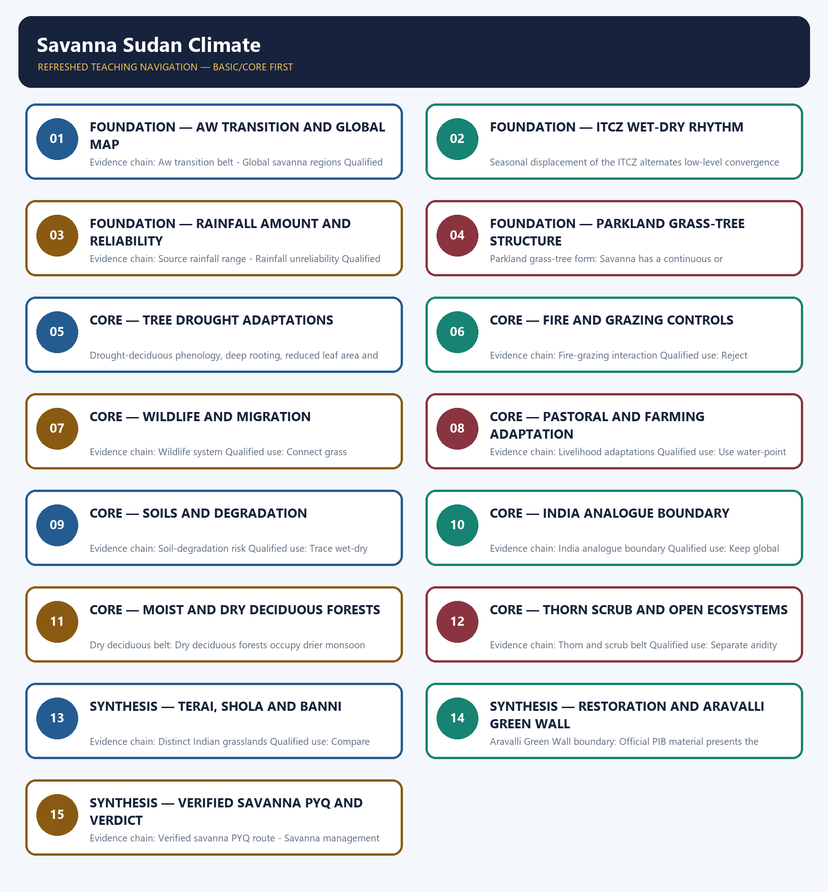

# Savanna Sudan Climate — Learner-v2 Complete Learning Session

> **Authoring-only generation:** 2026-09-01. No PDF was rendered and no tracker or index was mutated.

### SOURCE, PROGRESSION AND CURRENT-LINKAGE AUDIT

- **Generation date:** 2026-09-01.
- **Repository-first evidence:** the Basic owner is taught first and preserved in full; the Advanced owner is retained only in the optional final teaching block.
- **OCR evidence:** Repository Markdown was primary. The three required local Geography books were inspected as supplementary OCR/searchable evidence. No unsupported page precision, volatile figure or quotation was imported.
- **Qdrant:** not used; repository Markdown and available OCR context were sufficient.
- **PYQ integrity:** Verified direct ownership retains the 2021 Prelims savanna tree-limitation demand. The routing ledger supplies no official answer letter, so the package teaches rainfall seasonality, fire and herbivory as tested distinctions without manufacturing a key; Sahel and Indian restoration examples remain analytical applications rather than relabelled PYQs.
- **Live-link boundary:** Official PIB material is used only to establish the Aravalli Green Wall's landscape-restoration, native-vegetation, water-rejuvenation and coordination logic. Conflicting or evolving area, width, finance and completion figures are omitted, and project announcements are not treated as verified ecological outcomes.
- **Fact/inference discipline:** no current-affairs item, PYQ wording, figure or quotation is invented.

## BASIC LEARNING SESSION



*Distinct embedded teaching-navigation image. The separate continuous Cārvāka-style flowchart package remains an independent at-a-glance artifact.*

### SESSION 1 — FOUNDATION — AW TRANSITION AND GLOBAL MAP

#### DEFINITION / WHAT THIS IS CALLED

**Plain-language definition:** Global savanna regions: The Sudan belt of Africa is the classic expression, while the Llanos, Campo Cerrado and northern Australia are major regional examples with different soils, fire histories and land use.

**Technical definition:** Evidence chain: Aw transition belt - Global savanna regions Qualified use: Locate Sudan, Llanos, Cerrado and northern Australia.

#### ANSWER-GRABBING OPENING — WRITE/ADAPT IN THE EXAM

> Global savanna regions: The Sudan belt of Africa is the classic expression, while the Llanos, Campo Cerrado and northern Australia are major regional examples with different soils, fire histories and land use.

#### MUST-WRITE KEYWORDS

- **FOUNDATION**
- **Aw transition**
- **global map**
- **Aw transition belt**
- **Global savanna regions**
- **Evidence chain**

**How to use them:** Frame the answer through FOUNDATION; define Aw transition, connect global map with Aw transition belt to explain the mechanism, and use Global savanna regions for the decisive comparison or qualification.

#### VISUAL FIRST

```text
AW TRANSITION AND GLOBAL MAP
01. Aw transition belt
    |
    v
02. Global savanna regions
BOUNDARY -> A climate gradient is not a political belt.
```

*This topic-specific rail fixes the evidence sequence and its exam boundary before analysis.*

#### CORE EXPLANATION

Savanna or Sudan climate, commonly Koppen Aw, is a tropical transition between equatorial rainforest and hot desert, often mapped roughly from 5 to 20 degrees north and south; it is a gradient rather than a sharp line. The Sudan belt of Africa is the classic expression, while the Llanos, Campo Cerrado and northern Australia are major regional examples with different soils, fire histories and land use.

#### NAMED EVIDENCE AND MECHANISM

- **Aw transition belt:** Savanna or Sudan climate, commonly Koppen Aw, is a tropical transition between equatorial rainforest and hot desert, often mapped roughly from 5 to 20 degrees north and south; it is a gradient rather than a sharp line.
- **Global savanna regions:** The Sudan belt of Africa is the classic expression, while the Llanos, Campo Cerrado and northern Australia are major regional examples with different soils, fire histories and land use.

#### EXAMINER CAUTION

- A climate gradient is not a political belt.

#### EXAM LINK

- **Prelims:** Separate the agent, landform, location, status and scale attached to Aw transition and global map.
- **Mains:** Locate Sudan, Llanos, Cerrado and northern Australia.

#### MINI RECAP

- **Evidence chain:** Aw transition belt -> Global savanna regions
- **Qualified use:** Locate Sudan, Llanos, Cerrado and northern Australia.

#### CLOSING RECALL FLOW — FOUNDATION — AW TRANSITION AND GLOBAL MAP

```text
START / CONCEPT: FOUNDATION — Aw transition and global map
        |
        v
EXACT TERMS: FOUNDATION · Aw transition · global map · Aw transition belt · Global savanna regions · Evidence chain
        |
        v
MECHANISM / ARGUMENT: Evidence chain: Aw transition belt - Global savanna regions Qualified use: Locate Sudan, Llanos, Cerrado and northern Australia.
        |
        v
CONSEQUENCE / CONTRAST: A climate gradient is not a political belt.
        |
        v
UPSC TRAP / ANSWER-USE: Savanna or Sudan climate, commonly Koppen Aw, is a tropical transition between equatorial rainforest and hot desert, often mapped roughly from 5 to 20 degrees north and south; it is a gradient rather than a sharp line.
        |
        v
ANSWER-GRABBING FORMULATION: Global savanna regions: The Sudan belt of Africa is the classic expression, while the Llanos, Campo Cerrado and northern Australia are major regional examples with different soils, fire histories and land use.
```
### SESSION 2 — FOUNDATION — ITCZ WET-DRY RHYTHM

#### DEFINITION / WHAT THIS IS CALLED

**Plain-language definition:** Savanna rain arrives when the migrating tropical rain belt reaches the region and the dry season returns when it moves away.

**Technical definition:** Seasonal displacement of the ITCZ alternates low-level convergence and convection with subsiding or divergent trade-wind conditions, producing the Aw wet-dry rhythm.

#### ANSWER-GRABBING OPENING — WRITE/ADAPT IN THE EXAM

> The ITCZ wet-dry rhythm is the savanna's surface record of the tropical convergence zone moving toward and away from the region.

#### MUST-WRITE KEYWORDS

- **ITCZ migration**
- **high-sun season**
- **convectional rainfall**
- **low-sun season**
- **dry trade winds**
- **seasonal reversal**

**How to use them:** Draw the ITCZ nearer the savanna in the high-sun season and farther away in the low-sun season, then link convergence to rain and dry trades to drought.

#### VISUAL FIRST

```text
ITCZ WET-DRY RHYTHM
01. Wet-dry circulation
BOUNDARY -> Seasonal migration, not distance alone, makes the two seasons.
```

*This topic-specific rail fixes the evidence sequence and its exam boundary before analysis.*

#### CORE EXPLANATION

Poleward and equatorward migration of the ITCZ alternates a hot rainy high-sun season with a warm or cooler dry low-sun season dominated by drier trade-wind air.

#### NAMED EVIDENCE AND MECHANISM

- **Wet-dry circulation:** Poleward and equatorward migration of the ITCZ alternates a hot rainy high-sun season with a warm or cooler dry low-sun season dominated by drier trade-wind air.

#### EXAMINER CAUTION

- Seasonal migration, not distance alone, makes the two seasons.

#### EXAM LINK

- **Prelims:** Separate the agent, landform, location, status and scale attached to ITCZ wet-dry rhythm.
- **Mains:** Draw the high-sun and low-sun circulation.

#### MINI RECAP

- **Evidence chain:** Wet-dry circulation
- **Qualified use:** Draw the high-sun and low-sun circulation.

#### CLOSING RECALL FLOW — FOUNDATION — ITCZ WET-DRY RHYTHM

```text
START / CONCEPT: FOUNDATION — ITCZ wet-dry rhythm
        |
        v
EXACT TERMS: ITCZ migration · high-sun season · convectional rainfall · low-sun season · dry trade winds · seasonal reversal
        |
        v
MECHANISM / ARGUMENT: Evidence chain: Wet-dry circulation Qualified use: Draw the high-sun and low-sun circulation.
        |
        v
CONSEQUENCE / CONTRAST: The resulting consequence is that draw the high-sun and low-sun circulation.
        |
        v
UPSC TRAP / ANSWER-USE: Do not miss this limiting distinction: draw the high-sun and low-sun circulation.
        |
        v
ANSWER-GRABBING FORMULATION: The ITCZ wet-dry rhythm is the savanna's surface record of the tropical convergence zone moving toward and away from the region.
```
### SESSION 3 — FOUNDATION — RAINFALL AMOUNT AND RELIABILITY

#### DEFINITION / WHAT THIS IS CALLED

**Plain-language definition:** Source rainfall range: Source notes commonly describe about 75 to 150 centimetres of summer-concentrated rain; the decisive feature is a marked dry season, and totals decline toward desert margins.

**Technical definition:** Evidence chain: Source rainfall range - Rainfall unreliability Qualified use: Translate dry spells into livelihood risk.

#### ANSWER-GRABBING OPENING — WRITE/ADAPT IN THE EXAM

> Source rainfall range: Source notes commonly describe about 75 to 150 centimetres of summer-concentrated rain; the decisive feature is a marked dry season, and totals decline toward desert margins.

#### MUST-WRITE KEYWORDS

- **FOUNDATION**
- **Rainfall amount**
- **reliability**
- **Source rainfall range**
- **Rainfall unreliability**
- **Evidence chain**

**How to use them:** Frame the answer through FOUNDATION; define Rainfall amount, connect reliability with Source rainfall range to explain the mechanism, and use Rainfall unreliability for the decisive comparison or qualification.

#### VISUAL FIRST

```text
RAINFALL AMOUNT AND RELIABILITY
01. Source rainfall range
    |
    v
02. Rainfall unreliability
BOUNDARY -> Distribution and timing outrank one total.
```

*This topic-specific rail fixes the evidence sequence and its exam boundary before analysis.*

#### CORE EXPLANATION

Source notes commonly describe about 75 to 150 centimetres of summer-concentrated rain; the decisive feature is a marked dry season, and totals decline toward desert margins. Late onset, early cessation, long dry spells and drought make water reliability more important than annual total for crops, livestock and settlement.

#### NAMED EVIDENCE AND MECHANISM

- **Source rainfall range:** Source notes commonly describe about 75 to 150 centimetres of summer-concentrated rain; the decisive feature is a marked dry season, and totals decline toward desert margins.
- **Rainfall unreliability:** Late onset, early cessation, long dry spells and drought make water reliability more important than annual total for crops, livestock and settlement.

#### EXAMINER CAUTION

- Distribution and timing outrank one total.

#### EXAM LINK

- **Prelims:** Separate the agent, landform, location, status and scale attached to Rainfall amount and reliability.
- **Mains:** Translate dry spells into livelihood risk.

#### MINI RECAP

- **Evidence chain:** Source rainfall range -> Rainfall unreliability
- **Qualified use:** Translate dry spells into livelihood risk.

#### CLOSING RECALL FLOW — FOUNDATION — RAINFALL AMOUNT AND RELIABILITY

```text
START / CONCEPT: FOUNDATION — Rainfall amount and reliability
        |
        v
EXACT TERMS: FOUNDATION · Rainfall amount · reliability · Source rainfall range · Rainfall unreliability · Evidence chain
        |
        v
MECHANISM / ARGUMENT: Evidence chain: Source rainfall range - Rainfall unreliability Qualified use: Translate dry spells into livelihood risk.
        |
        v
CONSEQUENCE / CONTRAST: The resulting consequence is that source rainfall range - Rainfall unreliability Qualified use.
        |
        v
UPSC TRAP / ANSWER-USE: Do not miss this limiting distinction: source rainfall range - Rainfall unreliability Qualified use.
        |
        v
ANSWER-GRABBING FORMULATION: Source rainfall range: Source notes commonly describe about 75 to 150 centimetres of summer-concentrated rain; the decisive feature is a marked dry season, and totals decline toward desert margins.
```
### SESSION 4 — FOUNDATION — PARKLAND GRASS-TREE STRUCTURE

#### DEFINITION / WHAT THIS IS CALLED

**Plain-language definition:** Evidence chain: Parkland grass-tree form Qualified use: Use the equator-to-desert vegetation gradient.

**Technical definition:** Parkland grass-tree form: Savanna has a continuous or near-continuous grass layer with scattered trees, producing a parkland appearance; grasses generally become shorter and woody cover more open toward the desert margin.

#### ANSWER-GRABBING OPENING — WRITE/ADAPT IN THE EXAM

> Evidence chain: Parkland grass-tree form Qualified use: Use the equator-to-desert vegetation gradient.

#### MUST-WRITE KEYWORDS

- **FOUNDATION**
- **Parkland grass-tree structure**
- **Parkland grass-tree form**
- **Evidence chain**
- **Qualified use**
- **Savanna**

**How to use them:** Frame the answer through FOUNDATION; define Parkland grass-tree structure, connect Parkland grass-tree form with Evidence chain to explain the mechanism, and use Qualified use for the decisive comparison or qualification.

#### VISUAL FIRST

```text
PARKLAND GRASS-TREE STRUCTURE
01. Parkland grass-tree form
BOUNDARY -> Savanna is neither closed forest nor treeless steppe.
```

*This topic-specific rail fixes the evidence sequence and its exam boundary before analysis.*

#### CORE EXPLANATION

Savanna has a continuous or near-continuous grass layer with scattered trees, producing a parkland appearance; grasses generally become shorter and woody cover more open toward the desert margin.

#### NAMED EVIDENCE AND MECHANISM

- **Parkland grass-tree form:** Savanna has a continuous or near-continuous grass layer with scattered trees, producing a parkland appearance; grasses generally become shorter and woody cover more open toward the desert margin.

#### EXAMINER CAUTION

- Savanna is neither closed forest nor treeless steppe.

#### EXAM LINK

- **Prelims:** Separate the agent, landform, location, status and scale attached to Parkland grass-tree structure.
- **Mains:** Use the equator-to-desert vegetation gradient.

#### MINI RECAP

- **Evidence chain:** Parkland grass-tree form
- **Qualified use:** Use the equator-to-desert vegetation gradient.

#### CLOSING RECALL FLOW — FOUNDATION — PARKLAND GRASS-TREE STRUCTURE

```text
START / CONCEPT: FOUNDATION — Parkland grass-tree structure
        |
        v
EXACT TERMS: FOUNDATION · Parkland grass-tree structure · Parkland grass-tree form · Evidence chain · Qualified use · Savanna
        |
        v
MECHANISM / ARGUMENT: Parkland grass-tree form: Savanna has a continuous or near-continuous grass layer with scattered trees, producing a parkland appearance; grasses generally become shorter and woody cover more open toward the desert margin.
        |
        v
CONSEQUENCE / CONTRAST: Savanna is neither closed forest nor treeless steppe.
        |
        v
UPSC TRAP / ANSWER-USE: Do not miss this limiting distinction: mains: Use the equator-to-desert vegetation gradient.
        |
        v
ANSWER-GRABBING FORMULATION: Evidence chain: Parkland grass-tree form Qualified use: Use the equator-to-desert vegetation gradient.
```
### SESSION 5 — CORE — TREE DROUGHT ADAPTATIONS

#### DEFINITION / WHAT THIS IS CALLED

**Plain-language definition:** Savanna trees survive the dry season by reducing water loss, reaching stored moisture and resisting fire or browsing.

**Technical definition:** Drought-deciduous phenology, deep rooting, reduced leaf area and protective bark allocate water and biomass to persistence under seasonal moisture stress and recurrent disturbance.

#### ANSWER-GRABBING OPENING — WRITE/ADAPT IN THE EXAM

> The scattered savanna tree is a bundle of drought and disturbance adaptations, not a stunted rainforest tree.

#### MUST-WRITE KEYWORDS

- **deciduous habit**
- **deep roots**
- **thick bark**
- **small leaves**
- **umbrella crown**
- **acacia and baobab**

**How to use them:** Match leaf shedding and small leaves to lower transpiration, deep roots to water access, thick bark to fire resistance and crown form to the open savanna setting.

#### VISUAL FIRST

```text
TREE DROUGHT ADAPTATIONS
01. Drought adaptations
BOUNDARY -> Adaptations answer seasonal stress, fire and browsing together.
```

*This topic-specific rail fixes the evidence sequence and its exam boundary before analysis.*

#### CORE EXPLANATION

Deciduous habit, deep roots, thick bark, small leaves and umbrella crowns help trees such as acacia and baobab withstand seasonal drought, browsing and fire.

#### NAMED EVIDENCE AND MECHANISM

- **Drought adaptations:** Deciduous habit, deep roots, thick bark, small leaves and umbrella crowns help trees such as acacia and baobab withstand seasonal drought, browsing and fire.

#### EXAMINER CAUTION

- Adaptations answer seasonal stress, fire and browsing together.

#### EXAM LINK

- **Prelims:** Separate the agent, landform, location, status and scale attached to Tree drought adaptations.
- **Mains:** Link form to function.

#### MINI RECAP

- **Evidence chain:** Drought adaptations
- **Qualified use:** Link form to function.

#### CLOSING RECALL FLOW — CORE — TREE DROUGHT ADAPTATIONS

```text
START / CONCEPT: CORE — Tree drought adaptations
        |
        v
EXACT TERMS: deciduous habit · deep roots · thick bark · small leaves · umbrella crown · acacia and baobab
        |
        v
MECHANISM / ARGUMENT: Evidence chain: Drought adaptations Qualified use: Link form to function.
        |
        v
CONSEQUENCE / CONTRAST: The resulting consequence is that evidence chain: Drought adaptations Qualified use: Link form to function.
        |
        v
UPSC TRAP / ANSWER-USE: Do not miss this limiting distinction: evidence chain: Drought adaptations Qualified use: Link form to function.
        |
        v
ANSWER-GRABBING FORMULATION: The scattered savanna tree is a bundle of drought and disturbance adaptations, not a stunted rainforest tree.
```
### SESSION 6 — CORE — FIRE AND GRAZING CONTROLS

#### DEFINITION / WHAT THIS IS CALLED

**Plain-language definition:** Fire-grazing interaction: Seasonal climate makes grassland possible, while recurrent fire and herbivory suppress some tree recruitment and help maintain the grass-tree mosaic; neither climate-only nor fire-only explanation is sufficient.

**Technical definition:** Evidence chain: Fire-grazing interaction Qualified use: Reject single-cause explanations.

#### ANSWER-GRABBING OPENING — WRITE/ADAPT IN THE EXAM

> Fire-grazing interaction: Seasonal climate makes grassland possible, while recurrent fire and herbivory suppress some tree recruitment and help maintain the grass-tree mosaic; neither climate-only nor fire-only explanation is sufficient.

#### MUST-WRITE KEYWORDS

- **Fire**
- **grazing controls**
- **Fire-grazing interaction**
- **Evidence chain**
- **Qualified use**
- **Seasonal**

**How to use them:** Frame the answer through Fire; define grazing controls, connect Fire-grazing interaction with Evidence chain to explain the mechanism, and use Qualified use for the decisive comparison or qualification.

#### VISUAL FIRST

```text
FIRE AND GRAZING CONTROLS
01. Fire-grazing interaction
BOUNDARY -> Climate permits; disturbance helps maintain.
```

*This topic-specific rail fixes the evidence sequence and its exam boundary before analysis.*

#### CORE EXPLANATION

Seasonal climate makes grassland possible, while recurrent fire and herbivory suppress some tree recruitment and help maintain the grass-tree mosaic; neither climate-only nor fire-only explanation is sufficient.

#### NAMED EVIDENCE AND MECHANISM

- **Fire-grazing interaction:** Seasonal climate makes grassland possible, while recurrent fire and herbivory suppress some tree recruitment and help maintain the grass-tree mosaic; neither climate-only nor fire-only explanation is sufficient.

#### EXAMINER CAUTION

- Climate permits; disturbance helps maintain.

#### EXAM LINK

- **Prelims:** Separate the agent, landform, location, status and scale attached to Fire and grazing controls.
- **Mains:** Reject single-cause explanations.

#### MINI RECAP

- **Evidence chain:** Fire-grazing interaction
- **Qualified use:** Reject single-cause explanations.

#### CLOSING RECALL FLOW — CORE — FIRE AND GRAZING CONTROLS

```text
START / CONCEPT: CORE — Fire and grazing controls
        |
        v
EXACT TERMS: Fire · grazing controls · Fire-grazing interaction · Evidence chain · Qualified use · Seasonal
        |
        v
MECHANISM / ARGUMENT: Evidence chain: Fire-grazing interaction Qualified use: Reject single-cause explanations.
        |
        v
CONSEQUENCE / CONTRAST: The resulting consequence is that while recurrent fire and herbivory suppress some tree recruitment and help maintain the grass-tree...
        |
        v
UPSC TRAP / ANSWER-USE: Do not miss this limiting distinction: while recurrent fire and herbivory suppress some tree recruitment and help maintain the grass-tree...
        |
        v
ANSWER-GRABBING FORMULATION: Fire-grazing interaction: Seasonal climate makes grassland possible, while recurrent fire and herbivory suppress some tree recruitment and help maintain the grass-tree mosaic; neither climate-only nor fire-only explanation is sufficient.
```
### SESSION 7 — CORE — WILDLIFE AND MIGRATION

#### DEFINITION / WHAT THIS IS CALLED

**Plain-language definition:** CORE — Wildlife and migration comprises Wildlife, migration and Wildlife system as its core connected dimensions.

**Technical definition:** Evidence chain: Wildlife system Qualified use: Connect grass production to movement.

#### ANSWER-GRABBING OPENING — WRITE/ADAPT IN THE EXAM

> Wildlife system: Savannas support large grazing and browsing herds and associated predators because seasonal grass production, water and migration create a spatially dynamic food web.

#### MUST-WRITE KEYWORDS

- **Wildlife**
- **migration**
- **Wildlife system**
- **Evidence chain**
- **Qualified use**
- **Savannas**

**How to use them:** Frame the answer through Wildlife; define migration, connect Wildlife system with Evidence chain to explain the mechanism, and use Qualified use for the decisive comparison or qualification.

#### VISUAL FIRST

```text
WILDLIFE AND MIGRATION
01. Wildlife system
BOUNDARY -> Large fauna depend on seasonal space and water.
```

*This topic-specific rail fixes the evidence sequence and its exam boundary before analysis.*

#### CORE EXPLANATION

Savannas support large grazing and browsing herds and associated predators because seasonal grass production, water and migration create a spatially dynamic food web.

#### NAMED EVIDENCE AND MECHANISM

- **Wildlife system:** Savannas support large grazing and browsing herds and associated predators because seasonal grass production, water and migration create a spatially dynamic food web.

#### EXAMINER CAUTION

- Large fauna depend on seasonal space and water.

#### EXAM LINK

- **Prelims:** Separate the agent, landform, location, status and scale attached to Wildlife and migration.
- **Mains:** Connect grass production to movement.

#### MINI RECAP

- **Evidence chain:** Wildlife system
- **Qualified use:** Connect grass production to movement.

#### CLOSING RECALL FLOW — CORE — WILDLIFE AND MIGRATION

```text
START / CONCEPT: CORE — Wildlife and migration
        |
        v
EXACT TERMS: Wildlife · migration · Wildlife system · Evidence chain · Qualified use · Savannas
        |
        v
MECHANISM / ARGUMENT: Evidence chain: Wildlife system Qualified use: Connect grass production to movement.
        |
        v
CONSEQUENCE / CONTRAST: The resulting consequence is that savannas support large grazing and browsing herds and associated predators because seasonal grass production...
        |
        v
UPSC TRAP / ANSWER-USE: Do not miss this limiting distinction: savannas support large grazing and browsing herds and associated predators because seasonal grass production...
        |
        v
ANSWER-GRABBING FORMULATION: Wildlife system: Savannas support large grazing and browsing herds and associated predators because seasonal grass production, water and migration create a spatially dynamic food web.
```
### SESSION 8 — CORE — PASTORAL AND FARMING ADAPTATION

#### DEFINITION / WHAT THIS IS CALLED

**Plain-language definition:** Livelihood adaptations: Pastoral mobility and drought-tolerant crops such as millet and sorghum respond to variable water and forage; forced sedentarisation or fixed water points can concentrate grazing pressure.

**Technical definition:** Evidence chain: Livelihood adaptations Qualified use: Use water-point pressure as a qualification.

#### ANSWER-GRABBING OPENING — WRITE/ADAPT IN THE EXAM

> Livelihood adaptations: Pastoral mobility and drought-tolerant crops such as millet and sorghum respond to variable water and forage; forced sedentarisation or fixed water points can concentrate grazing pressure.

#### MUST-WRITE KEYWORDS

- **Pastoral**
- **farming adaptation**
- **Livelihood adaptations**
- **Evidence chain**
- **Qualified use**
- **Livelihood**

**How to use them:** Frame the answer through Pastoral; define farming adaptation, connect Livelihood adaptations with Evidence chain to explain the mechanism, and use Qualified use for the decisive comparison or qualification.

#### VISUAL FIRST

```text
PASTORAL AND FARMING ADAPTATION
01. Livelihood adaptations
BOUNDARY -> Mobility can be rational risk management.
```

*This topic-specific rail fixes the evidence sequence and its exam boundary before analysis.*

#### CORE EXPLANATION

Pastoral mobility and drought-tolerant crops such as millet and sorghum respond to variable water and forage; forced sedentarisation or fixed water points can concentrate grazing pressure.

#### NAMED EVIDENCE AND MECHANISM

- **Livelihood adaptations:** Pastoral mobility and drought-tolerant crops such as millet and sorghum respond to variable water and forage; forced sedentarisation or fixed water points can concentrate grazing pressure.

#### EXAMINER CAUTION

- Mobility can be rational risk management.

#### EXAM LINK

- **Prelims:** Separate the agent, landform, location, status and scale attached to Pastoral and farming adaptation.
- **Mains:** Use water-point pressure as a qualification.

#### MINI RECAP

- **Evidence chain:** Livelihood adaptations
- **Qualified use:** Use water-point pressure as a qualification.

#### CLOSING RECALL FLOW — CORE — PASTORAL AND FARMING ADAPTATION

```text
START / CONCEPT: CORE — Pastoral and farming adaptation
        |
        v
EXACT TERMS: Pastoral · farming adaptation · Livelihood adaptations · Evidence chain · Qualified use · Livelihood
        |
        v
MECHANISM / ARGUMENT: Evidence chain: Livelihood adaptations Qualified use: Use water-point pressure as a qualification.
        |
        v
CONSEQUENCE / CONTRAST: Mobility can be rational risk management.
        |
        v
UPSC TRAP / ANSWER-USE: Mains: Use water-point pressure as a qualification.
        |
        v
ANSWER-GRABBING FORMULATION: Livelihood adaptations: Pastoral mobility and drought-tolerant crops such as millet and sorghum respond to variable water and forage; forced sedentarisation or fixed water points can concentrate grazing pressure.
```
### SESSION 9 — CORE — SOILS AND DEGRADATION

#### DEFINITION / WHAT THIS IS CALLED

**Plain-language definition:** Soil-degradation risk: Strong wet-dry alternation can promote leaching, lateritic tendencies, surface sealing, erosion and fire exposure after vegetation loss; savanna soils are not uniformly infertile.

**Technical definition:** Evidence chain: Soil-degradation risk Qualified use: Trace wet-dry weathering and cover loss.

#### ANSWER-GRABBING OPENING — WRITE/ADAPT IN THE EXAM

> Soil-degradation risk: Strong wet-dry alternation can promote leaching, lateritic tendencies, surface sealing, erosion and fire exposure after vegetation loss; savanna soils are not uniformly infertile.

#### MUST-WRITE KEYWORDS

- **Soils**
- **degradation**
- **Soil-degradation risk**
- **Evidence chain**
- **Qualified use**
- **Strong**

**How to use them:** Frame the answer through Soils; define degradation, connect Soil-degradation risk with Evidence chain to explain the mechanism, and use Qualified use for the decisive comparison or qualification.

#### VISUAL FIRST

```text
SOILS AND DEGRADATION
01. Soil-degradation risk
BOUNDARY -> Savanna soils are heterogeneous.
```

*This topic-specific rail fixes the evidence sequence and its exam boundary before analysis.*

#### CORE EXPLANATION

Strong wet-dry alternation can promote leaching, lateritic tendencies, surface sealing, erosion and fire exposure after vegetation loss; savanna soils are not uniformly infertile.

#### NAMED EVIDENCE AND MECHANISM

- **Soil-degradation risk:** Strong wet-dry alternation can promote leaching, lateritic tendencies, surface sealing, erosion and fire exposure after vegetation loss; savanna soils are not uniformly infertile.

#### EXAMINER CAUTION

- Savanna soils are heterogeneous.

#### EXAM LINK

- **Prelims:** Separate the agent, landform, location, status and scale attached to Soils and degradation.
- **Mains:** Trace wet-dry weathering and cover loss.

#### MINI RECAP

- **Evidence chain:** Soil-degradation risk
- **Qualified use:** Trace wet-dry weathering and cover loss.

#### CLOSING RECALL FLOW — CORE — SOILS AND DEGRADATION

```text
START / CONCEPT: CORE — Soils and degradation
        |
        v
EXACT TERMS: Soils · degradation · Soil-degradation risk · Evidence chain · Qualified use · Strong
        |
        v
MECHANISM / ARGUMENT: Evidence chain: Soil-degradation risk Qualified use: Trace wet-dry weathering and cover loss.
        |
        v
CONSEQUENCE / CONTRAST: The resulting consequence is that strong wet-dry alternation can promote leaching, lateritic tendencies, surface sealing, erosion and fire exposure...
        |
        v
UPSC TRAP / ANSWER-USE: Do not miss this limiting distinction: strong wet-dry alternation can promote leaching, lateritic tendencies, surface sealing, erosion and fire exposure...
        |
        v
ANSWER-GRABBING FORMULATION: Soil-degradation risk: Strong wet-dry alternation can promote leaching, lateritic tendencies, surface sealing, erosion and fire exposure after vegetation loss; savanna soils are not uniformly infertile.
```
### SESSION 10 — CORE — INDIA ANALOGUE BOUNDARY

#### DEFINITION / WHAT THIS IS CALLED

**Plain-language definition:** India analogue boundary: India has wet-dry tropical environments and savanna-like mosaics, but the Advanced owner is an analogue of deciduous forest, thorn scrub and grasslands rather than proof that India is one homogeneous Sudan climate.

**Technical definition:** Evidence chain: India analogue boundary Qualified use: Keep global Basic before India Advanced.

#### ANSWER-GRABBING OPENING — WRITE/ADAPT IN THE EXAM

> India analogue boundary: India has wet-dry tropical environments and savanna-like mosaics, but the Advanced owner is an analogue of deciduous forest, thorn scrub and grasslands rather than proof that India is one homogeneous Sudan climate.

#### MUST-WRITE KEYWORDS

- **India analogue boundary**
- **Evidence chain**
- **Qualified use**
- **India**
- **Advanced**
- **Sudan**

**How to use them:** Frame the answer through India analogue boundary; define Evidence chain, connect Qualified use with India to explain the mechanism, and use Advanced for the decisive comparison or qualification.

#### VISUAL FIRST

```text
INDIA ANALOGUE BOUNDARY
01. India analogue boundary
BOUNDARY -> Analogue does not mean climate identity.
```

*This topic-specific rail fixes the evidence sequence and its exam boundary before analysis.*

#### CORE EXPLANATION

India has wet-dry tropical environments and savanna-like mosaics, but the Advanced owner is an analogue of deciduous forest, thorn scrub and grasslands rather than proof that India is one homogeneous Sudan climate.

#### NAMED EVIDENCE AND MECHANISM

- **India analogue boundary:** India has wet-dry tropical environments and savanna-like mosaics, but the Advanced owner is an analogue of deciduous forest, thorn scrub and grasslands rather than proof that India is one homogeneous Sudan climate.

#### EXAMINER CAUTION

- Analogue does not mean climate identity.

#### EXAM LINK

- **Prelims:** Separate the agent, landform, location, status and scale attached to India analogue boundary.
- **Mains:** Keep global Basic before India Advanced.

#### MINI RECAP

- **Evidence chain:** India analogue boundary
- **Qualified use:** Keep global Basic before India Advanced.

#### CLOSING RECALL FLOW — CORE — INDIA ANALOGUE BOUNDARY

```text
START / CONCEPT: CORE — India analogue boundary
        |
        v
EXACT TERMS: India analogue boundary · Evidence chain · Qualified use · India · Advanced · Sudan
        |
        v
MECHANISM / ARGUMENT: Evidence chain: India analogue boundary Qualified use: Keep global Basic before India Advanced.
        |
        v
CONSEQUENCE / CONTRAST: Analogue does not mean climate identity.
        |
        v
UPSC TRAP / ANSWER-USE: Do not miss this limiting distinction: india has wet-dry tropical environments and savanna-like mosaics.
        |
        v
ANSWER-GRABBING FORMULATION: India analogue boundary: India has wet-dry tropical environments and savanna-like mosaics, but the Advanced owner is an analogue of deciduous forest, thorn scrub and grasslands rather than proof that India is one homogeneous Sudan climate.
```
### SESSION 11 — CORE — MOIST AND DRY DECIDUOUS FORESTS

#### DEFINITION / WHAT THIS IS CALLED

**Plain-language definition:** Evidence chain: Moist deciduous belt - Dry deciduous belt Qualified use: Compare leaf-shedding and rainfall belts.

**Technical definition:** Dry deciduous belt: Dry deciduous forests occupy drier monsoon interiors and shed leaves to reduce dry-season water loss; rainfall thresholds overlap regionally and should not be treated as exact national walls.

#### ANSWER-GRABBING OPENING — WRITE/ADAPT IN THE EXAM

> Dry deciduous belt: Dry deciduous forests occupy drier monsoon interiors and shed leaves to reduce dry-season water loss; rainfall thresholds overlap regionally and should not be treated as exact national walls.

#### MUST-WRITE KEYWORDS

- **Moist**
- **dry deciduous forests**
- **Moist deciduous belt**
- **Dry deciduous belt**
- **Evidence chain**
- **Qualified use**

**How to use them:** Frame the answer through Moist; define dry deciduous forests, connect Moist deciduous belt with Dry deciduous belt to explain the mechanism, and use Evidence chain for the decisive comparison or qualification.

#### VISUAL FIRST

```text
MOIST AND DRY DECIDUOUS FORESTS
01. Moist deciduous belt
    |
    v
02. Dry deciduous belt
BOUNDARY -> Thresholds overlap and species dominance varies.
```

*This topic-specific rail fixes the evidence sequence and its exam boundary before analysis.*

#### CORE EXPLANATION

Indian source notes associate tropical moist deciduous forest broadly with about 100 to 200 centimetres of rainfall, with teak prominent in many peninsular belts and sal in many northern and eastern belts. Dry deciduous forests occupy drier monsoon interiors and shed leaves to reduce dry-season water loss; rainfall thresholds overlap regionally and should not be treated as exact national walls.

#### NAMED EVIDENCE AND MECHANISM

- **Moist deciduous belt:** Indian source notes associate tropical moist deciduous forest broadly with about 100 to 200 centimetres of rainfall, with teak prominent in many peninsular belts and sal in many northern and eastern belts.
- **Dry deciduous belt:** Dry deciduous forests occupy drier monsoon interiors and shed leaves to reduce dry-season water loss; rainfall thresholds overlap regionally and should not be treated as exact national walls.

#### EXAMINER CAUTION

- Thresholds overlap and species dominance varies.

#### EXAM LINK

- **Prelims:** Separate the agent, landform, location, status and scale attached to Moist and dry deciduous forests.
- **Mains:** Compare leaf-shedding and rainfall belts.

#### MINI RECAP

- **Evidence chain:** Moist deciduous belt -> Dry deciduous belt
- **Qualified use:** Compare leaf-shedding and rainfall belts.

#### CLOSING RECALL FLOW — CORE — MOIST AND DRY DECIDUOUS FORESTS

```text
START / CONCEPT: CORE — Moist and dry deciduous forests
        |
        v
EXACT TERMS: Moist · dry deciduous forests · Moist deciduous belt · Dry deciduous belt · Evidence chain · Qualified use
        |
        v
MECHANISM / ARGUMENT: Evidence chain: Moist deciduous belt - Dry deciduous belt Qualified use: Compare leaf-shedding and rainfall belts.
        |
        v
CONSEQUENCE / CONTRAST: Thresholds overlap and species dominance varies.
        |
        v
UPSC TRAP / ANSWER-USE: Do not miss this limiting distinction: dry deciduous forests occupy drier monsoon interiors and shed leaves to reduce dry-season water...
        |
        v
ANSWER-GRABBING FORMULATION: Dry deciduous belt: Dry deciduous forests occupy drier monsoon interiors and shed leaves to reduce dry-season water loss; rainfall thresholds overlap regionally and should not be treated as exact national walls.
```
### SESSION 12 — CORE — THORN SCRUB AND OPEN ECOSYSTEMS

#### DEFINITION / WHAT THIS IS CALLED

**Plain-language definition:** Thorn and scrub belt: Tropical thorn forest and scrub reflect climatic aridity interacting with grazing and cutting, grading through north-western and interior semi-arid belts; they are not invariably degraded moist forest.

**Technical definition:** Evidence chain: Thorn and scrub belt Qualified use: Separate aridity from land-use intensification.

#### ANSWER-GRABBING OPENING — WRITE/ADAPT IN THE EXAM

> Thorn and scrub belt: Tropical thorn forest and scrub reflect climatic aridity interacting with grazing and cutting, grading through north-western and interior semi-arid belts; they are not invariably degraded moist forest.

#### MUST-WRITE KEYWORDS

- **Thorn scrub**
- **open ecosystems**
- **Thorn and scrub belt**
- **Evidence chain**
- **Qualified use**
- **Tropical**

**How to use them:** Frame the answer through Thorn scrub; define open ecosystems, connect Thorn and scrub belt with Evidence chain to explain the mechanism, and use Qualified use for the decisive comparison or qualification.

#### VISUAL FIRST

```text
THORN SCRUB AND OPEN ECOSYSTEMS
01. Thorn and scrub belt
BOUNDARY -> Thorn is not always degraded moist forest.
```

*This topic-specific rail fixes the evidence sequence and its exam boundary before analysis.*

#### CORE EXPLANATION

Tropical thorn forest and scrub reflect climatic aridity interacting with grazing and cutting, grading through north-western and interior semi-arid belts; they are not invariably degraded moist forest.

#### NAMED EVIDENCE AND MECHANISM

- **Thorn and scrub belt:** Tropical thorn forest and scrub reflect climatic aridity interacting with grazing and cutting, grading through north-western and interior semi-arid belts; they are not invariably degraded moist forest.

#### EXAMINER CAUTION

- Thorn is not always degraded moist forest.

#### EXAM LINK

- **Prelims:** Separate the agent, landform, location, status and scale attached to Thorn scrub and open ecosystems.
- **Mains:** Separate aridity from land-use intensification.

#### MINI RECAP

- **Evidence chain:** Thorn and scrub belt
- **Qualified use:** Separate aridity from land-use intensification.

#### CLOSING RECALL FLOW — CORE — THORN SCRUB AND OPEN ECOSYSTEMS

```text
START / CONCEPT: CORE — Thorn scrub and open ecosystems
        |
        v
EXACT TERMS: Thorn scrub · open ecosystems · Thorn and scrub belt · Evidence chain · Qualified use · Tropical
        |
        v
MECHANISM / ARGUMENT: Evidence chain: Thorn and scrub belt Qualified use: Separate aridity from land-use intensification.
        |
        v
CONSEQUENCE / CONTRAST: Thorn is not always degraded moist forest.
        |
        v
UPSC TRAP / ANSWER-USE: Do not miss this limiting distinction: mains: Separate aridity from land-use intensification.
        |
        v
ANSWER-GRABBING FORMULATION: Thorn and scrub belt: Tropical thorn forest and scrub reflect climatic aridity interacting with grazing and cutting, grading through north-western and interior semi-arid belts; they are not invariably degraded moist forest.
```
### SESSION 13 — SYNTHESIS — TERAI, SHOLA AND BANNI

#### DEFINITION / WHAT THIS IS CALLED

**Plain-language definition:** Distinct Indian grasslands: Terai tall grasslands, shola grassland-forest mosaics and Banni's arid-saline grassland have different hydrology and histories; one universal fire or grazing prescription is unsafe.

**Technical definition:** Evidence chain: Distinct Indian grasslands Qualified use: Compare hydrology, altitude and salinity.

#### ANSWER-GRABBING OPENING — WRITE/ADAPT IN THE EXAM

> Distinct Indian grasslands: Terai tall grasslands, shola grassland-forest mosaics and Banni's arid-saline grassland have different hydrology and histories; one universal fire or grazing prescription is unsafe.

#### MUST-WRITE KEYWORDS

- **SYNTHESIS**
- **Terai**
- **shola**
- **Banni**
- **Distinct Indian grasslands**
- **Evidence chain**

**How to use them:** Frame the answer through SYNTHESIS; define Terai, connect shola with Banni to explain the mechanism, and use Distinct Indian grasslands for the decisive comparison or qualification.

#### VISUAL FIRST

```text
TERAI, SHOLA AND BANNI
01. Distinct Indian grasslands
BOUNDARY -> Indian grasslands need ecosystem-specific management.
```

*This topic-specific rail fixes the evidence sequence and its exam boundary before analysis.*

#### CORE EXPLANATION

Terai tall grasslands, shola grassland-forest mosaics and Banni's arid-saline grassland have different hydrology and histories; one universal fire or grazing prescription is unsafe.

#### NAMED EVIDENCE AND MECHANISM

- **Distinct Indian grasslands:** Terai tall grasslands, shola grassland-forest mosaics and Banni's arid-saline grassland have different hydrology and histories; one universal fire or grazing prescription is unsafe.

#### EXAMINER CAUTION

- Indian grasslands need ecosystem-specific management.

#### EXAM LINK

- **Prelims:** Separate the agent, landform, location, status and scale attached to Terai, shola and Banni.
- **Mains:** Compare hydrology, altitude and salinity.

#### MINI RECAP

- **Evidence chain:** Distinct Indian grasslands
- **Qualified use:** Compare hydrology, altitude and salinity.

#### CLOSING RECALL FLOW — SYNTHESIS — TERAI, SHOLA AND BANNI

```text
START / CONCEPT: SYNTHESIS — Terai, shola and Banni
        |
        v
EXACT TERMS: SYNTHESIS · Terai · shola · Banni · Distinct Indian grasslands · Evidence chain
        |
        v
MECHANISM / ARGUMENT: Evidence chain: Distinct Indian grasslands Qualified use: Compare hydrology, altitude and salinity.
        |
        v
CONSEQUENCE / CONTRAST: The resulting consequence is that terai tall grasslands, shola grassland-forest mosaics and Banni's arid-saline grassland have different hydrology and...
        |
        v
UPSC TRAP / ANSWER-USE: Do not miss this limiting distinction: terai tall grasslands, shola grassland-forest mosaics and Banni's arid-saline grassland have different hydrology and...
        |
        v
ANSWER-GRABBING FORMULATION: Distinct Indian grasslands: Terai tall grasslands, shola grassland-forest mosaics and Banni's arid-saline grassland have different hydrology and histories; one universal fire or grazing prescription is unsafe.
```
### SESSION 14 — SYNTHESIS — RESTORATION AND ARAVALLI GREEN WALL

#### DEFINITION / WHAT THIS IS CALLED

**Plain-language definition:** Evidence chain: Restoration design - Aravalli Green Wall boundary Qualified use: Prioritise native mosaics, water and connectivity.

**Technical definition:** Aravalli Green Wall boundary: Official PIB material presents the Aravalli Green Wall as landscape restoration involving native vegetation, water-body rejuvenation and multi-state coordination; it should not be reduced to one uniform plantation strip or uncited target.

#### ANSWER-GRABBING OPENING — WRITE/ADAPT IN THE EXAM

> Aravalli Green Wall boundary: Official PIB material presents the Aravalli Green Wall as landscape restoration involving native vegetation, water-body rejuvenation and multi-state coordination; it should not be reduced to one uniform plantation strip or uncited target.

#### MUST-WRITE KEYWORDS

- **SYNTHESIS**
- **Restoration**
- **Aravalli Green Wall**
- **Restoration design**
- **Aravalli Green Wall boundary**
- **Evidence chain**

**How to use them:** Frame the answer through SYNTHESIS; define Restoration, connect Aravalli Green Wall with Restoration design to explain the mechanism, and use Aravalli Green Wall boundary for the decisive comparison or qualification.

#### VISUAL FIRST

```text
RESTORATION AND ARAVALLI GREEN WALL
01. Restoration design
    |
    v
02. Aravalli Green Wall boundary
BOUNDARY -> Official project language is not proof of outcomes.
```

*This topic-specific rail fixes the evidence sequence and its exam boundary before analysis.*

#### CORE EXPLANATION

Savanna and dryland restoration should protect native grass-forb-tree mosaics, water processes, mobility and disturbance regimes rather than equating restoration with dense tree planting everywhere. Official PIB material presents the Aravalli Green Wall as landscape restoration involving native vegetation, water-body rejuvenation and multi-state coordination; it should not be reduced to one uniform plantation strip or uncited target.

#### NAMED EVIDENCE AND MECHANISM

- **Restoration design:** Savanna and dryland restoration should protect native grass-forb-tree mosaics, water processes, mobility and disturbance regimes rather than equating restoration with dense tree planting everywhere.
- **Aravalli Green Wall boundary:** Official PIB material presents the Aravalli Green Wall as landscape restoration involving native vegetation, water-body rejuvenation and multi-state coordination; it should not be reduced to one uniform plantation strip or uncited target.

#### EXAMINER CAUTION

- Official project language is not proof of outcomes.

#### EXAM LINK

- **Prelims:** Separate the agent, landform, location, status and scale attached to Restoration and Aravalli Green Wall.
- **Mains:** Prioritise native mosaics, water and connectivity.

#### MINI RECAP

- **Evidence chain:** Restoration design -> Aravalli Green Wall boundary
- **Qualified use:** Prioritise native mosaics, water and connectivity.

#### CLOSING RECALL FLOW — SYNTHESIS — RESTORATION AND ARAVALLI GREEN WALL

```text
START / CONCEPT: SYNTHESIS — Restoration and Aravalli Green Wall
        |
        v
EXACT TERMS: SYNTHESIS · Restoration · Aravalli Green Wall · Restoration design · Aravalli Green Wall boundary · Evidence chain
        |
        v
MECHANISM / ARGUMENT: Evidence chain: Restoration design - Aravalli Green Wall boundary Qualified use: Prioritise native mosaics, water and connectivity.
        |
        v
CONSEQUENCE / CONTRAST: Restoration design: Savanna and dryland restoration should protect native grass-forb-tree mosaics, water processes, mobility and disturbance regimes rather than equating restoration with dense tree planting everywhere.
        |
        v
UPSC TRAP / ANSWER-USE: Official project language is not proof of outcomes.
        |
        v
ANSWER-GRABBING FORMULATION: Aravalli Green Wall boundary: Official PIB material presents the Aravalli Green Wall as landscape restoration involving native vegetation, water-body rejuvenation and multi-state coordination; it should not be reduced to one uniform plantation strip or uncited target.
```
### SESSION 15 — SYNTHESIS — VERIFIED SAVANNA PYQ AND VERDICT

#### DEFINITION / WHAT THIS IS CALLED

**Plain-language definition:** Verified savanna PYQ route: The routed 2021 Prelims demand tests conditions limiting tree development in savanna; the ledger withholds the official answer letter, so rainfall seasonality, fire and herbivory are taught as interacting controls.

**Technical definition:** Evidence chain: Verified savanna PYQ route - Savanna management verdict Qualified use: Use climate-fire-herbivory interaction.

#### ANSWER-GRABBING OPENING — WRITE/ADAPT IN THE EXAM

> Verified savanna PYQ route: The routed 2021 Prelims demand tests conditions limiting tree development in savanna; the ledger withholds the official answer letter, so rainfall seasonality, fire and herbivory are taught as interacting controls.

#### MUST-WRITE KEYWORDS

- **SYNTHESIS**
- **Verified savanna PYQ**
- **verdict**
- **Verified savanna PYQ route**
- **Savanna management verdict**
- **Evidence chain**

**How to use them:** Frame the answer through SYNTHESIS; define Verified savanna PYQ, connect verdict with Verified savanna PYQ route to explain the mechanism, and use Savanna management verdict for the decisive comparison or qualification.

#### VISUAL FIRST

```text
VERIFIED SAVANNA PYQ AND VERDICT
01. Verified savanna PYQ route
    |
    v
02. Savanna management verdict
BOUNDARY -> No official answer letter is locally available.
```

*This topic-specific rail fixes the evidence sequence and its exam boundary before analysis.*

#### CORE EXPLANATION

The routed 2021 Prelims demand tests conditions limiting tree development in savanna; the ledger withholds the official answer letter, so rainfall seasonality, fire and herbivory are taught as interacting controls. A defensible policy distinguishes natural open ecosystems from degraded land and manages water, grazing, fire, invasives and livelihoods together; increasing tree density is not automatically ecological improvement.

#### NAMED EVIDENCE AND MECHANISM

- **Verified savanna PYQ route:** The routed 2021 Prelims demand tests conditions limiting tree development in savanna; the ledger withholds the official answer letter, so rainfall seasonality, fire and herbivory are taught as interacting controls.
- **Savanna management verdict:** A defensible policy distinguishes natural open ecosystems from degraded land and manages water, grazing, fire, invasives and livelihoods together; increasing tree density is not automatically ecological improvement.

#### EXAMINER CAUTION

- No official answer letter is locally available.

#### EXAM LINK

- **Prelims:** Separate the agent, landform, location, status and scale attached to Verified savanna PYQ and verdict.
- **Mains:** Use climate-fire-herbivory interaction.

#### MINI RECAP

- **Evidence chain:** Verified savanna PYQ route -> Savanna management verdict
- **Qualified use:** Use climate-fire-herbivory interaction.
#### COMPLETE BASIC OWNER EVIDENCE BANK

> **Subject:** Geography · **Tier:** Must-Do (foundation + standard) · **GS Paper:** GS-I
> **Grounded in:** G.C. Leong, *Certificate Physical & Human Geography* + Majid Husain, *Indian & World Geography*.
> ✅ = from source book · ⚠️ = inference / standard knowledge · 📰 = current affairs.
> *Companion: `advanced/17_India-Deciduous-and-Grasslands.md`.*

#### 1. What & Where (G.C. Leong)

✅ The **Savanna or Sudan climate (Köppen Aw)** is a **transitional climate** between the equatorial forests and the Trade-Wind hot deserts. ✅ It lies within the tropics, roughly **5°–20° N/S**, and is best developed in the **Sudan belt of Africa**, where wet and dry seasons are most distinct.

✅ Other savanna regions include the **Llanos of Venezuela**, **Campo Cerrado of Brazil**, and **northern Australia**.

| Region | ✅ Local example | Character |
|---|---|---|
| Africa | Sudan belt | Best-developed savanna / “Sudan climate” |
| South America | Llanos, Campo Cerrado | Tropical grassland regions |
| Australia | Northern Australia | Wet-dry tropical grassland |

> 🔑 Trap: Savanna is neither equatorial forest nor desert; it is the **transition** between them.

#### 2. Climate: Wet-and-Dry Rhythm

✅ The Sudan climate has an alternate **hot rainy season** and **cool/warm dry season**. ✅ In the Northern Hemisphere, the rainy season commonly begins around **May** and lasts until **September**, as in Kano, Nigeria. ✅ Rainfall is mainly in summer and is often **unreliable**.

| Feature | ✅ Savanna / Sudan climate |
|---|---|
| Seasons | Hot wet summer + warm/cool dry winter |
| Rainfall | Summer-concentrated; about **75–150 cm** in the notes |
| Mechanism | High-sun season brings ITCZ/convectional rain; low-sun season brings dry trades |
| Risk | Droughts may be long and severe |
| Temperature | Warm to hot all year, with seasonal drop in dry season |

✅ As one moves away from the Equator toward desert margins, rainfall falls and vegetation becomes shorter and more open.

#### 3. Savanna Vegetation: Parkland Grassland

✅ Savanna vegetation is a **tropical grassland** with **tall grasses and scattered trees**, giving a **parkland** appearance. ✅ Grasses are tallest and most luxuriant near the equatorial margin and become shorter toward the desert margin. ✅ Trees are drought-resistant and deciduous, commonly including **acacia** and **baobab**.

| Vegetation element | ✅ Adaptation / feature |
|---|---|
| Tall grasses | Grow rapidly in rainy season; dry and turn dormant in dry season |
| Scattered trees | Parkland appearance |
| Deciduous habit | Leaves shed in dry season to conserve moisture |
| Roots / bark | Long roots, thick bark |
| Tree crowns | Flat / umbrella-shaped crowns |
| Fire | Annual natural/human fires help maintain grassland |

> 🔑 Trap: Savanna grass is **not uniform everywhere**; it decreases in height away from the equator.

#### 4. Wildlife, People & Farming Hazards

✅ The savanna is the classic **big-game country**, supporting grazing herds and predators. ✅ It is the natural home of large herbivores such as **zebra, giraffe, antelope, wildebeest, buffalo and elephant**, and predators such as **lion and cheetah**.

✅ G.C. Leong links savanna livelihoods to pastoralists such as the **Masai of East Africa** and cultivators such as the **Hausa of northern Nigeria**, who grow crops such as sorghum and millet. ✅ Farming faces natural hazards because rainfall is unreliable; droughts may be long and severe. ✅ Without irrigation, improved crop varieties and scientific farming suited to tropical grasslands, crop failures can be disastrous.

✅ The wet-dry regime also encourages rapid deterioration of soils through leaching/laterite tendencies.

#### 5. Must-Know Facts (Prelims)

- ✅ Köppen **Aw**; transitional between equatorial forest and hot desert.
- ✅ Best developed in the **Sudan belt** of Africa.
- ✅ Other examples: **Llanos**, **Campo Cerrado**, **northern Australia**.
- ✅ Two seasons: **hot wet summer** and **warm/cool dry winter**.
- ✅ Rain is concentrated in summer; total about **75–150 cm** in the source notes.
- ✅ Vegetation: tropical grassland with scattered drought-resistant trees — **parkland**.
- ✅ Grass height decreases away from the Equator.
- ✅ Trees are deciduous and drought-adapted: acacia, baobab; long roots, thick bark, umbrella crowns.
- ✅ Savanna is “big-game country” and natural home of large grazing herds.
- ✅ Annual fires are characteristic and help maintain grassland.
- ✅ Rainfall unreliability makes savanna agriculture hazardous.

#### 6. UPSC Traps

- ❌ Savanna rainfall is evenly spread through the year → **It is strongly seasonal and summer-concentrated.**
- ❌ Savanna grass is uniform everywhere → **Grass is taller near the equatorial margin and shorter toward the desert margin.**
- ❌ Savanna is purely natural climax vegetation untouched by humans → **Human-set annual fires strongly shape and maintain savanna grassland.**
- ❌ Savanna is the same as equatorial rainforest → **It is a transitional wet-dry grassland between rainforest and desert.**
- ❌ Savanna agriculture is secure because rainfall is tropical → **Rainfall is unreliable; droughts and crop failure are major hazards.**

#### 7. 📰 Current link

📰 **Africa's Great Green Wall and Sahel restoration:** launched in 2007, the initiative evolved from a
literal tree belt into a mosaic of land restoration, agroforestry and livelihood projects across the
Sahel. Its 2030 restoration, carbon and jobs targets are programme goals—not completed outcomes—and
progress estimates vary by definition and reporting year.

#### 8. Mains angles

- Explain why the savanna is called a transitional climate and how the wet-dry rhythm shapes vegetation, wildlife and agriculture.
- Assess the Great Green Wall as a nature-based response to Sahel desertification and identify lessons for dryland restoration.

#### 9. Answer architecture (10/15/20-mark support)

##### 9.1 Directive decoding

| If the question says | It is really asking for | Do **not** |
|---|---|---|
| "Why is the savanna a grassland rather than a forest?" | The wet-and-dry rainfall regime **plus** fire and grazing as maintaining agents | Give rainfall as the only cause |
| "Discuss the savanna as a problem environment for agriculture" | Rainfall unreliability, leaching and laterisation, pest and disease burden, and the resulting land-use strategies | Treat it as simply dry |
| "Compare the savanna with the steppe grassland" | Latitude, rainfall regime, soil, tree presence and economic use | Merge tropical and temperate grasslands |

##### 9.2 The controversy worth knowing

⚠️ The savanna is often described as a **derived or fire-maintained** grassland rather than a purely
climatic one: repeated burning, whether natural or deliberate, and sustained grazing suppress tree
seedlings and favour fire-tolerant grasses and thick-barked trees. The honest position for an answer
is that the wet-and-dry regime makes grassland *possible* while fire and grazing make it
*persistent*. Saying this converts a descriptive answer into an analytical one, and it is the same
non-deterministic reasoning the folder applies elsewhere.

##### 9.3 Reusable 10-mark spine — savanna as a problem environment

1. **Thesis:** the savanna's difficulty is not aridity but **unreliability** — a substantial annual
   rainfall arrives in a short, variable season, so the risk of failure is high even though the
   total looks adequate.
2. **Physical constraints:** a long dry season with high evaporation; alternating wetting and drying
   that drives leaching and laterite hardening (mechanism in
   `04_Weathering-MassMovement-Groundwater.md`); a heavy pest and disease burden for livestock and
   people; and fire as a permanent feature of the system.
3. **Adaptive land use:** drought-tolerant cereals and millets; pastoralism and seasonal
   transhumance; opportunistic cultivation timed to the rains; game and wildlife-based economies.
4. **The pressure of change:** cultivation of marginal land, sedentarisation of herders, and
   boreholes concentrating grazing around water points, all of which raise degradation risk on the
   dry margin (see `07_Arid-Desert-Landforms.md`).
5. **Balance:** the savanna also carries the world's greatest concentrations of large mammals and,
   with water control, genuine agricultural potential — it is a risky environment, not a poor one.
6. **Conclusion:** graded — the binding constraint is **water reliability and soil management**, both
   of which are addressable, which is why savanna outcomes vary so widely between regions with
   similar climates.

##### 9.4 Evidence unit

> **Claim:** vegetation boundaries are not always climatic boundaries. **Evidence:** the savanna's
> tree-grass balance is maintained by recurrent fire and grazing as much as by the rainfall regime,
> and fire-tolerant species dominate. **Significance:** it shows that a biome can be a coupled
> human-ecological product, which reframes "conservation" as management of a disturbance regime
> rather than protection from disturbance. **Limitation:** the underlying seasonal rainfall regime
> still sets the outer limits — fire cannot create savanna in an equatorial or a desert climate.

<!-- BEGIN GENERATED PYQ INTEGRATION: 2018-2023 -->

#### Historical PYQ Integration (2018-2023)

> **Status:** Question-level PYQ demand is integrated into this owner.
> **Provenance:** Audited local official-paper routing ledgers: `_PYQ-ROUTING-PRELIMS-2018-2023.md`.
> **Answer-key rule:** The official 2018-2023 Prelims/CSAT keys are not held locally; no option or answer has been inferred.

- **Years represented:** 2021
- **Paper(s):** Prelims GS-I
- **Routed question demands:** 1

| Year | Paper | Q | PYQ demand (neutral rendering) | Directive / format | Source status | Owner requirement |
|---:|---|---:|---|---|---|---|
| 2021 | Prelims GS-I | 61 | Savanna biome conditions limiting tree development | Objective question; official key unavailable locally | Routed; key unavailable locally | Cover the named fact/concept and its likely statement-level distinctions. |

##### What this owner must now support

- Savanna biome conditions limiting tree development

> The table integrates the examinable demand and paper metadata. It does not turn an unkeyed objective question into a solved answer, and it does not claim that lexical presence alone proves full conceptual sufficiency.
<!-- END GENERATED PYQ INTEGRATION: 2018-2023 -->

#### CLOSING RECALL FLOW — SYNTHESIS — VERIFIED SAVANNA PYQ AND VERDICT

```text
START / CONCEPT: SYNTHESIS — Verified savanna PYQ and verdict
        |
        v
EXACT TERMS: SYNTHESIS · Verified savanna PYQ · verdict · Verified savanna PYQ route · Savanna management verdict · Evidence chain
        |
        v
MECHANISM / ARGUMENT: Evidence chain: Verified savanna PYQ route - Savanna management verdict Qualified use: Use climate-fire-herbivory interaction.
        |
        v
CONSEQUENCE / CONTRAST: Savanna management verdict: A defensible policy distinguishes natural open ecosystems from degraded land and manages water, grazing, fire, invasives and livelihoods together; increasing tree density is not automatically ecological improvement.
        |
        v
UPSC TRAP / ANSWER-USE: 🔑 Trap: Savanna grass is not uniform everywhere; it decreases in height away from the equator.
        |
        v
ANSWER-GRABBING FORMULATION: Verified savanna PYQ route: The routed 2021 Prelims demand tests conditions limiting tree development in savanna; the ledger withholds the official answer letter, so rainfall seasonality, fire and herbivory are taught as interacting controls.
```
## BASIC MCQS / REMEDIATION

### Q1. Which statement correctly explains Aw transition belt?

A. Savanna or Sudan climate, commonly Koppen Aw, is a tropical transition between equatorial rainforest and hot desert, often mapped roughly from 5 to 20 degrees north and south; it is a gradient rather than a sharp line.
B. Poleward and equatorward migration of the ITCZ alternates a hot rainy high-sun season with a warm or cooler dry low-sun season dominated by drier trade-wind air.
C. Source notes commonly describe about 75 to 150 centimetres of summer-concentrated rain; the decisive feature is a marked dry season, and totals decline toward desert margins.
D. The Sudan belt of Africa is the classic expression, while the Llanos, Campo Cerrado and northern Australia are major regional examples with different soils, fire histories and land use.

**Answer: A.**
**Explanation:** Savanna or Sudan climate, commonly Koppen Aw, is a tropical transition between equatorial rainforest and hot desert, often mapped roughly from 5 to 20 degrees north and south; it is a gradient rather than a sharp line. The other options describe different processes, locations, scales or governance categories.

### Q2. Which option is the safest spatial interpretation of Aw transition belt?

A. Source notes commonly describe about 75 to 150 centimetres of summer-concentrated rain; the decisive feature is a marked dry season, and totals decline toward desert margins.
B. Savanna or Sudan climate, commonly Koppen Aw, is a tropical transition between equatorial rainforest and hot desert, often mapped roughly from 5 to 20 degrees north and south; it is a gradient rather than a sharp line.
C. Late onset, early cessation, long dry spells and drought make water reliability more important than annual total for crops, livestock and settlement.
D. Poleward and equatorward migration of the ITCZ alternates a hot rainy high-sun season with a warm or cooler dry low-sun season dominated by drier trade-wind air.

**Answer: B.**
**Explanation:** Savanna or Sudan climate, commonly Koppen Aw, is a tropical transition between equatorial rainforest and hot desert, often mapped roughly from 5 to 20 degrees north and south; it is a gradient rather than a sharp line. The other options describe different processes, locations, scales or governance categories.

### Q3. Which statement preserves the process boundary for Aw transition belt?

A. Savanna has a continuous or near-continuous grass layer with scattered trees, producing a parkland appearance; grasses generally become shorter and woody cover more open toward the desert margin.
B. Late onset, early cessation, long dry spells and drought make water reliability more important than annual total for crops, livestock and settlement.
C. Savanna or Sudan climate, commonly Koppen Aw, is a tropical transition between equatorial rainforest and hot desert, often mapped roughly from 5 to 20 degrees north and south; it is a gradient rather than a sharp line.
D. Source notes commonly describe about 75 to 150 centimetres of summer-concentrated rain; the decisive feature is a marked dry season, and totals decline toward desert margins.

**Answer: C.**
**Explanation:** Savanna or Sudan climate, commonly Koppen Aw, is a tropical transition between equatorial rainforest and hot desert, often mapped roughly from 5 to 20 degrees north and south; it is a gradient rather than a sharp line. The other options describe different processes, locations, scales or governance categories.

### Q4. Which option avoids the main UPSC trap concerning Aw transition belt?

A. Late onset, early cessation, long dry spells and drought make water reliability more important than annual total for crops, livestock and settlement.
B. Savanna has a continuous or near-continuous grass layer with scattered trees, producing a parkland appearance; grasses generally become shorter and woody cover more open toward the desert margin.
C. Deciduous habit, deep roots, thick bark, small leaves and umbrella crowns help trees such as acacia and baobab withstand seasonal drought, browsing and fire.
D. Savanna or Sudan climate, commonly Koppen Aw, is a tropical transition between equatorial rainforest and hot desert, often mapped roughly from 5 to 20 degrees north and south; it is a gradient rather than a sharp line.

**Answer: D.**
**Explanation:** Savanna or Sudan climate, commonly Koppen Aw, is a tropical transition between equatorial rainforest and hot desert, often mapped roughly from 5 to 20 degrees north and south; it is a gradient rather than a sharp line. The other options describe different processes, locations, scales or governance categories.

### Q5. Which statement correctly explains Global savanna regions?

A. The Sudan belt of Africa is the classic expression, while the Llanos, Campo Cerrado and northern Australia are major regional examples with different soils, fire histories and land use.
B. Late onset, early cessation, long dry spells and drought make water reliability more important than annual total for crops, livestock and settlement.
C. Poleward and equatorward migration of the ITCZ alternates a hot rainy high-sun season with a warm or cooler dry low-sun season dominated by drier trade-wind air.
D. Source notes commonly describe about 75 to 150 centimetres of summer-concentrated rain; the decisive feature is a marked dry season, and totals decline toward desert margins.

**Answer: A.**
**Explanation:** The Sudan belt of Africa is the classic expression, while the Llanos, Campo Cerrado and northern Australia are major regional examples with different soils, fire histories and land use. The other options describe different processes, locations, scales or governance categories.

### Q6. Which option is the safest spatial interpretation of Global savanna regions?

A. Savanna has a continuous or near-continuous grass layer with scattered trees, producing a parkland appearance; grasses generally become shorter and woody cover more open toward the desert margin.
B. The Sudan belt of Africa is the classic expression, while the Llanos, Campo Cerrado and northern Australia are major regional examples with different soils, fire histories and land use.
C. Source notes commonly describe about 75 to 150 centimetres of summer-concentrated rain; the decisive feature is a marked dry season, and totals decline toward desert margins.
D. Late onset, early cessation, long dry spells and drought make water reliability more important than annual total for crops, livestock and settlement.

**Answer: B.**
**Explanation:** The Sudan belt of Africa is the classic expression, while the Llanos, Campo Cerrado and northern Australia are major regional examples with different soils, fire histories and land use. The other options describe different processes, locations, scales or governance categories.

### Q7. Which statement preserves the process boundary for Global savanna regions?

A. Deciduous habit, deep roots, thick bark, small leaves and umbrella crowns help trees such as acacia and baobab withstand seasonal drought, browsing and fire.
B. Late onset, early cessation, long dry spells and drought make water reliability more important than annual total for crops, livestock and settlement.
C. The Sudan belt of Africa is the classic expression, while the Llanos, Campo Cerrado and northern Australia are major regional examples with different soils, fire histories and land use.
D. Savanna has a continuous or near-continuous grass layer with scattered trees, producing a parkland appearance; grasses generally become shorter and woody cover more open toward the desert margin.

**Answer: C.**
**Explanation:** The Sudan belt of Africa is the classic expression, while the Llanos, Campo Cerrado and northern Australia are major regional examples with different soils, fire histories and land use. The other options describe different processes, locations, scales or governance categories.

### Q8. Which option avoids the main UPSC trap concerning Global savanna regions?

A. Seasonal climate makes grassland possible, while recurrent fire and herbivory suppress some tree recruitment and help maintain the grass-tree mosaic; neither climate-only nor fire-only explanation is sufficient.
B. Savanna has a continuous or near-continuous grass layer with scattered trees, producing a parkland appearance; grasses generally become shorter and woody cover more open toward the desert margin.
C. Deciduous habit, deep roots, thick bark, small leaves and umbrella crowns help trees such as acacia and baobab withstand seasonal drought, browsing and fire.
D. The Sudan belt of Africa is the classic expression, while the Llanos, Campo Cerrado and northern Australia are major regional examples with different soils, fire histories and land use.

**Answer: D.**
**Explanation:** The Sudan belt of Africa is the classic expression, while the Llanos, Campo Cerrado and northern Australia are major regional examples with different soils, fire histories and land use. The other options describe different processes, locations, scales or governance categories.

### Q9. Which statement correctly explains Wet-dry circulation?

A. Poleward and equatorward migration of the ITCZ alternates a hot rainy high-sun season with a warm or cooler dry low-sun season dominated by drier trade-wind air.
B. Savanna has a continuous or near-continuous grass layer with scattered trees, producing a parkland appearance; grasses generally become shorter and woody cover more open toward the desert margin.
C. Late onset, early cessation, long dry spells and drought make water reliability more important than annual total for crops, livestock and settlement.
D. Source notes commonly describe about 75 to 150 centimetres of summer-concentrated rain; the decisive feature is a marked dry season, and totals decline toward desert margins.

**Answer: A.**
**Explanation:** Poleward and equatorward migration of the ITCZ alternates a hot rainy high-sun season with a warm or cooler dry low-sun season dominated by drier trade-wind air. The other options describe different processes, locations, scales or governance categories.

### Q10. Which option is the safest spatial interpretation of Wet-dry circulation?

A. Savanna has a continuous or near-continuous grass layer with scattered trees, producing a parkland appearance; grasses generally become shorter and woody cover more open toward the desert margin.
B. Poleward and equatorward migration of the ITCZ alternates a hot rainy high-sun season with a warm or cooler dry low-sun season dominated by drier trade-wind air.
C. Deciduous habit, deep roots, thick bark, small leaves and umbrella crowns help trees such as acacia and baobab withstand seasonal drought, browsing and fire.
D. Late onset, early cessation, long dry spells and drought make water reliability more important than annual total for crops, livestock and settlement.

**Answer: B.**
**Explanation:** Poleward and equatorward migration of the ITCZ alternates a hot rainy high-sun season with a warm or cooler dry low-sun season dominated by drier trade-wind air. The other options describe different processes, locations, scales or governance categories.

### Q11. Which statement preserves the process boundary for Wet-dry circulation?

A. Seasonal climate makes grassland possible, while recurrent fire and herbivory suppress some tree recruitment and help maintain the grass-tree mosaic; neither climate-only nor fire-only explanation is sufficient.
B. Savanna has a continuous or near-continuous grass layer with scattered trees, producing a parkland appearance; grasses generally become shorter and woody cover more open toward the desert margin.
C. Poleward and equatorward migration of the ITCZ alternates a hot rainy high-sun season with a warm or cooler dry low-sun season dominated by drier trade-wind air.
D. Deciduous habit, deep roots, thick bark, small leaves and umbrella crowns help trees such as acacia and baobab withstand seasonal drought, browsing and fire.

**Answer: C.**
**Explanation:** Poleward and equatorward migration of the ITCZ alternates a hot rainy high-sun season with a warm or cooler dry low-sun season dominated by drier trade-wind air. The other options describe different processes, locations, scales or governance categories.

### Q12. Which option avoids the main UPSC trap concerning Wet-dry circulation?

A. Savannas support large grazing and browsing herds and associated predators because seasonal grass production, water and migration create a spatially dynamic food web.
B. Deciduous habit, deep roots, thick bark, small leaves and umbrella crowns help trees such as acacia and baobab withstand seasonal drought, browsing and fire.
C. Seasonal climate makes grassland possible, while recurrent fire and herbivory suppress some tree recruitment and help maintain the grass-tree mosaic; neither climate-only nor fire-only explanation is sufficient.
D. Poleward and equatorward migration of the ITCZ alternates a hot rainy high-sun season with a warm or cooler dry low-sun season dominated by drier trade-wind air.

**Answer: D.**
**Explanation:** Poleward and equatorward migration of the ITCZ alternates a hot rainy high-sun season with a warm or cooler dry low-sun season dominated by drier trade-wind air. The other options describe different processes, locations, scales or governance categories.

### Q13. Which statement correctly explains Source rainfall range?

A. Source notes commonly describe about 75 to 150 centimetres of summer-concentrated rain; the decisive feature is a marked dry season, and totals decline toward desert margins.
B. Savanna has a continuous or near-continuous grass layer with scattered trees, producing a parkland appearance; grasses generally become shorter and woody cover more open toward the desert margin.
C. Late onset, early cessation, long dry spells and drought make water reliability more important than annual total for crops, livestock and settlement.
D. Deciduous habit, deep roots, thick bark, small leaves and umbrella crowns help trees such as acacia and baobab withstand seasonal drought, browsing and fire.

**Answer: A.**
**Explanation:** Source notes commonly describe about 75 to 150 centimetres of summer-concentrated rain; the decisive feature is a marked dry season, and totals decline toward desert margins. The other options describe different processes, locations, scales or governance categories.

### Q14. Which option is the safest spatial interpretation of Source rainfall range?

A. Savanna has a continuous or near-continuous grass layer with scattered trees, producing a parkland appearance; grasses generally become shorter and woody cover more open toward the desert margin.
B. Source notes commonly describe about 75 to 150 centimetres of summer-concentrated rain; the decisive feature is a marked dry season, and totals decline toward desert margins.
C. Deciduous habit, deep roots, thick bark, small leaves and umbrella crowns help trees such as acacia and baobab withstand seasonal drought, browsing and fire.
D. Seasonal climate makes grassland possible, while recurrent fire and herbivory suppress some tree recruitment and help maintain the grass-tree mosaic; neither climate-only nor fire-only explanation is sufficient.

**Answer: B.**
**Explanation:** Source notes commonly describe about 75 to 150 centimetres of summer-concentrated rain; the decisive feature is a marked dry season, and totals decline toward desert margins. The other options describe different processes, locations, scales or governance categories.

### Q15. Which statement preserves the process boundary for Source rainfall range?

A. Deciduous habit, deep roots, thick bark, small leaves and umbrella crowns help trees such as acacia and baobab withstand seasonal drought, browsing and fire.
B. Seasonal climate makes grassland possible, while recurrent fire and herbivory suppress some tree recruitment and help maintain the grass-tree mosaic; neither climate-only nor fire-only explanation is sufficient.
C. Source notes commonly describe about 75 to 150 centimetres of summer-concentrated rain; the decisive feature is a marked dry season, and totals decline toward desert margins.
D. Savannas support large grazing and browsing herds and associated predators because seasonal grass production, water and migration create a spatially dynamic food web.

**Answer: C.**
**Explanation:** Source notes commonly describe about 75 to 150 centimetres of summer-concentrated rain; the decisive feature is a marked dry season, and totals decline toward desert margins. The other options describe different processes, locations, scales or governance categories.

### Q16. Which option avoids the main UPSC trap concerning Source rainfall range?

A. Pastoral mobility and drought-tolerant crops such as millet and sorghum respond to variable water and forage; forced sedentarisation or fixed water points can concentrate grazing pressure.
B. Savannas support large grazing and browsing herds and associated predators because seasonal grass production, water and migration create a spatially dynamic food web.
C. Seasonal climate makes grassland possible, while recurrent fire and herbivory suppress some tree recruitment and help maintain the grass-tree mosaic; neither climate-only nor fire-only explanation is sufficient.
D. Source notes commonly describe about 75 to 150 centimetres of summer-concentrated rain; the decisive feature is a marked dry season, and totals decline toward desert margins.

**Answer: D.**
**Explanation:** Source notes commonly describe about 75 to 150 centimetres of summer-concentrated rain; the decisive feature is a marked dry season, and totals decline toward desert margins. The other options describe different processes, locations, scales or governance categories.

### Q17. Which statement correctly explains Rainfall unreliability?

A. Late onset, early cessation, long dry spells and drought make water reliability more important than annual total for crops, livestock and settlement.
B. Savanna has a continuous or near-continuous grass layer with scattered trees, producing a parkland appearance; grasses generally become shorter and woody cover more open toward the desert margin.
C. Deciduous habit, deep roots, thick bark, small leaves and umbrella crowns help trees such as acacia and baobab withstand seasonal drought, browsing and fire.
D. Seasonal climate makes grassland possible, while recurrent fire and herbivory suppress some tree recruitment and help maintain the grass-tree mosaic; neither climate-only nor fire-only explanation is sufficient.

**Answer: A.**
**Explanation:** Late onset, early cessation, long dry spells and drought make water reliability more important than annual total for crops, livestock and settlement. The other options describe different processes, locations, scales or governance categories.

### Q18. Which option is the safest spatial interpretation of Rainfall unreliability?

A. Deciduous habit, deep roots, thick bark, small leaves and umbrella crowns help trees such as acacia and baobab withstand seasonal drought, browsing and fire.
B. Late onset, early cessation, long dry spells and drought make water reliability more important than annual total for crops, livestock and settlement.
C. Savannas support large grazing and browsing herds and associated predators because seasonal grass production, water and migration create a spatially dynamic food web.
D. Seasonal climate makes grassland possible, while recurrent fire and herbivory suppress some tree recruitment and help maintain the grass-tree mosaic; neither climate-only nor fire-only explanation is sufficient.

**Answer: B.**
**Explanation:** Late onset, early cessation, long dry spells and drought make water reliability more important than annual total for crops, livestock and settlement. The other options describe different processes, locations, scales or governance categories.

### Q19. Which statement preserves the process boundary for Rainfall unreliability?

A. Seasonal climate makes grassland possible, while recurrent fire and herbivory suppress some tree recruitment and help maintain the grass-tree mosaic; neither climate-only nor fire-only explanation is sufficient.
B. Pastoral mobility and drought-tolerant crops such as millet and sorghum respond to variable water and forage; forced sedentarisation or fixed water points can concentrate grazing pressure.
C. Late onset, early cessation, long dry spells and drought make water reliability more important than annual total for crops, livestock and settlement.
D. Savannas support large grazing and browsing herds and associated predators because seasonal grass production, water and migration create a spatially dynamic food web.

**Answer: C.**
**Explanation:** Late onset, early cessation, long dry spells and drought make water reliability more important than annual total for crops, livestock and settlement. The other options describe different processes, locations, scales or governance categories.

### Q20. Which option avoids the main UPSC trap concerning Rainfall unreliability?

A. Pastoral mobility and drought-tolerant crops such as millet and sorghum respond to variable water and forage; forced sedentarisation or fixed water points can concentrate grazing pressure.
B. Strong wet-dry alternation can promote leaching, lateritic tendencies, surface sealing, erosion and fire exposure after vegetation loss; savanna soils are not uniformly infertile.
C. Savannas support large grazing and browsing herds and associated predators because seasonal grass production, water and migration create a spatially dynamic food web.
D. Late onset, early cessation, long dry spells and drought make water reliability more important than annual total for crops, livestock and settlement.

**Answer: D.**
**Explanation:** Late onset, early cessation, long dry spells and drought make water reliability more important than annual total for crops, livestock and settlement. The other options describe different processes, locations, scales or governance categories.

### Q21. Which statement correctly explains Parkland grass-tree form?

A. Savanna has a continuous or near-continuous grass layer with scattered trees, producing a parkland appearance; grasses generally become shorter and woody cover more open toward the desert margin.
B. Seasonal climate makes grassland possible, while recurrent fire and herbivory suppress some tree recruitment and help maintain the grass-tree mosaic; neither climate-only nor fire-only explanation is sufficient.
C. Deciduous habit, deep roots, thick bark, small leaves and umbrella crowns help trees such as acacia and baobab withstand seasonal drought, browsing and fire.
D. Savannas support large grazing and browsing herds and associated predators because seasonal grass production, water and migration create a spatially dynamic food web.

**Answer: A.**
**Explanation:** Savanna has a continuous or near-continuous grass layer with scattered trees, producing a parkland appearance; grasses generally become shorter and woody cover more open toward the desert margin. The other options describe different processes, locations, scales or governance categories.

### Q22. Which option is the safest spatial interpretation of Parkland grass-tree form?

A. Savannas support large grazing and browsing herds and associated predators because seasonal grass production, water and migration create a spatially dynamic food web.
B. Savanna has a continuous or near-continuous grass layer with scattered trees, producing a parkland appearance; grasses generally become shorter and woody cover more open toward the desert margin.
C. Seasonal climate makes grassland possible, while recurrent fire and herbivory suppress some tree recruitment and help maintain the grass-tree mosaic; neither climate-only nor fire-only explanation is sufficient.
D. Pastoral mobility and drought-tolerant crops such as millet and sorghum respond to variable water and forage; forced sedentarisation or fixed water points can concentrate grazing pressure.

**Answer: B.**
**Explanation:** Savanna has a continuous or near-continuous grass layer with scattered trees, producing a parkland appearance; grasses generally become shorter and woody cover more open toward the desert margin. The other options describe different processes, locations, scales or governance categories.

### Q23. Which statement preserves the process boundary for Parkland grass-tree form?

A. Pastoral mobility and drought-tolerant crops such as millet and sorghum respond to variable water and forage; forced sedentarisation or fixed water points can concentrate grazing pressure.
B. Savannas support large grazing and browsing herds and associated predators because seasonal grass production, water and migration create a spatially dynamic food web.
C. Savanna has a continuous or near-continuous grass layer with scattered trees, producing a parkland appearance; grasses generally become shorter and woody cover more open toward the desert margin.
D. Strong wet-dry alternation can promote leaching, lateritic tendencies, surface sealing, erosion and fire exposure after vegetation loss; savanna soils are not uniformly infertile.

**Answer: C.**
**Explanation:** Savanna has a continuous or near-continuous grass layer with scattered trees, producing a parkland appearance; grasses generally become shorter and woody cover more open toward the desert margin. The other options describe different processes, locations, scales or governance categories.

### Q24. Which option avoids the main UPSC trap concerning Parkland grass-tree form?

A. Strong wet-dry alternation can promote leaching, lateritic tendencies, surface sealing, erosion and fire exposure after vegetation loss; savanna soils are not uniformly infertile.
B. Pastoral mobility and drought-tolerant crops such as millet and sorghum respond to variable water and forage; forced sedentarisation or fixed water points can concentrate grazing pressure.
C. India has wet-dry tropical environments and savanna-like mosaics, but the Advanced owner is an analogue of deciduous forest, thorn scrub and grasslands rather than proof that India is one homogeneous Sudan climate.
D. Savanna has a continuous or near-continuous grass layer with scattered trees, producing a parkland appearance; grasses generally become shorter and woody cover more open toward the desert margin.

**Answer: D.**
**Explanation:** Savanna has a continuous or near-continuous grass layer with scattered trees, producing a parkland appearance; grasses generally become shorter and woody cover more open toward the desert margin. The other options describe different processes, locations, scales or governance categories.

### Q25. Which statement correctly explains Drought adaptations?

A. Deciduous habit, deep roots, thick bark, small leaves and umbrella crowns help trees such as acacia and baobab withstand seasonal drought, browsing and fire.
B. Pastoral mobility and drought-tolerant crops such as millet and sorghum respond to variable water and forage; forced sedentarisation or fixed water points can concentrate grazing pressure.
C. Seasonal climate makes grassland possible, while recurrent fire and herbivory suppress some tree recruitment and help maintain the grass-tree mosaic; neither climate-only nor fire-only explanation is sufficient.
D. Savannas support large grazing and browsing herds and associated predators because seasonal grass production, water and migration create a spatially dynamic food web.

**Answer: A.**
**Explanation:** Deciduous habit, deep roots, thick bark, small leaves and umbrella crowns help trees such as acacia and baobab withstand seasonal drought, browsing and fire. The other options describe different processes, locations, scales or governance categories.

### Q26. Which option is the safest spatial interpretation of Drought adaptations?

A. Pastoral mobility and drought-tolerant crops such as millet and sorghum respond to variable water and forage; forced sedentarisation or fixed water points can concentrate grazing pressure.
B. Deciduous habit, deep roots, thick bark, small leaves and umbrella crowns help trees such as acacia and baobab withstand seasonal drought, browsing and fire.
C. Strong wet-dry alternation can promote leaching, lateritic tendencies, surface sealing, erosion and fire exposure after vegetation loss; savanna soils are not uniformly infertile.
D. Savannas support large grazing and browsing herds and associated predators because seasonal grass production, water and migration create a spatially dynamic food web.

**Answer: B.**
**Explanation:** Deciduous habit, deep roots, thick bark, small leaves and umbrella crowns help trees such as acacia and baobab withstand seasonal drought, browsing and fire. The other options describe different processes, locations, scales or governance categories.

### Q27. Which statement preserves the process boundary for Drought adaptations?

A. Strong wet-dry alternation can promote leaching, lateritic tendencies, surface sealing, erosion and fire exposure after vegetation loss; savanna soils are not uniformly infertile.
B. India has wet-dry tropical environments and savanna-like mosaics, but the Advanced owner is an analogue of deciduous forest, thorn scrub and grasslands rather than proof that India is one homogeneous Sudan climate.
C. Deciduous habit, deep roots, thick bark, small leaves and umbrella crowns help trees such as acacia and baobab withstand seasonal drought, browsing and fire.
D. Pastoral mobility and drought-tolerant crops such as millet and sorghum respond to variable water and forage; forced sedentarisation or fixed water points can concentrate grazing pressure.

**Answer: C.**
**Explanation:** Deciduous habit, deep roots, thick bark, small leaves and umbrella crowns help trees such as acacia and baobab withstand seasonal drought, browsing and fire. The other options describe different processes, locations, scales or governance categories.

### Q28. Which option avoids the main UPSC trap concerning Drought adaptations?

A. India has wet-dry tropical environments and savanna-like mosaics, but the Advanced owner is an analogue of deciduous forest, thorn scrub and grasslands rather than proof that India is one homogeneous Sudan climate.
B. Strong wet-dry alternation can promote leaching, lateritic tendencies, surface sealing, erosion and fire exposure after vegetation loss; savanna soils are not uniformly infertile.
C. Indian source notes associate tropical moist deciduous forest broadly with about 100 to 200 centimetres of rainfall, with teak prominent in many peninsular belts and sal in many northern and eastern belts.
D. Deciduous habit, deep roots, thick bark, small leaves and umbrella crowns help trees such as acacia and baobab withstand seasonal drought, browsing and fire.

**Answer: D.**
**Explanation:** Deciduous habit, deep roots, thick bark, small leaves and umbrella crowns help trees such as acacia and baobab withstand seasonal drought, browsing and fire. The other options describe different processes, locations, scales or governance categories.

### Q29. Which statement correctly explains Fire-grazing interaction?

A. Seasonal climate makes grassland possible, while recurrent fire and herbivory suppress some tree recruitment and help maintain the grass-tree mosaic; neither climate-only nor fire-only explanation is sufficient.
B. Pastoral mobility and drought-tolerant crops such as millet and sorghum respond to variable water and forage; forced sedentarisation or fixed water points can concentrate grazing pressure.
C. Strong wet-dry alternation can promote leaching, lateritic tendencies, surface sealing, erosion and fire exposure after vegetation loss; savanna soils are not uniformly infertile.
D. Savannas support large grazing and browsing herds and associated predators because seasonal grass production, water and migration create a spatially dynamic food web.

**Answer: A.**
**Explanation:** Seasonal climate makes grassland possible, while recurrent fire and herbivory suppress some tree recruitment and help maintain the grass-tree mosaic; neither climate-only nor fire-only explanation is sufficient. The other options describe different processes, locations, scales or governance categories.

### Q30. Which option is the safest spatial interpretation of Fire-grazing interaction?

A. India has wet-dry tropical environments and savanna-like mosaics, but the Advanced owner is an analogue of deciduous forest, thorn scrub and grasslands rather than proof that India is one homogeneous Sudan climate.
B. Seasonal climate makes grassland possible, while recurrent fire and herbivory suppress some tree recruitment and help maintain the grass-tree mosaic; neither climate-only nor fire-only explanation is sufficient.
C. Strong wet-dry alternation can promote leaching, lateritic tendencies, surface sealing, erosion and fire exposure after vegetation loss; savanna soils are not uniformly infertile.
D. Pastoral mobility and drought-tolerant crops such as millet and sorghum respond to variable water and forage; forced sedentarisation or fixed water points can concentrate grazing pressure.

**Answer: B.**
**Explanation:** Seasonal climate makes grassland possible, while recurrent fire and herbivory suppress some tree recruitment and help maintain the grass-tree mosaic; neither climate-only nor fire-only explanation is sufficient. The other options describe different processes, locations, scales or governance categories.

### Q31. Which statement preserves the process boundary for Fire-grazing interaction?

A. India has wet-dry tropical environments and savanna-like mosaics, but the Advanced owner is an analogue of deciduous forest, thorn scrub and grasslands rather than proof that India is one homogeneous Sudan climate.
B. Strong wet-dry alternation can promote leaching, lateritic tendencies, surface sealing, erosion and fire exposure after vegetation loss; savanna soils are not uniformly infertile.
C. Seasonal climate makes grassland possible, while recurrent fire and herbivory suppress some tree recruitment and help maintain the grass-tree mosaic; neither climate-only nor fire-only explanation is sufficient.
D. Indian source notes associate tropical moist deciduous forest broadly with about 100 to 200 centimetres of rainfall, with teak prominent in many peninsular belts and sal in many northern and eastern belts.

**Answer: C.**
**Explanation:** Seasonal climate makes grassland possible, while recurrent fire and herbivory suppress some tree recruitment and help maintain the grass-tree mosaic; neither climate-only nor fire-only explanation is sufficient. The other options describe different processes, locations, scales or governance categories.

### Q32. Which option avoids the main UPSC trap concerning Fire-grazing interaction?

A. India has wet-dry tropical environments and savanna-like mosaics, but the Advanced owner is an analogue of deciduous forest, thorn scrub and grasslands rather than proof that India is one homogeneous Sudan climate.
B. Indian source notes associate tropical moist deciduous forest broadly with about 100 to 200 centimetres of rainfall, with teak prominent in many peninsular belts and sal in many northern and eastern belts.
C. Dry deciduous forests occupy drier monsoon interiors and shed leaves to reduce dry-season water loss; rainfall thresholds overlap regionally and should not be treated as exact national walls.
D. Seasonal climate makes grassland possible, while recurrent fire and herbivory suppress some tree recruitment and help maintain the grass-tree mosaic; neither climate-only nor fire-only explanation is sufficient.

**Answer: D.**
**Explanation:** Seasonal climate makes grassland possible, while recurrent fire and herbivory suppress some tree recruitment and help maintain the grass-tree mosaic; neither climate-only nor fire-only explanation is sufficient. The other options describe different processes, locations, scales or governance categories.

### Q33. Which statement correctly explains Wildlife system?

A. Savannas support large grazing and browsing herds and associated predators because seasonal grass production, water and migration create a spatially dynamic food web.
B. Strong wet-dry alternation can promote leaching, lateritic tendencies, surface sealing, erosion and fire exposure after vegetation loss; savanna soils are not uniformly infertile.
C. India has wet-dry tropical environments and savanna-like mosaics, but the Advanced owner is an analogue of deciduous forest, thorn scrub and grasslands rather than proof that India is one homogeneous Sudan climate.
D. Pastoral mobility and drought-tolerant crops such as millet and sorghum respond to variable water and forage; forced sedentarisation or fixed water points can concentrate grazing pressure.

**Answer: A.**
**Explanation:** Savannas support large grazing and browsing herds and associated predators because seasonal grass production, water and migration create a spatially dynamic food web. The other options describe different processes, locations, scales or governance categories.

### Q34. Which option is the safest spatial interpretation of Wildlife system?

A. Indian source notes associate tropical moist deciduous forest broadly with about 100 to 200 centimetres of rainfall, with teak prominent in many peninsular belts and sal in many northern and eastern belts.
B. Savannas support large grazing and browsing herds and associated predators because seasonal grass production, water and migration create a spatially dynamic food web.
C. India has wet-dry tropical environments and savanna-like mosaics, but the Advanced owner is an analogue of deciduous forest, thorn scrub and grasslands rather than proof that India is one homogeneous Sudan climate.
D. Strong wet-dry alternation can promote leaching, lateritic tendencies, surface sealing, erosion and fire exposure after vegetation loss; savanna soils are not uniformly infertile.

**Answer: B.**
**Explanation:** Savannas support large grazing and browsing herds and associated predators because seasonal grass production, water and migration create a spatially dynamic food web. The other options describe different processes, locations, scales or governance categories.

### Q35. Which statement preserves the process boundary for Wildlife system?

A. India has wet-dry tropical environments and savanna-like mosaics, but the Advanced owner is an analogue of deciduous forest, thorn scrub and grasslands rather than proof that India is one homogeneous Sudan climate.
B. Dry deciduous forests occupy drier monsoon interiors and shed leaves to reduce dry-season water loss; rainfall thresholds overlap regionally and should not be treated as exact national walls.
C. Savannas support large grazing and browsing herds and associated predators because seasonal grass production, water and migration create a spatially dynamic food web.
D. Indian source notes associate tropical moist deciduous forest broadly with about 100 to 200 centimetres of rainfall, with teak prominent in many peninsular belts and sal in many northern and eastern belts.

**Answer: C.**
**Explanation:** Savannas support large grazing and browsing herds and associated predators because seasonal grass production, water and migration create a spatially dynamic food web. The other options describe different processes, locations, scales or governance categories.

### Q36. Which option avoids the main UPSC trap concerning Wildlife system?

A. Dry deciduous forests occupy drier monsoon interiors and shed leaves to reduce dry-season water loss; rainfall thresholds overlap regionally and should not be treated as exact national walls.
B. Indian source notes associate tropical moist deciduous forest broadly with about 100 to 200 centimetres of rainfall, with teak prominent in many peninsular belts and sal in many northern and eastern belts.
C. Tropical thorn forest and scrub reflect climatic aridity interacting with grazing and cutting, grading through north-western and interior semi-arid belts; they are not invariably degraded moist forest.
D. Savannas support large grazing and browsing herds and associated predators because seasonal grass production, water and migration create a spatially dynamic food web.

**Answer: D.**
**Explanation:** Savannas support large grazing and browsing herds and associated predators because seasonal grass production, water and migration create a spatially dynamic food web. The other options describe different processes, locations, scales or governance categories.

### Q37. Which statement correctly explains Livelihood adaptations?

A. Pastoral mobility and drought-tolerant crops such as millet and sorghum respond to variable water and forage; forced sedentarisation or fixed water points can concentrate grazing pressure.
B. India has wet-dry tropical environments and savanna-like mosaics, but the Advanced owner is an analogue of deciduous forest, thorn scrub and grasslands rather than proof that India is one homogeneous Sudan climate.
C. Indian source notes associate tropical moist deciduous forest broadly with about 100 to 200 centimetres of rainfall, with teak prominent in many peninsular belts and sal in many northern and eastern belts.
D. Strong wet-dry alternation can promote leaching, lateritic tendencies, surface sealing, erosion and fire exposure after vegetation loss; savanna soils are not uniformly infertile.

**Answer: A.**
**Explanation:** Pastoral mobility and drought-tolerant crops such as millet and sorghum respond to variable water and forage; forced sedentarisation or fixed water points can concentrate grazing pressure. The other options describe different processes, locations, scales or governance categories.

### Q38. Which option is the safest spatial interpretation of Livelihood adaptations?

A. India has wet-dry tropical environments and savanna-like mosaics, but the Advanced owner is an analogue of deciduous forest, thorn scrub and grasslands rather than proof that India is one homogeneous Sudan climate.
B. Pastoral mobility and drought-tolerant crops such as millet and sorghum respond to variable water and forage; forced sedentarisation or fixed water points can concentrate grazing pressure.
C. Dry deciduous forests occupy drier monsoon interiors and shed leaves to reduce dry-season water loss; rainfall thresholds overlap regionally and should not be treated as exact national walls.
D. Indian source notes associate tropical moist deciduous forest broadly with about 100 to 200 centimetres of rainfall, with teak prominent in many peninsular belts and sal in many northern and eastern belts.

**Answer: B.**
**Explanation:** Pastoral mobility and drought-tolerant crops such as millet and sorghum respond to variable water and forage; forced sedentarisation or fixed water points can concentrate grazing pressure. The other options describe different processes, locations, scales or governance categories.

### Q39. Which statement preserves the process boundary for Livelihood adaptations?

A. Tropical thorn forest and scrub reflect climatic aridity interacting with grazing and cutting, grading through north-western and interior semi-arid belts; they are not invariably degraded moist forest.
B. Indian source notes associate tropical moist deciduous forest broadly with about 100 to 200 centimetres of rainfall, with teak prominent in many peninsular belts and sal in many northern and eastern belts.
C. Pastoral mobility and drought-tolerant crops such as millet and sorghum respond to variable water and forage; forced sedentarisation or fixed water points can concentrate grazing pressure.
D. Dry deciduous forests occupy drier monsoon interiors and shed leaves to reduce dry-season water loss; rainfall thresholds overlap regionally and should not be treated as exact national walls.

**Answer: C.**
**Explanation:** Pastoral mobility and drought-tolerant crops such as millet and sorghum respond to variable water and forage; forced sedentarisation or fixed water points can concentrate grazing pressure. The other options describe different processes, locations, scales or governance categories.

### Q40. Which option avoids the main UPSC trap concerning Livelihood adaptations?

A. Dry deciduous forests occupy drier monsoon interiors and shed leaves to reduce dry-season water loss; rainfall thresholds overlap regionally and should not be treated as exact national walls.
B. Terai tall grasslands, shola grassland-forest mosaics and Banni's arid-saline grassland have different hydrology and histories; one universal fire or grazing prescription is unsafe.
C. Tropical thorn forest and scrub reflect climatic aridity interacting with grazing and cutting, grading through north-western and interior semi-arid belts; they are not invariably degraded moist forest.
D. Pastoral mobility and drought-tolerant crops such as millet and sorghum respond to variable water and forage; forced sedentarisation or fixed water points can concentrate grazing pressure.

**Answer: D.**
**Explanation:** Pastoral mobility and drought-tolerant crops such as millet and sorghum respond to variable water and forage; forced sedentarisation or fixed water points can concentrate grazing pressure. The other options describe different processes, locations, scales or governance categories.

### Q41. Which statement correctly explains Soil-degradation risk?

A. Strong wet-dry alternation can promote leaching, lateritic tendencies, surface sealing, erosion and fire exposure after vegetation loss; savanna soils are not uniformly infertile.
B. Dry deciduous forests occupy drier monsoon interiors and shed leaves to reduce dry-season water loss; rainfall thresholds overlap regionally and should not be treated as exact national walls.
C. India has wet-dry tropical environments and savanna-like mosaics, but the Advanced owner is an analogue of deciduous forest, thorn scrub and grasslands rather than proof that India is one homogeneous Sudan climate.
D. Indian source notes associate tropical moist deciduous forest broadly with about 100 to 200 centimetres of rainfall, with teak prominent in many peninsular belts and sal in many northern and eastern belts.

**Answer: A.**
**Explanation:** Strong wet-dry alternation can promote leaching, lateritic tendencies, surface sealing, erosion and fire exposure after vegetation loss; savanna soils are not uniformly infertile. The other options describe different processes, locations, scales or governance categories.

### Q42. Which option is the safest spatial interpretation of Soil-degradation risk?

A. Tropical thorn forest and scrub reflect climatic aridity interacting with grazing and cutting, grading through north-western and interior semi-arid belts; they are not invariably degraded moist forest.
B. Strong wet-dry alternation can promote leaching, lateritic tendencies, surface sealing, erosion and fire exposure after vegetation loss; savanna soils are not uniformly infertile.
C. Indian source notes associate tropical moist deciduous forest broadly with about 100 to 200 centimetres of rainfall, with teak prominent in many peninsular belts and sal in many northern and eastern belts.
D. Dry deciduous forests occupy drier monsoon interiors and shed leaves to reduce dry-season water loss; rainfall thresholds overlap regionally and should not be treated as exact national walls.

**Answer: B.**
**Explanation:** Strong wet-dry alternation can promote leaching, lateritic tendencies, surface sealing, erosion and fire exposure after vegetation loss; savanna soils are not uniformly infertile. The other options describe different processes, locations, scales or governance categories.

### Q43. Which statement preserves the process boundary for Soil-degradation risk?

A. Terai tall grasslands, shola grassland-forest mosaics and Banni's arid-saline grassland have different hydrology and histories; one universal fire or grazing prescription is unsafe.
B. Dry deciduous forests occupy drier monsoon interiors and shed leaves to reduce dry-season water loss; rainfall thresholds overlap regionally and should not be treated as exact national walls.
C. Strong wet-dry alternation can promote leaching, lateritic tendencies, surface sealing, erosion and fire exposure after vegetation loss; savanna soils are not uniformly infertile.
D. Tropical thorn forest and scrub reflect climatic aridity interacting with grazing and cutting, grading through north-western and interior semi-arid belts; they are not invariably degraded moist forest.

**Answer: C.**
**Explanation:** Strong wet-dry alternation can promote leaching, lateritic tendencies, surface sealing, erosion and fire exposure after vegetation loss; savanna soils are not uniformly infertile. The other options describe different processes, locations, scales or governance categories.

### Q44. Which option avoids the main UPSC trap concerning Soil-degradation risk?

A. Savanna and dryland restoration should protect native grass-forb-tree mosaics, water processes, mobility and disturbance regimes rather than equating restoration with dense tree planting everywhere.
B. Tropical thorn forest and scrub reflect climatic aridity interacting with grazing and cutting, grading through north-western and interior semi-arid belts; they are not invariably degraded moist forest.
C. Terai tall grasslands, shola grassland-forest mosaics and Banni's arid-saline grassland have different hydrology and histories; one universal fire or grazing prescription is unsafe.
D. Strong wet-dry alternation can promote leaching, lateritic tendencies, surface sealing, erosion and fire exposure after vegetation loss; savanna soils are not uniformly infertile.

**Answer: D.**
**Explanation:** Strong wet-dry alternation can promote leaching, lateritic tendencies, surface sealing, erosion and fire exposure after vegetation loss; savanna soils are not uniformly infertile. The other options describe different processes, locations, scales or governance categories.

### Q45. Which statement correctly explains India analogue boundary?

A. India has wet-dry tropical environments and savanna-like mosaics, but the Advanced owner is an analogue of deciduous forest, thorn scrub and grasslands rather than proof that India is one homogeneous Sudan climate.
B. Dry deciduous forests occupy drier monsoon interiors and shed leaves to reduce dry-season water loss; rainfall thresholds overlap regionally and should not be treated as exact national walls.
C. Tropical thorn forest and scrub reflect climatic aridity interacting with grazing and cutting, grading through north-western and interior semi-arid belts; they are not invariably degraded moist forest.
D. Indian source notes associate tropical moist deciduous forest broadly with about 100 to 200 centimetres of rainfall, with teak prominent in many peninsular belts and sal in many northern and eastern belts.

**Answer: A.**
**Explanation:** India has wet-dry tropical environments and savanna-like mosaics, but the Advanced owner is an analogue of deciduous forest, thorn scrub and grasslands rather than proof that India is one homogeneous Sudan climate. The other options describe different processes, locations, scales or governance categories.

### Q46. Which option is the safest spatial interpretation of India analogue boundary?

A. Dry deciduous forests occupy drier monsoon interiors and shed leaves to reduce dry-season water loss; rainfall thresholds overlap regionally and should not be treated as exact national walls.
B. India has wet-dry tropical environments and savanna-like mosaics, but the Advanced owner is an analogue of deciduous forest, thorn scrub and grasslands rather than proof that India is one homogeneous Sudan climate.
C. Terai tall grasslands, shola grassland-forest mosaics and Banni's arid-saline grassland have different hydrology and histories; one universal fire or grazing prescription is unsafe.
D. Tropical thorn forest and scrub reflect climatic aridity interacting with grazing and cutting, grading through north-western and interior semi-arid belts; they are not invariably degraded moist forest.

**Answer: B.**
**Explanation:** India has wet-dry tropical environments and savanna-like mosaics, but the Advanced owner is an analogue of deciduous forest, thorn scrub and grasslands rather than proof that India is one homogeneous Sudan climate. The other options describe different processes, locations, scales or governance categories.

### Q47. Which statement preserves the process boundary for India analogue boundary?

A. Savanna and dryland restoration should protect native grass-forb-tree mosaics, water processes, mobility and disturbance regimes rather than equating restoration with dense tree planting everywhere.
B. Terai tall grasslands, shola grassland-forest mosaics and Banni's arid-saline grassland have different hydrology and histories; one universal fire or grazing prescription is unsafe.
C. India has wet-dry tropical environments and savanna-like mosaics, but the Advanced owner is an analogue of deciduous forest, thorn scrub and grasslands rather than proof that India is one homogeneous Sudan climate.
D. Tropical thorn forest and scrub reflect climatic aridity interacting with grazing and cutting, grading through north-western and interior semi-arid belts; they are not invariably degraded moist forest.

**Answer: C.**
**Explanation:** India has wet-dry tropical environments and savanna-like mosaics, but the Advanced owner is an analogue of deciduous forest, thorn scrub and grasslands rather than proof that India is one homogeneous Sudan climate. The other options describe different processes, locations, scales or governance categories.

### Q48. Which option avoids the main UPSC trap concerning India analogue boundary?

A. Terai tall grasslands, shola grassland-forest mosaics and Banni's arid-saline grassland have different hydrology and histories; one universal fire or grazing prescription is unsafe.
B. Official PIB material presents the Aravalli Green Wall as landscape restoration involving native vegetation, water-body rejuvenation and multi-state coordination; it should not be reduced to one uniform plantation strip or uncited target.
C. Savanna and dryland restoration should protect native grass-forb-tree mosaics, water processes, mobility and disturbance regimes rather than equating restoration with dense tree planting everywhere.
D. India has wet-dry tropical environments and savanna-like mosaics, but the Advanced owner is an analogue of deciduous forest, thorn scrub and grasslands rather than proof that India is one homogeneous Sudan climate.

**Answer: D.**
**Explanation:** India has wet-dry tropical environments and savanna-like mosaics, but the Advanced owner is an analogue of deciduous forest, thorn scrub and grasslands rather than proof that India is one homogeneous Sudan climate. The other options describe different processes, locations, scales or governance categories.

### Q49. Which statement correctly explains Moist deciduous belt?

A. Indian source notes associate tropical moist deciduous forest broadly with about 100 to 200 centimetres of rainfall, with teak prominent in many peninsular belts and sal in many northern and eastern belts.
B. Tropical thorn forest and scrub reflect climatic aridity interacting with grazing and cutting, grading through north-western and interior semi-arid belts; they are not invariably degraded moist forest.
C. Terai tall grasslands, shola grassland-forest mosaics and Banni's arid-saline grassland have different hydrology and histories; one universal fire or grazing prescription is unsafe.
D. Dry deciduous forests occupy drier monsoon interiors and shed leaves to reduce dry-season water loss; rainfall thresholds overlap regionally and should not be treated as exact national walls.

**Answer: A.**
**Explanation:** Indian source notes associate tropical moist deciduous forest broadly with about 100 to 200 centimetres of rainfall, with teak prominent in many peninsular belts and sal in many northern and eastern belts. The other options describe different processes, locations, scales or governance categories.

### Q50. Which option is the safest spatial interpretation of Moist deciduous belt?

A. Terai tall grasslands, shola grassland-forest mosaics and Banni's arid-saline grassland have different hydrology and histories; one universal fire or grazing prescription is unsafe.
B. Indian source notes associate tropical moist deciduous forest broadly with about 100 to 200 centimetres of rainfall, with teak prominent in many peninsular belts and sal in many northern and eastern belts.
C. Savanna and dryland restoration should protect native grass-forb-tree mosaics, water processes, mobility and disturbance regimes rather than equating restoration with dense tree planting everywhere.
D. Tropical thorn forest and scrub reflect climatic aridity interacting with grazing and cutting, grading through north-western and interior semi-arid belts; they are not invariably degraded moist forest.

**Answer: B.**
**Explanation:** Indian source notes associate tropical moist deciduous forest broadly with about 100 to 200 centimetres of rainfall, with teak prominent in many peninsular belts and sal in many northern and eastern belts. The other options describe different processes, locations, scales or governance categories.

### Q51. Which statement preserves the process boundary for Moist deciduous belt?

A. Official PIB material presents the Aravalli Green Wall as landscape restoration involving native vegetation, water-body rejuvenation and multi-state coordination; it should not be reduced to one uniform plantation strip or uncited target.
B. Savanna and dryland restoration should protect native grass-forb-tree mosaics, water processes, mobility and disturbance regimes rather than equating restoration with dense tree planting everywhere.
C. Indian source notes associate tropical moist deciduous forest broadly with about 100 to 200 centimetres of rainfall, with teak prominent in many peninsular belts and sal in many northern and eastern belts.
D. Terai tall grasslands, shola grassland-forest mosaics and Banni's arid-saline grassland have different hydrology and histories; one universal fire or grazing prescription is unsafe.

**Answer: C.**
**Explanation:** Indian source notes associate tropical moist deciduous forest broadly with about 100 to 200 centimetres of rainfall, with teak prominent in many peninsular belts and sal in many northern and eastern belts. The other options describe different processes, locations, scales or governance categories.

### Q52. Which option avoids the main UPSC trap concerning Moist deciduous belt?

A. Official PIB material presents the Aravalli Green Wall as landscape restoration involving native vegetation, water-body rejuvenation and multi-state coordination; it should not be reduced to one uniform plantation strip or uncited target.
B. The routed 2021 Prelims demand tests conditions limiting tree development in savanna; the ledger withholds the official answer letter, so rainfall seasonality, fire and herbivory are taught as interacting controls.
C. Savanna and dryland restoration should protect native grass-forb-tree mosaics, water processes, mobility and disturbance regimes rather than equating restoration with dense tree planting everywhere.
D. Indian source notes associate tropical moist deciduous forest broadly with about 100 to 200 centimetres of rainfall, with teak prominent in many peninsular belts and sal in many northern and eastern belts.

**Answer: D.**
**Explanation:** Indian source notes associate tropical moist deciduous forest broadly with about 100 to 200 centimetres of rainfall, with teak prominent in many peninsular belts and sal in many northern and eastern belts. The other options describe different processes, locations, scales or governance categories.

### Q53. Which statement correctly explains Dry deciduous belt?

A. Dry deciduous forests occupy drier monsoon interiors and shed leaves to reduce dry-season water loss; rainfall thresholds overlap regionally and should not be treated as exact national walls.
B. Savanna and dryland restoration should protect native grass-forb-tree mosaics, water processes, mobility and disturbance regimes rather than equating restoration with dense tree planting everywhere.
C. Tropical thorn forest and scrub reflect climatic aridity interacting with grazing and cutting, grading through north-western and interior semi-arid belts; they are not invariably degraded moist forest.
D. Terai tall grasslands, shola grassland-forest mosaics and Banni's arid-saline grassland have different hydrology and histories; one universal fire or grazing prescription is unsafe.

**Answer: A.**
**Explanation:** Dry deciduous forests occupy drier monsoon interiors and shed leaves to reduce dry-season water loss; rainfall thresholds overlap regionally and should not be treated as exact national walls. The other options describe different processes, locations, scales or governance categories.

### Q54. Which option is the safest spatial interpretation of Dry deciduous belt?

A. Savanna and dryland restoration should protect native grass-forb-tree mosaics, water processes, mobility and disturbance regimes rather than equating restoration with dense tree planting everywhere.
B. Dry deciduous forests occupy drier monsoon interiors and shed leaves to reduce dry-season water loss; rainfall thresholds overlap regionally and should not be treated as exact national walls.
C. Terai tall grasslands, shola grassland-forest mosaics and Banni's arid-saline grassland have different hydrology and histories; one universal fire or grazing prescription is unsafe.
D. Official PIB material presents the Aravalli Green Wall as landscape restoration involving native vegetation, water-body rejuvenation and multi-state coordination; it should not be reduced to one uniform plantation strip or uncited target.

**Answer: B.**
**Explanation:** Dry deciduous forests occupy drier monsoon interiors and shed leaves to reduce dry-season water loss; rainfall thresholds overlap regionally and should not be treated as exact national walls. The other options describe different processes, locations, scales or governance categories.

### Q55. Which statement preserves the process boundary for Dry deciduous belt?

A. Official PIB material presents the Aravalli Green Wall as landscape restoration involving native vegetation, water-body rejuvenation and multi-state coordination; it should not be reduced to one uniform plantation strip or uncited target.
B. Savanna and dryland restoration should protect native grass-forb-tree mosaics, water processes, mobility and disturbance regimes rather than equating restoration with dense tree planting everywhere.
C. Dry deciduous forests occupy drier monsoon interiors and shed leaves to reduce dry-season water loss; rainfall thresholds overlap regionally and should not be treated as exact national walls.
D. The routed 2021 Prelims demand tests conditions limiting tree development in savanna; the ledger withholds the official answer letter, so rainfall seasonality, fire and herbivory are taught as interacting controls.

**Answer: C.**
**Explanation:** Dry deciduous forests occupy drier monsoon interiors and shed leaves to reduce dry-season water loss; rainfall thresholds overlap regionally and should not be treated as exact national walls. The other options describe different processes, locations, scales or governance categories.

### Q56. Which option avoids the main UPSC trap concerning Dry deciduous belt?

A. Official PIB material presents the Aravalli Green Wall as landscape restoration involving native vegetation, water-body rejuvenation and multi-state coordination; it should not be reduced to one uniform plantation strip or uncited target.
B. The routed 2021 Prelims demand tests conditions limiting tree development in savanna; the ledger withholds the official answer letter, so rainfall seasonality, fire and herbivory are taught as interacting controls.
C. A defensible policy distinguishes natural open ecosystems from degraded land and manages water, grazing, fire, invasives and livelihoods together; increasing tree density is not automatically ecological improvement.
D. Dry deciduous forests occupy drier monsoon interiors and shed leaves to reduce dry-season water loss; rainfall thresholds overlap regionally and should not be treated as exact national walls.

**Answer: D.**
**Explanation:** Dry deciduous forests occupy drier monsoon interiors and shed leaves to reduce dry-season water loss; rainfall thresholds overlap regionally and should not be treated as exact national walls. The other options describe different processes, locations, scales or governance categories.

### Q57. Which statement correctly explains Thorn and scrub belt?

A. Tropical thorn forest and scrub reflect climatic aridity interacting with grazing and cutting, grading through north-western and interior semi-arid belts; they are not invariably degraded moist forest.
B. Official PIB material presents the Aravalli Green Wall as landscape restoration involving native vegetation, water-body rejuvenation and multi-state coordination; it should not be reduced to one uniform plantation strip or uncited target.
C. Terai tall grasslands, shola grassland-forest mosaics and Banni's arid-saline grassland have different hydrology and histories; one universal fire or grazing prescription is unsafe.
D. Savanna and dryland restoration should protect native grass-forb-tree mosaics, water processes, mobility and disturbance regimes rather than equating restoration with dense tree planting everywhere.

**Answer: A.**
**Explanation:** Tropical thorn forest and scrub reflect climatic aridity interacting with grazing and cutting, grading through north-western and interior semi-arid belts; they are not invariably degraded moist forest. The other options describe different processes, locations, scales or governance categories.

### Q58. Which option is the safest spatial interpretation of Thorn and scrub belt?

A. Savanna and dryland restoration should protect native grass-forb-tree mosaics, water processes, mobility and disturbance regimes rather than equating restoration with dense tree planting everywhere.
B. Tropical thorn forest and scrub reflect climatic aridity interacting with grazing and cutting, grading through north-western and interior semi-arid belts; they are not invariably degraded moist forest.
C. The routed 2021 Prelims demand tests conditions limiting tree development in savanna; the ledger withholds the official answer letter, so rainfall seasonality, fire and herbivory are taught as interacting controls.
D. Official PIB material presents the Aravalli Green Wall as landscape restoration involving native vegetation, water-body rejuvenation and multi-state coordination; it should not be reduced to one uniform plantation strip or uncited target.

**Answer: B.**
**Explanation:** Tropical thorn forest and scrub reflect climatic aridity interacting with grazing and cutting, grading through north-western and interior semi-arid belts; they are not invariably degraded moist forest. The other options describe different processes, locations, scales or governance categories.

### Q59. Which statement preserves the process boundary for Thorn and scrub belt?

A. Official PIB material presents the Aravalli Green Wall as landscape restoration involving native vegetation, water-body rejuvenation and multi-state coordination; it should not be reduced to one uniform plantation strip or uncited target.
B. The routed 2021 Prelims demand tests conditions limiting tree development in savanna; the ledger withholds the official answer letter, so rainfall seasonality, fire and herbivory are taught as interacting controls.
C. Tropical thorn forest and scrub reflect climatic aridity interacting with grazing and cutting, grading through north-western and interior semi-arid belts; they are not invariably degraded moist forest.
D. A defensible policy distinguishes natural open ecosystems from degraded land and manages water, grazing, fire, invasives and livelihoods together; increasing tree density is not automatically ecological improvement.

**Answer: C.**
**Explanation:** Tropical thorn forest and scrub reflect climatic aridity interacting with grazing and cutting, grading through north-western and interior semi-arid belts; they are not invariably degraded moist forest. The other options describe different processes, locations, scales or governance categories.

### Q60. Which option avoids the main UPSC trap concerning Thorn and scrub belt?

A. Savanna or Sudan climate, commonly Koppen Aw, is a tropical transition between equatorial rainforest and hot desert, often mapped roughly from 5 to 20 degrees north and south; it is a gradient rather than a sharp line.
B. The routed 2021 Prelims demand tests conditions limiting tree development in savanna; the ledger withholds the official answer letter, so rainfall seasonality, fire and herbivory are taught as interacting controls.
C. A defensible policy distinguishes natural open ecosystems from degraded land and manages water, grazing, fire, invasives and livelihoods together; increasing tree density is not automatically ecological improvement.
D. Tropical thorn forest and scrub reflect climatic aridity interacting with grazing and cutting, grading through north-western and interior semi-arid belts; they are not invariably degraded moist forest.

**Answer: D.**
**Explanation:** Tropical thorn forest and scrub reflect climatic aridity interacting with grazing and cutting, grading through north-western and interior semi-arid belts; they are not invariably degraded moist forest. The other options describe different processes, locations, scales or governance categories.

### Q61. Which statement correctly explains Distinct Indian grasslands?

A. Terai tall grasslands, shola grassland-forest mosaics and Banni's arid-saline grassland have different hydrology and histories; one universal fire or grazing prescription is unsafe.
B. Savanna and dryland restoration should protect native grass-forb-tree mosaics, water processes, mobility and disturbance regimes rather than equating restoration with dense tree planting everywhere.
C. Official PIB material presents the Aravalli Green Wall as landscape restoration involving native vegetation, water-body rejuvenation and multi-state coordination; it should not be reduced to one uniform plantation strip or uncited target.
D. The routed 2021 Prelims demand tests conditions limiting tree development in savanna; the ledger withholds the official answer letter, so rainfall seasonality, fire and herbivory are taught as interacting controls.

**Answer: A.**
**Explanation:** Terai tall grasslands, shola grassland-forest mosaics and Banni's arid-saline grassland have different hydrology and histories; one universal fire or grazing prescription is unsafe. The other options describe different processes, locations, scales or governance categories.

### Q62. Which option is the safest spatial interpretation of Distinct Indian grasslands?

A. Official PIB material presents the Aravalli Green Wall as landscape restoration involving native vegetation, water-body rejuvenation and multi-state coordination; it should not be reduced to one uniform plantation strip or uncited target.
B. Terai tall grasslands, shola grassland-forest mosaics and Banni's arid-saline grassland have different hydrology and histories; one universal fire or grazing prescription is unsafe.
C. A defensible policy distinguishes natural open ecosystems from degraded land and manages water, grazing, fire, invasives and livelihoods together; increasing tree density is not automatically ecological improvement.
D. The routed 2021 Prelims demand tests conditions limiting tree development in savanna; the ledger withholds the official answer letter, so rainfall seasonality, fire and herbivory are taught as interacting controls.

**Answer: B.**
**Explanation:** Terai tall grasslands, shola grassland-forest mosaics and Banni's arid-saline grassland have different hydrology and histories; one universal fire or grazing prescription is unsafe. The other options describe different processes, locations, scales or governance categories.

### Q63. Which statement preserves the process boundary for Distinct Indian grasslands?

A. The routed 2021 Prelims demand tests conditions limiting tree development in savanna; the ledger withholds the official answer letter, so rainfall seasonality, fire and herbivory are taught as interacting controls.
B. A defensible policy distinguishes natural open ecosystems from degraded land and manages water, grazing, fire, invasives and livelihoods together; increasing tree density is not automatically ecological improvement.
C. Terai tall grasslands, shola grassland-forest mosaics and Banni's arid-saline grassland have different hydrology and histories; one universal fire or grazing prescription is unsafe.
D. Savanna or Sudan climate, commonly Koppen Aw, is a tropical transition between equatorial rainforest and hot desert, often mapped roughly from 5 to 20 degrees north and south; it is a gradient rather than a sharp line.

**Answer: C.**
**Explanation:** Terai tall grasslands, shola grassland-forest mosaics and Banni's arid-saline grassland have different hydrology and histories; one universal fire or grazing prescription is unsafe. The other options describe different processes, locations, scales or governance categories.

### Q64. Which option avoids the main UPSC trap concerning Distinct Indian grasslands?

A. The Sudan belt of Africa is the classic expression, while the Llanos, Campo Cerrado and northern Australia are major regional examples with different soils, fire histories and land use.
B. Savanna or Sudan climate, commonly Koppen Aw, is a tropical transition between equatorial rainforest and hot desert, often mapped roughly from 5 to 20 degrees north and south; it is a gradient rather than a sharp line.
C. A defensible policy distinguishes natural open ecosystems from degraded land and manages water, grazing, fire, invasives and livelihoods together; increasing tree density is not automatically ecological improvement.
D. Terai tall grasslands, shola grassland-forest mosaics and Banni's arid-saline grassland have different hydrology and histories; one universal fire or grazing prescription is unsafe.

**Answer: D.**
**Explanation:** Terai tall grasslands, shola grassland-forest mosaics and Banni's arid-saline grassland have different hydrology and histories; one universal fire or grazing prescription is unsafe. The other options describe different processes, locations, scales or governance categories.

### Q65. Which statement correctly explains Restoration design?

A. Savanna and dryland restoration should protect native grass-forb-tree mosaics, water processes, mobility and disturbance regimes rather than equating restoration with dense tree planting everywhere.
B. The routed 2021 Prelims demand tests conditions limiting tree development in savanna; the ledger withholds the official answer letter, so rainfall seasonality, fire and herbivory are taught as interacting controls.
C. A defensible policy distinguishes natural open ecosystems from degraded land and manages water, grazing, fire, invasives and livelihoods together; increasing tree density is not automatically ecological improvement.
D. Official PIB material presents the Aravalli Green Wall as landscape restoration involving native vegetation, water-body rejuvenation and multi-state coordination; it should not be reduced to one uniform plantation strip or uncited target.

**Answer: A.**
**Explanation:** Savanna and dryland restoration should protect native grass-forb-tree mosaics, water processes, mobility and disturbance regimes rather than equating restoration with dense tree planting everywhere. The other options describe different processes, locations, scales or governance categories.

### Q66. Which option is the safest spatial interpretation of Restoration design?

A. Savanna or Sudan climate, commonly Koppen Aw, is a tropical transition between equatorial rainforest and hot desert, often mapped roughly from 5 to 20 degrees north and south; it is a gradient rather than a sharp line.
B. Savanna and dryland restoration should protect native grass-forb-tree mosaics, water processes, mobility and disturbance regimes rather than equating restoration with dense tree planting everywhere.
C. A defensible policy distinguishes natural open ecosystems from degraded land and manages water, grazing, fire, invasives and livelihoods together; increasing tree density is not automatically ecological improvement.
D. The routed 2021 Prelims demand tests conditions limiting tree development in savanna; the ledger withholds the official answer letter, so rainfall seasonality, fire and herbivory are taught as interacting controls.

**Answer: B.**
**Explanation:** Savanna and dryland restoration should protect native grass-forb-tree mosaics, water processes, mobility and disturbance regimes rather than equating restoration with dense tree planting everywhere. The other options describe different processes, locations, scales or governance categories.

### Q67. Which statement preserves the process boundary for Restoration design?

A. Savanna or Sudan climate, commonly Koppen Aw, is a tropical transition between equatorial rainforest and hot desert, often mapped roughly from 5 to 20 degrees north and south; it is a gradient rather than a sharp line.
B. A defensible policy distinguishes natural open ecosystems from degraded land and manages water, grazing, fire, invasives and livelihoods together; increasing tree density is not automatically ecological improvement.
C. Savanna and dryland restoration should protect native grass-forb-tree mosaics, water processes, mobility and disturbance regimes rather than equating restoration with dense tree planting everywhere.
D. The Sudan belt of Africa is the classic expression, while the Llanos, Campo Cerrado and northern Australia are major regional examples with different soils, fire histories and land use.

**Answer: C.**
**Explanation:** Savanna and dryland restoration should protect native grass-forb-tree mosaics, water processes, mobility and disturbance regimes rather than equating restoration with dense tree planting everywhere. The other options describe different processes, locations, scales or governance categories.

### Q68. Which option avoids the main UPSC trap concerning Restoration design?

A. The Sudan belt of Africa is the classic expression, while the Llanos, Campo Cerrado and northern Australia are major regional examples with different soils, fire histories and land use.
B. Poleward and equatorward migration of the ITCZ alternates a hot rainy high-sun season with a warm or cooler dry low-sun season dominated by drier trade-wind air.
C. Savanna or Sudan climate, commonly Koppen Aw, is a tropical transition between equatorial rainforest and hot desert, often mapped roughly from 5 to 20 degrees north and south; it is a gradient rather than a sharp line.
D. Savanna and dryland restoration should protect native grass-forb-tree mosaics, water processes, mobility and disturbance regimes rather than equating restoration with dense tree planting everywhere.

**Answer: D.**
**Explanation:** Savanna and dryland restoration should protect native grass-forb-tree mosaics, water processes, mobility and disturbance regimes rather than equating restoration with dense tree planting everywhere. The other options describe different processes, locations, scales or governance categories.

### Q69. Which statement correctly explains Aravalli Green Wall boundary?

A. Official PIB material presents the Aravalli Green Wall as landscape restoration involving native vegetation, water-body rejuvenation and multi-state coordination; it should not be reduced to one uniform plantation strip or uncited target.
B. A defensible policy distinguishes natural open ecosystems from degraded land and manages water, grazing, fire, invasives and livelihoods together; increasing tree density is not automatically ecological improvement.
C. The routed 2021 Prelims demand tests conditions limiting tree development in savanna; the ledger withholds the official answer letter, so rainfall seasonality, fire and herbivory are taught as interacting controls.
D. Savanna or Sudan climate, commonly Koppen Aw, is a tropical transition between equatorial rainforest and hot desert, often mapped roughly from 5 to 20 degrees north and south; it is a gradient rather than a sharp line.

**Answer: A.**
**Explanation:** Official PIB material presents the Aravalli Green Wall as landscape restoration involving native vegetation, water-body rejuvenation and multi-state coordination; it should not be reduced to one uniform plantation strip or uncited target. The other options describe different processes, locations, scales or governance categories.

### Q70. Which option is the safest spatial interpretation of Aravalli Green Wall boundary?

A. A defensible policy distinguishes natural open ecosystems from degraded land and manages water, grazing, fire, invasives and livelihoods together; increasing tree density is not automatically ecological improvement.
B. Official PIB material presents the Aravalli Green Wall as landscape restoration involving native vegetation, water-body rejuvenation and multi-state coordination; it should not be reduced to one uniform plantation strip or uncited target.
C. The Sudan belt of Africa is the classic expression, while the Llanos, Campo Cerrado and northern Australia are major regional examples with different soils, fire histories and land use.
D. Savanna or Sudan climate, commonly Koppen Aw, is a tropical transition between equatorial rainforest and hot desert, often mapped roughly from 5 to 20 degrees north and south; it is a gradient rather than a sharp line.

**Answer: B.**
**Explanation:** Official PIB material presents the Aravalli Green Wall as landscape restoration involving native vegetation, water-body rejuvenation and multi-state coordination; it should not be reduced to one uniform plantation strip or uncited target. The other options describe different processes, locations, scales or governance categories.

### Q71. Which statement preserves the process boundary for Aravalli Green Wall boundary?

A. Savanna or Sudan climate, commonly Koppen Aw, is a tropical transition between equatorial rainforest and hot desert, often mapped roughly from 5 to 20 degrees north and south; it is a gradient rather than a sharp line.
B. The Sudan belt of Africa is the classic expression, while the Llanos, Campo Cerrado and northern Australia are major regional examples with different soils, fire histories and land use.
C. Official PIB material presents the Aravalli Green Wall as landscape restoration involving native vegetation, water-body rejuvenation and multi-state coordination; it should not be reduced to one uniform plantation strip or uncited target.
D. Poleward and equatorward migration of the ITCZ alternates a hot rainy high-sun season with a warm or cooler dry low-sun season dominated by drier trade-wind air.

**Answer: C.**
**Explanation:** Official PIB material presents the Aravalli Green Wall as landscape restoration involving native vegetation, water-body rejuvenation and multi-state coordination; it should not be reduced to one uniform plantation strip or uncited target. The other options describe different processes, locations, scales or governance categories.

### Q72. Which option avoids the main UPSC trap concerning Aravalli Green Wall boundary?

A. Poleward and equatorward migration of the ITCZ alternates a hot rainy high-sun season with a warm or cooler dry low-sun season dominated by drier trade-wind air.
B. Source notes commonly describe about 75 to 150 centimetres of summer-concentrated rain; the decisive feature is a marked dry season, and totals decline toward desert margins.
C. The Sudan belt of Africa is the classic expression, while the Llanos, Campo Cerrado and northern Australia are major regional examples with different soils, fire histories and land use.
D. Official PIB material presents the Aravalli Green Wall as landscape restoration involving native vegetation, water-body rejuvenation and multi-state coordination; it should not be reduced to one uniform plantation strip or uncited target.

**Answer: D.**
**Explanation:** Official PIB material presents the Aravalli Green Wall as landscape restoration involving native vegetation, water-body rejuvenation and multi-state coordination; it should not be reduced to one uniform plantation strip or uncited target. The other options describe different processes, locations, scales or governance categories.

### Q73. Which statement correctly explains Verified savanna PYQ route?

A. The routed 2021 Prelims demand tests conditions limiting tree development in savanna; the ledger withholds the official answer letter, so rainfall seasonality, fire and herbivory are taught as interacting controls.
B. Savanna or Sudan climate, commonly Koppen Aw, is a tropical transition between equatorial rainforest and hot desert, often mapped roughly from 5 to 20 degrees north and south; it is a gradient rather than a sharp line.
C. A defensible policy distinguishes natural open ecosystems from degraded land and manages water, grazing, fire, invasives and livelihoods together; increasing tree density is not automatically ecological improvement.
D. The Sudan belt of Africa is the classic expression, while the Llanos, Campo Cerrado and northern Australia are major regional examples with different soils, fire histories and land use.

**Answer: A.**
**Explanation:** The routed 2021 Prelims demand tests conditions limiting tree development in savanna; the ledger withholds the official answer letter, so rainfall seasonality, fire and herbivory are taught as interacting controls. The other options describe different processes, locations, scales or governance categories.

### Q74. Which option is the safest spatial interpretation of Verified savanna PYQ route?

A. Savanna or Sudan climate, commonly Koppen Aw, is a tropical transition between equatorial rainforest and hot desert, often mapped roughly from 5 to 20 degrees north and south; it is a gradient rather than a sharp line.
B. The routed 2021 Prelims demand tests conditions limiting tree development in savanna; the ledger withholds the official answer letter, so rainfall seasonality, fire and herbivory are taught as interacting controls.
C. The Sudan belt of Africa is the classic expression, while the Llanos, Campo Cerrado and northern Australia are major regional examples with different soils, fire histories and land use.
D. Poleward and equatorward migration of the ITCZ alternates a hot rainy high-sun season with a warm or cooler dry low-sun season dominated by drier trade-wind air.

**Answer: B.**
**Explanation:** The routed 2021 Prelims demand tests conditions limiting tree development in savanna; the ledger withholds the official answer letter, so rainfall seasonality, fire and herbivory are taught as interacting controls. The other options describe different processes, locations, scales or governance categories.

### Q75. Which statement preserves the process boundary for Verified savanna PYQ route?

A. The Sudan belt of Africa is the classic expression, while the Llanos, Campo Cerrado and northern Australia are major regional examples with different soils, fire histories and land use.
B. Source notes commonly describe about 75 to 150 centimetres of summer-concentrated rain; the decisive feature is a marked dry season, and totals decline toward desert margins.
C. The routed 2021 Prelims demand tests conditions limiting tree development in savanna; the ledger withholds the official answer letter, so rainfall seasonality, fire and herbivory are taught as interacting controls.
D. Poleward and equatorward migration of the ITCZ alternates a hot rainy high-sun season with a warm or cooler dry low-sun season dominated by drier trade-wind air.

**Answer: C.**
**Explanation:** The routed 2021 Prelims demand tests conditions limiting tree development in savanna; the ledger withholds the official answer letter, so rainfall seasonality, fire and herbivory are taught as interacting controls. The other options describe different processes, locations, scales or governance categories.

### Q76. Which option avoids the main UPSC trap concerning Verified savanna PYQ route?

A. Late onset, early cessation, long dry spells and drought make water reliability more important than annual total for crops, livestock and settlement.
B. Source notes commonly describe about 75 to 150 centimetres of summer-concentrated rain; the decisive feature is a marked dry season, and totals decline toward desert margins.
C. Poleward and equatorward migration of the ITCZ alternates a hot rainy high-sun season with a warm or cooler dry low-sun season dominated by drier trade-wind air.
D. The routed 2021 Prelims demand tests conditions limiting tree development in savanna; the ledger withholds the official answer letter, so rainfall seasonality, fire and herbivory are taught as interacting controls.

**Answer: D.**
**Explanation:** The routed 2021 Prelims demand tests conditions limiting tree development in savanna; the ledger withholds the official answer letter, so rainfall seasonality, fire and herbivory are taught as interacting controls. The other options describe different processes, locations, scales or governance categories.

### Q77. Which statement correctly explains Savanna management verdict?

A. A defensible policy distinguishes natural open ecosystems from degraded land and manages water, grazing, fire, invasives and livelihoods together; increasing tree density is not automatically ecological improvement.
B. Poleward and equatorward migration of the ITCZ alternates a hot rainy high-sun season with a warm or cooler dry low-sun season dominated by drier trade-wind air.
C. The Sudan belt of Africa is the classic expression, while the Llanos, Campo Cerrado and northern Australia are major regional examples with different soils, fire histories and land use.
D. Savanna or Sudan climate, commonly Koppen Aw, is a tropical transition between equatorial rainforest and hot desert, often mapped roughly from 5 to 20 degrees north and south; it is a gradient rather than a sharp line.

**Answer: A.**
**Explanation:** A defensible policy distinguishes natural open ecosystems from degraded land and manages water, grazing, fire, invasives and livelihoods together; increasing tree density is not automatically ecological improvement. The other options describe different processes, locations, scales or governance categories.

### Q78. Which option is the safest spatial interpretation of Savanna management verdict?

A. Poleward and equatorward migration of the ITCZ alternates a hot rainy high-sun season with a warm or cooler dry low-sun season dominated by drier trade-wind air.
B. A defensible policy distinguishes natural open ecosystems from degraded land and manages water, grazing, fire, invasives and livelihoods together; increasing tree density is not automatically ecological improvement.
C. Source notes commonly describe about 75 to 150 centimetres of summer-concentrated rain; the decisive feature is a marked dry season, and totals decline toward desert margins.
D. The Sudan belt of Africa is the classic expression, while the Llanos, Campo Cerrado and northern Australia are major regional examples with different soils, fire histories and land use.

**Answer: B.**
**Explanation:** A defensible policy distinguishes natural open ecosystems from degraded land and manages water, grazing, fire, invasives and livelihoods together; increasing tree density is not automatically ecological improvement. The other options describe different processes, locations, scales or governance categories.

### Q79. Which statement preserves the process boundary for Savanna management verdict?

A. Source notes commonly describe about 75 to 150 centimetres of summer-concentrated rain; the decisive feature is a marked dry season, and totals decline toward desert margins.
B. Late onset, early cessation, long dry spells and drought make water reliability more important than annual total for crops, livestock and settlement.
C. A defensible policy distinguishes natural open ecosystems from degraded land and manages water, grazing, fire, invasives and livelihoods together; increasing tree density is not automatically ecological improvement.
D. Poleward and equatorward migration of the ITCZ alternates a hot rainy high-sun season with a warm or cooler dry low-sun season dominated by drier trade-wind air.

**Answer: C.**
**Explanation:** A defensible policy distinguishes natural open ecosystems from degraded land and manages water, grazing, fire, invasives and livelihoods together; increasing tree density is not automatically ecological improvement. The other options describe different processes, locations, scales or governance categories.

### Q80. Which option avoids the main UPSC trap concerning Savanna management verdict?

A. Late onset, early cessation, long dry spells and drought make water reliability more important than annual total for crops, livestock and settlement.
B. Source notes commonly describe about 75 to 150 centimetres of summer-concentrated rain; the decisive feature is a marked dry season, and totals decline toward desert margins.
C. Savanna has a continuous or near-continuous grass layer with scattered trees, producing a parkland appearance; grasses generally become shorter and woody cover more open toward the desert margin.
D. A defensible policy distinguishes natural open ecosystems from degraded land and manages water, grazing, fire, invasives and livelihoods together; increasing tree density is not automatically ecological improvement.

**Answer: D.**
**Explanation:** A defensible policy distinguishes natural open ecosystems from degraded land and manages water, grazing, fire, invasives and livelihoods together; increasing tree density is not automatically ecological improvement. The other options describe different processes, locations, scales or governance categories.

## PYQS AND ANSWER PRACTICE

### VERIFIED PYQ OWNERSHIP AUDIT

Verified direct ownership retains the 2021 Prelims savanna tree-limitation demand. The routing ledger supplies no official answer letter, so the package teaches rainfall seasonality, fire and herbivory as tested distinctions without manufacturing a key; Sahel and Indian restoration examples remain analytical applications rather than relabelled PYQs.

### OWNER PYQ LEDGER EXTRACTS

#### Historical PYQ Integration (2018-2023)

> **Status:** Question-level PYQ demand is integrated into this owner.
> **Provenance:** Audited local official-paper routing ledgers: `_PYQ-ROUTING-PRELIMS-2018-2023.md`.
> **Answer-key rule:** The official 2018-2023 Prelims/CSAT keys are not held locally; no option or answer has been inferred.

- **Years represented:** 2021
- **Paper(s):** Prelims GS-I
- **Routed question demands:** 1

| Year | Paper | Q | PYQ demand (neutral rendering) | Directive / format | Source status | Owner requirement |
|---:|---|---:|---|---|---|---|
| 2021 | Prelims GS-I | 61 | Savanna biome conditions limiting tree development | Objective question; official key unavailable locally | Routed; key unavailable locally | Cover the named fact/concept and its likely statement-level distinctions. |

##### What this owner must now support

- Savanna biome conditions limiting tree development

> The table integrates the examinable demand and paper metadata. It does not turn an unkeyed objective question into a solved answer, and it does not claim that lexical presence alone proves full conceptual sufficiency.
<!-- END GENERATED PYQ INTEGRATION: 2018-2023 -->

### PYQ DEMAND CARD 1 — 2021 Prelims GS-I

**Demand:** Savanna biome conditions limiting tree development.

**Status:** Verified routed objective demand; official key unavailable locally.

**Model solution:** Evaluate statements through the interaction of a marked dry season, moisture competition, recurrent fire and herbivory. Distinguish limits on tree recruitment from complete absence of trees, and do not invent an answer letter.

### ORIGINAL MAINS 1 — 10 MARKS

**Question:** Why is the Sudan climate described as a tropical transition? Answer in about 150 words.

**Model thesis:** ITCZ seasonality produces a wet-dry gradient between rainforest and desert, expressed in changing rain duration, grass height and woody cover.

**Claim → named evidence → analysis → qualification:**

- Savanna or Sudan climate, commonly Koppen Aw, is a tropical transition between equatorial rainforest and hot desert, often mapped roughly from 5 to 20 degrees north and south; it is a gradient rather than a sharp line.
- Poleward and equatorward migration of the ITCZ alternates a hot rainy high-sun season with a warm or cooler dry low-sun season dominated by drier trade-wind air.
- Source notes commonly describe about 75 to 150 centimetres of summer-concentrated rain; the decisive feature is a marked dry season, and totals decline toward desert margins.

**Qualified conclusion:** ITCZ seasonality produces a wet-dry gradient between rainforest and desert, expressed in changing rain duration, grass height and woody cover.

### ORIGINAL MAINS 2 — 10 MARKS

**Question:** Explain why savanna is a grass-tree mosaic rather than a closed forest. Answer in about 150 words.

**Model thesis:** Seasonal moisture limits interact with fire and herbivory to suppress recruitment while drought-adapted trees persist.

**Claim → named evidence → analysis → qualification:**

- Savanna has a continuous or near-continuous grass layer with scattered trees, producing a parkland appearance; grasses generally become shorter and woody cover more open toward the desert margin.
- Deciduous habit, deep roots, thick bark, small leaves and umbrella crowns help trees such as acacia and baobab withstand seasonal drought, browsing and fire.
- Seasonal climate makes grassland possible, while recurrent fire and herbivory suppress some tree recruitment and help maintain the grass-tree mosaic; neither climate-only nor fire-only explanation is sufficient.

**Qualified conclusion:** Seasonal moisture limits interact with fire and herbivory to suppress recruitment while drought-adapted trees persist.

### ORIGINAL MAINS 3 — 15 MARKS

**Question:** Assess rainfall unreliability as the central livelihood constraint in savanna lands. Answer in about 250 words.

**Model thesis:** Timing and dry spells govern forage and crop risk, encouraging mobility and drought-tolerant cultivation more than annual totals alone.

**Claim → named evidence → analysis → qualification:**

- Late onset, early cessation, long dry spells and drought make water reliability more important than annual total for crops, livestock and settlement.
- Savannas support large grazing and browsing herds and associated predators because seasonal grass production, water and migration create a spatially dynamic food web.
- Pastoral mobility and drought-tolerant crops such as millet and sorghum respond to variable water and forage; forced sedentarisation or fixed water points can concentrate grazing pressure.

**Qualified conclusion:** Timing and dry spells govern forage and crop risk, encouraging mobility and drought-tolerant cultivation more than annual totals alone.

### ORIGINAL MAINS 4 — 15 MARKS

**Question:** Compare global savanna with India's deciduous, thorn and grassland analogues. Answer in about 250 words.

**Model thesis:** Both reflect wet-dry seasonality, but India's forest and grassland mosaics differ by monsoon, soil, hydrology and management history.

**Claim → named evidence → analysis → qualification:**

- India has wet-dry tropical environments and savanna-like mosaics, but the Advanced owner is an analogue of deciduous forest, thorn scrub and grasslands rather than proof that India is one homogeneous Sudan climate.
- Indian source notes associate tropical moist deciduous forest broadly with about 100 to 200 centimetres of rainfall, with teak prominent in many peninsular belts and sal in many northern and eastern belts.
- Dry deciduous forests occupy drier monsoon interiors and shed leaves to reduce dry-season water loss; rainfall thresholds overlap regionally and should not be treated as exact national walls.
- Tropical thorn forest and scrub reflect climatic aridity interacting with grazing and cutting, grading through north-western and interior semi-arid belts; they are not invariably degraded moist forest.
- Terai tall grasslands, shola grassland-forest mosaics and Banni's arid-saline grassland have different hydrology and histories; one universal fire or grazing prescription is unsafe.

**Qualified conclusion:** Both reflect wet-dry seasonality, but India's forest and grassland mosaics differ by monsoon, soil, hydrology and management history.

### ORIGINAL MAINS 5 — 20 MARKS

**Question:** Critically examine fire and grazing in savanna ecology and restoration. Answer in about 300 words.

**Model thesis:** They can maintain biodiversity-rich open mosaics or cause degradation depending on timing, intensity and context, so restoration cannot default to fire exclusion or dense planting.

**Claim → named evidence → analysis → qualification:**

- Seasonal climate makes grassland possible, while recurrent fire and herbivory suppress some tree recruitment and help maintain the grass-tree mosaic; neither climate-only nor fire-only explanation is sufficient.
- Terai tall grasslands, shola grassland-forest mosaics and Banni's arid-saline grassland have different hydrology and histories; one universal fire or grazing prescription is unsafe.
- Savanna and dryland restoration should protect native grass-forb-tree mosaics, water processes, mobility and disturbance regimes rather than equating restoration with dense tree planting everywhere.
- A defensible policy distinguishes natural open ecosystems from degraded land and manages water, grazing, fire, invasives and livelihoods together; increasing tree density is not automatically ecological improvement.

**Qualified conclusion:** They can maintain biodiversity-rich open mosaics or cause degradation depending on timing, intensity and context, so restoration cannot default to fire exclusion or dense planting.

### ORIGINAL MAINS 6 — 20 MARKS

**Question:** Evaluate the Aravalli Green Wall through savanna and dryland geography. Answer in about 300 words.

**Model thesis:** Judge native ecosystem recovery, water, connectivity and livelihoods rather than plantation area alone, while retaining official status and target discipline.

**Claim → named evidence → analysis → qualification:**

- Tropical thorn forest and scrub reflect climatic aridity interacting with grazing and cutting, grading through north-western and interior semi-arid belts; they are not invariably degraded moist forest.
- Savanna and dryland restoration should protect native grass-forb-tree mosaics, water processes, mobility and disturbance regimes rather than equating restoration with dense tree planting everywhere.
- Official PIB material presents the Aravalli Green Wall as landscape restoration involving native vegetation, water-body rejuvenation and multi-state coordination; it should not be reduced to one uniform plantation strip or uncited target.
- The routed 2021 Prelims demand tests conditions limiting tree development in savanna; the ledger withholds the official answer letter, so rainfall seasonality, fire and herbivory are taught as interacting controls.
- A defensible policy distinguishes natural open ecosystems from degraded land and manages water, grazing, fire, invasives and livelihoods together; increasing tree density is not automatically ecological improvement.

**Qualified conclusion:** Judge native ecosystem recovery, water, connectivity and livelihoods rather than plantation area alone, while retaining official status and target discipline.

## OPTIONAL ADVANCED DEPTH — NOT REQUIRED FOR A CORE ANSWER

> **Subject:** Geography · **Tier:** Advanced (India-applied) · **GS Paper:** GS-I
> **Grounded in:** D.R. Khullar, *India: A Comprehensive Geography* + Majid Husain + verified CA.
> ✅ = from source book · ⚠️ = inference / standard knowledge · 📰 = current affairs.
> *Companion: `basic/17_Savanna-Sudan-Climate.md`.*

#### 1. India’s Savanna Analogue

✅ Much of peninsular India falls under a wet-dry tropical rhythm comparable to the savanna climate. ✅ Its vegetation analogue is **tropical deciduous (monsoon) forest**, grading into **tropical thorn forest/scrub** and grasslands where rainfall declines.

| Indian type | ✅ Rainfall / region | ✅ Species / character |
|---|---|---|
| Tropical moist deciduous | Roughly **100–200 cm**; Sahyadris, eastern/central India and Himalayan foothills | Teak in much of the peninsula; sal chiefly in northern/eastern belts |
| Tropical dry deciduous | Roughly **70–100 cm**, with regional overlap | Teak, palas, tendu, axlewood and other drought-deciduous species |
| Tropical thorn/scrub | Generally **below ~70 cm**, grading through semi-arid margins | Acacia/babul, khejri, ber, euphorbia and grasses |
| Grasslands | Terai, shola, Banni and other openings | Fire/grazing-maintained open landscapes |

> 🔑 Trap: India’s dry deciduous forests are **not evergreen**; leaf-shedding is the water-saving response.

#### 2. Moist Deciduous, Dry Deciduous & Thorn Forests

✅ Majid Husain identifies tropical moist deciduous forests as typical monsoon forests, but **teak and
sal are not co-dominant everywhere**: teak is strongest in peninsular/central India, while sal dominates
many northern and eastern belts., occurring where average annual rainfall is **100–200 cm**. ✅ They occur in the **Sahyadris**, north-eastern parts of the peninsula and along Himalayan foothills.

✅ Thorn forest may result from climatic aridity and can be intensified by grazing/cutting; it is not
simply a degraded moist-deciduous forest. It is associated mainly with rainfall below the dry-deciduous belt. and average annual temperature between **16°C and 22.5°C**. ✅ Regions include peninsular India, Rajasthan, Haryana, Punjab, western Uttar Pradesh, Kachchh, Madhya Pradesh and Himalayan foothills.

| Forest type | ✅ Key book facts |
|---|---|
| Moist deciduous | 100–200 cm rainfall; teak and sal; Sahyadris, NE peninsula, Himalayan foothills |
| Dry deciduous | Drier monsoon interiors; examples include sheesham, neem, mahuwa, jamun, acacia, ber, bel |
| Thorn forest | 75–100 cm rainfall; 16–22.5°C average temperature; peninsular/NW India belts |

#### 3. Grasslands, Fire & Grazing

✅ **Terai**, **shola grasslands** and **Banni grassland of Kachchh** are contrasting Indian grassland
systems. Fire and grazing can maintain some open mosaics, but each grassland has a distinct hydrology,
climate and management history; “preventing forest reversion” is not a universal explanation.

⚠️ The ecological fragility comes from a wet-dry regime, grazing pressure, fire misuse, invasive species and soil degradation.

#### 4. Soil & Degradation Link

✅ The pronounced wet-dry regime promotes leaching and laterite formation on some interfluves. ⚠️ This links Indian monsoon vegetation belts with the savanna chapter’s soil-degradation theme: seasonal rainfall can support forest growth but also accelerate nutrient loss if vegetation cover is removed.

#### 5. Must-Know Facts (Prelims)

- ✅ India’s savanna analogue = **dry deciduous forest + thorn scrub + grasslands**.
- ✅ Tropical moist deciduous forests: **100–200 cm** rainfall; dominant **teak and sal**.
- ✅ Moist deciduous regions: **Sahyadris**, NE peninsula, Himalayan foothills.
- ✅ Thorn/scrub reflects aridity plus land-use pressure; it is not invariably degraded moist deciduous forest.
- ✅ Rainfall thresholds overlap regionally; use approximate belts rather than rigid universal cut-offs.
- ✅ Thorn forest regions: peninsular India, Rajasthan, Haryana, Punjab, W UP, Kachchh, MP, Himalayan foothills.
- ✅ Deciduous trees shed leaves in dry season.
- ✅ Grasslands include Terai, shola and Banni examples in the source notes.
- ✅ Fire and grazing maintain open grassland/woodland mosaics.

#### 6. UPSC Traps

- ❌ Dry deciduous forests are evergreen → **They are deciduous and shed leaves in the dry season.**
- ❌ Thorn forests occur in the wettest parts of India → **They occur in arid/semi-arid belts, generally
  drier than the dry-deciduous zone; thresholds overlap regionally.**
- ❌ Banni and Terai grasslands are the same type → **Terai is humid tall wet grassland; Banni is arid/saline Kachchh grassland.**
- ❌ Fire is always external to savanna-type landscapes → **Fire is a characteristic ecological force but becomes damaging if unmanaged.**

#### 7. 📰 Current link

📰 **Aravalli Green Wall initiative (announced 2023):** use it as a dryland-restoration anchor across
the Aravalli landscape. Avoid reading “green wall” as a single uniform plantation strip: native-species
restoration, water conservation, grazing management and connectivity are more important than a fixed width.

#### 8. Mains angles

- Explain how India’s deciduous forests, thorn scrub and grasslands function as savanna analogues.
- Discuss the Aravalli Green Wall as India’s dryland-restoration response and compare it with Africa’s Great Green Wall.

## CONSOLIDATED REGISTER NOTES

### COMPLETE TOPIC ASCII MASTER FLOW DIAGRAM

**High-yield use:** Follow the panels as one topic-specific conceptual atlas: root question, classifications, processes or arguments, comparisons, objections and a final answer-writing spine. This text-native master is separate from both graphical flowchart artifacts.

#### ASCII MASTER FLOW — PANEL 1/12: Savanna transition map

```ascii-master
EQUATORWARD -> wetter and taller grass
SUDAN BELT -> classic wet-dry savanna
POLEWARD -> shorter grass and open trees
DESERT MARGIN -> drought risk intensifies
```

#### ASCII MASTER FLOW — PANEL 2/12: ITCZ seasonal switch

```ascii-master
HIGH-SUN SEASON -> ITCZ approaches
CONVERGENCE + CONVECTION -> summer rain
LOW-SUN SEASON -> dry trades dominate
RESULT -> hot wet / warm dry rhythm
```

#### ASCII MASTER FLOW — PANEL 3/12: Water-reliability chain

```ascii-master
LATE ONSET -> delayed sowing
MID-SEASON BREAK -> crop and forage stress
EARLY CESSATION -> incomplete grain filling
DROUGHT -> migration and herd loss risk
```

#### ASCII MASTER FLOW — PANEL 4/12: Grass-tree gradient

```ascii-master
WET MARGIN -> tall grass + more trees
CORE SAVANNA -> parkland mosaic
DRY MARGIN -> short grass + thorny shrubs
DESERT EDGE -> discontinuous vegetation
```

#### ASCII MASTER FLOW — PANEL 5/12: Fire-herbivory balance

```ascii-master
SEASONAL RAIN -> grass biomass
DRY SEASON -> combustible fuel
FIRE + BROWSING -> seedling suppression
THICK BARK + ROOTS -> selected tree survival
```

#### ASCII MASTER FLOW — PANEL 6/12: Wildlife-livelihood matrix

```ascii-master
HERDS -> follow seasonal forage and water
PREDATORS -> track herbivore concentrations
PASTORALISTS -> mobility spreads risk
CULTIVATORS -> millet / sorghum timing
```

#### ASCII MASTER FLOW — PANEL 7/12: Degradation pathway

```ascii-master
COVER LOSS -> raindrop and wind exposure
WET SEASON -> runoff, leaching and erosion
DRY SEASON -> fire and surface sealing
FIXED WATER POINT -> local grazing concentration
```

#### ASCII MASTER FLOW — PANEL 8/12: India forest gradient

```ascii-master
MOIST DECIDUOUS -> longer wet season
DRY DECIDUOUS -> stronger leaf-shedding
THORN / SCRUB -> semi-arid moisture stress
RULE -> overlapping belts, not fixed walls
```

#### ASCII MASTER FLOW — PANEL 9/12: Indian grassland firewall

```ascii-master
TERAI -> humid tall grass and floodplain
SHOLA -> montane grass-forest mosaic
BANNI -> arid-saline Kachchh grassland
MANAGEMENT -> hydrology and history first
```

#### ASCII MASTER FLOW — PANEL 10/12: Restoration decision tree

```ascii-master
NATURAL OPEN ECOSYSTEM -> conserve openness
DEGRADED SCRUB -> restore native mosaic
WATER PROCESS -> recharge and drainage
LIVELIHOOD -> grazing and tenure design
```

#### ASCII MASTER FLOW — PANEL 11/12: Savanna PYQ firewall

```ascii-master
2021 PRELIMS -> tree-limiting conditions
CLIMATE -> long dry season
DISTURBANCE -> fire + herbivory
LEDGER -> no answer letter invented
```

#### ASCII MASTER FLOW — PANEL 12/12: Savanna answer spine

```ascii-master
LOCATE -> rainforest-desert transition
DERIVE -> ITCZ and wet-dry season
EXPLAIN -> grass-tree disturbance balance
APPLY -> India mosaics and restoration
```
