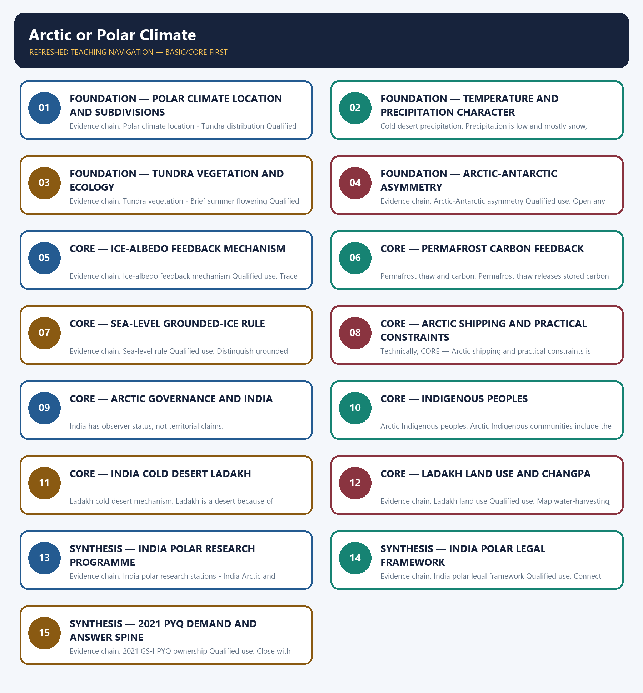

# Arctic or Polar Climate — Learner-v2 Complete Learning Session

> **Authoring-only generation:** 2026-09-01. No PDF was rendered and no tracker or index was mutated.

### SOURCE, PROGRESSION AND CURRENT-LINKAGE AUDIT

- **Generation date:** 2026-09-01.
- **Repository-first evidence:** the Basic owner is taught first and preserved in full; the Advanced owner is retained only in the optional final teaching block.
- **OCR evidence:** Repository Markdown was primary. The three required local Geography books were inspected as supplementary OCR/searchable evidence. No unsupported page precision, volatile figure or quotation was imported.
- **Qdrant:** not used; repository Markdown and available OCR context were sufficient.
- **PYQ integrity:** The 2021 GS-I Q15 demand on melting Arctic ice and Antarctic glaciers and weather patterns is the only verified PYQ owned by Geography Topic 25. It requires the Arctic-Antarctic distinction, the amplification mechanism and four transmission channels graded by confidence. No additional PYQ is fabricated.
- **Live-link boundary:** NOAA Arctic Report Card, NSIDC Sea Ice News and NCPOR expedition data are used only to establish Arctic amplification and India's polar research as live current anchors. No specific sea-ice extent, mass-loss rate or warming multiple is quoted without a dated source.
- **Fact/inference discipline:** no current-affairs item, PYQ wording, figure or quotation is invented.

## BASIC LEARNING SESSION



*Distinct embedded teaching-navigation image. The separate continuous Cārvāka-style flowchart package remains an independent at-a-glance artifact.*

### SESSION 1 — FOUNDATION — POLAR CLIMATE LOCATION AND SUBDIVISIONS

#### DEFINITION / WHAT THIS IS CALLED

**Plain-language definition:** Polar climate location: The polar type of climate and vegetation is found mainly north of the Arctic Circle in the Northern Hemisphere, with two subdivisions: ice-cap covering Greenland and high-latitude highlands under permanent snow, and tundra covering lowlands with a few ice-free months.

**Technical definition:** Evidence chain: Polar climate location - Tundra distribution Qualified use: Map the polar zone north of the Arctic Circle and distinguish ice-cap from tundra.

#### ANSWER-GRABBING OPENING — WRITE/ADAPT IN THE EXAM

> Polar climate location: The polar type of climate and vegetation is found mainly north of the Arctic Circle in the Northern Hemisphere, with two subdivisions: ice-cap covering Greenland and high-latitude highlands under permanent snow, and tundra covering lowlands with a few ice-free months.

#### MUST-WRITE KEYWORDS

- **FOUNDATION**
- **Polar climate location**
- **subdivisions**
- **Tundra distribution**
- **Evidence chain**
- **Qualified use**

**How to use them:** Frame the answer through FOUNDATION; define Polar climate location, connect subdivisions with Tundra distribution to explain the mechanism, and use Evidence chain for the decisive comparison or qualification.

#### VISUAL FIRST

```text
POLAR CLIMATE LOCATION AND SUBDIVISIONS
01. Polar climate location
    |
    v
02. Tundra distribution
BOUNDARY -> Ice-cap and tundra are not the same subdivision.
```

*This topic-specific rail fixes the evidence sequence and its exam boundary before analysis.*

#### CORE EXPLANATION

The polar type of climate and vegetation is found mainly north of the Arctic Circle in the Northern Hemisphere, with two subdivisions: ice-cap covering Greenland and high-latitude highlands under permanent snow, and tundra covering lowlands with a few ice-free months. Tundra covers coastal Greenland, the barren grounds of northern Canada and Alaska, and the Arctic seaboard of Eurasia; these lowlands have a few months above freezing when snow melts and vegetation appears.

#### NAMED EVIDENCE AND MECHANISM

- **Polar climate location:** The polar type of climate and vegetation is found mainly north of the Arctic Circle in the Northern Hemisphere, with two subdivisions: ice-cap covering Greenland and high-latitude highlands under permanent snow, and tundra covering lowlands with a few ice-free months.
- **Tundra distribution:** Tundra covers coastal Greenland, the barren grounds of northern Canada and Alaska, and the Arctic seaboard of Eurasia; these lowlands have a few months above freezing when snow melts and vegetation appears.

#### EXAMINER CAUTION

- Ice-cap and tundra are not the same subdivision.

#### EXAM LINK

- **Prelims:** Separate the agent, landform, location, status and scale attached to Polar climate location and subdivisions.
- **Mains:** Map the polar zone north of the Arctic Circle and distinguish ice-cap from tundra.

#### MINI RECAP

- **Evidence chain:** Polar climate location -> Tundra distribution
- **Qualified use:** Map the polar zone north of the Arctic Circle and distinguish ice-cap from tundra.

#### CLOSING RECALL FLOW — FOUNDATION — POLAR CLIMATE LOCATION AND SUBDIVISIONS

```text
START / CONCEPT: FOUNDATION — Polar climate location and subdivisions
        |
        v
EXACT TERMS: FOUNDATION · Polar climate location · subdivisions · Tundra distribution · Evidence chain · Qualified use
        |
        v
MECHANISM / ARGUMENT: Evidence chain: Polar climate location - Tundra distribution Qualified use: Map the polar zone north of the Arctic Circle and distinguish ice-cap from tundra.
        |
        v
CONSEQUENCE / CONTRAST: Ice-cap and tundra are not the same subdivision.
        |
        v
UPSC TRAP / ANSWER-USE: Do not miss this limiting distinction: tundra covers coastal Greenland, the barren grounds of northern Canada and Alaska.
        |
        v
ANSWER-GRABBING FORMULATION: Polar climate location: The polar type of climate and vegetation is found mainly north of the Arctic Circle in the Northern Hemisphere, with two subdivisions: ice-cap covering Greenland and high-latitude highlands under permanent snow, and tundra covering lowlands with a few ice-free months.
```
### SESSION 2 — FOUNDATION — TEMPERATURE AND PRECIPITATION CHARACTER

#### DEFINITION / WHAT THIS IS CALLED

**Plain-language definition:** Temperature character: Mean annual temperature is very low; the warmest month in June or July seldom exceeds about 10 degrees Celsius; no more than about four months rise above freezing and winters are long and severe, colder in the interior.

**Technical definition:** Cold desert precipitation: Precipitation is low and mostly snow, making the polar climate a cold desert; blizzards are wind-and-snow events caused by wind redistributing existing snow into drifts, not simply heavy snowfall.

#### ANSWER-GRABBING OPENING — WRITE/ADAPT IN THE EXAM

> Evidence chain: Temperature character - Cold desert precipitation Qualified use: Explain the sub-10-degree warmest month and low snow precipitation.

#### MUST-WRITE KEYWORDS

- **FOUNDATION**
- **Temperature**
- **precipitation character**
- **Temperature character**
- **Cold desert precipitation**
- **Evidence chain**

**How to use them:** Frame the answer through FOUNDATION; define Temperature, connect precipitation character with Temperature character to explain the mechanism, and use Cold desert precipitation for the decisive comparison or qualification.

#### VISUAL FIRST

```text
TEMPERATURE AND PRECIPITATION CHARACTER
01. Temperature character
    |
    v
02. Cold desert precipitation
BOUNDARY -> Polar climate is a cold desert with low precipitation, not heavy snowfall.
```

*This topic-specific rail fixes the evidence sequence and its exam boundary before analysis.*

#### CORE EXPLANATION

Mean annual temperature is very low; the warmest month in June or July seldom exceeds about 10 degrees Celsius; no more than about four months rise above freezing and winters are long and severe, colder in the interior. Precipitation is low and mostly snow, making the polar climate a cold desert; blizzards are wind-and-snow events caused by wind redistributing existing snow into drifts, not simply heavy snowfall.

#### NAMED EVIDENCE AND MECHANISM

- **Temperature character:** Mean annual temperature is very low; the warmest month in June or July seldom exceeds about 10 degrees Celsius; no more than about four months rise above freezing and winters are long and severe, colder in the interior.
- **Cold desert precipitation:** Precipitation is low and mostly snow, making the polar climate a cold desert; blizzards are wind-and-snow events caused by wind redistributing existing snow into drifts, not simply heavy snowfall.

#### EXAMINER CAUTION

- Polar climate is a cold desert with low precipitation, not heavy snowfall.

#### EXAM LINK

- **Prelims:** Separate the agent, landform, location, status and scale attached to Temperature and precipitation character.
- **Mains:** Explain the sub-10-degree warmest month and low snow precipitation.

#### MINI RECAP

- **Evidence chain:** Temperature character -> Cold desert precipitation
- **Qualified use:** Explain the sub-10-degree warmest month and low snow precipitation.

#### CLOSING RECALL FLOW — FOUNDATION — TEMPERATURE AND PRECIPITATION CHARACTER

```text
START / CONCEPT: FOUNDATION — Temperature and precipitation character
        |
        v
EXACT TERMS: FOUNDATION · Temperature · precipitation character · Temperature character · Cold desert precipitation · Evidence chain
        |
        v
MECHANISM / ARGUMENT: Cold desert precipitation: Precipitation is low and mostly snow, making the polar climate a cold desert; blizzards are wind-and-snow events caused by wind redistributing existing snow into drifts, not simply heavy snowfall.
        |
        v
CONSEQUENCE / CONTRAST: Polar climate is a cold desert with low precipitation, not heavy snowfall.
        |
        v
UPSC TRAP / ANSWER-USE: Do not miss this limiting distinction: mean annual temperature is very low.
        |
        v
ANSWER-GRABBING FORMULATION: Evidence chain: Temperature character - Cold desert precipitation Qualified use: Explain the sub-10-degree warmest month and low snow precipitation.
```
### SESSION 3 — FOUNDATION — TUNDRA VEGETATION AND ECOLOGY

#### DEFINITION / WHAT THIS IS CALLED

**Plain-language definition:** Tundra vegetation: Tundra is treeless; in sheltered spots stunted birches, dwarf willows and undersized alders survive; coastal lowlands carry hardy grasses and reindeer moss which is actually a lichen providing the only pasturage for reindeer.

**Technical definition:** Evidence chain: Tundra vegetation - Brief summer flowering Qualified use: Describe the stunted vegetation, lichen pasture and brief summer flowering.

#### ANSWER-GRABBING OPENING — WRITE/ADAPT IN THE EXAM

> Tundra vegetation: Tundra is treeless; in sheltered spots stunted birches, dwarf willows and undersized alders survive; coastal lowlands carry hardy grasses and reindeer moss which is actually a lichen providing the only pasturage for reindeer.

#### MUST-WRITE KEYWORDS

- **FOUNDATION**
- **Tundra vegetation**
- **ecology**
- **Brief summer flowering**
- **Evidence chain**
- **Qualified use**

**How to use them:** Frame the answer through FOUNDATION; define Tundra vegetation, connect ecology with Brief summer flowering to explain the mechanism, and use Evidence chain for the decisive comparison or qualification.

#### VISUAL FIRST

```text
TUNDRA VEGETATION AND ECOLOGY
01. Tundra vegetation
    |
    v
02. Brief summer flowering
BOUNDARY -> Tundra is treeless; reindeer moss is a lichen, not a moss.
```

*This topic-specific rail fixes the evidence sequence and its exam boundary before analysis.*

#### CORE EXPLANATION

Tundra is treeless; in sheltered spots stunted birches, dwarf willows and undersized alders survive; coastal lowlands carry hardy grasses and reindeer moss which is actually a lichen providing the only pasturage for reindeer. In the brief polar summer snow melts and berry-bushes and Arctic flowers bloom briefly before the return of continuous cold; this short growing season controls the entire ecological calendar.

#### NAMED EVIDENCE AND MECHANISM

- **Tundra vegetation:** Tundra is treeless; in sheltered spots stunted birches, dwarf willows and undersized alders survive; coastal lowlands carry hardy grasses and reindeer moss which is actually a lichen providing the only pasturage for reindeer.
- **Brief summer flowering:** In the brief polar summer snow melts and berry-bushes and Arctic flowers bloom briefly before the return of continuous cold; this short growing season controls the entire ecological calendar.

#### EXAMINER CAUTION

- Tundra is treeless; reindeer moss is a lichen, not a moss.

#### EXAM LINK

- **Prelims:** Separate the agent, landform, location, status and scale attached to Tundra vegetation and ecology.
- **Mains:** Describe the stunted vegetation, lichen pasture and brief summer flowering.

#### MINI RECAP

- **Evidence chain:** Tundra vegetation -> Brief summer flowering
- **Qualified use:** Describe the stunted vegetation, lichen pasture and brief summer flowering.

#### CLOSING RECALL FLOW — FOUNDATION — TUNDRA VEGETATION AND ECOLOGY

```text
START / CONCEPT: FOUNDATION — Tundra vegetation and ecology
        |
        v
EXACT TERMS: FOUNDATION · Tundra vegetation · ecology · Brief summer flowering · Evidence chain · Qualified use
        |
        v
MECHANISM / ARGUMENT: Evidence chain: Tundra vegetation - Brief summer flowering Qualified use: Describe the stunted vegetation, lichen pasture and brief summer flowering.
        |
        v
CONSEQUENCE / CONTRAST: Tundra is treeless; reindeer moss is a lichen, not a moss.
        |
        v
UPSC TRAP / ANSWER-USE: Do not miss this limiting distinction: tundra vegetation - Brief summer flowering Qualified use.
        |
        v
ANSWER-GRABBING FORMULATION: Tundra vegetation: Tundra is treeless; in sheltered spots stunted birches, dwarf willows and undersized alders survive; coastal lowlands carry hardy grasses and reindeer moss which is actually a lichen providing the only pasturage for reindeer.
```
### SESSION 4 — FOUNDATION — ARCTIC-ANTARCTIC ASYMMETRY

#### DEFINITION / WHAT THIS IS CALLED

**Plain-language definition:** Arctic-Antarctic asymmetry: The Arctic is an ocean surrounded by continents while Antarctica is a continent surrounded by ocean; the Arctic carries mainly floating sea ice plus the Greenland ice sheet, while Antarctica holds a vast grounded ice sheet with floating ice shelves at its margins.

**Technical definition:** Evidence chain: Arctic-Antarctic asymmetry Qualified use: Open any polar answer with the fundamental asymmetry.

#### ANSWER-GRABBING OPENING — WRITE/ADAPT IN THE EXAM

> Arctic-Antarctic asymmetry: The Arctic is an ocean surrounded by continents while Antarctica is a continent surrounded by ocean; the Arctic carries mainly floating sea ice plus the Greenland ice sheet, while Antarctica holds a vast grounded ice sheet with floating ice shelves at its margins.

#### MUST-WRITE KEYWORDS

- **FOUNDATION**
- **Arctic-Antarctic asymmetry**
- **Evidence chain**
- **Qualified use**
- **The Arctic**
- **Antarctica**

**How to use them:** Frame the answer through FOUNDATION; define Arctic-Antarctic asymmetry, connect Evidence chain with Qualified use to explain the mechanism, and use The Arctic for the decisive comparison or qualification.

#### VISUAL FIRST

```text
ARCTIC-ANTARCTIC ASYMMETRY
01. Arctic-Antarctic asymmetry
BOUNDARY -> Arctic is an ocean; Antarctica is a continent.
```

*This topic-specific rail fixes the evidence sequence and its exam boundary before analysis.*

#### CORE EXPLANATION

The Arctic is an ocean surrounded by continents while Antarctica is a continent surrounded by ocean; the Arctic carries mainly floating sea ice plus the Greenland ice sheet, while Antarctica holds a vast grounded ice sheet with floating ice shelves at its margins.

#### NAMED EVIDENCE AND MECHANISM

- **Arctic-Antarctic asymmetry:** The Arctic is an ocean surrounded by continents while Antarctica is a continent surrounded by ocean; the Arctic carries mainly floating sea ice plus the Greenland ice sheet, while Antarctica holds a vast grounded ice sheet with floating ice shelves at its margins.

#### EXAMINER CAUTION

- Arctic is an ocean; Antarctica is a continent.

#### EXAM LINK

- **Prelims:** Separate the agent, landform, location, status and scale attached to Arctic-Antarctic asymmetry.
- **Mains:** Open any polar answer with the fundamental asymmetry.

#### MINI RECAP

- **Evidence chain:** Arctic-Antarctic asymmetry
- **Qualified use:** Open any polar answer with the fundamental asymmetry.

#### CLOSING RECALL FLOW — FOUNDATION — ARCTIC-ANTARCTIC ASYMMETRY

```text
START / CONCEPT: FOUNDATION — Arctic-Antarctic asymmetry
        |
        v
EXACT TERMS: FOUNDATION · Arctic-Antarctic asymmetry · Evidence chain · Qualified use · The Arctic · Antarctica
        |
        v
MECHANISM / ARGUMENT: Evidence chain: Arctic-Antarctic asymmetry Qualified use: Open any polar answer with the fundamental asymmetry.
        |
        v
CONSEQUENCE / CONTRAST: Arctic is an ocean; Antarctica is a continent.
        |
        v
UPSC TRAP / ANSWER-USE: Do not miss this limiting distinction: the Arctic is an ocean surrounded by continents while Antarctica is a continent surrounded...
        |
        v
ANSWER-GRABBING FORMULATION: Arctic-Antarctic asymmetry: The Arctic is an ocean surrounded by continents while Antarctica is a continent surrounded by ocean; the Arctic carries mainly floating sea ice plus the Greenland ice sheet, while Antarctica holds a vast grounded ice sheet with floating ice shelves at its margins.
```
### SESSION 5 — CORE — ICE-ALBEDO FEEDBACK MECHANISM

#### DEFINITION / WHAT THIS IS CALLED

**Plain-language definition:** Ice-albedo feedback mechanism: Arctic amplification works through the ice-albedo feedback: as warming causes sea ice and snow to retreat, bright high-albedo surfaces are replaced by dark ocean and bare ground, absorbing far more solar radiation and causing further warming in a self-reinforcing loop.

**Technical definition:** Evidence chain: Ice-albedo feedback mechanism Qualified use: Trace the feedback from ice retreat through albedo change to further warming.

#### ANSWER-GRABBING OPENING — WRITE/ADAPT IN THE EXAM

> Ice-albedo feedback mechanism: Arctic amplification works through the ice-albedo feedback: as warming causes sea ice and snow to retreat, bright high-albedo surfaces are replaced by dark ocean and bare ground, absorbing far more solar radiation and causing further warming in a self-reinforcing loop.

#### MUST-WRITE KEYWORDS

- **Ice-albedo feedback mechanism**
- **Evidence chain**
- **Qualified use**
- **Arctic**
- **Ice-albedo**
- **This**

**How to use them:** Frame the answer through Ice-albedo feedback mechanism; define Evidence chain, connect Qualified use with Arctic to explain the mechanism, and use Ice-albedo for the decisive comparison or qualification.

#### VISUAL FIRST

```text
ICE-ALBEDO FEEDBACK MECHANISM
01. Ice-albedo feedback mechanism
BOUNDARY -> This is a self-reinforcing loop, not a one-time event.
```

*This topic-specific rail fixes the evidence sequence and its exam boundary before analysis.*

#### CORE EXPLANATION

Arctic amplification works through the ice-albedo feedback: as warming causes sea ice and snow to retreat, bright high-albedo surfaces are replaced by dark ocean and bare ground, absorbing far more solar radiation and causing further warming in a self-reinforcing loop.

#### NAMED EVIDENCE AND MECHANISM

- **Ice-albedo feedback mechanism:** Arctic amplification works through the ice-albedo feedback: as warming causes sea ice and snow to retreat, bright high-albedo surfaces are replaced by dark ocean and bare ground, absorbing far more solar radiation and causing further warming in a self-reinforcing loop.

#### EXAMINER CAUTION

- This is a self-reinforcing loop, not a one-time event.

#### EXAM LINK

- **Prelims:** Separate the agent, landform, location, status and scale attached to Ice-albedo feedback mechanism.
- **Mains:** Trace the feedback from ice retreat through albedo change to further warming.

#### MINI RECAP

- **Evidence chain:** Ice-albedo feedback mechanism
- **Qualified use:** Trace the feedback from ice retreat through albedo change to further warming.

#### CLOSING RECALL FLOW — CORE — ICE-ALBEDO FEEDBACK MECHANISM

```text
START / CONCEPT: CORE — Ice-albedo feedback mechanism
        |
        v
EXACT TERMS: Ice-albedo feedback mechanism · Evidence chain · Qualified use · Arctic · Ice-albedo · This
        |
        v
MECHANISM / ARGUMENT: Evidence chain: Ice-albedo feedback mechanism Qualified use: Trace the feedback from ice retreat through albedo change to further warming.
        |
        v
CONSEQUENCE / CONTRAST: This is a self-reinforcing loop, not a one-time event.
        |
        v
UPSC TRAP / ANSWER-USE: Do not miss this limiting distinction: trace the feedback from ice retreat through albedo change to further warming.
        |
        v
ANSWER-GRABBING FORMULATION: Ice-albedo feedback mechanism: Arctic amplification works through the ice-albedo feedback: as warming causes sea ice and snow to retreat, bright high-albedo surfaces are replaced by dark ocean and bare ground, absorbing far more solar radiation and causing further warming in a self-reinforcing loop.
```
### SESSION 6 — CORE — PERMAFROST CARBON FEEDBACK

#### DEFINITION / WHAT THIS IS CALLED

**Plain-language definition:** Evidence chain: Permafrost thaw and carbon Qualified use: Explain the second feedback loop alongside the albedo mechanism.

**Technical definition:** Permafrost thaw and carbon: Permafrost thaw releases stored carbon as carbon dioxide under dry conditions and methane under waterlogged conditions; this creates a second self-reinforcing feedback loop alongside the ice-albedo mechanism.

#### ANSWER-GRABBING OPENING — WRITE/ADAPT IN THE EXAM

> Evidence chain: Permafrost thaw and carbon Qualified use: Explain the second feedback loop alongside the albedo mechanism.

#### MUST-WRITE KEYWORDS

- **Permafrost carbon feedback**
- **Permafrost thaw and carbon**
- **Evidence chain**
- **Qualified use**
- **Permafrost**
- **Qualified**

**How to use them:** Frame the answer through Permafrost carbon feedback; define Permafrost thaw and carbon, connect Evidence chain with Qualified use to explain the mechanism, and use Permafrost for the decisive comparison or qualification.

#### VISUAL FIRST

```text
PERMAFROST CARBON FEEDBACK
01. Permafrost thaw and carbon
BOUNDARY -> Dry conditions release CO2, waterlogged conditions release methane.
```

*This topic-specific rail fixes the evidence sequence and its exam boundary before analysis.*

#### CORE EXPLANATION

Permafrost thaw releases stored carbon as carbon dioxide under dry conditions and methane under waterlogged conditions; this creates a second self-reinforcing feedback loop alongside the ice-albedo mechanism.

#### NAMED EVIDENCE AND MECHANISM

- **Permafrost thaw and carbon:** Permafrost thaw releases stored carbon as carbon dioxide under dry conditions and methane under waterlogged conditions; this creates a second self-reinforcing feedback loop alongside the ice-albedo mechanism.

#### EXAMINER CAUTION

- Dry conditions release CO2, waterlogged conditions release methane.

#### EXAM LINK

- **Prelims:** Separate the agent, landform, location, status and scale attached to Permafrost carbon feedback.
- **Mains:** Explain the second feedback loop alongside the albedo mechanism.

#### MINI RECAP

- **Evidence chain:** Permafrost thaw and carbon
- **Qualified use:** Explain the second feedback loop alongside the albedo mechanism.

#### CLOSING RECALL FLOW — CORE — PERMAFROST CARBON FEEDBACK

```text
START / CONCEPT: CORE — Permafrost carbon feedback
        |
        v
EXACT TERMS: Permafrost carbon feedback · Permafrost thaw and carbon · Evidence chain · Qualified use · Permafrost · Qualified
        |
        v
MECHANISM / ARGUMENT: Permafrost thaw and carbon: Permafrost thaw releases stored carbon as carbon dioxide under dry conditions and methane under waterlogged conditions; this creates a second self-reinforcing feedback loop alongside the ice-albedo mechanism.
        |
        v
CONSEQUENCE / CONTRAST: Mains: Explain the second feedback loop alongside the albedo mechanism.
        |
        v
UPSC TRAP / ANSWER-USE: Do not miss this limiting distinction: permafrost thaw and carbon Qualified use.
        |
        v
ANSWER-GRABBING FORMULATION: Evidence chain: Permafrost thaw and carbon Qualified use: Explain the second feedback loop alongside the albedo mechanism.
```
### SESSION 7 — CORE — SEA-LEVEL GROUNDED-ICE RULE

#### DEFINITION / WHAT THIS IS CALLED

**Plain-language definition:** Sea-level rule: Floating sea-ice melt does not raise sea level; only grounded ice loss from Greenland and Antarctica transfers mass to the ocean; ice-shelf loss removes buttressing and can accelerate grounded-ice discharge.

**Technical definition:** Evidence chain: Sea-level rule Qualified use: Distinguish grounded from floating ice and explain the buttressing role of ice shelves.

#### ANSWER-GRABBING OPENING — WRITE/ADAPT IN THE EXAM

> Sea-level rule: Floating sea-ice melt does not raise sea level; only grounded ice loss from Greenland and Antarctica transfers mass to the ocean; ice-shelf loss removes buttressing and can accelerate grounded-ice discharge.

#### MUST-WRITE KEYWORDS

- **Sea-level grounded-ice rule**
- **Sea-level rule**
- **Evidence chain**
- **Qualified use**
- **Floating**
- **Greenland**

**How to use them:** Frame the answer through Sea-level grounded-ice rule; define Sea-level rule, connect Evidence chain with Qualified use to explain the mechanism, and use Floating for the decisive comparison or qualification.

#### VISUAL FIRST

```text
SEA-LEVEL GROUNDED-ICE RULE
01. Sea-level rule
BOUNDARY -> Floating sea-ice melt does not raise sea level.
```

*This topic-specific rail fixes the evidence sequence and its exam boundary before analysis.*

#### CORE EXPLANATION

Floating sea-ice melt does not raise sea level; only grounded ice loss from Greenland and Antarctica transfers mass to the ocean; ice-shelf loss removes buttressing and can accelerate grounded-ice discharge.

#### NAMED EVIDENCE AND MECHANISM

- **Sea-level rule:** Floating sea-ice melt does not raise sea level; only grounded ice loss from Greenland and Antarctica transfers mass to the ocean; ice-shelf loss removes buttressing and can accelerate grounded-ice discharge.

#### EXAMINER CAUTION

- Floating sea-ice melt does not raise sea level.

#### EXAM LINK

- **Prelims:** Separate the agent, landform, location, status and scale attached to Sea-level grounded-ice rule.
- **Mains:** Distinguish grounded from floating ice and explain the buttressing role of ice shelves.

#### MINI RECAP

- **Evidence chain:** Sea-level rule
- **Qualified use:** Distinguish grounded from floating ice and explain the buttressing role of ice shelves.

#### CLOSING RECALL FLOW — CORE — SEA-LEVEL GROUNDED-ICE RULE

```text
START / CONCEPT: CORE — Sea-level grounded-ice rule
        |
        v
EXACT TERMS: Sea-level grounded-ice rule · Sea-level rule · Evidence chain · Qualified use · Floating · Greenland
        |
        v
MECHANISM / ARGUMENT: Evidence chain: Sea-level rule Qualified use: Distinguish grounded from floating ice and explain the buttressing role of ice shelves.
        |
        v
CONSEQUENCE / CONTRAST: Floating sea-ice melt does not raise sea level.
        |
        v
UPSC TRAP / ANSWER-USE: Mains: Distinguish grounded from floating ice and explain the buttressing role of ice shelves.
        |
        v
ANSWER-GRABBING FORMULATION: Sea-level rule: Floating sea-ice melt does not raise sea level; only grounded ice loss from Greenland and Antarctica transfers mass to the ocean; ice-shelf loss removes buttressing and can accelerate grounded-ice discharge.
```
### SESSION 8 — CORE — ARCTIC SHIPPING AND PRACTICAL CONSTRAINTS

#### DEFINITION / WHAT THIS IS CALLED

**Plain-language definition:** CORE — Arctic shipping and practical constraints comprises Arctic shipping, practical constraints and Arctic shipping prospects as its core connected dimensions.

**Technical definition:** Technically, CORE — Arctic shipping and practical constraints is analysed by relating Arctic shipping to practical constraints, then testing the relationship through Arctic shipping prospects and Evidence chain.

#### ANSWER-GRABBING OPENING — WRITE/ADAPT IN THE EXAM

> Evidence chain: Arctic shipping prospects Qualified use: Balance the shorter-route advantage against the severe practical limitations.

#### MUST-WRITE KEYWORDS

- **Arctic shipping**
- **practical constraints**
- **Arctic shipping prospects**
- **Evidence chain**
- **Qualified use**
- **Arctic**

**How to use them:** Frame the answer through Arctic shipping; define practical constraints, connect Arctic shipping prospects with Evidence chain to explain the mechanism, and use Qualified use for the decisive comparison or qualification.

#### VISUAL FIRST

```text
ARCTIC SHIPPING AND PRACTICAL CONSTRAINTS
01. Arctic shipping prospects
BOUNDARY -> Do not present the Arctic as an accomplished trade route.
```

*This topic-specific rail fixes the evidence sequence and its exam boundary before analysis.*

#### CORE EXPLANATION

Retreating summer sea ice lengthens the navigable season along Arctic coasts on routes shorter than Suez or Panama between NE Asia and NW Europe, but practical constraints including mobile ice, incomplete charting, thin rescue capacity, costly insurance and sparse ports limit near-term traffic to resource export and destination shipping.

#### NAMED EVIDENCE AND MECHANISM

- **Arctic shipping prospects:** Retreating summer sea ice lengthens the navigable season along Arctic coasts on routes shorter than Suez or Panama between NE Asia and NW Europe, but practical constraints including mobile ice, incomplete charting, thin rescue capacity, costly insurance and sparse ports limit near-term traffic to resource export and destination shipping.

#### EXAMINER CAUTION

- Do not present the Arctic as an accomplished trade route.

#### EXAM LINK

- **Prelims:** Separate the agent, landform, location, status and scale attached to Arctic shipping and practical constraints.
- **Mains:** Balance the shorter-route advantage against the severe practical limitations.

#### MINI RECAP

- **Evidence chain:** Arctic shipping prospects
- **Qualified use:** Balance the shorter-route advantage against the severe practical limitations.

#### CLOSING RECALL FLOW — CORE — ARCTIC SHIPPING AND PRACTICAL CONSTRAINTS

```text
START / CONCEPT: CORE — Arctic shipping and practical constraints
        |
        v
EXACT TERMS: Arctic shipping · practical constraints · Arctic shipping prospects · Evidence chain · Qualified use · Arctic
        |
        v
MECHANISM / ARGUMENT: Do not present the Arctic as an accomplished trade route.
        |
        v
CONSEQUENCE / CONTRAST: The resulting consequence is that balance the shorter-route advantage against the severe practical limitations.
        |
        v
UPSC TRAP / ANSWER-USE: Do not miss this limiting distinction: balance the shorter-route advantage against the severe practical limitations.
        |
        v
ANSWER-GRABBING FORMULATION: Evidence chain: Arctic shipping prospects Qualified use: Balance the shorter-route advantage against the severe practical limitations.
```
### SESSION 9 — CORE — ARCTIC GOVERNANCE AND INDIA

#### DEFINITION / WHAT THIS IS CALLED

**Plain-language definition:** Evidence chain: Arctic governance Qualified use: Map maritime-law claims, the Arctic forum and India's role.

**Technical definition:** India has observer status, not territorial claims.

#### ANSWER-GRABBING OPENING — WRITE/ADAPT IN THE EXAM

> Evidence chain: Arctic governance Qualified use: Map maritime-law claims, the Arctic forum and India's role.

#### MUST-WRITE KEYWORDS

- **Arctic governance**
- **India**
- **Evidence chain**
- **Qualified use**
- **Arctic**
- **Qualified**

**How to use them:** Frame the answer through Arctic governance; define India, connect Evidence chain with Qualified use to explain the mechanism, and use Arctic for the decisive comparison or qualification.

#### VISUAL FIRST

```text
ARCTIC GOVERNANCE AND INDIA
01. Arctic governance
BOUNDARY -> India has observer status, not territorial claims.
```

*This topic-specific rail fixes the evidence sequence and its exam boundary before analysis.*

#### CORE EXPLANATION

Coastal states' rights over the Arctic seabed depend on maritime law including continental-shelf extensions on geological evidence; regional cooperation operates through a state-led forum with observer participation by non-Arctic states including India.

#### NAMED EVIDENCE AND MECHANISM

- **Arctic governance:** Coastal states' rights over the Arctic seabed depend on maritime law including continental-shelf extensions on geological evidence; regional cooperation operates through a state-led forum with observer participation by non-Arctic states including India.

#### EXAMINER CAUTION

- India has observer status, not territorial claims.

#### EXAM LINK

- **Prelims:** Separate the agent, landform, location, status and scale attached to Arctic governance and India.
- **Mains:** Map maritime-law claims, the Arctic forum and India's role.

#### MINI RECAP

- **Evidence chain:** Arctic governance
- **Qualified use:** Map maritime-law claims, the Arctic forum and India's role.

#### CLOSING RECALL FLOW — CORE — ARCTIC GOVERNANCE AND INDIA

```text
START / CONCEPT: CORE — Arctic governance and India
        |
        v
EXACT TERMS: Arctic governance · India · Evidence chain · Qualified use · Arctic · Qualified
        |
        v
MECHANISM / ARGUMENT: India has observer status, not territorial claims.
        |
        v
CONSEQUENCE / CONTRAST: The resulting consequence is that map maritime-law claims, the Arctic forum and India's role.
        |
        v
UPSC TRAP / ANSWER-USE: Do not miss this limiting distinction: map maritime-law claims, the Arctic forum and India's role.
        |
        v
ANSWER-GRABBING FORMULATION: Evidence chain: Arctic governance Qualified use: Map maritime-law claims, the Arctic forum and India's role.
```
### SESSION 10 — CORE — INDIGENOUS PEOPLES

#### DEFINITION / WHAT THIS IS CALLED

**Plain-language definition:** Evidence chain: Arctic Indigenous peoples Qualified use: Identify Arctic Indigenous communities and their diverse livelihoods.

**Technical definition:** Arctic Indigenous peoples: Arctic Indigenous communities include the Inuit in Greenland, Canada and Alaska, the Sami in northern Fennoscandia and the Nenets and other peoples in Arctic Russia; these communities have diverse livelihoods adapted to the polar environment.

#### ANSWER-GRABBING OPENING — WRITE/ADAPT IN THE EXAM

> Evidence chain: Arctic Indigenous peoples Qualified use: Identify Arctic Indigenous communities and their diverse livelihoods.

#### MUST-WRITE KEYWORDS

- **Indigenous peoples**
- **Arctic Indigenous peoples**
- **Evidence chain**
- **Qualified use**
- **Arctic Indigenous**
- **Inuit**

**How to use them:** Frame the answer through Indigenous peoples; define Arctic Indigenous peoples, connect Evidence chain with Qualified use to explain the mechanism, and use Arctic Indigenous for the decisive comparison or qualification.

#### VISUAL FIRST

```text
INDIGENOUS PEOPLES
01. Arctic Indigenous peoples
BOUNDARY -> Use Inuit, Sami and Nenets, not older exonyms.
```

*This topic-specific rail fixes the evidence sequence and its exam boundary before analysis.*

#### CORE EXPLANATION

Arctic Indigenous communities include the Inuit in Greenland, Canada and Alaska, the Sami in northern Fennoscandia and the Nenets and other peoples in Arctic Russia; these communities have diverse livelihoods adapted to the polar environment.

#### NAMED EVIDENCE AND MECHANISM

- **Arctic Indigenous peoples:** Arctic Indigenous communities include the Inuit in Greenland, Canada and Alaska, the Sami in northern Fennoscandia and the Nenets and other peoples in Arctic Russia; these communities have diverse livelihoods adapted to the polar environment.

#### EXAMINER CAUTION

- Use Inuit, Sami and Nenets, not older exonyms.

#### EXAM LINK

- **Prelims:** Separate the agent, landform, location, status and scale attached to Indigenous peoples.
- **Mains:** Identify Arctic Indigenous communities and their diverse livelihoods.

#### MINI RECAP

- **Evidence chain:** Arctic Indigenous peoples
- **Qualified use:** Identify Arctic Indigenous communities and their diverse livelihoods.

#### CLOSING RECALL FLOW — CORE — INDIGENOUS PEOPLES

```text
START / CONCEPT: CORE — Indigenous peoples
        |
        v
EXACT TERMS: Indigenous peoples · Arctic Indigenous peoples · Evidence chain · Qualified use · Arctic Indigenous · Inuit
        |
        v
MECHANISM / ARGUMENT: Arctic Indigenous peoples: Arctic Indigenous communities include the Inuit in Greenland, Canada and Alaska, the Sami in northern Fennoscandia and the Nenets and other peoples in Arctic Russia; these communities have diverse livelihoods adapted to the polar environment.
        |
        v
CONSEQUENCE / CONTRAST: Use Inuit, Sami and Nenets, not older exonyms.
        |
        v
UPSC TRAP / ANSWER-USE: Do not miss this limiting distinction: identify Arctic Indigenous communities and their diverse livelihoods.
        |
        v
ANSWER-GRABBING FORMULATION: Evidence chain: Arctic Indigenous peoples Qualified use: Identify Arctic Indigenous communities and their diverse livelihoods.
```
### SESSION 11 — CORE — INDIA COLD DESERT LADAKH

#### DEFINITION / WHAT THIS IS CALLED

**Plain-language definition:** India cold desert Ladakh: India's cold-desert analogue is Ladakh and adjoining trans-Himalayan valleys; the Greater Himalaya blocks the southwest monsoon creating a rain-shadow, while high altitude produces intense insolation by day and sharp radiative cooling by night.

**Technical definition:** Ladakh cold desert mechanism: Ladakh is a desert because of rain-shadow plus high altitude, not because it is hot; winter western disturbances bring the light snow that is the main precipitation; Husain classes it with the cold desert biome alongside the Sierra Nevada and the Andes.

#### ANSWER-GRABBING OPENING — WRITE/ADAPT IN THE EXAM

> Evidence chain: India cold desert Ladakh - Ladakh cold desert mechanism Qualified use: Explain the rain-shadow and radiative-cooling mechanism.

#### MUST-WRITE KEYWORDS

- **India cold desert Ladakh**
- **Ladakh cold desert mechanism**
- **Evidence chain**
- **Qualified use**
- **India's cold-desert analogue**
- **India's**

**How to use them:** Frame the answer through India cold desert Ladakh; define Ladakh cold desert mechanism, connect Evidence chain with Qualified use to explain the mechanism, and use India's cold-desert analogue for the decisive comparison or qualification.

#### VISUAL FIRST

```text
INDIA COLD DESERT LADAKH
01. India cold desert Ladakh
    |
    v
02. Ladakh cold desert mechanism
BOUNDARY -> Ladakh is arid due to rain-shadow and altitude, not heat.
```

*This topic-specific rail fixes the evidence sequence and its exam boundary before analysis.*

#### CORE EXPLANATION

India's cold-desert analogue is Ladakh and adjoining trans-Himalayan valleys; the Greater Himalaya blocks the southwest monsoon creating a rain-shadow, while high altitude produces intense insolation by day and sharp radiative cooling by night. Ladakh is a desert because of rain-shadow plus high altitude, not because it is hot; winter western disturbances bring the light snow that is the main precipitation; Husain classes it with the cold desert biome alongside the Sierra Nevada and the Andes.

#### NAMED EVIDENCE AND MECHANISM

- **India cold desert Ladakh:** India's cold-desert analogue is Ladakh and adjoining trans-Himalayan valleys; the Greater Himalaya blocks the southwest monsoon creating a rain-shadow, while high altitude produces intense insolation by day and sharp radiative cooling by night.
- **Ladakh cold desert mechanism:** Ladakh is a desert because of rain-shadow plus high altitude, not because it is hot; winter western disturbances bring the light snow that is the main precipitation; Husain classes it with the cold desert biome alongside the Sierra Nevada and the Andes.

#### EXAMINER CAUTION

- Ladakh is arid due to rain-shadow and altitude, not heat.

#### EXAM LINK

- **Prelims:** Separate the agent, landform, location, status and scale attached to India cold desert Ladakh.
- **Mains:** Explain the rain-shadow and radiative-cooling mechanism.

#### MINI RECAP

- **Evidence chain:** India cold desert Ladakh -> Ladakh cold desert mechanism
- **Qualified use:** Explain the rain-shadow and radiative-cooling mechanism.

#### CLOSING RECALL FLOW — CORE — INDIA COLD DESERT LADAKH

```text
START / CONCEPT: CORE — India cold desert Ladakh
        |
        v
EXACT TERMS: India cold desert Ladakh · Ladakh cold desert mechanism · Evidence chain · Qualified use · India's cold-desert analogue · India's
        |
        v
MECHANISM / ARGUMENT: India cold desert Ladakh: India's cold-desert analogue is Ladakh and adjoining trans-Himalayan valleys; the Greater Himalaya blocks the southwest monsoon creating a rain-shadow, while high altitude produces intense insolation by day and sharp radiative cooling by night.
        |
        v
CONSEQUENCE / CONTRAST: Ladakh cold desert mechanism: Ladakh is a desert because of rain-shadow plus high altitude, not because it is hot; winter western disturbances bring the light snow that is the main precipitation; Husain classes it with the cold desert biome alongside the Sierra Nevada and the Andes.
        |
        v
UPSC TRAP / ANSWER-USE: Ladakh is arid due to rain-shadow and altitude, not heat.
        |
        v
ANSWER-GRABBING FORMULATION: Evidence chain: India cold desert Ladakh - Ladakh cold desert mechanism Qualified use: Explain the rain-shadow and radiative-cooling mechanism.
```
### SESSION 12 — CORE — LADAKH LAND USE AND CHANGPA

#### DEFINITION / WHAT THIS IS CALLED

**Plain-language definition:** Prelims: Separate the agent, landform, location, status and scale attached to Ladakh land use and Changpa.

**Technical definition:** Evidence chain: Ladakh land use Qualified use: Map water-harvesting, pashmina goats and yak herding.

#### ANSWER-GRABBING OPENING — WRITE/ADAPT IN THE EXAM

> Prelims: Separate the agent, landform, location, status and scale attached to Ladakh land use and Changpa.

#### MUST-WRITE KEYWORDS

- **Ladakh land use**
- **Changpa**
- **Evidence chain**
- **Qualified use**
- **In**
- **Ladakh**

**How to use them:** Frame the answer through Ladakh land use; define Changpa, connect Evidence chain with Qualified use to explain the mechanism, and use In for the decisive comparison or qualification.

#### VISUAL FIRST

```text
LADAKH LAND USE AND CHANGPA
01. Ladakh land use
BOUNDARY -> Irrigated agriculture and pastoral economy are the priorities.
```

*This topic-specific rail fixes the evidence sequence and its exam boundary before analysis.*

#### CORE EXPLANATION

In the cold deserts of Ladakh and Spiti, priority goes to irrigated agriculture and animal husbandry with water-harvesting devices; the Changpa rear pashmina goats and yak on high pastures, and allied activities include milk, poultry and horticulture.

#### NAMED EVIDENCE AND MECHANISM

- **Ladakh land use:** In the cold deserts of Ladakh and Spiti, priority goes to irrigated agriculture and animal husbandry with water-harvesting devices; the Changpa rear pashmina goats and yak on high pastures, and allied activities include milk, poultry and horticulture.

#### EXAMINER CAUTION

- Irrigated agriculture and pastoral economy are the priorities.

#### EXAM LINK

- **Prelims:** Separate the agent, landform, location, status and scale attached to Ladakh land use and Changpa.
- **Mains:** Map water-harvesting, pashmina goats and yak herding.

#### MINI RECAP

- **Evidence chain:** Ladakh land use
- **Qualified use:** Map water-harvesting, pashmina goats and yak herding.

#### CLOSING RECALL FLOW — CORE — LADAKH LAND USE AND CHANGPA

```text
START / CONCEPT: CORE — Ladakh land use and Changpa
        |
        v
EXACT TERMS: Ladakh land use · Changpa · Evidence chain · Qualified use · In · Ladakh
        |
        v
MECHANISM / ARGUMENT: Evidence chain: Ladakh land use Qualified use: Map water-harvesting, pashmina goats and yak herding.
        |
        v
CONSEQUENCE / CONTRAST: Ladakh land use: In the cold deserts of Ladakh and Spiti, priority goes to irrigated agriculture and animal husbandry with water-harvesting devices; the Changpa rear pashmina goats and yak on high pastures, and allied activities include milk, poultry and horticulture.
        |
        v
UPSC TRAP / ANSWER-USE: Do not miss this limiting distinction: irrigated agriculture and pastoral economy are the priorities.
        |
        v
ANSWER-GRABBING FORMULATION: Prelims: Separate the agent, landform, location, status and scale attached to Ladakh land use and Changpa.
```
### SESSION 13 — SYNTHESIS — INDIA POLAR RESEARCH PROGRAMME

#### DEFINITION / WHAT THIS IS CALLED

**Plain-language definition:** India polar research stations: India's polar research is coordinated by NCPOR in Goa; Antarctic stations are Maitri at Schirmacher Oasis since 1989 and Bharati at Larsemann Hills since 2012; Dakshin Gangotri was the first station from 1983 but was later decommissioned.

**Technical definition:** Evidence chain: India polar research stations - India Arctic and Himalayan stations Qualified use: Enumerate stations with correct locations and operational status.

#### ANSWER-GRABBING OPENING — WRITE/ADAPT IN THE EXAM

> India polar research stations: India's polar research is coordinated by NCPOR in Goa; Antarctic stations are Maitri at Schirmacher Oasis since 1989 and Bharati at Larsemann Hills since 2012; Dakshin Gangotri was the first station from 1983 but was later decommissioned.

#### MUST-WRITE KEYWORDS

- **SYNTHESIS**
- **India polar research programme**
- **India polar research stations**
- **India Arctic and Himalayan stations**
- **Evidence chain**
- **Qualified use**

**How to use them:** Frame the answer through SYNTHESIS; define India polar research programme, connect India polar research stations with India Arctic and Himalayan stations to explain the mechanism, and use Evidence chain for the decisive comparison or qualification.

#### VISUAL FIRST

```text
INDIA POLAR RESEARCH PROGRAMME
01. India polar research stations
    |
    v
02. India Arctic and Himalayan stations
BOUNDARY -> Dakshin Gangotri is decommissioned; Bharati and Maitri are Antarctic.
```

*This topic-specific rail fixes the evidence sequence and its exam boundary before analysis.*

#### CORE EXPLANATION

India's polar research is coordinated by NCPOR in Goa; Antarctic stations are Maitri at Schirmacher Oasis since 1989 and Bharati at Larsemann Hills since 2012; Dakshin Gangotri was the first station from 1983 but was later decommissioned. India's Arctic station is Himadri at Ny-Alesund in Svalbard since 2008; the Himalayan station Himansh in Spiti, Himachal Pradesh conducts glacier studies; Dakshin Gangotri is not operational.

#### NAMED EVIDENCE AND MECHANISM

- **India polar research stations:** India's polar research is coordinated by NCPOR in Goa; Antarctic stations are Maitri at Schirmacher Oasis since 1989 and Bharati at Larsemann Hills since 2012; Dakshin Gangotri was the first station from 1983 but was later decommissioned.
- **India Arctic and Himalayan stations:** India's Arctic station is Himadri at Ny-Alesund in Svalbard since 2008; the Himalayan station Himansh in Spiti, Himachal Pradesh conducts glacier studies; Dakshin Gangotri is not operational.

#### EXAMINER CAUTION

- Dakshin Gangotri is decommissioned; Bharati and Maitri are Antarctic.

#### EXAM LINK

- **Prelims:** Separate the agent, landform, location, status and scale attached to India polar research programme.
- **Mains:** Enumerate stations with correct locations and operational status.

#### MINI RECAP

- **Evidence chain:** India polar research stations -> India Arctic and Himalayan stations
- **Qualified use:** Enumerate stations with correct locations and operational status.

#### CLOSING RECALL FLOW — SYNTHESIS — INDIA POLAR RESEARCH PROGRAMME

```text
START / CONCEPT: SYNTHESIS — India polar research programme
        |
        v
EXACT TERMS: SYNTHESIS · India polar research programme · India polar research stations · India Arctic and Himalayan stations · Evidence chain · Qualified use
        |
        v
MECHANISM / ARGUMENT: Evidence chain: India polar research stations - India Arctic and Himalayan stations Qualified use: Enumerate stations with correct locations and operational status.
        |
        v
CONSEQUENCE / CONTRAST: India Arctic and Himalayan stations: India's Arctic station is Himadri at Ny-Alesund in Svalbard since 2008; the Himalayan station Himansh in Spiti, Himachal Pradesh conducts glacier studies; Dakshin Gangotri is not operational.
        |
        v
UPSC TRAP / ANSWER-USE: Do not miss this limiting distinction: dakshin Gangotri is decommissioned; Bharati and Maitri are Antarctic.
        |
        v
ANSWER-GRABBING FORMULATION: India polar research stations: India's polar research is coordinated by NCPOR in Goa; Antarctic stations are Maitri at Schirmacher Oasis since 1989 and Bharati at Larsemann Hills since 2012; Dakshin Gangotri was the first station from 1983 but was later decommissioned.
```
### SESSION 14 — SYNTHESIS — INDIA POLAR LEGAL FRAMEWORK

#### DEFINITION / WHAT THIS IS CALLED

**Plain-language definition:** India polar legal framework: India acceded to the Antarctic Treaty in 1983, has the Indian Antarctic Act 2022 and an Arctic Policy 2022 with six pillars; the research focus is on teleconnections between Arctic sea-ice loss and disruption of the Indian monsoon.

**Technical definition:** Evidence chain: India polar legal framework Qualified use: Connect the legal-policy framework to the teleconnection research focus.

#### ANSWER-GRABBING OPENING — WRITE/ADAPT IN THE EXAM

> India polar legal framework: India acceded to the Antarctic Treaty in 1983, has the Indian Antarctic Act 2022 and an Arctic Policy 2022 with six pillars; the research focus is on teleconnections between Arctic sea-ice loss and disruption of the Indian monsoon.

#### MUST-WRITE KEYWORDS

- **SYNTHESIS**
- **India polar legal framework**
- **Evidence chain**
- **Qualified use**
- **Antarctic Act 2022**
- **Indian Antarctic Act 2022**

**How to use them:** Frame the answer through SYNTHESIS; define India polar legal framework, connect Evidence chain with Qualified use to explain the mechanism, and use Antarctic Act 2022 for the decisive comparison or qualification.

#### VISUAL FIRST

```text
INDIA POLAR LEGAL FRAMEWORK
01. India polar legal framework
BOUNDARY -> Antarctic Treaty 1983, Antarctic Act 2022, Arctic Policy 2022.
```

*This topic-specific rail fixes the evidence sequence and its exam boundary before analysis.*

#### CORE EXPLANATION

India acceded to the Antarctic Treaty in 1983, has the Indian Antarctic Act 2022 and an Arctic Policy 2022 with six pillars; the research focus is on teleconnections between Arctic sea-ice loss and disruption of the Indian monsoon.

#### NAMED EVIDENCE AND MECHANISM

- **India polar legal framework:** India acceded to the Antarctic Treaty in 1983, has the Indian Antarctic Act 2022 and an Arctic Policy 2022 with six pillars; the research focus is on teleconnections between Arctic sea-ice loss and disruption of the Indian monsoon.

#### EXAMINER CAUTION

- Antarctic Treaty 1983, Antarctic Act 2022, Arctic Policy 2022.

#### EXAM LINK

- **Prelims:** Separate the agent, landform, location, status and scale attached to India polar legal framework.
- **Mains:** Connect the legal-policy framework to the teleconnection research focus.

#### MINI RECAP

- **Evidence chain:** India polar legal framework
- **Qualified use:** Connect the legal-policy framework to the teleconnection research focus.

#### CLOSING RECALL FLOW — SYNTHESIS — INDIA POLAR LEGAL FRAMEWORK

```text
START / CONCEPT: SYNTHESIS — India polar legal framework
        |
        v
EXACT TERMS: SYNTHESIS · India polar legal framework · Evidence chain · Qualified use · Antarctic Act 2022 · Indian Antarctic Act 2022
        |
        v
MECHANISM / ARGUMENT: Evidence chain: India polar legal framework Qualified use: Connect the legal-policy framework to the teleconnection research focus.
        |
        v
CONSEQUENCE / CONTRAST: The resulting consequence is that india polar legal framework Qualified use.
        |
        v
UPSC TRAP / ANSWER-USE: Do not miss this limiting distinction: india polar legal framework Qualified use.
        |
        v
ANSWER-GRABBING FORMULATION: India polar legal framework: India acceded to the Antarctic Treaty in 1983, has the Indian Antarctic Act 2022 and an Arctic Policy 2022 with six pillars; the research focus is on teleconnections between Arctic sea-ice loss and disruption of the Indian monsoon.
```
### SESSION 15 — SYNTHESIS — 2021 PYQ DEMAND AND ANSWER SPINE

#### DEFINITION / WHAT THIS IS CALLED

**Plain-language definition:** The 2021 GS-I Q15 demand on melting Arctic ice and Antarctic glaciers and weather patterns is the only verified PYQ owned by this topic; it requires the Arctic-Antarctic distinction, the amplification mechanism and four transmission channels with confidence grading.

**Technical definition:** Evidence chain: 2021 GS-I PYQ ownership Qualified use: Close with the verified PYQ demand and the four-channel answer spine.

#### ANSWER-GRABBING OPENING — WRITE/ADAPT IN THE EXAM

> Evidence chain: 2021 GS-I PYQ ownership Qualified use: Close with the verified PYQ demand and the four-channel answer spine.

#### MUST-WRITE KEYWORDS

- **SYNTHESIS**
- **spine**
- **Evidence chain**
- **Qualified use**
- **2021 PYQ demand**
- **2021 GS-I PYQ ownership**

**How to use them:** Frame the answer through SYNTHESIS; define spine, connect Evidence chain with Qualified use to explain the mechanism, and use 2021 PYQ demand for the decisive comparison or qualification.

#### VISUAL FIRST

```text
2021 PYQ DEMAND AND ANSWER SPINE
01. 2021 GS-I PYQ ownership
BOUNDARY -> This is the only verified PYQ owned by this topic.
```

*This topic-specific rail fixes the evidence sequence and its exam boundary before analysis.*

#### CORE EXPLANATION

The 2021 GS-I Q15 demand on melting Arctic ice and Antarctic glaciers and weather patterns is the only verified PYQ owned by this topic; it requires the Arctic-Antarctic distinction, the amplification mechanism and four transmission channels with confidence grading.

#### NAMED EVIDENCE AND MECHANISM

- **2021 GS-I PYQ ownership:** The 2021 GS-I Q15 demand on melting Arctic ice and Antarctic glaciers and weather patterns is the only verified PYQ owned by this topic; it requires the Arctic-Antarctic distinction, the amplification mechanism and four transmission channels with confidence grading.

#### EXAMINER CAUTION

- This is the only verified PYQ owned by this topic.

#### EXAM LINK

- **Prelims:** Separate the agent, landform, location, status and scale attached to 2021 PYQ demand and answer spine.
- **Mains:** Close with the verified PYQ demand and the four-channel answer spine.

#### MINI RECAP

- **Evidence chain:** 2021 GS-I PYQ ownership
- **Qualified use:** Close with the verified PYQ demand and the four-channel answer spine.
#### COMPLETE BASIC OWNER EVIDENCE BANK

> **Subject:** Geography · **Tier:** Must-Do (foundation + standard) · **GS Paper:** GS-I
> **Grounded in:** G.C. Leong, *Certificate Physical & Human Geography* + Majid Husain, *Indian & World Geography*.
> ✅ = from source book · ⚠️ = inference / standard knowledge · 📰 = current affairs.
> *Companion: `advanced/25_India-Cold-Desert-and-Poles.md`.*

#### 1. What & Where (G.C. Leong)

✅ The polar type of climate & vegetation is found **mainly north of the Arctic Circle** (Northern
Hemisphere). Two sub-divisions:

| Sub-type | Where | Ground cover |
|---|---|---|
| ✅ **Ice-cap** | **Greenland** and highland high-latitude regions | **Permanently snow-covered** |
| ✅ **Tundra** | Lowlands with a few ice-free months — coastal Greenland, barren grounds of **N. Canada & Alaska**, the Arctic seaboard of **Eurasia** | Tundra vegetation |

#### 2. Climate

- ✅ **Very low mean annual temperature**; the **warmest month (June/July) seldom exceeds ~50°F (10°C)**.
- ✅ **No more than ~4 months** rise above freezing; **long, severe winters** (colder in the interior).
- ✅ **Precipitation is low**, much of it snow; seasonal maximum varies by region, and wind redistributes
  snow into drifts. **Blizzards** are wind-and-snow events, not simply heavy snowfall.

> 🔑 Trap: The polar climate is a **cold desert** — precipitation is **low** (mostly snow), not heavy.

#### 3. Natural vegetation (Tundra)

✅ **No trees.** In sheltered spots, **stunted birches, dwarf willows and undersized alders** struggle to
survive. ✅ Coastal lowlands carry **hardy grasses and "reindeer moss" (lichen)** — the only pasturage for
**reindeer**. ✅ In the brief summer, snow melts and **berry-bushes and Arctic flowers bloom** briefly.

#### 4. People & key terms

- ⚠️ Use current community names: **Inuit** in Greenland/Canada/Alaska, **Sámi** in northern Fennoscandia
  and **Nenets** and other Indigenous peoples in Arctic Russia. Older textbook exonyms may be inappropriate.; new mining settlements have sprung up with mineral discoveries.
- ✅ Key terms (Leong): **blizzards, permafrost, midnight sun, ice cap, snow-blindness, kayaks.**

#### 5. Must-Know Facts (Prelims)

- ✅ Polar climate lies **mainly north of the Arctic Circle**; ice-cap (Greenland) vs tundra (lowlands).
- ✅ **Warmest month < ~10°C**; ≤ 4 months above freezing; **low snow precipitation → cold desert**.
- ✅ Tundra = **treeless**; mosses, lichens (**reindeer moss**), dwarf shrubs; **permafrost** below.
- ✅ Peoples: **Inuit, Sámi, Nenets and other Arctic Indigenous communities**; livelihoods are diverse.

#### 6. UPSC Traps

- ❌ Polar regions get heavy precipitation → **low** precipitation (cold desert), mostly snow.
- ❌ Tundra has coniferous forest → tundra is **treeless** (conifers = the taiga just to its south).
- ❌ "Ice-cap" and "tundra" are the same → ice-cap = **permanent ice** (Greenland); tundra = **ice-free
  summer lowlands** with vegetation.

#### 7. 📰 Current link

📰 **Arctic amplification:** the Arctic has warmed several times faster than the global mean in recent
decades, with declining sea ice, ice-sheet mass loss and permafrost thaw. Exact record dates, extents
and mass balances require the annual NOAA/NSIDC/IMBIE release.

#### 8. Mains angles

- Why the polar zone is a **cold desert**, and how **Arctic amplification** (~4× warming) threatens global
  sea level and mid-latitude weather.
- Tundra ecology and permafrost carbon: the risk of a warming Arctic becoming a **carbon source**.

#### 9. Ice, ocean and geopolitics: the polar regions as a changing critical feature

> **Why this section exists:** the syllabus names *ice caps* among the critical geographical features
> whose change and effects must be explained. This file described the tundra climate but carried
> **no Antarctic content**, no mechanism for Arctic amplification, no ice-sheet or sea-ice
> distinction, no permafrost mechanism and no sea-route or governance dimension.

##### 9.1 Arctic and Antarctic are not symmetrical

| | **Arctic** | **Antarctic** |
|---|---|---|
| ⚠️ Physical basis | An **ocean** surrounded by continents | A **continent** surrounded by ocean |
| ⚠️ Ice type | Mainly floating **sea ice**, plus the Greenland ice sheet and smaller ice caps | A vast grounded **ice sheet**, with floating ice shelves at its margins and seasonal sea ice around it |
| ⚠️ Sea-level relevance | Greenland's grounded ice matters; sea-ice melt does **not** raise sea level | The dominant long-term reservoir of grounded ice |
| ⚠️ Warming behaviour | Warming markedly faster than the global average — Arctic amplification | More complex and regionally variable; the surrounding ocean and circumpolar circulation insulate much of it |
| ⚠️ Human presence | Indigenous peoples, settlements, resource extraction, shipping and national territory | No indigenous or permanent population; research stations only |
| ⚠️ Governance | Sovereign states plus maritime-law claims and a regional cooperation forum | Governed by an international treaty regime that reserves the continent for peaceful and scientific use and holds territorial claims in abeyance |

> 🔑 **Trap:** never treat the two poles as equivalent. "Melting polar ice" merges a floating sea-ice
> change, a grounded-ice-sheet change and a mountain-glacier change that have different causes and
> different consequences. The distinction is the highest-value opening any polar answer can make.

##### 9.2 Arctic amplification: the mechanism

```text
WARMING -> SEA ICE AND SNOW RETREAT
        -> bright, high-ALBEDO surface replaced by dark ocean and bare ground
        -> far MORE solar radiation absorbed instead of reflected
        -> FURTHER WARMING  (ice-albedo feedback: self-reinforcing)

Reinforced by:
  - a thin, strongly stratified polar atmosphere, so added heat is concentrated near the surface
  - loss of the insulating ice lid, allowing ocean heat to escape to the atmosphere in autumn
  - increased poleward heat and moisture transport by the atmosphere and ocean
  - permafrost thaw releasing greenhouse gases, adding a second feedback
```

##### 9.3 Consequences, in order of confidence

| Consequence | Mechanism | Note |
|---|---|---|
| ⚠️ Sea-level contribution | Grounded ice loss from Greenland and Antarctica transfers mass to the ocean | Floating sea ice and ice shelves do not directly contribute; but shelf loss removes buttressing and can accelerate grounded-ice discharge |
| ⚠️ Permafrost thaw | Loss of ground ice | Destroys bearing capacity beneath roads, pipelines and buildings; releases stored carbon (see `23_Cool-Temperate-Continental-Siberian.md`) |
| ⚠️ Ecosystem shift | Warmer, longer growing season; shrub encroachment into tundra; sea-ice-dependent species lose habitat | Alters indigenous subsistence economies directly |
| ⚠️ Ocean circulation | Freshwater input and surface warming reduce dense-water formation at high latitudes | A potential weakening of the overturning circulation, with regional climatic consequences — treat as a mechanism, not a prediction |
| ⚠️ Mid-latitude weather linkage | A reduced equator-to-pole temperature gradient may weaken and meander the jet stream, favouring persistent blocking patterns | ⚠️ **This is an active research question, not settled science.** Present it as a hypothesised link and say so — overclaiming it is a common and detectable error |

##### 9.4 The opening Arctic: routes, resources and governance

- ⚠️ **Shipping:** the retreat of summer sea ice lengthens the navigable season along the Arctic
  coasts, and the northern routes are substantially shorter between north-east Asia and north-west
  Europe than the routes through the Suez or Panama canals. The practical constraints, however, are
  severe: ice remains present and mobile, charting is incomplete, search-and-rescue and salvage
  capacity is thin, insurance is costly, ports and bunkering are sparse, and container shipping
  requires schedule reliability that a seasonal, ice-variable route cannot yet offer. The
  near-term traffic is therefore dominated by **resource export and destination shipping** rather
  than by transit container trade.
- ⚠️ **Resources:** hydrocarbon and mineral potential on the Arctic continental shelves, together
  with fisheries moving poleward, make the seabed's legal status economically consequential.
- ⚠️ **Governance and claims:** coastal states' rights over the seabed depend on maritime law,
  including the extension of continental-shelf rights on geological evidence — which is why
  submissions about undersea ridges matter. Regional cooperation operates through a state-led
  Arctic forum with observer participation by non-Arctic states, **India among them**, reflecting
  scientific and shipping interests rather than any territorial claim.
- ⚠️ **India's polar presence** is scientific: research stations in Antarctica and in the Arctic,
  supporting climate, glaciological and atmospheric research. Keep this factual and avoid asserting
  station counts, dates or programme budgets from memory.

> ⚠️ **Factual caution:** do **not** quote sea-ice extent minima, ice-sheet mass-loss rates, an
> Arctic warming multiple, route distances in nautical miles, transit-voyage counts, or estimated
> resource volumes from memory. Each requires a named agency and period.

#### 10. Answer architecture (10/15/20-mark support)

##### 10.1 Directive decoding

| If the question says | It is really asking for | Do **not** |
|---|---|---|
| "Discuss the effects of melting Arctic ice and Antarctic glaciers on weather patterns" | The Arctic-Antarctic distinction, the amplification mechanism, then the sea-level, permafrost, circulation and jet-stream pathways **with confidence graded** | Assert the jet-stream link as established |
| "Examine the geopolitical significance of the Arctic" | Routes, resources, maritime-law claims and the governance forum, with the practical constraints on shipping | Announce that the Arctic is now an open sea lane |
| "Why is the tundra treeless?" | Short growing season, permafrost preventing deep rooting and impeding drainage, wind and low temperatures | Say only "it is too cold" |
| "Changes in ice caps and their effects" | The floating-versus-grounded rule and the four consequence pathways | Merge sea ice with ice sheets |

##### 10.2 Reusable 15-mark spine — polar ice change and its effects

1. **Thesis:** the polar regions matter to the rest of the world through **four distinct transmission
   channels** — sea level, atmospheric and oceanic circulation, carbon feedback, and access — and
   these must be separated because they have different mechanisms, timescales and levels of
   certainty.
2. **Establish the asymmetry:** Arctic ocean-basin versus Antarctic continent, and sea ice versus
   grounded ice.
3. **Mechanism:** ice-albedo feedback and the reinforcing processes of Arctic amplification.
4. **Channel one — sea level:** grounded ice only; the buttressing role of ice shelves.
5. **Channel two — circulation:** freshwater input and reduced dense-water formation; the
   hypothesised jet-stream and blocking link, explicitly graded as unsettled.
6. **Channel three — carbon:** permafrost thaw as a second self-reinforcing feedback, plus the
   engineering consequences for northern infrastructure.
7. **Channel four — access:** shipping seasons, resource shelves, maritime-law claims and the
   governance architecture, with the practical constraints stated honestly.
8. **India's stake:** monsoon and Himalayan cryosphere research interests, coastal exposure to
   sea-level rise, shipping and energy-route implications, and an observer role in Arctic
   cooperation.
9. **Conclusion:** graded — the certainty declines steadily from sea-level contribution through
   carbon feedback to mid-latitude weather linkage, and an answer that says so is stronger than one
   that asserts all four equally.

##### 10.3 Evidence units available in this file

> **Claim:** the same physical change produces both a global risk and a commercial opportunity.
> **Evidence:** the retreat of Arctic sea ice lengthens the navigable season along northern routes
> while simultaneously accelerating regional warming through the ice-albedo feedback.
> **Significance:** it explains why Arctic states and shipping interests and climate-policy actors
> read the identical observation in opposite directions. **Limitation:** the commercial opportunity
> is heavily constrained by ice variability, charting, rescue capacity, insurance and schedule
> reliability, so it should not be presented as an accomplished shift in world trade routes.

> **Claim:** permafrost is infrastructure, not merely a soil condition. **Evidence:** thaw removes
> the frozen ground's bearing capacity beneath roads, pipelines, railways and buildings across the
> settled Arctic and sub-Arctic. **Significance:** it converts a cryospheric process into an
> immediate engineering and public-finance problem for northern states. **Limitation:** thaw depth
> and rate vary sharply with ground-ice content, vegetation cover and local hydrology, so
> region-wide damage estimates are unreliable.

<!-- BEGIN GENERATED PYQ INTEGRATION: 2018-2023 -->

#### Historical PYQ Integration (2018-2023)

> **Status:** Question-level PYQ demand is integrated into this owner.
> **Provenance:** Audited local official-paper routing ledgers: `_PYQ-ROUTING-MAINS-GS1-GS2-ESSAY-2018-2023.md`.

- **Years represented:** 2021
- **Paper(s):** GS-I
- **Routed question demands:** 1

| Year | Paper | Q | PYQ demand (neutral rendering) | Directive / format | Source status | Owner requirement |
|---:|---|---:|---|---|---|---|
| 2021 | GS-I | 15 | Melting Arctic ice and Antarctic glaciers and weather patterns | Explain · 15 marks · 250 words | Routed to owning topic | Prepare context, core dimensions, evidence/examples, counterpoint and a concise conclusion. |

##### What this owner must now support

- Melting Arctic ice and Antarctic glaciers and weather patterns

> The table integrates the examinable demand and paper metadata. It does not turn an unkeyed objective question into a solved answer, and it does not claim that lexical presence alone proves full conceptual sufficiency.
<!-- END GENERATED PYQ INTEGRATION: 2018-2023 -->

#### CLOSING RECALL FLOW — SYNTHESIS — 2021 PYQ DEMAND AND ANSWER SPINE

```text
START / CONCEPT: SYNTHESIS — 2021 PYQ demand and answer spine
        |
        v
EXACT TERMS: SYNTHESIS · spine · Evidence chain · Qualified use · 2021 PYQ demand · 2021 GS-I PYQ ownership
        |
        v
MECHANISM / ARGUMENT: The 2021 GS-I Q15 demand on melting Arctic ice and Antarctic glaciers and weather patterns is the only verified PYQ owned by this topic; it requires the Arctic-Antarctic distinction, the amplification mechanism and four transmission channels with confidence grading.
        |
        v
CONSEQUENCE / CONTRAST: 🔑 Trap: The polar climate is a cold desert — precipitation is low (mostly snow), not heavy.
        |
        v
UPSC TRAP / ANSWER-USE: ⚠️ Factual caution: do not quote sea-ice extent minima, ice-sheet mass-loss rates, an Arctic warming multiple, route distances in nautical miles, transit-voyage counts, or estimated resource volumes from memory.
        |
        v
ANSWER-GRABBING FORMULATION: Evidence chain: 2021 GS-I PYQ ownership Qualified use: Close with the verified PYQ demand and the four-channel answer spine.
```
## BASIC MCQS / REMEDIATION

### Q1. Which statement correctly explains Polar climate location?

A. The polar type of climate and vegetation is found mainly north of the Arctic Circle in the Northern Hemisphere, with two subdivisions: ice-cap covering Greenland and high-latitude highlands under permanent snow, and tundra covering lowlands with a few ice-free months.
B. Mean annual temperature is very low; the warmest month in June or July seldom exceeds about 10 degrees Celsius; no more than about four months rise above freezing and winters are long and severe, colder in the interior.
C. Tundra covers coastal Greenland, the barren grounds of northern Canada and Alaska, and the Arctic seaboard of Eurasia; these lowlands have a few months above freezing when snow melts and vegetation appears.
D. Precipitation is low and mostly snow, making the polar climate a cold desert; blizzards are wind-and-snow events caused by wind redistributing existing snow into drifts, not simply heavy snowfall.

**Answer: A.**
**Explanation:** The polar type of climate and vegetation is found mainly north of the Arctic Circle in the Northern Hemisphere, with two subdivisions: ice-cap covering Greenland and high-latitude highlands under permanent snow, and tundra covering lowlands with a few ice-free months. The other options describe different processes, locations, scales or governance categories.

### Q2. Which option is the safest spatial interpretation of Polar climate location?

A. Tundra is treeless; in sheltered spots stunted birches, dwarf willows and undersized alders survive; coastal lowlands carry hardy grasses and reindeer moss which is actually a lichen providing the only pasturage for reindeer.
B. The polar type of climate and vegetation is found mainly north of the Arctic Circle in the Northern Hemisphere, with two subdivisions: ice-cap covering Greenland and high-latitude highlands under permanent snow, and tundra covering lowlands with a few ice-free months.
C. Precipitation is low and mostly snow, making the polar climate a cold desert; blizzards are wind-and-snow events caused by wind redistributing existing snow into drifts, not simply heavy snowfall.
D. Mean annual temperature is very low; the warmest month in June or July seldom exceeds about 10 degrees Celsius; no more than about four months rise above freezing and winters are long and severe, colder in the interior.

**Answer: B.**
**Explanation:** The polar type of climate and vegetation is found mainly north of the Arctic Circle in the Northern Hemisphere, with two subdivisions: ice-cap covering Greenland and high-latitude highlands under permanent snow, and tundra covering lowlands with a few ice-free months. The other options describe different processes, locations, scales or governance categories.

### Q3. Which statement preserves the process boundary for Polar climate location?

A. In the brief polar summer snow melts and berry-bushes and Arctic flowers bloom briefly before the return of continuous cold; this short growing season controls the entire ecological calendar.
B. Precipitation is low and mostly snow, making the polar climate a cold desert; blizzards are wind-and-snow events caused by wind redistributing existing snow into drifts, not simply heavy snowfall.
C. The polar type of climate and vegetation is found mainly north of the Arctic Circle in the Northern Hemisphere, with two subdivisions: ice-cap covering Greenland and high-latitude highlands under permanent snow, and tundra covering lowlands with a few ice-free months.
D. Tundra is treeless; in sheltered spots stunted birches, dwarf willows and undersized alders survive; coastal lowlands carry hardy grasses and reindeer moss which is actually a lichen providing the only pasturage for reindeer.

**Answer: C.**
**Explanation:** The polar type of climate and vegetation is found mainly north of the Arctic Circle in the Northern Hemisphere, with two subdivisions: ice-cap covering Greenland and high-latitude highlands under permanent snow, and tundra covering lowlands with a few ice-free months. The other options describe different processes, locations, scales or governance categories.

### Q4. Which option avoids the main UPSC trap concerning Polar climate location?

A. In the brief polar summer snow melts and berry-bushes and Arctic flowers bloom briefly before the return of continuous cold; this short growing season controls the entire ecological calendar.
B. Tundra is treeless; in sheltered spots stunted birches, dwarf willows and undersized alders survive; coastal lowlands carry hardy grasses and reindeer moss which is actually a lichen providing the only pasturage for reindeer.
C. The Arctic is an ocean surrounded by continents while Antarctica is a continent surrounded by ocean; the Arctic carries mainly floating sea ice plus the Greenland ice sheet, while Antarctica holds a vast grounded ice sheet with floating ice shelves at its margins.
D. The polar type of climate and vegetation is found mainly north of the Arctic Circle in the Northern Hemisphere, with two subdivisions: ice-cap covering Greenland and high-latitude highlands under permanent snow, and tundra covering lowlands with a few ice-free months.

**Answer: D.**
**Explanation:** The polar type of climate and vegetation is found mainly north of the Arctic Circle in the Northern Hemisphere, with two subdivisions: ice-cap covering Greenland and high-latitude highlands under permanent snow, and tundra covering lowlands with a few ice-free months. The other options describe different processes, locations, scales or governance categories.

### Q5. Which statement correctly explains Tundra distribution?

A. Tundra covers coastal Greenland, the barren grounds of northern Canada and Alaska, and the Arctic seaboard of Eurasia; these lowlands have a few months above freezing when snow melts and vegetation appears.
B. Precipitation is low and mostly snow, making the polar climate a cold desert; blizzards are wind-and-snow events caused by wind redistributing existing snow into drifts, not simply heavy snowfall.
C. Tundra is treeless; in sheltered spots stunted birches, dwarf willows and undersized alders survive; coastal lowlands carry hardy grasses and reindeer moss which is actually a lichen providing the only pasturage for reindeer.
D. Mean annual temperature is very low; the warmest month in June or July seldom exceeds about 10 degrees Celsius; no more than about four months rise above freezing and winters are long and severe, colder in the interior.

**Answer: A.**
**Explanation:** Tundra covers coastal Greenland, the barren grounds of northern Canada and Alaska, and the Arctic seaboard of Eurasia; these lowlands have a few months above freezing when snow melts and vegetation appears. The other options describe different processes, locations, scales or governance categories.

### Q6. Which option is the safest spatial interpretation of Tundra distribution?

A. Tundra is treeless; in sheltered spots stunted birches, dwarf willows and undersized alders survive; coastal lowlands carry hardy grasses and reindeer moss which is actually a lichen providing the only pasturage for reindeer.
B. Tundra covers coastal Greenland, the barren grounds of northern Canada and Alaska, and the Arctic seaboard of Eurasia; these lowlands have a few months above freezing when snow melts and vegetation appears.
C. Precipitation is low and mostly snow, making the polar climate a cold desert; blizzards are wind-and-snow events caused by wind redistributing existing snow into drifts, not simply heavy snowfall.
D. In the brief polar summer snow melts and berry-bushes and Arctic flowers bloom briefly before the return of continuous cold; this short growing season controls the entire ecological calendar.

**Answer: B.**
**Explanation:** Tundra covers coastal Greenland, the barren grounds of northern Canada and Alaska, and the Arctic seaboard of Eurasia; these lowlands have a few months above freezing when snow melts and vegetation appears. The other options describe different processes, locations, scales or governance categories.

### Q7. Which statement preserves the process boundary for Tundra distribution?

A. The Arctic is an ocean surrounded by continents while Antarctica is a continent surrounded by ocean; the Arctic carries mainly floating sea ice plus the Greenland ice sheet, while Antarctica holds a vast grounded ice sheet with floating ice shelves at its margins.
B. Tundra is treeless; in sheltered spots stunted birches, dwarf willows and undersized alders survive; coastal lowlands carry hardy grasses and reindeer moss which is actually a lichen providing the only pasturage for reindeer.
C. Tundra covers coastal Greenland, the barren grounds of northern Canada and Alaska, and the Arctic seaboard of Eurasia; these lowlands have a few months above freezing when snow melts and vegetation appears.
D. In the brief polar summer snow melts and berry-bushes and Arctic flowers bloom briefly before the return of continuous cold; this short growing season controls the entire ecological calendar.

**Answer: C.**
**Explanation:** Tundra covers coastal Greenland, the barren grounds of northern Canada and Alaska, and the Arctic seaboard of Eurasia; these lowlands have a few months above freezing when snow melts and vegetation appears. The other options describe different processes, locations, scales or governance categories.

### Q8. Which option avoids the main UPSC trap concerning Tundra distribution?

A. The Arctic is an ocean surrounded by continents while Antarctica is a continent surrounded by ocean; the Arctic carries mainly floating sea ice plus the Greenland ice sheet, while Antarctica holds a vast grounded ice sheet with floating ice shelves at its margins.
B. Arctic amplification works through the ice-albedo feedback: as warming causes sea ice and snow to retreat, bright high-albedo surfaces are replaced by dark ocean and bare ground, absorbing far more solar radiation and causing further warming in a self-reinforcing loop.
C. In the brief polar summer snow melts and berry-bushes and Arctic flowers bloom briefly before the return of continuous cold; this short growing season controls the entire ecological calendar.
D. Tundra covers coastal Greenland, the barren grounds of northern Canada and Alaska, and the Arctic seaboard of Eurasia; these lowlands have a few months above freezing when snow melts and vegetation appears.

**Answer: D.**
**Explanation:** Tundra covers coastal Greenland, the barren grounds of northern Canada and Alaska, and the Arctic seaboard of Eurasia; these lowlands have a few months above freezing when snow melts and vegetation appears. The other options describe different processes, locations, scales or governance categories.

### Q9. Which statement correctly explains Temperature character?

A. Mean annual temperature is very low; the warmest month in June or July seldom exceeds about 10 degrees Celsius; no more than about four months rise above freezing and winters are long and severe, colder in the interior.
B. In the brief polar summer snow melts and berry-bushes and Arctic flowers bloom briefly before the return of continuous cold; this short growing season controls the entire ecological calendar.
C. Precipitation is low and mostly snow, making the polar climate a cold desert; blizzards are wind-and-snow events caused by wind redistributing existing snow into drifts, not simply heavy snowfall.
D. Tundra is treeless; in sheltered spots stunted birches, dwarf willows and undersized alders survive; coastal lowlands carry hardy grasses and reindeer moss which is actually a lichen providing the only pasturage for reindeer.

**Answer: A.**
**Explanation:** Mean annual temperature is very low; the warmest month in June or July seldom exceeds about 10 degrees Celsius; no more than about four months rise above freezing and winters are long and severe, colder in the interior. The other options describe different processes, locations, scales or governance categories.

### Q10. Which option is the safest spatial interpretation of Temperature character?

A. In the brief polar summer snow melts and berry-bushes and Arctic flowers bloom briefly before the return of continuous cold; this short growing season controls the entire ecological calendar.
B. Mean annual temperature is very low; the warmest month in June or July seldom exceeds about 10 degrees Celsius; no more than about four months rise above freezing and winters are long and severe, colder in the interior.
C. The Arctic is an ocean surrounded by continents while Antarctica is a continent surrounded by ocean; the Arctic carries mainly floating sea ice plus the Greenland ice sheet, while Antarctica holds a vast grounded ice sheet with floating ice shelves at its margins.
D. Tundra is treeless; in sheltered spots stunted birches, dwarf willows and undersized alders survive; coastal lowlands carry hardy grasses and reindeer moss which is actually a lichen providing the only pasturage for reindeer.

**Answer: B.**
**Explanation:** Mean annual temperature is very low; the warmest month in June or July seldom exceeds about 10 degrees Celsius; no more than about four months rise above freezing and winters are long and severe, colder in the interior. The other options describe different processes, locations, scales or governance categories.

### Q11. Which statement preserves the process boundary for Temperature character?

A. In the brief polar summer snow melts and berry-bushes and Arctic flowers bloom briefly before the return of continuous cold; this short growing season controls the entire ecological calendar.
B. Arctic amplification works through the ice-albedo feedback: as warming causes sea ice and snow to retreat, bright high-albedo surfaces are replaced by dark ocean and bare ground, absorbing far more solar radiation and causing further warming in a self-reinforcing loop.
C. Mean annual temperature is very low; the warmest month in June or July seldom exceeds about 10 degrees Celsius; no more than about four months rise above freezing and winters are long and severe, colder in the interior.
D. The Arctic is an ocean surrounded by continents while Antarctica is a continent surrounded by ocean; the Arctic carries mainly floating sea ice plus the Greenland ice sheet, while Antarctica holds a vast grounded ice sheet with floating ice shelves at its margins.

**Answer: C.**
**Explanation:** Mean annual temperature is very low; the warmest month in June or July seldom exceeds about 10 degrees Celsius; no more than about four months rise above freezing and winters are long and severe, colder in the interior. The other options describe different processes, locations, scales or governance categories.

### Q12. Which option avoids the main UPSC trap concerning Temperature character?

A. Permafrost thaw releases stored carbon as carbon dioxide under dry conditions and methane under waterlogged conditions; this creates a second self-reinforcing feedback loop alongside the ice-albedo mechanism.
B. Arctic amplification works through the ice-albedo feedback: as warming causes sea ice and snow to retreat, bright high-albedo surfaces are replaced by dark ocean and bare ground, absorbing far more solar radiation and causing further warming in a self-reinforcing loop.
C. The Arctic is an ocean surrounded by continents while Antarctica is a continent surrounded by ocean; the Arctic carries mainly floating sea ice plus the Greenland ice sheet, while Antarctica holds a vast grounded ice sheet with floating ice shelves at its margins.
D. Mean annual temperature is very low; the warmest month in June or July seldom exceeds about 10 degrees Celsius; no more than about four months rise above freezing and winters are long and severe, colder in the interior.

**Answer: D.**
**Explanation:** Mean annual temperature is very low; the warmest month in June or July seldom exceeds about 10 degrees Celsius; no more than about four months rise above freezing and winters are long and severe, colder in the interior. The other options describe different processes, locations, scales or governance categories.

### Q13. Which statement correctly explains Cold desert precipitation?

A. Precipitation is low and mostly snow, making the polar climate a cold desert; blizzards are wind-and-snow events caused by wind redistributing existing snow into drifts, not simply heavy snowfall.
B. In the brief polar summer snow melts and berry-bushes and Arctic flowers bloom briefly before the return of continuous cold; this short growing season controls the entire ecological calendar.
C. Tundra is treeless; in sheltered spots stunted birches, dwarf willows and undersized alders survive; coastal lowlands carry hardy grasses and reindeer moss which is actually a lichen providing the only pasturage for reindeer.
D. The Arctic is an ocean surrounded by continents while Antarctica is a continent surrounded by ocean; the Arctic carries mainly floating sea ice plus the Greenland ice sheet, while Antarctica holds a vast grounded ice sheet with floating ice shelves at its margins.

**Answer: A.**
**Explanation:** Precipitation is low and mostly snow, making the polar climate a cold desert; blizzards are wind-and-snow events caused by wind redistributing existing snow into drifts, not simply heavy snowfall. The other options describe different processes, locations, scales or governance categories.

### Q14. Which option is the safest spatial interpretation of Cold desert precipitation?

A. In the brief polar summer snow melts and berry-bushes and Arctic flowers bloom briefly before the return of continuous cold; this short growing season controls the entire ecological calendar.
B. Precipitation is low and mostly snow, making the polar climate a cold desert; blizzards are wind-and-snow events caused by wind redistributing existing snow into drifts, not simply heavy snowfall.
C. Arctic amplification works through the ice-albedo feedback: as warming causes sea ice and snow to retreat, bright high-albedo surfaces are replaced by dark ocean and bare ground, absorbing far more solar radiation and causing further warming in a self-reinforcing loop.
D. The Arctic is an ocean surrounded by continents while Antarctica is a continent surrounded by ocean; the Arctic carries mainly floating sea ice plus the Greenland ice sheet, while Antarctica holds a vast grounded ice sheet with floating ice shelves at its margins.

**Answer: B.**
**Explanation:** Precipitation is low and mostly snow, making the polar climate a cold desert; blizzards are wind-and-snow events caused by wind redistributing existing snow into drifts, not simply heavy snowfall. The other options describe different processes, locations, scales or governance categories.

### Q15. Which statement preserves the process boundary for Cold desert precipitation?

A. Arctic amplification works through the ice-albedo feedback: as warming causes sea ice and snow to retreat, bright high-albedo surfaces are replaced by dark ocean and bare ground, absorbing far more solar radiation and causing further warming in a self-reinforcing loop.
B. The Arctic is an ocean surrounded by continents while Antarctica is a continent surrounded by ocean; the Arctic carries mainly floating sea ice plus the Greenland ice sheet, while Antarctica holds a vast grounded ice sheet with floating ice shelves at its margins.
C. Precipitation is low and mostly snow, making the polar climate a cold desert; blizzards are wind-and-snow events caused by wind redistributing existing snow into drifts, not simply heavy snowfall.
D. Permafrost thaw releases stored carbon as carbon dioxide under dry conditions and methane under waterlogged conditions; this creates a second self-reinforcing feedback loop alongside the ice-albedo mechanism.

**Answer: C.**
**Explanation:** Precipitation is low and mostly snow, making the polar climate a cold desert; blizzards are wind-and-snow events caused by wind redistributing existing snow into drifts, not simply heavy snowfall. The other options describe different processes, locations, scales or governance categories.

### Q16. Which option avoids the main UPSC trap concerning Cold desert precipitation?

A. Floating sea-ice melt does not raise sea level; only grounded ice loss from Greenland and Antarctica transfers mass to the ocean; ice-shelf loss removes buttressing and can accelerate grounded-ice discharge.
B. Permafrost thaw releases stored carbon as carbon dioxide under dry conditions and methane under waterlogged conditions; this creates a second self-reinforcing feedback loop alongside the ice-albedo mechanism.
C. Arctic amplification works through the ice-albedo feedback: as warming causes sea ice and snow to retreat, bright high-albedo surfaces are replaced by dark ocean and bare ground, absorbing far more solar radiation and causing further warming in a self-reinforcing loop.
D. Precipitation is low and mostly snow, making the polar climate a cold desert; blizzards are wind-and-snow events caused by wind redistributing existing snow into drifts, not simply heavy snowfall.

**Answer: D.**
**Explanation:** Precipitation is low and mostly snow, making the polar climate a cold desert; blizzards are wind-and-snow events caused by wind redistributing existing snow into drifts, not simply heavy snowfall. The other options describe different processes, locations, scales or governance categories.

### Q17. Which statement correctly explains Tundra vegetation?

A. Tundra is treeless; in sheltered spots stunted birches, dwarf willows and undersized alders survive; coastal lowlands carry hardy grasses and reindeer moss which is actually a lichen providing the only pasturage for reindeer.
B. The Arctic is an ocean surrounded by continents while Antarctica is a continent surrounded by ocean; the Arctic carries mainly floating sea ice plus the Greenland ice sheet, while Antarctica holds a vast grounded ice sheet with floating ice shelves at its margins.
C. Arctic amplification works through the ice-albedo feedback: as warming causes sea ice and snow to retreat, bright high-albedo surfaces are replaced by dark ocean and bare ground, absorbing far more solar radiation and causing further warming in a self-reinforcing loop.
D. In the brief polar summer snow melts and berry-bushes and Arctic flowers bloom briefly before the return of continuous cold; this short growing season controls the entire ecological calendar.

**Answer: A.**
**Explanation:** Tundra is treeless; in sheltered spots stunted birches, dwarf willows and undersized alders survive; coastal lowlands carry hardy grasses and reindeer moss which is actually a lichen providing the only pasturage for reindeer. The other options describe different processes, locations, scales or governance categories.

### Q18. Which option is the safest spatial interpretation of Tundra vegetation?

A. Permafrost thaw releases stored carbon as carbon dioxide under dry conditions and methane under waterlogged conditions; this creates a second self-reinforcing feedback loop alongside the ice-albedo mechanism.
B. Tundra is treeless; in sheltered spots stunted birches, dwarf willows and undersized alders survive; coastal lowlands carry hardy grasses and reindeer moss which is actually a lichen providing the only pasturage for reindeer.
C. The Arctic is an ocean surrounded by continents while Antarctica is a continent surrounded by ocean; the Arctic carries mainly floating sea ice plus the Greenland ice sheet, while Antarctica holds a vast grounded ice sheet with floating ice shelves at its margins.
D. Arctic amplification works through the ice-albedo feedback: as warming causes sea ice and snow to retreat, bright high-albedo surfaces are replaced by dark ocean and bare ground, absorbing far more solar radiation and causing further warming in a self-reinforcing loop.

**Answer: B.**
**Explanation:** Tundra is treeless; in sheltered spots stunted birches, dwarf willows and undersized alders survive; coastal lowlands carry hardy grasses and reindeer moss which is actually a lichen providing the only pasturage for reindeer. The other options describe different processes, locations, scales or governance categories.

### Q19. Which statement preserves the process boundary for Tundra vegetation?

A. Arctic amplification works through the ice-albedo feedback: as warming causes sea ice and snow to retreat, bright high-albedo surfaces are replaced by dark ocean and bare ground, absorbing far more solar radiation and causing further warming in a self-reinforcing loop.
B. Permafrost thaw releases stored carbon as carbon dioxide under dry conditions and methane under waterlogged conditions; this creates a second self-reinforcing feedback loop alongside the ice-albedo mechanism.
C. Tundra is treeless; in sheltered spots stunted birches, dwarf willows and undersized alders survive; coastal lowlands carry hardy grasses and reindeer moss which is actually a lichen providing the only pasturage for reindeer.
D. Floating sea-ice melt does not raise sea level; only grounded ice loss from Greenland and Antarctica transfers mass to the ocean; ice-shelf loss removes buttressing and can accelerate grounded-ice discharge.

**Answer: C.**
**Explanation:** Tundra is treeless; in sheltered spots stunted birches, dwarf willows and undersized alders survive; coastal lowlands carry hardy grasses and reindeer moss which is actually a lichen providing the only pasturage for reindeer. The other options describe different processes, locations, scales or governance categories.

### Q20. Which option avoids the main UPSC trap concerning Tundra vegetation?

A. Permafrost thaw releases stored carbon as carbon dioxide under dry conditions and methane under waterlogged conditions; this creates a second self-reinforcing feedback loop alongside the ice-albedo mechanism.
B. Retreating summer sea ice lengthens the navigable season along Arctic coasts on routes shorter than Suez or Panama between NE Asia and NW Europe, but practical constraints including mobile ice, incomplete charting, thin rescue capacity, costly insurance and sparse ports limit near-term traffic to resource export and destination shipping.
C. Floating sea-ice melt does not raise sea level; only grounded ice loss from Greenland and Antarctica transfers mass to the ocean; ice-shelf loss removes buttressing and can accelerate grounded-ice discharge.
D. Tundra is treeless; in sheltered spots stunted birches, dwarf willows and undersized alders survive; coastal lowlands carry hardy grasses and reindeer moss which is actually a lichen providing the only pasturage for reindeer.

**Answer: D.**
**Explanation:** Tundra is treeless; in sheltered spots stunted birches, dwarf willows and undersized alders survive; coastal lowlands carry hardy grasses and reindeer moss which is actually a lichen providing the only pasturage for reindeer. The other options describe different processes, locations, scales or governance categories.

### Q21. Which statement correctly explains Brief summer flowering?

A. In the brief polar summer snow melts and berry-bushes and Arctic flowers bloom briefly before the return of continuous cold; this short growing season controls the entire ecological calendar.
B. Arctic amplification works through the ice-albedo feedback: as warming causes sea ice and snow to retreat, bright high-albedo surfaces are replaced by dark ocean and bare ground, absorbing far more solar radiation and causing further warming in a self-reinforcing loop.
C. The Arctic is an ocean surrounded by continents while Antarctica is a continent surrounded by ocean; the Arctic carries mainly floating sea ice plus the Greenland ice sheet, while Antarctica holds a vast grounded ice sheet with floating ice shelves at its margins.
D. Permafrost thaw releases stored carbon as carbon dioxide under dry conditions and methane under waterlogged conditions; this creates a second self-reinforcing feedback loop alongside the ice-albedo mechanism.

**Answer: A.**
**Explanation:** In the brief polar summer snow melts and berry-bushes and Arctic flowers bloom briefly before the return of continuous cold; this short growing season controls the entire ecological calendar. The other options describe different processes, locations, scales or governance categories.

### Q22. Which option is the safest spatial interpretation of Brief summer flowering?

A. Arctic amplification works through the ice-albedo feedback: as warming causes sea ice and snow to retreat, bright high-albedo surfaces are replaced by dark ocean and bare ground, absorbing far more solar radiation and causing further warming in a self-reinforcing loop.
B. In the brief polar summer snow melts and berry-bushes and Arctic flowers bloom briefly before the return of continuous cold; this short growing season controls the entire ecological calendar.
C. Floating sea-ice melt does not raise sea level; only grounded ice loss from Greenland and Antarctica transfers mass to the ocean; ice-shelf loss removes buttressing and can accelerate grounded-ice discharge.
D. Permafrost thaw releases stored carbon as carbon dioxide under dry conditions and methane under waterlogged conditions; this creates a second self-reinforcing feedback loop alongside the ice-albedo mechanism.

**Answer: B.**
**Explanation:** In the brief polar summer snow melts and berry-bushes and Arctic flowers bloom briefly before the return of continuous cold; this short growing season controls the entire ecological calendar. The other options describe different processes, locations, scales or governance categories.

### Q23. Which statement preserves the process boundary for Brief summer flowering?

A. Retreating summer sea ice lengthens the navigable season along Arctic coasts on routes shorter than Suez or Panama between NE Asia and NW Europe, but practical constraints including mobile ice, incomplete charting, thin rescue capacity, costly insurance and sparse ports limit near-term traffic to resource export and destination shipping.
B. Permafrost thaw releases stored carbon as carbon dioxide under dry conditions and methane under waterlogged conditions; this creates a second self-reinforcing feedback loop alongside the ice-albedo mechanism.
C. In the brief polar summer snow melts and berry-bushes and Arctic flowers bloom briefly before the return of continuous cold; this short growing season controls the entire ecological calendar.
D. Floating sea-ice melt does not raise sea level; only grounded ice loss from Greenland and Antarctica transfers mass to the ocean; ice-shelf loss removes buttressing and can accelerate grounded-ice discharge.

**Answer: C.**
**Explanation:** In the brief polar summer snow melts and berry-bushes and Arctic flowers bloom briefly before the return of continuous cold; this short growing season controls the entire ecological calendar. The other options describe different processes, locations, scales or governance categories.

### Q24. Which option avoids the main UPSC trap concerning Brief summer flowering?

A. Retreating summer sea ice lengthens the navigable season along Arctic coasts on routes shorter than Suez or Panama between NE Asia and NW Europe, but practical constraints including mobile ice, incomplete charting, thin rescue capacity, costly insurance and sparse ports limit near-term traffic to resource export and destination shipping.
B. Floating sea-ice melt does not raise sea level; only grounded ice loss from Greenland and Antarctica transfers mass to the ocean; ice-shelf loss removes buttressing and can accelerate grounded-ice discharge.
C. Coastal states' rights over the Arctic seabed depend on maritime law including continental-shelf extensions on geological evidence; regional cooperation operates through a state-led forum with observer participation by non-Arctic states including India.
D. In the brief polar summer snow melts and berry-bushes and Arctic flowers bloom briefly before the return of continuous cold; this short growing season controls the entire ecological calendar.

**Answer: D.**
**Explanation:** In the brief polar summer snow melts and berry-bushes and Arctic flowers bloom briefly before the return of continuous cold; this short growing season controls the entire ecological calendar. The other options describe different processes, locations, scales or governance categories.

### Q25. Which statement correctly explains Arctic-Antarctic asymmetry?

A. The Arctic is an ocean surrounded by continents while Antarctica is a continent surrounded by ocean; the Arctic carries mainly floating sea ice plus the Greenland ice sheet, while Antarctica holds a vast grounded ice sheet with floating ice shelves at its margins.
B. Permafrost thaw releases stored carbon as carbon dioxide under dry conditions and methane under waterlogged conditions; this creates a second self-reinforcing feedback loop alongside the ice-albedo mechanism.
C. Floating sea-ice melt does not raise sea level; only grounded ice loss from Greenland and Antarctica transfers mass to the ocean; ice-shelf loss removes buttressing and can accelerate grounded-ice discharge.
D. Arctic amplification works through the ice-albedo feedback: as warming causes sea ice and snow to retreat, bright high-albedo surfaces are replaced by dark ocean and bare ground, absorbing far more solar radiation and causing further warming in a self-reinforcing loop.

**Answer: A.**
**Explanation:** The Arctic is an ocean surrounded by continents while Antarctica is a continent surrounded by ocean; the Arctic carries mainly floating sea ice plus the Greenland ice sheet, while Antarctica holds a vast grounded ice sheet with floating ice shelves at its margins. The other options describe different processes, locations, scales or governance categories.

### Q26. Which option is the safest spatial interpretation of Arctic-Antarctic asymmetry?

A. Permafrost thaw releases stored carbon as carbon dioxide under dry conditions and methane under waterlogged conditions; this creates a second self-reinforcing feedback loop alongside the ice-albedo mechanism.
B. The Arctic is an ocean surrounded by continents while Antarctica is a continent surrounded by ocean; the Arctic carries mainly floating sea ice plus the Greenland ice sheet, while Antarctica holds a vast grounded ice sheet with floating ice shelves at its margins.
C. Floating sea-ice melt does not raise sea level; only grounded ice loss from Greenland and Antarctica transfers mass to the ocean; ice-shelf loss removes buttressing and can accelerate grounded-ice discharge.
D. Retreating summer sea ice lengthens the navigable season along Arctic coasts on routes shorter than Suez or Panama between NE Asia and NW Europe, but practical constraints including mobile ice, incomplete charting, thin rescue capacity, costly insurance and sparse ports limit near-term traffic to resource export and destination shipping.

**Answer: B.**
**Explanation:** The Arctic is an ocean surrounded by continents while Antarctica is a continent surrounded by ocean; the Arctic carries mainly floating sea ice plus the Greenland ice sheet, while Antarctica holds a vast grounded ice sheet with floating ice shelves at its margins. The other options describe different processes, locations, scales or governance categories.

### Q27. Which statement preserves the process boundary for Arctic-Antarctic asymmetry?

A. Floating sea-ice melt does not raise sea level; only grounded ice loss from Greenland and Antarctica transfers mass to the ocean; ice-shelf loss removes buttressing and can accelerate grounded-ice discharge.
B. Retreating summer sea ice lengthens the navigable season along Arctic coasts on routes shorter than Suez or Panama between NE Asia and NW Europe, but practical constraints including mobile ice, incomplete charting, thin rescue capacity, costly insurance and sparse ports limit near-term traffic to resource export and destination shipping.
C. The Arctic is an ocean surrounded by continents while Antarctica is a continent surrounded by ocean; the Arctic carries mainly floating sea ice plus the Greenland ice sheet, while Antarctica holds a vast grounded ice sheet with floating ice shelves at its margins.
D. Coastal states' rights over the Arctic seabed depend on maritime law including continental-shelf extensions on geological evidence; regional cooperation operates through a state-led forum with observer participation by non-Arctic states including India.

**Answer: C.**
**Explanation:** The Arctic is an ocean surrounded by continents while Antarctica is a continent surrounded by ocean; the Arctic carries mainly floating sea ice plus the Greenland ice sheet, while Antarctica holds a vast grounded ice sheet with floating ice shelves at its margins. The other options describe different processes, locations, scales or governance categories.

### Q28. Which option avoids the main UPSC trap concerning Arctic-Antarctic asymmetry?

A. India's cold-desert analogue is Ladakh and adjoining trans-Himalayan valleys; the Greater Himalaya blocks the southwest monsoon creating a rain-shadow, while high altitude produces intense insolation by day and sharp radiative cooling by night.
B. Retreating summer sea ice lengthens the navigable season along Arctic coasts on routes shorter than Suez or Panama between NE Asia and NW Europe, but practical constraints including mobile ice, incomplete charting, thin rescue capacity, costly insurance and sparse ports limit near-term traffic to resource export and destination shipping.
C. Coastal states' rights over the Arctic seabed depend on maritime law including continental-shelf extensions on geological evidence; regional cooperation operates through a state-led forum with observer participation by non-Arctic states including India.
D. The Arctic is an ocean surrounded by continents while Antarctica is a continent surrounded by ocean; the Arctic carries mainly floating sea ice plus the Greenland ice sheet, while Antarctica holds a vast grounded ice sheet with floating ice shelves at its margins.

**Answer: D.**
**Explanation:** The Arctic is an ocean surrounded by continents while Antarctica is a continent surrounded by ocean; the Arctic carries mainly floating sea ice plus the Greenland ice sheet, while Antarctica holds a vast grounded ice sheet with floating ice shelves at its margins. The other options describe different processes, locations, scales or governance categories.

### Q29. Which statement correctly explains Ice-albedo feedback mechanism?

A. Arctic amplification works through the ice-albedo feedback: as warming causes sea ice and snow to retreat, bright high-albedo surfaces are replaced by dark ocean and bare ground, absorbing far more solar radiation and causing further warming in a self-reinforcing loop.
B. Floating sea-ice melt does not raise sea level; only grounded ice loss from Greenland and Antarctica transfers mass to the ocean; ice-shelf loss removes buttressing and can accelerate grounded-ice discharge.
C. Permafrost thaw releases stored carbon as carbon dioxide under dry conditions and methane under waterlogged conditions; this creates a second self-reinforcing feedback loop alongside the ice-albedo mechanism.
D. Retreating summer sea ice lengthens the navigable season along Arctic coasts on routes shorter than Suez or Panama between NE Asia and NW Europe, but practical constraints including mobile ice, incomplete charting, thin rescue capacity, costly insurance and sparse ports limit near-term traffic to resource export and destination shipping.

**Answer: A.**
**Explanation:** Arctic amplification works through the ice-albedo feedback: as warming causes sea ice and snow to retreat, bright high-albedo surfaces are replaced by dark ocean and bare ground, absorbing far more solar radiation and causing further warming in a self-reinforcing loop. The other options describe different processes, locations, scales or governance categories.

### Q30. Which option is the safest spatial interpretation of Ice-albedo feedback mechanism?

A. Retreating summer sea ice lengthens the navigable season along Arctic coasts on routes shorter than Suez or Panama between NE Asia and NW Europe, but practical constraints including mobile ice, incomplete charting, thin rescue capacity, costly insurance and sparse ports limit near-term traffic to resource export and destination shipping.
B. Arctic amplification works through the ice-albedo feedback: as warming causes sea ice and snow to retreat, bright high-albedo surfaces are replaced by dark ocean and bare ground, absorbing far more solar radiation and causing further warming in a self-reinforcing loop.
C. Floating sea-ice melt does not raise sea level; only grounded ice loss from Greenland and Antarctica transfers mass to the ocean; ice-shelf loss removes buttressing and can accelerate grounded-ice discharge.
D. Coastal states' rights over the Arctic seabed depend on maritime law including continental-shelf extensions on geological evidence; regional cooperation operates through a state-led forum with observer participation by non-Arctic states including India.

**Answer: B.**
**Explanation:** Arctic amplification works through the ice-albedo feedback: as warming causes sea ice and snow to retreat, bright high-albedo surfaces are replaced by dark ocean and bare ground, absorbing far more solar radiation and causing further warming in a self-reinforcing loop. The other options describe different processes, locations, scales or governance categories.

### Q31. Which statement preserves the process boundary for Ice-albedo feedback mechanism?

A. Retreating summer sea ice lengthens the navigable season along Arctic coasts on routes shorter than Suez or Panama between NE Asia and NW Europe, but practical constraints including mobile ice, incomplete charting, thin rescue capacity, costly insurance and sparse ports limit near-term traffic to resource export and destination shipping.
B. Coastal states' rights over the Arctic seabed depend on maritime law including continental-shelf extensions on geological evidence; regional cooperation operates through a state-led forum with observer participation by non-Arctic states including India.
C. Arctic amplification works through the ice-albedo feedback: as warming causes sea ice and snow to retreat, bright high-albedo surfaces are replaced by dark ocean and bare ground, absorbing far more solar radiation and causing further warming in a self-reinforcing loop.
D. India's cold-desert analogue is Ladakh and adjoining trans-Himalayan valleys; the Greater Himalaya blocks the southwest monsoon creating a rain-shadow, while high altitude produces intense insolation by day and sharp radiative cooling by night.

**Answer: C.**
**Explanation:** Arctic amplification works through the ice-albedo feedback: as warming causes sea ice and snow to retreat, bright high-albedo surfaces are replaced by dark ocean and bare ground, absorbing far more solar radiation and causing further warming in a self-reinforcing loop. The other options describe different processes, locations, scales or governance categories.

### Q32. Which option avoids the main UPSC trap concerning Ice-albedo feedback mechanism?

A. Ladakh is a desert because of rain-shadow plus high altitude, not because it is hot; winter western disturbances bring the light snow that is the main precipitation; Husain classes it with the cold desert biome alongside the Sierra Nevada and the Andes.
B. India's cold-desert analogue is Ladakh and adjoining trans-Himalayan valleys; the Greater Himalaya blocks the southwest monsoon creating a rain-shadow, while high altitude produces intense insolation by day and sharp radiative cooling by night.
C. Coastal states' rights over the Arctic seabed depend on maritime law including continental-shelf extensions on geological evidence; regional cooperation operates through a state-led forum with observer participation by non-Arctic states including India.
D. Arctic amplification works through the ice-albedo feedback: as warming causes sea ice and snow to retreat, bright high-albedo surfaces are replaced by dark ocean and bare ground, absorbing far more solar radiation and causing further warming in a self-reinforcing loop.

**Answer: D.**
**Explanation:** Arctic amplification works through the ice-albedo feedback: as warming causes sea ice and snow to retreat, bright high-albedo surfaces are replaced by dark ocean and bare ground, absorbing far more solar radiation and causing further warming in a self-reinforcing loop. The other options describe different processes, locations, scales or governance categories.

### Q33. Which statement correctly explains Permafrost thaw and carbon?

A. Permafrost thaw releases stored carbon as carbon dioxide under dry conditions and methane under waterlogged conditions; this creates a second self-reinforcing feedback loop alongside the ice-albedo mechanism.
B. Coastal states' rights over the Arctic seabed depend on maritime law including continental-shelf extensions on geological evidence; regional cooperation operates through a state-led forum with observer participation by non-Arctic states including India.
C. Floating sea-ice melt does not raise sea level; only grounded ice loss from Greenland and Antarctica transfers mass to the ocean; ice-shelf loss removes buttressing and can accelerate grounded-ice discharge.
D. Retreating summer sea ice lengthens the navigable season along Arctic coasts on routes shorter than Suez or Panama between NE Asia and NW Europe, but practical constraints including mobile ice, incomplete charting, thin rescue capacity, costly insurance and sparse ports limit near-term traffic to resource export and destination shipping.

**Answer: A.**
**Explanation:** Permafrost thaw releases stored carbon as carbon dioxide under dry conditions and methane under waterlogged conditions; this creates a second self-reinforcing feedback loop alongside the ice-albedo mechanism. The other options describe different processes, locations, scales or governance categories.

### Q34. Which option is the safest spatial interpretation of Permafrost thaw and carbon?

A. Retreating summer sea ice lengthens the navigable season along Arctic coasts on routes shorter than Suez or Panama between NE Asia and NW Europe, but practical constraints including mobile ice, incomplete charting, thin rescue capacity, costly insurance and sparse ports limit near-term traffic to resource export and destination shipping.
B. Permafrost thaw releases stored carbon as carbon dioxide under dry conditions and methane under waterlogged conditions; this creates a second self-reinforcing feedback loop alongside the ice-albedo mechanism.
C. Coastal states' rights over the Arctic seabed depend on maritime law including continental-shelf extensions on geological evidence; regional cooperation operates through a state-led forum with observer participation by non-Arctic states including India.
D. India's cold-desert analogue is Ladakh and adjoining trans-Himalayan valleys; the Greater Himalaya blocks the southwest monsoon creating a rain-shadow, while high altitude produces intense insolation by day and sharp radiative cooling by night.

**Answer: B.**
**Explanation:** Permafrost thaw releases stored carbon as carbon dioxide under dry conditions and methane under waterlogged conditions; this creates a second self-reinforcing feedback loop alongside the ice-albedo mechanism. The other options describe different processes, locations, scales or governance categories.

### Q35. Which statement preserves the process boundary for Permafrost thaw and carbon?

A. India's cold-desert analogue is Ladakh and adjoining trans-Himalayan valleys; the Greater Himalaya blocks the southwest monsoon creating a rain-shadow, while high altitude produces intense insolation by day and sharp radiative cooling by night.
B. Ladakh is a desert because of rain-shadow plus high altitude, not because it is hot; winter western disturbances bring the light snow that is the main precipitation; Husain classes it with the cold desert biome alongside the Sierra Nevada and the Andes.
C. Permafrost thaw releases stored carbon as carbon dioxide under dry conditions and methane under waterlogged conditions; this creates a second self-reinforcing feedback loop alongside the ice-albedo mechanism.
D. Coastal states' rights over the Arctic seabed depend on maritime law including continental-shelf extensions on geological evidence; regional cooperation operates through a state-led forum with observer participation by non-Arctic states including India.

**Answer: C.**
**Explanation:** Permafrost thaw releases stored carbon as carbon dioxide under dry conditions and methane under waterlogged conditions; this creates a second self-reinforcing feedback loop alongside the ice-albedo mechanism. The other options describe different processes, locations, scales or governance categories.

### Q36. Which option avoids the main UPSC trap concerning Permafrost thaw and carbon?

A. Ladakh is a desert because of rain-shadow plus high altitude, not because it is hot; winter western disturbances bring the light snow that is the main precipitation; Husain classes it with the cold desert biome alongside the Sierra Nevada and the Andes.
B. In the cold deserts of Ladakh and Spiti, priority goes to irrigated agriculture and animal husbandry with water-harvesting devices; the Changpa rear pashmina goats and yak on high pastures, and allied activities include milk, poultry and horticulture.
C. India's cold-desert analogue is Ladakh and adjoining trans-Himalayan valleys; the Greater Himalaya blocks the southwest monsoon creating a rain-shadow, while high altitude produces intense insolation by day and sharp radiative cooling by night.
D. Permafrost thaw releases stored carbon as carbon dioxide under dry conditions and methane under waterlogged conditions; this creates a second self-reinforcing feedback loop alongside the ice-albedo mechanism.

**Answer: D.**
**Explanation:** Permafrost thaw releases stored carbon as carbon dioxide under dry conditions and methane under waterlogged conditions; this creates a second self-reinforcing feedback loop alongside the ice-albedo mechanism. The other options describe different processes, locations, scales or governance categories.

### Q37. Which statement correctly explains Sea-level rule?

A. Floating sea-ice melt does not raise sea level; only grounded ice loss from Greenland and Antarctica transfers mass to the ocean; ice-shelf loss removes buttressing and can accelerate grounded-ice discharge.
B. Coastal states' rights over the Arctic seabed depend on maritime law including continental-shelf extensions on geological evidence; regional cooperation operates through a state-led forum with observer participation by non-Arctic states including India.
C. India's cold-desert analogue is Ladakh and adjoining trans-Himalayan valleys; the Greater Himalaya blocks the southwest monsoon creating a rain-shadow, while high altitude produces intense insolation by day and sharp radiative cooling by night.
D. Retreating summer sea ice lengthens the navigable season along Arctic coasts on routes shorter than Suez or Panama between NE Asia and NW Europe, but practical constraints including mobile ice, incomplete charting, thin rescue capacity, costly insurance and sparse ports limit near-term traffic to resource export and destination shipping.

**Answer: A.**
**Explanation:** Floating sea-ice melt does not raise sea level; only grounded ice loss from Greenland and Antarctica transfers mass to the ocean; ice-shelf loss removes buttressing and can accelerate grounded-ice discharge. The other options describe different processes, locations, scales or governance categories.

### Q38. Which option is the safest spatial interpretation of Sea-level rule?

A. India's cold-desert analogue is Ladakh and adjoining trans-Himalayan valleys; the Greater Himalaya blocks the southwest monsoon creating a rain-shadow, while high altitude produces intense insolation by day and sharp radiative cooling by night.
B. Floating sea-ice melt does not raise sea level; only grounded ice loss from Greenland and Antarctica transfers mass to the ocean; ice-shelf loss removes buttressing and can accelerate grounded-ice discharge.
C. Coastal states' rights over the Arctic seabed depend on maritime law including continental-shelf extensions on geological evidence; regional cooperation operates through a state-led forum with observer participation by non-Arctic states including India.
D. Ladakh is a desert because of rain-shadow plus high altitude, not because it is hot; winter western disturbances bring the light snow that is the main precipitation; Husain classes it with the cold desert biome alongside the Sierra Nevada and the Andes.

**Answer: B.**
**Explanation:** Floating sea-ice melt does not raise sea level; only grounded ice loss from Greenland and Antarctica transfers mass to the ocean; ice-shelf loss removes buttressing and can accelerate grounded-ice discharge. The other options describe different processes, locations, scales or governance categories.

### Q39. Which statement preserves the process boundary for Sea-level rule?

A. In the cold deserts of Ladakh and Spiti, priority goes to irrigated agriculture and animal husbandry with water-harvesting devices; the Changpa rear pashmina goats and yak on high pastures, and allied activities include milk, poultry and horticulture.
B. Ladakh is a desert because of rain-shadow plus high altitude, not because it is hot; winter western disturbances bring the light snow that is the main precipitation; Husain classes it with the cold desert biome alongside the Sierra Nevada and the Andes.
C. Floating sea-ice melt does not raise sea level; only grounded ice loss from Greenland and Antarctica transfers mass to the ocean; ice-shelf loss removes buttressing and can accelerate grounded-ice discharge.
D. India's cold-desert analogue is Ladakh and adjoining trans-Himalayan valleys; the Greater Himalaya blocks the southwest monsoon creating a rain-shadow, while high altitude produces intense insolation by day and sharp radiative cooling by night.

**Answer: C.**
**Explanation:** Floating sea-ice melt does not raise sea level; only grounded ice loss from Greenland and Antarctica transfers mass to the ocean; ice-shelf loss removes buttressing and can accelerate grounded-ice discharge. The other options describe different processes, locations, scales or governance categories.

### Q40. Which option avoids the main UPSC trap concerning Sea-level rule?

A. India's polar research is coordinated by NCPOR in Goa; Antarctic stations are Maitri at Schirmacher Oasis since 1989 and Bharati at Larsemann Hills since 2012; Dakshin Gangotri was the first station from 1983 but was later decommissioned.
B. Ladakh is a desert because of rain-shadow plus high altitude, not because it is hot; winter western disturbances bring the light snow that is the main precipitation; Husain classes it with the cold desert biome alongside the Sierra Nevada and the Andes.
C. In the cold deserts of Ladakh and Spiti, priority goes to irrigated agriculture and animal husbandry with water-harvesting devices; the Changpa rear pashmina goats and yak on high pastures, and allied activities include milk, poultry and horticulture.
D. Floating sea-ice melt does not raise sea level; only grounded ice loss from Greenland and Antarctica transfers mass to the ocean; ice-shelf loss removes buttressing and can accelerate grounded-ice discharge.

**Answer: D.**
**Explanation:** Floating sea-ice melt does not raise sea level; only grounded ice loss from Greenland and Antarctica transfers mass to the ocean; ice-shelf loss removes buttressing and can accelerate grounded-ice discharge. The other options describe different processes, locations, scales or governance categories.

### Q41. Which statement correctly explains Arctic shipping prospects?

A. Retreating summer sea ice lengthens the navigable season along Arctic coasts on routes shorter than Suez or Panama between NE Asia and NW Europe, but practical constraints including mobile ice, incomplete charting, thin rescue capacity, costly insurance and sparse ports limit near-term traffic to resource export and destination shipping.
B. Coastal states' rights over the Arctic seabed depend on maritime law including continental-shelf extensions on geological evidence; regional cooperation operates through a state-led forum with observer participation by non-Arctic states including India.
C. Ladakh is a desert because of rain-shadow plus high altitude, not because it is hot; winter western disturbances bring the light snow that is the main precipitation; Husain classes it with the cold desert biome alongside the Sierra Nevada and the Andes.
D. India's cold-desert analogue is Ladakh and adjoining trans-Himalayan valleys; the Greater Himalaya blocks the southwest monsoon creating a rain-shadow, while high altitude produces intense insolation by day and sharp radiative cooling by night.

**Answer: A.**
**Explanation:** Retreating summer sea ice lengthens the navigable season along Arctic coasts on routes shorter than Suez or Panama between NE Asia and NW Europe, but practical constraints including mobile ice, incomplete charting, thin rescue capacity, costly insurance and sparse ports limit near-term traffic to resource export and destination shipping. The other options describe different processes, locations, scales or governance categories.

### Q42. Which option is the safest spatial interpretation of Arctic shipping prospects?

A. India's cold-desert analogue is Ladakh and adjoining trans-Himalayan valleys; the Greater Himalaya blocks the southwest monsoon creating a rain-shadow, while high altitude produces intense insolation by day and sharp radiative cooling by night.
B. Retreating summer sea ice lengthens the navigable season along Arctic coasts on routes shorter than Suez or Panama between NE Asia and NW Europe, but practical constraints including mobile ice, incomplete charting, thin rescue capacity, costly insurance and sparse ports limit near-term traffic to resource export and destination shipping.
C. In the cold deserts of Ladakh and Spiti, priority goes to irrigated agriculture and animal husbandry with water-harvesting devices; the Changpa rear pashmina goats and yak on high pastures, and allied activities include milk, poultry and horticulture.
D. Ladakh is a desert because of rain-shadow plus high altitude, not because it is hot; winter western disturbances bring the light snow that is the main precipitation; Husain classes it with the cold desert biome alongside the Sierra Nevada and the Andes.

**Answer: B.**
**Explanation:** Retreating summer sea ice lengthens the navigable season along Arctic coasts on routes shorter than Suez or Panama between NE Asia and NW Europe, but practical constraints including mobile ice, incomplete charting, thin rescue capacity, costly insurance and sparse ports limit near-term traffic to resource export and destination shipping. The other options describe different processes, locations, scales or governance categories.

### Q43. Which statement preserves the process boundary for Arctic shipping prospects?

A. India's polar research is coordinated by NCPOR in Goa; Antarctic stations are Maitri at Schirmacher Oasis since 1989 and Bharati at Larsemann Hills since 2012; Dakshin Gangotri was the first station from 1983 but was later decommissioned.
B. In the cold deserts of Ladakh and Spiti, priority goes to irrigated agriculture and animal husbandry with water-harvesting devices; the Changpa rear pashmina goats and yak on high pastures, and allied activities include milk, poultry and horticulture.
C. Retreating summer sea ice lengthens the navigable season along Arctic coasts on routes shorter than Suez or Panama between NE Asia and NW Europe, but practical constraints including mobile ice, incomplete charting, thin rescue capacity, costly insurance and sparse ports limit near-term traffic to resource export and destination shipping.
D. Ladakh is a desert because of rain-shadow plus high altitude, not because it is hot; winter western disturbances bring the light snow that is the main precipitation; Husain classes it with the cold desert biome alongside the Sierra Nevada and the Andes.

**Answer: C.**
**Explanation:** Retreating summer sea ice lengthens the navigable season along Arctic coasts on routes shorter than Suez or Panama between NE Asia and NW Europe, but practical constraints including mobile ice, incomplete charting, thin rescue capacity, costly insurance and sparse ports limit near-term traffic to resource export and destination shipping. The other options describe different processes, locations, scales or governance categories.

### Q44. Which option avoids the main UPSC trap concerning Arctic shipping prospects?

A. India's Arctic station is Himadri at Ny-Alesund in Svalbard since 2008; the Himalayan station Himansh in Spiti, Himachal Pradesh conducts glacier studies; Dakshin Gangotri is not operational.
B. In the cold deserts of Ladakh and Spiti, priority goes to irrigated agriculture and animal husbandry with water-harvesting devices; the Changpa rear pashmina goats and yak on high pastures, and allied activities include milk, poultry and horticulture.
C. India's polar research is coordinated by NCPOR in Goa; Antarctic stations are Maitri at Schirmacher Oasis since 1989 and Bharati at Larsemann Hills since 2012; Dakshin Gangotri was the first station from 1983 but was later decommissioned.
D. Retreating summer sea ice lengthens the navigable season along Arctic coasts on routes shorter than Suez or Panama between NE Asia and NW Europe, but practical constraints including mobile ice, incomplete charting, thin rescue capacity, costly insurance and sparse ports limit near-term traffic to resource export and destination shipping.

**Answer: D.**
**Explanation:** Retreating summer sea ice lengthens the navigable season along Arctic coasts on routes shorter than Suez or Panama between NE Asia and NW Europe, but practical constraints including mobile ice, incomplete charting, thin rescue capacity, costly insurance and sparse ports limit near-term traffic to resource export and destination shipping. The other options describe different processes, locations, scales or governance categories.

### Q45. Which statement correctly explains Arctic governance?

A. Coastal states' rights over the Arctic seabed depend on maritime law including continental-shelf extensions on geological evidence; regional cooperation operates through a state-led forum with observer participation by non-Arctic states including India.
B. Ladakh is a desert because of rain-shadow plus high altitude, not because it is hot; winter western disturbances bring the light snow that is the main precipitation; Husain classes it with the cold desert biome alongside the Sierra Nevada and the Andes.
C. India's cold-desert analogue is Ladakh and adjoining trans-Himalayan valleys; the Greater Himalaya blocks the southwest monsoon creating a rain-shadow, while high altitude produces intense insolation by day and sharp radiative cooling by night.
D. In the cold deserts of Ladakh and Spiti, priority goes to irrigated agriculture and animal husbandry with water-harvesting devices; the Changpa rear pashmina goats and yak on high pastures, and allied activities include milk, poultry and horticulture.

**Answer: A.**
**Explanation:** Coastal states' rights over the Arctic seabed depend on maritime law including continental-shelf extensions on geological evidence; regional cooperation operates through a state-led forum with observer participation by non-Arctic states including India. The other options describe different processes, locations, scales or governance categories.

### Q46. Which option is the safest spatial interpretation of Arctic governance?

A. Ladakh is a desert because of rain-shadow plus high altitude, not because it is hot; winter western disturbances bring the light snow that is the main precipitation; Husain classes it with the cold desert biome alongside the Sierra Nevada and the Andes.
B. Coastal states' rights over the Arctic seabed depend on maritime law including continental-shelf extensions on geological evidence; regional cooperation operates through a state-led forum with observer participation by non-Arctic states including India.
C. In the cold deserts of Ladakh and Spiti, priority goes to irrigated agriculture and animal husbandry with water-harvesting devices; the Changpa rear pashmina goats and yak on high pastures, and allied activities include milk, poultry and horticulture.
D. India's polar research is coordinated by NCPOR in Goa; Antarctic stations are Maitri at Schirmacher Oasis since 1989 and Bharati at Larsemann Hills since 2012; Dakshin Gangotri was the first station from 1983 but was later decommissioned.

**Answer: B.**
**Explanation:** Coastal states' rights over the Arctic seabed depend on maritime law including continental-shelf extensions on geological evidence; regional cooperation operates through a state-led forum with observer participation by non-Arctic states including India. The other options describe different processes, locations, scales or governance categories.

### Q47. Which statement preserves the process boundary for Arctic governance?

A. India's polar research is coordinated by NCPOR in Goa; Antarctic stations are Maitri at Schirmacher Oasis since 1989 and Bharati at Larsemann Hills since 2012; Dakshin Gangotri was the first station from 1983 but was later decommissioned.
B. India's Arctic station is Himadri at Ny-Alesund in Svalbard since 2008; the Himalayan station Himansh in Spiti, Himachal Pradesh conducts glacier studies; Dakshin Gangotri is not operational.
C. Coastal states' rights over the Arctic seabed depend on maritime law including continental-shelf extensions on geological evidence; regional cooperation operates through a state-led forum with observer participation by non-Arctic states including India.
D. In the cold deserts of Ladakh and Spiti, priority goes to irrigated agriculture and animal husbandry with water-harvesting devices; the Changpa rear pashmina goats and yak on high pastures, and allied activities include milk, poultry and horticulture.

**Answer: C.**
**Explanation:** Coastal states' rights over the Arctic seabed depend on maritime law including continental-shelf extensions on geological evidence; regional cooperation operates through a state-led forum with observer participation by non-Arctic states including India. The other options describe different processes, locations, scales or governance categories.

### Q48. Which option avoids the main UPSC trap concerning Arctic governance?

A. India's Arctic station is Himadri at Ny-Alesund in Svalbard since 2008; the Himalayan station Himansh in Spiti, Himachal Pradesh conducts glacier studies; Dakshin Gangotri is not operational.
B. India's polar research is coordinated by NCPOR in Goa; Antarctic stations are Maitri at Schirmacher Oasis since 1989 and Bharati at Larsemann Hills since 2012; Dakshin Gangotri was the first station from 1983 but was later decommissioned.
C. India acceded to the Antarctic Treaty in 1983, has the Indian Antarctic Act 2022 and an Arctic Policy 2022 with six pillars; the research focus is on teleconnections between Arctic sea-ice loss and disruption of the Indian monsoon.
D. Coastal states' rights over the Arctic seabed depend on maritime law including continental-shelf extensions on geological evidence; regional cooperation operates through a state-led forum with observer participation by non-Arctic states including India.

**Answer: D.**
**Explanation:** Coastal states' rights over the Arctic seabed depend on maritime law including continental-shelf extensions on geological evidence; regional cooperation operates through a state-led forum with observer participation by non-Arctic states including India. The other options describe different processes, locations, scales or governance categories.

### Q49. Which statement correctly explains India cold desert Ladakh?

A. India's cold-desert analogue is Ladakh and adjoining trans-Himalayan valleys; the Greater Himalaya blocks the southwest monsoon creating a rain-shadow, while high altitude produces intense insolation by day and sharp radiative cooling by night.
B. India's polar research is coordinated by NCPOR in Goa; Antarctic stations are Maitri at Schirmacher Oasis since 1989 and Bharati at Larsemann Hills since 2012; Dakshin Gangotri was the first station from 1983 but was later decommissioned.
C. In the cold deserts of Ladakh and Spiti, priority goes to irrigated agriculture and animal husbandry with water-harvesting devices; the Changpa rear pashmina goats and yak on high pastures, and allied activities include milk, poultry and horticulture.
D. Ladakh is a desert because of rain-shadow plus high altitude, not because it is hot; winter western disturbances bring the light snow that is the main precipitation; Husain classes it with the cold desert biome alongside the Sierra Nevada and the Andes.

**Answer: A.**
**Explanation:** India's cold-desert analogue is Ladakh and adjoining trans-Himalayan valleys; the Greater Himalaya blocks the southwest monsoon creating a rain-shadow, while high altitude produces intense insolation by day and sharp radiative cooling by night. The other options describe different processes, locations, scales or governance categories.

### Q50. Which option is the safest spatial interpretation of India cold desert Ladakh?

A. In the cold deserts of Ladakh and Spiti, priority goes to irrigated agriculture and animal husbandry with water-harvesting devices; the Changpa rear pashmina goats and yak on high pastures, and allied activities include milk, poultry and horticulture.
B. India's cold-desert analogue is Ladakh and adjoining trans-Himalayan valleys; the Greater Himalaya blocks the southwest monsoon creating a rain-shadow, while high altitude produces intense insolation by day and sharp radiative cooling by night.
C. India's polar research is coordinated by NCPOR in Goa; Antarctic stations are Maitri at Schirmacher Oasis since 1989 and Bharati at Larsemann Hills since 2012; Dakshin Gangotri was the first station from 1983 but was later decommissioned.
D. India's Arctic station is Himadri at Ny-Alesund in Svalbard since 2008; the Himalayan station Himansh in Spiti, Himachal Pradesh conducts glacier studies; Dakshin Gangotri is not operational.

**Answer: B.**
**Explanation:** India's cold-desert analogue is Ladakh and adjoining trans-Himalayan valleys; the Greater Himalaya blocks the southwest monsoon creating a rain-shadow, while high altitude produces intense insolation by day and sharp radiative cooling by night. The other options describe different processes, locations, scales or governance categories.

### Q51. Which statement preserves the process boundary for India cold desert Ladakh?

A. India's polar research is coordinated by NCPOR in Goa; Antarctic stations are Maitri at Schirmacher Oasis since 1989 and Bharati at Larsemann Hills since 2012; Dakshin Gangotri was the first station from 1983 but was later decommissioned.
B. India's Arctic station is Himadri at Ny-Alesund in Svalbard since 2008; the Himalayan station Himansh in Spiti, Himachal Pradesh conducts glacier studies; Dakshin Gangotri is not operational.
C. India's cold-desert analogue is Ladakh and adjoining trans-Himalayan valleys; the Greater Himalaya blocks the southwest monsoon creating a rain-shadow, while high altitude produces intense insolation by day and sharp radiative cooling by night.
D. India acceded to the Antarctic Treaty in 1983, has the Indian Antarctic Act 2022 and an Arctic Policy 2022 with six pillars; the research focus is on teleconnections between Arctic sea-ice loss and disruption of the Indian monsoon.

**Answer: C.**
**Explanation:** India's cold-desert analogue is Ladakh and adjoining trans-Himalayan valleys; the Greater Himalaya blocks the southwest monsoon creating a rain-shadow, while high altitude produces intense insolation by day and sharp radiative cooling by night. The other options describe different processes, locations, scales or governance categories.

### Q52. Which option avoids the main UPSC trap concerning India cold desert Ladakh?

A. India's Arctic station is Himadri at Ny-Alesund in Svalbard since 2008; the Himalayan station Himansh in Spiti, Himachal Pradesh conducts glacier studies; Dakshin Gangotri is not operational.
B. India acceded to the Antarctic Treaty in 1983, has the Indian Antarctic Act 2022 and an Arctic Policy 2022 with six pillars; the research focus is on teleconnections between Arctic sea-ice loss and disruption of the Indian monsoon.
C. Arctic Indigenous communities include the Inuit in Greenland, Canada and Alaska, the Sami in northern Fennoscandia and the Nenets and other peoples in Arctic Russia; these communities have diverse livelihoods adapted to the polar environment.
D. India's cold-desert analogue is Ladakh and adjoining trans-Himalayan valleys; the Greater Himalaya blocks the southwest monsoon creating a rain-shadow, while high altitude produces intense insolation by day and sharp radiative cooling by night.

**Answer: D.**
**Explanation:** India's cold-desert analogue is Ladakh and adjoining trans-Himalayan valleys; the Greater Himalaya blocks the southwest monsoon creating a rain-shadow, while high altitude produces intense insolation by day and sharp radiative cooling by night. The other options describe different processes, locations, scales or governance categories.

### Q53. Which statement correctly explains Ladakh cold desert mechanism?

A. Ladakh is a desert because of rain-shadow plus high altitude, not because it is hot; winter western disturbances bring the light snow that is the main precipitation; Husain classes it with the cold desert biome alongside the Sierra Nevada and the Andes.
B. India's Arctic station is Himadri at Ny-Alesund in Svalbard since 2008; the Himalayan station Himansh in Spiti, Himachal Pradesh conducts glacier studies; Dakshin Gangotri is not operational.
C. India's polar research is coordinated by NCPOR in Goa; Antarctic stations are Maitri at Schirmacher Oasis since 1989 and Bharati at Larsemann Hills since 2012; Dakshin Gangotri was the first station from 1983 but was later decommissioned.
D. In the cold deserts of Ladakh and Spiti, priority goes to irrigated agriculture and animal husbandry with water-harvesting devices; the Changpa rear pashmina goats and yak on high pastures, and allied activities include milk, poultry and horticulture.

**Answer: A.**
**Explanation:** Ladakh is a desert because of rain-shadow plus high altitude, not because it is hot; winter western disturbances bring the light snow that is the main precipitation; Husain classes it with the cold desert biome alongside the Sierra Nevada and the Andes. The other options describe different processes, locations, scales or governance categories.

### Q54. Which option is the safest spatial interpretation of Ladakh cold desert mechanism?

A. India acceded to the Antarctic Treaty in 1983, has the Indian Antarctic Act 2022 and an Arctic Policy 2022 with six pillars; the research focus is on teleconnections between Arctic sea-ice loss and disruption of the Indian monsoon.
B. Ladakh is a desert because of rain-shadow plus high altitude, not because it is hot; winter western disturbances bring the light snow that is the main precipitation; Husain classes it with the cold desert biome alongside the Sierra Nevada and the Andes.
C. India's polar research is coordinated by NCPOR in Goa; Antarctic stations are Maitri at Schirmacher Oasis since 1989 and Bharati at Larsemann Hills since 2012; Dakshin Gangotri was the first station from 1983 but was later decommissioned.
D. India's Arctic station is Himadri at Ny-Alesund in Svalbard since 2008; the Himalayan station Himansh in Spiti, Himachal Pradesh conducts glacier studies; Dakshin Gangotri is not operational.

**Answer: B.**
**Explanation:** Ladakh is a desert because of rain-shadow plus high altitude, not because it is hot; winter western disturbances bring the light snow that is the main precipitation; Husain classes it with the cold desert biome alongside the Sierra Nevada and the Andes. The other options describe different processes, locations, scales or governance categories.

### Q55. Which statement preserves the process boundary for Ladakh cold desert mechanism?

A. India's Arctic station is Himadri at Ny-Alesund in Svalbard since 2008; the Himalayan station Himansh in Spiti, Himachal Pradesh conducts glacier studies; Dakshin Gangotri is not operational.
B. India acceded to the Antarctic Treaty in 1983, has the Indian Antarctic Act 2022 and an Arctic Policy 2022 with six pillars; the research focus is on teleconnections between Arctic sea-ice loss and disruption of the Indian monsoon.
C. Ladakh is a desert because of rain-shadow plus high altitude, not because it is hot; winter western disturbances bring the light snow that is the main precipitation; Husain classes it with the cold desert biome alongside the Sierra Nevada and the Andes.
D. Arctic Indigenous communities include the Inuit in Greenland, Canada and Alaska, the Sami in northern Fennoscandia and the Nenets and other peoples in Arctic Russia; these communities have diverse livelihoods adapted to the polar environment.

**Answer: C.**
**Explanation:** Ladakh is a desert because of rain-shadow plus high altitude, not because it is hot; winter western disturbances bring the light snow that is the main precipitation; Husain classes it with the cold desert biome alongside the Sierra Nevada and the Andes. The other options describe different processes, locations, scales or governance categories.

### Q56. Which option avoids the main UPSC trap concerning Ladakh cold desert mechanism?

A. Arctic Indigenous communities include the Inuit in Greenland, Canada and Alaska, the Sami in northern Fennoscandia and the Nenets and other peoples in Arctic Russia; these communities have diverse livelihoods adapted to the polar environment.
B. The 2021 GS-I Q15 demand on melting Arctic ice and Antarctic glaciers and weather patterns is the only verified PYQ owned by this topic; it requires the Arctic-Antarctic distinction, the amplification mechanism and four transmission channels with confidence grading.
C. India acceded to the Antarctic Treaty in 1983, has the Indian Antarctic Act 2022 and an Arctic Policy 2022 with six pillars; the research focus is on teleconnections between Arctic sea-ice loss and disruption of the Indian monsoon.
D. Ladakh is a desert because of rain-shadow plus high altitude, not because it is hot; winter western disturbances bring the light snow that is the main precipitation; Husain classes it with the cold desert biome alongside the Sierra Nevada and the Andes.

**Answer: D.**
**Explanation:** Ladakh is a desert because of rain-shadow plus high altitude, not because it is hot; winter western disturbances bring the light snow that is the main precipitation; Husain classes it with the cold desert biome alongside the Sierra Nevada and the Andes. The other options describe different processes, locations, scales or governance categories.

### Q57. Which statement correctly explains Ladakh land use?

A. In the cold deserts of Ladakh and Spiti, priority goes to irrigated agriculture and animal husbandry with water-harvesting devices; the Changpa rear pashmina goats and yak on high pastures, and allied activities include milk, poultry and horticulture.
B. India's polar research is coordinated by NCPOR in Goa; Antarctic stations are Maitri at Schirmacher Oasis since 1989 and Bharati at Larsemann Hills since 2012; Dakshin Gangotri was the first station from 1983 but was later decommissioned.
C. India's Arctic station is Himadri at Ny-Alesund in Svalbard since 2008; the Himalayan station Himansh in Spiti, Himachal Pradesh conducts glacier studies; Dakshin Gangotri is not operational.
D. India acceded to the Antarctic Treaty in 1983, has the Indian Antarctic Act 2022 and an Arctic Policy 2022 with six pillars; the research focus is on teleconnections between Arctic sea-ice loss and disruption of the Indian monsoon.

**Answer: A.**
**Explanation:** In the cold deserts of Ladakh and Spiti, priority goes to irrigated agriculture and animal husbandry with water-harvesting devices; the Changpa rear pashmina goats and yak on high pastures, and allied activities include milk, poultry and horticulture. The other options describe different processes, locations, scales or governance categories.

### Q58. Which option is the safest spatial interpretation of Ladakh land use?

A. India's Arctic station is Himadri at Ny-Alesund in Svalbard since 2008; the Himalayan station Himansh in Spiti, Himachal Pradesh conducts glacier studies; Dakshin Gangotri is not operational.
B. In the cold deserts of Ladakh and Spiti, priority goes to irrigated agriculture and animal husbandry with water-harvesting devices; the Changpa rear pashmina goats and yak on high pastures, and allied activities include milk, poultry and horticulture.
C. India acceded to the Antarctic Treaty in 1983, has the Indian Antarctic Act 2022 and an Arctic Policy 2022 with six pillars; the research focus is on teleconnections between Arctic sea-ice loss and disruption of the Indian monsoon.
D. Arctic Indigenous communities include the Inuit in Greenland, Canada and Alaska, the Sami in northern Fennoscandia and the Nenets and other peoples in Arctic Russia; these communities have diverse livelihoods adapted to the polar environment.

**Answer: B.**
**Explanation:** In the cold deserts of Ladakh and Spiti, priority goes to irrigated agriculture and animal husbandry with water-harvesting devices; the Changpa rear pashmina goats and yak on high pastures, and allied activities include milk, poultry and horticulture. The other options describe different processes, locations, scales or governance categories.

### Q59. Which statement preserves the process boundary for Ladakh land use?

A. The 2021 GS-I Q15 demand on melting Arctic ice and Antarctic glaciers and weather patterns is the only verified PYQ owned by this topic; it requires the Arctic-Antarctic distinction, the amplification mechanism and four transmission channels with confidence grading.
B. Arctic Indigenous communities include the Inuit in Greenland, Canada and Alaska, the Sami in northern Fennoscandia and the Nenets and other peoples in Arctic Russia; these communities have diverse livelihoods adapted to the polar environment.
C. In the cold deserts of Ladakh and Spiti, priority goes to irrigated agriculture and animal husbandry with water-harvesting devices; the Changpa rear pashmina goats and yak on high pastures, and allied activities include milk, poultry and horticulture.
D. India acceded to the Antarctic Treaty in 1983, has the Indian Antarctic Act 2022 and an Arctic Policy 2022 with six pillars; the research focus is on teleconnections between Arctic sea-ice loss and disruption of the Indian monsoon.

**Answer: C.**
**Explanation:** In the cold deserts of Ladakh and Spiti, priority goes to irrigated agriculture and animal husbandry with water-harvesting devices; the Changpa rear pashmina goats and yak on high pastures, and allied activities include milk, poultry and horticulture. The other options describe different processes, locations, scales or governance categories.

### Q60. Which option avoids the main UPSC trap concerning Ladakh land use?

A. The polar type of climate and vegetation is found mainly north of the Arctic Circle in the Northern Hemisphere, with two subdivisions: ice-cap covering Greenland and high-latitude highlands under permanent snow, and tundra covering lowlands with a few ice-free months.
B. The 2021 GS-I Q15 demand on melting Arctic ice and Antarctic glaciers and weather patterns is the only verified PYQ owned by this topic; it requires the Arctic-Antarctic distinction, the amplification mechanism and four transmission channels with confidence grading.
C. Arctic Indigenous communities include the Inuit in Greenland, Canada and Alaska, the Sami in northern Fennoscandia and the Nenets and other peoples in Arctic Russia; these communities have diverse livelihoods adapted to the polar environment.
D. In the cold deserts of Ladakh and Spiti, priority goes to irrigated agriculture and animal husbandry with water-harvesting devices; the Changpa rear pashmina goats and yak on high pastures, and allied activities include milk, poultry and horticulture.

**Answer: D.**
**Explanation:** In the cold deserts of Ladakh and Spiti, priority goes to irrigated agriculture and animal husbandry with water-harvesting devices; the Changpa rear pashmina goats and yak on high pastures, and allied activities include milk, poultry and horticulture. The other options describe different processes, locations, scales or governance categories.

### Q61. Which statement correctly explains India polar research stations?

A. India's polar research is coordinated by NCPOR in Goa; Antarctic stations are Maitri at Schirmacher Oasis since 1989 and Bharati at Larsemann Hills since 2012; Dakshin Gangotri was the first station from 1983 but was later decommissioned.
B. India acceded to the Antarctic Treaty in 1983, has the Indian Antarctic Act 2022 and an Arctic Policy 2022 with six pillars; the research focus is on teleconnections between Arctic sea-ice loss and disruption of the Indian monsoon.
C. India's Arctic station is Himadri at Ny-Alesund in Svalbard since 2008; the Himalayan station Himansh in Spiti, Himachal Pradesh conducts glacier studies; Dakshin Gangotri is not operational.
D. Arctic Indigenous communities include the Inuit in Greenland, Canada and Alaska, the Sami in northern Fennoscandia and the Nenets and other peoples in Arctic Russia; these communities have diverse livelihoods adapted to the polar environment.

**Answer: A.**
**Explanation:** India's polar research is coordinated by NCPOR in Goa; Antarctic stations are Maitri at Schirmacher Oasis since 1989 and Bharati at Larsemann Hills since 2012; Dakshin Gangotri was the first station from 1983 but was later decommissioned. The other options describe different processes, locations, scales or governance categories.

### Q62. Which option is the safest spatial interpretation of India polar research stations?

A. India acceded to the Antarctic Treaty in 1983, has the Indian Antarctic Act 2022 and an Arctic Policy 2022 with six pillars; the research focus is on teleconnections between Arctic sea-ice loss and disruption of the Indian monsoon.
B. India's polar research is coordinated by NCPOR in Goa; Antarctic stations are Maitri at Schirmacher Oasis since 1989 and Bharati at Larsemann Hills since 2012; Dakshin Gangotri was the first station from 1983 but was later decommissioned.
C. The 2021 GS-I Q15 demand on melting Arctic ice and Antarctic glaciers and weather patterns is the only verified PYQ owned by this topic; it requires the Arctic-Antarctic distinction, the amplification mechanism and four transmission channels with confidence grading.
D. Arctic Indigenous communities include the Inuit in Greenland, Canada and Alaska, the Sami in northern Fennoscandia and the Nenets and other peoples in Arctic Russia; these communities have diverse livelihoods adapted to the polar environment.

**Answer: B.**
**Explanation:** India's polar research is coordinated by NCPOR in Goa; Antarctic stations are Maitri at Schirmacher Oasis since 1989 and Bharati at Larsemann Hills since 2012; Dakshin Gangotri was the first station from 1983 but was later decommissioned. The other options describe different processes, locations, scales or governance categories.

### Q63. Which statement preserves the process boundary for India polar research stations?

A. Arctic Indigenous communities include the Inuit in Greenland, Canada and Alaska, the Sami in northern Fennoscandia and the Nenets and other peoples in Arctic Russia; these communities have diverse livelihoods adapted to the polar environment.
B. The 2021 GS-I Q15 demand on melting Arctic ice and Antarctic glaciers and weather patterns is the only verified PYQ owned by this topic; it requires the Arctic-Antarctic distinction, the amplification mechanism and four transmission channels with confidence grading.
C. India's polar research is coordinated by NCPOR in Goa; Antarctic stations are Maitri at Schirmacher Oasis since 1989 and Bharati at Larsemann Hills since 2012; Dakshin Gangotri was the first station from 1983 but was later decommissioned.
D. The polar type of climate and vegetation is found mainly north of the Arctic Circle in the Northern Hemisphere, with two subdivisions: ice-cap covering Greenland and high-latitude highlands under permanent snow, and tundra covering lowlands with a few ice-free months.

**Answer: C.**
**Explanation:** India's polar research is coordinated by NCPOR in Goa; Antarctic stations are Maitri at Schirmacher Oasis since 1989 and Bharati at Larsemann Hills since 2012; Dakshin Gangotri was the first station from 1983 but was later decommissioned. The other options describe different processes, locations, scales or governance categories.

### Q64. Which option avoids the main UPSC trap concerning India polar research stations?

A. Tundra covers coastal Greenland, the barren grounds of northern Canada and Alaska, and the Arctic seaboard of Eurasia; these lowlands have a few months above freezing when snow melts and vegetation appears.
B. The 2021 GS-I Q15 demand on melting Arctic ice and Antarctic glaciers and weather patterns is the only verified PYQ owned by this topic; it requires the Arctic-Antarctic distinction, the amplification mechanism and four transmission channels with confidence grading.
C. The polar type of climate and vegetation is found mainly north of the Arctic Circle in the Northern Hemisphere, with two subdivisions: ice-cap covering Greenland and high-latitude highlands under permanent snow, and tundra covering lowlands with a few ice-free months.
D. India's polar research is coordinated by NCPOR in Goa; Antarctic stations are Maitri at Schirmacher Oasis since 1989 and Bharati at Larsemann Hills since 2012; Dakshin Gangotri was the first station from 1983 but was later decommissioned.

**Answer: D.**
**Explanation:** India's polar research is coordinated by NCPOR in Goa; Antarctic stations are Maitri at Schirmacher Oasis since 1989 and Bharati at Larsemann Hills since 2012; Dakshin Gangotri was the first station from 1983 but was later decommissioned. The other options describe different processes, locations, scales or governance categories.

### Q65. Which statement correctly explains India Arctic and Himalayan stations?

A. India's Arctic station is Himadri at Ny-Alesund in Svalbard since 2008; the Himalayan station Himansh in Spiti, Himachal Pradesh conducts glacier studies; Dakshin Gangotri is not operational.
B. Arctic Indigenous communities include the Inuit in Greenland, Canada and Alaska, the Sami in northern Fennoscandia and the Nenets and other peoples in Arctic Russia; these communities have diverse livelihoods adapted to the polar environment.
C. India acceded to the Antarctic Treaty in 1983, has the Indian Antarctic Act 2022 and an Arctic Policy 2022 with six pillars; the research focus is on teleconnections between Arctic sea-ice loss and disruption of the Indian monsoon.
D. The 2021 GS-I Q15 demand on melting Arctic ice and Antarctic glaciers and weather patterns is the only verified PYQ owned by this topic; it requires the Arctic-Antarctic distinction, the amplification mechanism and four transmission channels with confidence grading.

**Answer: A.**
**Explanation:** India's Arctic station is Himadri at Ny-Alesund in Svalbard since 2008; the Himalayan station Himansh in Spiti, Himachal Pradesh conducts glacier studies; Dakshin Gangotri is not operational. The other options describe different processes, locations, scales or governance categories.

### Q66. Which option is the safest spatial interpretation of India Arctic and Himalayan stations?

A. The 2021 GS-I Q15 demand on melting Arctic ice and Antarctic glaciers and weather patterns is the only verified PYQ owned by this topic; it requires the Arctic-Antarctic distinction, the amplification mechanism and four transmission channels with confidence grading.
B. India's Arctic station is Himadri at Ny-Alesund in Svalbard since 2008; the Himalayan station Himansh in Spiti, Himachal Pradesh conducts glacier studies; Dakshin Gangotri is not operational.
C. Arctic Indigenous communities include the Inuit in Greenland, Canada and Alaska, the Sami in northern Fennoscandia and the Nenets and other peoples in Arctic Russia; these communities have diverse livelihoods adapted to the polar environment.
D. The polar type of climate and vegetation is found mainly north of the Arctic Circle in the Northern Hemisphere, with two subdivisions: ice-cap covering Greenland and high-latitude highlands under permanent snow, and tundra covering lowlands with a few ice-free months.

**Answer: B.**
**Explanation:** India's Arctic station is Himadri at Ny-Alesund in Svalbard since 2008; the Himalayan station Himansh in Spiti, Himachal Pradesh conducts glacier studies; Dakshin Gangotri is not operational. The other options describe different processes, locations, scales or governance categories.

### Q67. Which statement preserves the process boundary for India Arctic and Himalayan stations?

A. The polar type of climate and vegetation is found mainly north of the Arctic Circle in the Northern Hemisphere, with two subdivisions: ice-cap covering Greenland and high-latitude highlands under permanent snow, and tundra covering lowlands with a few ice-free months.
B. Tundra covers coastal Greenland, the barren grounds of northern Canada and Alaska, and the Arctic seaboard of Eurasia; these lowlands have a few months above freezing when snow melts and vegetation appears.
C. India's Arctic station is Himadri at Ny-Alesund in Svalbard since 2008; the Himalayan station Himansh in Spiti, Himachal Pradesh conducts glacier studies; Dakshin Gangotri is not operational.
D. The 2021 GS-I Q15 demand on melting Arctic ice and Antarctic glaciers and weather patterns is the only verified PYQ owned by this topic; it requires the Arctic-Antarctic distinction, the amplification mechanism and four transmission channels with confidence grading.

**Answer: C.**
**Explanation:** India's Arctic station is Himadri at Ny-Alesund in Svalbard since 2008; the Himalayan station Himansh in Spiti, Himachal Pradesh conducts glacier studies; Dakshin Gangotri is not operational. The other options describe different processes, locations, scales or governance categories.

### Q68. Which option avoids the main UPSC trap concerning India Arctic and Himalayan stations?

A. Tundra covers coastal Greenland, the barren grounds of northern Canada and Alaska, and the Arctic seaboard of Eurasia; these lowlands have a few months above freezing when snow melts and vegetation appears.
B. The polar type of climate and vegetation is found mainly north of the Arctic Circle in the Northern Hemisphere, with two subdivisions: ice-cap covering Greenland and high-latitude highlands under permanent snow, and tundra covering lowlands with a few ice-free months.
C. Mean annual temperature is very low; the warmest month in June or July seldom exceeds about 10 degrees Celsius; no more than about four months rise above freezing and winters are long and severe, colder in the interior.
D. India's Arctic station is Himadri at Ny-Alesund in Svalbard since 2008; the Himalayan station Himansh in Spiti, Himachal Pradesh conducts glacier studies; Dakshin Gangotri is not operational.

**Answer: D.**
**Explanation:** India's Arctic station is Himadri at Ny-Alesund in Svalbard since 2008; the Himalayan station Himansh in Spiti, Himachal Pradesh conducts glacier studies; Dakshin Gangotri is not operational. The other options describe different processes, locations, scales or governance categories.

### Q69. Which statement correctly explains India polar legal framework?

A. India acceded to the Antarctic Treaty in 1983, has the Indian Antarctic Act 2022 and an Arctic Policy 2022 with six pillars; the research focus is on teleconnections between Arctic sea-ice loss and disruption of the Indian monsoon.
B. The polar type of climate and vegetation is found mainly north of the Arctic Circle in the Northern Hemisphere, with two subdivisions: ice-cap covering Greenland and high-latitude highlands under permanent snow, and tundra covering lowlands with a few ice-free months.
C. Arctic Indigenous communities include the Inuit in Greenland, Canada and Alaska, the Sami in northern Fennoscandia and the Nenets and other peoples in Arctic Russia; these communities have diverse livelihoods adapted to the polar environment.
D. The 2021 GS-I Q15 demand on melting Arctic ice and Antarctic glaciers and weather patterns is the only verified PYQ owned by this topic; it requires the Arctic-Antarctic distinction, the amplification mechanism and four transmission channels with confidence grading.

**Answer: A.**
**Explanation:** India acceded to the Antarctic Treaty in 1983, has the Indian Antarctic Act 2022 and an Arctic Policy 2022 with six pillars; the research focus is on teleconnections between Arctic sea-ice loss and disruption of the Indian monsoon. The other options describe different processes, locations, scales or governance categories.

### Q70. Which option is the safest spatial interpretation of India polar legal framework?

A. The polar type of climate and vegetation is found mainly north of the Arctic Circle in the Northern Hemisphere, with two subdivisions: ice-cap covering Greenland and high-latitude highlands under permanent snow, and tundra covering lowlands with a few ice-free months.
B. India acceded to the Antarctic Treaty in 1983, has the Indian Antarctic Act 2022 and an Arctic Policy 2022 with six pillars; the research focus is on teleconnections between Arctic sea-ice loss and disruption of the Indian monsoon.
C. The 2021 GS-I Q15 demand on melting Arctic ice and Antarctic glaciers and weather patterns is the only verified PYQ owned by this topic; it requires the Arctic-Antarctic distinction, the amplification mechanism and four transmission channels with confidence grading.
D. Tundra covers coastal Greenland, the barren grounds of northern Canada and Alaska, and the Arctic seaboard of Eurasia; these lowlands have a few months above freezing when snow melts and vegetation appears.

**Answer: B.**
**Explanation:** India acceded to the Antarctic Treaty in 1983, has the Indian Antarctic Act 2022 and an Arctic Policy 2022 with six pillars; the research focus is on teleconnections between Arctic sea-ice loss and disruption of the Indian monsoon. The other options describe different processes, locations, scales or governance categories.

### Q71. Which statement preserves the process boundary for India polar legal framework?

A. Mean annual temperature is very low; the warmest month in June or July seldom exceeds about 10 degrees Celsius; no more than about four months rise above freezing and winters are long and severe, colder in the interior.
B. Tundra covers coastal Greenland, the barren grounds of northern Canada and Alaska, and the Arctic seaboard of Eurasia; these lowlands have a few months above freezing when snow melts and vegetation appears.
C. India acceded to the Antarctic Treaty in 1983, has the Indian Antarctic Act 2022 and an Arctic Policy 2022 with six pillars; the research focus is on teleconnections between Arctic sea-ice loss and disruption of the Indian monsoon.
D. The polar type of climate and vegetation is found mainly north of the Arctic Circle in the Northern Hemisphere, with two subdivisions: ice-cap covering Greenland and high-latitude highlands under permanent snow, and tundra covering lowlands with a few ice-free months.

**Answer: C.**
**Explanation:** India acceded to the Antarctic Treaty in 1983, has the Indian Antarctic Act 2022 and an Arctic Policy 2022 with six pillars; the research focus is on teleconnections between Arctic sea-ice loss and disruption of the Indian monsoon. The other options describe different processes, locations, scales or governance categories.

### Q72. Which option avoids the main UPSC trap concerning India polar legal framework?

A. Precipitation is low and mostly snow, making the polar climate a cold desert; blizzards are wind-and-snow events caused by wind redistributing existing snow into drifts, not simply heavy snowfall.
B. Tundra covers coastal Greenland, the barren grounds of northern Canada and Alaska, and the Arctic seaboard of Eurasia; these lowlands have a few months above freezing when snow melts and vegetation appears.
C. Mean annual temperature is very low; the warmest month in June or July seldom exceeds about 10 degrees Celsius; no more than about four months rise above freezing and winters are long and severe, colder in the interior.
D. India acceded to the Antarctic Treaty in 1983, has the Indian Antarctic Act 2022 and an Arctic Policy 2022 with six pillars; the research focus is on teleconnections between Arctic sea-ice loss and disruption of the Indian monsoon.

**Answer: D.**
**Explanation:** India acceded to the Antarctic Treaty in 1983, has the Indian Antarctic Act 2022 and an Arctic Policy 2022 with six pillars; the research focus is on teleconnections between Arctic sea-ice loss and disruption of the Indian monsoon. The other options describe different processes, locations, scales or governance categories.

### Q73. Which statement correctly explains Arctic Indigenous peoples?

A. Arctic Indigenous communities include the Inuit in Greenland, Canada and Alaska, the Sami in northern Fennoscandia and the Nenets and other peoples in Arctic Russia; these communities have diverse livelihoods adapted to the polar environment.
B. Tundra covers coastal Greenland, the barren grounds of northern Canada and Alaska, and the Arctic seaboard of Eurasia; these lowlands have a few months above freezing when snow melts and vegetation appears.
C. The polar type of climate and vegetation is found mainly north of the Arctic Circle in the Northern Hemisphere, with two subdivisions: ice-cap covering Greenland and high-latitude highlands under permanent snow, and tundra covering lowlands with a few ice-free months.
D. The 2021 GS-I Q15 demand on melting Arctic ice and Antarctic glaciers and weather patterns is the only verified PYQ owned by this topic; it requires the Arctic-Antarctic distinction, the amplification mechanism and four transmission channels with confidence grading.

**Answer: A.**
**Explanation:** Arctic Indigenous communities include the Inuit in Greenland, Canada and Alaska, the Sami in northern Fennoscandia and the Nenets and other peoples in Arctic Russia; these communities have diverse livelihoods adapted to the polar environment. The other options describe different processes, locations, scales or governance categories.

### Q74. Which option is the safest spatial interpretation of Arctic Indigenous peoples?

A. Tundra covers coastal Greenland, the barren grounds of northern Canada and Alaska, and the Arctic seaboard of Eurasia; these lowlands have a few months above freezing when snow melts and vegetation appears.
B. Arctic Indigenous communities include the Inuit in Greenland, Canada and Alaska, the Sami in northern Fennoscandia and the Nenets and other peoples in Arctic Russia; these communities have diverse livelihoods adapted to the polar environment.
C. Mean annual temperature is very low; the warmest month in June or July seldom exceeds about 10 degrees Celsius; no more than about four months rise above freezing and winters are long and severe, colder in the interior.
D. The polar type of climate and vegetation is found mainly north of the Arctic Circle in the Northern Hemisphere, with two subdivisions: ice-cap covering Greenland and high-latitude highlands under permanent snow, and tundra covering lowlands with a few ice-free months.

**Answer: B.**
**Explanation:** Arctic Indigenous communities include the Inuit in Greenland, Canada and Alaska, the Sami in northern Fennoscandia and the Nenets and other peoples in Arctic Russia; these communities have diverse livelihoods adapted to the polar environment. The other options describe different processes, locations, scales or governance categories.

### Q75. Which statement preserves the process boundary for Arctic Indigenous peoples?

A. Precipitation is low and mostly snow, making the polar climate a cold desert; blizzards are wind-and-snow events caused by wind redistributing existing snow into drifts, not simply heavy snowfall.
B. Tundra covers coastal Greenland, the barren grounds of northern Canada and Alaska, and the Arctic seaboard of Eurasia; these lowlands have a few months above freezing when snow melts and vegetation appears.
C. Arctic Indigenous communities include the Inuit in Greenland, Canada and Alaska, the Sami in northern Fennoscandia and the Nenets and other peoples in Arctic Russia; these communities have diverse livelihoods adapted to the polar environment.
D. Mean annual temperature is very low; the warmest month in June or July seldom exceeds about 10 degrees Celsius; no more than about four months rise above freezing and winters are long and severe, colder in the interior.

**Answer: C.**
**Explanation:** Arctic Indigenous communities include the Inuit in Greenland, Canada and Alaska, the Sami in northern Fennoscandia and the Nenets and other peoples in Arctic Russia; these communities have diverse livelihoods adapted to the polar environment. The other options describe different processes, locations, scales or governance categories.

### Q76. Which option avoids the main UPSC trap concerning Arctic Indigenous peoples?

A. Mean annual temperature is very low; the warmest month in June or July seldom exceeds about 10 degrees Celsius; no more than about four months rise above freezing and winters are long and severe, colder in the interior.
B. Tundra is treeless; in sheltered spots stunted birches, dwarf willows and undersized alders survive; coastal lowlands carry hardy grasses and reindeer moss which is actually a lichen providing the only pasturage for reindeer.
C. Precipitation is low and mostly snow, making the polar climate a cold desert; blizzards are wind-and-snow events caused by wind redistributing existing snow into drifts, not simply heavy snowfall.
D. Arctic Indigenous communities include the Inuit in Greenland, Canada and Alaska, the Sami in northern Fennoscandia and the Nenets and other peoples in Arctic Russia; these communities have diverse livelihoods adapted to the polar environment.

**Answer: D.**
**Explanation:** Arctic Indigenous communities include the Inuit in Greenland, Canada and Alaska, the Sami in northern Fennoscandia and the Nenets and other peoples in Arctic Russia; these communities have diverse livelihoods adapted to the polar environment. The other options describe different processes, locations, scales or governance categories.

### Q77. Which statement correctly explains 2021 GS-I PYQ ownership?

A. The 2021 GS-I Q15 demand on melting Arctic ice and Antarctic glaciers and weather patterns is the only verified PYQ owned by this topic; it requires the Arctic-Antarctic distinction, the amplification mechanism and four transmission channels with confidence grading.
B. Tundra covers coastal Greenland, the barren grounds of northern Canada and Alaska, and the Arctic seaboard of Eurasia; these lowlands have a few months above freezing when snow melts and vegetation appears.
C. The polar type of climate and vegetation is found mainly north of the Arctic Circle in the Northern Hemisphere, with two subdivisions: ice-cap covering Greenland and high-latitude highlands under permanent snow, and tundra covering lowlands with a few ice-free months.
D. Mean annual temperature is very low; the warmest month in June or July seldom exceeds about 10 degrees Celsius; no more than about four months rise above freezing and winters are long and severe, colder in the interior.

**Answer: A.**
**Explanation:** The 2021 GS-I Q15 demand on melting Arctic ice and Antarctic glaciers and weather patterns is the only verified PYQ owned by this topic; it requires the Arctic-Antarctic distinction, the amplification mechanism and four transmission channels with confidence grading. The other options describe different processes, locations, scales or governance categories.

### Q78. Which option is the safest spatial interpretation of 2021 GS-I PYQ ownership?

A. Tundra covers coastal Greenland, the barren grounds of northern Canada and Alaska, and the Arctic seaboard of Eurasia; these lowlands have a few months above freezing when snow melts and vegetation appears.
B. The 2021 GS-I Q15 demand on melting Arctic ice and Antarctic glaciers and weather patterns is the only verified PYQ owned by this topic; it requires the Arctic-Antarctic distinction, the amplification mechanism and four transmission channels with confidence grading.
C. Precipitation is low and mostly snow, making the polar climate a cold desert; blizzards are wind-and-snow events caused by wind redistributing existing snow into drifts, not simply heavy snowfall.
D. Mean annual temperature is very low; the warmest month in June or July seldom exceeds about 10 degrees Celsius; no more than about four months rise above freezing and winters are long and severe, colder in the interior.

**Answer: B.**
**Explanation:** The 2021 GS-I Q15 demand on melting Arctic ice and Antarctic glaciers and weather patterns is the only verified PYQ owned by this topic; it requires the Arctic-Antarctic distinction, the amplification mechanism and four transmission channels with confidence grading. The other options describe different processes, locations, scales or governance categories.

### Q79. Which statement preserves the process boundary for 2021 GS-I PYQ ownership?

A. Mean annual temperature is very low; the warmest month in June or July seldom exceeds about 10 degrees Celsius; no more than about four months rise above freezing and winters are long and severe, colder in the interior.
B. Precipitation is low and mostly snow, making the polar climate a cold desert; blizzards are wind-and-snow events caused by wind redistributing existing snow into drifts, not simply heavy snowfall.
C. The 2021 GS-I Q15 demand on melting Arctic ice and Antarctic glaciers and weather patterns is the only verified PYQ owned by this topic; it requires the Arctic-Antarctic distinction, the amplification mechanism and four transmission channels with confidence grading.
D. Tundra is treeless; in sheltered spots stunted birches, dwarf willows and undersized alders survive; coastal lowlands carry hardy grasses and reindeer moss which is actually a lichen providing the only pasturage for reindeer.

**Answer: C.**
**Explanation:** The 2021 GS-I Q15 demand on melting Arctic ice and Antarctic glaciers and weather patterns is the only verified PYQ owned by this topic; it requires the Arctic-Antarctic distinction, the amplification mechanism and four transmission channels with confidence grading. The other options describe different processes, locations, scales or governance categories.

### Q80. Which option avoids the main UPSC trap concerning 2021 GS-I PYQ ownership?

A. Tundra is treeless; in sheltered spots stunted birches, dwarf willows and undersized alders survive; coastal lowlands carry hardy grasses and reindeer moss which is actually a lichen providing the only pasturage for reindeer.
B. Precipitation is low and mostly snow, making the polar climate a cold desert; blizzards are wind-and-snow events caused by wind redistributing existing snow into drifts, not simply heavy snowfall.
C. In the brief polar summer snow melts and berry-bushes and Arctic flowers bloom briefly before the return of continuous cold; this short growing season controls the entire ecological calendar.
D. The 2021 GS-I Q15 demand on melting Arctic ice and Antarctic glaciers and weather patterns is the only verified PYQ owned by this topic; it requires the Arctic-Antarctic distinction, the amplification mechanism and four transmission channels with confidence grading.

**Answer: D.**
**Explanation:** The 2021 GS-I Q15 demand on melting Arctic ice and Antarctic glaciers and weather patterns is the only verified PYQ owned by this topic; it requires the Arctic-Antarctic distinction, the amplification mechanism and four transmission channels with confidence grading. The other options describe different processes, locations, scales or governance categories.

## PYQS AND ANSWER PRACTICE

### VERIFIED PYQ OWNERSHIP AUDIT

The 2021 GS-I Q15 demand on melting Arctic ice and Antarctic glaciers and weather patterns is the only verified PYQ owned by Geography Topic 25. It requires the Arctic-Antarctic distinction, the amplification mechanism and four transmission channels graded by confidence. No additional PYQ is fabricated.

### OWNER PYQ LEDGER EXTRACTS

#### Historical PYQ Integration (2018-2023)

> **Status:** Question-level PYQ demand is integrated into this owner.
> **Provenance:** Audited local official-paper routing ledgers: `_PYQ-ROUTING-MAINS-GS1-GS2-ESSAY-2018-2023.md`.

- **Years represented:** 2021
- **Paper(s):** GS-I
- **Routed question demands:** 1

| Year | Paper | Q | PYQ demand (neutral rendering) | Directive / format | Source status | Owner requirement |
|---:|---|---:|---|---|---|---|
| 2021 | GS-I | 15 | Melting Arctic ice and Antarctic glaciers and weather patterns | Explain · 15 marks · 250 words | Routed to owning topic | Prepare context, core dimensions, evidence/examples, counterpoint and a concise conclusion. |

##### What this owner must now support

- Melting Arctic ice and Antarctic glaciers and weather patterns

> The table integrates the examinable demand and paper metadata. It does not turn an unkeyed objective question into a solved answer, and it does not claim that lexical presence alone proves full conceptual sufficiency.
<!-- END GENERATED PYQ INTEGRATION: 2018-2023 -->

### PYQ DEMAND CARD 1 — 2021 GS-I

**Demand:** Discuss the effects of melting Arctic ice and Antarctic glaciers on weather patterns.

**Status:** Verified from _PYQ-ROUTING-MAINS-GS1-GS2-ESSAY-2018-2023.md

**Model solution:** The polar regions transmit change through four channels: (1) Sea-level — only grounded ice loss raises sea level; ice-shelf loss accelerates discharge by removing buttressing. (2) Atmospheric and oceanic circulation — reduced equator-to-pole temperature gradient may weaken and meander the jet stream, but this is an active research question, not settled science. (3) Carbon — permafrost thaw creates a second self-reinforcing feedback releasing CO2 and methane. (4) Access — retreating sea ice opens routes and resource shelves. The Arctic-Antarctic asymmetry (ocean versus continent; sea ice versus grounded ice) must open the answer. Confidence declines from sea-level through carbon to the weather-pattern link, and an answer that grades this uncertainty is stronger than one that asserts all four equally.

### ORIGINAL MAINS 1 — 10 MARKS

**Question:** Explain why the tundra is treeless and why the polar climate is classified as a cold desert. Answer in about 150 words.

**Model thesis:** The tundra is treeless because of the short growing season with the warmest month below about 10 degrees Celsius, permafrost preventing deep rooting, poor drainage and wind; precipitation is low and mostly snow, making the polar zone a cold desert by rainfall criteria.

**Claim → named evidence → analysis → qualification:**

- Mean annual temperature is very low; the warmest month in June or July seldom exceeds about 10 degrees Celsius; no more than about four months rise above freezing and winters are long and severe, colder in the interior.
- Tundra is treeless; in sheltered spots stunted birches, dwarf willows and undersized alders survive; coastal lowlands carry hardy grasses and reindeer moss which is actually a lichen providing the only pasturage for reindeer.
- Precipitation is low and mostly snow, making the polar climate a cold desert; blizzards are wind-and-snow events caused by wind redistributing existing snow into drifts, not simply heavy snowfall.

**Qualified conclusion:** The tundra is treeless because of the short growing season with the warmest month below about 10 degrees Celsius, permafrost preventing deep rooting, poor drainage and wind; precipitation is low and mostly snow, making the polar zone a cold desert by rainfall criteria.

### ORIGINAL MAINS 2 — 10 MARKS

**Question:** Distinguish between ice-cap and tundra subdivisions of the polar climate. Answer in about 150 words.

**Model thesis:** Ice-cap areas such as Greenland are permanently snow-covered with no vegetation; tundra lowlands have a few ice-free months when mosses, lichens and dwarf shrubs appear, providing grazing for reindeer; the distinction is the presence of a brief growing season.

**Claim → named evidence → analysis → qualification:**

- The polar type of climate and vegetation is found mainly north of the Arctic Circle in the Northern Hemisphere, with two subdivisions: ice-cap covering Greenland and high-latitude highlands under permanent snow, and tundra covering lowlands with a few ice-free months.
- Tundra is treeless; in sheltered spots stunted birches, dwarf willows and undersized alders survive; coastal lowlands carry hardy grasses and reindeer moss which is actually a lichen providing the only pasturage for reindeer.
- In the brief polar summer snow melts and berry-bushes and Arctic flowers bloom briefly before the return of continuous cold; this short growing season controls the entire ecological calendar.

**Qualified conclusion:** Ice-cap areas such as Greenland are permanently snow-covered with no vegetation; tundra lowlands have a few ice-free months when mosses, lichens and dwarf shrubs appear, providing grazing for reindeer; the distinction is the presence of a brief growing season.

### ORIGINAL MAINS 3 — 15 MARKS

**Question:** Discuss the effects of melting Arctic ice and Antarctic glaciers on weather patterns, distinguishing the mechanisms and their confidence levels. Answer in about 250 words.

**Model thesis:** Arctic amplification through the ice-albedo feedback accelerates regional warming; sea-level contribution comes from grounded ice only; permafrost thaw adds a carbon feedback; the hypothesised jet-stream weakening and blocking link is the least certain channel and must be presented as actively debated.

**Claim → named evidence → analysis → qualification:**

- Arctic amplification works through the ice-albedo feedback: as warming causes sea ice and snow to retreat, bright high-albedo surfaces are replaced by dark ocean and bare ground, absorbing far more solar radiation and causing further warming in a self-reinforcing loop.
- Permafrost thaw releases stored carbon as carbon dioxide under dry conditions and methane under waterlogged conditions; this creates a second self-reinforcing feedback loop alongside the ice-albedo mechanism.
- Floating sea-ice melt does not raise sea level; only grounded ice loss from Greenland and Antarctica transfers mass to the ocean; ice-shelf loss removes buttressing and can accelerate grounded-ice discharge.
- The 2021 GS-I Q15 demand on melting Arctic ice and Antarctic glaciers and weather patterns is the only verified PYQ owned by this topic; it requires the Arctic-Antarctic distinction, the amplification mechanism and four transmission channels with confidence grading.

**Qualified conclusion:** Arctic amplification through the ice-albedo feedback accelerates regional warming; sea-level contribution comes from grounded ice only; permafrost thaw adds a carbon feedback; the hypothesised jet-stream weakening and blocking link is the least certain channel and must be presented as actively debated.

### ORIGINAL MAINS 4 — 15 MARKS

**Question:** Assess Ladakh as India's cold-desert analogue and explain the mechanisms that make it arid. Answer in about 250 words.

**Model thesis:** Ladakh is a cold desert because the Greater Himalaya blocks the southwest monsoon creating a rain-shadow while high altitude causes intense radiative cooling; winter western disturbances bring light snow; the Changpa pastoral economy and water-harvesting adapt to these constraints.

**Claim → named evidence → analysis → qualification:**

- India's cold-desert analogue is Ladakh and adjoining trans-Himalayan valleys; the Greater Himalaya blocks the southwest monsoon creating a rain-shadow, while high altitude produces intense insolation by day and sharp radiative cooling by night.
- Ladakh is a desert because of rain-shadow plus high altitude, not because it is hot; winter western disturbances bring the light snow that is the main precipitation; Husain classes it with the cold desert biome alongside the Sierra Nevada and the Andes.
- In the cold deserts of Ladakh and Spiti, priority goes to irrigated agriculture and animal husbandry with water-harvesting devices; the Changpa rear pashmina goats and yak on high pastures, and allied activities include milk, poultry and horticulture.

**Qualified conclusion:** Ladakh is a cold desert because the Greater Himalaya blocks the southwest monsoon creating a rain-shadow while high altitude causes intense radiative cooling; winter western disturbances bring light snow; the Changpa pastoral economy and water-harvesting adapt to these constraints.

### ORIGINAL MAINS 5 — 20 MARKS

**Question:** Analyse the geopolitical significance of the opening Arctic, integrating the practical constraints on shipping and the governance architecture. Answer in about 300 words.

**Model thesis:** Retreating sea ice creates shorter routes between NE Asia and NW Europe, but mobile ice, incomplete charting, thin rescue capacity and sparse ports limit traffic to resource export; maritime-law continental-shelf claims, the Arctic forum and India's observer role form the governance layer.

**Claim → named evidence → analysis → qualification:**

- Retreating summer sea ice lengthens the navigable season along Arctic coasts on routes shorter than Suez or Panama between NE Asia and NW Europe, but practical constraints including mobile ice, incomplete charting, thin rescue capacity, costly insurance and sparse ports limit near-term traffic to resource export and destination shipping.
- Coastal states' rights over the Arctic seabed depend on maritime law including continental-shelf extensions on geological evidence; regional cooperation operates through a state-led forum with observer participation by non-Arctic states including India.
- India acceded to the Antarctic Treaty in 1983, has the Indian Antarctic Act 2022 and an Arctic Policy 2022 with six pillars; the research focus is on teleconnections between Arctic sea-ice loss and disruption of the Indian monsoon.
- Arctic Indigenous communities include the Inuit in Greenland, Canada and Alaska, the Sami in northern Fennoscandia and the Nenets and other peoples in Arctic Russia; these communities have diverse livelihoods adapted to the polar environment.

**Qualified conclusion:** Retreating sea ice creates shorter routes between NE Asia and NW Europe, but mobile ice, incomplete charting, thin rescue capacity and sparse ports limit traffic to resource export; maritime-law continental-shelf claims, the Arctic forum and India's observer role form the governance layer.

### ORIGINAL MAINS 6 — 20 MARKS

**Question:** Design a comprehensive framework linking India's polar research programme, Himalayan cryosphere monitoring and Ladakh cold-desert sustainability. Answer in about 300 words.

**Model thesis:** India's polar stations at Maitri, Bharati and Himadri track teleconnections between Arctic change and Indian monsoon disruption; connect this to Himalayan glacier monitoring at Himansh and to Ladakh cold-desert sustainability through water-harvesting, pastoral adaptation and infrastructure resilience.

**Claim → named evidence → analysis → qualification:**

- India's polar research is coordinated by NCPOR in Goa; Antarctic stations are Maitri at Schirmacher Oasis since 1989 and Bharati at Larsemann Hills since 2012; Dakshin Gangotri was the first station from 1983 but was later decommissioned.
- India's Arctic station is Himadri at Ny-Alesund in Svalbard since 2008; the Himalayan station Himansh in Spiti, Himachal Pradesh conducts glacier studies; Dakshin Gangotri is not operational.
- India acceded to the Antarctic Treaty in 1983, has the Indian Antarctic Act 2022 and an Arctic Policy 2022 with six pillars; the research focus is on teleconnections between Arctic sea-ice loss and disruption of the Indian monsoon.
- In the cold deserts of Ladakh and Spiti, priority goes to irrigated agriculture and animal husbandry with water-harvesting devices; the Changpa rear pashmina goats and yak on high pastures, and allied activities include milk, poultry and horticulture.
- India's cold-desert analogue is Ladakh and adjoining trans-Himalayan valleys; the Greater Himalaya blocks the southwest monsoon creating a rain-shadow, while high altitude produces intense insolation by day and sharp radiative cooling by night.

**Qualified conclusion:** India's polar stations at Maitri, Bharati and Himadri track teleconnections between Arctic change and Indian monsoon disruption; connect this to Himalayan glacier monitoring at Himansh and to Ladakh cold-desert sustainability through water-harvesting, pastoral adaptation and infrastructure resilience.

## OPTIONAL ADVANCED DEPTH — NOT REQUIRED FOR A CORE ANSWER

> **Subject:** Geography · **Tier:** Advanced (India + application) · **GS Paper:** GS-I / GS-III
> **Grounded in:** Majid Husain, *Indian Geography* & *Indian & World Geography*; D.R. Khullar, *India: A Comprehensive Geography*.
> ✅ = from source book · ⚠️ = inference / standard knowledge · 📰 = current affairs.
> *Companion: `basic/25_Arctic-or-Polar-Climate.md`.*

#### 1. India's polar analogue: the Ladakh cold desert

✅ India's cold-desert analogue is **Ladakh and adjoining trans-Himalayan/inner-Himalayan valleys**.
The Karakoram and Ladakh ranges are Trans-Himalayan; the Zanskar Range is commonly treated with the
Greater/Himalayan system. Old source dimensions for a broad “Ladakh-Karakoram region” extend beyond
today's Ladakh UT and must not be quoted as its administrative area. Glacier counts depend on boundary
and inventory method.

✅ Husain classes it in the **cold desert & semi-desert biome** (with the Sierra Nevada–USA and the
Andes–Argentina): *"winter snow occurs but is generally light; summers are hot; dryness, clear skies and
sparse vegetation cause high radiative heat loss and cool evenings."*

#### 2. Why Ladakh is a cold desert — the mechanism

| Control | Effect (⚠️ mechanism) |
|---|---|
| **Rain-shadow** | The Greater Himalaya blocks the SW monsoon → Trans-Himalaya stays **arid** |
| **High altitude** | Thin air → intense insolation by day, sharp radiative cooling by night |
| **Continentality** | Far from the sea → large diurnal & annual temperature range |
| **Winter western disturbances** | Bring the **light snow** that is the main precipitation |

> 🔑 Trap: Ladakh is a **desert because of the rain-shadow + altitude**, not because it is hot — it is a
> **COLD** desert (cf. the hot Thar desert of Rajasthan).

#### 3. Land use in the cold desert (Khullar)

✅ Khullar notes that in the **cold deserts of Ladakh and Spiti**, priority goes to **irrigated agriculture
and animal husbandry**, with **water-harvesting devices** to meet acute water shortage, plus allied
activities — **milk, poultry, horticulture** — and eco-friendly pesticides. ⚠️ Meltwater channels feed
patches of barley, peas and vegetables; the **Changpa** rear pashmina goats and yak on high pastures.

#### 4. India at the Poles — the polar research programme

- ⚠️ **NCPOR (Goa)** runs India's polar science; India acceded to the **Antarctic Treaty (1983)** and has
  the **Indian Antarctic Act, 2022** and an **Arctic Policy (2022, 6 pillars)**.
- ⚠️ Stations: **Dakshin Gangotri** (1st, 1983–90) → **Maitri** (1989, Schirmacher Oasis) → **Bharati**
  (2012, Larsemann Hills); Arctic **Himadri** (2008, Ny-Ålesund, Svalbard); Himalayan **Himansh**
  in Spiti, Himachal Pradesh
  for glacier studies.
- ⚠️ Research theme: **teleconnections** — Arctic sea-ice loss is linked to disruption of the **Indian
  monsoon** and Himalayan snowfall, tying the poles directly to India's water security.

#### 5. Must-Know Facts (Prelims)

- ✅ Ladakh = India's principal cold-desert region; distinguish Trans-Himalayan Karakoram/Ladakh ranges
  from the Zanskar Range and avoid broad-region area/glacier superlatives.
- ✅ Cold-desert biome shared with **Sierra Nevada (USA)** and the **Andes (Argentina)** — light winter
  snow, hot summers, high radiative loss.
- ⚠️ India's polar/high-altitude stations: **Maitri, Bharati** (Antarctic), **Himadri** (Arctic),
  **Himansh** (Spiti, Himachal Pradesh);
  coordinated by **NCPOR, Goa**.
- ⚠️ Legal/policy: **Antarctic Treaty 1959** (India 1983), **Indian Antarctic Act 2022**, **Arctic Policy
  2022**.

#### 6. UPSC Traps

- ❌ Ladakh is arid because it is hot → arid due to **rain-shadow + high altitude** (a **cold** desert).
- ❌ Bharati is India's Arctic station → **Bharati & Maitri are ANTARCTIC**; **Himadri** is the **Arctic**
  station.
- ❌ Dakshin Gangotri is operational → it was the **first** station (1983), later **decommissioned/buried
  in ice**; Maitri replaced it.
- ❌ Ladakh gets its rain from the SW monsoon → mainly **light winter snow from western disturbances**.

#### 7. 📰 Current link

📰 **India's polar infrastructure:** Maitri-II planning and expedition logistics are evolving. Quote
approval stage, cost, capacity, expedition count and target year only from the latest NCPOR or Union
government document; do not count a proposed base as an operational “fourth station.”

#### 8. Mains angles

- "The Ladakh cold desert is a fragile high-altitude ecosystem under climate and tourism stress." Discuss
  its formation (rain-shadow, altitude) and sustainable-development challenges (GS-I/GS-III).
- India's stakes in the Arctic & Antarctic: from **scientific research to resource, connectivity and
  governance interests** — evaluate the Arctic Policy 2022 and Maitri-II.
- **Cryosphere teleconnections:** how Arctic/Antarctic and Himalayan ("Third Pole") melt threatens India's
  monsoon, rivers and water security.

## CONSOLIDATED REGISTER NOTES

### COMPLETE TOPIC ASCII MASTER FLOW DIAGRAM

**High-yield use:** Follow the panels as one topic-specific conceptual atlas: root question, classifications, processes or arguments, comparisons, objections and a final answer-writing spine. This text-native master is separate from both graphical flowchart artifacts.

#### ASCII MASTER FLOW — PANEL 1/12: Polar climate world distribution

```ascii-master
ICE-CAP -> Greenland and high-latitude highlands, permanent snow cover
TUNDRA -> coastal Greenland, N. Canada, Alaska, Eurasian Arctic seaboard
SOUTHERN POLE -> Antarctica: continent under ice, no indigenous population
NORTHERN POLE -> Arctic: ocean basin surrounded by continental land masses
```

#### ASCII MASTER FLOW — PANEL 2/12: Temperature-precipitation profile

```ascii-master
WARMEST MONTH -> seldom exceeds about 10 degrees C (June/July)
MONTHS ABOVE FREEZING -> no more than about four per year
PRECIPITATION -> low, mostly snow; polar climate = cold desert
BLIZZARDS -> wind redistributing existing snow, not heavy snowfall events
```

#### ASCII MASTER FLOW — PANEL 3/12: Tundra vegetation belt

```ascii-master
PERMAFROST -> prevents deep rooting, impedes drainage
SHORT GROWING SEASON -> warmest month below 10 degrees C
STUNTED PLANTS -> dwarf willows, birches, alders in sheltered spots
LICHEN GROUND COVER -> reindeer moss provides grazing for reindeer herds
```

#### ASCII MASTER FLOW — PANEL 4/12: Arctic-Antarctic asymmetry

```ascii-master
ARCTIC -> ocean surrounded by continents; mainly floating sea ice
ANTARCTIC -> continent surrounded by ocean; vast grounded ice sheet
WARMING -> Arctic amplification much faster; Antarctic more complex
GOVERNANCE -> Arctic: sovereign states + forum | Antarctic: treaty regime
```

#### ASCII MASTER FLOW — PANEL 5/12: Ice-albedo feedback loop

```ascii-master
SEA ICE AND SNOW RETREAT -> bright surface replaced by dark ocean/ground
ALBEDO DROPS -> far more solar radiation absorbed instead of reflected
SURFACE WARMING -> further ice and snow retreat (self-reinforcing)
REINFORCING FACTORS -> thin polar atmosphere, ocean heat escape, poleward transport
```

#### ASCII MASTER FLOW — PANEL 6/12: Permafrost carbon feedback

```ascii-master
WARMING -> thaws frozen ground containing ancient organic matter
DRY CONDITIONS -> decomposition releases carbon dioxide
WATERLOGGED CONDITIONS -> decomposition releases methane (stronger GHG)
FEEDBACK -> released GHGs cause further warming, further thaw
```

#### ASCII MASTER FLOW — PANEL 7/12: Sea-level grounded-ice rule

```ascii-master
FLOATING SEA ICE MELTS -> sea level does NOT rise (already displacing water)
GROUNDED ICE MELTS -> mass transferred to ocean, sea level RISES
ICE SHELVES LOST -> removes buttressing, accelerates grounded-ice discharge
EXAM RULE -> always distinguish floating from grounded in any polar answer
```

#### ASCII MASTER FLOW — PANEL 8/12: Arctic shipping constraints

```ascii-master
ADVANTAGE -> routes shorter than Suez/Panama between NE Asia and NW Europe
MOBILE ICE -> unpredictable, hazardous despite retreat trend
RESCUE AND CHARTING -> thin capacity, incomplete surveys
NEAR-TERM TRAFFIC -> resource export and destination, not transit container
```

#### ASCII MASTER FLOW — PANEL 9/12: India cold desert Ladakh

```ascii-master
RAIN-SHADOW -> Greater Himalaya blocks SW monsoon, Trans-Himalaya stays arid
HIGH ALTITUDE -> intense insolation by day, sharp radiative cooling by night
WINTER PRECIPITATION -> light snow from western disturbances
BIOME CLASS -> cold desert, same as Sierra Nevada (USA) and Andes (Argentina)
```

#### ASCII MASTER FLOW — PANEL 10/12: India polar stations

```ascii-master
DAKSHIN GANGOTRI (1983) -> first station, now decommissioned/buried in ice
MAITRI (1989) -> Schirmacher Oasis, Antarctica; operational
BHARATI (2012) -> Larsemann Hills, Antarctica; operational
HIMADRI (2008) -> Ny-Alesund, Svalbard; Arctic; HIMANSH -> Spiti, HP
```

#### ASCII MASTER FLOW — PANEL 11/12: India polar legal framework

```ascii-master
ANTARCTIC TREATY 1959 -> India acceded 1983; consultative party
INDIAN ANTARCTIC ACT 2022 -> domestic legislation for polar activities
ARCTIC POLICY 2022 -> six pillars; observer in Arctic forum
RESEARCH FOCUS -> teleconnections: Arctic ice loss to Indian monsoon disruption
```

#### ASCII MASTER FLOW — PANEL 12/12: Polar climate answer spine

```ascii-master
DEFINE -> cold desert north of Arctic Circle; ice-cap vs tundra subdivisions
DISTINGUISH -> Arctic ocean vs Antarctic continent; floating vs grounded ice
EXPLAIN -> ice-albedo feedback, permafrost carbon, four transmission channels
QUALIFY -> India's Ladakh analogue, polar research, 2021 PYQ four-channel spine
```
