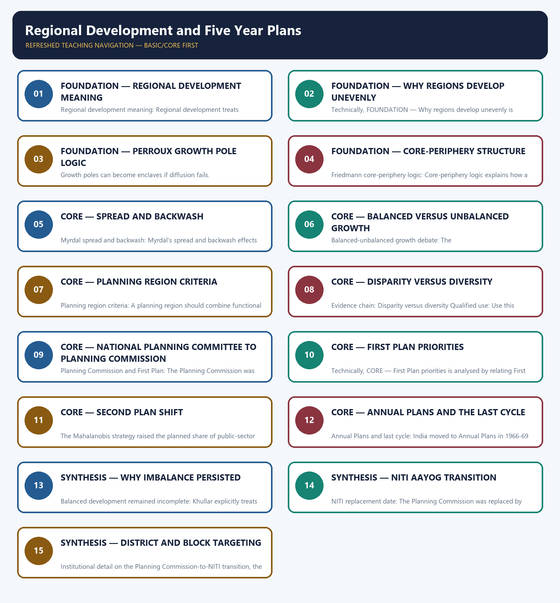

# Regional Development and Five Year Plans — Learner-v2 Complete Learning Session

> **Authoring-only generation:** 2026-09-01. No PDF was rendered and no tracker or index was mutated.

### SOURCE, PROGRESSION AND CURRENT-LINKAGE AUDIT

- **Generation date:** 2026-09-01.
- **Repository-first evidence:** the Basic owner is taught first and preserved in full; the Advanced owner is retained only in the optional final teaching block.
- **OCR evidence:** Repository Markdown was primary. The three required local Geography books were inspected as supplementary OCR/searchable evidence. No unsupported page precision, volatile figure or quotation was imported.
- **Qdrant:** not used; repository Markdown and available OCR context were sufficient.
- **PYQ integrity:** This topic has a verified direct routed demand: the 2024 GS-I question asking what regional disparity is, how it differs from diversity and how serious it is in India. The package therefore keeps the disparity-diversity distinction explicit and does not fabricate any additional direct PYQ.
- **Live-link boundary:** NITI Aayog dashboards, the Aspirational Districts programme and the SDG India Index are used only as dated anchors for the present planning style. No district ranking, fiscal outlay or state-gap figure is quoted here without an explicit source-year label.
- **Fact/inference discipline:** no current-affairs item, PYQ wording, figure or quotation is invented.

## BASIC LEARNING SESSION



*Distinct embedded teaching-navigation image. The separate continuous Cārvāka-style flowchart package remains an independent at-a-glance artifact.*

### SESSION 1 — FOUNDATION — REGIONAL DEVELOPMENT MEANING

#### DEFINITION / WHAT THIS IS CALLED

**Plain-language definition:** Evidence chain: Regional development meaning - Regional planning unit Qualified use: Define region, development and regional planning before using theory.

**Technical definition:** Regional development meaning: Regional development treats planning as the deliberate improvement of production, welfare, infrastructure and social capability in a defined territorial unit.

#### ANSWER-GRABBING OPENING — WRITE/ADAPT IN THE EXAM

> Evidence chain: Regional development meaning - Regional planning unit Qualified use: Define region, development and regional planning before using theory.

#### MUST-WRITE KEYWORDS

- **FOUNDATION**
- **Regional development meaning**
- **Regional planning unit**
- **Evidence chain**
- **Qualified use**
- **Regional**

**How to use them:** Frame the answer through FOUNDATION; define Regional development meaning, connect Regional planning unit with Evidence chain to explain the mechanism, and use Qualified use for the decisive comparison or qualification.

#### VISUAL FIRST

```text
REGIONAL DEVELOPMENT MEANING
01. Regional development meaning
    |
    v
02. Regional planning unit
BOUNDARY -> Development must stay tied to a territorial unit, not only to GDP.
```

*This topic-specific rail fixes the evidence sequence and its exam boundary before analysis.*

#### CORE EXPLANATION

Regional development treats planning as the deliberate improvement of production, welfare, infrastructure and social capability in a defined territorial unit. Regional planning applies development logic to a specific region rather than to the country as a whole.

#### NAMED EVIDENCE AND MECHANISM

- **Regional development meaning:** Regional development treats planning as the deliberate improvement of production, welfare, infrastructure and social capability in a defined territorial unit.
- **Regional planning unit:** Regional planning applies development logic to a specific region rather than to the country as a whole.

#### EXAMINER CAUTION

- Development must stay tied to a territorial unit, not only to GDP.

#### EXAM LINK

- **Prelims:** Separate the agent, landform, location, status and scale attached to Regional development meaning.
- **Mains:** Define region, development and regional planning before using theory.

#### MINI RECAP

- **Evidence chain:** Regional development meaning -> Regional planning unit
- **Qualified use:** Define region, development and regional planning before using theory.

#### CLOSING RECALL FLOW — FOUNDATION — REGIONAL DEVELOPMENT MEANING

```text
START / CONCEPT: FOUNDATION — Regional development meaning
        |
        v
EXACT TERMS: FOUNDATION · Regional development meaning · Regional planning unit · Evidence chain · Qualified use · Regional
        |
        v
MECHANISM / ARGUMENT: Regional development meaning: Regional development treats planning as the deliberate improvement of production, welfare, infrastructure and social capability in a defined territorial unit.
        |
        v
CONSEQUENCE / CONTRAST: Development must stay tied to a territorial unit, not only to GDP.
        |
        v
UPSC TRAP / ANSWER-USE: Do not miss this limiting distinction: regional development meaning - Regional planning unit Qualified use.
        |
        v
ANSWER-GRABBING FORMULATION: Evidence chain: Regional development meaning - Regional planning unit Qualified use: Define region, development and regional planning before using theory.
```
### SESSION 2 — FOUNDATION — WHY REGIONS DEVELOP UNEVENLY

#### DEFINITION / WHAT THIS IS CALLED

**Plain-language definition:** Evidence chain: Uneven development drivers Qualified use: List resource, transport, market, policy and historical drivers as a combined mechanism.

**Technical definition:** Technically, FOUNDATION — Why regions develop unevenly is analysed by relating FOUNDATION to Why regions develop unevenly, then testing the relationship through Uneven development drivers and Evidence chain.

#### ANSWER-GRABBING OPENING — WRITE/ADAPT IN THE EXAM

> Evidence chain: Uneven development drivers Qualified use: List resource, transport, market, policy and historical drivers as a combined mechanism.

#### MUST-WRITE KEYWORDS

- **FOUNDATION**
- **Why regions develop unevenly**
- **Uneven development drivers**
- **Evidence chain**
- **Qualified use**
- **Uneven**

**How to use them:** Frame the answer through FOUNDATION; define Why regions develop unevenly, connect Uneven development drivers with Evidence chain to explain the mechanism, and use Qualified use for the decisive comparison or qualification.

#### VISUAL FIRST

```text
WHY REGIONS DEVELOP UNEVENLY
01. Uneven development drivers
BOUNDARY -> Do not attribute unevenness to one cause alone.
```

*This topic-specific rail fixes the evidence sequence and its exam boundary before analysis.*

#### CORE EXPLANATION

Resource endowment, transport access, market size, state policy, technology and historical advantage all contribute to uneven regional development.

#### NAMED EVIDENCE AND MECHANISM

- **Uneven development drivers:** Resource endowment, transport access, market size, state policy, technology and historical advantage all contribute to uneven regional development.

#### EXAMINER CAUTION

- Do not attribute unevenness to one cause alone.

#### EXAM LINK

- **Prelims:** Separate the agent, landform, location, status and scale attached to Why regions develop unevenly.
- **Mains:** List resource, transport, market, policy and historical drivers as a combined mechanism.

#### MINI RECAP

- **Evidence chain:** Uneven development drivers
- **Qualified use:** List resource, transport, market, policy and historical drivers as a combined mechanism.

#### CLOSING RECALL FLOW — FOUNDATION — WHY REGIONS DEVELOP UNEVENLY

```text
START / CONCEPT: FOUNDATION — Why regions develop unevenly
        |
        v
EXACT TERMS: FOUNDATION · Why regions develop unevenly · Uneven development drivers · Evidence chain · Qualified use · Uneven
        |
        v
MECHANISM / ARGUMENT: The operative mechanism is that list resource, transport, market, policy and historical drivers as a combined mechanism.
        |
        v
CONSEQUENCE / CONTRAST: Do not attribute unevenness to one cause alone.
        |
        v
UPSC TRAP / ANSWER-USE: Do not miss this limiting distinction: do not attribute unevenness to one cause alone.
        |
        v
ANSWER-GRABBING FORMULATION: Evidence chain: Uneven development drivers Qualified use: List resource, transport, market, policy and historical drivers as a combined mechanism.
```
### SESSION 3 — FOUNDATION — PERROUX GROWTH POLE LOGIC

#### DEFINITION / WHAT THIS IS CALLED

**Plain-language definition:** Evidence chain: Perroux growth pole idea Qualified use: Use propulsive nodes and outward linkage logic carefully.

**Technical definition:** Growth poles can become enclaves if diffusion fails.

#### ANSWER-GRABBING OPENING — WRITE/ADAPT IN THE EXAM

> Evidence chain: Perroux growth pole idea Qualified use: Use propulsive nodes and outward linkage logic carefully.

#### MUST-WRITE KEYWORDS

- **FOUNDATION**
- **Perroux growth pole logic**
- **Perroux growth pole idea**
- **Evidence chain**
- **Qualified use**
- **Growth**

**How to use them:** Frame the answer through FOUNDATION; define Perroux growth pole logic, connect Perroux growth pole idea with Evidence chain to explain the mechanism, and use Qualified use for the decisive comparison or qualification.

#### VISUAL FIRST

```text
PERROUX GROWTH POLE LOGIC
01. Perroux growth pole idea
BOUNDARY -> Growth poles can become enclaves if diffusion fails.
```

*This topic-specific rail fixes the evidence sequence and its exam boundary before analysis.*

#### CORE EXPLANATION

Perroux's growth-pole idea says development begins in propulsive nodes or industries and then diffuses outward through linkages.

#### NAMED EVIDENCE AND MECHANISM

- **Perroux growth pole idea:** Perroux's growth-pole idea says development begins in propulsive nodes or industries and then diffuses outward through linkages.

#### EXAMINER CAUTION

- Growth poles can become enclaves if diffusion fails.

#### EXAM LINK

- **Prelims:** Separate the agent, landform, location, status and scale attached to Perroux growth pole logic.
- **Mains:** Use propulsive nodes and outward linkage logic carefully.

#### MINI RECAP

- **Evidence chain:** Perroux growth pole idea
- **Qualified use:** Use propulsive nodes and outward linkage logic carefully.

#### CLOSING RECALL FLOW — FOUNDATION — PERROUX GROWTH POLE LOGIC

```text
START / CONCEPT: FOUNDATION — Perroux growth pole logic
        |
        v
EXACT TERMS: FOUNDATION · Perroux growth pole logic · Perroux growth pole idea · Evidence chain · Qualified use · Growth
        |
        v
MECHANISM / ARGUMENT: Growth poles can become enclaves if diffusion fails.
        |
        v
CONSEQUENCE / CONTRAST: Mains: Use propulsive nodes and outward linkage logic carefully.
        |
        v
UPSC TRAP / ANSWER-USE: Do not miss this limiting distinction: perroux growth pole idea Qualified use.
        |
        v
ANSWER-GRABBING FORMULATION: Evidence chain: Perroux growth pole idea Qualified use: Use propulsive nodes and outward linkage logic carefully.
```
### SESSION 4 — FOUNDATION — CORE-PERIPHERY STRUCTURE

#### DEFINITION / WHAT THIS IS CALLED

**Plain-language definition:** Evidence chain: Friedmann core-periphery logic Qualified use: Explain dominance, dependency and selective concentration.

**Technical definition:** Friedmann core-periphery logic: Core-periphery logic explains how a strong core dominates and organises a weaker periphery.

#### ANSWER-GRABBING OPENING — WRITE/ADAPT IN THE EXAM

> Evidence chain: Friedmann core-periphery logic Qualified use: Explain dominance, dependency and selective concentration.

#### MUST-WRITE KEYWORDS

- **FOUNDATION**
- **Core-periphery structure**
- **Friedmann core-periphery logic**
- **Evidence chain**
- **Qualified use**
- **Core-periphery**

**How to use them:** Frame the answer through FOUNDATION; define Core-periphery structure, connect Friedmann core-periphery logic with Evidence chain to explain the mechanism, and use Qualified use for the decisive comparison or qualification.

#### VISUAL FIRST

```text
CORE-PERIPHERY STRUCTURE
01. Friedmann core-periphery logic
BOUNDARY -> A core is not automatically a benefactor to the periphery.
```

*This topic-specific rail fixes the evidence sequence and its exam boundary before analysis.*

#### CORE EXPLANATION

Core-periphery logic explains how a strong core dominates and organises a weaker periphery.

#### NAMED EVIDENCE AND MECHANISM

- **Friedmann core-periphery logic:** Core-periphery logic explains how a strong core dominates and organises a weaker periphery.

#### EXAMINER CAUTION

- A core is not automatically a benefactor to the periphery.

#### EXAM LINK

- **Prelims:** Separate the agent, landform, location, status and scale attached to Core-periphery structure.
- **Mains:** Explain dominance, dependency and selective concentration.

#### MINI RECAP

- **Evidence chain:** Friedmann core-periphery logic
- **Qualified use:** Explain dominance, dependency and selective concentration.

#### CLOSING RECALL FLOW — FOUNDATION — CORE-PERIPHERY STRUCTURE

```text
START / CONCEPT: FOUNDATION — Core-periphery structure
        |
        v
EXACT TERMS: FOUNDATION · Core-periphery structure · Friedmann core-periphery logic · Evidence chain · Qualified use · Core-periphery
        |
        v
MECHANISM / ARGUMENT: Friedmann core-periphery logic: Core-periphery logic explains how a strong core dominates and organises a weaker periphery.
        |
        v
CONSEQUENCE / CONTRAST: A core is not automatically a benefactor to the periphery.
        |
        v
UPSC TRAP / ANSWER-USE: Do not miss this limiting distinction: explain dominance, dependency and selective concentration.
        |
        v
ANSWER-GRABBING FORMULATION: Evidence chain: Friedmann core-periphery logic Qualified use: Explain dominance, dependency and selective concentration.
```
### SESSION 5 — CORE — SPREAD AND BACKWASH

#### DEFINITION / WHAT THIS IS CALLED

**Plain-language definition:** Evidence chain: Myrdal spread and backwash Qualified use: Use Myrdal to show why inequality can widen under growth.

**Technical definition:** Myrdal spread and backwash: Myrdal's spread and backwash effects show that growth can either diffuse benefits outward or drain labour, capital and talent from surrounding regions.

#### ANSWER-GRABBING OPENING — WRITE/ADAPT IN THE EXAM

> Evidence chain: Myrdal spread and backwash Qualified use: Use Myrdal to show why inequality can widen under growth.

#### MUST-WRITE KEYWORDS

- **Spread**
- **backwash**
- **Myrdal spread and backwash**
- **Evidence chain**
- **Qualified use**
- **Myrdal's**

**How to use them:** Frame the answer through Spread; define backwash, connect Myrdal spread and backwash with Evidence chain to explain the mechanism, and use Qualified use for the decisive comparison or qualification.

#### VISUAL FIRST

```text
SPREAD AND BACKWASH
01. Myrdal spread and backwash
BOUNDARY -> Balanced development depends on which effect becomes stronger.
```

*This topic-specific rail fixes the evidence sequence and its exam boundary before analysis.*

#### CORE EXPLANATION

Myrdal's spread and backwash effects show that growth can either diffuse benefits outward or drain labour, capital and talent from surrounding regions.

#### NAMED EVIDENCE AND MECHANISM

- **Myrdal spread and backwash:** Myrdal's spread and backwash effects show that growth can either diffuse benefits outward or drain labour, capital and talent from surrounding regions.

#### EXAMINER CAUTION

- Balanced development depends on which effect becomes stronger.

#### EXAM LINK

- **Prelims:** Separate the agent, landform, location, status and scale attached to Spread and backwash.
- **Mains:** Use Myrdal to show why inequality can widen under growth.

#### MINI RECAP

- **Evidence chain:** Myrdal spread and backwash
- **Qualified use:** Use Myrdal to show why inequality can widen under growth.

#### CLOSING RECALL FLOW — CORE — SPREAD AND BACKWASH

```text
START / CONCEPT: CORE — Spread and backwash
        |
        v
EXACT TERMS: Spread · backwash · Myrdal spread and backwash · Evidence chain · Qualified use · Myrdal's
        |
        v
MECHANISM / ARGUMENT: Myrdal spread and backwash: Myrdal's spread and backwash effects show that growth can either diffuse benefits outward or drain labour, capital and talent from surrounding regions.
        |
        v
CONSEQUENCE / CONTRAST: Balanced development depends on which effect becomes stronger.
        |
        v
UPSC TRAP / ANSWER-USE: Do not miss this limiting distinction: use Myrdal to show why inequality can widen under growth.
        |
        v
ANSWER-GRABBING FORMULATION: Evidence chain: Myrdal spread and backwash Qualified use: Use Myrdal to show why inequality can widen under growth.
```
### SESSION 6 — CORE — BALANCED VERSUS UNBALANCED GROWTH

#### DEFINITION / WHAT THIS IS CALLED

**Plain-language definition:** Evidence chain: Balanced-unbalanced growth debate Qualified use: Use it as an evaluative paragraph after theory.

**Technical definition:** Balanced-unbalanced growth debate: The balanced-versus-unbalanced growth debate asks whether development should be spread widely or strategically concentrated in selected nodes.

#### ANSWER-GRABBING OPENING — WRITE/ADAPT IN THE EXAM

> Evidence chain: Balanced-unbalanced growth debate Qualified use: Use it as an evaluative paragraph after theory.

#### MUST-WRITE KEYWORDS

- **Balanced versus unbalanced growth**
- **Balanced-unbalanced growth debate**
- **Evidence chain**
- **Qualified use**
- **Balanced-unbalanced**
- **Qualified**

**How to use them:** Frame the answer through Balanced versus unbalanced growth; define Balanced-unbalanced growth debate, connect Evidence chain with Qualified use to explain the mechanism, and use Balanced-unbalanced for the decisive comparison or qualification.

#### VISUAL FIRST

```text
BALANCED VERSUS UNBALANCED GROWTH
01. Balanced-unbalanced growth debate
BOUNDARY -> Do not make the debate sound like one settled answer.
```

*This topic-specific rail fixes the evidence sequence and its exam boundary before analysis.*

#### CORE EXPLANATION

The balanced-versus-unbalanced growth debate asks whether development should be spread widely or strategically concentrated in selected nodes.

#### NAMED EVIDENCE AND MECHANISM

- **Balanced-unbalanced growth debate:** The balanced-versus-unbalanced growth debate asks whether development should be spread widely or strategically concentrated in selected nodes.

#### EXAMINER CAUTION

- Do not make the debate sound like one settled answer.

#### EXAM LINK

- **Prelims:** Separate the agent, landform, location, status and scale attached to Balanced versus unbalanced growth.
- **Mains:** Use it as an evaluative paragraph after theory.

#### MINI RECAP

- **Evidence chain:** Balanced-unbalanced growth debate
- **Qualified use:** Use it as an evaluative paragraph after theory.

#### CLOSING RECALL FLOW — CORE — BALANCED VERSUS UNBALANCED GROWTH

```text
START / CONCEPT: CORE — Balanced versus unbalanced growth
        |
        v
EXACT TERMS: Balanced versus unbalanced growth · Balanced-unbalanced growth debate · Evidence chain · Qualified use · Balanced-unbalanced · Qualified
        |
        v
MECHANISM / ARGUMENT: Balanced-unbalanced growth debate: The balanced-versus-unbalanced growth debate asks whether development should be spread widely or strategically concentrated in selected nodes.
        |
        v
CONSEQUENCE / CONTRAST: Do not make the debate sound like one settled answer.
        |
        v
UPSC TRAP / ANSWER-USE: Do not miss this limiting distinction: use it as an evaluative paragraph after theory.
        |
        v
ANSWER-GRABBING FORMULATION: Evidence chain: Balanced-unbalanced growth debate Qualified use: Use it as an evaluative paragraph after theory.
```
### SESSION 7 — CORE — PLANNING REGION CRITERIA

#### DEFINITION / WHAT THIS IS CALLED

**Plain-language definition:** Evidence chain: Planning region criteria Qualified use: Move from map coherence to real administrative viability.

**Technical definition:** Planning region criteria: A planning region should combine functional unity, administrative manageability, economic viability, ecological balance and social acceptability.

#### ANSWER-GRABBING OPENING — WRITE/ADAPT IN THE EXAM

> Evidence chain: Planning region criteria Qualified use: Move from map coherence to real administrative viability.

#### MUST-WRITE KEYWORDS

- **Planning region criteria**
- **Evidence chain**
- **Qualified use**
- **Planning**
- **Qualified**
- **Move**

**How to use them:** Frame the answer through Planning region criteria; define Evidence chain, connect Qualified use with Planning to explain the mechanism, and use Qualified for the decisive comparison or qualification.

#### VISUAL FIRST

```text
PLANNING REGION CRITERIA
01. Planning region criteria
BOUNDARY -> A planning region must be functional and implementable together.
```

*This topic-specific rail fixes the evidence sequence and its exam boundary before analysis.*

#### CORE EXPLANATION

A planning region should combine functional unity, administrative manageability, economic viability, ecological balance and social acceptability.

#### NAMED EVIDENCE AND MECHANISM

- **Planning region criteria:** A planning region should combine functional unity, administrative manageability, economic viability, ecological balance and social acceptability.

#### EXAMINER CAUTION

- A planning region must be functional and implementable together.

#### EXAM LINK

- **Prelims:** Separate the agent, landform, location, status and scale attached to Planning region criteria.
- **Mains:** Move from map coherence to real administrative viability.

#### MINI RECAP

- **Evidence chain:** Planning region criteria
- **Qualified use:** Move from map coherence to real administrative viability.

#### CLOSING RECALL FLOW — CORE — PLANNING REGION CRITERIA

```text
START / CONCEPT: CORE — Planning region criteria
        |
        v
EXACT TERMS: Planning region criteria · Evidence chain · Qualified use · Planning · Qualified · Move
        |
        v
MECHANISM / ARGUMENT: Planning region criteria: A planning region should combine functional unity, administrative manageability, economic viability, ecological balance and social acceptability.
        |
        v
CONSEQUENCE / CONTRAST: A planning region must be functional and implementable together.
        |
        v
UPSC TRAP / ANSWER-USE: Do not miss this limiting distinction: move from map coherence to real administrative viability.
        |
        v
ANSWER-GRABBING FORMULATION: Evidence chain: Planning region criteria Qualified use: Move from map coherence to real administrative viability.
```
### SESSION 8 — CORE — DISPARITY VERSUS DIVERSITY

#### DEFINITION / WHAT THIS IS CALLED

**Plain-language definition:** Disparity versus diversity: Regional diversity means unranked difference of character, while regional disparity means ranked inequality of outcomes such as income, literacy, health or infrastructure.

**Technical definition:** Evidence chain: Disparity versus diversity Qualified use: Use this distinction as the 2024 GS-I firewall.

#### ANSWER-GRABBING OPENING — WRITE/ADAPT IN THE EXAM

> Disparity versus diversity: Regional diversity means unranked difference of character, while regional disparity means ranked inequality of outcomes such as income, literacy, health or infrastructure.

#### MUST-WRITE KEYWORDS

- **Disparity versus diversity**
- **Evidence chain**
- **Qualified use**
- **Regional diversity**
- **Regional**
- **Disparity versus diversity: Regional diversity**

**How to use them:** Frame the answer through Disparity versus diversity; define Evidence chain, connect Qualified use with Regional diversity to explain the mechanism, and use Regional for the decisive comparison or qualification.

#### VISUAL FIRST

```text
DISPARITY VERSUS DIVERSITY
01. Disparity versus diversity
BOUNDARY -> Difference of character is not the same as inequality of outcome.
```

*This topic-specific rail fixes the evidence sequence and its exam boundary before analysis.*

#### CORE EXPLANATION

Regional diversity means unranked difference of character, while regional disparity means ranked inequality of outcomes such as income, literacy, health or infrastructure.

#### NAMED EVIDENCE AND MECHANISM

- **Disparity versus diversity:** Regional diversity means unranked difference of character, while regional disparity means ranked inequality of outcomes such as income, literacy, health or infrastructure.

#### EXAMINER CAUTION

- Difference of character is not the same as inequality of outcome.

#### EXAM LINK

- **Prelims:** Separate the agent, landform, location, status and scale attached to Disparity versus diversity.
- **Mains:** Use this distinction as the 2024 GS-I firewall.

#### MINI RECAP

- **Evidence chain:** Disparity versus diversity
- **Qualified use:** Use this distinction as the 2024 GS-I firewall.

#### CLOSING RECALL FLOW — CORE — DISPARITY VERSUS DIVERSITY

```text
START / CONCEPT: CORE — Disparity versus diversity
        |
        v
EXACT TERMS: Disparity versus diversity · Evidence chain · Qualified use · Regional diversity · Regional · Disparity versus diversity: Regional diversity
        |
        v
MECHANISM / ARGUMENT: Evidence chain: Disparity versus diversity Qualified use: Use this distinction as the 2024 GS-I firewall.
        |
        v
CONSEQUENCE / CONTRAST: Difference of character is not the same as inequality of outcome.
        |
        v
UPSC TRAP / ANSWER-USE: Do not miss this limiting distinction: use this distinction as the 2024 GS-I firewall.
        |
        v
ANSWER-GRABBING FORMULATION: Disparity versus diversity: Regional diversity means unranked difference of character, while regional disparity means ranked inequality of outcomes such as income, literacy, health or infrastructure.
```
### SESSION 9 — CORE — NATIONAL PLANNING COMMITTEE TO PLANNING COMMISSION

#### DEFINITION / WHAT THIS IS CALLED

**Plain-language definition:** Evidence chain: National Planning Committee 1938 - Planning Commission and First Plan Qualified use: Trace the 1938 committee to the 1950 Planning Commission.

**Technical definition:** Planning Commission and First Plan: The Planning Commission was set up in 1950 and the First Five Year Plan launched the centralised planning framework in 1950-51.

#### ANSWER-GRABBING OPENING — WRITE/ADAPT IN THE EXAM

> Evidence chain: National Planning Committee 1938 - Planning Commission and First Plan Qualified use: Trace the 1938 committee to the 1950 Planning Commission.

#### MUST-WRITE KEYWORDS

- **National Planning Committee to Planning Commission**
- **National Planning Committee 1938**
- **Planning Commission and First Plan**
- **Evidence chain**
- **Qualified use**
- **1950-51**

**How to use them:** Frame the answer through National Planning Committee to Planning Commission; define National Planning Committee 1938, connect Planning Commission and First Plan with Evidence chain to explain the mechanism, and use Qualified use for the decisive comparison or qualification.

#### VISUAL FIRST

```text
NATIONAL PLANNING COMMITTEE TO PLANNING COMMISSION
01. National Planning Committee 1938
    |
    v
02. Planning Commission and First Plan
BOUNDARY -> Pre-Independence planning imagination matters in the timeline.
```

*This topic-specific rail fixes the evidence sequence and its exam boundary before analysis.*

#### CORE EXPLANATION

Khullar traces Indian planning back to the National Planning Committee of 1938. The Planning Commission was set up in 1950 and the First Five Year Plan launched the centralised planning framework in 1950-51.

#### NAMED EVIDENCE AND MECHANISM

- **National Planning Committee 1938:** Khullar traces Indian planning back to the National Planning Committee of 1938.
- **Planning Commission and First Plan:** The Planning Commission was set up in 1950 and the First Five Year Plan launched the centralised planning framework in 1950-51.

#### EXAMINER CAUTION

- Pre-Independence planning imagination matters in the timeline.

#### EXAM LINK

- **Prelims:** Separate the agent, landform, location, status and scale attached to National Planning Committee to Planning Commission.
- **Mains:** Trace the 1938 committee to the 1950 Planning Commission.

#### MINI RECAP

- **Evidence chain:** National Planning Committee 1938 -> Planning Commission and First Plan
- **Qualified use:** Trace the 1938 committee to the 1950 Planning Commission.

#### CLOSING RECALL FLOW — CORE — NATIONAL PLANNING COMMITTEE TO PLANNING COMMISSION

```text
START / CONCEPT: CORE — National Planning Committee to Planning Commission
        |
        v
EXACT TERMS: National Planning Committee to Planning Commission · National Planning Committee 1938 · Planning Commission and First Plan · Evidence chain · Qualified use · 1950-51
        |
        v
MECHANISM / ARGUMENT: Planning Commission and First Plan: The Planning Commission was set up in 1950 and the First Five Year Plan launched the centralised planning framework in 1950-51.
        |
        v
CONSEQUENCE / CONTRAST: The resulting consequence is that national Planning Committee 1938 - Planning Commission and First Plan Qualified use.
        |
        v
UPSC TRAP / ANSWER-USE: Do not miss this limiting distinction: national Planning Committee 1938 - Planning Commission and First Plan Qualified use.
        |
        v
ANSWER-GRABBING FORMULATION: Evidence chain: National Planning Committee 1938 - Planning Commission and First Plan Qualified use: Trace the 1938 committee to the 1950 Planning Commission.
```
### SESSION 10 — CORE — FIRST PLAN PRIORITIES

#### DEFINITION / WHAT THIS IS CALLED

**Plain-language definition:** Evidence chain: First Plan priorities Qualified use: Stress irrigation, agriculture, refugee resettlement and power.

**Technical definition:** Technically, CORE — First Plan priorities is analysed by relating First Plan priorities to Evidence chain, then testing the relationship through Qualified use and First Plan.

#### ANSWER-GRABBING OPENING — WRITE/ADAPT IN THE EXAM

> Evidence chain: First Plan priorities Qualified use: Stress irrigation, agriculture, refugee resettlement and power.

#### MUST-WRITE KEYWORDS

- **First Plan priorities**
- **Evidence chain**
- **Qualified use**
- **First Plan**
- **Qualified**
- **Stress**

**How to use them:** Frame the answer through First Plan priorities; define Evidence chain, connect Qualified use with First Plan to explain the mechanism, and use Qualified for the decisive comparison or qualification.

#### VISUAL FIRST

```text
FIRST PLAN PRIORITIES
01. First Plan priorities
BOUNDARY -> Do not rewrite the First Plan as a heavy-industry plan.
```

*This topic-specific rail fixes the evidence sequence and its exam boundary before analysis.*

#### CORE EXPLANATION

The First Plan prioritised irrigation, agriculture, refugee resettlement, power and early resource-region thinking.

#### NAMED EVIDENCE AND MECHANISM

- **First Plan priorities:** The First Plan prioritised irrigation, agriculture, refugee resettlement, power and early resource-region thinking.

#### EXAMINER CAUTION

- Do not rewrite the First Plan as a heavy-industry plan.

#### EXAM LINK

- **Prelims:** Separate the agent, landform, location, status and scale attached to First Plan priorities.
- **Mains:** Stress irrigation, agriculture, refugee resettlement and power.

#### MINI RECAP

- **Evidence chain:** First Plan priorities
- **Qualified use:** Stress irrigation, agriculture, refugee resettlement and power.

#### CLOSING RECALL FLOW — CORE — FIRST PLAN PRIORITIES

```text
START / CONCEPT: CORE — First Plan priorities
        |
        v
EXACT TERMS: First Plan priorities · Evidence chain · Qualified use · First Plan · Qualified · Stress
        |
        v
MECHANISM / ARGUMENT: Do not rewrite the First Plan as a heavy-industry plan.
        |
        v
CONSEQUENCE / CONTRAST: The resulting consequence is that stress irrigation, agriculture, refugee resettlement and power.
        |
        v
UPSC TRAP / ANSWER-USE: Do not miss this limiting distinction: stress irrigation, agriculture, refugee resettlement and power.
        |
        v
ANSWER-GRABBING FORMULATION: Evidence chain: First Plan priorities Qualified use: Stress irrigation, agriculture, refugee resettlement and power.
```
### SESSION 11 — CORE — SECOND PLAN SHIFT

#### DEFINITION / WHAT THIS IS CALLED

**Plain-language definition:** The Second Plan shifted investment priority toward heavy industry and capital goods while agriculture remained an essential constraint.

**Technical definition:** The Mahalanobis strategy raised the planned share of public-sector heavy and capital-goods capacity to expand long-run productive capability, accepting short-run consumption and foreign-exchange pressures.

#### ANSWER-GRABBING OPENING — WRITE/ADAPT IN THE EXAM

> The Second Plan changed the growth strategy from immediate recovery toward building the domestic capital-goods base.

#### MUST-WRITE KEYWORDS

- **Second Five Year Plan**
- **Mahalanobis strategy**
- **heavy industry**
- **capital goods**
- **public sector**
- **agrarian constraint**

**How to use them:** Contrast First-Plan agrarian recovery with the Second Five Year Plan; connect Mahalanobis strategy to heavy industry, capital goods and public-sector investment, then qualify the shift through agriculture and foreign-exchange constraints.

#### VISUAL FIRST

```text
SECOND PLAN SHIFT
01. Second Plan heavy industry
BOUNDARY -> Heavy industry belongs to the Second Plan, not the First.
```

*This topic-specific rail fixes the evidence sequence and its exam boundary before analysis.*

#### CORE EXPLANATION

The Second Plan shifted emphasis towards heavy industry and the public-sector industrial base.

#### NAMED EVIDENCE AND MECHANISM

- **Second Plan heavy industry:** The Second Plan shifted emphasis towards heavy industry and the public-sector industrial base.

#### EXAMINER CAUTION

- Heavy industry belongs to the Second Plan, not the First.

#### EXAM LINK

- **Prelims:** Separate the agent, landform, location, status and scale attached to Second Plan shift.
- **Mains:** Contrast agrarian recovery with the industrial base strategy.

#### MINI RECAP

- **Evidence chain:** Second Plan heavy industry
- **Qualified use:** Contrast agrarian recovery with the industrial base strategy.

#### CLOSING RECALL FLOW — CORE — SECOND PLAN SHIFT

```text
START / CONCEPT: CORE — Second Plan shift
        |
        v
EXACT TERMS: Second Five Year Plan · Mahalanobis strategy · heavy industry · capital goods · public sector · agrarian constraint
        |
        v
MECHANISM / ARGUMENT: Evidence chain: Second Plan heavy industry Qualified use: Contrast agrarian recovery with the industrial base strategy.
        |
        v
CONSEQUENCE / CONTRAST: The resulting consequence is that second Plan heavy industry Qualified use.
        |
        v
UPSC TRAP / ANSWER-USE: Do not miss this limiting distinction: second Plan heavy industry Qualified use.
        |
        v
ANSWER-GRABBING FORMULATION: The Second Plan changed the growth strategy from immediate recovery toward building the domestic capital-goods base.
```
### SESSION 12 — CORE — ANNUAL PLANS AND THE LAST CYCLE

#### DEFINITION / WHAT THIS IS CALLED

**Plain-language definition:** Evidence chain: Annual Plans and last cycle Qualified use: Use Annual Plans and the Twelfth Plan boundary to structure the timeline.

**Technical definition:** Annual Plans and last cycle: India moved to Annual Plans in 1966-69 after war, drought and macro stress, and the Twelfth Plan was the last Five Year Plan cycle.

#### ANSWER-GRABBING OPENING — WRITE/ADAPT IN THE EXAM

> Evidence chain: Annual Plans and last cycle Qualified use: Use Annual Plans and the Twelfth Plan boundary to structure the timeline.

#### MUST-WRITE KEYWORDS

- **Annual Plans**
- **the last cycle**
- **Annual Plans and last cycle**
- **Evidence chain**
- **Qualified use**
- **1966-69**

**How to use them:** Frame the answer through Annual Plans; define the last cycle, connect Annual Plans and last cycle with Evidence chain to explain the mechanism, and use Qualified use for the decisive comparison or qualification.

#### VISUAL FIRST

```text
ANNUAL PLANS AND THE LAST CYCLE
01. Annual Plans and last cycle
BOUNDARY -> Five Year Plans were interrupted and then ended; they were not one uninterrupted chain.
```

*This topic-specific rail fixes the evidence sequence and its exam boundary before analysis.*

#### CORE EXPLANATION

India moved to Annual Plans in 1966-69 after war, drought and macro stress, and the Twelfth Plan was the last Five Year Plan cycle.

#### NAMED EVIDENCE AND MECHANISM

- **Annual Plans and last cycle:** India moved to Annual Plans in 1966-69 after war, drought and macro stress, and the Twelfth Plan was the last Five Year Plan cycle.

#### EXAMINER CAUTION

- Five Year Plans were interrupted and then ended; they were not one uninterrupted chain.

#### EXAM LINK

- **Prelims:** Separate the agent, landform, location, status and scale attached to Annual Plans and the last cycle.
- **Mains:** Use Annual Plans and the Twelfth Plan boundary to structure the timeline.

#### MINI RECAP

- **Evidence chain:** Annual Plans and last cycle
- **Qualified use:** Use Annual Plans and the Twelfth Plan boundary to structure the timeline.

#### CLOSING RECALL FLOW — CORE — ANNUAL PLANS AND THE LAST CYCLE

```text
START / CONCEPT: CORE — Annual Plans and the last cycle
        |
        v
EXACT TERMS: Annual Plans · the last cycle · Annual Plans and last cycle · Evidence chain · Qualified use · 1966-69
        |
        v
MECHANISM / ARGUMENT: Annual Plans and last cycle: India moved to Annual Plans in 1966-69 after war, drought and macro stress, and the Twelfth Plan was the last Five Year Plan cycle.
        |
        v
CONSEQUENCE / CONTRAST: Five Year Plans were interrupted and then ended; they were not one uninterrupted chain.
        |
        v
UPSC TRAP / ANSWER-USE: Do not miss this limiting distinction: use Annual Plans and the Twelfth Plan boundary to structure the timeline.
        |
        v
ANSWER-GRABBING FORMULATION: Evidence chain: Annual Plans and last cycle Qualified use: Use Annual Plans and the Twelfth Plan boundary to structure the timeline.
```
### SESSION 13 — SYNTHESIS — WHY IMBALANCE PERSISTED

#### DEFINITION / WHAT THIS IS CALLED

**Plain-language definition:** Evidence chain: Balanced development remained incomplete Qualified use: Connect uneven irrigation, industry and governance capacity to persistent disparity.

**Technical definition:** Balanced development remained incomplete: Khullar explicitly treats the failure to achieve balanced regional development as a major shortcoming of the Five Year Plan era.

#### ANSWER-GRABBING OPENING — WRITE/ADAPT IN THE EXAM

> Evidence chain: Balanced development remained incomplete Qualified use: Connect uneven irrigation, industry and governance capacity to persistent disparity.

#### MUST-WRITE KEYWORDS

- **SYNTHESIS**
- **Why imbalance persisted**
- **Balanced development remained incomplete**
- **Evidence chain**
- **Qualified use**
- **Khullar**

**How to use them:** Frame the answer through SYNTHESIS; define Why imbalance persisted, connect Balanced development remained incomplete with Evidence chain to explain the mechanism, and use Qualified use for the decisive comparison or qualification.

#### VISUAL FIRST

```text
WHY IMBALANCE PERSISTED
01. Balanced development remained incomplete
BOUNDARY -> Planned development did not erase core-periphery outcomes automatically.
```

*This topic-specific rail fixes the evidence sequence and its exam boundary before analysis.*

#### CORE EXPLANATION

Khullar explicitly treats the failure to achieve balanced regional development as a major shortcoming of the Five Year Plan era.

#### NAMED EVIDENCE AND MECHANISM

- **Balanced development remained incomplete:** Khullar explicitly treats the failure to achieve balanced regional development as a major shortcoming of the Five Year Plan era.

#### EXAMINER CAUTION

- Planned development did not erase core-periphery outcomes automatically.

#### EXAM LINK

- **Prelims:** Separate the agent, landform, location, status and scale attached to Why imbalance persisted.
- **Mains:** Connect uneven irrigation, industry and governance capacity to persistent disparity.

#### MINI RECAP

- **Evidence chain:** Balanced development remained incomplete
- **Qualified use:** Connect uneven irrigation, industry and governance capacity to persistent disparity.

#### CLOSING RECALL FLOW — SYNTHESIS — WHY IMBALANCE PERSISTED

```text
START / CONCEPT: SYNTHESIS — Why imbalance persisted
        |
        v
EXACT TERMS: SYNTHESIS · Why imbalance persisted · Balanced development remained incomplete · Evidence chain · Qualified use · Khullar
        |
        v
MECHANISM / ARGUMENT: Balanced development remained incomplete: Khullar explicitly treats the failure to achieve balanced regional development as a major shortcoming of the Five Year Plan era.
        |
        v
CONSEQUENCE / CONTRAST: The resulting consequence is that balanced development remained incomplete Qualified use.
        |
        v
UPSC TRAP / ANSWER-USE: Do not miss this limiting distinction: balanced development remained incomplete Qualified use.
        |
        v
ANSWER-GRABBING FORMULATION: Evidence chain: Balanced development remained incomplete Qualified use: Connect uneven irrigation, industry and governance capacity to persistent disparity.
```
### SESSION 14 — SYNTHESIS — NITI AAYOG TRANSITION

#### DEFINITION / WHAT THIS IS CALLED

**Plain-language definition:** Evidence chain: NITI replacement date - NITI planning style Qualified use: Contrast outlay logic with dashboards and cooperative federalism.

**Technical definition:** NITI replacement date: The Planning Commission was replaced by NITI Aayog on 1 January 2015.

#### ANSWER-GRABBING OPENING — WRITE/ADAPT IN THE EXAM

> Evidence chain: NITI replacement date - NITI planning style Qualified use: Contrast outlay logic with dashboards and cooperative federalism.

#### MUST-WRITE KEYWORDS

- **SYNTHESIS**
- **NITI Aayog transition**
- **NITI replacement date**
- **NITI planning style**
- **Evidence chain**
- **Qualified use**

**How to use them:** Frame the answer through SYNTHESIS; define NITI Aayog transition, connect NITI replacement date with NITI planning style to explain the mechanism, and use Evidence chain for the decisive comparison or qualification.

#### VISUAL FIRST

```text
NITI AAYOG TRANSITION
01. NITI replacement date
    |
    v
02. NITI planning style
BOUNDARY -> Replacing the Planning Commission changed style, not the need for regional planning.
```

*This topic-specific rail fixes the evidence sequence and its exam boundary before analysis.*

#### CORE EXPLANATION

The Planning Commission was replaced by NITI Aayog on 1 January 2015. The NITI era stresses think-tank coordination, cooperative and competitive federalism, dashboards and mission-mode monitoring rather than plan outlay alone.

#### NAMED EVIDENCE AND MECHANISM

- **NITI replacement date:** The Planning Commission was replaced by NITI Aayog on 1 January 2015.
- **NITI planning style:** The NITI era stresses think-tank coordination, cooperative and competitive federalism, dashboards and mission-mode monitoring rather than plan outlay alone.

#### EXAMINER CAUTION

- Replacing the Planning Commission changed style, not the need for regional planning.

#### EXAM LINK

- **Prelims:** Separate the agent, landform, location, status and scale attached to NITI Aayog transition.
- **Mains:** Contrast outlay logic with dashboards and cooperative federalism.

#### MINI RECAP

- **Evidence chain:** NITI replacement date -> NITI planning style
- **Qualified use:** Contrast outlay logic with dashboards and cooperative federalism.

#### CLOSING RECALL FLOW — SYNTHESIS — NITI AAYOG TRANSITION

```text
START / CONCEPT: SYNTHESIS — NITI Aayog transition
        |
        v
EXACT TERMS: SYNTHESIS · NITI Aayog transition · NITI replacement date · NITI planning style · Evidence chain · Qualified use
        |
        v
MECHANISM / ARGUMENT: NITI replacement date: The Planning Commission was replaced by NITI Aayog on 1 January 2015.
        |
        v
CONSEQUENCE / CONTRAST: The Planning Commission was replaced by NITI Aayog on 1 January 2015.
        |
        v
UPSC TRAP / ANSWER-USE: Do not miss this limiting distinction: nITI replacement date - NITI planning style Qualified use.
        |
        v
ANSWER-GRABBING FORMULATION: Evidence chain: NITI replacement date - NITI planning style Qualified use: Contrast outlay logic with dashboards and cooperative federalism.
```
### SESSION 15 — SYNTHESIS — DISTRICT AND BLOCK TARGETING

#### DEFINITION / WHAT THIS IS CALLED

**Plain-language definition:** District and block targeting: Current planning geography pushes targeting downward from state averages to districts and blocks because intra-state disparity is often as serious as interstate disparity.

**Technical definition:** Institutional detail on the Planning Commission-to-NITI transition, the Aspirational Districts and Blocks programmes and their dashboards is carried in advanced/29Regional-Development-and-Five-Year-Plans.md; the geographic point retained here is that the unit of targeting has moved downward in scale, from state to district to block, because state averages conceal intra-state disparity. ⚠️ The intra-state point: disparity within states is often as large as disparity between them, which is precisely why sub-state targeting emerged.

#### ANSWER-GRABBING OPENING — WRITE/ADAPT IN THE EXAM

> District and block targeting: Current planning geography pushes targeting downward from state averages to districts and blocks because intra-state disparity is often as serious as interstate disparity.

#### MUST-WRITE KEYWORDS

- **SYNTHESIS**
- **District**
- **block targeting**
- **Aspirational Districts**
- **SDG India Index 2023-24**
- **District and block targeting**

**How to use them:** Frame the answer through SYNTHESIS; define District, connect block targeting with Aspirational Districts to explain the mechanism, and use SDG India Index 2023-24 for the decisive comparison or qualification.

#### VISUAL FIRST

```text
DISTRICT AND BLOCK TARGETING
01. Aspirational Districts
    |
    v
02. SDG India Index 2023-24
    |
    v
03. District and block targeting
BOUNDARY -> State averages hide district and block disparities.
```

*This topic-specific rail fixes the evidence sequence and its exam boundary before analysis.*

#### CORE EXPLANATION

NITI Aayog launched the Aspirational Districts Programme in January 2018 for 112 districts. The SDG India Index 2023-24 gave India an overall score of 71 and shows development benchmarking through territorial indicators. Current planning geography pushes targeting downward from state averages to districts and blocks because intra-state disparity is often as serious as interstate disparity.

#### NAMED EVIDENCE AND MECHANISM

- **Aspirational Districts:** NITI Aayog launched the Aspirational Districts Programme in January 2018 for 112 districts.
- **SDG India Index 2023-24:** The SDG India Index 2023-24 gave India an overall score of 71 and shows development benchmarking through territorial indicators.
- **District and block targeting:** Current planning geography pushes targeting downward from state averages to districts and blocks because intra-state disparity is often as serious as interstate disparity.

#### EXAMINER CAUTION

- State averages hide district and block disparities.

#### EXAM LINK

- **Prelims:** Separate the agent, landform, location, status and scale attached to District and block targeting.
- **Mains:** End with Aspirational Districts, SDG India Index and the downward shift in scale.

#### MINI RECAP

- **Evidence chain:** Aspirational Districts -> SDG India Index 2023-24 -> District and block targeting
- **Qualified use:** End with Aspirational Districts, SDG India Index and the downward shift in scale.
#### COMPLETE BASIC OWNER EVIDENCE BANK

> **Subject:** Geography · **Tier:** Must-Do (foundation + standard) · **GS Paper:** GS-I
> **Grounded in:** Majid Husain, *Indian & World Geography* + G.C. Leong for physical-region context + verified NITI/SDG current anchor.
> ✅ = from source book or official source · ⚠️ = inference / standard synthesis · 📰 = current affairs.
> *Companion: `advanced/29_Regional-Development-and-Five-Year-Plans.md`.*

#### 1. What “regional development” means

✅ Regional-development geography treats planning as a deliberate process of thinking through and implementing actions to achieve socio-economic goals. ✅ Regional planning is the application of that logic to a particular region rather than the country as a whole.

| Term | Meaning |
|---|---|
| ✅ Region | Area with some degree of internal coherence |
| ✅ Development | Improvement in production, welfare, infrastructure and social capability |
| ✅ Planning | Coordinated attempt to match goals with means |
| ✅ Regional planning | Development planning focused on a specific territorial unit |

#### 2. Why regions develop unevenly

⚠️ Growth-pole, core-periphery and spread/backwash models help explain uneven development. ⚠️ Real-world variation comes from resource endowment, transport access, market size, state policy, technology and historical advantage.

| Cause of unevenness | Geographic effect |
|---|---|
| ⚠️ Resource concentration | Mining, industry or irrigation clusters form |
| ⚠️ Transport advantage | Corridors outpace interior areas |
| ⚠️ Market size and urban nodes | Big centres attract capital and labour |
| ⚠️ Historical head start | Earlier industrial regions retain cumulative advantage |
| ⚠️ Policy neglect or conflict | Lagging regions fall further behind |

#### 3. Classical models worth remembering

| Model | Core idea | Best use in UPSC |
|---|---|---|
| ⚠️ Growth pole theory | Development starts from dynamic nodes and diffuses outward | Explains industrial or metropolitan clustering |
| ⚠️ Core-periphery model | A strong core dominates a weaker periphery | Useful for regional imbalance |
| ⚠️ Spread and backwash effects | Growth can either diffuse benefits or drain resources from surrounding areas | Excellent for balanced-development answers |
| ⚠️ Balanced vs unbalanced growth | Debate between wide-based distribution and selective strategic concentration | Good evaluative paragraph |

#### 4. What makes a good planning region

✅ A planning region requires coherence, practicality and ecological balance. ⚠️ In answer form, the safest features to mention are territorial contiguity, functional unity, economic viability, social acceptability and environmental sustainability.

| Planning-region principle | Why it matters |
|---|---|
| ⚠️ Functional unity | Region should hang together through flows and linkages |
| ⚠️ Administrative manageability | Plan must be implementable |
| ⚠️ Economic viability | Region should support realistic development strategy |
| ⚠️ Ecological balance | Planning should not damage the resource base |
| ⚠️ Social acceptability | Regional identity and social needs affect success |

#### 5. Where Five-Year Plans fit conceptually

✅ India's Five-Year Plans are an example of state-led planned development. ⚠️ In geography, the key point is not only targets and outlays but how planned development tries to reduce spatial inequality through irrigation, infrastructure, industrial location and service delivery.

#### 6. Must-Know Facts (Prelims) and UPSC traps

- ✅ Regional development is about territorial balance, not just national GDP growth.
- ✅ Growth can spread outward or create backwash and dependency.
- ✅ Planning region is a functional idea, not merely a map-drawing exercise.
- ✅ Growth poles can accelerate development but may also widen inequality.
- ✅ Five-Year Plans are tools of planned development, not theories by themselves.

- ❌ Balanced regional development means every place must grow at the same rate -> The real aim is reducing harmful disparities, not uniformity.
- ❌ A strong core always benefits its periphery -> Backwash effects can intensify inequality.
- ❌ Regional planning is only an administrative issue -> It is also economic, ecological and social.

#### 7. Exam linkage

- ⚠️ Recurring UPSC theme: growth poles, regional imbalance and planning.
- ⚠️ GS-I answers improve when theory is tied to actual regions rather than explained abstractly.
- ⚠️ This topic also links strongly with urbanisation, migration and agrarian change.

#### 8. 📰 Current link

##### CA Anchor — SDG-era regional inequality debate

📰 **News trigger:** Current development reporting increasingly measures states and districts through territorial indicators, not just national averages, which keeps the regional-development lens alive even after the end of the old Five-Year Plan system.

| Current fact | Static linkage |
|---|---|
| ✅ State and district rankings are common in present policy | Regional imbalance remains a live planning issue |
| ⚠️ Competitive federalism works like a new regional-comparison device | Development is increasingly benchmarked spatially |

#### 9. Mains angles

- Explain regional imbalance using growth pole and core-periphery ideas.
- Why is balanced regional development a geographic problem rather than only an economic one?

#### 10. Probable Questions

**Prelims-style concept prompt**
- ⚠️ Which of the following statements about regional-development models is/are correct? (1) Growth pole theory says development starts from dynamic nodes and diffuses outward. (2) Balanced regional development means every place must grow at exactly the same rate. **Answer:** Only statement (1) is correct, because this file defines growth poles in diffusion terms and clearly notes that balanced development means reducing harmful disparities, not forcing uniform growth.

**Probable Mains questions (10-15 marks)**
- ⚠️ Explain regional imbalance with the help of growth pole, core-periphery and spread-backwash ideas. (15 marks)
- ⚠️ Discuss why a planning region must be functionally coherent, economically viable and ecologically balanced. (10 marks)

#### 11. Study link

Geography → Human Geography → Regional Development  
Geography → Human Geography → Planning Regions & Spatial Inequality

#### 12. Disparity, models and India's planning geography

> **Why this section exists:** the file described regional-development models **without naming their
> authors**, omitted cumulative causation entirely, and — most seriously — did **not distinguish
> regional disparity from regional diversity**, although exactly that distinction has been examined.
> A named theorist and a precise definition are what convert this topic from description to analysis.

##### 12.1 Disparity is not diversity

| | **Regional diversity** | **Regional disparity** |
|---|---|---|
| ⚠️ What it describes | **Difference** in character — physical environment, language, culture, cropping pattern, cuisine, economic specialisation | **Inequality** in outcomes — income, productivity, employment, literacy, health, infrastructure and access to services |
| ⚠️ Value content | Neutral, or positive; a resource | Negative; a deficit measured against a normative standard |
| ⚠️ Measurement | Described and classified; not ranked | **Ranked** on comparable indicators, so a gap can be measured |
| ⚠️ Desirable response | Recognise, protect, accommodate; federal and linguistic accommodation | Reduce, converge; targeted investment and transfers |
| ⚠️ What happens if confused | Diversity is treated as a defect requiring homogenisation | Genuine inequality is excused as harmless variety |

- ⚠️ **The relationship between them:** diversity becomes disparity when difference is **converted
  into disadvantage** — when a region's distinct resource base, location or history yields
  systematically lower incomes, weaker services and fewer opportunities. A hill region's distinct
  agriculture is diversity; its lower access to health care and markets is disparity.
- ⚠️ **The one-sentence formulation to use:** *diversity is difference without ranking; disparity is
  difference that can be ranked and that disadvantages one region relative to another on a common
  scale.*

##### 12.2 The theorists, named

| Theorist / model | Central mechanism | Policy implication | Limitation |
|---|---|---|---|
| ⚠️ **Perroux — growth pole** | Growth is not diffuse; it originates in **propulsive industries** clustered at particular nodes, and spreads through linkages | Deliberately create or strengthen growth nodes rather than spread investment thinly | The spread often fails to occur; a pole can remain an enclave with few local linkages |
| ⚠️ **Boudeville** | Reformulated the growth pole as a **geographic** rather than purely economic concept — a growth centre in real space | Makes the pole a planning instrument that can be located | Assumes linkages will form locally |
| ⚠️ **Myrdal — circular and cumulative causation** | An initial advantage attracts capital, skilled labour and enterprise, which strengthens the advantage, which attracts more; markets therefore **increase** rather than reduce regional inequality unless corrected | Deliberate state intervention is required; markets alone will not converge | Understates the conditions under which spread does occur |
| ⚠️ **Myrdal — backwash and spread** | **Backwash:** the core drains labour, capital and talent from the periphery. **Spread:** the core's demand for the periphery's food, raw materials and labour, and the diffusion of technology, benefit the periphery | Whether a region converges depends on which effect is stronger | The balance is hard to measure |
| ⚠️ **Hirschman — polarisation and trickle-down** | The same two forces under different names, with more optimism that trickle-down eventually dominates | Unbalanced growth can be deliberate; imbalance creates the pressures that induce complementary investment | Trickle-down may be slow, partial or politically obstructed |
| ⚠️ **Friedmann — core-periphery** | A dominant core organises a dependent periphery; over time an integrated system may emerge through intermediate centres | Build intermediate cities to restructure the space economy | Stage-based and somewhat deterministic |
| ⚠️ **Rostow — stages of growth** | Development proceeds through identifiable stages toward self-sustaining growth | Investment thresholds matter | Linear, Eurocentric and widely criticised as a general theory |

- ⚠️ **The synthesis that answers most questions:** Myrdal's cumulative causation explains why
  disparities **persist and widen** without intervention; growth-pole theory explains what
  intervention was attempted; and the enclave problem explains why that intervention frequently
  failed to spread. Naming all three in sequence converts a list into an argument.

##### 12.3 Why regions diverge — the mechanisms behind the models

| Driver | How it produces divergence |
|---|---|
| ⚠️ Initial physical endowment | Fertile alluvium, minerals, ports, navigable rivers and level terrain lower production and transport costs |
| ⚠️ Historical legacy | Colonial port orientation, railway alignment and administrative centres created inherited advantages that persist |
| ⚠️ Agglomeration economies | Existing industry attracts more industry through shared labour, suppliers and services (`32_Industries-and-Industrial-Regions.md`) |
| ⚠️ Selective migration | The young, skilled and enterprising leave lagging regions, weakening them further — Myrdal's backwash in action (`27_Migration-Theories-and-Patterns-India.md`) |
| ⚠️ Capital mobility | Investment follows expected return, which is higher where infrastructure and markets already exist |
| ⚠️ Institutional and governance capacity | Ability to plan, spend, regulate and deliver varies sharply between states and districts, and determines whether transfers become outcomes |
| ⚠️ Connectivity | Access to markets, ports and corridors determines whether a resource endowment can be commercialised |

##### 12.4 Planning regions and India's spatial planning instruments

- ⚠️ **Types of planning region:**
  - a **formal / homogeneous** region, defined by uniformity of a chosen characteristic — a drought-prone
    belt, a tribal belt, a hill region;
  - a **functional / nodal** region, defined by interaction around a node — a city and its
    commuting and market hinterland, or a river basin;
  - an **administrative / programme** region, defined by the boundaries through which a policy is
    actually delivered — states, districts and blocks.
- ⚠️ **The permanent tension:** problems are formal or functional in shape — a drought belt, an
  aquifer, a basin, a metropolitan labour market — while **delivery is administrative**. Almost
  every failure of regional planning can be traced to that mismatch, and saying so is the single
  most transferable insight in this topic.
- ⚠️ **India's instruments, at a conceptual level:** the Five-Year Plan era used backward-area
  programmes, hill- and tribal-area sub-plans, and public-sector plant location as deliberate
  instruments of spatial balance; the current architecture emphasises **district- and block-level
  targeting on measured indicators**, industrial and freight corridors, and mission-mode schemes.
  Institutional detail on the Planning Commission-to-NITI transition, the Aspirational Districts
  and Blocks programmes and their dashboards is carried in
  `advanced/29_Regional-Development-and-Five-Year-Plans.md`; the **geographic** point retained here
  is that the unit of targeting has moved **downward in scale**, from state to district to block,
  because state averages conceal intra-state disparity.
- ⚠️ **The intra-state point:** disparity within states is often as large as disparity between them,
  which is precisely why sub-state targeting emerged. An answer that discusses only inter-state
  disparity is incomplete.

> ⚠️ **Factual caution:** do **not** quote per-capita income ratios between states, a district count,
> a scheme outlay or an index rank from memory. Name the mechanism and the instrument type;
> attribute any figure to a named source with its date.

#### 13. Answer architecture (10/15/20-mark support)

##### 13.1 Directive decoding

| If the question says | It is really asking for | Do **not** |
|---|---|---|
| "What is regional disparity? How does it differ from diversity? How serious is it in India?" | A precise definition, the ranked-versus-unranked distinction, the conversion mechanism, and then a **graded** severity judgement with indicators named | Treat the two terms as synonyms, or answer only the third part |
| "Examine the growth-pole strategy" | Perroux's propulsive-industry logic, Boudeville's spatial reformulation, and the enclave failure | Describe it approvingly without the failure record |
| "Why do regional inequalities persist?" | Myrdal's cumulative causation with backwash and spread, plus the seven divergence drivers | List poor regions |
| "Discuss planning regions" | The formal, functional and administrative typology and the delivery mismatch | Define "region" generically |

##### 13.2 Reusable 15-mark spine — regional disparity in India

1. **Thesis:** regional disparity in India is serious and, on several dimensions, **self-reinforcing**
   — but it must first be separated from regional diversity, which is neither a problem nor a target
   of policy.
2. **Definition and distinction:** ranked inequality of outcomes versus unranked difference of
   character, and the mechanism by which difference becomes disadvantage.
3. **The measurement question:** disparity must be stated on named dimensions — income and
   productivity, employment structure, human development, infrastructure and service access — because
   a region can lag on one and lead on another.
4. **Why it persists:** cumulative causation, with backwash operating through selective migration and
   capital mobility, set against spread operating through demand and technology diffusion.
5. **The Indian pattern, stated carefully:** the historic contrast between the industrialised and
   irrigated west, north-west and south and parts of the north and east; strong **intra-state**
   disparity; and specific structural categories — hill and tribal districts, drought-prone belts,
   resource-rich but income-poor mineral districts, and border regions.
6. **What has been tried:** plan-era backward-area and sub-plan instruments and public-sector
   location; then corridor-led industrial policy; then indicator-based district and block targeting.
7. **Assessment — the graded verdict:** convergence on **social indicators** such as literacy and
   life expectancy has been more visible than convergence on **income and productivity**; and
   sub-state targeting has improved measurement and administrative attention without by itself
   changing the location of investment.
8. **What would actually change it:** connectivity and reliable power to lagging regions;
   institutional and fiscal capacity at state and district level so transfers become outcomes;
   human capital to make migration a choice rather than a necessity; and building **intermediate
   towns** so that opportunity is not concentrated only in a few metropolitan cores.
9. **Conclusion:** graded — disparity is serious enough to be a first-order policy problem, but it is
   a **development-strategy** problem rather than an inevitability, since regions with similar
   endowments have diverged sharply according to governance and connectivity.

##### 13.3 Evidence units available in this file

> **Claim:** markets left alone tend to widen rather than narrow regional inequality.
> **Evidence:** cumulative causation holds that an initial advantage attracts capital, skilled
> labour and enterprise, which strengthens that advantage; the corresponding backwash drains the
> same factors from lagging regions. **Significance:** it establishes the analytical case for
> deliberate spatial policy rather than reliance on growth alone. **Limitation:** spread effects are
> real — core demand for peripheral food, labour and raw materials, and technology diffusion, do
> transmit benefits — so the outcome is an empirical balance rather than a certainty.

> **Claim:** the design of a planning region determines whether a policy can succeed.
> **Evidence:** problems arrive in formal or functional shapes — a drought belt, an aquifer, a river
> basin, a metropolitan labour market — while budgets and authority are organised administratively
> by state, district and block. **Significance:** it explains recurrent implementation failure
> without attributing it to intent, and it justifies basin- and cluster-based instruments.
> **Limitation:** administrative units carry democratic accountability and fiscal authority that
> functional regions lack, so they cannot simply be replaced.

#### CLOSING RECALL FLOW — SYNTHESIS — DISTRICT AND BLOCK TARGETING

```text
START / CONCEPT: SYNTHESIS — District and block targeting
        |
        v
EXACT TERMS: SYNTHESIS · District · block targeting · Aspirational Districts · SDG India Index 2023-24 · District and block targeting
        |
        v
MECHANISM / ARGUMENT: Institutional detail on the Planning Commission-to-NITI transition, the Aspirational Districts and Blocks programmes and their dashboards is carried in advanced/29Regional-Development-and-Five-Year-Plans.md; the geographic point retained here is that the unit of targeting has moved downward in scale, from state to district to block, because state averages conceal intra-state disparity. ⚠️ The intra-state point: disparity within states is often as large as disparity between them, which is precisely why sub-state targeting emerged.
        |
        v
CONSEQUENCE / CONTRAST: Evidence chain: Aspirational Districts - SDG India Index 2023-24 - District and block targeting Qualified use: End with Aspirational Districts, SDG India Index and the downward shift in scale.
        |
        v
UPSC TRAP / ANSWER-USE: Evidence: problems arrive in formal or functional shapes — a drought belt, an aquifer, a river basin, a metropolitan labour market — while budgets and authority are organised administratively by state, district and block.
        |
        v
ANSWER-GRABBING FORMULATION: District and block targeting: Current planning geography pushes targeting downward from state averages to districts and blocks because intra-state disparity is often as serious as interstate disparity.
```
## BASIC MCQS / REMEDIATION

### Q1. Which statement correctly explains Regional development meaning?

A. Regional development treats planning as the deliberate improvement of production, welfare, infrastructure and social capability in a defined territorial unit.
B. Regional planning applies development logic to a specific region rather than to the country as a whole.
C. Perroux's growth-pole idea says development begins in propulsive nodes or industries and then diffuses outward through linkages.
D. Resource endowment, transport access, market size, state policy, technology and historical advantage all contribute to uneven regional development.

**Answer: A.**
**Explanation:** Regional development treats planning as the deliberate improvement of production, welfare, infrastructure and social capability in a defined territorial unit. The other options describe different processes, locations, scales or governance categories.

### Q2. Which option is the safest spatial interpretation of Regional development meaning?

A. Core-periphery logic explains how a strong core dominates and organises a weaker periphery.
B. Regional development treats planning as the deliberate improvement of production, welfare, infrastructure and social capability in a defined territorial unit.
C. Perroux's growth-pole idea says development begins in propulsive nodes or industries and then diffuses outward through linkages.
D. Resource endowment, transport access, market size, state policy, technology and historical advantage all contribute to uneven regional development.

**Answer: B.**
**Explanation:** Regional development treats planning as the deliberate improvement of production, welfare, infrastructure and social capability in a defined territorial unit. The other options describe different processes, locations, scales or governance categories.

### Q3. Which statement preserves the process boundary for Regional development meaning?

A. Perroux's growth-pole idea says development begins in propulsive nodes or industries and then diffuses outward through linkages.
B. Core-periphery logic explains how a strong core dominates and organises a weaker periphery.
C. Regional development treats planning as the deliberate improvement of production, welfare, infrastructure and social capability in a defined territorial unit.
D. Myrdal's spread and backwash effects show that growth can either diffuse benefits outward or drain labour, capital and talent from surrounding regions.

**Answer: C.**
**Explanation:** Regional development treats planning as the deliberate improvement of production, welfare, infrastructure and social capability in a defined territorial unit. The other options describe different processes, locations, scales or governance categories.

### Q4. Which option avoids the main UPSC trap concerning Regional development meaning?

A. Myrdal's spread and backwash effects show that growth can either diffuse benefits outward or drain labour, capital and talent from surrounding regions.
B. The balanced-versus-unbalanced growth debate asks whether development should be spread widely or strategically concentrated in selected nodes.
C. Core-periphery logic explains how a strong core dominates and organises a weaker periphery.
D. Regional development treats planning as the deliberate improvement of production, welfare, infrastructure and social capability in a defined territorial unit.

**Answer: D.**
**Explanation:** Regional development treats planning as the deliberate improvement of production, welfare, infrastructure and social capability in a defined territorial unit. The other options describe different processes, locations, scales or governance categories.

### Q5. Which statement correctly explains Regional planning unit?

A. Regional planning applies development logic to a specific region rather than to the country as a whole.
B. Perroux's growth-pole idea says development begins in propulsive nodes or industries and then diffuses outward through linkages.
C. Core-periphery logic explains how a strong core dominates and organises a weaker periphery.
D. Resource endowment, transport access, market size, state policy, technology and historical advantage all contribute to uneven regional development.

**Answer: A.**
**Explanation:** Regional planning applies development logic to a specific region rather than to the country as a whole. The other options describe different processes, locations, scales or governance categories.

### Q6. Which option is the safest spatial interpretation of Regional planning unit?

A. Myrdal's spread and backwash effects show that growth can either diffuse benefits outward or drain labour, capital and talent from surrounding regions.
B. Regional planning applies development logic to a specific region rather than to the country as a whole.
C. Perroux's growth-pole idea says development begins in propulsive nodes or industries and then diffuses outward through linkages.
D. Core-periphery logic explains how a strong core dominates and organises a weaker periphery.

**Answer: B.**
**Explanation:** Regional planning applies development logic to a specific region rather than to the country as a whole. The other options describe different processes, locations, scales or governance categories.

### Q7. Which statement preserves the process boundary for Regional planning unit?

A. Myrdal's spread and backwash effects show that growth can either diffuse benefits outward or drain labour, capital and talent from surrounding regions.
B. The balanced-versus-unbalanced growth debate asks whether development should be spread widely or strategically concentrated in selected nodes.
C. Regional planning applies development logic to a specific region rather than to the country as a whole.
D. Core-periphery logic explains how a strong core dominates and organises a weaker periphery.

**Answer: C.**
**Explanation:** Regional planning applies development logic to a specific region rather than to the country as a whole. The other options describe different processes, locations, scales or governance categories.

### Q8. Which option avoids the main UPSC trap concerning Regional planning unit?

A. Myrdal's spread and backwash effects show that growth can either diffuse benefits outward or drain labour, capital and talent from surrounding regions.
B. The balanced-versus-unbalanced growth debate asks whether development should be spread widely or strategically concentrated in selected nodes.
C. A planning region should combine functional unity, administrative manageability, economic viability, ecological balance and social acceptability.
D. Regional planning applies development logic to a specific region rather than to the country as a whole.

**Answer: D.**
**Explanation:** Regional planning applies development logic to a specific region rather than to the country as a whole. The other options describe different processes, locations, scales or governance categories.

### Q9. Which statement correctly explains Uneven development drivers?

A. Resource endowment, transport access, market size, state policy, technology and historical advantage all contribute to uneven regional development.
B. Myrdal's spread and backwash effects show that growth can either diffuse benefits outward or drain labour, capital and talent from surrounding regions.
C. Core-periphery logic explains how a strong core dominates and organises a weaker periphery.
D. Perroux's growth-pole idea says development begins in propulsive nodes or industries and then diffuses outward through linkages.

**Answer: A.**
**Explanation:** Resource endowment, transport access, market size, state policy, technology and historical advantage all contribute to uneven regional development. The other options describe different processes, locations, scales or governance categories.

### Q10. Which option is the safest spatial interpretation of Uneven development drivers?

A. Myrdal's spread and backwash effects show that growth can either diffuse benefits outward or drain labour, capital and talent from surrounding regions.
B. Resource endowment, transport access, market size, state policy, technology and historical advantage all contribute to uneven regional development.
C. Core-periphery logic explains how a strong core dominates and organises a weaker periphery.
D. The balanced-versus-unbalanced growth debate asks whether development should be spread widely or strategically concentrated in selected nodes.

**Answer: B.**
**Explanation:** Resource endowment, transport access, market size, state policy, technology and historical advantage all contribute to uneven regional development. The other options describe different processes, locations, scales or governance categories.

### Q11. Which statement preserves the process boundary for Uneven development drivers?

A. The balanced-versus-unbalanced growth debate asks whether development should be spread widely or strategically concentrated in selected nodes.
B. A planning region should combine functional unity, administrative manageability, economic viability, ecological balance and social acceptability.
C. Resource endowment, transport access, market size, state policy, technology and historical advantage all contribute to uneven regional development.
D. Myrdal's spread and backwash effects show that growth can either diffuse benefits outward or drain labour, capital and talent from surrounding regions.

**Answer: C.**
**Explanation:** Resource endowment, transport access, market size, state policy, technology and historical advantage all contribute to uneven regional development. The other options describe different processes, locations, scales or governance categories.

### Q12. Which option avoids the main UPSC trap concerning Uneven development drivers?

A. Regional diversity means unranked difference of character, while regional disparity means ranked inequality of outcomes such as income, literacy, health or infrastructure.
B. The balanced-versus-unbalanced growth debate asks whether development should be spread widely or strategically concentrated in selected nodes.
C. A planning region should combine functional unity, administrative manageability, economic viability, ecological balance and social acceptability.
D. Resource endowment, transport access, market size, state policy, technology and historical advantage all contribute to uneven regional development.

**Answer: D.**
**Explanation:** Resource endowment, transport access, market size, state policy, technology and historical advantage all contribute to uneven regional development. The other options describe different processes, locations, scales or governance categories.

### Q13. Which statement correctly explains Perroux growth pole idea?

A. Perroux's growth-pole idea says development begins in propulsive nodes or industries and then diffuses outward through linkages.
B. Myrdal's spread and backwash effects show that growth can either diffuse benefits outward or drain labour, capital and talent from surrounding regions.
C. Core-periphery logic explains how a strong core dominates and organises a weaker periphery.
D. The balanced-versus-unbalanced growth debate asks whether development should be spread widely or strategically concentrated in selected nodes.

**Answer: A.**
**Explanation:** Perroux's growth-pole idea says development begins in propulsive nodes or industries and then diffuses outward through linkages. The other options describe different processes, locations, scales or governance categories.

### Q14. Which option is the safest spatial interpretation of Perroux growth pole idea?

A. A planning region should combine functional unity, administrative manageability, economic viability, ecological balance and social acceptability.
B. Perroux's growth-pole idea says development begins in propulsive nodes or industries and then diffuses outward through linkages.
C. The balanced-versus-unbalanced growth debate asks whether development should be spread widely or strategically concentrated in selected nodes.
D. Myrdal's spread and backwash effects show that growth can either diffuse benefits outward or drain labour, capital and talent from surrounding regions.

**Answer: B.**
**Explanation:** Perroux's growth-pole idea says development begins in propulsive nodes or industries and then diffuses outward through linkages. The other options describe different processes, locations, scales or governance categories.

### Q15. Which statement preserves the process boundary for Perroux growth pole idea?

A. The balanced-versus-unbalanced growth debate asks whether development should be spread widely or strategically concentrated in selected nodes.
B. A planning region should combine functional unity, administrative manageability, economic viability, ecological balance and social acceptability.
C. Perroux's growth-pole idea says development begins in propulsive nodes or industries and then diffuses outward through linkages.
D. Regional diversity means unranked difference of character, while regional disparity means ranked inequality of outcomes such as income, literacy, health or infrastructure.

**Answer: C.**
**Explanation:** Perroux's growth-pole idea says development begins in propulsive nodes or industries and then diffuses outward through linkages. The other options describe different processes, locations, scales or governance categories.

### Q16. Which option avoids the main UPSC trap concerning Perroux growth pole idea?

A. Regional diversity means unranked difference of character, while regional disparity means ranked inequality of outcomes such as income, literacy, health or infrastructure.
B. Khullar traces Indian planning back to the National Planning Committee of 1938.
C. A planning region should combine functional unity, administrative manageability, economic viability, ecological balance and social acceptability.
D. Perroux's growth-pole idea says development begins in propulsive nodes or industries and then diffuses outward through linkages.

**Answer: D.**
**Explanation:** Perroux's growth-pole idea says development begins in propulsive nodes or industries and then diffuses outward through linkages. The other options describe different processes, locations, scales or governance categories.

### Q17. Which statement correctly explains Friedmann core-periphery logic?

A. Core-periphery logic explains how a strong core dominates and organises a weaker periphery.
B. The balanced-versus-unbalanced growth debate asks whether development should be spread widely or strategically concentrated in selected nodes.
C. A planning region should combine functional unity, administrative manageability, economic viability, ecological balance and social acceptability.
D. Myrdal's spread and backwash effects show that growth can either diffuse benefits outward or drain labour, capital and talent from surrounding regions.

**Answer: A.**
**Explanation:** Core-periphery logic explains how a strong core dominates and organises a weaker periphery. The other options describe different processes, locations, scales or governance categories.

### Q18. Which option is the safest spatial interpretation of Friedmann core-periphery logic?

A. The balanced-versus-unbalanced growth debate asks whether development should be spread widely or strategically concentrated in selected nodes.
B. Core-periphery logic explains how a strong core dominates and organises a weaker periphery.
C. Regional diversity means unranked difference of character, while regional disparity means ranked inequality of outcomes such as income, literacy, health or infrastructure.
D. A planning region should combine functional unity, administrative manageability, economic viability, ecological balance and social acceptability.

**Answer: B.**
**Explanation:** Core-periphery logic explains how a strong core dominates and organises a weaker periphery. The other options describe different processes, locations, scales or governance categories.

### Q19. Which statement preserves the process boundary for Friedmann core-periphery logic?

A. Khullar traces Indian planning back to the National Planning Committee of 1938.
B. A planning region should combine functional unity, administrative manageability, economic viability, ecological balance and social acceptability.
C. Core-periphery logic explains how a strong core dominates and organises a weaker periphery.
D. Regional diversity means unranked difference of character, while regional disparity means ranked inequality of outcomes such as income, literacy, health or infrastructure.

**Answer: C.**
**Explanation:** Core-periphery logic explains how a strong core dominates and organises a weaker periphery. The other options describe different processes, locations, scales or governance categories.

### Q20. Which option avoids the main UPSC trap concerning Friedmann core-periphery logic?

A. Khullar traces Indian planning back to the National Planning Committee of 1938.
B. Regional diversity means unranked difference of character, while regional disparity means ranked inequality of outcomes such as income, literacy, health or infrastructure.
C. The Planning Commission was set up in 1950 and the First Five Year Plan launched the centralised planning framework in 1950-51.
D. Core-periphery logic explains how a strong core dominates and organises a weaker periphery.

**Answer: D.**
**Explanation:** Core-periphery logic explains how a strong core dominates and organises a weaker periphery. The other options describe different processes, locations, scales or governance categories.

### Q21. Which statement correctly explains Myrdal spread and backwash?

A. Myrdal's spread and backwash effects show that growth can either diffuse benefits outward or drain labour, capital and talent from surrounding regions.
B. Regional diversity means unranked difference of character, while regional disparity means ranked inequality of outcomes such as income, literacy, health or infrastructure.
C. The balanced-versus-unbalanced growth debate asks whether development should be spread widely or strategically concentrated in selected nodes.
D. A planning region should combine functional unity, administrative manageability, economic viability, ecological balance and social acceptability.

**Answer: A.**
**Explanation:** Myrdal's spread and backwash effects show that growth can either diffuse benefits outward or drain labour, capital and talent from surrounding regions. The other options describe different processes, locations, scales or governance categories.

### Q22. Which option is the safest spatial interpretation of Myrdal spread and backwash?

A. A planning region should combine functional unity, administrative manageability, economic viability, ecological balance and social acceptability.
B. Myrdal's spread and backwash effects show that growth can either diffuse benefits outward or drain labour, capital and talent from surrounding regions.
C. Khullar traces Indian planning back to the National Planning Committee of 1938.
D. Regional diversity means unranked difference of character, while regional disparity means ranked inequality of outcomes such as income, literacy, health or infrastructure.

**Answer: B.**
**Explanation:** Myrdal's spread and backwash effects show that growth can either diffuse benefits outward or drain labour, capital and talent from surrounding regions. The other options describe different processes, locations, scales or governance categories.

### Q23. Which statement preserves the process boundary for Myrdal spread and backwash?

A. Regional diversity means unranked difference of character, while regional disparity means ranked inequality of outcomes such as income, literacy, health or infrastructure.
B. The Planning Commission was set up in 1950 and the First Five Year Plan launched the centralised planning framework in 1950-51.
C. Myrdal's spread and backwash effects show that growth can either diffuse benefits outward or drain labour, capital and talent from surrounding regions.
D. Khullar traces Indian planning back to the National Planning Committee of 1938.

**Answer: C.**
**Explanation:** Myrdal's spread and backwash effects show that growth can either diffuse benefits outward or drain labour, capital and talent from surrounding regions. The other options describe different processes, locations, scales or governance categories.

### Q24. Which option avoids the main UPSC trap concerning Myrdal spread and backwash?

A. Khullar traces Indian planning back to the National Planning Committee of 1938.
B. The Planning Commission was set up in 1950 and the First Five Year Plan launched the centralised planning framework in 1950-51.
C. The First Plan prioritised irrigation, agriculture, refugee resettlement, power and early resource-region thinking.
D. Myrdal's spread and backwash effects show that growth can either diffuse benefits outward or drain labour, capital and talent from surrounding regions.

**Answer: D.**
**Explanation:** Myrdal's spread and backwash effects show that growth can either diffuse benefits outward or drain labour, capital and talent from surrounding regions. The other options describe different processes, locations, scales or governance categories.

### Q25. Which statement correctly explains Balanced-unbalanced growth debate?

A. The balanced-versus-unbalanced growth debate asks whether development should be spread widely or strategically concentrated in selected nodes.
B. Regional diversity means unranked difference of character, while regional disparity means ranked inequality of outcomes such as income, literacy, health or infrastructure.
C. A planning region should combine functional unity, administrative manageability, economic viability, ecological balance and social acceptability.
D. Khullar traces Indian planning back to the National Planning Committee of 1938.

**Answer: A.**
**Explanation:** The balanced-versus-unbalanced growth debate asks whether development should be spread widely or strategically concentrated in selected nodes. The other options describe different processes, locations, scales or governance categories.

### Q26. Which option is the safest spatial interpretation of Balanced-unbalanced growth debate?

A. Regional diversity means unranked difference of character, while regional disparity means ranked inequality of outcomes such as income, literacy, health or infrastructure.
B. The balanced-versus-unbalanced growth debate asks whether development should be spread widely or strategically concentrated in selected nodes.
C. The Planning Commission was set up in 1950 and the First Five Year Plan launched the centralised planning framework in 1950-51.
D. Khullar traces Indian planning back to the National Planning Committee of 1938.

**Answer: B.**
**Explanation:** The balanced-versus-unbalanced growth debate asks whether development should be spread widely or strategically concentrated in selected nodes. The other options describe different processes, locations, scales or governance categories.

### Q27. Which statement preserves the process boundary for Balanced-unbalanced growth debate?

A. Khullar traces Indian planning back to the National Planning Committee of 1938.
B. The First Plan prioritised irrigation, agriculture, refugee resettlement, power and early resource-region thinking.
C. The balanced-versus-unbalanced growth debate asks whether development should be spread widely or strategically concentrated in selected nodes.
D. The Planning Commission was set up in 1950 and the First Five Year Plan launched the centralised planning framework in 1950-51.

**Answer: C.**
**Explanation:** The balanced-versus-unbalanced growth debate asks whether development should be spread widely or strategically concentrated in selected nodes. The other options describe different processes, locations, scales or governance categories.

### Q28. Which option avoids the main UPSC trap concerning Balanced-unbalanced growth debate?

A. The Planning Commission was set up in 1950 and the First Five Year Plan launched the centralised planning framework in 1950-51.
B. The First Plan prioritised irrigation, agriculture, refugee resettlement, power and early resource-region thinking.
C. The Second Plan shifted emphasis towards heavy industry and the public-sector industrial base.
D. The balanced-versus-unbalanced growth debate asks whether development should be spread widely or strategically concentrated in selected nodes.

**Answer: D.**
**Explanation:** The balanced-versus-unbalanced growth debate asks whether development should be spread widely or strategically concentrated in selected nodes. The other options describe different processes, locations, scales or governance categories.

### Q29. Which statement correctly explains Planning region criteria?

A. A planning region should combine functional unity, administrative manageability, economic viability, ecological balance and social acceptability.
B. The Planning Commission was set up in 1950 and the First Five Year Plan launched the centralised planning framework in 1950-51.
C. Khullar traces Indian planning back to the National Planning Committee of 1938.
D. Regional diversity means unranked difference of character, while regional disparity means ranked inequality of outcomes such as income, literacy, health or infrastructure.

**Answer: A.**
**Explanation:** A planning region should combine functional unity, administrative manageability, economic viability, ecological balance and social acceptability. The other options describe different processes, locations, scales or governance categories.

### Q30. Which option is the safest spatial interpretation of Planning region criteria?

A. Khullar traces Indian planning back to the National Planning Committee of 1938.
B. A planning region should combine functional unity, administrative manageability, economic viability, ecological balance and social acceptability.
C. The Planning Commission was set up in 1950 and the First Five Year Plan launched the centralised planning framework in 1950-51.
D. The First Plan prioritised irrigation, agriculture, refugee resettlement, power and early resource-region thinking.

**Answer: B.**
**Explanation:** A planning region should combine functional unity, administrative manageability, economic viability, ecological balance and social acceptability. The other options describe different processes, locations, scales or governance categories.

### Q31. Which statement preserves the process boundary for Planning region criteria?

A. The Second Plan shifted emphasis towards heavy industry and the public-sector industrial base.
B. The First Plan prioritised irrigation, agriculture, refugee resettlement, power and early resource-region thinking.
C. A planning region should combine functional unity, administrative manageability, economic viability, ecological balance and social acceptability.
D. The Planning Commission was set up in 1950 and the First Five Year Plan launched the centralised planning framework in 1950-51.

**Answer: C.**
**Explanation:** A planning region should combine functional unity, administrative manageability, economic viability, ecological balance and social acceptability. The other options describe different processes, locations, scales or governance categories.

### Q32. Which option avoids the main UPSC trap concerning Planning region criteria?

A. The Second Plan shifted emphasis towards heavy industry and the public-sector industrial base.
B. India moved to Annual Plans in 1966-69 after war, drought and macro stress, and the Twelfth Plan was the last Five Year Plan cycle.
C. The First Plan prioritised irrigation, agriculture, refugee resettlement, power and early resource-region thinking.
D. A planning region should combine functional unity, administrative manageability, economic viability, ecological balance and social acceptability.

**Answer: D.**
**Explanation:** A planning region should combine functional unity, administrative manageability, economic viability, ecological balance and social acceptability. The other options describe different processes, locations, scales or governance categories.

### Q33. Which statement correctly explains Disparity versus diversity?

A. Regional diversity means unranked difference of character, while regional disparity means ranked inequality of outcomes such as income, literacy, health or infrastructure.
B. The First Plan prioritised irrigation, agriculture, refugee resettlement, power and early resource-region thinking.
C. Khullar traces Indian planning back to the National Planning Committee of 1938.
D. The Planning Commission was set up in 1950 and the First Five Year Plan launched the centralised planning framework in 1950-51.

**Answer: A.**
**Explanation:** Regional diversity means unranked difference of character, while regional disparity means ranked inequality of outcomes such as income, literacy, health or infrastructure. The other options describe different processes, locations, scales or governance categories.

### Q34. Which option is the safest spatial interpretation of Disparity versus diversity?

A. The Second Plan shifted emphasis towards heavy industry and the public-sector industrial base.
B. Regional diversity means unranked difference of character, while regional disparity means ranked inequality of outcomes such as income, literacy, health or infrastructure.
C. The First Plan prioritised irrigation, agriculture, refugee resettlement, power and early resource-region thinking.
D. The Planning Commission was set up in 1950 and the First Five Year Plan launched the centralised planning framework in 1950-51.

**Answer: B.**
**Explanation:** Regional diversity means unranked difference of character, while regional disparity means ranked inequality of outcomes such as income, literacy, health or infrastructure. The other options describe different processes, locations, scales or governance categories.

### Q35. Which statement preserves the process boundary for Disparity versus diversity?

A. The Second Plan shifted emphasis towards heavy industry and the public-sector industrial base.
B. India moved to Annual Plans in 1966-69 after war, drought and macro stress, and the Twelfth Plan was the last Five Year Plan cycle.
C. Regional diversity means unranked difference of character, while regional disparity means ranked inequality of outcomes such as income, literacy, health or infrastructure.
D. The First Plan prioritised irrigation, agriculture, refugee resettlement, power and early resource-region thinking.

**Answer: C.**
**Explanation:** Regional diversity means unranked difference of character, while regional disparity means ranked inequality of outcomes such as income, literacy, health or infrastructure. The other options describe different processes, locations, scales or governance categories.

### Q36. Which option avoids the main UPSC trap concerning Disparity versus diversity?

A. The Second Plan shifted emphasis towards heavy industry and the public-sector industrial base.
B. India moved to Annual Plans in 1966-69 after war, drought and macro stress, and the Twelfth Plan was the last Five Year Plan cycle.
C. Khullar explicitly treats the failure to achieve balanced regional development as a major shortcoming of the Five Year Plan era.
D. Regional diversity means unranked difference of character, while regional disparity means ranked inequality of outcomes such as income, literacy, health or infrastructure.

**Answer: D.**
**Explanation:** Regional diversity means unranked difference of character, while regional disparity means ranked inequality of outcomes such as income, literacy, health or infrastructure. The other options describe different processes, locations, scales or governance categories.

### Q37. Which statement correctly explains National Planning Committee 1938?

A. Khullar traces Indian planning back to the National Planning Committee of 1938.
B. The Planning Commission was set up in 1950 and the First Five Year Plan launched the centralised planning framework in 1950-51.
C. The Second Plan shifted emphasis towards heavy industry and the public-sector industrial base.
D. The First Plan prioritised irrigation, agriculture, refugee resettlement, power and early resource-region thinking.

**Answer: A.**
**Explanation:** Khullar traces Indian planning back to the National Planning Committee of 1938. The other options describe different processes, locations, scales or governance categories.

### Q38. Which option is the safest spatial interpretation of National Planning Committee 1938?

A. The Second Plan shifted emphasis towards heavy industry and the public-sector industrial base.
B. Khullar traces Indian planning back to the National Planning Committee of 1938.
C. The First Plan prioritised irrigation, agriculture, refugee resettlement, power and early resource-region thinking.
D. India moved to Annual Plans in 1966-69 after war, drought and macro stress, and the Twelfth Plan was the last Five Year Plan cycle.

**Answer: B.**
**Explanation:** Khullar traces Indian planning back to the National Planning Committee of 1938. The other options describe different processes, locations, scales or governance categories.

### Q39. Which statement preserves the process boundary for National Planning Committee 1938?

A. India moved to Annual Plans in 1966-69 after war, drought and macro stress, and the Twelfth Plan was the last Five Year Plan cycle.
B. Khullar explicitly treats the failure to achieve balanced regional development as a major shortcoming of the Five Year Plan era.
C. Khullar traces Indian planning back to the National Planning Committee of 1938.
D. The Second Plan shifted emphasis towards heavy industry and the public-sector industrial base.

**Answer: C.**
**Explanation:** Khullar traces Indian planning back to the National Planning Committee of 1938. The other options describe different processes, locations, scales or governance categories.

### Q40. Which option avoids the main UPSC trap concerning National Planning Committee 1938?

A. India moved to Annual Plans in 1966-69 after war, drought and macro stress, and the Twelfth Plan was the last Five Year Plan cycle.
B. The Planning Commission was replaced by NITI Aayog on 1 January 2015.
C. Khullar explicitly treats the failure to achieve balanced regional development as a major shortcoming of the Five Year Plan era.
D. Khullar traces Indian planning back to the National Planning Committee of 1938.

**Answer: D.**
**Explanation:** Khullar traces Indian planning back to the National Planning Committee of 1938. The other options describe different processes, locations, scales or governance categories.

### Q41. Which statement correctly explains Planning Commission and First Plan?

A. The Planning Commission was set up in 1950 and the First Five Year Plan launched the centralised planning framework in 1950-51.
B. The Second Plan shifted emphasis towards heavy industry and the public-sector industrial base.
C. India moved to Annual Plans in 1966-69 after war, drought and macro stress, and the Twelfth Plan was the last Five Year Plan cycle.
D. The First Plan prioritised irrigation, agriculture, refugee resettlement, power and early resource-region thinking.

**Answer: A.**
**Explanation:** The Planning Commission was set up in 1950 and the First Five Year Plan launched the centralised planning framework in 1950-51. The other options describe different processes, locations, scales or governance categories.

### Q42. Which option is the safest spatial interpretation of Planning Commission and First Plan?

A. Khullar explicitly treats the failure to achieve balanced regional development as a major shortcoming of the Five Year Plan era.
B. The Planning Commission was set up in 1950 and the First Five Year Plan launched the centralised planning framework in 1950-51.
C. The Second Plan shifted emphasis towards heavy industry and the public-sector industrial base.
D. India moved to Annual Plans in 1966-69 after war, drought and macro stress, and the Twelfth Plan was the last Five Year Plan cycle.

**Answer: B.**
**Explanation:** The Planning Commission was set up in 1950 and the First Five Year Plan launched the centralised planning framework in 1950-51. The other options describe different processes, locations, scales or governance categories.

### Q43. Which statement preserves the process boundary for Planning Commission and First Plan?

A. Khullar explicitly treats the failure to achieve balanced regional development as a major shortcoming of the Five Year Plan era.
B. The Planning Commission was replaced by NITI Aayog on 1 January 2015.
C. The Planning Commission was set up in 1950 and the First Five Year Plan launched the centralised planning framework in 1950-51.
D. India moved to Annual Plans in 1966-69 after war, drought and macro stress, and the Twelfth Plan was the last Five Year Plan cycle.

**Answer: C.**
**Explanation:** The Planning Commission was set up in 1950 and the First Five Year Plan launched the centralised planning framework in 1950-51. The other options describe different processes, locations, scales or governance categories.

### Q44. Which option avoids the main UPSC trap concerning Planning Commission and First Plan?

A. Khullar explicitly treats the failure to achieve balanced regional development as a major shortcoming of the Five Year Plan era.
B. The Planning Commission was replaced by NITI Aayog on 1 January 2015.
C. The NITI era stresses think-tank coordination, cooperative and competitive federalism, dashboards and mission-mode monitoring rather than plan outlay alone.
D. The Planning Commission was set up in 1950 and the First Five Year Plan launched the centralised planning framework in 1950-51.

**Answer: D.**
**Explanation:** The Planning Commission was set up in 1950 and the First Five Year Plan launched the centralised planning framework in 1950-51. The other options describe different processes, locations, scales or governance categories.

### Q45. Which statement correctly explains First Plan priorities?

A. The First Plan prioritised irrigation, agriculture, refugee resettlement, power and early resource-region thinking.
B. Khullar explicitly treats the failure to achieve balanced regional development as a major shortcoming of the Five Year Plan era.
C. The Second Plan shifted emphasis towards heavy industry and the public-sector industrial base.
D. India moved to Annual Plans in 1966-69 after war, drought and macro stress, and the Twelfth Plan was the last Five Year Plan cycle.

**Answer: A.**
**Explanation:** The First Plan prioritised irrigation, agriculture, refugee resettlement, power and early resource-region thinking. The other options describe different processes, locations, scales or governance categories.

### Q46. Which option is the safest spatial interpretation of First Plan priorities?

A. India moved to Annual Plans in 1966-69 after war, drought and macro stress, and the Twelfth Plan was the last Five Year Plan cycle.
B. The First Plan prioritised irrigation, agriculture, refugee resettlement, power and early resource-region thinking.
C. The Planning Commission was replaced by NITI Aayog on 1 January 2015.
D. Khullar explicitly treats the failure to achieve balanced regional development as a major shortcoming of the Five Year Plan era.

**Answer: B.**
**Explanation:** The First Plan prioritised irrigation, agriculture, refugee resettlement, power and early resource-region thinking. The other options describe different processes, locations, scales or governance categories.

### Q47. Which statement preserves the process boundary for First Plan priorities?

A. Khullar explicitly treats the failure to achieve balanced regional development as a major shortcoming of the Five Year Plan era.
B. The NITI era stresses think-tank coordination, cooperative and competitive federalism, dashboards and mission-mode monitoring rather than plan outlay alone.
C. The First Plan prioritised irrigation, agriculture, refugee resettlement, power and early resource-region thinking.
D. The Planning Commission was replaced by NITI Aayog on 1 January 2015.

**Answer: C.**
**Explanation:** The First Plan prioritised irrigation, agriculture, refugee resettlement, power and early resource-region thinking. The other options describe different processes, locations, scales or governance categories.

### Q48. Which option avoids the main UPSC trap concerning First Plan priorities?

A. The NITI era stresses think-tank coordination, cooperative and competitive federalism, dashboards and mission-mode monitoring rather than plan outlay alone.
B. The Planning Commission was replaced by NITI Aayog on 1 January 2015.
C. NITI Aayog launched the Aspirational Districts Programme in January 2018 for 112 districts.
D. The First Plan prioritised irrigation, agriculture, refugee resettlement, power and early resource-region thinking.

**Answer: D.**
**Explanation:** The First Plan prioritised irrigation, agriculture, refugee resettlement, power and early resource-region thinking. The other options describe different processes, locations, scales or governance categories.

### Q49. Which statement correctly explains Second Plan heavy industry?

A. The Second Plan shifted emphasis towards heavy industry and the public-sector industrial base.
B. Khullar explicitly treats the failure to achieve balanced regional development as a major shortcoming of the Five Year Plan era.
C. The Planning Commission was replaced by NITI Aayog on 1 January 2015.
D. India moved to Annual Plans in 1966-69 after war, drought and macro stress, and the Twelfth Plan was the last Five Year Plan cycle.

**Answer: A.**
**Explanation:** The Second Plan shifted emphasis towards heavy industry and the public-sector industrial base. The other options describe different processes, locations, scales or governance categories.

### Q50. Which option is the safest spatial interpretation of Second Plan heavy industry?

A. Khullar explicitly treats the failure to achieve balanced regional development as a major shortcoming of the Five Year Plan era.
B. The Second Plan shifted emphasis towards heavy industry and the public-sector industrial base.
C. The Planning Commission was replaced by NITI Aayog on 1 January 2015.
D. The NITI era stresses think-tank coordination, cooperative and competitive federalism, dashboards and mission-mode monitoring rather than plan outlay alone.

**Answer: B.**
**Explanation:** The Second Plan shifted emphasis towards heavy industry and the public-sector industrial base. The other options describe different processes, locations, scales or governance categories.

### Q51. Which statement preserves the process boundary for Second Plan heavy industry?

A. NITI Aayog launched the Aspirational Districts Programme in January 2018 for 112 districts.
B. The Planning Commission was replaced by NITI Aayog on 1 January 2015.
C. The Second Plan shifted emphasis towards heavy industry and the public-sector industrial base.
D. The NITI era stresses think-tank coordination, cooperative and competitive federalism, dashboards and mission-mode monitoring rather than plan outlay alone.

**Answer: C.**
**Explanation:** The Second Plan shifted emphasis towards heavy industry and the public-sector industrial base. The other options describe different processes, locations, scales or governance categories.

### Q52. Which option avoids the main UPSC trap concerning Second Plan heavy industry?

A. The SDG India Index 2023-24 gave India an overall score of 71 and shows development benchmarking through territorial indicators.
B. NITI Aayog launched the Aspirational Districts Programme in January 2018 for 112 districts.
C. The NITI era stresses think-tank coordination, cooperative and competitive federalism, dashboards and mission-mode monitoring rather than plan outlay alone.
D. The Second Plan shifted emphasis towards heavy industry and the public-sector industrial base.

**Answer: D.**
**Explanation:** The Second Plan shifted emphasis towards heavy industry and the public-sector industrial base. The other options describe different processes, locations, scales or governance categories.

### Q53. Which statement correctly explains Annual Plans and last cycle?

A. India moved to Annual Plans in 1966-69 after war, drought and macro stress, and the Twelfth Plan was the last Five Year Plan cycle.
B. Khullar explicitly treats the failure to achieve balanced regional development as a major shortcoming of the Five Year Plan era.
C. The Planning Commission was replaced by NITI Aayog on 1 January 2015.
D. The NITI era stresses think-tank coordination, cooperative and competitive federalism, dashboards and mission-mode monitoring rather than plan outlay alone.

**Answer: A.**
**Explanation:** India moved to Annual Plans in 1966-69 after war, drought and macro stress, and the Twelfth Plan was the last Five Year Plan cycle. The other options describe different processes, locations, scales or governance categories.

### Q54. Which option is the safest spatial interpretation of Annual Plans and last cycle?

A. The NITI era stresses think-tank coordination, cooperative and competitive federalism, dashboards and mission-mode monitoring rather than plan outlay alone.
B. India moved to Annual Plans in 1966-69 after war, drought and macro stress, and the Twelfth Plan was the last Five Year Plan cycle.
C. The Planning Commission was replaced by NITI Aayog on 1 January 2015.
D. NITI Aayog launched the Aspirational Districts Programme in January 2018 for 112 districts.

**Answer: B.**
**Explanation:** India moved to Annual Plans in 1966-69 after war, drought and macro stress, and the Twelfth Plan was the last Five Year Plan cycle. The other options describe different processes, locations, scales or governance categories.

### Q55. Which statement preserves the process boundary for Annual Plans and last cycle?

A. The NITI era stresses think-tank coordination, cooperative and competitive federalism, dashboards and mission-mode monitoring rather than plan outlay alone.
B. The SDG India Index 2023-24 gave India an overall score of 71 and shows development benchmarking through territorial indicators.
C. India moved to Annual Plans in 1966-69 after war, drought and macro stress, and the Twelfth Plan was the last Five Year Plan cycle.
D. NITI Aayog launched the Aspirational Districts Programme in January 2018 for 112 districts.

**Answer: C.**
**Explanation:** India moved to Annual Plans in 1966-69 after war, drought and macro stress, and the Twelfth Plan was the last Five Year Plan cycle. The other options describe different processes, locations, scales or governance categories.

### Q56. Which option avoids the main UPSC trap concerning Annual Plans and last cycle?

A. The SDG India Index 2023-24 gave India an overall score of 71 and shows development benchmarking through territorial indicators.
B. Current planning geography pushes targeting downward from state averages to districts and blocks because intra-state disparity is often as serious as interstate disparity.
C. NITI Aayog launched the Aspirational Districts Programme in January 2018 for 112 districts.
D. India moved to Annual Plans in 1966-69 after war, drought and macro stress, and the Twelfth Plan was the last Five Year Plan cycle.

**Answer: D.**
**Explanation:** India moved to Annual Plans in 1966-69 after war, drought and macro stress, and the Twelfth Plan was the last Five Year Plan cycle. The other options describe different processes, locations, scales or governance categories.

### Q57. Which statement correctly explains Balanced development remained incomplete?

A. Khullar explicitly treats the failure to achieve balanced regional development as a major shortcoming of the Five Year Plan era.
B. NITI Aayog launched the Aspirational Districts Programme in January 2018 for 112 districts.
C. The Planning Commission was replaced by NITI Aayog on 1 January 2015.
D. The NITI era stresses think-tank coordination, cooperative and competitive federalism, dashboards and mission-mode monitoring rather than plan outlay alone.

**Answer: A.**
**Explanation:** Khullar explicitly treats the failure to achieve balanced regional development as a major shortcoming of the Five Year Plan era. The other options describe different processes, locations, scales or governance categories.

### Q58. Which option is the safest spatial interpretation of Balanced development remained incomplete?

A. NITI Aayog launched the Aspirational Districts Programme in January 2018 for 112 districts.
B. Khullar explicitly treats the failure to achieve balanced regional development as a major shortcoming of the Five Year Plan era.
C. The NITI era stresses think-tank coordination, cooperative and competitive federalism, dashboards and mission-mode monitoring rather than plan outlay alone.
D. The SDG India Index 2023-24 gave India an overall score of 71 and shows development benchmarking through territorial indicators.

**Answer: B.**
**Explanation:** Khullar explicitly treats the failure to achieve balanced regional development as a major shortcoming of the Five Year Plan era. The other options describe different processes, locations, scales or governance categories.

### Q59. Which statement preserves the process boundary for Balanced development remained incomplete?

A. Current planning geography pushes targeting downward from state averages to districts and blocks because intra-state disparity is often as serious as interstate disparity.
B. The SDG India Index 2023-24 gave India an overall score of 71 and shows development benchmarking through territorial indicators.
C. Khullar explicitly treats the failure to achieve balanced regional development as a major shortcoming of the Five Year Plan era.
D. NITI Aayog launched the Aspirational Districts Programme in January 2018 for 112 districts.

**Answer: C.**
**Explanation:** Khullar explicitly treats the failure to achieve balanced regional development as a major shortcoming of the Five Year Plan era. The other options describe different processes, locations, scales or governance categories.

### Q60. Which option avoids the main UPSC trap concerning Balanced development remained incomplete?

A. Regional development treats planning as the deliberate improvement of production, welfare, infrastructure and social capability in a defined territorial unit.
B. The SDG India Index 2023-24 gave India an overall score of 71 and shows development benchmarking through territorial indicators.
C. Current planning geography pushes targeting downward from state averages to districts and blocks because intra-state disparity is often as serious as interstate disparity.
D. Khullar explicitly treats the failure to achieve balanced regional development as a major shortcoming of the Five Year Plan era.

**Answer: D.**
**Explanation:** Khullar explicitly treats the failure to achieve balanced regional development as a major shortcoming of the Five Year Plan era. The other options describe different processes, locations, scales or governance categories.

### Q61. Which statement correctly explains NITI replacement date?

A. The Planning Commission was replaced by NITI Aayog on 1 January 2015.
B. NITI Aayog launched the Aspirational Districts Programme in January 2018 for 112 districts.
C. The SDG India Index 2023-24 gave India an overall score of 71 and shows development benchmarking through territorial indicators.
D. The NITI era stresses think-tank coordination, cooperative and competitive federalism, dashboards and mission-mode monitoring rather than plan outlay alone.

**Answer: A.**
**Explanation:** The Planning Commission was replaced by NITI Aayog on 1 January 2015. The other options describe different processes, locations, scales or governance categories.

### Q62. Which option is the safest spatial interpretation of NITI replacement date?

A. The SDG India Index 2023-24 gave India an overall score of 71 and shows development benchmarking through territorial indicators.
B. The Planning Commission was replaced by NITI Aayog on 1 January 2015.
C. NITI Aayog launched the Aspirational Districts Programme in January 2018 for 112 districts.
D. Current planning geography pushes targeting downward from state averages to districts and blocks because intra-state disparity is often as serious as interstate disparity.

**Answer: B.**
**Explanation:** The Planning Commission was replaced by NITI Aayog on 1 January 2015. The other options describe different processes, locations, scales or governance categories.

### Q63. Which statement preserves the process boundary for NITI replacement date?

A. Current planning geography pushes targeting downward from state averages to districts and blocks because intra-state disparity is often as serious as interstate disparity.
B. Regional development treats planning as the deliberate improvement of production, welfare, infrastructure and social capability in a defined territorial unit.
C. The Planning Commission was replaced by NITI Aayog on 1 January 2015.
D. The SDG India Index 2023-24 gave India an overall score of 71 and shows development benchmarking through territorial indicators.

**Answer: C.**
**Explanation:** The Planning Commission was replaced by NITI Aayog on 1 January 2015. The other options describe different processes, locations, scales or governance categories.

### Q64. Which option avoids the main UPSC trap concerning NITI replacement date?

A. Current planning geography pushes targeting downward from state averages to districts and blocks because intra-state disparity is often as serious as interstate disparity.
B. Regional planning applies development logic to a specific region rather than to the country as a whole.
C. Regional development treats planning as the deliberate improvement of production, welfare, infrastructure and social capability in a defined territorial unit.
D. The Planning Commission was replaced by NITI Aayog on 1 January 2015.

**Answer: D.**
**Explanation:** The Planning Commission was replaced by NITI Aayog on 1 January 2015. The other options describe different processes, locations, scales or governance categories.

### Q65. Which statement correctly explains NITI planning style?

A. The NITI era stresses think-tank coordination, cooperative and competitive federalism, dashboards and mission-mode monitoring rather than plan outlay alone.
B. The SDG India Index 2023-24 gave India an overall score of 71 and shows development benchmarking through territorial indicators.
C. Current planning geography pushes targeting downward from state averages to districts and blocks because intra-state disparity is often as serious as interstate disparity.
D. NITI Aayog launched the Aspirational Districts Programme in January 2018 for 112 districts.

**Answer: A.**
**Explanation:** The NITI era stresses think-tank coordination, cooperative and competitive federalism, dashboards and mission-mode monitoring rather than plan outlay alone. The other options describe different processes, locations, scales or governance categories.

### Q66. Which option is the safest spatial interpretation of NITI planning style?

A. The SDG India Index 2023-24 gave India an overall score of 71 and shows development benchmarking through territorial indicators.
B. The NITI era stresses think-tank coordination, cooperative and competitive federalism, dashboards and mission-mode monitoring rather than plan outlay alone.
C. Regional development treats planning as the deliberate improvement of production, welfare, infrastructure and social capability in a defined territorial unit.
D. Current planning geography pushes targeting downward from state averages to districts and blocks because intra-state disparity is often as serious as interstate disparity.

**Answer: B.**
**Explanation:** The NITI era stresses think-tank coordination, cooperative and competitive federalism, dashboards and mission-mode monitoring rather than plan outlay alone. The other options describe different processes, locations, scales or governance categories.

### Q67. Which statement preserves the process boundary for NITI planning style?

A. Regional development treats planning as the deliberate improvement of production, welfare, infrastructure and social capability in a defined territorial unit.
B. Current planning geography pushes targeting downward from state averages to districts and blocks because intra-state disparity is often as serious as interstate disparity.
C. The NITI era stresses think-tank coordination, cooperative and competitive federalism, dashboards and mission-mode monitoring rather than plan outlay alone.
D. Regional planning applies development logic to a specific region rather than to the country as a whole.

**Answer: C.**
**Explanation:** The NITI era stresses think-tank coordination, cooperative and competitive federalism, dashboards and mission-mode monitoring rather than plan outlay alone. The other options describe different processes, locations, scales or governance categories.

### Q68. Which option avoids the main UPSC trap concerning NITI planning style?

A. Resource endowment, transport access, market size, state policy, technology and historical advantage all contribute to uneven regional development.
B. Regional planning applies development logic to a specific region rather than to the country as a whole.
C. Regional development treats planning as the deliberate improvement of production, welfare, infrastructure and social capability in a defined territorial unit.
D. The NITI era stresses think-tank coordination, cooperative and competitive federalism, dashboards and mission-mode monitoring rather than plan outlay alone.

**Answer: D.**
**Explanation:** The NITI era stresses think-tank coordination, cooperative and competitive federalism, dashboards and mission-mode monitoring rather than plan outlay alone. The other options describe different processes, locations, scales or governance categories.

### Q69. Which statement correctly explains Aspirational Districts?

A. NITI Aayog launched the Aspirational Districts Programme in January 2018 for 112 districts.
B. The SDG India Index 2023-24 gave India an overall score of 71 and shows development benchmarking through territorial indicators.
C. Current planning geography pushes targeting downward from state averages to districts and blocks because intra-state disparity is often as serious as interstate disparity.
D. Regional development treats planning as the deliberate improvement of production, welfare, infrastructure and social capability in a defined territorial unit.

**Answer: A.**
**Explanation:** NITI Aayog launched the Aspirational Districts Programme in January 2018 for 112 districts. The other options describe different processes, locations, scales or governance categories.

### Q70. Which option is the safest spatial interpretation of Aspirational Districts?

A. Regional development treats planning as the deliberate improvement of production, welfare, infrastructure and social capability in a defined territorial unit.
B. NITI Aayog launched the Aspirational Districts Programme in January 2018 for 112 districts.
C. Current planning geography pushes targeting downward from state averages to districts and blocks because intra-state disparity is often as serious as interstate disparity.
D. Regional planning applies development logic to a specific region rather than to the country as a whole.

**Answer: B.**
**Explanation:** NITI Aayog launched the Aspirational Districts Programme in January 2018 for 112 districts. The other options describe different processes, locations, scales or governance categories.

### Q71. Which statement preserves the process boundary for Aspirational Districts?

A. Regional development treats planning as the deliberate improvement of production, welfare, infrastructure and social capability in a defined territorial unit.
B. Regional planning applies development logic to a specific region rather than to the country as a whole.
C. NITI Aayog launched the Aspirational Districts Programme in January 2018 for 112 districts.
D. Resource endowment, transport access, market size, state policy, technology and historical advantage all contribute to uneven regional development.

**Answer: C.**
**Explanation:** NITI Aayog launched the Aspirational Districts Programme in January 2018 for 112 districts. The other options describe different processes, locations, scales or governance categories.

### Q72. Which option avoids the main UPSC trap concerning Aspirational Districts?

A. Resource endowment, transport access, market size, state policy, technology and historical advantage all contribute to uneven regional development.
B. Regional planning applies development logic to a specific region rather than to the country as a whole.
C. Perroux's growth-pole idea says development begins in propulsive nodes or industries and then diffuses outward through linkages.
D. NITI Aayog launched the Aspirational Districts Programme in January 2018 for 112 districts.

**Answer: D.**
**Explanation:** NITI Aayog launched the Aspirational Districts Programme in January 2018 for 112 districts. The other options describe different processes, locations, scales or governance categories.

### Q73. Which statement correctly explains SDG India Index 2023-24?

A. The SDG India Index 2023-24 gave India an overall score of 71 and shows development benchmarking through territorial indicators.
B. Current planning geography pushes targeting downward from state averages to districts and blocks because intra-state disparity is often as serious as interstate disparity.
C. Regional planning applies development logic to a specific region rather than to the country as a whole.
D. Regional development treats planning as the deliberate improvement of production, welfare, infrastructure and social capability in a defined territorial unit.

**Answer: A.**
**Explanation:** The SDG India Index 2023-24 gave India an overall score of 71 and shows development benchmarking through territorial indicators. The other options describe different processes, locations, scales or governance categories.

### Q74. Which option is the safest spatial interpretation of SDG India Index 2023-24?

A. Regional planning applies development logic to a specific region rather than to the country as a whole.
B. The SDG India Index 2023-24 gave India an overall score of 71 and shows development benchmarking through territorial indicators.
C. Resource endowment, transport access, market size, state policy, technology and historical advantage all contribute to uneven regional development.
D. Regional development treats planning as the deliberate improvement of production, welfare, infrastructure and social capability in a defined territorial unit.

**Answer: B.**
**Explanation:** The SDG India Index 2023-24 gave India an overall score of 71 and shows development benchmarking through territorial indicators. The other options describe different processes, locations, scales or governance categories.

### Q75. Which statement preserves the process boundary for SDG India Index 2023-24?

A. Regional planning applies development logic to a specific region rather than to the country as a whole.
B. Resource endowment, transport access, market size, state policy, technology and historical advantage all contribute to uneven regional development.
C. The SDG India Index 2023-24 gave India an overall score of 71 and shows development benchmarking through territorial indicators.
D. Perroux's growth-pole idea says development begins in propulsive nodes or industries and then diffuses outward through linkages.

**Answer: C.**
**Explanation:** The SDG India Index 2023-24 gave India an overall score of 71 and shows development benchmarking through territorial indicators. The other options describe different processes, locations, scales or governance categories.

### Q76. Which option avoids the main UPSC trap concerning SDG India Index 2023-24?

A. Resource endowment, transport access, market size, state policy, technology and historical advantage all contribute to uneven regional development.
B. Core-periphery logic explains how a strong core dominates and organises a weaker periphery.
C. Perroux's growth-pole idea says development begins in propulsive nodes or industries and then diffuses outward through linkages.
D. The SDG India Index 2023-24 gave India an overall score of 71 and shows development benchmarking through territorial indicators.

**Answer: D.**
**Explanation:** The SDG India Index 2023-24 gave India an overall score of 71 and shows development benchmarking through territorial indicators. The other options describe different processes, locations, scales or governance categories.

### Q77. Which statement correctly explains District and block targeting?

A. Current planning geography pushes targeting downward from state averages to districts and blocks because intra-state disparity is often as serious as interstate disparity.
B. Resource endowment, transport access, market size, state policy, technology and historical advantage all contribute to uneven regional development.
C. Regional planning applies development logic to a specific region rather than to the country as a whole.
D. Regional development treats planning as the deliberate improvement of production, welfare, infrastructure and social capability in a defined territorial unit.

**Answer: A.**
**Explanation:** Current planning geography pushes targeting downward from state averages to districts and blocks because intra-state disparity is often as serious as interstate disparity. The other options describe different processes, locations, scales or governance categories.

### Q78. Which option is the safest spatial interpretation of District and block targeting?

A. Perroux's growth-pole idea says development begins in propulsive nodes or industries and then diffuses outward through linkages.
B. Current planning geography pushes targeting downward from state averages to districts and blocks because intra-state disparity is often as serious as interstate disparity.
C. Resource endowment, transport access, market size, state policy, technology and historical advantage all contribute to uneven regional development.
D. Regional planning applies development logic to a specific region rather than to the country as a whole.

**Answer: B.**
**Explanation:** Current planning geography pushes targeting downward from state averages to districts and blocks because intra-state disparity is often as serious as interstate disparity. The other options describe different processes, locations, scales or governance categories.

### Q79. Which statement preserves the process boundary for District and block targeting?

A. Resource endowment, transport access, market size, state policy, technology and historical advantage all contribute to uneven regional development.
B. Perroux's growth-pole idea says development begins in propulsive nodes or industries and then diffuses outward through linkages.
C. Current planning geography pushes targeting downward from state averages to districts and blocks because intra-state disparity is often as serious as interstate disparity.
D. Core-periphery logic explains how a strong core dominates and organises a weaker periphery.

**Answer: C.**
**Explanation:** Current planning geography pushes targeting downward from state averages to districts and blocks because intra-state disparity is often as serious as interstate disparity. The other options describe different processes, locations, scales or governance categories.

### Q80. Which option avoids the main UPSC trap concerning District and block targeting?

A. Perroux's growth-pole idea says development begins in propulsive nodes or industries and then diffuses outward through linkages.
B. Myrdal's spread and backwash effects show that growth can either diffuse benefits outward or drain labour, capital and talent from surrounding regions.
C. Core-periphery logic explains how a strong core dominates and organises a weaker periphery.
D. Current planning geography pushes targeting downward from state averages to districts and blocks because intra-state disparity is often as serious as interstate disparity.

**Answer: D.**
**Explanation:** Current planning geography pushes targeting downward from state averages to districts and blocks because intra-state disparity is often as serious as interstate disparity. The other options describe different processes, locations, scales or governance categories.

## PYQS AND ANSWER PRACTICE

### VERIFIED PYQ OWNERSHIP AUDIT

This topic has a verified direct routed demand: the 2024 GS-I question asking what regional disparity is, how it differs from diversity and how serious it is in India. The package therefore keeps the disparity-diversity distinction explicit and does not fabricate any additional direct PYQ.

### PYQ DEMAND CARD 1 — 2024 GS-I

**Demand:** What is regional disparity? How does it differ from diversity? How serious is the issue of regional disparity in India?

**Status:** Verified direct PYQ routed inside the Advanced owner for Geography Topic 29.

**Model solution:** Regional disparity means ranked inequality among regions in income, productivity, infrastructure, literacy, health and opportunity, whereas regional diversity means unranked difference of character such as language, ecology or cropping pattern. India shows serious disparity because growth, irrigation, industry, services and governance capacity have clustered unevenly across states, districts and metropolitan corridors, and intra-state inequality often rivals interstate inequality. A balanced answer should therefore separate diversity from disparity, explain why markets and historical head starts concentrate development, and conclude that planning has changed in form but regional imbalance remains a first-order problem.

### ORIGINAL MAINS 1 — 10 MARKS

**Question:** Distinguish regional disparity from regional diversity. Answer in about 150 words.

**Model thesis:** Diversity is unranked difference, while disparity is ranked inequality; the distinction matters because policy should protect diversity but reduce disparity.

**Claim → named evidence → analysis → qualification:**

- Regional development treats planning as the deliberate improvement of production, welfare, infrastructure and social capability in a defined territorial unit.
- Regional planning applies development logic to a specific region rather than to the country as a whole.
- Regional diversity means unranked difference of character, while regional disparity means ranked inequality of outcomes such as income, literacy, health or infrastructure.

**Qualified conclusion:** Diversity is unranked difference, while disparity is ranked inequality; the distinction matters because policy should protect diversity but reduce disparity.

### ORIGINAL MAINS 2 — 10 MARKS

**Question:** Explain why planning regions need more than mere contiguity. Answer in about 150 words.

**Model thesis:** A planning region is viable only when functional, economic, administrative, ecological and social criteria align well enough for implementation.

**Claim → named evidence → analysis → qualification:**

- A planning region should combine functional unity, administrative manageability, economic viability, ecological balance and social acceptability.

**Qualified conclusion:** A planning region is viable only when functional, economic, administrative, ecological and social criteria align well enough for implementation.

### ORIGINAL MAINS 3 — 15 MARKS

**Question:** Use growth-pole, core-periphery and spread-backwash ideas to explain regional imbalance. Answer in about 250 words.

**Model thesis:** Regional imbalance persists because development clusters in propulsive nodes, dominant cores drain surrounding regions, and spread effects remain weaker than backwash in many settings.

**Claim → named evidence → analysis → qualification:**

- Resource endowment, transport access, market size, state policy, technology and historical advantage all contribute to uneven regional development.
- Perroux's growth-pole idea says development begins in propulsive nodes or industries and then diffuses outward through linkages.
- Core-periphery logic explains how a strong core dominates and organises a weaker periphery.
- Myrdal's spread and backwash effects show that growth can either diffuse benefits outward or drain labour, capital and talent from surrounding regions.
- The balanced-versus-unbalanced growth debate asks whether development should be spread widely or strategically concentrated in selected nodes.

**Qualified conclusion:** Regional imbalance persists because development clusters in propulsive nodes, dominant cores drain surrounding regions, and spread effects remain weaker than backwash in many settings.

### ORIGINAL MAINS 4 — 15 MARKS

**Question:** Trace the major spatial priorities of India's First and Second Five Year Plans. Answer in about 250 words.

**Model thesis:** The First Plan stressed irrigation, agriculture, refugee resettlement and power, while the Second Plan shifted toward heavy industry and the public-sector industrial base.

**Claim → named evidence → analysis → qualification:**

- The Planning Commission was set up in 1950 and the First Five Year Plan launched the centralised planning framework in 1950-51.
- The First Plan prioritised irrigation, agriculture, refugee resettlement, power and early resource-region thinking.
- The Second Plan shifted emphasis towards heavy industry and the public-sector industrial base.

**Qualified conclusion:** The First Plan stressed irrigation, agriculture, refugee resettlement and power, while the Second Plan shifted toward heavy industry and the public-sector industrial base.

### ORIGINAL MAINS 5 — 20 MARKS

**Question:** Why did balanced regional development remain an incomplete achievement in India despite successive plans? Answer in about 300 words.

**Model thesis:** Regional disparity persisted because irrigation, industry, markets, connectivity and governance capacity remained uneven, so backwash forces often beat spread effects even under planned development.

**Claim → named evidence → analysis → qualification:**

- Resource endowment, transport access, market size, state policy, technology and historical advantage all contribute to uneven regional development.
- Myrdal's spread and backwash effects show that growth can either diffuse benefits outward or drain labour, capital and talent from surrounding regions.
- Khullar explicitly treats the failure to achieve balanced regional development as a major shortcoming of the Five Year Plan era.
- Current planning geography pushes targeting downward from state averages to districts and blocks because intra-state disparity is often as serious as interstate disparity.

**Qualified conclusion:** Regional disparity persisted because irrigation, industry, markets, connectivity and governance capacity remained uneven, so backwash forces often beat spread effects even under planned development.

### ORIGINAL MAINS 6 — 20 MARKS

**Question:** Has India moved from planning by Five Year Plans to planning by dashboards? Analyse. Answer in about 300 words.

**Model thesis:** India's planning style has changed from centralised plan documents to mission platforms, district dashboards and territorial benchmarking, but the core geographic problem of regional imbalance remains.

**Claim → named evidence → analysis → qualification:**

- India moved to Annual Plans in 1966-69 after war, drought and macro stress, and the Twelfth Plan was the last Five Year Plan cycle.
- The Planning Commission was replaced by NITI Aayog on 1 January 2015.
- The NITI era stresses think-tank coordination, cooperative and competitive federalism, dashboards and mission-mode monitoring rather than plan outlay alone.
- NITI Aayog launched the Aspirational Districts Programme in January 2018 for 112 districts.
- The SDG India Index 2023-24 gave India an overall score of 71 and shows development benchmarking through territorial indicators.
- Current planning geography pushes targeting downward from state averages to districts and blocks because intra-state disparity is often as serious as interstate disparity.

**Qualified conclusion:** India's planning style has changed from centralised plan documents to mission platforms, district dashboards and territorial benchmarking, but the core geographic problem of regional imbalance remains.

## OPTIONAL ADVANCED DEPTH — NOT REQUIRED FOR A CORE ANSWER

> **Subject:** Geography · **Tier:** Advanced (India-applied) · **GS Paper:** GS-I & GS-II
> **Grounded in:** D.R. Khullar, *India: A Comprehensive Geography* + Majid Husain, *Geography of India* + distinct verified NITI/PIB current anchor.
> ✅ = from source book or official source · ⚠️ = inference / standard synthesis · 📰 = current affairs.
> *Companion: `basic/29_Regional-Development-and-Five-Year-Plans.md`.*

#### 1. India's planning architecture: a quick timeline

✅ Khullar traces Indian planning back to pre-Independence thought and the 1938 National Planning Committee. ✅ He notes that the Planning Commission was created after Independence and that Five-Year Plans became the principal planning device.

| Year / phase | Event | Spatial significance |
|---|---|---|
| ✅ 1938 | National Planning Committee | Pre-Independence planning imagination begins |
| ✅ 1950-51 | Planning Commission set up; First Five-Year Plan launched | Centralised planning framework starts |
| ✅ 1966-69 | Annual Plans | Disruption after wars, drought and macro stress |
| ✅ 2012-17 | Twelfth Plan | Last Five-Year Plan cycle |
| ✅ 1 Jan 2015 | Government replaced Planning Commission with NITI Aayog | Shift from plan-outlay regime to think-tank / cooperative-federal architecture |
| ⚠️ Post-2017 | No new Five-Year Plan cycle | More index-based, mission-based and state-compared policy framework |

#### 2. What the early plans tried to do geographically

✅ Khullar says the First Plan had to cope with Partition, refugee resettlement, food shortage, inflation and regional imbalance. ✅ He notes that irrigation, agriculture and power projects received top priority and that problem areas such as the Damodar Valley were identified early.

| Plan phase | Dominant spatial thrust |
|---|---|
| ✅ First Plan | Irrigation, agriculture, refugee resettlement, power, initial resource-region thinking |
| ✅ Second Plan | Heavy industry and public-sector industrial base |
| ✅ Third Plan onward | Self-reliance, employment, more explicit concern with balanced regional development |
| ⚠️ Later plan era | Backward-area focus, infrastructure corridors, hill/tribal/drought-prone interventions |

#### 3. Why regional imbalance persisted

✅ Khullar explicitly lists failure to achieve balanced regional development as one of the major shortcomings of Five-Year Plans. ⚠️ The broad reasons are familiar: uneven irrigation, selective Green Revolution gains, industrial concentration, metro dominance, differential state capacity and transport connectivity gaps.

| Persistent imbalance | Geographic expression |
|---|---|
| ⚠️ Agrarian inequality | Irrigated northwest/west outpaced many rainfed belts |
| ⚠️ Industrial concentration | Port and corridor regions pulled ahead |
| ⚠️ Metro concentration | Capital, services and talent clustered in a few large nodes |
| ⚠️ Interior lag | Many tribal, hill and east-central districts remained infrastructure-poor |

#### 4. Planning Commission versus NITI Aayog: the geography angle

| Dimension | Planning Commission era | NITI-era tendency |
|---|---|---|
| ✅ Basic style | Centralised plan formulation and outlay logic | Think-tank, policy coordination, competitive and cooperative federalism |
| ✅ Spatial reading | Large plan-period national framework | Mission mode, dashboards, state and district benchmarking |
| ⚠️ Strength | Long horizon and public-investment direction | Faster comparison, data dashboards, targeted programme monitoring |
| ⚠️ Limitation | Often top-down and weak on local differentiation | May benchmark well but still depend on state capacity for delivery |

> ⚠️ Cross-link: use the **Economy** folder for detailed macro-plan strategy and the **Polity** folder for institutional design; this file keeps the spatial-development lens.

#### 5. Current regional-development architecture

✅ NITI Aayog's **Aspirational Districts Programme** was launched in **January 2018** for **112 districts**. ✅ It uses convergence, collaboration and competition, with dashboard-based monitoring. ✅ The **SDG India Index 2023-24**, released in July 2024, gave India an overall score of **71**, up from **66** in 2020-21.

| Current programme / index | Verified point | Geographic relevance |
|---|---|---|
| ✅ Aspirational Districts Programme | 112 districts; launched Jan 2018 | District-scale regional targeting |
| ✅ Aspirational Blocks Programme | Added later to deepen sub-district targeting | Finer-grained territorial planning |
| ✅ SDG India Index 2023-24 | India score 71; 32 States/UTs in front-runner category | Development is now benchmarked territorially |
| ✅ Dashboard/periodic evaluation | ADP/ABP are monitored through territorial indicators | Shift from allocation alone to outcomes |

#### 6. Debate: did India move from “plans” to “indices”?

- ⚠️ One interpretation says India has moved from centralised Five-Year Plans to more flexible mission-based and state-compared governance.
- ⚠️ Another says the underlying issue remains the same: how to reduce regional imbalance in lagging districts, small towns, tribal belts and infrastructure-poor interiors.
- ⚠️ A good Mains answer should therefore treat NITI as a change in planning style, not the end of planning geography.

#### 7. Must-Know Facts (Prelims) and UPSC traps

- ✅ The Planning Commission was replaced by NITI Aayog on 1 January 2015.
- ✅ The Twelfth Plan was the last Five-Year Plan cycle.
- ✅ Balanced regional development remained an explicit concern but an incomplete achievement.
- ✅ Aspirational Districts Programme targets districts, not states as a whole.
- ✅ SDG India Index is a territorial-development benchmarking tool.

- ❌ NITI Aayog is simply the Planning Commission with a new name -> The institutional style and policy mechanism changed significantly.
- ❌ Ending Five-Year Plans ended planning -> Planning continues through missions, indices, state coordination and targeted programmes.
- ❌ Regional imbalance is only about poor states -> It also exists within states, between districts and between metros and hinterlands.

#### 8. Exam linkage

- ⚠️ Recurring UPSC theme: balanced regional development, Planning Commission versus NITI Aayog, and district-level targeting.
- ⚠️ GS-I can take the spatial-inequality angle; GS-II can take the institutional-governance angle.
- ⚠️ Good answers avoid rewriting macroeconomic plan history and instead stress territorial outcomes.
- ✅ **2024 GS-I direct PYQ:** “What is regional disparity? How does it
  differ from diversity? How serious is the issue of regional disparity in
  India?” Route the definition/distinction here; exact audit: `../README.md`.

#### 9. 📰 Current link

##### CA Anchor — Aspirational Districts and territorial dashboards

📰 **News trigger:** NITI's Aspirational Districts/Blocks dashboards keep district and block outcomes at
the centre of regional planning, distinct from the basic file's broad SDG-era inequality lens.

| Current fact | Static concept | Answer use |
|---|---|---|
| ✅ India score 71 in SDG India Index 2023-24 | Regional development is now measured through territorial indicators | Good opening line |
| ✅ 112 Aspirational Districts since 2018 | Lagging-region targeting remains central | Good district-scale example |
| ✅ Indicator-based monitoring | Outcomes matter alongside allocation | Useful evaluative point |
| ⚠️ Planning has shifted from plan documents to dashboards and mission platforms | New form of regional planning | Strong conclusion |

#### 10. Mains angles

- Critically examine whether Five-Year Plans succeeded in balanced regional development in India.
- Compare the spatial logic of the Planning Commission era with the NITI Aayog era.
- How do Aspirational Districts and SDG-style benchmarking reshape the idea of regional planning in India?

#### 11. Probable Questions

**Prelims-style concept prompt**
- ⚠️ Which of the following statements about India's planning transition is/are correct? (1) The Twelfth Plan was the last Five-Year Plan cycle. (2) The Planning Commission was replaced by NITI Aayog on 1 January 2015. **Answer:** Both statements are correct, because this file places the Twelfth Plan as the final cycle and gives 1 January 2015 as the date of institutional replacement.

**Probable Mains questions (10-15 marks)**
- ⚠️ Critically examine why balanced regional development remained an incomplete achievement despite successive Five-Year Plans. (15 marks)
- ⚠️ Compare the spatial logic of the Planning Commission era with the dashboard-, mission- and district-benchmarking approach of the NITI Aayog era. (10 marks)

#### 12. Study link

Geography → Human Geography → Regional Development in India  
Geography → Human Geography → Planning Geography + Aspirational Districts

## CONSOLIDATED REGISTER NOTES

### COMPLETE TOPIC ASCII MASTER FLOW DIAGRAM

**High-yield use:** Follow the panels as one topic-specific conceptual atlas: root question, classifications, processes or arguments, comparisons, objections and a final answer-writing spine. This text-native master is separate from both graphical flowchart artifacts.

#### ASCII MASTER FLOW — PANEL 1/12: Diversity versus disparity

```ascii-master
DIVERSITY -> difference of character: language, ecology, culture, crops
DISPARITY -> ranked inequality: income, literacy, health, infrastructure
POLICY -> diversity is accommodated; disparity is reduced
TRAP -> treating inequality as harmless variety is a direct exam error
```

#### ASCII MASTER FLOW — PANEL 2/12: Uneven development drivers

```ascii-master
RESOURCE ENDOWMENT -> minerals, fertile land, ports or irrigation cluster growth
TRANSPORT + MARKET -> corridors and urban nodes outpace interiors
HISTORICAL HEAD START -> earlier centres keep cumulative advantage
STATE CAPACITY -> policy and governance decide whether lagging regions catch up
```

#### ASCII MASTER FLOW — PANEL 3/12: Growth pole mechanism

```ascii-master
PROPULSIVE NODE -> dynamic industry or city becomes the growth pole
LINKAGES -> suppliers, labour and markets cluster around the pole
SPREAD EFFECT -> benefits diffuse outward if linkages deepen locally
LIMIT -> a pole may remain an enclave without regional diffusion
```

#### ASCII MASTER FLOW — PANEL 4/12: Core-periphery and backwash

```ascii-master
CORE -> capital, services, infrastructure and decision power concentrate
PERIPHERY -> labour, raw materials and demand are organised around the core
BACKWASH -> talent and capital drain outward toward the core
SPREAD -> technology and demand may diffuse, but not automatically
```

#### ASCII MASTER FLOW — PANEL 5/12: Planning region criteria

```ascii-master
FUNCTIONAL UNITY -> flows and linkages hold the region together
ADMINISTRATIVE MANAGEABILITY -> policy must actually be implementable
ECONOMIC + ECOLOGICAL VIABILITY -> strategy and resource base must align
SOCIAL ACCEPTABILITY -> regional identity and needs affect success
```

#### ASCII MASTER FLOW — PANEL 6/12: Indian planning timeline

```ascii-master
1938 -> National Planning Committee begins the planning imagination
1950-51 -> Planning Commission set up and First Plan launched
1966-69 -> Annual Plans after war, drought and macro stress
2012-17 / 2015 -> Twelfth Plan last cycle; NITI replaces Planning Commission
```

#### ASCII MASTER FLOW — PANEL 7/12: First versus Second Plan

```ascii-master
FIRST PLAN -> irrigation, agriculture, refugee resettlement, power
SECOND PLAN -> heavy industry and public-sector industrial base
SPATIAL LOGIC -> agrarian recovery first, industrial concentration next
TRAP -> do not swap the priorities of the two plans
```

#### ASCII MASTER FLOW — PANEL 8/12: Why imbalance persisted

```ascii-master
UNEVEN IRRIGATION -> Green Revolution gains stayed regionally selective
INDUSTRIAL CONCENTRATION -> ports, metros and corridors pulled ahead
CONNECTIVITY + GOVERNANCE GAPS -> interiors remained infrastructure-poor
OUTCOME -> balanced regional development stayed incomplete
```

#### ASCII MASTER FLOW — PANEL 9/12: Planning Commission versus NITI

```ascii-master
PLANNING COMMISSION -> centralised plan formulation and outlay logic
NITI AAYOG -> think-tank coordination, competitive and cooperative federalism
PLAN DOCUMENTS -> long-horizon allocation framework
DASHBOARDS -> indicator monitoring and mission-mode comparison
```

#### ASCII MASTER FLOW — PANEL 10/12: District and block targeting ladder

```ascii-master
STATE AVERAGE -> useful but hides internal inequality
DISTRICT TARGETING -> Aspirational Districts brings lagging districts into focus
BLOCK TARGETING -> scale moves further downward where district averages still hide gaps
GEOGRAPHIC LESSON -> intra-state disparity is a first-order planning problem
```

#### ASCII MASTER FLOW — PANEL 11/12: SDG-style benchmarking

```ascii-master
SDG INDIA INDEX 2023-24 -> overall India score 71
TERRITORIAL INDICATORS -> development is ranked spatially, not only nationally
CURRENT STYLE -> dashboards complement missions and programme convergence
SAFE USE -> planning changed form, but not the geography of disparity
```

#### ASCII MASTER FLOW — PANEL 12/12: Regional development answer spine

```ascii-master
DEFINE -> disparity versus diversity and the meaning of regional planning
EXPLAIN -> growth pole, core-periphery, spread and backwash
TRACE -> 1938 committee, First Plan, Second Plan, NITI transition
QUALIFY -> district dashboards matter because state averages conceal disparity
```
