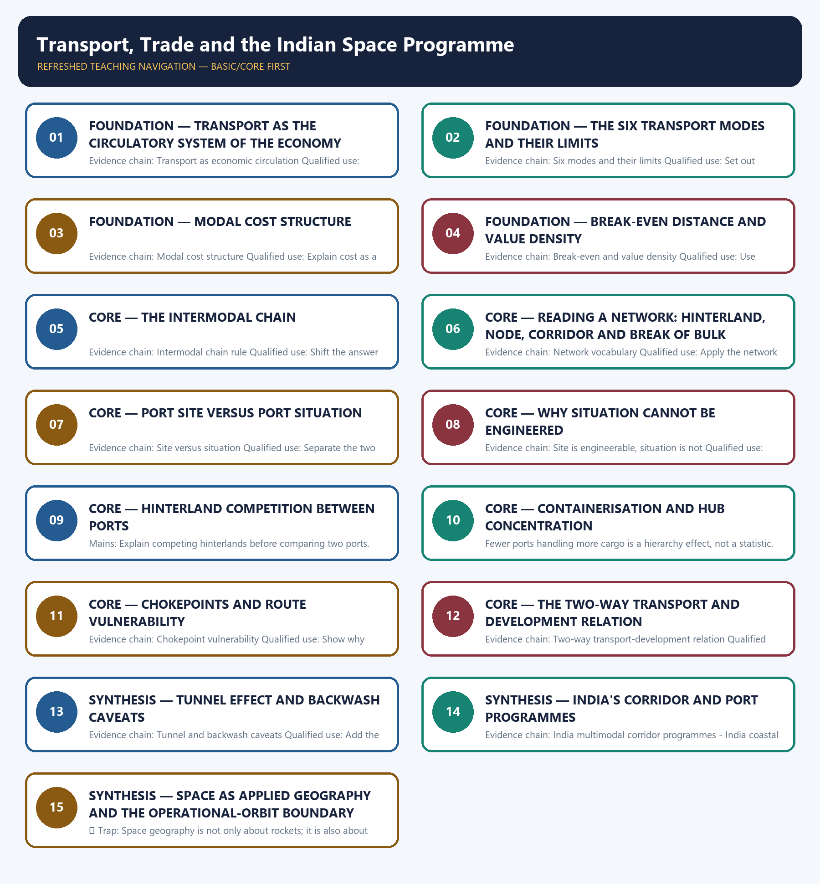

# Transport, Trade and the Indian Space Programme — Learner-v2 Complete Learning Session

> **Authoring-only generation:** 2026-09-01. No PDF was rendered and no tracker or index was mutated.

### SOURCE, PROGRESSION AND CURRENT-LINKAGE AUDIT

- **Generation date:** 2026-09-01.
- **Repository-first evidence:** the Basic owner is taught first and preserved in full; the Advanced owner is retained only in the optional final teaching block.
- **OCR evidence:** Repository Markdown was primary. The three required local Geography books were inspected as supplementary OCR/searchable evidence. No unsupported page precision, volatile figure or quotation was imported.
- **Qdrant:** not used; repository Markdown and available OCR context were sufficient.
- **PYQ integrity:** Geography Topic 33 owns direct Mains PYQ demand in the audited routing ledgers. Two GS-I demands are routed to this owner: 2019 Q16 on efficient and affordable urban mass transport, and 2022 Q16 on the significance of straits and isthmuses in international trade. Both are answered below as original model solutions built only from owner evidence. The routed Prelims demands for this topic are recorded in the owner ledgers as objective questions whose official keys are either unavailable locally or deliberately not inferred, so no option letter, answer key or invented question wording appears anywhere in this package.
- **Live-link boundary:** The only dated current anchor used is the GSLV-F15 flight of 29 January 2025, which placed NVS-02 in transfer orbit while the orbit-raising propulsion could not be used, so the satellite did not enter its intended NavIC slot. That status is recorded in the repository owner and was confirmed against the official ISRO mission page. Ministry, Sagarmala and PIB portals are named only as the correct source class for corridor, port and space updates. No port tonnage, container throughput, highway or railway length, freight share, satellite count or programme outlay is quoted from memory, and no launch is presented as an operational-constellation outcome.
- **Fact/inference discipline:** no current-affairs item, PYQ wording, figure or quotation is invented.

## BASIC LEARNING SESSION



*Distinct embedded teaching-navigation image. The separate continuous Cārvāka-style flowchart package remains an independent at-a-glance artifact.*

### SESSION 1 — FOUNDATION — TRANSPORT AS THE CIRCULATORY SYSTEM OF THE ECONOMY

#### DEFINITION / WHAT THIS IS CALLED

**Plain-language definition:** Transport as economic circulation: Transport is the circulatory system of an economy because it moves raw materials, labour, finished goods, information and strategic power across space, and trade geography grows out of connectivity, cost, time and chokepoints.

**Technical definition:** Evidence chain: Transport as economic circulation Qualified use: Open with movement of goods, labour, information and power before naming any mode.

#### ANSWER-GRABBING OPENING — WRITE/ADAPT IN THE EXAM

> Transport as economic circulation: Transport is the circulatory system of an economy because it moves raw materials, labour, finished goods, information and strategic power across space, and trade geography grows out of connectivity, cost, time and chokepoints.

#### MUST-WRITE KEYWORDS

- **FOUNDATION**
- **Transport as the circulatory system of the economy**
- **Transport as economic circulation**
- **Evidence chain**
- **Qualified use**
- **Transport**

**How to use them:** Frame the answer through FOUNDATION; define Transport as the circulatory system of the economy, connect Transport as economic circulation with Evidence chain to explain the mechanism, and use Qualified use for the decisive comparison or qualification.

#### VISUAL FIRST

```text
TRANSPORT AS THE CIRCULATORY SYSTEM OF THE ECONOMY
01. Transport as economic circulation
BOUNDARY -> Trade geography is inseparable from connectivity and cost.
```

*This topic-specific rail fixes the evidence sequence and its exam boundary before analysis.*

#### CORE EXPLANATION

Transport is the circulatory system of an economy because it moves raw materials, labour, finished goods, information and strategic power across space, and trade geography grows out of connectivity, cost, time and chokepoints.

#### NAMED EVIDENCE AND MECHANISM

- **Transport as economic circulation:** Transport is the circulatory system of an economy because it moves raw materials, labour, finished goods, information and strategic power across space, and trade geography grows out of connectivity, cost, time and chokepoints.

#### EXAMINER CAUTION

- Trade geography is inseparable from connectivity and cost.

#### EXAM LINK

- **Prelims:** Separate the agent, landform, location, status and scale attached to Transport as the circulatory system of the economy.
- **Mains:** Open with movement of goods, labour, information and power before naming any mode.

#### MINI RECAP

- **Evidence chain:** Transport as economic circulation
- **Qualified use:** Open with movement of goods, labour, information and power before naming any mode.

#### CLOSING RECALL FLOW — FOUNDATION — TRANSPORT AS THE CIRCULATORY SYSTEM OF THE ECONOMY

```text
START / CONCEPT: FOUNDATION — Transport as the circulatory system of the economy
        |
        v
EXACT TERMS: FOUNDATION · Transport as the circulatory system of the economy · Transport as economic circulation · Evidence chain · Qualified use · Transport
        |
        v
MECHANISM / ARGUMENT: Evidence chain: Transport as economic circulation Qualified use: Open with movement of goods, labour, information and power before naming any mode.
        |
        v
CONSEQUENCE / CONTRAST: Trade geography is inseparable from connectivity and cost.
        |
        v
UPSC TRAP / ANSWER-USE: Do not miss this limiting distinction: transport is the circulatory system of an economy because it moves raw materials, labour...
        |
        v
ANSWER-GRABBING FORMULATION: Transport as economic circulation: Transport is the circulatory system of an economy because it moves raw materials, labour, finished goods, information and strategic power across space, and trade geography grows out of connectivity, cost, time and chokepoints.
```
### SESSION 2 — FOUNDATION — THE SIX TRANSPORT MODES AND THEIR LIMITS

#### DEFINITION / WHAT THIS IS CALLED

**Plain-language definition:** Six modes and their limits: Road, rail, sea, inland waterway, air and pipeline each pair a distinct strength with a distinct limitation, so no mode is best in general and air is not best for bulk merely because it is fastest.

**Technical definition:** Evidence chain: Six modes and their limits Qualified use: Set out modes as a suitability table rather than as an advantages list.

#### ANSWER-GRABBING OPENING — WRITE/ADAPT IN THE EXAM

> Six modes and their limits: Road, rail, sea, inland waterway, air and pipeline each pair a distinct strength with a distinct limitation, so no mode is best in general and air is not best for bulk merely because it is fastest.

#### MUST-WRITE KEYWORDS

- **FOUNDATION**
- **The six transport modes**
- **their limits**
- **Six modes and their limits**
- **Evidence chain**
- **Qualified use**

**How to use them:** Frame the answer through FOUNDATION; define The six transport modes, connect their limits with Six modes and their limits to explain the mechanism, and use Evidence chain for the decisive comparison or qualification.

#### VISUAL FIRST

```text
THE SIX TRANSPORT MODES AND THEIR LIMITS
01. Six modes and their limits
BOUNDARY -> Every mode pairs a strength with a limitation.
```

*This topic-specific rail fixes the evidence sequence and its exam boundary before analysis.*

#### CORE EXPLANATION

Road, rail, sea, inland waterway, air and pipeline each pair a distinct strength with a distinct limitation, so no mode is best in general and air is not best for bulk merely because it is fastest.

#### NAMED EVIDENCE AND MECHANISM

- **Six modes and their limits:** Road, rail, sea, inland waterway, air and pipeline each pair a distinct strength with a distinct limitation, so no mode is best in general and air is not best for bulk merely because it is fastest.

#### EXAMINER CAUTION

- Every mode pairs a strength with a limitation.

#### EXAM LINK

- **Prelims:** Separate the agent, landform, location, status and scale attached to The six transport modes and their limits.
- **Mains:** Set out modes as a suitability table rather than as an advantages list.

#### MINI RECAP

- **Evidence chain:** Six modes and their limits
- **Qualified use:** Set out modes as a suitability table rather than as an advantages list.

#### CLOSING RECALL FLOW — FOUNDATION — THE SIX TRANSPORT MODES AND THEIR LIMITS

```text
START / CONCEPT: FOUNDATION — The six transport modes and their limits
        |
        v
EXACT TERMS: FOUNDATION · The six transport modes · their limits · Six modes and their limits · Evidence chain · Qualified use
        |
        v
MECHANISM / ARGUMENT: Evidence chain: Six modes and their limits Qualified use: Set out modes as a suitability table rather than as an advantages list.
        |
        v
CONSEQUENCE / CONTRAST: The resulting consequence is that road, rail, sea, inland waterway, air and pipeline each pair a distinct strength with...
        |
        v
UPSC TRAP / ANSWER-USE: Do not miss this limiting distinction: road, rail, sea, inland waterway, air and pipeline each pair a distinct strength with...
        |
        v
ANSWER-GRABBING FORMULATION: Six modes and their limits: Road, rail, sea, inland waterway, air and pipeline each pair a distinct strength with a distinct limitation, so no mode is best in general and air is not best for bulk merely because it is fastest.
```
### SESSION 3 — FOUNDATION — MODAL COST STRUCTURE

#### DEFINITION / WHAT THIS IS CALLED

**Plain-language definition:** Modal cost structure: Road has low terminal cost and high cost per kilometre, rail has higher terminal and lower per-kilometre cost, water has the highest terminal and lowest per-kilometre cost, air is expensive throughout, and pipeline has very high fixed with very low operating cost.

**Technical definition:** Evidence chain: Modal cost structure Qualified use: Explain cost as a structure so the comparison survives any cargo example.

#### ANSWER-GRABBING OPENING — WRITE/ADAPT IN THE EXAM

> Evidence chain: Modal cost structure Qualified use: Explain cost as a structure so the comparison survives any cargo example.

#### MUST-WRITE KEYWORDS

- **FOUNDATION**
- **Modal cost structure**
- **Evidence chain**
- **Qualified use**
- **Road**
- **Modal**

**How to use them:** Frame the answer through FOUNDATION; define Modal cost structure, connect Evidence chain with Qualified use to explain the mechanism, and use Road for the decisive comparison or qualification.

#### VISUAL FIRST

```text
MODAL COST STRUCTURE
01. Modal cost structure
BOUNDARY -> Terminal cost and per-kilometre cost behave differently.
```

*This topic-specific rail fixes the evidence sequence and its exam boundary before analysis.*

#### CORE EXPLANATION

Road has low terminal cost and high cost per kilometre, rail has higher terminal and lower per-kilometre cost, water has the highest terminal and lowest per-kilometre cost, air is expensive throughout, and pipeline has very high fixed with very low operating cost.

#### NAMED EVIDENCE AND MECHANISM

- **Modal cost structure:** Road has low terminal cost and high cost per kilometre, rail has higher terminal and lower per-kilometre cost, water has the highest terminal and lowest per-kilometre cost, air is expensive throughout, and pipeline has very high fixed with very low operating cost.

#### EXAMINER CAUTION

- Terminal cost and per-kilometre cost behave differently.

#### EXAM LINK

- **Prelims:** Separate the agent, landform, location, status and scale attached to Modal cost structure.
- **Mains:** Explain cost as a structure so the comparison survives any cargo example.

#### MINI RECAP

- **Evidence chain:** Modal cost structure
- **Qualified use:** Explain cost as a structure so the comparison survives any cargo example.

#### CLOSING RECALL FLOW — FOUNDATION — MODAL COST STRUCTURE

```text
START / CONCEPT: FOUNDATION — Modal cost structure
        |
        v
EXACT TERMS: FOUNDATION · Modal cost structure · Evidence chain · Qualified use · Road · Modal
        |
        v
MECHANISM / ARGUMENT: Modal cost structure: Road has low terminal cost and high cost per kilometre, rail has higher terminal and lower per-kilometre cost, water has the highest terminal and lowest per-kilometre cost, air is expensive throughout, and pipeline has very high fixed with very low operating cost.
        |
        v
CONSEQUENCE / CONTRAST: Mains: Explain cost as a structure so the comparison survives any cargo example.
        |
        v
UPSC TRAP / ANSWER-USE: Do not miss this limiting distinction: explain cost as a structure so the comparison survives any cargo example.
        |
        v
ANSWER-GRABBING FORMULATION: Evidence chain: Modal cost structure Qualified use: Explain cost as a structure so the comparison survives any cargo example.
```
### SESSION 4 — FOUNDATION — BREAK-EVEN DISTANCE AND VALUE DENSITY

#### DEFINITION / WHAT THIS IS CALLED

**Plain-language definition:** Break-even and value density: The cheapest mode is the one whose terminal cost is recovered over the haul length involved, so the road-rail break-even distance and the value-to-weight ratio together decide modal choice.

**Technical definition:** Evidence chain: Break-even and value density Qualified use: Use break-even logic as the decisive rule in any modal-comparison answer.

#### ANSWER-GRABBING OPENING — WRITE/ADAPT IN THE EXAM

> Break-even and value density: The cheapest mode is the one whose terminal cost is recovered over the haul length involved, so the road-rail break-even distance and the value-to-weight ratio together decide modal choice.

#### MUST-WRITE KEYWORDS

- **FOUNDATION**
- **Break-even distance**
- **value density**
- **Break-even and value density**
- **Evidence chain**
- **Qualified use**

**How to use them:** Frame the answer through FOUNDATION; define Break-even distance, connect value density with Break-even and value density to explain the mechanism, and use Evidence chain for the decisive comparison or qualification.

#### VISUAL FIRST

```text
BREAK-EVEN DISTANCE AND VALUE DENSITY
01. Break-even and value density
BOUNDARY -> The cheapest mode changes with haul length and value-to-weight ratio.
```

*This topic-specific rail fixes the evidence sequence and its exam boundary before analysis.*

#### CORE EXPLANATION

The cheapest mode is the one whose terminal cost is recovered over the haul length involved, so the road-rail break-even distance and the value-to-weight ratio together decide modal choice.

#### NAMED EVIDENCE AND MECHANISM

- **Break-even and value density:** The cheapest mode is the one whose terminal cost is recovered over the haul length involved, so the road-rail break-even distance and the value-to-weight ratio together decide modal choice.

#### EXAMINER CAUTION

- The cheapest mode changes with haul length and value-to-weight ratio.

#### EXAM LINK

- **Prelims:** Separate the agent, landform, location, status and scale attached to Break-even distance and value density.
- **Mains:** Use break-even logic as the decisive rule in any modal-comparison answer.

#### MINI RECAP

- **Evidence chain:** Break-even and value density
- **Qualified use:** Use break-even logic as the decisive rule in any modal-comparison answer.

#### CLOSING RECALL FLOW — FOUNDATION — BREAK-EVEN DISTANCE AND VALUE DENSITY

```text
START / CONCEPT: FOUNDATION — Break-even distance and value density
        |
        v
EXACT TERMS: FOUNDATION · Break-even distance · value density · Break-even and value density · Evidence chain · Qualified use
        |
        v
MECHANISM / ARGUMENT: Evidence chain: Break-even and value density Qualified use: Use break-even logic as the decisive rule in any modal-comparison answer.
        |
        v
CONSEQUENCE / CONTRAST: Mains: Use break-even logic as the decisive rule in any modal-comparison answer.
        |
        v
UPSC TRAP / ANSWER-USE: Do not miss this limiting distinction: the cheapest mode is the one whose terminal cost is recovered over the haul...
        |
        v
ANSWER-GRABBING FORMULATION: Break-even and value density: The cheapest mode is the one whose terminal cost is recovered over the haul length involved, so the road-rail break-even distance and the value-to-weight ratio together decide modal choice.
```
### SESSION 5 — CORE — THE INTERMODAL CHAIN

#### DEFINITION / WHAT THIS IS CALLED

**Plain-language definition:** Intermodal chain rule: Modern freight is a chain of road collection, rail or water trunk haul and road distribution, so container handling, multimodal terminals and last-mile connectivity determine actual logistics cost more than headline modal tariffs.

**Technical definition:** Evidence chain: Intermodal chain rule Qualified use: Shift the answer from modal tariffs to terminals and last-mile connectivity.

#### ANSWER-GRABBING OPENING — WRITE/ADAPT IN THE EXAM

> Intermodal chain rule: Modern freight is a chain of road collection, rail or water trunk haul and road distribution, so container handling, multimodal terminals and last-mile connectivity determine actual logistics cost more than headline modal tariffs.

#### MUST-WRITE KEYWORDS

- **The intermodal chain**
- **Intermodal chain rule**
- **Evidence chain**
- **Qualified use**
- **Modern freight**
- **Modern**

**How to use them:** Frame the answer through The intermodal chain; define Intermodal chain rule, connect Evidence chain with Qualified use to explain the mechanism, and use Modern freight for the decisive comparison or qualification.

#### VISUAL FIRST

```text
THE INTERMODAL CHAIN
01. Intermodal chain rule
BOUNDARY -> Freight is a chain, not a single modal choice.
```

*This topic-specific rail fixes the evidence sequence and its exam boundary before analysis.*

#### CORE EXPLANATION

Modern freight is a chain of road collection, rail or water trunk haul and road distribution, so container handling, multimodal terminals and last-mile connectivity determine actual logistics cost more than headline modal tariffs.

#### NAMED EVIDENCE AND MECHANISM

- **Intermodal chain rule:** Modern freight is a chain of road collection, rail or water trunk haul and road distribution, so container handling, multimodal terminals and last-mile connectivity determine actual logistics cost more than headline modal tariffs.

#### EXAMINER CAUTION

- Freight is a chain, not a single modal choice.

#### EXAM LINK

- **Prelims:** Separate the agent, landform, location, status and scale attached to The intermodal chain.
- **Mains:** Shift the answer from modal tariffs to terminals and last-mile connectivity.

#### MINI RECAP

- **Evidence chain:** Intermodal chain rule
- **Qualified use:** Shift the answer from modal tariffs to terminals and last-mile connectivity.

#### CLOSING RECALL FLOW — CORE — THE INTERMODAL CHAIN

```text
START / CONCEPT: CORE — The intermodal chain
        |
        v
EXACT TERMS: The intermodal chain · Intermodal chain rule · Evidence chain · Qualified use · Modern freight · Modern
        |
        v
MECHANISM / ARGUMENT: Evidence chain: Intermodal chain rule Qualified use: Shift the answer from modal tariffs to terminals and last-mile connectivity.
        |
        v
CONSEQUENCE / CONTRAST: Freight is a chain, not a single modal choice.
        |
        v
UPSC TRAP / ANSWER-USE: Do not miss this limiting distinction: modern freight is a chain of road collection, rail or water trunk haul and...
        |
        v
ANSWER-GRABBING FORMULATION: Intermodal chain rule: Modern freight is a chain of road collection, rail or water trunk haul and road distribution, so container handling, multimodal terminals and last-mile connectivity determine actual logistics cost more than headline modal tariffs.
```
### SESSION 6 — CORE — READING A NETWORK: HINTERLAND, NODE, CORRIDOR AND BREAK OF BULK

#### DEFINITION / WHAT THIS IS CALLED

**Plain-language definition:** Network vocabulary: Hinterland, node, corridor, break of bulk and hub-and-spoke are the standard concepts for reading any transport network from mine or farm through roadhead and rail corridor to port and world market.

**Technical definition:** Evidence chain: Network vocabulary Qualified use: Apply the network vocabulary to one continuous farm-to-market rail.

#### ANSWER-GRABBING OPENING — WRITE/ADAPT IN THE EXAM

> Network vocabulary: Hinterland, node, corridor, break of bulk and hub-and-spoke are the standard concepts for reading any transport network from mine or farm through roadhead and rail corridor to port and world market.

#### MUST-WRITE KEYWORDS

- **Reading a network**
- **hinterland**
- **node**
- **corridor**
- **break of bulk**
- **Network vocabulary**

**How to use them:** Frame the answer through Reading a network; define hinterland, connect node with corridor to explain the mechanism, and use break of bulk for the decisive comparison or qualification.

#### VISUAL FIRST

```text
READING A NETWORK: HINTERLAND, NODE, CORRIDOR AND BREAK OF BULK
01. Network vocabulary
BOUNDARY -> Break of bulk marks a cost step, not a mere transfer.
```

*This topic-specific rail fixes the evidence sequence and its exam boundary before analysis.*

#### CORE EXPLANATION

Hinterland, node, corridor, break of bulk and hub-and-spoke are the standard concepts for reading any transport network from mine or farm through roadhead and rail corridor to port and world market.

#### NAMED EVIDENCE AND MECHANISM

- **Network vocabulary:** Hinterland, node, corridor, break of bulk and hub-and-spoke are the standard concepts for reading any transport network from mine or farm through roadhead and rail corridor to port and world market.

#### EXAMINER CAUTION

- Break of bulk marks a cost step, not a mere transfer.

#### EXAM LINK

- **Prelims:** Separate the agent, landform, location, status and scale attached to Reading a network: hinterland, node, corridor and break of bulk.
- **Mains:** Apply the network vocabulary to one continuous farm-to-market rail.

#### MINI RECAP

- **Evidence chain:** Network vocabulary
- **Qualified use:** Apply the network vocabulary to one continuous farm-to-market rail.

#### CLOSING RECALL FLOW — CORE — READING A NETWORK: HINTERLAND, NODE, CORRIDOR AND BREAK OF BULK

```text
START / CONCEPT: CORE — Reading a network: hinterland, node, corridor and break of bulk
        |
        v
EXACT TERMS: Reading a network · hinterland · node · corridor · break of bulk · Network vocabulary
        |
        v
MECHANISM / ARGUMENT: Evidence chain: Network vocabulary Qualified use: Apply the network vocabulary to one continuous farm-to-market rail.
        |
        v
CONSEQUENCE / CONTRAST: The resulting consequence is that hinterland, node, corridor, break of bulk and hub-and-spoke are the standard concepts for reading...
        |
        v
UPSC TRAP / ANSWER-USE: Do not miss this limiting distinction: hinterland, node, corridor, break of bulk and hub-and-spoke are the standard concepts for reading...
        |
        v
ANSWER-GRABBING FORMULATION: Network vocabulary: Hinterland, node, corridor, break of bulk and hub-and-spoke are the standard concepts for reading any transport network from mine or farm through roadhead and rail corridor to port and world market.
```
### SESSION 7 — CORE — PORT SITE VERSUS PORT SITUATION

#### DEFINITION / WHAT THIS IS CALLED

**Plain-language definition:** Site versus situation: A port's site is its own physical setting of depth, shelter, tidal range, foreshore, expansion land and siltation risk, while its situation is its position relative to a hinterland and to shipping routes, and situation normally decides which ports grow.

**Technical definition:** Evidence chain: Site versus situation Qualified use: Separate the two terms explicitly before judging any port.

#### ANSWER-GRABBING OPENING — WRITE/ADAPT IN THE EXAM

> Site versus situation: A port's site is its own physical setting of depth, shelter, tidal range, foreshore, expansion land and siltation risk, while its situation is its position relative to a hinterland and to shipping routes, and situation normally decides which ports grow.

#### MUST-WRITE KEYWORDS

- **Port site versus port situation**
- **Site versus situation**
- **Evidence chain**
- **Qualified use**
- **A port's site**
- **Site versus situation: A port's site**

**How to use them:** Frame the answer through Port site versus port situation; define Site versus situation, connect Evidence chain with Qualified use to explain the mechanism, and use A port's site for the decisive comparison or qualification.

#### VISUAL FIRST

```text
PORT SITE VERSUS PORT SITUATION
01. Site versus situation
BOUNDARY -> An excellent site with a poor hinterland stays small.
```

*This topic-specific rail fixes the evidence sequence and its exam boundary before analysis.*

#### CORE EXPLANATION

A port's site is its own physical setting of depth, shelter, tidal range, foreshore, expansion land and siltation risk, while its situation is its position relative to a hinterland and to shipping routes, and situation normally decides which ports grow.

#### NAMED EVIDENCE AND MECHANISM

- **Site versus situation:** A port's site is its own physical setting of depth, shelter, tidal range, foreshore, expansion land and siltation risk, while its situation is its position relative to a hinterland and to shipping routes, and situation normally decides which ports grow.

#### EXAMINER CAUTION

- An excellent site with a poor hinterland stays small.

#### EXAM LINK

- **Prelims:** Separate the agent, landform, location, status and scale attached to Port site versus port situation.
- **Mains:** Separate the two terms explicitly before judging any port.

#### MINI RECAP

- **Evidence chain:** Site versus situation
- **Qualified use:** Separate the two terms explicitly before judging any port.

#### CLOSING RECALL FLOW — CORE — PORT SITE VERSUS PORT SITUATION

```text
START / CONCEPT: CORE — Port site versus port situation
        |
        v
EXACT TERMS: Port site versus port situation · Site versus situation · Evidence chain · Qualified use · A port's site · Site versus situation: A port's site
        |
        v
MECHANISM / ARGUMENT: Evidence chain: Site versus situation Qualified use: Separate the two terms explicitly before judging any port.
        |
        v
CONSEQUENCE / CONTRAST: The resulting consequence is that a port's site is its own physical setting of depth, shelter, tidal range, foreshore...
        |
        v
UPSC TRAP / ANSWER-USE: Do not miss this limiting distinction: a port's site is its own physical setting of depth, shelter, tidal range, foreshore...
        |
        v
ANSWER-GRABBING FORMULATION: Site versus situation: A port's site is its own physical setting of depth, shelter, tidal range, foreshore, expansion land and siltation risk, while its situation is its position relative to a hinterland and to shipping routes, and situation normally decides which ports grow.
```
### SESSION 8 — CORE — WHY SITUATION CANNOT BE ENGINEERED

#### DEFINITION / WHAT THIS IS CALLED

**Plain-language definition:** Site is engineerable, situation is not: Depth and shelter can be dredged and engineered while hinterland productivity and connectivity cannot, which makes dedicated freight corridors and inland container depots a port policy instrument rather than a merely transport one.

**Technical definition:** Evidence chain: Site is engineerable, situation is not Qualified use: Convert the distinction into a port policy conclusion about inland connectivity.

#### ANSWER-GRABBING OPENING — WRITE/ADAPT IN THE EXAM

> Site is engineerable, situation is not: Depth and shelter can be dredged and engineered while hinterland productivity and connectivity cannot, which makes dedicated freight corridors and inland container depots a port policy instrument rather than a merely transport one.

#### MUST-WRITE KEYWORDS

- **Why situation cannot be engineered**
- **Evidence chain**
- **Qualified use**
- **Depth**
- **Site**
- **Dredging**

**How to use them:** Frame the answer through Why situation cannot be engineered; define Evidence chain, connect Qualified use with Depth to explain the mechanism, and use Site for the decisive comparison or qualification.

#### VISUAL FIRST

```text
WHY SITUATION CANNOT BE ENGINEERED
01. Site is engineerable, situation is not
BOUNDARY -> Dredging corrects site; it cannot create a hinterland.
```

*This topic-specific rail fixes the evidence sequence and its exam boundary before analysis.*

#### CORE EXPLANATION

Depth and shelter can be dredged and engineered while hinterland productivity and connectivity cannot, which makes dedicated freight corridors and inland container depots a port policy instrument rather than a merely transport one.

#### NAMED EVIDENCE AND MECHANISM

- **Site is engineerable, situation is not:** Depth and shelter can be dredged and engineered while hinterland productivity and connectivity cannot, which makes dedicated freight corridors and inland container depots a port policy instrument rather than a merely transport one.

#### EXAMINER CAUTION

- Dredging corrects site; it cannot create a hinterland.

#### EXAM LINK

- **Prelims:** Separate the agent, landform, location, status and scale attached to Why situation cannot be engineered.
- **Mains:** Convert the distinction into a port policy conclusion about inland connectivity.

#### MINI RECAP

- **Evidence chain:** Site is engineerable, situation is not
- **Qualified use:** Convert the distinction into a port policy conclusion about inland connectivity.

#### CLOSING RECALL FLOW — CORE — WHY SITUATION CANNOT BE ENGINEERED

```text
START / CONCEPT: CORE — Why situation cannot be engineered
        |
        v
EXACT TERMS: Why situation cannot be engineered · Evidence chain · Qualified use · Depth · Site · Dredging
        |
        v
MECHANISM / ARGUMENT: Evidence chain: Site is engineerable, situation is not Qualified use: Convert the distinction into a port policy conclusion about inland connectivity.
        |
        v
CONSEQUENCE / CONTRAST: Depth and shelter can be dredged and engineered while hinterland productivity and connectivity cannot, which makes dedicated freight corridors and inland container depots a port policy instrument rather than a merely transport one.
        |
        v
UPSC TRAP / ANSWER-USE: Dredging corrects site; it cannot create a hinterland.
        |
        v
ANSWER-GRABBING FORMULATION: Site is engineerable, situation is not: Depth and shelter can be dredged and engineered while hinterland productivity and connectivity cannot, which makes dedicated freight corridors and inland container depots a port policy instrument rather than a merely transport one.
```
### SESSION 9 — CORE — HINTERLAND COMPETITION BETWEEN PORTS

#### DEFINITION / WHAT THIS IS CALLED

**Plain-language definition:** Evidence chain: Hinterland competition boundary Qualified use: Explain competing hinterlands before comparing two ports.

**Technical definition:** Mains: Explain competing hinterlands before comparing two ports.

#### ANSWER-GRABBING OPENING — WRITE/ADAPT IN THE EXAM

> Evidence chain: Hinterland competition boundary Qualified use: Explain competing hinterlands before comparing two ports.

#### MUST-WRITE KEYWORDS

- **Hinterland competition between ports**
- **Hinterland competition boundary**
- **Evidence chain**
- **Qualified use**
- **Hinterland**
- **Qualified**

**How to use them:** Frame the answer through Hinterland competition between ports; define Hinterland competition boundary, connect Evidence chain with Qualified use to explain the mechanism, and use Hinterland for the decisive comparison or qualification.

#### VISUAL FIRST

```text
HINTERLAND COMPETITION BETWEEN PORTS
01. Hinterland competition boundary
BOUNDARY -> Hinterland boundaries move with freight rates, not with coastlines.
```

*This topic-specific rail fixes the evidence sequence and its exam boundary before analysis.*

#### CORE EXPLANATION

Two ports serving the same interior compete, and the boundary between their hinterlands shifts with rail freight rates, road quality and inland container facilities.

#### NAMED EVIDENCE AND MECHANISM

- **Hinterland competition boundary:** Two ports serving the same interior compete, and the boundary between their hinterlands shifts with rail freight rates, road quality and inland container facilities.

#### EXAMINER CAUTION

- Hinterland boundaries move with freight rates, not with coastlines.

#### EXAM LINK

- **Prelims:** Separate the agent, landform, location, status and scale attached to Hinterland competition between ports.
- **Mains:** Explain competing hinterlands before comparing two ports.

#### MINI RECAP

- **Evidence chain:** Hinterland competition boundary
- **Qualified use:** Explain competing hinterlands before comparing two ports.

#### CLOSING RECALL FLOW — CORE — HINTERLAND COMPETITION BETWEEN PORTS

```text
START / CONCEPT: CORE — Hinterland competition between ports
        |
        v
EXACT TERMS: Hinterland competition between ports · Hinterland competition boundary · Evidence chain · Qualified use · Hinterland · Qualified
        |
        v
MECHANISM / ARGUMENT: Mains: Explain competing hinterlands before comparing two ports.
        |
        v
CONSEQUENCE / CONTRAST: The resulting consequence is that explain competing hinterlands before comparing two ports.
        |
        v
UPSC TRAP / ANSWER-USE: Do not miss this limiting distinction: explain competing hinterlands before comparing two ports.
        |
        v
ANSWER-GRABBING FORMULATION: Evidence chain: Hinterland competition boundary Qualified use: Explain competing hinterlands before comparing two ports.
```
### SESSION 10 — CORE — CONTAINERISATION AND HUB CONCENTRATION

#### DEFINITION / WHAT THIS IS CALLED

**Plain-language definition:** Evidence chain: Containerisation and hub concentration Qualified use: Answer port-hierarchy questions with containerisation logic and no tonnage figures.

**Technical definition:** Fewer ports handling more cargo is a hierarchy effect, not a statistic.

#### ANSWER-GRABBING OPENING — WRITE/ADAPT IN THE EXAM

> Evidence chain: Containerisation and hub concentration Qualified use: Answer port-hierarchy questions with containerisation logic and no tonnage figures.

#### MUST-WRITE KEYWORDS

- **Containerisation**
- **hub concentration**
- **Containerisation and hub concentration**
- **Evidence chain**
- **Qualified use**
- **Fewer ports handling more cargo**

**How to use them:** Frame the answer through Containerisation; define hub concentration, connect Containerisation and hub concentration with Evidence chain to explain the mechanism, and use Qualified use for the decisive comparison or qualification.

#### VISUAL FIRST

```text
CONTAINERISATION AND HUB CONCENTRATION
01. Containerisation and hub concentration
BOUNDARY -> Fewer ports handling more cargo is a hierarchy effect, not a statistic.
```

*This topic-specific rail fixes the evidence sequence and its exam boundary before analysis.*

#### CORE EXPLANATION

Containerisation standardised the cargo unit, collapsed handling time and cost, made intermodal transfer routine, permitted fragmentation of production across countries, and concentrated traffic at fewer deep-draught, high-crane-productivity, well-connected hubs with feeder services.

#### NAMED EVIDENCE AND MECHANISM

- **Containerisation and hub concentration:** Containerisation standardised the cargo unit, collapsed handling time and cost, made intermodal transfer routine, permitted fragmentation of production across countries, and concentrated traffic at fewer deep-draught, high-crane-productivity, well-connected hubs with feeder services.

#### EXAMINER CAUTION

- Fewer ports handling more cargo is a hierarchy effect, not a statistic.

#### EXAM LINK

- **Prelims:** Separate the agent, landform, location, status and scale attached to Containerisation and hub concentration.
- **Mains:** Answer port-hierarchy questions with containerisation logic and no tonnage figures.

#### MINI RECAP

- **Evidence chain:** Containerisation and hub concentration
- **Qualified use:** Answer port-hierarchy questions with containerisation logic and no tonnage figures.

#### CLOSING RECALL FLOW — CORE — CONTAINERISATION AND HUB CONCENTRATION

```text
START / CONCEPT: CORE — Containerisation and hub concentration
        |
        v
EXACT TERMS: Containerisation · hub concentration · Containerisation and hub concentration · Evidence chain · Qualified use · Fewer ports handling more cargo
        |
        v
MECHANISM / ARGUMENT: Fewer ports handling more cargo is a hierarchy effect, not a statistic.
        |
        v
CONSEQUENCE / CONTRAST: The resulting consequence is that containerisation and hub concentration Qualified use.
        |
        v
UPSC TRAP / ANSWER-USE: Do not miss this limiting distinction: containerisation and hub concentration Qualified use.
        |
        v
ANSWER-GRABBING FORMULATION: Evidence chain: Containerisation and hub concentration Qualified use: Answer port-hierarchy questions with containerisation logic and no tonnage figures.
```
### SESSION 11 — CORE — CHOKEPOINTS AND ROUTE VULNERABILITY

#### DEFINITION / WHAT THIS IS CALLED

**Plain-language definition:** CORE — Chokepoints and route vulnerability comprises Chokepoints, route vulnerability and Chokepoint vulnerability as its core connected dimensions.

**Technical definition:** Evidence chain: Chokepoint vulnerability Qualified use: Show why disruption at a narrow passage becomes a global cost event.

#### ANSWER-GRABBING OPENING — WRITE/ADAPT IN THE EXAM

> Evidence chain: Chokepoint vulnerability Qualified use: Show why disruption at a narrow passage becomes a global cost event.

#### MUST-WRITE KEYWORDS

- **Chokepoints**
- **route vulnerability**
- **Chokepoint vulnerability**
- **Evidence chain**
- **Qualified use**
- **Canals**

**How to use them:** Frame the answer through Chokepoints; define route vulnerability, connect Chokepoint vulnerability with Evidence chain to explain the mechanism, and use Qualified use for the decisive comparison or qualification.

#### VISUAL FIRST

```text
CHOKEPOINTS AND ROUTE VULNERABILITY
01. Chokepoint vulnerability
BOUNDARY -> A chokepoint matters as route control, not as a water body.
```

*This topic-specific rail fixes the evidence sequence and its exam boundary before analysis.*

#### CORE EXPLANATION

Canals and straits matter because they shorten or control routes, so a disruption at one narrow passage lengthens voyages and raises freight and insurance costs far beyond the affected region.

#### NAMED EVIDENCE AND MECHANISM

- **Chokepoint vulnerability:** Canals and straits matter because they shorten or control routes, so a disruption at one narrow passage lengthens voyages and raises freight and insurance costs far beyond the affected region.

#### EXAMINER CAUTION

- A chokepoint matters as route control, not as a water body.

#### EXAM LINK

- **Prelims:** Separate the agent, landform, location, status and scale attached to Chokepoints and route vulnerability.
- **Mains:** Show why disruption at a narrow passage becomes a global cost event.

#### MINI RECAP

- **Evidence chain:** Chokepoint vulnerability
- **Qualified use:** Show why disruption at a narrow passage becomes a global cost event.

#### CLOSING RECALL FLOW — CORE — CHOKEPOINTS AND ROUTE VULNERABILITY

```text
START / CONCEPT: CORE — Chokepoints and route vulnerability
        |
        v
EXACT TERMS: Chokepoints · route vulnerability · Chokepoint vulnerability · Evidence chain · Qualified use · Canals
        |
        v
MECHANISM / ARGUMENT: Chokepoint vulnerability: Canals and straits matter because they shorten or control routes, so a disruption at one narrow passage lengthens voyages and raises freight and insurance costs far beyond the affected region.
        |
        v
CONSEQUENCE / CONTRAST: Mains: Show why disruption at a narrow passage becomes a global cost event.
        |
        v
UPSC TRAP / ANSWER-USE: Do not miss this limiting distinction: canals and straits matter because they shorten or control routes, so a disruption at...
        |
        v
ANSWER-GRABBING FORMULATION: Evidence chain: Chokepoint vulnerability Qualified use: Show why disruption at a narrow passage becomes a global cost event.
```
### SESSION 12 — CORE — THE TWO-WAY TRANSPORT AND DEVELOPMENT RELATION

#### DEFINITION / WHAT THIS IS CALLED

**Plain-language definition:** Two-way transport-development relation: Transport lowers input and output costs and widens markets, while development generates the traffic that justifies investment, so network density mirrors economic geography as much as it creates it.

**Technical definition:** Evidence chain: Two-way transport-development relation Qualified use: State both directions before assessing any corridor programme.

#### ANSWER-GRABBING OPENING — WRITE/ADAPT IN THE EXAM

> Two-way transport-development relation: Transport lowers input and output costs and widens markets, while development generates the traffic that justifies investment, so network density mirrors economic geography as much as it creates it.

#### MUST-WRITE KEYWORDS

- **The two-way transport**
- **development relation**
- **Two-way transport-development relation**
- **Evidence chain**
- **Qualified use**
- **Transport**

**How to use them:** Frame the answer through The two-way transport; define development relation, connect Two-way transport-development relation with Evidence chain to explain the mechanism, and use Qualified use for the decisive comparison or qualification.

#### VISUAL FIRST

```text
THE TWO-WAY TRANSPORT AND DEVELOPMENT RELATION
01. Two-way transport-development relation
BOUNDARY -> Density mirrors the economy as much as it creates it.
```

*This topic-specific rail fixes the evidence sequence and its exam boundary before analysis.*

#### CORE EXPLANATION

Transport lowers input and output costs and widens markets, while development generates the traffic that justifies investment, so network density mirrors economic geography as much as it creates it.

#### NAMED EVIDENCE AND MECHANISM

- **Two-way transport-development relation:** Transport lowers input and output costs and widens markets, while development generates the traffic that justifies investment, so network density mirrors economic geography as much as it creates it.

#### EXAMINER CAUTION

- Density mirrors the economy as much as it creates it.

#### EXAM LINK

- **Prelims:** Separate the agent, landform, location, status and scale attached to The two-way transport and development relation.
- **Mains:** State both directions before assessing any corridor programme.

#### MINI RECAP

- **Evidence chain:** Two-way transport-development relation
- **Qualified use:** State both directions before assessing any corridor programme.

#### CLOSING RECALL FLOW — CORE — THE TWO-WAY TRANSPORT AND DEVELOPMENT RELATION

```text
START / CONCEPT: CORE — The two-way transport and development relation
        |
        v
EXACT TERMS: The two-way transport · development relation · Two-way transport-development relation · Evidence chain · Qualified use · Transport
        |
        v
MECHANISM / ARGUMENT: Evidence chain: Two-way transport-development relation Qualified use: State both directions before assessing any corridor programme.
        |
        v
CONSEQUENCE / CONTRAST: Density mirrors the economy as much as it creates it.
        |
        v
UPSC TRAP / ANSWER-USE: Do not miss this limiting distinction: transport lowers input and output costs and widens markets.
        |
        v
ANSWER-GRABBING FORMULATION: Two-way transport-development relation: Transport lowers input and output costs and widens markets, while development generates the traffic that justifies investment, so network density mirrors economic geography as much as it creates it.
```
### SESSION 13 — SYNTHESIS — TUNNEL EFFECT AND BACKWASH CAVEATS

#### DEFINITION / WHAT THIS IS CALLED

**Plain-language definition:** Tunnel and backwash caveats: A corridor can pass through a region without benefiting it when there are no junctions, no local loading and no complementary investment, and better connectivity can also expose weak local producers to outside competition and accelerate out-migration of the young and skilled.

**Technical definition:** Evidence chain: Tunnel and backwash caveats Qualified use: Add the distributional counterpoint that most infrastructure answers omit.

#### ANSWER-GRABBING OPENING — WRITE/ADAPT IN THE EXAM

> Tunnel and backwash caveats: A corridor can pass through a region without benefiting it when there are no junctions, no local loading and no complementary investment, and better connectivity can also expose weak local producers to outside competition and accelerate out-migration of the young and skilled.

#### MUST-WRITE KEYWORDS

- **SYNTHESIS**
- **Tunnel effect**
- **backwash caveats**
- **Tunnel and backwash caveats**
- **Evidence chain**
- **Qualified use**

**How to use them:** Frame the answer through SYNTHESIS; define Tunnel effect, connect backwash caveats with Tunnel and backwash caveats to explain the mechanism, and use Evidence chain for the decisive comparison or qualification.

#### VISUAL FIRST

```text
TUNNEL EFFECT AND BACKWASH CAVEATS
01. Tunnel and backwash caveats
BOUNDARY -> A corridor can cross a region without benefiting it.
```

*This topic-specific rail fixes the evidence sequence and its exam boundary before analysis.*

#### CORE EXPLANATION

A corridor can pass through a region without benefiting it when there are no junctions, no local loading and no complementary investment, and better connectivity can also expose weak local producers to outside competition and accelerate out-migration of the young and skilled.

#### NAMED EVIDENCE AND MECHANISM

- **Tunnel and backwash caveats:** A corridor can pass through a region without benefiting it when there are no junctions, no local loading and no complementary investment, and better connectivity can also expose weak local producers to outside competition and accelerate out-migration of the young and skilled.

#### EXAMINER CAUTION

- A corridor can cross a region without benefiting it.

#### EXAM LINK

- **Prelims:** Separate the agent, landform, location, status and scale attached to Tunnel effect and backwash caveats.
- **Mains:** Add the distributional counterpoint that most infrastructure answers omit.

#### MINI RECAP

- **Evidence chain:** Tunnel and backwash caveats
- **Qualified use:** Add the distributional counterpoint that most infrastructure answers omit.

#### CLOSING RECALL FLOW — SYNTHESIS — TUNNEL EFFECT AND BACKWASH CAVEATS

```text
START / CONCEPT: SYNTHESIS — Tunnel effect and backwash caveats
        |
        v
EXACT TERMS: SYNTHESIS · Tunnel effect · backwash caveats · Tunnel and backwash caveats · Evidence chain · Qualified use
        |
        v
MECHANISM / ARGUMENT: Evidence chain: Tunnel and backwash caveats Qualified use: Add the distributional counterpoint that most infrastructure answers omit.
        |
        v
CONSEQUENCE / CONTRAST: A corridor can cross a region without benefiting it.
        |
        v
UPSC TRAP / ANSWER-USE: Do not miss this limiting distinction: tunnel and backwash caveats Qualified use.
        |
        v
ANSWER-GRABBING FORMULATION: Tunnel and backwash caveats: A corridor can pass through a region without benefiting it when there are no junctions, no local loading and no complementary investment, and better connectivity can also expose weak local producers to outside competition and accelerate out-migration of the young and skilled.
```
### SESSION 14 — SYNTHESIS — INDIA'S CORRIDOR AND PORT PROGRAMMES

#### DEFINITION / WHAT THIS IS CALLED

**Plain-language definition:** India coastal trade contrast: India's trade is coast-oriented but hinterland-dependent, with the western seaboard acting as the gateway for container and petroleum flows and the eastern coast tied to bulk minerals, coal, fertilizers and East Asian links.

**Technical definition:** Evidence chain: India multimodal corridor programmes - India coastal trade contrast Qualified use: Link Bharatmala, freight corridors and Sagarmala into one multimodal argument.

#### ANSWER-GRABBING OPENING — WRITE/ADAPT IN THE EXAM

> India coastal trade contrast: India's trade is coast-oriented but hinterland-dependent, with the western seaboard acting as the gateway for container and petroleum flows and the eastern coast tied to bulk minerals, coal, fertilizers and East Asian links.

#### MUST-WRITE KEYWORDS

- **SYNTHESIS**
- **India's corridor**
- **port programmes**
- **India multimodal corridor programmes**
- **India coastal trade contrast**
- **Evidence chain**

**How to use them:** Frame the answer through SYNTHESIS; define India's corridor, connect port programmes with India multimodal corridor programmes to explain the mechanism, and use India coastal trade contrast for the decisive comparison or qualification.

#### VISUAL FIRST

```text
INDIA'S CORRIDOR AND PORT PROGRAMMES
01. India multimodal corridor programmes
    |
    v
02. India coastal trade contrast
BOUNDARY -> Corridor programmes redistribute accessibility rather than guarantee growth.
```

*This topic-specific rail fixes the evidence sequence and its exam boundary before analysis.*

#### CORE EXPLANATION

Bharatmala builds economic corridors, inter-corridors, border and port connectivity, Dedicated Freight Corridors separate freight from passenger congestion, Sagarmala pursues port modernisation with port-led industrialisation, and PM Gati Shakti replaces mode-wise planning with network integration. India's trade is coast-oriented but hinterland-dependent, with the western seaboard acting as the gateway for container and petroleum flows and the eastern coast tied to bulk minerals, coal, fertilizers and East Asian links.

#### NAMED EVIDENCE AND MECHANISM

- **India multimodal corridor programmes:** Bharatmala builds economic corridors, inter-corridors, border and port connectivity, Dedicated Freight Corridors separate freight from passenger congestion, Sagarmala pursues port modernisation with port-led industrialisation, and PM Gati Shakti replaces mode-wise planning with network integration.
- **India coastal trade contrast:** India's trade is coast-oriented but hinterland-dependent, with the western seaboard acting as the gateway for container and petroleum flows and the eastern coast tied to bulk minerals, coal, fertilizers and East Asian links.

#### EXAMINER CAUTION

- Corridor programmes redistribute accessibility rather than guarantee growth.

#### EXAM LINK

- **Prelims:** Separate the agent, landform, location, status and scale attached to India's corridor and port programmes.
- **Mains:** Link Bharatmala, freight corridors and Sagarmala into one multimodal argument.

#### MINI RECAP

- **Evidence chain:** India multimodal corridor programmes -> India coastal trade contrast
- **Qualified use:** Link Bharatmala, freight corridors and Sagarmala into one multimodal argument.

#### CLOSING RECALL FLOW — SYNTHESIS — INDIA'S CORRIDOR AND PORT PROGRAMMES

```text
START / CONCEPT: SYNTHESIS — India's corridor and port programmes
        |
        v
EXACT TERMS: SYNTHESIS · India's corridor · port programmes · India multimodal corridor programmes · India coastal trade contrast · Evidence chain
        |
        v
MECHANISM / ARGUMENT: India multimodal corridor programmes: Bharatmala builds economic corridors, inter-corridors, border and port connectivity, Dedicated Freight Corridors separate freight from passenger congestion, Sagarmala pursues port modernisation with port-led industrialisation, and PM Gati Shakti replaces mode-wise planning with network integration.
        |
        v
CONSEQUENCE / CONTRAST: Evidence chain: India multimodal corridor programmes - India coastal trade contrast Qualified use: Link Bharatmala, freight corridors and Sagarmala into one multimodal argument.
        |
        v
UPSC TRAP / ANSWER-USE: Do not miss this limiting distinction: india multimodal corridor programmes - India coastal trade contrast Qualified use.
        |
        v
ANSWER-GRABBING FORMULATION: India coastal trade contrast: India's trade is coast-oriented but hinterland-dependent, with the western seaboard acting as the gateway for container and petroleum flows and the eastern coast tied to bulk minerals, coal, fertilizers and East Asian links.
```
### SESSION 15 — SYNTHESIS — SPACE AS APPLIED GEOGRAPHY AND THE OPERATIONAL-ORBIT BOUNDARY

#### DEFINITION / WHAT THIS IS CALLED

**Plain-language definition:** India's space programme has been organised around application in communication, meteorology, resource survey, navigation, education and disaster support rather than around prestige, and that orientation is what makes it a geography topic rather than a technology one.

**Technical definition:** 🔑 Trap: Space geography is not only about rockets; it is also about everyday spatial management on Earth.

#### ANSWER-GRABBING OPENING — WRITE/ADAPT IN THE EXAM

> India's space programme has been organised around application in communication, meteorology, resource survey, navigation, education and disaster support rather than around prestige, and that orientation is what makes it a geography topic rather than a technology one.

#### MUST-WRITE KEYWORDS

- **SYNTHESIS**
- **Space as applied geography**
- **the operational-orbit boundary**
- **Space as observation instrument**
- **Application-led space orientation**
- **Space institutional ladder**

**How to use them:** Frame the answer through SYNTHESIS; define Space as applied geography, connect the operational-orbit boundary with Space as observation instrument to explain the mechanism, and use Application-led space orientation for the decisive comparison or qualification.

#### VISUAL FIRST

```text
SPACE AS APPLIED GEOGRAPHY AND THE OPERATIONAL-ORBIT BOUNDARY
01. Space as observation instrument
    |
    v
02. Application-led space orientation
    |
    v
03. Space institutional ladder
    |
    v
04. GIS convergence rule
    |
    v
05. NVS-02 launch-versus-operations anchor
BOUNDARY -> Launch success is not operational-constellation success.
```

*This topic-specific rail fixes the evidence sequence and its exam boundary before analysis.*

#### CORE EXPLANATION

Satellite systems are the primary observation instrument of modern geography, supplying land-use and land-cover mapping, crop acreage and condition assessment, forest and water-body monitoring, glacier and coastline change detection, and cyclone and monsoon tracking for warning systems. India's space programme has been organised around application in communication, meteorology, resource survey, navigation, education and disaster support rather than around prestige, and that orientation is what makes it a geography topic rather than a technology one. ISRO, the Satish Dhawan Space Centre at Sriharikota with its east-coast over-sea launch safety advantage, URSC, VSSC and LPSC, NSIL for commercialisation, IN-SPACe for non-governmental participation and NavIC for indigenous navigation form India's space-geography institutional ladder. Remote-sensing imagery becomes usable planning information only when combined in a geographic information system with terrain, infrastructure, administrative and socio-economic layers, which is what supports site selection, corridor alignment, watershed and command-area planning and disaster damage assessment. GSLV-F15 placed NVS-02 in transfer orbit on 29 January 2025, but its orbit-raising propulsion could not be used and the satellite did not enter its intended NavIC slot, which shows that launch success and operational-constellation success are not identical.

#### NAMED EVIDENCE AND MECHANISM

- **Space as observation instrument:** Satellite systems are the primary observation instrument of modern geography, supplying land-use and land-cover mapping, crop acreage and condition assessment, forest and water-body monitoring, glacier and coastline change detection, and cyclone and monsoon tracking for warning systems.
- **Application-led space orientation:** India's space programme has been organised around application in communication, meteorology, resource survey, navigation, education and disaster support rather than around prestige, and that orientation is what makes it a geography topic rather than a technology one.
- **Space institutional ladder:** ISRO, the Satish Dhawan Space Centre at Sriharikota with its east-coast over-sea launch safety advantage, URSC, VSSC and LPSC, NSIL for commercialisation, IN-SPACe for non-governmental participation and NavIC for indigenous navigation form India's space-geography institutional ladder.
- **GIS convergence rule:** Remote-sensing imagery becomes usable planning information only when combined in a geographic information system with terrain, infrastructure, administrative and socio-economic layers, which is what supports site selection, corridor alignment, watershed and command-area planning and disaster damage assessment.
- **NVS-02 launch-versus-operations anchor:** GSLV-F15 placed NVS-02 in transfer orbit on 29 January 2025, but its orbit-raising propulsion could not be used and the satellite did not enter its intended NavIC slot, which shows that launch success and operational-constellation success are not identical.

#### EXAMINER CAUTION

- Launch success is not operational-constellation success.

#### EXAM LINK

- **Prelims:** Separate the agent, landform, location, status and scale attached to Space as applied geography and the operational-orbit boundary.
- **Mains:** Close with observation, navigation and GIS integration under a dated operational caution.

#### MINI RECAP

- **Evidence chain:** Space as observation instrument -> Application-led space orientation -> Space institutional ladder -> GIS convergence rule -> NVS-02 launch-versus-operations anchor
- **Qualified use:** Close with observation, navigation and GIS integration under a dated operational caution.
#### COMPLETE BASIC OWNER EVIDENCE BANK

> **Subject:** Geography · **Tier:** Must-Do (world/general-concept) · **GS Paper:** GS-I & GS-III
> **Grounded in:** Majid Husain, *Indian & World Geography* + G.C. Leong's regional foundations + verified dated current-affairs anchor.
> **Data caution:** ✅ Route types and trade concepts are static geography; exact traffic shares change with war, technology and fuel prices.
> ✅ = grounded source · ⚠️ = synthesis / exam heuristic · 📰 = verified dated current-affairs anchor.
> *Companion: `advanced/33_Transport-Trade-and-Indian-Space-Programme.md`.*

#### 1. Why transport matters in geography

✅ Transport is the circulatory system of the economy: it moves raw materials, labour, finished goods, information and strategic power across space. ✅ Trade geography grows out of transport geography because exchange depends on **connectivity, cost, time and chokepoints**.

#### 2. Main transport modes

| Mode | Strength | Limitation |
|---|---|---|
| ✅ Road | Flexible, door-to-door, ideal for short and medium distances | High unit cost for bulky freight |
| ✅ Rail | Efficient for bulk and long-distance inland freight | Fixed routes, high capital cost |
| ✅ Water / sea | Cheapest for heavy bulk and global trade | Slow; depends on ports and routes |
| ✅ Inland waterways | Low-cost movement where navigability exists | Seasonal depth and channel constraints |
| ✅ Air | Fastest for passengers, urgent cargo and high-value goods | Costliest mode |
| ✅ Pipeline | Efficient for liquids/gases | Commodity-specific and fixed |

> 🔑 Trap: Cheapest mode depends on cargo type and distance; air is not "best" for bulk goods merely because it is fastest.

#### 3. Transport-network ideas

| Concept | Meaning |
|---|---|
| ✅ Hinterland | Inland area served by a port, city or route |
| ✅ Node | Junction or terminal where flows converge |
| ✅ Corridor | Linear axis of intense transport and economic activity |
| ✅ Break of bulk | Point where cargo shifts mode - port, railhead, dry port |
| ⚠️ Hub-and-spoke | One major hub redistributes flows to smaller nodes |

    Mine / farm -> Roadhead -> Rail corridor -> Port / airport -> World market

#### 4. World trade and route logic

✅ World trade favours routes that minimise time and fuel while connecting large markets. ✅ Narrow seas, canals and straits become strategic chokepoints because they compress world movement into small spaces.

| Route / factor | Why it matters |
|---|---|
| ✅ Sea routes | Carry the bulk of world merchandise trade |
| ✅ Canals / straits | Shorten distance and create chokepoint vulnerability |
| ✅ Ports | Interface between maritime and inland transport |
| ✅ Comparative advantage | Regions trade because resource and productivity structures differ |
| ⚠️ Containerisation | Reduces handling time, standardises global logistics |

#### 5. Site, situation and port geography

✅ A port succeeds not only because of its coastal site but because of its **situation** - hinterland, approach channel, industrial link, connectivity and nearby market. ⚠️ This is why some natural harbours remain modest while some engineered ports become global giants.

#### 6. Space geography: why it belongs here

⚠️ Space may look separate from transport geography, but modern economies use space systems for **navigation, communication, weather forecasting, disaster warning, mapping and timing**.

| Space function | Geographic use |
|---|---|
| ✅ Navigation satellites | Route guidance, timing and transport efficiency |
| ✅ Earth observation | Crop mapping, mining, coasts, disasters and logistics planning |
| ✅ Communication satellites | Connect remote regions and moving platforms |
| ⚠️ Launch-site logic | East coast, safety over sea and latitude advantages matter |

> 🔑 Trap: Space geography is not only about rockets; it is also about everyday spatial management on Earth.

#### 7. Actor / institution lens

| Actor / institution | Geographic role |
|---|---|
| ⚠️ Port authorities | Connect maritime routes with inland hinterlands |
| ⚠️ Customs / trade authorities | Regulate trade flow at gateways |
| ⚠️ Rail-road agencies | Determine inland distribution efficiency |
| ✅ ISRO / navigation-satellite systems | Add spatial intelligence, timing and route support |

#### 8. Must-Know Facts (Prelims) and UPSC traps

- ✅ Roads are best for flexible last-mile movement.
- ✅ Rail is well suited to bulk inland freight.
- ✅ Sea transport is cheapest for large international bulk movement.
- ✅ Ports serve a hinterland; they do not function in isolation.
- ✅ Comparative advantage explains why trade patterns emerge even without identical resource bases.
- ✅ Space systems increasingly support navigation, communication and resource mapping.

> 🔑 Trap: A canal or strait is not valuable only as a water body; it is valuable because it shortens or controls a trade route.

- ❌ Trade geography is only about exports and imports -> It is also about routes, nodes, costs, chokepoints and hinterlands.
- ❌ Air transport dominates all world freight -> Sea transport dominates heavy international cargo.
- ❌ Satellites are unrelated to transport -> Navigation, timing and communication now depend heavily on space infrastructure.

#### 9. PYQ / exam linkage

- ⚠️ Recurring Prelims theme: compare transport modes by **cost, speed and suitability**.
- ⚠️ Recurring Prelims theme: identify **hinterland, chokepoint, corridor and port** logic.
- ⚠️ Recurring GS-I/GS-III theme: explain how transport networks reshape regional development and trade.
- ⚠️ Recurring GS-III theme: connect satellite systems with navigation, logistics and disaster management.

#### 10. 📰 Current link

##### CA Anchor — NVS-02: launch success is not operational success

📰 **Source/date:** GSLV-F15 placed **NVS-02** in transfer orbit on **29 January 2025**, but its
orbit-raising propulsion could not be used and it did not enter its intended NavIC slot.

✅ The case distinguishes launch geography from operational navigation infrastructure: a satellite
must reach and function in its intended orbit before it strengthens transport timing and positioning.

- ✅ NavIC strengthens indigenous navigation capability, but launch success and operational-constellation success are not identical.
- ⚠️ Revision use: connect satellite navigation with port, shipping and corridor efficiency.

#### 11. Mains angles

- Compare the major transport modes of the world in terms of cost, speed and geographic suitability.
- Explain why ports, canals and chokepoints are central to world trade geography.
- Show how space systems have become part of contemporary transport and trade infrastructure.

#### 12. Probable Questions

**Prelims-style concept prompt**
- ⚠️ Which of the following statements is/are correct? (1) A port functions in relation to its hinterland rather than in isolation. (2) Space geography matters only for rockets and has little connection with navigation or logistics. Answer: only statement (1) is correct, because the file directly links port success to hinterland and situation, and it treats navigation, communication and mapping as core space-geography uses.

**Probable Mains questions (10-15 marks)**
- ⚠️ Discuss the relative suitability of road, rail, water, air and pipeline transport for different kinds of cargo and distances in economic geography. (15 marks)
- ⚠️ Examine why ports, chokepoints and satellite-based navigation together have become central to contemporary trade geography. (10 marks)

#### 13. Study link

Geography -> Economic Geography -> Transport and trade  
Geography -> Human Geography -> Networks, ports, corridors and space-enabled connectivity

#### 14. Answer architecture (10/15/20-mark support)

##### 14.1 Directive decoding

| If the question says | It is really asking for | Do **not** |
|---|---|---|
| "Discuss the role of transport in regional development" | The two-way relationship — transport enables development **and** development generates traffic — plus the distributional caveat | Assume transport automatically develops a region |
| "Explain the site and situation of a port" | Site as the local physical conditions; situation as the hinterland and network position; and why situation usually decides success | Merge the two terms |
| "Compare the transport modes" | Cost structure against distance, bulk and value-density, with the modal-choice rule | List advantages and disadvantages |
| "Assess India's space programme" | Application-led orientation — communication, meteorology, resource survey, navigation and disaster support — and its developmental rationale | Recite mission names |
| "Discuss changing patterns of world trade" | Route geography, chokepoints, containerisation and value-chain fragmentation | Give trade statistics |

##### 14.2 Modal choice, stated as a rule

```text
COST STRUCTURE BY MODE

ROAD  : low terminal cost, high cost per km  -> best for SHORT hauls, door-to-door,
        high-value or time-critical goods, and dispersed origins/destinations
RAIL  : higher terminal cost, lower cost per km -> best for MEDIUM-to-LONG hauls of
        BULK commodities between fixed points
WATER : highest terminal cost, lowest cost per km -> best for LONG hauls of very bulky,
        low-value, non-urgent cargo; the cheapest per tonne-kilometre
AIR   : very high cost throughout -> justified only by HIGH VALUE-TO-WEIGHT ratio,
        urgency, perishability or inaccessibility
PIPELINE : very high fixed cost, very low operating cost -> only for continuous flow of
        liquids and gases; inflexible once laid

RULE: the cheapest mode is the one whose terminal cost is recovered over the haul
      length involved - which is why the road-rail break-even distance is the single
      most useful concept here.
```

- ⚠️ **The intermodal point:** modern freight is not a choice *between* modes but a **chain** —
  road collection, rail or water trunk haul, road distribution — which is why container handling,
  multimodal terminals and last-mile connectivity determine actual logistics cost far more than
  headline modal tariffs.

##### 14.3 Ports, routes and chokepoints

- ⚠️ **Site versus situation:** *site* is the port's own physical setting — depth, shelter, tidal
  range, foreshore, availability of land for expansion, siltation risk. *Situation* is its position
  relative to a **hinterland** and to shipping routes. **Situation normally decides which ports
  grow**, because an excellent site with a poor hinterland stays small while a mediocre site with a
  rich hinterland is dredged and engineered into a major port.
- ⚠️ **Hinterland competition:** two ports serving the same interior compete, and the boundary
  between their hinterlands shifts with rail freight rates, road quality and inland container
  facilities — which is why inland connectivity investment is a **port** policy, not merely a
  transport one.
- ⚠️ **Chokepoints:** world shipping is funnelled through a small number of narrow passages, so a
  disruption at any of them lengthens voyages and raises freight and insurance costs far beyond the
  affected region. This is why chokepoint security, alternative-route projects and canal capacity
  are treated as strategic questions rather than commercial ones.
- ⚠️ **Containerisation** is the single most consequential change in transport geography since
  railways: by standardising the unit of cargo it collapsed handling time and cost, made intermodal
  transfer routine, permitted the fragmentation of production across countries, and shifted port
  advantage decisively toward **deep-draught, high-crane-productivity, well-connected** locations —
  which is why traffic concentrated at fewer, larger hubs with feeder services to the rest.

##### 14.4 The two-way relationship, stated honestly

| Direction | Mechanism | Evidence type |
|---|---|---|
| ⚠️ Transport -> development | Lowers input and output costs, widens markets, attracts industry, raises land value, improves access to health, education and administration | The classic case for corridor and highway investment |
| ⚠️ Development -> transport | Traffic justifies investment, so networks densify where the economy is already strong | Explains why network density mirrors economic geography rather than preceding it |
| ⚠️ The distributional caveat | A corridor can pass **through** a region without benefiting it — the "tunnel effect" — if there are no junctions, no local loading and no complementary investment in skills, power and land | Prevents the naive assumption that connectivity equals development |
| ⚠️ The backwash caveat | Better connectivity can also expose a weak local economy to competition from stronger producers elsewhere, and accelerate out-migration of the young and skilled (`29_Regional-Development-and-Five-Year-Plans.md`) | The honest counterpoint that most answers omit |

##### 14.5 Space as applied geography

- ⚠️ **Why space belongs in a geography syllabus:** satellite systems are the **primary observation
  instrument of modern geography**. Remote sensing supplies land-use and land-cover mapping, crop
  acreage and condition assessment, forest and water-body monitoring, glacier and coastline change
  detection, and mineral and groundwater prospecting support; meteorological satellites supply the
  cyclone tracking and monsoon monitoring on which warning systems depend; navigation systems
  supply positioning for surveying, fisheries, transport and precision agriculture; and
  communication satellites supply connectivity to exactly the remote regions terrestrial networks
  reach last.
- ⚠️ **The developmental orientation is the analytical point:** India's programme has been organised
  around **application** — communication, meteorology, resource survey, navigation, education and
  disaster support — rather than around prestige, and that orientation is what makes it a
  geography topic rather than a technology one.
- ⚠️ **Convergence with GIS:** remote-sensing imagery becomes usable planning information only when
  combined in a geographic information system with terrain, infrastructure, administrative and
  socio-economic layers. That combination is what supports site selection, corridor alignment,
  watershed and command-area planning, disaster damage assessment and urban master-planning.
  Detailed treatment of artificial intelligence and drone applications is owned by
  `Science-and-Technology`; retain here the **spatial-analysis** role.

> ⚠️ **Factual caution:** do not quote satellite counts, launch dates, mission names with
> specifications, port tonnages, highway or railway lengths, or freight-share percentages from
> memory. Where the file already carries a dated official anchor, keep it with its attribution.

##### 14.6 Reusable 15-mark spine — transport, trade and development

1. **Thesis:** transport investment changes the **relative** accessibility of places, and it is that
   redistribution — not the aggregate reduction in cost — that determines who gains from it.
2. **The modal logic:** cost structures and the break-even principle, plus intermodality.
3. **Network effects:** connectivity, centrality and the way a new link changes the position of
   every node, not only the two it joins.
4. **Ports and routes:** site versus situation, hinterland competition, containerisation and hub
   concentration, and chokepoint vulnerability.
5. **The developmental relationship:** both directions, with the tunnel effect and the backwash
   caveat.
6. **The Indian application:** corridor- and port-led programmes as an attempt to build the
   transport base ahead of demand, and the condition on which that succeeds — complementary
   investment in power, skills, land and local loading points.
7. **The observation layer:** satellite and GIS capability as the tool that makes corridor
   alignment, land-use planning and disaster response spatially informed.
8. **Conclusion:** graded — connectivity is a necessary but not sufficient condition for regional
   development; it delivers only where local capacity exists to use it.

##### 14.7 Evidence units available in this file

> **Claim:** a port's success is decided inland, not at the quay. **Evidence:** site conditions such
> as depth and shelter can be engineered by dredging and breakwater construction, whereas the
> productivity and connectivity of the hinterland cannot; ports with rich, well-connected interiors
> have repeatedly overtaken better-sited rivals. **Significance:** it makes inland connectivity —
> dedicated freight corridors and inland container depots — a **port** policy instrument.
> **Limitation:** draught limits are a hard physical constraint for the largest vessels, so site is
> not infinitely correctable.

> **Claim:** improved connectivity does not automatically develop the region it passes through.
> **Evidence:** a corridor without junctions, local loading facilities or complementary investment
> can carry traffic across a region while transferring the benefit to its endpoints, and can expose
> local producers to outside competition. **Significance:** it supplies the counter-argument that a
> balanced answer on infrastructure-led development requires. **Limitation:** the effect is not
> inevitable — where local capacity exists, corridors demonstrably generate industrial and
> employment growth along their length.

##### 14.8 Port site and situation as a worked comparison

> ⚠️ Added 13 Aug 2026 after a Core-only stress test found the site-versus-situation concept stated
> but never applied. Named Indian port statistics, programme detail and traffic data remain in
> `advanced/33`.

| Port type | Typical **site** conditions | Typical **situation** | The lesson it teaches |
|---|---|---|---|
| ⚠️ Natural harbour on an indented or drowned coast | Deep, sheltered water requiring little engineering | Depends entirely on the hinterland behind it | An excellent site with a poor hinterland stays small — situation dominates |
| ⚠️ Estuarine or riverine port | Sheltered, historically accessible, but **siltation-prone and draught-limited** | Usually excellent, because a river is also a route into the interior | Explains why many historic ports declined as ships grew: the situation stayed good while the site became inadequate |
| ⚠️ Artificial deep-water port on a straight coast | Poor natural shelter; requires breakwaters and continuous dredging | Chosen deliberately for hinterland reach and rail connectivity | Demonstrates that **site can be engineered and situation cannot** |
| ⚠️ Satellite container terminal beside an older port | Deep draught and large back-up land, away from the congested city | Shares the parent port's hinterland | The standard modern response: containerisation demands draught, crane productivity and land that historic city ports cannot supply |
| ⚠️ Island or offshore transhipment hub | Deep water directly on a main shipping lane | **Little or no local hinterland by design** | The exception that proves the rule: its situation is the *route*, not the interior, so it lives on transhipment rather than on trade of its own |

- ⚠️ **How containerisation redrew the hierarchy:** it rewarded deep draught, large yard area, high
  crane productivity and inland rail connectivity, and penalised shallow, land-constrained,
  city-centre ports. Traffic concentrated at a smaller number of large hubs, with feeder services
  distributing to the rest — so the number of ports handling most cargo **fell** even as total
  cargo rose. This is a hierarchy question, and it is answerable with the concepts above without
  any traffic statistic.
- ⚠️ **The policy corollary:** because situation is decided inland, port capacity investment without
  matching **rail corridor and inland container depot** investment simply relocates the bottleneck
  from the quay to the gate.

> ⚠️ **Factual caution:** do **not** quote port tonnages, draught in metres, container throughput,
> rankings or programme outlays from memory.

<!-- BEGIN GENERATED PYQ INTEGRATION: 2024-2025 -->

#### Recent PYQ Integration (2024-2025)

> **Status:** 2024-2025 question-level PYQ demand is integrated into this owner.
> **Provenance:** Audited local official-paper routing ledgers: `_PYQ-ROUTING-PRELIMS-2024-2025.md`.
> **Answer-key rule:** The official 2024-2025 Prelims Set-A keys are present in the repository and CSAT Set-A keys are supplied; even so, no option or answer is recorded or inferred in this integration.

- **Years represented:** 2024, 2025
- **Paper(s):** Prelims GS-I
- **Routed question demands:** 2

| Year | Paper | Q | PYQ demand (neutral rendering) | Directive / format | Source status | Owner requirement |
|---:|---|---|---|---|---|---|
| 2024 | Prelims GS-I | 11 | Greenfield airports (Donyi Polo, Kushinagar, Vijayawada) | Objective question; official Set-A key available locally, answer not inferred | Key available locally (official Set-A answer key present); answer not recorded here | Cover the named fact/concept and its likely statement-level distinctions. |
| 2025 | Prelims GS-I | 82 | National Rail Plan and the 'Kavach' automatic train protection system | Objective question; official Set-A key available locally, answer not inferred | Key available locally (official Set-A answer key present); answer not recorded here | Cover the named fact/concept and its likely statement-level distinctions. |

##### What this owner must now support

- Greenfield airports (Donyi Polo, Kushinagar, Vijayawada)
- National Rail Plan and the 'Kavach' automatic train protection system

> This block integrates the 2024-2025 examinable demand and paper metadata. It is kept separate from the 2018-2023 block and does not convert an unkeyed/answer-free objective question into a solved answer.
<!-- END GENERATED PYQ INTEGRATION: 2024-2025 -->

<!-- BEGIN GENERATED PYQ INTEGRATION: 2018-2023 -->

#### Historical PYQ Integration (2018-2023)

> **Status:** Question-level PYQ demand is integrated into this owner.
> **Provenance:** Audited local official-paper routing ledgers: `_PYQ-ROUTING-PRELIMS-2018-2023.md`.
> **Answer-key rule:** The official 2018-2023 Prelims/CSAT keys are not held locally; no option or answer has been inferred.

- **Years represented:** 2023
- **Paper(s):** Prelims GS-I
- **Routed question demands:** 1

| Year | Paper | Q | PYQ demand (neutral rendering) | Directive / format | Source status | Owner requirement |
|---:|---|---:|---|---|---|---|
| 2023 | Prelims GS-I | 2 | Major Indian ports Kamaraj Mundra Visakhapatnam features | Objective question; official key unavailable locally | Routed; key unavailable locally | Cover the named fact/concept and its likely statement-level distinctions. |

##### What this owner must now support

- Major Indian ports Kamaraj Mundra Visakhapatnam features

> The table integrates the examinable demand and paper metadata. It does not turn an unkeyed objective question into a solved answer, and it does not claim that lexical presence alone proves full conceptual sufficiency.
<!-- END GENERATED PYQ INTEGRATION: 2018-2023 -->

#### CLOSING RECALL FLOW — SYNTHESIS — SPACE AS APPLIED GEOGRAPHY AND THE OPERATIONAL-ORBIT BOUNDARY

```text
START / CONCEPT: SYNTHESIS — Space as applied geography and the operational-orbit boundary
        |
        v
EXACT TERMS: SYNTHESIS · Space as applied geography · the operational-orbit boundary · Space as observation instrument · Application-led space orientation · Space institutional ladder
        |
        v
MECHANISM / ARGUMENT: ✅ Transport is the circulatory system of the economy: it moves raw materials, labour, finished goods, information and strategic power across space. ✅ Trade geography grows out of transport geography because exchange depends on connectivity, cost, time and chokepoints.
        |
        v
CONSEQUENCE / CONTRAST: ⚠️ Space may look separate from transport geography, but modern economies use space systems for navigation, communication, weather forecasting, disaster warning, mapping and timing.
        |
        v
UPSC TRAP / ANSWER-USE: 🔑 Trap: Space geography is not only about rockets; it is also about everyday spatial management on Earth.
        |
        v
ANSWER-GRABBING FORMULATION: India's space programme has been organised around application in communication, meteorology, resource survey, navigation, education and disaster support rather than around prestige, and that orientation is what makes it a geography topic rather than a technology one.
```
## BASIC MCQS / REMEDIATION

### Q1. Which statement correctly explains Transport as economic circulation?

A. Transport is the circulatory system of an economy because it moves raw materials, labour, finished goods, information and strategic power across space, and trade geography grows out of connectivity, cost, time and chokepoints.
B. Road, rail, sea, inland waterway, air and pipeline each pair a distinct strength with a distinct limitation, so no mode is best in general and air is not best for bulk merely because it is fastest.
C. Road has low terminal cost and high cost per kilometre, rail has higher terminal and lower per-kilometre cost, water has the highest terminal and lowest per-kilometre cost, air is expensive throughout, and pipeline has very high fixed with very low operating cost.
D. The cheapest mode is the one whose terminal cost is recovered over the haul length involved, so the road-rail break-even distance and the value-to-weight ratio together decide modal choice.

**Answer: A.**
**Explanation:** Transport is the circulatory system of an economy because it moves raw materials, labour, finished goods, information and strategic power across space, and trade geography grows out of connectivity, cost, time and chokepoints. The other options describe different processes, locations, scales or governance categories.

### Q2. Which option is the safest spatial interpretation of Transport as economic circulation?

A. Modern freight is a chain of road collection, rail or water trunk haul and road distribution, so container handling, multimodal terminals and last-mile connectivity determine actual logistics cost more than headline modal tariffs.
B. Transport is the circulatory system of an economy because it moves raw materials, labour, finished goods, information and strategic power across space, and trade geography grows out of connectivity, cost, time and chokepoints.
C. The cheapest mode is the one whose terminal cost is recovered over the haul length involved, so the road-rail break-even distance and the value-to-weight ratio together decide modal choice.
D. Road has low terminal cost and high cost per kilometre, rail has higher terminal and lower per-kilometre cost, water has the highest terminal and lowest per-kilometre cost, air is expensive throughout, and pipeline has very high fixed with very low operating cost.

**Answer: B.**
**Explanation:** Transport is the circulatory system of an economy because it moves raw materials, labour, finished goods, information and strategic power across space, and trade geography grows out of connectivity, cost, time and chokepoints. The other options describe different processes, locations, scales or governance categories.

### Q3. Which statement preserves the process boundary for Transport as economic circulation?

A. Modern freight is a chain of road collection, rail or water trunk haul and road distribution, so container handling, multimodal terminals and last-mile connectivity determine actual logistics cost more than headline modal tariffs.
B. Hinterland, node, corridor, break of bulk and hub-and-spoke are the standard concepts for reading any transport network from mine or farm through roadhead and rail corridor to port and world market.
C. Transport is the circulatory system of an economy because it moves raw materials, labour, finished goods, information and strategic power across space, and trade geography grows out of connectivity, cost, time and chokepoints.
D. The cheapest mode is the one whose terminal cost is recovered over the haul length involved, so the road-rail break-even distance and the value-to-weight ratio together decide modal choice.

**Answer: C.**
**Explanation:** Transport is the circulatory system of an economy because it moves raw materials, labour, finished goods, information and strategic power across space, and trade geography grows out of connectivity, cost, time and chokepoints. The other options describe different processes, locations, scales or governance categories.

### Q4. Which option avoids the main UPSC trap concerning Transport as economic circulation?

A. Hinterland, node, corridor, break of bulk and hub-and-spoke are the standard concepts for reading any transport network from mine or farm through roadhead and rail corridor to port and world market.
B. Modern freight is a chain of road collection, rail or water trunk haul and road distribution, so container handling, multimodal terminals and last-mile connectivity determine actual logistics cost more than headline modal tariffs.
C. A port's site is its own physical setting of depth, shelter, tidal range, foreshore, expansion land and siltation risk, while its situation is its position relative to a hinterland and to shipping routes, and situation normally decides which ports grow.
D. Transport is the circulatory system of an economy because it moves raw materials, labour, finished goods, information and strategic power across space, and trade geography grows out of connectivity, cost, time and chokepoints.

**Answer: D.**
**Explanation:** Transport is the circulatory system of an economy because it moves raw materials, labour, finished goods, information and strategic power across space, and trade geography grows out of connectivity, cost, time and chokepoints. The other options describe different processes, locations, scales or governance categories.

### Q5. Which statement correctly explains Six modes and their limits?

A. Road, rail, sea, inland waterway, air and pipeline each pair a distinct strength with a distinct limitation, so no mode is best in general and air is not best for bulk merely because it is fastest.
B. Modern freight is a chain of road collection, rail or water trunk haul and road distribution, so container handling, multimodal terminals and last-mile connectivity determine actual logistics cost more than headline modal tariffs.
C. The cheapest mode is the one whose terminal cost is recovered over the haul length involved, so the road-rail break-even distance and the value-to-weight ratio together decide modal choice.
D. Road has low terminal cost and high cost per kilometre, rail has higher terminal and lower per-kilometre cost, water has the highest terminal and lowest per-kilometre cost, air is expensive throughout, and pipeline has very high fixed with very low operating cost.

**Answer: A.**
**Explanation:** Road, rail, sea, inland waterway, air and pipeline each pair a distinct strength with a distinct limitation, so no mode is best in general and air is not best for bulk merely because it is fastest. The other options describe different processes, locations, scales or governance categories.

### Q6. Which option is the safest spatial interpretation of Six modes and their limits?

A. Hinterland, node, corridor, break of bulk and hub-and-spoke are the standard concepts for reading any transport network from mine or farm through roadhead and rail corridor to port and world market.
B. Road, rail, sea, inland waterway, air and pipeline each pair a distinct strength with a distinct limitation, so no mode is best in general and air is not best for bulk merely because it is fastest.
C. Modern freight is a chain of road collection, rail or water trunk haul and road distribution, so container handling, multimodal terminals and last-mile connectivity determine actual logistics cost more than headline modal tariffs.
D. The cheapest mode is the one whose terminal cost is recovered over the haul length involved, so the road-rail break-even distance and the value-to-weight ratio together decide modal choice.

**Answer: B.**
**Explanation:** Road, rail, sea, inland waterway, air and pipeline each pair a distinct strength with a distinct limitation, so no mode is best in general and air is not best for bulk merely because it is fastest. The other options describe different processes, locations, scales or governance categories.

### Q7. Which statement preserves the process boundary for Six modes and their limits?

A. Hinterland, node, corridor, break of bulk and hub-and-spoke are the standard concepts for reading any transport network from mine or farm through roadhead and rail corridor to port and world market.
B. Modern freight is a chain of road collection, rail or water trunk haul and road distribution, so container handling, multimodal terminals and last-mile connectivity determine actual logistics cost more than headline modal tariffs.
C. Road, rail, sea, inland waterway, air and pipeline each pair a distinct strength with a distinct limitation, so no mode is best in general and air is not best for bulk merely because it is fastest.
D. A port's site is its own physical setting of depth, shelter, tidal range, foreshore, expansion land and siltation risk, while its situation is its position relative to a hinterland and to shipping routes, and situation normally decides which ports grow.

**Answer: C.**
**Explanation:** Road, rail, sea, inland waterway, air and pipeline each pair a distinct strength with a distinct limitation, so no mode is best in general and air is not best for bulk merely because it is fastest. The other options describe different processes, locations, scales or governance categories.

### Q8. Which option avoids the main UPSC trap concerning Six modes and their limits?

A. A port's site is its own physical setting of depth, shelter, tidal range, foreshore, expansion land and siltation risk, while its situation is its position relative to a hinterland and to shipping routes, and situation normally decides which ports grow.
B. Hinterland, node, corridor, break of bulk and hub-and-spoke are the standard concepts for reading any transport network from mine or farm through roadhead and rail corridor to port and world market.
C. Depth and shelter can be dredged and engineered while hinterland productivity and connectivity cannot, which makes dedicated freight corridors and inland container depots a port policy instrument rather than a merely transport one.
D. Road, rail, sea, inland waterway, air and pipeline each pair a distinct strength with a distinct limitation, so no mode is best in general and air is not best for bulk merely because it is fastest.

**Answer: D.**
**Explanation:** Road, rail, sea, inland waterway, air and pipeline each pair a distinct strength with a distinct limitation, so no mode is best in general and air is not best for bulk merely because it is fastest. The other options describe different processes, locations, scales or governance categories.

### Q9. Which statement correctly explains Modal cost structure?

A. Road has low terminal cost and high cost per kilometre, rail has higher terminal and lower per-kilometre cost, water has the highest terminal and lowest per-kilometre cost, air is expensive throughout, and pipeline has very high fixed with very low operating cost.
B. Modern freight is a chain of road collection, rail or water trunk haul and road distribution, so container handling, multimodal terminals and last-mile connectivity determine actual logistics cost more than headline modal tariffs.
C. Hinterland, node, corridor, break of bulk and hub-and-spoke are the standard concepts for reading any transport network from mine or farm through roadhead and rail corridor to port and world market.
D. The cheapest mode is the one whose terminal cost is recovered over the haul length involved, so the road-rail break-even distance and the value-to-weight ratio together decide modal choice.

**Answer: A.**
**Explanation:** Road has low terminal cost and high cost per kilometre, rail has higher terminal and lower per-kilometre cost, water has the highest terminal and lowest per-kilometre cost, air is expensive throughout, and pipeline has very high fixed with very low operating cost. The other options describe different processes, locations, scales or governance categories.

### Q10. Which option is the safest spatial interpretation of Modal cost structure?

A. Hinterland, node, corridor, break of bulk and hub-and-spoke are the standard concepts for reading any transport network from mine or farm through roadhead and rail corridor to port and world market.
B. Road has low terminal cost and high cost per kilometre, rail has higher terminal and lower per-kilometre cost, water has the highest terminal and lowest per-kilometre cost, air is expensive throughout, and pipeline has very high fixed with very low operating cost.
C. Modern freight is a chain of road collection, rail or water trunk haul and road distribution, so container handling, multimodal terminals and last-mile connectivity determine actual logistics cost more than headline modal tariffs.
D. A port's site is its own physical setting of depth, shelter, tidal range, foreshore, expansion land and siltation risk, while its situation is its position relative to a hinterland and to shipping routes, and situation normally decides which ports grow.

**Answer: B.**
**Explanation:** Road has low terminal cost and high cost per kilometre, rail has higher terminal and lower per-kilometre cost, water has the highest terminal and lowest per-kilometre cost, air is expensive throughout, and pipeline has very high fixed with very low operating cost. The other options describe different processes, locations, scales or governance categories.

### Q11. Which statement preserves the process boundary for Modal cost structure?

A. Hinterland, node, corridor, break of bulk and hub-and-spoke are the standard concepts for reading any transport network from mine or farm through roadhead and rail corridor to port and world market.
B. A port's site is its own physical setting of depth, shelter, tidal range, foreshore, expansion land and siltation risk, while its situation is its position relative to a hinterland and to shipping routes, and situation normally decides which ports grow.
C. Road has low terminal cost and high cost per kilometre, rail has higher terminal and lower per-kilometre cost, water has the highest terminal and lowest per-kilometre cost, air is expensive throughout, and pipeline has very high fixed with very low operating cost.
D. Depth and shelter can be dredged and engineered while hinterland productivity and connectivity cannot, which makes dedicated freight corridors and inland container depots a port policy instrument rather than a merely transport one.

**Answer: C.**
**Explanation:** Road has low terminal cost and high cost per kilometre, rail has higher terminal and lower per-kilometre cost, water has the highest terminal and lowest per-kilometre cost, air is expensive throughout, and pipeline has very high fixed with very low operating cost. The other options describe different processes, locations, scales or governance categories.

### Q12. Which option avoids the main UPSC trap concerning Modal cost structure?

A. Depth and shelter can be dredged and engineered while hinterland productivity and connectivity cannot, which makes dedicated freight corridors and inland container depots a port policy instrument rather than a merely transport one.
B. A port's site is its own physical setting of depth, shelter, tidal range, foreshore, expansion land and siltation risk, while its situation is its position relative to a hinterland and to shipping routes, and situation normally decides which ports grow.
C. Two ports serving the same interior compete, and the boundary between their hinterlands shifts with rail freight rates, road quality and inland container facilities.
D. Road has low terminal cost and high cost per kilometre, rail has higher terminal and lower per-kilometre cost, water has the highest terminal and lowest per-kilometre cost, air is expensive throughout, and pipeline has very high fixed with very low operating cost.

**Answer: D.**
**Explanation:** Road has low terminal cost and high cost per kilometre, rail has higher terminal and lower per-kilometre cost, water has the highest terminal and lowest per-kilometre cost, air is expensive throughout, and pipeline has very high fixed with very low operating cost. The other options describe different processes, locations, scales or governance categories.

### Q13. Which statement correctly explains Break-even and value density?

A. The cheapest mode is the one whose terminal cost is recovered over the haul length involved, so the road-rail break-even distance and the value-to-weight ratio together decide modal choice.
B. Hinterland, node, corridor, break of bulk and hub-and-spoke are the standard concepts for reading any transport network from mine or farm through roadhead and rail corridor to port and world market.
C. A port's site is its own physical setting of depth, shelter, tidal range, foreshore, expansion land and siltation risk, while its situation is its position relative to a hinterland and to shipping routes, and situation normally decides which ports grow.
D. Modern freight is a chain of road collection, rail or water trunk haul and road distribution, so container handling, multimodal terminals and last-mile connectivity determine actual logistics cost more than headline modal tariffs.

**Answer: A.**
**Explanation:** The cheapest mode is the one whose terminal cost is recovered over the haul length involved, so the road-rail break-even distance and the value-to-weight ratio together decide modal choice. The other options describe different processes, locations, scales or governance categories.

### Q14. Which option is the safest spatial interpretation of Break-even and value density?

A. A port's site is its own physical setting of depth, shelter, tidal range, foreshore, expansion land and siltation risk, while its situation is its position relative to a hinterland and to shipping routes, and situation normally decides which ports grow.
B. The cheapest mode is the one whose terminal cost is recovered over the haul length involved, so the road-rail break-even distance and the value-to-weight ratio together decide modal choice.
C. Depth and shelter can be dredged and engineered while hinterland productivity and connectivity cannot, which makes dedicated freight corridors and inland container depots a port policy instrument rather than a merely transport one.
D. Hinterland, node, corridor, break of bulk and hub-and-spoke are the standard concepts for reading any transport network from mine or farm through roadhead and rail corridor to port and world market.

**Answer: B.**
**Explanation:** The cheapest mode is the one whose terminal cost is recovered over the haul length involved, so the road-rail break-even distance and the value-to-weight ratio together decide modal choice. The other options describe different processes, locations, scales or governance categories.

### Q15. Which statement preserves the process boundary for Break-even and value density?

A. A port's site is its own physical setting of depth, shelter, tidal range, foreshore, expansion land and siltation risk, while its situation is its position relative to a hinterland and to shipping routes, and situation normally decides which ports grow.
B. Depth and shelter can be dredged and engineered while hinterland productivity and connectivity cannot, which makes dedicated freight corridors and inland container depots a port policy instrument rather than a merely transport one.
C. The cheapest mode is the one whose terminal cost is recovered over the haul length involved, so the road-rail break-even distance and the value-to-weight ratio together decide modal choice.
D. Two ports serving the same interior compete, and the boundary between their hinterlands shifts with rail freight rates, road quality and inland container facilities.

**Answer: C.**
**Explanation:** The cheapest mode is the one whose terminal cost is recovered over the haul length involved, so the road-rail break-even distance and the value-to-weight ratio together decide modal choice. The other options describe different processes, locations, scales or governance categories.

### Q16. Which option avoids the main UPSC trap concerning Break-even and value density?

A. Depth and shelter can be dredged and engineered while hinterland productivity and connectivity cannot, which makes dedicated freight corridors and inland container depots a port policy instrument rather than a merely transport one.
B. Two ports serving the same interior compete, and the boundary between their hinterlands shifts with rail freight rates, road quality and inland container facilities.
C. Containerisation standardised the cargo unit, collapsed handling time and cost, made intermodal transfer routine, permitted fragmentation of production across countries, and concentrated traffic at fewer deep-draught, high-crane-productivity, well-connected hubs with feeder services.
D. The cheapest mode is the one whose terminal cost is recovered over the haul length involved, so the road-rail break-even distance and the value-to-weight ratio together decide modal choice.

**Answer: D.**
**Explanation:** The cheapest mode is the one whose terminal cost is recovered over the haul length involved, so the road-rail break-even distance and the value-to-weight ratio together decide modal choice. The other options describe different processes, locations, scales or governance categories.

### Q17. Which statement correctly explains Intermodal chain rule?

A. Modern freight is a chain of road collection, rail or water trunk haul and road distribution, so container handling, multimodal terminals and last-mile connectivity determine actual logistics cost more than headline modal tariffs.
B. Depth and shelter can be dredged and engineered while hinterland productivity and connectivity cannot, which makes dedicated freight corridors and inland container depots a port policy instrument rather than a merely transport one.
C. A port's site is its own physical setting of depth, shelter, tidal range, foreshore, expansion land and siltation risk, while its situation is its position relative to a hinterland and to shipping routes, and situation normally decides which ports grow.
D. Hinterland, node, corridor, break of bulk and hub-and-spoke are the standard concepts for reading any transport network from mine or farm through roadhead and rail corridor to port and world market.

**Answer: A.**
**Explanation:** Modern freight is a chain of road collection, rail or water trunk haul and road distribution, so container handling, multimodal terminals and last-mile connectivity determine actual logistics cost more than headline modal tariffs. The other options describe different processes, locations, scales or governance categories.

### Q18. Which option is the safest spatial interpretation of Intermodal chain rule?

A. A port's site is its own physical setting of depth, shelter, tidal range, foreshore, expansion land and siltation risk, while its situation is its position relative to a hinterland and to shipping routes, and situation normally decides which ports grow.
B. Modern freight is a chain of road collection, rail or water trunk haul and road distribution, so container handling, multimodal terminals and last-mile connectivity determine actual logistics cost more than headline modal tariffs.
C. Two ports serving the same interior compete, and the boundary between their hinterlands shifts with rail freight rates, road quality and inland container facilities.
D. Depth and shelter can be dredged and engineered while hinterland productivity and connectivity cannot, which makes dedicated freight corridors and inland container depots a port policy instrument rather than a merely transport one.

**Answer: B.**
**Explanation:** Modern freight is a chain of road collection, rail or water trunk haul and road distribution, so container handling, multimodal terminals and last-mile connectivity determine actual logistics cost more than headline modal tariffs. The other options describe different processes, locations, scales or governance categories.

### Q19. Which statement preserves the process boundary for Intermodal chain rule?

A. Containerisation standardised the cargo unit, collapsed handling time and cost, made intermodal transfer routine, permitted fragmentation of production across countries, and concentrated traffic at fewer deep-draught, high-crane-productivity, well-connected hubs with feeder services.
B. Two ports serving the same interior compete, and the boundary between their hinterlands shifts with rail freight rates, road quality and inland container facilities.
C. Modern freight is a chain of road collection, rail or water trunk haul and road distribution, so container handling, multimodal terminals and last-mile connectivity determine actual logistics cost more than headline modal tariffs.
D. Depth and shelter can be dredged and engineered while hinterland productivity and connectivity cannot, which makes dedicated freight corridors and inland container depots a port policy instrument rather than a merely transport one.

**Answer: C.**
**Explanation:** Modern freight is a chain of road collection, rail or water trunk haul and road distribution, so container handling, multimodal terminals and last-mile connectivity determine actual logistics cost more than headline modal tariffs. The other options describe different processes, locations, scales or governance categories.

### Q20. Which option avoids the main UPSC trap concerning Intermodal chain rule?

A. Containerisation standardised the cargo unit, collapsed handling time and cost, made intermodal transfer routine, permitted fragmentation of production across countries, and concentrated traffic at fewer deep-draught, high-crane-productivity, well-connected hubs with feeder services.
B. Canals and straits matter because they shorten or control routes, so a disruption at one narrow passage lengthens voyages and raises freight and insurance costs far beyond the affected region.
C. Two ports serving the same interior compete, and the boundary between their hinterlands shifts with rail freight rates, road quality and inland container facilities.
D. Modern freight is a chain of road collection, rail or water trunk haul and road distribution, so container handling, multimodal terminals and last-mile connectivity determine actual logistics cost more than headline modal tariffs.

**Answer: D.**
**Explanation:** Modern freight is a chain of road collection, rail or water trunk haul and road distribution, so container handling, multimodal terminals and last-mile connectivity determine actual logistics cost more than headline modal tariffs. The other options describe different processes, locations, scales or governance categories.

### Q21. Which statement correctly explains Network vocabulary?

A. Hinterland, node, corridor, break of bulk and hub-and-spoke are the standard concepts for reading any transport network from mine or farm through roadhead and rail corridor to port and world market.
B. Two ports serving the same interior compete, and the boundary between their hinterlands shifts with rail freight rates, road quality and inland container facilities.
C. A port's site is its own physical setting of depth, shelter, tidal range, foreshore, expansion land and siltation risk, while its situation is its position relative to a hinterland and to shipping routes, and situation normally decides which ports grow.
D. Depth and shelter can be dredged and engineered while hinterland productivity and connectivity cannot, which makes dedicated freight corridors and inland container depots a port policy instrument rather than a merely transport one.

**Answer: A.**
**Explanation:** Hinterland, node, corridor, break of bulk and hub-and-spoke are the standard concepts for reading any transport network from mine or farm through roadhead and rail corridor to port and world market. The other options describe different processes, locations, scales or governance categories.

### Q22. Which option is the safest spatial interpretation of Network vocabulary?

A. Depth and shelter can be dredged and engineered while hinterland productivity and connectivity cannot, which makes dedicated freight corridors and inland container depots a port policy instrument rather than a merely transport one.
B. Hinterland, node, corridor, break of bulk and hub-and-spoke are the standard concepts for reading any transport network from mine or farm through roadhead and rail corridor to port and world market.
C. Containerisation standardised the cargo unit, collapsed handling time and cost, made intermodal transfer routine, permitted fragmentation of production across countries, and concentrated traffic at fewer deep-draught, high-crane-productivity, well-connected hubs with feeder services.
D. Two ports serving the same interior compete, and the boundary between their hinterlands shifts with rail freight rates, road quality and inland container facilities.

**Answer: B.**
**Explanation:** Hinterland, node, corridor, break of bulk and hub-and-spoke are the standard concepts for reading any transport network from mine or farm through roadhead and rail corridor to port and world market. The other options describe different processes, locations, scales or governance categories.

### Q23. Which statement preserves the process boundary for Network vocabulary?

A. Two ports serving the same interior compete, and the boundary between their hinterlands shifts with rail freight rates, road quality and inland container facilities.
B. Containerisation standardised the cargo unit, collapsed handling time and cost, made intermodal transfer routine, permitted fragmentation of production across countries, and concentrated traffic at fewer deep-draught, high-crane-productivity, well-connected hubs with feeder services.
C. Hinterland, node, corridor, break of bulk and hub-and-spoke are the standard concepts for reading any transport network from mine or farm through roadhead and rail corridor to port and world market.
D. Canals and straits matter because they shorten or control routes, so a disruption at one narrow passage lengthens voyages and raises freight and insurance costs far beyond the affected region.

**Answer: C.**
**Explanation:** Hinterland, node, corridor, break of bulk and hub-and-spoke are the standard concepts for reading any transport network from mine or farm through roadhead and rail corridor to port and world market. The other options describe different processes, locations, scales or governance categories.

### Q24. Which option avoids the main UPSC trap concerning Network vocabulary?

A. Containerisation standardised the cargo unit, collapsed handling time and cost, made intermodal transfer routine, permitted fragmentation of production across countries, and concentrated traffic at fewer deep-draught, high-crane-productivity, well-connected hubs with feeder services.
B. Canals and straits matter because they shorten or control routes, so a disruption at one narrow passage lengthens voyages and raises freight and insurance costs far beyond the affected region.
C. Transport lowers input and output costs and widens markets, while development generates the traffic that justifies investment, so network density mirrors economic geography as much as it creates it.
D. Hinterland, node, corridor, break of bulk and hub-and-spoke are the standard concepts for reading any transport network from mine or farm through roadhead and rail corridor to port and world market.

**Answer: D.**
**Explanation:** Hinterland, node, corridor, break of bulk and hub-and-spoke are the standard concepts for reading any transport network from mine or farm through roadhead and rail corridor to port and world market. The other options describe different processes, locations, scales or governance categories.

### Q25. Which statement correctly explains Site versus situation?

A. A port's site is its own physical setting of depth, shelter, tidal range, foreshore, expansion land and siltation risk, while its situation is its position relative to a hinterland and to shipping routes, and situation normally decides which ports grow.
B. Containerisation standardised the cargo unit, collapsed handling time and cost, made intermodal transfer routine, permitted fragmentation of production across countries, and concentrated traffic at fewer deep-draught, high-crane-productivity, well-connected hubs with feeder services.
C. Two ports serving the same interior compete, and the boundary between their hinterlands shifts with rail freight rates, road quality and inland container facilities.
D. Depth and shelter can be dredged and engineered while hinterland productivity and connectivity cannot, which makes dedicated freight corridors and inland container depots a port policy instrument rather than a merely transport one.

**Answer: A.**
**Explanation:** A port's site is its own physical setting of depth, shelter, tidal range, foreshore, expansion land and siltation risk, while its situation is its position relative to a hinterland and to shipping routes, and situation normally decides which ports grow. The other options describe different processes, locations, scales or governance categories.

### Q26. Which option is the safest spatial interpretation of Site versus situation?

A. Containerisation standardised the cargo unit, collapsed handling time and cost, made intermodal transfer routine, permitted fragmentation of production across countries, and concentrated traffic at fewer deep-draught, high-crane-productivity, well-connected hubs with feeder services.
B. A port's site is its own physical setting of depth, shelter, tidal range, foreshore, expansion land and siltation risk, while its situation is its position relative to a hinterland and to shipping routes, and situation normally decides which ports grow.
C. Canals and straits matter because they shorten or control routes, so a disruption at one narrow passage lengthens voyages and raises freight and insurance costs far beyond the affected region.
D. Two ports serving the same interior compete, and the boundary between their hinterlands shifts with rail freight rates, road quality and inland container facilities.

**Answer: B.**
**Explanation:** A port's site is its own physical setting of depth, shelter, tidal range, foreshore, expansion land and siltation risk, while its situation is its position relative to a hinterland and to shipping routes, and situation normally decides which ports grow. The other options describe different processes, locations, scales or governance categories.

### Q27. Which statement preserves the process boundary for Site versus situation?

A. Canals and straits matter because they shorten or control routes, so a disruption at one narrow passage lengthens voyages and raises freight and insurance costs far beyond the affected region.
B. Containerisation standardised the cargo unit, collapsed handling time and cost, made intermodal transfer routine, permitted fragmentation of production across countries, and concentrated traffic at fewer deep-draught, high-crane-productivity, well-connected hubs with feeder services.
C. A port's site is its own physical setting of depth, shelter, tidal range, foreshore, expansion land and siltation risk, while its situation is its position relative to a hinterland and to shipping routes, and situation normally decides which ports grow.
D. Transport lowers input and output costs and widens markets, while development generates the traffic that justifies investment, so network density mirrors economic geography as much as it creates it.

**Answer: C.**
**Explanation:** A port's site is its own physical setting of depth, shelter, tidal range, foreshore, expansion land and siltation risk, while its situation is its position relative to a hinterland and to shipping routes, and situation normally decides which ports grow. The other options describe different processes, locations, scales or governance categories.

### Q28. Which option avoids the main UPSC trap concerning Site versus situation?

A. Canals and straits matter because they shorten or control routes, so a disruption at one narrow passage lengthens voyages and raises freight and insurance costs far beyond the affected region.
B. A corridor can pass through a region without benefiting it when there are no junctions, no local loading and no complementary investment, and better connectivity can also expose weak local producers to outside competition and accelerate out-migration of the young and skilled.
C. Transport lowers input and output costs and widens markets, while development generates the traffic that justifies investment, so network density mirrors economic geography as much as it creates it.
D. A port's site is its own physical setting of depth, shelter, tidal range, foreshore, expansion land and siltation risk, while its situation is its position relative to a hinterland and to shipping routes, and situation normally decides which ports grow.

**Answer: D.**
**Explanation:** A port's site is its own physical setting of depth, shelter, tidal range, foreshore, expansion land and siltation risk, while its situation is its position relative to a hinterland and to shipping routes, and situation normally decides which ports grow. The other options describe different processes, locations, scales or governance categories.

### Q29. Which statement correctly explains Site is engineerable, situation is not?

A. Depth and shelter can be dredged and engineered while hinterland productivity and connectivity cannot, which makes dedicated freight corridors and inland container depots a port policy instrument rather than a merely transport one.
B. Canals and straits matter because they shorten or control routes, so a disruption at one narrow passage lengthens voyages and raises freight and insurance costs far beyond the affected region.
C. Two ports serving the same interior compete, and the boundary between their hinterlands shifts with rail freight rates, road quality and inland container facilities.
D. Containerisation standardised the cargo unit, collapsed handling time and cost, made intermodal transfer routine, permitted fragmentation of production across countries, and concentrated traffic at fewer deep-draught, high-crane-productivity, well-connected hubs with feeder services.

**Answer: A.**
**Explanation:** Depth and shelter can be dredged and engineered while hinterland productivity and connectivity cannot, which makes dedicated freight corridors and inland container depots a port policy instrument rather than a merely transport one. The other options describe different processes, locations, scales or governance categories.

### Q30. Which option is the safest spatial interpretation of Site is engineerable, situation is not?

A. Transport lowers input and output costs and widens markets, while development generates the traffic that justifies investment, so network density mirrors economic geography as much as it creates it.
B. Depth and shelter can be dredged and engineered while hinterland productivity and connectivity cannot, which makes dedicated freight corridors and inland container depots a port policy instrument rather than a merely transport one.
C. Containerisation standardised the cargo unit, collapsed handling time and cost, made intermodal transfer routine, permitted fragmentation of production across countries, and concentrated traffic at fewer deep-draught, high-crane-productivity, well-connected hubs with feeder services.
D. Canals and straits matter because they shorten or control routes, so a disruption at one narrow passage lengthens voyages and raises freight and insurance costs far beyond the affected region.

**Answer: B.**
**Explanation:** Depth and shelter can be dredged and engineered while hinterland productivity and connectivity cannot, which makes dedicated freight corridors and inland container depots a port policy instrument rather than a merely transport one. The other options describe different processes, locations, scales or governance categories.

### Q31. Which statement preserves the process boundary for Site is engineerable, situation is not?

A. Transport lowers input and output costs and widens markets, while development generates the traffic that justifies investment, so network density mirrors economic geography as much as it creates it.
B. A corridor can pass through a region without benefiting it when there are no junctions, no local loading and no complementary investment, and better connectivity can also expose weak local producers to outside competition and accelerate out-migration of the young and skilled.
C. Depth and shelter can be dredged and engineered while hinterland productivity and connectivity cannot, which makes dedicated freight corridors and inland container depots a port policy instrument rather than a merely transport one.
D. Canals and straits matter because they shorten or control routes, so a disruption at one narrow passage lengthens voyages and raises freight and insurance costs far beyond the affected region.

**Answer: C.**
**Explanation:** Depth and shelter can be dredged and engineered while hinterland productivity and connectivity cannot, which makes dedicated freight corridors and inland container depots a port policy instrument rather than a merely transport one. The other options describe different processes, locations, scales or governance categories.

### Q32. Which option avoids the main UPSC trap concerning Site is engineerable, situation is not?

A. Transport lowers input and output costs and widens markets, while development generates the traffic that justifies investment, so network density mirrors economic geography as much as it creates it.
B. A corridor can pass through a region without benefiting it when there are no junctions, no local loading and no complementary investment, and better connectivity can also expose weak local producers to outside competition and accelerate out-migration of the young and skilled.
C. Bharatmala builds economic corridors, inter-corridors, border and port connectivity, Dedicated Freight Corridors separate freight from passenger congestion, Sagarmala pursues port modernisation with port-led industrialisation, and PM Gati Shakti replaces mode-wise planning with network integration.
D. Depth and shelter can be dredged and engineered while hinterland productivity and connectivity cannot, which makes dedicated freight corridors and inland container depots a port policy instrument rather than a merely transport one.

**Answer: D.**
**Explanation:** Depth and shelter can be dredged and engineered while hinterland productivity and connectivity cannot, which makes dedicated freight corridors and inland container depots a port policy instrument rather than a merely transport one. The other options describe different processes, locations, scales or governance categories.

### Q33. Which statement correctly explains Hinterland competition boundary?

A. Two ports serving the same interior compete, and the boundary between their hinterlands shifts with rail freight rates, road quality and inland container facilities.
B. Containerisation standardised the cargo unit, collapsed handling time and cost, made intermodal transfer routine, permitted fragmentation of production across countries, and concentrated traffic at fewer deep-draught, high-crane-productivity, well-connected hubs with feeder services.
C. Canals and straits matter because they shorten or control routes, so a disruption at one narrow passage lengthens voyages and raises freight and insurance costs far beyond the affected region.
D. Transport lowers input and output costs and widens markets, while development generates the traffic that justifies investment, so network density mirrors economic geography as much as it creates it.

**Answer: A.**
**Explanation:** Two ports serving the same interior compete, and the boundary between their hinterlands shifts with rail freight rates, road quality and inland container facilities. The other options describe different processes, locations, scales or governance categories.

### Q34. Which option is the safest spatial interpretation of Hinterland competition boundary?

A. Canals and straits matter because they shorten or control routes, so a disruption at one narrow passage lengthens voyages and raises freight and insurance costs far beyond the affected region.
B. Two ports serving the same interior compete, and the boundary between their hinterlands shifts with rail freight rates, road quality and inland container facilities.
C. A corridor can pass through a region without benefiting it when there are no junctions, no local loading and no complementary investment, and better connectivity can also expose weak local producers to outside competition and accelerate out-migration of the young and skilled.
D. Transport lowers input and output costs and widens markets, while development generates the traffic that justifies investment, so network density mirrors economic geography as much as it creates it.

**Answer: B.**
**Explanation:** Two ports serving the same interior compete, and the boundary between their hinterlands shifts with rail freight rates, road quality and inland container facilities. The other options describe different processes, locations, scales or governance categories.

### Q35. Which statement preserves the process boundary for Hinterland competition boundary?

A. Bharatmala builds economic corridors, inter-corridors, border and port connectivity, Dedicated Freight Corridors separate freight from passenger congestion, Sagarmala pursues port modernisation with port-led industrialisation, and PM Gati Shakti replaces mode-wise planning with network integration.
B. A corridor can pass through a region without benefiting it when there are no junctions, no local loading and no complementary investment, and better connectivity can also expose weak local producers to outside competition and accelerate out-migration of the young and skilled.
C. Two ports serving the same interior compete, and the boundary between their hinterlands shifts with rail freight rates, road quality and inland container facilities.
D. Transport lowers input and output costs and widens markets, while development generates the traffic that justifies investment, so network density mirrors economic geography as much as it creates it.

**Answer: C.**
**Explanation:** Two ports serving the same interior compete, and the boundary between their hinterlands shifts with rail freight rates, road quality and inland container facilities. The other options describe different processes, locations, scales or governance categories.

### Q36. Which option avoids the main UPSC trap concerning Hinterland competition boundary?

A. Bharatmala builds economic corridors, inter-corridors, border and port connectivity, Dedicated Freight Corridors separate freight from passenger congestion, Sagarmala pursues port modernisation with port-led industrialisation, and PM Gati Shakti replaces mode-wise planning with network integration.
B. A corridor can pass through a region without benefiting it when there are no junctions, no local loading and no complementary investment, and better connectivity can also expose weak local producers to outside competition and accelerate out-migration of the young and skilled.
C. India's trade is coast-oriented but hinterland-dependent, with the western seaboard acting as the gateway for container and petroleum flows and the eastern coast tied to bulk minerals, coal, fertilizers and East Asian links.
D. Two ports serving the same interior compete, and the boundary between their hinterlands shifts with rail freight rates, road quality and inland container facilities.

**Answer: D.**
**Explanation:** Two ports serving the same interior compete, and the boundary between their hinterlands shifts with rail freight rates, road quality and inland container facilities. The other options describe different processes, locations, scales or governance categories.

### Q37. Which statement correctly explains Containerisation and hub concentration?

A. Containerisation standardised the cargo unit, collapsed handling time and cost, made intermodal transfer routine, permitted fragmentation of production across countries, and concentrated traffic at fewer deep-draught, high-crane-productivity, well-connected hubs with feeder services.
B. Canals and straits matter because they shorten or control routes, so a disruption at one narrow passage lengthens voyages and raises freight and insurance costs far beyond the affected region.
C. Transport lowers input and output costs and widens markets, while development generates the traffic that justifies investment, so network density mirrors economic geography as much as it creates it.
D. A corridor can pass through a region without benefiting it when there are no junctions, no local loading and no complementary investment, and better connectivity can also expose weak local producers to outside competition and accelerate out-migration of the young and skilled.

**Answer: A.**
**Explanation:** Containerisation standardised the cargo unit, collapsed handling time and cost, made intermodal transfer routine, permitted fragmentation of production across countries, and concentrated traffic at fewer deep-draught, high-crane-productivity, well-connected hubs with feeder services. The other options describe different processes, locations, scales or governance categories.

### Q38. Which option is the safest spatial interpretation of Containerisation and hub concentration?

A. Transport lowers input and output costs and widens markets, while development generates the traffic that justifies investment, so network density mirrors economic geography as much as it creates it.
B. Containerisation standardised the cargo unit, collapsed handling time and cost, made intermodal transfer routine, permitted fragmentation of production across countries, and concentrated traffic at fewer deep-draught, high-crane-productivity, well-connected hubs with feeder services.
C. Bharatmala builds economic corridors, inter-corridors, border and port connectivity, Dedicated Freight Corridors separate freight from passenger congestion, Sagarmala pursues port modernisation with port-led industrialisation, and PM Gati Shakti replaces mode-wise planning with network integration.
D. A corridor can pass through a region without benefiting it when there are no junctions, no local loading and no complementary investment, and better connectivity can also expose weak local producers to outside competition and accelerate out-migration of the young and skilled.

**Answer: B.**
**Explanation:** Containerisation standardised the cargo unit, collapsed handling time and cost, made intermodal transfer routine, permitted fragmentation of production across countries, and concentrated traffic at fewer deep-draught, high-crane-productivity, well-connected hubs with feeder services. The other options describe different processes, locations, scales or governance categories.

### Q39. Which statement preserves the process boundary for Containerisation and hub concentration?

A. India's trade is coast-oriented but hinterland-dependent, with the western seaboard acting as the gateway for container and petroleum flows and the eastern coast tied to bulk minerals, coal, fertilizers and East Asian links.
B. A corridor can pass through a region without benefiting it when there are no junctions, no local loading and no complementary investment, and better connectivity can also expose weak local producers to outside competition and accelerate out-migration of the young and skilled.
C. Containerisation standardised the cargo unit, collapsed handling time and cost, made intermodal transfer routine, permitted fragmentation of production across countries, and concentrated traffic at fewer deep-draught, high-crane-productivity, well-connected hubs with feeder services.
D. Bharatmala builds economic corridors, inter-corridors, border and port connectivity, Dedicated Freight Corridors separate freight from passenger congestion, Sagarmala pursues port modernisation with port-led industrialisation, and PM Gati Shakti replaces mode-wise planning with network integration.

**Answer: C.**
**Explanation:** Containerisation standardised the cargo unit, collapsed handling time and cost, made intermodal transfer routine, permitted fragmentation of production across countries, and concentrated traffic at fewer deep-draught, high-crane-productivity, well-connected hubs with feeder services. The other options describe different processes, locations, scales or governance categories.

### Q40. Which option avoids the main UPSC trap concerning Containerisation and hub concentration?

A. Bharatmala builds economic corridors, inter-corridors, border and port connectivity, Dedicated Freight Corridors separate freight from passenger congestion, Sagarmala pursues port modernisation with port-led industrialisation, and PM Gati Shakti replaces mode-wise planning with network integration.
B. India's trade is coast-oriented but hinterland-dependent, with the western seaboard acting as the gateway for container and petroleum flows and the eastern coast tied to bulk minerals, coal, fertilizers and East Asian links.
C. Satellite systems are the primary observation instrument of modern geography, supplying land-use and land-cover mapping, crop acreage and condition assessment, forest and water-body monitoring, glacier and coastline change detection, and cyclone and monsoon tracking for warning systems.
D. Containerisation standardised the cargo unit, collapsed handling time and cost, made intermodal transfer routine, permitted fragmentation of production across countries, and concentrated traffic at fewer deep-draught, high-crane-productivity, well-connected hubs with feeder services.

**Answer: D.**
**Explanation:** Containerisation standardised the cargo unit, collapsed handling time and cost, made intermodal transfer routine, permitted fragmentation of production across countries, and concentrated traffic at fewer deep-draught, high-crane-productivity, well-connected hubs with feeder services. The other options describe different processes, locations, scales or governance categories.

### Q41. Which statement correctly explains Chokepoint vulnerability?

A. Canals and straits matter because they shorten or control routes, so a disruption at one narrow passage lengthens voyages and raises freight and insurance costs far beyond the affected region.
B. Bharatmala builds economic corridors, inter-corridors, border and port connectivity, Dedicated Freight Corridors separate freight from passenger congestion, Sagarmala pursues port modernisation with port-led industrialisation, and PM Gati Shakti replaces mode-wise planning with network integration.
C. A corridor can pass through a region without benefiting it when there are no junctions, no local loading and no complementary investment, and better connectivity can also expose weak local producers to outside competition and accelerate out-migration of the young and skilled.
D. Transport lowers input and output costs and widens markets, while development generates the traffic that justifies investment, so network density mirrors economic geography as much as it creates it.

**Answer: A.**
**Explanation:** Canals and straits matter because they shorten or control routes, so a disruption at one narrow passage lengthens voyages and raises freight and insurance costs far beyond the affected region. The other options describe different processes, locations, scales or governance categories.

### Q42. Which option is the safest spatial interpretation of Chokepoint vulnerability?

A. Bharatmala builds economic corridors, inter-corridors, border and port connectivity, Dedicated Freight Corridors separate freight from passenger congestion, Sagarmala pursues port modernisation with port-led industrialisation, and PM Gati Shakti replaces mode-wise planning with network integration.
B. Canals and straits matter because they shorten or control routes, so a disruption at one narrow passage lengthens voyages and raises freight and insurance costs far beyond the affected region.
C. India's trade is coast-oriented but hinterland-dependent, with the western seaboard acting as the gateway for container and petroleum flows and the eastern coast tied to bulk minerals, coal, fertilizers and East Asian links.
D. A corridor can pass through a region without benefiting it when there are no junctions, no local loading and no complementary investment, and better connectivity can also expose weak local producers to outside competition and accelerate out-migration of the young and skilled.

**Answer: B.**
**Explanation:** Canals and straits matter because they shorten or control routes, so a disruption at one narrow passage lengthens voyages and raises freight and insurance costs far beyond the affected region. The other options describe different processes, locations, scales or governance categories.

### Q43. Which statement preserves the process boundary for Chokepoint vulnerability?

A. Satellite systems are the primary observation instrument of modern geography, supplying land-use and land-cover mapping, crop acreage and condition assessment, forest and water-body monitoring, glacier and coastline change detection, and cyclone and monsoon tracking for warning systems.
B. Bharatmala builds economic corridors, inter-corridors, border and port connectivity, Dedicated Freight Corridors separate freight from passenger congestion, Sagarmala pursues port modernisation with port-led industrialisation, and PM Gati Shakti replaces mode-wise planning with network integration.
C. Canals and straits matter because they shorten or control routes, so a disruption at one narrow passage lengthens voyages and raises freight and insurance costs far beyond the affected region.
D. India's trade is coast-oriented but hinterland-dependent, with the western seaboard acting as the gateway for container and petroleum flows and the eastern coast tied to bulk minerals, coal, fertilizers and East Asian links.

**Answer: C.**
**Explanation:** Canals and straits matter because they shorten or control routes, so a disruption at one narrow passage lengthens voyages and raises freight and insurance costs far beyond the affected region. The other options describe different processes, locations, scales or governance categories.

### Q44. Which option avoids the main UPSC trap concerning Chokepoint vulnerability?

A. India's space programme has been organised around application in communication, meteorology, resource survey, navigation, education and disaster support rather than around prestige, and that orientation is what makes it a geography topic rather than a technology one.
B. Satellite systems are the primary observation instrument of modern geography, supplying land-use and land-cover mapping, crop acreage and condition assessment, forest and water-body monitoring, glacier and coastline change detection, and cyclone and monsoon tracking for warning systems.
C. India's trade is coast-oriented but hinterland-dependent, with the western seaboard acting as the gateway for container and petroleum flows and the eastern coast tied to bulk minerals, coal, fertilizers and East Asian links.
D. Canals and straits matter because they shorten or control routes, so a disruption at one narrow passage lengthens voyages and raises freight and insurance costs far beyond the affected region.

**Answer: D.**
**Explanation:** Canals and straits matter because they shorten or control routes, so a disruption at one narrow passage lengthens voyages and raises freight and insurance costs far beyond the affected region. The other options describe different processes, locations, scales or governance categories.

### Q45. Which statement correctly explains Two-way transport-development relation?

A. Transport lowers input and output costs and widens markets, while development generates the traffic that justifies investment, so network density mirrors economic geography as much as it creates it.
B. A corridor can pass through a region without benefiting it when there are no junctions, no local loading and no complementary investment, and better connectivity can also expose weak local producers to outside competition and accelerate out-migration of the young and skilled.
C. Bharatmala builds economic corridors, inter-corridors, border and port connectivity, Dedicated Freight Corridors separate freight from passenger congestion, Sagarmala pursues port modernisation with port-led industrialisation, and PM Gati Shakti replaces mode-wise planning with network integration.
D. India's trade is coast-oriented but hinterland-dependent, with the western seaboard acting as the gateway for container and petroleum flows and the eastern coast tied to bulk minerals, coal, fertilizers and East Asian links.

**Answer: A.**
**Explanation:** Transport lowers input and output costs and widens markets, while development generates the traffic that justifies investment, so network density mirrors economic geography as much as it creates it. The other options describe different processes, locations, scales or governance categories.

### Q46. Which option is the safest spatial interpretation of Two-way transport-development relation?

A. Satellite systems are the primary observation instrument of modern geography, supplying land-use and land-cover mapping, crop acreage and condition assessment, forest and water-body monitoring, glacier and coastline change detection, and cyclone and monsoon tracking for warning systems.
B. Transport lowers input and output costs and widens markets, while development generates the traffic that justifies investment, so network density mirrors economic geography as much as it creates it.
C. India's trade is coast-oriented but hinterland-dependent, with the western seaboard acting as the gateway for container and petroleum flows and the eastern coast tied to bulk minerals, coal, fertilizers and East Asian links.
D. Bharatmala builds economic corridors, inter-corridors, border and port connectivity, Dedicated Freight Corridors separate freight from passenger congestion, Sagarmala pursues port modernisation with port-led industrialisation, and PM Gati Shakti replaces mode-wise planning with network integration.

**Answer: B.**
**Explanation:** Transport lowers input and output costs and widens markets, while development generates the traffic that justifies investment, so network density mirrors economic geography as much as it creates it. The other options describe different processes, locations, scales or governance categories.

### Q47. Which statement preserves the process boundary for Two-way transport-development relation?

A. India's space programme has been organised around application in communication, meteorology, resource survey, navigation, education and disaster support rather than around prestige, and that orientation is what makes it a geography topic rather than a technology one.
B. India's trade is coast-oriented but hinterland-dependent, with the western seaboard acting as the gateway for container and petroleum flows and the eastern coast tied to bulk minerals, coal, fertilizers and East Asian links.
C. Transport lowers input and output costs and widens markets, while development generates the traffic that justifies investment, so network density mirrors economic geography as much as it creates it.
D. Satellite systems are the primary observation instrument of modern geography, supplying land-use and land-cover mapping, crop acreage and condition assessment, forest and water-body monitoring, glacier and coastline change detection, and cyclone and monsoon tracking for warning systems.

**Answer: C.**
**Explanation:** Transport lowers input and output costs and widens markets, while development generates the traffic that justifies investment, so network density mirrors economic geography as much as it creates it. The other options describe different processes, locations, scales or governance categories.

### Q48. Which option avoids the main UPSC trap concerning Two-way transport-development relation?

A. ISRO, the Satish Dhawan Space Centre at Sriharikota with its east-coast over-sea launch safety advantage, URSC, VSSC and LPSC, NSIL for commercialisation, IN-SPACe for non-governmental participation and NavIC for indigenous navigation form India's space-geography institutional ladder.
B. Satellite systems are the primary observation instrument of modern geography, supplying land-use and land-cover mapping, crop acreage and condition assessment, forest and water-body monitoring, glacier and coastline change detection, and cyclone and monsoon tracking for warning systems.
C. India's space programme has been organised around application in communication, meteorology, resource survey, navigation, education and disaster support rather than around prestige, and that orientation is what makes it a geography topic rather than a technology one.
D. Transport lowers input and output costs and widens markets, while development generates the traffic that justifies investment, so network density mirrors economic geography as much as it creates it.

**Answer: D.**
**Explanation:** Transport lowers input and output costs and widens markets, while development generates the traffic that justifies investment, so network density mirrors economic geography as much as it creates it. The other options describe different processes, locations, scales or governance categories.

### Q49. Which statement correctly explains Tunnel and backwash caveats?

A. A corridor can pass through a region without benefiting it when there are no junctions, no local loading and no complementary investment, and better connectivity can also expose weak local producers to outside competition and accelerate out-migration of the young and skilled.
B. India's trade is coast-oriented but hinterland-dependent, with the western seaboard acting as the gateway for container and petroleum flows and the eastern coast tied to bulk minerals, coal, fertilizers and East Asian links.
C. Satellite systems are the primary observation instrument of modern geography, supplying land-use and land-cover mapping, crop acreage and condition assessment, forest and water-body monitoring, glacier and coastline change detection, and cyclone and monsoon tracking for warning systems.
D. Bharatmala builds economic corridors, inter-corridors, border and port connectivity, Dedicated Freight Corridors separate freight from passenger congestion, Sagarmala pursues port modernisation with port-led industrialisation, and PM Gati Shakti replaces mode-wise planning with network integration.

**Answer: A.**
**Explanation:** A corridor can pass through a region without benefiting it when there are no junctions, no local loading and no complementary investment, and better connectivity can also expose weak local producers to outside competition and accelerate out-migration of the young and skilled. The other options describe different processes, locations, scales or governance categories.

### Q50. Which option is the safest spatial interpretation of Tunnel and backwash caveats?

A. India's trade is coast-oriented but hinterland-dependent, with the western seaboard acting as the gateway for container and petroleum flows and the eastern coast tied to bulk minerals, coal, fertilizers and East Asian links.
B. A corridor can pass through a region without benefiting it when there are no junctions, no local loading and no complementary investment, and better connectivity can also expose weak local producers to outside competition and accelerate out-migration of the young and skilled.
C. Satellite systems are the primary observation instrument of modern geography, supplying land-use and land-cover mapping, crop acreage and condition assessment, forest and water-body monitoring, glacier and coastline change detection, and cyclone and monsoon tracking for warning systems.
D. India's space programme has been organised around application in communication, meteorology, resource survey, navigation, education and disaster support rather than around prestige, and that orientation is what makes it a geography topic rather than a technology one.

**Answer: B.**
**Explanation:** A corridor can pass through a region without benefiting it when there are no junctions, no local loading and no complementary investment, and better connectivity can also expose weak local producers to outside competition and accelerate out-migration of the young and skilled. The other options describe different processes, locations, scales or governance categories.

### Q51. Which statement preserves the process boundary for Tunnel and backwash caveats?

A. Satellite systems are the primary observation instrument of modern geography, supplying land-use and land-cover mapping, crop acreage and condition assessment, forest and water-body monitoring, glacier and coastline change detection, and cyclone and monsoon tracking for warning systems.
B. ISRO, the Satish Dhawan Space Centre at Sriharikota with its east-coast over-sea launch safety advantage, URSC, VSSC and LPSC, NSIL for commercialisation, IN-SPACe for non-governmental participation and NavIC for indigenous navigation form India's space-geography institutional ladder.
C. A corridor can pass through a region without benefiting it when there are no junctions, no local loading and no complementary investment, and better connectivity can also expose weak local producers to outside competition and accelerate out-migration of the young and skilled.
D. India's space programme has been organised around application in communication, meteorology, resource survey, navigation, education and disaster support rather than around prestige, and that orientation is what makes it a geography topic rather than a technology one.

**Answer: C.**
**Explanation:** A corridor can pass through a region without benefiting it when there are no junctions, no local loading and no complementary investment, and better connectivity can also expose weak local producers to outside competition and accelerate out-migration of the young and skilled. The other options describe different processes, locations, scales or governance categories.

### Q52. Which option avoids the main UPSC trap concerning Tunnel and backwash caveats?

A. India's space programme has been organised around application in communication, meteorology, resource survey, navigation, education and disaster support rather than around prestige, and that orientation is what makes it a geography topic rather than a technology one.
B. ISRO, the Satish Dhawan Space Centre at Sriharikota with its east-coast over-sea launch safety advantage, URSC, VSSC and LPSC, NSIL for commercialisation, IN-SPACe for non-governmental participation and NavIC for indigenous navigation form India's space-geography institutional ladder.
C. Remote-sensing imagery becomes usable planning information only when combined in a geographic information system with terrain, infrastructure, administrative and socio-economic layers, which is what supports site selection, corridor alignment, watershed and command-area planning and disaster damage assessment.
D. A corridor can pass through a region without benefiting it when there are no junctions, no local loading and no complementary investment, and better connectivity can also expose weak local producers to outside competition and accelerate out-migration of the young and skilled.

**Answer: D.**
**Explanation:** A corridor can pass through a region without benefiting it when there are no junctions, no local loading and no complementary investment, and better connectivity can also expose weak local producers to outside competition and accelerate out-migration of the young and skilled. The other options describe different processes, locations, scales or governance categories.

### Q53. Which statement correctly explains India multimodal corridor programmes?

A. Bharatmala builds economic corridors, inter-corridors, border and port connectivity, Dedicated Freight Corridors separate freight from passenger congestion, Sagarmala pursues port modernisation with port-led industrialisation, and PM Gati Shakti replaces mode-wise planning with network integration.
B. India's space programme has been organised around application in communication, meteorology, resource survey, navigation, education and disaster support rather than around prestige, and that orientation is what makes it a geography topic rather than a technology one.
C. Satellite systems are the primary observation instrument of modern geography, supplying land-use and land-cover mapping, crop acreage and condition assessment, forest and water-body monitoring, glacier and coastline change detection, and cyclone and monsoon tracking for warning systems.
D. India's trade is coast-oriented but hinterland-dependent, with the western seaboard acting as the gateway for container and petroleum flows and the eastern coast tied to bulk minerals, coal, fertilizers and East Asian links.

**Answer: A.**
**Explanation:** Bharatmala builds economic corridors, inter-corridors, border and port connectivity, Dedicated Freight Corridors separate freight from passenger congestion, Sagarmala pursues port modernisation with port-led industrialisation, and PM Gati Shakti replaces mode-wise planning with network integration. The other options describe different processes, locations, scales or governance categories.

### Q54. Which option is the safest spatial interpretation of India multimodal corridor programmes?

A. India's space programme has been organised around application in communication, meteorology, resource survey, navigation, education and disaster support rather than around prestige, and that orientation is what makes it a geography topic rather than a technology one.
B. Bharatmala builds economic corridors, inter-corridors, border and port connectivity, Dedicated Freight Corridors separate freight from passenger congestion, Sagarmala pursues port modernisation with port-led industrialisation, and PM Gati Shakti replaces mode-wise planning with network integration.
C. ISRO, the Satish Dhawan Space Centre at Sriharikota with its east-coast over-sea launch safety advantage, URSC, VSSC and LPSC, NSIL for commercialisation, IN-SPACe for non-governmental participation and NavIC for indigenous navigation form India's space-geography institutional ladder.
D. Satellite systems are the primary observation instrument of modern geography, supplying land-use and land-cover mapping, crop acreage and condition assessment, forest and water-body monitoring, glacier and coastline change detection, and cyclone and monsoon tracking for warning systems.

**Answer: B.**
**Explanation:** Bharatmala builds economic corridors, inter-corridors, border and port connectivity, Dedicated Freight Corridors separate freight from passenger congestion, Sagarmala pursues port modernisation with port-led industrialisation, and PM Gati Shakti replaces mode-wise planning with network integration. The other options describe different processes, locations, scales or governance categories.

### Q55. Which statement preserves the process boundary for India multimodal corridor programmes?

A. India's space programme has been organised around application in communication, meteorology, resource survey, navigation, education and disaster support rather than around prestige, and that orientation is what makes it a geography topic rather than a technology one.
B. Remote-sensing imagery becomes usable planning information only when combined in a geographic information system with terrain, infrastructure, administrative and socio-economic layers, which is what supports site selection, corridor alignment, watershed and command-area planning and disaster damage assessment.
C. Bharatmala builds economic corridors, inter-corridors, border and port connectivity, Dedicated Freight Corridors separate freight from passenger congestion, Sagarmala pursues port modernisation with port-led industrialisation, and PM Gati Shakti replaces mode-wise planning with network integration.
D. ISRO, the Satish Dhawan Space Centre at Sriharikota with its east-coast over-sea launch safety advantage, URSC, VSSC and LPSC, NSIL for commercialisation, IN-SPACe for non-governmental participation and NavIC for indigenous navigation form India's space-geography institutional ladder.

**Answer: C.**
**Explanation:** Bharatmala builds economic corridors, inter-corridors, border and port connectivity, Dedicated Freight Corridors separate freight from passenger congestion, Sagarmala pursues port modernisation with port-led industrialisation, and PM Gati Shakti replaces mode-wise planning with network integration. The other options describe different processes, locations, scales or governance categories.

### Q56. Which option avoids the main UPSC trap concerning India multimodal corridor programmes?

A. ISRO, the Satish Dhawan Space Centre at Sriharikota with its east-coast over-sea launch safety advantage, URSC, VSSC and LPSC, NSIL for commercialisation, IN-SPACe for non-governmental participation and NavIC for indigenous navigation form India's space-geography institutional ladder.
B. GSLV-F15 placed NVS-02 in transfer orbit on 29 January 2025, but its orbit-raising propulsion could not be used and the satellite did not enter its intended NavIC slot, which shows that launch success and operational-constellation success are not identical.
C. Remote-sensing imagery becomes usable planning information only when combined in a geographic information system with terrain, infrastructure, administrative and socio-economic layers, which is what supports site selection, corridor alignment, watershed and command-area planning and disaster damage assessment.
D. Bharatmala builds economic corridors, inter-corridors, border and port connectivity, Dedicated Freight Corridors separate freight from passenger congestion, Sagarmala pursues port modernisation with port-led industrialisation, and PM Gati Shakti replaces mode-wise planning with network integration.

**Answer: D.**
**Explanation:** Bharatmala builds economic corridors, inter-corridors, border and port connectivity, Dedicated Freight Corridors separate freight from passenger congestion, Sagarmala pursues port modernisation with port-led industrialisation, and PM Gati Shakti replaces mode-wise planning with network integration. The other options describe different processes, locations, scales or governance categories.

### Q57. Which statement correctly explains India coastal trade contrast?

A. India's trade is coast-oriented but hinterland-dependent, with the western seaboard acting as the gateway for container and petroleum flows and the eastern coast tied to bulk minerals, coal, fertilizers and East Asian links.
B. Satellite systems are the primary observation instrument of modern geography, supplying land-use and land-cover mapping, crop acreage and condition assessment, forest and water-body monitoring, glacier and coastline change detection, and cyclone and monsoon tracking for warning systems.
C. ISRO, the Satish Dhawan Space Centre at Sriharikota with its east-coast over-sea launch safety advantage, URSC, VSSC and LPSC, NSIL for commercialisation, IN-SPACe for non-governmental participation and NavIC for indigenous navigation form India's space-geography institutional ladder.
D. India's space programme has been organised around application in communication, meteorology, resource survey, navigation, education and disaster support rather than around prestige, and that orientation is what makes it a geography topic rather than a technology one.

**Answer: A.**
**Explanation:** India's trade is coast-oriented but hinterland-dependent, with the western seaboard acting as the gateway for container and petroleum flows and the eastern coast tied to bulk minerals, coal, fertilizers and East Asian links. The other options describe different processes, locations, scales or governance categories.

### Q58. Which option is the safest spatial interpretation of India coastal trade contrast?

A. Remote-sensing imagery becomes usable planning information only when combined in a geographic information system with terrain, infrastructure, administrative and socio-economic layers, which is what supports site selection, corridor alignment, watershed and command-area planning and disaster damage assessment.
B. India's trade is coast-oriented but hinterland-dependent, with the western seaboard acting as the gateway for container and petroleum flows and the eastern coast tied to bulk minerals, coal, fertilizers and East Asian links.
C. ISRO, the Satish Dhawan Space Centre at Sriharikota with its east-coast over-sea launch safety advantage, URSC, VSSC and LPSC, NSIL for commercialisation, IN-SPACe for non-governmental participation and NavIC for indigenous navigation form India's space-geography institutional ladder.
D. India's space programme has been organised around application in communication, meteorology, resource survey, navigation, education and disaster support rather than around prestige, and that orientation is what makes it a geography topic rather than a technology one.

**Answer: B.**
**Explanation:** India's trade is coast-oriented but hinterland-dependent, with the western seaboard acting as the gateway for container and petroleum flows and the eastern coast tied to bulk minerals, coal, fertilizers and East Asian links. The other options describe different processes, locations, scales or governance categories.

### Q59. Which statement preserves the process boundary for India coastal trade contrast?

A. GSLV-F15 placed NVS-02 in transfer orbit on 29 January 2025, but its orbit-raising propulsion could not be used and the satellite did not enter its intended NavIC slot, which shows that launch success and operational-constellation success are not identical.
B. Remote-sensing imagery becomes usable planning information only when combined in a geographic information system with terrain, infrastructure, administrative and socio-economic layers, which is what supports site selection, corridor alignment, watershed and command-area planning and disaster damage assessment.
C. India's trade is coast-oriented but hinterland-dependent, with the western seaboard acting as the gateway for container and petroleum flows and the eastern coast tied to bulk minerals, coal, fertilizers and East Asian links.
D. ISRO, the Satish Dhawan Space Centre at Sriharikota with its east-coast over-sea launch safety advantage, URSC, VSSC and LPSC, NSIL for commercialisation, IN-SPACe for non-governmental participation and NavIC for indigenous navigation form India's space-geography institutional ladder.

**Answer: C.**
**Explanation:** India's trade is coast-oriented but hinterland-dependent, with the western seaboard acting as the gateway for container and petroleum flows and the eastern coast tied to bulk minerals, coal, fertilizers and East Asian links. The other options describe different processes, locations, scales or governance categories.

### Q60. Which option avoids the main UPSC trap concerning India coastal trade contrast?

A. GSLV-F15 placed NVS-02 in transfer orbit on 29 January 2025, but its orbit-raising propulsion could not be used and the satellite did not enter its intended NavIC slot, which shows that launch success and operational-constellation success are not identical.
B. Remote-sensing imagery becomes usable planning information only when combined in a geographic information system with terrain, infrastructure, administrative and socio-economic layers, which is what supports site selection, corridor alignment, watershed and command-area planning and disaster damage assessment.
C. Transport is the circulatory system of an economy because it moves raw materials, labour, finished goods, information and strategic power across space, and trade geography grows out of connectivity, cost, time and chokepoints.
D. India's trade is coast-oriented but hinterland-dependent, with the western seaboard acting as the gateway for container and petroleum flows and the eastern coast tied to bulk minerals, coal, fertilizers and East Asian links.

**Answer: D.**
**Explanation:** India's trade is coast-oriented but hinterland-dependent, with the western seaboard acting as the gateway for container and petroleum flows and the eastern coast tied to bulk minerals, coal, fertilizers and East Asian links. The other options describe different processes, locations, scales or governance categories.

### Q61. Which statement correctly explains Space as observation instrument?

A. Satellite systems are the primary observation instrument of modern geography, supplying land-use and land-cover mapping, crop acreage and condition assessment, forest and water-body monitoring, glacier and coastline change detection, and cyclone and monsoon tracking for warning systems.
B. ISRO, the Satish Dhawan Space Centre at Sriharikota with its east-coast over-sea launch safety advantage, URSC, VSSC and LPSC, NSIL for commercialisation, IN-SPACe for non-governmental participation and NavIC for indigenous navigation form India's space-geography institutional ladder.
C. India's space programme has been organised around application in communication, meteorology, resource survey, navigation, education and disaster support rather than around prestige, and that orientation is what makes it a geography topic rather than a technology one.
D. Remote-sensing imagery becomes usable planning information only when combined in a geographic information system with terrain, infrastructure, administrative and socio-economic layers, which is what supports site selection, corridor alignment, watershed and command-area planning and disaster damage assessment.

**Answer: A.**
**Explanation:** Satellite systems are the primary observation instrument of modern geography, supplying land-use and land-cover mapping, crop acreage and condition assessment, forest and water-body monitoring, glacier and coastline change detection, and cyclone and monsoon tracking for warning systems. The other options describe different processes, locations, scales or governance categories.

### Q62. Which option is the safest spatial interpretation of Space as observation instrument?

A. ISRO, the Satish Dhawan Space Centre at Sriharikota with its east-coast over-sea launch safety advantage, URSC, VSSC and LPSC, NSIL for commercialisation, IN-SPACe for non-governmental participation and NavIC for indigenous navigation form India's space-geography institutional ladder.
B. Satellite systems are the primary observation instrument of modern geography, supplying land-use and land-cover mapping, crop acreage and condition assessment, forest and water-body monitoring, glacier and coastline change detection, and cyclone and monsoon tracking for warning systems.
C. Remote-sensing imagery becomes usable planning information only when combined in a geographic information system with terrain, infrastructure, administrative and socio-economic layers, which is what supports site selection, corridor alignment, watershed and command-area planning and disaster damage assessment.
D. GSLV-F15 placed NVS-02 in transfer orbit on 29 January 2025, but its orbit-raising propulsion could not be used and the satellite did not enter its intended NavIC slot, which shows that launch success and operational-constellation success are not identical.

**Answer: B.**
**Explanation:** Satellite systems are the primary observation instrument of modern geography, supplying land-use and land-cover mapping, crop acreage and condition assessment, forest and water-body monitoring, glacier and coastline change detection, and cyclone and monsoon tracking for warning systems. The other options describe different processes, locations, scales or governance categories.

### Q63. Which statement preserves the process boundary for Space as observation instrument?

A. Remote-sensing imagery becomes usable planning information only when combined in a geographic information system with terrain, infrastructure, administrative and socio-economic layers, which is what supports site selection, corridor alignment, watershed and command-area planning and disaster damage assessment.
B. Transport is the circulatory system of an economy because it moves raw materials, labour, finished goods, information and strategic power across space, and trade geography grows out of connectivity, cost, time and chokepoints.
C. Satellite systems are the primary observation instrument of modern geography, supplying land-use and land-cover mapping, crop acreage and condition assessment, forest and water-body monitoring, glacier and coastline change detection, and cyclone and monsoon tracking for warning systems.
D. GSLV-F15 placed NVS-02 in transfer orbit on 29 January 2025, but its orbit-raising propulsion could not be used and the satellite did not enter its intended NavIC slot, which shows that launch success and operational-constellation success are not identical.

**Answer: C.**
**Explanation:** Satellite systems are the primary observation instrument of modern geography, supplying land-use and land-cover mapping, crop acreage and condition assessment, forest and water-body monitoring, glacier and coastline change detection, and cyclone and monsoon tracking for warning systems. The other options describe different processes, locations, scales or governance categories.

### Q64. Which option avoids the main UPSC trap concerning Space as observation instrument?

A. Transport is the circulatory system of an economy because it moves raw materials, labour, finished goods, information and strategic power across space, and trade geography grows out of connectivity, cost, time and chokepoints.
B. Road, rail, sea, inland waterway, air and pipeline each pair a distinct strength with a distinct limitation, so no mode is best in general and air is not best for bulk merely because it is fastest.
C. GSLV-F15 placed NVS-02 in transfer orbit on 29 January 2025, but its orbit-raising propulsion could not be used and the satellite did not enter its intended NavIC slot, which shows that launch success and operational-constellation success are not identical.
D. Satellite systems are the primary observation instrument of modern geography, supplying land-use and land-cover mapping, crop acreage and condition assessment, forest and water-body monitoring, glacier and coastline change detection, and cyclone and monsoon tracking for warning systems.

**Answer: D.**
**Explanation:** Satellite systems are the primary observation instrument of modern geography, supplying land-use and land-cover mapping, crop acreage and condition assessment, forest and water-body monitoring, glacier and coastline change detection, and cyclone and monsoon tracking for warning systems. The other options describe different processes, locations, scales or governance categories.

### Q65. Which statement correctly explains Application-led space orientation?

A. India's space programme has been organised around application in communication, meteorology, resource survey, navigation, education and disaster support rather than around prestige, and that orientation is what makes it a geography topic rather than a technology one.
B. GSLV-F15 placed NVS-02 in transfer orbit on 29 January 2025, but its orbit-raising propulsion could not be used and the satellite did not enter its intended NavIC slot, which shows that launch success and operational-constellation success are not identical.
C. ISRO, the Satish Dhawan Space Centre at Sriharikota with its east-coast over-sea launch safety advantage, URSC, VSSC and LPSC, NSIL for commercialisation, IN-SPACe for non-governmental participation and NavIC for indigenous navigation form India's space-geography institutional ladder.
D. Remote-sensing imagery becomes usable planning information only when combined in a geographic information system with terrain, infrastructure, administrative and socio-economic layers, which is what supports site selection, corridor alignment, watershed and command-area planning and disaster damage assessment.

**Answer: A.**
**Explanation:** India's space programme has been organised around application in communication, meteorology, resource survey, navigation, education and disaster support rather than around prestige, and that orientation is what makes it a geography topic rather than a technology one. The other options describe different processes, locations, scales or governance categories.

### Q66. Which option is the safest spatial interpretation of Application-led space orientation?

A. Remote-sensing imagery becomes usable planning information only when combined in a geographic information system with terrain, infrastructure, administrative and socio-economic layers, which is what supports site selection, corridor alignment, watershed and command-area planning and disaster damage assessment.
B. India's space programme has been organised around application in communication, meteorology, resource survey, navigation, education and disaster support rather than around prestige, and that orientation is what makes it a geography topic rather than a technology one.
C. Transport is the circulatory system of an economy because it moves raw materials, labour, finished goods, information and strategic power across space, and trade geography grows out of connectivity, cost, time and chokepoints.
D. GSLV-F15 placed NVS-02 in transfer orbit on 29 January 2025, but its orbit-raising propulsion could not be used and the satellite did not enter its intended NavIC slot, which shows that launch success and operational-constellation success are not identical.

**Answer: B.**
**Explanation:** India's space programme has been organised around application in communication, meteorology, resource survey, navigation, education and disaster support rather than around prestige, and that orientation is what makes it a geography topic rather than a technology one. The other options describe different processes, locations, scales or governance categories.

### Q67. Which statement preserves the process boundary for Application-led space orientation?

A. Transport is the circulatory system of an economy because it moves raw materials, labour, finished goods, information and strategic power across space, and trade geography grows out of connectivity, cost, time and chokepoints.
B. Road, rail, sea, inland waterway, air and pipeline each pair a distinct strength with a distinct limitation, so no mode is best in general and air is not best for bulk merely because it is fastest.
C. India's space programme has been organised around application in communication, meteorology, resource survey, navigation, education and disaster support rather than around prestige, and that orientation is what makes it a geography topic rather than a technology one.
D. GSLV-F15 placed NVS-02 in transfer orbit on 29 January 2025, but its orbit-raising propulsion could not be used and the satellite did not enter its intended NavIC slot, which shows that launch success and operational-constellation success are not identical.

**Answer: C.**
**Explanation:** India's space programme has been organised around application in communication, meteorology, resource survey, navigation, education and disaster support rather than around prestige, and that orientation is what makes it a geography topic rather than a technology one. The other options describe different processes, locations, scales or governance categories.

### Q68. Which option avoids the main UPSC trap concerning Application-led space orientation?

A. Transport is the circulatory system of an economy because it moves raw materials, labour, finished goods, information and strategic power across space, and trade geography grows out of connectivity, cost, time and chokepoints.
B. Road, rail, sea, inland waterway, air and pipeline each pair a distinct strength with a distinct limitation, so no mode is best in general and air is not best for bulk merely because it is fastest.
C. Road has low terminal cost and high cost per kilometre, rail has higher terminal and lower per-kilometre cost, water has the highest terminal and lowest per-kilometre cost, air is expensive throughout, and pipeline has very high fixed with very low operating cost.
D. India's space programme has been organised around application in communication, meteorology, resource survey, navigation, education and disaster support rather than around prestige, and that orientation is what makes it a geography topic rather than a technology one.

**Answer: D.**
**Explanation:** India's space programme has been organised around application in communication, meteorology, resource survey, navigation, education and disaster support rather than around prestige, and that orientation is what makes it a geography topic rather than a technology one. The other options describe different processes, locations, scales or governance categories.

### Q69. Which statement correctly explains Space institutional ladder?

A. ISRO, the Satish Dhawan Space Centre at Sriharikota with its east-coast over-sea launch safety advantage, URSC, VSSC and LPSC, NSIL for commercialisation, IN-SPACe for non-governmental participation and NavIC for indigenous navigation form India's space-geography institutional ladder.
B. GSLV-F15 placed NVS-02 in transfer orbit on 29 January 2025, but its orbit-raising propulsion could not be used and the satellite did not enter its intended NavIC slot, which shows that launch success and operational-constellation success are not identical.
C. Remote-sensing imagery becomes usable planning information only when combined in a geographic information system with terrain, infrastructure, administrative and socio-economic layers, which is what supports site selection, corridor alignment, watershed and command-area planning and disaster damage assessment.
D. Transport is the circulatory system of an economy because it moves raw materials, labour, finished goods, information and strategic power across space, and trade geography grows out of connectivity, cost, time and chokepoints.

**Answer: A.**
**Explanation:** ISRO, the Satish Dhawan Space Centre at Sriharikota with its east-coast over-sea launch safety advantage, URSC, VSSC and LPSC, NSIL for commercialisation, IN-SPACe for non-governmental participation and NavIC for indigenous navigation form India's space-geography institutional ladder. The other options describe different processes, locations, scales or governance categories.

### Q70. Which option is the safest spatial interpretation of Space institutional ladder?

A. Transport is the circulatory system of an economy because it moves raw materials, labour, finished goods, information and strategic power across space, and trade geography grows out of connectivity, cost, time and chokepoints.
B. ISRO, the Satish Dhawan Space Centre at Sriharikota with its east-coast over-sea launch safety advantage, URSC, VSSC and LPSC, NSIL for commercialisation, IN-SPACe for non-governmental participation and NavIC for indigenous navigation form India's space-geography institutional ladder.
C. GSLV-F15 placed NVS-02 in transfer orbit on 29 January 2025, but its orbit-raising propulsion could not be used and the satellite did not enter its intended NavIC slot, which shows that launch success and operational-constellation success are not identical.
D. Road, rail, sea, inland waterway, air and pipeline each pair a distinct strength with a distinct limitation, so no mode is best in general and air is not best for bulk merely because it is fastest.

**Answer: B.**
**Explanation:** ISRO, the Satish Dhawan Space Centre at Sriharikota with its east-coast over-sea launch safety advantage, URSC, VSSC and LPSC, NSIL for commercialisation, IN-SPACe for non-governmental participation and NavIC for indigenous navigation form India's space-geography institutional ladder. The other options describe different processes, locations, scales or governance categories.

### Q71. Which statement preserves the process boundary for Space institutional ladder?

A. Road has low terminal cost and high cost per kilometre, rail has higher terminal and lower per-kilometre cost, water has the highest terminal and lowest per-kilometre cost, air is expensive throughout, and pipeline has very high fixed with very low operating cost.
B. Transport is the circulatory system of an economy because it moves raw materials, labour, finished goods, information and strategic power across space, and trade geography grows out of connectivity, cost, time and chokepoints.
C. ISRO, the Satish Dhawan Space Centre at Sriharikota with its east-coast over-sea launch safety advantage, URSC, VSSC and LPSC, NSIL for commercialisation, IN-SPACe for non-governmental participation and NavIC for indigenous navigation form India's space-geography institutional ladder.
D. Road, rail, sea, inland waterway, air and pipeline each pair a distinct strength with a distinct limitation, so no mode is best in general and air is not best for bulk merely because it is fastest.

**Answer: C.**
**Explanation:** ISRO, the Satish Dhawan Space Centre at Sriharikota with its east-coast over-sea launch safety advantage, URSC, VSSC and LPSC, NSIL for commercialisation, IN-SPACe for non-governmental participation and NavIC for indigenous navigation form India's space-geography institutional ladder. The other options describe different processes, locations, scales or governance categories.

### Q72. Which option avoids the main UPSC trap concerning Space institutional ladder?

A. Road has low terminal cost and high cost per kilometre, rail has higher terminal and lower per-kilometre cost, water has the highest terminal and lowest per-kilometre cost, air is expensive throughout, and pipeline has very high fixed with very low operating cost.
B. Road, rail, sea, inland waterway, air and pipeline each pair a distinct strength with a distinct limitation, so no mode is best in general and air is not best for bulk merely because it is fastest.
C. The cheapest mode is the one whose terminal cost is recovered over the haul length involved, so the road-rail break-even distance and the value-to-weight ratio together decide modal choice.
D. ISRO, the Satish Dhawan Space Centre at Sriharikota with its east-coast over-sea launch safety advantage, URSC, VSSC and LPSC, NSIL for commercialisation, IN-SPACe for non-governmental participation and NavIC for indigenous navigation form India's space-geography institutional ladder.

**Answer: D.**
**Explanation:** ISRO, the Satish Dhawan Space Centre at Sriharikota with its east-coast over-sea launch safety advantage, URSC, VSSC and LPSC, NSIL for commercialisation, IN-SPACe for non-governmental participation and NavIC for indigenous navigation form India's space-geography institutional ladder. The other options describe different processes, locations, scales or governance categories.

### Q73. Which statement correctly explains GIS convergence rule?

A. Remote-sensing imagery becomes usable planning information only when combined in a geographic information system with terrain, infrastructure, administrative and socio-economic layers, which is what supports site selection, corridor alignment, watershed and command-area planning and disaster damage assessment.
B. Transport is the circulatory system of an economy because it moves raw materials, labour, finished goods, information and strategic power across space, and trade geography grows out of connectivity, cost, time and chokepoints.
C. Road, rail, sea, inland waterway, air and pipeline each pair a distinct strength with a distinct limitation, so no mode is best in general and air is not best for bulk merely because it is fastest.
D. GSLV-F15 placed NVS-02 in transfer orbit on 29 January 2025, but its orbit-raising propulsion could not be used and the satellite did not enter its intended NavIC slot, which shows that launch success and operational-constellation success are not identical.

**Answer: A.**
**Explanation:** Remote-sensing imagery becomes usable planning information only when combined in a geographic information system with terrain, infrastructure, administrative and socio-economic layers, which is what supports site selection, corridor alignment, watershed and command-area planning and disaster damage assessment. The other options describe different processes, locations, scales or governance categories.

### Q74. Which option is the safest spatial interpretation of GIS convergence rule?

A. Transport is the circulatory system of an economy because it moves raw materials, labour, finished goods, information and strategic power across space, and trade geography grows out of connectivity, cost, time and chokepoints.
B. Remote-sensing imagery becomes usable planning information only when combined in a geographic information system with terrain, infrastructure, administrative and socio-economic layers, which is what supports site selection, corridor alignment, watershed and command-area planning and disaster damage assessment.
C. Road, rail, sea, inland waterway, air and pipeline each pair a distinct strength with a distinct limitation, so no mode is best in general and air is not best for bulk merely because it is fastest.
D. Road has low terminal cost and high cost per kilometre, rail has higher terminal and lower per-kilometre cost, water has the highest terminal and lowest per-kilometre cost, air is expensive throughout, and pipeline has very high fixed with very low operating cost.

**Answer: B.**
**Explanation:** Remote-sensing imagery becomes usable planning information only when combined in a geographic information system with terrain, infrastructure, administrative and socio-economic layers, which is what supports site selection, corridor alignment, watershed and command-area planning and disaster damage assessment. The other options describe different processes, locations, scales or governance categories.

### Q75. Which statement preserves the process boundary for GIS convergence rule?

A. Road has low terminal cost and high cost per kilometre, rail has higher terminal and lower per-kilometre cost, water has the highest terminal and lowest per-kilometre cost, air is expensive throughout, and pipeline has very high fixed with very low operating cost.
B. Road, rail, sea, inland waterway, air and pipeline each pair a distinct strength with a distinct limitation, so no mode is best in general and air is not best for bulk merely because it is fastest.
C. Remote-sensing imagery becomes usable planning information only when combined in a geographic information system with terrain, infrastructure, administrative and socio-economic layers, which is what supports site selection, corridor alignment, watershed and command-area planning and disaster damage assessment.
D. The cheapest mode is the one whose terminal cost is recovered over the haul length involved, so the road-rail break-even distance and the value-to-weight ratio together decide modal choice.

**Answer: C.**
**Explanation:** Remote-sensing imagery becomes usable planning information only when combined in a geographic information system with terrain, infrastructure, administrative and socio-economic layers, which is what supports site selection, corridor alignment, watershed and command-area planning and disaster damage assessment. The other options describe different processes, locations, scales or governance categories.

### Q76. Which option avoids the main UPSC trap concerning GIS convergence rule?

A. Road has low terminal cost and high cost per kilometre, rail has higher terminal and lower per-kilometre cost, water has the highest terminal and lowest per-kilometre cost, air is expensive throughout, and pipeline has very high fixed with very low operating cost.
B. Modern freight is a chain of road collection, rail or water trunk haul and road distribution, so container handling, multimodal terminals and last-mile connectivity determine actual logistics cost more than headline modal tariffs.
C. The cheapest mode is the one whose terminal cost is recovered over the haul length involved, so the road-rail break-even distance and the value-to-weight ratio together decide modal choice.
D. Remote-sensing imagery becomes usable planning information only when combined in a geographic information system with terrain, infrastructure, administrative and socio-economic layers, which is what supports site selection, corridor alignment, watershed and command-area planning and disaster damage assessment.

**Answer: D.**
**Explanation:** Remote-sensing imagery becomes usable planning information only when combined in a geographic information system with terrain, infrastructure, administrative and socio-economic layers, which is what supports site selection, corridor alignment, watershed and command-area planning and disaster damage assessment. The other options describe different processes, locations, scales or governance categories.

### Q77. Which statement correctly explains NVS-02 launch-versus-operations anchor?

A. GSLV-F15 placed NVS-02 in transfer orbit on 29 January 2025, but its orbit-raising propulsion could not be used and the satellite did not enter its intended NavIC slot, which shows that launch success and operational-constellation success are not identical.
B. Road, rail, sea, inland waterway, air and pipeline each pair a distinct strength with a distinct limitation, so no mode is best in general and air is not best for bulk merely because it is fastest.
C. Road has low terminal cost and high cost per kilometre, rail has higher terminal and lower per-kilometre cost, water has the highest terminal and lowest per-kilometre cost, air is expensive throughout, and pipeline has very high fixed with very low operating cost.
D. Transport is the circulatory system of an economy because it moves raw materials, labour, finished goods, information and strategic power across space, and trade geography grows out of connectivity, cost, time and chokepoints.

**Answer: A.**
**Explanation:** GSLV-F15 placed NVS-02 in transfer orbit on 29 January 2025, but its orbit-raising propulsion could not be used and the satellite did not enter its intended NavIC slot, which shows that launch success and operational-constellation success are not identical. The other options describe different processes, locations, scales or governance categories.

### Q78. Which option is the safest spatial interpretation of NVS-02 launch-versus-operations anchor?

A. The cheapest mode is the one whose terminal cost is recovered over the haul length involved, so the road-rail break-even distance and the value-to-weight ratio together decide modal choice.
B. GSLV-F15 placed NVS-02 in transfer orbit on 29 January 2025, but its orbit-raising propulsion could not be used and the satellite did not enter its intended NavIC slot, which shows that launch success and operational-constellation success are not identical.
C. Road, rail, sea, inland waterway, air and pipeline each pair a distinct strength with a distinct limitation, so no mode is best in general and air is not best for bulk merely because it is fastest.
D. Road has low terminal cost and high cost per kilometre, rail has higher terminal and lower per-kilometre cost, water has the highest terminal and lowest per-kilometre cost, air is expensive throughout, and pipeline has very high fixed with very low operating cost.

**Answer: B.**
**Explanation:** GSLV-F15 placed NVS-02 in transfer orbit on 29 January 2025, but its orbit-raising propulsion could not be used and the satellite did not enter its intended NavIC slot, which shows that launch success and operational-constellation success are not identical. The other options describe different processes, locations, scales or governance categories.

### Q79. Which statement preserves the process boundary for NVS-02 launch-versus-operations anchor?

A. Road has low terminal cost and high cost per kilometre, rail has higher terminal and lower per-kilometre cost, water has the highest terminal and lowest per-kilometre cost, air is expensive throughout, and pipeline has very high fixed with very low operating cost.
B. The cheapest mode is the one whose terminal cost is recovered over the haul length involved, so the road-rail break-even distance and the value-to-weight ratio together decide modal choice.
C. GSLV-F15 placed NVS-02 in transfer orbit on 29 January 2025, but its orbit-raising propulsion could not be used and the satellite did not enter its intended NavIC slot, which shows that launch success and operational-constellation success are not identical.
D. Modern freight is a chain of road collection, rail or water trunk haul and road distribution, so container handling, multimodal terminals and last-mile connectivity determine actual logistics cost more than headline modal tariffs.

**Answer: C.**
**Explanation:** GSLV-F15 placed NVS-02 in transfer orbit on 29 January 2025, but its orbit-raising propulsion could not be used and the satellite did not enter its intended NavIC slot, which shows that launch success and operational-constellation success are not identical. The other options describe different processes, locations, scales or governance categories.

### Q80. Which option avoids the main UPSC trap concerning NVS-02 launch-versus-operations anchor?

A. The cheapest mode is the one whose terminal cost is recovered over the haul length involved, so the road-rail break-even distance and the value-to-weight ratio together decide modal choice.
B. Hinterland, node, corridor, break of bulk and hub-and-spoke are the standard concepts for reading any transport network from mine or farm through roadhead and rail corridor to port and world market.
C. Modern freight is a chain of road collection, rail or water trunk haul and road distribution, so container handling, multimodal terminals and last-mile connectivity determine actual logistics cost more than headline modal tariffs.
D. GSLV-F15 placed NVS-02 in transfer orbit on 29 January 2025, but its orbit-raising propulsion could not be used and the satellite did not enter its intended NavIC slot, which shows that launch success and operational-constellation success are not identical.

**Answer: D.**
**Explanation:** GSLV-F15 placed NVS-02 in transfer orbit on 29 January 2025, but its orbit-raising propulsion could not be used and the satellite did not enter its intended NavIC slot, which shows that launch success and operational-constellation success are not identical. The other options describe different processes, locations, scales or governance categories.

## PYQS AND ANSWER PRACTICE

### VERIFIED PYQ OWNERSHIP AUDIT

Geography Topic 33 owns direct Mains PYQ demand in the audited routing ledgers. Two GS-I demands are routed to this owner: 2019 Q16 on efficient and affordable urban mass transport, and 2022 Q16 on the significance of straits and isthmuses in international trade. Both are answered below as original model solutions built only from owner evidence. The routed Prelims demands for this topic are recorded in the owner ledgers as objective questions whose official keys are either unavailable locally or deliberately not inferred, so no option letter, answer key or invented question wording appears anywhere in this package.

### OWNER PYQ LEDGER EXTRACTS

#### 9. PYQ / exam linkage

- ⚠️ Recurring Prelims theme: compare transport modes by **cost, speed and suitability**.
- ⚠️ Recurring Prelims theme: identify **hinterland, chokepoint, corridor and port** logic.
- ⚠️ Recurring GS-I/GS-III theme: explain how transport networks reshape regional development and trade.
- ⚠️ Recurring GS-III theme: connect satellite systems with navigation, logistics and disaster management.

#### Recent PYQ Integration (2024-2025)

> **Status:** 2024-2025 question-level PYQ demand is integrated into this owner.
> **Provenance:** Audited local official-paper routing ledgers: `_PYQ-ROUTING-PRELIMS-2024-2025.md`.
> **Answer-key rule:** The official 2024-2025 Prelims Set-A keys are present in the repository and CSAT Set-A keys are supplied; even so, no option or answer is recorded or inferred in this integration.

- **Years represented:** 2024, 2025
- **Paper(s):** Prelims GS-I
- **Routed question demands:** 2

| Year | Paper | Q | PYQ demand (neutral rendering) | Directive / format | Source status | Owner requirement |
|---:|---|---|---|---|---|---|
| 2024 | Prelims GS-I | 11 | Greenfield airports (Donyi Polo, Kushinagar, Vijayawada) | Objective question; official Set-A key available locally, answer not inferred | Key available locally (official Set-A answer key present); answer not recorded here | Cover the named fact/concept and its likely statement-level distinctions. |
| 2025 | Prelims GS-I | 82 | National Rail Plan and the 'Kavach' automatic train protection system | Objective question; official Set-A key available locally, answer not inferred | Key available locally (official Set-A answer key present); answer not recorded here | Cover the named fact/concept and its likely statement-level distinctions. |

##### What this owner must now support

- Greenfield airports (Donyi Polo, Kushinagar, Vijayawada)
- National Rail Plan and the 'Kavach' automatic train protection system

> This block integrates the 2024-2025 examinable demand and paper metadata. It is kept separate from the 2018-2023 block and does not convert an unkeyed/answer-free objective question into a solved answer.
<!-- END GENERATED PYQ INTEGRATION: 2024-2025 -->

<!-- BEGIN GENERATED PYQ INTEGRATION: 2018-2023 -->

#### Historical PYQ Integration (2018-2023)

> **Status:** Question-level PYQ demand is integrated into this owner.
> **Provenance:** Audited local official-paper routing ledgers: `_PYQ-ROUTING-PRELIMS-2018-2023.md`.
> **Answer-key rule:** The official 2018-2023 Prelims/CSAT keys are not held locally; no option or answer has been inferred.

- **Years represented:** 2023
- **Paper(s):** Prelims GS-I
- **Routed question demands:** 1

| Year | Paper | Q | PYQ demand (neutral rendering) | Directive / format | Source status | Owner requirement |
|---:|---|---:|---|---|---|---|
| 2023 | Prelims GS-I | 2 | Major Indian ports Kamaraj Mundra Visakhapatnam features | Objective question; official key unavailable locally | Routed; key unavailable locally | Cover the named fact/concept and its likely statement-level distinctions. |

##### What this owner must now support

- Major Indian ports Kamaraj Mundra Visakhapatnam features

> The table integrates the examinable demand and paper metadata. It does not turn an unkeyed objective question into a solved answer, and it does not claim that lexical presence alone proves full conceptual sufficiency.
<!-- END GENERATED PYQ INTEGRATION: 2018-2023 -->

#### 8. PYQ / exam linkage

- ⚠️ Recurring Prelims theme: map **major ports, freight corridors, coastal-western/eastern contrasts and space centres**.
- ⚠️ Recurring Prelims theme: identify NavIC, Sriharikota and the role of DFCs/Bharatmala.
- ⚠️ Recurring GS-III theme: assess whether logistics reforms can cut trade cost and rebalance growth.
- ⚠️ Recurring GS-I/GS-III theme: show how India's space programme supports ground-level governance and economic geography.

#### Historical PYQ Integration (2018-2023)

> **Status:** Question-level PYQ demand is integrated into this owner.
> **Provenance:** Audited local official-paper routing ledgers: `_PYQ-ROUTING-MAINS-GS1-GS2-ESSAY-2018-2023.md`.

- **Years represented:** 2019, 2022
- **Paper(s):** GS-I
- **Routed question demands:** 2

| Year | Paper | Q | PYQ demand (neutral rendering) | Directive / format | Source status | Owner requirement |
|---:|---|---:|---|---|---|---|
| 2019 | GS-I | 16 | Efficient affordable urban mass transport and economic development | How is it key · 15 marks · 250 words | Routed to owning topic | Prepare context, core dimensions, evidence/examples, counterpoint and a concise conclusion. |
| 2022 | GS-I | 16 | Significance of straits and isthmus in international trade | Mention · 15 marks · 250 words | Routed to owning topic | Prepare context, core dimensions, evidence/examples, counterpoint and a concise conclusion. |

##### What this owner must now support

- Efficient affordable urban mass transport and economic development
- Significance of straits and isthmus in international trade

> The table integrates the examinable demand and paper metadata. It does not turn an unkeyed objective question into a solved answer, and it does not claim that lexical presence alone proves full conceptual sufficiency.
<!-- END GENERATED PYQ INTEGRATION: 2018-2023 -->

### PYQ DEMAND CARD 1 — 2019 GS-I Q16 (How is it key, 15 marks, 250 words)

**Demand:** Explain how efficient and affordable urban mass transport is key to the economic development of India.

**Status:** Verified routed demand from the audited Mains routing ledger for 2018-2023; the owner file records it as routed to this topic. The wording is the ledger's neutral rendering, not reproduced official paper text.

**Model solution:** Thesis: urban mass transport is developmental because it changes relative accessibility inside a city region, and it is that redistribution rather than the aggregate saving that produces economic effects. Build the argument from this owner's cost logic. Road transport carries a low terminal cost and a high cost per kilometre, so dispersed private movement becomes expensive in time and congestion as a city grows; a high-capacity fixed-route system reverses the structure by absorbing a heavy terminal and capital cost in exchange for a very low cost per passenger-kilometre. The consequence is that the effective labour market of the city widens, employers draw on a larger skill pool, low-income workers reach distant jobs without spending a punitive share of income on travel, and land near stations gains value that can be captured for further investment. Apply the intermodal rule next: a trunk line delivers benefit only when feeder services, walkability and last-mile connectivity complete the chain, exactly as freight logistics depends on terminals rather than headline tariffs. Then supply the honest counterpoint this owner insists on. The relationship is two-way, since traffic densities justify investment as much as investment creates them, so a line built where demand and land use are not aligned underperforms. A corridor can also produce a tunnel effect, carrying passengers across intermediate areas that gain nothing without stations, junctions and complementary land-use planning. Conclude in graded terms: efficient and affordable mass transport is a necessary condition for large-city productivity and inclusion, and it becomes sufficient only when integrated with land use, feeder networks and affordable fare design.

### PYQ DEMAND CARD 2 — 2022 GS-I Q16 (Mention, 15 marks, 250 words)

**Demand:** Mention the significance of straits and isthmuses in international trade.

**Status:** Verified routed demand from the audited Mains routing ledger for 2018-2023; the owner file records it as routed to this topic. Only the ledger's neutral rendering is used, and no official key exists for a Mains question.

**Model solution:** Thesis: straits and isthmuses matter because world trade follows routes that minimise time and fuel while connecting large markets, and narrow passages compress that movement into very small cross-sections. Explain the geographic mechanism first. Sea transport carries the bulk of world merchandise because it has the lowest cost per tonne-kilometre, but that advantage is realised only along viable routes; a strait shortens or controls such a route, and an isthmus either blocks a sea route and forces a long detour or, when cut by a canal, removes the detour entirely. Both therefore convert a physical narrowing into an economic multiplier. Develop the consequences in three layers. First, distance and time savings lower freight and insurance cost and change which producers can compete in which market, which is the comparative-advantage argument expressed spatially. Second, the passages concentrate traffic and so create chokepoint vulnerability: disruption at one narrow point lengthens voyages and raises freight and insurance costs far beyond the affected region, which is why capacity, security and alternative-route projects are treated as strategic rather than commercial questions. Third, the passages restructure port hierarchies, because containerisation rewards deep-draught, well-connected locations positioned on trunk routes, and transhipment hubs can live on route position alone with almost no local hinterland. Qualify the answer by refusing traffic-share or tonnage figures from memory and by noting that route significance shifts with technology, fuel prices and conflict. Conclude that straits and isthmuses are best described not as water bodies or land bridges but as control points where geography sets the terms of global exchange.

### ORIGINAL MAINS 1 — 10 MARKS

**Question:** Explain why the cheapest transport mode cannot be identified without stating the cargo type and the length of haul. Answer in about 150 words.

**Model thesis:** Modal cost is a structure rather than a single price, so the terminal-cost and per-kilometre-cost combination, the break-even haul length and the value-to-weight ratio jointly decide which mode is actually cheapest for a given consignment.

**Claim → named evidence → analysis → qualification:**

- Road, rail, sea, inland waterway, air and pipeline each pair a distinct strength with a distinct limitation, so no mode is best in general and air is not best for bulk merely because it is fastest.
- Road has low terminal cost and high cost per kilometre, rail has higher terminal and lower per-kilometre cost, water has the highest terminal and lowest per-kilometre cost, air is expensive throughout, and pipeline has very high fixed with very low operating cost.
- The cheapest mode is the one whose terminal cost is recovered over the haul length involved, so the road-rail break-even distance and the value-to-weight ratio together decide modal choice.
- Modern freight is a chain of road collection, rail or water trunk haul and road distribution, so container handling, multimodal terminals and last-mile connectivity determine actual logistics cost more than headline modal tariffs.

**Qualified conclusion:** Modal cost is a structure rather than a single price, so the terminal-cost and per-kilometre-cost combination, the break-even haul length and the value-to-weight ratio jointly decide which mode is actually cheapest for a given consignment.

### ORIGINAL MAINS 2 — 10 MARKS

**Question:** Distinguish the site of a port from its situation and explain which of the two usually decides port growth. Answer in about 150 words.

**Model thesis:** Site is the correctable physical setting while situation is the hinterland and route position that cannot be engineered, so situation usually decides which ports grow and inland connectivity becomes a port policy instrument.

**Claim → named evidence → analysis → qualification:**

- Hinterland, node, corridor, break of bulk and hub-and-spoke are the standard concepts for reading any transport network from mine or farm through roadhead and rail corridor to port and world market.
- A port's site is its own physical setting of depth, shelter, tidal range, foreshore, expansion land and siltation risk, while its situation is its position relative to a hinterland and to shipping routes, and situation normally decides which ports grow.
- Depth and shelter can be dredged and engineered while hinterland productivity and connectivity cannot, which makes dedicated freight corridors and inland container depots a port policy instrument rather than a merely transport one.
- Two ports serving the same interior compete, and the boundary between their hinterlands shifts with rail freight rates, road quality and inland container facilities.

**Qualified conclusion:** Site is the correctable physical setting while situation is the hinterland and route position that cannot be engineered, so situation usually decides which ports grow and inland connectivity becomes a port policy instrument.

### ORIGINAL MAINS 3 — 15 MARKS

**Question:** Examine the significance of straits, canals and isthmuses in international trade. Answer in about 250 words.

**Model thesis:** Narrow passages compress world movement into small spaces, so they shorten routes, concentrate traffic and convert commercial geography into strategic geography by making disruption at a single point a global cost event.

**Claim → named evidence → analysis → qualification:**

- Transport is the circulatory system of an economy because it moves raw materials, labour, finished goods, information and strategic power across space, and trade geography grows out of connectivity, cost, time and chokepoints.
- Containerisation standardised the cargo unit, collapsed handling time and cost, made intermodal transfer routine, permitted fragmentation of production across countries, and concentrated traffic at fewer deep-draught, high-crane-productivity, well-connected hubs with feeder services.
- Canals and straits matter because they shorten or control routes, so a disruption at one narrow passage lengthens voyages and raises freight and insurance costs far beyond the affected region.
- India's trade is coast-oriented but hinterland-dependent, with the western seaboard acting as the gateway for container and petroleum flows and the eastern coast tied to bulk minerals, coal, fertilizers and East Asian links.

**Qualified conclusion:** Narrow passages compress world movement into small spaces, so they shorten routes, concentrate traffic and convert commercial geography into strategic geography by making disruption at a single point a global cost event.

### ORIGINAL MAINS 4 — 15 MARKS

**Question:** How far is efficient and affordable urban mass transport a key to the economic development of a city region? Answer in about 250 words.

**Model thesis:** Mass transport raises effective accessibility and enlarges the labour and consumption market of a city region, but its developmental payoff depends on network reach, land-use integration and complementary local capacity rather than on the line alone.

**Claim → named evidence → analysis → qualification:**

- Transport is the circulatory system of an economy because it moves raw materials, labour, finished goods, information and strategic power across space, and trade geography grows out of connectivity, cost, time and chokepoints.
- Modern freight is a chain of road collection, rail or water trunk haul and road distribution, so container handling, multimodal terminals and last-mile connectivity determine actual logistics cost more than headline modal tariffs.
- Transport lowers input and output costs and widens markets, while development generates the traffic that justifies investment, so network density mirrors economic geography as much as it creates it.
- A corridor can pass through a region without benefiting it when there are no junctions, no local loading and no complementary investment, and better connectivity can also expose weak local producers to outside competition and accelerate out-migration of the young and skilled.

**Qualified conclusion:** Mass transport raises effective accessibility and enlarges the labour and consumption market of a city region, but its developmental payoff depends on network reach, land-use integration and complementary local capacity rather than on the line alone.

### ORIGINAL MAINS 5 — 20 MARKS

**Question:** Assess how far Bharatmala, the Dedicated Freight Corridors and Sagarmala together are reshaping India's economic geography. Answer in about 300 words.

**Model thesis:** The three programmes replace isolated links with multimodal corridors that connect hinterland production to ports and export routes, but corridor-led growth redistributes accessibility rather than creating development automatically, so complementary investment decides the outcome.

**Claim → named evidence → analysis → qualification:**

- Transport lowers input and output costs and widens markets, while development generates the traffic that justifies investment, so network density mirrors economic geography as much as it creates it.
- A corridor can pass through a region without benefiting it when there are no junctions, no local loading and no complementary investment, and better connectivity can also expose weak local producers to outside competition and accelerate out-migration of the young and skilled.
- Bharatmala builds economic corridors, inter-corridors, border and port connectivity, Dedicated Freight Corridors separate freight from passenger congestion, Sagarmala pursues port modernisation with port-led industrialisation, and PM Gati Shakti replaces mode-wise planning with network integration.
- India's trade is coast-oriented but hinterland-dependent, with the western seaboard acting as the gateway for container and petroleum flows and the eastern coast tied to bulk minerals, coal, fertilizers and East Asian links.

**Qualified conclusion:** The three programmes replace isolated links with multimodal corridors that connect hinterland production to ports and export routes, but corridor-led growth redistributes accessibility rather than creating development automatically, so complementary investment decides the outcome.

### ORIGINAL MAINS 6 — 20 MARKS

**Question:** Evaluate the Indian space programme as an instrument of applied geography rather than as scientific prestige. Answer in about 300 words.

**Model thesis:** The programme's application orientation makes satellites the primary observation and positioning infrastructure of Indian geography, but capability is realised only through GIS integration and operational constellations, so a launch is not by itself a governance outcome.

**Claim → named evidence → analysis → qualification:**

- Satellite systems are the primary observation instrument of modern geography, supplying land-use and land-cover mapping, crop acreage and condition assessment, forest and water-body monitoring, glacier and coastline change detection, and cyclone and monsoon tracking for warning systems.
- India's space programme has been organised around application in communication, meteorology, resource survey, navigation, education and disaster support rather than around prestige, and that orientation is what makes it a geography topic rather than a technology one.
- ISRO, the Satish Dhawan Space Centre at Sriharikota with its east-coast over-sea launch safety advantage, URSC, VSSC and LPSC, NSIL for commercialisation, IN-SPACe for non-governmental participation and NavIC for indigenous navigation form India's space-geography institutional ladder.
- GSLV-F15 placed NVS-02 in transfer orbit on 29 January 2025, but its orbit-raising propulsion could not be used and the satellite did not enter its intended NavIC slot, which shows that launch success and operational-constellation success are not identical.

**Qualified conclusion:** The programme's application orientation makes satellites the primary observation and positioning infrastructure of Indian geography, but capability is realised only through GIS integration and operational constellations, so a launch is not by itself a governance outcome.

## OPTIONAL ADVANCED DEPTH — NOT REQUIRED FOR A CORE ANSWER

> **Subject:** Geography · **Tier:** Advanced (India-applied) · **GS Paper:** GS-I & GS-III
> **Grounded in:** D.R. Khullar, *India: A Comprehensive Geography* + Majid Husain, *Geography of India* + distinct verified transport/ports/ISRO current anchor.
> **Data caution:** ✅ Book-era transport descriptions are used only for static logic; current corridor, port and space-programme facts are separately identified in the CA section.
> ✅ = grounded source · ⚠️ = synthesis / answer-writing guidance · 📰 = verified dated current-affairs anchor.
> *Companion: `basic/33_Transport-Trade-and-Indian-Space-Programme.md`.*

#### 1. India’s transport geography: the integration question

✅ India’s development depends on how well it connects **mineral belts, farms, industrial corridors, ports, metros, border regions and islands**. ✅ Khullar's transport chapter treats roads, railways, ports and trade as a combined spatial system rather than as separate sectors.

#### 2. Main transport pillars of India

| Mode / system | Geographic role |
|---|---|
| ✅ National highways / expressways | Bind production belts to consumption centres |
| ✅ Railways | Backbone for bulk freight, passengers and corridor development |
| ✅ Dedicated Freight Corridors | Separate freight from passenger congestion on major axes |
| ✅ Ports and coastal shipping | Link hinterlands to global trade routes |
| ✅ Inland waterways | Supplement low-cost freight on navigable stretches |
| ✅ Civil aviation | High-speed passenger and high-value cargo connectivity |

#### 3. Corridor logic: Bharatmala, DFCs and port connectivity

✅ Modern India is moving from isolated transport links to **multimodal corridors**.

    Hinterland farms / mines / factories
           -> highway / rail feeder
           -> DFC / economic corridor
           -> major port / dry port
           -> export route

| Programme | Geographic significance |
|---|---|
| ✅ Bharatmala | Economic corridors, inter-corridors, border and port connectivity |
| ✅ DFCs | Faster bulk movement between production hinterlands and ports/markets |
| ✅ Sagarmala | Port modernisation + port-led industrialisation + coastal connectivity |
| ✅ PM Gati Shakti logic | Network integration rather than mode-wise planning |

#### 4. Foreign trade geography of India

✅ India's trade is highly coast-oriented but hinterland-dependent. ✅ Western seaboard nodes such as JNPA and Kandla/Deendayal connect major industrial and energy flows; eastern ports connect mineral, coal and eastern-industrial hinterlands.

| Trade-geography element | Why it matters |
|---|---|
| ✅ Western coast | Gateway for container trade, petroleum and west-facing routes |
| ✅ Eastern coast | Important for bulk minerals, coal, fertilizers and east-Asia links |
| ✅ Landlocked hinterlands | Depend on rail-road-port chains for export viability |
| ✅ Border and corridor trade | Links neighbourhood policy with regional development |

⚠️ Trade performance is never just a customs statistic; it is a map of **ports, corridors, production clusters and global shipping routes**.

#### 5. Indian space programme as applied geography

✅ ISRO is not only a scientific organisation; it is a spatial-infrastructure institution. ✅ Navigation, communications, weather, remote sensing and launch geography all feed into transport, trade, agriculture and security.

| Institution / node | Geographic role |
|---|---|
| ✅ ISRO | National space architecture |
| ✅ Satish Dhawan Space Centre, Sriharikota | East-coast launch site with sea-safety advantage |
| ✅ URSC / VSSC / LPSC and allied centres | Satellite, launcher and systems development |
| ✅ NSIL | Commercialisation and downstream application support |
| ✅ IN-SPACe | Opens the sector to non-governmental participation |
| ✅ NavIC | Indigenous navigation support for transport and timing |

✅ Dated milestones useful for revision: **Chandrayaan-3** soft-landed on **23 Aug 2023** near the lunar
south-polar region; **NVS-02** launched on **29 Jan 2025** but failed to complete orbit raising and did
not join its intended NavIC slot; ✅ PIB/ISRO updates through **2026** described **Gaganyaan** as being in the final preparation phase with uncrewed mission sequencing ahead.

#### 6. Deeper debates

- ⚠️ **Corridor-led growth vs exclusion:** major corridors can accelerate growth but may bypass weaker interiors unless feeder networks improve.
- ⚠️ **Port-led development vs ecological pressure:** coastal expansion creates both logistics gains and environmental concerns.
- ⚠️ **Commercialisation of space:** NSIL and IN-SPACe mark a shift from purely state-led missions to a broader space economy.
- ⚠️ **Strategic autonomy:** navigation, remote sensing and launch capability reduce dependence on foreign systems.

#### 7. Must-Know Facts (Prelims) and UPSC traps

- ✅ Bharatmala is about corridor and connectivity logic, not only lane widening.
- ✅ DFCs are freight-separation projects that improve logistics efficiency.
- ✅ Sagarmala links ports with logistics and industrial development.
- ✅ Sriharikota's east-coast location supports safer over-sea launch trajectories.
- ✅ NavIC is India's indigenous navigation system.
- ✅ ISRO's transport relevance lies in navigation, communication, weather and mapping, not only exploration missions.

> 🔑 Trap: Indian space programme is not outside geography; it is a key part of applied economic and strategic geography.

- ❌ Ports matter only to coastal states -> They serve large inland hinterlands.
- ❌ DFCs are just railway upgrades -> They restructure freight geography.
- ❌ Space missions matter only symbolically -> Navigation, remote sensing and communications have direct economic use.

#### 8. PYQ / exam linkage

- ⚠️ Recurring Prelims theme: map **major ports, freight corridors, coastal-western/eastern contrasts and space centres**.
- ⚠️ Recurring Prelims theme: identify NavIC, Sriharikota and the role of DFCs/Bharatmala.
- ⚠️ Recurring GS-III theme: assess whether logistics reforms can cut trade cost and rebalance growth.
- ⚠️ Recurring GS-I/GS-III theme: show how India's space programme supports ground-level governance and economic geography.

#### 9. 📰 Current link

##### CA Anchor — FY 2025-26 major-port cargo and multimodal corridors

📰 **Source/date:** Official highway/Parliament updates up to early **2026** placed Bharatmala Phase I at
**34,800 km** approved and **22,223 km** constructed. PIB reported **915.17 MT** cargo at major ports
in FY 2025-26 (release dated **5 April 2026**). NVS-02's orbit-raising failure remains a separate
operational lesson.

| Current fact | Applied-geography reading |
|---|---|
| ✅ Bharatmala Phase I approved for 34,800 km; 22,223 km constructed by early 2026 | Highways are being built as economic corridors and port/border connectors |
| ✅ Major ports handled 915.17 MT in FY 2025-26 | Maritime gateways serve national hinterlands, not only coastal states |

✅ Read together, these updates show India's development strategy as **multimodal territorial integration + maritime trade expansion + space-enabled connectivity**.

#### 10. Mains angles

- Explain how Bharatmala, DFCs and Sagarmala together are reshaping India’s economic geography.
- Analyse the role of ports and corridors in India’s foreign-trade geography.
- Discuss the Indian space programme as an instrument of applied geography rather than only scientific prestige.

#### 11. Probable Questions

**Prelims-style concept prompt**
- ⚠️ Which of the following statements is/are correct? (1) Dedicated Freight Corridors are meant to separate freight from passenger congestion on major axes. (2) NavIC is presented in the file as India's indigenous navigation system with transport relevance. Answer: both statements are correct, because the file explicitly assigns DFCs a freight-separation role and identifies NavIC as an indigenous navigation support system.

**Probable Mains questions (10-15 marks)**
- ⚠️ Discuss how Bharatmala, DFCs and Sagarmala together create a multimodal corridor logic linking hinterlands, ports and export routes in India. (15 marks)
- ⚠️ Critically examine the Indian space programme as an instrument of applied geography, with reference to navigation, communications, weather support and strategic autonomy. (10 marks)

#### 12. Study link

Geography -> Economic Geography of India -> Transport and trade  
Geography -> Economic Geography of India -> Corridors, ports, logistics and the Indian space programme

<!-- BEGIN GENERATED PYQ INTEGRATION: 2018-2023 -->

#### Historical PYQ Integration (2018-2023)

> **Status:** Question-level PYQ demand is integrated into this owner.
> **Provenance:** Audited local official-paper routing ledgers: `_PYQ-ROUTING-MAINS-GS1-GS2-ESSAY-2018-2023.md`.

- **Years represented:** 2019, 2022
- **Paper(s):** GS-I
- **Routed question demands:** 2

| Year | Paper | Q | PYQ demand (neutral rendering) | Directive / format | Source status | Owner requirement |
|---:|---|---:|---|---|---|---|
| 2019 | GS-I | 16 | Efficient affordable urban mass transport and economic development | How is it key · 15 marks · 250 words | Routed to owning topic | Prepare context, core dimensions, evidence/examples, counterpoint and a concise conclusion. |
| 2022 | GS-I | 16 | Significance of straits and isthmus in international trade | Mention · 15 marks · 250 words | Routed to owning topic | Prepare context, core dimensions, evidence/examples, counterpoint and a concise conclusion. |

##### What this owner must now support

- Efficient affordable urban mass transport and economic development
- Significance of straits and isthmus in international trade

> The table integrates the examinable demand and paper metadata. It does not turn an unkeyed objective question into a solved answer, and it does not claim that lexical presence alone proves full conceptual sufficiency.
<!-- END GENERATED PYQ INTEGRATION: 2018-2023 -->

## CONSOLIDATED REGISTER NOTES

### COMPLETE TOPIC ASCII MASTER FLOW DIAGRAM

**High-yield use:** Follow the panels as one topic-specific conceptual atlas: root question, classifications, processes or arguments, comparisons, objections and a final answer-writing spine. This text-native master is separate from both graphical flowchart artifacts.

#### ASCII MASTER FLOW — PANEL 1/12: Transport to trade chain

```ascii-master
MINE OR FARM -> production point with dispersed origins
ROADHEAD -> flexible collection over short hauls
RAIL OR WATERWAY CORRIDOR -> bulk trunk haul over long distance
PORT OR AIRPORT -> break of bulk and interface with global routes
WORLD MARKET -> exchange completed through connectivity, cost and time
```

#### ASCII MASTER FLOW — PANEL 2/12: Modal cost structure comparison

```ascii-master
ROAD -> low terminal cost, high per-km cost; short hauls and door-to-door delivery
RAIL -> higher terminal cost, lower per-km cost; medium to long bulk hauls
WATER -> highest terminal cost, lowest per-km cost; long bulky low-value cargo
AIR -> costly throughout; justified by high value-to-weight, urgency or inaccessibility
PIPELINE -> very high fixed cost, very low operating cost; continuous liquid or gas flow
```

#### ASCII MASTER FLOW — PANEL 3/12: Modal choice decision rule

```ascii-master
IDENTIFY CARGO -> bulk, value density, urgency and perishability
IF haul is short -> terminal cost dominates, road usually wins
IF haul exceeds the road-rail break-even -> rail or water recovers its terminal cost
IF value-to-weight is very high or access is difficult -> air becomes defensible
ALWAYS -> treat freight as an intermodal chain, not a single modal verdict
```

#### ASCII MASTER FLOW — PANEL 4/12: Network vocabulary rail

```ascii-master
HINTERLAND -> inland area served by a port, city or route
NODE -> junction or terminal where flows converge
CORRIDOR -> linear axis of intense transport and economic activity
BREAK OF BULK -> port, railhead or dry port where cargo changes mode
HUB AND SPOKE -> one major hub redistributes flows to smaller nodes
```

#### ASCII MASTER FLOW — PANEL 5/12: Port site versus situation

```ascii-master
SITE -> depth, shelter, tidal range, foreshore, expansion land, siltation risk
SITUATION -> hinterland productivity, inland connectivity, position on shipping lanes
CORRECTABILITY -> site can be dredged and engineered; situation cannot
GROWTH RULE -> situation normally decides which ports grow
POLICY -> freight corridors and inland container depots are port instruments
```

#### ASCII MASTER FLOW — PANEL 6/12: Port type worked comparison

```ascii-master
NATURAL HARBOUR -> excellent site; stays small if the hinterland is poor
ESTUARINE PORT -> good route situation, but siltation and draught limit the site
ARTIFICIAL DEEP-WATER PORT -> engineered site chosen for hinterland reach and rail links
SATELLITE CONTAINER TERMINAL -> deep draught and back-up land beside a congested parent
TRANSHIPMENT HUB -> situation is the route itself, so it lives without a local hinterland
```

#### ASCII MASTER FLOW — PANEL 7/12: Containerisation hierarchy effect

```ascii-master
STANDARD CARGO UNIT -> handling time and cost collapse at every transfer
INTERMODAL TRANSFER BECOMES ROUTINE -> production fragments across countries
ADVANTAGE SHIFTS -> deep draught, crane productivity and inland rail connectivity
TRAFFIC CONCENTRATES -> fewer, larger hubs with feeder services to the rest
ANSWER USE -> a hierarchy argument that needs no throughput statistic
```

#### ASCII MASTER FLOW — PANEL 8/12: Chokepoint vulnerability rail

```ascii-master
NARROW PASSAGE -> world shipping is funnelled through a small cross-section
DISRUPTION -> voyages lengthen and rerouting begins immediately
COST TRANSMISSION -> freight and insurance rise far beyond the affected region
POLICY RESPONSE -> chokepoint security, alternative routes and canal capacity
READING -> the passage is valuable as route control, not as a water body
```

#### ASCII MASTER FLOW — PANEL 9/12: Transport and development two-way fork

```ascii-master
NEW LINK OPENS -> relative accessibility of every node changes, not only the two joined
IF junctions, local loading and complementary investment exist -> corridor growth follows
IF they are absent -> the tunnel effect carries benefit to the endpoints
IF local producers are weak -> backwash exposes them and speeds out-migration
VERDICT -> connectivity is necessary but not sufficient for regional development
```

#### ASCII MASTER FLOW — PANEL 10/12: India multimodal corridor ladder

```ascii-master
BHARATMALA -> economic corridors, inter-corridors, border and port connectivity
DEDICATED FREIGHT CORRIDORS -> separate freight from passenger congestion on major axes
SAGARMALA -> port modernisation, port-led industrialisation and coastal connectivity
PM GATI SHAKTI -> network integration replacing mode-wise sectoral planning
TRADE MAP -> western container and petroleum gateway; eastern bulk and mineral coast
```

#### ASCII MASTER FLOW — PANEL 11/12: Space as applied geography

```ascii-master
EARTH OBSERVATION -> land use, crop condition, forests, water bodies, coasts, glaciers
METEOROLOGY -> cyclone tracking and monsoon monitoring feeding warning systems
NAVIGATION AND COMMUNICATION -> positioning, timing and remote-region connectivity
GIS INTEGRATION -> imagery plus terrain, infrastructure and socio-economic layers
OUTPUT -> site selection, corridor alignment, watershed planning, damage assessment
```

#### ASCII MASTER FLOW — PANEL 12/12: Space institutions and the operational-orbit caution

```ascii-master
ISRO -> national space architecture organised around application, not prestige
SRIHARIKOTA -> east-coast launch site with over-sea trajectory safety advantage
NSIL AND IN-SPACe -> commercialisation and non-governmental participation
NavIC -> indigenous navigation supporting transport timing and positioning
NVS-02 ON 29 JAN 2025 -> reached transfer orbit but not its intended NavIC slot
```
