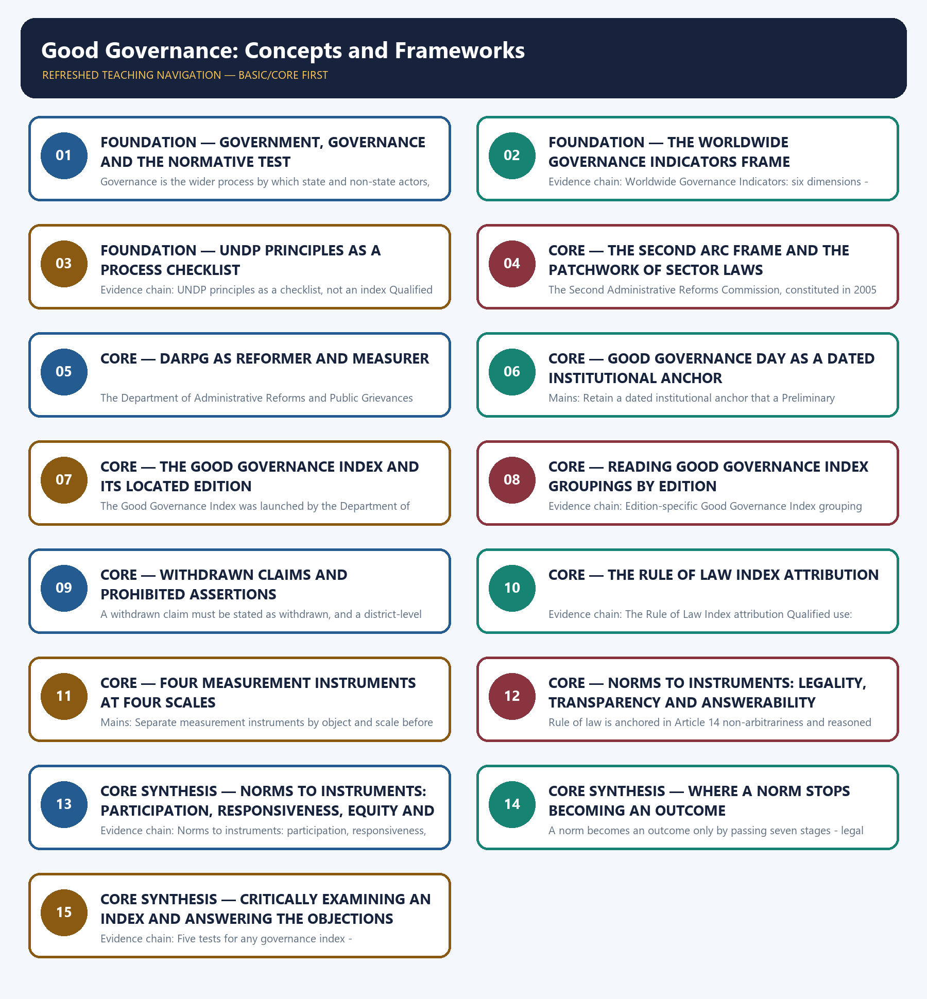

# Good Governance: Concepts and Frameworks — Learner-v2 Complete Learning Session

> **Authoring-only generation:** 2026-09-02. No PDF was rendered and no tracker or index was mutated.

### SOURCE, PROGRESSION AND CURRENT-LINKAGE AUDIT

- **Generation date:** 2026-09-02.
- **Repository-first evidence:** the Basic owner is taught first and preserved in full; the Advanced owner is retained only in the optional final teaching block.
- **OCR evidence:** Repository Markdown was primary. The OCR-searchable official General Studies question papers held under books\mains and books\more_previous_papers were used only to confirm the printed wording of routed Mains demands. No official answer key, marking scheme, page precision or unsupported quotation was imported from them.
- **Qdrant:** not used; repository Markdown and available OCR context were sufficient.
- **PYQ integrity:** No direct General Studies Mains demand is routed to this owner in the audited 2018-2023 or 2024-2025 Mains ledgers. The audited 2018-2023 Preliminary ledger routes one objective demand to this owner, namely the organisation that releases the Rule of Law Index annually, and that ledger itself records the official key as unavailable locally. The printed wording of that objective question could not be confirmed in the locally held OCR-searchable 2018 Preliminary paper, whose scan does not yield searchable text for the item, so no option set, no official key and no verbatim stem is reproduced or inferred. The owner therefore carries the examinable distinction - the Rule of Law Index is published by the World Justice Project and not by the World Bank - without converting an unkeyed objective question into a solved answer. The six original Mains answers below are authored practice, not previous-year questions, and the Basic owner records that this topic functions mainly as the conceptual opening for evaluative demands owned by Topics 02 to 15 rather than as a standalone Mains topic.
- **Live-link boundary:** No new live official item was verified for this topic on 2026-09-02. Only the dated official anchors already carried by the repository owners are used, each with its issuing body and date, namely Good Governance Day observed on 25 December since 2014, the Good Governance Index launched on 25 December 2019, the latest completed national edition located as the Good Governance Index 2020-21 released on 25 December 2021 with its status checked on 13 August 2026, the twenty-one-day grievance benchmark stated in departmental guidelines of August 2024, and the Economic Survey 2018-19 Chapter 2 behavioural-insights anchor. The withdrawal of the unsupported 2025 edition claim is carried forward explicitly. No governance indicator value, index edition, state rank, score, indicator count, percentile or top performer is asserted, no scheme or policy status is inferred, no institutional power is invented, and the personal-probity dimension of governance is cross-linked to Ethics rather than restated here.
- **Fact/inference discipline:** no current-affairs item, PYQ wording, figure or quotation is invented.

## BASIC LEARNING SESSION

### DEEP-REVIEW LEARNING CONTRACT

| Control | Binding rule for this package |
|---|---|
| Syllabus boundary | Complete Governance Basic/Core is answer-complete before optional Advanced depth. |
| Authority boundary | Constitution, statute, delegated rule, executive policy, scheme, recommendation, institution and implementation outcome remain distinct. |
| Implementation method | Objective → authority → finance → institution → frontline process → citizen access → output → outcome → feedback and remedy. |
| Federal method | Union, state, district, local body, regulator, parastatal and non-state roles are assigned without inventing jurisdiction. |
| Accountability method | Duty-holder → information → forum → questioning → consequence → correction → grievance/appeal. |
| Evidence method | Claim → named India-centric law/institution/scheme/case → causal analysis → source/date/status and implementation qualification. |
| Inclusion method | Gender, caste, tribe, disability, language, region, digital divide, privacy and offline safeguards are tested across access and outcome. |
| Practice contract | Every solved item has demand decoding, a detailed examiner-grade model, executable timed/compression plan, marks rationale and answer-specific improvement. |
| Approval | This immutable successor remains `approved: false` pending explicit approval. |

**Canonical Basic/Core owner:** `upsc-ai-kit\knowledge\Governance\basic\01_Good-Governance-Concepts-and-Frameworks.md`  
**Substantive canonical provenance owner:** `upsc-ai-kit\knowledge\Governance\01_Good-Governance-Concepts-and-Frameworks_Learner-V2-Complete-Topic-Package.md`  
**Optional Advanced owner:** `upsc-ai-kit\knowledge\Governance\advanced\01_Good-Governance-Concepts-and-Frameworks.md`  
**Official syllabus mapping:** `upsc-ai-kit\knowledge\Governance\OFFICIAL-UPSC-SYLLABUS-MAPPING.md`

### EVIDENCE, PYQ AND CURRENT-STATUS CONTROL

- **Legal-status discipline:** a proposal, commission recommendation, policy announcement, Cabinet approval, enacted statute, notified rule, commenced provision and implemented programme are never treated as the same status.
- **Institutional discipline:** constitutional, statutory, executive, regulatory, autonomous, registered private and international bodies retain exact mandate, jurisdiction and accountability.
- **Causal discipline:** allocation, portal creation, training, registration, disposal count or ranking does not by itself prove access, remedy, capability, service quality or outcome.
- **Indicator discipline:** input, process, output, outcome and impact indicators are separated; denominator, baseline, disaggregation, attribution and gaming risks are stated.
- **Trade-off discipline:** speed, expertise, autonomy, transparency, privacy, participation, fiscal control and inclusion are balanced with safeguards and residual risk.
- **PYQ discipline:** exact wording is preserved only where verified; routed or reconstructed demands remain labelled and no inferred answer is promoted as official.
- **Current-status note, rechecked 2026-09-02:** volatile law, scheme, institution, tournament and programme claims retain official source, date, jurisdiction and operative/interim/final status.

**Generation-local live/current sources:**
- No volatile claim is necessary for the static governance core.




*Distinct embedded teaching-navigation image. The separate continuous Cārvāka-style flowchart package remains an independent at-a-glance artifact.*

### SESSION 1 — FOUNDATION — GOVERNMENT, GOVERNANCE AND THE NORMATIVE TEST

#### DEFINITION / WHAT THIS IS CALLED

**Plain-language definition:** Government is the formal, constitutionally mandated set of institutions - legislature, executive and judiciary - that holds legitimate public authority, and it is only one actor inside governance rather than the whole of it.

**Technical definition:** Governance is the wider process by which state and non-state actors, including the market, civil society and citizens, together make, implement and enforce collective decisions, so a governance answer must name which actor holds the duty before it evaluates performance.

#### ANSWER-GRABBING OPENING — WRITE/ADAPT IN THE EXAM

> Government is the formal, constitutionally mandated set of institutions - legislature, executive and judiciary - that holds legitimate public authority, and it is only one actor inside governance rather than the whole of it.

#### MUST-WRITE KEYWORDS

- **FOUNDATION**
- **Government**
- **governance**
- **the normative test**
- **Evidence chain**
- **Qualified use**

**How to use them:** Frame the answer through FOUNDATION; define Government, connect governance with the normative test to explain the mechanism, and use Evidence chain for the decisive comparison or qualification.

#### VISUAL FIRST

```text
GOVERNMENT, GOVERNANCE AND THE NORMATIVE TEST
01. Government as a formal authority set
    |
    v
02. Governance as a wider decision process
    |
    v
03. Good governance as a normative standard
BOUNDARY -> The three terms are not synonyms and the third is a standard applied to the second, so an answer that uses them interchangeably has conceded the distinction the examiner is testing.
```

*This topic-specific rail fixes the evidence sequence and its exam boundary before analysis.*

#### CORE EXPLANATION

Government is the formal, constitutionally mandated set of institutions - legislature, executive and judiciary - that holds legitimate public authority, and it is only one actor inside governance rather than the whole of it. Governance is the wider process by which state and non-state actors, including the market, civil society and citizens, together make, implement and enforce collective decisions, so a governance answer must name which actor holds the duty before it evaluates performance. Good governance is governance judged against normative standards - rule of law, transparency, accountability, participation, responsiveness, equity, effectiveness and consensus orientation - and the Second Administrative Reforms Commission frames it as public institutions conducting public affairs and managing public resources largely free of abuse and corruption with due regard for the rule of law.

#### NAMED EVIDENCE AND MECHANISM

- Government is the formal, constitutionally mandated set of institutions - legislature, executive and judiciary - that holds legitimate public authority, and it is only one actor inside governance rather than the whole of it.
- Governance is the wider process by which state and non-state actors, including the market, civil society and citizens, together make, implement and enforce collective decisions, so a governance answer must name which actor holds the duty before it evaluates performance.
- Good governance is governance judged against normative standards - rule of law, transparency, accountability, participation, responsiveness, equity, effectiveness and consensus orientation - and the Second Administrative Reforms Commission frames it as public institutions conducting public affairs and managing public resources largely free of abuse and corruption with due regard for the rule of law.

#### EXAMINER CAUTION

- The three terms are not synonyms and the third is a standard applied to the second, so an answer that uses them interchangeably has conceded the distinction the examiner is testing.

#### EXAM LINK

- **Prelims:** Retain the exact statute, section, institution, official category, dated edition or scope rule attached to Government, governance and the normative test.
- **Mains:** Open a governance answer by separating the institution set, the decision process and the normative standard before any evaluation begins.

#### MINI RECAP

- **Evidence chain:** Government as a formal authority set -> Governance as a wider decision process -> Good governance as a normative standard
- **Qualified use:** Open a governance answer by separating the institution set, the decision process and the normative standard before any evaluation begins.

#### CLOSING RECALL FLOW — FOUNDATION — GOVERNMENT, GOVERNANCE AND THE NORMATIVE TEST

```text
START / CONCEPT: FOUNDATION — Government, governance and the normative test
        |
        v
EXACT TERMS: FOUNDATION · Government · governance · the normative test · Evidence chain · Qualified use
        |
        v
MECHANISM / ARGUMENT: Evidence chain: Government as a formal authority set - Governance as a wider decision process - Good governance as a normative standard Qualified use: Open a governance answer by separating the institution set, the decision process and the normative standard before any evaluation begins.
        |
        v
CONSEQUENCE / CONTRAST: The three terms are not synonyms and the third is a standard applied to the second, so an answer that uses them interchangeably has conceded the distinction the examiner is testing.
        |
        v
UPSC TRAP / ANSWER-USE: Do not miss this limiting distinction: good governance is governance judged against normative standards - rule of law, transparency, accountability...
        |
        v
ANSWER-GRABBING FORMULATION: Government is the formal, constitutionally mandated set of institutions - legislature, executive and judiciary - that holds legitimate public authority, and it is only one actor inside governance rather than the whole of it.
```
### SESSION 2 — FOUNDATION — THE WORLDWIDE GOVERNANCE INDICATORS FRAME

#### DEFINITION / WHAT THIS IS CALLED

**Plain-language definition:** The World Bank Worldwide Governance Indicators use six named dimensions - Voice and Accountability, Political Stability and Absence of Violence, Government Effectiveness, Regulatory Quality, Rule of Law and Control of Corruption - and countries are scored on each dimension separately rather than on one undifferentiated total.

**Technical definition:** Evidence chain: Worldwide Governance Indicators: six dimensions - The perception basis of the Worldwide Governance Indicators Qualified use: Cite a comparative measurement frame with its dimension names and its methodological limit attached.

#### ANSWER-GRABBING OPENING — WRITE/ADAPT IN THE EXAM

> The World Bank Worldwide Governance Indicators use six named dimensions - Voice and Accountability, Political Stability and Absence of Violence, Government Effectiveness, Regulatory Quality, Rule of Law and Control of Corruption - and countries are scored on each dimension separately rather than on one undifferentiated total.

#### MUST-WRITE KEYWORDS

- **FOUNDATION**
- **The Worldwide Governance Indicators frame**
- **Evidence chain**
- **Qualified use**
- **The World Bank Worldwide Governance**
- **Indicators**

**How to use them:** Frame the answer through FOUNDATION; define The Worldwide Governance Indicators frame, connect Evidence chain with Qualified use to explain the mechanism, and use The World Bank Worldwide Governance for the decisive comparison or qualification.

#### VISUAL FIRST

```text
THE WORLDWIDE GOVERNANCE INDICATORS FRAME
01. Worldwide Governance Indicators: six dimensions
    |
    v
02. The perception basis of the Worldwide Governance Indicators
BOUNDARY -> The dimensions are scored separately and rest substantially on aggregated perception with a margin of error, so a score is not a direct outcome measurement.
```

*This topic-specific rail fixes the evidence sequence and its exam boundary before analysis.*

#### CORE EXPLANATION

The World Bank Worldwide Governance Indicators use six named dimensions - Voice and Accountability, Political Stability and Absence of Violence, Government Effectiveness, Regulatory Quality, Rule of Law and Control of Corruption - and countries are scored on each dimension separately rather than on one undifferentiated total. The Worldwide Governance Indicators are built substantially from aggregated perception surveys and expert assessments rather than solely from administrative statistics, so a score reports perceived quality with a margin of error and an administrative improvement can move ahead of, or lag behind, the perception it is supposed to reflect.

#### NAMED EVIDENCE AND MECHANISM

- The World Bank Worldwide Governance Indicators use six named dimensions - Voice and Accountability, Political Stability and Absence of Violence, Government Effectiveness, Regulatory Quality, Rule of Law and Control of Corruption - and countries are scored on each dimension separately rather than on one undifferentiated total.
- The Worldwide Governance Indicators are built substantially from aggregated perception surveys and expert assessments rather than solely from administrative statistics, so a score reports perceived quality with a margin of error and an administrative improvement can move ahead of, or lag behind, the perception it is supposed to reflect.

#### EXAMINER CAUTION

- The dimensions are scored separately and rest substantially on aggregated perception with a margin of error, so a score is not a direct outcome measurement.

#### EXAM LINK

- **Prelims:** Retain the exact statute, section, institution, official category, dated edition or scope rule attached to The Worldwide Governance Indicators frame.
- **Mains:** Cite a comparative measurement frame with its dimension names and its methodological limit attached.

#### MINI RECAP

- **Evidence chain:** Worldwide Governance Indicators: six dimensions -> The perception basis of the Worldwide Governance Indicators
- **Qualified use:** Cite a comparative measurement frame with its dimension names and its methodological limit attached.

#### CLOSING RECALL FLOW — FOUNDATION — THE WORLDWIDE GOVERNANCE INDICATORS FRAME

```text
START / CONCEPT: FOUNDATION — The Worldwide Governance Indicators frame
        |
        v
EXACT TERMS: FOUNDATION · The Worldwide Governance Indicators frame · Evidence chain · Qualified use · The World Bank Worldwide Governance · Indicators
        |
        v
MECHANISM / ARGUMENT: Evidence chain: Worldwide Governance Indicators: six dimensions - The perception basis of the Worldwide Governance Indicators Qualified use: Cite a comparative measurement frame with its dimension names and its methodological limit attached.
        |
        v
CONSEQUENCE / CONTRAST: The Worldwide Governance Indicators are built substantially from aggregated perception surveys and expert assessments rather than solely from administrative statistics, so a score reports perceived quality with a margin of error and an administrative improvement can move ahead of, or lag behind, the perception it is supposed to reflect.
        |
        v
UPSC TRAP / ANSWER-USE: The dimensions are scored separately and rest substantially on aggregated perception with a margin of error, so a score is not a direct outcome measurement.
        |
        v
ANSWER-GRABBING FORMULATION: The World Bank Worldwide Governance Indicators use six named dimensions - Voice and Accountability, Political Stability and Absence of Violence, Government Effectiveness, Regulatory Quality, Rule of Law and Control of Corruption - and countries are scored on each dimension separately rather than on one undifferentiated total.
```
### SESSION 3 — FOUNDATION — UNDP PRINCIPLES AS A PROCESS CHECKLIST

#### DEFINITION / WHAT THIS IS CALLED

**Plain-language definition:** The UNDP governance principles - participation, rule of law, transparency, responsiveness, consensus orientation, equity and inclusiveness, effectiveness and efficiency, accountability and strategic vision - form a normative checklist that supplies process vocabulary and cannot rank anything, so treating them as a scoring system is a category error.

**Technical definition:** Evidence chain: UNDP principles as a checklist, not an index Qualified use: Supply the process vocabulary a normative-standard demand expects without pretending to a score.

#### ANSWER-GRABBING OPENING — WRITE/ADAPT IN THE EXAM

> Evidence chain: UNDP principles as a checklist, not an index Qualified use: Supply the process vocabulary a normative-standard demand expects without pretending to a score.

#### MUST-WRITE KEYWORDS

- **FOUNDATION**
- **UNDP principles as a process checklist**
- **Evidence chain**
- **Qualified use**
- **The UNDP**
- **UNDP**

**How to use them:** Frame the answer through FOUNDATION; define UNDP principles as a process checklist, connect Evidence chain with Qualified use to explain the mechanism, and use The UNDP for the decisive comparison or qualification.

#### VISUAL FIRST

```text
UNDP PRINCIPLES AS A PROCESS CHECKLIST
01. UNDP principles as a checklist, not an index
BOUNDARY -> The checklist supplies vocabulary and cannot rank, so it must not be presented as an index.
```

*This topic-specific rail fixes the evidence sequence and its exam boundary before analysis.*

#### CORE EXPLANATION

The UNDP governance principles - participation, rule of law, transparency, responsiveness, consensus orientation, equity and inclusiveness, effectiveness and efficiency, accountability and strategic vision - form a normative checklist that supplies process vocabulary and cannot rank anything, so treating them as a scoring system is a category error.

#### NAMED EVIDENCE AND MECHANISM

- The UNDP governance principles - participation, rule of law, transparency, responsiveness, consensus orientation, equity and inclusiveness, effectiveness and efficiency, accountability and strategic vision - form a normative checklist that supplies process vocabulary and cannot rank anything, so treating them as a scoring system is a category error.

#### EXAMINER CAUTION

- The checklist supplies vocabulary and cannot rank, so it must not be presented as an index.

#### EXAM LINK

- **Prelims:** Retain the exact statute, section, institution, official category, dated edition or scope rule attached to UNDP principles as a process checklist.
- **Mains:** Supply the process vocabulary a normative-standard demand expects without pretending to a score.

#### MINI RECAP

- **Evidence chain:** UNDP principles as a checklist, not an index
- **Qualified use:** Supply the process vocabulary a normative-standard demand expects without pretending to a score.

#### CLOSING RECALL FLOW — FOUNDATION — UNDP PRINCIPLES AS A PROCESS CHECKLIST

```text
START / CONCEPT: FOUNDATION — UNDP principles as a process checklist
        |
        v
EXACT TERMS: FOUNDATION · UNDP principles as a process checklist · Evidence chain · Qualified use · The UNDP · UNDP
        |
        v
MECHANISM / ARGUMENT: The UNDP governance principles - participation, rule of law, transparency, responsiveness, consensus orientation, equity and inclusiveness, effectiveness and efficiency, accountability and strategic vision - form a normative checklist that supplies process vocabulary and cannot rank anything, so treating them as a scoring system is a category error.
        |
        v
CONSEQUENCE / CONTRAST: The checklist supplies vocabulary and cannot rank, so it must not be presented as an index.
        |
        v
UPSC TRAP / ANSWER-USE: Do not miss this limiting distinction: uNDP principles as a checklist, not an index Qualified use.
        |
        v
ANSWER-GRABBING FORMULATION: Evidence chain: UNDP principles as a checklist, not an index Qualified use: Supply the process vocabulary a normative-standard demand expects without pretending to a score.
```
### SESSION 4 — CORE — THE SECOND ARC FRAME AND THE PATCHWORK OF SECTOR LAWS

#### DEFINITION / WHAT THIS IS CALLED

**Plain-language definition:** Commission recommendations are dated reform proposals rather than enacted law, and the statutory patchwork is a deliberate design choice rather than an omission.

**Technical definition:** The Second Administrative Reforms Commission, constituted in 2005 and reporting through fifteen reports, supplies the India-specific institutional-reform frame, and India deliberately enforces the good-governance standard through a patchwork of sector laws such as the Right to Information Act, state right-to-service Acts and Section 17 of the Mahatma Gandhi National Rural Employment Guarantee Act rather than through a single overarching good-governance statute.

#### ANSWER-GRABBING OPENING — WRITE/ADAPT IN THE EXAM

> The Second Administrative Reforms Commission, constituted in 2005 and reporting through fifteen reports, supplies the India-specific institutional-reform frame, and India deliberately enforces the good-governance standard through a patchwork of sector laws such as the Right to Information Act, state right-to-service Acts and Section 17 of the Mahatma Gandhi National Rural Employment Guarantee Act rather than through a single overarching good-governance statute.

#### MUST-WRITE KEYWORDS

- **The Second ARC frame**
- **the patchwork of sector laws**
- **Evidence chain**
- **Qualified use**
- **The Second Administrative Reforms Commission**
- **India-specific**

**How to use them:** Frame the answer through The Second ARC frame; define the patchwork of sector laws, connect Evidence chain with Qualified use to explain the mechanism, and use The Second Administrative Reforms Commission for the decisive comparison or qualification.

#### VISUAL FIRST

```text
THE SECOND ARC FRAME AND THE PATCHWORK OF SECTOR LAWS
01. The Second ARC frame and the absence of one governance statute
BOUNDARY -> Commission recommendations are dated reform proposals rather than enacted law, and the statutory patchwork is a deliberate design choice rather than an omission.
```

*This topic-specific rail fixes the evidence sequence and its exam boundary before analysis.*

#### CORE EXPLANATION

The Second Administrative Reforms Commission, constituted in 2005 and reporting through fifteen reports, supplies the India-specific institutional-reform frame, and India deliberately enforces the good-governance standard through a patchwork of sector laws such as the Right to Information Act, state right-to-service Acts and Section 17 of the Mahatma Gandhi National Rural Employment Guarantee Act rather than through a single overarching good-governance statute.

#### NAMED EVIDENCE AND MECHANISM

- The Second Administrative Reforms Commission, constituted in 2005 and reporting through fifteen reports, supplies the India-specific institutional-reform frame, and India deliberately enforces the good-governance standard through a patchwork of sector laws such as the Right to Information Act, state right-to-service Acts and Section 17 of the Mahatma Gandhi National Rural Employment Guarantee Act rather than through a single overarching good-governance statute.

#### EXAMINER CAUTION

- Commission recommendations are dated reform proposals rather than enacted law, and the statutory patchwork is a deliberate design choice rather than an omission.

#### EXAM LINK

- **Prelims:** Retain the exact statute, section, institution, official category, dated edition or scope rule attached to The Second ARC frame and the patchwork of sector laws.
- **Mains:** Provide the India-specific institutional-reform frame that converts an international standard into a domestic reform route.

#### MINI RECAP

- **Evidence chain:** The Second ARC frame and the absence of one governance statute
- **Qualified use:** Provide the India-specific institutional-reform frame that converts an international standard into a domestic reform route.

#### CLOSING RECALL FLOW — CORE — THE SECOND ARC FRAME AND THE PATCHWORK OF SECTOR LAWS

```text
START / CONCEPT: CORE — The Second ARC frame and the patchwork of sector laws
        |
        v
EXACT TERMS: The Second ARC frame · the patchwork of sector laws · Evidence chain · Qualified use · The Second Administrative Reforms Commission · India-specific
        |
        v
MECHANISM / ARGUMENT: Evidence chain: The Second ARC frame and the absence of one governance statute Qualified use: Provide the India-specific institutional-reform frame that converts an international standard into a domestic reform route.
        |
        v
CONSEQUENCE / CONTRAST: Mains: Provide the India-specific institutional-reform frame that converts an international standard into a domestic reform route.
        |
        v
UPSC TRAP / ANSWER-USE: Commission recommendations are dated reform proposals rather than enacted law, and the statutory patchwork is a deliberate design choice rather than an omission.
        |
        v
ANSWER-GRABBING FORMULATION: The Second Administrative Reforms Commission, constituted in 2005 and reporting through fifteen reports, supplies the India-specific institutional-reform frame, and India deliberately enforces the good-governance standard through a patchwork of sector laws such as the Right to Information Act, state right-to-service Acts and Section 17 of the Mahatma Gandhi National Rural Employment Guarantee Act rather than through a single overarching good-governance statute.
```
### SESSION 5 — CORE — DARPG AS REFORMER AND MEASURER

#### DEFINITION / WHAT THIS IS CALLED

**Plain-language definition:** Evidence chain: DARPG as reformer and measurer in one department Qualified use: Name the nodal institution precisely and flag the structural feature that a critical directive rewards.

**Technical definition:** The Department of Administrative Reforms and Public Grievances functions under the Ministry of Personnel, Public Grievances and Pensions and is simultaneously the nodal department for administrative reform, Sevottam, the Centralised Public Grievance Redress and Monitoring System and Second ARC follow-up, and the nodal department for good-governance measurement, so agenda-setting and self-assessment sit inside one department.

#### ANSWER-GRABBING OPENING — WRITE/ADAPT IN THE EXAM

> Evidence chain: DARPG as reformer and measurer in one department Qualified use: Name the nodal institution precisely and flag the structural feature that a critical directive rewards.

#### MUST-WRITE KEYWORDS

- **DARPG as reformer**
- **measurer**
- **Evidence chain**
- **Qualified use**
- **The Department**
- **Administrative Reforms**

**How to use them:** Frame the answer through DARPG as reformer; define measurer, connect Evidence chain with Qualified use to explain the mechanism, and use The Department for the decisive comparison or qualification.

#### VISUAL FIRST

```text
DARPG AS REFORMER AND MEASURER
01. DARPG as reformer and measurer in one department
BOUNDARY -> One department holding both the reform agenda and its own measurement concentrates agenda-setting and self-assessment, which is an analytical point rather than an allegation.
```

*This topic-specific rail fixes the evidence sequence and its exam boundary before analysis.*

#### CORE EXPLANATION

The Department of Administrative Reforms and Public Grievances functions under the Ministry of Personnel, Public Grievances and Pensions and is simultaneously the nodal department for administrative reform, Sevottam, the Centralised Public Grievance Redress and Monitoring System and Second ARC follow-up, and the nodal department for good-governance measurement, so agenda-setting and self-assessment sit inside one department.

#### NAMED EVIDENCE AND MECHANISM

- The Department of Administrative Reforms and Public Grievances functions under the Ministry of Personnel, Public Grievances and Pensions and is simultaneously the nodal department for administrative reform, Sevottam, the Centralised Public Grievance Redress and Monitoring System and Second ARC follow-up, and the nodal department for good-governance measurement, so agenda-setting and self-assessment sit inside one department.

#### EXAMINER CAUTION

- One department holding both the reform agenda and its own measurement concentrates agenda-setting and self-assessment, which is an analytical point rather than an allegation.

#### EXAM LINK

- **Prelims:** Retain the exact statute, section, institution, official category, dated edition or scope rule attached to DARPG as reformer and measurer.
- **Mains:** Name the nodal institution precisely and flag the structural feature that a critical directive rewards.

#### MINI RECAP

- **Evidence chain:** DARPG as reformer and measurer in one department
- **Qualified use:** Name the nodal institution precisely and flag the structural feature that a critical directive rewards.

#### CLOSING RECALL FLOW — CORE — DARPG AS REFORMER AND MEASURER

```text
START / CONCEPT: CORE — DARPG as reformer and measurer
        |
        v
EXACT TERMS: DARPG as reformer · measurer · Evidence chain · Qualified use · The Department · Administrative Reforms
        |
        v
MECHANISM / ARGUMENT: The Department of Administrative Reforms and Public Grievances functions under the Ministry of Personnel, Public Grievances and Pensions and is simultaneously the nodal department for administrative reform, Sevottam, the Centralised Public Grievance Redress and Monitoring System and Second ARC follow-up, and the nodal department for good-governance measurement, so agenda-setting and self-assessment sit inside one department.
        |
        v
CONSEQUENCE / CONTRAST: One department holding both the reform agenda and its own measurement concentrates agenda-setting and self-assessment, which is an analytical point rather than an allegation.
        |
        v
UPSC TRAP / ANSWER-USE: Do not miss this limiting distinction: dARPG as reformer and measurer in one department Qualified use.
        |
        v
ANSWER-GRABBING FORMULATION: Evidence chain: DARPG as reformer and measurer in one department Qualified use: Name the nodal institution precisely and flag the structural feature that a critical directive rewards.
```
### SESSION 6 — CORE — GOOD GOVERNANCE DAY AS A DATED INSTITUTIONAL ANCHOR

#### DEFINITION / WHAT THIS IS CALLED

**Plain-language definition:** Evidence chain: Good Governance Day Qualified use: Retain a dated institutional anchor that a Preliminary statement question can test directly.

**Technical definition:** Mains: Retain a dated institutional anchor that a Preliminary statement question can test directly.

#### ANSWER-GRABBING OPENING — WRITE/ADAPT IN THE EXAM

> Evidence chain: Good Governance Day Qualified use: Retain a dated institutional anchor that a Preliminary statement question can test directly.

#### MUST-WRITE KEYWORDS

- **Good Governance Day as a dated institutional anchor**
- **Evidence chain**
- **Qualified use**
- **Good Governance Day**
- **Prime Minister Atal Bihari Vajpayee**
- **The day**

**How to use them:** Frame the answer through Good Governance Day as a dated institutional anchor; define Evidence chain, connect Qualified use with Good Governance Day to explain the mechanism, and use Prime Minister Atal Bihari Vajpayee for the decisive comparison or qualification.

#### VISUAL FIRST

```text
GOOD GOVERNANCE DAY AS A DATED INSTITUTIONAL ANCHOR
01. Good Governance Day
BOUNDARY -> The day is an observance rather than a measurement instrument, so it may not be substituted for a released index edition.
```

*This topic-specific rail fixes the evidence sequence and its exam boundary before analysis.*

#### CORE EXPLANATION

Good Governance Day has been observed on 25 December every year since 2014, marking the birth anniversary of former Prime Minister Atal Bihari Vajpayee, and it promotes accountability, transparency and citizen-centric administration without being a measurement instrument.

#### NAMED EVIDENCE AND MECHANISM

- Good Governance Day has been observed on 25 December every year since 2014, marking the birth anniversary of former Prime Minister Atal Bihari Vajpayee, and it promotes accountability, transparency and citizen-centric administration without being a measurement instrument.

#### EXAMINER CAUTION

- The day is an observance rather than a measurement instrument, so it may not be substituted for a released index edition.

#### EXAM LINK

- **Prelims:** Retain the exact statute, section, institution, official category, dated edition or scope rule attached to Good Governance Day as a dated institutional anchor.
- **Mains:** Retain a dated institutional anchor that a Preliminary statement question can test directly.

#### MINI RECAP

- **Evidence chain:** Good Governance Day
- **Qualified use:** Retain a dated institutional anchor that a Preliminary statement question can test directly.

#### CLOSING RECALL FLOW — CORE — GOOD GOVERNANCE DAY AS A DATED INSTITUTIONAL ANCHOR

```text
START / CONCEPT: CORE — Good Governance Day as a dated institutional anchor
        |
        v
EXACT TERMS: Good Governance Day as a dated institutional anchor · Evidence chain · Qualified use · Good Governance Day · Prime Minister Atal Bihari Vajpayee · The day
        |
        v
MECHANISM / ARGUMENT: Mains: Retain a dated institutional anchor that a Preliminary statement question can test directly.
        |
        v
CONSEQUENCE / CONTRAST: Good Governance Day has been observed on 25 December every year since 2014, marking the birth anniversary of former Prime Minister Atal Bihari Vajpayee, and it promotes accountability, transparency and citizen-centric administration without being a measurement instrument.
        |
        v
UPSC TRAP / ANSWER-USE: The day is an observance rather than a measurement instrument, so it may not be substituted for a released index edition.
        |
        v
ANSWER-GRABBING FORMULATION: Evidence chain: Good Governance Day Qualified use: Retain a dated institutional anchor that a Preliminary statement question can test directly.
```
### SESSION 7 — CORE — THE GOOD GOVERNANCE INDEX AND ITS LOCATED EDITION

#### DEFINITION / WHAT THIS IS CALLED

**Plain-language definition:** Evidence chain: Good Governance Index launch and latest located edition Qualified use: Attach an edition year to every index claim so that a correct instinct is not converted into a factual error.

**Technical definition:** The Good Governance Index was launched by the Department of Administrative Reforms and Public Grievances on 25 December 2019 as a composite diagnostic tool assessing state and union-territory performance across ten sectors, and the latest completed national edition located on that department as of 13 August 2026 is the Good Governance Index 2020-21, released on 25 December 2021.

#### ANSWER-GRABBING OPENING — WRITE/ADAPT IN THE EXAM

> Evidence chain: Good Governance Index launch and latest located edition Qualified use: Attach an edition year to every index claim so that a correct instinct is not converted into a factual error.

#### MUST-WRITE KEYWORDS

- **The Good Governance Index**
- **its located edition**
- **Evidence chain**
- **Qualified use**
- **Department**
- **2020-21**

**How to use them:** Frame the answer through The Good Governance Index; define its located edition, connect Evidence chain with Qualified use to explain the mechanism, and use Department for the decisive comparison or qualification.

#### VISUAL FIRST

```text
THE GOOD GOVERNANCE INDEX AND ITS LOCATED EDITION
01. Good Governance Index launch and latest located edition
BOUNDARY -> Only a released edition may be used, and the latest completed national edition located is dated rather than assumed to be current.
```

*This topic-specific rail fixes the evidence sequence and its exam boundary before analysis.*

#### CORE EXPLANATION

The Good Governance Index was launched by the Department of Administrative Reforms and Public Grievances on 25 December 2019 as a composite diagnostic tool assessing state and union-territory performance across ten sectors, and the latest completed national edition located on that department as of 13 August 2026 is the Good Governance Index 2020-21, released on 25 December 2021.

#### NAMED EVIDENCE AND MECHANISM

- The Good Governance Index was launched by the Department of Administrative Reforms and Public Grievances on 25 December 2019 as a composite diagnostic tool assessing state and union-territory performance across ten sectors, and the latest completed national edition located on that department as of 13 August 2026 is the Good Governance Index 2020-21, released on 25 December 2021.

#### EXAMINER CAUTION

- Only a released edition may be used, and the latest completed national edition located is dated rather than assumed to be current.

#### EXAM LINK

- **Prelims:** Retain the exact statute, section, institution, official category, dated edition or scope rule attached to The Good Governance Index and its located edition.
- **Mains:** Attach an edition year to every index claim so that a correct instinct is not converted into a factual error.

#### MINI RECAP

- **Evidence chain:** Good Governance Index launch and latest located edition
- **Qualified use:** Attach an edition year to every index claim so that a correct instinct is not converted into a factual error.

#### CLOSING RECALL FLOW — CORE — THE GOOD GOVERNANCE INDEX AND ITS LOCATED EDITION

```text
START / CONCEPT: CORE — The Good Governance Index and its located edition
        |
        v
EXACT TERMS: The Good Governance Index · its located edition · Evidence chain · Qualified use · Department · 2020-21
        |
        v
MECHANISM / ARGUMENT: The Good Governance Index was launched by the Department of Administrative Reforms and Public Grievances on 25 December 2019 as a composite diagnostic tool assessing state and union-territory performance across ten sectors, and the latest completed national edition located on that department as of 13 August 2026 is the Good Governance Index 2020-21, released on 25 December 2021.
        |
        v
CONSEQUENCE / CONTRAST: Mains: Attach an edition year to every index claim so that a correct instinct is not converted into a factual error.
        |
        v
UPSC TRAP / ANSWER-USE: Only a released edition may be used, and the latest completed national edition located is dated rather than assumed to be current.
        |
        v
ANSWER-GRABBING FORMULATION: Evidence chain: Good Governance Index launch and latest located edition Qualified use: Attach an edition year to every index claim so that a correct instinct is not converted into a factual error.
```
### SESSION 8 — CORE — READING GOOD GOVERNANCE INDEX GROUPINGS BY EDITION

#### DEFINITION / WHAT THIS IS CALLED

**Plain-language definition:** The Good Governance Index comparison grouping is edition-specific: the 2019 edition used three groups while the 2020-21 edition used four - Other States Group A, Other States Group B, North-East and Hill States, and Union Territories - so any grouping claim must carry its edition year, and the Gujarat top-rank fact belongs specifically to the 2020-21 edition.

**Technical definition:** Evidence chain: Edition-specific Good Governance Index grouping Qualified use: Answer a grouping or ranking question with the edition-specific structure rather than a remembered aggregate.

#### ANSWER-GRABBING OPENING — WRITE/ADAPT IN THE EXAM

> The Good Governance Index comparison grouping is edition-specific: the 2019 edition used three groups while the 2020-21 edition used four - Other States Group A, Other States Group B, North-East and Hill States, and Union Territories - so any grouping claim must carry its edition year, and the Gujarat top-rank fact belongs specifically to the 2020-21 edition.

#### MUST-WRITE KEYWORDS

- **Reading Good Governance Index groupings by edition**
- **Evidence chain**
- **Qualified use**
- **The Good Governance Index comparison grouping**
- **The Good Governance Index**
- **2020-21**

**How to use them:** Frame the answer through Reading Good Governance Index groupings by edition; define Evidence chain, connect Qualified use with The Good Governance Index comparison grouping to explain the mechanism, and use The Good Governance Index for the decisive comparison or qualification.

#### VISUAL FIRST

```text
READING GOOD GOVERNANCE INDEX GROUPINGS BY EDITION
01. Edition-specific Good Governance Index grouping
BOUNDARY -> The grouping changed between the 2019 and 2020-21 editions and a rank belongs to the edition that produced it.
```

*This topic-specific rail fixes the evidence sequence and its exam boundary before analysis.*

#### CORE EXPLANATION

The Good Governance Index comparison grouping is edition-specific: the 2019 edition used three groups while the 2020-21 edition used four - Other States Group A, Other States Group B, North-East and Hill States, and Union Territories - so any grouping claim must carry its edition year, and the Gujarat top-rank fact belongs specifically to the 2020-21 edition.

#### NAMED EVIDENCE AND MECHANISM

- The Good Governance Index comparison grouping is edition-specific: the 2019 edition used three groups while the 2020-21 edition used four - Other States Group A, Other States Group B, North-East and Hill States, and Union Territories - so any grouping claim must carry its edition year, and the Gujarat top-rank fact belongs specifically to the 2020-21 edition.

#### EXAMINER CAUTION

- The grouping changed between the 2019 and 2020-21 editions and a rank belongs to the edition that produced it.

#### EXAM LINK

- **Prelims:** Retain the exact statute, section, institution, official category, dated edition or scope rule attached to Reading Good Governance Index groupings by edition.
- **Mains:** Answer a grouping or ranking question with the edition-specific structure rather than a remembered aggregate.

#### MINI RECAP

- **Evidence chain:** Edition-specific Good Governance Index grouping
- **Qualified use:** Answer a grouping or ranking question with the edition-specific structure rather than a remembered aggregate.

#### CLOSING RECALL FLOW — CORE — READING GOOD GOVERNANCE INDEX GROUPINGS BY EDITION

```text
START / CONCEPT: CORE — Reading Good Governance Index groupings by edition
        |
        v
EXACT TERMS: Reading Good Governance Index groupings by edition · Evidence chain · Qualified use · The Good Governance Index comparison grouping · The Good Governance Index · 2020-21
        |
        v
MECHANISM / ARGUMENT: Evidence chain: Edition-specific Good Governance Index grouping Qualified use: Answer a grouping or ranking question with the edition-specific structure rather than a remembered aggregate.
        |
        v
CONSEQUENCE / CONTRAST: The resulting consequence is that the Good Governance Index comparison grouping is edition-specific.
        |
        v
UPSC TRAP / ANSWER-USE: Do not miss this limiting distinction: the Good Governance Index comparison grouping is edition-specific.
        |
        v
ANSWER-GRABBING FORMULATION: The Good Governance Index comparison grouping is edition-specific: the 2019 edition used three groups while the 2020-21 edition used four - Other States Group A, Other States Group B, North-East and Hill States, and Union Territories - so any grouping claim must carry its edition year, and the Gujarat top-rank fact belongs specifically to the 2020-21 edition.
```
### SESSION 9 — CORE — WITHDRAWN CLAIMS AND PROHIBITED ASSERTIONS

#### DEFINITION / WHAT THIS IS CALLED

**Plain-language definition:** Evidence chain: The withdrawn Good Governance Index 2025 claim - The District Good Governance Index is not a national edition Qualified use: Demonstrate factual discipline by naming what the repository refuses to assert and why.

**Technical definition:** A withdrawn claim must be stated as withdrawn, and a district-level exercise is not a national edition.

#### ANSWER-GRABBING OPENING — WRITE/ADAPT IN THE EXAM

> Evidence chain: The withdrawn Good Governance Index 2025 claim - The District Good Governance Index is not a national edition Qualified use: Demonstrate factual discipline by naming what the repository refuses to assert and why.

#### MUST-WRITE KEYWORDS

- **Withdrawn claims**
- **prohibited assertions**
- **Evidence chain**
- **Qualified use**
- **Good Governance Index**
- **Press Information Bureau**

**How to use them:** Frame the answer through Withdrawn claims; define prohibited assertions, connect Evidence chain with Qualified use to explain the mechanism, and use Good Governance Index for the decisive comparison or qualification.

#### VISUAL FIRST

```text
WITHDRAWN CLAIMS AND PROHIBITED ASSERTIONS
01. The withdrawn Good Governance Index 2025 claim
    |
    v
02. The District Good Governance Index is not a national edition
BOUNDARY -> A withdrawn claim must be stated as withdrawn, and a district-level exercise is not a national edition.
```

*This topic-specific rail fixes the evidence sequence and its exam boundary before analysis.*

#### CORE EXPLANATION

A previous audit introduced an unsupported claim that a third Good Governance Index edition described as 2025 had been released, no departmental report or Press Information Bureau release establishing that edition was located, and the correction record of 13 August 2026 withdraws the claim explicitly, so no post-2021 national edition, rank, score, top performer or indicator count may be asserted. The District Good Governance Index is a separate sub-national exercise developed for particular states and union territories, and it neither supersedes nor substitutes for a released national Good Governance Index edition, so converting a district index, a workshop, a proposed cycle or a Good Governance Day event into a released national edition is a factual error.

#### NAMED EVIDENCE AND MECHANISM

- A previous audit introduced an unsupported claim that a third Good Governance Index edition described as 2025 had been released, no departmental report or Press Information Bureau release establishing that edition was located, and the correction record of 13 August 2026 withdraws the claim explicitly, so no post-2021 national edition, rank, score, top performer or indicator count may be asserted.
- The District Good Governance Index is a separate sub-national exercise developed for particular states and union territories, and it neither supersedes nor substitutes for a released national Good Governance Index edition, so converting a district index, a workshop, a proposed cycle or a Good Governance Day event into a released national edition is a factual error.

#### EXAMINER CAUTION

- A withdrawn claim must be stated as withdrawn, and a district-level exercise is not a national edition.

#### EXAM LINK

- **Prelims:** Retain the exact statute, section, institution, official category, dated edition or scope rule attached to Withdrawn claims and prohibited assertions.
- **Mains:** Demonstrate factual discipline by naming what the repository refuses to assert and why.

#### MINI RECAP

- **Evidence chain:** The withdrawn Good Governance Index 2025 claim -> The District Good Governance Index is not a national edition
- **Qualified use:** Demonstrate factual discipline by naming what the repository refuses to assert and why.

#### CLOSING RECALL FLOW — CORE — WITHDRAWN CLAIMS AND PROHIBITED ASSERTIONS

```text
START / CONCEPT: CORE — Withdrawn claims and prohibited assertions
        |
        v
EXACT TERMS: Withdrawn claims · prohibited assertions · Evidence chain · Qualified use · Good Governance Index · Press Information Bureau
        |
        v
MECHANISM / ARGUMENT: Mains: Demonstrate factual discipline by naming what the repository refuses to assert and why.
        |
        v
CONSEQUENCE / CONTRAST: A withdrawn claim must be stated as withdrawn, and a district-level exercise is not a national edition.
        |
        v
UPSC TRAP / ANSWER-USE: Do not miss this limiting distinction: a previous audit introduced an unsupported claim that a third Good Governance Index edition...
        |
        v
ANSWER-GRABBING FORMULATION: Evidence chain: The withdrawn Good Governance Index 2025 claim - The District Good Governance Index is not a national edition Qualified use: Demonstrate factual discipline by naming what the repository refuses to assert and why.
```
### SESSION 10 — CORE — THE RULE OF LAW INDEX ATTRIBUTION

#### DEFINITION / WHAT THIS IS CALLED

**Plain-language definition:** The Rule of Law Index is published by the World Justice Project and not by the World Bank, and this attribution is the exact objective distinction routed by the audited 2018 Preliminary examination ledger to this owner, so the index must never be folded into the World Bank Worldwide Governance Indicators family.

**Technical definition:** Evidence chain: The Rule of Law Index attribution Qualified use: Preserve the exact attribution that the audited objective ledger routed to this owner.

#### ANSWER-GRABBING OPENING — WRITE/ADAPT IN THE EXAM

> The Rule of Law Index is published by the World Justice Project and not by the World Bank, and this attribution is the exact objective distinction routed by the audited 2018 Preliminary examination ledger to this owner, so the index must never be folded into the World Bank Worldwide Governance Indicators family.

#### MUST-WRITE KEYWORDS

- **The Rule of Law Index attribution**
- **Evidence chain**
- **Qualified use**
- **The Rule of Law Index**
- **The Rule**
- **Law Index**

**How to use them:** Frame the answer through The Rule of Law Index attribution; define Evidence chain, connect Qualified use with The Rule of Law Index to explain the mechanism, and use The Rule for the decisive comparison or qualification.

#### VISUAL FIRST

```text
THE RULE OF LAW INDEX ATTRIBUTION
01. The Rule of Law Index attribution
BOUNDARY -> The publisher is the World Justice Project and the index does not belong to the World Bank family.
```

*This topic-specific rail fixes the evidence sequence and its exam boundary before analysis.*

#### CORE EXPLANATION

The Rule of Law Index is published by the World Justice Project and not by the World Bank, and this attribution is the exact objective distinction routed by the audited 2018 Preliminary examination ledger to this owner, so the index must never be folded into the World Bank Worldwide Governance Indicators family.

#### NAMED EVIDENCE AND MECHANISM

- The Rule of Law Index is published by the World Justice Project and not by the World Bank, and this attribution is the exact objective distinction routed by the audited 2018 Preliminary examination ledger to this owner, so the index must never be folded into the World Bank Worldwide Governance Indicators family.

#### EXAMINER CAUTION

- The publisher is the World Justice Project and the index does not belong to the World Bank family.

#### EXAM LINK

- **Prelims:** Retain the exact statute, section, institution, official category, dated edition or scope rule attached to The Rule of Law Index attribution.
- **Mains:** Preserve the exact attribution that the audited objective ledger routed to this owner.

#### MINI RECAP

- **Evidence chain:** The Rule of Law Index attribution
- **Qualified use:** Preserve the exact attribution that the audited objective ledger routed to this owner.

#### CLOSING RECALL FLOW — CORE — THE RULE OF LAW INDEX ATTRIBUTION

```text
START / CONCEPT: CORE — The Rule of Law Index attribution
        |
        v
EXACT TERMS: The Rule of Law Index attribution · Evidence chain · Qualified use · The Rule of Law Index · The Rule · Law Index
        |
        v
MECHANISM / ARGUMENT: Evidence chain: The Rule of Law Index attribution Qualified use: Preserve the exact attribution that the audited objective ledger routed to this owner.
        |
        v
CONSEQUENCE / CONTRAST: The publisher is the World Justice Project and the index does not belong to the World Bank family.
        |
        v
UPSC TRAP / ANSWER-USE: Do not miss this limiting distinction: the Rule of Law Index is published by the World Justice Project and not...
        |
        v
ANSWER-GRABBING FORMULATION: The Rule of Law Index is published by the World Justice Project and not by the World Bank, and this attribution is the exact objective distinction routed by the audited 2018 Preliminary examination ledger to this owner, so the index must never be folded into the World Bank Worldwide Governance Indicators family.
```
### SESSION 11 — CORE — FOUR MEASUREMENT INSTRUMENTS AT FOUR SCALES

#### DEFINITION / WHAT THIS IS CALLED

**Plain-language definition:** Evidence chain: Four measurement instruments at four different scales Qualified use: Separate measurement instruments by object and scale before any comparative verdict is offered.

**Technical definition:** Mains: Separate measurement instruments by object and scale before any comparative verdict is offered.

#### ANSWER-GRABBING OPENING — WRITE/ADAPT IN THE EXAM

> Evidence chain: Four measurement instruments at four different scales Qualified use: Separate measurement instruments by object and scale before any comparative verdict is offered.

#### MUST-WRITE KEYWORDS

- **Four measurement instruments at four scales**
- **Evidence chain**
- **Qualified use**
- **The Worldwide Governance Indicators**
- **Good Governance Index**
- **National**

**How to use them:** Frame the answer through Four measurement instruments at four scales; define Evidence chain, connect Qualified use with The Worldwide Governance Indicators to explain the mechanism, and use Good Governance Index for the decisive comparison or qualification.

#### VISUAL FIRST

```text
FOUR MEASUREMENT INSTRUMENTS AT FOUR SCALES
01. Four measurement instruments at four different scales
BOUNDARY -> The four instruments measure four different objects at four different scales and cannot be aggregated.
```

*This topic-specific rail fixes the evidence sequence and its exam boundary before analysis.*

#### CORE EXPLANATION

The Worldwide Governance Indicators measure cross-country comparison, the Good Governance Index measures state and union-territory sectoral governance, the National e-Governance Service Delivery Assessment measures end-service delivery depth at portal level and the Panchayati Raj Ministry Devolution Index measures panchayat devolution only, so treating the four as interchangeable governance rankings is the discrimination failure that costs marks.

#### NAMED EVIDENCE AND MECHANISM

- The Worldwide Governance Indicators measure cross-country comparison, the Good Governance Index measures state and union-territory sectoral governance, the National e-Governance Service Delivery Assessment measures end-service delivery depth at portal level and the Panchayati Raj Ministry Devolution Index measures panchayat devolution only, so treating the four as interchangeable governance rankings is the discrimination failure that costs marks.

#### EXAMINER CAUTION

- The four instruments measure four different objects at four different scales and cannot be aggregated.

#### EXAM LINK

- **Prelims:** Retain the exact statute, section, institution, official category, dated edition or scope rule attached to Four measurement instruments at four scales.
- **Mains:** Separate measurement instruments by object and scale before any comparative verdict is offered.

#### MINI RECAP

- **Evidence chain:** Four measurement instruments at four different scales
- **Qualified use:** Separate measurement instruments by object and scale before any comparative verdict is offered.

#### CLOSING RECALL FLOW — CORE — FOUR MEASUREMENT INSTRUMENTS AT FOUR SCALES

```text
START / CONCEPT: CORE — Four measurement instruments at four scales
        |
        v
EXACT TERMS: Four measurement instruments at four scales · Evidence chain · Qualified use · The Worldwide Governance Indicators · Good Governance Index · National
        |
        v
MECHANISM / ARGUMENT: Mains: Separate measurement instruments by object and scale before any comparative verdict is offered.
        |
        v
CONSEQUENCE / CONTRAST: The four instruments measure four different objects at four different scales and cannot be aggregated.
        |
        v
UPSC TRAP / ANSWER-USE: Do not miss this limiting distinction: the Worldwide Governance Indicators measure cross-country comparison, the Good Governance Index measures state and...
        |
        v
ANSWER-GRABBING FORMULATION: Evidence chain: Four measurement instruments at four different scales Qualified use: Separate measurement instruments by object and scale before any comparative verdict is offered.
```
### SESSION 12 — CORE — NORMS TO INSTRUMENTS: LEGALITY, TRANSPARENCY AND ANSWERABILITY

#### DEFINITION / WHAT THIS IS CALLED

**Plain-language definition:** Evidence chain: Norms to instruments: legality, transparency and answerability Qualified use: Convert a norm into a named Indian instrument with its mechanism and its stated limitation.

**Technical definition:** Rule of law is anchored in Article 14 non-arbitrariness and reasoned quasi-judicial orders whose discipline is uneven below the regulator tier, transparency in Section 4 proactive disclosure under the Right to Information Act, 2005 whose compliance is not independently audited across authorities, and accountability in the Comptroller and Auditor General under Articles 148 to 151, the Lokpal and Lokayuktas Act, 2013 and the Central Vigilance Commission Act, 2003, which supply three different remedies and none of which is a general grievance authority.

#### ANSWER-GRABBING OPENING — WRITE/ADAPT IN THE EXAM

> Evidence chain: Norms to instruments: legality, transparency and answerability Qualified use: Convert a norm into a named Indian instrument with its mechanism and its stated limitation.

#### MUST-WRITE KEYWORDS

- **Norms to instruments**
- **legality**
- **transparency**
- **ability**
- **Evidence chain**
- **Qualified use**

**How to use them:** Frame the answer through Norms to instruments; define legality, connect transparency with ability to explain the mechanism, and use Evidence chain for the decisive comparison or qualification.

#### VISUAL FIRST

```text
NORMS TO INSTRUMENTS: LEGALITY, TRANSPARENCY AND ANSWERABILITY
01. Norms to instruments: legality, transparency and answerability
BOUNDARY -> Each named remedy is specific, none of the three accountability institutions is a general grievance authority, and routing a grievance to the wrong one loses marks.
```

*This topic-specific rail fixes the evidence sequence and its exam boundary before analysis.*

#### CORE EXPLANATION

Rule of law is anchored in Article 14 non-arbitrariness and reasoned quasi-judicial orders whose discipline is uneven below the regulator tier, transparency in Section 4 proactive disclosure under the Right to Information Act, 2005 whose compliance is not independently audited across authorities, and accountability in the Comptroller and Auditor General under Articles 148 to 151, the Lokpal and Lokayuktas Act, 2013 and the Central Vigilance Commission Act, 2003, which supply three different remedies and none of which is a general grievance authority.

#### NAMED EVIDENCE AND MECHANISM

- Rule of law is anchored in Article 14 non-arbitrariness and reasoned quasi-judicial orders whose discipline is uneven below the regulator tier, transparency in Section 4 proactive disclosure under the Right to Information Act, 2005 whose compliance is not independently audited across authorities, and accountability in the Comptroller and Auditor General under Articles 148 to 151, the Lokpal and Lokayuktas Act, 2013 and the Central Vigilance Commission Act, 2003, which supply three different remedies and none of which is a general grievance authority.

#### EXAMINER CAUTION

- Each named remedy is specific, none of the three accountability institutions is a general grievance authority, and routing a grievance to the wrong one loses marks.

#### EXAM LINK

- **Prelims:** Retain the exact statute, section, institution, official category, dated edition or scope rule attached to Norms to instruments: legality, transparency and answerability.
- **Mains:** Convert a norm into a named Indian instrument with its mechanism and its stated limitation.

#### MINI RECAP

- **Evidence chain:** Norms to instruments: legality, transparency and answerability
- **Qualified use:** Convert a norm into a named Indian instrument with its mechanism and its stated limitation.

#### CLOSING RECALL FLOW — CORE — NORMS TO INSTRUMENTS: LEGALITY, TRANSPARENCY AND ANSWERABILITY

```text
START / CONCEPT: CORE — Norms to instruments: legality, transparency and answerability
        |
        v
EXACT TERMS: Norms to instruments · legality · transparency · ability · Evidence chain · Qualified use
        |
        v
MECHANISM / ARGUMENT: Rule of law is anchored in Article 14 non-arbitrariness and reasoned quasi-judicial orders whose discipline is uneven below the regulator tier, transparency in Section 4 proactive disclosure under the Right to Information Act, 2005 whose compliance is not independently audited across authorities, and accountability in the Comptroller and Auditor General under Articles 148 to 151, the Lokpal and Lokayuktas Act, 2013 and the Central Vigilance Commission Act, 2003, which supply three different remedies and none of which is a general grievance authority.
        |
        v
CONSEQUENCE / CONTRAST: Each named remedy is specific, none of the three accountability institutions is a general grievance authority, and routing a grievance to the wrong one loses marks.
        |
        v
UPSC TRAP / ANSWER-USE: Do not miss this limiting distinction: legality, transparency and answerability Qualified use.
        |
        v
ANSWER-GRABBING FORMULATION: Evidence chain: Norms to instruments: legality, transparency and answerability Qualified use: Convert a norm into a named Indian instrument with its mechanism and its stated limitation.
```
### SESSION 13 — CORE SYNTHESIS — NORMS TO INSTRUMENTS: PARTICIPATION, RESPONSIVENESS, EQUITY AND EFFECTIVENESS

#### DEFINITION / WHAT THIS IS CALLED

**Plain-language definition:** Participation is anchored in Section 17 Gram Sabha social audit under the Mahatma Gandhi National Rural Employment Guarantee Act and in the Pre-Legislative Consultation Policy of 2014, which is executive rather than statutory and whose comments are not binding; responsiveness in state right-to-service Acts beginning with Madhya Pradesh in 2010 and the twenty-one-day benchmark of the Centralised Public Grievance Redress and Monitoring System stated in departmental guidelines of August 2024, which cover only notified services and remain administrative rather than adjudicatory; equity in direct benefit transfer targeting, where authentication failure converts an inclusion tool into an exclusion risk; and effectiveness in the Output-Outcome Monitoring Framework and the Development Monitoring and Evaluation Office, where output reporting still dominates.

**Technical definition:** Evidence chain: Norms to instruments: participation, responsiveness, equity and effectiveness Qualified use: Supply four further norm-to-instrument evidence units with the qualification each one requires.

#### ANSWER-GRABBING OPENING — WRITE/ADAPT IN THE EXAM

> Evidence chain: Norms to instruments: participation, responsiveness, equity and effectiveness Qualified use: Supply four further norm-to-instrument evidence units with the qualification each one requires.

#### MUST-WRITE KEYWORDS

- **CORE SYNTHESIS**
- **Norms to instruments**
- **participation**
- **responsiveness**
- **equity**
- **effectiveness**

**How to use them:** Frame the answer through CORE SYNTHESIS; define Norms to instruments, connect participation with responsiveness to explain the mechanism, and use equity for the decisive comparison or qualification.

#### VISUAL FIRST

```text
NORMS TO INSTRUMENTS: PARTICIPATION, RESPONSIVENESS, EQUITY AND EFFECTIVENESS
01. Norms to instruments: participation, responsiveness, equity and effectiveness
BOUNDARY -> An executive policy is not a statute, a right-to-service Act reaches only notified services, and a targeting tool that reduces one error can raise the other.
```

*This topic-specific rail fixes the evidence sequence and its exam boundary before analysis.*

#### CORE EXPLANATION

Participation is anchored in Section 17 Gram Sabha social audit under the Mahatma Gandhi National Rural Employment Guarantee Act and in the Pre-Legislative Consultation Policy of 2014, which is executive rather than statutory and whose comments are not binding; responsiveness in state right-to-service Acts beginning with Madhya Pradesh in 2010 and the twenty-one-day benchmark of the Centralised Public Grievance Redress and Monitoring System stated in departmental guidelines of August 2024, which cover only notified services and remain administrative rather than adjudicatory; equity in direct benefit transfer targeting, where authentication failure converts an inclusion tool into an exclusion risk; and effectiveness in the Output-Outcome Monitoring Framework and the Development Monitoring and Evaluation Office, where output reporting still dominates.

#### NAMED EVIDENCE AND MECHANISM

- Participation is anchored in Section 17 Gram Sabha social audit under the Mahatma Gandhi National Rural Employment Guarantee Act and in the Pre-Legislative Consultation Policy of 2014, which is executive rather than statutory and whose comments are not binding; responsiveness in state right-to-service Acts beginning with Madhya Pradesh in 2010 and the twenty-one-day benchmark of the Centralised Public Grievance Redress and Monitoring System stated in departmental guidelines of August 2024, which cover only notified services and remain administrative rather than adjudicatory; equity in direct benefit transfer targeting, where authentication failure converts an inclusion tool into an exclusion risk; and effectiveness in the Output-Outcome Monitoring Framework and the Development Monitoring and Evaluation Office, where output reporting still dominates.

#### EXAMINER CAUTION

- An executive policy is not a statute, a right-to-service Act reaches only notified services, and a targeting tool that reduces one error can raise the other.

#### EXAM LINK

- **Prelims:** Retain the exact statute, section, institution, official category, dated edition or scope rule attached to Norms to instruments: participation, responsiveness, equity and effectiveness.
- **Mains:** Supply four further norm-to-instrument evidence units with the qualification each one requires.

#### MINI RECAP

- **Evidence chain:** Norms to instruments: participation, responsiveness, equity and effectiveness
- **Qualified use:** Supply four further norm-to-instrument evidence units with the qualification each one requires.

#### CLOSING RECALL FLOW — CORE SYNTHESIS — NORMS TO INSTRUMENTS: PARTICIPATION, RESPONSIVENESS, EQUITY AND EFFECTIVENESS

```text
START / CONCEPT: CORE SYNTHESIS — Norms to instruments: participation, responsiveness, equity and effectiveness
        |
        v
EXACT TERMS: CORE SYNTHESIS · Norms to instruments · participation · responsiveness · equity · effectiveness
        |
        v
MECHANISM / ARGUMENT: Participation is anchored in Section 17 Gram Sabha social audit under the Mahatma Gandhi National Rural Employment Guarantee Act and in the Pre-Legislative Consultation Policy of 2014, which is executive rather than statutory and whose comments are not binding; responsiveness in state right-to-service Acts beginning with Madhya Pradesh in 2010 and the twenty-one-day benchmark of the Centralised Public Grievance Redress and Monitoring System stated in departmental guidelines of August 2024, which cover only notified services and remain administrative rather than adjudicatory; equity in direct benefit transfer targeting, where authentication failure converts an inclusion tool into an exclusion risk; and effectiveness in the Output-Outcome Monitoring Framework and the Development Monitoring and Evaluation Office, where output reporting still dominates.
        |
        v
CONSEQUENCE / CONTRAST: An executive policy is not a statute, a right-to-service Act reaches only notified services, and a targeting tool that reduces one error can raise the other.
        |
        v
UPSC TRAP / ANSWER-USE: Mains: Supply four further norm-to-instrument evidence units with the qualification each one requires.
        |
        v
ANSWER-GRABBING FORMULATION: Evidence chain: Norms to instruments: participation, responsiveness, equity and effectiveness Qualified use: Supply four further norm-to-instrument evidence units with the qualification each one requires.
```
### SESSION 14 — CORE SYNTHESIS — WHERE A NORM STOPS BECOMING AN OUTCOME

#### DEFINITION / WHAT THIS IS CALLED

**Plain-language definition:** Evidence chain: The seven-stage chain from norm to outcome Qualified use: Answer a why-does-governance-remain-poor demand by locating the stalling stage and the missing remedy.

**Technical definition:** A norm becomes an outcome only by passing seven stages - legal form, identified duty-holding institution, procedure with timeline, officer, appeal and penalty, administrative capacity, citizen-side access and cost, correctable remedy, and counted feedback - and naming the stage at which a named instrument stops converts a generic complaint about poor governance into a diagnosis.

#### ANSWER-GRABBING OPENING — WRITE/ADAPT IN THE EXAM

> Evidence chain: The seven-stage chain from norm to outcome Qualified use: Answer a why-does-governance-remain-poor demand by locating the stalling stage and the missing remedy.

#### MUST-WRITE KEYWORDS

- **CORE SYNTHESIS**
- **Where a norm stops becoming an outcome**
- **Evidence chain**
- **Qualified use**
- **Qualified**

**How to use them:** Frame the answer through CORE SYNTHESIS; define Where a norm stops becoming an outcome, connect Evidence chain with Qualified use to explain the mechanism, and use Qualified for the decisive comparison or qualification.

#### VISUAL FIRST

```text
WHERE A NORM STOPS BECOMING AN OUTCOME
01. The seven-stage chain from norm to outcome
BOUNDARY -> The diagnosis must name the stage at which the named instrument stops rather than assert general implementation weakness.
```

*This topic-specific rail fixes the evidence sequence and its exam boundary before analysis.*

#### CORE EXPLANATION

A norm becomes an outcome only by passing seven stages - legal form, identified duty-holding institution, procedure with timeline, officer, appeal and penalty, administrative capacity, citizen-side access and cost, correctable remedy, and counted feedback - and naming the stage at which a named instrument stops converts a generic complaint about poor governance into a diagnosis.

#### NAMED EVIDENCE AND MECHANISM

- A norm becomes an outcome only by passing seven stages - legal form, identified duty-holding institution, procedure with timeline, officer, appeal and penalty, administrative capacity, citizen-side access and cost, correctable remedy, and counted feedback - and naming the stage at which a named instrument stops converts a generic complaint about poor governance into a diagnosis.

#### EXAMINER CAUTION

- The diagnosis must name the stage at which the named instrument stops rather than assert general implementation weakness.

#### EXAM LINK

- **Prelims:** Retain the exact statute, section, institution, official category, dated edition or scope rule attached to Where a norm stops becoming an outcome.
- **Mains:** Answer a why-does-governance-remain-poor demand by locating the stalling stage and the missing remedy.

#### MINI RECAP

- **Evidence chain:** The seven-stage chain from norm to outcome
- **Qualified use:** Answer a why-does-governance-remain-poor demand by locating the stalling stage and the missing remedy.

#### CLOSING RECALL FLOW — CORE SYNTHESIS — WHERE A NORM STOPS BECOMING AN OUTCOME

```text
START / CONCEPT: CORE SYNTHESIS — Where a norm stops becoming an outcome
        |
        v
EXACT TERMS: CORE SYNTHESIS · Where a norm stops becoming an outcome · Evidence chain · Qualified use · Qualified
        |
        v
MECHANISM / ARGUMENT: A norm becomes an outcome only by passing seven stages - legal form, identified duty-holding institution, procedure with timeline, officer, appeal and penalty, administrative capacity, citizen-side access and cost, correctable remedy, and counted feedback - and naming the stage at which a named instrument stops converts a generic complaint about poor governance into a diagnosis.
        |
        v
CONSEQUENCE / CONTRAST: The diagnosis must name the stage at which the named instrument stops rather than assert general implementation weakness.
        |
        v
UPSC TRAP / ANSWER-USE: Do not miss this limiting distinction: answer a why-does-governance-remain-poor demand by locating the stalling stage and the missing remedy.
        |
        v
ANSWER-GRABBING FORMULATION: Evidence chain: The seven-stage chain from norm to outcome Qualified use: Answer a why-does-governance-remain-poor demand by locating the stalling stage and the missing remedy.
```
### SESSION 15 — CORE SYNTHESIS — CRITICALLY EXAMINING AN INDEX AND ANSWERING THE OBJECTIONS

#### DEFINITION / WHAT THIS IS CALLED

**Plain-language definition:** Index editions, ranks and dashboard figures are reporting-date-bound.

**Technical definition:** Evidence chain: Five tests for any governance index - Counter-arguments and the behavioural-insights anchor Qualified use: Close a critical-examination demand with tested criteria, an answered objection and a graded verdict.

#### ANSWER-GRABBING OPENING — WRITE/ADAPT IN THE EXAM

> Countries are scored on each dimension using perception-based aggregated data. ✅ UNDP governance principles: participation, rule of law, transparency, responsiveness, consensus orientation, equity and inclusiveness, effectiveness and efficiency, accountability, and strategic vision — a normative checklist rather than a numeric index. ✅ 2nd ARC framing: good governance requires efficient, transparent and accountable institutions that guarantee the realisation of citizens' rights while curbing abuse of public power. ⚠️ Synthesis for Mains use: WGI gives a comparative, measurable frame; UNDP gives a normative-process frame; the 2nd ARC gives an India-specific institutional-reform frame.

#### MUST-WRITE KEYWORDS

- **CORE SYNTHESIS**
- **Critically examining an index**
- **ing the objections**
- **Evidence chain**
- **Qualified use**
- **Subject**

**How to use them:** Frame the answer through CORE SYNTHESIS; define Critically examining an index, connect ing the objections with Evidence chain to explain the mechanism, and use Qualified use for the decisive comparison or qualification.

#### VISUAL FIRST

```text
CRITICALLY EXAMINING AN INDEX AND ANSWERING THE OBJECTIONS
01. Five tests for any governance index
    |
    v
02. Counter-arguments and the behavioural-insights anchor
BOUNDARY -> A critical examination must state a verdict on soundness and must answer the standing objections rather than list principles.
```

*This topic-specific rail fixes the evidence sequence and its exam boundary before analysis.*

#### CORE EXPLANATION

Any governance index must be tested on indicator validity, data comparability where the ranked entity self-reports, the balance between output and realised outcome, federal and contextual adjustment for states of different size, base level and subject responsibility, and consequence, because an index whose poor score triggers no corrective process measures governance without improving it. Four standing objections must be answered rather than ignored - the vagueness objection that bundled values such as speed against consultation conflict, the measurement objection that perception indices can encode elite priors, the conditionality objection that the agenda entered through donor conditionality, answered by tracing Indian norms to the Constitution and to domestic statutes, and the capacity objection that a further charter changes nothing at the capacity stage - while the Economic Survey 2018-19 Chapter 2 supplies the official behavioural-insights anchor in which a nudge changes the choice architecture without removing formal choice and cannot cure missing supply, unequal power, weak enforcement or a wrongly designed entitlement.

#### NAMED EVIDENCE AND MECHANISM

- Any governance index must be tested on indicator validity, data comparability where the ranked entity self-reports, the balance between output and realised outcome, federal and contextual adjustment for states of different size, base level and subject responsibility, and consequence, because an index whose poor score triggers no corrective process measures governance without improving it.
- Four standing objections must be answered rather than ignored - the vagueness objection that bundled values such as speed against consultation conflict, the measurement objection that perception indices can encode elite priors, the conditionality objection that the agenda entered through donor conditionality, answered by tracing Indian norms to the Constitution and to domestic statutes, and the capacity objection that a further charter changes nothing at the capacity stage - while the Economic Survey 2018-19 Chapter 2 supplies the official behavioural-insights anchor in which a nudge changes the choice architecture without removing formal choice and cannot cure missing supply, unequal power, weak enforcement or a wrongly designed entitlement.

#### EXAMINER CAUTION

- A critical examination must state a verdict on soundness and must answer the standing objections rather than list principles.

#### EXAM LINK

- **Prelims:** Retain the exact statute, section, institution, official category, dated edition or scope rule attached to Critically examining an index and answering the objections.
- **Mains:** Close a critical-examination demand with tested criteria, an answered objection and a graded verdict.

#### MINI RECAP

- **Evidence chain:** Five tests for any governance index -> Counter-arguments and the behavioural-insights anchor
- **Qualified use:** Close a critical-examination demand with tested criteria, an answered objection and a graded verdict.
#### COMPLETE BASIC OWNER EVIDENCE BANK

> **Subject:** Governance | **Tier:** Must-Do (foundation) | **GS Paper:** GS-II.
> **Core area:** Governance vs government; the meaning and measurement of "good governance."
> **Grounded in:** 2nd ARC 12th Report *Citizen-Centric Administration* and 4th Report *Ethics in
> Governance* (2007); World Bank Worldwide Governance Indicators (WGI); UNDP governance
> principles; DARPG Good Governance Day/Index material; official UPSC GS-II syllabus.
> ✅ = source-grounded | ⚠️ = analytical inference | 📰 = current anchor.
> *Companion: `advanced/01_Good-Governance-Concepts-and-Frameworks.md`.*

#### 1. Visual foundation

```text
GOVERNMENT                         GOVERNANCE
(who holds formal authority?)      (how is collective decision-making done?)
        |                                   |
        v                                   v
 Legislature, Executive,          State + market + civil society jointly
 Judiciary (constitutional            steer, coordinate and deliver
        bodies)                          public action
        |                                   |
        +-----------------+-----------------+
                           |
                           v
                  IS AUTHORITY EXERCISED WELL?
                           |
          -----------------------------------
          |          |          |           |
          v          v          v           v
    Rule of Law  Transparency  Accountability  Responsiveness
          \          |          |           /
           \         |          |          /
            \        |          |         /
             v        v         v        v
                 GOOD GOVERNANCE
      (effective, lawful, inclusive, accountable exercise of authority)
```

**Core proposition:** ✅ 2nd ARC frames good governance as public institutions conducting
public affairs and managing public resources in a manner that is largely free of abuse and
corruption, with due regard for the rule of law — governance becomes "good" only when it is
measured against such normative standards, not merely functioning.

#### 2. Essential definitions

| Concept | Exam-ready meaning |
|---|---|
| ✅ **Government** | The formal, constitutionally mandated set of institutions (legislature, executive, judiciary) that holds legitimate public authority. |
| ✅ **Governance** | The wider process by which state and non-state actors (market, civil society, citizens) together make, implement and enforce collective decisions — government is one actor within governance, not the whole of it. |
| ✅ **Good governance** | Governance judged against normative standards — rule of law, transparency, accountability, participation, responsiveness, equity, effectiveness and consensus orientation (World Bank/UNDP synthesis, echoed in 2nd ARC). |
| ⚠️ **Public administration** | The organisational and procedural machinery (civil service, rules, departments) through which government executes decisions — the "how" of implementation within governance. |
| ⚠️ **Development administration** | Public administration deliberately directed at social and economic transformation rather than routine regulatory maintenance. |

#### 3. Frameworks used to define/measure good governance (mechanism)

1. ✅ **World Bank Worldwide Governance Indicators (WGI):** six dimensions — Voice and
   Accountability; Political Stability and Absence of Violence; Government Effectiveness;
   Regulatory Quality; Rule of Law; Control of Corruption. Countries are scored on each
   dimension using perception-based aggregated data.
2. ✅ **UNDP governance principles:** participation, rule of law, transparency, responsiveness,
   consensus orientation, equity and inclusiveness, effectiveness and efficiency,
   accountability, and strategic vision — a normative checklist rather than a numeric index.
3. ✅ **2nd ARC framing:** good governance requires efficient, transparent and accountable
   institutions that guarantee the realisation of citizens' rights while curbing abuse of
   public power.
4. ⚠️ **Synthesis for Mains use:** WGI gives a comparative, measurable frame; UNDP gives a
   normative-process frame; the 2nd ARC gives an India-specific institutional-reform frame.
   Combine the three rather than reciting only one.

#### 4. Institutions and tools (India)

- ✅ **DARPG (Department of Administrative Reforms and Public Grievances):** the nodal
  Union department for administrative reform, good-governance measurement, Sevottam,
  CPGRAMS and Second ARC follow-up (see `07`, `08`, `10`).
- ✅ **Good Governance Day:** observed 25 December every year since 2014, marking the birth
  anniversary of former Prime Minister Atal Bihari Vajpayee, to promote accountability,
  transparency and citizen-centric administration.
- ✅ **Good Governance Index (GGI):** launched by DARPG on 25 December 2019 as a composite,
  diagnostic tool assessing state/UT governance performance across ten sectors, with
  states/UTs grouped into comparison categories rather than one undifferentiated national
  list. The latest completed national edition located on DARPG as of **13 August 2026** is
  **GGI 2020-21**, released on **25 December 2021**. Do not convert a workshop, district
  index, proposed cycle or Good Governance Day event into a released national edition.
  **Edition-specific grouping:** GGI 2019 used **three** groups; GGI 2020-21 used **four** —
  Other States Group A, Other States Group B, North-East and Hill States, and Union
  Territories.
  ⚠️ **Correction record (13 August 2026):** a previous audit introduced an unsupported
  claim that a third "GGI 2025" edition had been released. No DARPG report or PIB release
  establishing that edition was located; the claim is withdrawn explicitly.
  ❌ **Prohibited:** no post-2021 national GGI edition, state rank, score, top performer or
  indicator count is asserted without the released DARPG report. The **Gujarat top-rank**
  fact belongs specifically to **GGI 2020-21**.

#### 5. Indian applications and examples

- ⚠️ A state topping the GGI's "economic governance" sector but lagging in "judiciary" shows
  why good governance must be read sector-wise, not as one aggregate score.
- ⚠️ RTI, e-governance and social audit (see `05`, `06`, `08`) are the operational instruments
  through which the abstract WGI/UNDP principles are actually implemented in India.
- ✅ 2nd ARC's own 15 reports (see `10`) are, collectively, the most detailed Indian
  institutional roadmap for converting the good-governance normative frame into reform.

#### 6. Must-Know Facts for Prelims

- ✅ Good Governance Day is observed on 25 December, Atal Bihari Vajpayee's birth anniversary,
  since 2014.
- ✅ The Good Governance Index was launched by DARPG on 25 December 2019. The latest
  completed national edition located is **GGI 2020-21**, released on 25 December 2021.
- ✅ GGI grouping changed by edition: **three groups in 2019**; **four in 2020-21** —
  Other States Group A, Other States Group B, North-East and Hill States, and UTs.
- ✅ WGI has six dimensions: Voice & Accountability, Political Stability, Government
  Effectiveness, Regulatory Quality, Rule of Law, Control of Corruption.
- ✅ DARPG is the nodal department for administrative reforms and good governance
  measurement in the Union government; it functions under the Ministry of Personnel, Public
  Grievances and Pensions.
- ⚠️ The Second ARC (2005) produced 15 reports; see `10` for the full routing table.

#### 7. UPSC traps

- ❌ Government and governance are interchangeable terms. -> Government is a formal
  institutional set; governance is the broader process of collective decision-making
  involving state and non-state actors.
- ❌ Good governance is only about corruption control. -> Corruption control (WGI's "Control
  of Corruption") is one of several dimensions; responsiveness, rule of law and
  effectiveness are equally weighted in the standard frameworks.
- ❌ GGI produces one single, static national ranking. -> GGI publishes sector-wise scores
  for states/UTs across comparison categories, revised in each new edition; no single fixed
  state rank is asserted here, since the ranking changes with every edition.
- ❌ GGI is published every year. -> It is not an annual series. Use only a released
  edition and date it; as of 13 August 2026 the latest completed national edition located is
  GGI 2020-21.
- ❌ The District Good Governance Index (DGGI) is a later national GGI edition. -> DGGI is a
  separate sub-national exercise developed for particular states/UTs; it does not supersede
  or substitute for a national GGI edition.
- ❌ The Second ARC created binding law. -> ARC reports are reform recommendations; treat
  them as dated analytical/reform sources, not enacted statutes, unless separately verified
  as implemented.

#### 8. 📰 Current anchor

- 📰 **Status checked 13 August 2026:** Good Governance Day remains 25 December. The latest
  completed national GGI edition located on DARPG is **GGI 2020-21, released 25 December
  2021**. District-level indices, workshops and later Good Governance Day events are separate
  and must not be substituted for a released national GGI edition.

#### 9. PYQ application

- ⚠️ No GS-II Mains question in the audited 2024-2025 papers asks directly "define good
  governance," but the concept underlies several questions that ask you to evaluate whether
  an institution or reform "provides good governance" (e.g., 2024 Q5 on local bodies —
  see `12`) — always open such answers with the rule-of-law/transparency/accountability/
  responsiveness frame from this file before moving to the specific institution.
- ⚠️ Use this file's WGI + UNDP + ARC synthesis as the conceptual opening paragraph whenever
  a question asks you to "assess," "evaluate" or "analyse" the quality of governance of any
  specific mechanism across Topics `02`-`15`.

#### 10. Mains angles

- ⚠️ Frame every governance-institution answer around a testable question: which WGI/UNDP
  dimension does this institution strengthen, and which does it still fail on?
- ⚠️ Distinguish "government reform" (institutional restructuring) from "governance reform"
  (process, participation and accountability redesign) when a question asks for both.
- ⚠️ Use the five-gap governance results chain from `00_Master-Framework.md` (design,
  capacity, delivery, accountability, learning) to structure any "why does governance fail"
  answer.
- ⚠️ Evaluate an index through five tests: indicator validity, data comparability,
  outcome-versus-output balance, federal/context adjustment and whether scores trigger
  corrective action rather than ranking alone.

> **Answer thesis:** Good governance is not a synonym for good government; it is the
> normative standard — rule of law, transparency, accountability, responsiveness and
> effectiveness — against which the exercise of public authority by state and non-state
> actors is judged and continuously reformed.

#### 11. Probable questions

- ⚠️ **Prelims:** Which six dimensions does the World Bank's Worldwide Governance Indicators
  use to assess governance quality?
- ⚠️ **Prelims:** How did the GGI comparison groups change from the 2019 edition to the
  2020-21 edition?
- ⚠️ **Mains (10 marks):** Distinguish between "government" and "governance." Why does this
  distinction matter for evaluating public institutions in India?
- ⚠️ **Mains (15 marks):** Critically examine the Good Governance Index as a tool for
  measuring governance performance across Indian states.

#### 12. Study links

- ✅ Advanced companion: `advanced/01_Good-Governance-Concepts-and-Frameworks.md`.
- ✅ `00_Master-Framework.md` — the five governance gaps and results chain this topic opens.
- ✅ `10_Administrative-Reforms-and-the-2nd-ARC.md` — the full 2nd ARC report-routing table.
- ✅ `Ethics/basic/14_Probity-Concept-and-Philosophical-Basis-of-Governance.md` — the
  probity/personal-integrity angle on governance (Ethics owns this dimension).

#### 13. Answer architecture (10/15/20-mark support)

> **Scope of this section.** Everything a directive-sensitive, thesis-led GS-II answer on
> *good governance as a concept and as a measured standard* requires is held **in this
> file**. `advanced/01` is optional deeper reading on transmission modes and boundary
> cases; **no mark in any 10, 15 or 20-mark answer depends on opening it**.

##### 13.1 Demand map — what each directive actually asks

| Stem pattern | What is really being tested | Opening move that scores |
|---|---|---|
| "Distinguish government from governance" | Category discipline: institution-set vs decision-process | Define both, then name the **third** term (good governance) as the normative test applied to the second |
| "Is good governance achievable / a Western import?" | Whether the norms are contextual or universal | Concede the measurement critique, defend the substantive norms, refuse both extremes |
| "Critically examine \<index\>" | Indicator validity, not index praise | State what the index can and cannot see before any rank |
| "Assess whether \<institution\> delivers good governance" | Ability to pick the right dimension | Name **which** WGI/UNDP dimension the institution is supposed to move, then test only that |
| "Why does governance fail despite \<X\>?" | Causal staging | Locate failure at design / capacity / delivery / accountability / learning (see `00_Master-Framework.md` §3) |
| "Ethics/probity in governance" (Governance half) | Boundary discipline | Answer the **institutional** half; cross-link Ethics for personal probity rather than duplicating it |

⚠️ **Directive discipline.** *Discuss* permits a balanced survey; *examine* requires
inspecting the parts; *critically examine* requires a stated verdict on soundness;
*evaluate* requires a graded judgment against criteria you name first; *comment* permits a
short, opinionated position. A "good governance" answer that recites the eight UNDP
principles under every directive is answering none of them.

##### 13.2 Qualified theses (choose and adapt — never write an unqualified one)

- **T1 (definitional):** "Good governance is not a description of what governments do but a
  normative standard against which the exercise of public authority — by state *and*
  non-state actors — is judged; conflating it with efficient government is the commonest
  analytical error."
- **T2 (measurement-sceptical, norm-defending):** "The measurement of good governance is
  genuinely contestable — perception-based, aggregation-heavy and weakly outcome-linked —
  but the contestability of the *measure* is not an argument against the *norms*, which are
  independently grounded in Indian constitutional and statutory practice."
- **T3 (institutional):** "India has not lacked good-governance *norms*; it has lacked
  enforceable *conversion mechanisms* — which is why RTI, RTS, social audit and statutory
  service guarantees matter more to the outcome than any additional charter of principles."
- **T4 (contextual):** "Good governance is universal in its core (legality, answerability,
  non-arbitrariness) and contextual in its instruments; the Indian route runs through
  constitutional rights and statutory entitlements rather than through market-efficiency
  reform alone."

##### 13.3 Mark-scaled structure

**10 marks (150 words) — definitional/comparative demands**

1. Two-sentence distinction (government / governance) and the normative test.
2. Three named dimensions, each with one Indian instrument.
3. One limit (measurement or enforcement).
4. Verdict sentence that answers the exact stem.

**15 marks (250 words) — evaluative demands on an index or a principle**

1. Thesis (T2 or T3).
2. What the framework claims to measure — WGI's six dimensions / UNDP's principles /
   2nd ARC's institutional framing, kept as three *different* kinds of frame.
3. Indian conversion mechanisms, named: RTI s.4 disclosure, state RTS Acts, MGNREGA s.17
   social audit, CPGRAMS, Sevottam, CAG audit.
4. Five-test critique of any index (§13.7).
5. Federal/sectoral qualification — governance quality is not uniform across sectors or
   states within one score.
6. Graded verdict.

**20 marks (250+ words) — synthesis and unfamiliar application**

1. Thesis plus explicit criteria you will judge against.
2. Separate the **norm layer** (rule of law, accountability, transparency, participation,
   responsiveness, equity, effectiveness) from the **instrument layer** (statutes, portals,
   audits) from the **measurement layer** (WGI, GGI, NeSDA, Devolution Index).
3. Take three of the seven norms and trace each: norm → named Indian instrument →
   mechanism → limitation.
4. Cross-cutting failure analysis using the five-gap chain.
5. Counter-argument: the case *against* good-governance discourse (§13.8).
6. Verdict with a stated condition under which it would change.

##### 13.4 Evidence bank A — the seven norms with Indian anchors

Each row is a complete evidence unit: **claim → named framework/institution → mechanism →
limitation**. Use 2–3 rows for 10 marks, 4–6 for 15, 5–8 for 20. Do not use rows from
Bank B in place of Bank A rows; they answer different demands.

| Norm | Named Indian anchor | Mechanism | Limitation / status caution |
|---|---|---|---|
| ✅ **Rule of law** | Art 14 non-arbitrariness; reasoned orders in quasi-judicial practice (see `11`) | Converts discretion into reviewable decision | Reasoned-order discipline is uneven below the regulator tier |
| ✅ **Transparency** | RTI Act, 2005 s.4 proactive disclosure | Publishes records before a citizen must ask | ⚠️ s.4 compliance is not independently audited across authorities |
| ✅ **Accountability** | CAG (Arts 148–151); Lokpal Act, 2013; CVC Act, 2003 | Audit, corruption jurisdiction, vigilance advice — three *different* remedies | None is a general grievance authority; routing errors lose marks |
| ✅ **Participation** | MGNREGA s.17 Gram Sabha social audit; Pre-Legislative Consultation Policy, 2014 | Community verification; comment window before enactment | The 2014 policy is executive, not statutory, and comments are not binding |
| ✅ **Responsiveness** | State RTS Acts (Madhya Pradesh, 2010 onward); CPGRAMS 21-day benchmark (DARPG guidelines, August 2024) | Statutory timeline + penalty; administrative tracking + appeal | RTS covers only *notified* services; CPGRAMS is administrative, not adjudicatory |
| ✅ **Equity/inclusiveness** | DBT/Aadhaar targeting (see `13`, `06`) | Removes duplicate/ineligible entries | Authentication failure converts an inclusion tool into an exclusion risk |
| ✅ **Effectiveness** | Output-Outcome Monitoring Framework; DMEO (see `15`) | Forces outcome indicators alongside outlay | Output reporting still dominates; self-reported data risk |

##### 13.5 Evidence bank B — the measurement layer (distinct from Bank A)

| Instrument | What it measures | Governance function | Limitation you must state |
|---|---|---|---|
| ✅ **WGI (World Bank)** — Voice & Accountability, Political Stability, Government Effectiveness, Regulatory Quality, Rule of Law, Control of Corruption | Cross-country comparison | Enables benchmarking over time | Largely **perception-based, aggregated** from other sources; not a direct outcome measure |
| ✅ **UNDP principles** | Nothing — it is a normative checklist, not an index | Supplies the process vocabulary | ⚠️ Cannot rank; treating it as a scoring system is an error |
| ✅ **2nd ARC framing** | Nothing numeric — an institutional-reform diagnosis | Supplies India-specific reform routes (see `10`) | Dated 2006–09 recommendations ≠ current law |
| ✅ **GGI (DARPG)** — ten sectors, comparison categories | State/UT sectoral governance | Diagnostic, sector-wise | Latest completed national edition located: **GGI 2020-21**; not annual; no rank quotable without its edition year |
| ✅ **NeSDA (DARPG)** | e-service delivery depth (see `05`) | Benchmarks end-service delivery | Portal-level, not whole-of-governance |
| ✅ **Devolution Index (Ministry of Panchayati Raj)** | Panchayat devolution (see `12`) | Fiscal/functional devolution | Panchayat-specific; does not cover urban local bodies |

⚠️ **The discrimination that earns marks:** WGI, GGI, NeSDA and the Devolution Index measure
**four different objects at four different scales**. An answer that treats them as
interchangeable "governance rankings" has failed criterion 4 before it reaches its
conclusion.

##### 13.6 Causal mechanism — how a norm becomes (or fails to become) an outcome

```text
NORM (e.g. transparency)
   -> LEGAL FORM      : Act / rule / guideline / executive policy?      <-- stage 1
   -> INSTITUTION     : who holds the duty, and can they be identified? <-- stage 2
   -> PROCEDURE       : timeline, officer, appeal, penalty?             <-- stage 3
   -> CAPACITY        : staff, records, digital capability, budget      <-- stage 4
   -> CITIZEN SIDE    : awareness, access, cost, language, literacy     <-- stage 5
   -> REMEDY          : is failure correctable, and by whom?            <-- stage 6
   -> FEEDBACK        : is the failure counted and used for redesign?   <-- stage 7
```

⚠️ **Use this, not a list.** For any "why does governance remain poor despite X" stem, name
the stage at which X stops. RTI stops mostly at stages 4–5 (record quality, citizen cost);
Citizens' Charters stop at stage 3 (no penalty outside RTS); dashboards stop at stage 6
(visibility without an identifiable person who must correct).

##### 13.7 Five tests for any governance index (use verbatim under "critically examine")

1. **Indicator validity** — does the indicator measure the governed outcome, or an input
   that is merely easy to count?
2. **Data comparability** — is the underlying data self-reported by the entity being
   ranked, and is it comparable across states with different reporting capacity?
3. **Output-versus-outcome balance** — how much of the score is expenditure/coverage rather
   than realised change (see `15`)?
4. **Federal and contextual adjustment** — are states with different sizes, base levels and
   subject responsibilities being compared on a like-for-like basis?
5. **Consequence** — does a poor score trigger a corrective process, or only a headline?
   An index with no corrective loop measures governance without improving it.

##### 13.8 Counter-argument bank (required for *critically examine* and 20-mark verdicts)

- ⚠️ **The vagueness objection:** "good governance" bundles eight or nine values that can
  conflict — speed against consultation, targeting efficiency against inclusion, autonomy
  against accountability. A standard that cannot adjudicate its own internal conflicts is
  weak as an operational test. **Reply:** the conflicts are real, which is why answers
  should name the specific trade-off rather than assert the whole bundle.
- ⚠️ **The measurement objection:** perception-based indices can encode the priors of the
  surveyed elite rather than the experience of the served citizen. **Reply:** use
  transaction-level evidence (RTS default rates, grievance recurrence, NeSDA end-service
  delivery) instead of composite scores where a claim must carry weight.
- ⚠️ **The sovereignty/conditionality objection:** the good-governance agenda entered
  development discourse partly through donor conditionality, which invites the charge of
  external imposition. **Reply:** the Indian norms are traceable to the Constitution and to
  domestic statutes (RTI, RTS, MGNREGA s.17), not to donor conditions — this reply is what
  converts a defensive answer into an argued one.
- ⚠️ **The capacity objection:** norms are cheap and capacity is expensive; adding a further
  charter of principles without funding records, staff and appeal machinery changes nothing
  at stage 4 of §13.6.

##### 13.8A Behavioural insights as a governance tool

| Tool | Indian anchor | Why it can work | Limitation / ethical check |
|---|---|---|---|
| **Social-norm message** | Economic Survey 2018-19 discussion of **Swachh Bharat** | Makes visible that the desired behaviour is normal and publicly valued | A reported norm can backfire if citizens learn non-compliance is widespread |
| **Moral-salience appeal** | **Give It Up** LPG-subsidy campaign | Connects an individual choice to a visible social beneficiary | Voluntary surrender cannot replace eligibility reform or legal entitlement |
| **Positive identity / role model** | Economic Survey discussion of **Beti Bachao Beti Padhao** and the proposed BBBP-to-**BADLAV** framing | Recasts the valued social identity rather than relying only on prohibition | Messaging cannot substitute for safety, schooling, health access or enforcement against discrimination |
| **Default / simplification / reminder** | The Survey's broader nudge framework | Reduces friction without prohibiting choice | A default becomes manipulative where the citizen cannot understand or reverse it |

**Use in a 15-marker:** define a nudge as a change in the **choice architecture** that
preserves formal choice; explain social norms, salience and defaults; use two named Indian
anchors; then test transparency, reversibility, distributional impact and measured outcome.
The **Economic Survey 2018-19, Chapter 2** is the official teaching anchor. Evaluate outcome
through a pre-specified behavioural indicator and, where feasible, a comparison or phased
rollout rather than assuming a campaign caused the observed change. ⚠️ A nudge can
improve take-up or compliance, but it cannot cure missing supply, unequal power, weak
enforcement or a wrongly designed entitlement.

##### 13.9 Verdict scaffolds

- **Definitional stem:** "Government names the institutions; governance names the process;
  good governance names the standard. The distinction matters because India's governance
  deficits sit overwhelmingly in the process, not in the institutional design."
- **Index stem:** "As a diagnostic that forces states to confront sectoral weakness, the
  index is defensible; as a summary judgment on governance quality, it over-claims — its
  value depends on whether a low score triggers correction rather than contestation."
- **Failure stem:** "The binding constraint is not the absence of the norm but the absence
  of an identifiable duty-holder and an enforceable remedy; India's most effective
  good-governance reforms — RTI s.4, RTS penalties, MGNREGA social audit — are precisely
  those that supplied both."
- **Unfamiliar-application stem:** name the norm at issue, run §13.6, state where it stops,
  name one instrument that would close that stage, and state its cost.

##### 13.10 Factual and current-status controls

- ✅ Safe to assert: WGI's six dimensions by name; UNDP's principles as a checklist; GGI
  launch date 25 December 2019; latest completed national edition located as GGI 2020-21,
  released 25 December 2021; Good Governance Day since
  2014; DARPG's nodal role under the Ministry of Personnel, Public Grievances and Pensions;
  2nd ARC constituted 2005 with 15 reports; Economic Survey 2018-19 Chapter 2 as the
  behavioural-economics/nudge anchor.
- ❌ **Do not assert:** that a national GGI 2025 report was released; any post-2021 GGI
  rank, score, indicator count or top-performing state;
  that GGI is annual or reliably biennial; any current WGI percentile for India; that the
  Rule of Law Index is a World Bank product (**the World Justice Project** publishes it —
  this is the exact 2018 Prelims distinction routed to this file); that DGGI is a national
  GGI edition.
- ⚠️ **Date every dynamic claim.** Index editions, ranks and dashboard figures are
  reporting-date-bound. Writing "India ranks X" without an edition year is the single
  fastest way to convert a correct instinct into a factual error.

<!-- BEGIN GENERATED PYQ INTEGRATION: 2018-2023 -->

#### Historical PYQ Integration (2018-2023)

> **Status:** Question-level PYQ demand is integrated into this owner.
> **Provenance:** Audited local official-paper routing ledgers: `_PYQ-ROUTING-PRELIMS-2018-2023.md`.
> **Answer-key rule:** The official 2018-2023 Prelims/CSAT keys are not held locally; no option or answer has been inferred.

- **Years represented:** 2018
- **Paper(s):** Prelims GS-I
- **Routed question demands:** 1

| Year | Paper | Q | PYQ demand (neutral rendering) | Directive / format | Source status | Owner requirement |
|---:|---|---:|---|---|---|---|
| 2018 | Prelims GS-I | 14 | Organization that releases Rule of Law Index annually | Objective question; official key unavailable locally | Routed; key unavailable locally | Cover the named fact/concept and its likely statement-level distinctions. |

##### What this owner must now support

- Organization that releases Rule of Law Index annually

> The table integrates the examinable demand and paper metadata. It does not turn an unkeyed objective question into a solved answer, and it does not claim that lexical presence alone proves full conceptual sufficiency.
<!-- END GENERATED PYQ INTEGRATION: 2018-2023 -->

#### CLOSING RECALL FLOW — CORE SYNTHESIS — CRITICALLY EXAMINING AN INDEX AND ANSWERING THE OBJECTIONS

```text
START / CONCEPT: CORE SYNTHESIS — Critically examining an index and answering the objections
        |
        v
EXACT TERMS: CORE SYNTHESIS · Critically examining an index · ing the objections · Evidence chain · Qualified use · Subject
        |
        v
MECHANISM / ARGUMENT: Do not convert a workshop, district index, proposed cycle or Good Governance Day event into a released national edition.
        |
        v
CONSEQUENCE / CONTRAST: Any governance index must be tested on indicator validity, data comparability where the ranked entity self-reports, the balance between output and realised outcome, federal and contextual adjustment for states of different size, base level and subject responsibility, and consequence, because an index whose poor score triggers no corrective process measures governance without improving it.
        |
        v
UPSC TRAP / ANSWER-USE: Do not miss this limiting distinction: five tests for any governance index - Counter-arguments and the behavioural-insights anchor Qualified use.
        |
        v
ANSWER-GRABBING FORMULATION: Countries are scored on each dimension using perception-based aggregated data. ✅ UNDP governance principles: participation, rule of law, transparency, responsiveness, consensus orientation, equity and inclusiveness, effectiveness and efficiency, accountability, and strategic vision — a normative checklist rather than a numeric index. ✅ 2nd ARC framing: good governance requires efficient, transparent and accountable institutions that guarantee the realisation of citizens' rights while curbing abuse of public power. ⚠️ Synthesis for Mains use: WGI gives a comparative, measurable frame; UNDP gives a normative-process frame; the 2nd ARC gives an India-specific institutional-reform frame.
```
### GOVERNANCE DEEP-REVIEW CORE CONTROL

- **Must remember:** Good governance converts legitimate public authority into rights-respecting, effective, equitable and accountable outcomes through participation, rule of law, transparency, responsiveness, efficiency and answerability; the principles are mutually reinforcing but can create real trade-offs.
- **Close distinction:** Government is the formal authority structure, governance is the wider process and actor network, and good governance is a normative quality test; efficiency is not effectiveness, transparency is not accountability, participation is not consent, and legality alone does not prove fairness.
- **Authority / evidence / implementation limit:** Use constitutional values, citizen charters, social audit, Sevottam and outcome evidence with named duty-holders and remedies; an index, award, portal or scheme launch is evidence of an instrument, not automatic proof of improved governance.

## BASIC MCQS / REMEDIATION

### Q1. Which statement correctly identifies Government as a formal authority set?

A. Government is the formal, constitutionally mandated set of institutions - legislature, executive and judiciary - that holds legitimate public authority, and it is only one actor inside governance rather than the whole of it.
B. The World Bank Worldwide Governance Indicators use six named dimensions - Voice and Accountability, Political Stability and Absence of Violence, Government Effectiveness, Regulatory Quality, Rule of Law and Control of Corruption - and countries are scored on each dimension separately rather than on one undifferentiated total.
C. Governance is the wider process by which state and non-state actors, including the market, civil society and citizens, together make, implement and enforce collective decisions, so a governance answer must name which actor holds the duty before it evaluates performance.
D. Good governance is governance judged against normative standards - rule of law, transparency, accountability, participation, responsiveness, equity, effectiveness and consensus orientation - and the Second Administrative Reforms Commission frames it as public institutions conducting public affairs and managing public resources largely free of abuse and corruption with due regard for the rule of law.

**Answer: A.**
**Explanation:** Government is the formal, constitutionally mandated set of institutions - legislature, executive and judiciary - that holds legitimate public authority, and it is only one actor inside governance rather than the whole of it. The remaining options belong to different chronology, actor or analytical categories.

### Q2. Which chronology card should be filed under Government as a formal authority set?

A. The World Bank Worldwide Governance Indicators use six named dimensions - Voice and Accountability, Political Stability and Absence of Violence, Government Effectiveness, Regulatory Quality, Rule of Law and Control of Corruption - and countries are scored on each dimension separately rather than on one undifferentiated total.
B. Government is the formal, constitutionally mandated set of institutions - legislature, executive and judiciary - that holds legitimate public authority, and it is only one actor inside governance rather than the whole of it.
C. Good governance is governance judged against normative standards - rule of law, transparency, accountability, participation, responsiveness, equity, effectiveness and consensus orientation - and the Second Administrative Reforms Commission frames it as public institutions conducting public affairs and managing public resources largely free of abuse and corruption with due regard for the rule of law.
D. The Worldwide Governance Indicators are built substantially from aggregated perception surveys and expert assessments rather than solely from administrative statistics, so a score reports perceived quality with a margin of error and an administrative improvement can move ahead of, or lag behind, the perception it is supposed to reflect.

**Answer: B.**
**Explanation:** Government is the formal, constitutionally mandated set of institutions - legislature, executive and judiciary - that holds legitimate public authority, and it is only one actor inside governance rather than the whole of it. The remaining options belong to different chronology, actor or analytical categories.

### Q3. Which option preserves the source-bounded meaning of Government as a formal authority set?

A. The World Bank Worldwide Governance Indicators use six named dimensions - Voice and Accountability, Political Stability and Absence of Violence, Government Effectiveness, Regulatory Quality, Rule of Law and Control of Corruption - and countries are scored on each dimension separately rather than on one undifferentiated total.
B. The UNDP governance principles - participation, rule of law, transparency, responsiveness, consensus orientation, equity and inclusiveness, effectiveness and efficiency, accountability and strategic vision - form a normative checklist that supplies process vocabulary and cannot rank anything, so treating them as a scoring system is a category error.
C. Government is the formal, constitutionally mandated set of institutions - legislature, executive and judiciary - that holds legitimate public authority, and it is only one actor inside governance rather than the whole of it.
D. The Worldwide Governance Indicators are built substantially from aggregated perception surveys and expert assessments rather than solely from administrative statistics, so a score reports perceived quality with a margin of error and an administrative improvement can move ahead of, or lag behind, the perception it is supposed to reflect.

**Answer: C.**
**Explanation:** Government is the formal, constitutionally mandated set of institutions - legislature, executive and judiciary - that holds legitimate public authority, and it is only one actor inside governance rather than the whole of it. The remaining options belong to different chronology, actor or analytical categories.

### Q4. Which statement avoids a close-option trap about Government as a formal authority set?

A. The UNDP governance principles - participation, rule of law, transparency, responsiveness, consensus orientation, equity and inclusiveness, effectiveness and efficiency, accountability and strategic vision - form a normative checklist that supplies process vocabulary and cannot rank anything, so treating them as a scoring system is a category error.
B. The Worldwide Governance Indicators are built substantially from aggregated perception surveys and expert assessments rather than solely from administrative statistics, so a score reports perceived quality with a margin of error and an administrative improvement can move ahead of, or lag behind, the perception it is supposed to reflect.
C. The Second Administrative Reforms Commission, constituted in 2005 and reporting through fifteen reports, supplies the India-specific institutional-reform frame, and India deliberately enforces the good-governance standard through a patchwork of sector laws such as the Right to Information Act, state right-to-service Acts and Section 17 of the Mahatma Gandhi National Rural Employment Guarantee Act rather than through a single overarching good-governance statute.
D. Government is the formal, constitutionally mandated set of institutions - legislature, executive and judiciary - that holds legitimate public authority, and it is only one actor inside governance rather than the whole of it.

**Answer: D.**
**Explanation:** Government is the formal, constitutionally mandated set of institutions - legislature, executive and judiciary - that holds legitimate public authority, and it is only one actor inside governance rather than the whole of it. The remaining options belong to different chronology, actor or analytical categories.

### Q5. Which statement correctly identifies Governance as a wider decision process?

A. Governance is the wider process by which state and non-state actors, including the market, civil society and citizens, together make, implement and enforce collective decisions, so a governance answer must name which actor holds the duty before it evaluates performance.
B. The Worldwide Governance Indicators are built substantially from aggregated perception surveys and expert assessments rather than solely from administrative statistics, so a score reports perceived quality with a margin of error and an administrative improvement can move ahead of, or lag behind, the perception it is supposed to reflect.
C. Good governance is governance judged against normative standards - rule of law, transparency, accountability, participation, responsiveness, equity, effectiveness and consensus orientation - and the Second Administrative Reforms Commission frames it as public institutions conducting public affairs and managing public resources largely free of abuse and corruption with due regard for the rule of law.
D. The World Bank Worldwide Governance Indicators use six named dimensions - Voice and Accountability, Political Stability and Absence of Violence, Government Effectiveness, Regulatory Quality, Rule of Law and Control of Corruption - and countries are scored on each dimension separately rather than on one undifferentiated total.

**Answer: A.**
**Explanation:** Governance is the wider process by which state and non-state actors, including the market, civil society and citizens, together make, implement and enforce collective decisions, so a governance answer must name which actor holds the duty before it evaluates performance. The remaining options belong to different chronology, actor or analytical categories.

### Q6. Which chronology card should be filed under Governance as a wider decision process?

A. The UNDP governance principles - participation, rule of law, transparency, responsiveness, consensus orientation, equity and inclusiveness, effectiveness and efficiency, accountability and strategic vision - form a normative checklist that supplies process vocabulary and cannot rank anything, so treating them as a scoring system is a category error.
B. Governance is the wider process by which state and non-state actors, including the market, civil society and citizens, together make, implement and enforce collective decisions, so a governance answer must name which actor holds the duty before it evaluates performance.
C. The World Bank Worldwide Governance Indicators use six named dimensions - Voice and Accountability, Political Stability and Absence of Violence, Government Effectiveness, Regulatory Quality, Rule of Law and Control of Corruption - and countries are scored on each dimension separately rather than on one undifferentiated total.
D. The Worldwide Governance Indicators are built substantially from aggregated perception surveys and expert assessments rather than solely from administrative statistics, so a score reports perceived quality with a margin of error and an administrative improvement can move ahead of, or lag behind, the perception it is supposed to reflect.

**Answer: B.**
**Explanation:** Governance is the wider process by which state and non-state actors, including the market, civil society and citizens, together make, implement and enforce collective decisions, so a governance answer must name which actor holds the duty before it evaluates performance. The remaining options belong to different chronology, actor or analytical categories.

### Q7. Which option preserves the source-bounded meaning of Governance as a wider decision process?

A. The Worldwide Governance Indicators are built substantially from aggregated perception surveys and expert assessments rather than solely from administrative statistics, so a score reports perceived quality with a margin of error and an administrative improvement can move ahead of, or lag behind, the perception it is supposed to reflect.
B. The Second Administrative Reforms Commission, constituted in 2005 and reporting through fifteen reports, supplies the India-specific institutional-reform frame, and India deliberately enforces the good-governance standard through a patchwork of sector laws such as the Right to Information Act, state right-to-service Acts and Section 17 of the Mahatma Gandhi National Rural Employment Guarantee Act rather than through a single overarching good-governance statute.
C. Governance is the wider process by which state and non-state actors, including the market, civil society and citizens, together make, implement and enforce collective decisions, so a governance answer must name which actor holds the duty before it evaluates performance.
D. The UNDP governance principles - participation, rule of law, transparency, responsiveness, consensus orientation, equity and inclusiveness, effectiveness and efficiency, accountability and strategic vision - form a normative checklist that supplies process vocabulary and cannot rank anything, so treating them as a scoring system is a category error.

**Answer: C.**
**Explanation:** Governance is the wider process by which state and non-state actors, including the market, civil society and citizens, together make, implement and enforce collective decisions, so a governance answer must name which actor holds the duty before it evaluates performance. The remaining options belong to different chronology, actor or analytical categories.

### Q8. Which statement avoids a close-option trap about Governance as a wider decision process?

A. The Department of Administrative Reforms and Public Grievances functions under the Ministry of Personnel, Public Grievances and Pensions and is simultaneously the nodal department for administrative reform, Sevottam, the Centralised Public Grievance Redress and Monitoring System and Second ARC follow-up, and the nodal department for good-governance measurement, so agenda-setting and self-assessment sit inside one department.
B. The Second Administrative Reforms Commission, constituted in 2005 and reporting through fifteen reports, supplies the India-specific institutional-reform frame, and India deliberately enforces the good-governance standard through a patchwork of sector laws such as the Right to Information Act, state right-to-service Acts and Section 17 of the Mahatma Gandhi National Rural Employment Guarantee Act rather than through a single overarching good-governance statute.
C. The UNDP governance principles - participation, rule of law, transparency, responsiveness, consensus orientation, equity and inclusiveness, effectiveness and efficiency, accountability and strategic vision - form a normative checklist that supplies process vocabulary and cannot rank anything, so treating them as a scoring system is a category error.
D. Governance is the wider process by which state and non-state actors, including the market, civil society and citizens, together make, implement and enforce collective decisions, so a governance answer must name which actor holds the duty before it evaluates performance.

**Answer: D.**
**Explanation:** Governance is the wider process by which state and non-state actors, including the market, civil society and citizens, together make, implement and enforce collective decisions, so a governance answer must name which actor holds the duty before it evaluates performance. The remaining options belong to different chronology, actor or analytical categories.

### Q9. Which statement correctly identifies Good governance as a normative standard?

A. Good governance is governance judged against normative standards - rule of law, transparency, accountability, participation, responsiveness, equity, effectiveness and consensus orientation - and the Second Administrative Reforms Commission frames it as public institutions conducting public affairs and managing public resources largely free of abuse and corruption with due regard for the rule of law.
B. The UNDP governance principles - participation, rule of law, transparency, responsiveness, consensus orientation, equity and inclusiveness, effectiveness and efficiency, accountability and strategic vision - form a normative checklist that supplies process vocabulary and cannot rank anything, so treating them as a scoring system is a category error.
C. The Worldwide Governance Indicators are built substantially from aggregated perception surveys and expert assessments rather than solely from administrative statistics, so a score reports perceived quality with a margin of error and an administrative improvement can move ahead of, or lag behind, the perception it is supposed to reflect.
D. The World Bank Worldwide Governance Indicators use six named dimensions - Voice and Accountability, Political Stability and Absence of Violence, Government Effectiveness, Regulatory Quality, Rule of Law and Control of Corruption - and countries are scored on each dimension separately rather than on one undifferentiated total.

**Answer: A.**
**Explanation:** Good governance is governance judged against normative standards - rule of law, transparency, accountability, participation, responsiveness, equity, effectiveness and consensus orientation - and the Second Administrative Reforms Commission frames it as public institutions conducting public affairs and managing public resources largely free of abuse and corruption with due regard for the rule of law. The remaining options belong to different chronology, actor or analytical categories.

### Q10. Which chronology card should be filed under Good governance as a normative standard?

A. The Second Administrative Reforms Commission, constituted in 2005 and reporting through fifteen reports, supplies the India-specific institutional-reform frame, and India deliberately enforces the good-governance standard through a patchwork of sector laws such as the Right to Information Act, state right-to-service Acts and Section 17 of the Mahatma Gandhi National Rural Employment Guarantee Act rather than through a single overarching good-governance statute.
B. Good governance is governance judged against normative standards - rule of law, transparency, accountability, participation, responsiveness, equity, effectiveness and consensus orientation - and the Second Administrative Reforms Commission frames it as public institutions conducting public affairs and managing public resources largely free of abuse and corruption with due regard for the rule of law.
C. The Worldwide Governance Indicators are built substantially from aggregated perception surveys and expert assessments rather than solely from administrative statistics, so a score reports perceived quality with a margin of error and an administrative improvement can move ahead of, or lag behind, the perception it is supposed to reflect.
D. The UNDP governance principles - participation, rule of law, transparency, responsiveness, consensus orientation, equity and inclusiveness, effectiveness and efficiency, accountability and strategic vision - form a normative checklist that supplies process vocabulary and cannot rank anything, so treating them as a scoring system is a category error.

**Answer: B.**
**Explanation:** Good governance is governance judged against normative standards - rule of law, transparency, accountability, participation, responsiveness, equity, effectiveness and consensus orientation - and the Second Administrative Reforms Commission frames it as public institutions conducting public affairs and managing public resources largely free of abuse and corruption with due regard for the rule of law. The remaining options belong to different chronology, actor or analytical categories.

### Q11. Which option preserves the source-bounded meaning of Good governance as a normative standard?

A. The Department of Administrative Reforms and Public Grievances functions under the Ministry of Personnel, Public Grievances and Pensions and is simultaneously the nodal department for administrative reform, Sevottam, the Centralised Public Grievance Redress and Monitoring System and Second ARC follow-up, and the nodal department for good-governance measurement, so agenda-setting and self-assessment sit inside one department.
B. The Second Administrative Reforms Commission, constituted in 2005 and reporting through fifteen reports, supplies the India-specific institutional-reform frame, and India deliberately enforces the good-governance standard through a patchwork of sector laws such as the Right to Information Act, state right-to-service Acts and Section 17 of the Mahatma Gandhi National Rural Employment Guarantee Act rather than through a single overarching good-governance statute.
C. Good governance is governance judged against normative standards - rule of law, transparency, accountability, participation, responsiveness, equity, effectiveness and consensus orientation - and the Second Administrative Reforms Commission frames it as public institutions conducting public affairs and managing public resources largely free of abuse and corruption with due regard for the rule of law.
D. The UNDP governance principles - participation, rule of law, transparency, responsiveness, consensus orientation, equity and inclusiveness, effectiveness and efficiency, accountability and strategic vision - form a normative checklist that supplies process vocabulary and cannot rank anything, so treating them as a scoring system is a category error.

**Answer: C.**
**Explanation:** Good governance is governance judged against normative standards - rule of law, transparency, accountability, participation, responsiveness, equity, effectiveness and consensus orientation - and the Second Administrative Reforms Commission frames it as public institutions conducting public affairs and managing public resources largely free of abuse and corruption with due regard for the rule of law. The remaining options belong to different chronology, actor or analytical categories.

### Q12. Which statement avoids a close-option trap about Good governance as a normative standard?

A. The Second Administrative Reforms Commission, constituted in 2005 and reporting through fifteen reports, supplies the India-specific institutional-reform frame, and India deliberately enforces the good-governance standard through a patchwork of sector laws such as the Right to Information Act, state right-to-service Acts and Section 17 of the Mahatma Gandhi National Rural Employment Guarantee Act rather than through a single overarching good-governance statute.
B. Good Governance Day has been observed on 25 December every year since 2014, marking the birth anniversary of former Prime Minister Atal Bihari Vajpayee, and it promotes accountability, transparency and citizen-centric administration without being a measurement instrument.
C. The Department of Administrative Reforms and Public Grievances functions under the Ministry of Personnel, Public Grievances and Pensions and is simultaneously the nodal department for administrative reform, Sevottam, the Centralised Public Grievance Redress and Monitoring System and Second ARC follow-up, and the nodal department for good-governance measurement, so agenda-setting and self-assessment sit inside one department.
D. Good governance is governance judged against normative standards - rule of law, transparency, accountability, participation, responsiveness, equity, effectiveness and consensus orientation - and the Second Administrative Reforms Commission frames it as public institutions conducting public affairs and managing public resources largely free of abuse and corruption with due regard for the rule of law.

**Answer: D.**
**Explanation:** Good governance is governance judged against normative standards - rule of law, transparency, accountability, participation, responsiveness, equity, effectiveness and consensus orientation - and the Second Administrative Reforms Commission frames it as public institutions conducting public affairs and managing public resources largely free of abuse and corruption with due regard for the rule of law. The remaining options belong to different chronology, actor or analytical categories.

### Q13. Which statement correctly identifies Worldwide Governance Indicators: six dimensions?

A. The World Bank Worldwide Governance Indicators use six named dimensions - Voice and Accountability, Political Stability and Absence of Violence, Government Effectiveness, Regulatory Quality, Rule of Law and Control of Corruption - and countries are scored on each dimension separately rather than on one undifferentiated total.
B. The Second Administrative Reforms Commission, constituted in 2005 and reporting through fifteen reports, supplies the India-specific institutional-reform frame, and India deliberately enforces the good-governance standard through a patchwork of sector laws such as the Right to Information Act, state right-to-service Acts and Section 17 of the Mahatma Gandhi National Rural Employment Guarantee Act rather than through a single overarching good-governance statute.
C. The UNDP governance principles - participation, rule of law, transparency, responsiveness, consensus orientation, equity and inclusiveness, effectiveness and efficiency, accountability and strategic vision - form a normative checklist that supplies process vocabulary and cannot rank anything, so treating them as a scoring system is a category error.
D. The Worldwide Governance Indicators are built substantially from aggregated perception surveys and expert assessments rather than solely from administrative statistics, so a score reports perceived quality with a margin of error and an administrative improvement can move ahead of, or lag behind, the perception it is supposed to reflect.

**Answer: A.**
**Explanation:** The World Bank Worldwide Governance Indicators use six named dimensions - Voice and Accountability, Political Stability and Absence of Violence, Government Effectiveness, Regulatory Quality, Rule of Law and Control of Corruption - and countries are scored on each dimension separately rather than on one undifferentiated total. The remaining options belong to different chronology, actor or analytical categories.

### Q14. Which chronology card should be filed under Worldwide Governance Indicators: six dimensions?

A. The Second Administrative Reforms Commission, constituted in 2005 and reporting through fifteen reports, supplies the India-specific institutional-reform frame, and India deliberately enforces the good-governance standard through a patchwork of sector laws such as the Right to Information Act, state right-to-service Acts and Section 17 of the Mahatma Gandhi National Rural Employment Guarantee Act rather than through a single overarching good-governance statute.
B. The World Bank Worldwide Governance Indicators use six named dimensions - Voice and Accountability, Political Stability and Absence of Violence, Government Effectiveness, Regulatory Quality, Rule of Law and Control of Corruption - and countries are scored on each dimension separately rather than on one undifferentiated total.
C. The UNDP governance principles - participation, rule of law, transparency, responsiveness, consensus orientation, equity and inclusiveness, effectiveness and efficiency, accountability and strategic vision - form a normative checklist that supplies process vocabulary and cannot rank anything, so treating them as a scoring system is a category error.
D. The Department of Administrative Reforms and Public Grievances functions under the Ministry of Personnel, Public Grievances and Pensions and is simultaneously the nodal department for administrative reform, Sevottam, the Centralised Public Grievance Redress and Monitoring System and Second ARC follow-up, and the nodal department for good-governance measurement, so agenda-setting and self-assessment sit inside one department.

**Answer: B.**
**Explanation:** The World Bank Worldwide Governance Indicators use six named dimensions - Voice and Accountability, Political Stability and Absence of Violence, Government Effectiveness, Regulatory Quality, Rule of Law and Control of Corruption - and countries are scored on each dimension separately rather than on one undifferentiated total. The remaining options belong to different chronology, actor or analytical categories.

### Q15. Which option preserves the source-bounded meaning of Worldwide Governance Indicators: six dimensions?

A. The Department of Administrative Reforms and Public Grievances functions under the Ministry of Personnel, Public Grievances and Pensions and is simultaneously the nodal department for administrative reform, Sevottam, the Centralised Public Grievance Redress and Monitoring System and Second ARC follow-up, and the nodal department for good-governance measurement, so agenda-setting and self-assessment sit inside one department.
B. The Second Administrative Reforms Commission, constituted in 2005 and reporting through fifteen reports, supplies the India-specific institutional-reform frame, and India deliberately enforces the good-governance standard through a patchwork of sector laws such as the Right to Information Act, state right-to-service Acts and Section 17 of the Mahatma Gandhi National Rural Employment Guarantee Act rather than through a single overarching good-governance statute.
C. The World Bank Worldwide Governance Indicators use six named dimensions - Voice and Accountability, Political Stability and Absence of Violence, Government Effectiveness, Regulatory Quality, Rule of Law and Control of Corruption - and countries are scored on each dimension separately rather than on one undifferentiated total.
D. Good Governance Day has been observed on 25 December every year since 2014, marking the birth anniversary of former Prime Minister Atal Bihari Vajpayee, and it promotes accountability, transparency and citizen-centric administration without being a measurement instrument.

**Answer: C.**
**Explanation:** The World Bank Worldwide Governance Indicators use six named dimensions - Voice and Accountability, Political Stability and Absence of Violence, Government Effectiveness, Regulatory Quality, Rule of Law and Control of Corruption - and countries are scored on each dimension separately rather than on one undifferentiated total. The remaining options belong to different chronology, actor or analytical categories.

### Q16. Which statement avoids a close-option trap about Worldwide Governance Indicators: six dimensions?

A. Good Governance Day has been observed on 25 December every year since 2014, marking the birth anniversary of former Prime Minister Atal Bihari Vajpayee, and it promotes accountability, transparency and citizen-centric administration without being a measurement instrument.
B. The Good Governance Index was launched by the Department of Administrative Reforms and Public Grievances on 25 December 2019 as a composite diagnostic tool assessing state and union-territory performance across ten sectors, and the latest completed national edition located on that department as of 13 August 2026 is the Good Governance Index 2020-21, released on 25 December 2021.
C. The Department of Administrative Reforms and Public Grievances functions under the Ministry of Personnel, Public Grievances and Pensions and is simultaneously the nodal department for administrative reform, Sevottam, the Centralised Public Grievance Redress and Monitoring System and Second ARC follow-up, and the nodal department for good-governance measurement, so agenda-setting and self-assessment sit inside one department.
D. The World Bank Worldwide Governance Indicators use six named dimensions - Voice and Accountability, Political Stability and Absence of Violence, Government Effectiveness, Regulatory Quality, Rule of Law and Control of Corruption - and countries are scored on each dimension separately rather than on one undifferentiated total.

**Answer: D.**
**Explanation:** The World Bank Worldwide Governance Indicators use six named dimensions - Voice and Accountability, Political Stability and Absence of Violence, Government Effectiveness, Regulatory Quality, Rule of Law and Control of Corruption - and countries are scored on each dimension separately rather than on one undifferentiated total. The remaining options belong to different chronology, actor or analytical categories.

### Q17. Which statement correctly identifies The perception basis of the Worldwide Governance Indicators?

A. The Worldwide Governance Indicators are built substantially from aggregated perception surveys and expert assessments rather than solely from administrative statistics, so a score reports perceived quality with a margin of error and an administrative improvement can move ahead of, or lag behind, the perception it is supposed to reflect.
B. The Second Administrative Reforms Commission, constituted in 2005 and reporting through fifteen reports, supplies the India-specific institutional-reform frame, and India deliberately enforces the good-governance standard through a patchwork of sector laws such as the Right to Information Act, state right-to-service Acts and Section 17 of the Mahatma Gandhi National Rural Employment Guarantee Act rather than through a single overarching good-governance statute.
C. The UNDP governance principles - participation, rule of law, transparency, responsiveness, consensus orientation, equity and inclusiveness, effectiveness and efficiency, accountability and strategic vision - form a normative checklist that supplies process vocabulary and cannot rank anything, so treating them as a scoring system is a category error.
D. The Department of Administrative Reforms and Public Grievances functions under the Ministry of Personnel, Public Grievances and Pensions and is simultaneously the nodal department for administrative reform, Sevottam, the Centralised Public Grievance Redress and Monitoring System and Second ARC follow-up, and the nodal department for good-governance measurement, so agenda-setting and self-assessment sit inside one department.

**Answer: A.**
**Explanation:** The Worldwide Governance Indicators are built substantially from aggregated perception surveys and expert assessments rather than solely from administrative statistics, so a score reports perceived quality with a margin of error and an administrative improvement can move ahead of, or lag behind, the perception it is supposed to reflect. The remaining options belong to different chronology, actor or analytical categories.

### Q18. Which chronology card should be filed under The perception basis of the Worldwide Governance Indicators?

A. The Second Administrative Reforms Commission, constituted in 2005 and reporting through fifteen reports, supplies the India-specific institutional-reform frame, and India deliberately enforces the good-governance standard through a patchwork of sector laws such as the Right to Information Act, state right-to-service Acts and Section 17 of the Mahatma Gandhi National Rural Employment Guarantee Act rather than through a single overarching good-governance statute.
B. The Worldwide Governance Indicators are built substantially from aggregated perception surveys and expert assessments rather than solely from administrative statistics, so a score reports perceived quality with a margin of error and an administrative improvement can move ahead of, or lag behind, the perception it is supposed to reflect.
C. The Department of Administrative Reforms and Public Grievances functions under the Ministry of Personnel, Public Grievances and Pensions and is simultaneously the nodal department for administrative reform, Sevottam, the Centralised Public Grievance Redress and Monitoring System and Second ARC follow-up, and the nodal department for good-governance measurement, so agenda-setting and self-assessment sit inside one department.
D. Good Governance Day has been observed on 25 December every year since 2014, marking the birth anniversary of former Prime Minister Atal Bihari Vajpayee, and it promotes accountability, transparency and citizen-centric administration without being a measurement instrument.

**Answer: B.**
**Explanation:** The Worldwide Governance Indicators are built substantially from aggregated perception surveys and expert assessments rather than solely from administrative statistics, so a score reports perceived quality with a margin of error and an administrative improvement can move ahead of, or lag behind, the perception it is supposed to reflect. The remaining options belong to different chronology, actor or analytical categories.

### Q19. Which option preserves the source-bounded meaning of The perception basis of the Worldwide Governance Indicators?

A. The Good Governance Index was launched by the Department of Administrative Reforms and Public Grievances on 25 December 2019 as a composite diagnostic tool assessing state and union-territory performance across ten sectors, and the latest completed national edition located on that department as of 13 August 2026 is the Good Governance Index 2020-21, released on 25 December 2021.
B. Good Governance Day has been observed on 25 December every year since 2014, marking the birth anniversary of former Prime Minister Atal Bihari Vajpayee, and it promotes accountability, transparency and citizen-centric administration without being a measurement instrument.
C. The Worldwide Governance Indicators are built substantially from aggregated perception surveys and expert assessments rather than solely from administrative statistics, so a score reports perceived quality with a margin of error and an administrative improvement can move ahead of, or lag behind, the perception it is supposed to reflect.
D. The Department of Administrative Reforms and Public Grievances functions under the Ministry of Personnel, Public Grievances and Pensions and is simultaneously the nodal department for administrative reform, Sevottam, the Centralised Public Grievance Redress and Monitoring System and Second ARC follow-up, and the nodal department for good-governance measurement, so agenda-setting and self-assessment sit inside one department.

**Answer: C.**
**Explanation:** The Worldwide Governance Indicators are built substantially from aggregated perception surveys and expert assessments rather than solely from administrative statistics, so a score reports perceived quality with a margin of error and an administrative improvement can move ahead of, or lag behind, the perception it is supposed to reflect. The remaining options belong to different chronology, actor or analytical categories.

### Q20. Which statement avoids a close-option trap about The perception basis of the Worldwide Governance Indicators?

A. Good Governance Day has been observed on 25 December every year since 2014, marking the birth anniversary of former Prime Minister Atal Bihari Vajpayee, and it promotes accountability, transparency and citizen-centric administration without being a measurement instrument.
B. The Good Governance Index was launched by the Department of Administrative Reforms and Public Grievances on 25 December 2019 as a composite diagnostic tool assessing state and union-territory performance across ten sectors, and the latest completed national edition located on that department as of 13 August 2026 is the Good Governance Index 2020-21, released on 25 December 2021.
C. The Good Governance Index comparison grouping is edition-specific: the 2019 edition used three groups while the 2020-21 edition used four - Other States Group A, Other States Group B, North-East and Hill States, and Union Territories - so any grouping claim must carry its edition year, and the Gujarat top-rank fact belongs specifically to the 2020-21 edition.
D. The Worldwide Governance Indicators are built substantially from aggregated perception surveys and expert assessments rather than solely from administrative statistics, so a score reports perceived quality with a margin of error and an administrative improvement can move ahead of, or lag behind, the perception it is supposed to reflect.

**Answer: D.**
**Explanation:** The Worldwide Governance Indicators are built substantially from aggregated perception surveys and expert assessments rather than solely from administrative statistics, so a score reports perceived quality with a margin of error and an administrative improvement can move ahead of, or lag behind, the perception it is supposed to reflect. The remaining options belong to different chronology, actor or analytical categories.

### Q21. Which statement correctly identifies UNDP principles as a checklist, not an index?

A. The UNDP governance principles - participation, rule of law, transparency, responsiveness, consensus orientation, equity and inclusiveness, effectiveness and efficiency, accountability and strategic vision - form a normative checklist that supplies process vocabulary and cannot rank anything, so treating them as a scoring system is a category error.
B. The Department of Administrative Reforms and Public Grievances functions under the Ministry of Personnel, Public Grievances and Pensions and is simultaneously the nodal department for administrative reform, Sevottam, the Centralised Public Grievance Redress and Monitoring System and Second ARC follow-up, and the nodal department for good-governance measurement, so agenda-setting and self-assessment sit inside one department.
C. Good Governance Day has been observed on 25 December every year since 2014, marking the birth anniversary of former Prime Minister Atal Bihari Vajpayee, and it promotes accountability, transparency and citizen-centric administration without being a measurement instrument.
D. The Second Administrative Reforms Commission, constituted in 2005 and reporting through fifteen reports, supplies the India-specific institutional-reform frame, and India deliberately enforces the good-governance standard through a patchwork of sector laws such as the Right to Information Act, state right-to-service Acts and Section 17 of the Mahatma Gandhi National Rural Employment Guarantee Act rather than through a single overarching good-governance statute.

**Answer: A.**
**Explanation:** The UNDP governance principles - participation, rule of law, transparency, responsiveness, consensus orientation, equity and inclusiveness, effectiveness and efficiency, accountability and strategic vision - form a normative checklist that supplies process vocabulary and cannot rank anything, so treating them as a scoring system is a category error. The remaining options belong to different chronology, actor or analytical categories.

### Q22. Which chronology card should be filed under UNDP principles as a checklist, not an index?

A. Good Governance Day has been observed on 25 December every year since 2014, marking the birth anniversary of former Prime Minister Atal Bihari Vajpayee, and it promotes accountability, transparency and citizen-centric administration without being a measurement instrument.
B. The UNDP governance principles - participation, rule of law, transparency, responsiveness, consensus orientation, equity and inclusiveness, effectiveness and efficiency, accountability and strategic vision - form a normative checklist that supplies process vocabulary and cannot rank anything, so treating them as a scoring system is a category error.
C. The Good Governance Index was launched by the Department of Administrative Reforms and Public Grievances on 25 December 2019 as a composite diagnostic tool assessing state and union-territory performance across ten sectors, and the latest completed national edition located on that department as of 13 August 2026 is the Good Governance Index 2020-21, released on 25 December 2021.
D. The Department of Administrative Reforms and Public Grievances functions under the Ministry of Personnel, Public Grievances and Pensions and is simultaneously the nodal department for administrative reform, Sevottam, the Centralised Public Grievance Redress and Monitoring System and Second ARC follow-up, and the nodal department for good-governance measurement, so agenda-setting and self-assessment sit inside one department.

**Answer: B.**
**Explanation:** The UNDP governance principles - participation, rule of law, transparency, responsiveness, consensus orientation, equity and inclusiveness, effectiveness and efficiency, accountability and strategic vision - form a normative checklist that supplies process vocabulary and cannot rank anything, so treating them as a scoring system is a category error. The remaining options belong to different chronology, actor or analytical categories.

### Q23. Which option preserves the source-bounded meaning of UNDP principles as a checklist, not an index?

A. Good Governance Day has been observed on 25 December every year since 2014, marking the birth anniversary of former Prime Minister Atal Bihari Vajpayee, and it promotes accountability, transparency and citizen-centric administration without being a measurement instrument.
B. The Good Governance Index was launched by the Department of Administrative Reforms and Public Grievances on 25 December 2019 as a composite diagnostic tool assessing state and union-territory performance across ten sectors, and the latest completed national edition located on that department as of 13 August 2026 is the Good Governance Index 2020-21, released on 25 December 2021.
C. The UNDP governance principles - participation, rule of law, transparency, responsiveness, consensus orientation, equity and inclusiveness, effectiveness and efficiency, accountability and strategic vision - form a normative checklist that supplies process vocabulary and cannot rank anything, so treating them as a scoring system is a category error.
D. The Good Governance Index comparison grouping is edition-specific: the 2019 edition used three groups while the 2020-21 edition used four - Other States Group A, Other States Group B, North-East and Hill States, and Union Territories - so any grouping claim must carry its edition year, and the Gujarat top-rank fact belongs specifically to the 2020-21 edition.

**Answer: C.**
**Explanation:** The UNDP governance principles - participation, rule of law, transparency, responsiveness, consensus orientation, equity and inclusiveness, effectiveness and efficiency, accountability and strategic vision - form a normative checklist that supplies process vocabulary and cannot rank anything, so treating them as a scoring system is a category error. The remaining options belong to different chronology, actor or analytical categories.

### Q24. Which statement avoids a close-option trap about UNDP principles as a checklist, not an index?

A. A previous audit introduced an unsupported claim that a third Good Governance Index edition described as 2025 had been released, no departmental report or Press Information Bureau release establishing that edition was located, and the correction record of 13 August 2026 withdraws the claim explicitly, so no post-2021 national edition, rank, score, top performer or indicator count may be asserted.
B. The Good Governance Index comparison grouping is edition-specific: the 2019 edition used three groups while the 2020-21 edition used four - Other States Group A, Other States Group B, North-East and Hill States, and Union Territories - so any grouping claim must carry its edition year, and the Gujarat top-rank fact belongs specifically to the 2020-21 edition.
C. The Good Governance Index was launched by the Department of Administrative Reforms and Public Grievances on 25 December 2019 as a composite diagnostic tool assessing state and union-territory performance across ten sectors, and the latest completed national edition located on that department as of 13 August 2026 is the Good Governance Index 2020-21, released on 25 December 2021.
D. The UNDP governance principles - participation, rule of law, transparency, responsiveness, consensus orientation, equity and inclusiveness, effectiveness and efficiency, accountability and strategic vision - form a normative checklist that supplies process vocabulary and cannot rank anything, so treating them as a scoring system is a category error.

**Answer: D.**
**Explanation:** The UNDP governance principles - participation, rule of law, transparency, responsiveness, consensus orientation, equity and inclusiveness, effectiveness and efficiency, accountability and strategic vision - form a normative checklist that supplies process vocabulary and cannot rank anything, so treating them as a scoring system is a category error. The remaining options belong to different chronology, actor or analytical categories.

### Q25. Which statement correctly identifies The Second ARC frame and the absence of one governance statute?

A. The Second Administrative Reforms Commission, constituted in 2005 and reporting through fifteen reports, supplies the India-specific institutional-reform frame, and India deliberately enforces the good-governance standard through a patchwork of sector laws such as the Right to Information Act, state right-to-service Acts and Section 17 of the Mahatma Gandhi National Rural Employment Guarantee Act rather than through a single overarching good-governance statute.
B. The Good Governance Index was launched by the Department of Administrative Reforms and Public Grievances on 25 December 2019 as a composite diagnostic tool assessing state and union-territory performance across ten sectors, and the latest completed national edition located on that department as of 13 August 2026 is the Good Governance Index 2020-21, released on 25 December 2021.
C. The Department of Administrative Reforms and Public Grievances functions under the Ministry of Personnel, Public Grievances and Pensions and is simultaneously the nodal department for administrative reform, Sevottam, the Centralised Public Grievance Redress and Monitoring System and Second ARC follow-up, and the nodal department for good-governance measurement, so agenda-setting and self-assessment sit inside one department.
D. Good Governance Day has been observed on 25 December every year since 2014, marking the birth anniversary of former Prime Minister Atal Bihari Vajpayee, and it promotes accountability, transparency and citizen-centric administration without being a measurement instrument.

**Answer: A.**
**Explanation:** The Second Administrative Reforms Commission, constituted in 2005 and reporting through fifteen reports, supplies the India-specific institutional-reform frame, and India deliberately enforces the good-governance standard through a patchwork of sector laws such as the Right to Information Act, state right-to-service Acts and Section 17 of the Mahatma Gandhi National Rural Employment Guarantee Act rather than through a single overarching good-governance statute. The remaining options belong to different chronology, actor or analytical categories.

### Q26. Which chronology card should be filed under The Second ARC frame and the absence of one governance statute?

A. The Good Governance Index was launched by the Department of Administrative Reforms and Public Grievances on 25 December 2019 as a composite diagnostic tool assessing state and union-territory performance across ten sectors, and the latest completed national edition located on that department as of 13 August 2026 is the Good Governance Index 2020-21, released on 25 December 2021.
B. The Second Administrative Reforms Commission, constituted in 2005 and reporting through fifteen reports, supplies the India-specific institutional-reform frame, and India deliberately enforces the good-governance standard through a patchwork of sector laws such as the Right to Information Act, state right-to-service Acts and Section 17 of the Mahatma Gandhi National Rural Employment Guarantee Act rather than through a single overarching good-governance statute.
C. Good Governance Day has been observed on 25 December every year since 2014, marking the birth anniversary of former Prime Minister Atal Bihari Vajpayee, and it promotes accountability, transparency and citizen-centric administration without being a measurement instrument.
D. The Good Governance Index comparison grouping is edition-specific: the 2019 edition used three groups while the 2020-21 edition used four - Other States Group A, Other States Group B, North-East and Hill States, and Union Territories - so any grouping claim must carry its edition year, and the Gujarat top-rank fact belongs specifically to the 2020-21 edition.

**Answer: B.**
**Explanation:** The Second Administrative Reforms Commission, constituted in 2005 and reporting through fifteen reports, supplies the India-specific institutional-reform frame, and India deliberately enforces the good-governance standard through a patchwork of sector laws such as the Right to Information Act, state right-to-service Acts and Section 17 of the Mahatma Gandhi National Rural Employment Guarantee Act rather than through a single overarching good-governance statute. The remaining options belong to different chronology, actor or analytical categories.

### Q27. Which option preserves the source-bounded meaning of The Second ARC frame and the absence of one governance statute?

A. A previous audit introduced an unsupported claim that a third Good Governance Index edition described as 2025 had been released, no departmental report or Press Information Bureau release establishing that edition was located, and the correction record of 13 August 2026 withdraws the claim explicitly, so no post-2021 national edition, rank, score, top performer or indicator count may be asserted.
B. The Good Governance Index was launched by the Department of Administrative Reforms and Public Grievances on 25 December 2019 as a composite diagnostic tool assessing state and union-territory performance across ten sectors, and the latest completed national edition located on that department as of 13 August 2026 is the Good Governance Index 2020-21, released on 25 December 2021.
C. The Second Administrative Reforms Commission, constituted in 2005 and reporting through fifteen reports, supplies the India-specific institutional-reform frame, and India deliberately enforces the good-governance standard through a patchwork of sector laws such as the Right to Information Act, state right-to-service Acts and Section 17 of the Mahatma Gandhi National Rural Employment Guarantee Act rather than through a single overarching good-governance statute.
D. The Good Governance Index comparison grouping is edition-specific: the 2019 edition used three groups while the 2020-21 edition used four - Other States Group A, Other States Group B, North-East and Hill States, and Union Territories - so any grouping claim must carry its edition year, and the Gujarat top-rank fact belongs specifically to the 2020-21 edition.

**Answer: C.**
**Explanation:** The Second Administrative Reforms Commission, constituted in 2005 and reporting through fifteen reports, supplies the India-specific institutional-reform frame, and India deliberately enforces the good-governance standard through a patchwork of sector laws such as the Right to Information Act, state right-to-service Acts and Section 17 of the Mahatma Gandhi National Rural Employment Guarantee Act rather than through a single overarching good-governance statute. The remaining options belong to different chronology, actor or analytical categories.

### Q28. Which statement avoids a close-option trap about The Second ARC frame and the absence of one governance statute?

A. The District Good Governance Index is a separate sub-national exercise developed for particular states and union territories, and it neither supersedes nor substitutes for a released national Good Governance Index edition, so converting a district index, a workshop, a proposed cycle or a Good Governance Day event into a released national edition is a factual error.
B. A previous audit introduced an unsupported claim that a third Good Governance Index edition described as 2025 had been released, no departmental report or Press Information Bureau release establishing that edition was located, and the correction record of 13 August 2026 withdraws the claim explicitly, so no post-2021 national edition, rank, score, top performer or indicator count may be asserted.
C. The Good Governance Index comparison grouping is edition-specific: the 2019 edition used three groups while the 2020-21 edition used four - Other States Group A, Other States Group B, North-East and Hill States, and Union Territories - so any grouping claim must carry its edition year, and the Gujarat top-rank fact belongs specifically to the 2020-21 edition.
D. The Second Administrative Reforms Commission, constituted in 2005 and reporting through fifteen reports, supplies the India-specific institutional-reform frame, and India deliberately enforces the good-governance standard through a patchwork of sector laws such as the Right to Information Act, state right-to-service Acts and Section 17 of the Mahatma Gandhi National Rural Employment Guarantee Act rather than through a single overarching good-governance statute.

**Answer: D.**
**Explanation:** The Second Administrative Reforms Commission, constituted in 2005 and reporting through fifteen reports, supplies the India-specific institutional-reform frame, and India deliberately enforces the good-governance standard through a patchwork of sector laws such as the Right to Information Act, state right-to-service Acts and Section 17 of the Mahatma Gandhi National Rural Employment Guarantee Act rather than through a single overarching good-governance statute. The remaining options belong to different chronology, actor or analytical categories.

### Q29. Which statement correctly identifies DARPG as reformer and measurer in one department?

A. The Department of Administrative Reforms and Public Grievances functions under the Ministry of Personnel, Public Grievances and Pensions and is simultaneously the nodal department for administrative reform, Sevottam, the Centralised Public Grievance Redress and Monitoring System and Second ARC follow-up, and the nodal department for good-governance measurement, so agenda-setting and self-assessment sit inside one department.
B. The Good Governance Index comparison grouping is edition-specific: the 2019 edition used three groups while the 2020-21 edition used four - Other States Group A, Other States Group B, North-East and Hill States, and Union Territories - so any grouping claim must carry its edition year, and the Gujarat top-rank fact belongs specifically to the 2020-21 edition.
C. The Good Governance Index was launched by the Department of Administrative Reforms and Public Grievances on 25 December 2019 as a composite diagnostic tool assessing state and union-territory performance across ten sectors, and the latest completed national edition located on that department as of 13 August 2026 is the Good Governance Index 2020-21, released on 25 December 2021.
D. Good Governance Day has been observed on 25 December every year since 2014, marking the birth anniversary of former Prime Minister Atal Bihari Vajpayee, and it promotes accountability, transparency and citizen-centric administration without being a measurement instrument.

**Answer: A.**
**Explanation:** The Department of Administrative Reforms and Public Grievances functions under the Ministry of Personnel, Public Grievances and Pensions and is simultaneously the nodal department for administrative reform, Sevottam, the Centralised Public Grievance Redress and Monitoring System and Second ARC follow-up, and the nodal department for good-governance measurement, so agenda-setting and self-assessment sit inside one department. The remaining options belong to different chronology, actor or analytical categories.

### Q30. Which chronology card should be filed under DARPG as reformer and measurer in one department?

A. The Good Governance Index was launched by the Department of Administrative Reforms and Public Grievances on 25 December 2019 as a composite diagnostic tool assessing state and union-territory performance across ten sectors, and the latest completed national edition located on that department as of 13 August 2026 is the Good Governance Index 2020-21, released on 25 December 2021.
B. The Department of Administrative Reforms and Public Grievances functions under the Ministry of Personnel, Public Grievances and Pensions and is simultaneously the nodal department for administrative reform, Sevottam, the Centralised Public Grievance Redress and Monitoring System and Second ARC follow-up, and the nodal department for good-governance measurement, so agenda-setting and self-assessment sit inside one department.
C. A previous audit introduced an unsupported claim that a third Good Governance Index edition described as 2025 had been released, no departmental report or Press Information Bureau release establishing that edition was located, and the correction record of 13 August 2026 withdraws the claim explicitly, so no post-2021 national edition, rank, score, top performer or indicator count may be asserted.
D. The Good Governance Index comparison grouping is edition-specific: the 2019 edition used three groups while the 2020-21 edition used four - Other States Group A, Other States Group B, North-East and Hill States, and Union Territories - so any grouping claim must carry its edition year, and the Gujarat top-rank fact belongs specifically to the 2020-21 edition.

**Answer: B.**
**Explanation:** The Department of Administrative Reforms and Public Grievances functions under the Ministry of Personnel, Public Grievances and Pensions and is simultaneously the nodal department for administrative reform, Sevottam, the Centralised Public Grievance Redress and Monitoring System and Second ARC follow-up, and the nodal department for good-governance measurement, so agenda-setting and self-assessment sit inside one department. The remaining options belong to different chronology, actor or analytical categories.

### Q31. Which option preserves the source-bounded meaning of DARPG as reformer and measurer in one department?

A. The Good Governance Index comparison grouping is edition-specific: the 2019 edition used three groups while the 2020-21 edition used four - Other States Group A, Other States Group B, North-East and Hill States, and Union Territories - so any grouping claim must carry its edition year, and the Gujarat top-rank fact belongs specifically to the 2020-21 edition.
B. A previous audit introduced an unsupported claim that a third Good Governance Index edition described as 2025 had been released, no departmental report or Press Information Bureau release establishing that edition was located, and the correction record of 13 August 2026 withdraws the claim explicitly, so no post-2021 national edition, rank, score, top performer or indicator count may be asserted.
C. The Department of Administrative Reforms and Public Grievances functions under the Ministry of Personnel, Public Grievances and Pensions and is simultaneously the nodal department for administrative reform, Sevottam, the Centralised Public Grievance Redress and Monitoring System and Second ARC follow-up, and the nodal department for good-governance measurement, so agenda-setting and self-assessment sit inside one department.
D. The District Good Governance Index is a separate sub-national exercise developed for particular states and union territories, and it neither supersedes nor substitutes for a released national Good Governance Index edition, so converting a district index, a workshop, a proposed cycle or a Good Governance Day event into a released national edition is a factual error.

**Answer: C.**
**Explanation:** The Department of Administrative Reforms and Public Grievances functions under the Ministry of Personnel, Public Grievances and Pensions and is simultaneously the nodal department for administrative reform, Sevottam, the Centralised Public Grievance Redress and Monitoring System and Second ARC follow-up, and the nodal department for good-governance measurement, so agenda-setting and self-assessment sit inside one department. The remaining options belong to different chronology, actor or analytical categories.

### Q32. Which statement avoids a close-option trap about DARPG as reformer and measurer in one department?

A. The District Good Governance Index is a separate sub-national exercise developed for particular states and union territories, and it neither supersedes nor substitutes for a released national Good Governance Index edition, so converting a district index, a workshop, a proposed cycle or a Good Governance Day event into a released national edition is a factual error.
B. A previous audit introduced an unsupported claim that a third Good Governance Index edition described as 2025 had been released, no departmental report or Press Information Bureau release establishing that edition was located, and the correction record of 13 August 2026 withdraws the claim explicitly, so no post-2021 national edition, rank, score, top performer or indicator count may be asserted.
C. The Rule of Law Index is published by the World Justice Project and not by the World Bank, and this attribution is the exact objective distinction routed by the audited 2018 Preliminary examination ledger to this owner, so the index must never be folded into the World Bank Worldwide Governance Indicators family.
D. The Department of Administrative Reforms and Public Grievances functions under the Ministry of Personnel, Public Grievances and Pensions and is simultaneously the nodal department for administrative reform, Sevottam, the Centralised Public Grievance Redress and Monitoring System and Second ARC follow-up, and the nodal department for good-governance measurement, so agenda-setting and self-assessment sit inside one department.

**Answer: D.**
**Explanation:** The Department of Administrative Reforms and Public Grievances functions under the Ministry of Personnel, Public Grievances and Pensions and is simultaneously the nodal department for administrative reform, Sevottam, the Centralised Public Grievance Redress and Monitoring System and Second ARC follow-up, and the nodal department for good-governance measurement, so agenda-setting and self-assessment sit inside one department. The remaining options belong to different chronology, actor or analytical categories.

### Q33. Which statement correctly identifies Good Governance Day?

A. Good Governance Day has been observed on 25 December every year since 2014, marking the birth anniversary of former Prime Minister Atal Bihari Vajpayee, and it promotes accountability, transparency and citizen-centric administration without being a measurement instrument.
B. A previous audit introduced an unsupported claim that a third Good Governance Index edition described as 2025 had been released, no departmental report or Press Information Bureau release establishing that edition was located, and the correction record of 13 August 2026 withdraws the claim explicitly, so no post-2021 national edition, rank, score, top performer or indicator count may be asserted.
C. The Good Governance Index comparison grouping is edition-specific: the 2019 edition used three groups while the 2020-21 edition used four - Other States Group A, Other States Group B, North-East and Hill States, and Union Territories - so any grouping claim must carry its edition year, and the Gujarat top-rank fact belongs specifically to the 2020-21 edition.
D. The Good Governance Index was launched by the Department of Administrative Reforms and Public Grievances on 25 December 2019 as a composite diagnostic tool assessing state and union-territory performance across ten sectors, and the latest completed national edition located on that department as of 13 August 2026 is the Good Governance Index 2020-21, released on 25 December 2021.

**Answer: A.**
**Explanation:** Good Governance Day has been observed on 25 December every year since 2014, marking the birth anniversary of former Prime Minister Atal Bihari Vajpayee, and it promotes accountability, transparency and citizen-centric administration without being a measurement instrument. The remaining options belong to different chronology, actor or analytical categories.

### Q34. Which chronology card should be filed under Good Governance Day?

A. A previous audit introduced an unsupported claim that a third Good Governance Index edition described as 2025 had been released, no departmental report or Press Information Bureau release establishing that edition was located, and the correction record of 13 August 2026 withdraws the claim explicitly, so no post-2021 national edition, rank, score, top performer or indicator count may be asserted.
B. Good Governance Day has been observed on 25 December every year since 2014, marking the birth anniversary of former Prime Minister Atal Bihari Vajpayee, and it promotes accountability, transparency and citizen-centric administration without being a measurement instrument.
C. The District Good Governance Index is a separate sub-national exercise developed for particular states and union territories, and it neither supersedes nor substitutes for a released national Good Governance Index edition, so converting a district index, a workshop, a proposed cycle or a Good Governance Day event into a released national edition is a factual error.
D. The Good Governance Index comparison grouping is edition-specific: the 2019 edition used three groups while the 2020-21 edition used four - Other States Group A, Other States Group B, North-East and Hill States, and Union Territories - so any grouping claim must carry its edition year, and the Gujarat top-rank fact belongs specifically to the 2020-21 edition.

**Answer: B.**
**Explanation:** Good Governance Day has been observed on 25 December every year since 2014, marking the birth anniversary of former Prime Minister Atal Bihari Vajpayee, and it promotes accountability, transparency and citizen-centric administration without being a measurement instrument. The remaining options belong to different chronology, actor or analytical categories.

### Q35. Which option preserves the source-bounded meaning of Good Governance Day?

A. The District Good Governance Index is a separate sub-national exercise developed for particular states and union territories, and it neither supersedes nor substitutes for a released national Good Governance Index edition, so converting a district index, a workshop, a proposed cycle or a Good Governance Day event into a released national edition is a factual error.
B. A previous audit introduced an unsupported claim that a third Good Governance Index edition described as 2025 had been released, no departmental report or Press Information Bureau release establishing that edition was located, and the correction record of 13 August 2026 withdraws the claim explicitly, so no post-2021 national edition, rank, score, top performer or indicator count may be asserted.
C. Good Governance Day has been observed on 25 December every year since 2014, marking the birth anniversary of former Prime Minister Atal Bihari Vajpayee, and it promotes accountability, transparency and citizen-centric administration without being a measurement instrument.
D. The Rule of Law Index is published by the World Justice Project and not by the World Bank, and this attribution is the exact objective distinction routed by the audited 2018 Preliminary examination ledger to this owner, so the index must never be folded into the World Bank Worldwide Governance Indicators family.

**Answer: C.**
**Explanation:** Good Governance Day has been observed on 25 December every year since 2014, marking the birth anniversary of former Prime Minister Atal Bihari Vajpayee, and it promotes accountability, transparency and citizen-centric administration without being a measurement instrument. The remaining options belong to different chronology, actor or analytical categories.

### Q36. Which statement avoids a close-option trap about Good Governance Day?

A. The Rule of Law Index is published by the World Justice Project and not by the World Bank, and this attribution is the exact objective distinction routed by the audited 2018 Preliminary examination ledger to this owner, so the index must never be folded into the World Bank Worldwide Governance Indicators family.
B. The Worldwide Governance Indicators measure cross-country comparison, the Good Governance Index measures state and union-territory sectoral governance, the National e-Governance Service Delivery Assessment measures end-service delivery depth at portal level and the Panchayati Raj Ministry Devolution Index measures panchayat devolution only, so treating the four as interchangeable governance rankings is the discrimination failure that costs marks.
C. The District Good Governance Index is a separate sub-national exercise developed for particular states and union territories, and it neither supersedes nor substitutes for a released national Good Governance Index edition, so converting a district index, a workshop, a proposed cycle or a Good Governance Day event into a released national edition is a factual error.
D. Good Governance Day has been observed on 25 December every year since 2014, marking the birth anniversary of former Prime Minister Atal Bihari Vajpayee, and it promotes accountability, transparency and citizen-centric administration without being a measurement instrument.

**Answer: D.**
**Explanation:** Good Governance Day has been observed on 25 December every year since 2014, marking the birth anniversary of former Prime Minister Atal Bihari Vajpayee, and it promotes accountability, transparency and citizen-centric administration without being a measurement instrument. The remaining options belong to different chronology, actor or analytical categories.

### Q37. Which statement correctly identifies Good Governance Index launch and latest located edition?

A. The Good Governance Index was launched by the Department of Administrative Reforms and Public Grievances on 25 December 2019 as a composite diagnostic tool assessing state and union-territory performance across ten sectors, and the latest completed national edition located on that department as of 13 August 2026 is the Good Governance Index 2020-21, released on 25 December 2021.
B. The Good Governance Index comparison grouping is edition-specific: the 2019 edition used three groups while the 2020-21 edition used four - Other States Group A, Other States Group B, North-East and Hill States, and Union Territories - so any grouping claim must carry its edition year, and the Gujarat top-rank fact belongs specifically to the 2020-21 edition.
C. The District Good Governance Index is a separate sub-national exercise developed for particular states and union territories, and it neither supersedes nor substitutes for a released national Good Governance Index edition, so converting a district index, a workshop, a proposed cycle or a Good Governance Day event into a released national edition is a factual error.
D. A previous audit introduced an unsupported claim that a third Good Governance Index edition described as 2025 had been released, no departmental report or Press Information Bureau release establishing that edition was located, and the correction record of 13 August 2026 withdraws the claim explicitly, so no post-2021 national edition, rank, score, top performer or indicator count may be asserted.

**Answer: A.**
**Explanation:** The Good Governance Index was launched by the Department of Administrative Reforms and Public Grievances on 25 December 2019 as a composite diagnostic tool assessing state and union-territory performance across ten sectors, and the latest completed national edition located on that department as of 13 August 2026 is the Good Governance Index 2020-21, released on 25 December 2021. The remaining options belong to different chronology, actor or analytical categories.

### Q38. Which chronology card should be filed under Good Governance Index launch and latest located edition?

A. The District Good Governance Index is a separate sub-national exercise developed for particular states and union territories, and it neither supersedes nor substitutes for a released national Good Governance Index edition, so converting a district index, a workshop, a proposed cycle or a Good Governance Day event into a released national edition is a factual error.
B. The Good Governance Index was launched by the Department of Administrative Reforms and Public Grievances on 25 December 2019 as a composite diagnostic tool assessing state and union-territory performance across ten sectors, and the latest completed national edition located on that department as of 13 August 2026 is the Good Governance Index 2020-21, released on 25 December 2021.
C. The Rule of Law Index is published by the World Justice Project and not by the World Bank, and this attribution is the exact objective distinction routed by the audited 2018 Preliminary examination ledger to this owner, so the index must never be folded into the World Bank Worldwide Governance Indicators family.
D. A previous audit introduced an unsupported claim that a third Good Governance Index edition described as 2025 had been released, no departmental report or Press Information Bureau release establishing that edition was located, and the correction record of 13 August 2026 withdraws the claim explicitly, so no post-2021 national edition, rank, score, top performer or indicator count may be asserted.

**Answer: B.**
**Explanation:** The Good Governance Index was launched by the Department of Administrative Reforms and Public Grievances on 25 December 2019 as a composite diagnostic tool assessing state and union-territory performance across ten sectors, and the latest completed national edition located on that department as of 13 August 2026 is the Good Governance Index 2020-21, released on 25 December 2021. The remaining options belong to different chronology, actor or analytical categories.

### Q39. Which option preserves the source-bounded meaning of Good Governance Index launch and latest located edition?

A. The Worldwide Governance Indicators measure cross-country comparison, the Good Governance Index measures state and union-territory sectoral governance, the National e-Governance Service Delivery Assessment measures end-service delivery depth at portal level and the Panchayati Raj Ministry Devolution Index measures panchayat devolution only, so treating the four as interchangeable governance rankings is the discrimination failure that costs marks.
B. The District Good Governance Index is a separate sub-national exercise developed for particular states and union territories, and it neither supersedes nor substitutes for a released national Good Governance Index edition, so converting a district index, a workshop, a proposed cycle or a Good Governance Day event into a released national edition is a factual error.
C. The Good Governance Index was launched by the Department of Administrative Reforms and Public Grievances on 25 December 2019 as a composite diagnostic tool assessing state and union-territory performance across ten sectors, and the latest completed national edition located on that department as of 13 August 2026 is the Good Governance Index 2020-21, released on 25 December 2021.
D. The Rule of Law Index is published by the World Justice Project and not by the World Bank, and this attribution is the exact objective distinction routed by the audited 2018 Preliminary examination ledger to this owner, so the index must never be folded into the World Bank Worldwide Governance Indicators family.

**Answer: C.**
**Explanation:** The Good Governance Index was launched by the Department of Administrative Reforms and Public Grievances on 25 December 2019 as a composite diagnostic tool assessing state and union-territory performance across ten sectors, and the latest completed national edition located on that department as of 13 August 2026 is the Good Governance Index 2020-21, released on 25 December 2021. The remaining options belong to different chronology, actor or analytical categories.

### Q40. Which statement avoids a close-option trap about Good Governance Index launch and latest located edition?

A. The Rule of Law Index is published by the World Justice Project and not by the World Bank, and this attribution is the exact objective distinction routed by the audited 2018 Preliminary examination ledger to this owner, so the index must never be folded into the World Bank Worldwide Governance Indicators family.
B. The Worldwide Governance Indicators measure cross-country comparison, the Good Governance Index measures state and union-territory sectoral governance, the National e-Governance Service Delivery Assessment measures end-service delivery depth at portal level and the Panchayati Raj Ministry Devolution Index measures panchayat devolution only, so treating the four as interchangeable governance rankings is the discrimination failure that costs marks.
C. Rule of law is anchored in Article 14 non-arbitrariness and reasoned quasi-judicial orders whose discipline is uneven below the regulator tier, transparency in Section 4 proactive disclosure under the Right to Information Act, 2005 whose compliance is not independently audited across authorities, and accountability in the Comptroller and Auditor General under Articles 148 to 151, the Lokpal and Lokayuktas Act, 2013 and the Central Vigilance Commission Act, 2003, which supply three different remedies and none of which is a general grievance authority.
D. The Good Governance Index was launched by the Department of Administrative Reforms and Public Grievances on 25 December 2019 as a composite diagnostic tool assessing state and union-territory performance across ten sectors, and the latest completed national edition located on that department as of 13 August 2026 is the Good Governance Index 2020-21, released on 25 December 2021.

**Answer: D.**
**Explanation:** The Good Governance Index was launched by the Department of Administrative Reforms and Public Grievances on 25 December 2019 as a composite diagnostic tool assessing state and union-territory performance across ten sectors, and the latest completed national edition located on that department as of 13 August 2026 is the Good Governance Index 2020-21, released on 25 December 2021. The remaining options belong to different chronology, actor or analytical categories.

### Q41. Which statement correctly identifies Edition-specific Good Governance Index grouping?

A. The Good Governance Index comparison grouping is edition-specific: the 2019 edition used three groups while the 2020-21 edition used four - Other States Group A, Other States Group B, North-East and Hill States, and Union Territories - so any grouping claim must carry its edition year, and the Gujarat top-rank fact belongs specifically to the 2020-21 edition.
B. The District Good Governance Index is a separate sub-national exercise developed for particular states and union territories, and it neither supersedes nor substitutes for a released national Good Governance Index edition, so converting a district index, a workshop, a proposed cycle or a Good Governance Day event into a released national edition is a factual error.
C. A previous audit introduced an unsupported claim that a third Good Governance Index edition described as 2025 had been released, no departmental report or Press Information Bureau release establishing that edition was located, and the correction record of 13 August 2026 withdraws the claim explicitly, so no post-2021 national edition, rank, score, top performer or indicator count may be asserted.
D. The Rule of Law Index is published by the World Justice Project and not by the World Bank, and this attribution is the exact objective distinction routed by the audited 2018 Preliminary examination ledger to this owner, so the index must never be folded into the World Bank Worldwide Governance Indicators family.

**Answer: A.**
**Explanation:** The Good Governance Index comparison grouping is edition-specific: the 2019 edition used three groups while the 2020-21 edition used four - Other States Group A, Other States Group B, North-East and Hill States, and Union Territories - so any grouping claim must carry its edition year, and the Gujarat top-rank fact belongs specifically to the 2020-21 edition. The remaining options belong to different chronology, actor or analytical categories.

### Q42. Which chronology card should be filed under Edition-specific Good Governance Index grouping?

A. The District Good Governance Index is a separate sub-national exercise developed for particular states and union territories, and it neither supersedes nor substitutes for a released national Good Governance Index edition, so converting a district index, a workshop, a proposed cycle or a Good Governance Day event into a released national edition is a factual error.
B. The Good Governance Index comparison grouping is edition-specific: the 2019 edition used three groups while the 2020-21 edition used four - Other States Group A, Other States Group B, North-East and Hill States, and Union Territories - so any grouping claim must carry its edition year, and the Gujarat top-rank fact belongs specifically to the 2020-21 edition.
C. The Worldwide Governance Indicators measure cross-country comparison, the Good Governance Index measures state and union-territory sectoral governance, the National e-Governance Service Delivery Assessment measures end-service delivery depth at portal level and the Panchayati Raj Ministry Devolution Index measures panchayat devolution only, so treating the four as interchangeable governance rankings is the discrimination failure that costs marks.
D. The Rule of Law Index is published by the World Justice Project and not by the World Bank, and this attribution is the exact objective distinction routed by the audited 2018 Preliminary examination ledger to this owner, so the index must never be folded into the World Bank Worldwide Governance Indicators family.

**Answer: B.**
**Explanation:** The Good Governance Index comparison grouping is edition-specific: the 2019 edition used three groups while the 2020-21 edition used four - Other States Group A, Other States Group B, North-East and Hill States, and Union Territories - so any grouping claim must carry its edition year, and the Gujarat top-rank fact belongs specifically to the 2020-21 edition. The remaining options belong to different chronology, actor or analytical categories.

### Q43. Which option preserves the source-bounded meaning of Edition-specific Good Governance Index grouping?

A. The Worldwide Governance Indicators measure cross-country comparison, the Good Governance Index measures state and union-territory sectoral governance, the National e-Governance Service Delivery Assessment measures end-service delivery depth at portal level and the Panchayati Raj Ministry Devolution Index measures panchayat devolution only, so treating the four as interchangeable governance rankings is the discrimination failure that costs marks.
B. Rule of law is anchored in Article 14 non-arbitrariness and reasoned quasi-judicial orders whose discipline is uneven below the regulator tier, transparency in Section 4 proactive disclosure under the Right to Information Act, 2005 whose compliance is not independently audited across authorities, and accountability in the Comptroller and Auditor General under Articles 148 to 151, the Lokpal and Lokayuktas Act, 2013 and the Central Vigilance Commission Act, 2003, which supply three different remedies and none of which is a general grievance authority.
C. The Good Governance Index comparison grouping is edition-specific: the 2019 edition used three groups while the 2020-21 edition used four - Other States Group A, Other States Group B, North-East and Hill States, and Union Territories - so any grouping claim must carry its edition year, and the Gujarat top-rank fact belongs specifically to the 2020-21 edition.
D. The Rule of Law Index is published by the World Justice Project and not by the World Bank, and this attribution is the exact objective distinction routed by the audited 2018 Preliminary examination ledger to this owner, so the index must never be folded into the World Bank Worldwide Governance Indicators family.

**Answer: C.**
**Explanation:** The Good Governance Index comparison grouping is edition-specific: the 2019 edition used three groups while the 2020-21 edition used four - Other States Group A, Other States Group B, North-East and Hill States, and Union Territories - so any grouping claim must carry its edition year, and the Gujarat top-rank fact belongs specifically to the 2020-21 edition. The remaining options belong to different chronology, actor or analytical categories.

### Q44. Which statement avoids a close-option trap about Edition-specific Good Governance Index grouping?

A. The Worldwide Governance Indicators measure cross-country comparison, the Good Governance Index measures state and union-territory sectoral governance, the National e-Governance Service Delivery Assessment measures end-service delivery depth at portal level and the Panchayati Raj Ministry Devolution Index measures panchayat devolution only, so treating the four as interchangeable governance rankings is the discrimination failure that costs marks.
B. Rule of law is anchored in Article 14 non-arbitrariness and reasoned quasi-judicial orders whose discipline is uneven below the regulator tier, transparency in Section 4 proactive disclosure under the Right to Information Act, 2005 whose compliance is not independently audited across authorities, and accountability in the Comptroller and Auditor General under Articles 148 to 151, the Lokpal and Lokayuktas Act, 2013 and the Central Vigilance Commission Act, 2003, which supply three different remedies and none of which is a general grievance authority.
C. Participation is anchored in Section 17 Gram Sabha social audit under the Mahatma Gandhi National Rural Employment Guarantee Act and in the Pre-Legislative Consultation Policy of 2014, which is executive rather than statutory and whose comments are not binding; responsiveness in state right-to-service Acts beginning with Madhya Pradesh in 2010 and the twenty-one-day benchmark of the Centralised Public Grievance Redress and Monitoring System stated in departmental guidelines of August 2024, which cover only notified services and remain administrative rather than adjudicatory; equity in direct benefit transfer targeting, where authentication failure converts an inclusion tool into an exclusion risk; and effectiveness in the Output-Outcome Monitoring Framework and the Development Monitoring and Evaluation Office, where output reporting still dominates.
D. The Good Governance Index comparison grouping is edition-specific: the 2019 edition used three groups while the 2020-21 edition used four - Other States Group A, Other States Group B, North-East and Hill States, and Union Territories - so any grouping claim must carry its edition year, and the Gujarat top-rank fact belongs specifically to the 2020-21 edition.

**Answer: D.**
**Explanation:** The Good Governance Index comparison grouping is edition-specific: the 2019 edition used three groups while the 2020-21 edition used four - Other States Group A, Other States Group B, North-East and Hill States, and Union Territories - so any grouping claim must carry its edition year, and the Gujarat top-rank fact belongs specifically to the 2020-21 edition. The remaining options belong to different chronology, actor or analytical categories.

### Q45. Which statement correctly identifies The withdrawn Good Governance Index 2025 claim?

A. A previous audit introduced an unsupported claim that a third Good Governance Index edition described as 2025 had been released, no departmental report or Press Information Bureau release establishing that edition was located, and the correction record of 13 August 2026 withdraws the claim explicitly, so no post-2021 national edition, rank, score, top performer or indicator count may be asserted.
B. The Rule of Law Index is published by the World Justice Project and not by the World Bank, and this attribution is the exact objective distinction routed by the audited 2018 Preliminary examination ledger to this owner, so the index must never be folded into the World Bank Worldwide Governance Indicators family.
C. The District Good Governance Index is a separate sub-national exercise developed for particular states and union territories, and it neither supersedes nor substitutes for a released national Good Governance Index edition, so converting a district index, a workshop, a proposed cycle or a Good Governance Day event into a released national edition is a factual error.
D. The Worldwide Governance Indicators measure cross-country comparison, the Good Governance Index measures state and union-territory sectoral governance, the National e-Governance Service Delivery Assessment measures end-service delivery depth at portal level and the Panchayati Raj Ministry Devolution Index measures panchayat devolution only, so treating the four as interchangeable governance rankings is the discrimination failure that costs marks.

**Answer: A.**
**Explanation:** A previous audit introduced an unsupported claim that a third Good Governance Index edition described as 2025 had been released, no departmental report or Press Information Bureau release establishing that edition was located, and the correction record of 13 August 2026 withdraws the claim explicitly, so no post-2021 national edition, rank, score, top performer or indicator count may be asserted. The remaining options belong to different chronology, actor or analytical categories.

### Q46. Which chronology card should be filed under The withdrawn Good Governance Index 2025 claim?

A. Rule of law is anchored in Article 14 non-arbitrariness and reasoned quasi-judicial orders whose discipline is uneven below the regulator tier, transparency in Section 4 proactive disclosure under the Right to Information Act, 2005 whose compliance is not independently audited across authorities, and accountability in the Comptroller and Auditor General under Articles 148 to 151, the Lokpal and Lokayuktas Act, 2013 and the Central Vigilance Commission Act, 2003, which supply three different remedies and none of which is a general grievance authority.
B. A previous audit introduced an unsupported claim that a third Good Governance Index edition described as 2025 had been released, no departmental report or Press Information Bureau release establishing that edition was located, and the correction record of 13 August 2026 withdraws the claim explicitly, so no post-2021 national edition, rank, score, top performer or indicator count may be asserted.
C. The Worldwide Governance Indicators measure cross-country comparison, the Good Governance Index measures state and union-territory sectoral governance, the National e-Governance Service Delivery Assessment measures end-service delivery depth at portal level and the Panchayati Raj Ministry Devolution Index measures panchayat devolution only, so treating the four as interchangeable governance rankings is the discrimination failure that costs marks.
D. The Rule of Law Index is published by the World Justice Project and not by the World Bank, and this attribution is the exact objective distinction routed by the audited 2018 Preliminary examination ledger to this owner, so the index must never be folded into the World Bank Worldwide Governance Indicators family.

**Answer: B.**
**Explanation:** A previous audit introduced an unsupported claim that a third Good Governance Index edition described as 2025 had been released, no departmental report or Press Information Bureau release establishing that edition was located, and the correction record of 13 August 2026 withdraws the claim explicitly, so no post-2021 national edition, rank, score, top performer or indicator count may be asserted. The remaining options belong to different chronology, actor or analytical categories.

### Q47. Which option preserves the source-bounded meaning of The withdrawn Good Governance Index 2025 claim?

A. The Worldwide Governance Indicators measure cross-country comparison, the Good Governance Index measures state and union-territory sectoral governance, the National e-Governance Service Delivery Assessment measures end-service delivery depth at portal level and the Panchayati Raj Ministry Devolution Index measures panchayat devolution only, so treating the four as interchangeable governance rankings is the discrimination failure that costs marks.
B. Rule of law is anchored in Article 14 non-arbitrariness and reasoned quasi-judicial orders whose discipline is uneven below the regulator tier, transparency in Section 4 proactive disclosure under the Right to Information Act, 2005 whose compliance is not independently audited across authorities, and accountability in the Comptroller and Auditor General under Articles 148 to 151, the Lokpal and Lokayuktas Act, 2013 and the Central Vigilance Commission Act, 2003, which supply three different remedies and none of which is a general grievance authority.
C. A previous audit introduced an unsupported claim that a third Good Governance Index edition described as 2025 had been released, no departmental report or Press Information Bureau release establishing that edition was located, and the correction record of 13 August 2026 withdraws the claim explicitly, so no post-2021 national edition, rank, score, top performer or indicator count may be asserted.
D. Participation is anchored in Section 17 Gram Sabha social audit under the Mahatma Gandhi National Rural Employment Guarantee Act and in the Pre-Legislative Consultation Policy of 2014, which is executive rather than statutory and whose comments are not binding; responsiveness in state right-to-service Acts beginning with Madhya Pradesh in 2010 and the twenty-one-day benchmark of the Centralised Public Grievance Redress and Monitoring System stated in departmental guidelines of August 2024, which cover only notified services and remain administrative rather than adjudicatory; equity in direct benefit transfer targeting, where authentication failure converts an inclusion tool into an exclusion risk; and effectiveness in the Output-Outcome Monitoring Framework and the Development Monitoring and Evaluation Office, where output reporting still dominates.

**Answer: C.**
**Explanation:** A previous audit introduced an unsupported claim that a third Good Governance Index edition described as 2025 had been released, no departmental report or Press Information Bureau release establishing that edition was located, and the correction record of 13 August 2026 withdraws the claim explicitly, so no post-2021 national edition, rank, score, top performer or indicator count may be asserted. The remaining options belong to different chronology, actor or analytical categories.

### Q48. Which statement avoids a close-option trap about The withdrawn Good Governance Index 2025 claim?

A. Participation is anchored in Section 17 Gram Sabha social audit under the Mahatma Gandhi National Rural Employment Guarantee Act and in the Pre-Legislative Consultation Policy of 2014, which is executive rather than statutory and whose comments are not binding; responsiveness in state right-to-service Acts beginning with Madhya Pradesh in 2010 and the twenty-one-day benchmark of the Centralised Public Grievance Redress and Monitoring System stated in departmental guidelines of August 2024, which cover only notified services and remain administrative rather than adjudicatory; equity in direct benefit transfer targeting, where authentication failure converts an inclusion tool into an exclusion risk; and effectiveness in the Output-Outcome Monitoring Framework and the Development Monitoring and Evaluation Office, where output reporting still dominates.
B. A norm becomes an outcome only by passing seven stages - legal form, identified duty-holding institution, procedure with timeline, officer, appeal and penalty, administrative capacity, citizen-side access and cost, correctable remedy, and counted feedback - and naming the stage at which a named instrument stops converts a generic complaint about poor governance into a diagnosis.
C. Rule of law is anchored in Article 14 non-arbitrariness and reasoned quasi-judicial orders whose discipline is uneven below the regulator tier, transparency in Section 4 proactive disclosure under the Right to Information Act, 2005 whose compliance is not independently audited across authorities, and accountability in the Comptroller and Auditor General under Articles 148 to 151, the Lokpal and Lokayuktas Act, 2013 and the Central Vigilance Commission Act, 2003, which supply three different remedies and none of which is a general grievance authority.
D. A previous audit introduced an unsupported claim that a third Good Governance Index edition described as 2025 had been released, no departmental report or Press Information Bureau release establishing that edition was located, and the correction record of 13 August 2026 withdraws the claim explicitly, so no post-2021 national edition, rank, score, top performer or indicator count may be asserted.

**Answer: D.**
**Explanation:** A previous audit introduced an unsupported claim that a third Good Governance Index edition described as 2025 had been released, no departmental report or Press Information Bureau release establishing that edition was located, and the correction record of 13 August 2026 withdraws the claim explicitly, so no post-2021 national edition, rank, score, top performer or indicator count may be asserted. The remaining options belong to different chronology, actor or analytical categories.

### Q49. Which statement correctly identifies The District Good Governance Index is not a national edition?

A. The District Good Governance Index is a separate sub-national exercise developed for particular states and union territories, and it neither supersedes nor substitutes for a released national Good Governance Index edition, so converting a district index, a workshop, a proposed cycle or a Good Governance Day event into a released national edition is a factual error.
B. The Worldwide Governance Indicators measure cross-country comparison, the Good Governance Index measures state and union-territory sectoral governance, the National e-Governance Service Delivery Assessment measures end-service delivery depth at portal level and the Panchayati Raj Ministry Devolution Index measures panchayat devolution only, so treating the four as interchangeable governance rankings is the discrimination failure that costs marks.
C. The Rule of Law Index is published by the World Justice Project and not by the World Bank, and this attribution is the exact objective distinction routed by the audited 2018 Preliminary examination ledger to this owner, so the index must never be folded into the World Bank Worldwide Governance Indicators family.
D. Rule of law is anchored in Article 14 non-arbitrariness and reasoned quasi-judicial orders whose discipline is uneven below the regulator tier, transparency in Section 4 proactive disclosure under the Right to Information Act, 2005 whose compliance is not independently audited across authorities, and accountability in the Comptroller and Auditor General under Articles 148 to 151, the Lokpal and Lokayuktas Act, 2013 and the Central Vigilance Commission Act, 2003, which supply three different remedies and none of which is a general grievance authority.

**Answer: A.**
**Explanation:** The District Good Governance Index is a separate sub-national exercise developed for particular states and union territories, and it neither supersedes nor substitutes for a released national Good Governance Index edition, so converting a district index, a workshop, a proposed cycle or a Good Governance Day event into a released national edition is a factual error. The remaining options belong to different chronology, actor or analytical categories.

### Q50. Which chronology card should be filed under The District Good Governance Index is not a national edition?

A. Rule of law is anchored in Article 14 non-arbitrariness and reasoned quasi-judicial orders whose discipline is uneven below the regulator tier, transparency in Section 4 proactive disclosure under the Right to Information Act, 2005 whose compliance is not independently audited across authorities, and accountability in the Comptroller and Auditor General under Articles 148 to 151, the Lokpal and Lokayuktas Act, 2013 and the Central Vigilance Commission Act, 2003, which supply three different remedies and none of which is a general grievance authority.
B. The District Good Governance Index is a separate sub-national exercise developed for particular states and union territories, and it neither supersedes nor substitutes for a released national Good Governance Index edition, so converting a district index, a workshop, a proposed cycle or a Good Governance Day event into a released national edition is a factual error.
C. The Worldwide Governance Indicators measure cross-country comparison, the Good Governance Index measures state and union-territory sectoral governance, the National e-Governance Service Delivery Assessment measures end-service delivery depth at portal level and the Panchayati Raj Ministry Devolution Index measures panchayat devolution only, so treating the four as interchangeable governance rankings is the discrimination failure that costs marks.
D. Participation is anchored in Section 17 Gram Sabha social audit under the Mahatma Gandhi National Rural Employment Guarantee Act and in the Pre-Legislative Consultation Policy of 2014, which is executive rather than statutory and whose comments are not binding; responsiveness in state right-to-service Acts beginning with Madhya Pradesh in 2010 and the twenty-one-day benchmark of the Centralised Public Grievance Redress and Monitoring System stated in departmental guidelines of August 2024, which cover only notified services and remain administrative rather than adjudicatory; equity in direct benefit transfer targeting, where authentication failure converts an inclusion tool into an exclusion risk; and effectiveness in the Output-Outcome Monitoring Framework and the Development Monitoring and Evaluation Office, where output reporting still dominates.

**Answer: B.**
**Explanation:** The District Good Governance Index is a separate sub-national exercise developed for particular states and union territories, and it neither supersedes nor substitutes for a released national Good Governance Index edition, so converting a district index, a workshop, a proposed cycle or a Good Governance Day event into a released national edition is a factual error. The remaining options belong to different chronology, actor or analytical categories.

### Q51. Which option preserves the source-bounded meaning of The District Good Governance Index is not a national edition?

A. A norm becomes an outcome only by passing seven stages - legal form, identified duty-holding institution, procedure with timeline, officer, appeal and penalty, administrative capacity, citizen-side access and cost, correctable remedy, and counted feedback - and naming the stage at which a named instrument stops converts a generic complaint about poor governance into a diagnosis.
B. Participation is anchored in Section 17 Gram Sabha social audit under the Mahatma Gandhi National Rural Employment Guarantee Act and in the Pre-Legislative Consultation Policy of 2014, which is executive rather than statutory and whose comments are not binding; responsiveness in state right-to-service Acts beginning with Madhya Pradesh in 2010 and the twenty-one-day benchmark of the Centralised Public Grievance Redress and Monitoring System stated in departmental guidelines of August 2024, which cover only notified services and remain administrative rather than adjudicatory; equity in direct benefit transfer targeting, where authentication failure converts an inclusion tool into an exclusion risk; and effectiveness in the Output-Outcome Monitoring Framework and the Development Monitoring and Evaluation Office, where output reporting still dominates.
C. The District Good Governance Index is a separate sub-national exercise developed for particular states and union territories, and it neither supersedes nor substitutes for a released national Good Governance Index edition, so converting a district index, a workshop, a proposed cycle or a Good Governance Day event into a released national edition is a factual error.
D. Rule of law is anchored in Article 14 non-arbitrariness and reasoned quasi-judicial orders whose discipline is uneven below the regulator tier, transparency in Section 4 proactive disclosure under the Right to Information Act, 2005 whose compliance is not independently audited across authorities, and accountability in the Comptroller and Auditor General under Articles 148 to 151, the Lokpal and Lokayuktas Act, 2013 and the Central Vigilance Commission Act, 2003, which supply three different remedies and none of which is a general grievance authority.

**Answer: C.**
**Explanation:** The District Good Governance Index is a separate sub-national exercise developed for particular states and union territories, and it neither supersedes nor substitutes for a released national Good Governance Index edition, so converting a district index, a workshop, a proposed cycle or a Good Governance Day event into a released national edition is a factual error. The remaining options belong to different chronology, actor or analytical categories.

### Q52. Which statement avoids a close-option trap about The District Good Governance Index is not a national edition?

A. Any governance index must be tested on indicator validity, data comparability where the ranked entity self-reports, the balance between output and realised outcome, federal and contextual adjustment for states of different size, base level and subject responsibility, and consequence, because an index whose poor score triggers no corrective process measures governance without improving it.
B. Participation is anchored in Section 17 Gram Sabha social audit under the Mahatma Gandhi National Rural Employment Guarantee Act and in the Pre-Legislative Consultation Policy of 2014, which is executive rather than statutory and whose comments are not binding; responsiveness in state right-to-service Acts beginning with Madhya Pradesh in 2010 and the twenty-one-day benchmark of the Centralised Public Grievance Redress and Monitoring System stated in departmental guidelines of August 2024, which cover only notified services and remain administrative rather than adjudicatory; equity in direct benefit transfer targeting, where authentication failure converts an inclusion tool into an exclusion risk; and effectiveness in the Output-Outcome Monitoring Framework and the Development Monitoring and Evaluation Office, where output reporting still dominates.
C. A norm becomes an outcome only by passing seven stages - legal form, identified duty-holding institution, procedure with timeline, officer, appeal and penalty, administrative capacity, citizen-side access and cost, correctable remedy, and counted feedback - and naming the stage at which a named instrument stops converts a generic complaint about poor governance into a diagnosis.
D. The District Good Governance Index is a separate sub-national exercise developed for particular states and union territories, and it neither supersedes nor substitutes for a released national Good Governance Index edition, so converting a district index, a workshop, a proposed cycle or a Good Governance Day event into a released national edition is a factual error.

**Answer: D.**
**Explanation:** The District Good Governance Index is a separate sub-national exercise developed for particular states and union territories, and it neither supersedes nor substitutes for a released national Good Governance Index edition, so converting a district index, a workshop, a proposed cycle or a Good Governance Day event into a released national edition is a factual error. The remaining options belong to different chronology, actor or analytical categories.

### Q53. Which statement correctly identifies The Rule of Law Index attribution?

A. The Rule of Law Index is published by the World Justice Project and not by the World Bank, and this attribution is the exact objective distinction routed by the audited 2018 Preliminary examination ledger to this owner, so the index must never be folded into the World Bank Worldwide Governance Indicators family.
B. The Worldwide Governance Indicators measure cross-country comparison, the Good Governance Index measures state and union-territory sectoral governance, the National e-Governance Service Delivery Assessment measures end-service delivery depth at portal level and the Panchayati Raj Ministry Devolution Index measures panchayat devolution only, so treating the four as interchangeable governance rankings is the discrimination failure that costs marks.
C. Rule of law is anchored in Article 14 non-arbitrariness and reasoned quasi-judicial orders whose discipline is uneven below the regulator tier, transparency in Section 4 proactive disclosure under the Right to Information Act, 2005 whose compliance is not independently audited across authorities, and accountability in the Comptroller and Auditor General under Articles 148 to 151, the Lokpal and Lokayuktas Act, 2013 and the Central Vigilance Commission Act, 2003, which supply three different remedies and none of which is a general grievance authority.
D. Participation is anchored in Section 17 Gram Sabha social audit under the Mahatma Gandhi National Rural Employment Guarantee Act and in the Pre-Legislative Consultation Policy of 2014, which is executive rather than statutory and whose comments are not binding; responsiveness in state right-to-service Acts beginning with Madhya Pradesh in 2010 and the twenty-one-day benchmark of the Centralised Public Grievance Redress and Monitoring System stated in departmental guidelines of August 2024, which cover only notified services and remain administrative rather than adjudicatory; equity in direct benefit transfer targeting, where authentication failure converts an inclusion tool into an exclusion risk; and effectiveness in the Output-Outcome Monitoring Framework and the Development Monitoring and Evaluation Office, where output reporting still dominates.

**Answer: A.**
**Explanation:** The Rule of Law Index is published by the World Justice Project and not by the World Bank, and this attribution is the exact objective distinction routed by the audited 2018 Preliminary examination ledger to this owner, so the index must never be folded into the World Bank Worldwide Governance Indicators family. The remaining options belong to different chronology, actor or analytical categories.

### Q54. Which chronology card should be filed under The Rule of Law Index attribution?

A. Rule of law is anchored in Article 14 non-arbitrariness and reasoned quasi-judicial orders whose discipline is uneven below the regulator tier, transparency in Section 4 proactive disclosure under the Right to Information Act, 2005 whose compliance is not independently audited across authorities, and accountability in the Comptroller and Auditor General under Articles 148 to 151, the Lokpal and Lokayuktas Act, 2013 and the Central Vigilance Commission Act, 2003, which supply three different remedies and none of which is a general grievance authority.
B. The Rule of Law Index is published by the World Justice Project and not by the World Bank, and this attribution is the exact objective distinction routed by the audited 2018 Preliminary examination ledger to this owner, so the index must never be folded into the World Bank Worldwide Governance Indicators family.
C. Participation is anchored in Section 17 Gram Sabha social audit under the Mahatma Gandhi National Rural Employment Guarantee Act and in the Pre-Legislative Consultation Policy of 2014, which is executive rather than statutory and whose comments are not binding; responsiveness in state right-to-service Acts beginning with Madhya Pradesh in 2010 and the twenty-one-day benchmark of the Centralised Public Grievance Redress and Monitoring System stated in departmental guidelines of August 2024, which cover only notified services and remain administrative rather than adjudicatory; equity in direct benefit transfer targeting, where authentication failure converts an inclusion tool into an exclusion risk; and effectiveness in the Output-Outcome Monitoring Framework and the Development Monitoring and Evaluation Office, where output reporting still dominates.
D. A norm becomes an outcome only by passing seven stages - legal form, identified duty-holding institution, procedure with timeline, officer, appeal and penalty, administrative capacity, citizen-side access and cost, correctable remedy, and counted feedback - and naming the stage at which a named instrument stops converts a generic complaint about poor governance into a diagnosis.

**Answer: B.**
**Explanation:** The Rule of Law Index is published by the World Justice Project and not by the World Bank, and this attribution is the exact objective distinction routed by the audited 2018 Preliminary examination ledger to this owner, so the index must never be folded into the World Bank Worldwide Governance Indicators family. The remaining options belong to different chronology, actor or analytical categories.

### Q55. Which option preserves the source-bounded meaning of The Rule of Law Index attribution?

A. Any governance index must be tested on indicator validity, data comparability where the ranked entity self-reports, the balance between output and realised outcome, federal and contextual adjustment for states of different size, base level and subject responsibility, and consequence, because an index whose poor score triggers no corrective process measures governance without improving it.
B. A norm becomes an outcome only by passing seven stages - legal form, identified duty-holding institution, procedure with timeline, officer, appeal and penalty, administrative capacity, citizen-side access and cost, correctable remedy, and counted feedback - and naming the stage at which a named instrument stops converts a generic complaint about poor governance into a diagnosis.
C. The Rule of Law Index is published by the World Justice Project and not by the World Bank, and this attribution is the exact objective distinction routed by the audited 2018 Preliminary examination ledger to this owner, so the index must never be folded into the World Bank Worldwide Governance Indicators family.
D. Participation is anchored in Section 17 Gram Sabha social audit under the Mahatma Gandhi National Rural Employment Guarantee Act and in the Pre-Legislative Consultation Policy of 2014, which is executive rather than statutory and whose comments are not binding; responsiveness in state right-to-service Acts beginning with Madhya Pradesh in 2010 and the twenty-one-day benchmark of the Centralised Public Grievance Redress and Monitoring System stated in departmental guidelines of August 2024, which cover only notified services and remain administrative rather than adjudicatory; equity in direct benefit transfer targeting, where authentication failure converts an inclusion tool into an exclusion risk; and effectiveness in the Output-Outcome Monitoring Framework and the Development Monitoring and Evaluation Office, where output reporting still dominates.

**Answer: C.**
**Explanation:** The Rule of Law Index is published by the World Justice Project and not by the World Bank, and this attribution is the exact objective distinction routed by the audited 2018 Preliminary examination ledger to this owner, so the index must never be folded into the World Bank Worldwide Governance Indicators family. The remaining options belong to different chronology, actor or analytical categories.

### Q56. Which statement avoids a close-option trap about The Rule of Law Index attribution?

A. Any governance index must be tested on indicator validity, data comparability where the ranked entity self-reports, the balance between output and realised outcome, federal and contextual adjustment for states of different size, base level and subject responsibility, and consequence, because an index whose poor score triggers no corrective process measures governance without improving it.
B. Four standing objections must be answered rather than ignored - the vagueness objection that bundled values such as speed against consultation conflict, the measurement objection that perception indices can encode elite priors, the conditionality objection that the agenda entered through donor conditionality, answered by tracing Indian norms to the Constitution and to domestic statutes, and the capacity objection that a further charter changes nothing at the capacity stage - while the Economic Survey 2018-19 Chapter 2 supplies the official behavioural-insights anchor in which a nudge changes the choice architecture without removing formal choice and cannot cure missing supply, unequal power, weak enforcement or a wrongly designed entitlement.
C. A norm becomes an outcome only by passing seven stages - legal form, identified duty-holding institution, procedure with timeline, officer, appeal and penalty, administrative capacity, citizen-side access and cost, correctable remedy, and counted feedback - and naming the stage at which a named instrument stops converts a generic complaint about poor governance into a diagnosis.
D. The Rule of Law Index is published by the World Justice Project and not by the World Bank, and this attribution is the exact objective distinction routed by the audited 2018 Preliminary examination ledger to this owner, so the index must never be folded into the World Bank Worldwide Governance Indicators family.

**Answer: D.**
**Explanation:** The Rule of Law Index is published by the World Justice Project and not by the World Bank, and this attribution is the exact objective distinction routed by the audited 2018 Preliminary examination ledger to this owner, so the index must never be folded into the World Bank Worldwide Governance Indicators family. The remaining options belong to different chronology, actor or analytical categories.

### Q57. Which statement correctly identifies Four measurement instruments at four different scales?

A. The Worldwide Governance Indicators measure cross-country comparison, the Good Governance Index measures state and union-territory sectoral governance, the National e-Governance Service Delivery Assessment measures end-service delivery depth at portal level and the Panchayati Raj Ministry Devolution Index measures panchayat devolution only, so treating the four as interchangeable governance rankings is the discrimination failure that costs marks.
B. Participation is anchored in Section 17 Gram Sabha social audit under the Mahatma Gandhi National Rural Employment Guarantee Act and in the Pre-Legislative Consultation Policy of 2014, which is executive rather than statutory and whose comments are not binding; responsiveness in state right-to-service Acts beginning with Madhya Pradesh in 2010 and the twenty-one-day benchmark of the Centralised Public Grievance Redress and Monitoring System stated in departmental guidelines of August 2024, which cover only notified services and remain administrative rather than adjudicatory; equity in direct benefit transfer targeting, where authentication failure converts an inclusion tool into an exclusion risk; and effectiveness in the Output-Outcome Monitoring Framework and the Development Monitoring and Evaluation Office, where output reporting still dominates.
C. A norm becomes an outcome only by passing seven stages - legal form, identified duty-holding institution, procedure with timeline, officer, appeal and penalty, administrative capacity, citizen-side access and cost, correctable remedy, and counted feedback - and naming the stage at which a named instrument stops converts a generic complaint about poor governance into a diagnosis.
D. Rule of law is anchored in Article 14 non-arbitrariness and reasoned quasi-judicial orders whose discipline is uneven below the regulator tier, transparency in Section 4 proactive disclosure under the Right to Information Act, 2005 whose compliance is not independently audited across authorities, and accountability in the Comptroller and Auditor General under Articles 148 to 151, the Lokpal and Lokayuktas Act, 2013 and the Central Vigilance Commission Act, 2003, which supply three different remedies and none of which is a general grievance authority.

**Answer: A.**
**Explanation:** The Worldwide Governance Indicators measure cross-country comparison, the Good Governance Index measures state and union-territory sectoral governance, the National e-Governance Service Delivery Assessment measures end-service delivery depth at portal level and the Panchayati Raj Ministry Devolution Index measures panchayat devolution only, so treating the four as interchangeable governance rankings is the discrimination failure that costs marks. The remaining options belong to different chronology, actor or analytical categories.

### Q58. Which chronology card should be filed under Four measurement instruments at four different scales?

A. A norm becomes an outcome only by passing seven stages - legal form, identified duty-holding institution, procedure with timeline, officer, appeal and penalty, administrative capacity, citizen-side access and cost, correctable remedy, and counted feedback - and naming the stage at which a named instrument stops converts a generic complaint about poor governance into a diagnosis.
B. The Worldwide Governance Indicators measure cross-country comparison, the Good Governance Index measures state and union-territory sectoral governance, the National e-Governance Service Delivery Assessment measures end-service delivery depth at portal level and the Panchayati Raj Ministry Devolution Index measures panchayat devolution only, so treating the four as interchangeable governance rankings is the discrimination failure that costs marks.
C. Participation is anchored in Section 17 Gram Sabha social audit under the Mahatma Gandhi National Rural Employment Guarantee Act and in the Pre-Legislative Consultation Policy of 2014, which is executive rather than statutory and whose comments are not binding; responsiveness in state right-to-service Acts beginning with Madhya Pradesh in 2010 and the twenty-one-day benchmark of the Centralised Public Grievance Redress and Monitoring System stated in departmental guidelines of August 2024, which cover only notified services and remain administrative rather than adjudicatory; equity in direct benefit transfer targeting, where authentication failure converts an inclusion tool into an exclusion risk; and effectiveness in the Output-Outcome Monitoring Framework and the Development Monitoring and Evaluation Office, where output reporting still dominates.
D. Any governance index must be tested on indicator validity, data comparability where the ranked entity self-reports, the balance between output and realised outcome, federal and contextual adjustment for states of different size, base level and subject responsibility, and consequence, because an index whose poor score triggers no corrective process measures governance without improving it.

**Answer: B.**
**Explanation:** The Worldwide Governance Indicators measure cross-country comparison, the Good Governance Index measures state and union-territory sectoral governance, the National e-Governance Service Delivery Assessment measures end-service delivery depth at portal level and the Panchayati Raj Ministry Devolution Index measures panchayat devolution only, so treating the four as interchangeable governance rankings is the discrimination failure that costs marks. The remaining options belong to different chronology, actor or analytical categories.

### Q59. Which option preserves the source-bounded meaning of Four measurement instruments at four different scales?

A. Any governance index must be tested on indicator validity, data comparability where the ranked entity self-reports, the balance between output and realised outcome, federal and contextual adjustment for states of different size, base level and subject responsibility, and consequence, because an index whose poor score triggers no corrective process measures governance without improving it.
B. A norm becomes an outcome only by passing seven stages - legal form, identified duty-holding institution, procedure with timeline, officer, appeal and penalty, administrative capacity, citizen-side access and cost, correctable remedy, and counted feedback - and naming the stage at which a named instrument stops converts a generic complaint about poor governance into a diagnosis.
C. The Worldwide Governance Indicators measure cross-country comparison, the Good Governance Index measures state and union-territory sectoral governance, the National e-Governance Service Delivery Assessment measures end-service delivery depth at portal level and the Panchayati Raj Ministry Devolution Index measures panchayat devolution only, so treating the four as interchangeable governance rankings is the discrimination failure that costs marks.
D. Four standing objections must be answered rather than ignored - the vagueness objection that bundled values such as speed against consultation conflict, the measurement objection that perception indices can encode elite priors, the conditionality objection that the agenda entered through donor conditionality, answered by tracing Indian norms to the Constitution and to domestic statutes, and the capacity objection that a further charter changes nothing at the capacity stage - while the Economic Survey 2018-19 Chapter 2 supplies the official behavioural-insights anchor in which a nudge changes the choice architecture without removing formal choice and cannot cure missing supply, unequal power, weak enforcement or a wrongly designed entitlement.

**Answer: C.**
**Explanation:** The Worldwide Governance Indicators measure cross-country comparison, the Good Governance Index measures state and union-territory sectoral governance, the National e-Governance Service Delivery Assessment measures end-service delivery depth at portal level and the Panchayati Raj Ministry Devolution Index measures panchayat devolution only, so treating the four as interchangeable governance rankings is the discrimination failure that costs marks. The remaining options belong to different chronology, actor or analytical categories.

### Q60. Which statement avoids a close-option trap about Four measurement instruments at four different scales?

A. Government is the formal, constitutionally mandated set of institutions - legislature, executive and judiciary - that holds legitimate public authority, and it is only one actor inside governance rather than the whole of it.
B. Four standing objections must be answered rather than ignored - the vagueness objection that bundled values such as speed against consultation conflict, the measurement objection that perception indices can encode elite priors, the conditionality objection that the agenda entered through donor conditionality, answered by tracing Indian norms to the Constitution and to domestic statutes, and the capacity objection that a further charter changes nothing at the capacity stage - while the Economic Survey 2018-19 Chapter 2 supplies the official behavioural-insights anchor in which a nudge changes the choice architecture without removing formal choice and cannot cure missing supply, unequal power, weak enforcement or a wrongly designed entitlement.
C. Any governance index must be tested on indicator validity, data comparability where the ranked entity self-reports, the balance between output and realised outcome, federal and contextual adjustment for states of different size, base level and subject responsibility, and consequence, because an index whose poor score triggers no corrective process measures governance without improving it.
D. The Worldwide Governance Indicators measure cross-country comparison, the Good Governance Index measures state and union-territory sectoral governance, the National e-Governance Service Delivery Assessment measures end-service delivery depth at portal level and the Panchayati Raj Ministry Devolution Index measures panchayat devolution only, so treating the four as interchangeable governance rankings is the discrimination failure that costs marks.

**Answer: D.**
**Explanation:** The Worldwide Governance Indicators measure cross-country comparison, the Good Governance Index measures state and union-territory sectoral governance, the National e-Governance Service Delivery Assessment measures end-service delivery depth at portal level and the Panchayati Raj Ministry Devolution Index measures panchayat devolution only, so treating the four as interchangeable governance rankings is the discrimination failure that costs marks. The remaining options belong to different chronology, actor or analytical categories.

### Q61. Which statement correctly identifies Norms to instruments: legality, transparency and answerability?

A. Rule of law is anchored in Article 14 non-arbitrariness and reasoned quasi-judicial orders whose discipline is uneven below the regulator tier, transparency in Section 4 proactive disclosure under the Right to Information Act, 2005 whose compliance is not independently audited across authorities, and accountability in the Comptroller and Auditor General under Articles 148 to 151, the Lokpal and Lokayuktas Act, 2013 and the Central Vigilance Commission Act, 2003, which supply three different remedies and none of which is a general grievance authority.
B. A norm becomes an outcome only by passing seven stages - legal form, identified duty-holding institution, procedure with timeline, officer, appeal and penalty, administrative capacity, citizen-side access and cost, correctable remedy, and counted feedback - and naming the stage at which a named instrument stops converts a generic complaint about poor governance into a diagnosis.
C. Participation is anchored in Section 17 Gram Sabha social audit under the Mahatma Gandhi National Rural Employment Guarantee Act and in the Pre-Legislative Consultation Policy of 2014, which is executive rather than statutory and whose comments are not binding; responsiveness in state right-to-service Acts beginning with Madhya Pradesh in 2010 and the twenty-one-day benchmark of the Centralised Public Grievance Redress and Monitoring System stated in departmental guidelines of August 2024, which cover only notified services and remain administrative rather than adjudicatory; equity in direct benefit transfer targeting, where authentication failure converts an inclusion tool into an exclusion risk; and effectiveness in the Output-Outcome Monitoring Framework and the Development Monitoring and Evaluation Office, where output reporting still dominates.
D. Any governance index must be tested on indicator validity, data comparability where the ranked entity self-reports, the balance between output and realised outcome, federal and contextual adjustment for states of different size, base level and subject responsibility, and consequence, because an index whose poor score triggers no corrective process measures governance without improving it.

**Answer: A.**
**Explanation:** Rule of law is anchored in Article 14 non-arbitrariness and reasoned quasi-judicial orders whose discipline is uneven below the regulator tier, transparency in Section 4 proactive disclosure under the Right to Information Act, 2005 whose compliance is not independently audited across authorities, and accountability in the Comptroller and Auditor General under Articles 148 to 151, the Lokpal and Lokayuktas Act, 2013 and the Central Vigilance Commission Act, 2003, which supply three different remedies and none of which is a general grievance authority. The remaining options belong to different chronology, actor or analytical categories.

### Q62. Which chronology card should be filed under Norms to instruments: legality, transparency and answerability?

A. A norm becomes an outcome only by passing seven stages - legal form, identified duty-holding institution, procedure with timeline, officer, appeal and penalty, administrative capacity, citizen-side access and cost, correctable remedy, and counted feedback - and naming the stage at which a named instrument stops converts a generic complaint about poor governance into a diagnosis.
B. Rule of law is anchored in Article 14 non-arbitrariness and reasoned quasi-judicial orders whose discipline is uneven below the regulator tier, transparency in Section 4 proactive disclosure under the Right to Information Act, 2005 whose compliance is not independently audited across authorities, and accountability in the Comptroller and Auditor General under Articles 148 to 151, the Lokpal and Lokayuktas Act, 2013 and the Central Vigilance Commission Act, 2003, which supply three different remedies and none of which is a general grievance authority.
C. Any governance index must be tested on indicator validity, data comparability where the ranked entity self-reports, the balance between output and realised outcome, federal and contextual adjustment for states of different size, base level and subject responsibility, and consequence, because an index whose poor score triggers no corrective process measures governance without improving it.
D. Four standing objections must be answered rather than ignored - the vagueness objection that bundled values such as speed against consultation conflict, the measurement objection that perception indices can encode elite priors, the conditionality objection that the agenda entered through donor conditionality, answered by tracing Indian norms to the Constitution and to domestic statutes, and the capacity objection that a further charter changes nothing at the capacity stage - while the Economic Survey 2018-19 Chapter 2 supplies the official behavioural-insights anchor in which a nudge changes the choice architecture without removing formal choice and cannot cure missing supply, unequal power, weak enforcement or a wrongly designed entitlement.

**Answer: B.**
**Explanation:** Rule of law is anchored in Article 14 non-arbitrariness and reasoned quasi-judicial orders whose discipline is uneven below the regulator tier, transparency in Section 4 proactive disclosure under the Right to Information Act, 2005 whose compliance is not independently audited across authorities, and accountability in the Comptroller and Auditor General under Articles 148 to 151, the Lokpal and Lokayuktas Act, 2013 and the Central Vigilance Commission Act, 2003, which supply three different remedies and none of which is a general grievance authority. The remaining options belong to different chronology, actor or analytical categories.

### Q63. Which option preserves the source-bounded meaning of Norms to instruments: legality, transparency and answerability?

A. Government is the formal, constitutionally mandated set of institutions - legislature, executive and judiciary - that holds legitimate public authority, and it is only one actor inside governance rather than the whole of it.
B. Four standing objections must be answered rather than ignored - the vagueness objection that bundled values such as speed against consultation conflict, the measurement objection that perception indices can encode elite priors, the conditionality objection that the agenda entered through donor conditionality, answered by tracing Indian norms to the Constitution and to domestic statutes, and the capacity objection that a further charter changes nothing at the capacity stage - while the Economic Survey 2018-19 Chapter 2 supplies the official behavioural-insights anchor in which a nudge changes the choice architecture without removing formal choice and cannot cure missing supply, unequal power, weak enforcement or a wrongly designed entitlement.
C. Rule of law is anchored in Article 14 non-arbitrariness and reasoned quasi-judicial orders whose discipline is uneven below the regulator tier, transparency in Section 4 proactive disclosure under the Right to Information Act, 2005 whose compliance is not independently audited across authorities, and accountability in the Comptroller and Auditor General under Articles 148 to 151, the Lokpal and Lokayuktas Act, 2013 and the Central Vigilance Commission Act, 2003, which supply three different remedies and none of which is a general grievance authority.
D. Any governance index must be tested on indicator validity, data comparability where the ranked entity self-reports, the balance between output and realised outcome, federal and contextual adjustment for states of different size, base level and subject responsibility, and consequence, because an index whose poor score triggers no corrective process measures governance without improving it.

**Answer: C.**
**Explanation:** Rule of law is anchored in Article 14 non-arbitrariness and reasoned quasi-judicial orders whose discipline is uneven below the regulator tier, transparency in Section 4 proactive disclosure under the Right to Information Act, 2005 whose compliance is not independently audited across authorities, and accountability in the Comptroller and Auditor General under Articles 148 to 151, the Lokpal and Lokayuktas Act, 2013 and the Central Vigilance Commission Act, 2003, which supply three different remedies and none of which is a general grievance authority. The remaining options belong to different chronology, actor or analytical categories.

### Q64. Which statement avoids a close-option trap about Norms to instruments: legality, transparency and answerability?

A. Governance is the wider process by which state and non-state actors, including the market, civil society and citizens, together make, implement and enforce collective decisions, so a governance answer must name which actor holds the duty before it evaluates performance.
B. Government is the formal, constitutionally mandated set of institutions - legislature, executive and judiciary - that holds legitimate public authority, and it is only one actor inside governance rather than the whole of it.
C. Four standing objections must be answered rather than ignored - the vagueness objection that bundled values such as speed against consultation conflict, the measurement objection that perception indices can encode elite priors, the conditionality objection that the agenda entered through donor conditionality, answered by tracing Indian norms to the Constitution and to domestic statutes, and the capacity objection that a further charter changes nothing at the capacity stage - while the Economic Survey 2018-19 Chapter 2 supplies the official behavioural-insights anchor in which a nudge changes the choice architecture without removing formal choice and cannot cure missing supply, unequal power, weak enforcement or a wrongly designed entitlement.
D. Rule of law is anchored in Article 14 non-arbitrariness and reasoned quasi-judicial orders whose discipline is uneven below the regulator tier, transparency in Section 4 proactive disclosure under the Right to Information Act, 2005 whose compliance is not independently audited across authorities, and accountability in the Comptroller and Auditor General under Articles 148 to 151, the Lokpal and Lokayuktas Act, 2013 and the Central Vigilance Commission Act, 2003, which supply three different remedies and none of which is a general grievance authority.

**Answer: D.**
**Explanation:** Rule of law is anchored in Article 14 non-arbitrariness and reasoned quasi-judicial orders whose discipline is uneven below the regulator tier, transparency in Section 4 proactive disclosure under the Right to Information Act, 2005 whose compliance is not independently audited across authorities, and accountability in the Comptroller and Auditor General under Articles 148 to 151, the Lokpal and Lokayuktas Act, 2013 and the Central Vigilance Commission Act, 2003, which supply three different remedies and none of which is a general grievance authority. The remaining options belong to different chronology, actor or analytical categories.

### Q65. Which statement correctly identifies Norms to instruments: participation, responsiveness, equity and effectiveness?

A. Participation is anchored in Section 17 Gram Sabha social audit under the Mahatma Gandhi National Rural Employment Guarantee Act and in the Pre-Legislative Consultation Policy of 2014, which is executive rather than statutory and whose comments are not binding; responsiveness in state right-to-service Acts beginning with Madhya Pradesh in 2010 and the twenty-one-day benchmark of the Centralised Public Grievance Redress and Monitoring System stated in departmental guidelines of August 2024, which cover only notified services and remain administrative rather than adjudicatory; equity in direct benefit transfer targeting, where authentication failure converts an inclusion tool into an exclusion risk; and effectiveness in the Output-Outcome Monitoring Framework and the Development Monitoring and Evaluation Office, where output reporting still dominates.
B. A norm becomes an outcome only by passing seven stages - legal form, identified duty-holding institution, procedure with timeline, officer, appeal and penalty, administrative capacity, citizen-side access and cost, correctable remedy, and counted feedback - and naming the stage at which a named instrument stops converts a generic complaint about poor governance into a diagnosis.
C. Any governance index must be tested on indicator validity, data comparability where the ranked entity self-reports, the balance between output and realised outcome, federal and contextual adjustment for states of different size, base level and subject responsibility, and consequence, because an index whose poor score triggers no corrective process measures governance without improving it.
D. Four standing objections must be answered rather than ignored - the vagueness objection that bundled values such as speed against consultation conflict, the measurement objection that perception indices can encode elite priors, the conditionality objection that the agenda entered through donor conditionality, answered by tracing Indian norms to the Constitution and to domestic statutes, and the capacity objection that a further charter changes nothing at the capacity stage - while the Economic Survey 2018-19 Chapter 2 supplies the official behavioural-insights anchor in which a nudge changes the choice architecture without removing formal choice and cannot cure missing supply, unequal power, weak enforcement or a wrongly designed entitlement.

**Answer: A.**
**Explanation:** Participation is anchored in Section 17 Gram Sabha social audit under the Mahatma Gandhi National Rural Employment Guarantee Act and in the Pre-Legislative Consultation Policy of 2014, which is executive rather than statutory and whose comments are not binding; responsiveness in state right-to-service Acts beginning with Madhya Pradesh in 2010 and the twenty-one-day benchmark of the Centralised Public Grievance Redress and Monitoring System stated in departmental guidelines of August 2024, which cover only notified services and remain administrative rather than adjudicatory; equity in direct benefit transfer targeting, where authentication failure converts an inclusion tool into an exclusion risk; and effectiveness in the Output-Outcome Monitoring Framework and the Development Monitoring and Evaluation Office, where output reporting still dominates. The remaining options belong to different chronology, actor or analytical categories.

### Q66. Which chronology card should be filed under Norms to instruments: participation, responsiveness, equity and effectiveness?

A. Any governance index must be tested on indicator validity, data comparability where the ranked entity self-reports, the balance between output and realised outcome, federal and contextual adjustment for states of different size, base level and subject responsibility, and consequence, because an index whose poor score triggers no corrective process measures governance without improving it.
B. Participation is anchored in Section 17 Gram Sabha social audit under the Mahatma Gandhi National Rural Employment Guarantee Act and in the Pre-Legislative Consultation Policy of 2014, which is executive rather than statutory and whose comments are not binding; responsiveness in state right-to-service Acts beginning with Madhya Pradesh in 2010 and the twenty-one-day benchmark of the Centralised Public Grievance Redress and Monitoring System stated in departmental guidelines of August 2024, which cover only notified services and remain administrative rather than adjudicatory; equity in direct benefit transfer targeting, where authentication failure converts an inclusion tool into an exclusion risk; and effectiveness in the Output-Outcome Monitoring Framework and the Development Monitoring and Evaluation Office, where output reporting still dominates.
C. Government is the formal, constitutionally mandated set of institutions - legislature, executive and judiciary - that holds legitimate public authority, and it is only one actor inside governance rather than the whole of it.
D. Four standing objections must be answered rather than ignored - the vagueness objection that bundled values such as speed against consultation conflict, the measurement objection that perception indices can encode elite priors, the conditionality objection that the agenda entered through donor conditionality, answered by tracing Indian norms to the Constitution and to domestic statutes, and the capacity objection that a further charter changes nothing at the capacity stage - while the Economic Survey 2018-19 Chapter 2 supplies the official behavioural-insights anchor in which a nudge changes the choice architecture without removing formal choice and cannot cure missing supply, unequal power, weak enforcement or a wrongly designed entitlement.

**Answer: B.**
**Explanation:** Participation is anchored in Section 17 Gram Sabha social audit under the Mahatma Gandhi National Rural Employment Guarantee Act and in the Pre-Legislative Consultation Policy of 2014, which is executive rather than statutory and whose comments are not binding; responsiveness in state right-to-service Acts beginning with Madhya Pradesh in 2010 and the twenty-one-day benchmark of the Centralised Public Grievance Redress and Monitoring System stated in departmental guidelines of August 2024, which cover only notified services and remain administrative rather than adjudicatory; equity in direct benefit transfer targeting, where authentication failure converts an inclusion tool into an exclusion risk; and effectiveness in the Output-Outcome Monitoring Framework and the Development Monitoring and Evaluation Office, where output reporting still dominates. The remaining options belong to different chronology, actor or analytical categories.

### Q67. Which option preserves the source-bounded meaning of Norms to instruments: participation, responsiveness, equity and effectiveness?

A. Government is the formal, constitutionally mandated set of institutions - legislature, executive and judiciary - that holds legitimate public authority, and it is only one actor inside governance rather than the whole of it.
B. Governance is the wider process by which state and non-state actors, including the market, civil society and citizens, together make, implement and enforce collective decisions, so a governance answer must name which actor holds the duty before it evaluates performance.
C. Participation is anchored in Section 17 Gram Sabha social audit under the Mahatma Gandhi National Rural Employment Guarantee Act and in the Pre-Legislative Consultation Policy of 2014, which is executive rather than statutory and whose comments are not binding; responsiveness in state right-to-service Acts beginning with Madhya Pradesh in 2010 and the twenty-one-day benchmark of the Centralised Public Grievance Redress and Monitoring System stated in departmental guidelines of August 2024, which cover only notified services and remain administrative rather than adjudicatory; equity in direct benefit transfer targeting, where authentication failure converts an inclusion tool into an exclusion risk; and effectiveness in the Output-Outcome Monitoring Framework and the Development Monitoring and Evaluation Office, where output reporting still dominates.
D. Four standing objections must be answered rather than ignored - the vagueness objection that bundled values such as speed against consultation conflict, the measurement objection that perception indices can encode elite priors, the conditionality objection that the agenda entered through donor conditionality, answered by tracing Indian norms to the Constitution and to domestic statutes, and the capacity objection that a further charter changes nothing at the capacity stage - while the Economic Survey 2018-19 Chapter 2 supplies the official behavioural-insights anchor in which a nudge changes the choice architecture without removing formal choice and cannot cure missing supply, unequal power, weak enforcement or a wrongly designed entitlement.

**Answer: C.**
**Explanation:** Participation is anchored in Section 17 Gram Sabha social audit under the Mahatma Gandhi National Rural Employment Guarantee Act and in the Pre-Legislative Consultation Policy of 2014, which is executive rather than statutory and whose comments are not binding; responsiveness in state right-to-service Acts beginning with Madhya Pradesh in 2010 and the twenty-one-day benchmark of the Centralised Public Grievance Redress and Monitoring System stated in departmental guidelines of August 2024, which cover only notified services and remain administrative rather than adjudicatory; equity in direct benefit transfer targeting, where authentication failure converts an inclusion tool into an exclusion risk; and effectiveness in the Output-Outcome Monitoring Framework and the Development Monitoring and Evaluation Office, where output reporting still dominates. The remaining options belong to different chronology, actor or analytical categories.

### Q68. Which statement avoids a close-option trap about Norms to instruments: participation, responsiveness, equity and effectiveness?

A. Good governance is governance judged against normative standards - rule of law, transparency, accountability, participation, responsiveness, equity, effectiveness and consensus orientation - and the Second Administrative Reforms Commission frames it as public institutions conducting public affairs and managing public resources largely free of abuse and corruption with due regard for the rule of law.
B. Government is the formal, constitutionally mandated set of institutions - legislature, executive and judiciary - that holds legitimate public authority, and it is only one actor inside governance rather than the whole of it.
C. Governance is the wider process by which state and non-state actors, including the market, civil society and citizens, together make, implement and enforce collective decisions, so a governance answer must name which actor holds the duty before it evaluates performance.
D. Participation is anchored in Section 17 Gram Sabha social audit under the Mahatma Gandhi National Rural Employment Guarantee Act and in the Pre-Legislative Consultation Policy of 2014, which is executive rather than statutory and whose comments are not binding; responsiveness in state right-to-service Acts beginning with Madhya Pradesh in 2010 and the twenty-one-day benchmark of the Centralised Public Grievance Redress and Monitoring System stated in departmental guidelines of August 2024, which cover only notified services and remain administrative rather than adjudicatory; equity in direct benefit transfer targeting, where authentication failure converts an inclusion tool into an exclusion risk; and effectiveness in the Output-Outcome Monitoring Framework and the Development Monitoring and Evaluation Office, where output reporting still dominates.

**Answer: D.**
**Explanation:** Participation is anchored in Section 17 Gram Sabha social audit under the Mahatma Gandhi National Rural Employment Guarantee Act and in the Pre-Legislative Consultation Policy of 2014, which is executive rather than statutory and whose comments are not binding; responsiveness in state right-to-service Acts beginning with Madhya Pradesh in 2010 and the twenty-one-day benchmark of the Centralised Public Grievance Redress and Monitoring System stated in departmental guidelines of August 2024, which cover only notified services and remain administrative rather than adjudicatory; equity in direct benefit transfer targeting, where authentication failure converts an inclusion tool into an exclusion risk; and effectiveness in the Output-Outcome Monitoring Framework and the Development Monitoring and Evaluation Office, where output reporting still dominates. The remaining options belong to different chronology, actor or analytical categories.

### Q69. Which statement correctly identifies The seven-stage chain from norm to outcome?

A. A norm becomes an outcome only by passing seven stages - legal form, identified duty-holding institution, procedure with timeline, officer, appeal and penalty, administrative capacity, citizen-side access and cost, correctable remedy, and counted feedback - and naming the stage at which a named instrument stops converts a generic complaint about poor governance into a diagnosis.
B. Any governance index must be tested on indicator validity, data comparability where the ranked entity self-reports, the balance between output and realised outcome, federal and contextual adjustment for states of different size, base level and subject responsibility, and consequence, because an index whose poor score triggers no corrective process measures governance without improving it.
C. Four standing objections must be answered rather than ignored - the vagueness objection that bundled values such as speed against consultation conflict, the measurement objection that perception indices can encode elite priors, the conditionality objection that the agenda entered through donor conditionality, answered by tracing Indian norms to the Constitution and to domestic statutes, and the capacity objection that a further charter changes nothing at the capacity stage - while the Economic Survey 2018-19 Chapter 2 supplies the official behavioural-insights anchor in which a nudge changes the choice architecture without removing formal choice and cannot cure missing supply, unequal power, weak enforcement or a wrongly designed entitlement.
D. Government is the formal, constitutionally mandated set of institutions - legislature, executive and judiciary - that holds legitimate public authority, and it is only one actor inside governance rather than the whole of it.

**Answer: A.**
**Explanation:** A norm becomes an outcome only by passing seven stages - legal form, identified duty-holding institution, procedure with timeline, officer, appeal and penalty, administrative capacity, citizen-side access and cost, correctable remedy, and counted feedback - and naming the stage at which a named instrument stops converts a generic complaint about poor governance into a diagnosis. The remaining options belong to different chronology, actor or analytical categories.

### Q70. Which chronology card should be filed under The seven-stage chain from norm to outcome?

A. Four standing objections must be answered rather than ignored - the vagueness objection that bundled values such as speed against consultation conflict, the measurement objection that perception indices can encode elite priors, the conditionality objection that the agenda entered through donor conditionality, answered by tracing Indian norms to the Constitution and to domestic statutes, and the capacity objection that a further charter changes nothing at the capacity stage - while the Economic Survey 2018-19 Chapter 2 supplies the official behavioural-insights anchor in which a nudge changes the choice architecture without removing formal choice and cannot cure missing supply, unequal power, weak enforcement or a wrongly designed entitlement.
B. A norm becomes an outcome only by passing seven stages - legal form, identified duty-holding institution, procedure with timeline, officer, appeal and penalty, administrative capacity, citizen-side access and cost, correctable remedy, and counted feedback - and naming the stage at which a named instrument stops converts a generic complaint about poor governance into a diagnosis.
C. Governance is the wider process by which state and non-state actors, including the market, civil society and citizens, together make, implement and enforce collective decisions, so a governance answer must name which actor holds the duty before it evaluates performance.
D. Government is the formal, constitutionally mandated set of institutions - legislature, executive and judiciary - that holds legitimate public authority, and it is only one actor inside governance rather than the whole of it.

**Answer: B.**
**Explanation:** A norm becomes an outcome only by passing seven stages - legal form, identified duty-holding institution, procedure with timeline, officer, appeal and penalty, administrative capacity, citizen-side access and cost, correctable remedy, and counted feedback - and naming the stage at which a named instrument stops converts a generic complaint about poor governance into a diagnosis. The remaining options belong to different chronology, actor or analytical categories.

### Q71. Which option preserves the source-bounded meaning of The seven-stage chain from norm to outcome?

A. Government is the formal, constitutionally mandated set of institutions - legislature, executive and judiciary - that holds legitimate public authority, and it is only one actor inside governance rather than the whole of it.
B. Good governance is governance judged against normative standards - rule of law, transparency, accountability, participation, responsiveness, equity, effectiveness and consensus orientation - and the Second Administrative Reforms Commission frames it as public institutions conducting public affairs and managing public resources largely free of abuse and corruption with due regard for the rule of law.
C. A norm becomes an outcome only by passing seven stages - legal form, identified duty-holding institution, procedure with timeline, officer, appeal and penalty, administrative capacity, citizen-side access and cost, correctable remedy, and counted feedback - and naming the stage at which a named instrument stops converts a generic complaint about poor governance into a diagnosis.
D. Governance is the wider process by which state and non-state actors, including the market, civil society and citizens, together make, implement and enforce collective decisions, so a governance answer must name which actor holds the duty before it evaluates performance.

**Answer: C.**
**Explanation:** A norm becomes an outcome only by passing seven stages - legal form, identified duty-holding institution, procedure with timeline, officer, appeal and penalty, administrative capacity, citizen-side access and cost, correctable remedy, and counted feedback - and naming the stage at which a named instrument stops converts a generic complaint about poor governance into a diagnosis. The remaining options belong to different chronology, actor or analytical categories.

### Q72. Which statement avoids a close-option trap about The seven-stage chain from norm to outcome?

A. The World Bank Worldwide Governance Indicators use six named dimensions - Voice and Accountability, Political Stability and Absence of Violence, Government Effectiveness, Regulatory Quality, Rule of Law and Control of Corruption - and countries are scored on each dimension separately rather than on one undifferentiated total.
B. Good governance is governance judged against normative standards - rule of law, transparency, accountability, participation, responsiveness, equity, effectiveness and consensus orientation - and the Second Administrative Reforms Commission frames it as public institutions conducting public affairs and managing public resources largely free of abuse and corruption with due regard for the rule of law.
C. Governance is the wider process by which state and non-state actors, including the market, civil society and citizens, together make, implement and enforce collective decisions, so a governance answer must name which actor holds the duty before it evaluates performance.
D. A norm becomes an outcome only by passing seven stages - legal form, identified duty-holding institution, procedure with timeline, officer, appeal and penalty, administrative capacity, citizen-side access and cost, correctable remedy, and counted feedback - and naming the stage at which a named instrument stops converts a generic complaint about poor governance into a diagnosis.

**Answer: D.**
**Explanation:** A norm becomes an outcome only by passing seven stages - legal form, identified duty-holding institution, procedure with timeline, officer, appeal and penalty, administrative capacity, citizen-side access and cost, correctable remedy, and counted feedback - and naming the stage at which a named instrument stops converts a generic complaint about poor governance into a diagnosis. The remaining options belong to different chronology, actor or analytical categories.

### Q73. Which statement correctly identifies Five tests for any governance index?

A. Any governance index must be tested on indicator validity, data comparability where the ranked entity self-reports, the balance between output and realised outcome, federal and contextual adjustment for states of different size, base level and subject responsibility, and consequence, because an index whose poor score triggers no corrective process measures governance without improving it.
B. Government is the formal, constitutionally mandated set of institutions - legislature, executive and judiciary - that holds legitimate public authority, and it is only one actor inside governance rather than the whole of it.
C. Four standing objections must be answered rather than ignored - the vagueness objection that bundled values such as speed against consultation conflict, the measurement objection that perception indices can encode elite priors, the conditionality objection that the agenda entered through donor conditionality, answered by tracing Indian norms to the Constitution and to domestic statutes, and the capacity objection that a further charter changes nothing at the capacity stage - while the Economic Survey 2018-19 Chapter 2 supplies the official behavioural-insights anchor in which a nudge changes the choice architecture without removing formal choice and cannot cure missing supply, unequal power, weak enforcement or a wrongly designed entitlement.
D. Governance is the wider process by which state and non-state actors, including the market, civil society and citizens, together make, implement and enforce collective decisions, so a governance answer must name which actor holds the duty before it evaluates performance.

**Answer: A.**
**Explanation:** Any governance index must be tested on indicator validity, data comparability where the ranked entity self-reports, the balance between output and realised outcome, federal and contextual adjustment for states of different size, base level and subject responsibility, and consequence, because an index whose poor score triggers no corrective process measures governance without improving it. The remaining options belong to different chronology, actor or analytical categories.

### Q74. Which chronology card should be filed under Five tests for any governance index?

A. Good governance is governance judged against normative standards - rule of law, transparency, accountability, participation, responsiveness, equity, effectiveness and consensus orientation - and the Second Administrative Reforms Commission frames it as public institutions conducting public affairs and managing public resources largely free of abuse and corruption with due regard for the rule of law.
B. Any governance index must be tested on indicator validity, data comparability where the ranked entity self-reports, the balance between output and realised outcome, federal and contextual adjustment for states of different size, base level and subject responsibility, and consequence, because an index whose poor score triggers no corrective process measures governance without improving it.
C. Government is the formal, constitutionally mandated set of institutions - legislature, executive and judiciary - that holds legitimate public authority, and it is only one actor inside governance rather than the whole of it.
D. Governance is the wider process by which state and non-state actors, including the market, civil society and citizens, together make, implement and enforce collective decisions, so a governance answer must name which actor holds the duty before it evaluates performance.

**Answer: B.**
**Explanation:** Any governance index must be tested on indicator validity, data comparability where the ranked entity self-reports, the balance between output and realised outcome, federal and contextual adjustment for states of different size, base level and subject responsibility, and consequence, because an index whose poor score triggers no corrective process measures governance without improving it. The remaining options belong to different chronology, actor or analytical categories.

### Q75. Which option preserves the source-bounded meaning of Five tests for any governance index?

A. Good governance is governance judged against normative standards - rule of law, transparency, accountability, participation, responsiveness, equity, effectiveness and consensus orientation - and the Second Administrative Reforms Commission frames it as public institutions conducting public affairs and managing public resources largely free of abuse and corruption with due regard for the rule of law.
B. The World Bank Worldwide Governance Indicators use six named dimensions - Voice and Accountability, Political Stability and Absence of Violence, Government Effectiveness, Regulatory Quality, Rule of Law and Control of Corruption - and countries are scored on each dimension separately rather than on one undifferentiated total.
C. Any governance index must be tested on indicator validity, data comparability where the ranked entity self-reports, the balance between output and realised outcome, federal and contextual adjustment for states of different size, base level and subject responsibility, and consequence, because an index whose poor score triggers no corrective process measures governance without improving it.
D. Governance is the wider process by which state and non-state actors, including the market, civil society and citizens, together make, implement and enforce collective decisions, so a governance answer must name which actor holds the duty before it evaluates performance.

**Answer: C.**
**Explanation:** Any governance index must be tested on indicator validity, data comparability where the ranked entity self-reports, the balance between output and realised outcome, federal and contextual adjustment for states of different size, base level and subject responsibility, and consequence, because an index whose poor score triggers no corrective process measures governance without improving it. The remaining options belong to different chronology, actor or analytical categories.

### Q76. Which statement avoids a close-option trap about Five tests for any governance index?

A. Good governance is governance judged against normative standards - rule of law, transparency, accountability, participation, responsiveness, equity, effectiveness and consensus orientation - and the Second Administrative Reforms Commission frames it as public institutions conducting public affairs and managing public resources largely free of abuse and corruption with due regard for the rule of law.
B. The World Bank Worldwide Governance Indicators use six named dimensions - Voice and Accountability, Political Stability and Absence of Violence, Government Effectiveness, Regulatory Quality, Rule of Law and Control of Corruption - and countries are scored on each dimension separately rather than on one undifferentiated total.
C. The Worldwide Governance Indicators are built substantially from aggregated perception surveys and expert assessments rather than solely from administrative statistics, so a score reports perceived quality with a margin of error and an administrative improvement can move ahead of, or lag behind, the perception it is supposed to reflect.
D. Any governance index must be tested on indicator validity, data comparability where the ranked entity self-reports, the balance between output and realised outcome, federal and contextual adjustment for states of different size, base level and subject responsibility, and consequence, because an index whose poor score triggers no corrective process measures governance without improving it.

**Answer: D.**
**Explanation:** Any governance index must be tested on indicator validity, data comparability where the ranked entity self-reports, the balance between output and realised outcome, federal and contextual adjustment for states of different size, base level and subject responsibility, and consequence, because an index whose poor score triggers no corrective process measures governance without improving it. The remaining options belong to different chronology, actor or analytical categories.

### Q77. Which statement correctly identifies Counter-arguments and the behavioural-insights anchor?

A. Four standing objections must be answered rather than ignored - the vagueness objection that bundled values such as speed against consultation conflict, the measurement objection that perception indices can encode elite priors, the conditionality objection that the agenda entered through donor conditionality, answered by tracing Indian norms to the Constitution and to domestic statutes, and the capacity objection that a further charter changes nothing at the capacity stage - while the Economic Survey 2018-19 Chapter 2 supplies the official behavioural-insights anchor in which a nudge changes the choice architecture without removing formal choice and cannot cure missing supply, unequal power, weak enforcement or a wrongly designed entitlement.
B. Government is the formal, constitutionally mandated set of institutions - legislature, executive and judiciary - that holds legitimate public authority, and it is only one actor inside governance rather than the whole of it.
C. Good governance is governance judged against normative standards - rule of law, transparency, accountability, participation, responsiveness, equity, effectiveness and consensus orientation - and the Second Administrative Reforms Commission frames it as public institutions conducting public affairs and managing public resources largely free of abuse and corruption with due regard for the rule of law.
D. Governance is the wider process by which state and non-state actors, including the market, civil society and citizens, together make, implement and enforce collective decisions, so a governance answer must name which actor holds the duty before it evaluates performance.

**Answer: A.**
**Explanation:** Four standing objections must be answered rather than ignored - the vagueness objection that bundled values such as speed against consultation conflict, the measurement objection that perception indices can encode elite priors, the conditionality objection that the agenda entered through donor conditionality, answered by tracing Indian norms to the Constitution and to domestic statutes, and the capacity objection that a further charter changes nothing at the capacity stage - while the Economic Survey 2018-19 Chapter 2 supplies the official behavioural-insights anchor in which a nudge changes the choice architecture without removing formal choice and cannot cure missing supply, unequal power, weak enforcement or a wrongly designed entitlement. The remaining options belong to different chronology, actor or analytical categories.

### Q78. Which chronology card should be filed under Counter-arguments and the behavioural-insights anchor?

A. Governance is the wider process by which state and non-state actors, including the market, civil society and citizens, together make, implement and enforce collective decisions, so a governance answer must name which actor holds the duty before it evaluates performance.
B. Four standing objections must be answered rather than ignored - the vagueness objection that bundled values such as speed against consultation conflict, the measurement objection that perception indices can encode elite priors, the conditionality objection that the agenda entered through donor conditionality, answered by tracing Indian norms to the Constitution and to domestic statutes, and the capacity objection that a further charter changes nothing at the capacity stage - while the Economic Survey 2018-19 Chapter 2 supplies the official behavioural-insights anchor in which a nudge changes the choice architecture without removing formal choice and cannot cure missing supply, unequal power, weak enforcement or a wrongly designed entitlement.
C. Good governance is governance judged against normative standards - rule of law, transparency, accountability, participation, responsiveness, equity, effectiveness and consensus orientation - and the Second Administrative Reforms Commission frames it as public institutions conducting public affairs and managing public resources largely free of abuse and corruption with due regard for the rule of law.
D. The World Bank Worldwide Governance Indicators use six named dimensions - Voice and Accountability, Political Stability and Absence of Violence, Government Effectiveness, Regulatory Quality, Rule of Law and Control of Corruption - and countries are scored on each dimension separately rather than on one undifferentiated total.

**Answer: B.**
**Explanation:** Four standing objections must be answered rather than ignored - the vagueness objection that bundled values such as speed against consultation conflict, the measurement objection that perception indices can encode elite priors, the conditionality objection that the agenda entered through donor conditionality, answered by tracing Indian norms to the Constitution and to domestic statutes, and the capacity objection that a further charter changes nothing at the capacity stage - while the Economic Survey 2018-19 Chapter 2 supplies the official behavioural-insights anchor in which a nudge changes the choice architecture without removing formal choice and cannot cure missing supply, unequal power, weak enforcement or a wrongly designed entitlement. The remaining options belong to different chronology, actor or analytical categories.

### Q79. Which option preserves the source-bounded meaning of Counter-arguments and the behavioural-insights anchor?

A. The World Bank Worldwide Governance Indicators use six named dimensions - Voice and Accountability, Political Stability and Absence of Violence, Government Effectiveness, Regulatory Quality, Rule of Law and Control of Corruption - and countries are scored on each dimension separately rather than on one undifferentiated total.
B. The Worldwide Governance Indicators are built substantially from aggregated perception surveys and expert assessments rather than solely from administrative statistics, so a score reports perceived quality with a margin of error and an administrative improvement can move ahead of, or lag behind, the perception it is supposed to reflect.
C. Four standing objections must be answered rather than ignored - the vagueness objection that bundled values such as speed against consultation conflict, the measurement objection that perception indices can encode elite priors, the conditionality objection that the agenda entered through donor conditionality, answered by tracing Indian norms to the Constitution and to domestic statutes, and the capacity objection that a further charter changes nothing at the capacity stage - while the Economic Survey 2018-19 Chapter 2 supplies the official behavioural-insights anchor in which a nudge changes the choice architecture without removing formal choice and cannot cure missing supply, unequal power, weak enforcement or a wrongly designed entitlement.
D. Good governance is governance judged against normative standards - rule of law, transparency, accountability, participation, responsiveness, equity, effectiveness and consensus orientation - and the Second Administrative Reforms Commission frames it as public institutions conducting public affairs and managing public resources largely free of abuse and corruption with due regard for the rule of law.

**Answer: C.**
**Explanation:** Four standing objections must be answered rather than ignored - the vagueness objection that bundled values such as speed against consultation conflict, the measurement objection that perception indices can encode elite priors, the conditionality objection that the agenda entered through donor conditionality, answered by tracing Indian norms to the Constitution and to domestic statutes, and the capacity objection that a further charter changes nothing at the capacity stage - while the Economic Survey 2018-19 Chapter 2 supplies the official behavioural-insights anchor in which a nudge changes the choice architecture without removing formal choice and cannot cure missing supply, unequal power, weak enforcement or a wrongly designed entitlement. The remaining options belong to different chronology, actor or analytical categories.

### Q80. Which statement avoids a close-option trap about Counter-arguments and the behavioural-insights anchor?

A. The World Bank Worldwide Governance Indicators use six named dimensions - Voice and Accountability, Political Stability and Absence of Violence, Government Effectiveness, Regulatory Quality, Rule of Law and Control of Corruption - and countries are scored on each dimension separately rather than on one undifferentiated total.
B. The Worldwide Governance Indicators are built substantially from aggregated perception surveys and expert assessments rather than solely from administrative statistics, so a score reports perceived quality with a margin of error and an administrative improvement can move ahead of, or lag behind, the perception it is supposed to reflect.
C. The UNDP governance principles - participation, rule of law, transparency, responsiveness, consensus orientation, equity and inclusiveness, effectiveness and efficiency, accountability and strategic vision - form a normative checklist that supplies process vocabulary and cannot rank anything, so treating them as a scoring system is a category error.
D. Four standing objections must be answered rather than ignored - the vagueness objection that bundled values such as speed against consultation conflict, the measurement objection that perception indices can encode elite priors, the conditionality objection that the agenda entered through donor conditionality, answered by tracing Indian norms to the Constitution and to domestic statutes, and the capacity objection that a further charter changes nothing at the capacity stage - while the Economic Survey 2018-19 Chapter 2 supplies the official behavioural-insights anchor in which a nudge changes the choice architecture without removing formal choice and cannot cure missing supply, unequal power, weak enforcement or a wrongly designed entitlement.

**Answer: D.**
**Explanation:** Four standing objections must be answered rather than ignored - the vagueness objection that bundled values such as speed against consultation conflict, the measurement objection that perception indices can encode elite priors, the conditionality objection that the agenda entered through donor conditionality, answered by tracing Indian norms to the Constitution and to domestic statutes, and the capacity objection that a further charter changes nothing at the capacity stage - while the Economic Survey 2018-19 Chapter 2 supplies the official behavioural-insights anchor in which a nudge changes the choice architecture without removing formal choice and cannot cure missing supply, unequal power, weak enforcement or a wrongly designed entitlement. The remaining options belong to different chronology, actor or analytical categories.

## PYQS AND ANSWER PRACTICE

### TRANSPARENT ZERO-DIRECT-PYQ AUDIT

No direct General Studies Mains demand is routed to this owner in the audited 2018-2023 or 2024-2025 Mains ledgers. The audited 2018-2023 Preliminary ledger routes one objective demand to this owner, namely the organisation that releases the Rule of Law Index annually, and that ledger itself records the official key as unavailable locally. The printed wording of that objective question could not be confirmed in the locally held OCR-searchable 2018 Preliminary paper, whose scan does not yield searchable text for the item, so no option set, no official key and no verbatim stem is reproduced or inferred. The owner therefore carries the examinable distinction - the Rule of Law Index is published by the World Justice Project and not by the World Bank - without converting an unkeyed objective question into a solved answer. The six original Mains answers below are authored practice, not previous-year questions, and the Basic owner records that this topic functions mainly as the conceptual opening for evaluative demands owned by Topics 02 to 15 rather than as a standalone Mains topic.

### OWNER PYQ LEDGER EXTRACTS

#### 9. PYQ application

- ⚠️ No GS-II Mains question in the audited 2024-2025 papers asks directly "define good
  governance," but the concept underlies several questions that ask you to evaluate whether
  an institution or reform "provides good governance" (e.g., 2024 Q5 on local bodies —
  see `12`) — always open such answers with the rule-of-law/transparency/accountability/
  responsiveness frame from this file before moving to the specific institution.
- ⚠️ Use this file's WGI + UNDP + ARC synthesis as the conceptual opening paragraph whenever
  a question asks you to "assess," "evaluate" or "analyse" the quality of governance of any
  specific mechanism across Topics `02`-`15`.

#### Historical PYQ Integration (2018-2023)

> **Status:** Question-level PYQ demand is integrated into this owner.
> **Provenance:** Audited local official-paper routing ledgers: `_PYQ-ROUTING-PRELIMS-2018-2023.md`.
> **Answer-key rule:** The official 2018-2023 Prelims/CSAT keys are not held locally; no option or answer has been inferred.

- **Years represented:** 2018
- **Paper(s):** Prelims GS-I
- **Routed question demands:** 1

| Year | Paper | Q | PYQ demand (neutral rendering) | Directive / format | Source status | Owner requirement |
|---:|---|---:|---|---|---|---|
| 2018 | Prelims GS-I | 14 | Organization that releases Rule of Law Index annually | Objective question; official key unavailable locally | Routed; key unavailable locally | Cover the named fact/concept and its likely statement-level distinctions. |

##### What this owner must now support

- Organization that releases Rule of Law Index annually

> The table integrates the examinable demand and paper metadata. It does not turn an unkeyed objective question into a solved answer, and it does not claim that lexical presence alone proves full conceptual sufficiency.
<!-- END GENERATED PYQ INTEGRATION: 2018-2023 -->

#### 10. PYQ-based analytical application

- ⚠️ Any GS-II question asking you to "assess" or "evaluate" whether a specific institution
  (local body, e-governance model, tribunal, civil-service reform) delivers good governance
  should be answered by naming which WGI/UNDP dimension is being tested and where the
  measurement-versus-process gap might arise — this file supplies that opening analytical
  move for Topics `02`-`15`.
- ⚠️ Where a question invites comparison across states or reform periods, use the
  index-versus-principle distinction (Section 2) to avoid a purely descriptive answer.

### ORIGINAL MAINS 1 — 10 MARKS

**Question:** Distinguish government from governance and explain why the distinction changes the evaluation of a public institution in India. Answer in about 150 words.

**Model thesis:** Government names the institutions, governance names the process and good governance names the standard, so an evaluation that begins by identifying the duty-holder and the binding form reaches a defensible verdict while one that begins with adjectives about the state does not.

**Claim → named evidence → analysis → qualification:**

- Government is the formal, constitutionally mandated set of institutions - legislature, executive and judiciary - that holds legitimate public authority, and it is only one actor inside governance rather than the whole of it.
- Governance is the wider process by which state and non-state actors, including the market, civil society and citizens, together make, implement and enforce collective decisions, so a governance answer must name which actor holds the duty before it evaluates performance.
- Good governance is governance judged against normative standards - rule of law, transparency, accountability, participation, responsiveness, equity, effectiveness and consensus orientation - and the Second Administrative Reforms Commission frames it as public institutions conducting public affairs and managing public resources largely free of abuse and corruption with due regard for the rule of law.

**Qualified conclusion:** Government names the institutions, governance names the process and good governance names the standard, so an evaluation that begins by identifying the duty-holder and the binding form reaches a defensible verdict while one that begins with adjectives about the state does not.

**Demand decoding:** The directive **explain** requires a direct position on “Distinguish government from governance and explain why the distinction changes the evaluation…”, every clause, exact authority and institutional boundary, an implementation chain, stakeholder/accountability map, Centre-state-local allocation, named Indian evidence, trade-offs, safeguards and a qualified conclusion.

**Detailed examiner-grade model answer:**

**Introduction and thesis:** Government names the institutions, governance names the process and good governance names the standard, so an evaluation that begins by identifying the duty-holder and the binding form reaches a defensible verdict while one that begins with adjectives about the state does not.

**Analytical body:**

1. **Claim and named evidence:** Government is the formal, constitutionally mandated set of institutions - legislature, executive and judiciary - that holds legitimate public authority, and it is only one actor inside governance rather than the whole of it. **Analysis:** Connect authority → institution and stakeholder incentives → frontline implementation → process/output/outcome effect → accountability or grievance response. **Qualification:** State the jurisdiction, legal/executive status, Centre-state-local boundary, inclusion/privacy safeguard, causal limit, indicator weakness or residual trade-off.
2. **Claim and named evidence:** Governance is the wider process by which state and non-state actors, including the market, civil society and citizens, together make, implement and enforce collective decisions, so a governance answer must name which actor holds the duty before it evaluates performance. **Analysis:** Connect authority → institution and stakeholder incentives → frontline implementation → process/output/outcome effect → accountability or grievance response. **Qualification:** State the jurisdiction, legal/executive status, Centre-state-local boundary, inclusion/privacy safeguard, causal limit, indicator weakness or residual trade-off.
3. **Claim and named evidence:** Good governance is governance judged against normative standards - rule of law, transparency, accountability, participation, responsiveness, equity, effectiveness and consensus orientation - and the Second Administrative Reforms Commission frames it as public institutions conducting public affairs and managing public resources largely free of abuse and corruption with due regard for the rule of law. **Analysis:** Connect authority → institution and stakeholder incentives → frontline implementation → process/output/outcome effect → accountability or grievance response. **Qualification:** State the jurisdiction, legal/executive status, Centre-state-local boundary, inclusion/privacy safeguard, causal limit, indicator weakness or residual trade-off.

**Counter-position / limit:** A constitutional value, commission recommendation, scheme catalogue, budget allocation, portal, disposal count or ranking cannot alone establish lawful authority, inclusive implementation, substantive remedy or attributable outcome; test capacity, federal competence, distribution, privacy, audit, appeal and current operative status.

**Qualified conclusion:** Government names the institutions, governance names the process and good governance names the standard, so an evaluation that begins by identifying the duty-holder and the binding form reaches a defensible verdict while one that begins with adjectives about the state does not.

**Executable exam-length answer / compression plan:** For 10 marks, spend one-sixth of the time decoding the directive and drawing authority → institution → delivery → outcome → remedy; define and state a thesis; write four to seven claim → named evidence → analysis → qualification points; reserve the final minute for inclusion, privacy, federal, indicator, grievance and current-status limits.

**Why this earns marks:** The answer obeys the directive, explains implementation rather than listing schemes, uses named India-centric evidence and preserves legal, federal, institutional, causal and outcome distinctions.

**How to improve this answer:** For “Distinguish government from governance and explain why the distinction changes the evaluation…”, replace the weakest catalogue-style point with one named duty-holder, legal or executive basis, delivery bottleneck, process and outcome indicator, grievance route and evidence-status qualification.

### ORIGINAL MAINS 2 — 10 MARKS

**Question:** Explain why the Worldwide Governance Indicators and the UNDP governance principles cannot be used interchangeably. Answer in about 150 words.

**Model thesis:** One is an aggregated perception-based comparative index with six named dimensions and the other is a normative process checklist that cannot rank anything, so an answer that merges them has already failed the discrimination the examiner is testing.

**Claim → named evidence → analysis → qualification:**

- The World Bank Worldwide Governance Indicators use six named dimensions - Voice and Accountability, Political Stability and Absence of Violence, Government Effectiveness, Regulatory Quality, Rule of Law and Control of Corruption - and countries are scored on each dimension separately rather than on one undifferentiated total.
- The Worldwide Governance Indicators are built substantially from aggregated perception surveys and expert assessments rather than solely from administrative statistics, so a score reports perceived quality with a margin of error and an administrative improvement can move ahead of, or lag behind, the perception it is supposed to reflect.
- The UNDP governance principles - participation, rule of law, transparency, responsiveness, consensus orientation, equity and inclusiveness, effectiveness and efficiency, accountability and strategic vision - form a normative checklist that supplies process vocabulary and cannot rank anything, so treating them as a scoring system is a category error.

**Qualified conclusion:** One is an aggregated perception-based comparative index with six named dimensions and the other is a normative process checklist that cannot rank anything, so an answer that merges them has already failed the discrimination the examiner is testing.

**Demand decoding:** The directive **explain** requires a direct position on “Explain why the Worldwide Governance Indicators and the UNDP governance principles cannot be…”, every clause, exact authority and institutional boundary, an implementation chain, stakeholder/accountability map, Centre-state-local allocation, named Indian evidence, trade-offs, safeguards and a qualified conclusion.

**Detailed examiner-grade model answer:**

**Introduction and thesis:** One is an aggregated perception-based comparative index with six named dimensions and the other is a normative process checklist that cannot rank anything, so an answer that merges them has already failed the discrimination the examiner is testing.

**Analytical body:**

1. **Claim and named evidence:** The World Bank Worldwide Governance Indicators use six named dimensions - Voice and Accountability, Political Stability and Absence of Violence, Government Effectiveness, Regulatory Quality, Rule of Law and Control of Corruption - and countries are scored on each dimension separately rather than on one undifferentiated total. **Analysis:** Connect authority → institution and stakeholder incentives → frontline implementation → process/output/outcome effect → accountability or grievance response. **Qualification:** State the jurisdiction, legal/executive status, Centre-state-local boundary, inclusion/privacy safeguard, causal limit, indicator weakness or residual trade-off.
2. **Claim and named evidence:** The Worldwide Governance Indicators are built substantially from aggregated perception surveys and expert assessments rather than solely from administrative statistics, so a score reports perceived quality with a margin of error and an administrative improvement can move ahead of, or lag behind, the perception it is supposed to reflect. **Analysis:** Connect authority → institution and stakeholder incentives → frontline implementation → process/output/outcome effect → accountability or grievance response. **Qualification:** State the jurisdiction, legal/executive status, Centre-state-local boundary, inclusion/privacy safeguard, causal limit, indicator weakness or residual trade-off.
3. **Claim and named evidence:** The UNDP governance principles - participation, rule of law, transparency, responsiveness, consensus orientation, equity and inclusiveness, effectiveness and efficiency, accountability and strategic vision - form a normative checklist that supplies process vocabulary and cannot rank anything, so treating them as a scoring system is a category error. **Analysis:** Connect authority → institution and stakeholder incentives → frontline implementation → process/output/outcome effect → accountability or grievance response. **Qualification:** State the jurisdiction, legal/executive status, Centre-state-local boundary, inclusion/privacy safeguard, causal limit, indicator weakness or residual trade-off.

**Counter-position / limit:** A constitutional value, commission recommendation, scheme catalogue, budget allocation, portal, disposal count or ranking cannot alone establish lawful authority, inclusive implementation, substantive remedy or attributable outcome; test capacity, federal competence, distribution, privacy, audit, appeal and current operative status.

**Qualified conclusion:** One is an aggregated perception-based comparative index with six named dimensions and the other is a normative process checklist that cannot rank anything, so an answer that merges them has already failed the discrimination the examiner is testing.

**Executable exam-length answer / compression plan:** For 10 marks, spend one-sixth of the time decoding the directive and drawing authority → institution → delivery → outcome → remedy; define and state a thesis; write four to seven claim → named evidence → analysis → qualification points; reserve the final minute for inclusion, privacy, federal, indicator, grievance and current-status limits.

**Why this earns marks:** The answer obeys the directive, explains implementation rather than listing schemes, uses named India-centric evidence and preserves legal, federal, institutional, causal and outcome distinctions.

**How to improve this answer:** For “Explain why the Worldwide Governance Indicators and the UNDP governance principles cannot be…”, replace the weakest catalogue-style point with one named duty-holder, legal or executive basis, delivery bottleneck, process and outcome indicator, grievance route and evidence-status qualification.

### ORIGINAL MAINS 3 — 15 MARKS

**Question:** Critically examine the Good Governance Index as a tool for measuring governance performance across Indian states. Answer in about 250 words.

**Model thesis:** As a sector-wise diagnostic that forces states to confront specific weakness the index is defensible, but as a summary judgment on governance quality it over-claims, and its value depends on whether an edition-dated poor score triggers correction rather than contestation.

**Claim → named evidence → analysis → qualification:**

- The Good Governance Index was launched by the Department of Administrative Reforms and Public Grievances on 25 December 2019 as a composite diagnostic tool assessing state and union-territory performance across ten sectors, and the latest completed national edition located on that department as of 13 August 2026 is the Good Governance Index 2020-21, released on 25 December 2021.
- The Good Governance Index comparison grouping is edition-specific: the 2019 edition used three groups while the 2020-21 edition used four - Other States Group A, Other States Group B, North-East and Hill States, and Union Territories - so any grouping claim must carry its edition year, and the Gujarat top-rank fact belongs specifically to the 2020-21 edition.
- A previous audit introduced an unsupported claim that a third Good Governance Index edition described as 2025 had been released, no departmental report or Press Information Bureau release establishing that edition was located, and the correction record of 13 August 2026 withdraws the claim explicitly, so no post-2021 national edition, rank, score, top performer or indicator count may be asserted.
- Any governance index must be tested on indicator validity, data comparability where the ranked entity self-reports, the balance between output and realised outcome, federal and contextual adjustment for states of different size, base level and subject responsibility, and consequence, because an index whose poor score triggers no corrective process measures governance without improving it.

**Qualified conclusion:** As a sector-wise diagnostic that forces states to confront specific weakness the index is defensible, but as a summary judgment on governance quality it over-claims, and its value depends on whether an edition-dated poor score triggers correction rather than contestation.

**Demand decoding:** The directive **critically examine** requires a direct position on “Critically examine the Good Governance Index as a tool for measuring governance performance…”, every clause, exact authority and institutional boundary, an implementation chain, stakeholder/accountability map, Centre-state-local allocation, named Indian evidence, trade-offs, safeguards and a qualified conclusion.

**Detailed examiner-grade model answer:**

**Introduction and thesis:** As a sector-wise diagnostic that forces states to confront specific weakness the index is defensible, but as a summary judgment on governance quality it over-claims, and its value depends on whether an edition-dated poor score triggers correction rather than contestation.

**Analytical body:**

1. **Claim and named evidence:** The Good Governance Index was launched by the Department of Administrative Reforms and Public Grievances on 25 December 2019 as a composite diagnostic tool assessing state and union-territory performance across ten sectors, and the latest completed national edition located on that department as of 13 August 2026 is the Good Governance Index 2020-21, released on 25 December 2021. **Analysis:** Connect authority → institution and stakeholder incentives → frontline implementation → process/output/outcome effect → accountability or grievance response. **Qualification:** State the jurisdiction, legal/executive status, Centre-state-local boundary, inclusion/privacy safeguard, causal limit, indicator weakness or residual trade-off.
2. **Claim and named evidence:** The Good Governance Index comparison grouping is edition-specific: the 2019 edition used three groups while the 2020-21 edition used four - Other States Group A, Other States Group B, North-East and Hill States, and Union Territories - so any grouping claim must carry its edition year, and the Gujarat top-rank fact belongs specifically to the 2020-21 edition. **Analysis:** Connect authority → institution and stakeholder incentives → frontline implementation → process/output/outcome effect → accountability or grievance response. **Qualification:** State the jurisdiction, legal/executive status, Centre-state-local boundary, inclusion/privacy safeguard, causal limit, indicator weakness or residual trade-off.
3. **Claim and named evidence:** A previous audit introduced an unsupported claim that a third Good Governance Index edition described as 2025 had been released, no departmental report or Press Information Bureau release establishing that edition was located, and the correction record of 13 August 2026 withdraws the claim explicitly, so no post-2021 national edition, rank, score, top performer or indicator count may be asserted. **Analysis:** Connect authority → institution and stakeholder incentives → frontline implementation → process/output/outcome effect → accountability or grievance response. **Qualification:** State the jurisdiction, legal/executive status, Centre-state-local boundary, inclusion/privacy safeguard, causal limit, indicator weakness or residual trade-off.
4. **Claim and named evidence:** Any governance index must be tested on indicator validity, data comparability where the ranked entity self-reports, the balance between output and realised outcome, federal and contextual adjustment for states of different size, base level and subject responsibility, and consequence, because an index whose poor score triggers no corrective process measures governance without improving it. **Analysis:** Connect authority → institution and stakeholder incentives → frontline implementation → process/output/outcome effect → accountability or grievance response. **Qualification:** State the jurisdiction, legal/executive status, Centre-state-local boundary, inclusion/privacy safeguard, causal limit, indicator weakness or residual trade-off.

**Counter-position / limit:** A constitutional value, commission recommendation, scheme catalogue, budget allocation, portal, disposal count or ranking cannot alone establish lawful authority, inclusive implementation, substantive remedy or attributable outcome; test capacity, federal competence, distribution, privacy, audit, appeal and current operative status.

**Qualified conclusion:** As a sector-wise diagnostic that forces states to confront specific weakness the index is defensible, but as a summary judgment on governance quality it over-claims, and its value depends on whether an edition-dated poor score triggers correction rather than contestation.

**Executable exam-length answer / compression plan:** For 15 marks, spend one-sixth of the time decoding the directive and drawing authority → institution → delivery → outcome → remedy; define and state a thesis; write four to seven claim → named evidence → analysis → qualification points; reserve the final minute for inclusion, privacy, federal, indicator, grievance and current-status limits.

**Why this earns marks:** The answer obeys the directive, explains implementation rather than listing schemes, uses named India-centric evidence and preserves legal, federal, institutional, causal and outcome distinctions.

**How to improve this answer:** For “Critically examine the Good Governance Index as a tool for measuring governance performance…”, replace the weakest catalogue-style point with one named duty-holder, legal or executive basis, delivery bottleneck, process and outcome indicator, grievance route and evidence-status qualification.

### ORIGINAL MAINS 4 — 15 MARKS

**Question:** Examine the claim that India's good-governance deficits lie in enforceable conversion mechanisms rather than in the absence of norms. Answer in about 250 words.

**Model thesis:** India has not lacked good-governance norms but enforceable conversion mechanisms, which is why the reforms that supplied an identifiable duty-holder and a remedy have moved outcomes further than any additional charter of principles.

**Claim → named evidence → analysis → qualification:**

- The Second Administrative Reforms Commission, constituted in 2005 and reporting through fifteen reports, supplies the India-specific institutional-reform frame, and India deliberately enforces the good-governance standard through a patchwork of sector laws such as the Right to Information Act, state right-to-service Acts and Section 17 of the Mahatma Gandhi National Rural Employment Guarantee Act rather than through a single overarching good-governance statute.
- Rule of law is anchored in Article 14 non-arbitrariness and reasoned quasi-judicial orders whose discipline is uneven below the regulator tier, transparency in Section 4 proactive disclosure under the Right to Information Act, 2005 whose compliance is not independently audited across authorities, and accountability in the Comptroller and Auditor General under Articles 148 to 151, the Lokpal and Lokayuktas Act, 2013 and the Central Vigilance Commission Act, 2003, which supply three different remedies and none of which is a general grievance authority.
- Participation is anchored in Section 17 Gram Sabha social audit under the Mahatma Gandhi National Rural Employment Guarantee Act and in the Pre-Legislative Consultation Policy of 2014, which is executive rather than statutory and whose comments are not binding; responsiveness in state right-to-service Acts beginning with Madhya Pradesh in 2010 and the twenty-one-day benchmark of the Centralised Public Grievance Redress and Monitoring System stated in departmental guidelines of August 2024, which cover only notified services and remain administrative rather than adjudicatory; equity in direct benefit transfer targeting, where authentication failure converts an inclusion tool into an exclusion risk; and effectiveness in the Output-Outcome Monitoring Framework and the Development Monitoring and Evaluation Office, where output reporting still dominates.
- A norm becomes an outcome only by passing seven stages - legal form, identified duty-holding institution, procedure with timeline, officer, appeal and penalty, administrative capacity, citizen-side access and cost, correctable remedy, and counted feedback - and naming the stage at which a named instrument stops converts a generic complaint about poor governance into a diagnosis.

**Qualified conclusion:** India has not lacked good-governance norms but enforceable conversion mechanisms, which is why the reforms that supplied an identifiable duty-holder and a remedy have moved outcomes further than any additional charter of principles.

**Demand decoding:** The directive **examine** requires a direct position on “Examine the claim that India's good-governance deficits lie in enforceable conversion…”, every clause, exact authority and institutional boundary, an implementation chain, stakeholder/accountability map, Centre-state-local allocation, named Indian evidence, trade-offs, safeguards and a qualified conclusion.

**Detailed examiner-grade model answer:**

**Introduction and thesis:** India has not lacked good-governance norms but enforceable conversion mechanisms, which is why the reforms that supplied an identifiable duty-holder and a remedy have moved outcomes further than any additional charter of principles.

**Analytical body:**

1. **Claim and named evidence:** The Second Administrative Reforms Commission, constituted in 2005 and reporting through fifteen reports, supplies the India-specific institutional-reform frame, and India deliberately enforces the good-governance standard through a patchwork of sector laws such as the Right to Information Act, state right-to-service Acts and Section 17 of the Mahatma Gandhi National Rural Employment Guarantee Act rather than through a single overarching good-governance statute. **Analysis:** Connect authority → institution and stakeholder incentives → frontline implementation → process/output/outcome effect → accountability or grievance response. **Qualification:** State the jurisdiction, legal/executive status, Centre-state-local boundary, inclusion/privacy safeguard, causal limit, indicator weakness or residual trade-off.
2. **Claim and named evidence:** Rule of law is anchored in Article 14 non-arbitrariness and reasoned quasi-judicial orders whose discipline is uneven below the regulator tier, transparency in Section 4 proactive disclosure under the Right to Information Act, 2005 whose compliance is not independently audited across authorities, and accountability in the Comptroller and Auditor General under Articles 148 to 151, the Lokpal and Lokayuktas Act, 2013 and the Central Vigilance Commission Act, 2003, which supply three different remedies and none of which is a general grievance authority. **Analysis:** Connect authority → institution and stakeholder incentives → frontline implementation → process/output/outcome effect → accountability or grievance response. **Qualification:** State the jurisdiction, legal/executive status, Centre-state-local boundary, inclusion/privacy safeguard, causal limit, indicator weakness or residual trade-off.
3. **Claim and named evidence:** Participation is anchored in Section 17 Gram Sabha social audit under the Mahatma Gandhi National Rural Employment Guarantee Act and in the Pre-Legislative Consultation Policy of 2014, which is executive rather than statutory and whose comments are not binding; responsiveness in state right-to-service Acts beginning with Madhya Pradesh in 2010 and the twenty-one-day benchmark of the Centralised Public Grievance Redress and Monitoring System stated in departmental guidelines of August 2024, which cover only notified services and remain administrative rather than adjudicatory; equity in direct benefit transfer targeting, where authentication failure converts an inclusion tool into an exclusion risk; and effectiveness in the Output-Outcome Monitoring Framework and the Development Monitoring and Evaluation Office, where output reporting still dominates. **Analysis:** Connect authority → institution and stakeholder incentives → frontline implementation → process/output/outcome effect → accountability or grievance response. **Qualification:** State the jurisdiction, legal/executive status, Centre-state-local boundary, inclusion/privacy safeguard, causal limit, indicator weakness or residual trade-off.
4. **Claim and named evidence:** A norm becomes an outcome only by passing seven stages - legal form, identified duty-holding institution, procedure with timeline, officer, appeal and penalty, administrative capacity, citizen-side access and cost, correctable remedy, and counted feedback - and naming the stage at which a named instrument stops converts a generic complaint about poor governance into a diagnosis. **Analysis:** Connect authority → institution and stakeholder incentives → frontline implementation → process/output/outcome effect → accountability or grievance response. **Qualification:** State the jurisdiction, legal/executive status, Centre-state-local boundary, inclusion/privacy safeguard, causal limit, indicator weakness or residual trade-off.

**Counter-position / limit:** A constitutional value, commission recommendation, scheme catalogue, budget allocation, portal, disposal count or ranking cannot alone establish lawful authority, inclusive implementation, substantive remedy or attributable outcome; test capacity, federal competence, distribution, privacy, audit, appeal and current operative status.

**Qualified conclusion:** India has not lacked good-governance norms but enforceable conversion mechanisms, which is why the reforms that supplied an identifiable duty-holder and a remedy have moved outcomes further than any additional charter of principles.

**Executable exam-length answer / compression plan:** For 15 marks, spend one-sixth of the time decoding the directive and drawing authority → institution → delivery → outcome → remedy; define and state a thesis; write four to seven claim → named evidence → analysis → qualification points; reserve the final minute for inclusion, privacy, federal, indicator, grievance and current-status limits.

**Why this earns marks:** The answer obeys the directive, explains implementation rather than listing schemes, uses named India-centric evidence and preserves legal, federal, institutional, causal and outcome distinctions.

**How to improve this answer:** For “Examine the claim that India's good-governance deficits lie in enforceable conversion…”, replace the weakest catalogue-style point with one named duty-holder, legal or executive basis, delivery bottleneck, process and outcome indicator, grievance route and evidence-status qualification.

### ORIGINAL MAINS 5 — 20 MARKS

**Question:** Assess whether the good-governance agenda is a universal standard or an externally imposed development discourse, using Indian institutional evidence. Answer in about 300 words.

**Model thesis:** The core of the standard - legality, answerability and non-arbitrariness - is universal while its instruments are contextual, and the Indian route is traceable to constitutional guarantees and domestic statutes rather than to donor conditionality, so the conditionality objection is answerable without abandoning the norms.

**Claim → named evidence → analysis → qualification:**

- Four standing objections must be answered rather than ignored - the vagueness objection that bundled values such as speed against consultation conflict, the measurement objection that perception indices can encode elite priors, the conditionality objection that the agenda entered through donor conditionality, answered by tracing Indian norms to the Constitution and to domestic statutes, and the capacity objection that a further charter changes nothing at the capacity stage - while the Economic Survey 2018-19 Chapter 2 supplies the official behavioural-insights anchor in which a nudge changes the choice architecture without removing formal choice and cannot cure missing supply, unequal power, weak enforcement or a wrongly designed entitlement.
- Good governance is governance judged against normative standards - rule of law, transparency, accountability, participation, responsiveness, equity, effectiveness and consensus orientation - and the Second Administrative Reforms Commission frames it as public institutions conducting public affairs and managing public resources largely free of abuse and corruption with due regard for the rule of law.
- The Second Administrative Reforms Commission, constituted in 2005 and reporting through fifteen reports, supplies the India-specific institutional-reform frame, and India deliberately enforces the good-governance standard through a patchwork of sector laws such as the Right to Information Act, state right-to-service Acts and Section 17 of the Mahatma Gandhi National Rural Employment Guarantee Act rather than through a single overarching good-governance statute.
- Participation is anchored in Section 17 Gram Sabha social audit under the Mahatma Gandhi National Rural Employment Guarantee Act and in the Pre-Legislative Consultation Policy of 2014, which is executive rather than statutory and whose comments are not binding; responsiveness in state right-to-service Acts beginning with Madhya Pradesh in 2010 and the twenty-one-day benchmark of the Centralised Public Grievance Redress and Monitoring System stated in departmental guidelines of August 2024, which cover only notified services and remain administrative rather than adjudicatory; equity in direct benefit transfer targeting, where authentication failure converts an inclusion tool into an exclusion risk; and effectiveness in the Output-Outcome Monitoring Framework and the Development Monitoring and Evaluation Office, where output reporting still dominates.

**Qualified conclusion:** The core of the standard - legality, answerability and non-arbitrariness - is universal while its instruments are contextual, and the Indian route is traceable to constitutional guarantees and domestic statutes rather than to donor conditionality, so the conditionality objection is answerable without abandoning the norms.

**Demand decoding:** The directive **assess** requires a direct position on “Assess whether the good-governance agenda is a universal standard or an externally imposed…”, every clause, exact authority and institutional boundary, an implementation chain, stakeholder/accountability map, Centre-state-local allocation, named Indian evidence, trade-offs, safeguards and a qualified conclusion.

**Detailed examiner-grade model answer:**

**Introduction and thesis:** The core of the standard - legality, answerability and non-arbitrariness - is universal while its instruments are contextual, and the Indian route is traceable to constitutional guarantees and domestic statutes rather than to donor conditionality, so the conditionality objection is answerable without abandoning the norms.

**Analytical body:**

1. **Claim and named evidence:** Four standing objections must be answered rather than ignored - the vagueness objection that bundled values such as speed against consultation conflict, the measurement objection that perception indices can encode elite priors, the conditionality objection that the agenda entered through donor conditionality, answered by tracing Indian norms to the Constitution and to domestic statutes, and the capacity objection that a further charter changes nothing at the capacity stage - while the Economic Survey 2018-19 Chapter 2 supplies the official behavioural-insights anchor in which a nudge changes the choice architecture without removing formal choice and cannot cure missing supply, unequal power, weak enforcement or a wrongly designed entitlement. **Analysis:** Connect authority → institution and stakeholder incentives → frontline implementation → process/output/outcome effect → accountability or grievance response. **Qualification:** State the jurisdiction, legal/executive status, Centre-state-local boundary, inclusion/privacy safeguard, causal limit, indicator weakness or residual trade-off.
2. **Claim and named evidence:** Good governance is governance judged against normative standards - rule of law, transparency, accountability, participation, responsiveness, equity, effectiveness and consensus orientation - and the Second Administrative Reforms Commission frames it as public institutions conducting public affairs and managing public resources largely free of abuse and corruption with due regard for the rule of law. **Analysis:** Connect authority → institution and stakeholder incentives → frontline implementation → process/output/outcome effect → accountability or grievance response. **Qualification:** State the jurisdiction, legal/executive status, Centre-state-local boundary, inclusion/privacy safeguard, causal limit, indicator weakness or residual trade-off.
3. **Claim and named evidence:** The Second Administrative Reforms Commission, constituted in 2005 and reporting through fifteen reports, supplies the India-specific institutional-reform frame, and India deliberately enforces the good-governance standard through a patchwork of sector laws such as the Right to Information Act, state right-to-service Acts and Section 17 of the Mahatma Gandhi National Rural Employment Guarantee Act rather than through a single overarching good-governance statute. **Analysis:** Connect authority → institution and stakeholder incentives → frontline implementation → process/output/outcome effect → accountability or grievance response. **Qualification:** State the jurisdiction, legal/executive status, Centre-state-local boundary, inclusion/privacy safeguard, causal limit, indicator weakness or residual trade-off.
4. **Claim and named evidence:** Participation is anchored in Section 17 Gram Sabha social audit under the Mahatma Gandhi National Rural Employment Guarantee Act and in the Pre-Legislative Consultation Policy of 2014, which is executive rather than statutory and whose comments are not binding; responsiveness in state right-to-service Acts beginning with Madhya Pradesh in 2010 and the twenty-one-day benchmark of the Centralised Public Grievance Redress and Monitoring System stated in departmental guidelines of August 2024, which cover only notified services and remain administrative rather than adjudicatory; equity in direct benefit transfer targeting, where authentication failure converts an inclusion tool into an exclusion risk; and effectiveness in the Output-Outcome Monitoring Framework and the Development Monitoring and Evaluation Office, where output reporting still dominates. **Analysis:** Connect authority → institution and stakeholder incentives → frontline implementation → process/output/outcome effect → accountability or grievance response. **Qualification:** State the jurisdiction, legal/executive status, Centre-state-local boundary, inclusion/privacy safeguard, causal limit, indicator weakness or residual trade-off.

**Counter-position / limit:** A constitutional value, commission recommendation, scheme catalogue, budget allocation, portal, disposal count or ranking cannot alone establish lawful authority, inclusive implementation, substantive remedy or attributable outcome; test capacity, federal competence, distribution, privacy, audit, appeal and current operative status.

**Qualified conclusion:** The core of the standard - legality, answerability and non-arbitrariness - is universal while its instruments are contextual, and the Indian route is traceable to constitutional guarantees and domestic statutes rather than to donor conditionality, so the conditionality objection is answerable without abandoning the norms.

**Executable exam-length answer / compression plan:** For 20 marks, spend one-sixth of the time decoding the directive and drawing authority → institution → delivery → outcome → remedy; define and state a thesis; write four to seven claim → named evidence → analysis → qualification points; reserve the final minute for inclusion, privacy, federal, indicator, grievance and current-status limits.

**Why this earns marks:** The answer obeys the directive, explains implementation rather than listing schemes, uses named India-centric evidence and preserves legal, federal, institutional, causal and outcome distinctions.

**How to improve this answer:** For “Assess whether the good-governance agenda is a universal standard or an externally imposed…”, replace the weakest catalogue-style point with one named duty-holder, legal or executive basis, delivery bottleneck, process and outcome indicator, grievance route and evidence-status qualification.

### ORIGINAL MAINS 6 — 20 MARKS

**Question:** Assess how far governance measurement in India can be trusted to guide reform, given the number and variety of instruments in use. Answer in about 300 words.

**Model thesis:** Measurement guides reform only where the instrument, the scale and the object are stated together and where the index carries a corrective loop, because four instruments measuring four different objects at four different scales cannot be aggregated into a single verdict on governance quality.

**Claim → named evidence → analysis → qualification:**

- The Worldwide Governance Indicators measure cross-country comparison, the Good Governance Index measures state and union-territory sectoral governance, the National e-Governance Service Delivery Assessment measures end-service delivery depth at portal level and the Panchayati Raj Ministry Devolution Index measures panchayat devolution only, so treating the four as interchangeable governance rankings is the discrimination failure that costs marks.
- The Worldwide Governance Indicators are built substantially from aggregated perception surveys and expert assessments rather than solely from administrative statistics, so a score reports perceived quality with a margin of error and an administrative improvement can move ahead of, or lag behind, the perception it is supposed to reflect.
- Any governance index must be tested on indicator validity, data comparability where the ranked entity self-reports, the balance between output and realised outcome, federal and contextual adjustment for states of different size, base level and subject responsibility, and consequence, because an index whose poor score triggers no corrective process measures governance without improving it.
- The Rule of Law Index is published by the World Justice Project and not by the World Bank, and this attribution is the exact objective distinction routed by the audited 2018 Preliminary examination ledger to this owner, so the index must never be folded into the World Bank Worldwide Governance Indicators family.

**Qualified conclusion:** Measurement guides reform only where the instrument, the scale and the object are stated together and where the index carries a corrective loop, because four instruments measuring four different objects at four different scales cannot be aggregated into a single verdict on governance quality.

**Demand decoding:** The directive **assess** requires a direct position on “Assess how far governance measurement in India can be trusted to guide reform, given the…”, every clause, exact authority and institutional boundary, an implementation chain, stakeholder/accountability map, Centre-state-local allocation, named Indian evidence, trade-offs, safeguards and a qualified conclusion.

**Detailed examiner-grade model answer:**

**Introduction and thesis:** Measurement guides reform only where the instrument, the scale and the object are stated together and where the index carries a corrective loop, because four instruments measuring four different objects at four different scales cannot be aggregated into a single verdict on governance quality.

**Analytical body:**

1. **Claim and named evidence:** The Worldwide Governance Indicators measure cross-country comparison, the Good Governance Index measures state and union-territory sectoral governance, the National e-Governance Service Delivery Assessment measures end-service delivery depth at portal level and the Panchayati Raj Ministry Devolution Index measures panchayat devolution only, so treating the four as interchangeable governance rankings is the discrimination failure that costs marks. **Analysis:** Connect authority → institution and stakeholder incentives → frontline implementation → process/output/outcome effect → accountability or grievance response. **Qualification:** State the jurisdiction, legal/executive status, Centre-state-local boundary, inclusion/privacy safeguard, causal limit, indicator weakness or residual trade-off.
2. **Claim and named evidence:** The Worldwide Governance Indicators are built substantially from aggregated perception surveys and expert assessments rather than solely from administrative statistics, so a score reports perceived quality with a margin of error and an administrative improvement can move ahead of, or lag behind, the perception it is supposed to reflect. **Analysis:** Connect authority → institution and stakeholder incentives → frontline implementation → process/output/outcome effect → accountability or grievance response. **Qualification:** State the jurisdiction, legal/executive status, Centre-state-local boundary, inclusion/privacy safeguard, causal limit, indicator weakness or residual trade-off.
3. **Claim and named evidence:** Any governance index must be tested on indicator validity, data comparability where the ranked entity self-reports, the balance between output and realised outcome, federal and contextual adjustment for states of different size, base level and subject responsibility, and consequence, because an index whose poor score triggers no corrective process measures governance without improving it. **Analysis:** Connect authority → institution and stakeholder incentives → frontline implementation → process/output/outcome effect → accountability or grievance response. **Qualification:** State the jurisdiction, legal/executive status, Centre-state-local boundary, inclusion/privacy safeguard, causal limit, indicator weakness or residual trade-off.
4. **Claim and named evidence:** The Rule of Law Index is published by the World Justice Project and not by the World Bank, and this attribution is the exact objective distinction routed by the audited 2018 Preliminary examination ledger to this owner, so the index must never be folded into the World Bank Worldwide Governance Indicators family. **Analysis:** Connect authority → institution and stakeholder incentives → frontline implementation → process/output/outcome effect → accountability or grievance response. **Qualification:** State the jurisdiction, legal/executive status, Centre-state-local boundary, inclusion/privacy safeguard, causal limit, indicator weakness or residual trade-off.

**Counter-position / limit:** A constitutional value, commission recommendation, scheme catalogue, budget allocation, portal, disposal count or ranking cannot alone establish lawful authority, inclusive implementation, substantive remedy or attributable outcome; test capacity, federal competence, distribution, privacy, audit, appeal and current operative status.

**Qualified conclusion:** Measurement guides reform only where the instrument, the scale and the object are stated together and where the index carries a corrective loop, because four instruments measuring four different objects at four different scales cannot be aggregated into a single verdict on governance quality.

**Executable exam-length answer / compression plan:** For 20 marks, spend one-sixth of the time decoding the directive and drawing authority → institution → delivery → outcome → remedy; define and state a thesis; write four to seven claim → named evidence → analysis → qualification points; reserve the final minute for inclusion, privacy, federal, indicator, grievance and current-status limits.

**Why this earns marks:** The answer obeys the directive, explains implementation rather than listing schemes, uses named India-centric evidence and preserves legal, federal, institutional, causal and outcome distinctions.

**How to improve this answer:** For “Assess how far governance measurement in India can be trusted to guide reform, given the…”, replace the weakest catalogue-style point with one named duty-holder, legal or executive basis, delivery bottleneck, process and outcome indicator, grievance route and evidence-status qualification.

## OPTIONAL ADVANCED DEPTH — NOT REQUIRED FOR A CORE ANSWER

> **Subject:** Governance | **Tier:** Advanced | **GS Paper:** GS-II.
> **Core area:** Governance vs government; the meaning and measurement of "good governance."
> **Grounded in:** 2nd ARC 4th and 12th Reports; World Bank WGI methodology; UNDP governance
> principles; DARPG GGI framework; official UPSC GS-II syllabus and audited GS-II PYQs.
> ✅ = source-grounded | ⚠️ = inference/analysis | 📰 = current anchor.
> *Companion: `basic/01_Good-Governance-Concepts-and-Frameworks.md`.*

#### 1. Architecture

```text
MEASUREMENT LAYER                    NORMATIVE LAYER
WGI (6 dimensions, perception-based)  UNDP (8-9 process principles)
GGI (10 sectors, India-specific)      2nd ARC (rule of law + anti-abuse)
         \                                    /
          \                                  /
           v                                v
              WHAT COUNTS AS "GOOD" GOVERNANCE
                            |
                            v
        TENSION: measurable outputs vs normative process quality
                            |
              ---------------------------
              |                         |
              v                         v
   Index-driven competitive     Principle-driven institutional
   federalism (GGI rankings)     reform (ARC recommendations)
```

**Analytical claim:** ⚠️ "Good governance" operates simultaneously as a measurable
performance construct (WGI, GGI) and a normative process standard (UNDP, ARC). Conflating
the two produces two common errors: treating a high index score as proof of accountable
process, or treating a normatively correct process as sufficient without measurable outcomes.

#### 2. Concepts and distinctions

| Concept | Precise meaning |
|---|---|
| ✅ **Government vs governance vs good governance** | Government = formal authority-holders; governance = the process of collective decision-making by state and non-state actors; good governance = governance evaluated against normative standards (rule of law, accountability, transparency, responsiveness). |
| ✅ **WGI's perception-based method** | WGI dimensions are built from aggregated perception surveys and expert assessments, not solely administrative data — meaning scores reflect *perceived* quality, with margins of error, not a single ground-truth measurement. |
| ✅ **GGI's sectoral-diagnostic method** | **GGI 2019 used three groups; GGI 2020-21 used four: Other States Group A, Other States Group B, North-East and Hill States, and Union Territories.** It is periodic, not annual; the edition and indicator set must accompany any comparison. |
| ⚠️ **Index vs principle-based evaluation** | An index (WGI/GGI) enables comparison and benchmarking but can incentivise gaming indicators; a principle-based framework (UNDP/ARC) resists gaming but is harder to operationalise into a single comparable score. |
| ⚠️ **Governance vs development administration** | Good governance is a quality standard applicable to any state function; development administration is a specific administrative orientation (deliberately transformative) — the former is broader and can apply even where no development mandate exists (e.g., regulatory or law-and-order governance). |

#### 3. Detailed causal/transmission chain: how "good governance" gets operationalised

1. A **normative framework** (UNDP principles, 2nd ARC recommendations) sets the standard
   against which institutions should be judged.
2. A **measurement instrument** (WGI, GGI) translates some of that standard into comparable,
   trackable indicators — but necessarily compresses multidimensional quality into scores.
3. **Political incentives** respond to what is measured: states/departments improve on
   indicators that are visible and rewarded (e.g., ease-of-doing-business type rankings),
   which can produce genuine reform or superficial indicator management.
4. **Institutional reform** (ARC-style recommendations, RTI, social audit, Sevottam) is the
   corrective mechanism meant to close the gap between measured performance and the deeper
   normative standard — it targets *process* rather than *score*.
5. **Feedback and re-measurement** (next WGI/GGI cycle) either confirms genuine improvement
   or reveals that the underlying process failure persists despite a better score.

##### Failure and transmission modes

- ⚠️ **Indicator capture:** administrative effort shifts toward improving the measured proxy
  (e.g., grievance "disposal rate") rather than the underlying outcome (grievance resolution
  quality) — a generic risk across any governance index, not specific to India.
- ⚠️ **Perception-measurement gap:** WGI's perception basis means a state can improve
  administrative practice while its WGI-equivalent perception score lags, or vice versa,
  especially where media visibility differs from administrative reality.
- ⚠️ **Federal comparability problem:** GGI's edition-specific grouping
  NE & hill states, UTs) implicitly concedes that a single all-India ranking would understate
  structural differences in capacity and geography — a design choice examiners can ask you
  to evaluate.

#### 4. Institutional and reform architecture

- ✅ DARPG functions as both the *nodal reform department* (ARC follow-up, Sevottam,
  CPGRAMS) and the *nodal measurement department* (GGI, Good Governance Day) — a dual role
  that concentrates both agenda-setting and self-assessment in one department, a structural
  point worth flagging analytically.
- ✅ 2nd ARC's 15 reports operationalise the normative "good governance" standard into
  sector-specific reform recommendations (see `10` for full routing) — WGI/UNDP remain
  comparative/international frames layered on top of this India-specific reform architecture.
- ⚠️ The absence of a single statutory "Good Governance Act" in India means the standard is
  enforced through a patchwork of sector laws (RTI Act, MGNREGA Section 17, state RTS Acts),
  not one overarching governance statute — a deliberate, incremental institutional design
  choice rather than a gap to be "filled."

#### 5. Indian applications and boundary cases

- ⚠️ A state can score well on GGI's "economic governance" sector through ease-of-business
  reforms while scoring poorly on "judiciary" (pendency, vacancies) — illustrating why
  sector-wise reading, not the composite score, is the analytically correct use of GGI.
- ⚠️ Comparing WGI's "Government Effectiveness" dimension with India's own e-governance/DPI
  push (see `05`, `06`) shows how a global comparative index and a domestic reform
  instrument can measure overlapping but not identical constructs.
- ⚠️ Boundary case: an authoritarian-leaning but highly efficient administrative unit could
  score adequately on "Government Effectiveness" while scoring poorly on "Voice and
  Accountability" — showing WGI's dimensions are not always mutually reinforcing.

#### 6. Limitations and trade-offs

- ⚠️ Composite indices trade descriptive richness for comparability; over-reliance on GGI
  rank alone can mask sector-specific governance failure.
- ⚠️ Normative frameworks (UNDP, ARC) resist gaming but offer no ready metric for tracking
  year-on-year improvement, making political accountability harder to enforce.
- ⚠️ India's federal structure means Union-level frameworks (GGI, DARPG reform) can diagnose
  but not compel state-level implementation — genuine improvement still depends on state
  political will and capacity, a limitation any Mains answer should flag.

#### 7. Must-Know Facts for Advanced Prelims

- ✅ GGI grouping is edition-specific: GGI 2019 used three groups; GGI 2020-21 used four —
  Other States Group A, Other States Group B, North-East and Hill States, and UTs.
- ✅ WGI's six dimensions are built substantially from perception-based aggregated data
  sources, not solely objective administrative statistics.
- ✅ DARPG operates under the Ministry of Personnel, Public Grievances and Pensions and is
  simultaneously the nodal department for ARC follow-up and for GGI/Good Governance Day.

#### 8. Advanced Prelims traps

- ❌ WGI and GGI measure identical things at different scales. -> WGI is a six-dimension
  global comparative index; GGI is a ten-sector India-specific diagnostic tool with a
  different indicator basis — do not treat their scores as interchangeable or directly
  convertible.
- ❌ A high governance index score guarantees accountable process. -> Indicator capture and
  the perception-measurement gap mean scores can rise without the underlying normative
  standard (rule of law, accountability) improving equally.
- ❌ Good governance requires one overarching statute. -> India enforces the standard through
  a patchwork of sector-specific laws and reform instruments, by design, not by omission.

#### 9. 📰 Current-anchor note

- 📰 **Status checked 13 August 2026:** the latest completed national edition located on
  DARPG is **GGI 2020-21, released 25 December 2021**. A later district index, workshop or
  state-specific exercise is not a replacement for a released national GGI edition. Recheck
  DARPG before using any rank.

#### 10. PYQ-based analytical application

- ⚠️ Any GS-II question asking you to "assess" or "evaluate" whether a specific institution
  (local body, e-governance model, tribunal, civil-service reform) delivers good governance
  should be answered by naming which WGI/UNDP dimension is being tested and where the
  measurement-versus-process gap might arise — this file supplies that opening analytical
  move for Topics `02`-`15`.
- ⚠️ Where a question invites comparison across states or reform periods, use the
  index-versus-principle distinction (Section 2) to avoid a purely descriptive answer.

#### 11. Mains-ready framework

**Central thesis:** Good governance is best analysed as the interaction of a measurable
performance layer (WGI, GGI) and a normative process layer (UNDP, ARC); credible reform must
target the underlying process, not merely the visible indicator.

1. Define government, governance and good governance precisely.
2. State the two available lenses — measurement (WGI/GGI) and principle (UNDP/ARC) — and
   why neither alone is sufficient.
3. Diagnose the specific case using the governance-gaps framework (design, capacity,
   delivery, accountability, learning — see `00_Master-Framework.md`).
4. Flag the risk of indicator capture or perception-measurement gaps where relevant.
5. Recommend a corrective that targets institutional process, with a measurable outcome
   indicator to track genuine improvement.
6. Add an **auditability test**: whether raw definitions, weights, missing-data treatment
   and revision history are public enough for states and citizens to challenge the score.

#### 12. Probable questions

- ⚠️ **Prelims:** GGI classifies states/UTs into how many comparison categories, and what
  are they?
- ⚠️ **Mains (10 marks):** "An improving governance index score does not guarantee improving
  governance." Examine this statement with reference to India's Good Governance Index.
- ⚠️ **Mains (15 marks):** Compare the World Bank's Worldwide Governance Indicators with
  India's Good Governance Index as tools for assessing the quality of public institutions.

#### 13. Study links

- ✅ Foundation companion: `basic/01_Good-Governance-Concepts-and-Frameworks.md`.
- ✅ `10_Administrative-Reforms-and-the-2nd-ARC.md` — ARC's institutional operationalisation
  of the good-governance standard.
- ✅ `15_Monitoring-Evaluation-and-Outcomes.md` — how measurement and evaluation feed back
  into governance correction.
- ✅ `Ethics/advanced/14_Probity-Concept-and-Philosophical-Basis-of-Governance.md` — the
  philosophical/probity dimension Ethics owns.

## CONSOLIDATED REGISTER NOTES

### Good Governance: Concepts and Frameworks: RAPID INSTITUTION, INSTRUMENT AND EVIDENCE MAP

1. **Government as a formal authority set:** Government is the formal, constitutionally mandated set of institutions - legislature, executive and judiciary - that holds legitimate public authority, and it is only one actor inside governance rather than the whole of it.
2. **Governance as a wider decision process:** Governance is the wider process by which state and non-state actors, including the market, civil society and citizens, together make, implement and enforce collective decisions, so a governance answer must name which actor holds the duty before it evaluates performance.
3. **Good governance as a normative standard:** Good governance is governance judged against normative standards - rule of law, transparency, accountability, participation, responsiveness, equity, effectiveness and consensus orientation - and the Second Administrative Reforms Commission frames it as public institutions conducting public affairs and managing public resources largely free of abuse and corruption with due regard for the rule of law.
4. **Worldwide Governance Indicators: six dimensions:** The World Bank Worldwide Governance Indicators use six named dimensions - Voice and Accountability, Political Stability and Absence of Violence, Government Effectiveness, Regulatory Quality, Rule of Law and Control of Corruption - and countries are scored on each dimension separately rather than on one undifferentiated total.
5. **The perception basis of the Worldwide Governance Indicators:** The Worldwide Governance Indicators are built substantially from aggregated perception surveys and expert assessments rather than solely from administrative statistics, so a score reports perceived quality with a margin of error and an administrative improvement can move ahead of, or lag behind, the perception it is supposed to reflect.
6. **UNDP principles as a checklist, not an index:** The UNDP governance principles - participation, rule of law, transparency, responsiveness, consensus orientation, equity and inclusiveness, effectiveness and efficiency, accountability and strategic vision - form a normative checklist that supplies process vocabulary and cannot rank anything, so treating them as a scoring system is a category error.
7. **The Second ARC frame and the absence of one governance statute:** The Second Administrative Reforms Commission, constituted in 2005 and reporting through fifteen reports, supplies the India-specific institutional-reform frame, and India deliberately enforces the good-governance standard through a patchwork of sector laws such as the Right to Information Act, state right-to-service Acts and Section 17 of the Mahatma Gandhi National Rural Employment Guarantee Act rather than through a single overarching good-governance statute.
8. **DARPG as reformer and measurer in one department:** The Department of Administrative Reforms and Public Grievances functions under the Ministry of Personnel, Public Grievances and Pensions and is simultaneously the nodal department for administrative reform, Sevottam, the Centralised Public Grievance Redress and Monitoring System and Second ARC follow-up, and the nodal department for good-governance measurement, so agenda-setting and self-assessment sit inside one department.
9. **Good Governance Day:** Good Governance Day has been observed on 25 December every year since 2014, marking the birth anniversary of former Prime Minister Atal Bihari Vajpayee, and it promotes accountability, transparency and citizen-centric administration without being a measurement instrument.
10. **Good Governance Index launch and latest located edition:** The Good Governance Index was launched by the Department of Administrative Reforms and Public Grievances on 25 December 2019 as a composite diagnostic tool assessing state and union-territory performance across ten sectors, and the latest completed national edition located on that department as of 13 August 2026 is the Good Governance Index 2020-21, released on 25 December 2021.
11. **Edition-specific Good Governance Index grouping:** The Good Governance Index comparison grouping is edition-specific: the 2019 edition used three groups while the 2020-21 edition used four - Other States Group A, Other States Group B, North-East and Hill States, and Union Territories - so any grouping claim must carry its edition year, and the Gujarat top-rank fact belongs specifically to the 2020-21 edition.
12. **The withdrawn Good Governance Index 2025 claim:** A previous audit introduced an unsupported claim that a third Good Governance Index edition described as 2025 had been released, no departmental report or Press Information Bureau release establishing that edition was located, and the correction record of 13 August 2026 withdraws the claim explicitly, so no post-2021 national edition, rank, score, top performer or indicator count may be asserted.
13. **The District Good Governance Index is not a national edition:** The District Good Governance Index is a separate sub-national exercise developed for particular states and union territories, and it neither supersedes nor substitutes for a released national Good Governance Index edition, so converting a district index, a workshop, a proposed cycle or a Good Governance Day event into a released national edition is a factual error.
14. **The Rule of Law Index attribution:** The Rule of Law Index is published by the World Justice Project and not by the World Bank, and this attribution is the exact objective distinction routed by the audited 2018 Preliminary examination ledger to this owner, so the index must never be folded into the World Bank Worldwide Governance Indicators family.
15. **Four measurement instruments at four different scales:** The Worldwide Governance Indicators measure cross-country comparison, the Good Governance Index measures state and union-territory sectoral governance, the National e-Governance Service Delivery Assessment measures end-service delivery depth at portal level and the Panchayati Raj Ministry Devolution Index measures panchayat devolution only, so treating the four as interchangeable governance rankings is the discrimination failure that costs marks.
16. **Norms to instruments: legality, transparency and answerability:** Rule of law is anchored in Article 14 non-arbitrariness and reasoned quasi-judicial orders whose discipline is uneven below the regulator tier, transparency in Section 4 proactive disclosure under the Right to Information Act, 2005 whose compliance is not independently audited across authorities, and accountability in the Comptroller and Auditor General under Articles 148 to 151, the Lokpal and Lokayuktas Act, 2013 and the Central Vigilance Commission Act, 2003, which supply three different remedies and none of which is a general grievance authority.
17. **Norms to instruments: participation, responsiveness, equity and effectiveness:** Participation is anchored in Section 17 Gram Sabha social audit under the Mahatma Gandhi National Rural Employment Guarantee Act and in the Pre-Legislative Consultation Policy of 2014, which is executive rather than statutory and whose comments are not binding; responsiveness in state right-to-service Acts beginning with Madhya Pradesh in 2010 and the twenty-one-day benchmark of the Centralised Public Grievance Redress and Monitoring System stated in departmental guidelines of August 2024, which cover only notified services and remain administrative rather than adjudicatory; equity in direct benefit transfer targeting, where authentication failure converts an inclusion tool into an exclusion risk; and effectiveness in the Output-Outcome Monitoring Framework and the Development Monitoring and Evaluation Office, where output reporting still dominates.
18. **The seven-stage chain from norm to outcome:** A norm becomes an outcome only by passing seven stages - legal form, identified duty-holding institution, procedure with timeline, officer, appeal and penalty, administrative capacity, citizen-side access and cost, correctable remedy, and counted feedback - and naming the stage at which a named instrument stops converts a generic complaint about poor governance into a diagnosis.
19. **Five tests for any governance index:** Any governance index must be tested on indicator validity, data comparability where the ranked entity self-reports, the balance between output and realised outcome, federal and contextual adjustment for states of different size, base level and subject responsibility, and consequence, because an index whose poor score triggers no corrective process measures governance without improving it.
20. **Counter-arguments and the behavioural-insights anchor:** Four standing objections must be answered rather than ignored - the vagueness objection that bundled values such as speed against consultation conflict, the measurement objection that perception indices can encode elite priors, the conditionality objection that the agenda entered through donor conditionality, answered by tracing Indian norms to the Constitution and to domestic statutes, and the capacity objection that a further charter changes nothing at the capacity stage - while the Economic Survey 2018-19 Chapter 2 supplies the official behavioural-insights anchor in which a nudge changes the choice architecture without removing formal choice and cannot cure missing supply, unequal power, weak enforcement or a wrongly designed entitlement.

### Good Governance: Concepts and Frameworks: CLOSE-OPTION AND CAUSAL TRAPS

- Do not treat government and governance as interchangeable terms in the opening sentence of an answer.
- Do not reduce good governance to corruption control when control of corruption is one dimension among six.
- Do not present the UNDP principles as a scoring system capable of ranking states or countries.
- Do not quote a Worldwide Governance Indicators score as a direct outcome measurement rather than an aggregated perception estimate.
- Do not assert that a national Good Governance Index edition later than the 2020-21 edition has been released.
- Do not quote any Good Governance Index rank, score, indicator count or top performer without naming the edition year.
- Do not describe the Good Governance Index as an annual or reliably biennial series.
- Do not carry the Gujarat top-rank fact across editions when it belongs specifically to the 2020-21 edition.
- Do not treat the District Good Governance Index as a later national Good Governance Index edition.
- Do not attribute the Rule of Law Index to the World Bank when the World Justice Project publishes it.
- Do not treat the Worldwide Governance Indicators, the Good Governance Index, the National e-Governance Service Delivery Assessment and the Devolution Index as interchangeable rankings.
- Do not describe Second Administrative Reforms Commission recommendations as enacted binding law.
- Do not present the Pre-Legislative Consultation Policy of 2014 as a statute or its comments as binding.
- Do not treat the Comptroller and Auditor General, the Lokpal or the Central Vigilance Commission as a general grievance-redress authority.
- Do not claim that a right-to-service Act covers services that a state has not notified under it.
- Do not present a nudge as capable of curing missing supply, unequal power or a wrongly designed entitlement.

### Good Governance: Concepts and Frameworks: ANSWER-WRITING SPINE

```text
NAME THE NORM OR PROBLEM -> IDENTIFY THE DUTY-HOLDER AND THE BINDING FORM
-> GROUP NAMED EVIDENCE BY MECHANISM: STATUTE, RULE, SCHEME OR EXECUTIVE POLICY
-> LOCATE THE STAGE AT WHICH THE MECHANISM STOPS AND STATE THE REMEDY GAP
-> SEPARATE MEASURED OUTPUT FROM REALISED OUTCOME AND SCOPE FROM TERRITORIAL EXTENT
-> CLOSE WITH A GRADED VERDICT AND AN EXPLICIT STATUS OR DATA CAVEAT
```

### Good Governance: Concepts and Frameworks: CURRENT-STATUS AND DATA BOUNDARY

No new live official item was verified for this topic on 2026-09-02. Only the dated official anchors already carried by the repository owners are used, each with its issuing body and date, namely Good Governance Day observed on 25 December since 2014, the Good Governance Index launched on 25 December 2019, the latest completed national edition located as the Good Governance Index 2020-21 released on 25 December 2021 with its status checked on 13 August 2026, the twenty-one-day grievance benchmark stated in departmental guidelines of August 2024, and the Economic Survey 2018-19 Chapter 2 behavioural-insights anchor. The withdrawal of the unsupported 2025 edition claim is carried forward explicitly. No governance indicator value, index edition, state rank, score, indicator count, percentile or top performer is asserted, no scheme or policy status is inferred, no institutional power is invented, and the personal-probity dimension of governance is cross-linked to Ethics rather than restated here.

### COMPLETE TOPIC ASCII MASTER FLOW DIAGRAM

#### ASCII MASTER FLOW — PANEL 1/12: Three terms, one test

```ascii-master
GOVERNMENT -> legislature, executive, judiciary; the formal authority-holders
GOVERNANCE -> state plus market plus civil society making and enforcing collective decisions
GOOD GOVERNANCE -> the normative standard applied to the second, not a synonym for the first
ANSWER MOVE -> name the duty-holder and the binding form before evaluating performance
MUST REMEMBER: Good governance converts legitimate public authority into rights-...
```

#### ASCII MASTER FLOW — PANEL 2/12: Measurement layer against normative layer

```ascii-master
MEASUREMENT -> Worldwide Governance Indicators, six dimensions, aggregated perception
MEASUREMENT -> Good Governance Index, ten sectors, state and union-territory diagnostic
NORMATIVE -> UNDP principles as a process checklist that cannot rank
NORMATIVE -> Second Administrative Reforms Commission institutional-reform frame
```

#### ASCII MASTER FLOW — PANEL 3/12: The six named dimensions

```ascii-master
VOICE AND ACCOUNTABILITY | POLITICAL STABILITY AND ABSENCE OF VIOLENCE
GOVERNMENT EFFECTIVENESS | REGULATORY QUALITY
RULE OF LAW | CONTROL OF CORRUPTION
CAUTION -> scored separately, perception-based, reported with a margin of error
```

#### ASCII MASTER FLOW — PANEL 4/12: Good Governance Index edition card

```ascii-master
LAUNCH -> 25 December 2019 by the Department of Administrative Reforms and Public Grievances
LATEST LOCATED NATIONAL EDITION -> Good Governance Index 2020-21, released 25 December 2021
GROUPING -> three groups in 2019; four in 2020-21 including North-East and Hill States
WITHDRAWN -> the claim of a 2025 national edition, corrected on 13 August 2026
```

#### ASCII MASTER FLOW — PANEL 5/12: What may not be asserted

```ascii-master
SAFE -> launch date, located edition, edition-specific grouping, Good Governance Day since 2014
BOUNDED -> a rank only with its edition year attached
PROHIBITED -> any post-2021 national edition, rank, score, indicator count or top performer
PROHIBITED -> the District Good Governance Index treated as a national edition
```

#### ASCII MASTER FLOW — PANEL 6/12: Attribution discipline

```ascii-master
WORLD BANK -> Worldwide Governance Indicators, six dimensions, cross-country
WORLD JUSTICE PROJECT -> Rule of Law Index, published annually, distinct family
DEPARTMENT OF ADMINISTRATIVE REFORMS -> Good Governance Index and Good Governance Day
MINISTRY OF PANCHAYATI RAJ -> Devolution Index, panchayat scope only
```

#### ASCII MASTER FLOW — PANEL 7/12: Four objects at four scales

```ascii-master
CROSS-COUNTRY -> Worldwide Governance Indicators benchmark over time
STATE SECTORAL -> Good Governance Index, ten sectors, comparison categories
SERVICE PORTAL -> National e-Governance Service Delivery Assessment, end-service depth
PANCHAYAT -> Devolution Index; urban local bodies are outside its scope
```

#### ASCII MASTER FLOW — PANEL 8/12: Norm to instrument, legality half

```ascii-master
RULE OF LAW -> Article 14 non-arbitrariness and reasoned orders; uneven below the regulator tier
TRANSPARENCY -> Right to Information Act, 2005, Section 4 proactive disclosure; unaudited compliance
ACCOUNTABILITY -> Comptroller and Auditor General, Articles 148 to 151; audit remedy
ACCOUNTABILITY -> Lokpal Act, 2013 and Central Vigilance Commission Act, 2003; distinct remedies
```

#### ASCII MASTER FLOW — PANEL 9/12: Norm to instrument, delivery half

```ascii-master
PARTICIPATION -> Section 17 Gram Sabha social audit; Pre-Legislative Consultation Policy, 2014
RESPONSIVENESS -> state right-to-service Acts from Madhya Pradesh, 2010; notified services only
RESPONSIVENESS -> grievance portal twenty-one-day benchmark, departmental guidelines August 2024
EQUITY AND EFFECTIVENESS -> direct benefit transfer targeting; Output-Outcome Monitoring Framework
```

#### ASCII MASTER FLOW — PANEL 10/12: Seven stages from norm to outcome

```ascii-master
LEGAL FORM -> Act, rule, guideline or executive policy, and who is bound
INSTITUTION AND PROCEDURE -> identified duty-holder, timeline, officer, appeal, penalty
CAPACITY AND CITIZEN SIDE -> staff, records, budget; awareness, distance, cost, language
REMEDY AND FEEDBACK -> is failure correctable, and is it counted and used for redesign
CLOSE DISTINCTION: Government is the formal authority structure, governance is the wider...
```

#### ASCII MASTER FLOW — PANEL 11/12: Five index tests

```ascii-master
INDICATOR VALIDITY -> does it measure the governed outcome or an easily counted input
COMPARABILITY -> is the data self-reported by the entity being ranked
OUTPUT AGAINST OUTCOME -> how much of the score is coverage rather than realised change
ADJUSTMENT AND CONSEQUENCE -> like-for-like federal comparison; does a poor score trigger correction
AUTHORITY / EVIDENCE / IMPLEMENTATION LIMIT: Use constitutional values, citizen charters,...
```

#### ASCII MASTER FLOW — PANEL 12/12: Answer spine and answered objections

```ascii-master
OPEN -> separate the institution set, the decision process and the normative standard
BUILD -> norm to named instrument to mechanism to stated limitation, three to six units
TEST -> five index tests; answer vagueness, measurement, conditionality and capacity objections
CLOSE -> graded verdict with the edition-dated evidence and the condition that would reverse it
```
