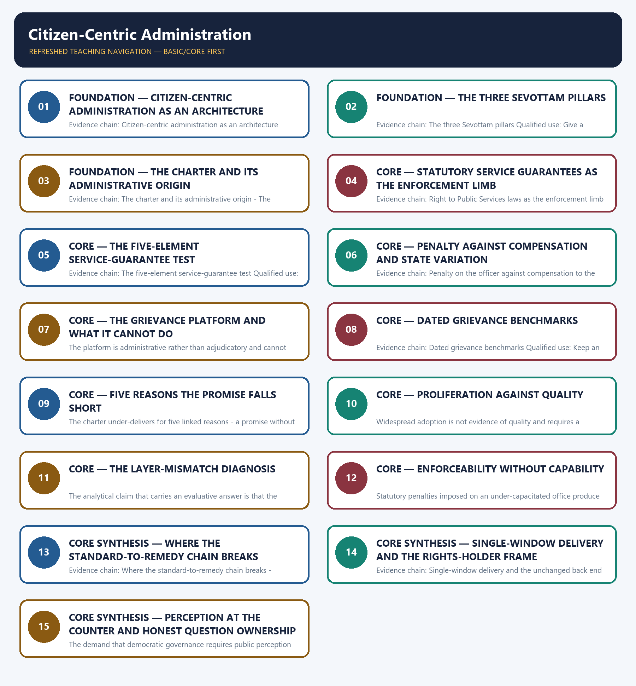

# Citizen-Centric Administration — Learner-v2 Complete Learning Session

> **Authoring-only generation:** 2026-09-02. No PDF was rendered and no tracker or index was mutated.

### SOURCE, PROGRESSION AND CURRENT-LINKAGE AUDIT

- **Generation date:** 2026-09-02.
- **Repository-first evidence:** the Basic owner is taught first and preserved in full; the Advanced owner is retained only in the optional final teaching block.
- **OCR evidence:** Repository Markdown was primary. The OCR-searchable official General Studies question papers held under books\mains and books\more_previous_papers were used only to confirm the printed wording of routed Mains demands. No official answer key, marking scheme, page precision or unsupported quotation was imported from them.
- **Qdrant:** not used; repository Markdown and available OCR context were sufficient.
- **PYQ integrity:** Two direct General Studies Paper-II Mains demands are routed to this topic across the audited ledgers and both routed stems were confirmed word for word in the locally held OCR-searchable official question papers. The audited 2024-2025 ledger routes the 2024 demand on the doctrine of democratic governance and the public perception of the integrity and commitment of civil servants to this Basic owner. The audited 2018-2023 ledger routes the 2018 demand identifying the limitations of the Citizens' Charter and suggesting measures for its greater effectiveness to the Advanced owner, and the Basic owner records that core routing supersedes the older Advanced pointer, so it is answered from the core file. One ownership conflict is recorded openly rather than resolved by assertion: the 2024 General Studies Paper-II demand on the Citizens' Charter as a landmark initiative that is yet to reach its full potential is discussed at length in the text of this owner, but the audited 2024-2025 ledger routes that demand to the transparency, accountability, grievance-redress and social-audit owner, so it is solved there and treated here only as the same demand family as the 2018 charter demand. The remaining solved cards below are the adjacent routed demands for which this owner supplies the institutional service-standard and grievance material, and each card states its own ledger routing rather than claiming verbatim ownership. No official answer key or marking scheme is held locally for any routed demand, so every model solution below is an authored answer route rather than an official key, and no Preliminary demand is routed to this owner.
- **Live-link boundary:** No new live official item was verified for this topic on 2026-09-02. A live check was attempted on that date and the official Press Information Bureau release page returned an access error, so no primary official page could be read and no secondary summary has been treated as an official source or imported. The only dated official elements used are those already carried by the repository owners with their status checks, namely the Sevottam service-delivery excellence model of the Department of Administrative Reforms and Public Grievances, the Indian Citizens' Charter initiative from 1997 on the United Kingdom model, the Madhya Pradesh Right to Public Services Act of 2010 as the pioneering State statute, the Centralised Public Grievance Redress and Monitoring System, and the 21-day grievance and 30-day appeal benchmarks of the Comprehensive Guidelines for Handling Public Grievances of August 2024 as re-verified on 13 August 2026. No count of States with service-guarantee statutes, no State's notified-service list, penalty amount or compensation figure, no grievance disposal rate, pendency or average disposal-day figure, no count of departments holding charters and no satisfaction or survey score is asserted, and no claim is made that the grievance platform can order a service to be granted. Charter design ethics and work culture are cross-linked to the Ethics owner, the digital service interface to the e-governance owner, the broader accountability ecosystem including information access and social audit to the transparency owner, and recruitment, training and capacity building to the civil-services owner rather than restated here.
- **Fact/inference discipline:** no current-affairs item, PYQ wording, figure or quotation is invented.

## BASIC LEARNING SESSION

### DEEP-REVIEW LEARNING CONTRACT

| Control | Binding rule for this package |
|---|---|
| Syllabus boundary | Complete Governance Basic/Core is answer-complete before optional Advanced depth. |
| Authority boundary | Constitution, statute, delegated rule, executive policy, scheme, recommendation, institution and implementation outcome remain distinct. |
| Implementation method | Objective → authority → finance → institution → frontline process → citizen access → output → outcome → feedback and remedy. |
| Federal method | Union, state, district, local body, regulator, parastatal and non-state roles are assigned without inventing jurisdiction. |
| Accountability method | Duty-holder → information → forum → questioning → consequence → correction → grievance/appeal. |
| Evidence method | Claim → named India-centric law/institution/scheme/case → causal analysis → source/date/status and implementation qualification. |
| Inclusion method | Gender, caste, tribe, disability, language, region, digital divide, privacy and offline safeguards are tested across access and outcome. |
| Practice contract | Every solved item has demand decoding, a detailed examiner-grade model, executable timed/compression plan, marks rationale and answer-specific improvement. |
| Approval | This immutable successor remains `approved: false` pending explicit approval. |

**Canonical Basic/Core owner:** `upsc-ai-kit\knowledge\Governance\basic\07_Citizen-Centric-Administration.md`  
**Substantive canonical provenance owner:** `upsc-ai-kit\knowledge\Governance\07_Citizen-Centric-Administration_Learner-V2-Complete-Topic-Package.md`  
**Optional Advanced owner:** `upsc-ai-kit\knowledge\Governance\advanced\07_Citizen-Centric-Administration.md`  
**Official syllabus mapping:** `upsc-ai-kit\knowledge\Governance\OFFICIAL-UPSC-SYLLABUS-MAPPING.md`

### EVIDENCE, PYQ AND CURRENT-STATUS CONTROL

- **Legal-status discipline:** a proposal, commission recommendation, policy announcement, Cabinet approval, enacted statute, notified rule, commenced provision and implemented programme are never treated as the same status.
- **Institutional discipline:** constitutional, statutory, executive, regulatory, autonomous, registered private and international bodies retain exact mandate, jurisdiction and accountability.
- **Causal discipline:** allocation, portal creation, training, registration, disposal count or ranking does not by itself prove access, remedy, capability, service quality or outcome.
- **Indicator discipline:** input, process, output, outcome and impact indicators are separated; denominator, baseline, disaggregation, attribution and gaming risks are stated.
- **Trade-off discipline:** speed, expertise, autonomy, transparency, privacy, participation, fiscal control and inclusion are balanced with safeguards and residual risk.
- **PYQ discipline:** exact wording is preserved only where verified; routed or reconstructed demands remain labelled and no inferred answer is promoted as official.
- **Current-status note, rechecked 2026-09-02:** volatile law, scheme, institution, tournament and programme claims retain official source, date, jurisdiction and operative/interim/final status.

**Generation-local live/current sources:**
- No volatile claim is necessary for the static governance core.




*Distinct embedded teaching-navigation image. The separate continuous Cārvāka-style flowchart package remains an independent at-a-glance artifact.*

### SESSION 1 — FOUNDATION — CITIZEN-CENTRIC ADMINISTRATION AS AN ARCHITECTURE

#### DEFINITION / WHAT THIS IS CALLED

**Plain-language definition:** Citizen-centric administration is an institutional architecture rather than a single document, combining a service-standard promise, a working grievance route, statutory service guarantees where they exist, the organisational capacity to deliver and an integrated access point, so a charter by itself is necessary and far from sufficient and an answer that treats the charter as the whole subject has already narrowed its own scope.

**Technical definition:** Evidence chain: Citizen-centric administration as an architecture Qualified use: Set the correct scope in the first sentence of any citizen-centric answer.

#### ANSWER-GRABBING OPENING — WRITE/ADAPT IN THE EXAM

> Citizen-centric administration is an institutional architecture rather than a single document, combining a service-standard promise, a working grievance route, statutory service guarantees where they exist, the organisational capacity to deliver and an integrated access point, so a charter by itself is necessary and far from sufficient and an answer that treats the charter as the whole subject has already narrowed its own scope.

#### MUST-WRITE KEYWORDS

- **FOUNDATION**
- **Citizen-centric administration as an architecture**
- **Evidence chain**
- **Qualified use**
- **Citizen-centric administration**
- **Citizen-centric**

**How to use them:** Frame the answer through FOUNDATION; define Citizen-centric administration as an architecture, connect Evidence chain with Qualified use to explain the mechanism, and use Citizen-centric administration for the decisive comparison or qualification.

#### VISUAL FIRST

```text
CITIZEN-CENTRIC ADMINISTRATION AS AN ARCHITECTURE
01. Citizen-centric administration as an architecture
BOUNDARY -> A charter document is one element of an architecture and not the subject itself.
```

*This topic-specific rail fixes the evidence sequence and its exam boundary before analysis.*

#### CORE EXPLANATION

Citizen-centric administration is an institutional architecture rather than a single document, combining a service-standard promise, a working grievance route, statutory service guarantees where they exist, the organisational capacity to deliver and an integrated access point, so a charter by itself is necessary and far from sufficient and an answer that treats the charter as the whole subject has already narrowed its own scope.

#### NAMED EVIDENCE AND MECHANISM

- Citizen-centric administration is an institutional architecture rather than a single document, combining a service-standard promise, a working grievance route, statutory service guarantees where they exist, the organisational capacity to deliver and an integrated access point, so a charter by itself is necessary and far from sufficient and an answer that treats the charter as the whole subject has already narrowed its own scope.

#### EXAMINER CAUTION

- A charter document is one element of an architecture and not the subject itself.

#### EXAM LINK

- **Prelims:** Retain the exact statute, section, institution, official category, dated edition or scope rule attached to Citizen-centric administration as an architecture.
- **Mains:** Set the correct scope in the first sentence of any citizen-centric answer.

#### MINI RECAP

- **Evidence chain:** Citizen-centric administration as an architecture
- **Qualified use:** Set the correct scope in the first sentence of any citizen-centric answer.

#### CLOSING RECALL FLOW — FOUNDATION — CITIZEN-CENTRIC ADMINISTRATION AS AN ARCHITECTURE

```text
START / CONCEPT: FOUNDATION — Citizen-centric administration as an architecture
        |
        v
EXACT TERMS: FOUNDATION · Citizen-centric administration as an architecture · Evidence chain · Qualified use · Citizen-centric administration · Citizen-centric
        |
        v
MECHANISM / ARGUMENT: Evidence chain: Citizen-centric administration as an architecture Qualified use: Set the correct scope in the first sentence of any citizen-centric answer.
        |
        v
CONSEQUENCE / CONTRAST: A charter document is one element of an architecture and not the subject itself.
        |
        v
UPSC TRAP / ANSWER-USE: Do not miss this limiting distinction: citizen-centric administration as an architecture Qualified use.
        |
        v
ANSWER-GRABBING FORMULATION: Citizen-centric administration is an institutional architecture rather than a single document, combining a service-standard promise, a working grievance route, statutory service guarantees where they exist, the organisational capacity to deliver and an integrated access point, so a charter by itself is necessary and far from sufficient and an answer that treats the charter as the whole subject has already narrowed its own scope.
```
### SESSION 2 — FOUNDATION — THE THREE SEVOTTAM PILLARS

#### DEFINITION / WHAT THIS IS CALLED

**Plain-language definition:** Sevottam is the service-delivery excellence model of the Department of Administrative Reforms and Public Grievances and rests on three interdependent pillars - the Citizens' Charter stating what service is provided, by when and at what standard; the public grievance redress mechanism that operates when the promise is not met; and service delivery capability meaning the staff, process and technology needed to meet the promise - and it is an assessment and improvement model rather than a statute, so its adoption is departmental.

**Technical definition:** Evidence chain: The three Sevottam pillars Qualified use: Give a structure to a service-delivery answer instead of listing complaints.

#### ANSWER-GRABBING OPENING — WRITE/ADAPT IN THE EXAM

> Sevottam is the service-delivery excellence model of the Department of Administrative Reforms and Public Grievances and rests on three interdependent pillars - the Citizens' Charter stating what service is provided, by when and at what standard; the public grievance redress mechanism that operates when the promise is not met; and service delivery capability meaning the staff, process and technology needed to meet the promise - and it is an assessment and improvement model rather than a statute, so its adoption is departmental.

#### MUST-WRITE KEYWORDS

- **FOUNDATION**
- **The three Sevottam pillars**
- **Evidence chain**
- **Qualified use**
- **Sevottam**
- **Department**

**How to use them:** Frame the answer through FOUNDATION; define The three Sevottam pillars, connect Evidence chain with Qualified use to explain the mechanism, and use Sevottam for the decisive comparison or qualification.

#### VISUAL FIRST

```text
THE THREE SEVOTTAM PILLARS
01. The three Sevottam pillars
BOUNDARY -> The model is an assessment and improvement framework rather than a statute, so adoption is departmental.
```

*This topic-specific rail fixes the evidence sequence and its exam boundary before analysis.*

#### CORE EXPLANATION

Sevottam is the service-delivery excellence model of the Department of Administrative Reforms and Public Grievances and rests on three interdependent pillars - the Citizens' Charter stating what service is provided, by when and at what standard; the public grievance redress mechanism that operates when the promise is not met; and service delivery capability meaning the staff, process and technology needed to meet the promise - and it is an assessment and improvement model rather than a statute, so its adoption is departmental.

#### NAMED EVIDENCE AND MECHANISM

- Sevottam is the service-delivery excellence model of the Department of Administrative Reforms and Public Grievances and rests on three interdependent pillars - the Citizens' Charter stating what service is provided, by when and at what standard; the public grievance redress mechanism that operates when the promise is not met; and service delivery capability meaning the staff, process and technology needed to meet the promise - and it is an assessment and improvement model rather than a statute, so its adoption is departmental.

#### EXAMINER CAUTION

- The model is an assessment and improvement framework rather than a statute, so adoption is departmental.

#### EXAM LINK

- **Prelims:** Retain the exact statute, section, institution, official category, dated edition or scope rule attached to The three Sevottam pillars.
- **Mains:** Give a structure to a service-delivery answer instead of listing complaints.

#### MINI RECAP

- **Evidence chain:** The three Sevottam pillars
- **Qualified use:** Give a structure to a service-delivery answer instead of listing complaints.

#### CLOSING RECALL FLOW — FOUNDATION — THE THREE SEVOTTAM PILLARS

```text
START / CONCEPT: FOUNDATION — The three Sevottam pillars
        |
        v
EXACT TERMS: FOUNDATION · The three Sevottam pillars · Evidence chain · Qualified use · Sevottam · Department
        |
        v
MECHANISM / ARGUMENT: Evidence chain: The three Sevottam pillars Qualified use: Give a structure to a service-delivery answer instead of listing complaints.
        |
        v
CONSEQUENCE / CONTRAST: The model is an assessment and improvement framework rather than a statute, so adoption is departmental.
        |
        v
UPSC TRAP / ANSWER-USE: Do not miss this limiting distinction: sevottam is the service-delivery excellence model of the Department of Administrative Reforms and Public...
        |
        v
ANSWER-GRABBING FORMULATION: Sevottam is the service-delivery excellence model of the Department of Administrative Reforms and Public Grievances and rests on three interdependent pillars - the Citizens' Charter stating what service is provided, by when and at what standard; the public grievance redress mechanism that operates when the promise is not met; and service delivery capability meaning the staff, process and technology needed to meet the promise - and it is an assessment and improvement model rather than a statute, so its adoption is departmental.
```
### SESSION 3 — FOUNDATION — THE CHARTER AND ITS ADMINISTRATIVE ORIGIN

#### DEFINITION / WHAT THIS IS CALLED

**Plain-language definition:** A Citizens' Charter states the services a public authority provides, the standards and timelines for delivery and the remedy available if the standard is not met, and India adopted the instrument from 1997 on the United Kingdom model as an administrative commitment without a parallel statutory backing, which is the design fact that explains most of what follows.

**Technical definition:** Evidence chain: The charter and its administrative origin - The design-stage limitation Qualified use: Open a limitations demand with the design fact that explains every later failure.

#### ANSWER-GRABBING OPENING — WRITE/ADAPT IN THE EXAM

> Evidence chain: The charter and its administrative origin - The design-stage limitation Qualified use: Open a limitations demand with the design fact that explains every later failure.

#### MUST-WRITE KEYWORDS

- **FOUNDATION**
- **The charter**
- **its administrative origin**
- **Evidence chain**
- **Qualified use**
- **Citizens' Charter**

**How to use them:** Frame the answer through FOUNDATION; define The charter, connect its administrative origin with Evidence chain to explain the mechanism, and use Qualified use for the decisive comparison or qualification.

#### VISUAL FIRST

```text
THE CHARTER AND ITS ADMINISTRATIVE ORIGIN
01. The charter and its administrative origin
    |
    v
02. The design-stage limitation
BOUNDARY -> The instrument was adopted administratively and without statutory backing, so the primary limitation is a design-stage one.
```

*This topic-specific rail fixes the evidence sequence and its exam boundary before analysis.*

#### CORE EXPLANATION

A Citizens' Charter states the services a public authority provides, the standards and timelines for delivery and the remedy available if the standard is not met, and India adopted the instrument from 1997 on the United Kingdom model as an administrative commitment without a parallel statutory backing, which is the design fact that explains most of what follows. Because the charter was introduced administratively and without enforceability, the commonest limitation is a design-stage limitation rather than an implementation failure, and naming that distinction at the outset separates a diagnostic answer from a list of complaints about awareness and indifference.

#### NAMED EVIDENCE AND MECHANISM

- A Citizens' Charter states the services a public authority provides, the standards and timelines for delivery and the remedy available if the standard is not met, and India adopted the instrument from 1997 on the United Kingdom model as an administrative commitment without a parallel statutory backing, which is the design fact that explains most of what follows.
- Because the charter was introduced administratively and without enforceability, the commonest limitation is a design-stage limitation rather than an implementation failure, and naming that distinction at the outset separates a diagnostic answer from a list of complaints about awareness and indifference.

#### EXAMINER CAUTION

- The instrument was adopted administratively and without statutory backing, so the primary limitation is a design-stage one.

#### EXAM LINK

- **Prelims:** Retain the exact statute, section, institution, official category, dated edition or scope rule attached to The charter and its administrative origin.
- **Mains:** Open a limitations demand with the design fact that explains every later failure.

#### MINI RECAP

- **Evidence chain:** The charter and its administrative origin -> The design-stage limitation
- **Qualified use:** Open a limitations demand with the design fact that explains every later failure.

#### CLOSING RECALL FLOW — FOUNDATION — THE CHARTER AND ITS ADMINISTRATIVE ORIGIN

```text
START / CONCEPT: FOUNDATION — The charter and its administrative origin
        |
        v
EXACT TERMS: FOUNDATION · The charter · its administrative origin · Evidence chain · Qualified use · Citizens' Charter
        |
        v
MECHANISM / ARGUMENT: Because the charter was introduced administratively and without enforceability, the commonest limitation is a design-stage limitation rather than an implementation failure, and naming that distinction at the outset separates a diagnostic answer from a list of complaints about awareness and indifference.
        |
        v
CONSEQUENCE / CONTRAST: A Citizens' Charter states the services a public authority provides, the standards and timelines for delivery and the remedy available if the standard is not met, and India adopted the instrument from 1997 on the United Kingdom model as an administrative commitment without a parallel statutory backing, which is the design fact that explains most of what follows.
        |
        v
UPSC TRAP / ANSWER-USE: Do not miss this limiting distinction: the instrument was adopted administratively and without statutory backing, so the primary limitation is...
        |
        v
ANSWER-GRABBING FORMULATION: Evidence chain: The charter and its administrative origin - The design-stage limitation Qualified use: Open a limitations demand with the design fact that explains every later failure.
```
### SESSION 4 — CORE — STATUTORY SERVICE GUARANTEES AS THE ENFORCEMENT LIMB

#### DEFINITION / WHAT THIS IS CALLED

**Plain-language definition:** Right to Public Services laws are State statutes, beginning with Madhya Pradesh in 2010 and followed by several other States, that give a citizen a legally enforceable right to specified notified services within a stipulated time with a penalty on the defaulting official, so they convert a voluntary administrative promise into a statutory entitlement and supply the enforcement limb the charter never had.

**Technical definition:** Evidence chain: Right to Public Services laws as the enforcement limb Qualified use: Name the reform that converted a promise into an entitlement, with its correct scope.

#### ANSWER-GRABBING OPENING — WRITE/ADAPT IN THE EXAM

> Right to Public Services laws are State statutes, beginning with Madhya Pradesh in 2010 and followed by several other States, that give a citizen a legally enforceable right to specified notified services within a stipulated time with a penalty on the defaulting official, so they convert a voluntary administrative promise into a statutory entitlement and supply the enforcement limb the charter never had.

#### MUST-WRITE KEYWORDS

- **Statutory service guarantees as the enforcement limb**
- **Evidence chain**
- **Qualified use**
- **Right to Public Services laws**
- **Right**
- **Public Services**

**How to use them:** Frame the answer through Statutory service guarantees as the enforcement limb; define Evidence chain, connect Qualified use with Right to Public Services laws to explain the mechanism, and use Right for the decisive comparison or qualification.

#### VISUAL FIRST

```text
STATUTORY SERVICE GUARANTEES AS THE ENFORCEMENT LIMB
01. Right to Public Services laws as the enforcement limb
BOUNDARY -> Coverage extends only to notified services and the design varies by State.
```

*This topic-specific rail fixes the evidence sequence and its exam boundary before analysis.*

#### CORE EXPLANATION

Right to Public Services laws are State statutes, beginning with Madhya Pradesh in 2010 and followed by several other States, that give a citizen a legally enforceable right to specified notified services within a stipulated time with a penalty on the defaulting official, so they convert a voluntary administrative promise into a statutory entitlement and supply the enforcement limb the charter never had.

#### NAMED EVIDENCE AND MECHANISM

- Right to Public Services laws are State statutes, beginning with Madhya Pradesh in 2010 and followed by several other States, that give a citizen a legally enforceable right to specified notified services within a stipulated time with a penalty on the defaulting official, so they convert a voluntary administrative promise into a statutory entitlement and supply the enforcement limb the charter never had.

#### EXAMINER CAUTION

- Coverage extends only to notified services and the design varies by State.

#### EXAM LINK

- **Prelims:** Retain the exact statute, section, institution, official category, dated edition or scope rule attached to Statutory service guarantees as the enforcement limb.
- **Mains:** Name the reform that converted a promise into an entitlement, with its correct scope.

#### MINI RECAP

- **Evidence chain:** Right to Public Services laws as the enforcement limb
- **Qualified use:** Name the reform that converted a promise into an entitlement, with its correct scope.

#### CLOSING RECALL FLOW — CORE — STATUTORY SERVICE GUARANTEES AS THE ENFORCEMENT LIMB

```text
START / CONCEPT: CORE — Statutory service guarantees as the enforcement limb
        |
        v
EXACT TERMS: Statutory service guarantees as the enforcement limb · Evidence chain · Qualified use · Right to Public Services laws · Right · Public Services
        |
        v
MECHANISM / ARGUMENT: Evidence chain: Right to Public Services laws as the enforcement limb Qualified use: Name the reform that converted a promise into an entitlement, with its correct scope.
        |
        v
CONSEQUENCE / CONTRAST: The resulting consequence is that right to Public Services laws as the enforcement limb Qualified use.
        |
        v
UPSC TRAP / ANSWER-USE: Do not miss this limiting distinction: right to Public Services laws as the enforcement limb Qualified use.
        |
        v
ANSWER-GRABBING FORMULATION: Right to Public Services laws are State statutes, beginning with Madhya Pradesh in 2010 and followed by several other States, that give a citizen a legally enforceable right to specified notified services within a stipulated time with a penalty on the defaulting official, so they convert a voluntary administrative promise into a statutory entitlement and supply the enforcement limb the charter never had.
```
### SESSION 5 — CORE — THE FIVE-ELEMENT SERVICE-GUARANTEE TEST

#### DEFINITION / WHAT THIS IS CALLED

**Plain-language definition:** Any service-guarantee claim is tested by five elements - whether the service is notified, since an unlisted service carries no statutory timeline; whether a designated officer is named, since without an addressee there is no accountability; whether the timeline is specified and runs from a defined trigger; whether a first and second appeal exist with their own timelines; and what follows default, whether penalty, compensation, deemed approval or nothing.

**Technical definition:** Evidence chain: The five-element service-guarantee test Qualified use: Apply a transferable test to any new portal, helpline or single-window scheme.

#### ANSWER-GRABBING OPENING — WRITE/ADAPT IN THE EXAM

> Evidence chain: The five-element service-guarantee test Qualified use: Apply a transferable test to any new portal, helpline or single-window scheme.

#### MUST-WRITE KEYWORDS

- **The five-element service-guarantee test**
- **Evidence chain**
- **Qualified use**
- **Any service-guarantee claim**
- **Any**
- **A service with no default consequence**

**How to use them:** Frame the answer through The five-element service-guarantee test; define Evidence chain, connect Qualified use with Any service-guarantee claim to explain the mechanism, and use Any for the decisive comparison or qualification.

#### VISUAL FIRST

```text
THE FIVE-ELEMENT SERVICE-GUARANTEE TEST
01. The five-element service-guarantee test
BOUNDARY -> A service with no default consequence is a charter whatever it is called.
```

*This topic-specific rail fixes the evidence sequence and its exam boundary before analysis.*

#### CORE EXPLANATION

Any service-guarantee claim is tested by five elements - whether the service is notified, since an unlisted service carries no statutory timeline; whether a designated officer is named, since without an addressee there is no accountability; whether the timeline is specified and runs from a defined trigger; whether a first and second appeal exist with their own timelines; and what follows default, whether penalty, compensation, deemed approval or nothing.

#### NAMED EVIDENCE AND MECHANISM

- Any service-guarantee claim is tested by five elements - whether the service is notified, since an unlisted service carries no statutory timeline; whether a designated officer is named, since without an addressee there is no accountability; whether the timeline is specified and runs from a defined trigger; whether a first and second appeal exist with their own timelines; and what follows default, whether penalty, compensation, deemed approval or nothing.

#### EXAMINER CAUTION

- A service with no default consequence is a charter whatever it is called.

#### EXAM LINK

- **Prelims:** Retain the exact statute, section, institution, official category, dated edition or scope rule attached to The five-element service-guarantee test.
- **Mains:** Apply a transferable test to any new portal, helpline or single-window scheme.

#### MINI RECAP

- **Evidence chain:** The five-element service-guarantee test
- **Qualified use:** Apply a transferable test to any new portal, helpline or single-window scheme.

#### CLOSING RECALL FLOW — CORE — THE FIVE-ELEMENT SERVICE-GUARANTEE TEST

```text
START / CONCEPT: CORE — The five-element service-guarantee test
        |
        v
EXACT TERMS: The five-element service-guarantee test · Evidence chain · Qualified use · Any service-guarantee claim · Any · A service with no default consequence
        |
        v
MECHANISM / ARGUMENT: Any service-guarantee claim is tested by five elements - whether the service is notified, since an unlisted service carries no statutory timeline; whether a designated officer is named, since without an addressee there is no accountability; whether the timeline is specified and runs from a defined trigger; whether a first and second appeal exist with their own timelines; and what follows default, whether penalty, compensation, deemed approval or nothing.
        |
        v
CONSEQUENCE / CONTRAST: A service with no default consequence is a charter whatever it is called.
        |
        v
UPSC TRAP / ANSWER-USE: Do not miss this limiting distinction: the five-element service-guarantee test Qualified use.
        |
        v
ANSWER-GRABBING FORMULATION: Evidence chain: The five-element service-guarantee test Qualified use: Apply a transferable test to any new portal, helpline or single-window scheme.
```
### SESSION 6 — CORE — PENALTY AGAINST COMPENSATION AND STATE VARIATION

#### DEFINITION / WHAT THIS IS CALLED

**Plain-language definition:** A penalty imposed on the defaulting officer and compensation paid to the aggrieved citizen are different remedies serving different purposes, and many State statutes provide the first without the second, so stating the difference is a precision mark; the design of notified services, appeal structure, penalty and compensation is State-specific and generalising one State's arrangement to all States is a common and avoidable error.

**Technical definition:** Evidence chain: Penalty on the officer against compensation to the citizen Qualified use: Earn a precision mark by separating two remedies most answers merge.

#### ANSWER-GRABBING OPENING — WRITE/ADAPT IN THE EXAM

> A penalty imposed on the defaulting officer and compensation paid to the aggrieved citizen are different remedies serving different purposes, and many State statutes provide the first without the second, so stating the difference is a precision mark; the design of notified services, appeal structure, penalty and compensation is State-specific and generalising one State's arrangement to all States is a common and avoidable error.

#### MUST-WRITE KEYWORDS

- **Penalty against compensation**
- **Evidence chain**
- **Qualified use**
- **States**
- **Many**
- **Penalty**

**How to use them:** Frame the answer through Penalty against compensation; define Evidence chain, connect Qualified use with States to explain the mechanism, and use Many for the decisive comparison or qualification.

#### VISUAL FIRST

```text
PENALTY AGAINST COMPENSATION AND STATE VARIATION
01. Penalty on the officer against compensation to the citizen
BOUNDARY -> Many statutes penalise the officer without compensating the citizen, and one State's design does not describe all.
```

*This topic-specific rail fixes the evidence sequence and its exam boundary before analysis.*

#### CORE EXPLANATION

A penalty imposed on the defaulting officer and compensation paid to the aggrieved citizen are different remedies serving different purposes, and many State statutes provide the first without the second, so stating the difference is a precision mark; the design of notified services, appeal structure, penalty and compensation is State-specific and generalising one State's arrangement to all States is a common and avoidable error.

#### NAMED EVIDENCE AND MECHANISM

- A penalty imposed on the defaulting officer and compensation paid to the aggrieved citizen are different remedies serving different purposes, and many State statutes provide the first without the second, so stating the difference is a precision mark; the design of notified services, appeal structure, penalty and compensation is State-specific and generalising one State's arrangement to all States is a common and avoidable error.

#### EXAMINER CAUTION

- Many statutes penalise the officer without compensating the citizen, and one State's design does not describe all.

#### EXAM LINK

- **Prelims:** Retain the exact statute, section, institution, official category, dated edition or scope rule attached to Penalty against compensation and State variation.
- **Mains:** Earn a precision mark by separating two remedies most answers merge.

#### MINI RECAP

- **Evidence chain:** Penalty on the officer against compensation to the citizen
- **Qualified use:** Earn a precision mark by separating two remedies most answers merge.

#### CLOSING RECALL FLOW — CORE — PENALTY AGAINST COMPENSATION AND STATE VARIATION

```text
START / CONCEPT: CORE — Penalty against compensation and State variation
        |
        v
EXACT TERMS: Penalty against compensation · Evidence chain · Qualified use · States · Many · Penalty
        |
        v
MECHANISM / ARGUMENT: Evidence chain: Penalty on the officer against compensation to the citizen Qualified use: Earn a precision mark by separating two remedies most answers merge.
        |
        v
CONSEQUENCE / CONTRAST: Many statutes penalise the officer without compensating the citizen, and one State's design does not describe all.
        |
        v
UPSC TRAP / ANSWER-USE: Do not miss this limiting distinction: penalty on the officer against compensation to the citizen Qualified use.
        |
        v
ANSWER-GRABBING FORMULATION: A penalty imposed on the defaulting officer and compensation paid to the aggrieved citizen are different remedies serving different purposes, and many State statutes provide the first without the second, so stating the difference is a precision mark; the design of notified services, appeal structure, penalty and compensation is State-specific and generalising one State's arrangement to all States is a common and avoidable error.
```
### SESSION 7 — CORE — THE GRIEVANCE PLATFORM AND WHAT IT CANNOT DO

#### DEFINITION / WHAT THIS IS CALLED

**Plain-language definition:** The Centralised Public Grievance Redress and Monitoring System is the administrative platform of the Department of Administrative Reforms and Public Grievances for lodging, routing, tracking, feedback and appeal of grievances concerning participating Union ministries, departments and integrated entities, and it is not a court, an ombudsman or a statutory right-to-service authority, so it can make a delay visible and cannot compel a service, decide a statutory entitlement or award compensation.

**Technical definition:** The platform is administrative rather than adjudicatory and cannot order that a service be granted.

#### ANSWER-GRABBING OPENING — WRITE/ADAPT IN THE EXAM

> The Centralised Public Grievance Redress and Monitoring System is the administrative platform of the Department of Administrative Reforms and Public Grievances for lodging, routing, tracking, feedback and appeal of grievances concerning participating Union ministries, departments and integrated entities, and it is not a court, an ombudsman or a statutory right-to-service authority, so it can make a delay visible and cannot compel a service, decide a statutory entitlement or award compensation.

#### MUST-WRITE KEYWORDS

- **The grievance platform**
- **what it cannot do**
- **Evidence chain**
- **Qualified use**
- **The Centralised Public Grievance Redress and Monitoring System**
- **The Centralised Public Grievance Redress**

**How to use them:** Frame the answer through The grievance platform; define what it cannot do, connect Evidence chain with Qualified use to explain the mechanism, and use The Centralised Public Grievance Redress and Monitoring System for the decisive comparison or qualification.

#### VISUAL FIRST

```text
THE GRIEVANCE PLATFORM AND WHAT IT CANNOT DO
01. The grievance platform and its exact limits
BOUNDARY -> The platform is administrative rather than adjudicatory and cannot order that a service be granted.
```

*This topic-specific rail fixes the evidence sequence and its exam boundary before analysis.*

#### CORE EXPLANATION

The Centralised Public Grievance Redress and Monitoring System is the administrative platform of the Department of Administrative Reforms and Public Grievances for lodging, routing, tracking, feedback and appeal of grievances concerning participating Union ministries, departments and integrated entities, and it is not a court, an ombudsman or a statutory right-to-service authority, so it can make a delay visible and cannot compel a service, decide a statutory entitlement or award compensation.

#### NAMED EVIDENCE AND MECHANISM

- The Centralised Public Grievance Redress and Monitoring System is the administrative platform of the Department of Administrative Reforms and Public Grievances for lodging, routing, tracking, feedback and appeal of grievances concerning participating Union ministries, departments and integrated entities, and it is not a court, an ombudsman or a statutory right-to-service authority, so it can make a delay visible and cannot compel a service, decide a statutory entitlement or award compensation.

#### EXAMINER CAUTION

- The platform is administrative rather than adjudicatory and cannot order that a service be granted.

#### EXAM LINK

- **Prelims:** Retain the exact statute, section, institution, official category, dated edition or scope rule attached to The grievance platform and what it cannot do.
- **Mains:** Route a service grievance correctly instead of attributing judicial power to a portal.

#### MINI RECAP

- **Evidence chain:** The grievance platform and its exact limits
- **Qualified use:** Route a service grievance correctly instead of attributing judicial power to a portal.

#### CLOSING RECALL FLOW — CORE — THE GRIEVANCE PLATFORM AND WHAT IT CANNOT DO

```text
START / CONCEPT: CORE — The grievance platform and what it cannot do
        |
        v
EXACT TERMS: The grievance platform · what it cannot do · Evidence chain · Qualified use · The Centralised Public Grievance Redress and Monitoring System · The Centralised Public Grievance Redress
        |
        v
MECHANISM / ARGUMENT: Prelims: Retain the exact statute, section, institution, official category, dated edition or scope rule attached to The grievance platform and what it cannot do.
        |
        v
CONSEQUENCE / CONTRAST: Evidence chain: The grievance platform and its exact limits Qualified use: Route a service grievance correctly instead of attributing judicial power to a portal.
        |
        v
UPSC TRAP / ANSWER-USE: The platform is administrative rather than adjudicatory and cannot order that a service be granted.
        |
        v
ANSWER-GRABBING FORMULATION: The Centralised Public Grievance Redress and Monitoring System is the administrative platform of the Department of Administrative Reforms and Public Grievances for lodging, routing, tracking, feedback and appeal of grievances concerning participating Union ministries, departments and integrated entities, and it is not a court, an ombudsman or a statutory right-to-service authority, so it can make a delay visible and cannot compel a service, decide a statutory entitlement or award compensation.
```
### SESSION 8 — CORE — DATED GRIEVANCE BENCHMARKS

#### DEFINITION / WHAT THIS IS CALLED

**Plain-language definition:** The Comprehensive Guidelines for Handling Public Grievances issued in August 2024 use a 21-day benchmark for grievance redress and 30 days for appeals, with nodal grievance officers and appellate officers in each Ministry or Department and reasons or interim communication where resolution needs longer, and these are administrative benchmarks that are revisable rather than judicial limitation periods, so they must be cited with the guideline date rather than as permanent rules.

**Technical definition:** Evidence chain: Dated grievance benchmarks Qualified use: Keep an administrative benchmark safe by attaching its issuing document and month.

#### ANSWER-GRABBING OPENING — WRITE/ADAPT IN THE EXAM

> The Comprehensive Guidelines for Handling Public Grievances issued in August 2024 use a 21-day benchmark for grievance redress and 30 days for appeals, with nodal grievance officers and appellate officers in each Ministry or Department and reasons or interim communication where resolution needs longer, and these are administrative benchmarks that are revisable rather than judicial limitation periods, so they must be cited with the guideline date rather than as permanent rules.

#### MUST-WRITE KEYWORDS

- **Dated grievance benchmarks**
- **Evidence chain**
- **Qualified use**
- **The Comprehensive Guidelines**
- **Handling Public Grievances**
- **Ministry**

**How to use them:** Frame the answer through Dated grievance benchmarks; define Evidence chain, connect Qualified use with The Comprehensive Guidelines to explain the mechanism, and use Handling Public Grievances for the decisive comparison or qualification.

#### VISUAL FIRST

```text
DATED GRIEVANCE BENCHMARKS
01. Dated grievance benchmarks
BOUNDARY -> The benchmarks are guideline-based and revisable and must be cited with the guideline date.
```

*This topic-specific rail fixes the evidence sequence and its exam boundary before analysis.*

#### CORE EXPLANATION

The Comprehensive Guidelines for Handling Public Grievances issued in August 2024 use a 21-day benchmark for grievance redress and 30 days for appeals, with nodal grievance officers and appellate officers in each Ministry or Department and reasons or interim communication where resolution needs longer, and these are administrative benchmarks that are revisable rather than judicial limitation periods, so they must be cited with the guideline date rather than as permanent rules.

#### NAMED EVIDENCE AND MECHANISM

- The Comprehensive Guidelines for Handling Public Grievances issued in August 2024 use a 21-day benchmark for grievance redress and 30 days for appeals, with nodal grievance officers and appellate officers in each Ministry or Department and reasons or interim communication where resolution needs longer, and these are administrative benchmarks that are revisable rather than judicial limitation periods, so they must be cited with the guideline date rather than as permanent rules.

#### EXAMINER CAUTION

- The benchmarks are guideline-based and revisable and must be cited with the guideline date.

#### EXAM LINK

- **Prelims:** Retain the exact statute, section, institution, official category, dated edition or scope rule attached to Dated grievance benchmarks.
- **Mains:** Keep an administrative benchmark safe by attaching its issuing document and month.

#### MINI RECAP

- **Evidence chain:** Dated grievance benchmarks
- **Qualified use:** Keep an administrative benchmark safe by attaching its issuing document and month.

#### CLOSING RECALL FLOW — CORE — DATED GRIEVANCE BENCHMARKS

```text
START / CONCEPT: CORE — Dated grievance benchmarks
        |
        v
EXACT TERMS: Dated grievance benchmarks · Evidence chain · Qualified use · The Comprehensive Guidelines · Handling Public Grievances · Ministry
        |
        v
MECHANISM / ARGUMENT: Evidence chain: Dated grievance benchmarks Qualified use: Keep an administrative benchmark safe by attaching its issuing document and month.
        |
        v
CONSEQUENCE / CONTRAST: The benchmarks are guideline-based and revisable and must be cited with the guideline date.
        |
        v
UPSC TRAP / ANSWER-USE: Do not miss this limiting distinction: keep an administrative benchmark safe by attaching its issuing document and month.
        |
        v
ANSWER-GRABBING FORMULATION: The Comprehensive Guidelines for Handling Public Grievances issued in August 2024 use a 21-day benchmark for grievance redress and 30 days for appeals, with nodal grievance officers and appellate officers in each Ministry or Department and reasons or interim communication where resolution needs longer, and these are administrative benchmarks that are revisable rather than judicial limitation periods, so they must be cited with the guideline date rather than as permanent rules.
```
### SESSION 9 — CORE — FIVE REASONS THE PROMISE FALLS SHORT

#### DEFINITION / WHAT THIS IS CALLED

**Plain-language definition:** The five reasons are linked rather than alternative, and awareness alone explains none of them.

**Technical definition:** The charter under-delivers for five linked reasons - a promise without enforceability outside notified services, weak grievance follow-through where complaints are logged and routed but not resolved, a capacity mismatch where the service delivery capability pillar is not strengthened alongside the promise, low citizen awareness because charters are rarely displayed or explained at the point of service, and static non-consultative drafting that fixes standards the department finds convenient rather than the ones the citizen values.

#### ANSWER-GRABBING OPENING — WRITE/ADAPT IN THE EXAM

> Evidence chain: Five reasons the promise falls short Qualified use: Structure a hindering-factors demand so that measures can be mapped one to one.

#### MUST-WRITE KEYWORDS

- **Five reasons the promise falls short**
- **Evidence chain**
- **Qualified use**
- **The five reasons**
- **Structure**
- **Five**

**How to use them:** Frame the answer through Five reasons the promise falls short; define Evidence chain, connect Qualified use with The five reasons to explain the mechanism, and use Structure for the decisive comparison or qualification.

#### VISUAL FIRST

```text
FIVE REASONS THE PROMISE FALLS SHORT
01. Five reasons the promise falls short
BOUNDARY -> The five reasons are linked rather than alternative, and awareness alone explains none of them.
```

*This topic-specific rail fixes the evidence sequence and its exam boundary before analysis.*

#### CORE EXPLANATION

The charter under-delivers for five linked reasons - a promise without enforceability outside notified services, weak grievance follow-through where complaints are logged and routed but not resolved, a capacity mismatch where the service delivery capability pillar is not strengthened alongside the promise, low citizen awareness because charters are rarely displayed or explained at the point of service, and static non-consultative drafting that fixes standards the department finds convenient rather than the ones the citizen values.

#### NAMED EVIDENCE AND MECHANISM

- The charter under-delivers for five linked reasons - a promise without enforceability outside notified services, weak grievance follow-through where complaints are logged and routed but not resolved, a capacity mismatch where the service delivery capability pillar is not strengthened alongside the promise, low citizen awareness because charters are rarely displayed or explained at the point of service, and static non-consultative drafting that fixes standards the department finds convenient rather than the ones the citizen values.

#### EXAMINER CAUTION

- The five reasons are linked rather than alternative, and awareness alone explains none of them.

#### EXAM LINK

- **Prelims:** Retain the exact statute, section, institution, official category, dated edition or scope rule attached to Five reasons the promise falls short.
- **Mains:** Structure a hindering-factors demand so that measures can be mapped one to one.

#### MINI RECAP

- **Evidence chain:** Five reasons the promise falls short
- **Qualified use:** Structure a hindering-factors demand so that measures can be mapped one to one.

#### CLOSING RECALL FLOW — CORE — FIVE REASONS THE PROMISE FALLS SHORT

```text
START / CONCEPT: CORE — Five reasons the promise falls short
        |
        v
EXACT TERMS: Five reasons the promise falls short · Evidence chain · Qualified use · The five reasons · Structure · Five
        |
        v
MECHANISM / ARGUMENT: The charter under-delivers for five linked reasons - a promise without enforceability outside notified services, weak grievance follow-through where complaints are logged and routed but not resolved, a capacity mismatch where the service delivery capability pillar is not strengthened alongside the promise, low citizen awareness because charters are rarely displayed or explained at the point of service, and static non-consultative drafting that fixes standards the department finds convenient rather than the ones the citizen values.
        |
        v
CONSEQUENCE / CONTRAST: The five reasons are linked rather than alternative, and awareness alone explains none of them.
        |
        v
UPSC TRAP / ANSWER-USE: Do not miss this limiting distinction: structure a hindering-factors demand so that measures can be mapped one to one.
        |
        v
ANSWER-GRABBING FORMULATION: Evidence chain: Five reasons the promise falls short Qualified use: Structure a hindering-factors demand so that measures can be mapped one to one.
```
### SESSION 10 — CORE — PROLIFERATION AGAINST QUALITY

#### DEFINITION / WHAT THIS IS CALLED

**Plain-language definition:** India's charter problem is no longer adoption but quality, because widespread proliferation coexists with unmeasurable standards, standards expressed as administrative acknowledgements rather than resolved outcomes, no named responsible officer and no revision cycle, and proliferation without quality control is a distinct failure mode from non-adoption that requires a different corrective.

**Technical definition:** Widespread adoption is not evidence of quality and requires a different corrective.

#### ANSWER-GRABBING OPENING — WRITE/ADAPT IN THE EXAM

> India's charter problem is no longer adoption but quality, because widespread proliferation coexists with unmeasurable standards, standards expressed as administrative acknowledgements rather than resolved outcomes, no named responsible officer and no revision cycle, and proliferation without quality control is a distinct failure mode from non-adoption that requires a different corrective.

#### MUST-WRITE KEYWORDS

- **Proliferation against quality**
- **Evidence chain**
- **Qualified use**
- **India's charter problem**
- **India's**
- **Widespread adoption**

**How to use them:** Frame the answer through Proliferation against quality; define Evidence chain, connect Qualified use with India's charter problem to explain the mechanism, and use India's for the decisive comparison or qualification.

#### VISUAL FIRST

```text
PROLIFERATION AGAINST QUALITY
01. Proliferation against quality
BOUNDARY -> Widespread adoption is not evidence of quality and requires a different corrective.
```

*This topic-specific rail fixes the evidence sequence and its exam boundary before analysis.*

#### CORE EXPLANATION

India's charter problem is no longer adoption but quality, because widespread proliferation coexists with unmeasurable standards, standards expressed as administrative acknowledgements rather than resolved outcomes, no named responsible officer and no revision cycle, and proliferation without quality control is a distinct failure mode from non-adoption that requires a different corrective.

#### NAMED EVIDENCE AND MECHANISM

- India's charter problem is no longer adoption but quality, because widespread proliferation coexists with unmeasurable standards, standards expressed as administrative acknowledgements rather than resolved outcomes, no named responsible officer and no revision cycle, and proliferation without quality control is a distinct failure mode from non-adoption that requires a different corrective.

#### EXAMINER CAUTION

- Widespread adoption is not evidence of quality and requires a different corrective.

#### EXAM LINK

- **Prelims:** Retain the exact statute, section, institution, official category, dated edition or scope rule attached to Proliferation against quality.
- **Mains:** Distinguish two failure modes that a suggest-measures demand treats differently.

#### MINI RECAP

- **Evidence chain:** Proliferation against quality
- **Qualified use:** Distinguish two failure modes that a suggest-measures demand treats differently.

#### CLOSING RECALL FLOW — CORE — PROLIFERATION AGAINST QUALITY

```text
START / CONCEPT: CORE — Proliferation against quality
        |
        v
EXACT TERMS: Proliferation against quality · Evidence chain · Qualified use · India's charter problem · India's · Widespread adoption
        |
        v
MECHANISM / ARGUMENT: Evidence chain: Proliferation against quality Qualified use: Distinguish two failure modes that a suggest-measures demand treats differently.
        |
        v
CONSEQUENCE / CONTRAST: Widespread adoption is not evidence of quality and requires a different corrective.
        |
        v
UPSC TRAP / ANSWER-USE: Mains: Distinguish two failure modes that a suggest-measures demand treats differently.
        |
        v
ANSWER-GRABBING FORMULATION: India's charter problem is no longer adoption but quality, because widespread proliferation coexists with unmeasurable standards, standards expressed as administrative acknowledgements rather than resolved outcomes, no named responsible officer and no revision cycle, and proliferation without quality control is a distinct failure mode from non-adoption that requires a different corrective.
```
### SESSION 11 — CORE — THE LAYER-MISMATCH DIAGNOSIS

#### DEFINITION / WHAT THIS IS CALLED

**Plain-language definition:** Evidence chain: The layer-mismatch diagnosis Qualified use: Diagnose the bottleneck rather than describing the architecture in an evaluative answer.

**Technical definition:** The analytical claim that carries an evaluative answer is that the persistent shortfall is a layer mismatch: the voluntary promise layer is relatively well built, the statutory enforcement layer is partial and geographically uneven because State laws cover only notified services, the escalation layer functions for visibility but does not adjudicate, and the capability layer is frequently the weakest link, so reform that rewrites charter language addresses the strongest layer and leaves the binding constraint untouched.

#### ANSWER-GRABBING OPENING — WRITE/ADAPT IN THE EXAM

> Evidence chain: The layer-mismatch diagnosis Qualified use: Diagnose the bottleneck rather than describing the architecture in an evaluative answer.

#### MUST-WRITE KEYWORDS

- **The layer-mismatch diagnosis**
- **Evidence chain**
- **Qualified use**
- **The analytical claim that carries an evaluative answer**
- **Qualified**
- **Diagnose**

**How to use them:** Frame the answer through The layer-mismatch diagnosis; define Evidence chain, connect Qualified use with The analytical claim that carries an evaluative answer to explain the mechanism, and use Qualified for the decisive comparison or qualification.

#### VISUAL FIRST

```text
THE LAYER-MISMATCH DIAGNOSIS
01. The layer-mismatch diagnosis
BOUNDARY -> Rewriting charter language addresses the strongest layer and leaves the binding constraint untouched.
```

*This topic-specific rail fixes the evidence sequence and its exam boundary before analysis.*

#### CORE EXPLANATION

The analytical claim that carries an evaluative answer is that the persistent shortfall is a layer mismatch: the voluntary promise layer is relatively well built, the statutory enforcement layer is partial and geographically uneven because State laws cover only notified services, the escalation layer functions for visibility but does not adjudicate, and the capability layer is frequently the weakest link, so reform that rewrites charter language addresses the strongest layer and leaves the binding constraint untouched.

#### NAMED EVIDENCE AND MECHANISM

- The analytical claim that carries an evaluative answer is that the persistent shortfall is a layer mismatch: the voluntary promise layer is relatively well built, the statutory enforcement layer is partial and geographically uneven because State laws cover only notified services, the escalation layer functions for visibility but does not adjudicate, and the capability layer is frequently the weakest link, so reform that rewrites charter language addresses the strongest layer and leaves the binding constraint untouched.

#### EXAMINER CAUTION

- Rewriting charter language addresses the strongest layer and leaves the binding constraint untouched.

#### EXAM LINK

- **Prelims:** Retain the exact statute, section, institution, official category, dated edition or scope rule attached to The layer-mismatch diagnosis.
- **Mains:** Diagnose the bottleneck rather than describing the architecture in an evaluative answer.

#### MINI RECAP

- **Evidence chain:** The layer-mismatch diagnosis
- **Qualified use:** Diagnose the bottleneck rather than describing the architecture in an evaluative answer.

#### CLOSING RECALL FLOW — CORE — THE LAYER-MISMATCH DIAGNOSIS

```text
START / CONCEPT: CORE — The layer-mismatch diagnosis
        |
        v
EXACT TERMS: The layer-mismatch diagnosis · Evidence chain · Qualified use · The analytical claim that carries an evaluative answer · Qualified · Diagnose
        |
        v
MECHANISM / ARGUMENT: The analytical claim that carries an evaluative answer is that the persistent shortfall is a layer mismatch: the voluntary promise layer is relatively well built, the statutory enforcement layer is partial and geographically uneven because State laws cover only notified services, the escalation layer functions for visibility but does not adjudicate, and the capability layer is frequently the weakest link, so reform that rewrites charter language addresses the strongest layer and leaves the binding constraint untouched.
        |
        v
CONSEQUENCE / CONTRAST: The resulting consequence is that diagnose the bottleneck rather than describing the architecture in an evaluative answer.
        |
        v
UPSC TRAP / ANSWER-USE: Do not miss this limiting distinction: diagnose the bottleneck rather than describing the architecture in an evaluative answer.
        |
        v
ANSWER-GRABBING FORMULATION: Evidence chain: The layer-mismatch diagnosis Qualified use: Diagnose the bottleneck rather than describing the architecture in an evaluative answer.
```
### SESSION 12 — CORE — ENFORCEABILITY WITHOUT CAPABILITY

#### DEFINITION / WHAT THIS IS CALLED

**Plain-language definition:** Evidence chain: Enforceability without capability Qualified use: Supply the counterpoint that makes a statutory-conversion recommendation credible.

**Technical definition:** Statutory penalties imposed on an under-capacitated office produce defensive behaviour rather than faster service, including refusal to accept applications, procedural rejection to stop the clock and box-ticking compliance with the letter of the timeline, so enforceability and capability must move together and any recommendation of statutory conversion must carry this counterpoint to survive scrutiny.

#### ANSWER-GRABBING OPENING — WRITE/ADAPT IN THE EXAM

> Evidence chain: Enforceability without capability Qualified use: Supply the counterpoint that makes a statutory-conversion recommendation credible.

#### MUST-WRITE KEYWORDS

- **Enforceability without capability**
- **Evidence chain**
- **Qualified use**
- **Statutory**
- **Enforceability**
- **Qualified**

**How to use them:** Frame the answer through Enforceability without capability; define Evidence chain, connect Qualified use with Statutory to explain the mechanism, and use Enforceability for the decisive comparison or qualification.

#### VISUAL FIRST

```text
ENFORCEABILITY WITHOUT CAPABILITY
01. Enforceability without capability
BOUNDARY -> A penalty over an under-staffed office produces intake control and procedural rejection rather than speed.
```

*This topic-specific rail fixes the evidence sequence and its exam boundary before analysis.*

#### CORE EXPLANATION

Statutory penalties imposed on an under-capacitated office produce defensive behaviour rather than faster service, including refusal to accept applications, procedural rejection to stop the clock and box-ticking compliance with the letter of the timeline, so enforceability and capability must move together and any recommendation of statutory conversion must carry this counterpoint to survive scrutiny.

#### NAMED EVIDENCE AND MECHANISM

- Statutory penalties imposed on an under-capacitated office produce defensive behaviour rather than faster service, including refusal to accept applications, procedural rejection to stop the clock and box-ticking compliance with the letter of the timeline, so enforceability and capability must move together and any recommendation of statutory conversion must carry this counterpoint to survive scrutiny.

#### EXAMINER CAUTION

- A penalty over an under-staffed office produces intake control and procedural rejection rather than speed.

#### EXAM LINK

- **Prelims:** Retain the exact statute, section, institution, official category, dated edition or scope rule attached to Enforceability without capability.
- **Mains:** Supply the counterpoint that makes a statutory-conversion recommendation credible.

#### MINI RECAP

- **Evidence chain:** Enforceability without capability
- **Qualified use:** Supply the counterpoint that makes a statutory-conversion recommendation credible.

#### CLOSING RECALL FLOW — CORE — ENFORCEABILITY WITHOUT CAPABILITY

```text
START / CONCEPT: CORE — Enforceability without capability
        |
        v
EXACT TERMS: Enforceability without capability · Evidence chain · Qualified use · Statutory · Enforceability · Qualified
        |
        v
MECHANISM / ARGUMENT: Statutory penalties imposed on an under-capacitated office produce defensive behaviour rather than faster service, including refusal to accept applications, procedural rejection to stop the clock and box-ticking compliance with the letter of the timeline, so enforceability and capability must move together and any recommendation of statutory conversion must carry this counterpoint to survive scrutiny.
        |
        v
CONSEQUENCE / CONTRAST: A penalty over an under-staffed office produces intake control and procedural rejection rather than speed.
        |
        v
UPSC TRAP / ANSWER-USE: Do not miss this limiting distinction: supply the counterpoint that makes a statutory-conversion recommendation credible.
        |
        v
ANSWER-GRABBING FORMULATION: Evidence chain: Enforceability without capability Qualified use: Supply the counterpoint that makes a statutory-conversion recommendation credible.
```
### SESSION 13 — CORE SYNTHESIS — WHERE THE STANDARD-TO-REMEDY CHAIN BREAKS

#### DEFINITION / WHAT THIS IS CALLED

**Plain-language definition:** The chain runs from standard set, through publicised, service attempted, breach occurred, grievance route taken and outcome reached, to consequence and back into standard-setting, and in India it typically breaks at the point where a breach should be auto-detectable against the stated timeline; because the timeline is not machine-checked against the transaction, enforcement depends on the citizen noticing and complaining, which is precisely the asymmetry the charter was meant to remove.

**Technical definition:** Evidence chain: Where the standard-to-remedy chain breaks - Grievance quality against disposal Qualified use: Locate the exact stage at which the architecture stops working and measure the right thing.

#### ANSWER-GRABBING OPENING — WRITE/ADAPT IN THE EXAM

> Evidence chain: Where the standard-to-remedy chain breaks - Grievance quality against disposal Qualified use: Locate the exact stage at which the architecture stops working and measure the right thing.

#### MUST-WRITE KEYWORDS

- **CORE SYNTHESIS**
- **Where the standard-to-remedy chain breaks**
- **Evidence chain**
- **Qualified use**
- **India**
- **Grievance**

**How to use them:** Frame the answer through CORE SYNTHESIS; define Where the standard-to-remedy chain breaks, connect Evidence chain with Qualified use to explain the mechanism, and use India for the decisive comparison or qualification.

#### VISUAL FIRST

```text
WHERE THE STANDARD-TO-REMEDY CHAIN BREAKS
01. Where the standard-to-remedy chain breaks
    |
    v
02. Grievance quality against disposal
BOUNDARY -> Most services never reach the stage where a breach is auto-detectable, and disposal is not resolution.
```

*This topic-specific rail fixes the evidence sequence and its exam boundary before analysis.*

#### CORE EXPLANATION

The chain runs from standard set, through publicised, service attempted, breach occurred, grievance route taken and outcome reached, to consequence and back into standard-setting, and in India it typically breaks at the point where a breach should be auto-detectable against the stated timeline; because the timeline is not machine-checked against the transaction, enforcement depends on the citizen noticing and complaining, which is precisely the asymmetry the charter was meant to remove. Grievance performance must be measured by substantive resolution, reasoned closure, recurrence, appeal outcome and citizen feedback rather than by disposal rate alone, because any measured target invites optimisation of the measure and a disposal statistic can be improved by closing tickets without resolving the underlying cause, which is why independent audit of grievance quality is a different corrective from raising a disposal target.

#### NAMED EVIDENCE AND MECHANISM

- The chain runs from standard set, through publicised, service attempted, breach occurred, grievance route taken and outcome reached, to consequence and back into standard-setting, and in India it typically breaks at the point where a breach should be auto-detectable against the stated timeline; because the timeline is not machine-checked against the transaction, enforcement depends on the citizen noticing and complaining, which is precisely the asymmetry the charter was meant to remove.
- Grievance performance must be measured by substantive resolution, reasoned closure, recurrence, appeal outcome and citizen feedback rather than by disposal rate alone, because any measured target invites optimisation of the measure and a disposal statistic can be improved by closing tickets without resolving the underlying cause, which is why independent audit of grievance quality is a different corrective from raising a disposal target.

#### EXAMINER CAUTION

- Most services never reach the stage where a breach is auto-detectable, and disposal is not resolution.

#### EXAM LINK

- **Prelims:** Retain the exact statute, section, institution, official category, dated edition or scope rule attached to Where the standard-to-remedy chain breaks.
- **Mains:** Locate the exact stage at which the architecture stops working and measure the right thing.

#### MINI RECAP

- **Evidence chain:** Where the standard-to-remedy chain breaks -> Grievance quality against disposal
- **Qualified use:** Locate the exact stage at which the architecture stops working and measure the right thing.

#### CLOSING RECALL FLOW — CORE SYNTHESIS — WHERE THE STANDARD-TO-REMEDY CHAIN BREAKS

```text
START / CONCEPT: CORE SYNTHESIS — Where the standard-to-remedy chain breaks
        |
        v
EXACT TERMS: CORE SYNTHESIS · Where the standard-to-remedy chain breaks · Evidence chain · Qualified use · India · Grievance
        |
        v
MECHANISM / ARGUMENT: The chain runs from standard set, through publicised, service attempted, breach occurred, grievance route taken and outcome reached, to consequence and back into standard-setting, and in India it typically breaks at the point where a breach should be auto-detectable against the stated timeline; because the timeline is not machine-checked against the transaction, enforcement depends on the citizen noticing and complaining, which is precisely the asymmetry the charter was meant to remove.
        |
        v
CONSEQUENCE / CONTRAST: Most services never reach the stage where a breach is auto-detectable, and disposal is not resolution.
        |
        v
UPSC TRAP / ANSWER-USE: Do not miss this limiting distinction: locate the exact stage at which the architecture stops working and measure the right...
        |
        v
ANSWER-GRABBING FORMULATION: Evidence chain: Where the standard-to-remedy chain breaks - Grievance quality against disposal Qualified use: Locate the exact stage at which the architecture stops working and measure the right thing.
```
### SESSION 14 — CORE SYNTHESIS — SINGLE-WINDOW DELIVERY AND THE RIGHTS-HOLDER FRAME

#### DEFINITION / WHAT THIS IS CALLED

**Plain-language definition:** Single-window delivery lets a citizen reach multiple related services or approvals through one integrated point of contact instead of navigating departments serially, and it genuinely reduces navigation cost, but a unified front counter can sit on an unchanged and fragmented back-end approval chain, which is the same structural bias that the e-governance owner identifies in digital service design, so a front counter is evidence of intent rather than proof of process simplification.

**Technical definition:** Evidence chain: Single-window delivery and the unchanged back end - The citizen as rights-holder rather than customer Qualified use: Test an integrated access point for real simplification and restate the citizen's standing.

#### ANSWER-GRABBING OPENING — WRITE/ADAPT IN THE EXAM

> Evidence chain: Single-window delivery and the unchanged back end - The citizen as rights-holder rather than customer Qualified use: Test an integrated access point for real simplification and restate the citizen's standing.

#### MUST-WRITE KEYWORDS

- **CORE SYNTHESIS**
- **Single-window delivery**
- **the rights-holder frame**
- **Evidence chain**
- **Qualified use**
- **Single-window**

**How to use them:** Frame the answer through CORE SYNTHESIS; define Single-window delivery, connect the rights-holder frame with Evidence chain to explain the mechanism, and use Qualified use for the decisive comparison or qualification.

#### VISUAL FIRST

```text
SINGLE-WINDOW DELIVERY AND THE RIGHTS-HOLDER FRAME
01. Single-window delivery and the unchanged back end
    |
    v
02. The citizen as rights-holder rather than customer
BOUNDARY -> A unified counter can sit on an unchanged fragmented back end, and satisfaction is not remedy.
```

*This topic-specific rail fixes the evidence sequence and its exam boundary before analysis.*

#### CORE EXPLANATION

Single-window delivery lets a citizen reach multiple related services or approvals through one integrated point of contact instead of navigating departments serially, and it genuinely reduces navigation cost, but a unified front counter can sit on an unchanged and fragmented back-end approval chain, which is the same structural bias that the e-governance owner identifies in digital service design, so a front counter is evidence of intent rather than proof of process simplification. Customer-satisfaction language imports useful service-design tools and can obscure that the citizen holds an entitlement rather than a preference, which is why remedy, reasoned decision and compensation matter more than a satisfaction score, and why standardisation must still distinguish routine from genuinely complex cases so that a uniform timeline does not become blind enforcement.

#### NAMED EVIDENCE AND MECHANISM

- Single-window delivery lets a citizen reach multiple related services or approvals through one integrated point of contact instead of navigating departments serially, and it genuinely reduces navigation cost, but a unified front counter can sit on an unchanged and fragmented back-end approval chain, which is the same structural bias that the e-governance owner identifies in digital service design, so a front counter is evidence of intent rather than proof of process simplification.
- Customer-satisfaction language imports useful service-design tools and can obscure that the citizen holds an entitlement rather than a preference, which is why remedy, reasoned decision and compensation matter more than a satisfaction score, and why standardisation must still distinguish routine from genuinely complex cases so that a uniform timeline does not become blind enforcement.

#### EXAMINER CAUTION

- A unified counter can sit on an unchanged fragmented back end, and satisfaction is not remedy.

#### EXAM LINK

- **Prelims:** Retain the exact statute, section, institution, official category, dated edition or scope rule attached to Single-window delivery and the rights-holder frame.
- **Mains:** Test an integrated access point for real simplification and restate the citizen's standing.

#### MINI RECAP

- **Evidence chain:** Single-window delivery and the unchanged back end -> The citizen as rights-holder rather than customer
- **Qualified use:** Test an integrated access point for real simplification and restate the citizen's standing.

#### CLOSING RECALL FLOW — CORE SYNTHESIS — SINGLE-WINDOW DELIVERY AND THE RIGHTS-HOLDER FRAME

```text
START / CONCEPT: CORE SYNTHESIS — Single-window delivery and the rights-holder frame
        |
        v
EXACT TERMS: CORE SYNTHESIS · Single-window delivery · the rights-holder frame · Evidence chain · Qualified use · Single-window
        |
        v
MECHANISM / ARGUMENT: Single-window delivery lets a citizen reach multiple related services or approvals through one integrated point of contact instead of navigating departments serially, and it genuinely reduces navigation cost, but a unified front counter can sit on an unchanged and fragmented back-end approval chain, which is the same structural bias that the e-governance owner identifies in digital service design, so a front counter is evidence of intent rather than proof of process simplification.
        |
        v
CONSEQUENCE / CONTRAST: A unified counter can sit on an unchanged fragmented back end, and satisfaction is not remedy.
        |
        v
UPSC TRAP / ANSWER-USE: Customer-satisfaction language imports useful service-design tools and can obscure that the citizen holds an entitlement rather than a preference, which is why remedy, reasoned decision and compensation matter more than a satisfaction score, and why standardisation must still distinguish routine from genuinely complex cases so that a uniform timeline does not become blind enforcement.
        |
        v
ANSWER-GRABBING FORMULATION: Evidence chain: Single-window delivery and the unchanged back end - The citizen as rights-holder rather than customer Qualified use: Test an integrated access point for real simplification and restate the citizen's standing.
```
### SESSION 15 — CORE SYNTHESIS — PERCEPTION AT THE COUNTER AND HONEST QUESTION OWNERSHIP

#### DEFINITION / WHAT THIS IS CALLED

**Plain-language definition:** Evidence chain: Public perception is produced at the counter - Stakeholder variation across the last mile - Verified question ownership and one recorded routing conflict Qualified use: Answer a legitimacy demand institutionally and record the ledger routing openly.

**Technical definition:** The demand that democratic governance requires public perception of the integrity and commitment of civil servants to be positive is a legitimacy question rather than an efficiency question, and the honest answer is that perception is produced at the counter rather than in policy, so published service standards, reasoned decisions, a named officer, working grievance redress and visible remedy do more for the standing of the civil service than any communication campaign; the recruitment, training and capacity-building half of the same problem is cross-linked to the civil-services owner.

#### ANSWER-GRABBING OPENING — WRITE/ADAPT IN THE EXAM

> Evidence chain: Public perception is produced at the counter - Stakeholder variation across the last mile - Verified question ownership and one recorded routing conflict Qualified use: Answer a legitimacy demand institutionally and record the ledger routing openly.

#### MUST-WRITE KEYWORDS

- **CORE SYNTHESIS**
- **Perception at the counter**
- **honest question ownership**
- **Evidence chain**
- **Qualified use**
- **Subject**

**How to use them:** Frame the answer through CORE SYNTHESIS; define Perception at the counter, connect honest question ownership with Evidence chain to explain the mechanism, and use Qualified use for the decisive comparison or qualification.

#### VISUAL FIRST

```text
PERCEPTION AT THE COUNTER AND HONEST QUESTION OWNERSHIP
01. Public perception is produced at the counter
    |
    v
02. Stakeholder variation across the last mile
    |
    v
03. Verified question ownership and one recorded routing conflict
BOUNDARY -> Legitimacy is produced in the transaction, and routed ownership is stated rather than assumed.
```

*This topic-specific rail fixes the evidence sequence and its exam boundary before analysis.*

#### CORE EXPLANATION

The demand that democratic governance requires public perception of the integrity and commitment of civil servants to be positive is a legitimacy question rather than an efficiency question, and the honest answer is that perception is produced at the counter rather than in policy, so published service standards, reasoned decisions, a named officer, working grievance redress and visible remedy do more for the standing of the civil service than any communication campaign; the recruitment, training and capacity-building half of the same problem is cross-linked to the civil-services owner. The architecture is experienced differently by each actor - the frontline official faces the penalty and manages risk by controlling intake unless capability moves with the obligation; the designated officer under a State statute is the addressee on whom the whole enforceability claim rests; the appellate officer is the difference between a complaint and a remedy; the citizen bears travel, documentation and wage loss and, in assisted access, an intermediary fee that appears in no disposal statistic; and the same citizen meets two different accountability regimes depending on whether the service belongs to the Union or the State. The audited 2024-2025 Mains ledger routes the 2024 General Studies Paper-II demand on the doctrine of democratic governance and the public perception of the integrity and commitment of civil servants to this Basic owner, while the audited 2018-2023 ledger routes the 2018 demand identifying the limitations of the Citizens' Charter and suggesting measures for greater effectiveness to the Advanced owner, and the Basic owner records that core routing supersedes the older Advanced pointer so both are answered from the core file; one ownership conflict is recorded openly rather than resolved by assertion, because the 2024 demand on the Citizens' Charter as a landmark initiative that is yet to reach its full potential is discussed at length in the text of this owner but is routed by the audited 2024-2025 ledger to the transparency, accountability and social-audit owner, so it is solved there and only cross-referenced here.

#### NAMED EVIDENCE AND MECHANISM

- The demand that democratic governance requires public perception of the integrity and commitment of civil servants to be positive is a legitimacy question rather than an efficiency question, and the honest answer is that perception is produced at the counter rather than in policy, so published service standards, reasoned decisions, a named officer, working grievance redress and visible remedy do more for the standing of the civil service than any communication campaign; the recruitment, training and capacity-building half of the same problem is cross-linked to the civil-services owner.
- The architecture is experienced differently by each actor - the frontline official faces the penalty and manages risk by controlling intake unless capability moves with the obligation; the designated officer under a State statute is the addressee on whom the whole enforceability claim rests; the appellate officer is the difference between a complaint and a remedy; the citizen bears travel, documentation and wage loss and, in assisted access, an intermediary fee that appears in no disposal statistic; and the same citizen meets two different accountability regimes depending on whether the service belongs to the Union or the State.
- The audited 2024-2025 Mains ledger routes the 2024 General Studies Paper-II demand on the doctrine of democratic governance and the public perception of the integrity and commitment of civil servants to this Basic owner, while the audited 2018-2023 ledger routes the 2018 demand identifying the limitations of the Citizens' Charter and suggesting measures for greater effectiveness to the Advanced owner, and the Basic owner records that core routing supersedes the older Advanced pointer so both are answered from the core file; one ownership conflict is recorded openly rather than resolved by assertion, because the 2024 demand on the Citizens' Charter as a landmark initiative that is yet to reach its full potential is discussed at length in the text of this owner but is routed by the audited 2024-2025 ledger to the transparency, accountability and social-audit owner, so it is solved there and only cross-referenced here.

#### EXAMINER CAUTION

- Legitimacy is produced in the transaction, and routed ownership is stated rather than assumed.

#### EXAM LINK

- **Prelims:** Retain the exact statute, section, institution, official category, dated edition or scope rule attached to Perception at the counter and honest question ownership.
- **Mains:** Answer a legitimacy demand institutionally and record the ledger routing openly.

#### MINI RECAP

- **Evidence chain:** Public perception is produced at the counter -> Stakeholder variation across the last mile -> Verified question ownership and one recorded routing conflict
- **Qualified use:** Answer a legitimacy demand institutionally and record the ledger routing openly.
#### COMPLETE BASIC OWNER EVIDENCE BANK

> **Subject:** Governance | **Tier:** Must-Do (foundation) | **GS Paper:** GS-II.
> **Core area:** Sevottam, state Right to Public Services (RTS) laws, CPGRAMS and
> single-window service delivery as the institutional architecture of citizen-centricity.
> **Grounded in:** DARPG Sevottam model; state Right to Public Services Acts (e.g., Madhya
> Pradesh, 2010 onward); CPGRAMS; audited 2024 GS-II PYQ; official UPSC GS-II syllabus
> ("important aspects of governance, transparency and accountability").
> ✅ = source-grounded | ⚠️ = analytical inference | 📰 = current anchor.
> *Companion: `advanced/07_Citizen-Centric-Administration.md`.*

#### 1. Visual foundation

```text
SEVOTTAM MODEL (DARPG) — three institutional pillars of citizen-centric administration
1. CITIZENS' CHARTER          -- states what service, by when, at what standard
2. PUBLIC GRIEVANCE REDRESS    -- mechanism when the charter promise is not met
3. SERVICE DELIVERY CAPABILITY -- staff, process and technology to actually deliver
        |                              |                          |
        -------------------------------------------------------------
                                       |
                                       v
                    CITIZEN-CENTRIC ADMINISTRATION IN PRACTICE
                                       |
                    -----------------------------------------
                    |                  |                     |
                    v                  v                     v
            State RTS laws        CPGRAMS              Single-window
         (statutory service    (Union grievance      delivery (integrated,
          timelines + penalty   redress portal)        one-stop service access)
          for default)
```

**Core proposition:** ✅ Citizen-centric administration is an *institutional architecture*
(Sevottam's three pillars, statutory RTS timelines, a functioning grievance portal and
integrated delivery points) — not a single charter document; the 2024 PYQ's own framing
("yet to reach its full potential") signals that the architecture regularly under-delivers
on its promise.

#### 2. Essential definitions

| Concept | Exam-ready meaning |
|---|---|
| ✅ **Sevottam** | DARPG's service-delivery excellence model, built on three components: a Citizens' Charter (service standards), a Public Grievance Redress Mechanism, and Service Delivery Capability (the organisational capacity to actually meet the charter's promise). |
| ✅ **Citizens' Charter** | A document stating the services a public authority provides, the standards/timelines for delivery, and the remedy available if the standard is not met — first adopted in India in 1997 following the UK's Citizen's Charter model. |
| ✅ **Right to Public Services (RTS) laws** | State-level statutes (beginning with Madhya Pradesh in 2010, followed by several other states) that give citizens a *legally enforceable* right to specified public services within a stipulated time limit, with a penalty on the defaulting official for delay — converting a charter's voluntary promise into an enforceable statutory right. |
| ✅ **CPGRAMS** | DARPG's administrative platform for lodging, routing, tracking, feedback and appeal of grievances concerning participating Union ministries/departments and integrated entities. It is not a court, ombudsman or statutory right-to-service authority. |
| ✅ **Single-window delivery** | An institutional design that lets a citizen access multiple related services/approvals through one integrated point of contact, rather than navigating separate departments serially. |
| ⚠️ **Charter design and delivery** | Governance owns both service-standard design (clear service, timeline, responsible officer, user consultation, review) and the delivery architecture (Sevottam, grievance, capability, RTS). Ethics adds work-culture and public-service-value analysis; it does not displace the Governance syllabus topic. |

#### 3. Why citizens' charters fall short of their potential (mechanism)

1. **Charter without enforceability:** most Citizens' Charters (outside RTS-covered states)
   remain voluntary administrative statements with no statutory penalty for default, unlike
   RTS laws.
2. **Weak grievance follow-through:** Sevottam's grievance-redress pillar depends on CPGRAMS
   or departmental mechanisms actually escalating and resolving complaints, not merely
   logging them.
3. **Capacity mismatch:** even a well-designed charter fails if the underlying Service
   Delivery Capability pillar (staffing, process redesign, digital tools) is not
   simultaneously strengthened.
4. **Low citizen awareness:** charters are often not actively publicised or explained to
   citizens, reducing their practical use as an accountability tool.
5. **Static, non-consultative drafting:** charters drafted by departments without citizen/
   user consultation often specify standards that do not reflect the citizen's actual
   priority service issues.

#### 4. Institutions and tools

- ✅ **DARPG** — the nodal department for Sevottam, Citizens' Charters and CPGRAMS.
- ✅ **State RTS Acts** — beginning with Madhya Pradesh's Right to Public Services Act (2010),
  several states enacted similar statutes giving specified services a legal timeline and a
  penalty for delayed delivery by the responsible official.
- ✅ **CPGRAMS** — DARPG's 2024 comprehensive guidelines use a **21-day** redress benchmark,
  with feedback/appeal and nodal grievance officers; reasons/interim communication are needed
  where resolution requires longer. This is an administrative benchmark, not a judicial
  limitation period.
- ⚠️ **Single-window/integrated service centres** — Common Service Centres and state-level
  single-window portals aggregating multiple department services at one access point.

#### 5. Indian applications and examples

- ✅ 2024 GS-II PYQ (Q16) directly asks to identify the factors hindering the Citizens'
  Charter's full potential and suggest measures to overcome them — the expected answer uses
  this file's mechanism list (unenforceability, weak grievance follow-through, capacity
  mismatch, low awareness, non-consultative drafting) and recommends RTS-style statutory
  backing, stronger CPGRAMS integration and periodic citizen-consultation revision.
- ⚠️ A state converting a voluntary municipal-service charter into an RTS-covered statutory
  service (with a defined timeline and a penalty clause) illustrates the enforceability
  correction directly.
- ⚠️ A citizen using CPGRAMS to escalate an unresolved pension grievance, with the portal
  tracking response time against a department, illustrates the grievance-redress pillar
  functioning as intended.

#### 6. Must-Know Facts for Prelims

- ✅ Sevottam has three components: Citizens' Charter, Public Grievance Redress Mechanism,
  and Service Delivery Capability.
- ✅ Madhya Pradesh enacted India's first Right to Public Services Act in 2010, giving
  specified services a statutory delivery timeline with penalties for default.
- ✅ CPGRAMS is the Centralised Public Grievance Redress and Monitoring System administered
  by DARPG.
- ✅ India's first Citizens' Charter initiative dates to 1997, inspired by the UK's Citizen's
  Charter programme.

#### 7. UPSC traps

- ❌ A Citizens' Charter is legally enforceable by default. -> Most charters are voluntary
  administrative commitments; only RTS-covered services carry a statutory, penalty-backed
  enforceable timeline.
- ❌ Governance needs only the portal/RTS machinery, while Ethics alone owns Charter design.
  -> GS-II Governance requires both quality of the Charter promise and the architecture that
  delivers/enforces it; Ethics supplies a complementary work-culture lens.
- ❌ CPGRAMS creates a legally enforceable right to every service. -> It is an administrative
  grievance system; statutory entitlement, designated officer, appeal and penalty come from
  the relevant state RTS law for a notified service.
- ❌ Citizens' Charters are static, one-time documents. -> Good practice (and the 2024 PYQ's
  implicit expectation) is periodic, consultative revision as service delivery conditions
  change.

#### 8. 📰 Current anchor

- 📰 **Status re-verified 13 August 2026:** Madhya Pradesh's 2010 Right to Public Services Act
  remains the pioneering reference. CPGRAMS's central benchmarks under DARPG's
  **Comprehensive Guidelines for Handling Public Grievances, August 2024** are **21 days**
  for grievance redress and **30 days** for appeals; no later revision was located. CPGRAMS
  remains **administrative and non-adjudicatory**, with nodal and appellate officers in each
  Ministry/Department. State RTS coverage, penalty design and CPGRAMS integration remain
  non-uniform; verify the relevant State Act and service notification.

#### 9. PYQ application

- ✅ 2024 Q16: "The Citizens' charter has been a landmark initiative in ensuring
  citizen-centric administration. But it is yet to reach its full potential. Identify the
  factors hindering the realisation of its promise and suggest measures to overcome them."
  — structure the answer as (a) charter's landmark significance (1997 origin, Sevottam
  framing); (b) the five hindering factors from Section 3; (c) measures: RTS-style statutory
  backing, CPGRAMS-integrated grievance escalation, capability-building investment, citizen
  awareness campaigns, and periodic consultative revision.

#### 10. Mains angles

- ⚠️ Always distinguish "charter exists" from "charter is enforceable" — the 2024 PYQ
  explicitly rewards this distinction.
- ⚠️ Measure grievance quality by substantive resolution, reasoned closure, recurrence,
  appeal outcome and citizen feedback—not disposal rate alone.
- ⚠️ Recommend RTS-style statutory conversion as the strongest single corrective for
  charter under-performance, while flagging that statutory conversion alone is insufficient
  without matching Service Delivery Capability investment.
- ⚠️ Cross-link to `08` for the broader accountability/grievance-redress ecosystem beyond
  Citizens' Charters specifically (social audit, MGNREGA-specific mechanisms).

> **Answer thesis:** A Citizens' Charter becomes citizen-centric administration only when its
> service promise is backed by statutory enforceability (as in RTS laws), a functioning
> grievance-redress channel (CPGRAMS), and genuine service-delivery capability — a charter
> document alone is necessary but far from sufficient.

#### 11. Probable questions

- ⚠️ **Prelims:** Which state enacted India's first Right to Public Services Act, and in
  which year?
- ⚠️ **Mains (15 marks):** The Citizens' Charter has been a landmark initiative in ensuring
  citizen-centric administration, but it is yet to reach its full potential. Identify the
  factors hindering the realisation of its promise and suggest measures to overcome them.
  *(2024 PYQ)*
- ⚠️ **Mains (10 marks):** Explain the three components of the Sevottam model and their
  interdependence.

#### 12. Study links

- ✅ Advanced companion: `advanced/07_Citizen-Centric-Administration.md`.
- ✅ `08_Transparency-Accountability-Grievance-Redress-and-Social-Audit.md` — the broader
  non-RTI accountability ecosystem beyond charters.
- ✅ `05_E-Governance-Models-and-User-Centricity.md` — the digital single-window/interactive
  service delivery layer.
- ✅ `Ethics/basic/17_Citizens-Charters-Work-Culture-and-Service-Delivery.md` — the ethical
  design and work-culture angle Ethics owns.

#### 13. Answer architecture (10/15/20-mark support)

> **Scope.** All marks-bearing content for the *citizens' charters and institutional
> measures* clause, including the demand the 2018–2023 ledger routed to `advanced/07`, is
> held **in this file**. `advanced/07` is optional enrichment only.

##### 13.0 Direct Mains demand owned by this Core file

⚠️ **Core routing supersedes the older Advanced pointer.**

**2018 GS-II Q18 — Citizens' Charter limitations and measures for effectiveness (15 marks,
"identify and suggest").** This is the same demand family as 2024 GS-II Q16, and the two
should be prepared as one. Executable route:
1. Open with the design fact that explains everything else: charters were introduced
   **administratively from 1997**, on the UK model, **without** a parallel statutory backing.
   The commonest limitation is therefore a **design-stage** limitation, not an
   implementation failure — a distinction that immediately separates this answer.
2. Identify limitations in the three Sevottam pillars, so the answer has a structure rather
   than a list:
   *Charter pillar:* non-consultative drafting; vague or unmeasurable standards; standards
   chosen for administrative convenience ("application acknowledged in 2 days") rather than
   for what the citizen values ("problem resolved"); no named responsible officer; no
   revision cycle; **proliferation without quality** — adoption is widespread, quality is not.
   *Grievance pillar:* redress that logs and routes but cannot compel; disposal measured
   instead of resolution; no compensation.
   *Capability pillar:* staffing, process and records not strengthened alongside the promise,
   so the charter documents a capacity the department does not have.
3. Add the two cross-cutting limitations: **low citizen awareness** (charters are rarely
   displayed or explained at the point of service) and **no enforceability** outside
   RTS-notified services.
4. Measures must map one-to-one onto the identified limitations — this is what "suggest"
   means here: statutory conversion on the RTS model for high-volume services; consultative
   drafting with user panels; outcome-expressed standards; a named designated officer per
   service; mandatory periodic revision; active display and vernacular publication;
   integration of the charter timeline into the grievance portal so a breach is
   auto-detectable; independent audit of grievance *quality* rather than disposal; and
   capability investment as a precondition rather than an afterthought.
5. Counterpoint that must appear: statutory conversion alone is insufficient — an RTS Act
   over an under-capacitated department converts a broken promise into a penalised officer
   without producing the service. Enforceability and capability must move together.
6. Verdict: the charter's promise fails less from indifference than from a missing
   **enforcement limb**; where that limb was supplied — the RTS model — the promise became
   an entitlement.

##### 13.1 Demand map

| Stem pattern | What is being tested | Opening move |
|---|---|---|
| "Yet to reach its full potential" | Diagnosis, not description | Name the design-stage cause before any implementation cause |
| "Identify … and suggest" | One-to-one mapping | Every measure must name the limitation it repairs |
| "Citizen-centric administration" | Architecture vs document | Sevottam's three pillars, then RTS/CPGRAMS/single-window |
| "Public perception of civil servants" (2024 Q8, routed here) | Legitimacy, not efficiency | Answer the democratic-legitimacy half; cross-link `09` for the service-design half |
| "Service guarantee / RTS" | Legal precision | Notified service, designated officer, timeline, appeal, penalty/compensation — five elements |
| Novel service (a new portal, helpline, single-window scheme) | Transferability | Run the five-element test, then ask what happens on default |

##### 13.2 Qualified theses

- **T1 (enforceability):** "A Citizens' Charter states a standard; only a Right to Public
  Services Act creates an entitlement. The charter's persistent under-performance is
  therefore a predictable consequence of its original administrative, non-statutory design."
- **T2 (three-pillar):** "Citizen-centricity fails whenever the three Sevottam pillars move
  apart — a promise without capability is a paper standard, capability without a grievance
  route is unaccountable competence, and grievance machinery without capability merely
  records failure."
- **T3 (quality):** "India's charter problem is no longer adoption; it is quality —
  proliferation of documents with unmeasurable standards, no designated officer and no
  revision cycle."
- **T4 (perception/legitimacy):** "Citizen-centric administration is not customer service
  with a state logo: the citizen is a rights-holder, not a consumer, which is why remedy and
  compensation matter more than satisfaction scores."

##### 13.3 Mark-scaled structure

**10 marks** — the charter/RTS distinction; Sevottam's three pillars named; two limitations
with mechanisms; two mapped measures; verdict.

**15 marks** — thesis; the five limitation families (§13.0(2)–(3)); 4–6 evidence units from
§13.4; the RTS five-element test; the enforceability-without-capability counterpoint;
graded verdict.

**20 marks** — thesis with criteria; the service-delivery chain from standard-setting to
remedy (§13.6); federal variation in RTS coverage and CPGRAMS integration; grievance
**quality** metrics against disposal metrics; the citizen-as-rights-holder vs
citizen-as-customer debate; assisted access and exclusion (see `05` §13.7); verdict with
reversal condition.

##### 13.4 Evidence bank — institutions, mechanisms and limits

| Anchor | What it is | Mechanism | Limitation / caution |
|---|---|---|---|
| ✅ **Sevottam** (DARPG) | Service-delivery excellence model: **Citizens' Charter · Public Grievance Redress Mechanism · Service Delivery Capability** | Ties the promise to a remedy and to the capacity to keep it | An assessment/improvement model, not a statute; adoption is departmental |
| ✅ **Citizens' Charter** | Statement of services, standards, timelines and remedy; India from **1997**, on the UK model | Publicises an expectation against which failure is visible | Administrative, **not** legally enforceable by itself |
| ✅ **State RTS Acts** — **Madhya Pradesh, 2010** first, several States following | Statutory right to **notified** services within a stipulated time, with penalty on the defaulting official | Converts a promise into an enforceable entitlement | Covers only notified services; designated officer, appeal, penalty and compensation provisions differ by State — ❌ State laws are **not** institutionally identical |
| ✅ **CPGRAMS** (DARPG) | Union platform to lodge, route, track, escalate and give feedback on grievances | Visibility, routing and appeal architecture across participating ministries | 📰 **21-day** redress benchmark with **30 days** for appeals under DARPG's **Comprehensive Guidelines, August 2024** (re-verified 13 August 2026). It is **administrative, not adjudicatory** — not a court, ombudsman or RTS authority |
| ✅ **Nodal grievance officers / appellate officers** | Departmental accountability points | Give the grievance an addressee | Effectiveness depends on the receiving department, not on the portal |
| ⚠️ **Single-window / Common Service Centres** | One access point for multiple services | Reduces citizen navigation cost | A unified front counter can sit on an unchanged fragmented back end — the same bias as `05` §13.6 |
| ⚠️ **Grievance quality vs disposal** | Two different measures | Resolution, reasoned closure, recurrence, appeal outcome, citizen feedback | Disposal rate alone can be improved by closing tickets without resolving causes |

##### 13.5 The five-element RTS test (use for any service-guarantee question)

1. **Is the service notified?** An unlisted service carries no statutory timeline.
2. **Is a designated officer named?** Without an addressee there is no accountability.
3. **Is the timeline specified and running from a defined trigger?**
4. **Is there a first and second appeal, with its own timeline?**
5. **What follows default — penalty, compensation, deemed approval, or nothing?**
   ⚠️ **Penalty on the officer and compensation to the citizen are different remedies**, and
   many State Acts provide the first without the second. Saying so is a precision mark.

##### 13.6 Causal chain — standard to remedy

```text
STANDARD SET        consultative? measurable? outcome-expressed? officer named?
      v             (failure here is a DESIGN failure, not implementation)
PUBLICISED          displayed at the service point? vernacular? actually known?
      v
SERVICE ATTEMPTED   documents, distance, digital step, intermediary cost
      v
BREACH OCCURS       is it auto-detectable against the stated timeline, or must the
      v             citizen notice and complain?
GRIEVANCE ROUTE     department -> portal -> appeal.  Correct forum? (see 08 §13)
      v
OUTCOME             resolved | closed without resolution | escalated | abandoned
      v
CONSEQUENCE         penalty? compensation? none?  -> feeds back into standard-setting
```

⚠️ **Where India's chain breaks:** most services never reach "breach auto-detectable" — the
timeline is not machine-checked against the transaction — so enforcement depends on the
citizen's own initiative, which is exactly the asymmetry the charter was meant to remove.

##### 13.7 Counter-argument and trade-off bank

- ⚠️ **Enforceability vs capability:** statutory penalties over an under-staffed office
  produce defensive behaviour — refusal to accept applications, procedural rejection to stop
  the clock — rather than faster service.
- ⚠️ **Standardisation vs responsiveness:** uniform timelines are enforceable and blind to
  genuinely complex cases; standards should distinguish routine from complex categories.
- ⚠️ **Disposal metrics vs genuine resolution:** any measured target invites optimisation of
  the measure (see `15` on Goodhart's problem).
- ⚠️ **Citizen-as-customer vs citizen-as-rights-holder:** satisfaction language imports
  useful service-design tools and can obscure that the citizen has an entitlement, not a
  preference.
- ⚠️ **Digital grievance channels vs access:** portal-based redress excludes precisely those
  most likely to be denied service (see `05` §13.7, `06` §13.0).
- ⚠️ **Ethics boundary:** Ethics owns work culture, public-service values and the ethical
  design of charters (`Ethics/basic/17`); Governance owns the **institutional architecture**
  and the **statutory service guarantee**. Do not answer a Governance stem with a work-culture
  essay.

##### 13.8 Stakeholder and last-mile variation

- **Frontline service official:** faces the penalty; will manage risk by controlling intake
  unless capability moves with the obligation.
- **Designated officer under an RTS Act:** the named addressee — the entire enforceability
  claim rests on this person existing.
- **Appellate officer:** the difference between a complaint and a remedy.
- **Citizen:** bears travel, documentation, wage loss and, in assisted access, an
  intermediary fee — costs invisible in every disposal statistic.
- **Union vs State service:** CPGRAMS integration and RTS coverage differ, so the same
  citizen experiences two different accountability regimes depending on which government
  owns the service.
- **Intermediary (CSC operator, agent):** for many users, the actual interface — with its
  own incentives.

##### 13.9 Verdict scaffolds

- **Charter stem:** "The Citizens' Charter was a landmark in *stating* what a citizen may
  expect and a non-event in *enforcing* it; the reform that mattered was not a better
  document but the RTS model's designated officer, timeline and penalty."
- **Suggest-measures stem:** "Each measure must repair a named defect: statutory conversion
  repairs unenforceability, consultative drafting repairs irrelevance, capability investment
  repairs the empty promise, and independent grievance audit repairs disposal-without-
  resolution."
- **Perception stem:** "Public perception of the administration is produced at the counter,
  not in policy — which is why service standards, reasoned decisions and working grievance
  redress do more for the legitimacy of the civil service than any communication campaign."
- **Novel-service stem:** run the five-element test; a service with no default consequence
  is a charter, whatever it is called.

##### 13.10 Factual and current-status controls

- ✅ Safe: Sevottam's three components; the 1997 Indian charter initiative on the UK model;
  Madhya Pradesh's 2010 RTS Act as the first; CPGRAMS as DARPG's Centralised Public
  Grievance Redress and Monitoring System; the **21-day** grievance and **30-day** appeal
  benchmarks from DARPG's Comprehensive Guidelines, **August 2024**; nodal grievance officers
  at Ministry/Department level.
- ❌ **Do not assert:** the number of States with RTS Acts; any State's list of notified
  services, penalty amount or compensation figure; CPGRAMS disposal rates, pendency or
  average disposal days; a count of departments with charters; any claim that CPGRAMS can
  order a service to be granted.
- ⚠️ **Date the benchmark.** The 21-day figure is guideline-based and revisable; cite it as
  "DARPG's August 2024 guidelines" rather than as a permanent rule.
- ⚠️ RTS design is **State-specific**. Generalising one State's appeal or compensation
  structure to all States is a common and avoidable error.

<!-- BEGIN GENERATED PYQ INTEGRATION: 2024-2025 -->

#### Recent PYQ Integration (2024-2025)

> **Status:** 2024-2025 question-level PYQ demand is integrated into this owner.
> **Provenance:** Audited local official-paper routing ledgers: `_PYQ-ROUTING-MAINS-GS1-GS2-ESSAY-2024-2025.md`.

- **Years represented:** 2024
- **Paper(s):** GS-II
- **Routed question demands:** 1

| Year | Paper | Q | PYQ demand (neutral rendering) | Directive / format | Source status | Owner requirement |
|---:|---|---|---|---|---|---|
| 2024 | GS-II | 8 | Doctrine of democratic governance and public perception of civil servants | Discuss · 10 marks · 150 words | Routed to owning topic | Prepare context, core dimensions, evidence/examples, counterpoint and a concise conclusion. |

##### What this owner must now support

- Doctrine of democratic governance and public perception of civil servants

> This block integrates the 2024-2025 examinable demand and paper metadata. It is kept separate from the 2018-2023 block and does not convert an unkeyed/answer-free objective question into a solved answer.
<!-- END GENERATED PYQ INTEGRATION: 2024-2025 -->

#### CLOSING RECALL FLOW — CORE SYNTHESIS — PERCEPTION AT THE COUNTER AND HONEST QUESTION OWNERSHIP

```text
START / CONCEPT: CORE SYNTHESIS — Perception at the counter and honest question ownership
        |
        v
EXACT TERMS: CORE SYNTHESIS · Perception at the counter · honest question ownership · Evidence chain · Qualified use · Subject
        |
        v
MECHANISM / ARGUMENT: The audited 2024-2025 Mains ledger routes the 2024 General Studies Paper-II demand on the doctrine of democratic governance and the public perception of the integrity and commitment of civil servants to this Basic owner, while the audited 2018-2023 ledger routes the 2018 demand identifying the limitations of the Citizens' Charter and suggesting measures for greater effectiveness to the Advanced owner, and the Basic owner records that core routing supersedes the older Advanced pointer so both are answered from the core file; one ownership conflict is recorded openly rather than resolved by assertion, because the 2024 demand on the Citizens' Charter as a landmark initiative that is yet to reach its full potential is discussed at length in the text of this owner but is routed by the audited 2024-2025 ledger to the transparency, accountability and social-audit owner, so it is solved there and only cross-referenced here.
        |
        v
CONSEQUENCE / CONTRAST: Charter stem: "The Citizens' Charter was a landmark in stating what a citizen may expect and a non-event in enforcing it; the reform that mattered was not a better document but the RTS model's designated officer, timeline and penalty." Suggest-measures stem: "Each measure must repair a named defect: statutory conversion repairs unenforceability, consultative drafting repairs irrelevance, capability investment repairs the empty promise, and independent grievance audit repairs disposal-without resolution." Perception stem: "Public perception of the administration is produced at the counter, not in policy — which is why service standards, reasoned decisions and working grievance redress do more for the legitimacy of the civil service than any communication campaign." Novel-service stem: run the five-element test; a service with no default consequence is a charter, whatever it is called.
        |
        v
UPSC TRAP / ANSWER-USE: The charter's persistent under-performance is therefore a predictable consequence of its original administrative, non-statutory design." T2 (three-pillar): "Citizen-centricity fails whenever the three Sevottam pillars move apart — a promise without capability is a paper standard, capability without a grievance route is unaccountable competence, and grievance machinery without capability merely records failure." T3 (quality): "India's charter problem is no longer adoption; it is quality — proliferation of documents with unmeasurable standards, no designated officer and no revision cycle." T4 (perception/legitimacy): "Citizen-centric administration is not customer service with a state logo: the citizen is a rights-holder, not a consumer, which is why remedy and compensation matter more than satisfaction scores.".
        |
        v
ANSWER-GRABBING FORMULATION: Evidence chain: Public perception is produced at the counter - Stakeholder variation across the last mile - Verified question ownership and one recorded routing conflict Qualified use: Answer a legitimacy demand institutionally and record the ledger routing openly.
```
### GOVERNANCE DEEP-REVIEW CORE CONTROL

- **Must remember:** Citizen-centric administration begins with the user's entitlement and journey, then redesigns standards, forms, channels, frontline discretion, communication, grievance, appeal and feedback so that the institution is accessible, predictable and responsive.
- **Close distinction:** Citizen charter is a publicly stated service commitment, not automatically a statutory guarantee; customer convenience is not the whole of citizenship, single-window is not single accountability, and grievance closure is not substantive remedy.
- **Authority / evidence / implementation limit:** Use Sevottam, time-bound service laws, Common Service Centres and district service centres with named duty-holders, escalation and inclusion safeguards; measure access, time, first-contact resolution, reasoned rejection, appeal and citizen outcome.

## BASIC MCQS / REMEDIATION

### Q1. Which statement correctly identifies Citizen-centric administration as an architecture?

A. Citizen-centric administration is an institutional architecture rather than a single document, combining a service-standard promise, a working grievance route, statutory service guarantees where they exist, the organisational capacity to deliver and an integrated access point, so a charter by itself is necessary and far from sufficient and an answer that treats the charter as the whole subject has already narrowed its own scope.
B. Because the charter was introduced administratively and without enforceability, the commonest limitation is a design-stage limitation rather than an implementation failure, and naming that distinction at the outset separates a diagnostic answer from a list of complaints about awareness and indifference.
C. A Citizens' Charter states the services a public authority provides, the standards and timelines for delivery and the remedy available if the standard is not met, and India adopted the instrument from 1997 on the United Kingdom model as an administrative commitment without a parallel statutory backing, which is the design fact that explains most of what follows.
D. Sevottam is the service-delivery excellence model of the Department of Administrative Reforms and Public Grievances and rests on three interdependent pillars - the Citizens' Charter stating what service is provided, by when and at what standard; the public grievance redress mechanism that operates when the promise is not met; and service delivery capability meaning the staff, process and technology needed to meet the promise - and it is an assessment and improvement model rather than a statute, so its adoption is departmental.

**Answer: A.**
**Explanation:** Citizen-centric administration is an institutional architecture rather than a single document, combining a service-standard promise, a working grievance route, statutory service guarantees where they exist, the organisational capacity to deliver and an integrated access point, so a charter by itself is necessary and far from sufficient and an answer that treats the charter as the whole subject has already narrowed its own scope. The remaining options belong to different chronology, actor or analytical categories.

### Q2. Which chronology card should be filed under Citizen-centric administration as an architecture?

A. Right to Public Services laws are State statutes, beginning with Madhya Pradesh in 2010 and followed by several other States, that give a citizen a legally enforceable right to specified notified services within a stipulated time with a penalty on the defaulting official, so they convert a voluntary administrative promise into a statutory entitlement and supply the enforcement limb the charter never had.
B. Citizen-centric administration is an institutional architecture rather than a single document, combining a service-standard promise, a working grievance route, statutory service guarantees where they exist, the organisational capacity to deliver and an integrated access point, so a charter by itself is necessary and far from sufficient and an answer that treats the charter as the whole subject has already narrowed its own scope.
C. A Citizens' Charter states the services a public authority provides, the standards and timelines for delivery and the remedy available if the standard is not met, and India adopted the instrument from 1997 on the United Kingdom model as an administrative commitment without a parallel statutory backing, which is the design fact that explains most of what follows.
D. Because the charter was introduced administratively and without enforceability, the commonest limitation is a design-stage limitation rather than an implementation failure, and naming that distinction at the outset separates a diagnostic answer from a list of complaints about awareness and indifference.

**Answer: B.**
**Explanation:** Citizen-centric administration is an institutional architecture rather than a single document, combining a service-standard promise, a working grievance route, statutory service guarantees where they exist, the organisational capacity to deliver and an integrated access point, so a charter by itself is necessary and far from sufficient and an answer that treats the charter as the whole subject has already narrowed its own scope. The remaining options belong to different chronology, actor or analytical categories.

### Q3. Which option preserves the source-bounded meaning of Citizen-centric administration as an architecture?

A. Because the charter was introduced administratively and without enforceability, the commonest limitation is a design-stage limitation rather than an implementation failure, and naming that distinction at the outset separates a diagnostic answer from a list of complaints about awareness and indifference.
B. Right to Public Services laws are State statutes, beginning with Madhya Pradesh in 2010 and followed by several other States, that give a citizen a legally enforceable right to specified notified services within a stipulated time with a penalty on the defaulting official, so they convert a voluntary administrative promise into a statutory entitlement and supply the enforcement limb the charter never had.
C. Citizen-centric administration is an institutional architecture rather than a single document, combining a service-standard promise, a working grievance route, statutory service guarantees where they exist, the organisational capacity to deliver and an integrated access point, so a charter by itself is necessary and far from sufficient and an answer that treats the charter as the whole subject has already narrowed its own scope.
D. Any service-guarantee claim is tested by five elements - whether the service is notified, since an unlisted service carries no statutory timeline; whether a designated officer is named, since without an addressee there is no accountability; whether the timeline is specified and runs from a defined trigger; whether a first and second appeal exist with their own timelines; and what follows default, whether penalty, compensation, deemed approval or nothing.

**Answer: C.**
**Explanation:** Citizen-centric administration is an institutional architecture rather than a single document, combining a service-standard promise, a working grievance route, statutory service guarantees where they exist, the organisational capacity to deliver and an integrated access point, so a charter by itself is necessary and far from sufficient and an answer that treats the charter as the whole subject has already narrowed its own scope. The remaining options belong to different chronology, actor or analytical categories.

### Q4. Which statement avoids a close-option trap about Citizen-centric administration as an architecture?

A. Any service-guarantee claim is tested by five elements - whether the service is notified, since an unlisted service carries no statutory timeline; whether a designated officer is named, since without an addressee there is no accountability; whether the timeline is specified and runs from a defined trigger; whether a first and second appeal exist with their own timelines; and what follows default, whether penalty, compensation, deemed approval or nothing.
B. Right to Public Services laws are State statutes, beginning with Madhya Pradesh in 2010 and followed by several other States, that give a citizen a legally enforceable right to specified notified services within a stipulated time with a penalty on the defaulting official, so they convert a voluntary administrative promise into a statutory entitlement and supply the enforcement limb the charter never had.
C. A penalty imposed on the defaulting officer and compensation paid to the aggrieved citizen are different remedies serving different purposes, and many State statutes provide the first without the second, so stating the difference is a precision mark; the design of notified services, appeal structure, penalty and compensation is State-specific and generalising one State's arrangement to all States is a common and avoidable error.
D. Citizen-centric administration is an institutional architecture rather than a single document, combining a service-standard promise, a working grievance route, statutory service guarantees where they exist, the organisational capacity to deliver and an integrated access point, so a charter by itself is necessary and far from sufficient and an answer that treats the charter as the whole subject has already narrowed its own scope.

**Answer: D.**
**Explanation:** Citizen-centric administration is an institutional architecture rather than a single document, combining a service-standard promise, a working grievance route, statutory service guarantees where they exist, the organisational capacity to deliver and an integrated access point, so a charter by itself is necessary and far from sufficient and an answer that treats the charter as the whole subject has already narrowed its own scope. The remaining options belong to different chronology, actor or analytical categories.

### Q5. Which statement correctly identifies The three Sevottam pillars?

A. Sevottam is the service-delivery excellence model of the Department of Administrative Reforms and Public Grievances and rests on three interdependent pillars - the Citizens' Charter stating what service is provided, by when and at what standard; the public grievance redress mechanism that operates when the promise is not met; and service delivery capability meaning the staff, process and technology needed to meet the promise - and it is an assessment and improvement model rather than a statute, so its adoption is departmental.
B. Because the charter was introduced administratively and without enforceability, the commonest limitation is a design-stage limitation rather than an implementation failure, and naming that distinction at the outset separates a diagnostic answer from a list of complaints about awareness and indifference.
C. A Citizens' Charter states the services a public authority provides, the standards and timelines for delivery and the remedy available if the standard is not met, and India adopted the instrument from 1997 on the United Kingdom model as an administrative commitment without a parallel statutory backing, which is the design fact that explains most of what follows.
D. Right to Public Services laws are State statutes, beginning with Madhya Pradesh in 2010 and followed by several other States, that give a citizen a legally enforceable right to specified notified services within a stipulated time with a penalty on the defaulting official, so they convert a voluntary administrative promise into a statutory entitlement and supply the enforcement limb the charter never had.

**Answer: A.**
**Explanation:** Sevottam is the service-delivery excellence model of the Department of Administrative Reforms and Public Grievances and rests on three interdependent pillars - the Citizens' Charter stating what service is provided, by when and at what standard; the public grievance redress mechanism that operates when the promise is not met; and service delivery capability meaning the staff, process and technology needed to meet the promise - and it is an assessment and improvement model rather than a statute, so its adoption is departmental. The remaining options belong to different chronology, actor or analytical categories.

### Q6. Which chronology card should be filed under The three Sevottam pillars?

A. Because the charter was introduced administratively and without enforceability, the commonest limitation is a design-stage limitation rather than an implementation failure, and naming that distinction at the outset separates a diagnostic answer from a list of complaints about awareness and indifference.
B. Sevottam is the service-delivery excellence model of the Department of Administrative Reforms and Public Grievances and rests on three interdependent pillars - the Citizens' Charter stating what service is provided, by when and at what standard; the public grievance redress mechanism that operates when the promise is not met; and service delivery capability meaning the staff, process and technology needed to meet the promise - and it is an assessment and improvement model rather than a statute, so its adoption is departmental.
C. Any service-guarantee claim is tested by five elements - whether the service is notified, since an unlisted service carries no statutory timeline; whether a designated officer is named, since without an addressee there is no accountability; whether the timeline is specified and runs from a defined trigger; whether a first and second appeal exist with their own timelines; and what follows default, whether penalty, compensation, deemed approval or nothing.
D. Right to Public Services laws are State statutes, beginning with Madhya Pradesh in 2010 and followed by several other States, that give a citizen a legally enforceable right to specified notified services within a stipulated time with a penalty on the defaulting official, so they convert a voluntary administrative promise into a statutory entitlement and supply the enforcement limb the charter never had.

**Answer: B.**
**Explanation:** Sevottam is the service-delivery excellence model of the Department of Administrative Reforms and Public Grievances and rests on three interdependent pillars - the Citizens' Charter stating what service is provided, by when and at what standard; the public grievance redress mechanism that operates when the promise is not met; and service delivery capability meaning the staff, process and technology needed to meet the promise - and it is an assessment and improvement model rather than a statute, so its adoption is departmental. The remaining options belong to different chronology, actor or analytical categories.

### Q7. Which option preserves the source-bounded meaning of The three Sevottam pillars?

A. Any service-guarantee claim is tested by five elements - whether the service is notified, since an unlisted service carries no statutory timeline; whether a designated officer is named, since without an addressee there is no accountability; whether the timeline is specified and runs from a defined trigger; whether a first and second appeal exist with their own timelines; and what follows default, whether penalty, compensation, deemed approval or nothing.
B. A penalty imposed on the defaulting officer and compensation paid to the aggrieved citizen are different remedies serving different purposes, and many State statutes provide the first without the second, so stating the difference is a precision mark; the design of notified services, appeal structure, penalty and compensation is State-specific and generalising one State's arrangement to all States is a common and avoidable error.
C. Sevottam is the service-delivery excellence model of the Department of Administrative Reforms and Public Grievances and rests on three interdependent pillars - the Citizens' Charter stating what service is provided, by when and at what standard; the public grievance redress mechanism that operates when the promise is not met; and service delivery capability meaning the staff, process and technology needed to meet the promise - and it is an assessment and improvement model rather than a statute, so its adoption is departmental.
D. Right to Public Services laws are State statutes, beginning with Madhya Pradesh in 2010 and followed by several other States, that give a citizen a legally enforceable right to specified notified services within a stipulated time with a penalty on the defaulting official, so they convert a voluntary administrative promise into a statutory entitlement and supply the enforcement limb the charter never had.

**Answer: C.**
**Explanation:** Sevottam is the service-delivery excellence model of the Department of Administrative Reforms and Public Grievances and rests on three interdependent pillars - the Citizens' Charter stating what service is provided, by when and at what standard; the public grievance redress mechanism that operates when the promise is not met; and service delivery capability meaning the staff, process and technology needed to meet the promise - and it is an assessment and improvement model rather than a statute, so its adoption is departmental. The remaining options belong to different chronology, actor or analytical categories.

### Q8. Which statement avoids a close-option trap about The three Sevottam pillars?

A. Any service-guarantee claim is tested by five elements - whether the service is notified, since an unlisted service carries no statutory timeline; whether a designated officer is named, since without an addressee there is no accountability; whether the timeline is specified and runs from a defined trigger; whether a first and second appeal exist with their own timelines; and what follows default, whether penalty, compensation, deemed approval or nothing.
B. A penalty imposed on the defaulting officer and compensation paid to the aggrieved citizen are different remedies serving different purposes, and many State statutes provide the first without the second, so stating the difference is a precision mark; the design of notified services, appeal structure, penalty and compensation is State-specific and generalising one State's arrangement to all States is a common and avoidable error.
C. The Centralised Public Grievance Redress and Monitoring System is the administrative platform of the Department of Administrative Reforms and Public Grievances for lodging, routing, tracking, feedback and appeal of grievances concerning participating Union ministries, departments and integrated entities, and it is not a court, an ombudsman or a statutory right-to-service authority, so it can make a delay visible and cannot compel a service, decide a statutory entitlement or award compensation.
D. Sevottam is the service-delivery excellence model of the Department of Administrative Reforms and Public Grievances and rests on three interdependent pillars - the Citizens' Charter stating what service is provided, by when and at what standard; the public grievance redress mechanism that operates when the promise is not met; and service delivery capability meaning the staff, process and technology needed to meet the promise - and it is an assessment and improvement model rather than a statute, so its adoption is departmental.

**Answer: D.**
**Explanation:** Sevottam is the service-delivery excellence model of the Department of Administrative Reforms and Public Grievances and rests on three interdependent pillars - the Citizens' Charter stating what service is provided, by when and at what standard; the public grievance redress mechanism that operates when the promise is not met; and service delivery capability meaning the staff, process and technology needed to meet the promise - and it is an assessment and improvement model rather than a statute, so its adoption is departmental. The remaining options belong to different chronology, actor or analytical categories.

### Q9. Which statement correctly identifies The charter and its administrative origin?

A. A Citizens' Charter states the services a public authority provides, the standards and timelines for delivery and the remedy available if the standard is not met, and India adopted the instrument from 1997 on the United Kingdom model as an administrative commitment without a parallel statutory backing, which is the design fact that explains most of what follows.
B. Because the charter was introduced administratively and without enforceability, the commonest limitation is a design-stage limitation rather than an implementation failure, and naming that distinction at the outset separates a diagnostic answer from a list of complaints about awareness and indifference.
C. Right to Public Services laws are State statutes, beginning with Madhya Pradesh in 2010 and followed by several other States, that give a citizen a legally enforceable right to specified notified services within a stipulated time with a penalty on the defaulting official, so they convert a voluntary administrative promise into a statutory entitlement and supply the enforcement limb the charter never had.
D. Any service-guarantee claim is tested by five elements - whether the service is notified, since an unlisted service carries no statutory timeline; whether a designated officer is named, since without an addressee there is no accountability; whether the timeline is specified and runs from a defined trigger; whether a first and second appeal exist with their own timelines; and what follows default, whether penalty, compensation, deemed approval or nothing.

**Answer: A.**
**Explanation:** A Citizens' Charter states the services a public authority provides, the standards and timelines for delivery and the remedy available if the standard is not met, and India adopted the instrument from 1997 on the United Kingdom model as an administrative commitment without a parallel statutory backing, which is the design fact that explains most of what follows. The remaining options belong to different chronology, actor or analytical categories.

### Q10. Which chronology card should be filed under The charter and its administrative origin?

A. A penalty imposed on the defaulting officer and compensation paid to the aggrieved citizen are different remedies serving different purposes, and many State statutes provide the first without the second, so stating the difference is a precision mark; the design of notified services, appeal structure, penalty and compensation is State-specific and generalising one State's arrangement to all States is a common and avoidable error.
B. A Citizens' Charter states the services a public authority provides, the standards and timelines for delivery and the remedy available if the standard is not met, and India adopted the instrument from 1997 on the United Kingdom model as an administrative commitment without a parallel statutory backing, which is the design fact that explains most of what follows.
C. Any service-guarantee claim is tested by five elements - whether the service is notified, since an unlisted service carries no statutory timeline; whether a designated officer is named, since without an addressee there is no accountability; whether the timeline is specified and runs from a defined trigger; whether a first and second appeal exist with their own timelines; and what follows default, whether penalty, compensation, deemed approval or nothing.
D. Right to Public Services laws are State statutes, beginning with Madhya Pradesh in 2010 and followed by several other States, that give a citizen a legally enforceable right to specified notified services within a stipulated time with a penalty on the defaulting official, so they convert a voluntary administrative promise into a statutory entitlement and supply the enforcement limb the charter never had.

**Answer: B.**
**Explanation:** A Citizens' Charter states the services a public authority provides, the standards and timelines for delivery and the remedy available if the standard is not met, and India adopted the instrument from 1997 on the United Kingdom model as an administrative commitment without a parallel statutory backing, which is the design fact that explains most of what follows. The remaining options belong to different chronology, actor or analytical categories.

### Q11. Which option preserves the source-bounded meaning of The charter and its administrative origin?

A. The Centralised Public Grievance Redress and Monitoring System is the administrative platform of the Department of Administrative Reforms and Public Grievances for lodging, routing, tracking, feedback and appeal of grievances concerning participating Union ministries, departments and integrated entities, and it is not a court, an ombudsman or a statutory right-to-service authority, so it can make a delay visible and cannot compel a service, decide a statutory entitlement or award compensation.
B. Any service-guarantee claim is tested by five elements - whether the service is notified, since an unlisted service carries no statutory timeline; whether a designated officer is named, since without an addressee there is no accountability; whether the timeline is specified and runs from a defined trigger; whether a first and second appeal exist with their own timelines; and what follows default, whether penalty, compensation, deemed approval or nothing.
C. A Citizens' Charter states the services a public authority provides, the standards and timelines for delivery and the remedy available if the standard is not met, and India adopted the instrument from 1997 on the United Kingdom model as an administrative commitment without a parallel statutory backing, which is the design fact that explains most of what follows.
D. A penalty imposed on the defaulting officer and compensation paid to the aggrieved citizen are different remedies serving different purposes, and many State statutes provide the first without the second, so stating the difference is a precision mark; the design of notified services, appeal structure, penalty and compensation is State-specific and generalising one State's arrangement to all States is a common and avoidable error.

**Answer: C.**
**Explanation:** A Citizens' Charter states the services a public authority provides, the standards and timelines for delivery and the remedy available if the standard is not met, and India adopted the instrument from 1997 on the United Kingdom model as an administrative commitment without a parallel statutory backing, which is the design fact that explains most of what follows. The remaining options belong to different chronology, actor or analytical categories.

### Q12. Which statement avoids a close-option trap about The charter and its administrative origin?

A. A penalty imposed on the defaulting officer and compensation paid to the aggrieved citizen are different remedies serving different purposes, and many State statutes provide the first without the second, so stating the difference is a precision mark; the design of notified services, appeal structure, penalty and compensation is State-specific and generalising one State's arrangement to all States is a common and avoidable error.
B. The Centralised Public Grievance Redress and Monitoring System is the administrative platform of the Department of Administrative Reforms and Public Grievances for lodging, routing, tracking, feedback and appeal of grievances concerning participating Union ministries, departments and integrated entities, and it is not a court, an ombudsman or a statutory right-to-service authority, so it can make a delay visible and cannot compel a service, decide a statutory entitlement or award compensation.
C. The Comprehensive Guidelines for Handling Public Grievances issued in August 2024 use a 21-day benchmark for grievance redress and 30 days for appeals, with nodal grievance officers and appellate officers in each Ministry or Department and reasons or interim communication where resolution needs longer, and these are administrative benchmarks that are revisable rather than judicial limitation periods, so they must be cited with the guideline date rather than as permanent rules.
D. A Citizens' Charter states the services a public authority provides, the standards and timelines for delivery and the remedy available if the standard is not met, and India adopted the instrument from 1997 on the United Kingdom model as an administrative commitment without a parallel statutory backing, which is the design fact that explains most of what follows.

**Answer: D.**
**Explanation:** A Citizens' Charter states the services a public authority provides, the standards and timelines for delivery and the remedy available if the standard is not met, and India adopted the instrument from 1997 on the United Kingdom model as an administrative commitment without a parallel statutory backing, which is the design fact that explains most of what follows. The remaining options belong to different chronology, actor or analytical categories.

### Q13. Which statement correctly identifies The design-stage limitation?

A. Because the charter was introduced administratively and without enforceability, the commonest limitation is a design-stage limitation rather than an implementation failure, and naming that distinction at the outset separates a diagnostic answer from a list of complaints about awareness and indifference.
B. Right to Public Services laws are State statutes, beginning with Madhya Pradesh in 2010 and followed by several other States, that give a citizen a legally enforceable right to specified notified services within a stipulated time with a penalty on the defaulting official, so they convert a voluntary administrative promise into a statutory entitlement and supply the enforcement limb the charter never had.
C. A penalty imposed on the defaulting officer and compensation paid to the aggrieved citizen are different remedies serving different purposes, and many State statutes provide the first without the second, so stating the difference is a precision mark; the design of notified services, appeal structure, penalty and compensation is State-specific and generalising one State's arrangement to all States is a common and avoidable error.
D. Any service-guarantee claim is tested by five elements - whether the service is notified, since an unlisted service carries no statutory timeline; whether a designated officer is named, since without an addressee there is no accountability; whether the timeline is specified and runs from a defined trigger; whether a first and second appeal exist with their own timelines; and what follows default, whether penalty, compensation, deemed approval or nothing.

**Answer: A.**
**Explanation:** Because the charter was introduced administratively and without enforceability, the commonest limitation is a design-stage limitation rather than an implementation failure, and naming that distinction at the outset separates a diagnostic answer from a list of complaints about awareness and indifference. The remaining options belong to different chronology, actor or analytical categories.

### Q14. Which chronology card should be filed under The design-stage limitation?

A. The Centralised Public Grievance Redress and Monitoring System is the administrative platform of the Department of Administrative Reforms and Public Grievances for lodging, routing, tracking, feedback and appeal of grievances concerning participating Union ministries, departments and integrated entities, and it is not a court, an ombudsman or a statutory right-to-service authority, so it can make a delay visible and cannot compel a service, decide a statutory entitlement or award compensation.
B. Because the charter was introduced administratively and without enforceability, the commonest limitation is a design-stage limitation rather than an implementation failure, and naming that distinction at the outset separates a diagnostic answer from a list of complaints about awareness and indifference.
C. Any service-guarantee claim is tested by five elements - whether the service is notified, since an unlisted service carries no statutory timeline; whether a designated officer is named, since without an addressee there is no accountability; whether the timeline is specified and runs from a defined trigger; whether a first and second appeal exist with their own timelines; and what follows default, whether penalty, compensation, deemed approval or nothing.
D. A penalty imposed on the defaulting officer and compensation paid to the aggrieved citizen are different remedies serving different purposes, and many State statutes provide the first without the second, so stating the difference is a precision mark; the design of notified services, appeal structure, penalty and compensation is State-specific and generalising one State's arrangement to all States is a common and avoidable error.

**Answer: B.**
**Explanation:** Because the charter was introduced administratively and without enforceability, the commonest limitation is a design-stage limitation rather than an implementation failure, and naming that distinction at the outset separates a diagnostic answer from a list of complaints about awareness and indifference. The remaining options belong to different chronology, actor or analytical categories.

### Q15. Which option preserves the source-bounded meaning of The design-stage limitation?

A. The Comprehensive Guidelines for Handling Public Grievances issued in August 2024 use a 21-day benchmark for grievance redress and 30 days for appeals, with nodal grievance officers and appellate officers in each Ministry or Department and reasons or interim communication where resolution needs longer, and these are administrative benchmarks that are revisable rather than judicial limitation periods, so they must be cited with the guideline date rather than as permanent rules.
B. The Centralised Public Grievance Redress and Monitoring System is the administrative platform of the Department of Administrative Reforms and Public Grievances for lodging, routing, tracking, feedback and appeal of grievances concerning participating Union ministries, departments and integrated entities, and it is not a court, an ombudsman or a statutory right-to-service authority, so it can make a delay visible and cannot compel a service, decide a statutory entitlement or award compensation.
C. Because the charter was introduced administratively and without enforceability, the commonest limitation is a design-stage limitation rather than an implementation failure, and naming that distinction at the outset separates a diagnostic answer from a list of complaints about awareness and indifference.
D. A penalty imposed on the defaulting officer and compensation paid to the aggrieved citizen are different remedies serving different purposes, and many State statutes provide the first without the second, so stating the difference is a precision mark; the design of notified services, appeal structure, penalty and compensation is State-specific and generalising one State's arrangement to all States is a common and avoidable error.

**Answer: C.**
**Explanation:** Because the charter was introduced administratively and without enforceability, the commonest limitation is a design-stage limitation rather than an implementation failure, and naming that distinction at the outset separates a diagnostic answer from a list of complaints about awareness and indifference. The remaining options belong to different chronology, actor or analytical categories.

### Q16. Which statement avoids a close-option trap about The design-stage limitation?

A. The charter under-delivers for five linked reasons - a promise without enforceability outside notified services, weak grievance follow-through where complaints are logged and routed but not resolved, a capacity mismatch where the service delivery capability pillar is not strengthened alongside the promise, low citizen awareness because charters are rarely displayed or explained at the point of service, and static non-consultative drafting that fixes standards the department finds convenient rather than the ones the citizen values.
B. The Centralised Public Grievance Redress and Monitoring System is the administrative platform of the Department of Administrative Reforms and Public Grievances for lodging, routing, tracking, feedback and appeal of grievances concerning participating Union ministries, departments and integrated entities, and it is not a court, an ombudsman or a statutory right-to-service authority, so it can make a delay visible and cannot compel a service, decide a statutory entitlement or award compensation.
C. The Comprehensive Guidelines for Handling Public Grievances issued in August 2024 use a 21-day benchmark for grievance redress and 30 days for appeals, with nodal grievance officers and appellate officers in each Ministry or Department and reasons or interim communication where resolution needs longer, and these are administrative benchmarks that are revisable rather than judicial limitation periods, so they must be cited with the guideline date rather than as permanent rules.
D. Because the charter was introduced administratively and without enforceability, the commonest limitation is a design-stage limitation rather than an implementation failure, and naming that distinction at the outset separates a diagnostic answer from a list of complaints about awareness and indifference.

**Answer: D.**
**Explanation:** Because the charter was introduced administratively and without enforceability, the commonest limitation is a design-stage limitation rather than an implementation failure, and naming that distinction at the outset separates a diagnostic answer from a list of complaints about awareness and indifference. The remaining options belong to different chronology, actor or analytical categories.

### Q17. Which statement correctly identifies Right to Public Services laws as the enforcement limb?

A. Right to Public Services laws are State statutes, beginning with Madhya Pradesh in 2010 and followed by several other States, that give a citizen a legally enforceable right to specified notified services within a stipulated time with a penalty on the defaulting official, so they convert a voluntary administrative promise into a statutory entitlement and supply the enforcement limb the charter never had.
B. A penalty imposed on the defaulting officer and compensation paid to the aggrieved citizen are different remedies serving different purposes, and many State statutes provide the first without the second, so stating the difference is a precision mark; the design of notified services, appeal structure, penalty and compensation is State-specific and generalising one State's arrangement to all States is a common and avoidable error.
C. The Centralised Public Grievance Redress and Monitoring System is the administrative platform of the Department of Administrative Reforms and Public Grievances for lodging, routing, tracking, feedback and appeal of grievances concerning participating Union ministries, departments and integrated entities, and it is not a court, an ombudsman or a statutory right-to-service authority, so it can make a delay visible and cannot compel a service, decide a statutory entitlement or award compensation.
D. Any service-guarantee claim is tested by five elements - whether the service is notified, since an unlisted service carries no statutory timeline; whether a designated officer is named, since without an addressee there is no accountability; whether the timeline is specified and runs from a defined trigger; whether a first and second appeal exist with their own timelines; and what follows default, whether penalty, compensation, deemed approval or nothing.

**Answer: A.**
**Explanation:** Right to Public Services laws are State statutes, beginning with Madhya Pradesh in 2010 and followed by several other States, that give a citizen a legally enforceable right to specified notified services within a stipulated time with a penalty on the defaulting official, so they convert a voluntary administrative promise into a statutory entitlement and supply the enforcement limb the charter never had. The remaining options belong to different chronology, actor or analytical categories.

### Q18. Which chronology card should be filed under Right to Public Services laws as the enforcement limb?

A. The Comprehensive Guidelines for Handling Public Grievances issued in August 2024 use a 21-day benchmark for grievance redress and 30 days for appeals, with nodal grievance officers and appellate officers in each Ministry or Department and reasons or interim communication where resolution needs longer, and these are administrative benchmarks that are revisable rather than judicial limitation periods, so they must be cited with the guideline date rather than as permanent rules.
B. Right to Public Services laws are State statutes, beginning with Madhya Pradesh in 2010 and followed by several other States, that give a citizen a legally enforceable right to specified notified services within a stipulated time with a penalty on the defaulting official, so they convert a voluntary administrative promise into a statutory entitlement and supply the enforcement limb the charter never had.
C. The Centralised Public Grievance Redress and Monitoring System is the administrative platform of the Department of Administrative Reforms and Public Grievances for lodging, routing, tracking, feedback and appeal of grievances concerning participating Union ministries, departments and integrated entities, and it is not a court, an ombudsman or a statutory right-to-service authority, so it can make a delay visible and cannot compel a service, decide a statutory entitlement or award compensation.
D. A penalty imposed on the defaulting officer and compensation paid to the aggrieved citizen are different remedies serving different purposes, and many State statutes provide the first without the second, so stating the difference is a precision mark; the design of notified services, appeal structure, penalty and compensation is State-specific and generalising one State's arrangement to all States is a common and avoidable error.

**Answer: B.**
**Explanation:** Right to Public Services laws are State statutes, beginning with Madhya Pradesh in 2010 and followed by several other States, that give a citizen a legally enforceable right to specified notified services within a stipulated time with a penalty on the defaulting official, so they convert a voluntary administrative promise into a statutory entitlement and supply the enforcement limb the charter never had. The remaining options belong to different chronology, actor or analytical categories.

### Q19. Which option preserves the source-bounded meaning of Right to Public Services laws as the enforcement limb?

A. The Comprehensive Guidelines for Handling Public Grievances issued in August 2024 use a 21-day benchmark for grievance redress and 30 days for appeals, with nodal grievance officers and appellate officers in each Ministry or Department and reasons or interim communication where resolution needs longer, and these are administrative benchmarks that are revisable rather than judicial limitation periods, so they must be cited with the guideline date rather than as permanent rules.
B. The Centralised Public Grievance Redress and Monitoring System is the administrative platform of the Department of Administrative Reforms and Public Grievances for lodging, routing, tracking, feedback and appeal of grievances concerning participating Union ministries, departments and integrated entities, and it is not a court, an ombudsman or a statutory right-to-service authority, so it can make a delay visible and cannot compel a service, decide a statutory entitlement or award compensation.
C. Right to Public Services laws are State statutes, beginning with Madhya Pradesh in 2010 and followed by several other States, that give a citizen a legally enforceable right to specified notified services within a stipulated time with a penalty on the defaulting official, so they convert a voluntary administrative promise into a statutory entitlement and supply the enforcement limb the charter never had.
D. The charter under-delivers for five linked reasons - a promise without enforceability outside notified services, weak grievance follow-through where complaints are logged and routed but not resolved, a capacity mismatch where the service delivery capability pillar is not strengthened alongside the promise, low citizen awareness because charters are rarely displayed or explained at the point of service, and static non-consultative drafting that fixes standards the department finds convenient rather than the ones the citizen values.

**Answer: C.**
**Explanation:** Right to Public Services laws are State statutes, beginning with Madhya Pradesh in 2010 and followed by several other States, that give a citizen a legally enforceable right to specified notified services within a stipulated time with a penalty on the defaulting official, so they convert a voluntary administrative promise into a statutory entitlement and supply the enforcement limb the charter never had. The remaining options belong to different chronology, actor or analytical categories.

### Q20. Which statement avoids a close-option trap about Right to Public Services laws as the enforcement limb?

A. The Comprehensive Guidelines for Handling Public Grievances issued in August 2024 use a 21-day benchmark for grievance redress and 30 days for appeals, with nodal grievance officers and appellate officers in each Ministry or Department and reasons or interim communication where resolution needs longer, and these are administrative benchmarks that are revisable rather than judicial limitation periods, so they must be cited with the guideline date rather than as permanent rules.
B. The charter under-delivers for five linked reasons - a promise without enforceability outside notified services, weak grievance follow-through where complaints are logged and routed but not resolved, a capacity mismatch where the service delivery capability pillar is not strengthened alongside the promise, low citizen awareness because charters are rarely displayed or explained at the point of service, and static non-consultative drafting that fixes standards the department finds convenient rather than the ones the citizen values.
C. India's charter problem is no longer adoption but quality, because widespread proliferation coexists with unmeasurable standards, standards expressed as administrative acknowledgements rather than resolved outcomes, no named responsible officer and no revision cycle, and proliferation without quality control is a distinct failure mode from non-adoption that requires a different corrective.
D. Right to Public Services laws are State statutes, beginning with Madhya Pradesh in 2010 and followed by several other States, that give a citizen a legally enforceable right to specified notified services within a stipulated time with a penalty on the defaulting official, so they convert a voluntary administrative promise into a statutory entitlement and supply the enforcement limb the charter never had.

**Answer: D.**
**Explanation:** Right to Public Services laws are State statutes, beginning with Madhya Pradesh in 2010 and followed by several other States, that give a citizen a legally enforceable right to specified notified services within a stipulated time with a penalty on the defaulting official, so they convert a voluntary administrative promise into a statutory entitlement and supply the enforcement limb the charter never had. The remaining options belong to different chronology, actor or analytical categories.

### Q21. Which statement correctly identifies The five-element service-guarantee test?

A. Any service-guarantee claim is tested by five elements - whether the service is notified, since an unlisted service carries no statutory timeline; whether a designated officer is named, since without an addressee there is no accountability; whether the timeline is specified and runs from a defined trigger; whether a first and second appeal exist with their own timelines; and what follows default, whether penalty, compensation, deemed approval or nothing.
B. The Centralised Public Grievance Redress and Monitoring System is the administrative platform of the Department of Administrative Reforms and Public Grievances for lodging, routing, tracking, feedback and appeal of grievances concerning participating Union ministries, departments and integrated entities, and it is not a court, an ombudsman or a statutory right-to-service authority, so it can make a delay visible and cannot compel a service, decide a statutory entitlement or award compensation.
C. The Comprehensive Guidelines for Handling Public Grievances issued in August 2024 use a 21-day benchmark for grievance redress and 30 days for appeals, with nodal grievance officers and appellate officers in each Ministry or Department and reasons or interim communication where resolution needs longer, and these are administrative benchmarks that are revisable rather than judicial limitation periods, so they must be cited with the guideline date rather than as permanent rules.
D. A penalty imposed on the defaulting officer and compensation paid to the aggrieved citizen are different remedies serving different purposes, and many State statutes provide the first without the second, so stating the difference is a precision mark; the design of notified services, appeal structure, penalty and compensation is State-specific and generalising one State's arrangement to all States is a common and avoidable error.

**Answer: A.**
**Explanation:** Any service-guarantee claim is tested by five elements - whether the service is notified, since an unlisted service carries no statutory timeline; whether a designated officer is named, since without an addressee there is no accountability; whether the timeline is specified and runs from a defined trigger; whether a first and second appeal exist with their own timelines; and what follows default, whether penalty, compensation, deemed approval or nothing. The remaining options belong to different chronology, actor or analytical categories.

### Q22. Which chronology card should be filed under The five-element service-guarantee test?

A. The Centralised Public Grievance Redress and Monitoring System is the administrative platform of the Department of Administrative Reforms and Public Grievances for lodging, routing, tracking, feedback and appeal of grievances concerning participating Union ministries, departments and integrated entities, and it is not a court, an ombudsman or a statutory right-to-service authority, so it can make a delay visible and cannot compel a service, decide a statutory entitlement or award compensation.
B. Any service-guarantee claim is tested by five elements - whether the service is notified, since an unlisted service carries no statutory timeline; whether a designated officer is named, since without an addressee there is no accountability; whether the timeline is specified and runs from a defined trigger; whether a first and second appeal exist with their own timelines; and what follows default, whether penalty, compensation, deemed approval or nothing.
C. The Comprehensive Guidelines for Handling Public Grievances issued in August 2024 use a 21-day benchmark for grievance redress and 30 days for appeals, with nodal grievance officers and appellate officers in each Ministry or Department and reasons or interim communication where resolution needs longer, and these are administrative benchmarks that are revisable rather than judicial limitation periods, so they must be cited with the guideline date rather than as permanent rules.
D. The charter under-delivers for five linked reasons - a promise without enforceability outside notified services, weak grievance follow-through where complaints are logged and routed but not resolved, a capacity mismatch where the service delivery capability pillar is not strengthened alongside the promise, low citizen awareness because charters are rarely displayed or explained at the point of service, and static non-consultative drafting that fixes standards the department finds convenient rather than the ones the citizen values.

**Answer: B.**
**Explanation:** Any service-guarantee claim is tested by five elements - whether the service is notified, since an unlisted service carries no statutory timeline; whether a designated officer is named, since without an addressee there is no accountability; whether the timeline is specified and runs from a defined trigger; whether a first and second appeal exist with their own timelines; and what follows default, whether penalty, compensation, deemed approval or nothing. The remaining options belong to different chronology, actor or analytical categories.

### Q23. Which option preserves the source-bounded meaning of The five-element service-guarantee test?

A. The Comprehensive Guidelines for Handling Public Grievances issued in August 2024 use a 21-day benchmark for grievance redress and 30 days for appeals, with nodal grievance officers and appellate officers in each Ministry or Department and reasons or interim communication where resolution needs longer, and these are administrative benchmarks that are revisable rather than judicial limitation periods, so they must be cited with the guideline date rather than as permanent rules.
B. India's charter problem is no longer adoption but quality, because widespread proliferation coexists with unmeasurable standards, standards expressed as administrative acknowledgements rather than resolved outcomes, no named responsible officer and no revision cycle, and proliferation without quality control is a distinct failure mode from non-adoption that requires a different corrective.
C. Any service-guarantee claim is tested by five elements - whether the service is notified, since an unlisted service carries no statutory timeline; whether a designated officer is named, since without an addressee there is no accountability; whether the timeline is specified and runs from a defined trigger; whether a first and second appeal exist with their own timelines; and what follows default, whether penalty, compensation, deemed approval or nothing.
D. The charter under-delivers for five linked reasons - a promise without enforceability outside notified services, weak grievance follow-through where complaints are logged and routed but not resolved, a capacity mismatch where the service delivery capability pillar is not strengthened alongside the promise, low citizen awareness because charters are rarely displayed or explained at the point of service, and static non-consultative drafting that fixes standards the department finds convenient rather than the ones the citizen values.

**Answer: C.**
**Explanation:** Any service-guarantee claim is tested by five elements - whether the service is notified, since an unlisted service carries no statutory timeline; whether a designated officer is named, since without an addressee there is no accountability; whether the timeline is specified and runs from a defined trigger; whether a first and second appeal exist with their own timelines; and what follows default, whether penalty, compensation, deemed approval or nothing. The remaining options belong to different chronology, actor or analytical categories.

### Q24. Which statement avoids a close-option trap about The five-element service-guarantee test?

A. The analytical claim that carries an evaluative answer is that the persistent shortfall is a layer mismatch: the voluntary promise layer is relatively well built, the statutory enforcement layer is partial and geographically uneven because State laws cover only notified services, the escalation layer functions for visibility but does not adjudicate, and the capability layer is frequently the weakest link, so reform that rewrites charter language addresses the strongest layer and leaves the binding constraint untouched.
B. The charter under-delivers for five linked reasons - a promise without enforceability outside notified services, weak grievance follow-through where complaints are logged and routed but not resolved, a capacity mismatch where the service delivery capability pillar is not strengthened alongside the promise, low citizen awareness because charters are rarely displayed or explained at the point of service, and static non-consultative drafting that fixes standards the department finds convenient rather than the ones the citizen values.
C. India's charter problem is no longer adoption but quality, because widespread proliferation coexists with unmeasurable standards, standards expressed as administrative acknowledgements rather than resolved outcomes, no named responsible officer and no revision cycle, and proliferation without quality control is a distinct failure mode from non-adoption that requires a different corrective.
D. Any service-guarantee claim is tested by five elements - whether the service is notified, since an unlisted service carries no statutory timeline; whether a designated officer is named, since without an addressee there is no accountability; whether the timeline is specified and runs from a defined trigger; whether a first and second appeal exist with their own timelines; and what follows default, whether penalty, compensation, deemed approval or nothing.

**Answer: D.**
**Explanation:** Any service-guarantee claim is tested by five elements - whether the service is notified, since an unlisted service carries no statutory timeline; whether a designated officer is named, since without an addressee there is no accountability; whether the timeline is specified and runs from a defined trigger; whether a first and second appeal exist with their own timelines; and what follows default, whether penalty, compensation, deemed approval or nothing. The remaining options belong to different chronology, actor or analytical categories.

### Q25. Which statement correctly identifies Penalty on the officer against compensation to the citizen?

A. A penalty imposed on the defaulting officer and compensation paid to the aggrieved citizen are different remedies serving different purposes, and many State statutes provide the first without the second, so stating the difference is a precision mark; the design of notified services, appeal structure, penalty and compensation is State-specific and generalising one State's arrangement to all States is a common and avoidable error.
B. The Comprehensive Guidelines for Handling Public Grievances issued in August 2024 use a 21-day benchmark for grievance redress and 30 days for appeals, with nodal grievance officers and appellate officers in each Ministry or Department and reasons or interim communication where resolution needs longer, and these are administrative benchmarks that are revisable rather than judicial limitation periods, so they must be cited with the guideline date rather than as permanent rules.
C. The charter under-delivers for five linked reasons - a promise without enforceability outside notified services, weak grievance follow-through where complaints are logged and routed but not resolved, a capacity mismatch where the service delivery capability pillar is not strengthened alongside the promise, low citizen awareness because charters are rarely displayed or explained at the point of service, and static non-consultative drafting that fixes standards the department finds convenient rather than the ones the citizen values.
D. The Centralised Public Grievance Redress and Monitoring System is the administrative platform of the Department of Administrative Reforms and Public Grievances for lodging, routing, tracking, feedback and appeal of grievances concerning participating Union ministries, departments and integrated entities, and it is not a court, an ombudsman or a statutory right-to-service authority, so it can make a delay visible and cannot compel a service, decide a statutory entitlement or award compensation.

**Answer: A.**
**Explanation:** A penalty imposed on the defaulting officer and compensation paid to the aggrieved citizen are different remedies serving different purposes, and many State statutes provide the first without the second, so stating the difference is a precision mark; the design of notified services, appeal structure, penalty and compensation is State-specific and generalising one State's arrangement to all States is a common and avoidable error. The remaining options belong to different chronology, actor or analytical categories.

### Q26. Which chronology card should be filed under Penalty on the officer against compensation to the citizen?

A. The charter under-delivers for five linked reasons - a promise without enforceability outside notified services, weak grievance follow-through where complaints are logged and routed but not resolved, a capacity mismatch where the service delivery capability pillar is not strengthened alongside the promise, low citizen awareness because charters are rarely displayed or explained at the point of service, and static non-consultative drafting that fixes standards the department finds convenient rather than the ones the citizen values.
B. A penalty imposed on the defaulting officer and compensation paid to the aggrieved citizen are different remedies serving different purposes, and many State statutes provide the first without the second, so stating the difference is a precision mark; the design of notified services, appeal structure, penalty and compensation is State-specific and generalising one State's arrangement to all States is a common and avoidable error.
C. India's charter problem is no longer adoption but quality, because widespread proliferation coexists with unmeasurable standards, standards expressed as administrative acknowledgements rather than resolved outcomes, no named responsible officer and no revision cycle, and proliferation without quality control is a distinct failure mode from non-adoption that requires a different corrective.
D. The Comprehensive Guidelines for Handling Public Grievances issued in August 2024 use a 21-day benchmark for grievance redress and 30 days for appeals, with nodal grievance officers and appellate officers in each Ministry or Department and reasons or interim communication where resolution needs longer, and these are administrative benchmarks that are revisable rather than judicial limitation periods, so they must be cited with the guideline date rather than as permanent rules.

**Answer: B.**
**Explanation:** A penalty imposed on the defaulting officer and compensation paid to the aggrieved citizen are different remedies serving different purposes, and many State statutes provide the first without the second, so stating the difference is a precision mark; the design of notified services, appeal structure, penalty and compensation is State-specific and generalising one State's arrangement to all States is a common and avoidable error. The remaining options belong to different chronology, actor or analytical categories.

### Q27. Which option preserves the source-bounded meaning of Penalty on the officer against compensation to the citizen?

A. India's charter problem is no longer adoption but quality, because widespread proliferation coexists with unmeasurable standards, standards expressed as administrative acknowledgements rather than resolved outcomes, no named responsible officer and no revision cycle, and proliferation without quality control is a distinct failure mode from non-adoption that requires a different corrective.
B. The analytical claim that carries an evaluative answer is that the persistent shortfall is a layer mismatch: the voluntary promise layer is relatively well built, the statutory enforcement layer is partial and geographically uneven because State laws cover only notified services, the escalation layer functions for visibility but does not adjudicate, and the capability layer is frequently the weakest link, so reform that rewrites charter language addresses the strongest layer and leaves the binding constraint untouched.
C. A penalty imposed on the defaulting officer and compensation paid to the aggrieved citizen are different remedies serving different purposes, and many State statutes provide the first without the second, so stating the difference is a precision mark; the design of notified services, appeal structure, penalty and compensation is State-specific and generalising one State's arrangement to all States is a common and avoidable error.
D. The charter under-delivers for five linked reasons - a promise without enforceability outside notified services, weak grievance follow-through where complaints are logged and routed but not resolved, a capacity mismatch where the service delivery capability pillar is not strengthened alongside the promise, low citizen awareness because charters are rarely displayed or explained at the point of service, and static non-consultative drafting that fixes standards the department finds convenient rather than the ones the citizen values.

**Answer: C.**
**Explanation:** A penalty imposed on the defaulting officer and compensation paid to the aggrieved citizen are different remedies serving different purposes, and many State statutes provide the first without the second, so stating the difference is a precision mark; the design of notified services, appeal structure, penalty and compensation is State-specific and generalising one State's arrangement to all States is a common and avoidable error. The remaining options belong to different chronology, actor or analytical categories.

### Q28. Which statement avoids a close-option trap about Penalty on the officer against compensation to the citizen?

A. The analytical claim that carries an evaluative answer is that the persistent shortfall is a layer mismatch: the voluntary promise layer is relatively well built, the statutory enforcement layer is partial and geographically uneven because State laws cover only notified services, the escalation layer functions for visibility but does not adjudicate, and the capability layer is frequently the weakest link, so reform that rewrites charter language addresses the strongest layer and leaves the binding constraint untouched.
B. Statutory penalties imposed on an under-capacitated office produce defensive behaviour rather than faster service, including refusal to accept applications, procedural rejection to stop the clock and box-ticking compliance with the letter of the timeline, so enforceability and capability must move together and any recommendation of statutory conversion must carry this counterpoint to survive scrutiny.
C. India's charter problem is no longer adoption but quality, because widespread proliferation coexists with unmeasurable standards, standards expressed as administrative acknowledgements rather than resolved outcomes, no named responsible officer and no revision cycle, and proliferation without quality control is a distinct failure mode from non-adoption that requires a different corrective.
D. A penalty imposed on the defaulting officer and compensation paid to the aggrieved citizen are different remedies serving different purposes, and many State statutes provide the first without the second, so stating the difference is a precision mark; the design of notified services, appeal structure, penalty and compensation is State-specific and generalising one State's arrangement to all States is a common and avoidable error.

**Answer: D.**
**Explanation:** A penalty imposed on the defaulting officer and compensation paid to the aggrieved citizen are different remedies serving different purposes, and many State statutes provide the first without the second, so stating the difference is a precision mark; the design of notified services, appeal structure, penalty and compensation is State-specific and generalising one State's arrangement to all States is a common and avoidable error. The remaining options belong to different chronology, actor or analytical categories.

### Q29. Which statement correctly identifies The grievance platform and its exact limits?

A. The Centralised Public Grievance Redress and Monitoring System is the administrative platform of the Department of Administrative Reforms and Public Grievances for lodging, routing, tracking, feedback and appeal of grievances concerning participating Union ministries, departments and integrated entities, and it is not a court, an ombudsman or a statutory right-to-service authority, so it can make a delay visible and cannot compel a service, decide a statutory entitlement or award compensation.
B. The Comprehensive Guidelines for Handling Public Grievances issued in August 2024 use a 21-day benchmark for grievance redress and 30 days for appeals, with nodal grievance officers and appellate officers in each Ministry or Department and reasons or interim communication where resolution needs longer, and these are administrative benchmarks that are revisable rather than judicial limitation periods, so they must be cited with the guideline date rather than as permanent rules.
C. The charter under-delivers for five linked reasons - a promise without enforceability outside notified services, weak grievance follow-through where complaints are logged and routed but not resolved, a capacity mismatch where the service delivery capability pillar is not strengthened alongside the promise, low citizen awareness because charters are rarely displayed or explained at the point of service, and static non-consultative drafting that fixes standards the department finds convenient rather than the ones the citizen values.
D. India's charter problem is no longer adoption but quality, because widespread proliferation coexists with unmeasurable standards, standards expressed as administrative acknowledgements rather than resolved outcomes, no named responsible officer and no revision cycle, and proliferation without quality control is a distinct failure mode from non-adoption that requires a different corrective.

**Answer: A.**
**Explanation:** The Centralised Public Grievance Redress and Monitoring System is the administrative platform of the Department of Administrative Reforms and Public Grievances for lodging, routing, tracking, feedback and appeal of grievances concerning participating Union ministries, departments and integrated entities, and it is not a court, an ombudsman or a statutory right-to-service authority, so it can make a delay visible and cannot compel a service, decide a statutory entitlement or award compensation. The remaining options belong to different chronology, actor or analytical categories.

### Q30. Which chronology card should be filed under The grievance platform and its exact limits?

A. India's charter problem is no longer adoption but quality, because widespread proliferation coexists with unmeasurable standards, standards expressed as administrative acknowledgements rather than resolved outcomes, no named responsible officer and no revision cycle, and proliferation without quality control is a distinct failure mode from non-adoption that requires a different corrective.
B. The Centralised Public Grievance Redress and Monitoring System is the administrative platform of the Department of Administrative Reforms and Public Grievances for lodging, routing, tracking, feedback and appeal of grievances concerning participating Union ministries, departments and integrated entities, and it is not a court, an ombudsman or a statutory right-to-service authority, so it can make a delay visible and cannot compel a service, decide a statutory entitlement or award compensation.
C. The analytical claim that carries an evaluative answer is that the persistent shortfall is a layer mismatch: the voluntary promise layer is relatively well built, the statutory enforcement layer is partial and geographically uneven because State laws cover only notified services, the escalation layer functions for visibility but does not adjudicate, and the capability layer is frequently the weakest link, so reform that rewrites charter language addresses the strongest layer and leaves the binding constraint untouched.
D. The charter under-delivers for five linked reasons - a promise without enforceability outside notified services, weak grievance follow-through where complaints are logged and routed but not resolved, a capacity mismatch where the service delivery capability pillar is not strengthened alongside the promise, low citizen awareness because charters are rarely displayed or explained at the point of service, and static non-consultative drafting that fixes standards the department finds convenient rather than the ones the citizen values.

**Answer: B.**
**Explanation:** The Centralised Public Grievance Redress and Monitoring System is the administrative platform of the Department of Administrative Reforms and Public Grievances for lodging, routing, tracking, feedback and appeal of grievances concerning participating Union ministries, departments and integrated entities, and it is not a court, an ombudsman or a statutory right-to-service authority, so it can make a delay visible and cannot compel a service, decide a statutory entitlement or award compensation. The remaining options belong to different chronology, actor or analytical categories.

### Q31. Which option preserves the source-bounded meaning of The grievance platform and its exact limits?

A. The analytical claim that carries an evaluative answer is that the persistent shortfall is a layer mismatch: the voluntary promise layer is relatively well built, the statutory enforcement layer is partial and geographically uneven because State laws cover only notified services, the escalation layer functions for visibility but does not adjudicate, and the capability layer is frequently the weakest link, so reform that rewrites charter language addresses the strongest layer and leaves the binding constraint untouched.
B. Statutory penalties imposed on an under-capacitated office produce defensive behaviour rather than faster service, including refusal to accept applications, procedural rejection to stop the clock and box-ticking compliance with the letter of the timeline, so enforceability and capability must move together and any recommendation of statutory conversion must carry this counterpoint to survive scrutiny.
C. The Centralised Public Grievance Redress and Monitoring System is the administrative platform of the Department of Administrative Reforms and Public Grievances for lodging, routing, tracking, feedback and appeal of grievances concerning participating Union ministries, departments and integrated entities, and it is not a court, an ombudsman or a statutory right-to-service authority, so it can make a delay visible and cannot compel a service, decide a statutory entitlement or award compensation.
D. India's charter problem is no longer adoption but quality, because widespread proliferation coexists with unmeasurable standards, standards expressed as administrative acknowledgements rather than resolved outcomes, no named responsible officer and no revision cycle, and proliferation without quality control is a distinct failure mode from non-adoption that requires a different corrective.

**Answer: C.**
**Explanation:** The Centralised Public Grievance Redress and Monitoring System is the administrative platform of the Department of Administrative Reforms and Public Grievances for lodging, routing, tracking, feedback and appeal of grievances concerning participating Union ministries, departments and integrated entities, and it is not a court, an ombudsman or a statutory right-to-service authority, so it can make a delay visible and cannot compel a service, decide a statutory entitlement or award compensation. The remaining options belong to different chronology, actor or analytical categories.

### Q32. Which statement avoids a close-option trap about The grievance platform and its exact limits?

A. The chain runs from standard set, through publicised, service attempted, breach occurred, grievance route taken and outcome reached, to consequence and back into standard-setting, and in India it typically breaks at the point where a breach should be auto-detectable against the stated timeline; because the timeline is not machine-checked against the transaction, enforcement depends on the citizen noticing and complaining, which is precisely the asymmetry the charter was meant to remove.
B. Statutory penalties imposed on an under-capacitated office produce defensive behaviour rather than faster service, including refusal to accept applications, procedural rejection to stop the clock and box-ticking compliance with the letter of the timeline, so enforceability and capability must move together and any recommendation of statutory conversion must carry this counterpoint to survive scrutiny.
C. The analytical claim that carries an evaluative answer is that the persistent shortfall is a layer mismatch: the voluntary promise layer is relatively well built, the statutory enforcement layer is partial and geographically uneven because State laws cover only notified services, the escalation layer functions for visibility but does not adjudicate, and the capability layer is frequently the weakest link, so reform that rewrites charter language addresses the strongest layer and leaves the binding constraint untouched.
D. The Centralised Public Grievance Redress and Monitoring System is the administrative platform of the Department of Administrative Reforms and Public Grievances for lodging, routing, tracking, feedback and appeal of grievances concerning participating Union ministries, departments and integrated entities, and it is not a court, an ombudsman or a statutory right-to-service authority, so it can make a delay visible and cannot compel a service, decide a statutory entitlement or award compensation.

**Answer: D.**
**Explanation:** The Centralised Public Grievance Redress and Monitoring System is the administrative platform of the Department of Administrative Reforms and Public Grievances for lodging, routing, tracking, feedback and appeal of grievances concerning participating Union ministries, departments and integrated entities, and it is not a court, an ombudsman or a statutory right-to-service authority, so it can make a delay visible and cannot compel a service, decide a statutory entitlement or award compensation. The remaining options belong to different chronology, actor or analytical categories.

### Q33. Which statement correctly identifies Dated grievance benchmarks?

A. The Comprehensive Guidelines for Handling Public Grievances issued in August 2024 use a 21-day benchmark for grievance redress and 30 days for appeals, with nodal grievance officers and appellate officers in each Ministry or Department and reasons or interim communication where resolution needs longer, and these are administrative benchmarks that are revisable rather than judicial limitation periods, so they must be cited with the guideline date rather than as permanent rules.
B. India's charter problem is no longer adoption but quality, because widespread proliferation coexists with unmeasurable standards, standards expressed as administrative acknowledgements rather than resolved outcomes, no named responsible officer and no revision cycle, and proliferation without quality control is a distinct failure mode from non-adoption that requires a different corrective.
C. The analytical claim that carries an evaluative answer is that the persistent shortfall is a layer mismatch: the voluntary promise layer is relatively well built, the statutory enforcement layer is partial and geographically uneven because State laws cover only notified services, the escalation layer functions for visibility but does not adjudicate, and the capability layer is frequently the weakest link, so reform that rewrites charter language addresses the strongest layer and leaves the binding constraint untouched.
D. The charter under-delivers for five linked reasons - a promise without enforceability outside notified services, weak grievance follow-through where complaints are logged and routed but not resolved, a capacity mismatch where the service delivery capability pillar is not strengthened alongside the promise, low citizen awareness because charters are rarely displayed or explained at the point of service, and static non-consultative drafting that fixes standards the department finds convenient rather than the ones the citizen values.

**Answer: A.**
**Explanation:** The Comprehensive Guidelines for Handling Public Grievances issued in August 2024 use a 21-day benchmark for grievance redress and 30 days for appeals, with nodal grievance officers and appellate officers in each Ministry or Department and reasons or interim communication where resolution needs longer, and these are administrative benchmarks that are revisable rather than judicial limitation periods, so they must be cited with the guideline date rather than as permanent rules. The remaining options belong to different chronology, actor or analytical categories.

### Q34. Which chronology card should be filed under Dated grievance benchmarks?

A. The analytical claim that carries an evaluative answer is that the persistent shortfall is a layer mismatch: the voluntary promise layer is relatively well built, the statutory enforcement layer is partial and geographically uneven because State laws cover only notified services, the escalation layer functions for visibility but does not adjudicate, and the capability layer is frequently the weakest link, so reform that rewrites charter language addresses the strongest layer and leaves the binding constraint untouched.
B. The Comprehensive Guidelines for Handling Public Grievances issued in August 2024 use a 21-day benchmark for grievance redress and 30 days for appeals, with nodal grievance officers and appellate officers in each Ministry or Department and reasons or interim communication where resolution needs longer, and these are administrative benchmarks that are revisable rather than judicial limitation periods, so they must be cited with the guideline date rather than as permanent rules.
C. Statutory penalties imposed on an under-capacitated office produce defensive behaviour rather than faster service, including refusal to accept applications, procedural rejection to stop the clock and box-ticking compliance with the letter of the timeline, so enforceability and capability must move together and any recommendation of statutory conversion must carry this counterpoint to survive scrutiny.
D. India's charter problem is no longer adoption but quality, because widespread proliferation coexists with unmeasurable standards, standards expressed as administrative acknowledgements rather than resolved outcomes, no named responsible officer and no revision cycle, and proliferation without quality control is a distinct failure mode from non-adoption that requires a different corrective.

**Answer: B.**
**Explanation:** The Comprehensive Guidelines for Handling Public Grievances issued in August 2024 use a 21-day benchmark for grievance redress and 30 days for appeals, with nodal grievance officers and appellate officers in each Ministry or Department and reasons or interim communication where resolution needs longer, and these are administrative benchmarks that are revisable rather than judicial limitation periods, so they must be cited with the guideline date rather than as permanent rules. The remaining options belong to different chronology, actor or analytical categories.

### Q35. Which option preserves the source-bounded meaning of Dated grievance benchmarks?

A. The chain runs from standard set, through publicised, service attempted, breach occurred, grievance route taken and outcome reached, to consequence and back into standard-setting, and in India it typically breaks at the point where a breach should be auto-detectable against the stated timeline; because the timeline is not machine-checked against the transaction, enforcement depends on the citizen noticing and complaining, which is precisely the asymmetry the charter was meant to remove.
B. Statutory penalties imposed on an under-capacitated office produce defensive behaviour rather than faster service, including refusal to accept applications, procedural rejection to stop the clock and box-ticking compliance with the letter of the timeline, so enforceability and capability must move together and any recommendation of statutory conversion must carry this counterpoint to survive scrutiny.
C. The Comprehensive Guidelines for Handling Public Grievances issued in August 2024 use a 21-day benchmark for grievance redress and 30 days for appeals, with nodal grievance officers and appellate officers in each Ministry or Department and reasons or interim communication where resolution needs longer, and these are administrative benchmarks that are revisable rather than judicial limitation periods, so they must be cited with the guideline date rather than as permanent rules.
D. The analytical claim that carries an evaluative answer is that the persistent shortfall is a layer mismatch: the voluntary promise layer is relatively well built, the statutory enforcement layer is partial and geographically uneven because State laws cover only notified services, the escalation layer functions for visibility but does not adjudicate, and the capability layer is frequently the weakest link, so reform that rewrites charter language addresses the strongest layer and leaves the binding constraint untouched.

**Answer: C.**
**Explanation:** The Comprehensive Guidelines for Handling Public Grievances issued in August 2024 use a 21-day benchmark for grievance redress and 30 days for appeals, with nodal grievance officers and appellate officers in each Ministry or Department and reasons or interim communication where resolution needs longer, and these are administrative benchmarks that are revisable rather than judicial limitation periods, so they must be cited with the guideline date rather than as permanent rules. The remaining options belong to different chronology, actor or analytical categories.

### Q36. Which statement avoids a close-option trap about Dated grievance benchmarks?

A. Grievance performance must be measured by substantive resolution, reasoned closure, recurrence, appeal outcome and citizen feedback rather than by disposal rate alone, because any measured target invites optimisation of the measure and a disposal statistic can be improved by closing tickets without resolving the underlying cause, which is why independent audit of grievance quality is a different corrective from raising a disposal target.
B. The chain runs from standard set, through publicised, service attempted, breach occurred, grievance route taken and outcome reached, to consequence and back into standard-setting, and in India it typically breaks at the point where a breach should be auto-detectable against the stated timeline; because the timeline is not machine-checked against the transaction, enforcement depends on the citizen noticing and complaining, which is precisely the asymmetry the charter was meant to remove.
C. Statutory penalties imposed on an under-capacitated office produce defensive behaviour rather than faster service, including refusal to accept applications, procedural rejection to stop the clock and box-ticking compliance with the letter of the timeline, so enforceability and capability must move together and any recommendation of statutory conversion must carry this counterpoint to survive scrutiny.
D. The Comprehensive Guidelines for Handling Public Grievances issued in August 2024 use a 21-day benchmark for grievance redress and 30 days for appeals, with nodal grievance officers and appellate officers in each Ministry or Department and reasons or interim communication where resolution needs longer, and these are administrative benchmarks that are revisable rather than judicial limitation periods, so they must be cited with the guideline date rather than as permanent rules.

**Answer: D.**
**Explanation:** The Comprehensive Guidelines for Handling Public Grievances issued in August 2024 use a 21-day benchmark for grievance redress and 30 days for appeals, with nodal grievance officers and appellate officers in each Ministry or Department and reasons or interim communication where resolution needs longer, and these are administrative benchmarks that are revisable rather than judicial limitation periods, so they must be cited with the guideline date rather than as permanent rules. The remaining options belong to different chronology, actor or analytical categories.

### Q37. Which statement correctly identifies Five reasons the promise falls short?

A. The charter under-delivers for five linked reasons - a promise without enforceability outside notified services, weak grievance follow-through where complaints are logged and routed but not resolved, a capacity mismatch where the service delivery capability pillar is not strengthened alongside the promise, low citizen awareness because charters are rarely displayed or explained at the point of service, and static non-consultative drafting that fixes standards the department finds convenient rather than the ones the citizen values.
B. Statutory penalties imposed on an under-capacitated office produce defensive behaviour rather than faster service, including refusal to accept applications, procedural rejection to stop the clock and box-ticking compliance with the letter of the timeline, so enforceability and capability must move together and any recommendation of statutory conversion must carry this counterpoint to survive scrutiny.
C. India's charter problem is no longer adoption but quality, because widespread proliferation coexists with unmeasurable standards, standards expressed as administrative acknowledgements rather than resolved outcomes, no named responsible officer and no revision cycle, and proliferation without quality control is a distinct failure mode from non-adoption that requires a different corrective.
D. The analytical claim that carries an evaluative answer is that the persistent shortfall is a layer mismatch: the voluntary promise layer is relatively well built, the statutory enforcement layer is partial and geographically uneven because State laws cover only notified services, the escalation layer functions for visibility but does not adjudicate, and the capability layer is frequently the weakest link, so reform that rewrites charter language addresses the strongest layer and leaves the binding constraint untouched.

**Answer: A.**
**Explanation:** The charter under-delivers for five linked reasons - a promise without enforceability outside notified services, weak grievance follow-through where complaints are logged and routed but not resolved, a capacity mismatch where the service delivery capability pillar is not strengthened alongside the promise, low citizen awareness because charters are rarely displayed or explained at the point of service, and static non-consultative drafting that fixes standards the department finds convenient rather than the ones the citizen values. The remaining options belong to different chronology, actor or analytical categories.

### Q38. Which chronology card should be filed under Five reasons the promise falls short?

A. Statutory penalties imposed on an under-capacitated office produce defensive behaviour rather than faster service, including refusal to accept applications, procedural rejection to stop the clock and box-ticking compliance with the letter of the timeline, so enforceability and capability must move together and any recommendation of statutory conversion must carry this counterpoint to survive scrutiny.
B. The charter under-delivers for five linked reasons - a promise without enforceability outside notified services, weak grievance follow-through where complaints are logged and routed but not resolved, a capacity mismatch where the service delivery capability pillar is not strengthened alongside the promise, low citizen awareness because charters are rarely displayed or explained at the point of service, and static non-consultative drafting that fixes standards the department finds convenient rather than the ones the citizen values.
C. The analytical claim that carries an evaluative answer is that the persistent shortfall is a layer mismatch: the voluntary promise layer is relatively well built, the statutory enforcement layer is partial and geographically uneven because State laws cover only notified services, the escalation layer functions for visibility but does not adjudicate, and the capability layer is frequently the weakest link, so reform that rewrites charter language addresses the strongest layer and leaves the binding constraint untouched.
D. The chain runs from standard set, through publicised, service attempted, breach occurred, grievance route taken and outcome reached, to consequence and back into standard-setting, and in India it typically breaks at the point where a breach should be auto-detectable against the stated timeline; because the timeline is not machine-checked against the transaction, enforcement depends on the citizen noticing and complaining, which is precisely the asymmetry the charter was meant to remove.

**Answer: B.**
**Explanation:** The charter under-delivers for five linked reasons - a promise without enforceability outside notified services, weak grievance follow-through where complaints are logged and routed but not resolved, a capacity mismatch where the service delivery capability pillar is not strengthened alongside the promise, low citizen awareness because charters are rarely displayed or explained at the point of service, and static non-consultative drafting that fixes standards the department finds convenient rather than the ones the citizen values. The remaining options belong to different chronology, actor or analytical categories.

### Q39. Which option preserves the source-bounded meaning of Five reasons the promise falls short?

A. The chain runs from standard set, through publicised, service attempted, breach occurred, grievance route taken and outcome reached, to consequence and back into standard-setting, and in India it typically breaks at the point where a breach should be auto-detectable against the stated timeline; because the timeline is not machine-checked against the transaction, enforcement depends on the citizen noticing and complaining, which is precisely the asymmetry the charter was meant to remove.
B. Grievance performance must be measured by substantive resolution, reasoned closure, recurrence, appeal outcome and citizen feedback rather than by disposal rate alone, because any measured target invites optimisation of the measure and a disposal statistic can be improved by closing tickets without resolving the underlying cause, which is why independent audit of grievance quality is a different corrective from raising a disposal target.
C. The charter under-delivers for five linked reasons - a promise without enforceability outside notified services, weak grievance follow-through where complaints are logged and routed but not resolved, a capacity mismatch where the service delivery capability pillar is not strengthened alongside the promise, low citizen awareness because charters are rarely displayed or explained at the point of service, and static non-consultative drafting that fixes standards the department finds convenient rather than the ones the citizen values.
D. Statutory penalties imposed on an under-capacitated office produce defensive behaviour rather than faster service, including refusal to accept applications, procedural rejection to stop the clock and box-ticking compliance with the letter of the timeline, so enforceability and capability must move together and any recommendation of statutory conversion must carry this counterpoint to survive scrutiny.

**Answer: C.**
**Explanation:** The charter under-delivers for five linked reasons - a promise without enforceability outside notified services, weak grievance follow-through where complaints are logged and routed but not resolved, a capacity mismatch where the service delivery capability pillar is not strengthened alongside the promise, low citizen awareness because charters are rarely displayed or explained at the point of service, and static non-consultative drafting that fixes standards the department finds convenient rather than the ones the citizen values. The remaining options belong to different chronology, actor or analytical categories.

### Q40. Which statement avoids a close-option trap about Five reasons the promise falls short?

A. Grievance performance must be measured by substantive resolution, reasoned closure, recurrence, appeal outcome and citizen feedback rather than by disposal rate alone, because any measured target invites optimisation of the measure and a disposal statistic can be improved by closing tickets without resolving the underlying cause, which is why independent audit of grievance quality is a different corrective from raising a disposal target.
B. Single-window delivery lets a citizen reach multiple related services or approvals through one integrated point of contact instead of navigating departments serially, and it genuinely reduces navigation cost, but a unified front counter can sit on an unchanged and fragmented back-end approval chain, which is the same structural bias that the e-governance owner identifies in digital service design, so a front counter is evidence of intent rather than proof of process simplification.
C. The chain runs from standard set, through publicised, service attempted, breach occurred, grievance route taken and outcome reached, to consequence and back into standard-setting, and in India it typically breaks at the point where a breach should be auto-detectable against the stated timeline; because the timeline is not machine-checked against the transaction, enforcement depends on the citizen noticing and complaining, which is precisely the asymmetry the charter was meant to remove.
D. The charter under-delivers for five linked reasons - a promise without enforceability outside notified services, weak grievance follow-through where complaints are logged and routed but not resolved, a capacity mismatch where the service delivery capability pillar is not strengthened alongside the promise, low citizen awareness because charters are rarely displayed or explained at the point of service, and static non-consultative drafting that fixes standards the department finds convenient rather than the ones the citizen values.

**Answer: D.**
**Explanation:** The charter under-delivers for five linked reasons - a promise without enforceability outside notified services, weak grievance follow-through where complaints are logged and routed but not resolved, a capacity mismatch where the service delivery capability pillar is not strengthened alongside the promise, low citizen awareness because charters are rarely displayed or explained at the point of service, and static non-consultative drafting that fixes standards the department finds convenient rather than the ones the citizen values. The remaining options belong to different chronology, actor or analytical categories.

### Q41. Which statement correctly identifies Proliferation against quality?

A. India's charter problem is no longer adoption but quality, because widespread proliferation coexists with unmeasurable standards, standards expressed as administrative acknowledgements rather than resolved outcomes, no named responsible officer and no revision cycle, and proliferation without quality control is a distinct failure mode from non-adoption that requires a different corrective.
B. The chain runs from standard set, through publicised, service attempted, breach occurred, grievance route taken and outcome reached, to consequence and back into standard-setting, and in India it typically breaks at the point where a breach should be auto-detectable against the stated timeline; because the timeline is not machine-checked against the transaction, enforcement depends on the citizen noticing and complaining, which is precisely the asymmetry the charter was meant to remove.
C. Statutory penalties imposed on an under-capacitated office produce defensive behaviour rather than faster service, including refusal to accept applications, procedural rejection to stop the clock and box-ticking compliance with the letter of the timeline, so enforceability and capability must move together and any recommendation of statutory conversion must carry this counterpoint to survive scrutiny.
D. The analytical claim that carries an evaluative answer is that the persistent shortfall is a layer mismatch: the voluntary promise layer is relatively well built, the statutory enforcement layer is partial and geographically uneven because State laws cover only notified services, the escalation layer functions for visibility but does not adjudicate, and the capability layer is frequently the weakest link, so reform that rewrites charter language addresses the strongest layer and leaves the binding constraint untouched.

**Answer: A.**
**Explanation:** India's charter problem is no longer adoption but quality, because widespread proliferation coexists with unmeasurable standards, standards expressed as administrative acknowledgements rather than resolved outcomes, no named responsible officer and no revision cycle, and proliferation without quality control is a distinct failure mode from non-adoption that requires a different corrective. The remaining options belong to different chronology, actor or analytical categories.

### Q42. Which chronology card should be filed under Proliferation against quality?

A. Statutory penalties imposed on an under-capacitated office produce defensive behaviour rather than faster service, including refusal to accept applications, procedural rejection to stop the clock and box-ticking compliance with the letter of the timeline, so enforceability and capability must move together and any recommendation of statutory conversion must carry this counterpoint to survive scrutiny.
B. India's charter problem is no longer adoption but quality, because widespread proliferation coexists with unmeasurable standards, standards expressed as administrative acknowledgements rather than resolved outcomes, no named responsible officer and no revision cycle, and proliferation without quality control is a distinct failure mode from non-adoption that requires a different corrective.
C. The chain runs from standard set, through publicised, service attempted, breach occurred, grievance route taken and outcome reached, to consequence and back into standard-setting, and in India it typically breaks at the point where a breach should be auto-detectable against the stated timeline; because the timeline is not machine-checked against the transaction, enforcement depends on the citizen noticing and complaining, which is precisely the asymmetry the charter was meant to remove.
D. Grievance performance must be measured by substantive resolution, reasoned closure, recurrence, appeal outcome and citizen feedback rather than by disposal rate alone, because any measured target invites optimisation of the measure and a disposal statistic can be improved by closing tickets without resolving the underlying cause, which is why independent audit of grievance quality is a different corrective from raising a disposal target.

**Answer: B.**
**Explanation:** India's charter problem is no longer adoption but quality, because widespread proliferation coexists with unmeasurable standards, standards expressed as administrative acknowledgements rather than resolved outcomes, no named responsible officer and no revision cycle, and proliferation without quality control is a distinct failure mode from non-adoption that requires a different corrective. The remaining options belong to different chronology, actor or analytical categories.

### Q43. Which option preserves the source-bounded meaning of Proliferation against quality?

A. The chain runs from standard set, through publicised, service attempted, breach occurred, grievance route taken and outcome reached, to consequence and back into standard-setting, and in India it typically breaks at the point where a breach should be auto-detectable against the stated timeline; because the timeline is not machine-checked against the transaction, enforcement depends on the citizen noticing and complaining, which is precisely the asymmetry the charter was meant to remove.
B. Single-window delivery lets a citizen reach multiple related services or approvals through one integrated point of contact instead of navigating departments serially, and it genuinely reduces navigation cost, but a unified front counter can sit on an unchanged and fragmented back-end approval chain, which is the same structural bias that the e-governance owner identifies in digital service design, so a front counter is evidence of intent rather than proof of process simplification.
C. India's charter problem is no longer adoption but quality, because widespread proliferation coexists with unmeasurable standards, standards expressed as administrative acknowledgements rather than resolved outcomes, no named responsible officer and no revision cycle, and proliferation without quality control is a distinct failure mode from non-adoption that requires a different corrective.
D. Grievance performance must be measured by substantive resolution, reasoned closure, recurrence, appeal outcome and citizen feedback rather than by disposal rate alone, because any measured target invites optimisation of the measure and a disposal statistic can be improved by closing tickets without resolving the underlying cause, which is why independent audit of grievance quality is a different corrective from raising a disposal target.

**Answer: C.**
**Explanation:** India's charter problem is no longer adoption but quality, because widespread proliferation coexists with unmeasurable standards, standards expressed as administrative acknowledgements rather than resolved outcomes, no named responsible officer and no revision cycle, and proliferation without quality control is a distinct failure mode from non-adoption that requires a different corrective. The remaining options belong to different chronology, actor or analytical categories.

### Q44. Which statement avoids a close-option trap about Proliferation against quality?

A. Grievance performance must be measured by substantive resolution, reasoned closure, recurrence, appeal outcome and citizen feedback rather than by disposal rate alone, because any measured target invites optimisation of the measure and a disposal statistic can be improved by closing tickets without resolving the underlying cause, which is why independent audit of grievance quality is a different corrective from raising a disposal target.
B. Single-window delivery lets a citizen reach multiple related services or approvals through one integrated point of contact instead of navigating departments serially, and it genuinely reduces navigation cost, but a unified front counter can sit on an unchanged and fragmented back-end approval chain, which is the same structural bias that the e-governance owner identifies in digital service design, so a front counter is evidence of intent rather than proof of process simplification.
C. Customer-satisfaction language imports useful service-design tools and can obscure that the citizen holds an entitlement rather than a preference, which is why remedy, reasoned decision and compensation matter more than a satisfaction score, and why standardisation must still distinguish routine from genuinely complex cases so that a uniform timeline does not become blind enforcement.
D. India's charter problem is no longer adoption but quality, because widespread proliferation coexists with unmeasurable standards, standards expressed as administrative acknowledgements rather than resolved outcomes, no named responsible officer and no revision cycle, and proliferation without quality control is a distinct failure mode from non-adoption that requires a different corrective.

**Answer: D.**
**Explanation:** India's charter problem is no longer adoption but quality, because widespread proliferation coexists with unmeasurable standards, standards expressed as administrative acknowledgements rather than resolved outcomes, no named responsible officer and no revision cycle, and proliferation without quality control is a distinct failure mode from non-adoption that requires a different corrective. The remaining options belong to different chronology, actor or analytical categories.

### Q45. Which statement correctly identifies The layer-mismatch diagnosis?

A. The analytical claim that carries an evaluative answer is that the persistent shortfall is a layer mismatch: the voluntary promise layer is relatively well built, the statutory enforcement layer is partial and geographically uneven because State laws cover only notified services, the escalation layer functions for visibility but does not adjudicate, and the capability layer is frequently the weakest link, so reform that rewrites charter language addresses the strongest layer and leaves the binding constraint untouched.
B. Statutory penalties imposed on an under-capacitated office produce defensive behaviour rather than faster service, including refusal to accept applications, procedural rejection to stop the clock and box-ticking compliance with the letter of the timeline, so enforceability and capability must move together and any recommendation of statutory conversion must carry this counterpoint to survive scrutiny.
C. The chain runs from standard set, through publicised, service attempted, breach occurred, grievance route taken and outcome reached, to consequence and back into standard-setting, and in India it typically breaks at the point where a breach should be auto-detectable against the stated timeline; because the timeline is not machine-checked against the transaction, enforcement depends on the citizen noticing and complaining, which is precisely the asymmetry the charter was meant to remove.
D. Grievance performance must be measured by substantive resolution, reasoned closure, recurrence, appeal outcome and citizen feedback rather than by disposal rate alone, because any measured target invites optimisation of the measure and a disposal statistic can be improved by closing tickets without resolving the underlying cause, which is why independent audit of grievance quality is a different corrective from raising a disposal target.

**Answer: A.**
**Explanation:** The analytical claim that carries an evaluative answer is that the persistent shortfall is a layer mismatch: the voluntary promise layer is relatively well built, the statutory enforcement layer is partial and geographically uneven because State laws cover only notified services, the escalation layer functions for visibility but does not adjudicate, and the capability layer is frequently the weakest link, so reform that rewrites charter language addresses the strongest layer and leaves the binding constraint untouched. The remaining options belong to different chronology, actor or analytical categories.

### Q46. Which chronology card should be filed under The layer-mismatch diagnosis?

A. Single-window delivery lets a citizen reach multiple related services or approvals through one integrated point of contact instead of navigating departments serially, and it genuinely reduces navigation cost, but a unified front counter can sit on an unchanged and fragmented back-end approval chain, which is the same structural bias that the e-governance owner identifies in digital service design, so a front counter is evidence of intent rather than proof of process simplification.
B. The analytical claim that carries an evaluative answer is that the persistent shortfall is a layer mismatch: the voluntary promise layer is relatively well built, the statutory enforcement layer is partial and geographically uneven because State laws cover only notified services, the escalation layer functions for visibility but does not adjudicate, and the capability layer is frequently the weakest link, so reform that rewrites charter language addresses the strongest layer and leaves the binding constraint untouched.
C. Grievance performance must be measured by substantive resolution, reasoned closure, recurrence, appeal outcome and citizen feedback rather than by disposal rate alone, because any measured target invites optimisation of the measure and a disposal statistic can be improved by closing tickets without resolving the underlying cause, which is why independent audit of grievance quality is a different corrective from raising a disposal target.
D. The chain runs from standard set, through publicised, service attempted, breach occurred, grievance route taken and outcome reached, to consequence and back into standard-setting, and in India it typically breaks at the point where a breach should be auto-detectable against the stated timeline; because the timeline is not machine-checked against the transaction, enforcement depends on the citizen noticing and complaining, which is precisely the asymmetry the charter was meant to remove.

**Answer: B.**
**Explanation:** The analytical claim that carries an evaluative answer is that the persistent shortfall is a layer mismatch: the voluntary promise layer is relatively well built, the statutory enforcement layer is partial and geographically uneven because State laws cover only notified services, the escalation layer functions for visibility but does not adjudicate, and the capability layer is frequently the weakest link, so reform that rewrites charter language addresses the strongest layer and leaves the binding constraint untouched. The remaining options belong to different chronology, actor or analytical categories.

### Q47. Which option preserves the source-bounded meaning of The layer-mismatch diagnosis?

A. Customer-satisfaction language imports useful service-design tools and can obscure that the citizen holds an entitlement rather than a preference, which is why remedy, reasoned decision and compensation matter more than a satisfaction score, and why standardisation must still distinguish routine from genuinely complex cases so that a uniform timeline does not become blind enforcement.
B. Single-window delivery lets a citizen reach multiple related services or approvals through one integrated point of contact instead of navigating departments serially, and it genuinely reduces navigation cost, but a unified front counter can sit on an unchanged and fragmented back-end approval chain, which is the same structural bias that the e-governance owner identifies in digital service design, so a front counter is evidence of intent rather than proof of process simplification.
C. The analytical claim that carries an evaluative answer is that the persistent shortfall is a layer mismatch: the voluntary promise layer is relatively well built, the statutory enforcement layer is partial and geographically uneven because State laws cover only notified services, the escalation layer functions for visibility but does not adjudicate, and the capability layer is frequently the weakest link, so reform that rewrites charter language addresses the strongest layer and leaves the binding constraint untouched.
D. Grievance performance must be measured by substantive resolution, reasoned closure, recurrence, appeal outcome and citizen feedback rather than by disposal rate alone, because any measured target invites optimisation of the measure and a disposal statistic can be improved by closing tickets without resolving the underlying cause, which is why independent audit of grievance quality is a different corrective from raising a disposal target.

**Answer: C.**
**Explanation:** The analytical claim that carries an evaluative answer is that the persistent shortfall is a layer mismatch: the voluntary promise layer is relatively well built, the statutory enforcement layer is partial and geographically uneven because State laws cover only notified services, the escalation layer functions for visibility but does not adjudicate, and the capability layer is frequently the weakest link, so reform that rewrites charter language addresses the strongest layer and leaves the binding constraint untouched. The remaining options belong to different chronology, actor or analytical categories.

### Q48. Which statement avoids a close-option trap about The layer-mismatch diagnosis?

A. The demand that democratic governance requires public perception of the integrity and commitment of civil servants to be positive is a legitimacy question rather than an efficiency question, and the honest answer is that perception is produced at the counter rather than in policy, so published service standards, reasoned decisions, a named officer, working grievance redress and visible remedy do more for the standing of the civil service than any communication campaign; the recruitment, training and capacity-building half of the same problem is cross-linked to the civil-services owner.
B. Customer-satisfaction language imports useful service-design tools and can obscure that the citizen holds an entitlement rather than a preference, which is why remedy, reasoned decision and compensation matter more than a satisfaction score, and why standardisation must still distinguish routine from genuinely complex cases so that a uniform timeline does not become blind enforcement.
C. Single-window delivery lets a citizen reach multiple related services or approvals through one integrated point of contact instead of navigating departments serially, and it genuinely reduces navigation cost, but a unified front counter can sit on an unchanged and fragmented back-end approval chain, which is the same structural bias that the e-governance owner identifies in digital service design, so a front counter is evidence of intent rather than proof of process simplification.
D. The analytical claim that carries an evaluative answer is that the persistent shortfall is a layer mismatch: the voluntary promise layer is relatively well built, the statutory enforcement layer is partial and geographically uneven because State laws cover only notified services, the escalation layer functions for visibility but does not adjudicate, and the capability layer is frequently the weakest link, so reform that rewrites charter language addresses the strongest layer and leaves the binding constraint untouched.

**Answer: D.**
**Explanation:** The analytical claim that carries an evaluative answer is that the persistent shortfall is a layer mismatch: the voluntary promise layer is relatively well built, the statutory enforcement layer is partial and geographically uneven because State laws cover only notified services, the escalation layer functions for visibility but does not adjudicate, and the capability layer is frequently the weakest link, so reform that rewrites charter language addresses the strongest layer and leaves the binding constraint untouched. The remaining options belong to different chronology, actor or analytical categories.

### Q49. Which statement correctly identifies Enforceability without capability?

A. Statutory penalties imposed on an under-capacitated office produce defensive behaviour rather than faster service, including refusal to accept applications, procedural rejection to stop the clock and box-ticking compliance with the letter of the timeline, so enforceability and capability must move together and any recommendation of statutory conversion must carry this counterpoint to survive scrutiny.
B. The chain runs from standard set, through publicised, service attempted, breach occurred, grievance route taken and outcome reached, to consequence and back into standard-setting, and in India it typically breaks at the point where a breach should be auto-detectable against the stated timeline; because the timeline is not machine-checked against the transaction, enforcement depends on the citizen noticing and complaining, which is precisely the asymmetry the charter was meant to remove.
C. Single-window delivery lets a citizen reach multiple related services or approvals through one integrated point of contact instead of navigating departments serially, and it genuinely reduces navigation cost, but a unified front counter can sit on an unchanged and fragmented back-end approval chain, which is the same structural bias that the e-governance owner identifies in digital service design, so a front counter is evidence of intent rather than proof of process simplification.
D. Grievance performance must be measured by substantive resolution, reasoned closure, recurrence, appeal outcome and citizen feedback rather than by disposal rate alone, because any measured target invites optimisation of the measure and a disposal statistic can be improved by closing tickets without resolving the underlying cause, which is why independent audit of grievance quality is a different corrective from raising a disposal target.

**Answer: A.**
**Explanation:** Statutory penalties imposed on an under-capacitated office produce defensive behaviour rather than faster service, including refusal to accept applications, procedural rejection to stop the clock and box-ticking compliance with the letter of the timeline, so enforceability and capability must move together and any recommendation of statutory conversion must carry this counterpoint to survive scrutiny. The remaining options belong to different chronology, actor or analytical categories.

### Q50. Which chronology card should be filed under Enforceability without capability?

A. Customer-satisfaction language imports useful service-design tools and can obscure that the citizen holds an entitlement rather than a preference, which is why remedy, reasoned decision and compensation matter more than a satisfaction score, and why standardisation must still distinguish routine from genuinely complex cases so that a uniform timeline does not become blind enforcement.
B. Statutory penalties imposed on an under-capacitated office produce defensive behaviour rather than faster service, including refusal to accept applications, procedural rejection to stop the clock and box-ticking compliance with the letter of the timeline, so enforceability and capability must move together and any recommendation of statutory conversion must carry this counterpoint to survive scrutiny.
C. Grievance performance must be measured by substantive resolution, reasoned closure, recurrence, appeal outcome and citizen feedback rather than by disposal rate alone, because any measured target invites optimisation of the measure and a disposal statistic can be improved by closing tickets without resolving the underlying cause, which is why independent audit of grievance quality is a different corrective from raising a disposal target.
D. Single-window delivery lets a citizen reach multiple related services or approvals through one integrated point of contact instead of navigating departments serially, and it genuinely reduces navigation cost, but a unified front counter can sit on an unchanged and fragmented back-end approval chain, which is the same structural bias that the e-governance owner identifies in digital service design, so a front counter is evidence of intent rather than proof of process simplification.

**Answer: B.**
**Explanation:** Statutory penalties imposed on an under-capacitated office produce defensive behaviour rather than faster service, including refusal to accept applications, procedural rejection to stop the clock and box-ticking compliance with the letter of the timeline, so enforceability and capability must move together and any recommendation of statutory conversion must carry this counterpoint to survive scrutiny. The remaining options belong to different chronology, actor or analytical categories.

### Q51. Which option preserves the source-bounded meaning of Enforceability without capability?

A. Single-window delivery lets a citizen reach multiple related services or approvals through one integrated point of contact instead of navigating departments serially, and it genuinely reduces navigation cost, but a unified front counter can sit on an unchanged and fragmented back-end approval chain, which is the same structural bias that the e-governance owner identifies in digital service design, so a front counter is evidence of intent rather than proof of process simplification.
B. The demand that democratic governance requires public perception of the integrity and commitment of civil servants to be positive is a legitimacy question rather than an efficiency question, and the honest answer is that perception is produced at the counter rather than in policy, so published service standards, reasoned decisions, a named officer, working grievance redress and visible remedy do more for the standing of the civil service than any communication campaign; the recruitment, training and capacity-building half of the same problem is cross-linked to the civil-services owner.
C. Statutory penalties imposed on an under-capacitated office produce defensive behaviour rather than faster service, including refusal to accept applications, procedural rejection to stop the clock and box-ticking compliance with the letter of the timeline, so enforceability and capability must move together and any recommendation of statutory conversion must carry this counterpoint to survive scrutiny.
D. Customer-satisfaction language imports useful service-design tools and can obscure that the citizen holds an entitlement rather than a preference, which is why remedy, reasoned decision and compensation matter more than a satisfaction score, and why standardisation must still distinguish routine from genuinely complex cases so that a uniform timeline does not become blind enforcement.

**Answer: C.**
**Explanation:** Statutory penalties imposed on an under-capacitated office produce defensive behaviour rather than faster service, including refusal to accept applications, procedural rejection to stop the clock and box-ticking compliance with the letter of the timeline, so enforceability and capability must move together and any recommendation of statutory conversion must carry this counterpoint to survive scrutiny. The remaining options belong to different chronology, actor or analytical categories.

### Q52. Which statement avoids a close-option trap about Enforceability without capability?

A. Customer-satisfaction language imports useful service-design tools and can obscure that the citizen holds an entitlement rather than a preference, which is why remedy, reasoned decision and compensation matter more than a satisfaction score, and why standardisation must still distinguish routine from genuinely complex cases so that a uniform timeline does not become blind enforcement.
B. The demand that democratic governance requires public perception of the integrity and commitment of civil servants to be positive is a legitimacy question rather than an efficiency question, and the honest answer is that perception is produced at the counter rather than in policy, so published service standards, reasoned decisions, a named officer, working grievance redress and visible remedy do more for the standing of the civil service than any communication campaign; the recruitment, training and capacity-building half of the same problem is cross-linked to the civil-services owner.
C. The architecture is experienced differently by each actor - the frontline official faces the penalty and manages risk by controlling intake unless capability moves with the obligation; the designated officer under a State statute is the addressee on whom the whole enforceability claim rests; the appellate officer is the difference between a complaint and a remedy; the citizen bears travel, documentation and wage loss and, in assisted access, an intermediary fee that appears in no disposal statistic; and the same citizen meets two different accountability regimes depending on whether the service belongs to the Union or the State.
D. Statutory penalties imposed on an under-capacitated office produce defensive behaviour rather than faster service, including refusal to accept applications, procedural rejection to stop the clock and box-ticking compliance with the letter of the timeline, so enforceability and capability must move together and any recommendation of statutory conversion must carry this counterpoint to survive scrutiny.

**Answer: D.**
**Explanation:** Statutory penalties imposed on an under-capacitated office produce defensive behaviour rather than faster service, including refusal to accept applications, procedural rejection to stop the clock and box-ticking compliance with the letter of the timeline, so enforceability and capability must move together and any recommendation of statutory conversion must carry this counterpoint to survive scrutiny. The remaining options belong to different chronology, actor or analytical categories.

### Q53. Which statement correctly identifies Where the standard-to-remedy chain breaks?

A. The chain runs from standard set, through publicised, service attempted, breach occurred, grievance route taken and outcome reached, to consequence and back into standard-setting, and in India it typically breaks at the point where a breach should be auto-detectable against the stated timeline; because the timeline is not machine-checked against the transaction, enforcement depends on the citizen noticing and complaining, which is precisely the asymmetry the charter was meant to remove.
B. Single-window delivery lets a citizen reach multiple related services or approvals through one integrated point of contact instead of navigating departments serially, and it genuinely reduces navigation cost, but a unified front counter can sit on an unchanged and fragmented back-end approval chain, which is the same structural bias that the e-governance owner identifies in digital service design, so a front counter is evidence of intent rather than proof of process simplification.
C. Customer-satisfaction language imports useful service-design tools and can obscure that the citizen holds an entitlement rather than a preference, which is why remedy, reasoned decision and compensation matter more than a satisfaction score, and why standardisation must still distinguish routine from genuinely complex cases so that a uniform timeline does not become blind enforcement.
D. Grievance performance must be measured by substantive resolution, reasoned closure, recurrence, appeal outcome and citizen feedback rather than by disposal rate alone, because any measured target invites optimisation of the measure and a disposal statistic can be improved by closing tickets without resolving the underlying cause, which is why independent audit of grievance quality is a different corrective from raising a disposal target.

**Answer: A.**
**Explanation:** The chain runs from standard set, through publicised, service attempted, breach occurred, grievance route taken and outcome reached, to consequence and back into standard-setting, and in India it typically breaks at the point where a breach should be auto-detectable against the stated timeline; because the timeline is not machine-checked against the transaction, enforcement depends on the citizen noticing and complaining, which is precisely the asymmetry the charter was meant to remove. The remaining options belong to different chronology, actor or analytical categories.

### Q54. Which chronology card should be filed under Where the standard-to-remedy chain breaks?

A. Single-window delivery lets a citizen reach multiple related services or approvals through one integrated point of contact instead of navigating departments serially, and it genuinely reduces navigation cost, but a unified front counter can sit on an unchanged and fragmented back-end approval chain, which is the same structural bias that the e-governance owner identifies in digital service design, so a front counter is evidence of intent rather than proof of process simplification.
B. The chain runs from standard set, through publicised, service attempted, breach occurred, grievance route taken and outcome reached, to consequence and back into standard-setting, and in India it typically breaks at the point where a breach should be auto-detectable against the stated timeline; because the timeline is not machine-checked against the transaction, enforcement depends on the citizen noticing and complaining, which is precisely the asymmetry the charter was meant to remove.
C. Customer-satisfaction language imports useful service-design tools and can obscure that the citizen holds an entitlement rather than a preference, which is why remedy, reasoned decision and compensation matter more than a satisfaction score, and why standardisation must still distinguish routine from genuinely complex cases so that a uniform timeline does not become blind enforcement.
D. The demand that democratic governance requires public perception of the integrity and commitment of civil servants to be positive is a legitimacy question rather than an efficiency question, and the honest answer is that perception is produced at the counter rather than in policy, so published service standards, reasoned decisions, a named officer, working grievance redress and visible remedy do more for the standing of the civil service than any communication campaign; the recruitment, training and capacity-building half of the same problem is cross-linked to the civil-services owner.

**Answer: B.**
**Explanation:** The chain runs from standard set, through publicised, service attempted, breach occurred, grievance route taken and outcome reached, to consequence and back into standard-setting, and in India it typically breaks at the point where a breach should be auto-detectable against the stated timeline; because the timeline is not machine-checked against the transaction, enforcement depends on the citizen noticing and complaining, which is precisely the asymmetry the charter was meant to remove. The remaining options belong to different chronology, actor or analytical categories.

### Q55. Which option preserves the source-bounded meaning of Where the standard-to-remedy chain breaks?

A. Customer-satisfaction language imports useful service-design tools and can obscure that the citizen holds an entitlement rather than a preference, which is why remedy, reasoned decision and compensation matter more than a satisfaction score, and why standardisation must still distinguish routine from genuinely complex cases so that a uniform timeline does not become blind enforcement.
B. The demand that democratic governance requires public perception of the integrity and commitment of civil servants to be positive is a legitimacy question rather than an efficiency question, and the honest answer is that perception is produced at the counter rather than in policy, so published service standards, reasoned decisions, a named officer, working grievance redress and visible remedy do more for the standing of the civil service than any communication campaign; the recruitment, training and capacity-building half of the same problem is cross-linked to the civil-services owner.
C. The chain runs from standard set, through publicised, service attempted, breach occurred, grievance route taken and outcome reached, to consequence and back into standard-setting, and in India it typically breaks at the point where a breach should be auto-detectable against the stated timeline; because the timeline is not machine-checked against the transaction, enforcement depends on the citizen noticing and complaining, which is precisely the asymmetry the charter was meant to remove.
D. The architecture is experienced differently by each actor - the frontline official faces the penalty and manages risk by controlling intake unless capability moves with the obligation; the designated officer under a State statute is the addressee on whom the whole enforceability claim rests; the appellate officer is the difference between a complaint and a remedy; the citizen bears travel, documentation and wage loss and, in assisted access, an intermediary fee that appears in no disposal statistic; and the same citizen meets two different accountability regimes depending on whether the service belongs to the Union or the State.

**Answer: C.**
**Explanation:** The chain runs from standard set, through publicised, service attempted, breach occurred, grievance route taken and outcome reached, to consequence and back into standard-setting, and in India it typically breaks at the point where a breach should be auto-detectable against the stated timeline; because the timeline is not machine-checked against the transaction, enforcement depends on the citizen noticing and complaining, which is precisely the asymmetry the charter was meant to remove. The remaining options belong to different chronology, actor or analytical categories.

### Q56. Which statement avoids a close-option trap about Where the standard-to-remedy chain breaks?

A. The audited 2024-2025 Mains ledger routes the 2024 General Studies Paper-II demand on the doctrine of democratic governance and the public perception of the integrity and commitment of civil servants to this Basic owner, while the audited 2018-2023 ledger routes the 2018 demand identifying the limitations of the Citizens' Charter and suggesting measures for greater effectiveness to the Advanced owner, and the Basic owner records that core routing supersedes the older Advanced pointer so both are answered from the core file; one ownership conflict is recorded openly rather than resolved by assertion, because the 2024 demand on the Citizens' Charter as a landmark initiative that is yet to reach its full potential is discussed at length in the text of this owner but is routed by the audited 2024-2025 ledger to the transparency, accountability and social-audit owner, so it is solved there and only cross-referenced here.
B. The demand that democratic governance requires public perception of the integrity and commitment of civil servants to be positive is a legitimacy question rather than an efficiency question, and the honest answer is that perception is produced at the counter rather than in policy, so published service standards, reasoned decisions, a named officer, working grievance redress and visible remedy do more for the standing of the civil service than any communication campaign; the recruitment, training and capacity-building half of the same problem is cross-linked to the civil-services owner.
C. The architecture is experienced differently by each actor - the frontline official faces the penalty and manages risk by controlling intake unless capability moves with the obligation; the designated officer under a State statute is the addressee on whom the whole enforceability claim rests; the appellate officer is the difference between a complaint and a remedy; the citizen bears travel, documentation and wage loss and, in assisted access, an intermediary fee that appears in no disposal statistic; and the same citizen meets two different accountability regimes depending on whether the service belongs to the Union or the State.
D. The chain runs from standard set, through publicised, service attempted, breach occurred, grievance route taken and outcome reached, to consequence and back into standard-setting, and in India it typically breaks at the point where a breach should be auto-detectable against the stated timeline; because the timeline is not machine-checked against the transaction, enforcement depends on the citizen noticing and complaining, which is precisely the asymmetry the charter was meant to remove.

**Answer: D.**
**Explanation:** The chain runs from standard set, through publicised, service attempted, breach occurred, grievance route taken and outcome reached, to consequence and back into standard-setting, and in India it typically breaks at the point where a breach should be auto-detectable against the stated timeline; because the timeline is not machine-checked against the transaction, enforcement depends on the citizen noticing and complaining, which is precisely the asymmetry the charter was meant to remove. The remaining options belong to different chronology, actor or analytical categories.

### Q57. Which statement correctly identifies Grievance quality against disposal?

A. Grievance performance must be measured by substantive resolution, reasoned closure, recurrence, appeal outcome and citizen feedback rather than by disposal rate alone, because any measured target invites optimisation of the measure and a disposal statistic can be improved by closing tickets without resolving the underlying cause, which is why independent audit of grievance quality is a different corrective from raising a disposal target.
B. Single-window delivery lets a citizen reach multiple related services or approvals through one integrated point of contact instead of navigating departments serially, and it genuinely reduces navigation cost, but a unified front counter can sit on an unchanged and fragmented back-end approval chain, which is the same structural bias that the e-governance owner identifies in digital service design, so a front counter is evidence of intent rather than proof of process simplification.
C. Customer-satisfaction language imports useful service-design tools and can obscure that the citizen holds an entitlement rather than a preference, which is why remedy, reasoned decision and compensation matter more than a satisfaction score, and why standardisation must still distinguish routine from genuinely complex cases so that a uniform timeline does not become blind enforcement.
D. The demand that democratic governance requires public perception of the integrity and commitment of civil servants to be positive is a legitimacy question rather than an efficiency question, and the honest answer is that perception is produced at the counter rather than in policy, so published service standards, reasoned decisions, a named officer, working grievance redress and visible remedy do more for the standing of the civil service than any communication campaign; the recruitment, training and capacity-building half of the same problem is cross-linked to the civil-services owner.

**Answer: A.**
**Explanation:** Grievance performance must be measured by substantive resolution, reasoned closure, recurrence, appeal outcome and citizen feedback rather than by disposal rate alone, because any measured target invites optimisation of the measure and a disposal statistic can be improved by closing tickets without resolving the underlying cause, which is why independent audit of grievance quality is a different corrective from raising a disposal target. The remaining options belong to different chronology, actor or analytical categories.

### Q58. Which chronology card should be filed under Grievance quality against disposal?

A. The architecture is experienced differently by each actor - the frontline official faces the penalty and manages risk by controlling intake unless capability moves with the obligation; the designated officer under a State statute is the addressee on whom the whole enforceability claim rests; the appellate officer is the difference between a complaint and a remedy; the citizen bears travel, documentation and wage loss and, in assisted access, an intermediary fee that appears in no disposal statistic; and the same citizen meets two different accountability regimes depending on whether the service belongs to the Union or the State.
B. Grievance performance must be measured by substantive resolution, reasoned closure, recurrence, appeal outcome and citizen feedback rather than by disposal rate alone, because any measured target invites optimisation of the measure and a disposal statistic can be improved by closing tickets without resolving the underlying cause, which is why independent audit of grievance quality is a different corrective from raising a disposal target.
C. Customer-satisfaction language imports useful service-design tools and can obscure that the citizen holds an entitlement rather than a preference, which is why remedy, reasoned decision and compensation matter more than a satisfaction score, and why standardisation must still distinguish routine from genuinely complex cases so that a uniform timeline does not become blind enforcement.
D. The demand that democratic governance requires public perception of the integrity and commitment of civil servants to be positive is a legitimacy question rather than an efficiency question, and the honest answer is that perception is produced at the counter rather than in policy, so published service standards, reasoned decisions, a named officer, working grievance redress and visible remedy do more for the standing of the civil service than any communication campaign; the recruitment, training and capacity-building half of the same problem is cross-linked to the civil-services owner.

**Answer: B.**
**Explanation:** Grievance performance must be measured by substantive resolution, reasoned closure, recurrence, appeal outcome and citizen feedback rather than by disposal rate alone, because any measured target invites optimisation of the measure and a disposal statistic can be improved by closing tickets without resolving the underlying cause, which is why independent audit of grievance quality is a different corrective from raising a disposal target. The remaining options belong to different chronology, actor or analytical categories.

### Q59. Which option preserves the source-bounded meaning of Grievance quality against disposal?

A. The audited 2024-2025 Mains ledger routes the 2024 General Studies Paper-II demand on the doctrine of democratic governance and the public perception of the integrity and commitment of civil servants to this Basic owner, while the audited 2018-2023 ledger routes the 2018 demand identifying the limitations of the Citizens' Charter and suggesting measures for greater effectiveness to the Advanced owner, and the Basic owner records that core routing supersedes the older Advanced pointer so both are answered from the core file; one ownership conflict is recorded openly rather than resolved by assertion, because the 2024 demand on the Citizens' Charter as a landmark initiative that is yet to reach its full potential is discussed at length in the text of this owner but is routed by the audited 2024-2025 ledger to the transparency, accountability and social-audit owner, so it is solved there and only cross-referenced here.
B. The architecture is experienced differently by each actor - the frontline official faces the penalty and manages risk by controlling intake unless capability moves with the obligation; the designated officer under a State statute is the addressee on whom the whole enforceability claim rests; the appellate officer is the difference between a complaint and a remedy; the citizen bears travel, documentation and wage loss and, in assisted access, an intermediary fee that appears in no disposal statistic; and the same citizen meets two different accountability regimes depending on whether the service belongs to the Union or the State.
C. Grievance performance must be measured by substantive resolution, reasoned closure, recurrence, appeal outcome and citizen feedback rather than by disposal rate alone, because any measured target invites optimisation of the measure and a disposal statistic can be improved by closing tickets without resolving the underlying cause, which is why independent audit of grievance quality is a different corrective from raising a disposal target.
D. The demand that democratic governance requires public perception of the integrity and commitment of civil servants to be positive is a legitimacy question rather than an efficiency question, and the honest answer is that perception is produced at the counter rather than in policy, so published service standards, reasoned decisions, a named officer, working grievance redress and visible remedy do more for the standing of the civil service than any communication campaign; the recruitment, training and capacity-building half of the same problem is cross-linked to the civil-services owner.

**Answer: C.**
**Explanation:** Grievance performance must be measured by substantive resolution, reasoned closure, recurrence, appeal outcome and citizen feedback rather than by disposal rate alone, because any measured target invites optimisation of the measure and a disposal statistic can be improved by closing tickets without resolving the underlying cause, which is why independent audit of grievance quality is a different corrective from raising a disposal target. The remaining options belong to different chronology, actor or analytical categories.

### Q60. Which statement avoids a close-option trap about Grievance quality against disposal?

A. Citizen-centric administration is an institutional architecture rather than a single document, combining a service-standard promise, a working grievance route, statutory service guarantees where they exist, the organisational capacity to deliver and an integrated access point, so a charter by itself is necessary and far from sufficient and an answer that treats the charter as the whole subject has already narrowed its own scope.
B. The audited 2024-2025 Mains ledger routes the 2024 General Studies Paper-II demand on the doctrine of democratic governance and the public perception of the integrity and commitment of civil servants to this Basic owner, while the audited 2018-2023 ledger routes the 2018 demand identifying the limitations of the Citizens' Charter and suggesting measures for greater effectiveness to the Advanced owner, and the Basic owner records that core routing supersedes the older Advanced pointer so both are answered from the core file; one ownership conflict is recorded openly rather than resolved by assertion, because the 2024 demand on the Citizens' Charter as a landmark initiative that is yet to reach its full potential is discussed at length in the text of this owner but is routed by the audited 2024-2025 ledger to the transparency, accountability and social-audit owner, so it is solved there and only cross-referenced here.
C. The architecture is experienced differently by each actor - the frontline official faces the penalty and manages risk by controlling intake unless capability moves with the obligation; the designated officer under a State statute is the addressee on whom the whole enforceability claim rests; the appellate officer is the difference between a complaint and a remedy; the citizen bears travel, documentation and wage loss and, in assisted access, an intermediary fee that appears in no disposal statistic; and the same citizen meets two different accountability regimes depending on whether the service belongs to the Union or the State.
D. Grievance performance must be measured by substantive resolution, reasoned closure, recurrence, appeal outcome and citizen feedback rather than by disposal rate alone, because any measured target invites optimisation of the measure and a disposal statistic can be improved by closing tickets without resolving the underlying cause, which is why independent audit of grievance quality is a different corrective from raising a disposal target.

**Answer: D.**
**Explanation:** Grievance performance must be measured by substantive resolution, reasoned closure, recurrence, appeal outcome and citizen feedback rather than by disposal rate alone, because any measured target invites optimisation of the measure and a disposal statistic can be improved by closing tickets without resolving the underlying cause, which is why independent audit of grievance quality is a different corrective from raising a disposal target. The remaining options belong to different chronology, actor or analytical categories.

### Q61. Which statement correctly identifies Single-window delivery and the unchanged back end?

A. Single-window delivery lets a citizen reach multiple related services or approvals through one integrated point of contact instead of navigating departments serially, and it genuinely reduces navigation cost, but a unified front counter can sit on an unchanged and fragmented back-end approval chain, which is the same structural bias that the e-governance owner identifies in digital service design, so a front counter is evidence of intent rather than proof of process simplification.
B. The architecture is experienced differently by each actor - the frontline official faces the penalty and manages risk by controlling intake unless capability moves with the obligation; the designated officer under a State statute is the addressee on whom the whole enforceability claim rests; the appellate officer is the difference between a complaint and a remedy; the citizen bears travel, documentation and wage loss and, in assisted access, an intermediary fee that appears in no disposal statistic; and the same citizen meets two different accountability regimes depending on whether the service belongs to the Union or the State.
C. Customer-satisfaction language imports useful service-design tools and can obscure that the citizen holds an entitlement rather than a preference, which is why remedy, reasoned decision and compensation matter more than a satisfaction score, and why standardisation must still distinguish routine from genuinely complex cases so that a uniform timeline does not become blind enforcement.
D. The demand that democratic governance requires public perception of the integrity and commitment of civil servants to be positive is a legitimacy question rather than an efficiency question, and the honest answer is that perception is produced at the counter rather than in policy, so published service standards, reasoned decisions, a named officer, working grievance redress and visible remedy do more for the standing of the civil service than any communication campaign; the recruitment, training and capacity-building half of the same problem is cross-linked to the civil-services owner.

**Answer: A.**
**Explanation:** Single-window delivery lets a citizen reach multiple related services or approvals through one integrated point of contact instead of navigating departments serially, and it genuinely reduces navigation cost, but a unified front counter can sit on an unchanged and fragmented back-end approval chain, which is the same structural bias that the e-governance owner identifies in digital service design, so a front counter is evidence of intent rather than proof of process simplification. The remaining options belong to different chronology, actor or analytical categories.

### Q62. Which chronology card should be filed under Single-window delivery and the unchanged back end?

A. The demand that democratic governance requires public perception of the integrity and commitment of civil servants to be positive is a legitimacy question rather than an efficiency question, and the honest answer is that perception is produced at the counter rather than in policy, so published service standards, reasoned decisions, a named officer, working grievance redress and visible remedy do more for the standing of the civil service than any communication campaign; the recruitment, training and capacity-building half of the same problem is cross-linked to the civil-services owner.
B. Single-window delivery lets a citizen reach multiple related services or approvals through one integrated point of contact instead of navigating departments serially, and it genuinely reduces navigation cost, but a unified front counter can sit on an unchanged and fragmented back-end approval chain, which is the same structural bias that the e-governance owner identifies in digital service design, so a front counter is evidence of intent rather than proof of process simplification.
C. The architecture is experienced differently by each actor - the frontline official faces the penalty and manages risk by controlling intake unless capability moves with the obligation; the designated officer under a State statute is the addressee on whom the whole enforceability claim rests; the appellate officer is the difference between a complaint and a remedy; the citizen bears travel, documentation and wage loss and, in assisted access, an intermediary fee that appears in no disposal statistic; and the same citizen meets two different accountability regimes depending on whether the service belongs to the Union or the State.
D. The audited 2024-2025 Mains ledger routes the 2024 General Studies Paper-II demand on the doctrine of democratic governance and the public perception of the integrity and commitment of civil servants to this Basic owner, while the audited 2018-2023 ledger routes the 2018 demand identifying the limitations of the Citizens' Charter and suggesting measures for greater effectiveness to the Advanced owner, and the Basic owner records that core routing supersedes the older Advanced pointer so both are answered from the core file; one ownership conflict is recorded openly rather than resolved by assertion, because the 2024 demand on the Citizens' Charter as a landmark initiative that is yet to reach its full potential is discussed at length in the text of this owner but is routed by the audited 2024-2025 ledger to the transparency, accountability and social-audit owner, so it is solved there and only cross-referenced here.

**Answer: B.**
**Explanation:** Single-window delivery lets a citizen reach multiple related services or approvals through one integrated point of contact instead of navigating departments serially, and it genuinely reduces navigation cost, but a unified front counter can sit on an unchanged and fragmented back-end approval chain, which is the same structural bias that the e-governance owner identifies in digital service design, so a front counter is evidence of intent rather than proof of process simplification. The remaining options belong to different chronology, actor or analytical categories.

### Q63. Which option preserves the source-bounded meaning of Single-window delivery and the unchanged back end?

A. The audited 2024-2025 Mains ledger routes the 2024 General Studies Paper-II demand on the doctrine of democratic governance and the public perception of the integrity and commitment of civil servants to this Basic owner, while the audited 2018-2023 ledger routes the 2018 demand identifying the limitations of the Citizens' Charter and suggesting measures for greater effectiveness to the Advanced owner, and the Basic owner records that core routing supersedes the older Advanced pointer so both are answered from the core file; one ownership conflict is recorded openly rather than resolved by assertion, because the 2024 demand on the Citizens' Charter as a landmark initiative that is yet to reach its full potential is discussed at length in the text of this owner but is routed by the audited 2024-2025 ledger to the transparency, accountability and social-audit owner, so it is solved there and only cross-referenced here.
B. Citizen-centric administration is an institutional architecture rather than a single document, combining a service-standard promise, a working grievance route, statutory service guarantees where they exist, the organisational capacity to deliver and an integrated access point, so a charter by itself is necessary and far from sufficient and an answer that treats the charter as the whole subject has already narrowed its own scope.
C. Single-window delivery lets a citizen reach multiple related services or approvals through one integrated point of contact instead of navigating departments serially, and it genuinely reduces navigation cost, but a unified front counter can sit on an unchanged and fragmented back-end approval chain, which is the same structural bias that the e-governance owner identifies in digital service design, so a front counter is evidence of intent rather than proof of process simplification.
D. The architecture is experienced differently by each actor - the frontline official faces the penalty and manages risk by controlling intake unless capability moves with the obligation; the designated officer under a State statute is the addressee on whom the whole enforceability claim rests; the appellate officer is the difference between a complaint and a remedy; the citizen bears travel, documentation and wage loss and, in assisted access, an intermediary fee that appears in no disposal statistic; and the same citizen meets two different accountability regimes depending on whether the service belongs to the Union or the State.

**Answer: C.**
**Explanation:** Single-window delivery lets a citizen reach multiple related services or approvals through one integrated point of contact instead of navigating departments serially, and it genuinely reduces navigation cost, but a unified front counter can sit on an unchanged and fragmented back-end approval chain, which is the same structural bias that the e-governance owner identifies in digital service design, so a front counter is evidence of intent rather than proof of process simplification. The remaining options belong to different chronology, actor or analytical categories.

### Q64. Which statement avoids a close-option trap about Single-window delivery and the unchanged back end?

A. The audited 2024-2025 Mains ledger routes the 2024 General Studies Paper-II demand on the doctrine of democratic governance and the public perception of the integrity and commitment of civil servants to this Basic owner, while the audited 2018-2023 ledger routes the 2018 demand identifying the limitations of the Citizens' Charter and suggesting measures for greater effectiveness to the Advanced owner, and the Basic owner records that core routing supersedes the older Advanced pointer so both are answered from the core file; one ownership conflict is recorded openly rather than resolved by assertion, because the 2024 demand on the Citizens' Charter as a landmark initiative that is yet to reach its full potential is discussed at length in the text of this owner but is routed by the audited 2024-2025 ledger to the transparency, accountability and social-audit owner, so it is solved there and only cross-referenced here.
B. Citizen-centric administration is an institutional architecture rather than a single document, combining a service-standard promise, a working grievance route, statutory service guarantees where they exist, the organisational capacity to deliver and an integrated access point, so a charter by itself is necessary and far from sufficient and an answer that treats the charter as the whole subject has already narrowed its own scope.
C. Sevottam is the service-delivery excellence model of the Department of Administrative Reforms and Public Grievances and rests on three interdependent pillars - the Citizens' Charter stating what service is provided, by when and at what standard; the public grievance redress mechanism that operates when the promise is not met; and service delivery capability meaning the staff, process and technology needed to meet the promise - and it is an assessment and improvement model rather than a statute, so its adoption is departmental.
D. Single-window delivery lets a citizen reach multiple related services or approvals through one integrated point of contact instead of navigating departments serially, and it genuinely reduces navigation cost, but a unified front counter can sit on an unchanged and fragmented back-end approval chain, which is the same structural bias that the e-governance owner identifies in digital service design, so a front counter is evidence of intent rather than proof of process simplification.

**Answer: D.**
**Explanation:** Single-window delivery lets a citizen reach multiple related services or approvals through one integrated point of contact instead of navigating departments serially, and it genuinely reduces navigation cost, but a unified front counter can sit on an unchanged and fragmented back-end approval chain, which is the same structural bias that the e-governance owner identifies in digital service design, so a front counter is evidence of intent rather than proof of process simplification. The remaining options belong to different chronology, actor or analytical categories.

### Q65. Which statement correctly identifies The citizen as rights-holder rather than customer?

A. Customer-satisfaction language imports useful service-design tools and can obscure that the citizen holds an entitlement rather than a preference, which is why remedy, reasoned decision and compensation matter more than a satisfaction score, and why standardisation must still distinguish routine from genuinely complex cases so that a uniform timeline does not become blind enforcement.
B. The audited 2024-2025 Mains ledger routes the 2024 General Studies Paper-II demand on the doctrine of democratic governance and the public perception of the integrity and commitment of civil servants to this Basic owner, while the audited 2018-2023 ledger routes the 2018 demand identifying the limitations of the Citizens' Charter and suggesting measures for greater effectiveness to the Advanced owner, and the Basic owner records that core routing supersedes the older Advanced pointer so both are answered from the core file; one ownership conflict is recorded openly rather than resolved by assertion, because the 2024 demand on the Citizens' Charter as a landmark initiative that is yet to reach its full potential is discussed at length in the text of this owner but is routed by the audited 2024-2025 ledger to the transparency, accountability and social-audit owner, so it is solved there and only cross-referenced here.
C. The architecture is experienced differently by each actor - the frontline official faces the penalty and manages risk by controlling intake unless capability moves with the obligation; the designated officer under a State statute is the addressee on whom the whole enforceability claim rests; the appellate officer is the difference between a complaint and a remedy; the citizen bears travel, documentation and wage loss and, in assisted access, an intermediary fee that appears in no disposal statistic; and the same citizen meets two different accountability regimes depending on whether the service belongs to the Union or the State.
D. The demand that democratic governance requires public perception of the integrity and commitment of civil servants to be positive is a legitimacy question rather than an efficiency question, and the honest answer is that perception is produced at the counter rather than in policy, so published service standards, reasoned decisions, a named officer, working grievance redress and visible remedy do more for the standing of the civil service than any communication campaign; the recruitment, training and capacity-building half of the same problem is cross-linked to the civil-services owner.

**Answer: A.**
**Explanation:** Customer-satisfaction language imports useful service-design tools and can obscure that the citizen holds an entitlement rather than a preference, which is why remedy, reasoned decision and compensation matter more than a satisfaction score, and why standardisation must still distinguish routine from genuinely complex cases so that a uniform timeline does not become blind enforcement. The remaining options belong to different chronology, actor or analytical categories.

### Q66. Which chronology card should be filed under The citizen as rights-holder rather than customer?

A. The architecture is experienced differently by each actor - the frontline official faces the penalty and manages risk by controlling intake unless capability moves with the obligation; the designated officer under a State statute is the addressee on whom the whole enforceability claim rests; the appellate officer is the difference between a complaint and a remedy; the citizen bears travel, documentation and wage loss and, in assisted access, an intermediary fee that appears in no disposal statistic; and the same citizen meets two different accountability regimes depending on whether the service belongs to the Union or the State.
B. Customer-satisfaction language imports useful service-design tools and can obscure that the citizen holds an entitlement rather than a preference, which is why remedy, reasoned decision and compensation matter more than a satisfaction score, and why standardisation must still distinguish routine from genuinely complex cases so that a uniform timeline does not become blind enforcement.
C. The audited 2024-2025 Mains ledger routes the 2024 General Studies Paper-II demand on the doctrine of democratic governance and the public perception of the integrity and commitment of civil servants to this Basic owner, while the audited 2018-2023 ledger routes the 2018 demand identifying the limitations of the Citizens' Charter and suggesting measures for greater effectiveness to the Advanced owner, and the Basic owner records that core routing supersedes the older Advanced pointer so both are answered from the core file; one ownership conflict is recorded openly rather than resolved by assertion, because the 2024 demand on the Citizens' Charter as a landmark initiative that is yet to reach its full potential is discussed at length in the text of this owner but is routed by the audited 2024-2025 ledger to the transparency, accountability and social-audit owner, so it is solved there and only cross-referenced here.
D. Citizen-centric administration is an institutional architecture rather than a single document, combining a service-standard promise, a working grievance route, statutory service guarantees where they exist, the organisational capacity to deliver and an integrated access point, so a charter by itself is necessary and far from sufficient and an answer that treats the charter as the whole subject has already narrowed its own scope.

**Answer: B.**
**Explanation:** Customer-satisfaction language imports useful service-design tools and can obscure that the citizen holds an entitlement rather than a preference, which is why remedy, reasoned decision and compensation matter more than a satisfaction score, and why standardisation must still distinguish routine from genuinely complex cases so that a uniform timeline does not become blind enforcement. The remaining options belong to different chronology, actor or analytical categories.

### Q67. Which option preserves the source-bounded meaning of The citizen as rights-holder rather than customer?

A. Sevottam is the service-delivery excellence model of the Department of Administrative Reforms and Public Grievances and rests on three interdependent pillars - the Citizens' Charter stating what service is provided, by when and at what standard; the public grievance redress mechanism that operates when the promise is not met; and service delivery capability meaning the staff, process and technology needed to meet the promise - and it is an assessment and improvement model rather than a statute, so its adoption is departmental.
B. Citizen-centric administration is an institutional architecture rather than a single document, combining a service-standard promise, a working grievance route, statutory service guarantees where they exist, the organisational capacity to deliver and an integrated access point, so a charter by itself is necessary and far from sufficient and an answer that treats the charter as the whole subject has already narrowed its own scope.
C. Customer-satisfaction language imports useful service-design tools and can obscure that the citizen holds an entitlement rather than a preference, which is why remedy, reasoned decision and compensation matter more than a satisfaction score, and why standardisation must still distinguish routine from genuinely complex cases so that a uniform timeline does not become blind enforcement.
D. The audited 2024-2025 Mains ledger routes the 2024 General Studies Paper-II demand on the doctrine of democratic governance and the public perception of the integrity and commitment of civil servants to this Basic owner, while the audited 2018-2023 ledger routes the 2018 demand identifying the limitations of the Citizens' Charter and suggesting measures for greater effectiveness to the Advanced owner, and the Basic owner records that core routing supersedes the older Advanced pointer so both are answered from the core file; one ownership conflict is recorded openly rather than resolved by assertion, because the 2024 demand on the Citizens' Charter as a landmark initiative that is yet to reach its full potential is discussed at length in the text of this owner but is routed by the audited 2024-2025 ledger to the transparency, accountability and social-audit owner, so it is solved there and only cross-referenced here.

**Answer: C.**
**Explanation:** Customer-satisfaction language imports useful service-design tools and can obscure that the citizen holds an entitlement rather than a preference, which is why remedy, reasoned decision and compensation matter more than a satisfaction score, and why standardisation must still distinguish routine from genuinely complex cases so that a uniform timeline does not become blind enforcement. The remaining options belong to different chronology, actor or analytical categories.

### Q68. Which statement avoids a close-option trap about The citizen as rights-holder rather than customer?

A. Citizen-centric administration is an institutional architecture rather than a single document, combining a service-standard promise, a working grievance route, statutory service guarantees where they exist, the organisational capacity to deliver and an integrated access point, so a charter by itself is necessary and far from sufficient and an answer that treats the charter as the whole subject has already narrowed its own scope.
B. Sevottam is the service-delivery excellence model of the Department of Administrative Reforms and Public Grievances and rests on three interdependent pillars - the Citizens' Charter stating what service is provided, by when and at what standard; the public grievance redress mechanism that operates when the promise is not met; and service delivery capability meaning the staff, process and technology needed to meet the promise - and it is an assessment and improvement model rather than a statute, so its adoption is departmental.
C. A Citizens' Charter states the services a public authority provides, the standards and timelines for delivery and the remedy available if the standard is not met, and India adopted the instrument from 1997 on the United Kingdom model as an administrative commitment without a parallel statutory backing, which is the design fact that explains most of what follows.
D. Customer-satisfaction language imports useful service-design tools and can obscure that the citizen holds an entitlement rather than a preference, which is why remedy, reasoned decision and compensation matter more than a satisfaction score, and why standardisation must still distinguish routine from genuinely complex cases so that a uniform timeline does not become blind enforcement.

**Answer: D.**
**Explanation:** Customer-satisfaction language imports useful service-design tools and can obscure that the citizen holds an entitlement rather than a preference, which is why remedy, reasoned decision and compensation matter more than a satisfaction score, and why standardisation must still distinguish routine from genuinely complex cases so that a uniform timeline does not become blind enforcement. The remaining options belong to different chronology, actor or analytical categories.

### Q69. Which statement correctly identifies Public perception is produced at the counter?

A. The demand that democratic governance requires public perception of the integrity and commitment of civil servants to be positive is a legitimacy question rather than an efficiency question, and the honest answer is that perception is produced at the counter rather than in policy, so published service standards, reasoned decisions, a named officer, working grievance redress and visible remedy do more for the standing of the civil service than any communication campaign; the recruitment, training and capacity-building half of the same problem is cross-linked to the civil-services owner.
B. The architecture is experienced differently by each actor - the frontline official faces the penalty and manages risk by controlling intake unless capability moves with the obligation; the designated officer under a State statute is the addressee on whom the whole enforceability claim rests; the appellate officer is the difference between a complaint and a remedy; the citizen bears travel, documentation and wage loss and, in assisted access, an intermediary fee that appears in no disposal statistic; and the same citizen meets two different accountability regimes depending on whether the service belongs to the Union or the State.
C. The audited 2024-2025 Mains ledger routes the 2024 General Studies Paper-II demand on the doctrine of democratic governance and the public perception of the integrity and commitment of civil servants to this Basic owner, while the audited 2018-2023 ledger routes the 2018 demand identifying the limitations of the Citizens' Charter and suggesting measures for greater effectiveness to the Advanced owner, and the Basic owner records that core routing supersedes the older Advanced pointer so both are answered from the core file; one ownership conflict is recorded openly rather than resolved by assertion, because the 2024 demand on the Citizens' Charter as a landmark initiative that is yet to reach its full potential is discussed at length in the text of this owner but is routed by the audited 2024-2025 ledger to the transparency, accountability and social-audit owner, so it is solved there and only cross-referenced here.
D. Citizen-centric administration is an institutional architecture rather than a single document, combining a service-standard promise, a working grievance route, statutory service guarantees where they exist, the organisational capacity to deliver and an integrated access point, so a charter by itself is necessary and far from sufficient and an answer that treats the charter as the whole subject has already narrowed its own scope.

**Answer: A.**
**Explanation:** The demand that democratic governance requires public perception of the integrity and commitment of civil servants to be positive is a legitimacy question rather than an efficiency question, and the honest answer is that perception is produced at the counter rather than in policy, so published service standards, reasoned decisions, a named officer, working grievance redress and visible remedy do more for the standing of the civil service than any communication campaign; the recruitment, training and capacity-building half of the same problem is cross-linked to the civil-services owner. The remaining options belong to different chronology, actor or analytical categories.

### Q70. Which chronology card should be filed under Public perception is produced at the counter?

A. Citizen-centric administration is an institutional architecture rather than a single document, combining a service-standard promise, a working grievance route, statutory service guarantees where they exist, the organisational capacity to deliver and an integrated access point, so a charter by itself is necessary and far from sufficient and an answer that treats the charter as the whole subject has already narrowed its own scope.
B. The demand that democratic governance requires public perception of the integrity and commitment of civil servants to be positive is a legitimacy question rather than an efficiency question, and the honest answer is that perception is produced at the counter rather than in policy, so published service standards, reasoned decisions, a named officer, working grievance redress and visible remedy do more for the standing of the civil service than any communication campaign; the recruitment, training and capacity-building half of the same problem is cross-linked to the civil-services owner.
C. The audited 2024-2025 Mains ledger routes the 2024 General Studies Paper-II demand on the doctrine of democratic governance and the public perception of the integrity and commitment of civil servants to this Basic owner, while the audited 2018-2023 ledger routes the 2018 demand identifying the limitations of the Citizens' Charter and suggesting measures for greater effectiveness to the Advanced owner, and the Basic owner records that core routing supersedes the older Advanced pointer so both are answered from the core file; one ownership conflict is recorded openly rather than resolved by assertion, because the 2024 demand on the Citizens' Charter as a landmark initiative that is yet to reach its full potential is discussed at length in the text of this owner but is routed by the audited 2024-2025 ledger to the transparency, accountability and social-audit owner, so it is solved there and only cross-referenced here.
D. Sevottam is the service-delivery excellence model of the Department of Administrative Reforms and Public Grievances and rests on three interdependent pillars - the Citizens' Charter stating what service is provided, by when and at what standard; the public grievance redress mechanism that operates when the promise is not met; and service delivery capability meaning the staff, process and technology needed to meet the promise - and it is an assessment and improvement model rather than a statute, so its adoption is departmental.

**Answer: B.**
**Explanation:** The demand that democratic governance requires public perception of the integrity and commitment of civil servants to be positive is a legitimacy question rather than an efficiency question, and the honest answer is that perception is produced at the counter rather than in policy, so published service standards, reasoned decisions, a named officer, working grievance redress and visible remedy do more for the standing of the civil service than any communication campaign; the recruitment, training and capacity-building half of the same problem is cross-linked to the civil-services owner. The remaining options belong to different chronology, actor or analytical categories.

### Q71. Which option preserves the source-bounded meaning of Public perception is produced at the counter?

A. Citizen-centric administration is an institutional architecture rather than a single document, combining a service-standard promise, a working grievance route, statutory service guarantees where they exist, the organisational capacity to deliver and an integrated access point, so a charter by itself is necessary and far from sufficient and an answer that treats the charter as the whole subject has already narrowed its own scope.
B. Sevottam is the service-delivery excellence model of the Department of Administrative Reforms and Public Grievances and rests on three interdependent pillars - the Citizens' Charter stating what service is provided, by when and at what standard; the public grievance redress mechanism that operates when the promise is not met; and service delivery capability meaning the staff, process and technology needed to meet the promise - and it is an assessment and improvement model rather than a statute, so its adoption is departmental.
C. The demand that democratic governance requires public perception of the integrity and commitment of civil servants to be positive is a legitimacy question rather than an efficiency question, and the honest answer is that perception is produced at the counter rather than in policy, so published service standards, reasoned decisions, a named officer, working grievance redress and visible remedy do more for the standing of the civil service than any communication campaign; the recruitment, training and capacity-building half of the same problem is cross-linked to the civil-services owner.
D. A Citizens' Charter states the services a public authority provides, the standards and timelines for delivery and the remedy available if the standard is not met, and India adopted the instrument from 1997 on the United Kingdom model as an administrative commitment without a parallel statutory backing, which is the design fact that explains most of what follows.

**Answer: C.**
**Explanation:** The demand that democratic governance requires public perception of the integrity and commitment of civil servants to be positive is a legitimacy question rather than an efficiency question, and the honest answer is that perception is produced at the counter rather than in policy, so published service standards, reasoned decisions, a named officer, working grievance redress and visible remedy do more for the standing of the civil service than any communication campaign; the recruitment, training and capacity-building half of the same problem is cross-linked to the civil-services owner. The remaining options belong to different chronology, actor or analytical categories.

### Q72. Which statement avoids a close-option trap about Public perception is produced at the counter?

A. A Citizens' Charter states the services a public authority provides, the standards and timelines for delivery and the remedy available if the standard is not met, and India adopted the instrument from 1997 on the United Kingdom model as an administrative commitment without a parallel statutory backing, which is the design fact that explains most of what follows.
B. Because the charter was introduced administratively and without enforceability, the commonest limitation is a design-stage limitation rather than an implementation failure, and naming that distinction at the outset separates a diagnostic answer from a list of complaints about awareness and indifference.
C. Sevottam is the service-delivery excellence model of the Department of Administrative Reforms and Public Grievances and rests on three interdependent pillars - the Citizens' Charter stating what service is provided, by when and at what standard; the public grievance redress mechanism that operates when the promise is not met; and service delivery capability meaning the staff, process and technology needed to meet the promise - and it is an assessment and improvement model rather than a statute, so its adoption is departmental.
D. The demand that democratic governance requires public perception of the integrity and commitment of civil servants to be positive is a legitimacy question rather than an efficiency question, and the honest answer is that perception is produced at the counter rather than in policy, so published service standards, reasoned decisions, a named officer, working grievance redress and visible remedy do more for the standing of the civil service than any communication campaign; the recruitment, training and capacity-building half of the same problem is cross-linked to the civil-services owner.

**Answer: D.**
**Explanation:** The demand that democratic governance requires public perception of the integrity and commitment of civil servants to be positive is a legitimacy question rather than an efficiency question, and the honest answer is that perception is produced at the counter rather than in policy, so published service standards, reasoned decisions, a named officer, working grievance redress and visible remedy do more for the standing of the civil service than any communication campaign; the recruitment, training and capacity-building half of the same problem is cross-linked to the civil-services owner. The remaining options belong to different chronology, actor or analytical categories.

### Q73. Which statement correctly identifies Stakeholder variation across the last mile?

A. The architecture is experienced differently by each actor - the frontline official faces the penalty and manages risk by controlling intake unless capability moves with the obligation; the designated officer under a State statute is the addressee on whom the whole enforceability claim rests; the appellate officer is the difference between a complaint and a remedy; the citizen bears travel, documentation and wage loss and, in assisted access, an intermediary fee that appears in no disposal statistic; and the same citizen meets two different accountability regimes depending on whether the service belongs to the Union or the State.
B. Citizen-centric administration is an institutional architecture rather than a single document, combining a service-standard promise, a working grievance route, statutory service guarantees where they exist, the organisational capacity to deliver and an integrated access point, so a charter by itself is necessary and far from sufficient and an answer that treats the charter as the whole subject has already narrowed its own scope.
C. The audited 2024-2025 Mains ledger routes the 2024 General Studies Paper-II demand on the doctrine of democratic governance and the public perception of the integrity and commitment of civil servants to this Basic owner, while the audited 2018-2023 ledger routes the 2018 demand identifying the limitations of the Citizens' Charter and suggesting measures for greater effectiveness to the Advanced owner, and the Basic owner records that core routing supersedes the older Advanced pointer so both are answered from the core file; one ownership conflict is recorded openly rather than resolved by assertion, because the 2024 demand on the Citizens' Charter as a landmark initiative that is yet to reach its full potential is discussed at length in the text of this owner but is routed by the audited 2024-2025 ledger to the transparency, accountability and social-audit owner, so it is solved there and only cross-referenced here.
D. Sevottam is the service-delivery excellence model of the Department of Administrative Reforms and Public Grievances and rests on three interdependent pillars - the Citizens' Charter stating what service is provided, by when and at what standard; the public grievance redress mechanism that operates when the promise is not met; and service delivery capability meaning the staff, process and technology needed to meet the promise - and it is an assessment and improvement model rather than a statute, so its adoption is departmental.

**Answer: A.**
**Explanation:** The architecture is experienced differently by each actor - the frontline official faces the penalty and manages risk by controlling intake unless capability moves with the obligation; the designated officer under a State statute is the addressee on whom the whole enforceability claim rests; the appellate officer is the difference between a complaint and a remedy; the citizen bears travel, documentation and wage loss and, in assisted access, an intermediary fee that appears in no disposal statistic; and the same citizen meets two different accountability regimes depending on whether the service belongs to the Union or the State. The remaining options belong to different chronology, actor or analytical categories.

### Q74. Which chronology card should be filed under Stakeholder variation across the last mile?

A. Citizen-centric administration is an institutional architecture rather than a single document, combining a service-standard promise, a working grievance route, statutory service guarantees where they exist, the organisational capacity to deliver and an integrated access point, so a charter by itself is necessary and far from sufficient and an answer that treats the charter as the whole subject has already narrowed its own scope.
B. The architecture is experienced differently by each actor - the frontline official faces the penalty and manages risk by controlling intake unless capability moves with the obligation; the designated officer under a State statute is the addressee on whom the whole enforceability claim rests; the appellate officer is the difference between a complaint and a remedy; the citizen bears travel, documentation and wage loss and, in assisted access, an intermediary fee that appears in no disposal statistic; and the same citizen meets two different accountability regimes depending on whether the service belongs to the Union or the State.
C. A Citizens' Charter states the services a public authority provides, the standards and timelines for delivery and the remedy available if the standard is not met, and India adopted the instrument from 1997 on the United Kingdom model as an administrative commitment without a parallel statutory backing, which is the design fact that explains most of what follows.
D. Sevottam is the service-delivery excellence model of the Department of Administrative Reforms and Public Grievances and rests on three interdependent pillars - the Citizens' Charter stating what service is provided, by when and at what standard; the public grievance redress mechanism that operates when the promise is not met; and service delivery capability meaning the staff, process and technology needed to meet the promise - and it is an assessment and improvement model rather than a statute, so its adoption is departmental.

**Answer: B.**
**Explanation:** The architecture is experienced differently by each actor - the frontline official faces the penalty and manages risk by controlling intake unless capability moves with the obligation; the designated officer under a State statute is the addressee on whom the whole enforceability claim rests; the appellate officer is the difference between a complaint and a remedy; the citizen bears travel, documentation and wage loss and, in assisted access, an intermediary fee that appears in no disposal statistic; and the same citizen meets two different accountability regimes depending on whether the service belongs to the Union or the State. The remaining options belong to different chronology, actor or analytical categories.

### Q75. Which option preserves the source-bounded meaning of Stakeholder variation across the last mile?

A. A Citizens' Charter states the services a public authority provides, the standards and timelines for delivery and the remedy available if the standard is not met, and India adopted the instrument from 1997 on the United Kingdom model as an administrative commitment without a parallel statutory backing, which is the design fact that explains most of what follows.
B. Because the charter was introduced administratively and without enforceability, the commonest limitation is a design-stage limitation rather than an implementation failure, and naming that distinction at the outset separates a diagnostic answer from a list of complaints about awareness and indifference.
C. The architecture is experienced differently by each actor - the frontline official faces the penalty and manages risk by controlling intake unless capability moves with the obligation; the designated officer under a State statute is the addressee on whom the whole enforceability claim rests; the appellate officer is the difference between a complaint and a remedy; the citizen bears travel, documentation and wage loss and, in assisted access, an intermediary fee that appears in no disposal statistic; and the same citizen meets two different accountability regimes depending on whether the service belongs to the Union or the State.
D. Sevottam is the service-delivery excellence model of the Department of Administrative Reforms and Public Grievances and rests on three interdependent pillars - the Citizens' Charter stating what service is provided, by when and at what standard; the public grievance redress mechanism that operates when the promise is not met; and service delivery capability meaning the staff, process and technology needed to meet the promise - and it is an assessment and improvement model rather than a statute, so its adoption is departmental.

**Answer: C.**
**Explanation:** The architecture is experienced differently by each actor - the frontline official faces the penalty and manages risk by controlling intake unless capability moves with the obligation; the designated officer under a State statute is the addressee on whom the whole enforceability claim rests; the appellate officer is the difference between a complaint and a remedy; the citizen bears travel, documentation and wage loss and, in assisted access, an intermediary fee that appears in no disposal statistic; and the same citizen meets two different accountability regimes depending on whether the service belongs to the Union or the State. The remaining options belong to different chronology, actor or analytical categories.

### Q76. Which statement avoids a close-option trap about Stakeholder variation across the last mile?

A. A Citizens' Charter states the services a public authority provides, the standards and timelines for delivery and the remedy available if the standard is not met, and India adopted the instrument from 1997 on the United Kingdom model as an administrative commitment without a parallel statutory backing, which is the design fact that explains most of what follows.
B. Right to Public Services laws are State statutes, beginning with Madhya Pradesh in 2010 and followed by several other States, that give a citizen a legally enforceable right to specified notified services within a stipulated time with a penalty on the defaulting official, so they convert a voluntary administrative promise into a statutory entitlement and supply the enforcement limb the charter never had.
C. Because the charter was introduced administratively and without enforceability, the commonest limitation is a design-stage limitation rather than an implementation failure, and naming that distinction at the outset separates a diagnostic answer from a list of complaints about awareness and indifference.
D. The architecture is experienced differently by each actor - the frontline official faces the penalty and manages risk by controlling intake unless capability moves with the obligation; the designated officer under a State statute is the addressee on whom the whole enforceability claim rests; the appellate officer is the difference between a complaint and a remedy; the citizen bears travel, documentation and wage loss and, in assisted access, an intermediary fee that appears in no disposal statistic; and the same citizen meets two different accountability regimes depending on whether the service belongs to the Union or the State.

**Answer: D.**
**Explanation:** The architecture is experienced differently by each actor - the frontline official faces the penalty and manages risk by controlling intake unless capability moves with the obligation; the designated officer under a State statute is the addressee on whom the whole enforceability claim rests; the appellate officer is the difference between a complaint and a remedy; the citizen bears travel, documentation and wage loss and, in assisted access, an intermediary fee that appears in no disposal statistic; and the same citizen meets two different accountability regimes depending on whether the service belongs to the Union or the State. The remaining options belong to different chronology, actor or analytical categories.

### Q77. Which statement correctly identifies Verified question ownership and one recorded routing conflict?

A. The audited 2024-2025 Mains ledger routes the 2024 General Studies Paper-II demand on the doctrine of democratic governance and the public perception of the integrity and commitment of civil servants to this Basic owner, while the audited 2018-2023 ledger routes the 2018 demand identifying the limitations of the Citizens' Charter and suggesting measures for greater effectiveness to the Advanced owner, and the Basic owner records that core routing supersedes the older Advanced pointer so both are answered from the core file; one ownership conflict is recorded openly rather than resolved by assertion, because the 2024 demand on the Citizens' Charter as a landmark initiative that is yet to reach its full potential is discussed at length in the text of this owner but is routed by the audited 2024-2025 ledger to the transparency, accountability and social-audit owner, so it is solved there and only cross-referenced here.
B. Citizen-centric administration is an institutional architecture rather than a single document, combining a service-standard promise, a working grievance route, statutory service guarantees where they exist, the organisational capacity to deliver and an integrated access point, so a charter by itself is necessary and far from sufficient and an answer that treats the charter as the whole subject has already narrowed its own scope.
C. A Citizens' Charter states the services a public authority provides, the standards and timelines for delivery and the remedy available if the standard is not met, and India adopted the instrument from 1997 on the United Kingdom model as an administrative commitment without a parallel statutory backing, which is the design fact that explains most of what follows.
D. Sevottam is the service-delivery excellence model of the Department of Administrative Reforms and Public Grievances and rests on three interdependent pillars - the Citizens' Charter stating what service is provided, by when and at what standard; the public grievance redress mechanism that operates when the promise is not met; and service delivery capability meaning the staff, process and technology needed to meet the promise - and it is an assessment and improvement model rather than a statute, so its adoption is departmental.

**Answer: A.**
**Explanation:** The audited 2024-2025 Mains ledger routes the 2024 General Studies Paper-II demand on the doctrine of democratic governance and the public perception of the integrity and commitment of civil servants to this Basic owner, while the audited 2018-2023 ledger routes the 2018 demand identifying the limitations of the Citizens' Charter and suggesting measures for greater effectiveness to the Advanced owner, and the Basic owner records that core routing supersedes the older Advanced pointer so both are answered from the core file; one ownership conflict is recorded openly rather than resolved by assertion, because the 2024 demand on the Citizens' Charter as a landmark initiative that is yet to reach its full potential is discussed at length in the text of this owner but is routed by the audited 2024-2025 ledger to the transparency, accountability and social-audit owner, so it is solved there and only cross-referenced here. The remaining options belong to different chronology, actor or analytical categories.

### Q78. Which chronology card should be filed under Verified question ownership and one recorded routing conflict?

A. A Citizens' Charter states the services a public authority provides, the standards and timelines for delivery and the remedy available if the standard is not met, and India adopted the instrument from 1997 on the United Kingdom model as an administrative commitment without a parallel statutory backing, which is the design fact that explains most of what follows.
B. The audited 2024-2025 Mains ledger routes the 2024 General Studies Paper-II demand on the doctrine of democratic governance and the public perception of the integrity and commitment of civil servants to this Basic owner, while the audited 2018-2023 ledger routes the 2018 demand identifying the limitations of the Citizens' Charter and suggesting measures for greater effectiveness to the Advanced owner, and the Basic owner records that core routing supersedes the older Advanced pointer so both are answered from the core file; one ownership conflict is recorded openly rather than resolved by assertion, because the 2024 demand on the Citizens' Charter as a landmark initiative that is yet to reach its full potential is discussed at length in the text of this owner but is routed by the audited 2024-2025 ledger to the transparency, accountability and social-audit owner, so it is solved there and only cross-referenced here.
C. Because the charter was introduced administratively and without enforceability, the commonest limitation is a design-stage limitation rather than an implementation failure, and naming that distinction at the outset separates a diagnostic answer from a list of complaints about awareness and indifference.
D. Sevottam is the service-delivery excellence model of the Department of Administrative Reforms and Public Grievances and rests on three interdependent pillars - the Citizens' Charter stating what service is provided, by when and at what standard; the public grievance redress mechanism that operates when the promise is not met; and service delivery capability meaning the staff, process and technology needed to meet the promise - and it is an assessment and improvement model rather than a statute, so its adoption is departmental.

**Answer: B.**
**Explanation:** The audited 2024-2025 Mains ledger routes the 2024 General Studies Paper-II demand on the doctrine of democratic governance and the public perception of the integrity and commitment of civil servants to this Basic owner, while the audited 2018-2023 ledger routes the 2018 demand identifying the limitations of the Citizens' Charter and suggesting measures for greater effectiveness to the Advanced owner, and the Basic owner records that core routing supersedes the older Advanced pointer so both are answered from the core file; one ownership conflict is recorded openly rather than resolved by assertion, because the 2024 demand on the Citizens' Charter as a landmark initiative that is yet to reach its full potential is discussed at length in the text of this owner but is routed by the audited 2024-2025 ledger to the transparency, accountability and social-audit owner, so it is solved there and only cross-referenced here. The remaining options belong to different chronology, actor or analytical categories.

### Q79. Which option preserves the source-bounded meaning of Verified question ownership and one recorded routing conflict?

A. Right to Public Services laws are State statutes, beginning with Madhya Pradesh in 2010 and followed by several other States, that give a citizen a legally enforceable right to specified notified services within a stipulated time with a penalty on the defaulting official, so they convert a voluntary administrative promise into a statutory entitlement and supply the enforcement limb the charter never had.
B. A Citizens' Charter states the services a public authority provides, the standards and timelines for delivery and the remedy available if the standard is not met, and India adopted the instrument from 1997 on the United Kingdom model as an administrative commitment without a parallel statutory backing, which is the design fact that explains most of what follows.
C. The audited 2024-2025 Mains ledger routes the 2024 General Studies Paper-II demand on the doctrine of democratic governance and the public perception of the integrity and commitment of civil servants to this Basic owner, while the audited 2018-2023 ledger routes the 2018 demand identifying the limitations of the Citizens' Charter and suggesting measures for greater effectiveness to the Advanced owner, and the Basic owner records that core routing supersedes the older Advanced pointer so both are answered from the core file; one ownership conflict is recorded openly rather than resolved by assertion, because the 2024 demand on the Citizens' Charter as a landmark initiative that is yet to reach its full potential is discussed at length in the text of this owner but is routed by the audited 2024-2025 ledger to the transparency, accountability and social-audit owner, so it is solved there and only cross-referenced here.
D. Because the charter was introduced administratively and without enforceability, the commonest limitation is a design-stage limitation rather than an implementation failure, and naming that distinction at the outset separates a diagnostic answer from a list of complaints about awareness and indifference.

**Answer: C.**
**Explanation:** The audited 2024-2025 Mains ledger routes the 2024 General Studies Paper-II demand on the doctrine of democratic governance and the public perception of the integrity and commitment of civil servants to this Basic owner, while the audited 2018-2023 ledger routes the 2018 demand identifying the limitations of the Citizens' Charter and suggesting measures for greater effectiveness to the Advanced owner, and the Basic owner records that core routing supersedes the older Advanced pointer so both are answered from the core file; one ownership conflict is recorded openly rather than resolved by assertion, because the 2024 demand on the Citizens' Charter as a landmark initiative that is yet to reach its full potential is discussed at length in the text of this owner but is routed by the audited 2024-2025 ledger to the transparency, accountability and social-audit owner, so it is solved there and only cross-referenced here. The remaining options belong to different chronology, actor or analytical categories.

### Q80. Which statement avoids a close-option trap about Verified question ownership and one recorded routing conflict?

A. Right to Public Services laws are State statutes, beginning with Madhya Pradesh in 2010 and followed by several other States, that give a citizen a legally enforceable right to specified notified services within a stipulated time with a penalty on the defaulting official, so they convert a voluntary administrative promise into a statutory entitlement and supply the enforcement limb the charter never had.
B. Because the charter was introduced administratively and without enforceability, the commonest limitation is a design-stage limitation rather than an implementation failure, and naming that distinction at the outset separates a diagnostic answer from a list of complaints about awareness and indifference.
C. Any service-guarantee claim is tested by five elements - whether the service is notified, since an unlisted service carries no statutory timeline; whether a designated officer is named, since without an addressee there is no accountability; whether the timeline is specified and runs from a defined trigger; whether a first and second appeal exist with their own timelines; and what follows default, whether penalty, compensation, deemed approval or nothing.
D. The audited 2024-2025 Mains ledger routes the 2024 General Studies Paper-II demand on the doctrine of democratic governance and the public perception of the integrity and commitment of civil servants to this Basic owner, while the audited 2018-2023 ledger routes the 2018 demand identifying the limitations of the Citizens' Charter and suggesting measures for greater effectiveness to the Advanced owner, and the Basic owner records that core routing supersedes the older Advanced pointer so both are answered from the core file; one ownership conflict is recorded openly rather than resolved by assertion, because the 2024 demand on the Citizens' Charter as a landmark initiative that is yet to reach its full potential is discussed at length in the text of this owner but is routed by the audited 2024-2025 ledger to the transparency, accountability and social-audit owner, so it is solved there and only cross-referenced here.

**Answer: D.**
**Explanation:** The audited 2024-2025 Mains ledger routes the 2024 General Studies Paper-II demand on the doctrine of democratic governance and the public perception of the integrity and commitment of civil servants to this Basic owner, while the audited 2018-2023 ledger routes the 2018 demand identifying the limitations of the Citizens' Charter and suggesting measures for greater effectiveness to the Advanced owner, and the Basic owner records that core routing supersedes the older Advanced pointer so both are answered from the core file; one ownership conflict is recorded openly rather than resolved by assertion, because the 2024 demand on the Citizens' Charter as a landmark initiative that is yet to reach its full potential is discussed at length in the text of this owner but is routed by the audited 2024-2025 ledger to the transparency, accountability and social-audit owner, so it is solved there and only cross-referenced here. The remaining options belong to different chronology, actor or analytical categories.

## PYQS AND ANSWER PRACTICE

### VERIFIED PYQ OWNERSHIP AUDIT

Two direct General Studies Paper-II Mains demands are routed to this topic across the audited ledgers and both routed stems were confirmed word for word in the locally held OCR-searchable official question papers. The audited 2024-2025 ledger routes the 2024 demand on the doctrine of democratic governance and the public perception of the integrity and commitment of civil servants to this Basic owner. The audited 2018-2023 ledger routes the 2018 demand identifying the limitations of the Citizens' Charter and suggesting measures for its greater effectiveness to the Advanced owner, and the Basic owner records that core routing supersedes the older Advanced pointer, so it is answered from the core file. One ownership conflict is recorded openly rather than resolved by assertion: the 2024 General Studies Paper-II demand on the Citizens' Charter as a landmark initiative that is yet to reach its full potential is discussed at length in the text of this owner, but the audited 2024-2025 ledger routes that demand to the transparency, accountability, grievance-redress and social-audit owner, so it is solved there and treated here only as the same demand family as the 2018 charter demand. The remaining solved cards below are the adjacent routed demands for which this owner supplies the institutional service-standard and grievance material, and each card states its own ledger routing rather than claiming verbatim ownership. No official answer key or marking scheme is held locally for any routed demand, so every model solution below is an authored answer route rather than an official key, and no Preliminary demand is routed to this owner.

**Demand decoding:** The directive **answer** requires a direct position on “VERIFIED PYQ OWNERSHIP AUDIT”, every clause, exact authority and institutional boundary, an implementation chain, stakeholder/accountability map, Centre-state-local allocation, named Indian evidence, trade-offs, safeguards and a qualified conclusion.

**Detailed examiner-grade model answer:**

**Introduction and thesis:** The answer must resolve the governance demand in “VERIFIED PYQ OWNERSHIP AUDIT”.

**Analytical body:**

1. **Claim and named evidence:** Define the governance concept and separate it from the nearest legal, institutional or measured category. **Analysis:** Connect authority → institution and stakeholder incentives → frontline implementation → process/output/outcome effect → accountability or grievance response. **Qualification:** State the jurisdiction, legal/executive status, Centre-state-local boundary, inclusion/privacy safeguard, causal limit, indicator weakness or residual trade-off.
2. **Claim and named evidence:** Identify the constitutional, statutory, delegated or executive authority and the competent level of government. **Analysis:** Connect authority → institution and stakeholder incentives → frontline implementation → process/output/outcome effect → accountability or grievance response. **Qualification:** State the jurisdiction, legal/executive status, Centre-state-local boundary, inclusion/privacy safeguard, causal limit, indicator weakness or residual trade-off.
3. **Claim and named evidence:** Map state, market, civil-society, frontline and citizen stakeholders with power, duty and vulnerability. **Analysis:** Connect authority → institution and stakeholder incentives → frontline implementation → process/output/outcome effect → accountability or grievance response. **Qualification:** State the jurisdiction, legal/executive status, Centre-state-local boundary, inclusion/privacy safeguard, causal limit, indicator weakness or residual trade-off.
4. **Claim and named evidence:** Trace finance, information, implementation, monitoring, grievance, appeal and correction through the delivery chain. **Analysis:** Connect authority → institution and stakeholder incentives → frontline implementation → process/output/outcome effect → accountability or grievance response. **Qualification:** State the jurisdiction, legal/executive status, Centre-state-local boundary, inclusion/privacy safeguard, causal limit, indicator weakness or residual trade-off.
5. **Claim and named evidence:** Use a named Indian law, institution, scheme, audit, reform or local example with source, date and operative status. **Analysis:** Connect authority → institution and stakeholder incentives → frontline implementation → process/output/outcome effect → accountability or grievance response. **Qualification:** State the jurisdiction, legal/executive status, Centre-state-local boundary, inclusion/privacy safeguard, causal limit, indicator weakness or residual trade-off.
6. **Claim and named evidence:** Test exclusion, digital divide, privacy, capture, capacity, indicator gaming, trade-off and residual-risk limits. **Analysis:** Connect authority → institution and stakeholder incentives → frontline implementation → process/output/outcome effect → accountability or grievance response. **Qualification:** State the jurisdiction, legal/executive status, Centre-state-local boundary, inclusion/privacy safeguard, causal limit, indicator weakness or residual trade-off.

**Counter-position / limit:** A constitutional value, commission recommendation, scheme catalogue, budget allocation, portal, disposal count or ranking cannot alone establish lawful authority, inclusive implementation, substantive remedy or attributable outcome; test capacity, federal competence, distribution, privacy, audit, appeal and current operative status.

**Qualified conclusion:** The answer must resolve the governance demand in “VERIFIED PYQ OWNERSHIP AUDIT”.

**Executable exam-length answer / compression plan:** For 15 marks, spend one-sixth of the time decoding the directive and drawing authority → institution → delivery → outcome → remedy; define and state a thesis; write four to seven claim → named evidence → analysis → qualification points; reserve the final minute for inclusion, privacy, federal, indicator, grievance and current-status limits.

**Why this earns marks:** The answer obeys the directive, explains implementation rather than listing schemes, uses named India-centric evidence and preserves legal, federal, institutional, causal and outcome distinctions.

**How to improve this answer:** For “VERIFIED PYQ OWNERSHIP AUDIT”, replace the weakest catalogue-style point with one named duty-holder, legal or executive basis, delivery bottleneck, process and outcome indicator, grievance route and evidence-status qualification.

### OWNER PYQ LEDGER EXTRACTS

#### 9. PYQ application

- ✅ 2024 Q16: "The Citizens' charter has been a landmark initiative in ensuring
  citizen-centric administration. But it is yet to reach its full potential. Identify the
  factors hindering the realisation of its promise and suggest measures to overcome them."
  — structure the answer as (a) charter's landmark significance (1997 origin, Sevottam
  framing); (b) the five hindering factors from Section 3; (c) measures: RTS-style statutory
  backing, CPGRAMS-integrated grievance escalation, capability-building investment, citizen
  awareness campaigns, and periodic consultative revision.

#### Recent PYQ Integration (2024-2025)

> **Status:** 2024-2025 question-level PYQ demand is integrated into this owner.
> **Provenance:** Audited local official-paper routing ledgers: `_PYQ-ROUTING-MAINS-GS1-GS2-ESSAY-2024-2025.md`.

- **Years represented:** 2024
- **Paper(s):** GS-II
- **Routed question demands:** 1

| Year | Paper | Q | PYQ demand (neutral rendering) | Directive / format | Source status | Owner requirement |
|---:|---|---|---|---|---|---|
| 2024 | GS-II | 8 | Doctrine of democratic governance and public perception of civil servants | Discuss · 10 marks · 150 words | Routed to owning topic | Prepare context, core dimensions, evidence/examples, counterpoint and a concise conclusion. |

##### What this owner must now support

- Doctrine of democratic governance and public perception of civil servants

> This block integrates the 2024-2025 examinable demand and paper metadata. It is kept separate from the 2018-2023 block and does not convert an unkeyed/answer-free objective question into a solved answer.
<!-- END GENERATED PYQ INTEGRATION: 2024-2025 -->

#### 10. PYQ-based analytical application

- ✅ 2024 Q16 rewards identifying the *layer mismatch* (voluntary charter layer strong,
  statutory RTS layer partial/uneven, capability layer often weakest) rather than a generic
  "lack of awareness and corruption" answer, and recommending RTS-style statutory expansion
  plus capability investment as the two highest-value correctives.

#### Historical PYQ Integration (2018-2023)

> **Status:** Question-level PYQ demand is integrated into this owner.
> **Provenance:** Audited local official-paper routing ledgers: `_PYQ-ROUTING-MAINS-GS1-GS2-ESSAY-2018-2023.md`.

- **Years represented:** 2018
- **Paper(s):** GS-II
- **Routed question demands:** 1

| Year | Paper | Q | PYQ demand (neutral rendering) | Directive / format | Source status | Owner requirement |
|---:|---|---:|---|---|---|---|
| 2018 | GS-II | 18 | Citizens' Charter limitations and measures for effectiveness | Identify and suggest · 15 marks · 250 words | Routed to owning topic | Prepare context, core dimensions, evidence/examples, counterpoint and a concise conclusion. |

##### What this owner must now support

- Citizens' Charter limitations and measures for effectiveness

> The table integrates the examinable demand and paper metadata. It does not turn an unkeyed objective question into a solved answer, and it does not claim that lexical presence alone proves full conceptual sufficiency.
<!-- END GENERATED PYQ INTEGRATION: 2018-2023 -->

### PYQ DEMAND CARD 1 — 2018 General Studies Paper-II

**Demand:** The Citizens' Charter is an ideal instrument of organizational transparency and accountability, but it has its own limitations. Identify the limitations and suggest measures for greater effectiveness of the Citizens' Charter. Answer in 250 words for 15 marks.

**Status:** Routed by the audited 2018-2023 Mains ledger to the Advanced owner, answered from the Basic owner under core routing, and confirmed word for word in the locally held official 2018 General Studies Paper-II. No official answer key is held locally, so the model solution is an authored route.

**Model solution:** Identify and suggest is a paired directive, so the organising decision is to make every measure repair a named limitation rather than to append a list of recommendations. Open with the design fact that explains everything else: the charter was introduced administratively from 1997 on the United Kingdom model without a parallel statutory backing, so the commonest limitation is a design-stage limitation rather than an implementation failure, and saying so immediately separates this answer. Then identify the limitations inside the three pillars so that the answer has a structure. In the charter pillar, non-consultative drafting, vague or unmeasurable standards, standards chosen for administrative convenience such as acknowledging an application in two days rather than for what the citizen values such as resolving the problem, no named responsible officer, no revision cycle, and proliferation without quality, since adoption is widespread and quality is not. In the grievance pillar, redress that logs and routes but cannot compel, disposal measured instead of resolution, and no compensation. In the capability pillar, staffing, process and records not strengthened alongside the promise, so the charter documents a capacity the department does not have. Add the two cross-cutting limitations that sit outside the pillars - low citizen awareness, because charters are rarely displayed or explained at the point of service, and the absence of enforceability outside services notified under a State service-guarantee statute. Now map the measures one to one. Statutory conversion on the service-guarantee model for high-volume services repairs unenforceability. Consultative drafting with user panels repairs irrelevance. Outcome-expressed standards and a named designated officer per service repair unmeasurability and the missing addressee. Mandatory periodic revision repairs staleness. Active display and publication in the local language repair awareness. Integrating the charter timeline into the grievance platform so a breach becomes auto-detectable repairs the asymmetry that makes the citizen the enforcer. Independent audit of grievance quality rather than disposal repairs closure without resolution. Capability investment as a precondition rather than an afterthought repairs the empty promise. Include the counterpoint the examiner is looking for: statutory conversion alone is insufficient, because a service-guarantee statute over an under-capacitated department converts a broken promise into a penalised officer without producing the service, so enforceability and capability must move together. Conclude that the charter failed less from indifference than from a missing enforcement limb, and that where the limb was supplied the promise became an entitlement. Assert no count of States, notified services, penalty amounts, compensation figures or disposal statistics.

**Demand decoding:** The directive **answer** requires a direct position on “PYQ DEMAND CARD 1 — 2018 General Studies Paper-II”, every clause, exact authority and institutional boundary, an implementation chain, stakeholder/accountability map, Centre-state-local allocation, named Indian evidence, trade-offs, safeguards and a qualified conclusion.

**Detailed examiner-grade model answer:**

**Introduction and thesis:** Identify and suggest is a paired directive, so the organising decision is to make every measure repair a named limitation rather than to append a list of recommendations. Open with the design fact that explains everything else: the charter was introduced administratively from 1997 on the United Kingdom model without a parallel statutory backing, so the commonest limitation is a design-stage limitation rather than an implementation failure, and saying so immediately separates this answer. Then identify the limitations inside the three pillars so that the answer has a structure. In the charter pillar, non-consultative drafting, vague or unmeasurable standards, standards chosen for administrative convenience such as acknowledging an application in two days rather than for what the citizen values such as resolving the problem, no named responsible officer, no revision cycle, and proliferation without quality, since adoption is widespread and quality is not. In the grievance pillar, redress that logs and routes but cannot compel, disposal measured instead of resolution, and no compensation. In the capability pillar, staffing, process and records not strengthened alongside the promise, so the charter documents a capacity the department does not have. Add the two cross-cutting limitations that sit outside the pillars - low citizen awareness, because charters are rarely displayed or explained at the point of service, and the absence of enforceability outside services notified under a State service-guarantee statute. Now map the measures one to one. Statutory conversion on the service-guarantee model for high-volume services repairs unenforceability. Consultative drafting with user panels repairs irrelevance. Outcome-expressed standards and a named designated officer per service repair unmeasurability and the missing addressee. Mandatory periodic revision repairs staleness. Active display and publication in the local language repair awareness. Integrating the charter timeline into the grievance platform so a breach becomes auto-detectable repairs the asymmetry that makes the citizen the enforcer. Independent audit of grievance quality rather than disposal repairs closure without resolution. Capability investment as a precondition rather than an afterthought repairs the empty promise. Include the counterpoint the examiner is looking for: statutory conversion alone is insufficient, because a service-guarantee statute over an under-capacitated department converts a broken promise into a penalised officer without producing the service, so enforceability and capability must move together. Conclude that the charter failed less from indifference than from a missing enforcement limb, and that where the limb was supplied the promise became an entitlement. Assert no count of States, notified services, penalty amounts, compensation figures or disposal statistics.

**Analytical body:**

1. **Claim and named evidence:** PYQ DEMAND CARD 1 — 2018 General Studies Paper-II **Analysis:** Connect authority → institution and stakeholder incentives → frontline implementation → process/output/outcome effect → accountability or grievance response. **Qualification:** State the jurisdiction, legal/executive status, Centre-state-local boundary, inclusion/privacy safeguard, causal limit, indicator weakness or residual trade-off.

**Counter-position / limit:** A constitutional value, commission recommendation, scheme catalogue, budget allocation, portal, disposal count or ranking cannot alone establish lawful authority, inclusive implementation, substantive remedy or attributable outcome; test capacity, federal competence, distribution, privacy, audit, appeal and current operative status.

**Qualified conclusion:** Identify and suggest is a paired directive, so the organising decision is to make every measure repair a named limitation rather than to append a list of recommendations. Open with the design fact that explains everything else: the charter was introduced administratively from 1997 on the United Kingdom model without a parallel statutory backing, so the commonest limitation is a design-stage limitation rather than an implementation failure, and saying so immediately separates this answer. Then identify the limitations inside the three pillars so that the answer has a structure. In the charter pillar, non-consultative drafting, vague or unmeasurable standards, standards chosen for administrative convenience such as acknowledging an application in two days rather than for what the citizen values such as resolving the problem, no named responsible officer, no revision cycle, and proliferation without quality, since adoption is widespread and quality is not. In the grievance pillar, redress that logs and routes but cannot compel, disposal measured instead of resolution, and no compensation. In the capability pillar, staffing, process and records not strengthened alongside the promise, so the charter documents a capacity the department does not have. Add the two cross-cutting limitations that sit outside the pillars - low citizen awareness, because charters are rarely displayed or explained at the point of service, and the absence of enforceability outside services notified under a State service-guarantee statute. Now map the measures one to one. Statutory conversion on the service-guarantee model for high-volume services repairs unenforceability. Consultative drafting with user panels repairs irrelevance. Outcome-expressed standards and a named designated officer per service repair unmeasurability and the missing addressee. Mandatory periodic revision repairs staleness. Active display and publication in the local language repair awareness. Integrating the charter timeline into the grievance platform so a breach becomes auto-detectable repairs the asymmetry that makes the citizen the enforcer. Independent audit of grievance quality rather than disposal repairs closure without resolution. Capability investment as a precondition rather than an afterthought repairs the empty promise. Include the counterpoint the examiner is looking for: statutory conversion alone is insufficient, because a service-guarantee statute over an under-capacitated department converts a broken promise into a penalised officer without producing the service, so enforceability and capability must move together. Conclude that the charter failed less from indifference than from a missing enforcement limb, and that where the limb was supplied the promise became an entitlement. Assert no count of States, notified services, penalty amounts, compensation figures or disposal statistics.

**Executable exam-length answer / compression plan:** For 15 marks, spend one-sixth of the time decoding the directive and drawing authority → institution → delivery → outcome → remedy; define and state a thesis; write four to seven claim → named evidence → analysis → qualification points; reserve the final minute for inclusion, privacy, federal, indicator, grievance and current-status limits.

**Why this earns marks:** The answer obeys the directive, explains implementation rather than listing schemes, uses named India-centric evidence and preserves legal, federal, institutional, causal and outcome distinctions.

**How to improve this answer:** For “PYQ DEMAND CARD 1 — 2018 General Studies Paper-II”, replace the weakest catalogue-style point with one named duty-holder, legal or executive basis, delivery bottleneck, process and outcome indicator, grievance route and evidence-status qualification.

### PYQ DEMAND CARD 2 — 2024 General Studies Paper-II

**Demand:** The Doctrine of Democratic Governance makes it necessary that the public perception of the integrity and commitment of civil servants becomes absolutely positive. Discuss. Answer in 150 words for 10 marks.

**Status:** Routed to this Basic owner by the audited 2024-2025 Mains ledger and confirmed word for word in the locally held official 2024 General Studies Paper-II. No official answer key is held locally, so the model solution is an authored route.

**Model solution:** Discuss requires both limbs, and the highest-value move is to treat this as a legitimacy question rather than an efficiency or image question. Open by accepting the premise in its governance form: in a democratic order the administration exercises delegated authority, so its authority depends on being believed to act with integrity, and a perception of partiality or indifference reduces compliance, raises the cost of every transaction and pushes citizens toward intermediaries. State the argument that perception is produced at the counter rather than in policy or publicity. The instruments that make integrity legible are institutional: a published service standard so the citizen knows what is owed, a reasoned decision so a refusal is explained rather than announced, a designated officer so a delay has an addressee, a working grievance and appeal route so a failure has a remedy, and a visible consequence for default so the remedy is credible. Give the mechanism that connects them - a citizen who receives a timely, reasoned and appealable decision forms a judgment about the whole service from that transaction, which is why the counter, not the campaign, is where legitimacy is produced. Then supply the qualification that a discuss directive rewards. The word absolutely overstates the requirement and can be counter-productive: a demand for uniformly positive perception invites defensive administration, discourages candid record-keeping and can confuse legitimacy with popularity, whereas democratic accountability actually requires that adverse findings about the administration be visible and correctable. Note also that perception is partly produced by conditions officials do not control, including under-staffing, political direction and rules the officer must apply, so an unqualified perception standard risks holding the individual responsible for an institutional design. Conclude with a graded position: democratic governance requires that the integrity and commitment of civil servants be demonstrable and verifiable through standards, reasons, remedies and consequences, and that a perception built on those foundations is durable, whereas a perception managed by communication is not. Cross-link recruitment, training and capacity-building to the civil-services owner rather than restating it. Assert no survey finding, satisfaction score, disposal figure or vacancy statistic.

**Demand decoding:** The directive **answer** requires a direct position on “PYQ DEMAND CARD 2 — 2024 General Studies Paper-II”, every clause, exact authority and institutional boundary, an implementation chain, stakeholder/accountability map, Centre-state-local allocation, named Indian evidence, trade-offs, safeguards and a qualified conclusion.

**Detailed examiner-grade model answer:**

**Introduction and thesis:** Discuss requires both limbs, and the highest-value move is to treat this as a legitimacy question rather than an efficiency or image question. Open by accepting the premise in its governance form: in a democratic order the administration exercises delegated authority, so its authority depends on being believed to act with integrity, and a perception of partiality or indifference reduces compliance, raises the cost of every transaction and pushes citizens toward intermediaries. State the argument that perception is produced at the counter rather than in policy or publicity. The instruments that make integrity legible are institutional: a published service standard so the citizen knows what is owed, a reasoned decision so a refusal is explained rather than announced, a designated officer so a delay has an addressee, a working grievance and appeal route so a failure has a remedy, and a visible consequence for default so the remedy is credible. Give the mechanism that connects them - a citizen who receives a timely, reasoned and appealable decision forms a judgment about the whole service from that transaction, which is why the counter, not the campaign, is where legitimacy is produced. Then supply the qualification that a discuss directive rewards. The word absolutely overstates the requirement and can be counter-productive: a demand for uniformly positive perception invites defensive administration, discourages candid record-keeping and can confuse legitimacy with popularity, whereas democratic accountability actually requires that adverse findings about the administration be visible and correctable. Note also that perception is partly produced by conditions officials do not control, including under-staffing, political direction and rules the officer must apply, so an unqualified perception standard risks holding the individual responsible for an institutional design. Conclude with a graded position: democratic governance requires that the integrity and commitment of civil servants be demonstrable and verifiable through standards, reasons, remedies and consequences, and that a perception built on those foundations is durable, whereas a perception managed by communication is not. Cross-link recruitment, training and capacity-building to the civil-services owner rather than restating it. Assert no survey finding, satisfaction score, disposal figure or vacancy statistic.

**Analytical body:**

1. **Claim and named evidence:** PYQ DEMAND CARD 2 — 2024 General Studies Paper-II **Analysis:** Connect authority → institution and stakeholder incentives → frontline implementation → process/output/outcome effect → accountability or grievance response. **Qualification:** State the jurisdiction, legal/executive status, Centre-state-local boundary, inclusion/privacy safeguard, causal limit, indicator weakness or residual trade-off.
2. **Claim and named evidence:** Demand: The Doctrine of Democratic Governance makes it necessary that the public perception of the integrity and commitment of civil servants becomes absolutely positive. Discuss. Answer in 150 words for 10 marks. **Analysis:** Connect authority → institution and stakeholder incentives → frontline implementation → process/output/outcome effect → accountability or grievance response. **Qualification:** State the jurisdiction, legal/executive status, Centre-state-local boundary, inclusion/privacy safeguard, causal limit, indicator weakness or residual trade-off.

**Counter-position / limit:** A constitutional value, commission recommendation, scheme catalogue, budget allocation, portal, disposal count or ranking cannot alone establish lawful authority, inclusive implementation, substantive remedy or attributable outcome; test capacity, federal competence, distribution, privacy, audit, appeal and current operative status.

**Qualified conclusion:** Discuss requires both limbs, and the highest-value move is to treat this as a legitimacy question rather than an efficiency or image question. Open by accepting the premise in its governance form: in a democratic order the administration exercises delegated authority, so its authority depends on being believed to act with integrity, and a perception of partiality or indifference reduces compliance, raises the cost of every transaction and pushes citizens toward intermediaries. State the argument that perception is produced at the counter rather than in policy or publicity. The instruments that make integrity legible are institutional: a published service standard so the citizen knows what is owed, a reasoned decision so a refusal is explained rather than announced, a designated officer so a delay has an addressee, a working grievance and appeal route so a failure has a remedy, and a visible consequence for default so the remedy is credible. Give the mechanism that connects them - a citizen who receives a timely, reasoned and appealable decision forms a judgment about the whole service from that transaction, which is why the counter, not the campaign, is where legitimacy is produced. Then supply the qualification that a discuss directive rewards. The word absolutely overstates the requirement and can be counter-productive: a demand for uniformly positive perception invites defensive administration, discourages candid record-keeping and can confuse legitimacy with popularity, whereas democratic accountability actually requires that adverse findings about the administration be visible and correctable. Note also that perception is partly produced by conditions officials do not control, including under-staffing, political direction and rules the officer must apply, so an unqualified perception standard risks holding the individual responsible for an institutional design. Conclude with a graded position: democratic governance requires that the integrity and commitment of civil servants be demonstrable and verifiable through standards, reasons, remedies and consequences, and that a perception built on those foundations is durable, whereas a perception managed by communication is not. Cross-link recruitment, training and capacity-building to the civil-services owner rather than restating it. Assert no survey finding, satisfaction score, disposal figure or vacancy statistic.

**Executable exam-length answer / compression plan:** For 15 marks, spend one-sixth of the time decoding the directive and drawing authority → institution → delivery → outcome → remedy; define and state a thesis; write four to seven claim → named evidence → analysis → qualification points; reserve the final minute for inclusion, privacy, federal, indicator, grievance and current-status limits.

**Why this earns marks:** The answer obeys the directive, explains implementation rather than listing schemes, uses named India-centric evidence and preserves legal, federal, institutional, causal and outcome distinctions.

**How to improve this answer:** For “PYQ DEMAND CARD 2 — 2024 General Studies Paper-II”, replace the weakest catalogue-style point with one named duty-holder, legal or executive basis, delivery bottleneck, process and outcome indicator, grievance route and evidence-status qualification.

### PYQ DEMAND CARD 3 — 2024 General Studies Paper-II

**Demand:** The Citizens' charter has been a landmark initiative in ensuring citizen-centric administration. But it is yet to reach its full potential. Identify the factors hindering the realisation of its promise and suggest measures to overcome them. Answer in 250 words for 15 marks.

**Status:** Recorded conflict. The stem was confirmed word for word in the locally held official 2024 General Studies Paper-II, and this owner's text discusses it at length, but the audited 2024-2025 Mains ledger routes the demand to the transparency, accountability, grievance-redress and social-audit owner. It is therefore solved there and reproduced here only as a cross-reference within the same demand family as the 2018 charter demand, with no verbatim ownership claimed.

**Model solution:** Because this owner holds the charter architecture, the cross-reference records the route the answer must follow rather than duplicating the solved card. Prepare it as one demand family with the 2018 limitations demand: the landmark claim is the 1997 adoption of a published service standard on the United Kingdom model, and the unrealised potential is explained by the same five hindering factors - unenforceability outside notified services, weak grievance follow-through, capacity mismatch, low awareness, and static non-consultative drafting - organised through the three pillars rather than listed. The measures are the same one-to-one repairs: statutory conversion for high-volume services, consultative drafting, outcome-expressed standards with a designated officer, mandatory revision, active display in the local language, charter timelines integrated into the grievance platform so a breach is auto-detectable, independent audit of grievance quality, and capability investment as a precondition. The distinctive element the routed owner supplies is the accountability-ecosystem context - where the charter's grievance pillar sits relative to information access, social audit, vigilance, public audit and adjudication - and the distinctive element this owner supplies is the layer-mismatch diagnosis and the enforceability-without-capability counterpoint. Write the verdict as a condition rather than a complaint: the charter reaches its potential only where the promise is enforceable, the breach is detectable without the citizen's initiative, and the department has the capability the promise assumes. Assert no count of departments holding charters, no State's notified-service list and no disposal statistic.

**Demand decoding:** The directive **answer** requires a direct position on “PYQ DEMAND CARD 3 — 2024 General Studies Paper-II”, every clause, exact authority and institutional boundary, an implementation chain, stakeholder/accountability map, Centre-state-local allocation, named Indian evidence, trade-offs, safeguards and a qualified conclusion.

**Detailed examiner-grade model answer:**

**Introduction and thesis:** Because this owner holds the charter architecture, the cross-reference records the route the answer must follow rather than duplicating the solved card. Prepare it as one demand family with the 2018 limitations demand: the landmark claim is the 1997 adoption of a published service standard on the United Kingdom model, and the unrealised potential is explained by the same five hindering factors - unenforceability outside notified services, weak grievance follow-through, capacity mismatch, low awareness, and static non-consultative drafting - organised through the three pillars rather than listed. The measures are the same one-to-one repairs: statutory conversion for high-volume services, consultative drafting, outcome-expressed standards with a designated officer, mandatory revision, active display in the local language, charter timelines integrated into the grievance platform so a breach is auto-detectable, independent audit of grievance quality, and capability investment as a precondition. The distinctive element the routed owner supplies is the accountability-ecosystem context - where the charter's grievance pillar sits relative to information access, social audit, vigilance, public audit and adjudication - and the distinctive element this owner supplies is the layer-mismatch diagnosis and the enforceability-without-capability counterpoint. Write the verdict as a condition rather than a complaint: the charter reaches its potential only where the promise is enforceable, the breach is detectable without the citizen's initiative, and the department has the capability the promise assumes. Assert no count of departments holding charters, no State's notified-service list and no disposal statistic.

**Analytical body:**

1. **Claim and named evidence:** PYQ DEMAND CARD 3 — 2024 General Studies Paper-II **Analysis:** Connect authority → institution and stakeholder incentives → frontline implementation → process/output/outcome effect → accountability or grievance response. **Qualification:** State the jurisdiction, legal/executive status, Centre-state-local boundary, inclusion/privacy safeguard, causal limit, indicator weakness or residual trade-off.

**Counter-position / limit:** A constitutional value, commission recommendation, scheme catalogue, budget allocation, portal, disposal count or ranking cannot alone establish lawful authority, inclusive implementation, substantive remedy or attributable outcome; test capacity, federal competence, distribution, privacy, audit, appeal and current operative status.

**Qualified conclusion:** Because this owner holds the charter architecture, the cross-reference records the route the answer must follow rather than duplicating the solved card. Prepare it as one demand family with the 2018 limitations demand: the landmark claim is the 1997 adoption of a published service standard on the United Kingdom model, and the unrealised potential is explained by the same five hindering factors - unenforceability outside notified services, weak grievance follow-through, capacity mismatch, low awareness, and static non-consultative drafting - organised through the three pillars rather than listed. The measures are the same one-to-one repairs: statutory conversion for high-volume services, consultative drafting, outcome-expressed standards with a designated officer, mandatory revision, active display in the local language, charter timelines integrated into the grievance platform so a breach is auto-detectable, independent audit of grievance quality, and capability investment as a precondition. The distinctive element the routed owner supplies is the accountability-ecosystem context - where the charter's grievance pillar sits relative to information access, social audit, vigilance, public audit and adjudication - and the distinctive element this owner supplies is the layer-mismatch diagnosis and the enforceability-without-capability counterpoint. Write the verdict as a condition rather than a complaint: the charter reaches its potential only where the promise is enforceable, the breach is detectable without the citizen's initiative, and the department has the capability the promise assumes. Assert no count of departments holding charters, no State's notified-service list and no disposal statistic.

**Executable exam-length answer / compression plan:** For 15 marks, spend one-sixth of the time decoding the directive and drawing authority → institution → delivery → outcome → remedy; define and state a thesis; write four to seven claim → named evidence → analysis → qualification points; reserve the final minute for inclusion, privacy, federal, indicator, grievance and current-status limits.

**Why this earns marks:** The answer obeys the directive, explains implementation rather than listing schemes, uses named India-centric evidence and preserves legal, federal, institutional, causal and outcome distinctions.

**How to improve this answer:** For “PYQ DEMAND CARD 3 — 2024 General Studies Paper-II”, replace the weakest catalogue-style point with one named duty-holder, legal or executive basis, delivery bottleneck, process and outcome indicator, grievance route and evidence-status qualification.

### PYQ DEMAND CARD 4 — 2024 General Studies Paper-II

**Demand:** Cross-reference to the service-delivery interface. The routed e-governance demand on the Interactive Service Model of e-governance is owned by the e-governance and user-centricity file.

**Status:** Cross-reference only. The audited 2024-2025 Mains ledger routes the Interactive Service Model demand to the e-governance and user-centricity owner, where it is solved. It is recorded here because the institutional service standard, the designated officer and the grievance and appeal route are what convert a logged digital transaction into an accountable one, and no verbatim ownership is claimed by this file.

**Model solution:** The route this owner supplies is the accountability half of a digital service-delivery answer. A logged transaction produces transparency by construction, but a log identifies the delay and not the person who must correct it, so the missing element is institutional rather than technical: a published standard for the service, a designated officer named against the timeline, an appeal with its own timeline, and a consequence on default. Add the single-window caution that belongs to this owner: a unified counter, physical or digital, can sit on an unchanged fragmented back-end approval chain, so integration at the interface is not integration of the process. Add the last-mile caution: for a citizen using assisted access the intermediary is the real interface, and the intermediary's fee and discretion are invisible in the platform's own statistics. Conclude that digital and institutional correctives are complements - the platform makes breach detectable and the service guarantee makes it answerable - and route the model-specific evaluation to the e-governance owner rather than restating it here.

**Demand decoding:** The directive **answer** requires a direct position on “PYQ DEMAND CARD 4 — 2024 General Studies Paper-II”, every clause, exact authority and institutional boundary, an implementation chain, stakeholder/accountability map, Centre-state-local allocation, named Indian evidence, trade-offs, safeguards and a qualified conclusion.

**Detailed examiner-grade model answer:**

**Introduction and thesis:** The route this owner supplies is the accountability half of a digital service-delivery answer. A logged transaction produces transparency by construction, but a log identifies the delay and not the person who must correct it, so the missing element is institutional rather than technical: a published standard for the service, a designated officer named against the timeline, an appeal with its own timeline, and a consequence on default. Add the single-window caution that belongs to this owner: a unified counter, physical or digital, can sit on an unchanged fragmented back-end approval chain, so integration at the interface is not integration of the process. Add the last-mile caution: for a citizen using assisted access the intermediary is the real interface, and the intermediary's fee and discretion are invisible in the platform's own statistics. Conclude that digital and institutional correctives are complements - the platform makes breach detectable and the service guarantee makes it answerable - and route the model-specific evaluation to the e-governance owner rather than restating it here.

**Analytical body:**

1. **Claim and named evidence:** PYQ DEMAND CARD 4 — 2024 General Studies Paper-II **Analysis:** Connect authority → institution and stakeholder incentives → frontline implementation → process/output/outcome effect → accountability or grievance response. **Qualification:** State the jurisdiction, legal/executive status, Centre-state-local boundary, inclusion/privacy safeguard, causal limit, indicator weakness or residual trade-off.
2. **Claim and named evidence:** Demand: Cross-reference to the service-delivery interface. The routed e-governance demand on the Interactive Service Model of e-governance is owned by the e-governance and user-centricity file. **Analysis:** Connect authority → institution and stakeholder incentives → frontline implementation → process/output/outcome effect → accountability or grievance response. **Qualification:** State the jurisdiction, legal/executive status, Centre-state-local boundary, inclusion/privacy safeguard, causal limit, indicator weakness or residual trade-off.

**Counter-position / limit:** A constitutional value, commission recommendation, scheme catalogue, budget allocation, portal, disposal count or ranking cannot alone establish lawful authority, inclusive implementation, substantive remedy or attributable outcome; test capacity, federal competence, distribution, privacy, audit, appeal and current operative status.

**Qualified conclusion:** The route this owner supplies is the accountability half of a digital service-delivery answer. A logged transaction produces transparency by construction, but a log identifies the delay and not the person who must correct it, so the missing element is institutional rather than technical: a published standard for the service, a designated officer named against the timeline, an appeal with its own timeline, and a consequence on default. Add the single-window caution that belongs to this owner: a unified counter, physical or digital, can sit on an unchanged fragmented back-end approval chain, so integration at the interface is not integration of the process. Add the last-mile caution: for a citizen using assisted access the intermediary is the real interface, and the intermediary's fee and discretion are invisible in the platform's own statistics. Conclude that digital and institutional correctives are complements - the platform makes breach detectable and the service guarantee makes it answerable - and route the model-specific evaluation to the e-governance owner rather than restating it here.

**Executable exam-length answer / compression plan:** For 15 marks, spend one-sixth of the time decoding the directive and drawing authority → institution → delivery → outcome → remedy; define and state a thesis; write four to seven claim → named evidence → analysis → qualification points; reserve the final minute for inclusion, privacy, federal, indicator, grievance and current-status limits.

**Why this earns marks:** The answer obeys the directive, explains implementation rather than listing schemes, uses named India-centric evidence and preserves legal, federal, institutional, causal and outcome distinctions.

**How to improve this answer:** For “PYQ DEMAND CARD 4 — 2024 General Studies Paper-II”, replace the weakest catalogue-style point with one named duty-holder, legal or executive basis, delivery bottleneck, process and outcome indicator, grievance route and evidence-status qualification.

### PYQ DEMAND CARD 5 — 2018 General Studies Paper-II

**Demand:** Cross-reference to the accountability ecosystem. The routed information-access and social-audit demands are owned by the transparency, accountability, grievance-redress and social-audit file.

**Status:** Cross-reference only. The audited ledgers route the information-access, social-audit and accountability-routing demands to the transparency and social-audit owner, where they are solved. They are recorded here because a service grievance and an information denial take different routes, and mis-routing is a frequent and avoidable loss of marks; no verbatim ownership is claimed by this file.

**Model solution:** The route this owner supplies is the boundary between two remedies that candidates habitually merge. A delayed or refused service is pursued through the department, then through a notified service-guarantee statute where one applies, and then through the Union grievance platform, which makes the delay visible without adjudicating the entitlement. A denial of information about that service is pursued through the public information officer, a first appeal and then the Information Commission, which secures the record without deciding the underlying service. Naming which remedy is being sought is therefore the first analytical act in any accountability answer, and approaching the wrong forum guarantees a disposal without a remedy. Retain the second boundary as well: an ethics stem on work culture and public-service values is answered from the ethics owner, while a governance stem on the institutional architecture and the statutory service guarantee is answered from this file. Route the information-access and social-audit content to the transparency owner rather than restating it, and assert no disposal, pendency or coverage statistic for either route.

**Demand decoding:** The directive **answer** requires a direct position on “PYQ DEMAND CARD 5 — 2018 General Studies Paper-II”, every clause, exact authority and institutional boundary, an implementation chain, stakeholder/accountability map, Centre-state-local allocation, named Indian evidence, trade-offs, safeguards and a qualified conclusion.

**Detailed examiner-grade model answer:**

**Introduction and thesis:** The route this owner supplies is the boundary between two remedies that candidates habitually merge. A delayed or refused service is pursued through the department, then through a notified service-guarantee statute where one applies, and then through the Union grievance platform, which makes the delay visible without adjudicating the entitlement. A denial of information about that service is pursued through the public information officer, a first appeal and then the Information Commission, which secures the record without deciding the underlying service. Naming which remedy is being sought is therefore the first analytical act in any accountability answer, and approaching the wrong forum guarantees a disposal without a remedy. Retain the second boundary as well: an ethics stem on work culture and public-service values is answered from the ethics owner, while a governance stem on the institutional architecture and the statutory service guarantee is answered from this file. Route the information-access and social-audit content to the transparency owner rather than restating it, and assert no disposal, pendency or coverage statistic for either route.

**Analytical body:**

1. **Claim and named evidence:** PYQ DEMAND CARD 5 — 2018 General Studies Paper-II **Analysis:** Connect authority → institution and stakeholder incentives → frontline implementation → process/output/outcome effect → accountability or grievance response. **Qualification:** State the jurisdiction, legal/executive status, Centre-state-local boundary, inclusion/privacy safeguard, causal limit, indicator weakness or residual trade-off.
2. **Claim and named evidence:** Demand: Cross-reference to the accountability ecosystem. The routed information-access and social-audit demands are owned by the transparency, accountability, grievance-redress and social-audit file. **Analysis:** Connect authority → institution and stakeholder incentives → frontline implementation → process/output/outcome effect → accountability or grievance response. **Qualification:** State the jurisdiction, legal/executive status, Centre-state-local boundary, inclusion/privacy safeguard, causal limit, indicator weakness or residual trade-off.

**Counter-position / limit:** A constitutional value, commission recommendation, scheme catalogue, budget allocation, portal, disposal count or ranking cannot alone establish lawful authority, inclusive implementation, substantive remedy or attributable outcome; test capacity, federal competence, distribution, privacy, audit, appeal and current operative status.

**Qualified conclusion:** The route this owner supplies is the boundary between two remedies that candidates habitually merge. A delayed or refused service is pursued through the department, then through a notified service-guarantee statute where one applies, and then through the Union grievance platform, which makes the delay visible without adjudicating the entitlement. A denial of information about that service is pursued through the public information officer, a first appeal and then the Information Commission, which secures the record without deciding the underlying service. Naming which remedy is being sought is therefore the first analytical act in any accountability answer, and approaching the wrong forum guarantees a disposal without a remedy. Retain the second boundary as well: an ethics stem on work culture and public-service values is answered from the ethics owner, while a governance stem on the institutional architecture and the statutory service guarantee is answered from this file. Route the information-access and social-audit content to the transparency owner rather than restating it, and assert no disposal, pendency or coverage statistic for either route.

**Executable exam-length answer / compression plan:** For 15 marks, spend one-sixth of the time decoding the directive and drawing authority → institution → delivery → outcome → remedy; define and state a thesis; write four to seven claim → named evidence → analysis → qualification points; reserve the final minute for inclusion, privacy, federal, indicator, grievance and current-status limits.

**Why this earns marks:** The answer obeys the directive, explains implementation rather than listing schemes, uses named India-centric evidence and preserves legal, federal, institutional, causal and outcome distinctions.

**How to improve this answer:** For “PYQ DEMAND CARD 5 — 2018 General Studies Paper-II”, replace the weakest catalogue-style point with one named duty-holder, legal or executive basis, delivery bottleneck, process and outcome indicator, grievance route and evidence-status qualification.

### ORIGINAL MAINS 1 — 10 MARKS

**Question:** Explain the three components of the Sevottam model and their interdependence. Answer in about 150 words.

**Model thesis:** The three pillars fail whenever they move apart, because a promise without capability is a paper standard, capability without a grievance route is unaccountable competence and grievance machinery without capability merely records failure, so interdependence rather than enumeration is what the question is testing.

**Claim → named evidence → analysis → qualification:**

- Sevottam is the service-delivery excellence model of the Department of Administrative Reforms and Public Grievances and rests on three interdependent pillars - the Citizens' Charter stating what service is provided, by when and at what standard; the public grievance redress mechanism that operates when the promise is not met; and service delivery capability meaning the staff, process and technology needed to meet the promise - and it is an assessment and improvement model rather than a statute, so its adoption is departmental.
- Citizen-centric administration is an institutional architecture rather than a single document, combining a service-standard promise, a working grievance route, statutory service guarantees where they exist, the organisational capacity to deliver and an integrated access point, so a charter by itself is necessary and far from sufficient and an answer that treats the charter as the whole subject has already narrowed its own scope.
- Statutory penalties imposed on an under-capacitated office produce defensive behaviour rather than faster service, including refusal to accept applications, procedural rejection to stop the clock and box-ticking compliance with the letter of the timeline, so enforceability and capability must move together and any recommendation of statutory conversion must carry this counterpoint to survive scrutiny.

**Qualified conclusion:** The three pillars fail whenever they move apart, because a promise without capability is a paper standard, capability without a grievance route is unaccountable competence and grievance machinery without capability merely records failure, so interdependence rather than enumeration is what the question is testing.

**Demand decoding:** The directive **explain** requires a direct position on “Explain the three components of the Sevottam model and their interdependence. Answer in about…”, every clause, exact authority and institutional boundary, an implementation chain, stakeholder/accountability map, Centre-state-local allocation, named Indian evidence, trade-offs, safeguards and a qualified conclusion.

**Detailed examiner-grade model answer:**

**Introduction and thesis:** The three pillars fail whenever they move apart, because a promise without capability is a paper standard, capability without a grievance route is unaccountable competence and grievance machinery without capability merely records failure, so interdependence rather than enumeration is what the question is testing.

**Analytical body:**

1. **Claim and named evidence:** Sevottam is the service-delivery excellence model of the Department of Administrative Reforms and Public Grievances and rests on three interdependent pillars - the Citizens' Charter stating what service is provided, by when and at what standard; the public grievance redress mechanism that operates when the promise is not met; and service delivery capability meaning the staff, process and technology needed to meet the promise - and it is an assessment and improvement model rather than a statute, so its adoption is departmental. **Analysis:** Connect authority → institution and stakeholder incentives → frontline implementation → process/output/outcome effect → accountability or grievance response. **Qualification:** State the jurisdiction, legal/executive status, Centre-state-local boundary, inclusion/privacy safeguard, causal limit, indicator weakness or residual trade-off.
2. **Claim and named evidence:** Citizen-centric administration is an institutional architecture rather than a single document, combining a service-standard promise, a working grievance route, statutory service guarantees where they exist, the organisational capacity to deliver and an integrated access point, so a charter by itself is necessary and far from sufficient and an answer that treats the charter as the whole subject has already narrowed its own scope. **Analysis:** Connect authority → institution and stakeholder incentives → frontline implementation → process/output/outcome effect → accountability or grievance response. **Qualification:** State the jurisdiction, legal/executive status, Centre-state-local boundary, inclusion/privacy safeguard, causal limit, indicator weakness or residual trade-off.
3. **Claim and named evidence:** Statutory penalties imposed on an under-capacitated office produce defensive behaviour rather than faster service, including refusal to accept applications, procedural rejection to stop the clock and box-ticking compliance with the letter of the timeline, so enforceability and capability must move together and any recommendation of statutory conversion must carry this counterpoint to survive scrutiny. **Analysis:** Connect authority → institution and stakeholder incentives → frontline implementation → process/output/outcome effect → accountability or grievance response. **Qualification:** State the jurisdiction, legal/executive status, Centre-state-local boundary, inclusion/privacy safeguard, causal limit, indicator weakness or residual trade-off.

**Counter-position / limit:** A constitutional value, commission recommendation, scheme catalogue, budget allocation, portal, disposal count or ranking cannot alone establish lawful authority, inclusive implementation, substantive remedy or attributable outcome; test capacity, federal competence, distribution, privacy, audit, appeal and current operative status.

**Qualified conclusion:** The three pillars fail whenever they move apart, because a promise without capability is a paper standard, capability without a grievance route is unaccountable competence and grievance machinery without capability merely records failure, so interdependence rather than enumeration is what the question is testing.

**Executable exam-length answer / compression plan:** For 10 marks, spend one-sixth of the time decoding the directive and drawing authority → institution → delivery → outcome → remedy; define and state a thesis; write four to seven claim → named evidence → analysis → qualification points; reserve the final minute for inclusion, privacy, federal, indicator, grievance and current-status limits.

**Why this earns marks:** The answer obeys the directive, explains implementation rather than listing schemes, uses named India-centric evidence and preserves legal, federal, institutional, causal and outcome distinctions.

**How to improve this answer:** For “Explain the three components of the Sevottam model and their interdependence. Answer in about…”, replace the weakest catalogue-style point with one named duty-holder, legal or executive basis, delivery bottleneck, process and outcome indicator, grievance route and evidence-status qualification.

### ORIGINAL MAINS 2 — 10 MARKS

**Question:** Discuss the claim that democratic governance requires the public perception of the integrity and commitment of civil servants to be positive. Answer in about 150 words.

**Model thesis:** Perception is a legitimacy question produced at the counter rather than an image problem solved by communication, so the defensible position is that published standards, reasoned decisions, a named officer and working redress are the instruments that make integrity legible, while an unqualified demand for absolutely positive perception risks confusing legitimacy with popularity.

**Claim → named evidence → analysis → qualification:**

- The demand that democratic governance requires public perception of the integrity and commitment of civil servants to be positive is a legitimacy question rather than an efficiency question, and the honest answer is that perception is produced at the counter rather than in policy, so published service standards, reasoned decisions, a named officer, working grievance redress and visible remedy do more for the standing of the civil service than any communication campaign; the recruitment, training and capacity-building half of the same problem is cross-linked to the civil-services owner.
- Customer-satisfaction language imports useful service-design tools and can obscure that the citizen holds an entitlement rather than a preference, which is why remedy, reasoned decision and compensation matter more than a satisfaction score, and why standardisation must still distinguish routine from genuinely complex cases so that a uniform timeline does not become blind enforcement.
- Grievance performance must be measured by substantive resolution, reasoned closure, recurrence, appeal outcome and citizen feedback rather than by disposal rate alone, because any measured target invites optimisation of the measure and a disposal statistic can be improved by closing tickets without resolving the underlying cause, which is why independent audit of grievance quality is a different corrective from raising a disposal target.

**Qualified conclusion:** Perception is a legitimacy question produced at the counter rather than an image problem solved by communication, so the defensible position is that published standards, reasoned decisions, a named officer and working redress are the instruments that make integrity legible, while an unqualified demand for absolutely positive perception risks confusing legitimacy with popularity.

**Demand decoding:** The directive **discuss** requires a direct position on “Discuss the claim that democratic governance requires the public perception of the integrity…”, every clause, exact authority and institutional boundary, an implementation chain, stakeholder/accountability map, Centre-state-local allocation, named Indian evidence, trade-offs, safeguards and a qualified conclusion.

**Detailed examiner-grade model answer:**

**Introduction and thesis:** Perception is a legitimacy question produced at the counter rather than an image problem solved by communication, so the defensible position is that published standards, reasoned decisions, a named officer and working redress are the instruments that make integrity legible, while an unqualified demand for absolutely positive perception risks confusing legitimacy with popularity.

**Analytical body:**

1. **Claim and named evidence:** The demand that democratic governance requires public perception of the integrity and commitment of civil servants to be positive is a legitimacy question rather than an efficiency question, and the honest answer is that perception is produced at the counter rather than in policy, so published service standards, reasoned decisions, a named officer, working grievance redress and visible remedy do more for the standing of the civil service than any communication campaign; the recruitment, training and capacity-building half of the same problem is cross-linked to the civil-services owner. **Analysis:** Connect authority → institution and stakeholder incentives → frontline implementation → process/output/outcome effect → accountability or grievance response. **Qualification:** State the jurisdiction, legal/executive status, Centre-state-local boundary, inclusion/privacy safeguard, causal limit, indicator weakness or residual trade-off.
2. **Claim and named evidence:** Customer-satisfaction language imports useful service-design tools and can obscure that the citizen holds an entitlement rather than a preference, which is why remedy, reasoned decision and compensation matter more than a satisfaction score, and why standardisation must still distinguish routine from genuinely complex cases so that a uniform timeline does not become blind enforcement. **Analysis:** Connect authority → institution and stakeholder incentives → frontline implementation → process/output/outcome effect → accountability or grievance response. **Qualification:** State the jurisdiction, legal/executive status, Centre-state-local boundary, inclusion/privacy safeguard, causal limit, indicator weakness or residual trade-off.
3. **Claim and named evidence:** Grievance performance must be measured by substantive resolution, reasoned closure, recurrence, appeal outcome and citizen feedback rather than by disposal rate alone, because any measured target invites optimisation of the measure and a disposal statistic can be improved by closing tickets without resolving the underlying cause, which is why independent audit of grievance quality is a different corrective from raising a disposal target. **Analysis:** Connect authority → institution and stakeholder incentives → frontline implementation → process/output/outcome effect → accountability or grievance response. **Qualification:** State the jurisdiction, legal/executive status, Centre-state-local boundary, inclusion/privacy safeguard, causal limit, indicator weakness or residual trade-off.

**Counter-position / limit:** A constitutional value, commission recommendation, scheme catalogue, budget allocation, portal, disposal count or ranking cannot alone establish lawful authority, inclusive implementation, substantive remedy or attributable outcome; test capacity, federal competence, distribution, privacy, audit, appeal and current operative status.

**Qualified conclusion:** Perception is a legitimacy question produced at the counter rather than an image problem solved by communication, so the defensible position is that published standards, reasoned decisions, a named officer and working redress are the instruments that make integrity legible, while an unqualified demand for absolutely positive perception risks confusing legitimacy with popularity.

**Executable exam-length answer / compression plan:** For 10 marks, spend one-sixth of the time decoding the directive and drawing authority → institution → delivery → outcome → remedy; define and state a thesis; write four to seven claim → named evidence → analysis → qualification points; reserve the final minute for inclusion, privacy, federal, indicator, grievance and current-status limits.

**Why this earns marks:** The answer obeys the directive, explains implementation rather than listing schemes, uses named India-centric evidence and preserves legal, federal, institutional, causal and outcome distinctions.

**How to improve this answer:** For “Discuss the claim that democratic governance requires the public perception of the integrity…”, replace the weakest catalogue-style point with one named duty-holder, legal or executive basis, delivery bottleneck, process and outcome indicator, grievance route and evidence-status qualification.

### ORIGINAL MAINS 3 — 15 MARKS

**Question:** Identify the limitations of the Citizens' Charter as an instrument of organisational transparency and accountability and suggest measures for its greater effectiveness. Answer in about 250 words.

**Model thesis:** The charter's promise fails less from indifference than from a missing enforcement limb, so every suggested measure must repair a named limitation, and statutory conversion, consultative drafting, outcome-expressed standards, a designated officer and independent grievance audit each repair a different one.

**Claim → named evidence → analysis → qualification:**

- Because the charter was introduced administratively and without enforceability, the commonest limitation is a design-stage limitation rather than an implementation failure, and naming that distinction at the outset separates a diagnostic answer from a list of complaints about awareness and indifference.
- The charter under-delivers for five linked reasons - a promise without enforceability outside notified services, weak grievance follow-through where complaints are logged and routed but not resolved, a capacity mismatch where the service delivery capability pillar is not strengthened alongside the promise, low citizen awareness because charters are rarely displayed or explained at the point of service, and static non-consultative drafting that fixes standards the department finds convenient rather than the ones the citizen values.
- India's charter problem is no longer adoption but quality, because widespread proliferation coexists with unmeasurable standards, standards expressed as administrative acknowledgements rather than resolved outcomes, no named responsible officer and no revision cycle, and proliferation without quality control is a distinct failure mode from non-adoption that requires a different corrective.
- Any service-guarantee claim is tested by five elements - whether the service is notified, since an unlisted service carries no statutory timeline; whether a designated officer is named, since without an addressee there is no accountability; whether the timeline is specified and runs from a defined trigger; whether a first and second appeal exist with their own timelines; and what follows default, whether penalty, compensation, deemed approval or nothing.

**Qualified conclusion:** The charter's promise fails less from indifference than from a missing enforcement limb, so every suggested measure must repair a named limitation, and statutory conversion, consultative drafting, outcome-expressed standards, a designated officer and independent grievance audit each repair a different one.

**Demand decoding:** The directive **answer** requires a direct position on “Identify the limitations of the Citizens' Charter as an instrument of organisational…”, every clause, exact authority and institutional boundary, an implementation chain, stakeholder/accountability map, Centre-state-local allocation, named Indian evidence, trade-offs, safeguards and a qualified conclusion.

**Detailed examiner-grade model answer:**

**Introduction and thesis:** The charter's promise fails less from indifference than from a missing enforcement limb, so every suggested measure must repair a named limitation, and statutory conversion, consultative drafting, outcome-expressed standards, a designated officer and independent grievance audit each repair a different one.

**Analytical body:**

1. **Claim and named evidence:** Because the charter was introduced administratively and without enforceability, the commonest limitation is a design-stage limitation rather than an implementation failure, and naming that distinction at the outset separates a diagnostic answer from a list of complaints about awareness and indifference. **Analysis:** Connect authority → institution and stakeholder incentives → frontline implementation → process/output/outcome effect → accountability or grievance response. **Qualification:** State the jurisdiction, legal/executive status, Centre-state-local boundary, inclusion/privacy safeguard, causal limit, indicator weakness or residual trade-off.
2. **Claim and named evidence:** The charter under-delivers for five linked reasons - a promise without enforceability outside notified services, weak grievance follow-through where complaints are logged and routed but not resolved, a capacity mismatch where the service delivery capability pillar is not strengthened alongside the promise, low citizen awareness because charters are rarely displayed or explained at the point of service, and static non-consultative drafting that fixes standards the department finds convenient rather than the ones the citizen values. **Analysis:** Connect authority → institution and stakeholder incentives → frontline implementation → process/output/outcome effect → accountability or grievance response. **Qualification:** State the jurisdiction, legal/executive status, Centre-state-local boundary, inclusion/privacy safeguard, causal limit, indicator weakness or residual trade-off.
3. **Claim and named evidence:** India's charter problem is no longer adoption but quality, because widespread proliferation coexists with unmeasurable standards, standards expressed as administrative acknowledgements rather than resolved outcomes, no named responsible officer and no revision cycle, and proliferation without quality control is a distinct failure mode from non-adoption that requires a different corrective. **Analysis:** Connect authority → institution and stakeholder incentives → frontline implementation → process/output/outcome effect → accountability or grievance response. **Qualification:** State the jurisdiction, legal/executive status, Centre-state-local boundary, inclusion/privacy safeguard, causal limit, indicator weakness or residual trade-off.
4. **Claim and named evidence:** Any service-guarantee claim is tested by five elements - whether the service is notified, since an unlisted service carries no statutory timeline; whether a designated officer is named, since without an addressee there is no accountability; whether the timeline is specified and runs from a defined trigger; whether a first and second appeal exist with their own timelines; and what follows default, whether penalty, compensation, deemed approval or nothing. **Analysis:** Connect authority → institution and stakeholder incentives → frontline implementation → process/output/outcome effect → accountability or grievance response. **Qualification:** State the jurisdiction, legal/executive status, Centre-state-local boundary, inclusion/privacy safeguard, causal limit, indicator weakness or residual trade-off.

**Counter-position / limit:** A constitutional value, commission recommendation, scheme catalogue, budget allocation, portal, disposal count or ranking cannot alone establish lawful authority, inclusive implementation, substantive remedy or attributable outcome; test capacity, federal competence, distribution, privacy, audit, appeal and current operative status.

**Qualified conclusion:** The charter's promise fails less from indifference than from a missing enforcement limb, so every suggested measure must repair a named limitation, and statutory conversion, consultative drafting, outcome-expressed standards, a designated officer and independent grievance audit each repair a different one.

**Executable exam-length answer / compression plan:** For 15 marks, spend one-sixth of the time decoding the directive and drawing authority → institution → delivery → outcome → remedy; define and state a thesis; write four to seven claim → named evidence → analysis → qualification points; reserve the final minute for inclusion, privacy, federal, indicator, grievance and current-status limits.

**Why this earns marks:** The answer obeys the directive, explains implementation rather than listing schemes, uses named India-centric evidence and preserves legal, federal, institutional, causal and outcome distinctions.

**How to improve this answer:** For “Identify the limitations of the Citizens' Charter as an instrument of organisational…”, replace the weakest catalogue-style point with one named duty-holder, legal or executive basis, delivery bottleneck, process and outcome indicator, grievance route and evidence-status qualification.

### ORIGINAL MAINS 4 — 15 MARKS

**Question:** Examine the claim that a Citizens' Charter without statutory backing is a promise without a remedy. Answer in about 250 words.

**Model thesis:** The claim holds because a charter states a standard while only a service-guarantee statute creates an entitlement with an addressee, a timeline, an appeal and a consequence, but it is incomplete because a statute imposed on an under-capacitated office converts a broken promise into a penalised officer without producing the service.

**Claim → named evidence → analysis → qualification:**

- Right to Public Services laws are State statutes, beginning with Madhya Pradesh in 2010 and followed by several other States, that give a citizen a legally enforceable right to specified notified services within a stipulated time with a penalty on the defaulting official, so they convert a voluntary administrative promise into a statutory entitlement and supply the enforcement limb the charter never had.
- Any service-guarantee claim is tested by five elements - whether the service is notified, since an unlisted service carries no statutory timeline; whether a designated officer is named, since without an addressee there is no accountability; whether the timeline is specified and runs from a defined trigger; whether a first and second appeal exist with their own timelines; and what follows default, whether penalty, compensation, deemed approval or nothing.
- A penalty imposed on the defaulting officer and compensation paid to the aggrieved citizen are different remedies serving different purposes, and many State statutes provide the first without the second, so stating the difference is a precision mark; the design of notified services, appeal structure, penalty and compensation is State-specific and generalising one State's arrangement to all States is a common and avoidable error.
- Statutory penalties imposed on an under-capacitated office produce defensive behaviour rather than faster service, including refusal to accept applications, procedural rejection to stop the clock and box-ticking compliance with the letter of the timeline, so enforceability and capability must move together and any recommendation of statutory conversion must carry this counterpoint to survive scrutiny.

**Qualified conclusion:** The claim holds because a charter states a standard while only a service-guarantee statute creates an entitlement with an addressee, a timeline, an appeal and a consequence, but it is incomplete because a statute imposed on an under-capacitated office converts a broken promise into a penalised officer without producing the service.

**Demand decoding:** The directive **examine** requires a direct position on “Examine the claim that a Citizens' Charter without statutory backing is a promise without a…”, every clause, exact authority and institutional boundary, an implementation chain, stakeholder/accountability map, Centre-state-local allocation, named Indian evidence, trade-offs, safeguards and a qualified conclusion.

**Detailed examiner-grade model answer:**

**Introduction and thesis:** The claim holds because a charter states a standard while only a service-guarantee statute creates an entitlement with an addressee, a timeline, an appeal and a consequence, but it is incomplete because a statute imposed on an under-capacitated office converts a broken promise into a penalised officer without producing the service.

**Analytical body:**

1. **Claim and named evidence:** Right to Public Services laws are State statutes, beginning with Madhya Pradesh in 2010 and followed by several other States, that give a citizen a legally enforceable right to specified notified services within a stipulated time with a penalty on the defaulting official, so they convert a voluntary administrative promise into a statutory entitlement and supply the enforcement limb the charter never had. **Analysis:** Connect authority → institution and stakeholder incentives → frontline implementation → process/output/outcome effect → accountability or grievance response. **Qualification:** State the jurisdiction, legal/executive status, Centre-state-local boundary, inclusion/privacy safeguard, causal limit, indicator weakness or residual trade-off.
2. **Claim and named evidence:** Any service-guarantee claim is tested by five elements - whether the service is notified, since an unlisted service carries no statutory timeline; whether a designated officer is named, since without an addressee there is no accountability; whether the timeline is specified and runs from a defined trigger; whether a first and second appeal exist with their own timelines; and what follows default, whether penalty, compensation, deemed approval or nothing. **Analysis:** Connect authority → institution and stakeholder incentives → frontline implementation → process/output/outcome effect → accountability or grievance response. **Qualification:** State the jurisdiction, legal/executive status, Centre-state-local boundary, inclusion/privacy safeguard, causal limit, indicator weakness or residual trade-off.
3. **Claim and named evidence:** A penalty imposed on the defaulting officer and compensation paid to the aggrieved citizen are different remedies serving different purposes, and many State statutes provide the first without the second, so stating the difference is a precision mark; the design of notified services, appeal structure, penalty and compensation is State-specific and generalising one State's arrangement to all States is a common and avoidable error. **Analysis:** Connect authority → institution and stakeholder incentives → frontline implementation → process/output/outcome effect → accountability or grievance response. **Qualification:** State the jurisdiction, legal/executive status, Centre-state-local boundary, inclusion/privacy safeguard, causal limit, indicator weakness or residual trade-off.
4. **Claim and named evidence:** Statutory penalties imposed on an under-capacitated office produce defensive behaviour rather than faster service, including refusal to accept applications, procedural rejection to stop the clock and box-ticking compliance with the letter of the timeline, so enforceability and capability must move together and any recommendation of statutory conversion must carry this counterpoint to survive scrutiny. **Analysis:** Connect authority → institution and stakeholder incentives → frontline implementation → process/output/outcome effect → accountability or grievance response. **Qualification:** State the jurisdiction, legal/executive status, Centre-state-local boundary, inclusion/privacy safeguard, causal limit, indicator weakness or residual trade-off.

**Counter-position / limit:** A constitutional value, commission recommendation, scheme catalogue, budget allocation, portal, disposal count or ranking cannot alone establish lawful authority, inclusive implementation, substantive remedy or attributable outcome; test capacity, federal competence, distribution, privacy, audit, appeal and current operative status.

**Qualified conclusion:** The claim holds because a charter states a standard while only a service-guarantee statute creates an entitlement with an addressee, a timeline, an appeal and a consequence, but it is incomplete because a statute imposed on an under-capacitated office converts a broken promise into a penalised officer without producing the service.

**Executable exam-length answer / compression plan:** For 15 marks, spend one-sixth of the time decoding the directive and drawing authority → institution → delivery → outcome → remedy; define and state a thesis; write four to seven claim → named evidence → analysis → qualification points; reserve the final minute for inclusion, privacy, federal, indicator, grievance and current-status limits.

**Why this earns marks:** The answer obeys the directive, explains implementation rather than listing schemes, uses named India-centric evidence and preserves legal, federal, institutional, causal and outcome distinctions.

**How to improve this answer:** For “Examine the claim that a Citizens' Charter without statutory backing is a promise without a…”, replace the weakest catalogue-style point with one named duty-holder, legal or executive basis, delivery bottleneck, process and outcome indicator, grievance route and evidence-status qualification.

### ORIGINAL MAINS 5 — 20 MARKS

**Question:** Assess why citizen-centric administration in India remains short of its promise despite a charter, a grievance portal and statutory service guarantees. Answer in about 300 words.

**Model thesis:** The shortfall is a layer mismatch rather than a single failure, because the promise layer is strong, the statutory layer is partial and uneven, the escalation layer is visible but non-adjudicatory and the capability layer is weakest, and the chain additionally breaks where a breach is not auto-detectable, so the citizen still carries the enforcement burden the architecture was built to remove.

**Claim → named evidence → analysis → qualification:**

- The analytical claim that carries an evaluative answer is that the persistent shortfall is a layer mismatch: the voluntary promise layer is relatively well built, the statutory enforcement layer is partial and geographically uneven because State laws cover only notified services, the escalation layer functions for visibility but does not adjudicate, and the capability layer is frequently the weakest link, so reform that rewrites charter language addresses the strongest layer and leaves the binding constraint untouched.
- The chain runs from standard set, through publicised, service attempted, breach occurred, grievance route taken and outcome reached, to consequence and back into standard-setting, and in India it typically breaks at the point where a breach should be auto-detectable against the stated timeline; because the timeline is not machine-checked against the transaction, enforcement depends on the citizen noticing and complaining, which is precisely the asymmetry the charter was meant to remove.
- Single-window delivery lets a citizen reach multiple related services or approvals through one integrated point of contact instead of navigating departments serially, and it genuinely reduces navigation cost, but a unified front counter can sit on an unchanged and fragmented back-end approval chain, which is the same structural bias that the e-governance owner identifies in digital service design, so a front counter is evidence of intent rather than proof of process simplification.
- The architecture is experienced differently by each actor - the frontline official faces the penalty and manages risk by controlling intake unless capability moves with the obligation; the designated officer under a State statute is the addressee on whom the whole enforceability claim rests; the appellate officer is the difference between a complaint and a remedy; the citizen bears travel, documentation and wage loss and, in assisted access, an intermediary fee that appears in no disposal statistic; and the same citizen meets two different accountability regimes depending on whether the service belongs to the Union or the State.

**Qualified conclusion:** The shortfall is a layer mismatch rather than a single failure, because the promise layer is strong, the statutory layer is partial and uneven, the escalation layer is visible but non-adjudicatory and the capability layer is weakest, and the chain additionally breaks where a breach is not auto-detectable, so the citizen still carries the enforcement burden the architecture was built to remove.

**Demand decoding:** The directive **assess** requires a direct position on “Assess why citizen-centric administration in India remains short of its promise despite a…”, every clause, exact authority and institutional boundary, an implementation chain, stakeholder/accountability map, Centre-state-local allocation, named Indian evidence, trade-offs, safeguards and a qualified conclusion.

**Detailed examiner-grade model answer:**

**Introduction and thesis:** The shortfall is a layer mismatch rather than a single failure, because the promise layer is strong, the statutory layer is partial and uneven, the escalation layer is visible but non-adjudicatory and the capability layer is weakest, and the chain additionally breaks where a breach is not auto-detectable, so the citizen still carries the enforcement burden the architecture was built to remove.

**Analytical body:**

1. **Claim and named evidence:** The analytical claim that carries an evaluative answer is that the persistent shortfall is a layer mismatch: the voluntary promise layer is relatively well built, the statutory enforcement layer is partial and geographically uneven because State laws cover only notified services, the escalation layer functions for visibility but does not adjudicate, and the capability layer is frequently the weakest link, so reform that rewrites charter language addresses the strongest layer and leaves the binding constraint untouched. **Analysis:** Connect authority → institution and stakeholder incentives → frontline implementation → process/output/outcome effect → accountability or grievance response. **Qualification:** State the jurisdiction, legal/executive status, Centre-state-local boundary, inclusion/privacy safeguard, causal limit, indicator weakness or residual trade-off.
2. **Claim and named evidence:** The chain runs from standard set, through publicised, service attempted, breach occurred, grievance route taken and outcome reached, to consequence and back into standard-setting, and in India it typically breaks at the point where a breach should be auto-detectable against the stated timeline; because the timeline is not machine-checked against the transaction, enforcement depends on the citizen noticing and complaining, which is precisely the asymmetry the charter was meant to remove. **Analysis:** Connect authority → institution and stakeholder incentives → frontline implementation → process/output/outcome effect → accountability or grievance response. **Qualification:** State the jurisdiction, legal/executive status, Centre-state-local boundary, inclusion/privacy safeguard, causal limit, indicator weakness or residual trade-off.
3. **Claim and named evidence:** Single-window delivery lets a citizen reach multiple related services or approvals through one integrated point of contact instead of navigating departments serially, and it genuinely reduces navigation cost, but a unified front counter can sit on an unchanged and fragmented back-end approval chain, which is the same structural bias that the e-governance owner identifies in digital service design, so a front counter is evidence of intent rather than proof of process simplification. **Analysis:** Connect authority → institution and stakeholder incentives → frontline implementation → process/output/outcome effect → accountability or grievance response. **Qualification:** State the jurisdiction, legal/executive status, Centre-state-local boundary, inclusion/privacy safeguard, causal limit, indicator weakness or residual trade-off.
4. **Claim and named evidence:** The architecture is experienced differently by each actor - the frontline official faces the penalty and manages risk by controlling intake unless capability moves with the obligation; the designated officer under a State statute is the addressee on whom the whole enforceability claim rests; the appellate officer is the difference between a complaint and a remedy; the citizen bears travel, documentation and wage loss and, in assisted access, an intermediary fee that appears in no disposal statistic; and the same citizen meets two different accountability regimes depending on whether the service belongs to the Union or the State. **Analysis:** Connect authority → institution and stakeholder incentives → frontline implementation → process/output/outcome effect → accountability or grievance response. **Qualification:** State the jurisdiction, legal/executive status, Centre-state-local boundary, inclusion/privacy safeguard, causal limit, indicator weakness or residual trade-off.

**Counter-position / limit:** A constitutional value, commission recommendation, scheme catalogue, budget allocation, portal, disposal count or ranking cannot alone establish lawful authority, inclusive implementation, substantive remedy or attributable outcome; test capacity, federal competence, distribution, privacy, audit, appeal and current operative status.

**Qualified conclusion:** The shortfall is a layer mismatch rather than a single failure, because the promise layer is strong, the statutory layer is partial and uneven, the escalation layer is visible but non-adjudicatory and the capability layer is weakest, and the chain additionally breaks where a breach is not auto-detectable, so the citizen still carries the enforcement burden the architecture was built to remove.

**Executable exam-length answer / compression plan:** For 20 marks, spend one-sixth of the time decoding the directive and drawing authority → institution → delivery → outcome → remedy; define and state a thesis; write four to seven claim → named evidence → analysis → qualification points; reserve the final minute for inclusion, privacy, federal, indicator, grievance and current-status limits.

**Why this earns marks:** The answer obeys the directive, explains implementation rather than listing schemes, uses named India-centric evidence and preserves legal, federal, institutional, causal and outcome distinctions.

**How to improve this answer:** For “Assess why citizen-centric administration in India remains short of its promise despite a…”, replace the weakest catalogue-style point with one named duty-holder, legal or executive basis, delivery bottleneck, process and outcome indicator, grievance route and evidence-status qualification.

### ORIGINAL MAINS 6 — 20 MARKS

**Question:** Assess how the design of a service guarantee should change when the citizen is treated as a rights-holder rather than a customer. Answer in about 300 words.

**Model thesis:** Treating the citizen as a rights-holder shifts the design test from satisfaction to remedy, so the guarantee must name an officer, express the standard as a resolved outcome, distinguish routine from complex cases, and supply compensation rather than acknowledgement, while retaining the service-design tools that the customer frame contributed.

**Claim → named evidence → analysis → qualification:**

- Customer-satisfaction language imports useful service-design tools and can obscure that the citizen holds an entitlement rather than a preference, which is why remedy, reasoned decision and compensation matter more than a satisfaction score, and why standardisation must still distinguish routine from genuinely complex cases so that a uniform timeline does not become blind enforcement.
- A penalty imposed on the defaulting officer and compensation paid to the aggrieved citizen are different remedies serving different purposes, and many State statutes provide the first without the second, so stating the difference is a precision mark; the design of notified services, appeal structure, penalty and compensation is State-specific and generalising one State's arrangement to all States is a common and avoidable error.
- Grievance performance must be measured by substantive resolution, reasoned closure, recurrence, appeal outcome and citizen feedback rather than by disposal rate alone, because any measured target invites optimisation of the measure and a disposal statistic can be improved by closing tickets without resolving the underlying cause, which is why independent audit of grievance quality is a different corrective from raising a disposal target.
- The Centralised Public Grievance Redress and Monitoring System is the administrative platform of the Department of Administrative Reforms and Public Grievances for lodging, routing, tracking, feedback and appeal of grievances concerning participating Union ministries, departments and integrated entities, and it is not a court, an ombudsman or a statutory right-to-service authority, so it can make a delay visible and cannot compel a service, decide a statutory entitlement or award compensation.

**Qualified conclusion:** Treating the citizen as a rights-holder shifts the design test from satisfaction to remedy, so the guarantee must name an officer, express the standard as a resolved outcome, distinguish routine from complex cases, and supply compensation rather than acknowledgement, while retaining the service-design tools that the customer frame contributed.

**Demand decoding:** The directive **assess** requires a direct position on “Assess how the design of a service guarantee should change when the citizen is treated as a…”, every clause, exact authority and institutional boundary, an implementation chain, stakeholder/accountability map, Centre-state-local allocation, named Indian evidence, trade-offs, safeguards and a qualified conclusion.

**Detailed examiner-grade model answer:**

**Introduction and thesis:** Treating the citizen as a rights-holder shifts the design test from satisfaction to remedy, so the guarantee must name an officer, express the standard as a resolved outcome, distinguish routine from complex cases, and supply compensation rather than acknowledgement, while retaining the service-design tools that the customer frame contributed.

**Analytical body:**

1. **Claim and named evidence:** Customer-satisfaction language imports useful service-design tools and can obscure that the citizen holds an entitlement rather than a preference, which is why remedy, reasoned decision and compensation matter more than a satisfaction score, and why standardisation must still distinguish routine from genuinely complex cases so that a uniform timeline does not become blind enforcement. **Analysis:** Connect authority → institution and stakeholder incentives → frontline implementation → process/output/outcome effect → accountability or grievance response. **Qualification:** State the jurisdiction, legal/executive status, Centre-state-local boundary, inclusion/privacy safeguard, causal limit, indicator weakness or residual trade-off.
2. **Claim and named evidence:** A penalty imposed on the defaulting officer and compensation paid to the aggrieved citizen are different remedies serving different purposes, and many State statutes provide the first without the second, so stating the difference is a precision mark; the design of notified services, appeal structure, penalty and compensation is State-specific and generalising one State's arrangement to all States is a common and avoidable error. **Analysis:** Connect authority → institution and stakeholder incentives → frontline implementation → process/output/outcome effect → accountability or grievance response. **Qualification:** State the jurisdiction, legal/executive status, Centre-state-local boundary, inclusion/privacy safeguard, causal limit, indicator weakness or residual trade-off.
3. **Claim and named evidence:** Grievance performance must be measured by substantive resolution, reasoned closure, recurrence, appeal outcome and citizen feedback rather than by disposal rate alone, because any measured target invites optimisation of the measure and a disposal statistic can be improved by closing tickets without resolving the underlying cause, which is why independent audit of grievance quality is a different corrective from raising a disposal target. **Analysis:** Connect authority → institution and stakeholder incentives → frontline implementation → process/output/outcome effect → accountability or grievance response. **Qualification:** State the jurisdiction, legal/executive status, Centre-state-local boundary, inclusion/privacy safeguard, causal limit, indicator weakness or residual trade-off.
4. **Claim and named evidence:** The Centralised Public Grievance Redress and Monitoring System is the administrative platform of the Department of Administrative Reforms and Public Grievances for lodging, routing, tracking, feedback and appeal of grievances concerning participating Union ministries, departments and integrated entities, and it is not a court, an ombudsman or a statutory right-to-service authority, so it can make a delay visible and cannot compel a service, decide a statutory entitlement or award compensation. **Analysis:** Connect authority → institution and stakeholder incentives → frontline implementation → process/output/outcome effect → accountability or grievance response. **Qualification:** State the jurisdiction, legal/executive status, Centre-state-local boundary, inclusion/privacy safeguard, causal limit, indicator weakness or residual trade-off.

**Counter-position / limit:** A constitutional value, commission recommendation, scheme catalogue, budget allocation, portal, disposal count or ranking cannot alone establish lawful authority, inclusive implementation, substantive remedy or attributable outcome; test capacity, federal competence, distribution, privacy, audit, appeal and current operative status.

**Qualified conclusion:** Treating the citizen as a rights-holder shifts the design test from satisfaction to remedy, so the guarantee must name an officer, express the standard as a resolved outcome, distinguish routine from complex cases, and supply compensation rather than acknowledgement, while retaining the service-design tools that the customer frame contributed.

**Executable exam-length answer / compression plan:** For 20 marks, spend one-sixth of the time decoding the directive and drawing authority → institution → delivery → outcome → remedy; define and state a thesis; write four to seven claim → named evidence → analysis → qualification points; reserve the final minute for inclusion, privacy, federal, indicator, grievance and current-status limits.

**Why this earns marks:** The answer obeys the directive, explains implementation rather than listing schemes, uses named India-centric evidence and preserves legal, federal, institutional, causal and outcome distinctions.

**How to improve this answer:** For “Assess how the design of a service guarantee should change when the citizen is treated as a…”, replace the weakest catalogue-style point with one named duty-holder, legal or executive basis, delivery bottleneck, process and outcome indicator, grievance route and evidence-status qualification.

## OPTIONAL ADVANCED DEPTH — NOT REQUIRED FOR A CORE ANSWER

> **Subject:** Governance | **Tier:** Advanced | **GS Paper:** GS-II.
> **Core area:** Sevottam, state Right to Public Services (RTS) laws, CPGRAMS and
> single-window service delivery as the institutional architecture of citizen-centricity.
> **Grounded in:** DARPG Sevottam model; state RTS Acts; CPGRAMS; audited 2024 GS-II PYQ.
> ✅ = source-grounded | ⚠️ = inference/analysis | 📰 = current anchor.
> *Companion: `basic/07_Citizen-Centric-Administration.md`.*

#### 1. Architecture

```text
VOLUNTARY LAYER                    STATUTORY LAYER
Citizens' Charter (promise,        Right to Public Services Act
no legal penalty for default)      (enforceable timeline + penalty
        |                          on defaulting official)
        |                                    |
        ------------------- both feed -------
                       |
                       v
            GRIEVANCE ESCALATION LAYER
            CPGRAMS (tracking, escalation, review)
                       |
                       v
            SERVICE DELIVERY CAPABILITY LAYER
   (staffing, process redesign, digital tools -- the pillar
    that determines whether the promise is even deliverable)
```

**Analytical claim:** ⚠️ The 2024 PYQ's "yet to reach its full potential" diagnosis is best
explained as a *layer mismatch*: India has built the voluntary (charter) and escalation
(CPGRAMS) layers relatively well, but statutory conversion (RTS) remains state-specific and
uneven, and the underlying capability layer is frequently the weakest link — meaning charter
reform efforts that focus only on charter *language* miss the actual bottleneck.

#### 2. Concepts and distinctions

| Concept | Precise meaning |
|---|---|
| ✅ **Charter as promise vs RTS Act as entitlement** | A Charter is administrative; an RTS Act creates enforceability only for notified services and according to that state's designated-officer, appeal, compensation/penalty and exception provisions. State laws are not institutionally identical. |
| ✅ **CPGRAMS as monitoring, not adjudication** | CPGRAMS logs, routes and tracks grievances and enables escalation, but it is not itself a quasi-judicial adjudicatory body — its efficacy depends on the receiving department's actual responsiveness, not on CPGRAMS's technical existence alone. |
| ⚠️ **Charter proliferation vs charter quality** | Many departments have adopted Citizens' Charters (a proliferation success), but charter *quality* (measurable standards, consultative drafting, periodic revision) varies widely — proliferation without quality control is a distinct failure mode from non-adoption. |
| ⚠️ **Single-window delivery vs actual back-end integration** | A single-window counter can present a unified citizen interface while the back-end approval chain remains as fragmented as before (see `05` for the analogous e-governance back-end-integration bias) — physical/digital single-window design does not guarantee genuine process simplification underneath. |

#### 3. Detailed causal chain: why the charter's "full potential" remains unmet

1. **Charter adoption was mandated administratively (1997 onward)** without a parallel
   universal statutory backing, so most charters remained voluntary commitments from the
   outset — a design-stage limitation, not merely an implementation failure.
2. **RTS Acts emerged only in a subset of states (from 2010)**, and even where enacted, they
   typically cover a specified, limited list of services rather than the full range a
   citizen might need — meaning statutory enforceability is a partial, geographically uneven
   solution.
3. **CPGRAMS improves visibility of unresolved grievances** but does not itself compel a
   department to fix an underlying capability gap (inadequate staffing, unclear process) —
   grievance disposal can be gamed by closing tickets without genuine resolution unless
   independently audited.
4. **Citizen awareness remains low** because charters are rarely actively publicised at the
   point of service delivery, meaning many citizens do not know a specific service standard
   or grievance channel exists to invoke.
5. **Periodic revision is inconsistent**: charters drafted once and not revisited fail to
   reflect changing service conditions, new digital channels, or citizen feedback,
   compounding the credibility gap between the charter's promise and lived experience.

##### Deeper analytical layers

- ⚠️ The RTS model's own success (statutory timeline + officer-level penalty) is itself
  evidence for the broader argument that transparency alone (a published charter) is
  insufficient without enforceability (a penalty-backed obligation) — directly echoing the
  Master Framework's transparency-versus-accountability distinction (`00_Master-Framework.md`,
  Section 6).
- ⚠️ A charter drafted without genuine user consultation risks specifying standards around
  what is administratively convenient to measure (e.g., "application acknowledged within 2
  days") rather than what the citizen actually values (e.g., "problem resolved within a
  reasonable time") — a design flaw distinct from delivery failure.
- ⚠️ CPGRAMS-state integration varies, meaning a citizen's practical grievance-redress
  experience for a state-subject service can differ significantly from a Union-subject
  service — a federal-design point worth flagging in any critical evaluation.

#### 4. Institutional and reform architecture

- ✅ DARPG periodically issues charter-preparation guidelines recommending measurable
  standards, designated grievance officers and periodic review — the guideline framework
  exists, but its actual uptake and quality vary by department.
- ✅ State RTS Acts generally use notified services, designated officers and appeal;
  penalty/compensation design varies. Do not universalise one state's procedure.
- ✅ DARPG's 2024 CPGRAMS guidelines set a 21-day central redress benchmark and strengthen
  nodal-officer, appeal and feedback arrangements; they do not turn CPGRAMS into a tribunal.
- ⚠️ Expanding RTS-style statutory coverage to a wider range of services, and integrating
  charter-linked grievance data into CPGRAMS analytics for proactive capability-gap
  identification, are the recommended forward reform directions (echoing the 2024 PYQ's
  "suggest measures" ask).

#### 5. Indian applications and boundary cases

- ⚠️ A municipal single-window property-tax and trade-license counter that also links to a
  state RTS timeline illustrates the full architecture (charter + statutory backing +
  grievance escalation + capability) working together.
- ⚠️ Boundary case: a charter promising "grievance redressal within 15 days" with no
  designated officer or penalty for default illustrates a charter that exists but is
  functionally indistinguishable from no charter at all from the citizen's enforcement
  perspective.
- ⚠️ A CPGRAMS grievance repeatedly transferred between departments without resolution
  illustrates the monitoring-without-adjudication limitation directly.

#### 6. Limitations and trade-offs

- ⚠️ Expanding RTS-style statutory coverage to every possible public service would impose a
  significant administrative and monitoring burden; RTS design therefore typically
  prioritises high-volume, high-citizen-impact services rather than universal coverage — a
  deliberate scope trade-off.
- ⚠️ Strong penalty provisions on individual officers can incentivise defensive,
  box-ticking compliance (meeting the letter of the timeline without genuine service
  quality) unless paired with capability investment.
- ⚠️ Centralising grievance monitoring (CPGRAMS) improves visibility but does not resolve
  the federal-design unevenness in how seriously different state departments treat
  escalated grievances.

#### 7. Must-Know Facts for Advanced Prelims

- ✅ India's Citizens' Charter initiative dates to 1997; Sevottam (integrating charter,
  grievance redress and service capability) followed as DARPG's more comprehensive
  service-delivery excellence model.
- ✅ Madhya Pradesh's Right to Public Services Act (2010) was the first Indian state
  legislation converting specified public services into a statutory, time-bound, penalty-
  backed entitlement.
- ✅ RTS Acts designate a specific responsible officer, an appellate authority and a
  monetary penalty for delayed service delivery — a structurally stronger enforcement design
  than a voluntary Citizens' Charter.

#### 8. Advanced Prelims traps

- ❌ Sevottam and the Citizens' Charter are the same thing. -> The Citizens' Charter is one
  of Sevottam's three components; Sevottam also includes the grievance-redress mechanism
  and service delivery capability building.
- ❌ CPGRAMS resolves grievances by itself. -> CPGRAMS is a tracking/escalation/monitoring
  system; actual resolution depends on the receiving department's responsiveness, which
  CPGRAMS makes visible but cannot compel.
- ❌ RTS Acts cover all public services uniformly across India. -> RTS coverage is
  state-specific and limited to a notified list of services per state, not a uniform,
  universal, all-service entitlement.

#### 9. 📰 Current-anchor note

- 📰 **Status checked 21 July 2026:** use the 21-day CPGRAMS benchmark, but test quality
  through citizen feedback, reasoned disposal, appeal reversal and repeat grievances.
  RTS enforceability remains state- and service-specific.

#### 10. PYQ-based analytical application

- ✅ 2024 Q16 rewards identifying the *layer mismatch* (voluntary charter layer strong,
  statutory RTS layer partial/uneven, capability layer often weakest) rather than a generic
  "lack of awareness and corruption" answer, and recommending RTS-style statutory expansion
  plus capability investment as the two highest-value correctives.

#### 11. Mains-ready framework

**Central thesis:** The Citizens' Charter's unmet potential reflects a structural layer
mismatch — a well-developed voluntary-promise layer, an uneven statutory-enforcement layer
(RTS), a functioning-but-non-adjudicatory grievance layer (CPGRAMS), and an under-invested
service-delivery-capability layer — and durable reform must close the weakest layer, not
simply rewrite charter language.

1. State Sevottam's three-pillar architecture and where the current charter regime sits on
   each pillar.
2. Distinguish charter-as-promise from RTS-as-entitlement, with the enforceability
   contrast.
3. Diagnose the specific hindering factor(s) in the question using the causal chain
   (Section 3).
4. Recommend RTS-style statutory expansion, CPGRAMS-linked capability-gap analytics, and
   periodic consultative charter revision as the layered corrective.
5. Flag the administrative-burden trade-off of universal RTS coverage explicitly.
6. Add a failure-demand test: which repeated grievances reveal an upstream process defect
   rather than a need for repeated downstream disposal?

#### 12. Probable questions

- ⚠️ **Prelims:** What specific enforcement features distinguish a Right to Public Services
  Act from an ordinary Citizens' Charter?
- ⚠️ **Mains (15 marks):** "A Citizens' Charter without statutory backing is a promise
  without a remedy." Critically examine with reference to India's Right to Public Services
  Acts.
- ⚠️ **Mains (10 marks):** Explain why CPGRAMS improves grievance visibility but cannot by
  itself guarantee grievance resolution.

#### 13. Study links

- ✅ Foundation companion: `basic/07_Citizen-Centric-Administration.md`.
- ✅ `08_Transparency-Accountability-Grievance-Redress-and-Social-Audit.md` — the broader
  accountability ecosystem beyond charter-specific grievance redress.
- ✅ `05_E-Governance-Models-and-User-Centricity.md` — the digital delivery layer and its own
  back-end-integration risk, analogous to single-window design risk here.
- ✅ `Ethics/advanced/17_Citizens-Charters-Work-Culture-and-Service-Delivery.md` — the
  ethical charter-design angle Ethics owns.

<!-- BEGIN GENERATED PYQ INTEGRATION: 2018-2023 -->

#### Historical PYQ Integration (2018-2023)

> **Status:** Question-level PYQ demand is integrated into this owner.
> **Provenance:** Audited local official-paper routing ledgers: `_PYQ-ROUTING-MAINS-GS1-GS2-ESSAY-2018-2023.md`.

- **Years represented:** 2018
- **Paper(s):** GS-II
- **Routed question demands:** 1

| Year | Paper | Q | PYQ demand (neutral rendering) | Directive / format | Source status | Owner requirement |
|---:|---|---:|---|---|---|---|
| 2018 | GS-II | 18 | Citizens' Charter limitations and measures for effectiveness | Identify and suggest · 15 marks · 250 words | Routed to owning topic | Prepare context, core dimensions, evidence/examples, counterpoint and a concise conclusion. |

##### What this owner must now support

- Citizens' Charter limitations and measures for effectiveness

> The table integrates the examinable demand and paper metadata. It does not turn an unkeyed objective question into a solved answer, and it does not claim that lexical presence alone proves full conceptual sufficiency.
<!-- END GENERATED PYQ INTEGRATION: 2018-2023 -->

## CONSOLIDATED REGISTER NOTES

### Citizen-Centric Administration: RAPID INSTITUTION, INSTRUMENT AND EVIDENCE MAP

1. **Citizen-centric administration as an architecture:** Citizen-centric administration is an institutional architecture rather than a single document, combining a service-standard promise, a working grievance route, statutory service guarantees where they exist, the organisational capacity to deliver and an integrated access point, so a charter by itself is necessary and far from sufficient and an answer that treats the charter as the whole subject has already narrowed its own scope.
2. **The three Sevottam pillars:** Sevottam is the service-delivery excellence model of the Department of Administrative Reforms and Public Grievances and rests on three interdependent pillars - the Citizens' Charter stating what service is provided, by when and at what standard; the public grievance redress mechanism that operates when the promise is not met; and service delivery capability meaning the staff, process and technology needed to meet the promise - and it is an assessment and improvement model rather than a statute, so its adoption is departmental.
3. **The charter and its administrative origin:** A Citizens' Charter states the services a public authority provides, the standards and timelines for delivery and the remedy available if the standard is not met, and India adopted the instrument from 1997 on the United Kingdom model as an administrative commitment without a parallel statutory backing, which is the design fact that explains most of what follows.
4. **The design-stage limitation:** Because the charter was introduced administratively and without enforceability, the commonest limitation is a design-stage limitation rather than an implementation failure, and naming that distinction at the outset separates a diagnostic answer from a list of complaints about awareness and indifference.
5. **Right to Public Services laws as the enforcement limb:** Right to Public Services laws are State statutes, beginning with Madhya Pradesh in 2010 and followed by several other States, that give a citizen a legally enforceable right to specified notified services within a stipulated time with a penalty on the defaulting official, so they convert a voluntary administrative promise into a statutory entitlement and supply the enforcement limb the charter never had.
6. **The five-element service-guarantee test:** Any service-guarantee claim is tested by five elements - whether the service is notified, since an unlisted service carries no statutory timeline; whether a designated officer is named, since without an addressee there is no accountability; whether the timeline is specified and runs from a defined trigger; whether a first and second appeal exist with their own timelines; and what follows default, whether penalty, compensation, deemed approval or nothing.
7. **Penalty on the officer against compensation to the citizen:** A penalty imposed on the defaulting officer and compensation paid to the aggrieved citizen are different remedies serving different purposes, and many State statutes provide the first without the second, so stating the difference is a precision mark; the design of notified services, appeal structure, penalty and compensation is State-specific and generalising one State's arrangement to all States is a common and avoidable error.
8. **The grievance platform and its exact limits:** The Centralised Public Grievance Redress and Monitoring System is the administrative platform of the Department of Administrative Reforms and Public Grievances for lodging, routing, tracking, feedback and appeal of grievances concerning participating Union ministries, departments and integrated entities, and it is not a court, an ombudsman or a statutory right-to-service authority, so it can make a delay visible and cannot compel a service, decide a statutory entitlement or award compensation.
9. **Dated grievance benchmarks:** The Comprehensive Guidelines for Handling Public Grievances issued in August 2024 use a 21-day benchmark for grievance redress and 30 days for appeals, with nodal grievance officers and appellate officers in each Ministry or Department and reasons or interim communication where resolution needs longer, and these are administrative benchmarks that are revisable rather than judicial limitation periods, so they must be cited with the guideline date rather than as permanent rules.
10. **Five reasons the promise falls short:** The charter under-delivers for five linked reasons - a promise without enforceability outside notified services, weak grievance follow-through where complaints are logged and routed but not resolved, a capacity mismatch where the service delivery capability pillar is not strengthened alongside the promise, low citizen awareness because charters are rarely displayed or explained at the point of service, and static non-consultative drafting that fixes standards the department finds convenient rather than the ones the citizen values.
11. **Proliferation against quality:** India's charter problem is no longer adoption but quality, because widespread proliferation coexists with unmeasurable standards, standards expressed as administrative acknowledgements rather than resolved outcomes, no named responsible officer and no revision cycle, and proliferation without quality control is a distinct failure mode from non-adoption that requires a different corrective.
12. **The layer-mismatch diagnosis:** The analytical claim that carries an evaluative answer is that the persistent shortfall is a layer mismatch: the voluntary promise layer is relatively well built, the statutory enforcement layer is partial and geographically uneven because State laws cover only notified services, the escalation layer functions for visibility but does not adjudicate, and the capability layer is frequently the weakest link, so reform that rewrites charter language addresses the strongest layer and leaves the binding constraint untouched.
13. **Enforceability without capability:** Statutory penalties imposed on an under-capacitated office produce defensive behaviour rather than faster service, including refusal to accept applications, procedural rejection to stop the clock and box-ticking compliance with the letter of the timeline, so enforceability and capability must move together and any recommendation of statutory conversion must carry this counterpoint to survive scrutiny.
14. **Where the standard-to-remedy chain breaks:** The chain runs from standard set, through publicised, service attempted, breach occurred, grievance route taken and outcome reached, to consequence and back into standard-setting, and in India it typically breaks at the point where a breach should be auto-detectable against the stated timeline; because the timeline is not machine-checked against the transaction, enforcement depends on the citizen noticing and complaining, which is precisely the asymmetry the charter was meant to remove.
15. **Grievance quality against disposal:** Grievance performance must be measured by substantive resolution, reasoned closure, recurrence, appeal outcome and citizen feedback rather than by disposal rate alone, because any measured target invites optimisation of the measure and a disposal statistic can be improved by closing tickets without resolving the underlying cause, which is why independent audit of grievance quality is a different corrective from raising a disposal target.
16. **Single-window delivery and the unchanged back end:** Single-window delivery lets a citizen reach multiple related services or approvals through one integrated point of contact instead of navigating departments serially, and it genuinely reduces navigation cost, but a unified front counter can sit on an unchanged and fragmented back-end approval chain, which is the same structural bias that the e-governance owner identifies in digital service design, so a front counter is evidence of intent rather than proof of process simplification.
17. **The citizen as rights-holder rather than customer:** Customer-satisfaction language imports useful service-design tools and can obscure that the citizen holds an entitlement rather than a preference, which is why remedy, reasoned decision and compensation matter more than a satisfaction score, and why standardisation must still distinguish routine from genuinely complex cases so that a uniform timeline does not become blind enforcement.
18. **Public perception is produced at the counter:** The demand that democratic governance requires public perception of the integrity and commitment of civil servants to be positive is a legitimacy question rather than an efficiency question, and the honest answer is that perception is produced at the counter rather than in policy, so published service standards, reasoned decisions, a named officer, working grievance redress and visible remedy do more for the standing of the civil service than any communication campaign; the recruitment, training and capacity-building half of the same problem is cross-linked to the civil-services owner.
19. **Stakeholder variation across the last mile:** The architecture is experienced differently by each actor - the frontline official faces the penalty and manages risk by controlling intake unless capability moves with the obligation; the designated officer under a State statute is the addressee on whom the whole enforceability claim rests; the appellate officer is the difference between a complaint and a remedy; the citizen bears travel, documentation and wage loss and, in assisted access, an intermediary fee that appears in no disposal statistic; and the same citizen meets two different accountability regimes depending on whether the service belongs to the Union or the State.
20. **Verified question ownership and one recorded routing conflict:** The audited 2024-2025 Mains ledger routes the 2024 General Studies Paper-II demand on the doctrine of democratic governance and the public perception of the integrity and commitment of civil servants to this Basic owner, while the audited 2018-2023 ledger routes the 2018 demand identifying the limitations of the Citizens' Charter and suggesting measures for greater effectiveness to the Advanced owner, and the Basic owner records that core routing supersedes the older Advanced pointer so both are answered from the core file; one ownership conflict is recorded openly rather than resolved by assertion, because the 2024 demand on the Citizens' Charter as a landmark initiative that is yet to reach its full potential is discussed at length in the text of this owner but is routed by the audited 2024-2025 ledger to the transparency, accountability and social-audit owner, so it is solved there and only cross-referenced here.

### Citizen-Centric Administration: CLOSE-OPTION AND CAUSAL TRAPS

- Do not treat a Citizens' Charter as legally enforceable by default.
- Do not treat Sevottam and the Citizens' Charter as the same instrument.
- Do not describe the Union grievance platform as adjudicatory or as able to order that a service be granted.
- Do not quote the 21-day and 30-day benchmarks without naming the August 2024 comprehensive guidelines.
- Do not assert grievance disposal rates, pendency or average disposal days.
- Do not assert the number of States with Right to Public Services statutes, or any State's notified-service list, penalty amount or compensation figure.
- Do not generalise one State's appeal or compensation design to every State.
- Do not treat penalty on the defaulting officer and compensation to the citizen as the same remedy.
- Do not recommend statutory conversion as sufficient without matching service delivery capability investment.
- Do not answer a governance stem on service architecture with an ethics work-culture essay.
- Do not count charter adoption as charter quality.
- Do not measure grievance performance by disposal rate alone.
- Do not treat a single-window counter as proof that the back-end approval chain was simplified.
- Do not assert a count of departments or offices holding Citizens' Charters.
- Do not restate the composition, appointment or removal provisions of any statutory body from memory in a service-delivery answer.
- Do not claim verbatim ownership of the 2024 Citizens' Charter demand when the audited ledger routes it to the transparency and social-audit owner.

### Citizen-Centric Administration: ANSWER-WRITING SPINE

```text
NAME THE NORM OR PROBLEM -> IDENTIFY THE DUTY-HOLDER AND THE BINDING FORM
-> GROUP NAMED EVIDENCE BY MECHANISM: STATUTE, RULE, SCHEME OR EXECUTIVE POLICY
-> LOCATE THE STAGE AT WHICH THE MECHANISM STOPS AND STATE THE REMEDY GAP
-> SEPARATE MEASURED OUTPUT FROM REALISED OUTCOME AND SCOPE FROM TERRITORIAL EXTENT
-> CLOSE WITH A GRADED VERDICT AND AN EXPLICIT STATUS OR DATA CAVEAT
```

### Citizen-Centric Administration: CURRENT-STATUS AND DATA BOUNDARY

No new live official item was verified for this topic on 2026-09-02. A live check was attempted on that date and the official Press Information Bureau release page returned an access error, so no primary official page could be read and no secondary summary has been treated as an official source or imported. The only dated official elements used are those already carried by the repository owners with their status checks, namely the Sevottam service-delivery excellence model of the Department of Administrative Reforms and Public Grievances, the Indian Citizens' Charter initiative from 1997 on the United Kingdom model, the Madhya Pradesh Right to Public Services Act of 2010 as the pioneering State statute, the Centralised Public Grievance Redress and Monitoring System, and the 21-day grievance and 30-day appeal benchmarks of the Comprehensive Guidelines for Handling Public Grievances of August 2024 as re-verified on 13 August 2026. No count of States with service-guarantee statutes, no State's notified-service list, penalty amount or compensation figure, no grievance disposal rate, pendency or average disposal-day figure, no count of departments holding charters and no satisfaction or survey score is asserted, and no claim is made that the grievance platform can order a service to be granted. Charter design ethics and work culture are cross-linked to the Ethics owner, the digital service interface to the e-governance owner, the broader accountability ecosystem including information access and social audit to the transparency owner, and recruitment, training and capacity building to the civil-services owner rather than restated here.

### COMPLETE TOPIC ASCII MASTER FLOW DIAGRAM

#### ASCII MASTER FLOW — PANEL 1/12: Three pillars, one architecture

```ascii-master
CITIZENS' CHARTER -> what service, by when, at what standard, with what remedy
GRIEVANCE REDRESS -> the route that operates when the promise is not met
SERVICE DELIVERY CAPABILITY -> staff, process and technology that make the promise deliverable
RULE -> the pillars fail whenever they move apart from one another
MUST REMEMBER: Citizen-centric administration begins with the user's entitlement and...
```

#### ASCII MASTER FLOW — PANEL 2/12: Promise against entitlement

```ascii-master
CHARTER -> administrative statement adopted in India from 1997 on the United Kingdom model
SERVICE GUARANTEE STATUTE -> State law from Madhya Pradesh, 2010, for notified services
DIFFERENCE -> a standard stated against an entitlement with an addressee and a consequence
LIMIT -> statutory coverage is partial, notified and State-specific
```

#### ASCII MASTER FLOW — PANEL 3/12: Five-element service-guarantee test

```ascii-master
1 NOTIFIED -> an unlisted service carries no statutory timeline
2 DESIGNATED OFFICER -> without an addressee there is no accountability
3 TIMELINE -> specified and running from a defined trigger
4 APPEAL -> a first and a second appeal, each with its own timeline
5 DEFAULT -> penalty, compensation, deemed approval or nothing
```

#### ASCII MASTER FLOW — PANEL 4/12: Two different remedies

```ascii-master
PENALTY -> imposed on the defaulting officer; a deterrent inside the administration
COMPENSATION -> paid to the aggrieved citizen; a remedy for the person harmed
COMMON DESIGN -> many State statutes supply the first without the second
CAUTION -> appeal and compensation design differ by State and must not be generalised
```

#### ASCII MASTER FLOW — PANEL 5/12: Grievance platform card

```ascii-master
WHAT IT IS -> Union platform to lodge, route, track, escalate and give feedback
OPERATOR -> Department of Administrative Reforms and Public Grievances
WHAT IT DOES -> makes delay visible and gives the grievance an addressee
WHAT IT CANNOT DO -> compel a service, decide an entitlement or award compensation
```

#### ASCII MASTER FLOW — PANEL 6/12: Dated benchmarks

```ascii-master
REDRESS BENCHMARK -> 21 days
APPEAL BENCHMARK -> 30 days
SOURCE -> Comprehensive Guidelines for Handling Public Grievances, August 2024
CHARACTER -> administrative and revisable, not a judicial limitation period
```

#### ASCII MASTER FLOW — PANEL 7/12: Five reasons the promise falls short

```ascii-master
DESIGN -> non-consultative drafting and standards chosen for administrative convenience
ENFORCEMENT -> no statutory penalty outside notified services
FOLLOW-THROUGH -> complaints logged and routed rather than resolved
CAPACITY -> the capability pillar not strengthened alongside the promise
AWARENESS -> charters rarely displayed or explained at the point of service
```

#### ASCII MASTER FLOW — PANEL 8/12: Adoption against quality

```ascii-master
PROLIFERATION -> charters widely adopted across departments
QUALITY GAP -> unmeasurable standards and no named responsible officer
SECOND GAP -> acknowledgement standards instead of resolved-outcome standards
THIRD GAP -> no revision cycle, so the promise ages against the service
```

#### ASCII MASTER FLOW — PANEL 9/12: Layer mismatch

```ascii-master
PROMISE LAYER -> relatively well built and easiest to reform
STATUTORY LAYER -> partial, notified and geographically uneven
ESCALATION LAYER -> visible, non-adjudicatory, dependent on the receiving department
CAPABILITY LAYER -> frequently the weakest and the actual bottleneck
CONSEQUENCE -> rewriting charter language reforms the strongest layer
```

#### ASCII MASTER FLOW — PANEL 10/12: Standard to remedy

```ascii-master
STANDARD SET -> consultative, measurable, outcome-expressed, officer named
PUBLICISED -> displayed at the service point, in the local language, actually known
BREACH -> is it auto-detectable against the timeline, or must the citizen notice
GRIEVANCE ROUTE -> department, then platform, then appeal, in the correct forum
CONSEQUENCE -> penalty, compensation or nothing, feeding back into standard-setting
CLOSE DISTINCTION: Citizen charter is a publicly stated service commitment, not...
```

#### ASCII MASTER FLOW — PANEL 11/12: Last-mile stakeholders

```ascii-master
FRONTLINE OFFICIAL -> faces the penalty and controls intake when capability lags
DESIGNATED OFFICER -> the addressee on whom the enforceability claim rests
APPELLATE OFFICER -> the difference between a complaint and a remedy
CITIZEN -> travel, documents, wage loss and an intermediary fee no statistic records
EVIDENCE LIMIT: AUTHORITY / IMPLEMENTATION: Use Sevottam, time-bound service laws, Common...
```

#### ASCII MASTER FLOW — PANEL 12/12: Answer spine for a charter demand

```ascii-master
OPEN -> name the design-stage cause before any implementation cause
BUILD -> three pillars, then the five-element test applied to one service
CORRECT -> map each measure to the limitation it repairs, and keep capability in the pair
CLOSE -> graded verdict, State-variation caveat and stated question ownership
```
