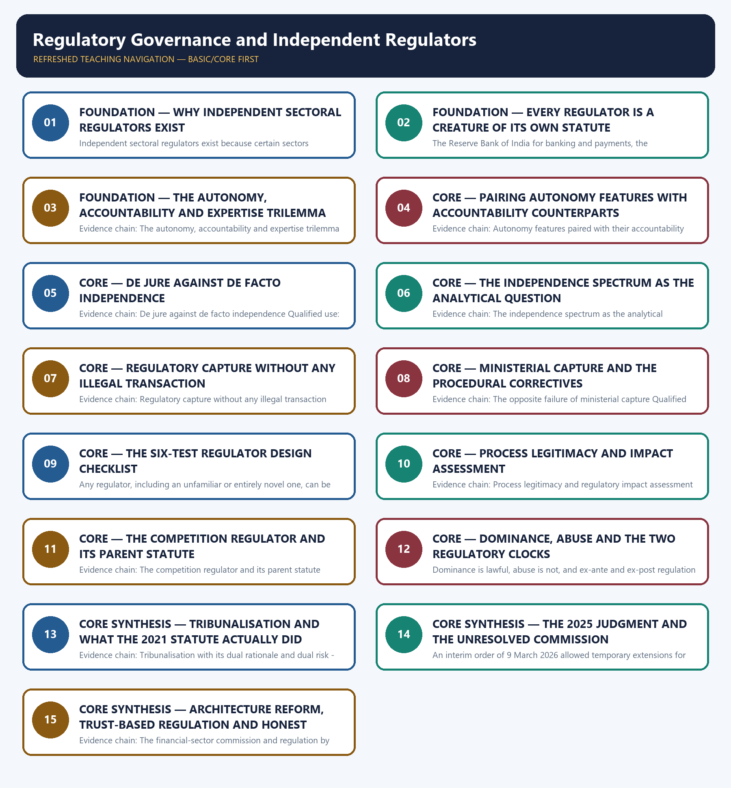

# Regulatory Governance and Independent Regulators — Learner-v2 Complete Learning Session

> **Authoring-only generation:** 2026-09-02. No PDF was rendered and no tracker or index was mutated.

### SOURCE, PROGRESSION AND CURRENT-LINKAGE AUDIT

- **Generation date:** 2026-09-02.
- **Repository-first evidence:** the Basic owner is taught first and preserved in full; the Advanced owner is retained only in the optional final teaching block.
- **OCR evidence:** Repository Markdown was primary. The OCR-searchable official General Studies question papers held under books\mains and books\more_previous_papers were used only to confirm the printed wording of routed Mains demands. No official answer key, marking scheme, page precision or unsupported quotation was imported from them.
- **Qdrant:** not used; repository Markdown and available OCR context were sufficient.
- **PYQ integrity:** One direct General Studies Paper-II Mains demand and two applied objective demands are routed to this topic across the audited ledgers, and the routed Mains stem was confirmed word for word in the locally held OCR-searchable official question papers. The audited 2018-2023 Mains ledger routes the 2023 demand on the role of the Competition Commission of India in containing the abuse of dominant position by multi-national corporations to this Basic owner jointly with the Polity consolidated statutory, regulatory and quasi-judicial bodies owner, so the regulatory-governance content is answered here and the composition and appointment anatomy is cross-linked rather than restated. The audited 2018-2023 Prelims ledger routes the 2018 objective demand on the Food Safety and Standards Act, 2006 and the food-safety authority's structure, and the 2019 objective demand on the Petroleum and Natural Gas Regulatory Board's role and appeals, to this owner jointly with the consolidated Polity owner and the energy owner; the official 2018-2023 Preliminary Examination keys are not held locally, so no option, answer letter or distractor is recorded or inferred for either, and no composition, membership number or appointment authority is asserted for either body. One ownership conflict is recorded openly rather than resolved by assertion: the 2025 General Studies Paper-II demand on the need for administrative tribunals compared with the court system and the impact of the 2021 rationalisation is discussed at length in the text of this owner, but the audited 2024-2025 Mains ledger routes that demand to the Polity administrative-tribunals owner, so it is solved there and this owner supplies only the regulatory-governance half of the tribunal question. No official answer key or marking scheme is held locally for any routed demand, so every model solution below is an authored answer route rather than an official key.
- **Live-link boundary:** One live official page was verified for this topic on 2026-09-02. The Competition Commission of India's official website at cci.gov.in was read successfully on that date and states the Commission's purpose as promoting and sustaining an enabling competition culture through engagement and enforcement that would inspire businesses to be fair, competitive and innovative, enhance consumer welfare and support economic growth; that statement of purpose is used and nothing else is inferred from it, and in particular no case, party, penalty, order date or enforcement statistic is imported. Two further official checks were attempted on the same date and failed with an access error, namely the Press Information Bureau release page and the Department of Administrative Reforms and Public Grievances website, so no content from either was read or used, and no secondary summary has been treated as an official source. The remaining dated official elements used are those already carried by the repository owners with their status checks, namely the Competition Act, 2002 with appeals to the National Company Law Appellate Tribunal, the Tribunals Reforms Act, 2021 and the specific appellate bodies it abolished, the Supreme Court judgment 2025 INSC 1330 of 19 November 2025 with its four heads of invalidation, the restoration of the earlier Madras Bar Association standards and the four-month direction to establish a National Tribunals Commission, the interim order of 9 March 2026 extending specified serving incumbents to 8 September 2026 or the applicable maximum age, the Financial Sector Legislative Reforms Commission of 2013 under Justice B.N. Srikrishna with its unimplemented Unified Financial Agency and Indian Financial Code proposals, and the Jan Vishwas Amendment of Provisions Act, 2023 decriminalising or rationalising one hundred and eighty-three provisions across forty-two Central Acts, all as checked by the owners on 10 and 13 August 2026. No official establishment notification for the National Tribunals Commission was located by that cut-off, so implementation is described as unresolved and neither establishment nor non-establishment is asserted. No regulator composition, member count, tenure or appointment authority is asserted, because Polity owns that anatomy, and no claim is made that regulatory impact assessment is a uniformly binding requirement in India.
- **Fact/inference discipline:** no current-affairs item, PYQ wording, figure or quotation is invented.

## BASIC LEARNING SESSION

### DEEP-REVIEW LEARNING CONTRACT

| Control | Binding rule for this package |
|---|---|
| Syllabus boundary | Complete Governance Basic/Core is answer-complete before optional Advanced depth. |
| Authority boundary | Constitution, statute, delegated rule, executive policy, scheme, recommendation, institution and implementation outcome remain distinct. |
| Implementation method | Objective → authority → finance → institution → frontline process → citizen access → output → outcome → feedback and remedy. |
| Federal method | Union, state, district, local body, regulator, parastatal and non-state roles are assigned without inventing jurisdiction. |
| Accountability method | Duty-holder → information → forum → questioning → consequence → correction → grievance/appeal. |
| Evidence method | Claim → named India-centric law/institution/scheme/case → causal analysis → source/date/status and implementation qualification. |
| Inclusion method | Gender, caste, tribe, disability, language, region, digital divide, privacy and offline safeguards are tested across access and outcome. |
| Practice contract | Every solved item has demand decoding, a detailed examiner-grade model, executable timed/compression plan, marks rationale and answer-specific improvement. |
| Approval | This immutable successor remains `approved: false` pending explicit approval. |

**Canonical Basic/Core owner:** `upsc-ai-kit\knowledge\Governance\basic\11_Regulatory-Governance-and-Independent-Regulators.md`  
**Substantive canonical provenance owner:** `upsc-ai-kit\knowledge\Governance\11_Regulatory-Governance-and-Independent-Regulators_Learner-V2-Complete-Topic-Package.md`  
**Optional Advanced owner:** `upsc-ai-kit\knowledge\Governance\advanced\11_Regulatory-Governance-and-Independent-Regulators.md`  
**Official syllabus mapping:** `upsc-ai-kit\knowledge\Governance\OFFICIAL-UPSC-SYLLABUS-MAPPING.md`

### EVIDENCE, PYQ AND CURRENT-STATUS CONTROL

- **Legal-status discipline:** a proposal, commission recommendation, policy announcement, Cabinet approval, enacted statute, notified rule, commenced provision and implemented programme are never treated as the same status.
- **Institutional discipline:** constitutional, statutory, executive, regulatory, autonomous, registered private and international bodies retain exact mandate, jurisdiction and accountability.
- **Causal discipline:** allocation, portal creation, training, registration, disposal count or ranking does not by itself prove access, remedy, capability, service quality or outcome.
- **Indicator discipline:** input, process, output, outcome and impact indicators are separated; denominator, baseline, disaggregation, attribution and gaming risks are stated.
- **Trade-off discipline:** speed, expertise, autonomy, transparency, privacy, participation, fiscal control and inclusion are balanced with safeguards and residual risk.
- **PYQ discipline:** exact wording is preserved only where verified; routed or reconstructed demands remain labelled and no inferred answer is promoted as official.
- **Current-status note, rechecked 2026-09-02:** volatile law, scheme, institution, tournament and programme claims retain official source, date, jurisdiction and operative/interim/final status.

**Generation-local live/current sources:**
- `https://www.cci.gov.in/`




*Distinct embedded teaching-navigation image. The separate continuous Cārvāka-style flowchart package remains an independent at-a-glance artifact.*

### SESSION 1 — FOUNDATION — WHY INDEPENDENT SECTORAL REGULATORS EXIST

#### DEFINITION / WHAT THIS IS CALLED

**Plain-language definition:** Evidence chain: Why independent sectoral regulators exist Qualified use: Open a regulator answer with the design rationale rather than with a list of regulators.

**Technical definition:** Independent sectoral regulators exist because certain sectors combine technical complexity, a need for insulation from day-to-day political and executive direction, and a need for consistent and predictable rule-making, so Parliament creates a statutory body with rule-making, licensing, monitoring and enforcement powers over that sector; the same independence then creates an accountability problem and a capture risk that governance design must continually manage rather than resolve once.

#### ANSWER-GRABBING OPENING — WRITE/ADAPT IN THE EXAM

> Evidence chain: Why independent sectoral regulators exist Qualified use: Open a regulator answer with the design rationale rather than with a list of regulators.

#### MUST-WRITE KEYWORDS

- **FOUNDATION**
- **Why independent sectoral regulators exist**
- **Evidence chain**
- **Qualified use**
- **Independent**
- **Parliament**

**How to use them:** Frame the answer through FOUNDATION; define Why independent sectoral regulators exist, connect Evidence chain with Qualified use to explain the mechanism, and use Independent for the decisive comparison or qualification.

#### VISUAL FIRST

```text
WHY INDEPENDENT SECTORAL REGULATORS EXIST
01. Why independent sectoral regulators exist
BOUNDARY -> Independence is created for a reason and immediately creates an accountability problem.
```

*This topic-specific rail fixes the evidence sequence and its exam boundary before analysis.*

#### CORE EXPLANATION

Independent sectoral regulators exist because certain sectors combine technical complexity, a need for insulation from day-to-day political and executive direction, and a need for consistent and predictable rule-making, so Parliament creates a statutory body with rule-making, licensing, monitoring and enforcement powers over that sector; the same independence then creates an accountability problem and a capture risk that governance design must continually manage rather than resolve once.

#### NAMED EVIDENCE AND MECHANISM

- Independent sectoral regulators exist because certain sectors combine technical complexity, a need for insulation from day-to-day political and executive direction, and a need for consistent and predictable rule-making, so Parliament creates a statutory body with rule-making, licensing, monitoring and enforcement powers over that sector; the same independence then creates an accountability problem and a capture risk that governance design must continually manage rather than resolve once.

#### EXAMINER CAUTION

- Independence is created for a reason and immediately creates an accountability problem.

#### EXAM LINK

- **Prelims:** Retain the exact statute, section, institution, official category, dated edition or scope rule attached to Why independent sectoral regulators exist.
- **Mains:** Open a regulator answer with the design rationale rather than with a list of regulators.

#### MINI RECAP

- **Evidence chain:** Why independent sectoral regulators exist
- **Qualified use:** Open a regulator answer with the design rationale rather than with a list of regulators.

#### CLOSING RECALL FLOW — FOUNDATION — WHY INDEPENDENT SECTORAL REGULATORS EXIST

```text
START / CONCEPT: FOUNDATION — Why independent sectoral regulators exist
        |
        v
EXACT TERMS: FOUNDATION · Why independent sectoral regulators exist · Evidence chain · Qualified use · Independent · Parliament
        |
        v
MECHANISM / ARGUMENT: Independent sectoral regulators exist because certain sectors combine technical complexity, a need for insulation from day-to-day political and executive direction, and a need for consistent and predictable rule-making, so Parliament creates a statutory body with rule-making, licensing, monitoring and enforcement powers over that sector; the same independence then creates an accountability problem and a capture risk that governance design must continually manage rather than resolve once.
        |
        v
CONSEQUENCE / CONTRAST: Independence is created for a reason and immediately creates an accountability problem.
        |
        v
UPSC TRAP / ANSWER-USE: Do not miss this limiting distinction: why independent sectoral regulators exist Qualified use.
        |
        v
ANSWER-GRABBING FORMULATION: Evidence chain: Why independent sectoral regulators exist Qualified use: Open a regulator answer with the design rationale rather than with a list of regulators.
```
### SESSION 2 — FOUNDATION — EVERY REGULATOR IS A CREATURE OF ITS OWN STATUTE

#### DEFINITION / WHAT THIS IS CALLED

**Plain-language definition:** Evidence chain: Every regulator is a creature of its own statute Qualified use: Avoid the single commonest factual trap in a statutory-bodies answer.

**Technical definition:** The Reserve Bank of India for banking and payments, the securities-market regulator, the insurance regulator, the pension-fund regulator, the telecom regulator, the electricity regulatory commission, the petroleum and natural gas regulatory board and the competition regulator are each created by their own separate statute, and the standard trap is to assume they share a uniform independence or accountability design, because each parent Act prescribes its own tenure, funding, appointment and oversight arrangements which vary considerably in the degree of insulation from executive control.

#### ANSWER-GRABBING OPENING — WRITE/ADAPT IN THE EXAM

> Evidence chain: Every regulator is a creature of its own statute Qualified use: Avoid the single commonest factual trap in a statutory-bodies answer.

#### MUST-WRITE KEYWORDS

- **FOUNDATION**
- **Evidence chain**
- **Qualified use**
- **The Reserve Bank**
- **India**
- **Act**

**How to use them:** Frame the answer through FOUNDATION; define Evidence chain, connect Qualified use with The Reserve Bank to explain the mechanism, and use India for the decisive comparison or qualification.

#### VISUAL FIRST

```text
EVERY REGULATOR IS A CREATURE OF ITS OWN STATUTE
01. Every regulator is a creature of its own statute
BOUNDARY -> One regulator's tenure or funding rule must never be generalised to another.
```

*This topic-specific rail fixes the evidence sequence and its exam boundary before analysis.*

#### CORE EXPLANATION

The Reserve Bank of India for banking and payments, the securities-market regulator, the insurance regulator, the pension-fund regulator, the telecom regulator, the electricity regulatory commission, the petroleum and natural gas regulatory board and the competition regulator are each created by their own separate statute, and the standard trap is to assume they share a uniform independence or accountability design, because each parent Act prescribes its own tenure, funding, appointment and oversight arrangements which vary considerably in the degree of insulation from executive control.

#### NAMED EVIDENCE AND MECHANISM

- The Reserve Bank of India for banking and payments, the securities-market regulator, the insurance regulator, the pension-fund regulator, the telecom regulator, the electricity regulatory commission, the petroleum and natural gas regulatory board and the competition regulator are each created by their own separate statute, and the standard trap is to assume they share a uniform independence or accountability design, because each parent Act prescribes its own tenure, funding, appointment and oversight arrangements which vary considerably in the degree of insulation from executive control.

#### EXAMINER CAUTION

- One regulator's tenure or funding rule must never be generalised to another.

#### EXAM LINK

- **Prelims:** Retain the exact statute, section, institution, official category, dated edition or scope rule attached to Every regulator is a creature of its own statute.
- **Mains:** Avoid the single commonest factual trap in a statutory-bodies answer.

#### MINI RECAP

- **Evidence chain:** Every regulator is a creature of its own statute
- **Qualified use:** Avoid the single commonest factual trap in a statutory-bodies answer.

#### CLOSING RECALL FLOW — FOUNDATION — EVERY REGULATOR IS A CREATURE OF ITS OWN STATUTE

```text
START / CONCEPT: FOUNDATION — Every regulator is a creature of its own statute
        |
        v
EXACT TERMS: FOUNDATION · Evidence chain · Qualified use · The Reserve Bank · India · Act
        |
        v
MECHANISM / ARGUMENT: The Reserve Bank of India for banking and payments, the securities-market regulator, the insurance regulator, the pension-fund regulator, the telecom regulator, the electricity regulatory commission, the petroleum and natural gas regulatory board and the competition regulator are each created by their own separate statute, and the standard trap is to assume they share a uniform independence or accountability design, because each parent Act prescribes its own tenure, funding, appointment and oversight arrangements which vary considerably in the degree of insulation from executive control.
        |
        v
CONSEQUENCE / CONTRAST: Prelims: Retain the exact statute, section, institution, official category, dated edition or scope rule attached to Every regulator is a creature of its own statute.
        |
        v
UPSC TRAP / ANSWER-USE: One regulator's tenure or funding rule must never be generalised to another.
        |
        v
ANSWER-GRABBING FORMULATION: Evidence chain: Every regulator is a creature of its own statute Qualified use: Avoid the single commonest factual trap in a statutory-bodies answer.
```
### SESSION 3 — FOUNDATION — THE AUTONOMY, ACCOUNTABILITY AND EXPERTISE TRILEMMA

#### DEFINITION / WHAT THIS IS CALLED

**Plain-language definition:** The recurring design tension is that greater autonomy improves technical and apolitical decision-making while weakening democratic answerability, greater accountability through closer ministerial control improves oversight while undermining the technical insulation regulators need, and expertise is the value both arrangements are meant to serve yet either extreme can compromise, so independence is a variable to be calibrated rather than a virtue to be maximised.

**Technical definition:** Evidence chain: The autonomy, accountability and expertise trilemma Qualified use: Name the trilemma in the first sentence of any independence or reform demand.

#### ANSWER-GRABBING OPENING — WRITE/ADAPT IN THE EXAM

> Evidence chain: The autonomy, accountability and expertise trilemma Qualified use: Name the trilemma in the first sentence of any independence or reform demand.

#### MUST-WRITE KEYWORDS

- **FOUNDATION**
- **The autonomy**
- **accountability**
- **expertise trilemma**
- **Evidence chain**
- **Qualified use**

**How to use them:** Frame the answer through FOUNDATION; define The autonomy, connect accountability with expertise trilemma to explain the mechanism, and use Evidence chain for the decisive comparison or qualification.

#### VISUAL FIRST

```text
THE AUTONOMY, ACCOUNTABILITY AND EXPERTISE TRILEMMA
01. The autonomy, accountability and expertise trilemma
BOUNDARY -> Independence is a variable to be calibrated and not a virtue to be maximised.
```

*This topic-specific rail fixes the evidence sequence and its exam boundary before analysis.*

#### CORE EXPLANATION

The recurring design tension is that greater autonomy improves technical and apolitical decision-making while weakening democratic answerability, greater accountability through closer ministerial control improves oversight while undermining the technical insulation regulators need, and expertise is the value both arrangements are meant to serve yet either extreme can compromise, so independence is a variable to be calibrated rather than a virtue to be maximised.

#### NAMED EVIDENCE AND MECHANISM

- The recurring design tension is that greater autonomy improves technical and apolitical decision-making while weakening democratic answerability, greater accountability through closer ministerial control improves oversight while undermining the technical insulation regulators need, and expertise is the value both arrangements are meant to serve yet either extreme can compromise, so independence is a variable to be calibrated rather than a virtue to be maximised.

#### EXAMINER CAUTION

- Independence is a variable to be calibrated and not a virtue to be maximised.

#### EXAM LINK

- **Prelims:** Retain the exact statute, section, institution, official category, dated edition or scope rule attached to The autonomy, accountability and expertise trilemma.
- **Mains:** Name the trilemma in the first sentence of any independence or reform demand.

#### MINI RECAP

- **Evidence chain:** The autonomy, accountability and expertise trilemma
- **Qualified use:** Name the trilemma in the first sentence of any independence or reform demand.

#### CLOSING RECALL FLOW — FOUNDATION — THE AUTONOMY, ACCOUNTABILITY AND EXPERTISE TRILEMMA

```text
START / CONCEPT: FOUNDATION — The autonomy, accountability and expertise trilemma
        |
        v
EXACT TERMS: FOUNDATION · The autonomy · accountability · expertise trilemma · Evidence chain · Qualified use
        |
        v
MECHANISM / ARGUMENT: The recurring design tension is that greater autonomy improves technical and apolitical decision-making while weakening democratic answerability, greater accountability through closer ministerial control improves oversight while undermining the technical insulation regulators need, and expertise is the value both arrangements are meant to serve yet either extreme can compromise, so independence is a variable to be calibrated rather than a virtue to be maximised.
        |
        v
CONSEQUENCE / CONTRAST: Independence is a variable to be calibrated and not a virtue to be maximised.
        |
        v
UPSC TRAP / ANSWER-USE: Do not miss this limiting distinction: the autonomy, accountability and expertise trilemma Qualified use.
        |
        v
ANSWER-GRABBING FORMULATION: Evidence chain: The autonomy, accountability and expertise trilemma Qualified use: Name the trilemma in the first sentence of any independence or reform demand.
```
### SESSION 4 — CORE — PAIRING AUTONOMY FEATURES WITH ACCOUNTABILITY COUNTERPARTS

#### DEFINITION / WHAT THIS IS CALLED

**Plain-language definition:** The analytical mark lies in pairing, because fixed-term appointment is answered by an annual report laid before Parliament, funding from fees or cess rather than an annual grant is answered by audit of the regulator's own accounts, technical composition is answered by the government's power to issue policy directions in specified circumstances, statutory rule-making power is answered by mandatory consultation with a published response, and security of tenure is answered by appellate and judicial review, so listing autonomy features alone reads as advocacy while pairing them demonstrates that the trilemma is understood as a design problem.

**Technical definition:** Evidence chain: Autonomy features paired with their accountability counterparts Qualified use: Earn the design mark by answering each autonomy feature with its counterweight.

#### ANSWER-GRABBING OPENING — WRITE/ADAPT IN THE EXAM

> Evidence chain: Autonomy features paired with their accountability counterparts Qualified use: Earn the design mark by answering each autonomy feature with its counterweight.

#### MUST-WRITE KEYWORDS

- **Pairing autonomy features with accountability counterparts**
- **Evidence chain**
- **Qualified use**
- **Parliament**
- **Autonomy**
- **Qualified**

**How to use them:** Frame the answer through Pairing autonomy features with accountability counterparts; define Evidence chain, connect Qualified use with Parliament to explain the mechanism, and use Autonomy for the decisive comparison or qualification.

#### VISUAL FIRST

```text
PAIRING AUTONOMY FEATURES WITH ACCOUNTABILITY COUNTERPARTS
01. Autonomy features paired with their accountability counterparts
BOUNDARY -> Listing autonomy features alone reads as advocacy rather than as design analysis.
```

*This topic-specific rail fixes the evidence sequence and its exam boundary before analysis.*

#### CORE EXPLANATION

The analytical mark lies in pairing, because fixed-term appointment is answered by an annual report laid before Parliament, funding from fees or cess rather than an annual grant is answered by audit of the regulator's own accounts, technical composition is answered by the government's power to issue policy directions in specified circumstances, statutory rule-making power is answered by mandatory consultation with a published response, and security of tenure is answered by appellate and judicial review, so listing autonomy features alone reads as advocacy while pairing them demonstrates that the trilemma is understood as a design problem.

#### NAMED EVIDENCE AND MECHANISM

- The analytical mark lies in pairing, because fixed-term appointment is answered by an annual report laid before Parliament, funding from fees or cess rather than an annual grant is answered by audit of the regulator's own accounts, technical composition is answered by the government's power to issue policy directions in specified circumstances, statutory rule-making power is answered by mandatory consultation with a published response, and security of tenure is answered by appellate and judicial review, so listing autonomy features alone reads as advocacy while pairing them demonstrates that the trilemma is understood as a design problem.

#### EXAMINER CAUTION

- Listing autonomy features alone reads as advocacy rather than as design analysis.

#### EXAM LINK

- **Prelims:** Retain the exact statute, section, institution, official category, dated edition or scope rule attached to Pairing autonomy features with accountability counterparts.
- **Mains:** Earn the design mark by answering each autonomy feature with its counterweight.

#### MINI RECAP

- **Evidence chain:** Autonomy features paired with their accountability counterparts
- **Qualified use:** Earn the design mark by answering each autonomy feature with its counterweight.

#### CLOSING RECALL FLOW — CORE — PAIRING AUTONOMY FEATURES WITH ACCOUNTABILITY COUNTERPARTS

```text
START / CONCEPT: CORE — Pairing autonomy features with accountability counterparts
        |
        v
EXACT TERMS: Pairing autonomy features with accountability counterparts · Evidence chain · Qualified use · Parliament · Autonomy · Qualified
        |
        v
MECHANISM / ARGUMENT: The analytical mark lies in pairing, because fixed-term appointment is answered by an annual report laid before Parliament, funding from fees or cess rather than an annual grant is answered by audit of the regulator's own accounts, technical composition is answered by the government's power to issue policy directions in specified circumstances, statutory rule-making power is answered by mandatory consultation with a published response, and security of tenure is answered by appellate and judicial review, so listing autonomy features alone reads as advocacy while pairing them demonstrates that the trilemma is understood as a design problem.
        |
        v
CONSEQUENCE / CONTRAST: The resulting consequence is that autonomy features paired with their accountability counterparts Qualified use.
        |
        v
UPSC TRAP / ANSWER-USE: Do not miss this limiting distinction: autonomy features paired with their accountability counterparts Qualified use.
        |
        v
ANSWER-GRABBING FORMULATION: Evidence chain: Autonomy features paired with their accountability counterparts Qualified use: Earn the design mark by answering each autonomy feature with its counterweight.
```
### SESSION 5 — CORE — DE JURE AGAINST DE FACTO INDEPENDENCE

#### DEFINITION / WHAT THIS IS CALLED

**Plain-language definition:** A regulator's statute may grant strong formal independence through fixed tenure and removal only for cause while its actual independence is weaker because of budgetary dependence on the ministry, informal pressure on appointments or a revolving-door relationship with the regulated industry, and the gap between the formal grant and the working reality is the standard analytical wedge for evaluating any specific regulator.

**Technical definition:** Evidence chain: De jure against de facto independence Qualified use: Use the formal-against-actual wedge to evaluate a specific named regulator.

#### ANSWER-GRABBING OPENING — WRITE/ADAPT IN THE EXAM

> Evidence chain: De jure against de facto independence Qualified use: Use the formal-against-actual wedge to evaluate a specific named regulator.

#### MUST-WRITE KEYWORDS

- **De jure against de facto independence**
- **Evidence chain**
- **Qualified use**
- **De**
- **Qualified**
- **CORE — De jure against de facto independence**

**How to use them:** Frame the answer through De jure against de facto independence; define Evidence chain, connect Qualified use with De to explain the mechanism, and use Qualified for the decisive comparison or qualification.

#### VISUAL FIRST

```text
DE JURE AGAINST DE FACTO INDEPENDENCE
01. De jure against de facto independence
BOUNDARY -> A strong formal grant can coexist with weak working independence.
```

*This topic-specific rail fixes the evidence sequence and its exam boundary before analysis.*

#### CORE EXPLANATION

A regulator's statute may grant strong formal independence through fixed tenure and removal only for cause while its actual independence is weaker because of budgetary dependence on the ministry, informal pressure on appointments or a revolving-door relationship with the regulated industry, and the gap between the formal grant and the working reality is the standard analytical wedge for evaluating any specific regulator.

#### NAMED EVIDENCE AND MECHANISM

- A regulator's statute may grant strong formal independence through fixed tenure and removal only for cause while its actual independence is weaker because of budgetary dependence on the ministry, informal pressure on appointments or a revolving-door relationship with the regulated industry, and the gap between the formal grant and the working reality is the standard analytical wedge for evaluating any specific regulator.

#### EXAMINER CAUTION

- A strong formal grant can coexist with weak working independence.

#### EXAM LINK

- **Prelims:** Retain the exact statute, section, institution, official category, dated edition or scope rule attached to De jure against de facto independence.
- **Mains:** Use the formal-against-actual wedge to evaluate a specific named regulator.

#### MINI RECAP

- **Evidence chain:** De jure against de facto independence
- **Qualified use:** Use the formal-against-actual wedge to evaluate a specific named regulator.

#### CLOSING RECALL FLOW — CORE — DE JURE AGAINST DE FACTO INDEPENDENCE

```text
START / CONCEPT: CORE — De jure against de facto independence
        |
        v
EXACT TERMS: De jure against de facto independence · Evidence chain · Qualified use · De · Qualified · CORE — De jure against de facto independence
        |
        v
MECHANISM / ARGUMENT: A regulator's statute may grant strong formal independence through fixed tenure and removal only for cause while its actual independence is weaker because of budgetary dependence on the ministry, informal pressure on appointments or a revolving-door relationship with the regulated industry, and the gap between the formal grant and the working reality is the standard analytical wedge for evaluating any specific regulator.
        |
        v
CONSEQUENCE / CONTRAST: A strong formal grant can coexist with weak working independence.
        |
        v
UPSC TRAP / ANSWER-USE: Do not miss this limiting distinction: use the formal-against-actual wedge to evaluate a specific named regulator.
        |
        v
ANSWER-GRABBING FORMULATION: Evidence chain: De jure against de facto independence Qualified use: Use the formal-against-actual wedge to evaluate a specific named regulator.
```
### SESSION 6 — CORE — THE INDEPENDENCE SPECTRUM AS THE ANALYTICAL QUESTION

#### DEFINITION / WHAT THIS IS CALLED

**Plain-language definition:** No Indian regulator sits at either extreme of a spectrum running from a ministry-controlled department at one end to fixed tenure, own funding, removal only for cause and technical composition at the other; each statute places its regulator somewhere on that spectrum, and locating a named regulator on it using its specific design features is a better comparison method than treating regulatory independence as a single yes-or-no property.

**Technical definition:** Evidence chain: The independence spectrum as the analytical question Qualified use: Compare regulators by statutory design features rather than by a yes-or-no label.

#### ANSWER-GRABBING OPENING — WRITE/ADAPT IN THE EXAM

> Evidence chain: The independence spectrum as the analytical question Qualified use: Compare regulators by statutory design features rather than by a yes-or-no label.

#### MUST-WRITE KEYWORDS

- **The independence spectrum as the analytical question**
- **Evidence chain**
- **Qualified use**
- **No Indian**
- **Qualified**
- **CORE — The independence spectrum as the analytical question**

**How to use them:** Frame the answer through The independence spectrum as the analytical question; define Evidence chain, connect Qualified use with No Indian to explain the mechanism, and use Qualified for the decisive comparison or qualification.

#### VISUAL FIRST

```text
THE INDEPENDENCE SPECTRUM AS THE ANALYTICAL QUESTION
01. The independence spectrum as the analytical question
BOUNDARY -> No Indian regulator sits at either extreme, so placement is the question.
```

*This topic-specific rail fixes the evidence sequence and its exam boundary before analysis.*

#### CORE EXPLANATION

No Indian regulator sits at either extreme of a spectrum running from a ministry-controlled department at one end to fixed tenure, own funding, removal only for cause and technical composition at the other; each statute places its regulator somewhere on that spectrum, and locating a named regulator on it using its specific design features is a better comparison method than treating regulatory independence as a single yes-or-no property.

#### NAMED EVIDENCE AND MECHANISM

- No Indian regulator sits at either extreme of a spectrum running from a ministry-controlled department at one end to fixed tenure, own funding, removal only for cause and technical composition at the other; each statute places its regulator somewhere on that spectrum, and locating a named regulator on it using its specific design features is a better comparison method than treating regulatory independence as a single yes-or-no property.

#### EXAMINER CAUTION

- No Indian regulator sits at either extreme, so placement is the question.

#### EXAM LINK

- **Prelims:** Retain the exact statute, section, institution, official category, dated edition or scope rule attached to The independence spectrum as the analytical question.
- **Mains:** Compare regulators by statutory design features rather than by a yes-or-no label.

#### MINI RECAP

- **Evidence chain:** The independence spectrum as the analytical question
- **Qualified use:** Compare regulators by statutory design features rather than by a yes-or-no label.

#### CLOSING RECALL FLOW — CORE — THE INDEPENDENCE SPECTRUM AS THE ANALYTICAL QUESTION

```text
START / CONCEPT: CORE — The independence spectrum as the analytical question
        |
        v
EXACT TERMS: The independence spectrum as the analytical question · Evidence chain · Qualified use · No Indian · Qualified · CORE — The independence spectrum as the analytical question
        |
        v
MECHANISM / ARGUMENT: No Indian regulator sits at either extreme of a spectrum running from a ministry-controlled department at one end to fixed tenure, own funding, removal only for cause and technical composition at the other; each statute places its regulator somewhere on that spectrum, and locating a named regulator on it using its specific design features is a better comparison method than treating regulatory independence as a single yes-or-no property.
        |
        v
CONSEQUENCE / CONTRAST: No Indian regulator sits at either extreme, so placement is the question.
        |
        v
UPSC TRAP / ANSWER-USE: Do not miss this limiting distinction: the independence spectrum as the analytical question Qualified use.
        |
        v
ANSWER-GRABBING FORMULATION: Evidence chain: The independence spectrum as the analytical question Qualified use: Compare regulators by statutory design features rather than by a yes-or-no label.
```
### SESSION 7 — CORE — REGULATORY CAPTURE WITHOUT ANY ILLEGAL TRANSACTION

#### DEFINITION / WHAT THIS IS CALLED

**Plain-language definition:** Capture is the situation in which a regulator comes over time to serve the interest of the industry it regulates rather than the public interest, and it usually operates lawfully through information asymmetry because the industry knows the sector better, through dependence on industry data, expertise and personnel, through a revolving door and industry-funded research, and finally through agenda and framing capture in which the regulator adopts the industry's own definition of the problem, so treating capture as a synonym for corruption misses every ordinary pathway by which it happens.

**Technical definition:** Evidence chain: Regulatory capture without any illegal transaction Qualified use: Explain the mechanism instead of reducing capture to corruption.

#### ANSWER-GRABBING OPENING — WRITE/ADAPT IN THE EXAM

> Evidence chain: Regulatory capture without any illegal transaction Qualified use: Explain the mechanism instead of reducing capture to corruption.

#### MUST-WRITE KEYWORDS

- **Evidence chain**
- **Qualified use**
- **Capture**
- **Retain**
- **Regulatory**
- **Qualified**

**How to use them:** Frame the answer through Evidence chain; define Qualified use, connect Capture with Retain to explain the mechanism, and use Regulatory for the decisive comparison or qualification.

#### VISUAL FIRST

```text
REGULATORY CAPTURE WITHOUT ANY ILLEGAL TRANSACTION
01. Regulatory capture without any illegal transaction
BOUNDARY -> Capture ordinarily operates lawfully through asymmetry, personnel and agenda control.
```

*This topic-specific rail fixes the evidence sequence and its exam boundary before analysis.*

#### CORE EXPLANATION

Capture is the situation in which a regulator comes over time to serve the interest of the industry it regulates rather than the public interest, and it usually operates lawfully through information asymmetry because the industry knows the sector better, through dependence on industry data, expertise and personnel, through a revolving door and industry-funded research, and finally through agenda and framing capture in which the regulator adopts the industry's own definition of the problem, so treating capture as a synonym for corruption misses every ordinary pathway by which it happens.

#### NAMED EVIDENCE AND MECHANISM

- Capture is the situation in which a regulator comes over time to serve the interest of the industry it regulates rather than the public interest, and it usually operates lawfully through information asymmetry because the industry knows the sector better, through dependence on industry data, expertise and personnel, through a revolving door and industry-funded research, and finally through agenda and framing capture in which the regulator adopts the industry's own definition of the problem, so treating capture as a synonym for corruption misses every ordinary pathway by which it happens.

#### EXAMINER CAUTION

- Capture ordinarily operates lawfully through asymmetry, personnel and agenda control.

#### EXAM LINK

- **Prelims:** Retain the exact statute, section, institution, official category, dated edition or scope rule attached to Regulatory capture without any illegal transaction.
- **Mains:** Explain the mechanism instead of reducing capture to corruption.

#### MINI RECAP

- **Evidence chain:** Regulatory capture without any illegal transaction
- **Qualified use:** Explain the mechanism instead of reducing capture to corruption.

#### CLOSING RECALL FLOW — CORE — REGULATORY CAPTURE WITHOUT ANY ILLEGAL TRANSACTION

```text
START / CONCEPT: CORE — Regulatory capture without any illegal transaction
        |
        v
EXACT TERMS: Evidence chain · Qualified use · Capture · Retain · Regulatory · Qualified
        |
        v
MECHANISM / ARGUMENT: Prelims: Retain the exact statute, section, institution, official category, dated edition or scope rule attached to Regulatory capture without any illegal transaction.
        |
        v
CONSEQUENCE / CONTRAST: Capture ordinarily operates lawfully through asymmetry, personnel and agenda control.
        |
        v
UPSC TRAP / ANSWER-USE: Do not miss this limiting distinction: explain the mechanism instead of reducing capture to corruption.
        |
        v
ANSWER-GRABBING FORMULATION: Evidence chain: Regulatory capture without any illegal transaction Qualified use: Explain the mechanism instead of reducing capture to corruption.
```
### SESSION 8 — CORE — MINISTERIAL CAPTURE AND THE PROCEDURAL CORRECTIVES

#### DEFINITION / WHAT THIS IS CALLED

**Plain-language definition:** An under-independent regulator captured by the parent ministry rather than by the industry produces politically timed decisions and suppressed tariffs, so a balanced answer names both directions of failure, and the correctives against industry capture are procedural rather than exhortatory, namely mandatory consultation with published responses, reasoned orders, cooling-off periods, in-house technical capacity, user representation in consultation, appellate review, parliamentary reporting and conflict-of-interest disclosure.

**Technical definition:** Evidence chain: The opposite failure of ministerial capture Qualified use: Show both directions of failure and attach a procedural corrective to each.

#### ANSWER-GRABBING OPENING — WRITE/ADAPT IN THE EXAM

> Evidence chain: The opposite failure of ministerial capture Qualified use: Show both directions of failure and attach a procedural corrective to each.

#### MUST-WRITE KEYWORDS

- **Ministerial capture**
- **the procedural correctives**
- **Evidence chain**
- **Qualified use**
- **The opposite failure**
- **Retain**

**How to use them:** Frame the answer through Ministerial capture; define the procedural correctives, connect Evidence chain with Qualified use to explain the mechanism, and use The opposite failure for the decisive comparison or qualification.

#### VISUAL FIRST

```text
MINISTERIAL CAPTURE AND THE PROCEDURAL CORRECTIVES
01. The opposite failure of ministerial capture
BOUNDARY -> The opposite failure is equally real and needs to be named in a balanced answer.
```

*This topic-specific rail fixes the evidence sequence and its exam boundary before analysis.*

#### CORE EXPLANATION

An under-independent regulator captured by the parent ministry rather than by the industry produces politically timed decisions and suppressed tariffs, so a balanced answer names both directions of failure, and the correctives against industry capture are procedural rather than exhortatory, namely mandatory consultation with published responses, reasoned orders, cooling-off periods, in-house technical capacity, user representation in consultation, appellate review, parliamentary reporting and conflict-of-interest disclosure.

#### NAMED EVIDENCE AND MECHANISM

- An under-independent regulator captured by the parent ministry rather than by the industry produces politically timed decisions and suppressed tariffs, so a balanced answer names both directions of failure, and the correctives against industry capture are procedural rather than exhortatory, namely mandatory consultation with published responses, reasoned orders, cooling-off periods, in-house technical capacity, user representation in consultation, appellate review, parliamentary reporting and conflict-of-interest disclosure.

#### EXAMINER CAUTION

- The opposite failure is equally real and needs to be named in a balanced answer.

#### EXAM LINK

- **Prelims:** Retain the exact statute, section, institution, official category, dated edition or scope rule attached to Ministerial capture and the procedural correctives.
- **Mains:** Show both directions of failure and attach a procedural corrective to each.

#### MINI RECAP

- **Evidence chain:** The opposite failure of ministerial capture
- **Qualified use:** Show both directions of failure and attach a procedural corrective to each.

#### CLOSING RECALL FLOW — CORE — MINISTERIAL CAPTURE AND THE PROCEDURAL CORRECTIVES

```text
START / CONCEPT: CORE — Ministerial capture and the procedural correctives
        |
        v
EXACT TERMS: Ministerial capture · the procedural correctives · Evidence chain · Qualified use · The opposite failure · Retain
        |
        v
MECHANISM / ARGUMENT: Prelims: Retain the exact statute, section, institution, official category, dated edition or scope rule attached to Ministerial capture and the procedural correctives.
        |
        v
CONSEQUENCE / CONTRAST: An under-independent regulator captured by the parent ministry rather than by the industry produces politically timed decisions and suppressed tariffs, so a balanced answer names both directions of failure, and the correctives against industry capture are procedural rather than exhortatory, namely mandatory consultation with published responses, reasoned orders, cooling-off periods, in-house technical capacity, user representation in consultation, appellate review, parliamentary reporting and conflict-of-interest disclosure.
        |
        v
UPSC TRAP / ANSWER-USE: Do not miss this limiting distinction: show both directions of failure and attach a procedural corrective to each.
        |
        v
ANSWER-GRABBING FORMULATION: Evidence chain: The opposite failure of ministerial capture Qualified use: Show both directions of failure and attach a procedural corrective to each.
```
### SESSION 9 — CORE — THE SIX-TEST REGULATOR DESIGN CHECKLIST

#### DEFINITION / WHAT THIS IS CALLED

**Plain-language definition:** Evidence chain: The six-test regulator design checklist Qualified use: Apply a transferable checklist to a novel or unfamiliar regulator under exam pressure.

**Technical definition:** Any regulator, including an unfamiliar or entirely novel one, can be assessed on six tests, namely the statutory mandate and the Act that confers it, the appointment and removal process and whether removal can be arbitrary, the funding source and whether the regulated entity or the ministry controls it, the rule-making process including pre-consultation, a published response to comments and any impact appraisal, enforcement due process covering notice, hearing, a reasoned order, proportionate penalty and absence of bias, and finally review and reporting through an appellate route and legislative reporting.

#### ANSWER-GRABBING OPENING — WRITE/ADAPT IN THE EXAM

> Evidence chain: The six-test regulator design checklist Qualified use: Apply a transferable checklist to a novel or unfamiliar regulator under exam pressure.

#### MUST-WRITE KEYWORDS

- **The six-test regulator design checklist**
- **Evidence chain**
- **Qualified use**
- **Any**
- **Act**
- **A body failing the rule-making and due-process tests**

**How to use them:** Frame the answer through The six-test regulator design checklist; define Evidence chain, connect Qualified use with Any to explain the mechanism, and use Act for the decisive comparison or qualification.

#### VISUAL FIRST

```text
THE SIX-TEST REGULATOR DESIGN CHECKLIST
01. The six-test regulator design checklist
BOUNDARY -> A body failing the rule-making and due-process tests is not saved by the first three.
```

*This topic-specific rail fixes the evidence sequence and its exam boundary before analysis.*

#### CORE EXPLANATION

Any regulator, including an unfamiliar or entirely novel one, can be assessed on six tests, namely the statutory mandate and the Act that confers it, the appointment and removal process and whether removal can be arbitrary, the funding source and whether the regulated entity or the ministry controls it, the rule-making process including pre-consultation, a published response to comments and any impact appraisal, enforcement due process covering notice, hearing, a reasoned order, proportionate penalty and absence of bias, and finally review and reporting through an appellate route and legislative reporting.

#### NAMED EVIDENCE AND MECHANISM

- Any regulator, including an unfamiliar or entirely novel one, can be assessed on six tests, namely the statutory mandate and the Act that confers it, the appointment and removal process and whether removal can be arbitrary, the funding source and whether the regulated entity or the ministry controls it, the rule-making process including pre-consultation, a published response to comments and any impact appraisal, enforcement due process covering notice, hearing, a reasoned order, proportionate penalty and absence of bias, and finally review and reporting through an appellate route and legislative reporting.

#### EXAMINER CAUTION

- A body failing the rule-making and due-process tests is not saved by the first three.

#### EXAM LINK

- **Prelims:** Retain the exact statute, section, institution, official category, dated edition or scope rule attached to The six-test regulator design checklist.
- **Mains:** Apply a transferable checklist to a novel or unfamiliar regulator under exam pressure.

#### MINI RECAP

- **Evidence chain:** The six-test regulator design checklist
- **Qualified use:** Apply a transferable checklist to a novel or unfamiliar regulator under exam pressure.

#### CLOSING RECALL FLOW — CORE — THE SIX-TEST REGULATOR DESIGN CHECKLIST

```text
START / CONCEPT: CORE — The six-test regulator design checklist
        |
        v
EXACT TERMS: The six-test regulator design checklist · Evidence chain · Qualified use · Any · Act · A body failing the rule-making and due-process tests
        |
        v
MECHANISM / ARGUMENT: Any regulator, including an unfamiliar or entirely novel one, can be assessed on six tests, namely the statutory mandate and the Act that confers it, the appointment and removal process and whether removal can be arbitrary, the funding source and whether the regulated entity or the ministry controls it, the rule-making process including pre-consultation, a published response to comments and any impact appraisal, enforcement due process covering notice, hearing, a reasoned order, proportionate penalty and absence of bias, and finally review and reporting through an appellate route and legislative reporting.
        |
        v
CONSEQUENCE / CONTRAST: A body failing the rule-making and due-process tests is not saved by the first three.
        |
        v
UPSC TRAP / ANSWER-USE: Do not miss this limiting distinction: the six-test regulator design checklist Qualified use.
        |
        v
ANSWER-GRABBING FORMULATION: Evidence chain: The six-test regulator design checklist Qualified use: Apply a transferable checklist to a novel or unfamiliar regulator under exam pressure.
```
### SESSION 10 — CORE — PROCESS LEGITIMACY AND IMPACT ASSESSMENT

#### DEFINITION / WHAT THIS IS CALLED

**Plain-language definition:** A regulator's legitimacy rests on process rather than on independence asserted in its statute, because pre-consultation, published responses, reasoned orders and effective appellate review are what make unelected rule-making defensible, and a regulator that fails the rule-making and due-process tests is not made legitimate by passing the mandate, appointment and funding tests; regulatory impact assessment is the main available ex-ante discipline on rule-making quality and is unevenly institutionalised in India rather than a uniformly binding requirement.

**Technical definition:** Evidence chain: Process legitimacy and regulatory impact assessment Qualified use: Ground unelected rule-making in process rather than in an assertion of independence.

#### ANSWER-GRABBING OPENING — WRITE/ADAPT IN THE EXAM

> A regulator's legitimacy rests on process rather than on independence asserted in its statute, because pre-consultation, published responses, reasoned orders and effective appellate review are what make unelected rule-making defensible, and a regulator that fails the rule-making and due-process tests is not made legitimate by passing the mandate, appointment and funding tests; regulatory impact assessment is the main available ex-ante discipline on rule-making quality and is unevenly institutionalised in India rather than a uniformly binding requirement.

#### MUST-WRITE KEYWORDS

- **Process legitimacy**
- **impact assessment**
- **Evidence chain**
- **Qualified use**
- **India**
- **Qualified**

**How to use them:** Frame the answer through Process legitimacy; define impact assessment, connect Evidence chain with Qualified use to explain the mechanism, and use India for the decisive comparison or qualification.

#### VISUAL FIRST

```text
PROCESS LEGITIMACY AND IMPACT ASSESSMENT
01. Process legitimacy and regulatory impact assessment
BOUNDARY -> Impact assessment is unevenly institutionalised and is not a uniformly binding requirement.
```

*This topic-specific rail fixes the evidence sequence and its exam boundary before analysis.*

#### CORE EXPLANATION

A regulator's legitimacy rests on process rather than on independence asserted in its statute, because pre-consultation, published responses, reasoned orders and effective appellate review are what make unelected rule-making defensible, and a regulator that fails the rule-making and due-process tests is not made legitimate by passing the mandate, appointment and funding tests; regulatory impact assessment is the main available ex-ante discipline on rule-making quality and is unevenly institutionalised in India rather than a uniformly binding requirement.

#### NAMED EVIDENCE AND MECHANISM

- A regulator's legitimacy rests on process rather than on independence asserted in its statute, because pre-consultation, published responses, reasoned orders and effective appellate review are what make unelected rule-making defensible, and a regulator that fails the rule-making and due-process tests is not made legitimate by passing the mandate, appointment and funding tests; regulatory impact assessment is the main available ex-ante discipline on rule-making quality and is unevenly institutionalised in India rather than a uniformly binding requirement.

#### EXAMINER CAUTION

- Impact assessment is unevenly institutionalised and is not a uniformly binding requirement.

#### EXAM LINK

- **Prelims:** Retain the exact statute, section, institution, official category, dated edition or scope rule attached to Process legitimacy and impact assessment.
- **Mains:** Ground unelected rule-making in process rather than in an assertion of independence.

#### MINI RECAP

- **Evidence chain:** Process legitimacy and regulatory impact assessment
- **Qualified use:** Ground unelected rule-making in process rather than in an assertion of independence.

#### CLOSING RECALL FLOW — CORE — PROCESS LEGITIMACY AND IMPACT ASSESSMENT

```text
START / CONCEPT: CORE — Process legitimacy and impact assessment
        |
        v
EXACT TERMS: Process legitimacy · impact assessment · Evidence chain · Qualified use · India · Qualified
        |
        v
MECHANISM / ARGUMENT: Evidence chain: Process legitimacy and regulatory impact assessment Qualified use: Ground unelected rule-making in process rather than in an assertion of independence.
        |
        v
CONSEQUENCE / CONTRAST: Impact assessment is unevenly institutionalised and is not a uniformly binding requirement.
        |
        v
UPSC TRAP / ANSWER-USE: Do not miss this limiting distinction: process legitimacy and regulatory impact assessment Qualified use.
        |
        v
ANSWER-GRABBING FORMULATION: A regulator's legitimacy rests on process rather than on independence asserted in its statute, because pre-consultation, published responses, reasoned orders and effective appellate review are what make unelected rule-making defensible, and a regulator that fails the rule-making and due-process tests is not made legitimate by passing the mandate, appointment and funding tests; regulatory impact assessment is the main available ex-ante discipline on rule-making quality and is unevenly institutionalised in India rather than a uniformly binding requirement.
```
### SESSION 11 — CORE — THE COMPETITION REGULATOR AND ITS PARENT STATUTE

#### DEFINITION / WHAT THIS IS CALLED

**Plain-language definition:** The Competition Commission of India is the statutory competition regulator under the Competition Act, 2002, enforcing the prohibitions on anti-competitive agreements and on abuse of dominant position and reviewing combinations, with appeals lying to the National Company Law Appellate Tribunal and thereafter to the Supreme Court; its own official website, read on 2 September 2026, states that its purpose is to promote and sustain an enabling competition culture through engagement and enforcement that would inspire businesses to be fair, competitive and innovative, enhance consumer welfare and support economic growth.

**Technical definition:** Evidence chain: The competition regulator and its parent statute Qualified use: Answer a named-regulator demand with statute, function, appellate route and limits.

#### ANSWER-GRABBING OPENING — WRITE/ADAPT IN THE EXAM

> Evidence chain: The competition regulator and its parent statute Qualified use: Answer a named-regulator demand with statute, function, appellate route and limits.

#### MUST-WRITE KEYWORDS

- **The competition regulator**
- **its parent statute**
- **Evidence chain**
- **Qualified use**
- **The Competition Commission of India**
- **The Competition Commission**

**How to use them:** Frame the answer through The competition regulator; define its parent statute, connect Evidence chain with Qualified use to explain the mechanism, and use The Competition Commission of India for the decisive comparison or qualification.

#### VISUAL FIRST

```text
THE COMPETITION REGULATOR AND ITS PARENT STATUTE
01. The competition regulator and its parent statute
BOUNDARY -> Appeals lie to the appellate tribunal and no case, party, penalty or order date is asserted.
```

*This topic-specific rail fixes the evidence sequence and its exam boundary before analysis.*

#### CORE EXPLANATION

The Competition Commission of India is the statutory competition regulator under the Competition Act, 2002, enforcing the prohibitions on anti-competitive agreements and on abuse of dominant position and reviewing combinations, with appeals lying to the National Company Law Appellate Tribunal and thereafter to the Supreme Court; its own official website, read on 2 September 2026, states that its purpose is to promote and sustain an enabling competition culture through engagement and enforcement that would inspire businesses to be fair, competitive and innovative, enhance consumer welfare and support economic growth.

#### NAMED EVIDENCE AND MECHANISM

- The Competition Commission of India is the statutory competition regulator under the Competition Act, 2002, enforcing the prohibitions on anti-competitive agreements and on abuse of dominant position and reviewing combinations, with appeals lying to the National Company Law Appellate Tribunal and thereafter to the Supreme Court; its own official website, read on 2 September 2026, states that its purpose is to promote and sustain an enabling competition culture through engagement and enforcement that would inspire businesses to be fair, competitive and innovative, enhance consumer welfare and support economic growth.

#### EXAMINER CAUTION

- Appeals lie to the appellate tribunal and no case, party, penalty or order date is asserted.

#### EXAM LINK

- **Prelims:** Retain the exact statute, section, institution, official category, dated edition or scope rule attached to The competition regulator and its parent statute.
- **Mains:** Answer a named-regulator demand with statute, function, appellate route and limits.

#### MINI RECAP

- **Evidence chain:** The competition regulator and its parent statute
- **Qualified use:** Answer a named-regulator demand with statute, function, appellate route and limits.

#### CLOSING RECALL FLOW — CORE — THE COMPETITION REGULATOR AND ITS PARENT STATUTE

```text
START / CONCEPT: CORE — The competition regulator and its parent statute
        |
        v
EXACT TERMS: The competition regulator · its parent statute · Evidence chain · Qualified use · The Competition Commission of India · The Competition Commission
        |
        v
MECHANISM / ARGUMENT: The Competition Commission of India is the statutory competition regulator under the Competition Act, 2002, enforcing the prohibitions on anti-competitive agreements and on abuse of dominant position and reviewing combinations, with appeals lying to the National Company Law Appellate Tribunal and thereafter to the Supreme Court; its own official website, read on 2 September 2026, states that its purpose is to promote and sustain an enabling competition culture through engagement and enforcement that would inspire businesses to be fair, competitive and innovative, enhance consumer welfare and support economic growth.
        |
        v
CONSEQUENCE / CONTRAST: Appeals lie to the appellate tribunal and no case, party, penalty or order date is asserted.
        |
        v
UPSC TRAP / ANSWER-USE: Do not miss this limiting distinction: the competition regulator and its parent statute Qualified use.
        |
        v
ANSWER-GRABBING FORMULATION: Evidence chain: The competition regulator and its parent statute Qualified use: Answer a named-regulator demand with statute, function, appellate route and limits.
```
### SESSION 12 — CORE — DOMINANCE, ABUSE AND THE TWO REGULATORY CLOCKS

#### DEFINITION / WHAT THIS IS CALLED

**Plain-language definition:** Evidence chain: Dominance is not unlawful and the forms abuse takes - Ex-ante sector regulation against ex-post conduct regulation Qualified use: Separate a governance answer from a company-law answer in the opening move.

**Technical definition:** Dominance is lawful, abuse is not, and ex-ante and ex-post regulation are complements.

#### ANSWER-GRABBING OPENING — WRITE/ADAPT IN THE EXAM

> Evidence chain: Dominance is not unlawful and the forms abuse takes - Ex-ante sector regulation against ex-post conduct regulation Qualified use: Separate a governance answer from a company-law answer in the opening move.

#### MUST-WRITE KEYWORDS

- **Dominance**
- **abuse**
- **the two regulatory clocks**
- **Evidence chain**
- **Qualified use**
- **The competition regulator**

**How to use them:** Frame the answer through Dominance; define abuse, connect the two regulatory clocks with Evidence chain to explain the mechanism, and use Qualified use for the decisive comparison or qualification.

#### VISUAL FIRST

```text
DOMINANCE, ABUSE AND THE TWO REGULATORY CLOCKS
01. Dominance is not unlawful and the forms abuse takes
    |
    v
02. Ex-ante sector regulation against ex-post conduct regulation
BOUNDARY -> Dominance is lawful, abuse is not, and ex-ante and ex-post regulation are complements.
```

*This topic-specific rail fixes the evidence sequence and its exam boundary before analysis.*

#### CORE EXPLANATION

The conceptual foundation that separates a governance answer from a company-law answer is that dominance itself is not unlawful and only its abuse is, because competition law protects the competitive process rather than individual competitors and its object is consumer welfare and market access, and abuse takes identifiable forms including predatory or unfair pricing, unfair or discriminatory conditions, limiting production or technical development, denial of market access, tying and bundling, and leveraging dominance in one market to enter or protect another. The competition regulator is an economy-wide, ex-post and conduct-based regulator that complements sector regulators acting ex-ante on licences and tariffs, so the overlap between them is a genuine jurisdictional question rather than an oversight, and the limitations that carry the analytical marks are that proving dominance requires a contested and slow market definition, that digital markets with network effects, zero-price services and data advantages are handled poorly by a turnover-based framework, that remedies arrive after the market structure has already shifted, and that enforcement outcomes are frequently suspended in appeal.

#### NAMED EVIDENCE AND MECHANISM

- The conceptual foundation that separates a governance answer from a company-law answer is that dominance itself is not unlawful and only its abuse is, because competition law protects the competitive process rather than individual competitors and its object is consumer welfare and market access, and abuse takes identifiable forms including predatory or unfair pricing, unfair or discriminatory conditions, limiting production or technical development, denial of market access, tying and bundling, and leveraging dominance in one market to enter or protect another.
- The competition regulator is an economy-wide, ex-post and conduct-based regulator that complements sector regulators acting ex-ante on licences and tariffs, so the overlap between them is a genuine jurisdictional question rather than an oversight, and the limitations that carry the analytical marks are that proving dominance requires a contested and slow market definition, that digital markets with network effects, zero-price services and data advantages are handled poorly by a turnover-based framework, that remedies arrive after the market structure has already shifted, and that enforcement outcomes are frequently suspended in appeal.

#### EXAMINER CAUTION

- Dominance is lawful, abuse is not, and ex-ante and ex-post regulation are complements.

#### EXAM LINK

- **Prelims:** Retain the exact statute, section, institution, official category, dated edition or scope rule attached to Dominance, abuse and the two regulatory clocks.
- **Mains:** Separate a governance answer from a company-law answer in the opening move.

#### MINI RECAP

- **Evidence chain:** Dominance is not unlawful and the forms abuse takes -> Ex-ante sector regulation against ex-post conduct regulation
- **Qualified use:** Separate a governance answer from a company-law answer in the opening move.

#### CLOSING RECALL FLOW — CORE — DOMINANCE, ABUSE AND THE TWO REGULATORY CLOCKS

```text
START / CONCEPT: CORE — Dominance, abuse and the two regulatory clocks
        |
        v
EXACT TERMS: Dominance · abuse · the two regulatory clocks · Evidence chain · Qualified use · The competition regulator
        |
        v
MECHANISM / ARGUMENT: The conceptual foundation that separates a governance answer from a company-law answer is that dominance itself is not unlawful and only its abuse is, because competition law protects the competitive process rather than individual competitors and its object is consumer welfare and market access, and abuse takes identifiable forms including predatory or unfair pricing, unfair or discriminatory conditions, limiting production or technical development, denial of market access, tying and bundling, and leveraging dominance in one market to enter or protect another.
        |
        v
CONSEQUENCE / CONTRAST: Dominance is lawful, abuse is not, and ex-ante and ex-post regulation are complements.
        |
        v
UPSC TRAP / ANSWER-USE: The competition regulator is an economy-wide, ex-post and conduct-based regulator that complements sector regulators acting ex-ante on licences and tariffs, so the overlap between them is a genuine jurisdictional question rather than an oversight, and the limitations that carry the analytical marks are that proving dominance requires a contested and slow market definition, that digital markets with network effects, zero-price services and data advantages are handled poorly by a turnover-based framework, that remedies arrive after the market structure has already shifted, and that enforcement outcomes are frequently suspended in appeal.
        |
        v
ANSWER-GRABBING FORMULATION: Evidence chain: Dominance is not unlawful and the forms abuse takes - Ex-ante sector regulation against ex-post conduct regulation Qualified use: Separate a governance answer from a company-law answer in the opening move.
```
### SESSION 13 — CORE SYNTHESIS — TRIBUNALISATION AND WHAT THE 2021 STATUTE ACTUALLY DID

#### DEFINITION / WHAT THIS IS CALLED

**Plain-language definition:** Tribunalisation is the proliferation of specialised quasi-judicial bodies to adjudicate disputes in specific regulatory or technical domains, justified by technical expertise unavailable in generalist courts and by speed with reduced court backlog, and carrying the twin risks of eroding the procedural safeguards associated with the ordinary court system and of proliferating without adequate independence safeguards, which is why disputes from a regulator's licensing denial or penalty order usually lie to a specified tribunal rather than directly to a civil court.

**Technical definition:** Evidence chain: Tribunalisation with its dual rationale and dual risk - What the Tribunals Reforms Act, 2021 actually did Qualified use: State the reform's actual content before assessing its impact.

#### ANSWER-GRABBING OPENING — WRITE/ADAPT IN THE EXAM

> Evidence chain: Tribunalisation with its dual rationale and dual risk - What the Tribunals Reforms Act, 2021 actually did Qualified use: State the reform's actual content before assessing its impact.

#### MUST-WRITE KEYWORDS

- **CORE SYNTHESIS**
- **Tribunalisation**
- **what the 2021 statute actually did**
- **Evidence chain**
- **Qualified use**
- **The Tribunals Reforms Act**

**How to use them:** Frame the answer through CORE SYNTHESIS; define Tribunalisation, connect what the 2021 statute actually did with Evidence chain to explain the mechanism, and use Qualified use for the decisive comparison or qualification.

#### VISUAL FIRST

```text
TRIBUNALISATION AND WHAT THE 2021 STATUTE ACTUALLY DID
01. Tribunalisation with its dual rationale and dual risk
    |
    v
02. What the Tribunals Reforms Act, 2021 actually did
BOUNDARY -> The statute abolished a named set of appellate bodies, not all tribunals.
```

*This topic-specific rail fixes the evidence sequence and its exam boundary before analysis.*

#### CORE EXPLANATION

Tribunalisation is the proliferation of specialised quasi-judicial bodies to adjudicate disputes in specific regulatory or technical domains, justified by technical expertise unavailable in generalist courts and by speed with reduced court backlog, and carrying the twin risks of eroding the procedural safeguards associated with the ordinary court system and of proliferating without adequate independence safeguards, which is why disputes from a regulator's licensing denial or penalty order usually lie to a specified tribunal rather than directly to a civil court. The Tribunals Reforms Act, 2021 abolished a specific named set of appellate tribunals and authorities, including bodies under the Cinematograph Act, 1952, the Trade Marks Act, 1999, the Copyright Act, 1957 and certain Customs Act and Airports Authority of India Act appellate bodies, transferring their functions mainly to High Courts while prescribing appointment and service conditions for the tribunals that remain, and it did not abolish all tribunals in India, which is the standard misstatement in this area.

#### NAMED EVIDENCE AND MECHANISM

- Tribunalisation is the proliferation of specialised quasi-judicial bodies to adjudicate disputes in specific regulatory or technical domains, justified by technical expertise unavailable in generalist courts and by speed with reduced court backlog, and carrying the twin risks of eroding the procedural safeguards associated with the ordinary court system and of proliferating without adequate independence safeguards, which is why disputes from a regulator's licensing denial or penalty order usually lie to a specified tribunal rather than directly to a civil court.
- The Tribunals Reforms Act, 2021 abolished a specific named set of appellate tribunals and authorities, including bodies under the Cinematograph Act, 1952, the Trade Marks Act, 1999, the Copyright Act, 1957 and certain Customs Act and Airports Authority of India Act appellate bodies, transferring their functions mainly to High Courts while prescribing appointment and service conditions for the tribunals that remain, and it did not abolish all tribunals in India, which is the standard misstatement in this area.

#### EXAMINER CAUTION

- The statute abolished a named set of appellate bodies, not all tribunals.

#### EXAM LINK

- **Prelims:** Retain the exact statute, section, institution, official category, dated edition or scope rule attached to Tribunalisation and what the 2021 statute actually did.
- **Mains:** State the reform's actual content before assessing its impact.

#### MINI RECAP

- **Evidence chain:** Tribunalisation with its dual rationale and dual risk -> What the Tribunals Reforms Act, 2021 actually did
- **Qualified use:** State the reform's actual content before assessing its impact.

#### CLOSING RECALL FLOW — CORE SYNTHESIS — TRIBUNALISATION AND WHAT THE 2021 STATUTE ACTUALLY DID

```text
START / CONCEPT: CORE SYNTHESIS — Tribunalisation and what the 2021 statute actually did
        |
        v
EXACT TERMS: CORE SYNTHESIS · Tribunalisation · what the 2021 statute actually did · Evidence chain · Qualified use · The Tribunals Reforms Act
        |
        v
MECHANISM / ARGUMENT: Tribunalisation is the proliferation of specialised quasi-judicial bodies to adjudicate disputes in specific regulatory or technical domains, justified by technical expertise unavailable in generalist courts and by speed with reduced court backlog, and carrying the twin risks of eroding the procedural safeguards associated with the ordinary court system and of proliferating without adequate independence safeguards, which is why disputes from a regulator's licensing denial or penalty order usually lie to a specified tribunal rather than directly to a civil court.
        |
        v
CONSEQUENCE / CONTRAST: The Tribunals Reforms Act, 2021 abolished a specific named set of appellate tribunals and authorities, including bodies under the Cinematograph Act, 1952, the Trade Marks Act, 1999, the Copyright Act, 1957 and certain Customs Act and Airports Authority of India Act appellate bodies, transferring their functions mainly to High Courts while prescribing appointment and service conditions for the tribunals that remain, and it did not abolish all tribunals in India, which is the standard misstatement in this area.
        |
        v
UPSC TRAP / ANSWER-USE: Do not miss this limiting distinction: tribunalisation with its dual rationale and dual risk - What the Tribunals Reforms Act...
        |
        v
ANSWER-GRABBING FORMULATION: Evidence chain: Tribunalisation with its dual rationale and dual risk - What the Tribunals Reforms Act, 2021 actually did Qualified use: State the reform's actual content before assessing its impact.
```
### SESSION 14 — CORE SYNTHESIS — THE 2025 JUDGMENT AND THE UNRESOLVED COMMISSION

#### DEFINITION / WHAT THIS IS CALLED

**Plain-language definition:** Evidence chain: The 2025 judgment and its four heads of invalidation - The interim continuity order and the unresolved commission Qualified use: Date a constitutional development precisely and describe implementation as unresolved.

**Technical definition:** An interim order of 9 March 2026 allowed temporary extensions for specified serving incumbents until 8 September 2026 or the applicable maximum age, whichever was earlier, in order to prevent tribunals becoming defunct, and that order did not revive the invalidated provisions; no official establishment notification for the National Tribunals Commission was located by the owners' audit cut-off of 13 August 2026, so implementation must be described as unresolved and neither establishment nor non-establishment may be asserted as a settled fact.

#### ANSWER-GRABBING OPENING — WRITE/ADAPT IN THE EXAM

> Evidence chain: The 2025 judgment and its four heads of invalidation - The interim continuity order and the unresolved commission Qualified use: Date a constitutional development precisely and describe implementation as unresolved.

#### MUST-WRITE KEYWORDS

- **CORE SYNTHESIS**
- **The 2025 judgment**
- **the unresolved commission**
- **Evidence chain**
- **Qualified use**
- **National Tribunals Commission**

**How to use them:** Frame the answer through CORE SYNTHESIS; define The 2025 judgment, connect the unresolved commission with Evidence chain to explain the mechanism, and use Qualified use for the decisive comparison or qualification.

#### VISUAL FIRST

```text
THE 2025 JUDGMENT AND THE UNRESOLVED COMMISSION
01. The 2025 judgment and its four heads of invalidation
    |
    v
02. The interim continuity order and the unresolved commission
BOUNDARY -> Four heads were invalidated and the interim order was continuity, not reversal.
```

*This topic-specific rail fixes the evidence sequence and its exam boundary before analysis.*

#### CORE EXPLANATION

In 2025 INSC 1330, delivered on 19 November 2025, the Supreme Court invalidated the re-enacted provisions covering the fifty-year minimum age, the two-name recommendation panel with a merely preferable appointment timeline, the four-year tenure and the impugned allowance framework as an impermissible legislative override that repeated defects already condemned in the earlier Madras Bar Association judgments, made those earlier standards controlling until constitutionally compliant legislation is enacted, and directed the Union Government to establish a National Tribunals Commission within four months. An interim order of 9 March 2026 allowed temporary extensions for specified serving incumbents until 8 September 2026 or the applicable maximum age, whichever was earlier, in order to prevent tribunals becoming defunct, and that order did not revive the invalidated provisions; no official establishment notification for the National Tribunals Commission was located by the owners' audit cut-off of 13 August 2026, so implementation must be described as unresolved and neither establishment nor non-establishment may be asserted as a settled fact.

#### NAMED EVIDENCE AND MECHANISM

- In 2025 INSC 1330, delivered on 19 November 2025, the Supreme Court invalidated the re-enacted provisions covering the fifty-year minimum age, the two-name recommendation panel with a merely preferable appointment timeline, the four-year tenure and the impugned allowance framework as an impermissible legislative override that repeated defects already condemned in the earlier Madras Bar Association judgments, made those earlier standards controlling until constitutionally compliant legislation is enacted, and directed the Union Government to establish a National Tribunals Commission within four months.
- An interim order of 9 March 2026 allowed temporary extensions for specified serving incumbents until 8 September 2026 or the applicable maximum age, whichever was earlier, in order to prevent tribunals becoming defunct, and that order did not revive the invalidated provisions; no official establishment notification for the National Tribunals Commission was located by the owners' audit cut-off of 13 August 2026, so implementation must be described as unresolved and neither establishment nor non-establishment may be asserted as a settled fact.

#### EXAMINER CAUTION

- Four heads were invalidated and the interim order was continuity, not reversal.

#### EXAM LINK

- **Prelims:** Retain the exact statute, section, institution, official category, dated edition or scope rule attached to The 2025 judgment and the unresolved commission.
- **Mains:** Date a constitutional development precisely and describe implementation as unresolved.

#### MINI RECAP

- **Evidence chain:** The 2025 judgment and its four heads of invalidation -> The interim continuity order and the unresolved commission
- **Qualified use:** Date a constitutional development precisely and describe implementation as unresolved.

#### CLOSING RECALL FLOW — CORE SYNTHESIS — THE 2025 JUDGMENT AND THE UNRESOLVED COMMISSION

```text
START / CONCEPT: CORE SYNTHESIS — The 2025 judgment and the unresolved commission
        |
        v
EXACT TERMS: CORE SYNTHESIS · The 2025 judgment · the unresolved commission · Evidence chain · Qualified use · National Tribunals Commission
        |
        v
MECHANISM / ARGUMENT: An interim order of 9 March 2026 allowed temporary extensions for specified serving incumbents until 8 September 2026 or the applicable maximum age, whichever was earlier, in order to prevent tribunals becoming defunct, and that order did not revive the invalidated provisions; no official establishment notification for the National Tribunals Commission was located by the owners' audit cut-off of 13 August 2026, so implementation must be described as unresolved and neither establishment nor non-establishment may be asserted as a settled fact.
        |
        v
CONSEQUENCE / CONTRAST: Four heads were invalidated and the interim order was continuity, not reversal.
        |
        v
UPSC TRAP / ANSWER-USE: Do not miss this limiting distinction: the 2025 judgment and its four heads of invalidation - The interim continuity order...
        |
        v
ANSWER-GRABBING FORMULATION: Evidence chain: The 2025 judgment and its four heads of invalidation - The interim continuity order and the unresolved commission Qualified use: Date a constitutional development precisely and describe implementation as unresolved.
```
### SESSION 15 — CORE SYNTHESIS — ARCHITECTURE REFORM, TRUST-BASED REGULATION AND HONEST OWNERSHIP

#### DEFINITION / WHAT THIS IS CALLED

**Plain-language definition:** CORE SYNTHESIS — Architecture reform, trust-based regulation and honest ownership comprises CORE SYNTHESIS, Architecture reform and trust-based regulation as its core connected dimensions.

**Technical definition:** Evidence chain: The financial-sector commission and regulation by activity - Trust-based regulation and proportionate decriminalisation - Verified question ownership, one recorded routing conflict and the data boundary Qualified use: Close with political-economy reasoning, proportionate enforcement and stated ownership.

#### ANSWER-GRABBING OPENING — WRITE/ADAPT IN THE EXAM

> Evidence chain: The financial-sector commission and regulation by activity - Trust-based regulation and proportionate decriminalisation - Verified question ownership, one recorded routing conflict and the data boundary Qualified use: Close with political-economy reasoning, proportionate enforcement and stated ownership.

#### MUST-WRITE KEYWORDS

- **CORE SYNTHESIS**
- **Architecture reform**
- **trust-based regulation**
- **honest ownership**
- **Evidence chain**
- **Qualified use**

**How to use them:** Frame the answer through CORE SYNTHESIS; define Architecture reform, connect trust-based regulation with honest ownership to explain the mechanism, and use Evidence chain for the decisive comparison or qualification.

#### VISUAL FIRST

```text
ARCHITECTURE REFORM, TRUST-BASED REGULATION AND HONEST OWNERSHIP
01. The financial-sector commission and regulation by activity
    |
    v
02. Trust-based regulation and proportionate decriminalisation
    |
    v
03. Verified question ownership, one recorded routing conflict and the data boundary
BOUNDARY -> A proposal is not an adoption, decriminalisation is not deregulation, and routing is stated.
```

*This topic-specific rail fixes the evidence sequence and its exam boundary before analysis.*

#### CORE EXPLANATION

The Financial Sector Legislative Reforms Commission of 2013, chaired by Justice B.N. Srikrishna, recommended a Unified Financial Agency to subsume most financial-sector regulators except the Reserve Bank of India for banking and payments, grounded in a regulation-by-activity principle under which financial products and activities are regulated consistently regardless of which institution offers them, and it separately proposed a draft Indian Financial Code to consolidate financial-sector legislation; neither comprehensive proposal has been implemented in full, and the 2015 merger of the Forward Markets Commission into the securities regulator is cited as a partial related step rather than as adoption. The Jan Vishwas Amendment of Provisions Act, 2023 decriminalised or rationalised one hundred and eighty-three provisions across forty-two Central Acts and is the Indian anchor for trust-based regulation, whose method is to diagnose whether conduct involves fraud, violence, public safety or deliberate evasion or merely a technical or default failure, to use warning, cure period, graded civil penalty and digital compliance for the latter and to retain criminal sanction for serious or repeated harm, while remembering that decriminalisation is not deregulation because proportionate penalty, hearing, reasoned order and appeal all remain necessary. The audited 2018-2023 Mains ledger routes the 2023 General Studies Paper-II demand on the competition regulator and abuse of dominant position to this Basic owner jointly with the Polity consolidated statutory-body owner, and the same ledger routes two objective demands on a food-safety statute and on a petroleum and natural gas regulator here, for which the official keys are not held locally so no option or answer is inferred; one ownership conflict is recorded openly rather than resolved by assertion, because the 2025 General Studies Paper-II demand on the need for administrative tribunals and the 2021 rationalisation is discussed at length in the text of this owner but is routed by the audited 2024-2025 ledger to the Polity administrative-tribunals owner, so it is solved there and this owner supplies only the regulatory-governance half; no regulator composition, member count, tenure or appointment authority is asserted here because Polity owns that anatomy, and no competition case name, party, penalty, order date, pendency figure or enforcement statistic is asserted anywhere.

#### NAMED EVIDENCE AND MECHANISM

- The Financial Sector Legislative Reforms Commission of 2013, chaired by Justice B.N. Srikrishna, recommended a Unified Financial Agency to subsume most financial-sector regulators except the Reserve Bank of India for banking and payments, grounded in a regulation-by-activity principle under which financial products and activities are regulated consistently regardless of which institution offers them, and it separately proposed a draft Indian Financial Code to consolidate financial-sector legislation; neither comprehensive proposal has been implemented in full, and the 2015 merger of the Forward Markets Commission into the securities regulator is cited as a partial related step rather than as adoption.
- The Jan Vishwas Amendment of Provisions Act, 2023 decriminalised or rationalised one hundred and eighty-three provisions across forty-two Central Acts and is the Indian anchor for trust-based regulation, whose method is to diagnose whether conduct involves fraud, violence, public safety or deliberate evasion or merely a technical or default failure, to use warning, cure period, graded civil penalty and digital compliance for the latter and to retain criminal sanction for serious or repeated harm, while remembering that decriminalisation is not deregulation because proportionate penalty, hearing, reasoned order and appeal all remain necessary.
- The audited 2018-2023 Mains ledger routes the 2023 General Studies Paper-II demand on the competition regulator and abuse of dominant position to this Basic owner jointly with the Polity consolidated statutory-body owner, and the same ledger routes two objective demands on a food-safety statute and on a petroleum and natural gas regulator here, for which the official keys are not held locally so no option or answer is inferred; one ownership conflict is recorded openly rather than resolved by assertion, because the 2025 General Studies Paper-II demand on the need for administrative tribunals and the 2021 rationalisation is discussed at length in the text of this owner but is routed by the audited 2024-2025 ledger to the Polity administrative-tribunals owner, so it is solved there and this owner supplies only the regulatory-governance half; no regulator composition, member count, tenure or appointment authority is asserted here because Polity owns that anatomy, and no competition case name, party, penalty, order date, pendency figure or enforcement statistic is asserted anywhere.

#### EXAMINER CAUTION

- A proposal is not an adoption, decriminalisation is not deregulation, and routing is stated.

#### EXAM LINK

- **Prelims:** Retain the exact statute, section, institution, official category, dated edition or scope rule attached to Architecture reform, trust-based regulation and honest ownership.
- **Mains:** Close with political-economy reasoning, proportionate enforcement and stated ownership.

#### MINI RECAP

- **Evidence chain:** The financial-sector commission and regulation by activity -> Trust-based regulation and proportionate decriminalisation -> Verified question ownership, one recorded routing conflict and the data boundary
- **Qualified use:** Close with political-economy reasoning, proportionate enforcement and stated ownership.
#### COMPLETE BASIC OWNER EVIDENCE BANK

> **Subject:** Governance | **Tier:** Must-Do (foundation) | **GS Paper:** GS-II.
> **Core area:** Sectoral regulators, the autonomy-accountability-expertise trilemma,
> regulatory capture, tribunalisation and the Tribunals Reforms Act, 2021.
> **Grounded in:** Tribunals Reforms Act, 2021; Financial Sector Legislative Reforms
> Commission (FSLRC), 2013; audited 2025 GS-II PYQ; official UPSC GS-II syllabus
> ("statutory, regulatory and various quasi-judicial bodies").
> ✅ = source-grounded | ⚠️ = analytical inference | 📰 = current anchor.
> *Companion: `advanced/11_Regulatory-Governance-and-Independent-Regulators.md`.*

#### 1. Visual foundation

```text
WHY INDEPENDENT SECTORAL REGULATORS EXIST
        |
        v
 Technical complexity + need for insulation from day-to-day
 political/executive control + need for consistent, predictable
 rule-making for a specific sector (finance, telecom, energy,
 competition, insurance, pensions)
        |
        v
 EXAMPLES: RBI, SEBI, IRDAI, PFRDA, TRAI, CERC, PNGRB, CCI
        |
        v
 THE TRILEMMA: how much AUTONOMY (insulation) vs
 ACCOUNTABILITY (to Parliament/executive/courts) vs
 EXPERTISE (technical competence) should a regulator have?
        |
        v
 RISK: REGULATORY CAPTURE (regulator serves the regulated
 industry's interest over the public interest)
        |
        v
 ADJUDICATION LAYER: sector-specific TRIBUNALS resolve disputes
 arising from regulatory decisions (see Tribunals Reforms Act, 2021)
```

**Core proposition:** ✅ Independent regulators exist to bring technical expertise and
insulation from routine political interference to complex, fast-changing sectors — but this
same independence creates an accountability challenge (the autonomy-accountability-expertise
trilemma) and a capture risk that governance design must continually manage, including
through the adjudicatory tribunal layer above regulatory decisions.

#### 2. Essential definitions

| Concept | Exam-ready meaning |
|---|---|
| ✅ **Independent regulator** | A statutory body given rule-making, monitoring and enforcement powers over a specific economic/technical sector, deliberately structured (fixed tenure, funding independence, technical member composition) to be insulated from routine day-to-day political direction. |
| ⚠️ **Autonomy-accountability-expertise trilemma** | The recurring governance-design tension: greater regulatory autonomy improves technical, apolitical decision-making but can weaken democratic accountability; greater accountability (closer ministerial control) improves democratic oversight but risks undermining the technical insulation regulators need to function effectively — expertise is the value both autonomy and accountability arrangements are meant to serve, but which either extreme can compromise if unbalanced. |
| ✅ **Regulatory capture** | A situation where a regulator, over time, comes to serve the interests of the industry it regulates rather than the broader public interest — through revolving-door staffing, information asymmetry, or lobbying influence. |
| ✅ **Tribunalisation** | The proliferation of specialised tribunals (quasi-judicial bodies) to adjudicate disputes in specific regulatory/technical domains, intended to bring domain expertise and speed to adjudication outside the ordinary court hierarchy. |
| ✅ **Tribunals Reforms Act, 2021** | A Union statute that abolished several existing appellate tribunals/authorities and transferred their functions mainly to courts, while prescribing appointment and service conditions for remaining tribunals. In 2025 INSC 1330, the Supreme Court invalidated the re-enacted provisions covering minimum age, the two-name recommendation panel/appointment timeline, four-year tenure and the impugned allowance framework; earlier *Madras Bar Association* standards control until constitutionally compliant legislation is enacted. |
| ✅ **FSLRC (Financial Sector Legislative Reforms Commission, 2013)** | A commission chaired by Justice B.N. Srikrishna that recommended, among other reforms, a Unified Financial Agency (UFA) to subsume most financial-sector regulators except the RBI (for banking/payments) — a "regulation by activity" model whose unified-regulator proposal has not been implemented in full, though the 2015 merger of the Forward Markets Commission into SEBI is often cited as a step influenced by its direction. |

#### 3. How regulatory governance functions (mechanism)

1. **Statutory creation:** Parliament creates a sectoral regulator by statute, defining its
   powers, composition, funding and degree of independence from the ministry.
2. **Rule-making and enforcement:** the regulator issues binding regulations, licenses/
   approves market participants, and enforces compliance within its sector.
3. **Autonomy design features:** fixed-term appointments, funding independence (e.g.,
   through cess/fee collection rather than annual budgetary grants), and technical-expert
   composition are common design tools to protect regulatory independence.
4. **Accountability design features:** parliamentary oversight (annual reports laid before
   Parliament), government's power to issue policy directions in specified circumstances,
   and judicial/tribunal review of specific regulatory decisions provide accountability
   checks on that independence.
5. **Adjudication:** disputes arising from a regulator's specific decisions (e.g., a
   licensing denial, a penalty order) are typically appealable to a specialised tribunal
   rather than directly to ordinary civil courts, on the premise that technical disputes
   benefit from technically informed adjudicators — the rationale for tribunalisation.

#### 4. Institutions and tools

- ✅ **RBI** (banking and payments regulation), **SEBI** (securities markets), **IRDAI**
  (insurance), **PFRDA** (pension funds), **TRAI** (telecom), **CERC** (electricity), **PNGRB**
  (petroleum and natural gas pipelines/infrastructure), **CCI** (competition) — the principal
  Indian sectoral/economic regulators.
- ✅ **Tribunals Reforms Act, 2021** — rationalised the tribunal landscape by abolishing
  several appellate tribunals and transferring their functions largely to High Courts, while
  standardising appointment/service conditions for the tribunals that remain.
- ✅ **FSLRC (2013)** — the most significant Indian commission-level proposal for
  cross-sectoral financial-regulatory unification, not implemented as a whole.

#### 5. Indian applications and examples

- ✅ 2025 GS-II PYQ (Q2) directly asks to comment on the need for administrative tribunals
  compared to the court system, and to assess the impact of the 2021 tribunal-rationalisation
  reforms — the expected answer states the classic tribunal rationale (speed, technical
  expertise, reduced court backlog), then critically assesses the 2021 Act's actual effect
  (transfer of specific tribunal functions to High Courts, standardised appointment norms,
  and any resulting concerns about High Court workload or loss of specialised adjudication).
- ⚠️ A telecom-tariff dispute between a regulator's order and an operator, escalated to the
  relevant appellate tribunal rather than directly to a High Court, illustrates the
  tribunalisation rationale (technical, speedy adjudication) in ordinary practice.
- ⚠️ FSLRC's unmet Unified Financial Agency proposal illustrates how a comprehensive
  commission-level reform can shape subsequent, more incremental steps (like the 2015
  FMC-SEBI merger) without being adopted wholesale — a useful comparison to the Second ARC's
  own selective-implementation pattern (see `10`).

#### 6. Must-Know Facts for Prelims

- ✅ The Tribunals Reforms Act, 2021 abolished several appellate tribunals/authorities
  (including under the Cinematograph Act, 1952; Trade Marks Act, 1999; Copyright Act, 1957;
  and certain Customs Act and Airports Authority of India Act appellate bodies), transferring
  their functions mainly to High Courts.
- ✅ FSLRC (2013), chaired by Justice B.N. Srikrishna, proposed a Unified Financial Agency to
  subsume most financial regulators except the RBI — a proposal not implemented in full.
- ✅ RBI, SEBI, IRDAI, PFRDA, TRAI, CERC, PNGRB and CCI are India's principal sectoral/
  economic regulators, each created by its own specific statute.
- ✅ The Supreme Court, on 19 November 2025, invalidated the Act's re-enacted provisions on
  the fifty-year minimum age, two-name recommendation panel and merely preferable decision
  timeline, four-year tenure, and impugned allowance framework as an impermissible
  legislative override. It made *MBA (IV)* and *MBA (V)* controlling and directed the
  Union Government to establish a National Tribunals Commission within four months.

#### 7. UPSC traps

- ❌ All Indian sectoral regulators have identical independence/accountability design. -> Each
  regulator's statute prescribes its own specific tenure, funding, appointment and oversight
  arrangements, which vary considerably in the degree of insulation from executive control.
- ❌ The Tribunals Reforms Act, 2021 abolished all tribunals in India. -> It abolished a
  specific, named set of appellate tribunals/authorities (not all tribunals), transferring
  their functions to existing courts, while also prescribing (originally) standardised
  service conditions for the remaining tribunal system.
- ❌ Only the four-year tenure was affected by the 2025 judgment. -> The invalidated
  re-enactments also covered the fifty-year minimum age, two-name recommendation panel and
  merely preferable appointment timeline, and the impugned allowance framework; *MBA
  (IV)/(V)* govern until constitutionally compliant legislation.
- ❌ FSLRC's Unified Financial Agency proposal has been implemented. -> It has not been
  implemented in full; the RBI continues to regulate banking/payments separately, and the
  other sectoral financial regulators (SEBI, IRDAI, PFRDA) continue to exist independently,
  though the 2015 FMC-SEBI merger is cited as a partial, related step.
- ❌ Regulatory capture only happens through direct corruption. -> Capture can occur through
  more subtle channels — information asymmetry, revolving-door staffing, or industry-funded
  research/lobbying shaping regulatory thinking — without any illegal transaction occurring.

#### 8. 📰 Current anchor

- 📰 **Status checked 10 August 2026:** Supreme Court judgment **2025 INSC 1330**
  (19 November 2025) invalidated the re-enacted appointment, tenure and allowance provisions
  identified above and directed a National Tribunal Commission within four months. A
  **9 March 2026** interim order later allowed temporary extensions for specified serving
  incumbents until **8 September 2026** or the applicable maximum age, whichever was
  earlier, to prevent tribunals becoming defunct. That order did not revive the invalidated
  provisions. No official establishment notification for the Commission was located by this
  audit cut-off; describe implementation as unresolved, not completed.

#### 9. PYQ application

- ✅ 2025 Q2: "Comment on the need of administrative tribunals as compared to the court
  system. Assess the impact of the recent tribunal reforms through rationalization of
  tribunals made in 2021." — structure the answer as (a) the tribunal rationale (technical
  expertise, speed, reduced court backlog) versus the ordinary court system's rationale
  (broader jurisdiction, established procedural safeguards); (b) the 2021 Act's specific
  changes (named tribunal abolitions, function transfer to High Courts, and its original
  appointment/tenure norms); (c) a critical assessment of impact (potential High Court
  workload increase, loss of specialised technical adjudication in the abolished tribunals'
  domains, versus gains in appointment-process uniformity and reduced tribunal
  proliferation); (d) for any answer written after November 2025, add that the Supreme
  Court invalidated the re-enacted appointment, tenure and allowance provisions and restored
  the earlier controlling standards. The March 2026 incumbent extensions were temporary
  continuity measures, not a merits reversal. No official establishment notification for
  the National Tribunals Commission was located by 10 August 2026.

#### 10. Mains angles

- ⚠️ Always name the specific trilemma (autonomy-accountability-expertise) when analysing
  any regulator's design or reform, rather than a generic "independence is good" claim.
- ⚠️ Use FSLRC's unimplemented Unified Financial Agency proposal as the standard example of
  ambitious regulatory-reform recommendations facing political-economy resistance.
- ⚠️ For tribunal questions, always distinguish the *rationale* for tribunals (why they were
  created) from the *2021 reform's specific institutional changes* (what actually changed) —
  the PYQ rewards addressing both explicitly.
- ⚠️ Apply six regulator tests: statutory mandate, appointment/removal, funding, rule-making
  consultation/RIA, enforcement due process, and appeal/parliamentary reporting.

> **Answer thesis:** Independent regulators and specialised tribunals exist to bring
> technical expertise and speed to complex sectoral governance, but both require continuous
> institutional calibration of autonomy against accountability to avoid regulatory capture on
> one hand and excessive political interference on the other — the Tribunals Reforms Act,
> 2021 recalibrated this balance for India's tribunal system, with real trade-offs.

#### 11. Probable questions

- ⚠️ **Prelims:** Which appellate tribunals/authorities were abolished by the Tribunals
  Reforms Act, 2021, and where were their functions transferred?
- ⚠️ **Mains (10 marks):** Comment on the need for administrative tribunals as compared to
  the court system. Assess the impact of the 2021 tribunal-rationalisation reforms.
  *(2025 PYQ)*
- ⚠️ **Mains (15 marks):** Examine the autonomy-accountability-expertise trilemma in the
  design of India's sectoral regulators, with reference to the unimplemented FSLRC proposal
  for a Unified Financial Agency.

#### 12. Study links

- ✅ Advanced companion: `advanced/11_Regulatory-Governance-and-Independent-Regulators.md`.
- ✅ `10_Administrative-Reforms-and-the-2nd-ARC.md` — the selective-implementation pattern
  parallel to FSLRC's experience.
- ✅ `00_Master-Framework.md` — the state/non-state governance ecosystem, regulators' role.
- ✅ `Polity/advanced/18_Supreme-Court.md`, `Polity/advanced/21_High-Court-and-Subordinate-Courts.md`
  — the constitutional judiciary structure Polity owns, distinct from statutory tribunals
  covered here.
- ✅ `Polity/basic/Statutory-Regulatory-and-Quasi-Judicial-Bodies.md` — consolidated
  legal-source taxonomy, rights commissions, sector map, quasi-judicial procedure and appeals.

#### 13. Answer architecture (10/15/20-mark support)

> **Scope.** All marks-bearing content for the *statutory, regulatory and quasi-judicial
> bodies* clause, as it concerns **regulatory governance**, is held **in this file**,
> including the CCI demand routed here. `advanced/11` is optional enrichment only.
> ⚠️ **Boundary:** `Polity/basic/Statutory-Regulatory-and-Quasi-Judicial-Bodies.md` owns the
> legal-source taxonomy, composition and appointment anatomy. This file owns **why**
> regulators exist, **how** they can fail, and **what** disciplines them.

##### 13.0 Direct demands owned by this Core file

**(a) 2023 GS-II Q7 — the Competition Commission of India and abuse of dominant position
(10 marks, "discuss the role").** Executable route:
1. State the conceptual foundation first, because it is what separates a governance answer
   from a company-law answer: **dominance is not unlawful; its abuse is.** Competition law
   protects the *competitive process*, not individual competitors, and its object is
   consumer welfare and market access.
2. Name the regulator and its function: the CCI is the statutory competition regulator under
   the **Competition Act, 2002**, enforcing the prohibitions on anti-competitive agreements
   and on abuse of dominant position, and reviewing combinations. Appeals lie to the
   **NCLAT** and thereafter to the Supreme Court.
3. Give the analytical content — the forms abuse takes: predatory or unfair pricing, unfair
   or discriminatory conditions, limiting production or technical development, denial of
   market access, tying and bundling, and leveraging dominance in one market to enter or
   protect another.
4. Governance mechanism: an economy-wide, **ex-post, conduct-based** regulator that
   complements **sector regulators** (TRAI, CERC, PNGRB, SEBI, IRDAI) which act **ex-ante**
   on licences and tariffs. The overlap between CCI and sector regulators is a genuine
   jurisdictional question, not an oversight.
5. Limitations, which is where the "discuss" marks are: proving dominance requires market
   definition, which is contested and slow; digital markets raise network effects,
   zero-price services and data advantages that a turnover-based framework handles poorly;
   remedies arrive after the market structure has already shifted; and enforcement outcomes
   are frequently suspended in appeal.
6. Verdict: the CCI is the correct institution for conduct, and conduct regulation alone is
   a slow instrument against fast-moving structural market power.
❌ Do not name a specific CCI case, party, penalty amount or order date; no such source is
held here. ❌ Do not assert the current status of any competition-law amendment.

**(b) 2018 Prelims Q23 (FSSAI under the Food Safety and Standards Act, 2006) and 2019
Prelims Q74 (Petroleum and Natural Gas Regulatory Board).** Both are routed here jointly
with the Polity consolidated file. What this file supplies is the **generic regulator
anatomy** that makes such statement-based questions answerable even for an unfamiliar
regulator: every Indian sectoral regulator has (i) a **parent statute** that alone defines
its powers; (ii) a defined **jurisdiction** — a sector, an activity, or both; (iii) a mix of
**rule-making, licensing/registration, monitoring and enforcement** functions; (iv) an
**appellate route**, which for most sector regulators is a specified tribunal rather than a
direct writ to a High Court; and (v) a **parent ministry** for policy, which is not the same
as control over regulatory decisions. ⚠️ For **statement-level** Prelims questions the safe
method is to test each statement against this anatomy and against the statute named in the
stem, never against a remembered composition. ❌ Composition, membership numbers and
appointment authority for FSSAI and PNGRB are **not** asserted here; the 2018–2023 Prelims
keys are not held locally and no option is inferred.

##### 13.1 Demand map

| Stem pattern | What is being tested | Opening move |
|---|---|---|
| "Independence of regulators" | Trilemma reasoning | Autonomy vs accountability vs expertise, named in sentence one |
| "Regulatory capture" | Mechanism beyond corruption | Information asymmetry, revolving door, funded research, agenda control |
| "Need for tribunals vs courts" | Institutional comparison | Expertise and speed against procedural safeguard and constitutional oversight |
| "Role of \<regulator\>" | Statutory precision plus limits | Parent statute → function → appellate route → limitation |
| "Quasi-judicial bodies" | Process standards | Notice, hearing, reasoned order, no bias, appeal |
| Novel regulator (AI, data, gig platforms, crypto, drones) | Transferability | Apply the six-test design checklist (§13.5) |

##### 13.2 Qualified theses

- **T1 (trilemma):** "Regulatory independence is not a virtue to be maximised but a variable
  to be calibrated: insulation buys technical consistency at the cost of democratic
  answerability, and every design choice pays somewhere."
- **T2 (capture):** "Capture is usually lawful. It operates through information asymmetry, a
  revolving door and industry-funded expertise — which is why transparency of consultation
  and reasoned orders discipline regulators better than closer ministerial control."
- **T3 (process legitimacy):** "A regulator's legitimacy rests on process, not on
  independence claimed in its statute: pre-consultation, published responses, reasoned orders
  and effective appellate review are what make unelected rule-making defensible."
- **T4 (tribunals):** "Tribunalisation was justified by expertise and speed and has been
  destabilised by appointment and tenure design — the tribunal question in India is now a
  question about how members are chosen, not about whether specialised adjudication is
  desirable."

##### 13.3 Mark-scaled structure

**10 marks** — regulator's statutory function; the trilemma or one capture mechanism; one
named limitation; verdict.

**15 marks** — thesis; why independent regulation exists; autonomy **design features** vs
accountability **design features** (§13.4); 4–6 evidence units; capture mechanisms and their
correctives; graded verdict.

**20 marks** — thesis with criteria; the full regulatory cycle (§13.6); the six-test design
checklist applied to a named or novel sector; regulatory impact assessment and consultation
quality; the CCI/sector-regulator jurisdictional overlap; the tribunal layer with its current
unresolved status; federal dimension where the sector is a State subject; verdict with
reversal condition.

##### 13.4 Evidence bank A — autonomy and accountability as design features

| Autonomy feature | What it protects | Accountability feature | What it restores |
|---|---|---|---|
| Fixed-term appointment | Insulation from removal for unwelcome decisions | Annual report laid before Parliament | Legislative visibility |
| Funding from fees/cess rather than annual grant | Freedom from budgetary leverage | Audit of the regulator's own accounts | Financial answerability |
| Technical/expert composition | Decision quality in complex sectors | Government power to issue policy directions in specified circumstances | Democratic primacy on policy, not on cases |
| Statutory rule-making power | Ability to act without case-by-case approval | Mandatory consultation and published response | Procedural legitimacy |
| Security of tenure and service conditions | Resistance to pressure | Appellate tribunal and judicial review | Correction of individual decisions |

⚠️ **The mark lies in pairing them.** Listing autonomy features alone reads as advocacy;
pairing each with its accountability counterpart demonstrates the trilemma is understood as
a design problem rather than a slogan.

##### 13.5 Six-test design checklist (apply to any regulator, including unfamiliar ones)

1. **Statutory mandate** — what exactly is it empowered to do, and by which Act?
2. **Appointment and removal** — who selects, on what criteria, and can removal be arbitrary?
3. **Funding** — does its money come from a source the regulated entity or the ministry
   controls?
4. **Rule-making process** — is there pre-consultation, a published response to comments, and
   any form of **regulatory impact assessment**?
5. **Enforcement due process** — notice, hearing, reasoned order, proportionate penalty,
   no bias.
6. **Review and reporting** — is there an appellate route, and does it report to the
   legislature?

⚠️ A regulator that fails tests 4 and 5 is not made legitimate by passing 1–3.

##### 13.6 Causal chain — from independence design to capture (and correction)

```text
TECHNICAL COMPLEXITY + NEED FOR PREDICTABILITY -> statutory regulator created
        v
INFORMATION ASYMMETRY: the industry knows the sector better than the regulator
        v
DEPENDENCE ON INDUSTRY DATA, EXPERTISE AND PERSONNEL
        v
REVOLVING DOOR + FUNDED RESEARCH + REPEAT-PLAYER ACCESS
        v
AGENDA AND FRAMING CAPTURE — the regulator adopts the industry's problem definition
        v                     (note: no illegal transaction need occur)
OUTCOME: rules that serve incumbents; entry barriers described as quality standards
   CORRECTIONS: mandatory consultation with published responses | reasoned orders |
   cooling-off periods | independent technical capacity in-house | RIA |
   consumer/user representation in consultation | appellate review | parliamentary
   reporting | conflict-of-interest disclosure
```

⚠️ **The opposite failure is equally real:** an under-independent regulator captured by the
*ministry* rather than by the industry produces politically timed decisions and tariff
suppression. A balanced answer names both directions.

##### 13.7 Evidence bank B — Indian anchors

| Anchor | What it is | Governance point | Caution |
|---|---|---|---|
| ✅ **Sectoral regulators** — RBI, SEBI, IRDAI, PFRDA, TRAI, CERC, PNGRB, CCI | Each created by its **own** statute | ❌ They do **not** share a uniform independence or accountability design — this is the standard trap | Do not generalise one regulator's tenure or funding rule to another |
| ✅ **CCI — Competition Act, 2002** | Economy-wide, ex-post conduct regulation; appeals to **NCLAT** | Complements ex-ante sector regulation; overlap is a live jurisdictional question | ❌ No case, party, penalty or order date asserted |
| ✅ **Tribunals Reforms Act, 2021** | Abolished several appellate tribunals/authorities (including under the Cinematograph Act 1952, Trade Marks Act 1999, Copyright Act 1957, and certain Customs Act and Airports Authority of India Act bodies), transferring functions mainly to High Courts, and prescribed appointment/service conditions | Rationalisation with a real cost in specialised adjudication | ❌ It did **not** abolish all tribunals |
| ✅ **2025 INSC 1330 (19 November 2025)** | Invalidated the re-enacted provisions on the fifty-year minimum age, the two-name recommendation panel and merely-preferable appointment timeline, the four-year tenure and the impugned allowance framework, as an impermissible legislative override; made *MBA (IV)* and *(V)* controlling and directed a **National Tribunals Commission** within four months | The clearest current Indian instance of appointment design determining adjudicatory independence | 📰 The **9 March 2026** interim order allowed temporary extensions for specified serving incumbents until **8 September 2026** or the applicable maximum age, whichever was earlier; it did **not** revive the invalidated provisions. **No establishment notification for the Commission was located as of 13 August 2026** — describe implementation as unresolved |
| ✅ **FSLRC (2013)**, chaired by Justice **B.N. Srikrishna** | Proposed a **Unified Financial Agency** subsuming most financial regulators except the RBI — a "regulation by activity" model | The standard Indian example of an ambitious regulatory-architecture proposal meeting political-economy resistance | Not implemented in full; the **2015 FMC–SEBI merger** is cited as a partial related step, not as adoption |
| ⚠️ **Regulatory Impact Assessment** | Ex-ante appraisal of a proposed regulation's costs, benefits and alternatives | The main available discipline on rule-making quality | Unevenly institutionalised in India; ❌ not a uniformly binding requirement |
| ✅ **Jan Vishwas (Amendment of Provisions) Act, 2023** | Decriminalised/rationalised **183 provisions across 42 Central Acts** | Indian anchor for trust-based regulation: reserve criminal process for serious wrongdoing and use civil/administrative penalties for minor compliance defaults | Decriminalisation is not deregulation; proportional penalty, hearing, reasoned order and appeal remain necessary |

**Trust-based regulation / decriminalisation route.** Diagnose whether conduct involves
fraud, violence, public safety or deliberate evasion, or merely a technical/default failure.
For the latter, use warning, cure period, graded civil penalty and digital compliance; for
serious or repeated harm, retain criminal sanction. Test reform against deterrence,
proportionality, administrative discretion, due process and appellate review. This avoids
the false choice between "criminalise everything" and "remove regulation".

##### 13.8 Counter-argument, trade-off and stakeholder variation

**Trade-offs.**
- **Independence vs democratic accountability** — unelected bodies making distributive
  decisions (tariffs, licences) face a legitimacy question no expertise claim answers.
- **Expertise vs capture** — the same industry knowledge that makes a regulator competent
  makes it dependent.
- **Speed vs due process** — fast enforcement and full hearing rights pull opposite ways.
- **Specialised tribunal vs constitutional court** — expertise and speed against procedural
  depth, precedent and constitutional oversight.
- **Sector regulator vs competition regulator** — ex-ante licence conditions vs ex-post
  conduct scrutiny; overlap creates forum uncertainty for the regulated entity.
- **Regulatory certainty vs adaptability** — stable rules attract investment; rigid rules
  fail in fast-changing technology markets.

**Stakeholders.** *Regulated firm* — incumbents can absorb compliance cost that excludes
entrants, so a compliance burden is itself a competitive variable. *Consumer/user* — diffuse
and under-represented in consultation, which is why consumer representation is a design
feature, not a courtesy. *Parent ministry* — holds policy but should not hold cases.
*Appellate tribunal* — its independence determines whether appeal is a check or a delay.
*State government* — in electricity, water and transport the State regulatory commission and
State policy interact, so the federal dimension is real. *Small/new entrant* — bears the
highest relative cost of any registration or disclosure requirement.

##### 13.9 Verdict scaffolds

- **Independence stem:** "Independence is a means to consistent, technically sound
  decision-making, not an end; the design question is which decisions must be insulated —
  individual cases — and which must remain political — sectoral policy."
- **Capture stem:** "Capture is a structural consequence of information asymmetry rather than
  a moral failing, which is why the effective correctives are procedural — consultation,
  reasoned orders, cooling-off and in-house technical capacity — rather than exhortation."
- **Tribunal stem:** "The case for specialised adjudication remains strong; the Indian
  difficulty is that repeated legislative attempts to fix appointment and tenure have been
  found constitutionally deficient, leaving the system dependent on interim judicial
  management."
- **Novel-regulator stem:** run the six tests; a body that cannot fund itself independently
  or must accept ministerial direction on individual cases is a regulator in name only.

##### 13.10 Factual and current-status controls

- ✅ Safe: the named regulators and the fact that each has its own statute; CCI under the
  Competition Act, 2002 with appeals to NCLAT; the Tribunals Reforms Act, 2021 abolitions as
  listed; **2025 INSC 1330** of **19 November 2025** and its four heads of invalidation, the
  restoration of *MBA (IV)/(V)* and the four-month direction; the **9 March 2026** interim
  extension order to **8 September 2026** or maximum age; FSLRC (2013) under Justice
  B.N. Srikrishna and the unimplemented Unified Financial Agency proposal.
- 📰 **Unresolved as of 13 August 2026:** no establishment notification for the **National
  Tribunals Commission** was located. State this as unresolved; do not assert either
  establishment or non-establishment as a settled fact.
- ❌ **Do not assert:** any regulator's composition, member count, tenure or appointment
  authority (Polity owns this); any CCI case name, party, penalty or order; any regulator's
  pendency, disposal or enforcement statistics; that RIA is mandatory; that the Tribunals
  Reforms Act abolished all tribunals; the outcome of any pending challenge.
- ⚠️ **Statutory ≠ constitutional ≠ executive.** Regulators here are **statutory**; CAG is
  constitutional; a body created by executive order is neither. Getting this wrong in the
  first line of an answer costs disproportionately.

<!-- BEGIN GENERATED PYQ INTEGRATION: 2018-2023 -->

#### Historical PYQ Integration (2018-2023)

> **Status:** Question-level PYQ demand is integrated into this owner.
> **Provenance:** Audited local official-paper routing ledgers: `_PYQ-ROUTING-MAINS-GS1-GS2-ESSAY-2018-2023.md`, `_PYQ-ROUTING-PRELIMS-2018-2023.md`.
> **Answer-key rule:** The official 2018-2023 Prelims/CSAT keys are not held locally; no option or answer has been inferred.

- **Years represented:** 2018, 2019, 2023
- **Paper(s):** GS-II, Prelims GS-I
- **Routed question demands:** 3

| Year | Paper | Q | PYQ demand (neutral rendering) | Directive / format | Source status | Owner requirement |
|---:|---|---:|---|---|---|---|
| 2018 | Prelims GS-I | 23 | Food Safety and Standards Act 2006 and FSSAI structure | Objective question; official key unavailable locally | Regulatory specialist plus consolidated statutory-body Core; key unavailable locally | Cover the named fact/concept and its likely statement-level distinctions. |
| 2019 | Prelims GS-I | 74 | Petroleum Natural Gas Regulatory Board role and appeals | Objective question; official key unavailable locally | Regulatory, petroleum-sector and consolidated institutional owners; key unavailable locally | Cover the named fact/concept and its likely statement-level distinctions. |
| 2023 | GS-II | 7 | Competition Commission of India and abuse of dominant position | Discuss the role · 10 marks · 150 words | Regulatory-governance specialist plus consolidated statutory/regulatory Core; word limit taken from instruction block | Prepare context, core dimensions, evidence/examples, counterpoint and a concise conclusion. |

##### What this owner must now support

- Food Safety and Standards Act 2006 and FSSAI structure
- Petroleum Natural Gas Regulatory Board role and appeals
- Competition Commission of India and abuse of dominant position

> The table integrates the examinable demand and paper metadata. It does not turn an unkeyed objective question into a solved answer, and it does not claim that lexical presence alone proves full conceptual sufficiency.
<!-- END GENERATED PYQ INTEGRATION: 2018-2023 -->

#### CLOSING RECALL FLOW — CORE SYNTHESIS — ARCHITECTURE REFORM, TRUST-BASED REGULATION AND HONEST OWNERSHIP

```text
START / CONCEPT: CORE SYNTHESIS — Architecture reform, trust-based regulation and honest ownership
        |
        v
EXACT TERMS: CORE SYNTHESIS · Architecture reform · trust-based regulation · honest ownership · Evidence chain · Qualified use
        |
        v
MECHANISM / ARGUMENT: The Jan Vishwas Amendment of Provisions Act, 2023 decriminalised or rationalised one hundred and eighty-three provisions across forty-two Central Acts and is the Indian anchor for trust-based regulation, whose method is to diagnose whether conduct involves fraud, violence, public safety or deliberate evasion or merely a technical or default failure, to use warning, cure period, graded civil penalty and digital compliance for the latter and to retain criminal sanction for serious or repeated harm, while remembering that decriminalisation is not deregulation because proportionate penalty, hearing, reasoned order and appeal all remain necessary.
        |
        v
CONSEQUENCE / CONTRAST: The audited 2018-2023 Mains ledger routes the 2023 General Studies Paper-II demand on the competition regulator and abuse of dominant position to this Basic owner jointly with the Polity consolidated statutory-body owner, and the same ledger routes two objective demands on a food-safety statute and on a petroleum and natural gas regulator here, for which the official keys are not held locally so no option or answer is inferred; one ownership conflict is recorded openly rather than resolved by assertion, because the 2025 General Studies Paper-II demand on the need for administrative tribunals and the 2021 rationalisation is discussed at length in the text of this owner but is routed by the audited 2024-2025 ledger to the Polity administrative-tribunals owner, so it is solved there and this owner supplies only the regulatory-governance half; no regulator composition, member count, tenure or appointment authority is asserted here because Polity owns that anatomy, and no competition case name, party, penalty, order date, pendency figure or enforcement statistic is asserted anywhere.
        |
        v
UPSC TRAP / ANSWER-USE: compared to the court system, and to assess the impact of the 2021 tribunal-rationalisation reforms — the expected answer states the classic tribunal rationale (speed, technical expertise, reduced court backlog), then critically assesses the 2021 Act's actual effect (transfer of specific tribunal functions to High Courts, standardised appointment norms, and any resulting concerns about High Court workload or loss of specialised adjudication). ⚠️ A telecom-tariff dispute between a regulator's order and an operator, escalated to the relevant appellate tribunal rather than directly to a High Court, illustrates the tribunalisation rationale (technical, speedy adjudication) in ordinary practice. ⚠️ FSLRC's unmet Unified Financial Agency proposal illustrates how a comprehensive commission-level reform can shape subsequent, more incremental steps (like the 2015 FMC-SEBI merger) without being adopted wholesale — a useful comparison to the Second ARC's own selective-implementation pattern (see 10).
        |
        v
ANSWER-GRABBING FORMULATION: Evidence chain: The financial-sector commission and regulation by activity - Trust-based regulation and proportionate decriminalisation - Verified question ownership, one recorded routing conflict and the data boundary Qualified use: Close with political-economy reasoning, proportionate enforcement and stated ownership.
```
### GOVERNANCE DEEP-REVIEW CORE CONTROL

- **Must remember:** Regulatory governance sets rules, licences, standards, monitoring, enforcement, adjudication and review to correct market or systemic failures while protecting rights, competition, stability and public interest.
- **Close distinction:** Independence is protection from improper direction, not immunity from Parliament, courts, audit, reason-giving or due process; ministry, statutory regulator, appellate body, competition authority and sector operator have distinct powers.
- **Authority / evidence / implementation limit:** Use RBI, SEBI, TRAI, CERC and CCI only with exact statutory and jurisdictional qualification; map appointment, tenure, finance, consultation, disclosure, enforcement, appeal and judicial review, balancing expertise and credible commitment against capture and democratic deficit.

## BASIC MCQS / REMEDIATION

### Q1. Which statement correctly identifies Why independent sectoral regulators exist?

A. Independent sectoral regulators exist because certain sectors combine technical complexity, a need for insulation from day-to-day political and executive direction, and a need for consistent and predictable rule-making, so Parliament creates a statutory body with rule-making, licensing, monitoring and enforcement powers over that sector; the same independence then creates an accountability problem and a capture risk that governance design must continually manage rather than resolve once.
B. The Reserve Bank of India for banking and payments, the securities-market regulator, the insurance regulator, the pension-fund regulator, the telecom regulator, the electricity regulatory commission, the petroleum and natural gas regulatory board and the competition regulator are each created by their own separate statute, and the standard trap is to assume they share a uniform independence or accountability design, because each parent Act prescribes its own tenure, funding, appointment and oversight arrangements which vary considerably in the degree of insulation from executive control.
C. The recurring design tension is that greater autonomy improves technical and apolitical decision-making while weakening democratic answerability, greater accountability through closer ministerial control improves oversight while undermining the technical insulation regulators need, and expertise is the value both arrangements are meant to serve yet either extreme can compromise, so independence is a variable to be calibrated rather than a virtue to be maximised.
D. The analytical mark lies in pairing, because fixed-term appointment is answered by an annual report laid before Parliament, funding from fees or cess rather than an annual grant is answered by audit of the regulator's own accounts, technical composition is answered by the government's power to issue policy directions in specified circumstances, statutory rule-making power is answered by mandatory consultation with a published response, and security of tenure is answered by appellate and judicial review, so listing autonomy features alone reads as advocacy while pairing them demonstrates that the trilemma is understood as a design problem.

**Answer: A.**
**Explanation:** Independent sectoral regulators exist because certain sectors combine technical complexity, a need for insulation from day-to-day political and executive direction, and a need for consistent and predictable rule-making, so Parliament creates a statutory body with rule-making, licensing, monitoring and enforcement powers over that sector; the same independence then creates an accountability problem and a capture risk that governance design must continually manage rather than resolve once. The remaining options belong to different chronology, actor or analytical categories.

### Q2. Which chronology card should be filed under Why independent sectoral regulators exist?

A. The analytical mark lies in pairing, because fixed-term appointment is answered by an annual report laid before Parliament, funding from fees or cess rather than an annual grant is answered by audit of the regulator's own accounts, technical composition is answered by the government's power to issue policy directions in specified circumstances, statutory rule-making power is answered by mandatory consultation with a published response, and security of tenure is answered by appellate and judicial review, so listing autonomy features alone reads as advocacy while pairing them demonstrates that the trilemma is understood as a design problem.
B. Independent sectoral regulators exist because certain sectors combine technical complexity, a need for insulation from day-to-day political and executive direction, and a need for consistent and predictable rule-making, so Parliament creates a statutory body with rule-making, licensing, monitoring and enforcement powers over that sector; the same independence then creates an accountability problem and a capture risk that governance design must continually manage rather than resolve once.
C. A regulator's statute may grant strong formal independence through fixed tenure and removal only for cause while its actual independence is weaker because of budgetary dependence on the ministry, informal pressure on appointments or a revolving-door relationship with the regulated industry, and the gap between the formal grant and the working reality is the standard analytical wedge for evaluating any specific regulator.
D. The recurring design tension is that greater autonomy improves technical and apolitical decision-making while weakening democratic answerability, greater accountability through closer ministerial control improves oversight while undermining the technical insulation regulators need, and expertise is the value both arrangements are meant to serve yet either extreme can compromise, so independence is a variable to be calibrated rather than a virtue to be maximised.

**Answer: B.**
**Explanation:** Independent sectoral regulators exist because certain sectors combine technical complexity, a need for insulation from day-to-day political and executive direction, and a need for consistent and predictable rule-making, so Parliament creates a statutory body with rule-making, licensing, monitoring and enforcement powers over that sector; the same independence then creates an accountability problem and a capture risk that governance design must continually manage rather than resolve once. The remaining options belong to different chronology, actor or analytical categories.

### Q3. Which option preserves the source-bounded meaning of Why independent sectoral regulators exist?

A. No Indian regulator sits at either extreme of a spectrum running from a ministry-controlled department at one end to fixed tenure, own funding, removal only for cause and technical composition at the other; each statute places its regulator somewhere on that spectrum, and locating a named regulator on it using its specific design features is a better comparison method than treating regulatory independence as a single yes-or-no property.
B. A regulator's statute may grant strong formal independence through fixed tenure and removal only for cause while its actual independence is weaker because of budgetary dependence on the ministry, informal pressure on appointments or a revolving-door relationship with the regulated industry, and the gap between the formal grant and the working reality is the standard analytical wedge for evaluating any specific regulator.
C. Independent sectoral regulators exist because certain sectors combine technical complexity, a need for insulation from day-to-day political and executive direction, and a need for consistent and predictable rule-making, so Parliament creates a statutory body with rule-making, licensing, monitoring and enforcement powers over that sector; the same independence then creates an accountability problem and a capture risk that governance design must continually manage rather than resolve once.
D. The analytical mark lies in pairing, because fixed-term appointment is answered by an annual report laid before Parliament, funding from fees or cess rather than an annual grant is answered by audit of the regulator's own accounts, technical composition is answered by the government's power to issue policy directions in specified circumstances, statutory rule-making power is answered by mandatory consultation with a published response, and security of tenure is answered by appellate and judicial review, so listing autonomy features alone reads as advocacy while pairing them demonstrates that the trilemma is understood as a design problem.

**Answer: C.**
**Explanation:** Independent sectoral regulators exist because certain sectors combine technical complexity, a need for insulation from day-to-day political and executive direction, and a need for consistent and predictable rule-making, so Parliament creates a statutory body with rule-making, licensing, monitoring and enforcement powers over that sector; the same independence then creates an accountability problem and a capture risk that governance design must continually manage rather than resolve once. The remaining options belong to different chronology, actor or analytical categories.

### Q4. Which statement avoids a close-option trap about Why independent sectoral regulators exist?

A. Capture is the situation in which a regulator comes over time to serve the interest of the industry it regulates rather than the public interest, and it usually operates lawfully through information asymmetry because the industry knows the sector better, through dependence on industry data, expertise and personnel, through a revolving door and industry-funded research, and finally through agenda and framing capture in which the regulator adopts the industry's own definition of the problem, so treating capture as a synonym for corruption misses every ordinary pathway by which it happens.
B. No Indian regulator sits at either extreme of a spectrum running from a ministry-controlled department at one end to fixed tenure, own funding, removal only for cause and technical composition at the other; each statute places its regulator somewhere on that spectrum, and locating a named regulator on it using its specific design features is a better comparison method than treating regulatory independence as a single yes-or-no property.
C. A regulator's statute may grant strong formal independence through fixed tenure and removal only for cause while its actual independence is weaker because of budgetary dependence on the ministry, informal pressure on appointments or a revolving-door relationship with the regulated industry, and the gap between the formal grant and the working reality is the standard analytical wedge for evaluating any specific regulator.
D. Independent sectoral regulators exist because certain sectors combine technical complexity, a need for insulation from day-to-day political and executive direction, and a need for consistent and predictable rule-making, so Parliament creates a statutory body with rule-making, licensing, monitoring and enforcement powers over that sector; the same independence then creates an accountability problem and a capture risk that governance design must continually manage rather than resolve once.

**Answer: D.**
**Explanation:** Independent sectoral regulators exist because certain sectors combine technical complexity, a need for insulation from day-to-day political and executive direction, and a need for consistent and predictable rule-making, so Parliament creates a statutory body with rule-making, licensing, monitoring and enforcement powers over that sector; the same independence then creates an accountability problem and a capture risk that governance design must continually manage rather than resolve once. The remaining options belong to different chronology, actor or analytical categories.

### Q5. Which statement correctly identifies Every regulator is a creature of its own statute?

A. The Reserve Bank of India for banking and payments, the securities-market regulator, the insurance regulator, the pension-fund regulator, the telecom regulator, the electricity regulatory commission, the petroleum and natural gas regulatory board and the competition regulator are each created by their own separate statute, and the standard trap is to assume they share a uniform independence or accountability design, because each parent Act prescribes its own tenure, funding, appointment and oversight arrangements which vary considerably in the degree of insulation from executive control.
B. The recurring design tension is that greater autonomy improves technical and apolitical decision-making while weakening democratic answerability, greater accountability through closer ministerial control improves oversight while undermining the technical insulation regulators need, and expertise is the value both arrangements are meant to serve yet either extreme can compromise, so independence is a variable to be calibrated rather than a virtue to be maximised.
C. A regulator's statute may grant strong formal independence through fixed tenure and removal only for cause while its actual independence is weaker because of budgetary dependence on the ministry, informal pressure on appointments or a revolving-door relationship with the regulated industry, and the gap between the formal grant and the working reality is the standard analytical wedge for evaluating any specific regulator.
D. The analytical mark lies in pairing, because fixed-term appointment is answered by an annual report laid before Parliament, funding from fees or cess rather than an annual grant is answered by audit of the regulator's own accounts, technical composition is answered by the government's power to issue policy directions in specified circumstances, statutory rule-making power is answered by mandatory consultation with a published response, and security of tenure is answered by appellate and judicial review, so listing autonomy features alone reads as advocacy while pairing them demonstrates that the trilemma is understood as a design problem.

**Answer: A.**
**Explanation:** The Reserve Bank of India for banking and payments, the securities-market regulator, the insurance regulator, the pension-fund regulator, the telecom regulator, the electricity regulatory commission, the petroleum and natural gas regulatory board and the competition regulator are each created by their own separate statute, and the standard trap is to assume they share a uniform independence or accountability design, because each parent Act prescribes its own tenure, funding, appointment and oversight arrangements which vary considerably in the degree of insulation from executive control. The remaining options belong to different chronology, actor or analytical categories.

### Q6. Which chronology card should be filed under Every regulator is a creature of its own statute?

A. No Indian regulator sits at either extreme of a spectrum running from a ministry-controlled department at one end to fixed tenure, own funding, removal only for cause and technical composition at the other; each statute places its regulator somewhere on that spectrum, and locating a named regulator on it using its specific design features is a better comparison method than treating regulatory independence as a single yes-or-no property.
B. The Reserve Bank of India for banking and payments, the securities-market regulator, the insurance regulator, the pension-fund regulator, the telecom regulator, the electricity regulatory commission, the petroleum and natural gas regulatory board and the competition regulator are each created by their own separate statute, and the standard trap is to assume they share a uniform independence or accountability design, because each parent Act prescribes its own tenure, funding, appointment and oversight arrangements which vary considerably in the degree of insulation from executive control.
C. A regulator's statute may grant strong formal independence through fixed tenure and removal only for cause while its actual independence is weaker because of budgetary dependence on the ministry, informal pressure on appointments or a revolving-door relationship with the regulated industry, and the gap between the formal grant and the working reality is the standard analytical wedge for evaluating any specific regulator.
D. The analytical mark lies in pairing, because fixed-term appointment is answered by an annual report laid before Parliament, funding from fees or cess rather than an annual grant is answered by audit of the regulator's own accounts, technical composition is answered by the government's power to issue policy directions in specified circumstances, statutory rule-making power is answered by mandatory consultation with a published response, and security of tenure is answered by appellate and judicial review, so listing autonomy features alone reads as advocacy while pairing them demonstrates that the trilemma is understood as a design problem.

**Answer: B.**
**Explanation:** The Reserve Bank of India for banking and payments, the securities-market regulator, the insurance regulator, the pension-fund regulator, the telecom regulator, the electricity regulatory commission, the petroleum and natural gas regulatory board and the competition regulator are each created by their own separate statute, and the standard trap is to assume they share a uniform independence or accountability design, because each parent Act prescribes its own tenure, funding, appointment and oversight arrangements which vary considerably in the degree of insulation from executive control. The remaining options belong to different chronology, actor or analytical categories.

### Q7. Which option preserves the source-bounded meaning of Every regulator is a creature of its own statute?

A. Capture is the situation in which a regulator comes over time to serve the interest of the industry it regulates rather than the public interest, and it usually operates lawfully through information asymmetry because the industry knows the sector better, through dependence on industry data, expertise and personnel, through a revolving door and industry-funded research, and finally through agenda and framing capture in which the regulator adopts the industry's own definition of the problem, so treating capture as a synonym for corruption misses every ordinary pathway by which it happens.
B. No Indian regulator sits at either extreme of a spectrum running from a ministry-controlled department at one end to fixed tenure, own funding, removal only for cause and technical composition at the other; each statute places its regulator somewhere on that spectrum, and locating a named regulator on it using its specific design features is a better comparison method than treating regulatory independence as a single yes-or-no property.
C. The Reserve Bank of India for banking and payments, the securities-market regulator, the insurance regulator, the pension-fund regulator, the telecom regulator, the electricity regulatory commission, the petroleum and natural gas regulatory board and the competition regulator are each created by their own separate statute, and the standard trap is to assume they share a uniform independence or accountability design, because each parent Act prescribes its own tenure, funding, appointment and oversight arrangements which vary considerably in the degree of insulation from executive control.
D. A regulator's statute may grant strong formal independence through fixed tenure and removal only for cause while its actual independence is weaker because of budgetary dependence on the ministry, informal pressure on appointments or a revolving-door relationship with the regulated industry, and the gap between the formal grant and the working reality is the standard analytical wedge for evaluating any specific regulator.

**Answer: C.**
**Explanation:** The Reserve Bank of India for banking and payments, the securities-market regulator, the insurance regulator, the pension-fund regulator, the telecom regulator, the electricity regulatory commission, the petroleum and natural gas regulatory board and the competition regulator are each created by their own separate statute, and the standard trap is to assume they share a uniform independence or accountability design, because each parent Act prescribes its own tenure, funding, appointment and oversight arrangements which vary considerably in the degree of insulation from executive control. The remaining options belong to different chronology, actor or analytical categories.

### Q8. Which statement avoids a close-option trap about Every regulator is a creature of its own statute?

A. No Indian regulator sits at either extreme of a spectrum running from a ministry-controlled department at one end to fixed tenure, own funding, removal only for cause and technical composition at the other; each statute places its regulator somewhere on that spectrum, and locating a named regulator on it using its specific design features is a better comparison method than treating regulatory independence as a single yes-or-no property.
B. An under-independent regulator captured by the parent ministry rather than by the industry produces politically timed decisions and suppressed tariffs, so a balanced answer names both directions of failure, and the correctives against industry capture are procedural rather than exhortatory, namely mandatory consultation with published responses, reasoned orders, cooling-off periods, in-house technical capacity, user representation in consultation, appellate review, parliamentary reporting and conflict-of-interest disclosure.
C. Capture is the situation in which a regulator comes over time to serve the interest of the industry it regulates rather than the public interest, and it usually operates lawfully through information asymmetry because the industry knows the sector better, through dependence on industry data, expertise and personnel, through a revolving door and industry-funded research, and finally through agenda and framing capture in which the regulator adopts the industry's own definition of the problem, so treating capture as a synonym for corruption misses every ordinary pathway by which it happens.
D. The Reserve Bank of India for banking and payments, the securities-market regulator, the insurance regulator, the pension-fund regulator, the telecom regulator, the electricity regulatory commission, the petroleum and natural gas regulatory board and the competition regulator are each created by their own separate statute, and the standard trap is to assume they share a uniform independence or accountability design, because each parent Act prescribes its own tenure, funding, appointment and oversight arrangements which vary considerably in the degree of insulation from executive control.

**Answer: D.**
**Explanation:** The Reserve Bank of India for banking and payments, the securities-market regulator, the insurance regulator, the pension-fund regulator, the telecom regulator, the electricity regulatory commission, the petroleum and natural gas regulatory board and the competition regulator are each created by their own separate statute, and the standard trap is to assume they share a uniform independence or accountability design, because each parent Act prescribes its own tenure, funding, appointment and oversight arrangements which vary considerably in the degree of insulation from executive control. The remaining options belong to different chronology, actor or analytical categories.

### Q9. Which statement correctly identifies The autonomy, accountability and expertise trilemma?

A. The recurring design tension is that greater autonomy improves technical and apolitical decision-making while weakening democratic answerability, greater accountability through closer ministerial control improves oversight while undermining the technical insulation regulators need, and expertise is the value both arrangements are meant to serve yet either extreme can compromise, so independence is a variable to be calibrated rather than a virtue to be maximised.
B. No Indian regulator sits at either extreme of a spectrum running from a ministry-controlled department at one end to fixed tenure, own funding, removal only for cause and technical composition at the other; each statute places its regulator somewhere on that spectrum, and locating a named regulator on it using its specific design features is a better comparison method than treating regulatory independence as a single yes-or-no property.
C. A regulator's statute may grant strong formal independence through fixed tenure and removal only for cause while its actual independence is weaker because of budgetary dependence on the ministry, informal pressure on appointments or a revolving-door relationship with the regulated industry, and the gap between the formal grant and the working reality is the standard analytical wedge for evaluating any specific regulator.
D. The analytical mark lies in pairing, because fixed-term appointment is answered by an annual report laid before Parliament, funding from fees or cess rather than an annual grant is answered by audit of the regulator's own accounts, technical composition is answered by the government's power to issue policy directions in specified circumstances, statutory rule-making power is answered by mandatory consultation with a published response, and security of tenure is answered by appellate and judicial review, so listing autonomy features alone reads as advocacy while pairing them demonstrates that the trilemma is understood as a design problem.

**Answer: A.**
**Explanation:** The recurring design tension is that greater autonomy improves technical and apolitical decision-making while weakening democratic answerability, greater accountability through closer ministerial control improves oversight while undermining the technical insulation regulators need, and expertise is the value both arrangements are meant to serve yet either extreme can compromise, so independence is a variable to be calibrated rather than a virtue to be maximised. The remaining options belong to different chronology, actor or analytical categories.

### Q10. Which chronology card should be filed under The autonomy, accountability and expertise trilemma?

A. Capture is the situation in which a regulator comes over time to serve the interest of the industry it regulates rather than the public interest, and it usually operates lawfully through information asymmetry because the industry knows the sector better, through dependence on industry data, expertise and personnel, through a revolving door and industry-funded research, and finally through agenda and framing capture in which the regulator adopts the industry's own definition of the problem, so treating capture as a synonym for corruption misses every ordinary pathway by which it happens.
B. The recurring design tension is that greater autonomy improves technical and apolitical decision-making while weakening democratic answerability, greater accountability through closer ministerial control improves oversight while undermining the technical insulation regulators need, and expertise is the value both arrangements are meant to serve yet either extreme can compromise, so independence is a variable to be calibrated rather than a virtue to be maximised.
C. A regulator's statute may grant strong formal independence through fixed tenure and removal only for cause while its actual independence is weaker because of budgetary dependence on the ministry, informal pressure on appointments or a revolving-door relationship with the regulated industry, and the gap between the formal grant and the working reality is the standard analytical wedge for evaluating any specific regulator.
D. No Indian regulator sits at either extreme of a spectrum running from a ministry-controlled department at one end to fixed tenure, own funding, removal only for cause and technical composition at the other; each statute places its regulator somewhere on that spectrum, and locating a named regulator on it using its specific design features is a better comparison method than treating regulatory independence as a single yes-or-no property.

**Answer: B.**
**Explanation:** The recurring design tension is that greater autonomy improves technical and apolitical decision-making while weakening democratic answerability, greater accountability through closer ministerial control improves oversight while undermining the technical insulation regulators need, and expertise is the value both arrangements are meant to serve yet either extreme can compromise, so independence is a variable to be calibrated rather than a virtue to be maximised. The remaining options belong to different chronology, actor or analytical categories.

### Q11. Which option preserves the source-bounded meaning of The autonomy, accountability and expertise trilemma?

A. Capture is the situation in which a regulator comes over time to serve the interest of the industry it regulates rather than the public interest, and it usually operates lawfully through information asymmetry because the industry knows the sector better, through dependence on industry data, expertise and personnel, through a revolving door and industry-funded research, and finally through agenda and framing capture in which the regulator adopts the industry's own definition of the problem, so treating capture as a synonym for corruption misses every ordinary pathway by which it happens.
B. No Indian regulator sits at either extreme of a spectrum running from a ministry-controlled department at one end to fixed tenure, own funding, removal only for cause and technical composition at the other; each statute places its regulator somewhere on that spectrum, and locating a named regulator on it using its specific design features is a better comparison method than treating regulatory independence as a single yes-or-no property.
C. The recurring design tension is that greater autonomy improves technical and apolitical decision-making while weakening democratic answerability, greater accountability through closer ministerial control improves oversight while undermining the technical insulation regulators need, and expertise is the value both arrangements are meant to serve yet either extreme can compromise, so independence is a variable to be calibrated rather than a virtue to be maximised.
D. An under-independent regulator captured by the parent ministry rather than by the industry produces politically timed decisions and suppressed tariffs, so a balanced answer names both directions of failure, and the correctives against industry capture are procedural rather than exhortatory, namely mandatory consultation with published responses, reasoned orders, cooling-off periods, in-house technical capacity, user representation in consultation, appellate review, parliamentary reporting and conflict-of-interest disclosure.

**Answer: C.**
**Explanation:** The recurring design tension is that greater autonomy improves technical and apolitical decision-making while weakening democratic answerability, greater accountability through closer ministerial control improves oversight while undermining the technical insulation regulators need, and expertise is the value both arrangements are meant to serve yet either extreme can compromise, so independence is a variable to be calibrated rather than a virtue to be maximised. The remaining options belong to different chronology, actor or analytical categories.

### Q12. Which statement avoids a close-option trap about The autonomy, accountability and expertise trilemma?

A. Capture is the situation in which a regulator comes over time to serve the interest of the industry it regulates rather than the public interest, and it usually operates lawfully through information asymmetry because the industry knows the sector better, through dependence on industry data, expertise and personnel, through a revolving door and industry-funded research, and finally through agenda and framing capture in which the regulator adopts the industry's own definition of the problem, so treating capture as a synonym for corruption misses every ordinary pathway by which it happens.
B. Any regulator, including an unfamiliar or entirely novel one, can be assessed on six tests, namely the statutory mandate and the Act that confers it, the appointment and removal process and whether removal can be arbitrary, the funding source and whether the regulated entity or the ministry controls it, the rule-making process including pre-consultation, a published response to comments and any impact appraisal, enforcement due process covering notice, hearing, a reasoned order, proportionate penalty and absence of bias, and finally review and reporting through an appellate route and legislative reporting.
C. An under-independent regulator captured by the parent ministry rather than by the industry produces politically timed decisions and suppressed tariffs, so a balanced answer names both directions of failure, and the correctives against industry capture are procedural rather than exhortatory, namely mandatory consultation with published responses, reasoned orders, cooling-off periods, in-house technical capacity, user representation in consultation, appellate review, parliamentary reporting and conflict-of-interest disclosure.
D. The recurring design tension is that greater autonomy improves technical and apolitical decision-making while weakening democratic answerability, greater accountability through closer ministerial control improves oversight while undermining the technical insulation regulators need, and expertise is the value both arrangements are meant to serve yet either extreme can compromise, so independence is a variable to be calibrated rather than a virtue to be maximised.

**Answer: D.**
**Explanation:** The recurring design tension is that greater autonomy improves technical and apolitical decision-making while weakening democratic answerability, greater accountability through closer ministerial control improves oversight while undermining the technical insulation regulators need, and expertise is the value both arrangements are meant to serve yet either extreme can compromise, so independence is a variable to be calibrated rather than a virtue to be maximised. The remaining options belong to different chronology, actor or analytical categories.

### Q13. Which statement correctly identifies Autonomy features paired with their accountability counterparts?

A. The analytical mark lies in pairing, because fixed-term appointment is answered by an annual report laid before Parliament, funding from fees or cess rather than an annual grant is answered by audit of the regulator's own accounts, technical composition is answered by the government's power to issue policy directions in specified circumstances, statutory rule-making power is answered by mandatory consultation with a published response, and security of tenure is answered by appellate and judicial review, so listing autonomy features alone reads as advocacy while pairing them demonstrates that the trilemma is understood as a design problem.
B. Capture is the situation in which a regulator comes over time to serve the interest of the industry it regulates rather than the public interest, and it usually operates lawfully through information asymmetry because the industry knows the sector better, through dependence on industry data, expertise and personnel, through a revolving door and industry-funded research, and finally through agenda and framing capture in which the regulator adopts the industry's own definition of the problem, so treating capture as a synonym for corruption misses every ordinary pathway by which it happens.
C. No Indian regulator sits at either extreme of a spectrum running from a ministry-controlled department at one end to fixed tenure, own funding, removal only for cause and technical composition at the other; each statute places its regulator somewhere on that spectrum, and locating a named regulator on it using its specific design features is a better comparison method than treating regulatory independence as a single yes-or-no property.
D. A regulator's statute may grant strong formal independence through fixed tenure and removal only for cause while its actual independence is weaker because of budgetary dependence on the ministry, informal pressure on appointments or a revolving-door relationship with the regulated industry, and the gap between the formal grant and the working reality is the standard analytical wedge for evaluating any specific regulator.

**Answer: A.**
**Explanation:** The analytical mark lies in pairing, because fixed-term appointment is answered by an annual report laid before Parliament, funding from fees or cess rather than an annual grant is answered by audit of the regulator's own accounts, technical composition is answered by the government's power to issue policy directions in specified circumstances, statutory rule-making power is answered by mandatory consultation with a published response, and security of tenure is answered by appellate and judicial review, so listing autonomy features alone reads as advocacy while pairing them demonstrates that the trilemma is understood as a design problem. The remaining options belong to different chronology, actor or analytical categories.

### Q14. Which chronology card should be filed under Autonomy features paired with their accountability counterparts?

A. Capture is the situation in which a regulator comes over time to serve the interest of the industry it regulates rather than the public interest, and it usually operates lawfully through information asymmetry because the industry knows the sector better, through dependence on industry data, expertise and personnel, through a revolving door and industry-funded research, and finally through agenda and framing capture in which the regulator adopts the industry's own definition of the problem, so treating capture as a synonym for corruption misses every ordinary pathway by which it happens.
B. The analytical mark lies in pairing, because fixed-term appointment is answered by an annual report laid before Parliament, funding from fees or cess rather than an annual grant is answered by audit of the regulator's own accounts, technical composition is answered by the government's power to issue policy directions in specified circumstances, statutory rule-making power is answered by mandatory consultation with a published response, and security of tenure is answered by appellate and judicial review, so listing autonomy features alone reads as advocacy while pairing them demonstrates that the trilemma is understood as a design problem.
C. An under-independent regulator captured by the parent ministry rather than by the industry produces politically timed decisions and suppressed tariffs, so a balanced answer names both directions of failure, and the correctives against industry capture are procedural rather than exhortatory, namely mandatory consultation with published responses, reasoned orders, cooling-off periods, in-house technical capacity, user representation in consultation, appellate review, parliamentary reporting and conflict-of-interest disclosure.
D. No Indian regulator sits at either extreme of a spectrum running from a ministry-controlled department at one end to fixed tenure, own funding, removal only for cause and technical composition at the other; each statute places its regulator somewhere on that spectrum, and locating a named regulator on it using its specific design features is a better comparison method than treating regulatory independence as a single yes-or-no property.

**Answer: B.**
**Explanation:** The analytical mark lies in pairing, because fixed-term appointment is answered by an annual report laid before Parliament, funding from fees or cess rather than an annual grant is answered by audit of the regulator's own accounts, technical composition is answered by the government's power to issue policy directions in specified circumstances, statutory rule-making power is answered by mandatory consultation with a published response, and security of tenure is answered by appellate and judicial review, so listing autonomy features alone reads as advocacy while pairing them demonstrates that the trilemma is understood as a design problem. The remaining options belong to different chronology, actor or analytical categories.

### Q15. Which option preserves the source-bounded meaning of Autonomy features paired with their accountability counterparts?

A. An under-independent regulator captured by the parent ministry rather than by the industry produces politically timed decisions and suppressed tariffs, so a balanced answer names both directions of failure, and the correctives against industry capture are procedural rather than exhortatory, namely mandatory consultation with published responses, reasoned orders, cooling-off periods, in-house technical capacity, user representation in consultation, appellate review, parliamentary reporting and conflict-of-interest disclosure.
B. Capture is the situation in which a regulator comes over time to serve the interest of the industry it regulates rather than the public interest, and it usually operates lawfully through information asymmetry because the industry knows the sector better, through dependence on industry data, expertise and personnel, through a revolving door and industry-funded research, and finally through agenda and framing capture in which the regulator adopts the industry's own definition of the problem, so treating capture as a synonym for corruption misses every ordinary pathway by which it happens.
C. The analytical mark lies in pairing, because fixed-term appointment is answered by an annual report laid before Parliament, funding from fees or cess rather than an annual grant is answered by audit of the regulator's own accounts, technical composition is answered by the government's power to issue policy directions in specified circumstances, statutory rule-making power is answered by mandatory consultation with a published response, and security of tenure is answered by appellate and judicial review, so listing autonomy features alone reads as advocacy while pairing them demonstrates that the trilemma is understood as a design problem.
D. Any regulator, including an unfamiliar or entirely novel one, can be assessed on six tests, namely the statutory mandate and the Act that confers it, the appointment and removal process and whether removal can be arbitrary, the funding source and whether the regulated entity or the ministry controls it, the rule-making process including pre-consultation, a published response to comments and any impact appraisal, enforcement due process covering notice, hearing, a reasoned order, proportionate penalty and absence of bias, and finally review and reporting through an appellate route and legislative reporting.

**Answer: C.**
**Explanation:** The analytical mark lies in pairing, because fixed-term appointment is answered by an annual report laid before Parliament, funding from fees or cess rather than an annual grant is answered by audit of the regulator's own accounts, technical composition is answered by the government's power to issue policy directions in specified circumstances, statutory rule-making power is answered by mandatory consultation with a published response, and security of tenure is answered by appellate and judicial review, so listing autonomy features alone reads as advocacy while pairing them demonstrates that the trilemma is understood as a design problem. The remaining options belong to different chronology, actor or analytical categories.

### Q16. Which statement avoids a close-option trap about Autonomy features paired with their accountability counterparts?

A. Any regulator, including an unfamiliar or entirely novel one, can be assessed on six tests, namely the statutory mandate and the Act that confers it, the appointment and removal process and whether removal can be arbitrary, the funding source and whether the regulated entity or the ministry controls it, the rule-making process including pre-consultation, a published response to comments and any impact appraisal, enforcement due process covering notice, hearing, a reasoned order, proportionate penalty and absence of bias, and finally review and reporting through an appellate route and legislative reporting.
B. A regulator's legitimacy rests on process rather than on independence asserted in its statute, because pre-consultation, published responses, reasoned orders and effective appellate review are what make unelected rule-making defensible, and a regulator that fails the rule-making and due-process tests is not made legitimate by passing the mandate, appointment and funding tests; regulatory impact assessment is the main available ex-ante discipline on rule-making quality and is unevenly institutionalised in India rather than a uniformly binding requirement.
C. An under-independent regulator captured by the parent ministry rather than by the industry produces politically timed decisions and suppressed tariffs, so a balanced answer names both directions of failure, and the correctives against industry capture are procedural rather than exhortatory, namely mandatory consultation with published responses, reasoned orders, cooling-off periods, in-house technical capacity, user representation in consultation, appellate review, parliamentary reporting and conflict-of-interest disclosure.
D. The analytical mark lies in pairing, because fixed-term appointment is answered by an annual report laid before Parliament, funding from fees or cess rather than an annual grant is answered by audit of the regulator's own accounts, technical composition is answered by the government's power to issue policy directions in specified circumstances, statutory rule-making power is answered by mandatory consultation with a published response, and security of tenure is answered by appellate and judicial review, so listing autonomy features alone reads as advocacy while pairing them demonstrates that the trilemma is understood as a design problem.

**Answer: D.**
**Explanation:** The analytical mark lies in pairing, because fixed-term appointment is answered by an annual report laid before Parliament, funding from fees or cess rather than an annual grant is answered by audit of the regulator's own accounts, technical composition is answered by the government's power to issue policy directions in specified circumstances, statutory rule-making power is answered by mandatory consultation with a published response, and security of tenure is answered by appellate and judicial review, so listing autonomy features alone reads as advocacy while pairing them demonstrates that the trilemma is understood as a design problem. The remaining options belong to different chronology, actor or analytical categories.

### Q17. Which statement correctly identifies De jure against de facto independence?

A. A regulator's statute may grant strong formal independence through fixed tenure and removal only for cause while its actual independence is weaker because of budgetary dependence on the ministry, informal pressure on appointments or a revolving-door relationship with the regulated industry, and the gap between the formal grant and the working reality is the standard analytical wedge for evaluating any specific regulator.
B. An under-independent regulator captured by the parent ministry rather than by the industry produces politically timed decisions and suppressed tariffs, so a balanced answer names both directions of failure, and the correctives against industry capture are procedural rather than exhortatory, namely mandatory consultation with published responses, reasoned orders, cooling-off periods, in-house technical capacity, user representation in consultation, appellate review, parliamentary reporting and conflict-of-interest disclosure.
C. No Indian regulator sits at either extreme of a spectrum running from a ministry-controlled department at one end to fixed tenure, own funding, removal only for cause and technical composition at the other; each statute places its regulator somewhere on that spectrum, and locating a named regulator on it using its specific design features is a better comparison method than treating regulatory independence as a single yes-or-no property.
D. Capture is the situation in which a regulator comes over time to serve the interest of the industry it regulates rather than the public interest, and it usually operates lawfully through information asymmetry because the industry knows the sector better, through dependence on industry data, expertise and personnel, through a revolving door and industry-funded research, and finally through agenda and framing capture in which the regulator adopts the industry's own definition of the problem, so treating capture as a synonym for corruption misses every ordinary pathway by which it happens.

**Answer: A.**
**Explanation:** A regulator's statute may grant strong formal independence through fixed tenure and removal only for cause while its actual independence is weaker because of budgetary dependence on the ministry, informal pressure on appointments or a revolving-door relationship with the regulated industry, and the gap between the formal grant and the working reality is the standard analytical wedge for evaluating any specific regulator. The remaining options belong to different chronology, actor or analytical categories.

### Q18. Which chronology card should be filed under De jure against de facto independence?

A. Any regulator, including an unfamiliar or entirely novel one, can be assessed on six tests, namely the statutory mandate and the Act that confers it, the appointment and removal process and whether removal can be arbitrary, the funding source and whether the regulated entity or the ministry controls it, the rule-making process including pre-consultation, a published response to comments and any impact appraisal, enforcement due process covering notice, hearing, a reasoned order, proportionate penalty and absence of bias, and finally review and reporting through an appellate route and legislative reporting.
B. A regulator's statute may grant strong formal independence through fixed tenure and removal only for cause while its actual independence is weaker because of budgetary dependence on the ministry, informal pressure on appointments or a revolving-door relationship with the regulated industry, and the gap between the formal grant and the working reality is the standard analytical wedge for evaluating any specific regulator.
C. Capture is the situation in which a regulator comes over time to serve the interest of the industry it regulates rather than the public interest, and it usually operates lawfully through information asymmetry because the industry knows the sector better, through dependence on industry data, expertise and personnel, through a revolving door and industry-funded research, and finally through agenda and framing capture in which the regulator adopts the industry's own definition of the problem, so treating capture as a synonym for corruption misses every ordinary pathway by which it happens.
D. An under-independent regulator captured by the parent ministry rather than by the industry produces politically timed decisions and suppressed tariffs, so a balanced answer names both directions of failure, and the correctives against industry capture are procedural rather than exhortatory, namely mandatory consultation with published responses, reasoned orders, cooling-off periods, in-house technical capacity, user representation in consultation, appellate review, parliamentary reporting and conflict-of-interest disclosure.

**Answer: B.**
**Explanation:** A regulator's statute may grant strong formal independence through fixed tenure and removal only for cause while its actual independence is weaker because of budgetary dependence on the ministry, informal pressure on appointments or a revolving-door relationship with the regulated industry, and the gap between the formal grant and the working reality is the standard analytical wedge for evaluating any specific regulator. The remaining options belong to different chronology, actor or analytical categories.

### Q19. Which option preserves the source-bounded meaning of De jure against de facto independence?

A. An under-independent regulator captured by the parent ministry rather than by the industry produces politically timed decisions and suppressed tariffs, so a balanced answer names both directions of failure, and the correctives against industry capture are procedural rather than exhortatory, namely mandatory consultation with published responses, reasoned orders, cooling-off periods, in-house technical capacity, user representation in consultation, appellate review, parliamentary reporting and conflict-of-interest disclosure.
B. A regulator's legitimacy rests on process rather than on independence asserted in its statute, because pre-consultation, published responses, reasoned orders and effective appellate review are what make unelected rule-making defensible, and a regulator that fails the rule-making and due-process tests is not made legitimate by passing the mandate, appointment and funding tests; regulatory impact assessment is the main available ex-ante discipline on rule-making quality and is unevenly institutionalised in India rather than a uniformly binding requirement.
C. A regulator's statute may grant strong formal independence through fixed tenure and removal only for cause while its actual independence is weaker because of budgetary dependence on the ministry, informal pressure on appointments or a revolving-door relationship with the regulated industry, and the gap between the formal grant and the working reality is the standard analytical wedge for evaluating any specific regulator.
D. Any regulator, including an unfamiliar or entirely novel one, can be assessed on six tests, namely the statutory mandate and the Act that confers it, the appointment and removal process and whether removal can be arbitrary, the funding source and whether the regulated entity or the ministry controls it, the rule-making process including pre-consultation, a published response to comments and any impact appraisal, enforcement due process covering notice, hearing, a reasoned order, proportionate penalty and absence of bias, and finally review and reporting through an appellate route and legislative reporting.

**Answer: C.**
**Explanation:** A regulator's statute may grant strong formal independence through fixed tenure and removal only for cause while its actual independence is weaker because of budgetary dependence on the ministry, informal pressure on appointments or a revolving-door relationship with the regulated industry, and the gap between the formal grant and the working reality is the standard analytical wedge for evaluating any specific regulator. The remaining options belong to different chronology, actor or analytical categories.

### Q20. Which statement avoids a close-option trap about De jure against de facto independence?

A. The Competition Commission of India is the statutory competition regulator under the Competition Act, 2002, enforcing the prohibitions on anti-competitive agreements and on abuse of dominant position and reviewing combinations, with appeals lying to the National Company Law Appellate Tribunal and thereafter to the Supreme Court; its own official website, read on 2 September 2026, states that its purpose is to promote and sustain an enabling competition culture through engagement and enforcement that would inspire businesses to be fair, competitive and innovative, enhance consumer welfare and support economic growth.
B. Any regulator, including an unfamiliar or entirely novel one, can be assessed on six tests, namely the statutory mandate and the Act that confers it, the appointment and removal process and whether removal can be arbitrary, the funding source and whether the regulated entity or the ministry controls it, the rule-making process including pre-consultation, a published response to comments and any impact appraisal, enforcement due process covering notice, hearing, a reasoned order, proportionate penalty and absence of bias, and finally review and reporting through an appellate route and legislative reporting.
C. A regulator's legitimacy rests on process rather than on independence asserted in its statute, because pre-consultation, published responses, reasoned orders and effective appellate review are what make unelected rule-making defensible, and a regulator that fails the rule-making and due-process tests is not made legitimate by passing the mandate, appointment and funding tests; regulatory impact assessment is the main available ex-ante discipline on rule-making quality and is unevenly institutionalised in India rather than a uniformly binding requirement.
D. A regulator's statute may grant strong formal independence through fixed tenure and removal only for cause while its actual independence is weaker because of budgetary dependence on the ministry, informal pressure on appointments or a revolving-door relationship with the regulated industry, and the gap between the formal grant and the working reality is the standard analytical wedge for evaluating any specific regulator.

**Answer: D.**
**Explanation:** A regulator's statute may grant strong formal independence through fixed tenure and removal only for cause while its actual independence is weaker because of budgetary dependence on the ministry, informal pressure on appointments or a revolving-door relationship with the regulated industry, and the gap between the formal grant and the working reality is the standard analytical wedge for evaluating any specific regulator. The remaining options belong to different chronology, actor or analytical categories.

### Q21. Which statement correctly identifies The independence spectrum as the analytical question?

A. No Indian regulator sits at either extreme of a spectrum running from a ministry-controlled department at one end to fixed tenure, own funding, removal only for cause and technical composition at the other; each statute places its regulator somewhere on that spectrum, and locating a named regulator on it using its specific design features is a better comparison method than treating regulatory independence as a single yes-or-no property.
B. Capture is the situation in which a regulator comes over time to serve the interest of the industry it regulates rather than the public interest, and it usually operates lawfully through information asymmetry because the industry knows the sector better, through dependence on industry data, expertise and personnel, through a revolving door and industry-funded research, and finally through agenda and framing capture in which the regulator adopts the industry's own definition of the problem, so treating capture as a synonym for corruption misses every ordinary pathway by which it happens.
C. Any regulator, including an unfamiliar or entirely novel one, can be assessed on six tests, namely the statutory mandate and the Act that confers it, the appointment and removal process and whether removal can be arbitrary, the funding source and whether the regulated entity or the ministry controls it, the rule-making process including pre-consultation, a published response to comments and any impact appraisal, enforcement due process covering notice, hearing, a reasoned order, proportionate penalty and absence of bias, and finally review and reporting through an appellate route and legislative reporting.
D. An under-independent regulator captured by the parent ministry rather than by the industry produces politically timed decisions and suppressed tariffs, so a balanced answer names both directions of failure, and the correctives against industry capture are procedural rather than exhortatory, namely mandatory consultation with published responses, reasoned orders, cooling-off periods, in-house technical capacity, user representation in consultation, appellate review, parliamentary reporting and conflict-of-interest disclosure.

**Answer: A.**
**Explanation:** No Indian regulator sits at either extreme of a spectrum running from a ministry-controlled department at one end to fixed tenure, own funding, removal only for cause and technical composition at the other; each statute places its regulator somewhere on that spectrum, and locating a named regulator on it using its specific design features is a better comparison method than treating regulatory independence as a single yes-or-no property. The remaining options belong to different chronology, actor or analytical categories.

### Q22. Which chronology card should be filed under The independence spectrum as the analytical question?

A. A regulator's legitimacy rests on process rather than on independence asserted in its statute, because pre-consultation, published responses, reasoned orders and effective appellate review are what make unelected rule-making defensible, and a regulator that fails the rule-making and due-process tests is not made legitimate by passing the mandate, appointment and funding tests; regulatory impact assessment is the main available ex-ante discipline on rule-making quality and is unevenly institutionalised in India rather than a uniformly binding requirement.
B. No Indian regulator sits at either extreme of a spectrum running from a ministry-controlled department at one end to fixed tenure, own funding, removal only for cause and technical composition at the other; each statute places its regulator somewhere on that spectrum, and locating a named regulator on it using its specific design features is a better comparison method than treating regulatory independence as a single yes-or-no property.
C. Any regulator, including an unfamiliar or entirely novel one, can be assessed on six tests, namely the statutory mandate and the Act that confers it, the appointment and removal process and whether removal can be arbitrary, the funding source and whether the regulated entity or the ministry controls it, the rule-making process including pre-consultation, a published response to comments and any impact appraisal, enforcement due process covering notice, hearing, a reasoned order, proportionate penalty and absence of bias, and finally review and reporting through an appellate route and legislative reporting.
D. An under-independent regulator captured by the parent ministry rather than by the industry produces politically timed decisions and suppressed tariffs, so a balanced answer names both directions of failure, and the correctives against industry capture are procedural rather than exhortatory, namely mandatory consultation with published responses, reasoned orders, cooling-off periods, in-house technical capacity, user representation in consultation, appellate review, parliamentary reporting and conflict-of-interest disclosure.

**Answer: B.**
**Explanation:** No Indian regulator sits at either extreme of a spectrum running from a ministry-controlled department at one end to fixed tenure, own funding, removal only for cause and technical composition at the other; each statute places its regulator somewhere on that spectrum, and locating a named regulator on it using its specific design features is a better comparison method than treating regulatory independence as a single yes-or-no property. The remaining options belong to different chronology, actor or analytical categories.

### Q23. Which option preserves the source-bounded meaning of The independence spectrum as the analytical question?

A. Any regulator, including an unfamiliar or entirely novel one, can be assessed on six tests, namely the statutory mandate and the Act that confers it, the appointment and removal process and whether removal can be arbitrary, the funding source and whether the regulated entity or the ministry controls it, the rule-making process including pre-consultation, a published response to comments and any impact appraisal, enforcement due process covering notice, hearing, a reasoned order, proportionate penalty and absence of bias, and finally review and reporting through an appellate route and legislative reporting.
B. A regulator's legitimacy rests on process rather than on independence asserted in its statute, because pre-consultation, published responses, reasoned orders and effective appellate review are what make unelected rule-making defensible, and a regulator that fails the rule-making and due-process tests is not made legitimate by passing the mandate, appointment and funding tests; regulatory impact assessment is the main available ex-ante discipline on rule-making quality and is unevenly institutionalised in India rather than a uniformly binding requirement.
C. No Indian regulator sits at either extreme of a spectrum running from a ministry-controlled department at one end to fixed tenure, own funding, removal only for cause and technical composition at the other; each statute places its regulator somewhere on that spectrum, and locating a named regulator on it using its specific design features is a better comparison method than treating regulatory independence as a single yes-or-no property.
D. The Competition Commission of India is the statutory competition regulator under the Competition Act, 2002, enforcing the prohibitions on anti-competitive agreements and on abuse of dominant position and reviewing combinations, with appeals lying to the National Company Law Appellate Tribunal and thereafter to the Supreme Court; its own official website, read on 2 September 2026, states that its purpose is to promote and sustain an enabling competition culture through engagement and enforcement that would inspire businesses to be fair, competitive and innovative, enhance consumer welfare and support economic growth.

**Answer: C.**
**Explanation:** No Indian regulator sits at either extreme of a spectrum running from a ministry-controlled department at one end to fixed tenure, own funding, removal only for cause and technical composition at the other; each statute places its regulator somewhere on that spectrum, and locating a named regulator on it using its specific design features is a better comparison method than treating regulatory independence as a single yes-or-no property. The remaining options belong to different chronology, actor or analytical categories.

### Q24. Which statement avoids a close-option trap about The independence spectrum as the analytical question?

A. The Competition Commission of India is the statutory competition regulator under the Competition Act, 2002, enforcing the prohibitions on anti-competitive agreements and on abuse of dominant position and reviewing combinations, with appeals lying to the National Company Law Appellate Tribunal and thereafter to the Supreme Court; its own official website, read on 2 September 2026, states that its purpose is to promote and sustain an enabling competition culture through engagement and enforcement that would inspire businesses to be fair, competitive and innovative, enhance consumer welfare and support economic growth.
B. The conceptual foundation that separates a governance answer from a company-law answer is that dominance itself is not unlawful and only its abuse is, because competition law protects the competitive process rather than individual competitors and its object is consumer welfare and market access, and abuse takes identifiable forms including predatory or unfair pricing, unfair or discriminatory conditions, limiting production or technical development, denial of market access, tying and bundling, and leveraging dominance in one market to enter or protect another.
C. A regulator's legitimacy rests on process rather than on independence asserted in its statute, because pre-consultation, published responses, reasoned orders and effective appellate review are what make unelected rule-making defensible, and a regulator that fails the rule-making and due-process tests is not made legitimate by passing the mandate, appointment and funding tests; regulatory impact assessment is the main available ex-ante discipline on rule-making quality and is unevenly institutionalised in India rather than a uniformly binding requirement.
D. No Indian regulator sits at either extreme of a spectrum running from a ministry-controlled department at one end to fixed tenure, own funding, removal only for cause and technical composition at the other; each statute places its regulator somewhere on that spectrum, and locating a named regulator on it using its specific design features is a better comparison method than treating regulatory independence as a single yes-or-no property.

**Answer: D.**
**Explanation:** No Indian regulator sits at either extreme of a spectrum running from a ministry-controlled department at one end to fixed tenure, own funding, removal only for cause and technical composition at the other; each statute places its regulator somewhere on that spectrum, and locating a named regulator on it using its specific design features is a better comparison method than treating regulatory independence as a single yes-or-no property. The remaining options belong to different chronology, actor or analytical categories.

### Q25. Which statement correctly identifies Regulatory capture without any illegal transaction?

A. Capture is the situation in which a regulator comes over time to serve the interest of the industry it regulates rather than the public interest, and it usually operates lawfully through information asymmetry because the industry knows the sector better, through dependence on industry data, expertise and personnel, through a revolving door and industry-funded research, and finally through agenda and framing capture in which the regulator adopts the industry's own definition of the problem, so treating capture as a synonym for corruption misses every ordinary pathway by which it happens.
B. Any regulator, including an unfamiliar or entirely novel one, can be assessed on six tests, namely the statutory mandate and the Act that confers it, the appointment and removal process and whether removal can be arbitrary, the funding source and whether the regulated entity or the ministry controls it, the rule-making process including pre-consultation, a published response to comments and any impact appraisal, enforcement due process covering notice, hearing, a reasoned order, proportionate penalty and absence of bias, and finally review and reporting through an appellate route and legislative reporting.
C. A regulator's legitimacy rests on process rather than on independence asserted in its statute, because pre-consultation, published responses, reasoned orders and effective appellate review are what make unelected rule-making defensible, and a regulator that fails the rule-making and due-process tests is not made legitimate by passing the mandate, appointment and funding tests; regulatory impact assessment is the main available ex-ante discipline on rule-making quality and is unevenly institutionalised in India rather than a uniformly binding requirement.
D. An under-independent regulator captured by the parent ministry rather than by the industry produces politically timed decisions and suppressed tariffs, so a balanced answer names both directions of failure, and the correctives against industry capture are procedural rather than exhortatory, namely mandatory consultation with published responses, reasoned orders, cooling-off periods, in-house technical capacity, user representation in consultation, appellate review, parliamentary reporting and conflict-of-interest disclosure.

**Answer: A.**
**Explanation:** Capture is the situation in which a regulator comes over time to serve the interest of the industry it regulates rather than the public interest, and it usually operates lawfully through information asymmetry because the industry knows the sector better, through dependence on industry data, expertise and personnel, through a revolving door and industry-funded research, and finally through agenda and framing capture in which the regulator adopts the industry's own definition of the problem, so treating capture as a synonym for corruption misses every ordinary pathway by which it happens. The remaining options belong to different chronology, actor or analytical categories.

### Q26. Which chronology card should be filed under Regulatory capture without any illegal transaction?

A. A regulator's legitimacy rests on process rather than on independence asserted in its statute, because pre-consultation, published responses, reasoned orders and effective appellate review are what make unelected rule-making defensible, and a regulator that fails the rule-making and due-process tests is not made legitimate by passing the mandate, appointment and funding tests; regulatory impact assessment is the main available ex-ante discipline on rule-making quality and is unevenly institutionalised in India rather than a uniformly binding requirement.
B. Capture is the situation in which a regulator comes over time to serve the interest of the industry it regulates rather than the public interest, and it usually operates lawfully through information asymmetry because the industry knows the sector better, through dependence on industry data, expertise and personnel, through a revolving door and industry-funded research, and finally through agenda and framing capture in which the regulator adopts the industry's own definition of the problem, so treating capture as a synonym for corruption misses every ordinary pathway by which it happens.
C. The Competition Commission of India is the statutory competition regulator under the Competition Act, 2002, enforcing the prohibitions on anti-competitive agreements and on abuse of dominant position and reviewing combinations, with appeals lying to the National Company Law Appellate Tribunal and thereafter to the Supreme Court; its own official website, read on 2 September 2026, states that its purpose is to promote and sustain an enabling competition culture through engagement and enforcement that would inspire businesses to be fair, competitive and innovative, enhance consumer welfare and support economic growth.
D. Any regulator, including an unfamiliar or entirely novel one, can be assessed on six tests, namely the statutory mandate and the Act that confers it, the appointment and removal process and whether removal can be arbitrary, the funding source and whether the regulated entity or the ministry controls it, the rule-making process including pre-consultation, a published response to comments and any impact appraisal, enforcement due process covering notice, hearing, a reasoned order, proportionate penalty and absence of bias, and finally review and reporting through an appellate route and legislative reporting.

**Answer: B.**
**Explanation:** Capture is the situation in which a regulator comes over time to serve the interest of the industry it regulates rather than the public interest, and it usually operates lawfully through information asymmetry because the industry knows the sector better, through dependence on industry data, expertise and personnel, through a revolving door and industry-funded research, and finally through agenda and framing capture in which the regulator adopts the industry's own definition of the problem, so treating capture as a synonym for corruption misses every ordinary pathway by which it happens. The remaining options belong to different chronology, actor or analytical categories.

### Q27. Which option preserves the source-bounded meaning of Regulatory capture without any illegal transaction?

A. A regulator's legitimacy rests on process rather than on independence asserted in its statute, because pre-consultation, published responses, reasoned orders and effective appellate review are what make unelected rule-making defensible, and a regulator that fails the rule-making and due-process tests is not made legitimate by passing the mandate, appointment and funding tests; regulatory impact assessment is the main available ex-ante discipline on rule-making quality and is unevenly institutionalised in India rather than a uniformly binding requirement.
B. The conceptual foundation that separates a governance answer from a company-law answer is that dominance itself is not unlawful and only its abuse is, because competition law protects the competitive process rather than individual competitors and its object is consumer welfare and market access, and abuse takes identifiable forms including predatory or unfair pricing, unfair or discriminatory conditions, limiting production or technical development, denial of market access, tying and bundling, and leveraging dominance in one market to enter or protect another.
C. Capture is the situation in which a regulator comes over time to serve the interest of the industry it regulates rather than the public interest, and it usually operates lawfully through information asymmetry because the industry knows the sector better, through dependence on industry data, expertise and personnel, through a revolving door and industry-funded research, and finally through agenda and framing capture in which the regulator adopts the industry's own definition of the problem, so treating capture as a synonym for corruption misses every ordinary pathway by which it happens.
D. The Competition Commission of India is the statutory competition regulator under the Competition Act, 2002, enforcing the prohibitions on anti-competitive agreements and on abuse of dominant position and reviewing combinations, with appeals lying to the National Company Law Appellate Tribunal and thereafter to the Supreme Court; its own official website, read on 2 September 2026, states that its purpose is to promote and sustain an enabling competition culture through engagement and enforcement that would inspire businesses to be fair, competitive and innovative, enhance consumer welfare and support economic growth.

**Answer: C.**
**Explanation:** Capture is the situation in which a regulator comes over time to serve the interest of the industry it regulates rather than the public interest, and it usually operates lawfully through information asymmetry because the industry knows the sector better, through dependence on industry data, expertise and personnel, through a revolving door and industry-funded research, and finally through agenda and framing capture in which the regulator adopts the industry's own definition of the problem, so treating capture as a synonym for corruption misses every ordinary pathway by which it happens. The remaining options belong to different chronology, actor or analytical categories.

### Q28. Which statement avoids a close-option trap about Regulatory capture without any illegal transaction?

A. The conceptual foundation that separates a governance answer from a company-law answer is that dominance itself is not unlawful and only its abuse is, because competition law protects the competitive process rather than individual competitors and its object is consumer welfare and market access, and abuse takes identifiable forms including predatory or unfair pricing, unfair or discriminatory conditions, limiting production or technical development, denial of market access, tying and bundling, and leveraging dominance in one market to enter or protect another.
B. The competition regulator is an economy-wide, ex-post and conduct-based regulator that complements sector regulators acting ex-ante on licences and tariffs, so the overlap between them is a genuine jurisdictional question rather than an oversight, and the limitations that carry the analytical marks are that proving dominance requires a contested and slow market definition, that digital markets with network effects, zero-price services and data advantages are handled poorly by a turnover-based framework, that remedies arrive after the market structure has already shifted, and that enforcement outcomes are frequently suspended in appeal.
C. The Competition Commission of India is the statutory competition regulator under the Competition Act, 2002, enforcing the prohibitions on anti-competitive agreements and on abuse of dominant position and reviewing combinations, with appeals lying to the National Company Law Appellate Tribunal and thereafter to the Supreme Court; its own official website, read on 2 September 2026, states that its purpose is to promote and sustain an enabling competition culture through engagement and enforcement that would inspire businesses to be fair, competitive and innovative, enhance consumer welfare and support economic growth.
D. Capture is the situation in which a regulator comes over time to serve the interest of the industry it regulates rather than the public interest, and it usually operates lawfully through information asymmetry because the industry knows the sector better, through dependence on industry data, expertise and personnel, through a revolving door and industry-funded research, and finally through agenda and framing capture in which the regulator adopts the industry's own definition of the problem, so treating capture as a synonym for corruption misses every ordinary pathway by which it happens.

**Answer: D.**
**Explanation:** Capture is the situation in which a regulator comes over time to serve the interest of the industry it regulates rather than the public interest, and it usually operates lawfully through information asymmetry because the industry knows the sector better, through dependence on industry data, expertise and personnel, through a revolving door and industry-funded research, and finally through agenda and framing capture in which the regulator adopts the industry's own definition of the problem, so treating capture as a synonym for corruption misses every ordinary pathway by which it happens. The remaining options belong to different chronology, actor or analytical categories.

### Q29. Which statement correctly identifies The opposite failure of ministerial capture?

A. An under-independent regulator captured by the parent ministry rather than by the industry produces politically timed decisions and suppressed tariffs, so a balanced answer names both directions of failure, and the correctives against industry capture are procedural rather than exhortatory, namely mandatory consultation with published responses, reasoned orders, cooling-off periods, in-house technical capacity, user representation in consultation, appellate review, parliamentary reporting and conflict-of-interest disclosure.
B. A regulator's legitimacy rests on process rather than on independence asserted in its statute, because pre-consultation, published responses, reasoned orders and effective appellate review are what make unelected rule-making defensible, and a regulator that fails the rule-making and due-process tests is not made legitimate by passing the mandate, appointment and funding tests; regulatory impact assessment is the main available ex-ante discipline on rule-making quality and is unevenly institutionalised in India rather than a uniformly binding requirement.
C. The Competition Commission of India is the statutory competition regulator under the Competition Act, 2002, enforcing the prohibitions on anti-competitive agreements and on abuse of dominant position and reviewing combinations, with appeals lying to the National Company Law Appellate Tribunal and thereafter to the Supreme Court; its own official website, read on 2 September 2026, states that its purpose is to promote and sustain an enabling competition culture through engagement and enforcement that would inspire businesses to be fair, competitive and innovative, enhance consumer welfare and support economic growth.
D. Any regulator, including an unfamiliar or entirely novel one, can be assessed on six tests, namely the statutory mandate and the Act that confers it, the appointment and removal process and whether removal can be arbitrary, the funding source and whether the regulated entity or the ministry controls it, the rule-making process including pre-consultation, a published response to comments and any impact appraisal, enforcement due process covering notice, hearing, a reasoned order, proportionate penalty and absence of bias, and finally review and reporting through an appellate route and legislative reporting.

**Answer: A.**
**Explanation:** An under-independent regulator captured by the parent ministry rather than by the industry produces politically timed decisions and suppressed tariffs, so a balanced answer names both directions of failure, and the correctives against industry capture are procedural rather than exhortatory, namely mandatory consultation with published responses, reasoned orders, cooling-off periods, in-house technical capacity, user representation in consultation, appellate review, parliamentary reporting and conflict-of-interest disclosure. The remaining options belong to different chronology, actor or analytical categories.

### Q30. Which chronology card should be filed under The opposite failure of ministerial capture?

A. The Competition Commission of India is the statutory competition regulator under the Competition Act, 2002, enforcing the prohibitions on anti-competitive agreements and on abuse of dominant position and reviewing combinations, with appeals lying to the National Company Law Appellate Tribunal and thereafter to the Supreme Court; its own official website, read on 2 September 2026, states that its purpose is to promote and sustain an enabling competition culture through engagement and enforcement that would inspire businesses to be fair, competitive and innovative, enhance consumer welfare and support economic growth.
B. An under-independent regulator captured by the parent ministry rather than by the industry produces politically timed decisions and suppressed tariffs, so a balanced answer names both directions of failure, and the correctives against industry capture are procedural rather than exhortatory, namely mandatory consultation with published responses, reasoned orders, cooling-off periods, in-house technical capacity, user representation in consultation, appellate review, parliamentary reporting and conflict-of-interest disclosure.
C. The conceptual foundation that separates a governance answer from a company-law answer is that dominance itself is not unlawful and only its abuse is, because competition law protects the competitive process rather than individual competitors and its object is consumer welfare and market access, and abuse takes identifiable forms including predatory or unfair pricing, unfair or discriminatory conditions, limiting production or technical development, denial of market access, tying and bundling, and leveraging dominance in one market to enter or protect another.
D. A regulator's legitimacy rests on process rather than on independence asserted in its statute, because pre-consultation, published responses, reasoned orders and effective appellate review are what make unelected rule-making defensible, and a regulator that fails the rule-making and due-process tests is not made legitimate by passing the mandate, appointment and funding tests; regulatory impact assessment is the main available ex-ante discipline on rule-making quality and is unevenly institutionalised in India rather than a uniformly binding requirement.

**Answer: B.**
**Explanation:** An under-independent regulator captured by the parent ministry rather than by the industry produces politically timed decisions and suppressed tariffs, so a balanced answer names both directions of failure, and the correctives against industry capture are procedural rather than exhortatory, namely mandatory consultation with published responses, reasoned orders, cooling-off periods, in-house technical capacity, user representation in consultation, appellate review, parliamentary reporting and conflict-of-interest disclosure. The remaining options belong to different chronology, actor or analytical categories.

### Q31. Which option preserves the source-bounded meaning of The opposite failure of ministerial capture?

A. The competition regulator is an economy-wide, ex-post and conduct-based regulator that complements sector regulators acting ex-ante on licences and tariffs, so the overlap between them is a genuine jurisdictional question rather than an oversight, and the limitations that carry the analytical marks are that proving dominance requires a contested and slow market definition, that digital markets with network effects, zero-price services and data advantages are handled poorly by a turnover-based framework, that remedies arrive after the market structure has already shifted, and that enforcement outcomes are frequently suspended in appeal.
B. The conceptual foundation that separates a governance answer from a company-law answer is that dominance itself is not unlawful and only its abuse is, because competition law protects the competitive process rather than individual competitors and its object is consumer welfare and market access, and abuse takes identifiable forms including predatory or unfair pricing, unfair or discriminatory conditions, limiting production or technical development, denial of market access, tying and bundling, and leveraging dominance in one market to enter or protect another.
C. An under-independent regulator captured by the parent ministry rather than by the industry produces politically timed decisions and suppressed tariffs, so a balanced answer names both directions of failure, and the correctives against industry capture are procedural rather than exhortatory, namely mandatory consultation with published responses, reasoned orders, cooling-off periods, in-house technical capacity, user representation in consultation, appellate review, parliamentary reporting and conflict-of-interest disclosure.
D. The Competition Commission of India is the statutory competition regulator under the Competition Act, 2002, enforcing the prohibitions on anti-competitive agreements and on abuse of dominant position and reviewing combinations, with appeals lying to the National Company Law Appellate Tribunal and thereafter to the Supreme Court; its own official website, read on 2 September 2026, states that its purpose is to promote and sustain an enabling competition culture through engagement and enforcement that would inspire businesses to be fair, competitive and innovative, enhance consumer welfare and support economic growth.

**Answer: C.**
**Explanation:** An under-independent regulator captured by the parent ministry rather than by the industry produces politically timed decisions and suppressed tariffs, so a balanced answer names both directions of failure, and the correctives against industry capture are procedural rather than exhortatory, namely mandatory consultation with published responses, reasoned orders, cooling-off periods, in-house technical capacity, user representation in consultation, appellate review, parliamentary reporting and conflict-of-interest disclosure. The remaining options belong to different chronology, actor or analytical categories.

### Q32. Which statement avoids a close-option trap about The opposite failure of ministerial capture?

A. The competition regulator is an economy-wide, ex-post and conduct-based regulator that complements sector regulators acting ex-ante on licences and tariffs, so the overlap between them is a genuine jurisdictional question rather than an oversight, and the limitations that carry the analytical marks are that proving dominance requires a contested and slow market definition, that digital markets with network effects, zero-price services and data advantages are handled poorly by a turnover-based framework, that remedies arrive after the market structure has already shifted, and that enforcement outcomes are frequently suspended in appeal.
B. Tribunalisation is the proliferation of specialised quasi-judicial bodies to adjudicate disputes in specific regulatory or technical domains, justified by technical expertise unavailable in generalist courts and by speed with reduced court backlog, and carrying the twin risks of eroding the procedural safeguards associated with the ordinary court system and of proliferating without adequate independence safeguards, which is why disputes from a regulator's licensing denial or penalty order usually lie to a specified tribunal rather than directly to a civil court.
C. The conceptual foundation that separates a governance answer from a company-law answer is that dominance itself is not unlawful and only its abuse is, because competition law protects the competitive process rather than individual competitors and its object is consumer welfare and market access, and abuse takes identifiable forms including predatory or unfair pricing, unfair or discriminatory conditions, limiting production or technical development, denial of market access, tying and bundling, and leveraging dominance in one market to enter or protect another.
D. An under-independent regulator captured by the parent ministry rather than by the industry produces politically timed decisions and suppressed tariffs, so a balanced answer names both directions of failure, and the correctives against industry capture are procedural rather than exhortatory, namely mandatory consultation with published responses, reasoned orders, cooling-off periods, in-house technical capacity, user representation in consultation, appellate review, parliamentary reporting and conflict-of-interest disclosure.

**Answer: D.**
**Explanation:** An under-independent regulator captured by the parent ministry rather than by the industry produces politically timed decisions and suppressed tariffs, so a balanced answer names both directions of failure, and the correctives against industry capture are procedural rather than exhortatory, namely mandatory consultation with published responses, reasoned orders, cooling-off periods, in-house technical capacity, user representation in consultation, appellate review, parliamentary reporting and conflict-of-interest disclosure. The remaining options belong to different chronology, actor or analytical categories.

### Q33. Which statement correctly identifies The six-test regulator design checklist?

A. Any regulator, including an unfamiliar or entirely novel one, can be assessed on six tests, namely the statutory mandate and the Act that confers it, the appointment and removal process and whether removal can be arbitrary, the funding source and whether the regulated entity or the ministry controls it, the rule-making process including pre-consultation, a published response to comments and any impact appraisal, enforcement due process covering notice, hearing, a reasoned order, proportionate penalty and absence of bias, and finally review and reporting through an appellate route and legislative reporting.
B. A regulator's legitimacy rests on process rather than on independence asserted in its statute, because pre-consultation, published responses, reasoned orders and effective appellate review are what make unelected rule-making defensible, and a regulator that fails the rule-making and due-process tests is not made legitimate by passing the mandate, appointment and funding tests; regulatory impact assessment is the main available ex-ante discipline on rule-making quality and is unevenly institutionalised in India rather than a uniformly binding requirement.
C. The Competition Commission of India is the statutory competition regulator under the Competition Act, 2002, enforcing the prohibitions on anti-competitive agreements and on abuse of dominant position and reviewing combinations, with appeals lying to the National Company Law Appellate Tribunal and thereafter to the Supreme Court; its own official website, read on 2 September 2026, states that its purpose is to promote and sustain an enabling competition culture through engagement and enforcement that would inspire businesses to be fair, competitive and innovative, enhance consumer welfare and support economic growth.
D. The conceptual foundation that separates a governance answer from a company-law answer is that dominance itself is not unlawful and only its abuse is, because competition law protects the competitive process rather than individual competitors and its object is consumer welfare and market access, and abuse takes identifiable forms including predatory or unfair pricing, unfair or discriminatory conditions, limiting production or technical development, denial of market access, tying and bundling, and leveraging dominance in one market to enter or protect another.

**Answer: A.**
**Explanation:** Any regulator, including an unfamiliar or entirely novel one, can be assessed on six tests, namely the statutory mandate and the Act that confers it, the appointment and removal process and whether removal can be arbitrary, the funding source and whether the regulated entity or the ministry controls it, the rule-making process including pre-consultation, a published response to comments and any impact appraisal, enforcement due process covering notice, hearing, a reasoned order, proportionate penalty and absence of bias, and finally review and reporting through an appellate route and legislative reporting. The remaining options belong to different chronology, actor or analytical categories.

### Q34. Which chronology card should be filed under The six-test regulator design checklist?

A. The conceptual foundation that separates a governance answer from a company-law answer is that dominance itself is not unlawful and only its abuse is, because competition law protects the competitive process rather than individual competitors and its object is consumer welfare and market access, and abuse takes identifiable forms including predatory or unfair pricing, unfair or discriminatory conditions, limiting production or technical development, denial of market access, tying and bundling, and leveraging dominance in one market to enter or protect another.
B. Any regulator, including an unfamiliar or entirely novel one, can be assessed on six tests, namely the statutory mandate and the Act that confers it, the appointment and removal process and whether removal can be arbitrary, the funding source and whether the regulated entity or the ministry controls it, the rule-making process including pre-consultation, a published response to comments and any impact appraisal, enforcement due process covering notice, hearing, a reasoned order, proportionate penalty and absence of bias, and finally review and reporting through an appellate route and legislative reporting.
C. The competition regulator is an economy-wide, ex-post and conduct-based regulator that complements sector regulators acting ex-ante on licences and tariffs, so the overlap between them is a genuine jurisdictional question rather than an oversight, and the limitations that carry the analytical marks are that proving dominance requires a contested and slow market definition, that digital markets with network effects, zero-price services and data advantages are handled poorly by a turnover-based framework, that remedies arrive after the market structure has already shifted, and that enforcement outcomes are frequently suspended in appeal.
D. The Competition Commission of India is the statutory competition regulator under the Competition Act, 2002, enforcing the prohibitions on anti-competitive agreements and on abuse of dominant position and reviewing combinations, with appeals lying to the National Company Law Appellate Tribunal and thereafter to the Supreme Court; its own official website, read on 2 September 2026, states that its purpose is to promote and sustain an enabling competition culture through engagement and enforcement that would inspire businesses to be fair, competitive and innovative, enhance consumer welfare and support economic growth.

**Answer: B.**
**Explanation:** Any regulator, including an unfamiliar or entirely novel one, can be assessed on six tests, namely the statutory mandate and the Act that confers it, the appointment and removal process and whether removal can be arbitrary, the funding source and whether the regulated entity or the ministry controls it, the rule-making process including pre-consultation, a published response to comments and any impact appraisal, enforcement due process covering notice, hearing, a reasoned order, proportionate penalty and absence of bias, and finally review and reporting through an appellate route and legislative reporting. The remaining options belong to different chronology, actor or analytical categories.

### Q35. Which option preserves the source-bounded meaning of The six-test regulator design checklist?

A. The competition regulator is an economy-wide, ex-post and conduct-based regulator that complements sector regulators acting ex-ante on licences and tariffs, so the overlap between them is a genuine jurisdictional question rather than an oversight, and the limitations that carry the analytical marks are that proving dominance requires a contested and slow market definition, that digital markets with network effects, zero-price services and data advantages are handled poorly by a turnover-based framework, that remedies arrive after the market structure has already shifted, and that enforcement outcomes are frequently suspended in appeal.
B. The conceptual foundation that separates a governance answer from a company-law answer is that dominance itself is not unlawful and only its abuse is, because competition law protects the competitive process rather than individual competitors and its object is consumer welfare and market access, and abuse takes identifiable forms including predatory or unfair pricing, unfair or discriminatory conditions, limiting production or technical development, denial of market access, tying and bundling, and leveraging dominance in one market to enter or protect another.
C. Any regulator, including an unfamiliar or entirely novel one, can be assessed on six tests, namely the statutory mandate and the Act that confers it, the appointment and removal process and whether removal can be arbitrary, the funding source and whether the regulated entity or the ministry controls it, the rule-making process including pre-consultation, a published response to comments and any impact appraisal, enforcement due process covering notice, hearing, a reasoned order, proportionate penalty and absence of bias, and finally review and reporting through an appellate route and legislative reporting.
D. Tribunalisation is the proliferation of specialised quasi-judicial bodies to adjudicate disputes in specific regulatory or technical domains, justified by technical expertise unavailable in generalist courts and by speed with reduced court backlog, and carrying the twin risks of eroding the procedural safeguards associated with the ordinary court system and of proliferating without adequate independence safeguards, which is why disputes from a regulator's licensing denial or penalty order usually lie to a specified tribunal rather than directly to a civil court.

**Answer: C.**
**Explanation:** Any regulator, including an unfamiliar or entirely novel one, can be assessed on six tests, namely the statutory mandate and the Act that confers it, the appointment and removal process and whether removal can be arbitrary, the funding source and whether the regulated entity or the ministry controls it, the rule-making process including pre-consultation, a published response to comments and any impact appraisal, enforcement due process covering notice, hearing, a reasoned order, proportionate penalty and absence of bias, and finally review and reporting through an appellate route and legislative reporting. The remaining options belong to different chronology, actor or analytical categories.

### Q36. Which statement avoids a close-option trap about The six-test regulator design checklist?

A. Tribunalisation is the proliferation of specialised quasi-judicial bodies to adjudicate disputes in specific regulatory or technical domains, justified by technical expertise unavailable in generalist courts and by speed with reduced court backlog, and carrying the twin risks of eroding the procedural safeguards associated with the ordinary court system and of proliferating without adequate independence safeguards, which is why disputes from a regulator's licensing denial or penalty order usually lie to a specified tribunal rather than directly to a civil court.
B. The Tribunals Reforms Act, 2021 abolished a specific named set of appellate tribunals and authorities, including bodies under the Cinematograph Act, 1952, the Trade Marks Act, 1999, the Copyright Act, 1957 and certain Customs Act and Airports Authority of India Act appellate bodies, transferring their functions mainly to High Courts while prescribing appointment and service conditions for the tribunals that remain, and it did not abolish all tribunals in India, which is the standard misstatement in this area.
C. The competition regulator is an economy-wide, ex-post and conduct-based regulator that complements sector regulators acting ex-ante on licences and tariffs, so the overlap between them is a genuine jurisdictional question rather than an oversight, and the limitations that carry the analytical marks are that proving dominance requires a contested and slow market definition, that digital markets with network effects, zero-price services and data advantages are handled poorly by a turnover-based framework, that remedies arrive after the market structure has already shifted, and that enforcement outcomes are frequently suspended in appeal.
D. Any regulator, including an unfamiliar or entirely novel one, can be assessed on six tests, namely the statutory mandate and the Act that confers it, the appointment and removal process and whether removal can be arbitrary, the funding source and whether the regulated entity or the ministry controls it, the rule-making process including pre-consultation, a published response to comments and any impact appraisal, enforcement due process covering notice, hearing, a reasoned order, proportionate penalty and absence of bias, and finally review and reporting through an appellate route and legislative reporting.

**Answer: D.**
**Explanation:** Any regulator, including an unfamiliar or entirely novel one, can be assessed on six tests, namely the statutory mandate and the Act that confers it, the appointment and removal process and whether removal can be arbitrary, the funding source and whether the regulated entity or the ministry controls it, the rule-making process including pre-consultation, a published response to comments and any impact appraisal, enforcement due process covering notice, hearing, a reasoned order, proportionate penalty and absence of bias, and finally review and reporting through an appellate route and legislative reporting. The remaining options belong to different chronology, actor or analytical categories.

### Q37. Which statement correctly identifies Process legitimacy and regulatory impact assessment?

A. A regulator's legitimacy rests on process rather than on independence asserted in its statute, because pre-consultation, published responses, reasoned orders and effective appellate review are what make unelected rule-making defensible, and a regulator that fails the rule-making and due-process tests is not made legitimate by passing the mandate, appointment and funding tests; regulatory impact assessment is the main available ex-ante discipline on rule-making quality and is unevenly institutionalised in India rather than a uniformly binding requirement.
B. The Competition Commission of India is the statutory competition regulator under the Competition Act, 2002, enforcing the prohibitions on anti-competitive agreements and on abuse of dominant position and reviewing combinations, with appeals lying to the National Company Law Appellate Tribunal and thereafter to the Supreme Court; its own official website, read on 2 September 2026, states that its purpose is to promote and sustain an enabling competition culture through engagement and enforcement that would inspire businesses to be fair, competitive and innovative, enhance consumer welfare and support economic growth.
C. The conceptual foundation that separates a governance answer from a company-law answer is that dominance itself is not unlawful and only its abuse is, because competition law protects the competitive process rather than individual competitors and its object is consumer welfare and market access, and abuse takes identifiable forms including predatory or unfair pricing, unfair or discriminatory conditions, limiting production or technical development, denial of market access, tying and bundling, and leveraging dominance in one market to enter or protect another.
D. The competition regulator is an economy-wide, ex-post and conduct-based regulator that complements sector regulators acting ex-ante on licences and tariffs, so the overlap between them is a genuine jurisdictional question rather than an oversight, and the limitations that carry the analytical marks are that proving dominance requires a contested and slow market definition, that digital markets with network effects, zero-price services and data advantages are handled poorly by a turnover-based framework, that remedies arrive after the market structure has already shifted, and that enforcement outcomes are frequently suspended in appeal.

**Answer: A.**
**Explanation:** A regulator's legitimacy rests on process rather than on independence asserted in its statute, because pre-consultation, published responses, reasoned orders and effective appellate review are what make unelected rule-making defensible, and a regulator that fails the rule-making and due-process tests is not made legitimate by passing the mandate, appointment and funding tests; regulatory impact assessment is the main available ex-ante discipline on rule-making quality and is unevenly institutionalised in India rather than a uniformly binding requirement. The remaining options belong to different chronology, actor or analytical categories.

### Q38. Which chronology card should be filed under Process legitimacy and regulatory impact assessment?

A. The competition regulator is an economy-wide, ex-post and conduct-based regulator that complements sector regulators acting ex-ante on licences and tariffs, so the overlap between them is a genuine jurisdictional question rather than an oversight, and the limitations that carry the analytical marks are that proving dominance requires a contested and slow market definition, that digital markets with network effects, zero-price services and data advantages are handled poorly by a turnover-based framework, that remedies arrive after the market structure has already shifted, and that enforcement outcomes are frequently suspended in appeal.
B. A regulator's legitimacy rests on process rather than on independence asserted in its statute, because pre-consultation, published responses, reasoned orders and effective appellate review are what make unelected rule-making defensible, and a regulator that fails the rule-making and due-process tests is not made legitimate by passing the mandate, appointment and funding tests; regulatory impact assessment is the main available ex-ante discipline on rule-making quality and is unevenly institutionalised in India rather than a uniformly binding requirement.
C. Tribunalisation is the proliferation of specialised quasi-judicial bodies to adjudicate disputes in specific regulatory or technical domains, justified by technical expertise unavailable in generalist courts and by speed with reduced court backlog, and carrying the twin risks of eroding the procedural safeguards associated with the ordinary court system and of proliferating without adequate independence safeguards, which is why disputes from a regulator's licensing denial or penalty order usually lie to a specified tribunal rather than directly to a civil court.
D. The conceptual foundation that separates a governance answer from a company-law answer is that dominance itself is not unlawful and only its abuse is, because competition law protects the competitive process rather than individual competitors and its object is consumer welfare and market access, and abuse takes identifiable forms including predatory or unfair pricing, unfair or discriminatory conditions, limiting production or technical development, denial of market access, tying and bundling, and leveraging dominance in one market to enter or protect another.

**Answer: B.**
**Explanation:** A regulator's legitimacy rests on process rather than on independence asserted in its statute, because pre-consultation, published responses, reasoned orders and effective appellate review are what make unelected rule-making defensible, and a regulator that fails the rule-making and due-process tests is not made legitimate by passing the mandate, appointment and funding tests; regulatory impact assessment is the main available ex-ante discipline on rule-making quality and is unevenly institutionalised in India rather than a uniformly binding requirement. The remaining options belong to different chronology, actor or analytical categories.

### Q39. Which option preserves the source-bounded meaning of Process legitimacy and regulatory impact assessment?

A. The competition regulator is an economy-wide, ex-post and conduct-based regulator that complements sector regulators acting ex-ante on licences and tariffs, so the overlap between them is a genuine jurisdictional question rather than an oversight, and the limitations that carry the analytical marks are that proving dominance requires a contested and slow market definition, that digital markets with network effects, zero-price services and data advantages are handled poorly by a turnover-based framework, that remedies arrive after the market structure has already shifted, and that enforcement outcomes are frequently suspended in appeal.
B. The Tribunals Reforms Act, 2021 abolished a specific named set of appellate tribunals and authorities, including bodies under the Cinematograph Act, 1952, the Trade Marks Act, 1999, the Copyright Act, 1957 and certain Customs Act and Airports Authority of India Act appellate bodies, transferring their functions mainly to High Courts while prescribing appointment and service conditions for the tribunals that remain, and it did not abolish all tribunals in India, which is the standard misstatement in this area.
C. A regulator's legitimacy rests on process rather than on independence asserted in its statute, because pre-consultation, published responses, reasoned orders and effective appellate review are what make unelected rule-making defensible, and a regulator that fails the rule-making and due-process tests is not made legitimate by passing the mandate, appointment and funding tests; regulatory impact assessment is the main available ex-ante discipline on rule-making quality and is unevenly institutionalised in India rather than a uniformly binding requirement.
D. Tribunalisation is the proliferation of specialised quasi-judicial bodies to adjudicate disputes in specific regulatory or technical domains, justified by technical expertise unavailable in generalist courts and by speed with reduced court backlog, and carrying the twin risks of eroding the procedural safeguards associated with the ordinary court system and of proliferating without adequate independence safeguards, which is why disputes from a regulator's licensing denial or penalty order usually lie to a specified tribunal rather than directly to a civil court.

**Answer: C.**
**Explanation:** A regulator's legitimacy rests on process rather than on independence asserted in its statute, because pre-consultation, published responses, reasoned orders and effective appellate review are what make unelected rule-making defensible, and a regulator that fails the rule-making and due-process tests is not made legitimate by passing the mandate, appointment and funding tests; regulatory impact assessment is the main available ex-ante discipline on rule-making quality and is unevenly institutionalised in India rather than a uniformly binding requirement. The remaining options belong to different chronology, actor or analytical categories.

### Q40. Which statement avoids a close-option trap about Process legitimacy and regulatory impact assessment?

A. In 2025 INSC 1330, delivered on 19 November 2025, the Supreme Court invalidated the re-enacted provisions covering the fifty-year minimum age, the two-name recommendation panel with a merely preferable appointment timeline, the four-year tenure and the impugned allowance framework as an impermissible legislative override that repeated defects already condemned in the earlier Madras Bar Association judgments, made those earlier standards controlling until constitutionally compliant legislation is enacted, and directed the Union Government to establish a National Tribunals Commission within four months.
B. The Tribunals Reforms Act, 2021 abolished a specific named set of appellate tribunals and authorities, including bodies under the Cinematograph Act, 1952, the Trade Marks Act, 1999, the Copyright Act, 1957 and certain Customs Act and Airports Authority of India Act appellate bodies, transferring their functions mainly to High Courts while prescribing appointment and service conditions for the tribunals that remain, and it did not abolish all tribunals in India, which is the standard misstatement in this area.
C. Tribunalisation is the proliferation of specialised quasi-judicial bodies to adjudicate disputes in specific regulatory or technical domains, justified by technical expertise unavailable in generalist courts and by speed with reduced court backlog, and carrying the twin risks of eroding the procedural safeguards associated with the ordinary court system and of proliferating without adequate independence safeguards, which is why disputes from a regulator's licensing denial or penalty order usually lie to a specified tribunal rather than directly to a civil court.
D. A regulator's legitimacy rests on process rather than on independence asserted in its statute, because pre-consultation, published responses, reasoned orders and effective appellate review are what make unelected rule-making defensible, and a regulator that fails the rule-making and due-process tests is not made legitimate by passing the mandate, appointment and funding tests; regulatory impact assessment is the main available ex-ante discipline on rule-making quality and is unevenly institutionalised in India rather than a uniformly binding requirement.

**Answer: D.**
**Explanation:** A regulator's legitimacy rests on process rather than on independence asserted in its statute, because pre-consultation, published responses, reasoned orders and effective appellate review are what make unelected rule-making defensible, and a regulator that fails the rule-making and due-process tests is not made legitimate by passing the mandate, appointment and funding tests; regulatory impact assessment is the main available ex-ante discipline on rule-making quality and is unevenly institutionalised in India rather than a uniformly binding requirement. The remaining options belong to different chronology, actor or analytical categories.

### Q41. Which statement correctly identifies The competition regulator and its parent statute?

A. The Competition Commission of India is the statutory competition regulator under the Competition Act, 2002, enforcing the prohibitions on anti-competitive agreements and on abuse of dominant position and reviewing combinations, with appeals lying to the National Company Law Appellate Tribunal and thereafter to the Supreme Court; its own official website, read on 2 September 2026, states that its purpose is to promote and sustain an enabling competition culture through engagement and enforcement that would inspire businesses to be fair, competitive and innovative, enhance consumer welfare and support economic growth.
B. The competition regulator is an economy-wide, ex-post and conduct-based regulator that complements sector regulators acting ex-ante on licences and tariffs, so the overlap between them is a genuine jurisdictional question rather than an oversight, and the limitations that carry the analytical marks are that proving dominance requires a contested and slow market definition, that digital markets with network effects, zero-price services and data advantages are handled poorly by a turnover-based framework, that remedies arrive after the market structure has already shifted, and that enforcement outcomes are frequently suspended in appeal.
C. Tribunalisation is the proliferation of specialised quasi-judicial bodies to adjudicate disputes in specific regulatory or technical domains, justified by technical expertise unavailable in generalist courts and by speed with reduced court backlog, and carrying the twin risks of eroding the procedural safeguards associated with the ordinary court system and of proliferating without adequate independence safeguards, which is why disputes from a regulator's licensing denial or penalty order usually lie to a specified tribunal rather than directly to a civil court.
D. The conceptual foundation that separates a governance answer from a company-law answer is that dominance itself is not unlawful and only its abuse is, because competition law protects the competitive process rather than individual competitors and its object is consumer welfare and market access, and abuse takes identifiable forms including predatory or unfair pricing, unfair or discriminatory conditions, limiting production or technical development, denial of market access, tying and bundling, and leveraging dominance in one market to enter or protect another.

**Answer: A.**
**Explanation:** The Competition Commission of India is the statutory competition regulator under the Competition Act, 2002, enforcing the prohibitions on anti-competitive agreements and on abuse of dominant position and reviewing combinations, with appeals lying to the National Company Law Appellate Tribunal and thereafter to the Supreme Court; its own official website, read on 2 September 2026, states that its purpose is to promote and sustain an enabling competition culture through engagement and enforcement that would inspire businesses to be fair, competitive and innovative, enhance consumer welfare and support economic growth. The remaining options belong to different chronology, actor or analytical categories.

### Q42. Which chronology card should be filed under The competition regulator and its parent statute?

A. Tribunalisation is the proliferation of specialised quasi-judicial bodies to adjudicate disputes in specific regulatory or technical domains, justified by technical expertise unavailable in generalist courts and by speed with reduced court backlog, and carrying the twin risks of eroding the procedural safeguards associated with the ordinary court system and of proliferating without adequate independence safeguards, which is why disputes from a regulator's licensing denial or penalty order usually lie to a specified tribunal rather than directly to a civil court.
B. The Competition Commission of India is the statutory competition regulator under the Competition Act, 2002, enforcing the prohibitions on anti-competitive agreements and on abuse of dominant position and reviewing combinations, with appeals lying to the National Company Law Appellate Tribunal and thereafter to the Supreme Court; its own official website, read on 2 September 2026, states that its purpose is to promote and sustain an enabling competition culture through engagement and enforcement that would inspire businesses to be fair, competitive and innovative, enhance consumer welfare and support economic growth.
C. The Tribunals Reforms Act, 2021 abolished a specific named set of appellate tribunals and authorities, including bodies under the Cinematograph Act, 1952, the Trade Marks Act, 1999, the Copyright Act, 1957 and certain Customs Act and Airports Authority of India Act appellate bodies, transferring their functions mainly to High Courts while prescribing appointment and service conditions for the tribunals that remain, and it did not abolish all tribunals in India, which is the standard misstatement in this area.
D. The competition regulator is an economy-wide, ex-post and conduct-based regulator that complements sector regulators acting ex-ante on licences and tariffs, so the overlap between them is a genuine jurisdictional question rather than an oversight, and the limitations that carry the analytical marks are that proving dominance requires a contested and slow market definition, that digital markets with network effects, zero-price services and data advantages are handled poorly by a turnover-based framework, that remedies arrive after the market structure has already shifted, and that enforcement outcomes are frequently suspended in appeal.

**Answer: B.**
**Explanation:** The Competition Commission of India is the statutory competition regulator under the Competition Act, 2002, enforcing the prohibitions on anti-competitive agreements and on abuse of dominant position and reviewing combinations, with appeals lying to the National Company Law Appellate Tribunal and thereafter to the Supreme Court; its own official website, read on 2 September 2026, states that its purpose is to promote and sustain an enabling competition culture through engagement and enforcement that would inspire businesses to be fair, competitive and innovative, enhance consumer welfare and support economic growth. The remaining options belong to different chronology, actor or analytical categories.

### Q43. Which option preserves the source-bounded meaning of The competition regulator and its parent statute?

A. Tribunalisation is the proliferation of specialised quasi-judicial bodies to adjudicate disputes in specific regulatory or technical domains, justified by technical expertise unavailable in generalist courts and by speed with reduced court backlog, and carrying the twin risks of eroding the procedural safeguards associated with the ordinary court system and of proliferating without adequate independence safeguards, which is why disputes from a regulator's licensing denial or penalty order usually lie to a specified tribunal rather than directly to a civil court.
B. In 2025 INSC 1330, delivered on 19 November 2025, the Supreme Court invalidated the re-enacted provisions covering the fifty-year minimum age, the two-name recommendation panel with a merely preferable appointment timeline, the four-year tenure and the impugned allowance framework as an impermissible legislative override that repeated defects already condemned in the earlier Madras Bar Association judgments, made those earlier standards controlling until constitutionally compliant legislation is enacted, and directed the Union Government to establish a National Tribunals Commission within four months.
C. The Competition Commission of India is the statutory competition regulator under the Competition Act, 2002, enforcing the prohibitions on anti-competitive agreements and on abuse of dominant position and reviewing combinations, with appeals lying to the National Company Law Appellate Tribunal and thereafter to the Supreme Court; its own official website, read on 2 September 2026, states that its purpose is to promote and sustain an enabling competition culture through engagement and enforcement that would inspire businesses to be fair, competitive and innovative, enhance consumer welfare and support economic growth.
D. The Tribunals Reforms Act, 2021 abolished a specific named set of appellate tribunals and authorities, including bodies under the Cinematograph Act, 1952, the Trade Marks Act, 1999, the Copyright Act, 1957 and certain Customs Act and Airports Authority of India Act appellate bodies, transferring their functions mainly to High Courts while prescribing appointment and service conditions for the tribunals that remain, and it did not abolish all tribunals in India, which is the standard misstatement in this area.

**Answer: C.**
**Explanation:** The Competition Commission of India is the statutory competition regulator under the Competition Act, 2002, enforcing the prohibitions on anti-competitive agreements and on abuse of dominant position and reviewing combinations, with appeals lying to the National Company Law Appellate Tribunal and thereafter to the Supreme Court; its own official website, read on 2 September 2026, states that its purpose is to promote and sustain an enabling competition culture through engagement and enforcement that would inspire businesses to be fair, competitive and innovative, enhance consumer welfare and support economic growth. The remaining options belong to different chronology, actor or analytical categories.

### Q44. Which statement avoids a close-option trap about The competition regulator and its parent statute?

A. In 2025 INSC 1330, delivered on 19 November 2025, the Supreme Court invalidated the re-enacted provisions covering the fifty-year minimum age, the two-name recommendation panel with a merely preferable appointment timeline, the four-year tenure and the impugned allowance framework as an impermissible legislative override that repeated defects already condemned in the earlier Madras Bar Association judgments, made those earlier standards controlling until constitutionally compliant legislation is enacted, and directed the Union Government to establish a National Tribunals Commission within four months.
B. An interim order of 9 March 2026 allowed temporary extensions for specified serving incumbents until 8 September 2026 or the applicable maximum age, whichever was earlier, in order to prevent tribunals becoming defunct, and that order did not revive the invalidated provisions; no official establishment notification for the National Tribunals Commission was located by the owners' audit cut-off of 13 August 2026, so implementation must be described as unresolved and neither establishment nor non-establishment may be asserted as a settled fact.
C. The Tribunals Reforms Act, 2021 abolished a specific named set of appellate tribunals and authorities, including bodies under the Cinematograph Act, 1952, the Trade Marks Act, 1999, the Copyright Act, 1957 and certain Customs Act and Airports Authority of India Act appellate bodies, transferring their functions mainly to High Courts while prescribing appointment and service conditions for the tribunals that remain, and it did not abolish all tribunals in India, which is the standard misstatement in this area.
D. The Competition Commission of India is the statutory competition regulator under the Competition Act, 2002, enforcing the prohibitions on anti-competitive agreements and on abuse of dominant position and reviewing combinations, with appeals lying to the National Company Law Appellate Tribunal and thereafter to the Supreme Court; its own official website, read on 2 September 2026, states that its purpose is to promote and sustain an enabling competition culture through engagement and enforcement that would inspire businesses to be fair, competitive and innovative, enhance consumer welfare and support economic growth.

**Answer: D.**
**Explanation:** The Competition Commission of India is the statutory competition regulator under the Competition Act, 2002, enforcing the prohibitions on anti-competitive agreements and on abuse of dominant position and reviewing combinations, with appeals lying to the National Company Law Appellate Tribunal and thereafter to the Supreme Court; its own official website, read on 2 September 2026, states that its purpose is to promote and sustain an enabling competition culture through engagement and enforcement that would inspire businesses to be fair, competitive and innovative, enhance consumer welfare and support economic growth. The remaining options belong to different chronology, actor or analytical categories.

### Q45. Which statement correctly identifies Dominance is not unlawful and the forms abuse takes?

A. The conceptual foundation that separates a governance answer from a company-law answer is that dominance itself is not unlawful and only its abuse is, because competition law protects the competitive process rather than individual competitors and its object is consumer welfare and market access, and abuse takes identifiable forms including predatory or unfair pricing, unfair or discriminatory conditions, limiting production or technical development, denial of market access, tying and bundling, and leveraging dominance in one market to enter or protect another.
B. The competition regulator is an economy-wide, ex-post and conduct-based regulator that complements sector regulators acting ex-ante on licences and tariffs, so the overlap between them is a genuine jurisdictional question rather than an oversight, and the limitations that carry the analytical marks are that proving dominance requires a contested and slow market definition, that digital markets with network effects, zero-price services and data advantages are handled poorly by a turnover-based framework, that remedies arrive after the market structure has already shifted, and that enforcement outcomes are frequently suspended in appeal.
C. Tribunalisation is the proliferation of specialised quasi-judicial bodies to adjudicate disputes in specific regulatory or technical domains, justified by technical expertise unavailable in generalist courts and by speed with reduced court backlog, and carrying the twin risks of eroding the procedural safeguards associated with the ordinary court system and of proliferating without adequate independence safeguards, which is why disputes from a regulator's licensing denial or penalty order usually lie to a specified tribunal rather than directly to a civil court.
D. The Tribunals Reforms Act, 2021 abolished a specific named set of appellate tribunals and authorities, including bodies under the Cinematograph Act, 1952, the Trade Marks Act, 1999, the Copyright Act, 1957 and certain Customs Act and Airports Authority of India Act appellate bodies, transferring their functions mainly to High Courts while prescribing appointment and service conditions for the tribunals that remain, and it did not abolish all tribunals in India, which is the standard misstatement in this area.

**Answer: A.**
**Explanation:** The conceptual foundation that separates a governance answer from a company-law answer is that dominance itself is not unlawful and only its abuse is, because competition law protects the competitive process rather than individual competitors and its object is consumer welfare and market access, and abuse takes identifiable forms including predatory or unfair pricing, unfair or discriminatory conditions, limiting production or technical development, denial of market access, tying and bundling, and leveraging dominance in one market to enter or protect another. The remaining options belong to different chronology, actor or analytical categories.

### Q46. Which chronology card should be filed under Dominance is not unlawful and the forms abuse takes?

A. In 2025 INSC 1330, delivered on 19 November 2025, the Supreme Court invalidated the re-enacted provisions covering the fifty-year minimum age, the two-name recommendation panel with a merely preferable appointment timeline, the four-year tenure and the impugned allowance framework as an impermissible legislative override that repeated defects already condemned in the earlier Madras Bar Association judgments, made those earlier standards controlling until constitutionally compliant legislation is enacted, and directed the Union Government to establish a National Tribunals Commission within four months.
B. The conceptual foundation that separates a governance answer from a company-law answer is that dominance itself is not unlawful and only its abuse is, because competition law protects the competitive process rather than individual competitors and its object is consumer welfare and market access, and abuse takes identifiable forms including predatory or unfair pricing, unfair or discriminatory conditions, limiting production or technical development, denial of market access, tying and bundling, and leveraging dominance in one market to enter or protect another.
C. The Tribunals Reforms Act, 2021 abolished a specific named set of appellate tribunals and authorities, including bodies under the Cinematograph Act, 1952, the Trade Marks Act, 1999, the Copyright Act, 1957 and certain Customs Act and Airports Authority of India Act appellate bodies, transferring their functions mainly to High Courts while prescribing appointment and service conditions for the tribunals that remain, and it did not abolish all tribunals in India, which is the standard misstatement in this area.
D. Tribunalisation is the proliferation of specialised quasi-judicial bodies to adjudicate disputes in specific regulatory or technical domains, justified by technical expertise unavailable in generalist courts and by speed with reduced court backlog, and carrying the twin risks of eroding the procedural safeguards associated with the ordinary court system and of proliferating without adequate independence safeguards, which is why disputes from a regulator's licensing denial or penalty order usually lie to a specified tribunal rather than directly to a civil court.

**Answer: B.**
**Explanation:** The conceptual foundation that separates a governance answer from a company-law answer is that dominance itself is not unlawful and only its abuse is, because competition law protects the competitive process rather than individual competitors and its object is consumer welfare and market access, and abuse takes identifiable forms including predatory or unfair pricing, unfair or discriminatory conditions, limiting production or technical development, denial of market access, tying and bundling, and leveraging dominance in one market to enter or protect another. The remaining options belong to different chronology, actor or analytical categories.

### Q47. Which option preserves the source-bounded meaning of Dominance is not unlawful and the forms abuse takes?

A. An interim order of 9 March 2026 allowed temporary extensions for specified serving incumbents until 8 September 2026 or the applicable maximum age, whichever was earlier, in order to prevent tribunals becoming defunct, and that order did not revive the invalidated provisions; no official establishment notification for the National Tribunals Commission was located by the owners' audit cut-off of 13 August 2026, so implementation must be described as unresolved and neither establishment nor non-establishment may be asserted as a settled fact.
B. The Tribunals Reforms Act, 2021 abolished a specific named set of appellate tribunals and authorities, including bodies under the Cinematograph Act, 1952, the Trade Marks Act, 1999, the Copyright Act, 1957 and certain Customs Act and Airports Authority of India Act appellate bodies, transferring their functions mainly to High Courts while prescribing appointment and service conditions for the tribunals that remain, and it did not abolish all tribunals in India, which is the standard misstatement in this area.
C. The conceptual foundation that separates a governance answer from a company-law answer is that dominance itself is not unlawful and only its abuse is, because competition law protects the competitive process rather than individual competitors and its object is consumer welfare and market access, and abuse takes identifiable forms including predatory or unfair pricing, unfair or discriminatory conditions, limiting production or technical development, denial of market access, tying and bundling, and leveraging dominance in one market to enter or protect another.
D. In 2025 INSC 1330, delivered on 19 November 2025, the Supreme Court invalidated the re-enacted provisions covering the fifty-year minimum age, the two-name recommendation panel with a merely preferable appointment timeline, the four-year tenure and the impugned allowance framework as an impermissible legislative override that repeated defects already condemned in the earlier Madras Bar Association judgments, made those earlier standards controlling until constitutionally compliant legislation is enacted, and directed the Union Government to establish a National Tribunals Commission within four months.

**Answer: C.**
**Explanation:** The conceptual foundation that separates a governance answer from a company-law answer is that dominance itself is not unlawful and only its abuse is, because competition law protects the competitive process rather than individual competitors and its object is consumer welfare and market access, and abuse takes identifiable forms including predatory or unfair pricing, unfair or discriminatory conditions, limiting production or technical development, denial of market access, tying and bundling, and leveraging dominance in one market to enter or protect another. The remaining options belong to different chronology, actor or analytical categories.

### Q48. Which statement avoids a close-option trap about Dominance is not unlawful and the forms abuse takes?

A. In 2025 INSC 1330, delivered on 19 November 2025, the Supreme Court invalidated the re-enacted provisions covering the fifty-year minimum age, the two-name recommendation panel with a merely preferable appointment timeline, the four-year tenure and the impugned allowance framework as an impermissible legislative override that repeated defects already condemned in the earlier Madras Bar Association judgments, made those earlier standards controlling until constitutionally compliant legislation is enacted, and directed the Union Government to establish a National Tribunals Commission within four months.
B. The Financial Sector Legislative Reforms Commission of 2013, chaired by Justice B.N. Srikrishna, recommended a Unified Financial Agency to subsume most financial-sector regulators except the Reserve Bank of India for banking and payments, grounded in a regulation-by-activity principle under which financial products and activities are regulated consistently regardless of which institution offers them, and it separately proposed a draft Indian Financial Code to consolidate financial-sector legislation; neither comprehensive proposal has been implemented in full, and the 2015 merger of the Forward Markets Commission into the securities regulator is cited as a partial related step rather than as adoption.
C. An interim order of 9 March 2026 allowed temporary extensions for specified serving incumbents until 8 September 2026 or the applicable maximum age, whichever was earlier, in order to prevent tribunals becoming defunct, and that order did not revive the invalidated provisions; no official establishment notification for the National Tribunals Commission was located by the owners' audit cut-off of 13 August 2026, so implementation must be described as unresolved and neither establishment nor non-establishment may be asserted as a settled fact.
D. The conceptual foundation that separates a governance answer from a company-law answer is that dominance itself is not unlawful and only its abuse is, because competition law protects the competitive process rather than individual competitors and its object is consumer welfare and market access, and abuse takes identifiable forms including predatory or unfair pricing, unfair or discriminatory conditions, limiting production or technical development, denial of market access, tying and bundling, and leveraging dominance in one market to enter or protect another.

**Answer: D.**
**Explanation:** The conceptual foundation that separates a governance answer from a company-law answer is that dominance itself is not unlawful and only its abuse is, because competition law protects the competitive process rather than individual competitors and its object is consumer welfare and market access, and abuse takes identifiable forms including predatory or unfair pricing, unfair or discriminatory conditions, limiting production or technical development, denial of market access, tying and bundling, and leveraging dominance in one market to enter or protect another. The remaining options belong to different chronology, actor or analytical categories.

### Q49. Which statement correctly identifies Ex-ante sector regulation against ex-post conduct regulation?

A. The competition regulator is an economy-wide, ex-post and conduct-based regulator that complements sector regulators acting ex-ante on licences and tariffs, so the overlap between them is a genuine jurisdictional question rather than an oversight, and the limitations that carry the analytical marks are that proving dominance requires a contested and slow market definition, that digital markets with network effects, zero-price services and data advantages are handled poorly by a turnover-based framework, that remedies arrive after the market structure has already shifted, and that enforcement outcomes are frequently suspended in appeal.
B. Tribunalisation is the proliferation of specialised quasi-judicial bodies to adjudicate disputes in specific regulatory or technical domains, justified by technical expertise unavailable in generalist courts and by speed with reduced court backlog, and carrying the twin risks of eroding the procedural safeguards associated with the ordinary court system and of proliferating without adequate independence safeguards, which is why disputes from a regulator's licensing denial or penalty order usually lie to a specified tribunal rather than directly to a civil court.
C. In 2025 INSC 1330, delivered on 19 November 2025, the Supreme Court invalidated the re-enacted provisions covering the fifty-year minimum age, the two-name recommendation panel with a merely preferable appointment timeline, the four-year tenure and the impugned allowance framework as an impermissible legislative override that repeated defects already condemned in the earlier Madras Bar Association judgments, made those earlier standards controlling until constitutionally compliant legislation is enacted, and directed the Union Government to establish a National Tribunals Commission within four months.
D. The Tribunals Reforms Act, 2021 abolished a specific named set of appellate tribunals and authorities, including bodies under the Cinematograph Act, 1952, the Trade Marks Act, 1999, the Copyright Act, 1957 and certain Customs Act and Airports Authority of India Act appellate bodies, transferring their functions mainly to High Courts while prescribing appointment and service conditions for the tribunals that remain, and it did not abolish all tribunals in India, which is the standard misstatement in this area.

**Answer: A.**
**Explanation:** The competition regulator is an economy-wide, ex-post and conduct-based regulator that complements sector regulators acting ex-ante on licences and tariffs, so the overlap between them is a genuine jurisdictional question rather than an oversight, and the limitations that carry the analytical marks are that proving dominance requires a contested and slow market definition, that digital markets with network effects, zero-price services and data advantages are handled poorly by a turnover-based framework, that remedies arrive after the market structure has already shifted, and that enforcement outcomes are frequently suspended in appeal. The remaining options belong to different chronology, actor or analytical categories.

### Q50. Which chronology card should be filed under Ex-ante sector regulation against ex-post conduct regulation?

A. An interim order of 9 March 2026 allowed temporary extensions for specified serving incumbents until 8 September 2026 or the applicable maximum age, whichever was earlier, in order to prevent tribunals becoming defunct, and that order did not revive the invalidated provisions; no official establishment notification for the National Tribunals Commission was located by the owners' audit cut-off of 13 August 2026, so implementation must be described as unresolved and neither establishment nor non-establishment may be asserted as a settled fact.
B. The competition regulator is an economy-wide, ex-post and conduct-based regulator that complements sector regulators acting ex-ante on licences and tariffs, so the overlap between them is a genuine jurisdictional question rather than an oversight, and the limitations that carry the analytical marks are that proving dominance requires a contested and slow market definition, that digital markets with network effects, zero-price services and data advantages are handled poorly by a turnover-based framework, that remedies arrive after the market structure has already shifted, and that enforcement outcomes are frequently suspended in appeal.
C. The Tribunals Reforms Act, 2021 abolished a specific named set of appellate tribunals and authorities, including bodies under the Cinematograph Act, 1952, the Trade Marks Act, 1999, the Copyright Act, 1957 and certain Customs Act and Airports Authority of India Act appellate bodies, transferring their functions mainly to High Courts while prescribing appointment and service conditions for the tribunals that remain, and it did not abolish all tribunals in India, which is the standard misstatement in this area.
D. In 2025 INSC 1330, delivered on 19 November 2025, the Supreme Court invalidated the re-enacted provisions covering the fifty-year minimum age, the two-name recommendation panel with a merely preferable appointment timeline, the four-year tenure and the impugned allowance framework as an impermissible legislative override that repeated defects already condemned in the earlier Madras Bar Association judgments, made those earlier standards controlling until constitutionally compliant legislation is enacted, and directed the Union Government to establish a National Tribunals Commission within four months.

**Answer: B.**
**Explanation:** The competition regulator is an economy-wide, ex-post and conduct-based regulator that complements sector regulators acting ex-ante on licences and tariffs, so the overlap between them is a genuine jurisdictional question rather than an oversight, and the limitations that carry the analytical marks are that proving dominance requires a contested and slow market definition, that digital markets with network effects, zero-price services and data advantages are handled poorly by a turnover-based framework, that remedies arrive after the market structure has already shifted, and that enforcement outcomes are frequently suspended in appeal. The remaining options belong to different chronology, actor or analytical categories.

### Q51. Which option preserves the source-bounded meaning of Ex-ante sector regulation against ex-post conduct regulation?

A. An interim order of 9 March 2026 allowed temporary extensions for specified serving incumbents until 8 September 2026 or the applicable maximum age, whichever was earlier, in order to prevent tribunals becoming defunct, and that order did not revive the invalidated provisions; no official establishment notification for the National Tribunals Commission was located by the owners' audit cut-off of 13 August 2026, so implementation must be described as unresolved and neither establishment nor non-establishment may be asserted as a settled fact.
B. In 2025 INSC 1330, delivered on 19 November 2025, the Supreme Court invalidated the re-enacted provisions covering the fifty-year minimum age, the two-name recommendation panel with a merely preferable appointment timeline, the four-year tenure and the impugned allowance framework as an impermissible legislative override that repeated defects already condemned in the earlier Madras Bar Association judgments, made those earlier standards controlling until constitutionally compliant legislation is enacted, and directed the Union Government to establish a National Tribunals Commission within four months.
C. The competition regulator is an economy-wide, ex-post and conduct-based regulator that complements sector regulators acting ex-ante on licences and tariffs, so the overlap between them is a genuine jurisdictional question rather than an oversight, and the limitations that carry the analytical marks are that proving dominance requires a contested and slow market definition, that digital markets with network effects, zero-price services and data advantages are handled poorly by a turnover-based framework, that remedies arrive after the market structure has already shifted, and that enforcement outcomes are frequently suspended in appeal.
D. The Financial Sector Legislative Reforms Commission of 2013, chaired by Justice B.N. Srikrishna, recommended a Unified Financial Agency to subsume most financial-sector regulators except the Reserve Bank of India for banking and payments, grounded in a regulation-by-activity principle under which financial products and activities are regulated consistently regardless of which institution offers them, and it separately proposed a draft Indian Financial Code to consolidate financial-sector legislation; neither comprehensive proposal has been implemented in full, and the 2015 merger of the Forward Markets Commission into the securities regulator is cited as a partial related step rather than as adoption.

**Answer: C.**
**Explanation:** The competition regulator is an economy-wide, ex-post and conduct-based regulator that complements sector regulators acting ex-ante on licences and tariffs, so the overlap between them is a genuine jurisdictional question rather than an oversight, and the limitations that carry the analytical marks are that proving dominance requires a contested and slow market definition, that digital markets with network effects, zero-price services and data advantages are handled poorly by a turnover-based framework, that remedies arrive after the market structure has already shifted, and that enforcement outcomes are frequently suspended in appeal. The remaining options belong to different chronology, actor or analytical categories.

### Q52. Which statement avoids a close-option trap about Ex-ante sector regulation against ex-post conduct regulation?

A. The Financial Sector Legislative Reforms Commission of 2013, chaired by Justice B.N. Srikrishna, recommended a Unified Financial Agency to subsume most financial-sector regulators except the Reserve Bank of India for banking and payments, grounded in a regulation-by-activity principle under which financial products and activities are regulated consistently regardless of which institution offers them, and it separately proposed a draft Indian Financial Code to consolidate financial-sector legislation; neither comprehensive proposal has been implemented in full, and the 2015 merger of the Forward Markets Commission into the securities regulator is cited as a partial related step rather than as adoption.
B. An interim order of 9 March 2026 allowed temporary extensions for specified serving incumbents until 8 September 2026 or the applicable maximum age, whichever was earlier, in order to prevent tribunals becoming defunct, and that order did not revive the invalidated provisions; no official establishment notification for the National Tribunals Commission was located by the owners' audit cut-off of 13 August 2026, so implementation must be described as unresolved and neither establishment nor non-establishment may be asserted as a settled fact.
C. The Jan Vishwas Amendment of Provisions Act, 2023 decriminalised or rationalised one hundred and eighty-three provisions across forty-two Central Acts and is the Indian anchor for trust-based regulation, whose method is to diagnose whether conduct involves fraud, violence, public safety or deliberate evasion or merely a technical or default failure, to use warning, cure period, graded civil penalty and digital compliance for the latter and to retain criminal sanction for serious or repeated harm, while remembering that decriminalisation is not deregulation because proportionate penalty, hearing, reasoned order and appeal all remain necessary.
D. The competition regulator is an economy-wide, ex-post and conduct-based regulator that complements sector regulators acting ex-ante on licences and tariffs, so the overlap between them is a genuine jurisdictional question rather than an oversight, and the limitations that carry the analytical marks are that proving dominance requires a contested and slow market definition, that digital markets with network effects, zero-price services and data advantages are handled poorly by a turnover-based framework, that remedies arrive after the market structure has already shifted, and that enforcement outcomes are frequently suspended in appeal.

**Answer: D.**
**Explanation:** The competition regulator is an economy-wide, ex-post and conduct-based regulator that complements sector regulators acting ex-ante on licences and tariffs, so the overlap between them is a genuine jurisdictional question rather than an oversight, and the limitations that carry the analytical marks are that proving dominance requires a contested and slow market definition, that digital markets with network effects, zero-price services and data advantages are handled poorly by a turnover-based framework, that remedies arrive after the market structure has already shifted, and that enforcement outcomes are frequently suspended in appeal. The remaining options belong to different chronology, actor or analytical categories.

### Q53. Which statement correctly identifies Tribunalisation with its dual rationale and dual risk?

A. Tribunalisation is the proliferation of specialised quasi-judicial bodies to adjudicate disputes in specific regulatory or technical domains, justified by technical expertise unavailable in generalist courts and by speed with reduced court backlog, and carrying the twin risks of eroding the procedural safeguards associated with the ordinary court system and of proliferating without adequate independence safeguards, which is why disputes from a regulator's licensing denial or penalty order usually lie to a specified tribunal rather than directly to a civil court.
B. An interim order of 9 March 2026 allowed temporary extensions for specified serving incumbents until 8 September 2026 or the applicable maximum age, whichever was earlier, in order to prevent tribunals becoming defunct, and that order did not revive the invalidated provisions; no official establishment notification for the National Tribunals Commission was located by the owners' audit cut-off of 13 August 2026, so implementation must be described as unresolved and neither establishment nor non-establishment may be asserted as a settled fact.
C. The Tribunals Reforms Act, 2021 abolished a specific named set of appellate tribunals and authorities, including bodies under the Cinematograph Act, 1952, the Trade Marks Act, 1999, the Copyright Act, 1957 and certain Customs Act and Airports Authority of India Act appellate bodies, transferring their functions mainly to High Courts while prescribing appointment and service conditions for the tribunals that remain, and it did not abolish all tribunals in India, which is the standard misstatement in this area.
D. In 2025 INSC 1330, delivered on 19 November 2025, the Supreme Court invalidated the re-enacted provisions covering the fifty-year minimum age, the two-name recommendation panel with a merely preferable appointment timeline, the four-year tenure and the impugned allowance framework as an impermissible legislative override that repeated defects already condemned in the earlier Madras Bar Association judgments, made those earlier standards controlling until constitutionally compliant legislation is enacted, and directed the Union Government to establish a National Tribunals Commission within four months.

**Answer: A.**
**Explanation:** Tribunalisation is the proliferation of specialised quasi-judicial bodies to adjudicate disputes in specific regulatory or technical domains, justified by technical expertise unavailable in generalist courts and by speed with reduced court backlog, and carrying the twin risks of eroding the procedural safeguards associated with the ordinary court system and of proliferating without adequate independence safeguards, which is why disputes from a regulator's licensing denial or penalty order usually lie to a specified tribunal rather than directly to a civil court. The remaining options belong to different chronology, actor or analytical categories.

### Q54. Which chronology card should be filed under Tribunalisation with its dual rationale and dual risk?

A. An interim order of 9 March 2026 allowed temporary extensions for specified serving incumbents until 8 September 2026 or the applicable maximum age, whichever was earlier, in order to prevent tribunals becoming defunct, and that order did not revive the invalidated provisions; no official establishment notification for the National Tribunals Commission was located by the owners' audit cut-off of 13 August 2026, so implementation must be described as unresolved and neither establishment nor non-establishment may be asserted as a settled fact.
B. Tribunalisation is the proliferation of specialised quasi-judicial bodies to adjudicate disputes in specific regulatory or technical domains, justified by technical expertise unavailable in generalist courts and by speed with reduced court backlog, and carrying the twin risks of eroding the procedural safeguards associated with the ordinary court system and of proliferating without adequate independence safeguards, which is why disputes from a regulator's licensing denial or penalty order usually lie to a specified tribunal rather than directly to a civil court.
C. In 2025 INSC 1330, delivered on 19 November 2025, the Supreme Court invalidated the re-enacted provisions covering the fifty-year minimum age, the two-name recommendation panel with a merely preferable appointment timeline, the four-year tenure and the impugned allowance framework as an impermissible legislative override that repeated defects already condemned in the earlier Madras Bar Association judgments, made those earlier standards controlling until constitutionally compliant legislation is enacted, and directed the Union Government to establish a National Tribunals Commission within four months.
D. The Financial Sector Legislative Reforms Commission of 2013, chaired by Justice B.N. Srikrishna, recommended a Unified Financial Agency to subsume most financial-sector regulators except the Reserve Bank of India for banking and payments, grounded in a regulation-by-activity principle under which financial products and activities are regulated consistently regardless of which institution offers them, and it separately proposed a draft Indian Financial Code to consolidate financial-sector legislation; neither comprehensive proposal has been implemented in full, and the 2015 merger of the Forward Markets Commission into the securities regulator is cited as a partial related step rather than as adoption.

**Answer: B.**
**Explanation:** Tribunalisation is the proliferation of specialised quasi-judicial bodies to adjudicate disputes in specific regulatory or technical domains, justified by technical expertise unavailable in generalist courts and by speed with reduced court backlog, and carrying the twin risks of eroding the procedural safeguards associated with the ordinary court system and of proliferating without adequate independence safeguards, which is why disputes from a regulator's licensing denial or penalty order usually lie to a specified tribunal rather than directly to a civil court. The remaining options belong to different chronology, actor or analytical categories.

### Q55. Which option preserves the source-bounded meaning of Tribunalisation with its dual rationale and dual risk?

A. An interim order of 9 March 2026 allowed temporary extensions for specified serving incumbents until 8 September 2026 or the applicable maximum age, whichever was earlier, in order to prevent tribunals becoming defunct, and that order did not revive the invalidated provisions; no official establishment notification for the National Tribunals Commission was located by the owners' audit cut-off of 13 August 2026, so implementation must be described as unresolved and neither establishment nor non-establishment may be asserted as a settled fact.
B. The Jan Vishwas Amendment of Provisions Act, 2023 decriminalised or rationalised one hundred and eighty-three provisions across forty-two Central Acts and is the Indian anchor for trust-based regulation, whose method is to diagnose whether conduct involves fraud, violence, public safety or deliberate evasion or merely a technical or default failure, to use warning, cure period, graded civil penalty and digital compliance for the latter and to retain criminal sanction for serious or repeated harm, while remembering that decriminalisation is not deregulation because proportionate penalty, hearing, reasoned order and appeal all remain necessary.
C. Tribunalisation is the proliferation of specialised quasi-judicial bodies to adjudicate disputes in specific regulatory or technical domains, justified by technical expertise unavailable in generalist courts and by speed with reduced court backlog, and carrying the twin risks of eroding the procedural safeguards associated with the ordinary court system and of proliferating without adequate independence safeguards, which is why disputes from a regulator's licensing denial or penalty order usually lie to a specified tribunal rather than directly to a civil court.
D. The Financial Sector Legislative Reforms Commission of 2013, chaired by Justice B.N. Srikrishna, recommended a Unified Financial Agency to subsume most financial-sector regulators except the Reserve Bank of India for banking and payments, grounded in a regulation-by-activity principle under which financial products and activities are regulated consistently regardless of which institution offers them, and it separately proposed a draft Indian Financial Code to consolidate financial-sector legislation; neither comprehensive proposal has been implemented in full, and the 2015 merger of the Forward Markets Commission into the securities regulator is cited as a partial related step rather than as adoption.

**Answer: C.**
**Explanation:** Tribunalisation is the proliferation of specialised quasi-judicial bodies to adjudicate disputes in specific regulatory or technical domains, justified by technical expertise unavailable in generalist courts and by speed with reduced court backlog, and carrying the twin risks of eroding the procedural safeguards associated with the ordinary court system and of proliferating without adequate independence safeguards, which is why disputes from a regulator's licensing denial or penalty order usually lie to a specified tribunal rather than directly to a civil court. The remaining options belong to different chronology, actor or analytical categories.

### Q56. Which statement avoids a close-option trap about Tribunalisation with its dual rationale and dual risk?

A. The Financial Sector Legislative Reforms Commission of 2013, chaired by Justice B.N. Srikrishna, recommended a Unified Financial Agency to subsume most financial-sector regulators except the Reserve Bank of India for banking and payments, grounded in a regulation-by-activity principle under which financial products and activities are regulated consistently regardless of which institution offers them, and it separately proposed a draft Indian Financial Code to consolidate financial-sector legislation; neither comprehensive proposal has been implemented in full, and the 2015 merger of the Forward Markets Commission into the securities regulator is cited as a partial related step rather than as adoption.
B. The audited 2018-2023 Mains ledger routes the 2023 General Studies Paper-II demand on the competition regulator and abuse of dominant position to this Basic owner jointly with the Polity consolidated statutory-body owner, and the same ledger routes two objective demands on a food-safety statute and on a petroleum and natural gas regulator here, for which the official keys are not held locally so no option or answer is inferred; one ownership conflict is recorded openly rather than resolved by assertion, because the 2025 General Studies Paper-II demand on the need for administrative tribunals and the 2021 rationalisation is discussed at length in the text of this owner but is routed by the audited 2024-2025 ledger to the Polity administrative-tribunals owner, so it is solved there and this owner supplies only the regulatory-governance half; no regulator composition, member count, tenure or appointment authority is asserted here because Polity owns that anatomy, and no competition case name, party, penalty, order date, pendency figure or enforcement statistic is asserted anywhere.
C. The Jan Vishwas Amendment of Provisions Act, 2023 decriminalised or rationalised one hundred and eighty-three provisions across forty-two Central Acts and is the Indian anchor for trust-based regulation, whose method is to diagnose whether conduct involves fraud, violence, public safety or deliberate evasion or merely a technical or default failure, to use warning, cure period, graded civil penalty and digital compliance for the latter and to retain criminal sanction for serious or repeated harm, while remembering that decriminalisation is not deregulation because proportionate penalty, hearing, reasoned order and appeal all remain necessary.
D. Tribunalisation is the proliferation of specialised quasi-judicial bodies to adjudicate disputes in specific regulatory or technical domains, justified by technical expertise unavailable in generalist courts and by speed with reduced court backlog, and carrying the twin risks of eroding the procedural safeguards associated with the ordinary court system and of proliferating without adequate independence safeguards, which is why disputes from a regulator's licensing denial or penalty order usually lie to a specified tribunal rather than directly to a civil court.

**Answer: D.**
**Explanation:** Tribunalisation is the proliferation of specialised quasi-judicial bodies to adjudicate disputes in specific regulatory or technical domains, justified by technical expertise unavailable in generalist courts and by speed with reduced court backlog, and carrying the twin risks of eroding the procedural safeguards associated with the ordinary court system and of proliferating without adequate independence safeguards, which is why disputes from a regulator's licensing denial or penalty order usually lie to a specified tribunal rather than directly to a civil court. The remaining options belong to different chronology, actor or analytical categories.

### Q57. Which statement correctly identifies What the Tribunals Reforms Act, 2021 actually did?

A. The Tribunals Reforms Act, 2021 abolished a specific named set of appellate tribunals and authorities, including bodies under the Cinematograph Act, 1952, the Trade Marks Act, 1999, the Copyright Act, 1957 and certain Customs Act and Airports Authority of India Act appellate bodies, transferring their functions mainly to High Courts while prescribing appointment and service conditions for the tribunals that remain, and it did not abolish all tribunals in India, which is the standard misstatement in this area.
B. An interim order of 9 March 2026 allowed temporary extensions for specified serving incumbents until 8 September 2026 or the applicable maximum age, whichever was earlier, in order to prevent tribunals becoming defunct, and that order did not revive the invalidated provisions; no official establishment notification for the National Tribunals Commission was located by the owners' audit cut-off of 13 August 2026, so implementation must be described as unresolved and neither establishment nor non-establishment may be asserted as a settled fact.
C. In 2025 INSC 1330, delivered on 19 November 2025, the Supreme Court invalidated the re-enacted provisions covering the fifty-year minimum age, the two-name recommendation panel with a merely preferable appointment timeline, the four-year tenure and the impugned allowance framework as an impermissible legislative override that repeated defects already condemned in the earlier Madras Bar Association judgments, made those earlier standards controlling until constitutionally compliant legislation is enacted, and directed the Union Government to establish a National Tribunals Commission within four months.
D. The Financial Sector Legislative Reforms Commission of 2013, chaired by Justice B.N. Srikrishna, recommended a Unified Financial Agency to subsume most financial-sector regulators except the Reserve Bank of India for banking and payments, grounded in a regulation-by-activity principle under which financial products and activities are regulated consistently regardless of which institution offers them, and it separately proposed a draft Indian Financial Code to consolidate financial-sector legislation; neither comprehensive proposal has been implemented in full, and the 2015 merger of the Forward Markets Commission into the securities regulator is cited as a partial related step rather than as adoption.

**Answer: A.**
**Explanation:** The Tribunals Reforms Act, 2021 abolished a specific named set of appellate tribunals and authorities, including bodies under the Cinematograph Act, 1952, the Trade Marks Act, 1999, the Copyright Act, 1957 and certain Customs Act and Airports Authority of India Act appellate bodies, transferring their functions mainly to High Courts while prescribing appointment and service conditions for the tribunals that remain, and it did not abolish all tribunals in India, which is the standard misstatement in this area. The remaining options belong to different chronology, actor or analytical categories.

### Q58. Which chronology card should be filed under What the Tribunals Reforms Act, 2021 actually did?

A. The Jan Vishwas Amendment of Provisions Act, 2023 decriminalised or rationalised one hundred and eighty-three provisions across forty-two Central Acts and is the Indian anchor for trust-based regulation, whose method is to diagnose whether conduct involves fraud, violence, public safety or deliberate evasion or merely a technical or default failure, to use warning, cure period, graded civil penalty and digital compliance for the latter and to retain criminal sanction for serious or repeated harm, while remembering that decriminalisation is not deregulation because proportionate penalty, hearing, reasoned order and appeal all remain necessary.
B. The Tribunals Reforms Act, 2021 abolished a specific named set of appellate tribunals and authorities, including bodies under the Cinematograph Act, 1952, the Trade Marks Act, 1999, the Copyright Act, 1957 and certain Customs Act and Airports Authority of India Act appellate bodies, transferring their functions mainly to High Courts while prescribing appointment and service conditions for the tribunals that remain, and it did not abolish all tribunals in India, which is the standard misstatement in this area.
C. An interim order of 9 March 2026 allowed temporary extensions for specified serving incumbents until 8 September 2026 or the applicable maximum age, whichever was earlier, in order to prevent tribunals becoming defunct, and that order did not revive the invalidated provisions; no official establishment notification for the National Tribunals Commission was located by the owners' audit cut-off of 13 August 2026, so implementation must be described as unresolved and neither establishment nor non-establishment may be asserted as a settled fact.
D. The Financial Sector Legislative Reforms Commission of 2013, chaired by Justice B.N. Srikrishna, recommended a Unified Financial Agency to subsume most financial-sector regulators except the Reserve Bank of India for banking and payments, grounded in a regulation-by-activity principle under which financial products and activities are regulated consistently regardless of which institution offers them, and it separately proposed a draft Indian Financial Code to consolidate financial-sector legislation; neither comprehensive proposal has been implemented in full, and the 2015 merger of the Forward Markets Commission into the securities regulator is cited as a partial related step rather than as adoption.

**Answer: B.**
**Explanation:** The Tribunals Reforms Act, 2021 abolished a specific named set of appellate tribunals and authorities, including bodies under the Cinematograph Act, 1952, the Trade Marks Act, 1999, the Copyright Act, 1957 and certain Customs Act and Airports Authority of India Act appellate bodies, transferring their functions mainly to High Courts while prescribing appointment and service conditions for the tribunals that remain, and it did not abolish all tribunals in India, which is the standard misstatement in this area. The remaining options belong to different chronology, actor or analytical categories.

### Q59. Which option preserves the source-bounded meaning of What the Tribunals Reforms Act, 2021 actually did?

A. The Jan Vishwas Amendment of Provisions Act, 2023 decriminalised or rationalised one hundred and eighty-three provisions across forty-two Central Acts and is the Indian anchor for trust-based regulation, whose method is to diagnose whether conduct involves fraud, violence, public safety or deliberate evasion or merely a technical or default failure, to use warning, cure period, graded civil penalty and digital compliance for the latter and to retain criminal sanction for serious or repeated harm, while remembering that decriminalisation is not deregulation because proportionate penalty, hearing, reasoned order and appeal all remain necessary.
B. The audited 2018-2023 Mains ledger routes the 2023 General Studies Paper-II demand on the competition regulator and abuse of dominant position to this Basic owner jointly with the Polity consolidated statutory-body owner, and the same ledger routes two objective demands on a food-safety statute and on a petroleum and natural gas regulator here, for which the official keys are not held locally so no option or answer is inferred; one ownership conflict is recorded openly rather than resolved by assertion, because the 2025 General Studies Paper-II demand on the need for administrative tribunals and the 2021 rationalisation is discussed at length in the text of this owner but is routed by the audited 2024-2025 ledger to the Polity administrative-tribunals owner, so it is solved there and this owner supplies only the regulatory-governance half; no regulator composition, member count, tenure or appointment authority is asserted here because Polity owns that anatomy, and no competition case name, party, penalty, order date, pendency figure or enforcement statistic is asserted anywhere.
C. The Tribunals Reforms Act, 2021 abolished a specific named set of appellate tribunals and authorities, including bodies under the Cinematograph Act, 1952, the Trade Marks Act, 1999, the Copyright Act, 1957 and certain Customs Act and Airports Authority of India Act appellate bodies, transferring their functions mainly to High Courts while prescribing appointment and service conditions for the tribunals that remain, and it did not abolish all tribunals in India, which is the standard misstatement in this area.
D. The Financial Sector Legislative Reforms Commission of 2013, chaired by Justice B.N. Srikrishna, recommended a Unified Financial Agency to subsume most financial-sector regulators except the Reserve Bank of India for banking and payments, grounded in a regulation-by-activity principle under which financial products and activities are regulated consistently regardless of which institution offers them, and it separately proposed a draft Indian Financial Code to consolidate financial-sector legislation; neither comprehensive proposal has been implemented in full, and the 2015 merger of the Forward Markets Commission into the securities regulator is cited as a partial related step rather than as adoption.

**Answer: C.**
**Explanation:** The Tribunals Reforms Act, 2021 abolished a specific named set of appellate tribunals and authorities, including bodies under the Cinematograph Act, 1952, the Trade Marks Act, 1999, the Copyright Act, 1957 and certain Customs Act and Airports Authority of India Act appellate bodies, transferring their functions mainly to High Courts while prescribing appointment and service conditions for the tribunals that remain, and it did not abolish all tribunals in India, which is the standard misstatement in this area. The remaining options belong to different chronology, actor or analytical categories.

### Q60. Which statement avoids a close-option trap about What the Tribunals Reforms Act, 2021 actually did?

A. Independent sectoral regulators exist because certain sectors combine technical complexity, a need for insulation from day-to-day political and executive direction, and a need for consistent and predictable rule-making, so Parliament creates a statutory body with rule-making, licensing, monitoring and enforcement powers over that sector; the same independence then creates an accountability problem and a capture risk that governance design must continually manage rather than resolve once.
B. The audited 2018-2023 Mains ledger routes the 2023 General Studies Paper-II demand on the competition regulator and abuse of dominant position to this Basic owner jointly with the Polity consolidated statutory-body owner, and the same ledger routes two objective demands on a food-safety statute and on a petroleum and natural gas regulator here, for which the official keys are not held locally so no option or answer is inferred; one ownership conflict is recorded openly rather than resolved by assertion, because the 2025 General Studies Paper-II demand on the need for administrative tribunals and the 2021 rationalisation is discussed at length in the text of this owner but is routed by the audited 2024-2025 ledger to the Polity administrative-tribunals owner, so it is solved there and this owner supplies only the regulatory-governance half; no regulator composition, member count, tenure or appointment authority is asserted here because Polity owns that anatomy, and no competition case name, party, penalty, order date, pendency figure or enforcement statistic is asserted anywhere.
C. The Jan Vishwas Amendment of Provisions Act, 2023 decriminalised or rationalised one hundred and eighty-three provisions across forty-two Central Acts and is the Indian anchor for trust-based regulation, whose method is to diagnose whether conduct involves fraud, violence, public safety or deliberate evasion or merely a technical or default failure, to use warning, cure period, graded civil penalty and digital compliance for the latter and to retain criminal sanction for serious or repeated harm, while remembering that decriminalisation is not deregulation because proportionate penalty, hearing, reasoned order and appeal all remain necessary.
D. The Tribunals Reforms Act, 2021 abolished a specific named set of appellate tribunals and authorities, including bodies under the Cinematograph Act, 1952, the Trade Marks Act, 1999, the Copyright Act, 1957 and certain Customs Act and Airports Authority of India Act appellate bodies, transferring their functions mainly to High Courts while prescribing appointment and service conditions for the tribunals that remain, and it did not abolish all tribunals in India, which is the standard misstatement in this area.

**Answer: D.**
**Explanation:** The Tribunals Reforms Act, 2021 abolished a specific named set of appellate tribunals and authorities, including bodies under the Cinematograph Act, 1952, the Trade Marks Act, 1999, the Copyright Act, 1957 and certain Customs Act and Airports Authority of India Act appellate bodies, transferring their functions mainly to High Courts while prescribing appointment and service conditions for the tribunals that remain, and it did not abolish all tribunals in India, which is the standard misstatement in this area. The remaining options belong to different chronology, actor or analytical categories.

### Q61. Which statement correctly identifies The 2025 judgment and its four heads of invalidation?

A. In 2025 INSC 1330, delivered on 19 November 2025, the Supreme Court invalidated the re-enacted provisions covering the fifty-year minimum age, the two-name recommendation panel with a merely preferable appointment timeline, the four-year tenure and the impugned allowance framework as an impermissible legislative override that repeated defects already condemned in the earlier Madras Bar Association judgments, made those earlier standards controlling until constitutionally compliant legislation is enacted, and directed the Union Government to establish a National Tribunals Commission within four months.
B. The Financial Sector Legislative Reforms Commission of 2013, chaired by Justice B.N. Srikrishna, recommended a Unified Financial Agency to subsume most financial-sector regulators except the Reserve Bank of India for banking and payments, grounded in a regulation-by-activity principle under which financial products and activities are regulated consistently regardless of which institution offers them, and it separately proposed a draft Indian Financial Code to consolidate financial-sector legislation; neither comprehensive proposal has been implemented in full, and the 2015 merger of the Forward Markets Commission into the securities regulator is cited as a partial related step rather than as adoption.
C. The Jan Vishwas Amendment of Provisions Act, 2023 decriminalised or rationalised one hundred and eighty-three provisions across forty-two Central Acts and is the Indian anchor for trust-based regulation, whose method is to diagnose whether conduct involves fraud, violence, public safety or deliberate evasion or merely a technical or default failure, to use warning, cure period, graded civil penalty and digital compliance for the latter and to retain criminal sanction for serious or repeated harm, while remembering that decriminalisation is not deregulation because proportionate penalty, hearing, reasoned order and appeal all remain necessary.
D. An interim order of 9 March 2026 allowed temporary extensions for specified serving incumbents until 8 September 2026 or the applicable maximum age, whichever was earlier, in order to prevent tribunals becoming defunct, and that order did not revive the invalidated provisions; no official establishment notification for the National Tribunals Commission was located by the owners' audit cut-off of 13 August 2026, so implementation must be described as unresolved and neither establishment nor non-establishment may be asserted as a settled fact.

**Answer: A.**
**Explanation:** In 2025 INSC 1330, delivered on 19 November 2025, the Supreme Court invalidated the re-enacted provisions covering the fifty-year minimum age, the two-name recommendation panel with a merely preferable appointment timeline, the four-year tenure and the impugned allowance framework as an impermissible legislative override that repeated defects already condemned in the earlier Madras Bar Association judgments, made those earlier standards controlling until constitutionally compliant legislation is enacted, and directed the Union Government to establish a National Tribunals Commission within four months. The remaining options belong to different chronology, actor or analytical categories.

### Q62. Which chronology card should be filed under The 2025 judgment and its four heads of invalidation?

A. The audited 2018-2023 Mains ledger routes the 2023 General Studies Paper-II demand on the competition regulator and abuse of dominant position to this Basic owner jointly with the Polity consolidated statutory-body owner, and the same ledger routes two objective demands on a food-safety statute and on a petroleum and natural gas regulator here, for which the official keys are not held locally so no option or answer is inferred; one ownership conflict is recorded openly rather than resolved by assertion, because the 2025 General Studies Paper-II demand on the need for administrative tribunals and the 2021 rationalisation is discussed at length in the text of this owner but is routed by the audited 2024-2025 ledger to the Polity administrative-tribunals owner, so it is solved there and this owner supplies only the regulatory-governance half; no regulator composition, member count, tenure or appointment authority is asserted here because Polity owns that anatomy, and no competition case name, party, penalty, order date, pendency figure or enforcement statistic is asserted anywhere.
B. In 2025 INSC 1330, delivered on 19 November 2025, the Supreme Court invalidated the re-enacted provisions covering the fifty-year minimum age, the two-name recommendation panel with a merely preferable appointment timeline, the four-year tenure and the impugned allowance framework as an impermissible legislative override that repeated defects already condemned in the earlier Madras Bar Association judgments, made those earlier standards controlling until constitutionally compliant legislation is enacted, and directed the Union Government to establish a National Tribunals Commission within four months.
C. The Jan Vishwas Amendment of Provisions Act, 2023 decriminalised or rationalised one hundred and eighty-three provisions across forty-two Central Acts and is the Indian anchor for trust-based regulation, whose method is to diagnose whether conduct involves fraud, violence, public safety or deliberate evasion or merely a technical or default failure, to use warning, cure period, graded civil penalty and digital compliance for the latter and to retain criminal sanction for serious or repeated harm, while remembering that decriminalisation is not deregulation because proportionate penalty, hearing, reasoned order and appeal all remain necessary.
D. The Financial Sector Legislative Reforms Commission of 2013, chaired by Justice B.N. Srikrishna, recommended a Unified Financial Agency to subsume most financial-sector regulators except the Reserve Bank of India for banking and payments, grounded in a regulation-by-activity principle under which financial products and activities are regulated consistently regardless of which institution offers them, and it separately proposed a draft Indian Financial Code to consolidate financial-sector legislation; neither comprehensive proposal has been implemented in full, and the 2015 merger of the Forward Markets Commission into the securities regulator is cited as a partial related step rather than as adoption.

**Answer: B.**
**Explanation:** In 2025 INSC 1330, delivered on 19 November 2025, the Supreme Court invalidated the re-enacted provisions covering the fifty-year minimum age, the two-name recommendation panel with a merely preferable appointment timeline, the four-year tenure and the impugned allowance framework as an impermissible legislative override that repeated defects already condemned in the earlier Madras Bar Association judgments, made those earlier standards controlling until constitutionally compliant legislation is enacted, and directed the Union Government to establish a National Tribunals Commission within four months. The remaining options belong to different chronology, actor or analytical categories.

### Q63. Which option preserves the source-bounded meaning of The 2025 judgment and its four heads of invalidation?

A. The audited 2018-2023 Mains ledger routes the 2023 General Studies Paper-II demand on the competition regulator and abuse of dominant position to this Basic owner jointly with the Polity consolidated statutory-body owner, and the same ledger routes two objective demands on a food-safety statute and on a petroleum and natural gas regulator here, for which the official keys are not held locally so no option or answer is inferred; one ownership conflict is recorded openly rather than resolved by assertion, because the 2025 General Studies Paper-II demand on the need for administrative tribunals and the 2021 rationalisation is discussed at length in the text of this owner but is routed by the audited 2024-2025 ledger to the Polity administrative-tribunals owner, so it is solved there and this owner supplies only the regulatory-governance half; no regulator composition, member count, tenure or appointment authority is asserted here because Polity owns that anatomy, and no competition case name, party, penalty, order date, pendency figure or enforcement statistic is asserted anywhere.
B. Independent sectoral regulators exist because certain sectors combine technical complexity, a need for insulation from day-to-day political and executive direction, and a need for consistent and predictable rule-making, so Parliament creates a statutory body with rule-making, licensing, monitoring and enforcement powers over that sector; the same independence then creates an accountability problem and a capture risk that governance design must continually manage rather than resolve once.
C. In 2025 INSC 1330, delivered on 19 November 2025, the Supreme Court invalidated the re-enacted provisions covering the fifty-year minimum age, the two-name recommendation panel with a merely preferable appointment timeline, the four-year tenure and the impugned allowance framework as an impermissible legislative override that repeated defects already condemned in the earlier Madras Bar Association judgments, made those earlier standards controlling until constitutionally compliant legislation is enacted, and directed the Union Government to establish a National Tribunals Commission within four months.
D. The Jan Vishwas Amendment of Provisions Act, 2023 decriminalised or rationalised one hundred and eighty-three provisions across forty-two Central Acts and is the Indian anchor for trust-based regulation, whose method is to diagnose whether conduct involves fraud, violence, public safety or deliberate evasion or merely a technical or default failure, to use warning, cure period, graded civil penalty and digital compliance for the latter and to retain criminal sanction for serious or repeated harm, while remembering that decriminalisation is not deregulation because proportionate penalty, hearing, reasoned order and appeal all remain necessary.

**Answer: C.**
**Explanation:** In 2025 INSC 1330, delivered on 19 November 2025, the Supreme Court invalidated the re-enacted provisions covering the fifty-year minimum age, the two-name recommendation panel with a merely preferable appointment timeline, the four-year tenure and the impugned allowance framework as an impermissible legislative override that repeated defects already condemned in the earlier Madras Bar Association judgments, made those earlier standards controlling until constitutionally compliant legislation is enacted, and directed the Union Government to establish a National Tribunals Commission within four months. The remaining options belong to different chronology, actor or analytical categories.

### Q64. Which statement avoids a close-option trap about The 2025 judgment and its four heads of invalidation?

A. The audited 2018-2023 Mains ledger routes the 2023 General Studies Paper-II demand on the competition regulator and abuse of dominant position to this Basic owner jointly with the Polity consolidated statutory-body owner, and the same ledger routes two objective demands on a food-safety statute and on a petroleum and natural gas regulator here, for which the official keys are not held locally so no option or answer is inferred; one ownership conflict is recorded openly rather than resolved by assertion, because the 2025 General Studies Paper-II demand on the need for administrative tribunals and the 2021 rationalisation is discussed at length in the text of this owner but is routed by the audited 2024-2025 ledger to the Polity administrative-tribunals owner, so it is solved there and this owner supplies only the regulatory-governance half; no regulator composition, member count, tenure or appointment authority is asserted here because Polity owns that anatomy, and no competition case name, party, penalty, order date, pendency figure or enforcement statistic is asserted anywhere.
B. The Reserve Bank of India for banking and payments, the securities-market regulator, the insurance regulator, the pension-fund regulator, the telecom regulator, the electricity regulatory commission, the petroleum and natural gas regulatory board and the competition regulator are each created by their own separate statute, and the standard trap is to assume they share a uniform independence or accountability design, because each parent Act prescribes its own tenure, funding, appointment and oversight arrangements which vary considerably in the degree of insulation from executive control.
C. Independent sectoral regulators exist because certain sectors combine technical complexity, a need for insulation from day-to-day political and executive direction, and a need for consistent and predictable rule-making, so Parliament creates a statutory body with rule-making, licensing, monitoring and enforcement powers over that sector; the same independence then creates an accountability problem and a capture risk that governance design must continually manage rather than resolve once.
D. In 2025 INSC 1330, delivered on 19 November 2025, the Supreme Court invalidated the re-enacted provisions covering the fifty-year minimum age, the two-name recommendation panel with a merely preferable appointment timeline, the four-year tenure and the impugned allowance framework as an impermissible legislative override that repeated defects already condemned in the earlier Madras Bar Association judgments, made those earlier standards controlling until constitutionally compliant legislation is enacted, and directed the Union Government to establish a National Tribunals Commission within four months.

**Answer: D.**
**Explanation:** In 2025 INSC 1330, delivered on 19 November 2025, the Supreme Court invalidated the re-enacted provisions covering the fifty-year minimum age, the two-name recommendation panel with a merely preferable appointment timeline, the four-year tenure and the impugned allowance framework as an impermissible legislative override that repeated defects already condemned in the earlier Madras Bar Association judgments, made those earlier standards controlling until constitutionally compliant legislation is enacted, and directed the Union Government to establish a National Tribunals Commission within four months. The remaining options belong to different chronology, actor or analytical categories.

### Q65. Which statement correctly identifies The interim continuity order and the unresolved commission?

A. An interim order of 9 March 2026 allowed temporary extensions for specified serving incumbents until 8 September 2026 or the applicable maximum age, whichever was earlier, in order to prevent tribunals becoming defunct, and that order did not revive the invalidated provisions; no official establishment notification for the National Tribunals Commission was located by the owners' audit cut-off of 13 August 2026, so implementation must be described as unresolved and neither establishment nor non-establishment may be asserted as a settled fact.
B. The Financial Sector Legislative Reforms Commission of 2013, chaired by Justice B.N. Srikrishna, recommended a Unified Financial Agency to subsume most financial-sector regulators except the Reserve Bank of India for banking and payments, grounded in a regulation-by-activity principle under which financial products and activities are regulated consistently regardless of which institution offers them, and it separately proposed a draft Indian Financial Code to consolidate financial-sector legislation; neither comprehensive proposal has been implemented in full, and the 2015 merger of the Forward Markets Commission into the securities regulator is cited as a partial related step rather than as adoption.
C. The Jan Vishwas Amendment of Provisions Act, 2023 decriminalised or rationalised one hundred and eighty-three provisions across forty-two Central Acts and is the Indian anchor for trust-based regulation, whose method is to diagnose whether conduct involves fraud, violence, public safety or deliberate evasion or merely a technical or default failure, to use warning, cure period, graded civil penalty and digital compliance for the latter and to retain criminal sanction for serious or repeated harm, while remembering that decriminalisation is not deregulation because proportionate penalty, hearing, reasoned order and appeal all remain necessary.
D. The audited 2018-2023 Mains ledger routes the 2023 General Studies Paper-II demand on the competition regulator and abuse of dominant position to this Basic owner jointly with the Polity consolidated statutory-body owner, and the same ledger routes two objective demands on a food-safety statute and on a petroleum and natural gas regulator here, for which the official keys are not held locally so no option or answer is inferred; one ownership conflict is recorded openly rather than resolved by assertion, because the 2025 General Studies Paper-II demand on the need for administrative tribunals and the 2021 rationalisation is discussed at length in the text of this owner but is routed by the audited 2024-2025 ledger to the Polity administrative-tribunals owner, so it is solved there and this owner supplies only the regulatory-governance half; no regulator composition, member count, tenure or appointment authority is asserted here because Polity owns that anatomy, and no competition case name, party, penalty, order date, pendency figure or enforcement statistic is asserted anywhere.

**Answer: A.**
**Explanation:** An interim order of 9 March 2026 allowed temporary extensions for specified serving incumbents until 8 September 2026 or the applicable maximum age, whichever was earlier, in order to prevent tribunals becoming defunct, and that order did not revive the invalidated provisions; no official establishment notification for the National Tribunals Commission was located by the owners' audit cut-off of 13 August 2026, so implementation must be described as unresolved and neither establishment nor non-establishment may be asserted as a settled fact. The remaining options belong to different chronology, actor or analytical categories.

### Q66. Which chronology card should be filed under The interim continuity order and the unresolved commission?

A. The audited 2018-2023 Mains ledger routes the 2023 General Studies Paper-II demand on the competition regulator and abuse of dominant position to this Basic owner jointly with the Polity consolidated statutory-body owner, and the same ledger routes two objective demands on a food-safety statute and on a petroleum and natural gas regulator here, for which the official keys are not held locally so no option or answer is inferred; one ownership conflict is recorded openly rather than resolved by assertion, because the 2025 General Studies Paper-II demand on the need for administrative tribunals and the 2021 rationalisation is discussed at length in the text of this owner but is routed by the audited 2024-2025 ledger to the Polity administrative-tribunals owner, so it is solved there and this owner supplies only the regulatory-governance half; no regulator composition, member count, tenure or appointment authority is asserted here because Polity owns that anatomy, and no competition case name, party, penalty, order date, pendency figure or enforcement statistic is asserted anywhere.
B. An interim order of 9 March 2026 allowed temporary extensions for specified serving incumbents until 8 September 2026 or the applicable maximum age, whichever was earlier, in order to prevent tribunals becoming defunct, and that order did not revive the invalidated provisions; no official establishment notification for the National Tribunals Commission was located by the owners' audit cut-off of 13 August 2026, so implementation must be described as unresolved and neither establishment nor non-establishment may be asserted as a settled fact.
C. The Jan Vishwas Amendment of Provisions Act, 2023 decriminalised or rationalised one hundred and eighty-three provisions across forty-two Central Acts and is the Indian anchor for trust-based regulation, whose method is to diagnose whether conduct involves fraud, violence, public safety or deliberate evasion or merely a technical or default failure, to use warning, cure period, graded civil penalty and digital compliance for the latter and to retain criminal sanction for serious or repeated harm, while remembering that decriminalisation is not deregulation because proportionate penalty, hearing, reasoned order and appeal all remain necessary.
D. Independent sectoral regulators exist because certain sectors combine technical complexity, a need for insulation from day-to-day political and executive direction, and a need for consistent and predictable rule-making, so Parliament creates a statutory body with rule-making, licensing, monitoring and enforcement powers over that sector; the same independence then creates an accountability problem and a capture risk that governance design must continually manage rather than resolve once.

**Answer: B.**
**Explanation:** An interim order of 9 March 2026 allowed temporary extensions for specified serving incumbents until 8 September 2026 or the applicable maximum age, whichever was earlier, in order to prevent tribunals becoming defunct, and that order did not revive the invalidated provisions; no official establishment notification for the National Tribunals Commission was located by the owners' audit cut-off of 13 August 2026, so implementation must be described as unresolved and neither establishment nor non-establishment may be asserted as a settled fact. The remaining options belong to different chronology, actor or analytical categories.

### Q67. Which option preserves the source-bounded meaning of The interim continuity order and the unresolved commission?

A. Independent sectoral regulators exist because certain sectors combine technical complexity, a need for insulation from day-to-day political and executive direction, and a need for consistent and predictable rule-making, so Parliament creates a statutory body with rule-making, licensing, monitoring and enforcement powers over that sector; the same independence then creates an accountability problem and a capture risk that governance design must continually manage rather than resolve once.
B. The audited 2018-2023 Mains ledger routes the 2023 General Studies Paper-II demand on the competition regulator and abuse of dominant position to this Basic owner jointly with the Polity consolidated statutory-body owner, and the same ledger routes two objective demands on a food-safety statute and on a petroleum and natural gas regulator here, for which the official keys are not held locally so no option or answer is inferred; one ownership conflict is recorded openly rather than resolved by assertion, because the 2025 General Studies Paper-II demand on the need for administrative tribunals and the 2021 rationalisation is discussed at length in the text of this owner but is routed by the audited 2024-2025 ledger to the Polity administrative-tribunals owner, so it is solved there and this owner supplies only the regulatory-governance half; no regulator composition, member count, tenure or appointment authority is asserted here because Polity owns that anatomy, and no competition case name, party, penalty, order date, pendency figure or enforcement statistic is asserted anywhere.
C. An interim order of 9 March 2026 allowed temporary extensions for specified serving incumbents until 8 September 2026 or the applicable maximum age, whichever was earlier, in order to prevent tribunals becoming defunct, and that order did not revive the invalidated provisions; no official establishment notification for the National Tribunals Commission was located by the owners' audit cut-off of 13 August 2026, so implementation must be described as unresolved and neither establishment nor non-establishment may be asserted as a settled fact.
D. The Reserve Bank of India for banking and payments, the securities-market regulator, the insurance regulator, the pension-fund regulator, the telecom regulator, the electricity regulatory commission, the petroleum and natural gas regulatory board and the competition regulator are each created by their own separate statute, and the standard trap is to assume they share a uniform independence or accountability design, because each parent Act prescribes its own tenure, funding, appointment and oversight arrangements which vary considerably in the degree of insulation from executive control.

**Answer: C.**
**Explanation:** An interim order of 9 March 2026 allowed temporary extensions for specified serving incumbents until 8 September 2026 or the applicable maximum age, whichever was earlier, in order to prevent tribunals becoming defunct, and that order did not revive the invalidated provisions; no official establishment notification for the National Tribunals Commission was located by the owners' audit cut-off of 13 August 2026, so implementation must be described as unresolved and neither establishment nor non-establishment may be asserted as a settled fact. The remaining options belong to different chronology, actor or analytical categories.

### Q68. Which statement avoids a close-option trap about The interim continuity order and the unresolved commission?

A. The recurring design tension is that greater autonomy improves technical and apolitical decision-making while weakening democratic answerability, greater accountability through closer ministerial control improves oversight while undermining the technical insulation regulators need, and expertise is the value both arrangements are meant to serve yet either extreme can compromise, so independence is a variable to be calibrated rather than a virtue to be maximised.
B. The Reserve Bank of India for banking and payments, the securities-market regulator, the insurance regulator, the pension-fund regulator, the telecom regulator, the electricity regulatory commission, the petroleum and natural gas regulatory board and the competition regulator are each created by their own separate statute, and the standard trap is to assume they share a uniform independence or accountability design, because each parent Act prescribes its own tenure, funding, appointment and oversight arrangements which vary considerably in the degree of insulation from executive control.
C. Independent sectoral regulators exist because certain sectors combine technical complexity, a need for insulation from day-to-day political and executive direction, and a need for consistent and predictable rule-making, so Parliament creates a statutory body with rule-making, licensing, monitoring and enforcement powers over that sector; the same independence then creates an accountability problem and a capture risk that governance design must continually manage rather than resolve once.
D. An interim order of 9 March 2026 allowed temporary extensions for specified serving incumbents until 8 September 2026 or the applicable maximum age, whichever was earlier, in order to prevent tribunals becoming defunct, and that order did not revive the invalidated provisions; no official establishment notification for the National Tribunals Commission was located by the owners' audit cut-off of 13 August 2026, so implementation must be described as unresolved and neither establishment nor non-establishment may be asserted as a settled fact.

**Answer: D.**
**Explanation:** An interim order of 9 March 2026 allowed temporary extensions for specified serving incumbents until 8 September 2026 or the applicable maximum age, whichever was earlier, in order to prevent tribunals becoming defunct, and that order did not revive the invalidated provisions; no official establishment notification for the National Tribunals Commission was located by the owners' audit cut-off of 13 August 2026, so implementation must be described as unresolved and neither establishment nor non-establishment may be asserted as a settled fact. The remaining options belong to different chronology, actor or analytical categories.

### Q69. Which statement correctly identifies The financial-sector commission and regulation by activity?

A. The Financial Sector Legislative Reforms Commission of 2013, chaired by Justice B.N. Srikrishna, recommended a Unified Financial Agency to subsume most financial-sector regulators except the Reserve Bank of India for banking and payments, grounded in a regulation-by-activity principle under which financial products and activities are regulated consistently regardless of which institution offers them, and it separately proposed a draft Indian Financial Code to consolidate financial-sector legislation; neither comprehensive proposal has been implemented in full, and the 2015 merger of the Forward Markets Commission into the securities regulator is cited as a partial related step rather than as adoption.
B. Independent sectoral regulators exist because certain sectors combine technical complexity, a need for insulation from day-to-day political and executive direction, and a need for consistent and predictable rule-making, so Parliament creates a statutory body with rule-making, licensing, monitoring and enforcement powers over that sector; the same independence then creates an accountability problem and a capture risk that governance design must continually manage rather than resolve once.
C. The audited 2018-2023 Mains ledger routes the 2023 General Studies Paper-II demand on the competition regulator and abuse of dominant position to this Basic owner jointly with the Polity consolidated statutory-body owner, and the same ledger routes two objective demands on a food-safety statute and on a petroleum and natural gas regulator here, for which the official keys are not held locally so no option or answer is inferred; one ownership conflict is recorded openly rather than resolved by assertion, because the 2025 General Studies Paper-II demand on the need for administrative tribunals and the 2021 rationalisation is discussed at length in the text of this owner but is routed by the audited 2024-2025 ledger to the Polity administrative-tribunals owner, so it is solved there and this owner supplies only the regulatory-governance half; no regulator composition, member count, tenure or appointment authority is asserted here because Polity owns that anatomy, and no competition case name, party, penalty, order date, pendency figure or enforcement statistic is asserted anywhere.
D. The Jan Vishwas Amendment of Provisions Act, 2023 decriminalised or rationalised one hundred and eighty-three provisions across forty-two Central Acts and is the Indian anchor for trust-based regulation, whose method is to diagnose whether conduct involves fraud, violence, public safety or deliberate evasion or merely a technical or default failure, to use warning, cure period, graded civil penalty and digital compliance for the latter and to retain criminal sanction for serious or repeated harm, while remembering that decriminalisation is not deregulation because proportionate penalty, hearing, reasoned order and appeal all remain necessary.

**Answer: A.**
**Explanation:** The Financial Sector Legislative Reforms Commission of 2013, chaired by Justice B.N. Srikrishna, recommended a Unified Financial Agency to subsume most financial-sector regulators except the Reserve Bank of India for banking and payments, grounded in a regulation-by-activity principle under which financial products and activities are regulated consistently regardless of which institution offers them, and it separately proposed a draft Indian Financial Code to consolidate financial-sector legislation; neither comprehensive proposal has been implemented in full, and the 2015 merger of the Forward Markets Commission into the securities regulator is cited as a partial related step rather than as adoption. The remaining options belong to different chronology, actor or analytical categories.

### Q70. Which chronology card should be filed under The financial-sector commission and regulation by activity?

A. The Reserve Bank of India for banking and payments, the securities-market regulator, the insurance regulator, the pension-fund regulator, the telecom regulator, the electricity regulatory commission, the petroleum and natural gas regulatory board and the competition regulator are each created by their own separate statute, and the standard trap is to assume they share a uniform independence or accountability design, because each parent Act prescribes its own tenure, funding, appointment and oversight arrangements which vary considerably in the degree of insulation from executive control.
B. The Financial Sector Legislative Reforms Commission of 2013, chaired by Justice B.N. Srikrishna, recommended a Unified Financial Agency to subsume most financial-sector regulators except the Reserve Bank of India for banking and payments, grounded in a regulation-by-activity principle under which financial products and activities are regulated consistently regardless of which institution offers them, and it separately proposed a draft Indian Financial Code to consolidate financial-sector legislation; neither comprehensive proposal has been implemented in full, and the 2015 merger of the Forward Markets Commission into the securities regulator is cited as a partial related step rather than as adoption.
C. Independent sectoral regulators exist because certain sectors combine technical complexity, a need for insulation from day-to-day political and executive direction, and a need for consistent and predictable rule-making, so Parliament creates a statutory body with rule-making, licensing, monitoring and enforcement powers over that sector; the same independence then creates an accountability problem and a capture risk that governance design must continually manage rather than resolve once.
D. The audited 2018-2023 Mains ledger routes the 2023 General Studies Paper-II demand on the competition regulator and abuse of dominant position to this Basic owner jointly with the Polity consolidated statutory-body owner, and the same ledger routes two objective demands on a food-safety statute and on a petroleum and natural gas regulator here, for which the official keys are not held locally so no option or answer is inferred; one ownership conflict is recorded openly rather than resolved by assertion, because the 2025 General Studies Paper-II demand on the need for administrative tribunals and the 2021 rationalisation is discussed at length in the text of this owner but is routed by the audited 2024-2025 ledger to the Polity administrative-tribunals owner, so it is solved there and this owner supplies only the regulatory-governance half; no regulator composition, member count, tenure or appointment authority is asserted here because Polity owns that anatomy, and no competition case name, party, penalty, order date, pendency figure or enforcement statistic is asserted anywhere.

**Answer: B.**
**Explanation:** The Financial Sector Legislative Reforms Commission of 2013, chaired by Justice B.N. Srikrishna, recommended a Unified Financial Agency to subsume most financial-sector regulators except the Reserve Bank of India for banking and payments, grounded in a regulation-by-activity principle under which financial products and activities are regulated consistently regardless of which institution offers them, and it separately proposed a draft Indian Financial Code to consolidate financial-sector legislation; neither comprehensive proposal has been implemented in full, and the 2015 merger of the Forward Markets Commission into the securities regulator is cited as a partial related step rather than as adoption. The remaining options belong to different chronology, actor or analytical categories.

### Q71. Which option preserves the source-bounded meaning of The financial-sector commission and regulation by activity?

A. The recurring design tension is that greater autonomy improves technical and apolitical decision-making while weakening democratic answerability, greater accountability through closer ministerial control improves oversight while undermining the technical insulation regulators need, and expertise is the value both arrangements are meant to serve yet either extreme can compromise, so independence is a variable to be calibrated rather than a virtue to be maximised.
B. The Reserve Bank of India for banking and payments, the securities-market regulator, the insurance regulator, the pension-fund regulator, the telecom regulator, the electricity regulatory commission, the petroleum and natural gas regulatory board and the competition regulator are each created by their own separate statute, and the standard trap is to assume they share a uniform independence or accountability design, because each parent Act prescribes its own tenure, funding, appointment and oversight arrangements which vary considerably in the degree of insulation from executive control.
C. The Financial Sector Legislative Reforms Commission of 2013, chaired by Justice B.N. Srikrishna, recommended a Unified Financial Agency to subsume most financial-sector regulators except the Reserve Bank of India for banking and payments, grounded in a regulation-by-activity principle under which financial products and activities are regulated consistently regardless of which institution offers them, and it separately proposed a draft Indian Financial Code to consolidate financial-sector legislation; neither comprehensive proposal has been implemented in full, and the 2015 merger of the Forward Markets Commission into the securities regulator is cited as a partial related step rather than as adoption.
D. Independent sectoral regulators exist because certain sectors combine technical complexity, a need for insulation from day-to-day political and executive direction, and a need for consistent and predictable rule-making, so Parliament creates a statutory body with rule-making, licensing, monitoring and enforcement powers over that sector; the same independence then creates an accountability problem and a capture risk that governance design must continually manage rather than resolve once.

**Answer: C.**
**Explanation:** The Financial Sector Legislative Reforms Commission of 2013, chaired by Justice B.N. Srikrishna, recommended a Unified Financial Agency to subsume most financial-sector regulators except the Reserve Bank of India for banking and payments, grounded in a regulation-by-activity principle under which financial products and activities are regulated consistently regardless of which institution offers them, and it separately proposed a draft Indian Financial Code to consolidate financial-sector legislation; neither comprehensive proposal has been implemented in full, and the 2015 merger of the Forward Markets Commission into the securities regulator is cited as a partial related step rather than as adoption. The remaining options belong to different chronology, actor or analytical categories.

### Q72. Which statement avoids a close-option trap about The financial-sector commission and regulation by activity?

A. The Reserve Bank of India for banking and payments, the securities-market regulator, the insurance regulator, the pension-fund regulator, the telecom regulator, the electricity regulatory commission, the petroleum and natural gas regulatory board and the competition regulator are each created by their own separate statute, and the standard trap is to assume they share a uniform independence or accountability design, because each parent Act prescribes its own tenure, funding, appointment and oversight arrangements which vary considerably in the degree of insulation from executive control.
B. The recurring design tension is that greater autonomy improves technical and apolitical decision-making while weakening democratic answerability, greater accountability through closer ministerial control improves oversight while undermining the technical insulation regulators need, and expertise is the value both arrangements are meant to serve yet either extreme can compromise, so independence is a variable to be calibrated rather than a virtue to be maximised.
C. The analytical mark lies in pairing, because fixed-term appointment is answered by an annual report laid before Parliament, funding from fees or cess rather than an annual grant is answered by audit of the regulator's own accounts, technical composition is answered by the government's power to issue policy directions in specified circumstances, statutory rule-making power is answered by mandatory consultation with a published response, and security of tenure is answered by appellate and judicial review, so listing autonomy features alone reads as advocacy while pairing them demonstrates that the trilemma is understood as a design problem.
D. The Financial Sector Legislative Reforms Commission of 2013, chaired by Justice B.N. Srikrishna, recommended a Unified Financial Agency to subsume most financial-sector regulators except the Reserve Bank of India for banking and payments, grounded in a regulation-by-activity principle under which financial products and activities are regulated consistently regardless of which institution offers them, and it separately proposed a draft Indian Financial Code to consolidate financial-sector legislation; neither comprehensive proposal has been implemented in full, and the 2015 merger of the Forward Markets Commission into the securities regulator is cited as a partial related step rather than as adoption.

**Answer: D.**
**Explanation:** The Financial Sector Legislative Reforms Commission of 2013, chaired by Justice B.N. Srikrishna, recommended a Unified Financial Agency to subsume most financial-sector regulators except the Reserve Bank of India for banking and payments, grounded in a regulation-by-activity principle under which financial products and activities are regulated consistently regardless of which institution offers them, and it separately proposed a draft Indian Financial Code to consolidate financial-sector legislation; neither comprehensive proposal has been implemented in full, and the 2015 merger of the Forward Markets Commission into the securities regulator is cited as a partial related step rather than as adoption. The remaining options belong to different chronology, actor or analytical categories.

### Q73. Which statement correctly identifies Trust-based regulation and proportionate decriminalisation?

A. The Jan Vishwas Amendment of Provisions Act, 2023 decriminalised or rationalised one hundred and eighty-three provisions across forty-two Central Acts and is the Indian anchor for trust-based regulation, whose method is to diagnose whether conduct involves fraud, violence, public safety or deliberate evasion or merely a technical or default failure, to use warning, cure period, graded civil penalty and digital compliance for the latter and to retain criminal sanction for serious or repeated harm, while remembering that decriminalisation is not deregulation because proportionate penalty, hearing, reasoned order and appeal all remain necessary.
B. Independent sectoral regulators exist because certain sectors combine technical complexity, a need for insulation from day-to-day political and executive direction, and a need for consistent and predictable rule-making, so Parliament creates a statutory body with rule-making, licensing, monitoring and enforcement powers over that sector; the same independence then creates an accountability problem and a capture risk that governance design must continually manage rather than resolve once.
C. The Reserve Bank of India for banking and payments, the securities-market regulator, the insurance regulator, the pension-fund regulator, the telecom regulator, the electricity regulatory commission, the petroleum and natural gas regulatory board and the competition regulator are each created by their own separate statute, and the standard trap is to assume they share a uniform independence or accountability design, because each parent Act prescribes its own tenure, funding, appointment and oversight arrangements which vary considerably in the degree of insulation from executive control.
D. The audited 2018-2023 Mains ledger routes the 2023 General Studies Paper-II demand on the competition regulator and abuse of dominant position to this Basic owner jointly with the Polity consolidated statutory-body owner, and the same ledger routes two objective demands on a food-safety statute and on a petroleum and natural gas regulator here, for which the official keys are not held locally so no option or answer is inferred; one ownership conflict is recorded openly rather than resolved by assertion, because the 2025 General Studies Paper-II demand on the need for administrative tribunals and the 2021 rationalisation is discussed at length in the text of this owner but is routed by the audited 2024-2025 ledger to the Polity administrative-tribunals owner, so it is solved there and this owner supplies only the regulatory-governance half; no regulator composition, member count, tenure or appointment authority is asserted here because Polity owns that anatomy, and no competition case name, party, penalty, order date, pendency figure or enforcement statistic is asserted anywhere.

**Answer: A.**
**Explanation:** The Jan Vishwas Amendment of Provisions Act, 2023 decriminalised or rationalised one hundred and eighty-three provisions across forty-two Central Acts and is the Indian anchor for trust-based regulation, whose method is to diagnose whether conduct involves fraud, violence, public safety or deliberate evasion or merely a technical or default failure, to use warning, cure period, graded civil penalty and digital compliance for the latter and to retain criminal sanction for serious or repeated harm, while remembering that decriminalisation is not deregulation because proportionate penalty, hearing, reasoned order and appeal all remain necessary. The remaining options belong to different chronology, actor or analytical categories.

### Q74. Which chronology card should be filed under Trust-based regulation and proportionate decriminalisation?

A. Independent sectoral regulators exist because certain sectors combine technical complexity, a need for insulation from day-to-day political and executive direction, and a need for consistent and predictable rule-making, so Parliament creates a statutory body with rule-making, licensing, monitoring and enforcement powers over that sector; the same independence then creates an accountability problem and a capture risk that governance design must continually manage rather than resolve once.
B. The Jan Vishwas Amendment of Provisions Act, 2023 decriminalised or rationalised one hundred and eighty-three provisions across forty-two Central Acts and is the Indian anchor for trust-based regulation, whose method is to diagnose whether conduct involves fraud, violence, public safety or deliberate evasion or merely a technical or default failure, to use warning, cure period, graded civil penalty and digital compliance for the latter and to retain criminal sanction for serious or repeated harm, while remembering that decriminalisation is not deregulation because proportionate penalty, hearing, reasoned order and appeal all remain necessary.
C. The recurring design tension is that greater autonomy improves technical and apolitical decision-making while weakening democratic answerability, greater accountability through closer ministerial control improves oversight while undermining the technical insulation regulators need, and expertise is the value both arrangements are meant to serve yet either extreme can compromise, so independence is a variable to be calibrated rather than a virtue to be maximised.
D. The Reserve Bank of India for banking and payments, the securities-market regulator, the insurance regulator, the pension-fund regulator, the telecom regulator, the electricity regulatory commission, the petroleum and natural gas regulatory board and the competition regulator are each created by their own separate statute, and the standard trap is to assume they share a uniform independence or accountability design, because each parent Act prescribes its own tenure, funding, appointment and oversight arrangements which vary considerably in the degree of insulation from executive control.

**Answer: B.**
**Explanation:** The Jan Vishwas Amendment of Provisions Act, 2023 decriminalised or rationalised one hundred and eighty-three provisions across forty-two Central Acts and is the Indian anchor for trust-based regulation, whose method is to diagnose whether conduct involves fraud, violence, public safety or deliberate evasion or merely a technical or default failure, to use warning, cure period, graded civil penalty and digital compliance for the latter and to retain criminal sanction for serious or repeated harm, while remembering that decriminalisation is not deregulation because proportionate penalty, hearing, reasoned order and appeal all remain necessary. The remaining options belong to different chronology, actor or analytical categories.

### Q75. Which option preserves the source-bounded meaning of Trust-based regulation and proportionate decriminalisation?

A. The analytical mark lies in pairing, because fixed-term appointment is answered by an annual report laid before Parliament, funding from fees or cess rather than an annual grant is answered by audit of the regulator's own accounts, technical composition is answered by the government's power to issue policy directions in specified circumstances, statutory rule-making power is answered by mandatory consultation with a published response, and security of tenure is answered by appellate and judicial review, so listing autonomy features alone reads as advocacy while pairing them demonstrates that the trilemma is understood as a design problem.
B. The recurring design tension is that greater autonomy improves technical and apolitical decision-making while weakening democratic answerability, greater accountability through closer ministerial control improves oversight while undermining the technical insulation regulators need, and expertise is the value both arrangements are meant to serve yet either extreme can compromise, so independence is a variable to be calibrated rather than a virtue to be maximised.
C. The Jan Vishwas Amendment of Provisions Act, 2023 decriminalised or rationalised one hundred and eighty-three provisions across forty-two Central Acts and is the Indian anchor for trust-based regulation, whose method is to diagnose whether conduct involves fraud, violence, public safety or deliberate evasion or merely a technical or default failure, to use warning, cure period, graded civil penalty and digital compliance for the latter and to retain criminal sanction for serious or repeated harm, while remembering that decriminalisation is not deregulation because proportionate penalty, hearing, reasoned order and appeal all remain necessary.
D. The Reserve Bank of India for banking and payments, the securities-market regulator, the insurance regulator, the pension-fund regulator, the telecom regulator, the electricity regulatory commission, the petroleum and natural gas regulatory board and the competition regulator are each created by their own separate statute, and the standard trap is to assume they share a uniform independence or accountability design, because each parent Act prescribes its own tenure, funding, appointment and oversight arrangements which vary considerably in the degree of insulation from executive control.

**Answer: C.**
**Explanation:** The Jan Vishwas Amendment of Provisions Act, 2023 decriminalised or rationalised one hundred and eighty-three provisions across forty-two Central Acts and is the Indian anchor for trust-based regulation, whose method is to diagnose whether conduct involves fraud, violence, public safety or deliberate evasion or merely a technical or default failure, to use warning, cure period, graded civil penalty and digital compliance for the latter and to retain criminal sanction for serious or repeated harm, while remembering that decriminalisation is not deregulation because proportionate penalty, hearing, reasoned order and appeal all remain necessary. The remaining options belong to different chronology, actor or analytical categories.

### Q76. Which statement avoids a close-option trap about Trust-based regulation and proportionate decriminalisation?

A. The analytical mark lies in pairing, because fixed-term appointment is answered by an annual report laid before Parliament, funding from fees or cess rather than an annual grant is answered by audit of the regulator's own accounts, technical composition is answered by the government's power to issue policy directions in specified circumstances, statutory rule-making power is answered by mandatory consultation with a published response, and security of tenure is answered by appellate and judicial review, so listing autonomy features alone reads as advocacy while pairing them demonstrates that the trilemma is understood as a design problem.
B. The recurring design tension is that greater autonomy improves technical and apolitical decision-making while weakening democratic answerability, greater accountability through closer ministerial control improves oversight while undermining the technical insulation regulators need, and expertise is the value both arrangements are meant to serve yet either extreme can compromise, so independence is a variable to be calibrated rather than a virtue to be maximised.
C. A regulator's statute may grant strong formal independence through fixed tenure and removal only for cause while its actual independence is weaker because of budgetary dependence on the ministry, informal pressure on appointments or a revolving-door relationship with the regulated industry, and the gap between the formal grant and the working reality is the standard analytical wedge for evaluating any specific regulator.
D. The Jan Vishwas Amendment of Provisions Act, 2023 decriminalised or rationalised one hundred and eighty-three provisions across forty-two Central Acts and is the Indian anchor for trust-based regulation, whose method is to diagnose whether conduct involves fraud, violence, public safety or deliberate evasion or merely a technical or default failure, to use warning, cure period, graded civil penalty and digital compliance for the latter and to retain criminal sanction for serious or repeated harm, while remembering that decriminalisation is not deregulation because proportionate penalty, hearing, reasoned order and appeal all remain necessary.

**Answer: D.**
**Explanation:** The Jan Vishwas Amendment of Provisions Act, 2023 decriminalised or rationalised one hundred and eighty-three provisions across forty-two Central Acts and is the Indian anchor for trust-based regulation, whose method is to diagnose whether conduct involves fraud, violence, public safety or deliberate evasion or merely a technical or default failure, to use warning, cure period, graded civil penalty and digital compliance for the latter and to retain criminal sanction for serious or repeated harm, while remembering that decriminalisation is not deregulation because proportionate penalty, hearing, reasoned order and appeal all remain necessary. The remaining options belong to different chronology, actor or analytical categories.

### Q77. Which statement correctly identifies Verified question ownership, one recorded routing conflict and the data boundary?

A. The audited 2018-2023 Mains ledger routes the 2023 General Studies Paper-II demand on the competition regulator and abuse of dominant position to this Basic owner jointly with the Polity consolidated statutory-body owner, and the same ledger routes two objective demands on a food-safety statute and on a petroleum and natural gas regulator here, for which the official keys are not held locally so no option or answer is inferred; one ownership conflict is recorded openly rather than resolved by assertion, because the 2025 General Studies Paper-II demand on the need for administrative tribunals and the 2021 rationalisation is discussed at length in the text of this owner but is routed by the audited 2024-2025 ledger to the Polity administrative-tribunals owner, so it is solved there and this owner supplies only the regulatory-governance half; no regulator composition, member count, tenure or appointment authority is asserted here because Polity owns that anatomy, and no competition case name, party, penalty, order date, pendency figure or enforcement statistic is asserted anywhere.
B. The recurring design tension is that greater autonomy improves technical and apolitical decision-making while weakening democratic answerability, greater accountability through closer ministerial control improves oversight while undermining the technical insulation regulators need, and expertise is the value both arrangements are meant to serve yet either extreme can compromise, so independence is a variable to be calibrated rather than a virtue to be maximised.
C. The Reserve Bank of India for banking and payments, the securities-market regulator, the insurance regulator, the pension-fund regulator, the telecom regulator, the electricity regulatory commission, the petroleum and natural gas regulatory board and the competition regulator are each created by their own separate statute, and the standard trap is to assume they share a uniform independence or accountability design, because each parent Act prescribes its own tenure, funding, appointment and oversight arrangements which vary considerably in the degree of insulation from executive control.
D. Independent sectoral regulators exist because certain sectors combine technical complexity, a need for insulation from day-to-day political and executive direction, and a need for consistent and predictable rule-making, so Parliament creates a statutory body with rule-making, licensing, monitoring and enforcement powers over that sector; the same independence then creates an accountability problem and a capture risk that governance design must continually manage rather than resolve once.

**Answer: A.**
**Explanation:** The audited 2018-2023 Mains ledger routes the 2023 General Studies Paper-II demand on the competition regulator and abuse of dominant position to this Basic owner jointly with the Polity consolidated statutory-body owner, and the same ledger routes two objective demands on a food-safety statute and on a petroleum and natural gas regulator here, for which the official keys are not held locally so no option or answer is inferred; one ownership conflict is recorded openly rather than resolved by assertion, because the 2025 General Studies Paper-II demand on the need for administrative tribunals and the 2021 rationalisation is discussed at length in the text of this owner but is routed by the audited 2024-2025 ledger to the Polity administrative-tribunals owner, so it is solved there and this owner supplies only the regulatory-governance half; no regulator composition, member count, tenure or appointment authority is asserted here because Polity owns that anatomy, and no competition case name, party, penalty, order date, pendency figure or enforcement statistic is asserted anywhere. The remaining options belong to different chronology, actor or analytical categories.

### Q78. Which chronology card should be filed under Verified question ownership, one recorded routing conflict and the data boundary?

A. The Reserve Bank of India for banking and payments, the securities-market regulator, the insurance regulator, the pension-fund regulator, the telecom regulator, the electricity regulatory commission, the petroleum and natural gas regulatory board and the competition regulator are each created by their own separate statute, and the standard trap is to assume they share a uniform independence or accountability design, because each parent Act prescribes its own tenure, funding, appointment and oversight arrangements which vary considerably in the degree of insulation from executive control.
B. The audited 2018-2023 Mains ledger routes the 2023 General Studies Paper-II demand on the competition regulator and abuse of dominant position to this Basic owner jointly with the Polity consolidated statutory-body owner, and the same ledger routes two objective demands on a food-safety statute and on a petroleum and natural gas regulator here, for which the official keys are not held locally so no option or answer is inferred; one ownership conflict is recorded openly rather than resolved by assertion, because the 2025 General Studies Paper-II demand on the need for administrative tribunals and the 2021 rationalisation is discussed at length in the text of this owner but is routed by the audited 2024-2025 ledger to the Polity administrative-tribunals owner, so it is solved there and this owner supplies only the regulatory-governance half; no regulator composition, member count, tenure or appointment authority is asserted here because Polity owns that anatomy, and no competition case name, party, penalty, order date, pendency figure or enforcement statistic is asserted anywhere.
C. The analytical mark lies in pairing, because fixed-term appointment is answered by an annual report laid before Parliament, funding from fees or cess rather than an annual grant is answered by audit of the regulator's own accounts, technical composition is answered by the government's power to issue policy directions in specified circumstances, statutory rule-making power is answered by mandatory consultation with a published response, and security of tenure is answered by appellate and judicial review, so listing autonomy features alone reads as advocacy while pairing them demonstrates that the trilemma is understood as a design problem.
D. The recurring design tension is that greater autonomy improves technical and apolitical decision-making while weakening democratic answerability, greater accountability through closer ministerial control improves oversight while undermining the technical insulation regulators need, and expertise is the value both arrangements are meant to serve yet either extreme can compromise, so independence is a variable to be calibrated rather than a virtue to be maximised.

**Answer: B.**
**Explanation:** The audited 2018-2023 Mains ledger routes the 2023 General Studies Paper-II demand on the competition regulator and abuse of dominant position to this Basic owner jointly with the Polity consolidated statutory-body owner, and the same ledger routes two objective demands on a food-safety statute and on a petroleum and natural gas regulator here, for which the official keys are not held locally so no option or answer is inferred; one ownership conflict is recorded openly rather than resolved by assertion, because the 2025 General Studies Paper-II demand on the need for administrative tribunals and the 2021 rationalisation is discussed at length in the text of this owner but is routed by the audited 2024-2025 ledger to the Polity administrative-tribunals owner, so it is solved there and this owner supplies only the regulatory-governance half; no regulator composition, member count, tenure or appointment authority is asserted here because Polity owns that anatomy, and no competition case name, party, penalty, order date, pendency figure or enforcement statistic is asserted anywhere. The remaining options belong to different chronology, actor or analytical categories.

### Q79. Which option preserves the source-bounded meaning of Verified question ownership, one recorded routing conflict and the data boundary?

A. A regulator's statute may grant strong formal independence through fixed tenure and removal only for cause while its actual independence is weaker because of budgetary dependence on the ministry, informal pressure on appointments or a revolving-door relationship with the regulated industry, and the gap between the formal grant and the working reality is the standard analytical wedge for evaluating any specific regulator.
B. The recurring design tension is that greater autonomy improves technical and apolitical decision-making while weakening democratic answerability, greater accountability through closer ministerial control improves oversight while undermining the technical insulation regulators need, and expertise is the value both arrangements are meant to serve yet either extreme can compromise, so independence is a variable to be calibrated rather than a virtue to be maximised.
C. The audited 2018-2023 Mains ledger routes the 2023 General Studies Paper-II demand on the competition regulator and abuse of dominant position to this Basic owner jointly with the Polity consolidated statutory-body owner, and the same ledger routes two objective demands on a food-safety statute and on a petroleum and natural gas regulator here, for which the official keys are not held locally so no option or answer is inferred; one ownership conflict is recorded openly rather than resolved by assertion, because the 2025 General Studies Paper-II demand on the need for administrative tribunals and the 2021 rationalisation is discussed at length in the text of this owner but is routed by the audited 2024-2025 ledger to the Polity administrative-tribunals owner, so it is solved there and this owner supplies only the regulatory-governance half; no regulator composition, member count, tenure or appointment authority is asserted here because Polity owns that anatomy, and no competition case name, party, penalty, order date, pendency figure or enforcement statistic is asserted anywhere.
D. The analytical mark lies in pairing, because fixed-term appointment is answered by an annual report laid before Parliament, funding from fees or cess rather than an annual grant is answered by audit of the regulator's own accounts, technical composition is answered by the government's power to issue policy directions in specified circumstances, statutory rule-making power is answered by mandatory consultation with a published response, and security of tenure is answered by appellate and judicial review, so listing autonomy features alone reads as advocacy while pairing them demonstrates that the trilemma is understood as a design problem.

**Answer: C.**
**Explanation:** The audited 2018-2023 Mains ledger routes the 2023 General Studies Paper-II demand on the competition regulator and abuse of dominant position to this Basic owner jointly with the Polity consolidated statutory-body owner, and the same ledger routes two objective demands on a food-safety statute and on a petroleum and natural gas regulator here, for which the official keys are not held locally so no option or answer is inferred; one ownership conflict is recorded openly rather than resolved by assertion, because the 2025 General Studies Paper-II demand on the need for administrative tribunals and the 2021 rationalisation is discussed at length in the text of this owner but is routed by the audited 2024-2025 ledger to the Polity administrative-tribunals owner, so it is solved there and this owner supplies only the regulatory-governance half; no regulator composition, member count, tenure or appointment authority is asserted here because Polity owns that anatomy, and no competition case name, party, penalty, order date, pendency figure or enforcement statistic is asserted anywhere. The remaining options belong to different chronology, actor or analytical categories.

### Q80. Which statement avoids a close-option trap about Verified question ownership, one recorded routing conflict and the data boundary?

A. A regulator's statute may grant strong formal independence through fixed tenure and removal only for cause while its actual independence is weaker because of budgetary dependence on the ministry, informal pressure on appointments or a revolving-door relationship with the regulated industry, and the gap between the formal grant and the working reality is the standard analytical wedge for evaluating any specific regulator.
B. The analytical mark lies in pairing, because fixed-term appointment is answered by an annual report laid before Parliament, funding from fees or cess rather than an annual grant is answered by audit of the regulator's own accounts, technical composition is answered by the government's power to issue policy directions in specified circumstances, statutory rule-making power is answered by mandatory consultation with a published response, and security of tenure is answered by appellate and judicial review, so listing autonomy features alone reads as advocacy while pairing them demonstrates that the trilemma is understood as a design problem.
C. No Indian regulator sits at either extreme of a spectrum running from a ministry-controlled department at one end to fixed tenure, own funding, removal only for cause and technical composition at the other; each statute places its regulator somewhere on that spectrum, and locating a named regulator on it using its specific design features is a better comparison method than treating regulatory independence as a single yes-or-no property.
D. The audited 2018-2023 Mains ledger routes the 2023 General Studies Paper-II demand on the competition regulator and abuse of dominant position to this Basic owner jointly with the Polity consolidated statutory-body owner, and the same ledger routes two objective demands on a food-safety statute and on a petroleum and natural gas regulator here, for which the official keys are not held locally so no option or answer is inferred; one ownership conflict is recorded openly rather than resolved by assertion, because the 2025 General Studies Paper-II demand on the need for administrative tribunals and the 2021 rationalisation is discussed at length in the text of this owner but is routed by the audited 2024-2025 ledger to the Polity administrative-tribunals owner, so it is solved there and this owner supplies only the regulatory-governance half; no regulator composition, member count, tenure or appointment authority is asserted here because Polity owns that anatomy, and no competition case name, party, penalty, order date, pendency figure or enforcement statistic is asserted anywhere.

**Answer: D.**
**Explanation:** The audited 2018-2023 Mains ledger routes the 2023 General Studies Paper-II demand on the competition regulator and abuse of dominant position to this Basic owner jointly with the Polity consolidated statutory-body owner, and the same ledger routes two objective demands on a food-safety statute and on a petroleum and natural gas regulator here, for which the official keys are not held locally so no option or answer is inferred; one ownership conflict is recorded openly rather than resolved by assertion, because the 2025 General Studies Paper-II demand on the need for administrative tribunals and the 2021 rationalisation is discussed at length in the text of this owner but is routed by the audited 2024-2025 ledger to the Polity administrative-tribunals owner, so it is solved there and this owner supplies only the regulatory-governance half; no regulator composition, member count, tenure or appointment authority is asserted here because Polity owns that anatomy, and no competition case name, party, penalty, order date, pendency figure or enforcement statistic is asserted anywhere. The remaining options belong to different chronology, actor or analytical categories.

## PYQS AND ANSWER PRACTICE

### VERIFIED PYQ OWNERSHIP AUDIT

One direct General Studies Paper-II Mains demand and two applied objective demands are routed to this topic across the audited ledgers, and the routed Mains stem was confirmed word for word in the locally held OCR-searchable official question papers. The audited 2018-2023 Mains ledger routes the 2023 demand on the role of the Competition Commission of India in containing the abuse of dominant position by multi-national corporations to this Basic owner jointly with the Polity consolidated statutory, regulatory and quasi-judicial bodies owner, so the regulatory-governance content is answered here and the composition and appointment anatomy is cross-linked rather than restated. The audited 2018-2023 Prelims ledger routes the 2018 objective demand on the Food Safety and Standards Act, 2006 and the food-safety authority's structure, and the 2019 objective demand on the Petroleum and Natural Gas Regulatory Board's role and appeals, to this owner jointly with the consolidated Polity owner and the energy owner; the official 2018-2023 Preliminary Examination keys are not held locally, so no option, answer letter or distractor is recorded or inferred for either, and no composition, membership number or appointment authority is asserted for either body. One ownership conflict is recorded openly rather than resolved by assertion: the 2025 General Studies Paper-II demand on the need for administrative tribunals compared with the court system and the impact of the 2021 rationalisation is discussed at length in the text of this owner, but the audited 2024-2025 Mains ledger routes that demand to the Polity administrative-tribunals owner, so it is solved there and this owner supplies only the regulatory-governance half of the tribunal question. No official answer key or marking scheme is held locally for any routed demand, so every model solution below is an authored answer route rather than an official key.

**Demand decoding:** The directive **answer** requires a direct position on “VERIFIED PYQ OWNERSHIP AUDIT”, every clause, exact authority and institutional boundary, an implementation chain, stakeholder/accountability map, Centre-state-local allocation, named Indian evidence, trade-offs, safeguards and a qualified conclusion.

**Detailed examiner-grade model answer:**

**Introduction and thesis:** The answer must resolve the governance demand in “VERIFIED PYQ OWNERSHIP AUDIT”.

**Analytical body:**

1. **Claim and named evidence:** Define the governance concept and separate it from the nearest legal, institutional or measured category. **Analysis:** Connect authority → institution and stakeholder incentives → frontline implementation → process/output/outcome effect → accountability or grievance response. **Qualification:** State the jurisdiction, legal/executive status, Centre-state-local boundary, inclusion/privacy safeguard, causal limit, indicator weakness or residual trade-off.
2. **Claim and named evidence:** Identify the constitutional, statutory, delegated or executive authority and the competent level of government. **Analysis:** Connect authority → institution and stakeholder incentives → frontline implementation → process/output/outcome effect → accountability or grievance response. **Qualification:** State the jurisdiction, legal/executive status, Centre-state-local boundary, inclusion/privacy safeguard, causal limit, indicator weakness or residual trade-off.
3. **Claim and named evidence:** Map state, market, civil-society, frontline and citizen stakeholders with power, duty and vulnerability. **Analysis:** Connect authority → institution and stakeholder incentives → frontline implementation → process/output/outcome effect → accountability or grievance response. **Qualification:** State the jurisdiction, legal/executive status, Centre-state-local boundary, inclusion/privacy safeguard, causal limit, indicator weakness or residual trade-off.
4. **Claim and named evidence:** Trace finance, information, implementation, monitoring, grievance, appeal and correction through the delivery chain. **Analysis:** Connect authority → institution and stakeholder incentives → frontline implementation → process/output/outcome effect → accountability or grievance response. **Qualification:** State the jurisdiction, legal/executive status, Centre-state-local boundary, inclusion/privacy safeguard, causal limit, indicator weakness or residual trade-off.
5. **Claim and named evidence:** Use a named Indian law, institution, scheme, audit, reform or local example with source, date and operative status. **Analysis:** Connect authority → institution and stakeholder incentives → frontline implementation → process/output/outcome effect → accountability or grievance response. **Qualification:** State the jurisdiction, legal/executive status, Centre-state-local boundary, inclusion/privacy safeguard, causal limit, indicator weakness or residual trade-off.
6. **Claim and named evidence:** Test exclusion, digital divide, privacy, capture, capacity, indicator gaming, trade-off and residual-risk limits. **Analysis:** Connect authority → institution and stakeholder incentives → frontline implementation → process/output/outcome effect → accountability or grievance response. **Qualification:** State the jurisdiction, legal/executive status, Centre-state-local boundary, inclusion/privacy safeguard, causal limit, indicator weakness or residual trade-off.

**Counter-position / limit:** A constitutional value, commission recommendation, scheme catalogue, budget allocation, portal, disposal count or ranking cannot alone establish lawful authority, inclusive implementation, substantive remedy or attributable outcome; test capacity, federal competence, distribution, privacy, audit, appeal and current operative status.

**Qualified conclusion:** The answer must resolve the governance demand in “VERIFIED PYQ OWNERSHIP AUDIT”.

**Executable exam-length answer / compression plan:** For 15 marks, spend one-sixth of the time decoding the directive and drawing authority → institution → delivery → outcome → remedy; define and state a thesis; write four to seven claim → named evidence → analysis → qualification points; reserve the final minute for inclusion, privacy, federal, indicator, grievance and current-status limits.

**Why this earns marks:** The answer obeys the directive, explains implementation rather than listing schemes, uses named India-centric evidence and preserves legal, federal, institutional, causal and outcome distinctions.

**How to improve this answer:** For “VERIFIED PYQ OWNERSHIP AUDIT”, replace the weakest catalogue-style point with one named duty-holder, legal or executive basis, delivery bottleneck, process and outcome indicator, grievance route and evidence-status qualification.

### OWNER PYQ LEDGER EXTRACTS

#### 9. PYQ application

- ✅ 2025 Q2: "Comment on the need of administrative tribunals as compared to the court
  system. Assess the impact of the recent tribunal reforms through rationalization of
  tribunals made in 2021." — structure the answer as (a) the tribunal rationale (technical
  expertise, speed, reduced court backlog) versus the ordinary court system's rationale
  (broader jurisdiction, established procedural safeguards); (b) the 2021 Act's specific
  changes (named tribunal abolitions, function transfer to High Courts, and its original
  appointment/tenure norms); (c) a critical assessment of impact (potential High Court
  workload increase, loss of specialised technical adjudication in the abolished tribunals'
  domains, versus gains in appointment-process uniformity and reduced tribunal
  proliferation); (d) for any answer written after November 2025, add that the Supreme
  Court invalidated the re-enacted appointment, tenure and allowance provisions and restored
  the earlier controlling standards. The March 2026 incumbent extensions were temporary
  continuity measures, not a merits reversal. No official establishment notification for
  the National Tribunals Commission was located by 10 August 2026.

#### Historical PYQ Integration (2018-2023)

> **Status:** Question-level PYQ demand is integrated into this owner.
> **Provenance:** Audited local official-paper routing ledgers: `_PYQ-ROUTING-MAINS-GS1-GS2-ESSAY-2018-2023.md`, `_PYQ-ROUTING-PRELIMS-2018-2023.md`.
> **Answer-key rule:** The official 2018-2023 Prelims/CSAT keys are not held locally; no option or answer has been inferred.

- **Years represented:** 2018, 2019, 2023
- **Paper(s):** GS-II, Prelims GS-I
- **Routed question demands:** 3

| Year | Paper | Q | PYQ demand (neutral rendering) | Directive / format | Source status | Owner requirement |
|---:|---|---:|---|---|---|---|
| 2018 | Prelims GS-I | 23 | Food Safety and Standards Act 2006 and FSSAI structure | Objective question; official key unavailable locally | Regulatory specialist plus consolidated statutory-body Core; key unavailable locally | Cover the named fact/concept and its likely statement-level distinctions. |
| 2019 | Prelims GS-I | 74 | Petroleum Natural Gas Regulatory Board role and appeals | Objective question; official key unavailable locally | Regulatory, petroleum-sector and consolidated institutional owners; key unavailable locally | Cover the named fact/concept and its likely statement-level distinctions. |
| 2023 | GS-II | 7 | Competition Commission of India and abuse of dominant position | Discuss the role · 10 marks · 150 words | Regulatory-governance specialist plus consolidated statutory/regulatory Core; word limit taken from instruction block | Prepare context, core dimensions, evidence/examples, counterpoint and a concise conclusion. |

##### What this owner must now support

- Food Safety and Standards Act 2006 and FSSAI structure
- Petroleum Natural Gas Regulatory Board role and appeals
- Competition Commission of India and abuse of dominant position

> The table integrates the examinable demand and paper metadata. It does not turn an unkeyed objective question into a solved answer, and it does not claim that lexical presence alone proves full conceptual sufficiency.
<!-- END GENERATED PYQ INTEGRATION: 2018-2023 -->

#### 10. PYQ-based analytical application

- ✅ 2025 Q2 rewards an explicitly two-sided "assess the impact" answer: citing the
  standardisation/anti-politicisation gain from search-cum-selection committees alongside
  the specialised-adjudication-capacity risk from tribunal abolition and High Court
  workload transfer — a generic "tribunals are good because they are fast" answer would
  under-perform relative to this trade-off-aware structure. For any answer written after
  November 2025, add that the Supreme Court invalidated the re-enacted appointment,
  tenure and allowance provisions. The March 2026 order was only an incumbent-continuity
  measure and did not reverse that merits ruling.

### PYQ DEMAND CARD 1 — 2023 General Studies Paper-II

**Demand:** Discuss the role of the Competition Commission of India in containing the abuse of dominant position by the Multi-National Corporations in India. Refer to the recent decisions. Answer in 150 words for 10 marks.

**Status:** Routed by the audited 2018-2023 Mains ledger to this Basic owner jointly with the Polity consolidated statutory-body owner, and confirmed word for word in the locally held official 2023 General Studies Paper-II. No official answer key is held locally, so the model solution is an authored answer route. The stem's instruction to refer to recent decisions is recorded and deliberately not satisfied by invention: no competition case, party, penalty amount or order date is held in any source used here, so the route below tells the candidate to insert a decision verified from the Commission's own official orders page rather than supplying one.

**Model solution:** Discuss requires both the institutional role and its limits, and the opening move that separates a governance answer from a company-law answer is the conceptual foundation: dominance is not unlawful and only its abuse is, because competition law protects the competitive process rather than individual competitors and its object is consumer welfare and market access. Name the institution precisely: the Competition Commission of India is the statutory competition regulator under the Competition Act, 2002, enforcing the prohibitions on anti-competitive agreements and on abuse of dominant position and reviewing combinations, with appeals lying to the National Company Law Appellate Tribunal and thereafter to the Supreme Court, and its own official statement of purpose, read on 2 September 2026, is to promote and sustain an enabling competition culture through engagement and enforcement that would inspire businesses to be fair, competitive and innovative, enhance consumer welfare and support economic growth. Then give the analytical content the stem asks about, namely the forms abuse takes when a multi-national holds market power: predatory or unfair pricing that a smaller rival cannot sustain, unfair or discriminatory conditions imposed on business users, limiting production or technical development, denial of market access to competitors or complements, tying and bundling of a dominant product with an adjacent one, and leveraging dominance in one market to enter or protect another. Set out the governance mechanism next, because it is what makes this a Paper-II answer: the Commission is an economy-wide, ex-post and conduct-based regulator that complements sector regulators acting ex-ante on licences and tariffs, so where a multi-national operates across telecom, payments, energy or media the overlap with the sector regulator is a genuine jurisdictional question rather than an administrative oversight. Now the limitations, which is where the discuss marks are concentrated. Proving dominance requires defining the relevant market, and market definition is contested, evidence-heavy and slow, which is precisely the advantage a well-resourced multi-national holds. Digital markets built on network effects, zero-price services and data advantages fit a turnover-based framework poorly, so a firm may hold decisive user power without the revenue signature the framework expects. Remedies arrive after the market structure has already shifted, so a behavioural order may correct conduct in a market that competition has already left. Enforcement outcomes are frequently suspended in appeal, so an order is not an outcome until the appellate route is exhausted. On the stem's instruction to refer to recent decisions, state honestly that a decision should be cited only from the Commission's own published orders, with the party, the relevant market defined and the direction issued, because a misremembered case is a heavier penalty than an omitted one. Conclude that the Commission is the correct institution for conduct and that conduct regulation alone is a slow instrument against fast-moving structural market power, so the credible reform direction is faster interim relief, market-study-based ex-ante obligations for entrenched digital gatekeepers, and closer coordination with sector regulators rather than a wider penalty range. Assert no case, party, penalty, order date, pendency figure or enforcement statistic, and assert no composition or appointment detail for the Commission, which Polity owns.

**Demand decoding:** The directive **answer** requires a direct position on “PYQ DEMAND CARD 1 — 2023 General Studies Paper-II”, every clause, exact authority and institutional boundary, an implementation chain, stakeholder/accountability map, Centre-state-local allocation, named Indian evidence, trade-offs, safeguards and a qualified conclusion.

**Detailed examiner-grade model answer:**

**Introduction and thesis:** Discuss requires both the institutional role and its limits, and the opening move that separates a governance answer from a company-law answer is the conceptual foundation: dominance is not unlawful and only its abuse is, because competition law protects the competitive process rather than individual competitors and its object is consumer welfare and market access. Name the institution precisely: the Competition Commission of India is the statutory competition regulator under the Competition Act, 2002, enforcing the prohibitions on anti-competitive agreements and on abuse of dominant position and reviewing combinations, with appeals lying to the National Company Law Appellate Tribunal and thereafter to the Supreme Court, and its own official statement of purpose, read on 2 September 2026, is to promote and sustain an enabling competition culture through engagement and enforcement that would inspire businesses to be fair, competitive and innovative, enhance consumer welfare and support economic growth. Then give the analytical content the stem asks about, namely the forms abuse takes when a multi-national holds market power: predatory or unfair pricing that a smaller rival cannot sustain, unfair or discriminatory conditions imposed on business users, limiting production or technical development, denial of market access to competitors or complements, tying and bundling of a dominant product with an adjacent one, and leveraging dominance in one market to enter or protect another. Set out the governance mechanism next, because it is what makes this a Paper-II answer: the Commission is an economy-wide, ex-post and conduct-based regulator that complements sector regulators acting ex-ante on licences and tariffs, so where a multi-national operates across telecom, payments, energy or media the overlap with the sector regulator is a genuine jurisdictional question rather than an administrative oversight. Now the limitations, which is where the discuss marks are concentrated. Proving dominance requires defining the relevant market, and market definition is contested, evidence-heavy and slow, which is precisely the advantage a well-resourced multi-national holds. Digital markets built on network effects, zero-price services and data advantages fit a turnover-based framework poorly, so a firm may hold decisive user power without the revenue signature the framework expects. Remedies arrive after the market structure has already shifted, so a behavioural order may correct conduct in a market that competition has already left. Enforcement outcomes are frequently suspended in appeal, so an order is not an outcome until the appellate route is exhausted. On the stem's instruction to refer to recent decisions, state honestly that a decision should be cited only from the Commission's own published orders, with the party, the relevant market defined and the direction issued, because a misremembered case is a heavier penalty than an omitted one. Conclude that the Commission is the correct institution for conduct and that conduct regulation alone is a slow instrument against fast-moving structural market power, so the credible reform direction is faster interim relief, market-study-based ex-ante obligations for entrenched digital gatekeepers, and closer coordination with sector regulators rather than a wider penalty range. Assert no case, party, penalty, order date, pendency figure or enforcement statistic, and assert no composition or appointment detail for the Commission, which Polity owns.

**Analytical body:**

1. **Claim and named evidence:** PYQ DEMAND CARD 1 — 2023 General Studies Paper-II **Analysis:** Connect authority → institution and stakeholder incentives → frontline implementation → process/output/outcome effect → accountability or grievance response. **Qualification:** State the jurisdiction, legal/executive status, Centre-state-local boundary, inclusion/privacy safeguard, causal limit, indicator weakness or residual trade-off.
2. **Claim and named evidence:** Demand: Discuss the role of the Competition Commission of India in containing the abuse of dominant position by the Multi-National Corporations in India. Refer to the recent decisions. Answer in 150 words for 10 marks. **Analysis:** Connect authority → institution and stakeholder incentives → frontline implementation → process/output/outcome effect → accountability or grievance response. **Qualification:** State the jurisdiction, legal/executive status, Centre-state-local boundary, inclusion/privacy safeguard, causal limit, indicator weakness or residual trade-off.

**Counter-position / limit:** A constitutional value, commission recommendation, scheme catalogue, budget allocation, portal, disposal count or ranking cannot alone establish lawful authority, inclusive implementation, substantive remedy or attributable outcome; test capacity, federal competence, distribution, privacy, audit, appeal and current operative status.

**Qualified conclusion:** Discuss requires both the institutional role and its limits, and the opening move that separates a governance answer from a company-law answer is the conceptual foundation: dominance is not unlawful and only its abuse is, because competition law protects the competitive process rather than individual competitors and its object is consumer welfare and market access. Name the institution precisely: the Competition Commission of India is the statutory competition regulator under the Competition Act, 2002, enforcing the prohibitions on anti-competitive agreements and on abuse of dominant position and reviewing combinations, with appeals lying to the National Company Law Appellate Tribunal and thereafter to the Supreme Court, and its own official statement of purpose, read on 2 September 2026, is to promote and sustain an enabling competition culture through engagement and enforcement that would inspire businesses to be fair, competitive and innovative, enhance consumer welfare and support economic growth. Then give the analytical content the stem asks about, namely the forms abuse takes when a multi-national holds market power: predatory or unfair pricing that a smaller rival cannot sustain, unfair or discriminatory conditions imposed on business users, limiting production or technical development, denial of market access to competitors or complements, tying and bundling of a dominant product with an adjacent one, and leveraging dominance in one market to enter or protect another. Set out the governance mechanism next, because it is what makes this a Paper-II answer: the Commission is an economy-wide, ex-post and conduct-based regulator that complements sector regulators acting ex-ante on licences and tariffs, so where a multi-national operates across telecom, payments, energy or media the overlap with the sector regulator is a genuine jurisdictional question rather than an administrative oversight. Now the limitations, which is where the discuss marks are concentrated. Proving dominance requires defining the relevant market, and market definition is contested, evidence-heavy and slow, which is precisely the advantage a well-resourced multi-national holds. Digital markets built on network effects, zero-price services and data advantages fit a turnover-based framework poorly, so a firm may hold decisive user power without the revenue signature the framework expects. Remedies arrive after the market structure has already shifted, so a behavioural order may correct conduct in a market that competition has already left. Enforcement outcomes are frequently suspended in appeal, so an order is not an outcome until the appellate route is exhausted. On the stem's instruction to refer to recent decisions, state honestly that a decision should be cited only from the Commission's own published orders, with the party, the relevant market defined and the direction issued, because a misremembered case is a heavier penalty than an omitted one. Conclude that the Commission is the correct institution for conduct and that conduct regulation alone is a slow instrument against fast-moving structural market power, so the credible reform direction is faster interim relief, market-study-based ex-ante obligations for entrenched digital gatekeepers, and closer coordination with sector regulators rather than a wider penalty range. Assert no case, party, penalty, order date, pendency figure or enforcement statistic, and assert no composition or appointment detail for the Commission, which Polity owns.

**Executable exam-length answer / compression plan:** For 15 marks, spend one-sixth of the time decoding the directive and drawing authority → institution → delivery → outcome → remedy; define and state a thesis; write four to seven claim → named evidence → analysis → qualification points; reserve the final minute for inclusion, privacy, federal, indicator, grievance and current-status limits.

**Why this earns marks:** The answer obeys the directive, explains implementation rather than listing schemes, uses named India-centric evidence and preserves legal, federal, institutional, causal and outcome distinctions.

**How to improve this answer:** For “PYQ DEMAND CARD 1 — 2023 General Studies Paper-II”, replace the weakest catalogue-style point with one named duty-holder, legal or executive basis, delivery bottleneck, process and outcome indicator, grievance route and evidence-status qualification.

### PYQ DEMAND CARD 2 — 2018 Preliminary Examination General Studies Paper-I

**Demand:** Objective demand on the Food Safety and Standards Act, 2006 and the food-safety authority's structure, routed to this owner jointly with the consolidated Polity statutory-body owner by the audited 2018-2023 Prelims ledger.

**Status:** The official 2018-2023 Preliminary Examination key is not held locally, so no option, answer letter or distractor is recorded or inferred, and no composition, membership number or appointment authority is asserted for the authority named in the stem.

**Model solution:** The examinable skill is generic regulator anatomy applied to a specific named statute, so the safe method is to test each statement against the anatomy and against the Act named in the stem rather than against a remembered composition. Apply five checks in order. First, the parent statute alone defines the powers, so a statement attributing to the authority a power that the named Act does not confer fails whatever the authority does in practice; a food-safety regulator created by a 2006 statute derives its standard-setting, licensing, registration, monitoring and enforcement powers from that Act and from regulations made under it. Second, jurisdiction is defined by a sector, an activity or both, so a statement extending the authority's writ beyond the articles and activities the Act covers is a scope error. Third, the function mix is characteristically rule-making plus licensing or registration plus monitoring plus enforcement, so a statement that a sectoral regulator is purely advisory, or conversely that it exercises judicial power, misdescribes the class. Fourth, the appellate route for most sector regulators is a specified tribunal or appellate authority under the parent Act rather than a direct writ to a High Court, so a statement asserting an unmediated route to constitutional courts as the ordinary remedy is unsafe. Fifth, the parent ministry holds policy and not control over individual regulatory decisions, so a statement that the ministry decides licensing or enforcement outcomes confuses policy with adjudication. Add the classification discipline, because it costs disproportionately in the opening line of any answer: a body of this kind is statutory rather than constitutional, and a body created by executive order is neither. No option is selected, no answer letter is recorded, and no composition, member count, tenure or appointment authority is asserted.

**Demand decoding:** The directive **answer** requires a direct position on “PYQ DEMAND CARD 2 — 2018 Preliminary Examination General Studies Paper-I”, every clause, exact authority and institutional boundary, an implementation chain, stakeholder/accountability map, Centre-state-local allocation, named Indian evidence, trade-offs, safeguards and a qualified conclusion.

**Detailed examiner-grade model answer:**

**Introduction and thesis:** The examinable skill is generic regulator anatomy applied to a specific named statute, so the safe method is to test each statement against the anatomy and against the Act named in the stem rather than against a remembered composition. Apply five checks in order. First, the parent statute alone defines the powers, so a statement attributing to the authority a power that the named Act does not confer fails whatever the authority does in practice; a food-safety regulator created by a 2006 statute derives its standard-setting, licensing, registration, monitoring and enforcement powers from that Act and from regulations made under it. Second, jurisdiction is defined by a sector, an activity or both, so a statement extending the authority's writ beyond the articles and activities the Act covers is a scope error. Third, the function mix is characteristically rule-making plus licensing or registration plus monitoring plus enforcement, so a statement that a sectoral regulator is purely advisory, or conversely that it exercises judicial power, misdescribes the class. Fourth, the appellate route for most sector regulators is a specified tribunal or appellate authority under the parent Act rather than a direct writ to a High Court, so a statement asserting an unmediated route to constitutional courts as the ordinary remedy is unsafe. Fifth, the parent ministry holds policy and not control over individual regulatory decisions, so a statement that the ministry decides licensing or enforcement outcomes confuses policy with adjudication. Add the classification discipline, because it costs disproportionately in the opening line of any answer: a body of this kind is statutory rather than constitutional, and a body created by executive order is neither. No option is selected, no answer letter is recorded, and no composition, member count, tenure or appointment authority is asserted.

**Analytical body:**

1. **Claim and named evidence:** PYQ DEMAND CARD 2 — 2018 Preliminary Examination General Studies Paper-I **Analysis:** Connect authority → institution and stakeholder incentives → frontline implementation → process/output/outcome effect → accountability or grievance response. **Qualification:** State the jurisdiction, legal/executive status, Centre-state-local boundary, inclusion/privacy safeguard, causal limit, indicator weakness or residual trade-off.

**Counter-position / limit:** A constitutional value, commission recommendation, scheme catalogue, budget allocation, portal, disposal count or ranking cannot alone establish lawful authority, inclusive implementation, substantive remedy or attributable outcome; test capacity, federal competence, distribution, privacy, audit, appeal and current operative status.

**Qualified conclusion:** The examinable skill is generic regulator anatomy applied to a specific named statute, so the safe method is to test each statement against the anatomy and against the Act named in the stem rather than against a remembered composition. Apply five checks in order. First, the parent statute alone defines the powers, so a statement attributing to the authority a power that the named Act does not confer fails whatever the authority does in practice; a food-safety regulator created by a 2006 statute derives its standard-setting, licensing, registration, monitoring and enforcement powers from that Act and from regulations made under it. Second, jurisdiction is defined by a sector, an activity or both, so a statement extending the authority's writ beyond the articles and activities the Act covers is a scope error. Third, the function mix is characteristically rule-making plus licensing or registration plus monitoring plus enforcement, so a statement that a sectoral regulator is purely advisory, or conversely that it exercises judicial power, misdescribes the class. Fourth, the appellate route for most sector regulators is a specified tribunal or appellate authority under the parent Act rather than a direct writ to a High Court, so a statement asserting an unmediated route to constitutional courts as the ordinary remedy is unsafe. Fifth, the parent ministry holds policy and not control over individual regulatory decisions, so a statement that the ministry decides licensing or enforcement outcomes confuses policy with adjudication. Add the classification discipline, because it costs disproportionately in the opening line of any answer: a body of this kind is statutory rather than constitutional, and a body created by executive order is neither. No option is selected, no answer letter is recorded, and no composition, member count, tenure or appointment authority is asserted.

**Executable exam-length answer / compression plan:** For 15 marks, spend one-sixth of the time decoding the directive and drawing authority → institution → delivery → outcome → remedy; define and state a thesis; write four to seven claim → named evidence → analysis → qualification points; reserve the final minute for inclusion, privacy, federal, indicator, grievance and current-status limits.

**Why this earns marks:** The answer obeys the directive, explains implementation rather than listing schemes, uses named India-centric evidence and preserves legal, federal, institutional, causal and outcome distinctions.

**How to improve this answer:** For “PYQ DEMAND CARD 2 — 2018 Preliminary Examination General Studies Paper-I”, replace the weakest catalogue-style point with one named duty-holder, legal or executive basis, delivery bottleneck, process and outcome indicator, grievance route and evidence-status qualification.

### PYQ DEMAND CARD 3 — 2019 Preliminary Examination General Studies Paper-I

**Demand:** Objective demand on the Petroleum and Natural Gas Regulatory Board's role and appeals, routed to this owner jointly with the consolidated Polity statutory-body owner and the energy owner by the audited 2018-2023 Prelims ledger.

**Status:** The official 2018-2023 Preliminary Examination key is not held locally, so no option, answer letter or distractor is recorded or inferred, and no composition, membership number or appointment authority is asserted for the board named in the stem.

**Model solution:** This demand tests the same anatomy on an energy-sector body, and the additional examinable element named in the ledger rendering is the appellate route, so answer it in two layers. On role, a petroleum and natural gas regulator of this kind is a statutory sector regulator whose functions run to authorising or registering entities, regulating access to and tariffs for common-carrier infrastructure, setting technical and safety standards through regulations, monitoring compliance and enforcing against breach; each of these powers exists only to the extent the parent Act confers it, which is why a statement must be tested against the statute rather than against a general impression of what an energy regulator does. On appeals, the general Indian design is that a decision of a sector regulator lies to a specified appellate tribunal for that sector rather than directly to a civil court, on the premise that technical disputes benefit from technically informed adjudicators, and that is the rationale for tribunalisation as a whole; a statement asserting that a regulator's order is final and unappealable, or that it is appealable directly to the Supreme Court as an ordinary route, is unsafe on its face. Add the two live disciplines that a statement-based stem can reach. First, tribunal design is constitutionally controlled rather than a free legislative field, since 2025 INSC 1330 of 19 November 2025 invalidated the re-enacted minimum-age, two-name panel and timeline, four-year tenure and allowance provisions of the Tribunals Reforms Act, 2021 and made the earlier Madras Bar Association standards controlling. Second, the ex-ante character of a sector regulator distinguishes it from the ex-post, economy-wide competition regulator, so a statement collapsing the two into one jurisdiction is a category error. No option is selected, no answer letter is recorded, and no composition, tariff, throughput or enforcement figure is asserted.

**Demand decoding:** The directive **answer** requires a direct position on “PYQ DEMAND CARD 3 — 2019 Preliminary Examination General Studies Paper-I”, every clause, exact authority and institutional boundary, an implementation chain, stakeholder/accountability map, Centre-state-local allocation, named Indian evidence, trade-offs, safeguards and a qualified conclusion.

**Detailed examiner-grade model answer:**

**Introduction and thesis:** This demand tests the same anatomy on an energy-sector body, and the additional examinable element named in the ledger rendering is the appellate route, so answer it in two layers. On role, a petroleum and natural gas regulator of this kind is a statutory sector regulator whose functions run to authorising or registering entities, regulating access to and tariffs for common-carrier infrastructure, setting technical and safety standards through regulations, monitoring compliance and enforcing against breach; each of these powers exists only to the extent the parent Act confers it, which is why a statement must be tested against the statute rather than against a general impression of what an energy regulator does. On appeals, the general Indian design is that a decision of a sector regulator lies to a specified appellate tribunal for that sector rather than directly to a civil court, on the premise that technical disputes benefit from technically informed adjudicators, and that is the rationale for tribunalisation as a whole; a statement asserting that a regulator's order is final and unappealable, or that it is appealable directly to the Supreme Court as an ordinary route, is unsafe on its face. Add the two live disciplines that a statement-based stem can reach. First, tribunal design is constitutionally controlled rather than a free legislative field, since 2025 INSC 1330 of 19 November 2025 invalidated the re-enacted minimum-age, two-name panel and timeline, four-year tenure and allowance provisions of the Tribunals Reforms Act, 2021 and made the earlier Madras Bar Association standards controlling. Second, the ex-ante character of a sector regulator distinguishes it from the ex-post, economy-wide competition regulator, so a statement collapsing the two into one jurisdiction is a category error. No option is selected, no answer letter is recorded, and no composition, tariff, throughput or enforcement figure is asserted.

**Analytical body:**

1. **Claim and named evidence:** PYQ DEMAND CARD 3 — 2019 Preliminary Examination General Studies Paper-I **Analysis:** Connect authority → institution and stakeholder incentives → frontline implementation → process/output/outcome effect → accountability or grievance response. **Qualification:** State the jurisdiction, legal/executive status, Centre-state-local boundary, inclusion/privacy safeguard, causal limit, indicator weakness or residual trade-off.

**Counter-position / limit:** A constitutional value, commission recommendation, scheme catalogue, budget allocation, portal, disposal count or ranking cannot alone establish lawful authority, inclusive implementation, substantive remedy or attributable outcome; test capacity, federal competence, distribution, privacy, audit, appeal and current operative status.

**Qualified conclusion:** This demand tests the same anatomy on an energy-sector body, and the additional examinable element named in the ledger rendering is the appellate route, so answer it in two layers. On role, a petroleum and natural gas regulator of this kind is a statutory sector regulator whose functions run to authorising or registering entities, regulating access to and tariffs for common-carrier infrastructure, setting technical and safety standards through regulations, monitoring compliance and enforcing against breach; each of these powers exists only to the extent the parent Act confers it, which is why a statement must be tested against the statute rather than against a general impression of what an energy regulator does. On appeals, the general Indian design is that a decision of a sector regulator lies to a specified appellate tribunal for that sector rather than directly to a civil court, on the premise that technical disputes benefit from technically informed adjudicators, and that is the rationale for tribunalisation as a whole; a statement asserting that a regulator's order is final and unappealable, or that it is appealable directly to the Supreme Court as an ordinary route, is unsafe on its face. Add the two live disciplines that a statement-based stem can reach. First, tribunal design is constitutionally controlled rather than a free legislative field, since 2025 INSC 1330 of 19 November 2025 invalidated the re-enacted minimum-age, two-name panel and timeline, four-year tenure and allowance provisions of the Tribunals Reforms Act, 2021 and made the earlier Madras Bar Association standards controlling. Second, the ex-ante character of a sector regulator distinguishes it from the ex-post, economy-wide competition regulator, so a statement collapsing the two into one jurisdiction is a category error. No option is selected, no answer letter is recorded, and no composition, tariff, throughput or enforcement figure is asserted.

**Executable exam-length answer / compression plan:** For 15 marks, spend one-sixth of the time decoding the directive and drawing authority → institution → delivery → outcome → remedy; define and state a thesis; write four to seven claim → named evidence → analysis → qualification points; reserve the final minute for inclusion, privacy, federal, indicator, grievance and current-status limits.

**Why this earns marks:** The answer obeys the directive, explains implementation rather than listing schemes, uses named India-centric evidence and preserves legal, federal, institutional, causal and outcome distinctions.

**How to improve this answer:** For “PYQ DEMAND CARD 3 — 2019 Preliminary Examination General Studies Paper-I”, replace the weakest catalogue-style point with one named duty-holder, legal or executive basis, delivery bottleneck, process and outcome indicator, grievance route and evidence-status qualification.

### ORIGINAL MAINS 1 — 10 MARKS

**Question:** Discuss the role of the competition regulator in containing the abuse of a dominant position in India. Answer in about 150 words.

**Model thesis:** The regulator is the correct institution for conduct because competition law protects the competitive process rather than individual competitors, but conduct regulation is a slow instrument against fast-moving structural market power, which is why the honest verdict pairs the institutional answer with the market-definition, digital-market and appellate-suspension limitations.

**Claim → named evidence → analysis → qualification:**

- The Competition Commission of India is the statutory competition regulator under the Competition Act, 2002, enforcing the prohibitions on anti-competitive agreements and on abuse of dominant position and reviewing combinations, with appeals lying to the National Company Law Appellate Tribunal and thereafter to the Supreme Court; its own official website, read on 2 September 2026, states that its purpose is to promote and sustain an enabling competition culture through engagement and enforcement that would inspire businesses to be fair, competitive and innovative, enhance consumer welfare and support economic growth.
- The conceptual foundation that separates a governance answer from a company-law answer is that dominance itself is not unlawful and only its abuse is, because competition law protects the competitive process rather than individual competitors and its object is consumer welfare and market access, and abuse takes identifiable forms including predatory or unfair pricing, unfair or discriminatory conditions, limiting production or technical development, denial of market access, tying and bundling, and leveraging dominance in one market to enter or protect another.
- The competition regulator is an economy-wide, ex-post and conduct-based regulator that complements sector regulators acting ex-ante on licences and tariffs, so the overlap between them is a genuine jurisdictional question rather than an oversight, and the limitations that carry the analytical marks are that proving dominance requires a contested and slow market definition, that digital markets with network effects, zero-price services and data advantages are handled poorly by a turnover-based framework, that remedies arrive after the market structure has already shifted, and that enforcement outcomes are frequently suspended in appeal.
- No Indian regulator sits at either extreme of a spectrum running from a ministry-controlled department at one end to fixed tenure, own funding, removal only for cause and technical composition at the other; each statute places its regulator somewhere on that spectrum, and locating a named regulator on it using its specific design features is a better comparison method than treating regulatory independence as a single yes-or-no property.

**Qualified conclusion:** The regulator is the correct institution for conduct because competition law protects the competitive process rather than individual competitors, but conduct regulation is a slow instrument against fast-moving structural market power, which is why the honest verdict pairs the institutional answer with the market-definition, digital-market and appellate-suspension limitations.

**Demand decoding:** The directive **discuss** requires a direct position on “Discuss the role of the competition regulator in containing the abuse of a dominant position…”, every clause, exact authority and institutional boundary, an implementation chain, stakeholder/accountability map, Centre-state-local allocation, named Indian evidence, trade-offs, safeguards and a qualified conclusion.

**Detailed examiner-grade model answer:**

**Introduction and thesis:** The regulator is the correct institution for conduct because competition law protects the competitive process rather than individual competitors, but conduct regulation is a slow instrument against fast-moving structural market power, which is why the honest verdict pairs the institutional answer with the market-definition, digital-market and appellate-suspension limitations.

**Analytical body:**

1. **Claim and named evidence:** The Competition Commission of India is the statutory competition regulator under the Competition Act, 2002, enforcing the prohibitions on anti-competitive agreements and on abuse of dominant position and reviewing combinations, with appeals lying to the National Company Law Appellate Tribunal and thereafter to the Supreme Court; its own official website, read on 2 September 2026, states that its purpose is to promote and sustain an enabling competition culture through engagement and enforcement that would inspire businesses to be fair, competitive and innovative, enhance consumer welfare and support economic growth. **Analysis:** Connect authority → institution and stakeholder incentives → frontline implementation → process/output/outcome effect → accountability or grievance response. **Qualification:** State the jurisdiction, legal/executive status, Centre-state-local boundary, inclusion/privacy safeguard, causal limit, indicator weakness or residual trade-off.
2. **Claim and named evidence:** The conceptual foundation that separates a governance answer from a company-law answer is that dominance itself is not unlawful and only its abuse is, because competition law protects the competitive process rather than individual competitors and its object is consumer welfare and market access, and abuse takes identifiable forms including predatory or unfair pricing, unfair or discriminatory conditions, limiting production or technical development, denial of market access, tying and bundling, and leveraging dominance in one market to enter or protect another. **Analysis:** Connect authority → institution and stakeholder incentives → frontline implementation → process/output/outcome effect → accountability or grievance response. **Qualification:** State the jurisdiction, legal/executive status, Centre-state-local boundary, inclusion/privacy safeguard, causal limit, indicator weakness or residual trade-off.
3. **Claim and named evidence:** The competition regulator is an economy-wide, ex-post and conduct-based regulator that complements sector regulators acting ex-ante on licences and tariffs, so the overlap between them is a genuine jurisdictional question rather than an oversight, and the limitations that carry the analytical marks are that proving dominance requires a contested and slow market definition, that digital markets with network effects, zero-price services and data advantages are handled poorly by a turnover-based framework, that remedies arrive after the market structure has already shifted, and that enforcement outcomes are frequently suspended in appeal. **Analysis:** Connect authority → institution and stakeholder incentives → frontline implementation → process/output/outcome effect → accountability or grievance response. **Qualification:** State the jurisdiction, legal/executive status, Centre-state-local boundary, inclusion/privacy safeguard, causal limit, indicator weakness or residual trade-off.
4. **Claim and named evidence:** No Indian regulator sits at either extreme of a spectrum running from a ministry-controlled department at one end to fixed tenure, own funding, removal only for cause and technical composition at the other; each statute places its regulator somewhere on that spectrum, and locating a named regulator on it using its specific design features is a better comparison method than treating regulatory independence as a single yes-or-no property. **Analysis:** Connect authority → institution and stakeholder incentives → frontline implementation → process/output/outcome effect → accountability or grievance response. **Qualification:** State the jurisdiction, legal/executive status, Centre-state-local boundary, inclusion/privacy safeguard, causal limit, indicator weakness or residual trade-off.

**Counter-position / limit:** A constitutional value, commission recommendation, scheme catalogue, budget allocation, portal, disposal count or ranking cannot alone establish lawful authority, inclusive implementation, substantive remedy or attributable outcome; test capacity, federal competence, distribution, privacy, audit, appeal and current operative status.

**Qualified conclusion:** The regulator is the correct institution for conduct because competition law protects the competitive process rather than individual competitors, but conduct regulation is a slow instrument against fast-moving structural market power, which is why the honest verdict pairs the institutional answer with the market-definition, digital-market and appellate-suspension limitations.

**Executable exam-length answer / compression plan:** For 10 marks, spend one-sixth of the time decoding the directive and drawing authority → institution → delivery → outcome → remedy; define and state a thesis; write four to seven claim → named evidence → analysis → qualification points; reserve the final minute for inclusion, privacy, federal, indicator, grievance and current-status limits.

**Why this earns marks:** The answer obeys the directive, explains implementation rather than listing schemes, uses named India-centric evidence and preserves legal, federal, institutional, causal and outcome distinctions.

**How to improve this answer:** For “Discuss the role of the competition regulator in containing the abuse of a dominant position…”, replace the weakest catalogue-style point with one named duty-holder, legal or executive basis, delivery bottleneck, process and outcome indicator, grievance route and evidence-status qualification.

### ORIGINAL MAINS 2 — 10 MARKS

**Question:** Explain why regulatory capture is usually lawful and what disciplines it more effectively than closer ministerial control. Answer in about 150 words.

**Model thesis:** Capture is a structural consequence of information asymmetry rather than a moral failing, so the effective correctives are procedural, and closer ministerial control substitutes one form of capture for another rather than curing the first.

**Claim → named evidence → analysis → qualification:**

- Capture is the situation in which a regulator comes over time to serve the interest of the industry it regulates rather than the public interest, and it usually operates lawfully through information asymmetry because the industry knows the sector better, through dependence on industry data, expertise and personnel, through a revolving door and industry-funded research, and finally through agenda and framing capture in which the regulator adopts the industry's own definition of the problem, so treating capture as a synonym for corruption misses every ordinary pathway by which it happens.
- An under-independent regulator captured by the parent ministry rather than by the industry produces politically timed decisions and suppressed tariffs, so a balanced answer names both directions of failure, and the correctives against industry capture are procedural rather than exhortatory, namely mandatory consultation with published responses, reasoned orders, cooling-off periods, in-house technical capacity, user representation in consultation, appellate review, parliamentary reporting and conflict-of-interest disclosure.
- A regulator's legitimacy rests on process rather than on independence asserted in its statute, because pre-consultation, published responses, reasoned orders and effective appellate review are what make unelected rule-making defensible, and a regulator that fails the rule-making and due-process tests is not made legitimate by passing the mandate, appointment and funding tests; regulatory impact assessment is the main available ex-ante discipline on rule-making quality and is unevenly institutionalised in India rather than a uniformly binding requirement.
- The analytical mark lies in pairing, because fixed-term appointment is answered by an annual report laid before Parliament, funding from fees or cess rather than an annual grant is answered by audit of the regulator's own accounts, technical composition is answered by the government's power to issue policy directions in specified circumstances, statutory rule-making power is answered by mandatory consultation with a published response, and security of tenure is answered by appellate and judicial review, so listing autonomy features alone reads as advocacy while pairing them demonstrates that the trilemma is understood as a design problem.

**Qualified conclusion:** Capture is a structural consequence of information asymmetry rather than a moral failing, so the effective correctives are procedural, and closer ministerial control substitutes one form of capture for another rather than curing the first.

**Demand decoding:** The directive **explain** requires a direct position on “Explain why regulatory capture is usually lawful and what disciplines it more effectively…”, every clause, exact authority and institutional boundary, an implementation chain, stakeholder/accountability map, Centre-state-local allocation, named Indian evidence, trade-offs, safeguards and a qualified conclusion.

**Detailed examiner-grade model answer:**

**Introduction and thesis:** Capture is a structural consequence of information asymmetry rather than a moral failing, so the effective correctives are procedural, and closer ministerial control substitutes one form of capture for another rather than curing the first.

**Analytical body:**

1. **Claim and named evidence:** Capture is the situation in which a regulator comes over time to serve the interest of the industry it regulates rather than the public interest, and it usually operates lawfully through information asymmetry because the industry knows the sector better, through dependence on industry data, expertise and personnel, through a revolving door and industry-funded research, and finally through agenda and framing capture in which the regulator adopts the industry's own definition of the problem, so treating capture as a synonym for corruption misses every ordinary pathway by which it happens. **Analysis:** Connect authority → institution and stakeholder incentives → frontline implementation → process/output/outcome effect → accountability or grievance response. **Qualification:** State the jurisdiction, legal/executive status, Centre-state-local boundary, inclusion/privacy safeguard, causal limit, indicator weakness or residual trade-off.
2. **Claim and named evidence:** An under-independent regulator captured by the parent ministry rather than by the industry produces politically timed decisions and suppressed tariffs, so a balanced answer names both directions of failure, and the correctives against industry capture are procedural rather than exhortatory, namely mandatory consultation with published responses, reasoned orders, cooling-off periods, in-house technical capacity, user representation in consultation, appellate review, parliamentary reporting and conflict-of-interest disclosure. **Analysis:** Connect authority → institution and stakeholder incentives → frontline implementation → process/output/outcome effect → accountability or grievance response. **Qualification:** State the jurisdiction, legal/executive status, Centre-state-local boundary, inclusion/privacy safeguard, causal limit, indicator weakness or residual trade-off.
3. **Claim and named evidence:** A regulator's legitimacy rests on process rather than on independence asserted in its statute, because pre-consultation, published responses, reasoned orders and effective appellate review are what make unelected rule-making defensible, and a regulator that fails the rule-making and due-process tests is not made legitimate by passing the mandate, appointment and funding tests; regulatory impact assessment is the main available ex-ante discipline on rule-making quality and is unevenly institutionalised in India rather than a uniformly binding requirement. **Analysis:** Connect authority → institution and stakeholder incentives → frontline implementation → process/output/outcome effect → accountability or grievance response. **Qualification:** State the jurisdiction, legal/executive status, Centre-state-local boundary, inclusion/privacy safeguard, causal limit, indicator weakness or residual trade-off.
4. **Claim and named evidence:** The analytical mark lies in pairing, because fixed-term appointment is answered by an annual report laid before Parliament, funding from fees or cess rather than an annual grant is answered by audit of the regulator's own accounts, technical composition is answered by the government's power to issue policy directions in specified circumstances, statutory rule-making power is answered by mandatory consultation with a published response, and security of tenure is answered by appellate and judicial review, so listing autonomy features alone reads as advocacy while pairing them demonstrates that the trilemma is understood as a design problem. **Analysis:** Connect authority → institution and stakeholder incentives → frontline implementation → process/output/outcome effect → accountability or grievance response. **Qualification:** State the jurisdiction, legal/executive status, Centre-state-local boundary, inclusion/privacy safeguard, causal limit, indicator weakness or residual trade-off.

**Counter-position / limit:** A constitutional value, commission recommendation, scheme catalogue, budget allocation, portal, disposal count or ranking cannot alone establish lawful authority, inclusive implementation, substantive remedy or attributable outcome; test capacity, federal competence, distribution, privacy, audit, appeal and current operative status.

**Qualified conclusion:** Capture is a structural consequence of information asymmetry rather than a moral failing, so the effective correctives are procedural, and closer ministerial control substitutes one form of capture for another rather than curing the first.

**Executable exam-length answer / compression plan:** For 10 marks, spend one-sixth of the time decoding the directive and drawing authority → institution → delivery → outcome → remedy; define and state a thesis; write four to seven claim → named evidence → analysis → qualification points; reserve the final minute for inclusion, privacy, federal, indicator, grievance and current-status limits.

**Why this earns marks:** The answer obeys the directive, explains implementation rather than listing schemes, uses named India-centric evidence and preserves legal, federal, institutional, causal and outcome distinctions.

**How to improve this answer:** For “Explain why regulatory capture is usually lawful and what disciplines it more effectively…”, replace the weakest catalogue-style point with one named duty-holder, legal or executive basis, delivery bottleneck, process and outcome indicator, grievance route and evidence-status qualification.

### ORIGINAL MAINS 3 — 15 MARKS

**Question:** Examine the autonomy, accountability and expertise trilemma in the design of India's sectoral regulators. Answer in about 250 words.

**Model thesis:** Independence is a means to consistent and technically sound decision-making rather than an end, so the design question is which decisions must be insulated, namely individual cases, and which must remain political, namely sectoral policy, and every autonomy feature must be read together with the accountability counterpart that answers it.

**Claim → named evidence → analysis → qualification:**

- The recurring design tension is that greater autonomy improves technical and apolitical decision-making while weakening democratic answerability, greater accountability through closer ministerial control improves oversight while undermining the technical insulation regulators need, and expertise is the value both arrangements are meant to serve yet either extreme can compromise, so independence is a variable to be calibrated rather than a virtue to be maximised.
- The analytical mark lies in pairing, because fixed-term appointment is answered by an annual report laid before Parliament, funding from fees or cess rather than an annual grant is answered by audit of the regulator's own accounts, technical composition is answered by the government's power to issue policy directions in specified circumstances, statutory rule-making power is answered by mandatory consultation with a published response, and security of tenure is answered by appellate and judicial review, so listing autonomy features alone reads as advocacy while pairing them demonstrates that the trilemma is understood as a design problem.
- A regulator's statute may grant strong formal independence through fixed tenure and removal only for cause while its actual independence is weaker because of budgetary dependence on the ministry, informal pressure on appointments or a revolving-door relationship with the regulated industry, and the gap between the formal grant and the working reality is the standard analytical wedge for evaluating any specific regulator.
- Any regulator, including an unfamiliar or entirely novel one, can be assessed on six tests, namely the statutory mandate and the Act that confers it, the appointment and removal process and whether removal can be arbitrary, the funding source and whether the regulated entity or the ministry controls it, the rule-making process including pre-consultation, a published response to comments and any impact appraisal, enforcement due process covering notice, hearing, a reasoned order, proportionate penalty and absence of bias, and finally review and reporting through an appellate route and legislative reporting.

**Qualified conclusion:** Independence is a means to consistent and technically sound decision-making rather than an end, so the design question is which decisions must be insulated, namely individual cases, and which must remain political, namely sectoral policy, and every autonomy feature must be read together with the accountability counterpart that answers it.

**Demand decoding:** The directive **examine** requires a direct position on “Examine the autonomy, accountability and expertise trilemma in the design of India's sectoral…”, every clause, exact authority and institutional boundary, an implementation chain, stakeholder/accountability map, Centre-state-local allocation, named Indian evidence, trade-offs, safeguards and a qualified conclusion.

**Detailed examiner-grade model answer:**

**Introduction and thesis:** Independence is a means to consistent and technically sound decision-making rather than an end, so the design question is which decisions must be insulated, namely individual cases, and which must remain political, namely sectoral policy, and every autonomy feature must be read together with the accountability counterpart that answers it.

**Analytical body:**

1. **Claim and named evidence:** The recurring design tension is that greater autonomy improves technical and apolitical decision-making while weakening democratic answerability, greater accountability through closer ministerial control improves oversight while undermining the technical insulation regulators need, and expertise is the value both arrangements are meant to serve yet either extreme can compromise, so independence is a variable to be calibrated rather than a virtue to be maximised. **Analysis:** Connect authority → institution and stakeholder incentives → frontline implementation → process/output/outcome effect → accountability or grievance response. **Qualification:** State the jurisdiction, legal/executive status, Centre-state-local boundary, inclusion/privacy safeguard, causal limit, indicator weakness or residual trade-off.
2. **Claim and named evidence:** The analytical mark lies in pairing, because fixed-term appointment is answered by an annual report laid before Parliament, funding from fees or cess rather than an annual grant is answered by audit of the regulator's own accounts, technical composition is answered by the government's power to issue policy directions in specified circumstances, statutory rule-making power is answered by mandatory consultation with a published response, and security of tenure is answered by appellate and judicial review, so listing autonomy features alone reads as advocacy while pairing them demonstrates that the trilemma is understood as a design problem. **Analysis:** Connect authority → institution and stakeholder incentives → frontline implementation → process/output/outcome effect → accountability or grievance response. **Qualification:** State the jurisdiction, legal/executive status, Centre-state-local boundary, inclusion/privacy safeguard, causal limit, indicator weakness or residual trade-off.
3. **Claim and named evidence:** A regulator's statute may grant strong formal independence through fixed tenure and removal only for cause while its actual independence is weaker because of budgetary dependence on the ministry, informal pressure on appointments or a revolving-door relationship with the regulated industry, and the gap between the formal grant and the working reality is the standard analytical wedge for evaluating any specific regulator. **Analysis:** Connect authority → institution and stakeholder incentives → frontline implementation → process/output/outcome effect → accountability or grievance response. **Qualification:** State the jurisdiction, legal/executive status, Centre-state-local boundary, inclusion/privacy safeguard, causal limit, indicator weakness or residual trade-off.
4. **Claim and named evidence:** Any regulator, including an unfamiliar or entirely novel one, can be assessed on six tests, namely the statutory mandate and the Act that confers it, the appointment and removal process and whether removal can be arbitrary, the funding source and whether the regulated entity or the ministry controls it, the rule-making process including pre-consultation, a published response to comments and any impact appraisal, enforcement due process covering notice, hearing, a reasoned order, proportionate penalty and absence of bias, and finally review and reporting through an appellate route and legislative reporting. **Analysis:** Connect authority → institution and stakeholder incentives → frontline implementation → process/output/outcome effect → accountability or grievance response. **Qualification:** State the jurisdiction, legal/executive status, Centre-state-local boundary, inclusion/privacy safeguard, causal limit, indicator weakness or residual trade-off.

**Counter-position / limit:** A constitutional value, commission recommendation, scheme catalogue, budget allocation, portal, disposal count or ranking cannot alone establish lawful authority, inclusive implementation, substantive remedy or attributable outcome; test capacity, federal competence, distribution, privacy, audit, appeal and current operative status.

**Qualified conclusion:** Independence is a means to consistent and technically sound decision-making rather than an end, so the design question is which decisions must be insulated, namely individual cases, and which must remain political, namely sectoral policy, and every autonomy feature must be read together with the accountability counterpart that answers it.

**Executable exam-length answer / compression plan:** For 15 marks, spend one-sixth of the time decoding the directive and drawing authority → institution → delivery → outcome → remedy; define and state a thesis; write four to seven claim → named evidence → analysis → qualification points; reserve the final minute for inclusion, privacy, federal, indicator, grievance and current-status limits.

**Why this earns marks:** The answer obeys the directive, explains implementation rather than listing schemes, uses named India-centric evidence and preserves legal, federal, institutional, causal and outcome distinctions.

**How to improve this answer:** For “Examine the autonomy, accountability and expertise trilemma in the design of India's sectoral…”, replace the weakest catalogue-style point with one named duty-holder, legal or executive basis, delivery bottleneck, process and outcome indicator, grievance route and evidence-status qualification.

### ORIGINAL MAINS 4 — 15 MARKS

**Question:** Examine why comprehensive regulatory-architecture reform meets greater resistance in India than incremental single-sector adjustment. Answer in about 250 words.

**Model thesis:** Comprehensive unification promises the removal of regulatory arbitrage and concentrates both political cost and systemic risk, which is why a regulation-by-activity design has remained a proposal while sector-specific incrementalism has proceeded, and the pattern parallels the selective adoption of commission recommendations generally.

**Claim → named evidence → analysis → qualification:**

- The Financial Sector Legislative Reforms Commission of 2013, chaired by Justice B.N. Srikrishna, recommended a Unified Financial Agency to subsume most financial-sector regulators except the Reserve Bank of India for banking and payments, grounded in a regulation-by-activity principle under which financial products and activities are regulated consistently regardless of which institution offers them, and it separately proposed a draft Indian Financial Code to consolidate financial-sector legislation; neither comprehensive proposal has been implemented in full, and the 2015 merger of the Forward Markets Commission into the securities regulator is cited as a partial related step rather than as adoption.
- The Reserve Bank of India for banking and payments, the securities-market regulator, the insurance regulator, the pension-fund regulator, the telecom regulator, the electricity regulatory commission, the petroleum and natural gas regulatory board and the competition regulator are each created by their own separate statute, and the standard trap is to assume they share a uniform independence or accountability design, because each parent Act prescribes its own tenure, funding, appointment and oversight arrangements which vary considerably in the degree of insulation from executive control.
- The competition regulator is an economy-wide, ex-post and conduct-based regulator that complements sector regulators acting ex-ante on licences and tariffs, so the overlap between them is a genuine jurisdictional question rather than an oversight, and the limitations that carry the analytical marks are that proving dominance requires a contested and slow market definition, that digital markets with network effects, zero-price services and data advantages are handled poorly by a turnover-based framework, that remedies arrive after the market structure has already shifted, and that enforcement outcomes are frequently suspended in appeal.
- The audited 2018-2023 Mains ledger routes the 2023 General Studies Paper-II demand on the competition regulator and abuse of dominant position to this Basic owner jointly with the Polity consolidated statutory-body owner, and the same ledger routes two objective demands on a food-safety statute and on a petroleum and natural gas regulator here, for which the official keys are not held locally so no option or answer is inferred; one ownership conflict is recorded openly rather than resolved by assertion, because the 2025 General Studies Paper-II demand on the need for administrative tribunals and the 2021 rationalisation is discussed at length in the text of this owner but is routed by the audited 2024-2025 ledger to the Polity administrative-tribunals owner, so it is solved there and this owner supplies only the regulatory-governance half; no regulator composition, member count, tenure or appointment authority is asserted here because Polity owns that anatomy, and no competition case name, party, penalty, order date, pendency figure or enforcement statistic is asserted anywhere.

**Qualified conclusion:** Comprehensive unification promises the removal of regulatory arbitrage and concentrates both political cost and systemic risk, which is why a regulation-by-activity design has remained a proposal while sector-specific incrementalism has proceeded, and the pattern parallels the selective adoption of commission recommendations generally.

**Demand decoding:** The directive **examine** requires a direct position on “Examine why comprehensive regulatory-architecture reform meets greater resistance in India…”, every clause, exact authority and institutional boundary, an implementation chain, stakeholder/accountability map, Centre-state-local allocation, named Indian evidence, trade-offs, safeguards and a qualified conclusion.

**Detailed examiner-grade model answer:**

**Introduction and thesis:** Comprehensive unification promises the removal of regulatory arbitrage and concentrates both political cost and systemic risk, which is why a regulation-by-activity design has remained a proposal while sector-specific incrementalism has proceeded, and the pattern parallels the selective adoption of commission recommendations generally.

**Analytical body:**

1. **Claim and named evidence:** The Financial Sector Legislative Reforms Commission of 2013, chaired by Justice B.N. Srikrishna, recommended a Unified Financial Agency to subsume most financial-sector regulators except the Reserve Bank of India for banking and payments, grounded in a regulation-by-activity principle under which financial products and activities are regulated consistently regardless of which institution offers them, and it separately proposed a draft Indian Financial Code to consolidate financial-sector legislation; neither comprehensive proposal has been implemented in full, and the 2015 merger of the Forward Markets Commission into the securities regulator is cited as a partial related step rather than as adoption. **Analysis:** Connect authority → institution and stakeholder incentives → frontline implementation → process/output/outcome effect → accountability or grievance response. **Qualification:** State the jurisdiction, legal/executive status, Centre-state-local boundary, inclusion/privacy safeguard, causal limit, indicator weakness or residual trade-off.
2. **Claim and named evidence:** The Reserve Bank of India for banking and payments, the securities-market regulator, the insurance regulator, the pension-fund regulator, the telecom regulator, the electricity regulatory commission, the petroleum and natural gas regulatory board and the competition regulator are each created by their own separate statute, and the standard trap is to assume they share a uniform independence or accountability design, because each parent Act prescribes its own tenure, funding, appointment and oversight arrangements which vary considerably in the degree of insulation from executive control. **Analysis:** Connect authority → institution and stakeholder incentives → frontline implementation → process/output/outcome effect → accountability or grievance response. **Qualification:** State the jurisdiction, legal/executive status, Centre-state-local boundary, inclusion/privacy safeguard, causal limit, indicator weakness or residual trade-off.
3. **Claim and named evidence:** The competition regulator is an economy-wide, ex-post and conduct-based regulator that complements sector regulators acting ex-ante on licences and tariffs, so the overlap between them is a genuine jurisdictional question rather than an oversight, and the limitations that carry the analytical marks are that proving dominance requires a contested and slow market definition, that digital markets with network effects, zero-price services and data advantages are handled poorly by a turnover-based framework, that remedies arrive after the market structure has already shifted, and that enforcement outcomes are frequently suspended in appeal. **Analysis:** Connect authority → institution and stakeholder incentives → frontline implementation → process/output/outcome effect → accountability or grievance response. **Qualification:** State the jurisdiction, legal/executive status, Centre-state-local boundary, inclusion/privacy safeguard, causal limit, indicator weakness or residual trade-off.
4. **Claim and named evidence:** The audited 2018-2023 Mains ledger routes the 2023 General Studies Paper-II demand on the competition regulator and abuse of dominant position to this Basic owner jointly with the Polity consolidated statutory-body owner, and the same ledger routes two objective demands on a food-safety statute and on a petroleum and natural gas regulator here, for which the official keys are not held locally so no option or answer is inferred; one ownership conflict is recorded openly rather than resolved by assertion, because the 2025 General Studies Paper-II demand on the need for administrative tribunals and the 2021 rationalisation is discussed at length in the text of this owner but is routed by the audited 2024-2025 ledger to the Polity administrative-tribunals owner, so it is solved there and this owner supplies only the regulatory-governance half; no regulator composition, member count, tenure or appointment authority is asserted here because Polity owns that anatomy, and no competition case name, party, penalty, order date, pendency figure or enforcement statistic is asserted anywhere. **Analysis:** Connect authority → institution and stakeholder incentives → frontline implementation → process/output/outcome effect → accountability or grievance response. **Qualification:** State the jurisdiction, legal/executive status, Centre-state-local boundary, inclusion/privacy safeguard, causal limit, indicator weakness or residual trade-off.

**Counter-position / limit:** A constitutional value, commission recommendation, scheme catalogue, budget allocation, portal, disposal count or ranking cannot alone establish lawful authority, inclusive implementation, substantive remedy or attributable outcome; test capacity, federal competence, distribution, privacy, audit, appeal and current operative status.

**Qualified conclusion:** Comprehensive unification promises the removal of regulatory arbitrage and concentrates both political cost and systemic risk, which is why a regulation-by-activity design has remained a proposal while sector-specific incrementalism has proceeded, and the pattern parallels the selective adoption of commission recommendations generally.

**Executable exam-length answer / compression plan:** For 15 marks, spend one-sixth of the time decoding the directive and drawing authority → institution → delivery → outcome → remedy; define and state a thesis; write four to seven claim → named evidence → analysis → qualification points; reserve the final minute for inclusion, privacy, federal, indicator, grievance and current-status limits.

**Why this earns marks:** The answer obeys the directive, explains implementation rather than listing schemes, uses named India-centric evidence and preserves legal, federal, institutional, causal and outcome distinctions.

**How to improve this answer:** For “Examine why comprehensive regulatory-architecture reform meets greater resistance in India…”, replace the weakest catalogue-style point with one named duty-holder, legal or executive basis, delivery bottleneck, process and outcome indicator, grievance route and evidence-status qualification.

### ORIGINAL MAINS 5 — 20 MARKS

**Question:** Assess the claim that the Indian tribunal question is now a question about how members are chosen rather than about whether specialised adjudication is desirable. Answer in about 300 words.

**Model thesis:** The case for specialised adjudication remains strong on expertise and speed, but repeated legislative attempts to fix appointment and tenure have been found constitutionally deficient, leaving the system dependent on interim judicial management, so the claim holds while remaining incomplete without the transfer of abolished tribunals' functions to already burdened High Courts.

**Claim → named evidence → analysis → qualification:**

- Tribunalisation is the proliferation of specialised quasi-judicial bodies to adjudicate disputes in specific regulatory or technical domains, justified by technical expertise unavailable in generalist courts and by speed with reduced court backlog, and carrying the twin risks of eroding the procedural safeguards associated with the ordinary court system and of proliferating without adequate independence safeguards, which is why disputes from a regulator's licensing denial or penalty order usually lie to a specified tribunal rather than directly to a civil court.
- The Tribunals Reforms Act, 2021 abolished a specific named set of appellate tribunals and authorities, including bodies under the Cinematograph Act, 1952, the Trade Marks Act, 1999, the Copyright Act, 1957 and certain Customs Act and Airports Authority of India Act appellate bodies, transferring their functions mainly to High Courts while prescribing appointment and service conditions for the tribunals that remain, and it did not abolish all tribunals in India, which is the standard misstatement in this area.
- In 2025 INSC 1330, delivered on 19 November 2025, the Supreme Court invalidated the re-enacted provisions covering the fifty-year minimum age, the two-name recommendation panel with a merely preferable appointment timeline, the four-year tenure and the impugned allowance framework as an impermissible legislative override that repeated defects already condemned in the earlier Madras Bar Association judgments, made those earlier standards controlling until constitutionally compliant legislation is enacted, and directed the Union Government to establish a National Tribunals Commission within four months.
- An interim order of 9 March 2026 allowed temporary extensions for specified serving incumbents until 8 September 2026 or the applicable maximum age, whichever was earlier, in order to prevent tribunals becoming defunct, and that order did not revive the invalidated provisions; no official establishment notification for the National Tribunals Commission was located by the owners' audit cut-off of 13 August 2026, so implementation must be described as unresolved and neither establishment nor non-establishment may be asserted as a settled fact.

**Qualified conclusion:** The case for specialised adjudication remains strong on expertise and speed, but repeated legislative attempts to fix appointment and tenure have been found constitutionally deficient, leaving the system dependent on interim judicial management, so the claim holds while remaining incomplete without the transfer of abolished tribunals' functions to already burdened High Courts.

**Demand decoding:** The directive **assess** requires a direct position on “Assess the claim that the Indian tribunal question is now a question about how members are…”, every clause, exact authority and institutional boundary, an implementation chain, stakeholder/accountability map, Centre-state-local allocation, named Indian evidence, trade-offs, safeguards and a qualified conclusion.

**Detailed examiner-grade model answer:**

**Introduction and thesis:** The case for specialised adjudication remains strong on expertise and speed, but repeated legislative attempts to fix appointment and tenure have been found constitutionally deficient, leaving the system dependent on interim judicial management, so the claim holds while remaining incomplete without the transfer of abolished tribunals' functions to already burdened High Courts.

**Analytical body:**

1. **Claim and named evidence:** Tribunalisation is the proliferation of specialised quasi-judicial bodies to adjudicate disputes in specific regulatory or technical domains, justified by technical expertise unavailable in generalist courts and by speed with reduced court backlog, and carrying the twin risks of eroding the procedural safeguards associated with the ordinary court system and of proliferating without adequate independence safeguards, which is why disputes from a regulator's licensing denial or penalty order usually lie to a specified tribunal rather than directly to a civil court. **Analysis:** Connect authority → institution and stakeholder incentives → frontline implementation → process/output/outcome effect → accountability or grievance response. **Qualification:** State the jurisdiction, legal/executive status, Centre-state-local boundary, inclusion/privacy safeguard, causal limit, indicator weakness or residual trade-off.
2. **Claim and named evidence:** The Tribunals Reforms Act, 2021 abolished a specific named set of appellate tribunals and authorities, including bodies under the Cinematograph Act, 1952, the Trade Marks Act, 1999, the Copyright Act, 1957 and certain Customs Act and Airports Authority of India Act appellate bodies, transferring their functions mainly to High Courts while prescribing appointment and service conditions for the tribunals that remain, and it did not abolish all tribunals in India, which is the standard misstatement in this area. **Analysis:** Connect authority → institution and stakeholder incentives → frontline implementation → process/output/outcome effect → accountability or grievance response. **Qualification:** State the jurisdiction, legal/executive status, Centre-state-local boundary, inclusion/privacy safeguard, causal limit, indicator weakness or residual trade-off.
3. **Claim and named evidence:** In 2025 INSC 1330, delivered on 19 November 2025, the Supreme Court invalidated the re-enacted provisions covering the fifty-year minimum age, the two-name recommendation panel with a merely preferable appointment timeline, the four-year tenure and the impugned allowance framework as an impermissible legislative override that repeated defects already condemned in the earlier Madras Bar Association judgments, made those earlier standards controlling until constitutionally compliant legislation is enacted, and directed the Union Government to establish a National Tribunals Commission within four months. **Analysis:** Connect authority → institution and stakeholder incentives → frontline implementation → process/output/outcome effect → accountability or grievance response. **Qualification:** State the jurisdiction, legal/executive status, Centre-state-local boundary, inclusion/privacy safeguard, causal limit, indicator weakness or residual trade-off.
4. **Claim and named evidence:** An interim order of 9 March 2026 allowed temporary extensions for specified serving incumbents until 8 September 2026 or the applicable maximum age, whichever was earlier, in order to prevent tribunals becoming defunct, and that order did not revive the invalidated provisions; no official establishment notification for the National Tribunals Commission was located by the owners' audit cut-off of 13 August 2026, so implementation must be described as unresolved and neither establishment nor non-establishment may be asserted as a settled fact. **Analysis:** Connect authority → institution and stakeholder incentives → frontline implementation → process/output/outcome effect → accountability or grievance response. **Qualification:** State the jurisdiction, legal/executive status, Centre-state-local boundary, inclusion/privacy safeguard, causal limit, indicator weakness or residual trade-off.

**Counter-position / limit:** A constitutional value, commission recommendation, scheme catalogue, budget allocation, portal, disposal count or ranking cannot alone establish lawful authority, inclusive implementation, substantive remedy or attributable outcome; test capacity, federal competence, distribution, privacy, audit, appeal and current operative status.

**Qualified conclusion:** The case for specialised adjudication remains strong on expertise and speed, but repeated legislative attempts to fix appointment and tenure have been found constitutionally deficient, leaving the system dependent on interim judicial management, so the claim holds while remaining incomplete without the transfer of abolished tribunals' functions to already burdened High Courts.

**Executable exam-length answer / compression plan:** For 20 marks, spend one-sixth of the time decoding the directive and drawing authority → institution → delivery → outcome → remedy; define and state a thesis; write four to seven claim → named evidence → analysis → qualification points; reserve the final minute for inclusion, privacy, federal, indicator, grievance and current-status limits.

**Why this earns marks:** The answer obeys the directive, explains implementation rather than listing schemes, uses named India-centric evidence and preserves legal, federal, institutional, causal and outcome distinctions.

**How to improve this answer:** For “Assess the claim that the Indian tribunal question is now a question about how members are…”, replace the weakest catalogue-style point with one named duty-holder, legal or executive basis, delivery bottleneck, process and outcome indicator, grievance route and evidence-status qualification.

### ORIGINAL MAINS 6 — 20 MARKS

**Question:** Assess how a newly created regulator for an emerging sector should be designed so that it is legitimate rather than merely independent. Answer in about 300 words.

**Model thesis:** Legitimacy is produced by process rather than asserted by statute, so a new regulator must pass the mandate, appointment, funding, rule-making, due-process and review tests together, be protected against both industry and ministerial capture, and adopt proportionate rather than criminal-first enforcement, with independence calibrated to insulate cases while leaving policy political.

**Claim → named evidence → analysis → qualification:**

- Any regulator, including an unfamiliar or entirely novel one, can be assessed on six tests, namely the statutory mandate and the Act that confers it, the appointment and removal process and whether removal can be arbitrary, the funding source and whether the regulated entity or the ministry controls it, the rule-making process including pre-consultation, a published response to comments and any impact appraisal, enforcement due process covering notice, hearing, a reasoned order, proportionate penalty and absence of bias, and finally review and reporting through an appellate route and legislative reporting.
- A regulator's legitimacy rests on process rather than on independence asserted in its statute, because pre-consultation, published responses, reasoned orders and effective appellate review are what make unelected rule-making defensible, and a regulator that fails the rule-making and due-process tests is not made legitimate by passing the mandate, appointment and funding tests; regulatory impact assessment is the main available ex-ante discipline on rule-making quality and is unevenly institutionalised in India rather than a uniformly binding requirement.
- The Jan Vishwas Amendment of Provisions Act, 2023 decriminalised or rationalised one hundred and eighty-three provisions across forty-two Central Acts and is the Indian anchor for trust-based regulation, whose method is to diagnose whether conduct involves fraud, violence, public safety or deliberate evasion or merely a technical or default failure, to use warning, cure period, graded civil penalty and digital compliance for the latter and to retain criminal sanction for serious or repeated harm, while remembering that decriminalisation is not deregulation because proportionate penalty, hearing, reasoned order and appeal all remain necessary.
- Independent sectoral regulators exist because certain sectors combine technical complexity, a need for insulation from day-to-day political and executive direction, and a need for consistent and predictable rule-making, so Parliament creates a statutory body with rule-making, licensing, monitoring and enforcement powers over that sector; the same independence then creates an accountability problem and a capture risk that governance design must continually manage rather than resolve once.

**Qualified conclusion:** Legitimacy is produced by process rather than asserted by statute, so a new regulator must pass the mandate, appointment, funding, rule-making, due-process and review tests together, be protected against both industry and ministerial capture, and adopt proportionate rather than criminal-first enforcement, with independence calibrated to insulate cases while leaving policy political.

**Demand decoding:** The directive **assess** requires a direct position on “Assess how a newly created regulator for an emerging sector should be designed so that it is…”, every clause, exact authority and institutional boundary, an implementation chain, stakeholder/accountability map, Centre-state-local allocation, named Indian evidence, trade-offs, safeguards and a qualified conclusion.

**Detailed examiner-grade model answer:**

**Introduction and thesis:** Legitimacy is produced by process rather than asserted by statute, so a new regulator must pass the mandate, appointment, funding, rule-making, due-process and review tests together, be protected against both industry and ministerial capture, and adopt proportionate rather than criminal-first enforcement, with independence calibrated to insulate cases while leaving policy political.

**Analytical body:**

1. **Claim and named evidence:** Any regulator, including an unfamiliar or entirely novel one, can be assessed on six tests, namely the statutory mandate and the Act that confers it, the appointment and removal process and whether removal can be arbitrary, the funding source and whether the regulated entity or the ministry controls it, the rule-making process including pre-consultation, a published response to comments and any impact appraisal, enforcement due process covering notice, hearing, a reasoned order, proportionate penalty and absence of bias, and finally review and reporting through an appellate route and legislative reporting. **Analysis:** Connect authority → institution and stakeholder incentives → frontline implementation → process/output/outcome effect → accountability or grievance response. **Qualification:** State the jurisdiction, legal/executive status, Centre-state-local boundary, inclusion/privacy safeguard, causal limit, indicator weakness or residual trade-off.
2. **Claim and named evidence:** A regulator's legitimacy rests on process rather than on independence asserted in its statute, because pre-consultation, published responses, reasoned orders and effective appellate review are what make unelected rule-making defensible, and a regulator that fails the rule-making and due-process tests is not made legitimate by passing the mandate, appointment and funding tests; regulatory impact assessment is the main available ex-ante discipline on rule-making quality and is unevenly institutionalised in India rather than a uniformly binding requirement. **Analysis:** Connect authority → institution and stakeholder incentives → frontline implementation → process/output/outcome effect → accountability or grievance response. **Qualification:** State the jurisdiction, legal/executive status, Centre-state-local boundary, inclusion/privacy safeguard, causal limit, indicator weakness or residual trade-off.
3. **Claim and named evidence:** The Jan Vishwas Amendment of Provisions Act, 2023 decriminalised or rationalised one hundred and eighty-three provisions across forty-two Central Acts and is the Indian anchor for trust-based regulation, whose method is to diagnose whether conduct involves fraud, violence, public safety or deliberate evasion or merely a technical or default failure, to use warning, cure period, graded civil penalty and digital compliance for the latter and to retain criminal sanction for serious or repeated harm, while remembering that decriminalisation is not deregulation because proportionate penalty, hearing, reasoned order and appeal all remain necessary. **Analysis:** Connect authority → institution and stakeholder incentives → frontline implementation → process/output/outcome effect → accountability or grievance response. **Qualification:** State the jurisdiction, legal/executive status, Centre-state-local boundary, inclusion/privacy safeguard, causal limit, indicator weakness or residual trade-off.
4. **Claim and named evidence:** Independent sectoral regulators exist because certain sectors combine technical complexity, a need for insulation from day-to-day political and executive direction, and a need for consistent and predictable rule-making, so Parliament creates a statutory body with rule-making, licensing, monitoring and enforcement powers over that sector; the same independence then creates an accountability problem and a capture risk that governance design must continually manage rather than resolve once. **Analysis:** Connect authority → institution and stakeholder incentives → frontline implementation → process/output/outcome effect → accountability or grievance response. **Qualification:** State the jurisdiction, legal/executive status, Centre-state-local boundary, inclusion/privacy safeguard, causal limit, indicator weakness or residual trade-off.

**Counter-position / limit:** A constitutional value, commission recommendation, scheme catalogue, budget allocation, portal, disposal count or ranking cannot alone establish lawful authority, inclusive implementation, substantive remedy or attributable outcome; test capacity, federal competence, distribution, privacy, audit, appeal and current operative status.

**Qualified conclusion:** Legitimacy is produced by process rather than asserted by statute, so a new regulator must pass the mandate, appointment, funding, rule-making, due-process and review tests together, be protected against both industry and ministerial capture, and adopt proportionate rather than criminal-first enforcement, with independence calibrated to insulate cases while leaving policy political.

**Executable exam-length answer / compression plan:** For 20 marks, spend one-sixth of the time decoding the directive and drawing authority → institution → delivery → outcome → remedy; define and state a thesis; write four to seven claim → named evidence → analysis → qualification points; reserve the final minute for inclusion, privacy, federal, indicator, grievance and current-status limits.

**Why this earns marks:** The answer obeys the directive, explains implementation rather than listing schemes, uses named India-centric evidence and preserves legal, federal, institutional, causal and outcome distinctions.

**How to improve this answer:** For “Assess how a newly created regulator for an emerging sector should be designed so that it is…”, replace the weakest catalogue-style point with one named duty-holder, legal or executive basis, delivery bottleneck, process and outcome indicator, grievance route and evidence-status qualification.

## OPTIONAL ADVANCED DEPTH — NOT REQUIRED FOR A CORE ANSWER

> **Subject:** Governance | **Tier:** Advanced | **GS Paper:** GS-II.
> **Core area:** Sectoral regulators, the autonomy-accountability-expertise trilemma,
> regulatory capture, tribunalisation and the Tribunals Reforms Act, 2021.
> **Grounded in:** Tribunals Reforms Act, 2021; Supreme Court judgment **2025 INSC 1330**
> of 19 November 2025; Supreme Court continuity order of 9 March 2026; FSLRC, 2013;
> audited 2025 GS-II PYQ.
> ✅ = source-grounded | ⚠️ = inference/analysis | 📰 = current anchor.
> *Companion: `basic/11_Regulatory-Governance-and-Independent-Regulators.md`.*

#### 1. Architecture

```text
REGULATORY INDEPENDENCE SPECTRUM
LOW INDEPENDENCE  <---------------------------------------->  HIGH INDEPENDENCE
(ministry-controlled                                          (fixed tenure, own funding,
 department)                                                   removal only for cause,
                                                                 technical-expert composition)
        |                                                              |
        v                                                              v
 STRONG political                                              STRONG capture risk
 accountability, WEAK                                           (information asymmetry,
 technical insulation                                           revolving door), WEAK
                                                                 routine accountability
                          |
                          v
        NO REGULATOR SITS AT EITHER EXTREME IN PRACTICE --
        EACH STATUTE PLACES IT SOMEWHERE ON THIS SPECTRUM,
        AND THAT PLACEMENT IS ITSELF THE ANALYTICAL QUESTION
```

**Analytical claim:** ⚠️ Comparing Indian regulators (RBI vs TRAI vs CCI, for instance) is
best done by locating each on this independence spectrum using its specific statutory
design features (tenure security, funding source, removal grounds, appointment process),
rather than treating "regulatory independence" as a single yes/no property.

#### 2. Concepts and distinctions

| Concept | Precise meaning |
|---|---|
| ✅ **De jure vs de facto independence** | A regulator's statute may grant strong formal (de jure) independence (fixed tenure, removal only for cause) while its actual (de facto) independence is weaker in practice due to budgetary dependence on the ministry, informal government pressure on appointments, or a revolving-door relationship with the regulated industry — the gap between the two is a standard analytical wedge for evaluating any specific regulator. |
| ✅ **Tribunalisation's dual rationale and dual risk** | Tribunals are justified by (a) technical expertise unavailable in generalist courts and (b) speed/reduced court backlog; their dual risk is (a) erosion of due-process/procedural safeguards associated with the ordinary court system and (b) proliferation without adequate independence safeguards. The Tribunals Reforms Act, 2021 reduced the number of tribunals through abolition and prescribed common conditions, but the Supreme Court on 19 November 2025 invalidated re-enacted provisions on minimum age, the two-name recommendation panel/appointment timeline, four-year tenure and allowances because they repeated defects already condemned in earlier *Madras Bar Association* judgments. |
| ✅ **FSLRC's "regulation by activity" principle** | FSLRC's proposed Unified Financial Agency was grounded in regulating financial products/activities consistently regardless of which institution offers them (addressing regulatory arbitrage where similar products faced different rules under different regulators) — a principle distinct from India's traditional "regulation by institution type" (banks under RBI, insurers under IRDAI, etc.), and one that remains only partially realised. |
| ⚠️ **Search-cum-selection committees as a capture safeguard** | A judicially compliant search-cum-selection process can reduce direct executive discretion, but committee composition, judicial primacy, the number of names forwarded and the time-bound final decision all matter. The 2025 judgment did not reject selection committees as a concept; it rejected the re-enacted two-name panel and merely preferable appointment timeline that contradicted binding earlier directions. |

#### 3. Detailed causal chain: independence design to capture risk (and correction)

1. **Statutory design choice** places a regulator somewhere on the independence spectrum
   (tenure security, funding source, appointment process, removal grounds).
2. **Technical complexity** in the regulated sector increases the regulator's reliance on
   information and expertise that is often concentrated within the regulated industry
   itself (information asymmetry) — a structural precondition for capture risk regardless of
   formal independence design.
3. **Revolving-door dynamics** (regulators later joining regulated firms, or vice versa)
   can, over time, align regulatory thinking with industry interest even without any
   explicit wrongdoing — a subtle, cumulative capture pathway.
4. **Accountability mechanisms** (parliamentary review of annual reports, government policy
   directions in specified circumstances, judicial/tribunal review of specific decisions) are
   the corrective counterweight — but each carries its own trade-off: government policy
   directions can restore accountability at the cost of technical insulation; judicial review
   can check specific decisions but rarely corrects systemic capture tendencies.
5. **Tribunal-level adjudication** provides a technically-informed check on individual
   regulatory decisions, but the Tribunals Reforms Act, 2021's rationalisation (abolishing
   several tribunals, transferring functions to High Courts) shifts some of that
   technically-specialised review capacity back toward generalist courts for the abolished
   domains — a deliberate trade-off between reducing tribunal proliferation/appointment
   delays and preserving domain-specific adjudicatory expertise.

##### Deeper analytical layers

- ⚠️ The 2025 PYQ's framing ("assess the impact") invites an explicitly two-sided answer:
  the 2021 Act's standardisation of appointment/service conditions across surviving
  tribunals is a genuine anti-capture, anti-politicisation gain, while the abolition of
  specific tribunals (transferring their functions to High Courts) risks diluting
  specialised technical adjudication in exactly the domains (e.g., certain IP and customs
  matters) where tribunalisation's original rationale was strongest.
- ⚠️ FSLRC's unimplemented Unified Financial Agency proposal and the Second ARC's selective-
  implementation pattern (see `10`) both illustrate a broader Indian governance-reform
  regularity: commission-level, comprehensive-restructuring proposals face far greater
  political-economy resistance than incremental, single-sector adjustments (like the 2015
  FMC-SEBI merger).
- ⚠️ Search-cum-selection committees reduce but do not eliminate executive influence over
  tribunal appointments — a partial, not complete, structural safeguard against
  politicisation, worth noting explicitly rather than treating the 2021 reform as a
  complete solution.

#### 4. Institutional and reform architecture

- ✅ The Tribunals Reforms Act, 2021 as enacted prescribed a fifty-year minimum age for
  appointment, a four-year tenure and a search-cum-selection architecture. On 19 November
  2025, the Supreme Court invalidated the re-enacted minimum-age, two-name panel/appointment-
  timeline, tenure and allowance provisions on separation-of-powers and judicial-
  independence grounds. The durable point is that tribunal design remains constitutionally
  controlled rather than an unrestricted executive-legislative policy field.
- ✅ FSLRC (2013) additionally proposed a draft Indian Financial Code intended to
  consolidate and modernise financial-sector legislation alongside its regulatory-
  unification proposal — both remain substantially unimplemented as comprehensive reforms,
  though elements have influenced subsequent, narrower legislative changes.
- ⚠️ Individual sectoral regulators (RBI, SEBI, TRAI, CCI, etc.) have each undergone their
  own incremental reforms over time (funding models, appointment processes, adjudicatory
  powers) independent of the FSLRC's unified-agency vision — meaning India's regulatory
  governance has evolved through sector-specific incrementalism rather than the
  comprehensive redesign FSLRC proposed.

#### 5. Indian applications and boundary cases

- ⚠️ RBI's relatively strong de facto independence (own funding through seigniorage/
  operations, long-established institutional stature) contrasts with regulators more
  dependent on government budgetary support — a useful comparative illustration of the
  independence spectrum in Section 1.
- ⚠️ Boundary case: a tribunal whose function was abolished under the 2021 Act and
  transferred to High Courts, where the relevant High Court subsequently develops a
  specialised bench/roster for such matters, would represent a partial institutional
  adaptation preserving some technical-adjudication benefit despite the tribunal's formal
  abolition — a nuanced middle-ground outcome worth citing if verified.
- ⚠️ The 2015 FMC-SEBI merger, often cited as influenced by FSLRC's direction, illustrates
  incremental, single-sector regulatory consolidation succeeding where comprehensive
  unification did not.

#### 6. Limitations and trade-offs

- ⚠️ Greater regulatory independence reduces short-term political interference risk but can
  weaken democratic accountability for regulatory failures (e.g., a systemic financial
  stability lapse) — an explicit trade-off any evaluative answer should name.
- ⚠️ Reducing the number of tribunals (2021 Act) lowers appointment-delay and duplication
  costs but risks concentrating specialised caseloads onto generalist High Courts already
  facing significant pendency, a genuine capacity trade-off.
- ⚠️ FSLRC-style comprehensive unification could reduce regulatory arbitrage but risks
  creating a single point of failure/capture across the entire non-banking financial sector
  — a systemic-risk trade-off that partly explains political-economy resistance to full
  implementation.

#### 7. Must-Know Facts for Advanced Prelims

- ✅ Search-cum-selection committees remain part of tribunal appointment architecture, but
  the Supreme Court's 19 November 2025 judgment invalidated the Act's re-enacted requirement
  to recommend two names per vacancy and the merely preferable government decision timeline,
  alongside the minimum-age, four-year-tenure and impugned allowance provisions.
- ✅ FSLRC's proposed Unified Financial Agency was based on a "regulation by activity"
  principle, contrasting with India's traditional "regulation by institution type" model.
- ✅ The RBI was excluded from FSLRC's proposed Unified Financial Agency, retaining separate
  regulatory authority over banking and payment systems.
- ✅ The Supreme Court's 19 November 2025 judgment directed the Union Government to
  establish a National Tribunal Commission within four months, to institutionalise tribunal
  appointment and administration going forward.

#### 8. Advanced Prelims traps

- ❌ Regulatory independence is a binary (independent or not). -> It is better understood as
  a spectrum determined by specific statutory design features (tenure, funding, appointment,
  removal grounds), with de jure and de facto independence sometimes diverging.
- ❌ The Tribunals Reforms Act, 2021's appointment reforms fully eliminate executive
  influence over tribunal appointments. -> Search-cum-selection committees reduce but do not
  eliminate executive influence, since the executive typically retains a role in composing
  the committee and finalising appointments from its recommendations.
- ❌ FSLRC's regulatory-unification proposal and its Indian Financial Code proposal are the
  same recommendation. -> They are two distinct, related FSLRC proposals — institutional
  unification (Unified Financial Agency) and legislative consolidation (Indian Financial
  Code) — both largely unimplemented as comprehensive reforms.
- ❌ The 2025 judgment concerned only tenure and minimum age. -> It also invalidated the
  re-enacted two-name recommendation panel/appointment timeline and impugned allowance
  framework; *MBA (IV)/(V)* became the controlling standards.

#### 9. 📰 Current-anchor note

- 📰 **Status checked 10 August 2026:** **2025 INSC 1330** is the constitutional baseline:
  the Court invalidated the re-enacted appointment, tenure and allowance provisions,
  made *MBA (IV)/(V)* controlling and directed a National Tribunal Commission within four
  months. Its 9 March 2026 order only extended specified serving incumbents temporarily
  until 8 September 2026 or the applicable maximum age to prevent institutional collapse;
  it did not revive the invalidated provisions. No official establishment notification for
  the Commission was located by the cut-off.

#### 10. PYQ-based analytical application

- ✅ 2025 Q2 rewards an explicitly two-sided "assess the impact" answer: citing the
  standardisation/anti-politicisation gain from search-cum-selection committees alongside
  the specialised-adjudication-capacity risk from tribunal abolition and High Court
  workload transfer — a generic "tribunals are good because they are fast" answer would
  under-perform relative to this trade-off-aware structure. For any answer written after
  November 2025, add that the Supreme Court invalidated the re-enacted appointment,
  tenure and allowance provisions. The March 2026 order was only an incumbent-continuity
  measure and did not reverse that merits ruling.

#### 11. Mains-ready framework

**Central thesis:** Regulatory governance in India operates on a continuous autonomy-
accountability-expertise trade-off that cannot be permanently resolved, only calibrated;
the Tribunals Reforms Act, 2021 recalibrated the tribunal-adjudication layer by trading
tribunal proliferation and appointment delay for reduced specialised-adjudication capacity
in specific domains, while FSLRC's still-unimplemented Unified Financial Agency proposal
illustrates the political-economy limits of comprehensive regulatory unification.

1. Place the specific regulator/tribunal on the independence spectrum using its statutory
   design features.
2. Explain the capture-risk mechanism (information asymmetry, revolving door) relevant to
   the case.
3. Assess the 2021 Act's or FSLRC's specific reform using an explicit trade-off frame
   (standardisation gain vs specialised-capacity loss; unification gain vs systemic-risk
   concentration).
4. Recommend a calibration (e.g., strengthened search-cum-selection independence, phased
   unification) rather than an all-or-nothing prescription.
5. Anchor the answer in a specific, current Indian regulator or tribunal example.
6. Add an ex-ante rule-quality test: published draft, reasoned response to consultation,
   impact analysis, conflict-of-interest disclosure and ex-post review/sunset where suitable.

#### 12. Probable questions

- ⚠️ **Prelims:** What appointment-process safeguard did the Tribunals Reforms Act, 2021
  introduce for tribunal members?
- ⚠️ **Mains (15 marks):** "Regulatory independence and regulatory accountability are in
  permanent tension, not permanent balance." Critically examine with reference to Indian
  sectoral regulators and the 2021 tribunal reforms.
- ⚠️ **Mains (10 marks):** Explain FSLRC's "regulation by activity" principle and assess why
  its Unified Financial Agency proposal remains unimplemented.

#### 13. Study links

- ✅ Foundation companion: `basic/11_Regulatory-Governance-and-Independent-Regulators.md`.
- ✅ `10_Administrative-Reforms-and-the-2nd-ARC.md` — the parallel selective-implementation
  pattern in commission-driven reform.
- ✅ `01_Good-Governance-Concepts-and-Frameworks.md` — the Regulatory Quality dimension of
  WGI.
- ✅ `Polity/advanced/18_Supreme-Court.md`, `Polity/advanced/21_High-Court-and-Subordinate-Courts.md`
  — the constitutional judiciary Polity owns, distinct from statutory tribunals.

## CONSOLIDATED REGISTER NOTES

### Regulatory Governance and Independent Regulators: RAPID INSTITUTION, INSTRUMENT AND EVIDENCE MAP

1. **Why independent sectoral regulators exist:** Independent sectoral regulators exist because certain sectors combine technical complexity, a need for insulation from day-to-day political and executive direction, and a need for consistent and predictable rule-making, so Parliament creates a statutory body with rule-making, licensing, monitoring and enforcement powers over that sector; the same independence then creates an accountability problem and a capture risk that governance design must continually manage rather than resolve once.
2. **Every regulator is a creature of its own statute:** The Reserve Bank of India for banking and payments, the securities-market regulator, the insurance regulator, the pension-fund regulator, the telecom regulator, the electricity regulatory commission, the petroleum and natural gas regulatory board and the competition regulator are each created by their own separate statute, and the standard trap is to assume they share a uniform independence or accountability design, because each parent Act prescribes its own tenure, funding, appointment and oversight arrangements which vary considerably in the degree of insulation from executive control.
3. **The autonomy, accountability and expertise trilemma:** The recurring design tension is that greater autonomy improves technical and apolitical decision-making while weakening democratic answerability, greater accountability through closer ministerial control improves oversight while undermining the technical insulation regulators need, and expertise is the value both arrangements are meant to serve yet either extreme can compromise, so independence is a variable to be calibrated rather than a virtue to be maximised.
4. **Autonomy features paired with their accountability counterparts:** The analytical mark lies in pairing, because fixed-term appointment is answered by an annual report laid before Parliament, funding from fees or cess rather than an annual grant is answered by audit of the regulator's own accounts, technical composition is answered by the government's power to issue policy directions in specified circumstances, statutory rule-making power is answered by mandatory consultation with a published response, and security of tenure is answered by appellate and judicial review, so listing autonomy features alone reads as advocacy while pairing them demonstrates that the trilemma is understood as a design problem.
5. **De jure against de facto independence:** A regulator's statute may grant strong formal independence through fixed tenure and removal only for cause while its actual independence is weaker because of budgetary dependence on the ministry, informal pressure on appointments or a revolving-door relationship with the regulated industry, and the gap between the formal grant and the working reality is the standard analytical wedge for evaluating any specific regulator.
6. **The independence spectrum as the analytical question:** No Indian regulator sits at either extreme of a spectrum running from a ministry-controlled department at one end to fixed tenure, own funding, removal only for cause and technical composition at the other; each statute places its regulator somewhere on that spectrum, and locating a named regulator on it using its specific design features is a better comparison method than treating regulatory independence as a single yes-or-no property.
7. **Regulatory capture without any illegal transaction:** Capture is the situation in which a regulator comes over time to serve the interest of the industry it regulates rather than the public interest, and it usually operates lawfully through information asymmetry because the industry knows the sector better, through dependence on industry data, expertise and personnel, through a revolving door and industry-funded research, and finally through agenda and framing capture in which the regulator adopts the industry's own definition of the problem, so treating capture as a synonym for corruption misses every ordinary pathway by which it happens.
8. **The opposite failure of ministerial capture:** An under-independent regulator captured by the parent ministry rather than by the industry produces politically timed decisions and suppressed tariffs, so a balanced answer names both directions of failure, and the correctives against industry capture are procedural rather than exhortatory, namely mandatory consultation with published responses, reasoned orders, cooling-off periods, in-house technical capacity, user representation in consultation, appellate review, parliamentary reporting and conflict-of-interest disclosure.
9. **The six-test regulator design checklist:** Any regulator, including an unfamiliar or entirely novel one, can be assessed on six tests, namely the statutory mandate and the Act that confers it, the appointment and removal process and whether removal can be arbitrary, the funding source and whether the regulated entity or the ministry controls it, the rule-making process including pre-consultation, a published response to comments and any impact appraisal, enforcement due process covering notice, hearing, a reasoned order, proportionate penalty and absence of bias, and finally review and reporting through an appellate route and legislative reporting.
10. **Process legitimacy and regulatory impact assessment:** A regulator's legitimacy rests on process rather than on independence asserted in its statute, because pre-consultation, published responses, reasoned orders and effective appellate review are what make unelected rule-making defensible, and a regulator that fails the rule-making and due-process tests is not made legitimate by passing the mandate, appointment and funding tests; regulatory impact assessment is the main available ex-ante discipline on rule-making quality and is unevenly institutionalised in India rather than a uniformly binding requirement.
11. **The competition regulator and its parent statute:** The Competition Commission of India is the statutory competition regulator under the Competition Act, 2002, enforcing the prohibitions on anti-competitive agreements and on abuse of dominant position and reviewing combinations, with appeals lying to the National Company Law Appellate Tribunal and thereafter to the Supreme Court; its own official website, read on 2 September 2026, states that its purpose is to promote and sustain an enabling competition culture through engagement and enforcement that would inspire businesses to be fair, competitive and innovative, enhance consumer welfare and support economic growth.
12. **Dominance is not unlawful and the forms abuse takes:** The conceptual foundation that separates a governance answer from a company-law answer is that dominance itself is not unlawful and only its abuse is, because competition law protects the competitive process rather than individual competitors and its object is consumer welfare and market access, and abuse takes identifiable forms including predatory or unfair pricing, unfair or discriminatory conditions, limiting production or technical development, denial of market access, tying and bundling, and leveraging dominance in one market to enter or protect another.
13. **Ex-ante sector regulation against ex-post conduct regulation:** The competition regulator is an economy-wide, ex-post and conduct-based regulator that complements sector regulators acting ex-ante on licences and tariffs, so the overlap between them is a genuine jurisdictional question rather than an oversight, and the limitations that carry the analytical marks are that proving dominance requires a contested and slow market definition, that digital markets with network effects, zero-price services and data advantages are handled poorly by a turnover-based framework, that remedies arrive after the market structure has already shifted, and that enforcement outcomes are frequently suspended in appeal.
14. **Tribunalisation with its dual rationale and dual risk:** Tribunalisation is the proliferation of specialised quasi-judicial bodies to adjudicate disputes in specific regulatory or technical domains, justified by technical expertise unavailable in generalist courts and by speed with reduced court backlog, and carrying the twin risks of eroding the procedural safeguards associated with the ordinary court system and of proliferating without adequate independence safeguards, which is why disputes from a regulator's licensing denial or penalty order usually lie to a specified tribunal rather than directly to a civil court.
15. **What the Tribunals Reforms Act, 2021 actually did:** The Tribunals Reforms Act, 2021 abolished a specific named set of appellate tribunals and authorities, including bodies under the Cinematograph Act, 1952, the Trade Marks Act, 1999, the Copyright Act, 1957 and certain Customs Act and Airports Authority of India Act appellate bodies, transferring their functions mainly to High Courts while prescribing appointment and service conditions for the tribunals that remain, and it did not abolish all tribunals in India, which is the standard misstatement in this area.
16. **The 2025 judgment and its four heads of invalidation:** In 2025 INSC 1330, delivered on 19 November 2025, the Supreme Court invalidated the re-enacted provisions covering the fifty-year minimum age, the two-name recommendation panel with a merely preferable appointment timeline, the four-year tenure and the impugned allowance framework as an impermissible legislative override that repeated defects already condemned in the earlier Madras Bar Association judgments, made those earlier standards controlling until constitutionally compliant legislation is enacted, and directed the Union Government to establish a National Tribunals Commission within four months.
17. **The interim continuity order and the unresolved commission:** An interim order of 9 March 2026 allowed temporary extensions for specified serving incumbents until 8 September 2026 or the applicable maximum age, whichever was earlier, in order to prevent tribunals becoming defunct, and that order did not revive the invalidated provisions; no official establishment notification for the National Tribunals Commission was located by the owners' audit cut-off of 13 August 2026, so implementation must be described as unresolved and neither establishment nor non-establishment may be asserted as a settled fact.
18. **The financial-sector commission and regulation by activity:** The Financial Sector Legislative Reforms Commission of 2013, chaired by Justice B.N. Srikrishna, recommended a Unified Financial Agency to subsume most financial-sector regulators except the Reserve Bank of India for banking and payments, grounded in a regulation-by-activity principle under which financial products and activities are regulated consistently regardless of which institution offers them, and it separately proposed a draft Indian Financial Code to consolidate financial-sector legislation; neither comprehensive proposal has been implemented in full, and the 2015 merger of the Forward Markets Commission into the securities regulator is cited as a partial related step rather than as adoption.
19. **Trust-based regulation and proportionate decriminalisation:** The Jan Vishwas Amendment of Provisions Act, 2023 decriminalised or rationalised one hundred and eighty-three provisions across forty-two Central Acts and is the Indian anchor for trust-based regulation, whose method is to diagnose whether conduct involves fraud, violence, public safety or deliberate evasion or merely a technical or default failure, to use warning, cure period, graded civil penalty and digital compliance for the latter and to retain criminal sanction for serious or repeated harm, while remembering that decriminalisation is not deregulation because proportionate penalty, hearing, reasoned order and appeal all remain necessary.
20. **Verified question ownership, one recorded routing conflict and the data boundary:** The audited 2018-2023 Mains ledger routes the 2023 General Studies Paper-II demand on the competition regulator and abuse of dominant position to this Basic owner jointly with the Polity consolidated statutory-body owner, and the same ledger routes two objective demands on a food-safety statute and on a petroleum and natural gas regulator here, for which the official keys are not held locally so no option or answer is inferred; one ownership conflict is recorded openly rather than resolved by assertion, because the 2025 General Studies Paper-II demand on the need for administrative tribunals and the 2021 rationalisation is discussed at length in the text of this owner but is routed by the audited 2024-2025 ledger to the Polity administrative-tribunals owner, so it is solved there and this owner supplies only the regulatory-governance half; no regulator composition, member count, tenure or appointment authority is asserted here because Polity owns that anatomy, and no competition case name, party, penalty, order date, pendency figure or enforcement statistic is asserted anywhere.

### Regulatory Governance and Independent Regulators: CLOSE-OPTION AND CAUSAL TRAPS

- Do not assume that Indian sectoral regulators share a uniform independence or accountability design.
- Do not treat regulatory independence as a binary property instead of a statute-specific position on a spectrum.
- Do not treat regulatory capture as a synonym for corruption or as requiring an illegal transaction.
- Do not name any competition case, party, penalty amount or order date, because no such source is held locally.
- Do not assert any regulator's composition, member count, tenure or appointment authority, which Polity owns.
- Do not assert any regulator's pendency, disposal or enforcement statistics.
- Do not state that regulatory impact assessment is a uniformly binding requirement in India.
- Do not state that the Tribunals Reforms Act, 2021 abolished all tribunals in India.
- Do not state that only the four-year tenure was invalidated in 2025, when the minimum age, the two-name panel with its timeline and the allowance framework were also invalidated.
- Do not present the 9 March 2026 interim continuity order as a reversal of the November 2025 ruling on the merits.
- Do not assert either the establishment or the non-establishment of the National Tribunals Commission as a settled fact.
- Do not state that the Unified Financial Agency proposal has been implemented, or that it is the same recommendation as the Indian Financial Code.
- Do not describe the 2015 merger of the Forward Markets Commission into the securities regulator as adoption of the unified-agency model.
- Do not describe dominance itself as unlawful; only its abuse is prohibited.
- Do not treat competition regulation and sector regulation as duplicating each other rather than acting ex-post and ex-ante.
- Do not confuse a statutory regulator with a constitutional authority or with a body created by executive order.
- Do not treat decriminalisation under the trust-based regulation route as deregulation.
- Do not claim verbatim ownership of the 2025 tribunal demand, which the audited ledger routes to the Polity administrative-tribunals owner.

### Regulatory Governance and Independent Regulators: ANSWER-WRITING SPINE

```text
NAME THE NORM OR PROBLEM -> IDENTIFY THE DUTY-HOLDER AND THE BINDING FORM
-> GROUP NAMED EVIDENCE BY MECHANISM: STATUTE, RULE, SCHEME OR EXECUTIVE POLICY
-> LOCATE THE STAGE AT WHICH THE MECHANISM STOPS AND STATE THE REMEDY GAP
-> SEPARATE MEASURED OUTPUT FROM REALISED OUTCOME AND SCOPE FROM TERRITORIAL EXTENT
-> CLOSE WITH A GRADED VERDICT AND AN EXPLICIT STATUS OR DATA CAVEAT
```

### Regulatory Governance and Independent Regulators: CURRENT-STATUS AND DATA BOUNDARY

One live official page was verified for this topic on 2026-09-02. The Competition Commission of India's official website at cci.gov.in was read successfully on that date and states the Commission's purpose as promoting and sustaining an enabling competition culture through engagement and enforcement that would inspire businesses to be fair, competitive and innovative, enhance consumer welfare and support economic growth; that statement of purpose is used and nothing else is inferred from it, and in particular no case, party, penalty, order date or enforcement statistic is imported. Two further official checks were attempted on the same date and failed with an access error, namely the Press Information Bureau release page and the Department of Administrative Reforms and Public Grievances website, so no content from either was read or used, and no secondary summary has been treated as an official source. The remaining dated official elements used are those already carried by the repository owners with their status checks, namely the Competition Act, 2002 with appeals to the National Company Law Appellate Tribunal, the Tribunals Reforms Act, 2021 and the specific appellate bodies it abolished, the Supreme Court judgment 2025 INSC 1330 of 19 November 2025 with its four heads of invalidation, the restoration of the earlier Madras Bar Association standards and the four-month direction to establish a National Tribunals Commission, the interim order of 9 March 2026 extending specified serving incumbents to 8 September 2026 or the applicable maximum age, the Financial Sector Legislative Reforms Commission of 2013 under Justice B.N. Srikrishna with its unimplemented Unified Financial Agency and Indian Financial Code proposals, and the Jan Vishwas Amendment of Provisions Act, 2023 decriminalising or rationalising one hundred and eighty-three provisions across forty-two Central Acts, all as checked by the owners on 10 and 13 August 2026. No official establishment notification for the National Tribunals Commission was located by that cut-off, so implementation is described as unresolved and neither establishment nor non-establishment is asserted. No regulator composition, member count, tenure or appointment authority is asserted, because Polity owns that anatomy, and no claim is made that regulatory impact assessment is a uniformly binding requirement in India.

### COMPLETE TOPIC ASCII MASTER FLOW DIAGRAM

#### ASCII MASTER FLOW — PANEL 1/12: Why a statutory regulator is created

```ascii-master
TECHNICAL COMPLEXITY -> generalist departments cannot set or police detailed sector rules
INSULATION -> individual licensing and tariff decisions removed from daily political direction
PREDICTABILITY -> consistent rule-making that investors and users can plan against
COST -> the same insulation creates an accountability problem and a capture risk
MUST REMEMBER: Regulatory governance sets rules, licences, standards, monitoring,...
```

#### ASCII MASTER FLOW — PANEL 2/12: Trilemma with paired design features

```ascii-master
AUTONOMY: fixed-term appointment -> ACCOUNTABILITY: annual report laid before Parliament
AUTONOMY: fee or cess funding -> ACCOUNTABILITY: audit of the regulator's own accounts
AUTONOMY: technical composition -> ACCOUNTABILITY: policy directions in specified circumstances
AUTONOMY: statutory rule-making -> ACCOUNTABILITY: consultation with a published response
AUTONOMY: security of tenure -> ACCOUNTABILITY: appellate tribunal and judicial review
```

#### ASCII MASTER FLOW — PANEL 3/12: Independence spectrum

```ascii-master
LOW END -> a ministry-controlled department: strong political control, weak insulation
HIGH END -> fixed tenure, own funding, removal for cause, technical composition
REALITY -> no Indian regulator sits at either extreme; the statute fixes the placement
WEDGE -> compare the formal grant with the working reality for the same body
```

#### ASCII MASTER FLOW — PANEL 4/12: How capture happens lawfully

```ascii-master
INFORMATION ASYMMETRY -> the industry knows the sector better than the regulator
-> dependence on industry data, expertise and personnel becomes structural
-> revolving door, funded research and repeat-player access shape the agenda
-> framing capture: the regulator adopts the industry's definition of the problem
-> outcome: entry barriers described as quality standards; no illegality is needed
```

#### ASCII MASTER FLOW — PANEL 5/12: Two directions of failure

```ascii-master
INDUSTRY CAPTURE -> rules that serve incumbents and exclude entrants
MINISTERIAL CAPTURE -> politically timed decisions and suppressed tariffs
SHARED CORRECTIVE -> consultation with published responses and reasoned orders
SHARED CORRECTIVE -> cooling-off periods, in-house capacity, user representation
```

#### ASCII MASTER FLOW — PANEL 6/12: Six-test design checklist

```ascii-master
1 STATUTORY MANDATE -> what exactly is it empowered to do, and by which Act
2 APPOINTMENT AND REMOVAL -> who selects, on what criteria, can removal be arbitrary
3 FUNDING -> does the money come from a source the ministry or the industry controls
4 RULE-MAKING -> pre-consultation, published response to comments, impact appraisal
5 ENFORCEMENT DUE PROCESS -> notice, hearing, reasoned order, proportionality, no bias
6 REVIEW AND REPORTING -> appellate route and reporting to the legislature
```

#### ASCII MASTER FLOW — PANEL 7/12: Competition regulator card

```ascii-master
PARENT STATUTE -> the Competition Act, 2002
FUNCTIONS -> anti-competitive agreements, abuse of dominance, review of combinations
APPEAL -> National Company Law Appellate Tribunal, then the Supreme Court
OFFICIAL PURPOSE -> an enabling competition culture, consumer welfare, economic growth
BOUNDARY -> no case, party, penalty amount or order date is asserted anywhere
```

#### ASCII MASTER FLOW — PANEL 8/12: Dominance against abuse

```ascii-master
LAWFUL -> holding a dominant position in a defined relevant market
UNLAWFUL -> predatory or unfair pricing; unfair or discriminatory conditions
UNLAWFUL -> limiting production or technical development; denial of market access
UNLAWFUL -> tying and bundling; leveraging dominance into an adjacent market
```

#### ASCII MASTER FLOW — PANEL 9/12: Two regulatory clocks

```ascii-master
SECTOR REGULATOR -> ex-ante: licences, tariffs, technical standards, entry conditions
COMPETITION REGULATOR -> ex-post: conduct across the whole economy after the event
OVERLAP -> a genuine jurisdictional question, not an oversight in the design
LIMIT -> remedies arrive after the market structure has already shifted
```

#### ASCII MASTER FLOW — PANEL 10/12: Tribunal reform timeline

```ascii-master
2021 -> the Tribunals Reforms Act abolishes named appellate bodies, functions to High Courts
19 NOVEMBER 2025 -> 2025 INSC 1330 invalidates four heads of re-enacted provisions
SAME JUDGMENT -> earlier Madras Bar Association standards made controlling
SAME JUDGMENT -> a National Tribunals Commission directed within four months
9 MARCH 2026 -> interim extensions for specified incumbents to 8 September 2026
13 AUGUST 2026 -> no establishment notification located; implementation unresolved
CLOSE DISTINCTION: Independence is protection from improper direction, not immunity from...
```

#### ASCII MASTER FLOW — PANEL 11/12: Architecture proposal against adoption

```ascii-master
PROPOSAL -> a Unified Financial Agency on a regulation-by-activity principle, 2013
SCOPE -> subsuming most financial regulators, excluding the central bank
SEPARATE PROPOSAL -> a draft Indian Financial Code consolidating the legislation
OUTCOME -> neither implemented in full; a 2015 merger is a partial related step only
EVIDENCE LIMIT: AUTHORITY / IMPLEMENTATION: Use RBI, SEBI, TRAI, CERC and CCI only with...
```

#### ASCII MASTER FLOW — PANEL 12/12: Answer spine for a regulatory demand

```ascii-master
OPEN -> statutory character first: statutory, not constitutional, not executive-created
BUILD -> mandate, function and appellate route, then the trilemma and capture mechanism
CORRECT -> apply the six tests and name both directions of capture with correctives
CLOSE -> graded verdict, dated status for anything unresolved, stated question ownership
```
