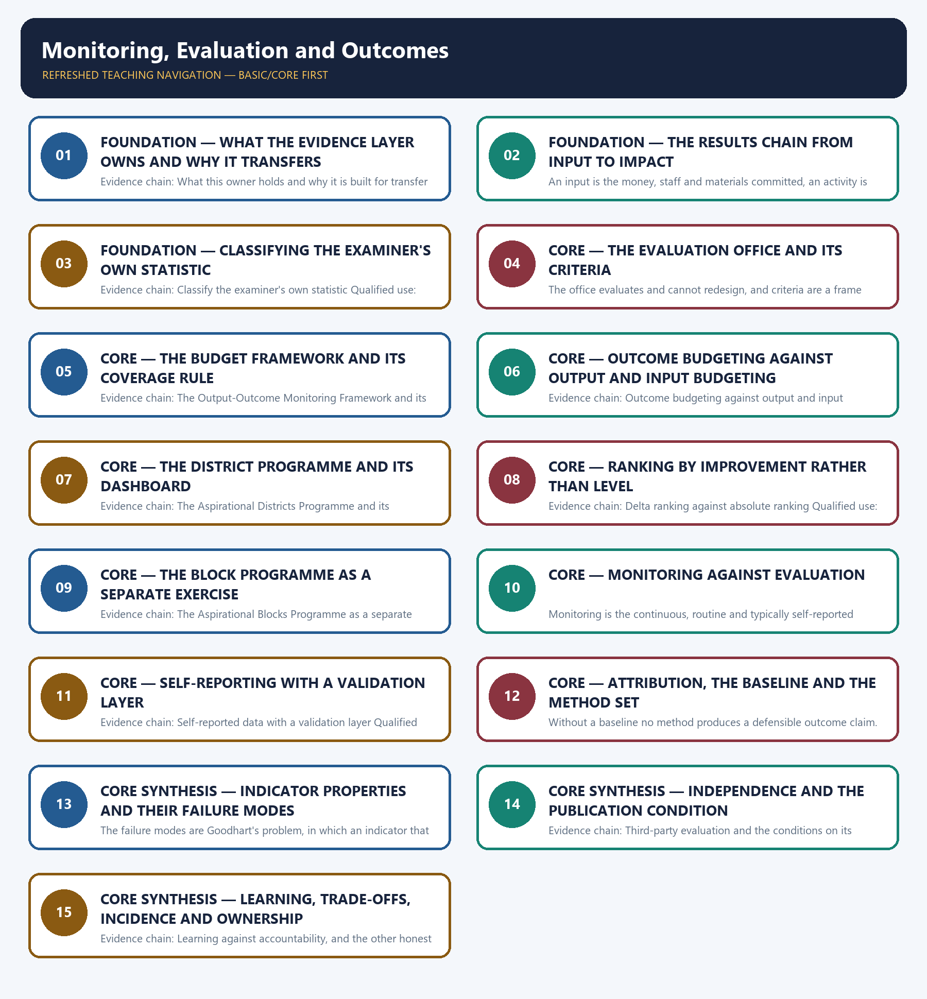

# Monitoring, Evaluation and Outcomes — Learner-v2 Complete Learning Session

> **Authoring-only generation:** 2026-09-02. No PDF was rendered and no tracker or index was mutated.

### SOURCE, PROGRESSION AND CURRENT-LINKAGE AUDIT

- **Generation date:** 2026-09-02.
- **Repository-first evidence:** the Basic owner is taught first and preserved in full; the Advanced owner is retained only in the optional final teaching block.
- **OCR evidence:** Repository Markdown was primary. The OCR-searchable official General Studies question papers held under books\mains and books\more_previous_papers were used only to confirm the printed wording of routed Mains demands. No official answer key, marking scheme, page precision or unsupported quotation was imported from them.
- **Qdrant:** not used; repository Markdown and available OCR context were sufficient.
- **PYQ integrity:** No direct General Studies Mains demand and no applied objective demand in the audited 2018-2023, 2024-2025 or 2026 routing ledgers is routed to this topic, and the Basic owner records the same position expressly, so this package carries a transparent zero-direct-question audit rather than a manufactured demand card. No question has been invented from the locally held OCR-searchable official papers, no stem has been paraphrased into an apparent routing, and no official answer key or marking scheme has been consulted for this topic because none is applicable. The examinable consequence is stated openly instead: this topic appears in the examination as the evaluative half of demands owned elsewhere, such as assessing a scheme's effectiveness, judging governance quality or scrutinising expenditure, so the six original solved Mains answers below are built for transfer to an unfamiliar programme rather than for a remembered question, and every figure used is carried with its owner-verified status date and its year. No district rank or indicator value, no evaluation finding, effect size or recommendation, no count of completed evaluations, no coverage percentage without its year and no study attribution is recorded or inferred anywhere in this package.
- **Live-link boundary:** One live official page was verified for this topic on 2026-09-02. The Development Monitoring and Evaluation Office's own website at dmeo.gov.in was read successfully on that date and states that the office is an attached office of NITI Aayog, that it was constituted in September 2015 by merging the erstwhile Program Evaluation Office and the Independent Evaluation Office, that it works to fulfil the monitoring and evaluation mandate and to build the monitoring and evaluation ecosystem in India, and that it is mandated to actively monitor and evaluate the implementation of schemes, programmes and initiatives of the Government of India in order to strengthen their implementation and scope of delivery on an ongoing basis by tracking performance, determining outcomes, diagnosing reasons for poor performance and generating recommendations for course correction; only that statement of constitution and mandate is used, and no evaluation, finding, effect size, recommendation or completed-evaluation count is imported from it. Two further official checks were attempted on the same date and were refused with an access error, namely the NITI Aayog website and the Union Budget portal, so no content from either was read or used and no secondary summary has been treated as an official source. The remaining dated official elements used are those already carried by the repository owners with their status checks, namely the administration of the Output-Outcome Monitoring Framework by the Ministry of Finance's Budget Division as an annual Union Budget document requiring outlay, outputs, outcomes, indicators and targets for covered schemes, the coverage of the 2026-27 document recorded as one hundred and seventy-two major schemes at an outlay threshold of five hundred crore rupees or more, the Aspirational Districts Programme's one hundred and twelve districts and forty-nine key performance indicators across five themes with the Champions of Change dashboard and delta ranking, the separate Aspirational Blocks Programme recorded as five hundred and thirteen blocks, and the office's relevance, effectiveness, efficiency, sustainability and impact criteria together with coherence and equity, all as checked by the owners on 21 July 2026. Every one of those counts is document-year-specific or programme-design-specific and is cited here with that status date, and the package states expressly that a scheme-coverage or threshold figure must never be carried forward across Budget years. No district rank or indicator value is asserted, no evaluation finding, effect size or recommendation is asserted, no count of completed evaluations is asserted, no scheme-coverage percentage without its year is asserted, and no randomised study result or attribution is asserted. The measurement of governance quality by composite indices is cross-linked to the good-governance owner and the evaluation stage of the policy cycle to the policy-design owner rather than restated here.
- **Fact/inference discipline:** no current-affairs item, PYQ wording, figure or quotation is invented.

## BASIC LEARNING SESSION

### DEEP-REVIEW LEARNING CONTRACT

| Control | Binding rule for this package |
|---|---|
| Syllabus boundary | Complete Governance Basic/Core is answer-complete before optional Advanced depth. |
| Authority boundary | Constitution, statute, delegated rule, executive policy, scheme, recommendation, institution and implementation outcome remain distinct. |
| Implementation method | Objective → authority → finance → institution → frontline process → citizen access → output → outcome → feedback and remedy. |
| Federal method | Union, state, district, local body, regulator, parastatal and non-state roles are assigned without inventing jurisdiction. |
| Accountability method | Duty-holder → information → forum → questioning → consequence → correction → grievance/appeal. |
| Evidence method | Claim → named India-centric law/institution/scheme/case → causal analysis → source/date/status and implementation qualification. |
| Inclusion method | Gender, caste, tribe, disability, language, region, digital divide, privacy and offline safeguards are tested across access and outcome. |
| Practice contract | Every solved item has demand decoding, a detailed examiner-grade model, executable timed/compression plan, marks rationale and answer-specific improvement. |
| Approval | This immutable successor remains `approved: false` pending explicit approval. |

**Canonical Basic/Core owner:** `upsc-ai-kit\knowledge\Governance\basic\15_Monitoring-Evaluation-and-Outcomes.md`  
**Substantive canonical provenance owner:** `upsc-ai-kit\knowledge\Governance\15_Monitoring-Evaluation-and-Outcomes_Learner-V2-Complete-Topic-Package.md`  
**Optional Advanced owner:** `upsc-ai-kit\knowledge\Governance\advanced\15_Monitoring-Evaluation-and-Outcomes.md`  
**Official syllabus mapping:** `upsc-ai-kit\knowledge\Governance\OFFICIAL-UPSC-SYLLABUS-MAPPING.md`

### EVIDENCE, PYQ AND CURRENT-STATUS CONTROL

- **Legal-status discipline:** a proposal, commission recommendation, policy announcement, Cabinet approval, enacted statute, notified rule, commenced provision and implemented programme are never treated as the same status.
- **Institutional discipline:** constitutional, statutory, executive, regulatory, autonomous, registered private and international bodies retain exact mandate, jurisdiction and accountability.
- **Causal discipline:** allocation, portal creation, training, registration, disposal count or ranking does not by itself prove access, remedy, capability, service quality or outcome.
- **Indicator discipline:** input, process, output, outcome and impact indicators are separated; denominator, baseline, disaggregation, attribution and gaming risks are stated.
- **Trade-off discipline:** speed, expertise, autonomy, transparency, privacy, participation, fiscal control and inclusion are balanced with safeguards and residual risk.
- **PYQ discipline:** exact wording is preserved only where verified; routed or reconstructed demands remain labelled and no inferred answer is promoted as official.
- **Current-status note, rechecked 2026-09-02:** volatile law, scheme, institution, tournament and programme claims retain official source, date, jurisdiction and operative/interim/final status.

**Generation-local live/current sources:**
- `https://dmeo.gov.in/`




*Distinct embedded teaching-navigation image. The separate continuous Cārvāka-style flowchart package remains an independent at-a-glance artifact.*

### SESSION 1 — FOUNDATION — WHAT THE EVIDENCE LAYER OWNS AND WHY IT TRANSFERS

#### DEFINITION / WHAT THIS IS CALLED

**Plain-language definition:** FOUNDATION — What the evidence layer owns and why it transfers comprises FOUNDATION, What the evidence layer owns and why it transfers as its core connected dimensions.

**Technical definition:** Evidence chain: What this owner holds and why it is built for transfer Qualified use: Open any evaluation demand by stating what evidence would settle it.

#### ANSWER-GRABBING OPENING — WRITE/ADAPT IN THE EXAM

> This topic owns the evidence layer of governance, namely how a claim that a scheme worked is established or refuted, and its distinctive feature is that no direct General Studies Mains demand in the audited 2018 to 2025 ledgers is routed to it, so it appears as the evaluative half of demands about schemes, governance quality and expenditure; the architecture is therefore built for transfer to an unfamiliar programme rather than for a remembered question, and the measurement of governance quality by composite indices belongs to the good-governance owner while the policy cycle belongs to the policy-design owner.

#### MUST-WRITE KEYWORDS

- **FOUNDATION**
- **What the evidence layer owns**
- **why it transfers**
- **Evidence chain**
- **Qualified use**
- **This**

**How to use them:** Frame the answer through FOUNDATION; define What the evidence layer owns, connect why it transfers with Evidence chain to explain the mechanism, and use Qualified use for the decisive comparison or qualification.

#### VISUAL FIRST

```text
WHAT THE EVIDENCE LAYER OWNS AND WHY IT TRANSFERS
01. What this owner holds and why it is built for transfer
BOUNDARY -> No direct Mains demand is routed here, so the architecture is built for transfer.
```

*This topic-specific rail fixes the evidence sequence and its exam boundary before analysis.*

#### CORE EXPLANATION

This topic owns the evidence layer of governance, namely how a claim that a scheme worked is established or refuted, and its distinctive feature is that no direct General Studies Mains demand in the audited 2018 to 2025 ledgers is routed to it, so it appears as the evaluative half of demands about schemes, governance quality and expenditure; the architecture is therefore built for transfer to an unfamiliar programme rather than for a remembered question, and the measurement of governance quality by composite indices belongs to the good-governance owner while the policy cycle belongs to the policy-design owner.

#### NAMED EVIDENCE AND MECHANISM

- This topic owns the evidence layer of governance, namely how a claim that a scheme worked is established or refuted, and its distinctive feature is that no direct General Studies Mains demand in the audited 2018 to 2025 ledgers is routed to it, so it appears as the evaluative half of demands about schemes, governance quality and expenditure; the architecture is therefore built for transfer to an unfamiliar programme rather than for a remembered question, and the measurement of governance quality by composite indices belongs to the good-governance owner while the policy cycle belongs to the policy-design owner.

#### EXAMINER CAUTION

- No direct Mains demand is routed here, so the architecture is built for transfer.

#### EXAM LINK

- **Prelims:** Retain the exact statute, section, institution, official category, dated edition or scope rule attached to What the evidence layer owns and why it transfers.
- **Mains:** Open any evaluation demand by stating what evidence would settle it.

#### MINI RECAP

- **Evidence chain:** What this owner holds and why it is built for transfer
- **Qualified use:** Open any evaluation demand by stating what evidence would settle it.

#### CLOSING RECALL FLOW — FOUNDATION — WHAT THE EVIDENCE LAYER OWNS AND WHY IT TRANSFERS

```text
START / CONCEPT: FOUNDATION — What the evidence layer owns and why it transfers
        |
        v
EXACT TERMS: FOUNDATION · What the evidence layer owns · why it transfers · Evidence chain · Qualified use · This
        |
        v
MECHANISM / ARGUMENT: Evidence chain: What this owner holds and why it is built for transfer Qualified use: Open any evaluation demand by stating what evidence would settle it.
        |
        v
CONSEQUENCE / CONTRAST: No direct Mains demand is routed here, so the architecture is built for transfer.
        |
        v
UPSC TRAP / ANSWER-USE: Do not miss this limiting distinction: open any evaluation demand by stating what evidence would settle it.
        |
        v
ANSWER-GRABBING FORMULATION: This topic owns the evidence layer of governance, namely how a claim that a scheme worked is established or refuted, and its distinctive feature is that no direct General Studies Mains demand in the audited 2018 to 2025 ledgers is routed to it, so it appears as the evaluative half of demands about schemes, governance quality and expenditure; the architecture is therefore built for transfer to an unfamiliar programme rather than for a remembered question, and the measurement of governance quality by composite indices belongs to the good-governance owner while the policy cycle belongs to the policy-design owner.
```
### SESSION 2 — FOUNDATION — THE RESULTS CHAIN FROM INPUT TO IMPACT

#### DEFINITION / WHAT THIS IS CALLED

**Plain-language definition:** The results chain is the ordered sequence from input through activity and output to outcome and impact, and it is the spine of any demand that asks for an evaluation or an assessment of impact because it locates where the available evidence actually sits, shows where reporting stops, and identifies the rung at which attribution becomes contested; building the chain before citing anything is what converts a descriptive answer into an evaluative one.

**Technical definition:** An input is the money, staff and materials committed, an activity is what was done, an output is what the activity directly produced such as kilometres of road or schools constructed, an outcome is the change in the target population's condition such as reduced travel time or improved learning, and an impact is the longer-term and wider change such as market access, income or mobility; outputs are necessary evidence and are never sufficient evidence that the intended change occurred, and most Indian scheme reporting stops at the output rung.

#### ANSWER-GRABBING OPENING — WRITE/ADAPT IN THE EXAM

> The results chain is the ordered sequence from input through activity and output to outcome and impact, and it is the spine of any demand that asks for an evaluation or an assessment of impact because it locates where the available evidence actually sits, shows where reporting stops, and identifies the rung at which attribution becomes contested; building the chain before citing anything is what converts a descriptive answer into an evaluative one.

#### MUST-WRITE KEYWORDS

- **FOUNDATION**
- **Evidence chain**
- **Qualified use**
- **An input**
- **Indian**
- **The results chain**

**How to use them:** Frame the answer through FOUNDATION; define Evidence chain, connect Qualified use with An input to explain the mechanism, and use Indian for the decisive comparison or qualification.

#### VISUAL FIRST

```text
THE RESULTS CHAIN FROM INPUT TO IMPACT
01. Input, activity, output, outcome and impact
    |
    v
02. The results chain as the spine of every evaluative answer
BOUNDARY -> Outputs are necessary evidence and never sufficient evidence of change.
```

*This topic-specific rail fixes the evidence sequence and its exam boundary before analysis.*

#### CORE EXPLANATION

An input is the money, staff and materials committed, an activity is what was done, an output is what the activity directly produced such as kilometres of road or schools constructed, an outcome is the change in the target population's condition such as reduced travel time or improved learning, and an impact is the longer-term and wider change such as market access, income or mobility; outputs are necessary evidence and are never sufficient evidence that the intended change occurred, and most Indian scheme reporting stops at the output rung. The results chain is the ordered sequence from input through activity and output to outcome and impact, and it is the spine of any demand that asks for an evaluation or an assessment of impact because it locates where the available evidence actually sits, shows where reporting stops, and identifies the rung at which attribution becomes contested; building the chain before citing anything is what converts a descriptive answer into an evaluative one.

#### NAMED EVIDENCE AND MECHANISM

- An input is the money, staff and materials committed, an activity is what was done, an output is what the activity directly produced such as kilometres of road or schools constructed, an outcome is the change in the target population's condition such as reduced travel time or improved learning, and an impact is the longer-term and wider change such as market access, income or mobility; outputs are necessary evidence and are never sufficient evidence that the intended change occurred, and most Indian scheme reporting stops at the output rung.
- The results chain is the ordered sequence from input through activity and output to outcome and impact, and it is the spine of any demand that asks for an evaluation or an assessment of impact because it locates where the available evidence actually sits, shows where reporting stops, and identifies the rung at which attribution becomes contested; building the chain before citing anything is what converts a descriptive answer into an evaluative one.

#### EXAMINER CAUTION

- Outputs are necessary evidence and never sufficient evidence of change.

#### EXAM LINK

- **Prelims:** Retain the exact statute, section, institution, official category, dated edition or scope rule attached to The results chain from input to impact.
- **Mains:** Build the chain before citing a single figure.

#### MINI RECAP

- **Evidence chain:** Input, activity, output, outcome and impact -> The results chain as the spine of every evaluative answer
- **Qualified use:** Build the chain before citing a single figure.

#### CLOSING RECALL FLOW — FOUNDATION — THE RESULTS CHAIN FROM INPUT TO IMPACT

```text
START / CONCEPT: FOUNDATION — The results chain from input to impact
        |
        v
EXACT TERMS: FOUNDATION · Evidence chain · Qualified use · An input · Indian · The results chain
        |
        v
MECHANISM / ARGUMENT: Prelims: Retain the exact statute, section, institution, official category, dated edition or scope rule attached to The results chain from input to impact.
        |
        v
CONSEQUENCE / CONTRAST: Evidence chain: Input, activity, output, outcome and impact - The results chain as the spine of every evaluative answer Qualified use: Build the chain before citing a single figure.
        |
        v
UPSC TRAP / ANSWER-USE: An input is the money, staff and materials committed, an activity is what was done, an output is what the activity directly produced such as kilometres of road or schools constructed, an outcome is the change in the target population's condition such as reduced travel time or improved learning, and an impact is the longer-term and wider change such as market access, income or mobility; outputs are necessary evidence and are never sufficient evidence that the intended change occurred, and most Indian scheme reporting stops at the output rung.
        |
        v
ANSWER-GRABBING FORMULATION: The results chain is the ordered sequence from input through activity and output to outcome and impact, and it is the spine of any demand that asks for an evaluation or an assessment of impact because it locates where the available evidence actually sits, shows where reporting stops, and identifies the rung at which attribution becomes contested; building the chain before citing anything is what converts a descriptive answer into an evaluative one.
```
### SESSION 3 — FOUNDATION — CLASSIFYING THE EXAMINER'S OWN STATISTIC

#### DEFINITION / WHAT THIS IS CALLED

**Plain-language definition:** The move that earns marks is to name the rung on which a cited statistic sits, because a figure such as the share of households covered is an output while a figure such as water quality at the point of use is an outcome, so performing that classification on the examiner's own number demonstrates both the criteria and the evidence discipline at once and prevents an answer from treating coverage as proof of effect.

**Technical definition:** Evidence chain: Classify the examiner's own statistic Qualified use: Demonstrate evidence discipline on the number supplied in the stem.

#### ANSWER-GRABBING OPENING — WRITE/ADAPT IN THE EXAM

> The move that earns marks is to name the rung on which a cited statistic sits, because a figure such as the share of households covered is an output while a figure such as water quality at the point of use is an outcome, so performing that classification on the examiner's own number demonstrates both the criteria and the evidence discipline at once and prevents an answer from treating coverage as proof of effect.

#### MUST-WRITE KEYWORDS

- **FOUNDATION**
- **Classifying the examiner's own statistic**
- **Evidence chain**
- **Qualified use**
- **The move that earns marks**
- **Coverage**

**How to use them:** Frame the answer through FOUNDATION; define Classifying the examiner's own statistic, connect Evidence chain with Qualified use to explain the mechanism, and use The move that earns marks for the decisive comparison or qualification.

#### VISUAL FIRST

```text
CLASSIFYING THE EXAMINER'S OWN STATISTIC
01. Classify the examiner's own statistic
BOUNDARY -> Coverage is an output and must not be presented as proof of effect.
```

*This topic-specific rail fixes the evidence sequence and its exam boundary before analysis.*

#### CORE EXPLANATION

The move that earns marks is to name the rung on which a cited statistic sits, because a figure such as the share of households covered is an output while a figure such as water quality at the point of use is an outcome, so performing that classification on the examiner's own number demonstrates both the criteria and the evidence discipline at once and prevents an answer from treating coverage as proof of effect.

#### NAMED EVIDENCE AND MECHANISM

- The move that earns marks is to name the rung on which a cited statistic sits, because a figure such as the share of households covered is an output while a figure such as water quality at the point of use is an outcome, so performing that classification on the examiner's own number demonstrates both the criteria and the evidence discipline at once and prevents an answer from treating coverage as proof of effect.

#### EXAMINER CAUTION

- Coverage is an output and must not be presented as proof of effect.

#### EXAM LINK

- **Prelims:** Retain the exact statute, section, institution, official category, dated edition or scope rule attached to Classifying the examiner's own statistic.
- **Mains:** Demonstrate evidence discipline on the number supplied in the stem.

#### MINI RECAP

- **Evidence chain:** Classify the examiner's own statistic
- **Qualified use:** Demonstrate evidence discipline on the number supplied in the stem.

#### CLOSING RECALL FLOW — FOUNDATION — CLASSIFYING THE EXAMINER'S OWN STATISTIC

```text
START / CONCEPT: FOUNDATION — Classifying the examiner's own statistic
        |
        v
EXACT TERMS: FOUNDATION · Classifying the examiner's own statistic · Evidence chain · Qualified use · The move that earns marks · Coverage
        |
        v
MECHANISM / ARGUMENT: Evidence chain: Classify the examiner's own statistic Qualified use: Demonstrate evidence discipline on the number supplied in the stem.
        |
        v
CONSEQUENCE / CONTRAST: Coverage is an output and must not be presented as proof of effect.
        |
        v
UPSC TRAP / ANSWER-USE: Do not miss this limiting distinction: demonstrate evidence discipline on the number supplied in the stem.
        |
        v
ANSWER-GRABBING FORMULATION: The move that earns marks is to name the rung on which a cited statistic sits, because a figure such as the share of households covered is an output while a figure such as water quality at the point of use is an outcome, so performing that classification on the examiner's own number demonstrates both the criteria and the evidence discipline at once and prevents an answer from treating coverage as proof of effect.
```
### SESSION 4 — CORE — THE EVALUATION OFFICE AND ITS CRITERIA

#### DEFINITION / WHAT THIS IS CALLED

**Plain-language definition:** The Development Monitoring and Evaluation Office is an attached office of NITI Aayog whose own website, read on 2 September 2026, states that it was constituted in September 2015 by merging the erstwhile Program Evaluation Office and the Independent Evaluation Office, that it is mandated to actively monitor and evaluate the implementation of schemes, programmes and initiatives of the Government of India in order to strengthen their implementation and scope of delivery on an ongoing basis, and that this requires tracking performance, determining outcomes, diagnosing reasons for poor performance and generating recommendations for course correction; it is an evaluator without authority to redesign, so its findings must be adopted by the line ministry to have effect.

**Technical definition:** The office evaluates and cannot redesign, and criteria are a frame rather than evidence.

#### ANSWER-GRABBING OPENING — WRITE/ADAPT IN THE EXAM

> Evidence chain: The Development Monitoring and Evaluation Office and its mandate - The REESI plus coherence and equity criteria Qualified use: Anchor an evaluate demand in a named institution and a named criteria set.

#### MUST-WRITE KEYWORDS

- **The evaluation office**
- **its criteria**
- **Evidence chain**
- **Qualified use**
- **The Development Monitoring and Evaluation Office**
- **The Development Monitoring**

**How to use them:** Frame the answer through The evaluation office; define its criteria, connect Evidence chain with Qualified use to explain the mechanism, and use The Development Monitoring and Evaluation Office for the decisive comparison or qualification.

#### VISUAL FIRST

```text
THE EVALUATION OFFICE AND ITS CRITERIA
01. The Development Monitoring and Evaluation Office and its mandate
    |
    v
02. The REESI plus coherence and equity criteria
BOUNDARY -> The office evaluates and cannot redesign, and criteria are a frame rather than evidence.
```

*This topic-specific rail fixes the evidence sequence and its exam boundary before analysis.*

#### CORE EXPLANATION

The Development Monitoring and Evaluation Office is an attached office of NITI Aayog whose own website, read on 2 September 2026, states that it was constituted in September 2015 by merging the erstwhile Program Evaluation Office and the Independent Evaluation Office, that it is mandated to actively monitor and evaluate the implementation of schemes, programmes and initiatives of the Government of India in order to strengthen their implementation and scope of delivery on an ongoing basis, and that this requires tracking performance, determining outcomes, diagnosing reasons for poor performance and generating recommendations for course correction; it is an evaluator without authority to redesign, so its findings must be adopted by the line ministry to have effect. The office's evaluation criteria are relevance, effectiveness, efficiency, sustainability and impact together with coherence and equity, and they supply a ready frame for any demand that uses the word evaluate, because they prevent impact from being reduced to output completion and force distributional effects to be stated explicitly; the criteria are a frame rather than evidence, so they organise an answer and never substitute for the findings themselves.

#### NAMED EVIDENCE AND MECHANISM

- The Development Monitoring and Evaluation Office is an attached office of NITI Aayog whose own website, read on 2 September 2026, states that it was constituted in September 2015 by merging the erstwhile Program Evaluation Office and the Independent Evaluation Office, that it is mandated to actively monitor and evaluate the implementation of schemes, programmes and initiatives of the Government of India in order to strengthen their implementation and scope of delivery on an ongoing basis, and that this requires tracking performance, determining outcomes, diagnosing reasons for poor performance and generating recommendations for course correction; it is an evaluator without authority to redesign, so its findings must be adopted by the line ministry to have effect.
- The office's evaluation criteria are relevance, effectiveness, efficiency, sustainability and impact together with coherence and equity, and they supply a ready frame for any demand that uses the word evaluate, because they prevent impact from being reduced to output completion and force distributional effects to be stated explicitly; the criteria are a frame rather than evidence, so they organise an answer and never substitute for the findings themselves.

#### EXAMINER CAUTION

- The office evaluates and cannot redesign, and criteria are a frame rather than evidence.

#### EXAM LINK

- **Prelims:** Retain the exact statute, section, institution, official category, dated edition or scope rule attached to The evaluation office and its criteria.
- **Mains:** Anchor an evaluate demand in a named institution and a named criteria set.

#### MINI RECAP

- **Evidence chain:** The Development Monitoring and Evaluation Office and its mandate -> The REESI plus coherence and equity criteria
- **Qualified use:** Anchor an evaluate demand in a named institution and a named criteria set.

#### CLOSING RECALL FLOW — CORE — THE EVALUATION OFFICE AND ITS CRITERIA

```text
START / CONCEPT: CORE — The evaluation office and its criteria
        |
        v
EXACT TERMS: The evaluation office · its criteria · Evidence chain · Qualified use · The Development Monitoring and Evaluation Office · The Development Monitoring
        |
        v
MECHANISM / ARGUMENT: The Development Monitoring and Evaluation Office is an attached office of NITI Aayog whose own website, read on 2 September 2026, states that it was constituted in September 2015 by merging the erstwhile Program Evaluation Office and the Independent Evaluation Office, that it is mandated to actively monitor and evaluate the implementation of schemes, programmes and initiatives of the Government of India in order to strengthen their implementation and scope of delivery on an ongoing basis, and that this requires tracking performance, determining outcomes, diagnosing reasons for poor performance and generating recommendations for course correction; it is an evaluator without authority to redesign, so its findings must be adopted by the line ministry to have effect.
        |
        v
CONSEQUENCE / CONTRAST: The office's evaluation criteria are relevance, effectiveness, efficiency, sustainability and impact together with coherence and equity, and they supply a ready frame for any demand that uses the word evaluate, because they prevent impact from being reduced to output completion and force distributional effects to be stated explicitly; the criteria are a frame rather than evidence, so they organise an answer and never substitute for the findings themselves.
        |
        v
UPSC TRAP / ANSWER-USE: The office evaluates and cannot redesign, and criteria are a frame rather than evidence.
        |
        v
ANSWER-GRABBING FORMULATION: Evidence chain: The Development Monitoring and Evaluation Office and its mandate - The REESI plus coherence and equity criteria Qualified use: Anchor an evaluate demand in a named institution and a named criteria set.
```
### SESSION 5 — CORE — THE BUDGET FRAMEWORK AND ITS COVERAGE RULE

#### DEFINITION / WHAT THIS IS CALLED

**Plain-language definition:** The Output-Outcome Monitoring Framework is an annual Union Budget document administered by the Ministry of Finance's Budget Division that requires covered major central-sector and centrally sponsored schemes to state financial outlay, outputs, outcomes, indicators and targets, so budget scrutiny extends beyond expenditure and physical counts, and its central limitation is that it does not cover every scheme in every year; the owners record for the 2026-27 document a coverage of one hundred and seventy-two major schemes at an outlay threshold of five hundred crore rupees or more as checked on 21 July 2026, and that figure must always be cited with its Budget year and never carried forward, because coverage is revised annually by design.

**Technical definition:** Evidence chain: The Output-Outcome Monitoring Framework and its coverage rule Qualified use: Cite the budget instrument with the discipline that protects it from staleness.

#### ANSWER-GRABBING OPENING — WRITE/ADAPT IN THE EXAM

> Evidence chain: The Output-Outcome Monitoring Framework and its coverage rule Qualified use: Cite the budget instrument with the discipline that protects it from staleness.

#### MUST-WRITE KEYWORDS

- **The budget framework**
- **its coverage rule**
- **Evidence chain**
- **Qualified use**
- **The Output-Outcome Monitoring Framework**
- **2026-27**

**How to use them:** Frame the answer through The budget framework; define its coverage rule, connect Evidence chain with Qualified use to explain the mechanism, and use The Output-Outcome Monitoring Framework for the decisive comparison or qualification.

#### VISUAL FIRST

```text
THE BUDGET FRAMEWORK AND ITS COVERAGE RULE
01. The Output-Outcome Monitoring Framework and its coverage rule
BOUNDARY -> Coverage is annual, so a figure must carry its Budget year and never be carried forward.
```

*This topic-specific rail fixes the evidence sequence and its exam boundary before analysis.*

#### CORE EXPLANATION

The Output-Outcome Monitoring Framework is an annual Union Budget document administered by the Ministry of Finance's Budget Division that requires covered major central-sector and centrally sponsored schemes to state financial outlay, outputs, outcomes, indicators and targets, so budget scrutiny extends beyond expenditure and physical counts, and its central limitation is that it does not cover every scheme in every year; the owners record for the 2026-27 document a coverage of one hundred and seventy-two major schemes at an outlay threshold of five hundred crore rupees or more as checked on 21 July 2026, and that figure must always be cited with its Budget year and never carried forward, because coverage is revised annually by design.

#### NAMED EVIDENCE AND MECHANISM

- The Output-Outcome Monitoring Framework is an annual Union Budget document administered by the Ministry of Finance's Budget Division that requires covered major central-sector and centrally sponsored schemes to state financial outlay, outputs, outcomes, indicators and targets, so budget scrutiny extends beyond expenditure and physical counts, and its central limitation is that it does not cover every scheme in every year; the owners record for the 2026-27 document a coverage of one hundred and seventy-two major schemes at an outlay threshold of five hundred crore rupees or more as checked on 21 July 2026, and that figure must always be cited with its Budget year and never carried forward, because coverage is revised annually by design.

#### EXAMINER CAUTION

- Coverage is annual, so a figure must carry its Budget year and never be carried forward.

#### EXAM LINK

- **Prelims:** Retain the exact statute, section, institution, official category, dated edition or scope rule attached to The budget framework and its coverage rule.
- **Mains:** Cite the budget instrument with the discipline that protects it from staleness.

#### MINI RECAP

- **Evidence chain:** The Output-Outcome Monitoring Framework and its coverage rule
- **Qualified use:** Cite the budget instrument with the discipline that protects it from staleness.

#### CLOSING RECALL FLOW — CORE — THE BUDGET FRAMEWORK AND ITS COVERAGE RULE

```text
START / CONCEPT: CORE — The budget framework and its coverage rule
        |
        v
EXACT TERMS: The budget framework · its coverage rule · Evidence chain · Qualified use · The Output-Outcome Monitoring Framework · 2026-27
        |
        v
MECHANISM / ARGUMENT: The Output-Outcome Monitoring Framework is an annual Union Budget document administered by the Ministry of Finance's Budget Division that requires covered major central-sector and centrally sponsored schemes to state financial outlay, outputs, outcomes, indicators and targets, so budget scrutiny extends beyond expenditure and physical counts, and its central limitation is that it does not cover every scheme in every year; the owners record for the 2026-27 document a coverage of one hundred and seventy-two major schemes at an outlay threshold of five hundred crore rupees or more as checked on 21 July 2026, and that figure must always be cited with its Budget year and never carried forward, because coverage is revised annually by design.
        |
        v
CONSEQUENCE / CONTRAST: Coverage is annual, so a figure must carry its Budget year and never be carried forward.
        |
        v
UPSC TRAP / ANSWER-USE: Do not miss this limiting distinction: the Output-Outcome Monitoring Framework and its coverage rule Qualified use.
        |
        v
ANSWER-GRABBING FORMULATION: Evidence chain: The Output-Outcome Monitoring Framework and its coverage rule Qualified use: Cite the budget instrument with the discipline that protects it from staleness.
```
### SESSION 6 — CORE — OUTCOME BUDGETING AGAINST OUTPUT AND INPUT BUDGETING

#### DEFINITION / WHAT THIS IS CALLED

**Plain-language definition:** Input budgeting is traditional line-item budgeting that tracks how much money is allocated to a category, output budgeting tracks the physical units produced for that allocation, and outcome budgeting links the allocation to the change actually achieved, so the framework represents a deliberate shift from output-focused reporting toward outcome-focused accountability; its unfinished business is that outcome achievement carries no budgetary consequence and that outcome targets can themselves be set undemandingly, so the formal requirement outruns the practice.

**Technical definition:** Evidence chain: Outcome budgeting against output and input budgeting Qualified use: Grade a budgeting reform instead of endorsing or dismissing it.

#### ANSWER-GRABBING OPENING — WRITE/ADAPT IN THE EXAM

> Evidence chain: Outcome budgeting against output and input budgeting Qualified use: Grade a budgeting reform instead of endorsing or dismissing it.

#### MUST-WRITE KEYWORDS

- **Outcome budgeting against output**
- **input budgeting**
- **Evidence chain**
- **Qualified use**
- **Input**
- **Outcome**

**How to use them:** Frame the answer through Outcome budgeting against output; define input budgeting, connect Evidence chain with Qualified use to explain the mechanism, and use Input for the decisive comparison or qualification.

#### VISUAL FIRST

```text
OUTCOME BUDGETING AGAINST OUTPUT AND INPUT BUDGETING
01. Outcome budgeting against output and input budgeting
BOUNDARY -> The formal requirement outruns the practice while achievement carries no budgetary consequence.
```

*This topic-specific rail fixes the evidence sequence and its exam boundary before analysis.*

#### CORE EXPLANATION

Input budgeting is traditional line-item budgeting that tracks how much money is allocated to a category, output budgeting tracks the physical units produced for that allocation, and outcome budgeting links the allocation to the change actually achieved, so the framework represents a deliberate shift from output-focused reporting toward outcome-focused accountability; its unfinished business is that outcome achievement carries no budgetary consequence and that outcome targets can themselves be set undemandingly, so the formal requirement outruns the practice.

#### NAMED EVIDENCE AND MECHANISM

- Input budgeting is traditional line-item budgeting that tracks how much money is allocated to a category, output budgeting tracks the physical units produced for that allocation, and outcome budgeting links the allocation to the change actually achieved, so the framework represents a deliberate shift from output-focused reporting toward outcome-focused accountability; its unfinished business is that outcome achievement carries no budgetary consequence and that outcome targets can themselves be set undemandingly, so the formal requirement outruns the practice.

#### EXAMINER CAUTION

- The formal requirement outruns the practice while achievement carries no budgetary consequence.

#### EXAM LINK

- **Prelims:** Retain the exact statute, section, institution, official category, dated edition or scope rule attached to Outcome budgeting against output and input budgeting.
- **Mains:** Grade a budgeting reform instead of endorsing or dismissing it.

#### MINI RECAP

- **Evidence chain:** Outcome budgeting against output and input budgeting
- **Qualified use:** Grade a budgeting reform instead of endorsing or dismissing it.

#### CLOSING RECALL FLOW — CORE — OUTCOME BUDGETING AGAINST OUTPUT AND INPUT BUDGETING

```text
START / CONCEPT: CORE — Outcome budgeting against output and input budgeting
        |
        v
EXACT TERMS: Outcome budgeting against output · input budgeting · Evidence chain · Qualified use · Input · Outcome
        |
        v
MECHANISM / ARGUMENT: Input budgeting is traditional line-item budgeting that tracks how much money is allocated to a category, output budgeting tracks the physical units produced for that allocation, and outcome budgeting links the allocation to the change actually achieved, so the framework represents a deliberate shift from output-focused reporting toward outcome-focused accountability; its unfinished business is that outcome achievement carries no budgetary consequence and that outcome targets can themselves be set undemandingly, so the formal requirement outruns the practice.
        |
        v
CONSEQUENCE / CONTRAST: The resulting consequence is that outcome budgeting against output and input budgeting Qualified use.
        |
        v
UPSC TRAP / ANSWER-USE: Do not miss this limiting distinction: outcome budgeting against output and input budgeting Qualified use.
        |
        v
ANSWER-GRABBING FORMULATION: Evidence chain: Outcome budgeting against output and input budgeting Qualified use: Grade a budgeting reform instead of endorsing or dismissing it.
```
### SESSION 7 — CORE — THE DISTRICT PROGRAMME AND ITS DASHBOARD

#### DEFINITION / WHAT THIS IS CALLED

**Plain-language definition:** The Aspirational Districts Programme of NITI Aayog covers one hundred and twelve districts and tracks forty-nine key performance indicators across five themes, namely health and nutrition, education, agriculture and water resources, financial inclusion and skill development, and basic infrastructure, through the Champions of Change dashboard with a delta-ranking system, and its distinctive contribution is that monthly indicators closer to outcome measures are collected directly from district officers rather than waiting for a periodic evaluation report; the district unit necessarily masks divergence within a district.

**Technical definition:** Evidence chain: The Aspirational Districts Programme and its dashboard architecture Qualified use: Supply the standard Indian example of near-real-time monitoring with its limit.

#### ANSWER-GRABBING OPENING — WRITE/ADAPT IN THE EXAM

> The Aspirational Districts Programme of NITI Aayog covers one hundred and twelve districts and tracks forty-nine key performance indicators across five themes, namely health and nutrition, education, agriculture and water resources, financial inclusion and skill development, and basic infrastructure, through the Champions of Change dashboard with a delta-ranking system, and its distinctive contribution is that monthly indicators closer to outcome measures are collected directly from district officers rather than waiting for a periodic evaluation report; the district unit necessarily masks divergence within a district.

#### MUST-WRITE KEYWORDS

- **The district programme**
- **its dashboard**
- **Evidence chain**
- **Qualified use**
- **The Aspirational Districts Programme**
- **NITI Aayog**

**How to use them:** Frame the answer through The district programme; define its dashboard, connect Evidence chain with Qualified use to explain the mechanism, and use The Aspirational Districts Programme for the decisive comparison or qualification.

#### VISUAL FIRST

```text
THE DISTRICT PROGRAMME AND ITS DASHBOARD
01. The Aspirational Districts Programme and its dashboard architecture
BOUNDARY -> The district unit conceals divergence inside the district.
```

*This topic-specific rail fixes the evidence sequence and its exam boundary before analysis.*

#### CORE EXPLANATION

The Aspirational Districts Programme of NITI Aayog covers one hundred and twelve districts and tracks forty-nine key performance indicators across five themes, namely health and nutrition, education, agriculture and water resources, financial inclusion and skill development, and basic infrastructure, through the Champions of Change dashboard with a delta-ranking system, and its distinctive contribution is that monthly indicators closer to outcome measures are collected directly from district officers rather than waiting for a periodic evaluation report; the district unit necessarily masks divergence within a district.

#### NAMED EVIDENCE AND MECHANISM

- The Aspirational Districts Programme of NITI Aayog covers one hundred and twelve districts and tracks forty-nine key performance indicators across five themes, namely health and nutrition, education, agriculture and water resources, financial inclusion and skill development, and basic infrastructure, through the Champions of Change dashboard with a delta-ranking system, and its distinctive contribution is that monthly indicators closer to outcome measures are collected directly from district officers rather than waiting for a periodic evaluation report; the district unit necessarily masks divergence within a district.

#### EXAMINER CAUTION

- The district unit conceals divergence inside the district.

#### EXAM LINK

- **Prelims:** Retain the exact statute, section, institution, official category, dated edition or scope rule attached to The district programme and its dashboard.
- **Mains:** Supply the standard Indian example of near-real-time monitoring with its limit.

#### MINI RECAP

- **Evidence chain:** The Aspirational Districts Programme and its dashboard architecture
- **Qualified use:** Supply the standard Indian example of near-real-time monitoring with its limit.

#### CLOSING RECALL FLOW — CORE — THE DISTRICT PROGRAMME AND ITS DASHBOARD

```text
START / CONCEPT: CORE — The district programme and its dashboard
        |
        v
EXACT TERMS: The district programme · its dashboard · Evidence chain · Qualified use · The Aspirational Districts Programme · NITI Aayog
        |
        v
MECHANISM / ARGUMENT: Evidence chain: The Aspirational Districts Programme and its dashboard architecture Qualified use: Supply the standard Indian example of near-real-time monitoring with its limit.
        |
        v
CONSEQUENCE / CONTRAST: The resulting consequence is that the Aspirational Districts Programme and its dashboard architecture Qualified use.
        |
        v
UPSC TRAP / ANSWER-USE: Do not miss this limiting distinction: the Aspirational Districts Programme and its dashboard architecture Qualified use.
        |
        v
ANSWER-GRABBING FORMULATION: The Aspirational Districts Programme of NITI Aayog covers one hundred and twelve districts and tracks forty-nine key performance indicators across five themes, namely health and nutrition, education, agriculture and water resources, financial inclusion and skill development, and basic infrastructure, through the Champions of Change dashboard with a delta-ranking system, and its distinctive contribution is that monthly indicators closer to outcome measures are collected directly from district officers rather than waiting for a periodic evaluation report; the district unit necessarily masks divergence within a district.
```
### SESSION 8 — CORE — RANKING BY IMPROVEMENT RATHER THAN LEVEL

#### DEFINITION / WHAT THIS IS CALLED

**Plain-language definition:** Absolute ranking compares units on their present level and therefore favours already-advantaged units, while delta ranking compares the rate of improvement over a defined period and therefore rewards effort regardless of the starting position, which is a deliberate incentive-design choice that prevents a historically disadvantaged district from being permanently placed at the bottom; the corresponding risk is that any improvement-based metric can be gamed through baseline understatement, so careful baseline-setting and independent validation are the conditions on which its credibility rests.

**Technical definition:** Evidence chain: Delta ranking against absolute ranking Qualified use: Show an incentive-design choice with its risk and its validation condition.

#### ANSWER-GRABBING OPENING — WRITE/ADAPT IN THE EXAM

> Absolute ranking compares units on their present level and therefore favours already-advantaged units, while delta ranking compares the rate of improvement over a defined period and therefore rewards effort regardless of the starting position, which is a deliberate incentive-design choice that prevents a historically disadvantaged district from being permanently placed at the bottom; the corresponding risk is that any improvement-based metric can be gamed through baseline understatement, so careful baseline-setting and independent validation are the conditions on which its credibility rests.

#### MUST-WRITE KEYWORDS

- **Ranking by improvement rather than level**
- **Evidence chain**
- **Qualified use**
- **Absolute**
- **Any**
- **Delta**

**How to use them:** Frame the answer through Ranking by improvement rather than level; define Evidence chain, connect Qualified use with Absolute to explain the mechanism, and use Any for the decisive comparison or qualification.

#### VISUAL FIRST

```text
RANKING BY IMPROVEMENT RATHER THAN LEVEL
01. Delta ranking against absolute ranking
BOUNDARY -> Any improvement metric can be gamed through baseline understatement.
```

*This topic-specific rail fixes the evidence sequence and its exam boundary before analysis.*

#### CORE EXPLANATION

Absolute ranking compares units on their present level and therefore favours already-advantaged units, while delta ranking compares the rate of improvement over a defined period and therefore rewards effort regardless of the starting position, which is a deliberate incentive-design choice that prevents a historically disadvantaged district from being permanently placed at the bottom; the corresponding risk is that any improvement-based metric can be gamed through baseline understatement, so careful baseline-setting and independent validation are the conditions on which its credibility rests.

#### NAMED EVIDENCE AND MECHANISM

- Absolute ranking compares units on their present level and therefore favours already-advantaged units, while delta ranking compares the rate of improvement over a defined period and therefore rewards effort regardless of the starting position, which is a deliberate incentive-design choice that prevents a historically disadvantaged district from being permanently placed at the bottom; the corresponding risk is that any improvement-based metric can be gamed through baseline understatement, so careful baseline-setting and independent validation are the conditions on which its credibility rests.

#### EXAMINER CAUTION

- Any improvement metric can be gamed through baseline understatement.

#### EXAM LINK

- **Prelims:** Retain the exact statute, section, institution, official category, dated edition or scope rule attached to Ranking by improvement rather than level.
- **Mains:** Show an incentive-design choice with its risk and its validation condition.

#### MINI RECAP

- **Evidence chain:** Delta ranking against absolute ranking
- **Qualified use:** Show an incentive-design choice with its risk and its validation condition.

#### CLOSING RECALL FLOW — CORE — RANKING BY IMPROVEMENT RATHER THAN LEVEL

```text
START / CONCEPT: CORE — Ranking by improvement rather than level
        |
        v
EXACT TERMS: Ranking by improvement rather than level · Evidence chain · Qualified use · Absolute · Any · Delta
        |
        v
MECHANISM / ARGUMENT: Any improvement metric can be gamed through baseline understatement.
        |
        v
CONSEQUENCE / CONTRAST: Evidence chain: Delta ranking against absolute ranking Qualified use: Show an incentive-design choice with its risk and its validation condition.
        |
        v
UPSC TRAP / ANSWER-USE: Do not miss this limiting distinction: show an incentive-design choice with its risk and its validation condition.
        |
        v
ANSWER-GRABBING FORMULATION: Absolute ranking compares units on their present level and therefore favours already-advantaged units, while delta ranking compares the rate of improvement over a defined period and therefore rewards effort regardless of the starting position, which is a deliberate incentive-design choice that prevents a historically disadvantaged district from being permanently placed at the bottom; the corresponding risk is that any improvement-based metric can be gamed through baseline understatement, so careful baseline-setting and independent validation are the conditions on which its credibility rests.
```
### SESSION 9 — CORE — THE BLOCK PROGRAMME AS A SEPARATE EXERCISE

#### DEFINITION / WHAT THIS IS CALLED

**Plain-language definition:** A related Aspirational Blocks Programme extends a similar logic to the sub-district level and is recorded in current NITI Aayog material as covering five hundred and thirteen blocks, and the analytical requirement is to keep the two programmes separate, because merging district and block unit counts or their indicator sets is the standard factual error in this area; the finer unit exists precisely because a district average can conceal a failing block.

**Technical definition:** Evidence chain: The Aspirational Blocks Programme as a separate exercise Qualified use: Avoid the standard factual error in this area of the syllabus.

#### ANSWER-GRABBING OPENING — WRITE/ADAPT IN THE EXAM

> A related Aspirational Blocks Programme extends a similar logic to the sub-district level and is recorded in current NITI Aayog material as covering five hundred and thirteen blocks, and the analytical requirement is to keep the two programmes separate, because merging district and block unit counts or their indicator sets is the standard factual error in this area; the finer unit exists precisely because a district average can conceal a failing block.

#### MUST-WRITE KEYWORDS

- **The block programme as a separate exercise**
- **Evidence chain**
- **Qualified use**
- **Aspirational Blocks Programme**
- **NITI Aayog**
- **District**

**How to use them:** Frame the answer through The block programme as a separate exercise; define Evidence chain, connect Qualified use with Aspirational Blocks Programme to explain the mechanism, and use NITI Aayog for the decisive comparison or qualification.

#### VISUAL FIRST

```text
THE BLOCK PROGRAMME AS A SEPARATE EXERCISE
01. The Aspirational Blocks Programme as a separate exercise
BOUNDARY -> District and block unit counts and indicator sets must never be merged.
```

*This topic-specific rail fixes the evidence sequence and its exam boundary before analysis.*

#### CORE EXPLANATION

A related Aspirational Blocks Programme extends a similar logic to the sub-district level and is recorded in current NITI Aayog material as covering five hundred and thirteen blocks, and the analytical requirement is to keep the two programmes separate, because merging district and block unit counts or their indicator sets is the standard factual error in this area; the finer unit exists precisely because a district average can conceal a failing block.

#### NAMED EVIDENCE AND MECHANISM

- A related Aspirational Blocks Programme extends a similar logic to the sub-district level and is recorded in current NITI Aayog material as covering five hundred and thirteen blocks, and the analytical requirement is to keep the two programmes separate, because merging district and block unit counts or their indicator sets is the standard factual error in this area; the finer unit exists precisely because a district average can conceal a failing block.

#### EXAMINER CAUTION

- District and block unit counts and indicator sets must never be merged.

#### EXAM LINK

- **Prelims:** Retain the exact statute, section, institution, official category, dated edition or scope rule attached to The block programme as a separate exercise.
- **Mains:** Avoid the standard factual error in this area of the syllabus.

#### MINI RECAP

- **Evidence chain:** The Aspirational Blocks Programme as a separate exercise
- **Qualified use:** Avoid the standard factual error in this area of the syllabus.

#### CLOSING RECALL FLOW — CORE — THE BLOCK PROGRAMME AS A SEPARATE EXERCISE

```text
START / CONCEPT: CORE — The block programme as a separate exercise
        |
        v
EXACT TERMS: The block programme as a separate exercise · Evidence chain · Qualified use · Aspirational Blocks Programme · NITI Aayog · District
        |
        v
MECHANISM / ARGUMENT: Evidence chain: The Aspirational Blocks Programme as a separate exercise Qualified use: Avoid the standard factual error in this area of the syllabus.
        |
        v
CONSEQUENCE / CONTRAST: District and block unit counts and indicator sets must never be merged.
        |
        v
UPSC TRAP / ANSWER-USE: Do not miss this limiting distinction: the Aspirational Blocks Programme as a separate exercise Qualified use.
        |
        v
ANSWER-GRABBING FORMULATION: A related Aspirational Blocks Programme extends a similar logic to the sub-district level and is recorded in current NITI Aayog material as covering five hundred and thirteen blocks, and the analytical requirement is to keep the two programmes separate, because merging district and block unit counts or their indicator sets is the standard factual error in this area; the finer unit exists precisely because a district average can conceal a failing block.
```
### SESSION 10 — CORE — MONITORING AGAINST EVALUATION

#### DEFINITION / WHAT THIS IS CALLED

**Plain-language definition:** Evidence chain: Monitoring and evaluation are complementary and distinct Qualified use: Split the two before assessing any information system.

**Technical definition:** Monitoring is the continuous, routine and typically self-reported tracking of implementation and immediate outputs, which supports rapid course correction, while evaluation is a periodic and often independent assessment of whether outcomes and impact were actually achieved, which supports scheme redesign, so neither substitutes for the other and conflating them leads either to over-reliance on self-reported dashboards or to under-use of the responsiveness that monitoring offers.

#### ANSWER-GRABBING OPENING — WRITE/ADAPT IN THE EXAM

> Evidence chain: Monitoring and evaluation are complementary and distinct Qualified use: Split the two before assessing any information system.

#### MUST-WRITE KEYWORDS

- **Monitoring against evaluation**
- **Evidence chain**
- **Qualified use**
- **Monitoring**
- **Evidence chain: Monitoring and evaluation**
- **Qualified**

**How to use them:** Frame the answer through Monitoring against evaluation; define Evidence chain, connect Qualified use with Monitoring to explain the mechanism, and use Evidence chain: Monitoring and evaluation for the decisive comparison or qualification.

#### VISUAL FIRST

```text
MONITORING AGAINST EVALUATION
01. Monitoring and evaluation are complementary and distinct
BOUNDARY -> Neither function substitutes for the other and each fails differently.
```

*This topic-specific rail fixes the evidence sequence and its exam boundary before analysis.*

#### CORE EXPLANATION

Monitoring is the continuous, routine and typically self-reported tracking of implementation and immediate outputs, which supports rapid course correction, while evaluation is a periodic and often independent assessment of whether outcomes and impact were actually achieved, which supports scheme redesign, so neither substitutes for the other and conflating them leads either to over-reliance on self-reported dashboards or to under-use of the responsiveness that monitoring offers.

#### NAMED EVIDENCE AND MECHANISM

- Monitoring is the continuous, routine and typically self-reported tracking of implementation and immediate outputs, which supports rapid course correction, while evaluation is a periodic and often independent assessment of whether outcomes and impact were actually achieved, which supports scheme redesign, so neither substitutes for the other and conflating them leads either to over-reliance on self-reported dashboards or to under-use of the responsiveness that monitoring offers.

#### EXAMINER CAUTION

- Neither function substitutes for the other and each fails differently.

#### EXAM LINK

- **Prelims:** Retain the exact statute, section, institution, official category, dated edition or scope rule attached to Monitoring against evaluation.
- **Mains:** Split the two before assessing any information system.

#### MINI RECAP

- **Evidence chain:** Monitoring and evaluation are complementary and distinct
- **Qualified use:** Split the two before assessing any information system.

#### CLOSING RECALL FLOW — CORE — MONITORING AGAINST EVALUATION

```text
START / CONCEPT: CORE — Monitoring against evaluation
        |
        v
EXACT TERMS: Monitoring against evaluation · Evidence chain · Qualified use · Monitoring · Evidence chain: Monitoring and evaluation · Qualified
        |
        v
MECHANISM / ARGUMENT: Monitoring is the continuous, routine and typically self-reported tracking of implementation and immediate outputs, which supports rapid course correction, while evaluation is a periodic and often independent assessment of whether outcomes and impact were actually achieved, which supports scheme redesign, so neither substitutes for the other and conflating them leads either to over-reliance on self-reported dashboards or to under-use of the responsiveness that monitoring offers.
        |
        v
CONSEQUENCE / CONTRAST: The resulting consequence is that monitoring is the continuous, routine and typically self-reported tracking of implementation and immediate outputs...
        |
        v
UPSC TRAP / ANSWER-USE: Do not miss this limiting distinction: monitoring is the continuous, routine and typically self-reported tracking of implementation and immediate outputs...
        |
        v
ANSWER-GRABBING FORMULATION: Evidence chain: Monitoring and evaluation are complementary and distinct Qualified use: Split the two before assessing any information system.
```
### SESSION 11 — CORE — SELF-REPORTING WITH A VALIDATION LAYER

#### DEFINITION / WHAT THIS IS CALLED

**Plain-language definition:** The district dashboard data is initially self-reported by district-level officers and then subject to validation by agencies selected by NITI Aayog, which is a two-stage design that balances the speed and frequency advantage of self-reporting against the reliability advantage of independent checking, although validation capacity and rigour can vary by sector and indicator; an implausibly large one-month jump in an indicator is exactly the case the validation layer exists to catch.

**Technical definition:** Evidence chain: Self-reported data with a validation layer Qualified use: State a data-quality design honestly instead of praising or dismissing a dashboard.

#### ANSWER-GRABBING OPENING — WRITE/ADAPT IN THE EXAM

> The district dashboard data is initially self-reported by district-level officers and then subject to validation by agencies selected by NITI Aayog, which is a two-stage design that balances the speed and frequency advantage of self-reporting against the reliability advantage of independent checking, although validation capacity and rigour can vary by sector and indicator; an implausibly large one-month jump in an indicator is exactly the case the validation layer exists to catch.

#### MUST-WRITE KEYWORDS

- **Self-reporting with a validation layer**
- **Evidence chain**
- **Qualified use**
- **The district dashboard data**
- **NITI Aayog**
- **Self-reported**

**How to use them:** Frame the answer through Self-reporting with a validation layer; define Evidence chain, connect Qualified use with The district dashboard data to explain the mechanism, and use NITI Aayog for the decisive comparison or qualification.

#### VISUAL FIRST

```text
SELF-REPORTING WITH A VALIDATION LAYER
01. Self-reported data with a validation layer
BOUNDARY -> Validation capacity and rigour vary by sector and indicator.
```

*This topic-specific rail fixes the evidence sequence and its exam boundary before analysis.*

#### CORE EXPLANATION

The district dashboard data is initially self-reported by district-level officers and then subject to validation by agencies selected by NITI Aayog, which is a two-stage design that balances the speed and frequency advantage of self-reporting against the reliability advantage of independent checking, although validation capacity and rigour can vary by sector and indicator; an implausibly large one-month jump in an indicator is exactly the case the validation layer exists to catch.

#### NAMED EVIDENCE AND MECHANISM

- The district dashboard data is initially self-reported by district-level officers and then subject to validation by agencies selected by NITI Aayog, which is a two-stage design that balances the speed and frequency advantage of self-reporting against the reliability advantage of independent checking, although validation capacity and rigour can vary by sector and indicator; an implausibly large one-month jump in an indicator is exactly the case the validation layer exists to catch.

#### EXAMINER CAUTION

- Validation capacity and rigour vary by sector and indicator.

#### EXAM LINK

- **Prelims:** Retain the exact statute, section, institution, official category, dated edition or scope rule attached to Self-reporting with a validation layer.
- **Mains:** State a data-quality design honestly instead of praising or dismissing a dashboard.

#### MINI RECAP

- **Evidence chain:** Self-reported data with a validation layer
- **Qualified use:** State a data-quality design honestly instead of praising or dismissing a dashboard.

#### CLOSING RECALL FLOW — CORE — SELF-REPORTING WITH A VALIDATION LAYER

```text
START / CONCEPT: CORE — Self-reporting with a validation layer
        |
        v
EXACT TERMS: Self-reporting with a validation layer · Evidence chain · Qualified use · The district dashboard data · NITI Aayog · Self-reported
        |
        v
MECHANISM / ARGUMENT: Evidence chain: Self-reported data with a validation layer Qualified use: State a data-quality design honestly instead of praising or dismissing a dashboard.
        |
        v
CONSEQUENCE / CONTRAST: The resulting consequence is that self-reported data with a validation layer Qualified use.
        |
        v
UPSC TRAP / ANSWER-USE: Do not miss this limiting distinction: self-reported data with a validation layer Qualified use.
        |
        v
ANSWER-GRABBING FORMULATION: The district dashboard data is initially self-reported by district-level officers and then subject to validation by agencies selected by NITI Aayog, which is a two-stage design that balances the speed and frequency advantage of self-reporting against the reliability advantage of independent checking, although validation capacity and rigour can vary by sector and indicator; an implausibly large one-month jump in an indicator is exactly the case the validation layer exists to catch.
```
### SESSION 12 — CORE — ATTRIBUTION, THE BASELINE AND THE METHOD SET

#### DEFINITION / WHAT THIS IS CALLED

**Plain-language definition:** Evidence chain: Attribution is the hard problem and the baseline is the precondition - What each evaluation method can and cannot establish Qualified use: Answer a twenty-mark evaluation demand at the level of method rather than opinion.

**Technical definition:** Without a baseline no method produces a defensible outcome claim.

#### ANSWER-GRABBING OPENING — WRITE/ADAPT IN THE EXAM

> Evidence chain: Attribution is the hard problem and the baseline is the precondition - What each evaluation method can and cannot establish Qualified use: Answer a twenty-mark evaluation demand at the level of method rather than opinion.

#### MUST-WRITE KEYWORDS

- **Attribution**
- **the baseline**
- **the method set**
- **Evidence chain**
- **Qualified use**
- **The difficult question in evaluation**

**How to use them:** Frame the answer through Attribution; define the baseline, connect the method set with Evidence chain to explain the mechanism, and use Qualified use for the decisive comparison or qualification.

#### VISUAL FIRST

```text
ATTRIBUTION, THE BASELINE AND THE METHOD SET
01. Attribution is the hard problem and the baseline is the precondition
    |
    v
02. What each evaluation method can and cannot establish
BOUNDARY -> Without a baseline no method produces a defensible outcome claim.
```

*This topic-specific rail fixes the evidence sequence and its exam boundary before analysis.*

#### CORE EXPLANATION

The difficult question in evaluation is not whether an indicator moved but whether it moved because of the intervention, which requires a counterfactual rather than a simple before-and-after comparison, and without a baseline measured before the intervention no method can produce a defensible outcome claim; the absence of baselines is a recurring and nameable weakness in Indian scheme design, and most current Indian evaluations approximate outcome assessment through before-and-after comparison rather than rigorous causal-inference designs. A before-and-after comparison shows that the indicator moved but cannot separate the intervention from everything else that changed, a with-and-without comparison supplies a plausible counterfactual but the comparison group may differ systematically, a randomised controlled trial establishes a causal effect for the population and design studied but has limited external validity, faces ethical and practical limits on randomising an entitlement, measures the variant tested rather than the policy as generally implemented and cannot capture general-equilibrium or political effects, a quasi-experimental design supports causal inference where randomisation is impossible but depends on assumptions that must be stated and can fail, a process evaluation explains why an outcome did or did not occur without measuring the effect size, a mixed-method design captures effect together with mechanism and beneficiary experience at greater cost and only if genuinely integrated, and administrative-data analysis is continuous and cheap at scale but only as reliable as the incentive of whoever enters the data.

#### NAMED EVIDENCE AND MECHANISM

- The difficult question in evaluation is not whether an indicator moved but whether it moved because of the intervention, which requires a counterfactual rather than a simple before-and-after comparison, and without a baseline measured before the intervention no method can produce a defensible outcome claim; the absence of baselines is a recurring and nameable weakness in Indian scheme design, and most current Indian evaluations approximate outcome assessment through before-and-after comparison rather than rigorous causal-inference designs.
- A before-and-after comparison shows that the indicator moved but cannot separate the intervention from everything else that changed, a with-and-without comparison supplies a plausible counterfactual but the comparison group may differ systematically, a randomised controlled trial establishes a causal effect for the population and design studied but has limited external validity, faces ethical and practical limits on randomising an entitlement, measures the variant tested rather than the policy as generally implemented and cannot capture general-equilibrium or political effects, a quasi-experimental design supports causal inference where randomisation is impossible but depends on assumptions that must be stated and can fail, a process evaluation explains why an outcome did or did not occur without measuring the effect size, a mixed-method design captures effect together with mechanism and beneficiary experience at greater cost and only if genuinely integrated, and administrative-data analysis is continuous and cheap at scale but only as reliable as the incentive of whoever enters the data.

#### EXAMINER CAUTION

- Without a baseline no method produces a defensible outcome claim.

#### EXAM LINK

- **Prelims:** Retain the exact statute, section, institution, official category, dated edition or scope rule attached to Attribution, the baseline and the method set.
- **Mains:** Answer a twenty-mark evaluation demand at the level of method rather than opinion.

#### MINI RECAP

- **Evidence chain:** Attribution is the hard problem and the baseline is the precondition -> What each evaluation method can and cannot establish
- **Qualified use:** Answer a twenty-mark evaluation demand at the level of method rather than opinion.

#### CLOSING RECALL FLOW — CORE — ATTRIBUTION, THE BASELINE AND THE METHOD SET

```text
START / CONCEPT: CORE — Attribution, the baseline and the method set
        |
        v
EXACT TERMS: Attribution · the baseline · the method set · Evidence chain · Qualified use · The difficult question in evaluation
        |
        v
MECHANISM / ARGUMENT: Without a baseline no method produces a defensible outcome claim.
        |
        v
CONSEQUENCE / CONTRAST: The difficult question in evaluation is not whether an indicator moved but whether it moved because of the intervention, which requires a counterfactual rather than a simple before-and-after comparison, and without a baseline measured before the intervention no method can produce a defensible outcome claim; the absence of baselines is a recurring and nameable weakness in Indian scheme design, and most current Indian evaluations approximate outcome assessment through before-and-after comparison rather than rigorous causal-inference designs.
        |
        v
UPSC TRAP / ANSWER-USE: A before-and-after comparison shows that the indicator moved but cannot separate the intervention from everything else that changed, a with-and-without comparison supplies a plausible counterfactual but the comparison group may differ systematically, a randomised controlled trial establishes a causal effect for the population and design studied but has limited external validity, faces ethical and practical limits on randomising an entitlement, measures the variant tested rather than the policy as generally implemented and cannot capture general-equilibrium or political effects, a quasi-experimental design supports causal inference where randomisation is impossible but depends on assumptions that must be stated and can fail, a process evaluation explains why an outcome did or did not occur without measuring the effect size, a mixed-method design captures effect together with mechanism and beneficiary experience at greater cost and only if genuinely integrated, and administrative-data analysis is continuous and cheap at scale but only as reliable as the incentive of whoever enters the data.
        |
        v
ANSWER-GRABBING FORMULATION: Evidence chain: Attribution is the hard problem and the baseline is the precondition - What each evaluation method can and cannot establish Qualified use: Answer a twenty-mark evaluation demand at the level of method rather than opinion.
```
### SESSION 13 — CORE SYNTHESIS — INDICATOR PROPERTIES AND THEIR FAILURE MODES

#### DEFINITION / WHAT THIS IS CALLED

**Plain-language definition:** A usable indicator is specific, measurable at a defined frequency, attributable to the intervention, independently verifiable, disaggregable by group and geography, and resistant to manipulation, and an evaluation that recommends better monitoring without specifying these properties has recommended nothing; disaggregation by gender, social group, disability and geography is an evaluation requirement rather than an optional extra, because an average conceals precisely the distributional failure an equity criterion is meant to expose.

**Technical definition:** The failure modes are Goodhart's problem, in which an indicator that carries a consequence stops measuring and starts being produced, corrected by a basket of indicators, rotation and independent sample audit, self-reported data, in which the entity judged by the number also generates it, corrected by third-party validation and an independent sample survey, aggregation masking, in which a district average conceals block-level and group-level failure, corrected by mandatory disaggregation, output substitution, in which effort shifts toward what is counted, corrected by including quality and outcome indicators rather than coverage alone, survivor and selection effects, in which only reachable beneficiaries are measured, corrected by measuring drop-off and exclusion explicitly, and definition drift, in which an indicator's definition changes between years, corrected by publishing definitions with the series and noting breaks.

#### ANSWER-GRABBING OPENING — WRITE/ADAPT IN THE EXAM

> A usable indicator is specific, measurable at a defined frequency, attributable to the intervention, independently verifiable, disaggregable by group and geography, and resistant to manipulation, and an evaluation that recommends better monitoring without specifying these properties has recommended nothing; disaggregation by gender, social group, disability and geography is an evaluation requirement rather than an optional extra, because an average conceals precisely the distributional failure an equity criterion is meant to expose.

#### MUST-WRITE KEYWORDS

- **CORE SYNTHESIS**
- **Indicator properties**
- **their failure modes**
- **Evidence chain**
- **Qualified use**
- **A usable indicator**

**How to use them:** Frame the answer through CORE SYNTHESIS; define Indicator properties, connect their failure modes with Evidence chain to explain the mechanism, and use Qualified use for the decisive comparison or qualification.

#### VISUAL FIRST

```text
INDICATOR PROPERTIES AND THEIR FAILURE MODES
01. What makes an indicator usable
    |
    v
02. The six indicator failure modes and their corrections
BOUNDARY -> An indicator carrying a consequence stops measuring and starts being produced.
```

*This topic-specific rail fixes the evidence sequence and its exam boundary before analysis.*

#### CORE EXPLANATION

A usable indicator is specific, measurable at a defined frequency, attributable to the intervention, independently verifiable, disaggregable by group and geography, and resistant to manipulation, and an evaluation that recommends better monitoring without specifying these properties has recommended nothing; disaggregation by gender, social group, disability and geography is an evaluation requirement rather than an optional extra, because an average conceals precisely the distributional failure an equity criterion is meant to expose. The failure modes are Goodhart's problem, in which an indicator that carries a consequence stops measuring and starts being produced, corrected by a basket of indicators, rotation and independent sample audit, self-reported data, in which the entity judged by the number also generates it, corrected by third-party validation and an independent sample survey, aggregation masking, in which a district average conceals block-level and group-level failure, corrected by mandatory disaggregation, output substitution, in which effort shifts toward what is counted, corrected by including quality and outcome indicators rather than coverage alone, survivor and selection effects, in which only reachable beneficiaries are measured, corrected by measuring drop-off and exclusion explicitly, and definition drift, in which an indicator's definition changes between years, corrected by publishing definitions with the series and noting breaks.

#### NAMED EVIDENCE AND MECHANISM

- A usable indicator is specific, measurable at a defined frequency, attributable to the intervention, independently verifiable, disaggregable by group and geography, and resistant to manipulation, and an evaluation that recommends better monitoring without specifying these properties has recommended nothing; disaggregation by gender, social group, disability and geography is an evaluation requirement rather than an optional extra, because an average conceals precisely the distributional failure an equity criterion is meant to expose.
- The failure modes are Goodhart's problem, in which an indicator that carries a consequence stops measuring and starts being produced, corrected by a basket of indicators, rotation and independent sample audit, self-reported data, in which the entity judged by the number also generates it, corrected by third-party validation and an independent sample survey, aggregation masking, in which a district average conceals block-level and group-level failure, corrected by mandatory disaggregation, output substitution, in which effort shifts toward what is counted, corrected by including quality and outcome indicators rather than coverage alone, survivor and selection effects, in which only reachable beneficiaries are measured, corrected by measuring drop-off and exclusion explicitly, and definition drift, in which an indicator's definition changes between years, corrected by publishing definitions with the series and noting breaks.

#### EXAMINER CAUTION

- An indicator carrying a consequence stops measuring and starts being produced.

#### EXAM LINK

- **Prelims:** Retain the exact statute, section, institution, official category, dated edition or scope rule attached to Indicator properties and their failure modes.
- **Mains:** Convert a vague monitoring recommendation into a specified design.

#### MINI RECAP

- **Evidence chain:** What makes an indicator usable -> The six indicator failure modes and their corrections
- **Qualified use:** Convert a vague monitoring recommendation into a specified design.

#### CLOSING RECALL FLOW — CORE SYNTHESIS — INDICATOR PROPERTIES AND THEIR FAILURE MODES

```text
START / CONCEPT: CORE SYNTHESIS — Indicator properties and their failure modes
        |
        v
EXACT TERMS: CORE SYNTHESIS · Indicator properties · their failure modes · Evidence chain · Qualified use · A usable indicator
        |
        v
MECHANISM / ARGUMENT: Evidence chain: What makes an indicator usable - The six indicator failure modes and their corrections Qualified use: Convert a vague monitoring recommendation into a specified design.
        |
        v
CONSEQUENCE / CONTRAST: The failure modes are Goodhart's problem, in which an indicator that carries a consequence stops measuring and starts being produced, corrected by a basket of indicators, rotation and independent sample audit, self-reported data, in which the entity judged by the number also generates it, corrected by third-party validation and an independent sample survey, aggregation masking, in which a district average conceals block-level and group-level failure, corrected by mandatory disaggregation, output substitution, in which effort shifts toward what is counted, corrected by including quality and outcome indicators rather than coverage alone, survivor and selection effects, in which only reachable beneficiaries are measured, corrected by measuring drop-off and exclusion explicitly, and definition drift, in which an indicator's definition changes between years, corrected by publishing definitions with the series and noting breaks.
        |
        v
UPSC TRAP / ANSWER-USE: Do not miss this limiting distinction: what makes an indicator usable - The six indicator failure modes and their corrections...
        |
        v
ANSWER-GRABBING FORMULATION: A usable indicator is specific, measurable at a defined frequency, attributable to the intervention, independently verifiable, disaggregable by group and geography, and resistant to manipulation, and an evaluation that recommends better monitoring without specifying these properties has recommended nothing; disaggregation by gender, social group, disability and geography is an evaluation requirement rather than an optional extra, because an average conceals precisely the distributional failure an equity criterion is meant to expose.
```
### SESSION 14 — CORE SYNTHESIS — INDEPENDENCE AND THE PUBLICATION CONDITION

#### DEFINITION / WHAT THIS IS CALLED

**Plain-language definition:** Third-party evaluation is assessment conducted by an entity independent of the implementing ministry or agency, and its purpose is to remove the conflict of interest inherent in an agency assessing its own performance, so it is not the same thing as internal departmental self-assessment; its independence is nevertheless conditional rather than automatic, because it depends on who commissions the study, who funds it and who is able to withhold the report from publication, and an evaluation that is not published cannot be contested, replicated or used, which makes publication itself an accountability mechanism.

**Technical definition:** Evidence chain: Third-party evaluation and the conditions on its independence Qualified use: Recommend third-party evaluation with the condition that makes it real.

#### ANSWER-GRABBING OPENING — WRITE/ADAPT IN THE EXAM

> Third-party evaluation is assessment conducted by an entity independent of the implementing ministry or agency, and its purpose is to remove the conflict of interest inherent in an agency assessing its own performance, so it is not the same thing as internal departmental self-assessment; its independence is nevertheless conditional rather than automatic, because it depends on who commissions the study, who funds it and who is able to withhold the report from publication, and an evaluation that is not published cannot be contested, replicated or used, which makes publication itself an accountability mechanism.

#### MUST-WRITE KEYWORDS

- **CORE SYNTHESIS**
- **Independence**
- **the publication condition**
- **Evidence chain**
- **Qualified use**
- **Third-party evaluation**

**How to use them:** Frame the answer through CORE SYNTHESIS; define Independence, connect the publication condition with Evidence chain to explain the mechanism, and use Qualified use for the decisive comparison or qualification.

#### VISUAL FIRST

```text
INDEPENDENCE AND THE PUBLICATION CONDITION
01. Third-party evaluation and the conditions on its independence
BOUNDARY -> Independence depends on who commissions, funds and can withhold the report.
```

*This topic-specific rail fixes the evidence sequence and its exam boundary before analysis.*

#### CORE EXPLANATION

Third-party evaluation is assessment conducted by an entity independent of the implementing ministry or agency, and its purpose is to remove the conflict of interest inherent in an agency assessing its own performance, so it is not the same thing as internal departmental self-assessment; its independence is nevertheless conditional rather than automatic, because it depends on who commissions the study, who funds it and who is able to withhold the report from publication, and an evaluation that is not published cannot be contested, replicated or used, which makes publication itself an accountability mechanism.

#### NAMED EVIDENCE AND MECHANISM

- Third-party evaluation is assessment conducted by an entity independent of the implementing ministry or agency, and its purpose is to remove the conflict of interest inherent in an agency assessing its own performance, so it is not the same thing as internal departmental self-assessment; its independence is nevertheless conditional rather than automatic, because it depends on who commissions the study, who funds it and who is able to withhold the report from publication, and an evaluation that is not published cannot be contested, replicated or used, which makes publication itself an accountability mechanism.

#### EXAMINER CAUTION

- Independence depends on who commissions, funds and can withhold the report.

#### EXAM LINK

- **Prelims:** Retain the exact statute, section, institution, official category, dated edition or scope rule attached to Independence and the publication condition.
- **Mains:** Recommend third-party evaluation with the condition that makes it real.

#### MINI RECAP

- **Evidence chain:** Third-party evaluation and the conditions on its independence
- **Qualified use:** Recommend third-party evaluation with the condition that makes it real.

#### CLOSING RECALL FLOW — CORE SYNTHESIS — INDEPENDENCE AND THE PUBLICATION CONDITION

```text
START / CONCEPT: CORE SYNTHESIS — Independence and the publication condition
        |
        v
EXACT TERMS: CORE SYNTHESIS · Independence · the publication condition · Evidence chain · Qualified use · Third-party evaluation
        |
        v
MECHANISM / ARGUMENT: Independence depends on who commissions, funds and can withhold the report.
        |
        v
CONSEQUENCE / CONTRAST: Evidence chain: Third-party evaluation and the conditions on its independence Qualified use: Recommend third-party evaluation with the condition that makes it real.
        |
        v
UPSC TRAP / ANSWER-USE: Do not miss this limiting distinction: third-party evaluation is assessment conducted by an entity independent of the implementing ministry or...
        |
        v
ANSWER-GRABBING FORMULATION: Third-party evaluation is assessment conducted by an entity independent of the implementing ministry or agency, and its purpose is to remove the conflict of interest inherent in an agency assessing its own performance, so it is not the same thing as internal departmental self-assessment; its independence is nevertheless conditional rather than automatic, because it depends on who commissions the study, who funds it and who is able to withhold the report from publication, and an evaluation that is not published cannot be contested, replicated or used, which makes publication itself an accountability mechanism.
```
### SESSION 15 — CORE SYNTHESIS — LEARNING, TRADE-OFFS, INCIDENCE AND OWNERSHIP

#### DEFINITION / WHAT THIS IS CALLED

**Plain-language definition:** Evaluation used punitively produces defensive reporting and suppresses the honest failure data that learning requires, so separating the learning use from the accountability use and protecting the first is a genuine institutional design problem; alongside it sit measurability bias, in which what is easy to count crowds out what matters so that enrolment displaces learning and toilets displace use, proportionality, since rigorous evaluation is expensive and slow so the large and the novel should be evaluated while the routine is monitored, the direct trade-off between the frequency of a dashboard and the reliability of its data, the tension between standardised indicators that permit national comparison and context-specific indicators that are locally useful, and the plain fact that an evaluation recommending discontinuation of a flagship programme rarely prevails against political commitment, which is realism rather than cynicism.

**Technical definition:** Evidence chain: Learning against accountability, and the other honest trade-offs - Incidence, the learning loop and honest question ownership Qualified use: Close with the learning loop, the incidence of reporting and an explicit data boundary.

#### ANSWER-GRABBING OPENING — WRITE/ADAPT IN THE EXAM

> Evidence chain: Learning against accountability, and the other honest trade-offs - Incidence, the learning loop and honest question ownership Qualified use: Close with the learning loop, the incidence of reporting and an explicit data boundary.

#### MUST-WRITE KEYWORDS

- **CORE SYNTHESIS**
- **Learning**
- **trade-offs**
- **incidence**
- **ownership**
- **Evidence chain**

**How to use them:** Frame the answer through CORE SYNTHESIS; define Learning, connect trade-offs with incidence to explain the mechanism, and use ownership for the decisive comparison or qualification.

#### VISUAL FIRST

```text
LEARNING, TRADE-OFFS, INCIDENCE AND OWNERSHIP
01. Learning against accountability, and the other honest trade-offs
    |
    v
02. Incidence, the learning loop and honest question ownership
BOUNDARY -> Punitive use suppresses the failure data that learning requires, and the routing is stated.
```

*This topic-specific rail fixes the evidence sequence and its exam boundary before analysis.*

#### CORE EXPLANATION

Evaluation used punitively produces defensive reporting and suppresses the honest failure data that learning requires, so separating the learning use from the accountability use and protecting the first is a genuine institutional design problem; alongside it sit measurability bias, in which what is easy to count crowds out what matters so that enrolment displaces learning and toilets displace use, proportionality, since rigorous evaluation is expensive and slow so the large and the novel should be evaluated while the routine is monitored, the direct trade-off between the frequency of a dashboard and the reliability of its data, the tension between standardised indicators that permit national comparison and context-specific indicators that are locally useful, and the plain fact that an evaluation recommending discontinuation of a flagship programme rarely prevails against political commitment, which is realism rather than cynicism. The incidence of a monitoring system is uneven, because the district or block officer both generates the data and is ranked on it, which is the single strongest source of gaming pressure, the frontline worker carries the reporting burden on multiple parallel formats, which itself reduces service time, the line ministry owns the reputational stake in the finding, the evaluator produces evidence without authority to act on it, the Ministry of Finance uses the budget framework to connect allocation to expected results, the beneficiary alone experiences the outcome and is usually surveyed rather than consulted, and the legislature and its public accounts committee convert findings into consequence; the loop closes only where a management response with an accepted action, a responsible owner and a follow-up date is published. On ownership, no direct General Studies Mains demand and no objective demand in the audited 2018-2023, 2024-2025 or 2026 ledgers is routed to this topic, so no demand card is manufactured and no question is invented from the locally held official papers, and no district rank or indicator value, no evaluation finding, effect size or recommendation, no count of completed evaluations, no scheme-coverage percentage without its year and no study attribution is asserted anywhere in this package.

#### NAMED EVIDENCE AND MECHANISM

- Evaluation used punitively produces defensive reporting and suppresses the honest failure data that learning requires, so separating the learning use from the accountability use and protecting the first is a genuine institutional design problem; alongside it sit measurability bias, in which what is easy to count crowds out what matters so that enrolment displaces learning and toilets displace use, proportionality, since rigorous evaluation is expensive and slow so the large and the novel should be evaluated while the routine is monitored, the direct trade-off between the frequency of a dashboard and the reliability of its data, the tension between standardised indicators that permit national comparison and context-specific indicators that are locally useful, and the plain fact that an evaluation recommending discontinuation of a flagship programme rarely prevails against political commitment, which is realism rather than cynicism.
- The incidence of a monitoring system is uneven, because the district or block officer both generates the data and is ranked on it, which is the single strongest source of gaming pressure, the frontline worker carries the reporting burden on multiple parallel formats, which itself reduces service time, the line ministry owns the reputational stake in the finding, the evaluator produces evidence without authority to act on it, the Ministry of Finance uses the budget framework to connect allocation to expected results, the beneficiary alone experiences the outcome and is usually surveyed rather than consulted, and the legislature and its public accounts committee convert findings into consequence; the loop closes only where a management response with an accepted action, a responsible owner and a follow-up date is published. On ownership, no direct General Studies Mains demand and no objective demand in the audited 2018-2023, 2024-2025 or 2026 ledgers is routed to this topic, so no demand card is manufactured and no question is invented from the locally held official papers, and no district rank or indicator value, no evaluation finding, effect size or recommendation, no count of completed evaluations, no scheme-coverage percentage without its year and no study attribution is asserted anywhere in this package.

#### EXAMINER CAUTION

- Punitive use suppresses the failure data that learning requires, and the routing is stated.

#### EXAM LINK

- **Prelims:** Retain the exact statute, section, institution, official category, dated edition or scope rule attached to Learning, trade-offs, incidence and ownership.
- **Mains:** Close with the learning loop, the incidence of reporting and an explicit data boundary.

#### MINI RECAP

- **Evidence chain:** Learning against accountability, and the other honest trade-offs -> Incidence, the learning loop and honest question ownership
- **Qualified use:** Close with the learning loop, the incidence of reporting and an explicit data boundary.
#### COMPLETE BASIC OWNER EVIDENCE BANK

> **Subject:** Governance | **Tier:** Must-Do (foundation) | **GS Paper:** GS-II, with GS-III
> public-finance links.
> **Core area:** DMEO, the Output-Outcome Monitoring Framework, outcome budgeting, the
> Aspirational Districts Programme and third-party evaluation.
> **Grounded in:** NITI Aayog's Development Monitoring and Evaluation Office (DMEO); Union
> Budget Output-Outcome Framework (Ministry of Finance, Budget Division); Aspirational
> Districts Programme (NITI Aayog); official UPSC GS-II syllabus.
> ✅ = source-grounded | ⚠️ = analytical inference | 📰 = current anchor.
> *Companion: `advanced/15_Monitoring-Evaluation-and-Outcomes.md`.*

#### 1. Visual foundation

```text
OUTPUT                                    OUTCOME
(what an activity directly produces:      (the actual change in people's lives/
 kilometres of road built,                 conditions the activity was meant
 number of schools constructed)            to bring about: reduced travel time,
                                            improved learning levels)
        |                                            |
        --------------------- MEASURED BY -------------
                              |
                              v
        OUTPUT-OUTCOME MONITORING FRAMEWORK (OOMF)
        Union Budget document: covered major schemes state
        outputs AND intended outcomes with indicators/targets
                              |
                              v
        DMEO (NITI Aayog): conducts/coordinates evaluation,
        including third-party evaluation, of scheme performance
                              |
                              v
        ASPIRATIONAL DISTRICTS PROGRAMME: real-time KPI
        dashboard-based monitoring at the district level
```

**Core proposition:** ✅ Counting outputs (what was built/distributed) is not the same as
measuring outcomes (what actually changed for citizens); India's monitoring-and-evaluation
architecture — the Output-Outcome Monitoring Framework, DMEO's evaluation function and the
Aspirational Districts Programme's KPI dashboard — is specifically designed to close this
output-outcome gap and feed evidence back into governance correction.

#### 2. Essential definitions

| Concept | Exam-ready meaning |
|---|---|
| ✅ **Output vs outcome** | An output is what a government activity directly produces (a road built, a school constructed, a training conducted); an outcome is the actual change in the target population's condition that the activity was meant to bring about (reduced travel time, improved learning, higher employability) — outputs are necessary but not sufficient evidence of outcome achievement. |
| ✅ **DMEO (Development Monitoring and Evaluation Office)** | NITI Aayog's dedicated office for monitoring and evaluating government programmes/schemes, formed by merging the earlier Programme Evaluation Organisation and the Independent Evaluation Office in 2015, tasked with generating evidence on scheme performance for policy correction. |
| ✅ **Output-Outcome Monitoring Framework (OOMF)** | An annual Union Budget document for covered major Central Sector/Centrally Sponsored Schemes, specifying financial outlay, outputs, outcomes, indicators and targets. It does not literally include every scheme in every year. |
| ✅ **Outcome budgeting** | A budgeting approach that links financial allocations explicitly to measurable outcome targets, rather than only tracking how much money was spent or how many physical units were produced. |
| ✅ **Aspirational Districts Programme (ADP)** | NITI Aayog's programme for 112 districts, tracking 49 KPIs across five themes through the Champions of Change architecture and delta ranking; cite these as official current programme design figures, not a generic count for Aspirational Blocks. |
| ⚠️ **Third-party evaluation** | Programme evaluation conducted by an entity independent of the implementing ministry/agency, intended to reduce the conflict of interest inherent in an agency evaluating its own performance. |

#### 3. How monitoring and evaluation function (mechanism)

1. **Output-Outcome Monitoring Framework mandates dual reporting:** every covered scheme
   must specify both what it will produce (outputs) and what change it intends to achieve
   (outcomes), with measurable indicators for each — shifting budget scrutiny beyond mere
   expenditure/output counts.
2. **DMEO conducts/coordinates evaluation:** using both internal review and third-party
   evaluation, DMEO assesses whether schemes are achieving their stated outcomes, not just
   their outputs, and reports findings for policy correction.
3. **Aspirational Districts Programme operationalises real-time tracking:** rather than
   waiting for periodic evaluation reports, the ADP's dashboard collects monthly KPI data
   directly from district-level officers, validated by NITI-Aayog-selected agencies, enabling
   near-real-time comparison and a delta-ranking system that rewards districts for the pace
   of improvement, not just their absolute starting level.
4. **Delta-ranking incentive design:** by ranking districts on improvement (delta) rather
   than absolute level alone, the ADP avoids penalising historically disadvantaged districts
   for their starting position, instead incentivising sustained improvement effort.
5. **Feedback into governance correction:** monitoring and evaluation findings are meant to
   feed back into scheme redesign, resource reallocation, or corrective administrative
   action — closing the "learning gap" identified in the Master Framework's governance-gaps
   model.

#### 4. Institutions and tools

- ✅ **DMEO (NITI Aayog)** — formed in 2015 by merging the Programme Evaluation Organisation
  and the Independent Evaluation Office, the nodal body for government programme monitoring
  and evaluation.
- ✅ **Ministry of Finance, Budget Division** — administers the Output-Outcome Monitoring
  Framework requirement as part of the Union Budget process.
- ✅ **Aspirational Districts Programme / "Champions of Change" dashboard** — NITI Aayog's
  real-time district-level KPI tracking and delta-ranking system, covering health and
  nutrition, education, agriculture and water resources, financial inclusion and skill
  development, and basic infrastructure sectors.
- ⚠️ **Third-party evaluators** — external research organisations/consultants empanelled or
  commissioned to conduct independent scheme evaluations, coordinated through DMEO.

#### 5. Indian applications and examples

- ⚠️ A scheme reporting "X kilometres of road built" as its sole performance metric,
  without measuring whether travel time or market access actually improved for local
  residents, illustrates the output-without-outcome-measurement problem the OOMF is designed
  to correct.
- ✅ The Aspirational Districts Programme's delta-ranking system rewarding a
  historically lagging district for the fastest month-on-month improvement in a health KPI
  (even if its absolute level remains below the national average) illustrates the
  incentive-design logic directly.
- ⚠️ A DMEO-commissioned third-party evaluation finding that a scheme's outputs were
  delivered on schedule but its intended outcome (e.g., improved beneficiary income) was not
  achieved would illustrate exactly the output-outcome gap this framework is built to detect.

#### 6. Must-Know Facts for Prelims

- ✅ DMEO was formed in 2015 by merging the Programme Evaluation Organisation and the
  Independent Evaluation Office under NITI Aayog.
- ✅ The Output-Outcome Monitoring Framework is administered by the Ministry of Finance's
  Budget Division as part of the Union Budget process.
- ✅ The Aspirational Districts Programme uses a "Champions of Change" dashboard with a
  delta-ranking system across defined sectors, including health and nutrition, education,
  agriculture and water resources, financial inclusion and skill development, and basic
  infrastructure.

#### 7. UPSC traps

- ❌ Measuring outputs is equivalent to measuring outcomes. -> Outputs (what was produced)
  are necessary evidence but do not by themselves prove the intended change in people's
  lives (outcome) actually occurred.
- ❌ DMEO is a new body created from scratch. -> It was formed in 2015 by merging two
  pre-existing bodies, the Programme Evaluation Organisation and the Independent Evaluation
  Office.
- ❌ The Aspirational Districts Programme ranks districts only on their absolute
  performance level. -> Its delta-ranking system specifically rewards the pace of
  improvement, incentivising effort regardless of starting position.
- ❌ Third-party evaluation is the same as internal departmental self-assessment. -> Third-
  party evaluation is specifically conducted by an entity independent of the implementing
  agency, precisely to avoid the conflict of interest in self-assessment.

#### 8. 📰 Current anchor

- 📰 **Status checked 21 July 2026:** OOMF 2026-27 covers 172 major schemes with outlay of
  ₹500 crore or more in that Budget document. ADP officially covers 112 districts and
  49 KPIs across five themes. The related Aspirational Blocks Programme covers 513 blocks
  in current NITI material; do not merge district/block units or indicator sets.

#### 9. PYQ application

- ⚠️ No GS-II Mains question in the audited 2024-2025 papers names DMEO/OOMF/Aspirational
  Districts directly, but this file's output-outcome distinction is directly useful
  background for any question evaluating scheme effectiveness, governance performance
  measurement (see `01`'s GGI discussion), or implementation quality (see `02`).
- ⚠️ Use the output-outcome distinction as the standard analytical opening whenever a
  question asks you to "evaluate" or "assess the impact" of any government scheme or
  programme.

#### 10. Mains angles

- ⚠️ Always distinguish output metrics from outcome metrics explicitly when evaluating any
  scheme's performance — a strong answer names both and shows which one a cited statistic
  actually measures.
- ⚠️ Use the Aspirational Districts Programme's delta-ranking design as the standard example
  of incentive-sensitive monitoring design that avoids penalising historical disadvantage.
- ⚠️ Recommend third-party evaluation as the corrective wherever a question describes
  self-reported or internally assessed scheme performance data as potentially unreliable.
- ⚠️ Use DMEO's **REESI+C+E** criteria: relevance, effectiveness, efficiency, sustainability,
  impact, coherence and equity.

> **Answer thesis:** Effective governance monitoring requires measuring outcomes, not merely
> outputs, and India's evolving evaluation architecture — the Output-Outcome Monitoring
> Framework, DMEO's evaluation function, and the Aspirational Districts Programme's
> delta-ranked real-time dashboard — is specifically designed to make that outcome evidence
> visible and actionable, closing the governance results chain's persistent learning gap.

#### 11. Probable questions

- ⚠️ **Prelims:** In which year, and by merging which two bodies, was DMEO formed under
  NITI Aayog?
- ⚠️ **Mains (10 marks):** Distinguish output indicators from outcome indicators in
  government scheme evaluation, with an Indian example.
- ⚠️ **Mains (15 marks):** Examine how the Aspirational Districts Programme's delta-ranking
  system improves upon conventional absolute-performance-based monitoring of development
  outcomes.

#### 12. Study links

- ✅ Advanced companion: `advanced/15_Monitoring-Evaluation-and-Outcomes.md`.
- ✅ `01_Good-Governance-Concepts-and-Frameworks.md` — the measurement-layer parallel (WGI/GGI).
- ✅ `02_Government-Policy-Design-and-Implementation.md` — the evaluation stage of the policy
  cycle.
- ✅ `13_Public-Finance-and-Service-Delivery-Tools.md` — PFMS/DBT data feeding into outcome
  evaluation.
- ✅ `00_Master-Framework.md` — the "learning gap" this topic directly closes.

#### 13. Answer architecture (10/15/20-mark support)

> **Scope.** All marks-bearing content for *monitoring, evaluation and outcomes* is held
> **in this file**. `advanced/15` is optional enrichment only.
> ⚠️ This topic has **no routed 2018–2025 Mains PYQ of its own**, which makes it a classic
> unfamiliar-question risk: it appears as the *evaluative half* of questions about schemes,
> governance quality and expenditure. The architecture below is therefore built for
> transfer, not for a remembered question.

##### 13.1 Demand map

| Stem pattern | What is being tested | Opening move |
|---|---|---|
| "Evaluate / assess the impact of \<scheme\>" | Whether you know what evidence would settle it | Say what an output claim proves and what it does not, before citing anything |
| "Outcome budgeting" | Input–output–outcome discipline | Distinguish outlay, output, outcome and impact in sentence one |
| "Monitoring mechanisms in India" | Institutional knowledge with limits | DMEO · OOMF · ADP dashboard, each with what it can and cannot see |
| "Data-driven governance" | Data quality scepticism | Ask who generates the data and whether they are judged by it |
| "Third-party evaluation" | Independence rationale | Name the conflict of interest self-assessment creates |
| Novel demand (evaluate an unfamiliar programme, design an M&E system) | Transferability | Build the results chain, then the indicator set, then the attribution question |

##### 13.2 Qualified theses

- **T1 (output–outcome):** "Counting what was built is not measuring what changed; India's
  administrative system is comprehensively instrumented for outputs and only selectively for
  outcomes, which is why schemes can report full delivery alongside unchanged conditions."
- **T2 (attribution):** "Evaluation's hard problem is not measurement but attribution: the
  question is never whether an indicator moved, but whether it moved *because of* the
  intervention — and answering that requires a counterfactual, not a before-and-after."
- **T3 (incentive):** "Every indicator that carries a consequence becomes a target and stops
  being a measure; monitoring systems must therefore be designed against gaming, not merely
  for accuracy."
- **T4 (learning):** "The purpose of evaluation is learning, and its dominant Indian use is
  compliance — which is why findings accumulate without changing scheme design."

##### 13.3 Mark-scaled structure

**10 marks** — the output/outcome distinction with one example; one named institution;
one data-quality or attribution limitation; verdict.

**15 marks** — thesis; the results chain (§13.4); 4–6 evidence units; indicator design and
its failure modes (§13.6); the compliance-vs-learning problem; graded verdict.

**20 marks** — thesis with criteria; the full results chain with attribution methods and
their limits (§13.5); institutional architecture with each body's distinct function;
Goodhart/gaming analysis; equity disaggregation as an evaluation requirement, not an extra;
the feedback loop into redesign (the Master Framework's learning gap); verdict with reversal
condition.

##### 13.4 The results chain — the spine of every evaluative answer

```text
INPUT      money, staff, materials committed          "we allocated ₹X and Y posts"
   v
ACTIVITY   what was done                              "training conducted, pipes laid"
   v
OUTPUT     what was directly produced                 "N km of road, N schools built"
   v       <-- most Indian scheme reporting stops here
OUTCOME    the change in the target population        "travel time down, learning up"
   v
IMPACT     the longer-term, wider change              "market access, income, mobility"
           <-- attribution hardest here; most contested
```

⚠️ **The move that earns marks:** when a question cites a statistic, name which rung it sits
on. "Ninety per cent of households covered" is an **output**; "water quality at the point of
use" is an **outcome**. An answer that performs this classification on the examiner's own
figure demonstrates criteria 4 and 6 simultaneously.

##### 13.5 Attribution and method (what a 20-mark answer must be able to say)

| Method | What it can establish | Honest limitation |
|---|---|---|
| **Before–after comparison** | That the indicator moved | Cannot separate the intervention from everything else that changed |
| **With–without / comparison group** | A plausible counterfactual | Comparison groups may differ systematically from the treated group |
| **Randomised controlled trial** | Causal effect for the studied population and design | ⚠️ Limited external validity; ethical and practical limits on randomising an entitlement; measures the *variant tested*, not the policy as generally implemented; and cannot capture general-equilibrium or political effects |
| **Quasi-experimental designs** | Causal inference where randomisation is impossible | Depend on assumptions that must be stated and can fail |
| **Process evaluation** | *Why* an outcome did or did not occur | Does not by itself measure the effect size |
| **Mixed methods** | Effect **plus** mechanism plus beneficiary experience | Costlier; requires genuine integration, not a qualitative appendix |
| **Administrative-data analysis** | Continuous, low-cost tracking at scale | Quality depends on the incentive of whoever enters the data |

⚠️ **State the baseline requirement explicitly:** without a **baseline** measured before the
intervention, no method can produce a defensible outcome claim — and the absence of baselines
is a recurring, nameable weakness in Indian scheme design.

##### 13.6 Indicator design and its failure modes

**A usable indicator is:** specific, measurable at a defined frequency, attributable to the
intervention, independently verifiable, disaggregable by group and geography, and resistant
to manipulation.

| Failure mode | What it looks like | Correction |
|---|---|---|
| **Goodhart's problem** | An indicator that carries consequence stops measuring and starts being produced — "when a measure becomes a target, it ceases to be a good measure" | Basket of indicators; rotate; audit a sample independently |
| **Self-reported data** | The entity judged by the number also generates it | Third-party validation; independent sample survey |
| **Aggregation masking** | A district average conceals block and group-level failure | Mandatory disaggregation by gender, social group, disability and geography |
| **Output substitution** | Effort shifts to what is counted, away from what is not | Include quality and outcome indicators, not only coverage |
| **Survivor/selection effects** | Only reachable beneficiaries are measured | Measure drop-off and exclusion explicitly (see `13` §E2) |
| **Definition drift** | The indicator's definition changes between years | Publish definitions with the series; note breaks |

##### 13.7 Evidence bank — India's M&E architecture

| Anchor | What it is | Function | Limitation / caution |
|---|---|---|---|
| ✅ **DMEO (NITI Aayog)** | Formed in **2015** by merging the **Programme Evaluation Organisation** and the **Independent Evaluation Office** | Monitors and evaluates government programmes; commissions third-party evaluation | An evaluator without authority to redesign; findings must be adopted by the line ministry |
| ✅ **DMEO's evaluation criteria — R-E-E-S-I + C + E** | Relevance · Effectiveness · Efficiency · Sustainability · Impact · Coherence · Equity | A ready criteria set for any "evaluate" stem | Criteria are a frame, not evidence |
| ✅ **Output-Outcome Monitoring Framework (OOMF)** | Annual Union Budget document for covered major Central Sector and Centrally Sponsored Schemes, specifying outlay, outputs, outcomes, indicators and targets; administered by the Ministry of Finance, Budget Division | Forces dual reporting so budget scrutiny goes beyond expenditure | ⚠️ It does **not** cover every scheme in every year — 📰 the **2026-27** document covers **172** major schemes with outlay of **₹500 crore or more**; cite coverage with its year |
| ✅ **Aspirational Districts Programme (NITI Aayog)** | **112 districts**, **49 KPIs** across **five themes**; **Champions of Change** dashboard; **delta ranking** | Near-real-time district tracking; ranks the *pace* of improvement so a lagging district is not permanently bottom | Data largely **district-self-reported** with validation by selected agencies; district unit masks intra-district divergence |
| ✅ **Aspirational Blocks Programme** | **513 blocks** in current NITI material | A finer unit for sub-district divergence | ❌ Do **not** merge district and block unit counts or indicator sets — they are separate exercises |
| ⚠️ **Third-party evaluation** | Evaluation by an entity independent of the implementing ministry | Removes the conflict of interest in self-assessment | Independence depends on who commissions, funds and can suppress the report |
| ⚠️ **Outcome budgeting** | Linking allocation to measurable outcome targets | Shifts budget conversation from spend to effect | Outcome targets can themselves be set undemandingly |

##### 13.8 Counter-argument and trade-off bank

- ⚠️ **Measurement vs measurability bias:** what is easy to count crowds out what matters —
  enrolment over learning, toilets over use, camps held over conditions treated.
- ⚠️ **Evaluation cost vs value:** rigorous evaluation is expensive and slow; some
  programmes are too small to justify it. Proportionality: evaluate the large and the novel;
  monitor the routine.
- ⚠️ **Learning vs accountability:** evaluation used punitively produces defensive reporting
  and suppresses the honest failure data that learning requires. Separating the two uses —
  and protecting the first — is a real institutional design problem.
- ⚠️ **Real-time dashboards vs data quality:** frequency and reliability trade off directly;
  monthly self-reported data is timely and weak.
- ⚠️ **Standardised indicators vs local relevance:** national comparability requires uniform
  indicators; local usefulness requires context-specific ones.
- ⚠️ **Evidence vs politics:** evaluation findings compete with political commitment; an
  evaluation that recommends discontinuing a flagship programme rarely prevails. Saying this
  is realism, not cynicism.
- ⚠️ **Transparency of findings:** an evaluation not published cannot be contested,
  replicated or used — publication is itself an accountability mechanism (see `08`).

##### 13.9 Stakeholder and last-mile variation

- **District/block officer:** generates the data and is ranked on it — the single strongest
  source of gaming pressure.
- **Frontline worker:** carries the reporting burden, often on multiple parallel formats,
  which itself reduces service time.
- **Line ministry:** owns the scheme and the reputational stake in its evaluation.
- **DMEO/evaluator:** produces evidence without authority to act on it.
- **Ministry of Finance:** uses OOMF to connect allocation to expected results.
- **Beneficiary:** the only party who experiences the outcome and is usually surveyed rather
  than consulted — community scorecards and social audit (see `08`, `14`) are the routes that
  change this.
- **Legislature/PAC:** converts evaluation and audit findings into consequence — the coupling
  that makes evaluation matter.

##### 13.10 Verdict scaffolds and factual controls

**Verdicts.**
- *Evaluate-a-scheme stem:* "On outputs the programme has largely delivered; on outcomes the
  evidence is thinner and, absent a baseline and a comparison group, the improvement cannot
  confidently be attributed to it — which is a finding about the evaluation design as much
  as about the scheme."
- *Monitoring stem:* "India has built genuine real-time monitoring capability and has not yet
  solved the incentive problem underneath it: the officer who reports the number is judged by
  the number."
- *Outcome-budgeting stem:* "Requiring outcome statements alongside outlay was a real advance
  in budget scrutiny; its unfinished business is that outcome achievement carries no
  budgetary consequence."
- *Novel-programme stem:* build the results chain, name the indicator at each rung, state the
  counterfactual you would need, and identify the gaming risk.

**Factual and current-status controls.**
- ✅ Safe: DMEO formed in **2015** by merging the Programme Evaluation Organisation and the
  Independent Evaluation Office; OOMF administered by the Ministry of Finance's Budget
  Division; ADP's **112 districts**, **49 KPIs**, five themes, Champions of Change dashboard
  and delta ranking; Aspirational Blocks Programme's **513 blocks**; DMEO's REESI+C+E
  criteria.
- 📰 **Dated:** the **OOMF 2026-27** coverage of **172 major schemes with outlay of ₹500 crore
  or more** is a **document-year-specific** figure — always cite it with the Budget year, and
  never carry it forward.
- ❌ **Do not assert:** any district's ADP rank or KPI value; any evaluation's findings,
  effect size or recommendation; the number of evaluations DMEO has completed; a
  scheme-coverage percentage without its year; any RCT result or study attribution.
- ⚠️ **Never carry forward a scheme-count or coverage figure across Budget years.** OOMF
  coverage changes annually by design, and a stale figure is the most likely factual error
  in this topic.

#### CLOSING RECALL FLOW — CORE SYNTHESIS — LEARNING, TRADE-OFFS, INCIDENCE AND OWNERSHIP

```text
START / CONCEPT: CORE SYNTHESIS — Learning, trade-offs, incidence and ownership
        |
        v
EXACT TERMS: CORE SYNTHESIS · Learning · trade-offs · incidence · ownership · Evidence chain
        |
        v
MECHANISM / ARGUMENT: Evaluation used punitively produces defensive reporting and suppresses the honest failure data that learning requires, so separating the learning use from the accountability use and protecting the first is a genuine institutional design problem; alongside it sit measurability bias, in which what is easy to count crowds out what matters so that enrolment displaces learning and toilets displace use, proportionality, since rigorous evaluation is expensive and slow so the large and the novel should be evaluated while the routine is monitored, the direct trade-off between the frequency of a dashboard and the reliability of its data, the tension between standardised indicators that permit national comparison and context-specific indicators that are locally useful, and the plain fact that an evaluation recommending discontinuation of a flagship programme rarely prevails against political commitment, which is realism rather than cynicism.
        |
        v
CONSEQUENCE / CONTRAST: Answer thesis: Effective governance monitoring requires measuring outcomes, not merely outputs, and India's evolving evaluation architecture — the Output-Outcome Monitoring Framework, DMEO's evaluation function, and the Aspirational Districts Programme's delta-ranked real-time dashboard — is specifically designed to make that outcome evidence visible and actionable, closing the governance results chain's persistent learning gap.
        |
        v
UPSC TRAP / ANSWER-USE: T1 (output–outcome): "Counting what was built is not measuring what changed; India's administrative system is comprehensively instrumented for outputs and only selectively for outcomes, which is why schemes can report full delivery alongside unchanged conditions." T2 (attribution): "Evaluation's hard problem is not measurement but attribution: the question is never whether an indicator moved, but whether it moved because of the intervention — and answering that requires a counterfactual, not a before-and-after." T3 (incentive): "Every indicator that carries a consequence becomes a target and stops being a measure; monitoring systems must therefore be designed against gaming, not merely for accuracy." T4 (learning): "The purpose of evaluation is learning, and its dominant Indian use is compliance — which is why findings accumulate without changing scheme design.".
        |
        v
ANSWER-GRABBING FORMULATION: Evidence chain: Learning against accountability, and the other honest trade-offs - Incidence, the learning loop and honest question ownership Qualified use: Close with the learning loop, the incidence of reporting and an explicit data boundary.
```
### GOVERNANCE DEEP-REVIEW CORE CONTROL

- **Must remember:** Monitoring tracks implementation continuously, evaluation judges relevance, design, process or effects, and outcome governance uses evidence and feedback to improve decisions; a theory of change links inputs, activities, outputs, outcomes and impacts through testable assumptions.
- **Close distinction:** Indicator is not target, output is not outcome, outcome is not attributable impact, dashboard is not evaluation, correlation is not causation, and ranking can distort behaviour through gaming or teaching to the metric.
- **Authority / evidence / implementation limit:** Use Aspirational Districts, outcome budgeting, programme evaluation and administrative dashboards with baseline, denominator, disaggregation, frequency and source controls; combine process and outcome indicators, independent verification, grievance evidence and course correction.

## BASIC MCQS / REMEDIATION

### Q1. Which statement correctly identifies What this owner holds and why it is built for transfer?

A. This topic owns the evidence layer of governance, namely how a claim that a scheme worked is established or refuted, and its distinctive feature is that no direct General Studies Mains demand in the audited 2018 to 2025 ledgers is routed to it, so it appears as the evaluative half of demands about schemes, governance quality and expenditure; the architecture is therefore built for transfer to an unfamiliar programme rather than for a remembered question, and the measurement of governance quality by composite indices belongs to the good-governance owner while the policy cycle belongs to the policy-design owner.
B. The move that earns marks is to name the rung on which a cited statistic sits, because a figure such as the share of households covered is an output while a figure such as water quality at the point of use is an outcome, so performing that classification on the examiner's own number demonstrates both the criteria and the evidence discipline at once and prevents an answer from treating coverage as proof of effect.
C. The results chain is the ordered sequence from input through activity and output to outcome and impact, and it is the spine of any demand that asks for an evaluation or an assessment of impact because it locates where the available evidence actually sits, shows where reporting stops, and identifies the rung at which attribution becomes contested; building the chain before citing anything is what converts a descriptive answer into an evaluative one.
D. An input is the money, staff and materials committed, an activity is what was done, an output is what the activity directly produced such as kilometres of road or schools constructed, an outcome is the change in the target population's condition such as reduced travel time or improved learning, and an impact is the longer-term and wider change such as market access, income or mobility; outputs are necessary evidence and are never sufficient evidence that the intended change occurred, and most Indian scheme reporting stops at the output rung.

**Answer: A.**
**Explanation:** This topic owns the evidence layer of governance, namely how a claim that a scheme worked is established or refuted, and its distinctive feature is that no direct General Studies Mains demand in the audited 2018 to 2025 ledgers is routed to it, so it appears as the evaluative half of demands about schemes, governance quality and expenditure; the architecture is therefore built for transfer to an unfamiliar programme rather than for a remembered question, and the measurement of governance quality by composite indices belongs to the good-governance owner while the policy cycle belongs to the policy-design owner. The remaining options belong to different chronology, actor or analytical categories.

### Q2. Which chronology card should be filed under What this owner holds and why it is built for transfer?

A. The move that earns marks is to name the rung on which a cited statistic sits, because a figure such as the share of households covered is an output while a figure such as water quality at the point of use is an outcome, so performing that classification on the examiner's own number demonstrates both the criteria and the evidence discipline at once and prevents an answer from treating coverage as proof of effect.
B. This topic owns the evidence layer of governance, namely how a claim that a scheme worked is established or refuted, and its distinctive feature is that no direct General Studies Mains demand in the audited 2018 to 2025 ledgers is routed to it, so it appears as the evaluative half of demands about schemes, governance quality and expenditure; the architecture is therefore built for transfer to an unfamiliar programme rather than for a remembered question, and the measurement of governance quality by composite indices belongs to the good-governance owner while the policy cycle belongs to the policy-design owner.
C. The Development Monitoring and Evaluation Office is an attached office of NITI Aayog whose own website, read on 2 September 2026, states that it was constituted in September 2015 by merging the erstwhile Program Evaluation Office and the Independent Evaluation Office, that it is mandated to actively monitor and evaluate the implementation of schemes, programmes and initiatives of the Government of India in order to strengthen their implementation and scope of delivery on an ongoing basis, and that this requires tracking performance, determining outcomes, diagnosing reasons for poor performance and generating recommendations for course correction; it is an evaluator without authority to redesign, so its findings must be adopted by the line ministry to have effect.
D. The results chain is the ordered sequence from input through activity and output to outcome and impact, and it is the spine of any demand that asks for an evaluation or an assessment of impact because it locates where the available evidence actually sits, shows where reporting stops, and identifies the rung at which attribution becomes contested; building the chain before citing anything is what converts a descriptive answer into an evaluative one.

**Answer: B.**
**Explanation:** This topic owns the evidence layer of governance, namely how a claim that a scheme worked is established or refuted, and its distinctive feature is that no direct General Studies Mains demand in the audited 2018 to 2025 ledgers is routed to it, so it appears as the evaluative half of demands about schemes, governance quality and expenditure; the architecture is therefore built for transfer to an unfamiliar programme rather than for a remembered question, and the measurement of governance quality by composite indices belongs to the good-governance owner while the policy cycle belongs to the policy-design owner. The remaining options belong to different chronology, actor or analytical categories.

### Q3. Which option preserves the source-bounded meaning of What this owner holds and why it is built for transfer?

A. The Development Monitoring and Evaluation Office is an attached office of NITI Aayog whose own website, read on 2 September 2026, states that it was constituted in September 2015 by merging the erstwhile Program Evaluation Office and the Independent Evaluation Office, that it is mandated to actively monitor and evaluate the implementation of schemes, programmes and initiatives of the Government of India in order to strengthen their implementation and scope of delivery on an ongoing basis, and that this requires tracking performance, determining outcomes, diagnosing reasons for poor performance and generating recommendations for course correction; it is an evaluator without authority to redesign, so its findings must be adopted by the line ministry to have effect.
B. The move that earns marks is to name the rung on which a cited statistic sits, because a figure such as the share of households covered is an output while a figure such as water quality at the point of use is an outcome, so performing that classification on the examiner's own number demonstrates both the criteria and the evidence discipline at once and prevents an answer from treating coverage as proof of effect.
C. This topic owns the evidence layer of governance, namely how a claim that a scheme worked is established or refuted, and its distinctive feature is that no direct General Studies Mains demand in the audited 2018 to 2025 ledgers is routed to it, so it appears as the evaluative half of demands about schemes, governance quality and expenditure; the architecture is therefore built for transfer to an unfamiliar programme rather than for a remembered question, and the measurement of governance quality by composite indices belongs to the good-governance owner while the policy cycle belongs to the policy-design owner.
D. The office's evaluation criteria are relevance, effectiveness, efficiency, sustainability and impact together with coherence and equity, and they supply a ready frame for any demand that uses the word evaluate, because they prevent impact from being reduced to output completion and force distributional effects to be stated explicitly; the criteria are a frame rather than evidence, so they organise an answer and never substitute for the findings themselves.

**Answer: C.**
**Explanation:** This topic owns the evidence layer of governance, namely how a claim that a scheme worked is established or refuted, and its distinctive feature is that no direct General Studies Mains demand in the audited 2018 to 2025 ledgers is routed to it, so it appears as the evaluative half of demands about schemes, governance quality and expenditure; the architecture is therefore built for transfer to an unfamiliar programme rather than for a remembered question, and the measurement of governance quality by composite indices belongs to the good-governance owner while the policy cycle belongs to the policy-design owner. The remaining options belong to different chronology, actor or analytical categories.

### Q4. Which statement avoids a close-option trap about What this owner holds and why it is built for transfer?

A. The Output-Outcome Monitoring Framework is an annual Union Budget document administered by the Ministry of Finance's Budget Division that requires covered major central-sector and centrally sponsored schemes to state financial outlay, outputs, outcomes, indicators and targets, so budget scrutiny extends beyond expenditure and physical counts, and its central limitation is that it does not cover every scheme in every year; the owners record for the 2026-27 document a coverage of one hundred and seventy-two major schemes at an outlay threshold of five hundred crore rupees or more as checked on 21 July 2026, and that figure must always be cited with its Budget year and never carried forward, because coverage is revised annually by design.
B. The office's evaluation criteria are relevance, effectiveness, efficiency, sustainability and impact together with coherence and equity, and they supply a ready frame for any demand that uses the word evaluate, because they prevent impact from being reduced to output completion and force distributional effects to be stated explicitly; the criteria are a frame rather than evidence, so they organise an answer and never substitute for the findings themselves.
C. The Development Monitoring and Evaluation Office is an attached office of NITI Aayog whose own website, read on 2 September 2026, states that it was constituted in September 2015 by merging the erstwhile Program Evaluation Office and the Independent Evaluation Office, that it is mandated to actively monitor and evaluate the implementation of schemes, programmes and initiatives of the Government of India in order to strengthen their implementation and scope of delivery on an ongoing basis, and that this requires tracking performance, determining outcomes, diagnosing reasons for poor performance and generating recommendations for course correction; it is an evaluator without authority to redesign, so its findings must be adopted by the line ministry to have effect.
D. This topic owns the evidence layer of governance, namely how a claim that a scheme worked is established or refuted, and its distinctive feature is that no direct General Studies Mains demand in the audited 2018 to 2025 ledgers is routed to it, so it appears as the evaluative half of demands about schemes, governance quality and expenditure; the architecture is therefore built for transfer to an unfamiliar programme rather than for a remembered question, and the measurement of governance quality by composite indices belongs to the good-governance owner while the policy cycle belongs to the policy-design owner.

**Answer: D.**
**Explanation:** This topic owns the evidence layer of governance, namely how a claim that a scheme worked is established or refuted, and its distinctive feature is that no direct General Studies Mains demand in the audited 2018 to 2025 ledgers is routed to it, so it appears as the evaluative half of demands about schemes, governance quality and expenditure; the architecture is therefore built for transfer to an unfamiliar programme rather than for a remembered question, and the measurement of governance quality by composite indices belongs to the good-governance owner while the policy cycle belongs to the policy-design owner. The remaining options belong to different chronology, actor or analytical categories.

### Q5. Which statement correctly identifies Input, activity, output, outcome and impact?

A. An input is the money, staff and materials committed, an activity is what was done, an output is what the activity directly produced such as kilometres of road or schools constructed, an outcome is the change in the target population's condition such as reduced travel time or improved learning, and an impact is the longer-term and wider change such as market access, income or mobility; outputs are necessary evidence and are never sufficient evidence that the intended change occurred, and most Indian scheme reporting stops at the output rung.
B. The results chain is the ordered sequence from input through activity and output to outcome and impact, and it is the spine of any demand that asks for an evaluation or an assessment of impact because it locates where the available evidence actually sits, shows where reporting stops, and identifies the rung at which attribution becomes contested; building the chain before citing anything is what converts a descriptive answer into an evaluative one.
C. The move that earns marks is to name the rung on which a cited statistic sits, because a figure such as the share of households covered is an output while a figure such as water quality at the point of use is an outcome, so performing that classification on the examiner's own number demonstrates both the criteria and the evidence discipline at once and prevents an answer from treating coverage as proof of effect.
D. The Development Monitoring and Evaluation Office is an attached office of NITI Aayog whose own website, read on 2 September 2026, states that it was constituted in September 2015 by merging the erstwhile Program Evaluation Office and the Independent Evaluation Office, that it is mandated to actively monitor and evaluate the implementation of schemes, programmes and initiatives of the Government of India in order to strengthen their implementation and scope of delivery on an ongoing basis, and that this requires tracking performance, determining outcomes, diagnosing reasons for poor performance and generating recommendations for course correction; it is an evaluator without authority to redesign, so its findings must be adopted by the line ministry to have effect.

**Answer: A.**
**Explanation:** An input is the money, staff and materials committed, an activity is what was done, an output is what the activity directly produced such as kilometres of road or schools constructed, an outcome is the change in the target population's condition such as reduced travel time or improved learning, and an impact is the longer-term and wider change such as market access, income or mobility; outputs are necessary evidence and are never sufficient evidence that the intended change occurred, and most Indian scheme reporting stops at the output rung. The remaining options belong to different chronology, actor or analytical categories.

### Q6. Which chronology card should be filed under Input, activity, output, outcome and impact?

A. The office's evaluation criteria are relevance, effectiveness, efficiency, sustainability and impact together with coherence and equity, and they supply a ready frame for any demand that uses the word evaluate, because they prevent impact from being reduced to output completion and force distributional effects to be stated explicitly; the criteria are a frame rather than evidence, so they organise an answer and never substitute for the findings themselves.
B. An input is the money, staff and materials committed, an activity is what was done, an output is what the activity directly produced such as kilometres of road or schools constructed, an outcome is the change in the target population's condition such as reduced travel time or improved learning, and an impact is the longer-term and wider change such as market access, income or mobility; outputs are necessary evidence and are never sufficient evidence that the intended change occurred, and most Indian scheme reporting stops at the output rung.
C. The Development Monitoring and Evaluation Office is an attached office of NITI Aayog whose own website, read on 2 September 2026, states that it was constituted in September 2015 by merging the erstwhile Program Evaluation Office and the Independent Evaluation Office, that it is mandated to actively monitor and evaluate the implementation of schemes, programmes and initiatives of the Government of India in order to strengthen their implementation and scope of delivery on an ongoing basis, and that this requires tracking performance, determining outcomes, diagnosing reasons for poor performance and generating recommendations for course correction; it is an evaluator without authority to redesign, so its findings must be adopted by the line ministry to have effect.
D. The move that earns marks is to name the rung on which a cited statistic sits, because a figure such as the share of households covered is an output while a figure such as water quality at the point of use is an outcome, so performing that classification on the examiner's own number demonstrates both the criteria and the evidence discipline at once and prevents an answer from treating coverage as proof of effect.

**Answer: B.**
**Explanation:** An input is the money, staff and materials committed, an activity is what was done, an output is what the activity directly produced such as kilometres of road or schools constructed, an outcome is the change in the target population's condition such as reduced travel time or improved learning, and an impact is the longer-term and wider change such as market access, income or mobility; outputs are necessary evidence and are never sufficient evidence that the intended change occurred, and most Indian scheme reporting stops at the output rung. The remaining options belong to different chronology, actor or analytical categories.

### Q7. Which option preserves the source-bounded meaning of Input, activity, output, outcome and impact?

A. The Development Monitoring and Evaluation Office is an attached office of NITI Aayog whose own website, read on 2 September 2026, states that it was constituted in September 2015 by merging the erstwhile Program Evaluation Office and the Independent Evaluation Office, that it is mandated to actively monitor and evaluate the implementation of schemes, programmes and initiatives of the Government of India in order to strengthen their implementation and scope of delivery on an ongoing basis, and that this requires tracking performance, determining outcomes, diagnosing reasons for poor performance and generating recommendations for course correction; it is an evaluator without authority to redesign, so its findings must be adopted by the line ministry to have effect.
B. The office's evaluation criteria are relevance, effectiveness, efficiency, sustainability and impact together with coherence and equity, and they supply a ready frame for any demand that uses the word evaluate, because they prevent impact from being reduced to output completion and force distributional effects to be stated explicitly; the criteria are a frame rather than evidence, so they organise an answer and never substitute for the findings themselves.
C. An input is the money, staff and materials committed, an activity is what was done, an output is what the activity directly produced such as kilometres of road or schools constructed, an outcome is the change in the target population's condition such as reduced travel time or improved learning, and an impact is the longer-term and wider change such as market access, income or mobility; outputs are necessary evidence and are never sufficient evidence that the intended change occurred, and most Indian scheme reporting stops at the output rung.
D. The Output-Outcome Monitoring Framework is an annual Union Budget document administered by the Ministry of Finance's Budget Division that requires covered major central-sector and centrally sponsored schemes to state financial outlay, outputs, outcomes, indicators and targets, so budget scrutiny extends beyond expenditure and physical counts, and its central limitation is that it does not cover every scheme in every year; the owners record for the 2026-27 document a coverage of one hundred and seventy-two major schemes at an outlay threshold of five hundred crore rupees or more as checked on 21 July 2026, and that figure must always be cited with its Budget year and never carried forward, because coverage is revised annually by design.

**Answer: C.**
**Explanation:** An input is the money, staff and materials committed, an activity is what was done, an output is what the activity directly produced such as kilometres of road or schools constructed, an outcome is the change in the target population's condition such as reduced travel time or improved learning, and an impact is the longer-term and wider change such as market access, income or mobility; outputs are necessary evidence and are never sufficient evidence that the intended change occurred, and most Indian scheme reporting stops at the output rung. The remaining options belong to different chronology, actor or analytical categories.

### Q8. Which statement avoids a close-option trap about Input, activity, output, outcome and impact?

A. The office's evaluation criteria are relevance, effectiveness, efficiency, sustainability and impact together with coherence and equity, and they supply a ready frame for any demand that uses the word evaluate, because they prevent impact from being reduced to output completion and force distributional effects to be stated explicitly; the criteria are a frame rather than evidence, so they organise an answer and never substitute for the findings themselves.
B. Input budgeting is traditional line-item budgeting that tracks how much money is allocated to a category, output budgeting tracks the physical units produced for that allocation, and outcome budgeting links the allocation to the change actually achieved, so the framework represents a deliberate shift from output-focused reporting toward outcome-focused accountability; its unfinished business is that outcome achievement carries no budgetary consequence and that outcome targets can themselves be set undemandingly, so the formal requirement outruns the practice.
C. The Output-Outcome Monitoring Framework is an annual Union Budget document administered by the Ministry of Finance's Budget Division that requires covered major central-sector and centrally sponsored schemes to state financial outlay, outputs, outcomes, indicators and targets, so budget scrutiny extends beyond expenditure and physical counts, and its central limitation is that it does not cover every scheme in every year; the owners record for the 2026-27 document a coverage of one hundred and seventy-two major schemes at an outlay threshold of five hundred crore rupees or more as checked on 21 July 2026, and that figure must always be cited with its Budget year and never carried forward, because coverage is revised annually by design.
D. An input is the money, staff and materials committed, an activity is what was done, an output is what the activity directly produced such as kilometres of road or schools constructed, an outcome is the change in the target population's condition such as reduced travel time or improved learning, and an impact is the longer-term and wider change such as market access, income or mobility; outputs are necessary evidence and are never sufficient evidence that the intended change occurred, and most Indian scheme reporting stops at the output rung.

**Answer: D.**
**Explanation:** An input is the money, staff and materials committed, an activity is what was done, an output is what the activity directly produced such as kilometres of road or schools constructed, an outcome is the change in the target population's condition such as reduced travel time or improved learning, and an impact is the longer-term and wider change such as market access, income or mobility; outputs are necessary evidence and are never sufficient evidence that the intended change occurred, and most Indian scheme reporting stops at the output rung. The remaining options belong to different chronology, actor or analytical categories.

### Q9. Which statement correctly identifies The results chain as the spine of every evaluative answer?

A. The results chain is the ordered sequence from input through activity and output to outcome and impact, and it is the spine of any demand that asks for an evaluation or an assessment of impact because it locates where the available evidence actually sits, shows where reporting stops, and identifies the rung at which attribution becomes contested; building the chain before citing anything is what converts a descriptive answer into an evaluative one.
B. The move that earns marks is to name the rung on which a cited statistic sits, because a figure such as the share of households covered is an output while a figure such as water quality at the point of use is an outcome, so performing that classification on the examiner's own number demonstrates both the criteria and the evidence discipline at once and prevents an answer from treating coverage as proof of effect.
C. The office's evaluation criteria are relevance, effectiveness, efficiency, sustainability and impact together with coherence and equity, and they supply a ready frame for any demand that uses the word evaluate, because they prevent impact from being reduced to output completion and force distributional effects to be stated explicitly; the criteria are a frame rather than evidence, so they organise an answer and never substitute for the findings themselves.
D. The Development Monitoring and Evaluation Office is an attached office of NITI Aayog whose own website, read on 2 September 2026, states that it was constituted in September 2015 by merging the erstwhile Program Evaluation Office and the Independent Evaluation Office, that it is mandated to actively monitor and evaluate the implementation of schemes, programmes and initiatives of the Government of India in order to strengthen their implementation and scope of delivery on an ongoing basis, and that this requires tracking performance, determining outcomes, diagnosing reasons for poor performance and generating recommendations for course correction; it is an evaluator without authority to redesign, so its findings must be adopted by the line ministry to have effect.

**Answer: A.**
**Explanation:** The results chain is the ordered sequence from input through activity and output to outcome and impact, and it is the spine of any demand that asks for an evaluation or an assessment of impact because it locates where the available evidence actually sits, shows where reporting stops, and identifies the rung at which attribution becomes contested; building the chain before citing anything is what converts a descriptive answer into an evaluative one. The remaining options belong to different chronology, actor or analytical categories.

### Q10. Which chronology card should be filed under The results chain as the spine of every evaluative answer?

A. The Development Monitoring and Evaluation Office is an attached office of NITI Aayog whose own website, read on 2 September 2026, states that it was constituted in September 2015 by merging the erstwhile Program Evaluation Office and the Independent Evaluation Office, that it is mandated to actively monitor and evaluate the implementation of schemes, programmes and initiatives of the Government of India in order to strengthen their implementation and scope of delivery on an ongoing basis, and that this requires tracking performance, determining outcomes, diagnosing reasons for poor performance and generating recommendations for course correction; it is an evaluator without authority to redesign, so its findings must be adopted by the line ministry to have effect.
B. The results chain is the ordered sequence from input through activity and output to outcome and impact, and it is the spine of any demand that asks for an evaluation or an assessment of impact because it locates where the available evidence actually sits, shows where reporting stops, and identifies the rung at which attribution becomes contested; building the chain before citing anything is what converts a descriptive answer into an evaluative one.
C. The office's evaluation criteria are relevance, effectiveness, efficiency, sustainability and impact together with coherence and equity, and they supply a ready frame for any demand that uses the word evaluate, because they prevent impact from being reduced to output completion and force distributional effects to be stated explicitly; the criteria are a frame rather than evidence, so they organise an answer and never substitute for the findings themselves.
D. The Output-Outcome Monitoring Framework is an annual Union Budget document administered by the Ministry of Finance's Budget Division that requires covered major central-sector and centrally sponsored schemes to state financial outlay, outputs, outcomes, indicators and targets, so budget scrutiny extends beyond expenditure and physical counts, and its central limitation is that it does not cover every scheme in every year; the owners record for the 2026-27 document a coverage of one hundred and seventy-two major schemes at an outlay threshold of five hundred crore rupees or more as checked on 21 July 2026, and that figure must always be cited with its Budget year and never carried forward, because coverage is revised annually by design.

**Answer: B.**
**Explanation:** The results chain is the ordered sequence from input through activity and output to outcome and impact, and it is the spine of any demand that asks for an evaluation or an assessment of impact because it locates where the available evidence actually sits, shows where reporting stops, and identifies the rung at which attribution becomes contested; building the chain before citing anything is what converts a descriptive answer into an evaluative one. The remaining options belong to different chronology, actor or analytical categories.

### Q11. Which option preserves the source-bounded meaning of The results chain as the spine of every evaluative answer?

A. Input budgeting is traditional line-item budgeting that tracks how much money is allocated to a category, output budgeting tracks the physical units produced for that allocation, and outcome budgeting links the allocation to the change actually achieved, so the framework represents a deliberate shift from output-focused reporting toward outcome-focused accountability; its unfinished business is that outcome achievement carries no budgetary consequence and that outcome targets can themselves be set undemandingly, so the formal requirement outruns the practice.
B. The office's evaluation criteria are relevance, effectiveness, efficiency, sustainability and impact together with coherence and equity, and they supply a ready frame for any demand that uses the word evaluate, because they prevent impact from being reduced to output completion and force distributional effects to be stated explicitly; the criteria are a frame rather than evidence, so they organise an answer and never substitute for the findings themselves.
C. The results chain is the ordered sequence from input through activity and output to outcome and impact, and it is the spine of any demand that asks for an evaluation or an assessment of impact because it locates where the available evidence actually sits, shows where reporting stops, and identifies the rung at which attribution becomes contested; building the chain before citing anything is what converts a descriptive answer into an evaluative one.
D. The Output-Outcome Monitoring Framework is an annual Union Budget document administered by the Ministry of Finance's Budget Division that requires covered major central-sector and centrally sponsored schemes to state financial outlay, outputs, outcomes, indicators and targets, so budget scrutiny extends beyond expenditure and physical counts, and its central limitation is that it does not cover every scheme in every year; the owners record for the 2026-27 document a coverage of one hundred and seventy-two major schemes at an outlay threshold of five hundred crore rupees or more as checked on 21 July 2026, and that figure must always be cited with its Budget year and never carried forward, because coverage is revised annually by design.

**Answer: C.**
**Explanation:** The results chain is the ordered sequence from input through activity and output to outcome and impact, and it is the spine of any demand that asks for an evaluation or an assessment of impact because it locates where the available evidence actually sits, shows where reporting stops, and identifies the rung at which attribution becomes contested; building the chain before citing anything is what converts a descriptive answer into an evaluative one. The remaining options belong to different chronology, actor or analytical categories.

### Q12. Which statement avoids a close-option trap about The results chain as the spine of every evaluative answer?

A. Input budgeting is traditional line-item budgeting that tracks how much money is allocated to a category, output budgeting tracks the physical units produced for that allocation, and outcome budgeting links the allocation to the change actually achieved, so the framework represents a deliberate shift from output-focused reporting toward outcome-focused accountability; its unfinished business is that outcome achievement carries no budgetary consequence and that outcome targets can themselves be set undemandingly, so the formal requirement outruns the practice.
B. The Output-Outcome Monitoring Framework is an annual Union Budget document administered by the Ministry of Finance's Budget Division that requires covered major central-sector and centrally sponsored schemes to state financial outlay, outputs, outcomes, indicators and targets, so budget scrutiny extends beyond expenditure and physical counts, and its central limitation is that it does not cover every scheme in every year; the owners record for the 2026-27 document a coverage of one hundred and seventy-two major schemes at an outlay threshold of five hundred crore rupees or more as checked on 21 July 2026, and that figure must always be cited with its Budget year and never carried forward, because coverage is revised annually by design.
C. The Aspirational Districts Programme of NITI Aayog covers one hundred and twelve districts and tracks forty-nine key performance indicators across five themes, namely health and nutrition, education, agriculture and water resources, financial inclusion and skill development, and basic infrastructure, through the Champions of Change dashboard with a delta-ranking system, and its distinctive contribution is that monthly indicators closer to outcome measures are collected directly from district officers rather than waiting for a periodic evaluation report; the district unit necessarily masks divergence within a district.
D. The results chain is the ordered sequence from input through activity and output to outcome and impact, and it is the spine of any demand that asks for an evaluation or an assessment of impact because it locates where the available evidence actually sits, shows where reporting stops, and identifies the rung at which attribution becomes contested; building the chain before citing anything is what converts a descriptive answer into an evaluative one.

**Answer: D.**
**Explanation:** The results chain is the ordered sequence from input through activity and output to outcome and impact, and it is the spine of any demand that asks for an evaluation or an assessment of impact because it locates where the available evidence actually sits, shows where reporting stops, and identifies the rung at which attribution becomes contested; building the chain before citing anything is what converts a descriptive answer into an evaluative one. The remaining options belong to different chronology, actor or analytical categories.

### Q13. Which statement correctly identifies Classify the examiner's own statistic?

A. The move that earns marks is to name the rung on which a cited statistic sits, because a figure such as the share of households covered is an output while a figure such as water quality at the point of use is an outcome, so performing that classification on the examiner's own number demonstrates both the criteria and the evidence discipline at once and prevents an answer from treating coverage as proof of effect.
B. The Development Monitoring and Evaluation Office is an attached office of NITI Aayog whose own website, read on 2 September 2026, states that it was constituted in September 2015 by merging the erstwhile Program Evaluation Office and the Independent Evaluation Office, that it is mandated to actively monitor and evaluate the implementation of schemes, programmes and initiatives of the Government of India in order to strengthen their implementation and scope of delivery on an ongoing basis, and that this requires tracking performance, determining outcomes, diagnosing reasons for poor performance and generating recommendations for course correction; it is an evaluator without authority to redesign, so its findings must be adopted by the line ministry to have effect.
C. The office's evaluation criteria are relevance, effectiveness, efficiency, sustainability and impact together with coherence and equity, and they supply a ready frame for any demand that uses the word evaluate, because they prevent impact from being reduced to output completion and force distributional effects to be stated explicitly; the criteria are a frame rather than evidence, so they organise an answer and never substitute for the findings themselves.
D. The Output-Outcome Monitoring Framework is an annual Union Budget document administered by the Ministry of Finance's Budget Division that requires covered major central-sector and centrally sponsored schemes to state financial outlay, outputs, outcomes, indicators and targets, so budget scrutiny extends beyond expenditure and physical counts, and its central limitation is that it does not cover every scheme in every year; the owners record for the 2026-27 document a coverage of one hundred and seventy-two major schemes at an outlay threshold of five hundred crore rupees or more as checked on 21 July 2026, and that figure must always be cited with its Budget year and never carried forward, because coverage is revised annually by design.

**Answer: A.**
**Explanation:** The move that earns marks is to name the rung on which a cited statistic sits, because a figure such as the share of households covered is an output while a figure such as water quality at the point of use is an outcome, so performing that classification on the examiner's own number demonstrates both the criteria and the evidence discipline at once and prevents an answer from treating coverage as proof of effect. The remaining options belong to different chronology, actor or analytical categories.

### Q14. Which chronology card should be filed under Classify the examiner's own statistic?

A. The Output-Outcome Monitoring Framework is an annual Union Budget document administered by the Ministry of Finance's Budget Division that requires covered major central-sector and centrally sponsored schemes to state financial outlay, outputs, outcomes, indicators and targets, so budget scrutiny extends beyond expenditure and physical counts, and its central limitation is that it does not cover every scheme in every year; the owners record for the 2026-27 document a coverage of one hundred and seventy-two major schemes at an outlay threshold of five hundred crore rupees or more as checked on 21 July 2026, and that figure must always be cited with its Budget year and never carried forward, because coverage is revised annually by design.
B. The move that earns marks is to name the rung on which a cited statistic sits, because a figure such as the share of households covered is an output while a figure such as water quality at the point of use is an outcome, so performing that classification on the examiner's own number demonstrates both the criteria and the evidence discipline at once and prevents an answer from treating coverage as proof of effect.
C. Input budgeting is traditional line-item budgeting that tracks how much money is allocated to a category, output budgeting tracks the physical units produced for that allocation, and outcome budgeting links the allocation to the change actually achieved, so the framework represents a deliberate shift from output-focused reporting toward outcome-focused accountability; its unfinished business is that outcome achievement carries no budgetary consequence and that outcome targets can themselves be set undemandingly, so the formal requirement outruns the practice.
D. The office's evaluation criteria are relevance, effectiveness, efficiency, sustainability and impact together with coherence and equity, and they supply a ready frame for any demand that uses the word evaluate, because they prevent impact from being reduced to output completion and force distributional effects to be stated explicitly; the criteria are a frame rather than evidence, so they organise an answer and never substitute for the findings themselves.

**Answer: B.**
**Explanation:** The move that earns marks is to name the rung on which a cited statistic sits, because a figure such as the share of households covered is an output while a figure such as water quality at the point of use is an outcome, so performing that classification on the examiner's own number demonstrates both the criteria and the evidence discipline at once and prevents an answer from treating coverage as proof of effect. The remaining options belong to different chronology, actor or analytical categories.

### Q15. Which option preserves the source-bounded meaning of Classify the examiner's own statistic?

A. The Output-Outcome Monitoring Framework is an annual Union Budget document administered by the Ministry of Finance's Budget Division that requires covered major central-sector and centrally sponsored schemes to state financial outlay, outputs, outcomes, indicators and targets, so budget scrutiny extends beyond expenditure and physical counts, and its central limitation is that it does not cover every scheme in every year; the owners record for the 2026-27 document a coverage of one hundred and seventy-two major schemes at an outlay threshold of five hundred crore rupees or more as checked on 21 July 2026, and that figure must always be cited with its Budget year and never carried forward, because coverage is revised annually by design.
B. Input budgeting is traditional line-item budgeting that tracks how much money is allocated to a category, output budgeting tracks the physical units produced for that allocation, and outcome budgeting links the allocation to the change actually achieved, so the framework represents a deliberate shift from output-focused reporting toward outcome-focused accountability; its unfinished business is that outcome achievement carries no budgetary consequence and that outcome targets can themselves be set undemandingly, so the formal requirement outruns the practice.
C. The move that earns marks is to name the rung on which a cited statistic sits, because a figure such as the share of households covered is an output while a figure such as water quality at the point of use is an outcome, so performing that classification on the examiner's own number demonstrates both the criteria and the evidence discipline at once and prevents an answer from treating coverage as proof of effect.
D. The Aspirational Districts Programme of NITI Aayog covers one hundred and twelve districts and tracks forty-nine key performance indicators across five themes, namely health and nutrition, education, agriculture and water resources, financial inclusion and skill development, and basic infrastructure, through the Champions of Change dashboard with a delta-ranking system, and its distinctive contribution is that monthly indicators closer to outcome measures are collected directly from district officers rather than waiting for a periodic evaluation report; the district unit necessarily masks divergence within a district.

**Answer: C.**
**Explanation:** The move that earns marks is to name the rung on which a cited statistic sits, because a figure such as the share of households covered is an output while a figure such as water quality at the point of use is an outcome, so performing that classification on the examiner's own number demonstrates both the criteria and the evidence discipline at once and prevents an answer from treating coverage as proof of effect. The remaining options belong to different chronology, actor or analytical categories.

### Q16. Which statement avoids a close-option trap about Classify the examiner's own statistic?

A. The Aspirational Districts Programme of NITI Aayog covers one hundred and twelve districts and tracks forty-nine key performance indicators across five themes, namely health and nutrition, education, agriculture and water resources, financial inclusion and skill development, and basic infrastructure, through the Champions of Change dashboard with a delta-ranking system, and its distinctive contribution is that monthly indicators closer to outcome measures are collected directly from district officers rather than waiting for a periodic evaluation report; the district unit necessarily masks divergence within a district.
B. Absolute ranking compares units on their present level and therefore favours already-advantaged units, while delta ranking compares the rate of improvement over a defined period and therefore rewards effort regardless of the starting position, which is a deliberate incentive-design choice that prevents a historically disadvantaged district from being permanently placed at the bottom; the corresponding risk is that any improvement-based metric can be gamed through baseline understatement, so careful baseline-setting and independent validation are the conditions on which its credibility rests.
C. Input budgeting is traditional line-item budgeting that tracks how much money is allocated to a category, output budgeting tracks the physical units produced for that allocation, and outcome budgeting links the allocation to the change actually achieved, so the framework represents a deliberate shift from output-focused reporting toward outcome-focused accountability; its unfinished business is that outcome achievement carries no budgetary consequence and that outcome targets can themselves be set undemandingly, so the formal requirement outruns the practice.
D. The move that earns marks is to name the rung on which a cited statistic sits, because a figure such as the share of households covered is an output while a figure such as water quality at the point of use is an outcome, so performing that classification on the examiner's own number demonstrates both the criteria and the evidence discipline at once and prevents an answer from treating coverage as proof of effect.

**Answer: D.**
**Explanation:** The move that earns marks is to name the rung on which a cited statistic sits, because a figure such as the share of households covered is an output while a figure such as water quality at the point of use is an outcome, so performing that classification on the examiner's own number demonstrates both the criteria and the evidence discipline at once and prevents an answer from treating coverage as proof of effect. The remaining options belong to different chronology, actor or analytical categories.

### Q17. Which statement correctly identifies The Development Monitoring and Evaluation Office and its mandate?

A. The Development Monitoring and Evaluation Office is an attached office of NITI Aayog whose own website, read on 2 September 2026, states that it was constituted in September 2015 by merging the erstwhile Program Evaluation Office and the Independent Evaluation Office, that it is mandated to actively monitor and evaluate the implementation of schemes, programmes and initiatives of the Government of India in order to strengthen their implementation and scope of delivery on an ongoing basis, and that this requires tracking performance, determining outcomes, diagnosing reasons for poor performance and generating recommendations for course correction; it is an evaluator without authority to redesign, so its findings must be adopted by the line ministry to have effect.
B. The office's evaluation criteria are relevance, effectiveness, efficiency, sustainability and impact together with coherence and equity, and they supply a ready frame for any demand that uses the word evaluate, because they prevent impact from being reduced to output completion and force distributional effects to be stated explicitly; the criteria are a frame rather than evidence, so they organise an answer and never substitute for the findings themselves.
C. Input budgeting is traditional line-item budgeting that tracks how much money is allocated to a category, output budgeting tracks the physical units produced for that allocation, and outcome budgeting links the allocation to the change actually achieved, so the framework represents a deliberate shift from output-focused reporting toward outcome-focused accountability; its unfinished business is that outcome achievement carries no budgetary consequence and that outcome targets can themselves be set undemandingly, so the formal requirement outruns the practice.
D. The Output-Outcome Monitoring Framework is an annual Union Budget document administered by the Ministry of Finance's Budget Division that requires covered major central-sector and centrally sponsored schemes to state financial outlay, outputs, outcomes, indicators and targets, so budget scrutiny extends beyond expenditure and physical counts, and its central limitation is that it does not cover every scheme in every year; the owners record for the 2026-27 document a coverage of one hundred and seventy-two major schemes at an outlay threshold of five hundred crore rupees or more as checked on 21 July 2026, and that figure must always be cited with its Budget year and never carried forward, because coverage is revised annually by design.

**Answer: A.**
**Explanation:** The Development Monitoring and Evaluation Office is an attached office of NITI Aayog whose own website, read on 2 September 2026, states that it was constituted in September 2015 by merging the erstwhile Program Evaluation Office and the Independent Evaluation Office, that it is mandated to actively monitor and evaluate the implementation of schemes, programmes and initiatives of the Government of India in order to strengthen their implementation and scope of delivery on an ongoing basis, and that this requires tracking performance, determining outcomes, diagnosing reasons for poor performance and generating recommendations for course correction; it is an evaluator without authority to redesign, so its findings must be adopted by the line ministry to have effect. The remaining options belong to different chronology, actor or analytical categories.

### Q18. Which chronology card should be filed under The Development Monitoring and Evaluation Office and its mandate?

A. Input budgeting is traditional line-item budgeting that tracks how much money is allocated to a category, output budgeting tracks the physical units produced for that allocation, and outcome budgeting links the allocation to the change actually achieved, so the framework represents a deliberate shift from output-focused reporting toward outcome-focused accountability; its unfinished business is that outcome achievement carries no budgetary consequence and that outcome targets can themselves be set undemandingly, so the formal requirement outruns the practice.
B. The Development Monitoring and Evaluation Office is an attached office of NITI Aayog whose own website, read on 2 September 2026, states that it was constituted in September 2015 by merging the erstwhile Program Evaluation Office and the Independent Evaluation Office, that it is mandated to actively monitor and evaluate the implementation of schemes, programmes and initiatives of the Government of India in order to strengthen their implementation and scope of delivery on an ongoing basis, and that this requires tracking performance, determining outcomes, diagnosing reasons for poor performance and generating recommendations for course correction; it is an evaluator without authority to redesign, so its findings must be adopted by the line ministry to have effect.
C. The Aspirational Districts Programme of NITI Aayog covers one hundred and twelve districts and tracks forty-nine key performance indicators across five themes, namely health and nutrition, education, agriculture and water resources, financial inclusion and skill development, and basic infrastructure, through the Champions of Change dashboard with a delta-ranking system, and its distinctive contribution is that monthly indicators closer to outcome measures are collected directly from district officers rather than waiting for a periodic evaluation report; the district unit necessarily masks divergence within a district.
D. The Output-Outcome Monitoring Framework is an annual Union Budget document administered by the Ministry of Finance's Budget Division that requires covered major central-sector and centrally sponsored schemes to state financial outlay, outputs, outcomes, indicators and targets, so budget scrutiny extends beyond expenditure and physical counts, and its central limitation is that it does not cover every scheme in every year; the owners record for the 2026-27 document a coverage of one hundred and seventy-two major schemes at an outlay threshold of five hundred crore rupees or more as checked on 21 July 2026, and that figure must always be cited with its Budget year and never carried forward, because coverage is revised annually by design.

**Answer: B.**
**Explanation:** The Development Monitoring and Evaluation Office is an attached office of NITI Aayog whose own website, read on 2 September 2026, states that it was constituted in September 2015 by merging the erstwhile Program Evaluation Office and the Independent Evaluation Office, that it is mandated to actively monitor and evaluate the implementation of schemes, programmes and initiatives of the Government of India in order to strengthen their implementation and scope of delivery on an ongoing basis, and that this requires tracking performance, determining outcomes, diagnosing reasons for poor performance and generating recommendations for course correction; it is an evaluator without authority to redesign, so its findings must be adopted by the line ministry to have effect. The remaining options belong to different chronology, actor or analytical categories.

### Q19. Which option preserves the source-bounded meaning of The Development Monitoring and Evaluation Office and its mandate?

A. The Aspirational Districts Programme of NITI Aayog covers one hundred and twelve districts and tracks forty-nine key performance indicators across five themes, namely health and nutrition, education, agriculture and water resources, financial inclusion and skill development, and basic infrastructure, through the Champions of Change dashboard with a delta-ranking system, and its distinctive contribution is that monthly indicators closer to outcome measures are collected directly from district officers rather than waiting for a periodic evaluation report; the district unit necessarily masks divergence within a district.
B. Absolute ranking compares units on their present level and therefore favours already-advantaged units, while delta ranking compares the rate of improvement over a defined period and therefore rewards effort regardless of the starting position, which is a deliberate incentive-design choice that prevents a historically disadvantaged district from being permanently placed at the bottom; the corresponding risk is that any improvement-based metric can be gamed through baseline understatement, so careful baseline-setting and independent validation are the conditions on which its credibility rests.
C. The Development Monitoring and Evaluation Office is an attached office of NITI Aayog whose own website, read on 2 September 2026, states that it was constituted in September 2015 by merging the erstwhile Program Evaluation Office and the Independent Evaluation Office, that it is mandated to actively monitor and evaluate the implementation of schemes, programmes and initiatives of the Government of India in order to strengthen their implementation and scope of delivery on an ongoing basis, and that this requires tracking performance, determining outcomes, diagnosing reasons for poor performance and generating recommendations for course correction; it is an evaluator without authority to redesign, so its findings must be adopted by the line ministry to have effect.
D. Input budgeting is traditional line-item budgeting that tracks how much money is allocated to a category, output budgeting tracks the physical units produced for that allocation, and outcome budgeting links the allocation to the change actually achieved, so the framework represents a deliberate shift from output-focused reporting toward outcome-focused accountability; its unfinished business is that outcome achievement carries no budgetary consequence and that outcome targets can themselves be set undemandingly, so the formal requirement outruns the practice.

**Answer: C.**
**Explanation:** The Development Monitoring and Evaluation Office is an attached office of NITI Aayog whose own website, read on 2 September 2026, states that it was constituted in September 2015 by merging the erstwhile Program Evaluation Office and the Independent Evaluation Office, that it is mandated to actively monitor and evaluate the implementation of schemes, programmes and initiatives of the Government of India in order to strengthen their implementation and scope of delivery on an ongoing basis, and that this requires tracking performance, determining outcomes, diagnosing reasons for poor performance and generating recommendations for course correction; it is an evaluator without authority to redesign, so its findings must be adopted by the line ministry to have effect. The remaining options belong to different chronology, actor or analytical categories.

### Q20. Which statement avoids a close-option trap about The Development Monitoring and Evaluation Office and its mandate?

A. The Aspirational Districts Programme of NITI Aayog covers one hundred and twelve districts and tracks forty-nine key performance indicators across five themes, namely health and nutrition, education, agriculture and water resources, financial inclusion and skill development, and basic infrastructure, through the Champions of Change dashboard with a delta-ranking system, and its distinctive contribution is that monthly indicators closer to outcome measures are collected directly from district officers rather than waiting for a periodic evaluation report; the district unit necessarily masks divergence within a district.
B. A related Aspirational Blocks Programme extends a similar logic to the sub-district level and is recorded in current NITI Aayog material as covering five hundred and thirteen blocks, and the analytical requirement is to keep the two programmes separate, because merging district and block unit counts or their indicator sets is the standard factual error in this area; the finer unit exists precisely because a district average can conceal a failing block.
C. Absolute ranking compares units on their present level and therefore favours already-advantaged units, while delta ranking compares the rate of improvement over a defined period and therefore rewards effort regardless of the starting position, which is a deliberate incentive-design choice that prevents a historically disadvantaged district from being permanently placed at the bottom; the corresponding risk is that any improvement-based metric can be gamed through baseline understatement, so careful baseline-setting and independent validation are the conditions on which its credibility rests.
D. The Development Monitoring and Evaluation Office is an attached office of NITI Aayog whose own website, read on 2 September 2026, states that it was constituted in September 2015 by merging the erstwhile Program Evaluation Office and the Independent Evaluation Office, that it is mandated to actively monitor and evaluate the implementation of schemes, programmes and initiatives of the Government of India in order to strengthen their implementation and scope of delivery on an ongoing basis, and that this requires tracking performance, determining outcomes, diagnosing reasons for poor performance and generating recommendations for course correction; it is an evaluator without authority to redesign, so its findings must be adopted by the line ministry to have effect.

**Answer: D.**
**Explanation:** The Development Monitoring and Evaluation Office is an attached office of NITI Aayog whose own website, read on 2 September 2026, states that it was constituted in September 2015 by merging the erstwhile Program Evaluation Office and the Independent Evaluation Office, that it is mandated to actively monitor and evaluate the implementation of schemes, programmes and initiatives of the Government of India in order to strengthen their implementation and scope of delivery on an ongoing basis, and that this requires tracking performance, determining outcomes, diagnosing reasons for poor performance and generating recommendations for course correction; it is an evaluator without authority to redesign, so its findings must be adopted by the line ministry to have effect. The remaining options belong to different chronology, actor or analytical categories.

### Q21. Which statement correctly identifies The REESI plus coherence and equity criteria?

A. The office's evaluation criteria are relevance, effectiveness, efficiency, sustainability and impact together with coherence and equity, and they supply a ready frame for any demand that uses the word evaluate, because they prevent impact from being reduced to output completion and force distributional effects to be stated explicitly; the criteria are a frame rather than evidence, so they organise an answer and never substitute for the findings themselves.
B. The Output-Outcome Monitoring Framework is an annual Union Budget document administered by the Ministry of Finance's Budget Division that requires covered major central-sector and centrally sponsored schemes to state financial outlay, outputs, outcomes, indicators and targets, so budget scrutiny extends beyond expenditure and physical counts, and its central limitation is that it does not cover every scheme in every year; the owners record for the 2026-27 document a coverage of one hundred and seventy-two major schemes at an outlay threshold of five hundred crore rupees or more as checked on 21 July 2026, and that figure must always be cited with its Budget year and never carried forward, because coverage is revised annually by design.
C. Input budgeting is traditional line-item budgeting that tracks how much money is allocated to a category, output budgeting tracks the physical units produced for that allocation, and outcome budgeting links the allocation to the change actually achieved, so the framework represents a deliberate shift from output-focused reporting toward outcome-focused accountability; its unfinished business is that outcome achievement carries no budgetary consequence and that outcome targets can themselves be set undemandingly, so the formal requirement outruns the practice.
D. The Aspirational Districts Programme of NITI Aayog covers one hundred and twelve districts and tracks forty-nine key performance indicators across five themes, namely health and nutrition, education, agriculture and water resources, financial inclusion and skill development, and basic infrastructure, through the Champions of Change dashboard with a delta-ranking system, and its distinctive contribution is that monthly indicators closer to outcome measures are collected directly from district officers rather than waiting for a periodic evaluation report; the district unit necessarily masks divergence within a district.

**Answer: A.**
**Explanation:** The office's evaluation criteria are relevance, effectiveness, efficiency, sustainability and impact together with coherence and equity, and they supply a ready frame for any demand that uses the word evaluate, because they prevent impact from being reduced to output completion and force distributional effects to be stated explicitly; the criteria are a frame rather than evidence, so they organise an answer and never substitute for the findings themselves. The remaining options belong to different chronology, actor or analytical categories.

### Q22. Which chronology card should be filed under The REESI plus coherence and equity criteria?

A. The Aspirational Districts Programme of NITI Aayog covers one hundred and twelve districts and tracks forty-nine key performance indicators across five themes, namely health and nutrition, education, agriculture and water resources, financial inclusion and skill development, and basic infrastructure, through the Champions of Change dashboard with a delta-ranking system, and its distinctive contribution is that monthly indicators closer to outcome measures are collected directly from district officers rather than waiting for a periodic evaluation report; the district unit necessarily masks divergence within a district.
B. The office's evaluation criteria are relevance, effectiveness, efficiency, sustainability and impact together with coherence and equity, and they supply a ready frame for any demand that uses the word evaluate, because they prevent impact from being reduced to output completion and force distributional effects to be stated explicitly; the criteria are a frame rather than evidence, so they organise an answer and never substitute for the findings themselves.
C. Input budgeting is traditional line-item budgeting that tracks how much money is allocated to a category, output budgeting tracks the physical units produced for that allocation, and outcome budgeting links the allocation to the change actually achieved, so the framework represents a deliberate shift from output-focused reporting toward outcome-focused accountability; its unfinished business is that outcome achievement carries no budgetary consequence and that outcome targets can themselves be set undemandingly, so the formal requirement outruns the practice.
D. Absolute ranking compares units on their present level and therefore favours already-advantaged units, while delta ranking compares the rate of improvement over a defined period and therefore rewards effort regardless of the starting position, which is a deliberate incentive-design choice that prevents a historically disadvantaged district from being permanently placed at the bottom; the corresponding risk is that any improvement-based metric can be gamed through baseline understatement, so careful baseline-setting and independent validation are the conditions on which its credibility rests.

**Answer: B.**
**Explanation:** The office's evaluation criteria are relevance, effectiveness, efficiency, sustainability and impact together with coherence and equity, and they supply a ready frame for any demand that uses the word evaluate, because they prevent impact from being reduced to output completion and force distributional effects to be stated explicitly; the criteria are a frame rather than evidence, so they organise an answer and never substitute for the findings themselves. The remaining options belong to different chronology, actor or analytical categories.

### Q23. Which option preserves the source-bounded meaning of The REESI plus coherence and equity criteria?

A. Absolute ranking compares units on their present level and therefore favours already-advantaged units, while delta ranking compares the rate of improvement over a defined period and therefore rewards effort regardless of the starting position, which is a deliberate incentive-design choice that prevents a historically disadvantaged district from being permanently placed at the bottom; the corresponding risk is that any improvement-based metric can be gamed through baseline understatement, so careful baseline-setting and independent validation are the conditions on which its credibility rests.
B. A related Aspirational Blocks Programme extends a similar logic to the sub-district level and is recorded in current NITI Aayog material as covering five hundred and thirteen blocks, and the analytical requirement is to keep the two programmes separate, because merging district and block unit counts or their indicator sets is the standard factual error in this area; the finer unit exists precisely because a district average can conceal a failing block.
C. The office's evaluation criteria are relevance, effectiveness, efficiency, sustainability and impact together with coherence and equity, and they supply a ready frame for any demand that uses the word evaluate, because they prevent impact from being reduced to output completion and force distributional effects to be stated explicitly; the criteria are a frame rather than evidence, so they organise an answer and never substitute for the findings themselves.
D. The Aspirational Districts Programme of NITI Aayog covers one hundred and twelve districts and tracks forty-nine key performance indicators across five themes, namely health and nutrition, education, agriculture and water resources, financial inclusion and skill development, and basic infrastructure, through the Champions of Change dashboard with a delta-ranking system, and its distinctive contribution is that monthly indicators closer to outcome measures are collected directly from district officers rather than waiting for a periodic evaluation report; the district unit necessarily masks divergence within a district.

**Answer: C.**
**Explanation:** The office's evaluation criteria are relevance, effectiveness, efficiency, sustainability and impact together with coherence and equity, and they supply a ready frame for any demand that uses the word evaluate, because they prevent impact from being reduced to output completion and force distributional effects to be stated explicitly; the criteria are a frame rather than evidence, so they organise an answer and never substitute for the findings themselves. The remaining options belong to different chronology, actor or analytical categories.

### Q24. Which statement avoids a close-option trap about The REESI plus coherence and equity criteria?

A. Monitoring is the continuous, routine and typically self-reported tracking of implementation and immediate outputs, which supports rapid course correction, while evaluation is a periodic and often independent assessment of whether outcomes and impact were actually achieved, which supports scheme redesign, so neither substitutes for the other and conflating them leads either to over-reliance on self-reported dashboards or to under-use of the responsiveness that monitoring offers.
B. Absolute ranking compares units on their present level and therefore favours already-advantaged units, while delta ranking compares the rate of improvement over a defined period and therefore rewards effort regardless of the starting position, which is a deliberate incentive-design choice that prevents a historically disadvantaged district from being permanently placed at the bottom; the corresponding risk is that any improvement-based metric can be gamed through baseline understatement, so careful baseline-setting and independent validation are the conditions on which its credibility rests.
C. A related Aspirational Blocks Programme extends a similar logic to the sub-district level and is recorded in current NITI Aayog material as covering five hundred and thirteen blocks, and the analytical requirement is to keep the two programmes separate, because merging district and block unit counts or their indicator sets is the standard factual error in this area; the finer unit exists precisely because a district average can conceal a failing block.
D. The office's evaluation criteria are relevance, effectiveness, efficiency, sustainability and impact together with coherence and equity, and they supply a ready frame for any demand that uses the word evaluate, because they prevent impact from being reduced to output completion and force distributional effects to be stated explicitly; the criteria are a frame rather than evidence, so they organise an answer and never substitute for the findings themselves.

**Answer: D.**
**Explanation:** The office's evaluation criteria are relevance, effectiveness, efficiency, sustainability and impact together with coherence and equity, and they supply a ready frame for any demand that uses the word evaluate, because they prevent impact from being reduced to output completion and force distributional effects to be stated explicitly; the criteria are a frame rather than evidence, so they organise an answer and never substitute for the findings themselves. The remaining options belong to different chronology, actor or analytical categories.

### Q25. Which statement correctly identifies The Output-Outcome Monitoring Framework and its coverage rule?

A. The Output-Outcome Monitoring Framework is an annual Union Budget document administered by the Ministry of Finance's Budget Division that requires covered major central-sector and centrally sponsored schemes to state financial outlay, outputs, outcomes, indicators and targets, so budget scrutiny extends beyond expenditure and physical counts, and its central limitation is that it does not cover every scheme in every year; the owners record for the 2026-27 document a coverage of one hundred and seventy-two major schemes at an outlay threshold of five hundred crore rupees or more as checked on 21 July 2026, and that figure must always be cited with its Budget year and never carried forward, because coverage is revised annually by design.
B. The Aspirational Districts Programme of NITI Aayog covers one hundred and twelve districts and tracks forty-nine key performance indicators across five themes, namely health and nutrition, education, agriculture and water resources, financial inclusion and skill development, and basic infrastructure, through the Champions of Change dashboard with a delta-ranking system, and its distinctive contribution is that monthly indicators closer to outcome measures are collected directly from district officers rather than waiting for a periodic evaluation report; the district unit necessarily masks divergence within a district.
C. Input budgeting is traditional line-item budgeting that tracks how much money is allocated to a category, output budgeting tracks the physical units produced for that allocation, and outcome budgeting links the allocation to the change actually achieved, so the framework represents a deliberate shift from output-focused reporting toward outcome-focused accountability; its unfinished business is that outcome achievement carries no budgetary consequence and that outcome targets can themselves be set undemandingly, so the formal requirement outruns the practice.
D. Absolute ranking compares units on their present level and therefore favours already-advantaged units, while delta ranking compares the rate of improvement over a defined period and therefore rewards effort regardless of the starting position, which is a deliberate incentive-design choice that prevents a historically disadvantaged district from being permanently placed at the bottom; the corresponding risk is that any improvement-based metric can be gamed through baseline understatement, so careful baseline-setting and independent validation are the conditions on which its credibility rests.

**Answer: A.**
**Explanation:** The Output-Outcome Monitoring Framework is an annual Union Budget document administered by the Ministry of Finance's Budget Division that requires covered major central-sector and centrally sponsored schemes to state financial outlay, outputs, outcomes, indicators and targets, so budget scrutiny extends beyond expenditure and physical counts, and its central limitation is that it does not cover every scheme in every year; the owners record for the 2026-27 document a coverage of one hundred and seventy-two major schemes at an outlay threshold of five hundred crore rupees or more as checked on 21 July 2026, and that figure must always be cited with its Budget year and never carried forward, because coverage is revised annually by design. The remaining options belong to different chronology, actor or analytical categories.

### Q26. Which chronology card should be filed under The Output-Outcome Monitoring Framework and its coverage rule?

A. The Aspirational Districts Programme of NITI Aayog covers one hundred and twelve districts and tracks forty-nine key performance indicators across five themes, namely health and nutrition, education, agriculture and water resources, financial inclusion and skill development, and basic infrastructure, through the Champions of Change dashboard with a delta-ranking system, and its distinctive contribution is that monthly indicators closer to outcome measures are collected directly from district officers rather than waiting for a periodic evaluation report; the district unit necessarily masks divergence within a district.
B. The Output-Outcome Monitoring Framework is an annual Union Budget document administered by the Ministry of Finance's Budget Division that requires covered major central-sector and centrally sponsored schemes to state financial outlay, outputs, outcomes, indicators and targets, so budget scrutiny extends beyond expenditure and physical counts, and its central limitation is that it does not cover every scheme in every year; the owners record for the 2026-27 document a coverage of one hundred and seventy-two major schemes at an outlay threshold of five hundred crore rupees or more as checked on 21 July 2026, and that figure must always be cited with its Budget year and never carried forward, because coverage is revised annually by design.
C. A related Aspirational Blocks Programme extends a similar logic to the sub-district level and is recorded in current NITI Aayog material as covering five hundred and thirteen blocks, and the analytical requirement is to keep the two programmes separate, because merging district and block unit counts or their indicator sets is the standard factual error in this area; the finer unit exists precisely because a district average can conceal a failing block.
D. Absolute ranking compares units on their present level and therefore favours already-advantaged units, while delta ranking compares the rate of improvement over a defined period and therefore rewards effort regardless of the starting position, which is a deliberate incentive-design choice that prevents a historically disadvantaged district from being permanently placed at the bottom; the corresponding risk is that any improvement-based metric can be gamed through baseline understatement, so careful baseline-setting and independent validation are the conditions on which its credibility rests.

**Answer: B.**
**Explanation:** The Output-Outcome Monitoring Framework is an annual Union Budget document administered by the Ministry of Finance's Budget Division that requires covered major central-sector and centrally sponsored schemes to state financial outlay, outputs, outcomes, indicators and targets, so budget scrutiny extends beyond expenditure and physical counts, and its central limitation is that it does not cover every scheme in every year; the owners record for the 2026-27 document a coverage of one hundred and seventy-two major schemes at an outlay threshold of five hundred crore rupees or more as checked on 21 July 2026, and that figure must always be cited with its Budget year and never carried forward, because coverage is revised annually by design. The remaining options belong to different chronology, actor or analytical categories.

### Q27. Which option preserves the source-bounded meaning of The Output-Outcome Monitoring Framework and its coverage rule?

A. A related Aspirational Blocks Programme extends a similar logic to the sub-district level and is recorded in current NITI Aayog material as covering five hundred and thirteen blocks, and the analytical requirement is to keep the two programmes separate, because merging district and block unit counts or their indicator sets is the standard factual error in this area; the finer unit exists precisely because a district average can conceal a failing block.
B. Absolute ranking compares units on their present level and therefore favours already-advantaged units, while delta ranking compares the rate of improvement over a defined period and therefore rewards effort regardless of the starting position, which is a deliberate incentive-design choice that prevents a historically disadvantaged district from being permanently placed at the bottom; the corresponding risk is that any improvement-based metric can be gamed through baseline understatement, so careful baseline-setting and independent validation are the conditions on which its credibility rests.
C. The Output-Outcome Monitoring Framework is an annual Union Budget document administered by the Ministry of Finance's Budget Division that requires covered major central-sector and centrally sponsored schemes to state financial outlay, outputs, outcomes, indicators and targets, so budget scrutiny extends beyond expenditure and physical counts, and its central limitation is that it does not cover every scheme in every year; the owners record for the 2026-27 document a coverage of one hundred and seventy-two major schemes at an outlay threshold of five hundred crore rupees or more as checked on 21 July 2026, and that figure must always be cited with its Budget year and never carried forward, because coverage is revised annually by design.
D. Monitoring is the continuous, routine and typically self-reported tracking of implementation and immediate outputs, which supports rapid course correction, while evaluation is a periodic and often independent assessment of whether outcomes and impact were actually achieved, which supports scheme redesign, so neither substitutes for the other and conflating them leads either to over-reliance on self-reported dashboards or to under-use of the responsiveness that monitoring offers.

**Answer: C.**
**Explanation:** The Output-Outcome Monitoring Framework is an annual Union Budget document administered by the Ministry of Finance's Budget Division that requires covered major central-sector and centrally sponsored schemes to state financial outlay, outputs, outcomes, indicators and targets, so budget scrutiny extends beyond expenditure and physical counts, and its central limitation is that it does not cover every scheme in every year; the owners record for the 2026-27 document a coverage of one hundred and seventy-two major schemes at an outlay threshold of five hundred crore rupees or more as checked on 21 July 2026, and that figure must always be cited with its Budget year and never carried forward, because coverage is revised annually by design. The remaining options belong to different chronology, actor or analytical categories.

### Q28. Which statement avoids a close-option trap about The Output-Outcome Monitoring Framework and its coverage rule?

A. The district dashboard data is initially self-reported by district-level officers and then subject to validation by agencies selected by NITI Aayog, which is a two-stage design that balances the speed and frequency advantage of self-reporting against the reliability advantage of independent checking, although validation capacity and rigour can vary by sector and indicator; an implausibly large one-month jump in an indicator is exactly the case the validation layer exists to catch.
B. A related Aspirational Blocks Programme extends a similar logic to the sub-district level and is recorded in current NITI Aayog material as covering five hundred and thirteen blocks, and the analytical requirement is to keep the two programmes separate, because merging district and block unit counts or their indicator sets is the standard factual error in this area; the finer unit exists precisely because a district average can conceal a failing block.
C. Monitoring is the continuous, routine and typically self-reported tracking of implementation and immediate outputs, which supports rapid course correction, while evaluation is a periodic and often independent assessment of whether outcomes and impact were actually achieved, which supports scheme redesign, so neither substitutes for the other and conflating them leads either to over-reliance on self-reported dashboards or to under-use of the responsiveness that monitoring offers.
D. The Output-Outcome Monitoring Framework is an annual Union Budget document administered by the Ministry of Finance's Budget Division that requires covered major central-sector and centrally sponsored schemes to state financial outlay, outputs, outcomes, indicators and targets, so budget scrutiny extends beyond expenditure and physical counts, and its central limitation is that it does not cover every scheme in every year; the owners record for the 2026-27 document a coverage of one hundred and seventy-two major schemes at an outlay threshold of five hundred crore rupees or more as checked on 21 July 2026, and that figure must always be cited with its Budget year and never carried forward, because coverage is revised annually by design.

**Answer: D.**
**Explanation:** The Output-Outcome Monitoring Framework is an annual Union Budget document administered by the Ministry of Finance's Budget Division that requires covered major central-sector and centrally sponsored schemes to state financial outlay, outputs, outcomes, indicators and targets, so budget scrutiny extends beyond expenditure and physical counts, and its central limitation is that it does not cover every scheme in every year; the owners record for the 2026-27 document a coverage of one hundred and seventy-two major schemes at an outlay threshold of five hundred crore rupees or more as checked on 21 July 2026, and that figure must always be cited with its Budget year and never carried forward, because coverage is revised annually by design. The remaining options belong to different chronology, actor or analytical categories.

### Q29. Which statement correctly identifies Outcome budgeting against output and input budgeting?

A. Input budgeting is traditional line-item budgeting that tracks how much money is allocated to a category, output budgeting tracks the physical units produced for that allocation, and outcome budgeting links the allocation to the change actually achieved, so the framework represents a deliberate shift from output-focused reporting toward outcome-focused accountability; its unfinished business is that outcome achievement carries no budgetary consequence and that outcome targets can themselves be set undemandingly, so the formal requirement outruns the practice.
B. A related Aspirational Blocks Programme extends a similar logic to the sub-district level and is recorded in current NITI Aayog material as covering five hundred and thirteen blocks, and the analytical requirement is to keep the two programmes separate, because merging district and block unit counts or their indicator sets is the standard factual error in this area; the finer unit exists precisely because a district average can conceal a failing block.
C. Absolute ranking compares units on their present level and therefore favours already-advantaged units, while delta ranking compares the rate of improvement over a defined period and therefore rewards effort regardless of the starting position, which is a deliberate incentive-design choice that prevents a historically disadvantaged district from being permanently placed at the bottom; the corresponding risk is that any improvement-based metric can be gamed through baseline understatement, so careful baseline-setting and independent validation are the conditions on which its credibility rests.
D. The Aspirational Districts Programme of NITI Aayog covers one hundred and twelve districts and tracks forty-nine key performance indicators across five themes, namely health and nutrition, education, agriculture and water resources, financial inclusion and skill development, and basic infrastructure, through the Champions of Change dashboard with a delta-ranking system, and its distinctive contribution is that monthly indicators closer to outcome measures are collected directly from district officers rather than waiting for a periodic evaluation report; the district unit necessarily masks divergence within a district.

**Answer: A.**
**Explanation:** Input budgeting is traditional line-item budgeting that tracks how much money is allocated to a category, output budgeting tracks the physical units produced for that allocation, and outcome budgeting links the allocation to the change actually achieved, so the framework represents a deliberate shift from output-focused reporting toward outcome-focused accountability; its unfinished business is that outcome achievement carries no budgetary consequence and that outcome targets can themselves be set undemandingly, so the formal requirement outruns the practice. The remaining options belong to different chronology, actor or analytical categories.

### Q30. Which chronology card should be filed under Outcome budgeting against output and input budgeting?

A. A related Aspirational Blocks Programme extends a similar logic to the sub-district level and is recorded in current NITI Aayog material as covering five hundred and thirteen blocks, and the analytical requirement is to keep the two programmes separate, because merging district and block unit counts or their indicator sets is the standard factual error in this area; the finer unit exists precisely because a district average can conceal a failing block.
B. Input budgeting is traditional line-item budgeting that tracks how much money is allocated to a category, output budgeting tracks the physical units produced for that allocation, and outcome budgeting links the allocation to the change actually achieved, so the framework represents a deliberate shift from output-focused reporting toward outcome-focused accountability; its unfinished business is that outcome achievement carries no budgetary consequence and that outcome targets can themselves be set undemandingly, so the formal requirement outruns the practice.
C. Monitoring is the continuous, routine and typically self-reported tracking of implementation and immediate outputs, which supports rapid course correction, while evaluation is a periodic and often independent assessment of whether outcomes and impact were actually achieved, which supports scheme redesign, so neither substitutes for the other and conflating them leads either to over-reliance on self-reported dashboards or to under-use of the responsiveness that monitoring offers.
D. Absolute ranking compares units on their present level and therefore favours already-advantaged units, while delta ranking compares the rate of improvement over a defined period and therefore rewards effort regardless of the starting position, which is a deliberate incentive-design choice that prevents a historically disadvantaged district from being permanently placed at the bottom; the corresponding risk is that any improvement-based metric can be gamed through baseline understatement, so careful baseline-setting and independent validation are the conditions on which its credibility rests.

**Answer: B.**
**Explanation:** Input budgeting is traditional line-item budgeting that tracks how much money is allocated to a category, output budgeting tracks the physical units produced for that allocation, and outcome budgeting links the allocation to the change actually achieved, so the framework represents a deliberate shift from output-focused reporting toward outcome-focused accountability; its unfinished business is that outcome achievement carries no budgetary consequence and that outcome targets can themselves be set undemandingly, so the formal requirement outruns the practice. The remaining options belong to different chronology, actor or analytical categories.

### Q31. Which option preserves the source-bounded meaning of Outcome budgeting against output and input budgeting?

A. A related Aspirational Blocks Programme extends a similar logic to the sub-district level and is recorded in current NITI Aayog material as covering five hundred and thirteen blocks, and the analytical requirement is to keep the two programmes separate, because merging district and block unit counts or their indicator sets is the standard factual error in this area; the finer unit exists precisely because a district average can conceal a failing block.
B. The district dashboard data is initially self-reported by district-level officers and then subject to validation by agencies selected by NITI Aayog, which is a two-stage design that balances the speed and frequency advantage of self-reporting against the reliability advantage of independent checking, although validation capacity and rigour can vary by sector and indicator; an implausibly large one-month jump in an indicator is exactly the case the validation layer exists to catch.
C. Input budgeting is traditional line-item budgeting that tracks how much money is allocated to a category, output budgeting tracks the physical units produced for that allocation, and outcome budgeting links the allocation to the change actually achieved, so the framework represents a deliberate shift from output-focused reporting toward outcome-focused accountability; its unfinished business is that outcome achievement carries no budgetary consequence and that outcome targets can themselves be set undemandingly, so the formal requirement outruns the practice.
D. Monitoring is the continuous, routine and typically self-reported tracking of implementation and immediate outputs, which supports rapid course correction, while evaluation is a periodic and often independent assessment of whether outcomes and impact were actually achieved, which supports scheme redesign, so neither substitutes for the other and conflating them leads either to over-reliance on self-reported dashboards or to under-use of the responsiveness that monitoring offers.

**Answer: C.**
**Explanation:** Input budgeting is traditional line-item budgeting that tracks how much money is allocated to a category, output budgeting tracks the physical units produced for that allocation, and outcome budgeting links the allocation to the change actually achieved, so the framework represents a deliberate shift from output-focused reporting toward outcome-focused accountability; its unfinished business is that outcome achievement carries no budgetary consequence and that outcome targets can themselves be set undemandingly, so the formal requirement outruns the practice. The remaining options belong to different chronology, actor or analytical categories.

### Q32. Which statement avoids a close-option trap about Outcome budgeting against output and input budgeting?

A. The difficult question in evaluation is not whether an indicator moved but whether it moved because of the intervention, which requires a counterfactual rather than a simple before-and-after comparison, and without a baseline measured before the intervention no method can produce a defensible outcome claim; the absence of baselines is a recurring and nameable weakness in Indian scheme design, and most current Indian evaluations approximate outcome assessment through before-and-after comparison rather than rigorous causal-inference designs.
B. The district dashboard data is initially self-reported by district-level officers and then subject to validation by agencies selected by NITI Aayog, which is a two-stage design that balances the speed and frequency advantage of self-reporting against the reliability advantage of independent checking, although validation capacity and rigour can vary by sector and indicator; an implausibly large one-month jump in an indicator is exactly the case the validation layer exists to catch.
C. Monitoring is the continuous, routine and typically self-reported tracking of implementation and immediate outputs, which supports rapid course correction, while evaluation is a periodic and often independent assessment of whether outcomes and impact were actually achieved, which supports scheme redesign, so neither substitutes for the other and conflating them leads either to over-reliance on self-reported dashboards or to under-use of the responsiveness that monitoring offers.
D. Input budgeting is traditional line-item budgeting that tracks how much money is allocated to a category, output budgeting tracks the physical units produced for that allocation, and outcome budgeting links the allocation to the change actually achieved, so the framework represents a deliberate shift from output-focused reporting toward outcome-focused accountability; its unfinished business is that outcome achievement carries no budgetary consequence and that outcome targets can themselves be set undemandingly, so the formal requirement outruns the practice.

**Answer: D.**
**Explanation:** Input budgeting is traditional line-item budgeting that tracks how much money is allocated to a category, output budgeting tracks the physical units produced for that allocation, and outcome budgeting links the allocation to the change actually achieved, so the framework represents a deliberate shift from output-focused reporting toward outcome-focused accountability; its unfinished business is that outcome achievement carries no budgetary consequence and that outcome targets can themselves be set undemandingly, so the formal requirement outruns the practice. The remaining options belong to different chronology, actor or analytical categories.

### Q33. Which statement correctly identifies The Aspirational Districts Programme and its dashboard architecture?

A. The Aspirational Districts Programme of NITI Aayog covers one hundred and twelve districts and tracks forty-nine key performance indicators across five themes, namely health and nutrition, education, agriculture and water resources, financial inclusion and skill development, and basic infrastructure, through the Champions of Change dashboard with a delta-ranking system, and its distinctive contribution is that monthly indicators closer to outcome measures are collected directly from district officers rather than waiting for a periodic evaluation report; the district unit necessarily masks divergence within a district.
B. A related Aspirational Blocks Programme extends a similar logic to the sub-district level and is recorded in current NITI Aayog material as covering five hundred and thirteen blocks, and the analytical requirement is to keep the two programmes separate, because merging district and block unit counts or their indicator sets is the standard factual error in this area; the finer unit exists precisely because a district average can conceal a failing block.
C. Absolute ranking compares units on their present level and therefore favours already-advantaged units, while delta ranking compares the rate of improvement over a defined period and therefore rewards effort regardless of the starting position, which is a deliberate incentive-design choice that prevents a historically disadvantaged district from being permanently placed at the bottom; the corresponding risk is that any improvement-based metric can be gamed through baseline understatement, so careful baseline-setting and independent validation are the conditions on which its credibility rests.
D. Monitoring is the continuous, routine and typically self-reported tracking of implementation and immediate outputs, which supports rapid course correction, while evaluation is a periodic and often independent assessment of whether outcomes and impact were actually achieved, which supports scheme redesign, so neither substitutes for the other and conflating them leads either to over-reliance on self-reported dashboards or to under-use of the responsiveness that monitoring offers.

**Answer: A.**
**Explanation:** The Aspirational Districts Programme of NITI Aayog covers one hundred and twelve districts and tracks forty-nine key performance indicators across five themes, namely health and nutrition, education, agriculture and water resources, financial inclusion and skill development, and basic infrastructure, through the Champions of Change dashboard with a delta-ranking system, and its distinctive contribution is that monthly indicators closer to outcome measures are collected directly from district officers rather than waiting for a periodic evaluation report; the district unit necessarily masks divergence within a district. The remaining options belong to different chronology, actor or analytical categories.

### Q34. Which chronology card should be filed under The Aspirational Districts Programme and its dashboard architecture?

A. A related Aspirational Blocks Programme extends a similar logic to the sub-district level and is recorded in current NITI Aayog material as covering five hundred and thirteen blocks, and the analytical requirement is to keep the two programmes separate, because merging district and block unit counts or their indicator sets is the standard factual error in this area; the finer unit exists precisely because a district average can conceal a failing block.
B. The Aspirational Districts Programme of NITI Aayog covers one hundred and twelve districts and tracks forty-nine key performance indicators across five themes, namely health and nutrition, education, agriculture and water resources, financial inclusion and skill development, and basic infrastructure, through the Champions of Change dashboard with a delta-ranking system, and its distinctive contribution is that monthly indicators closer to outcome measures are collected directly from district officers rather than waiting for a periodic evaluation report; the district unit necessarily masks divergence within a district.
C. Monitoring is the continuous, routine and typically self-reported tracking of implementation and immediate outputs, which supports rapid course correction, while evaluation is a periodic and often independent assessment of whether outcomes and impact were actually achieved, which supports scheme redesign, so neither substitutes for the other and conflating them leads either to over-reliance on self-reported dashboards or to under-use of the responsiveness that monitoring offers.
D. The district dashboard data is initially self-reported by district-level officers and then subject to validation by agencies selected by NITI Aayog, which is a two-stage design that balances the speed and frequency advantage of self-reporting against the reliability advantage of independent checking, although validation capacity and rigour can vary by sector and indicator; an implausibly large one-month jump in an indicator is exactly the case the validation layer exists to catch.

**Answer: B.**
**Explanation:** The Aspirational Districts Programme of NITI Aayog covers one hundred and twelve districts and tracks forty-nine key performance indicators across five themes, namely health and nutrition, education, agriculture and water resources, financial inclusion and skill development, and basic infrastructure, through the Champions of Change dashboard with a delta-ranking system, and its distinctive contribution is that monthly indicators closer to outcome measures are collected directly from district officers rather than waiting for a periodic evaluation report; the district unit necessarily masks divergence within a district. The remaining options belong to different chronology, actor or analytical categories.

### Q35. Which option preserves the source-bounded meaning of The Aspirational Districts Programme and its dashboard architecture?

A. The district dashboard data is initially self-reported by district-level officers and then subject to validation by agencies selected by NITI Aayog, which is a two-stage design that balances the speed and frequency advantage of self-reporting against the reliability advantage of independent checking, although validation capacity and rigour can vary by sector and indicator; an implausibly large one-month jump in an indicator is exactly the case the validation layer exists to catch.
B. Monitoring is the continuous, routine and typically self-reported tracking of implementation and immediate outputs, which supports rapid course correction, while evaluation is a periodic and often independent assessment of whether outcomes and impact were actually achieved, which supports scheme redesign, so neither substitutes for the other and conflating them leads either to over-reliance on self-reported dashboards or to under-use of the responsiveness that monitoring offers.
C. The Aspirational Districts Programme of NITI Aayog covers one hundred and twelve districts and tracks forty-nine key performance indicators across five themes, namely health and nutrition, education, agriculture and water resources, financial inclusion and skill development, and basic infrastructure, through the Champions of Change dashboard with a delta-ranking system, and its distinctive contribution is that monthly indicators closer to outcome measures are collected directly from district officers rather than waiting for a periodic evaluation report; the district unit necessarily masks divergence within a district.
D. The difficult question in evaluation is not whether an indicator moved but whether it moved because of the intervention, which requires a counterfactual rather than a simple before-and-after comparison, and without a baseline measured before the intervention no method can produce a defensible outcome claim; the absence of baselines is a recurring and nameable weakness in Indian scheme design, and most current Indian evaluations approximate outcome assessment through before-and-after comparison rather than rigorous causal-inference designs.

**Answer: C.**
**Explanation:** The Aspirational Districts Programme of NITI Aayog covers one hundred and twelve districts and tracks forty-nine key performance indicators across five themes, namely health and nutrition, education, agriculture and water resources, financial inclusion and skill development, and basic infrastructure, through the Champions of Change dashboard with a delta-ranking system, and its distinctive contribution is that monthly indicators closer to outcome measures are collected directly from district officers rather than waiting for a periodic evaluation report; the district unit necessarily masks divergence within a district. The remaining options belong to different chronology, actor or analytical categories.

### Q36. Which statement avoids a close-option trap about The Aspirational Districts Programme and its dashboard architecture?

A. The district dashboard data is initially self-reported by district-level officers and then subject to validation by agencies selected by NITI Aayog, which is a two-stage design that balances the speed and frequency advantage of self-reporting against the reliability advantage of independent checking, although validation capacity and rigour can vary by sector and indicator; an implausibly large one-month jump in an indicator is exactly the case the validation layer exists to catch.
B. A before-and-after comparison shows that the indicator moved but cannot separate the intervention from everything else that changed, a with-and-without comparison supplies a plausible counterfactual but the comparison group may differ systematically, a randomised controlled trial establishes a causal effect for the population and design studied but has limited external validity, faces ethical and practical limits on randomising an entitlement, measures the variant tested rather than the policy as generally implemented and cannot capture general-equilibrium or political effects, a quasi-experimental design supports causal inference where randomisation is impossible but depends on assumptions that must be stated and can fail, a process evaluation explains why an outcome did or did not occur without measuring the effect size, a mixed-method design captures effect together with mechanism and beneficiary experience at greater cost and only if genuinely integrated, and administrative-data analysis is continuous and cheap at scale but only as reliable as the incentive of whoever enters the data.
C. The difficult question in evaluation is not whether an indicator moved but whether it moved because of the intervention, which requires a counterfactual rather than a simple before-and-after comparison, and without a baseline measured before the intervention no method can produce a defensible outcome claim; the absence of baselines is a recurring and nameable weakness in Indian scheme design, and most current Indian evaluations approximate outcome assessment through before-and-after comparison rather than rigorous causal-inference designs.
D. The Aspirational Districts Programme of NITI Aayog covers one hundred and twelve districts and tracks forty-nine key performance indicators across five themes, namely health and nutrition, education, agriculture and water resources, financial inclusion and skill development, and basic infrastructure, through the Champions of Change dashboard with a delta-ranking system, and its distinctive contribution is that monthly indicators closer to outcome measures are collected directly from district officers rather than waiting for a periodic evaluation report; the district unit necessarily masks divergence within a district.

**Answer: D.**
**Explanation:** The Aspirational Districts Programme of NITI Aayog covers one hundred and twelve districts and tracks forty-nine key performance indicators across five themes, namely health and nutrition, education, agriculture and water resources, financial inclusion and skill development, and basic infrastructure, through the Champions of Change dashboard with a delta-ranking system, and its distinctive contribution is that monthly indicators closer to outcome measures are collected directly from district officers rather than waiting for a periodic evaluation report; the district unit necessarily masks divergence within a district. The remaining options belong to different chronology, actor or analytical categories.

### Q37. Which statement correctly identifies Delta ranking against absolute ranking?

A. Absolute ranking compares units on their present level and therefore favours already-advantaged units, while delta ranking compares the rate of improvement over a defined period and therefore rewards effort regardless of the starting position, which is a deliberate incentive-design choice that prevents a historically disadvantaged district from being permanently placed at the bottom; the corresponding risk is that any improvement-based metric can be gamed through baseline understatement, so careful baseline-setting and independent validation are the conditions on which its credibility rests.
B. The district dashboard data is initially self-reported by district-level officers and then subject to validation by agencies selected by NITI Aayog, which is a two-stage design that balances the speed and frequency advantage of self-reporting against the reliability advantage of independent checking, although validation capacity and rigour can vary by sector and indicator; an implausibly large one-month jump in an indicator is exactly the case the validation layer exists to catch.
C. A related Aspirational Blocks Programme extends a similar logic to the sub-district level and is recorded in current NITI Aayog material as covering five hundred and thirteen blocks, and the analytical requirement is to keep the two programmes separate, because merging district and block unit counts or their indicator sets is the standard factual error in this area; the finer unit exists precisely because a district average can conceal a failing block.
D. Monitoring is the continuous, routine and typically self-reported tracking of implementation and immediate outputs, which supports rapid course correction, while evaluation is a periodic and often independent assessment of whether outcomes and impact were actually achieved, which supports scheme redesign, so neither substitutes for the other and conflating them leads either to over-reliance on self-reported dashboards or to under-use of the responsiveness that monitoring offers.

**Answer: A.**
**Explanation:** Absolute ranking compares units on their present level and therefore favours already-advantaged units, while delta ranking compares the rate of improvement over a defined period and therefore rewards effort regardless of the starting position, which is a deliberate incentive-design choice that prevents a historically disadvantaged district from being permanently placed at the bottom; the corresponding risk is that any improvement-based metric can be gamed through baseline understatement, so careful baseline-setting and independent validation are the conditions on which its credibility rests. The remaining options belong to different chronology, actor or analytical categories.

### Q38. Which chronology card should be filed under Delta ranking against absolute ranking?

A. The difficult question in evaluation is not whether an indicator moved but whether it moved because of the intervention, which requires a counterfactual rather than a simple before-and-after comparison, and without a baseline measured before the intervention no method can produce a defensible outcome claim; the absence of baselines is a recurring and nameable weakness in Indian scheme design, and most current Indian evaluations approximate outcome assessment through before-and-after comparison rather than rigorous causal-inference designs.
B. Absolute ranking compares units on their present level and therefore favours already-advantaged units, while delta ranking compares the rate of improvement over a defined period and therefore rewards effort regardless of the starting position, which is a deliberate incentive-design choice that prevents a historically disadvantaged district from being permanently placed at the bottom; the corresponding risk is that any improvement-based metric can be gamed through baseline understatement, so careful baseline-setting and independent validation are the conditions on which its credibility rests.
C. Monitoring is the continuous, routine and typically self-reported tracking of implementation and immediate outputs, which supports rapid course correction, while evaluation is a periodic and often independent assessment of whether outcomes and impact were actually achieved, which supports scheme redesign, so neither substitutes for the other and conflating them leads either to over-reliance on self-reported dashboards or to under-use of the responsiveness that monitoring offers.
D. The district dashboard data is initially self-reported by district-level officers and then subject to validation by agencies selected by NITI Aayog, which is a two-stage design that balances the speed and frequency advantage of self-reporting against the reliability advantage of independent checking, although validation capacity and rigour can vary by sector and indicator; an implausibly large one-month jump in an indicator is exactly the case the validation layer exists to catch.

**Answer: B.**
**Explanation:** Absolute ranking compares units on their present level and therefore favours already-advantaged units, while delta ranking compares the rate of improvement over a defined period and therefore rewards effort regardless of the starting position, which is a deliberate incentive-design choice that prevents a historically disadvantaged district from being permanently placed at the bottom; the corresponding risk is that any improvement-based metric can be gamed through baseline understatement, so careful baseline-setting and independent validation are the conditions on which its credibility rests. The remaining options belong to different chronology, actor or analytical categories.

### Q39. Which option preserves the source-bounded meaning of Delta ranking against absolute ranking?

A. A before-and-after comparison shows that the indicator moved but cannot separate the intervention from everything else that changed, a with-and-without comparison supplies a plausible counterfactual but the comparison group may differ systematically, a randomised controlled trial establishes a causal effect for the population and design studied but has limited external validity, faces ethical and practical limits on randomising an entitlement, measures the variant tested rather than the policy as generally implemented and cannot capture general-equilibrium or political effects, a quasi-experimental design supports causal inference where randomisation is impossible but depends on assumptions that must be stated and can fail, a process evaluation explains why an outcome did or did not occur without measuring the effect size, a mixed-method design captures effect together with mechanism and beneficiary experience at greater cost and only if genuinely integrated, and administrative-data analysis is continuous and cheap at scale but only as reliable as the incentive of whoever enters the data.
B. The difficult question in evaluation is not whether an indicator moved but whether it moved because of the intervention, which requires a counterfactual rather than a simple before-and-after comparison, and without a baseline measured before the intervention no method can produce a defensible outcome claim; the absence of baselines is a recurring and nameable weakness in Indian scheme design, and most current Indian evaluations approximate outcome assessment through before-and-after comparison rather than rigorous causal-inference designs.
C. Absolute ranking compares units on their present level and therefore favours already-advantaged units, while delta ranking compares the rate of improvement over a defined period and therefore rewards effort regardless of the starting position, which is a deliberate incentive-design choice that prevents a historically disadvantaged district from being permanently placed at the bottom; the corresponding risk is that any improvement-based metric can be gamed through baseline understatement, so careful baseline-setting and independent validation are the conditions on which its credibility rests.
D. The district dashboard data is initially self-reported by district-level officers and then subject to validation by agencies selected by NITI Aayog, which is a two-stage design that balances the speed and frequency advantage of self-reporting against the reliability advantage of independent checking, although validation capacity and rigour can vary by sector and indicator; an implausibly large one-month jump in an indicator is exactly the case the validation layer exists to catch.

**Answer: C.**
**Explanation:** Absolute ranking compares units on their present level and therefore favours already-advantaged units, while delta ranking compares the rate of improvement over a defined period and therefore rewards effort regardless of the starting position, which is a deliberate incentive-design choice that prevents a historically disadvantaged district from being permanently placed at the bottom; the corresponding risk is that any improvement-based metric can be gamed through baseline understatement, so careful baseline-setting and independent validation are the conditions on which its credibility rests. The remaining options belong to different chronology, actor or analytical categories.

### Q40. Which statement avoids a close-option trap about Delta ranking against absolute ranking?

A. A before-and-after comparison shows that the indicator moved but cannot separate the intervention from everything else that changed, a with-and-without comparison supplies a plausible counterfactual but the comparison group may differ systematically, a randomised controlled trial establishes a causal effect for the population and design studied but has limited external validity, faces ethical and practical limits on randomising an entitlement, measures the variant tested rather than the policy as generally implemented and cannot capture general-equilibrium or political effects, a quasi-experimental design supports causal inference where randomisation is impossible but depends on assumptions that must be stated and can fail, a process evaluation explains why an outcome did or did not occur without measuring the effect size, a mixed-method design captures effect together with mechanism and beneficiary experience at greater cost and only if genuinely integrated, and administrative-data analysis is continuous and cheap at scale but only as reliable as the incentive of whoever enters the data.
B. The difficult question in evaluation is not whether an indicator moved but whether it moved because of the intervention, which requires a counterfactual rather than a simple before-and-after comparison, and without a baseline measured before the intervention no method can produce a defensible outcome claim; the absence of baselines is a recurring and nameable weakness in Indian scheme design, and most current Indian evaluations approximate outcome assessment through before-and-after comparison rather than rigorous causal-inference designs.
C. A usable indicator is specific, measurable at a defined frequency, attributable to the intervention, independently verifiable, disaggregable by group and geography, and resistant to manipulation, and an evaluation that recommends better monitoring without specifying these properties has recommended nothing; disaggregation by gender, social group, disability and geography is an evaluation requirement rather than an optional extra, because an average conceals precisely the distributional failure an equity criterion is meant to expose.
D. Absolute ranking compares units on their present level and therefore favours already-advantaged units, while delta ranking compares the rate of improvement over a defined period and therefore rewards effort regardless of the starting position, which is a deliberate incentive-design choice that prevents a historically disadvantaged district from being permanently placed at the bottom; the corresponding risk is that any improvement-based metric can be gamed through baseline understatement, so careful baseline-setting and independent validation are the conditions on which its credibility rests.

**Answer: D.**
**Explanation:** Absolute ranking compares units on their present level and therefore favours already-advantaged units, while delta ranking compares the rate of improvement over a defined period and therefore rewards effort regardless of the starting position, which is a deliberate incentive-design choice that prevents a historically disadvantaged district from being permanently placed at the bottom; the corresponding risk is that any improvement-based metric can be gamed through baseline understatement, so careful baseline-setting and independent validation are the conditions on which its credibility rests. The remaining options belong to different chronology, actor or analytical categories.

### Q41. Which statement correctly identifies The Aspirational Blocks Programme as a separate exercise?

A. A related Aspirational Blocks Programme extends a similar logic to the sub-district level and is recorded in current NITI Aayog material as covering five hundred and thirteen blocks, and the analytical requirement is to keep the two programmes separate, because merging district and block unit counts or their indicator sets is the standard factual error in this area; the finer unit exists precisely because a district average can conceal a failing block.
B. The district dashboard data is initially self-reported by district-level officers and then subject to validation by agencies selected by NITI Aayog, which is a two-stage design that balances the speed and frequency advantage of self-reporting against the reliability advantage of independent checking, although validation capacity and rigour can vary by sector and indicator; an implausibly large one-month jump in an indicator is exactly the case the validation layer exists to catch.
C. Monitoring is the continuous, routine and typically self-reported tracking of implementation and immediate outputs, which supports rapid course correction, while evaluation is a periodic and often independent assessment of whether outcomes and impact were actually achieved, which supports scheme redesign, so neither substitutes for the other and conflating them leads either to over-reliance on self-reported dashboards or to under-use of the responsiveness that monitoring offers.
D. The difficult question in evaluation is not whether an indicator moved but whether it moved because of the intervention, which requires a counterfactual rather than a simple before-and-after comparison, and without a baseline measured before the intervention no method can produce a defensible outcome claim; the absence of baselines is a recurring and nameable weakness in Indian scheme design, and most current Indian evaluations approximate outcome assessment through before-and-after comparison rather than rigorous causal-inference designs.

**Answer: A.**
**Explanation:** A related Aspirational Blocks Programme extends a similar logic to the sub-district level and is recorded in current NITI Aayog material as covering five hundred and thirteen blocks, and the analytical requirement is to keep the two programmes separate, because merging district and block unit counts or their indicator sets is the standard factual error in this area; the finer unit exists precisely because a district average can conceal a failing block. The remaining options belong to different chronology, actor or analytical categories.

### Q42. Which chronology card should be filed under The Aspirational Blocks Programme as a separate exercise?

A. The difficult question in evaluation is not whether an indicator moved but whether it moved because of the intervention, which requires a counterfactual rather than a simple before-and-after comparison, and without a baseline measured before the intervention no method can produce a defensible outcome claim; the absence of baselines is a recurring and nameable weakness in Indian scheme design, and most current Indian evaluations approximate outcome assessment through before-and-after comparison rather than rigorous causal-inference designs.
B. A related Aspirational Blocks Programme extends a similar logic to the sub-district level and is recorded in current NITI Aayog material as covering five hundred and thirteen blocks, and the analytical requirement is to keep the two programmes separate, because merging district and block unit counts or their indicator sets is the standard factual error in this area; the finer unit exists precisely because a district average can conceal a failing block.
C. The district dashboard data is initially self-reported by district-level officers and then subject to validation by agencies selected by NITI Aayog, which is a two-stage design that balances the speed and frequency advantage of self-reporting against the reliability advantage of independent checking, although validation capacity and rigour can vary by sector and indicator; an implausibly large one-month jump in an indicator is exactly the case the validation layer exists to catch.
D. A before-and-after comparison shows that the indicator moved but cannot separate the intervention from everything else that changed, a with-and-without comparison supplies a plausible counterfactual but the comparison group may differ systematically, a randomised controlled trial establishes a causal effect for the population and design studied but has limited external validity, faces ethical and practical limits on randomising an entitlement, measures the variant tested rather than the policy as generally implemented and cannot capture general-equilibrium or political effects, a quasi-experimental design supports causal inference where randomisation is impossible but depends on assumptions that must be stated and can fail, a process evaluation explains why an outcome did or did not occur without measuring the effect size, a mixed-method design captures effect together with mechanism and beneficiary experience at greater cost and only if genuinely integrated, and administrative-data analysis is continuous and cheap at scale but only as reliable as the incentive of whoever enters the data.

**Answer: B.**
**Explanation:** A related Aspirational Blocks Programme extends a similar logic to the sub-district level and is recorded in current NITI Aayog material as covering five hundred and thirteen blocks, and the analytical requirement is to keep the two programmes separate, because merging district and block unit counts or their indicator sets is the standard factual error in this area; the finer unit exists precisely because a district average can conceal a failing block. The remaining options belong to different chronology, actor or analytical categories.

### Q43. Which option preserves the source-bounded meaning of The Aspirational Blocks Programme as a separate exercise?

A. The difficult question in evaluation is not whether an indicator moved but whether it moved because of the intervention, which requires a counterfactual rather than a simple before-and-after comparison, and without a baseline measured before the intervention no method can produce a defensible outcome claim; the absence of baselines is a recurring and nameable weakness in Indian scheme design, and most current Indian evaluations approximate outcome assessment through before-and-after comparison rather than rigorous causal-inference designs.
B. A usable indicator is specific, measurable at a defined frequency, attributable to the intervention, independently verifiable, disaggregable by group and geography, and resistant to manipulation, and an evaluation that recommends better monitoring without specifying these properties has recommended nothing; disaggregation by gender, social group, disability and geography is an evaluation requirement rather than an optional extra, because an average conceals precisely the distributional failure an equity criterion is meant to expose.
C. A related Aspirational Blocks Programme extends a similar logic to the sub-district level and is recorded in current NITI Aayog material as covering five hundred and thirteen blocks, and the analytical requirement is to keep the two programmes separate, because merging district and block unit counts or their indicator sets is the standard factual error in this area; the finer unit exists precisely because a district average can conceal a failing block.
D. A before-and-after comparison shows that the indicator moved but cannot separate the intervention from everything else that changed, a with-and-without comparison supplies a plausible counterfactual but the comparison group may differ systematically, a randomised controlled trial establishes a causal effect for the population and design studied but has limited external validity, faces ethical and practical limits on randomising an entitlement, measures the variant tested rather than the policy as generally implemented and cannot capture general-equilibrium or political effects, a quasi-experimental design supports causal inference where randomisation is impossible but depends on assumptions that must be stated and can fail, a process evaluation explains why an outcome did or did not occur without measuring the effect size, a mixed-method design captures effect together with mechanism and beneficiary experience at greater cost and only if genuinely integrated, and administrative-data analysis is continuous and cheap at scale but only as reliable as the incentive of whoever enters the data.

**Answer: C.**
**Explanation:** A related Aspirational Blocks Programme extends a similar logic to the sub-district level and is recorded in current NITI Aayog material as covering five hundred and thirteen blocks, and the analytical requirement is to keep the two programmes separate, because merging district and block unit counts or their indicator sets is the standard factual error in this area; the finer unit exists precisely because a district average can conceal a failing block. The remaining options belong to different chronology, actor or analytical categories.

### Q44. Which statement avoids a close-option trap about The Aspirational Blocks Programme as a separate exercise?

A. A usable indicator is specific, measurable at a defined frequency, attributable to the intervention, independently verifiable, disaggregable by group and geography, and resistant to manipulation, and an evaluation that recommends better monitoring without specifying these properties has recommended nothing; disaggregation by gender, social group, disability and geography is an evaluation requirement rather than an optional extra, because an average conceals precisely the distributional failure an equity criterion is meant to expose.
B. A before-and-after comparison shows that the indicator moved but cannot separate the intervention from everything else that changed, a with-and-without comparison supplies a plausible counterfactual but the comparison group may differ systematically, a randomised controlled trial establishes a causal effect for the population and design studied but has limited external validity, faces ethical and practical limits on randomising an entitlement, measures the variant tested rather than the policy as generally implemented and cannot capture general-equilibrium or political effects, a quasi-experimental design supports causal inference where randomisation is impossible but depends on assumptions that must be stated and can fail, a process evaluation explains why an outcome did or did not occur without measuring the effect size, a mixed-method design captures effect together with mechanism and beneficiary experience at greater cost and only if genuinely integrated, and administrative-data analysis is continuous and cheap at scale but only as reliable as the incentive of whoever enters the data.
C. The failure modes are Goodhart's problem, in which an indicator that carries a consequence stops measuring and starts being produced, corrected by a basket of indicators, rotation and independent sample audit, self-reported data, in which the entity judged by the number also generates it, corrected by third-party validation and an independent sample survey, aggregation masking, in which a district average conceals block-level and group-level failure, corrected by mandatory disaggregation, output substitution, in which effort shifts toward what is counted, corrected by including quality and outcome indicators rather than coverage alone, survivor and selection effects, in which only reachable beneficiaries are measured, corrected by measuring drop-off and exclusion explicitly, and definition drift, in which an indicator's definition changes between years, corrected by publishing definitions with the series and noting breaks.
D. A related Aspirational Blocks Programme extends a similar logic to the sub-district level and is recorded in current NITI Aayog material as covering five hundred and thirteen blocks, and the analytical requirement is to keep the two programmes separate, because merging district and block unit counts or their indicator sets is the standard factual error in this area; the finer unit exists precisely because a district average can conceal a failing block.

**Answer: D.**
**Explanation:** A related Aspirational Blocks Programme extends a similar logic to the sub-district level and is recorded in current NITI Aayog material as covering five hundred and thirteen blocks, and the analytical requirement is to keep the two programmes separate, because merging district and block unit counts or their indicator sets is the standard factual error in this area; the finer unit exists precisely because a district average can conceal a failing block. The remaining options belong to different chronology, actor or analytical categories.

### Q45. Which statement correctly identifies Monitoring and evaluation are complementary and distinct?

A. Monitoring is the continuous, routine and typically self-reported tracking of implementation and immediate outputs, which supports rapid course correction, while evaluation is a periodic and often independent assessment of whether outcomes and impact were actually achieved, which supports scheme redesign, so neither substitutes for the other and conflating them leads either to over-reliance on self-reported dashboards or to under-use of the responsiveness that monitoring offers.
B. The difficult question in evaluation is not whether an indicator moved but whether it moved because of the intervention, which requires a counterfactual rather than a simple before-and-after comparison, and without a baseline measured before the intervention no method can produce a defensible outcome claim; the absence of baselines is a recurring and nameable weakness in Indian scheme design, and most current Indian evaluations approximate outcome assessment through before-and-after comparison rather than rigorous causal-inference designs.
C. The district dashboard data is initially self-reported by district-level officers and then subject to validation by agencies selected by NITI Aayog, which is a two-stage design that balances the speed and frequency advantage of self-reporting against the reliability advantage of independent checking, although validation capacity and rigour can vary by sector and indicator; an implausibly large one-month jump in an indicator is exactly the case the validation layer exists to catch.
D. A before-and-after comparison shows that the indicator moved but cannot separate the intervention from everything else that changed, a with-and-without comparison supplies a plausible counterfactual but the comparison group may differ systematically, a randomised controlled trial establishes a causal effect for the population and design studied but has limited external validity, faces ethical and practical limits on randomising an entitlement, measures the variant tested rather than the policy as generally implemented and cannot capture general-equilibrium or political effects, a quasi-experimental design supports causal inference where randomisation is impossible but depends on assumptions that must be stated and can fail, a process evaluation explains why an outcome did or did not occur without measuring the effect size, a mixed-method design captures effect together with mechanism and beneficiary experience at greater cost and only if genuinely integrated, and administrative-data analysis is continuous and cheap at scale but only as reliable as the incentive of whoever enters the data.

**Answer: A.**
**Explanation:** Monitoring is the continuous, routine and typically self-reported tracking of implementation and immediate outputs, which supports rapid course correction, while evaluation is a periodic and often independent assessment of whether outcomes and impact were actually achieved, which supports scheme redesign, so neither substitutes for the other and conflating them leads either to over-reliance on self-reported dashboards or to under-use of the responsiveness that monitoring offers. The remaining options belong to different chronology, actor or analytical categories.

### Q46. Which chronology card should be filed under Monitoring and evaluation are complementary and distinct?

A. A usable indicator is specific, measurable at a defined frequency, attributable to the intervention, independently verifiable, disaggregable by group and geography, and resistant to manipulation, and an evaluation that recommends better monitoring without specifying these properties has recommended nothing; disaggregation by gender, social group, disability and geography is an evaluation requirement rather than an optional extra, because an average conceals precisely the distributional failure an equity criterion is meant to expose.
B. Monitoring is the continuous, routine and typically self-reported tracking of implementation and immediate outputs, which supports rapid course correction, while evaluation is a periodic and often independent assessment of whether outcomes and impact were actually achieved, which supports scheme redesign, so neither substitutes for the other and conflating them leads either to over-reliance on self-reported dashboards or to under-use of the responsiveness that monitoring offers.
C. The difficult question in evaluation is not whether an indicator moved but whether it moved because of the intervention, which requires a counterfactual rather than a simple before-and-after comparison, and without a baseline measured before the intervention no method can produce a defensible outcome claim; the absence of baselines is a recurring and nameable weakness in Indian scheme design, and most current Indian evaluations approximate outcome assessment through before-and-after comparison rather than rigorous causal-inference designs.
D. A before-and-after comparison shows that the indicator moved but cannot separate the intervention from everything else that changed, a with-and-without comparison supplies a plausible counterfactual but the comparison group may differ systematically, a randomised controlled trial establishes a causal effect for the population and design studied but has limited external validity, faces ethical and practical limits on randomising an entitlement, measures the variant tested rather than the policy as generally implemented and cannot capture general-equilibrium or political effects, a quasi-experimental design supports causal inference where randomisation is impossible but depends on assumptions that must be stated and can fail, a process evaluation explains why an outcome did or did not occur without measuring the effect size, a mixed-method design captures effect together with mechanism and beneficiary experience at greater cost and only if genuinely integrated, and administrative-data analysis is continuous and cheap at scale but only as reliable as the incentive of whoever enters the data.

**Answer: B.**
**Explanation:** Monitoring is the continuous, routine and typically self-reported tracking of implementation and immediate outputs, which supports rapid course correction, while evaluation is a periodic and often independent assessment of whether outcomes and impact were actually achieved, which supports scheme redesign, so neither substitutes for the other and conflating them leads either to over-reliance on self-reported dashboards or to under-use of the responsiveness that monitoring offers. The remaining options belong to different chronology, actor or analytical categories.

### Q47. Which option preserves the source-bounded meaning of Monitoring and evaluation are complementary and distinct?

A. A before-and-after comparison shows that the indicator moved but cannot separate the intervention from everything else that changed, a with-and-without comparison supplies a plausible counterfactual but the comparison group may differ systematically, a randomised controlled trial establishes a causal effect for the population and design studied but has limited external validity, faces ethical and practical limits on randomising an entitlement, measures the variant tested rather than the policy as generally implemented and cannot capture general-equilibrium or political effects, a quasi-experimental design supports causal inference where randomisation is impossible but depends on assumptions that must be stated and can fail, a process evaluation explains why an outcome did or did not occur without measuring the effect size, a mixed-method design captures effect together with mechanism and beneficiary experience at greater cost and only if genuinely integrated, and administrative-data analysis is continuous and cheap at scale but only as reliable as the incentive of whoever enters the data.
B. A usable indicator is specific, measurable at a defined frequency, attributable to the intervention, independently verifiable, disaggregable by group and geography, and resistant to manipulation, and an evaluation that recommends better monitoring without specifying these properties has recommended nothing; disaggregation by gender, social group, disability and geography is an evaluation requirement rather than an optional extra, because an average conceals precisely the distributional failure an equity criterion is meant to expose.
C. Monitoring is the continuous, routine and typically self-reported tracking of implementation and immediate outputs, which supports rapid course correction, while evaluation is a periodic and often independent assessment of whether outcomes and impact were actually achieved, which supports scheme redesign, so neither substitutes for the other and conflating them leads either to over-reliance on self-reported dashboards or to under-use of the responsiveness that monitoring offers.
D. The failure modes are Goodhart's problem, in which an indicator that carries a consequence stops measuring and starts being produced, corrected by a basket of indicators, rotation and independent sample audit, self-reported data, in which the entity judged by the number also generates it, corrected by third-party validation and an independent sample survey, aggregation masking, in which a district average conceals block-level and group-level failure, corrected by mandatory disaggregation, output substitution, in which effort shifts toward what is counted, corrected by including quality and outcome indicators rather than coverage alone, survivor and selection effects, in which only reachable beneficiaries are measured, corrected by measuring drop-off and exclusion explicitly, and definition drift, in which an indicator's definition changes between years, corrected by publishing definitions with the series and noting breaks.

**Answer: C.**
**Explanation:** Monitoring is the continuous, routine and typically self-reported tracking of implementation and immediate outputs, which supports rapid course correction, while evaluation is a periodic and often independent assessment of whether outcomes and impact were actually achieved, which supports scheme redesign, so neither substitutes for the other and conflating them leads either to over-reliance on self-reported dashboards or to under-use of the responsiveness that monitoring offers. The remaining options belong to different chronology, actor or analytical categories.

### Q48. Which statement avoids a close-option trap about Monitoring and evaluation are complementary and distinct?

A. The failure modes are Goodhart's problem, in which an indicator that carries a consequence stops measuring and starts being produced, corrected by a basket of indicators, rotation and independent sample audit, self-reported data, in which the entity judged by the number also generates it, corrected by third-party validation and an independent sample survey, aggregation masking, in which a district average conceals block-level and group-level failure, corrected by mandatory disaggregation, output substitution, in which effort shifts toward what is counted, corrected by including quality and outcome indicators rather than coverage alone, survivor and selection effects, in which only reachable beneficiaries are measured, corrected by measuring drop-off and exclusion explicitly, and definition drift, in which an indicator's definition changes between years, corrected by publishing definitions with the series and noting breaks.
B. Third-party evaluation is assessment conducted by an entity independent of the implementing ministry or agency, and its purpose is to remove the conflict of interest inherent in an agency assessing its own performance, so it is not the same thing as internal departmental self-assessment; its independence is nevertheless conditional rather than automatic, because it depends on who commissions the study, who funds it and who is able to withhold the report from publication, and an evaluation that is not published cannot be contested, replicated or used, which makes publication itself an accountability mechanism.
C. A usable indicator is specific, measurable at a defined frequency, attributable to the intervention, independently verifiable, disaggregable by group and geography, and resistant to manipulation, and an evaluation that recommends better monitoring without specifying these properties has recommended nothing; disaggregation by gender, social group, disability and geography is an evaluation requirement rather than an optional extra, because an average conceals precisely the distributional failure an equity criterion is meant to expose.
D. Monitoring is the continuous, routine and typically self-reported tracking of implementation and immediate outputs, which supports rapid course correction, while evaluation is a periodic and often independent assessment of whether outcomes and impact were actually achieved, which supports scheme redesign, so neither substitutes for the other and conflating them leads either to over-reliance on self-reported dashboards or to under-use of the responsiveness that monitoring offers.

**Answer: D.**
**Explanation:** Monitoring is the continuous, routine and typically self-reported tracking of implementation and immediate outputs, which supports rapid course correction, while evaluation is a periodic and often independent assessment of whether outcomes and impact were actually achieved, which supports scheme redesign, so neither substitutes for the other and conflating them leads either to over-reliance on self-reported dashboards or to under-use of the responsiveness that monitoring offers. The remaining options belong to different chronology, actor or analytical categories.

### Q49. Which statement correctly identifies Self-reported data with a validation layer?

A. The district dashboard data is initially self-reported by district-level officers and then subject to validation by agencies selected by NITI Aayog, which is a two-stage design that balances the speed and frequency advantage of self-reporting against the reliability advantage of independent checking, although validation capacity and rigour can vary by sector and indicator; an implausibly large one-month jump in an indicator is exactly the case the validation layer exists to catch.
B. A usable indicator is specific, measurable at a defined frequency, attributable to the intervention, independently verifiable, disaggregable by group and geography, and resistant to manipulation, and an evaluation that recommends better monitoring without specifying these properties has recommended nothing; disaggregation by gender, social group, disability and geography is an evaluation requirement rather than an optional extra, because an average conceals precisely the distributional failure an equity criterion is meant to expose.
C. The difficult question in evaluation is not whether an indicator moved but whether it moved because of the intervention, which requires a counterfactual rather than a simple before-and-after comparison, and without a baseline measured before the intervention no method can produce a defensible outcome claim; the absence of baselines is a recurring and nameable weakness in Indian scheme design, and most current Indian evaluations approximate outcome assessment through before-and-after comparison rather than rigorous causal-inference designs.
D. A before-and-after comparison shows that the indicator moved but cannot separate the intervention from everything else that changed, a with-and-without comparison supplies a plausible counterfactual but the comparison group may differ systematically, a randomised controlled trial establishes a causal effect for the population and design studied but has limited external validity, faces ethical and practical limits on randomising an entitlement, measures the variant tested rather than the policy as generally implemented and cannot capture general-equilibrium or political effects, a quasi-experimental design supports causal inference where randomisation is impossible but depends on assumptions that must be stated and can fail, a process evaluation explains why an outcome did or did not occur without measuring the effect size, a mixed-method design captures effect together with mechanism and beneficiary experience at greater cost and only if genuinely integrated, and administrative-data analysis is continuous and cheap at scale but only as reliable as the incentive of whoever enters the data.

**Answer: A.**
**Explanation:** The district dashboard data is initially self-reported by district-level officers and then subject to validation by agencies selected by NITI Aayog, which is a two-stage design that balances the speed and frequency advantage of self-reporting against the reliability advantage of independent checking, although validation capacity and rigour can vary by sector and indicator; an implausibly large one-month jump in an indicator is exactly the case the validation layer exists to catch. The remaining options belong to different chronology, actor or analytical categories.

### Q50. Which chronology card should be filed under Self-reported data with a validation layer?

A. A usable indicator is specific, measurable at a defined frequency, attributable to the intervention, independently verifiable, disaggregable by group and geography, and resistant to manipulation, and an evaluation that recommends better monitoring without specifying these properties has recommended nothing; disaggregation by gender, social group, disability and geography is an evaluation requirement rather than an optional extra, because an average conceals precisely the distributional failure an equity criterion is meant to expose.
B. The district dashboard data is initially self-reported by district-level officers and then subject to validation by agencies selected by NITI Aayog, which is a two-stage design that balances the speed and frequency advantage of self-reporting against the reliability advantage of independent checking, although validation capacity and rigour can vary by sector and indicator; an implausibly large one-month jump in an indicator is exactly the case the validation layer exists to catch.
C. A before-and-after comparison shows that the indicator moved but cannot separate the intervention from everything else that changed, a with-and-without comparison supplies a plausible counterfactual but the comparison group may differ systematically, a randomised controlled trial establishes a causal effect for the population and design studied but has limited external validity, faces ethical and practical limits on randomising an entitlement, measures the variant tested rather than the policy as generally implemented and cannot capture general-equilibrium or political effects, a quasi-experimental design supports causal inference where randomisation is impossible but depends on assumptions that must be stated and can fail, a process evaluation explains why an outcome did or did not occur without measuring the effect size, a mixed-method design captures effect together with mechanism and beneficiary experience at greater cost and only if genuinely integrated, and administrative-data analysis is continuous and cheap at scale but only as reliable as the incentive of whoever enters the data.
D. The failure modes are Goodhart's problem, in which an indicator that carries a consequence stops measuring and starts being produced, corrected by a basket of indicators, rotation and independent sample audit, self-reported data, in which the entity judged by the number also generates it, corrected by third-party validation and an independent sample survey, aggregation masking, in which a district average conceals block-level and group-level failure, corrected by mandatory disaggregation, output substitution, in which effort shifts toward what is counted, corrected by including quality and outcome indicators rather than coverage alone, survivor and selection effects, in which only reachable beneficiaries are measured, corrected by measuring drop-off and exclusion explicitly, and definition drift, in which an indicator's definition changes between years, corrected by publishing definitions with the series and noting breaks.

**Answer: B.**
**Explanation:** The district dashboard data is initially self-reported by district-level officers and then subject to validation by agencies selected by NITI Aayog, which is a two-stage design that balances the speed and frequency advantage of self-reporting against the reliability advantage of independent checking, although validation capacity and rigour can vary by sector and indicator; an implausibly large one-month jump in an indicator is exactly the case the validation layer exists to catch. The remaining options belong to different chronology, actor or analytical categories.

### Q51. Which option preserves the source-bounded meaning of Self-reported data with a validation layer?

A. A usable indicator is specific, measurable at a defined frequency, attributable to the intervention, independently verifiable, disaggregable by group and geography, and resistant to manipulation, and an evaluation that recommends better monitoring without specifying these properties has recommended nothing; disaggregation by gender, social group, disability and geography is an evaluation requirement rather than an optional extra, because an average conceals precisely the distributional failure an equity criterion is meant to expose.
B. The failure modes are Goodhart's problem, in which an indicator that carries a consequence stops measuring and starts being produced, corrected by a basket of indicators, rotation and independent sample audit, self-reported data, in which the entity judged by the number also generates it, corrected by third-party validation and an independent sample survey, aggregation masking, in which a district average conceals block-level and group-level failure, corrected by mandatory disaggregation, output substitution, in which effort shifts toward what is counted, corrected by including quality and outcome indicators rather than coverage alone, survivor and selection effects, in which only reachable beneficiaries are measured, corrected by measuring drop-off and exclusion explicitly, and definition drift, in which an indicator's definition changes between years, corrected by publishing definitions with the series and noting breaks.
C. The district dashboard data is initially self-reported by district-level officers and then subject to validation by agencies selected by NITI Aayog, which is a two-stage design that balances the speed and frequency advantage of self-reporting against the reliability advantage of independent checking, although validation capacity and rigour can vary by sector and indicator; an implausibly large one-month jump in an indicator is exactly the case the validation layer exists to catch.
D. Third-party evaluation is assessment conducted by an entity independent of the implementing ministry or agency, and its purpose is to remove the conflict of interest inherent in an agency assessing its own performance, so it is not the same thing as internal departmental self-assessment; its independence is nevertheless conditional rather than automatic, because it depends on who commissions the study, who funds it and who is able to withhold the report from publication, and an evaluation that is not published cannot be contested, replicated or used, which makes publication itself an accountability mechanism.

**Answer: C.**
**Explanation:** The district dashboard data is initially self-reported by district-level officers and then subject to validation by agencies selected by NITI Aayog, which is a two-stage design that balances the speed and frequency advantage of self-reporting against the reliability advantage of independent checking, although validation capacity and rigour can vary by sector and indicator; an implausibly large one-month jump in an indicator is exactly the case the validation layer exists to catch. The remaining options belong to different chronology, actor or analytical categories.

### Q52. Which statement avoids a close-option trap about Self-reported data with a validation layer?

A. The failure modes are Goodhart's problem, in which an indicator that carries a consequence stops measuring and starts being produced, corrected by a basket of indicators, rotation and independent sample audit, self-reported data, in which the entity judged by the number also generates it, corrected by third-party validation and an independent sample survey, aggregation masking, in which a district average conceals block-level and group-level failure, corrected by mandatory disaggregation, output substitution, in which effort shifts toward what is counted, corrected by including quality and outcome indicators rather than coverage alone, survivor and selection effects, in which only reachable beneficiaries are measured, corrected by measuring drop-off and exclusion explicitly, and definition drift, in which an indicator's definition changes between years, corrected by publishing definitions with the series and noting breaks.
B. Evaluation used punitively produces defensive reporting and suppresses the honest failure data that learning requires, so separating the learning use from the accountability use and protecting the first is a genuine institutional design problem; alongside it sit measurability bias, in which what is easy to count crowds out what matters so that enrolment displaces learning and toilets displace use, proportionality, since rigorous evaluation is expensive and slow so the large and the novel should be evaluated while the routine is monitored, the direct trade-off between the frequency of a dashboard and the reliability of its data, the tension between standardised indicators that permit national comparison and context-specific indicators that are locally useful, and the plain fact that an evaluation recommending discontinuation of a flagship programme rarely prevails against political commitment, which is realism rather than cynicism.
C. Third-party evaluation is assessment conducted by an entity independent of the implementing ministry or agency, and its purpose is to remove the conflict of interest inherent in an agency assessing its own performance, so it is not the same thing as internal departmental self-assessment; its independence is nevertheless conditional rather than automatic, because it depends on who commissions the study, who funds it and who is able to withhold the report from publication, and an evaluation that is not published cannot be contested, replicated or used, which makes publication itself an accountability mechanism.
D. The district dashboard data is initially self-reported by district-level officers and then subject to validation by agencies selected by NITI Aayog, which is a two-stage design that balances the speed and frequency advantage of self-reporting against the reliability advantage of independent checking, although validation capacity and rigour can vary by sector and indicator; an implausibly large one-month jump in an indicator is exactly the case the validation layer exists to catch.

**Answer: D.**
**Explanation:** The district dashboard data is initially self-reported by district-level officers and then subject to validation by agencies selected by NITI Aayog, which is a two-stage design that balances the speed and frequency advantage of self-reporting against the reliability advantage of independent checking, although validation capacity and rigour can vary by sector and indicator; an implausibly large one-month jump in an indicator is exactly the case the validation layer exists to catch. The remaining options belong to different chronology, actor or analytical categories.

### Q53. Which statement correctly identifies Attribution is the hard problem and the baseline is the precondition?

A. The difficult question in evaluation is not whether an indicator moved but whether it moved because of the intervention, which requires a counterfactual rather than a simple before-and-after comparison, and without a baseline measured before the intervention no method can produce a defensible outcome claim; the absence of baselines is a recurring and nameable weakness in Indian scheme design, and most current Indian evaluations approximate outcome assessment through before-and-after comparison rather than rigorous causal-inference designs.
B. A usable indicator is specific, measurable at a defined frequency, attributable to the intervention, independently verifiable, disaggregable by group and geography, and resistant to manipulation, and an evaluation that recommends better monitoring without specifying these properties has recommended nothing; disaggregation by gender, social group, disability and geography is an evaluation requirement rather than an optional extra, because an average conceals precisely the distributional failure an equity criterion is meant to expose.
C. The failure modes are Goodhart's problem, in which an indicator that carries a consequence stops measuring and starts being produced, corrected by a basket of indicators, rotation and independent sample audit, self-reported data, in which the entity judged by the number also generates it, corrected by third-party validation and an independent sample survey, aggregation masking, in which a district average conceals block-level and group-level failure, corrected by mandatory disaggregation, output substitution, in which effort shifts toward what is counted, corrected by including quality and outcome indicators rather than coverage alone, survivor and selection effects, in which only reachable beneficiaries are measured, corrected by measuring drop-off and exclusion explicitly, and definition drift, in which an indicator's definition changes between years, corrected by publishing definitions with the series and noting breaks.
D. A before-and-after comparison shows that the indicator moved but cannot separate the intervention from everything else that changed, a with-and-without comparison supplies a plausible counterfactual but the comparison group may differ systematically, a randomised controlled trial establishes a causal effect for the population and design studied but has limited external validity, faces ethical and practical limits on randomising an entitlement, measures the variant tested rather than the policy as generally implemented and cannot capture general-equilibrium or political effects, a quasi-experimental design supports causal inference where randomisation is impossible but depends on assumptions that must be stated and can fail, a process evaluation explains why an outcome did or did not occur without measuring the effect size, a mixed-method design captures effect together with mechanism and beneficiary experience at greater cost and only if genuinely integrated, and administrative-data analysis is continuous and cheap at scale but only as reliable as the incentive of whoever enters the data.

**Answer: A.**
**Explanation:** The difficult question in evaluation is not whether an indicator moved but whether it moved because of the intervention, which requires a counterfactual rather than a simple before-and-after comparison, and without a baseline measured before the intervention no method can produce a defensible outcome claim; the absence of baselines is a recurring and nameable weakness in Indian scheme design, and most current Indian evaluations approximate outcome assessment through before-and-after comparison rather than rigorous causal-inference designs. The remaining options belong to different chronology, actor or analytical categories.

### Q54. Which chronology card should be filed under Attribution is the hard problem and the baseline is the precondition?

A. A usable indicator is specific, measurable at a defined frequency, attributable to the intervention, independently verifiable, disaggregable by group and geography, and resistant to manipulation, and an evaluation that recommends better monitoring without specifying these properties has recommended nothing; disaggregation by gender, social group, disability and geography is an evaluation requirement rather than an optional extra, because an average conceals precisely the distributional failure an equity criterion is meant to expose.
B. The difficult question in evaluation is not whether an indicator moved but whether it moved because of the intervention, which requires a counterfactual rather than a simple before-and-after comparison, and without a baseline measured before the intervention no method can produce a defensible outcome claim; the absence of baselines is a recurring and nameable weakness in Indian scheme design, and most current Indian evaluations approximate outcome assessment through before-and-after comparison rather than rigorous causal-inference designs.
C. The failure modes are Goodhart's problem, in which an indicator that carries a consequence stops measuring and starts being produced, corrected by a basket of indicators, rotation and independent sample audit, self-reported data, in which the entity judged by the number also generates it, corrected by third-party validation and an independent sample survey, aggregation masking, in which a district average conceals block-level and group-level failure, corrected by mandatory disaggregation, output substitution, in which effort shifts toward what is counted, corrected by including quality and outcome indicators rather than coverage alone, survivor and selection effects, in which only reachable beneficiaries are measured, corrected by measuring drop-off and exclusion explicitly, and definition drift, in which an indicator's definition changes between years, corrected by publishing definitions with the series and noting breaks.
D. Third-party evaluation is assessment conducted by an entity independent of the implementing ministry or agency, and its purpose is to remove the conflict of interest inherent in an agency assessing its own performance, so it is not the same thing as internal departmental self-assessment; its independence is nevertheless conditional rather than automatic, because it depends on who commissions the study, who funds it and who is able to withhold the report from publication, and an evaluation that is not published cannot be contested, replicated or used, which makes publication itself an accountability mechanism.

**Answer: B.**
**Explanation:** The difficult question in evaluation is not whether an indicator moved but whether it moved because of the intervention, which requires a counterfactual rather than a simple before-and-after comparison, and without a baseline measured before the intervention no method can produce a defensible outcome claim; the absence of baselines is a recurring and nameable weakness in Indian scheme design, and most current Indian evaluations approximate outcome assessment through before-and-after comparison rather than rigorous causal-inference designs. The remaining options belong to different chronology, actor or analytical categories.

### Q55. Which option preserves the source-bounded meaning of Attribution is the hard problem and the baseline is the precondition?

A. Evaluation used punitively produces defensive reporting and suppresses the honest failure data that learning requires, so separating the learning use from the accountability use and protecting the first is a genuine institutional design problem; alongside it sit measurability bias, in which what is easy to count crowds out what matters so that enrolment displaces learning and toilets displace use, proportionality, since rigorous evaluation is expensive and slow so the large and the novel should be evaluated while the routine is monitored, the direct trade-off between the frequency of a dashboard and the reliability of its data, the tension between standardised indicators that permit national comparison and context-specific indicators that are locally useful, and the plain fact that an evaluation recommending discontinuation of a flagship programme rarely prevails against political commitment, which is realism rather than cynicism.
B. The failure modes are Goodhart's problem, in which an indicator that carries a consequence stops measuring and starts being produced, corrected by a basket of indicators, rotation and independent sample audit, self-reported data, in which the entity judged by the number also generates it, corrected by third-party validation and an independent sample survey, aggregation masking, in which a district average conceals block-level and group-level failure, corrected by mandatory disaggregation, output substitution, in which effort shifts toward what is counted, corrected by including quality and outcome indicators rather than coverage alone, survivor and selection effects, in which only reachable beneficiaries are measured, corrected by measuring drop-off and exclusion explicitly, and definition drift, in which an indicator's definition changes between years, corrected by publishing definitions with the series and noting breaks.
C. The difficult question in evaluation is not whether an indicator moved but whether it moved because of the intervention, which requires a counterfactual rather than a simple before-and-after comparison, and without a baseline measured before the intervention no method can produce a defensible outcome claim; the absence of baselines is a recurring and nameable weakness in Indian scheme design, and most current Indian evaluations approximate outcome assessment through before-and-after comparison rather than rigorous causal-inference designs.
D. Third-party evaluation is assessment conducted by an entity independent of the implementing ministry or agency, and its purpose is to remove the conflict of interest inherent in an agency assessing its own performance, so it is not the same thing as internal departmental self-assessment; its independence is nevertheless conditional rather than automatic, because it depends on who commissions the study, who funds it and who is able to withhold the report from publication, and an evaluation that is not published cannot be contested, replicated or used, which makes publication itself an accountability mechanism.

**Answer: C.**
**Explanation:** The difficult question in evaluation is not whether an indicator moved but whether it moved because of the intervention, which requires a counterfactual rather than a simple before-and-after comparison, and without a baseline measured before the intervention no method can produce a defensible outcome claim; the absence of baselines is a recurring and nameable weakness in Indian scheme design, and most current Indian evaluations approximate outcome assessment through before-and-after comparison rather than rigorous causal-inference designs. The remaining options belong to different chronology, actor or analytical categories.

### Q56. Which statement avoids a close-option trap about Attribution is the hard problem and the baseline is the precondition?

A. Third-party evaluation is assessment conducted by an entity independent of the implementing ministry or agency, and its purpose is to remove the conflict of interest inherent in an agency assessing its own performance, so it is not the same thing as internal departmental self-assessment; its independence is nevertheless conditional rather than automatic, because it depends on who commissions the study, who funds it and who is able to withhold the report from publication, and an evaluation that is not published cannot be contested, replicated or used, which makes publication itself an accountability mechanism.
B. The incidence of a monitoring system is uneven, because the district or block officer both generates the data and is ranked on it, which is the single strongest source of gaming pressure, the frontline worker carries the reporting burden on multiple parallel formats, which itself reduces service time, the line ministry owns the reputational stake in the finding, the evaluator produces evidence without authority to act on it, the Ministry of Finance uses the budget framework to connect allocation to expected results, the beneficiary alone experiences the outcome and is usually surveyed rather than consulted, and the legislature and its public accounts committee convert findings into consequence; the loop closes only where a management response with an accepted action, a responsible owner and a follow-up date is published. On ownership, no direct General Studies Mains demand and no objective demand in the audited 2018-2023, 2024-2025 or 2026 ledgers is routed to this topic, so no demand card is manufactured and no question is invented from the locally held official papers, and no district rank or indicator value, no evaluation finding, effect size or recommendation, no count of completed evaluations, no scheme-coverage percentage without its year and no study attribution is asserted anywhere in this package.
C. Evaluation used punitively produces defensive reporting and suppresses the honest failure data that learning requires, so separating the learning use from the accountability use and protecting the first is a genuine institutional design problem; alongside it sit measurability bias, in which what is easy to count crowds out what matters so that enrolment displaces learning and toilets displace use, proportionality, since rigorous evaluation is expensive and slow so the large and the novel should be evaluated while the routine is monitored, the direct trade-off between the frequency of a dashboard and the reliability of its data, the tension between standardised indicators that permit national comparison and context-specific indicators that are locally useful, and the plain fact that an evaluation recommending discontinuation of a flagship programme rarely prevails against political commitment, which is realism rather than cynicism.
D. The difficult question in evaluation is not whether an indicator moved but whether it moved because of the intervention, which requires a counterfactual rather than a simple before-and-after comparison, and without a baseline measured before the intervention no method can produce a defensible outcome claim; the absence of baselines is a recurring and nameable weakness in Indian scheme design, and most current Indian evaluations approximate outcome assessment through before-and-after comparison rather than rigorous causal-inference designs.

**Answer: D.**
**Explanation:** The difficult question in evaluation is not whether an indicator moved but whether it moved because of the intervention, which requires a counterfactual rather than a simple before-and-after comparison, and without a baseline measured before the intervention no method can produce a defensible outcome claim; the absence of baselines is a recurring and nameable weakness in Indian scheme design, and most current Indian evaluations approximate outcome assessment through before-and-after comparison rather than rigorous causal-inference designs. The remaining options belong to different chronology, actor or analytical categories.

### Q57. Which statement correctly identifies What each evaluation method can and cannot establish?

A. A before-and-after comparison shows that the indicator moved but cannot separate the intervention from everything else that changed, a with-and-without comparison supplies a plausible counterfactual but the comparison group may differ systematically, a randomised controlled trial establishes a causal effect for the population and design studied but has limited external validity, faces ethical and practical limits on randomising an entitlement, measures the variant tested rather than the policy as generally implemented and cannot capture general-equilibrium or political effects, a quasi-experimental design supports causal inference where randomisation is impossible but depends on assumptions that must be stated and can fail, a process evaluation explains why an outcome did or did not occur without measuring the effect size, a mixed-method design captures effect together with mechanism and beneficiary experience at greater cost and only if genuinely integrated, and administrative-data analysis is continuous and cheap at scale but only as reliable as the incentive of whoever enters the data.
B. A usable indicator is specific, measurable at a defined frequency, attributable to the intervention, independently verifiable, disaggregable by group and geography, and resistant to manipulation, and an evaluation that recommends better monitoring without specifying these properties has recommended nothing; disaggregation by gender, social group, disability and geography is an evaluation requirement rather than an optional extra, because an average conceals precisely the distributional failure an equity criterion is meant to expose.
C. Third-party evaluation is assessment conducted by an entity independent of the implementing ministry or agency, and its purpose is to remove the conflict of interest inherent in an agency assessing its own performance, so it is not the same thing as internal departmental self-assessment; its independence is nevertheless conditional rather than automatic, because it depends on who commissions the study, who funds it and who is able to withhold the report from publication, and an evaluation that is not published cannot be contested, replicated or used, which makes publication itself an accountability mechanism.
D. The failure modes are Goodhart's problem, in which an indicator that carries a consequence stops measuring and starts being produced, corrected by a basket of indicators, rotation and independent sample audit, self-reported data, in which the entity judged by the number also generates it, corrected by third-party validation and an independent sample survey, aggregation masking, in which a district average conceals block-level and group-level failure, corrected by mandatory disaggregation, output substitution, in which effort shifts toward what is counted, corrected by including quality and outcome indicators rather than coverage alone, survivor and selection effects, in which only reachable beneficiaries are measured, corrected by measuring drop-off and exclusion explicitly, and definition drift, in which an indicator's definition changes between years, corrected by publishing definitions with the series and noting breaks.

**Answer: A.**
**Explanation:** A before-and-after comparison shows that the indicator moved but cannot separate the intervention from everything else that changed, a with-and-without comparison supplies a plausible counterfactual but the comparison group may differ systematically, a randomised controlled trial establishes a causal effect for the population and design studied but has limited external validity, faces ethical and practical limits on randomising an entitlement, measures the variant tested rather than the policy as generally implemented and cannot capture general-equilibrium or political effects, a quasi-experimental design supports causal inference where randomisation is impossible but depends on assumptions that must be stated and can fail, a process evaluation explains why an outcome did or did not occur without measuring the effect size, a mixed-method design captures effect together with mechanism and beneficiary experience at greater cost and only if genuinely integrated, and administrative-data analysis is continuous and cheap at scale but only as reliable as the incentive of whoever enters the data. The remaining options belong to different chronology, actor or analytical categories.

### Q58. Which chronology card should be filed under What each evaluation method can and cannot establish?

A. Evaluation used punitively produces defensive reporting and suppresses the honest failure data that learning requires, so separating the learning use from the accountability use and protecting the first is a genuine institutional design problem; alongside it sit measurability bias, in which what is easy to count crowds out what matters so that enrolment displaces learning and toilets displace use, proportionality, since rigorous evaluation is expensive and slow so the large and the novel should be evaluated while the routine is monitored, the direct trade-off between the frequency of a dashboard and the reliability of its data, the tension between standardised indicators that permit national comparison and context-specific indicators that are locally useful, and the plain fact that an evaluation recommending discontinuation of a flagship programme rarely prevails against political commitment, which is realism rather than cynicism.
B. A before-and-after comparison shows that the indicator moved but cannot separate the intervention from everything else that changed, a with-and-without comparison supplies a plausible counterfactual but the comparison group may differ systematically, a randomised controlled trial establishes a causal effect for the population and design studied but has limited external validity, faces ethical and practical limits on randomising an entitlement, measures the variant tested rather than the policy as generally implemented and cannot capture general-equilibrium or political effects, a quasi-experimental design supports causal inference where randomisation is impossible but depends on assumptions that must be stated and can fail, a process evaluation explains why an outcome did or did not occur without measuring the effect size, a mixed-method design captures effect together with mechanism and beneficiary experience at greater cost and only if genuinely integrated, and administrative-data analysis is continuous and cheap at scale but only as reliable as the incentive of whoever enters the data.
C. The failure modes are Goodhart's problem, in which an indicator that carries a consequence stops measuring and starts being produced, corrected by a basket of indicators, rotation and independent sample audit, self-reported data, in which the entity judged by the number also generates it, corrected by third-party validation and an independent sample survey, aggregation masking, in which a district average conceals block-level and group-level failure, corrected by mandatory disaggregation, output substitution, in which effort shifts toward what is counted, corrected by including quality and outcome indicators rather than coverage alone, survivor and selection effects, in which only reachable beneficiaries are measured, corrected by measuring drop-off and exclusion explicitly, and definition drift, in which an indicator's definition changes between years, corrected by publishing definitions with the series and noting breaks.
D. Third-party evaluation is assessment conducted by an entity independent of the implementing ministry or agency, and its purpose is to remove the conflict of interest inherent in an agency assessing its own performance, so it is not the same thing as internal departmental self-assessment; its independence is nevertheless conditional rather than automatic, because it depends on who commissions the study, who funds it and who is able to withhold the report from publication, and an evaluation that is not published cannot be contested, replicated or used, which makes publication itself an accountability mechanism.

**Answer: B.**
**Explanation:** A before-and-after comparison shows that the indicator moved but cannot separate the intervention from everything else that changed, a with-and-without comparison supplies a plausible counterfactual but the comparison group may differ systematically, a randomised controlled trial establishes a causal effect for the population and design studied but has limited external validity, faces ethical and practical limits on randomising an entitlement, measures the variant tested rather than the policy as generally implemented and cannot capture general-equilibrium or political effects, a quasi-experimental design supports causal inference where randomisation is impossible but depends on assumptions that must be stated and can fail, a process evaluation explains why an outcome did or did not occur without measuring the effect size, a mixed-method design captures effect together with mechanism and beneficiary experience at greater cost and only if genuinely integrated, and administrative-data analysis is continuous and cheap at scale but only as reliable as the incentive of whoever enters the data. The remaining options belong to different chronology, actor or analytical categories.

### Q59. Which option preserves the source-bounded meaning of What each evaluation method can and cannot establish?

A. Third-party evaluation is assessment conducted by an entity independent of the implementing ministry or agency, and its purpose is to remove the conflict of interest inherent in an agency assessing its own performance, so it is not the same thing as internal departmental self-assessment; its independence is nevertheless conditional rather than automatic, because it depends on who commissions the study, who funds it and who is able to withhold the report from publication, and an evaluation that is not published cannot be contested, replicated or used, which makes publication itself an accountability mechanism.
B. Evaluation used punitively produces defensive reporting and suppresses the honest failure data that learning requires, so separating the learning use from the accountability use and protecting the first is a genuine institutional design problem; alongside it sit measurability bias, in which what is easy to count crowds out what matters so that enrolment displaces learning and toilets displace use, proportionality, since rigorous evaluation is expensive and slow so the large and the novel should be evaluated while the routine is monitored, the direct trade-off between the frequency of a dashboard and the reliability of its data, the tension between standardised indicators that permit national comparison and context-specific indicators that are locally useful, and the plain fact that an evaluation recommending discontinuation of a flagship programme rarely prevails against political commitment, which is realism rather than cynicism.
C. A before-and-after comparison shows that the indicator moved but cannot separate the intervention from everything else that changed, a with-and-without comparison supplies a plausible counterfactual but the comparison group may differ systematically, a randomised controlled trial establishes a causal effect for the population and design studied but has limited external validity, faces ethical and practical limits on randomising an entitlement, measures the variant tested rather than the policy as generally implemented and cannot capture general-equilibrium or political effects, a quasi-experimental design supports causal inference where randomisation is impossible but depends on assumptions that must be stated and can fail, a process evaluation explains why an outcome did or did not occur without measuring the effect size, a mixed-method design captures effect together with mechanism and beneficiary experience at greater cost and only if genuinely integrated, and administrative-data analysis is continuous and cheap at scale but only as reliable as the incentive of whoever enters the data.
D. The incidence of a monitoring system is uneven, because the district or block officer both generates the data and is ranked on it, which is the single strongest source of gaming pressure, the frontline worker carries the reporting burden on multiple parallel formats, which itself reduces service time, the line ministry owns the reputational stake in the finding, the evaluator produces evidence without authority to act on it, the Ministry of Finance uses the budget framework to connect allocation to expected results, the beneficiary alone experiences the outcome and is usually surveyed rather than consulted, and the legislature and its public accounts committee convert findings into consequence; the loop closes only where a management response with an accepted action, a responsible owner and a follow-up date is published. On ownership, no direct General Studies Mains demand and no objective demand in the audited 2018-2023, 2024-2025 or 2026 ledgers is routed to this topic, so no demand card is manufactured and no question is invented from the locally held official papers, and no district rank or indicator value, no evaluation finding, effect size or recommendation, no count of completed evaluations, no scheme-coverage percentage without its year and no study attribution is asserted anywhere in this package.

**Answer: C.**
**Explanation:** A before-and-after comparison shows that the indicator moved but cannot separate the intervention from everything else that changed, a with-and-without comparison supplies a plausible counterfactual but the comparison group may differ systematically, a randomised controlled trial establishes a causal effect for the population and design studied but has limited external validity, faces ethical and practical limits on randomising an entitlement, measures the variant tested rather than the policy as generally implemented and cannot capture general-equilibrium or political effects, a quasi-experimental design supports causal inference where randomisation is impossible but depends on assumptions that must be stated and can fail, a process evaluation explains why an outcome did or did not occur without measuring the effect size, a mixed-method design captures effect together with mechanism and beneficiary experience at greater cost and only if genuinely integrated, and administrative-data analysis is continuous and cheap at scale but only as reliable as the incentive of whoever enters the data. The remaining options belong to different chronology, actor or analytical categories.

### Q60. Which statement avoids a close-option trap about What each evaluation method can and cannot establish?

A. The incidence of a monitoring system is uneven, because the district or block officer both generates the data and is ranked on it, which is the single strongest source of gaming pressure, the frontline worker carries the reporting burden on multiple parallel formats, which itself reduces service time, the line ministry owns the reputational stake in the finding, the evaluator produces evidence without authority to act on it, the Ministry of Finance uses the budget framework to connect allocation to expected results, the beneficiary alone experiences the outcome and is usually surveyed rather than consulted, and the legislature and its public accounts committee convert findings into consequence; the loop closes only where a management response with an accepted action, a responsible owner and a follow-up date is published. On ownership, no direct General Studies Mains demand and no objective demand in the audited 2018-2023, 2024-2025 or 2026 ledgers is routed to this topic, so no demand card is manufactured and no question is invented from the locally held official papers, and no district rank or indicator value, no evaluation finding, effect size or recommendation, no count of completed evaluations, no scheme-coverage percentage without its year and no study attribution is asserted anywhere in this package.
B. This topic owns the evidence layer of governance, namely how a claim that a scheme worked is established or refuted, and its distinctive feature is that no direct General Studies Mains demand in the audited 2018 to 2025 ledgers is routed to it, so it appears as the evaluative half of demands about schemes, governance quality and expenditure; the architecture is therefore built for transfer to an unfamiliar programme rather than for a remembered question, and the measurement of governance quality by composite indices belongs to the good-governance owner while the policy cycle belongs to the policy-design owner.
C. Evaluation used punitively produces defensive reporting and suppresses the honest failure data that learning requires, so separating the learning use from the accountability use and protecting the first is a genuine institutional design problem; alongside it sit measurability bias, in which what is easy to count crowds out what matters so that enrolment displaces learning and toilets displace use, proportionality, since rigorous evaluation is expensive and slow so the large and the novel should be evaluated while the routine is monitored, the direct trade-off between the frequency of a dashboard and the reliability of its data, the tension between standardised indicators that permit national comparison and context-specific indicators that are locally useful, and the plain fact that an evaluation recommending discontinuation of a flagship programme rarely prevails against political commitment, which is realism rather than cynicism.
D. A before-and-after comparison shows that the indicator moved but cannot separate the intervention from everything else that changed, a with-and-without comparison supplies a plausible counterfactual but the comparison group may differ systematically, a randomised controlled trial establishes a causal effect for the population and design studied but has limited external validity, faces ethical and practical limits on randomising an entitlement, measures the variant tested rather than the policy as generally implemented and cannot capture general-equilibrium or political effects, a quasi-experimental design supports causal inference where randomisation is impossible but depends on assumptions that must be stated and can fail, a process evaluation explains why an outcome did or did not occur without measuring the effect size, a mixed-method design captures effect together with mechanism and beneficiary experience at greater cost and only if genuinely integrated, and administrative-data analysis is continuous and cheap at scale but only as reliable as the incentive of whoever enters the data.

**Answer: D.**
**Explanation:** A before-and-after comparison shows that the indicator moved but cannot separate the intervention from everything else that changed, a with-and-without comparison supplies a plausible counterfactual but the comparison group may differ systematically, a randomised controlled trial establishes a causal effect for the population and design studied but has limited external validity, faces ethical and practical limits on randomising an entitlement, measures the variant tested rather than the policy as generally implemented and cannot capture general-equilibrium or political effects, a quasi-experimental design supports causal inference where randomisation is impossible but depends on assumptions that must be stated and can fail, a process evaluation explains why an outcome did or did not occur without measuring the effect size, a mixed-method design captures effect together with mechanism and beneficiary experience at greater cost and only if genuinely integrated, and administrative-data analysis is continuous and cheap at scale but only as reliable as the incentive of whoever enters the data. The remaining options belong to different chronology, actor or analytical categories.

### Q61. Which statement correctly identifies What makes an indicator usable?

A. A usable indicator is specific, measurable at a defined frequency, attributable to the intervention, independently verifiable, disaggregable by group and geography, and resistant to manipulation, and an evaluation that recommends better monitoring without specifying these properties has recommended nothing; disaggregation by gender, social group, disability and geography is an evaluation requirement rather than an optional extra, because an average conceals precisely the distributional failure an equity criterion is meant to expose.
B. The failure modes are Goodhart's problem, in which an indicator that carries a consequence stops measuring and starts being produced, corrected by a basket of indicators, rotation and independent sample audit, self-reported data, in which the entity judged by the number also generates it, corrected by third-party validation and an independent sample survey, aggregation masking, in which a district average conceals block-level and group-level failure, corrected by mandatory disaggregation, output substitution, in which effort shifts toward what is counted, corrected by including quality and outcome indicators rather than coverage alone, survivor and selection effects, in which only reachable beneficiaries are measured, corrected by measuring drop-off and exclusion explicitly, and definition drift, in which an indicator's definition changes between years, corrected by publishing definitions with the series and noting breaks.
C. Evaluation used punitively produces defensive reporting and suppresses the honest failure data that learning requires, so separating the learning use from the accountability use and protecting the first is a genuine institutional design problem; alongside it sit measurability bias, in which what is easy to count crowds out what matters so that enrolment displaces learning and toilets displace use, proportionality, since rigorous evaluation is expensive and slow so the large and the novel should be evaluated while the routine is monitored, the direct trade-off between the frequency of a dashboard and the reliability of its data, the tension between standardised indicators that permit national comparison and context-specific indicators that are locally useful, and the plain fact that an evaluation recommending discontinuation of a flagship programme rarely prevails against political commitment, which is realism rather than cynicism.
D. Third-party evaluation is assessment conducted by an entity independent of the implementing ministry or agency, and its purpose is to remove the conflict of interest inherent in an agency assessing its own performance, so it is not the same thing as internal departmental self-assessment; its independence is nevertheless conditional rather than automatic, because it depends on who commissions the study, who funds it and who is able to withhold the report from publication, and an evaluation that is not published cannot be contested, replicated or used, which makes publication itself an accountability mechanism.

**Answer: A.**
**Explanation:** A usable indicator is specific, measurable at a defined frequency, attributable to the intervention, independently verifiable, disaggregable by group and geography, and resistant to manipulation, and an evaluation that recommends better monitoring without specifying these properties has recommended nothing; disaggregation by gender, social group, disability and geography is an evaluation requirement rather than an optional extra, because an average conceals precisely the distributional failure an equity criterion is meant to expose. The remaining options belong to different chronology, actor or analytical categories.

### Q62. Which chronology card should be filed under What makes an indicator usable?

A. Third-party evaluation is assessment conducted by an entity independent of the implementing ministry or agency, and its purpose is to remove the conflict of interest inherent in an agency assessing its own performance, so it is not the same thing as internal departmental self-assessment; its independence is nevertheless conditional rather than automatic, because it depends on who commissions the study, who funds it and who is able to withhold the report from publication, and an evaluation that is not published cannot be contested, replicated or used, which makes publication itself an accountability mechanism.
B. A usable indicator is specific, measurable at a defined frequency, attributable to the intervention, independently verifiable, disaggregable by group and geography, and resistant to manipulation, and an evaluation that recommends better monitoring without specifying these properties has recommended nothing; disaggregation by gender, social group, disability and geography is an evaluation requirement rather than an optional extra, because an average conceals precisely the distributional failure an equity criterion is meant to expose.
C. The incidence of a monitoring system is uneven, because the district or block officer both generates the data and is ranked on it, which is the single strongest source of gaming pressure, the frontline worker carries the reporting burden on multiple parallel formats, which itself reduces service time, the line ministry owns the reputational stake in the finding, the evaluator produces evidence without authority to act on it, the Ministry of Finance uses the budget framework to connect allocation to expected results, the beneficiary alone experiences the outcome and is usually surveyed rather than consulted, and the legislature and its public accounts committee convert findings into consequence; the loop closes only where a management response with an accepted action, a responsible owner and a follow-up date is published. On ownership, no direct General Studies Mains demand and no objective demand in the audited 2018-2023, 2024-2025 or 2026 ledgers is routed to this topic, so no demand card is manufactured and no question is invented from the locally held official papers, and no district rank or indicator value, no evaluation finding, effect size or recommendation, no count of completed evaluations, no scheme-coverage percentage without its year and no study attribution is asserted anywhere in this package.
D. Evaluation used punitively produces defensive reporting and suppresses the honest failure data that learning requires, so separating the learning use from the accountability use and protecting the first is a genuine institutional design problem; alongside it sit measurability bias, in which what is easy to count crowds out what matters so that enrolment displaces learning and toilets displace use, proportionality, since rigorous evaluation is expensive and slow so the large and the novel should be evaluated while the routine is monitored, the direct trade-off between the frequency of a dashboard and the reliability of its data, the tension between standardised indicators that permit national comparison and context-specific indicators that are locally useful, and the plain fact that an evaluation recommending discontinuation of a flagship programme rarely prevails against political commitment, which is realism rather than cynicism.

**Answer: B.**
**Explanation:** A usable indicator is specific, measurable at a defined frequency, attributable to the intervention, independently verifiable, disaggregable by group and geography, and resistant to manipulation, and an evaluation that recommends better monitoring without specifying these properties has recommended nothing; disaggregation by gender, social group, disability and geography is an evaluation requirement rather than an optional extra, because an average conceals precisely the distributional failure an equity criterion is meant to expose. The remaining options belong to different chronology, actor or analytical categories.

### Q63. Which option preserves the source-bounded meaning of What makes an indicator usable?

A. This topic owns the evidence layer of governance, namely how a claim that a scheme worked is established or refuted, and its distinctive feature is that no direct General Studies Mains demand in the audited 2018 to 2025 ledgers is routed to it, so it appears as the evaluative half of demands about schemes, governance quality and expenditure; the architecture is therefore built for transfer to an unfamiliar programme rather than for a remembered question, and the measurement of governance quality by composite indices belongs to the good-governance owner while the policy cycle belongs to the policy-design owner.
B. Evaluation used punitively produces defensive reporting and suppresses the honest failure data that learning requires, so separating the learning use from the accountability use and protecting the first is a genuine institutional design problem; alongside it sit measurability bias, in which what is easy to count crowds out what matters so that enrolment displaces learning and toilets displace use, proportionality, since rigorous evaluation is expensive and slow so the large and the novel should be evaluated while the routine is monitored, the direct trade-off between the frequency of a dashboard and the reliability of its data, the tension between standardised indicators that permit national comparison and context-specific indicators that are locally useful, and the plain fact that an evaluation recommending discontinuation of a flagship programme rarely prevails against political commitment, which is realism rather than cynicism.
C. A usable indicator is specific, measurable at a defined frequency, attributable to the intervention, independently verifiable, disaggregable by group and geography, and resistant to manipulation, and an evaluation that recommends better monitoring without specifying these properties has recommended nothing; disaggregation by gender, social group, disability and geography is an evaluation requirement rather than an optional extra, because an average conceals precisely the distributional failure an equity criterion is meant to expose.
D. The incidence of a monitoring system is uneven, because the district or block officer both generates the data and is ranked on it, which is the single strongest source of gaming pressure, the frontline worker carries the reporting burden on multiple parallel formats, which itself reduces service time, the line ministry owns the reputational stake in the finding, the evaluator produces evidence without authority to act on it, the Ministry of Finance uses the budget framework to connect allocation to expected results, the beneficiary alone experiences the outcome and is usually surveyed rather than consulted, and the legislature and its public accounts committee convert findings into consequence; the loop closes only where a management response with an accepted action, a responsible owner and a follow-up date is published. On ownership, no direct General Studies Mains demand and no objective demand in the audited 2018-2023, 2024-2025 or 2026 ledgers is routed to this topic, so no demand card is manufactured and no question is invented from the locally held official papers, and no district rank or indicator value, no evaluation finding, effect size or recommendation, no count of completed evaluations, no scheme-coverage percentage without its year and no study attribution is asserted anywhere in this package.

**Answer: C.**
**Explanation:** A usable indicator is specific, measurable at a defined frequency, attributable to the intervention, independently verifiable, disaggregable by group and geography, and resistant to manipulation, and an evaluation that recommends better monitoring without specifying these properties has recommended nothing; disaggregation by gender, social group, disability and geography is an evaluation requirement rather than an optional extra, because an average conceals precisely the distributional failure an equity criterion is meant to expose. The remaining options belong to different chronology, actor or analytical categories.

### Q64. Which statement avoids a close-option trap about What makes an indicator usable?

A. An input is the money, staff and materials committed, an activity is what was done, an output is what the activity directly produced such as kilometres of road or schools constructed, an outcome is the change in the target population's condition such as reduced travel time or improved learning, and an impact is the longer-term and wider change such as market access, income or mobility; outputs are necessary evidence and are never sufficient evidence that the intended change occurred, and most Indian scheme reporting stops at the output rung.
B. This topic owns the evidence layer of governance, namely how a claim that a scheme worked is established or refuted, and its distinctive feature is that no direct General Studies Mains demand in the audited 2018 to 2025 ledgers is routed to it, so it appears as the evaluative half of demands about schemes, governance quality and expenditure; the architecture is therefore built for transfer to an unfamiliar programme rather than for a remembered question, and the measurement of governance quality by composite indices belongs to the good-governance owner while the policy cycle belongs to the policy-design owner.
C. The incidence of a monitoring system is uneven, because the district or block officer both generates the data and is ranked on it, which is the single strongest source of gaming pressure, the frontline worker carries the reporting burden on multiple parallel formats, which itself reduces service time, the line ministry owns the reputational stake in the finding, the evaluator produces evidence without authority to act on it, the Ministry of Finance uses the budget framework to connect allocation to expected results, the beneficiary alone experiences the outcome and is usually surveyed rather than consulted, and the legislature and its public accounts committee convert findings into consequence; the loop closes only where a management response with an accepted action, a responsible owner and a follow-up date is published. On ownership, no direct General Studies Mains demand and no objective demand in the audited 2018-2023, 2024-2025 or 2026 ledgers is routed to this topic, so no demand card is manufactured and no question is invented from the locally held official papers, and no district rank or indicator value, no evaluation finding, effect size or recommendation, no count of completed evaluations, no scheme-coverage percentage without its year and no study attribution is asserted anywhere in this package.
D. A usable indicator is specific, measurable at a defined frequency, attributable to the intervention, independently verifiable, disaggregable by group and geography, and resistant to manipulation, and an evaluation that recommends better monitoring without specifying these properties has recommended nothing; disaggregation by gender, social group, disability and geography is an evaluation requirement rather than an optional extra, because an average conceals precisely the distributional failure an equity criterion is meant to expose.

**Answer: D.**
**Explanation:** A usable indicator is specific, measurable at a defined frequency, attributable to the intervention, independently verifiable, disaggregable by group and geography, and resistant to manipulation, and an evaluation that recommends better monitoring without specifying these properties has recommended nothing; disaggregation by gender, social group, disability and geography is an evaluation requirement rather than an optional extra, because an average conceals precisely the distributional failure an equity criterion is meant to expose. The remaining options belong to different chronology, actor or analytical categories.

### Q65. Which statement correctly identifies The six indicator failure modes and their corrections?

A. The failure modes are Goodhart's problem, in which an indicator that carries a consequence stops measuring and starts being produced, corrected by a basket of indicators, rotation and independent sample audit, self-reported data, in which the entity judged by the number also generates it, corrected by third-party validation and an independent sample survey, aggregation masking, in which a district average conceals block-level and group-level failure, corrected by mandatory disaggregation, output substitution, in which effort shifts toward what is counted, corrected by including quality and outcome indicators rather than coverage alone, survivor and selection effects, in which only reachable beneficiaries are measured, corrected by measuring drop-off and exclusion explicitly, and definition drift, in which an indicator's definition changes between years, corrected by publishing definitions with the series and noting breaks.
B. Third-party evaluation is assessment conducted by an entity independent of the implementing ministry or agency, and its purpose is to remove the conflict of interest inherent in an agency assessing its own performance, so it is not the same thing as internal departmental self-assessment; its independence is nevertheless conditional rather than automatic, because it depends on who commissions the study, who funds it and who is able to withhold the report from publication, and an evaluation that is not published cannot be contested, replicated or used, which makes publication itself an accountability mechanism.
C. Evaluation used punitively produces defensive reporting and suppresses the honest failure data that learning requires, so separating the learning use from the accountability use and protecting the first is a genuine institutional design problem; alongside it sit measurability bias, in which what is easy to count crowds out what matters so that enrolment displaces learning and toilets displace use, proportionality, since rigorous evaluation is expensive and slow so the large and the novel should be evaluated while the routine is monitored, the direct trade-off between the frequency of a dashboard and the reliability of its data, the tension between standardised indicators that permit national comparison and context-specific indicators that are locally useful, and the plain fact that an evaluation recommending discontinuation of a flagship programme rarely prevails against political commitment, which is realism rather than cynicism.
D. The incidence of a monitoring system is uneven, because the district or block officer both generates the data and is ranked on it, which is the single strongest source of gaming pressure, the frontline worker carries the reporting burden on multiple parallel formats, which itself reduces service time, the line ministry owns the reputational stake in the finding, the evaluator produces evidence without authority to act on it, the Ministry of Finance uses the budget framework to connect allocation to expected results, the beneficiary alone experiences the outcome and is usually surveyed rather than consulted, and the legislature and its public accounts committee convert findings into consequence; the loop closes only where a management response with an accepted action, a responsible owner and a follow-up date is published. On ownership, no direct General Studies Mains demand and no objective demand in the audited 2018-2023, 2024-2025 or 2026 ledgers is routed to this topic, so no demand card is manufactured and no question is invented from the locally held official papers, and no district rank or indicator value, no evaluation finding, effect size or recommendation, no count of completed evaluations, no scheme-coverage percentage without its year and no study attribution is asserted anywhere in this package.

**Answer: A.**
**Explanation:** The failure modes are Goodhart's problem, in which an indicator that carries a consequence stops measuring and starts being produced, corrected by a basket of indicators, rotation and independent sample audit, self-reported data, in which the entity judged by the number also generates it, corrected by third-party validation and an independent sample survey, aggregation masking, in which a district average conceals block-level and group-level failure, corrected by mandatory disaggregation, output substitution, in which effort shifts toward what is counted, corrected by including quality and outcome indicators rather than coverage alone, survivor and selection effects, in which only reachable beneficiaries are measured, corrected by measuring drop-off and exclusion explicitly, and definition drift, in which an indicator's definition changes between years, corrected by publishing definitions with the series and noting breaks. The remaining options belong to different chronology, actor or analytical categories.

### Q66. Which chronology card should be filed under The six indicator failure modes and their corrections?

A. The incidence of a monitoring system is uneven, because the district or block officer both generates the data and is ranked on it, which is the single strongest source of gaming pressure, the frontline worker carries the reporting burden on multiple parallel formats, which itself reduces service time, the line ministry owns the reputational stake in the finding, the evaluator produces evidence without authority to act on it, the Ministry of Finance uses the budget framework to connect allocation to expected results, the beneficiary alone experiences the outcome and is usually surveyed rather than consulted, and the legislature and its public accounts committee convert findings into consequence; the loop closes only where a management response with an accepted action, a responsible owner and a follow-up date is published. On ownership, no direct General Studies Mains demand and no objective demand in the audited 2018-2023, 2024-2025 or 2026 ledgers is routed to this topic, so no demand card is manufactured and no question is invented from the locally held official papers, and no district rank or indicator value, no evaluation finding, effect size or recommendation, no count of completed evaluations, no scheme-coverage percentage without its year and no study attribution is asserted anywhere in this package.
B. The failure modes are Goodhart's problem, in which an indicator that carries a consequence stops measuring and starts being produced, corrected by a basket of indicators, rotation and independent sample audit, self-reported data, in which the entity judged by the number also generates it, corrected by third-party validation and an independent sample survey, aggregation masking, in which a district average conceals block-level and group-level failure, corrected by mandatory disaggregation, output substitution, in which effort shifts toward what is counted, corrected by including quality and outcome indicators rather than coverage alone, survivor and selection effects, in which only reachable beneficiaries are measured, corrected by measuring drop-off and exclusion explicitly, and definition drift, in which an indicator's definition changes between years, corrected by publishing definitions with the series and noting breaks.
C. Evaluation used punitively produces defensive reporting and suppresses the honest failure data that learning requires, so separating the learning use from the accountability use and protecting the first is a genuine institutional design problem; alongside it sit measurability bias, in which what is easy to count crowds out what matters so that enrolment displaces learning and toilets displace use, proportionality, since rigorous evaluation is expensive and slow so the large and the novel should be evaluated while the routine is monitored, the direct trade-off between the frequency of a dashboard and the reliability of its data, the tension between standardised indicators that permit national comparison and context-specific indicators that are locally useful, and the plain fact that an evaluation recommending discontinuation of a flagship programme rarely prevails against political commitment, which is realism rather than cynicism.
D. This topic owns the evidence layer of governance, namely how a claim that a scheme worked is established or refuted, and its distinctive feature is that no direct General Studies Mains demand in the audited 2018 to 2025 ledgers is routed to it, so it appears as the evaluative half of demands about schemes, governance quality and expenditure; the architecture is therefore built for transfer to an unfamiliar programme rather than for a remembered question, and the measurement of governance quality by composite indices belongs to the good-governance owner while the policy cycle belongs to the policy-design owner.

**Answer: B.**
**Explanation:** The failure modes are Goodhart's problem, in which an indicator that carries a consequence stops measuring and starts being produced, corrected by a basket of indicators, rotation and independent sample audit, self-reported data, in which the entity judged by the number also generates it, corrected by third-party validation and an independent sample survey, aggregation masking, in which a district average conceals block-level and group-level failure, corrected by mandatory disaggregation, output substitution, in which effort shifts toward what is counted, corrected by including quality and outcome indicators rather than coverage alone, survivor and selection effects, in which only reachable beneficiaries are measured, corrected by measuring drop-off and exclusion explicitly, and definition drift, in which an indicator's definition changes between years, corrected by publishing definitions with the series and noting breaks. The remaining options belong to different chronology, actor or analytical categories.

### Q67. Which option preserves the source-bounded meaning of The six indicator failure modes and their corrections?

A. The incidence of a monitoring system is uneven, because the district or block officer both generates the data and is ranked on it, which is the single strongest source of gaming pressure, the frontline worker carries the reporting burden on multiple parallel formats, which itself reduces service time, the line ministry owns the reputational stake in the finding, the evaluator produces evidence without authority to act on it, the Ministry of Finance uses the budget framework to connect allocation to expected results, the beneficiary alone experiences the outcome and is usually surveyed rather than consulted, and the legislature and its public accounts committee convert findings into consequence; the loop closes only where a management response with an accepted action, a responsible owner and a follow-up date is published. On ownership, no direct General Studies Mains demand and no objective demand in the audited 2018-2023, 2024-2025 or 2026 ledgers is routed to this topic, so no demand card is manufactured and no question is invented from the locally held official papers, and no district rank or indicator value, no evaluation finding, effect size or recommendation, no count of completed evaluations, no scheme-coverage percentage without its year and no study attribution is asserted anywhere in this package.
B. This topic owns the evidence layer of governance, namely how a claim that a scheme worked is established or refuted, and its distinctive feature is that no direct General Studies Mains demand in the audited 2018 to 2025 ledgers is routed to it, so it appears as the evaluative half of demands about schemes, governance quality and expenditure; the architecture is therefore built for transfer to an unfamiliar programme rather than for a remembered question, and the measurement of governance quality by composite indices belongs to the good-governance owner while the policy cycle belongs to the policy-design owner.
C. The failure modes are Goodhart's problem, in which an indicator that carries a consequence stops measuring and starts being produced, corrected by a basket of indicators, rotation and independent sample audit, self-reported data, in which the entity judged by the number also generates it, corrected by third-party validation and an independent sample survey, aggregation masking, in which a district average conceals block-level and group-level failure, corrected by mandatory disaggregation, output substitution, in which effort shifts toward what is counted, corrected by including quality and outcome indicators rather than coverage alone, survivor and selection effects, in which only reachable beneficiaries are measured, corrected by measuring drop-off and exclusion explicitly, and definition drift, in which an indicator's definition changes between years, corrected by publishing definitions with the series and noting breaks.
D. An input is the money, staff and materials committed, an activity is what was done, an output is what the activity directly produced such as kilometres of road or schools constructed, an outcome is the change in the target population's condition such as reduced travel time or improved learning, and an impact is the longer-term and wider change such as market access, income or mobility; outputs are necessary evidence and are never sufficient evidence that the intended change occurred, and most Indian scheme reporting stops at the output rung.

**Answer: C.**
**Explanation:** The failure modes are Goodhart's problem, in which an indicator that carries a consequence stops measuring and starts being produced, corrected by a basket of indicators, rotation and independent sample audit, self-reported data, in which the entity judged by the number also generates it, corrected by third-party validation and an independent sample survey, aggregation masking, in which a district average conceals block-level and group-level failure, corrected by mandatory disaggregation, output substitution, in which effort shifts toward what is counted, corrected by including quality and outcome indicators rather than coverage alone, survivor and selection effects, in which only reachable beneficiaries are measured, corrected by measuring drop-off and exclusion explicitly, and definition drift, in which an indicator's definition changes between years, corrected by publishing definitions with the series and noting breaks. The remaining options belong to different chronology, actor or analytical categories.

### Q68. Which statement avoids a close-option trap about The six indicator failure modes and their corrections?

A. An input is the money, staff and materials committed, an activity is what was done, an output is what the activity directly produced such as kilometres of road or schools constructed, an outcome is the change in the target population's condition such as reduced travel time or improved learning, and an impact is the longer-term and wider change such as market access, income or mobility; outputs are necessary evidence and are never sufficient evidence that the intended change occurred, and most Indian scheme reporting stops at the output rung.
B. The results chain is the ordered sequence from input through activity and output to outcome and impact, and it is the spine of any demand that asks for an evaluation or an assessment of impact because it locates where the available evidence actually sits, shows where reporting stops, and identifies the rung at which attribution becomes contested; building the chain before citing anything is what converts a descriptive answer into an evaluative one.
C. This topic owns the evidence layer of governance, namely how a claim that a scheme worked is established or refuted, and its distinctive feature is that no direct General Studies Mains demand in the audited 2018 to 2025 ledgers is routed to it, so it appears as the evaluative half of demands about schemes, governance quality and expenditure; the architecture is therefore built for transfer to an unfamiliar programme rather than for a remembered question, and the measurement of governance quality by composite indices belongs to the good-governance owner while the policy cycle belongs to the policy-design owner.
D. The failure modes are Goodhart's problem, in which an indicator that carries a consequence stops measuring and starts being produced, corrected by a basket of indicators, rotation and independent sample audit, self-reported data, in which the entity judged by the number also generates it, corrected by third-party validation and an independent sample survey, aggregation masking, in which a district average conceals block-level and group-level failure, corrected by mandatory disaggregation, output substitution, in which effort shifts toward what is counted, corrected by including quality and outcome indicators rather than coverage alone, survivor and selection effects, in which only reachable beneficiaries are measured, corrected by measuring drop-off and exclusion explicitly, and definition drift, in which an indicator's definition changes between years, corrected by publishing definitions with the series and noting breaks.

**Answer: D.**
**Explanation:** The failure modes are Goodhart's problem, in which an indicator that carries a consequence stops measuring and starts being produced, corrected by a basket of indicators, rotation and independent sample audit, self-reported data, in which the entity judged by the number also generates it, corrected by third-party validation and an independent sample survey, aggregation masking, in which a district average conceals block-level and group-level failure, corrected by mandatory disaggregation, output substitution, in which effort shifts toward what is counted, corrected by including quality and outcome indicators rather than coverage alone, survivor and selection effects, in which only reachable beneficiaries are measured, corrected by measuring drop-off and exclusion explicitly, and definition drift, in which an indicator's definition changes between years, corrected by publishing definitions with the series and noting breaks. The remaining options belong to different chronology, actor or analytical categories.

### Q69. Which statement correctly identifies Third-party evaluation and the conditions on its independence?

A. Third-party evaluation is assessment conducted by an entity independent of the implementing ministry or agency, and its purpose is to remove the conflict of interest inherent in an agency assessing its own performance, so it is not the same thing as internal departmental self-assessment; its independence is nevertheless conditional rather than automatic, because it depends on who commissions the study, who funds it and who is able to withhold the report from publication, and an evaluation that is not published cannot be contested, replicated or used, which makes publication itself an accountability mechanism.
B. This topic owns the evidence layer of governance, namely how a claim that a scheme worked is established or refuted, and its distinctive feature is that no direct General Studies Mains demand in the audited 2018 to 2025 ledgers is routed to it, so it appears as the evaluative half of demands about schemes, governance quality and expenditure; the architecture is therefore built for transfer to an unfamiliar programme rather than for a remembered question, and the measurement of governance quality by composite indices belongs to the good-governance owner while the policy cycle belongs to the policy-design owner.
C. The incidence of a monitoring system is uneven, because the district or block officer both generates the data and is ranked on it, which is the single strongest source of gaming pressure, the frontline worker carries the reporting burden on multiple parallel formats, which itself reduces service time, the line ministry owns the reputational stake in the finding, the evaluator produces evidence without authority to act on it, the Ministry of Finance uses the budget framework to connect allocation to expected results, the beneficiary alone experiences the outcome and is usually surveyed rather than consulted, and the legislature and its public accounts committee convert findings into consequence; the loop closes only where a management response with an accepted action, a responsible owner and a follow-up date is published. On ownership, no direct General Studies Mains demand and no objective demand in the audited 2018-2023, 2024-2025 or 2026 ledgers is routed to this topic, so no demand card is manufactured and no question is invented from the locally held official papers, and no district rank or indicator value, no evaluation finding, effect size or recommendation, no count of completed evaluations, no scheme-coverage percentage without its year and no study attribution is asserted anywhere in this package.
D. Evaluation used punitively produces defensive reporting and suppresses the honest failure data that learning requires, so separating the learning use from the accountability use and protecting the first is a genuine institutional design problem; alongside it sit measurability bias, in which what is easy to count crowds out what matters so that enrolment displaces learning and toilets displace use, proportionality, since rigorous evaluation is expensive and slow so the large and the novel should be evaluated while the routine is monitored, the direct trade-off between the frequency of a dashboard and the reliability of its data, the tension between standardised indicators that permit national comparison and context-specific indicators that are locally useful, and the plain fact that an evaluation recommending discontinuation of a flagship programme rarely prevails against political commitment, which is realism rather than cynicism.

**Answer: A.**
**Explanation:** Third-party evaluation is assessment conducted by an entity independent of the implementing ministry or agency, and its purpose is to remove the conflict of interest inherent in an agency assessing its own performance, so it is not the same thing as internal departmental self-assessment; its independence is nevertheless conditional rather than automatic, because it depends on who commissions the study, who funds it and who is able to withhold the report from publication, and an evaluation that is not published cannot be contested, replicated or used, which makes publication itself an accountability mechanism. The remaining options belong to different chronology, actor or analytical categories.

### Q70. Which chronology card should be filed under Third-party evaluation and the conditions on its independence?

A. This topic owns the evidence layer of governance, namely how a claim that a scheme worked is established or refuted, and its distinctive feature is that no direct General Studies Mains demand in the audited 2018 to 2025 ledgers is routed to it, so it appears as the evaluative half of demands about schemes, governance quality and expenditure; the architecture is therefore built for transfer to an unfamiliar programme rather than for a remembered question, and the measurement of governance quality by composite indices belongs to the good-governance owner while the policy cycle belongs to the policy-design owner.
B. Third-party evaluation is assessment conducted by an entity independent of the implementing ministry or agency, and its purpose is to remove the conflict of interest inherent in an agency assessing its own performance, so it is not the same thing as internal departmental self-assessment; its independence is nevertheless conditional rather than automatic, because it depends on who commissions the study, who funds it and who is able to withhold the report from publication, and an evaluation that is not published cannot be contested, replicated or used, which makes publication itself an accountability mechanism.
C. An input is the money, staff and materials committed, an activity is what was done, an output is what the activity directly produced such as kilometres of road or schools constructed, an outcome is the change in the target population's condition such as reduced travel time or improved learning, and an impact is the longer-term and wider change such as market access, income or mobility; outputs are necessary evidence and are never sufficient evidence that the intended change occurred, and most Indian scheme reporting stops at the output rung.
D. The incidence of a monitoring system is uneven, because the district or block officer both generates the data and is ranked on it, which is the single strongest source of gaming pressure, the frontline worker carries the reporting burden on multiple parallel formats, which itself reduces service time, the line ministry owns the reputational stake in the finding, the evaluator produces evidence without authority to act on it, the Ministry of Finance uses the budget framework to connect allocation to expected results, the beneficiary alone experiences the outcome and is usually surveyed rather than consulted, and the legislature and its public accounts committee convert findings into consequence; the loop closes only where a management response with an accepted action, a responsible owner and a follow-up date is published. On ownership, no direct General Studies Mains demand and no objective demand in the audited 2018-2023, 2024-2025 or 2026 ledgers is routed to this topic, so no demand card is manufactured and no question is invented from the locally held official papers, and no district rank or indicator value, no evaluation finding, effect size or recommendation, no count of completed evaluations, no scheme-coverage percentage without its year and no study attribution is asserted anywhere in this package.

**Answer: B.**
**Explanation:** Third-party evaluation is assessment conducted by an entity independent of the implementing ministry or agency, and its purpose is to remove the conflict of interest inherent in an agency assessing its own performance, so it is not the same thing as internal departmental self-assessment; its independence is nevertheless conditional rather than automatic, because it depends on who commissions the study, who funds it and who is able to withhold the report from publication, and an evaluation that is not published cannot be contested, replicated or used, which makes publication itself an accountability mechanism. The remaining options belong to different chronology, actor or analytical categories.

### Q71. Which option preserves the source-bounded meaning of Third-party evaluation and the conditions on its independence?

A. An input is the money, staff and materials committed, an activity is what was done, an output is what the activity directly produced such as kilometres of road or schools constructed, an outcome is the change in the target population's condition such as reduced travel time or improved learning, and an impact is the longer-term and wider change such as market access, income or mobility; outputs are necessary evidence and are never sufficient evidence that the intended change occurred, and most Indian scheme reporting stops at the output rung.
B. This topic owns the evidence layer of governance, namely how a claim that a scheme worked is established or refuted, and its distinctive feature is that no direct General Studies Mains demand in the audited 2018 to 2025 ledgers is routed to it, so it appears as the evaluative half of demands about schemes, governance quality and expenditure; the architecture is therefore built for transfer to an unfamiliar programme rather than for a remembered question, and the measurement of governance quality by composite indices belongs to the good-governance owner while the policy cycle belongs to the policy-design owner.
C. Third-party evaluation is assessment conducted by an entity independent of the implementing ministry or agency, and its purpose is to remove the conflict of interest inherent in an agency assessing its own performance, so it is not the same thing as internal departmental self-assessment; its independence is nevertheless conditional rather than automatic, because it depends on who commissions the study, who funds it and who is able to withhold the report from publication, and an evaluation that is not published cannot be contested, replicated or used, which makes publication itself an accountability mechanism.
D. The results chain is the ordered sequence from input through activity and output to outcome and impact, and it is the spine of any demand that asks for an evaluation or an assessment of impact because it locates where the available evidence actually sits, shows where reporting stops, and identifies the rung at which attribution becomes contested; building the chain before citing anything is what converts a descriptive answer into an evaluative one.

**Answer: C.**
**Explanation:** Third-party evaluation is assessment conducted by an entity independent of the implementing ministry or agency, and its purpose is to remove the conflict of interest inherent in an agency assessing its own performance, so it is not the same thing as internal departmental self-assessment; its independence is nevertheless conditional rather than automatic, because it depends on who commissions the study, who funds it and who is able to withhold the report from publication, and an evaluation that is not published cannot be contested, replicated or used, which makes publication itself an accountability mechanism. The remaining options belong to different chronology, actor or analytical categories.

### Q72. Which statement avoids a close-option trap about Third-party evaluation and the conditions on its independence?

A. The results chain is the ordered sequence from input through activity and output to outcome and impact, and it is the spine of any demand that asks for an evaluation or an assessment of impact because it locates where the available evidence actually sits, shows where reporting stops, and identifies the rung at which attribution becomes contested; building the chain before citing anything is what converts a descriptive answer into an evaluative one.
B. The move that earns marks is to name the rung on which a cited statistic sits, because a figure such as the share of households covered is an output while a figure such as water quality at the point of use is an outcome, so performing that classification on the examiner's own number demonstrates both the criteria and the evidence discipline at once and prevents an answer from treating coverage as proof of effect.
C. An input is the money, staff and materials committed, an activity is what was done, an output is what the activity directly produced such as kilometres of road or schools constructed, an outcome is the change in the target population's condition such as reduced travel time or improved learning, and an impact is the longer-term and wider change such as market access, income or mobility; outputs are necessary evidence and are never sufficient evidence that the intended change occurred, and most Indian scheme reporting stops at the output rung.
D. Third-party evaluation is assessment conducted by an entity independent of the implementing ministry or agency, and its purpose is to remove the conflict of interest inherent in an agency assessing its own performance, so it is not the same thing as internal departmental self-assessment; its independence is nevertheless conditional rather than automatic, because it depends on who commissions the study, who funds it and who is able to withhold the report from publication, and an evaluation that is not published cannot be contested, replicated or used, which makes publication itself an accountability mechanism.

**Answer: D.**
**Explanation:** Third-party evaluation is assessment conducted by an entity independent of the implementing ministry or agency, and its purpose is to remove the conflict of interest inherent in an agency assessing its own performance, so it is not the same thing as internal departmental self-assessment; its independence is nevertheless conditional rather than automatic, because it depends on who commissions the study, who funds it and who is able to withhold the report from publication, and an evaluation that is not published cannot be contested, replicated or used, which makes publication itself an accountability mechanism. The remaining options belong to different chronology, actor or analytical categories.

### Q73. Which statement correctly identifies Learning against accountability, and the other honest trade-offs?

A. Evaluation used punitively produces defensive reporting and suppresses the honest failure data that learning requires, so separating the learning use from the accountability use and protecting the first is a genuine institutional design problem; alongside it sit measurability bias, in which what is easy to count crowds out what matters so that enrolment displaces learning and toilets displace use, proportionality, since rigorous evaluation is expensive and slow so the large and the novel should be evaluated while the routine is monitored, the direct trade-off between the frequency of a dashboard and the reliability of its data, the tension between standardised indicators that permit national comparison and context-specific indicators that are locally useful, and the plain fact that an evaluation recommending discontinuation of a flagship programme rarely prevails against political commitment, which is realism rather than cynicism.
B. This topic owns the evidence layer of governance, namely how a claim that a scheme worked is established or refuted, and its distinctive feature is that no direct General Studies Mains demand in the audited 2018 to 2025 ledgers is routed to it, so it appears as the evaluative half of demands about schemes, governance quality and expenditure; the architecture is therefore built for transfer to an unfamiliar programme rather than for a remembered question, and the measurement of governance quality by composite indices belongs to the good-governance owner while the policy cycle belongs to the policy-design owner.
C. The incidence of a monitoring system is uneven, because the district or block officer both generates the data and is ranked on it, which is the single strongest source of gaming pressure, the frontline worker carries the reporting burden on multiple parallel formats, which itself reduces service time, the line ministry owns the reputational stake in the finding, the evaluator produces evidence without authority to act on it, the Ministry of Finance uses the budget framework to connect allocation to expected results, the beneficiary alone experiences the outcome and is usually surveyed rather than consulted, and the legislature and its public accounts committee convert findings into consequence; the loop closes only where a management response with an accepted action, a responsible owner and a follow-up date is published. On ownership, no direct General Studies Mains demand and no objective demand in the audited 2018-2023, 2024-2025 or 2026 ledgers is routed to this topic, so no demand card is manufactured and no question is invented from the locally held official papers, and no district rank or indicator value, no evaluation finding, effect size or recommendation, no count of completed evaluations, no scheme-coverage percentage without its year and no study attribution is asserted anywhere in this package.
D. An input is the money, staff and materials committed, an activity is what was done, an output is what the activity directly produced such as kilometres of road or schools constructed, an outcome is the change in the target population's condition such as reduced travel time or improved learning, and an impact is the longer-term and wider change such as market access, income or mobility; outputs are necessary evidence and are never sufficient evidence that the intended change occurred, and most Indian scheme reporting stops at the output rung.

**Answer: A.**
**Explanation:** Evaluation used punitively produces defensive reporting and suppresses the honest failure data that learning requires, so separating the learning use from the accountability use and protecting the first is a genuine institutional design problem; alongside it sit measurability bias, in which what is easy to count crowds out what matters so that enrolment displaces learning and toilets displace use, proportionality, since rigorous evaluation is expensive and slow so the large and the novel should be evaluated while the routine is monitored, the direct trade-off between the frequency of a dashboard and the reliability of its data, the tension between standardised indicators that permit national comparison and context-specific indicators that are locally useful, and the plain fact that an evaluation recommending discontinuation of a flagship programme rarely prevails against political commitment, which is realism rather than cynicism. The remaining options belong to different chronology, actor or analytical categories.

### Q74. Which chronology card should be filed under Learning against accountability, and the other honest trade-offs?

A. The results chain is the ordered sequence from input through activity and output to outcome and impact, and it is the spine of any demand that asks for an evaluation or an assessment of impact because it locates where the available evidence actually sits, shows where reporting stops, and identifies the rung at which attribution becomes contested; building the chain before citing anything is what converts a descriptive answer into an evaluative one.
B. Evaluation used punitively produces defensive reporting and suppresses the honest failure data that learning requires, so separating the learning use from the accountability use and protecting the first is a genuine institutional design problem; alongside it sit measurability bias, in which what is easy to count crowds out what matters so that enrolment displaces learning and toilets displace use, proportionality, since rigorous evaluation is expensive and slow so the large and the novel should be evaluated while the routine is monitored, the direct trade-off between the frequency of a dashboard and the reliability of its data, the tension between standardised indicators that permit national comparison and context-specific indicators that are locally useful, and the plain fact that an evaluation recommending discontinuation of a flagship programme rarely prevails against political commitment, which is realism rather than cynicism.
C. An input is the money, staff and materials committed, an activity is what was done, an output is what the activity directly produced such as kilometres of road or schools constructed, an outcome is the change in the target population's condition such as reduced travel time or improved learning, and an impact is the longer-term and wider change such as market access, income or mobility; outputs are necessary evidence and are never sufficient evidence that the intended change occurred, and most Indian scheme reporting stops at the output rung.
D. This topic owns the evidence layer of governance, namely how a claim that a scheme worked is established or refuted, and its distinctive feature is that no direct General Studies Mains demand in the audited 2018 to 2025 ledgers is routed to it, so it appears as the evaluative half of demands about schemes, governance quality and expenditure; the architecture is therefore built for transfer to an unfamiliar programme rather than for a remembered question, and the measurement of governance quality by composite indices belongs to the good-governance owner while the policy cycle belongs to the policy-design owner.

**Answer: B.**
**Explanation:** Evaluation used punitively produces defensive reporting and suppresses the honest failure data that learning requires, so separating the learning use from the accountability use and protecting the first is a genuine institutional design problem; alongside it sit measurability bias, in which what is easy to count crowds out what matters so that enrolment displaces learning and toilets displace use, proportionality, since rigorous evaluation is expensive and slow so the large and the novel should be evaluated while the routine is monitored, the direct trade-off between the frequency of a dashboard and the reliability of its data, the tension between standardised indicators that permit national comparison and context-specific indicators that are locally useful, and the plain fact that an evaluation recommending discontinuation of a flagship programme rarely prevails against political commitment, which is realism rather than cynicism. The remaining options belong to different chronology, actor or analytical categories.

### Q75. Which option preserves the source-bounded meaning of Learning against accountability, and the other honest trade-offs?

A. The move that earns marks is to name the rung on which a cited statistic sits, because a figure such as the share of households covered is an output while a figure such as water quality at the point of use is an outcome, so performing that classification on the examiner's own number demonstrates both the criteria and the evidence discipline at once and prevents an answer from treating coverage as proof of effect.
B. An input is the money, staff and materials committed, an activity is what was done, an output is what the activity directly produced such as kilometres of road or schools constructed, an outcome is the change in the target population's condition such as reduced travel time or improved learning, and an impact is the longer-term and wider change such as market access, income or mobility; outputs are necessary evidence and are never sufficient evidence that the intended change occurred, and most Indian scheme reporting stops at the output rung.
C. Evaluation used punitively produces defensive reporting and suppresses the honest failure data that learning requires, so separating the learning use from the accountability use and protecting the first is a genuine institutional design problem; alongside it sit measurability bias, in which what is easy to count crowds out what matters so that enrolment displaces learning and toilets displace use, proportionality, since rigorous evaluation is expensive and slow so the large and the novel should be evaluated while the routine is monitored, the direct trade-off between the frequency of a dashboard and the reliability of its data, the tension between standardised indicators that permit national comparison and context-specific indicators that are locally useful, and the plain fact that an evaluation recommending discontinuation of a flagship programme rarely prevails against political commitment, which is realism rather than cynicism.
D. The results chain is the ordered sequence from input through activity and output to outcome and impact, and it is the spine of any demand that asks for an evaluation or an assessment of impact because it locates where the available evidence actually sits, shows where reporting stops, and identifies the rung at which attribution becomes contested; building the chain before citing anything is what converts a descriptive answer into an evaluative one.

**Answer: C.**
**Explanation:** Evaluation used punitively produces defensive reporting and suppresses the honest failure data that learning requires, so separating the learning use from the accountability use and protecting the first is a genuine institutional design problem; alongside it sit measurability bias, in which what is easy to count crowds out what matters so that enrolment displaces learning and toilets displace use, proportionality, since rigorous evaluation is expensive and slow so the large and the novel should be evaluated while the routine is monitored, the direct trade-off between the frequency of a dashboard and the reliability of its data, the tension between standardised indicators that permit national comparison and context-specific indicators that are locally useful, and the plain fact that an evaluation recommending discontinuation of a flagship programme rarely prevails against political commitment, which is realism rather than cynicism. The remaining options belong to different chronology, actor or analytical categories.

### Q76. Which statement avoids a close-option trap about Learning against accountability, and the other honest trade-offs?

A. The Development Monitoring and Evaluation Office is an attached office of NITI Aayog whose own website, read on 2 September 2026, states that it was constituted in September 2015 by merging the erstwhile Program Evaluation Office and the Independent Evaluation Office, that it is mandated to actively monitor and evaluate the implementation of schemes, programmes and initiatives of the Government of India in order to strengthen their implementation and scope of delivery on an ongoing basis, and that this requires tracking performance, determining outcomes, diagnosing reasons for poor performance and generating recommendations for course correction; it is an evaluator without authority to redesign, so its findings must be adopted by the line ministry to have effect.
B. The results chain is the ordered sequence from input through activity and output to outcome and impact, and it is the spine of any demand that asks for an evaluation or an assessment of impact because it locates where the available evidence actually sits, shows where reporting stops, and identifies the rung at which attribution becomes contested; building the chain before citing anything is what converts a descriptive answer into an evaluative one.
C. The move that earns marks is to name the rung on which a cited statistic sits, because a figure such as the share of households covered is an output while a figure such as water quality at the point of use is an outcome, so performing that classification on the examiner's own number demonstrates both the criteria and the evidence discipline at once and prevents an answer from treating coverage as proof of effect.
D. Evaluation used punitively produces defensive reporting and suppresses the honest failure data that learning requires, so separating the learning use from the accountability use and protecting the first is a genuine institutional design problem; alongside it sit measurability bias, in which what is easy to count crowds out what matters so that enrolment displaces learning and toilets displace use, proportionality, since rigorous evaluation is expensive and slow so the large and the novel should be evaluated while the routine is monitored, the direct trade-off between the frequency of a dashboard and the reliability of its data, the tension between standardised indicators that permit national comparison and context-specific indicators that are locally useful, and the plain fact that an evaluation recommending discontinuation of a flagship programme rarely prevails against political commitment, which is realism rather than cynicism.

**Answer: D.**
**Explanation:** Evaluation used punitively produces defensive reporting and suppresses the honest failure data that learning requires, so separating the learning use from the accountability use and protecting the first is a genuine institutional design problem; alongside it sit measurability bias, in which what is easy to count crowds out what matters so that enrolment displaces learning and toilets displace use, proportionality, since rigorous evaluation is expensive and slow so the large and the novel should be evaluated while the routine is monitored, the direct trade-off between the frequency of a dashboard and the reliability of its data, the tension between standardised indicators that permit national comparison and context-specific indicators that are locally useful, and the plain fact that an evaluation recommending discontinuation of a flagship programme rarely prevails against political commitment, which is realism rather than cynicism. The remaining options belong to different chronology, actor or analytical categories.

### Q77. Which statement correctly identifies Incidence, the learning loop and honest question ownership?

A. The incidence of a monitoring system is uneven, because the district or block officer both generates the data and is ranked on it, which is the single strongest source of gaming pressure, the frontline worker carries the reporting burden on multiple parallel formats, which itself reduces service time, the line ministry owns the reputational stake in the finding, the evaluator produces evidence without authority to act on it, the Ministry of Finance uses the budget framework to connect allocation to expected results, the beneficiary alone experiences the outcome and is usually surveyed rather than consulted, and the legislature and its public accounts committee convert findings into consequence; the loop closes only where a management response with an accepted action, a responsible owner and a follow-up date is published. On ownership, no direct General Studies Mains demand and no objective demand in the audited 2018-2023, 2024-2025 or 2026 ledgers is routed to this topic, so no demand card is manufactured and no question is invented from the locally held official papers, and no district rank or indicator value, no evaluation finding, effect size or recommendation, no count of completed evaluations, no scheme-coverage percentage without its year and no study attribution is asserted anywhere in this package.
B. The results chain is the ordered sequence from input through activity and output to outcome and impact, and it is the spine of any demand that asks for an evaluation or an assessment of impact because it locates where the available evidence actually sits, shows where reporting stops, and identifies the rung at which attribution becomes contested; building the chain before citing anything is what converts a descriptive answer into an evaluative one.
C. This topic owns the evidence layer of governance, namely how a claim that a scheme worked is established or refuted, and its distinctive feature is that no direct General Studies Mains demand in the audited 2018 to 2025 ledgers is routed to it, so it appears as the evaluative half of demands about schemes, governance quality and expenditure; the architecture is therefore built for transfer to an unfamiliar programme rather than for a remembered question, and the measurement of governance quality by composite indices belongs to the good-governance owner while the policy cycle belongs to the policy-design owner.
D. An input is the money, staff and materials committed, an activity is what was done, an output is what the activity directly produced such as kilometres of road or schools constructed, an outcome is the change in the target population's condition such as reduced travel time or improved learning, and an impact is the longer-term and wider change such as market access, income or mobility; outputs are necessary evidence and are never sufficient evidence that the intended change occurred, and most Indian scheme reporting stops at the output rung.

**Answer: A.**
**Explanation:** The incidence of a monitoring system is uneven, because the district or block officer both generates the data and is ranked on it, which is the single strongest source of gaming pressure, the frontline worker carries the reporting burden on multiple parallel formats, which itself reduces service time, the line ministry owns the reputational stake in the finding, the evaluator produces evidence without authority to act on it, the Ministry of Finance uses the budget framework to connect allocation to expected results, the beneficiary alone experiences the outcome and is usually surveyed rather than consulted, and the legislature and its public accounts committee convert findings into consequence; the loop closes only where a management response with an accepted action, a responsible owner and a follow-up date is published. On ownership, no direct General Studies Mains demand and no objective demand in the audited 2018-2023, 2024-2025 or 2026 ledgers is routed to this topic, so no demand card is manufactured and no question is invented from the locally held official papers, and no district rank or indicator value, no evaluation finding, effect size or recommendation, no count of completed evaluations, no scheme-coverage percentage without its year and no study attribution is asserted anywhere in this package. The remaining options belong to different chronology, actor or analytical categories.

### Q78. Which chronology card should be filed under Incidence, the learning loop and honest question ownership?

A. The results chain is the ordered sequence from input through activity and output to outcome and impact, and it is the spine of any demand that asks for an evaluation or an assessment of impact because it locates where the available evidence actually sits, shows where reporting stops, and identifies the rung at which attribution becomes contested; building the chain before citing anything is what converts a descriptive answer into an evaluative one.
B. The incidence of a monitoring system is uneven, because the district or block officer both generates the data and is ranked on it, which is the single strongest source of gaming pressure, the frontline worker carries the reporting burden on multiple parallel formats, which itself reduces service time, the line ministry owns the reputational stake in the finding, the evaluator produces evidence without authority to act on it, the Ministry of Finance uses the budget framework to connect allocation to expected results, the beneficiary alone experiences the outcome and is usually surveyed rather than consulted, and the legislature and its public accounts committee convert findings into consequence; the loop closes only where a management response with an accepted action, a responsible owner and a follow-up date is published. On ownership, no direct General Studies Mains demand and no objective demand in the audited 2018-2023, 2024-2025 or 2026 ledgers is routed to this topic, so no demand card is manufactured and no question is invented from the locally held official papers, and no district rank or indicator value, no evaluation finding, effect size or recommendation, no count of completed evaluations, no scheme-coverage percentage without its year and no study attribution is asserted anywhere in this package.
C. An input is the money, staff and materials committed, an activity is what was done, an output is what the activity directly produced such as kilometres of road or schools constructed, an outcome is the change in the target population's condition such as reduced travel time or improved learning, and an impact is the longer-term and wider change such as market access, income or mobility; outputs are necessary evidence and are never sufficient evidence that the intended change occurred, and most Indian scheme reporting stops at the output rung.
D. The move that earns marks is to name the rung on which a cited statistic sits, because a figure such as the share of households covered is an output while a figure such as water quality at the point of use is an outcome, so performing that classification on the examiner's own number demonstrates both the criteria and the evidence discipline at once and prevents an answer from treating coverage as proof of effect.

**Answer: B.**
**Explanation:** The incidence of a monitoring system is uneven, because the district or block officer both generates the data and is ranked on it, which is the single strongest source of gaming pressure, the frontline worker carries the reporting burden on multiple parallel formats, which itself reduces service time, the line ministry owns the reputational stake in the finding, the evaluator produces evidence without authority to act on it, the Ministry of Finance uses the budget framework to connect allocation to expected results, the beneficiary alone experiences the outcome and is usually surveyed rather than consulted, and the legislature and its public accounts committee convert findings into consequence; the loop closes only where a management response with an accepted action, a responsible owner and a follow-up date is published. On ownership, no direct General Studies Mains demand and no objective demand in the audited 2018-2023, 2024-2025 or 2026 ledgers is routed to this topic, so no demand card is manufactured and no question is invented from the locally held official papers, and no district rank or indicator value, no evaluation finding, effect size or recommendation, no count of completed evaluations, no scheme-coverage percentage without its year and no study attribution is asserted anywhere in this package. The remaining options belong to different chronology, actor or analytical categories.

### Q79. Which option preserves the source-bounded meaning of Incidence, the learning loop and honest question ownership?

A. The move that earns marks is to name the rung on which a cited statistic sits, because a figure such as the share of households covered is an output while a figure such as water quality at the point of use is an outcome, so performing that classification on the examiner's own number demonstrates both the criteria and the evidence discipline at once and prevents an answer from treating coverage as proof of effect.
B. The results chain is the ordered sequence from input through activity and output to outcome and impact, and it is the spine of any demand that asks for an evaluation or an assessment of impact because it locates where the available evidence actually sits, shows where reporting stops, and identifies the rung at which attribution becomes contested; building the chain before citing anything is what converts a descriptive answer into an evaluative one.
C. The incidence of a monitoring system is uneven, because the district or block officer both generates the data and is ranked on it, which is the single strongest source of gaming pressure, the frontline worker carries the reporting burden on multiple parallel formats, which itself reduces service time, the line ministry owns the reputational stake in the finding, the evaluator produces evidence without authority to act on it, the Ministry of Finance uses the budget framework to connect allocation to expected results, the beneficiary alone experiences the outcome and is usually surveyed rather than consulted, and the legislature and its public accounts committee convert findings into consequence; the loop closes only where a management response with an accepted action, a responsible owner and a follow-up date is published. On ownership, no direct General Studies Mains demand and no objective demand in the audited 2018-2023, 2024-2025 or 2026 ledgers is routed to this topic, so no demand card is manufactured and no question is invented from the locally held official papers, and no district rank or indicator value, no evaluation finding, effect size or recommendation, no count of completed evaluations, no scheme-coverage percentage without its year and no study attribution is asserted anywhere in this package.
D. The Development Monitoring and Evaluation Office is an attached office of NITI Aayog whose own website, read on 2 September 2026, states that it was constituted in September 2015 by merging the erstwhile Program Evaluation Office and the Independent Evaluation Office, that it is mandated to actively monitor and evaluate the implementation of schemes, programmes and initiatives of the Government of India in order to strengthen their implementation and scope of delivery on an ongoing basis, and that this requires tracking performance, determining outcomes, diagnosing reasons for poor performance and generating recommendations for course correction; it is an evaluator without authority to redesign, so its findings must be adopted by the line ministry to have effect.

**Answer: C.**
**Explanation:** The incidence of a monitoring system is uneven, because the district or block officer both generates the data and is ranked on it, which is the single strongest source of gaming pressure, the frontline worker carries the reporting burden on multiple parallel formats, which itself reduces service time, the line ministry owns the reputational stake in the finding, the evaluator produces evidence without authority to act on it, the Ministry of Finance uses the budget framework to connect allocation to expected results, the beneficiary alone experiences the outcome and is usually surveyed rather than consulted, and the legislature and its public accounts committee convert findings into consequence; the loop closes only where a management response with an accepted action, a responsible owner and a follow-up date is published. On ownership, no direct General Studies Mains demand and no objective demand in the audited 2018-2023, 2024-2025 or 2026 ledgers is routed to this topic, so no demand card is manufactured and no question is invented from the locally held official papers, and no district rank or indicator value, no evaluation finding, effect size or recommendation, no count of completed evaluations, no scheme-coverage percentage without its year and no study attribution is asserted anywhere in this package. The remaining options belong to different chronology, actor or analytical categories.

### Q80. Which statement avoids a close-option trap about Incidence, the learning loop and honest question ownership?

A. The office's evaluation criteria are relevance, effectiveness, efficiency, sustainability and impact together with coherence and equity, and they supply a ready frame for any demand that uses the word evaluate, because they prevent impact from being reduced to output completion and force distributional effects to be stated explicitly; the criteria are a frame rather than evidence, so they organise an answer and never substitute for the findings themselves.
B. The Development Monitoring and Evaluation Office is an attached office of NITI Aayog whose own website, read on 2 September 2026, states that it was constituted in September 2015 by merging the erstwhile Program Evaluation Office and the Independent Evaluation Office, that it is mandated to actively monitor and evaluate the implementation of schemes, programmes and initiatives of the Government of India in order to strengthen their implementation and scope of delivery on an ongoing basis, and that this requires tracking performance, determining outcomes, diagnosing reasons for poor performance and generating recommendations for course correction; it is an evaluator without authority to redesign, so its findings must be adopted by the line ministry to have effect.
C. The move that earns marks is to name the rung on which a cited statistic sits, because a figure such as the share of households covered is an output while a figure such as water quality at the point of use is an outcome, so performing that classification on the examiner's own number demonstrates both the criteria and the evidence discipline at once and prevents an answer from treating coverage as proof of effect.
D. The incidence of a monitoring system is uneven, because the district or block officer both generates the data and is ranked on it, which is the single strongest source of gaming pressure, the frontline worker carries the reporting burden on multiple parallel formats, which itself reduces service time, the line ministry owns the reputational stake in the finding, the evaluator produces evidence without authority to act on it, the Ministry of Finance uses the budget framework to connect allocation to expected results, the beneficiary alone experiences the outcome and is usually surveyed rather than consulted, and the legislature and its public accounts committee convert findings into consequence; the loop closes only where a management response with an accepted action, a responsible owner and a follow-up date is published. On ownership, no direct General Studies Mains demand and no objective demand in the audited 2018-2023, 2024-2025 or 2026 ledgers is routed to this topic, so no demand card is manufactured and no question is invented from the locally held official papers, and no district rank or indicator value, no evaluation finding, effect size or recommendation, no count of completed evaluations, no scheme-coverage percentage without its year and no study attribution is asserted anywhere in this package.

**Answer: D.**
**Explanation:** The incidence of a monitoring system is uneven, because the district or block officer both generates the data and is ranked on it, which is the single strongest source of gaming pressure, the frontline worker carries the reporting burden on multiple parallel formats, which itself reduces service time, the line ministry owns the reputational stake in the finding, the evaluator produces evidence without authority to act on it, the Ministry of Finance uses the budget framework to connect allocation to expected results, the beneficiary alone experiences the outcome and is usually surveyed rather than consulted, and the legislature and its public accounts committee convert findings into consequence; the loop closes only where a management response with an accepted action, a responsible owner and a follow-up date is published. On ownership, no direct General Studies Mains demand and no objective demand in the audited 2018-2023, 2024-2025 or 2026 ledgers is routed to this topic, so no demand card is manufactured and no question is invented from the locally held official papers, and no district rank or indicator value, no evaluation finding, effect size or recommendation, no count of completed evaluations, no scheme-coverage percentage without its year and no study attribution is asserted anywhere in this package. The remaining options belong to different chronology, actor or analytical categories.

## PYQS AND ANSWER PRACTICE

### TRANSPARENT ZERO-DIRECT-PYQ AUDIT

No direct General Studies Mains demand and no applied objective demand in the audited 2018-2023, 2024-2025 or 2026 routing ledgers is routed to this topic, and the Basic owner records the same position expressly, so this package carries a transparent zero-direct-question audit rather than a manufactured demand card. No question has been invented from the locally held OCR-searchable official papers, no stem has been paraphrased into an apparent routing, and no official answer key or marking scheme has been consulted for this topic because none is applicable. The examinable consequence is stated openly instead: this topic appears in the examination as the evaluative half of demands owned elsewhere, such as assessing a scheme's effectiveness, judging governance quality or scrutinising expenditure, so the six original solved Mains answers below are built for transfer to an unfamiliar programme rather than for a remembered question, and every figure used is carried with its owner-verified status date and its year. No district rank or indicator value, no evaluation finding, effect size or recommendation, no count of completed evaluations, no coverage percentage without its year and no study attribution is recorded or inferred anywhere in this package.

### OWNER PYQ LEDGER EXTRACTS

#### 9. PYQ application

- ⚠️ No GS-II Mains question in the audited 2024-2025 papers names DMEO/OOMF/Aspirational
  Districts directly, but this file's output-outcome distinction is directly useful
  background for any question evaluating scheme effectiveness, governance performance
  measurement (see `01`'s GGI discussion), or implementation quality (see `02`).
- ⚠️ Use the output-outcome distinction as the standard analytical opening whenever a
  question asks you to "evaluate" or "assess the impact" of any government scheme or
  programme.

#### 10. PYQ-based analytical application

- ⚠️ Where a question asks to "evaluate" or "assess the impact" of any scheme or reform
  across the Governance syllabus (e.g., e-governance in `05`, DBT in `13`, or local
  governance in `12`), apply this file's monitoring-versus-evaluation and output-versus-
  outcome distinctions explicitly to strengthen the analytical rigor of the answer, rather
  than citing only output-level statistics.

### ORIGINAL MAINS 1 — 10 MARKS

**Question:** Distinguish output indicators from outcome indicators in the evaluation of a government scheme, with an Indian example. Answer in about 150 words.

**Model thesis:** The distinction is the difference between what was produced and what changed, so the answer must build the results chain, classify a concrete indicator on it and name one limitation of the evidence rather than listing institutions.

**Claim → named evidence → analysis → qualification:**

- An input is the money, staff and materials committed, an activity is what was done, an output is what the activity directly produced such as kilometres of road or schools constructed, an outcome is the change in the target population's condition such as reduced travel time or improved learning, and an impact is the longer-term and wider change such as market access, income or mobility; outputs are necessary evidence and are never sufficient evidence that the intended change occurred, and most Indian scheme reporting stops at the output rung.
- The results chain is the ordered sequence from input through activity and output to outcome and impact, and it is the spine of any demand that asks for an evaluation or an assessment of impact because it locates where the available evidence actually sits, shows where reporting stops, and identifies the rung at which attribution becomes contested; building the chain before citing anything is what converts a descriptive answer into an evaluative one.
- The move that earns marks is to name the rung on which a cited statistic sits, because a figure such as the share of households covered is an output while a figure such as water quality at the point of use is an outcome, so performing that classification on the examiner's own number demonstrates both the criteria and the evidence discipline at once and prevents an answer from treating coverage as proof of effect.
- The Aspirational Districts Programme of NITI Aayog covers one hundred and twelve districts and tracks forty-nine key performance indicators across five themes, namely health and nutrition, education, agriculture and water resources, financial inclusion and skill development, and basic infrastructure, through the Champions of Change dashboard with a delta-ranking system, and its distinctive contribution is that monthly indicators closer to outcome measures are collected directly from district officers rather than waiting for a periodic evaluation report; the district unit necessarily masks divergence within a district.

**Qualified conclusion:** The distinction is the difference between what was produced and what changed, so the answer must build the results chain, classify a concrete indicator on it and name one limitation of the evidence rather than listing institutions.

**Demand decoding:** The directive **answer** requires a direct position on “Distinguish output indicators from outcome indicators in the evaluation of a government…”, every clause, exact authority and institutional boundary, an implementation chain, stakeholder/accountability map, Centre-state-local allocation, named Indian evidence, trade-offs, safeguards and a qualified conclusion.

**Detailed examiner-grade model answer:**

**Introduction and thesis:** The distinction is the difference between what was produced and what changed, so the answer must build the results chain, classify a concrete indicator on it and name one limitation of the evidence rather than listing institutions.

**Analytical body:**

1. **Claim and named evidence:** An input is the money, staff and materials committed, an activity is what was done, an output is what the activity directly produced such as kilometres of road or schools constructed, an outcome is the change in the target population's condition such as reduced travel time or improved learning, and an impact is the longer-term and wider change such as market access, income or mobility; outputs are necessary evidence and are never sufficient evidence that the intended change occurred, and most Indian scheme reporting stops at the output rung. **Analysis:** Connect authority → institution and stakeholder incentives → frontline implementation → process/output/outcome effect → accountability or grievance response. **Qualification:** State the jurisdiction, legal/executive status, Centre-state-local boundary, inclusion/privacy safeguard, causal limit, indicator weakness or residual trade-off.
2. **Claim and named evidence:** The results chain is the ordered sequence from input through activity and output to outcome and impact, and it is the spine of any demand that asks for an evaluation or an assessment of impact because it locates where the available evidence actually sits, shows where reporting stops, and identifies the rung at which attribution becomes contested; building the chain before citing anything is what converts a descriptive answer into an evaluative one. **Analysis:** Connect authority → institution and stakeholder incentives → frontline implementation → process/output/outcome effect → accountability or grievance response. **Qualification:** State the jurisdiction, legal/executive status, Centre-state-local boundary, inclusion/privacy safeguard, causal limit, indicator weakness or residual trade-off.
3. **Claim and named evidence:** The move that earns marks is to name the rung on which a cited statistic sits, because a figure such as the share of households covered is an output while a figure such as water quality at the point of use is an outcome, so performing that classification on the examiner's own number demonstrates both the criteria and the evidence discipline at once and prevents an answer from treating coverage as proof of effect. **Analysis:** Connect authority → institution and stakeholder incentives → frontline implementation → process/output/outcome effect → accountability or grievance response. **Qualification:** State the jurisdiction, legal/executive status, Centre-state-local boundary, inclusion/privacy safeguard, causal limit, indicator weakness or residual trade-off.
4. **Claim and named evidence:** The Aspirational Districts Programme of NITI Aayog covers one hundred and twelve districts and tracks forty-nine key performance indicators across five themes, namely health and nutrition, education, agriculture and water resources, financial inclusion and skill development, and basic infrastructure, through the Champions of Change dashboard with a delta-ranking system, and its distinctive contribution is that monthly indicators closer to outcome measures are collected directly from district officers rather than waiting for a periodic evaluation report; the district unit necessarily masks divergence within a district. **Analysis:** Connect authority → institution and stakeholder incentives → frontline implementation → process/output/outcome effect → accountability or grievance response. **Qualification:** State the jurisdiction, legal/executive status, Centre-state-local boundary, inclusion/privacy safeguard, causal limit, indicator weakness or residual trade-off.

**Counter-position / limit:** A constitutional value, commission recommendation, scheme catalogue, budget allocation, portal, disposal count or ranking cannot alone establish lawful authority, inclusive implementation, substantive remedy or attributable outcome; test capacity, federal competence, distribution, privacy, audit, appeal and current operative status.

**Qualified conclusion:** The distinction is the difference between what was produced and what changed, so the answer must build the results chain, classify a concrete indicator on it and name one limitation of the evidence rather than listing institutions.

**Executable exam-length answer / compression plan:** For 10 marks, spend one-sixth of the time decoding the directive and drawing authority → institution → delivery → outcome → remedy; define and state a thesis; write four to seven claim → named evidence → analysis → qualification points; reserve the final minute for inclusion, privacy, federal, indicator, grievance and current-status limits.

**Why this earns marks:** The answer obeys the directive, explains implementation rather than listing schemes, uses named India-centric evidence and preserves legal, federal, institutional, causal and outcome distinctions.

**How to improve this answer:** For “Distinguish output indicators from outcome indicators in the evaluation of a government…”, replace the weakest catalogue-style point with one named duty-holder, legal or executive basis, delivery bottleneck, process and outcome indicator, grievance route and evidence-status qualification.

### ORIGINAL MAINS 2 — 10 MARKS

**Question:** Examine the design choice of ranking districts by the pace of improvement rather than by absolute level. Answer in about 150 words.

**Model thesis:** Delta ranking solves a real demotivation problem created by absolute ranking and introduces a real baseline-gaming problem in its place, so the examination must state the incentive logic and the validation condition on which its credibility depends.

**Claim → named evidence → analysis → qualification:**

- Absolute ranking compares units on their present level and therefore favours already-advantaged units, while delta ranking compares the rate of improvement over a defined period and therefore rewards effort regardless of the starting position, which is a deliberate incentive-design choice that prevents a historically disadvantaged district from being permanently placed at the bottom; the corresponding risk is that any improvement-based metric can be gamed through baseline understatement, so careful baseline-setting and independent validation are the conditions on which its credibility rests.
- The Aspirational Districts Programme of NITI Aayog covers one hundred and twelve districts and tracks forty-nine key performance indicators across five themes, namely health and nutrition, education, agriculture and water resources, financial inclusion and skill development, and basic infrastructure, through the Champions of Change dashboard with a delta-ranking system, and its distinctive contribution is that monthly indicators closer to outcome measures are collected directly from district officers rather than waiting for a periodic evaluation report; the district unit necessarily masks divergence within a district.
- The district dashboard data is initially self-reported by district-level officers and then subject to validation by agencies selected by NITI Aayog, which is a two-stage design that balances the speed and frequency advantage of self-reporting against the reliability advantage of independent checking, although validation capacity and rigour can vary by sector and indicator; an implausibly large one-month jump in an indicator is exactly the case the validation layer exists to catch.
- The incidence of a monitoring system is uneven, because the district or block officer both generates the data and is ranked on it, which is the single strongest source of gaming pressure, the frontline worker carries the reporting burden on multiple parallel formats, which itself reduces service time, the line ministry owns the reputational stake in the finding, the evaluator produces evidence without authority to act on it, the Ministry of Finance uses the budget framework to connect allocation to expected results, the beneficiary alone experiences the outcome and is usually surveyed rather than consulted, and the legislature and its public accounts committee convert findings into consequence; the loop closes only where a management response with an accepted action, a responsible owner and a follow-up date is published. On ownership, no direct General Studies Mains demand and no objective demand in the audited 2018-2023, 2024-2025 or 2026 ledgers is routed to this topic, so no demand card is manufactured and no question is invented from the locally held official papers, and no district rank or indicator value, no evaluation finding, effect size or recommendation, no count of completed evaluations, no scheme-coverage percentage without its year and no study attribution is asserted anywhere in this package.

**Qualified conclusion:** Delta ranking solves a real demotivation problem created by absolute ranking and introduces a real baseline-gaming problem in its place, so the examination must state the incentive logic and the validation condition on which its credibility depends.

**Demand decoding:** The directive **examine** requires a direct position on “Examine the design choice of ranking districts by the pace of improvement rather than by…”, every clause, exact authority and institutional boundary, an implementation chain, stakeholder/accountability map, Centre-state-local allocation, named Indian evidence, trade-offs, safeguards and a qualified conclusion.

**Detailed examiner-grade model answer:**

**Introduction and thesis:** Delta ranking solves a real demotivation problem created by absolute ranking and introduces a real baseline-gaming problem in its place, so the examination must state the incentive logic and the validation condition on which its credibility depends.

**Analytical body:**

1. **Claim and named evidence:** Absolute ranking compares units on their present level and therefore favours already-advantaged units, while delta ranking compares the rate of improvement over a defined period and therefore rewards effort regardless of the starting position, which is a deliberate incentive-design choice that prevents a historically disadvantaged district from being permanently placed at the bottom; the corresponding risk is that any improvement-based metric can be gamed through baseline understatement, so careful baseline-setting and independent validation are the conditions on which its credibility rests. **Analysis:** Connect authority → institution and stakeholder incentives → frontline implementation → process/output/outcome effect → accountability or grievance response. **Qualification:** State the jurisdiction, legal/executive status, Centre-state-local boundary, inclusion/privacy safeguard, causal limit, indicator weakness or residual trade-off.
2. **Claim and named evidence:** The Aspirational Districts Programme of NITI Aayog covers one hundred and twelve districts and tracks forty-nine key performance indicators across five themes, namely health and nutrition, education, agriculture and water resources, financial inclusion and skill development, and basic infrastructure, through the Champions of Change dashboard with a delta-ranking system, and its distinctive contribution is that monthly indicators closer to outcome measures are collected directly from district officers rather than waiting for a periodic evaluation report; the district unit necessarily masks divergence within a district. **Analysis:** Connect authority → institution and stakeholder incentives → frontline implementation → process/output/outcome effect → accountability or grievance response. **Qualification:** State the jurisdiction, legal/executive status, Centre-state-local boundary, inclusion/privacy safeguard, causal limit, indicator weakness or residual trade-off.
3. **Claim and named evidence:** The district dashboard data is initially self-reported by district-level officers and then subject to validation by agencies selected by NITI Aayog, which is a two-stage design that balances the speed and frequency advantage of self-reporting against the reliability advantage of independent checking, although validation capacity and rigour can vary by sector and indicator; an implausibly large one-month jump in an indicator is exactly the case the validation layer exists to catch. **Analysis:** Connect authority → institution and stakeholder incentives → frontline implementation → process/output/outcome effect → accountability or grievance response. **Qualification:** State the jurisdiction, legal/executive status, Centre-state-local boundary, inclusion/privacy safeguard, causal limit, indicator weakness or residual trade-off.
4. **Claim and named evidence:** The incidence of a monitoring system is uneven, because the district or block officer both generates the data and is ranked on it, which is the single strongest source of gaming pressure, the frontline worker carries the reporting burden on multiple parallel formats, which itself reduces service time, the line ministry owns the reputational stake in the finding, the evaluator produces evidence without authority to act on it, the Ministry of Finance uses the budget framework to connect allocation to expected results, the beneficiary alone experiences the outcome and is usually surveyed rather than consulted, and the legislature and its public accounts committee convert findings into consequence; the loop closes only where a management response with an accepted action, a responsible owner and a follow-up date is published. On ownership, no direct General Studies Mains demand and no objective demand in the audited 2018-2023, 2024-2025 or 2026 ledgers is routed to this topic, so no demand card is manufactured and no question is invented from the locally held official papers, and no district rank or indicator value, no evaluation finding, effect size or recommendation, no count of completed evaluations, no scheme-coverage percentage without its year and no study attribution is asserted anywhere in this package. **Analysis:** Connect authority → institution and stakeholder incentives → frontline implementation → process/output/outcome effect → accountability or grievance response. **Qualification:** State the jurisdiction, legal/executive status, Centre-state-local boundary, inclusion/privacy safeguard, causal limit, indicator weakness or residual trade-off.

**Counter-position / limit:** A constitutional value, commission recommendation, scheme catalogue, budget allocation, portal, disposal count or ranking cannot alone establish lawful authority, inclusive implementation, substantive remedy or attributable outcome; test capacity, federal competence, distribution, privacy, audit, appeal and current operative status.

**Qualified conclusion:** Delta ranking solves a real demotivation problem created by absolute ranking and introduces a real baseline-gaming problem in its place, so the examination must state the incentive logic and the validation condition on which its credibility depends.

**Executable exam-length answer / compression plan:** For 10 marks, spend one-sixth of the time decoding the directive and drawing authority → institution → delivery → outcome → remedy; define and state a thesis; write four to seven claim → named evidence → analysis → qualification points; reserve the final minute for inclusion, privacy, federal, indicator, grievance and current-status limits.

**Why this earns marks:** The answer obeys the directive, explains implementation rather than listing schemes, uses named India-centric evidence and preserves legal, federal, institutional, causal and outcome distinctions.

**How to improve this answer:** For “Examine the design choice of ranking districts by the pace of improvement rather than by…”, replace the weakest catalogue-style point with one named duty-holder, legal or executive basis, delivery bottleneck, process and outcome indicator, grievance route and evidence-status qualification.

### ORIGINAL MAINS 3 — 15 MARKS

**Question:** Distinguish monitoring from evaluation as governance-information functions and assess India's architecture on that distinction. Answer in about 250 words.

**Model thesis:** The two functions trade frequency against rigour and neither substitutes for the other, so the architecture must be assessed institution by institution with each body's distinct function, its data basis and the limitation that follows from it.

**Claim → named evidence → analysis → qualification:**

- Monitoring is the continuous, routine and typically self-reported tracking of implementation and immediate outputs, which supports rapid course correction, while evaluation is a periodic and often independent assessment of whether outcomes and impact were actually achieved, which supports scheme redesign, so neither substitutes for the other and conflating them leads either to over-reliance on self-reported dashboards or to under-use of the responsiveness that monitoring offers.
- The Development Monitoring and Evaluation Office is an attached office of NITI Aayog whose own website, read on 2 September 2026, states that it was constituted in September 2015 by merging the erstwhile Program Evaluation Office and the Independent Evaluation Office, that it is mandated to actively monitor and evaluate the implementation of schemes, programmes and initiatives of the Government of India in order to strengthen their implementation and scope of delivery on an ongoing basis, and that this requires tracking performance, determining outcomes, diagnosing reasons for poor performance and generating recommendations for course correction; it is an evaluator without authority to redesign, so its findings must be adopted by the line ministry to have effect.
- The Output-Outcome Monitoring Framework is an annual Union Budget document administered by the Ministry of Finance's Budget Division that requires covered major central-sector and centrally sponsored schemes to state financial outlay, outputs, outcomes, indicators and targets, so budget scrutiny extends beyond expenditure and physical counts, and its central limitation is that it does not cover every scheme in every year; the owners record for the 2026-27 document a coverage of one hundred and seventy-two major schemes at an outlay threshold of five hundred crore rupees or more as checked on 21 July 2026, and that figure must always be cited with its Budget year and never carried forward, because coverage is revised annually by design.
- The district dashboard data is initially self-reported by district-level officers and then subject to validation by agencies selected by NITI Aayog, which is a two-stage design that balances the speed and frequency advantage of self-reporting against the reliability advantage of independent checking, although validation capacity and rigour can vary by sector and indicator; an implausibly large one-month jump in an indicator is exactly the case the validation layer exists to catch.

**Qualified conclusion:** The two functions trade frequency against rigour and neither substitutes for the other, so the architecture must be assessed institution by institution with each body's distinct function, its data basis and the limitation that follows from it.

**Demand decoding:** The directive **assess** requires a direct position on “Distinguish monitoring from evaluation as governance-information functions and assess India's…”, every clause, exact authority and institutional boundary, an implementation chain, stakeholder/accountability map, Centre-state-local allocation, named Indian evidence, trade-offs, safeguards and a qualified conclusion.

**Detailed examiner-grade model answer:**

**Introduction and thesis:** The two functions trade frequency against rigour and neither substitutes for the other, so the architecture must be assessed institution by institution with each body's distinct function, its data basis and the limitation that follows from it.

**Analytical body:**

1. **Claim and named evidence:** Monitoring is the continuous, routine and typically self-reported tracking of implementation and immediate outputs, which supports rapid course correction, while evaluation is a periodic and often independent assessment of whether outcomes and impact were actually achieved, which supports scheme redesign, so neither substitutes for the other and conflating them leads either to over-reliance on self-reported dashboards or to under-use of the responsiveness that monitoring offers. **Analysis:** Connect authority → institution and stakeholder incentives → frontline implementation → process/output/outcome effect → accountability or grievance response. **Qualification:** State the jurisdiction, legal/executive status, Centre-state-local boundary, inclusion/privacy safeguard, causal limit, indicator weakness or residual trade-off.
2. **Claim and named evidence:** The Development Monitoring and Evaluation Office is an attached office of NITI Aayog whose own website, read on 2 September 2026, states that it was constituted in September 2015 by merging the erstwhile Program Evaluation Office and the Independent Evaluation Office, that it is mandated to actively monitor and evaluate the implementation of schemes, programmes and initiatives of the Government of India in order to strengthen their implementation and scope of delivery on an ongoing basis, and that this requires tracking performance, determining outcomes, diagnosing reasons for poor performance and generating recommendations for course correction; it is an evaluator without authority to redesign, so its findings must be adopted by the line ministry to have effect. **Analysis:** Connect authority → institution and stakeholder incentives → frontline implementation → process/output/outcome effect → accountability or grievance response. **Qualification:** State the jurisdiction, legal/executive status, Centre-state-local boundary, inclusion/privacy safeguard, causal limit, indicator weakness or residual trade-off.
3. **Claim and named evidence:** The Output-Outcome Monitoring Framework is an annual Union Budget document administered by the Ministry of Finance's Budget Division that requires covered major central-sector and centrally sponsored schemes to state financial outlay, outputs, outcomes, indicators and targets, so budget scrutiny extends beyond expenditure and physical counts, and its central limitation is that it does not cover every scheme in every year; the owners record for the 2026-27 document a coverage of one hundred and seventy-two major schemes at an outlay threshold of five hundred crore rupees or more as checked on 21 July 2026, and that figure must always be cited with its Budget year and never carried forward, because coverage is revised annually by design. **Analysis:** Connect authority → institution and stakeholder incentives → frontline implementation → process/output/outcome effect → accountability or grievance response. **Qualification:** State the jurisdiction, legal/executive status, Centre-state-local boundary, inclusion/privacy safeguard, causal limit, indicator weakness or residual trade-off.
4. **Claim and named evidence:** The district dashboard data is initially self-reported by district-level officers and then subject to validation by agencies selected by NITI Aayog, which is a two-stage design that balances the speed and frequency advantage of self-reporting against the reliability advantage of independent checking, although validation capacity and rigour can vary by sector and indicator; an implausibly large one-month jump in an indicator is exactly the case the validation layer exists to catch. **Analysis:** Connect authority → institution and stakeholder incentives → frontline implementation → process/output/outcome effect → accountability or grievance response. **Qualification:** State the jurisdiction, legal/executive status, Centre-state-local boundary, inclusion/privacy safeguard, causal limit, indicator weakness or residual trade-off.

**Counter-position / limit:** A constitutional value, commission recommendation, scheme catalogue, budget allocation, portal, disposal count or ranking cannot alone establish lawful authority, inclusive implementation, substantive remedy or attributable outcome; test capacity, federal competence, distribution, privacy, audit, appeal and current operative status.

**Qualified conclusion:** The two functions trade frequency against rigour and neither substitutes for the other, so the architecture must be assessed institution by institution with each body's distinct function, its data basis and the limitation that follows from it.

**Executable exam-length answer / compression plan:** For 15 marks, spend one-sixth of the time decoding the directive and drawing authority → institution → delivery → outcome → remedy; define and state a thesis; write four to seven claim → named evidence → analysis → qualification points; reserve the final minute for inclusion, privacy, federal, indicator, grievance and current-status limits.

**Why this earns marks:** The answer obeys the directive, explains implementation rather than listing schemes, uses named India-centric evidence and preserves legal, federal, institutional, causal and outcome distinctions.

**How to improve this answer:** For “Distinguish monitoring from evaluation as governance-information functions and assess India's…”, replace the weakest catalogue-style point with one named duty-holder, legal or executive basis, delivery bottleneck, process and outcome indicator, grievance route and evidence-status qualification.

### ORIGINAL MAINS 4 — 15 MARKS

**Question:** Examine why attribution rather than measurement is the hard problem in evaluating a public programme. Answer in about 250 words.

**Model thesis:** Movement in an indicator is easy to observe and hard to explain, so the answer must set out the counterfactual requirement, the baseline precondition and what each available method can and cannot establish before offering any verdict on a programme.

**Claim → named evidence → analysis → qualification:**

- The difficult question in evaluation is not whether an indicator moved but whether it moved because of the intervention, which requires a counterfactual rather than a simple before-and-after comparison, and without a baseline measured before the intervention no method can produce a defensible outcome claim; the absence of baselines is a recurring and nameable weakness in Indian scheme design, and most current Indian evaluations approximate outcome assessment through before-and-after comparison rather than rigorous causal-inference designs.
- A before-and-after comparison shows that the indicator moved but cannot separate the intervention from everything else that changed, a with-and-without comparison supplies a plausible counterfactual but the comparison group may differ systematically, a randomised controlled trial establishes a causal effect for the population and design studied but has limited external validity, faces ethical and practical limits on randomising an entitlement, measures the variant tested rather than the policy as generally implemented and cannot capture general-equilibrium or political effects, a quasi-experimental design supports causal inference where randomisation is impossible but depends on assumptions that must be stated and can fail, a process evaluation explains why an outcome did or did not occur without measuring the effect size, a mixed-method design captures effect together with mechanism and beneficiary experience at greater cost and only if genuinely integrated, and administrative-data analysis is continuous and cheap at scale but only as reliable as the incentive of whoever enters the data.
- The results chain is the ordered sequence from input through activity and output to outcome and impact, and it is the spine of any demand that asks for an evaluation or an assessment of impact because it locates where the available evidence actually sits, shows where reporting stops, and identifies the rung at which attribution becomes contested; building the chain before citing anything is what converts a descriptive answer into an evaluative one.
- Evaluation used punitively produces defensive reporting and suppresses the honest failure data that learning requires, so separating the learning use from the accountability use and protecting the first is a genuine institutional design problem; alongside it sit measurability bias, in which what is easy to count crowds out what matters so that enrolment displaces learning and toilets displace use, proportionality, since rigorous evaluation is expensive and slow so the large and the novel should be evaluated while the routine is monitored, the direct trade-off between the frequency of a dashboard and the reliability of its data, the tension between standardised indicators that permit national comparison and context-specific indicators that are locally useful, and the plain fact that an evaluation recommending discontinuation of a flagship programme rarely prevails against political commitment, which is realism rather than cynicism.

**Qualified conclusion:** Movement in an indicator is easy to observe and hard to explain, so the answer must set out the counterfactual requirement, the baseline precondition and what each available method can and cannot establish before offering any verdict on a programme.

**Demand decoding:** The directive **examine** requires a direct position on “Examine why attribution rather than measurement is the hard problem in evaluating a public…”, every clause, exact authority and institutional boundary, an implementation chain, stakeholder/accountability map, Centre-state-local allocation, named Indian evidence, trade-offs, safeguards and a qualified conclusion.

**Detailed examiner-grade model answer:**

**Introduction and thesis:** Movement in an indicator is easy to observe and hard to explain, so the answer must set out the counterfactual requirement, the baseline precondition and what each available method can and cannot establish before offering any verdict on a programme.

**Analytical body:**

1. **Claim and named evidence:** The difficult question in evaluation is not whether an indicator moved but whether it moved because of the intervention, which requires a counterfactual rather than a simple before-and-after comparison, and without a baseline measured before the intervention no method can produce a defensible outcome claim; the absence of baselines is a recurring and nameable weakness in Indian scheme design, and most current Indian evaluations approximate outcome assessment through before-and-after comparison rather than rigorous causal-inference designs. **Analysis:** Connect authority → institution and stakeholder incentives → frontline implementation → process/output/outcome effect → accountability or grievance response. **Qualification:** State the jurisdiction, legal/executive status, Centre-state-local boundary, inclusion/privacy safeguard, causal limit, indicator weakness or residual trade-off.
2. **Claim and named evidence:** A before-and-after comparison shows that the indicator moved but cannot separate the intervention from everything else that changed, a with-and-without comparison supplies a plausible counterfactual but the comparison group may differ systematically, a randomised controlled trial establishes a causal effect for the population and design studied but has limited external validity, faces ethical and practical limits on randomising an entitlement, measures the variant tested rather than the policy as generally implemented and cannot capture general-equilibrium or political effects, a quasi-experimental design supports causal inference where randomisation is impossible but depends on assumptions that must be stated and can fail, a process evaluation explains why an outcome did or did not occur without measuring the effect size, a mixed-method design captures effect together with mechanism and beneficiary experience at greater cost and only if genuinely integrated, and administrative-data analysis is continuous and cheap at scale but only as reliable as the incentive of whoever enters the data. **Analysis:** Connect authority → institution and stakeholder incentives → frontline implementation → process/output/outcome effect → accountability or grievance response. **Qualification:** State the jurisdiction, legal/executive status, Centre-state-local boundary, inclusion/privacy safeguard, causal limit, indicator weakness or residual trade-off.
3. **Claim and named evidence:** The results chain is the ordered sequence from input through activity and output to outcome and impact, and it is the spine of any demand that asks for an evaluation or an assessment of impact because it locates where the available evidence actually sits, shows where reporting stops, and identifies the rung at which attribution becomes contested; building the chain before citing anything is what converts a descriptive answer into an evaluative one. **Analysis:** Connect authority → institution and stakeholder incentives → frontline implementation → process/output/outcome effect → accountability or grievance response. **Qualification:** State the jurisdiction, legal/executive status, Centre-state-local boundary, inclusion/privacy safeguard, causal limit, indicator weakness or residual trade-off.
4. **Claim and named evidence:** Evaluation used punitively produces defensive reporting and suppresses the honest failure data that learning requires, so separating the learning use from the accountability use and protecting the first is a genuine institutional design problem; alongside it sit measurability bias, in which what is easy to count crowds out what matters so that enrolment displaces learning and toilets displace use, proportionality, since rigorous evaluation is expensive and slow so the large and the novel should be evaluated while the routine is monitored, the direct trade-off between the frequency of a dashboard and the reliability of its data, the tension between standardised indicators that permit national comparison and context-specific indicators that are locally useful, and the plain fact that an evaluation recommending discontinuation of a flagship programme rarely prevails against political commitment, which is realism rather than cynicism. **Analysis:** Connect authority → institution and stakeholder incentives → frontline implementation → process/output/outcome effect → accountability or grievance response. **Qualification:** State the jurisdiction, legal/executive status, Centre-state-local boundary, inclusion/privacy safeguard, causal limit, indicator weakness or residual trade-off.

**Counter-position / limit:** A constitutional value, commission recommendation, scheme catalogue, budget allocation, portal, disposal count or ranking cannot alone establish lawful authority, inclusive implementation, substantive remedy or attributable outcome; test capacity, federal competence, distribution, privacy, audit, appeal and current operative status.

**Qualified conclusion:** Movement in an indicator is easy to observe and hard to explain, so the answer must set out the counterfactual requirement, the baseline precondition and what each available method can and cannot establish before offering any verdict on a programme.

**Executable exam-length answer / compression plan:** For 15 marks, spend one-sixth of the time decoding the directive and drawing authority → institution → delivery → outcome → remedy; define and state a thesis; write four to seven claim → named evidence → analysis → qualification points; reserve the final minute for inclusion, privacy, federal, indicator, grievance and current-status limits.

**Why this earns marks:** The answer obeys the directive, explains implementation rather than listing schemes, uses named India-centric evidence and preserves legal, federal, institutional, causal and outcome distinctions.

**How to improve this answer:** For “Examine why attribution rather than measurement is the hard problem in evaluating a public…”, replace the weakest catalogue-style point with one named duty-holder, legal or executive basis, delivery bottleneck, process and outcome indicator, grievance route and evidence-status qualification.

### ORIGINAL MAINS 5 — 20 MARKS

**Question:** Assess whether India's monitoring and evaluation architecture has shifted governance from counting outputs to accounting for outcomes. Answer in about 300 words.

**Model thesis:** The formal requirement has shifted further than the practice, because dual reporting, an evaluation office and a real-time dashboard now exist while attribution, data incentives and budgetary consequence remain unresolved, so the verdict must be graded and carry a reversal condition.

**Claim → named evidence → analysis → qualification:**

- Input budgeting is traditional line-item budgeting that tracks how much money is allocated to a category, output budgeting tracks the physical units produced for that allocation, and outcome budgeting links the allocation to the change actually achieved, so the framework represents a deliberate shift from output-focused reporting toward outcome-focused accountability; its unfinished business is that outcome achievement carries no budgetary consequence and that outcome targets can themselves be set undemandingly, so the formal requirement outruns the practice.
- The Output-Outcome Monitoring Framework is an annual Union Budget document administered by the Ministry of Finance's Budget Division that requires covered major central-sector and centrally sponsored schemes to state financial outlay, outputs, outcomes, indicators and targets, so budget scrutiny extends beyond expenditure and physical counts, and its central limitation is that it does not cover every scheme in every year; the owners record for the 2026-27 document a coverage of one hundred and seventy-two major schemes at an outlay threshold of five hundred crore rupees or more as checked on 21 July 2026, and that figure must always be cited with its Budget year and never carried forward, because coverage is revised annually by design.
- The Development Monitoring and Evaluation Office is an attached office of NITI Aayog whose own website, read on 2 September 2026, states that it was constituted in September 2015 by merging the erstwhile Program Evaluation Office and the Independent Evaluation Office, that it is mandated to actively monitor and evaluate the implementation of schemes, programmes and initiatives of the Government of India in order to strengthen their implementation and scope of delivery on an ongoing basis, and that this requires tracking performance, determining outcomes, diagnosing reasons for poor performance and generating recommendations for course correction; it is an evaluator without authority to redesign, so its findings must be adopted by the line ministry to have effect.
- The incidence of a monitoring system is uneven, because the district or block officer both generates the data and is ranked on it, which is the single strongest source of gaming pressure, the frontline worker carries the reporting burden on multiple parallel formats, which itself reduces service time, the line ministry owns the reputational stake in the finding, the evaluator produces evidence without authority to act on it, the Ministry of Finance uses the budget framework to connect allocation to expected results, the beneficiary alone experiences the outcome and is usually surveyed rather than consulted, and the legislature and its public accounts committee convert findings into consequence; the loop closes only where a management response with an accepted action, a responsible owner and a follow-up date is published. On ownership, no direct General Studies Mains demand and no objective demand in the audited 2018-2023, 2024-2025 or 2026 ledgers is routed to this topic, so no demand card is manufactured and no question is invented from the locally held official papers, and no district rank or indicator value, no evaluation finding, effect size or recommendation, no count of completed evaluations, no scheme-coverage percentage without its year and no study attribution is asserted anywhere in this package.

**Qualified conclusion:** The formal requirement has shifted further than the practice, because dual reporting, an evaluation office and a real-time dashboard now exist while attribution, data incentives and budgetary consequence remain unresolved, so the verdict must be graded and carry a reversal condition.

**Demand decoding:** The directive **assess** requires a direct position on “Assess whether India's monitoring and evaluation architecture has shifted governance from…”, every clause, exact authority and institutional boundary, an implementation chain, stakeholder/accountability map, Centre-state-local allocation, named Indian evidence, trade-offs, safeguards and a qualified conclusion.

**Detailed examiner-grade model answer:**

**Introduction and thesis:** The formal requirement has shifted further than the practice, because dual reporting, an evaluation office and a real-time dashboard now exist while attribution, data incentives and budgetary consequence remain unresolved, so the verdict must be graded and carry a reversal condition.

**Analytical body:**

1. **Claim and named evidence:** Input budgeting is traditional line-item budgeting that tracks how much money is allocated to a category, output budgeting tracks the physical units produced for that allocation, and outcome budgeting links the allocation to the change actually achieved, so the framework represents a deliberate shift from output-focused reporting toward outcome-focused accountability; its unfinished business is that outcome achievement carries no budgetary consequence and that outcome targets can themselves be set undemandingly, so the formal requirement outruns the practice. **Analysis:** Connect authority → institution and stakeholder incentives → frontline implementation → process/output/outcome effect → accountability or grievance response. **Qualification:** State the jurisdiction, legal/executive status, Centre-state-local boundary, inclusion/privacy safeguard, causal limit, indicator weakness or residual trade-off.
2. **Claim and named evidence:** The Output-Outcome Monitoring Framework is an annual Union Budget document administered by the Ministry of Finance's Budget Division that requires covered major central-sector and centrally sponsored schemes to state financial outlay, outputs, outcomes, indicators and targets, so budget scrutiny extends beyond expenditure and physical counts, and its central limitation is that it does not cover every scheme in every year; the owners record for the 2026-27 document a coverage of one hundred and seventy-two major schemes at an outlay threshold of five hundred crore rupees or more as checked on 21 July 2026, and that figure must always be cited with its Budget year and never carried forward, because coverage is revised annually by design. **Analysis:** Connect authority → institution and stakeholder incentives → frontline implementation → process/output/outcome effect → accountability or grievance response. **Qualification:** State the jurisdiction, legal/executive status, Centre-state-local boundary, inclusion/privacy safeguard, causal limit, indicator weakness or residual trade-off.
3. **Claim and named evidence:** The Development Monitoring and Evaluation Office is an attached office of NITI Aayog whose own website, read on 2 September 2026, states that it was constituted in September 2015 by merging the erstwhile Program Evaluation Office and the Independent Evaluation Office, that it is mandated to actively monitor and evaluate the implementation of schemes, programmes and initiatives of the Government of India in order to strengthen their implementation and scope of delivery on an ongoing basis, and that this requires tracking performance, determining outcomes, diagnosing reasons for poor performance and generating recommendations for course correction; it is an evaluator without authority to redesign, so its findings must be adopted by the line ministry to have effect. **Analysis:** Connect authority → institution and stakeholder incentives → frontline implementation → process/output/outcome effect → accountability or grievance response. **Qualification:** State the jurisdiction, legal/executive status, Centre-state-local boundary, inclusion/privacy safeguard, causal limit, indicator weakness or residual trade-off.
4. **Claim and named evidence:** The incidence of a monitoring system is uneven, because the district or block officer both generates the data and is ranked on it, which is the single strongest source of gaming pressure, the frontline worker carries the reporting burden on multiple parallel formats, which itself reduces service time, the line ministry owns the reputational stake in the finding, the evaluator produces evidence without authority to act on it, the Ministry of Finance uses the budget framework to connect allocation to expected results, the beneficiary alone experiences the outcome and is usually surveyed rather than consulted, and the legislature and its public accounts committee convert findings into consequence; the loop closes only where a management response with an accepted action, a responsible owner and a follow-up date is published. On ownership, no direct General Studies Mains demand and no objective demand in the audited 2018-2023, 2024-2025 or 2026 ledgers is routed to this topic, so no demand card is manufactured and no question is invented from the locally held official papers, and no district rank or indicator value, no evaluation finding, effect size or recommendation, no count of completed evaluations, no scheme-coverage percentage without its year and no study attribution is asserted anywhere in this package. **Analysis:** Connect authority → institution and stakeholder incentives → frontline implementation → process/output/outcome effect → accountability or grievance response. **Qualification:** State the jurisdiction, legal/executive status, Centre-state-local boundary, inclusion/privacy safeguard, causal limit, indicator weakness or residual trade-off.

**Counter-position / limit:** A constitutional value, commission recommendation, scheme catalogue, budget allocation, portal, disposal count or ranking cannot alone establish lawful authority, inclusive implementation, substantive remedy or attributable outcome; test capacity, federal competence, distribution, privacy, audit, appeal and current operative status.

**Qualified conclusion:** The formal requirement has shifted further than the practice, because dual reporting, an evaluation office and a real-time dashboard now exist while attribution, data incentives and budgetary consequence remain unresolved, so the verdict must be graded and carry a reversal condition.

**Executable exam-length answer / compression plan:** For 20 marks, spend one-sixth of the time decoding the directive and drawing authority → institution → delivery → outcome → remedy; define and state a thesis; write four to seven claim → named evidence → analysis → qualification points; reserve the final minute for inclusion, privacy, federal, indicator, grievance and current-status limits.

**Why this earns marks:** The answer obeys the directive, explains implementation rather than listing schemes, uses named India-centric evidence and preserves legal, federal, institutional, causal and outcome distinctions.

**How to improve this answer:** For “Assess whether India's monitoring and evaluation architecture has shifted governance from…”, replace the weakest catalogue-style point with one named duty-holder, legal or executive basis, delivery bottleneck, process and outcome indicator, grievance route and evidence-status qualification.

### ORIGINAL MAINS 6 — 20 MARKS

**Question:** Assess the design of an indicator system for a new government programme, including the failure modes it must survive. Answer in about 300 words.

**Model thesis:** An indicator system is an incentive system, so the assessment must specify the properties a usable indicator requires, name the failure modes that follow from attaching consequences to numbers, and pair each with a correction rather than recommending better monitoring in general.

**Claim → named evidence → analysis → qualification:**

- A usable indicator is specific, measurable at a defined frequency, attributable to the intervention, independently verifiable, disaggregable by group and geography, and resistant to manipulation, and an evaluation that recommends better monitoring without specifying these properties has recommended nothing; disaggregation by gender, social group, disability and geography is an evaluation requirement rather than an optional extra, because an average conceals precisely the distributional failure an equity criterion is meant to expose.
- The failure modes are Goodhart's problem, in which an indicator that carries a consequence stops measuring and starts being produced, corrected by a basket of indicators, rotation and independent sample audit, self-reported data, in which the entity judged by the number also generates it, corrected by third-party validation and an independent sample survey, aggregation masking, in which a district average conceals block-level and group-level failure, corrected by mandatory disaggregation, output substitution, in which effort shifts toward what is counted, corrected by including quality and outcome indicators rather than coverage alone, survivor and selection effects, in which only reachable beneficiaries are measured, corrected by measuring drop-off and exclusion explicitly, and definition drift, in which an indicator's definition changes between years, corrected by publishing definitions with the series and noting breaks.
- Third-party evaluation is assessment conducted by an entity independent of the implementing ministry or agency, and its purpose is to remove the conflict of interest inherent in an agency assessing its own performance, so it is not the same thing as internal departmental self-assessment; its independence is nevertheless conditional rather than automatic, because it depends on who commissions the study, who funds it and who is able to withhold the report from publication, and an evaluation that is not published cannot be contested, replicated or used, which makes publication itself an accountability mechanism.
- Evaluation used punitively produces defensive reporting and suppresses the honest failure data that learning requires, so separating the learning use from the accountability use and protecting the first is a genuine institutional design problem; alongside it sit measurability bias, in which what is easy to count crowds out what matters so that enrolment displaces learning and toilets displace use, proportionality, since rigorous evaluation is expensive and slow so the large and the novel should be evaluated while the routine is monitored, the direct trade-off between the frequency of a dashboard and the reliability of its data, the tension between standardised indicators that permit national comparison and context-specific indicators that are locally useful, and the plain fact that an evaluation recommending discontinuation of a flagship programme rarely prevails against political commitment, which is realism rather than cynicism.

**Qualified conclusion:** An indicator system is an incentive system, so the assessment must specify the properties a usable indicator requires, name the failure modes that follow from attaching consequences to numbers, and pair each with a correction rather than recommending better monitoring in general.

**Demand decoding:** The directive **assess** requires a direct position on “Assess the design of an indicator system for a new government programme, including the…”, every clause, exact authority and institutional boundary, an implementation chain, stakeholder/accountability map, Centre-state-local allocation, named Indian evidence, trade-offs, safeguards and a qualified conclusion.

**Detailed examiner-grade model answer:**

**Introduction and thesis:** An indicator system is an incentive system, so the assessment must specify the properties a usable indicator requires, name the failure modes that follow from attaching consequences to numbers, and pair each with a correction rather than recommending better monitoring in general.

**Analytical body:**

1. **Claim and named evidence:** A usable indicator is specific, measurable at a defined frequency, attributable to the intervention, independently verifiable, disaggregable by group and geography, and resistant to manipulation, and an evaluation that recommends better monitoring without specifying these properties has recommended nothing; disaggregation by gender, social group, disability and geography is an evaluation requirement rather than an optional extra, because an average conceals precisely the distributional failure an equity criterion is meant to expose. **Analysis:** Connect authority → institution and stakeholder incentives → frontline implementation → process/output/outcome effect → accountability or grievance response. **Qualification:** State the jurisdiction, legal/executive status, Centre-state-local boundary, inclusion/privacy safeguard, causal limit, indicator weakness or residual trade-off.
2. **Claim and named evidence:** The failure modes are Goodhart's problem, in which an indicator that carries a consequence stops measuring and starts being produced, corrected by a basket of indicators, rotation and independent sample audit, self-reported data, in which the entity judged by the number also generates it, corrected by third-party validation and an independent sample survey, aggregation masking, in which a district average conceals block-level and group-level failure, corrected by mandatory disaggregation, output substitution, in which effort shifts toward what is counted, corrected by including quality and outcome indicators rather than coverage alone, survivor and selection effects, in which only reachable beneficiaries are measured, corrected by measuring drop-off and exclusion explicitly, and definition drift, in which an indicator's definition changes between years, corrected by publishing definitions with the series and noting breaks. **Analysis:** Connect authority → institution and stakeholder incentives → frontline implementation → process/output/outcome effect → accountability or grievance response. **Qualification:** State the jurisdiction, legal/executive status, Centre-state-local boundary, inclusion/privacy safeguard, causal limit, indicator weakness or residual trade-off.
3. **Claim and named evidence:** Third-party evaluation is assessment conducted by an entity independent of the implementing ministry or agency, and its purpose is to remove the conflict of interest inherent in an agency assessing its own performance, so it is not the same thing as internal departmental self-assessment; its independence is nevertheless conditional rather than automatic, because it depends on who commissions the study, who funds it and who is able to withhold the report from publication, and an evaluation that is not published cannot be contested, replicated or used, which makes publication itself an accountability mechanism. **Analysis:** Connect authority → institution and stakeholder incentives → frontline implementation → process/output/outcome effect → accountability or grievance response. **Qualification:** State the jurisdiction, legal/executive status, Centre-state-local boundary, inclusion/privacy safeguard, causal limit, indicator weakness or residual trade-off.
4. **Claim and named evidence:** Evaluation used punitively produces defensive reporting and suppresses the honest failure data that learning requires, so separating the learning use from the accountability use and protecting the first is a genuine institutional design problem; alongside it sit measurability bias, in which what is easy to count crowds out what matters so that enrolment displaces learning and toilets displace use, proportionality, since rigorous evaluation is expensive and slow so the large and the novel should be evaluated while the routine is monitored, the direct trade-off between the frequency of a dashboard and the reliability of its data, the tension between standardised indicators that permit national comparison and context-specific indicators that are locally useful, and the plain fact that an evaluation recommending discontinuation of a flagship programme rarely prevails against political commitment, which is realism rather than cynicism. **Analysis:** Connect authority → institution and stakeholder incentives → frontline implementation → process/output/outcome effect → accountability or grievance response. **Qualification:** State the jurisdiction, legal/executive status, Centre-state-local boundary, inclusion/privacy safeguard, causal limit, indicator weakness or residual trade-off.

**Counter-position / limit:** A constitutional value, commission recommendation, scheme catalogue, budget allocation, portal, disposal count or ranking cannot alone establish lawful authority, inclusive implementation, substantive remedy or attributable outcome; test capacity, federal competence, distribution, privacy, audit, appeal and current operative status.

**Qualified conclusion:** An indicator system is an incentive system, so the assessment must specify the properties a usable indicator requires, name the failure modes that follow from attaching consequences to numbers, and pair each with a correction rather than recommending better monitoring in general.

**Executable exam-length answer / compression plan:** For 20 marks, spend one-sixth of the time decoding the directive and drawing authority → institution → delivery → outcome → remedy; define and state a thesis; write four to seven claim → named evidence → analysis → qualification points; reserve the final minute for inclusion, privacy, federal, indicator, grievance and current-status limits.

**Why this earns marks:** The answer obeys the directive, explains implementation rather than listing schemes, uses named India-centric evidence and preserves legal, federal, institutional, causal and outcome distinctions.

**How to improve this answer:** For “Assess the design of an indicator system for a new government programme, including the…”, replace the weakest catalogue-style point with one named duty-holder, legal or executive basis, delivery bottleneck, process and outcome indicator, grievance route and evidence-status qualification.

## OPTIONAL ADVANCED DEPTH — NOT REQUIRED FOR A CORE ANSWER

> **Subject:** Governance | **Tier:** Advanced | **GS Paper:** GS-II, with GS-III
> public-finance links.
> **Core area:** DMEO, the Output-Outcome Monitoring Framework, outcome budgeting, the
> Aspirational Districts Programme and third-party evaluation.
> **Grounded in:** NITI Aayog's DMEO (formed 2015); Union Budget Output-Outcome Framework;
> Aspirational Districts Programme "Champions of Change" dashboard.
> ✅ = source-grounded | ⚠️ = inference/analysis | 📰 = current anchor.
> *Companion: `basic/15_Monitoring-Evaluation-and-Outcomes.md`.*

#### 1. Architecture

```text
MONITORING (continuous, self-reported)     EVALUATION (periodic, often
tracks whether activities are               independent, assesses
happening as planned                        WHETHER OUTCOMES WERE ACHIEVED
        |                                            |
        v                                            v
  ASPIRATIONAL DISTRICTS DASHBOARD          DMEO THIRD-PARTY EVALUATIONS
  (monthly KPI data, self-reported          (periodic, independent,
   by district officers, validated)          outcome-focused assessment)
        |                                            |
        --------------------- both feed --------------
                              |
                              v
        OUTPUT-OUTCOME MONITORING FRAMEWORK (Budget-level requirement
        that BOTH continuous monitoring data AND periodic evaluation
        findings be linked to explicit outcome indicators)
```

**Analytical claim:** ⚠️ Monitoring and evaluation are complementary but distinct
governance-information functions — monitoring provides continuous, high-frequency,
typically self-reported data (useful for course correction); evaluation provides periodic,
often independent, deeper assessment of whether outcomes were actually achieved (useful for
scheme redesign) — conflating the two risks either over-relying on self-reported dashboards
or under-using the real-time responsiveness monitoring offers.

#### 2. Concepts and distinctions

| Concept | Precise meaning |
|---|---|
| ✅ **Monitoring vs evaluation** | Monitoring is the continuous, routine tracking of programme implementation and immediate outputs, typically using self-reported administrative data; evaluation is a periodic, deeper assessment of whether a programme's outcomes and impact were actually achieved, often using independent (third-party) data collection and rigorous methodology (before-after comparison, control groups where feasible) — both are necessary, and neither substitutes for the other. |
| ✅ **Delta-ranking vs absolute-ranking** | Absolute ranking compares districts/states on their current KPI level (favouring already-advantaged units); delta-ranking compares the *rate of improvement* over a defined period (rewarding effort and progress regardless of starting position) — the Aspirational Districts Programme's explicit use of delta-ranking is a deliberate incentive-design choice to avoid penalising historical disadvantage while still driving competitive improvement. |
| ⚠️ **Self-reported dashboard data vs independently validated data** | The Aspirational Districts Programme's KPI data is initially self-reported by district-level officers, then subject to validation by NITI-Aayog-selected agencies — a two-stage design intended to balance the speed/frequency advantage of self-reporting against the reliability advantage of independent validation, though validation capacity and rigor can vary by sector/indicator. |
| ⚠️ **Outcome budgeting vs output budgeting vs input budgeting** | Input budgeting (traditional line-item budgeting) tracks how much money is allocated to a category; output budgeting tracks physical units produced per allocation; outcome budgeting tracks the actual change achieved relative to allocation — India's Output-Outcome Monitoring Framework represents a deliberate shift from primarily output-focused budget reporting toward outcome-focused accountability, though full outcome-budgeting maturity (with rigorously validated causal attribution) remains a work in progress across most schemes. |
| ✅ **DMEO REESI+C+E framework** | Evaluation tests relevance, effectiveness, efficiency, sustainability, impact, coherence and equity. It prevents "impact" from being reduced to output completion and makes distributional effects explicit. |

#### 3. Detailed causal chain: from output-counting to outcome-accountable governance

1. **Historical baseline (input/output budgeting):** Indian budget documents historically
   emphasised financial outlay and physical output targets (kilometres of road, number of
   units constructed) as the primary reported performance metric.
2. **Recognition of the output-outcome gap:** policymakers recognised that meeting output
   targets does not guarantee that the underlying developmental objective (the outcome) was
   achieved, motivating the Output-Outcome Monitoring Framework's dual-indicator requirement
   in Union Budget documentation.
3. **DMEO's evaluation function operationalises outcome assessment:** by conducting or
   commissioning (including through third-party evaluators) rigorous ex-post assessment of
   whether schemes' outcome indicators were actually met, DMEO supplies the evidentiary basis
   for the OOMF's outcome claims, going beyond self-reported output data alone.
4. **Aspirational Districts Programme demonstrates real-time outcome-adjacent monitoring at
   scale:** by tracking KPIs that are closer to outcome measures (e.g., health/nutrition
   indicators, not just infrastructure built) on a monthly basis with a delta-ranking
   incentive, the ADP shows that near-real-time outcome-adjacent monitoring is
   administratively feasible, not merely a periodic-evaluation-only exercise.
5. **Feedback into scheme redesign:** where DMEO evaluation or ADP dashboard data reveals a
   persistent outcome shortfall despite output achievement, the intended governance response
   is scheme redesign, resource reallocation or targeted administrative correction — the
   final link closing the Master Framework's learning-gap loop, contingent on political and
   administrative willingness to act on the evidence.

##### Deeper analytical layers

- ⚠️ The distinction between monitoring and evaluation maps onto a broader governance-design
  trade-off: monitoring's frequency/speed advantage supports rapid course correction but
  risks data-quality and gaming concerns (self-reported figures can be manipulated or
  optimistically estimated); evaluation's independence/rigor advantage supports credible
  outcome claims but is inherently slower and less frequent — a comprehensive M&E
  architecture needs both, deployed for different purposes.
- ⚠️ Delta-ranking's incentive-compatibility (rewarding improvement regardless of starting
  point) is analytically similar to "handicap" systems in other competitive contexts — it
  solves the specific problem of demotivating historically disadvantaged units under
  absolute ranking, but requires careful baseline-setting to prevent gaming (e.g., a
  district understating its baseline to inflate apparent improvement), a genuine
  implementation risk worth flagging.
- ⚠️ Outcome budgeting's full maturity requires credible causal attribution (showing the
  scheme, not some other factor, caused the observed outcome change) — a methodologically
  demanding requirement that most Indian scheme evaluations approximate through
  before-after comparison rather than rigorous causal-inference designs (e.g., randomised
  evaluation), a genuine, general limitation of current practice worth noting rather than
  assuming solved.

#### 4. Institutional and reform architecture

- ✅ DMEO was formed in 2015 specifically by merging the Programme Evaluation Organisation
  (the older, established evaluation body) and the Independent Evaluation Office (a more
  recently created body focused on flagship-programme evaluation), consolidating evaluation
  capacity under NITI Aayog rather than leaving it fragmented across multiple bodies.
- ✅ The Output-Outcome Monitoring Framework is issued/updated by the Ministry of Finance's
  Budget Division as part of the annual Union Budget process, requiring covered schemes to
  report both output and outcome indicators. No fixed current count of covered schemes is
  asserted here, since scheme coverage is revised with each Budget cycle; the durable fact
  is the dual output-and-outcome reporting requirement itself.
- ✅ The Aspirational Districts Programme's dashboard architecture (monthly officer-reported
  data, agency validation, delta-ranking, public dashboard) represents a distinctive
  Indian institutional innovation in sub-national development monitoring; a related
  Aspirational Blocks Programme has extended a similar logic to the block (sub-district)
  level. No fixed current district or block count, or fixed current KPI list, is asserted
  here, since both continue to be reviewed and revised by NITI Aayog.

#### 5. Indian applications and boundary cases

- ⚠️ A district showing strong month-on-month improvement in an ADP health KPI despite a low
  absolute starting level illustrates delta-ranking's incentive design working as intended.
- ⚠️ Boundary case: a district reporting an implausibly large one-month KPI jump raises a
  data-quality/gaming concern that the validation-agency layer is specifically designed to
  catch — illustrating why the two-stage self-report-plus-validation design exists.
- ⚠️ A DMEO third-party evaluation finding a scheme's outputs fully achieved but its
  intended outcome largely unmet (e.g., infrastructure built but usage/uptake low)
  illustrates the evaluation function's distinct value over monitoring data alone.

#### 6. Limitations and trade-offs

- ⚠️ High-frequency, self-reported monitoring (ADP-style) trades some data rigor for speed
  and responsiveness; periodic, independent evaluation (DMEO third-party) trades speed for
  rigor — no single M&E instrument optimises both simultaneously.
- ⚠️ Outcome budgeting's causal-attribution demands are methodologically harder to satisfy
  than output counting, meaning genuine outcome accountability remains partially aspirational
  across much of the Indian scheme landscape despite the OOMF's formal requirement.
- ⚠️ Delta-ranking's fairness benefit (not penalising historical disadvantage) must be
  balanced against the gaming risk inherent in any improvement-based (rather than
  absolute-level) metric, requiring robust independent validation to sustain credibility.

#### 7. Must-Know Facts for Advanced Prelims

- ✅ DMEO was formed in 2015 by merging the Programme Evaluation Organisation and the
  Independent Evaluation Office under NITI Aayog.
- ✅ The Aspirational Districts Programme's KPI data is self-reported by district officers
  and subsequently validated by NITI-Aayog-selected agencies, a two-stage data-quality
  design.
- ✅ The Output-Outcome Monitoring Framework is administered through the Union Budget
  process by the Ministry of Finance's Budget Division, requiring dual output and outcome
  indicator reporting for covered schemes.

#### 8. Advanced Prelims traps

- ❌ Monitoring and evaluation are interchangeable terms for the same M&E function. ->
  Monitoring is continuous/routine and typically self-reported; evaluation is periodic,
  often independent, and specifically assesses outcome/impact achievement — they serve
  different, complementary governance purposes.
- ❌ The Aspirational Districts Programme ranks districts purely on self-reported data
  without any independent check. -> Its design includes a validation layer by
  NITI-Aayog-selected agencies specifically to check self-reported district data.
- ❌ India's Output-Outcome Monitoring Framework has achieved full, rigorous causal
  attribution of scheme outcomes. -> Most current evaluations approximate outcome assessment
  through before-after comparison rather than rigorous causal-inference methods; full
  outcome-budgeting maturity remains a work in progress.

#### 9. 📰 Current-anchor note

- 📰 **Status checked 21 July 2026:** OOMF 2026-27 lists 172 major schemes at the
  ₹500-crore-or-more threshold; ADP uses 112 districts/49 KPIs/five themes; current NITI
  material lists 513 Aspirational Blocks. Date-stamp all figures and keep the two programmes
  analytically separate.

#### 10. PYQ-based analytical application

- ⚠️ Where a question asks to "evaluate" or "assess the impact" of any scheme or reform
  across the Governance syllabus (e.g., e-governance in `05`, DBT in `13`, or local
  governance in `12`), apply this file's monitoring-versus-evaluation and output-versus-
  outcome distinctions explicitly to strengthen the analytical rigor of the answer, rather
  than citing only output-level statistics.

#### 11. Mains-ready framework

**Central thesis:** Effective governance evaluation requires distinguishing continuous,
high-frequency monitoring (which enables rapid course correction but risks self-reporting
bias) from periodic, independent evaluation (which enables credible outcome assessment but
is slower); India's Output-Outcome Monitoring Framework, DMEO and the Aspirational Districts
Programme collectively represent a deliberate, still-maturing shift from output-counting to
genuine outcome accountability.

1. Distinguish monitoring from evaluation, and output indicators from outcome indicators,
   explicitly.
2. Apply the delta-ranking versus absolute-ranking distinction where district/state
   comparison is at issue.
3. Note the self-report-plus-validation design and its gaming-risk/data-quality trade-off.
4. Flag the causal-attribution limitation of most current Indian scheme evaluations
   honestly.
5. Recommend strengthened third-party evaluation and rigorous outcome-attribution methods
   as the forward reform direction.
6. Apply REESI+C+E and publish management response, accepted actions, responsible owner and
   follow-up date so evaluation closes the learning loop.

#### 12. Probable questions

- ⚠️ **Prelims:** What two pre-existing bodies were merged in 2015 to form DMEO under NITI
  Aayog?
- ⚠️ **Mains (15 marks):** Distinguish monitoring from evaluation as governance-information
  functions, with reference to the Aspirational Districts Programme and DMEO's evaluation
  role.
- ⚠️ **Mains (10 marks):** "Delta-ranking rewards effort, not just achievement." Examine
  this design choice in the Aspirational Districts Programme and its risks.

#### 13. Study links

- ✅ Foundation companion: `basic/15_Monitoring-Evaluation-and-Outcomes.md`.
- ✅ `01_Good-Governance-Concepts-and-Frameworks.md` — the measurement-layer parallel
  (WGI/GGI indices).
- ✅ `02_Government-Policy-Design-and-Implementation.md` — the evaluation stage of the
  policy cycle.
- ✅ `13_Public-Finance-and-Service-Delivery-Tools.md` — PFMS/DBT data as an input to
  outcome evaluation.
- ✅ `00_Master-Framework.md` — the learning-gap this topic directly addresses.

## CONSOLIDATED REGISTER NOTES

### Monitoring, Evaluation and Outcomes: RAPID INSTITUTION, INSTRUMENT AND EVIDENCE MAP

1. **What this owner holds and why it is built for transfer:** This topic owns the evidence layer of governance, namely how a claim that a scheme worked is established or refuted, and its distinctive feature is that no direct General Studies Mains demand in the audited 2018 to 2025 ledgers is routed to it, so it appears as the evaluative half of demands about schemes, governance quality and expenditure; the architecture is therefore built for transfer to an unfamiliar programme rather than for a remembered question, and the measurement of governance quality by composite indices belongs to the good-governance owner while the policy cycle belongs to the policy-design owner.
2. **Input, activity, output, outcome and impact:** An input is the money, staff and materials committed, an activity is what was done, an output is what the activity directly produced such as kilometres of road or schools constructed, an outcome is the change in the target population's condition such as reduced travel time or improved learning, and an impact is the longer-term and wider change such as market access, income or mobility; outputs are necessary evidence and are never sufficient evidence that the intended change occurred, and most Indian scheme reporting stops at the output rung.
3. **The results chain as the spine of every evaluative answer:** The results chain is the ordered sequence from input through activity and output to outcome and impact, and it is the spine of any demand that asks for an evaluation or an assessment of impact because it locates where the available evidence actually sits, shows where reporting stops, and identifies the rung at which attribution becomes contested; building the chain before citing anything is what converts a descriptive answer into an evaluative one.
4. **Classify the examiner's own statistic:** The move that earns marks is to name the rung on which a cited statistic sits, because a figure such as the share of households covered is an output while a figure such as water quality at the point of use is an outcome, so performing that classification on the examiner's own number demonstrates both the criteria and the evidence discipline at once and prevents an answer from treating coverage as proof of effect.
5. **The Development Monitoring and Evaluation Office and its mandate:** The Development Monitoring and Evaluation Office is an attached office of NITI Aayog whose own website, read on 2 September 2026, states that it was constituted in September 2015 by merging the erstwhile Program Evaluation Office and the Independent Evaluation Office, that it is mandated to actively monitor and evaluate the implementation of schemes, programmes and initiatives of the Government of India in order to strengthen their implementation and scope of delivery on an ongoing basis, and that this requires tracking performance, determining outcomes, diagnosing reasons for poor performance and generating recommendations for course correction; it is an evaluator without authority to redesign, so its findings must be adopted by the line ministry to have effect.
6. **The REESI plus coherence and equity criteria:** The office's evaluation criteria are relevance, effectiveness, efficiency, sustainability and impact together with coherence and equity, and they supply a ready frame for any demand that uses the word evaluate, because they prevent impact from being reduced to output completion and force distributional effects to be stated explicitly; the criteria are a frame rather than evidence, so they organise an answer and never substitute for the findings themselves.
7. **The Output-Outcome Monitoring Framework and its coverage rule:** The Output-Outcome Monitoring Framework is an annual Union Budget document administered by the Ministry of Finance's Budget Division that requires covered major central-sector and centrally sponsored schemes to state financial outlay, outputs, outcomes, indicators and targets, so budget scrutiny extends beyond expenditure and physical counts, and its central limitation is that it does not cover every scheme in every year; the owners record for the 2026-27 document a coverage of one hundred and seventy-two major schemes at an outlay threshold of five hundred crore rupees or more as checked on 21 July 2026, and that figure must always be cited with its Budget year and never carried forward, because coverage is revised annually by design.
8. **Outcome budgeting against output and input budgeting:** Input budgeting is traditional line-item budgeting that tracks how much money is allocated to a category, output budgeting tracks the physical units produced for that allocation, and outcome budgeting links the allocation to the change actually achieved, so the framework represents a deliberate shift from output-focused reporting toward outcome-focused accountability; its unfinished business is that outcome achievement carries no budgetary consequence and that outcome targets can themselves be set undemandingly, so the formal requirement outruns the practice.
9. **The Aspirational Districts Programme and its dashboard architecture:** The Aspirational Districts Programme of NITI Aayog covers one hundred and twelve districts and tracks forty-nine key performance indicators across five themes, namely health and nutrition, education, agriculture and water resources, financial inclusion and skill development, and basic infrastructure, through the Champions of Change dashboard with a delta-ranking system, and its distinctive contribution is that monthly indicators closer to outcome measures are collected directly from district officers rather than waiting for a periodic evaluation report; the district unit necessarily masks divergence within a district.
10. **Delta ranking against absolute ranking:** Absolute ranking compares units on their present level and therefore favours already-advantaged units, while delta ranking compares the rate of improvement over a defined period and therefore rewards effort regardless of the starting position, which is a deliberate incentive-design choice that prevents a historically disadvantaged district from being permanently placed at the bottom; the corresponding risk is that any improvement-based metric can be gamed through baseline understatement, so careful baseline-setting and independent validation are the conditions on which its credibility rests.
11. **The Aspirational Blocks Programme as a separate exercise:** A related Aspirational Blocks Programme extends a similar logic to the sub-district level and is recorded in current NITI Aayog material as covering five hundred and thirteen blocks, and the analytical requirement is to keep the two programmes separate, because merging district and block unit counts or their indicator sets is the standard factual error in this area; the finer unit exists precisely because a district average can conceal a failing block.
12. **Monitoring and evaluation are complementary and distinct:** Monitoring is the continuous, routine and typically self-reported tracking of implementation and immediate outputs, which supports rapid course correction, while evaluation is a periodic and often independent assessment of whether outcomes and impact were actually achieved, which supports scheme redesign, so neither substitutes for the other and conflating them leads either to over-reliance on self-reported dashboards or to under-use of the responsiveness that monitoring offers.
13. **Self-reported data with a validation layer:** The district dashboard data is initially self-reported by district-level officers and then subject to validation by agencies selected by NITI Aayog, which is a two-stage design that balances the speed and frequency advantage of self-reporting against the reliability advantage of independent checking, although validation capacity and rigour can vary by sector and indicator; an implausibly large one-month jump in an indicator is exactly the case the validation layer exists to catch.
14. **Attribution is the hard problem and the baseline is the precondition:** The difficult question in evaluation is not whether an indicator moved but whether it moved because of the intervention, which requires a counterfactual rather than a simple before-and-after comparison, and without a baseline measured before the intervention no method can produce a defensible outcome claim; the absence of baselines is a recurring and nameable weakness in Indian scheme design, and most current Indian evaluations approximate outcome assessment through before-and-after comparison rather than rigorous causal-inference designs.
15. **What each evaluation method can and cannot establish:** A before-and-after comparison shows that the indicator moved but cannot separate the intervention from everything else that changed, a with-and-without comparison supplies a plausible counterfactual but the comparison group may differ systematically, a randomised controlled trial establishes a causal effect for the population and design studied but has limited external validity, faces ethical and practical limits on randomising an entitlement, measures the variant tested rather than the policy as generally implemented and cannot capture general-equilibrium or political effects, a quasi-experimental design supports causal inference where randomisation is impossible but depends on assumptions that must be stated and can fail, a process evaluation explains why an outcome did or did not occur without measuring the effect size, a mixed-method design captures effect together with mechanism and beneficiary experience at greater cost and only if genuinely integrated, and administrative-data analysis is continuous and cheap at scale but only as reliable as the incentive of whoever enters the data.
16. **What makes an indicator usable:** A usable indicator is specific, measurable at a defined frequency, attributable to the intervention, independently verifiable, disaggregable by group and geography, and resistant to manipulation, and an evaluation that recommends better monitoring without specifying these properties has recommended nothing; disaggregation by gender, social group, disability and geography is an evaluation requirement rather than an optional extra, because an average conceals precisely the distributional failure an equity criterion is meant to expose.
17. **The six indicator failure modes and their corrections:** The failure modes are Goodhart's problem, in which an indicator that carries a consequence stops measuring and starts being produced, corrected by a basket of indicators, rotation and independent sample audit, self-reported data, in which the entity judged by the number also generates it, corrected by third-party validation and an independent sample survey, aggregation masking, in which a district average conceals block-level and group-level failure, corrected by mandatory disaggregation, output substitution, in which effort shifts toward what is counted, corrected by including quality and outcome indicators rather than coverage alone, survivor and selection effects, in which only reachable beneficiaries are measured, corrected by measuring drop-off and exclusion explicitly, and definition drift, in which an indicator's definition changes between years, corrected by publishing definitions with the series and noting breaks.
18. **Third-party evaluation and the conditions on its independence:** Third-party evaluation is assessment conducted by an entity independent of the implementing ministry or agency, and its purpose is to remove the conflict of interest inherent in an agency assessing its own performance, so it is not the same thing as internal departmental self-assessment; its independence is nevertheless conditional rather than automatic, because it depends on who commissions the study, who funds it and who is able to withhold the report from publication, and an evaluation that is not published cannot be contested, replicated or used, which makes publication itself an accountability mechanism.
19. **Learning against accountability, and the other honest trade-offs:** Evaluation used punitively produces defensive reporting and suppresses the honest failure data that learning requires, so separating the learning use from the accountability use and protecting the first is a genuine institutional design problem; alongside it sit measurability bias, in which what is easy to count crowds out what matters so that enrolment displaces learning and toilets displace use, proportionality, since rigorous evaluation is expensive and slow so the large and the novel should be evaluated while the routine is monitored, the direct trade-off between the frequency of a dashboard and the reliability of its data, the tension between standardised indicators that permit national comparison and context-specific indicators that are locally useful, and the plain fact that an evaluation recommending discontinuation of a flagship programme rarely prevails against political commitment, which is realism rather than cynicism.
20. **Incidence, the learning loop and honest question ownership:** The incidence of a monitoring system is uneven, because the district or block officer both generates the data and is ranked on it, which is the single strongest source of gaming pressure, the frontline worker carries the reporting burden on multiple parallel formats, which itself reduces service time, the line ministry owns the reputational stake in the finding, the evaluator produces evidence without authority to act on it, the Ministry of Finance uses the budget framework to connect allocation to expected results, the beneficiary alone experiences the outcome and is usually surveyed rather than consulted, and the legislature and its public accounts committee convert findings into consequence; the loop closes only where a management response with an accepted action, a responsible owner and a follow-up date is published. On ownership, no direct General Studies Mains demand and no objective demand in the audited 2018-2023, 2024-2025 or 2026 ledgers is routed to this topic, so no demand card is manufactured and no question is invented from the locally held official papers, and no district rank or indicator value, no evaluation finding, effect size or recommendation, no count of completed evaluations, no scheme-coverage percentage without its year and no study attribution is asserted anywhere in this package.

### Monitoring, Evaluation and Outcomes: CLOSE-OPTION AND CAUSAL TRAPS

- Do not treat an output as evidence of an outcome, because production is not the same as change in a person's condition.
- Do not treat monitoring and evaluation as interchangeable, because one is continuous and self-reported while the other is periodic and often independent.
- Do not describe the evaluation office as newly created from nothing, because it was constituted in September 2015 by merging two pre-existing bodies.
- Do not claim that the budget framework covers every scheme in every year, because coverage is revised with each Budget cycle.
- Do not carry a scheme-coverage or threshold figure forward across Budget years, because a stale figure is the most likely factual error in this topic.
- Do not merge the district programme's unit count or indicator set with the block programme's, because they are separate exercises.
- Do not state that the district programme ranks only on absolute level, because delta ranking rewards the pace of improvement.
- Do not present delta ranking as risk-free, because any improvement-based metric can be gamed through baseline understatement.
- Do not describe dashboard data as unchecked, because a validation layer by agencies selected by NITI Aayog exists, and do not describe that validation as uniformly rigorous either.
- Do not equate third-party evaluation with internal departmental self-assessment.
- Do not treat independence as automatic, because it depends on who commissions, funds and can withhold the report.
- Do not claim that Indian outcome budgeting has achieved rigorous causal attribution, because most current evaluations approximate it through before-and-after comparison.
- Do not offer a before-and-after movement as proof of effect without a counterfactual and a baseline.
- Do not assert any district's rank or indicator value, any evaluation's findings, effect size or recommendation, or the number of completed evaluations.
- Do not cite a coverage percentage without its year, and do not attribute any randomised study result.
- Do not recommend better monitoring without naming the indicator properties and the failure mode being corrected.

### Monitoring, Evaluation and Outcomes: ANSWER-WRITING SPINE

```text
NAME THE NORM OR PROBLEM -> IDENTIFY THE DUTY-HOLDER AND THE BINDING FORM
-> GROUP NAMED EVIDENCE BY MECHANISM: STATUTE, RULE, SCHEME OR EXECUTIVE POLICY
-> LOCATE THE STAGE AT WHICH THE MECHANISM STOPS AND STATE THE REMEDY GAP
-> SEPARATE MEASURED OUTPUT FROM REALISED OUTCOME AND SCOPE FROM TERRITORIAL EXTENT
-> CLOSE WITH A GRADED VERDICT AND AN EXPLICIT STATUS OR DATA CAVEAT
```

### Monitoring, Evaluation and Outcomes: CURRENT-STATUS AND DATA BOUNDARY

One live official page was verified for this topic on 2026-09-02. The Development Monitoring and Evaluation Office's own website at dmeo.gov.in was read successfully on that date and states that the office is an attached office of NITI Aayog, that it was constituted in September 2015 by merging the erstwhile Program Evaluation Office and the Independent Evaluation Office, that it works to fulfil the monitoring and evaluation mandate and to build the monitoring and evaluation ecosystem in India, and that it is mandated to actively monitor and evaluate the implementation of schemes, programmes and initiatives of the Government of India in order to strengthen their implementation and scope of delivery on an ongoing basis by tracking performance, determining outcomes, diagnosing reasons for poor performance and generating recommendations for course correction; only that statement of constitution and mandate is used, and no evaluation, finding, effect size, recommendation or completed-evaluation count is imported from it. Two further official checks were attempted on the same date and were refused with an access error, namely the NITI Aayog website and the Union Budget portal, so no content from either was read or used and no secondary summary has been treated as an official source. The remaining dated official elements used are those already carried by the repository owners with their status checks, namely the administration of the Output-Outcome Monitoring Framework by the Ministry of Finance's Budget Division as an annual Union Budget document requiring outlay, outputs, outcomes, indicators and targets for covered schemes, the coverage of the 2026-27 document recorded as one hundred and seventy-two major schemes at an outlay threshold of five hundred crore rupees or more, the Aspirational Districts Programme's one hundred and twelve districts and forty-nine key performance indicators across five themes with the Champions of Change dashboard and delta ranking, the separate Aspirational Blocks Programme recorded as five hundred and thirteen blocks, and the office's relevance, effectiveness, efficiency, sustainability and impact criteria together with coherence and equity, all as checked by the owners on 21 July 2026. Every one of those counts is document-year-specific or programme-design-specific and is cited here with that status date, and the package states expressly that a scheme-coverage or threshold figure must never be carried forward across Budget years. No district rank or indicator value is asserted, no evaluation finding, effect size or recommendation is asserted, no count of completed evaluations is asserted, no scheme-coverage percentage without its year is asserted, and no randomised study result or attribution is asserted. The measurement of governance quality by composite indices is cross-linked to the good-governance owner and the evaluation stage of the policy cycle to the policy-design owner rather than restated here.

### COMPLETE TOPIC ASCII MASTER FLOW DIAGRAM

#### ASCII MASTER FLOW — PANEL 1/12: Results chain

```ascii-master
INPUT -> money, staff and materials committed to the intervention
-> ACTIVITY: what was actually done, such as training conducted or pipes laid
-> OUTPUT: what was directly produced, such as kilometres of road or schools built
-> OUTCOME: the change in the target population, such as travel time or learning
-> IMPACT: the wider, longer-term change in access, income or mobility
REPORTING STOPS -> most Indian scheme reporting halts at the output rung
MUST REMEMBER: Monitoring tracks implementation continuously, evaluation judges...
```

#### ASCII MASTER FLOW — PANEL 2/12: Classify the statistic

```ascii-master
OUTPUT CLAIM -> share of households covered; number of facilities constructed
OUTCOME CLAIM -> water quality at the point of use; measured learning level
IMPACT CLAIM -> market access, household income, mobility over years
EXAM MOVE -> name the rung of the figure the stem supplies before using it
```

#### ASCII MASTER FLOW — PANEL 3/12: Institutional map

```ascii-master
EVALUATION OFFICE -> attached office of NITI Aayog; constituted September 2015
FORMED BY MERGING -> Program Evaluation Office and Independent Evaluation Office
BUDGET FRAMEWORK -> Ministry of Finance, Budget Division; dual output and outcome reporting
DISTRICT PROGRAMME -> Champions of Change dashboard with delta ranking
LIMIT -> the evaluator produces evidence and cannot redesign the scheme
```

#### ASCII MASTER FLOW — PANEL 4/12: Evaluation criteria set

```ascii-master
RELEVANCE -> was the intervention the right response to the problem
EFFECTIVENESS and EFFICIENCY -> was the objective met, and at what cost
SUSTAINABILITY and IMPACT -> does the change persist, and how wide is it
COHERENCE and EQUITY -> does it fit other policy, and who gained and who did not
```

#### ASCII MASTER FLOW — PANEL 5/12: Coverage discipline card

```ascii-master
RULE -> the budget framework does not cover every scheme in every year
OWNER-VERIFIED -> 2026-27 document covers 172 major schemes
THRESHOLD -> an outlay of five hundred crore rupees or more in that document
DISCIPLINE -> cite with the Budget year and never carry the figure forward
```

#### ASCII MASTER FLOW — PANEL 6/12: Three budgeting modes

```ascii-master
INPUT BUDGETING -> line items; how much money was allocated to a category
OUTPUT BUDGETING -> physical units produced for the allocation
OUTCOME BUDGETING -> the change achieved relative to the allocation
UNFINISHED -> outcome achievement carries no budgetary consequence
```

#### ASCII MASTER FLOW — PANEL 7/12: District and block programmes kept separate

```ascii-master
DISTRICT PROGRAMME -> 112 districts; 49 key performance indicators; five themes
FIVE THEMES -> health and nutrition; education; agriculture and water resources
FIVE THEMES -> financial inclusion and skill development; basic infrastructure
BLOCK PROGRAMME -> 513 blocks in current NITI Aayog material; a finer unit
ERROR TO AVOID -> merging district and block counts or their indicator sets
```

#### ASCII MASTER FLOW — PANEL 8/12: Ranking design

```ascii-master
ABSOLUTE RANKING -> compares present level; already-advantaged units stay on top
DELTA RANKING -> compares the rate of improvement over a defined period
GAIN -> a historically disadvantaged district is not permanently placed at the bottom
RISK -> baseline understatement inflates apparent improvement
CONDITION -> careful baseline-setting plus independent validation of the data
```

#### ASCII MASTER FLOW — PANEL 9/12: Monitoring against evaluation

```ascii-master
MONITORING -> continuous, high frequency, typically self-reported administrative data
ITS USE -> rapid course correction while the programme is running
EVALUATION -> periodic, often independent, assesses whether outcomes were achieved
ITS USE -> scheme redesign and resource reallocation after the evidence is in
RULE -> neither substitutes for the other and each fails in a different way
```

#### ASCII MASTER FLOW — PANEL 10/12: Method and limit table

```ascii-master
BEFORE AND AFTER -> shows movement; cannot separate the intervention from everything else
WITH AND WITHOUT -> plausible counterfactual; the comparison group may differ systematically
RANDOMISED TRIAL -> causal effect for the design studied; limited external validity
QUASI-EXPERIMENTAL -> causal inference without randomisation; assumptions can fail
PROCESS EVALUATION -> explains why an outcome occurred; no effect size
ADMINISTRATIVE DATA -> continuous and cheap; only as good as the reporter's incentive
CLOSE DISTINCTION: Indicator is not target, output is not outcome, outcome is not...
```

#### ASCII MASTER FLOW — PANEL 11/12: Indicator failure modes and corrections

```ascii-master
GOODHART -> a measure with consequences is produced rather than observed; use a basket
SELF-REPORTED -> the judged entity generates the number; validate a sample independently
AGGREGATION MASKING -> the average hides block and group failure; disaggregate by rule
OUTPUT SUBSTITUTION -> effort moves to what is counted; add quality and outcome measures
SELECTION EFFECTS -> only reachable beneficiaries are measured; report drop-off
DEFINITION DRIFT -> the definition changes between years; publish definitions and breaks
EVIDENCE LIMIT: AUTHORITY / IMPLEMENTATION: Use Aspirational Districts, outcome...
```

#### ASCII MASTER FLOW — PANEL 12/12: Answer spine for an evaluate demand

```ascii-master
OPEN -> say what an output claim proves and what it does not, before citing anything
BUILD -> place the evidence on the results chain and name the missing baseline
CORRECT -> state the counterfactual required and the gaming risk in the indicator
CLOSE -> graded verdict about the evaluation design as much as about the scheme
```
