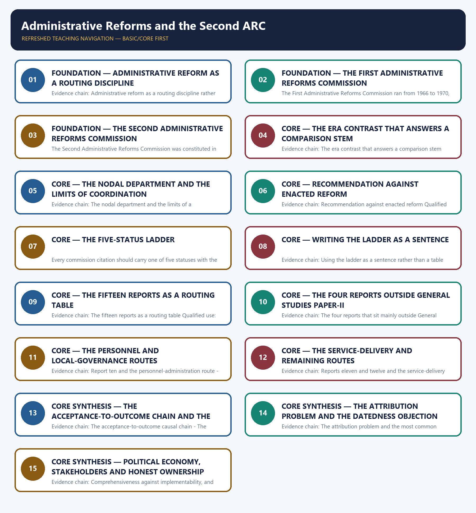

# Administrative Reforms and the Second ARC — Learner-v2 Complete Learning Session

> **Authoring-only generation:** 2026-09-02. No PDF was rendered and no tracker or index was mutated.

### SOURCE, PROGRESSION AND CURRENT-LINKAGE AUDIT

- **Generation date:** 2026-09-02.
- **Repository-first evidence:** the Basic owner is taught first and preserved in full; the Advanced owner is retained only in the optional final teaching block.
- **OCR evidence:** Repository Markdown was primary. The OCR-searchable official General Studies question papers held under books\mains and books\more_previous_papers were used only to confirm the printed wording of routed Mains demands. No official answer key, marking scheme, page precision or unsupported quotation was imported from them.
- **Qdrant:** not used; repository Markdown and available OCR context were sufficient.
- **PYQ integrity:** One applied objective demand is routed to this topic across the audited ledgers and no direct Mains demand is routed here, which is stated openly rather than disguised. The audited 2018-2023 Prelims ledger routes the 2021 objective demand on the Administrative Reforms Commission and the creation of a personnel department to this Basic owner; the official 2018-2023 Preliminary Examination key is not held locally, so no option, answer letter or distractor is recorded or inferred for it, and no year of departmental creation and no recommendation number is asserted, because no official source for that step is held locally. The audited Mains ledgers route the commission-grounded Mains demands to their destination owners rather than to this file, since local-body functionality and grassroots decentralisation are routed to the local-governance owner, the Citizens' Charter and public-perception demands are routed to the citizen-centric-administration owner, the civil-service reform and ethos demands are routed to the civil-services owner, and the competition-regulator demand is routed to the regulatory-governance owner, so this owner supplies the routing, status and political-economy discipline that each of those answers uses rather than claiming their ownership. No official answer key or marking scheme is held locally for any routed demand, so the model solution below is an authored answer route rather than an official key.
- **Live-link boundary:** No new live official item was verified for this topic on 2026-09-02. Two official checks were attempted on that date and both failed with an access error, namely the Press Information Bureau release page and the Department of Administrative Reforms and Public Grievances website, so no primary official page could be read for this topic and no secondary summary has been treated as an official source or imported. The only dated elements used are those already carried by the repository owners with their status checks, namely the First Administrative Reforms Commission of 1966 to 1970 chaired initially by Morarji Desai and later by K. Hanumanthaiah, the Second Administrative Reforms Commission constituted in 2005 under M. Veerappa Moily with fifteen reports between 2006 and 2009, the report titles as listed by the owners, and the nodal role of the Department of Administrative Reforms and Public Grievances as the institutional home for commission material and follow-up, as checked by the owners on 21 July 2026. No percentage of recommendations accepted or implemented is asserted, no recommendation number, paragraph or implementation date is asserted, no composition of either Commission beyond the named chairs is asserted, and no claim is made that any named current programme implements a named report, because thematic similarity is not implementation evidence. Implementation status is deliberately described report by report and recommendation by recommendation rather than generalised across all fifteen reports.
- **Fact/inference discipline:** no current-affairs item, PYQ wording, figure or quotation is invented.

## BASIC LEARNING SESSION



*Distinct embedded teaching-navigation image. The separate continuous Cārvāka-style flowchart package remains an independent at-a-glance artifact.*

### SESSION 1 — FOUNDATION — ADMINISTRATIVE REFORM AS A ROUTING DISCIPLINE

#### DEFINITION / WHAT THIS IS CALLED

**Plain-language definition:** FOUNDATION — Administrative reform as a routing discipline comprises FOUNDATION, Administrative reform as a routing discipline and Evidence chain as its core connected dimensions.

**Technical definition:** Evidence chain: Administrative reform as a routing discipline rather than a quotation bank Qualified use: Set the controlling discipline before writing a single recommendation into the answer.

#### ANSWER-GRABBING OPENING — WRITE/ADAPT IN THE EXAM

> Evidence chain: Administrative reform as a routing discipline rather than a quotation bank Qualified use: Set the controlling discipline before writing a single recommendation into the answer.

#### MUST-WRITE KEYWORDS

- **FOUNDATION**
- **Administrative reform as a routing discipline**
- **Evidence chain**
- **Qualified use**
- **This topic**
- **This**

**How to use them:** Frame the answer through FOUNDATION; define Administrative reform as a routing discipline, connect Evidence chain with Qualified use to explain the mechanism, and use This topic for the decisive comparison or qualification.

#### VISUAL FIRST

```text
ADMINISTRATIVE REFORM AS A ROUTING DISCIPLINE
01. Administrative reform as a routing discipline rather than a quotation bank
BOUNDARY -> A decontextualised commission quotation offered as authority earns nothing.
```

*This topic-specific rail fixes the evidence sequence and its exam boundary before analysis.*

#### CORE EXPLANATION

This topic is designed as a routing index with reform-analysis capability, which means an administrative-reform recommendation earns marks only when it is routed to a specific report, matched to a specific governance problem and qualified by its implementation status, and the single most damaging habit in this area is the decontextualised commission quotation offered as authority.

#### NAMED EVIDENCE AND MECHANISM

- This topic is designed as a routing index with reform-analysis capability, which means an administrative-reform recommendation earns marks only when it is routed to a specific report, matched to a specific governance problem and qualified by its implementation status, and the single most damaging habit in this area is the decontextualised commission quotation offered as authority.

#### EXAMINER CAUTION

- A decontextualised commission quotation offered as authority earns nothing.

#### EXAM LINK

- **Prelims:** Retain the exact statute, section, institution, official category, dated edition or scope rule attached to Administrative reform as a routing discipline.
- **Mains:** Set the controlling discipline before writing a single recommendation into the answer.

#### MINI RECAP

- **Evidence chain:** Administrative reform as a routing discipline rather than a quotation bank
- **Qualified use:** Set the controlling discipline before writing a single recommendation into the answer.

#### CLOSING RECALL FLOW — FOUNDATION — ADMINISTRATIVE REFORM AS A ROUTING DISCIPLINE

```text
START / CONCEPT: FOUNDATION — Administrative reform as a routing discipline
        |
        v
EXACT TERMS: FOUNDATION · Administrative reform as a routing discipline · Evidence chain · Qualified use · This topic · This
        |
        v
MECHANISM / ARGUMENT: This topic is designed as a routing index with reform-analysis capability, which means an administrative-reform recommendation earns marks only when it is routed to a specific report, matched to a specific governance problem and qualified by its implementation status, and the single most damaging habit in this area is the decontextualised commission quotation offered as authority.
        |
        v
CONSEQUENCE / CONTRAST: The resulting consequence is that administrative reform as a routing discipline rather than a quotation bank Qualified use.
        |
        v
UPSC TRAP / ANSWER-USE: Do not miss this limiting distinction: administrative reform as a routing discipline rather than a quotation bank Qualified use.
        |
        v
ANSWER-GRABBING FORMULATION: Evidence chain: Administrative reform as a routing discipline rather than a quotation bank Qualified use: Set the controlling discipline before writing a single recommendation into the answer.
```
### SESSION 2 — FOUNDATION — THE FIRST ADMINISTRATIVE REFORMS COMMISSION

#### DEFINITION / WHAT THIS IS CALLED

**Plain-language definition:** Evidence chain: The First Administrative Reforms Commission, 1966 to 1970 Qualified use: Answer a comparison demand with a dated, correctly attributed first limb.

**Technical definition:** The First Administrative Reforms Commission ran from 1966 to 1970, was chaired initially by Morarji Desai and later by K.

#### ANSWER-GRABBING OPENING — WRITE/ADAPT IN THE EXAM

> Evidence chain: The First Administrative Reforms Commission, 1966 to 1970 Qualified use: Answer a comparison demand with a dated, correctly attributed first limb.

#### MUST-WRITE KEYWORDS

- **FOUNDATION**
- **The First Administrative Reforms Commission**
- **Evidence chain**
- **Qualified use**
- **Morarji Desai**
- **The chairs and the period**

**How to use them:** Frame the answer through FOUNDATION; define The First Administrative Reforms Commission, connect Evidence chain with Qualified use to explain the mechanism, and use Morarji Desai for the decisive comparison or qualification.

#### VISUAL FIRST

```text
THE FIRST ADMINISTRATIVE REFORMS COMMISSION
01. The First Administrative Reforms Commission, 1966 to 1970
BOUNDARY -> The chairs and the period are safe; no report count or title beyond the owner is safe.
```

*This topic-specific rail fixes the evidence sequence and its exam boundary before analysis.*

#### CORE EXPLANATION

The First Administrative Reforms Commission ran from 1966 to 1970, was chaired initially by Morarji Desai and later by K. Hanumanthaiah, and examined the post-Independence public administration structure across the machinery of government, personnel administration and Centre-State relations, addressing the basic structure-building questions of a newly independent, planning-era state.

#### NAMED EVIDENCE AND MECHANISM

- The First Administrative Reforms Commission ran from 1966 to 1970, was chaired initially by Morarji Desai and later by K. Hanumanthaiah, and examined the post-Independence public administration structure across the machinery of government, personnel administration and Centre-State relations, addressing the basic structure-building questions of a newly independent, planning-era state.

#### EXAMINER CAUTION

- The chairs and the period are safe; no report count or title beyond the owner is safe.

#### EXAM LINK

- **Prelims:** Retain the exact statute, section, institution, official category, dated edition or scope rule attached to The First Administrative Reforms Commission.
- **Mains:** Answer a comparison demand with a dated, correctly attributed first limb.

#### MINI RECAP

- **Evidence chain:** The First Administrative Reforms Commission, 1966 to 1970
- **Qualified use:** Answer a comparison demand with a dated, correctly attributed first limb.

#### CLOSING RECALL FLOW — FOUNDATION — THE FIRST ADMINISTRATIVE REFORMS COMMISSION

```text
START / CONCEPT: FOUNDATION — The First Administrative Reforms Commission
        |
        v
EXACT TERMS: FOUNDATION · The First Administrative Reforms Commission · Evidence chain · Qualified use · Morarji Desai · The chairs and the period
        |
        v
MECHANISM / ARGUMENT: The First Administrative Reforms Commission ran from 1966 to 1970, was chaired initially by Morarji Desai and later by K.
        |
        v
CONSEQUENCE / CONTRAST: The chairs and the period are safe; no report count or title beyond the owner is safe.
        |
        v
UPSC TRAP / ANSWER-USE: Do not miss this limiting distinction: the First Administrative Reforms Commission, 1966 to 1970 Qualified use.
        |
        v
ANSWER-GRABBING FORMULATION: Evidence chain: The First Administrative Reforms Commission, 1966 to 1970 Qualified use: Answer a comparison demand with a dated, correctly attributed first limb.
```
### SESSION 3 — FOUNDATION — THE SECOND ADMINISTRATIVE REFORMS COMMISSION

#### DEFINITION / WHAT THIS IS CALLED

**Plain-language definition:** Evidence chain: The Second Administrative Reforms Commission, constituted 2005 Qualified use: Anchor any current governance-reform answer in a correctly dated source commission.

**Technical definition:** The Second Administrative Reforms Commission was constituted in 2005, was chaired by M.

#### ANSWER-GRABBING OPENING — WRITE/ADAPT IN THE EXAM

> Evidence chain: The Second Administrative Reforms Commission, constituted 2005 Qualified use: Anchor any current governance-reform answer in a correctly dated source commission.

#### MUST-WRITE KEYWORDS

- **FOUNDATION**
- **The Second Administrative Reforms Commission**
- **Evidence chain**
- **Qualified use**
- **Veerappa Moily**
- **India**

**How to use them:** Frame the answer through FOUNDATION; define The Second Administrative Reforms Commission, connect Evidence chain with Qualified use to explain the mechanism, and use Veerappa Moily for the decisive comparison or qualification.

#### VISUAL FIRST

```text
THE SECOND ADMINISTRATIVE REFORMS COMMISSION
01. The Second Administrative Reforms Commission, constituted 2005
BOUNDARY -> Constitution year, chair and the fifteen reports between 2006 and 2009 are the safe anchors.
```

*This topic-specific rail fixes the evidence sequence and its exam boundary before analysis.*

#### CORE EXPLANATION

The Second Administrative Reforms Commission was constituted in 2005, was chaired by M. Veerappa Moily and produced fifteen reports between 2006 and 2009 addressing the governance challenges of a liberalised, technology-enabled and rights-based India, which makes it the dominant commission reference for current General Studies Paper-II preparation.

#### NAMED EVIDENCE AND MECHANISM

- The Second Administrative Reforms Commission was constituted in 2005, was chaired by M. Veerappa Moily and produced fifteen reports between 2006 and 2009 addressing the governance challenges of a liberalised, technology-enabled and rights-based India, which makes it the dominant commission reference for current General Studies Paper-II preparation.

#### EXAMINER CAUTION

- Constitution year, chair and the fifteen reports between 2006 and 2009 are the safe anchors.

#### EXAM LINK

- **Prelims:** Retain the exact statute, section, institution, official category, dated edition or scope rule attached to The Second Administrative Reforms Commission.
- **Mains:** Anchor any current governance-reform answer in a correctly dated source commission.

#### MINI RECAP

- **Evidence chain:** The Second Administrative Reforms Commission, constituted 2005
- **Qualified use:** Anchor any current governance-reform answer in a correctly dated source commission.

#### CLOSING RECALL FLOW — FOUNDATION — THE SECOND ADMINISTRATIVE REFORMS COMMISSION

```text
START / CONCEPT: FOUNDATION — The Second Administrative Reforms Commission
        |
        v
EXACT TERMS: FOUNDATION · The Second Administrative Reforms Commission · Evidence chain · Qualified use · Veerappa Moily · India
        |
        v
MECHANISM / ARGUMENT: The Second Administrative Reforms Commission was constituted in 2005, was chaired by M.
        |
        v
CONSEQUENCE / CONTRAST: Veerappa Moily and produced fifteen reports between 2006 and 2009 addressing the governance challenges of a liberalised, technology-enabled and rights-based India, which makes it the dominant commission reference for current General Studies Paper-II preparation.
        |
        v
UPSC TRAP / ANSWER-USE: Do not miss this limiting distinction: constitution year, chair and the fifteen reports between 2006 and 2009 are the safe...
        |
        v
ANSWER-GRABBING FORMULATION: Evidence chain: The Second Administrative Reforms Commission, constituted 2005 Qualified use: Anchor any current governance-reform answer in a correctly dated source commission.
```
### SESSION 4 — CORE — THE ERA CONTRAST THAT ANSWERS A COMPARISON STEM

#### DEFINITION / WHAT THIS IS CALLED

**Plain-language definition:** The two commissions differ by era and by question rather than by subject alone, because the First Commission asked how to build an administrative structure while the Second asked how to make an existing structure accountable, participatory and technology-enabled, so the shift in the question is itself the answer a comparison demand is looking for, and neither was fully implemented for different reasons, capacity in the first case and incentives and federal structure in the second.

**Technical definition:** Evidence chain: The era contrast that answers a comparison stem Qualified use: Convert a distinguish directive into an analytical contrast rather than two lists.

#### ANSWER-GRABBING OPENING — WRITE/ADAPT IN THE EXAM

> Evidence chain: The era contrast that answers a comparison stem Qualified use: Convert a distinguish directive into an analytical contrast rather than two lists.

#### MUST-WRITE KEYWORDS

- **The era contrast that answers a comparison stem**
- **Evidence chain**
- **Qualified use**
- **First Commission**
- **Second**
- **Qualified**

**How to use them:** Frame the answer through The era contrast that answers a comparison stem; define Evidence chain, connect Qualified use with First Commission to explain the mechanism, and use Second for the decisive comparison or qualification.

#### VISUAL FIRST

```text
THE ERA CONTRAST THAT ANSWERS A COMPARISON STEM
01. The era contrast that answers a comparison stem
BOUNDARY -> The two commissions differ by question and era, not merely by subject coverage.
```

*This topic-specific rail fixes the evidence sequence and its exam boundary before analysis.*

#### CORE EXPLANATION

The two commissions differ by era and by question rather than by subject alone, because the First Commission asked how to build an administrative structure while the Second asked how to make an existing structure accountable, participatory and technology-enabled, so the shift in the question is itself the answer a comparison demand is looking for, and neither was fully implemented for different reasons, capacity in the first case and incentives and federal structure in the second.

#### NAMED EVIDENCE AND MECHANISM

- The two commissions differ by era and by question rather than by subject alone, because the First Commission asked how to build an administrative structure while the Second asked how to make an existing structure accountable, participatory and technology-enabled, so the shift in the question is itself the answer a comparison demand is looking for, and neither was fully implemented for different reasons, capacity in the first case and incentives and federal structure in the second.

#### EXAMINER CAUTION

- The two commissions differ by question and era, not merely by subject coverage.

#### EXAM LINK

- **Prelims:** Retain the exact statute, section, institution, official category, dated edition or scope rule attached to The era contrast that answers a comparison stem.
- **Mains:** Convert a distinguish directive into an analytical contrast rather than two lists.

#### MINI RECAP

- **Evidence chain:** The era contrast that answers a comparison stem
- **Qualified use:** Convert a distinguish directive into an analytical contrast rather than two lists.

#### CLOSING RECALL FLOW — CORE — THE ERA CONTRAST THAT ANSWERS A COMPARISON STEM

```text
START / CONCEPT: CORE — The era contrast that answers a comparison stem
        |
        v
EXACT TERMS: The era contrast that answers a comparison stem · Evidence chain · Qualified use · First Commission · Second · Qualified
        |
        v
MECHANISM / ARGUMENT: The two commissions differ by era and by question rather than by subject alone, because the First Commission asked how to build an administrative structure while the Second asked how to make an existing structure accountable, participatory and technology-enabled, so the shift in the question is itself the answer a comparison demand is looking for, and neither was fully implemented for different reasons, capacity in the first case and incentives and federal structure in the second.
        |
        v
CONSEQUENCE / CONTRAST: The resulting consequence is that the era contrast that answers a comparison stem Qualified use.
        |
        v
UPSC TRAP / ANSWER-USE: Do not miss this limiting distinction: the era contrast that answers a comparison stem Qualified use.
        |
        v
ANSWER-GRABBING FORMULATION: Evidence chain: The era contrast that answers a comparison stem Qualified use: Convert a distinguish directive into an analytical contrast rather than two lists.
```
### SESSION 5 — CORE — THE NODAL DEPARTMENT AND THE LIMITS OF COORDINATION

#### DEFINITION / WHAT THIS IS CALLED

**Plain-language definition:** The Department of Administrative Reforms and Public Grievances is the nodal Union department that tracks and coordinates follow-up on commission recommendations across ministries and departments and serves as their continuing institutional memory, but its role is coordinative and advisory rather than directive, so it cannot compel a line ministry or a State government to implement anything.

**Technical definition:** Evidence chain: The nodal department and the limits of a coordinating role Qualified use: Explain non-implementation institutionally instead of attributing it to indifference.

#### ANSWER-GRABBING OPENING — WRITE/ADAPT IN THE EXAM

> Evidence chain: The nodal department and the limits of a coordinating role Qualified use: Explain non-implementation institutionally instead of attributing it to indifference.

#### MUST-WRITE KEYWORDS

- **The nodal department**
- **the limits of coordination**
- **Evidence chain**
- **Qualified use**
- **The Department of Administrative Reforms and Public Grievances**
- **The Department**

**How to use them:** Frame the answer through The nodal department; define the limits of coordination, connect Evidence chain with Qualified use to explain the mechanism, and use The Department of Administrative Reforms and Public Grievances for the decisive comparison or qualification.

#### VISUAL FIRST

```text
THE NODAL DEPARTMENT AND THE LIMITS OF COORDINATION
01. The nodal department and the limits of a coordinating role
BOUNDARY -> A coordinating department cannot compel a line ministry or a State government.
```

*This topic-specific rail fixes the evidence sequence and its exam boundary before analysis.*

#### CORE EXPLANATION

The Department of Administrative Reforms and Public Grievances is the nodal Union department that tracks and coordinates follow-up on commission recommendations across ministries and departments and serves as their continuing institutional memory, but its role is coordinative and advisory rather than directive, so it cannot compel a line ministry or a State government to implement anything.

#### NAMED EVIDENCE AND MECHANISM

- The Department of Administrative Reforms and Public Grievances is the nodal Union department that tracks and coordinates follow-up on commission recommendations across ministries and departments and serves as their continuing institutional memory, but its role is coordinative and advisory rather than directive, so it cannot compel a line ministry or a State government to implement anything.

#### EXAMINER CAUTION

- A coordinating department cannot compel a line ministry or a State government.

#### EXAM LINK

- **Prelims:** Retain the exact statute, section, institution, official category, dated edition or scope rule attached to The nodal department and the limits of coordination.
- **Mains:** Explain non-implementation institutionally instead of attributing it to indifference.

#### MINI RECAP

- **Evidence chain:** The nodal department and the limits of a coordinating role
- **Qualified use:** Explain non-implementation institutionally instead of attributing it to indifference.

#### CLOSING RECALL FLOW — CORE — THE NODAL DEPARTMENT AND THE LIMITS OF COORDINATION

```text
START / CONCEPT: CORE — The nodal department and the limits of coordination
        |
        v
EXACT TERMS: The nodal department · the limits of coordination · Evidence chain · Qualified use · The Department of Administrative Reforms and Public Grievances · The Department
        |
        v
MECHANISM / ARGUMENT: The Department of Administrative Reforms and Public Grievances is the nodal Union department that tracks and coordinates follow-up on commission recommendations across ministries and departments and serves as their continuing institutional memory, but its role is coordinative and advisory rather than directive, so it cannot compel a line ministry or a State government to implement anything.
        |
        v
CONSEQUENCE / CONTRAST: Mains: Explain non-implementation institutionally instead of attributing it to indifference.
        |
        v
UPSC TRAP / ANSWER-USE: Do not miss this limiting distinction: the Department of Administrative Reforms and Public Grievances is the nodal Union department that...
        |
        v
ANSWER-GRABBING FORMULATION: Evidence chain: The nodal department and the limits of a coordinating role Qualified use: Explain non-implementation institutionally instead of attributing it to indifference.
```
### SESSION 6 — CORE — RECOMMENDATION AGAINST ENACTED REFORM

#### DEFINITION / WHAT THIS IS CALLED

**Plain-language definition:** A commission recommendation is a dated analytical reform proposal and becomes binding only when separately enacted as law, notified as a rule or order, or adopted as administrative practice, so any specific recommendation must be described as proposed, partially implemented or adopted rather than assumed to be current law, and the status language itself is where the mark lies.

**Technical definition:** Evidence chain: Recommendation against enacted reform Qualified use: Protect every commission citation from becoming a false statement of current law.

#### ANSWER-GRABBING OPENING — WRITE/ADAPT IN THE EXAM

> Evidence chain: Recommendation against enacted reform Qualified use: Protect every commission citation from becoming a false statement of current law.

#### MUST-WRITE KEYWORDS

- **Recommendation against enacted reform**
- **Evidence chain**
- **Qualified use**
- **A commission recommendation**
- **Recommendation**
- **Qualified**

**How to use them:** Frame the answer through Recommendation against enacted reform; define Evidence chain, connect Qualified use with A commission recommendation to explain the mechanism, and use Recommendation for the decisive comparison or qualification.

#### VISUAL FIRST

```text
RECOMMENDATION AGAINST ENACTED REFORM
01. Recommendation against enacted reform
BOUNDARY -> A recommendation becomes binding only through separate enactment, notification or adopted practice.
```

*This topic-specific rail fixes the evidence sequence and its exam boundary before analysis.*

#### CORE EXPLANATION

A commission recommendation is a dated analytical reform proposal and becomes binding only when separately enacted as law, notified as a rule or order, or adopted as administrative practice, so any specific recommendation must be described as proposed, partially implemented or adopted rather than assumed to be current law, and the status language itself is where the mark lies.

#### NAMED EVIDENCE AND MECHANISM

- A commission recommendation is a dated analytical reform proposal and becomes binding only when separately enacted as law, notified as a rule or order, or adopted as administrative practice, so any specific recommendation must be described as proposed, partially implemented or adopted rather than assumed to be current law, and the status language itself is where the mark lies.

#### EXAMINER CAUTION

- A recommendation becomes binding only through separate enactment, notification or adopted practice.

#### EXAM LINK

- **Prelims:** Retain the exact statute, section, institution, official category, dated edition or scope rule attached to Recommendation against enacted reform.
- **Mains:** Protect every commission citation from becoming a false statement of current law.

#### MINI RECAP

- **Evidence chain:** Recommendation against enacted reform
- **Qualified use:** Protect every commission citation from becoming a false statement of current law.

#### CLOSING RECALL FLOW — CORE — RECOMMENDATION AGAINST ENACTED REFORM

```text
START / CONCEPT: CORE — Recommendation against enacted reform
        |
        v
EXACT TERMS: Recommendation against enacted reform · Evidence chain · Qualified use · A commission recommendation · Recommendation · Qualified
        |
        v
MECHANISM / ARGUMENT: A commission recommendation is a dated analytical reform proposal and becomes binding only when separately enacted as law, notified as a rule or order, or adopted as administrative practice, so any specific recommendation must be described as proposed, partially implemented or adopted rather than assumed to be current law, and the status language itself is where the mark lies.
        |
        v
CONSEQUENCE / CONTRAST: The resulting consequence is that recommendation against enacted reform Qualified use.
        |
        v
UPSC TRAP / ANSWER-USE: Do not miss this limiting distinction: recommendation against enacted reform Qualified use.
        |
        v
ANSWER-GRABBING FORMULATION: Evidence chain: Recommendation against enacted reform Qualified use: Protect every commission citation from becoming a false statement of current law.
```
### SESSION 7 — CORE — THE FIVE-STATUS LADDER

#### DEFINITION / WHAT THIS IS CALLED

**Plain-language definition:** Evidence chain: The five-status ladder Qualified use: Attach a defensible status label to every recommendation an answer uses.

**Technical definition:** Every commission citation should carry one of five statuses with the evidence each requires, namely proposed on the report text alone, accepted in principle on a recorded government decision with no operative instrument, notified or enacted where an Act, rule, order or scheme instrument exists, operational where institutions, staff, budget and procedure actually function, and evaluated where independent evidence exists on quality and outcome.

#### ANSWER-GRABBING OPENING — WRITE/ADAPT IN THE EXAM

> Evidence chain: The five-status ladder Qualified use: Attach a defensible status label to every recommendation an answer uses.

#### MUST-WRITE KEYWORDS

- **The five-status ladder**
- **Evidence chain**
- **Qualified use**
- **Every**
- **Act**
- **Each**

**How to use them:** Frame the answer through The five-status ladder; define Evidence chain, connect Qualified use with Every to explain the mechanism, and use Act for the decisive comparison or qualification.

#### VISUAL FIRST

```text
THE FIVE-STATUS LADDER
01. The five-status ladder
BOUNDARY -> Each status has its own evidence requirement and none may be assumed from the one below.
```

*This topic-specific rail fixes the evidence sequence and its exam boundary before analysis.*

#### CORE EXPLANATION

Every commission citation should carry one of five statuses with the evidence each requires, namely proposed on the report text alone, accepted in principle on a recorded government decision with no operative instrument, notified or enacted where an Act, rule, order or scheme instrument exists, operational where institutions, staff, budget and procedure actually function, and evaluated where independent evidence exists on quality and outcome.

#### NAMED EVIDENCE AND MECHANISM

- Every commission citation should carry one of five statuses with the evidence each requires, namely proposed on the report text alone, accepted in principle on a recorded government decision with no operative instrument, notified or enacted where an Act, rule, order or scheme instrument exists, operational where institutions, staff, budget and procedure actually function, and evaluated where independent evidence exists on quality and outcome.

#### EXAMINER CAUTION

- Each status has its own evidence requirement and none may be assumed from the one below.

#### EXAM LINK

- **Prelims:** Retain the exact statute, section, institution, official category, dated edition or scope rule attached to The five-status ladder.
- **Mains:** Attach a defensible status label to every recommendation an answer uses.

#### MINI RECAP

- **Evidence chain:** The five-status ladder
- **Qualified use:** Attach a defensible status label to every recommendation an answer uses.

#### CLOSING RECALL FLOW — CORE — THE FIVE-STATUS LADDER

```text
START / CONCEPT: CORE — The five-status ladder
        |
        v
EXACT TERMS: The five-status ladder · Evidence chain · Qualified use · Every · Act · Each
        |
        v
MECHANISM / ARGUMENT: Every commission citation should carry one of five statuses with the evidence each requires, namely proposed on the report text alone, accepted in principle on a recorded government decision with no operative instrument, notified or enacted where an Act, rule, order or scheme instrument exists, operational where institutions, staff, budget and procedure actually function, and evaluated where independent evidence exists on quality and outcome.
        |
        v
CONSEQUENCE / CONTRAST: Each status has its own evidence requirement and none may be assumed from the one below.
        |
        v
UPSC TRAP / ANSWER-USE: Do not miss this limiting distinction: attach a defensible status label to every recommendation an answer uses.
        |
        v
ANSWER-GRABBING FORMULATION: Evidence chain: The five-status ladder Qualified use: Attach a defensible status label to every recommendation an answer uses.
```
### SESSION 8 — CORE — WRITING THE LADDER AS A SENTENCE

#### DEFINITION / WHAT THIS IS CALLED

**Plain-language definition:** The ladder earns its marks when it is written as a single sentence inside the answer, of the form that the commission recommended a measure, that the government accepted it in principle, that the operative instrument is a named later Act or rule, and that whether it functions as intended has not been independently evaluated, because that one sentence demonstrates source discipline and evaluative honesty together.

**Technical definition:** Evidence chain: Using the ladder as a sentence rather than a table Qualified use: Demonstrate source discipline and evaluative honesty in one written sentence.

#### ANSWER-GRABBING OPENING — WRITE/ADAPT IN THE EXAM

> The ladder earns its marks when it is written as a single sentence inside the answer, of the form that the commission recommended a measure, that the government accepted it in principle, that the operative instrument is a named later Act or rule, and that whether it functions as intended has not been independently evaluated, because that one sentence demonstrates source discipline and evaluative honesty together.

#### MUST-WRITE KEYWORDS

- **Writing the ladder as a sentence**
- **Evidence chain**
- **Qualified use**
- **The ladder earns its marks when it**
- **Act**
- **Demonstrate**

**How to use them:** Frame the answer through Writing the ladder as a sentence; define Evidence chain, connect Qualified use with The ladder earns its marks when it to explain the mechanism, and use Act for the decisive comparison or qualification.

#### VISUAL FIRST

```text
WRITING THE LADDER AS A SENTENCE
01. Using the ladder as a sentence rather than a table
BOUNDARY -> The ladder earns marks inside the prose, not as a reproduced table.
```

*This topic-specific rail fixes the evidence sequence and its exam boundary before analysis.*

#### CORE EXPLANATION

The ladder earns its marks when it is written as a single sentence inside the answer, of the form that the commission recommended a measure, that the government accepted it in principle, that the operative instrument is a named later Act or rule, and that whether it functions as intended has not been independently evaluated, because that one sentence demonstrates source discipline and evaluative honesty together.

#### NAMED EVIDENCE AND MECHANISM

- The ladder earns its marks when it is written as a single sentence inside the answer, of the form that the commission recommended a measure, that the government accepted it in principle, that the operative instrument is a named later Act or rule, and that whether it functions as intended has not been independently evaluated, because that one sentence demonstrates source discipline and evaluative honesty together.

#### EXAMINER CAUTION

- The ladder earns marks inside the prose, not as a reproduced table.

#### EXAM LINK

- **Prelims:** Retain the exact statute, section, institution, official category, dated edition or scope rule attached to Writing the ladder as a sentence.
- **Mains:** Demonstrate source discipline and evaluative honesty in one written sentence.

#### MINI RECAP

- **Evidence chain:** Using the ladder as a sentence rather than a table
- **Qualified use:** Demonstrate source discipline and evaluative honesty in one written sentence.

#### CLOSING RECALL FLOW — CORE — WRITING THE LADDER AS A SENTENCE

```text
START / CONCEPT: CORE — Writing the ladder as a sentence
        |
        v
EXACT TERMS: Writing the ladder as a sentence · Evidence chain · Qualified use · The ladder earns its marks when it · Act · Demonstrate
        |
        v
MECHANISM / ARGUMENT: Evidence chain: Using the ladder as a sentence rather than a table Qualified use: Demonstrate source discipline and evaluative honesty in one written sentence.
        |
        v
CONSEQUENCE / CONTRAST: Mains: Demonstrate source discipline and evaluative honesty in one written sentence.
        |
        v
UPSC TRAP / ANSWER-USE: Do not miss this limiting distinction: the ladder earns its marks when it is written as a single sentence inside...
        |
        v
ANSWER-GRABBING FORMULATION: The ladder earns its marks when it is written as a single sentence inside the answer, of the form that the commission recommended a measure, that the government accepted it in principle, that the operative instrument is a named later Act or rule, and that whether it functions as intended has not been independently evaluated, because that one sentence demonstrates source discipline and evaluative honesty together.
```
### SESSION 9 — CORE — THE FIFTEEN REPORTS AS A ROUTING TABLE

#### DEFINITION / WHAT THIS IS CALLED

**Plain-language definition:** The fifteen reports of the Second Commission are, in order, Right to Information as the master key to good governance, Unlocking Human Capital on entitlements and governance, Crisis Management, Ethics in Governance, Public Order, Local Governance, Capacity Building for Conflict Resolution, Combating Terrorism, Social Capital as a shared destiny, Refurbishing of Personnel Administration, Promoting e-Governance, Citizen-Centric Administration, the Organisational Structure of the Government of India, Strengthening Financial Management Systems, and State and District Administration.

**Technical definition:** Evidence chain: The fifteen reports as a routing table Qualified use: Name the underlying report by title to show precise source knowledge.

#### ANSWER-GRABBING OPENING — WRITE/ADAPT IN THE EXAM

> Evidence chain: The fifteen reports as a routing table Qualified use: Name the underlying report by title to show precise source knowledge.

#### MUST-WRITE KEYWORDS

- **The fifteen reports as a routing table**
- **Evidence chain**
- **Qualified use**
- **The fifteen reports of the Second Commission**
- **Second Commission**
- **Right**

**How to use them:** Frame the answer through The fifteen reports as a routing table; define Evidence chain, connect Qualified use with The fifteen reports of the Second Commission to explain the mechanism, and use Second Commission for the decisive comparison or qualification.

#### VISUAL FIRST

```text
THE FIFTEEN REPORTS AS A ROUTING TABLE
01. The fifteen reports as a routing table
BOUNDARY -> The titles are safe; recommendation numbers, paragraphs and adoption dates are not.
```

*This topic-specific rail fixes the evidence sequence and its exam boundary before analysis.*

#### CORE EXPLANATION

The fifteen reports of the Second Commission are, in order, Right to Information as the master key to good governance, Unlocking Human Capital on entitlements and governance, Crisis Management, Ethics in Governance, Public Order, Local Governance, Capacity Building for Conflict Resolution, Combating Terrorism, Social Capital as a shared destiny, Refurbishing of Personnel Administration, Promoting e-Governance, Citizen-Centric Administration, the Organisational Structure of the Government of India, Strengthening Financial Management Systems, and State and District Administration.

#### NAMED EVIDENCE AND MECHANISM

- The fifteen reports of the Second Commission are, in order, Right to Information as the master key to good governance, Unlocking Human Capital on entitlements and governance, Crisis Management, Ethics in Governance, Public Order, Local Governance, Capacity Building for Conflict Resolution, Combating Terrorism, Social Capital as a shared destiny, Refurbishing of Personnel Administration, Promoting e-Governance, Citizen-Centric Administration, the Organisational Structure of the Government of India, Strengthening Financial Management Systems, and State and District Administration.

#### EXAMINER CAUTION

- The titles are safe; recommendation numbers, paragraphs and adoption dates are not.

#### EXAM LINK

- **Prelims:** Retain the exact statute, section, institution, official category, dated edition or scope rule attached to The fifteen reports as a routing table.
- **Mains:** Name the underlying report by title to show precise source knowledge.

#### MINI RECAP

- **Evidence chain:** The fifteen reports as a routing table
- **Qualified use:** Name the underlying report by title to show precise source knowledge.

#### CLOSING RECALL FLOW — CORE — THE FIFTEEN REPORTS AS A ROUTING TABLE

```text
START / CONCEPT: CORE — The fifteen reports as a routing table
        |
        v
EXACT TERMS: The fifteen reports as a routing table · Evidence chain · Qualified use · The fifteen reports of the Second Commission · Second Commission · Right
        |
        v
MECHANISM / ARGUMENT: Mains: Name the underlying report by title to show precise source knowledge.
        |
        v
CONSEQUENCE / CONTRAST: The fifteen reports of the Second Commission are, in order, Right to Information as the master key to good governance, Unlocking Human Capital on entitlements and governance, Crisis Management, Ethics in Governance, Public Order, Local Governance, Capacity Building for Conflict Resolution, Combating Terrorism, Social Capital as a shared destiny, Refurbishing of Personnel Administration, Promoting e-Governance, Citizen-Centric Administration, the Organisational Structure of the Government of India, Strengthening Financial Management Systems, and State and District Administration.
        |
        v
UPSC TRAP / ANSWER-USE: The titles are safe; recommendation numbers, paragraphs and adoption dates are not.
        |
        v
ANSWER-GRABBING FORMULATION: Evidence chain: The fifteen reports as a routing table Qualified use: Name the underlying report by title to show precise source knowledge.
```
### SESSION 10 — CORE — THE FOUR REPORTS OUTSIDE GENERAL STUDIES PAPER-II

#### DEFINITION / WHAT THIS IS CALLED

**Plain-language definition:** Reports three, five, seven and eight, on crisis management, public order, capacity building for conflict resolution and combating terrorism, sit mainly in the General Studies Paper-III internal-security and disaster-management space, so they should be cross-referenced rather than forced into a Paper-II governance answer, and treating all fifteen reports as equally central to Paper-II is a standard error.

**Technical definition:** Evidence chain: The four reports that sit mainly outside General Studies Paper-II Qualified use: Avoid forcing an internal-security report into a governance answer.

#### ANSWER-GRABBING OPENING — WRITE/ADAPT IN THE EXAM

> Evidence chain: The four reports that sit mainly outside General Studies Paper-II Qualified use: Avoid forcing an internal-security report into a governance answer.

#### MUST-WRITE KEYWORDS

- **The four reports outside General Studies Paper-II**
- **Evidence chain**
- **Qualified use**
- **Reports**
- **General Studies Paper-III**
- **Paper-II**

**How to use them:** Frame the answer through The four reports outside General Studies Paper-II; define Evidence chain, connect Qualified use with Reports to explain the mechanism, and use General Studies Paper-III for the decisive comparison or qualification.

#### VISUAL FIRST

```text
THE FOUR REPORTS OUTSIDE GENERAL STUDIES PAPER-II
01. The four reports that sit mainly outside General Studies Paper-II
BOUNDARY -> Crisis management, public order, conflict resolution and terrorism belong mainly to Paper-III.
```

*This topic-specific rail fixes the evidence sequence and its exam boundary before analysis.*

#### CORE EXPLANATION

Reports three, five, seven and eight, on crisis management, public order, capacity building for conflict resolution and combating terrorism, sit mainly in the General Studies Paper-III internal-security and disaster-management space, so they should be cross-referenced rather than forced into a Paper-II governance answer, and treating all fifteen reports as equally central to Paper-II is a standard error.

#### NAMED EVIDENCE AND MECHANISM

- Reports three, five, seven and eight, on crisis management, public order, capacity building for conflict resolution and combating terrorism, sit mainly in the General Studies Paper-III internal-security and disaster-management space, so they should be cross-referenced rather than forced into a Paper-II governance answer, and treating all fifteen reports as equally central to Paper-II is a standard error.

#### EXAMINER CAUTION

- Crisis management, public order, conflict resolution and terrorism belong mainly to Paper-III.

#### EXAM LINK

- **Prelims:** Retain the exact statute, section, institution, official category, dated edition or scope rule attached to The four reports outside General Studies Paper-II.
- **Mains:** Avoid forcing an internal-security report into a governance answer.

#### MINI RECAP

- **Evidence chain:** The four reports that sit mainly outside General Studies Paper-II
- **Qualified use:** Avoid forcing an internal-security report into a governance answer.

#### CLOSING RECALL FLOW — CORE — THE FOUR REPORTS OUTSIDE GENERAL STUDIES PAPER-II

```text
START / CONCEPT: CORE — The four reports outside General Studies Paper-II
        |
        v
EXACT TERMS: The four reports outside General Studies Paper-II · Evidence chain · Qualified use · Reports · General Studies Paper-III · Paper-II
        |
        v
MECHANISM / ARGUMENT: Reports three, five, seven and eight, on crisis management, public order, capacity building for conflict resolution and combating terrorism, sit mainly in the General Studies Paper-III internal-security and disaster-management space, so they should be cross-referenced rather than forced into a Paper-II governance answer, and treating all fifteen reports as equally central to Paper-II is a standard error.
        |
        v
CONSEQUENCE / CONTRAST: The resulting consequence is that the four reports that sit mainly outside General Studies Paper-II Qualified use.
        |
        v
UPSC TRAP / ANSWER-USE: Do not miss this limiting distinction: the four reports that sit mainly outside General Studies Paper-II Qualified use.
        |
        v
ANSWER-GRABBING FORMULATION: Evidence chain: The four reports that sit mainly outside General Studies Paper-II Qualified use: Avoid forcing an internal-security report into a governance answer.
```
### SESSION 11 — CORE — THE PERSONNEL AND LOCAL-GOVERNANCE ROUTES

#### DEFINITION / WHAT THIS IS CALLED

**Plain-language definition:** CORE — The personnel and local-governance routes comprises The personnel, local-governance routes and Evidence chain as its core connected dimensions.

**Technical definition:** Evidence chain: Report ten and the personnel-administration route - Reports six and fifteen and the local-governance route Qualified use: Route a personnel or local-governance stem to the owner that holds its depth.

#### ANSWER-GRABBING OPENING — WRITE/ADAPT IN THE EXAM

> Report ten, Refurbishing of Personnel Administration and titled Scaling New Heights, is the personnel-administration route and its analytical depth belongs to the civil-services owner, where neutrality, capacity and performance are developed; its recommendations touching performance-linked promotion and cadre restructuring illustrate the politically contested end of the implementation spectrum where adoption has been much more partial.

#### MUST-WRITE KEYWORDS

- **The personnel**
- **local-governance routes**
- **Evidence chain**
- **Qualified use**
- **Report**
- **Refurbishing**

**How to use them:** Frame the answer through The personnel; define local-governance routes, connect Evidence chain with Qualified use to explain the mechanism, and use Report for the decisive comparison or qualification.

#### VISUAL FIRST

```text
THE PERSONNEL AND LOCAL-GOVERNANCE ROUTES
01. Report ten and the personnel-administration route
    |
    v
02. Reports six and fifteen and the local-governance route
BOUNDARY -> Both routes need State action, which is why their adoption is the most partial.
```

*This topic-specific rail fixes the evidence sequence and its exam boundary before analysis.*

#### CORE EXPLANATION

Report ten, Refurbishing of Personnel Administration and titled Scaling New Heights, is the personnel-administration route and its analytical depth belongs to the civil-services owner, where neutrality, capacity and performance are developed; its recommendations touching performance-linked promotion and cadre restructuring illustrate the politically contested end of the implementation spectrum where adoption has been much more partial. Report six on Local Governance and report fifteen on State and District Administration jointly ground the local-governance and district-delivery route, where the three functional legs of devolution, activity mapping and parastatal encroachment are developed, and both address subjects requiring State action, which is why their non-implementation is frequently a federal-capacity fact rather than a Union-indifference fact.

#### NAMED EVIDENCE AND MECHANISM

- Report ten, Refurbishing of Personnel Administration and titled Scaling New Heights, is the personnel-administration route and its analytical depth belongs to the civil-services owner, where neutrality, capacity and performance are developed; its recommendations touching performance-linked promotion and cadre restructuring illustrate the politically contested end of the implementation spectrum where adoption has been much more partial.
- Report six on Local Governance and report fifteen on State and District Administration jointly ground the local-governance and district-delivery route, where the three functional legs of devolution, activity mapping and parastatal encroachment are developed, and both address subjects requiring State action, which is why their non-implementation is frequently a federal-capacity fact rather than a Union-indifference fact.

#### EXAMINER CAUTION

- Both routes need State action, which is why their adoption is the most partial.

#### EXAM LINK

- **Prelims:** Retain the exact statute, section, institution, official category, dated edition or scope rule attached to The personnel and local-governance routes.
- **Mains:** Route a personnel or local-governance stem to the owner that holds its depth.

#### MINI RECAP

- **Evidence chain:** Report ten and the personnel-administration route -> Reports six and fifteen and the local-governance route
- **Qualified use:** Route a personnel or local-governance stem to the owner that holds its depth.

#### CLOSING RECALL FLOW — CORE — THE PERSONNEL AND LOCAL-GOVERNANCE ROUTES

```text
START / CONCEPT: CORE — The personnel and local-governance routes
        |
        v
EXACT TERMS: The personnel · local-governance routes · Evidence chain · Qualified use · Report · Refurbishing
        |
        v
MECHANISM / ARGUMENT: Evidence chain: Report ten and the personnel-administration route - Reports six and fifteen and the local-governance route Qualified use: Route a personnel or local-governance stem to the owner that holds its depth.
        |
        v
CONSEQUENCE / CONTRAST: Mains: Route a personnel or local-governance stem to the owner that holds its depth.
        |
        v
UPSC TRAP / ANSWER-USE: Report six on Local Governance and report fifteen on State and District Administration jointly ground the local-governance and district-delivery route, where the three functional legs of devolution, activity mapping and parastatal encroachment are developed, and both address subjects requiring State action, which is why their non-implementation is frequently a federal-capacity fact rather than a Union-indifference fact.
        |
        v
ANSWER-GRABBING FORMULATION: Report ten, Refurbishing of Personnel Administration and titled Scaling New Heights, is the personnel-administration route and its analytical depth belongs to the civil-services owner, where neutrality, capacity and performance are developed; its recommendations touching performance-linked promotion and cadre restructuring illustrate the politically contested end of the implementation spectrum where adoption has been much more partial.
```
### SESSION 12 — CORE — THE SERVICE-DELIVERY AND REMAINING ROUTES

#### DEFINITION / WHAT THIS IS CALLED

**Plain-language definition:** Report one on the Right to Information routes to the transparency and accountability owner for proactive disclosure and the accountability ecosystem, report two on Unlocking Human Capital routes to policy design and implementation for entitlement design, report four on Ethics in Governance routes to institutional accountability owners while personal probity is owned by Ethics, report nine on Social Capital routes to the civil-society owner for bonding, bridging and linking, report thirteen on the Organisational Structure of the Government of India routes to machinery and coordination with a Polity cross-link, and report fourteen on Strengthening Financial Management Systems routes to public finance and expenditure control.

**Technical definition:** Evidence chain: Reports eleven and twelve and the service-delivery route - The remaining high-weight reports and their destinations Qualified use: Attribute a question to its underlying report and answer from the destination file.

#### ANSWER-GRABBING OPENING — WRITE/ADAPT IN THE EXAM

> Evidence chain: Reports eleven and twelve and the service-delivery route - The remaining high-weight reports and their destinations Qualified use: Attribute a question to its underlying report and answer from the destination file.

#### MUST-WRITE KEYWORDS

- **The service-delivery**
- **remaining routes**
- **Evidence chain**
- **Qualified use**
- **Report**
- **Promoting**

**How to use them:** Frame the answer through The service-delivery; define remaining routes, connect Evidence chain with Qualified use to explain the mechanism, and use Report for the decisive comparison or qualification.

#### VISUAL FIRST

```text
THE SERVICE-DELIVERY AND REMAINING ROUTES
01. Reports eleven and twelve and the service-delivery route
    |
    v
02. The remaining high-weight reports and their destinations
BOUNDARY -> Report content belongs to the destination owner; restating it here multiplies misattribution risk.
```

*This topic-specific rail fixes the evidence sequence and its exam boundary before analysis.*

#### CORE EXPLANATION

Report eleven, Promoting e-Governance and titled The Smart Way Forward, and report twelve, Citizen-Centric Administration and titled The Heart of Governance, ground the e-governance and citizen-centric service-delivery routes, where process re-engineering before digitisation and the service-standard, grievance and capability architecture are developed in their own owners rather than restated here. Report one on the Right to Information routes to the transparency and accountability owner for proactive disclosure and the accountability ecosystem, report two on Unlocking Human Capital routes to policy design and implementation for entitlement design, report four on Ethics in Governance routes to institutional accountability owners while personal probity is owned by Ethics, report nine on Social Capital routes to the civil-society owner for bonding, bridging and linking, report thirteen on the Organisational Structure of the Government of India routes to machinery and coordination with a Polity cross-link, and report fourteen on Strengthening Financial Management Systems routes to public finance and expenditure control.

#### NAMED EVIDENCE AND MECHANISM

- Report eleven, Promoting e-Governance and titled The Smart Way Forward, and report twelve, Citizen-Centric Administration and titled The Heart of Governance, ground the e-governance and citizen-centric service-delivery routes, where process re-engineering before digitisation and the service-standard, grievance and capability architecture are developed in their own owners rather than restated here.
- Report one on the Right to Information routes to the transparency and accountability owner for proactive disclosure and the accountability ecosystem, report two on Unlocking Human Capital routes to policy design and implementation for entitlement design, report four on Ethics in Governance routes to institutional accountability owners while personal probity is owned by Ethics, report nine on Social Capital routes to the civil-society owner for bonding, bridging and linking, report thirteen on the Organisational Structure of the Government of India routes to machinery and coordination with a Polity cross-link, and report fourteen on Strengthening Financial Management Systems routes to public finance and expenditure control.

#### EXAMINER CAUTION

- Report content belongs to the destination owner; restating it here multiplies misattribution risk.

#### EXAM LINK

- **Prelims:** Retain the exact statute, section, institution, official category, dated edition or scope rule attached to The service-delivery and remaining routes.
- **Mains:** Attribute a question to its underlying report and answer from the destination file.

#### MINI RECAP

- **Evidence chain:** Reports eleven and twelve and the service-delivery route -> The remaining high-weight reports and their destinations
- **Qualified use:** Attribute a question to its underlying report and answer from the destination file.

#### CLOSING RECALL FLOW — CORE — THE SERVICE-DELIVERY AND REMAINING ROUTES

```text
START / CONCEPT: CORE — The service-delivery and remaining routes
        |
        v
EXACT TERMS: The service-delivery · remaining routes · Evidence chain · Qualified use · Report · Promoting
        |
        v
MECHANISM / ARGUMENT: Report one on the Right to Information routes to the transparency and accountability owner for proactive disclosure and the accountability ecosystem, report two on Unlocking Human Capital routes to policy design and implementation for entitlement design, report four on Ethics in Governance routes to institutional accountability owners while personal probity is owned by Ethics, report nine on Social Capital routes to the civil-society owner for bonding, bridging and linking, report thirteen on the Organisational Structure of the Government of India routes to machinery and coordination with a Polity cross-link, and report fourteen on Strengthening Financial Management Systems routes to public finance and expenditure control.
        |
        v
CONSEQUENCE / CONTRAST: Report eleven, Promoting e-Governance and titled The Smart Way Forward, and report twelve, Citizen-Centric Administration and titled The Heart of Governance, ground the e-governance and citizen-centric service-delivery routes, where process re-engineering before digitisation and the service-standard, grievance and capability architecture are developed in their own owners rather than restated here.
        |
        v
UPSC TRAP / ANSWER-USE: Do not miss this limiting distinction: reports eleven and twelve and the service-delivery route - The remaining high-weight reports and...
        |
        v
ANSWER-GRABBING FORMULATION: Evidence chain: Reports eleven and twelve and the service-delivery route - The remaining high-weight reports and their destinations Qualified use: Attribute a question to its underlying report and answer from the destination file.
```
### SESSION 13 — CORE SYNTHESIS — THE ACCEPTANCE-TO-OUTCOME CHAIN AND THE FEDERAL STEP

#### DEFINITION / WHAT THIS IS CALLED

**Plain-language definition:** Reform recommendations move through a chain in which diagnosis identifies a structural problem, acceptance occurs report by report and recommendation by recommendation with the failure mode of acceptance in principle without an instrument, an instrument in the form of an Act, rule, order or scheme must then be separately created, a federal step is required where the subject needs State action, capacity in staff, money, systems and skills must exist to operate the instrument, and incentives finally determine adoption, so partial and often unattributed adoption is the normal outcome.

**Technical definition:** Evidence chain: The acceptance-to-outcome causal chain - The federal step as the most under-used explanation Qualified use: Explain uneven adoption with the strongest available structural argument.

#### ANSWER-GRABBING OPENING — WRITE/ADAPT IN THE EXAM

> Evidence chain: The acceptance-to-outcome causal chain - The federal step as the most under-used explanation Qualified use: Explain uneven adoption with the strongest available structural argument.

#### MUST-WRITE KEYWORDS

- **CORE SYNTHESIS**
- **The acceptance-to-outcome chain**
- **the federal step**
- **Evidence chain**
- **Qualified use**
- **Reform**

**How to use them:** Frame the answer through CORE SYNTHESIS; define The acceptance-to-outcome chain, connect the federal step with Evidence chain to explain the mechanism, and use Qualified use for the decisive comparison or qualification.

#### VISUAL FIRST

```text
THE ACCEPTANCE-TO-OUTCOME CHAIN AND THE FEDERAL STEP
01. The acceptance-to-outcome causal chain
    |
    v
02. The federal step as the most under-used explanation
BOUNDARY -> A Union acceptance cannot deliver a State-subject recommendation.
```

*This topic-specific rail fixes the evidence sequence and its exam boundary before analysis.*

#### CORE EXPLANATION

Reform recommendations move through a chain in which diagnosis identifies a structural problem, acceptance occurs report by report and recommendation by recommendation with the failure mode of acceptance in principle without an instrument, an instrument in the form of an Act, rule, order or scheme must then be separately created, a federal step is required where the subject needs State action, capacity in staff, money, systems and skills must exist to operate the instrument, and incentives finally determine adoption, so partial and often unattributed adoption is the normal outcome. The most under-used and most rewarded explanation of partial implementation is federal rather than political, because several of the highest-value reports, including Local Governance, State and District Administration and much of Refurbishing of Personnel Administration, address subjects requiring State legislative or administrative action, so a Union acceptance cannot deliver them and uneven national adoption is a structural consequence of the federal division rather than evidence of Union indifference.

#### NAMED EVIDENCE AND MECHANISM

- Reform recommendations move through a chain in which diagnosis identifies a structural problem, acceptance occurs report by report and recommendation by recommendation with the failure mode of acceptance in principle without an instrument, an instrument in the form of an Act, rule, order or scheme must then be separately created, a federal step is required where the subject needs State action, capacity in staff, money, systems and skills must exist to operate the instrument, and incentives finally determine adoption, so partial and often unattributed adoption is the normal outcome.
- The most under-used and most rewarded explanation of partial implementation is federal rather than political, because several of the highest-value reports, including Local Governance, State and District Administration and much of Refurbishing of Personnel Administration, address subjects requiring State legislative or administrative action, so a Union acceptance cannot deliver them and uneven national adoption is a structural consequence of the federal division rather than evidence of Union indifference.

#### EXAMINER CAUTION

- A Union acceptance cannot deliver a State-subject recommendation.

#### EXAM LINK

- **Prelims:** Retain the exact statute, section, institution, official category, dated edition or scope rule attached to The acceptance-to-outcome chain and the federal step.
- **Mains:** Explain uneven adoption with the strongest available structural argument.

#### MINI RECAP

- **Evidence chain:** The acceptance-to-outcome causal chain -> The federal step as the most under-used explanation
- **Qualified use:** Explain uneven adoption with the strongest available structural argument.

#### CLOSING RECALL FLOW — CORE SYNTHESIS — THE ACCEPTANCE-TO-OUTCOME CHAIN AND THE FEDERAL STEP

```text
START / CONCEPT: CORE SYNTHESIS — The acceptance-to-outcome chain and the federal step
        |
        v
EXACT TERMS: CORE SYNTHESIS · The acceptance-to-outcome chain · the federal step · Evidence chain · Qualified use · Reform
        |
        v
MECHANISM / ARGUMENT: Reform recommendations move through a chain in which diagnosis identifies a structural problem, acceptance occurs report by report and recommendation by recommendation with the failure mode of acceptance in principle without an instrument, an instrument in the form of an Act, rule, order or scheme must then be separately created, a federal step is required where the subject needs State action, capacity in staff, money, systems and skills must exist to operate the instrument, and incentives finally determine adoption, so partial and often unattributed adoption is the normal outcome.
        |
        v
CONSEQUENCE / CONTRAST: The most under-used and most rewarded explanation of partial implementation is federal rather than political, because several of the highest-value reports, including Local Governance, State and District Administration and much of Refurbishing of Personnel Administration, address subjects requiring State legislative or administrative action, so a Union acceptance cannot deliver them and uneven national adoption is a structural consequence of the federal division rather than evidence of Union indifference.
        |
        v
UPSC TRAP / ANSWER-USE: Do not miss this limiting distinction: explain uneven adoption with the strongest available structural argument.
        |
        v
ANSWER-GRABBING FORMULATION: Evidence chain: The acceptance-to-outcome causal chain - The federal step as the most under-used explanation Qualified use: Explain uneven adoption with the strongest available structural argument.
```
### SESSION 14 — CORE SYNTHESIS — THE ATTRIBUTION PROBLEM AND THE DATEDNESS OBJECTION

#### DEFINITION / WHAT THIS IS CALLED

**Plain-language definition:** The datedness objection is that a diagnosis produced between 2006 and 2009 predates population-scale digital public infrastructure, the current data-protection framework, statutory service guarantees at scale and post-goods-and-services-tax fiscal federalism, and the correct reply is that the commission's analytical categories of capacity, accountability, citizen-centricity and decentralisation have aged far better than its specific prescriptions, so the answer must say which of the two it is using.

**Technical definition:** Evidence chain: The attribution problem and the most common fabricated claim - The datedness objection and its reply Qualified use: Survive the two hardest counters an examiner can put to a commission answer.

#### ANSWER-GRABBING OPENING — WRITE/ADAPT IN THE EXAM

> Evidence chain: The attribution problem and the most common fabricated claim - The datedness objection and its reply Qualified use: Survive the two hardest counters an examiner can put to a commission answer.

#### MUST-WRITE KEYWORDS

- **CORE SYNTHESIS**
- **The attribution problem**
- **the datedness objection**
- **Evidence chain**
- **Qualified use**
- **Where**

**How to use them:** Frame the answer through CORE SYNTHESIS; define The attribution problem, connect the datedness objection with Evidence chain to explain the mechanism, and use Qualified use for the decisive comparison or qualification.

#### VISUAL FIRST

```text
THE ATTRIBUTION PROBLEM AND THE DATEDNESS OBJECTION
01. The attribution problem and the most common fabricated claim
    |
    v
02. The datedness objection and its reply
BOUNDARY -> Thematic similarity is not implementation evidence, and prescriptions age faster than categories.
```

*This topic-specific rail fixes the evidence sequence and its exam boundary before analysis.*

#### CORE EXPLANATION

Where a later reform resembles a commission proposal the causal link is usually unprovable, so no answer should claim that a named current programme implements a named report without a sourced acceptance or decision trail, and asserting that a capacity-building programme implements the personnel-administration report or that State service-guarantee statutes implement the citizen-centric-administration report is the single most common fabricated claim in this area, because thematic similarity is not implementation evidence. The datedness objection is that a diagnosis produced between 2006 and 2009 predates population-scale digital public infrastructure, the current data-protection framework, statutory service guarantees at scale and post-goods-and-services-tax fiscal federalism, and the correct reply is that the commission's analytical categories of capacity, accountability, citizen-centricity and decentralisation have aged far better than its specific prescriptions, so the answer must say which of the two it is using.

#### NAMED EVIDENCE AND MECHANISM

- Where a later reform resembles a commission proposal the causal link is usually unprovable, so no answer should claim that a named current programme implements a named report without a sourced acceptance or decision trail, and asserting that a capacity-building programme implements the personnel-administration report or that State service-guarantee statutes implement the citizen-centric-administration report is the single most common fabricated claim in this area, because thematic similarity is not implementation evidence.
- The datedness objection is that a diagnosis produced between 2006 and 2009 predates population-scale digital public infrastructure, the current data-protection framework, statutory service guarantees at scale and post-goods-and-services-tax fiscal federalism, and the correct reply is that the commission's analytical categories of capacity, accountability, citizen-centricity and decentralisation have aged far better than its specific prescriptions, so the answer must say which of the two it is using.

#### EXAMINER CAUTION

- Thematic similarity is not implementation evidence, and prescriptions age faster than categories.

#### EXAM LINK

- **Prelims:** Retain the exact statute, section, institution, official category, dated edition or scope rule attached to The attribution problem and the datedness objection.
- **Mains:** Survive the two hardest counters an examiner can put to a commission answer.

#### MINI RECAP

- **Evidence chain:** The attribution problem and the most common fabricated claim -> The datedness objection and its reply
- **Qualified use:** Survive the two hardest counters an examiner can put to a commission answer.

#### CLOSING RECALL FLOW — CORE SYNTHESIS — THE ATTRIBUTION PROBLEM AND THE DATEDNESS OBJECTION

```text
START / CONCEPT: CORE SYNTHESIS — The attribution problem and the datedness objection
        |
        v
EXACT TERMS: CORE SYNTHESIS · The attribution problem · the datedness objection · Evidence chain · Qualified use · Where
        |
        v
MECHANISM / ARGUMENT: Where a later reform resembles a commission proposal the causal link is usually unprovable, so no answer should claim that a named current programme implements a named report without a sourced acceptance or decision trail, and asserting that a capacity-building programme implements the personnel-administration report or that State service-guarantee statutes implement the citizen-centric-administration report is the single most common fabricated claim in this area, because thematic similarity is not implementation evidence.
        |
        v
CONSEQUENCE / CONTRAST: Thematic similarity is not implementation evidence, and prescriptions age faster than categories.
        |
        v
UPSC TRAP / ANSWER-USE: Do not miss this limiting distinction: the datedness objection is that a diagnosis produced between 2006 and 2009 predates population-scale...
        |
        v
ANSWER-GRABBING FORMULATION: Evidence chain: The attribution problem and the most common fabricated claim - The datedness objection and its reply Qualified use: Survive the two hardest counters an examiner can put to a commission answer.
```
### SESSION 15 — CORE SYNTHESIS — POLITICAL ECONOMY, STAKEHOLDERS AND HONEST OWNERSHIP

#### DEFINITION / WHAT THIS IS CALLED

**Plain-language definition:** Adoption varies by actor, since a Union ministry accepts what fits its existing mandate and resists what reallocates it, a State government must act on the local-governance, personnel and district-administration reports and has its own political economy, the nodal department tracks and coordinates without power to compel, civil-service associations hold an organised interest in tenure, cadre and promotion rules, and the citizen is a diffuse beneficiary of accountability reform with weak organisation relative to the concentrated interests reform touches; on ownership, the audited 2018-2023 Prelims ledger routes one objective demand on the Administrative Reforms Commission and the creation of a personnel department to this owner, no direct Mains demand is routed here, and the commission-grounded Mains demands are routed to their destination owners.

**Technical definition:** Evidence chain: Comprehensiveness against implementability, and commission fatigue - Stakeholder variation and honest question ownership Qualified use: Close with a political-economy verdict and a stated ledger routing.

#### ANSWER-GRABBING OPENING — WRITE/ADAPT IN THE EXAM

> Adoption varies by actor, since a Union ministry accepts what fits its existing mandate and resists what reallocates it, a State government must act on the local-governance, personnel and district-administration reports and has its own political economy, the nodal department tracks and coordinates without power to compel, civil-service associations hold an organised interest in tenure, cadre and promotion rules, and the citizen is a diffuse beneficiary of accountability reform with weak organisation relative to the concentrated interests reform touches; on ownership, the audited 2018-2023 Prelims ledger routes one objective demand on the Administrative Reforms Commission and the creation of a personnel department to this owner, no direct Mains demand is routed here, and the commission-grounded Mains demands are routed to their destination owners.

#### MUST-WRITE KEYWORDS

- **CORE SYNTHESIS**
- **Political economy**
- **stakeholders**
- **honest ownership**
- **Evidence chain**
- **Qualified use**

**How to use them:** Frame the answer through CORE SYNTHESIS; define Political economy, connect stakeholders with honest ownership to explain the mechanism, and use Evidence chain for the decisive comparison or qualification.

#### VISUAL FIRST

```text
POLITICAL ECONOMY, STAKEHOLDERS AND HONEST OWNERSHIP
01. Comprehensiveness against implementability, and commission fatigue
    |
    v
02. Stakeholder variation and honest question ownership
BOUNDARY -> Recommendations fail at the instrument and incentive stages rather than at the diagnosis stage.
```

*This topic-specific rail fixes the evidence sequence and its exam boundary before analysis.*

#### CORE EXPLANATION

A fifteen-report programme is analytically complete and politically indigestible while incremental reform is implementable and incoherent, and repeated commissions can substitute for action by converting reform into a documented intention, which is why the political-economy explanation of failure is that recommendations reducing discretion or reallocating authority face concentrated resistance against diffuse benefit rather than that they fail on merit. Adoption varies by actor, since a Union ministry accepts what fits its existing mandate and resists what reallocates it, a State government must act on the local-governance, personnel and district-administration reports and has its own political economy, the nodal department tracks and coordinates without power to compel, civil-service associations hold an organised interest in tenure, cadre and promotion rules, and the citizen is a diffuse beneficiary of accountability reform with weak organisation relative to the concentrated interests reform touches; on ownership, the audited 2018-2023 Prelims ledger routes one objective demand on the Administrative Reforms Commission and the creation of a personnel department to this owner, no direct Mains demand is routed here, and the commission-grounded Mains demands are routed to their destination owners.

#### NAMED EVIDENCE AND MECHANISM

- A fifteen-report programme is analytically complete and politically indigestible while incremental reform is implementable and incoherent, and repeated commissions can substitute for action by converting reform into a documented intention, which is why the political-economy explanation of failure is that recommendations reducing discretion or reallocating authority face concentrated resistance against diffuse benefit rather than that they fail on merit.
- Adoption varies by actor, since a Union ministry accepts what fits its existing mandate and resists what reallocates it, a State government must act on the local-governance, personnel and district-administration reports and has its own political economy, the nodal department tracks and coordinates without power to compel, civil-service associations hold an organised interest in tenure, cadre and promotion rules, and the citizen is a diffuse beneficiary of accountability reform with weak organisation relative to the concentrated interests reform touches; on ownership, the audited 2018-2023 Prelims ledger routes one objective demand on the Administrative Reforms Commission and the creation of a personnel department to this owner, no direct Mains demand is routed here, and the commission-grounded Mains demands are routed to their destination owners.

#### EXAMINER CAUTION

- Recommendations fail at the instrument and incentive stages rather than at the diagnosis stage.

#### EXAM LINK

- **Prelims:** Retain the exact statute, section, institution, official category, dated edition or scope rule attached to Political economy, stakeholders and honest ownership.
- **Mains:** Close with a political-economy verdict and a stated ledger routing.

#### MINI RECAP

- **Evidence chain:** Comprehensiveness against implementability, and commission fatigue -> Stakeholder variation and honest question ownership
- **Qualified use:** Close with a political-economy verdict and a stated ledger routing.
#### COMPLETE BASIC OWNER EVIDENCE BANK

> **Subject:** Governance | **Tier:** Must-Do (foundation) | **GS Paper:** GS-II.
> **Core area:** First ARC vs Second ARC, the full 15-report routing table, and DARPG's
> tracking of administrative-reform recommendations.
> **Grounded in:** Reports of the Second Administrative Reforms Commission (2005-2009),
> DARPG official report list; First ARC (1966-1970); official UPSC GS-II syllabus
> ("structure, organization and functioning of the Executive").
> ✅ = source-grounded | ⚠️ = analytical inference | 📰 = current anchor.
> *Companion: `advanced/10_Administrative-Reforms-and-the-2nd-ARC.md`.*

#### 1. Visual foundation

```text
FIRST ARC (1966-1970)                 SECOND ARC (constituted 2005)
Chaired initially by Morarji Desai,   Chaired by M. Veerappa Moily
later K. Hanumanthaiah                Produced 15 reports (2006-2009)
Focus: post-Independence               Focus: governance in a liberalised,
administrative structure                technology-enabled, rights-based era
        |                                        |
        ------------------------------------------
                          |
                          v
              DARPG: nodal department tracking
              ARC recommendations -> implementation status
                          |
                          v
        USE THIS FILE AS A ROUTING INDEX, THEN OPEN THE
        DEDICATED TOPIC FILE FOR REPORT-SPECIFIC DEPTH
```

**Core proposition:** ✅ The Second ARC is the single most important Indian source document
for GS-II governance topics; treat this file as a **routing index** — know which of its 15
reports maps to which topic file, then study that topic's own dedicated depth rather than
duplicating report content here.

#### 2. Essential definitions

| Concept | Exam-ready meaning |
|---|---|
| ✅ **First Administrative Reforms Commission (1966-1970)** | India's first ARC, initially chaired by Morarji Desai and later by K. Hanumanthaiah, examined the post-Independence public administration structure across a wide range of subjects (Centre-State relations, personnel administration, machinery of government, and others). |
| ✅ **Second Administrative Reforms Commission (constituted 2005)** | Chaired by M. Veerappa Moily, produced 15 reports between 2006 and 2009 addressing governance challenges of a liberalised, technology-enabled, rights-based India — the dominant ARC reference for current GS-II preparation. |
| ✅ **DARPG** | The Department of Administrative Reforms and Public Grievances is the nodal Union department tracking and coordinating follow-up action on ARC recommendations across ministries/departments. |
| ⚠️ **ARC recommendation vs enacted reform** | An ARC report's recommendation is a dated, analytical reform proposal; it becomes binding only when separately enacted as law, notified as a rule, or adopted as administrative practice — treat any specific ARC recommendation as *proposed*, not automatically *current law*, unless verified as implemented. |

#### 3. The Second ARC's 15 reports — routing table

| # | Report title | Primary Governance file |
|---|---|---|
| 1 | Right to Information: Master Key to Good Governance | `08` (RTI process/accountability); Ethics/Polity cross-links |
| 2 | Unlocking Human Capital: Entitlements and Governance | `02` (implementation); Social Justice cross-link |
| 3 | Crisis Management: From Despair to Hope | *(GS-III disaster-management linkage; cross-reference only)* |
| 4 | Ethics in Governance | `08`, `09`, `11` for institutional accountability; Ethics for personal probity |
| 5 | Public Order | *(GS-III internal-security linkage; cross-reference only)* |
| 6 | Local Governance | `12` (local governance and service delivery) |
| 7 | Capacity Building for Conflict Resolution | *(cross-reference only; limited GS-II core relevance)* |
| 8 | Combating Terrorism: Protecting by Righteousness | *(GS-III internal-security linkage; cross-reference only)* |
| 9 | Social Capital: A Shared Destiny | `04` (NGOs, SHGs and civil-society stakeholders) |
| 10 | Refurbishing of Personnel Administration: Scaling New Heights | `09` (civil services and Mission Karmayogi) |
| 11 | Promoting e-Governance: The Smart Way Forward | `05` (e-governance models and user-centricity) |
| 12 | Citizen-Centric Administration: The Heart of Governance | `07` (citizen-centric administration) |
| 13 | Organisational Structure of Government of India | `02`, `09`, `10` (machinery, coordination, reform); Polity cross-link |
| 14 | Strengthening Financial Management Systems | `13` (public finance and service-delivery tools) |
| 15 | State and District Administration: A Fresh Look | `12` (local governance and service delivery) |

#### 4. Institutions and tools

- ✅ **DARPG** — nodal department for tracking ARC implementation status across ministries.
- ✅ **Union ministries/departments** — each report's recommendations are routed to the
  relevant administrative ministry for consideration and (selective) implementation.
- ⚠️ **State governments** — several ARC recommendations (e.g., on local governance,
  personnel administration) require state-level action for implementation, since the
  subjects fall wholly or partly in the state or concurrent domain.

##### Implementation-status vocabulary

| Label | Evidence required |
|---|---|
| Proposed | ARC text only |
| Accepted in principle | Government response/decision, but no operative instrument |
| Notified/enacted | Act, rule, order or scheme instrument exists |
| Operational | Institutions, staff, budget and procedure are functioning |
| Evaluated | Independent evidence shows implementation quality/outcomes |

#### 5. Indian applications and examples

- ⚠️ The 4th Report (*Ethics in Governance*) remains the single most Mains-tested ARC report
  overall, but its depth is fully covered in the Ethics knowledge base (see study links) —
  Governance should cross-link rather than duplicate.
- ⚠️ The 11th Report (*Promoting e-Governance*) and 12th Report (*Citizen-Centric
  Administration*) directly underpin the 2024 e-governance and Citizens' Charter PYQs (see
  `05`, `07`) — use this routing table to quickly identify which report a question is
  implicitly drawing on.
- ⚠️ The 6th and 15th Reports (*Local Governance*; *State and District Administration*)
  jointly ground the 2024 local-bodies PYQ (see `12`).

#### 6. Must-Know Facts for Prelims

- ✅ The First ARC (1966-1970) was initially chaired by Morarji Desai and later by
  K. Hanumanthaiah.
- ✅ The Second ARC was constituted in 2005 and chaired by M. Veerappa Moily.
- ✅ The Second ARC produced 15 reports between 2006 and 2009.
- ✅ DARPG is the nodal department tracking ARC recommendation implementation.

#### 7. UPSC traps

- ❌ ARC recommendations are automatically enacted law. -> They are dated reform proposals;
  implementation requires separate legislative, rule-making or administrative action, and a
  recommendation's status is properly described as "proposed," "partially implemented" or
  "adopted" rather than assumed to be current practice by default.
- ❌ The First and Second ARCs covered identical subject matter. -> The First ARC (1966-1970)
  addressed the immediate post-Independence administrative structure; the Second ARC
  (2005-2009) addressed governance challenges of a liberalised, technology-enabled,
  rights-based India — different eras, different emphases.
- ❌ All 15 Second ARC reports are equally central to GS-II. -> Reports on crisis management,
  public order and counter-terrorism sit mainly in the GS-III internal-security/disaster-
  management space; GS-II's core Second ARC reports are those routed to Topics `04`, `05`,
  `07`, `09`, `12` and `13` above (plus Ethics' ownership of Report 4).
- ❌ This file is meant to reproduce full report content. -> Its designed function is as a
  routing index; full analytical depth lives in each numbered topic file.

#### 8. 📰 Current anchor

- 📰 **Status checked 21 July 2026:** DARPG remains the institutional home for ARC material
  and follow-up. No fixed,
  single implementation status ("accepted," "partially implemented" or "not acted upon") is
  asserted here for any specific recommendation across the board, since implementation
  status differs recommendation by recommendation and is best stated report-by-report (see
  the routing table and the destination topic files) rather than generalised.

#### 9. PYQ application

- ⚠️ No GS-II Mains question in the audited 2024-2025 papers names "Second ARC" directly by
  number, but several PYQs (local bodies, e-governance, Citizens' Charter, civil services)
  are conceptually grounded in specific ARC reports per the routing table above — use this
  file to correctly attribute a question's underlying source report, then answer using the
  relevant topic file's full depth.

#### 10. Mains angles

- ⚠️ When a question implicitly draws on ARC material, name the specific report (by title,
  not just "the ARC said") to demonstrate precise source knowledge.
- ⚠️ Always qualify ARC citations as recommendations from a dated report rather than
  asserting they are current implemented practice — this precision itself earns credit in
  GS-II answers.
- ⚠️ Name the evidence for implementation: later Act/rule/order, operational body and
  outcome evidence. Thematic similarity (e.g., ARC and Mission Karmayogi) is not proof of
  direct implementation.
- ⚠️ Use this file only to identify the correct report and routing; develop the actual
  analytical content in the destination topic file.

> **Answer thesis:** The Second ARC's 15 reports remain the backbone of GS-II governance
> reform knowledge, but they are dated (2006-2009) analytical recommendations, not current
> law — correct use requires routing each report to its live topic file and describing its
> implementation status precisely (proposed, partially implemented or adopted) rather than
> treating it as settled current practice by default.

#### 11. Probable questions

- ⚠️ **Prelims:** Who chaired the Second Administrative Reforms Commission, and how many
  reports did it produce?
- ⚠️ **Mains (10 marks):** Distinguish the focus areas of the First and Second Administrative
  Reforms Commissions.
- ⚠️ **Mains (15 marks):** Discuss the continuing relevance of the Second ARC's
  recommendations on citizen-centric administration and e-governance for current Indian
  governance reform.

#### 12. Study links

- ✅ Advanced companion: `advanced/10_Administrative-Reforms-and-the-2nd-ARC.md`.
- ✅ `00_Master-Framework.md`, Section 8 — "Reading the Second ARC correctly."
- ✅ `04`, `05`, `07`, `09`, `12`, `13` — the destination topic files for each routed report.
- ✅ `Ethics/basic/14_Probity-Concept-and-Philosophical-Basis-of-Governance.md` — the Ethics
  in Governance (4th Report) depth Ethics owns.

#### 13. Answer architecture (10/15/20-mark support)

> **Scope.** This file is a **routing index with reform-analysis capability**, and both
> capabilities are held here. `advanced/10` is optional enrichment only.
> ⚠️ **The controlling discipline for this topic:** never write a decontextualised ARC
> quote-bank answer. An ARC recommendation earns marks only when routed to a specific
> report, matched to a specific governance problem and qualified by its implementation
> status.

##### 13.0 Direct demand owned by this Core file

**2021 Prelims Q78 — the Administrative Reforms Commission and the creation of a personnel
department.** The examinable content is the **First ARC's** place in India's administrative
history and the institutional lineage of personnel administration. What this file must
supply and does: the First ARC (1966–1970), initially chaired by **Morarji Desai** and later
by **K. Hanumanthaiah**, examined the machinery of government, personnel administration and
Centre–State relations, and its work belongs to the period in which the Union's personnel
function was institutionally consolidated. ⚠️ **No specific recommendation, year of
departmental creation or ministry restructuring is asserted here**, because no official
source for that step is held locally and the 2018–2023 Prelims key is not available. ❌ Do
not guess a year or a recommendation number; state the ARC's remit and the
recommendation-versus-implementation distinction instead.

##### 13.1 Demand map

| Stem pattern | What is being tested | Opening move |
|---|---|---|
| "First vs Second ARC" | Era and remit contrast | Post-Independence structure vs liberalised, technology-enabled, rights-based governance |
| "Relevance of ARC recommendations today" | Status discipline | Name the report, then state its implementation status precisely |
| "ARC on \<topic\>" | Correct routing | Identify the report by **title**, then answer from the destination topic file |
| "Why do reform commissions fail?" | Political economy | Diagnose the acceptance → instrument → capacity → outcome chain (§13.5) |
| "Suggest administrative reform" | Whether you distinguish proposal from law | Every recommendation cited must carry its status label |
| Novel reform question (a new commission, a task force, a committee report) | Transferability | Apply the five-status ladder (§13.4) to the new body |

##### 13.2 Qualified theses

- **T1 (source discipline):** "The Second ARC remains India's most systematic governance
  diagnosis, but it is a **dated set of recommendations from 2006–09**, not a body of law;
  its analytical value survives precisely because it is used as diagnosis rather than cited
  as authority."
- **T2 (selective implementation):** "India's reform record is one of selective, partial and
  frequently unattributed adoption: reforms resembling ARC proposals have been enacted, and
  resemblance is not evidence of implementation."
- **T3 (era contrast):** "The First ARC asked how to build an administrative structure; the
  Second asked how to make an existing structure accountable, participatory and
  technology-enabled — the shift in question is itself the answer to a comparison stem."
- **T4 (political economy):** "Reform recommendations fail less on merit than on the
  distribution of costs: recommendations that reduce discretion or reallocate authority face
  concentrated resistance and diffuse benefit."

##### 13.3 Mark-scaled structure

**10 marks** — the era/remit contrast or the named report; two recommendations routed to
their destination topics; the status caution; verdict.

**15 marks** — thesis; the report-routing map for the question's theme; 4–6 evidence units
drawn from the **destination** topic files; the implementation-status ladder applied to at
least two items; the political-economy explanation of partial adoption; graded verdict.

**20 marks** — thesis with criteria; ARC reports as a diagnostic architecture rather than a
list; three governance domains traced from ARC diagnosis to current instrument, each with an
honest status label; why implementation is uneven (§13.5); what has changed since 2009 that
the ARC could not have anticipated (DPI, DPDP, statutory service guarantees, GST-era fiscal
federalism); verdict on continuing relevance with a stated condition.

##### 13.4 The five-status ladder (attach to every ARC citation)

| Status | Evidence that must exist to claim it | Typical error |
|---|---|---|
| **Proposed** | The ARC text alone | Presenting a proposal as practice |
| **Accepted in principle** | A recorded government decision or response, with no operative instrument | Treating acceptance as implementation |
| **Notified / enacted** | An Act, rule, order or scheme instrument exists | Citing a Bill or a draft as law |
| **Operational** | Institutions, staff, budget and procedure are actually functioning | Confusing a constituted body with a working one |
| **Evaluated** | Independent evidence on implementation quality and outcome | Asserting effectiveness from existence |

⚠️ **Use the ladder as a sentence, not a table, in an answer:** "The ARC recommended X; the
government accepted it in principle; the operative instrument is Y; whether it functions as
intended has not been independently evaluated." That single sentence demonstrates all of
criteria 8 and 10 of the audit standard.

##### 13.5 Causal chain — why reform recommendations are only partly implemented

```text
DIAGNOSIS         commission identifies a structural problem
      v
ACCEPTANCE        government responds report-by-report, recommendation-by-recommendation
      v           (failure mode: acceptance "in principle" with no instrument)
INSTRUMENT        Act | rule | order | scheme must be separately created
      v           (failure mode: no legislative time, or the subject is a State subject)
FEDERAL STEP      local governance, personnel and district administration reforms
      v           need State action; a Union acceptance cannot deliver them
CAPACITY          staff, money, systems and skills must exist to operate the instrument
      v
INCENTIVE         who loses discretion, authority or rent? concentrated resistance,
      v           diffuse benefit -> the classic reform political economy
OUTCOME           partial adoption, often unattributed, frequently unevaluated
```

⚠️ **The federal point is the most under-used and most rewarded:** several of the highest-value
ARC reports — **Local Governance (6)**, **State and District Administration (15)**, and much
of **Refurbishing of Personnel Administration (10)** — address subjects requiring **State**
action. Their non-implementation is therefore often a **federal-capacity** fact rather than
a Union-indifference fact.

##### 13.6 Report-routing bank (use the number *and* the title)

Reports whose recommendations most frequently carry Mains weight, with the destination that
holds the analytical depth:

| Report | Title | Destination and what to draw from it |
|---|---|---|
| **1** | *Right to Information: Master Key to Good Governance* | `08` — proactive disclosure, the accountability ecosystem |
| **2** | *Unlocking Human Capital: Entitlements and Governance* | `02` — entitlement design and implementation; Social Justice cross-link |
| **4** | *Ethics in Governance* | `08`, `09`, `11` for institutional accountability; **Ethics owns personal probity** — do not duplicate |
| **6** | *Local Governance* | `12` — the 3Fs, activity mapping, parastatal encroachment |
| **9** | *Social Capital: A Shared Destiny* | `04` — bonding/bridging/linking, civil-society partnership |
| **10** | *Refurbishing of Personnel Administration: Scaling New Heights* | `09` — neutrality, capacity, performance |
| **11** | *Promoting e-Governance: The Smart Way Forward* | `05` — process re-engineering before digitisation |
| **12** | *Citizen-Centric Administration: The Heart of Governance* | `07` — Sevottam, charters, grievance redress |
| **13** | *Organisational Structure of Government of India* | `02`, `09` — machinery and coordination; Polity cross-link |
| **14** | *Strengthening Financial Management Systems* | `13` — expenditure control, financial discipline |
| **15** | *State and District Administration: A Fresh Look* | `12` — district administration and delivery |

⚠️ Reports **3, 5, 7 and 8** (crisis management, public order, conflict resolution,
terrorism) sit mainly in the GS-III space; cross-reference rather than force them into a
GS-II answer.

##### 13.7 Counter-argument and trade-off bank

- ⚠️ **Datedness objection:** a 2006–09 diagnosis predates Aadhaar-scale DPI, the DPDP
  framework, statutory service guarantees at scale and post-GST fiscal federalism. **Reply:**
  the ARC's *analytical categories* (capacity, accountability, citizen-centricity,
  decentralisation) have aged far better than its *specific prescriptions* — say which you
  are using.
- ⚠️ **Comprehensiveness vs implementability:** a fifteen-report programme is analytically
  complete and politically indigestible; incremental reform is implementable and incoherent.
- ⚠️ **Commission fatigue:** repeated commissions can substitute for action, converting
  reform into a documented intention.
- ⚠️ **Attribution problem:** where a later reform resembles an ARC proposal, causation is
  usually unprovable. **Never claim** that Mission Karmayogi implements Report 10, or that
  RTS Acts implement Report 12, without a sourced acceptance/decision trail — thematic
  similarity is not implementation evidence. This is the single most common fabricated claim
  in ARC answers.
- ⚠️ **Recommendation vs law:** the most examinable discipline in this whole topic. An ARC
  recommendation is a dated reform proposal; it becomes binding only through separate
  enactment, notification or adopted administrative practice.

##### 13.8 Stakeholder variation in reform adoption

- **Union ministry:** accepts what fits its existing mandate; resists what reallocates it.
- **State government:** must act on the local-governance, personnel and district-administration
  reports — and has its own political economy.
- **DARPG:** tracks and coordinates follow-up; a coordinating department cannot compel a line
  ministry.
- **Civil-service association:** organised interest in tenure, cadre and promotion rules.
- **Citizen/civil society:** diffuse beneficiary of accountability reform, with weak
  organisation relative to the concentrated interests that reform touches.

##### 13.9 Verdict scaffolds

- **Relevance stem:** "The Second ARC remains indispensable as a diagnostic map and unsafe
  as a statement of current practice; the honest use is to cite the report for the problem
  and the current instrument for the answer."
- **Comparison stem:** "The First ARC built machinery; the Second ARC tried to make machinery
  answerable. Neither was fully implemented, and the reasons differ: capacity in the first
  case, incentives and federal structure in the second."
- **Reform-failure stem:** "Recommendations fail at the instrument and incentive stages, not
  at the diagnosis stage — which is why yet another commission would add little that the
  existing fifteen reports have not already said."
- **Novel-commission stem:** apply the five-status ladder and ask who bears the concentrated
  cost of the recommendation.

##### 13.10 Factual and current-status controls

- ✅ Safe: First ARC **1966–1970**, chaired initially by **Morarji Desai** and later by
  **K. Hanumanthaiah**; Second ARC **constituted 2005**, chaired by **M. Veerappa Moily**,
  **15 reports** between **2006 and 2009**; DARPG as the nodal department tracking follow-up;
  the report titles listed in §13.6 and in §3.
- ❌ **Do not assert:** a percentage of ARC recommendations accepted or implemented; a
  specific recommendation number; a date on which a recommendation was implemented; that any
  named current programme implements a named ARC report; the composition of either
  Commission beyond the chairs named above; any First ARC report count or title not held here.
- ⚠️ **Status language is the mark.** Write "recommended", "accepted in principle",
  "notified", "operational" or "unevaluated" — never "the ARC established", "the ARC
  mandated" or "under the ARC".
- ⚠️ This file is a routing index by design. Answer depth belongs in the destination file;
  reproducing report content here would duplicate content and multiply the risk of
  misattribution.

<!-- BEGIN GENERATED PYQ INTEGRATION: 2018-2023 -->

#### Historical PYQ Integration (2018-2023)

> **Status:** Question-level PYQ demand is integrated into this owner.
> **Provenance:** Audited local official-paper routing ledgers: `_PYQ-ROUTING-PRELIMS-2018-2023.md`.
> **Answer-key rule:** The official 2018-2023 Prelims/CSAT keys are not held locally; no option or answer has been inferred.

- **Years represented:** 2021
- **Paper(s):** Prelims GS-I
- **Routed question demands:** 1

| Year | Paper | Q | PYQ demand (neutral rendering) | Directive / format | Source status | Owner requirement |
|---:|---|---:|---|---|---|---|
| 2021 | Prelims GS-I | 78 | Administrative Reforms Commission personnel department creation | Objective question; official key unavailable locally | Routed; key unavailable locally | Cover the named fact/concept and its likely statement-level distinctions. |

##### What this owner must now support

- Administrative Reforms Commission personnel department creation

> The table integrates the examinable demand and paper metadata. It does not turn an unkeyed objective question into a solved answer, and it does not claim that lexical presence alone proves full conceptual sufficiency.
<!-- END GENERATED PYQ INTEGRATION: 2018-2023 -->

#### CLOSING RECALL FLOW — CORE SYNTHESIS — POLITICAL ECONOMY, STAKEHOLDERS AND HONEST OWNERSHIP

```text
START / CONCEPT: CORE SYNTHESIS — Political economy, stakeholders and honest ownership
        |
        v
EXACT TERMS: CORE SYNTHESIS · Political economy · stakeholders · honest ownership · Evidence chain · Qualified use
        |
        v
MECHANISM / ARGUMENT: T1 (source discipline): "The Second ARC remains India's most systematic governance diagnosis, but it is a dated set of recommendations from 2006–09, not a body of law; its analytical value survives precisely because it is used as diagnosis rather than cited as authority." T2 (selective implementation): "India's reform record is one of selective, partial and frequently unattributed adoption: reforms resembling ARC proposals have been enacted, and resemblance is not evidence of implementation." T3 (era contrast): "The First ARC asked how to build an administrative structure; the Second asked how to make an existing structure accountable, participatory and technology-enabled — the shift in question is itself the answer to a comparison stem." T4 (political economy): "Reform recommendations fail less on merit than on the distribution of costs: recommendations that reduce discretion or reallocate authority face concentrated resistance and diffuse benefit.".
        |
        v
CONSEQUENCE / CONTRAST: Evidence chain: Comprehensiveness against implementability, and commission fatigue - Stakeholder variation and honest question ownership Qualified use: Close with a political-economy verdict and a stated ledger routing.
        |
        v
UPSC TRAP / ANSWER-USE: 20 marks — thesis with criteria; ARC reports as a diagnostic architecture rather than a list; three governance domains traced from ARC diagnosis to current instrument, each with an honest status label; why implementation is uneven (§13.5); what has changed since 2009 that the ARC could not have anticipated (DPI, DPDP, statutory service guarantees, GST-era fiscal federalism); verdict on continuing relevance with a stated condition.
        |
        v
ANSWER-GRABBING FORMULATION: Adoption varies by actor, since a Union ministry accepts what fits its existing mandate and resists what reallocates it, a State government must act on the local-governance, personnel and district-administration reports and has its own political economy, the nodal department tracks and coordinates without power to compel, civil-service associations hold an organised interest in tenure, cadre and promotion rules, and the citizen is a diffuse beneficiary of accountability reform with weak organisation relative to the concentrated interests reform touches; on ownership, the audited 2018-2023 Prelims ledger routes one objective demand on the Administrative Reforms Commission and the creation of a personnel department to this owner, no direct Mains demand is routed here, and the commission-grounded Mains demands are routed to their destination owners.
```
## BASIC MCQS / REMEDIATION

### Q1. Which statement correctly identifies Administrative reform as a routing discipline rather than a quotation bank?

A. This topic is designed as a routing index with reform-analysis capability, which means an administrative-reform recommendation earns marks only when it is routed to a specific report, matched to a specific governance problem and qualified by its implementation status, and the single most damaging habit in this area is the decontextualised commission quotation offered as authority.
B. The Second Administrative Reforms Commission was constituted in 2005, was chaired by M. Veerappa Moily and produced fifteen reports between 2006 and 2009 addressing the governance challenges of a liberalised, technology-enabled and rights-based India, which makes it the dominant commission reference for current General Studies Paper-II preparation.
C. The two commissions differ by era and by question rather than by subject alone, because the First Commission asked how to build an administrative structure while the Second asked how to make an existing structure accountable, participatory and technology-enabled, so the shift in the question is itself the answer a comparison demand is looking for, and neither was fully implemented for different reasons, capacity in the first case and incentives and federal structure in the second.
D. The First Administrative Reforms Commission ran from 1966 to 1970, was chaired initially by Morarji Desai and later by K. Hanumanthaiah, and examined the post-Independence public administration structure across the machinery of government, personnel administration and Centre-State relations, addressing the basic structure-building questions of a newly independent, planning-era state.

**Answer: A.**
**Explanation:** This topic is designed as a routing index with reform-analysis capability, which means an administrative-reform recommendation earns marks only when it is routed to a specific report, matched to a specific governance problem and qualified by its implementation status, and the single most damaging habit in this area is the decontextualised commission quotation offered as authority. The remaining options belong to different chronology, actor or analytical categories.

### Q2. Which chronology card should be filed under Administrative reform as a routing discipline rather than a quotation bank?

A. The Second Administrative Reforms Commission was constituted in 2005, was chaired by M. Veerappa Moily and produced fifteen reports between 2006 and 2009 addressing the governance challenges of a liberalised, technology-enabled and rights-based India, which makes it the dominant commission reference for current General Studies Paper-II preparation.
B. This topic is designed as a routing index with reform-analysis capability, which means an administrative-reform recommendation earns marks only when it is routed to a specific report, matched to a specific governance problem and qualified by its implementation status, and the single most damaging habit in this area is the decontextualised commission quotation offered as authority.
C. The two commissions differ by era and by question rather than by subject alone, because the First Commission asked how to build an administrative structure while the Second asked how to make an existing structure accountable, participatory and technology-enabled, so the shift in the question is itself the answer a comparison demand is looking for, and neither was fully implemented for different reasons, capacity in the first case and incentives and federal structure in the second.
D. The Department of Administrative Reforms and Public Grievances is the nodal Union department that tracks and coordinates follow-up on commission recommendations across ministries and departments and serves as their continuing institutional memory, but its role is coordinative and advisory rather than directive, so it cannot compel a line ministry or a State government to implement anything.

**Answer: B.**
**Explanation:** This topic is designed as a routing index with reform-analysis capability, which means an administrative-reform recommendation earns marks only when it is routed to a specific report, matched to a specific governance problem and qualified by its implementation status, and the single most damaging habit in this area is the decontextualised commission quotation offered as authority. The remaining options belong to different chronology, actor or analytical categories.

### Q3. Which option preserves the source-bounded meaning of Administrative reform as a routing discipline rather than a quotation bank?

A. The two commissions differ by era and by question rather than by subject alone, because the First Commission asked how to build an administrative structure while the Second asked how to make an existing structure accountable, participatory and technology-enabled, so the shift in the question is itself the answer a comparison demand is looking for, and neither was fully implemented for different reasons, capacity in the first case and incentives and federal structure in the second.
B. A commission recommendation is a dated analytical reform proposal and becomes binding only when separately enacted as law, notified as a rule or order, or adopted as administrative practice, so any specific recommendation must be described as proposed, partially implemented or adopted rather than assumed to be current law, and the status language itself is where the mark lies.
C. This topic is designed as a routing index with reform-analysis capability, which means an administrative-reform recommendation earns marks only when it is routed to a specific report, matched to a specific governance problem and qualified by its implementation status, and the single most damaging habit in this area is the decontextualised commission quotation offered as authority.
D. The Department of Administrative Reforms and Public Grievances is the nodal Union department that tracks and coordinates follow-up on commission recommendations across ministries and departments and serves as their continuing institutional memory, but its role is coordinative and advisory rather than directive, so it cannot compel a line ministry or a State government to implement anything.

**Answer: C.**
**Explanation:** This topic is designed as a routing index with reform-analysis capability, which means an administrative-reform recommendation earns marks only when it is routed to a specific report, matched to a specific governance problem and qualified by its implementation status, and the single most damaging habit in this area is the decontextualised commission quotation offered as authority. The remaining options belong to different chronology, actor or analytical categories.

### Q4. Which statement avoids a close-option trap about Administrative reform as a routing discipline rather than a quotation bank?

A. A commission recommendation is a dated analytical reform proposal and becomes binding only when separately enacted as law, notified as a rule or order, or adopted as administrative practice, so any specific recommendation must be described as proposed, partially implemented or adopted rather than assumed to be current law, and the status language itself is where the mark lies.
B. The Department of Administrative Reforms and Public Grievances is the nodal Union department that tracks and coordinates follow-up on commission recommendations across ministries and departments and serves as their continuing institutional memory, but its role is coordinative and advisory rather than directive, so it cannot compel a line ministry or a State government to implement anything.
C. Every commission citation should carry one of five statuses with the evidence each requires, namely proposed on the report text alone, accepted in principle on a recorded government decision with no operative instrument, notified or enacted where an Act, rule, order or scheme instrument exists, operational where institutions, staff, budget and procedure actually function, and evaluated where independent evidence exists on quality and outcome.
D. This topic is designed as a routing index with reform-analysis capability, which means an administrative-reform recommendation earns marks only when it is routed to a specific report, matched to a specific governance problem and qualified by its implementation status, and the single most damaging habit in this area is the decontextualised commission quotation offered as authority.

**Answer: D.**
**Explanation:** This topic is designed as a routing index with reform-analysis capability, which means an administrative-reform recommendation earns marks only when it is routed to a specific report, matched to a specific governance problem and qualified by its implementation status, and the single most damaging habit in this area is the decontextualised commission quotation offered as authority. The remaining options belong to different chronology, actor or analytical categories.

### Q5. Which statement correctly identifies The First Administrative Reforms Commission, 1966 to 1970?

A. The First Administrative Reforms Commission ran from 1966 to 1970, was chaired initially by Morarji Desai and later by K. Hanumanthaiah, and examined the post-Independence public administration structure across the machinery of government, personnel administration and Centre-State relations, addressing the basic structure-building questions of a newly independent, planning-era state.
B. The Second Administrative Reforms Commission was constituted in 2005, was chaired by M. Veerappa Moily and produced fifteen reports between 2006 and 2009 addressing the governance challenges of a liberalised, technology-enabled and rights-based India, which makes it the dominant commission reference for current General Studies Paper-II preparation.
C. The Department of Administrative Reforms and Public Grievances is the nodal Union department that tracks and coordinates follow-up on commission recommendations across ministries and departments and serves as their continuing institutional memory, but its role is coordinative and advisory rather than directive, so it cannot compel a line ministry or a State government to implement anything.
D. The two commissions differ by era and by question rather than by subject alone, because the First Commission asked how to build an administrative structure while the Second asked how to make an existing structure accountable, participatory and technology-enabled, so the shift in the question is itself the answer a comparison demand is looking for, and neither was fully implemented for different reasons, capacity in the first case and incentives and federal structure in the second.

**Answer: A.**
**Explanation:** The First Administrative Reforms Commission ran from 1966 to 1970, was chaired initially by Morarji Desai and later by K. Hanumanthaiah, and examined the post-Independence public administration structure across the machinery of government, personnel administration and Centre-State relations, addressing the basic structure-building questions of a newly independent, planning-era state. The remaining options belong to different chronology, actor or analytical categories.

### Q6. Which chronology card should be filed under The First Administrative Reforms Commission, 1966 to 1970?

A. The two commissions differ by era and by question rather than by subject alone, because the First Commission asked how to build an administrative structure while the Second asked how to make an existing structure accountable, participatory and technology-enabled, so the shift in the question is itself the answer a comparison demand is looking for, and neither was fully implemented for different reasons, capacity in the first case and incentives and federal structure in the second.
B. The First Administrative Reforms Commission ran from 1966 to 1970, was chaired initially by Morarji Desai and later by K. Hanumanthaiah, and examined the post-Independence public administration structure across the machinery of government, personnel administration and Centre-State relations, addressing the basic structure-building questions of a newly independent, planning-era state.
C. The Department of Administrative Reforms and Public Grievances is the nodal Union department that tracks and coordinates follow-up on commission recommendations across ministries and departments and serves as their continuing institutional memory, but its role is coordinative and advisory rather than directive, so it cannot compel a line ministry or a State government to implement anything.
D. A commission recommendation is a dated analytical reform proposal and becomes binding only when separately enacted as law, notified as a rule or order, or adopted as administrative practice, so any specific recommendation must be described as proposed, partially implemented or adopted rather than assumed to be current law, and the status language itself is where the mark lies.

**Answer: B.**
**Explanation:** The First Administrative Reforms Commission ran from 1966 to 1970, was chaired initially by Morarji Desai and later by K. Hanumanthaiah, and examined the post-Independence public administration structure across the machinery of government, personnel administration and Centre-State relations, addressing the basic structure-building questions of a newly independent, planning-era state. The remaining options belong to different chronology, actor or analytical categories.

### Q7. Which option preserves the source-bounded meaning of The First Administrative Reforms Commission, 1966 to 1970?

A. A commission recommendation is a dated analytical reform proposal and becomes binding only when separately enacted as law, notified as a rule or order, or adopted as administrative practice, so any specific recommendation must be described as proposed, partially implemented or adopted rather than assumed to be current law, and the status language itself is where the mark lies.
B. Every commission citation should carry one of five statuses with the evidence each requires, namely proposed on the report text alone, accepted in principle on a recorded government decision with no operative instrument, notified or enacted where an Act, rule, order or scheme instrument exists, operational where institutions, staff, budget and procedure actually function, and evaluated where independent evidence exists on quality and outcome.
C. The First Administrative Reforms Commission ran from 1966 to 1970, was chaired initially by Morarji Desai and later by K. Hanumanthaiah, and examined the post-Independence public administration structure across the machinery of government, personnel administration and Centre-State relations, addressing the basic structure-building questions of a newly independent, planning-era state.
D. The Department of Administrative Reforms and Public Grievances is the nodal Union department that tracks and coordinates follow-up on commission recommendations across ministries and departments and serves as their continuing institutional memory, but its role is coordinative and advisory rather than directive, so it cannot compel a line ministry or a State government to implement anything.

**Answer: C.**
**Explanation:** The First Administrative Reforms Commission ran from 1966 to 1970, was chaired initially by Morarji Desai and later by K. Hanumanthaiah, and examined the post-Independence public administration structure across the machinery of government, personnel administration and Centre-State relations, addressing the basic structure-building questions of a newly independent, planning-era state. The remaining options belong to different chronology, actor or analytical categories.

### Q8. Which statement avoids a close-option trap about The First Administrative Reforms Commission, 1966 to 1970?

A. A commission recommendation is a dated analytical reform proposal and becomes binding only when separately enacted as law, notified as a rule or order, or adopted as administrative practice, so any specific recommendation must be described as proposed, partially implemented or adopted rather than assumed to be current law, and the status language itself is where the mark lies.
B. The ladder earns its marks when it is written as a single sentence inside the answer, of the form that the commission recommended a measure, that the government accepted it in principle, that the operative instrument is a named later Act or rule, and that whether it functions as intended has not been independently evaluated, because that one sentence demonstrates source discipline and evaluative honesty together.
C. Every commission citation should carry one of five statuses with the evidence each requires, namely proposed on the report text alone, accepted in principle on a recorded government decision with no operative instrument, notified or enacted where an Act, rule, order or scheme instrument exists, operational where institutions, staff, budget and procedure actually function, and evaluated where independent evidence exists on quality and outcome.
D. The First Administrative Reforms Commission ran from 1966 to 1970, was chaired initially by Morarji Desai and later by K. Hanumanthaiah, and examined the post-Independence public administration structure across the machinery of government, personnel administration and Centre-State relations, addressing the basic structure-building questions of a newly independent, planning-era state.

**Answer: D.**
**Explanation:** The First Administrative Reforms Commission ran from 1966 to 1970, was chaired initially by Morarji Desai and later by K. Hanumanthaiah, and examined the post-Independence public administration structure across the machinery of government, personnel administration and Centre-State relations, addressing the basic structure-building questions of a newly independent, planning-era state. The remaining options belong to different chronology, actor or analytical categories.

### Q9. Which statement correctly identifies The Second Administrative Reforms Commission, constituted 2005?

A. The Second Administrative Reforms Commission was constituted in 2005, was chaired by M. Veerappa Moily and produced fifteen reports between 2006 and 2009 addressing the governance challenges of a liberalised, technology-enabled and rights-based India, which makes it the dominant commission reference for current General Studies Paper-II preparation.
B. A commission recommendation is a dated analytical reform proposal and becomes binding only when separately enacted as law, notified as a rule or order, or adopted as administrative practice, so any specific recommendation must be described as proposed, partially implemented or adopted rather than assumed to be current law, and the status language itself is where the mark lies.
C. The Department of Administrative Reforms and Public Grievances is the nodal Union department that tracks and coordinates follow-up on commission recommendations across ministries and departments and serves as their continuing institutional memory, but its role is coordinative and advisory rather than directive, so it cannot compel a line ministry or a State government to implement anything.
D. The two commissions differ by era and by question rather than by subject alone, because the First Commission asked how to build an administrative structure while the Second asked how to make an existing structure accountable, participatory and technology-enabled, so the shift in the question is itself the answer a comparison demand is looking for, and neither was fully implemented for different reasons, capacity in the first case and incentives and federal structure in the second.

**Answer: A.**
**Explanation:** The Second Administrative Reforms Commission was constituted in 2005, was chaired by M. Veerappa Moily and produced fifteen reports between 2006 and 2009 addressing the governance challenges of a liberalised, technology-enabled and rights-based India, which makes it the dominant commission reference for current General Studies Paper-II preparation. The remaining options belong to different chronology, actor or analytical categories.

### Q10. Which chronology card should be filed under The Second Administrative Reforms Commission, constituted 2005?

A. The Department of Administrative Reforms and Public Grievances is the nodal Union department that tracks and coordinates follow-up on commission recommendations across ministries and departments and serves as their continuing institutional memory, but its role is coordinative and advisory rather than directive, so it cannot compel a line ministry or a State government to implement anything.
B. The Second Administrative Reforms Commission was constituted in 2005, was chaired by M. Veerappa Moily and produced fifteen reports between 2006 and 2009 addressing the governance challenges of a liberalised, technology-enabled and rights-based India, which makes it the dominant commission reference for current General Studies Paper-II preparation.
C. A commission recommendation is a dated analytical reform proposal and becomes binding only when separately enacted as law, notified as a rule or order, or adopted as administrative practice, so any specific recommendation must be described as proposed, partially implemented or adopted rather than assumed to be current law, and the status language itself is where the mark lies.
D. Every commission citation should carry one of five statuses with the evidence each requires, namely proposed on the report text alone, accepted in principle on a recorded government decision with no operative instrument, notified or enacted where an Act, rule, order or scheme instrument exists, operational where institutions, staff, budget and procedure actually function, and evaluated where independent evidence exists on quality and outcome.

**Answer: B.**
**Explanation:** The Second Administrative Reforms Commission was constituted in 2005, was chaired by M. Veerappa Moily and produced fifteen reports between 2006 and 2009 addressing the governance challenges of a liberalised, technology-enabled and rights-based India, which makes it the dominant commission reference for current General Studies Paper-II preparation. The remaining options belong to different chronology, actor or analytical categories.

### Q11. Which option preserves the source-bounded meaning of The Second Administrative Reforms Commission, constituted 2005?

A. A commission recommendation is a dated analytical reform proposal and becomes binding only when separately enacted as law, notified as a rule or order, or adopted as administrative practice, so any specific recommendation must be described as proposed, partially implemented or adopted rather than assumed to be current law, and the status language itself is where the mark lies.
B. Every commission citation should carry one of five statuses with the evidence each requires, namely proposed on the report text alone, accepted in principle on a recorded government decision with no operative instrument, notified or enacted where an Act, rule, order or scheme instrument exists, operational where institutions, staff, budget and procedure actually function, and evaluated where independent evidence exists on quality and outcome.
C. The Second Administrative Reforms Commission was constituted in 2005, was chaired by M. Veerappa Moily and produced fifteen reports between 2006 and 2009 addressing the governance challenges of a liberalised, technology-enabled and rights-based India, which makes it the dominant commission reference for current General Studies Paper-II preparation.
D. The ladder earns its marks when it is written as a single sentence inside the answer, of the form that the commission recommended a measure, that the government accepted it in principle, that the operative instrument is a named later Act or rule, and that whether it functions as intended has not been independently evaluated, because that one sentence demonstrates source discipline and evaluative honesty together.

**Answer: C.**
**Explanation:** The Second Administrative Reforms Commission was constituted in 2005, was chaired by M. Veerappa Moily and produced fifteen reports between 2006 and 2009 addressing the governance challenges of a liberalised, technology-enabled and rights-based India, which makes it the dominant commission reference for current General Studies Paper-II preparation. The remaining options belong to different chronology, actor or analytical categories.

### Q12. Which statement avoids a close-option trap about The Second Administrative Reforms Commission, constituted 2005?

A. Every commission citation should carry one of five statuses with the evidence each requires, namely proposed on the report text alone, accepted in principle on a recorded government decision with no operative instrument, notified or enacted where an Act, rule, order or scheme instrument exists, operational where institutions, staff, budget and procedure actually function, and evaluated where independent evidence exists on quality and outcome.
B. The fifteen reports of the Second Commission are, in order, Right to Information as the master key to good governance, Unlocking Human Capital on entitlements and governance, Crisis Management, Ethics in Governance, Public Order, Local Governance, Capacity Building for Conflict Resolution, Combating Terrorism, Social Capital as a shared destiny, Refurbishing of Personnel Administration, Promoting e-Governance, Citizen-Centric Administration, the Organisational Structure of the Government of India, Strengthening Financial Management Systems, and State and District Administration.
C. The ladder earns its marks when it is written as a single sentence inside the answer, of the form that the commission recommended a measure, that the government accepted it in principle, that the operative instrument is a named later Act or rule, and that whether it functions as intended has not been independently evaluated, because that one sentence demonstrates source discipline and evaluative honesty together.
D. The Second Administrative Reforms Commission was constituted in 2005, was chaired by M. Veerappa Moily and produced fifteen reports between 2006 and 2009 addressing the governance challenges of a liberalised, technology-enabled and rights-based India, which makes it the dominant commission reference for current General Studies Paper-II preparation.

**Answer: D.**
**Explanation:** The Second Administrative Reforms Commission was constituted in 2005, was chaired by M. Veerappa Moily and produced fifteen reports between 2006 and 2009 addressing the governance challenges of a liberalised, technology-enabled and rights-based India, which makes it the dominant commission reference for current General Studies Paper-II preparation. The remaining options belong to different chronology, actor or analytical categories.

### Q13. Which statement correctly identifies The era contrast that answers a comparison stem?

A. The two commissions differ by era and by question rather than by subject alone, because the First Commission asked how to build an administrative structure while the Second asked how to make an existing structure accountable, participatory and technology-enabled, so the shift in the question is itself the answer a comparison demand is looking for, and neither was fully implemented for different reasons, capacity in the first case and incentives and federal structure in the second.
B. The Department of Administrative Reforms and Public Grievances is the nodal Union department that tracks and coordinates follow-up on commission recommendations across ministries and departments and serves as their continuing institutional memory, but its role is coordinative and advisory rather than directive, so it cannot compel a line ministry or a State government to implement anything.
C. Every commission citation should carry one of five statuses with the evidence each requires, namely proposed on the report text alone, accepted in principle on a recorded government decision with no operative instrument, notified or enacted where an Act, rule, order or scheme instrument exists, operational where institutions, staff, budget and procedure actually function, and evaluated where independent evidence exists on quality and outcome.
D. A commission recommendation is a dated analytical reform proposal and becomes binding only when separately enacted as law, notified as a rule or order, or adopted as administrative practice, so any specific recommendation must be described as proposed, partially implemented or adopted rather than assumed to be current law, and the status language itself is where the mark lies.

**Answer: A.**
**Explanation:** The two commissions differ by era and by question rather than by subject alone, because the First Commission asked how to build an administrative structure while the Second asked how to make an existing structure accountable, participatory and technology-enabled, so the shift in the question is itself the answer a comparison demand is looking for, and neither was fully implemented for different reasons, capacity in the first case and incentives and federal structure in the second. The remaining options belong to different chronology, actor or analytical categories.

### Q14. Which chronology card should be filed under The era contrast that answers a comparison stem?

A. The ladder earns its marks when it is written as a single sentence inside the answer, of the form that the commission recommended a measure, that the government accepted it in principle, that the operative instrument is a named later Act or rule, and that whether it functions as intended has not been independently evaluated, because that one sentence demonstrates source discipline and evaluative honesty together.
B. The two commissions differ by era and by question rather than by subject alone, because the First Commission asked how to build an administrative structure while the Second asked how to make an existing structure accountable, participatory and technology-enabled, so the shift in the question is itself the answer a comparison demand is looking for, and neither was fully implemented for different reasons, capacity in the first case and incentives and federal structure in the second.
C. Every commission citation should carry one of five statuses with the evidence each requires, namely proposed on the report text alone, accepted in principle on a recorded government decision with no operative instrument, notified or enacted where an Act, rule, order or scheme instrument exists, operational where institutions, staff, budget and procedure actually function, and evaluated where independent evidence exists on quality and outcome.
D. A commission recommendation is a dated analytical reform proposal and becomes binding only when separately enacted as law, notified as a rule or order, or adopted as administrative practice, so any specific recommendation must be described as proposed, partially implemented or adopted rather than assumed to be current law, and the status language itself is where the mark lies.

**Answer: B.**
**Explanation:** The two commissions differ by era and by question rather than by subject alone, because the First Commission asked how to build an administrative structure while the Second asked how to make an existing structure accountable, participatory and technology-enabled, so the shift in the question is itself the answer a comparison demand is looking for, and neither was fully implemented for different reasons, capacity in the first case and incentives and federal structure in the second. The remaining options belong to different chronology, actor or analytical categories.

### Q15. Which option preserves the source-bounded meaning of The era contrast that answers a comparison stem?

A. The ladder earns its marks when it is written as a single sentence inside the answer, of the form that the commission recommended a measure, that the government accepted it in principle, that the operative instrument is a named later Act or rule, and that whether it functions as intended has not been independently evaluated, because that one sentence demonstrates source discipline and evaluative honesty together.
B. The fifteen reports of the Second Commission are, in order, Right to Information as the master key to good governance, Unlocking Human Capital on entitlements and governance, Crisis Management, Ethics in Governance, Public Order, Local Governance, Capacity Building for Conflict Resolution, Combating Terrorism, Social Capital as a shared destiny, Refurbishing of Personnel Administration, Promoting e-Governance, Citizen-Centric Administration, the Organisational Structure of the Government of India, Strengthening Financial Management Systems, and State and District Administration.
C. The two commissions differ by era and by question rather than by subject alone, because the First Commission asked how to build an administrative structure while the Second asked how to make an existing structure accountable, participatory and technology-enabled, so the shift in the question is itself the answer a comparison demand is looking for, and neither was fully implemented for different reasons, capacity in the first case and incentives and federal structure in the second.
D. Every commission citation should carry one of five statuses with the evidence each requires, namely proposed on the report text alone, accepted in principle on a recorded government decision with no operative instrument, notified or enacted where an Act, rule, order or scheme instrument exists, operational where institutions, staff, budget and procedure actually function, and evaluated where independent evidence exists on quality and outcome.

**Answer: C.**
**Explanation:** The two commissions differ by era and by question rather than by subject alone, because the First Commission asked how to build an administrative structure while the Second asked how to make an existing structure accountable, participatory and technology-enabled, so the shift in the question is itself the answer a comparison demand is looking for, and neither was fully implemented for different reasons, capacity in the first case and incentives and federal structure in the second. The remaining options belong to different chronology, actor or analytical categories.

### Q16. Which statement avoids a close-option trap about The era contrast that answers a comparison stem?

A. The ladder earns its marks when it is written as a single sentence inside the answer, of the form that the commission recommended a measure, that the government accepted it in principle, that the operative instrument is a named later Act or rule, and that whether it functions as intended has not been independently evaluated, because that one sentence demonstrates source discipline and evaluative honesty together.
B. The fifteen reports of the Second Commission are, in order, Right to Information as the master key to good governance, Unlocking Human Capital on entitlements and governance, Crisis Management, Ethics in Governance, Public Order, Local Governance, Capacity Building for Conflict Resolution, Combating Terrorism, Social Capital as a shared destiny, Refurbishing of Personnel Administration, Promoting e-Governance, Citizen-Centric Administration, the Organisational Structure of the Government of India, Strengthening Financial Management Systems, and State and District Administration.
C. Reports three, five, seven and eight, on crisis management, public order, capacity building for conflict resolution and combating terrorism, sit mainly in the General Studies Paper-III internal-security and disaster-management space, so they should be cross-referenced rather than forced into a Paper-II governance answer, and treating all fifteen reports as equally central to Paper-II is a standard error.
D. The two commissions differ by era and by question rather than by subject alone, because the First Commission asked how to build an administrative structure while the Second asked how to make an existing structure accountable, participatory and technology-enabled, so the shift in the question is itself the answer a comparison demand is looking for, and neither was fully implemented for different reasons, capacity in the first case and incentives and federal structure in the second.

**Answer: D.**
**Explanation:** The two commissions differ by era and by question rather than by subject alone, because the First Commission asked how to build an administrative structure while the Second asked how to make an existing structure accountable, participatory and technology-enabled, so the shift in the question is itself the answer a comparison demand is looking for, and neither was fully implemented for different reasons, capacity in the first case and incentives and federal structure in the second. The remaining options belong to different chronology, actor or analytical categories.

### Q17. Which statement correctly identifies The nodal department and the limits of a coordinating role?

A. The Department of Administrative Reforms and Public Grievances is the nodal Union department that tracks and coordinates follow-up on commission recommendations across ministries and departments and serves as their continuing institutional memory, but its role is coordinative and advisory rather than directive, so it cannot compel a line ministry or a State government to implement anything.
B. The ladder earns its marks when it is written as a single sentence inside the answer, of the form that the commission recommended a measure, that the government accepted it in principle, that the operative instrument is a named later Act or rule, and that whether it functions as intended has not been independently evaluated, because that one sentence demonstrates source discipline and evaluative honesty together.
C. A commission recommendation is a dated analytical reform proposal and becomes binding only when separately enacted as law, notified as a rule or order, or adopted as administrative practice, so any specific recommendation must be described as proposed, partially implemented or adopted rather than assumed to be current law, and the status language itself is where the mark lies.
D. Every commission citation should carry one of five statuses with the evidence each requires, namely proposed on the report text alone, accepted in principle on a recorded government decision with no operative instrument, notified or enacted where an Act, rule, order or scheme instrument exists, operational where institutions, staff, budget and procedure actually function, and evaluated where independent evidence exists on quality and outcome.

**Answer: A.**
**Explanation:** The Department of Administrative Reforms and Public Grievances is the nodal Union department that tracks and coordinates follow-up on commission recommendations across ministries and departments and serves as their continuing institutional memory, but its role is coordinative and advisory rather than directive, so it cannot compel a line ministry or a State government to implement anything. The remaining options belong to different chronology, actor or analytical categories.

### Q18. Which chronology card should be filed under The nodal department and the limits of a coordinating role?

A. Every commission citation should carry one of five statuses with the evidence each requires, namely proposed on the report text alone, accepted in principle on a recorded government decision with no operative instrument, notified or enacted where an Act, rule, order or scheme instrument exists, operational where institutions, staff, budget and procedure actually function, and evaluated where independent evidence exists on quality and outcome.
B. The Department of Administrative Reforms and Public Grievances is the nodal Union department that tracks and coordinates follow-up on commission recommendations across ministries and departments and serves as their continuing institutional memory, but its role is coordinative and advisory rather than directive, so it cannot compel a line ministry or a State government to implement anything.
C. The ladder earns its marks when it is written as a single sentence inside the answer, of the form that the commission recommended a measure, that the government accepted it in principle, that the operative instrument is a named later Act or rule, and that whether it functions as intended has not been independently evaluated, because that one sentence demonstrates source discipline and evaluative honesty together.
D. The fifteen reports of the Second Commission are, in order, Right to Information as the master key to good governance, Unlocking Human Capital on entitlements and governance, Crisis Management, Ethics in Governance, Public Order, Local Governance, Capacity Building for Conflict Resolution, Combating Terrorism, Social Capital as a shared destiny, Refurbishing of Personnel Administration, Promoting e-Governance, Citizen-Centric Administration, the Organisational Structure of the Government of India, Strengthening Financial Management Systems, and State and District Administration.

**Answer: B.**
**Explanation:** The Department of Administrative Reforms and Public Grievances is the nodal Union department that tracks and coordinates follow-up on commission recommendations across ministries and departments and serves as their continuing institutional memory, but its role is coordinative and advisory rather than directive, so it cannot compel a line ministry or a State government to implement anything. The remaining options belong to different chronology, actor or analytical categories.

### Q19. Which option preserves the source-bounded meaning of The nodal department and the limits of a coordinating role?

A. The ladder earns its marks when it is written as a single sentence inside the answer, of the form that the commission recommended a measure, that the government accepted it in principle, that the operative instrument is a named later Act or rule, and that whether it functions as intended has not been independently evaluated, because that one sentence demonstrates source discipline and evaluative honesty together.
B. Reports three, five, seven and eight, on crisis management, public order, capacity building for conflict resolution and combating terrorism, sit mainly in the General Studies Paper-III internal-security and disaster-management space, so they should be cross-referenced rather than forced into a Paper-II governance answer, and treating all fifteen reports as equally central to Paper-II is a standard error.
C. The Department of Administrative Reforms and Public Grievances is the nodal Union department that tracks and coordinates follow-up on commission recommendations across ministries and departments and serves as their continuing institutional memory, but its role is coordinative and advisory rather than directive, so it cannot compel a line ministry or a State government to implement anything.
D. The fifteen reports of the Second Commission are, in order, Right to Information as the master key to good governance, Unlocking Human Capital on entitlements and governance, Crisis Management, Ethics in Governance, Public Order, Local Governance, Capacity Building for Conflict Resolution, Combating Terrorism, Social Capital as a shared destiny, Refurbishing of Personnel Administration, Promoting e-Governance, Citizen-Centric Administration, the Organisational Structure of the Government of India, Strengthening Financial Management Systems, and State and District Administration.

**Answer: C.**
**Explanation:** The Department of Administrative Reforms and Public Grievances is the nodal Union department that tracks and coordinates follow-up on commission recommendations across ministries and departments and serves as their continuing institutional memory, but its role is coordinative and advisory rather than directive, so it cannot compel a line ministry or a State government to implement anything. The remaining options belong to different chronology, actor or analytical categories.

### Q20. Which statement avoids a close-option trap about The nodal department and the limits of a coordinating role?

A. Reports three, five, seven and eight, on crisis management, public order, capacity building for conflict resolution and combating terrorism, sit mainly in the General Studies Paper-III internal-security and disaster-management space, so they should be cross-referenced rather than forced into a Paper-II governance answer, and treating all fifteen reports as equally central to Paper-II is a standard error.
B. Report ten, Refurbishing of Personnel Administration and titled Scaling New Heights, is the personnel-administration route and its analytical depth belongs to the civil-services owner, where neutrality, capacity and performance are developed; its recommendations touching performance-linked promotion and cadre restructuring illustrate the politically contested end of the implementation spectrum where adoption has been much more partial.
C. The fifteen reports of the Second Commission are, in order, Right to Information as the master key to good governance, Unlocking Human Capital on entitlements and governance, Crisis Management, Ethics in Governance, Public Order, Local Governance, Capacity Building for Conflict Resolution, Combating Terrorism, Social Capital as a shared destiny, Refurbishing of Personnel Administration, Promoting e-Governance, Citizen-Centric Administration, the Organisational Structure of the Government of India, Strengthening Financial Management Systems, and State and District Administration.
D. The Department of Administrative Reforms and Public Grievances is the nodal Union department that tracks and coordinates follow-up on commission recommendations across ministries and departments and serves as their continuing institutional memory, but its role is coordinative and advisory rather than directive, so it cannot compel a line ministry or a State government to implement anything.

**Answer: D.**
**Explanation:** The Department of Administrative Reforms and Public Grievances is the nodal Union department that tracks and coordinates follow-up on commission recommendations across ministries and departments and serves as their continuing institutional memory, but its role is coordinative and advisory rather than directive, so it cannot compel a line ministry or a State government to implement anything. The remaining options belong to different chronology, actor or analytical categories.

### Q21. Which statement correctly identifies Recommendation against enacted reform?

A. A commission recommendation is a dated analytical reform proposal and becomes binding only when separately enacted as law, notified as a rule or order, or adopted as administrative practice, so any specific recommendation must be described as proposed, partially implemented or adopted rather than assumed to be current law, and the status language itself is where the mark lies.
B. The fifteen reports of the Second Commission are, in order, Right to Information as the master key to good governance, Unlocking Human Capital on entitlements and governance, Crisis Management, Ethics in Governance, Public Order, Local Governance, Capacity Building for Conflict Resolution, Combating Terrorism, Social Capital as a shared destiny, Refurbishing of Personnel Administration, Promoting e-Governance, Citizen-Centric Administration, the Organisational Structure of the Government of India, Strengthening Financial Management Systems, and State and District Administration.
C. Every commission citation should carry one of five statuses with the evidence each requires, namely proposed on the report text alone, accepted in principle on a recorded government decision with no operative instrument, notified or enacted where an Act, rule, order or scheme instrument exists, operational where institutions, staff, budget and procedure actually function, and evaluated where independent evidence exists on quality and outcome.
D. The ladder earns its marks when it is written as a single sentence inside the answer, of the form that the commission recommended a measure, that the government accepted it in principle, that the operative instrument is a named later Act or rule, and that whether it functions as intended has not been independently evaluated, because that one sentence demonstrates source discipline and evaluative honesty together.

**Answer: A.**
**Explanation:** A commission recommendation is a dated analytical reform proposal and becomes binding only when separately enacted as law, notified as a rule or order, or adopted as administrative practice, so any specific recommendation must be described as proposed, partially implemented or adopted rather than assumed to be current law, and the status language itself is where the mark lies. The remaining options belong to different chronology, actor or analytical categories.

### Q22. Which chronology card should be filed under Recommendation against enacted reform?

A. Reports three, five, seven and eight, on crisis management, public order, capacity building for conflict resolution and combating terrorism, sit mainly in the General Studies Paper-III internal-security and disaster-management space, so they should be cross-referenced rather than forced into a Paper-II governance answer, and treating all fifteen reports as equally central to Paper-II is a standard error.
B. A commission recommendation is a dated analytical reform proposal and becomes binding only when separately enacted as law, notified as a rule or order, or adopted as administrative practice, so any specific recommendation must be described as proposed, partially implemented or adopted rather than assumed to be current law, and the status language itself is where the mark lies.
C. The fifteen reports of the Second Commission are, in order, Right to Information as the master key to good governance, Unlocking Human Capital on entitlements and governance, Crisis Management, Ethics in Governance, Public Order, Local Governance, Capacity Building for Conflict Resolution, Combating Terrorism, Social Capital as a shared destiny, Refurbishing of Personnel Administration, Promoting e-Governance, Citizen-Centric Administration, the Organisational Structure of the Government of India, Strengthening Financial Management Systems, and State and District Administration.
D. The ladder earns its marks when it is written as a single sentence inside the answer, of the form that the commission recommended a measure, that the government accepted it in principle, that the operative instrument is a named later Act or rule, and that whether it functions as intended has not been independently evaluated, because that one sentence demonstrates source discipline and evaluative honesty together.

**Answer: B.**
**Explanation:** A commission recommendation is a dated analytical reform proposal and becomes binding only when separately enacted as law, notified as a rule or order, or adopted as administrative practice, so any specific recommendation must be described as proposed, partially implemented or adopted rather than assumed to be current law, and the status language itself is where the mark lies. The remaining options belong to different chronology, actor or analytical categories.

### Q23. Which option preserves the source-bounded meaning of Recommendation against enacted reform?

A. Report ten, Refurbishing of Personnel Administration and titled Scaling New Heights, is the personnel-administration route and its analytical depth belongs to the civil-services owner, where neutrality, capacity and performance are developed; its recommendations touching performance-linked promotion and cadre restructuring illustrate the politically contested end of the implementation spectrum where adoption has been much more partial.
B. Reports three, five, seven and eight, on crisis management, public order, capacity building for conflict resolution and combating terrorism, sit mainly in the General Studies Paper-III internal-security and disaster-management space, so they should be cross-referenced rather than forced into a Paper-II governance answer, and treating all fifteen reports as equally central to Paper-II is a standard error.
C. A commission recommendation is a dated analytical reform proposal and becomes binding only when separately enacted as law, notified as a rule or order, or adopted as administrative practice, so any specific recommendation must be described as proposed, partially implemented or adopted rather than assumed to be current law, and the status language itself is where the mark lies.
D. The fifteen reports of the Second Commission are, in order, Right to Information as the master key to good governance, Unlocking Human Capital on entitlements and governance, Crisis Management, Ethics in Governance, Public Order, Local Governance, Capacity Building for Conflict Resolution, Combating Terrorism, Social Capital as a shared destiny, Refurbishing of Personnel Administration, Promoting e-Governance, Citizen-Centric Administration, the Organisational Structure of the Government of India, Strengthening Financial Management Systems, and State and District Administration.

**Answer: C.**
**Explanation:** A commission recommendation is a dated analytical reform proposal and becomes binding only when separately enacted as law, notified as a rule or order, or adopted as administrative practice, so any specific recommendation must be described as proposed, partially implemented or adopted rather than assumed to be current law, and the status language itself is where the mark lies. The remaining options belong to different chronology, actor or analytical categories.

### Q24. Which statement avoids a close-option trap about Recommendation against enacted reform?

A. Report ten, Refurbishing of Personnel Administration and titled Scaling New Heights, is the personnel-administration route and its analytical depth belongs to the civil-services owner, where neutrality, capacity and performance are developed; its recommendations touching performance-linked promotion and cadre restructuring illustrate the politically contested end of the implementation spectrum where adoption has been much more partial.
B. Report six on Local Governance and report fifteen on State and District Administration jointly ground the local-governance and district-delivery route, where the three functional legs of devolution, activity mapping and parastatal encroachment are developed, and both address subjects requiring State action, which is why their non-implementation is frequently a federal-capacity fact rather than a Union-indifference fact.
C. Reports three, five, seven and eight, on crisis management, public order, capacity building for conflict resolution and combating terrorism, sit mainly in the General Studies Paper-III internal-security and disaster-management space, so they should be cross-referenced rather than forced into a Paper-II governance answer, and treating all fifteen reports as equally central to Paper-II is a standard error.
D. A commission recommendation is a dated analytical reform proposal and becomes binding only when separately enacted as law, notified as a rule or order, or adopted as administrative practice, so any specific recommendation must be described as proposed, partially implemented or adopted rather than assumed to be current law, and the status language itself is where the mark lies.

**Answer: D.**
**Explanation:** A commission recommendation is a dated analytical reform proposal and becomes binding only when separately enacted as law, notified as a rule or order, or adopted as administrative practice, so any specific recommendation must be described as proposed, partially implemented or adopted rather than assumed to be current law, and the status language itself is where the mark lies. The remaining options belong to different chronology, actor or analytical categories.

### Q25. Which statement correctly identifies The five-status ladder?

A. Every commission citation should carry one of five statuses with the evidence each requires, namely proposed on the report text alone, accepted in principle on a recorded government decision with no operative instrument, notified or enacted where an Act, rule, order or scheme instrument exists, operational where institutions, staff, budget and procedure actually function, and evaluated where independent evidence exists on quality and outcome.
B. The fifteen reports of the Second Commission are, in order, Right to Information as the master key to good governance, Unlocking Human Capital on entitlements and governance, Crisis Management, Ethics in Governance, Public Order, Local Governance, Capacity Building for Conflict Resolution, Combating Terrorism, Social Capital as a shared destiny, Refurbishing of Personnel Administration, Promoting e-Governance, Citizen-Centric Administration, the Organisational Structure of the Government of India, Strengthening Financial Management Systems, and State and District Administration.
C. The ladder earns its marks when it is written as a single sentence inside the answer, of the form that the commission recommended a measure, that the government accepted it in principle, that the operative instrument is a named later Act or rule, and that whether it functions as intended has not been independently evaluated, because that one sentence demonstrates source discipline and evaluative honesty together.
D. Reports three, five, seven and eight, on crisis management, public order, capacity building for conflict resolution and combating terrorism, sit mainly in the General Studies Paper-III internal-security and disaster-management space, so they should be cross-referenced rather than forced into a Paper-II governance answer, and treating all fifteen reports as equally central to Paper-II is a standard error.

**Answer: A.**
**Explanation:** Every commission citation should carry one of five statuses with the evidence each requires, namely proposed on the report text alone, accepted in principle on a recorded government decision with no operative instrument, notified or enacted where an Act, rule, order or scheme instrument exists, operational where institutions, staff, budget and procedure actually function, and evaluated where independent evidence exists on quality and outcome. The remaining options belong to different chronology, actor or analytical categories.

### Q26. Which chronology card should be filed under The five-status ladder?

A. The fifteen reports of the Second Commission are, in order, Right to Information as the master key to good governance, Unlocking Human Capital on entitlements and governance, Crisis Management, Ethics in Governance, Public Order, Local Governance, Capacity Building for Conflict Resolution, Combating Terrorism, Social Capital as a shared destiny, Refurbishing of Personnel Administration, Promoting e-Governance, Citizen-Centric Administration, the Organisational Structure of the Government of India, Strengthening Financial Management Systems, and State and District Administration.
B. Every commission citation should carry one of five statuses with the evidence each requires, namely proposed on the report text alone, accepted in principle on a recorded government decision with no operative instrument, notified or enacted where an Act, rule, order or scheme instrument exists, operational where institutions, staff, budget and procedure actually function, and evaluated where independent evidence exists on quality and outcome.
C. Report ten, Refurbishing of Personnel Administration and titled Scaling New Heights, is the personnel-administration route and its analytical depth belongs to the civil-services owner, where neutrality, capacity and performance are developed; its recommendations touching performance-linked promotion and cadre restructuring illustrate the politically contested end of the implementation spectrum where adoption has been much more partial.
D. Reports three, five, seven and eight, on crisis management, public order, capacity building for conflict resolution and combating terrorism, sit mainly in the General Studies Paper-III internal-security and disaster-management space, so they should be cross-referenced rather than forced into a Paper-II governance answer, and treating all fifteen reports as equally central to Paper-II is a standard error.

**Answer: B.**
**Explanation:** Every commission citation should carry one of five statuses with the evidence each requires, namely proposed on the report text alone, accepted in principle on a recorded government decision with no operative instrument, notified or enacted where an Act, rule, order or scheme instrument exists, operational where institutions, staff, budget and procedure actually function, and evaluated where independent evidence exists on quality and outcome. The remaining options belong to different chronology, actor or analytical categories.

### Q27. Which option preserves the source-bounded meaning of The five-status ladder?

A. Report ten, Refurbishing of Personnel Administration and titled Scaling New Heights, is the personnel-administration route and its analytical depth belongs to the civil-services owner, where neutrality, capacity and performance are developed; its recommendations touching performance-linked promotion and cadre restructuring illustrate the politically contested end of the implementation spectrum where adoption has been much more partial.
B. Reports three, five, seven and eight, on crisis management, public order, capacity building for conflict resolution and combating terrorism, sit mainly in the General Studies Paper-III internal-security and disaster-management space, so they should be cross-referenced rather than forced into a Paper-II governance answer, and treating all fifteen reports as equally central to Paper-II is a standard error.
C. Every commission citation should carry one of five statuses with the evidence each requires, namely proposed on the report text alone, accepted in principle on a recorded government decision with no operative instrument, notified or enacted where an Act, rule, order or scheme instrument exists, operational where institutions, staff, budget and procedure actually function, and evaluated where independent evidence exists on quality and outcome.
D. Report six on Local Governance and report fifteen on State and District Administration jointly ground the local-governance and district-delivery route, where the three functional legs of devolution, activity mapping and parastatal encroachment are developed, and both address subjects requiring State action, which is why their non-implementation is frequently a federal-capacity fact rather than a Union-indifference fact.

**Answer: C.**
**Explanation:** Every commission citation should carry one of five statuses with the evidence each requires, namely proposed on the report text alone, accepted in principle on a recorded government decision with no operative instrument, notified or enacted where an Act, rule, order or scheme instrument exists, operational where institutions, staff, budget and procedure actually function, and evaluated where independent evidence exists on quality and outcome. The remaining options belong to different chronology, actor or analytical categories.

### Q28. Which statement avoids a close-option trap about The five-status ladder?

A. Report ten, Refurbishing of Personnel Administration and titled Scaling New Heights, is the personnel-administration route and its analytical depth belongs to the civil-services owner, where neutrality, capacity and performance are developed; its recommendations touching performance-linked promotion and cadre restructuring illustrate the politically contested end of the implementation spectrum where adoption has been much more partial.
B. Report eleven, Promoting e-Governance and titled The Smart Way Forward, and report twelve, Citizen-Centric Administration and titled The Heart of Governance, ground the e-governance and citizen-centric service-delivery routes, where process re-engineering before digitisation and the service-standard, grievance and capability architecture are developed in their own owners rather than restated here.
C. Report six on Local Governance and report fifteen on State and District Administration jointly ground the local-governance and district-delivery route, where the three functional legs of devolution, activity mapping and parastatal encroachment are developed, and both address subjects requiring State action, which is why their non-implementation is frequently a federal-capacity fact rather than a Union-indifference fact.
D. Every commission citation should carry one of five statuses with the evidence each requires, namely proposed on the report text alone, accepted in principle on a recorded government decision with no operative instrument, notified or enacted where an Act, rule, order or scheme instrument exists, operational where institutions, staff, budget and procedure actually function, and evaluated where independent evidence exists on quality and outcome.

**Answer: D.**
**Explanation:** Every commission citation should carry one of five statuses with the evidence each requires, namely proposed on the report text alone, accepted in principle on a recorded government decision with no operative instrument, notified or enacted where an Act, rule, order or scheme instrument exists, operational where institutions, staff, budget and procedure actually function, and evaluated where independent evidence exists on quality and outcome. The remaining options belong to different chronology, actor or analytical categories.

### Q29. Which statement correctly identifies Using the ladder as a sentence rather than a table?

A. The ladder earns its marks when it is written as a single sentence inside the answer, of the form that the commission recommended a measure, that the government accepted it in principle, that the operative instrument is a named later Act or rule, and that whether it functions as intended has not been independently evaluated, because that one sentence demonstrates source discipline and evaluative honesty together.
B. Reports three, five, seven and eight, on crisis management, public order, capacity building for conflict resolution and combating terrorism, sit mainly in the General Studies Paper-III internal-security and disaster-management space, so they should be cross-referenced rather than forced into a Paper-II governance answer, and treating all fifteen reports as equally central to Paper-II is a standard error.
C. The fifteen reports of the Second Commission are, in order, Right to Information as the master key to good governance, Unlocking Human Capital on entitlements and governance, Crisis Management, Ethics in Governance, Public Order, Local Governance, Capacity Building for Conflict Resolution, Combating Terrorism, Social Capital as a shared destiny, Refurbishing of Personnel Administration, Promoting e-Governance, Citizen-Centric Administration, the Organisational Structure of the Government of India, Strengthening Financial Management Systems, and State and District Administration.
D. Report ten, Refurbishing of Personnel Administration and titled Scaling New Heights, is the personnel-administration route and its analytical depth belongs to the civil-services owner, where neutrality, capacity and performance are developed; its recommendations touching performance-linked promotion and cadre restructuring illustrate the politically contested end of the implementation spectrum where adoption has been much more partial.

**Answer: A.**
**Explanation:** The ladder earns its marks when it is written as a single sentence inside the answer, of the form that the commission recommended a measure, that the government accepted it in principle, that the operative instrument is a named later Act or rule, and that whether it functions as intended has not been independently evaluated, because that one sentence demonstrates source discipline and evaluative honesty together. The remaining options belong to different chronology, actor or analytical categories.

### Q30. Which chronology card should be filed under Using the ladder as a sentence rather than a table?

A. Report ten, Refurbishing of Personnel Administration and titled Scaling New Heights, is the personnel-administration route and its analytical depth belongs to the civil-services owner, where neutrality, capacity and performance are developed; its recommendations touching performance-linked promotion and cadre restructuring illustrate the politically contested end of the implementation spectrum where adoption has been much more partial.
B. The ladder earns its marks when it is written as a single sentence inside the answer, of the form that the commission recommended a measure, that the government accepted it in principle, that the operative instrument is a named later Act or rule, and that whether it functions as intended has not been independently evaluated, because that one sentence demonstrates source discipline and evaluative honesty together.
C. Reports three, five, seven and eight, on crisis management, public order, capacity building for conflict resolution and combating terrorism, sit mainly in the General Studies Paper-III internal-security and disaster-management space, so they should be cross-referenced rather than forced into a Paper-II governance answer, and treating all fifteen reports as equally central to Paper-II is a standard error.
D. Report six on Local Governance and report fifteen on State and District Administration jointly ground the local-governance and district-delivery route, where the three functional legs of devolution, activity mapping and parastatal encroachment are developed, and both address subjects requiring State action, which is why their non-implementation is frequently a federal-capacity fact rather than a Union-indifference fact.

**Answer: B.**
**Explanation:** The ladder earns its marks when it is written as a single sentence inside the answer, of the form that the commission recommended a measure, that the government accepted it in principle, that the operative instrument is a named later Act or rule, and that whether it functions as intended has not been independently evaluated, because that one sentence demonstrates source discipline and evaluative honesty together. The remaining options belong to different chronology, actor or analytical categories.

### Q31. Which option preserves the source-bounded meaning of Using the ladder as a sentence rather than a table?

A. Report six on Local Governance and report fifteen on State and District Administration jointly ground the local-governance and district-delivery route, where the three functional legs of devolution, activity mapping and parastatal encroachment are developed, and both address subjects requiring State action, which is why their non-implementation is frequently a federal-capacity fact rather than a Union-indifference fact.
B. Report ten, Refurbishing of Personnel Administration and titled Scaling New Heights, is the personnel-administration route and its analytical depth belongs to the civil-services owner, where neutrality, capacity and performance are developed; its recommendations touching performance-linked promotion and cadre restructuring illustrate the politically contested end of the implementation spectrum where adoption has been much more partial.
C. The ladder earns its marks when it is written as a single sentence inside the answer, of the form that the commission recommended a measure, that the government accepted it in principle, that the operative instrument is a named later Act or rule, and that whether it functions as intended has not been independently evaluated, because that one sentence demonstrates source discipline and evaluative honesty together.
D. Report eleven, Promoting e-Governance and titled The Smart Way Forward, and report twelve, Citizen-Centric Administration and titled The Heart of Governance, ground the e-governance and citizen-centric service-delivery routes, where process re-engineering before digitisation and the service-standard, grievance and capability architecture are developed in their own owners rather than restated here.

**Answer: C.**
**Explanation:** The ladder earns its marks when it is written as a single sentence inside the answer, of the form that the commission recommended a measure, that the government accepted it in principle, that the operative instrument is a named later Act or rule, and that whether it functions as intended has not been independently evaluated, because that one sentence demonstrates source discipline and evaluative honesty together. The remaining options belong to different chronology, actor or analytical categories.

### Q32. Which statement avoids a close-option trap about Using the ladder as a sentence rather than a table?

A. Report six on Local Governance and report fifteen on State and District Administration jointly ground the local-governance and district-delivery route, where the three functional legs of devolution, activity mapping and parastatal encroachment are developed, and both address subjects requiring State action, which is why their non-implementation is frequently a federal-capacity fact rather than a Union-indifference fact.
B. Report eleven, Promoting e-Governance and titled The Smart Way Forward, and report twelve, Citizen-Centric Administration and titled The Heart of Governance, ground the e-governance and citizen-centric service-delivery routes, where process re-engineering before digitisation and the service-standard, grievance and capability architecture are developed in their own owners rather than restated here.
C. Report one on the Right to Information routes to the transparency and accountability owner for proactive disclosure and the accountability ecosystem, report two on Unlocking Human Capital routes to policy design and implementation for entitlement design, report four on Ethics in Governance routes to institutional accountability owners while personal probity is owned by Ethics, report nine on Social Capital routes to the civil-society owner for bonding, bridging and linking, report thirteen on the Organisational Structure of the Government of India routes to machinery and coordination with a Polity cross-link, and report fourteen on Strengthening Financial Management Systems routes to public finance and expenditure control.
D. The ladder earns its marks when it is written as a single sentence inside the answer, of the form that the commission recommended a measure, that the government accepted it in principle, that the operative instrument is a named later Act or rule, and that whether it functions as intended has not been independently evaluated, because that one sentence demonstrates source discipline and evaluative honesty together.

**Answer: D.**
**Explanation:** The ladder earns its marks when it is written as a single sentence inside the answer, of the form that the commission recommended a measure, that the government accepted it in principle, that the operative instrument is a named later Act or rule, and that whether it functions as intended has not been independently evaluated, because that one sentence demonstrates source discipline and evaluative honesty together. The remaining options belong to different chronology, actor or analytical categories.

### Q33. Which statement correctly identifies The fifteen reports as a routing table?

A. The fifteen reports of the Second Commission are, in order, Right to Information as the master key to good governance, Unlocking Human Capital on entitlements and governance, Crisis Management, Ethics in Governance, Public Order, Local Governance, Capacity Building for Conflict Resolution, Combating Terrorism, Social Capital as a shared destiny, Refurbishing of Personnel Administration, Promoting e-Governance, Citizen-Centric Administration, the Organisational Structure of the Government of India, Strengthening Financial Management Systems, and State and District Administration.
B. Report ten, Refurbishing of Personnel Administration and titled Scaling New Heights, is the personnel-administration route and its analytical depth belongs to the civil-services owner, where neutrality, capacity and performance are developed; its recommendations touching performance-linked promotion and cadre restructuring illustrate the politically contested end of the implementation spectrum where adoption has been much more partial.
C. Reports three, five, seven and eight, on crisis management, public order, capacity building for conflict resolution and combating terrorism, sit mainly in the General Studies Paper-III internal-security and disaster-management space, so they should be cross-referenced rather than forced into a Paper-II governance answer, and treating all fifteen reports as equally central to Paper-II is a standard error.
D. Report six on Local Governance and report fifteen on State and District Administration jointly ground the local-governance and district-delivery route, where the three functional legs of devolution, activity mapping and parastatal encroachment are developed, and both address subjects requiring State action, which is why their non-implementation is frequently a federal-capacity fact rather than a Union-indifference fact.

**Answer: A.**
**Explanation:** The fifteen reports of the Second Commission are, in order, Right to Information as the master key to good governance, Unlocking Human Capital on entitlements and governance, Crisis Management, Ethics in Governance, Public Order, Local Governance, Capacity Building for Conflict Resolution, Combating Terrorism, Social Capital as a shared destiny, Refurbishing of Personnel Administration, Promoting e-Governance, Citizen-Centric Administration, the Organisational Structure of the Government of India, Strengthening Financial Management Systems, and State and District Administration. The remaining options belong to different chronology, actor or analytical categories.

### Q34. Which chronology card should be filed under The fifteen reports as a routing table?

A. Report ten, Refurbishing of Personnel Administration and titled Scaling New Heights, is the personnel-administration route and its analytical depth belongs to the civil-services owner, where neutrality, capacity and performance are developed; its recommendations touching performance-linked promotion and cadre restructuring illustrate the politically contested end of the implementation spectrum where adoption has been much more partial.
B. The fifteen reports of the Second Commission are, in order, Right to Information as the master key to good governance, Unlocking Human Capital on entitlements and governance, Crisis Management, Ethics in Governance, Public Order, Local Governance, Capacity Building for Conflict Resolution, Combating Terrorism, Social Capital as a shared destiny, Refurbishing of Personnel Administration, Promoting e-Governance, Citizen-Centric Administration, the Organisational Structure of the Government of India, Strengthening Financial Management Systems, and State and District Administration.
C. Report six on Local Governance and report fifteen on State and District Administration jointly ground the local-governance and district-delivery route, where the three functional legs of devolution, activity mapping and parastatal encroachment are developed, and both address subjects requiring State action, which is why their non-implementation is frequently a federal-capacity fact rather than a Union-indifference fact.
D. Report eleven, Promoting e-Governance and titled The Smart Way Forward, and report twelve, Citizen-Centric Administration and titled The Heart of Governance, ground the e-governance and citizen-centric service-delivery routes, where process re-engineering before digitisation and the service-standard, grievance and capability architecture are developed in their own owners rather than restated here.

**Answer: B.**
**Explanation:** The fifteen reports of the Second Commission are, in order, Right to Information as the master key to good governance, Unlocking Human Capital on entitlements and governance, Crisis Management, Ethics in Governance, Public Order, Local Governance, Capacity Building for Conflict Resolution, Combating Terrorism, Social Capital as a shared destiny, Refurbishing of Personnel Administration, Promoting e-Governance, Citizen-Centric Administration, the Organisational Structure of the Government of India, Strengthening Financial Management Systems, and State and District Administration. The remaining options belong to different chronology, actor or analytical categories.

### Q35. Which option preserves the source-bounded meaning of The fifteen reports as a routing table?

A. Report eleven, Promoting e-Governance and titled The Smart Way Forward, and report twelve, Citizen-Centric Administration and titled The Heart of Governance, ground the e-governance and citizen-centric service-delivery routes, where process re-engineering before digitisation and the service-standard, grievance and capability architecture are developed in their own owners rather than restated here.
B. Report six on Local Governance and report fifteen on State and District Administration jointly ground the local-governance and district-delivery route, where the three functional legs of devolution, activity mapping and parastatal encroachment are developed, and both address subjects requiring State action, which is why their non-implementation is frequently a federal-capacity fact rather than a Union-indifference fact.
C. The fifteen reports of the Second Commission are, in order, Right to Information as the master key to good governance, Unlocking Human Capital on entitlements and governance, Crisis Management, Ethics in Governance, Public Order, Local Governance, Capacity Building for Conflict Resolution, Combating Terrorism, Social Capital as a shared destiny, Refurbishing of Personnel Administration, Promoting e-Governance, Citizen-Centric Administration, the Organisational Structure of the Government of India, Strengthening Financial Management Systems, and State and District Administration.
D. Report one on the Right to Information routes to the transparency and accountability owner for proactive disclosure and the accountability ecosystem, report two on Unlocking Human Capital routes to policy design and implementation for entitlement design, report four on Ethics in Governance routes to institutional accountability owners while personal probity is owned by Ethics, report nine on Social Capital routes to the civil-society owner for bonding, bridging and linking, report thirteen on the Organisational Structure of the Government of India routes to machinery and coordination with a Polity cross-link, and report fourteen on Strengthening Financial Management Systems routes to public finance and expenditure control.

**Answer: C.**
**Explanation:** The fifteen reports of the Second Commission are, in order, Right to Information as the master key to good governance, Unlocking Human Capital on entitlements and governance, Crisis Management, Ethics in Governance, Public Order, Local Governance, Capacity Building for Conflict Resolution, Combating Terrorism, Social Capital as a shared destiny, Refurbishing of Personnel Administration, Promoting e-Governance, Citizen-Centric Administration, the Organisational Structure of the Government of India, Strengthening Financial Management Systems, and State and District Administration. The remaining options belong to different chronology, actor or analytical categories.

### Q36. Which statement avoids a close-option trap about The fifteen reports as a routing table?

A. Report eleven, Promoting e-Governance and titled The Smart Way Forward, and report twelve, Citizen-Centric Administration and titled The Heart of Governance, ground the e-governance and citizen-centric service-delivery routes, where process re-engineering before digitisation and the service-standard, grievance and capability architecture are developed in their own owners rather than restated here.
B. Reform recommendations move through a chain in which diagnosis identifies a structural problem, acceptance occurs report by report and recommendation by recommendation with the failure mode of acceptance in principle without an instrument, an instrument in the form of an Act, rule, order or scheme must then be separately created, a federal step is required where the subject needs State action, capacity in staff, money, systems and skills must exist to operate the instrument, and incentives finally determine adoption, so partial and often unattributed adoption is the normal outcome.
C. Report one on the Right to Information routes to the transparency and accountability owner for proactive disclosure and the accountability ecosystem, report two on Unlocking Human Capital routes to policy design and implementation for entitlement design, report four on Ethics in Governance routes to institutional accountability owners while personal probity is owned by Ethics, report nine on Social Capital routes to the civil-society owner for bonding, bridging and linking, report thirteen on the Organisational Structure of the Government of India routes to machinery and coordination with a Polity cross-link, and report fourteen on Strengthening Financial Management Systems routes to public finance and expenditure control.
D. The fifteen reports of the Second Commission are, in order, Right to Information as the master key to good governance, Unlocking Human Capital on entitlements and governance, Crisis Management, Ethics in Governance, Public Order, Local Governance, Capacity Building for Conflict Resolution, Combating Terrorism, Social Capital as a shared destiny, Refurbishing of Personnel Administration, Promoting e-Governance, Citizen-Centric Administration, the Organisational Structure of the Government of India, Strengthening Financial Management Systems, and State and District Administration.

**Answer: D.**
**Explanation:** The fifteen reports of the Second Commission are, in order, Right to Information as the master key to good governance, Unlocking Human Capital on entitlements and governance, Crisis Management, Ethics in Governance, Public Order, Local Governance, Capacity Building for Conflict Resolution, Combating Terrorism, Social Capital as a shared destiny, Refurbishing of Personnel Administration, Promoting e-Governance, Citizen-Centric Administration, the Organisational Structure of the Government of India, Strengthening Financial Management Systems, and State and District Administration. The remaining options belong to different chronology, actor or analytical categories.

### Q37. Which statement correctly identifies The four reports that sit mainly outside General Studies Paper-II?

A. Reports three, five, seven and eight, on crisis management, public order, capacity building for conflict resolution and combating terrorism, sit mainly in the General Studies Paper-III internal-security and disaster-management space, so they should be cross-referenced rather than forced into a Paper-II governance answer, and treating all fifteen reports as equally central to Paper-II is a standard error.
B. Report eleven, Promoting e-Governance and titled The Smart Way Forward, and report twelve, Citizen-Centric Administration and titled The Heart of Governance, ground the e-governance and citizen-centric service-delivery routes, where process re-engineering before digitisation and the service-standard, grievance and capability architecture are developed in their own owners rather than restated here.
C. Report ten, Refurbishing of Personnel Administration and titled Scaling New Heights, is the personnel-administration route and its analytical depth belongs to the civil-services owner, where neutrality, capacity and performance are developed; its recommendations touching performance-linked promotion and cadre restructuring illustrate the politically contested end of the implementation spectrum where adoption has been much more partial.
D. Report six on Local Governance and report fifteen on State and District Administration jointly ground the local-governance and district-delivery route, where the three functional legs of devolution, activity mapping and parastatal encroachment are developed, and both address subjects requiring State action, which is why their non-implementation is frequently a federal-capacity fact rather than a Union-indifference fact.

**Answer: A.**
**Explanation:** Reports three, five, seven and eight, on crisis management, public order, capacity building for conflict resolution and combating terrorism, sit mainly in the General Studies Paper-III internal-security and disaster-management space, so they should be cross-referenced rather than forced into a Paper-II governance answer, and treating all fifteen reports as equally central to Paper-II is a standard error. The remaining options belong to different chronology, actor or analytical categories.

### Q38. Which chronology card should be filed under The four reports that sit mainly outside General Studies Paper-II?

A. Report one on the Right to Information routes to the transparency and accountability owner for proactive disclosure and the accountability ecosystem, report two on Unlocking Human Capital routes to policy design and implementation for entitlement design, report four on Ethics in Governance routes to institutional accountability owners while personal probity is owned by Ethics, report nine on Social Capital routes to the civil-society owner for bonding, bridging and linking, report thirteen on the Organisational Structure of the Government of India routes to machinery and coordination with a Polity cross-link, and report fourteen on Strengthening Financial Management Systems routes to public finance and expenditure control.
B. Reports three, five, seven and eight, on crisis management, public order, capacity building for conflict resolution and combating terrorism, sit mainly in the General Studies Paper-III internal-security and disaster-management space, so they should be cross-referenced rather than forced into a Paper-II governance answer, and treating all fifteen reports as equally central to Paper-II is a standard error.
C. Report eleven, Promoting e-Governance and titled The Smart Way Forward, and report twelve, Citizen-Centric Administration and titled The Heart of Governance, ground the e-governance and citizen-centric service-delivery routes, where process re-engineering before digitisation and the service-standard, grievance and capability architecture are developed in their own owners rather than restated here.
D. Report six on Local Governance and report fifteen on State and District Administration jointly ground the local-governance and district-delivery route, where the three functional legs of devolution, activity mapping and parastatal encroachment are developed, and both address subjects requiring State action, which is why their non-implementation is frequently a federal-capacity fact rather than a Union-indifference fact.

**Answer: B.**
**Explanation:** Reports three, five, seven and eight, on crisis management, public order, capacity building for conflict resolution and combating terrorism, sit mainly in the General Studies Paper-III internal-security and disaster-management space, so they should be cross-referenced rather than forced into a Paper-II governance answer, and treating all fifteen reports as equally central to Paper-II is a standard error. The remaining options belong to different chronology, actor or analytical categories.

### Q39. Which option preserves the source-bounded meaning of The four reports that sit mainly outside General Studies Paper-II?

A. Report one on the Right to Information routes to the transparency and accountability owner for proactive disclosure and the accountability ecosystem, report two on Unlocking Human Capital routes to policy design and implementation for entitlement design, report four on Ethics in Governance routes to institutional accountability owners while personal probity is owned by Ethics, report nine on Social Capital routes to the civil-society owner for bonding, bridging and linking, report thirteen on the Organisational Structure of the Government of India routes to machinery and coordination with a Polity cross-link, and report fourteen on Strengthening Financial Management Systems routes to public finance and expenditure control.
B. Report eleven, Promoting e-Governance and titled The Smart Way Forward, and report twelve, Citizen-Centric Administration and titled The Heart of Governance, ground the e-governance and citizen-centric service-delivery routes, where process re-engineering before digitisation and the service-standard, grievance and capability architecture are developed in their own owners rather than restated here.
C. Reports three, five, seven and eight, on crisis management, public order, capacity building for conflict resolution and combating terrorism, sit mainly in the General Studies Paper-III internal-security and disaster-management space, so they should be cross-referenced rather than forced into a Paper-II governance answer, and treating all fifteen reports as equally central to Paper-II is a standard error.
D. Reform recommendations move through a chain in which diagnosis identifies a structural problem, acceptance occurs report by report and recommendation by recommendation with the failure mode of acceptance in principle without an instrument, an instrument in the form of an Act, rule, order or scheme must then be separately created, a federal step is required where the subject needs State action, capacity in staff, money, systems and skills must exist to operate the instrument, and incentives finally determine adoption, so partial and often unattributed adoption is the normal outcome.

**Answer: C.**
**Explanation:** Reports three, five, seven and eight, on crisis management, public order, capacity building for conflict resolution and combating terrorism, sit mainly in the General Studies Paper-III internal-security and disaster-management space, so they should be cross-referenced rather than forced into a Paper-II governance answer, and treating all fifteen reports as equally central to Paper-II is a standard error. The remaining options belong to different chronology, actor or analytical categories.

### Q40. Which statement avoids a close-option trap about The four reports that sit mainly outside General Studies Paper-II?

A. Report one on the Right to Information routes to the transparency and accountability owner for proactive disclosure and the accountability ecosystem, report two on Unlocking Human Capital routes to policy design and implementation for entitlement design, report four on Ethics in Governance routes to institutional accountability owners while personal probity is owned by Ethics, report nine on Social Capital routes to the civil-society owner for bonding, bridging and linking, report thirteen on the Organisational Structure of the Government of India routes to machinery and coordination with a Polity cross-link, and report fourteen on Strengthening Financial Management Systems routes to public finance and expenditure control.
B. The most under-used and most rewarded explanation of partial implementation is federal rather than political, because several of the highest-value reports, including Local Governance, State and District Administration and much of Refurbishing of Personnel Administration, address subjects requiring State legislative or administrative action, so a Union acceptance cannot deliver them and uneven national adoption is a structural consequence of the federal division rather than evidence of Union indifference.
C. Reform recommendations move through a chain in which diagnosis identifies a structural problem, acceptance occurs report by report and recommendation by recommendation with the failure mode of acceptance in principle without an instrument, an instrument in the form of an Act, rule, order or scheme must then be separately created, a federal step is required where the subject needs State action, capacity in staff, money, systems and skills must exist to operate the instrument, and incentives finally determine adoption, so partial and often unattributed adoption is the normal outcome.
D. Reports three, five, seven and eight, on crisis management, public order, capacity building for conflict resolution and combating terrorism, sit mainly in the General Studies Paper-III internal-security and disaster-management space, so they should be cross-referenced rather than forced into a Paper-II governance answer, and treating all fifteen reports as equally central to Paper-II is a standard error.

**Answer: D.**
**Explanation:** Reports three, five, seven and eight, on crisis management, public order, capacity building for conflict resolution and combating terrorism, sit mainly in the General Studies Paper-III internal-security and disaster-management space, so they should be cross-referenced rather than forced into a Paper-II governance answer, and treating all fifteen reports as equally central to Paper-II is a standard error. The remaining options belong to different chronology, actor or analytical categories.

### Q41. Which statement correctly identifies Report ten and the personnel-administration route?

A. Report ten, Refurbishing of Personnel Administration and titled Scaling New Heights, is the personnel-administration route and its analytical depth belongs to the civil-services owner, where neutrality, capacity and performance are developed; its recommendations touching performance-linked promotion and cadre restructuring illustrate the politically contested end of the implementation spectrum where adoption has been much more partial.
B. Report eleven, Promoting e-Governance and titled The Smart Way Forward, and report twelve, Citizen-Centric Administration and titled The Heart of Governance, ground the e-governance and citizen-centric service-delivery routes, where process re-engineering before digitisation and the service-standard, grievance and capability architecture are developed in their own owners rather than restated here.
C. Report six on Local Governance and report fifteen on State and District Administration jointly ground the local-governance and district-delivery route, where the three functional legs of devolution, activity mapping and parastatal encroachment are developed, and both address subjects requiring State action, which is why their non-implementation is frequently a federal-capacity fact rather than a Union-indifference fact.
D. Report one on the Right to Information routes to the transparency and accountability owner for proactive disclosure and the accountability ecosystem, report two on Unlocking Human Capital routes to policy design and implementation for entitlement design, report four on Ethics in Governance routes to institutional accountability owners while personal probity is owned by Ethics, report nine on Social Capital routes to the civil-society owner for bonding, bridging and linking, report thirteen on the Organisational Structure of the Government of India routes to machinery and coordination with a Polity cross-link, and report fourteen on Strengthening Financial Management Systems routes to public finance and expenditure control.

**Answer: A.**
**Explanation:** Report ten, Refurbishing of Personnel Administration and titled Scaling New Heights, is the personnel-administration route and its analytical depth belongs to the civil-services owner, where neutrality, capacity and performance are developed; its recommendations touching performance-linked promotion and cadre restructuring illustrate the politically contested end of the implementation spectrum where adoption has been much more partial. The remaining options belong to different chronology, actor or analytical categories.

### Q42. Which chronology card should be filed under Report ten and the personnel-administration route?

A. Report eleven, Promoting e-Governance and titled The Smart Way Forward, and report twelve, Citizen-Centric Administration and titled The Heart of Governance, ground the e-governance and citizen-centric service-delivery routes, where process re-engineering before digitisation and the service-standard, grievance and capability architecture are developed in their own owners rather than restated here.
B. Report ten, Refurbishing of Personnel Administration and titled Scaling New Heights, is the personnel-administration route and its analytical depth belongs to the civil-services owner, where neutrality, capacity and performance are developed; its recommendations touching performance-linked promotion and cadre restructuring illustrate the politically contested end of the implementation spectrum where adoption has been much more partial.
C. Report one on the Right to Information routes to the transparency and accountability owner for proactive disclosure and the accountability ecosystem, report two on Unlocking Human Capital routes to policy design and implementation for entitlement design, report four on Ethics in Governance routes to institutional accountability owners while personal probity is owned by Ethics, report nine on Social Capital routes to the civil-society owner for bonding, bridging and linking, report thirteen on the Organisational Structure of the Government of India routes to machinery and coordination with a Polity cross-link, and report fourteen on Strengthening Financial Management Systems routes to public finance and expenditure control.
D. Reform recommendations move through a chain in which diagnosis identifies a structural problem, acceptance occurs report by report and recommendation by recommendation with the failure mode of acceptance in principle without an instrument, an instrument in the form of an Act, rule, order or scheme must then be separately created, a federal step is required where the subject needs State action, capacity in staff, money, systems and skills must exist to operate the instrument, and incentives finally determine adoption, so partial and often unattributed adoption is the normal outcome.

**Answer: B.**
**Explanation:** Report ten, Refurbishing of Personnel Administration and titled Scaling New Heights, is the personnel-administration route and its analytical depth belongs to the civil-services owner, where neutrality, capacity and performance are developed; its recommendations touching performance-linked promotion and cadre restructuring illustrate the politically contested end of the implementation spectrum where adoption has been much more partial. The remaining options belong to different chronology, actor or analytical categories.

### Q43. Which option preserves the source-bounded meaning of Report ten and the personnel-administration route?

A. Report one on the Right to Information routes to the transparency and accountability owner for proactive disclosure and the accountability ecosystem, report two on Unlocking Human Capital routes to policy design and implementation for entitlement design, report four on Ethics in Governance routes to institutional accountability owners while personal probity is owned by Ethics, report nine on Social Capital routes to the civil-society owner for bonding, bridging and linking, report thirteen on the Organisational Structure of the Government of India routes to machinery and coordination with a Polity cross-link, and report fourteen on Strengthening Financial Management Systems routes to public finance and expenditure control.
B. The most under-used and most rewarded explanation of partial implementation is federal rather than political, because several of the highest-value reports, including Local Governance, State and District Administration and much of Refurbishing of Personnel Administration, address subjects requiring State legislative or administrative action, so a Union acceptance cannot deliver them and uneven national adoption is a structural consequence of the federal division rather than evidence of Union indifference.
C. Report ten, Refurbishing of Personnel Administration and titled Scaling New Heights, is the personnel-administration route and its analytical depth belongs to the civil-services owner, where neutrality, capacity and performance are developed; its recommendations touching performance-linked promotion and cadre restructuring illustrate the politically contested end of the implementation spectrum where adoption has been much more partial.
D. Reform recommendations move through a chain in which diagnosis identifies a structural problem, acceptance occurs report by report and recommendation by recommendation with the failure mode of acceptance in principle without an instrument, an instrument in the form of an Act, rule, order or scheme must then be separately created, a federal step is required where the subject needs State action, capacity in staff, money, systems and skills must exist to operate the instrument, and incentives finally determine adoption, so partial and often unattributed adoption is the normal outcome.

**Answer: C.**
**Explanation:** Report ten, Refurbishing of Personnel Administration and titled Scaling New Heights, is the personnel-administration route and its analytical depth belongs to the civil-services owner, where neutrality, capacity and performance are developed; its recommendations touching performance-linked promotion and cadre restructuring illustrate the politically contested end of the implementation spectrum where adoption has been much more partial. The remaining options belong to different chronology, actor or analytical categories.

### Q44. Which statement avoids a close-option trap about Report ten and the personnel-administration route?

A. The most under-used and most rewarded explanation of partial implementation is federal rather than political, because several of the highest-value reports, including Local Governance, State and District Administration and much of Refurbishing of Personnel Administration, address subjects requiring State legislative or administrative action, so a Union acceptance cannot deliver them and uneven national adoption is a structural consequence of the federal division rather than evidence of Union indifference.
B. Where a later reform resembles a commission proposal the causal link is usually unprovable, so no answer should claim that a named current programme implements a named report without a sourced acceptance or decision trail, and asserting that a capacity-building programme implements the personnel-administration report or that State service-guarantee statutes implement the citizen-centric-administration report is the single most common fabricated claim in this area, because thematic similarity is not implementation evidence.
C. Reform recommendations move through a chain in which diagnosis identifies a structural problem, acceptance occurs report by report and recommendation by recommendation with the failure mode of acceptance in principle without an instrument, an instrument in the form of an Act, rule, order or scheme must then be separately created, a federal step is required where the subject needs State action, capacity in staff, money, systems and skills must exist to operate the instrument, and incentives finally determine adoption, so partial and often unattributed adoption is the normal outcome.
D. Report ten, Refurbishing of Personnel Administration and titled Scaling New Heights, is the personnel-administration route and its analytical depth belongs to the civil-services owner, where neutrality, capacity and performance are developed; its recommendations touching performance-linked promotion and cadre restructuring illustrate the politically contested end of the implementation spectrum where adoption has been much more partial.

**Answer: D.**
**Explanation:** Report ten, Refurbishing of Personnel Administration and titled Scaling New Heights, is the personnel-administration route and its analytical depth belongs to the civil-services owner, where neutrality, capacity and performance are developed; its recommendations touching performance-linked promotion and cadre restructuring illustrate the politically contested end of the implementation spectrum where adoption has been much more partial. The remaining options belong to different chronology, actor or analytical categories.

### Q45. Which statement correctly identifies Reports six and fifteen and the local-governance route?

A. Report six on Local Governance and report fifteen on State and District Administration jointly ground the local-governance and district-delivery route, where the three functional legs of devolution, activity mapping and parastatal encroachment are developed, and both address subjects requiring State action, which is why their non-implementation is frequently a federal-capacity fact rather than a Union-indifference fact.
B. Report one on the Right to Information routes to the transparency and accountability owner for proactive disclosure and the accountability ecosystem, report two on Unlocking Human Capital routes to policy design and implementation for entitlement design, report four on Ethics in Governance routes to institutional accountability owners while personal probity is owned by Ethics, report nine on Social Capital routes to the civil-society owner for bonding, bridging and linking, report thirteen on the Organisational Structure of the Government of India routes to machinery and coordination with a Polity cross-link, and report fourteen on Strengthening Financial Management Systems routes to public finance and expenditure control.
C. Report eleven, Promoting e-Governance and titled The Smart Way Forward, and report twelve, Citizen-Centric Administration and titled The Heart of Governance, ground the e-governance and citizen-centric service-delivery routes, where process re-engineering before digitisation and the service-standard, grievance and capability architecture are developed in their own owners rather than restated here.
D. Reform recommendations move through a chain in which diagnosis identifies a structural problem, acceptance occurs report by report and recommendation by recommendation with the failure mode of acceptance in principle without an instrument, an instrument in the form of an Act, rule, order or scheme must then be separately created, a federal step is required where the subject needs State action, capacity in staff, money, systems and skills must exist to operate the instrument, and incentives finally determine adoption, so partial and often unattributed adoption is the normal outcome.

**Answer: A.**
**Explanation:** Report six on Local Governance and report fifteen on State and District Administration jointly ground the local-governance and district-delivery route, where the three functional legs of devolution, activity mapping and parastatal encroachment are developed, and both address subjects requiring State action, which is why their non-implementation is frequently a federal-capacity fact rather than a Union-indifference fact. The remaining options belong to different chronology, actor or analytical categories.

### Q46. Which chronology card should be filed under Reports six and fifteen and the local-governance route?

A. Report one on the Right to Information routes to the transparency and accountability owner for proactive disclosure and the accountability ecosystem, report two on Unlocking Human Capital routes to policy design and implementation for entitlement design, report four on Ethics in Governance routes to institutional accountability owners while personal probity is owned by Ethics, report nine on Social Capital routes to the civil-society owner for bonding, bridging and linking, report thirteen on the Organisational Structure of the Government of India routes to machinery and coordination with a Polity cross-link, and report fourteen on Strengthening Financial Management Systems routes to public finance and expenditure control.
B. Report six on Local Governance and report fifteen on State and District Administration jointly ground the local-governance and district-delivery route, where the three functional legs of devolution, activity mapping and parastatal encroachment are developed, and both address subjects requiring State action, which is why their non-implementation is frequently a federal-capacity fact rather than a Union-indifference fact.
C. The most under-used and most rewarded explanation of partial implementation is federal rather than political, because several of the highest-value reports, including Local Governance, State and District Administration and much of Refurbishing of Personnel Administration, address subjects requiring State legislative or administrative action, so a Union acceptance cannot deliver them and uneven national adoption is a structural consequence of the federal division rather than evidence of Union indifference.
D. Reform recommendations move through a chain in which diagnosis identifies a structural problem, acceptance occurs report by report and recommendation by recommendation with the failure mode of acceptance in principle without an instrument, an instrument in the form of an Act, rule, order or scheme must then be separately created, a federal step is required where the subject needs State action, capacity in staff, money, systems and skills must exist to operate the instrument, and incentives finally determine adoption, so partial and often unattributed adoption is the normal outcome.

**Answer: B.**
**Explanation:** Report six on Local Governance and report fifteen on State and District Administration jointly ground the local-governance and district-delivery route, where the three functional legs of devolution, activity mapping and parastatal encroachment are developed, and both address subjects requiring State action, which is why their non-implementation is frequently a federal-capacity fact rather than a Union-indifference fact. The remaining options belong to different chronology, actor or analytical categories.

### Q47. Which option preserves the source-bounded meaning of Reports six and fifteen and the local-governance route?

A. Reform recommendations move through a chain in which diagnosis identifies a structural problem, acceptance occurs report by report and recommendation by recommendation with the failure mode of acceptance in principle without an instrument, an instrument in the form of an Act, rule, order or scheme must then be separately created, a federal step is required where the subject needs State action, capacity in staff, money, systems and skills must exist to operate the instrument, and incentives finally determine adoption, so partial and often unattributed adoption is the normal outcome.
B. Where a later reform resembles a commission proposal the causal link is usually unprovable, so no answer should claim that a named current programme implements a named report without a sourced acceptance or decision trail, and asserting that a capacity-building programme implements the personnel-administration report or that State service-guarantee statutes implement the citizen-centric-administration report is the single most common fabricated claim in this area, because thematic similarity is not implementation evidence.
C. Report six on Local Governance and report fifteen on State and District Administration jointly ground the local-governance and district-delivery route, where the three functional legs of devolution, activity mapping and parastatal encroachment are developed, and both address subjects requiring State action, which is why their non-implementation is frequently a federal-capacity fact rather than a Union-indifference fact.
D. The most under-used and most rewarded explanation of partial implementation is federal rather than political, because several of the highest-value reports, including Local Governance, State and District Administration and much of Refurbishing of Personnel Administration, address subjects requiring State legislative or administrative action, so a Union acceptance cannot deliver them and uneven national adoption is a structural consequence of the federal division rather than evidence of Union indifference.

**Answer: C.**
**Explanation:** Report six on Local Governance and report fifteen on State and District Administration jointly ground the local-governance and district-delivery route, where the three functional legs of devolution, activity mapping and parastatal encroachment are developed, and both address subjects requiring State action, which is why their non-implementation is frequently a federal-capacity fact rather than a Union-indifference fact. The remaining options belong to different chronology, actor or analytical categories.

### Q48. Which statement avoids a close-option trap about Reports six and fifteen and the local-governance route?

A. The datedness objection is that a diagnosis produced between 2006 and 2009 predates population-scale digital public infrastructure, the current data-protection framework, statutory service guarantees at scale and post-goods-and-services-tax fiscal federalism, and the correct reply is that the commission's analytical categories of capacity, accountability, citizen-centricity and decentralisation have aged far better than its specific prescriptions, so the answer must say which of the two it is using.
B. The most under-used and most rewarded explanation of partial implementation is federal rather than political, because several of the highest-value reports, including Local Governance, State and District Administration and much of Refurbishing of Personnel Administration, address subjects requiring State legislative or administrative action, so a Union acceptance cannot deliver them and uneven national adoption is a structural consequence of the federal division rather than evidence of Union indifference.
C. Where a later reform resembles a commission proposal the causal link is usually unprovable, so no answer should claim that a named current programme implements a named report without a sourced acceptance or decision trail, and asserting that a capacity-building programme implements the personnel-administration report or that State service-guarantee statutes implement the citizen-centric-administration report is the single most common fabricated claim in this area, because thematic similarity is not implementation evidence.
D. Report six on Local Governance and report fifteen on State and District Administration jointly ground the local-governance and district-delivery route, where the three functional legs of devolution, activity mapping and parastatal encroachment are developed, and both address subjects requiring State action, which is why their non-implementation is frequently a federal-capacity fact rather than a Union-indifference fact.

**Answer: D.**
**Explanation:** Report six on Local Governance and report fifteen on State and District Administration jointly ground the local-governance and district-delivery route, where the three functional legs of devolution, activity mapping and parastatal encroachment are developed, and both address subjects requiring State action, which is why their non-implementation is frequently a federal-capacity fact rather than a Union-indifference fact. The remaining options belong to different chronology, actor or analytical categories.

### Q49. Which statement correctly identifies Reports eleven and twelve and the service-delivery route?

A. Report eleven, Promoting e-Governance and titled The Smart Way Forward, and report twelve, Citizen-Centric Administration and titled The Heart of Governance, ground the e-governance and citizen-centric service-delivery routes, where process re-engineering before digitisation and the service-standard, grievance and capability architecture are developed in their own owners rather than restated here.
B. Report one on the Right to Information routes to the transparency and accountability owner for proactive disclosure and the accountability ecosystem, report two on Unlocking Human Capital routes to policy design and implementation for entitlement design, report four on Ethics in Governance routes to institutional accountability owners while personal probity is owned by Ethics, report nine on Social Capital routes to the civil-society owner for bonding, bridging and linking, report thirteen on the Organisational Structure of the Government of India routes to machinery and coordination with a Polity cross-link, and report fourteen on Strengthening Financial Management Systems routes to public finance and expenditure control.
C. Reform recommendations move through a chain in which diagnosis identifies a structural problem, acceptance occurs report by report and recommendation by recommendation with the failure mode of acceptance in principle without an instrument, an instrument in the form of an Act, rule, order or scheme must then be separately created, a federal step is required where the subject needs State action, capacity in staff, money, systems and skills must exist to operate the instrument, and incentives finally determine adoption, so partial and often unattributed adoption is the normal outcome.
D. The most under-used and most rewarded explanation of partial implementation is federal rather than political, because several of the highest-value reports, including Local Governance, State and District Administration and much of Refurbishing of Personnel Administration, address subjects requiring State legislative or administrative action, so a Union acceptance cannot deliver them and uneven national adoption is a structural consequence of the federal division rather than evidence of Union indifference.

**Answer: A.**
**Explanation:** Report eleven, Promoting e-Governance and titled The Smart Way Forward, and report twelve, Citizen-Centric Administration and titled The Heart of Governance, ground the e-governance and citizen-centric service-delivery routes, where process re-engineering before digitisation and the service-standard, grievance and capability architecture are developed in their own owners rather than restated here. The remaining options belong to different chronology, actor or analytical categories.

### Q50. Which chronology card should be filed under Reports eleven and twelve and the service-delivery route?

A. Where a later reform resembles a commission proposal the causal link is usually unprovable, so no answer should claim that a named current programme implements a named report without a sourced acceptance or decision trail, and asserting that a capacity-building programme implements the personnel-administration report or that State service-guarantee statutes implement the citizen-centric-administration report is the single most common fabricated claim in this area, because thematic similarity is not implementation evidence.
B. Report eleven, Promoting e-Governance and titled The Smart Way Forward, and report twelve, Citizen-Centric Administration and titled The Heart of Governance, ground the e-governance and citizen-centric service-delivery routes, where process re-engineering before digitisation and the service-standard, grievance and capability architecture are developed in their own owners rather than restated here.
C. The most under-used and most rewarded explanation of partial implementation is federal rather than political, because several of the highest-value reports, including Local Governance, State and District Administration and much of Refurbishing of Personnel Administration, address subjects requiring State legislative or administrative action, so a Union acceptance cannot deliver them and uneven national adoption is a structural consequence of the federal division rather than evidence of Union indifference.
D. Reform recommendations move through a chain in which diagnosis identifies a structural problem, acceptance occurs report by report and recommendation by recommendation with the failure mode of acceptance in principle without an instrument, an instrument in the form of an Act, rule, order or scheme must then be separately created, a federal step is required where the subject needs State action, capacity in staff, money, systems and skills must exist to operate the instrument, and incentives finally determine adoption, so partial and often unattributed adoption is the normal outcome.

**Answer: B.**
**Explanation:** Report eleven, Promoting e-Governance and titled The Smart Way Forward, and report twelve, Citizen-Centric Administration and titled The Heart of Governance, ground the e-governance and citizen-centric service-delivery routes, where process re-engineering before digitisation and the service-standard, grievance and capability architecture are developed in their own owners rather than restated here. The remaining options belong to different chronology, actor or analytical categories.

### Q51. Which option preserves the source-bounded meaning of Reports eleven and twelve and the service-delivery route?

A. The datedness objection is that a diagnosis produced between 2006 and 2009 predates population-scale digital public infrastructure, the current data-protection framework, statutory service guarantees at scale and post-goods-and-services-tax fiscal federalism, and the correct reply is that the commission's analytical categories of capacity, accountability, citizen-centricity and decentralisation have aged far better than its specific prescriptions, so the answer must say which of the two it is using.
B. The most under-used and most rewarded explanation of partial implementation is federal rather than political, because several of the highest-value reports, including Local Governance, State and District Administration and much of Refurbishing of Personnel Administration, address subjects requiring State legislative or administrative action, so a Union acceptance cannot deliver them and uneven national adoption is a structural consequence of the federal division rather than evidence of Union indifference.
C. Report eleven, Promoting e-Governance and titled The Smart Way Forward, and report twelve, Citizen-Centric Administration and titled The Heart of Governance, ground the e-governance and citizen-centric service-delivery routes, where process re-engineering before digitisation and the service-standard, grievance and capability architecture are developed in their own owners rather than restated here.
D. Where a later reform resembles a commission proposal the causal link is usually unprovable, so no answer should claim that a named current programme implements a named report without a sourced acceptance or decision trail, and asserting that a capacity-building programme implements the personnel-administration report or that State service-guarantee statutes implement the citizen-centric-administration report is the single most common fabricated claim in this area, because thematic similarity is not implementation evidence.

**Answer: C.**
**Explanation:** Report eleven, Promoting e-Governance and titled The Smart Way Forward, and report twelve, Citizen-Centric Administration and titled The Heart of Governance, ground the e-governance and citizen-centric service-delivery routes, where process re-engineering before digitisation and the service-standard, grievance and capability architecture are developed in their own owners rather than restated here. The remaining options belong to different chronology, actor or analytical categories.

### Q52. Which statement avoids a close-option trap about Reports eleven and twelve and the service-delivery route?

A. The datedness objection is that a diagnosis produced between 2006 and 2009 predates population-scale digital public infrastructure, the current data-protection framework, statutory service guarantees at scale and post-goods-and-services-tax fiscal federalism, and the correct reply is that the commission's analytical categories of capacity, accountability, citizen-centricity and decentralisation have aged far better than its specific prescriptions, so the answer must say which of the two it is using.
B. A fifteen-report programme is analytically complete and politically indigestible while incremental reform is implementable and incoherent, and repeated commissions can substitute for action by converting reform into a documented intention, which is why the political-economy explanation of failure is that recommendations reducing discretion or reallocating authority face concentrated resistance against diffuse benefit rather than that they fail on merit.
C. Where a later reform resembles a commission proposal the causal link is usually unprovable, so no answer should claim that a named current programme implements a named report without a sourced acceptance or decision trail, and asserting that a capacity-building programme implements the personnel-administration report or that State service-guarantee statutes implement the citizen-centric-administration report is the single most common fabricated claim in this area, because thematic similarity is not implementation evidence.
D. Report eleven, Promoting e-Governance and titled The Smart Way Forward, and report twelve, Citizen-Centric Administration and titled The Heart of Governance, ground the e-governance and citizen-centric service-delivery routes, where process re-engineering before digitisation and the service-standard, grievance and capability architecture are developed in their own owners rather than restated here.

**Answer: D.**
**Explanation:** Report eleven, Promoting e-Governance and titled The Smart Way Forward, and report twelve, Citizen-Centric Administration and titled The Heart of Governance, ground the e-governance and citizen-centric service-delivery routes, where process re-engineering before digitisation and the service-standard, grievance and capability architecture are developed in their own owners rather than restated here. The remaining options belong to different chronology, actor or analytical categories.

### Q53. Which statement correctly identifies The remaining high-weight reports and their destinations?

A. Report one on the Right to Information routes to the transparency and accountability owner for proactive disclosure and the accountability ecosystem, report two on Unlocking Human Capital routes to policy design and implementation for entitlement design, report four on Ethics in Governance routes to institutional accountability owners while personal probity is owned by Ethics, report nine on Social Capital routes to the civil-society owner for bonding, bridging and linking, report thirteen on the Organisational Structure of the Government of India routes to machinery and coordination with a Polity cross-link, and report fourteen on Strengthening Financial Management Systems routes to public finance and expenditure control.
B. Where a later reform resembles a commission proposal the causal link is usually unprovable, so no answer should claim that a named current programme implements a named report without a sourced acceptance or decision trail, and asserting that a capacity-building programme implements the personnel-administration report or that State service-guarantee statutes implement the citizen-centric-administration report is the single most common fabricated claim in this area, because thematic similarity is not implementation evidence.
C. The most under-used and most rewarded explanation of partial implementation is federal rather than political, because several of the highest-value reports, including Local Governance, State and District Administration and much of Refurbishing of Personnel Administration, address subjects requiring State legislative or administrative action, so a Union acceptance cannot deliver them and uneven national adoption is a structural consequence of the federal division rather than evidence of Union indifference.
D. Reform recommendations move through a chain in which diagnosis identifies a structural problem, acceptance occurs report by report and recommendation by recommendation with the failure mode of acceptance in principle without an instrument, an instrument in the form of an Act, rule, order or scheme must then be separately created, a federal step is required where the subject needs State action, capacity in staff, money, systems and skills must exist to operate the instrument, and incentives finally determine adoption, so partial and often unattributed adoption is the normal outcome.

**Answer: A.**
**Explanation:** Report one on the Right to Information routes to the transparency and accountability owner for proactive disclosure and the accountability ecosystem, report two on Unlocking Human Capital routes to policy design and implementation for entitlement design, report four on Ethics in Governance routes to institutional accountability owners while personal probity is owned by Ethics, report nine on Social Capital routes to the civil-society owner for bonding, bridging and linking, report thirteen on the Organisational Structure of the Government of India routes to machinery and coordination with a Polity cross-link, and report fourteen on Strengthening Financial Management Systems routes to public finance and expenditure control. The remaining options belong to different chronology, actor or analytical categories.

### Q54. Which chronology card should be filed under The remaining high-weight reports and their destinations?

A. The most under-used and most rewarded explanation of partial implementation is federal rather than political, because several of the highest-value reports, including Local Governance, State and District Administration and much of Refurbishing of Personnel Administration, address subjects requiring State legislative or administrative action, so a Union acceptance cannot deliver them and uneven national adoption is a structural consequence of the federal division rather than evidence of Union indifference.
B. Report one on the Right to Information routes to the transparency and accountability owner for proactive disclosure and the accountability ecosystem, report two on Unlocking Human Capital routes to policy design and implementation for entitlement design, report four on Ethics in Governance routes to institutional accountability owners while personal probity is owned by Ethics, report nine on Social Capital routes to the civil-society owner for bonding, bridging and linking, report thirteen on the Organisational Structure of the Government of India routes to machinery and coordination with a Polity cross-link, and report fourteen on Strengthening Financial Management Systems routes to public finance and expenditure control.
C. Where a later reform resembles a commission proposal the causal link is usually unprovable, so no answer should claim that a named current programme implements a named report without a sourced acceptance or decision trail, and asserting that a capacity-building programme implements the personnel-administration report or that State service-guarantee statutes implement the citizen-centric-administration report is the single most common fabricated claim in this area, because thematic similarity is not implementation evidence.
D. The datedness objection is that a diagnosis produced between 2006 and 2009 predates population-scale digital public infrastructure, the current data-protection framework, statutory service guarantees at scale and post-goods-and-services-tax fiscal federalism, and the correct reply is that the commission's analytical categories of capacity, accountability, citizen-centricity and decentralisation have aged far better than its specific prescriptions, so the answer must say which of the two it is using.

**Answer: B.**
**Explanation:** Report one on the Right to Information routes to the transparency and accountability owner for proactive disclosure and the accountability ecosystem, report two on Unlocking Human Capital routes to policy design and implementation for entitlement design, report four on Ethics in Governance routes to institutional accountability owners while personal probity is owned by Ethics, report nine on Social Capital routes to the civil-society owner for bonding, bridging and linking, report thirteen on the Organisational Structure of the Government of India routes to machinery and coordination with a Polity cross-link, and report fourteen on Strengthening Financial Management Systems routes to public finance and expenditure control. The remaining options belong to different chronology, actor or analytical categories.

### Q55. Which option preserves the source-bounded meaning of The remaining high-weight reports and their destinations?

A. Where a later reform resembles a commission proposal the causal link is usually unprovable, so no answer should claim that a named current programme implements a named report without a sourced acceptance or decision trail, and asserting that a capacity-building programme implements the personnel-administration report or that State service-guarantee statutes implement the citizen-centric-administration report is the single most common fabricated claim in this area, because thematic similarity is not implementation evidence.
B. The datedness objection is that a diagnosis produced between 2006 and 2009 predates population-scale digital public infrastructure, the current data-protection framework, statutory service guarantees at scale and post-goods-and-services-tax fiscal federalism, and the correct reply is that the commission's analytical categories of capacity, accountability, citizen-centricity and decentralisation have aged far better than its specific prescriptions, so the answer must say which of the two it is using.
C. Report one on the Right to Information routes to the transparency and accountability owner for proactive disclosure and the accountability ecosystem, report two on Unlocking Human Capital routes to policy design and implementation for entitlement design, report four on Ethics in Governance routes to institutional accountability owners while personal probity is owned by Ethics, report nine on Social Capital routes to the civil-society owner for bonding, bridging and linking, report thirteen on the Organisational Structure of the Government of India routes to machinery and coordination with a Polity cross-link, and report fourteen on Strengthening Financial Management Systems routes to public finance and expenditure control.
D. A fifteen-report programme is analytically complete and politically indigestible while incremental reform is implementable and incoherent, and repeated commissions can substitute for action by converting reform into a documented intention, which is why the political-economy explanation of failure is that recommendations reducing discretion or reallocating authority face concentrated resistance against diffuse benefit rather than that they fail on merit.

**Answer: C.**
**Explanation:** Report one on the Right to Information routes to the transparency and accountability owner for proactive disclosure and the accountability ecosystem, report two on Unlocking Human Capital routes to policy design and implementation for entitlement design, report four on Ethics in Governance routes to institutional accountability owners while personal probity is owned by Ethics, report nine on Social Capital routes to the civil-society owner for bonding, bridging and linking, report thirteen on the Organisational Structure of the Government of India routes to machinery and coordination with a Polity cross-link, and report fourteen on Strengthening Financial Management Systems routes to public finance and expenditure control. The remaining options belong to different chronology, actor or analytical categories.

### Q56. Which statement avoids a close-option trap about The remaining high-weight reports and their destinations?

A. Adoption varies by actor, since a Union ministry accepts what fits its existing mandate and resists what reallocates it, a State government must act on the local-governance, personnel and district-administration reports and has its own political economy, the nodal department tracks and coordinates without power to compel, civil-service associations hold an organised interest in tenure, cadre and promotion rules, and the citizen is a diffuse beneficiary of accountability reform with weak organisation relative to the concentrated interests reform touches; on ownership, the audited 2018-2023 Prelims ledger routes one objective demand on the Administrative Reforms Commission and the creation of a personnel department to this owner, no direct Mains demand is routed here, and the commission-grounded Mains demands are routed to their destination owners.
B. The datedness objection is that a diagnosis produced between 2006 and 2009 predates population-scale digital public infrastructure, the current data-protection framework, statutory service guarantees at scale and post-goods-and-services-tax fiscal federalism, and the correct reply is that the commission's analytical categories of capacity, accountability, citizen-centricity and decentralisation have aged far better than its specific prescriptions, so the answer must say which of the two it is using.
C. A fifteen-report programme is analytically complete and politically indigestible while incremental reform is implementable and incoherent, and repeated commissions can substitute for action by converting reform into a documented intention, which is why the political-economy explanation of failure is that recommendations reducing discretion or reallocating authority face concentrated resistance against diffuse benefit rather than that they fail on merit.
D. Report one on the Right to Information routes to the transparency and accountability owner for proactive disclosure and the accountability ecosystem, report two on Unlocking Human Capital routes to policy design and implementation for entitlement design, report four on Ethics in Governance routes to institutional accountability owners while personal probity is owned by Ethics, report nine on Social Capital routes to the civil-society owner for bonding, bridging and linking, report thirteen on the Organisational Structure of the Government of India routes to machinery and coordination with a Polity cross-link, and report fourteen on Strengthening Financial Management Systems routes to public finance and expenditure control.

**Answer: D.**
**Explanation:** Report one on the Right to Information routes to the transparency and accountability owner for proactive disclosure and the accountability ecosystem, report two on Unlocking Human Capital routes to policy design and implementation for entitlement design, report four on Ethics in Governance routes to institutional accountability owners while personal probity is owned by Ethics, report nine on Social Capital routes to the civil-society owner for bonding, bridging and linking, report thirteen on the Organisational Structure of the Government of India routes to machinery and coordination with a Polity cross-link, and report fourteen on Strengthening Financial Management Systems routes to public finance and expenditure control. The remaining options belong to different chronology, actor or analytical categories.

### Q57. Which statement correctly identifies The acceptance-to-outcome causal chain?

A. Reform recommendations move through a chain in which diagnosis identifies a structural problem, acceptance occurs report by report and recommendation by recommendation with the failure mode of acceptance in principle without an instrument, an instrument in the form of an Act, rule, order or scheme must then be separately created, a federal step is required where the subject needs State action, capacity in staff, money, systems and skills must exist to operate the instrument, and incentives finally determine adoption, so partial and often unattributed adoption is the normal outcome.
B. The most under-used and most rewarded explanation of partial implementation is federal rather than political, because several of the highest-value reports, including Local Governance, State and District Administration and much of Refurbishing of Personnel Administration, address subjects requiring State legislative or administrative action, so a Union acceptance cannot deliver them and uneven national adoption is a structural consequence of the federal division rather than evidence of Union indifference.
C. The datedness objection is that a diagnosis produced between 2006 and 2009 predates population-scale digital public infrastructure, the current data-protection framework, statutory service guarantees at scale and post-goods-and-services-tax fiscal federalism, and the correct reply is that the commission's analytical categories of capacity, accountability, citizen-centricity and decentralisation have aged far better than its specific prescriptions, so the answer must say which of the two it is using.
D. Where a later reform resembles a commission proposal the causal link is usually unprovable, so no answer should claim that a named current programme implements a named report without a sourced acceptance or decision trail, and asserting that a capacity-building programme implements the personnel-administration report or that State service-guarantee statutes implement the citizen-centric-administration report is the single most common fabricated claim in this area, because thematic similarity is not implementation evidence.

**Answer: A.**
**Explanation:** Reform recommendations move through a chain in which diagnosis identifies a structural problem, acceptance occurs report by report and recommendation by recommendation with the failure mode of acceptance in principle without an instrument, an instrument in the form of an Act, rule, order or scheme must then be separately created, a federal step is required where the subject needs State action, capacity in staff, money, systems and skills must exist to operate the instrument, and incentives finally determine adoption, so partial and often unattributed adoption is the normal outcome. The remaining options belong to different chronology, actor or analytical categories.

### Q58. Which chronology card should be filed under The acceptance-to-outcome causal chain?

A. The datedness objection is that a diagnosis produced between 2006 and 2009 predates population-scale digital public infrastructure, the current data-protection framework, statutory service guarantees at scale and post-goods-and-services-tax fiscal federalism, and the correct reply is that the commission's analytical categories of capacity, accountability, citizen-centricity and decentralisation have aged far better than its specific prescriptions, so the answer must say which of the two it is using.
B. Reform recommendations move through a chain in which diagnosis identifies a structural problem, acceptance occurs report by report and recommendation by recommendation with the failure mode of acceptance in principle without an instrument, an instrument in the form of an Act, rule, order or scheme must then be separately created, a federal step is required where the subject needs State action, capacity in staff, money, systems and skills must exist to operate the instrument, and incentives finally determine adoption, so partial and often unattributed adoption is the normal outcome.
C. Where a later reform resembles a commission proposal the causal link is usually unprovable, so no answer should claim that a named current programme implements a named report without a sourced acceptance or decision trail, and asserting that a capacity-building programme implements the personnel-administration report or that State service-guarantee statutes implement the citizen-centric-administration report is the single most common fabricated claim in this area, because thematic similarity is not implementation evidence.
D. A fifteen-report programme is analytically complete and politically indigestible while incremental reform is implementable and incoherent, and repeated commissions can substitute for action by converting reform into a documented intention, which is why the political-economy explanation of failure is that recommendations reducing discretion or reallocating authority face concentrated resistance against diffuse benefit rather than that they fail on merit.

**Answer: B.**
**Explanation:** Reform recommendations move through a chain in which diagnosis identifies a structural problem, acceptance occurs report by report and recommendation by recommendation with the failure mode of acceptance in principle without an instrument, an instrument in the form of an Act, rule, order or scheme must then be separately created, a federal step is required where the subject needs State action, capacity in staff, money, systems and skills must exist to operate the instrument, and incentives finally determine adoption, so partial and often unattributed adoption is the normal outcome. The remaining options belong to different chronology, actor or analytical categories.

### Q59. Which option preserves the source-bounded meaning of The acceptance-to-outcome causal chain?

A. The datedness objection is that a diagnosis produced between 2006 and 2009 predates population-scale digital public infrastructure, the current data-protection framework, statutory service guarantees at scale and post-goods-and-services-tax fiscal federalism, and the correct reply is that the commission's analytical categories of capacity, accountability, citizen-centricity and decentralisation have aged far better than its specific prescriptions, so the answer must say which of the two it is using.
B. Adoption varies by actor, since a Union ministry accepts what fits its existing mandate and resists what reallocates it, a State government must act on the local-governance, personnel and district-administration reports and has its own political economy, the nodal department tracks and coordinates without power to compel, civil-service associations hold an organised interest in tenure, cadre and promotion rules, and the citizen is a diffuse beneficiary of accountability reform with weak organisation relative to the concentrated interests reform touches; on ownership, the audited 2018-2023 Prelims ledger routes one objective demand on the Administrative Reforms Commission and the creation of a personnel department to this owner, no direct Mains demand is routed here, and the commission-grounded Mains demands are routed to their destination owners.
C. Reform recommendations move through a chain in which diagnosis identifies a structural problem, acceptance occurs report by report and recommendation by recommendation with the failure mode of acceptance in principle without an instrument, an instrument in the form of an Act, rule, order or scheme must then be separately created, a federal step is required where the subject needs State action, capacity in staff, money, systems and skills must exist to operate the instrument, and incentives finally determine adoption, so partial and often unattributed adoption is the normal outcome.
D. A fifteen-report programme is analytically complete and politically indigestible while incremental reform is implementable and incoherent, and repeated commissions can substitute for action by converting reform into a documented intention, which is why the political-economy explanation of failure is that recommendations reducing discretion or reallocating authority face concentrated resistance against diffuse benefit rather than that they fail on merit.

**Answer: C.**
**Explanation:** Reform recommendations move through a chain in which diagnosis identifies a structural problem, acceptance occurs report by report and recommendation by recommendation with the failure mode of acceptance in principle without an instrument, an instrument in the form of an Act, rule, order or scheme must then be separately created, a federal step is required where the subject needs State action, capacity in staff, money, systems and skills must exist to operate the instrument, and incentives finally determine adoption, so partial and often unattributed adoption is the normal outcome. The remaining options belong to different chronology, actor or analytical categories.

### Q60. Which statement avoids a close-option trap about The acceptance-to-outcome causal chain?

A. A fifteen-report programme is analytically complete and politically indigestible while incremental reform is implementable and incoherent, and repeated commissions can substitute for action by converting reform into a documented intention, which is why the political-economy explanation of failure is that recommendations reducing discretion or reallocating authority face concentrated resistance against diffuse benefit rather than that they fail on merit.
B. This topic is designed as a routing index with reform-analysis capability, which means an administrative-reform recommendation earns marks only when it is routed to a specific report, matched to a specific governance problem and qualified by its implementation status, and the single most damaging habit in this area is the decontextualised commission quotation offered as authority.
C. Adoption varies by actor, since a Union ministry accepts what fits its existing mandate and resists what reallocates it, a State government must act on the local-governance, personnel and district-administration reports and has its own political economy, the nodal department tracks and coordinates without power to compel, civil-service associations hold an organised interest in tenure, cadre and promotion rules, and the citizen is a diffuse beneficiary of accountability reform with weak organisation relative to the concentrated interests reform touches; on ownership, the audited 2018-2023 Prelims ledger routes one objective demand on the Administrative Reforms Commission and the creation of a personnel department to this owner, no direct Mains demand is routed here, and the commission-grounded Mains demands are routed to their destination owners.
D. Reform recommendations move through a chain in which diagnosis identifies a structural problem, acceptance occurs report by report and recommendation by recommendation with the failure mode of acceptance in principle without an instrument, an instrument in the form of an Act, rule, order or scheme must then be separately created, a federal step is required where the subject needs State action, capacity in staff, money, systems and skills must exist to operate the instrument, and incentives finally determine adoption, so partial and often unattributed adoption is the normal outcome.

**Answer: D.**
**Explanation:** Reform recommendations move through a chain in which diagnosis identifies a structural problem, acceptance occurs report by report and recommendation by recommendation with the failure mode of acceptance in principle without an instrument, an instrument in the form of an Act, rule, order or scheme must then be separately created, a federal step is required where the subject needs State action, capacity in staff, money, systems and skills must exist to operate the instrument, and incentives finally determine adoption, so partial and often unattributed adoption is the normal outcome. The remaining options belong to different chronology, actor or analytical categories.

### Q61. Which statement correctly identifies The federal step as the most under-used explanation?

A. The most under-used and most rewarded explanation of partial implementation is federal rather than political, because several of the highest-value reports, including Local Governance, State and District Administration and much of Refurbishing of Personnel Administration, address subjects requiring State legislative or administrative action, so a Union acceptance cannot deliver them and uneven national adoption is a structural consequence of the federal division rather than evidence of Union indifference.
B. The datedness objection is that a diagnosis produced between 2006 and 2009 predates population-scale digital public infrastructure, the current data-protection framework, statutory service guarantees at scale and post-goods-and-services-tax fiscal federalism, and the correct reply is that the commission's analytical categories of capacity, accountability, citizen-centricity and decentralisation have aged far better than its specific prescriptions, so the answer must say which of the two it is using.
C. A fifteen-report programme is analytically complete and politically indigestible while incremental reform is implementable and incoherent, and repeated commissions can substitute for action by converting reform into a documented intention, which is why the political-economy explanation of failure is that recommendations reducing discretion or reallocating authority face concentrated resistance against diffuse benefit rather than that they fail on merit.
D. Where a later reform resembles a commission proposal the causal link is usually unprovable, so no answer should claim that a named current programme implements a named report without a sourced acceptance or decision trail, and asserting that a capacity-building programme implements the personnel-administration report or that State service-guarantee statutes implement the citizen-centric-administration report is the single most common fabricated claim in this area, because thematic similarity is not implementation evidence.

**Answer: A.**
**Explanation:** The most under-used and most rewarded explanation of partial implementation is federal rather than political, because several of the highest-value reports, including Local Governance, State and District Administration and much of Refurbishing of Personnel Administration, address subjects requiring State legislative or administrative action, so a Union acceptance cannot deliver them and uneven national adoption is a structural consequence of the federal division rather than evidence of Union indifference. The remaining options belong to different chronology, actor or analytical categories.

### Q62. Which chronology card should be filed under The federal step as the most under-used explanation?

A. Adoption varies by actor, since a Union ministry accepts what fits its existing mandate and resists what reallocates it, a State government must act on the local-governance, personnel and district-administration reports and has its own political economy, the nodal department tracks and coordinates without power to compel, civil-service associations hold an organised interest in tenure, cadre and promotion rules, and the citizen is a diffuse beneficiary of accountability reform with weak organisation relative to the concentrated interests reform touches; on ownership, the audited 2018-2023 Prelims ledger routes one objective demand on the Administrative Reforms Commission and the creation of a personnel department to this owner, no direct Mains demand is routed here, and the commission-grounded Mains demands are routed to their destination owners.
B. The most under-used and most rewarded explanation of partial implementation is federal rather than political, because several of the highest-value reports, including Local Governance, State and District Administration and much of Refurbishing of Personnel Administration, address subjects requiring State legislative or administrative action, so a Union acceptance cannot deliver them and uneven national adoption is a structural consequence of the federal division rather than evidence of Union indifference.
C. The datedness objection is that a diagnosis produced between 2006 and 2009 predates population-scale digital public infrastructure, the current data-protection framework, statutory service guarantees at scale and post-goods-and-services-tax fiscal federalism, and the correct reply is that the commission's analytical categories of capacity, accountability, citizen-centricity and decentralisation have aged far better than its specific prescriptions, so the answer must say which of the two it is using.
D. A fifteen-report programme is analytically complete and politically indigestible while incremental reform is implementable and incoherent, and repeated commissions can substitute for action by converting reform into a documented intention, which is why the political-economy explanation of failure is that recommendations reducing discretion or reallocating authority face concentrated resistance against diffuse benefit rather than that they fail on merit.

**Answer: B.**
**Explanation:** The most under-used and most rewarded explanation of partial implementation is federal rather than political, because several of the highest-value reports, including Local Governance, State and District Administration and much of Refurbishing of Personnel Administration, address subjects requiring State legislative or administrative action, so a Union acceptance cannot deliver them and uneven national adoption is a structural consequence of the federal division rather than evidence of Union indifference. The remaining options belong to different chronology, actor or analytical categories.

### Q63. Which option preserves the source-bounded meaning of The federal step as the most under-used explanation?

A. This topic is designed as a routing index with reform-analysis capability, which means an administrative-reform recommendation earns marks only when it is routed to a specific report, matched to a specific governance problem and qualified by its implementation status, and the single most damaging habit in this area is the decontextualised commission quotation offered as authority.
B. A fifteen-report programme is analytically complete and politically indigestible while incremental reform is implementable and incoherent, and repeated commissions can substitute for action by converting reform into a documented intention, which is why the political-economy explanation of failure is that recommendations reducing discretion or reallocating authority face concentrated resistance against diffuse benefit rather than that they fail on merit.
C. The most under-used and most rewarded explanation of partial implementation is federal rather than political, because several of the highest-value reports, including Local Governance, State and District Administration and much of Refurbishing of Personnel Administration, address subjects requiring State legislative or administrative action, so a Union acceptance cannot deliver them and uneven national adoption is a structural consequence of the federal division rather than evidence of Union indifference.
D. Adoption varies by actor, since a Union ministry accepts what fits its existing mandate and resists what reallocates it, a State government must act on the local-governance, personnel and district-administration reports and has its own political economy, the nodal department tracks and coordinates without power to compel, civil-service associations hold an organised interest in tenure, cadre and promotion rules, and the citizen is a diffuse beneficiary of accountability reform with weak organisation relative to the concentrated interests reform touches; on ownership, the audited 2018-2023 Prelims ledger routes one objective demand on the Administrative Reforms Commission and the creation of a personnel department to this owner, no direct Mains demand is routed here, and the commission-grounded Mains demands are routed to their destination owners.

**Answer: C.**
**Explanation:** The most under-used and most rewarded explanation of partial implementation is federal rather than political, because several of the highest-value reports, including Local Governance, State and District Administration and much of Refurbishing of Personnel Administration, address subjects requiring State legislative or administrative action, so a Union acceptance cannot deliver them and uneven national adoption is a structural consequence of the federal division rather than evidence of Union indifference. The remaining options belong to different chronology, actor or analytical categories.

### Q64. Which statement avoids a close-option trap about The federal step as the most under-used explanation?

A. This topic is designed as a routing index with reform-analysis capability, which means an administrative-reform recommendation earns marks only when it is routed to a specific report, matched to a specific governance problem and qualified by its implementation status, and the single most damaging habit in this area is the decontextualised commission quotation offered as authority.
B. Adoption varies by actor, since a Union ministry accepts what fits its existing mandate and resists what reallocates it, a State government must act on the local-governance, personnel and district-administration reports and has its own political economy, the nodal department tracks and coordinates without power to compel, civil-service associations hold an organised interest in tenure, cadre and promotion rules, and the citizen is a diffuse beneficiary of accountability reform with weak organisation relative to the concentrated interests reform touches; on ownership, the audited 2018-2023 Prelims ledger routes one objective demand on the Administrative Reforms Commission and the creation of a personnel department to this owner, no direct Mains demand is routed here, and the commission-grounded Mains demands are routed to their destination owners.
C. The First Administrative Reforms Commission ran from 1966 to 1970, was chaired initially by Morarji Desai and later by K. Hanumanthaiah, and examined the post-Independence public administration structure across the machinery of government, personnel administration and Centre-State relations, addressing the basic structure-building questions of a newly independent, planning-era state.
D. The most under-used and most rewarded explanation of partial implementation is federal rather than political, because several of the highest-value reports, including Local Governance, State and District Administration and much of Refurbishing of Personnel Administration, address subjects requiring State legislative or administrative action, so a Union acceptance cannot deliver them and uneven national adoption is a structural consequence of the federal division rather than evidence of Union indifference.

**Answer: D.**
**Explanation:** The most under-used and most rewarded explanation of partial implementation is federal rather than political, because several of the highest-value reports, including Local Governance, State and District Administration and much of Refurbishing of Personnel Administration, address subjects requiring State legislative or administrative action, so a Union acceptance cannot deliver them and uneven national adoption is a structural consequence of the federal division rather than evidence of Union indifference. The remaining options belong to different chronology, actor or analytical categories.

### Q65. Which statement correctly identifies The attribution problem and the most common fabricated claim?

A. Where a later reform resembles a commission proposal the causal link is usually unprovable, so no answer should claim that a named current programme implements a named report without a sourced acceptance or decision trail, and asserting that a capacity-building programme implements the personnel-administration report or that State service-guarantee statutes implement the citizen-centric-administration report is the single most common fabricated claim in this area, because thematic similarity is not implementation evidence.
B. A fifteen-report programme is analytically complete and politically indigestible while incremental reform is implementable and incoherent, and repeated commissions can substitute for action by converting reform into a documented intention, which is why the political-economy explanation of failure is that recommendations reducing discretion or reallocating authority face concentrated resistance against diffuse benefit rather than that they fail on merit.
C. The datedness objection is that a diagnosis produced between 2006 and 2009 predates population-scale digital public infrastructure, the current data-protection framework, statutory service guarantees at scale and post-goods-and-services-tax fiscal federalism, and the correct reply is that the commission's analytical categories of capacity, accountability, citizen-centricity and decentralisation have aged far better than its specific prescriptions, so the answer must say which of the two it is using.
D. Adoption varies by actor, since a Union ministry accepts what fits its existing mandate and resists what reallocates it, a State government must act on the local-governance, personnel and district-administration reports and has its own political economy, the nodal department tracks and coordinates without power to compel, civil-service associations hold an organised interest in tenure, cadre and promotion rules, and the citizen is a diffuse beneficiary of accountability reform with weak organisation relative to the concentrated interests reform touches; on ownership, the audited 2018-2023 Prelims ledger routes one objective demand on the Administrative Reforms Commission and the creation of a personnel department to this owner, no direct Mains demand is routed here, and the commission-grounded Mains demands are routed to their destination owners.

**Answer: A.**
**Explanation:** Where a later reform resembles a commission proposal the causal link is usually unprovable, so no answer should claim that a named current programme implements a named report without a sourced acceptance or decision trail, and asserting that a capacity-building programme implements the personnel-administration report or that State service-guarantee statutes implement the citizen-centric-administration report is the single most common fabricated claim in this area, because thematic similarity is not implementation evidence. The remaining options belong to different chronology, actor or analytical categories.

### Q66. Which chronology card should be filed under The attribution problem and the most common fabricated claim?

A. This topic is designed as a routing index with reform-analysis capability, which means an administrative-reform recommendation earns marks only when it is routed to a specific report, matched to a specific governance problem and qualified by its implementation status, and the single most damaging habit in this area is the decontextualised commission quotation offered as authority.
B. Where a later reform resembles a commission proposal the causal link is usually unprovable, so no answer should claim that a named current programme implements a named report without a sourced acceptance or decision trail, and asserting that a capacity-building programme implements the personnel-administration report or that State service-guarantee statutes implement the citizen-centric-administration report is the single most common fabricated claim in this area, because thematic similarity is not implementation evidence.
C. Adoption varies by actor, since a Union ministry accepts what fits its existing mandate and resists what reallocates it, a State government must act on the local-governance, personnel and district-administration reports and has its own political economy, the nodal department tracks and coordinates without power to compel, civil-service associations hold an organised interest in tenure, cadre and promotion rules, and the citizen is a diffuse beneficiary of accountability reform with weak organisation relative to the concentrated interests reform touches; on ownership, the audited 2018-2023 Prelims ledger routes one objective demand on the Administrative Reforms Commission and the creation of a personnel department to this owner, no direct Mains demand is routed here, and the commission-grounded Mains demands are routed to their destination owners.
D. A fifteen-report programme is analytically complete and politically indigestible while incremental reform is implementable and incoherent, and repeated commissions can substitute for action by converting reform into a documented intention, which is why the political-economy explanation of failure is that recommendations reducing discretion or reallocating authority face concentrated resistance against diffuse benefit rather than that they fail on merit.

**Answer: B.**
**Explanation:** Where a later reform resembles a commission proposal the causal link is usually unprovable, so no answer should claim that a named current programme implements a named report without a sourced acceptance or decision trail, and asserting that a capacity-building programme implements the personnel-administration report or that State service-guarantee statutes implement the citizen-centric-administration report is the single most common fabricated claim in this area, because thematic similarity is not implementation evidence. The remaining options belong to different chronology, actor or analytical categories.

### Q67. Which option preserves the source-bounded meaning of The attribution problem and the most common fabricated claim?

A. This topic is designed as a routing index with reform-analysis capability, which means an administrative-reform recommendation earns marks only when it is routed to a specific report, matched to a specific governance problem and qualified by its implementation status, and the single most damaging habit in this area is the decontextualised commission quotation offered as authority.
B. Adoption varies by actor, since a Union ministry accepts what fits its existing mandate and resists what reallocates it, a State government must act on the local-governance, personnel and district-administration reports and has its own political economy, the nodal department tracks and coordinates without power to compel, civil-service associations hold an organised interest in tenure, cadre and promotion rules, and the citizen is a diffuse beneficiary of accountability reform with weak organisation relative to the concentrated interests reform touches; on ownership, the audited 2018-2023 Prelims ledger routes one objective demand on the Administrative Reforms Commission and the creation of a personnel department to this owner, no direct Mains demand is routed here, and the commission-grounded Mains demands are routed to their destination owners.
C. Where a later reform resembles a commission proposal the causal link is usually unprovable, so no answer should claim that a named current programme implements a named report without a sourced acceptance or decision trail, and asserting that a capacity-building programme implements the personnel-administration report or that State service-guarantee statutes implement the citizen-centric-administration report is the single most common fabricated claim in this area, because thematic similarity is not implementation evidence.
D. The First Administrative Reforms Commission ran from 1966 to 1970, was chaired initially by Morarji Desai and later by K. Hanumanthaiah, and examined the post-Independence public administration structure across the machinery of government, personnel administration and Centre-State relations, addressing the basic structure-building questions of a newly independent, planning-era state.

**Answer: C.**
**Explanation:** Where a later reform resembles a commission proposal the causal link is usually unprovable, so no answer should claim that a named current programme implements a named report without a sourced acceptance or decision trail, and asserting that a capacity-building programme implements the personnel-administration report or that State service-guarantee statutes implement the citizen-centric-administration report is the single most common fabricated claim in this area, because thematic similarity is not implementation evidence. The remaining options belong to different chronology, actor or analytical categories.

### Q68. Which statement avoids a close-option trap about The attribution problem and the most common fabricated claim?

A. The Second Administrative Reforms Commission was constituted in 2005, was chaired by M. Veerappa Moily and produced fifteen reports between 2006 and 2009 addressing the governance challenges of a liberalised, technology-enabled and rights-based India, which makes it the dominant commission reference for current General Studies Paper-II preparation.
B. This topic is designed as a routing index with reform-analysis capability, which means an administrative-reform recommendation earns marks only when it is routed to a specific report, matched to a specific governance problem and qualified by its implementation status, and the single most damaging habit in this area is the decontextualised commission quotation offered as authority.
C. The First Administrative Reforms Commission ran from 1966 to 1970, was chaired initially by Morarji Desai and later by K. Hanumanthaiah, and examined the post-Independence public administration structure across the machinery of government, personnel administration and Centre-State relations, addressing the basic structure-building questions of a newly independent, planning-era state.
D. Where a later reform resembles a commission proposal the causal link is usually unprovable, so no answer should claim that a named current programme implements a named report without a sourced acceptance or decision trail, and asserting that a capacity-building programme implements the personnel-administration report or that State service-guarantee statutes implement the citizen-centric-administration report is the single most common fabricated claim in this area, because thematic similarity is not implementation evidence.

**Answer: D.**
**Explanation:** Where a later reform resembles a commission proposal the causal link is usually unprovable, so no answer should claim that a named current programme implements a named report without a sourced acceptance or decision trail, and asserting that a capacity-building programme implements the personnel-administration report or that State service-guarantee statutes implement the citizen-centric-administration report is the single most common fabricated claim in this area, because thematic similarity is not implementation evidence. The remaining options belong to different chronology, actor or analytical categories.

### Q69. Which statement correctly identifies The datedness objection and its reply?

A. The datedness objection is that a diagnosis produced between 2006 and 2009 predates population-scale digital public infrastructure, the current data-protection framework, statutory service guarantees at scale and post-goods-and-services-tax fiscal federalism, and the correct reply is that the commission's analytical categories of capacity, accountability, citizen-centricity and decentralisation have aged far better than its specific prescriptions, so the answer must say which of the two it is using.
B. Adoption varies by actor, since a Union ministry accepts what fits its existing mandate and resists what reallocates it, a State government must act on the local-governance, personnel and district-administration reports and has its own political economy, the nodal department tracks and coordinates without power to compel, civil-service associations hold an organised interest in tenure, cadre and promotion rules, and the citizen is a diffuse beneficiary of accountability reform with weak organisation relative to the concentrated interests reform touches; on ownership, the audited 2018-2023 Prelims ledger routes one objective demand on the Administrative Reforms Commission and the creation of a personnel department to this owner, no direct Mains demand is routed here, and the commission-grounded Mains demands are routed to their destination owners.
C. A fifteen-report programme is analytically complete and politically indigestible while incremental reform is implementable and incoherent, and repeated commissions can substitute for action by converting reform into a documented intention, which is why the political-economy explanation of failure is that recommendations reducing discretion or reallocating authority face concentrated resistance against diffuse benefit rather than that they fail on merit.
D. This topic is designed as a routing index with reform-analysis capability, which means an administrative-reform recommendation earns marks only when it is routed to a specific report, matched to a specific governance problem and qualified by its implementation status, and the single most damaging habit in this area is the decontextualised commission quotation offered as authority.

**Answer: A.**
**Explanation:** The datedness objection is that a diagnosis produced between 2006 and 2009 predates population-scale digital public infrastructure, the current data-protection framework, statutory service guarantees at scale and post-goods-and-services-tax fiscal federalism, and the correct reply is that the commission's analytical categories of capacity, accountability, citizen-centricity and decentralisation have aged far better than its specific prescriptions, so the answer must say which of the two it is using. The remaining options belong to different chronology, actor or analytical categories.

### Q70. Which chronology card should be filed under The datedness objection and its reply?

A. The First Administrative Reforms Commission ran from 1966 to 1970, was chaired initially by Morarji Desai and later by K. Hanumanthaiah, and examined the post-Independence public administration structure across the machinery of government, personnel administration and Centre-State relations, addressing the basic structure-building questions of a newly independent, planning-era state.
B. The datedness objection is that a diagnosis produced between 2006 and 2009 predates population-scale digital public infrastructure, the current data-protection framework, statutory service guarantees at scale and post-goods-and-services-tax fiscal federalism, and the correct reply is that the commission's analytical categories of capacity, accountability, citizen-centricity and decentralisation have aged far better than its specific prescriptions, so the answer must say which of the two it is using.
C. This topic is designed as a routing index with reform-analysis capability, which means an administrative-reform recommendation earns marks only when it is routed to a specific report, matched to a specific governance problem and qualified by its implementation status, and the single most damaging habit in this area is the decontextualised commission quotation offered as authority.
D. Adoption varies by actor, since a Union ministry accepts what fits its existing mandate and resists what reallocates it, a State government must act on the local-governance, personnel and district-administration reports and has its own political economy, the nodal department tracks and coordinates without power to compel, civil-service associations hold an organised interest in tenure, cadre and promotion rules, and the citizen is a diffuse beneficiary of accountability reform with weak organisation relative to the concentrated interests reform touches; on ownership, the audited 2018-2023 Prelims ledger routes one objective demand on the Administrative Reforms Commission and the creation of a personnel department to this owner, no direct Mains demand is routed here, and the commission-grounded Mains demands are routed to their destination owners.

**Answer: B.**
**Explanation:** The datedness objection is that a diagnosis produced between 2006 and 2009 predates population-scale digital public infrastructure, the current data-protection framework, statutory service guarantees at scale and post-goods-and-services-tax fiscal federalism, and the correct reply is that the commission's analytical categories of capacity, accountability, citizen-centricity and decentralisation have aged far better than its specific prescriptions, so the answer must say which of the two it is using. The remaining options belong to different chronology, actor or analytical categories.

### Q71. Which option preserves the source-bounded meaning of The datedness objection and its reply?

A. The Second Administrative Reforms Commission was constituted in 2005, was chaired by M. Veerappa Moily and produced fifteen reports between 2006 and 2009 addressing the governance challenges of a liberalised, technology-enabled and rights-based India, which makes it the dominant commission reference for current General Studies Paper-II preparation.
B. This topic is designed as a routing index with reform-analysis capability, which means an administrative-reform recommendation earns marks only when it is routed to a specific report, matched to a specific governance problem and qualified by its implementation status, and the single most damaging habit in this area is the decontextualised commission quotation offered as authority.
C. The datedness objection is that a diagnosis produced between 2006 and 2009 predates population-scale digital public infrastructure, the current data-protection framework, statutory service guarantees at scale and post-goods-and-services-tax fiscal federalism, and the correct reply is that the commission's analytical categories of capacity, accountability, citizen-centricity and decentralisation have aged far better than its specific prescriptions, so the answer must say which of the two it is using.
D. The First Administrative Reforms Commission ran from 1966 to 1970, was chaired initially by Morarji Desai and later by K. Hanumanthaiah, and examined the post-Independence public administration structure across the machinery of government, personnel administration and Centre-State relations, addressing the basic structure-building questions of a newly independent, planning-era state.

**Answer: C.**
**Explanation:** The datedness objection is that a diagnosis produced between 2006 and 2009 predates population-scale digital public infrastructure, the current data-protection framework, statutory service guarantees at scale and post-goods-and-services-tax fiscal federalism, and the correct reply is that the commission's analytical categories of capacity, accountability, citizen-centricity and decentralisation have aged far better than its specific prescriptions, so the answer must say which of the two it is using. The remaining options belong to different chronology, actor or analytical categories.

### Q72. Which statement avoids a close-option trap about The datedness objection and its reply?

A. The two commissions differ by era and by question rather than by subject alone, because the First Commission asked how to build an administrative structure while the Second asked how to make an existing structure accountable, participatory and technology-enabled, so the shift in the question is itself the answer a comparison demand is looking for, and neither was fully implemented for different reasons, capacity in the first case and incentives and federal structure in the second.
B. The First Administrative Reforms Commission ran from 1966 to 1970, was chaired initially by Morarji Desai and later by K. Hanumanthaiah, and examined the post-Independence public administration structure across the machinery of government, personnel administration and Centre-State relations, addressing the basic structure-building questions of a newly independent, planning-era state.
C. The Second Administrative Reforms Commission was constituted in 2005, was chaired by M. Veerappa Moily and produced fifteen reports between 2006 and 2009 addressing the governance challenges of a liberalised, technology-enabled and rights-based India, which makes it the dominant commission reference for current General Studies Paper-II preparation.
D. The datedness objection is that a diagnosis produced between 2006 and 2009 predates population-scale digital public infrastructure, the current data-protection framework, statutory service guarantees at scale and post-goods-and-services-tax fiscal federalism, and the correct reply is that the commission's analytical categories of capacity, accountability, citizen-centricity and decentralisation have aged far better than its specific prescriptions, so the answer must say which of the two it is using.

**Answer: D.**
**Explanation:** The datedness objection is that a diagnosis produced between 2006 and 2009 predates population-scale digital public infrastructure, the current data-protection framework, statutory service guarantees at scale and post-goods-and-services-tax fiscal federalism, and the correct reply is that the commission's analytical categories of capacity, accountability, citizen-centricity and decentralisation have aged far better than its specific prescriptions, so the answer must say which of the two it is using. The remaining options belong to different chronology, actor or analytical categories.

### Q73. Which statement correctly identifies Comprehensiveness against implementability, and commission fatigue?

A. A fifteen-report programme is analytically complete and politically indigestible while incremental reform is implementable and incoherent, and repeated commissions can substitute for action by converting reform into a documented intention, which is why the political-economy explanation of failure is that recommendations reducing discretion or reallocating authority face concentrated resistance against diffuse benefit rather than that they fail on merit.
B. Adoption varies by actor, since a Union ministry accepts what fits its existing mandate and resists what reallocates it, a State government must act on the local-governance, personnel and district-administration reports and has its own political economy, the nodal department tracks and coordinates without power to compel, civil-service associations hold an organised interest in tenure, cadre and promotion rules, and the citizen is a diffuse beneficiary of accountability reform with weak organisation relative to the concentrated interests reform touches; on ownership, the audited 2018-2023 Prelims ledger routes one objective demand on the Administrative Reforms Commission and the creation of a personnel department to this owner, no direct Mains demand is routed here, and the commission-grounded Mains demands are routed to their destination owners.
C. This topic is designed as a routing index with reform-analysis capability, which means an administrative-reform recommendation earns marks only when it is routed to a specific report, matched to a specific governance problem and qualified by its implementation status, and the single most damaging habit in this area is the decontextualised commission quotation offered as authority.
D. The First Administrative Reforms Commission ran from 1966 to 1970, was chaired initially by Morarji Desai and later by K. Hanumanthaiah, and examined the post-Independence public administration structure across the machinery of government, personnel administration and Centre-State relations, addressing the basic structure-building questions of a newly independent, planning-era state.

**Answer: A.**
**Explanation:** A fifteen-report programme is analytically complete and politically indigestible while incremental reform is implementable and incoherent, and repeated commissions can substitute for action by converting reform into a documented intention, which is why the political-economy explanation of failure is that recommendations reducing discretion or reallocating authority face concentrated resistance against diffuse benefit rather than that they fail on merit. The remaining options belong to different chronology, actor or analytical categories.

### Q74. Which chronology card should be filed under Comprehensiveness against implementability, and commission fatigue?

A. The First Administrative Reforms Commission ran from 1966 to 1970, was chaired initially by Morarji Desai and later by K. Hanumanthaiah, and examined the post-Independence public administration structure across the machinery of government, personnel administration and Centre-State relations, addressing the basic structure-building questions of a newly independent, planning-era state.
B. A fifteen-report programme is analytically complete and politically indigestible while incremental reform is implementable and incoherent, and repeated commissions can substitute for action by converting reform into a documented intention, which is why the political-economy explanation of failure is that recommendations reducing discretion or reallocating authority face concentrated resistance against diffuse benefit rather than that they fail on merit.
C. The Second Administrative Reforms Commission was constituted in 2005, was chaired by M. Veerappa Moily and produced fifteen reports between 2006 and 2009 addressing the governance challenges of a liberalised, technology-enabled and rights-based India, which makes it the dominant commission reference for current General Studies Paper-II preparation.
D. This topic is designed as a routing index with reform-analysis capability, which means an administrative-reform recommendation earns marks only when it is routed to a specific report, matched to a specific governance problem and qualified by its implementation status, and the single most damaging habit in this area is the decontextualised commission quotation offered as authority.

**Answer: B.**
**Explanation:** A fifteen-report programme is analytically complete and politically indigestible while incremental reform is implementable and incoherent, and repeated commissions can substitute for action by converting reform into a documented intention, which is why the political-economy explanation of failure is that recommendations reducing discretion or reallocating authority face concentrated resistance against diffuse benefit rather than that they fail on merit. The remaining options belong to different chronology, actor or analytical categories.

### Q75. Which option preserves the source-bounded meaning of Comprehensiveness against implementability, and commission fatigue?

A. The Second Administrative Reforms Commission was constituted in 2005, was chaired by M. Veerappa Moily and produced fifteen reports between 2006 and 2009 addressing the governance challenges of a liberalised, technology-enabled and rights-based India, which makes it the dominant commission reference for current General Studies Paper-II preparation.
B. The two commissions differ by era and by question rather than by subject alone, because the First Commission asked how to build an administrative structure while the Second asked how to make an existing structure accountable, participatory and technology-enabled, so the shift in the question is itself the answer a comparison demand is looking for, and neither was fully implemented for different reasons, capacity in the first case and incentives and federal structure in the second.
C. A fifteen-report programme is analytically complete and politically indigestible while incremental reform is implementable and incoherent, and repeated commissions can substitute for action by converting reform into a documented intention, which is why the political-economy explanation of failure is that recommendations reducing discretion or reallocating authority face concentrated resistance against diffuse benefit rather than that they fail on merit.
D. The First Administrative Reforms Commission ran from 1966 to 1970, was chaired initially by Morarji Desai and later by K. Hanumanthaiah, and examined the post-Independence public administration structure across the machinery of government, personnel administration and Centre-State relations, addressing the basic structure-building questions of a newly independent, planning-era state.

**Answer: C.**
**Explanation:** A fifteen-report programme is analytically complete and politically indigestible while incremental reform is implementable and incoherent, and repeated commissions can substitute for action by converting reform into a documented intention, which is why the political-economy explanation of failure is that recommendations reducing discretion or reallocating authority face concentrated resistance against diffuse benefit rather than that they fail on merit. The remaining options belong to different chronology, actor or analytical categories.

### Q76. Which statement avoids a close-option trap about Comprehensiveness against implementability, and commission fatigue?

A. The Second Administrative Reforms Commission was constituted in 2005, was chaired by M. Veerappa Moily and produced fifteen reports between 2006 and 2009 addressing the governance challenges of a liberalised, technology-enabled and rights-based India, which makes it the dominant commission reference for current General Studies Paper-II preparation.
B. The Department of Administrative Reforms and Public Grievances is the nodal Union department that tracks and coordinates follow-up on commission recommendations across ministries and departments and serves as their continuing institutional memory, but its role is coordinative and advisory rather than directive, so it cannot compel a line ministry or a State government to implement anything.
C. The two commissions differ by era and by question rather than by subject alone, because the First Commission asked how to build an administrative structure while the Second asked how to make an existing structure accountable, participatory and technology-enabled, so the shift in the question is itself the answer a comparison demand is looking for, and neither was fully implemented for different reasons, capacity in the first case and incentives and federal structure in the second.
D. A fifteen-report programme is analytically complete and politically indigestible while incremental reform is implementable and incoherent, and repeated commissions can substitute for action by converting reform into a documented intention, which is why the political-economy explanation of failure is that recommendations reducing discretion or reallocating authority face concentrated resistance against diffuse benefit rather than that they fail on merit.

**Answer: D.**
**Explanation:** A fifteen-report programme is analytically complete and politically indigestible while incremental reform is implementable and incoherent, and repeated commissions can substitute for action by converting reform into a documented intention, which is why the political-economy explanation of failure is that recommendations reducing discretion or reallocating authority face concentrated resistance against diffuse benefit rather than that they fail on merit. The remaining options belong to different chronology, actor or analytical categories.

### Q77. Which statement correctly identifies Stakeholder variation and honest question ownership?

A. Adoption varies by actor, since a Union ministry accepts what fits its existing mandate and resists what reallocates it, a State government must act on the local-governance, personnel and district-administration reports and has its own political economy, the nodal department tracks and coordinates without power to compel, civil-service associations hold an organised interest in tenure, cadre and promotion rules, and the citizen is a diffuse beneficiary of accountability reform with weak organisation relative to the concentrated interests reform touches; on ownership, the audited 2018-2023 Prelims ledger routes one objective demand on the Administrative Reforms Commission and the creation of a personnel department to this owner, no direct Mains demand is routed here, and the commission-grounded Mains demands are routed to their destination owners.
B. The Second Administrative Reforms Commission was constituted in 2005, was chaired by M. Veerappa Moily and produced fifteen reports between 2006 and 2009 addressing the governance challenges of a liberalised, technology-enabled and rights-based India, which makes it the dominant commission reference for current General Studies Paper-II preparation.
C. This topic is designed as a routing index with reform-analysis capability, which means an administrative-reform recommendation earns marks only when it is routed to a specific report, matched to a specific governance problem and qualified by its implementation status, and the single most damaging habit in this area is the decontextualised commission quotation offered as authority.
D. The First Administrative Reforms Commission ran from 1966 to 1970, was chaired initially by Morarji Desai and later by K. Hanumanthaiah, and examined the post-Independence public administration structure across the machinery of government, personnel administration and Centre-State relations, addressing the basic structure-building questions of a newly independent, planning-era state.

**Answer: A.**
**Explanation:** Adoption varies by actor, since a Union ministry accepts what fits its existing mandate and resists what reallocates it, a State government must act on the local-governance, personnel and district-administration reports and has its own political economy, the nodal department tracks and coordinates without power to compel, civil-service associations hold an organised interest in tenure, cadre and promotion rules, and the citizen is a diffuse beneficiary of accountability reform with weak organisation relative to the concentrated interests reform touches; on ownership, the audited 2018-2023 Prelims ledger routes one objective demand on the Administrative Reforms Commission and the creation of a personnel department to this owner, no direct Mains demand is routed here, and the commission-grounded Mains demands are routed to their destination owners. The remaining options belong to different chronology, actor or analytical categories.

### Q78. Which chronology card should be filed under Stakeholder variation and honest question ownership?

A. The two commissions differ by era and by question rather than by subject alone, because the First Commission asked how to build an administrative structure while the Second asked how to make an existing structure accountable, participatory and technology-enabled, so the shift in the question is itself the answer a comparison demand is looking for, and neither was fully implemented for different reasons, capacity in the first case and incentives and federal structure in the second.
B. Adoption varies by actor, since a Union ministry accepts what fits its existing mandate and resists what reallocates it, a State government must act on the local-governance, personnel and district-administration reports and has its own political economy, the nodal department tracks and coordinates without power to compel, civil-service associations hold an organised interest in tenure, cadre and promotion rules, and the citizen is a diffuse beneficiary of accountability reform with weak organisation relative to the concentrated interests reform touches; on ownership, the audited 2018-2023 Prelims ledger routes one objective demand on the Administrative Reforms Commission and the creation of a personnel department to this owner, no direct Mains demand is routed here, and the commission-grounded Mains demands are routed to their destination owners.
C. The First Administrative Reforms Commission ran from 1966 to 1970, was chaired initially by Morarji Desai and later by K. Hanumanthaiah, and examined the post-Independence public administration structure across the machinery of government, personnel administration and Centre-State relations, addressing the basic structure-building questions of a newly independent, planning-era state.
D. The Second Administrative Reforms Commission was constituted in 2005, was chaired by M. Veerappa Moily and produced fifteen reports between 2006 and 2009 addressing the governance challenges of a liberalised, technology-enabled and rights-based India, which makes it the dominant commission reference for current General Studies Paper-II preparation.

**Answer: B.**
**Explanation:** Adoption varies by actor, since a Union ministry accepts what fits its existing mandate and resists what reallocates it, a State government must act on the local-governance, personnel and district-administration reports and has its own political economy, the nodal department tracks and coordinates without power to compel, civil-service associations hold an organised interest in tenure, cadre and promotion rules, and the citizen is a diffuse beneficiary of accountability reform with weak organisation relative to the concentrated interests reform touches; on ownership, the audited 2018-2023 Prelims ledger routes one objective demand on the Administrative Reforms Commission and the creation of a personnel department to this owner, no direct Mains demand is routed here, and the commission-grounded Mains demands are routed to their destination owners. The remaining options belong to different chronology, actor or analytical categories.

### Q79. Which option preserves the source-bounded meaning of Stakeholder variation and honest question ownership?

A. The Second Administrative Reforms Commission was constituted in 2005, was chaired by M. Veerappa Moily and produced fifteen reports between 2006 and 2009 addressing the governance challenges of a liberalised, technology-enabled and rights-based India, which makes it the dominant commission reference for current General Studies Paper-II preparation.
B. The two commissions differ by era and by question rather than by subject alone, because the First Commission asked how to build an administrative structure while the Second asked how to make an existing structure accountable, participatory and technology-enabled, so the shift in the question is itself the answer a comparison demand is looking for, and neither was fully implemented for different reasons, capacity in the first case and incentives and federal structure in the second.
C. Adoption varies by actor, since a Union ministry accepts what fits its existing mandate and resists what reallocates it, a State government must act on the local-governance, personnel and district-administration reports and has its own political economy, the nodal department tracks and coordinates without power to compel, civil-service associations hold an organised interest in tenure, cadre and promotion rules, and the citizen is a diffuse beneficiary of accountability reform with weak organisation relative to the concentrated interests reform touches; on ownership, the audited 2018-2023 Prelims ledger routes one objective demand on the Administrative Reforms Commission and the creation of a personnel department to this owner, no direct Mains demand is routed here, and the commission-grounded Mains demands are routed to their destination owners.
D. The Department of Administrative Reforms and Public Grievances is the nodal Union department that tracks and coordinates follow-up on commission recommendations across ministries and departments and serves as their continuing institutional memory, but its role is coordinative and advisory rather than directive, so it cannot compel a line ministry or a State government to implement anything.

**Answer: C.**
**Explanation:** Adoption varies by actor, since a Union ministry accepts what fits its existing mandate and resists what reallocates it, a State government must act on the local-governance, personnel and district-administration reports and has its own political economy, the nodal department tracks and coordinates without power to compel, civil-service associations hold an organised interest in tenure, cadre and promotion rules, and the citizen is a diffuse beneficiary of accountability reform with weak organisation relative to the concentrated interests reform touches; on ownership, the audited 2018-2023 Prelims ledger routes one objective demand on the Administrative Reforms Commission and the creation of a personnel department to this owner, no direct Mains demand is routed here, and the commission-grounded Mains demands are routed to their destination owners. The remaining options belong to different chronology, actor or analytical categories.

### Q80. Which statement avoids a close-option trap about Stakeholder variation and honest question ownership?

A. The two commissions differ by era and by question rather than by subject alone, because the First Commission asked how to build an administrative structure while the Second asked how to make an existing structure accountable, participatory and technology-enabled, so the shift in the question is itself the answer a comparison demand is looking for, and neither was fully implemented for different reasons, capacity in the first case and incentives and federal structure in the second.
B. The Department of Administrative Reforms and Public Grievances is the nodal Union department that tracks and coordinates follow-up on commission recommendations across ministries and departments and serves as their continuing institutional memory, but its role is coordinative and advisory rather than directive, so it cannot compel a line ministry or a State government to implement anything.
C. A commission recommendation is a dated analytical reform proposal and becomes binding only when separately enacted as law, notified as a rule or order, or adopted as administrative practice, so any specific recommendation must be described as proposed, partially implemented or adopted rather than assumed to be current law, and the status language itself is where the mark lies.
D. Adoption varies by actor, since a Union ministry accepts what fits its existing mandate and resists what reallocates it, a State government must act on the local-governance, personnel and district-administration reports and has its own political economy, the nodal department tracks and coordinates without power to compel, civil-service associations hold an organised interest in tenure, cadre and promotion rules, and the citizen is a diffuse beneficiary of accountability reform with weak organisation relative to the concentrated interests reform touches; on ownership, the audited 2018-2023 Prelims ledger routes one objective demand on the Administrative Reforms Commission and the creation of a personnel department to this owner, no direct Mains demand is routed here, and the commission-grounded Mains demands are routed to their destination owners.

**Answer: D.**
**Explanation:** Adoption varies by actor, since a Union ministry accepts what fits its existing mandate and resists what reallocates it, a State government must act on the local-governance, personnel and district-administration reports and has its own political economy, the nodal department tracks and coordinates without power to compel, civil-service associations hold an organised interest in tenure, cadre and promotion rules, and the citizen is a diffuse beneficiary of accountability reform with weak organisation relative to the concentrated interests reform touches; on ownership, the audited 2018-2023 Prelims ledger routes one objective demand on the Administrative Reforms Commission and the creation of a personnel department to this owner, no direct Mains demand is routed here, and the commission-grounded Mains demands are routed to their destination owners. The remaining options belong to different chronology, actor or analytical categories.

## PYQS AND ANSWER PRACTICE

### VERIFIED PYQ OWNERSHIP AUDIT

One applied objective demand is routed to this topic across the audited ledgers and no direct Mains demand is routed here, which is stated openly rather than disguised. The audited 2018-2023 Prelims ledger routes the 2021 objective demand on the Administrative Reforms Commission and the creation of a personnel department to this Basic owner; the official 2018-2023 Preliminary Examination key is not held locally, so no option, answer letter or distractor is recorded or inferred for it, and no year of departmental creation and no recommendation number is asserted, because no official source for that step is held locally. The audited Mains ledgers route the commission-grounded Mains demands to their destination owners rather than to this file, since local-body functionality and grassroots decentralisation are routed to the local-governance owner, the Citizens' Charter and public-perception demands are routed to the citizen-centric-administration owner, the civil-service reform and ethos demands are routed to the civil-services owner, and the competition-regulator demand is routed to the regulatory-governance owner, so this owner supplies the routing, status and political-economy discipline that each of those answers uses rather than claiming their ownership. No official answer key or marking scheme is held locally for any routed demand, so the model solution below is an authored answer route rather than an official key.

### OWNER PYQ LEDGER EXTRACTS

#### 9. PYQ application

- ⚠️ No GS-II Mains question in the audited 2024-2025 papers names "Second ARC" directly by
  number, but several PYQs (local bodies, e-governance, Citizens' Charter, civil services)
  are conceptually grounded in specific ARC reports per the routing table above — use this
  file to correctly attribute a question's underlying source report, then answer using the
  relevant topic file's full depth.

#### Historical PYQ Integration (2018-2023)

> **Status:** Question-level PYQ demand is integrated into this owner.
> **Provenance:** Audited local official-paper routing ledgers: `_PYQ-ROUTING-PRELIMS-2018-2023.md`.
> **Answer-key rule:** The official 2018-2023 Prelims/CSAT keys are not held locally; no option or answer has been inferred.

- **Years represented:** 2021
- **Paper(s):** Prelims GS-I
- **Routed question demands:** 1

| Year | Paper | Q | PYQ demand (neutral rendering) | Directive / format | Source status | Owner requirement |
|---:|---|---:|---|---|---|---|
| 2021 | Prelims GS-I | 78 | Administrative Reforms Commission personnel department creation | Objective question; official key unavailable locally | Routed; key unavailable locally | Cover the named fact/concept and its likely statement-level distinctions. |

##### What this owner must now support

- Administrative Reforms Commission personnel department creation

> The table integrates the examinable demand and paper metadata. It does not turn an unkeyed objective question into a solved answer, and it does not claim that lexical presence alone proves full conceptual sufficiency.
<!-- END GENERATED PYQ INTEGRATION: 2018-2023 -->

#### 10. PYQ-based analytical application

- ⚠️ Where a GS-II question implicitly draws on Second ARC material (local bodies,
  e-governance, Citizens' Charter, civil services — see the routing table in the basic
  file), a top-scoring answer names the specific report *and* notes whether its
  recommendation has been substantially adopted, partially adopted, or remains aspirational
  — adding this precision distinguishes an advanced answer from a merely descriptive one.

### PYQ DEMAND CARD 1 — 2021 Preliminary Examination General Studies Paper-I

**Demand:** Objective demand on the Administrative Reforms Commission and the creation of a personnel department, routed to this owner by the audited 2018-2023 Prelims ledger.

**Status:** The official 2018-2023 Preliminary Examination key is not held locally, so no option, answer letter or distractor is recorded or inferred, and no year of departmental creation and no recommendation number is asserted because no official source for that step is held locally.

**Model solution:** The examinable content is the First Commission's place in India's administrative history and the institutional lineage of the personnel function, so the safe method is to answer from remit and period rather than from a remembered recommendation. State what is held: the First Administrative Reforms Commission ran from 1966 to 1970, was chaired initially by Morarji Desai and later by K. Hanumanthaiah, and examined the machinery of government, personnel administration and Centre-State relations, so its work belongs to the period in which the Union's personnel function was institutionally consolidated. Then apply the discipline that makes an unfamiliar statement testable. First, distinguish the two Commissions by era and question, since the First addressed the structure-building problems of a newly independent planning-era state while the Second, constituted in 2005 under M. Veerappa Moily, produced fifteen reports between 2006 and 2009 on accountability, citizen-centricity, technology and capacity, so any statement that treats the two as covering identical subject matter is an era error. Second, apply the recommendation-against-implementation distinction, because a statement asserting that a Commission created, established or mandated a department confuses a recommendation with an instrument; a Commission recommends, and creation requires a separate executive, legislative or rule-making act. Third, apply the coordination limit, since the Department of Administrative Reforms and Public Grievances tracks and coordinates follow-up and holds institutional memory but cannot compel a ministry or a State to act, so a statement giving it directive power is a design error. Fourth, apply the five-status ladder, because a statement claiming that a recommendation is in force needs evidence of an operative instrument and not merely of acceptance in principle. Finally, note the federal boundary, since recommendations touching State cadres and State administration require State action, so a statement asserting uniform national implementation of a personnel recommendation is unsafe on its face. No option is selected, no answer letter is recorded, no year of departmental creation is asserted, and no recommendation number or percentage of accepted recommendations is inferred.

### ORIGINAL MAINS 1 — 10 MARKS

**Question:** Distinguish the focus areas of the First and Second Administrative Reforms Commissions. Answer in about 150 words.

**Model thesis:** The distinction is one of era and of question rather than of subject list, because the First Commission asked how to build an administrative structure for a newly independent planning-era state while the Second asked how to make an existing structure accountable, participatory and technology-enabled, and the reasons for incomplete implementation differ correspondingly.

**Claim → named evidence → analysis → qualification:**

- The First Administrative Reforms Commission ran from 1966 to 1970, was chaired initially by Morarji Desai and later by K. Hanumanthaiah, and examined the post-Independence public administration structure across the machinery of government, personnel administration and Centre-State relations, addressing the basic structure-building questions of a newly independent, planning-era state.
- The Second Administrative Reforms Commission was constituted in 2005, was chaired by M. Veerappa Moily and produced fifteen reports between 2006 and 2009 addressing the governance challenges of a liberalised, technology-enabled and rights-based India, which makes it the dominant commission reference for current General Studies Paper-II preparation.
- The two commissions differ by era and by question rather than by subject alone, because the First Commission asked how to build an administrative structure while the Second asked how to make an existing structure accountable, participatory and technology-enabled, so the shift in the question is itself the answer a comparison demand is looking for, and neither was fully implemented for different reasons, capacity in the first case and incentives and federal structure in the second.
- The datedness objection is that a diagnosis produced between 2006 and 2009 predates population-scale digital public infrastructure, the current data-protection framework, statutory service guarantees at scale and post-goods-and-services-tax fiscal federalism, and the correct reply is that the commission's analytical categories of capacity, accountability, citizen-centricity and decentralisation have aged far better than its specific prescriptions, so the answer must say which of the two it is using.

**Qualified conclusion:** The distinction is one of era and of question rather than of subject list, because the First Commission asked how to build an administrative structure for a newly independent planning-era state while the Second asked how to make an existing structure accountable, participatory and technology-enabled, and the reasons for incomplete implementation differ correspondingly.

### ORIGINAL MAINS 2 — 10 MARKS

**Question:** Explain why the implementation status of an administrative-reform recommendation must be stated before the recommendation is used in an answer. Answer in about 150 words.

**Model thesis:** Status discipline is the whole examinable skill in this area, because a proposal presented as practice converts a dated analytical recommendation into a false statement of current law, and the five-status ladder written as a single sentence demonstrates source discipline and evaluative honesty in the same breath.

**Claim → named evidence → analysis → qualification:**

- A commission recommendation is a dated analytical reform proposal and becomes binding only when separately enacted as law, notified as a rule or order, or adopted as administrative practice, so any specific recommendation must be described as proposed, partially implemented or adopted rather than assumed to be current law, and the status language itself is where the mark lies.
- Every commission citation should carry one of five statuses with the evidence each requires, namely proposed on the report text alone, accepted in principle on a recorded government decision with no operative instrument, notified or enacted where an Act, rule, order or scheme instrument exists, operational where institutions, staff, budget and procedure actually function, and evaluated where independent evidence exists on quality and outcome.
- The ladder earns its marks when it is written as a single sentence inside the answer, of the form that the commission recommended a measure, that the government accepted it in principle, that the operative instrument is a named later Act or rule, and that whether it functions as intended has not been independently evaluated, because that one sentence demonstrates source discipline and evaluative honesty together.
- Where a later reform resembles a commission proposal the causal link is usually unprovable, so no answer should claim that a named current programme implements a named report without a sourced acceptance or decision trail, and asserting that a capacity-building programme implements the personnel-administration report or that State service-guarantee statutes implement the citizen-centric-administration report is the single most common fabricated claim in this area, because thematic similarity is not implementation evidence.

**Qualified conclusion:** Status discipline is the whole examinable skill in this area, because a proposal presented as practice converts a dated analytical recommendation into a false statement of current law, and the five-status ladder written as a single sentence demonstrates source discipline and evaluative honesty in the same breath.

### ORIGINAL MAINS 3 — 15 MARKS

**Question:** Examine why the recommendations of the Second Administrative Reforms Commission have been implemented selectively rather than uniformly. Answer in about 250 words.

**Model thesis:** Selective implementation is a structural outcome of the acceptance, instrument, federal, capacity and incentive stages of the reform chain rather than a verdict on the quality of the diagnosis, and the federal step in particular explains why the highest-value reports on local governance, district administration and personnel administration remain the least implemented.

**Claim → named evidence → analysis → qualification:**

- Reform recommendations move through a chain in which diagnosis identifies a structural problem, acceptance occurs report by report and recommendation by recommendation with the failure mode of acceptance in principle without an instrument, an instrument in the form of an Act, rule, order or scheme must then be separately created, a federal step is required where the subject needs State action, capacity in staff, money, systems and skills must exist to operate the instrument, and incentives finally determine adoption, so partial and often unattributed adoption is the normal outcome.
- The most under-used and most rewarded explanation of partial implementation is federal rather than political, because several of the highest-value reports, including Local Governance, State and District Administration and much of Refurbishing of Personnel Administration, address subjects requiring State legislative or administrative action, so a Union acceptance cannot deliver them and uneven national adoption is a structural consequence of the federal division rather than evidence of Union indifference.
- The Department of Administrative Reforms and Public Grievances is the nodal Union department that tracks and coordinates follow-up on commission recommendations across ministries and departments and serves as their continuing institutional memory, but its role is coordinative and advisory rather than directive, so it cannot compel a line ministry or a State government to implement anything.
- A fifteen-report programme is analytically complete and politically indigestible while incremental reform is implementable and incoherent, and repeated commissions can substitute for action by converting reform into a documented intention, which is why the political-economy explanation of failure is that recommendations reducing discretion or reallocating authority face concentrated resistance against diffuse benefit rather than that they fail on merit.

**Qualified conclusion:** Selective implementation is a structural outcome of the acceptance, instrument, federal, capacity and incentive stages of the reform chain rather than a verdict on the quality of the diagnosis, and the federal step in particular explains why the highest-value reports on local governance, district administration and personnel administration remain the least implemented.

### ORIGINAL MAINS 4 — 15 MARKS

**Question:** Examine the continuing relevance of the Second Administrative Reforms Commission for current Indian governance reform. Answer in about 250 words.

**Model thesis:** The reports remain indispensable as a diagnostic map and unsafe as a statement of current practice, because their analytical categories have aged far better than their specific prescriptions, so the honest use cites the report for the problem and the current instrument for the answer while conceding what has changed since 2009.

**Claim → named evidence → analysis → qualification:**

- The datedness objection is that a diagnosis produced between 2006 and 2009 predates population-scale digital public infrastructure, the current data-protection framework, statutory service guarantees at scale and post-goods-and-services-tax fiscal federalism, and the correct reply is that the commission's analytical categories of capacity, accountability, citizen-centricity and decentralisation have aged far better than its specific prescriptions, so the answer must say which of the two it is using.
- This topic is designed as a routing index with reform-analysis capability, which means an administrative-reform recommendation earns marks only when it is routed to a specific report, matched to a specific governance problem and qualified by its implementation status, and the single most damaging habit in this area is the decontextualised commission quotation offered as authority.
- The fifteen reports of the Second Commission are, in order, Right to Information as the master key to good governance, Unlocking Human Capital on entitlements and governance, Crisis Management, Ethics in Governance, Public Order, Local Governance, Capacity Building for Conflict Resolution, Combating Terrorism, Social Capital as a shared destiny, Refurbishing of Personnel Administration, Promoting e-Governance, Citizen-Centric Administration, the Organisational Structure of the Government of India, Strengthening Financial Management Systems, and State and District Administration.
- Report eleven, Promoting e-Governance and titled The Smart Way Forward, and report twelve, Citizen-Centric Administration and titled The Heart of Governance, ground the e-governance and citizen-centric service-delivery routes, where process re-engineering before digitisation and the service-standard, grievance and capability architecture are developed in their own owners rather than restated here.

**Qualified conclusion:** The reports remain indispensable as a diagnostic map and unsafe as a statement of current practice, because their analytical categories have aged far better than their specific prescriptions, so the honest use cites the report for the problem and the current instrument for the answer while conceding what has changed since 2009.

### ORIGINAL MAINS 5 — 20 MARKS

**Question:** Assess the fifteen reports of the Second Administrative Reforms Commission as a diagnostic architecture rather than as a list of recommendations. Answer in about 300 words.

**Model thesis:** Read as an architecture, the reports map a complete governance problem set from information rights and entitlements through ethics, local governance, social capital, personnel, technology, citizen-centricity, organisational structure and financial management, which is why routing each report to its destination owner and attaching an honest status label produces a stronger answer than reproducing report content.

**Claim → named evidence → analysis → qualification:**

- The fifteen reports of the Second Commission are, in order, Right to Information as the master key to good governance, Unlocking Human Capital on entitlements and governance, Crisis Management, Ethics in Governance, Public Order, Local Governance, Capacity Building for Conflict Resolution, Combating Terrorism, Social Capital as a shared destiny, Refurbishing of Personnel Administration, Promoting e-Governance, Citizen-Centric Administration, the Organisational Structure of the Government of India, Strengthening Financial Management Systems, and State and District Administration.
- Reports three, five, seven and eight, on crisis management, public order, capacity building for conflict resolution and combating terrorism, sit mainly in the General Studies Paper-III internal-security and disaster-management space, so they should be cross-referenced rather than forced into a Paper-II governance answer, and treating all fifteen reports as equally central to Paper-II is a standard error.
- Report ten, Refurbishing of Personnel Administration and titled Scaling New Heights, is the personnel-administration route and its analytical depth belongs to the civil-services owner, where neutrality, capacity and performance are developed; its recommendations touching performance-linked promotion and cadre restructuring illustrate the politically contested end of the implementation spectrum where adoption has been much more partial.
- Report six on Local Governance and report fifteen on State and District Administration jointly ground the local-governance and district-delivery route, where the three functional legs of devolution, activity mapping and parastatal encroachment are developed, and both address subjects requiring State action, which is why their non-implementation is frequently a federal-capacity fact rather than a Union-indifference fact.
- Report eleven, Promoting e-Governance and titled The Smart Way Forward, and report twelve, Citizen-Centric Administration and titled The Heart of Governance, ground the e-governance and citizen-centric service-delivery routes, where process re-engineering before digitisation and the service-standard, grievance and capability architecture are developed in their own owners rather than restated here.
- Report one on the Right to Information routes to the transparency and accountability owner for proactive disclosure and the accountability ecosystem, report two on Unlocking Human Capital routes to policy design and implementation for entitlement design, report four on Ethics in Governance routes to institutional accountability owners while personal probity is owned by Ethics, report nine on Social Capital routes to the civil-society owner for bonding, bridging and linking, report thirteen on the Organisational Structure of the Government of India routes to machinery and coordination with a Polity cross-link, and report fourteen on Strengthening Financial Management Systems routes to public finance and expenditure control.

**Qualified conclusion:** Read as an architecture, the reports map a complete governance problem set from information rights and entitlements through ethics, local governance, social capital, personnel, technology, citizen-centricity, organisational structure and financial management, which is why routing each report to its destination owner and attaching an honest status label produces a stronger answer than reproducing report content.

### ORIGINAL MAINS 6 — 20 MARKS

**Question:** Assess why expert-commission-driven administrative reform in India delivers rigorous diagnosis and uneven adoption. Answer in about 300 words.

**Model thesis:** The commission model supplies evidence-based diagnosis without enforcement power, so its impact is contingent on acceptance, instrument creation, federal action, capacity and above all on the distribution of costs, since recommendations that reduce discretion or reallocate authority face concentrated resistance and diffuse benefit while a coordinating department cannot compel anyone.

**Claim → named evidence → analysis → qualification:**

- Adoption varies by actor, since a Union ministry accepts what fits its existing mandate and resists what reallocates it, a State government must act on the local-governance, personnel and district-administration reports and has its own political economy, the nodal department tracks and coordinates without power to compel, civil-service associations hold an organised interest in tenure, cadre and promotion rules, and the citizen is a diffuse beneficiary of accountability reform with weak organisation relative to the concentrated interests reform touches; on ownership, the audited 2018-2023 Prelims ledger routes one objective demand on the Administrative Reforms Commission and the creation of a personnel department to this owner, no direct Mains demand is routed here, and the commission-grounded Mains demands are routed to their destination owners.
- Reform recommendations move through a chain in which diagnosis identifies a structural problem, acceptance occurs report by report and recommendation by recommendation with the failure mode of acceptance in principle without an instrument, an instrument in the form of an Act, rule, order or scheme must then be separately created, a federal step is required where the subject needs State action, capacity in staff, money, systems and skills must exist to operate the instrument, and incentives finally determine adoption, so partial and often unattributed adoption is the normal outcome.
- A fifteen-report programme is analytically complete and politically indigestible while incremental reform is implementable and incoherent, and repeated commissions can substitute for action by converting reform into a documented intention, which is why the political-economy explanation of failure is that recommendations reducing discretion or reallocating authority face concentrated resistance against diffuse benefit rather than that they fail on merit.
- The Department of Administrative Reforms and Public Grievances is the nodal Union department that tracks and coordinates follow-up on commission recommendations across ministries and departments and serves as their continuing institutional memory, but its role is coordinative and advisory rather than directive, so it cannot compel a line ministry or a State government to implement anything.

**Qualified conclusion:** The commission model supplies evidence-based diagnosis without enforcement power, so its impact is contingent on acceptance, instrument creation, federal action, capacity and above all on the distribution of costs, since recommendations that reduce discretion or reallocate authority face concentrated resistance and diffuse benefit while a coordinating department cannot compel anyone.

## OPTIONAL ADVANCED DEPTH — NOT REQUIRED FOR A CORE ANSWER

> **Subject:** Governance | **Tier:** Advanced | **GS Paper:** GS-II.
> **Core area:** First ARC vs Second ARC, the full 15-report routing table, and DARPG's
> tracking of administrative-reform recommendations.
> **Grounded in:** Second ARC reports (2006-2009); First ARC (1966-1970); DARPG official
> material.
> ✅ = source-grounded | ⚠️ = inference/analysis | 📰 = current anchor.
> *Companion: `basic/10_Administrative-Reforms-and-the-2nd-ARC.md`.*

#### 1. Architecture

```text
REPORT AS DIAGNOSIS                REPORT AS RECOMMENDATION            IMPLEMENTATION STATUS
(problem analysis,             ->  (specific proposed reform,      ->  (accepted / partially
 evidence, comparative                legal/institutional design)       implemented / not
 practice)                                                              acted upon / superseded)
        |                                    |                                |
        -----------------------------------------------------------------------
                                    |
                                    v
        A STRONG MAINS ANSWER CITES *WHICH STAGE* AN ARC RECOMMENDATION
        HAS REACHED, NOT JUST THE RECOMMENDATION ITSELF
```

**Analytical claim:** ⚠️ Examiners increasingly reward precision about an ARC
recommendation's *implementation stage*, not just its content — citing "the 2nd ARC
recommended X" without noting whether X was ever enacted, notified or practised risks
treating an eighteen-year-old proposal as settled current fact.

#### 2. Concepts and distinctions

| Concept | Precise meaning |
|---|---|
| ✅ **First ARC's institutional-structure focus vs Second ARC's governance-quality focus** | The First ARC (1966-1970) addressed the basic machinery-of-government questions of a newly independent, planning-era state (ministries, personnel systems, Centre-State administrative relations); the Second ARC (2005-2009) addressed governance *quality* questions (transparency, citizen-centricity, e-governance, ethics, capacity) arising from liberalisation, rights-based legislation (RTI) and digital technology — a shift from structure-building to quality/legitimacy-building reform. |
| ✅ **Report-routing vs report-duplication** | Because Second ARC reports map onto distinct GS-II topics (Section 3 of the basic file), the correct study strategy is routing (know which report underlies which topic and study that topic's dedicated depth) rather than treating this file as a substitute for full report content — a deliberate design choice for this knowledge base, not a shortcut. |
| ⚠️ **Selective implementation as the norm, not the exception** | Across ARC reports historically, implementation has been selective and uneven — some recommendations (e.g., aspects of RTI-adjacent transparency practice, elements of e-governance promotion) were substantially adopted, while others (certain personnel and structural recommendations) remain only partially or never implemented — a Mains-relevant analytical point about the limits of expert-commission-driven reform in India's political-administrative system. |

#### 3. Detailed causal chain: from ARC diagnosis to (uneven) reform outcome

1. **Commission constitution and mandate**: the Union government constitutes an ARC with a
   defined terms-of-reference scope (as with the Second ARC's broad governance mandate in
   2005).
2. **Report production and public release**: each report undergoes research, public/expert
   consultation and drafting, culminating in a published report with specific
   recommendations (2006-2009 for the Second ARC's 15 reports).
3. **DARPG routing and ministerial consideration**: DARPG circulates recommendations to the
   concerned ministries/departments (and, where relevant, states) for consideration —
   this stage is where the diagnostic force of a report meets the political-administrative
   capacity/willingness to act.
4. **Selective adoption**: recommendations aligned with existing policy momentum (e.g.,
   e-governance promotion coinciding with the broader Digital India push) tend to see fuller
   adoption; recommendations requiring difficult structural or political trade-offs (e.g.,
   certain personnel-administration or Centre-State recommendations) tend to see partial or
   no adoption.
5. **Long-tail relevance**: even unimplemented recommendations retain analytical value as
   a diagnostic benchmark against which current practice can be critically evaluated in a
   Mains answer — the report's value as *analysis* persists independent of its
   implementation status.

##### Deeper analytical layers

- ⚠️ The Second ARC's own institutional design (a time-bound commission producing analytical
  reports, rather than a permanent statutory reform body) means its influence is necessarily
  episodic — later governance developments (Mission Karmayogi, DPDP Act, DPI) have occurred
  independently of, though often consistent with, its original diagnostic direction.
  Candidates should treat these later developments as separate, current reforms that happen
  to align with earlier ARC thinking, not as direct implementations of specific ARC report
  recommendations, unless a direct linkage is separately verified.
- ⚠️ The report-routing table itself illustrates a broader point about GS-II's syllabus
  architecture: "administrative reform" is not a self-contained topic but a historical
  source feeding into nearly every other governance topic — a useful meta-point for framing
  any answer that asks you to situate the Second ARC's contemporary relevance.

#### 4. Institutional and reform architecture

- ✅ DARPG functions as the continuing institutional memory and routing mechanism for ARC
  recommendations, but it does not have independent power to compel implementation by other
  ministries or state governments — its role is coordinative and advisory, not directive.
- ⚠️ Administrative reform should be evaluated at four levels: legal adoption, organisational
  capability, frontline behaviour and citizen outcome. "Accepted recommendation" addresses
  only the first step, if that.
- ⚠️ Because several Second ARC recommendations touch subjects in the State List or
  Concurrent List (e.g., local governance, personnel administration for state cadres),
  genuine implementation of those recommendations depends on state-level political will,
  not Union action alone — a federal-design constraint on ARC-driven reform generally.

#### 5. Indian applications and boundary cases

- ⚠️ The 11th Report's (*Promoting e-Governance*) recommendations aligned closely with the
  subsequent Digital India programme's direction, illustrating a case of strong
  policy-momentum alignment enabling substantial (if independently driven) adoption.
- ⚠️ Boundary case: recommendations in the 10th Report (*Refurbishing of Personnel
  Administration*) touching sensitive issues like performance-linked promotion or cadre
  restructuring illustrate the harder, politically contested end of the implementation
  spectrum, where adoption has been much more partial.
- ⚠️ Citing the 4th Report (*Ethics in Governance*) analytically in a Governance answer
  should be limited to cross-referencing its existence and relevance; its full ethical
  content is developed in the Ethics knowledge base, not duplicated here.

#### 6. Limitations and trade-offs

- ⚠️ Expert-commission-driven reform (ARC model) provides rigorous, evidence-based diagnosis
  but lacks direct enforcement power, making its ultimate impact contingent on subsequent
  political will — a structural limitation of the commission-report reform model generally,
  not specific to the Second ARC.
- ⚠️ Treating every ARC recommendation as equally "live" risks anachronism; a rigorous
  answer distinguishes recommendations substantially implemented, partially implemented, or
  effectively superseded by later, independent reforms.
- ⚠️ Federal subject-matter division means Union-level ARC recommendations on state/
  concurrent subjects cannot be uniformly implemented without corresponding state action,
  producing inherently uneven national adoption.

#### 7. Must-Know Facts for Advanced Prelims

- ✅ The Second ARC was constituted in 2005 and its 15 reports were released between 2006
  and 2009, under the chairmanship of M. Veerappa Moily.
- ✅ DARPG's role in ARC follow-up is coordinative/advisory; it does not possess independent
  power to compel implementation by other ministries or states.
- ✅ ARC recommendations touching State or Concurrent List subjects require state-level
  action for full implementation, distinguishing them from Union-only administrative
  reforms.

#### 8. Advanced Prelims traps

- ❌ DARPG can compel ministries/states to implement ARC recommendations. -> DARPG's role is
  coordinative and advisory; actual implementation depends on the concerned
  ministry's/state's own action.
- ❌ All Second ARC recommendations have been implemented in some form. -> Implementation has
  been demonstrably selective and uneven across the 15 reports; several recommendations,
  especially on personnel administration and certain structural matters, remain only
  partially or never implemented.
- ❌ Later reforms like Mission Karmayogi or Digital India are direct implementations of
  specific Second ARC recommendations. -> They are independently driven, later reforms that
  happen to align with earlier ARC diagnostic direction; treat the connection as thematic
  continuity, not a direct implementation chain, unless a specific, documented linkage is
  cited.

#### 9. 📰 Current-anchor note

- 📰 **Status checked 21 July 2026:** the durable, exam-safe practice is to describe a
  specific ARC recommendation's status
  precisely — proposed, partially implemented, or substantially adopted — rather than
  defaulting to "adopted"/"current practice." No single, fixed implementation-status figure
  is asserted here across all 15 reports, since adoption has been genuinely selective and
  differs report by report and recommendation by recommendation.

#### 10. PYQ-based analytical application

- ⚠️ Where a GS-II question implicitly draws on Second ARC material (local bodies,
  e-governance, Citizens' Charter, civil services — see the routing table in the basic
  file), a top-scoring answer names the specific report *and* notes whether its
  recommendation has been substantially adopted, partially adopted, or remains aspirational
  — adding this precision distinguishes an advanced answer from a merely descriptive one.

#### 11. Mains-ready framework

**Central thesis:** The Second ARC's 15 reports remain GS-II's most important administrative-
reform source, but their contemporary value lies in precise, stage-aware citation —
distinguishing diagnosis from recommendation from actual implementation status — rather than
treating an eighteen-year-old commission's proposals as automatically current governance
practice.

1. Identify the specific Second ARC report underlying the question (using the routing
   table).
2. State its core diagnosis and recommendation succinctly.
3. Assess its actual implementation status (adopted/partial/aspirational), citing current
   practice where verifiable.
4. Note any federal-design constraint (State/Concurrent List subject) affecting uniform
   implementation.
5. Conclude with the report's continuing analytical value even where implementation remains
   incomplete.
6. Separate Union-action recommendations from those requiring state legislation, local
   devolution or intergovernmental coordination.

#### 12. Probable questions

- ⚠️ **Prelims:** Which Second ARC report addresses "Promoting e-Governance," and which
  addresses "Citizen-Centric Administration"?
- ⚠️ **Mains (15 marks):** "Second ARC recommendations have been implemented selectively,
  not uniformly." Examine this statement with reference to at least two of its reports.
- ⚠️ **Mains (10 marks):** Distinguish the First and Second Administrative Reforms
  Commissions in terms of context, mandate and reform focus.

#### 13. Study links

- ✅ Foundation companion: `basic/10_Administrative-Reforms-and-the-2nd-ARC.md`.
- ✅ `00_Master-Framework.md`, Section 8 — "Reading the Second ARC correctly."
- ✅ `04`, `05`, `07`, `09`, `12`, `13` — destination topic files for routed reports.
- ✅ `Ethics/advanced/14_Probity-Concept-and-Philosophical-Basis-of-Governance.md` — the
  4th Report's ethics depth Ethics owns.

## CONSOLIDATED REGISTER NOTES

### Administrative Reforms and the Second ARC: RAPID INSTITUTION, INSTRUMENT AND EVIDENCE MAP

1. **Administrative reform as a routing discipline rather than a quotation bank:** This topic is designed as a routing index with reform-analysis capability, which means an administrative-reform recommendation earns marks only when it is routed to a specific report, matched to a specific governance problem and qualified by its implementation status, and the single most damaging habit in this area is the decontextualised commission quotation offered as authority.
2. **The First Administrative Reforms Commission, 1966 to 1970:** The First Administrative Reforms Commission ran from 1966 to 1970, was chaired initially by Morarji Desai and later by K. Hanumanthaiah, and examined the post-Independence public administration structure across the machinery of government, personnel administration and Centre-State relations, addressing the basic structure-building questions of a newly independent, planning-era state.
3. **The Second Administrative Reforms Commission, constituted 2005:** The Second Administrative Reforms Commission was constituted in 2005, was chaired by M. Veerappa Moily and produced fifteen reports between 2006 and 2009 addressing the governance challenges of a liberalised, technology-enabled and rights-based India, which makes it the dominant commission reference for current General Studies Paper-II preparation.
4. **The era contrast that answers a comparison stem:** The two commissions differ by era and by question rather than by subject alone, because the First Commission asked how to build an administrative structure while the Second asked how to make an existing structure accountable, participatory and technology-enabled, so the shift in the question is itself the answer a comparison demand is looking for, and neither was fully implemented for different reasons, capacity in the first case and incentives and federal structure in the second.
5. **The nodal department and the limits of a coordinating role:** The Department of Administrative Reforms and Public Grievances is the nodal Union department that tracks and coordinates follow-up on commission recommendations across ministries and departments and serves as their continuing institutional memory, but its role is coordinative and advisory rather than directive, so it cannot compel a line ministry or a State government to implement anything.
6. **Recommendation against enacted reform:** A commission recommendation is a dated analytical reform proposal and becomes binding only when separately enacted as law, notified as a rule or order, or adopted as administrative practice, so any specific recommendation must be described as proposed, partially implemented or adopted rather than assumed to be current law, and the status language itself is where the mark lies.
7. **The five-status ladder:** Every commission citation should carry one of five statuses with the evidence each requires, namely proposed on the report text alone, accepted in principle on a recorded government decision with no operative instrument, notified or enacted where an Act, rule, order or scheme instrument exists, operational where institutions, staff, budget and procedure actually function, and evaluated where independent evidence exists on quality and outcome.
8. **Using the ladder as a sentence rather than a table:** The ladder earns its marks when it is written as a single sentence inside the answer, of the form that the commission recommended a measure, that the government accepted it in principle, that the operative instrument is a named later Act or rule, and that whether it functions as intended has not been independently evaluated, because that one sentence demonstrates source discipline and evaluative honesty together.
9. **The fifteen reports as a routing table:** The fifteen reports of the Second Commission are, in order, Right to Information as the master key to good governance, Unlocking Human Capital on entitlements and governance, Crisis Management, Ethics in Governance, Public Order, Local Governance, Capacity Building for Conflict Resolution, Combating Terrorism, Social Capital as a shared destiny, Refurbishing of Personnel Administration, Promoting e-Governance, Citizen-Centric Administration, the Organisational Structure of the Government of India, Strengthening Financial Management Systems, and State and District Administration.
10. **The four reports that sit mainly outside General Studies Paper-II:** Reports three, five, seven and eight, on crisis management, public order, capacity building for conflict resolution and combating terrorism, sit mainly in the General Studies Paper-III internal-security and disaster-management space, so they should be cross-referenced rather than forced into a Paper-II governance answer, and treating all fifteen reports as equally central to Paper-II is a standard error.
11. **Report ten and the personnel-administration route:** Report ten, Refurbishing of Personnel Administration and titled Scaling New Heights, is the personnel-administration route and its analytical depth belongs to the civil-services owner, where neutrality, capacity and performance are developed; its recommendations touching performance-linked promotion and cadre restructuring illustrate the politically contested end of the implementation spectrum where adoption has been much more partial.
12. **Reports six and fifteen and the local-governance route:** Report six on Local Governance and report fifteen on State and District Administration jointly ground the local-governance and district-delivery route, where the three functional legs of devolution, activity mapping and parastatal encroachment are developed, and both address subjects requiring State action, which is why their non-implementation is frequently a federal-capacity fact rather than a Union-indifference fact.
13. **Reports eleven and twelve and the service-delivery route:** Report eleven, Promoting e-Governance and titled The Smart Way Forward, and report twelve, Citizen-Centric Administration and titled The Heart of Governance, ground the e-governance and citizen-centric service-delivery routes, where process re-engineering before digitisation and the service-standard, grievance and capability architecture are developed in their own owners rather than restated here.
14. **The remaining high-weight reports and their destinations:** Report one on the Right to Information routes to the transparency and accountability owner for proactive disclosure and the accountability ecosystem, report two on Unlocking Human Capital routes to policy design and implementation for entitlement design, report four on Ethics in Governance routes to institutional accountability owners while personal probity is owned by Ethics, report nine on Social Capital routes to the civil-society owner for bonding, bridging and linking, report thirteen on the Organisational Structure of the Government of India routes to machinery and coordination with a Polity cross-link, and report fourteen on Strengthening Financial Management Systems routes to public finance and expenditure control.
15. **The acceptance-to-outcome causal chain:** Reform recommendations move through a chain in which diagnosis identifies a structural problem, acceptance occurs report by report and recommendation by recommendation with the failure mode of acceptance in principle without an instrument, an instrument in the form of an Act, rule, order or scheme must then be separately created, a federal step is required where the subject needs State action, capacity in staff, money, systems and skills must exist to operate the instrument, and incentives finally determine adoption, so partial and often unattributed adoption is the normal outcome.
16. **The federal step as the most under-used explanation:** The most under-used and most rewarded explanation of partial implementation is federal rather than political, because several of the highest-value reports, including Local Governance, State and District Administration and much of Refurbishing of Personnel Administration, address subjects requiring State legislative or administrative action, so a Union acceptance cannot deliver them and uneven national adoption is a structural consequence of the federal division rather than evidence of Union indifference.
17. **The attribution problem and the most common fabricated claim:** Where a later reform resembles a commission proposal the causal link is usually unprovable, so no answer should claim that a named current programme implements a named report without a sourced acceptance or decision trail, and asserting that a capacity-building programme implements the personnel-administration report or that State service-guarantee statutes implement the citizen-centric-administration report is the single most common fabricated claim in this area, because thematic similarity is not implementation evidence.
18. **The datedness objection and its reply:** The datedness objection is that a diagnosis produced between 2006 and 2009 predates population-scale digital public infrastructure, the current data-protection framework, statutory service guarantees at scale and post-goods-and-services-tax fiscal federalism, and the correct reply is that the commission's analytical categories of capacity, accountability, citizen-centricity and decentralisation have aged far better than its specific prescriptions, so the answer must say which of the two it is using.
19. **Comprehensiveness against implementability, and commission fatigue:** A fifteen-report programme is analytically complete and politically indigestible while incremental reform is implementable and incoherent, and repeated commissions can substitute for action by converting reform into a documented intention, which is why the political-economy explanation of failure is that recommendations reducing discretion or reallocating authority face concentrated resistance against diffuse benefit rather than that they fail on merit.
20. **Stakeholder variation and honest question ownership:** Adoption varies by actor, since a Union ministry accepts what fits its existing mandate and resists what reallocates it, a State government must act on the local-governance, personnel and district-administration reports and has its own political economy, the nodal department tracks and coordinates without power to compel, civil-service associations hold an organised interest in tenure, cadre and promotion rules, and the citizen is a diffuse beneficiary of accountability reform with weak organisation relative to the concentrated interests reform touches; on ownership, the audited 2018-2023 Prelims ledger routes one objective demand on the Administrative Reforms Commission and the creation of a personnel department to this owner, no direct Mains demand is routed here, and the commission-grounded Mains demands are routed to their destination owners.

### Administrative Reforms and the Second ARC: CLOSE-OPTION AND CAUSAL TRAPS

- Do not present a commission recommendation as automatically enacted law or as current administrative practice.
- Do not assert a percentage of recommendations accepted, implemented or rejected.
- Do not assert a specific recommendation number, paragraph or the date on which a recommendation was implemented.
- Do not claim that any named current programme implements a named commission report without a sourced acceptance or decision trail.
- Do not treat thematic similarity between a later reform and a report as evidence of implementation.
- Do not assert the composition of either Commission beyond the chairs named in the owner.
- Do not assert a First Administrative Reforms Commission report count or a report title that is not held in the owner.
- Do not describe the two Commissions as having covered identical subject matter across identical eras.
- Do not treat all fifteen reports as equally central to General Studies Paper-II.
- Do not force the crisis-management, public-order, conflict-resolution or counter-terrorism reports into a Paper-II governance answer.
- Do not describe the nodal department as able to compel a ministry or a State to implement a recommendation.
- Do not write the commission established, the commission mandated or under the commission; write recommended, accepted in principle, notified, operational or unevaluated.
- Do not reproduce full report content here when the analytical depth is owned by a destination topic file.
- Do not explain non-implementation of a State-subject recommendation as Union indifference when it is a federal-capacity fact.
- Do not infer effectiveness from the existence of a constituted body without evidence that it is operational.
- Do not claim that any Mains demand is directly owned here when the audited ledgers route only one objective demand to this owner.

### Administrative Reforms and the Second ARC: ANSWER-WRITING SPINE

```text
NAME THE NORM OR PROBLEM -> IDENTIFY THE DUTY-HOLDER AND THE BINDING FORM
-> GROUP NAMED EVIDENCE BY MECHANISM: STATUTE, RULE, SCHEME OR EXECUTIVE POLICY
-> LOCATE THE STAGE AT WHICH THE MECHANISM STOPS AND STATE THE REMEDY GAP
-> SEPARATE MEASURED OUTPUT FROM REALISED OUTCOME AND SCOPE FROM TERRITORIAL EXTENT
-> CLOSE WITH A GRADED VERDICT AND AN EXPLICIT STATUS OR DATA CAVEAT
```

### Administrative Reforms and the Second ARC: CURRENT-STATUS AND DATA BOUNDARY

No new live official item was verified for this topic on 2026-09-02. Two official checks were attempted on that date and both failed with an access error, namely the Press Information Bureau release page and the Department of Administrative Reforms and Public Grievances website, so no primary official page could be read for this topic and no secondary summary has been treated as an official source or imported. The only dated elements used are those already carried by the repository owners with their status checks, namely the First Administrative Reforms Commission of 1966 to 1970 chaired initially by Morarji Desai and later by K. Hanumanthaiah, the Second Administrative Reforms Commission constituted in 2005 under M. Veerappa Moily with fifteen reports between 2006 and 2009, the report titles as listed by the owners, and the nodal role of the Department of Administrative Reforms and Public Grievances as the institutional home for commission material and follow-up, as checked by the owners on 21 July 2026. No percentage of recommendations accepted or implemented is asserted, no recommendation number, paragraph or implementation date is asserted, no composition of either Commission beyond the named chairs is asserted, and no claim is made that any named current programme implements a named report, because thematic similarity is not implementation evidence. Implementation status is deliberately described report by report and recommendation by recommendation rather than generalised across all fifteen reports.

### COMPLETE TOPIC ASCII MASTER FLOW DIAGRAM

**High-yield use:** Follow the panels as one topic-specific conceptual atlas: root question, classifications, processes or arguments, comparisons, objections and a final answer-writing spine. This text-native master is separate from both graphical flowchart artifacts.

#### ASCII MASTER FLOW — PANEL 1/12: Two commissions, two questions

```ascii-master
FIRST COMMISSION -> 1966 to 1970; Morarji Desai, later K. Hanumanthaiah
QUESTION ASKED -> how to build an administrative structure for a planning-era state
SECOND COMMISSION -> constituted 2005; M. Veerappa Moily; fifteen reports, 2006 to 2009
QUESTION ASKED -> how to make an existing structure accountable and technology-enabled
```

#### ASCII MASTER FLOW — PANEL 2/12: Five-status ladder

```ascii-master
PROPOSED -> the report text alone; the commonest error is presenting this as practice
ACCEPTED IN PRINCIPLE -> a recorded decision with no operative instrument
NOTIFIED OR ENACTED -> an Act, rule, order or scheme instrument exists
OPERATIONAL -> institutions, staff, budget and procedure are actually functioning
EVALUATED -> independent evidence exists on implementation quality and outcome
```

#### ASCII MASTER FLOW — PANEL 3/12: The ladder written as one sentence

```ascii-master
STEP 1 -> the commission recommended the measure
STEP 2 -> the government accepted it in principle
STEP 3 -> the operative instrument is the named later Act, rule or scheme
STEP 4 -> whether it functions as intended has not been independently evaluated
```

#### ASCII MASTER FLOW — PANEL 4/12: Routing table, reports one to eight

```ascii-master
1 RIGHT TO INFORMATION -> transparency and accountability owner
2 UNLOCKING HUMAN CAPITAL -> policy design and implementation owner
3 CRISIS MANAGEMENT -> Paper-III disaster-management space; cross-reference only
4 ETHICS IN GOVERNANCE -> institutional accountability owners; personal probity is Ethics
5 PUBLIC ORDER -> Paper-III internal-security space; cross-reference only
6 LOCAL GOVERNANCE -> local governance and service delivery owner
7 CAPACITY BUILDING FOR CONFLICT RESOLUTION -> cross-reference only
8 COMBATING TERRORISM -> Paper-III internal-security space; cross-reference only
```

#### ASCII MASTER FLOW — PANEL 5/12: Routing table, reports nine to fifteen

```ascii-master
9 SOCIAL CAPITAL -> civil-society, self-help-group and non-governmental-organisation owner
10 REFURBISHING OF PERSONNEL ADMINISTRATION -> civil services and capacity owner
11 PROMOTING E-GOVERNANCE -> e-governance models and user-centricity owner
12 CITIZEN-CENTRIC ADMINISTRATION -> citizen-centric administration owner
13 ORGANISATIONAL STRUCTURE OF GOVERNMENT -> machinery and coordination; Polity cross-link
14 STRENGTHENING FINANCIAL MANAGEMENT -> public finance and service-delivery tools owner
15 STATE AND DISTRICT ADMINISTRATION -> local governance and district delivery owner
```

#### ASCII MASTER FLOW — PANEL 6/12: Nodal department card

```ascii-master
WHAT IT IS -> the nodal Union department for tracking and coordinating follow-up
WHAT IT DOES -> circulates recommendations, holds institutional memory, coordinates ministries
WHAT IT CANNOT DO -> compel a line ministry or a State government to implement anything
CONSEQUENCE -> non-implementation is often an institutional fact, not an attitude
```

#### ASCII MASTER FLOW — PANEL 7/12: Diagnosis to outcome chain

```ascii-master
DIAGNOSIS -> the commission identifies a structural problem
-> ACCEPTANCE, report by report; failure mode is acceptance in principle with no instrument
-> INSTRUMENT: an Act, rule, order or scheme must be separately created
-> FEDERAL STEP: State subjects need State action; a Union acceptance cannot deliver them
-> CAPACITY, then INCENTIVE: who loses discretion, authority or rent?
-> OUTCOME: partial adoption, often unattributed and frequently unevaluated
```

#### ASCII MASTER FLOW — PANEL 8/12: The federal explanation

```ascii-master
STATE-ACTION REPORTS -> Local Governance; State and District Administration
PARTLY STATE-ACTION -> much of Refurbishing of Personnel Administration
MECHANISM -> Union acceptance cannot legislate or staff a State subject
USE -> explains uneven national adoption without asserting Union indifference
```

#### ASCII MASTER FLOW — PANEL 9/12: The attribution trap

```ascii-master
TEMPTATION -> a later reform resembles a report, so the answer claims implementation
REALITY -> causation is usually unprovable without a sourced acceptance or decision trail
NAMED RISK -> capacity programmes and State service-guarantee statutes are the usual claims
CORRECT MOVE -> state thematic continuity, and say that the linkage is not verified
```

#### ASCII MASTER FLOW — PANEL 10/12: Datedness objection and reply

```ascii-master
OBJECTION -> a 2006 to 2009 diagnosis predates population-scale digital infrastructure
OBJECTION -> it also predates the current data-protection framework and later fiscal design
REPLY -> the analytical categories have aged far better than the specific prescriptions
DISCIPLINE -> say which of the two the answer is actually using
```

#### ASCII MASTER FLOW — PANEL 11/12: Political economy of adoption

```ascii-master
COMPREHENSIVE PROGRAMME -> analytically complete and politically indigestible
INCREMENTAL REFORM -> implementable and incoherent across the system
COMMISSION FATIGUE -> repeated commissions convert reform into a documented intention
COST DISTRIBUTION -> concentrated resistance against diffuse benefit decides adoption
```

#### ASCII MASTER FLOW — PANEL 12/12: Answer spine for a reform demand

```ascii-master
OPEN -> name the report by title and the governance problem it diagnoses
BUILD -> route the theme to its destination owner and take the evidence from there
CORRECT -> attach a status label, then give the federal or incentive reason for the gap
CLOSE -> graded verdict on continuing relevance with the datedness reply stated
```
